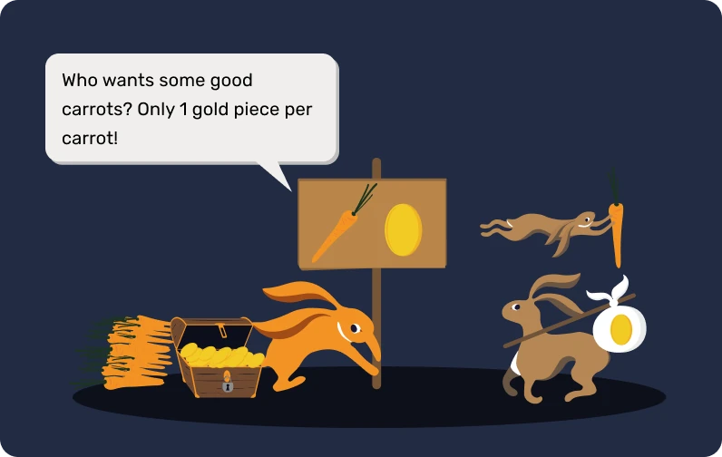
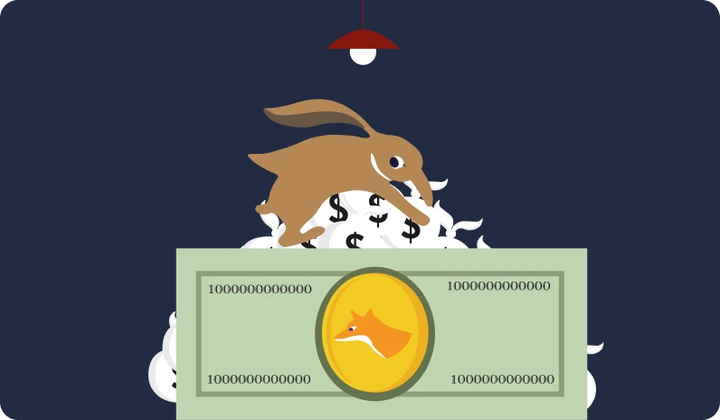
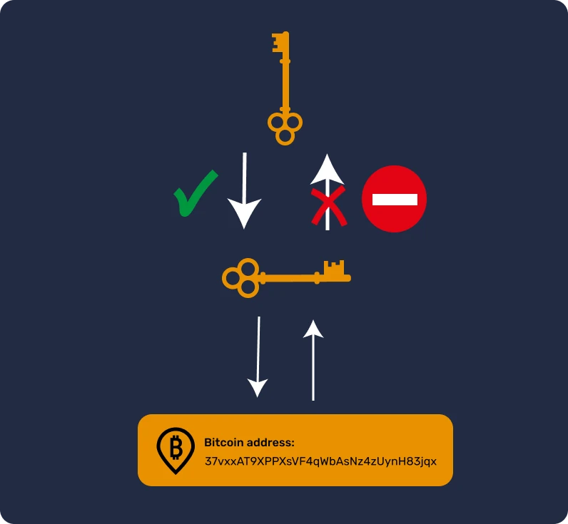
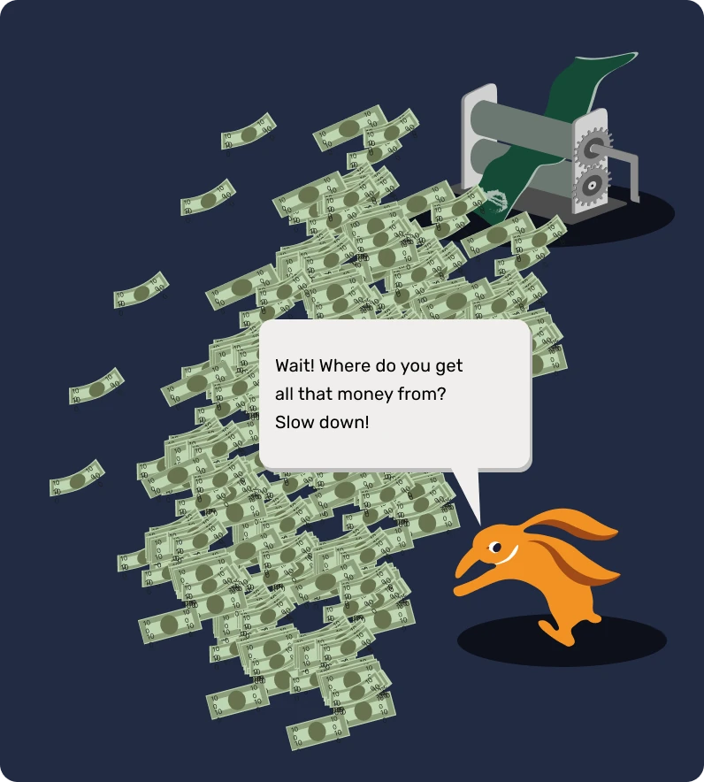
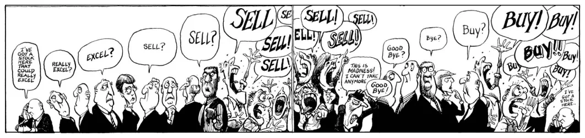
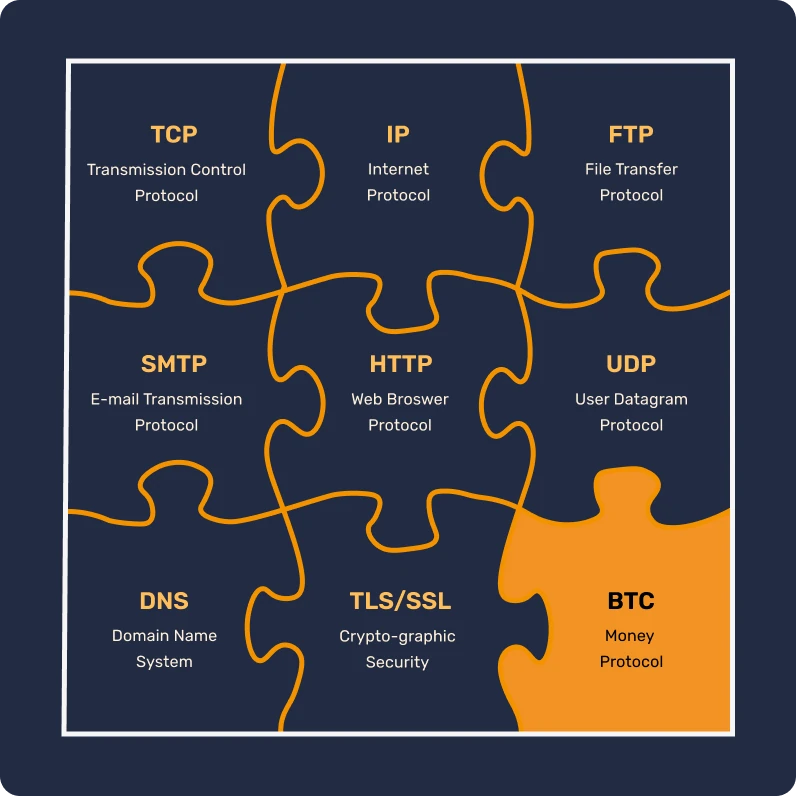

#  اولین ماجراجویی بیت کوین شما

در این دوره، ما در 25 فصل، مبانی بیت کوین را توضیح خواهیم داد، به طوری که شما بتوانید به طریقی ساده و موثر این فناوری را درک کنید. این دوره، مبانی صنعت را به طور کلی  بررسی می کند، از جمله موضوعاتی مانند استخراج (ماین کردن)، کیف پول ها، پلتفرم های خرید/فروش، و بیشتر. مطالب آموزشی اضافی در طول ماجراجویی در دسترس خواهد بود، و ما همچنین شما را دعوت می کنیم تا بعد از اتمام این دوره، "21 پوستر" را در بخش منابع بررسی کنید.

شما نیازی به دانش خاصی برای شروع ندارید. در واقع، محتوای زیر برای دانش آموزان همه سطوح قابل دسترسی است و باید حدوداً 15 ساعت طول بکشد تا تمام شود.

+++
# مقدمه

<partId>3cd2ac82-026c-53e1-874a-baf5842adc6d</partId>

## پرش به سمت ناشناخته

<chapterId>27e3fb60-4b50-556b-9e70-c4f5475c121d</chapterId>

### به یک پارادایم جدید پولی و فناوری خوش آمدید.

بیت کوین یک انقلاب فناوری و پولی است که می تواند ما را به سوال در مورد رابطه ما با پول و جامعه بکشاند. در واقع، بیت کوین (که به آن BTC می گویند) یک ارز **خنثی** و **غیر متمرکز** است، که به این معنی است که توسط هیچ نهاد یا موسسه ای کنترل نمی شود. این یک نوآوری است که فراتر از یک "ارز اینترنتی" ساده می رود: هم یک پروتکل کامپیوتری (‌Bitcoin) است و هم یک واحد پولی (bitcoin).

پروتکل از فناوری‌های زیربنایی مانند رمزنگاری، ارتباطات شبکه و "بلاکچین" معروف استفاده می‌کند، در حالی که واحد بیت کوین به عنوان ارز لازم برای کارکرد صحیح این پروتکل عمل می‌کند. در زندگی روزمره، سالوادوری‌ها و بیت کوینرها در سراسر جهان از ارز بیت کوین برای خرید و فروش کالا و خدمات استفاده می‌کنند، تا با تکیه بر این فناوری زندگی خود را بهبود ببخشند.

### یک برنامه درسی جامع اما قابل دسترس

در این دوره، ما در مورد برخی جنبه های پولی بیت کوین بحث خواهیم کرد، از جمله چگونگی خرید و فروش بیت کوین، راهکار ذخیره امن در کیف پول های دیجیتال ، و استفاده از آنها برای معاملات. ما همچنین نقش ماینرها را بررسی خواهیم کرد، که برای ایجاد بیت کوین های جدید و امن کردن شبکه بیت کوین ضروری هستند. در نهایت، ما آینده بیت کوین را بررسی خواهیم کرد و چگونگی بهبود معاملات بیت کوین با استفاده از تکنولوژی شبکه Lightning را بررسی خواهیم کرد.


ضروری است که درک کنیم بیت کوین یک سیستم پولی جدید است که کاملاً رابطه ما با پول را تغییر می دهد، بنابراین یادگیری چگونگی استفاده از آن مهارت ضروری است برای هر کسی  که می خواهد سرمایه ی خود را در  کنترل داشته باشد.

**بخش 1 - پول**


- فصل 1 - پول چیست؟
- فصل 2 - پول فیات
- فصل 3 - تورم شدید
- فصل 4 - سیاست پولی بیت کوین

**بخش 2 - کیف پول های بیت کوین**


- فصل 5 - کیف پول های بیت کوین چگونه کار می کنند؟
- فصل 6 - انتخاب امنیت خود
- فصل 7 - راه اندازی کیف پول شما
- فصل 8 - حفاظت در برابر زمان

**بخش 3 - ویژگی‌های فنی بیت کوین**


- فصل 9 - تراکنش چیست؟
- فصل 10 - نودهای بیت کوین
- فصل 11 - ماینر ها 
- فصل 12 - ماینر ها و اکولوژی

**بخش 4 - ذخیره سازی در بیت کوین**


- فصل 13 - قیمت بیت کوین
- فصل 14 - چگونه بیت کوین خریداری کنید؟
- فصل 15 - کار کردن برای بیت کوین
- فصل 16 - هایپر-بیتکوینیزیشن

**بخش 5 - شبکه Lightning**


- فصل 17 - مقدمه ای بر شبکه ی Lightning
- فصل 18 - موارد استفاده از شبکه Lightning

قبل از معرفی تعریف پول و کارکرد آن در جامعه (فصل 1)، باید از آفرینش بیت کوین شروع کنیم. بیت کوین که در سال 2009 راه اندازی شد، یک فناوری نسبتاً جدید است که با هر چیز دیگری متفاوت است. بنابراین طبیعی است که همه چیز را درباره آن بلافاصله درک نکنیم. در واقع، دقیقاً مانند زمانی که یاد می گیریم چگونه از اینترنت استفاده کنیم یا یک ماشین را رانندگی کنیم، نیازی به دانستن تمام جزئیات فنی درست نیست: شما می توانید با یادگیری چگونگی دریافت، پرداخت، و امن کردن سرمایه های خود شروع کنید، و سپس گام های کوچک برای مطالعه آن به طور عمیق تر بردارید.

در نهایت، ما فقط در مراحل ابتدایی پذیرش آن هستیم، زیرا ما مرحله برخاست را پشت سر گذاشته ایم: شما فقط در زمان مناسب هستید تا به اندازه ای که می خواهید در مورد این نوآوری مهم اطلاعات کسب کنید.


نکته مهم در اینجا این است که به طور کلی این فناوری جدید را درک کنیم، بنابراین امیدواریم که از این دوره لذت ببرید و در این پارادایم مالی جهانی جدید پیشرفت کنید.

## پیشینه تاریخی بیت کوین

<chapterId>9a94b627-5b69-5d81-9125-f1fa9b0aa6ad</chapterId>

قبل از اینکه عبارت "بیت کوین" مترادف با ارز دیجیتال و تحول مالی شود، زمینه ایجاد آن توسط مجموعه ای از ایده ها، نوآوری ها و جنبش های اجتماعی فراهم شد. در میان اینها، جنبش سایفرپانک به عنوان یک عنصر کلیدی در پیشینه تاریخ بیت کوین برجسته است.

### سایفرپانک‌ها: رویادیدگان دنیای دیجیتال


در قلب تکامل فناوری دهه‌های 1980 و 1990، گروهی از افراد شروع به پرسش‌های عمیق درباره نقش حریم شخصی و آزادی در عصر دیجیتال کردند. این افراد، که بعدها به عنوان "سایفرپانک‌ها" شناخته می‌شدند، با اعتقاد قاطعی فکر می‌کردند که رمزنگاری می‌تواند به عنوان ابزاری برای حفاظت از حقوق فردی در برابر دخالت دولت‌ها و شرکت‌های بزرگ عمل کند.

شخصیت های نمادینی مانند جولیان آسانژ (Julian Assange)، وی دای(Wei Dai)، تیم می (Tim May)، و دیوید چاوم (David Chaum) نقش محوری در شکل دادن به فلسفه و دیدگاه جنبش ایفا کردند. این متفکران ایده های خود را در یک فهرست ایمیل تأثیرگذار به اشتراک گذاشتند، جایی که شرکت کنندگان از سراسر جهان در مورد بهترین راه ها برای بهره برداری از فناوری برای آزادی فردی بیشتر بحث و گفتگو می کردند.

### سه مقاله بنیادین سایفرپانک‌ها


جنبش سایفرپانک، که به طور عمیق در فعالیت های دیجیتال و رمزنگاری ریشه دارد، برای بیان اصول و دیدگاه خود برای آینده از چندین متن بنیادی استفاده کرد. از بین این نوشته ها، سه مورد به خصوص برجسته هستند:


- "مانیفست سایفرپانک":

نوشته شده توسط اریک هیوز (Eric Hughes) در سال 1993، "مانیفست سایفرپانک" ادعا می کند که حریم خصوصی یک حق اساسی است. نویسنده می گوید توانایی ارتباط آزادانه و محرمانه برای یک جامعه آزاد ضروری است. مانیفست می گوید: "ما نمی توانیم انتظار داشته باشیم که دولت ها، شرکت ها، یا سایر سازمان های بزرگ و بی چهره به ما حریم خصوصی بدهند [...]. ما باید از حریم خصوصی خود را دفاع کنیم اگر انتظار داریم که حریم خصوصی  داشته باشیم".


- "مانیفست آنارشیست-کریپتو":

نوشته شده توسط تیموتی سی. می (Timothy C. May) در سال 1992، این سند توضیح می دهد که چگونه استفاده از رمزنگاری می تواند منجر به دورانی از آنارشی رمزنگاری شود که در آن دولت ها بی توان در دخالت در امور خصوصی شهروندان هستند. می تصور آینده ای را می کرد که در آن مردم بدون دخالت طرف سوم، اطلاعات و پول را به صورت ناشناس مبادله می کنند.


- "اعلامیه استقلال سایبرفضا":

اگرچه این متن به طور انحصاری سایفرپانک نیست، اما بازتابی از احساسات بسیاری از شرکت کنندگان در این جنبش است. این متن در سال 1996 توسط جان پری بارلو (John Perry Barlow)نوشته شده است و پاسخی است به افزایش نظارت دولت ها بر اینترنت. این اعلامیه ادعا می کند که فضای سایبری یک حوزه متمایز از حوزه فیزیکی است و نباید موضع قوانین مشابه باشد. همانطور که می گوید، "ما دولتی منتخب نداریم، به نظر هم نمیرسد که یکی داشته باشیم".

### پیشینه‌های بیت‌کوین

قبل از ظهور بیت کوین، چندین تلاش برای ایجاد یک ارز دیجیتال انجام شده بود. برای مثال، دیوید چام مفهوم "پول الکترونیکی ناشناس" را با پروژه "دیجی کش" خود در دهه 1980 معرفی کرد. متاسفانه، به دلیل محدودیت های مختلف، دیجی کش هرگز رونق نیافت.

یک پیشگام مهم دیگر  "B-money" وی دای است. با اینکه هرگز اجرا نشد، اما ایده ای از یک ارز دیجیتال ناشناس را ارائه داد که تشخیص تقلب توسط یک جامعه از ارزیابان انجام می شد نه توسط یک مرجع مرکزی.

تصویر زیر به طور واضح توسعه حرکت را از طریق نوآوری های فناورانه زیادی که داشته است، نشان می دهد.


این بود که در این محیط بارور، ساتوشی ناکاموتو (Satoshi Nakamoto) ی مرموز برگه ی سفید بیت کوین را در سال 2008 منتشر کرد. در این سند، او چندین ایده از جنبش سایفرپانک، مانند اثبات کار و برچسب زمانی رمزنگاری شده، را ترکیب کرد تا یک ارز دیجیتال غیرمتمرکز و مقاوم در برابر سانسور ایجاد کند.

با این حال، بیت کوین بیش از این بود: این نمادی از دستاوردهای ایده‌های سایفرپانک بود. فراتر از فناوری آن، این یک انقلاب علیه سیستم‌های مالی سنتی را نماد می‌کرد و یک جایگزین بر اساس شفافیت، غیرمتمرکزی، و حاکمیت فردی ارائه می‌داد.

### نتیجه‌گیری

پیشینه بیت کوین به طور عمیق در جنبش سایفرپانک و جستجوی جمعی برای آزادی بیشتر در عصر دیجیتال ریشه دارد. با ترکیب اصول رمزنگاری، غیر متمرکز سازی و یکپارچگی، بیت کوین بسیار بیشتر از یک ارز شده است. در واقع، این محصول یک انقلاب فلسفی و فناوری است که همچنان دارد جهان ما را شکل می دهد.

بنابراین، بیت کوین یک پروتکل است که در طول زمان انجام می شود و ما را تشویق می کند تا رابطه خود را با انرژی، زمان و پول مورد سؤال قرار دهیم.

اما آیا بیت کوین یک ارز "واقعی" است؟ برای درک این موضوع، ابتدا باید مفهوم پول و اشکال مختلف آن را درک کنیم، که در فصل بعدی بررسی خواهیم کرد.

اگر می خواهید تاریخچه بیت کوین را با جزئیات بیشتری بررسی کنید، ما به شدت دوره HIS 201 ما را توصیه می کنیم، جایی که شما منشأ و ظهور آرام بیت کوین، همچنین آغاز تاریخچه و جامعه آن را کشف خواهید کرد. این دوره کاملا مستند و منبع دار است، با، البته، بسیاری از داستان های جانبی:

https://planb.network/courses/a51c7ceb-e079-4ac3-bf69-6700b985a082
# پول

<partId>e913df1a-4cbd-5380-ba67-ca2a0414f671</partId>

## پول در طول تاریخ

<chapterId>c838e64d-d59f-5703-8c74-ea5e8c4fdd31</chapterId>

تکامل پول یک جنبه جذاب از تاریخ انسان است که برخورداری از زیرکی تمدن‌ها در سراسر دوران‌ها را در برآوردن نیازهای اقتصادی در حال تکامل نشان می‌دهد.


### از پوسته ها تا حساب های بانکی

از ابتدا، ارز یک دارایی قابل لمس بود، مانند غلات، دام یا سایر کالاهای تجاری. با این حال، این کالاها اصلی ترین نقص را داشتند که فاسد شدن آنها بود، که استفاده از آنها به عنوان یک رسانه ذخیره سازی بلند مدت را دشوار می کرد. به عنوان مثال، برداشت های ضعیف یا بیماری حیوانات می توانست ثروت یک فرد را در یک شبانه روز نابود کند.

بنابراین، همانطور که تمدن‌ها پیشرفت کردند و تجارت به مناطق جدید گسترش یافت، نیاز به یک رسانه جهانی مبادله پدید آمد. افراد ابتدا با اشیاءی مانند صدف‌ها و سنگ‌های قیمتی آزمایش کردند، اما آن‌ها به اندازه‌ای که فکر می‌کردند مستحکم یا کمیاب نبودند. در نهایت، طلا به عنوان استاندارد شناخته شد، به دلیل کمیابی، دوام، و قابلیت تقسیم آن. طلا،  نمادی از ثروت و قدرت بود و تا امروز مانده است.


### نقش پول چیست؟

پول یک ابزار ارتباطی بسیار پیچیده است:


- این امکان را برای ارتباط بین حال و آینده فراهم می کند، زیرا زمان و انرژی ما را به یک دارایی تبدیل می کند که می تواند در زمان آینده بدون خطر کاهش ارزش مجدداً استفاده شود.
- این، ارتباط را در یک زبان جهانی تسهیل می کند: بدون اینکه یکدیگر را بشناسند یا به یک زبان صحبت کنند، دو غریبه می توانند تبادل کنند، تجارت کنند و در مورد ارزش چیزها توافق کنند.

بسیار دشوار است که کارکرد آن در جهان ما به صورت مصنوعی تقلید شود. در واقع، هیچ فرد یا گروهی نمی‌تواند پول ایجاد کند، زیرا این یک پدیده طبیعی است که باید از بازار و توافق داوطلبانه بیرون بیاید. در این معنا، قیمت‌ها به عنوان سیگنال‌ها و اطلاعاتی عمل می‌کنند که جامعه را در تخصیص منابع هدایت می‌کنند.

به این دلایل، طلا به عنوان پول نتیجه ۴۰۰۰ سال داروینیسم پولی بر اساس توابع اریستوتل زیر است:


- **ذخیره ارزش**: پول می‌تواند برای انتقال قدرت خرید به آینده استفاده شود، بنابراین باید از ماده‌ای دوام‌مند باشد؛
- **وسیله تبادل**: پول می‌تواند به جای معامله، برای تبادل کالا و خدمات استفاده شود، بدین ترتیب از تصادف خواسته‌ها بین معامله‌گران جلوگیری می‌شود؛
- **واحد حساب**: پول همچنین به ما اجازه می‌دهد تا ارزش‌های مختلف کالاها را مقایسه کنیم تا بهتر بفهمیم که چقدر آن‌ها به صرفه هستند.




### ویژگی‌های پول

طلا به طور ایده آل، معیارهای یک ارز کارآمد را برآورده می کند: کمیابی طبیعی آن آن را ارزشمند می کند، در حالی که خواص شیمیایی آن اطمینان می دهد که با گذر زمان فرسایش نمی یابد. این ویژگی ها طلا را یک **محل نگهداری ارزش** عالی کرده اند، اما ارز رایجی نیست، زیرا این نوع پول به راحتی قابل تقسیم یا حمل برای مسافت های طولانی نیست. در یک دنیای جهانی شده و دیجیتال، طلا با نگه داشتن سرعت مشکل دارد و نیاز به یک نهاد مرکزی دارد تا آن را قابل تقسیم و به راحتی قابل مبادله کند (یعنی از طریق سکه های سکه زده شده).

در مقابل، ارزهای امانی دولتی (فیات) به راحتی قابل استفاده هستند، اما به طور مداوم توسط نهادهایی که آنها را کنترل می کنند (پادشاهان، بانک های مرکزی، امپراتوران، دیکتاتورها) ارزش آنها کاهش می یابد.

برای توضیح بهتر این مفهوم، ما باید ویژگی های یک ارز موثر را بررسی کنیم:


- **قابلیت تبادل**، به این معنی که بدون از دست دادن ارزش با یک واحد دیگر از همان نوع قابل تعویض است؛
- **قابلیت تقسیم پذیری**،به این معنی که می توان آن را به واحدهای کوچکتر تقسیم کرد تا معاملات با حجم های متفاوت را تسهیل کند؛
- **نقدینگی**، که به این معنی است که به راحتی به کالا یا خدمات تبدیل می شود.

برای برآورده کردن این معیارها، پول، در طول تاریخ با گرفتن گام های مختلف تکامل یافته است:


- سنگ خام -> سکه
- اسکناس -> کارت بانکی
- بلاکچین -> شبکه لایتنیگ

ارزها هنوز هم در حال تکامل هستند و شکل های خود را برای برآورده کردن نیازهای مختلف تغییر می دهند. همانطور که گفتیم، در حالی که طلا یک ذخیره عالی ارزش است، دیگر برای اقتصاد جهانی فعلی مناسب نیست. به طور مشابه، ارزهای اعتمادی مانند دلار و یورو بسیار نقدی هستند و به راحتی قابل حمل هستند زیرا اکنون بیشتر دیجیتالی هستند، اما ارزش آنها به طور مداوم توسط تورم نقدی کاهش می یابد.

از طرف دیگر، بیت کوین امکانات جدیدی را ارائه می دهد. ویژگی های آن، مانند تامین محدود بسیار سخت گیرانه، آن را یک محل ذخیره ارزش بسیار عالی می کند. علاوه بر این، به عنوان یک ارز اینترنتی بی طرف، به عنوان یک **وسیله مبادله** قابل استفاده که از مرزها فراتر می رود، خدمت می کند. با این حال، با وجود [پذیرش مداوم آن](https://btcmap.org/map)، هنوز در تجارت امروز به طور گسترده ای پذیرفته نشده است.

## ارزهای اعتمادی

<chapterId>25151d46-7db1-5b48-8bba-cbde1944555a</chapterId>

> "کسانی که نمی توانند گذشته را به یاد بیاورند، محکوم به تکرار آن هستند"  جورج سانتایانا.

یک حقیقت که در مورد سیستم مالی فعلی به طور قاطع طنین انداز می شود.

### Fiduciary = اعتماد

امروزه، ارزهای اصلی مانند یورو و دلار به عنوان ارزهای اعتمادی در نظر گرفته می‌شوند. این به این معناست که آن‌ها ارزش ذاتی ندارند و به طور کامل بر اعتماد و اطمینانی که ما در موسساتی که آن‌ها را اداره می‌کنند، قرار می‌دهیم، وابسته هستند.

یک ارز اعتمادی یک نوع پول است که توسط یک نهاد، یعنی یک دولت، مانند چین با یوان، یا یک اتحادیه سیاسی-اقتصادی، مانند اتحادیه اروپا با یورو، به چنین عنوان  اعلام شده است. نهادی که مسئول صدور آن است بانک مرکزی است (برای مثال، می توانیم بانک ملی چین، رزرو فدرال ایالات متحده، یا بانک مرکزی جمهوری گینه را نام ببریم). دقیقاً این نهادها هستند که مسئول تدوین سیاست های پولی هستند و بنابراین چقدر پول باید در گردش قرار گیرد یا چاپ شود.


### کاهش ارزش پول: استراتژی ای به قدمت امپراتوری روم

از زمان باستان، طلا به عنوان یک مرجع پولی خدمت کرده است، اما سختی آن اغلب باعث شده است رهبران، چه امپراتوران رومی چه دولت های مدرن، به پذیرش ارزهای جایگزین، اغلب اعتباری، بپردازند.

مکانیزم ساده است و الهام گرفته از روش هایی است که از آغاز تمدن وجود داشته اند. رهبران، مشتاق به  کنترل بر ثروت هستند، ابتدا طلا را متمرکز می کنند، اغلب با سوء استفاده از قدرت خود و وعده ی محافظت و امنیت دادن . با داشتن این ذخیره گرانبها در دستان خود، آنها یک ارز جدید معرفی می کنند، معادل ارزش طلا، اما با تصویر خود ضرب شده بر روی سکه. سپس این ارز شروع به گردش می کند، و مردم به سرعت به راحتیِ استفادهِ ساده از آن عادت می کنند.

با این حال، این رهبران سپس شروع به کاهش ارزش پول جدید به طور تدریجی می کنند، در واقع ارزش آن را نسبت به قیمت اولیه طلا هر سال چند درصد کاهش می دهند. این کاهش خاموش اغلب به عنوان منافع مردم توجیه می شود. در واقعیت، کسانی که در این ارز اعتمادی پس انداز می کنند، ارزش پس اندازهای خود را کاهش می دهند، در حالی که دولت پروژه های خود را از طریق تورم مالی حمایت می کند. علاوه بر این، این کاهش ارزش بدهی را آسان تر برای پرداخت می کند.


در لحظه ای حیاتی، رهبر اعلام می کند: ارز دیگر توسط طلا پشتیبانی نمی شود. عموم مردم، که اکنون به ارز اعتمادی عادت کرده اند و اغلب در مورد مسائل مالی اطلاعات نادرستی دارند، این واقعیت را قبول می کنند، اجازه می دهند دولت به راحتی منبع پول را دستکاری کند و مقادیر عظیمی از پول را با هزینه تقریبا صفر چاپ کند.

چاپ پول سپس منجر به تورم می‌شود و به تدریج جمعیت را فقیر می‌کند. علاوه بر این، سیستم مالی تنظیم و محدود می‌شود تا از سقوط آن جلوگیری شود، زیرا هر اختلالی می‌تواند باعث بحران اقتصادی بزرگ شود. در مقابل جمعیت، موسسات مالی و افراد ثروتمند به شدت از این سیستم بهره می‌برند، که این اختلاف ناعادلانه را ایجاد می‌کند و به سمت استبداد سوق می‌دهد. در این زمینه، آن‌ها ترغیب نمی‌شوند تا تغییرات رادیکال ایجاد کنند، اجازه می‌دهند تا سیستم ادامه دهد تا یک انفجار احتمالی رخ دهد.

وقتی به خوبی اجرا شود، این استراتژی می تواند به مدت چندین دهه به کار رود. با این حال، مهم است توجه داشته باشیم که کاهش بسیار سریع ارزش یا از دست دادن اعتماد می تواند منجر به تورم شدید شود (به فصل بعدی مراجعه کنید). تاریخ نشان می دهد که دلار 98٪ از ارزش خود را در 100 سال از دست داده است، یورو 30٪ در 20 سال و پوند استرلینگ 99٪ از زمان ایجاد خود را از دست داده است.

در پایان، ارز ممکن است دیگر هیچ ارتباطی با طلا نداشته باشد، مشابه سکه های رومی در پایان امپراتوری، یا حتی به یک مقدار عددی ساده تقلیل یابد، که از واقعیت قابل لمس جدا شده است.

امروز، ما شاهد یک نقطه تحول تاریخی هستیم. دلار، که مدت ها حاکم بوده، به نظر می رسد در حال افول است، در حالی که طلا نقش مرکزی خود را از دست داده است. ما در آستانه یک چرخه پولی جدید ایستاده ایم، که به ما یادآوری می کند که درس های تاریخ اغلب فراموش می شوند.


### آیا بیت کوین یک راه حل است؟

به دلیل این پیش فرض ها، انقلاب بیت کوین در حال سرعت گرفتن است. بر خلاف ارزهای قبلی، این نیازی به **طرف سوم قابل اعتماد** ندارد و هدف آن جدا کردن دولت از پول است.


در حقیقت، بیت کوین خود را به عنوان پاسخی به این چالش های سیستمی ارائه می دهد با پیشنهاد یک راه حل غیرمتمرکز و یک سیستم پولی موازی جدید. از نظر تاریخی، اگر طلا به عنوان یک ارز به دلیل مقاومت در برابر تقلب مورد توجه قرار گرفته است، بیت کوین نیز به طور مشابه قابل تقلب نیست. علاوه بر این، به لطف طبیعت غیرمتمرکز و رمزنگاری شده آن، به 21 میلیون واحد محدود است. بیت کوین یک ارز است که بر شفافیت و بی طرفی تکیه می کند، و یک جایگزین جذاب را برای سیستم پولی متمرکز فعلی ارائه می دهد.


یکی دیگر از دلایلی که بیت کوین توجه را به خود جلب کرده است، ظهور ارزهای دیجیتال بانک مرکزی یا CBDCs است که به نظر می رسد اجتناب ناپذیر است. این شکل جدید از پول می تواند یک اقتصاد بیشتر برنامه ریزی شده مرکزی را توسعه دهد و هم می تواند آزادی مالی افراد را محدود کند و هم سوء استفاده های اقتدارگرایانه را تسهیل کند.

ما می‌توانیم این فصل را با نقل قول از برنده جایزه نوبل، اف.ا. هایک در سال 1984 به پایان برسانیم:

> "من باور ندارم که ما باید دوباره پول خوبی داشته باشیم، قبل از اینکه آن را از دست دولت برداریم. اگر نتوانیم آنها را به طور خشنی از دست دولت برداریم، تمام چیزی که می توانیم انجام دهیم این است که به نحوی زیرک یا دور رفته چیزی را معرفی کنیم که نتوانند آن را متوقف کنند."


برای آشنایی بیشتر با اشتباهات اقتصادی و آزادی، ما شما را دعوت می کنیم تا دوره ECO 102 ما را که زندگی و ایده های فردریک باستیا، یک متفکر فرانسوی قرن 19 را ردیابی می کند، کشف کنید، که قطعاً ظهور بیت کوین را قدردانی کرده است:

https://planb.network/courses/d07b092b-fa9a-4dd7-bf94-0453e479c7df
## هایپرینفلیشن

<chapterId>b04c024c-54f3-50cb-997f-58721cfc74be</chapterId>

هایپرینفلیشن یک پدیده پولی است که خاص ارزهای فیات است: این پدیده با از دست دادن کامل اعتماد به یک ارز و افزایش شدید تورم به دلیل چاپ پول توسط مقامات مشخص می شود. در نتیجه، پس اندازهای انباشته شده توسط افراد می تواند در یک دوره نسبتاً کوتاه زمان تبدیل به بخار شود، کشور را در لبه فروپاشی اقتصادی، اجتماعی و سیاسی قرار می دهد.

### تورم دارد به سرعت افزایش می یابد!

برای درک تأثیر تورم بر پس انداز ها، باید نرخ‌های مختلف تورم را در نظر بگیریم.


- با 2٪ افزایش قیمت، قدرت خرید شما سالانه 2٪ کاهش می‌یابد، که در مجموع برابر با 10٪ در طی 5 سال است.
- با 7٪، شما نیمی از آن را در 10 سال از دست می دهید.
- با 20٪، شما تقریباً نیمی از آن را در 3 سال از دست می‌دهید.

وقتی تورم فراگیر رخ می‌دهد، دیگر درباره ۲۰٪ در سال صحبت نمی‌کنیم، بلکه درباره ۲۰٪ در ماه یا حتی در بالاترین حالت، در روز صحبت می‌کنیم. تجربه یک تورم ۱۰۰٪ در روز در طول سه روز یک سناریوی واقعی است که اتفاق افتاده و همچنان در دنیای ما ادامه دارد.

بسیار حیاتی است که درک کنیم هایپرینفلیشن به طور تصادفی، توسط سرمایه‌داری یا حملات سیاسی از سوی مخالفین اتفاق نمی‌افتد. هایپرینفلیشن مستقیماً نتیجه تصمیمات نادرست پولی است که توسط بانکداران مرکزی و سیاستمداران اتخاذ می‌شود. عواقب آن بر هر شهروند تأثیر می‌گذارد و حتی نسل‌های بعدی را تحت تأثیر قرار می‌دهد. ما به شما دعوت می‌کنیم که پنج دقیقه وقت بگذارید و جدول زیر را بخوانید تا به طور کامل تأثیر واقعی این پدیده را درک کنید (درس ECO204 بیشتر در این موضوع عمیق می‌شود). همانطور که می‌بینید، هیچ کشور یا ارزی از این خطر در امان نیست.


### چه فازهایی از هیپرینفلیشن وجود دارد؟


برای رخ دادن هایپرینفلیشن، باید رویدادهای خاصی رخ دهد.

فاز 1 - از دست دادن اعتماد به نفس


- متمرکز کردن قدرت پولی تسهیل کننده ایجاد پول و سوء استفاده های آن است. در این زمینه، برخی عوامل خارجی می توانند باعث ایجاد هایپر اینفلیشن شوند، معمولاً جنگ ها، اقدامات اجتماعی، یا افزایش قیمت منابع کلیدی مانند گندم یا بنزین. بنابراین، از دست رفتن اعتماد به یک ارز می تواند پیش بیاید، و افراد شروع به سوال کردن درباره منشأ پول و منافع سیاست پولی اجباری می کنند.

فاز 2 - سقوط ارز و افزایش قیمت


- همانطور که دولت‌ها کنترل اعتماد را از دست می‌دهند، افراد شروع به تبادل ارز خود با یک ارز پایدارتر می‌کنند، مانند آنچه در ونزوئلا با دلار آمریکا اتفاق افتاد. این شرایط منجر به افزایش قیمت‌ها می‌شود، یک دایره وحشی ایجاد می‌کند که در آن کالاها و خدمات به طور صعودی گران می‌شوند. برای برآورده کردن این نیازها و اصلاح سیاست پولی، دولت بیشتر پول چاپ می‌کند، که منجر به تورم نمایی می‌شود.

فاز 3 - دایره شیطانی چاپ پول


- بنابراین، نیاز به بیشتر و بیشتر برگه‌های پول برای خرید کالا افزایش می‌یابد، که منجر به کمبود پول کاغذی می‌شود. در پاسخ، دولت‌ها به چاپ بیشتر برگه‌های پول متوسل می‌شوند، که این امر باعث تشدید بیشتر تورم می‌شود.


فاز 4 - ظهور یک ارز جدید


- یک ارز جدید سپس معرفی می شود تا جایگزین ارز قدیمی شود، به منظور شکستن چرخه تورم با اجرای کنترل های سختگیرانه تر که در مورد ارز قانونی قبلی در دسترس نبود.

حل بحران فرا تورم اغلب نیازمند تغییرات رادیکالی است، مانند انقلاب ها، تغییرات دولت، تغییرات بانکداران مرکزی، و غیره. از دست دادن اعتماد، سقوط ارز، و بازسازی، فازهای ضروری برای احیای یک اقتصاد بر اساس ارز فیات هستند.

### سه مثال قابل توجه


- آلمان، 1922-1923.

یکی از مثال های برجسته ترین های هایپرینفلیشن در جمهوری وایمار آلمان پس از جنگ جهانی اول رخ داد.

آلمان مقادیر عظیمی از پول را برای تامین هزینه‌های جنگ قرض گرفته بود. با این حال، نه تنها آلمان آن را از دست داد، بلکه مجبور شد میلیاردها دلار جبران خسارت بپردازد. ماهی که بیشترین نرخ تورم را داشت اکتبر 1923 بود، که با 29,500٪ به اوج خود رسید، که برابر با نرخ تورم 20.9٪ در روز بود. قیمت‌ها هر 3.7 روز دو برابر می‌شدند!

ارز آلمان به حدی بی ارزش شد که برخی از شهروندان ترجیح می‌دادند پول کاغذی خود را به جای چوب بسوزانند زیرا واقعاً ارزان‌تر بود. حتی گفته می‌شود که در رستوران‌ها، پیشخدمت‌ها باید هر 30 دقیقه یک بار قیمت‌های منو را اعلام می‌کردند تا با تورم حساب کنند.

در پایان، مقامات یک ارز جدید ایجاد کردند، که توسط بدهی‌های آلمان، فرانسه و انگلستان پشتیبانی می‌شد و توسط زمین آلمان تضمین می‌شد.


- مجارستان، 1945-1946

کشوری که تا به حال بدترین دوره هایپرینفلیشن را تجربه کرده است، بدون شک مجارستان پس از جنگ جهانی دوم است.

مجارستان خود را در طرف بازنده جنگ یافت، با اینکه بیشتر ظرفیت تولید صنعتی آن نابود شده بود. ماهی که بیشترین تورم را داشت ژولای 1946 بود، که شاهد تورم قیمت های شگفت انگیز به میزان 41,900,000,000,000,000٪ بود، معادل با 207٪ در روز. قیمت ها هر 15 ساعت دو برابر می شدند!

آخرین اسکناسی که در گردش قرار گرفت یک صد میلیون میلیارد پنگو (100,000,000,000,000,000) در سال 1946 بود.




- زیمبابوه، 2007-2008

تا سال 2000، زیمبابوه برای تقریبا تمام نیازهای خود به جز روغن خودکفا بود.

در سال 1997، دلار زیمبابوه بیش از 72٪ سقوط کرد پس از اینکه دولت موافقت کرد تا به جانبازان جنگ مبلغ معادل 450 میلیون دلار آمریکا پرداخت کند. از آنجا که دولت چنین مقداری را در اختیار نداشت، مجبور شد به چاپ پول متوسل شود. در سال 2005، تورم به 586٪ رسید، اما اوج آن در میانه نوامبر 2008 بود که با نرخی برآورد شده در ماه 79,600,000,000٪ بود.

در ژوئن 2007 دولت با اعمال کنترل قیمت ها پاسخ داده بود، اما این اقدام هیچ تأثیری بر اقتصاد نداشت. مغازه ها به معنای واقعی کلمه "غارت" شدند و تاجران دیگر امکان بازپر کردن فروشگاه های خود را نداشتند.

در آوریل 2009، وزیر مالیه اعلام کرد که دلار زیمبابوه معلق شده و استفاده از ارزهای خارجی مختلف برای تجارت مجاز است. تمام حساب های بانکی، بازنشستگی ها و موسسات مالی شبانه روز موجودی خود را از دست دادند.


در نتیجه، هایپر اینفلیشن اثری سریع در تخریب ارزش پول دارد، که منجر به فرسایش پس اندازها و از دست دادن اعتماد به سیستم پولی می‌شود. همانطور که ولتر یک بار پیشنهاد کرد، یک ارز فیات همیشه در نهایت ارزش ذاتی خود را از دست می‌دهد و به سمت صفر میل می‌کند.

یک ارز که بر اعتماد به یک طرف سوم معتبر مانند یک موسسه مالی استوار است، در عمل و بلند مدت، یک ارز نقص است، زیرا نمی تواند قدرت خرید را تضمین کند یا پس انداز را حفظ کند.

برای عمیق تر شدن در موضوع هایپرینفلیشن، ما دوره ECO 204 دیوید سنت-آنژ را توصیه می کنیم، جایی که شما چرخه های هایپرینفلیشنی را خواهید آموخت و تأثیرات واقعی آنها بر زندگی ما را می فهمید. شما همچنین شباهت های بین این چرخه ها را کشف خواهید کرد و مهم تر از همه، چگونه از خود در برابر آنها محافظت کنید.

https://planb.network/courses/caa75343-ac90-4249-bcca-0e2e57c3a0f1
## 21 میلیون بیت کوین

<chapterId>f4a06d76-1963-56fd-93ff-dfa41489bcde</chapterId>

### سیاست پولی بیت کوین

بیت کوین یک ارز دیجیتال غیر متمرکز با حداکثر مقدار از پیش تعیین شده **21 میلیون واحد** است. این ویژگی ذاتی کمیابی توسط کد کامپیوتری آن تعیین شده و توسط اجماع همه کاربرانی که در پروتکل شرکت می کنند تقویت می شود.


صدور ارزش پولی آن می‌تواند با یک منحنی نشان داده شود که مقدار بیت کوین‌های ایجاد شده در طول زمان را نشان می‌دهد. برای مثال، در سال 2022، تقریبا 18.5 میلیون بیت کوین در گردش بودند. پیش‌بینی‌ها نشان می‌دهند که تا سال 2025، حدود 19.5 میلیون بیت کوین وجود خواهد داشت، که حدود 93 درصد از کل تامین را نشان می‌دهد، و تا سال 2037، این شماره به 20.4 میلیون خواهد رسید.

### بیت کوین های جدید چگونه ایجاد می شوند؟

ایجاد بیت کوین های جدید نتیجه فرآیند استخراج است. در یک کلام، استخراج کنندگان(ماینر ها) از کامپیوترهای قدرتمندی استفاده می کنند که مسائل ریاضی پیچیده را حل می کنند، که معاملات را تأیید و امن می کند. هنگامی که یک مسئله حل می شود، استخراج کننده یک بلوک جدید از معاملات را به بلاکچین اضافه می کند، که یک دفتر کل غیر متمرکز و توزیع شده که تمام معاملات انجام شده در شبکه را ثبت می کند است. بلاکچین شفافیت و امنیت را تضمین می کند، زیرا هر بلوک به بلوک قبلی متصل است، که تقریباً امکان تغییر داده های گذشته بدون اجماع از شبکه را ناممکن می کند.


پس از انجام موفقیت آمیز این وظیفه، ماینر ها با صدور بیت کوین های جدید هر ده دقیقه، پاداش می گیرند. این پاداش برنامه ریزی شده است که هر 210،000 بلوک، که تقریباً هر چهار سال یک بار است (رویدادی که به "نصف شدن" شناخته می شود)، نصف شود، به این ترتیب منحنی صدور ارز یک شکل پله ای می گیرد. به دلیل این مکانیزم، می توان ریاضیاتی پیش بینی کرد که ایجاد بیت کوین های جدید حدود سال 2140 متوقف خواهد شد، زمانی که تعداد کل به حداکثر خود یعنی 21 میلیون می رسد.


| شماره نصف شدن | ارتفاع بلوک | جایزه BTC پس از نصف شدن   | BTC تخمینی در گردش پس از نصف شدن |
| ------------- | ----------- | ------------------------- | -------------------------------- |
| 1             | 210,000     | 25 BTC                    | 10,500,000 BTC                   |
| 2             | 420,000     | 12.5 بیت کوین             | 15,750,000 بیت کوین              |
| 3             | 630,000     | 6.25 BTC                  | 18,375,000 BTC                   |
| 4             | 840,000     | 3.125 BTC                 | 19,687,500 BTC                   |
| 5             | 1,050,000   | 1.5625 BTC                | 20,343,750 BTC                   |
| 6             | 1,260,000   | 0.78125 BTC               | 20,671,875 BTC                   |
| 7             | 1,470,000   | 0.390625 BTC              | 20,835,937.5 BTC                 |
| 8             | 1,680,000   | 0.1953125 BTC             | 20,917,968.75 BTC                |
| 9             | 1,890,000   | 0.09765625 BTC            | 20,958,984.375 BTC               |
| 10            | 2,100,000   | 0.048828125 BTC           | 20,979,492.188 BTC               |
| 11            | 2,310,000   | 0.0244140625 BTC          | 20,989,746.094 BTC               |
| 12            | 2,520,000   | 0.01220703125 BTC         | 20,994,873.047 BTC               |
| 13            | 2,730,000   | 0.006103515625 BTC        | 20,997,436.523 BTC               |
| 14            | 2,940,000   | 0.0030517578125 BTC       | 20,998,718.262 BTC               |
| 15            | 3,150,000   | 0.00152587890625 BTC      | 20,999,359.131 BTC               |
| 16            | 3,360,000   | 0.000762939453125 BTC     | 20,999,679.566 BTC               |
| 17            | 3,570,000   | 0.0003814697265625 BTC    | 20,999,839.783 BTC               |
| 18            | 3,780,000   | 0.00019073486328125 BTC   | 20,999,919.892 BTC               |
| 19            | 3,990,000   | 0.000095367431640625 BTC  | 20,999,959.946 BTC               |
| 20            | 4,200,000   | 0.0000476837158203125 BTC | 20,999,979.973 BTC               |

ما مفهوم استخراج را در جزئیات بیشتری در [فصل ماینر](https://planb.network/courses/2b7dc507-81e3-4b70-88e6-41ed44239966/dbb8264a-7434-57e4-9d1b-fbd1bae37fdf) مرور خواهیم کرد.

### ضمانت کمیابی دیجیتال

محدودیت 21 میلیون واحد، بنیان کمیابی بیت کوین است و توسط دو مکانیزم کلیدی تضمین می‌شود: تنظیم سختی استخراج و نظریه بازی.


- تنظیم سختی استخراج یک فرآیند است که هر 2016 بلوک یا حدوداً هر دو هفته رخ می‌دهد، تا اطمینان حاصل شود که یک بلوک جدید به طور میانگین هر ده دقیقه به زنجیره بلوک‌ها  اضافه می‌شود. این فرکانس ایجاد بلوک و مقدار کل بیت کوین هر دو جزئی ثابت از پروتکل بیت کوین هستند و نمی‌توان آنها را بدون اجماع عمومی تغییر داد، بر خلاف تصمیمات خودسرانه ای که در سیستم‌های پولی سنتی اتخاذ می‌شوند.

سختی یافتن یک هش معتبر،  یک نوع چرخه را دنبال میکند: اگر تعداد ماینرها افزایش یابد، به این معنی است که تعداد بلوک‌هایی که آن‌ها پیدا می‌کنند بیشتر می‌شود، که منجر به کاهش میانگین زمان یافتن یک بلوک می‌شود. به این دلیل ، سختی افزایش می‌یابد. در نتیجه، تعداد بلوک‌هایی که ماینرها پیدا می‌کنند کاهش می‌یابد، که به این معنی است که مکانیزم بر می‌گردد به میانگین 10 دقیقه برای هر بلوک. لطفاً برای درک تصویری، به تصویر زیر مراجعه کنید.


آیا می دانستید که ماینر ها برای کسب بیت کوین های جدید از طریق حمایت مالی بلوک، و همچنین هزینه های تراکنش از تراکنش هایی که در آن بلوک قرار می دهند، تشویق می شوند تا یک بلوک را استخراج کنند؟

بنابراین، همانطور که تعداد بیت کوین های صادر شده به محدودیت 21 میلیون نزدیک می شود، ماینرها بیشتر از طریق کارمزد معاملات خود تا از طریق حق بیمه بلوک پاداش می گیرند.


- نظریه بازی یک مفهوم ریاضی است که بر اساس عقلانیت انسانی استوار است. این نظریه فرض می کند که افراد به طور منطقی عمل می کنند، در حالی که سعی می کنند منافع خود را به حداکثر برسانند در حالی که تصمیمات بالقوه دیگران را در نظر می گیرند. در بیت کوین، نظریه بازی کمک می کند تا اطمینان حاصل شود که اکثریت ماینرها و کاربران در سوی منافع شبکه عمل خواهند کرد. در واقع، از آنجا که تغییرات پروتکل توسط کاربران رای گیری می شود، هر تغییری در پروتکل بیت کوین نیاز به توافق کل جامعه کاربران دارد، که بسیار پیچیده است. بنابراین، اگر کسی بخواهد 22 میلیونمین بیت کوین را ایجاد کند، باید تمام کاربران را متقاعد کند که به طور داوطلبانه ارزش پس انداز خود را کاهش دهند، که احتمالاً اتفاق نخواهد افتاد زیرا بیت کوین همگانی است و توسط یک گروه مرکزی اداره نمی شود.


ایده کاهش ارزش ارز با فلسفه بنیادین بیت کوین در تضاد است، بنابراین تغییر در کل مقدار آن بسیار غیرمحتمل است که اتفاق بیفتد.

### یک سیاست پولی قابل حسابرسی: هر ثانیه، از ابتدا و برای همیشه!

کمیابی بیت کوین یک دارایی اصلی است و حداکثر مقدار 21 میلیون بیت کوین در گردش، عمومی است و هر کسی می تواند آن را تأیید کند.

در واقع، هر کسی می‌تواند این کار را از طریق یک نود بیت کوین (یعنی یک اعتبار سنج معامله) با وارد کردن دستور زیر انجام دهد: `bitcoin-cli gettxoutsetinfo`. این شفافیت، اعتماد به سیستم بیت کوین را تقویت می‌کند، که بر اساس موسسات یا افراد مرکزی بنا نشده است، بلکه بر اساس ضمانت‌های ریاضی و رمزنگاری موجود در پروتکل آن است (شما چگونگی انجام این کار را به راحتی در LNP201 خواهید آموخت).

```json
{
"height": 710560,
"bestblock": "0000000000000000000887384d67103412ea7f18a43953e65c8c4ac36bf42e54",
"transactions": 473244,
"txouts": 1018917,
"bogosize": 2183872374,
"hash_serialized_2": "eebb9987337700ffaacbbaa11223344",
"disk_size": 178239584,
"total_amount": 18745998.12345678
}
```

بیت کوین با محدود کردن طراحی خلق آن، یک مدیریت مالی سالم را تضمین می کند، که این امر آن را از سایر ارزها متفاوت می کند زیرا می تواند پس انداز کاربران را محافظت کند. هماهنگ با اصول اقتصاد اتریشی، مقدار ثابت و توزیع قابل پیش بینی آن، آن را از خطرهای ذاتی تورم که ارزهای سنتی باید با آن روبرو شوند (برای آگاهی بیشتر به دوره ECO201 مراجعه کنید) محافظت می کند.

به طور خلاصه، بیت کوین با طبیعت غیرمتمرکز خود، کمیابی برنامه‌ریزی شده و شفافیت، یک گزینه منحصر به فرد برای سیستم‌های پولی سنتی ارائه می‌دهد. این نشان می‌دهد که چگونه می‌توان از فناوری برای ایجاد یک ارز استفاده کرد که نه تنها مفید و قابل تأیید است، بلکه با محدود کردن شدید عرضه آن، ارزش پس‌انداز کاربران را حفظ می‌کند.

### پایان بخش 1!

# کیف پول بیت کوین

<partId>28860585-4f61-59d9-b242-f4c57d837cc1</partId>

## کیف پول های بیت کوین چیستند؟

<chapterId>1c0166ab-cb7a-5bc6-9175-d13482bd91f1</chapterId>

در بخش 2، ما قصد داریم تا از طریق استفاده از کیف پول‌ها، ذخیره سازی و امنیت بیت کوین را بررسی کنیم، تا بفهمیم این بیت کوین‌های معروف کجا قرار دارند و چگونه با آنها تعامل داشته باشیم!

### رمزگشایی از کیف پول‌های بیت کوین

ما از کیف پول‌ها برای تعامل با شبکه بیت کوین در سه روش اصلی استفاده می‌کنیم:


- برای دریافت بیت کوین
- برای ارسال بیت کوین
- برای محافظت از آنها در برابر تلاش های هک و سرقت

یک کیف پول بیت کوین می تواند شکل و قالب های متعددی داشته باشد: یک نرم افزار روی کامپیوتر شما، یک برنامه روی گوشی هوشمند شما، یک دستگاه فیزیکی مانند یک کلید USB، یا حتی یک قطعه کاغذ. هر یک از آنها برای موارد استفاده مختلفی طراحی شده اند. در واقع، برخی از آنها برای معاملات بزرگ با تاکید بر امنیت طراحی شده اند، در حالی که دیگران حریم خصوصی را اولویت می دهند، یا برای پرداخت های روزانه مبالغ کوچک در نظر گرفته شده اند.

پورتفولیوها بنابراین می توانند در خانواده های گسترده ای از استفاده دسته بندی شوند، که همیشه در مرکز یک سوال کلیدی است: آیا شما صاحب اموال هستید یا کنترل پول خود را به طرف سومی واگذار می کنید؟ ما در فصل بعدی به تفصیل در مورد این موضوع بحث خواهیم کرد، اما سوال همچنان ساده است: آیا پول در جیب شماست یا در جیب بانکدار شما؟


### چگونه کیف پول بیت کوین کار می کند؟

چه "بانکدار" بیت کوین شما باشد یا خود شما، اکثریت عظیم کیف پول های بیت کوین با یک فناوری مشابه بر اساس رمزنگاری نامتقارن کار می کنند، که شامل یک سیستم از جفت کلید است: یک کلید خصوصی برای خرج کردن و یک کلید عمومی برای دریافت.


- کلید خصوصی (Private key)

هنگام راه اندازی کیف پول، یک عبارت بازیابی مخفی (کلید خصوصی) تولید می شود و به شما به صورت 12 یا 24 کلمه ارائه می شود.

کلید خصوصی بسیار اساسی است زیرا مالکیت بیت کوین ها را تشکیل می دهد و بنابراین حق استفاده یا ارسال آنها را دارد. بنابراین، دارنده کلید خصوصی واقعی صاحب بیت کوین ها است.

این کلید باید به طور محرمانه و محافظت شده نگه داشته شود، زیرا ثروت شما را باز می کند!


- کلید عمومی و آدرس (Public Key & address)

کلید عمومی از کلید خصوصی تولید می شود و به آن مرتبط است. به اشتراک گذاشتن کلید عمومی خطراتی برای حریم خصوصی دارد (زیرا کاربران دیگر می توانند موجودی شما را ببینند) اما به امنیت آسیبی نمی رساند (زیرا آنها نمی توانند بدون داشتن کلید خصوصی از وجوه شما هزینه کنند). به نوبه خود، کلید عمومی برای ایجاد آدرس های بیت کوین استفاده می شود، و بنابراین پول دریافت می کند.

این آدرس‌ها به صورت خودکار توسط کیف پول شما ایجاد می‌شوند و می‌توانند به صورت امن به اشتراک گذاشته شوند. برای حداکثری کردن حریم خصوصی شما، توصیه می‌شود که فقط یک بار از آن‌ها استفاده کنید.

به طور خلاصه، این فناوری به ما امکان می دهد بیت کوین دریافت کنیم بدون اینکه گیرنده بتواند سرمایه ما را بدزدد! صندوق پست می تواند یک استعاره مناسب باشد: افراد می توانند پول را در آن واریز کنند، اما شما تنها کسی هستید که می توانید آن را باز کنید.



### بیت کوین ها در کیف پول هستند؟

اگرچه کلیدهای شما در کیف پول شما ذخیره شده اند، اما بیت کوین ها در واقع در بلاکچین بیت کوین "ذخیره" می شوند، که یک دفتر حساب عمومی توزیع شده در شبکه همتا به همتا (peer to peer) بیت کوین است (ما در بخش 3 به آن خواهیم پرداخت). این بدان معناست که از دست دادن دستگاهی که کیف پول شما در آن است لزوماً منجر به از دست دادن بیت کوین های شما نمی شود. چیزی که به شما اجازه می دهد کیف پول خود را دوباره ایجاد کنید و بیت کوین خود را خرج کنید در واقع کلید خصوصی است، پس همیشه به یاد داشته باشید که آن را به درستی امن کنید!


خوشبختانه، از سال 2017، کلید خصوصی می تواند توسط یک لیست ساده از 12 یا 24 کلمه که به عنوان 'عبارت حافظه ای' شناخته می شود، نمایش داده شود که نگهداری آنها بسیار آسان است. این عبارت به عنوان یک پشتیبان برای وجوه شما عمل می کند و به شما اجازه می دهد کیف پول خود را با استفاده از هر نرم افزار یا برنامه کیف پول بیت کوین ایجاد کنید. بنابراین، هر کسی که این لیست از کلمات را پیدا کند می تواند به بیت کوین های شما دسترسی پیدا کند.

### درباره هکرها چه؟

اگر کسی به طور تصادفی لیست 12 یا 24 کلمه ما را حدس بزند چه اتفاقی می افتد؟ پاسخ کوتاه این است که به شدت نامحتمل است، با توجه به رمزنگاری استفاده شده برای ایجاد کیف پول. برای قرار دادن آن در یک دیدگاه، کشف تصادفی عبارت همان مونیک شما مشابه یافتن شماره "درست" بین 1 و $2^256$ است، که تقریباً معادل یافتن اتم "درست" در جهان است. با این حال، اگر با این امنیت پیش فرض راضی نیستید، همیشه می توانید آن را با افزودن یک عبارت عبور (یک کلمه اضافی) به کیف پول بیت کوین خود افزایش دهید.


بنابراین، احتمال هک شدن کیف پول بیت کوین شما اگر روش های خوب امنیتی که در بخش بعدی توضیح خواهیم داد را دنبال کنید، به شدت کم است.

به یاد داشته باشید که کیف پول مناسب برای نیازها و استفاده خود را انتخاب کنید: آموزش های دقیق در مورد مدیریت و امنیت کیف پول های مختلف در [بخش آموزش دانشگاه ما](https://planb.network/tutorials/wallet) موجود است.

اگر در سفر خود به سمت چاله خرگوش، می خواهید در مورد ساخت کیف پول بیت کوین، از انتروپی تا آدرس های دریافتی، بیشتر بدانید، ما دوره CYP 201 را که به این موضوع اختصاص یافته است، توصیه می کنیم:

https://planb.network/courses/46b0ced2-9028-4a61-8fbc-3b005ee8d70f
## کیف پول های بیت کوین و امنیت

<chapterId>00c1afea-e54a-511f-bab3-2efc2fbfa6a1</chapterId>

### پرسیدن سوالات درست قبل از شروع

وقتی بیت کوین دارید، امنیت وجوه شما نگرانی اصلی است. بهترین راه برای تعریف سطح امنیتی که برای وضعیت شما مناسب است این است که از خود سری سوالاتی بپرسید:


- چه کسی می تواند به سرمایه های شما دسترسی پیدا کند؟ به عبارت دیگر، آیا شما تنها به بیت کوین های خود دسترسی دارید، یا یک طرف سوم (مانند یک شرکت) به شما دسترسی به سرمایه هایتان را می دهد؟
- چگونه قصد دارید از بیت کوین های موجود در آن کیف پول خاص استفاده کنید؟ به طور منظم؟ برای پس انداز میان مدت یا بلند مدت؟
- چه مهارت های فنی ای دارید؟
- چه بودجه امنیتی دارید؟

در واقع هیچ پاسخ یا راه حل جهانی وجود ندارد، بنابراین وقت بگذارید این سوالات را پاسخ دهید، زیرا این کمک می کند تا اقدامات امنیتی شما را بر اساس نیازهای خود شخصی سازی کنید.


### درباره کیف پول‌های بیت کوین از نظر پیچیدگی فکر کردن

در زیر، ما چندین سطح از امنیت را تعریف خواهیم کرد:


- **سطح 0**، شما از یک "سرویس نگهداری" به نام استفاده می کنید که در آن شما،  تنها دارنده بیت کوین های خود نیستید. توجه داشته باشید که این طرف سوم قابل اعتماد می تواند در هر زمانی دسترسی شما به سرمایه هایتان را محدود کند. در این حالت، سطح حاکمیت مالی شما مشابه سیستم بانکی سنتی با یک حساب بانکی است.


- **سطح 1**، شما از یک کیف پول بیت کوین روی تلفن یا کامپیوتر خود استفاده می کنید، که شما تنها دارنده بیت کوین های خود هستید و می توانید به راحتی معاملات خود را انجام دهید. ابزار فوق الذکر به عنوان "کیف پول داغ" شناخته می شود، زیرا کلید خصوصی روی یک دستگاه با دسترسی به اینترنت ذخیره می شود. در این مورد، ذخیره سازی عبارت منونیک (لیست ۱۲ یا ۲۴ کلمه) برای بازیابی دسترسی به وجوه خود در صورت از دست دادن تلفن یا کامپیوتر بسیار حیاتی است.

برای مثال، شما می‌توانید از کیف پول Sparrow به عنوان یک کیف پول داغ استفاده کنید:

https://planb.network/tutorials/wallet/desktop/sparrow-7e9a77c0-013d-4f8e-a811-408b71dc7607

- **سطح 2**، شما از یک کیف پول فیزیکی استفاده می کنید و لیست 12/24 کلمه خود را امن کرده اید. اغلب به آن "کیف پول سرد" می گویند زیرا کلیدهای شما در یک دستگاه ذخیره شده است که به اینترنت متصل نیست. در این حالت، شما همیشه باید هر معامله را با دستگاه خود امضا کنید، که این باعث می شود دارایی های شما در هر روز کمتر قابل دسترسی باشد.

برای مثال، شما می توانید از Ledger، Satochip یا Tapsigner استفاده کنید:

https://planb.network/tutorials/wallet/hardware/ledger-nano-s-plus-75043cb3-2e8e-43e8-862d-ca243b8215a4
https://planb.network/tutorials/wallet/hardware/satochip-e9bc81d9-d59b-420d-9672-3360212237ba
https://planb.network/tutorials/wallet/hardware/tapsigner-ab2bcdf9-9509-4908-9a4a-2f2be1e7d5d2


- **سطح 3**، شما از کیف پول سطح 1 یا 2 استفاده می کنید، اما یک عبارت عبور اضافی اضافه کرده اید. در این مورد، توجه داشته باشید که شما باید هر دو لیست 12/24 کلمه **و** عبارت عبور خود را پشتیبانی کنید. به طور ایده آل، این دو قطعه اطلاعات در دو مکان متفاوت ذخیره می شوند.

برای یادگیری بیشتر درباره استفاده و کارکرد عبارت عبور BIP39:

https://planb.network/tutorials/wallet/backup/passphrase-a26a0220-806c-44b4-af14-bafdeb1adce7


- **سطح 4**، شما از مجموعه ای از کیف پول ها برای ایجاد یک کیف پول "multisig" استفاده می کنید، که به این معنی است که برای انجام یک معامله نیاز به امضاهای متعددی است. در این موارد، توجه داشته باشید که هر بخش از multisig باید در مکان های مختلف ذخیره شود. این رویکرد اغلب به عنوان استفاده پیشرفته ای از بیت کوین در نظر گرفته می شود، عمدتا برای مدیریت مقادیر بزرگ و برای اهداف شرکتی.


البته، استفاده‌های مختلف نیز نیازمند کیف پول‌های بیت کوین متفاوتی است و راه حلی وجود ندارد که برای همه جوابگو باشد.

### امنیت باید تطبیق یابد

مقداری که فردی مایل است در یک سطح امنیتی خاص بگذارد، بستگی به هر فرد دارد. برای برخی، گذاشتن 1 بیت کوین در کیف پول داغ منطقی است، در حالی که برای دیگران، این موضوع برعکس است. در هر صورت، وقتی می خواهید مقدار کمی را امن کنید، ما توصیه می کنیم با خرید یک کیف پول فیزیکی خیلی زیاد بر روی امنیت هزینه نکنید. علاوه بر این، به یاد داشته باشید که پیچیده کردن بیش از حد امنیت و دسترسی به بیت کوین های شما می تواند مضر باشد، به خصوص اگر شما پشتیبان های کیف پول خود را بدرستی مدیریت نکنید.

در نتیجه، مالکیت مستقیم بیت کوین های فرد یک عنصر ضروری برای تضمین حاکمیت مالی است. توصیه می شود که برای هزینه های روزمره از کیف پول موبایلی استفاده کنید و مقادیر بزرگتر را در یک کیف پول فیزیکی آفلاین یا "سرد" نگهداری کنید. از طرف دیگر، شرکت ها باید در نظر بگیرند که از سیستم های چند امضا یا "multisig" برای افزایش و اشتراک امنیت استفاده کنند. همچنین ضروری است که از خدمات نگهداری توسط سوم شخص اجتناب شود، که می تواند برخی از آسیب پذیری های سیستم مالی سنتی را تکرار کند.

با این موضوع در ذهن، ما حالا می‌توانیم به بخش بعدی برویم که در آن توضیح می‌دهیم چگونه یک کیف پول بیت کوین ایجاد کنیم. با این حال، اگر می‌خواهید بیشتر در مورد موضوع امنیت بررسی کنید، می‌توانید این [مقاله از DarthCoin](https://asi0.substack.com/p/bitcoin-soyez-votre-propre-banque) را بخوانید.

## راه اندازی کیف پول

<chapterId>615519eb-4565-557d-86a0-021badf7616f</chapterId>

امنیت بیت کوین های شما اهمیت بسیار حیاتی دارد و یک اشتباه ساده می تواند عواقب وخیمی داشته باشد. به همین دلیل است که باید بهترین روش ها را برای ایجاد یک کیف پول بیت کوین جدید یاد بگیریم.

لطفاً توجه داشته باشید که دوره BTC102 شما را در این مرحله راهنمایی خواهد کرد.

https://planb.network/courses/f3e3843d-1a1d-450c-96d6-d7232158b81f
### این مرحله شوخی نیست!

وقتی کیف پول خود را راه اندازی می کنید، معمولاً نرم افزار کلید خصوصی شما را ایجاد می کند، که معمولاً توسط لیستی از 12/24 کلمه نمایش داده می شود (که اغلب "عبارت بذر" (seed phrase) یا "عبارت حافظه" (mnemonic phrase)نامیده می شود): این کلمات دسترسی به سرمایه های شما را تشکیل می دهند. اگر این کلید هرگز به طرف سومی فاش شود، باید سرمایه های مرتبط را مورد تهدید بحساب آورید. بنابراین، هنگام راه اندازی کیف پول خود، ضروری است که این قوانین را رعایت کنید:


- تمام دوربین‌ها را بپوشانید.
- لیست کلمات را عکس نگیرید.
- آن را در کامپیوتر یا تلفن وارد نکنید.
- آن را به عنوان مخاطب ذخیره نکنید یا به خودتان از طریق پیامک ارسال نکنید.
- هرگز کلمات خود را بدون نظارت روی میزتان نگذارید.
- لیست کلمات خود را هرگز در مکانی غیرمعمول پنهان نکنید.

شما عملا باید یک برگ کاغذ خالی بگیرید یا این [الگو](https://bitcoiner.guide/backup.pdf) را چاپ کنید، و لیست کلمات را با قلم، با رعایت ترتیب ارائه شده به طور دقیق و واضح بنویسید. توجه داشته باشید که اگر جوهر با زمان محو شود، ممکن است دارایی های خود را از دست بدهید. بنابراین، مهم است که این برگ کاغذ را از عوامل محیطی که ممکن است آن را آسیب بزنند، مانند رطوبت یا آتش، محافظت کنید.

لطفاً به مثال چگونگی تهیه کاغذ در زیر توجه کنید: کلمات جعلی هستند، پس از آنها استفاده نکنید!


### پیشنهاد های ما برای انجام آن به درستی

علاوه بر این، مطمئن شوید که هنگام کپی کردن هیچ اشتباهی نمی کنید، در غیر این صورت وارثان شما ممکن است با خواندن آن مشکل داشته باشند و نتوانند دارایی ها را بازیابی کنند. علاوه بر این، پس از ذخیره کردن کلمات، توصیه می شود که یک کپی دوم ایجاد کرده و آن را در مکانی متفاوت از اولی نگهداری کنید. این اطمینان را به شما می دهد که در صورت گم شدن یا خراب شدن اصلی، یک پشتیبان دارید.


لیست کلمات باید در مکانی امن که به راحتی بتوانید به یاد بیاورید، نگهداری شود. از ایجاد برنامه‌های پنهان کردن بیش از حد پیچیده که ممکن است منجر به از دست دادن آنها شود، خودداری کنید.

**کلمات شما = پول شما.**

هر دو کیف پول 'سرد' و 'گرم' از روش لیست کلمات به عنوان استاندارد برای پشتیبان گیری از کلیدهای خصوصی استفاده می کنند. در نتیجه، شما می توانید عبارت مونیک خود را در هر نرم افزار یا دستگاه کیف پول سازگار وارد کنید تا دسترسی خود را بازیابی کنید. از طرف دیگر، ما به شدت توصیه می کنیم که از کیف پول هایی که عبارت seed را ارائه نمی دهند استفاده نکنید، زیرا آنها ممکن است از شما بخواهند که یک حساب، یک آدرس ایمیل، یا حتی بدتر، یک شناسه ارائه دهید.

**توجه: عدم وجود لیستی از 12/24 کلمه باید شما را هشدار دهد.**

اگر سپس خواستار کشف، گام به گام، چگونگی راه اندازی کیف پول خود و دریافت بیت کوین های اول خود هستید، ما همچنین توصیه می کنیم این دوره دیگر را بگیرید:

https://planb.network/courses/f3e3843d-1a1d-450c-96d6-d7232158b81f
## گذر از آزمون زمان

<chapterId>f58cd446-c202-5eff-aab7-e61cc40e5c06</chapterId>

مانند هر نوع دارایی، بیت کوین های شما باید در برابر از دست دادن، سرقت و تخریب، به خصوص در مدت زمان طولانی، محافظت شوند. حفاظت از بیت کوین های شما نیاز به دانش فنی و درک از خطرات مرتبط دارد، که راه را برای دو استراتژی اصلی باز می کند: حک کردن بیت کوین های شما بر روی یک صفحه فولادی و ایجاد یک برنامه میراث.

### حکاکی بر روی فولاد

یک روش برای امن کردن بیت کوین های شما در بلند مدت این است که عبارت حافظه خود را بر روی یک ماده مقاوم مانند فولاد حک کنید، با ایجاد یک پشتیبان فیزیکی از کلیدهای خود که مقاوم در برابر آسیب آب و آتش است.

راه حل های مختلفی در دسترس هستند: برخی از آنها هزینه کمی دارند، مانند "بلوکمیت"، در حالی که برخی دیگر ممکن است نیاز به تجهیزات تخصصی تری داشته باشند. شما می توانید این موضوع را بیشتر در بخش [آموزش ها](https://planb.network/en/tutorials/wallet) آکادمی ما بررسی کنید.


### به نسل بعدی فکر کنید!

همراه با این تمرین اول، ایجاد یک برنامه میراث یک گام حیاتی است تا اطمینان حاصل کنید که بیت کوین های شما پس از مرگ شما به درستی مدیریت می شوند. این برنامه شامل نوشتن یک نامه با دست است که در آن طبیعت دارایی های خود، روش های دسترسی به آنها و اطلاعات تماس افراد مورد اعتمادی که مسئولیت آنها را دارند را توضیح می دهید. همچنین مهم است که میراث بیت کوین ها را با یک دفتردار بحث کنید تا اطمینان حاصل کنید که مطابق با قوانین مالیاتی است، حتی اگر این شخص هرگز نباید مستقیماً با مدیریت بیت کوین های شما موکول شود.

اگر شما تمایل دارید که بیشتر در مورد موضوع برنامه ارث برای بیت کوین های خود بررسی کنید، ما توصیه می کنیم که کتاب پاملا مورگان [برنامه ارث دارایی رمزنگاری شده](https://planb.network/resources/books/28) را بخوانید یا در دوره BTC102 ثبت نام کنید، که در آن ما راهنمایی در مورد ایجاد برنامه شما ارائه می دهیم.


### حریم خصوصی مهم است

علاوه بر ایجاد پشتیبان‌های فیزیکی یا توسعه یک برنامه میراث، حریم خصوصی موضوع دیگری است که در مورد امنیت بلند مدت بیت کوین‌های شما اهمیت دارد. به عنوان مثال، ترجیحا باید بیت کوین‌ها را بدون ارائه شناسه خریداری کنید تا خطرات سرقت هویت یا ردیابی وجوه شما توسط این نهادها با ابزارهای مناسب را به حداقل برسانید.

در مورد حریم خصوصی، بسیار حیاتی است که از صحبت کردن با همه در مورد بیت کوین های خود خودداری کنید. ما نمی توانیم پیش بینی کنیم که این فناوری در آینده چگونه درک خواهد شد، بنابراین حفظ احتیاط در مورد مالکیت خود یک انتخاب خردمندانه است: شما نمی خواهید به خود یا کیف پول خود توجهی جلب کنید.

به طور مشابه، از به اشتراک گذاشتن بازگونه جزئیات درباره سیستم امنیتی خود در جلسات بیت کوین یا ملاقات با غریبه ها خودداری کنید...

### خلاصه ای در مورد امنیت کیف پول بیت کوین

کیف پول های بیت کوین قطعات نرم افزاری هستند که به شما اجازه می دهند بیت کوین ها را ذخیره کنید و معاملات انجام دهید. چندین نوع وجود دارد:


- کیف پول های موبایل یا کامپیوتر، مناسب برای مقادیر کوچک و / یا هزینه های منظم؛
- کیف پول‌های فیزیکی، مناسب‌تر برای نگهداری بیت کوین‌ها در مدت میانه و بلند مدت؛
- کیف پول های multisig، که مدیریت آنها پیچیده تر است و نیاز به امضای چندگانه برای انجام معاملات دارند.

هنگام ایجاد یک کیف پول، ابتدا باید لیست 12 یا 24 کلمه خود را بر روی یک برگ کاغذ یا یک صفحه فلزی پشتیبانی کنید. این عبارت حافظه‌ای به شما اجازه می‌دهد تا کیف پول خود را از طریق هر برنامه کیف پول بیت کوین بازیابی کنید. توجه داشته باشید که هر کسی که به این لیست دسترسی پیدا کند، نیز به سرمایه‌های شما دسترسی پیدا می‌کند.

در دنیای بیت کوین، حاکمیت مالی به شدت به مسئولیت فردی مرتبط است، که این امر ضروری است برای امنیت دسترسی به کیف پول های شما و پشتیبان ها. برای دستیابی به این هدف، مهم است که دستورالعمل های خاصی را دنبال کنید:


- یک برنامه ارث بری ایجاد کنید تا اطمینان حاصل کنید که عزیزانتان در صورت بروز هرگونه مشکلی می توانند پول را بازیابی کنند.
- از گذاشتن بیت کوین های خود روی پلتفرم های مبادله اجتناب کنید زیرا ممکن است به حملات هکری مستعد باشند.
- سطح امنیت خود را به نیازها و موارد استفاده خود تنظیم کنید، تا بتوانید در میان کیف پول های بیت کوین موجود به خوبی انتخاب کنید.

حالا که ما مبانی کیف پول های بیت کوین و بهترین روش ها برای امن کردن آنها را پوشش داده ایم، در فصل بعدی ما ویژگی های فنی بیت کوین را بررسی خواهیم کرد. دوباره، درک مبانی پروتکل بیت کوین، درک شما از چگونگی کارکرد آن را افزایش خواهد داد، که شما را قادر می سازد تا از آن بهتر استفاده کنید.

# جنبه های فنی بیت کوین.

<partId>a86d7439-e7a2-5f21-b1e9-6b5e23ca265b</partId>

## راه اندازی بیت کوین

<chapterId>b7561082-8943-519d-95d1-a5f60dd2686d</chapterId>

### بیایید با کمی تاریخ شروع کنیم.


31 اکتبر 2008 نشانگر تولد فناوری مالی جدیدی است که بیت کوین نام دارد. در این روز، ساتوشی ناکاموتوی ناشناس نوآوری خود را از طریق یک ایمیل ارسال شده به فهرست ایمیل سایفرپانکس، یک جامعه از علاقه‌مندان به رمزنگاری که به ترویج حریم خصوصی در اینترنت اختصاص داده شده است، به دنیا معرفی کرد. این ایمیل شامل یک سند به نام "کاغذ سفید" بود که نحوه کارکرد بیت کوین را ارائه می‌داد.

این ابتکار فوراً شور و شوقی ایجاد نکرد، احتمالاً به دلیل شکست های قبلی در تلاش ها برای ایجاد سیستم های نقدی دیجیتال. با این حال، این کاغذ سفید در نهایت به یک مرجع برای کاربران بیت کوین تبدیل شد و طی سال ها موضوع بحث های بسیاری در اکوسیستم بیت کوین بود.


در 3 ژانویه 2009، ساتوشی به طور رسمی شبکه بیت کوین را با ایجاد اولین بلوک، که به عنوان "بلوک آفرینش" (Genesis block) شناخته می شود، افتتاح کرد، که نشان دهنده راه اندازی زنجیره بلوک بیت کوین بود. این بلوک شامل پیامی آشکار است که ماموریت بیت کوین را بازتاب می دهد: "03/ژانویه/2009 کنسلر در لبه دومین بسته نجات برای بانک ها."


> "ما می‌توانیم یک نبرد عمده در مسابقه اسلحه را برنده شویم و یک "قلمرو جدیدی از آزادی برای چندین سال" را بدست بیاوریم." - ساتوشی ناکاموتو


### پروتکل بیت کوین به زندگی می‌آید

در ۹ ژانویه ۲۰۰۹، ساتوشی اعلام کرد که نسخه ۰.۱.۰ بیت کوین منتشر شده است. بلافاصله بعد، هال فینی نرم افزار را در اختیار گرفت و به شبکه پیوست، که حضور دو گره و بنابراین دو ماینر در شبکه را نشان می داد. فینی حتی این مرحله را با توییت کردن 'Running Bitcoin' جاودانه کرد. در ۱۲ ژانویه ۲۰۰۹، اولین معامله بیت کوین به مقدار ۱۰ بیت کوین بین ساتوشی و هال فینی انجام شد، و شما می توانید آن را به راحتی پیدا کنید، اگر به بلوک ۱۷۰ برگردید.


علاقه به بیت کوین به سرعت رشد کرد، که باعث شد بسیاری از مردم آن را آزمایش کنند، در مباحثه ها شرکت کنند، اشکالات را حل کنند و در مورد جنبه های اخلاقی، اقتصادی و فلسفی آن تأمل کنند. مردم آنقدر مجذوب شدند که ساتوشی در تاریخ 22 نوامبر 2009 انجمن BitcoinTalk را ایجاد کرد تا این نوع مواجهات را تسهیل کند.

انجمن به سرعت مکان مورد ترجیح برای بحث کاربران بیت کوین تبدیل شد، به حدی که میم ها و نمادهای معروف مرتبط با بیت کوین از آن متولد شدند، مانند [لوگوی بیت کوین](https://bitcointalk.org/index.php?topic=64.0)، معروف [Hodl](https://bitcointalk.org/index.php?topic=375643.0)، یا حتی [روز پیتزا](https://bitcointalk.org/index.php?topic=137.msg1195).

**آیا می دانستید؟** در 22 می 2010، لازلو هانیچ با پیشنهاد خرید دو پیتزا برای 10.000 BTC تاریخ ساخت : این اولین بار بود که بیت کوین برای خرید کالاهای فیزیکی استفاده شد.


### ناپدید شدن ساتوشی ناکاموتو

در سال 2010، هنگامی که بیت کوین شروع به جلب توجه رسانه‌ها کرد، ساتوشی تصمیم گرفت خود را دور کند با اعلام خروج خود در یک پست انجمن در 12 دسامبر 2010. در 23 آوریل 2011، او آخرین مبادله خصوصی شناخته شده خود را از طریق ایمیل انجام داد، سپس ناپدید شد، ایجاد خود را در دستان جامعه گذاشت.

> "دولت‌ها در بریدن سرهای شبکه های کنترل شده توسط مرکزیت مانند Napster خوب هستند، اما شبکه های P2P خالص مانند Gnutella و Tor به نظر می‌رسد خودشان را حفظ می‌کنند." - ساتوشی ناکاموتو


با وجود غیبت ساتوشی، بیت کوین همچنان در حال توسعه است: تاریخچه بیت کوین هر ۱۰ دقیقه نوشته می‌شود و پروتکل همچنان به شکلی که قرار بود کار می‌کند. بدون توجه به هرگونه ترس، عدم اطمینان یا شک، بیت کوین همچنان به پیش می‌رود، با دسترسی آنلاین بسیار قوی. در واقع، بر اساس این [وب‌سایت](https://bitcoinuptime.com/)، بیت کوین بدون مشکلات عمده و با کارایی 99.988٪ از زمان ایجادش کار کرده است.

برای برخی، بیت کوین به عنوان یک موجود قارچی مانند [میسلیوم](https://brandonquittem.com/bitcoin-is-the-mycelium-of-money/) تعریف می شود، در حالی که دیگران آن را به عنوان یک [سوراخ سیاه](https://dergigi.com/) توصیف می کنند. خواه شما آن را دوست داشته باشید یا از آن متنفر باشید، بیت کوین همچنان وجود دارد، با ریتم ثابت 10 دقیقه در هر بلوک، مانند ضربان قلب یک سیستم پولی جدید.

برای یادگیری بیشتر درباره نوشته های ساتوشی ناکاموتو، ما پیشنهاد می کنیم کتاب ["کتاب ساتوشی"](https://planb.network/en/resources/books/98) نوشته فیل شامپاین یا مستند ARTE "Le mystaire Satoshi" را بخوانید.


> "مشکل اصلی با پول رایج ، تمام اعتمادی است که برای کار کردن آن لازم است. باید به بانک مرکزی اعتماد کرد که ارز را تضعیف نکند، اما تاریخ ارزهای خودسرانه پر از نقض این اعتماد است. باید به بانک‌ها اعتماد کرد که پول ما را نگه دارند و آن را الکترونیکی منتقل کنند، اما آنها آن را در موج‌هایی از حباب‌های اعتباری قرض می‌دهند که به سختی یک جزء کوچکی در انتظار است" - [ساتوشی ناکاموتو](https://satoshi.nakamotoinstitute.org/posts/p2pfoundation/1/)

حالا که مقدماتی را داریم، بیایید بررسی کنیم چگونه یک معامله بیت کوین به طور کلی کار می کند.

## معاملات بیت کوین

<chapterId>03482644-5473-590b-975b-b43bb65eac21</chapterId>

یک معامله بیت کوین به سادگی انتقال مالکیت بیت کوین‌ها از طریق استفاده از آدرس بیت کوین است. برای توصیف این فرآیند، بیایید دو نفر را معرفی کنیم: آلیس و باب. آلیس می‌خواهد بیت کوین بدست آورد، در حالی که باب از قبل مالکیت برخی را دارد.

### گام 1 - ایجاد تراکنش از طریق کیف پول

برای اینکه باب بتواند بیت کوین ها را به الیس منتقل کند، او (الیس) باید یکی از آدرس های بیت کوین خود را که منحصر به فرد کیف پول بیت کوین اوست، به او بدهد. دقیقاً مانند اینکه کلید خصوصی برای تولید کلید عمومی استفاده می شود، سپس از آخری برای تولید آدرس ها استفاده می شود.

به طور ملموس، وقتی آلیس کیف پول خود را باز می کند و "دریافت" را فشار می دهد، یک کد QR یا یک آدرس (مانند این bc1q7957hh3nj47efn8t2r6xdzs2cy3wjcyp8pch6hfkggy7jwrzj93sv4uykr) نمایش داده می شود. این به عنوان 'IBAN بیت کوین' او عمل می کند، که سپس آن را به باب ارائه می دهد.

پس از آن، باب معامله را با باز کردن کیف پول بیت کوین خود و فشار دادن "ارسال" انجام می دهد. سپس آدرس آلیس را کپی و در فیلد مورد نیاز جایگذاری می کند، مقداری که می خواهد ارسال کند را اضافه می کند و تصمیم می گیرد در مورد هزینه های معامله، که به عنوان انگیزه ای برای ماینر ها برای افزودن معامله در بلوک بعدی عمل می کند. در واقع، هر چه هزینه های معامله ی باب بیشتر باشد، شانس های بهتری برای داشتن معامله در بلوک بعدی که به بلاکچین اضافه می شود، یعنی یک دفتر حساب عمومی و غیر قابل تغییر که تمام معاملات بیت کوین را ثبت می کند، دارد.

برای نهایی کردن معامله، باب باید آن را با کلید خصوصی خود امضا کند تا تایید کند که وی صاحب بیت کوین هایی است که می خواهد منتقل کند. این مرحله معمولاً به صورت خودکار در کیف پول های موبایلی انجام می شود، یا به شکل تأییدیه در کیف پول فیزیکی شما قرار می گیرد: "آیا مطمئن هستید که می خواهید X را به Y ارسال کنید؟ بله یا خیر".


**چرا ما هزینه می‌پردازیم؟** هزینه‌ها برای ایجاد یک بازار آزاد برای انجام معاملات در بلوک‌ها ضروری هستند. در واقع، یک بلوک اندازه‌ای معادل 1 مگابایت دارد (که پس از به‌روزرسانی Segwit به 4 مگابایت گسترش یافت)، بنابراین تعداد معاملاتی که می‌توان در یک بلوک "درج" کرد، به چند هزار معامله در هر بلوک محدود است. اندازه یک معامله بستگی به پیچیدگی آن دارد. بنابراین، معاملات پیچیده‌تر معمولاً هزینه‌های بیشتری را به همراه دارند.

### گام 2: انتشار تراکنش از طریق گره ها

در این مرحله، تراکنش ایجاد شده است و کیف پول باب آن را با شبکه بیت کوین به اشتراک می گذارد. برای انجام این کار، کیف پول او با یک گره از شبکه بیت کوین ارتباط برقرار می کند، که این اطلاعات را به سایر گره ها منتشر می کند. این نوع فرآیند به کل شبکه امکان می دهد تا این تراکنش جدید را ببیند و آن را در نظر بگیرد.


در این نقطه، حتی اگر این تراکنش برای همه (از طریق ابزاری به نام Mempool) شناخته شده باشد، تا زمانی که توسط یک ماینر در یک بلوک قرار نگیرد، نمی توان آن را تأیید شده در نظر گرفت. مایند تنها کسی است که تراکنش ها را با قرار دادن آنها در بلاکچین تأیید می کند.

در حقیقت، ماینر ها نقش جمع آوری تراکنش های معتبر و تایید نشده را برای تهیه آنها در یک بلوک دارند. در یک کلام، آنها باید یک معمای رمزنگاری را در فرآیندی به نام "اثبات کار" (Proof of work) حل کنند تا بلوک آنها بعدی در زنجیره بلوک بیت کوین باشد.


### گام 3: تراکنش توسط یک استخراج کننده در یک بلوک استخراج می شود.

سیستم اثبات کار نیاز به یافتن یک "هش" معتبر برای بلوک مورد نظر دارد: به آن به عنوان اثر انگشت منحصر به فردی فکر کنید که با بلوک مرتبط است و از 256 کاراکتر تشکیل شده است. اعتبار این هش بستگی به نرخ سختی شبکه بیت کوین دارد (جزئیات بیشتری را بعدا بررسی خواهیم کرد). برای حال، بدانید که یک ماینر یک بلوک معتبر پیدا کرده است و معامله باب به الیس در آن شامل شده است. سپس، بلوک معتبر جدید به بلاکچین، دفتر کلی برای تمام کاربران بیت کوین اضافه می شود.


### گام 4: بلوک معتبر است و توسط گره مرجع آلیس تأیید شده است.

در این مرحله، تراکنش به عنوان معتبر در نظر گرفته می‌شود: سپس استخراج‌کننده بلوک جدید را از طریق نود خود به شبکه منتشر خواهد کرد، و کیف پول آلیس به‌روز خواهد شد.


**توجه:** حتی اگر آلیس مطلع شود که بیت کوین در یکی از آدرس های او دریافت کرده است، توصیه می شود تنها پس از دریافت **شش** تأییدیه، تراکنش را غیرقابل تغییر در نظر بگیرد. این به این معنی است که باید شش بلوک اضافی بر روی بلوک حاوی تراکنش باب استخراج شوند. به عبارت دیگر، هر چه یک تراکنش در بلاکچین قدیمی تر باشد، غیرقابل تغییرتر می شود.

### اهمیت این فرآیند چیست؟

سیستم معاملات بیت کوین غیر متمرکز است و بدون هیچ واسطه ای مورد اعتماد، به صورت نفر به نفر کار می کند.

باب ارسال معامله خود را به شبکه بیت کوین می کند، و هنگامی که یک ماینر یک بلوک معتبر حاوی معامله باب را منتشر می کند، الیس می تواند شروع به فکر کردن کند که بیت کوین ها متعلق به او هستند. اعتماد در هیچ مرحله ای از انتقال مالکیت بیت کوین لازم نیست: قوانین پروتکل و تشویق های اقتصادی به تنهایی باعث می شوند که هزینه عمل کردن با خبث در سیستم بیت کوین بسیار بالا باشد.

در واقع، کاربران با امضای دیجیتالی تراکنش‌ها با کلید خصوصی خود، مالکیت وجوه خود را منتقل می‌کنند. از طرف دیگر، ماینر ها قدرت محدودی دارند و کاربران با استفاده از نودهای بیت کوین، کنترل قابل توجهی را حفظ می‌کنند تا بلوک‌های جدید و تراکنش‌های موجود در آن‌ها را تأیید کنند. هر نود یک کپی کامل یا جزئی از دفترچه حساب دارد، بنابراین شبکه‌ای که توسط نودهای بیت کوین شکل گرفته است، سیستم را واقعاً غیرمتمرکز می‌کند.

به عنوان یک پیامد، برای اینکه شبکه بیت کوین کاملاً نابود شود، هر کپی از بلاکچین در تمام نودهای بیت کوین باید حذف شود، که این یک کار به دلیل توزیع جغرافیایی این نودها و سختی تصرف فیزیکی آنها عملاً غیرممکن است.

بیایید نزدیکتر به چگونگی کار کردن یک نود بیت کوین نگاهی بیندازیم.

## نودهای بیت کوین

<chapterId>8533cebc-f799-528b-89df-8d75d4c37f1c</chapterId>

گره‌ها عنصر اساسی در معماری شبکه بیت کوین هستند، زیرا آنها وظایف مختلف حیاتی را انجام می‌دهند:


- حفظ یک کپی از بلاکچین بیت کوین
- تأیید معاملات
- ارسال اطلاعات به گره های دیگر
- اجرای قوانین پروتکل بیت کوین.

بنابراین ، هر دستگاهی که یک قطعه نرم افزار بیت کوین ، به نام نود بیت کوین (غالباً با استفاده از [Bitcoin Core](https://bitcoin.org/en/bitcoin-core/)) ، اجرا می کند ، به توزیع شبکه کمک می کند.


### نودها هسته مرکزی بیت کوین هستند.

هر گره یک نسخه از بلاکچین را نگه می‌دارد، که اجازه تأیید معاملات و جلوگیری از هر تلاشی برای تقلب را می‌دهد. طبیعت غیرمتمرکز شبکه به بیت کوین استحکام و استقامت استثنایی می‌دهد. در واقع، برای متوقف کردن پروتکل بیت کوین، باید تمام گره‌ها در سراسر جهان خاموش شوند. برای اطلاع شما، تا سپتامبر 2023 تقریبا [45,000 گره](https://bitnodes.io/nodes/all/) در سراسر جهان پخش شده بودند.

گره‌ها قادر به تأیید اعتبار بلوک‌ها و معاملات هستند زیرا آن‌ها قوانین اجماع بیت‌کوین را رعایت می‌کنند. این قوانین سیاست مالی بیت‌کوین را تعیین می‌کنند، مانند مقدار پاداش ماینرها (که در بخش بعدی با جزئیات بیشتری در مورد آن بحث خواهیم کرد) و مقدار بیت‌کوین در گردش. به نوعی، گره‌ها به عنوان سیستم قانونی شبکه عمل می‌کنند زیرا تمامی شرکت‌کنندگان در شبکه به دلیل آن‌ها از همان قوانین پیروی می‌کنند، بنابراین آن‌ها بر خنثی بودن پروتکل بیت‌کوین تأکید می‌کنند. قوانین اجماع به ندرت تغییر می‌کنند، اگر اصلاً تغییر کنند، زیرا برای ایجاد تغییرات، تأیید تمامی گره‌ها لازم است.


حکومت درون پروتکل فراتر از دامنه این دوره پایه است، اما مهم است توجه داشته باشیم که هر کاربری که یک نود بیت کوین اجرا می کند می تواند تصمیم بگیرد که از کدام قوانین پیروی کند. کاربر ممکن است تصمیم بگیرد به قوانین متفاوتی (یعنی، تغییراتی در کد ایجاد کند) پیروی کند، اما اگر این تغییرات قوانین اجماع فعلی را نامعتبر کند، آن نود دیگر بخشی از شبکه بیت کوین نخواهد بود. بنابراین، تغییرات عمده نادر هستند و نیاز به هماهنگی قابل توجهی بین هزاران شرکت کننده با ایدئولوژی ها و منافع متفاوت دارند، که این امر آنها را مجبور می کند به روزرسانی هایی را ارائه دهند که توسط تمام کاربران بیت کوین 'بهتر' در نظر گرفته شود.

### یک گره (نود) چگونه به نظر می‌رسد؟

چندین گزینه موجود است وقتی می خواهید نود خود را نصب کنید، با هزینه های نگهداری متفاوت. شما می توانید به سادگی نرم افزار Bitcoin Core را روی کامپیوتر خود اجرا کنید، اما این نیاز به فضای ذخیره سازی قابل توجهی دارد، زیرا بلاکچین حدوداً ~500GB است. برای غلبه بر این محدودیت، می توانید انتخاب کنید که فقط آخرین N بلاک ها را در حافظه نگه دارید با ایجاد یک "نود هرس شده" (pruned node). برای این راه حل دوم، هزینه ناچیز است زیرا نود فقط زمانی فعال است که به آن نیاز دارید.


گزینه دوم استفاده از یک قطعه سخت افزار اختصاصی برای این منظور است، مانند Raspberry Pi 4 با یک SSD به اندازه کافی بزرگ (حدودا ~2TB). این گزینه در صورتی که باید سخت افزار را بخرید، گران تر است، اما کمتر از 10,00 یورو در سال از لحاظ مصرف برق مصرف میکند. از دیدگاه پهنای باند، با در نظر گرفتن 1 بلوک به حجم  1MB هر 10 دقیقه، تقریباً به 5GB در ماه می‌رسد.

### گره ها باید برای همه قابل دسترسی باشند!

هزینه قابل قبول و دسترسی به یک نود بیت کوین از نظر منابع سخت افزاری، ذخیره سازی و پهنای باند، یک ویژگی بسیار مهم است، زیرا این امکان را فراهم می کند که شبکه به صورت متمرکز نباشد.

بله، همه دلیل خوبی برای اجرای یک نود دارند! هزینه ها و تلاش ها نسبت به منفعت حاصل شده حداقلی است. شما فقط باید در این ماجراجویی شرکت کنید و به هزاران بیت کوینر دیگر بپیوندید تا شبکه بیت کوین را با هم تشکیل دهید.


در مقابل، اگر بلوک‌ها 100 برابر سنگین‌تر بودند، ما قطعا می‌توانستیم 100 برابر بیشتر معاملات را در هر 10 دقیقه انجام دهیم، اما اجرای یک نود بیت کوین نیاز به یک هارد دیسک 50TB، پهنای باند بیش از 500GB/ماه، و یک قطعه سخت افزار قادر به تأیید صدها هزار معامله در کمتر از 10 دقیقه داشته باشد. در این وضعیت فرضی با بلوک‌های 100 برابر بزرگتر، اجرای یک نود بیت کوین برای شخص متوسط قابل دسترس نخواهد بود، که هم می‌تواند مرکزیت پروتکل را به خطر بیاندازد و هم ثابت بودن معاملات و قوانین اجماع را.

بنابراین، محدودیت‌های پروتکل طراحی شده‌اند تا به تعداد زیادی از مردم اجازه دهند تا نودهای بیت کوین خود را اجرا کنند. در واقع، سال ۲۰۱۷ با یک بحث شدیدی که به آن "جنگ اندازه بلوک" معروف است، مشخص شد. این تضاد، کسانی را که می‌خواستند بیت کوین را با افزایش اندازه بلوک و افزایش ظرفیت معاملات تغییر دهند (ماینرها، پلتفرم‌های مبادله و موسسات) در برابر کسانی که می‌خواستند استقلال و قدرت کاربران را حفظ کنند (نودها و کاربران)، قرار داد. در نهایت، طرف دوم پیروز شد.

پس از این پیروزی، گره ها یک به روزرسانی به نام SegWit را فعال کردند، راه را برای اجرای شبکه Lightning، یک شبکه پرداخت فوری بیت کوین که به عنوان یک لایه دوم از بلاکچین بیت کوین ساخته شده است، هموار کردند. این وضعیت نشان می دهد که کاربران، از طریق گره های خود، قدرت واقعی درون بیت کوین را دارند، که به آنها اجازه می دهد تا در زمان ناهمخوانی با موسسات بزرگ مقاومت کنند.

## ماینر ها

<chapterId>dbb8264a-7434-57e4-9d1b-fbd1bae37fdf</chapterId>

**ماینرها شبکه را امن می کنند و معاملات را به بلوک ها اضافه می کنند. آنها از طریق دستگاه های ASIC برق مصرف می کنند تا مسئله اثبات کار بیت کوین را حل کنند.**


### توضیح اثبات کار

"اثبات کار" (POW) مکانیزم اجماع امنیتی پروتکل بیت کوین است. این بنیاد همه چیز است و نقش حیاتی در نظریه بازی بیت کوین ایفا می کند.

برای توضیح نحوه کار، یک قرعه کشی جهانی را تصور کنید که همه می توانند در آن شرکت کنند. هدف پیدا کردن یک شماره خاص است که به برنده امکان امضای یک بلوک معتبر را می دهد، و در عوض، جایزه ای به صورت بیت کوین دریافت می کند. این شماره بسیار ساده است برای تأیید با استفاده از تابع هش SHA-256، اما سخت برای پیدا کردن: شرکت کنندگان (ماینرها) میلیاردها بر میلیاردها احتمال را امتحان می کنند، مانند 1، 52، 2648، 26874615، 15344854131318631، و غیره، تا زمانی که شماره درست را پیدا کنند.

اگر شماره انتخاب شده صحیح باشد: جکپات! در غیر این صورت، جستجو ادامه دارد.

برای بهینه سازی تعداد تلاش ها، آنها از دستگاه های خاصی به نام ASICs استفاده خواهند کرد که تنها نقش آنها محاسبه میلیاردها امکان در هر ثانیه است (مجموع تعداد تلاش ها "HashRate" نامیده می شود). برای کار کردن این دستگاه ها، باید مقادیر زیادی از برق مصرف شود. بنابراین، POW انرژی را به ارز تبدیل می کند، دنیای واقعی و دنیای دیجیتال را به هم متصل می کند تا اولین ارز مبتنی بر انرژی را ایجاد کند.

دستگاه‌ها به طور مداوم کار می‌کنند و پس از میانگین 10 دقیقه، یک برنده به وجود می‌آید: این شرکت‌کننده با موفقیت هش صحیحی را پیدا کرده است که زیر آستانه سختی قرار دارد. برنده بزرگ و تنها سپس بلوک جدید سرور برچسب زمان را امضا می‌کند، آن را به بلاکچین اضافه می‌کند. آن‌ها پاداش خود را دریافت می‌کنند و برای امتحان شانس خود در استخراج بلوک بعدی بازمی‌گردند. این فرآیند بیش از ده سال است که در حال ادامه است، با یک برنده که هر 10 دقیقه تراکنش‌های بیت‌کوین را تأیید می‌کند، در حالی که همچنین تراکنش‌های گذشته را امن می‌کند، بنابراین بلاکچین بیت‌کوین را مستحکم‌تر و امن‌تر می‌کند.

هر 2016 بلوک (تقریباً هر دو هفته)، **تنظیم دشواری** بازی استخراج جهانی را بر اساس تعداد شرکت کنندگان متعادل می کند. این تنظیم لازم است زیرا تعداد استخراج کنندگان و قدرت محاسباتی مشترک آنها می تواند بر طول زمان به طور قابل توجهی تغییر کند. برای حفظ زمان هدف بلوک، شبکه بر اساس سرعتی که آخرین 2016 بلوک استخراج شده اند، سطح دشواری را تنظیم می کند. اگر آنها بیش از حد سریع استخراج شده اند، دشواری افزایش می یابد، که باعث می شود پیدا کردن هش صحیح سخت تر شود. در عین حال، اگر آنها بیش از حد آهسته استخراج شده اند، دشواری کاهش می یابد، که باعث می شود آسان تر شود.


### استخراج (ماین) به طور مداوم در حال تکامل است

طی سال‌ها، ماینرها با استفاده از سخت افزار کامپیوتری کارآمد، تلاش کرده‌اند تا بیشترین تعداد هش‌ها را در هر ثانیه (HashRate) تولید کنند، در حالی که کمترین میزان انرژی را به صورت ممکنه مصرف کنند. ماینر های اولیه مانند ساتوشی یا هال فینی فقط با استفاده از CPU خود استخراج می‌کردند، سپس دیگران شروع به استخراج با کارت‌های گرافیکی خود کردند. امروزه،ماینر ها از ASICs (مدار مجتمع خاص برنامه) استفاده می‌کنند: ماشین‌هایی که فقط برای اعمال الگوریتم SHA256 طراحی شده‌اند.


نرخ هش شبکه بیت کوین تعداد تلاش هایی را که در هر ثانیه برای پیدا کردن بلوک بعدی صورت می گیرد، نشان می دهد. امروز حتی از 500 تراهش در ثانیه، که برابر با 500،000 میلیارد تلاش در هر ثانیه است، فراتر رفت! هر چه نرخ هش جهانی بیشتر باشد، برای یک خرابکار سخت تر است تا منابع مورد نیاز برای کسب اکثریت قدرت ماینینگ را انحصار کند و منابع های خود را بیش از یک بار صرف کند (مشکل دو برابر خرج کردن). بنابراین اقتصادی تر است که قوانین پروتکل بیت کوین را دنبال کنید، تا علیه آنها عمل کنید.


### چه چیزی می توان در یک بلوک پیدا کرد؟

سربرگ بلوک شامل چندین عنصر است مانند زمان،  سختی، شماره آخرین بلوک، نسخه استفاده شده، و ریشه مرکل معاملات قبلی.

**تراکنش کوین‌بیس** همیشه اولین تراکنشی است که در بلوک قرار می‌گیرد: این تراکنش، پاداش ماینر برای انجام کار اعتبارسنجی را در بر دارد. سپس تراکنش‌های اعتبارسنجی شده می‌آیند. ماینرها تراکنش‌هایی را برای درج انتخاب می‌کنند که بیشترین سود را به آن‌ها می‌دهد، یعنی تراکنش‌های کوچک با حداکثر کارمزد.

### جبران کار ماینر
در ابتدا، زمانی که یک ماینر بلوک معتبری پیدا می کند، کارش جبران می شود. به طور دقیق تر، به دو روش پاداش داده می شوند:


- از طریق کمک هزینه (بیت کوین های تازه سکه زده شده) که در بلوک قرار دارد؛
- از طریق هزینه های معاملاتی از تراکنش هایی که در بلوک گنجانده شده است.

مقدار کمک هزینه توسط قوانین اجماع تعریف می شود و بستگی به Epoch دارد: **پاداش بلوک = کمک هزینه بلوک + هزینه های تراکنش**.

در حقیقت، برای اولین بلوک‌ها، سود بلوک 50 بیت کوین بود. هر 210،000 بلوک (تقریباً هر 4 سال)، این مقدار نصف می‌شود. امروز (در سال 2024)، ما در عصر پنجم هستیم، که به این معنی است که سود 3.125 بیت کوین است. به طور خلاصه، این مکانیزم خودکاری است که بیت کوین‌های جدید را در سیستم منتشر می‌کند. سود به مرور زمان کاهش می‌یابد، تا زمانی که به حد اکثر انتشار 21 میلیون بیت کوین برسد. در حال حاضر بیش از 19.4 میلیون بیت کوین در دسترس است، که بیش از 92٪ است.


روش دوم جبران کار بر اساس مقداری که کاربران برای هزینه های تراکنش انتخاب می کنند تعریف شده است، که نشان دهنده فوریت کاربر برای درج تراکنش خود در بلوک بعدی است. از آنجا که استخراج کنندگان می خواهند درآمد خود را به حداکثر برسانند، آنها معمولاً تراکنش هایی را با هزینه تراکنش بالا را اولویت می دهند.


برای ثابت کردن مدل کسب و کار خود، که بر اساس پاداشی است که آنها برای هر بلوک معتبر دریافت می کنند، ماینر ها اغلب از طریق "استخرهای استخراج"(Mining pool) گروه هایی را ایجاد می کنند، جایی که منابع محاسباتی خود را تجمیع می کنند.

### چرا زحمت همه این کارها را می‌کشی؟

به طور خلاصه، نوآوری بیت کوین این است که راه حلی برای مشکل دو برابر خرج کردن از طریق استفاده از زنجیره بلوکی مبتنی بر اثبات کار با سختی متغیر ارائه می دهد. در دنیای دیجیتال، مفهوم مالکیت با دنیای فیزیکی متفاوت است. در واقع، در دنیای دیجیتال، همه چیز می تواند کپی و چسبانده شود، که این امکان را ایجاد می کند که دارایی های دیجیتالی ارزشمند بیش از یک بار استفاده شوند. واسطه های قابل اعتماد، مانند بانک ها، برای حل این مشکل فناوری ایجاد شده اند و اطمینان می دهند که وقتی یک دارایی منتقل می شود، دیگر متعلق به فرستنده نیست.

اما چگونه می توان بدون یک واسطه قابل اعتماد این کار را انجام داد؟ این مشکل از طریق پارادوکس سرداران بیزانسی، مشکلی در هماهنگی اطلاعات در یک سیستم که در آن نمی توان به بازیگران مختلف اعتماد کرد، خوب توصیف شده است. در مشکل سرداران بیزانسی، گروهی از سرداران باید حمله ای به یک شهر را هماهنگ کنند، اما برخی ممکن است خائن باشند و سعی در بر هم زدن برنامه داشته باشند. چالش برای سرداران وفادار این است که با وجود دریافت پیام های احتمالا گمراه کننده از خائنان، به توافقی در مورد حمله یا عقب نشینی برسند.


بیت کوین بنابراین نوعی راه حل برای حل این مشکل، یا حداقل برای دور زدن آن است. "سرداران" بیت کوین، یا ماینرها، بلوک ها (از اطلاعات) را تولید می کنند و نودهای بیت کوین با استفاده از قوانین اجماع معاملات مالی را تأیید می کنند تا اصالت اطلاعات را تضمین کنند. ناهمترازی در هزینه انرژی بین تولید اطلاعات و تأیید آن، قابلیت اعتماد اطلاعات را بدون یک طرف سوم قابل اعتماد تضمین می کند.

ماینر ها سازندگان امنیت شبکه بیت کوین هستند. با صرف انرژی برای تولید هش ها، آنها دیواری می سازند که باعث می شود هزینه ی بازنویسی تاریخچه تراکنش برای یک عامل خبیث بسیار بالا برود، و این انگیزه اقتصادی دیگران را از رفتار ناصادقانه باز می دارد.

حتی در مورد حمله 51 درصدی، جایی که یک عامل بیش از نیمی از نرخ هش را در اختیار دارد، شبکه امن باقی می ماند زیرا حمله کننده باید انرژی ای به اندازه تمام ماینرها را برای تلاش برای تغییر بلاکچین صرف کند. این مکانیزم اثبات کاری که انرژی زیادی می برد، چیزی است که امنیت شبکه را تضمین می کند.

### به طور خلاصه

نظریه بازی که به بیت کوین اعمال می شود، ماینرهای ناصادق که از ماشین های ASIC برای استخراج استفاده می کنند و در صورت موفقیت، پاداش دریافت می کنند را حذف می کند. علاوه بر این، آنها اغلب به استخراج مشترک می پیوندند تا قدرت محاسباتی خود را به اشتراک بگذارند و پاداش های کوچکتر اما منظم تری دریافت کنند. در حالی که استخراج بیت کوین هزینه های انرژی بالایی را به همراه دارد، اما برای عملکرد و امنیت شبکه بیت کوین بسیار حیاتی است. مکانیزم اثبات کار و فناوری بلاکچین مشکل دو برابر خرج کردن را حل می کند و بدون تکیه بر یک طرف سوم قابل اعتماد، یکپارچگی اطلاعات را تضمین می کند. اگرچه تولید اطلاعات نیاز به هزینه انرژی قابل توجهی دارد، اما تأیید این اطلاعات هزینه ناچیزی را به همراه دارد. این ناهمترازی امنیت شبکه را تقویت می کند، و آن را اقتصادی تر می کند تا به قوانین اجماع پایبند باشد تا سعی در شکستن آنها کند.

اگر می خواهید در موضوع خاص استخراج بیت کوین عمیق تر شوید، می توانید به دوره MIN 201 ما مراجعه کنید. شما کارکرد و نقش اثبات کار (Proof-of-Work) را کشف خواهید کرد، همچنین مکانیک صنعت استخراج را نیز فرا خواهید گرفت. ما همچنین توضیح می دهیم چگونه یک ASIC را به یک بخاری تبدیل کنید، که به شما اجازه می دهد اولین ساتوشی های خود را در حالی که خانه خود را گرم می کنید استخراج کنید!

https://planb.network/courses/ce272232-0d97-4482-884a-0f77a2ebc036
## بیت کوین و اکولوژی

<chapterId>4b227ae6-443a-5739-b443-60b7931130d9</chapterId>

در بخش قبلی، متوجه شدیم که امنیت پروتکل بیت کوین بر مصرف بالای انرژی برای تولید دفترچه حساب عمومی معاملات بدون یک طرف سوم قابل اعتماد استناد دارد. در رسانه های عمومی، هزینه کل انرژی اغلب با مصرف برق یک کشور کوچک مقایسه می شود. اما آیا این مقایسه منطقی است؟ آیا برای درک دلایل پشت چنین هزینه هایی مرتبط است؟

### هزینه های انرژی بیت کوین.

اول، بیایید به صورت کیفی برآورد هزینه محیط زیستی استخراج را ارزیابی کنیم. یک ماینر باید یک دستگاه مانند ASIC و یک منبع انرژی به شکل برق برای تامین انرژی این دستگاه ها داشته باشد. ASIC ها عمدتاً از آلومینیوم ساخته شده اند و می توانند یا بازیافت شوند یا برای یک هدف دوم استفاده شوند (همانطور که در پروژه Attakaï که در دوره MIN201 ما توضیح داده شده است، نشان داده شده است که یک Antminer S9 را به یک بخاری فضایی تبدیل می کند). نگرانی اصلی بنابراین مصرف انرژی است.


مصرف برق تقریباً تمام هزینه‌های یک ماینرها را تشکیل می‌دهد. بنابراین، آن‌ها تشویق می‌شوند تا منبع ارزان برق پیدا کنند، بنابراین آن‌ها می‌توانند به مکان‌هایی بروند که نیروگاه‌ها نصب شده اند اما هنوز به شبکه برق قلمرو متصل نشده‌اند. در این مورد، ماینر ها به عنوان خریدار آخرین راه حل عمل می‌کنند، امکان تامین مالی نیروگاه‌ها را حتی قبل از اتصال به شبکه برق فراهم می‌کند. وقتی آن‌ها متصل شدند، تقاضا برای برق افزایش خواهد یافت، که باعث افزایش قیمت و کاهش سودآوری برای ماینر ها در این مکان‌ها برای به دست آوردن برق خواهد شد. از آنجا که ماشین‌ها می‌توانند به راحتی منتقل شوند، ماینر ها سپس تصمیم خواهند گرفت تا جدا شوند و در مکان‌های دورتری که تقاضا پایین  و در نتیجه قیمت نیز پایین است بروند، معمولا در مناطقی که می‌توانند انرژی را از نیروگاه‌های سبز دریافت کنند، نصب کنند.

### یک بحث بی پایان

بنابراین، بحث در مورد تأثیر اکولوژیکی بیت کوین اغلب گمراه کننده است، عمدتاً به دلیل درک ناکافی از کاربرد آن. بیت کوین نمی تواند فقط از طریق هزینه های انرژی در هر تراکنش ارزیابی شود، زیرا استخراج کنندگان هم شبکه فعلی و هم شبکه تاریخی را امن می کنند، و تراکنش ها گروه بندی شده و همه آنها معادل نیستند. علاوه بر این، تأثیر شبکه Lightning حتی در نظر گرفته نمی شود. کسانی که ادعا می کنند بیت کوین انرژی زیادی مصرف می کند ممکن است انگیزه های سیاسی داشته باشند یا سعی در فروش راه حل بلاکچین خود داشته باشند. بسیاری از اوقات، بهانه اکولوژیکی برای توجیه ممنوعیت بیت کوین استفاده می شود.

تاکید بر این موضوع مهم است که بیت کوین به عنوان یک اختراع انقلابی، راهی برای افرادی که تحت سرکوب مالی یا رژیم های دیکتاتوری زندگی می کنند، برای مبارزه برای آزادی خود فراهم می کند. به عنوان یک راه حل آخر، بیت کوین یک مسیر به استقلال مالی از طریق دور زدن سانسور و محدودیت های بانکی ارائه می دهد. بیش از یک ارز، بیت کوین به عنوان یک شکل از ارتباطات و یک نماد آزادی عمل می کند، و انرژی صرف شده توسط ماینر ها نقش حیاتی در دفاع از این آزادی دارد، که امکان رهایی از یک سیستم مالی که تحت سلطه بدهی و ایجاد بیش از حد ارز توسط بانک های مرکزی است را فراهم می کند.





برای کسانی که در کشورهایی با نرخ تورم بالا زندگی می کنند، بیت کوین مسئله ای مربوط به بقا است. این یک راه برای بقا در شرایط مالی ناپایدار فراهم می کند. علاوه بر این، بیت کوین یک سیستم مالی منصفانه تر و بی طرفانه تر ارائه می دهد، که به میلیاردها نفر در سراسر جهان دسترسی به منابع مالی می دهد. با توجه به این دیدگاه، آیا مصرف انرژی موجه است؟

### بیت کوین می تواند مثبت خالص برای محیط زیست باشد

در نهایت، بحث در مورد پیامدهای اقتصادی و محیط زیستی پذیرش بیت کوین ضروری است.

وقتی آن را با سیستم مالی فعلی مقایسه می کنیم، دومی، به دلیل تشویق به مصرف بیش از حد و بدهی، مشکلات جدی ایجاد می کند. عواملی مانند دسترسی آسان به اعتبار، ارائه پول توسط بانک ها و عملکرد بانکداری با رزرو نسبی، همگی به بدهی بیش از حد و در نتیجه، مصرف بیش از حد کمک می کنند.


لازم است تا سیستم پولی را اصلاح کنیم تا کمبود منابعمان با کمبود ارزمان منعکس شود. این امر مصرف مسئولانه تر و دیدگاهی بلند مدت را تشویق می کند. در مقابل، تورم، با تشویق مصرف و سرمایه گذاری، تأثیر منفی بلند مدت بر محیط زیست دارد.

سیستم مالی فعلی با ایده های اقتصاد کینزی هماهنگ است که، بر خلاف اقتصاد اتریشی، جنبه های زمانی و پویای موقعیت ها و منابع را در نظر نمی گیرد. به عبارت دیگر، یک ارز بی نهایت نمی تواند به طور موثر منابع محدود سیاره ما را نمایش دهد.


از طرف دیگر، سیاستمداران معمولا دید کوتاه مدت دارند و برای انتخاب مجدد نیاز به رشد اقتصادی دارند، بنابراین قادر به حل مشکلات زیست محیطی در بلند مدت نیستند. در مقابل، پذیرش یک ارز صحیح مانند بیت کوین یک جایگزین بالقوه است که می تواند مردم را اقتصادی تقویت کند.

آنها این را قبول نمی کنند که بیت کوین استفاده از انرژی سبز را ترویج می کند. به عنوان مثال، شعله هایی که در محل چاه های نفتی برای سوزاندن متان و جلوگیری از آلودگی روشن می شوند، می توانند توسط ماینر های بیت کوین خاموش شوند، زیرا متان می تواند به برق تبدیل شود تا ماشین های استخراج را تغذیه کند، که این موضوع برای محیط زیست مفید است.

**یکی از اصول بیت کوین را دنبال کنید: به کسی اعتماد نکنید، خودتان تأیید کنید!**

### خلاصه ای از ویژگی های فنی بیت کوین

ساتوشی ناکاموتو در ژانویه 2009 پروتکل بیت کوین را منتشر کرد، که از آن زمان تاکنون با توجه به جامعه رو به رشد توسعه دهندگان، ماینرها و کاربران با نودهای بیت کوین تکامل یافته است. با نگه داشتن نسخه خود از بلاکچین بیت کوین، که یک دفتر عمومی از تمام معاملات بیت کوین است، این نودها می توانند اعتبار معاملات را بر اساس قوانین اجماع بیت کوین تضمین کنند. این شامل اطمینان از این است که ماینرها بلاک های معتبری تولید می کنند، که شامل هزاران معامله در انتظار است.

به طور میانگین، یک بلوک هر 10 دقیقه ایجاد می شود و ماینری که هش معتبر برای بلوک بعدی را پیدا می کند، توسط پروتکل با مقداری که توسط قواعد اجماع تعریف شده است و همچنین هزینه های معامله از تمام معاملاتی که در بلوک معتبر گنجانده شده اند، پاداش داده می شود. از آنجا که نتیجه الگوریتم هش (SHA256) برای ورودی داده شده غیر قابل پیش بینی است، فرآیند استخراج شامل ساخت بلوک های نامزد متعدد و بررسی اینکه آیا هش آنها معتبر است یا خیر می باشد. با این حال، برای اطمینان از اینکه زمان میانگین بین دو بلوک ثابت بماند (~10 دقیقه) بدون توجه به تعداد ماینرها و قدرت محاسباتی آنها، سختی یافتن یک هش معتبر هر 2016 بلوک تنظیم می شود، تقریبا هر 2 هفته. ماینر ها در طول زمان دستگاه های تخصصی SHA256 را توسعه داده اند، که ASICS نامیده می شوند، برای افزایش نرخ هش در هر جول، که به معنی تعداد تلاش ها در هر ثانیه و برای هر انرژی مصرفی است.

برای اینکه ماینر ها در فعالیت خود به اندازه ممکن سودآور باشند، باید ارزان ترین برق ممکن را بدست آورند، که اغلب در مکان های دوردست، درون نیروگاه هایی است که هنوز به شبکه متصل نشده اند. سپس استخراج کننده به عنوان خریدار آخرین راه حل عمل می کند، و به محض اینکه قیمت برق به دلیل افزایش تقاضا افزایش می یابد، استخراج کننده معمولاً فعالیت خود را به جای دیگری منتقل می کند.

بنابراین، پروتکل بیت کوین یک سیستم پولی غیر قابل سانسور و متوقف کردن است زیرا هر کامپوننت از پروتکل به صورت جغرافیایی در سراسر جهان توزیع شده است. به عنوان مثال، بیش از 40،000 نود بیت کوین در تمام قاره ها وجود دارد. قوانین اجماع بیت کوین به گونه ای هستند که اقتصاداً سودآورتر است که آنها را دنبال کنید تا سعی کنید آنها را شکست دهید، و بنابراین هیچ اعتمادی بین بازیگران لازم نیست. بیت کوین هیچ رهبری ندارد و نمی توان آن را متوقف کرد. حتی اگر امکان تنظیم پلتفرم های مبادله برای محدود کردن بیت کوین وجود داشته باشد، این رویکرد تأثیر جزئی بر سیستم دارد. به طور کلی، هیچ قاضی یا دولتی نمی تواند بیت کوین را سانسور یا متوقف کند.

# چگونه بیت کوین تهیه می کنید؟

<partId>517e1bb7-f032-51a0-930a-a91fe5148d3f</partId>

## بیتکوین هرگز نمی خوابد!

<chapterId>d5e35e41-ea26-5478-8eb9-07daf9dff508</chapterId>

قیمت بیت کوین اغلب با نوسان قابل توجهی مشخص می‌شود. ارزش آن می‌تواند بسته به تغییرات بازار یا فازهای گاوی و خرسی، مانند هر بازار مالی دیگری، به شدت تغییر کند.



به طور ساده بگوییم، انسان‌ها معمولا همه چیز را یکجا می‌خرند و همه چیز را یکجا می‌فروشند. **بیتکوین نیز از طبیعت انسانی مصون نیست.**

### درک موج‌های فراگیری

هر دو توسعه و تکامل بیت کوین بیشتر به گروه های مختلف بازیگران مرتبط است که به تدریج اکوسیستم آن را یکپارچه کرده اند.


- معتقدان:

کاربران اولیه بیت کوین عمدتاً علاقه‌مندان به فناوری، سایفرپانک‌ها، لیبرتاریان‌ها و طرفداران طلا بودند. این گروه‌ها به آن علاقه‌مند شدند زیرا ارزش آن را به عنوان پول الکترونیکی بی‌اعتماد، مقاومت آن در برابر سانسور و سیاست مالی شفاف و غیر قابل تغییر آن می‌دانستند.


- دارک وب و جنایتکاران

سپس، استفاده از بیت کوین به بازارهای دارک وب مانند Silk Road گسترش یافت، بیشتر به دلیل طبیعت غیرقابل کنترل و ناشناس آن، که افرادی را فراتر از این پلتفرم، از جمله برخی افرادی که در فعالیت های جنایی مشغول بودند، جذب کرد. با این حال، مهم است تاکید کنیم که کاربرد یک ابزار، نه خود ابزار، است که قانونی بودن را تعیین می کند. استفاده غیرقانونی از بیت کوین به طور ذاتی کسی را جنایتکار نمی کند؛ بلکه، اعمال خاصی هستند که می توانند به عنوان غیرقانونی طبقه بندی شوند. برای مثال، استفاده از بیت کوین برای خرید برخی از داروها ممکن است قانونی یا غیرقانونی باشد بسته به قوانین حاکم بر قلمرویی که معامله در آن انجام می شود.


- تب و تاب ICO و ورود عموم مردم.

سال 2017 با حباب قابل توجهی در دنیای رمز ارز نشان شد، به خصوص با راه اندازی هزاران ارائه اولیه سکه (ICOs). با این حال، بسیاری از این رمز ارزهای جدید هیچ توسعه یا کاربرد ملموسی نداشتند و به سرعت ناپدید شدند. این حباب 2017 توسط یک اصلاح قوی در سال های 2018-2019 پیگیری شد.


- حباب NFT و DeFi

سپس دوباره در سال 2020، بازار شاهد حباب سرمایه گذاری دیگری شد که قیمت بیت کوین را به 60,000 دلار رساند. این حباب از حباب های قبلی به دلیل تنوع بیشتر سرمایه گذاران از جمله موسسات مالی و شرکت های بزرگ متفاوت بود . با این حال، مانند حباب های قبلی، اصلاحات قابل توجه معمولاً پس از فروکش کردن هیجان اولیه اتفاق می افتد.

### بیت کوین و نوسانات

بر اساس چرخه‌های گذشته، به نظر می‌رسد که تناوب چرخه‌های اقتصادی بیت کوین معادل با مدت زمان بین" دو نیم شدن" است، شاید زیرا رویداد نیم شدن با نصف کردن انتشار بیت کوین‌های جدید به عنوان یک محرک عمل می‌کند.

این نوسانات قابل توجه باعث شده است که بیت کوین شهرتی به عنوان یک دارایی بسیار ناپایدار به دست آورد، که اغلب منجر به زیان های سنگین برای کاربرانش می شود. با اینکه قیمت می تواند در چند روز 10٪، 20٪ یا حتی 50٪ کاهش یابد، مهم است که درک کنیم که پروتکل بیت کوین خود تحت تاثیر تغییرات قیمت قرار نمی گیرد.

این نوسان قابل توجه امروزه کاملاً توسط بازیگران بیت کوین پذیرفته شده است و می تواند توسط چندین راه حل مانند موانع مالی (stablecoins)، باور قوی بلند مدت (hodling) یا به سادگی اجتناب از ریسک سرمایه گذاری 100٪ از سرمایه خود در بیت کوین بدون درک کافی، کاهش یابد.بنابراین درک اینکه چرا قیمت بیت کوین به این شدت تغییر می کند برای پیشرفت در این صنعت ضروری است، زیرا در نهایت حرکات و چرخه های قیمت کمک می کنند تا در حدودی بازار را تعدیل و تنظیم کنند. با این حال، باید توجه داشت که با رشد و بلوغ بیت کوین، تاثیر نوسانات کمتر می شود.


اگرچه جفت بیت کوین/دلار در کوتاه مدت نوسان می کند، بیت کوین، به دلیل محدود بودن تعداد آن به 21 میلیون بیت کوین و فرآیند نصف شدن آن (نصف کردن ایجاد ارز هر 4 سال به طور میانگین)، به صورت نیمه مکانیکی یک روند صعودی را دنبال می کند. البته، مانند هر دارایی مالی، بیت کوین مستعد چرخه های اقتصادی است که شامل دوران های شادی، حباب های حدسی، و اصلاحات است. این پدیده در فناوری های نوظهور بسیار رایج است، جایی که بازار همیشه منطقی یا کارآمد نیست.

### یک بازار منحصر به فرد

این چرخه‌های حباب‌های تخمینی بسیار منحصر به فرد در جهان هستند، زیرا نادر است که یک دارایی واحد چنین سلسله‌ای از حباب‌ها را پشت سر هم تجربه کند. این پدیده می‌تواند به این واقعیت نسبت داده شود که بیت کوین فقط یک حباب نیست که قرار است ترکیده شود. بلکه، این یک ارز است که در سراسر جهان به طور فعال استفاده می‌شود. پروتکل بیت کوین به دلیل توانایی خود برای کار کردن در مقیاس جهانی، 24/7، برجسته است، که چالش‌های قابل توجهی را برای مقامات مالی که سعی در تنظیم آن دارند، ایجاد می‌کند.


امروز، بیت کوین با یکپارچه شدن بیشتر و بیشتر در بازار سنتی، همچنان در حال بقا و رشد است و معرفی بیت کوین ETF ها، قوانین شفاف تر، و ابزارهای بهبود یافته برای تهیه و ذخیره سازی، همگی به این انرژی مثبت کمک می کنند. بیت کوین بار دیگر از حباب تخمینی خود جان سالم به در برده است، پس شاید این فقط هوای داغ نیست!


## کسب بیت کوین با کار کردن

<chapterId>be2d83be-406f-582c-83ca-6aa905ff7b04</chapterId>

### یک اقتصاد موازی در حال توسعه است

بیت کوین می تواند به عنوان ابزاری برای ایجاد یک اقتصاد موازی با ارزهای قانونی دیده شود، زیرا امکان فروش کالا یا خدمات و دریافت پرداخت به صورت بیت کوین وجود دارد. معاملات می تواند مستقیماً در بیت کوین انجام شود، بدون نیاز به عبور از یک پلتفرم مبادله، بلکه فقط از یک کیف پول بیت کوین به دیگری بروید.

اقتصاد بیت کوین وجود دارد و در برخی مناطق جهان مانند السالوادور که از سال 2021 بیت کوین به عنوان ارز قانونی شناخته شده است، در حال توسعه است. در اطراف ما برخی از افراد، کسب و کارها و سازمان ها وجود دارند که در حال حاضر بیت کوین را به عنوان وسیله پرداخت برای محصولات یا خدمات خود قبول می کنند.


علاوه بر این، یک پروژه منبع باز (open source) و همکاری شده [BTCMap](https://btcmap.org/map#2/21.28937/5.46680) راه اندازی شده است تا استفاده از بیت کوین در معاملات روزمره را تسهیل کند. این پلتفرم تمامی فروشندگانی که بیت کوین را قبول می کنند، همچنین جوامع مختلف بیت کوین در سراسر جهان  را لیست می کند، بنابراین شما می توانید وب سایت آنها را مشاهده کنید تا اکوسیستم بیت کوین در اطراف خود را کشف کنید. بنابراین، با وجود مشکلات و تردیدات، وجود ابتکاراتی مانند BTCMap کمک می کند تا اقتصاد بیت کوین را برای همه قابل دسترس و مناسب تر کند.

### چرا باید بیت کوین را بپذیریم به جای خرید آن؟

برای به دست آوردن بیت کوین ها، شما می توانید آنها را از پلتفرم هایی که توسط سازمان هایی مانند AMF (Autorité des Marchés Financiers) در فرانسه یا Securities & Exchange Commission (SEC) در آمریکا تنظیم می شوند، خریداری کنید، اما این راه حل شامل قابلیت ردیابی معاملات شما می شود. روش دیگر برای به دست آوردن بیت کوین ها این است که آنها را به عنوان وسیله ای برای پرداخت برای محصولات یا خدماتی که شما ارائه می دهید، بپذیرید، بنابراین شما می توانید بیت کوین ها را از طریق کار خود بدون اینکه دائماً نگران قیمت بیت کوین باشید، به دست آورید.

علاوه بر این، پذیرش بیت کوین به عنوان یک بازرگان، چندین مزیت دارد، از جمله مقاومت در برابر سانسور، کاهش هزینه های تراکنش، افزایش کارایی، محافظت در برابر تورم، و همچنین آزادی مالی و حاکمیت.


### چگونه می‌توانید ادامه دهید؟

برای پذیرش بیت کوین، لازم است راه حل های مختلف موجود را مطالعه کرده و بهترین آن را برای کسب و کار خود انتخاب کنید. راه حل کاملی وجود ندارد و چندین عامل باید در نظر گرفته شود تا انتخاب خود را انجام دهید، مانند حجم معاملات مورد انتظار، بودجه اختصاص یافته و نوع کسب و کار (آنلاین یا فیزیکی).

ما این موضوع را در یک دوره دیگر با جزئیات بیشتری پوشش خواهیم داد، اما برای ساده سازی، می توانیم چندین دسته از کسب و کارها و بنابراین راه حل های مرتبط را در نظر بگیریم.


- راه حل آنلاین ساده: OpenNode

https://planb.network/tutorials/merchant/merchant/open-node-e69a0c1c-47f7-4932-8494-e6f26c3c9784

- راه حل برای تاجران آماتور: پرداخت بیت کوین سوئیس

https://planb.network/tutorials/merchant/merchant/swiss-bitcoin-pay-2-a78b057e-ed11-47ac-860c-71019fcb451a

- راه حل برای ساختمان های بزرگ یا افرادی که به بیت کوین علاقه مند هستند: سرور BTCpay

## صرفه جویی با بیت کوین

<chapterId>1d9570c6-5b63-51a6-b87c-7bdb0fc4aa87</chapterId>

### هشداری قبل از شروع!

بیت کوین تبدیل به یک دارایی مالی عمده شده است، عمدتا به دلیل تامین محدود و تقاضای افزایشی آن. با این حال، خرید بیت کوین خطراتی را دارد که نیاز به توجه ویژه دارد. بنابراین توصیه می شود تحقیقات خود را انجام دهید و بیشتر در مورد موضوع بیاموزید تا قبل از سرمایه گذاری هرگونه سرمایه، با فناوری آشنا شوید.


- فقط آنچه را که توانایی از دست دادن آن را دارید سرمایه گذاری کنید.
- بیت کوین یک دارایی مالی بسیار ناپایدار است و قیمت آن می تواند به 0 برسد.
- عملکرد گذشته شاخص قابل اعتمادی برای عملکرد آینده نیست.
- در صورت نیاز با مشاور مالی خود تماس بگیرید.

**شبکه Plan ₿ هیچگونه مشاوره سرمایه گذاری ارائه نمی دهد، و هیچ چیزی که در اینجا بیان شده است نباید به عنوان چنین در نظر گرفته شود**

### چک لیست کوچک قبل از اقدام به کار

قبل از اینکه به خرید بیت کوین بپردازید، مطمئن شوید که شما دارای:


- کیف پول امن.
- درک مستحکم از بیت کوین.
- یک برنامه پس انداز برای دنبال کردن.
- دید بلند مدت.

اگر موضوع هنوز مبهم است، توجه داشته باشید که دوره BTC102 شما را در امن کردن و ا acquiring کردن بیت کوین های اول شما راهنمایی خواهد کرد. در اینجا، ما فقط سطح موضوع را effleurer خواهیم کرد.

به طور ملموس، دو سوال وجود دارد که باید از خود بپرسید:


- آیا باید استراتژی اکتساب تدریجی یا یکباره را اتخاذ کنید؟
- آیا باید از یک پلتفرم تنظیم شده یا یک پلتفرم غیرتنظیم شده استفاده کنید؟

### استراتژی‌های اکتساب


- میانگین هزینه دلار

یک استراتژی تدریجی شامل خریدهای مکرر است، به این معنی که خرید مقادیر کوچکی از بیت کوین در فواصل منظم. این روش قیمت را بر طول زمان هموار می کند و رشد مداوم در مقدار بیت کوین متعلق به شما را فراهم می کند. این یک راه حل ایده آل برای صرفه جویی بلند مدت است و نگرانی ها درباره نوسان قیمت بیت کوین را کاهش می دهد. پس از تنظیم، شما می توانید به سادگی آن را فراموش کنید و سرمایه گذاری خود را ببینید که رشد می کند.


**از UTXOs احتیاط کنید**: به یاد داشته باشید که UTXOs خود را در کیف پول های خود از زمان به زمان ادغام کنید. این عمل ضروری است برای مدیریت بهینه بیت کوین های شما و جلوگیری از هزینه های غیر ضروری در معاملات.

یک [UTXO](https://planb.network/en/resources/glossary/utxo) خروجی یک تراکنش است که هنوز خرج نشده است، به عبارت دیگر، به عنوان ورودی برای یک تراکنش جدید استفاده نشده است. ادغام آن‌ها به معنای ترکیب چند UTXO کوچک به یک UTXO بزرگ‌تر است، به طوری که "وزن" تراکنش کاهش یابد و در نتیجه هزینه‌های کمتری پرداخت شود.
- خرید بی‌برنامه

راه حلی که همه چیز را بلافاصله پوشش دهد می تواند خرید فوری باشد، که برای بلافاصله به دست آوردن بیت کوین استفاده می شود. خرید در زمان سقوط یا استفاده از یک بونوس، تصمیم با شماست. شما باید شجاعت خود را جمع کنید و دکمه خرید را فشار دهید.

در این مورد، باید دقت کنید و احساسات خود را کنترل کنید، زیرا قیمت بیت کوین می تواند بسیار ناپایدار باشد. در واقع، FOMO (ترس از از دست دادن فرصت) و FUD (ترس، نااطمینانی، شک) بدترین دشمنان شما هستند! به یاد داشته باشید که آرام بمانید و استراتژی ای که از قبل تعیین کرده اید را دنبال کنید، تا از تصمیم گیری عجولانه و احتمالا زیان آور جلوگیری کنید.

### از چه کسی باید بیت کوین خود را بخریم؟

چندین روش برای به دست آوردن بیت کوین وجود دارد، هر کدام موضوع قوانین خاص خود را دارد که می تواند بر اساس حوزه قضایی متفاوت باشد. برخی از پلتفرم ها برای تأیید هویت (KYC) نیاز به مدارک شناسایی دارند، در حالی که برخی دیگر ندارند. بنابراین، درک قوانین مرتبط با هر پلتفرم بسیار حیاتی است.


- پلتفرم های DCA

همانطور که در بالا معرفی کردیم، یک روش رایج برای انباشت بیت کوین، میانگین هزینه دلار (DCA) است که شامل خرید مقادیر کوچک به طور منظم است. چندین سکو این سرویس را ارائه می دهند، مانند آنهایی که در [صفحه اختصاصی ما](https://planb.network/tutorials/exchange) فهرست شده اند. علاوه بر سادگی راه اندازی یک DCA، برداشت ها به کیف پول شما معمولاً به صورت خودکار است، به این معنی که شما همیشه کنترل بر دارایی های خود دارید.

امروزه، تقریبا تمام راه حل های DCA نسبتا کارآمد هستند و هزینه های تقریبا مشابهی دارند، بنابراین انتخاب بیشتر به دسترسی در کشور شما بستگی دارد.


- پلتفرم های کارگزاری

برای سرمایه‌گذاری‌های مقیاس بزرگ، پیشنهاد می‌شود از پلتفرم‌های تنظیم شده و شناخته شده مانند Kraken، Bitstamp و Paymium استفاده کنید. آن‌ها محیطی امن و مطمئن برای معاملات حجم بالا ارائه می‌دهند.

استفاده از آنها ساده و برای همه قابل دسترسی است:

1. یک حساب KYC/\* را راه اندازی کنید

2. وجوه را به حساب خود منتقل کنید

3. خرید بیت کوین

4. بیت کوین را به کیف پول خود بردارید


پس از خرید، توصیه می شود که بلافاصله بیت کوین ها را از پلتفرم های مبادله برداشت کنید تا خطرات هک شدن و مسدود شدن وجوه را به حداقل برسانید. توجه داشته باشید که هزینه های برداشت می تواند بالا باشد، گاهی اوقات تا 25 یورو بسته به پلتفرم.

**قوانین شناسایی مشتری (KYC) از کاربران می‌خواهد که اطلاعات شناسایی خود را ارائه دهند تا با فرار مالیاتی، شستشوی پول و تامین مالی تروریسم مبارزه کنند.**

بسیار ضروری است که بدانیم KYC موضوع مهمی در صنعت بیت کوین است. در حالی که بسیاری از مردم اثربخشی آن را مورد بحث قرار می‌دهند، نگرانی‌های فراوانی در ارتباط با آن وجود دارد. در بسیاری از برنامه‌های آموزشی و محتوای آکادمی ما، ما به کاربران پیشرفته توصیه می‌کنیم که از پلتفرم‌هایی که KYC را می‌طلبند خودداری کنند، زیرا اغلب گزینه‌هایی که بیشتر متمرکز بر حفظ حریم خصوصی هستند، موجود هستند.

### راه حل های بدون KYC

علاوه بر این، چندین [بازار](https://planb.network/tutorials/exchange) وجود دارد که در آنها می توان بیت کوین ها را در یک مبادله نفر به نفر خرید و فروخت. به طور کلی، شما ممکن است موارد زیر را در نظر بگیرید:


- دستگاه‌های خودپرداز بیت‌کوین
- جلسات فیزیکی با سایر علاقه‌مندان به بیت‌کوین
- پلتفرم های غیرقانونی و غیرمنظم
- راه حل های یافتن بازار نفر به نفر
- نئوبانک‌های فعال در کشورهای دوستدار بیت کوین.


در نهایت، مهم است توجه داشته باشید که تعهدات مالیاتی ممکن است بسته به قضایا متفاوت باشد، بنابراین ما به شدت توصیه می کنیم قبل از انجام هرگونه اقدامی که ممکن است شما را در معرض خطر قرار دهد، مقررات کشور خود را مشاوره کنید.

## هایپر-بیتکوینیزیشن

<chapterId>b7275d31-3b60-5fb7-b9f5-030097010553</chapterId>

### مسابقه خشن فقط در حال شروع است!

مانند هر فناوری جدیدی، پذیرش بیت کوین یک منحنی S را دنبال می کند که پیشرفت از متقاضیان اولیه تا پذیرش گسترده تر را نشان می دهد. ما از دوران متقاضیان اولیه فراتر رفته ایم و نشانه ها نشان می دهد که بیت کوین احتمالاً دموکراتیک می شود. در نهایت، این یک فناوری ویروسی است که نمی توان به آسانی متوقف کرد. از یک سو، السالوادور گام جرائت آمیزی برداشته و بیت کوین را به طور کامل به عنوان ارز قانونی پذیرفته است. از سوی دیگر، کشورهای دیگر با ممنوعیت آن و جرم اعلام کردن استفاده از آن پاسخ داده اند، که نشان می دهد پذیرش بیت کوین پیچیده است و تحت تأثیر عوامل فرهنگی، تاریخی و ملی قرار دارد.


صعود بیت کوین باعث می شود شرکت ها، دانشگاه ها، مقامات نظارتی و افراد این فناوری جدید را در نظر بگیرند. ابزارهای جدیدی باید ایجاد شوند، خدمات باید تطبیق یابند و نوآوری باید ادامه یابد تا بقای آنها تضمین شود. این زمینه سوالات زیادی را در زمینه های مختلف از جمله رمزنگاری، نظریه بازی، اقتصاد و سیاست پولی، علوم کامپیوتر، فلسفه، انرژی، قوانین و مقررات مطرح می کند. به طور کلی، بیت کوین یک موضوع چند رشته ای است.


### بیت کوین یک 0 تا 1 است

در پایان، ما شما را دعوت می کنیم تا درباره این انقلاب مالی جدید تأمل کنید. چیزهای بسیاری در مورد بیت کوین وجود دارد که پیچیده است، برای اینکه بخواهید همه چیز را بلافاصله درک کنید. با آرامش وقت خود را بگزرانید، بیت کوین قرار نیست ناپدید شود. بلکه، انقلاب تازه شروع شده است. ما باور داریم که قادر به ایجاد دنیایی هستیم که می خواهیم آن را به فرزندانمان بسپاریم: دنیایی که در آن سلطنت انسانی یک حق است، جایی که حریم خصوصی به طور پیش فرض رعایت می شود، و جایی که پول دستکاری نمی شود. امیدواریم که، با هم، ما به این هدف برسیم.



اگر می خواهید دانش خود را در مورد بیت کوین گسترش دهید، این زمان مناسبی است: تعداد زیادی از نویسندگان، متفکران و مقاله نویسان محتوای آموزشی در مورد بیت کوین ایجاد کرده اند. در چند سال گذشته، ما این اثار را فهرست کرده و دسته بندی کرده ایم تا [کتابخانه منابع](https://planb.network/resources) را برای کنجکاوترین شما ارائه دهیم. در این بخش، شما بهترین پادکست ها، وب سایت ها، مقالات، آموزش ها، کتاب ها و سایر محتواها را پیدا خواهید کرد.

> "من فکر می‌کنم که اینترنت در آینده یکی از نیروهای اصلی برای کاهش نقش دولت خواهد بود. تنها چیزی که اکنون وجود ندارد، اما به زودی توسعه خواهد یافت، یک e-cash قابل اعتماد است - روشی که در اینترنت می‌توانید وجوه را از A به B منتقل کنید بدون اینکه A ،B را بشناسد یا B ،A را بشناسد." - پیش‌بینی میلتون فریدمن در سال 1999
# آینده بیت کوین: شبکه لایتنیگ

<partId>899fd35e-39e6-5a25-a73e-6fed6e725094</partId>

## مقدمه ای کوتاه درباره شبکه ی لایتنینگ

<chapterId>b403f1e4-f1ff-572b-a242-9b58cb3736d0</chapterId>

حالا که ما اصول اولیه پروتکل بیت کوین را داریم، ما یک شبکه پرداخت را معرفی خواهیم کرد که از پروتکل بیت کوین برای فعال کردن معاملات فوق العاده سریع استفاده می کند: شبکه لایتنینگ!

توجه داشته باشید که موارد زیر فقط توصیف کلی است، بنابراین، اگر می خواهید آن را با جزئیات عمیق تر درک کنید، ما شما را دعوت می کنیم تا دوره LNP201 ما را بررسی کنید.

### در یک پوسته گردو

شبکه Lightning یک فناوری انقلابی است که درک ما از بیت کوین را به طور عمیق تغییر داده است، زیرا این مسئله مقیاس پذیری بیت کوین را حل می کند.

برای درک کامل شبکه Lightning، حیاتی است که درک کنیم چگونه بیت کوین در لایه های زیرساخت توسعه و تکامل می یابد: لایه اول بلاکچین است و دومین لایه شبکه Lightning است.


### یک بلاکچین نمی‌تواند بی‌پایان رشد کند

شبکه Lightning در سال 2017 تأیید و پیاده سازی شد تا مشکل مقیاس پذیری بیت کوین را حل کند، زیرا این امکان را فراهم می کند تا معاملات بیت کوین فوری و با هزینه کم انجام شود.

مشکل مقیاس پذیری به چالش اجرای یک سیستم پولی اشاره دارد که قادر است تعداد معاملات در ثانیه را که در حال افزایش است، فراهم کند. این موضوع به مسئله سه گانه بلاکچین مرتبط است. یک مثلث را تصور کنید که غیرمتمرکز بودن، امنیت و مقیاس پذیری رئوس آن هستند.


بر اساس آن، یک پروتکل مبتنی بر بلاکچین فقط می تواند دو ویژگی از این سه ویژگی را برآورده کند. در پروتکل بیت کوین، توسعه دهندگان انتخاباتی را انجام داده اند تا به نفع توزیع و امنیت باشد. از یک سو، اندازه بلوک 1 مگابایت و زمان بین دو بلوک (میانگین 10 دقیقه) اجازه می دهد تا یک گره بیت کوین را با هزینه کمتری اجرا کنیم، که به نفع توزیع است. از سوی دیگر، تولید بلوک ها از طریق اثبات کار باعث می شود تقلب در پروتکل بسیار گران باشد، در حالی که تسهیل در تأیید توسط گره های شبکه و به نفع امنیت است. با این حال، این انتخاب ها محدودیتی را بر تعداد میانگین معاملات در یک بلوک تحمیل می کند، که تقریباً معادل چند معامله در ثانیه است. این تعداد در مقایسه با ظرفیت محاسباتی پردازنده های پرداخت مانند VISA (1700 / s) خنده دار است، اما این محدودیت برای معامله با بیت کوین به صورت مقاوم در برابر سانسور و بدون اعتماد ضروری است. با این حال، کسانی که بیت کوین را توسعه می دهند از ابتدا به این مشکل فکر کرده اند.

### لایتنیگ به عنوان یک لایه در بالا

پس از سالها تامل و تلاش های متعدد، پروتکل Lightning به وجود آمد. با استفاده از تعدادی از مشخصات، این پروتکل یک شبکه پرداخت نفر به نفر را با بهره گیری از امنیت و قابلیت برنامه نویسی پروتکل معامله بیت کوین می سازد. شبکه Lightning به عنوان یک شبکه از کانال های پرداخت عمل می کند، معاملات فوری با هزینه های پایین برای فرستنده را فراهم می کند، و حتی مسیرهای مبادله بین افرادی که ارتباط مستقیم کانال ندارند را ایجاد می کند.


سرویس‌های سنتی انتقال پول مانند وسترن یونیون، بانک‌های مرکزی، ویزا و مسترکارت ممکن است اگر تکنولوژی شبکه Lightning را پذیرفته نکنند، ناپدید شوند، زیرا که این تکنولوژی نسبت به سیستم‌های پرداخت فعلی، کارآمدتر و هزینه کمتری دارد. در واقع، شبکه Lightning امکان معاملات تقریبا بی‌نهایت بین دو نفر که یک کانال را به اشتراک می‌گذارند را فراهم می‌کند، و تنها هزینه‌های انرژی مرتبط با معامله برای اعلام ایجاد کانال، به جای هر معامله فردی، به وجود می‌آید.


معاملات از طریق رمزنگاری و به طور غیر مستقیم از طریق انرژی مصرفی توسط ماینر های بیت کوین امن هستند. آنها می توانند بلافاصله، بدون محدودیت های جغرافیایی، با هزینه های بسیار کم (غالباً کمتر از 0.5٪) انجام شوند.

به طور خلاصه، شبکه Lightning یک تلاش وعده‌دار برای راه‌اندازی یک سیستم پرداخت کارآمد برای خرید و فروش در بیت کوین است. در حال حاضر کیف پول‌های بسیاری از Lightning وجود دارد که می‌توانید در بخش آموزش ما یا از طریق دوره‌های شبکه Lightning ما کشف کنید.

اگر می‌خواهید از این مقدمه فراتر بروید و کلیه کارکردهای شبکه Lightning را درک کنید، ما پیشنهاد می‌کنیم این دوره عالی توسط فانیس میشالاکیس در این موضوع را در نظر بگیرید:

https://planb.network/courses/34bd43ef-6683-4a5c-b239-7cb1e40a4aeb
## موارد استفاده از شبکه لایتنینگ

<chapterId>684e31f9-ebd1-51b6-91c0-1e6a315f1141</chapterId>

همانطور که تازه دیدیم، پروتکل بیت کوین، با اینکه انقلابی است، با چالش های بزرگی در زمینه قابلیت مقیاس پذیری که برای رسیدگی به تمام معاملات روزانه ما نیاز است، روبرو است. برای حل این مشکلات، شبکه Lightning پیشنهاد شد و از آن زمان تاکنون به چندین پیاده سازی مختلف توسعه یافته است، همه آنها قابل تعامل هستند:


- Lightning-core از بلاک‌استریم
- Eclai توسط Acinq
- LND توسط  Lightning strike

این شبکه نظیر به نظیر با هدف تسهیل معاملات کوچک (با ارزش بسیار پایین) است که در غیر این صورت به دلیل هزینه های بالا و زمان تأیید طولانی در بلاکچین بیت کوین غیر عملی خواهد بود، طراحی شده است.

### کاربردهای شبکه چیست؟

این فناوری در برابر یک دامنه وسیع از کاربردهای بالقوه برای بیت کوین در را باز می کند که قبلاً به دلیل محدودیت های لازم برای تضمین امنیت و غیر متمرکز بودن بیت کوین، در دسترس نبود. در میان این موارد استفاده روزمره، می توان به صورت فوری در هر دو تجارت فیزیکی و آنلاین، پول روان برای پرداخت های در لحظه و کمک های مالی کوچک برای خالقان محتوا اشاره کرد. با فعال کردن شبکه ای از معاملات تقریباً فوری، امن و کم هزینه (میانگین کمتر از 0.5٪)، بسیاری از مدل های کسب و کاری که قبلاً غیر قابل تصور بودند، می توانند محقق شوند. این امکان به دلیل این است که شبکه Lightning با استفاده از satoshis (sats)، کوچکترین واحد بیت کوین، کار می کند.


صنعت بازی ویدیویی نمونه‌ای بسیار جالب از چگونگی استفاده از شبکه Lightning برای تحول در مدل‌های کسب و کار موجود ارائه می‌دهد. مفهوم "پوست در بازی" ایده‌ای است که اخیراً در این زمینه محبوبیت یافته است. این اصولاً شامل داشتن سهم مالی در نتیجه یک بازی است. در واقع، شبکه Lightning به بازیکنان اجازه می‌دهد مقادیر بسیار کمی پول را هنگام بازی کردن، مانند چند ساتوشی (حدود یک قسمت از یک سنت یورو) برای برقراری یک سهم که رقابت را تحریک می‌کند، شرط ببندند، در حالی که هزینه استفاده از ربات‌ها را به طور قابل توجهی افزایش می‌دهد.


به طور خلاصه، آینده معاملات کوچک با بیت کوین به لطف نوآوری هایی مانند شبکه Lightning امیدوارکننده به نظر می رسد. همانطور که این فناوری ها ادامه می یابند تا توسعه یابند و بالغ شوند، می توانیم انتظار داشته باشیم که در آینده نزدیک، برنامه های جدید و هیجان انگیزی ظهور کنند.


مثال دیگری می تواند "پخش پول" باشد: از طریق شبکه Lightning، ما می توانیم هر دقیقه معاملات کوچک انجام دهیم (به طور بالقوه بدون یک طرف سوم قابل اعتماد)، که دری به آزمایش با مدل های اقتصادی باز می کند که در آن مصرف کنندگان بر اساس مصرف خود برای محتوا پول پرداخت می کنند. حتی تصور استفاده از این سیستم برای اجاره کالاها نیز ممکن است. در چنین سیستمی، پول به طور خودکار بر اساس درصد از پیش تعیین شده، بین مشارکت کنندگان مختلف در یک سرویس یا محصول تقسیم می شود. این می تواند روش ما در فکر کردن درباره مدل های پرداخت را انقلابی کند: به جای پرداخت اشتراک ماهانه برای یک سرویس، کاربران می توانند بر اساس دقیقه، یا حتی بر اساس ثانیه، برای زمانی که از سرویس استفاده می کنند مورد شارژ قرار گیرند. چنین مدل اقتصادی ای می تواند تأثیرات عمیقی برای خالقان محتوا داشته باشد، که تشویق می شوند تا محتوای با کیفیت تولید کنند تا توجه کاربران را حفظ کنند.


در نتیجه، شبکه Lightning مجموعه ای از کاربردهای هیجان انگیز را برای کاربران بیت کوین باز می کند. مدل های اقتصادی و فرصت های تجاری نتیجه گرفته بسیار و متنوع هستند، و ما توصیه می کنیم خودتان بررسی کنید با امتحان کردن برنامه پادکست [Fountain](https://www.fountain.fm/)، که به شما اجازه می دهد با گوش دادن به پادکست های مورد علاقه خود با چند sats پاداش داده شوید!

## قرص قرمز یا قرص آبی؟

<chapterId>c81cdb45-6aa9-5462-9835-c4852084b2cc</chapterId>

همانطور که مورفیوس به نئو گفت: "تو قرص آبی را می خوری، داستان تمام می شود، در تخت خود بیدار می شوی، و هر چه می خواهی باور می کنی. تو قرص قرمز را می خوری، در سرزمین عجایب می مانی، و من به تو نشان می دهم چقدر گودال خرگوش عمیق است." آیا آماده ای برای کاوش در گودال خرگوش بیت کوین؟ مراقب باش، چون ممکن است آزادی مالی خود را دوباره کشف کنی!

### آینده فناوری و پیامدهای آن

تکنولوژی به صورت نمایی در حال تکامل است و هیچ کس نمی تواند توسعه های آینده آن را با قطعیت پیش بینی کند. اتصال جهانی و هوش مصنوعی به طور مداوم در حال پیشرفت هستند و دانشی که فرد می تواند از طریق اینترنت به دست آورد، به مرور زمان به طور فزاینده ای غیرقابل سنجش می شود.

اگر ما هوش مصنوعی را به عنوان یک مثال بگیریم، این فناوری‌ها در حال حاضر از عملکرد سطح انسان در تعداد روزافزونی از حوزه‌ها، مانند بازی‌های ویدئویی، تولید تصویر و متن، و تجزیه و تحلیل داده‌ها، عبور کرده‌اند یا به آن نزدیک شده‌اند. یکی از پیامدهای بالقوه این است که بیش از 80٪ شغل‌ها به دلیل هوش مصنوعی و اتوماسیون از بین خواهند رفت. در نتیجه، چندین گزینه برای ما در دسترس است، مانند محدود کردن پیشرفت فناوری یا بهره‌برداری از سرمایه افزایش یافته از سودآوری ایجاد شده توسط هوش مصنوعی.

ما برخی سوالات ضروری برای پرسیدن از خود داریم:


- چگونه می توانیم یک جامعه را مدیریت کنیم که در آن 80٪ شغل ها ناپدید خواهند شد؟
- چگونه جمعیت را احیا کنیم؟
- آیا نیاز به تعداد زیادی معلم وجود دارد؟
- پیامدهای ژئوپلیتیک، سیاسی و انسانی اتوماسیون به اندازه کافی مورد بحث قرار نگرفته است.

رایانه، اینترنت، استریمینگ و واقعیت مجازی، آموزش را تغییر خواهند داد. ما می توانیم یک دوره جهانی برای تمام دانش آموزان فرانسوی داشته باشیم که توسط دولت و معلمان مدیریت می شود و دیگر سخنرانی نمی دهند بلکه مستقیماً دانش آموزان را همراهی می کنند. کودکان می توانند وارد یک دنیای مجازی شوند و در یادگیری تاریخ همراهی شوند.


- کجا مرز بین یک معلم و تجسم هوش مصنوعی است؟
- چگونه می توانیم یک جامعه ای که در رفاه زندگی می کند را تضمین کنیم؟

این سوالات بنیادین برای آینده ما باید مورد بحث و تصمیم گیری جمعی قرار گیرند.

چه ارتباطی با بیت کوین دارد؟ همانطور که اینترنت انقلابی در حالت های ارتباطی ایجاد کرد، بیت کوین نیز نمایانگر انقلاب فناوری برای اشکال جدید سازماندهی در مقیاس بزرگ است، که به ما امکان می دهد ارزش را بدون تکیه بر هیچ طرف سوم مورد اعتمادی مبادله کنیم. آیا ما می خواهیم تکامل فناوری سیستم پولی را مانع شویم، یا می خواهیم از پتانسیل افزایش سرمایه از طریق بهره وری ده برابری که با استفاده از پروتکل های بیت کوین و لایتنینگ ارائه می شود، استقبال کنیم؟

### آینده سرمایه چیست؟

این موارد نیز سوالاتی را در مورد اینکه چه کسی باید پولی را که ما استفاده می کنیم را نگه دارد، مجوز دهد و ردیابی کند، مطرح می کند. هدف تصمیم گیری بین یک سیستم بسته با رهبران انتخاب نشده یا یک سیستم باز بدون طرف های سوم مورد اعتماد است، که در آن بی طرفی حاکم است.


- آیا ارز یک نوع اموال خصوصی است؟
- آیا بدون دستور دادگاه عالی، حساب‌های معترضان می‌تواند مسدود شود؟
- چه کسی سیستم مالی را تضمین می کند؟
- یک فرد چگونه می تواند بر پول خود حاکم باشد و بر یک طرف سوم قابل اعتماد تکیه کند؟
- آیا پول بدون هزینه یا واسطه به سمت دیگر دنیا ارسال می شود؟

پذیرفتن این فناوری‌های جدید می‌تواند در سطح جهانی اقتصادهای مقیاس بزرگی را ایجاد کند. آیا باید به جریان آزاد سرمایه اجازه دهیم؟ محاصرات بین‌المللی عواقب اقتصادی و سیاسی دارند. آیا اخلاقی است که از واسطه‌های مالی مانند وسترن یونیون استفاده کنیم که گاهی تا 25٪ هزینه می‌گیرند؟ ما باور داریم که در دنیایی که به طور فزاینده‌ای دیجیتال می‌شود، پول باید دموکراتیک شود و به عنوان یک خیر مشترک متعلق به مردم در نظر گرفته شود تا به دولت یا به موسسات مالی نامشخص.

سوال اینکه چه کسی باید سیستم بانکی را کنترل کند بسیار حیاتی است زیرا قوانین بازی بانکی شفاف و قابل فهم برای همه نیست، اجازه می‌دهد یک طبقه از سیاستمداران و مقامات نظارت خود را بر سیستم حفظ کنند، بنابراین مهم است که این سوال را بپرسیم آیا "بازار آزاد" یا "گروهی از روشنفکران" باید قدرت بر آن را داشته باشند.

### آزادی ما در معرض خطر است.

سانسور هم باید مورد سوال قرار گیرد: چه کسی دانش لازم برای تصمیم گیری درباره اینکه چه چیزی باید سانسور شود یا نشود را دارد؟ رسانه ها نسبت به اطلاعات خاصی موقعیت خود را تغییر داده اند و کسانی که قبلا سانسور می شدند دیگر امروز سانسور نمی شوند.


- چه کسی تصمیم می‌گیرد که چه چیزی سانسور یا تبلیغات است؟
- چه کسی دست الهی بر سیستم ما دارد؟

ما به شدت باور داریم که تحمل سانسور می تواند آزادی بیان و حق تجمع را نابود کند، زیرا می تواند تأثیر منفی بر نوآوری و اراده آزاد داشته باشد. اعمال سانسور بدون ایجاد یک دیستوپیا کامل از نظر فنی سخت است. بنابراین، کدام نهاد باید قدرت سانسور را داشته باشد؟ مسئله پیچیده است و همچنین تصمیم گیری در مورد اینکه چه کسی باید محدود شود یا نشود، سخت است.

در جهان 2.4 میلیارد نفر بدون حساب بانکی وجود دارند، که حتماً ناهمگونی های جغرافیایی ایجاد می کند. از طرف دیگر، بیت کوین برابری معاملات را تضمین می کند، بدون توجه به وضعیت اجتماعی یا موقعیت سیاسی شما. این پروتکل بی طرف است و به رهبران یا سایر شخصیت های تاثیرگذار حقوق خاصی اعطا نمی کند، اطمینان حاصل می کند که همه فرصت های مساوی برای پیشبرد توسعه داشته باشند، به جای اجازه دادن به چند نفر برای باقی ماندن در بالا در حالی که دیگران عقب می مانند. آیا همه باید به یک ارز دسترسی داشته باشند، بدون توجه به وضعیت اجتماعی آنها؟ باید به جهانی که می خواهیم برای فرزندانمان بگذاریم، فکر کنیم و ما به دنبال ایجاد یک جهان باز هستیم که آنها در آن آزاد هستند که پول خود را همانطور که می خواهند مدیریت کنند.

بیت کوین مهم است و نباید فقط به عنوان یک بازی شانس در نظر گرفته شود، بنابراین بسیار حیاتی است که همچنان سوالاتی درباره بیت کوین و تأثیرات آن بر جهان بپرسیم.

### بیت کوین: پروتکل انقلابی

همانطور که در فصل قبلی دیدیم، پروتکل بیت کوین نسبت به تمام کاربران خود بی طرف است. با تشکر از قوانین اجماع و رمزنگاری، ما می توانیم معاملات را به طور غیر قابل تغییر در دفتر کل عمومی جهانی ثبت کنیم، انتقال ارزش پولی را بدون هیچ طرف سوم مورد اعتماد تضمین می کنیم. زیرساخت لایه دوم (و به زودی لایه سوم، با RGB) برای مقیاس پذیری شبکه و توسعه قابلیت های جدید استفاده می شود.

بیت کوین تمامی خصوصیات لازم برای یک ارز کارآمد و سالم را دارد: قابل تقسیم، قابل حمل فوری، غیر قابل سانسور، هزینه تأیید ناچیز، و با یک سیاست پولی که از حالا برای قرن های آینده به 21 میلیون واحد تنظیم شده است. بیت کوین ناشناس است و می تواند در هر نقطه ای از دنیا بدون هیچگونه مجوزی از هر نهادی مبادله شود. شما فقط نیاز دارید کلیدهای خصوصی خود را نگه دارید و یادتان باشد که "اگر کلیدها مال شما نیست، بیت کوین ها مال شما نیست".

این توسط گروه های متنوعی از افراد، از رمزنگاران، تا آزادیخواهان، تا کسب و کارهای سنتی، و حتی کشورهای کامل، پذیرفته شده است. با این حال، بیت کوین برای همه است و همانطور که تعداد کاربران در حال افزایش است، تعداد نودهای بیت کوین که به عنوان نگهبانان تاریخچه تراکنش عمل می کنند، نیز افزایش می یابد و موجب تضمین توزیع شدگی آن می شود.

بیت کوین نمی‌تواند متوقف شود و دیگر نمی‌توان آن را سانسور کرد. این یک انقلاب صلح‌آمیز است که سیستم پولی را تغییر می‌دهد و امکان گنجاندن مالی را فراهم می‌کند. کاربران می‌توانند با پذیرش آنها برای معاملات خود یا خرید آنها از طریق پلتفرم‌های تنظیم شده یا غیرتنظیم شده، بیت کوین بدست آورند. آنها می‌توانند سرمایه خود را در کیف پول‌های خود، برنامه‌های موبایل یا دستگاه‌های فیزیکی نگهداری کنند، بدون نیاز به واسطه‌های قابل اعتماد. بیت کوین شفافیت، آزادی و مسئولیت فردی را ترویج می‌کند: همانطور که می‌گویند "اعتماد نکن، تأیید کن".

ساتوشی در سال 2008 بیت کوین را ایجاد کرد تا تغییری در سیستم مالی پیشنهاد دهد، از طریق تغییر ارز، زیرا او می‌دانست که دسترسی به پول آسان و "جادویی" به راحتی به فساد می‌انجامد. بنابراین بیت کوین یک جایگزین برای ساخت یک سیستم پولی نوترال جدید است، زیرا این امکان را می‌دهد که از سیستم بانکی آزاد شویم. در پایان، این یک پدیده اجتماعی است که ما را تشویق می‌کند تا در یک انقلاب صلح‌آمیز شرکت کنیم.

آیا آماده پیوستن هستید؟

# نتیجه‌گیری

<partId>9ed4b454-2950-40b4-a56b-68d109689a82</partId>

## نقد و امتیازات

<chapterId>585729e2-b0ab-51b5-89ec-593e3ea22c57</chapterId>

<isCourseReview>درست است</isCourseReview>

## امتحان نهایی

<chapterId>8410e961-3841-5abf-a51d-04fc0139dd59</chapterId>

<isCourseExam>صحیح</isCourseExam>

## نتیجه‌گیری

<chapterId>dfc534be-44a9-5e8c-9c98-e51ef0554e91</chapterId>

<isCourseConclusion>درست</isCourseConclusion>
