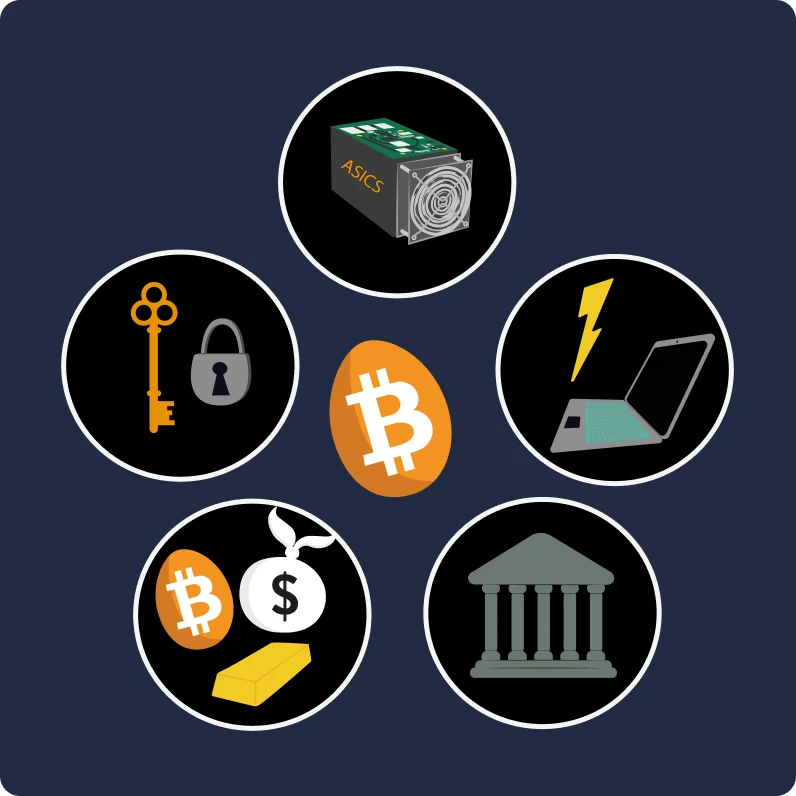
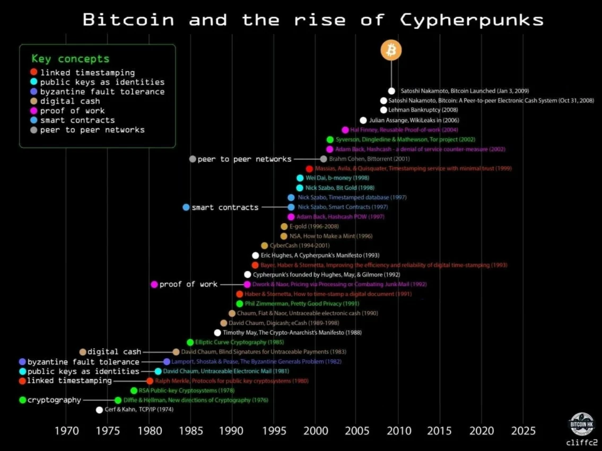
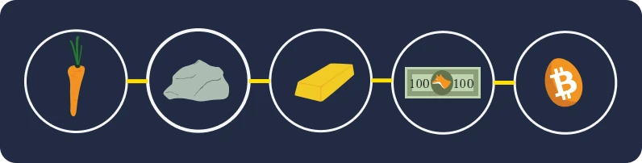
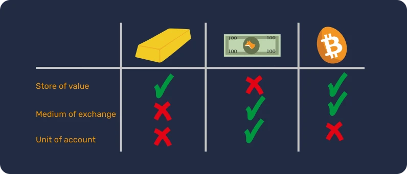
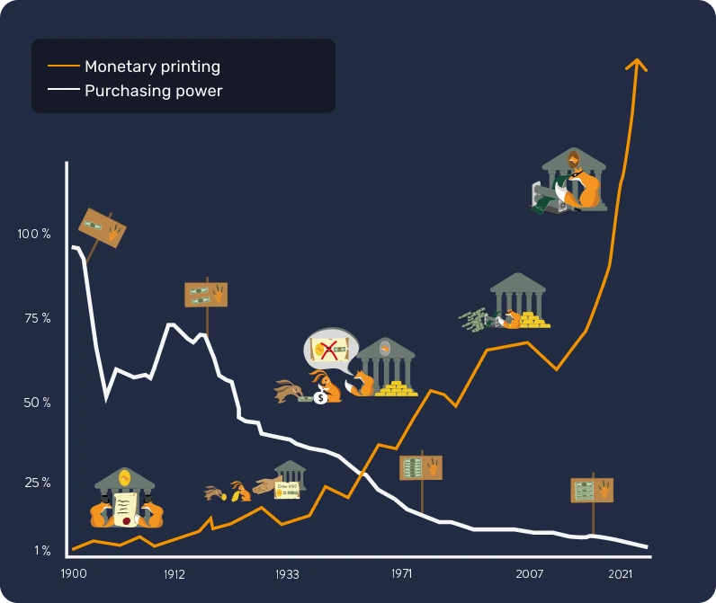
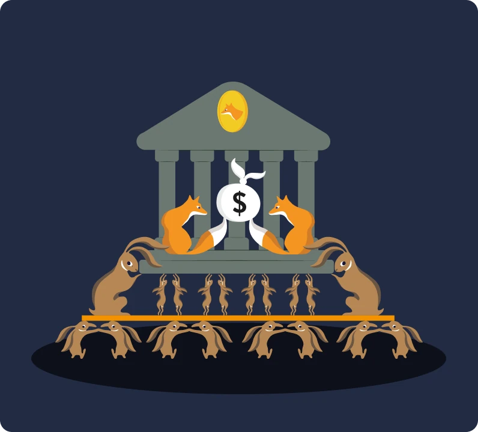
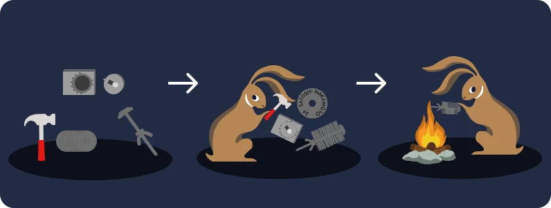
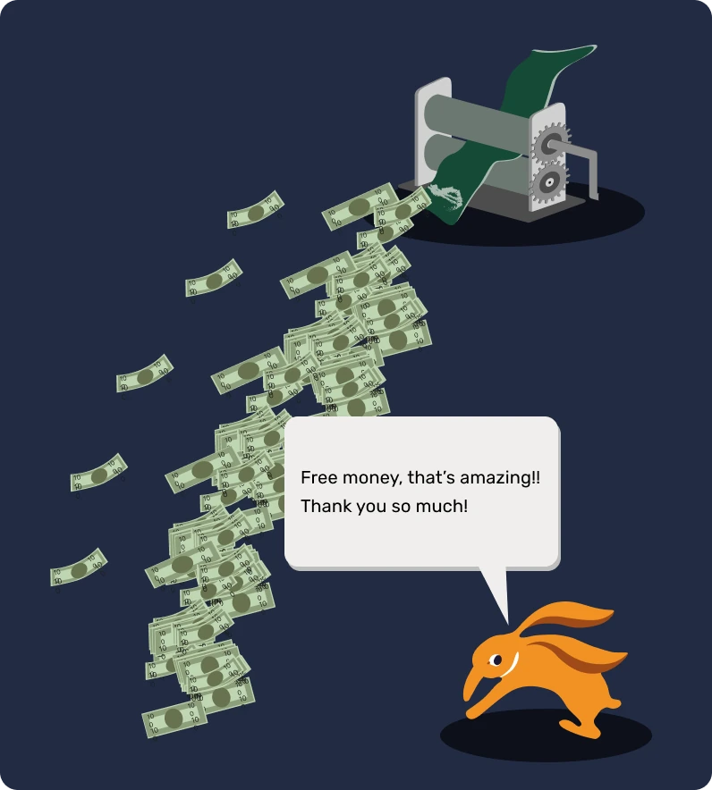
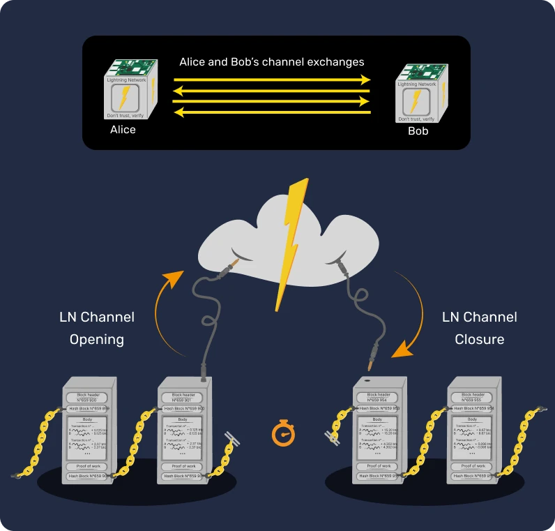
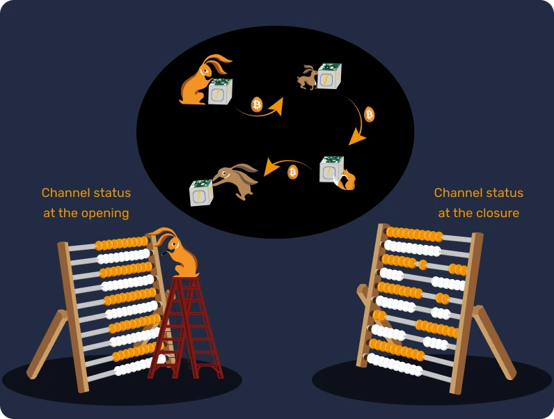

# आपका पहला बिटकॉइन रोमांच

इस पाठ्यक्रम में, हम 25 अध्यायों में बिटकॉइन की मूल बातें समझाएंगे, ताकि आप इस तकनीक को सरल और प्रभावी तरीके से समझ सकें। यह पाठ्यक्रम पूरे उद्योग की मूल बातों पर प्रकाश डालता है, जिसमें माइनिंग, वॉलेट, क्रय/बिक्री प्लेटफॉर्म आदि जैसे विषय शामिल हैं। इस यात्रा के दौरान अतिरिक्त शैक्षणिक सामग्री उपलब्ध होगी, और हम आपको इस पाठ्यक्रम को पूरा करने के बाद संसाधन खंड में "21 पोस्टर" देखने के लिए भी आमंत्रित करते हैं।

आपको शुरुआत करने के लिए किसी विशिष्ट ज्ञान की आवश्यकता नहीं है। वास्तव में, निम्नलिखित सामग्री सभी स्तरों के छात्रों के लिए सुलभ है, और इसे पूरा करने में लगभग 15 घंटे लगने चाहिए।

+++
# परिचय

<partId>3cd2ac82-026c-53e1-874a-baf5842adc6d</partId>

## अनजान दुनिया की ओर छलाँग

<chapterId>27e3fb60-4b50-556b-9e70-c4f5475c121d</chapterId>

BTC101 कोर्स में आपका स्वागत है!


बिटकॉइन एक तकनीकी और आर्थिक क्रांति है, जो हमें पैसे और समाज के साथ अपने रिश्ते पर दोबारा सोचने को मजबूर कर सकती है। असल में, बिटकॉइन (BTC) एक **निष्पक्ष** और **विकेंद्रीकृत** (decentralized) मुद्रा है। इसका मतलब यह है कि इसे कोई सरकार, बैंक या संस्था नियंत्रित नहीं करती। यह सिर्फ "इंटरनेट का पैसा" नहीं है, बल्कि एक बड़ी तकनीकी खोज है। यह दो चीजों का मेल है—एक कंप्यूटर प्रोटोकॉल (Bitcoin) और एक डिजिटल मुद्रा (bitcoin)।

बिटकॉइन प्रोटोकॉल में कुछ अहम तकनीकों का इस्तेमाल होता है, जैसे **क्रिप्टोग्राफी** (गुप्त संचार तकनीक), **नेटवर्क कम्युनिकेशन** (डिजिटल लेन-देन की व्यवस्था) और **ब्लॉकचे** (लेन-देन का सुरक्षित रिकॉर्ड)। वहीं, बिटकॉइन मुद्रा इस प्रोटोकॉल के संचालन के लिए जरूरी डिजिटल पैसा है। रोज़मर्रा की ज़िंदगी में, **एल सल्वाडोर** देश के लोग और दुनियाभर के बिटकॉइन उपयोग करने वाले इस डिजिटल मुद्रा से सामान और सेवाएं खरीदते-बेचते हैं और इसे अपने जीवन को आसान बनाने के लिए इस्तेमाल करते हैं।

**एक व्यापक लेकिन सुगम पाठ्यक्रम**


इस पाठ्यक्रम में हम बिटकॉइन के कुछ बुनियादी आर्थिक पहलुओं पर चर्चा करेंगे, जैसे: बिटकॉइन को कैसे खरीदा और बेचा जाता है, इसे डिजिटल वॉलेट में सुरक्षित रखने के तरीके, लेन-देन में बिटकॉइन का उपयोग, माइनर  (जो नए बिटकॉइन बनाते हैं और नेटवर्क को सुरक्षित रखते हैं) की भूमिका। आगे हम यह भी देखेंगे कि बिटकॉइन का भविष्य क्या हो सकता है और लाइटनिंग नेटवर्क जैसी तकनीक कैसे इसके लेन-देन को और तेज़ और सस्ता बना सकती है।



यह समझना ज़रूरी है कि बिटकॉइन एक बिल्कुल नया आर्थिक ढांचा है, जो पैसे को लेकर हमारी सोच को बदल देता है। इसलिए, इसे सीखना उन लोगों के लिए जरूरी हो सकता है जो अपने पैसों पर खुद नियंत्रण रखना चाहते हैं।


**सेक्शन 1 - परिचय**  
- अध्याय 1 - पाठ्यक्रम का अवलोकन  
- अध्याय 2 - बिटकॉइन का पूर्व इतिहास  

**सेक्शन 2 - पैसा**  
- अध्याय 3 - इतिहास के माध्यम से पैसा  
- अध्याय 4 - फिएट मुद्राएं  
- अध्याय 5 - हाइपरइन्फ्लेशन  
- अध्याय 6 - 21 मिलियन बिटकॉइन  

**सेक्शन 3 - बिटकॉइन वॉलेट्स**  
- अध्याय 7 - बिटकॉइन वॉलेट क्या है?  
- अध्याय 8 - बिटकॉइन वॉलेट्स और सुरक्षा  
- अध्याय 9 - वॉलेट की स्थापना  
- अध्याय 10 - समय की कसौटी पर खरा उतरना  

**सेक्शन 4 - बिटकॉइन के तकनीकी पहलू**  
- अध्याय 11 - बिटकॉइन की शुरुआत  
- अध्याय 12 - बिटकॉइन लेनदेन  
- अध्याय 13 - बिटकॉइन नोड्स  
- अध्याय 14 - माइनर्स  
- अध्याय 15 - बिटकॉइन और पर्यावरण  

**सेक्शन 5 - बिटकॉइन कैसे प्राप्त करें?**  
- अध्याय 16 - बिटकॉइन कभी नहीं सोता!  
- अध्याय 17 - काम करके बिटकॉइन कमाना  
- अध्याय 18 - बिटकॉइन के साथ बचत  
- अध्याय 19 - हाइपर-बिटकॉइनाइजेशन  

**सेक्शन 6 - बिटकॉइन का भविष्य: लाइटनिंग नेटवर्क**  
- अध्याय 20 - लाइटनिंग नेटवर्क का संक्षिप्त परिचय  
- अध्याय 21 - लाइटनिंग नेटवर्क के उपयोग के मामले  
- अध्याय 22 - लाल गोली या नीली गोली?  

पैसे की परिभाषा और समाज में इसके कार्य (अध्याय 1) का परिचय देने से पहले, हमें बिटकॉइन की उत्पत्ति से शुरुआत करनी चाहिए। 2009 में लॉन्च किया गया बिटकॉइन एक अपेक्षाकृत नई तकनीक है जो किसी और चीज़ से अलग है। इसलिए यह सामान्य है कि आप इसे एक बार में पूरी तरह से समझ न पाएं। वास्तव में, जैसे इंटरनेट का उपयोग करना या कार चलाना सीखते समय, आपको तुरंत सभी तकनीकी विवरण जानने की आवश्यकता नहीं होती: आप अपने धन को प्राप्त करने, भुगतान करने और सुरक्षित करने का तरीका सीखकर शुरुआत कर सकते हैं, और फिर इसे और गहराई से अध्ययन करने के लिए छोटे कदम उठा सकते हैं।

आखिरकार, हम इसके अपनाने के शुरुआती चरण में ही हैं, क्योंकि हमने उड़ान भरने का चरण पार कर लिया है: आप इस महत्वपूर्ण नवाचार के बारे में जितना चाहें ज्ञान प्राप्त करने के लिए बिल्कुल सही समय पर हैं।


इस नए आर्थिक बदलाव को समझना महत्वपूर्ण है। हम आशा करते हैं कि यह पाठ्यक्रम आपको इसे सरल और दिलचस्प तरीके से सीखने में मदद करेगा। तो, आइए इस डिजिटल दुनिया में आगे बढ़ें!

## बिटकॉइन का प्रागैतिहासिक काल


<chapterId>9a94b627-5b69-5d81-9125-f1fa9b0aa6ad</chapterId>
क्या आप बिटकॉइन की आकर्षक दुनिया में डूबने और इसके सभी तंत्रों को समझने के लिए तैयार हैं? चलिए चलते हैं!

"बिटकॉइन" शब्द के डिजिटल मुद्रा और वित्तीय क्रांति का पर्याय बनने से पहले, इसके निर्माण की नींव कई विचारों, नवाचारों और सामाजिक आंदोलनों ने रखी थी। इनमें से साइफरपंक आंदोलन बिटकॉइन के प्रागैतिहासिक काल में एक महत्वपूर्ण भूमिका निभाता है।

### साइफरपंक: डिजिटल दुनिया के दूरदर्शी


1980 और 1990 के दशक में, जब तकनीकी विकास अपने चरम पर था, कुछ लोगों ने डिजिटल युग में गोपनीयता और आज़ादी की भूमिका पर गहराई से सवाल उठाना शुरू किया। ये लोग, जिन्हें बाद में "साइफरपंक" के नाम से जाना गया, मानते थे कि क्रिप्टोग्राफी (गूढ़लेखन) एक ऐसा उपकरण हो सकता है जो सरकारों और बड़ी कंपनियों के हस्तक्षेप से व्यक्तिगत अधिकारों की रक्षा कर सके।

जूलियन असांज, वेई डाई, टिम मे और डेविड चौम जैसी प्रमुख हस्तियों ने इस आंदोलन के दर्शन और दृष्टि को आकार देने में अहम भूमिका निभाई। इन विचारकों ने अपने विचार एक मेलिंग लिस्ट पर साझा किए, जहाँ दुनिया भर के लोग व्यक्तिगत आज़ादी को बढ़ाने के लिए तकनीक का उपयोग करने के सर्वोत्तम तरीकों पर बहस करते थे।

### साइफरपंक के तीन मूलभूत दस्तावेज़


साइफरपंक आंदोलन, जो डिजिटल सक्रियता और क्रिप्टोग्राफी में गहराई से जुड़ा था, ने अपने सिद्धांतों और भविष्य के दर्शन को स्पष्ट करने के लिए कई मूलभूत लेखों का सहारा लिया। इनमें से तीन लेख विशेष रूप से उल्लेखनीय हैं:


- "साइफरपंक घोषणापत्र":

1993 में एरिक ह्यूजेस द्वारा लिखा गया यह घोषणापत्र कहता है कि गोपनीयता एक मौलिक अधिकार है। लेखक का तर्क है कि स्वतंत्र और गोपनीय रूप से संवाद करने की क्षमता एक स्वतंत्र समाज के लिए आवश्यक है। घोषणापत्र में कहा गया है:
"हम सरकारों, कंपनियों या अन्य बड़े गुमनाम संगठनों से गोपनीयता की उम्मीद नहीं कर सकते [...]। अगर हमें गोपनीयता चाहिए, तो हमें इसे खुद ही सुरक्षित करना होगा।"


- "क्रिप्टो-अराजकतावादी घोषणापत्र":

1992 में टिमोथी सी. मे द्वारा लिखा गया यह दस्तावेज़ बताता है कि क्रिप्टोग्राफी के उपयोग से एक ऐसा युग आ सकता है जहाँ सरकारें नागरिकों के निजी मामलों में हस्तक्षेप करने में असमर्थ होंगी। मे ने एक ऐसे भविष्य की कल्पना की जहाँ लोग बिना किसी तीसरे पक्ष के हस्तक्षेप के गुमनाम रूप से जानकारी और पैसा का आदान-प्रदान कर सकें।


- "साइबरस्पेस की स्वतंत्रता की घोषणा":

हालाँकि यह केवल साइफरपंक से जुड़ा नहीं है, यह लेख आंदोलन के कई सदस्यों की भावनाओं को दर्शाता है। 1996 में जॉन पेरी बार्लो द्वारा लिखा गया यह लेख इंटरनेट पर सरकारों द्वारा बढ़ते नियंत्रण के जवाब में था। घोषणापत्र में कहा गया है कि साइबरस्पेस भौतिक दुनिया से अलग एक क्षेत्र है और इसे उन्हीं कानूनों के अधीन नहीं होना चाहिए। जैसा कि इसमें कहा गया है:
"हमारी कोई चुनी हुई सरकार नहीं है, और होने की भी संभावना नहीं है।"


### बिटकॉइन के अग्रदूत

बिटकॉइन के उदय से पहले, डिजिटल मुद्रा बनाने के कई प्रयास हुए थे। उदाहरण के लिए, डेविड चौम ने 1980 के दशक में "डिजिकैश" नामक अपने प्रोजेक्ट के साथ "गुमनाम इलेक्ट्रॉनिक पैसे" की अवधारणा पेश की। दुर्भाग्य से, कई कारणों से डिजिकैश कभी लोकप्रिय नहीं हो पाया।

एक और महत्वपूर्ण पूर्ववर्ती वेई डाई का "बी-मनी" था। हालाँकि इसे कभी लागू नहीं किया गया, लेकिन इसमें एक गुमनाम डिजिटल मुद्रा का विचार पेश किया गया था, जहाँ धोखाधड़ी का पता लगाने का काम एक केंद्रीय प्राधिकरण के बजाय मूल्यांकनकर्ताओं के एक समुदाय द्वारा किया जाता था।

नीचे दी गई तस्वीर स्पष्ट रूप से कई तकनीकी नवाचारों के माध्यम से आंदोलन के विकास को दर्शाती है।



इसी उपजाऊ वातावरण में रहस्यमयी सातोशी नाकामोतो ने 2008 में बिटकॉइन श्वेतपत्र प्रकाशित किया था। इस दस्तावेज़ में, उन्होंने साइफरपंक आंदोलन के कई विचारों, जैसे कि "प्रूफ ऑफ वर्क" और क्रिप्टोग्राफिक टाइमस्टैम्प, को मिलाकर एक विकेंद्रीकृत और संशोधन नीति-रोधी डिजिटल मुद्रा बनाई।

हालाँकि, बिटकॉइन केवल इतना ही नहीं था: यह साइफरपंक आदर्शों की प्राप्ति का प्रतीक था। इसकी तकनीक से परे, यह पारंपरिक वित्तीय प्रणालियों के खिलाफ एक क्रांति का प्रतीक था और पारदर्शिता, विकेंद्रीकरण और व्यक्तिगत संप्रभुता पर आधारित एक विकल्प प्रदान करता था।

### निष्कर्ष

बिटकॉइन का प्रागैतिहासिक काल साइफरपंक आंदोलन और डिजिटल युग में अधिक आज़ादी की सामूहिक खोज में निहित है। क्रिप्टोग्राफी, विकेंद्रीकरण और अखंडता के सिद्धांतों को मिलाकर, बिटकॉइन एक मुद्रा से कहीं अधिक बन चुका है। वास्तव में, यह एक दार्शनिक और तकनीकी क्रांति का उत्पाद है जो हमारी दुनिया को लगातार बदल रहा है।

इसलिए, बिटकॉइन एक ऐसा प्रोटोकॉल है जो लंबे समय तक फैला हुआ है और हमें ऊर्जा, समय और पैसे के साथ अपने रिश्ते पर सवाल उठाने के लिए प्रोत्साहित करता है।

लेकिन क्या बिटकॉइन एक "वास्तविक" मुद्रा है? इसे समझने के लिए, हमें पहले पैसे की अवधारणा और इसके विभिन्न रूपों को समझना होगा, जिसे हम अगले अध्याय में देखेंगे।

अगर आप बिटकॉइन के इतिहास को और गहराई से जानना चाहते हैं, तो हमारे HIS 201 पाठ्यक्रम देखने की सलाह देते हैं। इसमें आप बिटकॉइन की उत्पत्ति, इसके धीमे उदय और इसके इतिहास और समुदाय की शुरुआत के बारे में जानेंगे। यह पाठ्यक्रम पूरी तरह से प्रलेखित और स्रोत-युक्त है, और इसमें कई रोचक किस्से भी शामिल हैं:

https://planb.network/courses/a51c7ceb-e079-4ac3-bf69-6700b985a082
# पैसा

<partId>e913df1a-4cbd-5380-ba67-ca2a0414f671</partId>

## इतिहास में पैसे की कहानी

<chapterId>c838e64d-d59f-5703-8c74-ea5e8c4fdd31</chapterId>

पैसे का विकास मानव इतिहास का एक दिलचस्प पहलू है, जो हर युग में सभ्यताओं की आर्थिक जरूरतों को पूरा करने की उनकी सूझ-बूझ को दर्शाता है।



### सीपियों से लेकर बैंक खातों तक

शुरुआत में, मुद्रा (पैसा) एक ठोस चीज़ होती थी, जैसे अनाज, मवेशी, या कोई और सामान। लेकिन इन चीज़ों में एक बड़ी कमी थी: ये जल्दी खराब हो जाती थीं। इस वजह से इन्हें लंबे समय तक बचाकर रखना मुश्किल था। उदाहरण के लिए, अगर फसल खराब हो जाए या मवेशी बीमार पड़ जाएं, तो किसी की पूरी दौलत रातों-रात खत्म हो सकती थी।

जैसे-जैसे सभ्यताएं आगे बढ़ीं और व्यापार नए इलाकों में फैला, एक सार्वभौमिक मुद्रा की जरूरत महसूस हुई। लोगों ने पहले सीपियों और रत्नों जैसी चीज़ों का इस्तेमाल किया, लेकिन ये उतने टिकाऊ या दुर्लभ नहीं थे, जितना उन्हें लगता था। आखिरकार, सोना मुद्रा का मानक बन गया, क्योंकि यह दुर्लभ, टिकाऊ और छोटे-बड़े हिस्सों में बाँटा जा सकता था। सोना आज भी दौलत और ताकत का प्रतीक है।


### पैसे की भूमिका क्या है?

पैसा एक बहुत ही उन्नत संचार का साधन है:


- यह वर्तमान और भविष्य के बीच संचार की अनुमति देता है, क्योंकि यह हमारे समय और ऊर्जा को एक ऐसी परिसंपत्ति में बदल देता है जिसका आने वाले समय में अवमूल्यन के जोखिम के बिना पुन: उपयोग किया जा सकता है।
- यह एक सार्वभौमिक भाषा के रूप में काम करता है: बिना एक-दूसरे को जाने या एक ही भाषा बोले, दो अजनबी चीज़ों के मूल्य पर सहमत हो सकते हैं और व्यापार कर सकते हैं।

पैसे की भूमिका को कृत्रिम रूप से बनाना मुश्किल है। दरअसल, कोई व्यक्ति या समूह पैसा नहीं बना सकता। यह एक प्राकृतिक घटना है जो बाजार और लोगों की सहमति से उभरती है। इसलिए, कीमतें संकेतों और जानकारी का काम करती हैं, जो समाज को संसाधनों का सही उपयोग करने में मदद करती हैं।

इन्हीं कारणों से, सोना का पैसे के रूप में होना 4,000 वर्षों के मौद्रिक डार्विनवाद का परिणाम है, जो निम्नलिखित अरस्तूवादी कार्यों पर आधारित है:


- **मूल्य का भंडार** : पैसे का इस्तेमाल खरीदने की क्षमता को भविष्य में स्थानांतरित करने के लिए किया जा सकता है, इसलिए यह टिकाऊ होना चाहिए। 
- **व्यापार का माध्यम**: पैसे का इस्तेमाल सामान और सेवाओं के बदले में किया जा सकता है, जिससे व्यापारियों को बार्टर (वस्तु विनिमय) की जरूरत नहीं पड़ती।
- **मूल्य मापन की इकाई**: पैसे की मदद से हम अलग-अलग चीज़ों के मूल्य की तुलना कर सकते हैं और उनकी सुविधा को समझ सकते हैं।


### पैसे की विशेषताएँ

सोना एक कुशल मुद्रा के सभी मानकों को पूरा करता है: इसकी प्राकृतिक दुर्लभता इसे मूल्यवान बनाती है, जबकि इसके रासायनिक गुण इसे समय के साथ खराब होने से बचाते हैं। इन विशेषताओं ने सोने को एक बेहतरीन **मूल्य संचय** का साधन बना दिया है, लेकिन यह आम मुद्रा नहीं है, क्योंकि इसे आसानी से छोटे हिस्सों में बाँटना या लंबी दूरी तक ले जाना मुश्किल है। वैश्वीकृत और डिजिटल दुनिया में, सोना तेजी से बदलती जरूरतों के साथ तालमेल नहीं बना पाता और इसे आसानी से बाँटने और विनिमय करने के लिए एक केंद्रीय संस्था (जैसे सरकार या बैंक) की जरूरत पड़ती है।(जैसे कि ढाले गए सिक्कों के माध्यम से)।

इसके विपरीत, राज्य द्वारा जारी मुद्राएँ (फिएट: जैसे डॉलर या यूरो) आसानी से उपयोग की जा सकती हैं, लेकिन जो संस्थाएँ उन्हें नियंत्रित करती हैं (राजा, केंद्रीय बैंक, सम्राट, तानाशाह) उनके द्वारा इनका मूल्य लगातार कम किया जाता है।

इस अवधारणा को बेहतर ढंग से समझाने के लिए, हम एक प्रभावी मुद्रा की विशेषताओं का पता लगाएंगे:




- **विनिमयशीलता**: जिसका अर्थ है कि यह मूल्य की हानि के बिना, एक इकाई को दूसरी इकाई से बदला जा सकता है।
- **विभाज्यता**: इसे छोटे हिस्सों में बाँटा जा सकता है, ताकि अलग-अलग मात्रा के लेन-देन आसानी से किए जा सकें।
- **तरलता**: यानी इसे आसानी से सामान या सेवाओं में बदला जा सकता है।

इन मानकों को पूरा करने के लिए, मुद्रा ने इतिहास में कई रूप बदले हैं:


- पत्थर → सिक्के
- बैंक के जारी नोट → बैंक कार्ड
- ब्लॉकचेन → लाइटनिंग नेटवर्क

मुद्राएँ आज भी विकसित हो रही हैं और अपने रूपों को अलग-अलग जरूरतों के हिसाब से ढाल रही हैं। जैसा कि हमने कहा, सोना मूल्य के भंडार के रूप में बेहतरीन है, लेकिन यह आज की वैश्विक अर्थव्यवस्था के लिए उपयुक्त नहीं है। इसी तरह, डॉलर और यूरो जैसी सरकारी मुद्राएँ बहुत तरल और आसानी से एक जगह से दूसरी जगह ले जाने योग्य हैं, क्योंकि ये अब ज्यादातर डिजिटल हैं, लेकिन इनका मूल्य लगातार महंगाई की वजह से कम होता जा रहा है।

दूसरी ओर, बिटकॉइन नए अवसर लेकर आया है। इसकी खासियतें, जैसे सीमित आपूर्ति, इसे मूल्य के भंडार के रूप में बेहतरीन बनाती हैं। साथ ही, एक निष्पक्ष इंटरनेट मुद्रा के रूप में, यह सीमाओं से परे व्यापार का एक व्यवहार्य माध्यम है। हालाँकि, यह अभी भी व्यापार में व्यापक रूप से स्वीकार नहीं किया गया है, लेकिन इसका इस्तेमाल लगातार [बढ़](https://btcmap.org/map) रहा है।

##  भरोसे पर चलने वाली मुद्राएँ (फ़िड्यूशरी करेंसी)

<chapterId>25151d46-7db1-5b48-8bba-cbde1944555a</chapterId>

> जॉर्ज सन्तायाना ने कहा था, "जो लोग अतीत को याद नहीं रखते, वे इसे दोहराने के लिए अभिशप्त होते हैं।"
यह बात आज के मौद्रिक व्यवस्था पर बिल्कुल सटीक बैठती है।

### फिड्यूशरी = भरोसा

आज, यूरो और डॉलर जैसी प्रमुख मुद्राओं को "फ़िड्यूशरी" माना जाता है। इसका मतलब है कि इनका अपना कोई वास्तविक मूल्य नहीं है, बल्कि ये पूरी तरह से उन संस्थाओं पर और हमारे उन संस्थाओं में भरोसे पर निर्भर हैं जो इन्हें चलाती हैं।

फ़िड्यूशरी मुद्रा धन का एक रूप है जिसे किसी संस्था (जैसे राज्य या आर्थिक संघ) द्वारा मुद्रा के रूप में घोषित किया जाता है। उदाहरण के लिए, चीन में युआन और यूरोपीय संघ द्वारा जारी यूरो। इन मुद्राओं को जारी करने वाली संस्था केंद्रीय बैंक होती है (जैसे चीन का पीपल्स बैंक, अमेरिका का फेडरल रिजर्व, या गिनी गणराज्य का केंद्रीय बैंक)। ये संस्थाएँ ही मौद्रिक नीति तय करती हैं और यह फैसला करती हैं कि कितने पैसे की आपूर्ति करनी है या कितने नोट छापने हैं।



### मुद्रा का अवमूल्यन: रोमन साम्राज्य से चली आ रही रणनीति

प्राचीन काल से ही सोना मुद्रा का आधार रहा है, लेकिन इसकी कठोरता के कारण शासकों (चाहे वे रोमन सम्राट हों या आधुनिक सरकारें) ने अक्सर वैकल्पिक मुद्राओं को अपनाया है, जो ज्यादातर भरोसा-आधारित (फिड्यूशियरी) होती हैं।

इसकी प्रक्रिया बहुत सरल है और सभ्यता के शुरुआत से ही चली आ रही है। शासक, धन पर नियंत्रण पाने के लिए, पहले सोने को केंद्रीकृत करते हैं, अक्सर अपनी ताकत का इस्तेमाल करके और लोगों को सुरक्षा का वादा करके। इस कीमती भंडार को अपने हाथ में लेकर, वे एक नई मुद्रा शुरू करते हैं, जिसका मूल्य सोने के बराबर होता है, लेकिन यह उन शासक की छवि के साथ बनाई जाती है। यह मुद्रा फिर चलन में आ जाती है, और लोग इसके आसान इस्तेमाल के आदी हो जाते हैं।

हालाँकि, इसके बाद शासक धीरे-धीरे इस मुद्रा का अवमूल्यन करना शुरू करते हैं, यानी इसके मूल्य को हर साल कुछ प्रतिशत कम कर देते हैं। यह चुपचाप होने वाला अवमूल्यन अक्सर जनहित के नाम पर किया जाता है। असल में, जो लोग इस मुद्रा में बचत करते हैं, उनकी बचत का मूल्य घटता जाता है, जबकि सरकार महंगाई के जरिए अपने परियोजनाओं के खर्च का क़ीमत चुकाती है। साथ ही, इस अवमूल्यन से कर्ज चुकाना भी आसान हो जाता है।


एक नाजुक मोड़ पर, शासक घोषणा करते हैं कि अब यह मुद्रा सोने से जुड़ी नहीं है। आम जनता, जो अब इस मुद्रा के आदी हो चुकी होती है और आमतौर पर वित्तीय मामलों में कम जानकार होती है, इस नई वास्तविकता को स्वीकार कर लेती है। इससे सरकार को पैसे की आपूर्ति को मनमाने ढंग से नियंत्रित करने और बिना किसी लागत के जितना चाहे उतना पैसा छापने की आजादी मिल जाती है।

पैसे की छपाई से महंगाई बढ़ती है और धीरे-धीरे आबादी गरीब होती जाती है। इसके अलावा, वित्तीय प्रणाली को नियंत्रित और सीमित किया जाता है ताकि यह ध्वस्त न हो, क्योंकि कोई भी व्यवधान एक बड़े आर्थिक संकट को जन्म दे सकता है। आम जनता के विपरीत, वित्तीय संस्थाएँ और अमीर लोग इस प्रणाली से बहुत फायदा उठाते हैं, जिससे असमानता बढ़ती है और अधिनायकवाद को बल मिलता है। इस संदर्भ में, वे कोई बड़ा बदलाव करने के लिए प्रेरित नहीं होते, जिससे यह प्रणाली लगातार चलती रहती है, जब तक कि यह पूरी तरह से ध्वस्त न हो जाए।

अगर यह रणनीति अच्छी तरह से क्रियान्वित की जाए, तो यह दशकों तक चल सकती है। हालाँकि, यह ध्यान रखना जरूरी है कि बहुत तेजी से अवमूल्यन या भरोसे की कमी से हाइपरइन्फ्लेशन हो सकता है (अगले अध्याय में देखें)। इतिहास बताता है कि डॉलर ने 100 साल में अपने मूल्य का 98% हिस्सा खो दिया है, यूरो ने 20 साल में 30% और पाउंड स्टर्लिंग ने अपने अस्तित्व के बाद से 99% मूल्य गंवा दिया है।

अंत में, मुद्रा का सोने से कोई संबंध नहीं रह जाता, जैसे रोमन साम्राज्य के अंत में सिक्कों का हुआ था, या यह सिर्फ एक संख्यात्मक मूल्य तक सीमित रह जाता है, जो वास्तविकता से कटा हुआ होता है।

आज, हम एक ऐतिहासिक मोड़ पर खड़े हैं। डॉलर, जो लंबे समय से हावी रहा है, अब कमजोर पड़ता दिख रहा है, जबकि सोने ने अपनी केंद्रीय भूमिका खो दी है। हम एक नए मौद्रिक चक्र की दहलीज पर हैं, जो हमें याद दिलाता है कि इतिहास के सबक अक्सर भुला दिए जाते हैं।


### क्या बिटकॉइन एक समाधान है?

 इन्हीं वजहों से, बिटकॉइन क्रांति तेजी से बढ़ रही है। पिछली मुद्राओं के विपरीत, इसे चलाने के लिए किसी **तीसरे पक्ष पर भरोसा** करने की जरूरत नहीं है, और यह पैसे को सरकार से अलग करने का लक्ष्य रखता है।


दरअसल, बिटकॉइन इन व्यवस्थागत चुनौतियों का जवाब देता है और एक विकेंद्रीकृत समाधान और एक नई समानांतर मौद्रिक प्रणाली प्रस्तावित करता है। ऐतिहासिक रूप से, अगर सोना मुद्रा के रूप में पसंद किया गया क्योंकि इसे नकली बनाना मुश्किल था, तो बिटकॉइन भी नकली नहीं बनाया जा सकता। इसके अलावा, यह सिर्फ 2.10 करोड़ इकाई तक सीमित है, जो इसके विकेंद्रीकृत और क्रिप्टोग्राफिक स्वभाव के कारण संभव है। बिटकॉइन एक ऐसी मुद्रा है जो पारदर्शिता और निष्पक्षता पर आधारित है, और यह मौजूदा केंद्रीकृत मौद्रिक प्रणाली के लिए एक आकर्षक विकल्प पेश करता है।



बिटकॉइन पर ध्यान देने का एक और कारण सेंट्रल बैंक डिजिटल करेंसी (CBDCs) का उदय है, जो अब लगभग निश्चित लगता है। यह नई मुद्रा एक अधिक केंद्रीकृत अर्थव्यवस्था को विकसित करेगी, और यह व्यक्तियों की वित्तीय स्वतंत्रता को सीमित कर सकती है और अधिनायकवादी दुरुपयोग को आसान बना सकती है। हम इस अध्याय को नोबेल पुरस्कार विजेता एफ.ए. हायक के 1984 के एक कथन के साथ समाप्त कर सकते हैं:

हम इस अध्याय को 1984 में नोबेल पुरस्कार विजेता एफ.ए. हायेक के उद्धरण के साथ समाप्त कर सकते हैं:

> "मुझे नहीं लगता कि हमें कभी भी अच्छी मुद्रा मिलेगी, जब तक कि हम इसे सरकार के हाथों से नहीं छीन लेते। अगर हम इसे सरकार से जबरदस्ती नहीं ले सकते, तो हमें कोई चालाक या घुमावदार तरीका ढूंढना होगा, जिसे वे रोक न सकें।" आर्थिक भ्रांतियों और स्वतंत्रता के बारे में अधिक जानने के लिए, हम आपको हमारे ECO 102 पाठ्यक्रम को जांच-पड़ताल के लिए आमंत्रित करते हैं, जो 19वीं सदी के फ्रांसीसी विचारक फ्रेडरिक बास्तियात के जीवन और विचारों को दर्शाता है, जो निश्चित रूप से बिटकॉइन के उदय की सराहना करते।

https://planb.network/courses/d07b092b-fa9a-4dd7-bf94-0453e479c7df
## हाइपरइन्फ्लेशन (अत्यधिक महंगाई)

<chapterId>b04c024c-54f3-50cb-997f-58721cfc74be</chapterId>

हाइपरइन्फ्लेशन यानी अत्यधिक महंगाई एक मौद्रिक घटना है जो सिर्फ फ़िड्यूशरी मुद्राओं (सरकारी मुद्राओं) के साथ घटती है (इस पाठ में यहाँ से आगे अत्यधिक महंगाई के संदर्भ में हम हाइपरइन्फ्लेशन शब्द का इस्तेमाल करेंगे।)। यह मुद्रा में भरोसे की पूरी तरह से कमी और अधिकारियों द्वारा पैसे की अत्यधिक छपाई के कारण महंगाई में भारी बढ़ोतरी से जुड़ी होती है। इसके परिणामस्वरूप, लोगों की बचत कुछ ही समय में खत्म हो जाती है, और देश आर्थिक, सामाजिक और राजनीतिक पतन के कगार पर पहुँच जाता है।

### महंगाई बेकाबू हो रही है!

बचत पर महंगाई के प्रभाव को समझने के लिए, हमें अलग-अलग महंगाई दरों को ध्यान में रखना होगा।


- अगर महंगाई 2% है, तो आपकी खरीदने की क्षमता हर साल 2% कम हो जाती है, यानी 5 साल में 10%।
- अगर महंगाई 7% है, तो 10 साल में आपकी खरीदने की क्षमता आधी रह जाएगी।
- अगर महंगाई 20% है, तो सिर्फ 3 साल में आपकी खरीदने की क्षमता लगभग आधी हो जाएगी।

हाइपरइन्फ्लेशन में, हम सालाना 20% की बात नहीं कर रहे होते, बल्कि महीने में 20% या चरम स्थिति में तो **रोजाना** 20% की बात होती है। तीन दिनों में 100% महंगाई का अनुभव करना कोई काल्पनिक स्थिति नहीं है, बल्कि यह दुनिया में हो चुका है और अभी भी हो रहा है।

यह समझना जरूरी है कि हाइपरइन्फ्लेशन संयोग से, पूंजीवाद से या विरोधियों के राजनीतिक हमलों से नहीं होता। यह केंद्रीय बैंकरों और राजनेताओं द्वारा लिए गए गलत मौद्रिक फैसलों का सीधा नतीजा होता है। इसके प्रभाव हर नागरिक को झेलने पड़ते हैं और यह आने वाली पीढ़ियों को भी प्रभावित करता है। हम आपसे अनुरोध करते हैं कि इस घटना के वास्तविक प्रभाव को समझने के लिए नीचे दी गई तालिका को पढ़ें (ECO204 पाठ्यक्रम में इस विषय पर और गहराई से चर्चा की गई है)। जैसा कि आप देखेंगे, कोई भी देश या मुद्रा इससे सुरक्षित नहीं है।


### हाइपरइन्फ्लेशन के चरण क्या हैं?


हाइपरइन्फ्लेशन के लिए कुछ खास घटनाएँ घटित होनी चाहिए।

चरण 1 - भरोसे की हानि


- मौद्रिक शक्ति का केंद्रीकरण पैसे के निर्माण और इसके दुरुपयोग को आसान बनाता है। इस संदर्भ में, कुछ बाहरी कारक हाइपरइन्फ्लेशन के चक्र को शुरू कर सकते हैं, जैसे युद्ध, सामाजिक उपाय, या गेहूं और पेट्रोल जैसे महत्वपूर्ण संसाधनों की कीमतों में वृद्धि। इससे मुद्रा में भरोसा कम होने लगता है, और लोग पैसे के स्रोत और मौद्रिक नीति के फायदों पर सवाल उठाने लगते हैं।

चरण 2 - मुद्रा का पतन और कीमतों में वृद्धि


- जब सरकारें भरोसे खो देती हैं, तो लोग अपनी मुद्रा को अधिक स्थिर मुद्रा (जैसे अमेरिकी डॉलर) के लिए बदलने लगते हैं, जैसा कि वेनेजुएला में हुआ। इससे कीमतें बढ़ने लगती हैं, और एक दुष्चक्र शुरू हो जाता है जहाँ सामान और सेवाएँ लगातार महंगी होती जाती हैं। इन जरूरतों को पूरा करने और मौद्रिक नीति को सही करने के लिए, सरकार और अधिक पैसा छापती है, जिससे महंगाई और बढ़ जाती है।

चरण 3 - पैसे की छपाई का दुष्चक्र 


- इस तरह, सामान खरीदने के लिए और अधिक नोटों की जरूरत पड़ती है, जिससे नोटों की कमी हो जाती है। जवाब में, सरकारें और अधिक नोट छापती हैं, जो महंगाई को और बढ़ा देता है।


चरण 4 - एक नई मुद्रा का उदय


- महंगाई के चक्र को तोड़ने के लिए, एक नई मुद्रा शुरू की जाती है, जो पुरानी मुद्रा की जगह लेती है। इसमें पहले के वैध मुद्रा से ज्यादा सख्त नियंत्रण लागू किए जाते हैं।

हाइपरइन्फ्लेशन संकट को हल करने के लिए अक्सर आमूलचूल परिवर्तन की जरूरत होती है, जैसे क्रांति, सरकार में बदलाव, या केंद्रीय बैंकरों का परिवर्तन। भरोसे की कमी, मुद्रा का पतन और पुनर्निर्माण हाइपरइन्फ्लेशन से उबरने के लिए जरूरी चरण हैं।

### तीन उल्लेखनीय उदाहरण


- जर्मनी, 1922-1923।

हाइपरइन्फ्लेशन के सबसे चौंकाने वाले उदाहरणों में से एक प्रथम विश्व युद्ध के बाद जर्मन वीमर गणराज्य में हुआ।

पहले विश्व युद्ध के बाद जर्मनी की वीमर गणराज्य में हाइपरइन्फ्लेशन का सबसे चर्चित उदाहरण हुआ। जर्मनी ने युद्ध के लिए भारी कर्ज लिया था, लेकिन युद्ध हारने के बाद उसे अरबों डॉलर का मुआवजा भी देना पड़ा। अक्टूबर 1923 में महंगाई दर 29,500% तक पहुँच गई, यानी रोजाना 20.9%। कीमतें हर 3.7 दिन में दोगुनी हो जाती थीं!

जर्मन मुद्रा इतनी बेकार हो गई कि कुछ लोग ठंड से बचने के लिए लकड़ी की बजाय अपने नोट जलाना पसंद करते थे, क्योंकि लकड़ी की तुलना में नोट जलाना सस्ता पड़ता था। यहाँ तक कि रेस्तरां में वेटर्स को हर 30 मिनट में मेनू की कीमतें बदलनी पड़ती थीं। 

अंत में, अधिकारियों ने एक नई मुद्रा शुरू की, जो जर्मनी, फ्रांस और इंग्लैंड के कर्ज पर आधारित थी और जिसकी गारंटी जर्मन जमीन द्वारा दी गई।


- हंगरी, 1945-1946

अब तक का सबसे गंभीर मुद्रास्फीति का दौर अनुभव करने वाला देश हंगरी रहा है - द्वितीय विश्व युद्ध के बाद।

हंगरी युद्ध हारने वाले देशों में शामिल था, और उसकी अधिकांश औद्योगिक क्षमता नष्ट हो गई थी। जुलाई 1946 में महंगाई दर 41,900,000,000,000,000% तक पहुँच गई, यानी रोजाना 207%। कीमतें हर 15 घंटे में दोगुनी हो जाती थीं! 

1946 में, अंतिम बैंकनोट 1 करोड़ अरब पेंगो (100,000,000,000,000,000) की कीमत थी।


- ज़िम्बाब्वे, 2007-2008

वर्ष 2000 तक, ज़िम्बाब्वे तेल को छोड़कर अपनी लगभग सभी आवश्यकताओं के लिए आत्मनिर्भर था।

1997 में, जिम्बाब्वे डॉलर 72% गिर गया, जब सरकार ने युद्ध के दिग्गजों को 450 मिलियन डॉलर का मुआवजा देने का फैसला किया। चूंकि सरकार के पास इतना पैसा नहीं था, उसने नोट छापना शुरू कर दिया। 2005 में महंगाई 586% तक पहुँच गई, लेकिन नवंबर 2008 में यह 79,600,000,000% प्रति माह तक पहुँच गई।

जून 2007 में सरकार ने कीमतों पर नियंत्रण लगाया, लेकिन इसका कोई फायदा नहीं हुआ। दुकानें लूट ली गईं, और व्यापारियों के पास सामान फिर से दुकान में रखने के लिए पैसे भी नहीं थे। 

अप्रैल 2009 में, वित्त मंत्री ने जिम्बाब्वे डॉलर को निलंबित कर दिया और व्यापार के लिए विदेशी मुद्राओं के उपयोग की अनुमति दी। सभी बैंक खाते, पेंशन और वित्तीय संस्थानों का बैलेंस रातों-रात खत्म हो गया।


निष्कर्ष के तौर पर, हाइपरइन्फ्लेशन का असर यह होता है कि मुद्रा का मूल्य बहुत तेजी से गिर जाता है, जिससे लोगों की बचत पर असर पड़ता है और मौद्रिक प्रणाली पर भरोसा खत्म हो जाता है। जैसा कि वोल्टेयर ने कहा था, फिएट मुद्रा (सरकारी मुद्रा) अंत में हमेशा अपनी असल कीमत खो देती है और शून्य की ओर बढ़ती जाती है। 

अगर कोई मुद्रा किसी भरोसेमंद तीसरे पक्ष जैसे बैंक या वित्तीय संस्थान पर निर्भर करती है, तो वह दीर्घकालिक रूप से समस्या पैदा करने वाली होती है, क्योंकि वह न तो खरीदारी की शक्ति बनाए रख सकती है और न ही लोगों की बचत को सुरक्षित कर सकती है।

हाइपरइन्फ्लेशन के विषय में गहराई से जानने के लिए, हम डेविड सेंट-ऑन्जे का ECO 204 पाठ्यक्रम सुझाते हैं, जहाँ आप हाइपरइन्फ्लेशन चक्रों के बारे में जानेंगे और इनके हमारे जीवन पर वास्तविक प्रभावों को समझेंगे। आप इन चक्रों के बीच समानताएँ भी जानेंगे और सबसे महत्वपूर्ण बात यह है कि आप इनसे खुद को कैसे बचा सकते हैं, यह भी सीखेंगे।

https://planb.network/courses/caa75343-ac90-4249-bcca-0e2e57c3a0f1
##  2.10 करोड़ बिटकॉइन

<chapterId>f4a06d76-1963-56fd-93ff-dfa41489bcde</chapterId>

### बिटकॉइन की मौद्रिक नीति

बिटकॉइन एक विकेंद्रीकृत डिजिटल मुद्रा है, जिसकी निर्धारित अधिकतम इकाई **2.10** करोड़ है। यह दुर्लभता इसके कंप्यूटर कोड द्वारा तय की गई है और प्रोटोकॉल में भाग लेने वाले सभी उपभोक्ताओं के सहमति से सुदृढ़ होती है।


बिटकॉइन के मौद्रिक जारी होने को एक कर्व (वक्र) के रूप में दिखाया जा सकता है, जो समय के साथ बनने वाले बिटकॉइन की संख्या को दर्शाता है। उदाहरण के लिए, 2022 में लगभग 1.85 करोड़ बिटकॉइन प्रचलन में थे। अनुमान है कि 2025 तक यह संख्या 1.95 करोड़ (यानी कुल आपूर्ति का 93%) हो जाएगी, और 2037 तक यह 2.04 करोड़ तक पहुँच जाएगी।

### नए बिटकॉइन कैसे बनते हैं?

नए बिटकॉइन का निर्माण माइनिंग प्रक्रिया के जरिए होता है। संक्षेप में, माइनर  शक्तिशाली कंप्यूटरों का उपयोग करके जटिल गणितीय समस्याओं को हल करते हैं, जो लेन-देन को मान्य और सुरक्षित करते हैं। जब एक समस्या हल हो जाती है, तो माइनर ब्लॉकचेन में लेन-देन का एक नया ब्लॉक जोड़ता है। ब्लॉकचेन एक विकेंद्रीकृत और वितरित लेज़र (बहीखाता) है, जो नेटवर्क पर किए गए सभी लेन-देन को रिकॉर्ड करता है। यह पारदर्शिता और सुरक्षा सुनिश्चित करता है, क्योंकि हर ब्लॉक पिछले ब्लॉक से जुड़ा होता है, जिससे नेटवर्क की सहमति के बिना पुराने डेटा को बदलना लगभग असंभव हो जाता है।


इस काम को सफलतापूर्वक करने के बाद, माइनर  को हर दस मिनट में नए बिटकॉइन के रूप में इनाम मिलता है। यह इनाम हर 210,000 ब्लॉक्स (लगभग हर चार साल) के बाद आधा हो जाता है, जिसे "हाल्विंग" कहा जाता है। इस तंत्र के कारण, यह गणितीय रूप से अनुमान लगाया जा सकता है कि नए बिटकॉइन का निर्माण साल 2140 के आसपास बंद हो जाएगा, जब कुल संख्या 2.10 करोड़ तक पहुँच जाएगी।

| हाल्विंग संख्या | ब्लॉक ऊंचाई | हाल्विंग के बाद BTC इनाम | हाल्विंग के बाद अनुमानित BTC प्रचलन में |

| -------------- | ------------ | ------------------------- | ------------------------------------------ |

| 1              | 210,000      | 25 BTC                    | 10,500,000 BTC                             |

| 2              | 420,000      | 12.5 BTC                  | 15,750,000 BTC                             |

| 3              | 630,000      | 6.25 BTC                  | 18,375,000 BTC                             |

| 4              | 840,000      | 3.125 BTC                 | 19,687,500 BTC                             |

| 5              | 1,050,000    | 1.5625 BTC                | 20,343,750 BTC                             |

| 6              | 1,260,000    | 0.78125 BTC               | 20,671,875 BTC                             |

| 7              | 1,470,000    | 0.390625 BTC              | 20,835,937.5 BTC                           |

| 8              | 1,680,000    | 0.1953125 BTC             | 20,917,968.75 BTC                          |

| 9              | 1,890,000    | 0.09765625 BTC            | 20,958,984.375 BTC                         |

| 10             | 2,100,000    | 0.048828125 BTC           | 20,979,492.188 BTC                         |

| 11             | 2,310,000    | 0.0244140625 BTC          | 20,989,746.094 BTC                         |

| 12             | 2,520,000    | 0.01220703125 BTC         | 20,994,873.047 BTC                         |

| 13             | 2,730,000    | 0.006103515625 BTC        | 20,997,436.523 BTC                         |

| 14             | 2,940,000    | 0.0030517578125 BTC       | 20,998,718.262 BTC                         |

| 15             | 3,150,000    | 0.00152587890625 BTC      | 20,999,359.131 BTC                         |

| 16             | 3,360,000    | 0.000762939453125 BTC     | 20,999,679.566 BTC                         |

| 17             | 3,570,000    | 0.0003814697265625 BTC    | 20,999,839.783 BTC                         |

| 18             | 3,780,000    | 0.00019073486328125 BTC   | 20,999,919.892 BTC                         |

| 19             | 3,990,000    | 0.000095367431640625 BTC  | 20,999,959.946 BTC                         |

| 20             | 4,200,000    | 0.0000476837158203125 BTC | 20,999,979.973 BTC                         |

हम माइनिंग की अवधारणा पर [माइनर अध्याय](https://planb.network/courses/2b7dc507-81e3-4b70-88e6-41ed44239966/dbb8264a-7434-57e4-9d1b-fbd1bae37fdf) में और विस्तार से चर्चा करेंगे।

### डिजिटल दुर्लभता को सुनिश्चित करना

2.10 करोड़ की सीमा बिटकॉइन की कमी का आधार है, और इसे दो प्रमुख तंत्रों द्वारा सुनिश्चित किया जाता है: माइनिंग कठिनाई का समायोजन और गेम थ्योरी।


-माइनिंग कठिनाई समायोजन एक प्रक्रिया है जो हर 2016 ब्लॉक्स (लगभग दो सप्ताह) के बाद होती है, ताकि यह सुनिश्चित किया जा सके कि ब्लॉकचेन में हर दस मिनट में औसतन एक नया ब्लॉक जोड़ा जाए। ब्लॉक निर्माण की यह आवृत्ति और बिटकॉइन की कुल मात्रा दोनों बिटकॉइन प्रोटोकॉल के निश्चित पहलू हैं और इन्हें सामान्य सहमति के बिना बदला नहीं जा सकता, जो पारंपरिक मौद्रिक प्रणालियों में किए जाने वाले मनमाने फैसलों से अलग है।

वैध हैश ढूंढने की कठिनाई एक प्रकार के चक्र का पालन करती है: यदि माइनर  की संख्या बढ़ती है, तो इसका मतलब है कि वे अधिक ब्लॉक ढूंढते हैं, जिससे एक ब्लॉक ढूंढने का औसत समय कम हो जाता है। इसके कारण, कठिनाई बढ़ा दी जाती है। इसके परिणामस्वरूप, माइनर  द्वारा ढूंढे गए ब्लॉकों की संख्या घट जाती है, जिससे यह तंत्र फिर से प्रति ब्लॉक 10 मिनट के औसत समय पर लौट आता है। कृपया नीचे दिए गए चित्र को देखें ताकि आप इसे दृश्य रूप से समझ सकें।


क्या आप जानते हैं कि माइनर  को ब्लॉक सब्सिडी (नए बिटकॉइन) और उस ब्लॉक में शामिल लेन-देन की शुल्क के रूप में इनाम मिलता है? इसलिए, जैसे-जैसे जारी किए गए बिटकॉइन की संख्या 2.10 करोड़ के करीब पहुँचेगी, माइनर  को ब्लॉक सब्सिडी की बजाय लेन-देन शुल्क से अधिक इनाम मिलेगा।

इस प्रकार, जैसे-जैसे जारी किए गए बिटकॉइन की संख्या 21 मिलियन की सीमा के करीब पहुंचती है, माइनर  को ब्लॉक सब्सिडी के बजाय उनके लेन-देन शुल्क के माध्यम से अधिक पारिश्रमिक मिलेगा।


- गेम थ्योरी एक गणितीय अवधारणा है जो मानवीय तर्क पर आधारित है। यह मानती है कि लोग तार्किक रूप से काम करते हैं और अपना अधिकतम फायदा बनाने की कोशिश करते हैं, साथ ही दूसरों के संभावित फैसलों को भी ध्यान में रखते हैं। बिटकॉइन में, गेम थ्योरी यह सुनिश्चित करती है कि अधिकांश माइनर  और उपभोक्ता  नेटवर्क के सर्वोत्तम हित में काम करेंगे। चूंकि प्रोटोकॉल में बदलाव उपभोक्ताओं द्वारा वोट किए जाते हैं, इसलिए बिटकॉइन प्रोटोकॉल में किसी भी बदलाव के लिए पूरे समुदाय की सहमति की आवश्यकता होगी, जो बेहद जटिल है। इसलिए, अगर कोई 2.10 करोड़ के बजाय 2.20 करोड बिटकॉइन बनाना चाहता है, तो उसे सभी उपभोक्ताओं को अपनी बचत का मूल्य कम करने के लिए मनाना होगा, जो संभावना नहीं है, क्योंकि बिटकॉइन वैश्विक है और किसी केंद्रीय समूह द्वारा नियंत्रित नहीं है।


मुद्रा का मूल्य कम करने का विचार बिटकॉइन के मूल दर्शन के खिलाफ है, इसलिए इसकी कुल मात्रा में बदलाव की संभावना नहीं है।

### एक जाँचने योग्य मौद्रिक नीति: हर सेकंड, शुरुआत से और हमेशा के लिए!

बिटकॉइन की दुर्लभता एक बड़ी ताकत है, और प्रचलन में 2.10 करोड़ बिटकॉइन की अधिकतम संख्या सार्वजनिक और हर किसी के द्वारा जाँचने योग्य है।

वास्तव में, कोई भी व्यक्ति बिटकॉइन नोड (यानी लेन-देन मान्यकर्ता) के जरिए इसे जाँच सकता है, बस निम्नलिखित कमांड डालकर: bitcoin-cli gettxoutsetinfo ।
 यह पारदर्शिता बिटकॉइन सिस्टम में विश्वास को मजबूत करती है, जो केंद्रीय संस्थानों या व्यक्तियों पर आधारित नहीं है, बल्कि इसके प्रोटोकॉल में निहित गणितीय और क्रिप्टोग्राफिक गारंटी पर आधारित है (आप इसे LNP201 में आसानी से करना सीखेंगे)।

```json
{
"height": 710560,
"bestblock": "0000000000000000000887384d67103412ea7f18a43953e65c8c4ac36bf42e54",
"transactions": 473244,
"txouts": 1018917,
"bogosize": 2183872374,
"hash_serialized_2": "eebb9987337700ffaacbbaa11223344",
"disk_size": 178239584,
"total_amount": 18745998.12345678
}
```

बिटकॉइन एक सुदृढ़ मौद्रिक प्रबंधन सुनिश्चित करता है, क्योंकि यह रचना द्वारा अपने निर्माण को सीमित करता है। यह इसे अन्य मुद्राओं से अलग बनाता है, क्योंकि यह उपयोग करने वालों की बचत को सुरक्षित रख सकता है। ऑस्ट्रियाई अर्थशास्त्र के सिद्धांतों के अनुरूप, इसकी स्थिर मात्रा और पूर्वानुमेय वितरण इसे पारंपरिक मुद्राओं के सामने आने वाले महंगाई के जोखिम से बचाता है। (अधिक जानने के लिए ECO201 पाठ्यक्रम देखें)।

संक्षेप में, बिटकॉइन अपने विकेंद्रीकृत स्वभाव, निर्धारित दुर्लभता और पारदर्शिता के साथ पारंपरिक मौद्रिक प्रणालियों के लिए एक अनूठा विकल्प प्रदान करता है। यह दर्शाता है कि कैसे तकनीक का उपयोग एक ऐसी मुद्रा बनाने के लिए किया जा सकता है जो न केवल उपयोगी और जाँचने योग्य है, बल्कि उपभोक्ताओं की बचत के मूल्य को सख्ती से सीमित आपूर्ति के जरिए सुरक्षित रखती है।

### खंड 1 का निष्कर्ष!

# बिटकॉइन वॉलेट क्या हैं?

<partId>28860585-4f61-59d9-b242-f4c57d837cc1</partId>

## बिटकॉइन वॉलेट क्या हैं?

<chapterId>1c0166ab-cb7a-5bc6-9175-d13482bd91f1</chapterId>

भाग 2 में, हम बिटकॉइन के भंडारण और सुरक्षा को वॉलेट के माध्यम से समझेंगे, ताकि जान सकें कि ये प्रसिद्ध बिटकॉइन कहाँ होते हैं और उनसे कैसे लेन-देन किया जाता है! 

### बिटकॉइन वॉलेट को समझना

हम बिटकॉइन नेटवर्क के साथ इंटरैक्ट करने के लिए वॉलेट का उपयोग तीन मुख्य तरीकों से करते हैं:


- बिटकॉइन प्राप्त करने के लिए
- बिटकॉइन भेजने के लिए
- उन्हें हैकिंग और चोरी के प्रयासों से सुरक्षित करने के लिए

बिटकॉइन वॉलेट कई रूपों में हो सकता है: आपके कंप्यूटर पर एक सॉफ्टवेयर, आपके स्मार्टफोन पर एक एप्लिकेशन, एक यूएसबी की जैसा भौतिक उपकरण, या यहाँ तक कि एक कागज का टुकड़ा भी। इनमें से हर एक अलग-अलग उपयोग के लिए बनाया गया है। कुछ वॉलेट बड़े लेन-देन के लिए सुरक्षा पर जोर देते हैं, जबकि कुछ गोपनीयता को प्राथमिकता देते हैं, या छोटी रकम के रोजमर्रा के भुगतान के लिए बने होते हैं।

वॉलेट को उनके उपयोग के आधार पर वर्गीकृत किया जा सकता है, और यह हमेशा एक मुख्य सवाल पर केंद्रित होता है: क्या आप फंड के मालिक हैं, या आप अपने पैसे का नियंत्रण किसी तीसरे व्यक्ति को दे रहे हैं? हम इस विषय पर अगले अध्याय में विस्तार से चर्चा करेंगे, लेकिन सवाल सीधा है: क्या पैसा आपकी जेब में है या आपके बैंकर की जेब में?


### एक बिटकॉइन वॉलेट कैसे काम करता है?

चाहे आपका बिटकॉइन "बैंकर" हो या आप खुद, ज्यादातर बिटकॉइन वॉलेट एक समान तकनीक पर काम करते हैं, जिसे एसिमेट्रिक क्रिप्टोग्राफी कहा जाता है। इसमें की-पेयर (चाभी की जोड़ी) का सिस्टम होता है: एक व्यक्तिगत डिजिटल चाभी (इसे खर्च करने के लिए) और एक सार्वजनिक डिजिटल चाभी (इसे प्राप्त करने के लिए)। 

- **व्यक्तिगत डिजिटल चाभी**

जब आप बिटकॉइन वॉलेट चालू करते हैं, तो आपको **एक खास गुप्त वाक्यांश (सीक्रेट रिकवरी फ्रेज)** दिया जाता है, जो आमतौर पर **12 या 24 शब्दों** का होता है। इसे **व्यक्तिगत डिजिटल चाभी** भी कहा जाता है, और यह आपके बिटकॉइन पर मालिकाना हक साबित करने का तरीका होता है।

यह डिजिटल चाभी किसी **डिजिटल तिजोरी की चाभी** जैसी होती है। **जिसके पास यह चाभी होती है, वही उन बिटकॉइन का असली मालिक होता है।** इससे आप अपने बिटकॉइन को भेज सकते हैं, खर्च कर सकते हैं या अपने वॉलेट तक पहुँचने का ज़रिया हैं।

अगर यह गुप्त वाक्यांश खो जाता है या गलत हाथों में चला जाता है, तो आपके बिटकॉइन पर से आपका नियंत्रण खत्म हो सकता है। इसलिए, इसे सुरक्षित जगह पर लिखकर रखना बेहद जरूरी होता है, ताकि आपकी डिजिटल संपत्ति सुरक्षित बनी रहे।


- **सार्वजनिक डिजिटल चाभी और एड्रेस**

पसार्वजनिक डिजिटल चाभी (Public Key) व्यक्तिगत डिजिटल चाभी (Private Key) से बनाई जाती है और उससे जुड़ी होती है। इसे साझा करने से आपकी गोपनीयता (Privacy) पर असर पड़ सकता है क्योंकि दूसरे लोग आपका बैलेंस देख सकते हैं। लेकिन इससे सुरक्षा (Security) को कोई खतरा नहीं होता, क्योंकि बिना डिजिटल चाभी के कोई आपके बिटकॉइन खर्च नहीं कर सकता।

सार्वजनिक चाभी से बिटकॉइन एड्रेस (Bitcoin Address) बनाए जाते हैं, जिनका उपयोग पैसे प्राप्त करने के लिए किया जाता है। ये एड्रेस वॉलेट द्वारा अपने आप बनाए जाते हैं और इन्हें सुरक्षित रूप से साझा किया जा सकता है। हालांकि, गोपनीयता बनाए रखने के लिए एक एड्रेस को केवल एक बार उपयोग करने की सलाह दी जाती है।

संक्षेप में, यह तकनीक हमें बिटकॉइन प्राप्त करने की अनुमति देती है, लेकिन प्राप्तकर्ता को हमारे धन चुराने की अनुमति नहीं देती! इसे एक डाक पेटी की तरह समझ सकते हैं: लोग इसमें पैसा डाल सकते हैं, लेकिन इसे खोलने का अधिकार सिर्फ आपके पास होता है।


### क्या बिटकॉइन वॉलेट में होते हैं?

हालाँकि आपकी चाभियाँ आपके वॉलेट में सुरक्षित रहती हैं, लेकिन बिटकॉइन वास्तव में बिटकॉइन ब्लॉकचेन में "संग्रहीत" होते हैं। ब्लॉकचेन एक सार्वजनिक वितरित खाता-बही (लेज़र) है, जो बिटकॉइन नेटवर्क का हिस्सा है (हम इसे खंड  3 में विस्तार से समझेंगे)। इसका अर्थ यह है कि यदि आपका वॉलेट रखने वाला उपकरण गुम हो भी जाए, तो भी आपके बिटकॉइन सुरक्षित रहते हैं। असल में, आपका वॉलेट फिर से बनाने और बिटकॉइन खर्च करने की क्षमता आपकी डिजिटल चाभी (प्राइवेट की) पर निर्भर करती है। इसलिए, इसे हमेशा सुरक्षित रखना बहुत जरूरी है!


सौभाग्य से, 2017 से डिजिटल चाभी को 12 या 24 शब्दों की एक सूची के रूप में दर्शाया जा सकता है, जिसे 'म्नेमोनिक फ्रेज' कहा जाता है। यह फ्रेज वायस वाक्यांश आपके धन का बैकअप होता है और किसी भी बिटकॉइन वॉलेट सॉफ्टवेयर या एप्लिकेशन का उपयोग करके आप अपना वॉलेट दोबारा बना सकते हैं। इसलिए, अगर कोई इस शब्द सूची को ढूंढ लेता है, तो वह आपके बिटकॉइन तक पहुँच सकता है

### हैकरों के बारे में क्या?

अगर कोई गलती से हमारी 12 या 24 शब्दों की सूची का अनुमान लगा ले तो क्या होगा? संक्षेप में, इसकी बहुत ही कम संभावना है, क्योंकि वॉलेट बनाने के लिए इस्तेमाल की जाने वाली क्रिप्टोग्राफी बहुत मजबूत है। इसे समझने के लिए, आपके म्नेमोनिक फ्रेज का अनुमान लगाना ऐसा है जैसे 1 से $2^{256}$ के बीच सही संख्या ढूंढना, जो ब्रह्मांड में सही परमाणु ढूंढने जितना मुश्किल है। हालाँकि, अगर आप इस डिफॉल्ट सुरक्षा से संतुष्ट नहीं हैं, तो आप अपने बिटकॉइन वॉलेट में एक पासफ्रेज (एक अतिरिक्त वाक्यांश) जोड़कर इसे और मजबूत बना सकते हैं।


इसलिए, अगर आप अच्छी सुरक्षा प्रथाओं का पालन करते हैं, तो आपके बिटकॉइन वॉलेट के हैक होने की संभावना बहुत ही कम है। हम अगले खंड  में इन प्रथाओं पर विस्तार से चर्चा करेंगे।

तो अपनी जरूरतों और उपयोग के लिए सही वॉलेट चुनना याद रखें: विभिन्न वॉलेट को प्रबंधित और सुरक्षित करने के लिए विस्तृत मार्गदर्शिका हमारे  [यूनिवर्सिटी के मार्गदर्शिका खंड](https://planb.network/tutorials/wallet) में उपलब्ध हैं।

अगर आप बिटकॉइन वॉलेट बनाने के बारे में और जानना चाहते हैं, एंट्रॉपी से लेकर रिसीविंग एड्रेस तक, तो हम आपको CYP 201 पाठ्यक्रम देखने की सलाह देते हैं, जो इस विषय पर समर्पित है।

https://planb.network/courses/46b0ced2-9028-4a61-8fbc-3b005ee8d70f
## बिटकॉइन वॉलेट और सुरक्षा

<chapterId>00c1afea-e54a-511f-bab3-2efc2fbfa6a1</chapterId>

### शुरू करने से पहले सही सवाल पूछना

जब आपके पास बिटकॉइन होते हैं, तो आपके धन की सुरक्षा एक बड़ी चिंता का विषय होती है। अपनी स्थिति के लिए उपयुक्त सुरक्षा स्तर तय करने का सबसे अच्छा तरीका यह है कि आप खुद से कुछ सवाल पूछें:


- आपके धन तक किसकी पहुँच है? दूसरे शब्दों में, क्या आपके बिटकॉइन तक सिर्फ आपकी पहुँच है, या कोई तीसरा पक्ष (जैसे कंपनी) आपको आपके धन तक पहुँच देता है?
- आप उस विशेष वॉलेट में बिटकॉइन का उपयोग कैसे करने की योजना बना रहे हैं? नियमित रूप से? मध्यम अवधि के लिए, या लंबी अवधि की बचत के लिए?
- आपकी तकनीकी क्षमताएँ क्या हैं?
- आपका सुरक्षा बजट क्या है?

इसका कोई सार्वभौमिक जवाब या समाधान नहीं है, इसलिए इन सवालों के जवाब देने में समय लें, क्योंकि यह आपकी सुरक्षा उपायों को आपकी जरूरतों के हिसाब से ढालने में मदद करेगा।


### बिटकॉइन वॉलेट को जटिलता के संदर्भ में समझना

नीचे हम सुरक्षा के कई स्तरों को परिभाषित करेंगे:


- स्तर 0**, आप एक "कस्टोडियल सर्विस" का उपयोग करते हैं, जहाँ आप अपने बिटकॉइन के एकमात्र रखने वाले नहीं होते। ध्यान रखें कि यह तीसरा पक्ष कभी भी आपके धन तक आपकी पहुँच को प्रतिबंधित कर सकता है। इस मामले में, आपकी वित्तीय संप्रभुता का स्तर पारंपरिक बैंकिंग प्रणाली के समान होता है, जहाँ आपके पास एक बैंक खाता होता है।


- **स्तर 1**, आप अपने फोन या कंप्यूटर पर एक बिटकॉइन वॉलेट का उपयोग करते हैं, जहाँ आप अपने बिटकॉइन के एकमात्र धारक होते हैं और आसानी से लेन-देन कर सकते हैं। इस उपकरण को "हॉट वॉलेट" कहा जाता है, क्योंकि व्यक्तिगत डिजिटल चाभी इंटरनेट से जुड़े डिवाइस पर सुरक्षित  होती है। इस मामले में, अपने म्नेमोनिक फ्रेज का बैकअप लेना जरूरी है, ताकि फोन या कंप्यूटर खो जाने पर आप अपने धन तक फिर से पहुँच सकें।

उदाहरण: आप हॉट वॉलेट के रूप में स्पैरो वॉलेट (Sparrow Wallet) का उपयोग कर सकते हैं।

https://planb.network/tutorials/wallet/desktop/sparrow-c674e2ac-d46f-4c82-92a7-7d1b0e262f5d

- **स्तर 2**, आप एक भौतिक वॉलेट का उपयोग करते हैं, और आपने अपनी 12/24 शब्दों की सूची को सुरक्षित रखा है। इसे अक्सर "कोल्ड वॉलेट" कहा जाता है, क्योंकि आपकी चाभी एक ऐसे यंत्र पर सुरक्षित होती हैं जो इंटरनेट से जुड़ा नहीं होता। इस मामले में, आपको हर लेन-देन को अपने डिवाइस से साइन करना होगा, जिससे आपके धन रोजमर्रा के उपयोग के लिए कम सुलभ हो जाते हैं।

उदाहरण: आप लेज़र (ledger), साटोचीप (Satochip), या टैप्साइनर (Tapsigner) का उपयोग कर सकते हैं।

https://planb.network/tutorials/wallet/hardware/ledger-nano-s-plus-75043cb3-2e8e-43e8-862d-ca243b8215a4
https://planb.network/tutorials/wallet/hardware/satochip-e9bc81d9-d59b-420d-9672-3360212237ba
https://planb.network/tutorials/wallet/hardware/tapsigner-ab2bcdf9-9509-4908-9a4a-2f2be1e7d5d2


- **स्तर 3**, आप स्तर 1 या 2 वाले वॉलेट का उपयोग करते हैं, लेकिन आपने एक अतिरिक्त वाक्यांश भी जोड़ दिया है। इस मामले में, ध्यान रखें कि आपको 12/24 शब्दों की सूची और अपने वाक्यांश दोनों का बैकअप बनाना होगा। आदर्श रूप से, ये दोनों जानकारी अलग-अलग जगहों पर सुरक्षित  की जानी चाहिए।

BIP39 वाक्यांश के उपयोग और कार्यप्रणाली के बारे में अधिक जानने के लिए: अधिक पढ़ें

https://planb.network/tutorials/wallet/backup/passphrase-a26a0220-806c-44b4-af14-bafdeb1adce7


- **स्तर 4**, आप एक "मल्टीसिग" वॉलेट बनाने के लिए कई वॉलेट का उपयोग करते हैं, जिसका मतलब है कि लेन-देन करने के लिए कई हस्ताक्षर की आवश्यकता होती है। इस मामले में, ध्यान रखें कि मल्टीसिग के हर हिस्से को अलग-अलग जगहों पर सुरक्षित  किया जाना चाहिए। यह दृष्टिकोण अक्सर बिटकॉइन के उन्नत उपयोग के लिए माना जाता है, मुख्य रूप से बड़ी रकम और व्यावसायिक उद्देश्यों के लिए।


बेशक, अलग-अलग उपयोग के मामलों के लिए अलग-अलग बिटकॉइन वॉलेट की आवश्यकता होती है, और हर परिस्थिति के लिए कोई एकमात्र सही समाधान नहीं है।

### सुरक्षा को अपनी जरूरत के हिसाब से ढालना

एक विशेष सुरक्षा स्तर पर कितनी रकम छोड़ी जाए, यह हर व्यक्ति पर निर्भर करता है। कुछ के लिए, हॉट वॉलेट पर 1 बिटकॉइन छोड़ना उचित हो सकता है, जबकि दूसरों के लिए यह गलत हो सकता है। किसी भी मामले में, जब आप एक छोटी रकम को सुरक्षित करना चाहते हैं, तो हम सलाह देते हैं कि आप भौतिक वॉलेट खरीदकर सुरक्षा पर बहुत अधिक खर्च न करें।

निष्कर्ष: अपने बिटकॉइन की सीधी मालकियत वित्तीय संप्रभुता सुनिश्चित करने का एक आवश्यक तत्व है। रोजमर्रा के खर्चों के लिए मोबाइल वॉलेट और बड़ी रकम को सुरक्षित  करने के लिए ऑफलाइन या "कोल्ड" भौतिक वॉलेट का उपयोग करने की सलाह दी जाती है। वहीं, व्यवसायों को बढ़ी हुई और साझा सुरक्षा के लिए मल्टी-सिग्नेचर सिस्टम या "मल्टीसिग" का उपयोग करने पर विचार करना चाहिए। कस्टोडियल विकल्पों से बचना भी जरूरी है, जो पारंपरिक वित्तीय प्रणाली की कुछ कमजोरियों को दोहरा सकती हैं।

इसके साथ ही, अब हम अगले खंड में जा सकते हैं, जहाँ हम एक बिटकॉइन वॉलेट बनाने का तरीका बताएंगे। हालाँकि, अगर आप सुरक्षा के विषय को और गहराई से समझना चाहते हैं, तो आप [DarthCoin का यह लेख](https://asi0.substack.com/p/bitcoin-soyez-votre-propre-banque) पढ़ सकते हैं

## वॉलेट सेटअप करना

<chapterId>615519eb-4565-557d-86a0-021badf7616f</chapterId>

आपके बिटकॉइन की सुरक्षा बेहद जरूरी है, और एक छोटी सी गलती के गंभीर नतीजे हो सकते हैं। इसीलिए हमें नया बिटकॉइन वॉलेट बनाते समय सही तरीके सीखने की जरूरत है।

ध्यान दें: BTC102 पाठ्यक्रम इस प्रक्रिया में आपका मार्गदर्शन करेगा।

https://planb.network/courses/f3e3843d-1a1d-450c-96d6-d7232158b81f
### यह कदम कोई मज़ाक नहीं है! इसे गंभीरता से लें। 

जब आप वॉलेट सेटअप करते हैं, तो सॉफ्टवेयर आमतौर पर आपकी व्यक्तिगत डिजिटल चाभी बनाता है, जिसे 12/24 शब्दों की सूची (जिसे "सीड फ्रेज" या "म्नेमोनिक फ्रेज" कहा जाता है) के रूप में दिखाया जाता है: ये शब्द आपके धन तक पहुँच का माध्यम होते हैं। अगर यह डिजिटल चाभी कभी किसी तीसरे पक्ष के हाथ लग जाए, तो समझ लें कि संबंधित धन खतरे में हैं। इसलिए, वॉलेट सेटअप करते समय इन नियमों का पालन जरूर करें:


- सभी कैमरों को ढक दें।
- शब्द सूची की फोटो न लें।
- इसे कंप्यूटर या फोन पर दर्ज न रखें।
- इसे कॉन्टैक्ट के रूप में सेव न करें या इसे एसएमएस के माध्यम से अपने आप को न भेजें।
- अपने शब्दों को मेज पर बिना देखभाल के न छोड़ें।
- अपनी शब्द सूची को कभी भी अजीब जगह पर छिपाएं नहीं।

आपको एक खाली कागज लेना चाहिए या इस [टेम्पलेट](https://bitcoiner.guide/backup.pdf) को प्रिंट करके, कलम से शब्द सूची को साफ-साफ और सही क्रम में लिखना चाहिए। ध्यान रखें कि अगर स्याही समय के साथ फीकी पड़ जाए, तो आप अपने धन खो सकते हैं। इसलिए इस कागज को नमी या आग जैसे पर्यावरणीय कारकों से बचाकर रखें।

नीचे एक उदाहरण दिया गया है कि कागज पर कैसे लिखें (ये शब्द नकली हैं, इनका उपयोग न करें!):


### इसे सही तरीके से करने के हमारे सुझाव

इसके अलावा, इसकी कॉपी बनाते समय कोई गलती न करें, वरना आपके वारिसों को इसे पढ़ने में दिक्कत हो सकती है और वे धन हासिल नहीं कर पाएंगे। साथ ही, एक बार शब्द सुरक्षित कर लेने के बाद, दूसरी कॉपी बनाकर उसे अलग जगह रख दें। इससे अगर पहली कॉपी खो जाए या खराब हो जाए तो आपके पास बैकअप होगा।


शब्द सूची को किसी सुरक्षित जगह पर रखें जिसे आप आसानी से याद रख सकें। छिपाने की ऐसी बहुत जटिल योजनाएं न बनाएं जिससे वे खो ही जाएँ।

**आपके शब्द = आपका पैसा।**

'कोल्ड' और 'हॉट' दोनों तरह के वॉलेट में व्यक्तिगत डिजिटल चाभी का बैकअप लेने के लिए यह शब्द सूची विधि मानक है। इसलिए आप किसी भी संगत वॉलेट सॉफ्टवेयर या यंत्र में अपना म्नेमोनिक फ्रेज डालकर इस तक पहुँच को पुनः हासिल कर सकते हैं।

दूसरी ओर, हम उन वॉलेट का उपयोग न करने की सलाह देते हैं जो सीड फ्रेज प्रदान नहीं करते, क्योंकि उनमें अकाउंट, ईमेल या इससे भी बेकार - आई.डी मांगी जा सकती है।

**चेतावनी: अगर 12/24 शब्दों की सूची न हो तो सावधान हो जाएं।**

इसके बाद अगर आप चरण दर चरण जानना चाहते हैं कि अपना वॉलेट कैसे सेटअप करें और पहले बिटकॉइन कैसे प्राप्त करें, तो हम यह पाठ्यक्रम लेने की सलाह देते हैं:

https://planb.network/courses/f3e3843d-1a1d-450c-96d6-d7232158b81f
## समय की कसौटी पर खरा उतरना

<chapterId>f58cd446-c202-5eff-aab7-e61cc40e5c06</chapterId>

बिटकॉइन भी किसी अन्य संपत्ति की तरह ही है—इसे भी नुकसान, चोरी या समय के साथ कमजोर होने से बचाने की जरूरत होती है, खासकर लंबे समय के दौरान। इसे सुरक्षित रखने के लिए आपको थोड़ा तकनीकी ज्ञान और संभावित खतरों की समझ होनी चाहिए। इसके लिए मुख्य रूप से दो रणनीतियाँ अपनाई जा सकती हैं—एक, इसे स्टील प्लेट पर खुदवाकर सुरक्षित रखना और दो, एक ठोस उत्तराधिकार योजना बनाना।

### स्टील पर इसे उकेरना

बिटकॉइन को लंबे समय तक सुरक्षित रखने के लिए एक तरीका यह है कि आप अपनी सुरक्षा कुंजियों (म्नेमोनिक फ्रेज) को स्टील जैसी टिकाऊ चीज़ पर खुदवा लें। यह आपके बिटकॉइन की सुरक्षा के लिए एक भौतिक बैकअप होगा, जो पानी या आग से खराब नहीं होगा।

इसके लिए कई विकल्प मौजूद हैं—कुछ सस्ते और आसान है जैसे "Blockmit", जबकि कुछ में थोड़ा विशेष उपकरणों की जरूरत होती है। अगर आप इस बारे में अधिक जानना चाहते हैं, तो हमारी अकादमी में दिए गए [मार्गदर्शिका](https://planb.network/en/tutorials/wallet) देख सकते हैं।



### अगली पीढ़ी के बारे में भी सोचें!

स्टील पर खुदाई के अलावा, यह भी जरूरी है कि आप अपनी बिटकॉइन संपत्ति के लिए एक उत्तराधिकार योजना बनाएं। ताकि आपके बिटकॉइन आपके न रहने पर भी सही हाथों में जाएं। इसके लिए, एक हस्तलिखित पत्र बनाना अच्छा रहेगा, जिसमें आपकी संपत्ति की जानकारी, उसे एक्सेस करने के तरीके, और उन भरोसेमंद लोगों के संपर्क विवरण शामिल हों, जिन्हें इसकी ज़िम्मेदारी दी गई है। साथ ही, यह भी समझना जरूरी है कि बिटकॉइन का उत्तराधिकार कानूनी रूप से कैसे संभाला जाए। इसके लिए किसी नोटरी से सलाह लेना अच्छा रहेगा ताकि टैक्स से जुड़े नियमों का पालन किया जा सके, लेकिन ध्यान रखें कि नोटरी को कभी भी सीधे आपके बिटकॉइन की मैनेजमेंट की ज़िम्मेदारी न दें।


अगर आप इस विषय पर और गहराई से जानना चाहते हैं, तो पामेला मॉर्गन की किताब [Cryptoasset Inheritance Plan](https://planb.network/resources/books/28) पढ़ सकते हैं या हमारे BTC102 पाठ्यक्रम में शामिल हो सकते हैं, जहाँ हम आपको उत्तराधिकार योजना बनाने में मदद करेंगे।


### गोपनीयता है बेहद जरूरी

भौतिक बैकअप बनाने या वंशानुक्रम योजना विकसित करने के अलावा, आपके बिटकॉइन की दीर्घकालिक सुरक्षा के संबंध में गोपनीयता एक और महत्वपूर्ण विषय है। उदाहरण के लिए, पहचान की चोरी या आपके धन को उन संस्थाओं द्वारा ट्रैक किए जाने के जोखिम को कम करने के लिए, पहचान प्रदान किए बिना बिटकॉइन खरीदना बेहतर है जिनके पास सही उपकरण हैं।

गोपनीयता को बनाए रखना जरूरी है। अपने बिटकॉइन के बारे में हर किसी से बात करने से बचें, क्योंकि हम नहीं जानते कि भविष्य में इस तकनीक को कैसे देखा जाएगा। इसलिए, अपने स्वामित्व को लेकर सतर्क रहना एक समझदारी भरा फैसला है—आप नहीं चाहेंगे कि अनावश्यक रूप से आप या आपका वॉलेट किसी के ध्यान का केंद्र बने।

इसी तरह, बिटकॉइन से जुड़े आयोजनों या अजनबियों से बातचीत के दौरान अपने सुरक्षा उपायों का खुलकर जिक्र करने से बचें...

### बिटकॉइन वॉलेट सुरक्षा पर सारांश

बिटकॉइन वॉलेट एक सॉफ़्टवेयर होता है, जो आपके बिटकॉइन को सुरक्षित करता है और लेनदेन करने की सुविधा देता है। मुख्य रूप से वॉलेट तीन प्रकार के होते हैं:


- **मोबाइल या कंप्यूटर वॉलेट** – छोटे लेन-देन और रोज़मर्रा के खर्चों के लिए उपयुक्त।
- **भौतिक (हार्डवेयर) वॉलेट** – बिटकॉइन को लंबे समय तक सुरक्षित रखने के लिए बेहतर।
- **मल्टी-सिग वॉलेट** – इन्हें संचालित करने के लिए एक से अधिक हस्ताक्षर की जरूरत होती है, जिससे यह अधिक सुरक्षित हो जाता है।

जब आप एक वॉलेट बनाते हैं, तो आपको 12 या 24 शब्दों की एक सूची मिलती है (Mnemonic Phrase)। इसे कागज़ पर लिखकर या धातु की प्लेट पर उकेर कर सुरक्षित रखना बहुत ज़रूरी है, क्योंकि यह आपके वॉलेट को किसी बिटकॉइन वॉलेट के द्वारा दोबारा प्राप्त करने का एकमात्र तरीका है। ध्यान रखें, जो भी इस शब्द सूची (म्नेमोनिक फ्रेज) तक पहुंच जाएगा, वह आपके धन को नियंत्रित कर सकता है।

बिटकॉइन की दुनिया में, वित्तीय संप्रभुता व्यक्तिगत जिम्मेदारी से जुड़ी होती है, इसलिए अपने वॉलेट और बैकअप तक पहुँच सुरक्षित करना जरूरी है। इसे हासिल करने के लिए, कुछ दिशानिर्देशों का पालन करना महत्वपूर्ण है:


- अपनी बिटकॉइन संपत्ति को सही हाथों में पहुँचाने के लिए उत्तराधिकार योजना ज़रूर बनाएं।
- अपने बिटकॉइन को एक्सचेंज प्लेटफॉर्म पर न छोड़ें, क्योंकि उनपर हैकिंग के खतरे में रहते हैं।
- अपनी आवश्यकताओं और उपयोग के स्थिति के अनुसार सुरक्षा के स्तर को प्रबंधित करें, ताकि उपलब्ध विभिन्न बिटकॉइन वॉलेट में से सही विकल्प चुन सकें।

अब तक हमने बिटकॉइन वॉलेट और उन्हें सुरक्षित रखने के बुनियादी तरीकों को समझा। अगले अध्याय में हम बिटकॉइन की तकनीकी विशेषताओं के बारे में चर्चा करेंगे। जब आप बिटकॉइन प्रोटोकॉल की मूल बातें समझेंगे, तो आप इसे और बेहतर तरीके से इस्तेमाल कर पाएंगे।

# बिटकॉइन के तकनीकी पहलू।

<partId>a86d7439-e7a2-5f21-b1e9-6b5e23ca265b</partId>

## थोड़ा इतिहास से शुरुआत करते हैं

<chapterId>b7561082-8943-519d-95d1-a5f60dd2686d</chapterId>

### चलिए थोड़ा इतिहास से शुरू करते हैं।


31 अक्टूबर 2008 को बिटकॉइन नामक नई वित्तीय तकनीक का जन्म हुआ। इस दिन, गुमनाम सतोशी नाकामोतो ने साइफरपंक्स (इंटरनेट पर गोपनीयता को बढ़ावा देने वाले क्रिप्टोग्राफी प्रेमियों के समुदाय) की मेलिंग लिस्ट पर एक ईमेल भेजकर दुनिया के सामने अपनी इस खोज को पेश किया। इस ईमेल में "व्हाइट पेपर" (श्वेतपत्र) नामक एक दस्तावेज़ था, जिसमें बिटकॉइन के काम करने का तरीका बताया गया था।

इस पहल ने शुरू में लोगों में ज्यादा उत्साह नहीं जगाया, शायद डिजिटल कैश सिस्टम बनाने की पिछली नाकाम कोशिशों की वजह से। लेकिन समय के साथ यह श्वेतपत्र बिटकॉइन उपभोक्ताओं के लिए एक मार्गदर्शक बन गया और बिटकॉइन परिवेश में कई बहसों का विषय रहा।


3 जनवरी 2009 को सतोशी ने आधिकारिक तौर पर बिटकॉइन नेटवर्क की शुरुआत की। उन्होंने पहला ब्लॉक बनाया, जिसे "जेनेसिस ब्लॉक" कहा जाता है। इस ब्लॉक में एक संदेश था जो बिटकॉइन के मकसद को दर्शाता है: "03/jan/2009 Chancellor on brink of second bailout for banks." (03 जनवरी 2009, चांसलर बैंकों को दूसरी उबारने के कगार पर)।


> ""हम हथियार की इस होड़ में एक बड़ी जीत हासिल कर सकते हैं और कई सालों तक आजादी का एक नया क्षेत्र प्राप्त कर सकते हैं।" - सातोशी नाकामोटो


### बिटकॉइन प्रोटोकॉल का जन्म

9 जनवरी 2009 को सतोशी ने बिटकॉइन का पहला संस्करण (0.1.0) जारी किया। जल्द ही हैल फिनी ने इस सॉफ्टवेयर को डाउनलोड किया और नेटवर्क से जुड़ गए। इस तरह नेटवर्क में दो नोड (और दो माइनर ) हो गए। फिनी ने इस पल को ट्वीट करके अमर कर दिया: 'Running Bitcoin'।

12 जनवरी 2009 को सतोशी और हैल फिनी के बीच पहला बिटकॉइन लेन-देन हुआ (10 BTC का)। आप ब्लॉक 170 में जाकर इस लेन-देन को देख सकते हैं।


बिटकॉइन में लोगों की दिलचस्पी तेजी से बढ़ने लगी। लोग इसे परखने, इसपर बहस करने, त्रुटि ठीक करने और इसके आर्थिक, दार्शनिक पहलुओं पर चर्चा करने लगे। लोग इतने मंत्रमुग्ध हो गए कि सतोशी ने 22 नवंबर 2009 को BitcoinTalk फोरम बनाया।

यह फोरम जल्द ही बिटकॉइन उपभोक्ताओं की पसंदीदा जगह बन गया। यहाँ से बिटकॉइन से जुड़े कई प्रसिद्ध मीम्स और प्रतीक भी जन्मे, जैसे कि, [बिटकॉइन प्रतीक](https://bitcointalk.org/index.php?topic=64.0), प्रसिद्ध शब्द [होडल](https://bitcointalk.org/index.php?topic=375643.0), या यहां तक कि [पिज्जा दिवस](https://bitcointalk.org/index.php?topic=137.msg1195)।

**क्या आप जानते हैं?** 22 मई 2010 को लाज़लो हानयेक्ज़ ने इतिहास रच दिया। उन्होंने 10,000 BTC में दो पिज्जा खरीदने की पेशकश की थी। यह पहली बार था जब बिटकॉइन का इस्तेमाल किसी भौतिक वस्तु को खरीदने के लिए किया गया।


### सातोशी नाकामोटो का गायब होना

2010 में, जब बिटकॉइन मीडिया का ध्यान खींचने लगा, तो सतोशी ने खुद को दूर करने का फैसला किया। 12 दिसंबर 2010 को उन्होंने फोरम पर अपने जाने की घोषणा की। 23 अप्रैल 2011 को उनका आखिरी ईमेल व्यवहार हुआ, और फिर अपनी इस रचना को समुदाय के हाथों में छोड़कर, वे गायब हो गए।

> “सरकारें नैपस्टर जैसे केंद्रीयकृत नेटवर्क को बंद करने में माहिर हैं, लेकिन Gnutella और Tor जैसे शुद्ध P2P नेटवर्क अपनी जगह बनाए हुए हैं।” - सातोशी नाकामोटो

सतोशी के गायब होने के बावजूद, बिटकॉइन का विकास जारी रहा। बिटकॉइन का इतिहास हर 10 मिनट में लिखा जाता है, और प्रोटोकॉल आज भी उसी तरह काम कर रहा है जैसा उनका इरादा था। किसी भी डर, अनिश्चितता या संदेह के बावजूद, बिटकॉइन आगे बढ़ता रहा है। वास्तव में, इस [वेबसाइट](https://bitcoinuptime.com/) के अनुसार, बिटकॉइन अपने निर्माण के बाद से 99.988% समय तक बिना किसी बड़ी समस्या के काम करता रहा है।

कुछ लोग बिटकॉइन को एक [फफूंद (माइसीलियम)](https://brandonquittem.com/bitcoin-is-the-mycelium-of-money/) की तरह बताते हैं, तो कुछ इसे [ब्लैक होल](https://dergigi.com/) कहते हैं। इसे पसंद करें या नापसंद, बिटकॉइन अपने 10 मिनट प्रति ब्लॉक के निरंतर लय के साथ, एक नई मौद्रिक प्रणाली के दिल की धड़कन की तरह, अस्तित्व में बना रहता है।

सतोशी नाकामोतो के लेखन के बारे में अधिक जानने के लिए, आप फिल शैम्पेन की किताब ["द बुक ऑफ सतोशी"](https://planb.network/en/resources/books/98) या ARTE की डॉक्यूमेंट्री "Le mystaire Satoshi" देख सकते हैं।


> "पारंपरिक मुद्रा की मूल समस्या यह है कि इसे चलाने के लिए जिस भरोसे की जरूरत होती है। केंद्रीय बैंक पर भरोसा किया जाता है कि वह मुद्रा का अवमूल्यन नहीं करेगा, लेकिन फिएट मुद्राओं का इतिहास इस भरोसे के उल्लंघन से भरा है। बैंकों पर भरोसा किया जाता है कि वे हमारा पैसा सुरक्षित रखेंगे और इलेक्ट्रॉनिक तरीके से ट्रांसफर करेंगे, लेकिन वे इसे ऋण के बुलबुले की लहरों में उधार दे देते हैं, जबकि उनके पास नकद भंडार में इसका मुश्किल से कुछ हिस्सा होता है।"- [सातोशी नाकामोटो](https://satoshi.nakamotoinstitute.org/posts/p2pfoundation/1/)
अब जबकि हमें कुछ पृष्ठभूमि मिल गई है, आइए समझते हैं कि आम तौर पर एक बिटकॉइन लेन-देन कैसे काम करता है।

## बिटकॉइन लेन-देन

<chapterId>03482644-5473-590b-975b-b43bb65eac21</chapterId>

बिटकॉइन लेन-देन सिर्फ बिटकॉइन पते का उपयोग करके बिटकॉइन के स्वामित्व को स्थानांतरित करने की प्रक्रिया है। इसे समझने के लिए दो पात्रों - एलिस और बॉब - का परिचय कराते हैं। एलिस बिटकॉइन खरीदना चाहती है, जबकि बॉब के पास पहले से कुछ बिटकॉइन हैं।

### चरण 1 - वॉलेट के जरिए लेन-देन बनाना

बॉब द्वारा एलिस को बिटकॉइन भेजने के लिए, एलिस को उसे अपना एक बिटकॉइन पता देना होगा, जो उसके वॉलेट के लिए अद्वितीय होता है। जिस तरह प्राइवेट की से पब्लिक की बनती है, उसी तरह पब्लिक की से पते बनते हैं।

जब एलिस अपना वॉलेट खोलकर "प्राप्त करें" (receive) दबाती है, तो एक QR कोड या पता (जैसे bc1q7957hh3nj47efn8t2r6xdzs2cy3wjcyp8pch6hfkggy7jwrzj93sv4uykr) दिखाई देता है। यह उसका 'बिटकॉइन आईबैन' जैसा होता है, जिसे वह बॉब को देती है।

इसके बाद, बॉब अपना बिटकॉइन वॉलेट खोलकर "भेजें" (send) दबाता है। वह एलिस का पता कॉपी-पेस्ट करता है, भेजी जाने वाली राशि डालता है, और लेन-देन शुल्क (शुल्क ) तय करता है। यह शुल्क माइनर  को प्रोत्साहित करता है कि वे इस लेन-देन को अगले ब्लॉक में शामिल करें। वास्तव में, बॉब जितना अधिक शुल्क अदा करेगा, उसके लेनदेन को ब्लॉकचेन में जोड़े गए अगले ब्लॉक में शामिल किए जाने की संभावना उतनी ही अधिक होगी, जो सभी बिटकॉइन लेनदेन को रिकॉर्ड करने वाला एक सार्वजनिक और अपरिवर्तनीय खाता बही है।

लेन-देन को अंतिम रूप देने के लिए, बॉब को इसे अपनी व्यक्तिगत डिजिटल चाभी से साइन करना होता है, ताकि यह साबित हो सके कि वह उन बिटकॉइन का मालिक है जिन्हें वह भेज रहा है। मोबाइल वॉलेट में यह चरण आमतौर पर स्वचालित होता है, या भौतिक वॉलेट पर आपको "क्या आप X राशि Y को भेजना चाहते हैं? हाँ या नहीं" जैसा सूचना मिलता है।


**हम शुल्क क्यों देते हैं?** एक मुक्त बाजार बनाने के लिए शुल्क जरूरी है ताकि ब्लॉक्स में लेन-देन शामिल किया जा सके। एक ब्लॉक का आकार 1 MB (सेगविट अपडेट के बाद 4MB) होता है, इसलिए प्रति ब्लॉक कुछ हजार लेन-देन ही शामिल किए जा सकते हैं। लेन-देन का आकार उसकी जटिलता पर निर्भर करता है, इसलिए जटिल लेन-देन पर आमतौर पर ज्यादा शुल्क लगती है।

### चरण 2: नोड के माध्यम से लेन-देन का प्रसार

इस स्तर पर, लेन-देन की स्थिति बन चुकी है और बॉब का वॉलेट इसे बिटकॉइन नेटवर्क के साथ साझा करेगा। ऐसा करने के लिए, उनका वॉलेट बिटकॉइन नेटवर्क के एक नोड से संपर्क करेगा, जो यह जानकारी अन्य नोड तक पहुँचाएगा। इस प्रक्रिया से पूरा नेटवर्क इस नए लेन-देन को देख पाता है और इसे ध्यान में रखता है।


हालाँकि अब यह लेन-देन सभी देख सकते है (मेमपूल नामक उपकरण के माध्यम से), लेकिन इसे तब तक प्रामाणिक नहीं माना जा सकता जब तक इसे एक माइनर द्वारा ब्लॉक में शामिल नहीं किया जाता। माइनर  का काम वैध और अप्रमाणित लेन-देन को इकट्ठा करके उन्हें ब्लॉक में संकलित करना होता है। संक्षेप में, उन्हें "प्रूफ ऑफ वर्क" नामक प्रक्रिया में एक क्रिप्टोग्राफिक पहेली को हल करना होता है, ताकि उनका ब्लॉक बिटकॉइन ब्लॉकचेन में अगला ब्लॉक बन सके।


### चरण 3: माइनर द्वारा ब्लॉक में लेन-देन को जोड़ना

प्रूफ ऑफ वर्क सिस्टम में, संबंधित ब्लॉक के लिए एक वैध "हैश" ढूंढना होता है, जिसे ब्लॉक का एक अद्वितीय फिंगरप्रिंट माना जा सकता है। यह हैश 256 अक्षरों से बना होता है। इस हैश की वैधता बिटकॉइन नेटवर्क की कठिनाई दर पर निर्भर करती है (हम बाद में इसके अधिक विवरण में जाएंगे)। अभी के लिए यह समझ लें कि एक माइनर ने एक वैध ब्लॉक ढूंढ लिया है, और बॉब से एलिस का लेन-देन इसमें शामिल है। फिर, यह नया वैध ब्लॉक ब्लॉकचेन में जुड़ जाता है, जो सभी बिटकॉइन उपभोक्ताओं के लिए एक साझा लेज़र है।


### चरण 4: ब्लॉक मान्य है एलिस के नोड द्वारा ब्लॉक की पुष्टि

इस स्तर पर, लेन-देन को वैध माना जाता है: माइनर नया ब्लॉक नेटवर्क में प्रसारित करेगा, और एलिस का वॉलेट अपडेट हो जाएगा।


**नोट:** हालाँकि एलिस को सूचना मिल जाएगी कि उसे बिटकॉइन प्राप्त हुए हैं, लेकिन लेन-देन को अपरिवर्तनीय तभी माना जाना चाहिए जब उसे छह पुष्टिकरण (कन्फर्मेशन) मिल जाएं। इसका मतलब है कि बॉब के लेन-देन वाले ब्लॉक के ऊपर छह और ब्लॉक्स माइन किए जाने चाहिए। दूसरे शब्दों में, ब्लॉकचेन में जितना पुराना लेन-देन होता जाता है, वह उतना ही अपरिवर्तनीय होता जाता है।

###यह प्रक्रिया क्यों महत्वपूर्ण है?

बिटकॉइन लेन-देन प्रणाली विकेंद्रीकृत है और पीयर-टू-पीयर काम करती है, बिना किसी विश्वसनीय मध्यस्थ के।

बॉब अपना लेन-देन बिटकॉइन नेटवर्क को भेजता है, और जब एक माइनर बॉब के लेन-देन वाला वैध ब्लॉक प्रकाशित करता है, तो एलिस समझ सकती है कि बिटकॉइन अब उसके हैं। बिटकॉइन स्वामित्व हस्तांतरण के किसी भी चरण में विश्वास की जरूरत नहीं होती: प्रोटोकॉल नियम और आर्थिक प्रोत्साहन अकेले ही बिटकॉइन सिस्टम में दुर्भावनापूर्ण कार्य करना लगभग असंभव बना देते हैं।

उपभोक्ता  अपने फंड्स के स्वामित्व को अपनी प्राइवेट की से डिजिटल रूप से साइन करके स्थानांतरित करते हैं। वहीं, माइनर  की शक्ति सीमित होती है, और उपभोक्ता  बिटकॉइन नोड का उपयोग करके नए ब्लॉक्स और लेन-देन की पुष्टि करके महत्वपूर्ण नियंत्रण बनाए रखते हैं। हर नोड के पास लेज़र की पूरी या आंशिक प्रति होती है, इसलिए बिटकॉइन नोड द्वारा बनाया गया नेटवर्क सिस्टम को सच में विकेंद्रीकृत बनाता है।

नतीजतन, बिटकॉइन नेटवर्क को पूरी तरह नष्ट करने के लिए सभी बिटकॉइन नोड पर ब्लॉकचेन की हर प्रति को मिटाना होगा, जो इन नोड के भौगोलिक वितरण और उन्हें भौतिक रूप से जब्त करने की कठिनाई के कारण व्यावहारिक रूप से असंभव कार्य है।

चलिए अब जानते हैं कि बिटकॉइन नोड कैसे काम करता है।

## बिटकॉइन नोड

<chapterId>8533cebc-f799-528b-89df-8d75d4c37f1c</chapterId>

नोड बिटकॉइन नेटवर्क आर्किटेक्चर का मूलभूत हिस्सा हैं, क्योंकि वे कई महत्वपूर्ण कार्य करते हैं:


- बिटकॉइन ब्लॉकचेन की एक प्रति बनाए रखना
- लेन-देन को मान्य करना
- अन्य नोड को सूचना प्रसारित करना
- बिटकॉइन प्रोटोकॉल के नियमों को लागू करना।

इसलिए, कोई भी डिवाइस जो बिटकॉइन सॉफ्टवेयर (आमतौर पर [बिटकॉइन कोर](https://bitcoin.org/en/bitcoin-core/) का उपयोग करते हुए), नेटवर्क के विकेंद्रीकरण में योगदान देता है।


### नोड बिटकॉइन का केंद्रीय आधार हैं।

हर नोड ब्लॉकचेन की एक प्रति रखता है, जो लेन-देन की पुष्टि करता है और किसी भी धोखाधड़ी को रोकता है। नेटवर्क का यह विकेंद्रीकृत स्वरूप बिटकॉइन को असाधारण स्थिरता और मजबूती देता है। असल में, बिटकॉइन प्रोटोकॉल को रोकने के लिए दुनिया भर के सभी नोड को बंद करना होगा। सितंबर 2023 तक, दुनिया भर में लगभग  [45,000 नोड](https://bitnodes.io/nodes/all/) मौजूद थे।

नोड ब्लॉक्स और लेन-देन की वैधता की पुष्टि कर सकते हैं क्योंकि वे बिटकॉइन सर्वसम्मति के नियमों का पालन करते हैं। ये नियम बिटकॉइन की मौद्रिक नीति तय करते हैं, जैसे माइनर  को मिलने वाला इनाम और प्रचलन में मौजूद बिटकॉइन की मात्रा। एक तरह से, नोड नेटवर्क की कानूनी प्रणाली की तरह काम करते हैं, क्योंकि सभी प्रतिभागी इन्हीं नियमों का पालन करते हैं। ये नियम शायद ही कभी बदलते हैं, क्योंकि कोई भी बदलाव सभी नोड की मंजूरी के बिना नहीं हो सकता।


**प्रोटोकॉल के भीतर शासन (गवर्नेंस)** इस बुनियादी पाठ्यक्रम के दायरे से बाहर है, लेकिन यह समझना ज़रूरी है कि) **हर उपभोक्ता जो बिटकॉइन नोड चलाता है, यह तय कर सकता है कि किन नियमों का पालन करना है।)**

अगर कोई उपभोक्ता  कोड में बदलाव करता है और वह बदलाव वर्तमान सहमति नियमों के विरुद्ध होता है, तो उसका नोड बिटकॉइन नेटवर्क का हिस्सा नहीं रह जाता।

इस कारण, बड़े बदलाव बहुत कम होते हैं और उनमें हजारों उपभोक्ताओं के बीच आपसी तालमेल की आवश्यकता होती है। सभी की विचारधारा और हित अलग-अलग होने के बावजूद, ऐसा बदलाव तभी संभव होता है जब वह बिटकॉइन उपभोक्ताओं द्वारा ‘बेहतर’ माना जाए।

### एक नोड कैसा दिखता है?

अपना नोड स्थापित करने के लिए कई विकल्प हैं, जिनकी देखभाल लागत अलग-अलग है। आप अपने कंप्यूटर पर बिटकॉइन कोर सॉफ्टवेयर चला सकते हैं, लेकिन इसमें काफी जगह की जरूरत होगी, क्योंकि ब्लॉकचेन का आकार लगभग ~500GB है। इस समस्या से बचने के लिए, आप "प्रून्ड नोड" बना सकते हैं जो सिर्फ आखिरी N ब्लॉक्स को मेमोरी में रखता है।


दूसरा विकल्प है इसके लिए एक अलग हार्डवेयर का उपयोग करना, जैसे Raspberry Pi 4 जिसमें ~2TB की SSD हो। यह विकल्प थोड़ा महंगा है, लेकिन बिजली की खपत सालाना 10,000 रुपये से कम होती है। बैंडविड्थ की बात करें तो हर 10 मिनट में 1MB के ब्लॉक के हिसाब से महीने में लगभग 5GB डेटा की जरूरत होती है।

### नोड को सभी के लिए सुलभ बने रहना चाहिए!

बिटकॉइन नोड की सस्ती लागत और हार्डवेयर संसाधनों, स्टोरेज और बैंडविड्थ के संदर्भ में पहुंच एक बहुत ही महत्वपूर्ण विशेषता है, क्योंकि यह नेटवर्क के विकेंद्रीकरण को सुगम बनाती है।

वास्तव में, हर किसी के पास एक नोड चलाने का एक अच्छा कारण है! प्राप्त लाभ की तुलना में लागत और प्रयास न्यूनतम हैं। आपको बस इस साहसिक यात्रा पर निकलना है और हजारों अन्य बिटकॉइनर्स के साथ मिलकर बिटकॉइन नेटवर्क बनाना है।


अगर ब्लॉक्स का आकार 100 गुना ज्यादा होता, तो हर 10 मिनट में 100 गुना ज्यादा लेन-देन हो सकते थे, लेकिन नोड चलाने के लिए 50TB हार्ड डिस्क, 500GB/महीना बैंडविड्थ और हजारों लेन-देन को 10 मिनट से कम में वैलिडेट करने वाले हार्डवेयर की जरूरत होती। ऐसी स्थिति में आम लोगों के लिए नोड चलाना मुश्किल हो जाता, जिससे प्रोटोकॉल का विकेंद्रीकरण और लेन-देन की अपरिवर्तनीयता खतरे में पड़ जाती।

इस प्रकार, प्रोटोकॉल बाधाओं को इस तरह से डिज़ाइन किया गया है कि जितने संभव हो सके लोग अपने खुद के बिटकॉइन नोड चला सकें। वास्तव में, वर्ष 2017 एक तीव्र विवाद से चिह्नित था जिसे "ब्लॉक साइज़ युद्ध" के रूप में जाना जाता है। इस संघर्ष में उन लोगों के बीच टकराव हुआ जो बिटकॉइन को संशोधित करके ब्लॉक साइज़ बढ़ाकर लेन-देन क्षमता को बढ़ाना चाहते थे (माइनर, लेन-देन प्लेटफॉर्म और संस्थान) और उन लोगों के बीच जो उपभोक्ताओं की स्वतंत्रता और शक्ति को बनाए रखना चाहते थे (नोड और उपभोक्ता)। अंत में, दूसरे पक्ष की जीत हुई।

इस जीत के बाद, नोड ने SegWit नामक अपडेट को एक्टिवेट किया, जिससे लाइटनिंग नेटवर्क का रास्ता साफ हुआ। लाइटनिंग नेटवर्क बिटकॉइन ब्लॉकचेन की दूसरी परत के रूप में काम करने वाला एक त्वरित भुगतान नेटवर्क है। यह स्थिति दर्शाती है कि उपभोक्ताओं के पास अपने नोड के जरिए बिटकॉइन में वास्तविक शक्ति होती है, जिससे वे बड़े संस्थानों का भी मुकाबला कर सकते हैं।

## माइनर (खनिक)

<chapterId>dbb8264a-7434-57e4-9d1b-fbd1bae37fdf</chapterId>

**माइनर नेटवर्क को सुरक्षित करते हैं और लेन-देन को ब्लॉक्स में जोड़ते हैं। वे बिटकॉइन के प्रूफ ऑफ वर्क को हल करने के लिए ASIC मशीनों के जरिए बिजली का उपयोग करते हैं।**


### प्रूफ ऑफ वर्क की व्याख्या

"प्रूफ ऑफ वर्क" (POW) बिटकॉइन प्रोटोकॉल की सुरक्षा सर्वसम्मति व्यवस्था है। यह सबकी नींव है और बिटकॉइन के गेम थ्योरी में अहम भूमिका निभाता है।

इसे समझने के लिए एक सार्वभौमिक लॉटरी की कल्पना करें जिसमें कोई भी हिस्सा ले सकता है। लक्ष्य है एक खास संख्या ढूंढना जो विजेता को एक वैध ब्लॉक साइन करने और बिटकॉइन में इनाम पाने का मौका देता है। यह संख्या SHA-256 हैश फंक्शन से सत्यापित करना आसान है, लेकिन ढूंढना मुश्किल: प्रतिभागी (माइनर) अरबों संभावनाएं आजमाते हैं जैसे 1, 52, 2648, 26874615, 15344854131318631... जब तक सही संख्या नहीं मिल जाता।

अगर संख्या सही है: जैकपॉट! नहीं तो खोज जारी रहती है। 

अधिक कोशिशें करने के लिए वे ASIC नामक मशीनें इस्तेमाल करते हैं, जो प्रति सेकंड अरबों गणनाएँ कर सकती हैं (कुल कोशिशों को "हैशरेट" कहते हैं)। इन मशीनों को चलाने के लिए भारी मात्रा में बिजली खर्च होती है। इस तरह, POW ऊर्जा को मुद्रा में बदलता है, वास्तविक और डिजिटल दुनिया को जोड़कर पहली ऊर्जा-आधारित मुद्रा बनाता है।

मशीनें लगातार काम करती रहती हैं, और औसतन हर 10 मिनट बाद एक विजेता सामने आता है: यह प्रतिभागी वह होता है जिसने तय की गई कठिनाई सीमा से नीचे आने वाला सही हैश सफलतापूर्वक खोज लिया होता है। यह विजेता नया ब्लॉक बनाता है और उसे ब्लॉकचेन में जोड़ता है। उसे इनाम मिलता है, और फिर वह अगला ब्लॉक खोजने की कोशिश में लग जाता है। यह प्रक्रिया पिछले दस वर्षों से लगातार चल रही है, जिसमें हर 10 मिनट में एक विजेता बिटकॉइन लेन-देन की पुष्टि करता है और पुराने लेन-देन को सुरक्षित करता है, जिससे बिटकॉइन ब्लॉकचेन और मज़बूत और सुरक्षित बनती है।

हर 2016 ब्लॉकों (लगभग हर दो सप्ताह) के बाद, नेटवर्क माइनिंग की कठिनाई को पुनर्संतुलित करता है ताकि यह वैश्विक माइनिंग प्रक्रिया को संतुलित रख सके। यह समायोजन ज़रूरी है क्योंकि माइनरों की संख्या और उनकी सम्मिलित समस्या हल करने की शक्ति समय के साथ काफी बदल सकती है। लक्ष्य यह होता है कि औसतन हर 10 मिनट में एक ब्लॉक बनता रहे। इसके लिए नेटवर्क यह देखता है कि पिछले 2016 ब्लॉक कितनी जल्दी माइन किए गए। यदि ये बहुत तेज़ी से माइन हुए हों, तो कठिनाई बढ़ा दी जाती है, जिससे सही हैश खोजना कठिन हो जाता है। और अगर ये बहुत धीमी गति से माइन हुए हों, तो कठिनाई कम कर दी जाती है, जिससे यह प्रक्रिया आसान हो जाती है।


### माइनिंग लगातार विकसित हो रहा है।

वर्षों के दौरान, खनिकों ने ऐसी कंप्यूटर हार्डवेयर तकनीकें अपनाई हैं जो प्रति सेकंड अधिक से अधिक हैश (HashRate) उत्पन्न कर सकें और वह भी न्यूनतम ऊर्जा खर्च और अधिकतम लागत-प्रभावशीलता के साथ। शुरुआत में सतोशी या हैल फिन्नी जैसे शुरुआती खनिक केवल अपने CPU से माइन करते थे, फिर कुछ लोगों ने ग्राफिक्स कार्ड से माइनिंग शुरू की। आज के समय में खनिक ASICs (एप्लिकेशन-स्पेसिफिक इंटीग्रेटेड सर्किट) का उपयोग करते हैं — ये मशीनें विशेष रूप से SHA256 एल्गोरिदम लागू करने के लिए बनाई जाती हैं।


बिटकॉइन नेटवर्क का हैशरेट दर्शाता है कि अगला ब्लॉक खोजने के लिए प्रति सेकंड कितने प्रयास किए जा रहे हैं। आज यह 500 TH/s (यानी 500,000 अरब प्रयास प्रति सेकंड) से भी अधिक हो गया है! जितना अधिक वैश्विक हैशरेट होता है, उतना ही कठिन हो जाता है कि कोई दुर्भावनापूर्ण व्यक्ति माइनिंग की अधिकतर शक्ति पर नियंत्रण कर ले और एक ही एक ही उपलब्ध धनराशि को दो बार खर्च कर सके (जिसे डबल-स्पेंडिंग की समस्या कहा जाता है)। इसलिए बिटकॉइन प्रोटोकॉल के नियमों का पालन करना नियमों को तोड़ने की तुलना में कहीं अधिक आर्थिक रूप से लाभकारी होता है।


### एक ब्लॉक में क्या पाया जा सकता है?

ब्लॉक हेडर में समय, कठिनाई लक्ष्य, पिछले ब्लॉक का संख्या, संस्करण और मर्कल रूट जैसी जानकारी होती है।

**कॉइनबेस लेनदेन** हमेशा उस ब्लॉक में सबसे पहले जोड़ा जाता है: इसमें उस खनिक का पुरस्कार होता है जो सत्यापन का कार्य करता है। इसके बाद सत्यापित लेनदेन जोड़े जाते हैं। खनिक उन्हीं लेनदेन को शामिल करना पसंद करते हैं जिनसे उन्हें सबसे अधिक लाभ मिले — यानी छोटे आकार के लेनदेन जिनमें शुल्क अधिक होता है।"

### माइनर को मिलने वाला मुआवज़ा

प्रारंभ में, एक माइनर को पुरस्कृत किया जाता है जब वे एक वैध ब्लॉक ढूंढते हैं। अधिक सटीक रूप से, उन्हें दो तरीकों से पुरस्कृत किया जाता है:


- ब्लॉक में शामिल सब्सिडी (नए बनाए गए बिटकॉइन) के माध्यम से;
- ब्लॉक में शामिल लेन-देन से लेन-देन शुल्क के माध्यम से।

सब्सिडी की राशि सहमति नियमों द्वारा परिभाषित की जाती है और यह ईपॉक पर निर्भर करती है: **ब्लॉक इनाम = ब्लॉक सब्सिडी + लेन-देन शुल्क**।

वास्तव में, पहले ब्लॉक्स के लिए, ब्लॉक सब्सिडी 50 बिटकॉइन थी। हर 210,000 ब्लॉक्स (लगभग हर 4 साल) के बाद, यह राशि आधी हो जाती है। आज (2024 में), हम 5वें ईपॉक में हैं, जिसका मतलब है कि सब्सिडी 3.125 बिटकॉइन है। संक्षेप में, यह वह स्वचालित तंत्र है जो सिस्टम में नए बिटकॉइन जारी करता है। समय के साथ सब्सिडी कम होती जाती है, जब तक कि यह 2.10 करोड़ बिटकॉइन के जारी होने की सीमा तक नहीं पहुंच जाती। पहले से ही 1.94 करोड़ से अधिक बिटकॉइन प्रचलन में हैं, जो 92% से अधिक है।


मुआवजे की दूसरी विधि उपभोक्ताओं द्वारा चुनी गई लेन-देन शुल्क की राशि से परिभाषित होती है, जो उपभोक्ता  की तात्कालिकता को दर्शाती है कि उनका लेन-देन अगले ब्लॉक में शामिल किया जाए। चूंकि खनिक अपनी आय को अधिकतम करना चाहते हैं, वे उच्च लेन-देन शुल्क वाले लेन-देन को प्राथमिकता देने की प्रवृत्ति रखेंगे।


अपने व्यवसाय मॉडल को स्थिर करने के लिए, जो प्रत्येक वैध ब्लॉक के लिए उन्हें मिलने वाले पुरस्कारों पर निर्भर करता है, खनिक अक्सर "माइनिंग पूल" के माध्यम से समूह बनाते हैं, जहां वे अपने कंप्यूटिंग संसाधनों को एकत्रित करते हैं।

### यह सब करने की क्या ज़रूरत है?

संक्षेप में, बिटकॉइन की नवीनता यह है कि यह फ्लोटिंग डिफिकल्टी के साथ प्रूफ ऑफ वर्क पर आधारित ब्लॉकचेन के उपयोग के माध्यम से डबल स्पेंडिंग की समस्या का समाधान प्रस्तावित करता है। डिजिटल दुनिया में, स्वामित्व की अवधारणा भौतिक दुनिया से अलग होती है। वास्तव में, डिजिटल दुनिया में, हर चीज को कॉपी और पेस्ट किया जा सकता है, जो मूल्यवान डिजिटल संपत्ति को कई बार उपयोग करने का जोखिम पैदा करता है। इस तकनीकी समस्या को हल करने और यह सुनिश्चित करने के लिए कि जब कोई संपत्ति स्थानांतरित की जाती है, तो यह अब देनेवाले की नहीं रह जाती, बैंक जैसे विश्वसनीय मध्यस्थ बनाए गए हैं।

लेकिन यह एक विश्वसनीय मध्यस्थ के बिना कैसे किया जा सकता है? यह समस्या बाइज़ेंटाइन जनरल्स के विरोधाभास के माध्यम से अच्छी तरह से वर्णित है, जो एक ऐसी प्रणाली में सूचना के समन्वय की समस्या है जहां विभिन्न अभिनेताओं पर भरोसा नहीं किया जा सकता है। बाइज़ेंटाइन जनरल्स समस्या में, जनरलों के एक समूह को एक शहर पर हमला करने के लिए समन्वय करना चाहिए, लेकिन कुछ विश्वासघाती हो सकते हैं जो योजना को बाधित करने की कोशिश कर रहे हैं। चुनौती यह है कि वफादार जनरलों को इस बात पर आम सहमति बनानी होगी कि हमला किया जाए या पीछे हटा जाए, भले ही उन्हें गद्दारों से दुविधा में डालने वाले संदेश प्राप्त हो रहे हों।


बिटकॉइन इसलिए इस मुद्दे को हल करने के लिए, या कम से कम इसे दरकिनार करने के लिए एक तरह का समाधान है। बिटकॉइन के "जनरल", या माइनर , ब्लॉक (सूचना की) उत्पन्न करते हैं और बिटकॉइन नोड सहमति नियमों का उपयोग करके वित्तीय लेनदेन को सत्यापित करते हैं ताकि सूचना की प्रामाणिकता सुनिश्चित की जा सके। सूचना उत्पादन और सत्यापन के बीच ऊर्जा लागत में असममिति सूचना की विश्वसनीयता सुनिश्चित करती है, बिना किसी विश्वसनीय तीसरे पक्ष के।

माइनर बिटकॉइन नेटवर्क सुरक्षा के निर्माता हैं। ऊर्जा खर्च करके हैश उत्पन्न करके, वे एक दीवार बनाते हैं जो किसी दुर्भावनापूर्ण एजेंट के लिए लेन-देन इतिहास को फिर से लिखना अत्यधिक महंगा बना देती है, और यह आर्थिक निरुत्साहन दूसरों को बेईमानी से व्यवहार करने से रोकता है।

51% हमले के मामले में भी, जहां एक एजेंट के पास आधे से अधिक हैशरेट होगा, नेटवर्क सुरक्षित रहेगा क्योंकि हमलावर को ब्लॉकचेन को संशोधित करने का प्रयास करने के लिए सभी खनिकों द्वारा संयुक्त रूप से खर्च की गई ऊर्जा के बराबर ऊर्जा खर्च करनी होगी। यह ऊर्जा-गहन प्रूफ-ऑफ-वर्क तंत्र ही है जो नेटवर्क की सुरक्षा सुनिश्चित करता है।

### संक्षेप में

बिटकॉइन पर लागू गेम थ्योरी बेईमान माइनर को खत्म कर देती है, जो एएसआईसी मशीनों का उपयोग करके माइनिंग करते हैं और सफलता की स्थिति में इनाम प्राप्त करते हैं। इसके अलावा, वे अक्सर अपनी हल करने की शक्ति को साझा करने और छोटे लेकिन अधिक नियमित इनाम प्राप्त करने के लिए माइनिंग पूल में शामिल होते हैं। जबकि बिटकॉइन माइनिंग में उच्च ऊर्जा लागत होती है, यह बिटकॉइन नेटवर्क के संचालन और सुरक्षा के लिए महत्वपूर्ण है। प्रूफ-ऑफ-वर्क मैकेनिज्म और ब्लॉकचेन तकनीक डबल-स्पेंडिंग समस्या को हल करती है और किसी विश्वसनीय तीसरे पक्ष पर निर्भर किए बिना सूचना की अखंडता सुनिश्चित करती है। हालांकि सूचना उत्पादन में महत्वपूर्ण ऊर्जा खर्च होता है, लेकिन उस सूचना को सत्यापित करने में नगण्य लागत आती है। यह असममितता नेटवर्क की सुरक्षा को मजबूत करती है, जिससे सहमति नियमों का पालन करना उन्हें तोड़ने का प्रयास करने की तुलना में अधिक आर्थिक रूप से किफायती बनाता है।

यदि आप बिटकॉइन माइनिंग के विशिष्ट विषय में गहराई से जाना चाहते हैं, तो आप हमारे MIN 201 पाठ्यक्रम की जांच पड़ताल कर सकते हैं। आप प्रूफ-ऑफ-वर्क के कार्य और भूमिका, साथ ही माइनिंग उद्योग के यांत्रिकी को खोजेंगे। हम यह भी समझाते हैं कि कैसे एक ASIC को हीटर में बदला जाए, जिससे आप अपने घर को गर्म करते हुए अपने पहले सातोशी माइन कर सकें!

https://planb.network/courses/ce272232-0d97-4482-884a-0f77a2ebc036
## बिटकॉइन और जैवमंडल

<chapterId>4b227ae6-443a-5739-b443-60b7931130d9</chapterId>

पिछले भाग में, हमने समझा कि बिटकॉइन प्रोटोकॉल की सुरक्षा एक विश्वसनीय तीसरे पक्ष के बिना लेन-देन की सार्वजनिक खाता बही बनाने के लिए उच्च ऊर्जा खपत पर निर्भर करती है। मुख्यधारा मीडिया में, समग्र ऊर्जा लागत की तुलना अक्सर एक छोटे देश की बिजली खपत से की जाती है। लेकिन क्या यह तुलना समझ में आती है? क्या ऐसी लागतों के पीछे के कारणों को समझना प्रासंगिक है?

### बिटकॉइन की ऊर्जा लागत।

सबसे पहले, आइए खनन की पर्यावरणीय लागत का गुणात्मक मूल्यांकन करें। एक खनिक के पास ASIC जैसी मशीन और उसे चलाने के लिए विद्युत ऊर्जा का स्रोत होना आवश्यक है। ASIC मुख्यतः एल्युमिनियम से बने होते हैं और इन्हें या तो पुनःचक्रित किया जा सकता है या किसी द्वितीय उपयोग के लिए दोबारा इस्तेमाल किया जा सकता है (जैसा कि हमारे पाठ्यक्रम MIN201 में वर्णित Attakaï परियोजना में दिखाया गया है, जिसमें एक Antminer S9 को स्पेस हीटर में बदला गया)। इसलिए मुख्य चिंता ऊर्जा खपत को लेकर है।


बिजली की खपत एक खनिक के लिए लगभग सभी लागतों का प्रतिनिधित्व करती है। इसलिए, उन्हें सस्ते बिजली स्रोत की तलाश करने के लिए प्रोत्साहित किया जाता है, ताकि वे उन स्थानों पर जा सकें जहां बिजली संयंत्र स्थापित हैं लेकिन अभी तक क्षेत्र की विद्युत ग्रिड से जुड़े नहीं हैं। इस मामले में, खनिक अंतिम उपाय के खरीदार के रूप में कार्य करते हैं, जिससे बिजली संयंत्रों को विद्युत नेटवर्क से जुड़ने से पहले ही वित्तपोषण सुरक्षित करने की अनुमति मिलती है। जब वे जुड़ जाते हैं, तो बिजली की मांग बढ़ जाएगी, जिससे कीमत बढ़ जाएगी और इन स्थानों पर खनिकों के लिए बिजली प्राप्त करना कम लाभदायक हो जाएगा। चूंकि मशीनों को आसानी से स्थानांतरित किया जा सकता है, खनिक तब अपनी स्थापना को ले जाने और दूर स्थानों पर बसने का निर्णय लेंगे जहां मांग कम है और कीमत भी कम है, अक्सर उन क्षेत्रों में जहां वे हरित बिजली संयंत्रों से ऊर्जा प्राप्त कर सकते हैं।

### एक अंतहीन बहस

इस प्रकार, बिटकॉइन के पारिस्थितिक प्रभाव पर बहस अक्सर गलत दिशा में होती है, मुख्य रूप से इसकी उपयोगिता की अपर्याप्त समझ के कारण। बिटकॉइन का मूल्यांकन केवल प्रति लेन-देन ऊर्जा लागत के संदर्भ में नहीं किया जा सकता, क्योंकि खनिक (माइनर ) वर्तमान और ऐतिहासिक दोनों नेटवर्क को सुरक्षित करते हैं, और लेन-देन समूहीकृत होते हैं और सभी समान नहीं होते। इसके अलावा, लाइटनिंग नेटवर्क के प्रभाव को भी ध्यान में नहीं रखा जाता। जो लोग दावा करते हैं कि बिटकॉइन बहुत अधिक ऊर्जा खपत करता है, उनकी राजनीतिक प्रेरणाएं हो सकती हैं या वे अपने स्वयं के ब्लॉकचेन समाधान को बेचने का प्रयास कर रहे हो सकते हैं। कई बार, पारिस्थितिक बहाने का उपयोग बिटकॉइन पर प्रतिबंध लगाने को सही ठहराने के लिए किया जाता है।

यह जोर देना महत्वपूर्ण है कि बिटकॉइन, एक क्रांतिकारी आविष्कार के रूप में, वित्तीय उत्पीड़न या तानाशाही शासन के तहत रहने वाले व्यक्तियों को उनकी स्वतंत्रता के लिए लड़ने का एक साधन प्रदान करता है। अंतिम उपाय के रूप में, बिटकॉइन सेंसरशिप और बैंकिंग प्रतिबंधों को दरकिनार करके वित्तीय स्वतंत्रता का मार्ग प्रदान करता है। केवल एक मुद्रा से अधिक, बिटकॉइन संचार का एक रूप और स्वतंत्रता का प्रतीक है, और खनिकों द्वारा खर्च की गई ऊर्जा इस स्वतंत्रता की रक्षा में महत्वपूर्ण भूमिका निभाती है, जो केंद्रीय बैंकों द्वारा ऋण और अत्यधिक मौद्रिक छपाई पर हावी वित्तीय प्रणाली से मुक्ति को सक्षम बनाती है।




उच्च महंगाई दर वाले देशों में रहने वाले लोगों के लिए, बिटकॉइन जीवित रहने का मामला है। यह अनिश्चित वित्तीय स्थितियों में जीवित रहने का एक साधन प्रदान करता है। इसके अलावा, बिटकॉइन एक अधिक न्यायसंगत और निष्पक्ष वित्तीय प्रणाली प्रदान करता है, जो दुनिया भर के अरबों लोगों को वित्तीय संसाधनों तक पहुंच प्रदान करता है। इस परिप्रेक्ष्य को देखते हुए, क्या ऊर्जा खपत उचित है?

### बिटकॉइन पर्यावरण के लिए एक शुद्ध सकारात्मक हो सकता है।

अंत में, बिटकॉइन अपनाने के आर्थिक और पर्यावरणीय परिणामों पर चर्चा करना आवश्यक है।

जब इसे वर्तमान वित्तीय प्रणाली से तुलना की जाती है, तो बाद वाली, अपने अधिक खपत और ऋण को प्रोत्साहित करने के कारण, गंभीर समस्याएं पैदा करती है। क्रेडिट तक आसान पहुंच, बैंकों द्वारा मुद्रा जारी करना, और आंशिक रिजर्व बैंकिंग की प्रथा जैसे कारक सभी अत्यधिक ऋणग्रस्तता और परिणामस्वरूप अत्यधिक खपत में योगदान करते हैं।


हमारी मुद्रा की कमी को हमारे संसाधनों की कमी के साथ प्रतिबिंबित करने के लिए मौद्रिक प्रणाली में सुधार करना आवश्यक है। यह अधिक जिम्मेदार खपत और दीर्घकालिक दृष्टिकोण को प्रोत्साहित करेगा। इसके विपरीत, मुद्रास्फीति, खपत और निवेश को प्रोत्साहित करके, पर्यावरण पर नकारात्मक दीर्घकालिक प्रभाव डालती है।

वर्तमान वित्तीय प्रणाली कीन्सियन अर्थशास्त्र के विचारों के साथ मेल खाती है, जो ऑस्ट्रियाई अर्थशास्त्र के विपरीत, स्थितियों और संसाधनों के समय और गतिशील पहलुओं को ध्यान में नहीं रखता है। दूसरे शब्दों में, एक असीमित मुद्रा हमारे ग्रह के सीमित संसाधनों का प्रभावी ढंग से प्रतिनिधित्व नहीं कर सकती है।


दूसरी ओर, राजनेताओं की दृष्टि आमतौर पर अल्पकालिक होती है और उन्हें पुनः चुने जाने के लिए आर्थिक विकास की आवश्यकता होती है, इसलिए वे दीर्घकालिक रूप से पारिस्थितिक समस्याओं को हल करने में सक्षम नहीं होते हैं। इसके विपरीत, बिटकॉइन जैसी मजबूत मुद्रा को अपनाना एक संभावित विकल्प हो सकता है जो लोगों को आर्थिक रूप से सशक्त बना सकता है।

वे यह स्वीकार नहीं करते कि बिटकॉइन हरित ऊर्जा के उपयोग को बढ़ावा देता है। उदाहरण के लिए, तेल कुओं के स्थलों पर मीथेन को जलाने और प्रदूषण को रोकने के लिए जलाई गई लपटों को बिटकॉइन खनिकों द्वारा बुझाया जा सकता है, क्योंकि मीथेन को बिजली में परिवर्तित किया जा सकता है जो खनन मशीनों को शक्ति प्रदान करता है, जो पर्यावरण के लिए लाभदायक है।

**बिटकॉइन के एक सिद्धांत का पालन करें: भरोसा मत करो, खुद सत्यापित करो!**

### बिटकॉइन के तकनीकी विशेषताओं का संक्षिप्त सारांश:

सातोशी नाकामोतो ने जनवरी 2009 में बिटकॉइन प्रोटोकॉल जारी किया, जो तब से डेवलपर्स, माइनर और बिटकॉइन नोड वाले उपभोक्ताओं के बढ़ते समुदाय के लिए धन्यवाद विकसित हुआ है। बिटकॉइन ब्लॉकचेन की अपनी प्रति रखकर, जो सभी बिटकॉइन लेनदेन का एक सार्वजनिक लेज़र है, ये नोड बिटकॉइन के सहमति नियमों के अनुसार लेनदेन की वैधता सुनिश्चित कर सकते हैं। इसमें यह सुनिश्चित करना शामिल है कि माइनर वैध ब्लॉक्स का उत्पादन करें, जिनमें हजारों लंबित लेनदेन होते हैं।

औसतन, हर 10 मिनट में एक ब्लॉक बनाया जाता है, और जो माइनर अगले ब्लॉक के लिए एक वैध हैश ढूंढता है, उसे प्रोटोकॉल द्वारा पुरस्कृत किया जाता है। यह पुरस्कार दो चीजों से मिलकर बनता है: एक तो वह राशि जो सहमति नियमों (कंसेंसस रूल्स) द्वारा निर्धारित की जाती है, और दूसरा उस वैध ब्लॉक में शामिल सभी लेन-देन की फीस। चूंकि किसी दिए गए इनपुट के लिए हैशिंग एल्गोरिदम (SHA256) का परिणाम अप्रत्याशित माना जाता है, इसलिए माइनिंग प्रक्रिया में कई उम्मीदवार ब्लॉक बनाना और यह जांचना शामिल होता है कि उनका हैश वैध है या नहीं। हालांकि, यह सुनिश्चित करने के लिए कि दो ब्लॉक्स के बीच का औसत समय स्थिर (~10 मिनट) रहे, चाहे माइनर  की संख्या और उनकी कंप्यूटिंग शक्ति कुछ भी हो, हर 2016 ब्लॉक्स (लगभग हर 2 सप्ताह) के बाद एक वैध हैश ढूंढने की कठिनाई (डिफिकल्टी) समायोजित होती है। समय के साथ, माइनर  ने विशेष SHA256 मशीनें विकसित की हैं, जिन्हें ASICS कहा जाता है, ताकि प्रति जूल हैश रेट (प्रति सेकंड और प्रति उपभोग ऊर्जा के प्रयासों की संख्या) बढ़ाई जा सके।

माइनरों के लिए अपनी गतिविधि में यथासंभव लाभदायक होने के लिए, उन्हें सबसे सस्ती बिजली प्राप्त करनी चाहिए, जो अक्सर दूरदराज़ के स्थानों में होती है, ऐसे बिजली संयंत्रों में जो अभी तक ग्रिड से जुड़े नहीं हैं। खनिक तब अंतिम उपाय के खरीदार के रूप में कार्य करता है, और जैसे ही मांग में वृद्धि के कारण बिजली की कीमत बढ़ती है, खनिक अपनी गतिविधि को कहीं और स्थानांतरित करने की प्रवृत्ति रखेगा।

इस प्रकार, बिटकॉइन प्रोटोकॉल एक असंदिग्ध और अटूट मौद्रिक प्रणाली है क्योंकि प्रोटोकॉल का प्रत्येक घटक दुनिया भर में भौगोलिक रूप से वितरित है। उदाहरण के लिए, सभी महाद्वीपों में 40,000 से अधिक बिटकॉइन नोड हैं। बिटकॉइन के सहमति नियम ऐसे हैं कि उनका पालन करना उन्हें तोड़ने की कोशिश करने की तुलना में आर्थिक रूप से अधिक लाभदायक है, और इसलिए अभिनेताओं के बीच किसी भरोसे की आवश्यकता नहीं है। बिटकॉइन का कोई नेता नहीं है और इसे रोका नहीं जा सकता। यहां तक कि अगर बिटकॉइन को सीमित करने के लिए एक्सचेंज प्लेटफॉर्म को विनियमित करना संभव है, तो इस दृष्टिकोण का सिस्टम पर सीमित प्रभाव पड़ता है। संक्षेप में, कोई भी न्यायाधीश या राज्य बिटकॉइन को सेंसर या रोक नहीं सकता।

# बिटकॉइन कैसे प्राप्त करें?

<partId>517e1bb7-f032-51a0-930a-a91fe5148d3f</partId>

## बिटकॉइन कभी सोता नहीं है!

<chapterId>d5e35e41-ea26-5478-8eb9-07daf9dff508</chapterId>

बिटकॉइन की कीमत अक्सर काफी उतार-चढ़ाव वाली रहती है। किसी भी अन्य वित्तीय बाजार की तरह, इसका मूल्य बाजार के रुझान या तेजी-मंदी के दौर के आधार पर काफी बदल सकता है। 


सीधे शब्दों में कहें तो, इंसानों की आदत है एक साथ खरीदारी करने और एक साथ बेचने की। ।**बिटकॉइन भी इस मानवीय स्वभाव से अछूता नहीं है।**

### बिटकॉइन को अपनाने की लहरों को समझना

बिटकॉइन का विकास और उसकी प्रगति मुख्य रूप से उन विभिन्न समूहों से जुड़ी है जो धीरे-धीरे इसके जैवमंडल का हिस्सा बने हैं।


- विश्वास करने वाले:

बिटकॉइन के शुरुआती उपयोगकर्ता ज्यादातर तकनीक प्रेमी, साइफरपंक्स, स्वतंत्रतावादी और सोने के शौकीन थे।ये समूह इसे इसकी विशेषताओं - भरोसे के बिना इलेक्ट्रॉनिक कैश, संशोधन नीति का विरोध और पारदर्शी मौद्रिक नीति - के कारण आकर्षित हुए।


- डार्क वेब और अपराधी

फिर, बिटकॉइन का उपयोग सिल्क रोड जैसे डार्क वेब मार्केटप्लेस में फैल गया, मुख्यतः इसके नियंत्रण से बाहर और छद्म-नामी (pseudonymous) स्वभाव के कारण। हालाँकि, यह याद रखना जरूरी है कि किसी उपकरण का गैरकानूनी इस्तेमाल उस उपकरण को गैरकानूनी नहीं बनाता। उदाहरण के लिए, बिटकॉइन से ड्रग्स खरीदना उस देश के कानून पर निर्भर करता है जहाँ लेन-देन हो रहा है।


- ICO का दीवानापन और आम जनता का आगमन:

2017 में क्रिप्टोकरेंसी की दुनिया में एक बड़ा सट्टा बुलबुला देखा गया, खासकर हजारों Initial Coin Offerings (ICOs) के लॉन्च के साथ। लेकिन इनमें से कई नई क्रिप्टोकरेंसी की कोई ठोस विकास या उपयोगिता नहीं थी, और वे जल्दी गायब हो गईं। 2018-2019 में इस बुलबुले के फटने के बाद एक बड़ी गिरावट आई।


- एनएफटी बुलबुला और डीफाई

2020 में, बाजार में एक और सट्टे का बुलबुला आया जिसने बिटकॉइन की कीमत $60,000 तक पहुँचा दी। यह बुलबुला पिछले बुलबुलों से अलग था क्योंकि इसमें वित्तीय संस्थानों और बड़ी कंपनियों सहित निवेशकों की विविधता थी। लेकिन पिछले बुलबुलों की तरह, प्रारंभिक उत्साह खत्म होने के बाद बड़ी गिरावट आई।

### बिटकॉइन और अस्थिरता

पिछले चक्रों के आधार पर ऐसा प्रतीत होता है कि बिटकॉइन के आर्थिक चक्रों की आवृत्ति दो हॉल्विंग्स के बीच के अंतराल के बराबर होती है, संभवतः इसलिए क्योंकि हॉल्विंग की घटना नई बिटकॉइनों की आपूर्ति को आधा कर देने वाला एक उत्प्रेरक के रूप में कार्य करती है।

इन बड़े उतार-चढ़ावों ने बिटकॉइन को एक अत्यधिक अस्थिर संपत्ति की प्रतिष्ठा दिलाई है, जिससे अक्सर इसके उपभोक्ताओं को भारी नुकसान होता है। हालाँकि कीमत कुछ ही दिनों में 10%, 20% या 50% तक गिर सकती है, लेकिन यह समझना जरूरी है कि बिटकॉइन प्रोटोकॉल खुद कीमत के उतार-चढ़ाव से प्रभावित नहीं होता। 

यह महत्वपूर्ण अस्थिरता आज बिटकॉइन उपभोक्ताओं द्वारा पूरी तरह से स्वीकार की जाती है और इसे कई समाधानों जैसे वित्तीय हेज (स्टेबलकॉइन), एक मजबूत दीर्घकालिक विश्वास (होडलिंग), या बस बिना ठोस समझ के अपने फंड का 100% बिटकॉइन में निवेश करने के जोखिम से बचकर कम किया जा सकता है। इसलिए, बिटकॉइन की कीमत में इतनी अधिक उतार-चढ़ाव क्यों होता है, यह समझना इस उद्योग में प्रगति करने के लिए आवश्यक है, क्योंकि अंततः यह कीमत की गतिविधियाँ और चक्र ही हैं जो बाजार को कुछ हद तक संतुलित और नियंत्रित करने में मदद करते हैं। हालांकि, यह मूलभूत है कि जैसे-जैसे बिटकॉइन बढ़ता और परिपक्व होता है, अस्थिरता का प्रभाव कम होता जाता है।


हालांकि btc/डॉलर जोड़ी अल्पावधि में उतार-चढ़ाव करती है, बिटकॉइन, अपनी 2.10 करोड़ बिटकॉइन की सीमित मात्रा और इसके हॉल्विंग प्रक्रिया (हर 4 साल में औसतन मौद्रिक सृजन को आधा करना) के कारण, एक सामान्य ऊपरी प्रवृत्ति का अनुसरण करता है जो कि एक क्वासी-मैकेनिकल तरीके से होता है। बेशक, किसी भी वित्तीय संपत्ति की तरह, बिटकॉइन आर्थिक चक्रों के अधीन है जिसमें उत्साह की अवधि, सट्टा बुलबुले और सुधार शामिल हैं। यह घटना उभरती हुई प्रौद्योगिकियों में काफी आम है, जहां बाजार हमेशा तर्कसंगत या कुशल नहीं होता है।

### एक अनोखा बाजार

ये सट्टेबाजी के बुलबुले के चक्र दुनिया में काफी अनोखे हैं, क्योंकि यह दुर्लभ है कि एक ही संपत्ति लगातार ऐसे बुलबुले का अनुभव करे। यह घटना इस तथ्य के लिए जिम्मेदार ठहराई जा सकती है कि बिटकॉइन केवल एक बुलबुला नहीं है जो फूटने के लिए बाध्य है। बल्कि, यह एक मुद्रा के रूप में कार्य करता है जिसका उपयोग दुनिया भर में सक्रिय रूप से किया जाता है। बिटकॉइन प्रोटोकॉल अपने वैश्विक स्तर पर 24/7 काम करने की क्षमता के लिए खड़ा है, जो इसे विनियमित करने का प्रयास करने वाले वित्तीय अधिकारियों के लिए महत्वपूर्ण चुनौतियां पेश करता है।


आज, बिटकॉइन पारंपरिक बाजार में और अधिक एकीकृत होकर जीवित रहने और और अधिक विकसित होने के साथ-साथ, बिटकॉइन ईटीएफ की शुरुआत, स्पष्ट नियम, और अधिग्रहण और भंडारण के लिए बेहतर उपकरण इस सकारात्मक गति में योगदान दे रहे हैं। बिटकॉइन ने एक बार फिर से अपने सट्टा बुलबुले को जीवित रखा है, इसलिए शायद यह सिर्फ गर्म हवा का गुब्बारा नहीं है!


## काम करके बिटकॉइन प्राप्त करना

<chapterId>be2d83be-406f-582c-83ca-6aa905ff7b04</chapterId>

### एक समानांतर अर्थव्यवस्था विकसित हो रही है।

बिटकॉइन को फ़िएट मुद्राओं के समानांतर एक नई अर्थव्यवस्था बनाने का साधन माना जा सकता है। आप सामान या सेवाएं बेचकर सीधे बिटकॉइन में भुगतान प्राप्त कर सकते हैं। इन लेन-देन के लिए किसी एक्सचेंज प्लेटफॉर्म की जरूरत नहीं होती - बस एक बिटकॉइन वॉलेट से दूसरे वॉलेट में भुगतान हो जाता है।

बिटकॉइन अर्थव्यवस्था पहले से ही दुनिया के कई हिस्सों में मौजूद है और फल-फूल रही है। जैसे एल सल्वाडोर में, जहाँ 2021 से बिटकॉइन कानूनी मुद्रा है। हमारे आस-पास भी कई व्यक्ति, व्यवसाय और संगठन अपने उत्पादों या सेवाओं के लिए बिटकॉइन में भुगतान स्वीकार करते हैं।


इसके अलावा, [BTCMap](https://btcmap.org/map#2/21.28937/5.46680)। नामक एक ओपन-सोर्स प्रोजेक्ट शुरू किया गया है जो रोजमर्रा के लेन-देन में बिटकॉइन के उपयोग को आसान बनाता है। यह प्लेटफॉर्म उन सभी व्यापारियों और दुनिया भर के बिटकॉइन समुदायों की सूची प्रदान करता है जो बिटकॉइन स्वीकार करते हैं। आप उनकी वेबसाइट पर जाकर अपने आस-पास के बिटकॉइन जैवमंडल को खोज सकते हैं। इस तरह, BTCMap जैसी पहलें बिटकॉइन अर्थव्यवस्था को सभी के लिए सुलभ और सुविधाजनक बनाने में मदद कर रही हैं।

### हमें बिटकॉइन को खरीदने के बजाय, इसे क्यों स्वीकार करना चाहिए?

बिटकॉइन प्राप्त करने के लिए, आप उन्हें AMF (Autorité des Marchés Financiers) जैसे संगठनों द्वारा विनियमित प्लेटफॉर्म पर खरीद सकते हैं, जो फ्रांस में है, या अमेरिका में सिक्योरिटीज एंड एक्सचेंज कमीशन (SEC) द्वारा विनियमित प्लेटफॉर्म पर खरीद सकते हैं, लेकिन इस समाधान में आपके लेन-देन मालूम की जा सकती है। बिटकॉइन प्राप्त करने का एक अन्य तरीका यह है कि आप उन्हें अपने द्वारा प्रदान किए जाने वाले उत्पादों या सेवाओं के लिए भुगतान के रूप में स्वीकार करें, इस तरह आप बिटकॉइन की कीमत के बारे में लगातार चिंता किए बिना अपने काम के माध्यम से बिटकॉइन प्राप्त कर सकते हैं।

इसके अलावा, एक व्यापारी के रूप में बिटकॉइन को स्वीकार करने के कई फायदे हैं, जिनमें संशोधन नीति का विरोध, कम लेनदेन शुल्क, बेहतर दक्षता, महंगाई से सुरक्षा, साथ ही वित्तीय स्वतंत्रता और संप्रभुता शामिल हैं।


### आप कैसे आगे बढ़ सकते हैं?

बिटकॉइन को स्वीकार करने के लिए, विभिन्न उपलब्ध समाधानों का अध्ययन करना और अपने व्यवसाय के लिए सबसे उपयुक्त समाधान का चयन करना आवश्यक है। कोई एक आदर्श समाधान नहीं है - आपको अपनी पसंद करते समय कई कारकों को ध्यान में रखना होगा, जैसे अपेक्षित लेन-देन की मात्रा, बजट और व्यवसाय का प्रकार (ऑनलाइन या प्रत्यक्ष)।

हम इस विषय पर विस्तार से किसी अन्य पाठ्यक्रम में चर्चा करेंगे, लेकिन सरलता के लिए हम व्यवसायों को कुछ श्रेणियों में बाँटकर संबंधित समाधान देख सकते हैं:


- सरल ऑनलाइन समाधान: OpenNode

https://planb.network/tutorials/business/point-of-sale/open-node-e69a0c1c-47f7-4932-8494-e6f26c3c9784

- शौकिया व्यापारियों के लिए समाधान: स्विस बिटकॉइन पे (Swiss Bitcoin Pay)

https://planb.network/tutorials/business/point-of-sale/swiss-bitcoin-pay-2-a78b057e-ed11-47ac-860c-71019fcb451a

- बड़े संस्थानों या उत्साही बिटकॉइनर्स के लिए समाधान: BTCpay सर्वर

  इस विषय को और गहराई से समझने के लिए, हम आपको हमारा BIZ101 पाठ्यक्रम करने की सलाह देते हैं! इसमें आप सीखेंगे कि अपनी संस्था की ज़रूरतों के अनुसार बिटकॉइन को कंपनी की कोष व्यवस्था में प्रभावी ढंग से कैसे शामिल करें, भुगतान के रूप में बिटकॉइन कैसे स्वीकार करें, और इससे जुड़े कर व लेखांकन नियमों को कैसे समझें।


## बिटकॉइन के साथ बचत

<chapterId>1d9570c6-5b63-51a6-b87c-7bdb0fc4aa87</chapterId>

### शुरू करने से पहले एक चेतावनी!

बिटकॉइन अब एक प्रमुख वित्तीय संपत्ति बन चुका है, खासकर इसकी सीमित आपूर्ति और बढ़ती मांग की वजह से। लेकिन बिटकॉइन खरीदने के अपने जोखिम भी हैं, जिन पर खास ध्यान देने की जरूरत है। इसलिए, पैसा लगाने से पहले अपनी खुद की जाँच-पड़ताल करें और इस तकनीक को समझने की कोशिश करें।


- **सिर्फ उतना ही निवेश करें जितना आप गंवाने के लिए तैयार हो।**
- बिटकॉइन की कीमत में भारी उतार-चढ़ाव आता है, और यह शून्य तक भी गिर सकता है।
- पिछला प्रदर्शन भविष्य का संकेत नहीं होता।
- जरूरत पड़ने पर अपने वित्तीय सलाहकार से संपर्क करें।
- **Plan ₿ Network कोई निवेश सलाह नहीं देता। यहाँ दी गई जानकारी को सलाह न समझें।**


**प्लान ₿ नेटवर्क किसी भी प्रकार की निवेश सलाह प्रदान नहीं करता है, और यहां कही गई किसी भी बात को ऐसा नहीं माना जाना चाहिए**

### छलाँग लगाने से पहले मिनी चेकलिस्ट

बिटकॉइन खरीदने से पहले सुनिश्चित करें कि आपके पास ये बातें मौजूद है:


- एक सुरक्षित वॉलेट।
- बिटकॉइन की मजबूत समझ।
- एक अनुसरण करने योग्य बचत योजना।
- एक दीर्घकालिक दृष्टि।

अगर अभी भी कुछ समझ नहीं आ रहा, तो BTC102 पाठ्यक्रम आपको बिटकॉइन सुरक्षित करने और खरीदने में मदद करेगा। यहाँ हम सिर्फ मूल बातें ही देखेंगे।

ठोस शब्दों में, अपने आप से पूछने के लिए दो प्रश्न हैं:


- क्या आप धीरे-धीरे खरीदारी करेंगे या एक ही बार में?
- क्या आप क़ानूनी रूप से नियंत्रित प्लेटफॉर्म इस्तेमाल करेंगे या अनियंत्रित विकल्प चुनेंगे?

### खरीदारी की रणनीतियाँ


- डॉलर कॉस्ट एवरेज ( (DCA)

इस रणनीति में आप नियमित अंतराल पर छोटी-छोटी रकम में बिटकॉइन खरीदते हैं। इससे कीमत का जोखिम कम होता है और समय के साथ आपके पास बिटकॉइन की मात्रा बढ़ती जाती है। यह लंबी अवधि के निवेश के लिए बेहतर है और कीमत के उतार-चढ़ाव की चिंता कम करता है। एक बार इसके शुरू हो जाने के बाद, आप बस इसे भूल सकते हैं और अपने निवेश को बढ़ते देख सकते हैं।


**UTXO (अनस्पेंट ट्रांजेक्शन आउटपुट) का ध्यान रखें**: समय-समय पर अपने वॉलेट में UTXO को जोड़ते रहें। यह आपके बिटकॉइन को बेहतर तरीके से मैनेज करने और लेन-देन   शुल्क  बचाने में मदद करता है।

[UTXO](https://planb.network/resources/glossary/utxo) (अनस्पेंट ट्रांजेक्शन आउटपुट) मतलब ऐसा पैसा जो किसी पुराने बिटकॉइन लेन-देन से बचा हुआ है और अभी तक खर्च नहीं हुआ। जब हम कई छोटे-छोटे UTXO को मिलाकर एक बड़ा बनाते हैं, तो इसे संघटन (consolidation) कहते हैं। ऐसा करने से लेन-देन हल्का हो जाता है और लेन-देन शुल्क भी कम लगती है।


- स्पॉन्टेनियस खरीदारी (एकमुश्त खरीद)

अगर आप तुरंत बिटकॉइन में निवेश करना चाहते हैं, तो एकमुश्त खरीदारी कर सकते हैं। चाहे बाज़ार के गिरने के दौरान खरीदना हो या किसी बोनस में मिले राशि का फायदा उठाना हो, फैसला आपका है। बस हिम्मत जुटाकर "खरीदें" बटन दबाना होगा।

लेकिन इस दौरान अपनी भावनाओं पर काबू रखें, क्योंकि बिटकॉइन की कीमत में भारी उतार-चढ़ाव हो सकता है। FOMO (फीयर ऑफ मिसिंग आउट) और FUD (फीयर, अनसर्टेन्टी, डाउट) आपके सबसे बड़े दुश्मन हैं! शांत रहें और पहले से तय की गई रणनीति पर टिके रहें, ताकि जल्दबाजी में गलत फैसले न लें।

इस मामले में, आपको सावधान रहना चाहिए और अपनी भावनाओं को नियंत्रित करना चाहिए, क्योंकि बिटकॉइन की कीमत काफी अस्थिर हो सकती है। वास्तव में, **FOMO (फियर ऑफ मिसिंग आउट)** और **FUD (फियर, अनसर्टेन्टी, डाउट)** आपके सबसे बड़े दुश्मन हैं! शांत रहना याद रखें और पहले से स्थापित की गई रणनीति का पालन करें, ताकि आवेगी और संभावित रूप से हानिकारक निर्णय लेने से बच सकें।

### हमें अपना बिटकॉइन किससे खरीदना चाहिए?

बिटकॉइन खरीदने के कई तरीके हैं, और हर तरीके के अपने नियम होते हैं, जो देश के हिसाब से अलग-अलग हो सकते हैं। कुछ प्लेटफॉर्म पर KYC (पहचान सत्यापन जरूरी होता है, जबकि कुछ पर नहीं। इसलिए, हर प्लेटफॉर्म के नियमों को समझना जरूरी है।


- डीसीए प्लेटफॉर्म

जैसा कि हमने ऊपर बताया, बिटकॉइन जमा करने का एक सामान्य तरीका डॉलर कॉस्ट एवरेजिंग (DCA) है, जिसमें नियमित रूप से छोटी मात्रा में खरीदारी शामिल है। कई प्लेटफॉर्म इस सेवा की पेशकश करते हैं, जैसे कि हमारे [समर्पित पृष्ठ](https://planb.network/tutorials/exchange) पर सूचीबद्ध हैं। DCA सेट करने की सरलता के अलावा, आपके वॉलेट में निकासी आमतौर पर स्वचालित होती है, जिसका अर्थ है कि आप हमेशा अपनी संपत्ति पर नियंत्रण रखेंगे।

आजकल ज्यादातर DCA प्लेटफॉर्म्स की शुल्क और सुविधाएँ लगभग एक जैसी हैं, इसलिए चुनाव इस बात पर निर्भर करेगा कि वह आपके देश में उपलब्ध है या नहीं।

- ब्रोकर प्लेटफॉर्म्स

बड़े पैमाने के निवेश के लिए, Kraken, Bitstamp, और Paymium जैसे विनियमित और मान्यता प्राप्त प्लेटफॉर्म की सिफारिश की जाती है। ये उच्च मात्रा में लेनदेन के लिए एक सुरक्षित और सुरक्षित वातावरण प्रदान करते हैं।

उनका उपयोग सरल है और सभी के लिए सुलभ है:

1. एक KYC/\* खाता बनाएँ

2. अपने खाते में धनराशि स्थानांतरित करें

3. बिटकॉइन खरीदें

4. बिटकॉइन को अपने वॉलेट में ट्रांसफर करें


खरीदारी के बाद, बिटकॉइन को तुरंत एक्सचेंज से निकाल लेना बेहतर होता है, ताकि हैकिंग या फंड ब्लॉक होने का जोखिम कम हो। ध्यान रखें कि कुछ प्लेटफॉर्म्स पर निकासी शुल्क 25 यूरो तक भी हो सकती है।

**KYC (नो योर कस्टमर) के तहत उपभोक्ताओं को अपनी पहचान साबित करनी पड़ती है, ताकि आतंकवादी गतिविधि के लिए फंडिंग, टैक्स की चोरी और काले धन को सफेद बनाने की कोशिश रोकी जा सके।**

हालाँकि, KYC बिटकॉइन कम्युनिटी में एक बहस का विषय है। कई लोग इसकी उपयोगिता पर सवाल उठाते हैं, तो इससे जुड़ी कई चिंताएँ भी हैं। हमारी अकादमी के कई प्रशिक्षण कार्यक्रमों और सामग्री में, हम उन्नत उपभोक्ताओं को उन प्लेटफार्मों से बचने की सलाह देते हैं जो KYC की आवश्यकता रखते हैं, क्योंकि अक्सर गोपनीयता को प्राथमिकता देने वाले बेहतर विकल्प उपलब्ध होते हैं। 

### KYC-मुक्त विकल्प

इसके अलावा, कुछ [बाज़ार](https://planb.network/tutorials/exchange) हैं जहां बिटकॉइन को पीयर-टू-पीयर लेन-देन में खरीदा और बेचा जा सकता है। सामान्य तौर पर, आप निम्नलिखित पर विचार कर सकते हैं:


- बिटकॉइन एटीएम
- दूसरे बिटकॉइन उपभोक्ता से सीधी मुलाकात
- अवैध और अनियमित प्लेटफॉर्म
- पीयर-टू-पीयर ट्रेडिंग प्लेटफॉर्म्स
- बिटकॉइन-अनुकूल देशों में संचालित होने वाले नियोबैंक।


**एक महत्वपूर्ण नोट**: टैक्स के नियम हर देश में अलग-अलग होते हैं। कोई भी कदम उठाने से पहले अपने देश के कानूनों की जाँच कर लें, ताकि आप किसी मुश्किल में न पड़ें।

## हाइपर-बिटकॉइनाइजेशन (बिटकॉइन की अभूतपूर्व छलांग)

<chapterId>b7275d31-3b60-5fb7-b9f5-030097010553</chapterId>

### यह जंगली दौड़ अभी शुरू ही हुई है!

किसी भी नई तकनीक   की तरह, बिटकॉइन को अपनाने की प्रक्रिया भी एक **S-कर्व** (धीरे-धीरे बढ़ते हुए फैलने वाला पद्धति) के रूप में सामने आती है। यह दिखाता है कि कैसे शुरुआती उपभोक्ताओं से लेकर आम जनता तक यह पहुँचता है। अब हम शुरुआती दौर को पार कर चुके हैं, और संकेत मिल रहे हैं कि बिटकॉइन जल्द ही और व्यापक हो सकता है। आखिरकार, यह एक ऐसी तकनीक है जिसे आसानी से रोका नहीं जा सकता।

एक तरफ **एल साल्वाडोर** जैसे देश ने बिटकॉइन को कानूनी मुद्रा के रूप में अपनाने का साहसिक कदम उठाया है। वहीं दूसरी तरफ, कुछ देशों ने इसे प्रतिबंधित कर दिया है और इसके इस्तेमाल को अपराध घोषित कर दिया है। यह दिखाता है कि बिटकॉइन को अपनाना एक जटिल प्रक्रिया है, जो **संस्कृति, इतिहास और राष्ट्रीय नीतियों** से प्रभावित होती है।


बिटकॉइन का उदय कंपनियों, विश्वविद्यालयों, सरकारों और आम लोगों को इस नई तकनीक पर गंभीरता से सोचने पर मजबूर कर रहा है। नए उपकरण बनाने होंगे, सेवाओं को अपडेट करना होगा और नवाचार जारी रखना होगा, ताकि वे इस बदलाव में टिके रह सकें। यह स्थिति कई सवाल खड़े करती है, जैसे:

- क्रिप्टोग्राफी (गुप्तलेखन तकनीक)
- गेम थ्योरी (रणनीतिक निर्णय)
- अर्थशास्त्र और मौद्रिक नीति
- कंप्यूटर विज्ञान
- दर्शन
- ऊर्जा
- कानून और नियम

सीधे शब्दों में कहें तो, बिटकॉइन एक बहु-विषयक विषय है जो कई क्षेत्रों को छूता है।


### बिटकॉइन एक '0 से 1' का सफर है

अंत में, हम आपको इस नई **मौद्रिक क्रांति** पर विचार करने के लिए आमंत्रित करते हैं। बिटकॉइन के बारे में जानने के लिए इतना कुछ है कि एक बार में सब कुछ समझ पाना मुश्किल है। लेकिन घबराइए नहीं, बिटकॉइन कहीं जाने वाला नहीं है। बल्कि, यह क्रांति अभी शुरू ही हुई है।
हमें विश्वास है कि हम उस दुनिया का निर्माण कर सकते हैं जिसे हम अपने बच्चों को सौंपना चाहते हैं:

- एक ऐसी दुनिया जहाँ **मानवीय स्वतंत्रता** एक अधिकार हो।
- जहाँ **गोपनीयता** को स्वाभाविक रूप से सम्मान दिया जाए।
- जहाँ **पैसा** किसी के हाथों में खिलौना न बने।

हमें उम्मीद है कि मिलकर हम यह लक्ष्य हासिल करेंगे।


यदि आप बिटकॉइन के बारे में अपना ज्ञान बढ़ाना चाहते हैं, तो यह सही समय है: बड़ी संख्या में लेखकों, विचारकों और निबंधकारों ने बिटकॉइन के बारे में शैक्षिक सामग्री बनाई है। पिछले कुछ वर्षों से, हम इन कार्यों को सूचीबद्ध और वर्गीकृत कर रहे हैं ताकि आपमें से सबसे जिज्ञासु लोगों को [संसाधनों का एक पुस्तकालय](https://planb.network/resources) प्रदान किया जा सके। उस खंड में, आपको सर्वोत्तम पॉडकास्ट, वेबसाइट, लेख, ट्यूटोरियल, पुस्तकें और अन्य सामग्री मिलेगी।

> "मुझे लगता है कि इंटरनेट सरकार की भूमिका को कम करने के लिए प्रमुख ताकतों में से एक होने जा रहा है। एक चीज़ जो गायब है, लेकिन एक चीज़ अभी गायब है, जो जल्द ही विकसित होगी – वह है एक विश्वसनीय 'ई-कैश' (डिजिटल पैसा) - एक ऐसी विधि जिसके द्वारा इंटरनेट पर आप A से B को धन हस्तांतरित कर सकते हैं, बिना A को B के बारे में या B को A के बारे में जाने।" - मिल्टन फ्रीडमैन का 1999 में भविष्यवाणी


# बिटकॉइन का भविष्य: द लाइटनिंग नेटवर्क

<partId>899fd35e-39e6-5a25-a73e-6fed6e725094</partId>

## लाइटनिंग नेटवर्क: एक संक्षिप्त परिचय

<chapterId>b403f1e4-f1ff-572b-a242-9b58cb3736d0</chapterId>

अब जब हमने बिटकॉइन प्रोटोकॉल की मूल बातें समझ ली हैं, तो हम एक ऐसे भुगतान नेटवर्क के बारे में जानेंगे जो बिटकॉइन प्रोटोकॉल का उपयोग करके बिजली की गति से लेन-देन संभव बनाता है: लाइटनिंग नेटवर्क!

ध्यान रखें कि यहाँ सिर्फ एक सामान्य जानकारी दी जा रही है। इसलिए, यदि आप इसे गहराई से समझना चाहते हैं, तो हम आपको हमारे LNP201 पाठ्यक्रम की जांच करने के लिए आमंत्रित करते हैं।

### संक्षेप में समझें

लाइटनिंग नेटवर्क एक क्रांतिकारी तकनीक है जिसने बिटकॉइन के बारे में हमारी सोच को पूरी तरह बदल दिया है। यह बिटकॉइन की स्केलेबिलिटी (विस्तार क्षमता) की समस्या को हल करता है।

लाइटनिंग नेटवर्क को समझने के लिए यह जानना जरूरी है कि बिटकॉइन की बुनियाद कई परतों में विकसित होती है:

- पहली परत: ब्लॉकचेन (मूल बिटकॉइन नेटवर्क)
- दूसरी परत: लाइटनिंग नेटवर्क



### एक ब्लॉकचेन अनंत तक नहीं बढ़ सकती

लाइटनिंग नेटवर्क को 2017 में बिटकॉइन की स्केलेबिलिटी (विस्तारण क्षमता) समस्या को हल करने के लिए लागू किया गया था। यह तुरंत और कम लागत वाले बिटकॉइन लेन-देन को संभव बनाता है।

स्केलेबिलिटी समस्या का मतलब है कि जैसे-जैसे बिटकॉइन का उपयोग बढ़ेगा, नेटवर्क को हर सेकंड अधिक लेन-देन संभालने की जरूरत होगी। यह समस्या ब्लॉकचेन ट्राइलेम्मा से जुड़ी है। इसे एक त्रिकोण के रूप में समझें जिसके तीन कोने हैं:

- विकेंद्रीकरण
- सुरक्षा
- स्केलेबिलिटी (विस्तारण क्षमता)


इसके अनुसार, ब्लॉकचेन पर आधारित एक प्रोटोकॉल इन तीन विशेषताओं में से केवल दो को ही संतुष्ट कर सकता है। बिटकॉइन प्रोटोकॉल के भीतर, डेवलपर्स ने विकेंद्रीकरण और सुरक्षा को प्राथमिकता देने के लिए चुनाव किए हैं। एक ओर, 1MB का ब्लॉक आकार और दो ब्लॉक्स के बीच का समय (औसतन 10 मिनट) बिटकॉइन नोड को कम लागत पर चलाने की अनुमति देता है, जो विकेंद्रीकरण को बढ़ावा देता है। दूसरी ओर, प्रूफ-ऑफ-वर्क के माध्यम से ब्लॉक्स का उत्पादन प्रोटोकॉल के भीतर धोखाधड़ी को अत्यधिक महंगा बनाता है, जबकि नेटवर्क नोड द्वारा सत्यापन को सुगम बनाता है और सुरक्षा को बढ़ावा देता है। हालांकि, ये चुनाव एक ब्लॉक में लेन-देन की औसत संख्या पर एक सीमा लगाते हैं, जो लगभग कुछ लेन-देन प्रति सेकंड के बराबर होती है। यह संख्या VISA (1700/सेकंड) जैसे भुगतान प्रोसेसर की कम्प्यूटेशनल क्षमता की तुलना में हास्यास्पद है, लेकिन यह सीमा बिटकॉइन के साथ सेंसरशिप-प्रतिरोधी और विश्वास-रहित तरीके से लेन-देन करने के लिए आवश्यक है। फिर भी, बिटकॉइन पर निर्माण करने वाले लोग शुरुआत से ही इस समस्या के बारे में सोच रहे हैं।

### लाइटनिंग: एक अतिरिक्त परत

वर्षों के विचार-विमर्श और कई प्रयासों के बाद, लाइटनिंग प्रोटोकॉल का उदय हुआ। कुछ निश्चित विनिर्देशों का उपयोग करके, यह प्रोटोकॉल बिटकॉइन के लेन-देन प्रोटोकॉल की सुरक्षा और प्रोग्रामेबिलिटी का लाभ उठाकर एक पीयर-टू-पीयर भुगतान नेटवर्क का निर्माण करता है। लाइटनिंग नेटवर्क भुगतान चैनलों का एक नेटवर्क के रूप में कार्य करता है, जो भेजने वाले के लिए कम शुल्क पर त्वरित लेन-देन सक्षम करता है, और यह उन व्यक्तियों के बीच विनिमय मार्ग भी बनाता है जिनके पास सीधे चैनल संबंध नहीं है।


पारंपरिक मनी ट्रांसफर सेवाएं जैसे वेस्टर्न यूनियन, सेंट्रल बैंक, वीज़ा और मास्टरकार्ड गायब हो सकती हैं यदि वे लाइटनिंग नेटवर्क तकनीक को अपनाने में विफल रहते हैं, जो वर्तमान भुगतान प्रणालियों की तुलना में अधिक कुशल और लागत-प्रभावी है। वास्तव में, लाइटनिंग नेटवर्क दो लेन-देन करनेवालों के बीच लगभग असीमित लेनदेन को सक्षम बनाता है जो एक चैनल साझा करते हैं, जिसमें केवल चैनल के निर्माण की घोषणा करने से जुड़ी ऊर्जा लागत होती है, न कि प्रत्येक व्यक्तिगत लेनदेन पर।



लेन-देन क्रिप्टोग्राफी के माध्यम से सुरक्षित होते हैं और अप्रत्यक्ष रूप से बिटकॉइन पर माइनर  द्वारा खपत की गई ऊर्जा के माध्यम से। इन्हें तुरंत किया जा सकता है, भौगोलिक सीमाओं के बिना, अत्यंत कम शुल्क के साथ (अक्सर 0.5% से कम)।

संक्षेप में, लाइटनिंग नेटवर्क बिटकॉइन में खरीद-बिक्री के लिए एक कुशल भुगतान प्रणाली को तैनात करने का एक आशाजनक प्रयास है। पहले से ही कई लाइटनिंग वॉलेट उपलब्ध हैं, जिन्हें आप हमारे ट्यूटोरियल सेक्शन या हमारे लाइटनिंग नेटवर्क पाठ्यक्रमों के माध्यम से खोज सकते हैं।

यदि आप इस परिचय से आगे जाना चाहते हैं और लाइटनिंग नेटवर्क के सभी कार्यप्रणाली को समझना चाहते हैं, तो हम आपको फैनिस मिचालाकिस द्वारा इस विषय पर बनाए गए इस उत्कृष्ट पाठ्यक्रम को देखने की सलाह देते हैं:

https://planb.network/courses/34bd43ef-6683-4a5c-b239-7cb1e40a4aeb

## लाइटनिंग नेटवर्क के उपयोग के तरीके

<chapterId>684e31f9-ebd1-51b6-91c0-1e6a315f1141</chapterId>

जैसा कि हमने अभी देखा, बिटकॉइन प्रोटोकॉल, हालांकि क्रांतिकारी है, लेकिन हमारे दैनिक लेन-देन को संभालने के लिए आवश्यक स्केलेबिलिटी (विस्तारण क्षमता) के मामले में महत्वपूर्ण चुनौतियों का सामना करता है। इन समस्याओं को हल करने के लिए, लाइटनिंग नेटवर्क का प्रस्ताव रखा गया और तब से यह कई अलग-अलग कार्यान्वयनों में विकसित हुआ है, जो सभी परस्पर संचालित हैं:


- ब्लॉकस्ट्रीम द्वारा कोर-लाइटनिंग
- एक्लेयर बाय Acinq
- LND बाय लाइटनिंग स्ट्राइक

यह पीयर-टू-पीयर नेटवर्क माइक्रो-ट्रांजैक्शन (बहुत कम मूल्य के लेन-देन) को सुविधाजनक बनाने का लक्ष्य रखता है, जो बिटकॉइन ब्लॉकचेन पर उच्च फीस और लंबी पुष्टिकरण समय के कारण अन्यथा अव्यावहारिक होते।

### नेटवर्क के उपयोग के तरीके क्या हैं?

यह तकनीक बिटकॉइन के लिए संभावित अनुप्रयोगों की एक विस्तृत श्रृंखला के द्वार खोलती है जो पहले बिटकॉइन की सुरक्षा और विकेंद्रीकरण सुनिश्चित करने के लिए आवश्यक बाधाओं के कारण पहुंच से बाहर थे। इन रोज़मर्रा के इस्तेमालों में, हम प्रत्यक्ष और ऑनलाइन खरीद-बिक्री में तुरंत बिलिंग, तुरंत भुगतान के लिए धन का प्रवाह, और कंटेंट निर्माताओं के लिए छोटे-छोटे दान का ज़िक्र कर सकते हैं। लगभग तत्काल, सुरक्षित और कम लागत वाले लेनदेन (औसतन 0.5% से कम) के नेटवर्क को सक्षम करके, कई पहले से अकल्पनीय व्यावसायिक मॉडल साकार हो सकते हैं। यह संभव है क्योंकि लाइटनिंग नेटवर्क सातोशी (सैट्स) का उपयोग करके काम करता है, जो बिटकॉइन की सबसे छोटी इकाई है।


वीडियो गेम उद्योग लाइटनिंग नेटवर्क का उपयोग करके मौजूदा व्यावसायिक मॉडल को बदलने का एक विशेष रूप से दिलचस्प उदाहरण प्रदान करता है। "स्किन इन द गेम" की अवधारणा एक ऐसा विचार है जिसने हाल ही में इस संदर्भ में लोकप्रियता हासिल की है। इसमें अनिवार्य रूप से खेल के परिणाम में वित्तीय हिस्सेदारी होती है। वास्तव में, लाइटनिंग नेटवर्क खिलाड़ियों को खेल खेलते समय बहुत कम मात्रा में पैसे (जैसे कुछ सातोशी - यूरो सेंट का एक अंश) दांव पर लगाने की अनुमति देता है ताकि एक हिस्सेदारी स्थापित की जा सके जो प्रतिस्पर्धा को प्रोत्साहित करती है जबकि बॉट्स के उपयोग की लागत को काफी बढ़ा देती है।


संक्षेप में, लाइटनिंग नेटवर्क जैसे नवाचारों के लिए धन्यवाद, बिटकॉइन के साथ सूक्ष्म -लेन-देन का भविष्य आशाजनक दिखता है। जैसे-जैसे ये तकनीकें विकसित और परिपक्व होती रहेंगी, हम निकट भविष्य में नए और रोमांचक अनुप्रयोगों को उभरते हुए देख सकते हैं।


एक अन्य उदाहरण "मनी स्ट्रीमिंग" हो सकता है: लाइटनिंग नेटवर्क के माध्यम से, हम हर मिनट सूक्ष्म -लेन-देन   कर सकते हैं (संभवतः किसी विश्वसनीय तीसरे पक्ष के बिना), जो आर्थिक मॉडलों के साथ प्रयोग करने का द्वार खोलता है जहां उपभोक्ता अपने वास्तविक उपभोग के आधार पर सामग्री के लिए भुगतान करते हैं। यहां तक कि सामान किराए पर लेने के लिए इस प्रणाली का उपयोग करना भी संभव है। ऐसी प्रणाली में, धन स्वचालित रूप से एक सेवा या उत्पाद के विभिन्न योगदानकर्ताओं के बीच पूर्वनिर्धारित प्रतिशत के आधार पर विभाजित हो जाता है। यह भुगतान मॉडल के बारे में हमारे सोचने के तरीके में क्रांति ला सकता है: किसी सेवा के लिए मासिक सदस्यता का भुगतान करने के बजाय, उपभोक्ताओं से सेवा का उपयोग करने में बिताए गए समय के लिए प्रति मिनट, या यहां तक कि प्रति सेकंड शुल्क लिया जा सकता है। ऐसा आर्थिक मॉडल कंटेंट निर्माताओं के लिए गहरे प्रभाव रख सकता है, जो उपभोक्ताओं का ध्यान बनाए रखने के लिए गुणवत्तापूर्ण कंटेंट का उत्पादन करने के लिए प्रोत्साहित होंगे।


अंत में, लाइटनिंग नेटवर्क बिटकॉइन उपभोक्ताओं के लिए रोमांचक उपयोग के मामलों की एक बहुलता खोलता है। इसके परिणामस्वरूप आर्थिक मॉडल और व्यावसायिक अवसर कई और विविध हैं, और हम आपको  [फाउंटेन](https://www.fountain.fm/) पॉडकास्ट एप्लिकेशन को आजमाकर स्वयं जांच करने के लिए प्रोत्साहित करते हैं, जो आपको अपने पसंदीदा पॉडकास्ट सुनने के लिए कुछ सातोशी पुरस्कृत करता है!

## रेड पिल या ब्लू पिल?

<chapterId>c81cdb45-6aa9-5462-9835-c4852084b2cc</chapterId>

जैसे गुरुजी ने अपने शिष्य से कहा: 'नीला लड्डू ले लो, कहानी यहीं खत्म होती है - तुम अपने गड्ढे में जागोगे, और सरकारी बैंकों और नोटबंदी के जाल में रहोगे। लेकिन अगर तुम्हें लाल पान चाहिए, तो 'वंडरलैंड' में रहो, और मैं तुम्हें दिखाऊंगा कि यह 'नंदी का सुरंग' कितना गहरा है!' क्या तुम बिटकॉइन की इस गुफा में उतरने के लिए तैयार हो? सावधान! हो सकता है कि तुम्हारी 'आर्थिक आज़ादी' का राज खुल जाए!"

### तकनीकी भविष्य और इसके प्रभाव

तकनीकी दुनिया तेज़ी से विकसित हो रही है, और कोई भी इसके भविष्य के विकास का निश्चितता के साथ भविष्यवाणी नहीं कर सकता। दुनिया में संपर्क सुविधा और आर्टिफिशियल इंटेलिजेंस (कृत्रिम बुद्धिमत्ता) लगातार आगे बढ़ रही हैं, और इंटरनेट के माध्यम से एक व्यक्ति जो ज्ञान प्राप्त कर सकता है, वह समय के साथ और अधिक असीमित होता जा रहा है।

यदि हम आर्टिफिशियल इंटेलिजेंस को उदाहरण के रूप में लें, तो ये तकनीक पहले से ही मानव-स्तर के प्रदर्शन को पार कर चुकी हैं या कई क्षेत्र में इसके करीब पहुँच रही हैं, जैसे कि वीडियो गेम, इमेज और टेक्स्ट प्रोडक्शन, और डेटा विश्लेषण एक संभावित प्रभाव यह है कि आर्टिफिशियल इंटेलिजेंस और स्वचालन के कारण 80% से अधिक नौकरियाँ गायब हो जाएँगी। इसके परिणामस्वरूप, हमारे पास कई विकल्प उपलब्ध हैं, जैसे कि तकनीकी प्रगति को रोकना या आर्टिफिशियल इंटेलिजेंस द्वारा बनाई गई उत्पादकता के लाभ से बढ़ी हुई पूँजी का उपयोग करना।

हमें अपने आप से कुछ आवश्यक प्रश्न पूछने हैं:


- हम उस समाज का प्रबंधन कैसे करें जहाँ 80% नौकरियाँ गायब हो जाएँगी?
- हम जनसंख्या को कैसे पुनर्जीवित करें?
- क्या अब उतने शिक्षकों की आवश्यकता है?
- स्वचालन के भू-राजनीतिक, राजनीतिक और मानवीय परिणामों पर पर्याप्त चर्चा नहीं की गई है। कंप्यूटिंग, इंटरनेट, स्ट्रीमिंग और VR शिक्षा को बदल देंगे। हमारे     पास सभी फ्रेंच छात्रों के लिए एक सार्वभौमिक पाठ्यक्रम हो सकता है जिसे सरकार द्वारा प्रबंधित किया जाता है और शिक्षक जो अब लेक्चर नहीं देते बल्कि सीधे     छात्रों का साथ देते हैं। बच्चे एक वर्चुअल दुनिया में जा सकते हैं और इतिहास सीखने में उनका साथ दिया जा सकता है।


- एक शिक्षक और एक आर्टिफिशियल इंटेलिजेंस अवतार के बीच की सीमा कहाँ है?
- हम कैसे एक समाज की गारंटी दे सकते हैं जो समृद्धि में रहता है?

हमारे भविष्य के लिए ये मौलिक प्रश्न हैं जिन पर बहस की जानी चाहिए और सामूहिक रूप से निर्णय लिया जाना चाहिए। बिटकॉइन का इससे क्या संबंध है? जिस तरह इंटरनेट ने संचार के तरीकों में क्रांति ला दी, उसी तरह बिटकॉइन बड़े पैमाने पर संगठन के नए रूपों के लिए एक तकनीकी क्रांति का प्रतिनिधित्व करता है, जो हमें किसी भी विश्वसनीय तीसरे पक्ष पर निर्भर हुए बिना मूल्यों का आदान-प्रदान करने में सक्षम बनाता है। क्या हम मौद्रिक प्रणाली के तकनीकी विकास को रोकना चाहते हैं, या क्या हम बिटकॉइन और लाइटनिंग प्रोटोकॉल के उपयोग से प्रदान की जाने वाली दस गुना उत्पादकता लाभ के माध्यम से बढ़ी हुई पूँजी की संभावना को अपनाना चाहते हैं?

### आर्थिक व्यवस्था का भविष्य क्या है?

इन विचारों ने यह सवाल भी उठाया है कि हम जिस पैसे का उपयोग करते हैं उसे किसके पास रखा जाना चाहिए, किसे अधिकृत करना चाहिए और किसे इसके बारे में पता लगाना चाहिए। लक्ष्य एक बंद प्रणाली और अनिर्वाचित नेताओं के बीच या एक खुली प्रणाली और बिना किसी विश्वसनीय तीसरे पक्ष के बीच निर्णय लेना है, जहाँ निष्पक्षता प्रबल होती है।


- क्या मुद्रा निजी संपत्ति का एक रूप है?
- क्या सुप्रीम कोर्ट के आदेश के बिना प्रदर्शनकारियों के खातों को ब्लॉक किया जा सकता है?
- आर्थिक व्यवस्था की गारंटी कौन देता है?
- एक व्यक्ति अपने पैसे पर संप्रभु होने के साथ-साथ एक विश्वसनीय तीसरे पक्ष पर निर्भर कैसे रह सकता है?
- क्या दुनिया के दूसरी तरफ पैसे बिना किसी शुल्क या बिचौलियों के भेजे जा सकते हैं?

इन नई तकनीक को स्वीकार करने से दुनिया भर में बड़े पैमाने पर अर्थव्यवस्थाएँ पैदा हो सकती हैं। क्या हमें पूँजी प्रवाह की मुक्त आवाजाही की अनुमति देनी चाहिए? अंतर्राष्ट्रीय नाकेबंदी के आर्थिक और राजनीतिक परिणाम होते हैं। क्या वेस्टर्न यूनियन जैसे वित्तीय मध्यस्थों का उपयोग करना नैतिक है, जो कभी-कभी 25% तक की शुल्क  वसूलते हैं? हमारा मानना है कि एक तेज़ी से डिजिटल होती दुनिया में, धन को लोकतांत्रिक बनाया जाना चाहिए और इसे राज्य या अपारदर्शी वित्तीय संस्थानों के बजाय लोगों की संपत्ति माना जाना चाहिए।

बैंकिंग प्रणाली पर किसका नियंत्रण होना चाहिए, यह सवाल महत्वपूर्ण है क्योंकि बैंकिंग खेल के नियम सभी के लिए पारदर्शी और समझने योग्य नहीं हैं, जिससे राजनेताओं और नियामकों का एक वर्ग इस तंत्र पर अपनी पकड़ बनाए रखता है, इसलिए यह सवाल करना महत्वपूर्ण है कि क्या मुक्त बाज़ार या बुद्धिजीवियों के एक समूह के पास इस पर नियंत्रण होनी चाहिए।

### हमारी आज़ादी दांव पर है।

संशोधन नीति पर भी सवाल उठाया जाना चाहिए: किसके पास यह ज्ञान है कि क्या संशोधित किया जाना चाहिए या नहीं? मीडिया ने कुछ जानकारी पर अपनी स्थिति बदल दी है और जिन्हें पहले संशोधित किया गया था, उन्हें आज संशोधित नहीं किया जाता है।


- कौन तय करता है कि क्या संशोधन नीति है या दुष्प्रचार?
- हमारे सिस्टम पर दैवीय हाथ किसके है?

हम दृढ़ता से मानते हैं कि संशोधन नीति को सहन करना अभिव्यक्ति की स्वतंत्रता और एकजुट होने के अधिकार को नष्ट कर सकता है, क्योंकि इसका नवाचार और स्वतंत्र इच्छाशक्ति पर नकारात्मक प्रभाव पड़ सकता है। बिना संपूर्ण दमनकारी व्यवस्था बनाए संशोधन नीति थोपना तकनीकी रूप से कठिन है। तो फिर, किस संस्था को संशोधन नीति तय करने का अधिकार होना चाहिए? यह विषय जटिल है, और यह तय करना भी कठिन है कि किसे प्रतिबंधित किया जाए और किसे नहीं।

दुनिया में 2.4 अरब लोग बिना बैंक खाते के हैं, जो अनिवार्य रूप से भौगोलिक असमानताएँ पैदा करता है। दूसरी ओर, बिटकॉइन लेनदेन समानता प्रदान करता है, आपकी सामाजिक स्थिति या राजनीतिक स्थिति की परवाह किए बिना। प्रोटोकॉल गैर-राजनीतिक है और नेताओं या अन्य प्रभावशाली हस्तियों को विशेष विशेषाधिकार प्रदान नहीं करता है, यह सुनिश्चित करता है कि सभी के पास विकसित होने के समान अवसर हैं, न कि कुछ को शीर्ष पर बने रहने दें जबकि अन्य पीछे छूट जाएँ। क्या हर व्यक्ति को, बिना किसी सामाजिक भेदभाव के, समान मुद्रा तक पहुँच मिलनी चाहिए?यह विचार करना आवश्यक है कि हम अपनी आने वाली पीढ़ियों के लिए कैसी दुनिया छोड़ना चाहते हैं। हमारा सपना एक ऐसा खुला संसार बनाने का है, जहाँ वे अपनी संपत्ति को स्वतंत्र रूप से प्रबंधित कर सकें।

बिटकॉइन महत्वपूर्ण है और इसे सिर्फ एक जुए का खेल नहीं माना जाना चाहिए, इसलिए बिटकॉइन और दुनिया पर इसके प्रभावों के बारे में सवाल पूछते रहना महत्वपूर्ण है।

### बिटकॉइन: एक क्रांतिकारी प्रोटोकॉल

जैसा कि हमने पिछले अध्याय में देखा है, बिटकॉइन प्रोटोकॉल अपने सभी उपभोक्ताओं के प्रति निष्पक्ष है। सहमति नियमों और क्रिप्टोग्राफी के लिए धन्यवाद, हम वैश्विक सार्वजनिक खाता बही में लेनदेन को अपरिवर्तनीय रूप से दर्ज कर सकते हैं, जो किसी भी विश्वसनीय तीसरे पक्ष के बिना मौद्रिक मूल्य हस्तांतरण की गारंटी देता है। दूसरी-स्तर आधारभूत संरचना (और जल्द ही तीसरी स्तर, RGB के साथ) का उपयोग नेटवर्क क्षमता बढ़ाने और नई कार्यक्षमताओं के विकास के लिए किया जाता है।

बिटकॉइन में एक कुशल और स्वस्थ मुद्रा होने के लिए आवश्यक सभी विशेष गुण हैं: विभाज्य, तुरंत परिवहन योग्य, सेंसर-रहित, नगण्य सत्यापन लागत, और एक मौद्रिक नीति जो पहले से ही आने वाली सदियों के लिए 2.10 करोड़ इकाइयों पर निर्धारित है। बिटकॉइन छद्म नाम है और इसे दुनिया में कहीं भी किसी भी संस्था से किसी भी प्राधिकरण के बिना एक्सचेंज किया जा सकता है। आपको बस अपनी निजी कुंजियों को रखने की आवश्यकता है और इस कथन को याद रखना चाहिए "अगर आपकी कुंजियाँआपके पास नहीं हैं, तो आपके बिटकॉइन भी आपके नहीं हैं"।

इसे क्रिप्टोग्राफर से लेकर स्वतंत्रतावादी, पारंपरिक व्यवसायों और यहाँ तक कि पूरे देशों के विविध समूहों द्वारा अपनाया गया है। हालाँकि, बिटकॉइन सभी के लिए है, और जैसे-जैसे उपभोक्ताओं की संख्या बढ़ रही है, वैसे-वैसे बिटकॉइन नोड की संख्या भी बढ़ रही है जो लेनदेन इतिहास के संरक्षक के रूप में कार्य करते हैं, जिससे इसका विकेंद्रीकरण सुनिश्चित होता है।

बिटकॉइन को रोका नहीं जा सकता और अब इसे संशोधित नहीं किया जा सकता है। यह एक शांतिपूर्ण क्रांति है जो मौद्रिक प्रणाली को बदल देती है और वित्तीय समावेशन को सक्षम बनाती है। उपयोगकर्ता अपने व्यापार के लिए उन्हें स्वीकार करके या विनियमित या गैर-विनियमित प्लेटफॉर्म के माध्यम से उन्हें खरीदकर बिटकॉइन प्राप्त कर सकते हैं। वे विश्वसनीय मध्यस्थों की आवश्यकता के बिना अपने फंड को अपने वॉलेट, मोबाइल एप्लिकेशन या भौतिक उपकरणों में सुरक्षित कर सकते हैं। बिटकॉइन पारदर्शिता, स्वतंत्रता और व्यक्तिगत जिम्मेदारी की वकालत करता है: जैसा कि कहावत है "आँख मूँद कर विश्वास मत करो, परख कर देखो"।


सतोशी ने 2008 में बिटकॉइन बनाया था ताकि मुद्रा के परिवर्तन के माध्यम से वित्तीय प्रणाली में परिवर्तन का प्रस्ताव रखा जा सके, क्योंकि वह जानता था कि आसान और "जादुई" पैसे तक आसान पहुँच आसानी से भ्रष्टाचार उत्पन्न करती है। बिटकॉइन इसलिए एक नई निष्पक्ष मौद्रिक प्रणाली बनाने का एक विकल्प है, क्योंकि यह बैंकिंग प्रणाली से मुक्ति की अनुमति देता है। अंत में, यह एक सामाजिक घटना है जो हमें एक शांतिपूर्ण क्रांति में भाग लेने के लिए प्रोत्साहित करती है।

क्या आप शामिल होने के लिए तैयार हैं?

# अंतिम अनुभाग


<partId>9ed4b454-2950-40b4-a56b-68d109689a82</partId>

## समीक्षाएँ और मूल्यांकन

<chapterId>585729e2-b0ab-51b5-89ec-593e3ea22c57</chapterId>

<isCourseReview>true</isCourseReview>
## अंतिम परीक्षा

<chapterId>8410e961-3841-5abf-a51d-04fc0139dd59</chapterId>

<isCourseExam>true</isCourseExam>
## निष्कर्ष

<chapterId>dfc534be-44a9-5e8c-9c98-e51ef0554e91</chapterId>

<isCourseConclusion>true</isCourseConclusion>
