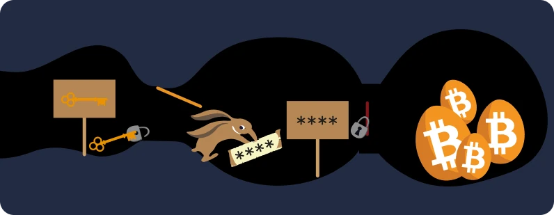
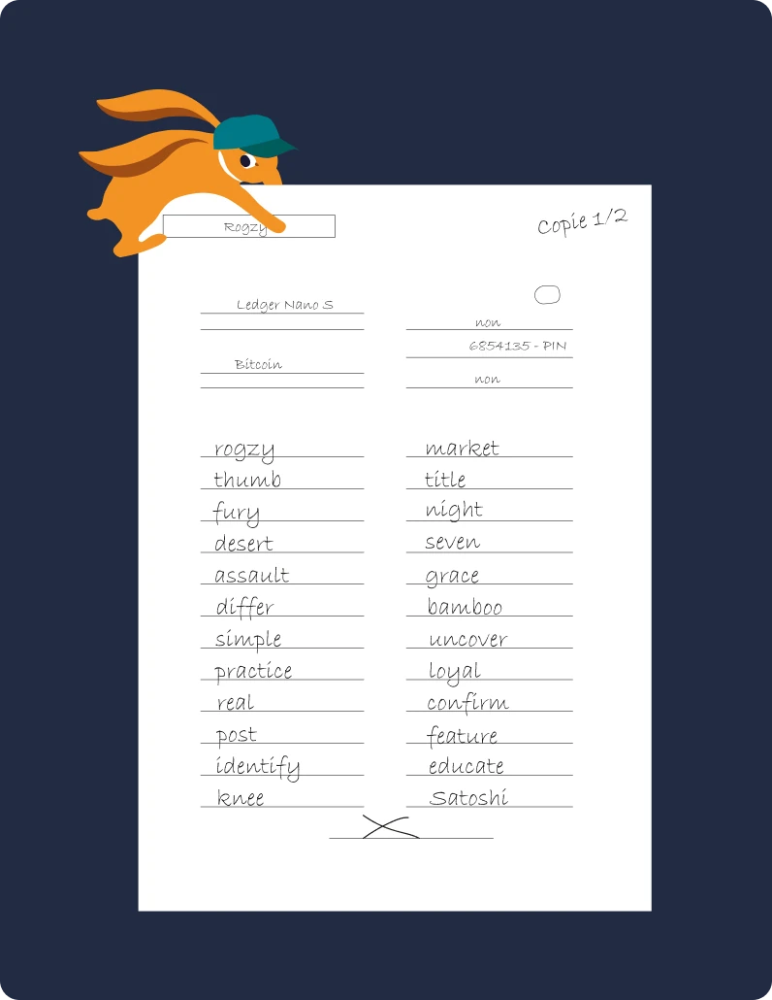
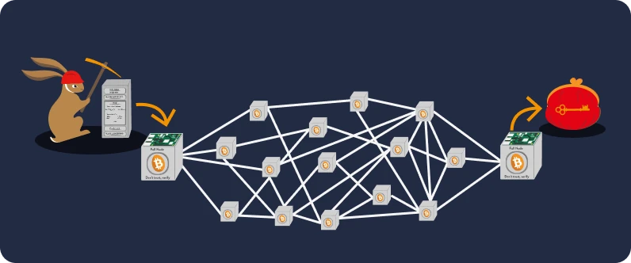
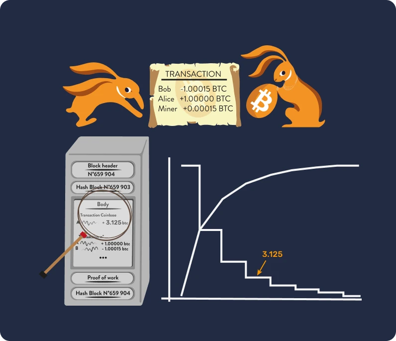
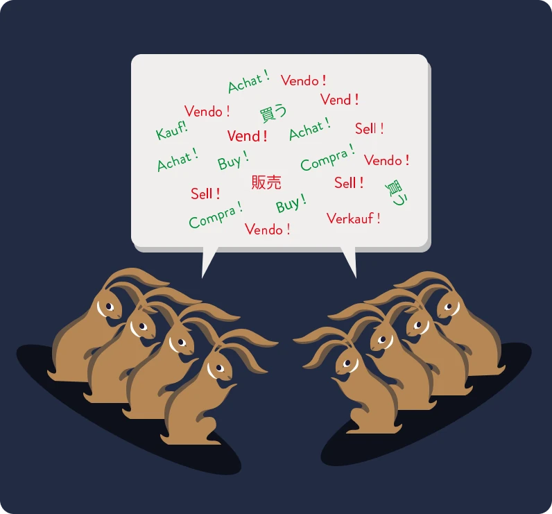

# La vostra prima avventura in Bitcoin 

In questo corso, spiegheremo le basi di Bitcoin in 25 capitoli, affinché possiate comprendere questa tecnologia in modo semplice ed efficace. Il corso esplora le basi del settore nel suo complesso, compresi argomenti come il mining, i wallet, le piattaforme di acquisto/vendita e altro ancora. Altra documentazione didattica sarà disponibile durante il percorso e vi invitiamo a consultare i "21 poster" nella sezione risorse dopo aver terminato il corso.

Non sono necessarie conoscenze specifiche per iniziare. In effetti, i contenuti che seguono sono accessibili a studenti di tutti i livelli e dovrebbe richiedere circa 15 ore per essere completato.

+++

# Introduzione

<partId>3cd2ac82-026c-53e1-874a-baf5842adc6d</partId>

## Panoramica del corso

<chapterId>27e3fb60-4b50-556b-9e70-c4f5475c121d</chapterId>

Benvenuto nel corso BTC101!

Bitcoin è una rivoluzione tecnologica e monetaria, capace di farci mettere in discussione il nostro rapporto con il denaro e la società. Bitcoin (indicato come BTC) è infatti una moneta **neutrale** e **decentralizzata**, cioè non controllata da alcuna entità o istituzione. È un'innovazione che va oltre la semplice "moneta di internet": è sia un protocollo informatico (Bitcoin) che un'unità monetaria (bitcoin).

Il protocollo utilizza tecnologie sottostanti come la crittografia, la comunicazione in rete e la famosa "blockchain", mentre l'unità bitcoin rappresenta la valuta necessaria per il corretto funzionamento di questo protocollo. Nella vita di tutti i giorni, i salvadoregni e i bitcoiner di tutto il mondo utilizzano la valuta bitcoin per acquistare e vendere beni e servizi, affidandosi a questa tecnologia per migliorare la propria vita.

**Un programma di studi completo ma accessibile:**

In questo corso discuteremo alcuni aspetti monetari di Bitcoin, tra cui come acquistare e vendere bitcoin, conservarli in modo sicuro nei wallet digitali e utilizzarli per le transazioni. Esamineremo anche il ruolo dei miner, essenziali per la creazione di nuovi bitcoin e per la sicurezza della rete Bitcoin. Infine, esploreremo il futuro di Bitcoin e come la tecnologia Lightning Network possa migliorare le transazioni Bitcoin.


È essenziale capire che Bitcoin è un nuovo sistema monetario che cambia completamente il nostro rapporto con il denaro, quindi imparare a usarlo è una competenza necessaria per chiunque voglia avere il controllo dei propri fondi.

**Sezione 1 - Introduzione**  
- Capitolo 1 - Panoramica del corso  
- Capitolo 2 - La preistoria di Bitcoin  

**Sezione 2 - Il Denaro**  
- Capitolo 3 - Che cos'è il denaro? 
- Capitolo 4 - La moneta Fiat 
- Capitolo 5 - Iperinflazione  
- Capitolo 6 - La politica monetaria di Bitcoin  

**Sezione 3 - Wallet Bitcoin**  
- Capitolo 7 - Come funzionano i wallet Bitcoin?
- Capitolo 8 - Scelta della sicurezza
- Capitolo 9 - Impostazione del tuo wallet
- Capitolo 10 - Salvaguardia nel tempo

**Sezione 4 - Aspetti tecnici di Bitcoin**  
- Capitolo 11 - Lancio di Bitcoin  
- Capitolo 12 - Che cos'è una transazione?  
- Capitolo 13 - Nodi Bitcoin  
- Capitolo 14 - Miner  
- Capitolo 15 - Miner ed ecologia 

**Sezione 5 - Come ottenere bitcoin?**  
- Capitolo 16 - Bitcoin non dorme mai!  
- Capitolo 17 - Guadagnare bitcoin lavorando  
- Capitolo 18 - Risparmiare con Bitcoin  
- Capitolo 19 - L'iperbitcoinizzazione  

**Sezione 6 - Il futuro di Bitcoin: Lightning Network**  
- Capitolo 20 - Introduzione a Lightning Network  
- Capitolo 21 - Casi d'uso per Lightning Network 
- Capitolo 22 - Pillola rossa o pillola blu?

Prima di introdurre la definizione di denaro e la sua funzione nella società (Capitolo 1), dovremmo partire dalla genesi di Bitcoin. Lanciato nel 2009, Bitcoin è una tecnologia relativamente nuova e diversa da qualsiasi altra. È quindi normale che non si riesca a capire tutto e subito. Proprio come quando si impara a usare Internet o a guidare un'automobile, non è necessario conoscere subito tutti i dettagli tecnici: si può iniziare imparando a ricevere, inviare e mettere al sicuro i propri fondi, per poi fare piccoli passi approfondendo l'argomento'.

In fondo siamo solo agli inizi della sua adozione, avendo appena superato la fase di avviamento: siete in tempo per acquisire tutte le conoscenze che desiderate su questa importante innovazione.


L'importante è capire questa nuova tecnologia in modo generale, quindi vi auguriamo di godervi questo corso e di continuare a fare progressi in questo nuovo paradigma monetario globale.

Pronto a tuffarti nell'affascinante universo di Bitcoin e a comprenderne tutti i meccanismi? Andiamo!

## La preistoria del Bitcoin

<chapterId>9a94b627-5b69-5d81-9125-f1fa9b0aa6ad</chapterId>

Prima che il termine "Bitcoin" diventasse sinonimo di valuta digitale e trasformazione finanziaria, le basi per la sua creazione sono state gettate da una serie di idee, innovazioni e movimenti sociali. Tra questi il movimento cypherpunk spicca come elemento chiave all'inizio della storia di Bitcoin.

### Cypherpunks: visionari del mondo digitale


Nel cuore dell'evoluzione tecnologica degli anni '80 e '90, un gruppo di persone iniziò a interrogarsi profondamente sul ruolo della privacy e della libertà nell'era digitale. Questi individui, in seguito sarebbero stati conosciuti come "cypherpunks", credevano fermamente che la crittografia potesse servire come strumento per proteggere i diritti individuali dalle interferenze dei governi e delle grandi aziende.

Figure iconiche come Julian Assange, Wei Dai, Tim May e David Chaum hanno assunto un ruolo fondamentale nel plasmare la filosofia e la visione del movimento. Questi capostipiti hanno condiviso le loro idee in un'autorevole mailing list, dove partecipanti di tutto il mondo si sono impegnati nel dibattito a proposito dei modi migliori di sfruttare la tecnologia per una maggiore libertà individuale.

### I tre testi fondamentali dei Cypherpunk


Il movimento cypherpunk, profondamente radicato nell'attivismo digitale e nella crittografia, ha attinto a diversi testi fondamentali per articolare i suoi principi e la sua visione del futuro. Tra questi scritti, tre spiccano in particolare:

- Il "Manifesto Cypherpunk":

scritto da Eric Hughes nel 1993, "The Chypherpunk Manifesto" afferma che la privacy è un diritto fondamentale. L'autore sostiene che la capacità di comunicare liberamente e in modo riservato è essenziale per una società libera. Il manifesto afferma che: "Non possiamo aspettarci che i governi, le aziende o altre grandi organizzazioni senza volto ci garantiscano la privacy [...]. Dobbiamo difendere la nostra privacy se vogliamo averne una".

- Il "Manifesto cripto-anarchico":

scritto da Timothy C. May nel 1992, questo documento spiega come l'uso della crittografia può portare a un'era di anarchia crittografica in cui i governi dovrebbero trovarsi impotenti a interferire negli affari privati dei cittadini. May immagina un futuro in cui le persone si scambiano informazioni e denaro in modo anonimo senza la mediazione di terze parti.

- La "Dichiarazione di indipendenza del cyberspazio":

anche se non esclusivamente cypherpunk, questo testo riflette i sentimenti di molti partecipanti al movimento. Scritto nel 1996 da John Perry Barlow, è una risposta alla crescente regolamentazione di Internet da parte dei governi. Il testo afferma che il cyberspazio è un regno distinto dalla sfera fisica e non dovrebbe essere soggetto alle stesse leggi. Come si legge nella dichiarazione, "non abbiamo un governo eletto, né è probabile che ne avremo uno".

### I predecessori di Bitcoin

Prima della nascita di Bitcoin ci sono stati diversi tentativi di creare una valuta digitale. Negli anni '80, ad esempio, David Chaum introdusse il concetto di "moneta elettronica anonima" con il suo progetto "DigiCash". Purtroppo DigiCash non ha mai avuto successo, a causa di varie limitazioni.

Un altro importante precursore è "B-money" di Wei Dai. Sebbene non sia mai stato implementato, avanzava l'idea di una moneta digitale anonima in cui il rilevamento delle frodi fosse affidato ad una comunità di certificatori piuttosto che da un'autorità centrale.

La figura sotto illustra chiaramente lo sviluppo del movimento attraverso le sue numerose innovazioni tecnologiche.


È in questo ambiente fertile che il misterioso Satoshi Nakamoto pubblicò il whitepaper di Bitcoin nel 2008. Nel documento combina diverse idee del movimento cypherpunk, come la proof of work e i timestamp crittografici, per creare una valuta digitale decentralizzata e resistente alla censura.

Bitcoin è comunque più di questo: rappresenta la realizzazione degli ideali cypherpunk. Al di là della sua tecnologia, simboleggia una rivoluzione contro i sistemi finanziari tradizionali e offre un'alternativa basata su trasparenza, decentralizzazione e sovranità individuale.

### Conclusione

Le origini di Bitcoin sono profondamente radicate nel movimento cypherpunk e nella ricerca comune di una maggiore libertà nell'era digitale. Combinando i principi della crittografia, della decentralizzazione e dell'integrità, Bitcoin è diventato molto più di una valuta. È infatti il prodotto di una rivoluzione filosofica e tecnologica che continua a rimodellare il nostro mondo.

Pertanto, Bitcoin è un protocollo che si estende su lunghi periodi di tempo e ci incoraggia a mettere in discussione il nostro rapporto con l'energia, il tempo e il denaro.

Ma Bitcoin è una "vera" moneta? Per capirlo, dobbiamo innanzitutto comprendere il concetto di denaro e le sue varie forme, che esploreremo nel prossimo capitolo.

Se volete approfondire la storia di Bitcoin, vi consigliamo il nostro corso HIS 201, in cui scoprirete le origini e il lento emergere di Bitcoin, nonché gli inizi della sua storia e della sua comunità. Questo corso è completamente documentato e riporta le fonti, insieme molti aneddoti:

https://planb.network/courses/a51c7ceb-e079-4ac3-bf69-6700b985a082

# Il denaro

<partId>e913df1a-4cbd-5380-ba67-ca2a0414f671</partId>

## Il denaro nella storia

<chapterId>c838e64d-d59f-5703-8c74-ea5e8c4fdd31</chapterId>

L'evoluzione del denaro è un aspetto affascinante della storia dell'umanità, che riflette l'ingegnosità delle civiltà nel soddisfare esigenze economiche in costante evoluzione nel corso dei secoli.


### Dalle conchiglie ai conti bancari

Originariamente la moneta era un bene tangibile, come il grano, il bestiame o un'altra materia prima. Tuttavia, questi beni avevano il grande svantaggio di essere deperibili, rendendo difficile il loro utilizzo come mezzo di risparmio a lungo termine. Ad esempio, un cattivo raccolto o bestiame ammalato potevano distruggere la ricchezza di un individuo da un giorno all'altro.

Con il progredire delle civiltà e l'espansione del commercio in nuove regioni, nacque l'esigenza di un mezzo di scambio universale. Gli individui sperimentarono dapprima oggetti come conchiglie e pietre preziose, ma non erano così resistenti o scarsi come si credeva. Alla fine l'oro divenne lo standard, grazie alla sua scarsità, resistenza e divisibilità. Era e rimane tuttora, un simbolo di ricchezza e potere.


### Qual è il ruolo del denaro?

Il denaro è uno strumento di comunicazione molto sofisticato:

- Permette di essere trasferito tra il presente e il futuro, perché trasforma il nostro tempo e la nostra energia del presente in un bene che può essere riutilizzato nel futuro, senza rischi di svalutazione.
- Facilita la comunicazione in un linguaggio universale: senza conoscersi o parlare la stessa lingua, due estranei possono scambiare, commerciare e concordare il valore delle cose.

La sua funzione nel nostro mondo è difficile da riprodurre artificialmente. Nessun individuo o gruppo può creare il denaro, poiché è un fenomeno naturale che deve emergere dal mercato e dal consenso volontario. In questo senso, i prezzi servono come segnali e informazioni che guidano la società nell'allocazione delle risorse.

Per questi motivi l'oro, come moneta, è il risultato di 4.000 anni di darwinismo monetario basato sulle seguenti funzioni aristoteliche:

- **Riserva di valore**: il denaro può essere utilizzato per trasferire il potere d'acquisto nel futuro, quindi deve essere un materiale durevole;
- **Mezzo di scambio**: la moneta può essere utilizzata in cambio di beni e servizi al posto del baratto, evitando così la coincidenza dei desideri tra chi commercia;
- **Unità di conto**: il denaro ci permette anche di confrontare i valori di diversi beni per capire meglio la loro convenienza relativa.


### Le caratteristiche del denaro

L'oro soddisfa idealmente i criteri di una moneta efficiente: la sua naturale scarsità lo rende prezioso, mentre le sue proprietà chimiche fanno sì che non si deperisca nel tempo. Queste caratteristiche hanno reso l'oro una grande **riserva di valore**, ma non una moneta comune, perché questa forma di denaro non è facilmente divisibile o trasportabile su lunghe distanze. In un mondo globalizzato e digitale, l'oro fatica a tenere il passo e necessita di un'entità centrale che lo renda divisibile e facilmente scambiabile (ad esempio attraverso monete coniate).

All'opposto, le valute fiduciarie statali (fiat) sono facilmente utilizzabili, ma vengono costantemente svalutate dalle entità che le controllano (re, banche centrali, imperatori, dittatori).

Per spiegare meglio questo concetto, esploreremo le caratteristiche che rendono efficace una moneta:


- **Fungibilità**, ovvero intercambiabilità con un'altra unità dello stesso tipo senza perdita di valore;
- **Divisibilità**, in quanto può essere suddivisa in unità più piccole per facilitare le transazioni di volumi diversi;
- **Liquidità**, ovvero facilità di conversione in beni o servizi.

Per soddisfare questi criteri, la moneta si è storicamente evoluta attraverso passi differenti:

- Pietra grezza -> Moneta
- Banconota -> Carta di credito/debito
- Blockchain -> Lightning Network

Le valute si stanno evolvendo ancora oggi, adattando le loro forme per soddisfare diversi casi d'uso. Come abbiamo detto, pur essendo un'eccellente riserva di valore, l'oro non è più adatto all'attuale economia globalizzata. Allo stesso modo, le valute fiduciarie come il dollaro e l'euro sono molto liquide e facilmente trasportabili perché ora sono per lo più digitali, ma il loro valore diminuisce costantemente a causa dall'inflazione monetaria.

In questo scenario Bitcoin presenta nuove possibilità. Le sue proprietà, come l'emissione rigorosamente limitata, lo rendono un'eccellente riserva di valore. Inoltre, in quanto valuta neutrale di Internet, diventa un valido **mezzo di scambio** che supera i confini. Tuttavia, oggi non è ancora ampiamente accettato nel commercio, nonostante la sua [costante adozione](https://btcmap.org/map).

## Valute fiduciarie

<chapterId>25151d46-7db1-5b48-8bba-cbde1944555a</chapterId>

> "Chi non ricorda il passato è condannato a ripeterlo" diceva George Santayana.
> Una verità che risuona con forza quando si parla dell'attuale sistema monetario.

### Fiduciario = Degno di fiducia

Oggi le principali valute, come l'euro e il dollaro, sono considerate fiduciarie. Ciò significa che non hanno un valore intrinseco e dipendono interamente dalla fiducia riposta nelle istituzioni che le governano.

Una moneta fiduciaria è una forma di denaro decretata come tale da un'istituzione, cioè uno Stato, come la Cina con lo Yuan, o un'unione politico-economica, come l'Unione Europea con l'Euro. L'ente preposto alla sua emissione è la banca centrale (ad esempio, possiamo citare la People's Bank of China, la Federal Reserve degli Stati Uniti o la Banca Centrale della Repubblica di Guinea). Sono proprio questi enti che hanno il compito di delineare la politica monetaria e quindi la quantità di moneta da mettere in circolazione o da stampare.


### Svalutazione monetaria: una strategia antica quanto l'Impero Romano

Fin dall'antichità, l'oro è servito come riferimento monetario, ma la sua rigidità ha spesso portato i leader, sia gli imperatori romani che i governi moderni, ad adottare valute alternative, spesso fiduciarie.

Il meccanismo è semplice e si ispira a pratiche che esistono fin dalle origini della civiltà. I leader desiderosi di esercitare il controllo sulla ricchezza, iniziano con la centralizzazione dell'oro, spesso sfruttando il loro potere e promettendo protezione e sicurezza. Con questa preziosa riserva nelle loro mani introducono una nuova moneta equivalente al valore dell'oro centralizzato, ma coniata con la loro effigie. Questa moneta inizia a circolare e la gente si adatta rapidamente alla comodità del suo semplice utilizzo.

Tuttavia, questi leader iniziano a svalutare la nuova moneta in modo graduale, riducendo di fatto il suo valore di qualche punto percentuale ogni anno rispetto al prezzo iniziale dell'oro. Questa svalutazione silenziosa viene spesso giustificata come se fosse nell'interesse del popolo. In realtà, chi risparmia in questa moneta fiduciaria vede diminuire il valore dei propri risparmi, mentre lo Stato finanzia i propri progetti attraverso l'inflazione. Questa svalutazione rende infine il debito più facile da ripagare.


Nei momenti di crisi, il leader fa l'annuncio: la moneta non è più sostenuta dall'oro. Il pubblico, ormai abituato alla moneta fiduciaria e spesso disinformato sulle questioni finanziarie, accetta questa realtà consentendo allo Stato di manipolare liberamente l'offerta di moneta e di stampare enormi somme di denaro a costo quasi zero.

La stampa di moneta porta quindi all'inflazione e impoverisce gradualmente la popolazione. Inoltre, il sistema finanziario è regolato e limitato per evitarne il collasso, dal momento che qualsiasi sconvolgimento potrebbe provocare una grave crisi economica. Contrariamente alle masse, le istituzioni finanziarie e gli individui ricchi traggono grandi vantaggi da questo sistema, che crea un divario nella disparità di ricchezza e favorisce l'autoritarismo. In questo contesto, non sono incentivati ad apportare cambiamenti radicali, permettendo al sistema di continuare il suo corso fino a una possibile implosione.

Questa strategia può durare per decenni, se ben eseguita. È però importante notare che una svalutazione molto rapida o una perdita di fiducia, possono portare all'iperinflazione (vedi capitolo successivo). La storia dimostra che il dollaro ha perso il 98% del suo valore in 100 anni, l'euro il 30% in 20 anni e la sterlina il 99% dalla sua creazione.

Lavalut finisce per non avere più alcun legame con l'oro, come le monete romane alla fine dell'Impero, o addirittura ridursi a un semplice valore numerico, scollegato dalla realtà tangibile.

Oggi stiamo assistendo a una svolta storica. Il dollaro, che ha a lungo dominato, sembra essere in declino mentre l'oro ha perso il suo ruolo centrale. Siamo alle soglie di un nuovo ciclo monetario, che ci ricorda come le lezioni della storia sono spesso dimenticate


### Bitcoin è una soluzione?

Grazie a queste premesse, la rivoluzione di Bitcoin sta prendendo piede. A differenza delle valute precedenti non richiede **nessuna terza parte fidata** e mira a separare lo Stato dal denaro.


Bitcoin si presenta a tutti gli effetti come una risposta a queste sfide sistemiche, proponendo una soluzione decentralizzata e un nuovo sistema monetario parallelo. Se nella storia l'oro è stato favorito come valuta per la sua resistenza alla contraffazione, allo stesso modo Bitcoin non può essere falsificato. Grazie alla sua natura decentralizzata e crittografica, è limitato a 21 milioni di unità. Bitcoin è una valuta che si basa sulla trasparenza e sulla neutralità, offrendo un'alternativa interessante all'attuale sistema monetario centralizzato.


Un altro motivo per cui Bitcoin ha attirato l'attenzione è l'emergere delle valute digitali delle banche centrali, o CBDC, che sembra inevitabile. Questa nuova forma di denaro svilupperebbe un'economia pianificata sempre più a livello centrale e potrebbe sia ostacolare la libertà finanziaria degli individui sia facilitare gli abusi autoritari.

Possiamo concludere questo capitolo con una citazione del premio Nobel F.A Hayek del 1984:

> "Non credo che potremo mai avere una buona moneta, prima di aver tolto la cosa dalle mani del governo. Non possiamo toglierla dalle mani del governo con la violenza, l'unica cosa che possiamo fare è introdurre, in qualche modo furbo, qualcosa che loro non possono fermare".
> Per saperne di più sulle fallacie economiche e sulla libertà, vi invitiamo a scoprire il nostro corso ECO 102, che ripercorre la vita e le idee di Frédéric Bastiat, un intellettuale francese del XIX secolo che avrebbe sicuramente apprezzato la nascita di Bitcoin:

https://planb.network/courses/d07b092b-fa9a-4dd7-bf94-0453e479c7df

## Iperinflazione

<chapterId>b04c024c-54f3-50cb-997f-58721cfc74be</chapterId>

L'iperinflazione è un fenomeno monetario specifico delle valute fiat: è caratterizzata da una completa perdita di fiducia in una valuta e da un drammatico aumento dell'inflazione, dovuto alla stampa di moneta da parte delle autorità. Di conseguenza i risparmi accumulati dalle persone possono disperdersi in un periodo di tempo relativamente breve, spingendo il Paese sull'orlo del collasso economico, sociale e politico.

### L'inflazione è fuori controllo!

Per capire l'impatto dell'inflazione sui risparmi, dobbiamo prendere in considerazione diversi tassi di inflazione.

- Con un'inflazione del 2%, si perde ogni anno il 2% del potere d'acquisto, il che equivale al 10% in 5 anni.
- Con il 7%, si perde la metà in 10 anni.
- Con il 20%, se ne perde quasi la metà in 3 anni.

Quando si verifica un'iperinflazione, non si parla più di un 20% all'anno, ma di un 20% al mese o, al suo apice, addirittura al GIORNO. Sperimentare un'inflazione del 100% al giorno per tre giorni è uno scenario realistico che si è verificato e continua a verificarsi nel mondo.

È fondamentale capire che l'iperinflazione non avviene per caso, per il capitalismo o per gli attacchi dei politici avversari. L'iperinflazione è la diretta conseguenza di politiche monetarie sbagliate, pianificate da banchieri centrali e politici. Le sue conseguenze si ripercuotono su ogni cittadino e hanno un impatto anche sulle generazioni future. Vi invitiamo a dedicare cinque minuti alla lettura della tabella seguente per rendervi conto del reale impatto di questo fenomeno (il corso ECO204 approfondisce ulteriormente l'argomento). Come potete vedere, nessun Paese o valuta è potenzialmente al sicuro.


### Quali sono le fasi dell'iperinflazione?


Affinché si verifichi l'iperinflazione, devono essere realizzate alcune condizioni.

Fase 1 - Perdita di fiducia

- La centralizzazione del potere monetario facilita la creazione di denaro e i suoi abusi. In questo contesto, alcuni fattori esterni possono innescare l'iperinflazione, tipicamente guerre, misure sociali o l'aumento del prezzo di risorse chiave come il grano o la benzina. Può quindi verificarsi una perdita di fiducia nella moneta e gli individui iniziano a mettere in dubbio l'origine del denaro e i benefici della politica monetaria fissata.

Fase 2 - Crollo della valuta e aumento dei prezzi

- Quando i governi perdono il controllo della fiducia, gli individui iniziano a scambiare la loro valuta con una più stabile, come è successo in Venezuela con il dollaro statunitense. Questa circostanza porta a un aumento dei prezzi, creando un circolo vizioso in cui beni e servizi diventano sempre più costosi. Per soddisfare queste esigenze e correggere la politica monetaria, lo Stato stampa più moneta provocando un'inflazione esponenziale.

Fase 3 - Il circolo vizioso della stampa di moneta

- Sono così necessarie sempre più banconote per acquistare beni, con conseguente scarsità delle stesse. In risposta, i governi ricorrono alla stampa di altre banconote, alimentando ulteriormente l'inflazione.


Fase 4 - L'emergere di una nuova moneta

- Viene quindi introdotta una nuova valuta per sostituire quella vecchia, al fine di interrompere il ciclo dell'inflazione attuando controlli più severi che non erano in vigore con la precedente moneta a corso legale.

Risolvere una crisi iperinflazionaria richiede spesso cambiamenti radicali, come rivoluzioni, cambi di governo, sostituzione dei banchieri centrali, ecc. La perdita di fiducia, il crollo della valuta e la ricostruzione sono fasi essenziali per far rinascere un'economia basata sulla valuta fiat.

### Tre esempi significativi

- Germania, 1922-1923.

Uno degli esempi più eclatanti di iperinflazione si è verificato nella Repubblica di Weimar, in Germania, dopo la prima guerra mondiale.

La Germania aveva preso in prestito enormi quantità di denaro per finanziare la guerra. Tuttavia, non solo perdette la guerra, ma dovette pagare miliardi di dollari in riparazioni. Il mese con il più alto tasso di inflazione fu l'ottobre 1923, con un picco del 29.500%, pari a un tasso di inflazione del 20,9% al giorno. I prezzi raddoppiavano ogni 3,7 giorni!

La moneta tedesca divenne così inutile che alcuni cittadini preferivano bruciare le banconote anziché la legna, perché era effettivamente più economica. Si racconta persino che nei ristoranti i camerieri dovessero annunciare i prezzi dei menu ogni 30 minuti per tenere conto dell'inflazione.

Alla fine, le autorità crearono una nuova moneta sostenuta dai debiti di Germania, Francia e Inghilterra e garantita dai terreni tedeschi.


- Ungheria, 1945-1946

Il Paese che ha vissuto la peggiore iperinflazione fino ad oggi è di gran lunga l'Ungheria dopo la Seconda Guerra Mondiale.

L'Ungheria si trovò dalla parte dei perdenti nel conflitto, con la maggior parte della sua capacità di produzione industriale distrutta. Il mese con l'inflazione più alta fu il luglio 1946, che vide una sconcertante inflazione dei prezzi del 41.900.000.000.000.000%, equivalente al 207% al giorno. I prezzi raddoppiavano ogni 15 ore!

L'ultima banconota a essere messa in circolazione fu un Pengo da 100 milioni di miliardi (100.000.000.000.000) nel 1946.


- Zimbabwe, 2007-2008

Fino al 2000 lo Zimbabwe era autosufficiente per quasi tutto il suo fabbisogno, tranne che per il petrolio.

Nel 1997 il dollaro dello Zimbabwe è crollato di oltre il 72%, dopo che il governo ha accettato di risarcire i veterani di guerra per un importo equivalente a 450 milioni di dollari americani. Non disponendo di tale somma, il governo ha fatto ricorso alla stampa di moneta. Nel 2005 l'inflazione ha raggiunto il 586%, ma il picco è stato raggiunto a metà novembre 2008 con un tasso stimato al 79.600.000.000% al mese.

Nel giugno 2007 il governo ha reagito imponendo un controllo dei prezzi, ma questa azione non ha avuto alcuna influenza sull'economia. I negozi sono stati letteralmente "saccheggiati" e i commercianti non avevano più i mezzi per rifornirsi.

Nell'aprile 2009 il Ministro delle Finanze ha annunciato la sospensione del dollaro dello Zimbabwe e ha autorizzato l'uso di diverse valute estere per gli scambi commerciali. Tutti i conti bancari, le pensioni e le istituzioni finanziarie hanno visto svanire i loro saldi dall'oggi al domani.


In conclusione, l'iperinflazione ha l'effetto di deteriorare rapidamente il valore della moneta, portando all'erosione dei risparmi e alla perdita di fiducia nel sistema monetario. Come Voltaire ha dichiarato, una valuta fiat finirà sempre per perdere il suo valore intrinseco e convergere verso lo zero.

Una moneta che si basa sulla fiducia in una terza parte come un istituto finanziario è, in pratica e a lungo termine, una moneta difettosa, perché non è in grado di garantire il potere d'acquisto o di preservare i risparmi.

Per approfondire il tema delle iperinflazioni, vi consigliamo il corso ECO 204 di David St-Onge, dove imparerete cosa sono i cicli iperinflazionistici e il loro reale impatto sulla nostra vita. Scoprirete anche le analogie tra questi cicli e, soprattutto, come proteggervi da essi.

https://planb.network/courses/caa75343-ac90-4249-bcca-0e2e57c3a0f1

## 21 milioni di bitcoin

<chapterId>f4a06d76-1963-56fd-93ff-dfa41489bcde</chapterId>

### La politica monetaria di Bitcoin

Bitcoin è una moneta digitale decentralizzata con una quantità massima predefinita di **21 milioni di unità**. Questa caratteristica intrinseca di scarsità è determinata dal suo codice informatico, rafforzata dal consenso di tutti gli utenti che partecipano al protocollo.


La sua emissione monetaria può essere illustrata da una curva che rappresenta la quantità di bitcoin creati nel tempo. Nel 2022, ad esempio, erano in circolazione circa 18,5 milioni di bitcoin. Le previsioni indicano che nel 2025 ci saranno in circolo circa 19,5 milioni di bitcoin, che rappresentano circa il 93% dell'offerta totale; questa cifra raggiungerà i 20,4 milioni nel 2037.

### Come vengono creati i nuovi bitcoin?

La creazione di nuovi bitcoin è il risultato del processo di mining. In poche parole, i miner utilizzano potenti computer per risolvere complessi problemi matematici, che convalidano e rendono sicure le transazioni. Una volta risolto un problema, il miner aggiunge un nuovo blocco alla blockchain, un registro decentralizzato e distribuito che registra tutte le transazioni effettuate sulla rete. La blockchain garantisce trasparenza e sicurezza, poiché ogni blocco è collegato al precedente, rendendo quasi impossibile alterare i dati precedenti senza il consenso della rete.


Dopo aver svolto con successo questo compito, i miner vengono ricompensati con l'emissione di nuovi bitcoin ogni dieci minuti. Questa ricompensa è programmata per dimezzarsi ogni 210.000 blocchi, cioè circa ogni quattro anni (un evento noto come "halving"), dando alla curva di emissione monetaria una forma a scala. Grazie a questo meccanismo si può prevedere matematicamente che la creazione di nuovi bitcoin cesserà entro l'anno 2140, quando il numero totale raggiungerà il limite di 21 milioni.

| Numero di halving | Altezza del blocco | Ricompensa in BTC dopo l'halving | Stima dei BTC in circolazione dopo l'halving |

| -------------- | ------------ | ------------------------- | ------------------------------------------ |

| 1 | 210.000 | 25 BTC | 10.500.000 BTC |

| 2 | 420.000 | 12,5 BTC | 15.750.000 BTC |

| 3 | 630.000 | 6,25 BTC | 18.375.000 BTC |

| 4 | 840.000 | 3,125 BTC | 19.687.500 BTC |

| 5 | 1.050.000 | 1,5625 BTC | 20.343.750 BTC |

| 6 | 1.260.000 | 0,78125 BTC | 20.671.875 BTC |

| 7 | 1.470.000 | 0,390625 BTC | 20.835.937,5 BTC |

| 8 | 1.680.000 | 0,1953125 BTC | 20.917.968,75 BTC |

| 9 | 1.890.000 | 0,09765625 BTC | 20.958.984,375 BTC |

| 10 | 2.100.000 | 0,048828125 BTC | 20.979.492,188 BTC |

| 11 | 2.310.000 | 0,0244140625 BTC | 20.989.746,094 BTC |

| 12 | 2.520.000 | 0,01220703125 BTC | 20.994.873,047 BTC |

| 13 | 2.730.000 | 0,006103515625 BTC | 20.997.436,523 BTC |

| 14 | 2.940.000 | 0,0030517578125 BTC | 20.998.718,262 BTC |

| 15 | 3.150.000 | 0,00152587890625 BTC | 20.999.359,131 BTC |

| 16 | 3.360.000 | 0,000762939453125 BTC | 20.999.679,566 BTC |

| 17 | 3.570.000 | 0,0003814697265625 BTC | 20.999.839,783 BTC |

| 18 | 3.780.000 | 0,00019073486328125 BTC | 20.999.919,892 BTC |

| 19 | 3.990.000 | 0,000095367431640625 BTC | 20.999.959,946 BTC |

| 20 | 4.200.000 | 0,0000476837158203125 BTC | 20.999.979,973 BTC |

Rivedremo il concetto di mining in modo più dettagliato nel [capitolo sul mining](https://planb.network/courses/2b7dc507-81e3-4b70-88e6-41ed44239966/dbb8264a-7434-57e4-9d1b-fbd1bae37fdf).

### Garanzia di scarsità digitale

Il limite di 21 milioni è alla base della scarsità di Bitcoin ed è garantito da due meccanismi chiave: l'aggiustamento della difficoltà (che influenza il mining) e la teoria dei giochi.

- L'aggiustamento della difficoltà è un processo che avviene ogni 2016 blocchi, ovvero circa due settimane, per garantire che un nuovo blocco venga aggiunto alla blockchain in media ogni dieci minuti circa. Questa frequenza di creazione dei blocchi e la quantità totale di bitcoin sono entrambi aspetti immutabili del protocollo Bitcoin e non possono essere modificati senza un consenso generale, a differenza delle decisioni arbitrarie prese nei sistemi monetari tradizionali.

La difficoltà di trovare un hash valido segue una sorta di ciclo: se il numero di miner aumenta, significa che il numero di blocchi trovati è maggiore, il che porta a una diminuzione del tempo medio per trovare un blocco. Ne deriva l'aumento della difficoltà. Di conseguenza, il numero di blocchi che i miner trovano si riduce, il che significa che il meccanismo torna alla media di 10 minuti per blocco. Si veda l'immagine sottostante per una comprensione visiva.


Sapevate che i miner sono incentivati a minare un blocco per guadagnare nuovi bitcoin attraverso la ricompensa di blocco e le commissioni (fee) associate alle transazioni che includono nello stesso?

Pertanto, man mano che il numero di bitcoin emessi si avvicina al limite di 21 milioni, i miner saranno remunerati più attraverso le commissioni di transazione, piuttosto che attraverso la ricompensa di blocco.

- La teoria dei giochi è un concetto matematico che si basa sulla razionalità umana. Presuppone che gli individui agiscano in modo logico, cercando di massimizzare i propri benefici e tenendo conto delle potenziali decisioni degli altri. In Bitcoin la teoria dei giochi aiuta a garantire che la maggioranza dei miner e degli utenti agisca nell'interesse della rete. Infatti, poiché le modifiche al protocollo sono votate dagli utenti, qualsiasi modifica al protocollo Bitcoin richiederebbe l'accordo dell'intera comunità, il che è molto complesso. Se qualcuno volesse creare un ventiduesimo milione di bitcoin, dovrebbe convincere tutti gli utenti a svalutare volontariamente i propri risparmi, il che è improbabile che accada perché Bitcoin è globale e non è governato da un gruppo centrale.


L'idea di svalutare la valuta è contraria alla filosofia alla base di Bitcoin, quindi è altamente improbabile che si verifichi una modifica della sua quantità complessiva.

### Una politica monetaria verificabile: ogni secondo, dall'inizio e per sempre!

La scarsità di Bitcoin è un punto di forza e la quantità massima di 21 milioni di bitcoin in circolazione è pubblica e verificabile da chiunque.

Chiunque può farlo attraverso un nodo Bitcoin (cioè un validatore di transazioni) semplicemente inserendo il seguente comando: `bitcoin-cli gettxoutsetinfo`. Questa trasparenza rafforza la fiducia nel sistema Bitcoin, che non si basa su istituzioni centrali o individui, ma piuttosto sulle garanzie matematiche e crittografiche insite nel suo protocollo (imparerete a farlo facilmente in LNP201).

```json
{
  "height": 710560,
  "bestblock": "0000000000000000000887384d67103412ea7f18a43953e65c8c4ac36bf42e54",
  "transactions": 473244,
  "txouts": 1018917,
  "bogosize": 2183872374,
  "hash_serialized_2": "eebb9987337700ffaacbbaa11223344",
  "disk_size": 178239584,
  "total_amount": 18745998.12345678
}
```

Bitcoin garantisce una sana gestione monetaria limitando l'emissione per design, il che lo rende molto diverso dalle altre valute perché può proteggere i risparmi degli utenti. In linea con i principi dell'economia austriaca, la sua quantità stabile e la prevedibilità di emissione lo proteggono dai rischi di inflazione che le valute tradizionali devono affrontare (per saperne di più, consultate il corso ECO201).

In sintesi, con la sua natura decentralizzata, la scarsità programmata e la trasparenza, Bitcoin offre un'alternativa unica ai sistemi monetari tradizionali. Illustra come la tecnologia possa essere utilizzata per creare una moneta che non solo sia utile e verificabile, ma che preservi anche il valore dei risparmi degli utenti limitandone rigorosamente l'offerta.

### Conclusione della sezione 1!

# Wallet Bitcoin

<partId>28860585-4f61-59d9-b242-f4c57d837cc1</partId>

## Cosa sono i wallet Bitcoin?

<chapterId>1c0166ab-cb7a-5bc6-9175-d13482bd91f1</chapterId>

Nella sezione 2, esploreremo l'archiviazione e la sicurezza di Bitcoin attraverso l'uso dei wallet, per capire dove si trovano questi famosi bitcoin e come interagire con loro!

### Conoscere i wallet Bitcoin

I wallet vengono utilizzati per interagire con la rete Bitcoin in tre modi principali:

- Ricevere bitcoin
- Inviare bitcoin
- Proteggere i fondi da tentativi di hackeraggio e furto

Un wallet Bitcoin può avere molte forme: un software sul computer, un'applicazione sullo smartphone, un dispositivo fisico come una chiave USB o persino un foglio di carta. Ognuna di queste forme serve casi d'uso diversi. Alcuni sono infatti progettati per grandi transazioni con un'enfasi sulla sicurezza, mentre altri danno priorità alla privacy, oppure sono destinati a pagamenti quotidiani di piccole somme.

I wallet possono quindi essere classificati in ampie famiglie di utilizzo, sempre incentrate su una domanda chiave: siete i proprietari dei fondi o state lasciando il controllo del vostro denaro a terzi? Analizzeremo questo argomento in dettaglio nel prossimo capitolo, ma la domanda rimane semplice: il denaro è nelle vostre tasche o in quelle di un banchiere?


### Come funziona un wallet Bitcoin?

Che si tratti del vostro "banchiere" Bitcoin o di voi stessi, la stragrande maggioranza dei wallet funziona con una tecnologia simile a tutti, basata sulla crittografia asimmetrica, che prevede un sistema di coppie di chiavi: una chiave privata per spendere e una chiave pubblica per ricevere.

- Chiave privata

Quando si inizializza un wallet, viene generata una recovery phrase (chiave privata) che viene presentata all'utente sotto forma di 12 o 24 parole.

La chiave privata è fondamentale perché costituisce la proprietà dei bitcoin e quindi il diritto di utilizzarli o inviarli. Pertanto, il titolare della chiave privata è il vero proprietario dei bitcoin.

Questa chiave deve essere tenuta segreta e ben protetta, perché sblocca la vostra fortuna!

- Chiave pubblica e indirizzo

La chiave pubblica è generata dalla chiave privata ed è legata ad essa. Condividere la chiave pubblica comporta rischi per la privacy (perché gli altri utenti possono vedere il vostro saldo) ma non per la sicurezza (perché non possono spendere i vostri fondi senza possedere la chiave privata). A sua volta, la chiave pubblica viene utilizzata per creare indirizzi Bitcoin e quindi ricevere denaro.

Questi indirizzi vengono generati automaticamente dal wallet e possono essere condivisi in modo sicuro. Per massimizzare la vostra privacy, è consigliabile utilizzarli una sola volta.

In sintesi, questa tecnologia ci permette di ricevere bitcoin senza che il destinatario possa rubare i nostri fondi! Una cassetta della posta potrebbe essere una metafora calzante: le persone possono depositarvi denaro, ma voi siete gli unici a poterla aprire.


### I bitcoin sono nel wallet?

Sebbene le chiavi siano memorizzate nel wallet, i bitcoin stessi sono "memorizzati" nella blockchain, che è un registro pubblico distribuito all'interno della rete peer-to-peer di Bitcoin (ne parleremo nella sezione 3). Ciò significa che la perdita del dispositivo contenente il wallet non comporta necessariamente la perdita dei bitcoin. Ciò che permette di ricreare il wallet e di spendere i bitcoin è in realtà la chiave privata, quindi ricordatevi sempre di proteggerla adeguatamente!


Fortunatamente, dal 2017, la chiave privata può essere rappresentata da un semplice elenco di 12 o 24 parole, noto come "frase mnemonica", che è abbastanza facile da salvare. Questa frase serve come backup per i vostri fondi e vi permette di ricreare il vostro wallet utilizzando qualsiasi software o app. Pertanto, chiunque trovi questo elenco di parole può accedere ai vostri bitcoin.

### E riguardo agli hacker?

Cosa succede se qualcuno indovina per sbaglio il nostro elenco di 12 o 24 parole? La risposta breve è che è altamente improbabile, grazie alla crittografia utilizzata per creare il wallet. Per intenderci: scoprire per sbaglio la vostra stessa frase mnemonica è come trovare il numero "giusto" compreso tra 1 e 2 alla potenza di 256, che è quasi equivalente a trovare l'atomo "giusto" nell'universo. Tuttavia, se non siete soddisfatti di questa sicurezza predefinita, potete sempre migliorarla aggiungendo una passphrase (una parola in più) al vostro wallet Bitcoin.


La probabilità di hackerare il vostro wallet Bitcoin è astronomicamente bassa, se seguirete le buone pratiche di sicurezza che illustreremo nella prossima sezione.

Ricordate di scegliere il wallet giusto per le vostre esigenze di utilizzo: tutorial dettagliati sulla gestione e la sicurezza dei diversi wallet sono disponibili nella [sezione tutorial della nostra accademia](https://planb.network/tutorials/wallet).

Se durante il vostro viaggio nella tana del coniglio volete saperne di più sul funzionamento di un wallet Bitcoin, dall'entropia alla creazione degli indirizzi, vi consigliamo il corso CYP 201 dedicato a questo argomento:

https://planb.network/courses/46b0ced2-9028-4a61-8fbc-3b005ee8d70f

## Wallet Bitcoin e sicurezza

<chapterId>00c1afea-e54a-511f-bab3-2efc2fbfa6a1</chapterId>

### Porsi le domande giuste prima di iniziare

Quando si possiedono bitcoin, la sicurezza dei propri fondi è una delle principali preoccupazioni. Il modo migliore per definire un livello di sicurezza adatto alla vostra situazione è porsi una serie di domande:

- Chi può accedere ai vostri fondi? In altre parole, avete accesso esclusivo ai vostri bitcoin o una terza parte (come una società) vi concede l'accesso ai vostri fondi?
- Come pensate di utilizzare i bitcoin in quel particolare wallet? Regolarmente? Per risparmiare a medio o lungo termine?
- Quali sono le vostre competenze tecniche?
- Qual è il vostro budget per la sicurezza?

In realtà non esiste una risposta o una soluzione universale, quindi prendetevi il tempo necessario per rispondere a queste domande, che vi aiuteranno ad adattare le misure di sicurezza alle vostre esigenze.


### Pensare ai wallet Bitcoin in termini di sicurezza

Di seguito definiremo diversi livelli di sicurezza:

- **Livello 0**, utilizzate un cosiddetto "servizio custodial" in cui non siete gli unici detentori dei vostri bitcoin. Siate consapevoli che questa terza parte fidata può limitare l'accesso ai vostri fondi in qualsiasi momento. In questo caso, il vostro livello di sovranità finanziaria è simile a quello di un sistema bancario tradizionale con un conto corrente.


- **Livello 1**, si utilizza un wallet Bitcoin sul telefono o sul computer, dove si è gli unici detentori dei bitcoin e si possono effettuare facilmente le transazioni. Il suddetto strumento viene definito "hot wallet", perché la chiave privata viene memorizzata su un dispositivo con accesso a Internet. In questo caso è fondamentale eseguire un backup della frase mnemonica, per poter accedere nuovamente ai propri fondi in caso di perdita del telefono o del computer.

Ad esempio, è possibile utilizzare Sparrow Wallet come hot wallet:

https://planb.network/tutorials/wallet/desktop/sparrow-c674e2ac-d46f-4c82-92a7-7d1b0e262f5d

- **Livello 2**, si utilizza un wallet hardware e l'elenco di 12/24 parole è protetto. Viene spesso definito "cold wallet" perché le chiavi sono memorizzate su un dispositivo non connesso a Internet. In questo caso dovrete sempre firmare ogni transazione con il vostro dispositivo, il che rende i fondi meno accessibili su base giornaliera.

Ad esempio, si può utilizzare un Ledger, un Satochip o un Tapsigner:

https://planb.network/tutorials/wallet/hardware/ledger-nano-s-plus-75043cb3-2e8e-43e8-862d-ca243b8215a4

https://planb.network/tutorials/wallet/hardware/satochip-e9bc81d9-d59b-420d-9672-3360212237ba

https://planb.network/tutorials/wallet/hardware/tapsigner-ab2bcdf9-9509-4908-9a4a-2f2be1e7d5d2


- **Livello 3**, si utilizza un wallet del livello 1 o 2, ma con una passphrase aggiuntiva. In questo caso, è necessario eseguire il backup **sia** dell'elenco di 12/24 parole **sia** della passphrase. Idealmente, queste due informazioni devono custodite in due luoghi diversi.

Per saperne di più sull'uso e sul funzionamento della passphrase BIP39:

https://planb.network/tutorials/wallet/backup/passphrase-a26a0220-806c-44b4-af14-bafdeb1adce7



- **Livello 4**, si utilizza un insieme di wallet per creare un "multisig", il che significa che sono necessarie più firme per autorizzare una transazione. In questo caso occorre tenere presente che ogni backup del multisig deve essere conservata in luoghi diversi. Questo approccio è spesso considerato un uso avanzato di Bitcoin, principalmente per la gestione di grandi importi e per scopi aziendali.


Casi d'uso diversi richiedono, naturalmente, anche wallet diversi e non esiste una soluzione unica per tutti.

### La sicurezza deve essere adattata

L'importo che si è disposti a lasciare su uno specifico livello di sicurezza dipende da ogni individuo. Per alcuni lasciare 1 BTC su un hot wallet è ragionevole, mentre per altri è il contrario. In ogni caso, quando si vuole mettere al sicuro una piccola somma, si consiglia di non spendere troppo per la sicurezza acquistando un dispositivo fisico. Inoltre tenete presente che complicare eccessivamente la sicurezza e l'accessibilità dei vostri bitcoin può essere dannoso, soprattutto se gestite male i backup dei vostri wallet.

In conclusione, la proprietà diretta dei propri bitcoin è un elemento essenziale per garantire la sovranità finanziaria. Si consiglia di utilizzare un wallet mobile per le spese quotidiane e uno fisico offline, o "cold", per conservare importi maggiori. Le aziende, invece, dovrebbero considerare l'utilizzo di sistemi multifirma, o "multisig", per una maggiore sicurezza comune. È inoltre essenziale evitare i servizi custodial, che possono riprodurre alcune vulnerabilità del sistema finanziario tradizionale.

Con queste premesse, possiamo passare alla sezione successiva in cui descriviamo come creare un wallet Bitcoin. Tuttavia, se volete approfondire l'argomento della sicurezza, potete leggere questo [articolo di DarthCoin](https://asi0.substack.com/p/bitcoin-soyez-votre-propre-banque).

## Le impostazioni di un wallet

<chapterId>615519eb-4565-557d-86a0-021badf7616f</chapterId>

La sicurezza dei vostri bitcoin è di importanza cruciale e un semplice errore può avere conseguenze disastrose. Ecco perché è necessario imparare le migliori pratiche da adottare quando si crea un nuovo wallet Bitcoin.

Il corso BTC102 vi guiderà in questa fase.

https://planb.network/courses/f3e3843d-1a1d-450c-96d6-d7232158b81f

### Questo passaggio non è uno scherzo!

Quando si configura un wallet il software crea la chiave privata, solitamente rappresentata da un elenco di 12/24 parole (spesso chiamate "seed phrase" o "frase mnemonica"): queste parole costituiscono l'accesso ai vostri fondi. Se questa chiave viene rivelata a terzi, i fondi associati devono essere considerati compromessi. Pertanto, quando si configura il proprio wallet, è essenziale seguire queste regole:

- Coprire tutte le telecamere.
- Non fotografare l'elenco delle parole.
- Non inserirle su un computer o un telefono.
- Non salvare le parole come contatto o inviarle a se stessi tramite SMS.
- Non lasciare mai le parole incustodite sulla scrivania.
- Non nascondere mai la lista di parole in un posto insolito.

Dovete letteralmente prendere un foglio bianco o stampare questo [modello](https://bitcoiner.guide/backup.pdf), e scrivere l'elenco di parole con una penna, seguendo l'ordine presentato in modo ordinato e ben leggibile. Tenete presente che se l'inchiostro si sbiadisce nel tempo, potreste perdere i vostri fondi. Ecco perché è importante tenere questo foglio di carta al riparo da fattori ambientali che potrebbero danneggiarlo, come l'umidità o il fuoco.

Qui di seguito trovate un esempio di compilazione del documento: le parole sono false, quindi non usatele!



### I nostri consigli per farlo bene

Prima di tutto assicuratevi di non commettere alcun errore durante la trascrizione delle parole, altrimenti i vostri eredi potrebbero faticare a leggere la copia e non riuscire a recuperare i fondi. Una volta salvate le parole, poi, è consigliabile creare una seconda copia e conservarla in un luogo diverso dalla prima. In questo modo si ha la certezza di avere un backup nel caso in cui l'originale venga perso o danneggiato.


La lista delle parole dev'essere conservata in un luogo sicuro e da ricordare facilmente. Evitate di creare piani di occultamento troppo complicati che potrebbero portare alla loro perdita.

**Le vostre parole = i vostri soldi**

Sia i wallet "cold" che quelli "hot" utilizzano le parole come standard per il backup delle chiavi private. Di conseguenza è possibile inserire la frase mnemonica in qualsiasi software, o dispositivo progettato come wallet, per ripristinare l'accesso ai fondi. D'altro canto, sconsigliamo vivamente l'uso di wallet che non forniscono una frase mnemonica, perché potrebbero richiedere di fornire un numero di conto, o l'inserimento di un indirizzo e-mail o, peggio ancora, di un documento d'identità.

**ATTENZIONE: l'assenza di un elenco di 12/24 parole dovrebbe mettervi in guardia**

Se poi volete scoprire, passo dopo passo, come creare il vostro wallet e ottenere i vostri primi bitcoin, vi consigliamo di seguire anche quest'altro corso:

https://planb.network/courses/f3e3843d-1a1d-450c-96d6-d7232158b81f

## Superare la prova del tempo

<chapterId>f58cd446-c202-5eff-aab7-e61cc40e5c06</chapterId>

Come ogni forma di ricchezza, anche le chiavi private devono essere protette da smarrimento, furti e deterioramento, soprattutto a lungo termine. La salvaguardia dei bitcoin richiede alcune conoscenze tecniche e la comprensione dei rischi associati, il che apre la strada a due strategie principali: Incidere la lista di parole su una piastra d'acciaio e pianificare l'eredità.

### Incidere sull'acciaio

Un metodo per proteggere i bitcoin a lungo termine è quello di incidere la frase mnemonica su un materiale resistente come l'acciaio, creando un backup fisico delle chiavi che sia resistente sia all'acqua che al fuoco.

Sono disponibili diverse soluzioni: alcune a basso costo, come "Blockmit", mentre altre possono richiedere attrezzature più specializzate. Potete approfondire questo argomento nella sezione [tutorial](https://planb.network/en/tutorials/wallet) della nostra accademia.


### Pensare alla prossima generazione!

Oltre a questa prima pratica, la pianificazione di un asse ereditario è un passo fondamentale per garantire che i bitcoin siano gestiti correttamente dopo la vostra morte. Questo piano prevede la stesura di una lettera in cui si delinea la natura dei propri beni, le modalità di accesso e le informazioni di contatto delle persone di fiducia che ne hanno la responsabilità. È inoltre importante discutere l'eredità in bitcoin con un notaio, per garantire la conformità fiscale; anche se il notaio non dovrebbe mai essere incaricato direttamente della gestione dei vostri bitcoin.

Se desiderate approfondire l'argomento del piano di successione per i vostri bitcoin, vi consigliamo di leggere il libro di Pamela Morgan [Cryptoasset Inheritance Plan] (https://planb.network/resources/books/28) o di iscrivervi al corso BTC102, in cui forniamo indicazioni sulla creazione del vostro piano.


### La privacy è importante

Oltre alla creazione di backup fisici o allo sviluppo di un piano di eredità, la privacy è un altro argomento importante quando si tratta della sicurezza a lungo termine di bitcoin. Ad esempio è preferibile acquistare bitcoin senza fornire un documento d'identità, per ridurre al minimo i rischi di furto d'identità o di tracciamento dei fondi da parte di soggetti dotati degli strumenti giusti.

Per quanto riguarda la privacy, è fondamentale evitare di parlare in giro dei propri bitcoin. Non possiamo prevedere come questa tecnologia sarà percepita in futuro, quindi mantenere la discrezione sul vostro possesso è una scelta saggia: non vorrete attirare l'attenzione su di voi o sul vostro wallet.

Allo stesso modo, evitate di condividere apertamente i dettagli del vostro sistema di sicurezza durante gli incontri con altri bitcoiner o con gli sconosciuti...

### Sintesi sulla sicurezza dei wallet

I wallet Bitcoin sono software che consentono di memorizzare bitcoin e di effettuare transazioni. Ne esistono diversi tipi:

- wallet per cellulari o PC, comodi per piccoli importi e/o spese regolari;
- wallet fisici, più adatti a conservare bitcoin a medio e lungo termine;
- wallet multisig, che sono più complessi da gestire e richiedono più firme per autorizzare le transazioni.

Quando si crea un wallet è necessario innanzitutto salvare l'elenco di 12 o 24 parole su un supporto di carta o su una piastra metallica. La cosiddetta frase mnemonica consente di ripristinare il wallet tramite qualsiasi applicazione software. Siate consapevoli che chiunque abbia accesso a questo elenco ha accesso anche ai vostri fondi.

Nel mondo Bitcoin, la sovranità finanziaria è strettamente legata alla responsabilità individuale, per cui è essenziale garantire, a sé stessi o ai cari, l'accesso ai wallet e ai backup. A tal fine, è importante seguire alcune linee guida:

- Create un piano di successione per garantire che i vostri cari possano recuperare il denaro in caso di problemi.
- Evitate di lasciare i vostri Bitcoin sulle piattaforme exchange, perché possono essere soggette ad attacchi di hacker.
- Adattate il livello di sicurezza alle vostre esigenze e ai casi d'uso, per scegliere bene tra i diversi wallet disponibili.

Dopo aver trattato le basi dei wallet Bitcoin e le migliori pratiche per garantire la loro sicurezza, nel prossimo capitolo esploreremo le caratteristiche tecniche di Bitcoin. Ancora una volta, la comprensione delle basi del protocollo Bitcoin migliorerà la vostra comprensione del suo funzionamento, consentendovi di utilizzarlo al meglio.

# Gli aspetti tecnici di Bitcoin

<partId>a86d7439-e7a2-5f21-b1e9-6b5e23ca265b</partId>

## Lancio di Bitcoin

<chapterId>b7561082-8943-519d-95d1-a5f60dd2686d</chapterId>

### Cominciamo con un po' di storia


Il 31 ottobre 2008 segna la nascita della nuova tecnologia finanziaria conosciuta come Bitcoin. In questo giorno l'anonimo Satoshi Nakamoto presentò al mondo la sua innovazione, attraverso una e-mail inviata alla mailing list dei cypherpunks, una comunità di appassionati di crittografia dedicata alla promozione della privacy su Internet. Questa e-mail conteneva un documento chiamato "White Paper", che presentava il funzionamento di Bitcoin.

Immediatamente l'iniziativa non ha suscitato entusiasmo, probabilmente a causa dei precedenti tentativi di creare un sistema di moneta digitale, poi falliti. Ciononostante il White Paper è diventato un punto di riferimento per gli utenti Bitcoin ed è stato oggetto di molti dibattiti nell'ecosistema nel corso degli anni.


Il 3 gennaio 2009 Satoshi ha inaugurato ufficialmente la rete Bitcoin creando il primo blocco, noto anche come "blocco Genesi", che ha segnato il lancio della blockchain Bitcoin. Questo blocco contiene un messaggio rivelatore che riflette la missione di Bitcoin: "03/gen/2009 Il cancelliere sull'orlo del secondo salvataggio delle banche" 


> "Possiamo vincere un'importante battaglia nella corsa agli armamenti e ottenere nuove prospettive di libertà per diversi anni" - Satoshi Nakamoto
> 

### Il protocollo Bitcoin prende vita

Il 9 gennaio 2009 Satoshi annuncia il rilascio della versione 0.1.0 di Bitcoin. Poco dopo Hal Finney scarica il software e si unisce alla rete, segnando la presenza di due nodi e, quindi, di due miner. Finney ha persino immortalato questo passo twittando: "Running Bitcoin". Il 12 gennaio 2009 è stata effettuata la prima transazione Bitcoin di 10 BTC tra Satoshi e Hal Finney, che si può facilmente trovare se si torna al blocco 170.


L'interesse per Bitcoin è cresciuto rapidamente, portando molte persone a testarlo, a partecipare a dibattiti, a risolvere bug e a riflettere sui suoi aspetti etici, economici e filosofici. Le persone erano così affascinate che Satoshi creò il forum BitcoinTalk il 22 novembre 2009, per facilitare questo tipo di confronto.

Il forum è diventato rapidamente il luogo di discussione preferito dagli utenti Bitcoin, tanto che da esso sono nati famosi meme e simboli associati a Bitcoin, come il [logo di Bitcoin](https://bitcointalk.org/index.php?topic=64.0), il famoso [Hodl](https://bitcointalk.org/index.php?topic=375643.0), o anche il [Pizza day](https://bitcointalk.org/index.php?topic=137.msg1195).

**Lo sapevi?** Il 22 maggio 2010, Laszlo Hanyecz è entrato nella storia offrendosi di pagare due pizze per 10.000 BTC: è stata la prima volta che Bitcoin è stato utilizzato per acquistare beni fisici.


### La scomparsa di Satoshi Nakamoto

Nel 2010, quando Bitcoin ha iniziato ad attirare l'attenzione dei media, Satoshi ha deciso di scomparire dalle scene annunciando le sue intenzioni in un post sul forum datato 12 dicembre 2010. Il 23 aprile 2011 ha scambiando l'ultimo messaggio privato noto via e-mail e poi è scomparso, lasciando la sua creazione nelle mani della comunità.

> "I governi sono bravi a tagliare le teste di una rete controllata 
centralmente come Napster, ma reti P2P pure come
> Gnutella e Tor sembrano resistere" - Satoshi Nakamoto
> Nonostante l'assenza di Satoshi, Bitcoin ha continuato a svilupparsi: la storia di Bitcoin viene scritta ogni 10 minuti e il protocollo continua a funzionare ancora oggi come previsto. Indipendentemente da qualsiasi paura, incertezza o dubbio, Bitcoin continua ad andare avanti, con un'accessibilità online molto forte. Infatti, secondo questo [sito web](https://bitcoinuptime.com/), Bitcoin ha funzionato senza grossi problemi per il 99,988% del tempo da quando è stato creato.

Per alcuni Bitcoin è definito un'entità fungina come un [micelio](https://brandonquittem.com/bitcoin-is-the-mycelium-of-money/), mentre altri lo descrivono come un [buco nero](https://dergigi.com/). Che lo si ami o lo si odi, Bitcoin continua a esistere, con il suo ritmo costante di un blocco ogni 10 minuti, quasi fosse il battito del cuore di un nuovo sistema monetario.

Per saperne di più sugli scritti di Satoshi Nakamoto, si consiglia la lettura di ["The Book of Satoshi"](https://planb.network/en/resources/books/98) di Phil Champagne o del documentario ARTE "Il mistero di Satoshi".


> "Il problema principale della moneta convenzionale è la fiducia necessaria per farla funzionare. Ci si deve fidare che la banca centrale non svaluti la moneta, ma la storia delle valute fiat è piena di violazioni di questa fiducia. Ci si deve fidare che le banche custodiscano il nostro denaro per trasferirlo elettronicamente, ma lo prestano in ondate di bolle di credito con appena una frazione a riserva" - [Satoshi Nakamoto](https://satoshi.nakamotoinstitute.org/posts/p2pfoundation/1/)
> Ora che abbiamo un po' di background, esaminiamo come funziona una transazione Bitcoin in generale.

## Transazioni Bitcoin

<chapterId>03482644-5473-590b-975b-b43bb65eac21</chapterId>

Una transazione Bitcoin è semplicemente un trasferimento di proprietà di bitcoin attraverso l'uso di un indirizzo Bitcoin. Per descrivere questo processo, presentiamo due protagonisti: Alice e Bob. Alice desidera acquistare bitcoin, mentre Bob ne possiede già alcuni.

### Passo 1 - Creare la transazione tramite il wallet

Affinché Bob possa trasferire bitcoin ad Alice, lei deve fornirgli uno dei suoi indirizzi Bitcoin, che sono unici per il suo wallet. Così come la chiave privata viene utilizzata per generare la chiave pubblica, quest'ultima viene poi utilizzata per generare gli indirizzi.

In concreto, quando Alice apre il suo wallet e preme "ricevi", viene visualizzato un QR code o un indirizzo (ad es. bc1q7957hh3nj47efn8t2r6xdzs2cy3wjcyp8pch6hfkggy7jwrzj93sv4uykr). Questo serve come una sorta di "IBAN Bitcoin", che viene poi fornito a Bob.

Successivamente, Bob effettua la transazione aprendo il suo wallet e premendo "invia". Copia e incolla l'indirizzo di Alice nel campo richiesto, aggiunge l'importo che desidera inviare e decide le commissioni per questa transazione, che servono a incentivare i miner a includere la transazione nel blocco successivo; più alte sono le commissioni pagate da Bob, infatti, maggiori sono le sue possibilità che la transazione venga inclusa nel blocco successivo aggiunto alla blockchain, ovvero il libro mastro pubblico e immutabile che registra tutte le transazioni Bitcoin.

Per finalizzare la transazione, Bob deve firmarla con la sua chiave privata per dimostrare di essere il proprietario dei bitcoin che vuole trasferire. Questo passaggio è solitamente automatico nei wallet mobili, oppure assume la forma di una conferma su quelli fisici: "Sei sicuro di voler inviare X a Y? Sì o no".


**Perché pagare le commissioni?** Le commissioni sono essenziali per creare un libero mercato per l'inserimento delle transazioni nei blocchi. Un blocco ha una dimensione di 1 MB (ampliata a 4MB dopo l'aggiornamento di Segwit), quindi il numero di transazioni che possono essere "inserite" in un blocco è limitato a poche migliaia per blocco. La dimensione di una transazione dipende dalla sua complessità. Va da sé che transazioni più complesse, generalmente incorrano in commissioni più elevate.

### Fase 2: propagazione della transazione attraverso i nodi

A questo punto, la transazione è stata creata e il wallet di Bob la condividerà con la rete Bitcoin. Per farlo, il suo wallet comunicherà con un nodo della rete Bitcoin, che propagherà l'informazione ad altri nodi. Questo tipo di processo consente all'intera rete di vedere la nuova transazione e di tenerne conto.


In questa fase, anche se la transazione è nota a tutti (tramite uno strumento chiamato Mempool), non può essere considerata confermata finché non viene inserita in un blocco da un miner, che è l'unico a convalidare le transazioni inserendole nella blockchain.

I miner hanno proprio questo compito: raccogliere le transazioni valide e non confermate e inserirle in un blocco. In poche parole, devono risolvere un puzzle crittografico in un processo chiamato "proof of work" (prova di lavoro) affinché il loro blocco sia il successivo nella blockchain di Bitcoin.


### Fase 3: la transazione viene inserita in un blocco da un miner.

Il sistema Proof of work richiede di trovare un "hash" valido per il blocco in questione: consideratelo come un'impronta digitale unica associata al blocco, composta da 256 caratteri. La validità di questo hash dipende dal livello di difficoltà della rete Bitcoin (approfondiremo meglio in seguito). Per ora basti considerare che un miner abbia trovato un blocco valido e che la transazione di Bob ad Alice sia inclusa in esso. È così che il nuovo blocco valido viene aggiunto alla blockchain, il libro mastro distribuito tra tutti gli utenti Bitcoin.


### Fase 4: Il blocco è valido e verificato dal nodo di riferimento di Alice.

Al termine di questi passaggi la transazione è considerata valida: il miner propagherà il nuovo blocco alla rete attraverso il proprio nodo e il wallet di Alice risulterà aggiornato.



**Nota:** Anche se Alice riceve la notifica di aver ricevuto bitcoin a uno dei suoi indirizzi, è consigliabile considerare la transazione immutabile solo dopo aver ricevuto **sei** conferme. Ciò significa che devono essere minati altri sei blocchi oltre a quello contenente la transazione di Bob. In altre parole, più una transazione è in profondità alla blockchain, più diventa immutabile.

### Qual è l'importanza di questo processo?

Il sistema di transazioni Bitcoin è decentralizzato e funziona peer-to-peer, senza intermediari fidati.

Bob invia la sua transazione alla rete Bitcoin e quando un miner pubblica un blocco valido che la contiene, Alice può iniziare a considerare quei bitcoin come sua proprietà. La fiducia non è richiesta in nessuna fase del trasferimento di proprietà dei bitcoin: le regole del protocollo e gli incentivi economici rendono proibitivo agire in modo malevolo all'interno del sistema Bitcoin.

Gli utenti trasferiscono la proprietà dei loro fondi firmando digitalmente le transazioni con le proprie chiavi private. D'altra parte, i miner hanno un potere limitato e gli utenti mantengono un controllo significativo utilizzando i nodi Bitcoin per convalidare i nuovi blocchi e le transazioni incluse. Ogni nodo possiede una copia completa o parziale del libro mastro, quindi la rete formata dai nodi Bitcoin rende il sistema veramente decentralizzato.

Di conseguenza, per distruggere completamente la rete Bitcoin, sarebbe necessario eliminare ogni copia della blockchain su tutti i nodi Bitcoin, un compito praticamente impossibile a causa della distribuzione geografica di questi nodi e della difficoltà di sequestrarli fisicamente.

Vediamo più da vicino come funziona un nodo Bitcoin.

## Nodi Bitcoin

<chapterId>8533cebc-f799-528b-89df-8d75d4c37f1c</chapterId>

I nodi sono un elemento fondamentale nell'architettura della rete Bitcoin, in quanto svolgono diverse funzioni cruciali:

- Mantenere una copia della blockchain
- Convalidare delle transazioni
- Trasmettere di informazioni ad altri nodi
- Far rispettare le regole del protocollo Bitcoin.

Qualsiasi dispositivo che esegue il software Bitcoin, chiamato nodo (spesso utilizzando [Bitcoin Core](https://bitcoin.org/en/bitcoin-core/)), contribuisce alla decentralizzazione della rete.


### I nodi sono il nucleo centrale di Bitcoin

Ogni nodo possiede una copia della blockchain, il che consente la verifica delle transazioni e previene qualsiasi tentativo di frode. La natura decentralizzata della rete conferisce a Bitcoin un'eccezionale resilienza e solidità. Per fermare il protocollo Bitcoin, infatti, tutti i nodi del mondo dovrebbero essere spenti. A titolo informativo, a settembre 2023 c'erano circa [45.000 nodi](https://bitnodes.io/nodes/all/) dislocati in tutto il mondo.

I nodi sono in grado di verificare la validità dei blocchi e delle transazioni perché seguono le regole del consenso Bitcoin. Queste regole stabiliscono la politica monetaria di Bitcoin, come l'ammontare della ricompensa dei miner (di cui parleremo più dettagliatamente nella prossima sezione) e la quantità di bitcoin in circolazione. In un certo senso, i nodi agiscono come sistema legale della rete, perché tutti i partecipanti alla rete seguono le stesse regole grazie a loro, garantendo così la neutralità del protocollo Bitcoin. Le regole del consenso non variano quasi mai, se non in minima parte, perché per apportare modifiche è necessaria l'approvazione di tutti i nodi.


La governance del protocollo va oltre lo scopo di questo corso di base, ma è importante notare che ogni utente che gestisce un nodo Bitcoin può decidere quali regole seguire. Un utente può scegliere di aderire a regole diverse (cioè apportare modifiche al codice), ma se queste modifiche invalidano le attuali regole di consenso, quel nodo non farà più parte della rete Bitcoin. Di conseguenza, le modifiche importanti sono rare e richiedono un coordinamento significativo tra migliaia di partecipanti con ideologie e interessi diversi, che li costringe a fornire aggiornamenti considerati "migliori" da tutti gli utenti Bitcoin.

### Che aspetto ha un nodo?

Ci sono diverse opzioni disponibili quando si vuole installare il proprio nodo, con diversi costi di manutenzione. È possibile eseguire semplicemente il software Bitcoin Core sul proprio computer, ma ciò richiederà una quantità significativa di spazio di archiviazione, poiché la blockchain è di circa ~700GB. Per superare questo vincolo si può scegliere di tenere in memoria solo gli ultimi N blocchi, creando un "nodo pruned". Per questa seconda soluzione, il costo è trascurabile perché il nodo è attivo solo quando serve.


Una seconda opzione è quella di utilizzare un hardware dedicato a questo scopo, come una Raspberry Pi 4 con un SSD sufficientemente grande (circa ~2TB). Quest'altra opzione è più costosa se si deve acquistare l'hardware, ma corrisponde a un po' meno di 10,00 € all'anno in termini di consumo di elettricità.

Dal punto di vista della larghezza di banda, considerando 1 blocco di 1MB ogni 10 minuti, corrisponde all'incirca a 5GB al mese.

### I nodi devono rimanere accessibili a tutti!

Il costo sostenibile e l'accessibilità di un nodo Bitcoin in termini di risorse hardware, ROM e larghezza di banda è una caratteristica molto importante, in quanto facilita la decentralizzazione della rete.

In effetti tutti hanno un buon motivo per gestire un nodo! I costi e gli sforzi sono minimi rispetto ai benefici ottenuti. Basta lanciarsi nell'avventura e unirsi a migliaia di altri bitcoiner per formare la rete Bitcoin tutti insieme.


Al contrario, se i blocchi fossero 100 volte più pesanti, potremmo certamente effettuare 100 volte più transazioni ogni 10 minuti, ma gestire un nodo Bitcoin richiederebbe un disco rigido da 50 TB, una larghezza di banda di oltre 500 GB/mese e un hardware in grado di convalidare centinaia di migliaia di transazioni in meno di 10 minuti. In questa situazione ipotetica, con blocchi 100 volte più grandi, la gestione di un nodo Bitcoin non sarebbe accessibile alle persone comuni, il che comprometterebbe sia la decentralizzazione del protocollo che l'immutabilità delle transazioni e delle regole di consenso.

Pertanto, i vincoli del protocollo sono stati progettati per consentire al maggior numero possibile di persone di gestire un nodo Bitcoin. Il 2017 è stato segnato da un'intensa controversia nota come "block size war". Questo scontro ha contrapposto coloro che volevano modificare Bitcoin aumentando la dimensione dei blocchi per aumentare la capacità di transazione (miner, piattaforme exchange e istituzionali) a coloro che cercavano di preservare l'indipendenza e il potere degli utenti (nodi e utenti). Alla fine ha trionfato la seconda parte.

In seguito a questa vittoria, i nodi hanno attivato un aggiornamento chiamato SegWit, aprendo la strada all'implementazione di Lightning Network, una rete di pagamento istantaneo in Bitcoin costruita come secondo livello della blockchain. Questa situazione dimostra che gli utenti, attraverso i loro nodi, detengono un potere reale all'interno di Bitcoin, che consente loro di opporsi alle grandi istituzioni in caso di disaccordo.

## I miner

<chapterId>dbb8264a-7434-57e4-9d1b-fbd1bae37fdf</chapterId>

**I miner proteggono la rete e aggiungono blocchi transazioni alla blockchain. Utilizzano l'elettricità per alimentare macchine ASIC, le quali risolvono la proof-of-work di Bitcoin.**


### Spiegazione della Proof-of-Work

La "Proof of Work" (POW) è il meccanismo di consenso che garantisce sicurezza al protocollo Bitcoin. È alla base di tutto e svolge un ruolo cruciale nella teoria dei giochi di Bitcoin.

Per spiegare come funziona, immaginate una lotteria universale a cui tutti possono partecipare. L'obiettivo è trovare un numero specifico che permetta al vincitore di firmare un blocco valido, guadagnando una ricompensa in Bitcoin. Questo numero è molto semplice da verificare utilizzando la funzione di hash SHA-256, ma difficile da trovare: i partecipanti (miner) proveranno miliardi e miliardi di possibilità, come 1, 52, 2648, 26874615, 15344854131318631 e così via, fino a scoprire quella giusta.

Se il numero scelto è corretto: Jackpot! Altrimenti, la ricerca continua.

Per ottimizzare il numero di tentativi, si usano macchine specifiche chiamate ASIC, che hanno il solo compito di calcolare miliardi di possibilità al secondo (la quantità totale di tentativi è chiamata "HashRate"). Per far funzionare queste macchine, è necessario consumare grandi quantità di energia elettrica. Pertanto, la POW trasforma l'energia in moneta, collegando il mondo reale e quello digitale per dare vita  alla prima moneta basata sull'energia.

Le macchine funzionano ininterrottamente e, dopo una media di 10 minuti, emerge un vincitore: questo partecipante ha trovato con successo l'hash corretto che scende sotto la soglia di difficoltà. Il grande e unico vincitore firmerà quindi il nuovo blocco del server timestamp, aggiungendolo alla blockchain. Ricevuta la ricompensa il miner torna a tentare la fortuna tentando di minare il blocco successivo. Questo processo va avanti da più di dieci anni, con un vincitore che conferma le transazioni Bitcoin ogni 10 minuti e protegge le transazioni passate, rendendo così la blockchain di Bitcoin più robusta e sicura.

Ogni 2016 blocchi (all'incirca ogni due settimane), **l'aggiustamento della difficoltà** (difficulty adjustment) riequilibra il gioco del mining globale in base al numero di partecipanti. Questo aggiustamento è necessario perché il numero di miner e la loro potenza di calcolo combinata possono variare significativamente nel tempo. Per mantenere il tempo di blocco target, la rete ricalibra il livello di difficoltà in base alla velocità con cui sono stati trovati gli ultimi 2016 blocchi. Se sono stati minati troppo velocemente la difficoltà aumenta, rendendo più difficile trovare l'hash corretto. Al contrario, se sono stati minati troppo lentamente, la difficoltà diminuisce, rendendo più facile la ricerca.


### L'attività del mining è in costante evoluzione

Nel corso degli anni i miner si sono dotati di hardware sempre più efficienti per produrre il maggior numero possibile di hash al secondo (HashRate) consumando la minor quantità di energia nel modo più conveniente possibile. I primi miner come Satoshi o Hal Finney, utilizzavano solo la loro CPU, poi altri hanno iniziato a fare mining con le loro schede grafiche. Oggi i miner utilizzano gli ASIC (Application-Specific Integrated Circuit): macchine progettate esclusivamente per applicare l'algoritmo SHA256.


L'Hashrate della rete Bitcoin rappresenta il numero di tentativi effettuati al secondo per trovare il blocco successivo. Oggi ha addirittura superato i 500 TH/s, ovvero 500.000 miliardi di tentativi al secondo! Più alto è l'hashrate globale, più è difficile per un attore malevolo monopolizzare le risorse necessarie per ottenere la maggior parte della potenza di mining e spendere i propri fondi più di una volta (problema della doppia spesa). È quindi economicamente più conveniente seguire le regole del protocollo Bitcoin che agire contro di esse.


### Cosa si trova in un blocco?

L'intestazione del blocco contiene diversi elementi come l'ora, il target di difficoltà, il numero dell'ultimo blocco, la versione utilizzata e la Merkle Root delle transazioni precedenti.

La **transazione coinbase** è sempre la prima a essere inclusa nel blocco: contiene la ricompensa del miner per aver svolto il lavoro di validazione, poi vengono le transazioni convalidate. I miner sceglieranno di inserire le transazioni che garantiscono loro il maggior profitto, ossia quelle di piccole dimensioni e con commissioni più elevate.

### Il compenso del miner

Prima di tutto, un miner viene ricompensato quando trova un blocco valido. Più precisamente, la remunerazione arriva da due fonti:

- attraverso la block subsidy, la ricompensa di blocco (creazione di nuovi bitcoin) inclusa nel blocco stesso;
- attraverso le commissioni delle transazioni incluse nel blocco.

L'importo della ricompensa è definito dalle regole del consenso e dipende dall'Epoca: **ricompensa di blocco = block subsidy + commissioni di transazione**.

Per i primi blocchi la block subsidy era di 50 bitcoin. Ogni 210.000 blocchi (circa ogni 4 anni), questo importo viene dimezzato. Oggi (nel 2025), siamo nella 5a Epoca, il che significa che la subsidy è di 3,125 bitcoin. In breve, questo è il meccanismo automatico che emette nuovi bitcoin in circolazione. La block subsidy diminuisce nel tempo, fino a raggiungere il limite di emissione di 21 milioni di bitcoin. I bitcoin in circolazione sono già più di 19,4 milioni, ovvero oltre il 92%.



La seconda remunerazione è definita dall'importo scelto dagli utenti per le commissioni di transazione, che segnala l'urgenza di vedere la propria transazione inclusa nel blocco successivo. Poiché i miner vogliono massimizzare il loro profitto, tenderanno a dare priorità alle transazioni con commissioni elevate.


Per stabilizzare il loro modello di business, che si basa sulle ricompense che ricevono per ogni blocco valido, i miner spesso creano gruppi attraverso "mining pool", dove mettono in comune la loro potenza di calcolo.

### Perché preoccuparsi di fare tutto questo?

In breve, l'innovazione di Bitcoin consiste nel proporre una soluzione al problema della doppia spesa attraverso l'uso di una blockchain basata su Proof of Work a difficoltà variabile. Il concetto di proprietà, nel mondo digitale, è diverso da quello del mondo fisico. Nel mondo digitale tutto può essere copiato e incollato, il che crea il rischio di utilizzare più volte beni digitali di valore. Gli intermediari affidabili, come le banche, sono stati creati per risolvere questo problema tecnologico e garantire che quando un bene viene trasferito, non appartiene più al mittente.

Ma come si può fare senza un intermediario fidato? Questo problema è ben descritto dal paradosso dei generali bizantini, un problema di coordinamento delle informazioni in un sistema in cui non ci si può fidare dei vari attori. Nel problema dei generali bizantini, un gruppo di generali deve coordinare un attacco a una città, ma alcuni potrebbero essere dei traditori che tentano di far fallire il piano. La sfida consiste nel far sì che i generali fedeli raggiungano un consenso sull'attacco o sulla ritirata, nonostante i messaggi potenzialmente fuorvianti dei traditori.


Bitcoin è quindi una sorta di soluzione per risolvere questo problema, o almeno per aggirarlo. I "generali" di Bitcoin, o miner, producono blocchi (di informazioni) e i nodi Bitcoin verificano le transazioni utilizzando regole di consenso per garantire l'autenticità delle informazioni. L'asimmetria del costo energetico tra la produzione e la verifica delle informazioni garantisce l'affidabilità delle informazioni, senza il bisogno una terza parte fidata.

I miner sono i costruttori della sicurezza della rete Bitcoin. Spendendo energia per produrre hash, costruiscono un muro che rende estremamente costoso per un agente malevolo riscrivere la cronologia delle transazioni; questo disincentivo economico dissuade gli altri dal comportarsi in modo disonesto.

Anche nel caso di un attacco del 51%, in cui un agente possieda più della metà dell'hashrate, la rete rimarrebbe sicura perché l'attaccante deve spendere tanta energia quanto tutti i miner messi insieme per tentare di modificare la blockchain. Questo meccanismo di proof-of-work, che richiede molta energia, garantisce la sicurezza della rete.

### In sintesi

La teoria dei giochi applicata a Bitcoin elimina i miner disonesti, che utilizzano macchine ASIC per il mining e ricevono una ricompensa in caso di successo. Inoltre, spesso si uniscono a pool di mining per condividere la loro potenza di calcolo e ricevere ricompense più piccole, ma su base regolare. Sebbene il mining di Bitcoin comporti costi energetici elevati, è fondamentale per il funzionamento e la sicurezza della rete Bitcoin. Il meccanismo della proof-of-work e la tecnologia blockchain risolvono il problema della doppia spesa e garantiscono l'integrità delle informazioni senza affidarsi a una terza parte. Sebbene la produzione di informazioni richieda un notevole dispendio di energia, la verifica di tali informazioni comporta un costo trascurabile. Questa asimmetria rafforza la sicurezza della rete, rendendo economicamente più conveniente aderire alle regole del consenso piuttosto che tentare di violarle.

Se desiderate approfondire l'argomento specifico del mining di Bitcoin, potete consultare il nostro corso MIN 201. Scoprirete il funzionamento e il ruolo della Proof-of-Work, nonché i meccanismi dell'industria del mining. Vi spieghiamo anche come convertire un ASIC in un sistema di riscaldamento, consentendovi di minare i vostri primi satoshi mentre mantenete calda la vostra casa!

https://planb.network/courses/ce272232-0d97-4482-884a-0f77a2ebc036

## Bitcoin ed ecologia

<chapterId>4b227ae6-443a-5739-b443-60b7931130d9</chapterId>

Nella sezione precedente abbiamo capito che la sicurezza del protocollo Bitcoin si basa su un elevato consumo energetico per produrre un libro mastro pubblico di transazioni senza una terza parte fidata. Nei media tradizionali, il costo energetico complessivo viene spesso paragonato all'utilizzo di elettricità di un piccolo Paese. Ma questo paragone ha senso? È importante capire le ragioni di questi costi?

### I costi energetici di Bitcoin

Innanzitutto valutiamo qualitativamente il costo ambientale del mining. Un miner deve avere delle macchine tipo un ASIC e una fonte di energia sotto forma di elettricità per alimentare queste macchine. Gli ASIC sono per lo più fatti di alluminio e possono essere riciclati o riutilizzati per un secondo scopo (come dimostra il progetto Attakaï descritto nel nostro corso MIN201, che trasforma un Antminer S9 in una stufa). La preoccupazione principale è quindi il consumo di energia.


Il consumo di elettricità rappresenta la quasi totalità dei costi per un miner. Per questo motivo sono incoraggiati a trovare una fonte di elettricità a basso costo, recandosi in luoghi in cui le centrali elettriche sono installate ma non ancora collegate alla rete elettrica del territorio. In questo caso i miner agiscono come acquirenti di ultima istanza, consentendo alle centrali di assicurarsi un finanziamento ancor prima di essere collegate alla rete elettrica. Quando saranno collegate, la domanda di elettricità aumenterà facendo salire il prezzo e rendendo meno redditizio per i miner ottenere elettricità in questi luoghi. Poiché le macchine possono essere facilmente spostate, le società di mining decideranno di trasferire le loro macchine, per stabilirsi più lontano dove la domanda è bassa e, quindi, anche il prezzo, il più delle volte in aree dove possono ottenere energia da centrali elettriche green.

### Un dibattito senza fine

In linea di principio il dibattito sull'impatto ecologico di Bitcoin è spesso fuorviante, soprattutto a causa di una insufficiente comprensione della sua utilità. Bitcoin non può essere valutato semplicemente in termini di costi energetici per transazione, perché i miner proteggono sia la rete attuale che quella storica e le transazioni sono raggruppate e non tutte equivalenti. Inoltre non si tiene nemmeno conto dell'impatto di Lightning Network. Chi sostiene che Bitcoin consuma troppa energia può avere motivazioni politiche o cercare di vendere la propria blockchain alternativa. Spesso il pretesto ecologico viene utilizzato per giustificare la messa al bando del Bitcoin.

È importante sottolineare che Bitcoin, in quanto invenzione rivoluzionaria, fornisce agli individui che vivono sotto l'oppressione finanziaria o i regimi dittatoriali, un mezzo di lotta per la propria libertà. Come ulteriore vantaggio, Bitcoin offre un percorso verso l'indipendenza finanziaria aggirando la censura e le restrizioni bancarie. Più che una semplice valuta, Bitcoin è una forma di comunicazione e un simbolo di libertà e l'energia spesa dai miner svolge un ruolo cruciale nella difesa di questa libertà, consentendo l'emancipazione da un sistema finanziario dominato dal debito e dall'eccessiva creazione monetaria da parte delle banche centrali.


Per chi vive in Paesi con alti tassi di inflazione, Bitcoin è una questione di sopravvivenza. Fornisce un mezzo per sopravvivere in situazioni finanziarie precarie. Inoltre, Bitcoin offre un sistema finanziario più equo e imparziale, fornendo a miliardi di persone in tutto il mondo l'accesso alle risorse finanziarie. In questa prospettiva, il consumo di energia è giustificato?

### Bitcoin potrebbe essere un vantaggio netto per l'ambiente

Infine, è essenziale discutere le conseguenze economiche e ambientali dell'adozione di Bitcoin.

Se lo si confronta con l'attuale sistema finanziario, quest'ultimo, a causa del suo incoraggiamento al consumo esasperato e all'indebitamento, pone seri problemi. Fattori come il facile accesso al credito, l'emissione monetaria da parte delle banche e la pratica della riserva frazionaria contribuiscono all'indebitamento eccessivo e, di conseguenza, al consumo eccessivo.


È necessario riformare il sistema monetario per riflettere la scarsità delle nostre risorse con la scarsità della nostra moneta. Questo incoraggerà un consumo più responsabile e una visione a lungo termine. Di contro, l'inflazione, incoraggiando i consumi e gli investimenti, ha un impatto negativo a lungo termine sull'ambiente.

L'attuale sistema finanziario si allinea alle idee dell'economia keynesiana che, a differenza dell'economia austriaca, non tiene conto degli aspetti temporali e dinamici delle situazioni e delle risorse. In altre parole, una moneta illimitata non può rappresentare efficacemente le risorse limitate del nostro pianeta.


I politici, dal canto loro, hanno solitamente una visione a breve termine e hanno bisogno della crescita economica per essere rieletti, quindi non sono in grado di risolvere i problemi ecologici a lungo termine. L'adozione di una valuta sana come Bitcoin, è invece una potenziale alternativa che potrebbe dare potere economico alle persone.

Non sanno che Bitcoin promuove l'uso di energia verde. Ad esempio, le fiamme accese nei siti dei pozzi petroliferi, che bruciano metano e prevengono l'inquinamento, possono essere spente dai miner di Bitcoin, perché il metano può essere convertito in elettricità per alimentare le macchine di mining, a tutto vantaggio dell'ambiente.

**Segui una delle massime di Bitcoin: Don't Trust, Verify!**

### Breve riassunto delle caratteristiche tecniche di Bitcoin

Satoshi Nakamoto ha rilasciato il protocollo Bitcoin nel gennaio 2009, che da allora si è evoluto grazie a una comunità crescente di sviluppatori, miner e utenti coi loro nodi Bitcoin. Mantenendo la propria copia della blockchain, un registro pubblico di tutte le transazioni Bitcoin, questi nodi possono garantire la validità delle transazioni secondo le regole di consenso del protocollo Bitcoin. Ciò include la garanzia che i miner producano blocchi validi, che contengono migliaia di transazioni in attesa di conferme.

In media viene creato un blocco ogni 10 minuti e il miner che trova un hash valido per il blocco successivo viene ricompensato dal protocollo sia con un importo definito dalle regole di consenso, sia con le commissioni di tutte le transazioni incluse nel blocco valido. Poiché il risultato dell'algoritmo di hashing (SHA256) per un dato input è considerato imprevedibile, il processo di mining prevede la creazione di numerosi blocchi candidati e la verifica della validità o meno del loro hash. Tuttavia, per garantire che il tempo medio tra due blocchi rimanga costante (~10 minuti) indipendentemente dal numero di miner e dalla loro potenza di calcolo, la difficoltà di trovare un hash valido si adegua ogni 2016 blocchi, circa ogni 2 settimane. I miner hanno sviluppato nel tempo macchine specializzate ad eseguire SHA256, chiamate ASICS, per aumentare la velocità di hash per joule, ovvero il numero di tentativi al secondo e per energia consumata.

Affinché i miner traggano il maggior profitto possibile nella loro attività, devono procurarsi l'elettricità più economica, che spesso si trova in luoghi remoti, all'interno di centrali elettriche non ancora collegate alla rete. Il miner agisce in questo caso come acquirente di ultima istanza e, non appena il prezzo dell'elettricità aumenta a causa di un incremento della domanda, tende a trasferire la propria attività altrove.

Il protocollo Bitcoin è quindi un sistema monetario incensurabile e inarrestabile perché ogni componente del protocollo è distribuito geograficamente in tutto il mondo. Ad esempio, ci sono più di 40.000 nodi Bitcoin in tutti i continenti. Le regole del consenso nel protocollo Bitcoin sono tali che è economicamente più vantaggioso seguirle che cercare di infrangerle; non è pertanto necessaria alcuna fiducia tra gli attori. Bitcoin non ha un leader e non può essere fermato. Anche se è possibile regolamentare le piattaforme exchange per limitare Bitcoin, questo approccio ha un impatto marginale sul sistema. In altre parole: nessun giudice o Stato può censurare o fermare Bitcoin.

# Come avere i tuoi primi Bitcoin?

<partId>517e1bb7-f032-51a0-930a-a91fe5148d3f</partId>

## Bitcoin non dorme mai!

<chapterId>d5e35e41-ea26-5478-8eb9-07daf9dff508</chapterId>

Il prezzo di Bitcoin è spesso caratterizzato da una notevole volatilità. Il suo valore può fluttuare molto in base alle variazioni del mercato o alle fasi rialziste e ribassiste, proprio come qualsiasi altro mercato finanziario.


In parole povere, gli esseri umani tendono a comprare tutto in una volta e a vendere tutto in una volta. **Bitcoin non è immune dalla natura umana.**

### Comprendere le ondate di adozione

Sia lo sviluppo che l'evoluzione di Bitcoin sono in gran parte legati ai diversi gruppi di attori che si sono integrati man mano nel suo ecosistema.


- Quelli che ci hanno creduto:

I primi utenti Bitcoin erano principalmente tecnofili, cypherpunk, libertari e appassionati di oro. Questi gruppi sono stati attratti da Bitcoin per il suo valore di denaro elettronico privo di fiducia, per la sua resistenza alla censura e per la sua politica monetaria trasparente e immutabile.

- Il dark web e i criminali

L'uso di Bitcoin si è esteso in seguito agli store del dark web come Silk Road, principalmente a causa della sua natura incontrollabile e pseudonima, che ha attirato anche individui al di fuori di quella piattaforma, comprese alcune persone intente in attività criminali. È però importante sottolineare che è l'applicazione di uno strumento, piuttosto che lo strumento stesso, a determinare la legalità. L'uso illegale di Bitcoin non rende intrinsecamente qualcuno un criminale; piuttosto, sono le azioni specifiche che possono essere classificate come illegali. Ad esempio, l'utilizzo di Bitcoin per l'acquisto di determinati farmaci può essere legale o illegale a seconda delle norme che regolano il territorio in cui avviene la transazione.

- La frenesia delle ICO e l'interesse del pubblico.

Il 2017 è stato caratterizzato da un'importante bolla speculativa nel mondo delle criptovalute, soprattutto con il lancio di migliaia di Initial Coin Offerings (ICO). Molte di queste nuove criptovalute non avevano alcuno sviluppo o utilità concreta e sono rapidamente scomparse. Alla bolla del 2017 ha fatto seguito una forte correzione nel 2018-2019.

- La bolla degli NFT e la DeFi

Nel 2020 il mercato ha registrato un'altra bolla speculativa che ha portato il prezzo di Bitcoin a 60.000 dollari. Questa bolla era diversa dalle precedenti per via di una più ampia diversificazione degli investitori, tra cui istituzioni finanziarie e grandi aziende. Come per le bolle precedenti, una volta svanita l'euforia iniziale, sono poi arrivate correzioni significative.

### Bitcoin e volatilità

Sulla base dei cicli passati, sembra che la cadenza dei cicli economici di Bitcoin corrisponda alla durata tra due halving, forse perché tale evento rappresenta un innesco dimezzando l'emissione di nuovi bitcoin.

Queste considerevoli fluttuazioni hanno fatto guadagnare a Bitcoin la reputazione di asset altamente volatile, che spesso porta a perdite sostanziali per i suoi utenti. Sebbene il prezzo possa calare del 10%, del 20% o addirittura del 50% in pochi giorni, è importante capire che il protocollo Bitcoin stesso non è influenzato dalle variazioni di prezzo.

L'elevata volatilità è oggi pienamente accettata dagli attori Bitcoin e può essere mitigata da diverse soluzioni, come le coperture finanziarie (stablecoin), una forte convinzione a lungo termine (hodling) o semplicemente evitando il rischio di investire il 100% dei propri fondi in Bitcoin senza una solida comprensione. Capire perché il prezzo del Bitcoin fluttua così tanto è quindi essenziale per progredire in questo settore, poiché sono proprio i movimenti e i cicli del prezzo che aiutano a moderare e regolare il mercato in una certa misura. È fondamentale notare che, con la crescita e la maturazione di Bitcoin, la volatilità diventa meno impattante.


Sebbene il binomio btc/dollaro fluttui a breve termine, grazie alla sua quantità limitata di 21 milioni di bitcoin e al suo processo di halving (dimezzamento della creazione monetaria ogni 4 anni in media), Bitcoin segue una tendenza generale al rialzo in modo quasi meccanico. Naturalmente, come ogni asset finanziario, bitcoin è soggetto a cicli economici che includono periodi di euforia, bolle speculative e correzioni. Questo fenomeno è abbastanza comune nelle tecnologie emergenti, dove il mercato non è sempre razionale o efficiente.

### Un mercato unico

Questi cicli di bolle speculative sono piuttosto unici al mondo, è raro che un singolo asset sperimenti una tale serie di bolle in successione. Questo fenomeno può essere attribuito al fatto che Bitcoin non è solo una bolla destinata a scoppiare. Piuttosto funziona come una valuta utilizzata attivamente in tutto il mondo. Il protocollo Bitcoin si distingue per la sua capacità di operare su scala globale, 24 ore su 24, 7 giorni su 7, il che pone sfide epocali alle autorità finanziarie che cercano di regolamentarlo.



Oggi Bitcoin continua a sopravvivere e a crescere, integrandosi sempre di più nel mercato tradizionale e l'introduzione di ETF Bitcoin, di normative più chiare e di strumenti migliori per l'acquisizione e la conservazione, contribuiscono a questo slancio positivo. Bitcoin è sopravvissuto ANCORA UNA VOLTA alla sua bolla speculativa, quindi forse non si tratta solo di aria fritta!


## Guadagnare Bitcoin con il proprio lavoro

<chapterId>be2d83be-406f-582c-83ca-6aa905ff7b04</chapterId>

### Si sta sviluppando un'economia parallela

Bitcoin può essere visto come lo strumento per creare un'economia parallela alle valute fiat, perché è possibile vendere beni o servizi ed essere pagati in Bitcoin. Le transazioni possono essere effettuate direttamente in Bitcoin, senza la necessità di passare attraverso un exchange, ma semplicemente passando da un wallet Bitcoin a un altro.

L'economia Bitcoin esiste e si sta sviluppando in alcune regioni del mondo, come in El Salvador, dove Bitcoin ha corso legale dal 2021. Intorno a noi ci sono individui, aziende e organizzazioni che accettano già Bitcoin come mezzo di pagamento per i loro prodotti o servizi.


Inoltre, è stato lanciato un progetto collaborativo e open-source, [BTCMap](https://btcmap.org/map#2/21.28937/5.46680), per facilitare l'uso di Bitcoin per le spese quotidiane. BTCMap elenca tutti i commercianti che accettano Bitcoin, nonché le diverse comunità Bitcoin in tutto il mondo; è quindi possibile visitare il loro sito web per scoprire l'ecosistema Bitcoin più vicino. Nonostante le difficoltà e le esitazioni, ci sono iniziative come BTCMap che contribuiscono a rendere l'economia Bitcoin più accessibile e conveniente per tutti.

### Perché dovremmo accettare Bitcoin invece di acquistarli?

Per ottenere bitcoin, potete acquistarli su piattaforme regolamentate da organizzazioni come l'AMF (Autorité des Marchés Financiers) in Francia, o la Securities & Exchange Commission (SEC) negli Stati Uniti, ma questa soluzione comporta la tracciabilità delle vostre transazioni. Un altro metodo per ottenere bitcoin è quello di accettarli come mezzo di pagamento per i prodotti o i servizi che offrite, in modo da poter acquisire bitcoin attraverso il vostro lavoro senza preoccuparvi costantemente del suo prezzo.

Per i commercianti, inoltre, accettare Bitcoin presenta diversi vantaggi, tra cui la resistenza alla censura, la riduzione delle commissioni di transazione, una maggiore efficienza, la protezione dall'inflazione, nonché la libertà e la sovranità finanziaria.


### Come si può procedere?

Per accettare Bitcoin è necessario studiare le diverse soluzioni disponibili e scegliere quella più adatta alla propria attività. Non esiste una soluzione perfetta e per scegliere bisogna tenere conto di diversi fattori, come il volume di transazioni previsto, il budget stanziato e il tipo di attività (online o fisica).

Tratteremo questo argomento in dettaglio in un altro corso ma, per non complicare le cose, possiamo considerare diverse categorie di aziende e quindi le relative soluzioni.

- Una semplice soluzione online: OpenNode

https://planb.network/tutorials/business/point-of-sale/open-node-e69a0c1c-47f7-4932-8494-e6f26c3c9784

- Soluzione per commercianti non esperti: Swiss Bitcoin Pay

https://planb.network/tutorials/business/point-of-sale/swiss-bitcoin-pay-2-a78b057e-ed11-47ac-860c-71019fcb451a

- Soluzione per grandi strutture o appassionati bitcoiner: BTCpay Server


Per approfondire questo argomento, ti consigliamo la nostra formazione BIZ101! Scopri come integrare efficacemente il bitcoin nella tesoreria della tua azienda, accettare bitcoin come mezzo di pagamento in base al profilo della tua organizzazione e comprendere i requisiti fiscali e contabili associati:

https://planb.network/courses/a804c4b6-9ff5-4a29-a530-7d2f5d04bb7a

## Risparmiare in Bitcoin

<chapterId>1d9570c6-5b63-51a6-b87c-7bdb0fc4aa87</chapterId>

### Un avvertimento prima di iniziare!

Bitcoin è diventato un importante asset finanziario soprattutto grazie alla sua offerta limitata e alla crescente domanda. L'acquisto di Bitcoin comporta tuttavia dei rischi, che richiedono particolare attenzione. Si consiglia pertanto di fare le proprie ricerche e di approfondire l'argomento, per acquisire familiarità con la tecnologia prima di investire qualsiasi importo.

- Investite solo ciò che potete permettervi di perdere.
- Bitcoin è un'asset estremamente volatile e il suo prezzo può scendere fino a 0.
- I risultati passati non sono un indicatore affidabile dei risultati futuri.
- Se necessario, contattate il vostro consulente finanziario.

**Plan ₿ Network non fornisce alcuna consulenza sugli investimenti e nulla di quanto qui riportato deve essere considerato come tale**

### Breve lista di controllo prima di fare il grande passo

Prima di lanciarsi nell'acquisto di Bitcoin, assicuratevi di avere:

- Un wallet sicuro.
- Una solida conoscenza di Bitcoin.
- Un piano di risparmio da seguire.
- Una visione a lungo termine.

Se l'argomento non è ancora chiaro, sappiate che il corso BTC102 vi guiderà ad ottenere i vostri primi bitcoin. In questa sede ci limiteremo a scalfire la superficie dell'argomento.

In concreto, ci sono due domande da porsi:

- Dovete adottare una strategia di acquisizione graduale o una strategia di acquisizione "tutto in una volta"?
- Dovete utilizzare una piattaforma regolamentata o non regolamentata?

### Strategie di acquisizione

- Piano di Accumulo Costante (PAC o DCA)

Una strategia graduale prevede acquisti ricorrenti, ovvero l'acquisto di piccole quantità di Bitcoin a intervalli regolari. Questo metodo consente di mitigare il prezzo nel corso del tempo e di aumentare costantemente la quantità di Bitcoin posseduti. È una soluzione ideale per il risparmio a lungo termine e allevia le preoccupazioni sulla volatilità del prezzo di Bitcoin. Una volta impostato, potete semplicemente dimenticarvene e veder crescere il vostro investimento.


**Fate attenzione agli UTXO**: Ricordatevi di consolidare di tanto in tanto gli UTXO nei vostri wallet. Questa pratica è essenziale per gestire efficacemente i vostri bitcoin ed evitare inutili commissioni durante le transazioni.

Un [UTXO](https://planb.network/en/resources/glossary/utxo) è un output di una transazione che non è ancora stato speso, ovvero non è stato utilizzato come input per una nuova transazione. Consolidarli significa unire più UTXO di piccole dimensioni per formarne uno più grande, in modo da diminuire il "peso" della transazione, e quindi pagare meno commissioni.

- Acquisto spontaneo

Una soluzione immediata potrebbe essere l'acquisto spontaneo, che viene utilizzato per ottenere immediatamente un'esposizione a bitcoin. Che si tratti di acquistare durante un crollo o di approfittare di un bonus, la decisione spetta a voi. Dovrete trovare il coraggio e premere il pulsante di acquisto.

In questo caso, è necessario fare attenzione e controllare le proprie emozioni, poiché il prezzo di bitcoin può essere molto volatile. La cosiddetta FOMO (Fear of Missing Out) e la FUD (Fear, Uncertainty, Doubt) sono i vostri peggiori nemici! Ricordate di mantenere la calma e di seguire la strategia che avete stabilito in anticipo, per evitare decisioni impulsive e potenzialmente dannose.

### Dove comprare i nostri bitcoin?

Esistono diversi modi per acquisire bitcoin, ognuno dei quali è soggetto a una serie di normative che possono variare a seconda della giurisdizione. Alcune piattaforme richiedono l'identificazione per la verifica (KYC), mentre altre non lo fanno. Pertanto è fondamentale comprendere le normative associate a ciascuna piattaforma.

- Piattaforme DCA (o PAC)

Come abbiamo introdotto in precedenza, un metodo comune per accumulare bitcoin è il Piano di Accumulo Costante (il cui acronimo è PAC o DCA, in inglese), che prevede l'acquisto regolare di piccole quantità. Diverse piattaforme offrono questo servizio, come quelle elencate nella nostra [pagina dedicata](https://planb.network/tutorials/exchange). Oltre alla semplicità di impostare un PAC, i prelievi sul wallet sono generalmente automatici, il che significa che avrete sempre il controllo del vostro patrimonio.

Oggi quasi tutte queste piattaforme sono relativamente efficienti e hanno tariffe quasi simili, quindi la scelta dipenderà più che altro dalla disponibilità nel vostro Paese.

- Piattaforme di intermediazione

Per gli investimenti su larga scala, si consigliano piattaforme regolamentate e riconosciute come Kraken, Bitstamp e Paymium. Offrono un ambiente sicuro e protetto per le transazioni con alti volumi.

Il loro utilizzo è semplice e accessibile a tutti:

1. Creazione di un conto KYC

2. Trasferimento dei fondi al proprio conto

3. Acquisto di bitcoin

4. Prelevare bitcoin nel proprio wallet


Dopo l'acquisto è consigliabile ritirare immediatamente i bitcoin dalle piattaforme per ridurre al minimo i rischi di hacking e blocco dei fondi. Tenete presente che le commissioni di prelievo possono essere elevate, a volte fino a 25 euro a seconda della piattaforma.

**Le norme KYC (Know Your Customer) richiedono agli utenti di fornire un'identificazione per contrastare il finanziamento al terrorismo, l'evasione fiscale e il riciclaggio di denaro**

È essenziale sapere che il KYC è un argomento di discussione importante nello spazio Bitcoin. Sebbene molti ne discutano l'efficacia, vi sono numerose preoccupazioni associate a questa pratica. In molti dei programmi di formazione e dei contenuti della nostra accademia, consigliamo agli utenti avanzati di evitare le piattaforme che richiedono il KYC, poiché spesso sono disponibili alternative più rispettose della privacy.

### Soluzioni non-KYC

Esistono poi diversi [mercatini](https://planb.network/tutorials/exchange) dove acquistare e vendere bitcoin tramite scambio peer-to-peer. In generale, è bene considerare i seguenti:

- Bancomat Bitcoin
- Incontri fisici con altri appassionati di bitcoin
- Piattaforme illegali e non regolamentate
- Soluzioni di matchmaking peer-to-peer
- Banche operanti in paesi favorevoli a Bitcoin.


Infine, è importante sottolineare che gli obblighi fiscali possono variare a seconda della giurisdizione, pertanto vi invitiamo a consultare le normative del vostro Paese prima di intraprendere azioni che potrebbero mettervi a rischio.

## Iper-bitcoinizzazione

<chapterId>b7275d31-3b60-5fb7-b9f5-030097010553</chapterId>

### La corsa sfrenata è appena iniziata!

Come ogni nuova tecnologia, l'adozione del Bitcoin segue una curva a S, che illustra la progressione dagli early adopters a una più ampia accettazione. Abbiamo superato l'era degli early adopters e gli indicatori suggeriscono una potenziale diffusione di Bitcoin. Si tratta dopo tutto di una tecnologia virale che non può essere fermata facilmente. Da un lato El Salvador ha compiuto il passo coraggioso di adottare pienamente Bitcoin come moneta legale. Dall'altro, invece, altri Paesi hanno risposto vietandolo e criminalizzandone l'uso, il che dimostra che l'adozione di Bitcoin è complessa nonché influenzata da fattori culturali, storici e nazionali.


La crescita di Bitcoin obbliga le aziende, le università, le autorità di regolamentazione e gli individui a tenere conto di questa nuova tecnologia. È necessario creare nuovi strumenti, adattare i servizi e continuare a innovare per garantirne la sopravvivenza. Questo contesto solleva molte domande relative a vari campi, tra cui la crittografia, la teoria dei giochi, la politica economica e monetaria, l'informatica, la filosofia, l'energia, le leggi e la regolamentazione. In breve, Bitcoin è un argomento multidisciplinare.


### Bitcoin è una rivoluzione

In conclusione vi invitiamo a riflettere su questa nuova rivoluzione monetaria. C'è così tanto da esplorare con Bitcoin che è complicato assimilare tutto in una volta. Prendetevi il vostro tempo perché Bitcoin non scomparirà. Al contrario: la rivoluzione è appena iniziata. Crediamo di essere in grado di creare il mondo che vogliamo affidare ai nostri figli: un mondo in cui la sovranità umana sia un diritto, in cui la privacy sia rispettata di default e in cui il denaro non sia manipolato. Ci auguriamo che, insieme, riusciremo a raggiungere questo obiettivo.


Se volete ampliare le vostre conoscenze su Bitcoin questo è il momento giusto: un gran numero di autori, intellettuali e saggisti ha creato contenuti educativi su Bitcoin. Negli ultimi anni abbiamo elencato e categorizzato queste opere per offrire una [biblioteca di risorse](https://planb.network/resources) ai più curiosi tra voi. In questa sezione troverete i migliori podcast, siti web, articoli, tutorial, libri e altri contenuti.

> "Penso che Internet sarà una delle forze principali per ridurre il ruolo del governo. L'unica cosa che manca, ma che sarà presto sviluppata, è un e-cash affidabile - un metodo con cui su Internet si possono trasferire fondi da A a B senza che A conosca B o B conosca A" - Previsione di Milton Friedman nel 1999

# Il futuro del Bitcoin: Lightning Network

<partId>899fd35e-39e6-5a25-a73e-6fed6e725094</partId>

## Breve introduzione a Lightning Network

<chapterId>b403f1e4-f1ff-572b-a242-9b58cb3736d0</chapterId>

Ora che abbiamo le basi del protocollo Bitcoin, presenteremo una rete di pagamento che utilizza il protocollo Bitcoin per consentire transazioni fulminee: Lightning Network!

Tenete presente che quella che segue è solo una descrizione generale, quindi, se volete comprenderla in modo più approfondito vi invitiamo a consultare il nostro corso LNP201.

### LN in poche parole

Lightning Network è una tecnologia rivoluzionaria che ha cambiato profondamente la nostra percezione di Bitcoin, in quanto affronta il problema della scalabilità connesso all'uso di Bitcoin.

Per comprendere appieno Lightning Network è fondamentale capire come Bitcoin si evolva e si sviluppi in livelli infrastrutturali, i layer: il primo layer è la blockchain e il secondo è Lightning Network.


### Una Blockchain non può crescere all'infinito

Lightning Network è stata approvata e implementata nel 2017 per risolvere il problema della scalabilità di Bitcoin, in quanto consente transazioni Bitcoin istantanee e a basso costo.

Il problema della scalabilità si riferisce alla sfida di implementare un sistema monetario in grado di fornire un numero sempre maggiore di transazioni al secondo, per far fronte alla crescente adozione. Questo problema è legato al trilemma della blockchain. Immaginiamo un triangolo che abbia come vertici la decentralizzazione, la sicurezza e la scalabilità.


Secondo il trilemma, un protocollo basato su una blockchain può soddisfare solo due di queste tre caratteristiche. All'interno del protocollo Bitcoin, gli sviluppatori hanno fatto delle scelte per favorire la decentralizzazione e la sicurezza. Da un lato la dimensione del blocco di 1MB e l'intervallo di tempo tra due blocchi (in media 10 minuti) consentono di gestire un nodo Bitcoin a un costo inferiore, favorendo la decentralizzazione. Dall'altro lato, poi, l'aggiunta di blocchi tramite Proof-of-Work rende estremamente costosa la frode all'interno del protocollo, facilitando al contempo la verifica da parte dei nodi e favorendo la sicurezza della rete. Queste scelte impongono tuttavia un limite al numero medio di transazioni in un blocco, che corrisponde approssimativamente a poche transazioni al secondo. Si tratta di un numero irrisorio se paragonato alla capacità computazionale di processori di pagamento come VISA (1700/s), ma questo limite è necessario per effettuare transazioni con Bitcoin in modo resistente alla censura e senza porre fiducia in terze parti. Ciononostante, chi sta sviluppando Bitcoin ha pensato a questo problema fin dall'inizio.

### Lightning Network come layer superiore

Dopo anni di riflessioni e molteplici tentativi è emerso il protocollo Lightning. Utilizzando un certo numero di specifiche, questo protocollo costruisce una rete di pagamento peer-to-peer sfruttando la sicurezza e la programmabilità del protocollo di transazione di Bitcoin. La rete Lightning agisce come una rete di canali di pagamento, consentendo transazioni istantanee con commissioni ridotte per il mittente, e crea persino percorsi di scambio tra individui che non hanno una connessione diretta tra di loro.


I servizi tradizionali di trasferimento di denaro come Western Union, banche centrali, Visa e Mastercard potrebbero scomparire se non adottassero la tecnologia Lightning Network, più efficiente ed economica rispetto agli attuali sistemi di pagamento. Lightning Network, infatti, consente transazioni quasi illimitate tra due peer che condividono un canale, sostenendo solo i costi energetici associati alla transazione per annunciare la creazione del canale stesso, anziché su ogni singola transazione.


Le transazioni sono protette dalla crittografia e indirettamente dall'energia consumata dai miner di Bitcoin. Possono essere effettuate istantaneamente, senza limitazioni geografiche, con commissioni estremamente basse (spesso inferiori allo 0,5%).

Lightning Network è quindi un promettente tentativo di implementare un sistema di pagamento efficiente per acquistare e vendere usando Bitcoin. Sono già disponibili numerosi walletLightning, che potete scoprire nella nostra sezione tutorial o attraverso i nostri corsi Lightning Network.

Se volete andare oltre questa introduzione e comprendere tutti i meccanismi della rete Lightning, vi consigliamo di seguire questo eccellente corso di Fanis Michalakis sull'argomento:

https://planb.network/courses/34bd43ef-6683-4a5c-b239-7cb1e40a4aeb

## Casi d'uso per Lightning Network

<chapterId>684e31f9-ebd1-51b6-91c0-1e6a315f1141</chapterId>
Per quanto rivoluzionario, il protocollo Bitcoin deve affrontare sfide difficili in termini di scalabilità necessaria per gestire tutte le transazioni quotidiane. Per risolvere questi problemi è stata proposta Lightning Network, che da allora si è sviluppata in diverse implementazioni, tutte interoperabili:

- Core-lightning di Blockstream
- Eclair di Acinq
- LND di Lightning strike

Questa rete peer-to-peer mira a facilitare i micro-pagamenti (di valore molto basso) che altrimenti non sarebbero praticabili a causa delle elevate commissioni e dei lunghi tempi di conferma sulla blockchain Bitcoin.

### Quali sono i casi d'uso di Lightning Network?

Questa tecnologia apre le porte a un'ampia gamma di potenziali applicazioni per Bitcoin che in precedenza erano fuori portata a causa dei vincoli necessari per garantire la sicurezza e la decentralizzazione della rete. Tra questi casi di utilizzo quotidiano possiamo citare: la fatturazione istantanea dei negozi fisici e online, la trasmissione di denaro per i pagamenti in tempo reale e le micro-donazioni per i creatori di contenuti. Grazie alla possibilità di creare una rete di pagamenti quasi istantanei, sicuri e a basso costo (con una media inferiore allo 0,5%), è possibile realizzare molti modelli di business prima inimmaginabili. Questo è possibile perché Lightning Network sfrutta la più piccola unità di Bitcoin, i satoshi (sats).


L'industria dei videogiochi offre un esempio particolarmente interessante di come Lightning Network possa essere utilizzata per trasformare i modelli di business esistenti. Il concetto di "skin in the game" è un'idea che ha recentemente guadagnato popolarità in questo contesto. Si tratta essenzialmente di avere una partecipazione finanziaria al risultato del gioco. Lightning Network consente ai giocatori di scommettere, a tutti gli effetti, somme di denaro molto piccole quando giocano, come pochi satoshi (circa una frazione di centesimo di euro) per stabilire una posta in gioco che stimola la concorrenza, aumentando al contempo il costo dell'utilizzo dei bot.


In sintesi il futuro dei micro-pagamenti con Bitcoin sembra promettente grazie a innovazioni come Lightning Network. Con lo sviluppo e la maturazione di queste tecnologie, possiamo aspettarci di vedere emergere nuove ed entusiasmanti applicazioni nel prossimo futuro.


Un altro esempio potrebbe essere lo "streaming di denaro": attraverso Lightning Network possiamo effettuare micro-pagamenti ogni minuto (potenzialmente senza una terza parte fidata), il che apre la porta alla sperimentazione di modelli economici in cui i consumatori pagano per i contenuti in base al loro effettivo consumo. È persino ipotizzabile utilizzare questo sistema per il noleggio di beni. In un sistema di questo tipo, il denaro viene automaticamente suddiviso tra i diversi autori di un servizio o di un prodotto, in base a una percentuale predefinita. Questo potrebbe rivoluzionare il modo in cui pensiamo ai modelli di pagamento: invece di pagare un abbonamento mensile per un servizio, gli utenti potrebbero ricevere un addebito al minuto, o addirittura al secondo, per il tempo che trascorrono utilizzando quel determinato servizio. Un modello economico di questo tipo potrebbe avere profonde implicazioni per i creatori di contenuti, che sarebbero incentivati a produrre contenuti di qualità per mantenere l'attenzione degli utenti.


In sintesi, Lightning Network apre una moltitudine di casi d'uso interessanti per gli utenti Bitcoin. I modelli economici e le opportunità commerciali che ne derivano sono numerosi e variegati e vi invitiamo a verificare di persona, provando l'applicazione podcast [Fountain](https://www.fountain.fm/), che vi permette di essere ricompensati con qualche sats per l'ascolto dei vostri podcast preferiti!

## Pillola rossa o pillola blu?

<chapterId>c81cdb45-6aa9-5462-9835-c4852084b2cc</chapterId>

Come disse Morpheus a Neo: "Se prendi la pillola blu, la storia finisce, ti svegli nel tuo letto e credi a qualsiasi cosa tu voglia credere. Se prendi la pillola rossa, rimani nel Paese delle Meraviglie e ti faccio vedere quanto è profonda la tana del Bianconiglio" Siete pronti a esplorare la tana del Bianconiglio di Bitcoin? Fate attenzione, perché potreste riscoprire la vostra libertà finanziaria!

### Il futuro tecnologico e le sue implicazioni

La tecnologia si evolve in modo esponenziale e nessuno può prevedere con certezza i suoi sviluppi futuri. La connessione mondiale e l'intelligenza artificiale continuano a progredire e le conoscenze che un individuo può acquisire attraverso Internet diventano sempre più incommensurabili nel tempo.

Se prendiamo ad esempio l'IA, queste tecnologie hanno già superato o si stanno avvicinando alle prestazioni umane in un numero crescente di settori, come i videogiochi, la produzione di immagini e testi e l'analisi dei dati. Una potenziale implicazione è che oltre l'80% dei posti di lavoro scomparirà a causa dell'IA e dell'automazione. Di conseguenza abbiamo a disposizione diverse opzioni, come limitare il progresso tecnologico o sfruttare l'aumento di capitale derivante dai guadagni di produttività creati dall'IA.

Dobbiamo porci alcune domande essenziali:

- Come gestire una società in cui l'80% dei posti di lavoro scomparirà?
- Come rivitalizzare una popolazione?
- C'è bisogno di tanti insegnanti?
- Le conseguenze geopolitiche, politiche e umane dell'automazione non sono sufficientemente discusse. L'informatica, Internet, lo streaming e la VR cambieranno l'istruzione. Potremmo avere un corso universale per tutti gli studenti gestito dal governo e da insegnanti che non tengono più lezioni ma accompagnano direttamente gli studenti. I bambini potrebbero entrare in un mondo virtuale ed essere accompagnati nell'apprendimento della storia.
- Qual è il confine tra un insegnante e una personificazione dell'intelligenza artificiale?
- Come possiamo garantire una società che vive nella prosperità?

Queste domande fondamentali per il nostro futuro devono essere discusse e decise complessivamente.

Qual è il legame con Bitcoin? Così come Internet ha rivoluzionato le modalità di comunicazione, Bitcoin rappresenta una rivoluzione tecnologica per nuove forme di organizzazione su larga scala, consentendoci di scambiare valore senza affidarci a terze parti. Vogliamo ostacolare l'evoluzione tecnologica del sistema monetario o vogliamo abbracciare il potenziale di aumento del capitale attraverso la decuplicazione della produttività offerta dall'uso dei protocolli Bitcoin e Lightning?

### Qual è il futuro della finanza?

Queste considerazioni sollevano anche questioni su chi dovrebbe detenere, autorizzare e tracciare il denaro che utilizziamo. Lo scopo è decidere tra un sistema chiuso con leader non eletti, o un sistema aperto senza terze parti fidate, dove prevale la neutralità.

- La moneta è una forma di proprietà privata?
- Si possono bloccare gli account dei manifestanti senza un ordine della Corte Suprema?
- Chi garantisce il sistema finanziario?
- Come può un individuo essere sovrano sul proprio denaro e affidarsi a una terza parte fidata?
- È possibile inviare denaro all'altro capo del mondo senza commissioni o intermediari?

L'apertura a queste nuove tecnologie potrebbe generare enormi economie di scala a livello mondiale. Dobbiamo consentire la libera circolazione dei flussi di capitale? I blocchi internazionali hanno conseguenze economiche e politiche. È etico utilizzare intermediari finanziari come Western Union, che a volte applicano commissioni fino al 25%? Crediamo che in un mondo sempre più digitale, il denaro debba essere democratizzato e considerato un bene comune appartenente alle persone piuttosto che allo Stato o a istituzioni finanziarie opache.

La questione di chi debba controllare il sistema bancario è cruciale, perché le regole del gioco bancario non sono trasparenti e comprensibili a tutti, consentendo a una casta di politici e regolatori di mantenere la loro presa sul sistema; è quindi importante chiedersi se il potere debba essere esercitato dal libero mercato o da un gruppo di intellettuali.

### È in gioco la nostra libertà

Anche la censura deve essere messa in discussione: chi ha le conoscenze per decidere cosa dovrebbe essere censurato o meno? I media hanno cambiato la loro posizione su certe informazioni e quelle che prima erano censurate oggi non lo sono più.

- Chi decide cosa è censura o propaganda?
- Chi ha la mano divina sul nostro sistema?

Crediamo fermamente che tollerare la censura possa distruggere la libertà di espressione e il diritto di riunione, in quanto può avere un impatto negativo sull'innovazione e sul libero arbitrio. Imporre la censura è tecnicamente difficile senza creare una completa distopia. Quindi, quale entità dovrebbe avere il potere di censura? La questione è complicata ed è anche difficile decidere chi dovrebbe essere limitato o meno.

Nel mondo ci sono 2,4 miliardi di persone che non hanno un conto bancario, il che crea necessariamente disuguaglianze geografiche. Bitcoin, invece, garantisce l'uguaglianza nelle transazioni, a prescindere dal tuo status sociale o la tua posizione politica. Il protocollo è apolitico e non concede privilegi specifici ai leader o ad altre figure influenti, assicurando che tutti abbiano le stesse opportunità di portare avanti lo sviluppo, piuttosto che permettere a pochi di rimanere al vertice mentre gli altri vengono lasciati indietro. Tutti dovrebbero avere accesso alla stessa moneta, indipendentemente dal loro status sociale? È essenziale considerare come vogliamo lasciare il mondo ai nostri figli; e aspiriamo a creare un mondo aperto in cui siano liberi di gestire il loro denaro come preferiscono.

Bitcoin è importante e non dovrebbe essere considerato solo un gioco d'azzardo, quindi è fondamentale continuare a porsi domande su Bitcoin e sulle sue conseguenze sul mondo.

### Bitcoin: un protocollo rivoluzionario

Come abbiamo visto nel capitolo precedente, il protocollo Bitcoin è neutrale nei confronti di tutti i suoi utilizzatori. Grazie alle regole di consenso e alla crittografia, è possibile registrare in modo immutabile le transazioni in un libro mastro pubblico globale, garantendo trasferimenti di valore monetario senza alcuna terza parte fidata. L'infrastruttura di secondo livello (e presto anche di terzo, con RGB) è utilizzata per la scalabilità della rete e lo sviluppo di nuove funzionalità.

Bitcoin ha tutte le caratteristiche necessarie per essere una valuta efficiente e sana: divisibile, trasferibile istantaneamente, non censurabile, con costi di verifica trascurabili e con una politica monetaria già impostata a 21 milioni di unità per i secoli a venire. Bitcoin è pseudoanonimo e può essere scambiato ovunque nel mondo senza alcuna autorizzazione da parte di alcun ente. È sufficiente possedere le proprie chiavi private e ricordare il detto "Not your keys, not your bitcoin".

È adottato da diversi gruppi di persone: dai crittografi, ai libertari, alle imprese tradizionali e persino da interi Paesi. Nonostante questo Bitcoin è per tutti e, mentre cresce il numero di utenti, cresce anche il numero di nodi Bitcoin che fungono da custodi della storia delle transazioni, garantendone la decentralizzazione.

Bitcoin non può essere fermato e non può più essere censurato. È una rivoluzione pacifica che cambia il sistema monetario e favorisce l'inclusione finanziaria. Gli utenti possono ottenere bitcoin accettandoli per i loro scambi o acquistandoli attraverso piattaforme, regolamentate e non. Possono conservare i fondi nei loro wallet, nelle app mobili o nei dispositivi fisici, senza bisogno di intermediari fidati. Bitcoin sostiene la trasparenza, la libertà e la responsabilità individuale: come dice il detto "Don't Trust, Verify".

Satoshi ha creato Bitcoin nel 2008 per proporre un cambiamento del sistema finanziario, attraverso la modifica della moneta, perché sapeva che avere accesso a denaro facile e "magico" porta facilmente alla corruzione. Bitcoin è quindi un'alternativa per costruire un nuovo sistema monetario neutrale, in quanto permette l'emancipazione dal sistema bancario. In definitiva: è un fenomeno sociale che ci incoraggia a partecipare a una rivoluzione pacifica.

Siete pronti a partecipare?

# Sezione finale

<partId>9ed4b454-2950-40b4-a56b-68d109689a82</partId>

## Recensioni e valutazioni

<chapterId>585729e2-b0ab-51b5-89ec-593e3ea22c57</chapterId>

<isCourseReview>true</isCourseReview>

## Esame finale

<chapterId>8410e961-3841-5abf-a51d-04fc0139dd59</chapterId>

<isCourseExam>true</isCourseExam>

## Conclusione

<chapterId>dfc534be-44a9-5e8c-9c98-e51ef0554e91</chapterId>

<isCourseConclusion>true</isCourseConclusion>
