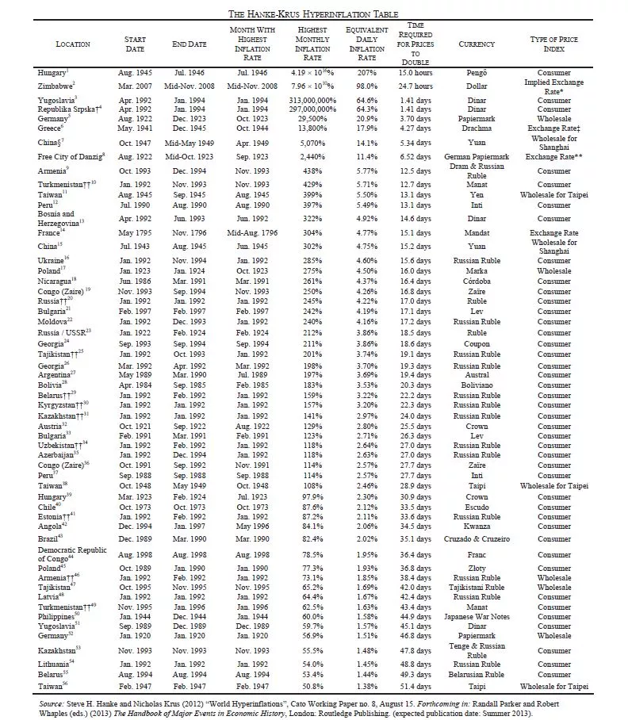
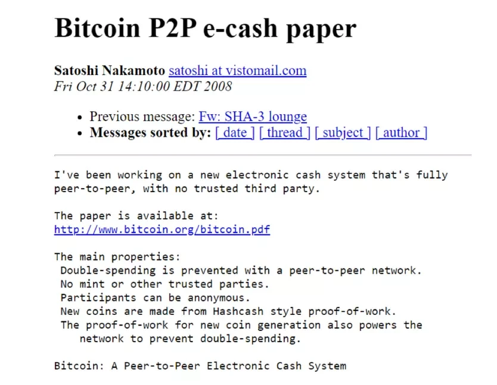
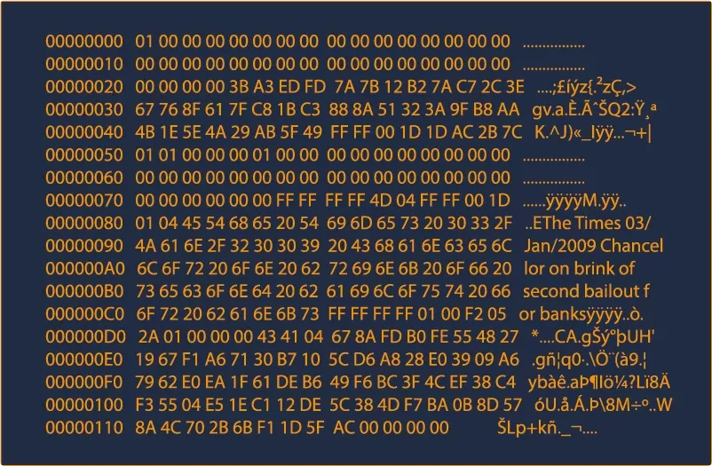
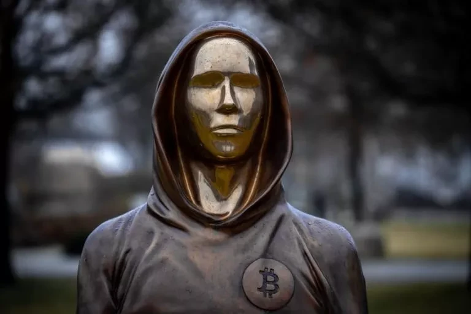
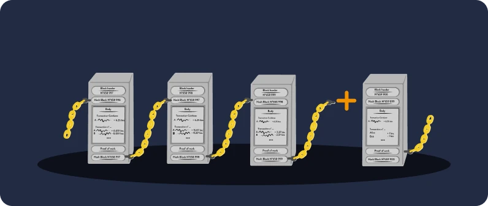
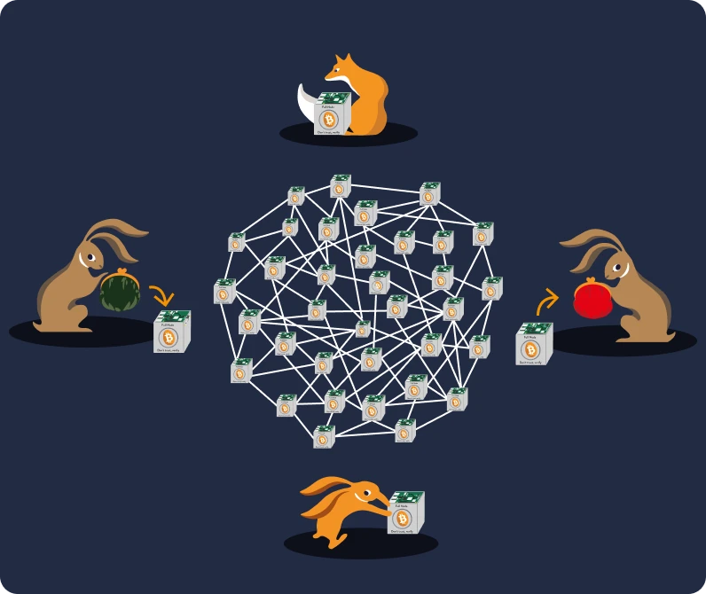
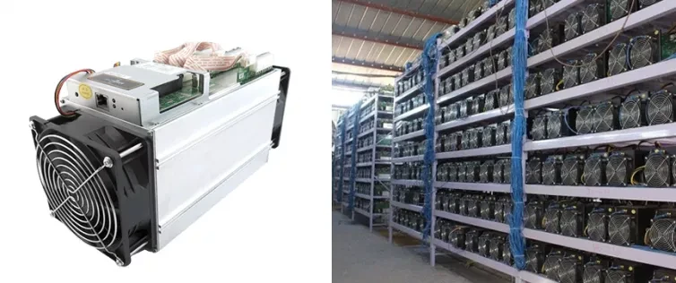
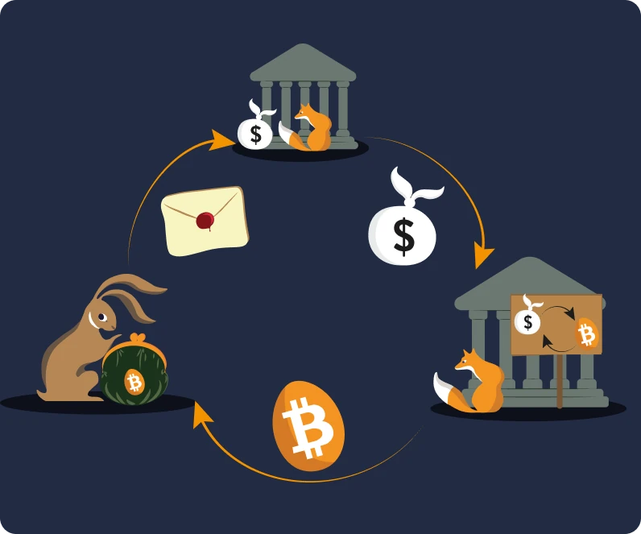
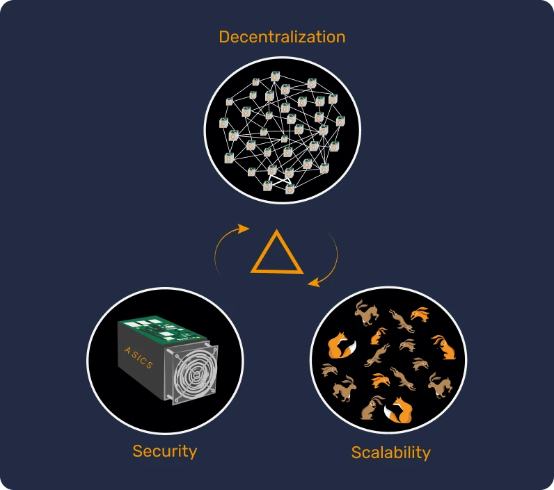

# Twoja pierwsza przygoda z Bitcoin


W tym kursie wyjaśnimy podstawy Bitcoin w 25 rozdziałach, abyś mógł zrozumieć tę technologię w prosty i skuteczny sposób. Kurs omawia podstawy całej branży, w tym tematy takie jak Mining, portfele, platformy kupna/sprzedaży i inne. Dodatkowe materiały edukacyjne będą dostępne przez cały czas trwania kursu, a po jego ukończeniu zapraszamy również do zapoznania się z "21 plakatami" w sekcji zasobów.


Nie potrzebujesz żadnej konkretnej wiedzy, aby rozpocząć. W rzeczywistości poniższe treści są dostępne dla studentów na wszystkich poziomach, a ich ukończenie powinno zająć około 15 godzin.


+++

# Wprowadzenie


<partId>3cd2ac82-026c-53e1-874a-baf5842adc6d</partId>


## Przegląd kursu


<chapterId>27e3fb60-4b50-556b-9e70-c4f5475c121d</chapterId>


Witamy w kursie BTC101!


Bitcoin to rewolucja technologiczna i monetarna, która może sprawić, że zakwestionujemy nasze relacje z pieniędzmi i społeczeństwem. W rzeczywistości Bitcoin (określany jako BTC) jest **neutralną** i **zdecentralizowaną** walutą, co oznacza, że nie jest kontrolowany przez żaden podmiot ani instytucję. Jest to innowacja, która wykracza poza zwykłą "walutę internetową": jest to zarówno protokół komputerowy (Bitcoin), jak i jednostka monetarna (Bitcoin).


Protokół Bitcoin wykorzystuje podstawowe technologie, takie jak kryptografia, komunikacja sieciowa i słynny "Blockchain", podczas gdy jednostka Bitcoin służy jako waluta niezbędna do prawidłowego funkcjonowania tego protokołu. W życiu codziennym Salwadorczycy i bitcoinerzy na całym świecie używają waluty Bitcoin do kupowania i sprzedawania towarów i usług, polegając na tej technologii, aby uczynić swoje życie lepszym.


**Kompleksowy, ale przystępny program nauczania:**


W tym kursie omówimy niektóre aspekty pieniężne Bitcoin, w tym jak kupować i sprzedawać bitcoiny, bezpiecznie przechowywać je w cyfrowych portfelach i używać ich do transakcji. Przeanalizujemy również rolę górników, którzy są niezbędni do tworzenia nowych bitcoinów i zabezpieczania sieci Bitcoin. Na koniec zbadamy przyszłość Bitcoin i sposób, w jaki technologia Lightning Network może usprawnić transakcje Bitcoin.


Ważne jest, aby zrozumieć, że Bitcoin to nowy system monetarny, który całkowicie zmienia nasze relacje z pieniędzmi, więc nauka korzystania z niego jest niezbędną umiejętnością dla każdego, kto chce mieć kontrolę nad własnymi funduszami.


**Sekcja 1 - Wprowadzenie**


- Rozdział 1 - Przegląd kursu
- Rozdział 2 - Prehistoria Bitcoin


**Sekcja 2 - Pieniądze**


- Rozdział 3 - Pieniądze na przestrzeni dziejów
- Rozdział 4 - Waluty fiat
- Rozdział 5 - Hiperinflacja
- Rozdział 6 - 21 milionów bitcoinów


**Sekcja 3 - Portfele Bitcoin**


- Rozdział 7 - Czym jest Bitcoin Wallet?
- Rozdział 8 - Portfele Bitcoin i bezpieczeństwo
- Rozdział 9 - Konfiguracja Wallet
- Rozdział 10 - Przetrwać próbę czasu


**Sekcja 4 - Techniczne aspekty Bitcoin**


- Rozdział 11 - Uruchomienie Bitcoin
- Rozdział 12 - Transakcje Bitcoin
- Rozdział 13 - Węzły Bitcoin
- Rozdział 14 - Górnicy
- Rozdział 15 - Bitcoin i ekologia


**Sekcja 5 - Jak zdobyć Bitcoiny?


- Rozdział 16 - Bitcoin nigdy nie śpi!
- Rozdział 17 - Zarabianie Bitcoinów poprzez pracę
- Rozdział 18 - Oszczędzanie z Bitcoin
- Rozdział 19 - Hiperbitcoinizacja


**Sekcja 6 - Przyszłość Bitcoin: Lightning Network**


- Rozdział 20 - Krótkie wprowadzenie do Lightning Network
- Rozdział 21 - Przypadki użycia Lightning Network
- Rozdział 22 - Czerwona czy niebieska pigułka?


Przed wprowadzeniem definicji pieniądza i jego funkcji w społeczeństwie (Rozdział 1), powinniśmy zacząć od Genesis Bitcoin. Wprowadzony na rynek w 2009 roku, Bitcoin jest stosunkowo nową technologią, niepodobną do niczego innego. Dlatego normalne jest, że nie zrozumiemy wszystkiego od razu. W rzeczywistości, podobnie jak w przypadku nauki korzystania z Internetu lub prowadzenia samochodu, nie musisz od razu znać wszystkich szczegółów technicznych: możesz zacząć od nauki, jak odbierać, płacić i zabezpieczać swoje fundusze, a następnie małymi krokami zgłębiać je głębiej.


W końcu jesteśmy dopiero na początkowych etapach jego wdrażania, ponieważ minęliśmy fazę startową: jesteś w samą porę, aby zdobyć tyle wiedzy, ile chcesz, na temat tej ważnej innowacji.


Ważne jest, aby zrozumieć tę nową technologię w sposób ogólny, więc mamy nadzieję, że spodoba ci się ten kurs i będziesz robić postępy w tym nowym globalnym paradygmacie monetarnym.


Gotowy, by zanurzyć się w fascynującym świecie Bitcoin i zrozumieć wszystkie jego wewnętrzne mechanizmy? Do dzieła!


## Prehistoria Bitcoin


<chapterId>9a94b627-5b69-5d81-9125-f1fa9b0aa6ad</chapterId>


Zanim termin "Bitcoin" stał się synonimem cyfrowej waluty i transformacji finansowej, podwaliny pod jego stworzenie położyła seria pomysłów, innowacji i ruchów społecznych. Wśród nich ruch Cypherpunk wyróżnia się jako kluczowy element prehistorii Bitcoin.


### Cypherpunks: wizjonerzy cyfrowego świata


W samym sercu ewolucji technologicznej lat 80. i 90. grupa ludzi zaczęła głęboko kwestionować rolę prywatności i wolności w erze cyfrowej. Osoby te, które później będą znane jako "cypherpunks", mocno wierzyły, że kryptografia może służyć jako narzędzie do ochrony praw jednostki przed ingerencją rządów i dużych korporacji.


Ikoniczne postacie, takie jak Julian Assange, Wei Dai, Tim May i David Chaum, odegrały kluczową rolę w kształtowaniu filozofii i wizji ruchu. Myśliciele ci dzielili się swoimi pomysłami na wpływowej liście mailingowej, gdzie uczestnicy z całego świata angażowali się w debaty na temat najlepszych sposobów wykorzystania technologii w celu zwiększenia wolności jednostki.


### Trzy podstawowe dokumenty Cypherpunks


Ruch Cypherpunk, głęboko zakorzeniony w aktywizmie cyfrowym i kryptografii, oparł się na kilku fundamentalnych tekstach, aby wyrazić swoje zasady i wizję przyszłości. Wśród tych pism wyróżniają się w szczególności trzy:


- "Manifest Cypherpunk":

napisanej przez Erica Hughesa w 1993 roku, twierdzi, że prywatność jest prawem podstawowym. Autor argumentuje, że możliwość swobodnej i poufnej komunikacji jest niezbędna dla wolnego społeczeństwa. Manifest stwierdza: "Nie możemy oczekiwać, że rządy, korporacje lub inne duże, pozbawione twarzy organizacje zapewnią nam prywatność [...]. Musimy bronić własnej prywatności, jeśli chcemy ją mieć".


- "Manifest kryptoanarchistów":

dokument ten, napisany przez Timothy'ego C. Maya w 1992 roku, wyjaśnia, w jaki sposób wykorzystanie kryptografii może doprowadzić do ery kryptograficznej anarchii, w której rządy nie będą w stanie ingerować w prywatne sprawy obywateli. May wyobraził sobie przyszłość, w której ludzie anonimowo Exchange informacji i pieniędzy bez interwencji strony trzeciej.


- "Deklaracja niepodległości cyberprzestrzeni":

chociaż nie jest to wyłącznie Cypherpunk, tekst ten odzwierciedla odczucia wielu uczestników ruchu. Napisany w 1996 roku przez Johna Perry'ego Barlowa, jest odpowiedzią na rosnącą regulację Internetu przez rządy. Deklaracja stwierdza, że cyberprzestrzeń jest odrębną sferą od sfery fizycznej i nie powinna podlegać tym samym prawom. Jak stwierdzono, "nie mamy wybranego rządu i prawdopodobnie nie będziemy go mieć".


### Poprzednicy Bitcoin


Przed pojawieniem się Bitcoin podjęto kilka prób stworzenia waluty cyfrowej. Na przykład David Chaum wprowadził koncepcję "anonimowego pieniądza elektronicznego" w swoim projekcie "DigiCash" w latach 80-tych. Niestety, ze względu na różne ograniczenia, DigiCash nigdy się nie rozwinął.


Innym ważnym prekursorem jest "B-money" Wei Dai. Chociaż nigdy nie został on wdrożony, przedstawiał ideę anonimowej waluty cyfrowej, w której wykrywanie oszustw było wykonywane przez społeczność oceniających, a nie przez organ centralny.


Poniższy obrazek wyraźnie ilustruje rozwój ruchu poprzez liczne innowacje technologiczne.


To właśnie w tym żyznym środowisku tajemniczy Satoshi Nakamoto opublikował w 2008 roku białą księgę Bitcoin. W dokumencie tym połączył kilka pomysłów z ruchu Cypherpunk, takich jak Proof of Work i kryptograficzne znaczniki czasu, aby stworzyć zdecentralizowaną i odporną na cenzurę walutę cyfrową.


Bitcoin był jednak czymś więcej: reprezentował osiągnięcie ideałów Cypherpunk. Poza technologią symbolizował rewolucję przeciwko tradycyjnym systemom finansowym i oferował alternatywę opartą na przejrzystości, decentralizacji i indywidualnej suwerenności.


### Wnioski


Prehistoria Bitcoin jest głęboko zakorzeniona w ruchu Cypherpunk i zbiorowym dążeniu do większej wolności w erze cyfrowej. Łącząc zasady kryptografii, decentralizacji i integralności, Bitcoin stał się czymś więcej niż tylko walutą. W rzeczywistości jest to produkt filozoficznej i technologicznej rewolucji, która nadal zmienia nasz świat.


Dlatego Bitcoin jest protokołem, który rozciąga się na długie okresy czasu i zachęca nas do kwestionowania naszych relacji z energią, czasem i pieniędzmi.


Czy jednak Bitcoin jest "prawdziwą" walutą? Aby to zrozumieć, musimy najpierw zrozumieć pojęcie pieniądza i jego różne formy, które omówimy w następnym rozdziale.


Jeśli chcesz poznać historię Bitcoin bardziej szczegółowo, gorąco polecamy nasz kurs HIS 201, w którym odkryjesz początki i powolne powstawanie Bitcoin, a także początki jego historii i społeczności. Kurs ten jest w pełni udokumentowany i oparty na źródłach, oczywiście z wieloma anegdotami:


https://planb.network/courses/a51c7ceb-e079-4ac3-bf69-6700b985a082

# Pieniądze


<partId>e913df1a-4cbd-5380-ba67-ca2a0414f671</partId>


## Pieniądze na przestrzeni dziejów


<chapterId>c838e64d-d59f-5703-8c74-ea5e8c4fdd31</chapterId>


Ewolucja pieniądza jest fascynującym aspektem historii ludzkości, który odzwierciedla pomysłowość cywilizacji na przestrzeni wieków w zaspokajaniu stale zmieniających się potrzeb ekonomicznych.


### Od muszli do kont bankowych


Pierwotnie waluta była dobrem materialnym, takim jak zboże, żywy inwentarz lub inny towar. Dobra te miały jednak tę poważną wadę, że były nietrwałe, co utrudniało wykorzystanie ich jako długoterminowego środka oszczędnościowego. Na przykład słabe zbiory lub choroba zwierząt mogły zniszczyć bogactwo jednostki w ciągu jednej nocy.

Tak więc, wraz z rozwojem cywilizacji i rozszerzeniem handlu na nowe regiony, pojawiła się potrzeba uniwersalnego nośnika Exchange. Ludzie najpierw eksperymentowali z przedmiotami takimi jak muszle i kamienie szlachetne, ale nie były one tak trwałe ani rzadkie, jak sądzono. Ostatecznie złoto stało się standardem ze względu na swoją rzadkość, trwałość i podzielność. Było i pozostaje do dziś symbolem bogactwa i władzy.


### Jaka jest rola pieniędzy?


Pieniądze to wysoce wyrafinowane narzędzie komunikacji:


- Pozwala na komunikację między teraźniejszością a przyszłością, ponieważ przekształca nasz czas i energię w aktywa, które mogą być ponownie wykorzystane w nadchodzącym czasie bez ryzyka dewaluacji.


- Ułatwia komunikację w uniwersalnym języku: nie znając się ani nie mówiąc tym samym językiem, dwoje nieznajomych może Exchange, handlować i uzgadniać wartość rzeczy.


Jego funkcja w naszym świecie jest trudna do sztucznego odtworzenia. W rzeczywistości żadna jednostka ani grupa nie może stworzyć pieniądza, ponieważ jest to zjawisko naturalne, które musi wyłonić się z rynku i dobrowolnego konsensusu. W tym sensie ceny służą jako sygnały i informacje, które kierują społeczeństwem w alokacji zasobów.


Z tych powodów złoto jako pieniądz jest wynikiem 4000 lat monetarnego darwinizmu opartego na następujących arystotelesowskich funkcjach:


- Przechowywanie wartości**: pieniądze mogą być wykorzystywane do przenoszenia siły nabywczej w przyszłość, więc muszą być trwałym materiałem;
- Medium Exchange**: pieniądze mogą być używane w Exchange do zakupu towarów i usług zamiast wymiany barterowej, unikając w ten sposób zbieżności potrzeb między handlowcami;
- Jednostka rozliczeniowa**: pieniądze pozwalają nam również porównywać wartości różnych towarów, aby lepiej zrozumieć ich względną wygodę.


### Charakterystyka pieniądza


Złoto idealnie spełnia kryteria skutecznej waluty: jego naturalna rzadkość sprawia, że jest cenne, a jego właściwości chemiczne sprawiają, że nie ulega erozji z upływem czasu. Te cechy sprawiły, że złoto stało się doskonałym **magazynem wartości**, ale nie powszechną walutą, ponieważ ta forma pieniądza nie jest łatwo podzielna ani transportowalna na duże odległości. W zglobalizowanym i cyfrowym świecie złoto z trudem dotrzymuje kroku i wymaga centralnego podmiotu, który uczyni je podzielnym i łatwo wymienialnym (np. poprzez bite monety).


Z drugiej strony, państwowe waluty fiducjarne (fiat) są łatwe w użyciu, ale są stale dewaluowane przez podmioty, które je kontrolują (królowie, banki centralne, cesarze, dyktatorzy).


Aby lepiej wyjaśnić tę koncepcję, zbadamy cechy efektywnej waluty:


- Zamienność**, co oznacza, że można ją wymienić na inną jednostkę tego samego rodzaju bez utraty wartości;
- Podzielność**, ponieważ można go podzielić na mniejsze jednostki, aby ułatwić transakcje o różnych wolumenach;
- Płynność**, co oznacza, że jest łatwo wymienialny na towary lub usługi.


Aby spełnić te kryteria, waluta ewoluowała w przeszłości, podejmując różne kroki:


- Surowy kamień -> Moneta
- Banknot -> Karta bankowa
- Blockchain -> Lightning Network


Waluty ewoluują do dziś, dostosowując swoje formy do różnych przypadków użycia. Jak już wspomnieliśmy, chociaż złoto jest doskonałym środkiem przechowywania wartości, nie jest już odpowiednie dla obecnej zglobalizowanej gospodarki. Podobnie waluty fiducjarne, takie jak dolar i euro, są bardzo Liquid i łatwe w transporcie, ponieważ są obecnie w większości cyfrowe, ale ich wartość jest stale obniżana przez inflację monetarną.


Z drugiej strony Bitcoin oferuje nowe możliwości. Jego właściwości, takie jak ściśle ograniczony Supply, sprawiają, że jest on doskonałym środkiem przechowywania wartości. Co więcej, jako neutralna waluta internetowa, służy jako realne **medium Exchange**, które wykracza poza granice. Jednak nadal nie jest powszechnie akceptowany w handlu, pomimo jego [ciągłej adopcji] (https://btcmap.org/map).


## Waluty powiernicze


<chapterId>25151d46-7db1-5b48-8bba-cbde1944555a</chapterId>


> "Ci, którzy nie pamiętają przeszłości, są skazani na jej powtarzanie" - powiedział George Santayana.

Prawda, która rezonuje dźwięcznie, jeśli chodzi o obecny system monetarny.


### Powiernik = zaufanie


Obecnie główne waluty, takie jak euro i dolar, są uważane za fiducjarne. Oznacza to, że nie mają one wewnętrznej wartości i zależą całkowicie od zaufania, jakim obdarzamy instytucje, które nimi zarządzają.


Waluta fiducjarna to forma pieniądza, która jest dekretowana jako taka przez instytucję, tj. państwo, takie jak Chiny z juanem, lub unię polityczno-gospodarczą, taką jak Unia Europejska z euro. Podmiotem odpowiedzialnym za jego emisję jest bank centralny (na przykład możemy wspomnieć o Ludowym Banku Chin, Rezerwie Federalnej Stanów Zjednoczonych lub Banku Centralnym Republiki Gwinei). To właśnie te podmioty są odpowiedzialne za formułowanie polityki pieniężnej, a zatem za to, ile pieniędzy należy wprowadzić do obiegu lub wydrukować.


### Dewaluacja monetarna: strategia stara jak Imperium Rzymskie


Od starożytności złoto służyło jako punkt odniesienia dla pieniądza, ale jego sztywność często skłaniała przywódców, czy to rzymskich cesarzy, czy współczesne rządy, do przyjmowania alternatywnych walut, często fiducjarnych.


Mechanizm jest prosty i inspirowany praktykami, które istniały od początków cywilizacji. Przywódcy, chcąc sprawować kontrolę nad bogactwem, zaczynają od centralizacji złota, często wykorzystując swoją władzę i obiecując ochronę i bezpieczeństwo. Mając tę cenną rezerwę w swoich rękach, wprowadzają nową walutę, równoważną wartości złota, ale wybitą na ich podobieństwo. Waluta ta zaczyna następnie krążyć, a ludzie szybko dostosowują się do wygody jej prostego użycia.


Następnie jednak przywódcy ci zaczynają stopniowo dewaluować nową walutę, de facto zmniejszając jej wartość o kilka procent każdego roku w porównaniu do początkowej ceny złota. Ta cicha dewaluacja jest często uzasadniana jako leżąca w interesie ludzi. W rzeczywistości ci, którzy oszczędzają w tej walucie fiducjarnej, widzą erozję wartości swoich oszczędności, podczas gdy państwo finansuje swoje projekty poprzez inflację. Co więcej, dewaluacja sprawia, że dług jest łatwiejszy do spłacenia.


W krytycznym momencie przywódca ogłasza: waluta nie jest już zabezpieczona złotem. Społeczeństwo, teraz przyzwyczajone do waluty fiducjarnej i często źle poinformowane o sprawach finansowych, akceptuje tę rzeczywistość, pozwalając państwu swobodnie manipulować Supply i drukować ogromne sumy pieniędzy prawie bez żadnych kosztów.


Drukowanie pieniądza prowadzi następnie do inflacji i stopniowego zubożenia ludności. Poza tym system finansowy jest regulowany i ograniczany, aby uniknąć jego załamania, ponieważ każde zakłócenie może wywołać poważny kryzys gospodarczy. W przeciwieństwie do mas, instytucje finansowe i zamożne osoby czerpią ogromne korzyści z tego systemu, co tworzy nierówności i sprzyja autorytaryzmowi. W tym kontekście nie są one zachęcane do wprowadzania radykalnych zmian, co pozwala systemowi kontynuować swój bieg aż do możliwej implozji.


Dobrze realizowana strategia może trwać przez dziesięciolecia. Należy jednak pamiętać, że bardzo szybka dewaluacja lub utrata zaufania może prowadzić do hiperinflacji (patrz następny rozdział). Historia pokazuje, że dolar stracił 98% swojej wartości w ciągu 100 lat, euro 30% w ciągu 20 lat, a funt szterling 99% od momentu powstania.


Ostatecznie waluta może nie mieć już żadnego związku ze złotem, podobnie jak monety rzymskie pod koniec imperium, a nawet zostać zredukowana do prostej wartości liczbowej, oderwanej od namacalnej rzeczywistości.


Dziś jesteśmy świadkami historycznego punktu zwrotnego. Dolar, który przez długi czas dominował, wydaje się chylić ku upadkowi, podczas gdy złoto straciło swoją centralną rolę. Stoimy u progu nowego cyklu monetarnego, który przypomina nam, że lekcje historii są często zapominane


### Czy Bitcoin jest rozwiązaniem?


Ze względu na te przesłanki, rewolucja Bitcoin nabiera rozpędu. W przeciwieństwie do poprzednich walut, nie wymaga ona **zaufanej strony trzeciej** i ma na celu oddzielenie państwa od pieniędzy.


W rzeczywistości Bitcoin przedstawia się jako odpowiedź na te wyzwania systemowe, proponując zdecentralizowane rozwiązanie i nowy równoległy system monetarny. Historycznie, jeśli złoto było preferowane jako waluta ze względu na jego odporność na fałszowanie, Bitcoin podobnie nie może być sfałszowany. Co więcej, jest on ograniczony do 21 milionów jednostek, dzięki swojej zdecentralizowanej i kryptograficznej naturze. Bitcoin to waluta, która opiera się na przejrzystości i neutralności, oferując atrakcyjną alternatywę dla obecnego scentralizowanego systemu monetarnego.


Innym powodem, dla którego Bitcoin zyskał uwagę, jest pojawienie się walut cyfrowych banku centralnego (CBDC), co wydaje się nieuniknione. Ta nowa forma pieniądza rozwinęłaby bardziej centralnie planowaną gospodarkę i mogłaby zarówno ograniczać wolność finansową jednostek, jak i ułatwiać autorytarne nadużycia.

Możemy zakończyć ten rozdział cytatem z laureata Nagrody Nobla F. A. Hayeka z 1984 roku:


> "Nie wierzę, byśmy kiedykolwiek mieli dobre pieniądze, zanim nie wyrwiemy ich z rąk rządu. Jeśli nie możemy wyrwać ich z rąk rządu przemocą, jedyne, co możemy zrobić, to w jakiś przebiegły lub okrężny sposób wprowadzić coś, czego nie będą w stanie powstrzymać"

Aby dowiedzieć się więcej o błędach ekonomicznych i wolności, zapraszamy do zapoznania się z naszym kursem ECO 102, który śledzi życie i idee Frédérica Bastiata, XIX-wiecznego francuskiego myśliciela, który z pewnością doceniłby pojawienie się Bitcoin:


https://planb.network/courses/d07b092b-fa9a-4dd7-bf94-0453e479c7df

## Hiperinflacja


<chapterId>b04c024c-54f3-50cb-997f-58721cfc74be</chapterId>


Hiperinflacja to zjawisko monetarne charakterystyczne dla walut fiducjarnych: charakteryzuje się całkowitą utratą zaufania do waluty i drastycznym wzrostem inflacji z powodu drukowania pieniędzy przez władze. W rezultacie oszczędności zgromadzone przez jednostki mogą rozproszyć się w stosunkowo krótkim czasie, popychając kraj na skraj załamania gospodarczego, społecznego i politycznego.


### Inflacja szaleje!


Aby zrozumieć wpływ inflacji na oszczędności, musimy wziąć pod uwagę różne stopy inflacji.


- Przy 2% inflacji tracisz 2% swojej siły nabywczej rocznie, co daje 10% w ciągu 5 lat.
- Przy 7% tracisz połowę tej kwoty w ciągu 10 lat.
- Przy 20% tracisz prawie połowę w ciągu 3 lat.


Kiedy pojawia się hiperinflacja, nie mówimy już o 20% rocznie, ale raczej o 20% miesięcznie lub, w szczytowym momencie, nawet dziennie. Doświadczenie 100% inflacji dziennie w ciągu trzech dni jest realistycznym scenariuszem, który miał i nadal ma miejsce w naszym świecie.


Kluczowe jest zrozumienie, że hiperinflacja nie jest dziełem przypadku, kapitalizmu czy politycznych ataków przeciwników. Hiperinflacja jest bezpośrednią konsekwencją złych decyzji monetarnych podejmowanych przez bankierów centralnych i polityków. Jej następstwa mają wpływ na każdego obywatela, a nawet na następne pokolenia. Zachęcamy do poświęcenia pięciu minut na przeczytanie poniższej tabeli, aby w pełni uświadomić sobie rzeczywisty wpływ tego zjawiska (kurs ECO204 bardziej szczegółowo omawia ten temat). Jak widać, żaden kraj ani waluta nie są potencjalnie bezpieczne.





### Jakie są fazy hiperinflacji?


Aby doszło do hiperinflacji, muszą wystąpić pewne zdarzenia.


Faza 1 - Utrata zaufania


- Centralizacja władzy monetarnej ułatwia kreację pieniądza i jego nadużywanie. W tym kontekście czynniki zewnętrzne, takie jak wojny, polityka rządu lub rosnące ceny kluczowych zasobów - takich jak pszenica lub benzyna - mogą wywołać hiperinflację. W ten sposób może dojść do utraty zaufania do waluty, a jednostki zaczynają kwestionować pochodzenie pieniądza i korzyści płynące z nakazanej polityki pieniężnej.


Faza 2 - Upadek waluty i wzrost cen


- Gdy rządy tracą kontrolę nad zaufaniem, jednostki zaczynają Exchange swoją walutę na rzecz bardziej stabilnej, tak jak stało się to w Wenezueli z dolarem amerykańskim. Okoliczność ta prowadzi do wzrostu cen, tworząc błędne koło, w którym towary i usługi stają się coraz droższe. Aby zaspokoić te potrzeby i skorygować politykę pieniężną, państwo drukuje więcej pieniędzy, co powoduje gwałtowną inflację.


Faza 3 - Błędne koło drukowania pieniędzy


- W związku z tym coraz więcej banknotów jest potrzebnych do zakupu towarów, co powoduje niedobór pieniądza papierowego. W odpowiedzi rządy uciekają się do drukowania większej liczby banknotów, co jeszcze bardziej napędza inflację.


Faza 4 - Pojawienie się nowej waluty


- Następnie wprowadzana jest nowa waluta, która zastępuje starą, w celu przerwania cyklu inflacji poprzez wdrożenie bardziej rygorystycznych kontroli, które nie obowiązywały w przypadku poprzedniego prawnego środka płatniczego.


Rozwiązanie kryzysu hiperinflacyjnego często wymaga radykalnych zmian, takich jak między innymi rewolucje, zmiany rządów, zmiany bankierów centralnych. Utrata zaufania, upadek waluty i odbudowa to niezbędne etapy ożywienia gospodarki opartej na walucie fiducjarnej.


### Trzy godne uwagi przykłady


- Niemcy, 1922-1923.


Jeden z najbardziej uderzających przykładów hiperinflacji miał miejsce w Niemieckiej Republice Weimarskiej po I wojnie światowej.


Niemcy pożyczyły ogromne sumy pieniędzy na sfinansowanie wojny. Jednak Niemcy nie tylko przegrały wojnę, ale musiały zapłacić miliardy dolarów reparacji. Miesiącem o najwyższej stopie inflacji był październik 1923 r., osiągając szczyt na poziomie 29 500%, co odpowiadało stopie inflacji wynoszącej 20,9% dziennie. Ceny podwajały się co 3,7 dnia!

Niemiecka waluta stała się tak bezużyteczna, że niektórzy obywatele woleli palić swoje papierowe pieniądze zamiast drewna, ponieważ było to tańsze. Mówi się nawet, że w restauracjach kelnerzy musieli ogłaszać ceny menu co 30 minut, aby uwzględnić inflację.


Ostatecznie władze stworzyły nową walutę, wspieraną przez długi Niemiec, Francji i Anglii oraz gwarantowaną przez niemiecką ziemię.


- Węgry, 1945-1946


Krajem, który do tej pory doświadczył najgorszego okresu hiperinflacji, są zdecydowanie Węgry po II wojnie światowej.


Węgry znalazły się po przegranej stronie konfliktu, a większość ich zdolności produkcyjnych została zniszczona. Miesiącem o najwyższej inflacji był lipiec 1946 r., w którym odnotowano oszałamiającą inflację cen wynoszącą 41 900 000 000 000 000 000%, co odpowiada 207% dziennie. Ceny podwajały się co 15 godzin!


Ostatnim banknotem wprowadzonym do obiegu było 100 milionów miliardów Pengo (100 000 000 000 000 000) w 1946 roku.


- Zimbabwe, 2007-2008


Do 2000 r. Zimbabwe było samowystarczalne w zakresie prawie wszystkich swoich potrzeb, z wyjątkiem ropy naftowej.


W 1997 r. wartość dolara Zimbabwe spadła o ponad 72% po tym, jak rząd zgodził się wypłacić weteranom wojennym rekompensatę w wysokości 450 milionów dolarów amerykańskich. Ponieważ rząd nie miał takiej kwoty w swoich zapasach, uciekł się do uruchomienia prasy drukarskiej. W 2005 r. inflacja osiągnęła 586%, ale szczyt przypadł na połowę listopada 2008 r., a jej tempo szacuje się na 79 600 000 000% miesięcznie.


Już w czerwcu 2007 roku rząd zareagował, wprowadzając kontrolę cen, ale działanie to nie miało żadnego wpływu na gospodarkę. Sklepy zostały splądrowane, a kupcy nie mieli już środków na uzupełnienie zapasów.


W kwietniu 2009 r. minister finansów ogłosił zawieszenie dolara zimbabweńskiego i zezwolił na używanie innych walut obcych w handlu. Wszystkie konta bankowe, emerytury i instytucje finansowe z dnia na dzień straciły swoje salda.


Podsumowując, hiperinflacja skutkuje szybkim spadkiem wartości waluty, prowadząc do erozji oszczędności i utraty zaufania do systemu monetarnego. Jak zasugerował kiedyś Wolter, waluta fiducjarna zawsze ostatecznie traci swoją wewnętrzną wartość i zbliża się do zera.

Waluta, która opiera się na zaufanej stronie trzeciej, takiej jak instytucja finansowa, jest w praktyce i w dłuższej perspektywie wadliwa, ponieważ nie jest w stanie zagwarantować siły nabywczej ani zachować oszczędności.


Aby zagłębić się w temat hiperinflacji, polecamy kurs ECO 204 Davida St-Onge'a, w którym dowiesz się, czym są cykle hiperinflacyjne i jaki jest ich rzeczywisty wpływ na nasze życie. Odkryjesz również podobieństwa między tymi cyklami i, co najważniejsze, dowiesz się, jak się przed nimi chronić.


https://planb.network/courses/caa75343-ac90-4249-bcca-0e2e57c3a0f1

## 21 milionów bitcoinów


<chapterId>f4a06d76-1963-56fd-93ff-dfa41489bcde</chapterId>


### Polityka pieniężna Bitcoin


Bitcoin to zdecentralizowana waluta cyfrowa z wcześniej zdefiniowaną maksymalną ilością **21 milionów jednostek**. Ta nieodłączna cecha niedoboru jest określana przez kod komputerowy i wzmacniana przez konsensus wszystkich użytkowników uczestniczących w protokole.


Jego emisję pieniężną można zilustrować krzywą, która reprezentuje ilość bitcoinów tworzonych w czasie. Na przykład w 2022 r. w obiegu znajdowało się około 18,5 miliona bitcoinów. Prognozy wskazują, że do 2025 r. będzie około 19,5 miliona bitcoinów, co stanowi około 93% całkowitego Supply, a do 2037 r. liczba ta osiągnie 20,4 miliona.


### Jak powstają nowe bitcoiny?


Tworzenie nowych bitcoinów jest wynikiem procesu Mining. W skrócie, górnicy używają potężnych komputerów, które rozwiązują złożone problemy matematyczne (Hash), które zatwierdzają i zabezpieczają transakcje. Po rozwiązaniu problemu (lub znalezieniu ważnego Hash), Miner dodaje nowy blok transakcji do Blockchain, zdecentralizowanego i rozproszonego Ledger, który rejestruje wszystkie transakcje dokonane w sieci. Blockchain zapewnia przejrzystość i bezpieczeństwo, ponieważ każdy blok jest powiązany z poprzednim, co sprawia, że zmiana wcześniejszych danych bez zgody sieci jest prawie niemożliwa.


Po pomyślnym wykonaniu tego zadania górnicy są nagradzani emisją nowych bitcoinów co dziesięć minut. Nagroda ta jest zaprogramowana tak, aby zmniejszała się o połowę co 210 000 bloków, czyli mniej więcej co cztery lata (wydarzenie znane jako "Halving"), nadając krzywej emisji monet kształt przypominający schody. Ze względu na ten mechanizm można matematycznie przewidzieć, że tworzenie nowych bitcoinów zakończy się około roku 2140, kiedy ich łączna liczba osiągnie limit 21 milionów.


| Halving Number | Block Height | BTC Reward After Halving  | Estimated BTC in Circulation After Halving |
| -------------- | ------------ | ------------------------- | ------------------------------------------ |
| 1              | 210,000      | 25 BTC                    | 10,500,000 BTC                             |
| 2              | 420,000      | 12.5 BTC                  | 15,750,000 BTC                             |
| 3              | 630,000      | 6.25 BTC                  | 18,375,000 BTC                             |
| 4              | 840,000      | 3.125 BTC                 | 19,687,500 BTC                             |
| 5              | 1,050,000    | 1.5625 BTC                | 20,343,750 BTC                             |
| 6              | 1,260,000    | 0.78125 BTC               | 20,671,875 BTC                             |
| 7              | 1,470,000    | 0.390625 BTC              | 20,835,937.5 BTC                           |
| 8              | 1,680,000    | 0.1953125 BTC             | 20,917,968.75 BTC                          |
| 9              | 1,890,000    | 0.09765625 BTC            | 20,958,984.375 BTC                         |
| 10             | 2,100,000    | 0.048828125 BTC           | 20,979,492.188 BTC                         |
| 11             | 2,310,000    | 0.0244140625 BTC          | 20,989,746.094 BTC                         |
| 12             | 2,520,000    | 0.01220703125 BTC         | 20,994,873.047 BTC                         |
| 13             | 2,730,000    | 0.006103515625 BTC        | 20,997,436.523 BTC                         |
| 14             | 2,940,000    | 0.0030517578125 BTC       | 20,998,718.262 BTC                         |
| 15             | 3,150,000    | 0.00152587890625 BTC      | 20,999,359.131 BTC                         |
| 16             | 3,360,000    | 0.000762939453125 BTC     | 20,999,679.566 BTC                         |
| 17             | 3,570,000    | 0.0003814697265625 BTC    | 20,999,839.783 BTC                         |
| 18             | 3,780,000    | 0.00019073486328125 BTC   | 20,999,919.892 BTC                         |
| 19             | 3,990,000    | 0.000095367431640625 BTC  | 20,999,959.946 BTC                         |
| 20             | 4,200,000    | 0.0000476837158203125 BTC | 20,999,979.973 BTC                         |

Koncepcję Mining omówimy bardziej szczegółowo w rozdziale [Miner] (https://planb.network/courses/2b7dc507-81e3-4b70-88e6-41ed44239966/dbb8264a-7434-57e4-9d1b-fbd1bae37fdf).


### Gwarancja cyfrowego niedoboru


Limit 21 milionów jest podstawą niedoboru Bitcoin i jest gwarantowany przez dwa kluczowe mechanizmy: dostosowanie trudności Mining i teorię gier.


- Regulacja trudności Mining jest procesem, który odbywa się co 2016 bloków lub około dwóch tygodni, aby zapewnić, że nowy blok jest dodawany do Blockchain średnio co dziesięć minut. Zarówno częstotliwość tworzenia bloków, jak i całkowita ilość bitcoinów są stałymi aspektami protokołu Bitcoin i nie mogą zostać zmienione bez ogólnego konsensusu, w przeciwieństwie do arbitralnych decyzji podejmowanych w tradycyjnych systemach monetarnych.


Trudność znalezienia ważnego Hash podlega pewnemu cyklowi: jeśli liczba górników wzrasta i więcej bloków jest znajdowanych szybciej, powoduje to skrócenie średniego czasu znalezienia bloku, a więc trudność wzrasta. W konsekwencji liczba bloków znajdowanych przez górników spada, co oznacza, że mechanizm wraca do średniej 10 minut na blok. Poniższy obrazek przedstawia to wizualnie.


I odwrotnie, jeśli mniej górników pracuje, a bloki trwają dłużej, trudność Mining spada, przyspieszając średni czas bloku.


Czy wiesz, że górnicy są zachęcani do wydobywania bloku w celu zarabiania nowych bitcoinów poprzez dotację blokową, a także opłaty transakcyjne od transakcji, które uwzględniają w tym bloku?


Tak więc, gdy liczba wyemitowanych bitcoinów zbliża się do limitu 21 milionów, górnicy będą wynagradzani bardziej poprzez opłaty transakcyjne niż poprzez dotację blokową.


- Teoria gier to koncepcja matematyczna, która opiera się na ludzkiej racjonalności. Zakłada ona, że jednostki działają logicznie, dążąc do maksymalizacji własnych korzyści, jednocześnie biorąc pod uwagę potencjalne decyzje innych. W Bitcoin teoria gier pomaga zapewnić, że większość górników i użytkowników będzie działać w najlepszym interesie sieci. W rzeczywistości, ponieważ zmiany protokołu są głosowane przez użytkowników, wszelkie modyfikacje protokołu Bitcoin wymagałyby zgody całej społeczności użytkowników, co jest bardzo złożone. Tak więc, jeśli ktoś chciałby stworzyć 22-milionowy Bitcoin, musiałby przekonać wszystkich użytkowników do dobrowolnej dewaluacji własnych oszczędności, co jest mało prawdopodobne, ponieważ Bitcoin jest globalny i nie jest zarządzany przez centralną grupę.


Pomysł dewaluacji waluty jest sprzeczny z podstawową filozofią Bitcoin, więc zmiana jej ogólnej ilości jest bardzo mało prawdopodobna.


### Kontrolowana polityka pieniężna: w każdej sekundzie, od początku i na zawsze!


Niedobór Bitcoin jest głównym atutem, a maksymalna ilość 21 milionów bitcoinów w obiegu jest publiczna i możliwa do zweryfikowania przez każdego.


W rzeczywistości każdy może to zrobić za pośrednictwem węzła Bitcoin (tj. walidatora transakcji), po prostu wpisując następujące polecenie: `bitcoin-cli gettxoutsetinfo`. Ta przejrzystość wzmacnia zaufanie do systemu Bitcoin, który nie opiera się na centralnych instytucjach lub osobach, ale raczej na matematycznych i kryptograficznych gwarancjach nieodłącznie związanych z jego protokołem (dowiesz się, jak to łatwo zrobić w LNP201).


```json
{
"height": 710560,
"bestblock": "0000000000000000000887384d67103412ea7f18a43953e65c8c4ac36bf42e54",
"transactions": 473244,
"txouts": 1018917,
"bogosize": 2183872374,
"hash_serialized_2": "eebb9987337700ffaacbbaa11223344",
"disk_size": 178239584,
"total_amount": 18745998.12345678
}
```


Bitcoin gwarantuje rozsądne zarządzanie monetarne poprzez ograniczenie jego tworzenia, co odróżnia go od innych walut, ponieważ może chronić oszczędności użytkowników. Zgodnie z zasadami ekonomii austriackiej, jego stabilna ilość i przewidywalna dystrybucja chronią go przed nieodłącznym ryzykiem inflacji, z którym muszą się zmierzyć tradycyjne waluty (zobacz kurs ECO201, aby dowiedzieć się więcej).


Podsumowując, Bitcoin, ze swoją zdecentralizowaną naturą, zaprogramowanym niedoborem i przejrzystością, oferuje unikalną alternatywę dla tradycyjnych systemów monetarnych. Ilustruje on, w jaki sposób można wykorzystać technologię do stworzenia waluty, która jest nie tylko użyteczna i weryfikowalna, ale także zachowuje wartość oszczędności użytkowników poprzez ścisłe ograniczenie Supply.


### Zakończenie sekcji 2!


# Portfele Bitcoin


<partId>28860585-4f61-59d9-b242-f4c57d837cc1</partId>


## Czym są portfele Bitcoin?


<chapterId>1c0166ab-cb7a-5bc6-9175-d13482bd91f1</chapterId>


W sekcji 2 zamierzamy zbadać przechowywanie i bezpieczeństwo Bitcoin za pomocą portfeli, aby zrozumieć, gdzie znajdują się te słynne bitcoiny i jak z nimi współdziałać!


### Demistyfikacja portfeli Bitcoin


Używamy portfeli do interakcji z siecią Bitcoin na trzy główne sposoby:


- Aby otrzymać bitcoiny
- Aby wysłać bitcoiny
- Aby zabezpieczyć je przed próbami włamania i kradzieży


Bitcoin Wallet może mieć wiele kształtów i form: oprogramowanie na komputerze, aplikacja na smartfonie, urządzenie fizyczne, takie jak klucz USB, a nawet kartka papieru. Każdy z nich służy innym przypadkom użycia. W rzeczywistości niektóre z nich są przeznaczone do dużych transakcji z naciskiem na bezpieczeństwo, podczas gdy inne priorytetowo traktują prywatność lub są przeznaczone do codziennych płatności na niewielkie kwoty.


Portfele można zatem podzielić na szerokie rodziny zastosowań, zawsze skupione wokół kluczowego pytania: czy jesteś właścicielem funduszy, czy też pozostawiasz kontrolę nad swoimi pieniędzmi stronie trzeciej? Szczegółowo omówimy ten temat w następnym rozdziale, ale pytanie pozostaje proste: czy pieniądze są w twojej kieszeni, czy w kieszeni twojego bankiera?


### Jak działa Bitcoin Wallet?


Niezależnie od tego, czy jest to "bankier" Bitcoin, czy ty sam, zdecydowana większość portfeli Bitcoin działa w podobnej technologii opartej na kryptografii asymetrycznej, która obejmuje system par kluczy: klucz prywatny do wydawania i klucz publiczny do odbierania.


- Klucz prywatny


Podczas inicjowania Wallet generowana jest tajna fraza odzyskiwania, znana również jako fraza Mnemonic (klucz prywatny), która jest przedstawiana użytkownikowi w postaci 12 lub 24 słów.


Klucz prywatny ma fundamentalne znaczenie, ponieważ stanowi Ownership bitcoinów, a tym samym prawo do ich używania lub wysyłania. Dlatego posiadacz klucza prywatnego jest prawdziwym właścicielem bitcoinów. Jak głosi spopularyzowane stwierdzenie: "Nie twoje klucze, nie twoje monety"


Ten klucz musi być trzymany w tajemnicy i dobrze chroniony, ponieważ odblokowuje twoją fortunę!


- Klucz publiczny i Address


Klucz publiczny jest generowany na podstawie klucza prywatnego i jest z nim powiązany. Udostępnianie klucza publicznego stwarza ryzyko dla prywatności (ponieważ inni użytkownicy mogą zobaczyć saldo), ale nie dla bezpieczeństwa (ponieważ nie mogą wydać środków bez posiadania klucza prywatnego). Z kolei klucz publiczny jest używany do tworzenia adresów Bitcoin, a tym samym otrzymywania pieniędzy.


Adresy te są automatycznie tworzone przez urządzenie Wallet i mogą być bezpiecznie udostępniane. Aby zmaksymalizować prywatność, zaleca się użycie ich tylko raz.


Podsumowując, technologia ta umożliwia nam otrzymywanie bitcoinów bez umożliwienia odbiorcy kradzieży naszych środków! Skrzynka pocztowa może być odpowiednią metaforą: ludzie mogą wpłacać do niej pieniądze, ale tylko ty możesz ją otworzyć.


### Czy bitcoiny znajdują się w Wallet?


Chociaż klucze są przechowywane w Wallet, same bitcoiny są w rzeczywistości "przechowywane" w Bitcoin Blockchain, który jest publicznie dystrybuowanym Ledger w sieci peer-to-peer Bitcoin (zagłębimy się w to w sekcji 3). Oznacza to, że utrata urządzenia zawierającego Wallet niekoniecznie musi skutkować utratą bitcoinów. To, co pozwala na odtworzenie Wallet i wydanie Bitcoin, to w rzeczywistości klucz prywatny, więc zawsze pamiętaj o jego odpowiednim zabezpieczeniu!


Na szczęście od 2017 r. klucz prywatny może być reprezentowany przez prostą listę 12 lub 24 słów, znaną jako "fraza Mnemonic", którą można dość łatwo zapisać. Fraza ta służy jako kopia zapasowa środków i umożliwia odtworzenie Wallet za pomocą dowolnego oprogramowania lub aplikacji Bitcoin Wallet. Dlatego każdy, kto znajdzie tę listę słów, może uzyskać dostęp do bitcoinów.


### A co z hakerami?


Co jeśli ktoś przypadkowo odgadnie naszą listę 12 lub 24 słów? Krótka odpowiedź brzmi, że jest to bardzo mało prawdopodobne, dzięki kryptografii użytej do stworzenia Wallet. Aby spojrzeć na to z perspektywy, przypadkowe odkrycie tej samej frazy Mnemonic jest podobne do znalezienia "właściwej" liczby między 1 a 2 do potęgi 256, co jest prawie równoważne znalezieniu "właściwego" atomu we Wszechświecie. Jeśli jednak nie jesteś zadowolony z tego domyślnego zabezpieczenia, zawsze możesz je ulepszyć, dodając passphrase (dodatkowe słowo) do Bitcoin Wallet.


Tak więc prawdopodobieństwo włamania się do Bitcoin Wallet jest astronomicznie niskie, jeśli przestrzegasz dobrych praktyk bezpieczeństwa, które szczegółowo omówimy w następnej sekcji.


Pamiętaj, aby wybrać odpowiedni Wallet do swoich potrzeb i zastosowań: szczegółowe samouczki dotyczące zarządzania i zabezpieczania różnych portfeli są dostępne w [sekcji samouczków na naszym uniwersytecie] (https://planb.network/tutorials/wallet).


Jeśli podczas swojej podróży w dół króliczej nory chcesz dowiedzieć się więcej o budowaniu Bitcoin Wallet, od entropii po odbieranie adresów, polecamy kurs CYP 201 poświęcony temu tematowi:


https://planb.network/courses/46b0ced2-9028-4a61-8fbc-3b005ee8d70f

## Portfele i zabezpieczenia Bitcoin


<chapterId>00c1afea-e54a-511f-bab3-2efc2fbfa6a1</chapterId>


### Zadawanie właściwych pytań przed rozpoczęciem


Kiedy posiadasz bitcoiny, bezpieczeństwo twoich środków jest głównym zmartwieniem. Najlepszym sposobem na określenie poziomu bezpieczeństwa odpowiedniego dla danej sytuacji jest zadanie sobie serii pytań:


- Kto może uzyskać dostęp do środków? Innymi słowy, czy masz wyłączny dostęp do swoich bitcoinów, czy też strona trzecia (np. firma) przyznaje ci dostęp do twoich środków?
- Jak zamierzasz używać bitcoinów w tym konkretnym Wallet? Regularnie? Dla średnioterminowych lub długoterminowych oszczędności?
- Jakie są twoje umiejętności techniczne?
- Jaki jest budżet na bezpieczeństwo?


W rzeczywistości nie ma uniwersalnej odpowiedzi ani rozwiązania, więc poświęć trochę czasu, aby odpowiedzieć na te pytania, ponieważ pomoże to dostosować środki bezpieczeństwa do Twoich potrzeb.


### Myślenie o portfelach Bitcoin w kategoriach złożoności


Poniżej zdefiniujemy kilka poziomów bezpieczeństwa:


- Poziom 0**, korzystasz z tak zwanej "usługi powierniczej", w której nie jesteś jedynym posiadaczem swoich bitcoinów. Należy pamiętać, że ta zaufana strona trzecia może ograniczyć dostęp do środków w dowolnym momencie. W tym przypadku poziom suwerenności finansowej jest podobny do tradycyjnego systemu bankowego z kontem bankowym.


- Poziom 1**, korzystasz z Bitcoin Wallet na telefonie lub komputerze, gdzie jesteś jedynym posiadaczem swoich bitcoinów i możesz łatwo przeprowadzać transakcje. Wyżej wymienione narzędzie określane jest jako "Hot Wallet", ponieważ klucz prywatny przechowywany jest na urządzeniu z dostępem do Internetu. W tym przypadku kluczowe jest wykonanie kopii zapasowej frazy Mnemonic, aby odzyskać dostęp do swoich środków w przypadku utraty telefonu lub komputera.


Na przykład, można użyć Sparrow Wallet jako Hot Wallet:


https://planb.network/tutorials/wallet/desktop/sparrow-c674e2ac-d46f-4c82-92a7-7d1b0e262f5d


- Poziom 2**, korzystasz z fizycznego Wallet i zabezpieczyłeś swoją listę 12/24 słów. Jest to często określane jako "Cold Wallet", ponieważ klucze są przechowywane na urządzeniu, które nie jest podłączone do Internetu. W takim przypadku zawsze będziesz musiał podpisać każdą transakcję za pomocą urządzenia, co sprawi, że Twoje środki będą mniej dostępne na co dzień.


Można na przykład użyć Ledger, Satochip lub Tapsigner:


https://planb.network/tutorials/wallet/hardware/ledger-nano-s-plus-75043cb3-2e8e-43e8-862d-ca243b8215a4

https://planb.network/tutorials/wallet/hardware/satochip-e9bc81d9-d59b-420d-9672-3360212237ba

https://planb.network/tutorials/wallet/hardware/tapsigner-ab2bcdf9-9509-4908-9a4a-2f2be1e7d5d2


- Poziom 3**, używasz Wallet poziomu 1 lub 2, ale dodałeś dodatkowy passphrase. W takim przypadku należy pamiętać, że konieczne jest utworzenie kopii zapasowej zarówno listy 12/24 słów, jak i passphrase. Najlepiej byłoby, gdyby te dwie informacje były przechowywane w dwóch różnych miejscach.


Aby dowiedzieć się więcej o użytkowaniu i działaniu BIP39 passphrase:


https://planb.network/tutorials/wallet/backup/passphrase-a26a0220-806c-44b4-af14-bafdeb1adce7


- Poziom 4**, korzystasz z zestawu portfeli, aby utworzyć "Multisig" Wallet, co oznacza, że do przeprowadzenia transakcji wymaganych jest wiele podpisów. W takim przypadku należy pamiętać, że każda część Multisig powinna być przechowywana w różnych lokalizacjach. Takie podejście jest często uważane za zaawansowane wykorzystanie Bitcoin, głównie do zarządzania dużymi kwotami i do celów korporacyjnych.


Oczywiście różne przypadki użycia wymagają również różnych portfeli Bitcoin i nie ma jednego uniwersalnego rozwiązania.


### Bezpieczeństwo musi zostać dostosowane


Kwota, którą ktoś jest skłonny pozostawić na określonym poziomie bezpieczeństwa, zależy od każdej osoby. Dla niektórych pozostawienie 1 BTC na Hot Wallet jest rozsądne, podczas gdy dla innych jest odwrotnie. W każdym razie, jeśli chcesz zabezpieczyć niewielką kwotę, radzimy nie wydawać zbyt dużo na bezpieczeństwo, kupując fizyczny Wallet. Poza tym należy pamiętać, że nadmierne komplikowanie bezpieczeństwa i dostępności bitcoinów może być szkodliwe, zwłaszcza jeśli źle obchodzisz się z kopiami zapasowymi swoich portfeli.


Podsumowując, bezpośredni Ownership bitcoinów jest niezbędnym elementem zapewniającym suwerenność finansową. Zaleca się korzystanie z mobilnego Wallet do codziennych wydatków i fizycznego Wallet offline lub "Cold" do przechowywania większych kwot. Z drugiej strony firmy powinny rozważyć korzystanie z systemów wielopodpisowych lub "Multisig" w celu zwiększenia i współdzielenia bezpieczeństwa. Istotne jest również unikanie usług powierniczych, które mogą powielać niektóre słabości tradycyjnego systemu finansowego.


Mając to na uwadze, możemy teraz przejść do następnej sekcji, w której opiszemy, jak utworzyć Bitcoin Wallet. Jeśli jednak chcesz dalej zgłębiać temat bezpieczeństwa, możesz przeczytać ten [artykuł autorstwa DarthCoin](https://asi0.substack.com/p/Bitcoin-soyez-votre-propre-banque).


## Konfiguracja Wallet


<chapterId>615519eb-4565-557d-86a0-021badf7616f</chapterId>


Bezpieczeństwo bitcoinów ma kluczowe znaczenie, a prosty błąd może mieć katastrofalne konsekwencje. Dlatego musimy poznać najlepsze praktyki, które należy przyjąć podczas tworzenia nowego Bitcoin Wallet.


Pamiętaj, że kurs BTC102 poprowadzi Cię przez ten krok.


https://planb.network/courses/f3e3843d-1a1d-450c-96d6-d7232158b81f

### Ten krok to nie żart!


Po skonfigurowaniu Wallet oprogramowanie zazwyczaj tworzy klucz prywatny, zwykle reprezentowany przez listę 12/24 słów (często nazywanych "frazą seed" lub "frazą Mnemonic"): słowa te stanowią dostęp do środków użytkownika. Jeśli klucz ten zostanie kiedykolwiek ujawniony stronie trzeciej, należy uznać, że powiązane środki są zagrożone. Dlatego podczas konfigurowania Wallet należy koniecznie przestrzegać tych zasad:


- Zakryj wszystkie kamery.
- Nie rób zdjęć listy słów.
- Nie należy wprowadzać go na komputerze lub telefonie.
- Nie zapisuj go jako kontaktu ani nie wysyłaj go do siebie za pośrednictwem wiadomości SMS.
- Nigdy nie zostawiaj swoich słów bez opieki na biurku.
- Nigdy nie chowaj listy słów w nietypowym miejscu.


Powinieneś dosłownie wziąć czystą kartkę papieru lub wydrukować ten [szablon] (https://bitcoiner.guide/backup.pdf) i napisać listę słów długopisem, postępując zgodnie z przedstawioną kolejnością starannie i wyraźnie. Pamiętaj, że jeśli atrament z czasem wyblaknie, możesz stracić swoje fundusze. Dlatego ważne jest, aby chronić tę kartkę papieru przed czynnikami środowiskowymi, które mogą potencjalnie ją uszkodzić, takimi jak wilgoć lub ogień.


Poniżej znajduje się przykład, jak skompilować artykuł: słowa są fałszywe, więc nie używaj ich!


### Nasze wskazówki, jak zrobić to dobrze


Upewnij się, że nie popełniłeś żadnych błędów podczas wyraźnego i czytelnego kopiowania frazy Mnemonic, w przeciwnym razie spadkobiercy mogą mieć trudności z jej odczytaniem i mogą nie być w stanie odzyskać środków. Po zapisaniu słów zaleca się utworzenie drugiej kopii i przechowywanie jej w innej lokalizacji niż pierwsza. Zapewni to kopię zapasową na wypadek utraty lub uszkodzenia oryginału.


Listy słów powinny być przechowywane w bezpiecznym miejscu, które można łatwo zapamiętać. Unikaj tworzenia zbyt skomplikowanych planów ukrywania, które mogą prowadzić do ich utraty.


**Twoje słowa = twoje pieniądze**


Zarówno portfele "Cold", jak i "Hot" wykorzystują metodę listy słów jako standard tworzenia kopii zapasowych kluczy prywatnych. W rezultacie można wprowadzić frazę Mnemonic do dowolnego kompatybilnego oprogramowania lub urządzenia Wallet, aby przywrócić dostęp. Z drugiej strony zdecydowanie odradzamy korzystanie z portfeli, które nie zapewniają frazy seed, ponieważ mogą one wymagać podania konta, adresu e-mail Address lub, co gorsza, identyfikatora.


**UWAGA: Brak listy 12/24 słów powinien cię ostrzec


Jeśli chcesz dowiedzieć się krok po kroku, jak skonfigurować własny Wallet i zdobyć swoje pierwsze bitcoiny, zalecamy skorzystanie z tego kursu:


https://planb.network/courses/f3e3843d-1a1d-450c-96d6-d7232158b81f

## Przetrwać próbę czasu


<chapterId>f58cd446-c202-5eff-aab7-e61cc40e5c06</chapterId>


Jak każda forma bogactwa, bitcoiny muszą być chronione przed utratą, kradzieżą i degradacją, zwłaszcza w dłuższej perspektywie. Zabezpieczenie bitcoinów wymaga pewnej wiedzy technicznej i zrozumienia związanego z tym ryzyka, co otwiera drogę do dwóch głównych strategii: grawerowania bitcoinów na stalowej płytce i ustanowienia planu dziedziczenia.


### Grawerowanie w stali


Jedną z metod długoterminowego zabezpieczenia bitcoinów jest wygrawerowanie frazy Mnemonic na niezwykle trwałym materiale, takim jak stal. Tworzy to fizyczną kopię zapasową kluczy, która jest odporna zarówno na wodę, jak i ogień.


Dostępne są różne rozwiązania: niektóre z nich są niedrogie, takie jak "Blockmit", podczas gdy inne mogą wymagać bardziej specjalistycznego sprzętu. Więcej informacji na ten temat można znaleźć w sekcji [samouczki](https://planb.network/en/tutorials/wallet) naszej akademii.


### Pomyśl o następnym pokoleniu!


Oprócz tej pierwszej praktyki, stworzenie planu spadkowego jest kluczowym krokiem do zapewnienia, że twoje bitcoiny będą odpowiednio zarządzane po twojej śmierci. Plan ten obejmuje odręczne napisanie listu, w którym przedstawisz charakter swoich aktywów, metody dostępu do nich oraz dane kontaktowe zaufanych osób, które są za nie odpowiedzialne. Ważne jest również, aby omówić dziedziczenie bitcoinów z księgowym i/lub prawnikiem ds. spadków, aby zapewnić zgodność z przepisami podatkowymi, nawet jeśli tej osobie nigdy nie należy powierzać bezpośredniego zarządzania bitcoinami.


Jeśli chcesz dalej zgłębiać temat planu dziedziczenia swoich bitcoinów, zalecamy przeczytanie książki Pameli Morgan [Cryptoasset Inheritance Plan] (https://planb.network/resources/books/28) lub zapisanie się na kurs BTC102, w którym zapewniamy wskazówki dotyczące tworzenia planu.


### Prywatność jest ważna


Oprócz tworzenia fizycznych kopii zapasowych i opracowywania planu dziedziczenia, prywatność jest kolejnym ważnym tematem, jeśli chodzi o długoterminowe bezpieczeństwo bitcoinów. Na przykład, lepiej jest kupować bitcoiny bez podawania tożsamości, aby zminimalizować ryzyko kradzieży tożsamości lub śledzenia środków przez podmioty posiadające odpowiednie narzędzia.


Jeśli chodzi o prywatność, ważne jest, aby nie rozmawiać z nikim o swoich bitcoinach. Nie możemy przewidzieć, jak ta technologia będzie postrzegana w przyszłości, więc zachowanie dyskrecji na temat Ownership jest mądrym wyborem: nie chcesz zwracać uwagi na siebie lub swój Wallet.


Podobnie, unikaj otwartego dzielenia się szczegółami na temat swojego systemu bezpieczeństwa podczas spotkań Bitcoin lub spotkań z nieznajomymi...


### Podsumowanie Bitcoin Wallet Bezpieczeństwo


Portfele Bitcoin umożliwiają dostęp do bitcoinów i dokonywanie transakcji. Istnieje kilka ich rodzajów:


- portfele mobilne lub PC, wygodne w przypadku niewielkich kwot i/lub regularnych wydatków;
- fizyczne portfele, bardziej odpowiednie do przechowywania bitcoinów w średnim i długim okresie;
- Portfele Multisig, które są bardziej złożone w zarządzaniu i wymagają wielu podpisów do przeprowadzania transakcji.


Podczas tworzenia Wallet niezwykle ważne jest, aby najpierw wykonać kopię zapasową listy 12 lub 24 słów na kartce papieru lub metalowej płytce. Ta tak zwana fraza Mnemonic umożliwia przywrócenie Wallet za pośrednictwem dowolnej aplikacji Bitcoin Wallet. Pamiętaj, że każdy, kto uzyska dostęp do tej listy, uzyska również dostęp do twoich funduszy.


W świecie Bitcoin suwerenność finansowa jest ściśle powiązana z indywidualną odpowiedzialnością, co sprawia, że niezbędne jest zabezpieczenie dostępu do portfeli i kopii zapasowych. Aby to osiągnąć, ważne jest przestrzeganie pewnych wytycznych:


- Stwórz plan spadkowy, aby zapewnić swoim bliskim możliwość odzyskania pieniędzy w razie jakichkolwiek problemów.
- Unikaj pozostawiania Bitcoinów na platformach Exchange, ponieważ mogą one być podatne na ataki hakerów.
- Dostosuj poziom bezpieczeństwa do swoich potrzeb i przypadków użycia, aby dobrze wybrać spośród wielu różnych dostępnych portfeli Bitcoin.


Teraz, gdy omówiliśmy podstawy portfeli Bitcoin i najlepsze praktyki ich zabezpieczania, w następnym rozdziale zbadamy techniczne cechy Bitcoin. Ponownie, zrozumienie podstaw protokołu Bitcoin zwiększy zrozumienie jego działania, umożliwiając lepsze jego wykorzystanie.


# Aspekty techniczne Bitcoin.


<partId>a86d7439-e7a2-5f21-b1e9-6b5e23ca265b</partId>


## Uruchomienie Bitcoin


<chapterId>b7561082-8943-519d-95d1-a5f60dd2686d</chapterId>


### Zacznijmy od odrobiny historii.





31 października 2008 r. to data narodzin nowej technologii finansowej, jaką jest Bitcoin. Tego dnia anonimowy Satoshi Nakamoto zaprezentował światu swoją innowację za pośrednictwem wiadomości e-mail wysłanej na listę mailingową cypherpunks, społeczności entuzjastów kryptografii poświęconej promowaniu prywatności w Internecie. Wiadomość ta zawierała dokument o nazwie "White Paper", który przedstawiał sposób działania Bitcoin.


Inicjatywa ta nie spotkała się z natychmiastowym entuzjazmem generate, prawdopodobnie z powodu wcześniejszych niepowodzeń w próbach stworzenia cyfrowych systemów gotówkowych. Niemniej jednak, biała księga ostatecznie stała się punktem odniesienia dla użytkowników Bitcoin i przez lata była przedmiotem wielu debat w ekosystemie Bitcoin.


W dniu 3 stycznia 2009 r. Satoshi oficjalnie zainaugurował sieć Bitcoin, tworząc pierwszy blok, znany również jako "blok Genesis", który oznaczał uruchomienie Bitcoin Blockchain. Blok ten zawiera odkrywczą wiadomość odzwierciedlającą misję Bitcoin: "03/jan/2009 Kanclerz na krawędzi drugiego ratunku dla banków"





> "Możemy wygrać główną bitwę w wyścigu zbrojeń i zyskać
> nowe terytorium wolności na kilka lat" - Satoshi Nakamoto


### Protokół Bitcoin ożywa


W dniu 9 stycznia 2009 r. Satoshi ogłosił wydanie wersji Bitcoin 0.1.0. Wkrótce potem Hal Finney przejął oprogramowanie i dołączył do sieci, co oznaczało obecność dwóch węzłów, a tym samym dwóch górników w sieci. Finney nawet uwiecznił ten krok, tweetując: "Running Bitcoin". W dniu 12 stycznia 2009 r. pierwsza transakcja Bitcoin w wysokości 10 BTC została dokonana między Satoshi i Halem Finneyem i można ją łatwo znaleźć, jeśli cofniemy się do bloku 170.


Zainteresowanie Bitcoin gwałtownie wzrosło, prowadząc wiele osób do testowania go, angażowania się w debaty, rozwiązywania błędów i zastanawiania się nad jego etycznymi, ekonomicznymi i filozoficznymi aspektami. Ludzie byli tak zafascynowani Satoshi, że 22 listopada 2009 r. utworzyli forum BitcoinTalk, aby ułatwić tego typu komunikację.

Forum szybko stało się ulubionym miejscem dyskusji użytkowników Bitcoin, do tego stopnia, że narodziły się na nim słynne memy i symbole związane z Bitcoin, takie jak [logo Bitcoin](https://bitcointalk.org/index.php?topic=64.0), słynne [HODL](https://bitcointalk.org/index.php?topic=375643.0), czy nawet [Pizza day](https://bitcointalk.org/index.php?topic=137.msg1195).


**22 maja 2010 r. Laszlo Hanyecz przeszedł do historii, oferując zakup dwóch pizz za 10 000 BTC: był to pierwszy raz, gdy Bitcoin został użyty do zakupu fizycznych towarów.


### Zniknięcie Satoshi Nakamoto


W 2010 roku, gdy Bitcoin zaczął przyciągać uwagę mediów, Satoshi postanowił się zdystansować, ogłaszając swoje odejście w poście na forum 12 grudnia 2010 roku. W dniu 23 kwietnia 2011 r. po raz ostatni skontaktował się z Exchange za pośrednictwem poczty elektronicznej, a następnie zniknął, pozostawiając swoje dzieło w rękach społeczności.


> "Rządy są dobre w odcinaniu głów centralnie zarządzanym firmom
> kontrolowane sieci, takie jak Napster, ale czyste sieci P2P, takie jak
> Wydaje się, że Gnutella i Tor trzymają się dzielnie" - Satoshi Nakamoto

Pomimo nieobecności Satoshi, Bitcoin był nadal rozwijany: historia Bitcoin jest pisana co 10 minut, a protokół działa do dziś zgodnie z przeznaczeniem. Niezależnie od wszelkich obaw, niepewności lub wątpliwości, Bitcoin nadal posuwa się naprzód, z bardzo silną dostępnością online. W rzeczywistości, według tej [strony internetowej] (https://bitcoinuptime.com/), Bitcoin działał i działa bez większych problemów przez 99,988% czasu od jego utworzenia.


Dla niektórych Bitcoin jest definiowany jako byt grzybowy, taki jak [grzybnia] (https://brandonquittem.com/Bitcoin-is-the-mycelium-of-money/), podczas gdy inni opisują go jako [czarną dziurę] (https://dergigi.com/). Można go kochać lub nienawidzić, Bitcoin nadal istnieje, ze swoim stałym rytmem 10 minut na blok, jak bicie serca nowego systemu monetarnego.


Aby dowiedzieć się więcej o pismach Satoshi Nakamoto, zalecamy przeczytanie ["The Book of Satoshi"](https://planb.network/en/resources/books/98) autorstwa Phila Champagne'a lub filmu dokumentalnego ARTE "Le mystaire Satoshi".





> "Podstawowym problemem związanym z konwencjonalną walutą jest zaufanie, które jest wymagane do jej funkcjonowania. Bankowi centralnemu należy ufać, że nie zdeprecjonuje waluty, ale historia walut fiducjarnych jest pełna naruszeń tego zaufania. Bankom należy ufać, że będą przechowywać nasze pieniądze i przesyłać je elektronicznie, ale pożyczają je w falach baniek kredytowych z ledwie ułamkiem w rezerwie" - [Satoshi Nakamoto](https://Satoshi.nakamotoinstitute.org/posts/p2pfoundation/1/)

Teraz, gdy mamy już pewne tło, przyjrzyjmy się, jak ogólnie działa transakcja Bitcoin.


## Transakcje Bitcoin


<chapterId>03482644-5473-590b-975b-b43bb65eac21</chapterId>


Transakcja Bitcoin to po prostu transfer Ownership bitcoinów za pomocą Bitcoin Address. Aby opisać ten proces, przedstawmy dwóch bohaterów: Alice i Boba. Alice chce nabyć bitcoiny, podczas gdy Bob już je posiada.


### Krok 1 - Tworzenie transakcji za pośrednictwem Wallet


Aby Bob mógł przesłać bitcoiny do Alice, musi ona dostarczyć mu jeden ze swoich adresów Bitcoin, które są unikalne dla jej Bitcoin Wallet. Podobnie jak klucz prywatny jest używany do generate klucza publicznego, ten ostatni jest następnie używany do generate adresów.


Mówiąc konkretnie, gdy Alice otworzy swój Wallet i naciśnie "odbierz", zostanie wyświetlony kod QR lub Address (taki jak ten bc1q7957hh3nj47efn8t2r6xdzs2cy3wjcyp8pch6hfkggy7jwrzj93sv4uykr). Służy to jako swego rodzaju "Bitcoin IBAN", który następnie przekazuje Bobowi.


Następnie Bob dokonuje transakcji, otwierając swój Bitcoin Wallet i naciskając "wyślij". Następnie kopiuje i wkleja Address Alice w wymagane pole, dodaje kwotę, którą chce wysłać, i decyduje o opłatach transakcyjnych, które służą jako zachęta dla górników do uwzględnienia transakcji w następnym bloku. W rzeczywistości, im wyższe opłaty płaci Bob, tym większe są jego szanse na uwzględnienie transakcji w następnym bloku dodanym do Blockchain, tj. publicznego i niezmiennego Ledger rejestrującego wszystkie transakcje Bitcoin.


Aby sfinalizować transakcję, Bob musi podpisać ją swoim kluczem prywatnym, aby zweryfikować, że jest właścicielem bitcoinów, które chce przelać. Ten krok jest zwykle automatyczny w portfelach mobilnych lub przyjmuje formę potwierdzenia na fizycznym Wallet: "Czy na pewno chcesz wysłać X do Y? Tak lub Nie".


**Dlaczego uiszczamy opłaty? Opłaty są niezbędne do stworzenia wolnego rynku dla włączania transakcji do bloków. W rzeczywistości blok ma rozmiar 1 MB (który został rozszerzony do 4 MB po aktualizacji SegWit), więc liczba transakcji, które można "wstawić" do bloku, jest ograniczona do kilku tysięcy transakcji na blok. Rozmiar transakcji zależy od jej złożoności. Dlatego bardziej złożone transakcje zazwyczaj wiążą się z wyższymi opłatami.


### Krok 2: Propagacja transakcji przez węzły


Na tym etapie transakcja została utworzona, a Wallet Boba udostępni ją sieci Bitcoin. Aby to zrobić, jego Wallet będzie komunikować się z węzłem sieci Bitcoin, który rozpropaguje tę informację do innych węzłów. Ten rodzaj procesu pozwala całej sieci zobaczyć tę nową transakcję i wziąć ją pod uwagę.


W tym momencie, nawet jeśli ta transakcja jest znana wszystkim (za pośrednictwem narzędzia zwanego Mempool), nie można jej uznać za potwierdzoną, dopóki nie zostanie wstawiona do bloku przez Miner, który jest jedynym, który zatwierdza transakcje poprzez włączenie ich do Blockchain.


W rzeczywistości górnicy mają za zadanie gromadzenie ważnych i niepotwierdzonych transakcji w celu skompilowania ich w blok. W skrócie, muszą oni rozwiązać zagadkę kryptograficzną w procesie zwanym "Proof of Work", aby ich blok był kolejnym w Bitcoin Blockchain.


### Krok 3: Transakcja jest wydobywana w bloku przez Miner.


System Proof of Work wymaga znalezienia ważnego "Hash" dla danego bloku: pomyśl o nim jako o unikalnym odcisku palca powiązanym z blokiem, składającym się z 256 znaków. Ważność tego Hash zależy od wskaźnika trudności sieci Bitcoin (więcej szczegółów omówimy później). Na razie rozważmy, że Miner znalazł ważny blok i że transakcja Boba z Alicją jest w nim zawarta. Następnie nowy ważny blok jest dodawany do Blockchain, wspólnego Ledger dla wszystkich użytkowników Bitcoin.





### Krok 4: Blok jest ważny i zweryfikowany przez węzeł referencyjny Alicji.


Na tym etapie transakcja jest uznawana za ważną: Miner propaguje następnie nowy blok do sieci za pośrednictwem swojego węzła, a Wallet Alicji zostanie zaktualizowany.


**Uwaga:** Nawet jeśli Alicja zostanie powiadomiona o otrzymaniu bitcoinów na jeden ze swoich adresów, zaleca się uznanie transakcji za niezmienną dopiero po otrzymaniu **sześciu** potwierdzeń. Oznacza to, że po bloku zawierającym transakcję Boba musi zostać wydobytych sześć dodatkowych bloków. Innymi słowy, im starsza jest transakcja w Blockchain, tym bardziej staje się niezmienna.


### Jakie jest znaczenie tego procesu?


System transakcyjny Bitcoin jest zdecentralizowany i działa w trybie peer-to-peer, bez żadnych zaufanych pośredników.


Bob wysyła swoją transakcję do sieci Bitcoin, a gdy Miner publikuje ważny blok zawierający transakcję Boba, Alicja może zacząć uważać, że bitcoiny należą do niej. Zaufanie nie jest wymagane na żadnym etapie transferu Bitcoin Ownership: same zasady protokołu i zachęty ekonomiczne sprawiają, że złośliwe działanie w systemie Bitcoin jest zbyt kosztowne.


W rzeczywistości użytkownicy przekazują Ownership swoich środków poprzez cyfrowe podpisywanie transakcji własnymi kluczami prywatnymi. Z drugiej strony, górnicy mają ograniczoną władzę, a użytkownicy utrzymują znaczną kontrolę, wykorzystując węzły Bitcoin do walidacji nowych bloków i zawartych w nich transakcji. Każdy węzeł posiada pełną lub częściową kopię Ledger, więc sieć utworzona przez węzły Bitcoin sprawia, że system jest prawdziwie zdecentralizowany.


W konsekwencji, aby sieć Bitcoin została całkowicie zniszczona, każda kopia Blockchain na wszystkich węzłach Bitcoin musiałaby zostać wyeliminowana, co jest praktycznie niemożliwym zadaniem ze względu na geograficzne rozmieszczenie tych węzłów i trudność ich fizycznego przejęcia.


Przyjrzyjmy się bliżej, jak działa węzeł Bitcoin.


## Węzły Bitcoin


<chapterId>8533cebc-f799-528b-89df-8d75d4c37f1c</chapterId>


Węzły są podstawowym elementem architektury sieci Bitcoin, ponieważ pełnią różne kluczowe funkcje:


- Utrzymywanie kopii Bitcoin Blockchain
- Zatwierdzanie transakcji
- Przesyłanie informacji do innych węzłów
- Egzekwowanie zasad protokołu Bitcoin.


W związku z tym każde urządzenie z uruchomionym oprogramowaniem Bitcoin, zwane węzłem Bitcoin (często korzystające z [Bitcoin Core](https://Bitcoin.org/en/Bitcoin-core/)), przyczynia się do decentralizacji sieci.


### Węzły stanowią centralny rdzeń Bitcoin.


Każdy węzeł posiada kopię Blockchain, która umożliwia weryfikację transakcji i zapobiega wszelkim próbom oszustwa. Zdecentralizowany charakter sieci zapewnia Bitcoin wyjątkową odporność i solidność. W rzeczywistości, aby zatrzymać protokół Bitcoin, wszystkie węzły na całym świecie musiałyby zostać wyłączone. We wrześniu 2023 r. istniało około [45 000 węzłów] (https://bitnodes.io/nodes/all/) rozmieszczonych na całym świecie.


Węzły są w stanie weryfikować ważność bloków i transakcji, ponieważ przestrzegają zasad konsensusu Bitcoin. Zasady te ustanawiają politykę pieniężną Bitcoin, taką jak kwota nagrody Mining (którą omówimy bardziej szczegółowo w następnej sekcji) oraz ilość Bitcoin w obiegu. W pewnym sensie węzły działają jako system prawny sieci, ponieważ egzekwują zasady Bitcoin, utrzymując neutralność sieci. Zasady konsensusu prawie się nie zmieniają, jeśli w ogóle, ponieważ do wprowadzenia zmian wymagana jest zgoda wszystkich węzłów.





Zarządzanie w ramach protokołu wykracza poza zakres tego podstawowego kursu, ale ważne jest, aby pamiętać, że każdy użytkownik uruchamiający węzeł Bitcoin może zdecydować, których zasad przestrzegać. Użytkownik może zdecydować się na przestrzeganie innych zasad (tj. wprowadzić modyfikacje w kodzie), ale jeśli zmiany te unieważnią obecne zasady konsensusu, węzeł ten nie będzie już częścią sieci Bitcoin. W związku z tym poważne modyfikacje są rzadkie i wymagają znacznej koordynacji między tysiącami uczestników o różnych ideologiach i interesach, co zmusza ich do dostarczania aktualizacji, które są uważane za "lepsze" przez wszystkich użytkowników Bitcoin.


### Jak wygląda węzeł?


Istnieje kilka opcji instalacji własnego węzła, różniących się kosztami utrzymania. Można po prostu uruchomić oprogramowanie Bitcoin Core na swoim komputerze, ale będzie to wymagało znacznej ilości przestrzeni dyskowej, ponieważ Blockchain ma około 500 GB. Aby przezwyciężyć to ograniczenie, można zdecydować się na przechowywanie w pamięci tylko ostatnich N bloków, tworząc "przycięty węzeł". W przypadku tego drugiego rozwiązania koszt jest znikomy, ponieważ węzeł jest aktywny tylko wtedy, gdy jest potrzebny.


Drugą opcją jest użycie dedykowanego sprzętu do tego celu, takiego jak Raspberry Pi 4 z wystarczająco dużym dyskiem SSD (około ~ 2 TB). Ta druga opcja jest droższa, jeśli trzeba kupić sprzęt, ale stanowi nieco mniej niż 10,00 € rocznie pod względem zużycia energii elektrycznej.

Z perspektywy przepustowości, biorąc pod uwagę 1 blok 1 MB co 10 minut, odpowiada to około 5 GB miesięcznie.


### Węzły muszą pozostać dostępne dla wszystkich!


Przystępny koszt i dostępność węzła Bitcoin pod względem zasobów sprzętowych, pamięci masowej i przepustowości jest bardzo ważną cechą, ponieważ ułatwia decentralizację sieci.


Rzeczywiście, każdy ma dobry powód, aby uruchomić węzeł! Koszty i wysiłek są minimalne w porównaniu do uzyskanych korzyści. Wystarczy rozpocząć przygodę i dołączyć do tysięcy innych bitcoinerów, aby wspólnie stworzyć sieć Bitcoin.


Wręcz przeciwnie, gdyby bloki były 100 razy większe, z pewnością moglibyśmy wykonywać 100 razy więcej transakcji co 10 minut, ale uruchomienie węzła Bitcoin wymagałoby dysku Hard o pojemności 50 TB, przepustowości ponad 500 GB / miesiąc i sprzętu zdolnego do walidacji setek tysięcy transakcji w czasie krótszym niż 10 minut. W tej hipotetycznej sytuacji ze 100 razy większymi blokami, uruchomienie węzła Bitcoin nie byłoby dostępne dla przeciętnej osoby, co zagroziłoby zarówno decentralizacji protokołu, jak i niezmienności transakcji i zasad konsensusu.


W związku z tym ograniczenia protokołu zostały zaprojektowane tak, aby umożliwić jak największej liczbie osób uruchomienie własnych węzłów Bitcoin. W rzeczywistości rok 2017 był naznaczony intensywnymi kontrowersjami znanymi jako "block size war". Konflikt ten postawił tych, którzy chcieli zmodyfikować Bitcoin poprzez zwiększenie rozmiaru bloku w celu zwiększenia zdolności transakcyjnej (górnicy, platformy Exchange i instytucje) przeciwko tym, którzy starali się zachować niezależność i władzę użytkowników (węzły i użytkownicy). Ostatecznie zwyciężyła druga strona.


Po tym zwycięstwie węzły aktywowały aktualizację o nazwie SegWit, torując drogę do wdrożenia Lightning Network, natychmiastowej sieci płatności Bitcoin zbudowanej jako drugi Layer Bitcoin Blockchain. Sytuacja ta pokazuje, że użytkownicy, za pośrednictwem swoich węzłów, posiadają realną władzę w ramach Bitcoin, co pozwala im przeciwstawić się dużym instytucjom w czasach sporów.


## Górnicy


<chapterId>dbb8264a-7434-57e4-9d1b-fbd1bae37fdf</chapterId>


**Minerzy zabezpieczają sieć i dodają transakcje do bloków. Wykorzystują energię elektryczną poprzez maszyny ASIC, aby rozwiązać Bitcoin Proof of Work.**


### Wyjaśnienie Proof of Work


"Proof of Work" (POW) to mechanizm konsensusu bezpieczeństwa protokołu Bitcoin. Jest podstawą wszystkiego i odgrywa kluczową rolę w teorii gier Bitcoin.


Aby wyjaśnić, jak to działa, wyobraźmy sobie uniwersalną loterię, w której każdy może wziąć udział. Celem jest znalezienie określonej liczby, która umożliwi zwycięzcy podpisanie ważnego bloku, zdobywając nagrodę w Bitcoin. Liczba ta jest bardzo prosta do zweryfikowania za pomocą funkcji SHA-256 Hash, ale trudna do znalezienia: uczestnicy (górnicy) wypróbują miliardy możliwości, takich jak 1, 52, 2648, 26874615, 15344854131318631 i tak dalej, aż odkryją właściwą.


Jeśli wybrana liczba jest poprawna: Jackpot! W przeciwnym razie wyszukiwanie jest kontynuowane.

Aby zoptymalizować liczbę prób, użyją specjalnych maszyn zwanych ASIC, których jedyną rolą jest obliczanie miliardów możliwości na sekundę (całkowita liczba prób nazywana jest "Hashrate"). Aby obsługiwać te maszyny, należy zużywać duże ilości energii elektrycznej. Dlatego POW przekształca energię w walutę, łącząc świat rzeczywisty ze światem cyfrowym w celu stworzenia pierwszej waluty opartej na energii.


Maszyny działają nieprzerwanie, a po średnio 10 minutach wyłania się zwycięzca: ten uczestnik z powodzeniem znalazł prawidłowy Hash, który mieści się poniżej progu trudności. Ten pojedynczy zwycięzca podpisze następnie nowy blok serwera Timestamp, dodając go do Blockchain. Otrzymują nagrody i wracają, by spróbować szczęścia w Mining w następnym bloku. Proces ten trwa od ponad dziesięciu lat, a zwycięzca potwierdza transakcje Bitcoin co 10 minut, jednocześnie zabezpieczając wcześniejsze transakcje, dzięki czemu Bitcoin Blockchain jest bardziej solidny i bezpieczny.


Co 2016 bloków (mniej więcej co dwa tygodnie), **dostosowanie trudności** przywraca równowagę globalnej gry Mining w oparciu o liczbę uczestników. Ta korekta jest konieczna, ponieważ liczba górników i ich łączna moc obliczeniowa mogą się znacznie różnić w czasie. Aby utrzymać docelowy czas bloku, sieć ponownie dostosowuje poziom trudności w oparciu o to, jak szybko wydobyto ostatnie 2016 bloków. Jeśli zostały one wydobyte zbyt szybko, poziom trudności wzrasta, co utrudnia znalezienie prawidłowego Hash. Z drugiej strony, jeśli bloki były wydobywane zbyt wolno, poziom trudności spada, co sprawia, że jest to łatwiejsze.


### Mining stale się rozwija


Z biegiem lat górnicy wyposażali się w coraz bardziej wydajny sprzęt komputerowy, aby produkować jak najwięcej skrótów na sekundę (Hashrate), zużywając przy tym jak najmniej energii w możliwie najbardziej opłacalny sposób. Pierwsi górnicy, tacy jak Satoshi lub Hal Finney, wydobywali tylko przy użyciu procesora, a inni rozpoczęli Mining przy użyciu kart graficznych. Obecnie górnicy używają układów ASIC (Application-Specific Integrated Circuit): maszyn zaprojektowanych wyłącznie do stosowania algorytmu SHA256.





Hashrate sieci Bitcoin reprezentuje liczbę prób podejmowanych na sekundę w celu znalezienia następnego bloku. Obecnie Hashrate przekracza 500 TH/s, czyli 500 000 miliardów prób na sekundę! Im wyższy globalny Hashrate, tym trudniej jest złośliwemu podmiotowi zmonopolizować zasoby potrzebne do uzyskania większości mocy Mining i wydać swoje fundusze więcej niż jeden raz (problem podwójnego wydawania). Dlatego też bardziej opłacalne jest przestrzeganie zasad protokołu Bitcoin niż działanie wbrew nim.


### Co można znaleźć w bloku?


Nagłówek bloku zawiera kilka Elements, takich jak czas, cel trudności, numer ostatniego bloku, używana wersja i Merkle Root poprzednich transakcji.


**Coinbase Transaction** jest zawsze pierwszą transakcją zawartą w bloku: zawiera nagrodę Miner za wykonanie Proof-of-Work. Następnie pojawiają się zatwierdzone transakcje. Górnicy zdecydują się wstawić transakcje, które dają im największy zysk, a mianowicie małe transakcje z maksymalnymi opłatami.


### Kompensacja Miner


Początkowo Miner jest wynagradzany za znalezienie ważnego bloku. Dokładniej, są oni nagradzani na dwa sposoby:


- poprzez dotację (nowo wybite bitcoiny) zawartą w bloku;
- poprzez opłaty transakcyjne od transakcji zawartych w bloku.


Kwota dotacji jest określona przez zasady konsensusu i zależy od epoki: **Block reward = subsydium blokowe + opłaty transakcyjne**.


W przypadku pierwszych bloków dotacja blokowa wynosiła 50 bitcoinów. Co 210 000 bloków (mniej więcej co 4 lata) kwota ta jest zmniejszana o połowę. Obecnie (w 2024 r.) znajdujemy się w 5. epoce, co oznacza, że dotacja wynosi 3,125 bitcoina. Krótko mówiąc, jest to automatyczny mechanizm, który uwalnia nowe bitcoiny w systemie. Subwencja zmniejsza się z czasem, aż osiągnie limit emisji 21 milionów bitcoinów. W obiegu znajduje się już ponad 19,4 miliona bitcoinów, co stanowi ponad 92%.


Druga metoda rekompensaty jest definiowana przez kwotę wybraną przez użytkowników na opłaty transakcyjne, które wskazują na pilność użytkownika, aby jego transakcja została uwzględniona w następnym bloku. Ponieważ górnicy chcą zmaksymalizować swoje dochody, będą mieli tendencję do priorytetowego traktowania transakcji z wysokimi opłatami transakcyjnymi.


Aby ustabilizować swój model biznesowy, który opiera się na nagrodach otrzymywanych za każdy ważny blok, górnicy często tworzą grupy poprzez "pule Mining", w których łączą swoje zasoby obliczeniowe.


### Po co to wszystko robić?


Krótko mówiąc, innowacyjność Bitcoin polega na zaproponowaniu rozwiązania problemu podwójnych wydatków poprzez wykorzystanie Blockchain opartego na Proof-of-Work z pływającą trudnością. W świecie cyfrowym koncepcja Ownership różni się od koncepcji świata fizycznego. W rzeczywistości w świecie cyfrowym wszystko można kopiować i wklejać, co stwarza ryzyko wielokrotnego korzystania z cyfrowych aktywów o wartości lub podwójnych wydatków. Zaufani pośrednicy, tacy jak banki, zostali stworzeni, aby rozwiązać ten problem technologiczny i zapewnić, że gdy aktywa są przekazywane, nie należą już do nadawcy.


Ale jak można to zrobić bez zaufanego pośrednika? Problem ten dobrze opisuje paradoks bizantyjskich generałów, czyli problem koordynacji informacji w systemie, w którym nie można ufać różnym podmiotom. W bizantyjskim problemie generałów grupa generałów musi koordynować atak na miasto, ale niektórzy z nich mogą być zdrajcami próbującymi zakłócić plan. Wyzwaniem dla lojalnych generałów jest osiągnięcie konsensusu w sprawie ataku lub odwrotu, pomimo otrzymywania potencjalnie mylących wiadomości od zdrajców.


Bitcoin jest więc swego rodzaju rozwiązaniem tego problemu, a przynajmniej jego obejściem. "Generałowie" Bitcoin, czyli górnicy, produkują bloki (informacji), a węzły Bitcoin weryfikują transakcje finansowe przy użyciu reguł konsensusu, aby zapewnić autentyczność informacji. Asymetria w kosztach energii między produkcją informacji a weryfikacją zapewnia wiarygodność informacji bez zaufanej strony trzeciej.


Górnicy są twórcami zabezpieczeń sieci Bitcoin. Wydając energię na tworzenie hashy, budują mur, który sprawia, że przepisanie historii transakcji przez złośliwego agenta jest niezwykle kosztowne, a ten ekonomiczny czynnik zniechęca innych do nieuczciwych zachowań.


Nawet w przypadku ataku 51%, w którym agent posiadałby ponad połowę Hashrate, sieć pozostałaby bezpieczna, ponieważ atakujący musi wydać tyle samo energii, co wszyscy górnicy razem wzięci, aby spróbować zmodyfikować Blockchain. Ten energochłonny mechanizm Proof-of-Work zapewnia bezpieczeństwo sieci.


### Podsumowując


Teoria gier zastosowana w Bitcoin eliminuje nieuczciwych górników, którzy używają maszyn ASIC do wydobywania i otrzymują nagrodę w przypadku sukcesu. Ponadto często dołączają do puli Mining, aby dzielić się swoją mocą obliczeniową i otrzymywać mniejsze, ale bardziej regularne nagrody. Chociaż Bitcoin Mining wiąże się z wysokimi kosztami energii, ma kluczowe znaczenie dla działania i bezpieczeństwa sieci Bitcoin. Mechanizm Proof-of-Work i technologia Blockchain Address rozwiązują problem Double-spending i zapewniają integralność informacji bez polegania na zaufanej stronie trzeciej. Chociaż wytworzenie informacji wymaga znacznych nakładów energii, weryfikacja tych informacji pociąga za sobą znikome koszty. Ta asymetria wzmacnia bezpieczeństwo sieci, sprawiając, że przestrzeganie zasad konsensusu jest bardziej opłacalne niż próby ich łamania.


Jeśli chcesz zagłębić się w konkretny temat Bitcoin Mining, możesz zapoznać się z naszym kursem MIN 201. Odkryjesz działanie i rolę Proof-of-Work, a także mechanikę przemysłu Mining. Wyjaśniamy również, jak przekształcić ASIC w grzejnik, umożliwiając wydobycie pierwszych satoshi podczas ogrzewania domu!


https://planb.network/courses/ce272232-0d97-4482-884a-0f77a2ebc036

## Bitcoin i ekologia


<chapterId>4b227ae6-443a-5739-b443-60b7931130d9</chapterId>


W poprzedniej sekcji zrozumieliśmy, że bezpieczeństwo protokołu Bitcoin opiera się na wysokim zużyciu energii w celu wytworzenia publicznego Ledger transakcji bez zaufanej strony trzeciej. W mediach głównego nurtu ogólny koszt energii jest często porównywany do zużycia energii elektrycznej w małym kraju. Ale czy to porównanie ma sens? Czy istotne jest zrozumienie przyczyn takich kosztów?


### Koszty energii Bitcoin.


Po pierwsze, oceńmy jakościowo koszt środowiskowy Mining. Miner musi mieć maszynę taką jak ASIC i źródło energii w postaci elektryczności do zasilania tych maszyn. Układy ASIC są w większości wykonane z aluminium i mogą być poddane recyklingowi lub ponownie wykorzystane do drugiego celu (jak pokazano w projekcie Attakaï opisanym w naszym kursie MIN201, który przekształca Antminer S9 w grzejnik). Głównym problemem jest zatem zużycie energii.


Zużycie energii elektrycznej stanowi prawie wszystkie koszty Miner. Dlatego zachęca się ich do znalezienia taniego źródła energii elektrycznej, aby mogli udać się do miejsc, w których elektrownie są zainstalowane, ale nie są jeszcze podłączone do sieci elektrycznej danego terytorium. W tym przypadku górnicy działają jako nabywcy ostatniej instancji, umożliwiając elektrowniom zabezpieczenie finansowania jeszcze przed podłączeniem do sieci elektrycznej. Po ich podłączeniu popyt na energię elektryczną wzrośnie, co podniesie cenę i sprawi, że pozyskiwanie energii elektrycznej w tych miejscach stanie się mniej opłacalne dla górników. Ponieważ maszyny mogą być łatwo przenoszone, górnicy zdecydują się przenieść swoją instalację i osiedlić się dalej, gdzie popyt jest niski, a więc i cena, najczęściej na obszarach, gdzie mogą uzyskać energię z elektrowni Green.


### Niekończąca się debata


W związku z tym debata na temat wpływu Bitcoin na środowisko jest często błędna, głównie z powodu niewystarczającego zrozumienia jego użyteczności. Bitcoin nie można ocenić po prostu pod względem kosztów energii na transakcję, ponieważ górnicy zabezpieczają zarówno bieżącą, jak i historyczną sieć, a transakcje są pogrupowane i nie wszystkie są równoważne. Poza tym, wpływ Lightning Network nie jest nawet brany pod uwagę. Ci, którzy twierdzą, że Bitcoin zużywa zbyt dużo energii, mogą mieć motywacje polityczne lub próbować sprzedać własne rozwiązanie Blockchain. Wielokrotnie pretekst ekologiczny jest wykorzystywany do uzasadnienia zakazu Bitcoin.


Ważne jest, aby podkreślić, że Bitcoin, jako rewolucyjny wynalazek, zapewnia środki dla osób żyjących pod uciskiem finansowym lub dyktatorskimi reżimami, aby walczyć o swoją wolność. W ostateczności Bitcoin oferuje drogę do niezależności finansowej poprzez obejście cenzury i ograniczeń bankowych. Bitcoin jest czymś więcej niż tylko walutą, służy jako forma komunikacji i symbol wolności, a energia wydatkowana przez górników odgrywa kluczową rolę w obronie tej wolności, umożliwiając emancypację z systemu finansowego zdominowanego przez dług i nadmierną kreację pieniądza przez banki centralne.


Dla osób żyjących w krajach o wysokiej inflacji Bitcoin jest kwestią przetrwania. Zapewnia środki pozwalające przetrwać w niepewnych sytuacjach finansowych. Co więcej, Bitcoin oferuje bardziej sprawiedliwy i bezstronny system finansowy, zapewniając miliardom ludzi na całym świecie dostęp do zasobów finansowych. Biorąc pod uwagę tę perspektywę, czy zużycie energii jest uzasadnione?


### Bitcoin może być pozytywny netto dla środowiska


Na koniec należy omówić ekonomiczne i środowiskowe konsekwencje przyjęcia Bitcoin.


Porównując go do obecnego systemu finansowego, ten ostatni, ze względu na zachęcanie do nadmiernej konsumpcji i zadłużenia, stwarza poważne problemy. Czynniki takie jak łatwy dostęp do kredytów, emisja pieniądza przez banki i praktyka bankowości opartej na rezerwie cząstkowej przyczyniają się do nadmiernego zadłużenia, a w rezultacie do nadmiernej konsumpcji.


Konieczne jest zreformowanie systemu monetarnego w celu odzwierciedlenia niedoboru naszych zasobów w niedoborze naszej waluty. Zachęci to do bardziej odpowiedzialnej konsumpcji i długoterminowej wizji. I odwrotnie, inflacja, zachęcając do konsumpcji i inwestycji, ma negatywny długoterminowy wpływ na środowisko.


Obecny system finansowy jest zgodny z ideami ekonomii keynesowskiej, która, w przeciwieństwie do ekonomii austriackiej, nie uwzględnia czasowych i dynamicznych aspektów sytuacji i zasobów. Innymi słowy, nieograniczona waluta nie może skutecznie reprezentować ograniczonych zasobów naszej planety.


Politycy zazwyczaj mają krótkoterminową wizję i potrzebują wzrostu gospodarczego, aby zostać ponownie wybranym, więc nie są w stanie rozwiązać problemów ekologicznych w dłuższej perspektywie. Przyjęcie zdrowej waluty, takiej jak Bitcoin, jest potencjalną alternatywą, która może wzmocnić pozycję ekonomiczną ludzi.


Krytycy nie przyznają, że Bitcoin promuje wykorzystanie energii Green. Na przykład płomienie zapalane w szybach naftowych w celu spalania metanu i zapobiegania zanieczyszczeniom mogą być gaszone przez górników Bitcoin, ponieważ metan może być przekształcany w energię elektryczną do zasilania maszyn Mining, co jest korzystne dla środowiska.


**Postępuj zgodnie z jedną z maksym Bitcoin: Nie ufaj, sprawdź sam!**


### Krótkie podsumowanie cech technicznych Bitcoin


Satoshi Nakamoto wydał protokół Bitcoin w styczniu 2009 r., który od tego czasu ewoluował dzięki rosnącej społeczności deweloperów, górników i użytkowników z węzłami Bitcoin. Utrzymując własną kopię Bitcoin Blockchain, publicznego Ledger wszystkich transakcji Bitcoin, węzły te mogą zapewnić ważność transakcji zgodnie z zasadami konsensusu Bitcoin. Obejmuje to zapewnienie, że górnicy tworzą prawidłowe bloki, które zawierają tysiące oczekujących transakcji.


Średnio blok jest tworzony co 10 minut, a Miner, który znajdzie ważny Hash dla następnego bloku, jest nagradzany przez protokół zarówno kwotą dotacji określoną przez zasady konsensusu, jak i opłatami transakcyjnymi ze wszystkich transakcji zawartych w ważnym bloku. Ponieważ wynik algorytmu haszującego (SHA256) dla danego wejścia jest uważany za nieprzewidywalny, proces Mining obejmuje tworzenie wielu bloków kandydujących i testowanie, czy ich Hash jest ważny, czy nie. Aby jednak zapewnić, że średni czas między dwoma blokami pozostaje stały (~10 minut) niezależnie od liczby górników i ich mocy obliczeniowej, trudność znalezienia ważnego Hash dostosowuje się co 2016 bloków, mniej więcej co 2 tygodnie. Górnicy z czasem opracowali wyspecjalizowane maszyny SHA256, zwane ASICS, aby zwiększyć wskaźnik Hash na dżul, co oznacza liczbę prób na sekundę na zużytą energię.


Aby działalność górników była jak najbardziej opłacalna, muszą oni pozyskiwać najtańszą możliwą energię elektryczną, która często znajduje się w odległych lokalizacjach, w elektrowniach, które nie są jeszcze podłączone do sieci. Miner działa wtedy jako kupujący w ostateczności, a gdy tylko cena energii elektrycznej wzrośnie z powodu wzrostu popytu, Miner będzie miał tendencję do przenoszenia swojej działalności w inne miejsce.


Protokół Bitcoin jest zatem nieocenzurowanym i niemożliwym do zatrzymania systemem monetarnym, ponieważ każdy jego element jest rozproszony geograficznie na całym świecie. Na przykład, istnieje ponad 40 000 węzłów Bitcoin na wszystkich kontynentach. Zasady konsensusu Bitcoin są takie, że ekonomicznie bardziej opłaca się ich przestrzegać niż próbować je łamać, a zatem nie jest wymagane zaufanie między podmiotami. Bitcoin nie ma lidera i nie można go zatrzymać. Nawet jeśli możliwe jest regulowanie platform Exchange w celu ograniczenia Bitcoin, takie podejście ma marginalny wpływ na system. Krótko mówiąc, żaden sędzia ani państwo nie może ocenzurować ani powstrzymać Bitcoin.


# Jak uzyskać Bitcoin?


<partId>517e1bb7-f032-51a0-930a-a91fe5148d3f</partId>


## Bitcoin nigdy nie śpi!


<chapterId>d5e35e41-ea26-5478-8eb9-07daf9dff508</chapterId>


Cena Bitcoin często charakteryzuje się znaczną zmiennością. Jego wartość może ulegać znacznym wahaniom w zależności od wahań rynkowych lub faz hossy i bessy, podobnie jak na każdym innym rynku finansowym.


Mówiąc prościej, ludzie mają tendencję do kupowania wszystkiego naraz i sprzedawania wszystkiego naraz. **Bitcoin nie jest odporny na ludzką naturę


### Zrozumienie fal adopcji


Zarówno rozwój, jak i ewolucja Bitcoin są w dużej mierze powiązane z różnymi grupami podmiotów, które stopniowo integrowały jego ekosystem.


- Wierzący:


Wczesnymi użytkownikami Bitcoin byli głównie technofile, cypherpunks, libertarianie i entuzjaści złota. Grupy te przyciągnęła wartość Trustless jako elektronicznej gotówki, odporność na cenzurę i przejrzysta, niezmienna polityka monetarna.


- Ciemna sieć i przestępcy


Następnie wykorzystanie Bitcoin rozszerzyło się na ciemne rynki internetowe, takie jak Silk Road, głównie ze względu na jego niekontrolowany i pseudonimowy charakter, który przyciągnął również osoby spoza tej platformy, w tym niektóre osoby zaangażowane w działalność przestępczą. Należy jednak podkreślić, że to zastosowanie narzędzia, a nie samo narzędzie, decyduje o legalności. Nielegalne korzystanie z Bitcoin nie czyni kogoś z natury przestępcą; to raczej konkretne działania można zaklasyfikować jako nielegalne. Na przykład użycie Bitcoin do zakupu niektórych narkotyków może być legalne lub nielegalne w zależności od przepisów obowiązujących na terytorium, na którym dochodzi do transakcji.


- Szał ICO i pojawienie się ogółu społeczeństwa.


Rok 2017 upłynął pod znakiem znaczącej bańki spekulacyjnej w świecie kryptowalut, zwłaszcza wraz z uruchomieniem tysięcy Initial Coin Offerings (ICO). Jednak wiele z tych nowych kryptowalut nie miało konkretnego rozwoju ani użyteczności i szybko zniknęło. Po bańce z 2017 r. nastąpiła silna korekta w latach 2018-2019.


- Bańka NFT i DeFi


Następnie w 2020 r. rynek doświadczył kolejnej bańki spekulacyjnej, która wywindowała cenę Bitcoin do 60 000 USD. Bańka ta różniła się od poprzednich ze względu na szerszą dywersyfikację inwestorów, w tym instytucji finansowych i dużych korporacji. Jednak podobnie jak w przypadku poprzednich baniek, po początkowej euforii zwykle następują znaczące korekty.


### Bitcoin i zmienność


Opierając się na poprzednich cyklach, wydaje się, że okresowość cykli ekonomicznych Bitcoin jest równoważna czasowi trwania między dwoma halvingami, być może dlatego, że zdarzenie Halving działa jako wyzwalacz, zmniejszając emisję nowych bitcoinów o połowę.


Te znaczące wahania sprawiły, że Bitcoin zyskał reputację wysoce niestabilnego aktywa, często prowadząc do znacznych strat dla jego użytkowników. Chociaż cena może spaść o 10%, 20% lub nawet 50% w ciągu kilku dni, ważne jest, aby zrozumieć, że zmiany cen nie mają wpływu na sam protokół Bitcoin.


Ta znaczna zmienność jest dziś w pełni akceptowana przez podmioty Bitcoin i można ją złagodzić za pomocą kilku rozwiązań, takich jak zabezpieczenia finansowe (stablecoiny), silna długoterminowa wiara (hodling) lub po prostu unikanie ryzyka inwestowania 100% swoich środków w Bitcoin bez solidnego zrozumienia. Zrozumienie, dlaczego cena Bitcoin podlega tak dużym wahaniom, ma zatem zasadnicze znaczenie dla postępu w tej branży, ponieważ ostatecznie to ruchy i cykle cenowe pomagają do pewnego stopnia temperować i regulować rynek. Należy jednak zauważyć, że wraz ze wzrostem i dojrzewaniem Bitcoin zmienność staje się mniej istotna.


Chociaż para btc/dolar waha się w krótkim okresie, Bitcoin, ze względu na ograniczoną ilość 21 milionów bitcoinów i proces Halving (Halving kreacja monetarna średnio co 4 lata), podąża za ogólnym trendem wzrostowym w sposób quasi-mechaniczny. Oczywiście, jak każde aktywo finansowe, Bitcoin podlega cyklom gospodarczym, w tym okresom euforii, baniek spekulacyjnych i korekt. Zjawisko to jest dość powszechne w przypadku wschodzących technologii, gdzie rynek nie zawsze jest racjonalny lub wydajny.


### Wyjątkowy rynek


Te cykle baniek spekulacyjnych są dość wyjątkowe na świecie, ponieważ rzadko zdarza się, aby pojedyncze aktywa doświadczały takiej serii baniek po kolei. Zjawisko to można przypisać faktowi, że Bitcoin nie jest jedynie bańką, która ma pęknąć. Funkcjonuje on raczej jako waluta, która jest aktywnie wykorzystywana na całym świecie. Protokół Bitcoin wyróżnia się zdolnością do działania w skali globalnej, 24 godziny na dobę, 7 dni w tygodniu, co stanowi poważne wyzwanie dla organów finansowych próbujących go regulować.


Obecnie Bitcoin nadal przetrwa i rozwija się jeszcze bardziej dzięki coraz większej integracji z tradycyjnym rynkiem, a wprowadzenie funduszy ETF Bitcoin, jaśniejsze przepisy i ulepszone narzędzia do pozyskiwania i przechowywania przyczyniają się do tego pozytywnego tempa. Bitcoin PO RAZ KOLEJNY przetrwał swoją bańkę spekulacyjną, więc może to nie tylko powietrze Hot!


## Zdobywanie Bitcoinów poprzez pracę


<chapterId>be2d83be-406f-582c-83ca-6aa905ff7b04</chapterId>


### Rozwija się gospodarka równoległa


Bitcoin można postrzegać jako narzędzie do tworzenia gospodarki równoległej do walut fiducjarnych, ponieważ możliwe jest sprzedawanie towarów lub usług i otrzymywanie zapłaty w Bitcoin. Transakcje mogą być dokonywane bezpośrednio w Bitcoin, bez konieczności przechodzenia przez platformę Exchange, ale po prostu przechodząc z Bitcoin Wallet na inną.


Gospodarka Bitcoin istnieje i rozwija się w niektórych regionach świata, takich jak Salwador, gdzie Bitcoin jest legalnym środkiem płatniczym od 2021 roku. Wokół nas są osoby, firmy i organizacje, które już akceptują Bitcoin jako środek płatniczy za swoje produkty lub usługi.


Ponadto uruchomiono projekt open-source i współpracy, [BTCMap](https://btcmap.org/map#2/21.28937/5.46680), aby ułatwić korzystanie z Bitcoin w codziennych transakcjach. Platforma ta zawiera listę wszystkich sprzedawców, którzy akceptują Bitcoin, a także różne społeczności Bitcoin na całym świecie, dzięki czemu można odwiedzić ich stronę internetową, aby odkryć ekosystem Bitcoin wokół siebie. Tak więc, pomimo trudności i wahań, istnieją inicjatywy takie jak BTCMap, które przyczyniają się do uczynienia gospodarki Bitcoin bardziej dostępną i wygodną dla wszystkich.


### Dlaczego powinniśmy zaakceptować Bitcoin zamiast go kupować?


Aby uzyskać bitcoiny, można je kupić na platformach regulowanych przez organizacje takie jak AMF (Autorité des Marchés Financiers) we Francji lub Securities & Exchange Commission (SEC) w USA, ale to rozwiązanie wiąże się z możliwością śledzenia transakcji. Inną metodą pozyskiwania bitcoinów jest akceptowanie ich jako środka płatniczego za oferowane produkty lub usługi, dzięki czemu można pozyskiwać bitcoiny poprzez swoją pracę bez ciągłego martwienia się o cenę Bitcoin.


Co więcej, akceptowanie Bitcoin jako sprzedawcy ma kilka zalet, w tym odporność na cenzurę, obniżone opłaty transakcyjne, zwiększoną wydajność, ochronę przed inflacją, a także wolność finansową i suwerenność.


### Jak postępować?


Aby zaakceptować Bitcoin, konieczne jest zapoznanie się z różnymi dostępnymi rozwiązaniami i wybranie tego, które najlepiej pasuje do Twojej firmy. Nie ma idealnego rozwiązania, a aby dokonać wyboru, należy wziąć pod uwagę kilka czynników, takich jak oczekiwany wolumen transakcji, przydzielony budżet i rodzaj działalności (online lub fizyczna).


Omówimy ten temat szczegółowo w innym kursie, ale aby zachować prostotę, możemy rozważyć kilka kategorii firm i związanych z nimi rozwiązań.


- Proste rozwiązanie online: OpenNode


https://planb.network/tutorials/business/point-of-sale/open-node-e69a0c1c-47f7-4932-8494-e6f26c3c9784


- Rozwiązanie dla sprzedawców amatorów: Swiss Bitcoin Pay


https://planb.network/tutorials/business/point-of-sale/swiss-bitcoin-pay-2-a78b057e-ed11-47ac-860c-71019fcb451a


- Rozwiązanie dla dużych organizacji lub pasjonatów bitcoinów: Serwer BTCpay


Aby dokładniej zgłębić ten temat, polecamy nasz kurs BIZ101! Dowiedz się, jak skutecznie zintegrować Bitcoin ze środkami finansowymi swojej firmy, akceptować Bitcoin jako środek płatniczy zgodnie z profilem organizacji i zrozumieć związane z tym wymogi podatkowe i księgowe:


https://planb.network/courses/a804c4b6-9ff5-4a29-a530-7d2f5d04bb7a

## Oszczędzanie dzięki Bitcoin


<chapterId>1d9570c6-5b63-51a6-b87c-7bdb0fc4aa87</chapterId>


### Ostrzeżenie przed rozpoczęciem!


Bitcoin stał się głównym aktywem finansowym, głównie ze względu na ograniczony Supply i rosnący popyt. Zakup Bitcoin wiąże się jednak z ryzykiem, które wymaga szczególnej uwagi. Zaleca się zatem przeprowadzenie własnych badań i dowiedzenie się więcej na ten temat, aby zapoznać się z technologią przed zainwestowaniem jakichkolwiek środków.


- Inwestuj tylko tyle, ile możesz stracić.
- Bitcoin jest wysoce niestabilnym aktywem finansowym, a jego cena może spaść do 0.
- Wyniki osiągnięte w przeszłości nie są wiarygodnym wskaźnikiem przyszłych wyników.
- W razie potrzeby skontaktuj się z doradcą finansowym.


**Plan ₿ Network nie zapewnia żadnych porad inwestycyjnych i nic, co zostało tu powiedziane, nie powinno być traktowane jako takie**


### Mini lista kontrolna przed podjęciem decyzji


Przed zakupem Bitcoin upewnij się, że posiadasz:


- Bezpieczny Wallet.
- Solidne zrozumienie Bitcoin.
- Plan oszczędnościowy do naśladowania.
- Długoterminowa wizja.


Jeśli temat jest nadal niejasny, pamiętaj, że kurs BTC102 poprowadzi Cię przez proces zabezpieczania i pozyskiwania pierwszych bitcoinów. Tutaj tylko pobieżnie omówimy ten temat.


Konkretnie rzecz ujmując, należy zadać sobie dwa pytania:


- Czy należy przyjąć strategię stopniowego czy jednorazowego pozyskiwania klientów?
- Czy powinieneś korzystać z platformy regulowanej czy nieregulowanej?


### Strategie pozyskiwania


- Średni koszt w dolarach


Ta stopniowa strategia obejmuje powtarzające się zakupy, co oznacza kupowanie niewielkich ilości Bitcoin w regularnych odstępach czasu. Metoda ta wygładza cenę w czasie i zapewnia ciągły wzrost ilości posiadanego Bitcoin. Jest to idealne rozwiązanie dla długoterminowych oszczędności i łagodzi obawy związane ze zmiennością cen Bitcoin. Po skonfigurowaniu można po prostu o tym zapomnieć i obserwować, jak inwestycja rośnie.


**Uważaj na UTXO**: Pamiętaj, aby od czasu do czasu konsolidować swoje UTXO w portfelach. Praktyka ta jest niezbędna do efektywnego zarządzania bitcoinami i unikania niepotrzebnych opłat podczas transakcji.


UTXO](https://planb.network/en/resources/glossary/utxo) to wynik transakcji, który nie został jeszcze wydany, co oznacza, że nie został użyty jako wkład do nowej transakcji. Konsolidacja oznacza połączenie kilku małych UTXO w jeden większy, aby zmniejszyć "wagę" transakcji, a tym samym płacić niższe opłaty.


- Zakup spontaniczny


Rozwiązaniem typu "wszystko za jednym razem" może być spontaniczny zakup, który jest wykorzystywany do natychmiastowego uzyskania ekspozycji na Bitcoin. Niezależnie od tego, czy jest to zakup podczas krachu, czy skorzystanie z bonusu, decyzja należy do Ciebie. Musisz zebrać się na odwagę i nacisnąć przycisk zakupu.


W takim przypadku należy zachować ostrożność i kontrolować swoje emocje, ponieważ cena Bitcoin może być dość zmienna. W rzeczywistości FOMO (Fear of Missing Out) i FUD (Fear, Uncertainty, Doubt) są Twoimi najgorszymi wrogami! Pamiętaj, aby zachować spokój i postępować zgodnie z wcześniej ustaloną strategią, aby uniknąć impulsywnego i potencjalnie szkodliwego podejmowania decyzji.


### Od kogo powinniśmy kupić Bitcoin?


Istnieje kilka sposobów nabywania bitcoinów, z których każdy podlega własnemu zestawowi przepisów, które mogą się różnić w zależności od jurysdykcji. Niektóre platformy wymagają identyfikacji w celu weryfikacji (KYC), podczas gdy inne nie. Dlatego ważne jest, aby zrozumieć przepisy związane z każdą platformą.


- Platformy DCA


Jak wspomnieliśmy powyżej, powszechną metodą gromadzenia bitcoinów jest uśrednianie kosztu dolara (DCA), które polega na regularnym kupowaniu niewielkich kwot. Kilka platform oferuje tę usługę, na przykład te wymienione na naszej [dedykowanej stronie](https://planb.network/tutorials/exchange). Oprócz prostoty konfiguracji DCA, wypłaty na Wallet są zazwyczaj automatyczne, co oznacza, że zawsze będziesz mieć kontrolę nad swoimi aktywami.


Obecnie prawie wszystkie rozwiązania DCA są stosunkowo wydajne i mają prawie podobne opłaty, więc wybór będzie zależał bardziej od dostępności w danym kraju.


- Platformy brokerskie


W przypadku inwestycji na dużą skalę zalecane są regulowane i uznane platformy, takie jak Kraken, Bitstamp i Paymium. Oferują one bezpieczne środowisko dla transakcji o dużym wolumenie.


Ich użycie jest proste i dostępne dla każdego:


1. Konfiguracja konta KYC

2. Przelew środków na konto

3. Zakup Bitcoin

4. Wycofaj Bitcoin do swojego Wallet





Po dokonaniu zakupu zaleca się natychmiastowe wypłacenie bitcoinów z platform Exchange, aby zminimalizować ryzyko włamania i zablokowania środków. Należy pamiętać, że opłaty za wypłatę mogą być wysokie, czasami nawet do 25 euro w zależności od platformy.


**Przepisy KYC (Know Your Customer) wymagają od użytkowników podania tożsamości w celu zwalczania finansowania terroryzmu, uchylania się od płacenia podatków i prania pieniędzy


Ważne jest, aby zdać sobie sprawę, że KYC jest istotnym tematem dyskusji w branży Bitcoin. Podczas gdy wiele osób debatuje nad jego skutecznością, istnieje wiele obaw z nim związanych. W wielu programach szkoleniowych i treściach naszej akademii doradzamy zaawansowanym użytkownikom, aby unikali platform wymagających KYC, ponieważ często dostępne są alternatywy bardziej skoncentrowane na prywatności.


### Rozwiązania inne niż KYC


Ponadto istnieje kilka [rynków] (https://planb.network/tutorials/exchange), na których można kupować i sprzedawać bitcoiny w systemie peer-to-peer Exchange. Ogólnie rzecz biorąc, można rozważyć następujące opcje:


- Bankomaty Bitcoin
- Fizyczne spotkania z innymi entuzjastami Bitcoin
- Nielegalne i nieuregulowane platformy
- Rozwiązania peer-to-peer do matchmakingu
- Neobanki działające w krajach przyjaznych Bitcoin.


Wreszcie, należy pamiętać, że obowiązki podatkowe mogą się różnić w zależności od jurysdykcji, dlatego zdecydowanie zachęcamy do zapoznania się z przepisami obowiązującymi w danym kraju przed podjęciem jakichkolwiek działań, które mogłyby narazić Cię na ryzyko.


## Hiper-bitcoinizacja


<chapterId>b7275d31-3b60-5fb7-b9f5-030097010553</chapterId>


### Dziki wyścig dopiero się zaczyna!


Jak każda nowa technologia, przyjęcie Bitcoin podąża za krzywą S, ilustrując postęp od wczesnych użytkowników do szerszej akceptacji. Wyszliśmy poza erę wczesnych użytkowników, a wskaźniki sugerują potencjalną demokratyzację Bitcoin. W końcu jest to technologia wirusowa, której nie da się łatwo zatrzymać. Z jednej strony, Salwador podjął odważny krok w kierunku pełnego przyjęcia Bitcoin jako prawnego środka płatniczego. Z drugiej strony, inne kraje zareagowały, zakazując go i kryminalizując jego użycie, co pokazuje, że przyjęcie Bitcoin jest złożone i narażone na wpływ czynników kulturowych, historycznych i krajowych.


Wzrost popularności Bitcoin zmusza firmy, uniwersytety, organy regulacyjne i osoby prywatne do uwzględnienia tej nowej technologii. Należy tworzyć nowe narzędzia, dostosowywać usługi i kontynuować innowacje, aby zapewnić sobie przetrwanie. W tym kontekście pojawia się wiele pytań związanych z różnymi dziedzinami, w tym kryptografią, teorią gier, ekonomią i polityką pieniężną, informatyką, filozofią, energią, prawem i regulacjami. Krótko mówiąc, Bitcoin jest przedmiotem multidyscyplinarnym.


### Bitcoin to od 0 do 1


Na koniec zapraszamy do refleksji nad tą nową rewolucją monetarną. Jest tak wiele do odkrycia z Bitcoin, że trudno jest przyswoić wszystko na raz. Nie spiesz się, Bitcoin nie zniknie. Wręcz przeciwnie, rewolucja dopiero się rozpoczęła. Wierzymy, że jesteśmy w stanie stworzyć świat, który chcemy powierzyć naszym dzieciom: świat, w którym ludzka suwerenność jest prawem, w którym prywatność jest domyślnie szanowana, a pieniądze nie są manipulowane. Mamy nadzieję, że wspólnie uda nam się to osiągnąć.


Jeśli chcesz poszerzyć swoją wiedzę na temat Bitcoin, to jest to właściwy moment: wielu autorów, myślicieli i eseistów stworzyło treści edukacyjne na temat Bitcoin. Przez ostatnie kilka lat wymienialiśmy i kategoryzowaliśmy te prace, aby zaoferować [bibliotekę zasobów](https://planb.network/resources) najbardziej ciekawskim spośród was. W tej sekcji znajdziesz najlepsze podcasty, strony internetowe, artykuły, samouczki, książki i inne treści.


> "Myślę, że Internet będzie jedną z głównych sił zmniejszających rolę rządu. Jedyną rzeczą, której brakuje, ale która wkrótce zostanie opracowana, jest niezawodna e-gotówka - metoda, dzięki której w Internecie można przesyłać środki od A do B bez wiedzy A o B lub B o A" - Przepowiednia Miltona Friedmana z 1999 r

# Przyszłość Bitcoin: Lightning Network


<partId>899fd35e-39e6-5a25-a73e-6fed6e725094</partId>


## Krótkie wprowadzenie do Lightning Network


<chapterId>b403f1e4-f1ff-572b-a242-9b58cb3736d0</chapterId>


Teraz, gdy mamy już podstawy protokołu Bitcoin, przedstawimy sieć płatności, która wykorzystuje protokół Bitcoin, aby umożliwić błyskawiczne transakcje: Lightning Network!


Należy pamiętać, że poniższy opis jest tylko ogólny, więc jeśli chcesz zrozumieć go bardziej szczegółowo, zapraszamy do wzięcia udziału w naszym kursie LNP201.


### W skrócie


Lightning Network to rewolucyjna technologia, która głęboko zmieniła nasze postrzeganie Bitcoin, ponieważ rozwiązuje problem skalowalności Bitcoin.


Aby w pełni zrozumieć Lightning Network, kluczowe jest zrozumienie, w jaki sposób Bitcoin ewoluuje i rozwija się w warstwach infrastruktury: pierwszy Layer to Blockchain, a drugi to Lightning Network.


### Blockchain nie może rosnąć w nieskończoność


Lightning Network został zatwierdzony i wdrożony w 2017 r. w celu rozwiązania problemu skalowalności Bitcoin, ponieważ umożliwia natychmiastowe, tanie transakcje Bitcoin.


Problem skalowalności odnosi się do wyzwania polegającego na wdrożeniu systemu monetarnego zdolnego do zapewnienia stale rosnącej liczby transakcji na sekundę w odpowiedzi na rosnącą adopcję. Kwestia ta odnosi się do trylematu Blockchain. Wyobraźmy sobie trójkąt, którego wierzchołkami są decentralizacja, bezpieczeństwo i skalowalność.





Według niego protokół oparty na Blockchain może spełniać tylko dwie z tych trzech cech. W ramach protokołu Bitcoin deweloperzy dokonali wyborów sprzyjających decentralizacji i bezpieczeństwu. Z jednej strony, rozmiar bloku wynoszący 1 MB i czas między dwoma blokami (średnio 10 minut) pozwalają na uruchomienie węzła Bitcoin przy niższych kosztach, co sprzyja decentralizacji. Z drugiej strony, produkcja bloków za pośrednictwem Proof-of-Work sprawia, że oszustwa w ramach protokołu są niezwykle kosztowne, jednocześnie ułatwiając weryfikację przez węzły sieci i sprzyjając bezpieczeństwu. Wybory te nakładają jednak ograniczenie na średnią liczbę transakcji w bloku, odpowiadającą mniej więcej kilku transakcjom na sekundę. Liczba ta jest śmieszna w porównaniu z wydajnością obliczeniową procesorów płatniczych, takich jak VISA (1700/s), ale limit ten jest niezbędny do przeprowadzania transakcji za pomocą Bitcoin w sposób odporny na cenzurę i Trustless. Niemniej jednak, osoby pracujące nad Bitcoin myślały o tym problemie od samego początku.


### Błyskawica jako Layer na górze


Po latach rozważań i wielu próbach wyłonił się protokół Lightning. Korzystając z określonej liczby specyfikacji, protokół ten tworzy sieć płatności peer-to-peer, wykorzystując bezpieczeństwo i programowalność protokołu transakcyjnego Bitcoin. Lightning Network działa jak sieć kanałów płatności, umożliwiając natychmiastowe transakcje z niskimi opłatami dla nadawcy, a nawet tworzy trasy Exchange między osobami, które nie mają bezpośredniego połączenia kanałowego.


Tradycyjne usługi transferu pieniędzy, takie jak Western Union, banki centralne, Visa i Mastercard mogą zniknąć, jeśli nie przyjmą technologii Lightning Network, która jest bardziej wydajna i opłacalna niż obecne systemy płatności. W rzeczywistości Lightning Network umożliwia niemal nieograniczone transakcje między dwoma użytkownikami współdzielącymi kanał, ponosząc jedynie koszty energii związane z transakcją w celu ogłoszenia utworzenia kanału, a nie z każdą pojedynczą transakcją.


Transakcje są zabezpieczone poprzez kryptografię i pośrednio poprzez energię zużywaną przez górników na Bitcoin. Można ich dokonywać natychmiastowo, bez ograniczeń geograficznych, z niezwykle niskimi opłatami (często poniżej 0,5%).


Podsumowując, Lightning Network jest obiecującą próbą wdrożenia wydajnego systemu płatności do kupowania i sprzedawania w Bitcoin. Dostępnych jest już wiele portfeli Lightning, które można znaleźć w naszej sekcji samouczków lub w naszych kursach Lightning Network.


Jeśli chcesz wyjść poza to wprowadzenie i zrozumieć wszystkie funkcje Lightning Network, zalecamy skorzystanie z tego doskonałego kursu Fanisa Michalakisa na ten temat:


https://planb.network/courses/34bd43ef-6683-4a5c-b239-7cb1e40a4aeb

## Przypadki użycia Lightning Network


<chapterId>684e31f9-ebd1-51b6-91c0-1e6a315f1141</chapterId>


Jak właśnie zauważyliśmy, protokół Bitcoin, choć rewolucyjny, stoi przed poważnymi wyzwaniami w zakresie skalowalności potrzebnej do obsługi wszystkich naszych codziennych transakcji. Aby rozwiązać te problemy, zaproponowano Lightning Network, który od tego czasu rozwinął się w kilka różnych implementacji, z których wszystkie są interoperacyjne:


- Core-lightning by Blockstream
- Eclair by Acinq
- LND przez uderzenie pioruna


Ta sieć peer-to-peer ma na celu ułatwienie mikrotransakcji (o bardzo niskiej wartości), które w przeciwnym razie byłyby niepraktyczne ze względu na wysokie opłaty i długi czas potwierdzenia na Bitcoin Blockchain.


### Jakie są przypadki użycia sieci?


Technologia ta otwiera drzwi do szerokiej gamy potencjalnych zastosowań Bitcoin, które wcześniej były poza zasięgiem ze względu na niezbędne ograniczenia w celu zapewnienia bezpieczeństwa i decentralizacji Bitcoin. Wśród tych codziennych przypadków użycia możemy wymienić natychmiastowe rozliczenia zarówno w handlu fizycznym, jak i internetowym, strumieniowe przesyłanie pieniędzy w celu dokonywania płatności w czasie rzeczywistym oraz mikrodotacje dla twórców treści. Umożliwiając sieć niemal natychmiastowych, bezpiecznych i tanich transakcji (średnio poniżej 0,5%), można zrealizować wiele wcześniej niewyobrażalnych modeli biznesowych. Jest to możliwe, ponieważ Lightning Network działa przy użyciu satoshi (Sats), najmniejszej jednostki Bitcoin.


Branża gier wideo oferuje szczególnie interesujący przykład tego, jak Lightning Network może zostać wykorzystany do przekształcenia istniejących modeli biznesowych. Koncepcja "skóry w grze" to idea, która ostatnio zyskała popularność w tym kontekście. Zasadniczo polega ona na posiadaniu finansowego udziału w wyniku gry. W rzeczywistości Lightning Network pozwala graczom obstawiać bardzo małe kwoty podczas grania w gry, takie jak kilka satoshi (około ułamka eurocenta), aby ustalić stawkę, która stymuluje konkurencję, jednocześnie znacznie zwiększając koszty korzystania z botów.


Podsumowując, przyszłość mikrotransakcji z Bitcoin wygląda obiecująco dzięki innowacjom takim jak Lightning Network. Ponieważ technologie te nadal się rozwijają i dojrzewają, możemy spodziewać się pojawienia się nowych i ekscytujących aplikacji w najbliższej przyszłości.


Innym przykładem może być "strumieniowanie pieniędzy": za pośrednictwem Lightning Network możemy dokonywać mikrotransakcji co minutę (potencjalnie bez zaufanej strony trzeciej), co otwiera drzwi do eksperymentowania z modelami ekonomicznymi, w których konsumenci płacą za treści w oparciu o ich rzeczywistą konsumpcję. Możliwe jest nawet wykorzystanie tego systemu do wynajmowania towarów. W takim systemie pieniądze są automatycznie dzielone, w oparciu o wcześniej zdefiniowany procent, pomiędzy różnych współtwórców usługi lub produktu. Mogłoby to zrewolucjonizować sposób, w jaki myślimy o modelach płatności: zamiast płacić miesięczny abonament za usługę, użytkownicy mogliby być obciążani za minutę, a nawet za sekundę, za czas spędzony na korzystaniu z usługi. Taki model ekonomiczny mógłby mieć głębokie implikacje dla twórców treści, którzy byliby zachęcani do tworzenia wysokiej jakości treści, aby utrzymać uwagę użytkowników.


Podsumowując, Lightning Network otwiera wiele ekscytujących przypadków użycia dla użytkowników Bitcoin. Wynikające z tego modele ekonomiczne i możliwości biznesowe są liczne i zróżnicowane, a my zachęcamy do samodzielnego sprawdzenia, wypróbowując aplikację do podcastów [Fountain](https://www.fountain.fm/), która pozwala na otrzymanie nagrody w postaci kilku Sats za słuchanie ulubionych podcastów!


## Czerwona czy niebieska pigułka?


<chapterId>c81cdb45-6aa9-5462-9835-c4852084b2cc</chapterId>


Jak powiedział Morfeusz do Neo: "Bierzesz niebieską pigułkę, historia się kończy, budzisz się w swoim łóżku i wierzysz w to, w co chcesz wierzyć. Jeśli weźmiesz czerwoną pigułkę, zostaniesz w Krainie Czarów, a ja pokażę ci, jak głęboko sięga królicza nora" Czy jesteś gotowy na eksplorację króliczej nory Bitcoin? Uważaj, bo możesz na nowo odkryć swoją wolność finansową!


### Przyszłość technologiczna i jej implikacje


Technologia rozwija się wykładniczo i nikt nie może z całą pewnością przewidzieć jej przyszłego rozwoju. Światowa łączność i sztuczna inteligencja wciąż się rozwijają, a wiedza, którą dana osoba może zdobyć za pośrednictwem Internetu, staje się z czasem coraz bardziej niezmierzona.


Jeśli weźmiemy sztuczną inteligencję jako przykład, technologie te już przewyższyły lub zbliżają się do wydajności na poziomie ludzkim w coraz większej liczbie dziedzin, takich jak gry wideo, tworzenie obrazów i tekstów oraz analiza danych. Jedną z potencjalnych implikacji jest to, że ponad 80% miejsc pracy zniknie z powodu sztucznej inteligencji i automatyzacji. W związku z tym mamy do wyboru kilka opcji, takich jak powstrzymanie postępu technologicznego lub wykorzystanie zwiększonego kapitału wynikającego ze wzrostu produktywności stworzonego przez sztuczną inteligencję.


Musimy zadać sobie kilka zasadniczych pytań:


- Jak zarządzać społeczeństwem, w którym zniknie 80% miejsc pracy?
- Jak ożywić populację?
- Czy potrzeba aż tylu nauczycieli?
- Geopolityczne, polityczne i ludzkie konsekwencje automatyzacji nie zostały wystarczająco omówione.

Komputery, Internet, streaming i VR zmienią edukację. Moglibyśmy mieć uniwersalny kurs dla wszystkich francuskich uczniów zarządzany przez rząd i nauczycieli, którzy nie prowadziliby już wykładów, ale bezpośrednio towarzyszyli uczniom. Dzieci mogłyby przenieść się do wirtualnego świata i towarzyszyć w nauce historii.


- Gdzie przebiega granica między nauczycielem a personifikacją SI?
- Jak możemy zagwarantować społeczeństwo żyjące w dobrobycie?


Te fundamentalne dla naszej przyszłości pytania muszą zostać przedyskutowane i wspólnie rozstrzygnięte.

Jaki jest związek z Bitcoin? Podobnie jak Internet zrewolucjonizował sposoby komunikacji, Bitcoin stanowi rewolucję technologiczną dla nowych form organizacji na dużą skalę, umożliwiając nam Exchange wartość bez polegania na jakiejkolwiek zaufanej stronie trzeciej. Czy chcemy powstrzymać technologiczną ewolucję systemu monetarnego, czy też chcemy wykorzystać potencjał zwiększonego kapitału poprzez dziesięciokrotny wzrost produktywności oferowany przez wykorzystanie protokołów Bitcoin i Lightning?


### Jaka jest przyszłość finansów?


Rozważania te rodzą również pytania o to, kto powinien przechowywać, autoryzować i śledzić pieniądze, których używamy. Celem jest wybór między zamkniętym systemem z niewybieralnymi liderami a otwartym systemem bez zaufanych stron trzecich, w którym dominuje neutralność.


- Czy waluta jest formą własności prywatnej?
- Czy konta protestujących mogą zostać zablokowane bez nakazu Sądu Najwyższego?
- Kto gwarantuje system finansowy?
- W jaki sposób jednostka może być suwerenna w kwestii swoich pieniędzy i polegać na zaufanej stronie trzeciej?
- Czy można wysłać pieniądze na drugi koniec świata bez opłat i pośredników?


Przyjęcie tych nowych technologii może generate ogromne korzyści skali na całym świecie. Czy powinniśmy pozwolić na swobodny przepływ kapitału? Międzynarodowe blokady mają konsekwencje ekonomiczne i polityczne. Czy etyczne jest korzystanie z usług pośredników finansowych, takich jak Western Union, którzy czasami pobierają nawet 25% opłat? Uważamy, że w coraz bardziej cyfrowym świecie pieniądze powinny zostać zdemokratyzowane i uznane za dobro wspólne należące do ludzi, a nie do państwa lub nieprzejrzystych instytucji finansowych.


Kwestia tego, kto powinien kontrolować system bankowy, jest kluczowa, ponieważ zasady gry bankowej nie są przejrzyste i zrozumiałe dla wszystkich, co pozwala kastom polityków i organów regulacyjnych utrzymać kontrolę nad systemem, dlatego ważne jest, aby zastanowić się, czy wolny rynek czy grupa intelektualistów powinna mieć nad nim władzę.


### Stawką jest nasza wolność.


Cenzura musi być również kwestionowana: kto ma wiedzę, aby decydować o tym, co powinno być cenzurowane, a co nie? Media zmieniły swoje stanowisko w sprawie niektórych informacji, a te, które wcześniej były cenzurowane, dziś nie są już cenzurowane.


- Kto decyduje o tym, co jest cenzurą, a co propagandą?
- Kto ma boską rękę nad naszym systemem?


Jesteśmy głęboko przekonani, że tolerowanie cenzury może zniszczyć wolność słowa i prawo do zgromadzeń, ponieważ może mieć negatywny wpływ na innowacje i wolną wolę. Nałożenie cenzury jest technicznie trudne bez stworzenia kompletnej dystopii. W związku z tym, który podmiot powinien mieć uprawnienia cenzorskie? Sprawa jest skomplikowana i trudno jest również zdecydować, kto powinien podlegać ograniczeniom, a kto nie.


Na świecie jest 2,4 miliarda ludzi bez konta bankowego, co z konieczności tworzy nierówności geograficzne. Z drugiej strony Bitcoin zapewnia równość transakcji, bez względu na status społeczny czy pozycję polityczną. Protokół jest apolityczny i nie przyznaje szczególnych przywilejów przywódcom ani innym wpływowym postaciom, zapewniając wszystkim takie same możliwości rozwoju, zamiast pozwalać nielicznym pozostać na szczycie, podczas gdy inni pozostają w tyle. Czy wszyscy powinni mieć dostęp do tej samej waluty, niezależnie od ich statusu społecznego? Ważne jest, aby zastanowić się nad światem, który chcemy pozostawić naszym dzieciom, i dążymy do stworzenia otwartego świata, w którym będą mogli swobodnie zarządzać swoimi pieniędzmi według własnego uznania.


Bitcoin jest ważny i nie powinien być traktowany jako gra losowa, dlatego ważne jest, aby nadal zadawać pytania dotyczące Bitcoin i jego konsekwencji dla świata.


### Bitcoin: rewolucyjny protokół


Jak widzieliśmy w poprzednim rozdziale, protokół Bitcoin jest neutralny wobec wszystkich swoich użytkowników. Dzięki zasadom konsensusu i kryptografii możemy niezmiennie rejestrować transakcje w globalnym publicznym Ledger, gwarantując transfery wartości pieniężnych bez żadnej zaufanej strony trzeciej. Infrastruktura drugiego Layer (a wkrótce trzeciego Layer, z RGB, czyli "Really Good Bitcoin") jest wykorzystywana do skalowalności sieci i rozwoju nowych funkcjonalności.


Bitcoin ma wszystkie niezbędne cechy, aby być wydajną i zdrową walutą: podzielną, natychmiast transportowalną, nieocenzurowaną, o znikomych kosztach weryfikacji i z polityką pieniężną już ustaloną na 21 milionów jednostek na nadchodzące stulecia. Bitcoin jest pseudonimowa i może być wymieniana w dowolnym miejscu na świecie bez autoryzacji ze strony jakiegokolwiek podmiotu. Wystarczy posiadać własne klucze prywatne i pamiętać o powiedzeniu "Nie twoje klucze, nie twoje bitcoiny".


Jest przyjmowany przez różne grupy ludzi, od kryptografów, przez libertarian, po tradycyjne firmy, a nawet całe kraje. Jednak Bitcoin jest dla każdego, a wraz ze wzrostem liczby użytkowników rośnie liczba węzłów Bitcoin, które służą jako strażnicy historii transakcji, zapewniając jej decentralizację.


Bitcoin nie można już zatrzymać ani ocenzurować. Jest to pokojowa rewolucja, która zmienia system monetarny i umożliwia integrację finansową. Użytkownicy mogą uzyskać bitcoiny, akceptując je w handlu lub kupując je za pośrednictwem regulowanych lub nieregulowanych platform. Mogą przechowywać środki w swoich portfelach, aplikacjach mobilnych lub urządzeniach fizycznych, bez potrzeby korzystania z zaufanych pośredników. Bitcoin opowiada się za przejrzystością, wolnością i indywidualną odpowiedzialnością: jak mówi powiedzenie "Nie ufaj, weryfikuj".


Satoshi stworzył Bitcoin w 2008 roku, aby zaproponować zmianę systemu finansowego poprzez przeprojektowanie waluty. Postrzegał łatwą do stworzenia walutę fiat jako ryzyko korupcji - rządy mogą i nadużywają jej. Bitcoin to neutralna alternatywa, która uwolni nas od banków i zapoczątkuje pokojową rewolucję w postrzeganiu pieniądza.


Czy jesteś gotowy, aby dołączyć?


# Sekcja końcowa


<partId>9ed4b454-2950-40b4-a56b-68d109689a82</partId>


## Recenzje i oceny


<chapterId>585729e2-b0ab-51b5-89ec-593e3ea22c57</chapterId>

<isCourseReview>true</isCourseReview>

## Egzamin końcowy


<chapterId>8410e961-3841-5abf-a51d-04fc0139dd59</chapterId>

<isCourseExam>true</isCourseExam>

## Wnioski


<chapterId>dfc534be-44a9-5e8c-9c98-e51ef0554e91</chapterId>

<isCourseConclusion>true</isCourseConclusion>