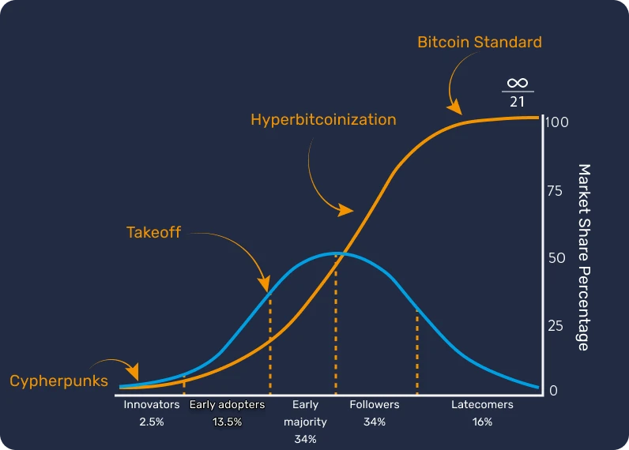
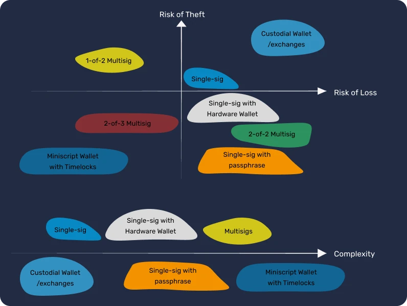
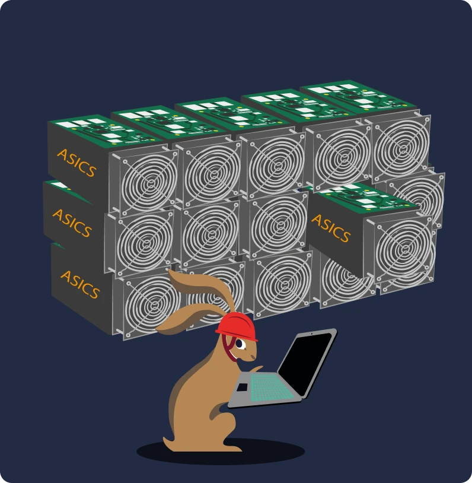
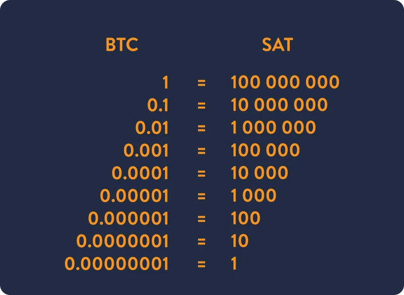

# ඔබේ පළමු බිට්කොයින් අභියානය

මෙම පාඨමාලාවේ, අපි 25 පරිච්ඡේදයන් තුළ බිට්කොයින් මූලික දේ පැහැදිලි කරන්නෙමු, එම තාක්ෂණය සරල හා කාර්යක්ෂම ලෙස ඔබ තේරුම් ගත හැකි වන පරිදි. පාඨමාලාව මෙම කර්මාන්ත සම්පූර්ණයෙන්ම මූලික දේ ගැන විස්තර කරන අතර, කන්නය, වාලට්, මිලදී ගැනීම / විකුණුම් ප්‍රතිපත්ති, සහ වෙනත් දේ වලට අතුරු මුහුණදීම් ඇත. අතිරේක අධ්‍යාපනික මාත්‍රිකා මෙම ගමන තුළ දිගුවනු ලැබේ, සහ අපි ඔබට මෙම පාඨමාලාව අවසන් කරන පසු "21 පෝස්ටර්" වලට ඔබේ අවධානය යොමු කිරීමටද ආරාධනා කරමු.

ආරම්භ කිරීමට ඔබට කිසිදු විශේෂ දැනුමක් අවශ්‍ය නොවේ. බලපාන්න, පහත අන්තර්ගතය සියලු මට්ටම්වල සිසුන්ට ප්‍රවේශී වේ, එය සම්පූර්ණ කිරීමට පමණින් පැය 15 ක් යනු යුතුය.

+++
# හැඳින්වීම

<partId>3cd2ac82-026c-53e1-874a-baf5842adc6d</partId>

## අඥාතයට පියවර ගැනීම

<chapterId>27e3fb60-4b50-556b-9e70-c4f5475c121d</chapterId>

### නව මුදල් සහ තාක්ෂණික ප්‍රතිරූපයක් වෙත පිළිගනිමු.

Bitcoin යනු තාක්ෂණික සහ මුදල් විප්ලවයක් වන අතර, අපට මුදල් සහ සමාජය සමඟ අපගේ සම්බන්ධතාවය ප්‍රශ්න කරනු ලැබීමට හැකිය. නිර්නාමිකව, Bitcoin (BTC ලෙස සඳහන් කරන ලදි) යනු **නිස්සාර** සහ **අකේන්ද්‍රීකෘත** මුදල් ඒකකයකි, එය කිසිදු සත්වයක් හෝ ආයතනයක් විසින් පාලනය නොකරන බවයි. එය යනු පහසුවෙන් "අන්තර්ජාල මුදල්" යන පදයක් ඉක්මවා යාමට හෝක්කා දැක්වන නවෝත්සාවකි: එය කොම්පියුටර් ප්‍රාමාණිකයක් (Bitcoin) සහ මුදල් ඒකකයක් (bitcoin) ය.

ප්‍රාමාණිකය ක්‍රිප්ටෝග්‍රාෆි, ජාල සන්නිවේදනය සහ ප්‍රසිද්ධ "බ්ලොක්චේන්" වැනි යටත් තාක්ෂණික ක්‍රමවේද භාවිතා කරයි, මෙම ප්‍රාමාණිකයේ නිසි ක්‍රියාකාරීත්වය සඳහා බිට්කෝයින් ඒකකය අවශ්‍ය මුදල් ඒකකය ලෙස සේවා කරයි. සාමාන්‍ය ජීවිතයේ, සැල්වදෝරියන් සහ ලෝකය පුරා බිට්කෝයිනර්ස් බිට්කෝයින් මුදල් ඒකකය භාවිතා කර නිෂ්පාදන සහ සේවා කුලීම සහ විකුණුම් කරනු ලබනවා, ඔවුන්ගේ ජීවිතය හොඳ කර ගැනීම සඳහා මෙම තාක්ෂණිකය රඳවා ගැනීමට අවශ්‍ය වේ.

### සම්පූර්ණ නමුත් ප්‍රවේශ්‍ය වූ පාඨමාලාව

මෙම පාඨමාලාවේ, අපි බිට්කොයින්ගේ සමහර මුදල් දැක්ම් සම්බන්ධයෙන් කතා කරමු, එහි බිට්කොයින් මිලදී ගැනීම සහ විකුණුම් කිරීම, ඒවා ආරක්ෂාකාරීව ඩිජිටල් වාලටු වල ගබඩා කිරීම සහ ඒවා ගනුදෙනු සඳහා භාවිතා කිරීම ඇතුළුව. අපි මයිනර්වරුන්ගේ භූමිකාවත් විමර්ශනය කරමු, ඔවුන් නව බිට්කොයින් නිර්මාණය කිරීම සහ බිට්කොයින් ජාලය ආරක්ෂා කිරීම සඳහා අත්‍යවශ්‍ය වේ. අවසානයේ, අපි බිට්කොයින්ගේ අනාගතය සහ ලයිට්නින් ජාල තාක්ෂණය බිට්කොයින් ගනුදෙනු වැඩි කරන ලෙස කෙසේ බලාපොරොත්තු විය හැකිද යන්න විමර්ශනය කරමු.


ඔබට අනිවාර්යව තේරුම් ගත හැකි විය යුතුය්ය බිට්කොයින් යනු අපගේ මුදල් සම්බන්ධතාවය සම්පූර්ණයෙන්ම වෙනස් කරන නව මුදල් පද්ධතියකි, එමනිසා එය භාවිතා කරන ආකාරය ඉගෙන ගැනීම යනු ඔවුන් කවුරුන්ද හෝ ඔවුන්ගේ තමන්ගේ මුදල් පාලනය කිරීමට කැමති කවුරුන්ද සඳහා අවශ්‍ය නිපුණයකි.

**Kotasa 1 - Salli**


- අදියර 1 - මුදල් කුමක්ද?
- අද්‍යායම 2 - ෆියට් මුදල්
- අධ්‍යාය 3 - හයිපර්ඉන්ෆ්ලේෂන්
- අද්ධායම 4 - බිට්කොයින් මුදල් ප්‍රතිපත්ති

**කොටස 2 - බිට්කොයින් විල්ලු**


- අද්ධායය 5 - බිට්කොයින් වාලකයන් ක්‍රියා කරන්නේ කෙසේද?
- අදියර 6 - ඔබේ ආරක්ෂකය තෝරා ගැනීම
- අදියර 7 - ඔබේ විලට් පිහිටුවීම
- අදියර 8 - කාලය

**කොටස 3 - බිට්කොයින්ගේ තාක්ෂණික විශේෂාංග**


- අද්ධාය 9 - ගනුදෙනුව කුමක්ද?
- අදියර 10 - බිට්කොයින් නෝඩ්ස්
- අධ්‍යාය 11 - කන්නකුඩු වැඩසිටින්නන්
- අධ්‍යාය 12 - කනු කරුවන් සහ පරිසර විද්‍යාව

**කොටස 4 - බිට්කොයින් හි සුරකිම**


- අද්‍යාය 13 - බිට්කොයින් මිල
- අදියර 14 - ඔබට බිට්කොයින් මිලදී ගන්නේ කෙසේද?
- අදියර 15 - බිට්කොයින් සඳහා වැඩ කිරීම
- අදියර 16 - හයිපර්-බිට්කොයින්සක්වීම

**කොටස 5 - ලයිට්නිං ජාලය**


- අදියර 17 - ලයිට්නිං නෙට්වැර්කට හැදෑරීම
- අදියර 18 - ලයිට්නිං නෙට්වැර්ක් සඳහා භාවිතා කිරීම් අවස්ථාවන්

මුදල් අර්ථය සහ සමාජයේ කාර්යභාරය පිළිබඳව සම්පූර්ණ කරන ලද අර්ථය අපි සමාජයට පැවැත්වීමට පෙර (අදියර 1), අපි බිට්කොයින් පැටලීමෙන් ආරම්භ කළ යුතුය. 2009 දී ආරම්භ කරන ලද බිට්කොයින් විශේෂයෙන් නව තාක්ෂණයකි එය වෙනත් කිසිම දෙයකට වෙනස් වේ. එම නිසා එය ගැන සියල්ල එක් වරක් තේරුම් ගැනීමට සාමාන්‍ය නොවේ. නියමයක් ලෙස, අන්තර්ජාලය භාවිතා කිරීමට හෝ කාර් රිය කිරීමට ඉගෙන ගන්නා විට ඔබට මුලින්ම සියලු තාක්ෂණික විස්තර දැන ගැනීමට අවශ්‍ය නැත: ඔබට මුලින්ම ඔබගේ මුදල් ලබා ගැනීම, ගෙවීම, සහ ආරක්ෂා කිරීම ඉගෙන ගැනීමෙන් ආරම්භ කළ හැකිය, ඉන් පසු එය වැඩි මතක් දැන ගැනීමට කුඩා පියවර ගන්න.

අවසානයේ, අපි එහි පාවිච්චි කිරීමේ ආරම්භක අදියරේ පමණක් ඉන්නේ, අපි පිටවීමේ අවධිය ඉක්මවා ඇත: ඔබට මෙම වැදගත් නවාතැන්ම පිළිබඳ ඔබ කැමති පරිදි දැනුම ලබා ගැනීමට කාලය ඉතා හොඳින් ඉතා හොඳින් ඉතා හොඳින් ඉතා හොඳින් ඉතා හොඳින් ඉතා හොඳින් ඉතා හොඳින් ඉතා හොඳින් ඉතා හොඳින් ඉතා හොඳින් ඉතා හොඳින් ඉතා හොඳින් ඉතා හොඳින් ඉතා හොඳින් ඉතා හොඳින් ඉතා හොඳින් ඉතා හොඳින් ඉතා හොඳින් ඉතා හොඳින් ඉතා හොඳින් ඉතා හොඳින් ඉතා හොඳින් ඉතා හොඳින් ඉතා හොඳින් ඉතා හොඳින් ඉතා හොඳින් ඉතා හොඳින් ඉතා හොඳින් ඉතා හොඳින් ඉතා හොඳින් ඉතා හොඳින් ඉතා හොඳින් ඉතා හොඳින් ඉතා හොඳින් ඉතා හොඳින් ඉතා හොඳින් ඉතා හොඳින් ඉතා හොඳින් ඉතා හොඳින් ඉතා හොඳින් ඉතා හොඳින් ඉතා හොඳින් ඉතා හොඳින් ඉතා හොඳින් ඉතා හොඳින් ඉතා හොඳින් ඉතා හොඳින් ඉතා හොඳින් ඉතා හොඳින් ඉතා හොඳින් ඉතා හොඳින් ඉතා හොඳින් ඉතා හොඳින් ඉතා හොඳින් ඉතා හොඳින් ඉතා හොඳින් ඉතා හොඳින් ඉතා හොඳින් ඉතා හොඳින් ඉතා හොඳින් ඉතා හොඳින් ඉතා හොඳින් ඉතා හොඳින් ඉතා හොඳින් ඉතා හොඳින් ඉතා හොඳින් ඉතා හොඳින් ඉතා හොඳින් ඉතා හොඳින් ඉතා හොඳින් ඉතා හොඳින් ඉතා හොඳින් ඉතා හොඳින් ඉතා හොඳින් ඉතා හොඳින් ඉතා හොඳින් ඉතා හොඳින් ඉතා හොඳින් ඉතා හොඳින් ඉතා හොඳින් ඉතා හොඳින් ඉතා හොඳින් ඉතා හොඳින් ඉතා හොඳින් ඉතා හොඳින් ඉතා හොඳින් ඉතා හොඳින් ඉතා හොඳින් ඉතා හොඳින් ඉතා හොඳින් ඉතා හොඳින් ඉතා හොඳින් ඉතා හොඳින් ඉතා හොඳින් ඉතා හොඳින් ඉතා හොඳින් ඉතා හොඳින් ඉතා හොඳින් ඉතා හොඳින් ඉතා හොඳින් ඉතා හොඳින් ඉතා හොඳින් ඉතා හොඳින් ඉතා හොඳින් ඉතා හොඳින් ඉතා හොඳින් ඉතා හොඳින් ඉතා හොඳින් ඉතා හොඳින් ඉතා හොඳින් ඉතා හොඳින් ඉතා හොඳින් ඉතා හොඳින් ඉතා හොඳින් ඉතා හොඳින් ඉතා හොඳින් ඉතා හොඳින් ඉතා හොඳින් ඉතා හොඳින් ඉතා හොඳින් ඉතා හොඳින් ඉතා හොඳින් ඉතා හොඳින් ඉතා හොඳින් ඉතා හොඳින් ඉතා හොඳින් ඉතා හොඳින් ඉතා හොඳින් ඉතා හොඳින් ඉතා හොඳින් ඉතා හොඳින් ඉතා හොඳින් ඉතා හොඳින් ඉතා හොඳින් ඉතා හොඳින් ඉතා හොඳින් ඉතා හොඳින් ඉතා හොඳින් ඉතා හොඳින් ඉතා හොඳින් ඉතා හොඳින් ඉතා හොඳින් ඉතා හොඳින් ඉතා හොඳින් ඉතා හොඳින් ඉතා හොඳින් ඉතා හොඳින් ඉතා හොඳින් ඉතා හොඳින් ඉතා හොඳින් ඉතා හොඳින් ඉතා හොඳින් ඉතා හොඳින් ඉතා හොඳින් ඉතා හොඳින් ඉතා හොඳින් ඉතා හොඳින් ඉතා හොඳින් ඉතා හොඳින් ඉතා හොඳින් ඉතා හොඳින් ඉතා හොඳින් ඉතා හොඳින් ඉතා හොඳින් ඉතා හොඳින් ඉතා හොඳින් ඉතා හොඳින් ඉතා හොඳින් ඉතා හොඳින් ඉතා හොඳින් ඉතා හොඳින් ඉතා හොඳින් ඉතා හොඳින් ඉතා හොඳින් ඉතා හොඳින් ඉතා හොඳින් ඉතා හොඳින් ඉතා හොඳින් ඉතා හොඳින් ඉතා හොඳින් ඉතා හොඳින් ඉතා හොඳින් ඉතා හොඳින් ඉතා හොඳින් ඉතා හොඳින් ඉතා හොඳින් ඉතා හොඳින් ඉතා හොඳින් ඉතා හොඳින් ඉතා හොඳින් ඉතා හොඳින් ඉතා හොඳින් ඉතා හොඳින් ඉතා හොඳින් ඉතා හොඳින් ඉතා හොඳින් ඉතා හොඳින් ඉතා හොඳින් ඉතා හොඳින් ඉතා හොඳින් ඉතා හොඳින් ඉතා හොඳින් ඉතා හොඳින් ඉතා හොඳින් ඉතා හොඳින් ඉතා හොඳින් ඉතා හොඳින් ඉතා හොඳින් ඉතා හොඳින් ඉතා හොඳින් ඉතා හොඳින් ඉතා හොඳින් ඉතා හොඳින් ඉතා හොඳින් ඉතා හොඳින් ඉතා හොඳින් ඉතා හොඳින් ඉතා හොඳින් ඉතා හොඳින් ඉතා හොඳින් ඉතා හොඳින් ඉතා හොඳින් ඉතා හොඳින් ඉතා හොඳින් ඉතා හොඳින් ඉතා හොඳින් ඉතා හොඳින් ඉතා හොඳින් ඉතා හොඳින් ඉතා හොඳින් ඉතා හොඳින් ඉතා හොඳින් ඉතා හොඳින් ඉතා හොඳින් ඉතා හොඳින් ඉතා හොඳින් ඉතා හොඳින් ඉතා හොඳින් ඉතා හොඳින් ඉතා හොඳින් ඉතා හොඳින් ඉතා හොඳින් ඉතා හොඳින් ඉතා හොඳින් ඉතා හොඳින් ඉතා හොඳින් ඉතා හොඳින් ඉතා හොඳින් ඉතා හොඳින් ඉතා හොඳින් ඉතා හොඳින් ඉතා හොඳින් ඉතා හොඳින් ඉතා හොඳින් ඉතා හොඳින් ඉතා හොඳින් ඉතා හොඳින් ඉතා හොඳින් ඉතා හොඳින් ඉතා හොඳින් ඉතා හොඳින් ඉතා හොඳින් ඉතා හොඳින් ඉතා හොඳින් ඉතා හොඳින් ඉතා හොඳින් ඉතා හොඳින් ඉතා හොඳින් ඉතා හොඳින් ඉතා හොඳින් ඉතා හොඳින් ඉතා හොඳින් ඉතා හොඳින් ඉතා හොඳින් ඉතා හොඳින් ඉතා හොඳින් ඉතා හොඳින් ඉතා හොඳින් ඉතා හොඳින් ඉතා හොඳින් ඉතා හොඳින් ඉතා හොඳින් ඉතා හොඳින් ඉතා හොඳින් ඉතා හොඳින් ඉතා හොඳින් ඉතා හොඳින් ඉතා හොඳින් ඉතා හොඳින් ඉතා හොඳින් ඉතා හොඳින් ඉතා හොඳින් ඉතා හොඳින් ඉතා හොඳින් ඉතා හොඳින් ඉතා හොඳින් ඉතා හොඳින් ඉතා හොඳින් ඉතා හොඳින් ඉතා හොඳින් ඉතා හොඳින් ඉතා හොඳින් ඉතා හොඳින් ඉතා හොඳින් ඉතා හොඳින් ඉතා හොඳින් ඉතා හොඳින් ඉතා හොඳින් ඉතා හොඳින් ඉතා හොඳින් ඉතා හොඳින් ඉතා හොඳින් ඉතා හොඳින් ඉතා හොඳින් ඉතා හොඳින් ඉතා හොඳින් ඉතා හොඳින් ඉතා හොඳින් ඉතා හොඳින් ඉතා හොඳින් ඉතා හොඳින් ඉතා හොඳින් ඉතා හොඳින් ඉතා හොඳින් ඉතා හොඳින් ඉතා හොඳින් ඉතා හොඳින් ඉතා හොඳින් ඉතා හොඳින් ඉතා හොඳින් ඉතා හොඳින් ඉතා හොඳින් ඉතා හොඳින් ඉතා හොඳින් ඉතා හොඳින් ඉතා හොඳින් ඉතා හොඳින් ඉතා හොඳින් ඉතා හොඳින් ඉතා හොඳින් ඉතා හොඳින් ඉතා හොඳින් ඉතා හොඳින් ඉතා හොඳින් ඉතා හොඳින් ඉතා හොඳින් ඉතා හොඳින් ඉතා හොඳින් ඉතා හොඳින් ඉතා හොඳින් ඉතා හොඳින් ඉතා හොඳින් ඉතා හොඳින් ඉතා හොඳින් ඉතා හොඳින් ඉතා හොඳින් ඉතා හොඳින් ඉතා හොඳින් ඉතා හොඳින් ඉතා හොඳින් ඉතා හොඳින් ඉතා හොඳින් ඉතා හොඳින් ඉතා හොඳින් ඉතා හොඳින් ඉතා හොඳින් ඉතා හොඳින් ඉතා හොඳින් ඉතා හොඳින් ඉතා හොඳින් ඉතා හොඳින් ඉතා හොඳින් ඉතා හොඳින් ඉතා හොඳින් ඉතා හොඳින් ඉතා හොඳින් ඉතා හොඳින් ඉතා හොඳින් ඉතා හොඳින් ඉතා හොඳින් ඉතා හොඳින් ඉතා හොඳින් ඉතා හොඳින් ඉතා හොඳින් ඉතා හොඳින් ඉතා හොඳින් ඉතා හොඳින් ඉතා හොඳින් ඉතා හොඳින් ඉතා හොඳින් ඉතා හොඳින් ඉතා හො



මෙහි වැදගත් කොටස යනු මෙම නව තාක්ෂණය සාමාන්‍ය ලෙස පෙනීවීමයි, එබැවින් අපි ඔබට මෙම පාඨමාලාව ප්‍රීතියෙන් අනුගමනය කරන බව හා මෙම නව ගෝලීය මුදල් පරාමිතියේ ප්‍රගතිය කරන බව අපි බලාපොරොත්තු වෙමු.

## බිට්කොයින්ගේ පූර්ව ඉතිහාසය

<chapterId>9a94b627-5b69-5d81-9125-f1fa9b0aa6ad</chapterId>

"Bitcoin" කියන වචනය ඩිජිටල් මුදල් සහ මූල්‍ය පරිවර්තනය සමඟ සමානාර්ථක වූට පෙර, එහි සාදනය සඳහා පදනම් වූ අයුරු කීපයක්, නවෝත්සාවන් සහ සමාජ චලනයන් මඟින් පිහිටුවා ඇත. මෙම අයුරු අතර, සයිෆර්පන්ක් චලනය බිට්කොයින්ගේ පූර්ව ඉතිහාසයේ මූලික අංශයක් ලෙස ඉස්සර වේ.

### Cypherpunks: ඩිජිටල් ලෝකයේ දෘෂ්ටිකරුවන්


1980 සහ 1990 වසරේ තාක්ෂණික විකාශනයේ හිරියේ, පුද්ගලයන්ගේ පිරිසක් ඩිජිටල් කාලයේ පෞද්ගලිකත්වය සහ නිදහසේ භූමිකය අත්දැකීම් කරන්න ඇරඹුනා. මෙම පුද්ගලයන්, පසුව "cypherpunks" ලෙස දන්වනු ලැබූවාන්, ක්‍රිප්ටෝග්‍රාෆි යනු රජයේ සහ විශාල සමාගම් වල අන්තර්ක්‍රියා එරෙහිව පුද්ගලික අයිතියන් රකින මෙවලමක් ලෙස ක්‍රිප්ටෝග්‍රාෆි සේවා කරයි යන්න තිබෙනවා යන්න පහත දැක්වූවාන්.

ජූලියන් අසාන්ජේ, වේයි ඩයි, ටිම් මේ, සහ ඩේවිඩ් චවුම් වැනි අයිකොනික් චරිත චාලකයන්ගේ වින්‍යාසය සහ දැක්ම මෙම චලනයට මූලික භූමිකයක් ලෙස ක්‍රියා කළේය. මෙම සිතුවම් කරුවන් තම අදහස් බහු ප්‍රභාවී තැපැල් ලැයිස්තුවක බෙදා ගැනුණේය, එහිදී ලෝකයේ පුරාණ සහභාගීන් වියෙකුට වැඩි පුද්ගලික නිදහසට තාක්ෂණය භාවිතා කිරීමේ හොඳම ක්‍රම පිළිබඳ විවාදයන් ගැන සාකච්ඡා කළේය.

### Cypherpunks ගේ මූලික තුන්කර පත්‍ර


Cypherpunk චලනය, ඩිජිටල් ක්‍රියාකාරකම් සහ ක්‍රිප්ටෝග්‍රාෆියේ මුල් පිහිටවීම් මත පදිංචිව ඇති අතර, එයේ මූලික පාඨයන් කිහිපයක් මත එයේ මූලාශ්‍රය සහ අනාගතය සඳහා දැක්ම පැහැදිලි කිරීමට භාවිතා කෙරේ. මෙම ලිපි අතර, තුන් කෙනෙක් විශේෂයෙන් ඉස්සර වේ:


- "Cypherpunk ප්‍රකාශනය":

1993 දී Eric Hughes ලියා තිබෙන "Cypherpunk Manifesto" යනු පෞද්ගලිකත්වය මූලික අයිතියක් බව ප්‍රකාශ කරයි. ප්‍රභවයා නිදහස් සමාජයක් සඳහා නිදහස්ව හා රහස්ව සන්නිවේදනය කිරීමේ හැකියාව අත්‍යවශ්‍ය බව ප්‍රකාශ කරයි. මේ ප්‍රකාශනයේ ප්‍රකාශ කරනු ලබන්නේ: "අපට පෞද්ගලිකත්වය ලබා දීමට අපට රාජ්‍ය, සමාගම්, හෝ වෙනත් විශාල, මුහුණ නොපෙනෙන සංවිධානයන්ගේ අපේක්ෂාවක් නොවේ [...]. අපට පෞද්ගලිකත්වයක් තිබීමට අපේක්ෂා කරන්නේ නම්, අපට යම් පෞද්ගලිකත්වයක් තිබීමට අපමුතුව අපගේ පෞද්ගලිකත්වය රකින්න යුතුය".


- "ක්‍රිප්ටෝ-අනර්කිස්ට ප්‍රකාශනය":

1992 වසරේ ටිමොති සී. මේ විසින් ලියන ලද මෙම ලේඛනයේ ක්‍රිප්ටෝග්‍රාෆික භාවිතය කොහොම ක්‍රිප්ටෝග්‍රාෆික අනර්කියක් සිටියේදී රාජ්‍ය අනුකූලව නාගරිකයන්ගේ පුද්ගලික කටයුතු වලට බලපෑමක් කිරීමට අසාමර්ථයෙන් සිටියේදී පැහැදිලි කරයි. මේ විසින් අනුගමනය කරන ලද අනාගතයේ මිනිසුන් තොරතුරු සහ මුදල් අනාමයෙන් හුවමාරු කරන්නේ තුන්වෙනි පාර්ශවයෙකුගේ අනුකම්පාවක් නොමැතිවයි.


- "අන්තර්ජාල ස්වාධීනතාවේ ප්‍රකාශය":

ඒ වලට විශේෂයෙන් සයිෆර්පන්ක් නොවුනද, මෙම පෙළ එම චලනයේ බොහෝ සහභාගීන්ගේ හිතවාදයන් ප්‍රකාශ කරයි. මෙය 1996 වසරේ ජෝන් පෙර්රි බාර්ලොව් විසින් ලියා ඇති අතර, එය රාජ්‍ය විසින් ඉන්ටර්නෙට් ප්‍රතිපත්තිය වැඩි කිරීමට එරෙහිව ප්‍රතිචාරයකි. ප්‍රකාශය සයිබර් අවකාශය ස්ථූල ප්‍රදේශයෙන් වෙනස් වේ යන්න හා එය එකම නීති යටතේ නොවිය යුතු යන්න ප්‍රකාශ කරයි. එය ප්‍රකාශ කරන පරිදි, "අපට මැතිවරණය කරන ලද රාජ්‍ය ආයතනයක් නොමැත, නැතිනම් එකක් අපට ලැබෙන්නේ නැත".

### බිට්කොයින්ගේ පූර්වාපේක්ෂිතාවන්

බිට්කොයින් පැටලීමට පෙර, ඩිජිටල් මුදල් නිර්මාණය කිරීමට කිහිපයක් උත්සාහ කර ඇති බව ඇත. උදාහරණයක් ලෙස, ඩේවිඩ් චවුම් ඔහුගේ ප්‍රජාතන්ට නොදන්නා "ඩිජිකෑෂ්" ව්‍යාපෘතිය සමඟ 1980 දශකයේ "නිර්නාමික ඉලෙක්ට්‍රෝනික මුදල්" ක්‍රමය පරිහරණය කර ඇත. අනුරෝධායනයක් නිසා, ඩිජිකෑෂ් කිසිදු විටෙකත් ප්‍රවර්ධනය නොවුණි.

වෙයි ඩායිගේ "B-මුදල්" යනු වෙනත් වැදගත් පූර්වාපේක්ෂියක්ය. එය ක්‍රියාත්මක කර නොගැනීමට ප්‍රමුඛ අධිකාරියක් වෙනුවට පරීක්ෂකයින්ගේ සමාජයක් විසින් ක්‍රෝඩ හඳුනාගැනීම කරන ලද නිර්නාමික ඩිජිටල් මුදල් යන අර්ථය එය පෙන්වා දුනි.

පහත පින්තූරයේ පැහැදිලිව තාක්ෂණික නවෝත්සාවන් බොහෝ දෙනා හරහා චලනයේ සංවර්ධනය පෙන්වයි.


මේ පොස්පිත පරිසරයේදී අදහස් පැහැදිලි කරන ලද්දේ සතෝෂි නකමොටෝ විසින් 2008 වසරේ බිට්කොයින් වයිට් පේපරය. මෙම ලේඛනයේ, සයිබර්පන්ක් චලනයෙන් කිහිපයක් අනුරූප කරගෙන, කාර්ය සාධකයේ ප්‍රමාණය සහ ක්‍රියාපති කාලමුද්‍රාව වැනි අවධානයන් යොදා, විකේන්ද්‍රිත සහ සෙන්සර්ෂිප් විරෝධී ඩිජිටල් මුදල් නානයක් සාදා ගැනීමට හැකි විය.

නමුත්, බිට්කොයින් එයට වඩා වැඩිදුරටත් විශේෂාංග විය: එය සයිපර්පන්ක් ආදර්ශයන්ගේ සාර්ථකතාවය නිරූපණය කළේය. එහි තාක්ෂණිකයන් අතිරේක, එය සාම්ප්‍රදායික මුදල් පද්ධතියන්

### ස

බිට්කොයින්ගේ පූර්ව ඉතිහාසය සයිබර්පන්ක් චලනයට සහ ඩිජිටල් කාලයේ වැඩි ස්වාධීනතාවය සඳහා සාමුහික ගැටළුවට ගැඹුරුව මුල් ගෙන ඇත. ක්‍රියාපද්ධතිය, විකේන්ද්‍රිතාව, සහ අක්ලතාවයේ මූලධර්ම සංයෝජනය කිරීමෙන් බිට්කොයින් මුදලකට වඩා වැඩි දෙයක් වූ අතර, එය අපගේ ලෝකය පුනරාකෘති කරන දර්ශනික සහ තාක්ෂණික විප්ලවයේ නිෂ්පාදනයකි.

එමනිස්, බිට්කොයින් වන්නේ දිගු කාල සමයක පුළුල් වන ප්‍රවෘත්තියක් අතර, අපට උර්ථ්‍ය, කාලය සහ මුදල් සමඟ අපගේ සම්බන්ධතාවය පිළිබඳව ප්‍රශ්න අහෝවා ගැනීමට අපට උපදෙස් දෙයි.

නමුත්, බිට්කොයින් වාස්තවීය "මුදල්" නාමයක්ද? මෙය තේරුම් ගැනීමට, අපි පළමුව මුදල් ක්‍රමය සහ එහි විවිධ ආකාර ගැන අපි තේරුම් ගැනීමට අවශ්‍ය වේ, මෙය අපි ඊළඟ අදියරේ ගවේෂණය කරමු.

ඔබට බිට්කොයින්ගේ ඉතිහාසය වැඩි විස්තරව ගවේෂණය කිරීමට අවශ්‍ය නම්, අපි ඔබට විශේෂයෙන් අපගේ HIS 201 පාඨමාලාව නිර්දේශ කරමු, එහිදී ඔබට බිට්කොයින්ගේ මුල් සහ මන්දගාමී පැටවීම සහ එක් එක් ඉතිහාසය සහ සමාජයේ ආරම්භය හා සමඟ සොයා ගැනීමට හැකි වේ. මෙම පාඨමාලාව සම්පූර්ණයෙන්ම ලේඛනගත කර ඇති අතර, ප්‍රමාණවත් අනේකඩෝත් සමඟ, මුල් සහ මුල් මුල් මුල් මුල් මුල් මුල් මුල් මුල් මුල් මුල් මුල් මුල් මුල් මුල් මුල් මුල් මුල් මුල් මුල් මුල් මුල් මුල් මුල් මුල් මුල් මුල් මුල් මුල් මුල් මුල් මුල් මුල් මුල් මුල් මුල් මුල් මුල් මුල් මුල් මුල් මුල් මුල් මුල් මුල් මුල් මුල් මුල් මුල් මුල් මුල් මුල් මුල් මුල් මුල් මුල් මුල් මුල් මුල් මුල් මුල් මුල් මුල් මුල් මුල් මුල් මුල් මුල් මුල් මුල් මුල් මුල් මුල් මුල් මුල් මුල් මුල් මුල් මුල් මුල් මුල් මුල් මුල් මුල් මුල් මුල් මුල් මුල් මුල් මුල් මුල් මුල් මුල් මුල් මුල් මුල් මුල් මුල් මුල් මුල් මුල් මුල් මුල් මුල් මුල් මුල් මුල් මුල් මුල් මුල් මුල් මුල් මුල් මුල් මුල් මුල් මුල් මුල් මුල් මුල් මුල් මුල් මුල් මුල් මුල් මුල් මුල් මුල් මුල් මුල් මුල් මුල් මුල් මුල් මුල් මුල් මුල් මුල් මුල් මුල් මුල් මුල් මුල් මුල් මුල් මුල් මුල් මුල් මුල් මුල් මුල් මුල් මුල් මුල් මුල් මුල් මුල් මුල් මුල් මුල් මුල් මුල් මුල් මුල් මුල් මුල් මුල් මුල් මුල් මුල් මුල් මුල් මුල් මුල් මුල් මුල් මුල් මුල් මුල් මුල් මුල් මුල් මුල් මුල් මුල් මුල් මුල් මුල් මුල් මුල් මුල් මුල් මුල් මුල් මුල් මුල් මුල් මුල් මුල් මුල් මුල් මුල් මුල් මුල් මුල් මුල් මුල් මුල් මුල් මුල් මුල් මුල් මුල් මුල් මුල් මුල් මුල් මුල් මුල් මුල් මුල් මුල් මුල් මුල් මුල් මුල් මුල් මුල් මුල් මුල් මුල් මුල් මුල් මුල් මුල් මුල් මුල් මුල් මුල් මුල් මුල් මුල් මුල් මුල් මුල් මුල් මුල් මුල් මුල් මුල් මුල් මුල් මුල් මුල් මුල් මුල් මුල් මුල් මුල් මුල් මුල් මුල් මුල් මුල් මුල් මුල් මුල් මුල් මුල් මුල් මුල් මුල් මුල් මුල් මුල් මුල් මුල් මුල් මුල් මුල් මුල් මුල් මුල් මුල් මුල් මුල් මුල් මුල් මුල් මුල් මුල් මුල් මුල් මුල් මුල් මුල් මුල් මුල් මුල් මුල් මුල් මුල් මුල් මුල් මුල් මුල් මුල් මුල් මුල් මුල් මුල් මුල් මුල් මුල් මුල් මුල් මුල් මුල් මුල් මුල් මුල් මුල් මුල් මුල් මුල් මුල් මුල් මුල් මුල් මුල් මුල් මුල් මුල් මුල් මුල් මුල් මුල් මුල් මුල් මුල් මුල් මුල් මුල් මුල් මුල් මුල් මුල් මුල් මුල් මුල් මුල් මුල් මුල් මුල් මුල් මුල් මුල් මුල් මුල් මුල් මුල් මුල් මුල් මුල් මුල් මුල් මුල් මුල් මුල් මුල් මුල් මුල් මුල් මුල් මුල් මුල් මුල් මුල් මුල් මුල් මුල් මුල් මුල් මුල් මුල් මුල් මුල් මුල් මුල් මුල් මුල් මුල් මුල් මුල් මුල් මුල් මුල් මුල් මුල් මුල් මුල් මුල් මුල් මුල් මුල් මුල් මුල් මුල් මුල් මුල් මුල් මුල් මුල් මුල් මුල් මුල් මුල් මුල් මුල් මුල් මුල් මුල් මුල් මුල් මුල් මුල් මුල් මුල් මුල් මුල් මුල් මුල් මුල් මුල් මුල් මුල් මුල් මුල් මුල් මුල් මුල් මුල් මුල් මුල් මුල් මුල් මුල් මුල් මුල් මුල් මුල් මුල් මුල් මුල් මුල් මුල් මුල් මුල් මුල් මුල් මුල් මුල් මුල් මුල් මුල් මුල් මුල් මුල් මුල් මුල් මුල් මුල් මුල් මුල් මුල් මුල් මුල් මුල් මුල් මුල් මුල් මුල් මුල් මුල් මුල් මුල් මුල් මුල් මුල් මුල් මුල් මුල් මුල් මුල් මුල් මුල් මුල් මුල් මුල් මුල් මුල් මුල් මුල් මුල් මුල් මුල් මුල් මුල් මුල් මුල් මුල් මුල් මුල් මුල් මුල් මුල් මුල් මුල් මුල් මුල් මුල් මුල් මුල් මුල් මුල් මුල් මුල් මුල් මුල් මුල් මුල් මුල් මුල් මුල් මුල් මුල් මුල් මුල් මුල් මුල් මුල් මුල් මුල් මුල් මුල් මුල් මුල් මුල් මුල් මුල් මුල් මුල් මුල් මුල් මුල් මුල් මුල් මුල් මුල් මුල් මුල් මුල් මුල් මුල් මුල් මුල් මුල් මුල් මුල් මුල් මුල් මුල් මුල් මුල් මුල් මුල් මුල් මුල් මුල් මුල් මුල් මුල් මුල් මුල් මුල් මුල් මුල් මුල් මුල් මුල් මුල් මුල් මුල් මුල් මුල් මුල් මුල් මුල් මුල් මුල් මුල් මුල් මුල් මුල් මුල් මුල් මුල් මුල් මුල් මුල් මුල් මුල් මුල් මුල් මුල් මුල් මුල් මුල් මුල් මුල් මුල් මුල් මුල් මුල් මුල් මුල් මුල් මුල් මුල් මුල් මුල් මුල් මුල් මුල් මුල් මුල් මුල් මුල් මුල් මුල් මුල් මුල් මුල් මුල් මුල් මුල් මුල් මුල් මුල් මුල් මුල් මුල් මුල් මුල් මුල් මුල් මුල් මුල් මුල් මුල් මුල් මුල් මුල් මුල් මුල් මුල් මුල් මුල් මුල් මුල් මුල් මුල් මුල් මුල් මුල් මුල් මුල් මුල් මුල් මුල් මුල් මුල් මුල් මුල් මුල් මුල් මුල් මුල් මුල් මුල් මුල් මුල් මුල් මුල් මුල් මුල් මුල් මුල් මුල් මුල් මුල් මුල් මුල් මුල් මුල් මුල් මුල් මුල් මුල් මුල් මුල් මුල් මුල් මුල් මුල් මුල් මුල් මුල් මුල් මුල් මුල් මුල් මුල් මුල් මුල් මුල් මුල් මුල් මුල් මුල් මුල් මුල් මුල් මුල් මුල් මුල් මුල් මුල් මුල් මුල් මුල් මුල් මුල් මුල් මුල් මුල් මුල් මුල් මුල් මුල් මුල් මුල් මුල් මුල් මුල් මුල් මුල් මුල් මුල් මුල් මුල් මුල් මුල් මුල් මුල් මුල් මුල් මුල් මුල් මුල් මුල් මුල් මුල් මුල් මුල් මුල් මුල් මුල් මුල් මුල් මුල් මුල් මුල් මුල් මුල් මුල් මුල් මුල් මුල් මුල් මුල් මුල් මුල් මුල් මුල් මුල් මුල් මුල් මුල් මුල් මුල් මුල් මුල් මුල් මුල් මුල් මුල් මුල් මුල් මුල් මුල් මුල් මුල් මුල් මුල් මුල් මුල් මුල් මුල් මුල් මුල් මුල් මුල් මුල් මුල් මුල් මුල් මුල් මුල් මුල් මුල් මුල් මුල් මුල් මුල් මුල් මුල් මුල් මුල් මු

https://planb.network/courses/a51c7ceb-e079-4ac3-bf69-6700b985a082
# මුදල්

<partId>e913df1a-4cbd-5380-ba67-ca2a0414f671</partId>

## ඉතිහාසය තුළ මුදල්

<chapterId>c838e64d-d59f-5703-8c74-ea5e8c4fdd31</chapterId>

මුදල් විකාශනය වෙනස්වෙන ආර්ථික අවශ්‍යතා සපුරාලෙස සම්පූර්ණ කරගැනීමට යුග සහිතයේ සභාවන්ගේ නිපුණතාවය ප්‍රකාශ කරන මානව ඉතිහාසයේ අදහස් පිරිසිදු කොටසක් වනවා.


### සිප්පි සිට බැංකු ගිණුම් වෙත

මුලින්ම, මුදල් වාසියක් විය, එවැනිය ධාන්‍ය, පාළු සතුන් හෝ වෙනත් කොම්මඩිති විය. නමුත්, මෙම භාණ්ඩ වලට ප්‍රධාන අවාසිය එවැනි භාණ්ඩ වල ප්‍රවේණාවක් ඇති වීමයි, එය දිගු කාලයක් සුරක්ෂිත කිරීමේ මාධ්‍යයක් ලෙස භාවිතා කිරීම කරුණු වීමයි. උදාහරණයක් ලෙස, අයිතියේ දුර්වල අස්වැන්න හෝ මෘග රෝග විසින් තනි පුද්ගලයාගේ සම්පත රාත්‍රියක් තුළ විනාශ කරනු ලැබිය හැක.

එමනිස්සේ, සභාවක් ප්‍රගුතියේ යාම සහ වෙළඳාම නව කලාපයන්ට පැමිණිය විට, සාමාන්‍ය හුවමාරු මාධ්‍යයක් සඳහා අවශ්‍යතාවයක් පැන නැගුණි. පුද්ගලයන් පළමුව සුවඳ සහ මංවාන් වැනි වස්තු සමඟ පරීක්ෂා කළේය, නමුත් ඔවුන් සිතූ පරිදි ඒවා දැඩි හෝ අපේක්ෂිත නොවුණි. අවසානයේ, එහි අපේක්ෂිතභාවය, දැඩිභාවය සහ බෙදීමේ හැකියාව නිසා, රත්තරං සම්ප්‍රදායයක් වුණි. එය, සහ මේ දින් දක්වා, සම්පත්තියේ සහ බලයේ සලකුණක් වේ.


### මුදලේ කාර්යභාරය කුමක්ද?

මුදල් යනු ඉතාමතා සංකීර්ණ සන්නිවේදන මෙවලමකි:


- එය ප්‍රස්තුතිය සහ අනාගතය අතර සන්නිවේදනය සඳහා ඉඩ දෙයි, මකා දැමීමේ අවදානමක් නැතිව අනාගත කාලයේ යළි භාවිතා කළ හැකි වත්කමක් ලෙස අපගේ කාලය සහ බලාපොරොත්තුව පරිවර්තනය කරයි.
- එය සාමාන්‍ය භාෂාවක් භාවිතා කරමින් සන්නිවේදනය සහය වේ: එකම භාෂාව කථා කරන්නේ නැති හෝ එකම අය දන්නේ නැති දෙදෙනාම හුවමාරුවාගේ, ව්‍යාපාර කරන්නාගේ හා දේවල් අගය ගැන එකඟ වීම ගැන සම්බන්ධ කර ගත හැක.

අපගේ ලෝකයේ එයේ කාර්යභාරය කෘත්‍රිම පුනරුත්පාදනය කිරීම කරුණු අපහසුය. නියමයෙන්, කිසිදු තනතුරක් හෝ කණ්ඩායමක් සල්ලි නිර්මාණය කළ නොහැකිය, එය විපරීදි එකඟතාවක් සහ විපරීදියෙන් පැන එන ස්වභාවික

මෙම හේතු නිසා, මුදල් ලෙස රත්තරං ප්‍රතිඵලය වන්නේ පහත දැක්වෙන ආරිස්තෝතලියානු කාර්යයන් පදනම් කර ගත් 4,000 ක් වර්ෂ මුදල් ඩාර්විනිසමයේ ප්‍රතිඵලයකි:


- අගය ගබඩා කිරීම**: මුදල් භාවිතයෙන් අනාගතයට මිලදී ගැනීමේ ශක්තිය සම්පාදනය කළ හැකිය, එබැවින් එය දියුණු මුදලක් විය යුතුය;
- **හුවමාරු මාධ්‍යය**: හුවමාරුව සඳහා වාණිජ හා සේවා වලට වෙනුවෙන් සල්ලි භාවිතා කළ හැකිය, එයින් වෙළෙන්දෝ අතර අවස්ථාවක කැමැත්තෙන් වැලැක්වීමට;
- ගණනාකාර ඒකකය**: මුදල් අපට වෙනස් භාණ්ඩ වල අගයන් සැලකිලා ඒවායේ සාපේක්ෂිත පහසුකම් වලට වඩා හොඳින් දැනගන්න ඉඩ දෙයි.


### මුදලේ ලක්ෂණ

සුරකින්දු ආකාරයේ රන් කාර්මික මුදල් නිර්ණයක් සඳහා අනිවාර්ය ප්‍රමාණයක් ඉදිරිපත් කරයි: එහි ස්වභාවික දුර්ලභය එය වටිනාකම් කරයි, මෙතරම්ද එහි කේමික ගුණාංග එය කාලය සමඟ පැහැදිලි නොවීමට සහය වේ. මෙම ලක්ෂණ රන් වැඩියෙන්ම **වටිනාකම් ගබඩා කිරීමට** හොඳ කර ඇත, නමුත් සාමාන්‍ය මුදල් නිර්ණයක් නොවේ, මේම මුදල් ආකාරය ඉතා සුළුවට හෝ දිගා දුරකට ගෙන යාමට පහසු නොවේ. ගෝලීය හා ඩිජිටල් ලෝකයක රන් පැමිණිල්ලට හා එය සුළුවට හා පහසුවෙන් හුවමාරු කිරීමට (එනම්. මුද්‍රිත මුදල් හරහා) මධ්‍යස්ථ බලකායක් අවශ්‍ය වේ.

විරුද්ධව, රාජ්‍ය නියෝජ්‍ය මුදල් (fiat) පහසුවෙන් භාවිතා කළ හැකිය, නමුත් ඒවා පාලනය කරන ඒකක (රජුන්, මධ්‍යම බැංකු, අධිරාජුන්, අධිපතින්) විසින් නියත්වාම අගය අඩු කරනු ලැබේ.

මෙම සංකල්පය වඩා හොඳින් පැහැදිලි කිරීම සඳහා, අපි කාර්යක්ෂම මුදල් නියෝජනයේ ලක්ෂණ විමර්ශනය කරමු:


- Fungibility**, එය එකම වර්ගයේ තවත් ඒකකයක් සමඟ විනිමය නොවී හුවමාරු කළ හැකි බවයි;
- විබේදනීයභාවය**, විවිධ වෝලියම් වල ගනුදෙනු සහභාගී කිරීමට සුළු ඒකකයන්ට විබේදා ගත හැකි වශයෙන්;
- ද්‍රව්‍යතාවය**, එය පහසුවෙන් භාණ්ඩ හෝ සේවා වලට පරිවර්තනය කළ හැකි බවය.

මෙම නිර්ණායකයන් සඳහා සම්මුඛ වීමට, මුදල් ඉතිහාසිකව වෙනස් කිරීමේ කිහිපයක් ගැනීමෙන් සංවර්ධනය වී ඇත:


- අස්ථිය ගල -> මුදල් කොටිය
- බැංකු සටහන -> බැංකු කාඩ්ඩය
- බ්ලොක්චේන් -> ලයිට්නිං නෙට්වැර්ක්

මුදල් මුදල් තවමත් විකාශනය වෙමින් පවත්වනවා, ඒවා වෙනස් භාවිතයන් සඳහා ඒවායේ ආකෘති අනුවර්තනය කරමින්. අපි කිව්වා පරිදි, රත්තරං අගය ගබඩා කිරීමේ විශිෂ්ට මුදලක් වන අතර, එය දැනට ගෝලීය ආර්ථිකය සඳහා සුදුසු නොවේ. ඒ වැනිය, ඩොලරය සහ යුරෝ වැනි නියෝගික මුදල් මුදල් ඉතා ද්‍රව්‍ය සහ පහසුවෙන් ගෙන යා හැකි වන අතර ඒවා දැනට බොහෝ විට ඩිජිටල් වේ, නමුත් ඒවායේ අගය මුදල් පුහුණුවෙන් නිතර අඩු වේ.

අනෙක් අතරතුර, බිට්කොයින් නව සැලසුම් පෙන්වයි. එහි ගුණ, පමණක් සීමා කර ඇති සපයන්නට වගකීමක් ඇති බව යන්න, එය වටිනා අගය ගබඩා කිරීමට විශිෂ්ට කරයි. මෙතෙක්, ස්වාධීන ඉන්ටර්නෙට් මුදල් ඒකකයක් ලෙස, එය සීමාවන් ඉක්මවන **හුවමාරු මාධ්‍යය** ලෙස ක්‍රියා කරයි. නමුත්, එය අදත් වාණිජ ක්‍රියාකාරකම්වල ප්‍රසාර ලබා නොගත් නම් එයේ [ස්ථිර පිළිගැනීම](https://btcmap.org/map) වෙනුවෙන් පවතී.

## ප්‍රදාන මුදල් වර්ග

<chapterId>25151d46-7db1-5b48-8bba-cbde1944555a</chapterId>

> "අතීතය මතක කර නොගත් අය එය නැවත කිරීමට බලාපොරොත්තු වේ" යන්න ගෝර්ජ් සන්තයානා කියා සිටියේ.
දැනට පවතින මුදල් පද්ධතිය පිළිබඳව සාර්ථකව ප්‍රකාශ වන සත්‍යයක්.

### Fiduciary = විශ්වාසය

අද, යුරෝ සහ ඩොලර් වැනි ප්‍රධාන මුදල් ඒකක වලට විශ්වාසීන්ගේ නාමයක් ලැබී ඇත. මෙය අර්ථයෙන් ඔවුන්ට අභ්‍යන්තර වටිනාකමක් නොමැති බව සහ අපි ඔවුන්ට දක්වන විශ්වාසය සහ සුරක්ෂිතතාවය මත පමණක් පදනම් වෙන බවයි.

ප්‍රධාන මුදල් යනු එක් ආයතනය, එනම් රාජ්‍යයක්, චීනය සහ යුයාන් වැනි, හෝ දේශපාලන-ආර්ථික සංගමයක්, එනම් යුරෝපායනු සංගමය සහ යුරෝ වැනි, එය මුදල් ලෙස නියෝගිත කරන ආකාරයකි. එය නිකුත් කරන අංශය මධ්‍යම බැංකුවයි (උදාහරණයක් ලෙස, අපි චීනයේ ජනතා බැංකුව, එක්සත් ජනපදයේ ප්‍රධාන බැංකුව, හෝ ගිනියාවේ මධ්‍යම බැංකුව මත හිමිකම් කරන්නේය). මුදල් ප්‍රතිපත්තිය නිර්මාණය කිරීම සහ එම නිසා කොහොමද මුදල් සංචාරයට පත් කළ යුතුද හෝ මුද්‍රිත කළ යුතුද යන්න පිළිබඳව වගකීම මෙම අංශ මත පමණක් පවතී.


### මුදල් අගය අවම කිරීම: රෝමානු අධිරාජ්‍යය තරම් පැරණි ක්‍රමයක්

පුරාණයෙන් පසුව, රන් මුදල් යම් යම් යම් යම් යම් යම් යම් යම් යම් යම් යම් යම් යම් යම් යම් යම් යම් යම් යම් යම් යම් යම් යම් යම් යම් යම් යම් යම් යම් යම් යම් යම් යම් යම් යම් යම් යම් යම් යම් යම් යම් යම් යම් යම් යම් යම් යම් යම් යම් යම් යම් යම් යම් යම් යම් යම් යම් යම් යම් යම් යම් යම් යම් යම් යම් යම් යම් යම් යම් යම් යම් යම් යම් යම් යම් යම් යම් යම් යම් යම් යම් යම් යම් යම් යම් යම් යම් යම් යම් යම් යම් යම් යම් යම් යම් යම් යම් යම් යම් යම් යම් යම් යම් යම් යම් යම් යම් යම් යම් යම් යම් යම් යම් යම් යම් යම් යම් යම් යම් යම් යම් යම් යම් යම් යම් යම් යම් යම් යම් යම් යම් යම් යම් යම් යම් යම් යම් යම් යම් යම් යම් යම් යම් යම් යම් යම් යම් යම් යම් යම් යම් යම් යම් යම් යම් යම් යම් යම් යම් යම් යම් යම් යම් යම් යම් යම් යම් යම් යම් යම් යම් යම් යම් යම් යම් යම් යම් යම් යම් යම් යම් යම් යම් යම් යම් යම් යම් යම් යම් යම් යම් යම් යම් යම් යම් යම් යම් යම් යම් යම් යම් යම් යම් යම් යම් යම් යම් යම් යම් යම් යම් යම් යම් යම් යම් යම් යම් යම් යම් යම් යම් යම් යම් යම් යම් යම් යම් යම් යම් යම් යම් යම් යම් යම් යම් යම් යම් යම් යම් යම් යම් යම් යම් යම් යම් යම් යම් යම් යම් යම් යම් යම් යම් යම් යම් යම් යම් යම් යම් යම් යම් යම් යම් යම් යම් යම් යම් යම් යම් යම් යම් යම් යම් යම් යම් යම් යම් යම් යම් යම් යම් යම් යම් යම් යම් යම් යම් යම් යම් යම් යම් යම් යම් යම් යම් යම් යම් යම් යම් යම් යම් යම් යම් යම් යම් යම් යම් යම් යම් යම් යම් යම් යම් යම් යම් යම් යම් යම් යම් යම් යම් යම් යම් යම් යම් යම් යම් යම් යම් යම් යම් යම් යම් යම් යම් යම් යම් යම් යම් යම් යම් යම් යම් යම් යම් යම් යම් යම් යම් යම් යම් යම් යම් යම් යම් යම් යම් යම් යම් යම් යම් යම් යම් යම් යම් යම් යම් යම් යම් යම් යම් යම් යම් යම් යම් යම් යම් යම් යම් යම් යම් යම් යම් යම් යම් යම් යම් යම් යම් යම් යම් යම් යම් යම් යම් යම් යම් යම් යම් යම් යම් යම් යම් යම් යම් යම් යම් යම් යම් යම් යම් යම් යම් යම් යම් යම් යම් යම් යම් යම් යම් යම් යම් යම් යම් යම් යම් යම් යම් යම් යම් යම් යම් යම් යම් යම් යම් යම් යම් යම් යම් යම් යම් යම් යම් යම් යම් යම් යම් යම් යම් යම් යම් යම් යම් යම් යම් යම් යම් යම් යම් යම් යම් යම් යම් යම් යම් යම් යම් යම් යම් යම් යම් යම් යම් යම් යම් යම් යම් යම් යම් යම් යම් යම් යම් යම් යම් යම් යම් යම් යම් යම් යම් යම් යම් යම් යම් යම් යම් යම් යම් යම් යම් යම් යම් යම් යම් යම් යම් යම් යම් යම් යම් යම් යම් යම් යම් යම් යම් යම් යම් යම් යම් යම් යම් යම් යම් යම් යම් යම් යම් යම් යම් යම් යම් යම් යම් යම් යම් යම් යම් යම් යම් යම් යම් යම් යම් යම් යම් යම් යම් යම් යම් යම් යම් යම් යම් යම් යම් යම් යම් යම් යම් යම් යම් යම් යම් යම් යම් යම් යම් යම් යම් යම් යම් යම් යම් යම් යම් යම් යම් යම් යම් යම් යම් යම් යම් යම් යම් යම් යම් යම් යම් යම් යම් යම් යම් යම් යම් යම් යම් යම් යම් යම් යම් යම් යම් යම් යම් යම් යම් යම් යම් යම් යම් යම් යම් යම් යම් යම් යම් යම් යම් යම් යම් යම් යම් යම් යම් යම් යම් යම් යම් යම් යම් යම් යම් යම් යම් යම් යම් යම් යම් යම් යම් යම් යම් යම් යම් යම් යම් යම් යම් යම් යම් යම් යම් යම් යම් යම් යම් යම් යම් යම් යම් යම් යම් යම් යම් යම් යම් යම් යම් යම් යම් යම් යම් යම් යම් යම් යම් යම් යම් යම් යම් යම් යම් යම් යම් යම් යම් යම් යම් යම් යම් යම් යම් යම් යම් යම් යම් යම් යම් යම් යම් යම් යම් යම් යම් යම් යම් යම් යම් යම් යම් යම් යම් යම් යම් යම් යම් යම් යම් යම් යම් යම් යම් යම් යම් යම් යම් යම් යම් යම් යම් යම් යම් යම් යම් යම් යම් යම් යම් යම් යම් යම් යම් යම් යම් යම් යම් යම් යම් යම් යම් යම් යම් යම් යම් යම් යම් යම් යම් යම් යම් යම් යම් යම් යම් යම් යම් යම් යම් යම් යම් යම් යම් යම් යම් යම් යම් යම් යම් යම් යම් යම් යම් යම් යම් යම් යම් යම් යම් යම් යම් යම් යම් යම් යම් යම් යම් යම් යම් යම් යම් යම් යම් යම් යම් යම් යම් යම් යම් යම් යම් යම් යම් යම් යම් යම් යම් යම් යම් යම් යම් යම් යම් යම් යම් යම් යම් යම් යම් යම් යම් යම් යම් යම් යම් යම් යම් යම් යම් යම් යම් යම් යම් යම් යම් යම් යම් යම් යම් යම් යම් යම් යම් යම් යම් යම් යම් යම් යම් යම් යම් යම් යම් යම් යම් යම් යම් යම් යම් යම් යම් යම් යම් යම් යම් යම් යම් යම් යම් යම් යම් යම් යම් යම් යම් යම් යම් යම් යම් යම් යම් යම් යම් යම් යම් යම් යම් යම් යම් යම් යම් යම් යම් යම් යම් යම් යම් යම් යම් යම් යම් යම් යම් යම් යම් යම් යම් යම් යම් යම් යම් යම් යම් යම් යම් යම් යම් යම් යම් යම් යම් යම් යම් යම් යම් යම් යම් යම් යම් යම් යම් යම් යම් යම් යම් යම් යම් යම් යම් යම් යම් යම් යම් යම් යම් යම් යම් යම් යම් යම් යම් යම් යම් යම් යම් යම් යම් යම් යම් යම් යම් යම් යම් යම් යම් යම් යම් යම් යම් යම් යම් යම් යම් යම් යම් යම් යම් යම් යම් යම් යම් යම් යම් යම් යම් යම් යම් යම් යම් යම් යම් යම් යම් යම් යම් යම් යම් යම් යම් යම් යම් යම් යම් යම් යම් යම් යම් යම් යම් යම් යම් යම් යම් යම් යම් යම් යම් යම් යම් යම් යම් යම් යම් යම් යම් යම් යම් යම් යම් යම් යම් යම් යම් යම් යම් යම් යම් යම් යම් යම් යම් යම් යම් යම් යම් යම් යම් යම් යම් යම් යම් යම් යම් යම් යම් යම් යම් යම් යම් යම් යම් යම් යම් යම් යම් යම් යම් යම් යම් යම් යම් යම් යම් යම් යම් යම් යම් යම් යම් යම් යම් යම් යම් යම් යම් යම් යම් යම් යම් යම් යම් යම් යම් යම් යම් යම් යම් යම් යම් යම් යම් යම් යම් යම් යම් යම් යම් යම් යම් යම් යම් යම් යම් යම් යම් යම් යම් යම් යම් යම් යම් යම් යම් යම් යම් යම් යම් යම් යම් යම් යම් යම් යම් යම් යම් යම් යම් යම් යම

යන්ත්‍රය සරලයි සහ එය සභ්‍යස්ථානයේ මුල් සිට පවතින සැලසුම් මත පදනම් වේ. සම්පත් මත පාලනය කිරීමට කැමති නායකයෝ, සාමාන්‍යයෙන් ඔවුන්ගේ බලය අපවාද කරමින් සහ ආරක්ෂාව සහ ආරක්ෂිතතාව ප්‍රතිෂ්ඨාපනය කරමින් රත්මල් මධ්‍යම කරගනිමින් ආරම්භ කරයි. මෙම අගයැත් රැසක් ඔවුන්ගේ අතහැර ඇති වූ විට, ඔවුන් රත්මල් සමාන අගයක් ඇති නව මුද්‍රාවක් නිර්මාණය කරයි, නමුත් එය ඔවුන්ගේ ප්‍රතිමාව මුද්‍රා කරන ලදි. මෙම මුද්‍රාව පසුව ආරම්භ කරයි සහ මිනිසුන් වහාම එහි සරල භාවිතයට සකස් කරගනිමින් එයට සකස් වේ.

නමුත්, මෙම නායකයෝ පසුව මෙම නව මුදල් අගය ක්‍රමවේට අඩු කරන්න ආරම්භ කරති, එයේ අගය ප්‍රධාන රත් මිලට සම්බන්ධව වසරකට කිහිපයක් ක්‍රමවේට අඩු කරයි. මෙම නිශ්ශබ්ද අඩු කිරීම සාමාන්‍යයෙන් ජනතාවගේ අවස්ථාවට අනුකූල වශයෙන් සත්‍යාපිත කරනු ලැබේ. යම් සත්‍යයක් ලෙස, මෙම ප්‍රමාණවත් මුදල් අගයෙහි සුරක්ෂිත කරන්නන් ඔවුන්ගේ සුරක්ෂිතයේ අගය අඩු වීම දැකිය හැකිය, මතක් රාජ්‍යය එහි ආයෝජන වාර්තා කරයි. මෙන්ම, මෙම අඩු කිරීම ණය ගෙවීම සඳහා පහසුව කර දෙයි.


අත්‍යවශ්‍ය ක්ෂණයක් දී, නායකයා නිවේදනය කරයි: මුදල් දැන් රත් මත පාරිභෝගික නොවේ. දැන් ණය මුදල් වලට අත්හිටුවා සහ මුදල් කටයුතු පිළිබඳව නොදන්නා පොදුජනතාව, මෙම යථාර්ථය පිළිගනී, රාජ්‍යයට මුදල් සපයාම නිදහසේ හැසිරවීමට සහ ඇතැම් නිසි වියදමක් නොවේ මුදල් විශාල ප්‍රමාණයක් මුද්‍රා කිරීමට ඉඩ දෙයි.

මුදල් මුද්‍රණය පසුව මුදල් ප්‍රමාණවාදයට පත් වේ හා අතුරුදහන්වා ජනතාව දින්දිනකට දින්දිනකට අඩු වේ. නොමැතිනම්, මුදල් පද්ධතිය සංයෝජනය කර හා සීමා කර තිබේ එයේ පිලිබඳ කිසිදු අාකුල්කරණයක් මහත් ආර්ථික සංකතයක් ඇති කරනු ලැබිය හැකි බවය. මහා සංඛ්‍යාවට වෙනස්ව, මුදල් ආයතන හා සම්පත් පුද්ගලයන් මෙම පද්ධතියෙන් විශාල ප්‍රයෝජනයක් ලබා ගනිති, මෙය සමානතා වාරණයක් නිර්මාණය කර ගනිති හා අධිපතිවාදයට උපකාර කරයි. මෙම සංදර්භයේ, ඔවුන්ට මූලික වෙනස්කම් සිදු කිරීමට උපකාර කරනු නොලැබේ, මෙම පද්ධතිය සමහරුන් සමහරුන් සිදුවන තුරු එහි පාඨය පවත්වාගෙන යාමට ඉඩ දෙයි.

හොඳින් ක්‍රියාත්මක කරන ලද්දේ, මෙම ක්‍රමය දශක කාලයක් සඳහා කාලීන විය හැක. නමුත්, ඉතා වේගවත් අගය අවම වීමක් හෝ විශ්වාසය අවම වීමක් හයිපර්ඉන්ෆ්ලේෂනයට (ඊළඟ අද්‍යායය බලන්න) පැමිණිය හැකිය යැයි සලකුණු කළ යුතුය. ඉතිහාසය පෙන්වනුයේ ඩොලරය එක් එක් එක් එක් එක් එක් එක් එක් එක් එක් එක් එක් එක් එක් එක් එක් එක් එක් එක් එක් එක් එක් එක් එක් එක් එක් එක් එක් එක් එක් එක් එක් එක් එක් එක් එක් එක් එක් එක් එක් එක් එක් එක් එක් එක් එක් එක් එක් එක් එක් එක් එක් එක් එක් එක් එක් එක් එක් එක් එක් එක් එක් එක් එක් එක් එක් එක් එක් එක් එක් එක් එක් එක් එක් එක් එක් එක් එක් එක් එක් එක් එක් එක් එක් එක් එක් එක් එක් එක් එක් එක් එක් එක් එක් එක් එක් එක් එක් එක් එක් එක් එක් එක් එක් එක් එක් එක් එක් එක් එක් එක් එක් එක් එක් එක් එක් එක් එක් එක් එක් එක් එක් එක් එක් එක් එක් එක් එක් එක් එක් එක් එක් එක් එක් එක් එක් එක් එක් එක් එක් එක් එක් එක් එක් එක් එක් එක් එක් එක් එක් එක් එක් එක් එක් එක් එක් එක් එක් එක් එක් එක් එක් එක් එක් එක් එක් එක් එක් එක් එක් එක් එක් එක් එක් එක් එක් එක් එක් එක් එක් එක් එක් එක් එක් එක් එක් එක් එක් එක් එක් එක් එක් එක් එක් එක් එක් එක් එක් එක් එක් එක් එක් එක් එක් එක් එක් එක් එක් එක් එක් එක් එක් එක් එක් එක් එක් එක් එක් එක් එක් එක් එක් එක් එක් එක් එක් එක් එක් එක් එක් එක් එක් එක් එක් එක් එක් එක් එක් එක් එක් එක් එක් එක් එක් එක් එක් එක් එක් එක් එක් එක් එක් එක් එක් එක් එක් එක් එක් එක් එක් එක් එක් එක් එක් එක් එක් එක් එක් එක් එක් එක් එක් එක් එක් එක් එක් එක් එක් එක් එක් එක් එක් එක් එක් එක් එක් එක් එක් එක් එක් එක් එක් එක් එක් එක් එක් එක් එක් එක් එක් එක් එක් එක් එක් එක් එක් එක් එක් එක් එක් එක් එක් එක් එක් එක් එක් එක් එක් එක් එක් එක් එක් එක් එක් එක් එක් එක් එක් එක් එක් එක් එක් එක් එක් එක් එක් එක් එක් එක් එක් එක් එක් එක් එක් එක් එක් එක් එක් එක් එක් එක් එක් එක් එක් එක් එක් එක් එක් එක් එක් එක් එක් එක් එක් එක් එක් එක් එක් එක් එක් එක් එක් එක් එක් එක් එක් එක් එක් එක් එක් එක් එක් එක් එක් එක් එක් එක් එක් එක් එක් එක් එක් එක් එක් එක් එක් එක් එක් එක් එක් එක් එක් එක් එක් එක් එක් එක් එක් එක් එක් එක් එක් එක් එක් එක් එක් එක් එක් එක් එක් එක් එක් එක් එක් එක් එක් එක් එක් එක් එක් එක් එක් එක් එක් එක් එක් එක් එක් එක් එක් එක් එක් එක් එක් එක් එක් එක් එක් එක් එක් එක් එක් එක් එක් එක් එක් එක් එක් එක් එක් එක් එක් එක් එක් එක් එක් එක් එක් එක් එක් එක් එක් එක් එක් එක් එක් එක් එක් එක් එක් එක් එක් එක් එක් එක් එක් එක් එක් එක් එක් එක් එක් එක් එක් එක් එක් එක් එක් එක් එක් එක් එක් එක් එක් එක් එක් එක් එක් එක් එක් එක් එක් එක් එක් එක් එක් එක් එක් එක් එක් එක් එක් එක් එක් එක් එක් එක් එක් එක් එක් එක් එක් එක් එක් එක් එක් එක් එක් එක් එක් එක් එක් එක් එක් එක් එක් එක් එක් එක් එක් එක් එක් එක් එක් එක් එක් එක් එක් එක් එක් එක් එක් එක් එක් එක් එක් එක් එක් එක් එක් එක් එක් එක් එක් එක් එක් එක් එක් එක් එක් එක් එක් එක් එක් එක් එක් එක් එක් එක් එක් එක් එක් එක් එක් එක් එක් එක් එක් එක් එක් එක් එක් එක් එක් එක් එක් එක් එක් එක් එක් එක් එක් එක් එක් එක් එක් එක් එක් එක් එක් එක් එක් එක් එක් එක් එක් එක් එක් එක් එක් එක් එක් එක් එක් එක් එක් එක් එක් එක් එක් එක් එක් එක් එක් එක් එක් එක් එක් එක් එක් එක් එක් එක් එක් එක් එක් එක් එක් එක් එක් එක් එක් එක් එක් එක් එක් එක් එක් එක් එක් එක් එක් එක් එක් එක් එක් එක් එක් එක් එක් එක් එක් එක් එක් එක් එක් එක් එක් එක් එක් එක් එක් එක් එක් එක් එක් එක් එක් එක් එක් එක් එක් එක් එක් එක් එක් එක් එක් එක් එක් එක් එක් එක් එක් එක් එක් එක් එක් එක් එක් එක් එක් එක් එක් එක් එක් එක් එක් එක් එක් එක් එක් එක් එක් එක් එක් එක් එක් එක් එක් එක් එක් එක් එක් එක් එක් එක් එක් එක් එක් එක් එක් එක් එක් එක් එක් එක් එක් එක් එක් එක් එක් එක් එක් එක් එක් එක් එක් එක් එක් එක් එක් එක් එක් එක් එක් එක් එක් එක් එක් එක් එක් එක් එක් එක් එක් එක් එක් එක් එක් එක් එක් එක් එක් එක් එක් එක් එක් එක් එක් එක් එක් එක් එක් එක් එක් එක් එක් එක් එක් එක් එක් එක් එක් එක් එක් එක් එක් එක් එක් එක් එක් එක් එක් එක් එක් එක් එක් එක් එක් එක් එක් එක් එක් එක් එක් එක් එක් එක් එක් එක් එක් එක් එක් එක් එක් එක් එක් එක් එක් එක් එක් එක් එක් එක් එක් එක් එක් එක් එක් එක් එක් එක් එක් එක් එක් එක් එක් එක් එක් එක් එක් එක් එක් එක් එක් එක් එක් එක් එක් එක් එක් එක් එක් එක් එක් එක් එක් එක් එක් එක් එක් එක් එක් එක් එක් එක් එක් එක් එක් එක් එක් එක් එක් එක් එක් එක් එක් එක් එක් එක් එක් එක් එක් එක් එක් එක් එක් එක් එක් එක් එක් එක් එක් එක් එක් එක් එක් එක් එක් එක් එක් එක් එක් එක් එක් එක් එක් එක් එක් එක් එක් එක් එක් එක් එක් එක් එක් එක් එක් එක් එක් එක් එක් එක් එක් එක් එක් එක් එක් එක් එක් එක් එක් එක් එක් එක් එක් එක් එක් එක් එක් එක් එක් එක් එක් එක් එක් එක් එක් එක් එක් එක් එක් එක් එක් එක් එක් එක් එක් එක් එක් එක් එක් එක් එක් එක් එක් එක් එක් එක් එක් එක් එක් එක් එක් එක් එක් එක් එක් එක් එක් එක් එක් එක් එක් එක් එක් එක් එක් එක් එක් එක් එක් එක් එක් එක් එක් එක් එක් එක් එක් එක් එක් එක් එක් එක් එක් එක් එක් එක් එක් එක් එක් එක් එක් එක් එක් එක් එක් එක් එක් එක් එක් එක් එක් එක් එක් එක් එක් එක් එක් එක් එක් එක් එක් එක් එක් එක් එක් එක් එක් එක් එක් එක් එක් එක් එක් එක් එක් එක් එක් එක් එක් එක් එක් එක් එක් එක් එක් එක් එක් එක් එක් එක් එක් එ

අවසානයේ, මුදල් නිවැරදිව රන් සමඟ කිසිදු සම්බන්ධතාවයක් නොතිබිය හැක, එය රෝමානු මුදල් වලට අනුපිළිවෙලා අධිරාජ්‍යයේ අවසානයේ හෝ එය සරල සංඛ්‍යාත්මක අගයක් වශයෙන් අඩු කර ගත හැක, ප්‍රත්‍යාක්ෂ යථාර්ථයෙන් විසන්ධි කර ගත හැක.

අද, අපි ඉතිහාසීය හැරවුම් ක්‍රමයක් සාක්ෂි කරමින් සිටිමු. දිගු කාලයක් දක්වා ප්‍රධාන භූමිකාව දක්වා දොලරය, අපගේ අවම වීමට පෙනේ, නමුත් රත්තරං එහි මධ්‍යස්ථානික භූමිකාව අහෝසි කර ඇත. අපි නව මුදල් ව්‍ර්තාංගයක අවසානයේ සිටිමු, එය අපට ඉතිහාසයේ පාඩම් අපි සාමාන්‍යයෙන් අමතක කරන බව සිහි කරයි.


### බිට්කොයින් විසඳුමක්ද?

මේ පූර්වපක්ෂ නිසා, බිට්කොයින් විප්ලවය ගැටියාකාරීත්වය ලබා ගැනීමට පැමිණෙයි. පූර්ව මුදල් වලට වෙනස්ව, එය **විශ්වාසවන්ත තුන්වෙනි පාර්ශවයක්** අවශ්‍ය නොවේ සහ මුදල් සිට රාජ්‍යය වෙන් කිරීමට අරමුණු කරයි.


එය සත්‍යයෙන්, බිට්කොයින් එම පද්ධතියේ සම්මුඛ සම්මුඛ විභේදනයන්ට ප්‍රතිචාරයක් ලෙස පෙන්වා දෙයි, අයිතිය හා නව සමාන්තර මුදල් පද්ධතියක් යෝජනා කරයි. ඉතිහාසීයව, එය ප්‍රතික්‍රමණයට එරෙහිව මුදල් ලෙස රන් ප්‍රස්ථාර කර ඇත්නම්, බිට්කොයින් ද ප්‍රතික්‍රමණය කළ නොහැක. මෙය එහි අයිතිය හා ක්‍රිප්ටෝග්‍රාෆික ස්වභාවය මත පදනම් වූ 21 මිලියන ඒකක වෙත සීමා කර ඇත. බිට්කොයින් මුදල් යනු විවෘතකම හා නිරපේක්ෂතාවය මත පදනම් වූ මුදල් ය, එය වත්මන් මධ්‍යස්ථානීය මුදල් පද්ධතියට ආකර්ෂණීය විකල්පයක් දෙයි.


බිට්කොයින්ට අවධානය ලබා ගත් වෙනත් හේතුවක් මධ්‍යම බැංකු ඩිජිටල් මුදල්, හෝ CBDCs, පැවැත්වීමක් අවශ්‍ය වීමයි. මෙම නව මුදල් සැකසුම වඩාත් මධ්‍යම සැලසුම් කරන ආර්ථිකයක් සංවර්ධනය කරනු ඇත, සහ එය තනිකඩ මුදල් නිදහස වාරණය කරනු ඇතිවිට අධිපති අපයෝජනයන් සහාය කරනු ඇත.

අපි නෝබෙල් ප්‍රශ්නා ජයග්‍රහණයා F.A Hayek විසින් 1984 දී කළ උපුටාදැක්වීම සමඟ මෙම අදහස සමාප්තිය වැ

> "මම විශ්වාස කරන්නේ නැත, අපි ආරක්ෂක අයිතියෙන් එය අපි අත්හැර දීමට පෙර කාලෙක අපි හොඳ මුදලක් නැවත ලබා ගත යුතු නැති බවයි. ආරක්ෂක අයිතියෙන් එය අපි ප්‍රචණ්ඩව අත්හැර දීමට නොහැකි නම්, අපි කල හැකි සියලුම දේ යම් සුරකින්නේ හෝ ඉතිරි මාර්ගයක් ඔස්සේ ඔවුන් නවත්වන්න නොහැකි යමක්
ආර්ථික වැරදි සහ නිදහස පිළිබඳ වස්තුන් ඉගෙන ගැනීමට, අපි ඔබව Frédéric Bastiat, නම් කරන ලද එක් දසවසරේ ප්‍රංශ සිතුවම්කරු ආයතනයේ ජීවිතය සහ අදහස් හඳුනා ගැනීමට අපගේ ECO 102 පාඨමාලාව හඳුනා ගැනීමට ආරාධනා කරයි, නිශ්චයෙන්ම Bitcoin පැවැත්වීම අගය කළ යුතුය:

https://planb.network/courses/d07b092b-fa9a-4dd7-bf94-0453e479c7df
## අධිමුදලීකරණය

<chapterId>b04c024c-54f3-50cb-997f-58721cfc74be</chapterId>

අධිමුද්‍රණය යනු ප්‍රමාණ විමසුම් දේශනයක් වන අතර එය ෆියට් මුද්‍රාවලට විශේෂිතව අයත් වේ: එය මුද්‍රාවකට අත්පත් නොවීම හා අධිකාරියෙන් මුද්‍රාවලට අධිකාරියෙන් මුද්‍රාවලට අධිකාරියෙන් මුද්‍රාවලට අධිකාරියෙන් මුද්‍රාවලට අධිකාරියෙන් මුද්‍රාවලට අධිකාරියෙන් මුද්‍රාවලට අධිකාරියෙන් මුද්‍රාවලට අධිකාරියෙන් මුද්‍රාවලට අධිකාරියෙන් මුද්‍රාවලට අධිකාරියෙන් මුද්‍රාවලට අධිකාරියෙන් මුද්‍රාවලට අධිකාරියෙන් මුද්‍රාවලට අධිකාරියෙන් මුද්‍රාවලට අධිකාරියෙන් මුද්‍රාවලට අධිකාරියෙන් මුද්‍රාවලට අධිකාරියෙන් මුද්‍රාවලට අධිකාරියෙන් මුද්‍රාවලට අධිකාරියෙන් මුද්‍රාවලට අධිකාරියෙන් මුද්‍රාවලට අධිකාරියෙන් මුද්‍රාවලට අධිකාරියෙන් මුද්‍රාවලට අධිකාරියෙන් මුද්‍රාවලට අධිකාරියෙන් මුද්‍රාවලට අධිකාරියෙන් මුද්‍රාවලට අධිකාරියෙන් මුද්‍රාවලට අධිකාරියෙන් මුද්‍රාවලට අධිකාරියෙන් මුද්‍රාවලට අධිකාරියෙන් මුද්‍රාවලට අධිකාරියෙන් මුද්‍රාවලට අධිකාරියෙන් මුද්‍රාවලට අධිකාරියෙන් මුද්‍රාවලට අධිකාරියෙන් මුද්‍රාවලට අධිකාරියෙන් මුද්‍රාවලට අධිකාරියෙන් මුද්‍රාවලට අධිකාරියෙන් මුද්‍රාවලට අධිකාරියෙන් මුද්‍රාවලට අධිකාරියෙන් මුද්‍රාවලට අධිකාරියෙන් මුද්‍රාවලට අධිකාරියෙන් මුද්‍රාවලට අධිකාරියෙන් මුද්‍රාවලට අධිකාරියෙන් මුද්‍රාවලට අධිකාරියෙන් මුද්‍රාවලට අධිකාරියෙන් මුද්‍රාවලට අධිකාරියෙන් මුද්‍රාවලට අධිකාරියෙන් මුද්‍රාවලට අධිකාරියෙන් මුද්‍රාවලට අධිකාරියෙන් මුද්‍රාවලට අධිකාරියෙන් මුද්‍රාවලට අධිකාරියෙන් මුද්‍රාවලට අධිකාරියෙන් මුද්‍රාවලට අධිකාරියෙන් මුද්‍රාවලට අධිකාරියෙන් මුද්‍රාවලට අධිකාරියෙන් මුද්‍රාවලට අධිකාරියෙන් මුද්‍රාවලට අධිකාරියෙන් මුද්‍රාවලට අධිකාරියෙන් මුද්‍රාවලට අධිකාරියෙන් මුද්‍රාවලට අධිකාරියෙන් මුද්‍රාවලට අධිකාරියෙන් මුද්‍රාවලට අධිකාරියෙන් මුද්‍රාවලට අධිකාරියෙන් මුද්‍රාවලට අධිකාරියෙන් මුද්‍රාවලට අධිකාරියෙන් මුද්‍රාවලට අධිකාරියෙන් මුද්‍රාවලට අධිකාරියෙන් මුද්‍රාවලට අධිකාරියෙන් මුද්‍රාවලට අධිකාරියෙන් මුද්‍රාවලට අධිකාරියෙන් මුද්‍රාවලට අධිකාරියෙන් මුද්‍රාවලට අධිකාරියෙන් මුද්‍රාවලට අධිකාරියෙන් මුද්‍රාවලට අධිකාරියෙන් මුද්‍රාවලට අධිකාරියෙන් මුද්‍රාවලට අධිකාරියෙන් මුද්‍රාවලට අධිකාරියෙන් මුද්‍රාවලට අධිකාරියෙන් මුද්‍රාවලට අධිකාරියෙන් මුද්‍රාවලට අධිකාරියෙන් මුද්‍රාවලට අධිකාරියෙන් මුද්‍රාවලට අධිකාරියෙන් මුද්‍රාවලට අධිකාරියෙන් මුද්‍රාවලට අධිකාරියෙන් මුද්‍රාවලට අධිකාරියෙන් මුද්‍රාවලට අධිකාරියෙන් මුද්‍රාවලට අධිකාරියෙන් මුද්‍රාවලට අධිකාරියෙන් මුද්‍රාවලට අධිකාරියෙන් මුද්‍රාවලට අධිකාරියෙන් මුද්‍රාවලට අධිකාරියෙන් මුද්‍රාවලට අධිකාරියෙන් මුද්‍රාවලට අධිකාරියෙන් මුද්‍රාවලට අධිකාරියෙන් මුද්‍රාවලට අධිකාරියෙන් මුද්‍රාවලට අධිකාරියෙන් මුද්‍රාවලට අධිකාරියෙන් මුද්‍රාවලට අධිකාරියෙන් මුද්‍රාවලට අධිකාරියෙන් මුද්‍රාවලට අධිකාරියෙන් මුද්‍රාවලට අධිකාරියෙන් මුද්‍රාවලට අධිකාරියෙන් මුද්‍රාවලට අධිකාරියෙන් මුද්‍රාවලට අධිකාරියෙන් මුද්‍රාවලට අධිකාරියෙන් මුද්‍රාවලට අධිකාරියෙන් මුද්‍රාවලට අධිකාරියෙන් මුද්‍රාවලට අධිකාරියෙන් මුද්‍රාවලට අධිකාරියෙන් මුද්‍රාවලට අධිකාරියෙන් මුද්‍රාවලට අධිකාරියෙන් මුද්‍රාවලට අධිකාරියෙන් මුද්‍රාවලට අධිකාරියෙන් මුද්‍රාවලට අධිකාරියෙන් මුද්‍රාවලට අධිකාරියෙන් මුද්‍රාවලට අධිකාරියෙන් මුද්‍රාවලට අධිකාරියෙන් මුද්‍රාවලට අධිකාරියෙන් මුද්‍රාවලට අධිකාරියෙන් මුද්‍රාවලට අධිකාරියෙන් මුද්‍රාවලට අධිකාරියෙන් මුද්‍රාවලට අධිකාරියෙන් මුද්‍රාවලට අධිකාරියෙන් මුද්‍රාවලට අධිකාරියෙන් මුද්‍රාවලට අධිකාරියෙන් මුද්‍රාවලට අධිකාරියෙන් මුද්‍රාවලට අධිකාරියෙන් මුද්‍රාවලට අධිකාරියෙන් මුද්‍රාවලට අධිකාරියෙන් මුද්‍රාවලට අධිකාරියෙන් මුද්‍රාවලට අධිකාරියෙන් මුද්‍රාවලට අධිකාරියෙන් මුද්‍රාවලට අධිකාරියෙන් මුද්‍රාවලට අධිකාරියෙන් මුද්‍රාවලට අධිකාරියෙන් මුද්‍රාවලට අධිකාරියෙන් මුද්‍රාවලට අධිකාරියෙන් මුද්‍රාවලට අධිකාරියෙන් මුද්‍රාවලට අධිකාරියෙන් මුද්‍රාවලට අධිකාරියෙන් මුද්‍රාවලට අධිකාරියෙන් මුද්‍රාවලට අධිකාරියෙන් මුද්‍රාවලට අධිකාරියෙන් මුද්‍රාවලට අධිකාරියෙන් මුද්‍රාවලට අධිකාරියෙන් මුද්‍රාවලට අධිකාරියෙන් මුද්‍රාවලට අධිකාරියෙන් මුද්‍රාවලට අධිකාරියෙන් මුද්‍රාවලට අධිකාරියෙන් මුද්‍රාවලට අධිකාරියෙන් මුද්‍රාවලට අධිකාරියෙන් මුද්‍රාවලට අධිකාරියෙන් මුද්‍රාවලට අධිකාරියෙන් මුද්‍රාවලට අධිකාරියෙන් මුද්‍රාවලට අධිකාරියෙන් මුද්‍රාවලට අධිකාරියෙන් මුද්‍රාවලට අධිකාරියෙන් මුද්‍රාවලට අධිකාරියෙන් මුද්‍රාවලට අධිකාරියෙන් මුද්‍රාවලට අධිකාරියෙන් මුද්‍රාවලට අධිකාරියෙන් මුද්‍රාවලට අධිකාරියෙන් මුද්‍රාවලට අධිකාරියෙන් මුද්‍රාවලට අධිකාරියෙන් මුද්‍රාවලට අධිකාරියෙන් මුද්‍රාවලට අධිකාරියෙන් මුද්‍රාවලට අධිකාරියෙන් මුද්‍රාවලට අධිකාරියෙන් මුද්‍රාවලට අධිකාරියෙන් මුද්‍රාවලට අධිකාරියෙන් මුද්‍රාවලට අධිකාරියෙන් මුද්‍රාවලට අධිකාරියෙන් මුද්‍රාවලට අධිකාරියෙන් මුද්‍රාවලට අධිකාරියෙන් මුද්‍රාවලට අධිකාරියෙන් මුද්‍රාවලට අධිකාරියෙන් මුද්‍රාවලට අධිකාරියෙන් මුද්‍රාවලට අධිකාරියෙන් මුද්‍රාවලට අධිකාරියෙන් මුද්‍රාවලට අධිකාරියෙන් මුද්‍රාවලට අධිකාරියෙන් මුද්‍රා

### පූරණය විශාලව වැඩිවෙමින් පවතී!

ඉන්ෆ්ලේෂන් ප්‍රභාවය සුරක්ෂිත කළ මුදල් මත බලපෑම තේරුම් ගැනීමට, අපට වෙනස් ඉන්ෆ්ලේෂන් අනුපාත සලකා බැලිය යුතුය.


- 2% ආයෝජනයක් සමඟ, ඔබගේ මිලදී ගැනීම් ශක්තියේ 2% ක් ඔබ වාර්ෂිකව අහිමි වේ, මෙය 5 වසර කාලය තුළ 10% කට සමාන වේ.
- 7% යින්, ඔබට එහි අර්ධය දස වසරකින් අහෝසි වේ.
- 20% යින්, ඔබ එහි අර්ධයක් පමණක් 3 වසරේදී අහිමි වේ.

හය්පර්ඉන්ෆ්ලේෂන් සිදුවන විට, අපි දැන් වසරකට 20% පිළිබඳව කතා කරන්නේ නැත, නමුත් මාසයකට 20% හෝ එහි ඉහළම තැනැත්තේ දිනකට පමණි. දින තුනක් තුළ දිනකට 100% ඉන්ෆ්ලේෂන් අත්දැකීම යනු අපගේ ලෝකයේ සිදුවූ සහ සිදුවන යථාර්ථවාදී අවස්ථාවක් වේ.

ඔබට අනිවාර්යෙන්ම තේරුම් ගත යුතුය් අතිප්‍රමාණයක් අනිවාර්යෙන්ම අවස්ථාවක්, පූජ්‍යවාදයක් හෝ ප්‍රතිසාධකයන්ගේ දේශපාලන ප්‍රහාර නිසා සිදු නොවේ. අතිප්‍රමාණයක් මධ්‍යම බැංකු කර්මාන්තයන් සහ දේශපාලකයන් විසින් කරන ලද නොහොබන්නේ මුදල් තීරණ ප්‍රතිඵලයකි. එහි පසුපස සියලු පුරවැසියන්ට බලපෑම් ලබා දෙකි සහ මෙහිදීම පරවර්ජනයන්ට බලපෑම් ලබා දේ. අපි කාරුණිකව ඔබට මෙම දේශනයේ ඇති බලපෑම ඉතා සම්පූර්ණයෙන් තේරුම් ගැනීමට පහත සටහන කියවීමට මිනිත්තු 5ක් වියදමා ඇති කරමු (ECO204 පාඨමාලාව මෙම විෂයට වැඩිදුරටත් ගැඹුරු කරයි). ඔබට දැකිය හැකි පරිදි, කිසිදු රටක් හෝ මුදල් ඒකකයක් අනිවාර්යෙන්ම ආරක්ෂිත නොවේ.


### හයිපර්ඉන්ෆ්ලේෂන්ගේ අවධියන් මොනවාද?


හයිපර්ඉන්ෆ්ලේෂන් සිදුවීමට, සමහර සිදුවීම් සිදුවීම අත්‍යවශ්‍ය වේ.

අදියර 1 - විශ්වාසය අහිමිවීම


- මුදල් බලයේ මධ්‍යකථනය මුදල් නිර්මාණය සහ එහි අපයෝග සහාය කරයි. මෙම සංදර්භයේ, සමහර බාහිර කාරකයන් හයිපර්ඉන්ෆ්ලේෂනය නියෝජනය කරන්නට හැකිය, සාමාන්‍යයෙන් යුද්ධ, සමාජ

අදියර 2 - මුදල් විපත්තිය සහ මිල වැඩිවීම


- රජයන් විශ්වාසය පාලනය කිරීමට අසාර්ථක වන විට, තරුණයන් ඔවුන්ගේ මුදල් අයිතිය වඩා ස්ථිර එකකට හුවමාරු කරනවා, වෙනසුලා ඇමෙරිකානු ඩොලරයෙන් සහිත වුවේ එවැනි අවස්ථාවක්. මෙම අවස්ථාව මිල ඉහළ යාමට පැවත්වන විට, නිපදවැඩියාව සහ සේවා වැඩිදියුණු වීමක් ඇති කරයි මෙම අවස්ථාව නිපදවැඩියාව සහ සේවා වැඩිදියුණු වීමක් ඇති කරයි. මෙම අවශ්‍යතාවයන් ඉටු කිරීම සහ මුදල් ප්‍රතිපත්තිය නිවැරදි කිරීම සඳහා, රාජ්‍යය වැඩි මුදල් මුද්‍රණය කරයි, මෙය පැරණියානු ආධාර ප්‍රමාණයක් ඇති කරයි.

අදියර 3 - මුදල් මුද්‍රණයේ විශම වෘත්තාන්තය


- එමඟින්, භාණ්ඩ මිලදී ගැනීමට තවත් හා තවත් බිල් අවශ්‍ය වේ, මෙය කාගේත් මුදල් අතුරුපත් වීමට පැවතියි. ප්‍රතිචාරයක් ලෙස, රාජ්‍ය තවත් බිල් මුද්‍රණය කිරීමට යොමු වේ, මෙය ඉන්ෆ්ලේෂනය තවත් වැඩි කරයි.


අනුපාතය 4 - නව මුදල් නිකුත්වීම


- පැරණි මුදල් අයිතිය ප්‍රතිස්ථාපනය කිරීම සඳහා නව මුදල් අයිතියක් ඉදිරිපත් කරනු ලැබේ, ඉන්හිටින් පැරණි නීතික මුදල් අයිතිය සමඟ තිබුණු නොහොත් මිල වැඩිවීමේ චක්‍රය නැවත නැවත කැපීම සඳහා දැඩි පාලනයන් ක්‍රියාත්මක කිරීමයි.

හය්පරින්ෆ්ලේෂන් සංකතයක් විසඳීම සඳහා විප්ලවීම්, රාජ්‍ය වෙනස්කිරීම්, කේන්ද්‍රීය බැංකු වෙනස්කිරීම් වැනි ප්‍රකාර වෙනස්කිරීම් අත්‍යවශ්‍ය වේ. විශ්වාසය අහෝසි වීම, මුදල් විපතනය, සහ පුනරුත්ථාපනය වේ ප්‍රමාණ මුදල් පදනම් කර ඇති ආර්ථිකයක් පුනරුත්ථාපනය කිරීමට අත්‍යවශ්‍ය අවධියන්ය.

### තුන් වැදගත් උදාහරණ


- ජර්මනිය, 1922-1923.

පසුගිය ලෝක යුද්ධයේ පසු ජර්මනු වයිමාර් ජනරජයේ සිදුවූ හය්පර්ඉන්ෆ්ලේෂන් වල ඉතාම පහසුවෙන් දැකිය හැකි උදාහරණ එකක් තමයි.

ජර්මනිය යුද්ධය ප්‍රමාණවත් මුදල් ණය කර ගෙන තිබුණි. කෙසේ වෙතත්, ජර්මනිය එය අහෝසි කළේ නැත්නම්, එයට අයිතියේ ප්‍රමාණවත් මුදල් ගෙවිය යුතු වුණි. ඉහළම අප්‍රමාණවත් මුදල් ප්‍රමාණය සහිත මාසය ඔක්තෝබර් 1923 වූ අතර, එය 29,500% ක් ඉහළට පැමිණ ඇති අතර, එය දිනකට 20.9% ක් අප්‍රමාණවත් මුදල් ප්‍රමාණයක් වශයෙන් සමාන වේ. මිල දෙකක් ප්‍රමාණයක් වෙනස් වූ දින 3.7 ක් පමණකි!

ජර්මනු මුදල් මුදල් එක එකම අයිතියක් නොවූ බැවින් සමහර පුරවැසියන් දැන් ඔවුන්ගේ කාගේත් මුදල් දැන් ගිනි නොව දැන් ගොඩක් ප්‍රමාණවත් වූ බැවින් එය දැන් ගිනි නොව දැන් ගොඩක් ප්‍රමාණවත් වූ බැවින් එය දැන් ගිනි නොව දැන් ගොඩක් ප්‍රමාණවත් වූ බැවින් එය දැන් ගිනි නොව දැන් ගොඩක් ප්‍රමාණවත් වූ බැවින් එය දැන් ගිනි නොව දැන් ගොඩක් ප්‍රමාණවත් වූ බැවින් එය දැන් ගිනි නොව දැන් ගොඩක් ප්‍රමාණවත් වූ බැවින් එය දැන් ගිනි නොව දැන් ගොඩක් ප්‍රමාණවත් වූ බැවින් එය දැන් ගිනි නොව දැන් ගොඩක් ප්‍රමාණවත් වූ බැවින් එය දැන් ගිනි නොව දැන් ගොඩක් ප්‍රමාණවත් වූ බැවින් එය දැන් ගිනි නොව දැන් ගොඩක් ප්‍රමාණවත් වූ බැවින් එය දැන් ගිනි නොව දැන් ගොඩක් ප්‍රමාණවත් වූ බැවින් එය දැන් ගිනි නොව දැන් ගොඩක් ප්‍රමාණවත් වූ බැවින් එය දැන් ගිනි නොව දැන් ගොඩක් ප්‍රමාණවත් වූ බැවින් එය දැන් ගිනි නොව දැන් ගොඩක් ප්‍රමාණවත් වූ බැවින් එය දැන් ගිනි නොව දැන් ගොඩක් ප්‍රමාණවත් වූ බැවින් එය දැන් ගිනි නොව දැන් ගොඩක් ප්‍රමාණවත් වූ බැවින් එය දැන් ගිනි නොව දැන් ගොඩක් ප්‍රමාණවත් වූ බැවින් එය දැන් ගිනි නොව දැන් ගොඩක් ප්‍රමාණවත් වූ බැවින් එය දැන් ගිනි නොව දැන් ගොඩක් ප්‍රමාණවත් වූ බැවින් එය දැන් ගිනි නොව දැන් ගොඩක් ප්‍රමාණවත් වූ බැවින් එය දැන් ගිනි නොව දැන් ගොඩක් ප්‍රමාණවත් වූ බැවින් එය දැන් ගිනි නොව දැන් ගොඩක් ප්‍රමාණවත් වූ බැවින් එය දැන් ගිනි නොව දැන් ගොඩක් ප්‍රමාණවත් වූ බැවින් එය දැන් ගිනි නොව දැන් ගොඩක් ප්‍රමාණවත් වූ බැවින් එය දැන් ගිනි නොව දැන් ගොඩක් ප්‍රමාණවත් වූ බැවින් එය දැන් ගිනි නොව දැන් ගොඩක් ප්‍රමාණවත් වූ බැවින් එය දැන් ගිනි නොව දැන් ගොඩක් ප්‍රමාණවත් වූ බැවින් එය දැන් ගිනි නොව දැන් ගොඩක් ප්‍රමාණවත් වූ බැවින් එය දැන් ගිනි නොව දැන් ගොඩක් ප්‍රමාණවත් වූ බැවින් එය දැන් ගිනි නොව දැන් ගොඩක් ප්‍රමාණවත් වූ බැවින් එය දැන් ගිනි නොව දැන් ගොඩක් ප්‍රමාණවත් වූ බැවින් එය දැන් ගිනි නොව දැන් ගොඩක් ප්‍රමාණවත් වූ බැවින් එය දැන් ගිනි නොව දැන් ගොඩක් ප්‍රමාණවත් වූ බැවින් එය දැන් ගිනි නොව දැන් ගොඩක් ප්‍රමාණවත් වූ බැවින් එය දැන් ගිනි නොව දැන් ගොඩක් ප්‍රමාණවත් වූ බැවින් එය දැන් ගිනි නොව දැන් ගොඩක් ප්‍රමාණවත් වූ බැවින් එය දැන් ගිනි නොව දැන් ගොඩක් ප්‍රමාණවත් වූ බැවින් එය දැන් ගිනි නොව දැන් ගොඩක් ප්‍රමාණවත් වූ බැවින් එය දැන් ගිනි නොව දැන් ගොඩක් ප්‍රමාණවත් වූ බැවින් එය දැන් ගිනි නොව දැන් ගොඩක් ප්‍රමාණවත් වූ බැවින් එය දැන් ගිනි නොව දැන් ගොඩක් ප්‍රමාණවත් වූ බැවින් එය දැන් ගිනි නොව දැන් ගොඩක් ප්‍රමාණවත් වූ බැවින් එය දැන් ගිනි නොව දැන් ගොඩක් ප්‍රමාණවත් වූ බැවින් එය දැන් ගිනි නොව දැන් ගොඩක් ප්‍රමාණවත් වූ බැවින් එය දැන් ගිනි නොව දැන් ගොඩක් ප්‍රමාණවත් වූ බැවින් එය දැන් ගිනි නොව දැන් ගොඩක් ප්‍රමාණවත් වූ බැවින් එය දැන් ගිනි නොව දැන් ගොඩක් ප්‍රමාණවත් වූ බැවින් එය දැන් ගිනි නොව දැන් ගොඩක් ප්‍රමාණවත් වූ බැවින් එය දැන් ගිනි නොව දැන් ගොඩක් ප්‍රමාණවත් වූ බැවින් එය දැන් ගිනි නොව දැන් ගොඩක් ප්‍රමාණවත් වූ බැවින් එය දැන් ගිනි නොව දැන් ගොඩක් ප්‍රමාණවත් වූ බැවින් එය දැන් ගිනි නොව දැන් ගොඩක් ප්‍රමාණවත් වූ බැවින් එය දැන් ගිනි නොව දැන් ගොඩක් ප්‍රමාණවත් වූ බැවින් එය දැන් ගිනි නොව දැන් ගොඩක් ප්‍රමාණවත් වූ බැවින් එය දැන් ගිනි නොව දැන් ගොඩක් ප්‍රමාණවත් වූ බැවින් එය දැන් ගිනි නොව දැන් ගොඩක් ප්‍රමාණවත් වූ බැවින් එය දැන් ගිනි නොව දැන් ගොඩක් ප්‍රමාණවත් වූ බැවින් එය දැන් ගිනි නොව දැන් ගොඩක් ප්‍රමාණවත් වූ බැවින් එය දැන් ගිනි නොව දැන් ගොඩක් ප්‍රමාණවත් වූ බැවින් එය දැන් ගිනි නොව දැන් ගොඩක් ප්‍රමාණවත් වූ බැවින් එය දැන් ගිනි නොව දැන් ගොඩක් ප්‍රමාණවත් වූ බැවින් එය දැන් ගිනි නොව දැන් ගොඩක් ප්‍රමාණවත් වූ බැවින් එය දැන් ගිනි නොව දැන් ගොඩක් ප්‍රමාණවත් වූ බැවින් එය දැන් ගිනි නොව දැන් ගොඩක් ප්‍රමාණවත් වූ බැවින් එය දැන් ගිනි නොව දැන් ගොඩක් ප්‍රමාණවත් වූ බැවින් එය දැන් ගිනි නොව දැන් ගොඩක් ප්‍රමාණවත් වූ බැවින් එය දැන් ගිනි නොව දැන් ගොඩක් ප්‍රමාණවත් වූ බැවින් එය දැන් ගිනි නොව දැන් ගොඩක් ප්‍රමාණවත් වූ බැවින් එය දැන් ගිනි නොව දැන් ගොඩක් ප්‍රමාණවත් වූ බැවින් එය දැන් ගිනි නොව දැන් ගොඩක් ප්‍රමාණවත් වූ බැවින් එය දැන් ගිනි නොව දැන් ගොඩක් ප්‍රමාණවත් වූ බැවින් එය දැන් ගිනි නොව දැන් ගොඩක් ප්‍රමාණවත් වූ බැවින් එය දැන් ගිනි නොව දැන් ගොඩක් ප්‍රමාණවත් වූ බැවින් එය දැන් ගිනි නොව දැන් ගොඩක් ප්‍රමාණවත් වූ බැවින් එය දැන් ගිනි නොව දැන් ගොඩක් ප්‍රමාණවත් වූ බැවින් එය දැන් ගිනි නොව දැන් ගොඩක් ප්‍රමාණවත් වූ බැවින් එය දැන් ගිනි නොව දැන් ගොඩක් ප්‍රමාණවත් වූ බැවින් එය දැන් ගිනි නොව දැන් ගොඩක් ප්‍රමාණවත් වූ බැවින් එය දැන් ගිනි නොව දැන් ගොඩක් ප්‍රමාණවත් වූ බැවින් එය දැන් ගිනි නොව දැන් ගොඩක් ප්‍රමාණවත් වූ බැවින් එය දැන් ගිනි නොව දැන් ගොඩක් ප්‍රමාණවත් වූ බැවින් එය දැන් ගිනි නොව දැන් ගොඩක් ප්‍රමාණවත් වූ බැවින් එය දැන් ගිනි නොව දැන් ගොඩක් ප්‍රමාණවත් වූ බැවින් එය දැන් ගිනි නොව දැන් ගොඩක් ප්‍රමාණවත් වූ බැවින් එය දැන් ගිනි නොව දැන් ගොඩක් ප්‍රමාණවත් වූ බැවින් එය දැන් ගිනි නොව දැන් ගොඩක් ප්‍රමාණවත් වූ බැවින් එය දැන් ගිනි නොව දැන් ගොඩක් ප්‍රමාණවත් වූ බැවින් එය දැන් ගිනි නොව දැන් ගොඩක් ප්‍රමාණවත් වූ බැවින් එය දැන් ගිනි නොව දැන් ගොඩක් ප්‍රමාණවත් වූ බැවින් එය දැන් ගිනි නො

අවසානයේ, අධිකාරියන් විසින් ජර්මනිය, ප්‍රංශය සහ ඉංග්‍රීසියේ ණයකරුවන් පසුබිම් කරන ලද නව මුදල් නිශ්චයක් නිර්මාණය කරන ලදී, එය ජර්මනියේ ඉඩම් මඟින් අත්පත් කරන ලදී.


- හන්ගේරියාව, 1945-1946

දැනට අතීතයේ විශාලතම හයිපර්ඉන්ෆ්ලේෂන් කාලය අත්දැකීමට හැකි රට වශයෙන් දුස්ථරයේ දෙවන විශ්ව යුද්ධයේ පසුව හංගේරියාවයි.

හන්ගේරියාව එම සංග්‍රාමයේ පරාජයින් පැත්තේ සිටිය, එහි අධිකාරි නිෂ්පාදන ක්ෂමතාව බොහෝ විට විනාශ වූවේය. ඉහළම මුදල් ප්‍රමාණවේදී මාසය ජුලි 1946 වූවේය, එක්සත් රාජධානියේ මුදල් ප්‍රමාණවේදී ප්‍රමාණය 41,900,000,000,000,000% ක් වූවේය, එය දිනකට 207% ක් සමානයි. මිල ප්‍රමාණය ප්‍රති 15 පැයකට දෙගුණ වූවේය!

අවසාන මුදල් නෝට්ටුව මුදල් ක්‍රමයට දායක කරන


- සිම්බාබ්වේ, 2007-2008

2000 වසර දක්වා, තෙල් වගේ අවශ්‍යතා වලට හැර, සියලුම අවශ්‍යතා වලට ස්වයං ප්‍රාප්ති වූ රාජධානියක් වූහාම සිම්බාබ්වේ.

1997 වසරේ, විපක්ෂ සමරු වීරයන්ට 450 මිලියන ඇමරිකානු ඩොලර් පමණක් සමාන මුදල් අය කිරීමට රජය එකඟ වූ අතරතුර සිම්බාබ්වේ ඩොලරය පහළට පැමිණිල්ලේ 72% ක් ඉහළට යායි. රජයේ තැපැල් ගබඩාවේ එවැනි මුදල් ප්‍රමාණයක් නොමැති නිසා, එය මුද්‍රණ යන්ත්‍රය ධාවනය කිරීමට යොමු විය. 2005 වසරේ, මුදල් අපායම 586% ක් දක්වා පැමිණිල්ලේ, නමුත් ඉහළම මට්ටම නොවැම්බර් මසේ මාසයකට 79,600,000,000% ක් දක්වා ඇති බව අ

2007 ජූනි මසේදී රජය දැනටමත් මිල පාලනය පවත්වාගෙන යමින් ප්‍රතික්‍රියා කර තිබුණි, නමුත් මෙම ක්‍රියාව ආර්ථිකය මත කිසිදු බලපෑමක් නොකළේය. කඩවල "මුලුමනින් හිරිහැර" ගෙන යමින් විකුණුම්කරුවන් තම කඩ නැවත සපයා ගැනීමට අවශ්‍ය මාර්ග තවමත් නොතිබුණි.

2009 අප්‍රේල් මසේ, මුදල් අමාත්‍යවරයා විසින් සිම්බාබ්වේ ඩොලරයේ නියෝජනය නිවැරදිව නිවැරදි කිරීම නිවැරදි කිරීම නිවැරදි කිරීම නිවැරදි කිරීම නිවැරදි කිරීම නිවැරදි කිරීම නිවැරදි කිරීම නිවැරදි කිරීම නිවැරදි කිරීම නිවැරදි කිරීම නිවැරදි කිරීම නිවැරදි කිරීම නිවැරදි කිරීම නිවැරදි කිරීම නිවැරදි කිරීම නිවැරදි කිරීම නිවැරදි කිරීම නිවැරදි කිරීම නිවැරදි කිරීම නිවැරදි කිරීම නිවැරදි කිරීම නිවැරදි කිරීම නිවැරදි කිරීම නිවැරදි කිරීම නිවැරදි කිරීම නිවැරදි කිරීම නිවැරදි කිරීම නිවැරදි කිරීම නිවැරදි කිරීම නිවැරදි කිරීම නිවැරදි කිරීම නිවැරදි කිරීම නිවැරදි කිරීම නිවැරදි කිරීම නිවැරදි කිරීම නිවැරදි කිරීම නිවැරදි කිරීම නිවැරදි කිරීම නිවැරදි කිරීම නිවැරදි කිරීම නිවැරදි කිරීම නිවැරදි කිරීම නිවැරදි කිරීම නිවැරදි කිරීම නිවැරදි කිරීම නිවැරදි කිරීම නිවැරදි කිරීම නිවැරදි කිරීම නිවැරදි කිරීම නිවැරදි කිරීම නිවැරදි කිරීම නිවැරදි කිරීම නිවැරදි කිරීම නිවැරදි කිරීම නිවැරදි කිරීම නිවැරදි කිරීම නිවැරදි කිරීම නිවැරදි කිරීම නිවැරදි කිරීම නිවැරදි කිරීම නිවැරදි කිරීම නිවැරදි කිරීම නිවැරදි කිරීම නිවැරදි කිරීම නිවැරදි කිරීම නිවැරදි කිරීම නිවැරදි කිරීම නිවැරදි කිරීම නිවැරදි කිරීම නිවැරදි කිරීම නිවැරදි කිරීම නිවැරදි කිරීම නිවැරදි කිරීම නිවැරදි කිරීම නිවැරදි කිරීම නිවැරදි කිරීම නිවැරදි කිරීම නිවැරදි කිරීම නිවැරදි කිරීම නිවැරදි කිරීම නිවැරදි කිරීම නිවැරදි කිරීම නිවැරදි කිරීම නිවැරදි කිරීම නිවැරදි කිරීම නිවැරදි කිරීම නිවැරදි කිරීම නිවැරදි කිරීම නිවැරදි කිරීම නිවැරදි කිරීම නිවැරදි කිරීම නිවැරදි කිරීම නිවැරදි කිරීම නිවැරදි කිරීම නිවැරදි කිරීම නිවැරදි කිරීම නිවැරදි කිරීම නිවැරදි කිරීම නිවැරදි කිරීම නිවැරදි කිරීම නිවැරදි කිරීම නිවැරදි කිරීම නිවැරදි කිරීම නිවැරදි කිරීම නිවැරදි කිරීම නිවැරදි කිරීම නිවැරදි කිරීම නිවැරදි කිරීම නිවැරදි කිරීම නිවැරදි කිරීම නිවැරදි කිරීම නිවැරදි කිරීම නිවැරදි කිරීම නිවැරදි කිරීම නිවැරදි කිරීම නිවැරදි කිරීම නිවැරදි කිරීම නිවැරදි කිරීම නිවැරදි කිරීම නිවැරදි කිරීම නිවැරදි කිරීම නිවැරදි කිරීම නිවැරදි කිරීම නිවැරදි කිරීම නිවැරදි කිරීම නිවැරදි කිරීම නිවැරදි කිරීම නිවැරදි කිරීම නිවැරදි කිරීම නිවැරදි කිරීම නිවැරදි කිරීම නිවැරදි කිරීම නිවැරදි කිරීම නිවැරදි කිරීම නිවැරදි කිරීම නිවැරදි කිරීම නිවැරදි කිරීම නිවැරදි කිරීම නිවැරදි කිරීම නිවැරදි කිරීම නිවැරදි කිරීම නිවැරදි කිරීම නිවැරදි කිරීම නිවැරදි කිරීම නිවැරදි කිරීම නිවැරදි කිරීම නිවැරදි කිරීම නිවැරදි කිරීම නිවැරදි කිරීම නිවැරදි කිරීම නිවැරදි කිරීම නිවැරදි කිරීම නිවැරදි කිරීම නිවැරදි කිරීම නිවැරදි කිරීම නිවැරදි කිරීම නිවැරදි කිරීම නිවැරදි කිරීම නිවැරදි කිරීම නිවැරදි කිරීම නිවැරදි කිරීම නිවැරදි කිරීම නිවැරදි කිරීම නිවැරදි කිරීම නිවැරදි කිරීම නිවැරදි කිරීම නිවැරදි කිරීම නිවැරදි කිරීම නිවැරදි කිරීම නිවැරදි කිරීම නිවැරදි කිරීම නිවැරදි කිරීම නිවැරදි කිරීම නිවැරදි කිරීම නිවැරදි කිරීම නිවැරදි කිරීම නිවැරදි කිරීම නිවැරදි කිරීම නිවැරදි කිරීම නිවැරදි කිරීම නිවැරදි කිරීම නිවැරදි කිරීම නිවැරදි කිරීම නිවැරදි කිරීම නිවැරදි කිරීම නිවැරදි කිරීම නිවැරදි කිරීම නිවැරදි කිරීම නිවැරදි කිරීම නිවැරදි කිරීම නිවැරදි කිරීම නිවැරදි කිරීම නිවැරදි කිරීම නිවැරදි කිරීම නිවැරදි කිරීම නිවැරදි කිරීම නිවැරදි කිරීම නිවැරදි කිරීම නිවැරදි කිරීම නිවැරදි කිරීම නිවැරදි කිරීම නිවැරදි කිරීම නිවැරදි කිරීම නිවැරදි කිරීම නිවැරදි කිරීම නිවැරදි කිරීම නිවැරදි කිරීම නිවැරදි කිරීම නිවැරදි කිරීම නිවැරදි කිරීම නිවැරදි කිරීම නිවැරදි කිරීම නිවැරදි කිරීම නිවැරදි කිරීම නිවැරදි කිරීම නිවැරදි කිරීම නිවැරදි කිරීම නිවැරදි කිරීම නිවැරදි කිරීම නිවැරදි කිරීම නිවැරදි කිරීම නිවැරදි කිරීම නිවැරදි කිරීම නිවැරදි කිරීම නිවැරදි කිරීම නිවැරදි කිරීම නිවැරදි කිරීම නිවැරදි කිරීම නිවැරදි කිරීම නිවැරදි කිරීම නිවැරදි කිරීම නිවැරදි කිරීම නිවැරදි කිරීම නිවැරදි කිරීම නිවැරදි කිරීම නිවැරදි කිරීම නිවැරදි කිරීම නිවැරදි කිරීම නිවැරදි කිරීම නිවැරදි කිරීම නිවැරදි කිරීම නිවැරදි කිරීම නිවැරදි කිරීම නිවැරදි කිරීම නිවැරදි කිරීම නිවැරදි කිරීම නිවැරදි කිරීම නිවැරදි කිරීම නිවැරදි කිරීම නිවැරදි කිරීම නිවැරදි කිරීම නිවැරදි කිරීම නිවැරදි කිරීම නිවැරදි කිරීම නිවැරදි කිරීම නිවැරදි කිරීම නිවැරදි කිරීම නිවැරදි කිරීම නිවැරදි කිරීම නිවැරදි කිරීම නිවැරදි කිරීම නිවැරදි කිරීම නිවැරදි කිරීම නිවැරදි කිරීම නිවැරදි කිරීම නිවැරදි කිරීම නිවැරදි කිරීම නිවැරදි කිරීම නිවැරදි කිරීම නිවැරදි කිරීම නිවැරදි කිරීම නිවැරදි කිරීම නිවැරදි කිරීම නිවැරදි කිරීම නිවැරදි කිරීම නිවැරදි කිරීම නිවැරදි කිරීම නිවැරදි කිරීම නිවැරදි කිරීම නිවැරදි කිරීම නිවැරදි කිරීම නිවැරදි කිරීම නිවැරදි කිරීම නිවැරදි කිරීම නිවැරදි කිරීම නිවැරදි කිරීම නිවැරදි කිරීම නිවැරදි කිරීම නිවැරදි කිරීම නිවැරදි කිරීම නිවැරදි කිරීම නිවැරදි කිරීම නිවැරදි කිරීම නිවැරදි කිරීම නිවැරදි කිරීම නිවැරදි කිරීම නිවැරදි කිරීම නිවැරදි කිරීම නිවැරදි කිරීම නිවැරදි කිරීම නිවැරදි කිරීම නිවැරදි කිරීම නිවැරදි කිරීම නිවැරදි කිරීම නිවැරදි කිරීම නිවැරදි කිරීම නිවැරදි කිරීම නිවැරදි කිරීම නිවැරදි කිරීම නිවැරදි කිරීම නිවැරදි කිරීම නිවැරදි කිරීම නිවැරදි කිරීම නිවැරදි කිරීම නිවැරදි කිරීම නිවැරදි කිරීම නිවැරදි කිරීම නිවැරදි කිරීම නිවැරදි කි


සැකසුම් කරන්නේ, හයිපර් ආයතනය මුදල් අගය ඉක්මනින් පහළට යාමට ප්‍රභාවය ඇති කරයි, ඉතිරි ඉතිරිය පහළට යාමට සහ මුදල් පද්ධතියට අවිශ්වාසය අහිමි කිරීමට යොමු කරයි. වොල්ටේයා එක් විට යෝජනා කළ පරිදි, ෆියට් මුදල් අගය මුලින්ම අහිමි කරන්නේ අවසානයේ ශුන්‍යයට සමාන වීමයි.

ෆිනාන්ස් ආයතනය වැනි විශ්වාසවන්ත තුන්වන පක්ෂයක් මත පදනම් වන මුදල් ඒකකයක් යනු, යම් ස්වභාවිකව සහ දිගහැරුම් කාලයේ, එය මිල බලවත්කම හෝ සුරක්ෂිත කළ ඉතිරි මුදල් අවධානය කිරීමට නොහැකි අක්‍රිය එකක් වේ.

හය්පරින්ෆ්ලේෂන්ස් මාතෘකාව පිළිබඳ තවත් ගැහැණුන් ගැඹුරු කිරීමට, අපි ඩේවිඩ් සාන්ත-ඔන්ජේගේ ECO 204 පාඨමාලාව නිර්දේශ කරමු, ඔබට හය්පරින්ෆ්ලේෂන් චක්‍රවලික යම්කිරීම් කුමක්ද සහ ඒවා අපගේ ජීවිතයට ඇති කරන අත්තික බලපෑම් දැනගන්න. ඔබට මෙම චක්‍රවලික අතර සමානතා සහ, වැඩිපුරටත්, ඒවාට ඔබව ආරක්ෂා කරගැනීමට කෙසේද ඔබට හඳුන්වා දෙනු ඇත.

https://planb.network/courses/caa75343-ac90-4249-bcca-0e2e57c3a0f1
## 21 මිලියන බිට්කෝයින්

<chapterId>f4a06d76-1963-56fd-93ff-dfa41489bcde</chapterId>

### බිට්කොයින්ගේ මුදල් ප්‍රතිපත්තිය

Bitcoin යනු පූර්වානාරක්ෂිත ඩිජිටල් මුදල් මුදලක් අතර **21 මිලියන ඒකක** පූර්වනිර්ණාකාරී උපරිම ප්‍රමාණයක් ඇත. මෙම අභ්‍යන්තර අර්ථයේ අතිරේකත්වය එයේ කොම්පියුටර් කේතය මගින් නියම කර ගෙන ඇති අතර ප්‍රාථමිකයෙන් සියලු පරිශීලකයින් එකඟ වීම මගින් එය ස්ථිර කර ගෙන ඇත.


එහි මුදල් නිකුත් කිරීම කාලය පැතිරීම සමඟ නිර්මාණය කරන ලද බිට්කෝයින් ප්‍රමාණයක් නිරූපනය කිරීමෙන් පෙන්වා දිය හැක. උදාහරණයක් ලෙස, 2022 වසරේ, පමණක් 18.5 මිලියන බිට්කෝයින් සංචාරයේ සිටිය. අනාවැකි දක්වන්නේ, 2025 වසරේදී, එහි පමණක් 19.5 මිලියන බිට්කෝයින් වනු ඇත, මේවා මුළු සපයුම් ප්‍රමාණයේ පමණක් 93% නියෝජනය කරනවා, සහ 2037 වසරේදී, මෙම සංඛ්‍යාව 20.4 මිලියනයක් වේ.

### නව බිට්කොයින් සෑදෙන්නේ කෙසේද?

නව බිට්කොයින් නිර්මාණය කරන්නේ කන්නය ක්‍රියාවලින් පැමිණෙන ප්‍රතිඵලයකි. සාරාංශයෙන් කියන්නේ, කන්නයෝ සංකීර්ණ ගණිත ගැටළු විසඳීමට බලශක්ති පරිගණක භාවිතා කරන


මෙම කාර්යය සාර්ථකව ක්‍රියාත්මක කළ පසු, කණ්ඩායම් වාර්තාවල නව බිට්කොයින් නිකුත් කිරීම සමඟ ගණකාධිපතියන්ට ප්‍රතිසලාන් ලබා දෙනු ලැබේ. මෙම ප්‍රතිසලානය ප්‍රෝග්‍රාමිකව ප්‍රතිපලය අර්ධයක් කළ හැකි වන සෑම 210,000 කණ්ඩායම් වාර්තාවකදී, මෙය පමණක් නොව සෑම සියලුම වර්ෂ 4 කට පමණක් (මෙය "හැල්ෆින්" ලෙස දන්වනු ලැබේ) මුදල් නිකුත් කිරීමේ කාලාවක් පඩිපෙළ හැඩයක් ලබා දේ. මෙම මෙයම් නිසා, නව බිට්කොයින් සෑදීම වර්ෂ 2140 කට පමණක් නවත්වනු ලැබේ යන්න ගණිතව පහසුවෙන් අනුමානය කළ හැකිය, එක්සත් සංඛ්‍යාව 21 මිලියනයක් පමණක් වූ විට.

| හැල්ෆින් අංකය | බ්ලොක් ඉහළට | හැල්ෆින් පසුව BTC ප්‍රතිසලය | හැල්ෆින් පසුව සංචාරයේ ඇති අනුමානයක් ලෙස BTC අ

| -------------- | ------------ | ------------------------- | ------------------------------------------ |

| 1              | 210,000      | 25 BTC                    | 10,500,000 BTC                             |

| 2              | 420,000      | 12.5 BTC                  | 15,750,000 BTC                             |

| 3              | 630,000      | 6.25 BTC                  | 18,375,000 BTC                             |

| 4              | 840,000      | 3.125 BTC                 | 19,687,500 BTC                             |

| 5              | 1,050,000    | 1.5625 BTC                | 20,343,750 BTC                             |

| 6              | 1,260,000    | 0.78125 BTC               | 20,671,875 BTC                             |

| 7              | 1,470,000    | 0.390625 BTC              | 20,835,937.5 BTC                           |

| 8              | 1,680,000    | 0.1953125 BTC             | 20,917,968.75 BTC                          |

| 9              | 1,890,000    | 0.09765625 BTC            | 20,958,984.375 BTC                         |

| 10             | 2,100,000    | 0.048828125 BTC           | 20,979,492.188 BTC                         |

| 11             | 2,310,000    | 0.0244140625 BTC          | 20,989,746.094 BTC                         |

| 12             | 2,520,000    | 0.01220703125 BTC         | 20,994,873.047 BTC                         |

| 13             | 2,730,000    | 0.006103515625 BTC        | 20,997,436.523 BTC                         |

| 14             | 2,940,000    | 0.0030517578125 BTC       | 20,998,718.262 BTC                         |

| 15             | 3,150,000    | 0.00152587890625 BTC      | 20,999,359.131 BTC                         |

| 16             | 3,360,000    | 0.000762939453125 BTC     | 20,999,679.566 BTC                         |

| 17             | 3,570,000    | 0.0003814697265625 BTC    | 20,999,839.783 BTC                         |

| 18             | 3,780,000    | 0.00019073486328125 BTC   | 20,999,919.892 BTC                         |

| 19             | 3,990,000    | 0.000095367431640625 BTC  | 20,999,959.946 BTC                         |

| 20             | 4,200,000    | 0.0000476837158203125 BTC | 20,999,979.973 BTC                         |

අපි [මයිනර් අධ්‍යායනය](https://planb.network/courses/2b7dc507-81e3-4b70-88e6-41ed44239966/dbb8264a-7434-57e4-9d1b-fbd1bae37fdf) තුළ වැඩි විස්තර සමඟ කණ්ඩායම් කිරීමේ අවධානය යළි සලකා බලමු.

### අන්තර්ජාල අරුත අත්පත් කිරීම

21 මිලියනයේ සීමාව විකල්ප හිමිකමේ මූලාශ්‍රයක් වන අතර, එය කන්නය කඩවසම් කිරීමේ සීමාව සහ ක්‍රීඩා සිද්ධාන්තය යන දෙකෙන් විශේෂයෙන් ආරක්ෂා කර ඇත.


- කණු කණුවක් සකස් කිරීමේ සුළුවක් වෙනස් කිරීම වන්නේ සෑම 2016 කණු කණුවක් වලට හෝ පමණක් විකාශය වන අතර, සෑම දහමිනිත්තුවකට වරක් නව කණු කණුවක් බ්ලොක්චේනයට එක් කිරීම සඳහා අපේක්ෂා කරයි. මෙම කණු කණුවක් නිර්මාණය කිරීමේ සංඥාව සහ බිට්කෝයින්ස් සම්පූර්ණ පරිමාණය යනු බිට්කෝයින් ප්‍රාථමිකයේ නියමිත දේශනා වලට අයත් වන අතර, සාමාන්‍ය මුදල් පද්ධති වල සිදු කරන ලද අනියම්

වලංගු හෑෂ් සොයාගැනීමේ අපහසුතාවය සම්බන්ධ වර්ගයක් හා සම්බන්ධව ඉදිරියට යයි: මයිනර්ස් ගණන වැඩිවීමට පැමිණියා නම්, එය ඔවුන් සොයන වාරයක් ඉහළට යයි, මෙය කොටසක් සොයාගැනීමට සාමාන්‍ය කාලය අඩු කිරීමට පැමිණියා. එබැවින්, අපහසුතාවය වැඩි කෙරේ. එක්සත් ප්‍රතිඵලයක් ලෙස, මයිනර්ස් සොයන කොටස් ගණන අඩු වේ, මෙය අර්ථයෙන් මෙය මෙය මිනිත්තු 10 ක් කොටසකට සාමාන්‍යයට පැමිණියා. කරුණාකර පහත ඇති රූපය බලන්න දෘශ්‍ය ප්‍රදර්ශනයක් සඳහා.


ඔබට දැනුවත්ද ගල් කණු වැඩියාකරුවන්ට නව බිට්කෝයින් ලබා ගැනීම සඳහා කොටස් අරමුදලෙන්, සහ ඔවුන් එම කොටසේ ඇතුළත් කරන ගනුදෙනු මුදල් මගින් කොටසක් කණු කිරීමට ප්‍රෝට්සහනය කරනවාද?

එනිසා, නිකුත් කරන ලද බිට්කොයින්ස් ගණන 21 මිලියන සීමාවට සමීප වන විට, මයිනර්ස් ඔවුන්ගේ ගණනාවක ගාස්තු වඩා බ්ලොක් සහාය මඟින් වැඩි ලැබෙනු ඇත.


- Game theory යනු මිනිසුන්ගේ යුක්තිකමට පත්ව ඇති ගණිත සංකල්පයකි. එය තරම්කාර වැඩිහිටියන් ඔවුන්ගේ ස්වයං ප්‍රයෝජනය වැඩිකරගැනීමට යන අතර, අනෙකුත්ගේ සැලසුම් සලකා බැලීමට ඔවුන් යුක්තිකව ක්‍රියා කරන බව එය සිතාගනී. Bitcoin හි, game theory යනු කණ්ඩායම් වැඩිපුරක් හා පරිශීලකයන් ජාලයේ හොඳම අවස්ථාවේ ක්‍රියා කරන බව සහතික කරගැනීමට උපකාරී වේ. නියමයෙන්ම, පරිශීලකයන් විසින් ඡන්ද ප්‍රකාශ කරන ලද ප්‍රාවෘත්ති වෙනස්කම් සඳහා, Bitcoin ප්‍රාවෘත්තියට කිසිදු වෙනස්කමක් යොදා ගැනීම සඳහා පරිශීලකයන් සියලුම එකඟතාවය අවශ්‍ය වේ, මෙය විශාල සංකීර්ණයකි. එබැවින්, යම් කෙනෙකුට 22 මිලියනයේ බිට්කොයින් එකක් සාදා ගැනීමට අවශ්‍ය නම්, ඔවුන් විසින් සියලු පරිශීලකයන්ට ඔවුන්ගේ ස්වයං සුරක්ෂිතයන් අගය අඩු කරගැනීමට ස්වේච්ඡාවෙන් එකඟ වීමට අවශ්‍ය වේ, මෙය සිදුවීමට අසාධාරණය වේ මන්ද බිට්කොයින් ගෝලීය වේ හා මධ්‍යස්ථ කණ්ඩායමක් විසින් පාලනය නොකරයි.


මුදල් අගය අඩු කිරීමේ අරමුණ බිට්කොයින්ගේ මූලික ධර්මාන්තයට එරෙහිව යන අතර, එහි සමස්ත ප්‍රමාණයේ වෙනසක් සිදුවීම සමහරවිට සිදුවීමට ඉතා අසම්භාවී වේ.

### විමර්ශනාත්මක මුදල් ප්‍රතිපත්තිය: ආරම්භයෙන් පටන් සහ සැමදාම!

බිට්කොයින් අඩුපාඩුව මුලික වත්මන් වලංගුවක් වන අතර, වාසියේ උපරිම ප්‍රමාණය වන 21 මිලියන බිට්කොයින් කොටස් කිසිවෙකුටත් පොදු හා සාර්ථකව පරීක්ෂා කළ හැකිය.

එයාලා කිසිවෙකුත් මෙය කළ හැකියාව තිබේ, එක් බිට්කොයින් නෝඩය (එනම් ට්‍රාන්සැක්ෂන් විචක්ෂකයෙකු) හරහා පහත සඳහන් විධානය ඇතුළත් කිරීමෙන්: `bitcoin-cli gettxoutsetinfo`. මෙම විනිවිදභාව බිට්කොයින් පද්ධතියට විශ්වාසය බලපත්‍ර කරයි, එය මධ්‍යස්ථානික ආයතන හෝ තනන්දන් මත පදනම් වූ නොව, එහි ප්‍රාථමිකයෙන් ඇති ගණිතාමයික හා ක්‍රිප්ටෝග්‍රාෆික අරපුරුදු මත පදනම් වූ අතර (ඔබට LNP201 තුළ මෙය ලේසිව කරගන්නේ කෙසේද ඉගෙන ගන්නා වේ).

```json
{
"height": 710560,
"bestblock": "0000000000000000000887384d67103412ea7f18a43953e65c8c4ac36bf42e54",
"transactions": 473244,
"txouts": 1018917,
"bogosize": 2183872374,
"hash_serialized_2": "eebb9987337700ffaacbbaa11223344",
"disk_size": 178239584,
"total_amount": 18745998.12345678
}
```

Bitcoin එයේ නිර්මාණය පරිච්ඡේදයේ සීමා කිරීමෙන් ස්ථිර මුදල් කළමනාකරණයක් අපේක්ෂා කරයි, එය පරිශීලකයින්ගේ සුරක්ෂිත ඉතිරිය රකින බැවින් එය වෙනත් මුදල් වලට වඩා වෙනස් කරයි. ඔස්ට්‍රියානු ආර්ථික මූලාශ්‍ර සමඟ සම්බන්ධ වී, එහි ස්ථිර ප්‍රමාණය සහ පූර්වානුම් බෙදීම එය සාමාන්‍ය මුදල් මුහුණ ගත හැකි පහසුකම් අවදානම් වලට එය රකිනු ලැබේ (ECO201 පාඨමාලාව වැඩිදුර දැනගැනීමට බලන්න).

සාරාංශයෙන්, බිට්කොයින්, එහි අකේන්ද්‍රීත ස්වභාවය, ක්‍රමවත් අඩුපාඩුව සහ විනිවිදභාවය සමඟ, සාමාන්‍ය මුදල් පද්ධතියට විශේෂ විකල්පයක් ලබා දෙයි. එය ප්‍රවෘත්තිය භාවිතා කිරීමෙන් නොපමුණුවන මුදල් නිෂ්පාදනය කිරීමට හා පමුණුවන මුදල් ප්‍රමාණය පමණක් සීමා කිරීමෙන් පරිශීලකයන්ගේ සුරක්ෂිතය පවත්වාගෙන යාමට හැකි මුදල් නිෂ්පාදනය කිරීමට හැකි බව පෙන්වා දෙයි.

### කොටස 1 හි අවසානය!

# බිට්කොයින් වාලට්

<partId>28860585-4f61-59d9-b242-f4c57d837cc1</partId>

## බිට්කොයින් වාලට් කුමක්ද?

<chapterId>1c0166ab-cb7a-5bc6-9175-d13482bd91f1</chapterId>

අනුපාත 2 දී, විචිත්‍ර සහ ආරක්ෂක දෙපාරක භාවිතය මගින් බිට්කෝයින් සංරක්ෂණය සහ අපගේ ප්‍රසිද්ධ බිට්කෝයින් කොහේ පිහිටා ඇත්ද සහ ඒවා සමඟ ක්‍රියා කරන්නේ කෙසේද යන දේ තේරුම් ගැනීමට අපි විමසීමට යාමට සූදානම් වෙමු!

### බිට්කොයින් වාලට් වල රහස අනාවරණය කිරීම

අපි බිට්කොයින් ජාලය හා සම්බන්ධ වීමට විශේෂයෙන් මුදල් සැපුහුදු භාවිතා කරමු:


- බිට්කොයින් ලබා ගැනීමට
- බිට්කොයින් යැවීමට
- ඒවා හැක්කින් සහ සොරාගැනීම් උත්සාහයන්ට ආරක්ෂා කිරීමට

බිට්කොයින් වාලටාවක් බොහෝ සැකසුම් සහ ආකාර සහිත විය හැක: ඔබේ කොම්පියුටරයේ මෘදුකාංගයක්, ඔබේ ස්මාර්ට් දුරකථනයේ යෙදුමක්, USB යතුරු පුවරුව වැනි ස්ථූල උපාංගයක්, හෝ පත්‍ර කොටසක් ද විය හැක. ඒවා සෑමක්ම වෙනස් භාවිත අවස්ථා සඳහා සේවය කරයි. නියමයෙන්ම, සමහරවිට ආරක්ෂාව මත අධිෂ්ඨානය කරන විශාල ගණනයක් සඳහා ඒවා සැකසුම් කර ඇති අතර, වෙනත් සමහරවිට පෞද්ගලිකත්වය හෝ ඔවුන් කුඩා ප්‍රමාණයක් සඳහා දෛනික ගෙවීම් සඳහා සැකසුම් කර ඇත.

පෝර්ට්ෆෝලියෝ එමඟින් ප්‍රමුඛ භාවිතයේ කුලු වර්ගයකට වර්ගීකරනු ලැබේ, සැමවිටම මූලික ප්‍රශ්නයක වැටියා සිටියේය: ඔබට මුදල් හි හිමිකම තිබේද නැතහොත් ඔබගේ මුදල් පාලනය තෙවන පාර්ශවයකට ඔබ ඉල්ලා සිටීද? අපි මෙම මාතෘකාව මෙම අදහස පිළිබඳව ඊළඟ අදහසේ විස්තර කරනු ලැබේ, නමුත් ප්‍රශ්නය සැලකිල්ලේය: මුදල් ඔබගේ පෝකට් එකේද නැතහොත් ඔබගේ බැංකුවාගේ පෝකට් එකේද?


### බිට්කොයින් වාලටුව ක්‍රියා කරන්නේ කෙසේද?

ඔබගේ බිට්කොයින් "බැංකුවා" හෝ ඔබම වෙනුවෙන්, බිට්කොයින් වාලකයන් බොහෝ දෙනාම අසමසම ක්‍රිප්ටෝග්‍රාෆි පද්ධතියක පදනම් වූ සමාන තාක්ෂණයක් සමඟ ක්‍රියා කරයි, එය යතුරු යුගලයක පද්ධතියක් යටතේ ඇත: වියදම් කිරීම සඳහා පුද්ගලික යතුරක් සහ ලැබීම සඳහා පොදු යතුරක්.


- පෞද්ගලික යතුර

වාලට් ආරම්භ කිරීමේදී, රහස් පුනරුත්ථාන වාක්‍යයක් (පෞද්ගලික යතුර) ජනනය කර ඔබට 12 හෝ 24 වචන ආකාරයේ පෙන්වනු ලැබේ.

පෞද්ගලික යතුර මූලිකයි මක් එය බිට්කොයින්ස් හි හිමිකම සහ එය භාවිතා කිරීමට හෝ යැවීමට අයිතිය නිරූපණය කරයි. එමනිසා, පෞද්ගලික යතුරේ හිමිකරු බිට්කොයින්ස් හි සත්‍ය හිමිකරු වේ.

මෙම යතුර රහස්ව හා හොඳින් ආරක්ෂා කර ගැනීමට අවශ්‍යයි, මේක ඔබේ වාසිය අරින්නේය!


- පොදු යතුර & ලිපිනය

පොදු යතුර පෞද්ගලික යතුරෙන් ජනනය කරන ලදි සහ එය සම්බන්ධ කර ඇත. පොදු යතුර බෙදා ගැනීම පෞද්ගලිකත්වයට අවදානම් පැමිණිය හැකිය (මකනුවක් නොහොත් අනෙකුත් පරිශීලකයෝ ඔබේ ශේෂය බලා හැකිය) නමුත් ආරක්ෂකයට නැත (ඔවුන් පෞද්ගලික යතුර

ඔබේ විලට් මඟින් ස්වයංක්‍රීයව නිර්මාණය කරන ලද මෙම ලිපින ආරක්ෂිතව බෙදා ගත හැකිය. ඔබේ පෞද්ගලිකත්වය උපරිම කිරීම සඳහා, ඒවා එක් වරක් පමණක් භාවිතා කිරීම යෝග්‍යය.

සාරාංශයක් ලෙස, මෙම තාක්ෂණය අපට අපගේ මුදල් සොරා ගැනීමට ලබාගෙන්නන්ට හැකියාව නොලබා දීමෙන් බිට්කෝයින් ලබා ගැනීමට අපට හැකියාව ලබා දෙයි! තැපැල් පෙට්ටියක් සරියාකාර රූපකල්පනයක් විය හැක: මිනිසුන්ට එයට මුදල් තැබීමට හැකි විය හැක, නමුත් එය විවෘත කිරීමට හැකි පුද්ගලයා ඔබ පමණි.


### මුදල් සවියේ බිට්කෝයින් තිබේද?

ඔබගේ යතුරු ඔබගේ විලට් එකේ සුරක්ෂිත කර තිබේ නමුත්, බිට්කොයින් ඔවුන් මෙන්ම "සුරක්ෂිත" කර තිබේ බිට්කොයින් බ්ලොක්චේන් එකේ, එය බිට්කොයින් සම පෙර ජාලයේ පොදු බෙදාගත් ලේඛනයකි (අපි එය කොටස 3 එකේ ගැඹුරුව සලකා බලමු). මෙය ඔබගේ විලට් එක අඩංගුවන උපාංගය අහිමි වීම ඔබගේ බිට්කොයින් අහිමි වීමට නිතියෙන් යොමු නොවේ. ඔබගේ විලට් එක යළි නිර්මාණය කිරීමට සහ ඔබගේ බිට්කොයින් වියදමා යෑමට ඉඩ ලබා දෙන්නේ ඔබගේ පුද්ගලික යතුරු එකක් බවයි, එබැවින් එය නිසි ලෙස සුරක්ෂිත කර ගැනීමට සැමවිටම මතක තබා ගන්න!


හැමෝම වාසියේ, 2017 සිට, පුද්ගලික යතුර සරල 12 හෝ 24 ක් වචන ලැයිස්තුවක් නිරූපණය කළ හැකි විය, මතක වාක්‍යය ලෙස දන්වනු ලැබේ, ඒවා සුරකින්න ඉතාමතා පහසු වේ. මෙම වාක්‍යය ඔබගේ මුදල් සඳහා උපස්ථ වේ සහ ඔබට ඔබේ විජේතිය නැවත නිර්මාණය කිරීමට ඉඩ ලබා දේ, ඕනෑම බිට්කෝයින් විජේති මෘදුකාංගය හෝ යෙදුම භාවිතා කරයි. එම නිසා, මෙම වචන ලැයිස්තුව සොයාගන්නා කෙනෙකුට ඔබේ බිට්කෝයින් වෙත ප්‍රවේශ විය හැකිය.

### හැකර්වරු ගැන කුහකද?

අපගේ 12 හෝ 24 වචන ලැයිස්තුව යමෙකු අවමනාකාරීව අනුමානය කරගන්නේ නම් කුමක් වේදැයි? කෙටි පිළිතුරක් ලෙස, එය වල්ලය නිර්මාණය කිරීමට භාවිතා කරන ලංකාවක් ඇති නිසා එය ඉතා අසම්භාවීය. එය ප්‍රකාශ කිරීමට, ඔබගේ එකම මනෝවාචික වාක්‍යය අවමනාකාරීව සොයාගැනීම සමාන වේ "හරි" අංකය සොයාගැනීමට 1 සහ 2 න් 256 ත් සමත්අ තර, මෙය අරමුණු කරන්නේ විශ්වයේ "හරි" අංුකය සොයාගැනීමට නෙරපේ. නමුත්, ඔබට මෙම පෙරනිමි ආරක්ෂාව සමඟ තෘප්තියක් නැති නම්, ඔබට ඔබේ බිට්කෝයින් වෙල්ලයට පාස්වර්ඩ් එකක් (අමතර වචනයක්) එක් කිරීමෙන් එය වැඩි කිරීමට හැකිය.


එමනිස්, අපි ඊළඟ කොටසේ විස්තර කරන හොඳ ආරක්ෂක ක්‍රමයන් අනුගමනය කරන්නේ නම්, ඔබේ බිට්කොයින් වාලටුව හැක් කිරීමේ සම්භාවීත්වය අභාවප්‍රාප්තව පහළය.

ඔබගේ අවශ්‍යතා සහ භාවිතය සඳහා නිවැරදි ප්‍රමාණයක් තෝරා ගැනීමට සැලකිලිමති වන්න: විවිධ ප්‍රමාණයන් කළමනාකරනය සහ ආරක්ෂා කිරීම පිළිබඳ විස්තරාත්මක පාඩම් අපගේ විශ්වවිද්‍යාලයේ [පාඩම් කොටස](https://planb.network/tutorials/wallet) තුළ ලබා ගත හැක.

ඔබගේ රැබිට් හෝල් යානය අතරතුර, ඔබට බිට්කෝයින් වාලට් ඉදිකිරීම පිළිබඳ වැඩිදුර ඉගෙන ගැනීමට අවශ්‍ය නම්, එන්ත්‍රෝපියෙන් ප්‍රාප්ති ලිපින දක්වා, අපි මෙම මාතෘකාවට විශේෂව වෙන් කර ඇති CYP 201 පාඨමාලාව නිර්දේශ කරමු:

https://planb.network/courses/46b0ced2-9028-4a61-8fbc-3b005ee8d70f
## Bitcoin විලාසයන් සහ ආරක්ෂාව

<chapterId>00c1afea-e54a-511f-bab3-2efc2fbfa6a1</chapterId>

### ආරම්භ කිරීමට පෙර නිවැරදි ප්‍රශ්න අසන්න

ඔබට බිට්කොයින් ඇත්නම්, ඔබගේ මුදල් ආරක්ෂාව ප්‍රධාන ස


- ඔබගේ මුදල් කා ප්‍රවේශ විය හැකිද? වෙනත් වචනවලට, ඔබට ඔබේ බිට්කෝයින් සඳහා ඔබට තනිව ප්‍රවේශ ඇත්ද හෝ තෙවන පාර්ශවයක් (සමාගමක් වැනි) ඔබට ඔබේ මුදල් සඳහා ප්‍රවේශ ලබා දෙයිද?
- ඔබට එම විශේෂඥ වාලට් එකේ බිට්කෝයින් භාවිතා කිරීමට කෙසේ සැලසුම් කර ඇත්ද? නිත්‍යව? මධ්‍ය කාලීන හෝ දිගු කාලීන සුරක්ෂිතයක් සඳහාද?
- ඔබගේ තාක්ෂණික නිපුණතා වලින් මොනවාද?
- ඔබගේ ආරක්ෂක අයවැය කුමක්ද?

සත්‍යයෙන් මෙයට සාමාන්‍ය පිළිතුරක් හෝ විසඳුමක් නොමැත, එමනිසා මෙම ප්‍රශ්න වලට පිළිතුරු දෙන වේලාව ගන්න, එය ඔබේ අවශ්‍යතාවයන්ට ඔබේ ආරක්ෂා ක්‍රියාමාර්ග අනුවර්තනය කිරීමට උපකාරී වේ.



### ගැටලු සම්බන්ධතා මත සිතීම බිට්කෝයින් වාලට් පුවරු

පහත දැක්වෙන්නේ කිහිපයක් ආරක්ෂක මට්ටම් අර්ථයෙන් අර්ථ දැක්වීමයි:


- **මට්ටම 0**, ඔබ ඔබේ බිට්කෝයින්ස් එක්ක ස්වයං අයිතිකරු නොවන "අතිරේක සේවා" යනු ඔබ භාවිතා කරනවා. මෙම විශ්වාසවන්ත තුන්වන පක්ෂයා කුමන විටෙකත් ඔබේ මුදල් වෙත ප්‍රවේශය සීමා කළ හැකිය. මෙම ස්ථානයේ, ඔබේ මුදල් ස්වාධීනතා මට්ටම පාරම්පරික බැංකු පද්ධතියක බැංකු ගිණුමක් සමඟ සමාන වේ.


- **මට්ටම 1**, ඔබ ඔබේ දුරකථනයේ හෝ පරිගණකයේ බිට්කොයින් වාලකයක් භාවිතා කරනවා, ඔබ ඔබේ බිට්කොයින් වල එක්කෝ හිමිකරුවා වේ සහ ඔබට ඔබේ ගනුදෙනු ක්‍රියාකාරකම් පහසුවෙන් ක්‍රියාත්මක කළ හැක. ඉහත සඳහන් මෙවලම යනු "උණුසුම් වාලකය" ලෙස සඳහන් කරනු ලබන්නේ, පුද්ගලික යතුර අන්තර්ජාල ප්‍රවේශය ඇති උපාංගයක ගබඩා කර ඇති නිසා. මෙම ස්ථානයේ, ඔබේ දුරකථනය හෝ පරිගණකය නැතිවීමේ සිදුවීමේ අවස්ථාවේ ඔබේ මුදල් ප්‍රවේශය නැවත ලබා ගැනීමට ඔබේ මනාවන්තර ප්‍රකාශය උපස්ථ කිරීම මහත්වර වේ.

උදාහරණයක් ලෙස, ඔබට Sparrow Wallet එක හොට් වොලට් එකක් ලෙස භාවිතා කළ හැකිය:

https://planb.network/tutorials/wallet/desktop/sparrow-c674e2ac-d46f-4c82-92a7-7d1b0e262f5d

- **මට්ටම 2**, ඔබ ස්ථූල විලටුවක් භාවිතා කරනවා, ඔබගේ 12/24 වචන ලැයිස්තුව ආරක්ෂා කර ඇත. ඔබගේ යතුරු අන්තර්ජාලයට සම්බන්ධ නොවන උපාංගයක ගබඩා කර ඇති බැවින් එය සාමාන්‍යයෙන් "ක්‍රියාකාරී විලටුව" ලෙස සඳහන් කරනු ලැබේ. මෙම ස්ථානයේ, ඔබට සෑම ගණන් කිරීමක්ම ඔබගේ උපාංගය සමඟ අත්සන් කිරීම අවශ්‍ය වේ, මෙය ඔබගේ මුදල් දිනපතා ප්‍රවේශීම සඳහා අඩු කරයි.

උදාහරණයක් ලෙස, ඔබට Ledger, Satochip හෝ Tapsigner භාවිතා කළ හැක:

https://planb.network/tutorials/wallet/hardware/ledger-nano-s-plus-75043cb3-2e8e-43e8-862d-ca243b8215a4
https://planb.network/tutorials/wallet/hardware/satochip-e9bc81d9-d59b-420d-9672-3360212237ba
https://planb.network/tutorials/wallet/hardware/tapsigner-ab2bcdf9-9509-4908-9a4a-2f2be1e7d5d2


- **මට්ටම 3**, ඔබ මට්ටම 1 හෝ 2 වැලට් භාවිතා කරනවා, නමුත් ඔබට අමතර මුරපදයක් එක් කර ඇත. මෙම අවස්ථාවේ, ඔබට මතක තබා ගත යුතුයි ඔබට 12/24 වචන ලැයිස්තුව **සහ** ඔබගේ මුරපදය අතුලත් කර ගැනීමට අවශ්‍ය වේ. ඉතාමත් සුදුසු ලෙස, මෙම දෙකෙනා තොරතුරු දෙකම වෙනස් ස්ථාන දෙකෙළි ගබඩා කර ගැනීමට අවශ්‍ය වේ.

BIP39 මුරපද භාවිතය සහ ක්‍රියාකාරීත්වය පිළිබඳ වැඩිදුර ඉගෙන ගැනීමට:

https://planb.network/tutorials/wallet/backup/passphrase-a26a0220-806c-44b4-af14-bafdeb1adce7


- 4 වන මට්ටමේ**, ඔබ "multisig" වාලට් එකක් සාදා ගැනීම සඳහා වාලට් කට්ටලයක් භාවිතා කරයි, මෙය ගනුදෙනු කිරීමක් සඳහා බහු අත්සන් අවශ්‍ය බවය. මෙම අවස්ථාවේ, මුල්තිසක් වාලට් එකේ එක් එක කොටස වෙනස් ස්ථාන වල ගබඩා කළ යුතු බව සලකා බලන්න. මෙම ප


විවිධ භාවිතයේ අවස්ථා වලට විවිධ Bitcoin විලාසයන් අවශ්‍ය වේ, සහ එකම ප්‍රමාණයක් සියලුම අවස්ථා වලට හැකි විසඳුමක් නොමැත.

### ආරක්ෂාව සකසා ගැනීම අත්‍යවශ්‍යයි

කිසියම් තත්වයක යම් පුද්ගලයෙකු අත්හදා බැලීමට සුදුසු පුද්ගලයෙකු අත්හදා බැලීමට සුදුසු පුද්ගලයෙකු අත්හදා බැලීමට සුදුසු පුද්ගලයෙකු අත්හදා බැලීමට සුදුසු පුද්ගලයෙකු අත්හදා බැලීමට සුදුසු පුද්ගලයෙකු අත්හදා බැලීමට සුදුසු පුද්ගලයෙකු අත්හදා බැලීමට සුදුසු පුද්ගලයෙකු අත්හදා බැලීමට සුදුසු පුද්ගලයෙකු අත්හදා බැලීමට සුදුසු පුද්ගලයෙකු අත්හදා බැලීමට සුදුසු පුද්ගලයෙකු අත්හදා බැලීමට සුදුසු පුද්ගලයෙකු අත්හදා බැලීමට සුදුසු පුද්ගලයෙකු අත්හදා බැලීමට සුදුසු පුද්ගලයෙකු අත්හදා බැලීමට සුදුසු පුද්ගලයෙකු අත්හදා බැලීමට සුදුසු පුද්ගලයෙකු අත්හදා බැලීමට සුදුසු පුද්ගලයෙකු අත්හදා බැලීමට සුදුසු පුද්ගලයෙකු අත්හදා බැලීමට සුදුසු පුද්ගලයෙකු අත්හදා බැලීමට සුදුසු පුද්ගලයෙකු අත්හදා බැලීමට සුදුසු පුද්ගලයෙකු අත්හදා බැලීමට සුදුසු පුද්ගලයෙකු අත්හදා බැලීමට සුදුසු පුද්ගලයෙකු අත්හදා බැලීමට සුදුසු පුද්ගලයෙකු අත්හදා බැලීමට සුදුසු පුද්ගලයෙකු අත්හදා බැලීමට සුදුසු පුද්ගලයෙකු අත්හදා බැලීමට සුදුසු පුද්ගලයෙකු අත්හදා බැලීමට සුදුසු පුද්ගලයෙකු අත්හදා බැලීමට සුදුසු පුද්ගලයෙකු අත්හදා බැලීමට සුදුසු පුද්ගලයෙකු අත්හදා බැලීමට සුදුසු පුද්ගලයෙකු අත්හදා බැලීමට සුදුසු පුද්ගලයෙකු අත්හදා බැලීමට සුදුසු පුද්ගලයෙකු අත්හදා බැලීමට සුදුසු පුද්ගලයෙකු අත්හදා බැලීමට සුදුසු පුද්ගලයෙකු අත්හදා බැලීමට සුදුසු පුද්ගලයෙකු අත්හදා බැලීමට සුදුසු පුද්ගලයෙකු අත්හදා බැලීමට සුදුසු පුද්ගලයෙකු අත්හදා බැලීමට සුදුසු පුද්ගලයෙකු අත්හදා බැලීමට සුදුසු පුද්ගලයෙකු අත්හදා බැලීමට සුදුසු පුද්ගලයෙකු අත්හදා බැලීමට සුදුසු පුද්ගලයෙකු අත්හදා බැලීමට සුදුසු පුද්ගලයෙකු අත්හදා බැලීමට සුදුසු පුද්ගලයෙකු අත්හදා බැලීමට සුදුසු පුද්ගලයෙකු අත්හදා බැලීමට සුදුසු පුද්ගලයෙකු අත්හදා බැලීමට සුදුසු පුද්ගලයෙකු අත්හදා බැලීමට සුදුසු පුද්ගලයෙකු අත්හදා බැලීමට සුදුසු පුද්ගලයෙකු අත්හදා බැලීමට සුදුසු පුද්ගලයෙකු අත්හදා බැලීමට සුදුසු පුද්ගලයෙකු අත්හදා බැලීමට සුදුසු පුද්ගලයෙකු අත්හදා බැලීමට සුදුසු පුද්ගලයෙකු අත්හදා බැලීමට සුදුසු පුද්ගලයෙකු අත්හදා බැලීමට සුදුසු පුද්ගලයෙකු අත්හදා බැලීමට සුදුසු පුද්ගලයෙකු අත්හදා බැලීමට සුදුසු පුද්ගලයෙකු අත්හදා බැලීමට සුදුසු පුද්ගලයෙකු අත්හදා බැලීමට සුදුසු පුද්ගලයෙකු අත්හදා බැලීමට සුදුසු පුද්ගලයෙකු අත්හදා බැලීමට සුදුසු පුද්ගලයෙකු අත්හදා බැලීමට සුදුසු පුද්ගලයෙකු අත්හදා බැලීමට සුදුසු පුද්ගලයෙකු අත්හදා බැලීමට සුදුසු පුද්ගලයෙකු අත්හදා බැලීමට සුදුසු පුද්ගලයෙකු අත්හදා බැලීමට සුදුසු පුද්ගලයෙකු අත්හදා බැලීමට සුදුසු පුද්ගලයෙකු අත්හදා බැලීමට සුදුසු පුද්ගලයෙකු අත්හදා බැලීමට සුදුසු පුද්ගලයෙකු අත්හදා බැලීමට සුදුසු පුද්ගලයෙකු අත්හදා බැලීමට සුදුසු පුද්ගලයෙකු අත්හදා බැලීමට සුදුසු පුද්ගලයෙකු අත්හදා බැලීමට සුදුසු පුද්ගලයෙකු අත්හදා බැලීමට සුදුසු පුද්ගලයෙකු අත්හදා බැලීමට සුදුසු පුද්ගලයෙකු අත්හදා බැලීමට සුදුසු පුද්ගලයෙකු අත්හදා බැලීමට සුදුසු පුද්ගලයෙකු අත්හදා බැලීමට සුදුසු පුද්ගලයෙකු අත්හදා බැලීමට සුදුසු පුද්ගලයෙකු අත්හදා බැලීමට සුදුසු පුද්ගලයෙකු අත්හදා බැලීමට සුදුසු පුද්ගලයෙකු අත්හදා බැලීමට සුදුසු පුද්ගලයෙකු අත්හදා බැලීමට සුදුසු පුද්ගලයෙකු අත්හදා බැලීමට සුදුසු පුද්ගලයෙකු අත්හදා බැලීමට සුදුසු පුද්ගලයෙකු අත්හදා බැලීමට සුදුසු පුද්ගලයෙකු අත්හදා බැලීමට සුදුසු පුද්ගලයෙකු අත්හදා බැලීමට සුදුසු පුද්ගලයෙකු අත්හදා බැලීමට සුදුසු පුද්ගලයෙකු අත්හදා බැලීමට සුදුසු පුද්ගලයෙකු අත්හදා බැලීමට සුදුසු පුද්ගලයෙකු අත්හදා බැලීමට සුදුසු පුද්ගලයෙකු අත්හදා බැලීමට සුදුසු පුද්ගලයෙකු අත්හදා බැලීමට සුදුසු පුද්ගලයෙකු අත්හදා බැලීමට සුදුසු පුද්ගලයෙකු අත්හදා බැලීමට සුදුසු පුද්ගලයෙකු අත්හදා බැලීමට සුදුසු පුද්ගලයෙකු අත්හදා බැලීමට සුදුසු පුද්ගලයෙකු අත්හදා බැලීමට සුදුසු පුද්ගලයෙකු අත්හදා බැලීමට සුදුසු පුද්ගලයෙකු අත්හදා බැලීමට සුදුසු පුද්ගලයෙකු අත්හදා බැලීමට සුදුසු පුද්ගලයෙකු අත්හදා බැලීමට සුදුසු පුද්ගලයෙකු අත්හදා බැලීමට සුදුසු පුද්ගලයෙකු අත්හදා බැලීමට සුදුසු පුද්ගලයෙකු අත්හදා බැලීමට සුදුසු පුද්ගලයෙකු අත්හදා බැලීමට සුදුසු පුද්ගලයෙකු අත්හදා බැලීමට සුදුසු පුද්ගලයෙකු අත්හදා බැලීමට සුදුසු පුද්ගලයෙකු අත්හදා බැලීමට සුදුසු පුද්ගලයෙකු අත්හදා බැලීමට සුදුසු පුද්ගලයෙකු අත්හදා බැලීමට සුදුසු පුද්ගලයෙකු අත්හදා බැලීමට සුදුසු පුද්ගලයෙකු අත්හදා බැලීමට සුදුසු පුද්ගලයෙකු අත්හදා බැලීමට සුදුසු පුද්ගලයෙකු අත්හදා බැලීමට සුදුසු පුද්ගලයෙකු අත්හදා බැලීමට සුදුසු පුද්ගලයෙකු අත්හදා බැලීමට සුදුසු පුද්ගලයෙකු අත්හදා බැලීමට සුදුසු පුද්ගලයෙකු අත්හදා බැලීමට සුදුසු පුද්ගලයෙකු අත්හදා බැලීමට සුදුසු පුද්ගලයෙකු අත්හදා බැලීමට සුදුසු පුද්ගලයෙකු අත්හදා බැලීමට සුදුසු පුද්ගලයෙකු අත්හදා බැලීමට සුදුසු පුද්ගලයෙකු අත්හදා බැලීමට සුදුසු පුද්ගලයෙකු අත්හදා බැලීමට සුදුසු පුද්ගලයෙකු අත්හදා බැලීමට සුදුසු පුද්ගලයෙකු අත්හදා බැලීමට සුදුසු පුද්ගලයෙකු අත්හදා බැලීමට සුදුසු පුද්ගලයෙකු අත්හදා බැලීමට සුදුසු පුද්ගලයෙකු අත්හදා බැලීමට සුදුසු පුද්ගලයෙකු අත්හදා බැලීමට සුදුසු පුද්ගලයෙකු අත්හදා බැලීමට සුදුසු පුද්ගලයෙකු අත්හදා බැලීමට සුදුසු පුද්ගලයෙකු අත්හදා බ

සැබෑවාරීත්වය, ඔබේ බිට්කෝයින්වල සෘජු හිමිකම තහවුරු කිරීමට අත්‍යවශ්‍ය අංගයක් වේ. දෛනික වියදම් සඳහා ජංගම වාලට් භාවිතා කිරීම නිර්දේශ කරනු ලැබේ සහ විශාල ප්‍රමාණයක් ගබඩා කිරීමට නිශ්චල්, හෝ "ක්‍රියාකාරී නොවන," භෞතික වාලට් භාවිතා කිරීමයි. වෙනත් පැත්තේ, ව්‍යාපාර සංවර්ධනයට හෝ "multisig" ලෙස හැඳින්වෙන බහු-විමසුම් පද්ධති භාවිතා කිරීම සියලු සහ බෙදා ගනු ලබන ආරක්ෂකය වැඩි කිරීමට සලකා බැලිය යුතුය. පාරම්පරික මුදල් පද්ධතියේ සමහර අපහසුතාවයන් පිටපත් කිරීමට හැකි වන හිමිකම් සේවා වෙනුවෙන් විෂය වෙනුවෙන් වැලැක්වීමට අත්‍යවශ්‍ය වේ.

මෙය සැලසුම් කර ගත්තා අතර, දැන් අපි Bitcoin වාලකයක් සාදා ගැනීමට අපි ඊළඟ කොටසට යා හැක. නමුත්, ඔබට ආරක්ෂක මාතෘකාව තවත් විස්තර කිරීමට කැමති නම්, ඔබට මෙම [DarthCoin විසින් ලියා ඇති ලිපිය](https://asi0.substack.com/p/bitcoin-soyez-votre-propre-banque) කියවිය හැක.

## වාලට් පිහිටුවීම

<chapterId>615519eb-4565-557d-86a0-021badf7616f</chapterId>

ඔබගේ බිට්කොයින්ස් වල ආරක්ෂාව මහත්වර වැදගත්කමක් ඇති අතර, සරල දෝෂයක් විපත්තිමය ප්‍රතිඵල ගෙන එයි. එබැවින් අපට නව බිට්කොයින් වාලට් නිර්මාණය කිරීමේදී භාජනය කළ යුතු හොඳම ක්‍රියාමාර්ග ඉගෙන ගැනීමට අවශ්‍ය වේ.

කරුණාකර සටහන් කරන්න BTC102 පාඨමාලාව ඔබට මෙම පියවර පිහිටුවන්නේය.

https://planb.network/courses/f3e3843d-1a1d-450c-96d6-d7232158b81f
### මෙම ක්‍රියාව විහිලුවක් නොවේ!

ඔබක් විලට් එකක් සැකසීමට යන විට, මෘදුකාංගය සාමාන්‍යයෙන් ඔබගේ පුද්ගලික යතුර සාදා ගනී, මෙය සාමාන්‍යයෙන් 12/24 වචන ලැයිස්තුවක් මඟින් නිරූපණය කරනු ලැබේ ("බීජ වාක්‍යය" හෝ "මනාවක වාක්‍යය" ලෙස සාමාන්‍යයෙන් කියවේ): මෙම වචන ඔබගේ මුදල් ප්‍රවේශයට පත් කරයි. මෙම යතුර චතුර්තියකට කිසිදු විටෙකත් පෙන්වා දීමක් තිබේ නම්, ඔබ අනුරාසිකම් මුදල් අපහාසයට පත් වූ බව සලකා බැලිය යුතුය. එමනිසා, ඔබගේ විලට් එක සැකසීමේදී, මෙම නියමයන් පිළිපදින්න අත්‍යවශ්‍ය වේ:


- සියලුම කැමරා වාරණය කරන්න.
- වචන ලැයිස්තුවේ ඡායාරූපයක් ගැනීමට නොගන්න.
- ඒක පරිගණකයක් හෝ දුරකථනයක් මත ඇතුළත් නොකරන්න.
- එය සම්බන්ධතාවක් ලෙස සුරකින්න එපා හෝ ඔබට ස්වයංක්‍රීය ක්‍රමයෙන් SMS කරන්න එපා.
- ඔබේ වැඩතලයේ ඔබේ වචන කිසිදා නොනිවේන්න.
- ඔබේ වචන ලැයිස්තුව සුමුහුරු ස්ථානයක ගෙන සැඟවීමට නොයි.

ඔබ යම් හිස් කැඩපතක් ගන්නා හෝ මෙම [template](https://bitcoiner.guide/backup.pdf) මුද්‍රණය කරන්න, නිරවුල් සහ ස්පස්තව පෙළ ලැයිස්තුව ලියන්න, පෙළ ලැයිස්තුව පෙන්වා දුන් අනුව කලමනාකරණය කරන්න. තිබෙන්නේ කාලය ගමන් කිරීම සමඟ තිබෙන්නේ ඔබේ මුදල් අවශ්‍ය විය හැකිය, එබැවින්, මෙම කැඩපත ආරක්ෂා කර ගැනීම වැදගත්ය. එය පාරිසරික කාරකම් වලට ලෝකය පැහැදිලි කිරීමට හෝ දැවෙන ලෙස හානි කරන හැකි අතර, එය ආරක්ෂා කර ගැනීම වැදගත්ය.

කරුණාකර මෙයින් කාගනය කිරීමේ පත්‍රයේ උදාහරණයක් සොයන්න: වචන බොරු වේ, එමෙන් ඒවා භාවිතා නොකරන්න!


### එය හොඳට කරන අපගේ ඉඟි

එමඟින්, පිටපත් කිරීමේදී කිසිදු දෝෂයක් සිදු නොකරන්න, නැතහොත් ඔබේ උරහිස්වරුන් එය කියවීමට අපහසු විය හැකිය සහ මුදල් ප්‍රතිලාභ කර ගැනීමට නොහැකි විය හැකිය. එමඟින්, ඔබ වචන සුරකින ලද පසු, දෙවනි පිටපතක් නිර්මාණය කර එය පළමු ස්ථානයෙන් වෙනස් ස්ථානයක ගබඩා කර ගැනීම යෝජ්‍ය වේ. මෙය ඔරිජිනලය අහිමි හෝ හානියාත වූ විට ඔබට උපස්ථ ිතවීමක් තිබේ යයි සහතික කරයි.


වචන ලැයිස්තු ඔබට පහසුවෙන් මතක කර ගත හැකි ආරක්ෂිත ස්ථානයක ගබඩා කර ගැනීමට යුතුය. ඒවා අහිමිවීමට යොමු කරන අතිරේක සංකීර්ණ සැඟවීම් සැලසුම් සෑදීමෙන් වළකින්න.

**ඔබේ වචන = ඔබේ මුදල.**

'කාලිත' සහ 'උණු' විචිත්‍ර දෙකම පුද්ගලික යතුරු උපස්ථ

**අවධානය: 12/24 වචන ලැයිස්තුවක් නොමැති බව ඔබව අවධානයට පත් කරයි.**

ඔබ ඉතින් ඔබේම වාලට් එකක් සැකසීමට හා ඔබේ පළමු බිට්කෝයින් ලබා ගැනීමට ක්‍රමවත්ව සොයා ගැනීමට කැමති නම්, අපි මෙම වෙනත් පාඨමාලාවක් ගැනීමටද නිර්දේශ කරමු:

https://planb.network/courses/f3e3843d-1a1d-450c-96d6-d7232158b81f
## කාලයේ පරීක්ෂාව පසු කිරීම

<chapterId>f58cd446-c202-5eff-aab7-e61cc40e5c06</chapterId>

ඔබගේ බිට්කොයින් වලට අන්තර්ගත වෙනුවෙන් ඕනෑම වස්තු ආකාරයක් වැනිදා, ඒවා අවස්ථාවක්, සොරාගැනීමක් සහ පැයැත්වීමක් දක්වා රකිනු යුතුය, විශේෂයෙන්ම දිගහත් කාලයක් තුළ. ඔබගේ බිට්කොයින් ආරක්ෂා කිරීම සඳහා කිහිපයක් තාක්ෂණික දැනුම සහ අනුරූප අවදානම් පිළිබඳ අවබෝධයක් අවශ්‍ය වේ, මෙය දෙක් ප්‍රධාන ක්‍රමයන්ට මාර්ගය වේ: ඔබගේ බිට්කොයින් තැනියක අනුචිත කිරීම සහ උරුම සැලසුමක් පිහිටුවීම.

### කුරුමින් සිදු කිරීම

දිගු කාලයක් සඳහා ඔබේ බිට්කොයින් ආරක්ෂා කිරීමට එක් ප්‍රකාරයක් වනුයේ, ඔබේ මනෝමාත්‍රික ප්‍රකාශය ස්ටීල් වැනි ප්‍රතිරෝධී පදාර්ථයක ඔබේ යතුරු සඳහා භෞතික උපස්ථ එකක් සාදා ගැනීමයි, එය ජල හා ගිනි හානියට ප්‍රතිරෝධී වේ.

බහුවිධ විසඳුම් ලබා ගත හැක: ඒවා වලට "Blockmit" වැනි අඩු මුදල් වලට අයත් විසඳුම් ඇති අතර, වෙනත් විසඳුම් වලට විශේෂාංග උපකරණ අවශ්‍ය විය හැක. අපගේ ඇකඩේමියේ [පාඩම්](https://planb.network/en/tutorials/wallet) කොටසේ ඔබට මෙම මාතෘකාව තවත් විස්තර කළ හැක.


### ඊළඟ පරපෝරාගේ ගැන සිතා බලන්න!

මෙම පළමු අභ්‍යාසය සමඟ සමඟ, ඔබේ මරණයෙන් පසු ඔබේ බිට්කෝයින් නිවැරදිව කළමනාකරනය කිරීමට උරහිසි පියවරක් ලෙස උරහිසි සැලසුමක් නිර්මාණය කිරීම අත්‍යවශ්‍යයි. මෙම සැලසුමේ ඔබේ වත්කම් ස්වභාවය, ඔවුන්ට ප්‍රවේශ වීමේ ක්‍රම, සහ ඔවුන් උපරිම වරයාගේ සම්බන්ධ විස්තර ඔබ අත්සන් කරන ලිපියක් යටතේ සඳහන් කිරීමයි. බිට්කෝයින්වල උරහිසි පිළිබඳව නෝටාරි සමඟ සාකච්ඡා කිරීමද වැදගත්ය. මෙම සාකච්ඡාව කරනු ලැබේ බදු අනුකූලතාවය සහතික කිරීම සඳහා, නමුත් මෙම පුද්ගලයා කිසිවෙකුට ඔබේ බිට්කෝයින් කළමනාකරනය කිරීමට කෙරෙහි නොවිය යුතුය.

ඔබට ඔබේ බිට්කොයින් වාරිසයේ විෂය තවත් විමසීමට අවශ්‍ය නම්, අපි පැමිලා මොර්ගන්ගේ පොත [Cryptoasset Inheritance Plan](https://planb.network/resources/books/28) කියවීමට හෝ BTC102 පාඨමාලාවට ලියාපදිංචි වීමට නිර්දේශ කරමු, එහිදී අපි ඔබගේ සැලසුම සාදා ගැනීමට මාර්ගගත කරමු.


### පෞද්ගලිකත්වය වැදගත්ය

භෞතික උපස්ථ සාදා ගැනීමට හෝ උරහිස සැලසුමක් සංවර්ධනය කිරීමට අමතරව, පෞද්ගලිකත්වය ඔබේ බිට්කොයින්ස් දිගු කාලීන ආරක්ෂාව පිළිබඳ වෙනත් වැදගත් මාතෘකාවක් වේ. උදාහරණයක් ලෙස, අනන්‍යතා හිමිකම් හෝ ඔබේ මුදල් හා සම්බන්ධව ඔබේ හැඳුනුම්පත හිමිකම් කිරීමේ අවදානම් අුලුයු කිරීම සඳහා අනන්‍යතාවය සපයා බිට්කොයින් මිලදී ගැනීම වඩා සුදුසුය.

පෞද්ගලිකත්වය පිළිබඳව, ඔබගේ බිට්කොයින් පිළිබඳව සෑම කෙනෙකුටම කතා කිරීමෙන් වළක්වා ගැනීම මහත්වරයි. අපට මෙම තාක්ෂණිකය අනාගතයේ කෙසේ දැක්විය හැකිදැයි අපට අනුමානය කළ නොහැකිය, එමනිසා ඔබගේ හිමිකම් පිළිබඳ විනිවිදයක් නියම කිරීම ප්‍රඥාවන්ත තේරීමකි: ඔබට ඔබට හෝ ඔබගේ විමසුමට අවධානය ඇතුළත් කිරීමට අවශ්‍ය නැත.

සමාන වශයෙන්, බිට්කොයින් රැස්වීම් හෝ ළඟ ඇති ස්වභාවික සම්මුඛ සැකයන් සමඟ ඔබේ ආරක්ෂක පද්ධතිය පිළිබඳ විස්තර විවෘතව බෙදා ගැනීමෙන් වළකින්න...

### බිට්කොයින් වාලට් ආරක්ෂාව පිළිබඳ සාරාංශය

Bitcoin විල්ලු ඔබට bitcoins ගබඩා කිරීමට සහ ගනුදෙනු කිරීමට ඉඩ දෙන මෘදුකාංග කොටස් වේ. එවිට කිහිපයක් විදිහට තිබේ:


- ජංගම හෝ පීසී විල්ලු, කුඩා ප්‍රමාණයන් සහ/හෝ නිත්‍ය වියදම් සඳහා පහසු;
- භෞතික විජේතන, මධ්‍ය සහ දිගු කාලයක් සඳහා බිට්කොයින් ගබඩා කිරීමට වඩා සුදුසු;
- බහු-සම්මුඛ ප්‍රමාණවල, කළමනාකරණය කිරීම වඩා සංකීර්ණ වේ සහ ගනුදෙනු කිරීමට බහු අත්සන් අවශ්‍ය වේ.

වාලට් එකක් සාදන්නේනම්, ඔබ පළමුවෙන්ම ඔබගේ 12 හෝ 24 පද ලැයිස්තුව කැපෑලක් හෝ ලොවක් පුවරුවේ උපස්ථ කරගෙන යෑම යුතුය. මෙම මනෝනිතික වාක්‍යය ඔබට ඔබේ වාලට් එක කිසිදු බිට්කෝයින් වාලට් යෙදුම් යෙදුමෙන් ප්‍රතිස්ථාපනය කිරීමට ඉඩ ලබා දෙයි. මෙම ලැයිස්තුවට ප්‍රවේශ ලබාගන්නේ කවුරුන්ද ඔබේ මුදල් ප්‍රවේශයට ප්‍රවේශ ලබාගන්නේය යන්න අවධානයට පත් කරන්න.

Bitcoin ලෝකයේ, මුදල් ස්වාධීනතාව තනික වගකීමට සමිප්රාන්තව සම්බන්ධ වේ, එය ඔබේ වාලට් සහ උපස්ථ වීම් ආරක්ෂා කිරීමට අත්‍යවශ්‍ය කරයි. මෙය සිදු කිරීමට, යම් මාර්ගගතවල පිළිපදින්න වැදගත් වේ:


- ඔබේ ආදරණීයයන් කිසිදු ගැටළුවක් ඇතිව මුදල් ලබා ගැනීමට හැකි වන පරිදි උරහිසි සැලසුමක් නිර්මාණය කරන්න.
- ඔබගේ බිට්කොයින් ස්වප්නායක මධ්‍යස්ථානයන් මත තැබීමෙන් වළකින්න, මේවා හැකර් ප්‍රහාරයන්ට අනුරූපව විය හැක.
- ඔබගේ අවශ්‍යතා සහ භාවිතා කිරීම් සඳහා ඔබගේ ආරක්ෂක මට්ටම සකස් කරන්න, එයින් පවතින විවිධ බිට්කොයින් වාලට් අතර හොඳින් තේරීමට.

අපි බිට්කොයින් වාලට් වල මූලික දේ හා ඒවා ආරක්ෂා කිරීම සඳහා හොඳම ක්‍රම පාස්ථිත කිරීම අපි දැන් අදහස් කර ඇති අතර, ඊළඟ අදියරේ අපි බිට්කොයින්ගේ තාක්ෂණික විශේෂාංග ගැන විමර්ශනය කරමු. නැවත එක් වරක්, බිට්කොයින් ප්‍රොටෝකෝලයේ මූලික දේ පිළිබඳ ඔබගේ දැනුම වැඩි කිරීම එය ක්‍රියාත්මක කරන හැටි ඔබට පුළුවන් වන පරිදි ඔබගේ ප්‍රඥාව වැඩි කරයි.

# බිට්කොයින්ගේ තාක්ෂණික දැක්ම්.

<partId>a86d7439-e7a2-5f21-b1e9-6b5e23ca265b</partId>

## බිට්කොයින් දියුණු කිරීම

<chapterId>b7561082-8943-519d-95d1-a5f60dd2686d</chapterId>

### අපි ඉතිහාසයේ ස්වල්පයක් සමඟ ආරම්භ කරමු.


2008 ඔක්තෝබර් 31 වන දිනය නව මුදල් තාක්ෂණය නම් බිට්කොයින්ගේ උපත සදහන් කරයි. මේ දිනයේ, නිර්නාමික සතෝෂි නකමොටෝ ඔහුගේ නවීනත්වය ලෝකයට පෙන්වා දුන්නේ ක්‍රිප්ටෝපන්ක්ස් නම් ක්‍රිප්ටෝග්‍රාෆි ප්‍රේමියෝන්ගේ තැපැල් ලැයිස්තුවට යවන ලද ඊමේල් මගින්ය. මෙම ඊමේල් එකේ "වයිට් පේපර්" නම් ලිපියක් අඩංගු වූවා, එය බිට්කොයින් ක්‍රියා කරන හැටි පෙන්වා දෙයි.

මෙම ආරම්භය වහාම උන්මාදයක් ජනනය කරන්නේ නැතිවුනේ, නියමිත මුදල් පද්ධති සාදාගැනීමට උත්සාහ කළ පෙර අසාර්ථකතා නිසා විය හැකිය. නැත්නම්, මෙම සුදු පත්‍රය අවසානයේ බිට්කොයින් පරිශීලකයන් සඳහා යොමුවක් වූහාම්, බිට්කොයින් පරිසරයේ වසර සහිතයේ බොහෝ විවාදයන්ගේ විෂයයා වූහ.


2009 ජනවාරි 3 වෙනිදා, සටෝෂි නියමාකාරව "ජෙනිසිස් බ්ලොක්" ලෙස දැනුම් දෙන්නෙකු වූ පළමු බ්ලොක් නිර්මාණය කරමින් බිට්කොයින් ජාලය නියමාකාරව ආරම්භ කළේය. මෙම බ්ලොක් එකේ අන්තර්ගතයෙන් බිට්කොයින්ගේ මෙහෙයුම පිලිබිඹු කරන පණිවිඩයක් අඩංගුවේ: "03/ජන/2009 අග්‍රාමාත්‍ය බැංකු සඳහා දෙවන බේල් ඔය්ට් කරන අවස්ථාවේදී."


> "අපි ශස්ත්‍ර තරඟයේ මහත් සටනක් ජයගැනීමට හා ප්‍රමුඛ ප්‍රයෝජනයක් ලබා ගැනීමට හැකිය."
> "මිහිමයක් පිරිසිදු කරන නව නිදහස් ප්‍රදේශය කීපයක් වසර." - සටෝෂි නකමොටෝ


### බිට්කොයින් ප්‍රාමාණිකය ජීවත් වේ

2009 ජනවාරි 9 වෙනිදා, සටෝෂි බිට්කොයින් 0.1.0 අනුවාදය නිකුත් කිරීම නිවේදී කළේය. කෙටි කාලයකින් පසුව, හැල් ෆිනි මෘදුකාංගය අත්අඩංගුවට ගෙන, ජාලයට සම්බන්ධ වුවා, මෙය ජාලයේ දෙක් නෝඩ් සහ, එම නිසා, ජාලයේ දෙක් කණු කාරුණු කරන්නන්ගේ පවත්වාගෙන යාම සැලකිලිමත් කළේය. ෆිනි මෙම පියවර ප්‍රවේශී කිරීම ප්‍රවේශී කිරීම ප්‍රවේශී කිරීම ප්‍රවේශී කිරීම ප්‍රවේශී කිරීම ප්‍රවේශී කිරීම ප්‍රවේශී කිරීම ප්‍රවේශී කිරීම ප්‍රවේශී කිරීම ප්‍රවේශී කිරීම ප්‍රවේශී කිරීම ප්‍රවේශී කිරීම ප්‍රවේශී කිරීම ප්‍රවේශී කිරීම ප්‍රවේශී කිරීම ප්‍රවේශී කිරීම ප්‍රවේශී කිරීම ප්‍රවේශී කිරීම ප්‍රවේශී කිරීම ප්‍රවේශී කිරීම ප්‍රවේශී කිරීම ප්‍රවේශී කිරීම ප්‍රවේශී කිරීම ප්‍රවේශී කිරීම ප්‍රවේශී කිරීම ප්‍රවේශී කිරීම ප්‍රවේශී කිරීම ප්‍රවේශී කිරීම ප්‍රවේශී කිරීම ප්‍රවේශී කිරීම ප්‍රවේශී කිරීම ප්‍රවේශී කිරීම ප්‍රවේශී කිරීම ප්‍රවේශී කිරීම ප්‍රවේශී කිරීම ප්‍රවේශී කිරීම ප්‍රවේශී කිරීම ප්‍රවේශී කිරීම ප්‍රවේශී කිරීම ප්‍රවේශී කිරීම ප්‍රවේශී කිරීම ප්‍රවේශී කිරීම ප්‍රවේශී කිරීම ප්‍රවේශී කිරීම ප්‍රවේශී කිරීම ප්‍රවේශී කිරීම ප්‍රවේශී කිරීම ප්‍රවේශී කිරීම ප්‍රවේශී කිරීම ප්‍රවේශී කිරීම ප්‍රවේශී කිරීම ප්‍රවේශී කිරීම ප්‍රවේශී කිරීම ප්‍රවේශී කිරීම ප්‍රවේශී කිරීම ප්‍රවේශී කිරීම ප්‍රවේශී කිරීම ප්‍රවේශී කිරීම ප්‍රවේශී කිරීම ප්‍රවේශී කිරීම ප්‍රවේශී කිරීම ප්‍රවේශී කිරීම ප්‍රවේශී කිරීම ප්‍රවේශී කිරීම ප්‍රවේශී කිරීම ප්‍රවේශී කිරීම ප්‍රවේශී කිරීම ප්‍රවේශී කිරීම ප්‍රවේශී කිරීම ප්‍රවේශී කිරීම ප්‍රවේශී කිරීම ප්‍රවේශී කිරීම ප්‍රවේශී කිරීම ප්‍රවේශී කිරීම ප්‍රවේශී කිරීම ප්‍රවේශී කිරීම ප්‍රවේශී කිරීම ප්‍රවේශී කිරීම ප්‍රවේශී කිරීම ප්‍රවේශී කිරීම ප්‍රවේශී කිරීම ප්‍රවේශී කිරීම ප්‍රවේශී කිරීම ප්‍රවේශී කිරීම ප්‍රවේශී කිරීම ප්‍රවේශී කිරීම ප්‍රවේශී කිරීම ප්‍රවේශී කිරීම ප්‍රවේශී කිරීම ප්‍රවේශී කිරීම ප්‍රවේශී කිරීම ප්‍රවේශී කිරීම ප්‍රවේශී කිරීම ප්‍රවේශී කිරීම ප්‍රවේශී කිරීම ප්‍රවේශී කිරීම ප්‍රවේශී කිරීම ප්‍රවේශී කිරීම ප්‍රවේශී කිරීම ප්‍රවේශී කිරීම ප්‍රවේශී කිරීම ප්‍රවේශී කිරීම ප්‍රවේශී කිරීම ප්‍රවේශී කිරීම ප්‍රවේශී කිරීම ප්‍රවේශී කිරීම ප්‍රවේශී කිරීම ප්‍රවේශී කිරීම ප්‍රවේශී කිරීම ප්‍රවේශී කිරීම ප්‍රවේශී කිරීම ප්‍රවේශී කිරීම ප්‍රවේශී කිරීම ප්‍රවේශී කිරීම ප්‍රවේශී කිරීම ප්‍රවේශී කිරීම ප්‍රවේශී කිරීම ප්‍රවේශී කිරීම ප්‍රවේශී කිරීම ප්‍රවේශී කිරීම ප්‍රවේශී කිරීම ප්‍රවේශී කිරීම ප්‍රවේශී කිරීම ප්‍රවේශී කිරීම ප්‍රවේශී කිරීම ප්‍රවේශී කිරීම ප්‍රවේශී කිරීම ප්‍රවේශී කිරීම ප්‍රවේශී කිරීම ප්‍රවේශී කිරීම ප්‍රවේශී කිරීම ප්‍රවේශී කිරීම ප්‍රවේශී කිරීම ප්‍රවේශී කිරීම ප්‍රවේශී කිරීම ප්‍රවේශී කිරීම ප්‍රවේශී කිරීම ප්‍රවේශී කිරීම ප්‍රවේශී කිරීම ප්‍රවේශී කිරීම ප්‍රවේශී කිරීම ප්‍රවේශී කිරීම ප්‍රවේශී කිරීම ප්‍රවේශී කිරීම ප්‍රවේශී කිරීම ප්‍රවේශී කිරීම ප්‍රවේශී කිරීම ප්‍රවේශී කිරීම ප්‍රවේශී කිරීම ප්‍රවේශී කිරීම ප්‍රවේශී කිරීම ප්‍රවේශී කිරීම ප්‍රවේශී කිරීම ප්‍රවේශී කිරීම ප්‍රවේශී කිරීම ප්‍රවේශී කිරීම ප්‍රවේශී කිරීම ප්‍රවේශී කිරීම ප්‍රවේශී කිරීම ප්‍රවේශී කිරීම ප්‍රවේශී කිරීම ප්‍රවේශී කිරීම ප්‍රවේශී කිරීම ප්‍රවේශී කිරීම ප්‍රවේශී කිරීම ප්‍රවේශී කිරීම ප්‍රවේශී කිරීම ප්‍රවේශී කිරීම ප්‍රවේශී කිරීම ප්‍රවේශී කිරීම ප්‍රවේශී කිරීම ප්‍රවේශී කිරීම ප්‍රවේශී කිරීම ප්‍රවේශී කිරීම ප්‍රවේශී කිරීම ප්‍රවේශී කිරීම ප්‍රවේශී කිරීම ප්‍රවේශී කිරීම ප්‍රවේශී කිරීම ප්‍රවේශී කිරීම ප්‍රවේශී කිරීම ප්‍රවේශී කිරීම ප්‍රවේශී කිරීම ප්‍රවේශී කිරීම ප්‍රවේශී කිරීම ප්‍රවේශී කිරීම ප්‍රවේශී කිරීම ප්‍රවේශී කිරීම ප්‍රවේශී කිරීම ප්‍රවේශී කිරීම ප්‍රවේශී කිරීම ප්‍රවේශී කිරීම ප්‍රවේශී කිරීම ප්‍රවේශී කිරීම ප්‍රවේශී කිරීම ප්‍රවේශී කිරීම ප්‍රවේශී කිරීම ප්‍රවේශී කිරීම ප්‍රවේශී කිරීම ප්‍රවේශී කිරීම ප්‍රවේශී කිරීම ප්‍රවේශී කිරීම ප්‍රවේශී කිරීම ප්‍රවේශී කිරීම ප්‍රවේශී කිරීම ප්‍රවේශී කිරීම ප්‍රවේශී කිරීම ප්‍රවේශී කිරීම ප්‍රවේශී කිරීම ප්‍රවේශී කිරීම ප්‍රවේශී කිරීම ප්‍රවේශී කිරීම ප්‍රවේශී කිරීම ප්‍රවේශී කිරීම ප්‍රවේශී කිරීම ප්‍රවේශී කිරීම ප්‍රවේශී කිරීම ප්‍රවේශී කිරීම ප්‍රවේශී කිරීම ප්‍රවේශී කිරීම ප්‍රවේශී කිරීම ප්‍රවේශී කිරීම ප්‍රවේශී කිරීම ප්‍රවේශී කිරීම ප්‍රවේශී කිරීම ප්‍රවේශී කිරීම ප්‍රවේශී කිරීම ප්‍රවේශී කිරීම ප්‍රවේශී කිරීම ප්‍රවේශී කිරීම ප්‍රවේශී කිරීම ප්‍රවේශී කිරීම ප්‍රවේශී කිරීම ප්‍රවේශී කිරීම ප්‍රවේශී කිරීම ප්‍රවේශී කිරීම ප්‍රවේශී කිරීම ප්‍රවේශී කිරීම ප්‍රවේශී කිරීම ප්‍රවේශී කිරීම ප්‍රවේශී කිරීම ප්‍රවේශී කිරීම ප්‍රවේශී කිරීම ප්‍රවේශී කිරීම ප්‍රවේශී කිරීම ප්‍රවේශී කිරීම ප්‍රවේශී කිරීම ප්‍රවේශී කිරීම ප්‍රවේශී කිරීම ප්‍රවේශී කිරීම ප්‍රවේශී කිරීම ප්‍රවේශී කිරීම ප්‍රවේශී කිරීම ප්‍රවේශී කිරීම ප්‍රවේශී කිරීම ප්‍රවේශී කිරීම ප්‍රවේශී කිරීම ප්‍රවේශී කිරීම ප්‍රවේශී කිරීම ප්‍රවේශී කිරීම ප්‍රවේශී කිරීම ප්‍රවේශී කිරීම ප්‍රවේශී කිරීම ප්‍රවේශී කිරීම ප්‍රවේශී කිරීම ප්‍රවේශී කිරීම ප්‍රවේශී කිරීම ප්‍රවේශී කිරීම ප්‍රවේශී කිරීම ප්‍රවේශී කිරීම ප්‍රවේශී කිරීම ප්‍රවේශී කිරීම ප්‍රවේශී කිරීම ප්‍රවේශී කිරීම ප්‍රවේශී කිරීම ප්‍රවේශී කිරීම ප්‍රවේශී කිරීම ප්‍රවේශී කිරීම ප්‍රවේශී කිරීම ප්‍රවේශී කිරීම ප්‍රවේශී කි


බිට්කොයින් පිළිබඳ ප්‍රේමය වේගවත්ව වැඩිවූ අතර, එය පරීක්ෂා කිරීම, වාදකත්වයට සහභාගී වීම, බග්ස් විසඳීම සහ එයේ නීතික, ආර්ථික සහ දර්ශනික දැක්ම් පිළිබඳව සිතනවාදී වීමට බොහෝ පුද්ගලයින් එය පරීක්ෂා කළේය. පුද්ගලයින් එයට මෙරටම අනුරාග වූ බැවින් සතෝෂි ඔහුගේ නිර්මාණය කළ බිට්කොයින්ටෝක් ෆෝරමය නොවැම්බර් 22, 2009 දින මෙම වර්ගයේ සම්මුඛ සම්බන්ධතා සහයෝගය සඳහා නිර්මාණය කළේය.

බිට්කොයින් පරිශීලකයින් සඳහා සාකච්ඡා කිරීමේ ප්‍රමුඛ ස්ථානයක් වූ අතර, එයට ප්‍රමුඛ වූ මීම් සහ සංකේත වලට පැමිණිල්ලක් ලැබුණි, එවක් [බිට්කොයින් ලාංඡනය](https://bitcointalk.org/index.php?topic=64.0), ප්‍රසිද්ධ [Hodl](https://bitcointalk.org/index.php?topic=375643.0), හෝ දැන්ම [පීසා දිනය](https://bitcointalk.org/index.php?topic=137.msg1195) වැනි දේවල් එයෙන් උපන්නා බවයි.

**ඔබට දැනුම්ද?** 2010 මැයි 22 වෙනිදා, ලස්ලෝ හනියෙච් ඉතිහාසය හදාගැනුණුවා විය, ඔහු 10.000 BTC සඳහා දෙක් පීසා මිලදී ගැනීමට ඉල්ලුම් කළේය: එය බිට්කෝයින් භෞතික භාණ්ඩ මිලදී ගැනීමට භාවිතා කරන ලද පළමු වරය.


### Satoshi Nakamoto නැකොම්පාවේ නැඟෙන්නේය

2010 වසරේ, බිට්කොයින් මාධ්‍ය අවධානයට පත් වූ විට, සතෝෂි ඔහුගේ නියෝජනය නිවේදනය කිරීමෙන් ඔහුට දුර්වන ලෙස තීරණය කළේ දෙසැම්බර් 12, 2010 වන දින සංවාද පෝස්ට් එකකින්ය. අප්‍රේල් 23, 2011 වන දින ඔහු අවසාන දැනට ප්‍රාප්ත පුද්ගලික හුවමාරුව ඊමේල් මගින් කළේය, ඉන්පසු ඔහු නැතිවූවා, ඔහුගේ සාදානම ප්‍රජාවේ අත්වල තැබූවා.

> "රජයන් මධ්‍යම ස්ථානයක හිසක් කපාගැනීමේ විශාරදායකයි."
> Napster වැනි පාලනය කළ හැකි ජාල, නමුත් හිස්සු P2P ජාල වැනි
> "Gnutella සහ Tor ඔවුන්ගේ තමන්ගේ දේ පවත්වා ගෙන යමින් පෙනේ." - Satoshi Nakamoto
අපේක්ෂා කරන ලෙස සතෝෂිගේ නොපවතින බවට නොවැකිව, බිට්කොයින් විකාශය කරනු ලැබේ: බිට්කොයින්ගේ ඉතිහාසය එක් දහයකට එක් වරක් ලියා ගෙන යයි, සහ ප්‍රාථමිකය මෙදා දක්වා අපේක්ෂා කරන ලෙස ක්‍රියා කරයි. ඕනෑම භය, අනිශ්චිතතාවය හෝ සංදේහයක් නොහොත්, බිට්කොයින් ඉදිරියට යයි, ඉතා බලවත් ඔන්ලයින් පවත්වාගෙන යනු ලැබේ. නියමයෙන්, මෙම [වෙබ් අඩවිය](https://bitcoinuptime.com/) අනුව, එය සාදන ලද සිට කාලයේ 99.988% ක් බිට්කොයින් ක්‍රියාකාරී වී මහත් ගැටළු නොමැතිව ක්‍රියා කර ඇත.

සමහරුන් විසින් Bitcoin යනු [mycelium](https://brandonquittem.com/bitcoin-is-the-mycelium-of-money/) වැනි පිලිකා සත්ත්වයක් ලෙස විස්තර කරනු ලබනවා, නමුත් අනෙකුත් අය එය විසින් [black hole](https://dergigi.com/) ලෙස විස්තර කරනු ලබනවා. එය ආදරය කරන්නේද වෛරය කරන්නේද, Bitcoin තවමත් පවතී, එහි ස්ථිර ගතිය ප්‍රතිඵලයක් ලෙස එක් කොටසකට පමණක් 10 මිනිත්තු කාලයක් පවතී, නව මුදල් පද්ධතියේ හෘද ස්පන්දනය ලෙස.

Satoshi Nakamoto ගේ ලිපි ගොඩනැගීම පිළිබඳ වැඩිදුර දැනගැනීමට, අපි Phil Champagne ගේ ["Satoshi ගේ පොත"](https://planb.network/en/resources/books/98) කියවීමට හෝ ARTE නිර්මාණය කරන ලද "Le mystaire Satoshi" ලේකම් විත්ති පත්‍රිකාව නරඹීමට අපි නිර්දේශ කරමු.


> "සාමාන්‍ය මුදල් සමඟ මූලික ගැටළුව එය ක්‍රියාත්මක කිරීමට අවශ්‍ය වන සියලුම විශ්වාසයයි. මධ්‍යස්ථානික බැංකුව මුදල් අපමාන කරන බවට විශ්වාස කළ යුතුය, නමුත් නියෝගික මුදල් ඉතිහාසය එම විශ්වාසයේ උල්ලංඝනයන් පිරිවෙලා ඇත. බැංකු වලට අපගේ මුදල් තබා එය ස්වයංක්‍රීයව සම්පූර්ණ කිරීමට විශ්වාස කළ යුතුය, නමුත් ඔවුන් එය ණය බුබුලු වලින් ඉවත් කරනු ලබන අතර සැකසුම් ප්‍රමාණයක් පමණක් තිබේ" - [සටෝෂි නකමොටෝ](https://satoshi.nakamotoinstitute.org/posts/p2pfoundation/1/)
දැන් අපට කිහිපයක් පසුබිම තිබේ, අපි සාමාන්‍යයෙන් බිට්කොයින් ගනුදෙනුව ක්‍රියා කරන හැටි විමර්ශනය කරමු.

## බිට්කොයින් ගනුදෙනු

<chapterId>03482644-5473-590b-975b-b43bb65eac21</chapterId>

බිට්කොයින් ගනුදෙනුව යනු බිට්කොයින් ලිපිනයක් භාවිතා කර බිට්කොයින් හිමිකම් මාරු කිරීමකි. මෙම ක්‍රියාවලිය විස්තර කිරීම සඳහා, අපි දෙදෙනෙකු අරඹා ගන්නේය: ඇලිස් සහ බොබ්. ඇලිස් කැමතියි බිට්කොයින් ලබා ගැනීමට, නමුත් බොබ් දැනටමත් කිහිපයක් හිමිකම් කර ඇත.

### පියවර 1 - වාලකය හරහා ගනුදෙනුව සාදමින් පවතී.

Bob විසින් Alice වෙත බිට්කොයින් සම්පූර්ණ කිරීමට, ඇලිස් විසින් ඔහුට ඔහුගේ බිට්කොයින් ලිපිනයක් සපයා දිය යුතුය, මෙය ඇලිස්ගේ බිට්කොයින් වාලටුවට විශේෂයි. සරාසරි යතුර ජනනය කිරීමට පෞද්ගලික යතුර භාවිතා කරන පරිදි, පසුව එම සරාසරි යතුර ලිපින ජනනය කිරීමට භාවිතා කරයි.

කොන්ක්‍රීට් වශයෙන්, ඇලිස් ඇති විට ඇලිස් ඔබේ විට්ටුව විවෘත කර "ලබා ගන්න" ඔබා එක් කරන විට, QR කේතයක් හෝ ලිපිනයක් (මෙය වැනි bc1q7957hh3nj47efn8t2r6xdzs2cy3wjcyp8pch6hfkggy7jwrzj93sv4uykr) පෙන්වනු ඇත. ඇලිස්ගේ 'බිට්කොයින් IBAN' ලෙස මෙය කාර්යයට පත් කරයි, එය ඇලිස් බොබ්ට සපයයි.

පසුව, බොබ් ඔහුගේ බිට්කොයින් වාලටුව විවෘත කර ගන්නා ලෙස මෙම ගණනය කරයි සහ "යවන්න" ඔහු ක්ලික් කරයි. එවිට ඔහු ඇලිස්ගේ ලිපිනය පිටපත් කර අවශ්‍ය ක්ෂේත්‍රයට පේස්ට් කරයි, ඔහු යැවීමට කැමති ප්‍රමාණය එක් කරයි, සහ ගණනය කරන ගාස්තු තීරණය කරයි, මෙය ක්ෂුද්‍රකයන්ට මෙම ගණනය ඊළඟ කොටසේ ඇතුළත් කිරීමට උද්භෝදකයක් ලෙස සේවා කරයි. බොබ් ගෙවන ගාස්තු ඉහළට යයි නම්, ඔහුගේ ගණනය ඊළඟ කොටසට එක් කිරීමට ඇති සුවිශේෂී අවස්ථාවන් වැඩි වේ, එනම් බිට්කොයින් ගණනය සියලුම සටහන් සටහන් කරන පොදු සහ නොවෙනස්වන ලෙජරයක් එක් කිරීමට ඊළඟ කොටස එක් කිරීමට.

ගනුදෙනුව අවසන් කිරීමට, බොබ් විනිමය ඔහු ඔහුගේ බිට්කෝයින්ස් හි හිමිකරු බව සහතික කිරීමට ඔහුගේ පුද්ගලික යතුරු අත්සන් කළ යුතුය. මෙම පියවර සාමාන්‍යයෙන් ජංගම විචිත්‍ර වෙලවල ස්වයංක්‍රීයව සිදුවේ, හෝ ඔබගේ භෞතික වෙලාවේ තහවුරු කිරීමක් ලෙස එය පෙන්වේ: "ඔබට X යා Y වෙත යැවීමට අවශ්‍යද? ඔව් හෝ නැත".


**අපි ගාස්තු ගෙවන්නේ ඇයි?** ගාස්තු බ්ලොක්වල ගනුදෙනු සඳහා නිදහස් විපරීක්ෂණයක් සෑදීමට අත්‍යවශ්‍ය වේ. නියමයෙන්, බ්ලොක්කරයේ ප්‍රමාණය 1 MB ක් වේ (මෙය Segwit යාවත්කාලීන කිරීමෙන් පසු 4MB කට විශාල කර ඇත), එමඟින් බ්ලොක්කරයකට "ඇතුළත්" කළ හැකි ගනුදෙනු සංඛ්‍යාව ප්‍රතිපලව ගනුදෙනු කිහිප දාහකයකට සීමා වේ. ගනුදෙනුවක ප්‍රමාණය එහි සංකීර්ණයතාවය මත පදනම් වේ. එමඟින්, සාමාන්‍යයෙන් සංකීර්ණ ගනුදෙනු වලට ඉහළ ගාස්තු අනුමත වේ.

### පියවර 2: අනුප්‍රේරණය මගින් ගණනය සිදු කිරීම

මෙම අදියරේ, ගනුදෙනුව නිර්මාණය කර ඇති අතර බොබ්ගේ වාලට් එය බිට්කෝයින් ජාලය සමඟ බෙදා ගනු ලැබේ. මෙය කිරීමට, ඔහුගේ වාලට් එය බිට්කෝයින් ජාලයේ නෝඩයක් සමඟ සන්නිවේදනය කරනු ලැබේ, මෙය තොරතුරු වෙනත් නෝඩයන්ට ප්‍රසාර කරනු ලැබේ. මෙම වර්ගයේ ක්‍රියාවලිය සම්පූර්ණ ජාලයට මෙම නව ගනුදෙනුව දැක්ම සහ එය සලකුණු කිරීමට හැකියාව ලබා දේ.


මෙම විට වෙනුවෙන්ම, මෙම ගනුදෙනුව සෑම කෙනෙකුටම දන්වනු ලැබේ (Mempool යනු යම් මෙවලමක් මඟින්), එය තහවුරු කළ යුතු බව ගැන සිතිය නොහැක තුරු එය කණ්ඩායම් කරන ලද්දේ නැත්නම් ගැනුම්කරු විසින්, ඔහු වින්න ගනුදෙනු තහවුරු කරන්නේ ඒවා බ්ලොක්චේන් තුළ ඇතුළත් කරමින්ද යි.

සැබෑ ලෙස, කණු කරුවන්ට වලංගු සහ තහවුරු කර නොමැති ගනුදෙනු එකතු කර ඒවා කොටසකට එකතු කිරීමේ කාර්යය ඇත. සාරාංශයෙන්, ඔවුන්ට ඔවුන්ගේ කොටස මීට පසුව බිට්කොයින් බ්ලොක්චේනයේ ඊට පසුව විය යුතු වීම සඳහා "ක්‍රමයේ ප්‍රමාණය" නම් ක්‍රියාවක් ලෙස ක්‍රිප්ටෝග්‍රාෆික් ප්‍රහේලිකාවක් විසඳීම අවශ්‍ය වේ.


### පියවර 3: මනුහරින් කොටසක් මගින් ගනුදෙනුව කරනු ලැබේ.

"Proof of work" ක්‍රමය අනුව වලංගු "hash" එකක් සොයා ගැනීම අවශ්‍ය වේ: එය මෙම කොටස සමඟ සම්බන්ධ වූ විශේෂීය ඇඟිලි පෙට්ටියක් ලෙස සැලකිය හැකිය, එය 256 ගැනුම් සමන්විත වේ. මෙම hash එකේ වලංගුබාවය බිට්කොයින් ජාලයේ කඩින්ම අනුව වෙනස් වේ (අපි පසුව වැඩි විස්තර සඳහා යමු). දැන් සැලකිය යුතුයේ කන්නායිකයාකු වලංගු කොටසක් සොයා ගෙන ඇති බවයි, එහි බොබ්ගේ ඇලිස් වෙත මුදල් මාරුව ඇතුළත් කර ඇති බවයි. එවිට, නව වලංගු කොටස බිට්කොයින් පරිශීලකයන් සියලුම සඳහා සාමාන්‍ය ලෙජරයකට එක් කරනු ලැබේ.


### පියවර 4: කොටස වලංගු වේ සහ ඇලිස්ගේ සම්බන්ධ නෝඩයෙන් සත්‍යාපනය කර ඇත.

මෙම අදියරේ, මුදල් හුවමාරුව වලංගු ලෙස සලකා බැලේ: කණ්ඩායම් කරුවා එවිට ඔවුන්ගේ නෝඩය ඔස්සේ නව කොටස ජාලයට පැතිරීමට පවත්වනු ලැබේ, සහ ඇලිස් ගෙයි වාර්තාව යාවත්කාලීන කරනු ලැබේ.


**සටහන:** ඇලිස් වෙත ඇති ලිපිනයක් වෙත බිට්කොයින් ලැබුණු බව ඇඟවීමක් ලැබුණු වුවත්, එය අවිස්තාරණීය ලෙස සැලකිය හැක්කේ එය **හය** තහවුරු කිරීම් ලැබුණු පසුව පමණි. මෙය අදහස් කරන්නේ බොබ්ගේ ගනුදෙනුව අඩංගු කොටසේ ඉහළට තවත් හය කොටස් කණු කළ යුතු බවයි. වෙනත් වචනවලට, බ්ලොක්චේන්ගේ ගනුදෙනුව පැරණිය වේ, එය තවත් අවිස්තාරණීය වේ.

### මෙම ක්‍රියාවලියේ වැදගත්කම කුමක්ද?

Bitcoin වෙන්පාර්ශ්ව ක්‍රියාකාරකම් පද්ධතිය විකේන්ද්‍රිත වේ සහ සහයෝගී වෙනුවට පිටපත් කරන්නේය, කිසිදු විශ්වාසවන්ත අතරමං නොවේ.

Bob ඔහුගේ ගනුදෙනුව බිට්කොයින් ජාලයට යොමු කරනවා, සහ කන්නයකු බොබ්ගේ ගනුදෙනුව අඩංගුවන වලංගු කොටසක් ප්‍රකාශ කරන විට, ඇලිස් ඔහුට බිට්කොයින් ඔහුට අයිති වූ බව සැලකිලිමත් කිරීමට ආරම්භ කළ හැකිය. බිට්කොයින් හිමිකම් සුරක්ෂිත කිරීමේ කිසිදු පියවරක් හෝ විශ්වාසය කිසිවිටෙකුත් අවශ්‍ය නොවේ: නීති නීතියන් සහ ආර්ථික ප්‍රේරණ පමණක් එය බිට්කොයින් පද්ධතිය තුළ අයාචිතව ක්‍රියා කිරීමට ඉතා මිලදී වීමට බව තහවුරු කරයි.

නියමයෙන්ම, පරිශීලකයෝ ඔවුන්ගේ ස්වකීය යතුරු භාවිතා කර ගනුදෙනු අයිතිය ඔවුන්ගේ ගනුදෙනු අයිතිය දියුණු කරයි. අනෙක් පසුපස, කන්නයන්ට සීමිත බලයක් පමණක් තිබේ, නව කොටස් සහ එමඟින් ඇතුළත් කරන ලද ගනුදෙනු තහවුරු කිරීමට බිට්කොයින් නෝඩ් භාවිතා කරමින් පරිශීලකයෝ අත්හදා බැලීමේ පවතින බලය නියමිත කරයි. සෑම නෝඩයක්ම ලෙජරයේ සම්පූර්ණ හෝ අංශික පිටපතක් තිබේ, එමඟින් බිට්කොයින් නෝඩ් නිර්මාණය කරන ජාලය මෙම පද්ධතිය සැබෑවේ අන්තර්මුඛීය කරයි.

එම ප්‍රතිඵලයක් ලෙස, බිට්කොයින් ජාලය සම්පූර්ණයාකාරීයෙන් විනාශ කිරීමට, සියලුම බිට්කොයින් නෝඩ්වල බ්ලොක්චේන් පිටපත් විනාශ කළ යුතුය, මෙම නෝඩ් වල භූගෝලීය බෙදාගැනීම සහ ඒවා භෞතිකව අල්ලා ගැනීමේ අසාධාරණය නිසා එය සාමාන්‍යයෙන් නොහැකි කාර්යයකි.

අපි Bitcoin node ක් ක්‍රියා කරන ආකාරයට වැඩිදුර ආසන්න බලමු.

## බිට්කොයින් නෝඩ්ස්

<chapterId>8533cebc-f799-528b-89df-8d75d4c37f1c</chapterId>

නෝඩ් යනු බිට්කොයින් ජාල ව්‍යුහගතයේ මූලික අංශයක් වන අතර, ඒවා විවිධ මූලික කාර්යයන් ක්‍රියාත්මක කරයි:


- Bitcoin blockchain එකේ පිටපතක් නියමාරම් කිරීම
- සලකා බැලීම් වලංගු කිරීම
- අනෙක් නෝඩ් වලට තොරතුරු යැවීම
- Bitcoin ප්‍රාථමිකයේ නීති බලය පනත් කිරීම.

එමනිස්, බිට්කොයින් මෘදුකාංගයක්, බිට්කොයින් නෝඩ් (සාමාන්‍යයෙන් [Bitcoin Core](https://bitcoin.org/en/bitcoin-core/) භාවිතා කරන්නේ), ධාවනය කරන ඕනෑම උපාංගයක් ජාලයේ විකේන්ද්‍රිතයට දායක වේ.


### නෝඩ් යනු බිට්කොයින්ගේ මධ්‍යස්ථානික මූලයයි.

එක් නෝඩයක් තුළ බ්ලොක්චේන් පිටපතක් තිබේ, මෙය ගනුදෙනු සත්‍යාපනය කිරීමට සහ කිසිදු කල්පනා උත්සාහයක් නවත්වයි. ජාලයේ අධිකේන්ද්‍රීත ස්වභාවය බිට්කෝයින්ට විශේෂ ප්‍රතිෂ්ඨාපනය සහ දැඩියුතුකම ලබා දේ. නියමයෙන්, බිට්කෝයින් ප්‍රාමාණිකය නවත්වා දැමීමට, ලෝකය වටානා සියලුම නෝඩ වහා දැමිය යුතුය. ඔබේ දැනුමට, 2023 සැප්තැම්බර් මස අදාළව, ලෝකය වටානා ප්‍රමාණයේ [45,000 නෝඩ](https://bitnodes.io/nodes/all/) පවතින බව පෙනේ.

නෝඩ් වලට කොටස් සහ ගණනය කිරීම් වල වලංගුත්වය පරීක්ෂා කිරීමට හැකි වේ මකා දැමීමට ඔවුන් බිට්කොයින් සම්මතියේ විධිමත් කරන නීති අනුගමනය කරන නිසාය. මෙම නීති බිට්කොයින්ගේ මුදල් ප්‍රතිපත්තිය පිහිටුවයි, උදාහරණයක් ලෙස කණ්ඩායම් සාමාර්ථයේ ප්‍රමාණය (මෙය අපි ඊළඟ කොටසේ වැඩි විස්තරාත්මකව කතා කරමු) සහ මුද්‍රාවල ඇති බිට්කොයින් ප්‍රමාණය. කෙරෙහි, නෝඩ් වලට ජාලයේ නීතිගත පද්ධතිය ලෙස ක්‍රියා කරන්නේ ඔවුන් නිසා සියලු ජාල සහභාගීන් එකම නීති අනුගමනය කරන බැවින්, එමඟින් ඔවුන් බිට්කොයින් ප්‍රාමාණිකයේ නිර්පේක්ෂිතාවය බැගින් ගන්නේය. සම්මති නීති වෙනස් වීම් විශේෂයෙන් වෙනස් වීම් නොවේ, එමඟින් වෙනස් කිරීම් සිදු කිරීමට සියලු නෝඩ් වල අනුමැතිය අවශ්‍ය වේ.


ප්‍රාථමික පාඨමාලාවේ අතුරු මුහුණතේ ප්‍රතිපත්තිය යටතේ පාලනය කිරීම යනු ඉතා වැදගත් අතුරු මුහුණතකි, නමුත් එය සටහන් කිරීමට අවශ්‍ය යයි එක් එක් භාවිතා කරන්නා Bitcoin නෝඩයක් අනුගමනය කළ යුතු නීති කුමනක්ද තීරණය කළ හැකිය. පරිශීලකයෙකු වෙනස් නීති (එනම්, කේතයට වෙනස්කම් කිරීම) සටහන් කිරීමට තේරීමට හැකිය, නමුත් මෙම වෙනස්කම් වත්මන් එකමතුරු නීති අක්‍රීය කරන්නේ නම්, එම නෝඩය තවදුරටත් Bitcoin ජාලයේ කොටසක් නොවේ. එමඟින්, විශාල වෙනස්කම් විරල වේ සහ ඒවා සහයෝගය ලබා ගැනීමට විශාල සමන්වයක් අවශ්‍ය වේ දස දහස් සහභාගීන් සමඟ, ඒවායේ විවිධ දර්ශන සහ අස්වැන්න අනුව, මෙය ඔවුන්ට සියලුම Bitcoin පරිශීලකයින් විසින් 'හොඳයි' ලෙස සැලකිය යුතු යාවත්කාලීන කිරීම් සපයා දීමට බලාපොරොත්තු වේ.

### නෝඩ් එකක් පෙනෙන්නේ කෙසේද?

ඔබට ඔබේම නෝඩයක් ස්ථාපනය කිරීමට අවශ්‍ය වන විට බහුවිධ විකල්ප ඇති අතර, වෙනස් නඩත්තු පිරිවාස පහසුකම් සහිතයි. ඔබට සරලව ඔබේ පරිගණකයේ Bitcoin Core මෘදුකාංගය ධාවනය කළ හැකිය, නමුත් එය සැලකිලිමත් ගබඩා ඉඩක් අවශ්‍ය වනු ඇත, මකාසිංහය පමණක් ~500GB ය. මෙම සීමාව විනාවන්ත කිරීමට, ඔබට "පුනරුත්ථාන නෝඩය" නිර්මාණය කිරීමෙන් ස්මෘතියේ අවසාන N කොටස් පමණක් තබා ගැනීමට තෝරාගත හැකිය. මෙම දෙවනි විසඳුම සඳහා, පිරිවාසය නොමැති වන්නේ නෝඩය ඔබට අවශ්‍ය වන විට පමණක් ක්‍රියාකාරී වන බැවිනි.


දෙවන විකල්පය යනු මෙම අරමුණ සඳහා විශේෂාංග පිළිබඳ හාර්ඩ්වෙයා එකක් භාවිතා කිරීමයි, උදාහරණයක් ලෙස Raspberry Pi 4 සහ ප්‍රමාණවත්ව විශාල SSD (පමණක් ~1TB) එකක්. මෙම අනෙකුත් විකල්පය හාර්ඩ්වෙයා මිලදී ගන්න යුතු නම් වැඩිපුර මිලදී ගන්නා ලදි, නමුත් එය විදුලි වියදම් අත්තිකාරම් ලෙස වසරකට පමණක් €10,00 කට වඩා අඩුය.

පළමුවෙන් පළමුවෙන් දුරකථන දර්ශනයෙන් බලන්න, එක් කොටසක් එක් මෙගාබයිට් එකක් ප්‍රමාණවත් වන පරිදි, එය මාසයකට පමණක් පමණක් ගිගාබයිට් 5 කට අනුරූප වේ.

### නෝඩ් සෑම කෙනෙකුටම ප්‍රවේශී විය යුතුය!

හාර්ඩ්වෙයා සම්පත්, ගබඩා කළ හැකියාව සහ බැඳුම් පළමුවෙන් බිට්කොයින් නෝඩ් එකක් ගැනීමේ පහසු මිල යනු ඉතා වැදගත් විශේෂාංගයක් වන අතර, එය ජාලයේ විකේන්ද්‍රිතය සහයෝගය කරයි.

නියමයි, නෝඩ් එකක් ධාවනය කිරීමට හොඳ හේතුවක් සෑම කෙනෙකුටම තිබේ! ලබන ලාභයට සතුව වියදම් සහ උත්සාහයන් අඩුම වටිනාකමක් පමණක් වේ. ඔබ හැකියාවක් ඇත්තේ මෙම සාහසිකමට සහභාගී වීමයි සහ අනෙකුත් බිට්කොයින් ගණනාවක එකඟ වී බිට්කොයින් ජාලය සැකසීමයි.


පරස්පරයෙන්, බ්ලොක් වල බරය 100 ක් වැඩි වුවහොත්, අපට නිශ්චයෙන්ම එක් දහයක තුල ගණනයක් වඩා වෙනස්කම් සිදු කළ හැකි වේ, නමුත් බිට්කොයින් නෝඩ් එකක් ධාවනය කිරීම සඳහා 50TB ක දෘඪ ඩිස්කයක්, මාසයකට වඩා ගිගාබයිට් 500ක් ප්‍රමාණයක පළමු ප්‍රවාහයක් සහ 10 මිනිත්තු ට වඩා අඩු කාලයක් තුළ ලක්ෂ කිහිපයක වෙනස්කම් වලංගු කිරීමට හැකි හාර්ඩ්වෙයාර් පිළිවෙලක් අවශ්‍ය වේ. 100 ක් වඩා විශාල බ්ලොක් වල මෙම විකල්පික අවස්ථාවේ, බිට්කොයින් නෝඩ් එකක් ධාවනය කිරීම සාමාන්‍ය පුද්ගලයාට ප්‍රවේශී වීමට නොහැකි වේ, මෙය අන්තවාදී ක්‍රමයේ සහ වෙනස්කම් සහ එකමත්ව නියම කිරීමේ නියමයන් දෙකම අපහසු කරයි.

එමනිස්, ප්‍රාමාණික සීමාවන් හැඩගැස්ම් කර ඇත්තේ හැකිතරම් පුද්ගලයන්ට ඔවුන්ගේ බිට්කෝයින් නෝඩ් වලට ධාවනය කරගැනීමටයි. නියතයෙන්, 2017 වසරේදී "කොටස් ප්‍රමාණයේ යුද්ධය" යන නම් වූ තිව්‍ර විවාදයක් සිදුවිය. මෙම විවාදයේදී බිට්කෝයින් වෙනස් කිරීම සඳහා කොටස් ප්‍රමාණය දිගු කිරීම මගින් ගනුදෙනු හැකියාව වැඩි කිරීමට අභිලාශ කරන

මෙම ජයග්‍රහණයෙන් පසුව, නෝඩ් වල යටතේ "SegWit" යනු යම් යාවත්කාලීනයක් ක්‍රියාත්මක කළේය, මෙය Bitcoin බ්ලොක්චේන්ගේ දෙවන ස්ථරයක් ලෙස නිර්මාණය කරන ලද ඉතා සුළු බිට්කොයින් ගෙවීම් ජාලයක් වන Lightning Network ක්‍රියාත්මක කිරීම සඳහා මාර්ගය සැලසුම් කළේය. මෙම අවස්ථාව පෙන්වන්නේ, පරිශීලකයින්, ඔවුන්ගේ නෝඩ් වල ඔවුන්ට ඇති සත්‍ය බලය, එමඟින් ඔවුන්ට මතුපිට නැති කාලයන්හි විශාල ආයතන වලට එරෙහිව සිටිය හැකි බව බිට්කොයින් තුළ ඔවුන්ට ඇති බවය.

## කනු කරුවෝ

<chapterId>dbb8264a-7434-57e4-9d1b-fbd1bae37fdf</chapterId>

**කනු කරුවන් ජාලය ආරක්ෂා කර ගනුදෙනු කොටස් වලට එක් කරයි. ඔවුන් බිට්කොයින් වැඩ තහවුරු කිරීම විසඳීම සඳහා ASIC යන්ත්‍ර හරහා විදුලිය භාවිතා කරයි.**



### ක්‍රියාකාරීත්ව සාධකයේ පැහැදිලි කිරීම

"කාර්යයේ ප්‍රමාණවේදය" (POW) යනු බිට්කොයින් ප්‍රාමාණිකයේ ආරක්ෂක එකඟතා ක්‍රියාවකි. එය සියල්ලම සඳහා පදනම වන අතර බිට්කොයින්ගේ ක්‍රීඩා සිද්ධාන්තයේ මූලික භූමිකාවක් ලෙස ක්‍රියා කරයි.

එය ක්‍රියා කරන ආකාරය පැහැදිලි කිරීමට, සියලුම පුද්ගලයෝ සහභාගී විය හැකි සාර්වත්‍රික ලොතරැයේ අනුරූපයක් නිරූපනය කරන්න. අරමුණ යනු ජයග්‍රහණයාට වලංගු කොටසක් අත්සන් කිරීමට හැකි වන විශේෂ අංකයක් සොයා ගැනීමයි, එය Bitcoin ලෙස ප්‍රායෝජනයක් ලබා ගැනීමට. මෙම අංකය සාමාන්‍යවේලා සහතික කිරීමට SHA-256 හැෂ ක්‍රියාව භාවිතා කිරීම සරලයි, නමුත් සොයා ගැනීම කඩිනම්ය: සහභාගීන් (කණු වැඩියෝ) විශාල අංකයක් මත අංකයක් වගේම සාමාන්‍යවේලා සහතික කිරීමට උත්සාහ කරනවා, උදාහරණයක් ලෙස 1, 52, 2648, 26874615, 15344854131318631 සහ එසේ දිගටම, ඔවුන් නිවැරදි එකක් සොයා ගන්නා තුරු.

තෝරාගත් අංකය නිවැරදි නම්: ජැක්පොට්! නැත්නම්, සොයා ගැනීම පවත්වයි.

උත්සාහයන් ගණනය උසස් කිරීම සඳහා, ඔවුන් විශේෂිත යන්ත්‍ර භාවිතා කරනු ලැබේ ඒවා යනු ASICs ලෙස හැඳින්වේ, ඒවායේ එකම කාර්යය නම් තත්පරයකට බිලියන සංඛ්‍යාත ප්‍රමාණයක් ගණනය කිරීමයි (මුළු උත්සාහයන් ප්‍රමාණය යනු "HashRate" ලෙස හැඳින්වේ). මෙම යන්ත්‍ර ක්‍රියාත්මක කිරීම සඳහා, වියුත්ති ප්‍රමාණයක් විය යුතුය. එමනිසා, POW හරහා බලශක්තිය මුදලට පරිවර්තනය කරයි, නියම ලෝකය සහ ඩිජිටල් ලෝකය සම්බන්ධ කරයි පළමු බලශක්ති පදනම් වූ මුදල් නිෂ්පාදනය කරයි.

යන්ත්‍ර ක්‍රියාකාරී වේ, සාමාන්‍යයෙන් 10 මිනිත්තු කාලයක් පසුව ජයග්‍රහණයෙන් එක්වන්නේ: මෙම සාමාජිකයා කුමන හෝ අවස්ථාවක අවස්ථාවක නිවැරදි hash හමුවීමට සාර්ථක වී ඇත. මහා සහ එකම ජයග්‍රහණයෙන් එක්වන්නේ එයා පසුව ටයිම්ස්ටැම්ප් සේවාදායකයේ නව කොටස අත්සන් කරන්නේය, එය බ්ලොක්චේනයට එක් කරන්නේය. ඔවුන් ඔවුන්ගේ ප්‍රාණියන් ලබා ගන්නේ සහ ඊළඟ කොටස කණු කැපීමට ඔවුන්ගේ වාසනාව උත්සාහ කරන්නේය. මෙම ක්‍රියාවලිය දස වසරකට වඩා සිදුවී ඇත, එක් ජයග්‍රහණයෙන් එක්වන්නේ එක් ජයග්‍රහණයෙන් එක්වන්නේ බිට්කොයින් ගනුදෙනු සහ අතීත ගනුදෙනු ආරක්ෂා කරන අතර, එම නිසා බිට්කොයින් බ්ලොක්චේනය වැඩිදුරටත් ප්‍රබල සහ ආරක්ෂිත කරයි.

සමස්ත කණු කැපීමේ ක්‍රීඩාව ප්‍රතිසංස්කරණය කරන **කඩින්ම අනුසස් කිරීම** එක් එක් 2016 ක් කොටස් (පමණක් විකසයින් වලට) පවතියි. මෙම අනුසස් කිරීම අවශ්‍ය වේ මන්ත්‍රීන්ගේ සංඛ්‍යාව සහ ඒවායේ සමුච්චිත කම්පියුටිං ශක්තිය වේලාවක් තුළ ඉතා විශාලව වෙනස් විය හැකි නිසා. ඉලක්ක කොටස් කාලය නියම කර තබා ගැනීමට, ජාලය අවසාන 2016 ක් කොටස් කොපමණ කාලයක් තුළ කණු කැපීමේ පද්ධතිය පරිදි කඩින්ම මට්ටම නැවත සකස් කරයි. ඒවා ඉතා කෙලින්ම කණු කැපීමේ පද්ධතිය පරිදි නම්, කඩින්ම වැඩි වේ, එය නිවැරදි hash සොයා ගැනීම තවත් කරුණු කරයි. ප්‍රතිකාරයෙන්, ඒවා ඉතා මන්දමින් කණු කැපීමේ පද්ධතිය පරිදි නම්, කඩින්ම අඩු වේ, එය පහසු කරයි.


### කණු කර්මාන්තය නිරන්තරව විකාශය වෙමින් පවතී.

වසර කීපයකට පසුව, කණු කාරුවෝ තමන්ගේ කොම්පියුටර් උපකරණය හාක් අඩුම බලයක් පමණක් භාවිතා කරමින් තමන්ට ඉතා වියදම්කාරී ලෙස සෙකන්ඩයකට හැසිරවීම් කීපයක් නිපදවීමට (HashRate) වැඩි කාර්යක්ෂම පරිගණක උපකරණය සමඟ තමා සැකසුම් කර ඇත. සතෝෂි හෝ හැල් ෆින්නි වැනි ආරම්භක කණු කාරුවෝ තමන්ගේ CPU භාවිතා කරමින් කණු කාරු වී ඇත, එයාලුන් අනෙකුත් තමන්ගේ ග්‍රැෆික් කාඩ් වලින් කණු කාරු වී ඇත. දැන්, කණු කාරුවෝ ASICs (Application-Specific Integrated Circuit) භාවිතා කරති: සහ SHA256 ඇල්ගොරිතමය අන්වෙනියට භාවිතා කිරීමට නිර්මාණය කර ඇති යන්ත්‍ර.


Bitcoin ජාලයේ Hashrate යනු ඊට පසුවීමට තැන්පත් කරන ලද උත්සාහ ගණනක් නියම කරයි. අද එය ප්‍රමාණවත් 500 TH/s ට පසුකර ගියේය, එයනුවර තත්පරයකට බිලියන 500,000 ගණනක් උත්සාහ කරයි! ගෝලීය hashrate ඉහළට යන විට, කුමන හෝ අනිශ්චිත ක්‍රියාකාරීන්ට කන් ගැනීමේ බලයේ බහුත්වය ලබා ගැනීමට අවශ්‍ය සම්පත් අරගෙන යාම කඩින වේ (ද්විත්ව වියදම් කිරීමේ ගැටලුව). එමඟින් Bitcoin ප්‍රාවෘතියේ නීති අනුගමනය කිරීම එයට විරුද්ධව ක්‍රියා කිරීමට වඩා ආර්ථිකව සුවිශේෂියේ ඇත.


### කොටසක ඇති විය හැකිද?

කොටස් ශීර්ෂය කාලය, අභියෝග ඉලක්කය, අවසන් කොටසේ අංකය, භාවිතා කරන ලද අනුවාදය සහ පෙර ගනුදෙනු කළ මර්කල් මූලය වැනි කිහිපයක් අඩංගු වේ.

**coinbase ගනුදෙනුව** සැමවිටම කොටසට ඇතුළත් කරන පළමු එකකි: එය වලංගුකරුගේ කාර්යය කිරීම සඳහා කණ්ඩායම් සාමාර්ථය සමඟ එකතු කරයි. ඉන් පසුව වලංගු කරන ලද ගනුදෙනුවල් එන්න. කණ්ඩායම් ඔවුන්ට බොහෝ ලාභයක් ලබා දෙන ගනුදෙනුවල්, නම් කුඩා ප්‍රමාණයේ ගනුදෙනුවල් සමඟ උපරිම ගාස්තු ඇතුළත් කිරීමට තෝරා ගනී.

### කණු වැඩවල වැටුප

ප්‍රාරම්භිකව, නිවැරදි කොටසක් සොයාගත් කනුකරුවාට වාරිකාවක් ලැබේ. වැඩිපුර සඳහන් කරනවා ඔවුන්ට දෙවියන් ලැබේ:


- කොටස් තුළ ඇතුළත් කර ඇති උපකාරය (නවතම් මුද්‍රිත බිට්කොයින්) මඟින්;
- කොටස් ඇතුළත් කරන ගනුදෙනු වලින් ගනුදෙනු ගාස්තු හරහා.

උපකාරයේ ප්‍රමාණය එකඟතා නීති මගින් නිර්ණය කරන ලදි සහ එය Epoch යාවත්කාලීන කරයි: **block reward = block subsidy + transaction fees**.

නිතරම්, පළමු කොටස් සඳහා, කොටස් අනුග්‍රහය බිට්කොයින් 50 ක් විය. කොටස් 210,000 ක් (පමණක් වසර 4 ක් පමණ) පසුව, මෙම ප්‍රමාණය අර්ධයක් වේ. අද (2024 දී), අපි 5වන යුගයේ ඉන්නවා, මෙයින් අනුග්‍රහය බිට්කොයින් 3.125 ක් බවයි. සංක්ෂිප්තව, මෙය නව බිට්කොයින් පද්ධතියට නිකුත් කරන අත්දැකීම් යන්ත්‍රයයි. අනුග්‍රහය කාලය සමඟ අඩු වේ, එය බිට්කොයින් 21 මිලියනයක නිකුතු සීමාව හමුවන තුරු. දැනටමත් බිට්කොයින් 19.4 මිලියනයකට වඩා වැඩි සංවාහකයේ ඇති අතර, එය 92% කට වඩා වැඩිය.


දෙවනි වැය කිරීමේ ක්‍රමය භාවිතා කරන්නන් විසින් තෝරාගත් ගණනය අනුව අර්ථයෙන් නිරූපණය කර ඇත, මෙය පරිශීලකයාගේ ගනුදෙනුව ඊළඟ කොටසේ ඇතුළත් කිරීමට අත්‍යවශ්‍යතාවය පෙන්වයි. කන් අරමුණු කරන්නන් ඔවුන්ගේ ආදායම උපරිම කිරීමට අවශ්‍ය වන අතර, ඔවුන් වැඩි ගනුදෙනු ගාස්තු සහිත ගනුදෙනු ප්‍රමුඛ කරනු ලැබේ.


ඔවුන්ගේ ව්‍යාපාර ආකෘතිය නියමාරම කිරීම සඳහා, ඔවුන්ට සත්‍ය කොටසකට ලැබෙන ප්‍රායෝජනයන් පාවිච්චි කරන අතර, කන්නයන් බහුවිධයෙන් "කන්නය සමූහ" හරහා සමූහ කරගන්නා ලෙස ඔවුන්ගේ පරිගණක සම්පත් සමූහ කරගන්නා විට බොහෝ විට පැවැත්වේ.

### මේ සියල්ල කරන්න අවශ්‍යයෙක්ද?

සංක්ෂේපයෙන්, බිට්කොයින්ගේ නවීනත්වය කාර්යයක් මඟින් ද්විප්‍රයෝජනය කිරීමේ ගැටළුවට විසඳුමක් යෝජනා කරයි. ඒ විසඳුම වේ සාක්ෂි කරගත් කාර්යයක් පදනම් කර ගත් බ්ලොක්චේන් එකක් භාවිතා කිරීමයි. ඩිජිටල් ලෝකයේ, හිමිකම් යන සංකල්පය ස්ථූල ලෝකයේ සංකල්පයෙන් වෙනස් වේ. බොහෝ විට, ඩිජිටල් ලෝකයේ, සියල්ල පිටපත් කර අලවිය හැකි වන අතර, එය අගය ඇති ඩිජිටල් වලංගුතා කිහිප වරක් භාවිතා කිරීමේ අවදානමක් නිර්මාණය කරයි. මෙම තාක්ෂණික ගැටළුව විසඳීමට සහ වලංගුතාවක් මාරු කළ විට එය යවන්නාට අයින් නොවේ යයි තහවුරු කිරීමට බැංකු වැනි විශ්වාසවන්ත අතරමැදියන් නිර්මාණය කර ඇත.

නමුත් අපගේ විශ්වාසය ඇති මධ්‍යස්ථානිකයෙකු නැතිව මෙය කෙසේද කරන්න පුළුවන්? මෙම ප්‍රශ්නය බයිසන්ටින් ජෙනරාල්ලුන්ගේ විරෝධාභාසය ඔස්සේ හොඳින් විස්තර කර ඇත, එය විශ්වාසය නොකල හැකි විවිධ ක්‍රියාකරුවන් ඇති පද්ධතියක තොරතුරු සමන්විත කිරීමේ ප්‍රශ්නයකි. බයිසන්ටින් ජෙනරාල්ලුන්ගේ ප්‍රශ්නයේ, නගරයක් ප්‍රහාරයට පත් කිරීමට ජෙනරාල්ලුන් කණ්ඩායමක් සමන්විත කළ යුතුය, නමුත් සැලකිල්ලේ ඇති කිසිවක් සැලකිලිමත් කිරීමට උත්සාහ කරන විශ්වාසය නොකල හැකි අයක් විය හැක. විශ්වාසය ඇති ජෙනරාල්ලුන්ට විශ්වාසය නොකල හැකි අයක් විසින් ලබා ගන්නා වංචාකාරී පණිවිඩ වලට කැපවීමට හෝ පසුවීමට සමාන්‍ය ප්‍රතිඵලයක් ලබා ගැනීමට අභියෝගය ඇත.


බිට්කොයින් එමගින් මෙම ගැටලුව විසඳීමට හෝ අවම වශයෙන් එය වටහා ගැනීමට විශේෂ වර්ගයක් ය. බිට්කොයින්ගේ "මහාරතුන්" හෝ කණ්ඩායම්, බ්ලොක් (තොරතුරු) නිපැයීම සහ බිට්කොයින් නෝඩ් විනිමය ගණනාවක නියමාවලියන් භාවිතා කර මුදල් ගණනාවක සත්‍යාපනය සහතික කරයි. තොරතුරු නිපැයීම සහ සත්‍යාපනය අතර බලාපොරොත්තු වන එනර්ජි පිරිවැය අසමත්වය තොරතුරුවල විශ්වාසය සහතික කරයි, විශ්වාසවන්ත තුන්වන පාර්ශවයක් නොමැතිව.

කණු කරුවෝ බිට්කොයින් ජාල ආරක්ෂකයන්ගේ ඉදිකරුවන්ය. හැෂ නිපදවීම සඳහා බලශක්තිය වියදම් කිරීමෙන් ඔවුන් ප්‍රතිලෝම ඉතිහාසය නැවත ලියාපදිංචි කිරීමට අනිවාර්ය වියදම් කරන පවුරක් ඉදි කරයි, සහ මෙම ආර්ථික නිවැරදිව පැවැත්වීම අන්තර්ගත වියදම් කිරීමෙන් අන්තර්ගත වියදම් කිරීමට අන්තර්ගත වියදම් කිරීමෙන් අන්තර්ගත වියදම් කිරීමෙන් අන්තර්ගත වියදම් කිරීමෙන් අන්තර්ගත වියදම් කිරීමෙන් අන්තර්ගත වියදම් කිරීමෙන් අන්තර්ගත වියදම් කිරීමෙන් අන්තර්ගත වියදම් කිරීමෙන් අන්තර්ගත වියදම් කිරීමෙන් අන්තර්ගත වියදම් කිරීමෙන් අන්තර්ගත වියදම් කිරීමෙන් අන්තර්ගත වියදම් කිරීමෙන් අන්තර්ගත වියදම් කිරීමෙන් අන්තර්ගත වියදම් කිරීමෙන් අන්තර්ගත වියදම් කිරීමෙන් අන්තර්ගත වියදම් කිරීමෙන් අන්තර්ගත වියදම් කිරීමෙන් අන්තර්ගත වියදම් කිරීමෙන් අන්තර්ගත වියදම් කිරීමෙන් අන්තර්ගත වියදම් කිරීමෙන් අන්තර්ගත වියදම් කිරීමෙන් අන්තර්ගත වියදම් කිරීමෙන් අන්තර්ගත වියදම් කිරීමෙන් අන්තර්ගත වියදම් කිරීමෙන් අන්තර්ගත වියදම් කිරීමෙන් අන්තර්ගත වියදම් කිරීමෙන් අන්තර්ගත වියදම් කිරීමෙන් අන්තර්ගත වියදම් කිරීමෙන් අන්තර්ගත වියදම් කිරීමෙන් අන්තර්ගත වියදම් කිරීමෙන් අන්තර්ගත වියදම් කිරීමෙන් අන්තර්ගත වියදම් කිරීමෙන් අන්තර්ගත වියදම් කිරීමෙන් අන්තර්ගත වියදම් කිරීමෙන් අන්තර්ගත වියදම් කිරීමෙන් අන්තර්ගත වියදම් කිරීමෙන් අන්තර්ගත වියදම් කිරීමෙන් අන්තර්ගත වියදම් කිරීමෙන් අන්තර්ගත වියදම් කිරීමෙන් අන්තර්ගත වියදම් කිරීමෙන් අන්තර්ගත වියදම් කිරීමෙන් අන්තර්ගත වියදම් කිරීමෙන් අන්තර්ගත වියදම් කිරීමෙන් අන්තර්ගත වියදම් කිරීමෙන් අන්තර්ගත වියදම් කිරීමෙන් අන්තර්ගත වියදම් කිරීමෙන් අන්තර්ගත වියදම් කිරීමෙන් අන්තර්ගත වියදම් කිරීමෙන් අන්තර්ගත වියදම් කිරීමෙන් අන්තර්ගත වියදම් කිරීමෙන් අන්තර්ගත වියදම් කිරීමෙන් අන්තර්ගත වියදම් කිරීමෙන් අන්තර්ගත වියදම් කිරීමෙන් අන්තර්ගත වියදම් කිරීමෙන් අන්තර්ගත වියදම් කිරීමෙන් අන්තර්ගත වියදම් කිරීමෙන් අන්තර්ගත වියදම් කිරීමෙන් අන්තර්ගත වියදම් කිරීමෙන් අන්තර්ගත වියදම් කිරීමෙන් අන්තර්ගත වියදම් කිරීමෙන් අන්තර්ගත වියදම් කිරීමෙන් අන්තර්ගත වියදම් කිරීමෙන් අන්තර්ගත වියදම් කිරීමෙන් අන්තර්ගත වියදම් කිරීමෙන් අන්තර්ගත වියදම් කිරීමෙන් අන්තර්ගත වියදම් කිරීමෙන් අන්තර්ගත වියදම් කිරීමෙන් අන්තර්ගත වියදම් කිරීමෙන් අන්තර්ගත වියදම් කිරීමෙන් අන්තර්ගත වියදම් කිරීමෙන් අන්තර්ගත වියදම් කිරීමෙන් අන්තර්ගත වියදම් කිරීමෙන් අන්තර්ගත වියදම් කිරීමෙන් අන්තර්ගත වියදම් කිරීමෙන් අන්තර්ගත වියදම් කිරීමෙන් අන්තර්ගත වියදම් කිරීමෙන් අන්තර්ගත වියදම් කිරීමෙන් අන්තර්ගත වියදම් කිරීමෙන් අන්තර්ගත වියදම් කිරීමෙන් අන්තර්ගත වියදම් කිරීමෙන් අන්තර්ගත වියදම් කිරීමෙන් අන්තර්ගත වියදම් කිරීමෙන් අන්තර්ගත වියදම් කිරීමෙන් අන්තර්ගත වියදම් කිරීමෙන් අන්තර්ගත වියදම් කිරීමෙන් අන්තර්ගත වියදම් කිරීමෙන් අන්තර්ගත වියදම් කිරීමෙන් අන්තර්ගත වියදම් කිරීමෙන් අන්තර්ගත වියදම් කිරීමෙන් අන්තර්ගත වියදම් කිරීමෙන් අන්තර්ගත වියදම් කිරීමෙන් අන්තර්ගත වියදම් කිරීමෙන් අන්තර්ගත වියදම් කිරීමෙන් අන්තර්ගත වියදම් කිරීමෙන් අන්තර්ගත වියදම් කිරීමෙන් අන්තර්ගත වියදම් කිරීමෙන් අන්තර්ගත වියදම් කිරීමෙන් අන්තර්ගත වියදම් කිරීමෙන් අන්තර්ගත වියදම් කිරීමෙන් අන්තර්ගත වියදම් කිරීමෙන් අන්තර්ගත වියදම් කිරීමෙන් අන්තර්ගත වියදම් කිරීමෙන් අන්තර්ගත වියදම් කිරීමෙන් අන්තර්ගත වියදම් කිරීමෙන් අන්තර්ගත වියදම් කිරීමෙන් අන්තර්ගත වියදම් කිරීමෙන් අන්තර්ගත වියදම් කිරීමෙන් අන්තර්ගත වියදම් කිරීමෙන් අන්තර්ගත වියදම් කිරීමෙන් අන්තර්ගත වියදම් කිරීමෙන් අන්තර්ගත වියදම් කිරීමෙන් අන්තර්ගත වියදම් කිරීමෙන් අන්තර්ගත වියදම් කිරීමෙන් අන්තර්ගත වියදම් කිරීමෙන් අන්තර්ගත වියදම් කිරීමෙන් අන්තර්ගත වියදම් කිරීමෙන් අන්තර්ගත වියදම් කිරීමෙන් අන්තර්ගත වියදම් කිරීමෙන් අන්තර්ගත වියදම් කිරීමෙන් අන්තර්ගත වියදම් කිරීමෙන් අන්තර්ගත වියදම් කිරීමෙන් අන්තර්ගත වියදම් කිරීමෙන් අන්තර්ගත වියදම් කිරීමෙන් අන්තර්ගත වියදම් කිරීමෙන් අන්තර්ගත වියදම් කිරීමෙන් අන්තර්ගත වියදම් කිරීමෙන් අන්තර්ගත වියදම් කිරීමෙන් අන්තර්ගත වියදම් කිරීමෙන් අන්තර්ගත වියදම් කිරීමෙන් අන්තර්ගත වියදම් කිරීමෙන් අන්තර්ගත වියදම් කිරීමෙන් අන්තර්ගත වියදම් කිරීමෙන් අන්තර්ගත වියදම් කිරීමෙන් අන්තර්ගත වියදම් කිරීමෙන් අන්තර්ගත වියදම් කිරීමෙන් අන්තර්ගත වියදම් කිරීමෙන් අන්තර්ගත වියදම් කිරීමෙන් අන්තර්ගත වියදම් කිරීමෙන් අන්තර්ගත වියදම් කිරීමෙන් අන්තර්ගත වියදම් කිරීමෙන් අන්තර්ගත වියදම් කිරීමෙන් අන්තර්ගත වියදම් කිරීමෙන් අන්තර්ගත වියදම් කිරීමෙන් අන්තර්ගත වියදම් කිරීමෙන් අන්තර්ගත වියදම් කිරීමෙන් අන්තර්ගත වියදම් කිරීමෙන් අන්තර්ගත වියදම් කිරීමෙන් අන්තර්ගත වියදම් කිරීමෙන් අන්තර්ගත වියදම් කිරීමෙන් අන්තර්ගත වියදම් කිරීමෙන් අන්තර්ගත වියදම් කිරීමෙන් අන්තර්ගත වියදම් කිරීමෙන් අන්තර්ගත වියදම් කිරීමෙන් අන්තර්ගත වියදම් කිරීමෙන් අන්තර්ගත වියදම් කිරීමෙන් අන්තර්ගත වියදම් කිරීමෙන් අන්තර්ගත වියදම් කිරීමෙන් අන්තර්ගත වියදම් කිරීමෙන් අන්තර්ගත වියදම් කිරීමෙන් අන්තර්ගත වියදම් කිරීමෙන් අන්තර්ගත වියදම් කිරීමෙන් අන්තර්ගත වියදම් කිරීමෙන් අන්තර්ගත වියදම් කිරීමෙන් අන්තර්ගත වියදම් කිරීමෙන් අන්තර්ගත වියදම් කිරීමෙන් අන්තර්ගත වියදම් කිරීමෙන් අන්තර්ගත වියදම් කිරීමෙන්

51% ප්‍රහාරයක් සිදුවීමේ අවස්ථාවේදී සහ, නියෝජ්‍යයෙකුට හැෂ්‍රේට් අර්ධයට වඩා වැඩි ප්‍රමාණයක් ඇති වීමේ අවස්ථාවේදී ජාලය ආරක්ෂිත ලෙස පවතිනු ඇත. මන්දානය කිරීමට උත්සාහ කිරීමට ප්‍රහාරකයාට සියලුම කණ්ඩායම් සමඟ සමාන බලය පවත්වාගෙන යා යුතුය. මෙම බල අධික පරීක්ෂණ කාර්යය මත පදනම් වූ ජාලයේ ආරක්ෂාව බලපත්‍රය යනු මෙයයි.

### සාරාංශයෙන්

Bitcoin වෙත යෙදුම් කරන ක්‍රීඩා සිදුහැරීමේ සිදුහැරීමේ සිදුහැරීමේ සිදුහැරීමේ සිදුහැරීමේ සිදුහැරීමේ සිදුහැරීමේ සිදුහැරීමේ සිදුහැරීමේ සිදුහැරීමේ සිදුහැරීමේ සිදුහැරීමේ සිදුහැරීමේ සිදුහැරීමේ සිදුහැරීමේ සිදුහැරීමේ සිදුහැරීමේ සිදුහැරීමේ සිදුහැරීමේ සිදුහැරීමේ සිදුහැරීමේ සිදුහැරීමේ සිදුහැරීමේ සිදුහැරීමේ සිදුහැරීමේ සිදුහැරීමේ සිදුහැරීමේ සිදුහැරීමේ සිදුහැරීමේ සිදුහැරීමේ සිදුහැරීමේ සිදුහැරීමේ සිදුහැරීමේ සිදුහැරීමේ සිදුහැරීමේ සිදුහැරීමේ සිදුහැරීමේ සිදුහැරීමේ සිදුහැරීමේ සිදුහැරීමේ සිදුහැරීමේ සිදුහැරීමේ සිදුහැරීමේ සිදුහැරීමේ සිදුහැරීමේ සිදුහැරීමේ සිදුහැරීමේ සිදුහැරීමේ සිදුහැරීමේ සිදුහැරීමේ සිදුහැරීමේ සිදුහැරීමේ සිදුහැරීමේ සිදුහැරීමේ සිදුහැරීමේ සිදුහැරීමේ සිදුහැරීමේ සිදුහැරීමේ සිදුහැරීමේ සිදුහැරීමේ සිදුහැරීමේ සිදුහැරීමේ සිදුහැරීමේ සිදුහැරීමේ සිදුහැරීමේ සිදුහැරීමේ සිදුහැරීමේ සිදුහැරීමේ සිදුහැරීමේ සිදුහැරීමේ සිදුහැරීමේ සිදුහැරීමේ සිදුහැරීමේ සිදුහැරීමේ සිදුහැරීමේ සිදුහැරීමේ සිදුහැරීමේ සිදුහැරීමේ සිදුහැරීමේ සිදුහැරීමේ සිදුහැරීමේ සිදුහැරීමේ සිදුහැරීමේ සිදුහැරීමේ සිදුහැරීමේ සිදුහැරීමේ සිදුහැරීමේ සිදුහැරීමේ සිදුහැරීමේ සිදුහැරීමේ සිදුහැරීමේ සිදුහැරීමේ සිදුහැරීමේ සිදුහැරීමේ සිදුහැරීමේ සිදුහැරීමේ සිදුහැරීමේ සිදුහැරීමේ සිදුහැරීමේ සිදුහැරීමේ සිදුහැරීමේ සිදුහැරීමේ සිදුහැරීමේ සිදුහැරීමේ සිදුහැරීමේ සිදුහැරීමේ සිදුහැරීමේ සිදුහැරීමේ සිදුහැරීමේ සිදුහැරීමේ සිදුහැරීමේ සිදුහැරීමේ සිදුහැරීමේ සිදුහැරීමේ සිදුහැරීමේ සිදුහැරීමේ සිදුහැරීමේ සිදුහැරීමේ සිදුහැරීමේ සිදුහැරීමේ සිදුහැරීමේ සිදුහැරීමේ සිදුහැරීමේ සිදුහැරීමේ සිදුහැරීමේ සිදුහැරීමේ සිදුහැරීමේ සිදුහැරීමේ සිදුහැරීමේ සිදුහැරීමේ සිදුහැරීමේ සිදුහැරීමේ සිදුහැරීමේ සිදුහැරීමේ සිදුහැරීමේ සිදුහැරීමේ සිදුහැරීමේ සිදුහැරීමේ සිදුහැරීමේ සිදුහැරීමේ සිදුහැරීමේ සිදුහැරීමේ සිදුහැරීමේ සිදුහැරීමේ සිදුහැරීමේ සිදුහැරීමේ සිදුහැරීමේ සිදුහැරීමේ සිදුහැරීමේ සිදුහැරීමේ සිදුහැරීමේ සිදුහැරීමේ සිදුහැරීමේ සිදුහැරීමේ සිදුහැරීමේ සිදුහැරීමේ සිදුහැරීමේ සිදුහැරීමේ සිදුහැරීමේ සිදුහැරීමේ සිදුහැරීමේ සිදුහැරීමේ සිදුහැරීමේ සිදුහැරීමේ සිදුහැරීමේ සිදුහැරීමේ සිදුහැරීමේ සිදුහැරීමේ සිදුහැරීමේ සිදුහැරීමේ සිදුහැරීමේ සිදුහැරීමේ සිදුහැරීමේ සිදුහැරීමේ සිදුහැරීමේ සිදුහැරීමේ සිදුහැරීමේ සිදුහැරීමේ සිදුහැරීමේ සිදුහැරීමේ සිදුහැරීමේ සිදුහැරීමේ සිදුහැරීමේ සිදුහැරීමේ සිදුහැරීමේ සිදුහැරීමේ සිදුහැරීමේ සිදුහැරීමේ සිදුහැරීමේ සිදුහැරීමේ සිදුහැරීමේ සිදුහැරීමේ සිදුහැරීමේ සිදුහැරීමේ සිදුහැරීමේ සිදුහැරීමේ සිදුහැරීමේ සිදුහැරීමේ සිදුහැරීමේ සිදුහැරීමේ සිදුහැරීමේ සිදුහැරීමේ සිදුහැරීමේ සිදුහැරීමේ සිදුහැරීමේ සිදුහැරීමේ සිදුහැරීමේ සිදුහැරීමේ සිදුහැරීමේ සිදුහැරීමේ සිදුහැරීමේ සිදුහැරීමේ සිදුහැරීමේ සිදුහැරීමේ සිදුහැරීමේ සිදුහැරීමේ සිදුහැරීමේ සිදුහැරීමේ සිදුහැරීමේ සිදුහැරීමේ සිදුහැරීමේ සිදුහැරීමේ සිදුහැරීමේ සිදුහැරීමේ සිදුහැරීමේ සිදුහැරීමේ සිදුහැරීමේ සිදුහැරීමේ සිදුහැරීමේ සිදුහැරීමේ සිදුහැරීමේ සිදුහැරීමේ සිදුහැරීමේ සිදුහැරීමේ සිදුහැරීමේ සිදුහැරීමේ සිදුහැරීමේ සිදුහැරීමේ සිදුහැරීමේ සිදුහැරීමේ සිදුහැරීමේ සිදුහැරීමේ සිදුහැරීමේ සිදුහැරීමේ සිදුහැරීමේ සිදුහැරීමේ සිදුහැරීමේ සිදුහැරීමේ සිදුහැරීමේ සිදුහැරීමේ සිදුහැරීමේ සිදුහැරීමේ සිදුහැරීමේ සිදුහැරීමේ සිදුහැරීමේ සිදුහැරීමේ සිදුහැරීමේ සිදුහැරීමේ සිදුහැරීමේ සිදුහැරීමේ සිදුහැරීමේ සිදුහැරීමේ සිදුහැරීමේ සිදුහැරීමේ සිදුහැරීමේ සිදුහැරීමේ සිදුහැරීමේ සිදුහැරීමේ සිදුහැරීමේ සිදුහැරීමේ සිදුහැරීමේ සිදුහැරීමේ සිදුහැරීමේ සිදුහැරීමේ සිදුහැරීමේ සිදුහැරීමේ සිදුහැරීමේ සිදුහැරීමේ සිදුහැරීමේ සිදුහැරීමේ සිදුහැරීමේ සිදුහැරීමේ සිදුහැරීමේ සිදුහැරීමේ සිදුහැරීමේ සිදුහැරීමේ සිදුහැරීමේ සිදුහැරීමේ සිදුහැරීමේ සිදුහැරීමේ සිදුහැරීමේ සිදුහැරීමේ සිදුහැරීමේ සිදුහැරීමේ සිදුහැරීමේ සිදුහැරීමේ සිදුහැරීමේ සිදුහැරීමේ සිදුහැරීමේ සිදුහැරීමේ සිදුහැරීමේ සිදුහැරීමේ සිදුහැරීමේ සිදුහැරීමේ සිදුහැරීමේ සිදුහැරීමේ සිදුහැරීමේ සිදුහැරීමේ සිදුහැරීමේ සිදුහැරීමේ සිදුහැරීමේ සිදුහැරීමේ සිදුහැරීමේ සිදුහැරීමේ සිදුහැරීමේ සිදුහැරීමේ සිදුහැරීමේ සිදුහැරීමේ සිදුහැරීමේ සිදුහැරීමේ සිදුහැරීමේ සිදුහැරීමේ සිදුහැරීමේ සිදුහැරීමේ සිදුහැරීමේ සිදුහැරීමේ සිදුහැරීමේ සිදුහැරීමේ සිදුහැරීමේ සිදුහැරීමේ සිදුහැරීමේ සිදුහැරීමේ සිදුහැරීමේ සිදුහැරීමේ සිදුහැරීමේ සිදුහැරීමේ සිදුහැරීමේ සිදුහැරීමේ සිදුහැරීමේ සිදුහැරීමේ සිදුහැරීමේ සිදුහැරීමේ සිදුහැරීමේ සිදුහැරීමේ සිදුහැරීමේ සිදුහැරීමේ සිදුහැරීමේ සිදුහැරීමේ සිදුහැරීමේ සිදුහැරීමේ සිදුහැරීමේ සිදුහැරීමේ සිදුහැරීමේ සිදුහැරීමේ සිදුහැරීමේ සිදුහැරීමේ සිදුහැරීමේ සිදුහැරීමේ සිදුහැරීමේ සිදුහැරීමේ සිදුහැරීමේ සිදුහැරීමේ සිදුහැරීමේ සිදුහැරීමේ සිදුහැරීමේ සිදුහැරීමේ සිදුහැරීමේ සිදුහැරීමේ සිදුහැරීමේ සිදුහැරීමේ සිදුහැරීමේ සිදුහැරීමේ සිදුහැරීමේ සිදුහැරීමේ සිදුහැරීමේ සිදුහැරීමේ සිදුහැරීමේ සිදුහැරීමේ සිදුහැරීමේ සිදුහැර

ඔබට බිට්කොයින් කනු කැපීමේ විශේෂ මාතෘකාවට වැඩිදුරටත් ගැඹුරු වීමට අවශ්‍ය නම්, ඔබට අපගේ MIN 201 පාඨමාලාව පරික්ෂා කළ හැකිය. ඔබට ප්‍රමාණ ක්‍රියාවේ ක්‍රියාකාරිත්වය සහ කාර්යභාරය, සහ කනු කැපීමේ අ

https://planb.network/courses/ce272232-0d97-4482-884a-0f77a2ebc036
## බිට්කොයින් සහ පරිසර විද්‍යාව

<chapterId>4b227ae6-443a-5739-b443-60b7931130d9</chapterId>

පෙර කොටසේ, අපි අනුමානය කළා බිට්කොයින් ප්‍රාමාණිකයේ ආරක්ෂාව විශ්වාසවන්ත තුන්වන පාර්ශවයක් නොමැතිව ගනුදෙනු සම්පූර්ණ ලේඛනයක් නිපදවීමට ඉහළ බලශක්ති භාවිතයට පත්වේ. ප්‍රධාන මාධ්‍ය මධ්‍යස්ථානවල, සම්පූර්ණ බලශක්ති ප්‍රමාණය සාමාන්‍යයෙන් කුඩා රටක් විදුලි භාවිතයට සමාන වේ. නමුත් මෙම සම්බන්ධය හැරවීම තර්කයක් ද? එවැනි ප්‍රමාණයන්ට හේතු තේරුම් ගැනීමට එය අනිවාර්ය ද?

### Bitcoin හි බලශක්ති පිරිවැය.

පළමුව, කණු කරමින් පරිසර වාරණයේ පිරිසිදු අගය අපි අගය කරමු. කණු කාරුවාට ASIC වැනි යන්ත්‍රයක් සහ ඒවා බලය ලබා දීමට විදුලිය විද්‍යුත් ආකාරයක් තිබිය යුතුය. ASICs බොහෝ විට ඇලුමිනියම් වලින් හදා ගෙන ඒවා ප්‍රතිචක්‍රියාත්මක කරගත හෝ දෙවන අරමුණක් සඳහා යළි භාවිතා කරගත හැකිය (අපගේ MIN201 පාඨමාලාවේ විස්තර කර ඇති Attakaï ව්‍යාපෘතිය මඟින් පෙන්වා දෙන්නේ, Antminer S9 එකක් අභ්‍යන්තර හීටරයක් බවට පත් කරයි). ප්‍රධාන සම්බන්ධතාවය එයින් බලශක්ති භාවිතයයි.


විදුලි වියෙකුම කනු කැපවීම සියලුම වියදම් අතුරු කැපවීමක් ලෙස දැක්වේ. එම නිසා, ඔවුන්ට අඩු මිල වලින් විදුලිය ලබා ගැනීමට උපදෙස් දෙනු ලැබේ, එමෙන් ඔවුන් විදුලි සංයෝජන ස්ථාන ස්ථාපිත කර තිබේ නමුත් තවමත් ප්‍රදේශීය විදුලි ජාලයට සම්බන්ධ කර නොමැති ස්ථාන වලට යා හැක. මෙම අවස්ථාවේ, කනු කැපවීම් වලට අවසන් විකුණුම්කරුවෙකු ලෙස ක්‍රියා කර, විදුලි සංයෝජන ස්ථාන විදුලි ජාලයට සම්බන්ධ කරන්නට පෙර මුදල් අරගැනීමට අවස්ථාව ලබා දේ. ඔවුන් සම්බන්ධ කර ඇත්තේ නම්, විදුලිය සඳහා අවශ්‍යතාවය ඉහළට යාමෙන්, මිලය ඉහළට යාමෙන් මෙම ස්ථාන වලින් කනු කැපවීම් වලට විදුලිය ලබා ගැනීම අඩු ලාභයක් වේ. යන්ත්‍ර වල ස්ථානය පහසුවෙන් ගෙන යා හැකි බව නිසා, කනු කැපවීම් වලට තවත් දුරකථන ස්ථානයකට ඔවුන්ගේ ස්ථාපනය ගෙන යාමට තීරණය කරනු ලැබේ, අවශ්‍යතාවය අඩු වන සහ මිලදී පහසු වන ස්ථානයක්, හා ඔවුන්ට හරිත විදුලි සංයෝජන ස්ථාන වලින් බලශක්තිය ලබා ගැනීමට හැකි ස්ථාන වලින් වාසය කරනු ලැබේ.

### අනාවරණීය වාදය

එමනිස්, බිට්කොයින්ගේ පරිසර බලපෑම පිළිබඳ විවාදය බොහෝ විට වැරදි දිශාවට යාමට හේතු වේ, එයේ ප්‍රයෝජනයට පිළිබඳ අපර්යාප්ත තේරුම් ගැනීම නිසා ප්‍රධාන වශයෙන්. බිට්කොයින් එකම ගණනයක් මත බලපෑම් පරිචේදය පිළිබඳව අගය කිරීමට නොහැක, කරන්නාන් වත්මන් සහ ඉතිහාසික ජාලය ආරක්ෂා කරන අතර, ගණන් කරන ලද සහ සියලු සමාන නොවන අතර. නිදහස්, ලයිට්නින් නෙට්වැර්ක් බලපෑම් පිළිබඳ අත්දැකීමක් එසේ නොකරනු ලැබේ. බිට්කොයින් බොහෝ බලපෑම් කරන බව හා පොලිතික අරමුණු තිබිය හෝ ඔවුන්ගේ තමන්ගේ බ්ලොක්චේන් විසඳුම විකුණුම් කිරීමට උත්සාහ කරනවා යන්න හා ප්‍රකාශ කරනවා. බොහෝ විට, පරිසර ප්‍රායෝජනික නියෝජනය බිට්කොයින් තහනම් කිරීමට හේතු කර ගැනීමට භාවිතා කරනු ලැබේ.

යම් පුරවැසි නිර්මාණයක් ලෙස බිට්කෝයින් මුදල් පීඩනය හෝ නායකාත්මක රාජ්‍යයන් යටතේ ජීවත් වන තනතුරුවරුන්ට ඔවුන්ගේ නිදහස සඳහා ඔරලෝසු කිරීමට මාර්ගයක් සපයයි. අවසාන වශයෙන්, බිට්කෝයින් සැකකරණය හා බැංකු සීමාවන් මගින් මුදල් ස්වාධීනත්වයට මාර්ගයක් ප්‍රස්ථාපනය කරයි. මුදලක් වඩා බිට්කෝයින් සන්නිවේදන හා නිදහස් සංඥාවක් ලෙස ක්‍රියා කරයි, සහ කන්නයන් විසින් වියදමා ගනු ලබන බලශක්තිය මෙම නිදහස රකින මූලික කාර්යභාරයක් ලෙස ක්‍රියා කරයි, මෙය මධ්‍ය බැංකුවල විසින් බර වැඩි මුදල් නිර්මාණය හා රින පරිපාලනය කරන මුදල් පද්ධතියෙන් මුදවා ගැනීමට හැකියාව ලබා දේ.


ඉහළ ආණ්ඩුකරණ අනුපාතයක් ඇති රටවල ජීවත් වෙන අයට, බිට්කොයින් වේ ප්‍රේරණයේ කරුණකි. එය අනිශ්චිත මුදල් තත්ත්වයන් තුළ ප්‍රේරණය කිරීමට මාර්ගයක් සපයයි. තවද, බිට්කොයින් වේ සතුටු හා නිරපේක්ෂ මුදල් පද්ධතියක්, ලෝකයේ බිලියන මනුස්සයන්ට මුදල් සම්පත් වෙත ප්‍රවේශය සපයයි. මෙම දෘෂ්ටිය අනුව, බලශක්ති භාවිතය විමර්ශනීය වේදවාද?

### බිට්කොයින් පරිසරය සඳහා ජාලික ධනාත්මක විය හැකිය

අවසානයේ, බිට්කොයින් පිහිටවීමේ ආර්ථික සහ පරිසර ප්‍රතිඵල ගැන සාකච්ඡා කිරීම අනිවාර්යයෙන් වැදගත්ය.

එය වත්මන් මුදල් පද්ධතියට සම්බන්ධ කර සැලකිලා බැලුවහොත්, අධික විනියෝගය සහ ණයය සඳහා එය උද්ඝෝෂණය කරන නිසා, එය තීරණයට පත් කරන ලද ගැඹුරු ගැටළු ඇත. ඉල්ලීම් සහිත ණය වාසි, බැංකු විසින් මුදල් නිකුත් කිරීම, සහ හාරිය සැරසුම් බැංකු ක්‍රියාකාරිත්වය වැනි කාරකම් සියල්ල අධික ණයකට සහ, එයින් පසුව, අධික විනියෝගයට දායක වේ.


අපගේ සම්පත් වල අඩුපාඩුව අපගේ මුදල් පද්ධතියේ අඩුපාඩුව ප්‍රකාශ කිරීම සඳහා මුදල් පද්ධතිය සංස්කාර කිරීම අවශ්‍ය වේ. මෙය වඩා ව

වත්මන් මුදල් පද්ධතිය කීන්සියන් ආර්ථික විචාරයේ අවධානයන් සමඟ සම්බන්ධ වේ, එය වෙනස්ව, ඔස්ට්‍රියානු ආර්ථික විචාරය වනුයේ අවස්ථා සහ සම්පත් පිළිබඳ කාලීන සහ ගතික දාර්ශනික පෙරහන් නොගනු ලබන බවය. වෙනත් වචනවලට, අසීමිත මුදල් යනු අපගේ ග්‍රහයේ සීමිත සම්පත් නිශ්චිත කිරීමට කාර්යක්ෂමව නොහැක.


අනෙක් අතරතුර, දේශපාලනයාකුරු සාමාන්‍යයෙන් කෙටි කාලීන දැකීමක් ඇති වේ සහ ඔවුන්ට නැවත මැතිවීමට ආර්ථික වැඩිහිටියක් අවශ්‍ය වේ, එමනිසා ඔවුන්ට දිගු කාලයක් තුළ පරිසර ගැටළු විසඳීමට නොහැකි වේ. පසුව, බිට්කොයින් වැනි ස්ථිර මුදල් අනුග්‍රහයක් භාර ගැනීම ජනතාවට ආර්ථිකව බලය ලබා දීමට හැකි විකල්පයක් විය හැක.

වේ ඔවුන් පිළිගන්නේ නැත්නම් බිට්කොයින් හරිත බලශක්ති භාවිතය සඳහා සම්ප්‍රේෂණය කරයි. උදාහරණයක් ලෙස, මීථේන් පරිසර ප්‍රදුෂණය වළක්වා ගැනීම සඳහා තෙල් කුණු ස්ථානයන්හි දී ඇල්ලූ ලාංකු දැහැමින් පවත්වන්නේ බිට්කොයින් කණ්ඩායම් විසින් නිෂ්පාදනය කරන ලදි, මේතාන් විදුලියට පරිවර්තනය කළ හැකි වන අතර, මේ පරිසරය සඳහා සාධාරණය වේ.

**බිට්කොයින්ගේ උපමාන එකක් හා පිළිපදවන්න: විශ්වාස කරන්න එපා, ඔබම පරීක්ෂා කරන්න!**

### බිට්කොයින් හි තාක්ෂණික විශේෂාංග සඳහා කෙටි සාරාංශය

2009 ජනවාරි මසේ Satoshi Nakamoto විසින් Bitcoin ප්‍රොටෝකෝලය නිකුත් කරන ලදි, එය සංවර්ධකයන්, කන්නයන් සහ භාවිතා කරන්නන් සමඟ වැඩි දියුණු වූ ප්‍රජාවක් ඇත. Bitcoin බ්ලොක්චේන් ඔවුන්ගේ ස්වන්ත පිටපතක් තබා ගැනීමෙන්, සියළුම Bitcoin ගනුදෙනු සඳහා පොදු ලෙජරයක් ලෙස ක්‍රියා කරන මෙම නෝඩ් වලට Bitcoin හරහා ගනුදෙනුවල වලංගුකම තහවුරු කිරීමට හැකිය. මෙයට අතර අන්තර්ගත වීමට ඇතිවන්නේ කන්නයන් වලංගු බ්ලොක් නිපදවීමට අවශ්‍යයි, ඒවා අපේක්ෂිත ගනුදෙනු දාහත් කිහිපයක් අඩංගුවේ.

සාමාන්‍යයෙන්, කොටසක් සෑම 10 මිනිත්තුවකට වරක් නිර්මාණය කරනු ලැබේ, මීට පසුවෙන් කොටසක වලංගු හැෂයක් සොයන මයිනරයාට ප්‍රාථමිකයෙන් ලබා දෙන ප්‍රමාණයක් සහ වලංගු කොටසේ ඇතුළත් සියලුම ගනුදෙනු ගාස්තු සමඟ ප්‍රාථමිකයෙන් ලබා දෙනු ලැබේ. නියමිත ආදානයක සඳහා හැෂිං ඇල්ගෝරිතමයේ (SHA256) ප්‍රතිඵලය අනිවාරණීය ලෙස සැලකිය හැකි බැවින්, මයිනිං ක්‍රියාව බොහෝ අපේක්ෂිත කොටස් නිර්මාණය කිරීම සහ ඒවායේ හැෂය වලංගුද නැද්ද යන්න පරීක්ෂා කිරීමට අත්හදා බැලීමට යොමු වේ. නමුත්, මයිනර්වරුන් සංඛ්‍යාව සහ ඔවුන්ගේ පරිගණක ශක්තිය යම් අගයකට පමණක් පරාසයේ නොව දෙකුම කොටස් අතර සාමාන්‍ය කාලය (~10 මිනිත්තු) ස්ථිර ලෙස තබා ගැනීමට, වලංගු හැෂයක් සොයා ගැනීමේ අවස්ථාතාරය සෑම 2016 කොටස් වලටම සකසා ගනු ලැබේ, මෙය සාමාන්‍යයෙන් සෑම 2 සති වලටම වේ. මයිනර්වරුන් කාලය ගත කර විශේෂාංග සහිත SHA256 යන්ත්‍ර විකසන ලදී, ඒවා ASICS ලෙස හැඳින්නේ, එය ජවුලයකට හැෂ අනුපාතය වැඩි කිරීමට, එයනම් තත්පරයකට සහ ඉදිරිපත් කරන ලාභයකට අත්හදා බැලීම් සංඛ්‍යාව.

කණු කරුවන් ඔවුන්ගේ ක්‍රියාකාරකම් හැඩතලම ලාභයෙන් විය හැකි වීමට, ඔවුන් අවශ්‍ය වන්නේ අඩුම මිලට විදුලිය ලබා ගැනීමය, මේ සාමාන්‍යයෙන් දුරස්ථ ස්ථානයන්හි, තවම ජාලයට සම්බන්ධ කර නොමැති විදුලි ශක්ති ස්ථාන තුළ සිදුවේ. කණු කරුවා අවසාන ගැනුම්කරුවා ලෙස ක්‍රියා කරන අතර, ඉල්ලීමේ වැඩිවීම හේතුවෙන් විදුලියේ මිල වැඩි වීමට පසු, කණු කරුවා ඔහුගේ ක්‍රියාකාරකම් වෙනත් ස්ථානයකට ගෙන යාමට බලාපොරොත්තු වේ.

එමනිස්, බිට්කොයින් ප්‍රාථමිකය නිසි නොවූ හා නොවිය හැකි මුදල් පද්ධතියක් වන අතර එම ප්‍රාථමිකයේ සෑම කොම්පෝනන්තයක්ම භූගෝලීයව ලෝකය පුරා බෙදා ගියේය. උදාහරණයක් ලෙස, සියලුම මහද්වීපවල බිට්කොයින් නෝඩ් 40,000කට වඩා පවතී. බිට්කොයින්ගේ සම්මති නියමයන් එවැනි වේ ඒවා බෙදා ගැනීමට උත්සාහ කිරීමට වඩා ආර්ථිකව වැඩි ලාභයක් ලැබේ, එමනිස් ක්‍රියාකරුවන් අතර විශ්වාසයක් අවශ්‍ය නොවේ. බිට්කොයින්ට නායකයෙකු නොමැත සහ එය නවත්වා ගත නොහැක. බිට්කොයින් සීමා කිරීමට විනිමය ප්‍රමාණයන් පාලනය කිරීමට හැකි වුවද, මෙම ප

# ඔබට බිට්කොයින් ලබා ගන්නේ කෙසේද?

<partId>517e1bb7-f032-51a0-930a-a91fe5148d3f</partId>

## Bitcoin කවදාවත් නිදා නැත!

<chapterId>d5e35e41-ea26-5478-8eb9-07daf9dff508</chapterId>

බිට්කොයින්ගේ මිල විශේෂයෙන් මහත් වෝලටිලිටියෙන් සැලකිලිමත් වේ. වෙළඳ වෙනස්කම් හෝ බුලිෂ් සහ බෙයේරිෂ් අවධියන් මත එයේ වටිනාකම සතුටු ප්‍රමාණයක් වෙනස් විය හැකිය, වෙනත් කාර්මික වෙළඳපොළක් වැනි.


සරලව කියන්නේ, මිනිසුන් සියල්ල එකවරම මිලදී ගැනීමට සහ සියල්ල එකවරම විකුණීමට ඉඩකලා. **බිට්කොයින් මිනිසුන්ගේ ස්වභාවයට අපහසුවක් නැත.**

### අනුග්‍රහන තරංග පිළිගැනීම

බිට්කොයින්ගේ සංවර්ධනය සහ සංවර්ධනය ද දැනටමත් එක්ව එක්ව එක්ව එක්ව එක්ව එක්ව එක්ව එක්ව එක්ව එක්ව එක්ව එක්ව එක්ව එක්ව එක්ව එක්ව එක්ව එක්ව එක්ව එක්ව එක්ව එක්ව එක්ව එක්ව එක්ව එක්ව එක්ව එක්ව එක්ව එක්ව එක්ව එක්ව එක්ව එක්ව එක්ව එක්ව එක්ව එක්ව එක්ව එක්ව එක්ව එක්ව එක්ව එක්ව එක්ව එක්ව එක්ව එක්ව එක්ව එක්ව එක්ව එක්ව එක්ව එක්ව එක්ව එක්ව එක්ව එක්ව එක්ව එක්ව එක්ව එක්ව එක්ව එක්ව එක්ව එක්ව එක්ව එක්ව එක්ව එක්ව එක්ව එක්ව එක්ව එක්ව එක්ව එක්ව එක්ව එක්ව එක්ව එක්ව එක්ව එක්ව එක්ව එක්ව එක්ව එක්ව එක්ව එක්ව එක්ව එක්ව එක්ව එක්ව එක්ව එක්ව එක්ව එක්ව එක්ව එක්ව එක්ව එක්ව එක්ව එක්ව එක්ව එක්ව එක්ව එක්ව එක්ව එක්ව එක්ව එක්ව එක්ව එක්ව එක්ව එක්ව එක්ව එක්ව එක්ව එක්ව එක්ව එක්ව එක්ව එක්ව එක්ව එක්ව එක්ව එක්ව එක්ව එක්ව එක්ව එක්ව එක්ව එක්ව එක්ව එක්ව එක්ව එක්ව එක්ව එක්ව එක්ව එක්ව එක්ව එක්ව එක්ව එක්ව එක්ව එක්ව එක්ව එක්ව එක්ව එක්ව එක්ව එක්ව එක්ව එක්ව එක්ව එක්ව එක්ව එක්ව එක්ව එක්ව එක්ව එක්ව එක්ව එක්ව එක්ව එක්ව එක්ව එක්ව එක්ව එක්ව එක්ව එක්ව එක්ව එක්ව එක්ව එක්ව එක්ව එක්ව එක්ව එක්ව එක්ව එක්ව එක්ව එක්ව එක්ව එක්ව එක්ව එක්ව එක්ව එක්ව එක්ව එක්ව එක්ව එක්ව එක්ව එක්ව එක්ව එක්ව එක්ව එක්ව එක්ව එක්ව එක්ව එක්ව එක්ව එක්ව එක්ව එක්ව එක්ව එක්ව එක්ව එක්ව එක්ව එක්ව එක්ව එක්ව එක්ව එක්ව එක්ව එක්ව එක්ව එක්ව එක්ව එක්ව එක්ව එක්ව එක්ව එක්ව එක්ව එක්ව එක්ව එක්ව එක්ව එක්ව එක්ව එක්ව එක්ව එක්ව එක්ව එක්ව එක්ව එක්ව එක්ව එක්ව එක්ව එක්ව එක්ව එක්ව එක්ව එක්ව එක්ව එක්ව එක්ව එක්ව එක්ව එක්ව එක්ව එක්ව එක්ව එක්ව එක්ව එක්ව එක්ව එක්ව එක්ව එක්ව එක්ව එක්ව එක්ව එක්ව එක්ව එක්ව එක්ව එක්ව එක්ව එක්ව එක්ව එක්ව එක්ව එක්ව එක්ව එක්ව එක්ව එක්ව එක්ව එක්ව එක්ව එක්ව එක්ව එක්ව එක්ව එක්ව එක්ව එක්ව එක්ව එක්ව එක්ව එක්ව එක්ව එක්ව එක්ව එක්ව එක්ව එක්ව එක්ව එක්ව එක්ව එක්ව එක්ව එක්ව එක්ව එක්ව එක්ව එක්ව එක්ව එක්ව එක්ව එක්ව එක්ව එක්ව එක්ව එක්ව එක්ව එක්ව එක්ව එක්ව එක්ව එක්ව එක්ව එක්ව එක්ව එක්ව එක්ව එක්ව එක්ව එක්ව එක්ව එක්ව එක්ව එක්ව එක්ව එක්ව එක්ව එක්ව එක්ව එක්ව එක්ව එක්ව එක්ව එක්ව එක්ව එක්ව එක්ව එක්ව එක්ව එක්ව එක්ව එක්ව එක්ව එක්ව එක්ව එක්ව එක්ව එක්ව එක්ව එක්ව එක්ව එක්ව එක්ව එක්ව එක්ව එක්ව එක්ව එක්ව එක්ව එක්ව එක්ව එක්ව එක්ව එක්ව එක්ව එක්ව එක්ව එක්ව එක්ව එක්ව එක්ව එක්ව එක්ව එක්ව එක්ව එක්ව එක්ව එක්ව එක්ව එක්ව එක්ව එක්ව එක්ව එක්ව එක්ව එක්ව එක්ව එක්ව එක්ව එක්ව එක්ව එක්ව එක්ව එක්ව එක්ව එක්ව එක්ව එක්ව එක්ව එක්ව එක්ව එක්ව එක්ව එක්ව එක්ව එක්ව එක්ව එක්ව එක්ව එක්ව එක්ව එක්ව එක්ව එක්ව එක්ව එක්ව එක්ව එක්ව එක්ව එක්ව එක්ව එක්ව එක්ව එක්ව එක්ව එක්ව එක්ව එක්ව එක්ව එක්ව එක්ව එක්ව එක්ව එක්ව එක්ව එක්ව එක්ව එක්ව එක්ව එක්ව එක්ව එක්ව එක්ව එක්ව එක්ව එක්ව එක්ව එක්ව එක්ව එක්ව එක්ව එක්ව එක්ව එක්ව එක්ව එක්ව එක්ව එක්ව එක්ව එක්ව එක්ව එක්ව එක්ව එක්ව එක්ව එක්ව එක්ව එක්ව එක්ව එක්ව එක්ව එක්ව එක්ව එක්ව එක්ව එක්ව එක්ව එක්ව එක්ව එක්ව එක්ව එක්ව එක්ව එක්ව එක්ව එක්ව එක්ව එක්ව එක්ව එක්ව එක්ව එක්ව එක්ව එක්ව එක්ව එක්ව එක්ව එක්ව එක්ව එක්ව එක්ව එක්ව එක්ව එක්ව එක්ව එක්ව එක්ව එක්ව එක්ව එක්ව එක්ව එක්ව එක්ව එක්ව එක්ව එක්ව එක්ව එක්ව එක්ව එක්ව එක්ව එක්ව එක්ව එක්ව එක්ව එක්ව එක්ව එක්ව එක්ව එක්ව එක්ව එක්ව එක්ව එක්ව එක්ව එක්ව එක්ව එක්ව එක්ව එක්ව එක්ව එක්ව එක්ව එක්ව එක්ව එක්ව එක්ව එක්ව එක්ව එක්ව එක්ව එක්ව එක්ව එක්ව එක්ව එක්ව එක්ව එක්ව එක්ව එක්ව එක්ව එක්ව එක්ව එක්ව එක්ව එක්ව එක්ව එක්ව එක්ව එක්ව එක්ව එක්ව එක්ව එක්ව එක්ව එක්ව එක්ව එක්ව එක්ව එක්ව එක්ව එක්ව එක්ව එක්ව එක්ව එක්ව එක්ව එක්ව එක්ව එක්ව එක්ව එක්ව එක්ව එක්ව එක්ව එක්ව එක්ව එක්ව එක්ව එක්ව එක්ව එක්ව එක්ව එක්ව එක්ව එක්ව එක්ව එක්ව එක්ව එක්ව එක්ව එක්ව එක්ව එක්ව එක්ව එක්ව එක්ව එක්ව එක්ව එක්ව එක්ව එක්ව එක්ව එක්ව එක්ව එක්ව එක්ව එක්ව එක්ව එක්ව එක්ව එක්ව එක්ව එක්ව එක්ව එක්ව එක්ව එක්ව එක්ව එක්ව එක්ව එක්ව එක්ව එක්ව එක්ව එක්ව එක්ව එක්ව එක්ව එක්ව එක්ව එක්ව එක්ව එක්ව එක්ව එක්ව එක්ව එක්ව එක්ව එක්ව එක්ව එක්ව එක්ව එක්ව එක්ව එක්ව එක්ව එක්ව එක්ව එක්ව එක්ව එක්ව එක්ව එක්ව එක්ව එක්ව එක්ව එක්ව එක්ව එක්ව එක්ව එක්ව එක්ව එක්ව එක්ව එක්ව එක්ව එක්ව එක්ව එක්ව එක්ව එක්ව එක්ව එක්ව එක්ව එක්ව එක්ව එක්ව එක්ව එක්ව එක්ව එක්ව එක්ව එක්ව එක්ව එක්ව එක්ව එක්ව එක්ව එක්ව එක්ව එක්ව එක්ව එක්ව එක්ව එක්ව එක්ව එක්ව එක්ව එක්ව එක්ව එක්ව එක්ව එක්ව එක්ව එක්ව එක්ව එක්ව එක්ව එක්ව එක්ව එක්ව එක්ව එක්ව එක්ව එක්ව එක්ව එක්ව එක්ව එක්ව එක්ව එක්ව එක්ව එක්ව එක්ව එක්ව එක්ව එක්ව එක්ව එක්ව එක්ව එක්ව එක්ව එක්ව එක්ව එක්ව එක්ව එක්ව එක්ව එක්ව එක්ව එක්ව එක්ව එක්ව එක්ව එක්ව එක්ව එක්ව එක්ව එක්ව එක්ව එක්ව එක්ව එක්ව එක්ව එක්ව එක්ව එක්ව එක්ව එක්ව එක්ව එක්ව එක්ව එක්ව එක්ව එක්ව එක්ව එක්ව එක්ව එක්ව එක්ව එක්ව එක්ව එක්ව එක්ව එක්ව එක්ව එක්ව එක්ව එක්ව එක්ව එක්ව එක්ව එක්ව එක්ව එක්ව එක්ව එක්ව එක්ව එක්ව එක්ව එක්ව එක්ව එක්ව එක්ව එක්ව එක්ව එක්ව එක්ව එක්ව එක්ව එක්ව එක්ව එක්ව එක්ව එක්ව එක්ව එක්ව එක්ව එක්ව එක්ව එක්ව එක්ව එක්ව එක්ව එක්ව එක්ව එක්ව එක්ව එක්ව එක්ව එක්ව එක්ව එක්ව එක්ව එක්ව එක්ව එක්ව එක්ව එක්ව එක්ව එක්ව එක්ව එක්ව එක්ව එක්ව එක්ව එක්ව එක්ව එක්ව එක්ව එක්ව එක්ව එක්ව එක්ව එක්ව එක්ව එක්ව එක්ව එක්ව එක්ව එක්ව එක්ව එක්ව එක්ව එක්ව එක්ව එක්ව එ


- සිතාමිණින්:

බිට්කොයින්ගේ ආරම්භක පරිශීලකයෝ මුලින්ම තාක්ෂණවිද්‍යානුකුලයෝ, සයිෆර්පන්ක්ස්, ලිබර්ටේරියන් සහ ස්වර්ණ ප්‍රේමියෝ වූවා. ඒවා එයට ආකර්ෂිත වූවා එයේ අවිශ්වාසිත ඉලෙක්ට්‍රොනික් මුදල් ලෙසින් එයේ අගය, සැක්සර්ෂිප්තියට එයේ ප්‍රතිරෝධය සහ එයේ පාරදර්ශික, නොවෙනස් මුදල් ප්‍රතිපත්තිය නිසාය.


- අඳුරු වෙබ් & අපරාධීන්

පසුව, බිට්කොයින්ගේ භාවිතය සික් රෝඩ් වාගේ අඳුරු වෙබ් විපරීතියට පුළුල් වුණි, මේ සමඟ එයේ නියම නොහැකි සහ පුද්ගලික ස්වභාවය නිසා, එම වේදිකාවට අතිරේක පුද්ගලයන් විසින්ද එය ප්‍රලෝභනය කරනු ලැබුණි, එවක් අපරාධ ක්‍රියාකාරකම් නිරත වූ සමහර පුද්ගලයන් ඇතුළුව. නමුත්, මෙය අත්හදා බැලීම වැදගත්ය, එය මෙවලමක් යෙදීමට ප්‍රයෝජනය, නොහොත් මෙවලම ප්‍රමාණවත් කිරීමට නීතිකමක් නිර්ණය කරයි. බිට්කොයින්ගේ අනීතික භාවිතය කිසිම කෙනෙකුට අපරාධියෙකු කිරීමට නොහැක; ප්‍රතිවෛද්‍ය, එය විශේෂාංග ක්‍රියාකාරකම් යනුවෙන් අනීතික ලෙස වර්ගීකරණය කළ හැකිය. උදාහරණයක් වශයෙන්, යම් නිශ්පාදන දෙයක් මිලදී ගැනීමට බිට්කොයින් භාවිතා කිරීම නීතික හෝ අනීතික විය හැකිය, මෙම ගනුදෙනුව සිදුවන ප්‍රදේශයේ නීති විධානයන්ට අනුව.


- ICO ආත්මිකතාව සහ සාමාන්‍ය ජනතාවගේ පැමිණීම.

2017 වසරේදී ක්‍රිප්ටෝකරන්සි ලෝකයේ අතිශයින් විකාශන බුද්දුරක් පැවතිය, විශේෂයෙන් ආරම්භක මුදල් ප්‍රස්ථාර (ICOs) දාහක් දායනය කිරීමෙන්. නමුත්, මෙම නව ක්‍රිප්ටෝකරන්සි බොහෝ අයිතියක් නොමැති සංවර්ධනයක් හෝ ප්‍රයෝජනයක් නොමැති බවට විනාශ වූවාය. මෙම 2017 බුද්දුර අනුගමනයෙන් 2018-2019 වසරේදී තද නිවැරදි කිරීමක් පැවතිය.


- NFT බුබුලය සහ DeFi

නැවතත් 2020 වසරේ, විනිමය කුළුල්කාර විපලයක් නිසා බිට්කොයින් මිලට $60,000 ක් පමණ පැමිණිලි විය. මෙම කුළුල්කාර විපලය පෙර විපලයන් වලට වඩා විශාල ආයෝජකයින්, මුළුමනින්ම මූල්‍ය ආයතන සහ විශාල සංවිධාන අතර විශාල අනුපූරකයන් ඇතුළත් වීම නිසා වෙනස් විය. නමුත්, පෙර කුළුල්කාර විපලයන් සමඟ සහිතව, ප්‍රාරම්භික උත්සාහය මදි වන විට සැලකිලිමත් නිවැරදි කිරීම් සිදු වීමට ඉඩ ඇත.

### බිට්කොයින් සහ වෝලටිලිටි

අතීත චක්‍රයන් මත පදනම් වූවාක්, බිට්කොයින්ගේ ආර්ථික චක්‍රයන් හා ප්‍රවේශය දෙකක් අතර කාලයට සමාන වේ, බොදුරු සිදුවීමේ අවස්ථාව නව බිට්කොයින් ප්‍රමාණය අර්ධයක් කපා ගැනීමෙන් සම්ප්‍රේර්ෂකයක් ලෙස ක්‍රියා කරයි යන්න නිසාද විය හැක.

මෙම සුවිශේෂී වෙනස්කම් නිසා බිට්කොයින්ට ඉතාමතා වෝලාටයිල් වත්කමක් ඇති කළ දේවල් ලෙස කියාපිය ලබා දී ඇත, එය භාවිතා කරන්නන්ට සුවිශේෂී හානියක් ඇති කරයි. මිනිත්තු කිහිපයක් තුළ මිලදී ගැනීමේ මිල 10%, 20% හෝ ප්‍රමාණවත් 50% කට වැඩියක් පැහැරයි, බිට්කොයින් ප්‍රාථමිකය මිල වෙනස්කම් විසින් බලපෑමට නොලක්වන බව තේරුම් ගැනීම වැදගත්ය.

මෙම සාර්ථක වෝලාටිලිටිය අද බිට්කොයින් ක්‍රියාකරුවන් විසින් සම්පූර්ණයෙන්ම පිළිගත හැකි වන අතර මෙය මූලික වශයෙන් මුදල් සුරක්ෂිත කිරීම් (stablecoins), දිගු කාල සිතාවය (hodling), හෝ නිශ්චිත තේරුමක් නොමැතිව බිට්කොයින්ට ඔබේ මුදල් සියල්ල 100% පිහිටවීමේ අවදානම සම්පූර්ණයෙන්ම වැලැක්වීම වැනි කිහිපයක් විසින් සුළු කළ හැකිය. බිට්කොයින් මිල ප්‍රමාණවත් වෙනස් වෙන හේතු තේරුම් ගැනීම මෙම අංශයේ ප්‍රගතිය සඳහා අනිවාර්ය වන අතර, එය අවසන් වශයෙන් මිල වෙනස්වීම් සහ චක්‍ර මඩක් සුළු කර හා විපර්ජනය කරනු ලබන්නේ විපර්ජනය කරනු ලබන්නේය. නමුත්, බිට්කොයින් වැඩි වැඩියෙන් වැඩි වැඩියෙන් පැකිලිමත් වීම සහ පැකිලිමත් වීම සමඟ, වෝලාටිලිටිය අඩු බලපෑම් වේ යයි සටහන් කිරීම මූලික වේ.


කෙටි කාලීන තුළ බිට්කොයින්/ඩොලර යුගලය ප්‍රතිසංස්කරණය කරන නමුත්, බිට්කොයින්, එහි සීමිත ප්‍රමාණය වන 21 මිලියන බිට්කොයින් සහ එහි හැල්ෆින් ක්‍රියාවලිය (සාමාන්‍යයෙන් සති 4 ක් පමණ මුදල් නිර්මාණය හැල්ෆින් කිරීම) හේතුවෙන් ඇතැම් යන්ත්‍රික ලෙස මෙහෙයුම් ප්‍රවෘත්තියක් අනුගමනය කරයි. සාමාන්‍යයෙන්, ඕනෑම මුදල් වත්කම වගේම, බිට්කොයින් ද ආර්ථික චක්‍රවලින් අනුගමනය කරයි, එවිට උත්සාහයන්, සුභාෂිත බුඩු, සහ නිවැරදි කිරීම් වැනි කාලසීමාවන් ඇතුළත් වේ. මෙම

### අතිශයින් විචාරක වෙළඳසැල

මෙම සුළුතර පුවත්පත් චක්‍රයන් ලෝකයේ විශේෂයෙන්ම සුළුතරයක් අනුපිළිවෙලින් එක් වත්මන් වත්මන් අත්වැලක් අත්වැල ලබා ගැනීමට හැකි වන අයුරු මෙය විශේෂයෙන්ම සුළුතරයක් පිපිරීමට නියමිත නොවේ. ඒ වෙනුවට එය ලෝකය වෙත ක්‍රියාකාරී ලෙස භාවිතා කරන මුදල් ඒකකයක් ලෙස ක්‍රියා කරයි. බිට්කොයින් ප්‍රාථමිකය එයේ ගෝලීය පරිමාණයේ, 24/7, ක්‍රියා කරන හැකියාව නිසා විශේෂයෙන් ඉවත් කරයි, මෙය එය සම්බන්ධයෙන් මුදල් අධිකාරියන් උපකාර කරන්න උත්සාහ කරන අතර මහත් සම්මතයන් ඇත.


අද, බිට්කොයින් සම්ප්‍රදායිය වැඩි වැඩියෙන් සාමාන්‍ය වෙළඳපොළට අන්තර්ගත කිරීමෙන් තවත් බිහිවීමට සහ වඩාත් වැඩි වැඩියෙන් වැඩිවීමට සමත් වෙයි, බිට්කොයින් ETF හා විස්තරාත්මක නීති, අත්පත් කිරීම සහ ගබඩා කිරීම සඳහා ව


## ක්‍රියාමාර්ග ගැනීමෙන් බිට්කොයින් ලබා ගැනීම

<chapterId>be2d83be-406f-582c-83ca-6aa905ff7b04</chapterId>

### පාරාල්ලෙල් ආර්ථිකයක් සංවර්ධනය වෙමින් පවතී.

Bitcoin විය හැකිය මුදල් මුදල් වලට සමාන්තර ආර්ථිකයක් සාදා ගැනීමට මෙවලමක් ලෙස දැක්කුමක්, මේම නිසා භාණ්ඩ හෝ සේවා විකුණා ගැනීමට හා බිට්කෝයින් මත ගෙවීමට හැකිය. හුවමාරු විය හැකිය බිට්කෝයින් තුල කෙලින්ම, හුවමාරු මධ්‍යස්ථානයක් හරහා යාමට අවශ්‍ය නොවේ, නමුත් පහසුවෙන් බිටෝයින් වාලකයක් සිට තවත් එකකට යාමට පහසුවෙන්.

බිට්කොයින් ආර්ථිකය පවතී සහ ලෝකයේ සමහර කලාප වල, එල් සැල්වාදෝරයේ වැනි ස්ථානයන්හි සංවර්ධනය වේ, එතැන බිට්කොයින් නීතියෙන් මුදල් ලෙස සිට 2021 සිට වේ. අප වෙතින් සැටියේ කෙනෙකුගේ, ව්‍යාපාරයක් හෝ සංවිධානයක් දැනටමත් ඔවුන්ගේ නිෂ්පාදන හෝ සේවා සඳහා ගෙවීමේ මාදිලියක් ලෙස බිට්කොයින් පිළිගනී.


එමඟින්, නිත්‍ය ක්‍රියාකාරී වීම සහ සහයෝගී වීම සඳහා Bitcoin භාවිතය සඳහා [BTCMap](https://btcmap.org/map#2/21.28937/5.46680) යන ව්‍යාපෘතියක් ආරම්භ කර ඇත. මෙම ප්‍රවේශයේ අනුග්‍රහය කරන සියලුම වෙළෙන්දෝ Bitcoin ප්‍රවේශය කරන්නේය, ලෝකය පුරා ඇති වෙනස් Bitcoin සමාජයන් සහ, එමඟින් ඔබට ඔබේ අවට Bitcoin පරිසරය හඳුනා ගැනීමට ඔවුන්ගේ වෙබ් අඩවිය සැකසීමට හැකිය. එමඟින්, කරුණු සහ සැකයන් නොමැති නම්, BTCMap වැනි උපක්‍රම නිර්මාණයන් තිබේ දැන් සෑම කෙනෙකුටම Bitcoin ආර්ථිකය වඩා ප්‍රවේශී සහ පහසු කිරීමට දායක වන්නේය.

### අපි එය මිලදී ගැනීම වෙනුවට Bitcoin පිළිගන්නේ ඇයි?

Bitcoins ලබා ගැනීමට, ඔබට ඒවා මිලදී ගත හැකිය AMF (Autorité des Marchés Financiers) වැනි සංවිධානයන් විසින් පාලනය කරන ලද වේදිකාවල, හෝ Usa හි Securities & Exchange Commission (SEC) වැනි ස්ථානයන්හි, නමුත් මෙම විසඳුම ඔබගේ ගනුදෙනු ක්‍රියාකාරකම් හැඳින්වීමට පහසුකම් ලබා දේ. Bitcoins ලබා ගැනීමට තවත් ක්‍රමයක් ඔබගේ නිෂ්පාදන හෝ සේවා සඳහා ගෙවීම් ලෙස ඒවා පිළිගැනීමයි, එමඟින් ඔබට ඔබගේ කාර්යය ඔස්සේ bitcoins ලබා ගැනීමට හැකි වන අතර Bitcoin මිල පිළිබඳ සිදුකරන කල්පනාවන් නිරතුරු නොවේ.

මෙම අතිරේකයක් වශයෙන්, වෙළෙන්දාවකු ලෙස බිට්කොයින් පිළිගැනීමට කිහිපයක් අනුමැතිය ඇත, එවක් වන්නේ සුළුකැරීම් ප්‍රතිරෝධය, හුදෙක් අඩු ගණන් කිරීමේ ගාස්තු, වැඩි කාර්යක්ෂමතාව, පූරණය


### ඔබ කෙසේද ඉදිරියට යා හැකිද?

Bitcoin පිළිගැනීමට, ලබා ගත හැකි විවිධ සමාදාන අධ්‍යයනය කිරීම සහ ඔබේ ව්‍යාපාරයට වඩාත්ම හොඳම එක තෝරා ගැනීම අවශ්‍ය වේ. සම්පූර්ණ සමාදානයක් නොමැති අතර, ඔබේ තේරීම කිරීමට කිහිපයක් අත්වැල් දැමීමට අවශ්‍ය වේ, එවැනියේ අපේක්ෂිත සලස්කරණ වෝලියම, පවරා ගත් අයවැය, සහ ව්‍යාපාර වර්ගය (අන්තර්ජාලයේ හෝ ස්ථූලයේ).

අපි මෙම මුදල් කරන්නේ වෙනත් පාඨමාලාවක විස්තරවයි, නමුත් එය සරල කරගැනීමට, අපි ව්‍යාපාර කාණ්ඩයන් කිහිපයක් සහ එමඟින් සම්බන්ධිත විසඳුම් සලකා බැලිය හැක.


- සරල අන්තර්ජාල විසඳුම: OpenNode

https://planb.network/tutorials/business/point-of-sale/open-node-e69a0c1c-47f7-4932-8494-e6f26c3c9784

- අපේක්ෂක වෙළෙන්දෝ සඳහා විසඳුම: ස්විස් බිට්කොයින් ගෙවීම

https://planb.network/tutorials/business/point-of-sale/swiss-bitcoin-pay-2-a78b057e-ed11-47ac-860c-71019fcb451a

- විශාල සංරචන හෝ සිතුවිලි බිට්කොයින් කරුවන් සඳහා විසදුම: BTCpay සේවාදායකය

## බිට්කොයින් සමඟ සුරකිමින්

<chapterId>1d9570c6-5b63-51a6-b87c-7bdb0fc4aa87</chapterId>

### ආරම්භ කිරීමට පෙර අවවාදයක්!

බිට්කොයින් ප්‍රධාන මුදල් වත්කමක් වූ අතර, එය සියල්ලෙන්ම එයේ සීමිත සපයාගැනීම සහ වැඩි වූ ඉල්ලීම නිසාය. නමුත්, බිට්කොයින් මිලදී ගැනීම විශේෂ අවධානම් අනුයාචිකයි, එමනිසා ඔබේම පරීක්ෂණයක් කිරීම සහ මේ විෂය පිළිබඳ වැඩිදුරටත් දැනගැනීමට නිර්දේශ කරනු ලැබේ. එමනිසා ඔබගේ මුදල් ප්‍රවේශ කරන්නට පෙර තාක්ෂණය සමඟ සුළු වීමට ඉඩ ලබා ගන්න.


- පාඩු වීමට ඔබට හැකි මුදලක් පමණක් ඉදිරිපත් කරන්න.
- Bitcoin යනු විශේෂයෙන් වෝලටයිල් වන මුදල් වතුරක් වන අතර, එහි මිල ගණන 0 ට පැමිණිය හැක.
- අතීත කාර්යයේ ප්‍රදර්ශනය අනාගත කාර්යයේ ප්‍රදර්ශනයක් වශයෙන් විශ්වාසනීය නොවේ.
- අවශ්‍ය නම් ඔබේ මුදල් උපදේශකයා හා සම්බන්ධ කරන්න.

**Plan ₿ ජාලය කිසිදු ආයෝජන උපදෙස් සපයන්නේ නැත, මෙහි කිසිදු දේම එසේ සැලකිල්ලේ නැත**

### පැමිණිල්ලට පෙර කුඩා පරීක්ෂා ලැයිස්තුව

බිට්කොයින් මිලදී ගැනීමට පැමිණෙන්නට පෙර, ඔබට පහත දැක්වෙන දේ තිබේදැයි සහතික කරගන්න:


- ආරක්ෂිත විජේතනය.
- බිට්කොයින් පිළිබඳ තැනිපු දැනුමක්.
- අනුගමනය කිරීමට සුරක්ෂිත සැලසුමක්.
- දිගු කාලීන දැක්ම.

කරුණාකර දැනගන්න, BTC102 පාඨමාලාව ඔබාට ඔබේ පළමු බිට්කෝයින් අරගෙන ආරක්ෂා කිරීමේ දිශාව යොමු කරනු ඇත. මෙහි, අපි මාතෘකාවේ මැතිරිය පමණක් සැරිය හැකිය.

කොන්ක්‍රීට් වශයෙන්, ඔබට අමතරව අස්ථාවක දෙකක් අස්ථාවක අස්ථාවක අස්ථාවක අස්ථාවක අස්ථාවක අස්ථාවක අස්ථාවක අස්ථාවක අස්ථාවක අස්ථාවක අස්ථාවක අස්ථාවක අස්ථාවක අස්ථාවක අස්ථාවක අස්ථාවක අස්ථාවක අස්ථාවක අස්ථාවක අස්ථාවක අස්ථාවක අස්ථාවක අස්ථාවක අස්ථාවක අස්ථාවක අස්ථාවක අස්ථාවක අස්ථාවක අස්ථාවක අස්ථාවක අස්ථාවක අස්ථාවක අස්ථාවක අස්ථාවක අස්ථාවක අස්ථාවක අස්ථාවක අස්ථාවක අස්ථාවක අස්ථාවක අස්ථාවක අස්ථාවක අස්ථාවක අස්ථාවක අස්ථාවක අස්ථාවක අස්ථාවක අස්ථාවක අස්ථාවක අස්ථාවක අස්ථාවක අස්ථාවක අස්ථාවක අස්ථාවක අස්ථාවක අස්ථාවක අස්ථාවක අස්ථාවක අස්ථාවක අස්ථාවක අස්ථාවක අස්ථාවක අස්ථාවක අස්ථාවක අස්ථාවක අස්ථාවක අස්ථාවක අස්ථාවක අස්ථාවක අස්ථාවක අස්ථාවක අස්ථාවක අස්ථාවක අස්ථාවක අස්ථාවක අස්ථාවක අස්ථාවක අස්ථාවක අස්ථාවක අස්ථාවක අස්ථාවක අස්ථාවක අස්ථාවක අස්ථාවක අස්ථාවක අස්ථාවක අස්ථාවක අස්ථාවක අස්ථාවක අස්ථාවක අස්ථාවක අස්ථාවක අස්ථාවක අස්ථාවක අස්ථාවක අස්ථාවක අස්ථාවක අස්ථාවක අස්ථාවක අස්ථාවක අස්ථාවක අස්ථාවක අස්ථාවක අස්ථාවක අස්ථාවක අස්ථාවක අස්ථාවක අස්ථාවක අස්ථාවක අස්ථාවක අස්ථාවක අස්ථාවක අස්ථාවක අස්ථාවක අස්ථාවක අස්ථාවක අස්ථාවක අස්ථාවක අස්ථාවක අස්ථාවක අස්ථාවක අස්ථාවක අස්ථාවක අස්ථාවක අස්ථාවක අස්ථාවක අස්ථාවක අස්ථාවක අස්ථාවක අස්ථාවක අස්ථාවක අස්ථාවක අස්ථාවක අස්ථාවක අස්ථාවක අස්ථාවක අස්ථාවක අස්ථාවක අස්ථාවක අස්ථාවක අස්ථාවක අස්ථාවක අස්ථාවක අස්ථාවක අස්ථාවක අස්ථාවක අස්ථාවක අස්ථාවක අස්ථාවක අස්ථාවක අස්ථාවක අස්ථාවක අස්ථාවක අස්ථාවක අස්ථාවක අස්ථාවක අස්ථාවක අස්ථාවක අස්ථාවක අස්ථාවක අස්ථාවක අස්ථාවක අස්ථාවක අස්ථාවක අස්ථාවක අස්ථාවක අස්ථාවක අස්ථාවක අස්ථාවක අස්ථාවක අස්ථාවක අස්ථාවක අස්ථාවක අස්ථාවක අස්ථාවක අස්ථාවක අස්ථාවක අස්ථාවක අස්ථාවක අස්ථාවක අස්ථාවක අස්ථාවක අස්ථාවක අස්ථාවක අස්ථාවක අස්ථාවක අස්ථාවක අස්ථාවක අස්ථාවක අස්ථාවක අස්ථාවක අස්ථාවක අස්ථාවක අස්ථාවක අස්ථාවක අස්ථාවක අස්ථාවක අස්ථාවක අස්ථාවක අස්ථාවක අස්ථාවක අස්ථාවක අස්ථාවක අස්ථාවක අස්ථාවක අස්ථාවක අස්ථාවක අස්ථාවක අස්ථාවක අස්ථාවක අස්ථාවක අස්ථාවක අස්ථාවක අස්ථාවක අස්ථාවක අස්ථාවක අස්ථාවක අස්ථාවක අස්ථාවක අස්ථාවක අස්ථාවක අස්ථාවක අස්ථාවක අස්ථාවක අස්ථාවක අස්ථාවක අස්ථාවක අස්ථාවක අස්ථාවක අස්ථාවක අස්ථාවක අස්ථාවක අස්ථාවක අස්ථාවක අස්ථාවක අස්ථාවක අස්ථාවක අස්ථාවක අස්ථාවක අස්ථාවක අස්ථාවක අස්ථාවක අස්ථාවක අස්ථාවක අස්ථාවක අස්ථාවක අස්ථාවක අස්ථාවක අස්ථාවක අස්ථාවක අස්ථාවක අස්ථාවක අස්ථාවක අස්ථාවක අස්ථාවක අස්ථාවක අස්ථාවක අස්ථාවක අස්ථාවක අස්ථාවක අස්ථාවක අස්ථාවක අස්ථාවක අස්ථාවක අස්ථාවක අස්ථාවක අස්ථාවක අස්ථාවක අස්ථාවක අස්ථාවක අස්ථාවක අස්ථාවක අස්ථාවක අස්ථාවක අස්ථාවක අස්ථාවක අස්ථාවක අස්ථාවක අස්ථාවක අස්ථාවක අස්ථාවක අස්ථාවක අස්ථාවක අස්ථාවක අස්ථාවක අස්ථාවක අස්ථාවක අස්ථාවක අස්ථාවක අස්ථාවක අස්ථාවක අස්ථාවක අස්ථාවක අස්ථාවක අස්ථාවක අස්ථාවක අස්ථාවක අස්ථාවක අස්ථාවක අස්ථාවක අස්ථාවක අස්ථාවක අස්ථාවක අස්ථාවක අස්ථාවක අස්ථාවක අස්ථාවක අස්ථාවක අස්ථාවක අස්ථාවක අස්ථාවක අස්ථාවක අස්ථාවක අස්ථාවක අස්ථාවක අස්ථාවක අස්ථාවක අස්ථාවක අස්ථාවක අස්ථාවක අස්ථාවක අස්ථාවක අස්ථාවක අස්ථාවක අස්ථාවක අස්ථාවක අස්ථාවක අස්ථාවක අස්ථාවක අස්ථාවක අස්ථාවක අස්ථාවක අස්ථාවක අස්ථාවක අස්ථාවක අස්ථාවක අස්ථාවක අස්ථාවක අස්ථාවක අස්ථාවක අස්ථාවක අස්ථාවක අස්ථාවක අස්ථාවක අස්ථාවක අස්ථාවක අස්ථාවක අස්ථාවක අස්ථාවක අස්ථාවක අස්ථාවක අස්ථාවක අස්ථාවක අස්ථාවක අස්ථාවක අස්ථාවක අස්ථාවක අස්ථාවක අස්ථාවක අස්ථාවක අස්ථාවක අස්ථාවක අස්ථාවක අස්ථාවක අස්ථාවක අස්ථාවක අස්ථාවක අස්ථාවක අස්ථාවක අස්ථාවක අස්ථාවක අස්ථාවක අස්ථාවක අස්ථාවක අස්ථාවක අස්ථාවක අස්ථාවක අස්ථාවක අස්ථාවක අස්ථාවක අස්ථාවක අස්ථාවක අස්ථාවක අස්ථාවක අස්ථාවක අස්ථාවක අස්ථාවක අස්ථාවක අස්ථාවක අස්ථාවක අස්ථාවක අස්ථාවක අස්ථාවක අස්ථාවක අස්ථාවක අස්ථාවක අස්ථාවක අස්ථාවක අස්ථාවක අස්ථාවක අස්ථාවක අස්ථාවක අස්ථාවක අස්ථාවක අස්ථාවක අස්ථාවක අස්ථාවක අස්ථාවක අස්ථාවක අස්ථාවක අස්ථාවක අස්ථාවක අස්ථාවක අස්ථාවක අස්ථාවක අස්ථාවක අස්ථාවක අස්ථාවක අස්ථාවක අස්ථාවක අස්ථාවක අස්ථාවක අස්ථාවක අස්ථාවක අස්ථාවක අස්ථාවක අස්ථාවක අස්ථාවක අස්ථාවක අස්ථාවක අස්ථාවක අස්ථාවක අස්ථාවක අස්ථාවක අස්ථාවක අස්ථාවක අස්ථාවක අස්ථාවක අස්ථාවක අස්ථාවක අස්ථාවක අස්ථාවක අස්ථාවක අස්ථාවක අස්ථාවක අස්ථාවක අස්ථාවක අස්ථාවක අස්ථාවක අස්ථාවක අස්ථාවක අස්ථාවක අස්ථාවක අස්ථාවක අස්ථාවක අස්ථාවක අස්ථාවක අස්ථාවක අස්ථාවක අස්ථාවක අස්ථාවක අස්ථාවක අස්ථාවක අස්ථාවක අස්ථාවක අස්ථාවක අස්ථාවක අස්ථාවක අස්ථාවක අස්ථාවක අස්ථාවක අස්ථාවක අස්ථාවක අස්ථාවක අස්ථාවක අස්ථාවක අස්ථාවක අස්ථාවක අස්ථාවක අස්ථාවක අස්ථාවක අස්ථාවක අස්ථාවක අස්ථාවක අස්ථාවක අස්ථාවක අස්ථාවක අස්ථාවක අස්ථාවක අස්ථාවක අස්ථාවක අස්ථාවක අස්ථාවක අස්ථාවක අස්ථාවක අස්ථාවක අස්ථාවක අස්ථාවක අස්ථාවක අස්ථාවක අස්ථාවක අස්ථාවක අස්ථාවක අස්ථාවක අස්ථාවක අස්ථාවක අස්ථාවක අස්ථාවක අස්ථාවක අස්ථාවක අස්ථාවක අස්ථාවක අස්ථාවක අස්ථාවක අස්ථාවක අස්ථාවක අස්ථාවක අස්ථාවක අස්ථාවක අස්ථාවක අස්ථාවක අස්ථාවක අස්ථාවක අස්ථාවක අස්ථාවක අස්ථාවක අස්ථාවක අස්ථාවක අස්ථාවක අස්ථාවක අස්ථාවක අස්ථාවක අස්ථාවක අස්ථාවක අස්ථාවක අස්ථාවක අස්ථාවක අස්


- ඔබට සැලසුම් කරන්න යුතුද පොකුරුවාදායක හෝ සියල්ල එක්වරම ලබා ගැනීමේ ක්‍රමයක්?
- ඔබට පාලනය කරන ලද හෝ නියමාකාරී නොවන ප්‍රවේශයක් භාවිතා කරන්න ඕනිද?

### 


- ඩොලර් පිරිවැය සාමාන්‍යය

පොකුරු ක්‍රමයක් යටතේ පුනරාවර්තන ක්‍රියාවලියක් අඩංගුවේ, එනම් නිතියෙන් අවධානයක් ඇති විට Bitcoin කුඩා ප්‍රමාණයක් මිලදී ගැනීම. මෙම ක්‍රමය කාලය හරහා මිල සමස්තර කර ගෙන, ඔබට අයිති Bitcoin ප්‍රමාණයේ නිරන්තර වැඩිවීමක් සැපයීමට හැකිය. දිගු කාලසීමාවන් සඳහා මෙය සාර්ථක විසඳුමක් වන අතර, Bitcoin හි මිල වෝලාටිලිටි පිළිබඳ ප්‍රශ්න සහතිකව අඩු කරයි. සැකසූ පසු, ඔබට එය අමතක කර ගැනීමට හෝ ඔබේ ආයෝජනය වැඩි වෙන බව නිරීක්ෂණය කිරීමට හැකිය.


**UTXO වලට සැලකිලිමත් වන්න**: කලකලින් ඔබේ විලට් වල UTXO එකතු කරන්න මතක තබා ගන්න. මෙම ක්‍රියාවලිය ඔබේ බිට්කොයින් කාර්යක්ෂමව කළමනාකර කිරීම සහ ගනුදෙනු කිරීමේදී අනවශ්‍ය ගාස්තු වැලැක්වීම සඳහා අත්‍යවශ්‍ය වේ.


- ස්වයංක්‍රීයව මිලදී ගැනීම

සියල්ල එකවරම විසඳුමක් විය හැකිය අනාවැකි මිලදී ගැනීමක්, එය බිට්කොයින් වෙත නොමිලේ ප්‍රවේශ ලබා ගැනීමට භාවිතා කරයි. එය කුමක් හෝ විපතක් අතරතුර මිලදී ගැනීමක් හෝ බෝනසක් භාවිතා කිරීමක් විය හැකිය, තේරීම ඔබේය. ඔබට ඔබේ සහස්ථානය එකතු කර මිලදී ගැනීමේ බොත්තම ඔබා යුතුය.

මෙම සිදුවීමේදී, ඔබ සැලකිලිමත් විය යුතු වන අතර ඔබේ භාවනා පාලනය කළ යුතුය, මන්ද බිට්කොයින් මිලදී ගැනීමේ මිල විශාලව වෝලාටයිල් විය හැක. බලාපොරොත්තුවෙන්, FOMO (අතුරු වීමේ බය) සහ FUD (බය, අනිශ්චිතතාව, සංශය) ඔබේ වැඩිම සතුරු! ඔබ පෙරදී නියම කර ඇති ක්‍රමය අනුගමනය කිරීමට සහ ඉතාමත් හානිකරකාරී තීරණ ගැනීම් වළක්වා ගැනීමට නිවැරදිව රැඳී සිටින්න.

### අපි අපගේ බිට්කොයින් කවුරුන්ගෙන් මිලදී ගන්න යුතුද?

බිට්කොයින් ලබා ගැනීමට කිහිපයක් ක්‍රම ඇත, ඒවා සෑම එකකටම තමන්ගේ නීති කටයුතු ඇති වේ, එය පරිපාලන ක්ෂේත්‍රය අනුව වෙනස් විය හැක. සමහර ප්‍රවේශ පුවරු සත්‍යාපනය සඳහා හැඳුනුම්පත් අවශ්‍ය වේ (KYC), නමුත් සමහරවිට එවැනි අවශ්‍යතාවයක් නොමැත. එමනිසා, සෑම ප්‍රවේශ පුවරුවක් සමඟ සම්බන්ධ නීති කටයුතු පිළිබඳව පැහැදිලි විම අත්‍යවශ්‍ය වේ.


- DCA වේදිකාවන්

ඉහත අපි අ

අද, ප්‍රායෝගිකව සියලුම DCA විසඳුම් විශාල ක්‍රියාකාරීත්වයක් හා නෙරපේක්ෂිතව සමාන ගාස්තු සහිතයි, එමනිසා තේරීම ඔබේ රටේ ලබා ගත හැකියාව මත වඩාත් පදනම් වේ.


- බ්‍රෝකර් ප්‍රතිස්ථාන

මහා පරිමාණවල ආයෝජන සඳහා, සම්මත හා ප්‍රභාවිත මධ්‍යස්ථාන වශයෙන් Kraken, Bitstamp, සහ Paymium යන්න නිර්දේශ කරයි. ඔවුන් ඉහළ පරිමාණයේ ගනුදෙනු සඳහා ආරක්ෂිත හා ආරක්ෂක පරිසරයක් ලබා දේ.

ඔවුන්ගේ භාවිතය සරල හා සෑම කෙනෙකුටම ප්‍රවේශීය:

1. කැයිවයිසී/\* ගිණුමක් සැකසීම

2. ඔබගේ ගිණුමට මුදල් මාරු කරන්න

3. බිට්කොයින් මිලදී ගන්න

4. ඔබේ වාලකම් පුවෙසමට බිට්කොයින් ඉවත් කරන්න


මිලදී ගැනීමෙන් පසු, හැකින්ම සහ අරපු මුදල් වාරණයේ අවදානම් අවම කිරීම සඳහා විනිමය බිට්කොයින් විනිමය වෙන්පාලන මධ්‍යස්ථානයන් වෙතින් ඉක්මනින් ඉවත් කිරීම යෝජ්‍ය වේ. විනිමය ගාස්තු ඉහළ විය හැකි බවට අවධානය වන්න, වින්පාලන මධ්‍යස්ථානය අනුව කෙලින් 25 ට දක්වා විය හැකිය.

**ඔබේ පාරිභෝගිකයා ඔබේ දැනුම් ගැනීම (KYC) වින්‍යාමනයන් පරිශීලකයින්ට සංගමය පළ කිරීමට බලාපොරොත්තු වේ, ත්‍රස්තවාදී මුදල් සපයා ගැනීම, බදු වංචා කිරීම සහ මුදල් සාරිය කිරීම සමඟ හැරෙන්න.**

බිට්කොයින් කර්මාන්තයේ සාකච්ඡාවක් ලෙස KYC හි වැදගත්කම හදුනාගැනීම අත්‍යවශ්‍ය වේ. එයේ කාර්යක්ෂමතාව පිළිබඳව බොහෝ පුද්ගලයෝ සාකච්ඡා කරන අතර, එය සම්බන්ධයෙන් බොහෝ සම්බන්ධතා පවතී. අපගේ අකාඩේමියේ සුරක්ෂිත පරිශීලකයන්ට අපගේ පුහුණු ක්‍රමවලියන් සහ අන්තර්ගතයේ අපි KYC අවශ්‍ය කරන ප්‍රවේශයන් වෙනුවට තවත් පෞද්ගලිකත්ව මධ්‍යස්ථාන තිබේ බව අපි නිර්දේශ කරමු.

### නොකැයි-ක්වයි-සී විසඳුම්

එමඟින්, පිරිසිදු-පිරිසිදු හුවමාරුවක් තුළ බිට්කොයින් කුලියට ගැනීමට සහ විකුණුමට කිහිපයක් [විපනික ස්ථාන](https://planb.network/tutorials/exchange) තිබේ. ප්‍රධාන වශයෙන්, ඔබට පහත සලකා බැලීමට හැකිය:


- බිට්කොයින් ආර්ථික මැෂින්
- අනෙක් බිට්කොයින් සුරක්ෂිතයන් සමඟ ස්ථූල සම්මුඛ සමාලෝචන
- අනීතික සහ නියමන්තර නොකරන පුවරුවල
- පීර්-ටු-පීර් ගැලපුම් සමාදාන විසඳුම්
- Bitcoin හිතවත් රටවල ක්‍රියාකරන නියෝබැංක්.


අවසානයේ, බලයට පත් කරන ප්‍රදේශය අනුව බදු බරපත්‍රතා වෙනස් විය හැකි බව සලකුහට දැනුම් දීම වැදගත් වේ, එම නිසා ඔබට අවදානමක් ඇති කරන හැකි කිසිදු ක්‍රියාමාර්ගයක් ගැනීමට පෙර ඔබේ රටේ නියෝග පරීක්ෂා කිරීමට අපි ඔබට තරඟාරුවාක් උපදෙස් දෙමු.

## හයිපර්-බිට්කොයින්කරණය

<chapterId>b7275d31-3b60-5fb7-b9f5-030097010553</chapterId>

### අභියෝගී තරඟය දැන් පටන් ගනිමින් පවතී!

නව තාක්ෂණයක් පිළිබඳව මෙන්, බිට්කොයින් භාවිතය ස් වක්‍රයක් අනුගමනය කරන ලෙස, ප්‍රාරම්භික භාවිතයින් සිට විශාල පිළිගැනීමට දක්වා ප්‍රගතිය පෙන්වයි. අපි ප්‍රාරම්භික භාවිතයින් කාලය ඉක්මවා ගියා, සහ දක්ෂතා බිට්කොයින් ප්‍රජාතාන්ත්‍රවාදීකරණයක් සඳහා සංකේත දක්වයි. අවසානයේ, එය නිවැරදිව නවතා දැමිය නොහැකි වෛරස් තාක්ෂණයකි. එක් පැත්තේ, එල් සැල්වදෝරය නීතියෙන් බිට්කොයින් සම්පූර්ණයෙන් භාවිතය කිරීමට නිර්භීත පියවර ගැනීමට තීරණය කළා. එක් පැත්තේ, අනෙකුත් රටවල් එය තහනම් කර එහි භාවිතය අපරාධයක් ලෙස නිරූපණය කිරීමෙන් ප්‍රතිචාර කළා, මෙය බිට්කොයින් භාවිතය සංකීර්ණ වේ සහ සංස්කෘතික, ඉතිහාසික සහ ජාතික කාරකම් බලපෑමට ලක්වේ යයි පෙන්වයි.


Bitcoin නැගී සිටීම සමාගම්, විශ්ව විද්‍යාල, නියාමකයන් සහ තනි පුද්ගලයන් මෙම නව තාක්ෂණය අනුව ගන්නා බවට බලාපොරොත්තු කරයි. නව මෙවලම් සාදා ගැනීම අවශ්‍ය වේ, සේවා වෙනස් කළ යුතු වේ, ඔවුන්ගේ පවතින්නේ විනෝදය නිරතුරු කිරීමට නවීකරණය කරන්න යුතුය. මෙම සංදර්භය ක්‍රිප්ටෝග්‍රාෆි, ක්‍රීඩා සිද්ධාන්තය, ආර්ථිකය සහ මුදල් ප්‍රතිපත්ති, කොම්පියුටර් විද්‍යාව, දර්ශනය, බලශක්ති, නීති සහ නියාමනය ඇතුළු විවිධ ක්ෂේත්‍ර සම්බන්ධ බොහෝ ප්‍රශ්න පැන නැගේ. කෙටියෙන්, Bitcoin යනු බහු විද්‍යාංග විෂයයකි.


### Bitcoin යනු 0 සිට 1 දක්වා වේ.

අවසානයේ, අපි ඔබව මෙම නව මුදල් විප්ලවය පිළිබඳ සිතා බැලීමට ආරාධනා කරමු. බිට්කොයින් සමඟ ගවේෂණය කිරීමට ඇති දේ බොහෝයි එය එක් විටක් පිළිගැනීමට අපහසුය. ඔබේ කාලය ගන්න, බිට්කොයින් අ


ඔබට බිට්කොයින් පිළිබඳ ඔබේ දැනුම විශාල කිරීමට අවශ්‍ය නම්, මෙය හරි කාලයයි: කතෘවරුන්, චින්තකයන් සහ නිබන්ධනාකාරයන් විශාල සංඛ්‍යාවක් බිට්කොයින් පිළිබඳ අධ්‍යාපනික අන්තර්ගත නිර්මාණය කර ඇත. අපි පසුකර යන කිහිපයක් වසරේදී, ඔබට ඉතාමතා උත්සාහශීලී අයට [සම්පත් පුස්තකාලය](https://planb.network/resources) ලබා දීමට අපි මෙම කෘතියන් ලැයිස්තුගත කර සැකසීමට ප්‍රවේශ වෙමු. එම කොටසේ, ඔබට හොඳම පොඩ්කාස්ට්, වෙබ් අඩවි, ලිපි, උපදෙස්, පොත් සහ වෙනත් අන්තර්ගත සොයා ගත හැක.

> "මම සිතමි අන්තර්ජාලය රජයේ භූමිකාව අඩු කිරීමට ප්‍රධාන බලවේග අතර එකක් වනු ඇත. තවම අස්ථානගත වූ එකක්, නමුත් ඉක්මනින් සංවර්ධනය කරනු ඇති එකක් නිසා විශ්වාසනීය ඉ-මුදල් - අන්තර්ජාලයේ ඔබ A සිට B දක්වා මුදල් සම්පාදනය කළ හැකි ක්‍රමයක් නිසා A විසින් B දැනගැනීමක් නැතිව හෝ B විසින් A දැනගැනීමක් නැතිව." - 1999 දී මිල්ටන් ෆ්‍රීඩ්මන් විසින් නිර්දේශ කරන ලදි.
# බිට්කොයින්ගේ අනාගතය: ලයිට්නිං නෙට්වැර්ක්

<partId>899fd35e-39e6-5a25-a73e-6fed6e725094</partId>

## ලයිට්නිං නෙට්වැර්කයට කෙටි පිහිටුවීමක්

<chapterId>b403f1e4-f1ff-572b-a242-9b58cb3736d0</chapterId>

දැන් අපට බිට්කොයින් ප්‍රොටොකෝලයේ මූලික දේ ඇති බවට පසු, අපි බිට්කොයින් ප්‍රොටොකෝලය භාවිතා කර විදුලි වේගයෙන් ගනුදෙනු කළ හැකි ගෙවීම් ජාලයක් අපට හඳුන්වා දෙනු ලැබේ: ලයිට්නින් නෙට්වර්ක්!

පහත දැක්වෙන්නේ සාමාන්‍ය විස්තරයක් පමණි, එබැවින්, ඔබට එය වැඩි විස්තරව තේරුම් ගැනීමට කැමති නම්, අපගේ LNP201 පාඨමාලාව පරීක්ෂා කර බලන්න අප ඔබව ආරාධනා කරමු.

### සාරාංශයෙන්

Lightning Network යනු අපගේ Bitcoin ගැන දැනට අපට තිබෙන පිළිබඳ දැක්ම සම්පූර්ණයෙන්ම වෙනස් කරන ප්‍රවෘත්තියෙන් යුත් තාක්ෂණයක් වන අතර, එය Bitcoin හි ස්කේලාබිලිටි ගැටලුව හදුනාගැනීමට හැකිය.

Lightning Network පිරිනමවීමට සම්පූර්ණයෙන් අවබෝධ කරගැනීමට, බිට්කොයින් කොටස් සහ සංවර්ධන වේලාවල පිහිටවීම පිළිබඳව ඔබට අවබෝධයක් ඇති කළ යුතුය: පළමු ස්ථරය බ්ලොක්චේන් වන අතර, දෙවනි එක ලය්නින් නෙට්වර්ක් වේ.


### බ්ලොක්චේන්යය අනන්‍යයෙන් වර්ධනය කල නොහැක

Lightning Network එක 2017 වසරේ තහවුරු කර අනුවාදය කරන ලදී, එය Bitcoin හි විශාලීකරණ ගැටලුව විසඳීමට, එය දැන්ම සිදුවන, අඩු පිරිවැය කරන Bitcoin ගනුදෙනු සඳහා ඉඩ ලබා දේ.

ප්‍රසාර ගැටළුව යනු වැඩි වැඩියෙන් වැඩි ගණනක් අත්හදා බැලීමට හැකි මුදල් පද්ධතියක් ක්‍රියාත්මක කිරීමේ අභියෝගයට යොමු වේ. මෙම ගැටළුව බ්ලොක්චේන් ත්‍රිලේමාවට සම්බන්ධ වේ. විකේන්ද්‍රතා, ආරක්ෂාව සහ ප්‍රසාරය වශයෙන් තිත් තුනක් සහිත ත්‍රිකෝණයක් අනුකරණය කරන්න.


එය අනුව, බ්ලොක්චේන් පදනම් කර ඇති ක්‍රමලේඛයක් මෙම තුන්තියක් අතර දෙකක් පමණක් පිළිගත හැකිය. බිට්කොයින් ක්‍රමලේඛය තුළ, සංවර්ධකයෝ විශ්ලේෂණය සහ ආරක්ෂාව සඳහා තේරීම් කළාය. එක් පැත්තකට, 1MB ක් බ්ලොක් ප්‍රමාණය සහ දෙක් බ්ලොක් අතර කාලය (සාමාන්‍යයෙන් 10 මිනිත්තු) බිට්කොයින් නෝඩයක් ධාවනය කිරීමට අඩු පිරිවැයක් ඉඩ දෙන අතර, විශ්ලේෂණය සඳහා උපකාරී වේ. අනෙක් පැත්තකට, වැඩ ප්‍රමාණයෙන් බ්ලොක් නිෂ්පාදනය කිරීම ක්‍රමලේඛය තුළ වංචා කිරීම ඉතාමත් පිරිවැය කරන අතර, ජාල නෝඩ විසින් සත්‍යාපනය කිරීම සහතික කරන අතර, ආරක්ෂාව සඳහා උපකාරී වේ. නමුත්, මෙම තේරීම් බ්ලොකයක සාමාන්‍ය ගණනක් මත සීමාවක් තැබීමට බලාපොරොත්තු වේ, මෙය මිනිත්තුවකට කිහිපයක් ගණනය කරන ලෙස ප්‍රමාණවත් වේ. මෙම අංකය VISA වැනි ගෙවීම් සැකසුම්කරුවන්ගේ ගණනාවක හැකියාව සමඟ සැලකිල්ලට පත්වේ (1700/s), නමුත් මෙම සීමාව බිට්කොයින් සමඟ ව්‍යාපාර කිරීමට සැලකිලිමත් සහ නිර්භර ලෙස අවශ්‍ය වේ. නැතහොත්, බිට්කොයින් මත සංවර්ධනය කරන අය මෙම ප්‍රශ්නය පිළිබඳව ආරම්භක විට සිට සිතා බැලීමට ඇරඹා ඇත.

### ඉහළට ස්තරයක් ලෙස විදුලි වැල්

වසර කීපයක විමර්ශනය කිරීමෙන් සහ බහුවාර උත්සාහ කිරීමෙන් පසු, ලයිට්නින් ප්‍රාවෘත්තිය පෙන්වා දෙයි. විශේෂාංග කීපයක් භාවිතා කරමින්, මෙම ප්‍රාවෘත්තිය බිට්කොයින්ගේ ගමනාගමන ප්‍රාවෘත්තියේ ආරක්ෂාව සහ ක්‍රියාකාරීත්වය භාවිතා කරමින් සම පෙරහු ගෙවීම් ජාලයක් ඉදි කරයි. ලයිට්නින් ජාලය ගෙවීම් නාලිකා ජාලයක් ලෙස ක්‍රියා කරයි, එය යවනාට අඩු ගාස්තු සමඟ ව්‍යාපෘති ගමනාගමන සපයයි, සහ එය කෙලින්ම නාලිකා සම්බන්ධතාවයක් නොමැති තනතුරු අතර විනිමය මාර්ග තාක්ෂණිකව සාදයි.


වෙස්ටර්න් යුනියන්, මධ්‍යම බැංකු, වීසා, මාස්ටර්කාඩ් වැනි සාම්ප්‍රදායික මුදල් මාරු සේවා වියදම් කාර්යක්ෂම හා ප්‍රභවයෙන් ඉහළ යන ලයිට්නින් නෙට්වර්ක් තාක්ෂණය භාර නොගන්නේ නම් අතිශයෙන් අතුරු මුහුණත් විය හැක. නියමයෙන්ම, ලයිට්නින් නෙට්වර්ක් නම් එක් චැනලයක හුවමාරුවන දෙපාර්ශවයන් අතර අවසන් වාරයක් දක්වා ගණනය කළ හැකි ගමන් සක්‍රීය කරයි, එම ගමන් සමඟ සම්බන්ධ වූ එනර්ජි වියදම් පමණක් අනුමැතිය ලබා දෙනු ලැබේ, එක් එක් ගමනකට නොහොත්.


ගනුදෙනු කිරීම් ක්‍රිප්ටෝග්‍රෆියෙන් හා අනුපූර්වකව බිට්කොයින් මයිනර්ස් විසින් වියදම් කරන ලංකාවෙන් ආරක්ෂා කර ඇත. ඒවා වෙන්නාකාලීනව, භූගෝලීය සීමාවන් නොමැතිව, අතිශයින් අඩු ගාස්තු (සාමාන්‍යයාකාරයෙන් 0.5% ට අඩු) සමඟ කළ හැකිය.

සාරාංශයෙන්, ලයිට්නිං නෙට්වැර්ක් ක්‍රියාත්මක ගෙවීම් පද්ධතියක් බිට්කෝයින් මිලදී ගැනීමේ සහ විකිණීමේ සඳහා යෙදීමට උත්සාහයක් වේ. දැනටමත් ඔබට අපගේ පාඩම් කොටස හෝ අපගේ ලයිට්නිං නෙට්වැර්ක් පාඨමාලාවල හරහා හමුවිය හැකි බොහෝ ලයිට්නිං වාලට් එකතුවක් දැනටමත් පවතී.

ඔබට මෙම ආරම්භයට වඩා ඉහළට යාමට සහ Lightning Network හි සියලුම ක්‍රියාකාරීත්වයන් තේරුම් ගැනීමට අවශ්‍ය නම්, අපි ඔබට Fanis Michalakis විසින් මෙම විෂය පිළිබඳ ඉතා හොඳ පාඨමාලාව ගැනීමට නිර්දේශ කරමු:

https://planb.network/courses/34bd43ef-6683-4a5c-b239-7cb1e40a4aeb
## Lightning Network භාවිතයේ අවස්ථාවන්

<chapterId>684e31f9-ebd1-51b6-91c0-1e6a315f1141</chapterId>

අපි දැන් දැක්කා පරිදි, විප්ලවයේ ප්‍රතිෂ්ඨාපනයක් වන අතර, බිට්කොයින් ප්‍රාමාණිකය, අපගේ දෛනික ගනුදෙනු සියල්ල හැසිරවීමට අවශ්‍ය ප්‍රමාණවත්කම් පිළිබඳව සතුටු අභියෝග මුහුණ දැකිය හැක. මෙම ගැටළු විසඳීමට, ලයිට්නින් නෙට්වර්ක් යටතේ යෝජනා කර ඇති අතර එය පසුව සහයෝගී වූ කිහිපයක් ක්‍රියාත්මක කළ අතර ඒවා සියල්ල සම්බන්ධව ක්‍රියා කරයි:


- Blockstream විසින් Core-lightning
- Acinq ලබා දෙන Eclair
- LND දී විදුලි හානිය

මෙම සහයෝගී-සහයෝගී ජාලය අති අඩු වටිනාකම් (ඉතා අඩු අගය) සහිත සුඛෝපභෝගී ගණනයන් (මයික්‍රෝ-ගණනයන්) සඳහා සහාය වීමට අරමුණු කර ඇත, ඒවා බිට්කොයින් බ්ලොක්චේන් මත ඉහළ ගාස්තු සහ දිගු තහවුරු කාලයන් නිසා නොසුදුසු වේ.

### ජාලයේ භාවිතය සඳහා අවස්ථා වලින් කුමක්ද?

මෙම තාක්ෂණය බිට්කොයින් සඳහා පෙර ප්‍රයෝජනය ලබා ගත නොහැකි වූ ප්‍රයෝජනයන් සඳහා විශාල වරප්‍රසාද ප්‍රයෝජනයන්ගේ දොරටු විවෘත කරයි. මෙම දෛනික භාවිතා කිරීම් අතර, අපි ස්ථාවර සහ නිරාකරණ වාණිජ්‍යයේ තක්සේරු බිල්පත් කිරීම, සත්‍ය කාලීන ගෙවීම් සඳහා මුදල් ප්‍රවාහනය කිරීම සහ අන්තර්ගත නිර්මාණකරුවන් සඳහා සුඛුදානයන් මෙන්ම සඳහන් කළ හැක. නොමැතිනම් අනුරූප, ආරක්ෂිත සහ අඩු පිරිවාස ගණනයන්ගේ ජාලයක් (සාමාන්‍යයෙන් 0.5% ට වඩා අඩු) සක්‍රීය කිරීමෙන්, පෙර අකල්පිත ව්‍යාපාර ආකෘති බොහෝ දෙනා තහවුරු කළ හැක. මෙය සිදු කරනු ලබන්නේ ලයිට්නින් ජාලය සතෝෂි (sats), බිට්කොයින්ගේ අවම ඒකකය භාවිතා කරමින් නියෝජනය කරන බැවිනි.



වීඩියෝ ගේම් කර්මාන්තය විශේෂයෙන් විද්‍යුත් ජාලය භාවිතා කිරීමෙන් පවතින ව්‍යාපාර ආකෘති පරිවර්තනය කිරීමට කෙනෙකුට විශේෂයෙන් දැක්කුමක් ලබා දෙයි. "ගේමේ මාමස්" යන සංකල්පය යනු මෙම සන්දර්භයේ මෑතකාලීනව ජනප්‍රියත්වය ලබා ගැනීමක් වේ. එය මුලිකව ගේම් ප්‍රතිඵලයකට මුදල් අරපුරක් තිබීම යන්න අන්තර්ගත කර ගෙන යයි. නියමයෙන්, විද්‍යුත් ජාලය ගේම් කිරීමේදී ගේමරුවන්ට සතෝෂි කිහිපයක් (යුරෝ සෙන්ට් එකක විකල්පයක් පමණි) ගෙවීමෙන් තරඟතාවය උද්දීපනය කරන අතර බොට් භාවිතා කිරීමේ පිරිවාසය සැලකිලිමත්වීමට ඉඩ ලබා දෙයි.


සාරාංශයෙන්, ලයිට්නින් නෙට්වැර්ක් වැනි නවෝන්මාධ්‍ය විනෝදයන් නිසා බිට්කෝයින් සමඟ සුළු-ගණනයන්ගේ අනාගතය ප්‍රතිසංධානයට පත් වෙයි. මෙම තාක්ෂණික ක්‍රමවේදයන් සංවර්ධනය කරගෙන යාම සහ පැකිලිම වීම සමග, අපට අවදානම් කරනු ලැබේ අවදානම් කරනු ලැබේ නව සහ ප්‍රේක්ෂවත් අයුරු ඉදිරියේදී පෙනී සිටියුතුය.


තවත් උදාහරණයක් විය හැකිය "මුදල් ස්ට්‍රීමින්": ලයිට්නින් නෙට්වර්ක් හරහා, අපට මිනිත්තුවකට මයික්‍රෝ-ගමන් කළ හැකිය (ප්‍රතිසංකේතව විශ්වාසය ඇති තුන්වන පාර්ශවයෙකු නොමැතිව), මෙය පාරිභෝගිකයන්ට ඔවුන්ගේ සැබෑ විනිමය පරිදි අන්තර්ගතය සඳහා ගෙවීම් කිරීමේ ආර්ථික ආකෘති සමඟ පරීක්ෂා කිරීමට අවස්ථාව සලසයි. මෙම පද්ධතිය වාරික භාණ්ඩ කුලී ගැනීම සඳහා භාවිතා කිරීමට පහසුවෙයි. මෙවැනි පද්ධතියක, මුදල් ස්වයංක්‍රීයව බෙදා ගනු ලැබේ, සේවාවක් හෝ නිෂ්පාදනයකට දායක වූ විවිධ දායකයන් අතර, පූර්වනිර්ද්ධව නිර්ණය කර ගත් ප්‍රතිශතයක් පරිදි. මෙය අපට ගෙවීම් ආකෘති ගැන සිතන ආකාරය වෙනස් කිරීමට හැකිය: සේවාවක් සඳහා මාසික දායකත්වයක් ගෙවීම වෙනුවට, පරිශීලකයන්ට සේවාව භාවිතා කරන කාලය පරිදි, මිනිත්තුවකට හෝ දැනටමත් තත්පරයකට පරිදි, ගාස්තු කළ හැකිය. මෙවැනි ආර්ථික ආකෘතියක් අන්තර්ගත සාදන්නන් සඳහා ගැඹුරු බලපෑම් ඇති කළ හැකිය, ඔවුන්ට පරිශීලකයන්ගේ අවධානය තබා ගැනීම සඳහා ගුණාත්මක අන්තර්ගත සාදා ගැනීමට ප්‍රේරණය කළ හැකිය.


සැමාලෝචනයේ, ලයිට්නින් නෙට්වැර්ක් බිට්කොයින් පරිශීලකයන් සඳහා බොහෝ ප්‍රේරණාත්මක භාවිතය සහිත අවස්ථා විවෘත කරයි. එමඟින් උත්පත්තියේ ඇති ආර්ථික ආකෘති සහ ව්‍යාපාර අවස්ථා බොහෝ සහ විවිධ වන අතර, ඔබට ඔබේ ප්‍රියතම පොඩ්කාස්ට් වලට අහුවා ඔබට කිහිපයක් සත් සමඟ පිරිසිදු කිරීමට ඉඩ ලබා දෙන [Fountain](https://www.fountain.fm/) පොඩ්කාස්ට් යෙදුම පරීක්ෂා කිරීමට අපි ඔබට උදවු කරමු!

## රතු ගුලියක් හෝ නිල් ගුලියක්?

<chapterId>c81cdb45-6aa9-5462-9835-c4852084b2cc</chapterId>

මොර්ෆියස් නියෝට කිව්වා මහත් මෙහෙමයි: "ඔබ නිල් ගුලිය ගන්නවා, කතාව අවසාන වෙයි, ඔබ ඔබේ ඇඳුමේ නින්දක් ලබා ගන්නවා, ඔබ කැමති කුමක්ද විශ්වාස කරන්නේය. ඔබ රතු ගුලිය ගන්නවා, ඔබ වුන්ඩර්ලෑන්ඩ් තුළ රැඳී සිටිනවා, මම ඔබට රැබිට් පිටපත් කොටස කොහොමද යන්න පෙන්වනවා." ඔබ බිට්කොයින් රැබිට් පිටපත් කොටස විමර්ශනය කිරීමට සූදානම්ද? සැලකිලිමත් වන්න, ඔබ ඔබේ මුදල් ස්වාධීනතාව නැවත හමු කරන්න පුළුවන්!

### තාක්ෂණික අනාගතය සහ එහි ප්‍රතිඵල

තාක්ෂණය උපක්ෂිප්තව විකාශය වෙමින් පවතී, එහි අනාගත සංවර්ධනය කවුරුන්ද නිශ්චිතව පෙළඹවීමට නොහැක. ලෝක සම්බන්ධතාවය සහ කෘතිම බුද්ධිය දිගුවන්නේය, සහ අත්තික පුද්ගලයෙකු අන්තර්ජාලය ඔස්සේ ලබා ගත හැකි දැනුම කාලය සමඟ පහසුවෙන් පහසුවෙන් අසීමිත වෙමින් පවතී.

අපි AI එක උදාහරණයක් ලෙස ගන්නා නම්, වීඩියෝ ගේම්, පින්තූර සහ පෙළ නිෂ්පාදනය, දත්ත විශ්ලේෂණය වැනි වැඩසටහන් විසින් මිනිස් මට්ටමේ ක්‍රියාකාරීත්වය දැනටමත් ඉක්මවා ගියවා හෝ එයට පසුවීමට පසුවෙමින් පවතින තාක්ෂණික විද්‍යාවලියක් පවතී. එක් සුදුසු ප්‍රතිඵලයක් ලෙස, රැකියා පුරාවෘත්තියේ 80% කට අධික ප්‍රමාණයක් AI සහ ස්වයංක්‍රීයකරණය නිසා නැතිවේ. ප්‍රතිඵලයක් ලෙස, අපට කිහිපයක් විකල්ප ලබා ගත හැකිය, එවක් තාක්ෂණික ප්‍රගතිය නැවතීම හෝ AI විසින් නිර්මාණය කරන ලද කාර්මිකතා වැඩිවීමෙන් ලබා ගන්නා මූල්‍යය භාවිතා කිරීමය.

අපට අපිට අවශ්‍ය කිහිපයක් ප්‍රශ්න අස්ථානගත කළ යුතුය:


- කොහොමද අපි 80% ක රැකියා අවස්ථා නැති සමාජයක් කළමනාකරන්නේ?
- අපි ජනගහනයක් පුණරුද්දීමට කෙසේද?
- එවක් ගුරුවරුන් ප්‍රමාණයක් අවශ්‍ය ද?
- අව්යවයේ, දේශපාලනයේ සහ මානුෂීය ප්‍රතිඵල යන්නෙන් ස්වයංක්‍රීයකරණය පිළිබඳව සතුටුයහ සාකච්ඡා කර නොගැනේ.

කොම්පියුටර්, අන්තර්ජාලය, ස්ට්‍රීමින්, සහ VR අධ්‍යාපනය වෙනස් කරනු ඇත. අපට ෆ්‍රාන්සයේ සියලුම සිසුන් සඳහා රාජ්‍ය කළමනාකරණය සහ ගුරුවරුන් විසින් කළමනාකරන ලද සාමාන්‍ය පාඨමාලාවක් තිබිය හැකිය. ගුරුවරුන් දැන් උපන්‍යාස නොදෙන නමුත් සියලුම සිසුන් සමඟ කෙලින්ම සහභාගී වේ. ළමුන් විර්තුවල ලෝකයකට පිවිසිය හැකි විය හැකි සහ ඉතිහාසය ඉගෙන ගැනීමේදී සහභාගී විය හැකිය.


- ගුරුවරයා සහ AI පුද්ගලීකරණය අතර සීමාව කොහෙද?
- අපි කොහොමද සම්පත්වන සමාජයක් අපගේ විශ්වාසය පවත්වාගන්න හැකිද?

අපගේ අනාගතය සඳහා මෙම මූලික ප්‍රශ්න විවාදයට පත් කිරීම සහ සමූහියෙන් තීරණය කිරීම අවශ්‍ය වේ.

බිට්කොයින් සමඟ සම්බන්ධතාවය කුමක්ද? අන්තර්ජාලය සන්නිවේදන ක්‍රම පුනරාවර්තනය කළ පරිදි, බිට්කොයින් විශාල සංවිධානයන් සඳහා තාක්ෂණික විප්ලවයක් සඳහා නිරූපණය කරයි, අපට විශ්වාසවන්ත තුන්වෙනි පාර්ශවයක් අපට අවශ්‍ය නොවී වටිනාකම හුවමාරු කිරීමට ඉඩ ලබා දෙයි. අපට මුදල් පද්ධතියේ තාක්ෂණික විප්ලවය අවහිර කිරීමට අවශ්‍යද, නැතහොත් බිට්කොයින් සහ ලයිට්නින් ප්‍රවාහන ක්‍රමයන් භාවිතා කිරීමෙන් ලබා ගත හැකි දසගුණ නිෂ්පාදන වැඩිවීම් සඳහා අවස්ථාව අපට ප්‍රවේශ කිරීමට අවශ්‍යද?

### මුදල් කළමනාකරණයේ අනාගතය කුමක්ද?

මෙම සලකුණු අපි භාවිතා කරන මුදල අත්හිටුවීම, අවසර ලබා දීම සහ අනුපිටපත් කිරීම පිළිබඳව කවුරු විය යුතුද යන්න පිළිබඳ ප්‍රශ්න පවත්වයි. අරමුණ තෝරා ගැනීමට නිර්වාචිත නායකයින් සහිත වස්තු පද්ධතියක් හෝ විශ්වාසවන්ත තුන්වන පක්ෂීන් නොමැති විවෘත පද්ධතියක් අතර තේරීමට යි, එහි ස්වාධීනතාව පවත්වයි.


- මුදල් පුද්ගලික හිමිකම් ආකාරයක්ද?
- හිමිකම් අධිකරණ නිලධාරියේ නියෝගයක් නොමැතිව විරෝධී ප්‍රකාශකයන්ගේ ගිණුම් වාරණය කළ හැකිද?
- මුදල් පද්ධතිය වගකීමට කවුරුන් වගකීම් කරන්නේද?
- කෙනෙකු ඔවුන්ගේ මුදල් පිළිබඳ ස්වාධීන විය හැක්කේ කෙසේද? හා විශ්වාසවන්ත තුන්වෙනි පාර්ශවයකට ඔවුන් අවධානය කරන්නේ කෙසේද?
- මධ්‍යස්ථයින් හෝ ගාස්තු නොමැතිව ලොව අනෙකුත් පසුපසට මුදල් යැවිය හැකිද?

නව තාක්ෂණයන් පිළිගැනීම ලෝක ව්‍යාප්තියේ මහාපාරිම පරිමාණ නිපැයුම් ජනනය කළ හැකිය. අපි මුදල් ප්‍රවාහනයේ නිදහස ඉඩ දෙන්නේ ද? ජාත්‍යන්තර අවහිර කිරීම් ආර්ථික සහ දේශපාලන ප්‍රතිඵල ඇත. වෙස්ටර්න් යුනියන් වැනි මුදල් අතරමැදියන් භාවිතා කිරීම අනිත්‍යවාදී ද? ඒවා විටාවකට ගාස්තු ගණනය කරනවා යනු 25% දක්වා වේ. අපි විශ්වාස කරන්නේ දියුණු වන දිජිටල් ලෝකයක, මුදල් ප්‍රජාතන්ත්‍රවාදී කළ යුතු බව සහ එය රාජ්‍යයට හෝ අස්පස්ත මුදල් ආයතනයන්ට අයිති වූ සාමාන්‍ය නියෝජ්‍යයක් ලෙස සැලකිය යුතු බවය.

බැංකු පද්ධතිය කළමනාකරනවා කා විය යුතුද යන ප්‍රශ්නය වැදගත් වේ මන්ද බැංකු ක්‍රීඩාවේ නියමයන් සියලු පුද්ගලයන්ට විනිවිද හා පැහැදිලි නොවේ, එමඟින් දේශපාලන හා නියාමකයන්ගේ වර්ගයක් ඔවුන්ගේ අධිපතිය පද්ධතිය මත තබා ගැනීමට හැකි වේ, එබැවින් නිදහස් වෙළඳපොළ හෝ බුද්ධිමත් පුද්ගලයන්ගේ කණ්ඩායමක් එය පිළිබඳ බලය ඇති කළ යුතුද යන්න ප්‍රශ්න කිරීම වැදගත්ය.

### අපගේ නිදහස අවදානමක පවතී.

සුළුකාරණයට ද ප්‍රශ්න ඉදිරිපත් කළ යුතුය: කවුරුන්ට කුමක් සුළුකාරණය කළ යුතුද කුමක් නොකළ යුතුද යන්න තීරණය කිරීමට දැනුම ඇත්ද? මාධ්‍ය විශේෂයෙන් යම් තොරතුරු පිළිබඳ ඔවුන්ගේ ස්ථානය වෙනස් කළා සහ පෙර සුළුකාරණය කළ අය අද සුළුකාරණය නොකරනු ලබනවා.


- කවුරු වෙන්නේ නීතියන්ද හෝ ප්‍රචාරක ක්‍රියාවන්ද කියන්නේ කුමක්ද යන්න තීරණය කරන්නේ?
- අපගේ පද්ධතිය මත දෛවික අත කවුරුන් ද?

අපි තදින් විශ්වාස කරමු වාරණය සහභාගී කිරීම ප්‍රකාශ ස්වාධීනතාව සහ සමුළු වීමේ අයිතිය හාමුදුරුවම විනාශ කරනු ලැබිය හැකිය, එය නවීකරණය සහ නිදහස් අභිමතයට නකරාත්මක බලපෑමක් ඇති කරනු ලැබිය හැකිය. වාරණය අනුමත කිරීම සම්පූර්ණ ඩිස්ටෝපියාවක් නිර්මාණය නොකරන්නේ තාක්ෂණිකව කඩුවම් වේ. එමඟින්, කුමන අංශයක් වාරණයේ බලය තිබිය යුතුද? මෙම කරුණ සංකීර්ණයි, සහ කවුරු සීමා කළ යුතුද නැත්නම් නැති තීරණය කිරීමටද අපහසුය.

ලෝකයේ බැංකු ගිණුමක් නොමැති 2.4 බිලියන මගුලක් ඉන්නවා, මෙය අවශ්‍යයෙන්ම භූගෝලීය සමානතා නිර්මාණය කරයි. අනිත් පසුපස, බිට්කොයින් ගණනය සමානතාවය ලබා දෙයි, ඔබේ සමාජ තත්ත්වය හෝ දේශපාලන පිහිටුම නොසලකා හැර. මෙම ක්‍රමවේදය දේශපාලන රහිතව සිටිය හැකි අතර, නායකයන් හෝ වෙනත් බලවත් පුද්ගලයන්ට විශේෂ වරප්‍රසාද නොලබා දෙයි, සියලුම අවස්ථාවලදී සමාන අවස්ථාවන් ලබා ගැනීමට සෑම කෙනෙකුටම හැකි වීම සහතික කරයි, පසුපස ඉන්නවාන් පැමිණිල්ලක් නොකරන පරිදි සියලු සංවර්ධන ප්‍රගතිය පහසු කරයි. සමාජ තත්ත්වය යම් කිසිවක් නොසලකා හැර සෑම කෙනෙකුටම එකම මුදල් යුතු ද? අපගේ දරුවන්ට අපි කැමති ලෝකය අපි තැබීමට කැමති ලෝකය අපි සිතා බැලිය යුතුය. ඔවුන් කැමති පරිදි ඔවුන්ගේ මුදල් කළමනාකරණය කිරීමට සුදුසු වේලාවක් ඇති වූ විවෘත ලෝකයක් අපි සෑදීමට අපි අභිලාශ කරමු.

බිට්කොයින් වැදගත් වන අතර එය සාමාන්‍ය ක්‍රීඩාවක් ලෙස සැලකිය නොහැකි අතර, එමනිසා බිට්කොයින් සහ එයේ ලෝකය මත ඇති ප්‍රතිඵල පිළිබඳ ප්‍රශ්න අස්වීම මහත්වර වේ.

### Bitcoin: ක්‍රාන්තික ක්‍රමයක්

අපි පෙර අදියරේ දැක්කාක්, බිට්කොයින් ප්‍රාමාණිකය එහි සියලුම පරිශීලකයන්ට සමාන වේ. සම්මති නියමයන් සහ ක්‍රිප්ටෝග්‍රාෆිය නිසා, අපි වෙනස් කළ නොහැකි ලෙස ග්‍රාමීය පොදු ලේඛනයක් තුළ ගනුදෙනු සටහන් කළ හැකිය, විශ්වාසවන්ත තුන්වන පාර්ශවයක් නොමැතිව මුදල් වටිනාකම් සුරක්ෂිතව සම්පාදනය කිරීමට හැකිය. දෙවන ස්ථර ඉඩකඩය (සහ ඉක්මනින් තුන්වන ස්ථරය, RGB සමඟ) ජාල විශාලීකරණය සහ නව ක්‍රියාකාරිත්වයන් සංවර්ධනය කිරීම සඳහා භාවිතා කරනු ලබයි.

බිට්කොයින් ක්‍රියාකාරී සහ සුස්ථු මුදල් වර්ගයක් වශයෙන් අවශ්‍ය සියලුම ස්වභාවයන් ඇත: විභාජනීය, තක්සේරුවන්නේ දැන්ම, නිසියාකාරයෙන් පරීක්ෂා කිරීමේ පියවර නොමැති, සහ මුදල් ප්‍රතිපත්තිය දැනටමත් සැකසුම් කර ඇති 21 මිලියන ඒකක සඳහා සියවසකට ඉදිරියටත්. බිට්කොයින් ප්සේදෝනිමස් වන අතර ලෝකයේ කිසිදු ස්ථානයක ඕනෑම ස්ථානයේ මුදල් හුවමාරු කළ හැකිය, කිසිදු සත්වයෙකුගේ අවසරයක් නොමැතිව. ඔබට ඕනෑම දෙයක් කරන්න පුලුවන් ඔබගේ පුද්ගලික යතුරු ඔබට තිබිය යුතුය සහ "ඔබගේ යතුරු නොවේ නම්, ඔබගේ බිට්කොයින් නොවේ" යන වාක්‍යය මතක තබා ගන්න.

එය ක්‍රිප්ටෝග්‍රාෆර්ස්, ලිබර්ටේරියන්, සාමාන්‍ය ව්‍යාපාර සමූහයන් සහ මුළු රටවල් වෙත පිළිගත් වේ. නමුත්, බිට්කොයින් සියලු පුද්ගලයන් සඳහා වන අතර, පරිශීලකයන් ගණන වැඩි වීම සමඟ ගන්නා ලද අත්තිකාරම් කරන බිට්කොයින් නෝඩ් වල ගණනද වැඩි වේ, එයේ විකේන්ද්‍රිතීකරණය විශ්වසනීය කරයි.

බිට්කොයින් නවත්වා ගත නොහැකි වන අතර එය දැන් තහනම් කළ නොහැකිය. එය මුදල් පද්ධතිය වෙනස් කරන සාමාන්‍ය විප්ලවයකි සහ මුදල් සමවේදනය සපයයි. පරිශීලකයෝ ඔවුන්ගේ වෙළඳාම සඳහා බිට්කොයින් පිළිගැනීමෙන් හෝ සංචාරිත හෝ නොසංචාරිත පේළියක් හරහා ඔවුන් මිලදී ගැනීමෙන් බිට්කොයින් ලබා ගත හැක. ඔවුන්ට ඔවුන්ගේ විමල්ලවල, ජංගම යෙදුම් හෝ ස්ථූල උපාංග වල මුදල් සුරකින්න පුළුවන්, විශ්වාසවන්ත මධ්‍යස්ථ අවශ්‍ය නොවේ. බිට්කොයින් විවෘතකම, නිදහස සහ තනි ව්‍යක්තිතාව පිළිගනී: නැගුම් පැවැත්වීම මෙහිදී "අවිශ්වාස නොකරන්න, සහතික කරන්න".

2008 වසරේ සටෝෂි අධිවිද්‍යාත්මක මුදල් පද්ධතියක් සඳහා මුදල් වෙනස් කිරීම යටතේ විද්‍යාත්මක වෙනස්කමක් යෝජනා කිරීම සඳහා බිට්කෝයින් නිර්මාණය කළේය, මධ්‍යස්ථාන පද්ධතියෙන් විමුක්තිය ලබා ගැනීමට ඉඩ ලබා දෙන නව ස්වාධීන මුදල් පද්ධතියක් ලෙස එය විකල්පයක් වේ. අවසානයේ එය සාමාන්‍ය දේශපාලන විප්ලවයක් ලෙස අපිට සහභාගී වීමට උපත්‍රේනා කරයි.

ඔබ එක්වීමට සූදානම්ද?

# ස

<partId>9ed4b454-2950-40b4-a56b-68d109689a82</partId>

## සමාලෝචන & අගයන්

<chapterId>585729e2-b0ab-51b5-89ec-593e3ea22c57</chapterId>

<isCourseReview>සත්‍ය</isCourseReview>

## අවසාන විභාගය

<chapterId>8410e961-3841-5abf-a51d-04fc0139dd59</chapterId>

<isCourseExam>සත්‍යයි</isCourseExam>

## ස

<chapterId>dfc534be-44a9-5e8c-9c98-e51ef0554e91</chapterId>

<isCourseConclusion>සත්‍යයි</isCourseConclusion>
