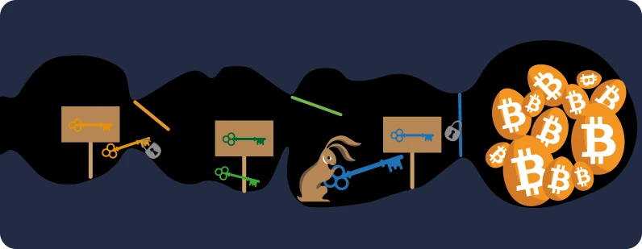
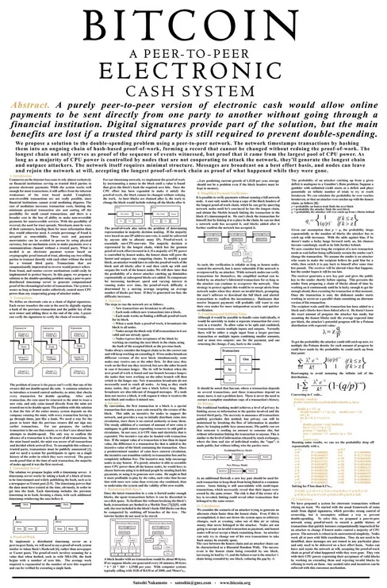
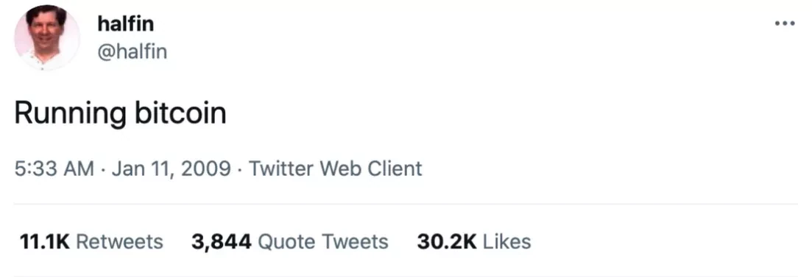
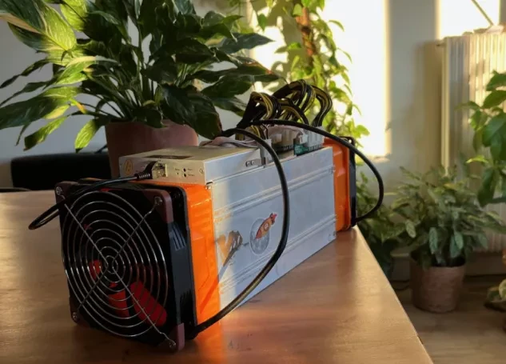
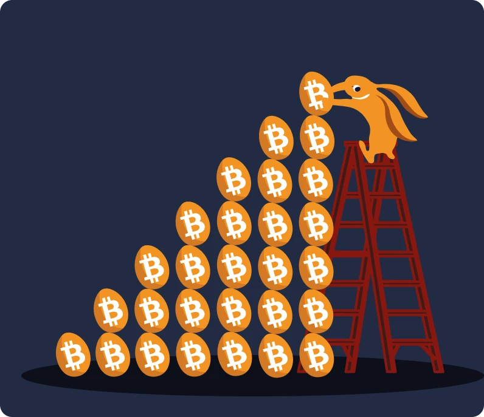

# Vaša Prva Bitkoin Avantura


U ovom kursu ćemo objasniti osnove bitkoina u 25 poglavlja, kako biste mogli da razumete ovu tehnologiju na jednostavan i efikasan način. Kurs istražuje osnove industrije u celini, uključujući teme kao što su rudarenje, novčanici, platforme za kupovinu/prodaju (menjačnice) i još mnogo toga. Dodatni edukativni materijal će biti dostupan tokom celog puta, a takođe vas pozivamo da pogledate "21 Poster" u odeljku resursa nakon što završite ovaj kurs.


Ne treba vam nikakvo specifično znanje da biste počeli. Zapravo, sledeći sadržaj je dostupan studentima svih nivoa, i trebalo bi da Vam bude potrebno približno 15 sati da ga završite.


+++

# Uvod


<partId>3cd2ac82-026c-53e1-874a-baf5842adc6d</partId>


## Pregled kursa


<chapterId>27e3fb60-4b50-556b-9e70-c4f5475c121d</chapterId>


Dobrodošli na kurs BTC101!


Bitkoin je tehnološka i monetarna revolucija, sposobna da nas natera da preispitamo naš odnos prema novcu i društvu. Zapravo, Bitkoin (poznat kao BTC) je **neutralna** i **decentralizovana** valuta, što znači da nije kontrolisana od strane bilo kog entiteta ili institucije. To je inovacija koja prevazilazi puku "internet valutu": to je i kompjuterski protokol (Bitkoin) i monetarna jedinica (bitkoin).


Bitkoin protokol koristi osnovne tehnologije kao što su kriptografija, mrežna komunikacija i čuveni "Blockchain", dok bitkoin jedinica služi kao neophodna valuta za pravilno funkcionisanje ovog protokola. U svakodnevnom životu, Salvadorci i bitkoineri širom sveta koriste bitkoin valutu za kupovinu i prodaju robe i usluga, oslanjajući se na ovu tehnologiju kako bi poboljšali svoj život.


**Sveobuhvatan, a ipak pristupačan program:**


U ovom kursu ćemo diskutovati o nekim monetarnim aspektima Bitkoina, uključujući kako kupovati i prodavati bitkoine, sigurno ih čuvati u digitalnim novčanicima i koristiti ih za transakcije. Takođe ćemo ispitati ulogu rudara, koji su ključni za kreiranje novih bitkoina i obezbeđivanje Bitkoin mreže. Na kraju, istražićemo budućnost Bitkoina i kako tehnologija Lightning Network-a (mreže) može poboljšati Bitkoin transakcije.


Važno je razumeti da je Bitkoin novi monetarni sistem koji potpuno menja naš odnos prema novcu, tako da je učenje kako ga koristiti neophodna veština za svakoga ko želi da ima kontrolu nad sopstvenim sredstvima.


**Sekcija 1 - Uvod**


- Poglavlje 1 - Pregled Kursa
- Poglavlje 2 - Praistorija Bitkoina


**Sekcija 2 - Novac**


- Poglavlje 3 - Novac kroz istoriju
- Poglavlje 4 - Fiat Valute
- Poglavlje 5 - Hiperinflacija
- Poglavlje 6 - 21 Milion bitkoina


**Sekcija 3 - Bitkoin Novčanici**


- Poglavlje 7 - Šta je Bitkoin novčanik?
- Poglavlje 8 - Bitkoin novčanici i sigurnost
- Poglavlje 9 - Podešavanje novčanika
- Poglavlje 10 - Odolevanje vremenu - test vremena


**Sekcija 4 - Tehnički aspekti Bitkoina**


- Poglavlje 11 - Lansiranje Bitkoina
- Poglavlje 12 - Bitkoin transakcije
- Poglavlje 13 - Bitkoin čvorovi
- Poglavlje 14 - Rudari
- Poglavlje 15 - Bitkoin i ekologija


**Section 5 - Kako doći do Bitkoina?**


- Poglavlje 16 - Bitkoin nikad ne spava!
- Poglavlje 17 - Zarađivanje bitkoina kroz rad
- Poglavlje 18 - Štednja sa bitkoinom
- Poglavlje 19 - Hiperbitkoinizacija


**Sekcija 6 - Budućnost Bitkoina: Lightning Network**


- Poglavlje 20 - Kratak uvod u Lightning Network
- Poglavlje 21 - Upotreba Lightning Network-a 
- Poglavlje 22 - Crvena pilula ili plava pilula?


Pre nego što uvedemo definiciju novca i njegovu funkciju u društvu (Poglavlje 1), trebali bismo početi od Genesis (generisanja) Bitkoina. Lansiran 2009. godine, Bitkoin je relativno nova tehnologija za razliku od bilo čega drugog. Stoga je normalno ne razumeti sve o tome, odjednom. Zapravo, baš kao kada učite kako koristiti Internet ili voziti automobil, ne morate odmah znati sve tehničke detalje: možete početi učenjem kako primati, plaćati i osigurati svoja sredstva, a zatim postepeno proučavati to dublje.


Uostalom, tek smo na početku njegove primene, jer smo prošli fazu poletanja: upravo ste tu na vreme da steknete onoliko znanja koliko želite o ovoj važnoj inovaciji.


Važno je da ovu novu tehnologiju razumete na opšti način, tako da se nadamo da ćete uživati u ovom kursu i nastaviti da napredujete u ovoj novoj globalnoj monetarnoj paradigmi.


Spremni da zaronite u fascinantan svet Bitkoina i razumete sve njegove unutrašnje mehanizme? Hajde da krenemo!


## Praistorija Bitkoina


<chapterId>9a94b627-5b69-5d81-9125-f1fa9b0aa6ad</chapterId>


Pre nego što je termin "Bitkoin" postao sinonim za digitalnu valutu i finansijsku transformaciju, osnova za njegovo stvaranje postavljena je nizom ideja, inovacija i društvenih pokreta. Među njima, pokret Cypherpunk ističe se kao ključni element u preistoriji Bitkoina.


### Cypherpunks: vizionari digitalnog sveta


U srcu tehnološke evolucije 1980-ih i 1990-ih, grupa ljudi je počela duboko da preispituje ulogu privatnosti i slobode u digitalnom dobu. Ove osobe, koje će kasnije biti poznate kao "cypherpunks", čvrsto su verovale da kriptografija može služiti kao alat za zaštitu individualnih prava od mešanja vlada i velikih korporacija.


Ikonične ličnosti kao što su Julian Assange, Wei Dai, Tim May i David Chaum odigrale su ključnu ulogu u oblikovanju filozofije i vizije pokreta. Ovi mislioci su delili svoje ideje na uticajnoj mejling listi, gde su učesnici iz celog sveta učestvovali u debatama o najboljim načinima korišćenja tehnologije za veću individualnu slobodu.


### Tri fundamentalna rada Cypherpunks


Pokret Cypherpunk, duboko ukorenjen u digitalnom aktivizmu i kriptografiji, oslanjao se na nekoliko temeljnih tekstova kako bi artikulisao svoje principe i viziju za budućnost. Među tim spisima, tri se posebno ističu:


- "Cypherpunk Manifest":

napisao Eric Hughes 1993. godine, tvrdi da je privatnost osnovno pravo. Autor tvrdi da je sposobnost slobodne i poverljive komunikacije ključna za slobodno društvo. Manifest navodi: "Ne možemo očekivati da će nam vlade, korporacije ili druge velike, bezlične organizacije dati privatnost [...]. Moramo braniti sopstvenu privatnost ako očekujemo da je imamo".


- "Manifest kripto-anarhista":

napisao Timothy C. May 1992. godine, ovaj dokument objašnjava kako bi upotreba kriptografije mogla dovesti do ere kriptografske anarhije u kojoj bi vlade bile nemoćne da se mešaju u privatne poslove građana. May je zamislio budućnost u kojoj ljudi anonimno razmenjuju informacije i novac bez intervencije treće strane.


- "Deklaracija o nezavisnosti sajberprostora":

iako ne isključivo Cypherpunk, ovaj tekst odražava osećanja mnogih učesnika u pokretu. Napisao ga je 1996. godine John Perry Barlow kao odgovor na sve veću regulaciju interneta od strane vlada. Deklaracija tvrdi da je sajberprostor poseban domen od fizičke sfere i da ne bi trebalo da bude podložan istim zakonima. Kako se navodi, "Mi nemamo izabranu vladu, niti je verovatno da ćemo je imati".


### Prethodnici Bitkoina


Pre nego što se pojavio Bitkoin, bilo je nekoliko pokušaja da se stvori digitalna valuta. Na primer, David Chaum je predstavio koncept "anonimnog elektronskog novca" sa svojim projektom "DigiCash" 1980-ih. Nažalost, zbog raznih ograničenja, DigiCash nikada nije doživeo procvat.


Još jedan važan prethodnik je "B-money" Wei Dai-ja. Iako nikada nije implementiran, predstavio je ideju anonimne digitalne valute gde je otkrivanje prevara vršila zajednica ocenjivača, a ne centralna vlast.


Slika ispod jasno ilustruje razvoj pokreta kroz njegove mnoge tehnološke inovacije.


U ovom plodnom okruženju, misteriozni Satoshi Nakamoto objavio je Bitkoin whitepaper 2008. godine. U ovom dokumentu, on je kombinovao nekoliko ideja iz Cypherpunk pokreta, kao što su Proof of Work i kriptografski vremenski pečati, kako bi stvorio decentralizovanu i digitalnu valutu otpornu na cenzuru.


Međutim, Bitkoin je bio više od toga: predstavljao je ostvarenje ideala Cypherpunk-a. Pored svoje tehnologije, simbolizovao je revoluciju protiv tradicionalnih finansijskih sistema i ponudio alternativu zasnovanu na transparentnosti, decentralizaciji i individualnom suverenitetu.


### Zaključak


Praistorija Bitkoina duboko je ukorenjena u pokretu Cypherpunk i kolektivnoj potrazi za većom slobodom u digitalnom dobu. Kombinovanjem principa kriptografije, decentralizacije i integriteta, bitkoin je postao mnogo više od valute. Zapravo, to je proizvod filozofske i tehnološke revolucije koja nastavlja da preoblikuje naš svet.


Stoga, Bitkoin je protokol koji se proteže tokom dugih vremenskih perioda i podstiče nas da preispitamo naš odnos prema energiji, vremenu i novcu.


Međutim, da li je Bitkoin "prava" valuta? Da bismo to razumeli, prvo moramo razumeti koncept novca i njegove različite oblike, koje ćemo istražiti u narednom poglavlju.


Ako želite da istražite istoriju Bitkoina detaljnije, toplo preporučujemo naš kurs HIS 201, gde ćete otkriti poreklo i spor nastanak Bitkoina, kao i početke njegove istorije i zajednice. Ovaj kurs je potpuno dokumentovan i potkrepljen izvorima, sa, naravno, mnogo anegdota:


https://planb.network/courses/a51c7ceb-e079-4ac3-bf69-6700b985a082

# Novac


<partId>e913df1a-4cbd-5380-ba67-ca2a0414f671</partId>


## Novac kroz istoriju


<chapterId>c838e64d-d59f-5703-8c74-ea5e8c4fdd31</chapterId>


Evolucija novca je fascinantan aspekt ljudske istorije koji odražava domišljatost civilizacija kroz vekove u ispunjavanju stalno promenljivih ekonomskih potreba.


### Od školjki do bankovnih računa


Prvobitno, valuta je bila opipljiva imovina, kao što su žitarice, stoka ili neka druga roba. Međutim, ovi proizvodi su imali veliki nedostatak jer su bili kvarljivi, što je otežavalo njihovo korišćenje kao sredstvo dugoročnog štednje. Na primer, loša žetva ili bolesti životinja mogli su uništiti bogatstvo pojedinca preko noći.

Tako je, kako su civilizacije napredovale i trgovina se širila na nove regione, pojavila se potreba za univerzalnim sredstvom razmene. Pojedinci su prvo eksperimentisali sa objektima kao što su školjke i drago kamenje, ali oni nisu bili toliko izdržljivi ili retki koliko su verovali. Na kraju, zlato je postalo standard, zbog svoje retkosti, izdržljivosti i deljivosti. Ono je bilo, i ostaje do danas, simbol bogatstva i moći.


### Koja je uloga novca?


Novac je visoko sofisticiran alat za komunikaciju:


- Omogućava komunikaciju između sadašnjosti i budućnosti, jer transformiše naše vreme i energiju u sredstvo koje se može ponovo koristiti u budućnosti bez rizika od devalvacije.


- Olakšava komunikaciju na univerzalnom jeziku: bez međusobnog poznavanja ili govorenja istim jezikom, dva stranca mogu razmenjivati, trgovati i dogovoriti se o vrednosti stvari.


Njegovu funkciju u našem svetu je teško veštački replicirati. U stvari, nijedna osoba ili grupa ne može stvoriti novac, jer je to prirodni fenomen koji mora proizaći iz tržišta i dobrovoljnog konsenzusa. U tom smislu, cene služe kao signali i delovi informacija koji usmeravaju društvo u raspodeli resursa.


Iz ovih razloga, zlato kao novac je rezultat 4.000 godina monetarnog darvinizma zasnovanog na sledećim Aristotelovim funkcijama:


- **Sredstvo očuvanja vrednosti**: novac se može koristiti za prenos kupovne moći u budućnosti, tako da treba da bude izdržljiv materijal;
- **Sredstvo razmene**: novac se može koristiti u razmeni za robu i usluge umesto za trampe, čime se izbegava podudarnost želja između trgovaca;
- **Jedinica obračuna**: novac nam takođe omogućava da uporedimo vrednosti različite robe kako bismo bolje razumeli njihovu relativnu pogodnost.


### Karakteristike novca


Zlato idealno ispunjava kriterijume efikasne valute: njegova prirodna retkost ga čini vrednim, dok njegove hemijske osobine osiguravaju da ne erodira tokom vremena. Ove karakteristike su učinile zlato odličnim **čuvarem vrednosti**, ali ne i uobičajenom valutom, jer ovaj oblik novca nije lako deljiv ili prenosiv na velike udaljenosti. U globalizovanom i digitalnom svetu, zlato se bori da održi korak i zahteva centralni entitet da bi bilo deljivo i lako zamenljivo (npr. kroz kovanje novčića).


Nasuprot tome, državne fiducijarne valute (fiat) su lako upotrebljive, ali ih entiteti koji ih kontrolišu (kraljevi, centralne banke, carevi, diktatori) konstantno devalviraju.


Da bismo bolje objasnili ovaj koncept, istražićemo karakteristike efikasne valute:


- **Fungibilnost**, što znači da se može zameniti drugim jedinicama iste vrste bez gubitka vrednosti;
- **Deljivost**, jer se može podeliti na manje jedinice kako bi se olakšale transakcije različitih obima;
- **Likvidnost**, što znači da se lako može pretvoriti u robu ili usluge.


Da bi ispunila ove kriterijume, valuta se istorijski evoluirala kroz različite korake:


- Sirov kamen -> Novčić
- Novčanica -> Bankovna kartica
- Blockchain -> Lightning Network (mreža)


Valute i dalje evoluiraju do danas, prilagođavajući svoje oblike kako bi zadovoljile različite slučajeve upotrebe. Kao što smo rekli, iako je zlato odličan čuvar vrednosti, više nije pogodno za trenutnu globalizovanu ekonomiju. Slično tome, fiducijarne valute kao što su dolar i evro su vrlo likvidne i lako prenosive jer su sada uglavnom digitalne, ali njihova vrednost je konstantno smanjena monetarnom inflacijom.


S druge strane, Bitkoin predstavlja nove mogućnosti. Njegova svojstva, kao što je strogo ograničena ponuda, čine ga odličnim čuvarom vrednosti. Štaviše, kao neutralna internet valuta, služi kao održivo **sredstvo razmene** koje prevazilazi granice. Međutim, i dalje nije široko prihvaćen u trgovini danas, uprkos njegovom [stalnom usvajanju](https://btcmap.org/map).


## Fiducijarne valute


<chapterId>25151d46-7db1-5b48-8bba-cbde1944555a</chapterId>


> "Oni koji ne pamte prošlost, osuđeni su da je ponavljaju", rekao je George Santayana.

Istina koja snažno odjekuje kada je reč o trenutnom monetarnom sistemu.


### Fiducijarno = Poverenje


Danas se glavne valute kao što su evro i dolar smatraju fiducijarnim. To znači da nemaju intrinzičnu vrednost i u potpunosti zavise od poverenja i sigurnosti koje polažemo u institucije koje ih upravljaju.


Fiducijarna valuta je oblik novca koji je proglašen takvim od strane institucije, tj. države, kao što je Kina sa Juanom, ili političko-ekonomske unije, kao što je Evropska unija sa Eurom. Entitet zadužen za njegovo izdavanje je centralna banka (na primer, možemo pomenuti Narodnu banku Kine, Federalne rezerve Sjedinjenih Američkih Država, ili Centralnu banku Republike Gvineje). Upravo su ti entiteti zaduženi za formulisanje monetarne politike i stoga koliko novca treba pustiti u opticaj ili odštampati.


### Monetarna devalvacija: strategija stara koliko i Rimsko carstvo


Od antike, zlato je služilo kao monetarna referenca, ali njegova rigidnost često je navodila vođe, bilo rimske careve ili moderne vlade, da usvoje alternativne valute, često fiducijarne.


Mehanizam je jednostavan i inspirisan je praksama koje postoje od početaka civilizacije. Vođe, željne da ostvare kontrolu nad bogatstvom, počinju centralizacijom zlata, često koristeći svoju moć i obećavajući zaštitu i sigurnost. Sa ovom dragocenom rezervom u svojim rukama, uvode novu valutu, ekvivalentnu vrednosti zlata, ali kovanu u njihovom liku. Ova valuta zatim počinje da cirkuliše, a ljudi se brzo prilagođavaju pogodnosti njene jednostavne upotrebe.


Međutim, ove vođe zatim počinju postepeno obezvređivati novu valutu, de facto smanjujući njenu vrednost za nekoliko procenata svake godine u poređenju sa početnom cenom zlata. Ovo tiho obezvređivanje se često opravdava kao da je u interesu naroda. U stvarnosti, oni koji štede u ovoj fiducijarnoj valuti vide kako vrednost njihove ušteđevine erodira, dok država finansira svoje projekte kroz inflaciju. Štaviše, ovo obezvređivanje olakšava otplatu duga.


U kritičnom trenutku, vođa daje saopštenje: valuta više nije podržana zlatom. Javnost, sada naviknuta na fiducijarnu valutu i često nedovoljno informisana o finansijskim pitanjima, prihvata ovu realnost, omogućavajući državi da slobodno manipuliše novcem Supply i štampa ogromne sume novca uz gotovo nikakve troškove.


Štampanje novca zatim dovodi do inflacije i postepeno osiromašuje stanovništvo. Osim toga, finansijski sistem je regulisan i ograničen kako bi se izbegao njegov kolaps, jer bi bilo kakav poremećaj mogao izazvati veliku ekonomsku krizu. Suprotno masama, finansijske institucije i bogati pojedinci u velikoj meri profitiraju od ovog sistema, što stvara jaz u nejednakosti i favorizuje autoritarizam. U ovom kontekstu, oni nisu motivisani da naprave radikalne promene, omogućavajući sistemu da nastavi svojim tokom do moguće implozije.


Kada je dobro izvedena, ova strategija može trajati decenijama. Međutim, važno je napomenuti da vrlo brza devalvacija ili gubitak poverenja mogu dovesti do hiperinflacije (vidi sledeće poglavlje). Istorija pokazuje da je dolar izgubio 98% svoje vrednosti u 100 godina, evro 30% u 20 godina, a funta sterlinga 99% od svog nastanka.


Na kraju, valuta možda više neće imati nikakvu vezu sa zlatom, slično kao rimski novčići na kraju Carstva, ili će čak biti svedena na prostu numeričku vrednost, odvojenu od opipljive stvarnosti.


Danas smo svedoci istorijske prekretnice. Dolar, koji je dugo dominirao, izgleda da je u opadanju, dok je zlato izgubilo svoju centralnu ulogu. Stojimo na pragu novog monetarnog ciklusa, podsećajući nas da se lekcije iz istorije često zaboravljaju.


### Da li je Bitkoin rešenje?


Zbog ovih premisa, revolucija Bitkoina dobija na zamahu. Suprotno prethodnim valutama, ne zahteva **pouzdanu treću stranu** i ima za cilj da odvoji državu od novca.


Zapravo, Bitkoin se predstavlja kao odgovor na ove sistemske izazove predlažući decentralizovano rešenje i novi paralelni monetarni sistem. Istorijski gledano, ako je zlato bilo favorizovano kao valuta zbog svoje otpornosti na falsifikovanje, Bitkoin se slično ne može falsifikovati. Štaviše, ograničen je na 21 milion jedinica, zahvaljujući svojoj decentralizovanoj i kriptografskoj prirodi. Bitkoin je valuta koja se oslanja na transparentnost i neutralnost, nudeći privlačnu alternativu trenutnom centralizovanom monetarnom sistemu.


Još jedan razlog zašto je Bitkoin privukao pažnju je pojava digitalnih valuta centralnih banaka, ili CBDC-a, što izgleda neizbežno. Ovaj novi oblik novca bi razvio centralno planiranu ekonomiju, i mogao bi i da ometa finansijsku slobodu pojedinaca i da olakša autoritarne zloupotrebe.

Možemo zaključiti ovo poglavlje citatom dobitnika Nobelove nagrade F.A. Hayeka iz 1984:


> "Ne verujem da ćemo ikada više imati dobar novac, pre nego što izuzmemo stvar iz ruku vlade.  Ako ih ne možemo nasilno izvaditi iz ruku vlade, sve što možemo je da na neki lukav ili zaobilazan način uvedemo nešto što ne mogu zaustaviti."

Da biste saznali više o ekonomskim zabludama i slobodi, pozivamo vas da otkrijete naš kurs ECO 102, koji prati život i ideje Frédérica Bastiata, francuskog mislioca iz 19. veka koji bi sigurno cenio pojavu Bitkoina:


https://planb.network/courses/d07b092b-fa9a-4dd7-bf94-0453e479c7df

## Hiperinflacija


<chapterId>b04c024c-54f3-50cb-997f-58721cfc74be</chapterId>


Hiperinflacija je monetarni fenomen koji je specifičan za fiat valute: karakteriše se potpunim gubitkom poverenja u valutu i drastičnim povećanjem inflacije usled štampanja novca od strane vlasti. Kao rezultat toga, štednja koju su pojedinci akumulirali može nestati u relativno kratkom vremenskom periodu, gurajući zemlju na ivicu ekonomskog, društvenog i političkog kolapsa.


### Inflacija izvan kontrole!


Da bismo razumeli uticaj inflacije na štednju, potrebno je uzeti u obzir različite stope inflacije.


- Sa inflacijom od 2%, godišnje gubite 2% svoje kupovne moći, što iznosi 10% tokom 5 godina.
- Sa 7%, gubite polovinu za 10 godina.
- Sa 20%, gubite skoro polovinu za 3 godine.


Kada dođe do hiperinflacije, više ne govorimo o 20% godišnje, već o 20% mesečno ili, u svom vrhuncu, čak dnevno. Iskusiti inflaciju od 100% dnevno tokom tri dana je realan scenario koji se dešavao i nastavlja da se dešava u našem svetu.


Ključno je razumeti da hiperinflacija ne nastaje slučajno, zbog kapitalizma ili političkih napada protivnika. Hiperinflacija je direktna posledica loših monetarnih odluka koje donose centralni bankari i političari. Njene posledice pogađaju svakog građanina i čak utiču na naredne generacije. Ljubazno vas pozivamo da provedete pet minuta čitajući sledeću tabelu kako biste u potpunosti shvatili pravi uticaj ovog fenomena (kurs ECO204 detaljnije obrađuje ovu temu). Kao što možete videti, nijedna zemlja ili valuta nije potencijalno sigurna.


### Koje su faze hiperinflacije?


Da bi došlo do hiperinflacije, moraju se desiti određeni događaji.


Faza 1 - Gubitak poverenja


- Centralizacija monetarne moći olakšava stvaranje novca i njegove zloupotrebe. U ovom kontekstu, spoljašnji faktori kao što su ratovi, vladine politike ili rast cena ključnih resursa — kao što su pšenica ili benzin — mogu izazvati hiperinflaciju. Tako može doći do gubitka poverenja u valutu, a pojedinci počinju da preispituju poreklo novca i koristi od propisane monetarne politike.


Faza 2 - Kolaps valute i povećanje cena


- Kako vlade gube kontrolu nad poverenjem, pojedinci počinju da razmenjuju svoju valutu za stabilniju, kao što se desilo u Venecueli sa američkim dolarom. Ova situacija dovodi do rasta cena, stvarajući začarani krug u kojem roba i usluge postaju sve skuplje. Da bi zadovoljila ove potrebe i ispravila monetarnu politiku, država štampa više novca, što rezultira eksponencijalnom inflacijom.


Faza 3 - Začarani krug štampanja novca


- Tako je potrebno sve više i više novčanica za kupovinu robe, što dovodi do nestašice papirnog novca. Kao odgovor, vlade pribegavaju štampanju više novčanica, što dodatno podstiče inflaciju.


Faza 4 - Pojava nove valute


- Nova valuta se zatim uvodi da zameni staru, kako bi se prekinuo ciklus inflacije uvođenjem strožijih kontrola koje nisu bile na snazi sa prethodnim zakonskim sredstvom plaćanja.


Rešavanje krize hiperinflacije često zahteva radikalne promene, kao što su revolucije, promene vlade, promene centralnih bankara, između ostalog. Gubitak poverenja, kolaps valute i rekonstrukcija su ključne faze za oživljavanje ekonomije zasnovane na fiat valuti.


### Tri značajna primera


- Nemačka, 1922-1923.


Jedan od najupečatljivijih primera hiperinflacije dogodio se u Nemačkoj Vajmarskoj Republici posle Prvog svetskog rata.


Nemačka je pozajmila ogromne sume novca za finansiranje rata. Međutim, ne samo da je Nemačka izgubila rat, već je morala da plati milijarde dolara na ime reparacija. Mesec sa najvišom stopom inflacije bio je oktobar 1923. godine, dostigavši vrhunac od 29.500%, što je bilo jednako dnevnoj stopi inflacije od 20,9%. Cene su se udvostručavale svakih 3,7 dana!

Nemačka valuta postala je toliko bezvredna da su neki građani radije spaljivali svoj papirni novac umesto drva jer je to zapravo bilo jeftinije. Čak se priča da su u restoranima konobari morali da objavljuju cene menija svakih 30 minuta kako bi uzeli u obzir inflaciju.


Na kraju su vlasti stvorile novu valutu, podržanu dugovima Nemačke, Francuske i Engleske, i garantovanu nemačkom zemljom.


- Mađarska, 1945-1946.


Zemlja koja je doživela najgori period hiperinflacije do sada je Mađarska posle Drugog svetskog rata.


Mađarska se našla na gubitničkoj strani sukoba, sa većinom svojih industrijskih proizvodnih kapaciteta uništenih. Mesec sa najvišom inflacijom bio je jul 1946., kada je zabeležena zapanjujuća inflacija cena od 41.900.000.000.000.000%, što je ekvivalentno 207% dnevno. Cene su se udvostručavale svakih 15 sati!


Poslednja novčanica koja je puštena u opticaj bila je 100 miliona milijardi penga (100.000.000.000.000.000) 1946. godine.


- Zimbabve, 2007-2008.


Do godine 2000., Zimbabve je bio samodovoljan za gotovo sve svoje potrebe osim za naftu.


Godine 1997., zimbabveanski dolar je kolabirao za preko 72% nakon što je vlada pristala da kompenzuje ratne veterane u ekvivalentnom iznosu od 450 miliona američkih dolara. Pošto vlada nije imala takav iznos u svojim zalihama, pribegla je štampanju novca. Godine 2005., inflacija je dostigla 586%, ali vrhunac je bio sredinom novembra 2008. sa stopom procenjenom na 79.600.000.000% mesečno.


U junu 2007. vlada je već reagovala uvođenjem kontrole cena, ali ova akcija nije imala nikakav uticaj na ekonomiju. Prodavnice su zapravo bile opljačkane, a trgovci više nisu imali sredstva da obnove zalihe u svojim radnjama.


U aprilu 2009. godine, ministar finansija je najavio suspenziju zimbabveanskog dolara i odobrio upotrebu različitih stranih valuta za trgovinu. Svi bankovni računi, penzije i finansijske institucije su preko noći ostali bez svojih sredstava.


U zaključku, hiperinflacija ima efekat brzog degradiranja vrednosti valute, što dovodi do erozije štednje i gubitka poverenja u monetarni sistem. Kao što je Volter jednom sugerisao, fiat valuta će uvek na kraju izgubiti svoju intrinzičnu vrednost i konvergirati ka nuli.

Valuta koja se oslanja na pouzdanu treću stranu kao što je finansijska institucija, u praksi i na duži rok, je defektna, jer nije u stanju da garantuje kupovnu moć ili očuva štednju.


Da biste dublje istražili temu hiperinflacije, preporučujemo kurs ECO 204 Davida St-Ongea, gde ćete naučiti šta su hiperinflacioni ciklusi i njihov stvarni uticaj na naše živote. Takođe ćete otkriti sličnosti između ovih ciklusa i, što je najvažnije, kako se zaštititi od njih.


https://planb.network/courses/caa75343-ac90-4249-bcca-0e2e57c3a0f1

## 21 milion Bitkoina


<chapterId>f4a06d76-1963-56fd-93ff-dfa41489bcde</chapterId>


### Monetarna politika Bitkoina


Bitkoin je decentralizovana digitalna valuta sa unapred definisanom maksimalnom količinom od **21 milion jedinica**. Ova intrinzična karakteristika oskudice određena je njenim kompjuterskim kodom i ojačana konsenzusom svih korisnika koji učestvuju u protokolu.


Njegovo monetarno izdavanje može biti ilustrovano krivom koja predstavlja količinu bitkoina stvorenih tokom vremena. Na primer, u 2022. godini, približno 18,5 miliona bitkoina bilo je u opticaju. Prognoze ukazuju da će do 2025. godine biti oko 19,5 miliona bitkoina, što predstavlja oko 93% ukupne ponude, a do 2037. godine, ova cifra će dostići 20,4 miliona.


### Kako se stvaraju novi bitkoini?


Kreiranje novih bitkoina rezultat je procesa rudarenja. Ukratko, rudari koriste moćne računare koji rešavaju složene matematičke probleme (Hash), koji validiraju i osiguravaju transakcije. Kada je problem rešen (ili je pronađen validan Hash), rudar dodaje novi blok transakcija u Blockchain, decentralizovani i distribuirani Ledger(registar) koji beleži sve transakcije izvršene na mreži. Blockchain obezbeđuje transparentnost i sigurnost, jer je svaki blok povezan sa prethodnim, što čini gotovo nemogućim menjanje prethodnih podataka bez konsenzusa mreže.


Nakon uspešnog izvršavanja ovog zadatka, rudari dobijaju nagradu u vidu izdavanja novih bitkoina svakih deset minuta. Ova nagrada je programirana da se prepolovi na svakih 210.000 blokova, što je otprilike svake četiri godine (događaj poznat kao "Halving"-prepolovljavanje), dajući krivi monetarnog izdavanja oblik stepenica. Zbog ovog mehanizma, može se matematički predvideti da će kreiranje novih bitkoina prestati oko godine 2140, kada ukupan broj dostigne svoj limit od 21 milion.


| Broj Halvinga  |Veličina bloka| Nagrada u BTC nakon halvinga  | Procenjeni BTC u opticaju nakon Halving-a |
| -------------- | ------------ | ------------------------- | ------------------------------------------ |
| 1              | 210,000      | 25 BTC                    | 10,500,000 BTC                             |
| 2              | 420,000      | 12.5 BTC                  | 15,750,000 BTC                             |
| 3              | 630,000      | 6.25 BTC                  | 18,375,000 BTC                             |
| 4              | 840,000      | 3.125 BTC                 | 19,687,500 BTC                             |
| 5              | 1,050,000    | 1.5625 BTC                | 20,343,750 BTC                             |
| 6              | 1,260,000    | 0.78125 BTC               | 20,671,875 BTC                             |
| 7              | 1,470,000    | 0.390625 BTC              | 20,835,937.5 BTC                           |
| 8              | 1,680,000    | 0.1953125 BTC             | 20,917,968.75 BTC                          |
| 9              | 1,890,000    | 0.09765625 BTC            | 20,958,984.375 BTC                         |
| 10             | 2,100,000    | 0.048828125 BTC           | 20,979,492.188 BTC                         |
| 11             | 2,310,000    | 0.0244140625 BTC          | 20,989,746.094 BTC                         |
| 12             | 2,520,000    | 0.01220703125 BTC         | 20,994,873.047 BTC                         |
| 13             | 2,730,000    | 0.006103515625 BTC        | 20,997,436.523 BTC                         |
| 14             | 2,940,000    | 0.0030517578125 BTC       | 20,998,718.262 BTC                         |
| 15             | 3,150,000    | 0.00152587890625 BTC      | 20,999,359.131 BTC                         |
| 16             | 3,360,000    | 0.000762939453125 BTC     | 20,999,679.566 BTC                         |
| 17             | 3,570,000    | 0.0003814697265625 BTC    | 20,999,839.783 BTC                         |
| 18             | 3,780,000    | 0.00019073486328125 BTC   | 20,999,919.892 BTC                         |
| 19             | 3,990,000    | 0.000095367431640625 BTC  | 20,999,959.946 BTC                         |
| 20             | 4,200,000    | 0.0000476837158203125 BTC | 20,999,979.973 BTC                         |

Ponovo ćemo razmotriti koncept Mining detaljnije u [Miner poglavlju](https://planb.network/courses/2b7dc507-81e3-4b70-88e6-41ed44239966/dbb8264a-7434-57e4-9d1b-fbd1bae37fdf).


### Garantovanje digitalne oskudice


Limit od 21 milion je osnova oskudice Bitkoina, i garantovana je kroz dva ključna mehanizma: prilagođavanje težine rudarenja i teoriju igara.


-  Podešavanje težine rudarenja je proces koji se dešava svakih 2016 blokova, ili otprilike svake dve nedelje, kako bi se osiguralo da se novi blok dodaje u Blockchain u proseku svakih deset minuta. Ova učestalost kreiranja blokova i ukupna količina bitkoina su fiksni aspekti Bitkoin protokola i ne mogu se promeniti bez opšteg konsenzusa, za razliku od proizvoljnih odluka donetih u tradicionalnim monetarnim sistemima.


Težina pronalaženja validnog Hash-a prati neku vrstu ciklusa: ako se broj rudara poveća i više blokova se pronađe brže, to uzrokuje smanjenje prosečnog vremena za pronalaženje bloka i tako se povećava težina. Kao posledica toga, broj blokova koje rudari pronađu se smanjuje, što znači da se mehanizam vraća na prosek od 10 minuta po bloku. Molimo pogledajte sliku ispod za vizuelni prikaz.


S druge strane, ako manje rudara radi i blokovi se pronalaze sporije, težina rudarenja se smanjuje, ubrzavajući prosečno vreme za pronalaženje bloka.


Da li ste znali da su rudari motivisani da iskopaju blok kako bi zaradili nove bitkoine kroz subvenciju bloka, kao i naknade za transakcije ikoje uključuju u taj blok?


Dakle, kako se broj izdatih bitkoina približava granici od 21 milion, rudari će biti više nagrađivani kroz svoje naknade za transakcije nego kroz subvenciju bloka.


- Teorija igara je matematički koncept koji se oslanja na ljudsku racionalnost. Pretpostavlja da pojedinci deluju logično, nastojeći da maksimiziraju sopstvene koristi dok razmatraju potencijalne odluke drugih. U Bitkoinu, teorija igara pomaže da se osigura da će većina rudara i korisnika delovati u najboljem interesu mreže. Zapravo, pošto korisnici glasaju o promenama protokola, svaka modifikacija Bitkoin protokola zahtevala bi saglasnost cele zajednice korisnika, što je veoma složeno. Dakle, ako bi neko želeo da kreira 22. milion bitkoina, morao bi da ubedi sve korisnike da dobrovoljno obezvrede sopstvenu štednju, što je malo verovatno da će se desiti jer je Bitkoin globalan i nije pod upravom centralne grupe.


Ideja devalvacije valute je protivna fundamentalnoj filozofiji Bitkoina, tako da je promena u njenoj ukupnoj količini veoma malo verovatna.


### Revidibilna monetarna politika: svake sekunde, od početka i zauvek!


Osnovna prednost Bitkoina je njegova oskudnost, a maksimalna količina od 21 milion bitkoina u opticaju je javna i proverljiva od strane bilo koga.


Zapravo, svako može ovo uraditi putem bitkoin čvora - noda (tj. validatora transakcija) jednostavnim unosom sledeće komande: `bitkoin-cli gettxoutsetinfo`. Ova transparentnost jača poverenje u Bitkoin sistem, koji nije zasnovan na centralnim institucijama ili pojedincima, već na matematičkim i kriptografskim garancijama inherentnim u njegovom protokolu (Naučićete kako ovo lako uraditi u LNP201).


```json
{
"height": 710560,
"bestblock": "0000000000000000000887384d67103412ea7f18a43953e65c8c4ac36bf42e54",
"transactions": 473244,
"txouts": 1018917,
"bogosize": 2183872374,
"hash_serialized_2": "eebb9987337700ffaacbbaa11223344",
"disk_size": 178239584,
"total_amount": 18745998.12345678
}
```


Bitkoin garantuje solidno monetarno upravljanje ograničavanjem svog stvaranja po dizajnu, što ga čini veoma različitim od drugih valuta jer može zaštititi ušteđevinu korisnika. U skladu sa principima austrijske ekonomije, njegova stabilna količina i predvidiva distribucija štite ga od inherentnih rizika inflacije sa kojima se tradicionalne valute moraju suočiti (pogledajte kurs ECO201 za više informacija).


Ukratko, Bitkoin, sa svojom decentralizovanom prirodom, programiranom oskudicom i transparentnošću, nudi jedinstvenu alternativu tradicionalnim monetarnim sistemima. Ilustruje kako se tehnologija može koristiti za kreiranje valute koja nije samo korisna i proverljiva, već i čuva vrednost ušteđevine korisnika strogo ograničavajući svoju ponudu.


### Zaključak odeljka 2!


# Bitkoin Novčanici


<partId>28860585-4f61-59d9-b242-f4c57d837cc1</partId>


## Šta su Bitkoin novčanici?


<chapterId>1c0166ab-cb7a-5bc6-9175-d13482bd91f1</chapterId>


U odeljku 2, istražićemo skladištenje i sigurnost Bitkoina kroz korišćenje novčanika, kako bismo razumeli gde se nalaze ovi poznati bitkoini i kako komunicirati sa njima!


  ### Demistifikacija Bitkoin novčanika


Koristimo novčanike za interakciju sa Bitkoin mrežom na tri glavna načina:


- Da primamo bitkoine
- Da šaljemo bitkoine
- Da ih zaštitimo od pokušaja hakovanja i krađe


Bitkoin novčanik može imati mnogo oblika i formi: softver na vašem računaru, aplikacija na vašem pametnom telefonu, fizički uređaj poput USB ključa, ili čak komad papira. Svaki od njih služi različitim slučajevima upotrebe. Zapravo, neki su dizajnirani za velike transakcije sa naglaskom na sigurnost, dok drugi daju prioritet privatnosti, ili su namenjeni za svakodnevna plaćanja malih iznosa.


Portfolija se tako mogu kategorizovati u široke porodice upotrebe, uvek fokusirane na ključno pitanje: da li ste vi vlasnik sredstava ili prepuštate kontrolu nad svojim novcem trećoj strani? Ovu temu ćemo detaljno istražiti u narednom poglavlju, ali pitanje ostaje jednostavno: da li je novac u vašem džepu ili u džepu vašeg bankara?


### Kako funkcioniše Bitkoin novčanik?


Bilo da je to vaš bitkoin "bankar" ili vi sami, velika većina Bitkoin novčanika radi sa sličnom tehnologijom zasnovanom na asimetričnoj kriptografiji, koja uključuje sistem parova ključeva: privatni ključ za trošenje i javni ključ za primanje.


- Privatni ključ


Kada inicijalizujete novčanik, generiše se tajna fraza za oporavak, takođe poznata kao Mnemonic fraza (privatni ključ) i prikazuje vam se u obliku od 12 ili 24 reči.


Privatni ključ je fundamentalan jer predstavlja vlasništvo nad bitkoinom i stoga pravo da ih koristite ili šaljete. Dakle, vlasnik privatnog ključa je pravi vlasnik bitkoina. Kao što popularna izreka kaže, „Nisu tvoji ključevi, nisu tvoji novčići.“


Ovaj ključ mora biti čuvan u tajnosti i dobro zaštićen, jer otključava tvoje bogatstvo!


- Javni ključ & Adresa 


Javni ključ se generiše iz privatnog ključa i povezan je s njim. Deljenje javnog ključa predstavlja rizik za privatnost (jer drugi korisnici mogu videti vaš saldo), ali ne i za sigurnost (jer ne mogu trošiti vaša sredstva bez posedovanja privatnog ključa). Javni ključ se koristi za kreiranje Bitkoin adresa, i na taj način primanje novca.


Ove adrese automatski kreira vaš novčanik i mogu se sigurno deliti. Da biste maksimalno zaštitili svoju privatnost, preporučljivo je da ih koristite samo jednom.


Ukratko, ova tehnologija nam omogućava da primamo bitkoine bez da primalac može ukrasti naša sredstva! Poštansko sanduče bi moglo biti prikladna metafora: ljudi mogu u njega ubaciti novac, ali samo vi možete da ga otvorite.


### Da li su bitkoini u novčaniku?


Iako su vaši ključevi sačuvani u vašem novčaniku, sami bitkoini su zapravo "sačuvani" u bitkoin Blockchain-u, što je javno distribuirani Ledger(registar) unutar Bitkoin peer-to-peer mreže (o tome ćemo detaljnije govoriti u odeljku 3). To znači da gubitak uređaja koji sadrži vaš novčanik ne dovodi nužno do gubitka vaših bitkoina. Ono što vam omogućava da ponovo kreirate vaš novčanik i trošite vaš bitkoin je zapravo privatni ključ, zato ga uvek pravilno osigurajte!


Srećom, od 2017. godine, privatni ključ može biti predstavljen jednostavnom listom od 12 ili 24 reči, poznatom kao 'Mnemonic fraza, koje je prilično lako sačuvati. Ova fraza služi kao rezervna kopija za vaša sredstva i omogućava vam da ponovo kreirate vaš novčanik koristeći bilo koji Bitkoin softver ili aplikaciju. Stoga, svako ko pronađe ovu listu reči može pristupiti vašim bitkoinima.


### Šta je sa hakerima?


Šta ako neko slučajno pogodi našu listu od 12 ili 24 reči? Kratak odgovor je da je to veoma malo verovatno, zahvaljujući kriptografiji koja se koristi za kreiranje novčanika. Da bismo to stavili u perspektivu, slučajno otkrivanje vaše iste Mnemonic fraze je slično pronalaženju "pravog" broja između 1 i 2 podignuto na stepen 256, što je gotovo ekvivalentno pronalaženju "pravog" atoma u Univerzumu. Međutim, ako niste zadovoljni ovom podrazumevanom sigurnošću, uvek je možete poboljšati dodavanjem passphrase (dodatne reči) vašem bitkoin Wallet.


Dakle, verovatnoća hakovanja vašeg Bitkoin novčanika je astronomski niska ako pratite dobre bezbednosne prakse koje ćemo detaljno opisati u sledećem odeljku.


Imajte na umu da odaberete pravi novčanik za vaše potrebe i upotrebu: detaljni tutorijali o upravljanju i osiguravanju različitih novčanika dostupni su u [odeljku sa tutorijalima našeg univerziteta](https://planb.network/tutorials/Wallet).


Ako, tokom vašeg putovanja kroz zečju rupu, želite da saznate više o izgradnji bitkoin novčanika, od entropije do primanja adresa, preporučujemo CYP 201 kurs posvećen ovoj temi:


https://planb.network/courses/46b0ced2-9028-4a61-8fbc-3b005ee8d70f

## Bitkoin Novčanici i sigurnost


<chapterId>00c1afea-e54a-511f-bab3-2efc2fbfa6a1</chapterId>


### Postavljanje pravih pitanja pre početka


Kada posedujete bitkoine, bezbednost vaših sredstava je glavna briga. Najbolji način da definišete nivo bezbednosti koji odgovara vašoj situaciji je da postavite sebi niz pitanja:


- Ko može pristupiti vašim sredstvima? Drugim rečima, da li imate isključiv pristup vašim bitkoinima, ili vam treća strana (kao što je kompanija) omogućava pristup vašim sredstvima?
- Kako planirate da koristite bitkoine u tom konkretnom novčaniku? Redovno? Za srednjoročnu ili dugoročnu štednju?
- Koje su vaše tehničke veštine?
- Koliki je vaš budžet za bezbednost?


Zapravo ne postoji univerzalni odgovor ili rešenje, zato odvojite vreme da odgovorite na ova pitanja, jer će vam to pomoći da prilagodite svoje bezbednosne mere vašim potrebama.


### Razmišljanje o Bitkoin novčanicima u smislu složenosti


Ovde dole, definisaćemo nekoliko nivoa bezbednosti:


- **Nivo 0**, koristite takozvanu "uslužnu službu" gde niste jedini vlasnik svojih bitkoina. Budite svesni da vam ova pouzdana treća strana može ograničiti pristup vašim sredstvima u bilo kom trenutku. U ovom slučaju, vaš nivo finansijskog suvereniteta je sličan onom u tradicionalnom bankarskom sistemu sa bankovnim računom.


- **Nivo 1**, koristite Bitkoin novčanik na vašem telefonu ili računaru, gde ste vi jedini vlasnik vaših bitkoina i možete lako obavljati vaše transakcije. Gorepomenuti alat se naziva "Hot Wallet"(Vrući novčanik), jer je privatni ključ sačuvan na uređaju sa pristupom internetu. U ovom slučaju, ključno je napraviti rezervnu kopiju vaše Mnemonic fraze kako biste ponovo dobili pristup vašim sredstvima u slučaju gubitka telefona ili računara.


Na primer, možete koristiti Sparrow novčanik kao Hot Wallet:


https://planb.network/tutorials/wallet/desktop/sparrow-c674e2ac-d46f-4c82-92a7-7d1b0e262f5d


- **Nivo 2**, koristite fizički novčanik, i obezbedili ste svoju listu od 12/24 reči. Često se naziva "Cold Wallet" (Hladni novčanik), jer su vaši ključevi pohranjeni na uređaju koji nije povezan na internet. U ovom slučaju, uvek ćete morati da potpisujete svaku transakciju sa svojim uređajem, što čini vaša sredstva manje dostupnim na dnevnoj bazi.


Na primer, možete koristiti Ledger, Satochip ili Tapsigner:


https://planb.network/tutorials/wallet/hardware/ledger-nano-s-plus-75043cb3-2e8e-43e8-862d-ca243b8215a4

https://planb.network/tutorials/wallet/hardware/satochip-e9bc81d9-d59b-420d-9672-3360212237ba

https://planb.network/tutorials/wallet/hardware/tapsigner-ab2bcdf9-9509-4908-9a4a-2f2be1e7d5d2


- **Nivo 3**, koristite novčanik nivoa 1 ili 2, ali ste dodali dodatni passphrase (lozinku). U ovom slučaju, budite svesni da treba da napravite rezervnu kopiju i liste od 12/24 reči **i** vašeg passphrase. Idealno bi bilo da ove dve informacije budu sačuvane na dva različita mesta.


Da biste saznali više o upotrebi i funkcionisanju BIP39 passphrase (lozinke):


https://planb.network/tutorials/wallet/backup/passphrase-a26a0220-806c-44b4-af14-bafdeb1adce7


- **Nivo 4**, koristite skup novčanika za kreiranje "Multisig" novčanik, što znači da su potrebni višestruki potpisi za obavljanje transakcije. U ovom slučaju, budite svesni da svaki deo Multisig treba biti uskladišten na različitim lokacijama. Ovaj pristup se često smatra naprednom upotrebom Bitkoina, prvenstveno za upravljanje velikim iznosima i za korporativne svrhe.





Naravno, različiti slučajevi upotrebe takođe zahtevaju različite Bitkoin novčanike, i ne postoji univerzalno rešenje.


### Bezbednost mora biti prilagođena


Iznos koji je neko spreman da ostavi na određenom nivou sigurnosti zavisi od svake osobe. Za neke je ostavljanje 1 BTC na "Hot Wallet-u" razumno, dok je za druge suprotno. U svakom slučaju, kada želite da osigurate manji iznos, savetujemo da ne trošite previše na sigurnost kupovinom fizičkog novčanika. Osim toga, imajte na umu da prekomplikovanje sigurnosti i pristupačnosti vaših bitkoina može biti štetno, posebno ako loše rukujete rezervnim kopijama vaših novčanika.


U zaključku, direktno vlasništvo nad bitkoinima je ključni element za osiguranje finansijskog suvereniteta. Preporučuje se korišćenje mobilnog novčanika za dnevne troškove i offline, ili "Cold (hladnog)," fizičkog novčanika za čuvanje većih iznosa. Preduzeća, s druge strane, treba da razmotre korišćenje sistema sa više potpisa, ili "Multisig", za povećanu i zajedničku sigurnost. Takođe je važno izbegavati usluge skrbništva (gde ključeve čuva treća strana), koje mogu replicirati neke ranjivosti tradicionalnog finansijskog sistema.


Imajući ovo na umu, sada možemo preći na sledeći deo gde opisujemo kako kreirati Bitkoin novčanik. Međutim, ako želite dalje istražiti temu bezbednosti, možete pročitati ovaj [članak od DarthCoin](https://asi0.substack.com/p/bitkoin-soyez-votre-propre-banque).


## Podešavanje Novčanika


<chapterId>615519eb-4565-557d-86a0-021badf7616f</chapterId>


Bezbednost vaših bitkoina je od presudnog značaja, i jednostavna greška može imati katastrofalne posledice. Zato moramo naučiti najbolje prakse koje treba usvojiti prilikom kreiranja novog Bitkoin novčanika.


Imajte na umu da će vas kurs BTC102 voditi kroz ovaj korak.


https://planb.network/courses/f3e3843d-1a1d-450c-96d6-d7232158b81f

### Ovaj korak nije šala!


Kada podešavate novčanik, softver obično kreira vaš privatni ključ, koji je obično predstavljen listom od 12/24 reči (često nazvan "seed fraza" ili "Mnemonic fraza"): ove reči predstavljaju pristup vašim sredstvima. Ako ovaj ključ ikada bude otkriven trećoj strani, trebalo bi da smatrate da su povezana sredstva kompromitovana. Stoga, kada posešavate vaš novčanik, neophodno je da pratite ova pravila:


- Pokrijte sve kamere.
- Nemojte fotografisati spisak reči.
- Ne unosite reči na računar ili telefon.
- Nemojte ih sačuvati kao kontakt ili poslati sebi putem SMS-a.
- Nikada ne ostavljajte svoje reči bez nadzora na stolu.
- Nikada ne skrivajte svoju listu reči na neobičnom mestu.


Treba bukvalno da uzmete prazan list papira ili da odštampate ovaj [šablon](https://bitkoiner.guide/backup.pdf), i da napišete listu reči olovkom, prateći predstavljeni redosled uredno i jasno. Budite svesni da ako mastilo izblede tokom vremena, možete izgubiti svoja sredstva. Stoga je važno da ovaj papir zaštitite od onih faktora iz okoline koji bi ga mogli potencijalno oštetiti, kao što su vlaga ili vatra.


Evo primera kako da sastavite papir: reči su lažne, zato ih nemojte koristiti!


### Naši saveti za pravilno postupanje


Obavezno pazite da ne napravite greške dok jasno i čitko prepisujete Mnemonic frazu , inače bi vaši naslednici mogli imati poteškoća da je pročitaju i možda neće moći da povrate sredstva. Kada sačuvate reči, preporučljivo je napraviti drugu kopiju i čuvati je na drugom mestu od prve. Ovo osigurava da imate rezervnu kopiju u slučaju da se original izgubi ili ošteti.


Liste reči treba čuvati na sigurnom mestu koje možete lako zapamtiti. Izbegavajte kreiranje previše komplikovanih planova skrivanja koji bi mogli dovesti do njihovog gubitka.


**Tvoje reči = tvoj novac.**


I 'Cold'(hladni) i 'Hot'(vrući) novčanici koriste metodu liste reči kao standard za bekap privatnih ključeva. Kao rezultat, možete uneti svoju Mnemonic frazu u bilo koji kompatibilni softver ili uređaj da biste povratili pristup. S druge strane, snažno savetujemo da ne koristite novčanike koji ne pružaju seed frazu, jer mogu zahtevati da navedete nalog, email adresu, ili, još gore, ID (identifikaciju).


**PAŽNJA: Odsustvo liste od 12/24 reči treba da vas upozori.**


Ako želite da otkrijete, korak po korak, kako da podesite svoj sopstveni novčanik i dobijete svoje prve bitkoine, preporučujemo da pohađate ovaj drugi kurs:


https://planb.network/courses/f3e3843d-1a1d-450c-96d6-d7232158b81f

## Prolazak testa vremena


<chapterId>f58cd446-c202-5eff-aab7-e61cc40e5c06</chapterId>


Kao i svaki oblik bogatstva, vaši bitkoini moraju biti zaštićeni od gubitka, krađe i degradacije, posebno na duži rok. Zaštita vaših bitkoina zahteva određeno tehničko znanje i razumevanje povezanih rizika, što otvara put ka dve glavne strategije: graviranje vaših reči na čeličnu ploču i uspostavljanje plana nasledstva.


### Graviranje u čeliku


Jedan metod za dugoročno osiguranje vaših bitkoina je graviranje vaše Mnemonic fraze na izuzetno izdržljiv materijal poput čelika. Na ovaj način kreirate fizičku rezervnu kopiju vaših ključeva koja je otporna na oštećenja od vode i vatre.


Različita rešenja su dostupna: neka od njih su niskobudžetna, kao što je "Blockmit", dok druga mogu zahtevati specijalizovaniju opremu. Možete dalje istražiti ovu temu u [tutorijalima](https://planb.network/en/tutorials/wallet) sekciji naše akademije.


### Razmišljajte o sledećoj generaciji!


Uporedo sa ovom prvom praksom, kreiranje plana nasledstva je ključni korak kako biste osigurali da su vaši bitkoini pravilno upravljani nakon vaše smrti. Ovaj plan uključuje pisanje pisma rukom u kojem navodite prirodu vaše imovine, metode pristupa i kontakt informacije poverljivih osoba koje su odgovorne za njih. Takođe je važno razgovarati o nasledstvu bitkoina sa računovođom i/ili advokatom za imovinska pitanja kako biste osigurali usklađenost sa porezima, čak i ako ovoj osobi nikada ne bi trebalo direktno poveriti upravljanje vašim bitkoinima.


Ako želite dalje istražiti temu plana nasleđivanja za vaše bitkoine, preporučujemo da pročitate knjigu Pamele Morgan [Cryptoasset Inheritance Plan](https://planb.network/resources/books/28) ili da se upišete na kurs BTC102, gde pružamo smernice za kreiranje vašeg plana.


### Privatnost je važna


Pored kreiranja fizičkih rezervnih kopija i razvijanja plana nasleđivanja, privatnost je još jedna važna tema kada je u pitanju dugoročna sigurnost vaših bitkoina. Na primer, poželjno je kupovati bitkoine bez pružanja identifikacije kako bi se minimizirali rizici od krađe identiteta ili praćenja vaših sredstava od strane onih entiteta koji imaju odgovarajuće alate.


Što se tiče privatnosti, ključno je izbegavati razgovor sa bilo kim o vašim bitkoinima. Ne možemo predvideti kako će ova tehnologija biti percipirana u budućnosti, tako da je održavanje diskrecije o vašem vlasništvu pametan izbor: ne želite da privučete pažnju na sebe ili vaš novčanik.


Slično tome, izbegavajte otvoreno deljenje detalja o vašem sigurnosnom sistemu tokom bitkoin sastanaka ili susreta sa strancima...


### Rezime o bezbednosti bitkoin novčanika


Bitkoin novčanici omogućavaju vam pristup bitkoinima i obavljanje transakcija. Postoji nekoliko tipova:


- mobilni ili PC novčanici, pogodni za male iznose i/ili redovne troškove;
- fizički novčanici, pogodniji za čuvanje bitkoina na srednji i dugi rok;
- Multisig novčanici, koji su složeniji za upravljanje i zahtevaju više potpisa za obavljanje transakcija.


Kada kreirate novčanik, izuzetno je važno da prvo napravite rezervnu kopiju vaše liste od 12 ili 24 reči na papiru ili metalnoj ploči. Ova takozvana Mnemonic fraza omogućava vam da obnovite vaš novčanik putem bilo koje bitkoin aplikacije za novčanike. Budite svesni da svako ko dobije pristup ovoj listi takođe dobija pristup vašim sredstvima.


U svetu Bitkoina, finansijski suverenitet je usko povezan sa individualnom odgovornošću, što čini neophodnim obezbeđivanje pristupa vašim novčanicima i rezervnim kopijama. Da biste to postigli, važno je pratiti određene smernice:


- Kreirajte plan nasleđivanja kako biste osigurali da vaši voljeni mogu preuzeti novac u slučaju bilo kakvog problema.
- Izbegavajte ostavljanje svojih bitkoina na menjačnicama (platformama) jer mogu biti podložne hakerskim napadima.
- Prilagodite nivo bezbednosti svojim potrebama i slučajevima upotrebe, kako biste dobro izabrali među mnogim različitim Bitkoin novčanicima dostupnim.


Sada kada smo pokrili osnove Bitkoin novčanika i najbolje prakse za njihovu zaštitu, u sledećem poglavlju ćemo istražiti tehničke karakteristike Bitkoina. Još jednom, razumevanje osnova Bitkoin protokola će poboljšati vaše razumevanje kako funkcioniše, omogućavajući vam da ga bolje koristite.


# Tehnički aspekti Bitkoina.


<partId>a86d7439-e7a2-5f21-b1e9-6b5e23ca265b</partId>


## Pokretanje Bitkoina


<chapterId>b7561082-8943-519d-95d1-a5f60dd2686d</chapterId>


### Hajde da počnemo sa malo istorije.


31. oktobar 2008. označava rođenje nove finansijske tehnologije koja se zove Bitkoin. Tog dana, anonimni Satoshi Nakamoto predstavio je svoju inovaciju svetu putem emaila poslatog na mailing listu cypherpunks-a, zajednice entuzijasta kriptografije posvećenih promociji privatnosti na internetu. Ovaj email je sadržao dokument nazvan "White Paper", koji je predstavio kako Bitkoin funkcioniše.


Ova inicijativa nije odmah izazvala entuzijazam, verovatno zbog prethodnih neuspeha u pokušajima stvaranja sistema digitalnog novca. Ipak, ovaj White Paper je na kraju postao referenca za Bitkoin korisnike i bio je predmet mnogih debata u Bitkoin ekosistemu tokom godina.





Dana 3. januara 2009. godine, Satoshi je zvanično inaugurisao mrežu Bitkoin kreiranjem prvog bloka, poznatog i kao "Genesis blok", čime je označen početak bitkoin Blockchain-a. Ovaj blok sadrži otkrivajuću poruku koja odražava misiju Bitkoina: "03/jan/2009 Chancellor on brink of second bailout for banks."


> "Možemo dobiti veliku bitku u trci u naoružanju i steći"
> novu teritoriju slobode za nekoliko godina.” - Satoshi Nakamoto


### Bitkoin Protokol Oživljava


Dana 9. januara 2009. godine, Satoshi je najavio izdavanje verzije Bitkoin 0.1.0. Nedugo zatim, Hal Finney je preuzeo softver i pridružio se mreži, što je označilo prisustvo dva čvora i, samim tim, dva rudara u mreži. Finney je čak ovekovečio ovaj korak tvitom, 'Running bitkoin'. Dana 12. januara 2009. godine, prva Bitkoin transakcija od 10 BTC obavljena je između Satoshi-ja i Hala Finney-a, i lako je možete pronaći ako se vratite na blok 170.





Interesovanje za Bitkoin brzo je raslo, što je navelo mnoge ljude da ga testiraju, učestvuju u debatama, rešavaju greške i razmišljaju o njegovim etičkim, ekonomskim i filozofskim aspektima. Ljudi su bili toliko očarani da je Satoshi kreirao bitkoinTalk forum 22. novembra 2009. godine kako bi olakšao ovu vrstu komunikacije.

Forum je brzo postao preferirano mesto za diskusiju među korisnicima Bitkoin-a, toliko da su poznati mimovi i simboli povezani sa Bitkoin-om nastali iz njega, kao što su [bitkoin logo](https://bitkointalk.org/index.php?topic=64.0), poznati [HODL](https://bitkointalk.org/index.php?topic=375643.0), ili čak [Pizza dan](https://bitkointalk.org/index.php?topic=137.msg1195).


**Da li ste znali?** Dana 22. maja 2010. godine, Laszlo Hanyecz je ušao u istoriju ponudivši da kupi dve pice za 10.000 BTC: to je bio prvi put da je bitkoin korišćen za kupovinu fizičke robe.


### Nestanak Satoshi-ja Nakamoto-a


Godine 2010, kako je Bitkoin počeo privlačiti pažnju medija, Satoshi je odlučio da se distancira objavivši svoje povlačenje u forumskom postu 12. decembra 2010. Dana 23. aprila 2011. poslao je svoju poslednju poznatu privatnu razmenu putem emaila, a zatim nestao, ostavljajući svoje delo u rukama zajednice.


> „Vlade su dobre u odsecanju glava centralno
> kontrolisane mreže poput Napster-a, ali čiste P2P mreže poput
> Gnutella i Tor izgleda da se drže.” - Satoshi Nakamoto

Uprkos odsustvu Satoshija, Bitkoin je nastavio da se razvija: istorija Bitkoin-a se piše svakih 10 minuta, a protokol i dalje funkcioniše do danas kako je i predviđeno. Bez obzira na bilo kakav strah, nesigurnost ili sumnju, bitkoin nastavlja da napreduje, sa veoma jakom dostupnošću na mreži. Zapravo, prema ovom [sajtu](https://bitkoinuptime.com/), bitkoin je bio funkcionalan i radio bez većih problema 99.988% vremena od kada je kreiran.


Za neke, Bitkoin je definisan kao gljivični entitet poput [micelijuma](https://brandonquittem.com/bitkoin-is-the-mycelium-of-money/), dok ga drugi opisuju kao [crnu rupu](https://dergigi.com/). Voleli ga ili mrzeli, Bitkoin nastavlja da postoji, sa svojim konstantnim ritmom od 10 minuta po bloku, poput otkucaja srca novog monetarnog sistema.


Da biste saznali više o spisima Satoshi-ja Nakamoto-a, preporučujemo čitanje ["The Book of Satoshi"](https://planb.network/en/resources/books/98) autora Phil Champagne ili ARTE dokumentarac "Le mystaire Satoshi".


> “Osnovni problem sa konvencionalnom valutom je svo poverenje koje je potrebno da bi ona funkcionisala. Centralnoj banci se mora verovati da neće obezvrediti valutu, ali istorija fiat valuta je puna kršenja tog poverenja. Bankama se mora verovati da će čuvati naš novac i prenositi ga elektronski, ali one ga pozajmljuju u talasima kreditnih balona sa jedva delićem u rezervi” - [Satoshi Nakamoto](https://Satoshi.nakamotoinstitute.org/posts/p2pfoundation/1/)

Sada kada imamo neku pozadinu, hajde da pogledamo kako Bitkoin transakcija funkcioniše uopšteno.


## Bitkoin Transakcije


<chapterId>03482644-5473-590b-975b-b43bb65eac21</chapterId>


Bitkoin transakcija je jednostavno transfer vlasništva nad bitkoinima kroz korišćenje Bitkoin adrese. Da bismo opisali ovaj proces, hajde da uvedemo dva protagonista: Alisa i Bob. Alisa želi da nabavi bitkoine, dok Bob već poseduje neke.


### Korak 1 - Kreiranje transakcije putem novčanika


Da bi Bob prebacio bitkoine Alisi, ona mu mora dati jednu od svojih Bitkoin adresa, koje su jedinstvene za njen Bitkoin novčanik. Baš kao što se privatni ključ koristi za generate javnog ključa, potonji se zatim koristi za generisanje adresa.


U konkretnim terminima, kada Alice otvori svoj novčanik i pritisne "primi", prikazaće se QR kod ili adresa (kao ovaj bc1q7957hh3nj47efn8t2r6xdzs2cy3wjcyp8pch6hfkggy7jwrzj93sv4uykr). Ovo služi kao njen 'Bitkoin IBAN' na neki način, koji ona zatim daje Bobu.


Nakon toga, Bob obavlja transakciju otvaranjem svog bitkoin Wallet i pritiskom na "send". Zatim kopira i lepi Alice-in Address u traženo polje, dodaje iznos koji želi poslati i odlučuje o naknadama za transakciju, koje služe kao podsticaj rudarima da uključe transakciju u sledeći blok. Zapravo, što veće naknade Bob plati, to su mu veće šanse da transakcija bude uključena u sledeći blok dodat u Blockchain, tj. javni i nepromenljivi Ledger koji beleži sve bitkoin transakcije.


Da bi finalizovao transakciju, Bob mora da je potpiše svojim privatnim ključem kako bi potvrdio da je vlasnik bitkoina koje želi da prenese. Ovaj korak je obično automatski na mobilnim novčanicima, ili se pojavljuje kao potvrda na vašem fizičkom novčaniku: "Da li ste sigurni da želite da pošaljete X ka Y? Da ili ne".


**Zašto plaćamo naknade?** Naknade su ključne za stvaranje slobodnog tržišta za uključivanje transakcija u blokove. Naime, blok ima veličinu od 1 MB (koja je proširena na 4 MB nakon SegWit ažuriranja), tako da je broj transakcija koje se mogu "ubaciti" u blok ograničen na nekoliko hiljada transakcija po bloku. Veličina transakcije zavisi od njene složenosti. Stoga, složenije transakcije obično podrazumevaju veće naknade.


### Korak 2: Širenje transakcija kroz čvorove


U ovoj fazi, transakcija je kreirana i Bobov novčanik će je podeliti sa Bitkoin mrežom. Da bi to uradio, njegov novčanik će komunicirati sa čvorom Bitkoin mreže, koji će ovu informaciju propagirati drugim čvorovima. Ovakav proces omogućava celoj mreži da vidi ovu novu transakciju i uzme je u obzir.


U ovom trenutku, iako je ova transakcija poznata svima (putem alata zvanog Mempool), ne može se smatrati potvrđenom dok ne bude umetnuta u blok od strane rudara, koji je jedini koji potvrđuje transakcije uključujući ih u Blockchain.


Zapravo, rudari imaju ulogu prikupljanja važećih i nepotvrđenih transakcija kako bi ih sastavili u blok. Ukratko, moraju rešiti kriptografski zadatak u procesu nazvanom "Proof of Work"(dokaz o radu) kako bi njihov blok bio sledeći u Bitkoin Blockchain-u.


### Korak 3: Transakcija se rudari u bloku pod strane rudara.


Sistem Proof of Work zahteva pronalaženje važećeg "Hash-a" za dati blok: zamislite to kao jedinstveni otisak prsta povezan sa blokom, sastavljen od 256 karaktera. Validnost ovog Hash-a zavisi od stepena težine Bitkoin mreže (o tome ćemo kasnije detaljnije). Za sada, uzmite u obzir da je rudar  pronašao važeći blok, i da je Bobova transakcija ka Alisi uključena u njega. Zatim, novi važeći blok se dodaje u Blockchain, zajednički Ledger za sve korisnike bitkoina.


### Korak 4: Blok je važeći i verifikovan od strane Alisinog referentnog čvora.


U ovoj fazi, transakcija se smatra validnom: rudar će zatim propagirati novi blok na mrežu preko svog čvora, i Alisin novčanik će biti ažuriran.


**Napomena:** Čak i ako je Alisa obaveštena da je primila bitkoine na jednu od svojih adresa, preporučljivo je smatrati transakciju nepromenljivom tek nakon što dobije **šest** potvrda. To znači da šest dodatnih blokova mora biti iskopano iznad bloka koji sadrži Bobovu transakciju. Drugim rečima, što je transakcija starija u Blockchain-u, to postaje nepromenljivija.


### Koja je važnost ovog procesa?


Bitkoin transakcioni sistem je decentralizovan i funkcioniše peer-to-peer, bez ikakvih pouzdanih posrednika.


Bob šalje svoju transakciju na Bitkoin mrežu, i kada rudar objavi važeći blok koji sadrži Bobovu transakciju, Alice može početi smatrati da bitkoini pripadaju njoj. Poverenje nije potrebno ni u jednom koraku prenosa bitkoin vlasništva: pravila protokola i ekonomski podsticaji sami po sebi čine da je zlonamerno delovanje unutar Bitkoin sistema izuzetno skupo.


Zapravo, korisnici prenose vlasništvo  svojih sredstava digitalnim potpisivanjem transakcija svojim privatnim ključevima. S druge strane, rudari imaju ograničenu moć, a korisnici zadržavaju značajnu kontrolu koristeći Bitkoin čvorove za validaciju novih blokova i uključenih transakcija. Svaki čvor ima ili punu ili delimičnu kopiju registra, tako da mreža formirana od strane Bitkoin čvorova čini sistem zaista decentralizovanim.


Kao posledicatoga, da bi Bitkoin mreža bila potpuno uništena, svaka kopija Blockchain-a na svim bitkoin čvorovima bi morala biti eliminisana, što je praktično nemoguć zadatak zbog geografske distribucije ovih čvorova i teškoće njihovog fizičkog zaplenjivanja.


Hajde da detaljnije pogledamo kako funkcioniše Bitkoin čvor.


## Bitkoin Čvorovi


<chapterId>8533cebc-f799-528b-89df-8d75d4c37f1c</chapterId>


Čvorovi su osnovni element arhitekture Bitkoin mreže, jer obavljaju različite ključne funkcije:


- Održavanje kopije bitkoin Blockchain-a
- Validacija transakcija
- Prenos informacija drugim čvorovima
- Sprovođenje pravila Bitkoin protokola.


Stoga, svaki uređaj koji pokreće deo Bitkoin softvera, nazvan bitkoin čvor (često koristeći [bitkoin Core](https://bitkoin.org/en/bitkoin-core/)), doprinosi decentralizaciji mreže.


### Čvorovi su centralna jezgra Bitkoin-a.


Svaki čvor drži kopiju Blockchain, koja omogućava verifikaciju transakcija i sprečava bilo kakav pokušaj prevare. Decentralizovana priroda mreže daje Bitkoinu izuzetnu otpornost i robusnost. Zapravo, da bi se zaustavio Bitkoin protokol, svi čvorovi širom sveta bi morali biti isključeni. Od septembra 2023. godine bilo je približno [45,000 čvorova](https://bitnodes.io/nodes/all/) raspoređenih širom sveta.


Čvorovi su sposobni da verifikuju validnost blokova i transakcija jer prate pravila Bitkoin konsenzusa. Ova pravila uspostavljaju Bitkoin monetarnu politiku, kao što je iznos nagrade za rudarenje (o čemu ćemo detaljnije govoriti u sledećem odeljku) i količinu bitkoina u opticaju. Na neki način, čvorovi deluju kao pravni sistem mreže jer sprovode bitkoin pravila, održavajući mrežu neutralnom. Pravila konsenzusa se retko menjaju, ako uopšte, jer je za promene potrebna saglasnost svih čvorova.


Upravljanje unutar protokola prevazilazi okvire ovog osnovnog kursa, ali je važno napomenuti da svaki korisnik koji pokreće bitkoin čvor može odlučiti koje će pravila slediti. Korisnik može odlučiti da se pridržava različitih pravila (tj. da izvrši izmene u kodu), ali ako te promene poništavaju trenutna pravila konsenzusa, taj čvor više neće biti deo Bitkoin mreže. Shodno tome, velike izmene su retke i zahtevaju značajnu koordinaciju među hiljadama učesnika sa različitim ideologijama i interesima, što ih primorava da pruže ažuriranja koja se smatraju 'boljim' od strane svih Bitkoin korisnika.


### Kako izgleda čvor?


Postoji nekoliko opcija dostupnih kada želite da instalirate svoj čvor, sa različitim troškovima održavanja. Možete jednostavno pokrenuti bitkoin Core softver na svom računaru, ali će vam biti potreban značajan prostor za skladištenje, jer Blockchain zauzima oko ~500GB. Da biste prevazišli ovo ograničenje, možete izabrati da u memoriji zadržite samo poslednje N blokova kreiranjem "pruned node". Za ovo drugo rešenje, trošak je zanemarljiv jer je čvor aktivan samo kada vam je potreban.


Druga opcija je korišćenje posebnog hardvera za ovu svrhu, kao što je Raspberry Pi 4 sa dovoljno velikim SSD-om (oko ~2TB). Ova druga opcija je skuplja ako morate da kupite hardver, ali predstavlja nešto manje od €10.00 godišnje u smislu potrošnje električne energije.

Sa perspektive protoka, uzimajući u obzir 1 blok od 1MB svakih 10 minuta, to odgovara približno 5GB mesečno.


### Čvorovi moraju ostati dostupni svima!


Povoljna cena i dostupnost Bitkoin čvora u smislu hardverskih resursa, skladištenja i propusnog opsega je veoma važna karakteristika, jer olakšava decentralizaciju mreže.


Zaista, svako ima dobar razlog da pokrene čvor! Troškovi i napori su minimalni u poređenju sa dobijenom koristi. Samo treba da se upustimo u avanturu i pridružimo se hiljadama drugih Bitkoinera kako biste svi zajedno formirali Bitkoin mrežu.


Naprotiv, ako bi blokovi bili 100 puta teži, mogli bismo svakako obaviti 100 puta više transakcija svakih 10 minuta, ali pokretanje bitkoin čvora bi zahtevalo 50TB Hard disk, propusni opseg veći od 500GB/mesec, i hardver sposoban za validaciju stotina hiljada transakcija za manje od 10 minuta. U ovoj hipotetičkoj situaciji sa 100 puta većim blokovima, pokretanje Bitkoin čvora ne bi bilo dostupno prosečnoj osobi, što bi ugrozilo i decentralizaciju protokola i nepromenljivost transakcija i pravila konsenzusa.


Dakle, ograničenja protokola su dizajnirana da omoguće što većem broju ljudi da pokreću sopstvene Bitkoin čvorove. Zapravo, godina 2017. bila je obeležena intenzivnom kontroverzom poznatom kao "block size war"(rat za veličinu bloka). Ovaj sukob su činili oni koji su želeli da modifikuju Bitkoin povećanjem veličine bloka kako bi poboljšali kapacitet transakcija (rudari, platforme za razmenu i institucije) protiv onih koji su želeli da očuvaju nezavisnost i moć korisnika (čvorovi i korisnici). Na kraju, druga strana je trijumfovala.


Nakon ove pobede, čvorovi su aktivirali ažuriranje pod nazivom SegWit, otvarajući put za implementaciju Lightning mreže, instant Bitkoin mreže plaćanja izgrađene kao drugi Layer od Bitkoin Blockchain. Ova situacija pokazuje da korisnici, putem svojih čvorova, imaju stvarnu moć unutar Bitkoin, omogućavajući im da se suprotstave velikim institucijama u vremenima neslaganja.


## Rudari


<chapterId>dbb8264a-7434-57e4-9d1b-fbd1bae37fdf</chapterId>


**Rudari osiguravaju mrežu i dodaju transakcije u blokove. Koriste električnu energiju putem ASIC mašina da reše Bitkoin Proof of Work(dokaz o radu).**


### Objašnjenje Proof of Work


"Proof of Work" (POW) je mehanizam konsenzusa za bezbednost Bitkoin protokola. To je osnova svega i igra ključnu ulogu u teoriji igara Bitkoina.


Da objasnimo kako to funkcioniše, zamislite univerzalnu lutriju u kojoj svako može učestvovati. Cilj je pronaći specifičan broj koji omogućava pobedniku da potpiše validan blok, zarađujući nagradu u bitkoinima. Ovaj broj je veoma jednostavan za verifikaciju korišćenjem SHA-256 Hash funkcije, ali ga je teško pronaći: učesnici (rudari) će pokušavati milijarde i milijarde mogućnosti, kao što su 1, 52, 2648, 26874615, 15344854131318631, i tako dalje, sve dok ne otkriju pravi.


Ako je izabrani broj tačan: Džekpot! U suprotnom, potraga se nastavlja.

Da bi optimizovali broj pokušaja, koristiće specifične mašine zvane ASIC, koje imaju jedinu ulogu da izračunavaju milijarde mogućnosti po sekundi (ukupna količina pokušaja se zove "Hashrate"). Da bi ove mašine radile, mora se trošiti velika količina električne energije. Stoga, POW pretvara energiju u valutu, povezujući stvarni svet i digitalni svet kako bi stvorio prvu valutu zasnovanu na energiji.


Mašine rade neprekidno, i nakon prosečno 10 minuta, pojavljuje se pobednik: ovaj učesnik je uspešno pronašao tačan Hash koji je ispod praga težine. Ovaj jedini pobednik će zatim potpisati novi blok vremenskog servera, dodajući ga na Blockchain. Oni dobijaju svoje nagrade i vraćaju se da okušaju sreću u rudarenju sledećeg bloka. Ovaj proces traje više od deset godina, sa pobednikom koji potvrđuje bitkoin transakcije svakih 10 minuta dok takođe osigurava prošle transakcije, čineći Bitkoin Blockchain robusnijim i sigurnijim.


Svakih 2016 blokova (otprilike svake dve nedelje), **podešavanje težine** ponovo balansira globalnu rudarsku igru na osnovu broja učesnika. Ovo podešavanje je neophodno jer broj rudara i njihova kombinovana računarska snaga mogu značajno varirati tokom vremena. Da bi se održalo ciljno vreme bloka, mreža ponovo kalibriše nivo težine na osnovu toga koliko brzo su poslednjih 2016 blokova iskopani. Ako su iskopani prebrzo, težina se povećava, čineći teže pronalaženje tačnog Hash-a. Suprotno tome, ako su iskopani presporo, težina se smanjuje, čineći ga lakšim.


### Rudarenje se stalno razvija


Tokom godina, rudari su se opremili sve efikasnijim računarima kako bi proizveli što više heševa po sekundi (Hashrate) uz što manju potrošnju energije na najisplativiji mogući način. Rani rudari, poput Satoshi-ja ili Hal Finney-a, rudarili su koristeći samo svoj CPU, zatim su drugi počeli da rudare sa svojim grafičkim karticama. Danas rudari koriste ASIC-ove (Application-Specific Integrated Circuit): mašine dizajnirane isključivo za primenu SHA256 algoritma.


Hashrate Bitkoin mreže predstavlja broj pokušaja napravljenih po sekundi da se pronađe sledeći blok. Danas Hashrate premašuje 500 TH/s, što je 500.000 milijardi pokušaja po sekundi! Što je veći globalni Hashrate, to je teže za zlonamernog aktera da monopolizuje resurse potrebne za dobijanje većine rudarske snage i potroši svoja sredstva više puta (problem dvostrukog trošenja). Stoga je ekonomski isplativije slediti pravila Bitkoin protokola nego delovati protiv njih.


### Šta se nalazi u bloku?


Zaglavlje bloka sadrži nekoliko elemenata kao što su vreme, cilj težine, broj poslednjeg bloka, korišćena verzija i Merkle Root prethodnih transakcija.


**Coinbase Transaction** je uvek prva transakcija uključena u blok: sadrži nagradu rudara za izvršavanje Proof-of-Work. Zatim dolaze validirane transakcije. Rudari će odabrati da ubace transakcije koje im donose najveći profit, naime transakcije male veličine sa maksimalnim naknadama.


### Nagrada za rudare


U početku, rudar je nagrađen kada pronađe važeći blok. Tačnije, nagrađuje se na dva načina:


- kroz subvencije-nagrade (u vidu novoiskovanih bitkoina) uključenih u blok;
- kroz naknade za transakcije iz transakcija uključenih u blok.


Iznos nagrade je definisan pravilima konsenzusa i zavisi od epohe: **nagrada za blok = subvencija za blok + naknade za transakcije**.


Za prve blokove, subvencija bloka je bila 50 bitkoina. Svakih 210.000 blokova (otprilike svake 4 godine), ovaj iznos se prepolovi. Danas (2024. godine), nalazimo se u 5. epohi, što znači da je subvencija 3.125 bitkoina. Ukratko, ovo je automatski mehanizam koji pušta nove bitkoine u sistem. Subvencija se smanjuje tokom vremena, dok ne dostigne granicu izdavanja od 21 milion bitkoina. Već postoji preko 19,4 miliona bitkoina u opticaju, što je preko 92%.


Drugi metod kompenzacije definiše se iznosom koji korisnici odaberu za transakcione naknade, što pokazuje hitnost korisnika da njihova transakcija bude uključena u sledeći blok. Pošto rudari žele da maksimiziraju svoj prihod, oni će imati tendenciju da prioritizuju transakcije sa visokim transakcionim naknadama.


Da bi stabilizovali svoj poslovni model, koji se oslanja na nagrade koje dobijaju za svaki važeći blok, rudari često stvaraju grupe kroz "Rudarske bazene", gde udružuju svoje računarske resurse.


### Zašto se truditi raditi sve ovo?


Ukratko, inovacija Bitkoina je predlaganje rešenja za problem dvostrukog trošenja kroz korišćenje Blockchaina zasnovanog na Proof-of-Work sa promenljivom težinom. U digitalnom svetu, koncept vlasništva se razlikuje od onog u fizičkom svetu. Zapravo, u digitalnom svetu, sve može biti kopirano i nalepeno, što stvara rizik korišćenja digitalnih sredstava više puta, ili dvostrukog trošenja. Pouzdani posrednici, kao što su banke, su stvoreni da reše ovaj tehnološki problem i osiguraju da kada se sredstvo prenese, ono više ne pripada pošiljaocu.


Ali kako se to može uraditi bez pouzdanog posrednika? Ovaj problem je dobro opisan kroz paradoks Vizantijskih generala, problem koordinacije informacija u sistemu gde se raznim akterima ne može verovati. U Problemu Vizantijskih generala, grupa generala mora koordinirati napad na grad, ali neki mogu biti izdajnici koji pokušavaju da poremete plan. Izazov je da lojalni generali postignu konsenzus o tome da li da napadnu ili se povuku, uprkos potencijalno obmanjujućim porukama od izdajnika.


Bitkoin je stoga neka vrsta rešenja za ovaj problem, ili barem način da se zaobiđe. "Generali" Bitkoina, ili rudari, proizvode blokove (informacije) i Bitkoin čvorovi verifikuju finansijske transakcije koristeći pravila konsenzusa kako bi osigurali autentičnost informacija. Asimetrija u trošku energije između proizvodnje i verifikacije informacija osigurava pouzdanost informacija, bez potrebe za pouzdanim trećim licem.


Rudari su graditelji sigurnosti Bitkoin mreže. Trošenjem energije za proizvodnju hash-eva, oni grade zid koji čini izuzetno skupim za zlonamernog agenta da prepravi istoriju transakcija, a ovaj ekonomski destimulans odvraća druge od nepoštenog ponašanja.


Čak i u slučaju napada od 51%, gde bi agent posedovao više od polovine Hashrate-a, mreža bi ostala sigurna jer napadač mora potrošiti onoliko energije koliko svi rudari zajedno da bi pokušao modifikovati Blockchain. Ovaj energetski intenzivan Proof-of-Work mehanizam je ono što osigurava sigurnost mreže.


### Ukratko


Teorija igara primenjena na Bitkoin eliminiše nepoštene rudare, koji koriste ASIC mašine za rudarenje i dobijaju nagradu u slučaju uspeha. Pored toga, često se pridružuju Rudarskim bazenima kako bi delili svoju računarsku snagu i dobijali manje, ali redovnije nagrade. Dok Bitkoin rudarenje izaziva visoke troškove energije, ključan je za rad i sigurnost Bitkoin mreže. Proof-of-Work mehanizam i Blockchain tehnologija rešavaju problem dvostrukog trošenja (Double-spending) i obezbeđuju integritet informacija bez oslanjanja na pouzdanu treću stranu. Iako proizvodnja informacija zahteva značajnu potrošnju energije, verifikacija tih informacija ima zanemarljiv trošak. Ova asimetrija pojačava sigurnost mreže, čineći ekonomski isplativijim pridržavanje pravila konsenzusa nego pokušaj njihovog kršenja.


Ako želite da se dublje upustite u specifičnu temu rudarenja Bitkoina, možete se konsultovati sa našim kursom MIN 201. Otkrićete kako funkcioniše i ulogu Proof-of-Work, kao i mehaniku rudarske industrije. Takođe objašnjavamo kako da konvertujete ASIC u grejač, omogućavajući vam da izrudarite svoje prve satoshije dok grejete svoj dom!


https://planb.network/courses/ce272232-0d97-4482-884a-0f77a2ebc036

## Bitkoin i ekologija


<chapterId>4b227ae6-443a-5739-b443-60b7931130d9</chapterId>


U prethodnom delu smo razumeli da se bezbednost Bitkoin protokola oslanja na visoku potrošnju energije kako bi se proizveo javni registar (ledger) transakcija bez pouzdane treće strane. U mejnstrim medijima, ukupni energetski trošak se često poredi sa potrošnjom električne energije male zemlje. Ali da li ovo poređenje ima smisla? Da li je relevantno razumeti razloge iza takvih troškova?


### Energetski troškovi Bitkoina.


Prvo, hajde da kvalitativno procenimo ekološki trošak rudarenja. Miner mora imati mašinu kao što je ASIC i izvor energije u obliku električne energije da bi pokretao ove mašine. ASIC-ovi su uglavnom napravljeni od aluminijuma i mogu se ili reciklirati ili ponovo koristiti za drugu svrhu (kao što je pokazano u projektu Attakaï opisanom u našem kursu MIN201), koji transformiše Antminer S9 u grejalicu. Glavna briga je, dakle, potrošnja energije.





Potrošnja električne energije predstavlja gotovo sve troškove za rudara. SStoga su oni podstaknuti da pronađu jeftin izvor električne energije, pa mogu otići na mesta gde su elektrane instalirane, ali još nisu povezane na električnu mrežu teritorije. U ovom slučaju, rudari deluju kao kupci poslednjeg izbora, omogućavajući elektranama da osiguraju finansiranje čak i pre nego što budu povezane na električnu mrežu. Kada se povežu, potražnja za električnom energijom će porasti, što će povećati cenu i učiniti manje profitabilnim za rudare da dobiju električnu energiju na tim mestima. Pošto se mašine mogu lako premestiti, rudari će tada odlučiti da presele svoju instalaciju i nasele se dalje gde je potražnja niska, a cena takođe, najčešće u oblastima gde mogu dobiti energiju iz zelenih elektrana.


### Beskrajna debata


Dakle, debata o ekološkom uticaju Bitkoina je često pogrešno usmerena, uglavnom zbog nedovoljnog razumevanja njegove korisnosti. bitkoin se ne može procenjivati samo u smislu troškova energije po transakciji, jer rudari obezbeđuju i trenutnu i istorijsku mrežu, a transakcije su grupisane i nisu sve ekvivalentne. Osim toga, uticaj Lightning mrežu se čak ni ne uzima u obzir. Oni koji tvrde da Bitkoin troši previše energije mogu imati političke motive ili žele da prodaju sopstveno Blockchain rešenje. Mnogo puta se ekološki izgovor koristi za opravdanje zabrane Bitkoina.


Važno je naglasiti da Bitkoin, kao revolucionarni izum, pruža sredstvo za pojedince koji žive pod finansijskom represijom ili diktatorskim režimima da se bore za svoju slobodu. Kao poslednje sredstvo, Bitkoin nudi put ka finansijskoj nezavisnosti zaobilazeći cenzuru i bankarska ograničenja. Više od same valute, Bitkoin služi kao oblik komunikacije i simbol slobode, a energija koju troše rudari igra ključnu ulogu u odbrani te slobode, omogućavajući emancipaciju od finansijskog sistema kojim dominiraju dug i prekomerno štampanje novca od strane centralnih banaka.


Za one koji žive u zemljama sa visokim stopama inflacije, Bitkoin je pitanje opstanka. On omogućava način preživljavanja u nesigurnim finansijskim situacijama. Štaviše, Bitkoin nudi pravedniji i nepristrasniji finansijski sistem, pružajući milijardama ljudi širom sveta pristup finansijskim resursima. S obzirom na ovu perspektivu, da li je potrošnja energije opravdana?


### Bitkoin bi mogao biti neto pozitivan za životnu sredinu


Konačno, neophodno je diskutovati o ekonomskim i ekološkim posledicama usvajanja Bitkoina.


Kada ga uporedimo sa trenutnim finansijskim sistemom, potonji, zbog podsticanja prekomerne potrošnje i zaduživanja, predstavlja ozbiljne probleme. Faktori kao što su lak pristup kreditima, izdavanje novca od strane banaka i praksa frakcionalnog bankarstva sa rezervama doprinose prekomernom zaduživanju i, kao rezultat, prekomernoj potrošnji.


Neophodno je reformisati monetarni sistem kako bi se oskudica naših resursa odrazila na oskudicu naše valute. Ovo će podstaći odgovorniju potrošnju i dugoročnu viziju. Suprotno tome, inflacija, podstičući potrošnju i investicije, ima negativan dugoročni uticaj na životnu sredinu.


Trenutni finansijski sistem je u skladu sa idejama kejnzijanske ekonomije, koja, za razliku od austrijske ekonomije, ne uzima u obzir vremenske i dinamičke aspekte situacija i resursa. Drugim rečima, neograničena valuta ne može efikasno predstavljati ograničene resurse naše planete.


Političari obično imaju kratkoročnu viziju i potrebna im je ekonomska rast da bi bili ponovo izabrani, tako da nisu u stanju da reše ekološke probleme na duži rok. Usvajanje stabilne valute kao što je Bitkoin je potencijalna alternativa koja bi mogla ekonomski osnažiti ljude.


Kritičari ne priznaju da Bitkoin podstiče korišćenje zelene energije. Na primer, plamenovi zapaljeni na naftnim bušotinama kako bi se sagoreo metan i sprečilo zagađenje mogu biti ugašeni od strane Bitkoin rudara, jer se metan može pretvoriti u električnu energiju za napajanje rudarskih mašina, što je korisno za životnu sredinu.


**Prati jednu od Bitkoin-ovih maksima: Ne veruj, proveri sam!**


### Kratak pregled tehničkih karakteristika Bitkoina


Satoshi Nakamoto je objavio Bitkoin protokol u januaru 2009, koji je od tada evoluirao zahvaljujući rastućoj zajednici programera, rudara i korisnika sa Bitkoin čvorovima. Čuvanjem svoje kopije Bitkoin Blockchaina, javnog registra svih Bitkoin transakcija, ovi čvorovi mogu osigurati validnost transakcija prema Bitkoin pravilima konsenzusa. Ovo uključuje osiguranje da rudari proizvode validne blokove, koji sadrže hiljade transakcija koje čekaju na obradu.


U proseku, blok se kreira svakih 10 minuta, a rudar koji pronađe važeći Hash za sledeći blok biva nagrađen od strane protokola kako subvencijom koja je definisana pravilima konsenzusa, tako i transakcionim naknadama iz svih transakcija uključenih u važeći blok. Pošto se rezultat hash algoritma (SHA256) za dati ulaz smatra nepredvidivim, proces rudarenja uključuje izgradnju brojnih kandidatskih blokova i testiranje da li je njihov Hash važeći ili ne. Međutim, da bi se osiguralo da prosečno vreme između dva bloka ostane konstantno (~10 min) bez obzira na broj rudara i njihovu računarsku snagu, težina pronalaženja važećeg Hash se prilagođava svakih 2016 blokova, otprilike svake 2 nedelje. Rudari su tokom vremena razvili specijalizovane SHA256 mašine, nazvane ASICS, kako bi povećali stopu Hash-iranja po džulu, što znači broj pokušaja po sekundi po potrošenoj energiji.


Kako bi rudari bili što profitabilniji u svojoj aktivnosti, moraju dobiti što jeftiniju električnu energiju, što je često u udaljenim lokacijama, unutar elektrana koje još nisu povezane na mrežu. Rudar tada deluje kao kupac poslednjeg izbora, i, čim cena električne energije poraste zbog povećanja potražnje, rudar će težiti da svoju aktivnost premesti na drugo mesto.


Dakle, Bitkoin protokol je necenzurisan i nezaustavljiv monetarni sistem jer je svaki deo protokola geografski distribuiran širom sveta. Na primer, postoji više od 40,000 Bitkoin čvorova na svim kontinentima. Pravila konsenzusa Bitkoina su takva da je ekonomski isplativije slediti ih nego pokušati ih prekršiti, i stoga nije potrebno poverenje između aktera. Bitkoin nema vođu i ne može biti zaustavljen. Čak i ako je moguće regulisati platforme za trgovanje (menjačnice) kako bi se ograničio Bitkoin, ovaj pristup ima marginalan uticaj na sistem. Ukratko, nijedan sudija ili država ne može cenzurisati ili zaustaviti Bitkoin.


# Kako doći do bitkoin?


<partId>517e1bb7-f032-51a0-930a-a91fe5148d3f</partId>


## Bitkoin Nikad Ne Spava!


<chapterId>d5e35e41-ea26-5478-8eb9-07daf9dff508</chapterId>


Cena bitkoina često je karakterizirana značajnom volatilnošću. Njegova vrednost može znatno varirati u zavisnosti od promena na tržištu ili od faza rasta i pada, baš kao i bilo koje drugo finansijsko tržište.


Da pojednostavimo, ljudi imaju tendenciju da sve kupe odjednom i sve prodaju odjednom. **Bitkoin nije imun na ljudsku prirodu.**


### Razumevanje talasa usvajanja


I razvoj i evolucija Bitkoina u velikoj meri su povezani sa različitim grupama aktera koji su postepeno integrisali njegov ekosistem.


- Vernici:


Rani korisnici Bitkoina bili su uglavnom tehnofili, sajferpankeri, libertarijanci i entuzijasti za zlato. Ove grupe su bile privučene njime zbog njegove vrednosti kao Trustless elektronskog novca, otpornosti na cenzuru i transparentne, nepromenljive monetarne politike.


- Mračna strana interneta (dark web) & kriminalci


Zatim se upotreba Bitkoina proširila na dark web tržišta poput Silk Road-a, uglavnom zbog njegove nekontrolisane i pseudonimne prirode, što je privuklo i pojedince van te platforme, uključujući neke ljude uključene u kriminalne aktivnosti. Međutim, važno je naglasiti da primena alata, a ne sam alat, određuje zakonitost. Nezakonita upotreba Bitkoina ne čini nekoga inherentno kriminalcem; umesto toga, to su specifične radnje koje se mogu klasifikovati kao nezakonite. Na primer, korišćenje Bitkoina za kupovinu određenih droga može biti zakonito ili nezakonito u zavisnosti od propisa koji važe na teritoriji gde se transakcija odvija.


- ICO ludnica i dolazak šire javnosti.


Godina 2017. bila je obeležena značajnim spekulativnim balonom u svetu kriptovaluta, posebno sa lansiranjem hiljada inicijalnih ponuda novčića (ICO-Initial Coin Offerings). Međutim, mnoge od ovih novih kriptovaluta nisu imale konkretan razvoj ili korisnost i brzo su nestale. Ovaj balon iz 2017. godine pratila je snažna korekcija u periodu 2018-2019.


- NFT balon i DeFi


Zatim, ponovo 2020. godine, tržište je doživelo još jedan špekulativni balon koji je podigao cenu bitkoina na $60,000. Ovaj balon se razlikovao od prethodnih zbog šire diverzifikacije investitora, uključujući finansijske institucije i velike korporacije. Međutim, kao i kod prethodnih balona, značajne korekcije obično slede kada početna euforija splasne.


### Bitkoin i volatilnost


Na osnovu prethodnih ciklusa, čini se da je periodičnost ekonomskih ciklusa bitkoina ekvivalentna trajanju između dva prepolovljavanja, možda zato što Halving događaj deluje kao okidač smanjujući emisiju novih bitkoina na pola.


Ove značajne fluktuacije su Bitkoinu donele reputaciju veoma nestabilne imovine, što često dovodi do značajnih gubitaka za njegove korisnike. Iako cena može pasti za 10%, 20% ili čak 50% u nekoliko dana, važno je razumeti da sam Bitkoin protokol nije pogođen promenama cena.


Ova značajna volatilnost danas je u potpunosti prihvaćena od strane aktera Bitkoina i može se ublažiti kroz nekoliko rešenja kao što su finansijski hedžing-zaštita (stablecoins), snažno dugoročno uverenje (hodling), ili jednostavno izbegavanje rizika ulaganja 100% svojih sredstava u bitkoin bez solidnog razumevanja. Razumevanje zašto cena bitkoina toliko fluktuira je stoga ključno za napredak u ovoj industriji, jer su u krajnjoj liniji upravo cenovni pokreti i ciklusi ti koji pomažu da se tržište donekle ublaži i reguliše. Međutim, važno  je napomenuti da kako bitkoin raste i sazreva, volatilnost postaje manje uticajna.


Iako par BTC/dolar fluktuira na kratkoročnom nivou, Bitkoin, zbog svoje ograničene količine od 21 milion bitkoina i svog Halving procesa (repolovljenje monetarne kreacije svakih 4 godine u proseku), prati opšti trend rasta na kvazi-mehanički način. Naravno, kao i svaki finansijski instrument, Bitkoin je podložan ekonomskim ciklusima uključujući periode euforije, spekulativne balone i korekcije. Ovaj fenomen je prilično čest u novim tehnologijama, gde tržište nije uvek racionalno ili efikasno.


### Jedinstveno tržište 


Ovi ciklusi špekulativnih balona su prilično jedinstveni u svetu, jer je retko da jedan jedini resurs doživi takav niz balona uzastopno. Ova pojava se može pripisati činjenici da Bitkoin nije samo balon osuđen na pucanje. Naprotiv, on funkcioniše kao valuta koja se aktivno koristi širom sveta. pBitkoin protokol se izdvaja po svojoj sposobnosti da funkcioniše na globalnom nivou, 24/7, što predstavlja značajne izazove za finansijske vlasti koje pokušavaju da ga regulišu.


Danas, Bitkoin nastavlja da opstaje i još više raste integracijom u tradicionalno tržište, a uvođenje Bitkoin ETF-ova, jasnije regulative i poboljšani alati za akviziciju i skladištenje doprinose ovom pozitivnom zamahu. Bitkoin je PONOVO preživeo svoj spekulativni balon, pa možda ipak nije samo prazna priča!


## Dobijanje bitkoina radom


<chapterId>be2d83be-406f-582c-83ca-6aa905ff7b04</chapterId>


### Paralelna ekonomija se razvija


Bitkoin se može smatrati alatom za stvaranje paralelne ekonomije u odnosu na fiat valute, jer je moguće prodavati robu ili usluge i biti plaćen u bitkoinu. Transakcije se mogu obavljati direktno u bitkoinu, bez potrebe za prolaskom kroz platformu za trgovanje, već jednostavno prenosom sa jednog Bitkoin novčanika na drugi.


Bitkoin ekonomija postoji i razvija se u određenim regionima sveta, kao što je El Salvador, gde je bitkoin zakonsko sredstvo plaćanja od 2021. godine. Svuda oko nas postoje pojedinci, preduzeća i organizacije koje već prihvataju bitkoin kao sredstvo plaćanja za svoje proizvode ili usluge.


Pored toga, pokrenut je  otvoreni i kolaborativni projekat, [BTCMap](https://btcmap.org/map#2/21.28937/5.46680), kako bi se olakšala upotreba bitkoin u svakodnevnim transakcijama. Ova platforma navodi sve trgovce koji prihvataju bitkoin, kao i različite bitkoin zajednice širom sveta, tako da možete posetiti njihov veb-sajt kako biste otkrili Bitkoin ekosistem oko vas. Tako, uprkos poteškoćama i oklevanjima, postoje inicijative poput BTCMap koje doprinose tome da Bitkoin ekonomija postane pristupačnija i pogodnija za sve.


### Zašto bismo prihvatili Bitkoin umesto da ga kupimo?


Da biste dobili bitkoine, možete ih kupiti na platformama koje regulišu organizacije kao što su AMF (Autorité des Marchés Financiers) u Francuskoj, ili Securities & Exchange Commission (SEC) u SAD-u, ali ovo rešenje podrazumeva praćenje vaših transakcija. Drugi način da dobijete bitkoine je da ih prihvatite kao sredstvo plaćanja za proizvode ili usluge koje nudite, tako da možete steći bitkoine kroz svoj rad bez stalne brige o ceni bitkoin.


Štaviše, prihvatanje bitkoina kao trgovac ima nekoliko prednosti, uključujući otpornost na cenzuru, smanjene naknade za transakcije, povećanu efikasnost, zaštitu od inflacije, kao i finansijsku slobodu i suverenitet.


### Kako možeš nastaviti?


Da biste prihvatili bitkoin, potrebno je proučiti različita dostupna rešenja i izabrati ono koje najbolje odgovara vašem poslovanju. Ne postoji savršeno rešenje, i nekoliko faktora mora biti uzeto u obzir prilikom donošenja odluke, kao što su očekivani obim transakcija, dodeljeni budžet i tip poslovanja (online ili fizičko).


Ovu temu ćemo detaljno obraditi u drugom kursu, ali da bismo je pojednostavili, možemo razmotriti nekoliko kategorija preduzeća i stoga povezana rešenja.


- Jednostavno online rešenje: OpenNode


https://planb.network/tutorials/business/point-of-sale/open-node-e69a0c1c-47f7-4932-8494-e6f26c3c9784


- Rešenje za amaterske trgovce: Swiss bitkoin Pay


https://planb.network/tutorials/business/point-of-sale/swiss-bitcoin-pay-2-a78b057e-ed11-47ac-860c-71019fcb451a


- Rešenje za velike organizacije ili strastvene bitkoinere: BTCpay Server


Da biste dodatno istražili ovu temu, preporučujemo naš kurs BIZ101! Otkrijte kako efikasno integrisati bitkoin u registar vaše kompanije, prihvatiti bitkoin kao sredstvo plaćanja u skladu sa profilom vaše organizacije i razumeti povezane poreske i računovodstvene zahteve:


https://planb.network/courses/a804c4b6-9ff5-4a29-a530-7d2f5d04bb7a

## Štednja u bitkoinu


<chapterId>1d9570c6-5b63-51a6-b87c-7bdb0fc4aa87</chapterId>


### Upozorenje pre nego što počnete!


Bitkoin je postao značajna finansijska imovina, uglavnom zbog svoje ograničene ponude i rastuće potražnje. Međutim, kupovina bitkoina nosi rizike koji zahtevaju posebnu pažnju. Stoga se preporučuje da sprovedete sopstveno istraživanje i saznate više o temi kako biste se upoznali sa tehnologijom pre nego što uložite bilo kakva sredstva.


- Ulažite samo ono što možete priuštiti da izgubite.
- Bitkoin je veoma volatilna (nestabilna) finansijska imovina i njena cena može pasti na 0.
- Prošla performansa nije pouzdan pokazatelj buduće performanse.
- Kontaktirajte svog finansijskog savetnika ako je potrebno.


**Plan ₿ Network ne pruža nikakve investicione savete, i ništa ovde navedeno ne treba smatrati takvim**


### Mini kontrolna lista pre nego što se odlučite na taj korak


Pre nego što se upustite u kupovinu bitkoina, uverite se da imate:


- Siguran novčanik.
- Čvrsto razumevanje Bitkoina.
- Plan štednje koji ćete pratiti.
- Dugoročnu viziju.


Ako vam tema još uvek nije jasna, imajte na umu da će vas kurs BTC102 voditi kroz osiguranje i sticanje vaših prvih bitcoina. Ovde ćemo samo zagrebati po površini.


U konkretnim terminima, postoje dva pitanja koja treba da postavite sebi:


- Da li treba da usvojite strategiju "postepenog sticanja" ili strategiju "sve odjednom"?
- Da li treba da koristite regulisanu ili neregulisanu platformu?


### Strategije akvizicije


- Dollar Cost Average (DCA)


Ova postepena strategija uključuje ponavljajuće kupovine, što znači kupovinu malih količina bitkoina u redovnim intervalima. Ova metoda izravnava cenu tokom vremena i omogućava kontinuirani rast količine bitkoina u vlasništvu. To je idealno rešenje za dugoročne uštede i ublažava zabrinutosti u vezi sa volatilnošću cene bitkoina. Kada se jednom postavi, možete jednostavno zaboraviti na to i posmatrati kako vaša investicija raste.





**Pazite na UTXO-e**: Ne zaboravite da s vremena na vreme konsolidujete svoje UTXO-e u svojim novčanicima. Ova praksa je ključna za efikasno upravljanje vašim bitkoinima i izbegavanje nepotrebnih naknada tokom transakcija.


[UTXO](https://planb.network/en/resources/glossary/utxo) je izlaz transakcije koji još nije potrošen, što znači da nije korišćen kao ulaz za novu transakciju. Konsolidacija njih znači kombinovanje nekoliko malih UTXO-a u jedan veći, kako bi se smanjila "težina" transakcije, i time platile niže naknade.


- Spontana kupovina


Rešenje "sve odjednom" moglo bi biti spontana kupovina, koja se koristi za trenutno sticanje izloženosti bitkoina. Bilo da kupujete tokom pada ili koristite prednost bonusa, odluka je vaša. Trebaće vam hrabrost da pritisnete dugme za kupovinu.


U ovom slučaju, treba da budete pažljivi i da kontrolišete svoje emocije, jer cena bitkoina može biti prilično nestabilna. Zapravo, FOMO (strah od propuštanja) i FUD (strah, nesigurnost, sumnja) su vaši najgori neprijatelji! Zapamtite da ostanete smireni i pratite strategiju koju ste unapred uspostavili, kako biste izbegli impulsivno i potencijalno štetno donošenje odluka.


### Od koga treba da kupujemo bitcoin?


Postoji nekoliko načina za sticanje bitkoina, pri čemu je svaki podložan sopstvenom skupu propisa koji mogu varirati u zavisnosti od jurisdikcije. Neke platforme zahtevaju identifikaciju radi verifikacije (KYC), dok druge ne. Stoga je ključno razumeti propise povezane sa svakom platformom.


- DCA platforme


Kao što smo već pomenuli, uobičajena metoda za akumulaciju bitkoina je Dollar Cost Averaging (DCA), koje podrazumeva redovnu kupovinu malih količina. Nekoliko platformi nudi ovu uslugu, kao što su one navedene na našoj [posvećenoj stranici](https://planb.network/tutorials/Exchange). Pored jednostavnosti postavljanja DCA, povlačenja na vaš novčanik su uglavnom automatska, što znači da ćete uvek imati kontrolu nad svojim sredstvima.


Danas su gotovo sva DCA rešenja relativno efikasna i imaju gotovo slične naknade, tako da će izbor više zavisiti od dostupnosti u vašoj zemlji.


- Brokerske platforme


Za velike investicije preporučuju se regulisane i priznate platforme kao što su Kraken, Bitstamp i Paymium. One nude sigurno i bezbedno okruženje za transakcije velikog obima.


Njihova upotreba je jednostavna i dostupna svima:


1. Otvorite  KYC nalog

2. Prenesite sredstva na svoj nalog

3. Kupite bitkoin

4. Povucite bitkoin na svoj novčanik


Nakon kupovine, preporučljivo je odmah povući bitkoine sa menjačnica kako bi se smanjili rizici od hakovanja i blokiranja sredstava. Imajte na umu da naknade za povlačenje mogu biti visoke, ponekad i do 25 evra u zavisnosti od platforme.


**Propisi o identifikaciji korisnika (KYC) zahtevaju od korisnika da pruže identifikaciju kako bi se borili protiv finansiranja terorizma, utaje poreza i pranja novca.**


Važno je prepoznati da je KYC značajna tema diskusije u industriji Bitkoina. Iako mnogi ljudi raspravljaju o njegovoj efikasnosti, postoje brojni problemi povezani s tim. U mnogim našim programima obuke i sadržajima, savetujemo napredne korisnike da izbegavaju platforme koje zahtevaju KYC, jer često postoje alternativne opcije koje su više fokusirane na privatnost.


### Rešenja bez KYC-a


Pored toga, postoji nekoliko [marketplaces](https://planb.network/tutorials/exchange) gde možete kupovati i prodavati bitkoine u peer-to-peer Exchange. Uopšteno, možete razmotriti sledeće:


- bitkoin bankomati
- Fizički sastanci sa drugim ljubiteljima bitkoina
- Ilegalne i neregulisane platforme
- Rešenja za povezivanje korisnika međusobno (peer-to-peer)
- Neobanke koji posluju u zemljama prijateljski nastrojenim prema Bitkoinu.


Konačno, važno je napomenuti da poreske obaveze mogu varirati u zavisnosti od jurisdikcije, tako da vas snažno ohrabrujemo da se konsultujete sa propisima u vašoj zemlji pre nego što preduzmete bilo kakve radnje koje bi vas mogle dovesti u rizik.


## Hiper-bitkoinizacija


<chapterId>b7275d31-3b60-5fb7-b9f5-030097010553</chapterId>


### Divlja trka tek počinje!


Kao i svaka nova tehnologija, usvajanje bitkoin prati S-krivu, koja ilustruje napredak od ranih usvojitelja do šire prihvaćenosti. Prešli smo izvan ere ranih usvojitelja, a indikatori sugerišu potencijalnu demokratizaciju Bitkoina. Uostalom, to je viralna tehnologija koja se ne može zaustaviti. S jedne strane, El Salvador je preduzeo hrabar korak potpuno usvojivši Bitkoin kao zakonsko sredstvo plaćanja. S druge strane, druge zemlje su reagovale zabranom i kriminalizacijom njegove upotrebe, što pokazuje da je usvajanje Bitkoina složeno i podložno uticaju kulturnih, istorijskih i nacionalnih faktora.


Uspon Bitkoina primorava kompanije, univerzitete, regulatore i pojedince da uzmu u obzir ovu novu tehnologiju. Potrebno je kreirati nove alate, prilagoditi usluge i nastaviti sa inovacijama kako bi se osigurao njihov opstanak. Ovaj kontekst postavlja mnoga pitanja vezana za različite oblasti, uključujući kriptografiju, teoriju igara, ekonomiju i monetarnu politiku, računarstvo, filozofiju, energiju, zakone i regulative. Ukratko, Bitkoin je multidisciplinarna tema.


### bitkoin je od 0 do 1


Na kraju, pozivamo vas da razmislite o ovoj novoj monetarnoj revoluciji. Ima toliko toga za istražiti sa Bitkoinom da je komplikovano asimilovati sve odjednom. Uzmite svoje vreme, Bitkoin neće nestati. Naprotiv, revolucija je tek počela. Verujemo da smo sposobni stvoriti svet koji želimo poveriti našoj deci: svet gde je ljudski suverenitet pravo, gde je privatnost po defaultu poštovana i gde novac nije manipulisan. Nadamo se da ćemo to zajedno postići.


Ako želite da proširite svoje znanje o Bitkoinu, ovo je pravo vreme: veliki broj autora, mislilaca i esejista kreirao je edukativni sadržaj o Bitkoinu. Poslednjih nekoliko godina, mi smo popisivali i kategorizovali ove radove kako bismo ponudili [biblioteku resursa](https://planb.network/resources) najradoznalijima među vama. U tom odeljku, naći ćete najbolje podkaste, vebsajtove, članke, tutorijale, knjige i drugi sadržaj.


> "Mislim da će Internet postati jedna od glavnih sila za smanjenje uloge vlade. Jedina stvar koja nedostaje, ali će uskoro biti razvijena, je pouzdan e-novac - metoda pomoću koje na Internetu možete preneti sredstva sa A na B bez da A zna B ili B zna A." - Predviđanje Miltona Friedmana 1999.

# Budućnost Bitkoina: Lightning mreža


<partId>899fd35e-39e6-5a25-a73e-6fed6e725094</partId>


## Kratak uvod u Lightning mrežu


<chapterId>b403f1e4-f1ff-572b-a242-9b58cb3736d0</chapterId>


Sada kada imamo osnove Bitkoin protokola, predstavićemo mrežu plaćanja koja koristi Bitkoin protokol za omogućavanje munjevito brzih transakcija: Lightning Network!


Imajte na umu da je sledeće samo opšti opis, pa, ako želite da ga razumete u dubljim detaljima, pozivamo vas da pohađate naš LNP201 kurs.


### Ukratko


Lightning mreža je revolucionarna tehnologija koja je duboko promenila naše shvatanje Bitkoina, jer rešava problem skalabilnosti Bitkoina.


Da biste u potpunosti razumeli Lightning mrežu, ključno je razumeti kako se Bitkoin razvija i napreduje u slojevima infrastrukture: prvi Layer je Blockchain, a drugi je Lightning mreža.


### Blockchain ne može rasti beskonačno


Lightning mreža je validirana i implementirana 2017. godine kako bi rešio problem skalabilnosti Bitkoina, jer omogućava trenutne, niskotroškovne Bitkoin transakcije.


Problem skalabilnosti odnosi se na izazov implementacije monetarnog sistema sposobnog da obezbedi sve veći broj transakcija po sekundi kao odgovor na rastuće usvajanje. Ovo pitanje se odnosi na Blockchain trilemu. Zamislite trougao sa decentralizacijom, sigurnošću i skalabilnošću kao njegovim vrhovima.


Prema tome, protokol zasnovan na Blockchain-u može zadovoljiti samo dve od tri navedene karakteristike. U okviru Bitkoin protokola, programeri su napravili izbore u korist decentralizacije i sigurnosti. S jedne strane, veličina bloka od 1MB i vreme između dva bloka (u proseku 10 minuta) omogućavaju pokretanje Bitkoin čvora uz niže troškove, što favorizuje decentralizaciju. S druge strane, proizvodnja blokova putem Proof-of-Work čini prevaru unutar protokola izuzetno skupom, dok olakšava verifikaciju od strane mrežnih čvorova i favorizuje sigurnost. Međutim, ovi izbori nameću ograničenje na prosečan broj transakcija u bloku, što otprilike odgovara nekoliko transakcija po sekundi. Ovaj broj je smešan u poređenju sa računarskim kapacitetom platnih procesora kao što je VISA (1700/s), ali ovo ograničenje je neophodno kako bi se transakcije sa Bitkoinom obavljale na način otporan na cenzuru i bez poverenja. Ipak, oni koji razvijaju Bitkoin razmišljaju o ovom problemu od samog početka.


### Lightning kao sloj na vrhu


Nakon godina razmatranja i višestrukih pokušaja, pojavio se Lightning protokol. Koristeći određeni broj specifikacija, ovaj protokol konstruira peer-to-peer mrežu plaćanja oslanjajući se na sigurnost i programabilnost Bitkoin transakcijskog protokola. Lightning mreža djeluje kao mreža kanala plaćanja, omogućavajući trenutne transakcije sa niskim naknadama za pošiljaoca, a čak kreira rute za razmenu između pojedinaca koji nemaju direktnu vezu kanala.


Tradicionalne usluge prenosa novca kao što su Western Union, centralne banke, Visa i Mastercard mogle bi nestati ako ne usvoje tehnologiju Lightning mreže, koja je efikasnija i isplativija od trenutnih platnih sistema. Zapravo, Lightning mreža omogućava gotovo neograničene transakcije između dva korisnika koji dele kanal, pri čemu se snose samo troškovi energije povezani sa transakcijom za najavu kreiranja kanala, umesto za svaku pojedinačnu transakciju.


Transakcije su osigurane kroz kriptografiju i indirektno kroz energiju koju troše rudari na Bitkoinu. Mogu se izvršiti trenutno, bez geografskih ograničenja, uz izuzetno niske naknade (često manje od 0.5%).


Ukratko, Lightning mreža je obećavajući pokušaj implementacije efikasnog sistema plaćanja za kupovinu i prodaju u Bitkoinu. Već postoji mnogo Lightning novčanika koji su dostupni, a koje možete otkriti u našem odeljku sa tutorijalima ili kroz naše kurseve o Lightning mreži.


Ako želite da idete dalje od ovog uvoda i razumete sve funkcije Lightning mreže, preporučujemo da pohađate ovaj odličan kurs Fanisa Mihalakisa na tu temu:


https://planb.network/courses/34bd43ef-6683-4a5c-b239-7cb1e40a4aeb

## Upotrebe Lightning mreže


<chapterId>684e31f9-ebd1-51b6-91c0-1e6a315f1141</chapterId>


Kao što smo upravo videli, Bitkoin protokol, iako revolucionaran, suočava se sa značajnim izazovima u pogledu skalabilnosti potrebne za obradu svih naših dnevnih transakcija. Da bi se rešili ovi problemi, predložena je Lightning mreža i od tada se razvila u nekoliko različitih implementacija, od kojih su sve interoperabilne:


- Core-lightning by Blockstream
- Eclair od Acinq-a
- LND od Lightning strike-a


Ova peer-to-peer mreža ima za cilj da olakša mikro-transakcije (sa veoma niskom vrednošću) koje bi inače bile nepraktične zbog visokih naknada i dugih vremena potvrde na bitkoin Blockchain-u.


### Koje su upotrebe mreže?


Ova tehnologija otvara vrata širokom spektru potencijalnih primena za Bitkoin koje su ranije bile nedostižne zbog neophodnih ograničenja za osiguranje sigurnosti i decentralizaciju Bitkoina. Među ovim svakodnevnim slučajevima upotrebe, možemo pomenuti instant naplatu u fizičkoj i online trgovini, strimovanje novca za plaćanja u realnom vremenu i mikro-donacije za kreatore sadržaja. Omogućavanjem mreže gotovo trenutnih, sigurnih i niskotarifnih transakcija (u proseku manje od 0,5%), mnogi ranije nezamislivi poslovni modeli mogu biti ostvareni. Ovo je moguće jer Lightning mreža funkcioniše koristeći satoshije (Sats), najmanju jedinicu bitkoina.


Industrija video igara nudi posebno zanimljiv primer kako se Lightning mreža može koristiti za transformaciju postojećih poslovnih modela. Koncept "skin in the game" - koža u igri - je ideja koja je nedavno stekla popularnost u ovom kontekstu. U suštini, to podrazumeva da imate finansijski ulog u ishodu igre. Zapravo, Lightning mreža omogućava igračima da se klade na vrlo male iznose novca dok igraju igre, kao što su nekoliko satoshija (oko delić euro centa) kako bi uspostavili ulog koji podstiče konkurenciju, dok značajno povećava troškove korišćenja botova.


Ukratko, budućnost mikrotransakcija sa Bitkoinom izgleda obećavajuće zahvaljujući inovacijama poput Lightning mreža. Kako se ove tehnologije nastavljaju razvijati i sazrevati, možemo očekivati pojavu novih i uzbudljivih aplikacija u bliskoj budućnosti.


Još jedan primer može biti "strimovanje novca": putem Lightning mreže, možemo vršiti mikro-transakcije svake minute (potencijalno bez pouzdane treće strane), što otvara vrata eksperimentisanju sa ekonomskim modelima gde potrošači plaćaju za sadržaj na osnovu njihove stvarne potrošnje. Čak je zamislivo koristiti ovaj sistem za iznajmljivanje dobara. U takvom sistemu, novac se automatski deli, na osnovu unapred definisanog procenta, među različitim doprinosiocima usluge ili proizvoda. Ovo bi moglo revolucionisati način na koji razmišljamo o modelima plaćanja: umesto plaćanja mesečne pretplate za uslugu, korisnici bi mogli biti naplaćeni po minuti, ili čak po sekundi, za vreme koje provode koristeći uslugu. Takav ekonomski model mogao bi imati duboke implikacije za kreatore sadržaja, koji bi bili motivisani da proizvode kvalitetan sadržaj kako bi zadržali pažnju korisnika.


Zaključno, Lightning mreža otvara mnoštvo uzbudljivih upotreba za korisnike Bitkoina. Rezultirajući ekonomski modeli i poslovne prilike su brojni i raznovrsni, i ohrabrujemo vas da sami proverite isprobavanjem aplikacije za podkaste [Fountain](https://www.fountain.fm/), koja vam omogućava da budete nagrađeni sa nekoliko Sats za slušanje vaših omiljenih podkasta!


## Crvena pilula ili plava pilula?


<chapterId>c81cdb45-6aa9-5462-9835-c4852084b2cc</chapterId>


Kao što je Morpheus rekao Neu: "Uzmeš plavu pilulu, priča se završava, probudiš se u svom krevetu i veruješ u šta god želiš da veruješ. Uzmeš crvenu pilulu, ostaješ u Zemlji čuda i pokazujem ti koliko duboko ide zečja rupa." Da li si spreman da istražiš zečju rupu Bitkoina? Budi oprezan, jer bi mogao ponovo otkriti svoju finansijsku slobodu!


### Tehnološka budućnost i njene implikacije


Tehnologija se razvija eksponencijalno i niko ne može sa sigurnošću predvideti njene buduće razvojne pravce. Svetska povezanost i veštačka inteligencija nastavljaju da napreduju, a znanje koje pojedinac može steći putem interneta postaje sve neizmernije tokom vremena.


Ako uzmemo AI kao primer, ove tehnologije su već nadmašile ili se približavaju ljudskom nivou performansi u sve većem broju oblasti, kao što su video igre, proizvodnja slika i teksta, i analiza podataka. Jedna od potencijalnih implikacija je da će preko 80% poslova nestati zbog AI i automatizacije. Kao posledica, dostupno nam je nekoliko opcija, kao što su ograničavanje tehnološkog napretka ili korišćenje povećanog kapitala iz dobitaka produktivnosti koje stvara AI.


Imamo neka suštinska pitanja koja treba da postavimo sebi:


- Kako upravljamo društvom u kojem će 80% poslova nestati?
- Kako revitalizovati populaciju?
- Da li je potrebno toliko nastavnika?
- Geopolitičke, političke i ljudske posledice automatizacije nisu dovoljno diskutovane.

Računari, internet, streaming i VR će promeniti obrazovanje. Mogli bismo imati univerzalni kurs za sve francuske učenike kojim upravljaju vlada i nastavnici koji više ne drže predavanja već direktno prate učenike. Deca bi mogla ući u virtualni svet i biti praćena u učenju istorije.


- Gde je granica između učitelja i personifikacije veštačke inteligencije?
- Kako možemo garantovati društvo koje živi u prosperitetu?


Ova fundamentalna pitanja za našu budućnost moraju biti diskutovana i kolektivno odlučena.

Kakva je veza sa Bitkoinom? Baš kao što je internet revolucionisao načine komunikacije, Bitkoin predstavlja tehnološku revoluciju za nove oblike organizacije velikih razmera, omogućavajući nam da razmenjjemo vrednost bez oslanjanja na bilo koju pouzdanu treću stranu. Da li želimo da ometamo tehnološku evoluciju monetarnog sistema, ili želimo da prihvatimo potencijal za povećani kapital kroz deseterostruke dobitke u produktivnosti koje nudi korišćenje Bitkoin i Lightning protokola?


### Kakva je budućnost finansija?


Ova razmatranja takođe postavljaju pitanja o tome ko bi trebalo da drži, odobrava i prati novac koji koristimo. Cilj je odlučiti između zatvorenog sistema sa neizabranim liderima ili otvorenog sistema bez pouzdanih trećih strana, gde neutralnost preovladava.


- Da li je valuta oblik privatne svojine?
- Mogu li se računi demonstranata blokirati bez naloga Vrhovnog suda?
- Ko garantuje finansijski sistem?
- Kako pojedinac može biti suveren nad svojim novcem i oslanjati se na pouzdanu treću stranu?
- Može li se novac poslati na drugi kraj sveta bez naknada ili posrednika?


Prihvatanje ovih novih tehnologija moglo bi generisati masivne ekonomije obima širom sveta. Da li bismo trebali dozvoliti slobodno kretanje kapitalnih tokova? Međunarodne blokade imaju ekonomske i političke posledice. Da li je etički koristiti finansijske posrednike poput Western Union-a, koji ponekad naplaćuju do 25% provizije? Verujemo da u sve digitalnijem svetu, novac treba da bude demokratizovan i smatran zajedničkim dobrom koje pripada ljudima, a ne državi ili netransparentnim finansijskim institucijama.


Pitanje ko treba da kontroliše bankarski sistem je ključno jer pravila bankarske igre nisu transparentna i razumljiva svima, što omogućava kasti političara i regulatora da zadrže svoj stisak nad sistemom, pa je važno postaviti pitanje da li slobodno tržište ili grupa intelektualaca treba da ima moć nad njim.


### Naša sloboda je u pitanju.


Cenzura takođe mora biti dovedena u pitanje: ko ima znanje da odluči šta treba cenzurisati, a šta ne? Mediji su promenili svoj stav o određenim informacijama i oni koji su ranije bili cenzurisani danas više nisu.


- Ko odlučuje šta je cenzura ili propaganda?
- Ko ima božansku ruku nad našim sistemom?


Snažno verujemo da tolerisanje cenzure može uništiti slobodu izražavanja i pravo na okupljanje, jer može imati negativan uticaj na inovacije i slobodnu volju. Uvođenje cenzure je tehnički teško bez stvaranja potpune distopije. Dakle, koji entitet bi trebalo da ima moć cenzure? Pitanje je komplikovano, a takođe je teško odlučiti ko bi trebalo da bude ograničen ili ne.


Na svetu postoji 2,4 milijarde ljudi bez bankovnog računa, što nužno stvara geografske nejednakosti. S druge strane, Bitkoin omogućava jednakost u transakcijama, ne uzimajući u obzir vaš društveni status ili političku poziciju. Protokol je apolitičan i ne daje posebne privilegije liderima ili drugim uticajnim ličnostima, osiguravajući da svi imaju iste mogućnosti za napredak, umesto da se nekolicini dozvoli da ostanu na vrhu dok drugi zaostaju. Da li bi svi trebalo da imaju pristup istoj valuti, bez obzira na njihov društveni status? Važno je razmisliti o svetu koji želimo da ostavimo našoj deci, i težimo ka stvaranju otvorenog sveta gde su slobodni da upravljaju svojim novcem kako žele.


Bitkoin je važan i ne treba ga smatrati samo igrom na sreću, stoga je ključno nastaviti postavljati pitanja o Bitkoinu i njegovim posledicama na svet.


### Bitkoin: revolucionarni protokol


Kao što smo videli u prethodnom poglavlju, Bitkoin protokol je neutralan prema svim svojim korisnicima. Zahvaljujući pravilima konsenzusa i kriptografiji, možemo nepromenljivo beležiti transakcije u globalnom javnom registru, garantujući prenose monetarne vrednosti bez ikakve pouzdane treće strane. Infrastruktura drugog sloja (a uskoro i trećeg, sa RGB, ili "Really good Bitcoin"-Stvarno Dobar Bitkoin) koristi se za skalabilnost mreže i razvoj novih funkcionalnosti.


Bitkoin ima sve potrebne karakteristike da bude efikasna i zdrava valuta: deljiva, trenutno prenosiva, necenzurisana, sa zanemarljivim troškovima verifikacije, i sa monetarnom politikom već postavljenom na 21 milion jedinica za vekove koji dolaze. Bitkoin je pseudoniman i može se razmenjivati bilo gde u svetu bez ikakve autorizacije od strane bilo kog entiteta. Samo treba da držite svoje privatne ključeve i zapamtite izreku "Nisu tvoji ključevi, nisu tvoji bitkoini".


Usvajaju ga različite grupe ljudi, od kriptografa, preko libertarijanaca, do tradicionalnih preduzeća, pa čak i čitavih zemalja. Međutim, Bitkoin je za svakoga, i kako broj korisnika raste, tako raste i broj Bitkoin čvorova koji služe kao čuvari istorije transakcija, osiguravajući njegovu decentralizaciju.


Bitkoin ne može biti zaustavljen i više ne može biti cenzurisan. To je mirna revolucija koja menja monetarni sistem i omogućava finansijsku inkluzivnost. Korisnici mogu dobiti bitkoine prihvatanjem istih za svoju trgovinu ili kupovinom putem regulisanih ili neregulisanih platformi. Oni mogu čuvati sredstva u svojim novčanicima, mobilnim aplikacijama ili fizičkim uređajima, bez potrebe za pouzdanim posrednicima. Bitkoin zagovara transparentnost, slobodu i individualnu odgovornost: kako se kaže "Ne veruj, proveri".


Satoshi je stvorio Bitkoin 2008. godine kako bi predložio promenu finansijskog sistema redizajniranjem valute. Smatrao je da fiat koji se lako stvara predstavlja rizik od korupcije - vlade mogu i zloupotrebljavaju je. Bitkoin je neutralna alternativa, oslobađajući nas od banaka i pokrećući mirnu revoluciju u načinu na koji gledamo na novac.


Da li ste spremni da se pridružite?


# Završni Deo


<partId>9ed4b454-2950-40b4-a56b-68d109689a82</partId>


## Recenzije i Ocene


<chapterId>585729e2-b0ab-51b5-89ec-593e3ea22c57</chapterId>

<isCourseReview>true</isCourseReview>

## Završni ispit


<chapterId>8410e961-3841-5abf-a51d-04fc0139dd59</chapterId>

<isCourseExam>true</isCourseExam>

## Zaključak


<chapterId>dfc534be-44a9-5e8c-9c98-e51ef0554e91</chapterId>

<isCourseConclusion>true</isCourseConclusion>
