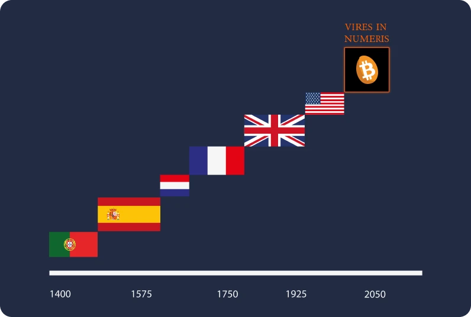
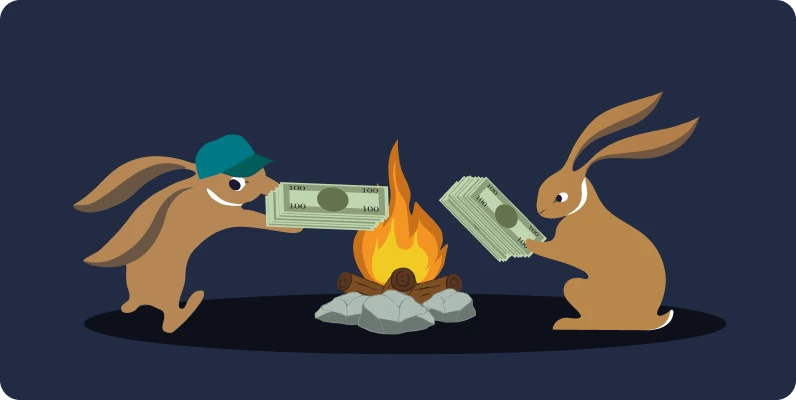
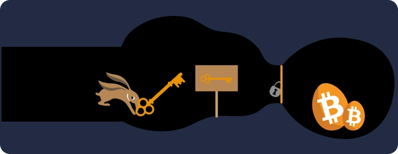
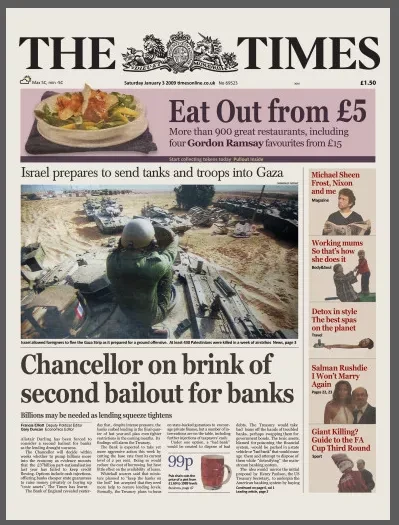
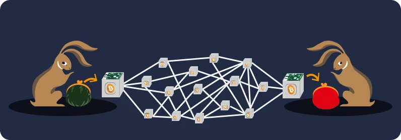
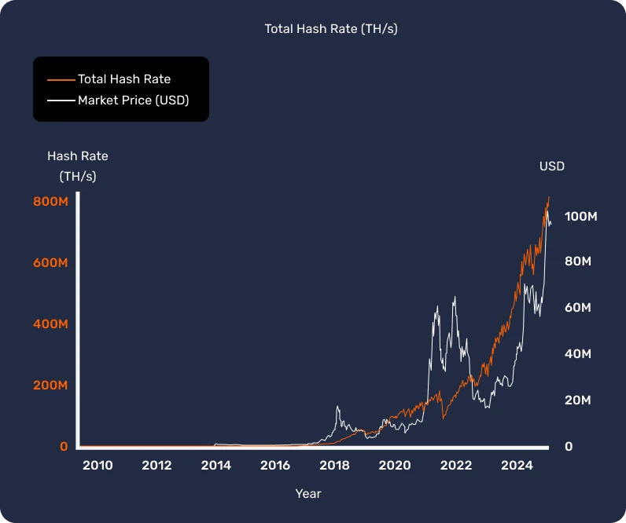
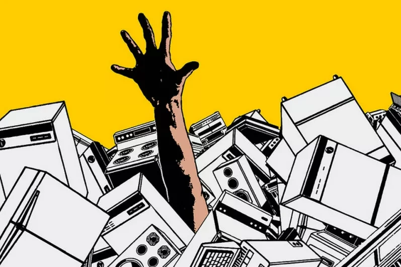
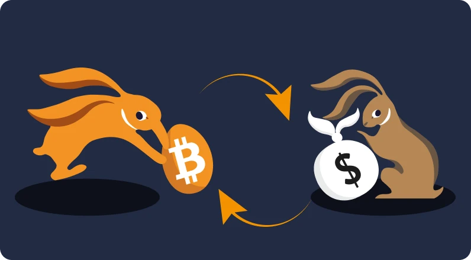

# Ditt första Bitcoin-äventyr

I den här kursen kommer vi att förklara grunderna i Bitcoin i 25 kapitel, så att du kan förstå denna teknologi på ett enkelt och effektivt sätt. Kursen utforskar grunderna i branschen som helhet, inklusive ämnen som mining, plånböcker, köp-/försäljningsplattformar och mer. Ytterligare utbildningsmaterial kommer att finnas tillgängligt under resan, och vi inbjuder dig också att kolla in "21 Posters" i resursavsnittet efter att du har avslutat denna kurs.

Du behöver ingen specifik kunskap för att komma igång. Faktum är att följande innehåll är tillgängligt för studenter på alla nivåer, och det bör ta ungefär 15 timmar att avsluta.

+++
# Introduktion

<partId>3cd2ac82-026c-53e1-874a-baf5842adc6d</partId>

## Kursöversikt

<chapterId>27e3fb60-4b50-556b-9e70-c4f5475c121d</chapterId>

Välkommen till BTC101-kursen!

Bitcoin är en teknologisk och monetär revolution, kapabel att få oss att ifrågasätta vår relation till pengar och samhälle. Faktum är att Bitcoin (som kallas BTC) är en neutral och decentraliserad valuta, vilket betyder att den inte kontrolleras av någon enhet eller institution. Det är en innovation som går bortom enbart en "internetvaluta": det är både ett datorprotokoll (Bitcoin) och en monetär enhet (bitcoin).

Bitcoin-protokollet använder underliggande teknologier som kryptografi, nätverkskommunikation och den berömda "blockchain", medan bitcoin-enheten fungerar som den nödvändiga valutan för att detta protokoll ska fungera korrekt. I vardagen använder salvadoraner och bitcoin-användare runt om i världen bitcoin-valutan för att köpa och sälja varor och tjänster, och förlitar sig på denna teknologi för att förbättra sina liv.

### En omfattande men ändå lättillgänglig läroplan

I den här kursen kommer vi att diskutera några monetära aspekter av Bitcoin, inklusive hur man köper och säljer bitcoins, förvarar dem säkert i digitala plånböcker och använder dem för transaktioner. Vi kommer också att undersöka miners roll, som är avgörande för att skapa nya bitcoins och säkra Bitcoin-nätverket. Slutligen kommer vi att utforska framtiden för Bitcoin och hur Lightning Network-tekniken kan förbättra Bitcoin-transaktioner.


Det är viktigt att förstå att Bitcoin är ett nytt monetärt system som helt förändrar vår relation till pengar, så att lära sig hur man använder det är en nödvändig färdighet för alla som vill ha kontroll över sina egna medel.

**Avsnitt 1 - Introduktion**

    Kapitel 1 - Kursöversikt
    Kapitel 2 - Bitcoins Förhistoria

**Avsnitt 2 - Pengar**

    Kapitel 3 - Pengar Genom Historien
    Kapitel 4 - Fiat-valutor
    Kapitel 5 - Hyperinflation
    Kapitel 6 - 21 Miljoner Bitcoins

**Avsnitt 3 - Bitcoin-plånböcker**

    Kapitel 7 - Vad är en Bitcoin-plånbok?
    Kapitel 8 - Bitcoin-plånböcker och Säkerhet
    Kapitel 9 - Ställa in en Plånbok
    Kapitel 10 - Stå Tidens Prov

**Avsnitt 4 - De Tekniska Aspekterna av Bitcoin**

    Kapitel 11 - Lansera Bitcoin
    Kapitel 12 - Bitcoin-transaktioner
    Kapitel 13 - Bitcoin-noder
    Kapitel 14 - Miners
    Kapitel 15 - Bitcoin och Ekologi

**Avsnitt 5 - Hur Ska Man Skaffa Bitcoins?**

    Kapitel 16 - Bitcoin Sover Aldrig!
    Kapitel 17 - Tjäna Bitcoins Genom Arbete
    Kapitel 18 - Spara med Bitcoin
    Kapitel 19 - Hyperbitcoinisering

**Avsnitt 6 - Framtiden för Bitcoin: Lightning Network**

    Kapitel 20 - En Kort Introduktion till Lightning Network
    Kapitel 21 - Användningsfall för Lightning Network
    Kapitel 22 - Röd Piller eller Blå Piller?

Innan vi introducerar definitionen av pengar och dess funktion i samhället (kapitel 1) bör vi börja med uppkomsten av Bitcoin. Bitcoin lanserades 2009 och är en relativt ny teknik som skiljer sig från allt annat. Det är därför normalt att inte förstå allt om den, allt på en gång. Precis som när man lär sig använda internet eller köra bil behöver man inte kunna alla tekniska detaljer på en gång: man kan börja med att lära sig hur man tar emot, betalar och säkrar sina pengar och sedan ta små steg för att fördjupa sig.

Trots allt befinner vi oss bara i början av adoptionen, då vi har passerat startfasen: du är precis i tid för att skaffa dig så mycket kunskap som du vill om denna viktiga innovation.


Det viktiga här är att förstå denna nya teknik på ett allmänt sätt, så vi hoppas att du tycker om den här kursen och fortsätter att göra framsteg i detta nya globala monetära paradigm.

Redo att dyka ner i den fascinerande världen av Bitcoin och förstå alla dess inre funktioner? Låt oss gå!

## Bitcoins förhistoria

<chapterId>9a94b627-5b69-5d81-9125-f1fa9b0aa6ad</chapterId>

Innan termen "Bitcoin" blev synonymt med digital valuta och finansiell omvandling lades grunden för dess skapande av en rad idéer, innovationer och sociala rörelser. Bland dessa framstår cypherpunk-rörelsen som ett nyckelelement i Bitcoins förhistoria.

### Cypherpunks: visionärer i den digitala världen


Mitt under den tekniska utvecklingen på 1980- och 1990-talen började en grupp människor på allvar ifrågasätta den roll som integritet och frihet spelar i den digitala tidsåldern. Dessa personer, som senare skulle bli kända som "cypherpunks", var övertygade om att kryptografi kunde fungera som ett verktyg för att skydda individuella rättigheter mot inblandning av regeringar och stora företag.

Ikoniska personer som Julian Assange, Wei Dai, Tim May och David Chaum spelade en central roll i utformningen av rörelsens filosofi och vision. Dessa tänkare delade med sig av sina idéer med hjälp av en inflytelserik e-postlista, där deltagare från hela världen deltog i debatter om de bästa sätten att använda teknik för att öka den individuella friheten.

### De tre grundläggande dokumenten för Cypherpunks


Cypherpunk-rörelsen, som är djupt rotad i digital aktivism och kryptografi, använde sig av flera grundläggande texter för att formulera sina principer och sin framtidsvision. Bland dessa skrifter är det särskilt tre som sticker ut:


- "Cypherpunk-manifestet":

"Cypherpunk Manifesto", som skrevs av Eric Hughes 1993, hävdar att integritet är en grundläggande rättighet. Författaren menar att möjligheten att kommunicera fritt och konfidentiellt är avgörande för ett fritt samhälle. I manifestet sägs följande: "Vi kan inte förvänta oss att regeringar, företag eller andra stora, ansiktslösa organisationer ska ge oss integritet [...]. Vi måste försvara vår egen integritet om vi ska kunna förvänta oss att ha någon".


- Det "kryptoanarkistiska manifestet":

skrivet av Timothy C. May år 1992, förklarar detta dokument hur användningen av kryptografi kan leda till en era av kryptografisk anarki där regeringar skulle vara maktlösa att ingripa i medborgarnas privata angelägenheter. May föreställde sig en framtid där människor anonymt uyter information och pengar utan inblandning av en tredje part.


- "Deklaration om cyberrymdens självständighet":

även om den inte är uteslutande cypherpunk, återspeglar denna text känslorna hos många deltagare i rörelsen. Den skrevs 1996 av John Perry Barlow och är ett svar på regeringarnas ökande reglering av Internet. I deklarationen hävdas att cyberspace är en annan sfär än den fysiska och inte bör omfattas av samma lagar. Som det står: "Vi har ingen vald regering, och det är inte heller troligt att vi kommer att ha någon".

### Föregångarna till Bitcoin

Innan Bitcoin uppstod hade det gjorts flera försök att skapa en digital valuta. Till exempel introducerade David Chaum konceptet "anonyma elektroniska pengar" med sitt projekt "DigiCash" på 1980-talet. På grund av olika begränsningar blev DigiCash tyvärr aldrig någon succé.

En annan viktig föregångare är Wei Dais "B-money". Även om den aldrig implementerades presenterade den idén om en anonym digital valuta där bedrägerier upptäcktes av en grupp utvärderare snarare än av en central myndighet.

Bilden nedan illustrerar tydligt rörelsens utveckling genom dess många tekniska innovationer.


Det var i denna bördiga miljö som den mystiske Satoshi Nakamoto publicerade Bitcoin whitepaper år 2008. I detta dokument kombinerade han flera idéer från cypherpunk-rörelsen, såsom proof of work och kryptografiska tidsstämplar, för att skapa en decentraliserad och censurresistent digital valuta.

Bitcoin var dock mer än så: det representerade förverkligandet av cypherpunk-idealen. Utöver sin teknik symboliserade den en revolution mot traditionella finansiella system och erbjöd ett alternativ baserat på transparens, decentralisering och individuell suveränitet.

### Slutsats

Bitcoins förhistoria är djupt rotad i cypherpunk-rörelsen och den kollektiva strävan efter större frihet i den digitala tidsåldern. Genom att kombinera principerna för kryptografi, decentralisering och integritet har Bitcoin blivit mycket mer än en valuta. I själva verket är det produkten av en filosofisk och teknisk revolution som fortsätter att omforma vår värld.

Bitcoin är därför ett protokoll som sträcker sig över långa tidsperioder och som uppmuntrar oss att ifrågasätta vårt förhållande till energi, tid och pengar.

Men är Bitcoin en "riktig" valuta? För att förstå detta måste vi först förstå begreppet pengar och dess olika former, vilket vi kommer att utforska i nästa kapitel.

Om du vill utforska Bitcoins historia mer i detalj rekommenderar vi starkt vår HIS 201-kurs, där du kommer att upptäcka ursprunget och den långsamma framväxten av Bitcoin, liksom början på dess historia och samhälle. Den här kursen är fullt dokumenterad och källbelagd, naturligtvis med många anekdoter:

https://planb.network/courses/a51c7ceb-e079-4ac3-bf69-6700b985a082
# Pengar

<partId>e913df1a-4cbd-5380-ba67-ca2a0414f671</partId>

## Pengar genom historien

<chapterId>c838e64d-d59f-5703-8c74-ea5e8c4fdd31</chapterId>

Pengarnas utveckling är en fascinerande aspekt av mänsklighetens historia som speglar den uppfinningsrikedom som civilisationer genom tiderna har visat när det gäller att tillgodose ständigt nya ekonomiska behov.


### Från snäckor till bankkonton

Ursprungligen var valuta en materiell tillgång, som spannmål, boskap eller någon annan råvara. Dessa varor hade dock den stora nackdelen att de var ömtåliga, vilket gjorde det svårt att använda dem som ett långsiktigt sparmedel. Till exempel kunde dåliga skördar eller djursjukdomar förstöra en individs förmögenhet över en natt.

I takt med att civilisationerna utvecklades och handeln expanderade till nya regioner uppstod behovet av ett universellt bytesmedel. Människor experimenterade först med föremål som snäckor och ädelstenar, men de var inte så hållbara eller sällsynta som de trodde. Så småningom blev guld standard, på grund av dess sällsynthet, hållbarhet och delbarhet. Det var, och är än idag, en symbol för rikedom och makt.


### Vilken roll spelar pengar?

Pengar är ett mycket sofistikerat kommunikationsverktyg:


- Den möjliggör kommunikation mellan nutid och framtid, eftersom den omvandlar vår tid och energi till en tillgång som kan återanvändas i framtiden utan risk för devalvering.
- Det underlättar kommunikation på ett universellt språk: utan att känna varandra eller tala samma språk kan två främlingar uyta, handla och komma överens om värdet på saker och ting.

Dess funktion i vår värld är svår att återskapa på konstgjord väg. Faktum är att ingen individ eller grupp kan skapa pengar, eftersom det är ett naturligt fenomen som måste uppstå på marknaden och genom frivilligt konsensus. På så sätt fungerar priser som signaler och information som vägleder samhället i dess resursfördelning.

Av dessa skäl är guld som pengar resultatet av 4 000 år av monetär darwinism baserad på följande aristoteliska funktioner:


- **Värdebevaring**: Pengar kan användas för att överföra köpkraft till framtiden, så de måste vara ett hållbart material;
- **Betalningsmedel**: Pengar kan användas i uyte mot varor och tjänster i stället för byteshandel, vilket gör att man undviker sammanträffande behov mellan handlare;
- **En enda beräkningsenhet**: Pengar gör det också möjligt för oss att jämföra värdet på olika varor för att bättre förstå deras relativa förmån.


### Pengarnas egenskaper

Guld uppfyller alla kriterier för en effektiv valuta: dess naturliga sällsynthet gör det värdefullt, samtidigt som dess kemiska egenskaper gör att det inte eroderar med tiden. Dessa egenskaper har gjort guld till en utmärkt **värdebevarare**, men inte till en vanlig valuta, eftersom denna form av pengar inte är lätt att dela upp eller transportera över långa avstånd. I en globaliserad och digital värld har guld svårt att hänga med och kräver en central enhet som gör det delbart och lätt att växla in (t.ex. genom att skapa mynt).

På motsatt sida är statliga fiduciära valutor (fiat) lättanvända, men devalveras ständigt av de enheter som kontrollerar dem (kungar, centralbanker, kejsare, diktatorer).

För att förklara detta begrepp bättre ska vi undersöka vad som kännetecknar en effektiv valuta:


- **Fungibilitet**, vilket innebär att den kan bytas ut mot en annan enhet av samma slag utan värdeförlust;
- **Delbarhet**, eftersom den kan delas upp i mindre enheter för att underlätta transaktioner av varierande volym;
- **Likviditet**, vilket innebär att den lätt kan omvandlas till varor eller tjänster.

För att uppfylla dessa kriterier har valutor historiskt sett utvecklats genom olika steg:


- Rå sten -> Mynt
- Sedel -> Bankkort
- Blockchain -> Lightning Network

Valutorna utvecklas än idag och anpassar sina former för att möta olika användningsområden. Guld är som sagt en utmärkt värdebevarare, men passar inte längre i dagens globaliserade ekonomi. På samma sätt är fiduciära valutor som dollar och euro mycket likvida och lätta att transportera eftersom de nu till största delen är digitala, men deras värde sänks ständigt av monetär inflation.

Å andra sidan erbjuder Bitcoin nya möjligheter. Dess egenskaper, t.ex. den strikt begränsade tillgången, gör den till en utmärkt värdebevarare. Som en neutral internetvaluta fungerar den dessutom som ett livskraftigt **betalningsmedel** som överskrider gränser. Den är dock fortfarande inte allmänt accepterad i handeln idag, trots att den [ständigt används] (https://btcmap.org/map).

## Fiduciära valutor

<chapterId>25151d46-7db1-5b48-8bba-cbde1944555a</chapterId>

> "De som inte kan minnas det förflutna är dömda att upprepa det", sa George Santayana.
En sanning som stämmer väl när det gäller det nuvarande monetära systemet.

### Fiduciär = förtroende

I dag betraktas stora valutor som euron och dollarn som fiduciära. Det innebär att de saknar egentligt värde och är helt beroende av den tillit och det förtroende vi har för de institutioner som styr dem.

En fiduciär valuta är en form av pengar som har fastställts som sådan av en institution, dvs. en stat, som Kina med yuan, eller en politisk-ekonomisk union, som Europeiska unionen med euron. Den enhet som ansvarar för dess utgivning är centralbanken (vi kan till exempel nämna People's Bank of China, Federal Reserve i USA eller Central Bank of the Republic of Guinea). Det är just dessa enheter som ansvarar för att utforma penningpolitiken och därmed hur mycket pengar som ska sättas i omlopp eller skapas.


### Monetär devalvering: en strategi lika gammal som romarriket

Sedan antiken har guld fungerat som en monetär referens, men dess fasthet har ofta lett till att ledare, vare sig romerska kejsare eller moderna regeringar, har antagit alternativa valutor, ofta fiduciära.

Mekanismen är enkel och inspirerad av metoder som har funnits sedan civilisationens begynnelse. Ledare som är angelägna om att utöva kontroll över rikedomar börjar med att centralisera guld, ofta genom att utnyttja sin makt och lova skydd och säkerhet. Med denna dyrbara reserv i sina händer inför de en ny valuta, som motsvarar guldets värde, men som skapas till deras avbild. Denna valuta börjar sedan cirkulera, och människor anpassar sig snabbt till bekvämligheten med dess enkla användning.

Dessa ledare börjar dock sedan gradvis devalvera den nya valutan och i praktiken minskar dess värde med några procent varje år jämfört med det ursprungliga guldpriset. Denna tysta devalvering motiveras ofta med att den ligger i folkets intresse. De som sparar i denna fiduciära valuta ser i själva verket hur värdet på deras besparingar gradvis minskar, medan staten finansierar sina projekt genom inflation. Dessutom gör denna devalvering att skulder blir lättare att betala tillbaka.


I ett kritiskt ögonblick gör ledaren tillkännagivandet: valutan är inte längre uppbackad av guld. Allmänheten, som nu är van vid den fiduciära valutan och som ofta är felinformerad om finansiella frågor, accepterar denna verklighet, vilket gör att staten fritt kan manipulera penningmängden och trycka enorma summor pengar nästan utan bekostnad.

Penningskapandet leder sedan till inflation och utarmar gradvis befolkningen. Dessutom regleras och begränsas det finansiella systemet för att undvika att det kollapsar, eftersom varje störning skulle kunna orsaka en stor ekonomisk kris. I motsats till massorna drar finansiella institut och rika individer stor nytta av detta system, vilket skapar en ojämlikhet och gynnar auktoritära system. I detta sammanhang är de inte motiverade att göra radikala förändringar, vilket gör att systemet kan fortsätta sin kurs fram till en eventuell implosion.

Denna strategi hålla i decennier när den är väl genomförd. Det är dock viktigt att notera att en mycket snabb devalvering eller förlust av förtroende kan leda till hyperinflation (se nästa kapitel). Historien visar att dollarn har förlorat 98% av sitt värde på 100 år, euron 30% på 20 år och pundet 99% sedan det skapades.

I slutändan kanske valutan inte längre har någon koppling till guld, på samma sätt som romerska mynt i slutet av imperiet, eller till och med reduceras till ett enkelt numeriskt värde, skiljt från den konkreta verkligheten.

I dag bevittnar vi en historisk vändpunkt. Dollarn, som länge har dominerat, verkar vara på tillbakagång, samtidigt som guldet har förlorat sin centrala roll. Vi står på tröskeln till en ny monetär cykel, som påminner oss om att historiens lärdomar ofta glöms bort



### Är Bitcoin en lösning?

På grund av dessa premisser tar Bitcoin-revolutionen fart. I motsats till tidigare valutor kräver den **ingen betrodd tredje part** och syftar till att skilja staten från pengar.


Faktum är att Bitcoin presenterar sig själv som ett svar på systemets utmaningar genom att föreslå en decentraliserad lösning och ett nytt parallellt monetärt system. Historiskt sett har guld gynnats som valuta på grund av dess motståndskraft mot förfalskning, och Bitcoin kan inte heller förfalskas. Dessutom är den begränsad till 21 miljoner enheter, tack vare dess decentraliserade och kryptografiska natur. Bitcoin är en valuta som bygger på transparens och neutralitet och som erbjuder ett attraktivt alternativ till det nuvarande centraliserade monetära systemet.


En annan anledning till att Bitcoin har fått uppmärksamhet är uppkomsten av digitala centralbanksvalutor, CBDC, som verkar oundviklig. Denna nya form av pengar skulle utveckla en mer central planerad ekonomi och skulle både kunna hindra individers finansiella frihet och underlätta auktoritära övergrepp.

Vi kan avsluta detta kapitel med ett citat från Nobelpristagaren F.A Hayek 1984:

> "Jag tror inte att vi någonsin kommer att ha bra pengar igen, innan vi tar saken ur händerna på regeringen. Om vi inte kan ta det våldsamt ur regeringens händer, är allt vi kan göra att på något listigt eller omständigt sätt införa något de inte kan stoppa."
För att lära dig mer om ekonomiska felaktigheter och frihet inbjuder vi dig att upptäcka vår ECO 102-kurs, som följer livet och idéerna hos Frédéric Bastiat, en fransk 1800-talstänkare som säkerligen skulle ha uppskattat uppkomsten av Bitcoin:

https://planb.network/courses/d07b092b-fa9a-4dd7-bf94-0453e479c7df
## Hyperinflation

<chapterId>b04c024c-54f3-50cb-997f-58721cfc74be</chapterId>

Hyperinflation är ett monetärt fenomen som är specifikt för fiatvalutor: det kännetecknas av en fullständig förlust av förtroendet för en valuta och en drastisk ökning av inflation på grund av myndigheternas penningskapande. Som ett resultat kan de besparingar som ackumulerats av individer försvinna på en relativt kort tidsperiod, vilket driver landet på gränsen till ekonomisk, social och politisk kollaps.

### Inflationen skenar iväg!

För att förstå inflationens inverkan på sparandet måste vi ta hänsyn till olika inflationstakter.


- Med en inflation på 2% förlorar du 2% av din köpkraft varje år, vilket motsvarar 10% på 5 år.
- Med 7% förlorar du hälften på 10 år.
- Med 20% förlorar du nästan hälften på 3 år.

När hyperinflation uppstår talar vi inte längre om 20 procent per år, utan snarare om 20 procent per månad eller, när det är som värst, till och med per DAG. Att uppleva en inflation på 100 % per dag under tre dagar är ett realistiskt scenario som har inträffat och fortsätter att inträffa i vår värld.

Det är viktigt att förstå att hyperinflation inte uppstår av en slump, på grund av kapitalism eller politiska attacker från motståndare. Hyperinflation är den direkta konsekvensen av dåliga monetära beslut som fattas av centralbanker och politiker. Dess efterdyningar påverkar varje medborgare och även kommande generationer. Vi ber er vänligen att ägna fem minuter åt att läsa följande tabell för att fullt ut inse den verkliga effekten av detta fenomen (kursen ECO204 fördjupar sig ytterligare i detta ämne). Som du kan se är inget land eller valuta potentiellt säkert.


### Vilka är faserna i en hyperinflation?


För att hyperinflation ska uppstå måste vissa händelser inträffa.

Fas 1 - Förlorat förtroende


- Centralisering av den monetära makten underlättar skapandet av pengar och missbruk av dem. I det här sammanhanget kan vissa externa faktorer utlösa hyperinflation, vanligtvis krig, sociala åtgärder eller prisökningar på viktiga resurser som vete eller bensin. Detta kan leda till att förtroendet för en valuta minskar och att människor börjar ifrågasätta pengarnas ursprung och fördelarna med en styrd penningpolitik.

Fas 2 - Valutakollaps och prishöjning


- När regeringar tappar kontrollen över förtroendet börjar individer byta ut sin valuta mot en mer stabil, likt det som hände i Venezuela med den amerikanska dollarn. Detta leder till stigande priser, vilket skapar en ond cirkel där varor och tjänster blir allt dyrare. För att möta dessa behov och korrigera penningpolitiken skapar staten mer pengar, vilket resulterar i exponentiell inflation.

Fas 3 - Penningskapandets onda cirkel


- Allt fler sedlar behövs därför för att köpa varor, vilket leder till att det blir ont om papperspengar. Som svar på detta trycker regeringarna upp fler sedlar, vilket driver på inflationen ytterligare.


Fas 4 - Framväxten av en ny valuta


- En ny valuta införs sedan för att ersätta den gamla, i syfte att bryta inflationscykeln genom att införa striktare kontroller som inte fanns på plats med det tidigare lagliga betalningsmedlet.

För att lösa en hyperinflationskris krävs ofta radikala förändringar, t.ex. revolutioner, regeringsskiften, byte av centralbankschef m.m. Förlust av förtroende, valutakollaps och återuppbyggnad är viktiga faser för att återuppliva en ekonomi baserad på fiatvaluta.

### Tre anmärkningsvärda exempel


- Tyskland, 1922-1923.

Ett av de mest slående exemplen på hyperinflation inträffade i den tyska Weimarrepubliken efter första världskriget.

Tyskland hade lånat enorma summor pengar för att finansiera kriget. Tyskland förlorade dock inte bara kriget, utan tvingades också betala miljarder dollar i krigsskadestånd. Den månad då inflationen var som högst var oktober 1923, med en topp på 29.500%, vilket motsvarade en inflationstakt på 20,9% per dag. Priserna fördubblades var 3,7:e dag!

Den tyska valutan blev så värdelös att vissa medborgare föredrog att bränna sina papperspengar i stället för ved, eftersom det faktiskt var billigare. Det berättas till och med att servitörer på restauranger var tvungna att meddela menypriserna var 30:e minut för att ta hänsyn till inflationen.

Till slut skapade myndigheterna en ny valuta som backades upp av Tysklands, Frankrikes och Englands skulder och som garanterades av tysk mark.




- Ungern, 1945-1946

Det land som hittills upplevt den värsta perioden av hyperinflation är utan tvekan Ungern efter andra världskriget.

Ungern befann sig på den förlorande sidan i konflikten och större delen av landets industriella produktionskapacitet förstördes. Månaden med den högsta inflationen var juli 1946, då en häpnadsväckande prisinflation på 41.900.000.000.000.000.000% noterades, vilket motsvarar 207% per dag. Priserna fördubblades var 15:e timme!

Den sista sedeln som sattes i omlopp var en 100 miljoner miljarder Pengo (100.000.000.000.000.000.000) 1946.


- Zimbabwe, 2007-2008

Fram till år 2000 var Zimbabwe självförsörjande på nästan alla sina behov utom olja.

1997 kollapsade den zimbabwiska dollarn med över 72% efter att regeringen gått med på att kompensera krigsveteraner med motsvarande 450 miljoner US-dollar. Eftersom regeringen inte hade en sådan summa i sina förråd fick man ta till tryckpressen. År 2005 nådde inflationen 586%, men toppen nåddes i mitten av november 2008 med en inflationstakt som uppskattades till 79.600.000.000% per månad.

I juni 2007 hade regeringen redan reagerat genom att införa priskontroller, men denna åtgärd hade inget inflytande på ekonomin. Butikerna blev bokstavligen "plundrade" och handlarna hade inte längre möjlighet att fylla på sina lager.

I april 2009 meddelade finansministern att den zimbabwiska dollarn skulle dras in och att olika utländska valutor skulle få användas för handel. Alla bankkonton, pensioner och finansiella institutioner såg sina saldon försvinna över en natt.


Sammanfattningsvis leder hyperinflation till att valutans värde snabbt degraderas, vilket leder till att sparandet urholkas och förtroendet för det monetära systemet försvinner. Som Voltaire en gång föreslog kommer en fiatvaluta alltid till slut att förlora sitt egentliga värde och gå mot noll.

En valuta som förlitar sig på en betrodd tredje part som ett finansinstitut är i praktiken och på lång sikt en defekt valuta, eftersom den inte kan garantera köpkraft eller bevara sparande.

För att fördjupa dig i ämnet hyperinflation rekommenderar vi David St-Onges ECO 204-kurs, där du får lära dig vad hyperinflationscykler är och hur de påverkar våra liv. Du kommer också att upptäcka likheterna mellan dessa cykler och, viktigast av allt, hur du kan skydda dig mot dem.

https://planb.network/courses/caa75343-ac90-4249-bcca-0e2e57c3a0f1
## 21 miljoner bitcoins

<chapterId>f4a06d76-1963-56fd-93ff-dfa41489bcde</chapterId>

### Bitcoins penningpolitik

Bitcoin är en decentraliserad digital valuta med en fördefinierad maximal mängd på **21 miljoner enheter**. Denna egenskap av knapphet bestäms av dess datorkod och förstärks av ett konsensus mellan alla användare som deltar i protokollet.


Dess monetära skapande kan illustreras med en kurva som representerar mängden bitcoins som skapas över tid. År 2022 var till exempel cirka 18,5 miljoner bitcoins i omlopp. Prognoser visar att det 2025 kommer att finnas cirka 19,5 miljoner bitcoins, vilket motsvarar cirka 93% av det totala uudet, och 2037 kommer denna siffra att nå 20,4 miljoner.

### Hur skapas nya bitcoins?

Skapandet av nya bitcoins är resultatet av mining-processen. I ett nötskal använder miners kraftfulla datorer som löser komplexa matematiska problem, vilket validerar och säkrar transaktioner. När ett problem har lösts lägger minern till ett nytt block med transaktioner i blockkedjan, ett decentraliserat och distribuerat register som registrerar alla transaktioner som görs i nätverket. Blockkedjan garanterar transparens och säkerhet, eftersom varje block är länkat till det föregående, vilket gör det nästan omöjligt att ändra tidigare data utan samtycke från nätverket.


Efter att framgångsrikt ha utfört denna uppgift belönas miners med skapandet av nya bitcoins var tionde minut. Denna belöning är programmerad att halveras var 210 000:e block, vilket är ungefär vart fjärde år (en händelse som kallas "halvering"), vilket ger kurvan av det monetära skapandet en trappliknande form. På grund av denna mekanism kan det matematiskt förutsägas att skapandet av nya bitcoins kommer att upphöra omkring år 2140, när det totala antalet når sin gräns på 21 miljoner.

| Halveringsnummer | Blockhöjd | BTC-belöning efter halvering | Beräknad BTC i omlopp efter halvering |

| -------------- | ------------ | ------------------------- | ------------------------------------------ |

| 1 210.000 25 BTC 10.500.000 BTC

| 2 420.000 12,5 BTC 15.750.000 BTC

| 3 | 630.000 | 6,25 BTC | 18.375.000 BTC

| 4 | 840.000 | 3,125 BTC | 19.687.500 BTC | 4 | 840.000 | 3,125 BTC | 19.687.500 BTC

| 5 | 1.050.000 | 1,5625 BTC | 20.343.750 BTC | 5

6 | 1 260 000 | 0,78125 BTC | 20 671 875 BTC | 6 | 1 260 000 | 0,78125 BTC | 20 671 875 BTC

| 7 1.470.000 0,390625 BTC 20.835.937,5 BTC

| 8 | 1.680.000 | 0,1953125 BTC | 20.917.968,75 BTC | 1.680.000 | 0,1953125 BTC

| 9 | 1 890 000 | 0,09765625 BTC | 20 958 984,375 BTC

| 10 | 2 100 000 | 0,048828125 BTC | 20 979 492,188 BTC | 10

| 11 | 2.310.000 | 0,0244140625 BTC | 20.989.746,094 BTC

| 12 | 2 520 000 | 0,01220703125 BTC | 20 994 873,047 BTC

| 13 2.730.000 0,006103515625 BTC 20.997.436,523 BTC

| 14 | 2.940.000 | 0,0030517578125 BTC | 20.998.718,262 BTC

| 15 3.150.000 0,00152587890625 BTC 20.999.359,131 BTC

| 16 | 3 360 000 | 0,000762939453125 BTC | 20 999 679,566 BTC

| 17 3.570.000 0,0003814697265625 BTC 20.999.839,783 BTC

| 18 3.780.000 0,00019073486328125 BTC 20.999.919,892 BTC

| 19 | 3 990 000 | 0,000095367431640625 BTC | 20 999 959,946 BTC | 20 999 959,946 BTC

| 20 | 4 200 000 | 0,0000476837158203125 BTC | 20 999 979,973 BTC | 20 999 979,973 BTC

Vi kommer att återkomma till begreppet mining i mer detalj i [miner-kapitlet] (https://planb.network/courses/2b7dc507-81e3-4b70-88e6-41ed44239966/dbb8264a-7434-57e4-9d1b-fbd1bae37fdf).

### Garantera digital knapphet

Gränsen på 21 miljoner är grunden för Bitcoins knapphet och garanteras av två viktiga mekanismer: justeringen av svårigheten av mining och spelteorin.


- Justeringen av svårigheten av mining är en process som sker vart 2016:e block, eller cirka två veckor, för att säkerställa att ett nytt block läggs till i blockkedjan var tionde minut i genomsnitt. Denna frekvens av blockskapande och den totala mängden bitcoins är båda fasta aspekter av Bitcoin-protokollet och kan inte ändras utan ett allmänt samförstånd, till skillnad från de godtyckliga beslut som fattas i traditionella monetära system.

Svårigheten att hitta en giltig hash följer ett slags cykel: om antalet miners ökar innebär det att antalet block de hittar är högre, vilket leder till att den genomsnittliga tiden för att hitta ett block minskar. På grund av detta ökar svårighetsgraden. Som en följd av detta sänks antalet block som miners hittar, vilket innebär att mekanismen går tillbaka till genomsnittet på 10 minuter per block. Vänligen se bilden nedan för en visuell visning.


Visste du att miners har incitament att mina ett block för att tjäna nya bitcoins genom blocksubventionen samt transaktionsavgifter från de transaktioner de inkluderar i det blocket?

När antalet skapade bitcoins närmar sig gränsen på 21 miljoner kommer miners således att ersättas mer genom sina transaktionsavgifter än genom blocksubventionen.


- Spelteori är ett matematiskt koncept som bygger på mänsklig rationalitet. Det förutsätter att individer agerar logiskt och försöker maximera sina egna fördelar samtidigt som de beaktar andras potentiella beslut. I Bitcoin bidrar spelteorin till att säkerställa att majoriteten av miners och användare agerar i nätverkets bästa intresse. Eftersom protokolländringar röstas fram av användarna skulle faktiskt varje ändring av Bitcoin-protokollet kräva att hela användargruppen samtycker, vilket är mycket komplext. Så om någon ville skapa en bitcoin på 22 miljoner skulle de behöva övertyga alla användare att frivilligt devalvera sina egna besparingar, vilket är osannolikt eftersom Bitcoin är globalt och inte styrs av en central grupp.


Idén om att devalvera valutan går emot den grundläggande filosofin för Bitcoin, så en förändring i dess totala kvantitet är mycket osannolik att hända.

### En granskningsbar monetär policy: varje sekund, från början och för alltid!

Bitcoins knapphet är en stor tillgång, och den maximala mängden på 21 miljoner bitcoins i omlopp är offentlig och kan verifieras av vem som helst.

Faktum är att vem som helst kan göra detta via en Bitcoin-nod (dvs. en transaktionsvalidator) genom att helt enkelt ange följande kommando: `bitcoin-cli gettxoutsetinfo`. Denna transparens stärker förtroendet för Bitcoin-systemet, som inte är baserat på centrala institutioner eller individer, utan snarare på de matematiska och kryptografiska garantierna i dess protokoll (Du lär dig hur du gör detta enkelt i LNP201).

```json
{
"height": 710560,
"beslock": "0000000000000000000887384d67103412ea7f18a43953e65c8c4ac36bf42e54",
"transactions": 473244,
"txouts": 1018917,
"bogosize": 2183872374,
"hash_serialized_2": "eebb9987337700ffaacbbaa11223344",
"disk_size": 178239584,
"total_amount": 18745998.12345678
}
```

Bitcoin garanterar en sund monetär hantering genom att begränsa dess skapande avsiktligt, vilket gör den mycket annorlunda än andra valutor eftersom den kan skydda användarnas besparingar. I enlighet med principerna för österrikisk ekonomi säkerställer dess stabila mängd och förutsägbara distribution ett starkt skydd mot de inneboende inflationsrisker som traditionella valutor ständigt står inför (se ECO201-kursen för att få veta mer).

Sammanfattningsvis erbjuder Bitcoin, med sin decentraliserade natur, programmerade knapphet och transparens, ett unikt alternativ till traditionella monetära system. Den illustrerar hur teknik kan användas för att skapa en valuta som inte bara är användbar och verifierbar, utan också bevarar värdet på användarnas besparingar genom att strikt begränsa tillgången.

### Slutsats av avsnitt 1!

# Bitcoin-plånböcker

<partId>28860585-4f61-59d9-b242-f4c57d837cc1</partId>

## Vad är Bitcoin-plånböcker?

<chapterId>1c0166ab-cb7a-5bc6-9175-d13482bd91f1</chapterId>

I avsnitt 2 kommer vi att utforska Bitcoins förvaring och säkerhet genom användning av digitala plånböcker, för att förstå var dessa berömda bitcoins finns och hur man interagerar med dem!

### Avmystifiering av Bitcoin-plånböcker

Vi använder digitala plånböcker för att interagera med Bitcoin-nätverket på tre huvudsakliga sätt:


- För att ta emot bitcoins
- För att skicka bitcoins
- För att skydda dem mot hackning och stöldförsök

En Bitcoin-plånbok kan ha många olika former: en programvara på din dator, en applikation på din smartphone, en fysisk enhet som en USB-nyckel eller till och med ett papper. Var och en av dem tjänar olika användning. Faktum är att vissa är utformade för stora transaktioner med betoning på säkerhet, medan andra prioriterar integritet, eller så är de avsedda för dagliga betalningar av små belopp.

Portföljer kan således kategoriseras i breda användningsområden, som alltid kretsar kring en nyckelfråga: är du ägare till pengarna eller lämnar du över kontrollen av dina pengar till en tredje part? Vi kommer att utforska detta ämne i detalj i nästa kapitel, men frågan är fortfarande enkel: ligger pengarna i din ficka eller i din bankmans ficka?


### Hur fungerar en Bitcoin-plånbok?

Oavsett om det är din Bitcoin-"bankman" eller du själv, arbetar de allra flesta Bitcoin-plånböcker med en liknande teknik baserad på asymmetrisk kryptografi, vilket innebär ett system med nyckelpar: en privat nyckel för spenderande och en offentlig nyckel för mottagande.


- Privat nyckel

När du initierar en digital plånbok genereras en hemlig återställningsfras (privat nyckel) som presenteras för dig i form av 12 eller 24 ord.

Den privata nyckeln är grundläggande eftersom den utgör äganderätten till bitcoins och därmed rätten att använda eller skicka dem. Därför är innehavaren av den privata nyckeln den verkliga ägaren av bitcoins.

Denna nyckel måste hållas hemlig och väl skyddad, eftersom den låser upp din förmögenhet!


- Offentlig nyckel och adress

Den publika nyckeln genereras från den privata nyckeln och är kopplad till den. Att dela den publika nyckeln innebär risker för integriteten (eftersom andra användare kan se ditt saldo) men inte för säkerheten (eftersom de inte kan spendera dina pengar utan att ha den privata nyckeln). Den publika nyckeln används i sin tur för att skapa Bitcoin-adresser och därmed ta emot pengar.

Dessa adresser skapas automatiskt av din plånbok och kan delas på ett säkert sätt. För att maximera din integritet är det lämpligt att bara använda dem en gång.

Sammanfattningsvis gör den här tekniken det möjligt för oss att ta emot bitcoins utan att mottagaren kan stjäla våra pengar! En brevlåda kan vara en passande metafor: människor kan sätta in pengar i den, men du är den enda som kan öppna den.


### Finns bitcoins i plånboken?

Även om dina nycklar lagras i din plånbok "lagras" själva bitcoins faktiskt på Bitcoin-blockkedjan, som är ett offentligt distribuerat register inom Bitcoin peer-to-peer-nätverket (vi kommer att fördjupa oss i det i avsnitt 3). Detta innebär att om du förlorar enheten som innehåller din plånbok behöver det inte nödvändigtvis leda till att du förlorar dina bitcoins. Det som gör att du kan återskapa din plånbok och spendera dina bitcoin är faktiskt den privata nyckeln, så kom alltid ihåg att säkra den ordentligt!


Lyckligtvis kan den privata nyckeln sedan 2017 representeras av en enkel lista med 12 eller 24 ord, känd som "mnemonisk fras", som är ganska lätt att spara. Den här frasen fungerar som en säkerhetskopia för dina pengar och gör att du kan återskapa din plånbok med hjälp av vilken Bitcoin-plånboksprogramvara eller app som helst. Därför kan alla som hittar den här listan med ord komma åt dina bitcoins.

### Hur är det med hackare?

Vad händer om någon av misstag gissar vår lista med 12 eller 24 ord? Det korta svaret är att det är mycket osannolikt, tack vare den kryptografi som används för att skapa plånboken. För att sätta det i perspektiv, att av misstag upptäcka samma minnesfras är som att hitta "rätt" nummer mellan 1 och $2^256$, vilket nästan är likvärdigt med att hitta "rätt" atom i universum. Men om du inte är nöjd med denna standardsäkerhet kan du alltid förbättra den genom att lägga till en lösenordsfras (ett extra ord) till din Bitcoin-plånbok.


Sannolikheten för att hacka din Bitcoin-plånbok är således astronomiskt låg om du följer de goda säkerhetsrutiner som vi kommer att beskriva i nästa avsnitt.

Tänk på att välja rätt plånbok för dina behov och din användning: detaljerade handledningar om hantering och säkring av olika plånböcker finns i [handledningsavsnittet på vårt universitet] (https://planb.network/tutorials/wallet).

Om du under din resa ner i kaninhålet vill lära dig mer om hur man bygger en Bitcoin-plånbok, från entropi till mottagande av adresser, rekommenderar vi CYP 201-kursen som är avsedd för detta ämne:

https://planb.network/courses/46b0ced2-9028-4a61-8fbc-3b005ee8d70f
## Bitcoin-plånböcker och säkerhet

<chapterId>00c1afea-e54a-511f-bab3-2efc2fbfa6a1</chapterId>

### Ställ rätt frågor innan du börjar

När du äger bitcoins är säkerheten för dina tillgångar ett stort bekymmer. Det bästa sättet att definiera en säkerhetsnivå som är lämplig för din situation är att ställa dig själv en rad frågor:


- Vem kan få tillgång till dina pengar? Med andra ord, har du ensam tillgång till dina bitcoins, eller ger en tredje part (t.ex. ett företag) dig tillgång till dina pengar?
- Hur planerar du att använda bitcoins i den specifika plånboken? Regelbundet? För sparande på medellång eller lång sikt?
- Vilka är dina tekniska färdigheter?
- Vad är din säkerhetsbudget?

Det finns faktiskt inget universellt svar eller lösning, så ta dig tid att svara på dessa frågor, eftersom det hjälper dig att skräddarsy dina säkerhetsåtgärder efter dina behov.


### Att tänka på Bitcoin-plånböcker i termer av komplexitet

Här nedan kommer vi att definiera flera säkerhetsnivåer:


- **Nivå 0**, du använder en så kallad "custodial service" där du inte är den enda innehavaren av dina bitcoins. Var medveten om att denna betrodda tredje part när som helst kan begränsa din tillgång till dina pengar. I det här fallet liknar din nivå av finansiell suveränitet det som gäller för ett traditionellt banksystem med ett bankkonto.


- **Nivå 1**, du använder en Bitcoin-plånbok på din telefon eller dator, där du är den enda innehavaren av dina bitcoins och du kan enkelt utföra dina transaktioner. Det ovan nämnda verktyget kallas "varm plånbok", eftersom den privata nyckeln lagras på en enhet med internetåtkomst. I det här fallet är det viktigt att säkerhetskopiera din minnesfras för att återfå tillgång till dina pengar om du tappar bort din telefon eller dator.

Du kan till exempel använda Sparrow Wallet som en varm plånbok:

https://planb.network/tutorials/wallet/desktop/sparrow-7e9a77c0-013d-4f8e-a811-408b71dc7607

- **Nivå 2**, du använder en fysisk digital plånbok och du har säkrat din lista med 12/24 ord. Det kallas ofta för "kall plånbok" eftersom dina nycklar lagras på en enhet som inte är ansluten till internet. I det här fallet måste du alltid signera varje transaktion med din enhet, vilket gör dina pengar mindre tillgängliga på daglig basis.

Du kan till exempel använda en Ledger, en Satochip eller en Tapsigner:

https://planb.network/tutorials/wallet/hardware/ledger-nano-s-plus-75043cb3-2e8e-43e8-862d-ca243b8215a4
https://planb.network/tutorials/wallet/hardware/satochip-e9bc81d9-d59b-420d-9672-3360212237ba
https://planb.network/tutorials/wallet/hardware/tapsigner-ab2bcdf9-9509-4908-9a4a-2f2be1e7d5d2



- **Nivå 3**, du använder en plånbok på nivå 1 eller 2, men du har lagt till ytterligare en lösenordsfras. I det här fallet måste du vara medveten om att du måste säkerhetskopiera både listan med 12/24 ord **och** din lösenordsfras. Helst ska dessa två delar av informationen lagras på två olika platser.

För att lära dig mer om hur BIP39-lösenordsfras används och fungerar:

https://planb.network/tutorials/wallet/backup/passphrase-a26a0220-806c-44b4-af14-bafdeb1adce7


- **Nivå 4**, du använder ett set av plånböcker för att skapa en "multisig"-plånbok, vilket innebär att flera signaturer krävs för att genomföra en transaktion. I det här fallet bör du vara medveten om att varje del av multisignaturen ska lagras på olika platser. Detta tillvägagångssätt anses ofta vara en avancerad användning av Bitcoin, främst för att hantera stora belopp och för företagsändamål.


Naturligtvis kräver olika användningar också olika Bitcoin-plånböcker, och det finns ingen lösning som passar alla.

### Säkerheten måste anpassas

Beloppet man är villig att lämna på en specifik säkerhetsnivå beror på varje individ. För vissa är det rimligt att lämna 1 BTC på en varm plånbok, medan det för andra är det motsatta. I vilket fall som helst, när du vill säkra en liten summa rekommenderar vi att du inte spenderar för mycket på säkerhet genom att köpa en fysisk plånbok. Tänk dessutom på att det kan vara skadligt att överkomplicera säkerheten och tillgängligheten för dina bitcoins, särskilt om du misssköter backups av dina plånböcker.

Sammanfattningsvis är direkt ägande av ens bitcoins ett viktigt element för att säkerställa finansiell suveränitet. Det rekommenderas att använda en mobil plånbok för dagliga utgifter och en offline, eller "kall", fysisk plånbok för att lagra större belopp. Företag bör å andra sidan överväga att använda system med flera signaturer, eller "multisig", för ökad och delad säkerhet. Det är också viktigt att undvika custodial services, som kan återskapa vissa sårbarheter som i det traditionella finansiella systemet.

Med detta i åtanke kan vi nu gå vidare till nästa avsnitt där vi beskriver hur man skapar en Bitcoin-plånbok. Men om du vill utforska ämnet säkerhet ytterligare kan du läsa den här [artikeln av DarthCoin] (https://asi0.substack.com/p/bitcoin-soyez-votre-propre-banque).

## Konfigurera en plånbok

<chapterId>615519eb-4565-557d-86a0-021badf7616f</chapterId>

Säkerheten för dina bitcoins har avgörande betydelse, och ett enkelt misstag kan få katastrofala konsekvenser. Det är därför vi måste lära oss de bästa metoderna att använda när vi skapar en ny Bitcoin-plånbok.

Observera att BTC102-kursen kommer att vägleda dig genom detta steg.

https://planb.network/courses/f3e3843d-1a1d-450c-96d6-d7232158b81f
### Det här steget är inget skämt!

När du skapar en plånbok skapar programvaran vanligtvis din privata nyckel, som vanligtvis representeras av en lista med 12/24 ord (ofta kallad "återställningsfras" eller "mnemonisk fras"): dessa ord ger tillgången till dina pengar. Om den här nyckeln någonsin avslöjas för en tredje part bör du antaga att de tillhörande pengarna har äventyrats. När du konfigurerar din plånbok är det därför viktigt att följa dessa regler:


- Täck alla kameror.
- Ta inte ett foto av ordlistan.
- Skriv inte in det på en dator eller telefon.
- Spara den inte som en kontakt och skicka den inte till dig själv via SMS.
- Lämna aldrig dina ord obevakade på skrivbordet.
- Göm aldrig din ordlista på en ovanlig plats.

Du ska bokstavligen ta ett tomt pappersark eller skriva ut den här [mallen](https://bitcoiner.guide/backup.pdf) och skriva ordlistan med en penna och följa den presenterade ordningen snyggt och tydligt. Tänk på att om bläcket bleknar med tiden kan du förlora dina pengar. Därför är det viktigt att förvara detta papper skyddat från miljöfaktorer som kan skada det, t.ex. fukt eller eld.

Här nedan hittar du ett exempel på hur du sammanställer papperet: orden är falska, så använd dem inte!


### Våra tips för att göra det rätt

Se dessutom till att inte göra något misstag under skrivningen, annars kan dina arvtagare ha det svårt att läsa den och kanske inte kunna återfå pengarna. När du har sparat orden är det dessutom rekommenderat att skapa en andra kopia och lagra den på en annan plats än den första. Detta säkerställer att du har en backup om originalet går förlorat eller skadas.


Ordlistorna bör förvaras på ett säkert ställe som du lätt kan komma ihåg. Undvik att skapa alltför komplicerade gömställen som kan leda till att du tappar bort dem.

**Dina ord = dina pengar.**

Både "kalla" och "varma" plånböcker använder ordlistmetoden som standard för backup av privata nycklar. Det innebär att du kan ange din mnemoniska fras i vilken kompatibel plånboksprogramvara eller enhet som helst för att återställa din åtkomst. Å andra sidan avråder vi starkt från att använda plånböcker som inte tillhandahåller en återställningsfras, eftersom de kan kräva att du uppger ett konto, en e-postadress eller, ännu värre, ett ID.

**OBS: Avsaknaden av en lista med 12/24 ord bör göra dig uppmärksam**

Om du sedan vill upptäcka, steg för steg, hur du ställer in din egen plånbok och får dina första bitcoins, rekommenderar vi också att du tar den här andra kursen:

https://planb.network/courses/f3e3843d-1a1d-450c-96d6-d7232158b81f
## Att klara tidens test

<chapterId>f58cd446-c202-5eff-aab7-e61cc40e5c06</chapterId>

Som alla former av rikedom måste dina bitcoins skyddas mot förlust, stöld och förfall, särskilt på lång sikt. För att skydda dina bitcoins krävs viss teknisk kunskap och en förståelse för de risker som är förknippade med dem, vilket öppnar vägen för två huvudstrategier: att gravera dina bitcoins på en stålplatta och att upprätta en arvsplan.

### Gravyr i stål

En metod för att säkra dina bitcoins på lång sikt är att gravera din mnemoniska fras på ett motståndskraftigt material som stål, genom att skapa en fysisk backup av dina nycklar som är resistent mot både vatten- och brandskador.

Det finns olika lösningar: vissa av dem är billiga, t.ex. "Blockmit", medan andra kan kräva mer specialiserad utrustning. Du kan utforska detta ämne ytterligare i avsnittet [tutorials](https://planb.network/en/tutorials/wallet) i vår akademi.


### Tänk på nästa generation!

Vid sidan av denna första praxis är det ett avgörande steg att skapa en arvsplan för att säkerställa att dina bitcoins hanteras korrekt efter din död. Denna plan innebär att du skriver ett handskrivet brev där du beskriver dina tillgångar, deras åtkomstmetoder och kontaktinformationen till de betrodda personer som har ansvar för dem. Det är också viktigt att diskutera arvet av bitcoins med en notarie för att säkerställa skatteöverensstämmelse, även om den här personen aldrig bör anförtros direkt med hanteringen av dina bitcoins.

Om du vill utforska ämnet arvsplan för dina bitcoins ytterligare rekommenderar vi att du läser Pamela Morgans bok [Cryptoasset Inheritance Plan] (https://planb.network/resources/books/28) eller anmäler dig till BTC102-kursen, där vi ger vägledning om hur du skapar din plan.


### Integritet är viktigt

Förutom att skapa fysiska backups eller utveckla en arvsplan är integritet ett annat viktigt ämne när det gäller den långsiktiga säkerheten för dina bitcoins. Det är till exempel att föredra att köpa bitcoins utan att identifiera sig för att minimera riskerna för identitetsstöld eller spårning av dina tillgångar av de enheter som har rätt verktyg.

När det gäller integritet är det viktigt att undvika att prata med alla om dina bitcoins. Vi kan inte förutsäga hur denna teknik kommer att uppfattas i framtiden, så att upprätthålla diskretion om ditt ägande är ett klokt val: du vill inte dra uppmärksamhet till dig själv eller din plånbok.

På samma sätt bör du undvika att öppet dela detaljer om ditt säkerhetssystem under bitcoinmöten eller möten med främlingar...

### Sammanfattning om säkerhet för Bitcoin-plånböcker

Bitcoin-plånböcker är mjukvara som gör att du kan lagra bitcoins och göra transaktioner. Det finns flera olika typer:


- mobil- eller datorplånböcker, praktiska för små belopp och/eller regelbundna utgifter;
- fysiska plånböcker, mer lämpade för lagring av bitcoins på medellång och lång sikt;
- plånböcker med multisig, som är mer komplexa att hantera och kräver flera signaturer för att utföra transaktioner.

När du skapar en plånbok måste du först göra en backup av din lista med 12 eller 24 ord på ett papper eller en metallplatta. Denna så kallade mnemoniska fras gör att du kan återställa din plånbok genom vilken Bitcoin-plånboksapplikation som helst. Tänk på att den som får tillgång till den här listan också får tillgång till dina pengar.

I Bitcoin-världen är ekonomisk suveränitet nära kopplad till individuellt ansvar, vilket gör det viktigt att säkra tillgången till dina plånböcker och backups. För att uppnå detta är det viktigt att följa vissa riktlinjer:


- Skapa en arvsplan för att säkerställa att dina nära och kära kan hämta ut pengarna om det skulle uppstå problem.
- Undvik att lämna dina Bitcoins på köp- och säljplattformar eftersom de kan vara mottagliga för hackerattacker.
- Anpassa din säkerhetsnivå till dina behov och användningar för att kunna göra ett bra val bland de olika Bitcoin-plånböcker som finns tillgängliga.

Nu när vi har gått igenom grunderna inom Bitcoin-plånböcker och de bästa metoderna för att säkra dem, kommer vi i nästa kapitel att utforska de tekniska funktionerna inom Bitcoin. Återigen kommer en förståelse för grunderna av Bitcoin-protokollet att förbättra din förståelse för hur det fungerar, vilket ger dig möjlighet att använda det bättre.

# De tekniska aspekterna av Bitcoin.

<partId>a86d7439-e7a2-5f21-b1e9-6b5e23ca265b</partId>

## Lansering av Bitcoin

<chapterId>b7561082-8943-519d-95d1-a5f60dd2686d</chapterId>

### Låt oss börja med lite historia.


Den 31 oktober 2008 föddes den nya finansiella tekniken som är Bitcoin. Den här dagen presenterade den anonyme Satoshi Nakamoto sin innovation för världen genom ett e-postmeddelande som skickades till cypherpunks e-postlista, en grupp kryptografientusiaster som arbetar för att främja integritet på internet. E-postmeddelandet innehöll ett dokument kallat "White Paper", som beskrev hur Bitcoin fungerade.

Initiativet väckte inte omedelbart entusiasm, förmodligen på grund av de tidigare misslyckandena av försöken att skapa ett digitalt kontantsystem. Trots detta blev White Paper så småningom en referens för Bitcoin-användare och har varit föremål för många debatter i Bitcoin-ekosystemet genom åren.


Den 3 januari 2009 invigde Satoshi officiellt Bitcoin-nätverket genom att skapa det första blocket, även känt som "Genesis-blocket", som markerade lanseringen av Bitcoin-blockkedjan. Detta block innehåller ett avslöjande meddelande som speglar Bitcoins uppdrag: "03/jan/2009 Chancellor on brink of second bailout for banks."


> "Vi kan vinna en viktig strid i kapprustningen och få nya territorium av frihet i flera år." - Satoshi Nakamoto


### Bitcoin-protokollet vaknar till liv

Den 9 januari 2009 tillkännagav Satoshi lanseringen av Bitcoin 0.1.0-versionen. Strax därefter tog Hal Finney tag i programvaran och gick med i nätverket, vilket markerade närvaron av två noder och därmed två miners i nätverket. Finney förevigde till och med detta steg genom att twittra: "Running Bitcoin". Den 12 januari 2009 gjordes den första Bitcoin-transaktionen på 10 BTC mellan Satoshi och Hal Finney, och du kan enkelt hitta den om du går tillbaka till block 170.


Intresset för Bitcoin växte snabbt, vilket ledde till att många människor testade den, deltog i debatter, löste buggar och reflekterade över dess etiska, ekonomiska och filosofiska aspekter. Folk var så fängslade att Satoshi skapade forumet BitcoinTalk den 22 november 2009 för att underlätta den här typen av diskussioner.

Forumet blev snabbt den föredragna platsen för diskussion för Bitcoin-användare, så mycket att kända memes och symboler som är förknippade med Bitcoin föddes ur det, till exempel [Bitcoin-logotypen] (https://bitcointalk.org/index.php?topic=64.0), den berömda [Hodl] (https://bitcointalk.org/index.php?topic=375643.0) eller till och med [Pizza day] (https://bitcointalk.org/index.php?topic=137.msg1195).

**visste du det?** Den 22 maj 2010 skrev Laszlo Hanyecz historia genom att erbjuda sig att köpa två pizzor för 10 000 BTC: det var första gången som Bitcoin användes för att köpa fysiska varor.



### Satoshi Nakamotos försvinnande

Under 2010, när Bitcoin började uppmärksammas i media, bestämde sig Satoshi för att ta avstånd från sig själv genom att meddela sin avgång i ett foruminlägg den 12 december 2010. Den 23 april 2011 gjorde han sitt sista kända privata uyte via e-post, försvann sedan och lämnade sin skapelse i händerna på samhället.

> "Regeringar är bra på att hugga av huvudena på ett centralstyrd kontrollerat nätverk som Napster, men rena P2P-nätverk som Gnutella och Tor verkar hålla ställningarna." - Satoshi Nakamoto
Trots Satoshis frånvaro fortsatte Bitcoin att utvecklas: Bitcoins historia skrivs var tionde minut, och protokollet fortsätter att fungera som avsett än idag. Oavsett rädsla, osäkerhet eller tvivel fortsätter Bitcoin att gå framåt, med en mycket stark online-tillgänglighet. Enligt den här [webbplatsen] (https://bitcoinuptime.com/) har Bitcoin faktiskt varit funktionellt och kört utan massiva problem under 99,988% av tiden sedan det skapades.

För vissa definieras Bitcoin som en svampliknande enhet som ett [mycelium] (https://brandonquittem.com/bitcoin-is-the-mycelium-of-money/), medan andra beskriver det som ett [svart hål] (https://dergigi.com/). Vare sig man älskar eller hatar den fortsätter Bitcoin att existera, med sin konstanta rytm på 10 minuter per block, som hjärtslaget i ett nytt monetärt system.

För att lära dig mer om Satoshi Nakamotos skrifter rekommenderar vi att du läser ["The Book of Satoshi"] (https://planb.network/en/resources/books/98) av Phil Champagne eller ARTE-dokumentären "Le mystaire Satoshi".


> "Grundproblemet med konventionell valuta är allt det förtroende som krävs för att få den att fungera. Man måste lita på att centralbanken inte förfalskar valutan, men fiatvalutornas historia är full av brott mot det förtroendet. Bankerna måste vara betrodda att bevara våra pengar och överföra dem elektroniskt, men de lånar ut dem i vågor av krediubblor med knappt en bråkdel i reserv" - [Satoshi Nakamoto](https://satoshi.nakamotoinstitute.org/posts/p2pfoundation/1/)
Nu när vi har lite bakgrund ska vi undersöka hur en Bitcoin-transaktion fungerar i allmänhet.

## Bitcoin-transaktioner

<chapterId>03482644-5473-590b-975b-b43bb65eac21</chapterId>

En Bitcoin-transaktion är helt enkelt en överföring av äganderätten till bitcoins genom användning av en Bitcoin-adress. För att beskriva denna process, låt oss introducera två huvudpersoner: Alice och Bob. Alice vill skaffa sig bitcoins, medan Bob redan äger några.

### Steg 1 - Skapa transaktionen via plånboken

För att Bob ska kunna överföra bitcoins till Alice måste hon förse honom med en av sina Bitcoin-adresser, som är unika för hennes Bitcoin-plånbok. Precis som den privata nyckeln används för att generera den publika nyckeln, används den senare för att generera adresser.

Konkret innebär det att när Alice öppnar sin plånbok och klickar på "ta emot" visas en QR-kod eller en adress (som denna bc1q7957hh3nj47efn8t2r6xdzs2cy3wjcyp8pch6hfkggy7jwrzj93sv4uykr). Detta fungerar som hennes "Bitcoin IBAN", som hon sedan ger till Bob.

Efteråt gör Bob transaktionen genom att öppna sin Bitcoin-plånbok och klicka på "skicka". Han kopierar och klistrar sedan in Alices adress i det obligatoriska fältet, lägger till det belopp han vill skicka och beslutar om transaktionsavgifterna, som fungerar som ett incitament för miners att inkludera transaktionen i nästa block. Faktum är att ju högre avgifter Bob betalar, desto större är chansen att transaktionen inkluderas i nästa block som läggs till i blockkedjan, dvs. ett offentligt och oföränderligt register som registrerar alla Bitcoin-transaktioner.

För att slutföra transaktionen måste Bob signera den med sin privata nyckel för att verifiera att han är ägare till de bitcoins han vill överföra. Detta steg är vanligtvis automatiskt i mobila plånböcker, eller så sker det i form av en bekräftelse i din fysiska plånbok: "Är du säker på att du vill skicka X till Y? Ja eller nej".


**Varför betalar vi avgifter?** Avgifter är nödvändiga för att skapa en fri marknad för att inkludera transaktioner i block. Faktum är att ett block har en storlek på 1 MB (som utökades till 4 MB efter Segwit-uppdateringen), så antalet transaktioner som kan "infogas" i ett block är begränsat till några tusen transaktioner per block. Storleken på en transaktion beror på dess komplexitet. Därför medför mer komplexa transaktioner vanligtvis högre avgifter.

### Steg 2: Spridning av transaktionen genom noderna

I det här skedet har transaktionen skapats och Bobs plånbok kommer att dela den med Bitcoin-nätverket. För att göra detta kommer hans plånbok att kommunicera med en nod i Bitcoin-nätverket, som kommer att sprida denna information till andra noder. Den här typen av process gör det möjligt för hela nätverket att se den nya transaktionen och ta hänsyn till den.



Även om den här transaktionen är känd av alla (via ett verktyg som kallas Mempool) kan den inte anses vara bekräftad förrän den infogas i ett block av en miner, som är den enda som validerar transaktioner genom att inkludera dem i blockkedjan.

I själva verket har miners rollen att samla in giltiga och obekräftade transaktioner för att sammanställa dem till ett block. I ett nötskal måste de lösa ett kryptografiskt pussel i en process som kallas "proof of work" för att deras block ska bli nästa i Bitcoin-blockkedjan.


### Steg 3: Transaktionen minas i ett block av en miner.

Proof of work-systemet kräver att man hittar en giltig "hash" för blocket i fråga: tänk på det som ett unikt fingeravtryck som är associerat med blocket och som består av 256 tecken. Giltigheten för denna hash beror på svårighetsgraden i Bitcoin-nätverket (vi kommer att gå in på mer detaljer senare). För tillfället kan vi tänka oss att en miner har hittat ett giltigt block och att Bobs transaktion till Alice ingår i det. Därefter läggs det nya giltiga blocket till i blockkedjan, det gemensamma registret för alla Bitcoin-användare.


### Steg 4: Blocket är giltigt och verifieras av Alices referentnod.

I det här skedet anses transaktionen vara giltig: minern sprider sedan det nya blocket till nätverket via sin nod, och Alices plånbok uppdateras.


**Observera** Även om Alice får ett meddelande om att hon har tagit emot bitcoins på en av sina adresser är det lämpligt att betrakta transaktionen som oföränderlig först efter att den har fått **sex** bekräftelser. Detta innebär att ytterligare sex block måste minas ovanpå det block som innehåller Bobs transaktion. Med andra ord, ju äldre en transaktion är i blockkedjan, desto mer oföränderlig blir den.

### Vilken betydelse har denna process?

Bitcoins transaktionssystem är decentraliserat och fungerar peer-to-peer, utan några betrodda mellanhänder.

Bob skickar sin transaktion till Bitcoin-nätverket, och när en miner publicerar ett giltigt block som innehåller Bobs transaktion kan Alice börja antaga att bitcoins tillhör henne. Förtroende krävs inte i något steg av överföringen av bitcoinägande: enbart protokollreglerna och de ekonomiska incitamenten gör det oöverkomligt kostsamt att agera illvilligt inom Bitcoinsystemet.

Faktum är att användarna överför äganderätten till sina tillgångar genom att digitalt signera transaktioner med sina egna privata nycklar. Å andra sidan har miners begränsad makt och användarna behåller en betydande kontroll genom att använda Bitcoin-noder för att validera de nya blocken och de inkluderade transaktionerna. Varje nod har antingen en fullständig eller en partiell kopia av registret, så det nätverk som bildas av Bitcoin-noderna gör systemet verkligt decentraliserat.

För att Bitcoin-nätverket ska kunna förstöras helt måste följaktligen varje kopia av blockkedjan på alla Bitcoin-noder elimineras, vilket är en praktiskt taget omöjlig uppgift på grund av den geografiska fördelningen av dessa noder och svårigheten att fysiskt beslagta dem.

Låt oss ta en närmare titt på hur en Bitcoin-nod fungerar.

## Bitcoin-noder

<chapterId>8533cebc-f799-528b-89df-8d75d4c37f1c</chapterId>

Noder är en grundläggande del av Bitcoins nätverksarkitektur, eftersom de utför olika viktiga funktioner:


- Förvara en kopia av Bitcoin-blockkedjan
- Validering av transaktioner
- Överföring av information till andra noder
- Tillämpning av reglerna i Bitcoin-protokollet.

Därför bidrar alla enheter som kör en del av Bitcoins programvara, kallad Bitcoin-nod (ofta med [Bitcoin Core] (https://bitcoin.org/en/bitcoin-core/)), till decentraliseringen av nätverket.


### Noder är den centrala kärnan i Bitcoin.

Varje nod har en kopia av blockkedjan, vilket möjliggör verifiering av transaktioner och förhindrar bedrägeriförsök. Nätverkets decentraliserade natur ger Bitcoin en exceptionell motståndskraft och robusthet. För att stoppa Bitcoin-protokollet skulle alla noder runt om i världen behöva stängas ned. Det kan vara bra att veta att i september 2023 fanns det ungefär [45 000 noder] (https://bitnodes.io/nodes/all/) fördelade över hela världen.

Noder kan verifiera giltigheten av block och transaktioner eftersom de följer reglerna för Bitcoins konsensus. Dessa regler fastställer Bitcoins penningpolitik, t.ex. beloppet för miners belöning (som vi kommer att diskutera mer i detalj i nästa avsnitt) och mängden bitcoin i omlopp. På sätt och vis fungerar noder som nätverkets rättssystem eftersom alla nätverksdeltagare följer samma regler på grund av dem, så de säkerställer neutraliteten i Bitcoin-protokollet. Konsensusreglerna varierar knappast, om ens alls, eftersom det krävs godkännande från alla noder för att göra ändringar.


Styrning inom protokollet ligger utanför ramen för denna grundkurs, men det är viktigt att notera att varje användare som driver en Bitcoin-nod kan bestämma vilka regler som ska följas. En användare kan välja att följa andra regler (d.v.s. göra ändringar i koden), men om dessa ändringar ogiltigförklarar de nuvarande konsensusreglerna kommer den noden inte längre att vara en del av Bitcoin-nätverket. Följaktligen är större ändringar sällsynta och kräver betydande samordning mellan tusentals deltagare med olika ideologier och intressen, vilket tvingar dem att göra uppdateringar som anses vara "bättre" av alla Bitcoin-användare.

### Hur ser en nod ut?

Det finns flera alternativ tillgängliga när du vill installera din egen nod, med olika underhållskostnader. Du kan helt enkelt köra Bitcoin Core-programvaran på din dator, men det kommer att kräva en betydande mängd lagringsutrymme, eftersom blockkedjan är cirka ~ 500 GB. För att övervinna denna begränsning kan du välja att bara behålla de senaste N-blocken i minnet genom att skapa en "beskuren nod". För den här andra lösningen är kostnaden obetydlig eftersom noden bara är aktiv när du behöver den.


Ett annat alternativ är att använda en särskild hårdvara för detta ändamål, t.ex. en Raspberry Pi 4 med en tillräckligt stor SSD-enhet (ca ~2 TB). Detta andra alternativ är dyrare om du måste köpa hårdvaran, men det motsvarar lite mindre än 10,00 euro per år när det gäller elförbrukning.

Ur ett bandbreddsperspektiv, med tanke på 1 block på 1 MB var 10:e minut, motsvarar det ungefär 5 GB per månad.

### Noderna måste vara tillgängliga för alla!

Den överkomliga kostnaden och tillgängligheten för en Bitcoin-nod när det gäller hårdvaruresurser, lagring och bandbredd är en mycket viktig egenskap, eftersom det underlättar decentraliseringen av nätverket.

Alla har faktiskt en bra anledning att driva en nod! Kostnaderna och ansträngningarna är minimala jämfört med de fördelar som erhålls. Du behöver bara ge dig ut på äventyret och ansluta dig till tusentals andra bitcoiners för att bilda Bitcoin-nätverket tillsammans.


Å andra sidan, om blocken var 100 gånger tyngre skulle vi säkert kunna göra 100 gånger fler transaktioner var 10:e minut, men för att driva en Bitcoin-nod skulle det krävas en 50 TB hårddisk, en bandbredd på över 500 GB/månad och en hårdvara som kan validera hundratusentals transaktioner på mindre än 10 minuter. I den här hypotetiska situationen med 100 gånger större block skulle det inte vara tillgängligt för gemene man att driva en Bitcoin-nod, vilket skulle äventyra både protokollets decentralisering och oföränderligheten i transaktioner och konsensusregler.

Således har protokollbegränsningarna utformats för att göra det möjligt för så många människor som möjligt att driva sina egna Bitcoin-noder. Faktum är att år 2017 präglades av en intensiv kontrovers känd som "kriget om blockstorlek". I denna konflikt stod de som ville modifiera Bitcoin genom att öka blockstorleken för att förbättra transaktionskapaciteten (miners, utbytesplattformar och institutioner) mot de som ville bevara användarnas oberoende och makt (noder och användare). I slutändan segrade den andra parten.

Efter denna seger aktiverade noderna en uppdatering kallad SegWit, vilket banade väg för implementeringen av Lightning Network, ett omedelbart Bitcoin-betalningsnätverk byggt som ett andra lager av Bitcoin-blockkedjan. Den här situationen visar att användarna, genom sina noder, har verklig makt inom Bitcoin, vilket gör att de kan stå upp mot stora institutioner i tider av oenighet.

## Miners

<chapterId>dbb8264a-7434-57e4-9d1b-fbd1bae37fdf</chapterId>

**Miners säkrar nätverket och lägger till transaktioner i blocken. De använder elektricitet genom ASIC-maskiner för att lösa Bitcoins proof of work.**


### Förklaring av Proof of Work

"Proof of Work" (POW) är säkerhetsmekanismen för konsensus i Bitcoin-protokollet. Den är grunden för allt och spelar en avgörande roll i Bitcoins spelteori.

För att förklara hur det fungerar kan man tänka sig ett universellt lotteri där alla kan delta. Målet är att hitta ett specifikt nummer som gör det möjligt för vinnaren att signera ett giltigt block och få en belöning i Bitcoin. Detta nummer är mycket enkelt att verifiera med hjälp av hashfunktionen SHA-256, men svårt att hitta: deltagarna (miners) kommer att prova miljarder och åter miljarder möjligheter, t.ex. 1, 52, 2648, 26874615, 15344854131318631 och så vidare, tills de hittar det rätta.

Om det valda numret är korrekt: Jackpot! Annars fortsätter sökningen.

För att optimera antalet försök används särskilda maskiner, s.k. ASICs, som har som enda uppgift att beräkna miljarder möjligheter per sekund (det totala antalet försök kallas "HashRate"). För att driva dessa maskiner måste stora mängder el förbrukas. POW omvandlar därför energi till valuta och kopplar samman den verkliga och den digitala världen för att skapa den första energibaserade valutan.

Maskinerna arbetar kontinuerligt och efter i genomsnitt 10 minuter utses en vinnare: den här deltagaren har lyckats hitta rätt hash som faller under svårighetströskeln. Den stora och enda vinnaren kommer sedan att signera det nya blocket på timestamp-servern och lägga till det i blockkedjan. De får sina belöningar och återvänder för att pröva lyckan genom att mina nästa block. Denna process har pågått i mer än tio år, med en vinnare som bekräftar Bitcoin-transaktioner var tionde minut samtidigt som tidigare transaktioner säkras, vilket gör Bitcoin-blockkedjan mer robust och säker.

Vart 2016:e block (ungefär varannan vecka) ombalanserar **svårighetsjusteringen** det globala miningspelet baserat på antalet deltagare. Denna justering är nödvändig eftersom antalet miners och deras kombinerade datorkraft kan variera avsevärt över tid. För att bibehålla blocktiden omkalibrerar nätverket svårighetsgraden baserat på hur snabbt de senaste blocken från 2016 minades. Om de minades för snabbt ökar svårighetsgraden, vilket gör det svårare att hitta rätt hash. Om de tvärtom minades för långsamt minskar svårighetsgraden, vilket gör det enklare.


### Mining är under ständig utveckling

Under årens lopp har miners utrustat sig med allt effektivare datorhårdvara för att kunna producera så många hashes som möjligt per sekund (HashRate) samtidigt som de förbrukar så lite energi som möjligt på ett så kostnadseffektivt sätt som möjligt. De tidiga miners som Satoshi eller Hal Finney använde bara sin CPU, sedan började andra mina med sina grafikkort. Numera använder miners ASIC (Application-Specific Integrated Circuit): maskiner som enbart är utformade för att tillämpa SHA256-algoritmen.


Hashrate i Bitcoin-nätverket representerar antalet försök som görs per sekund för att hitta nästa block. Idag översteg den till och med 500 TH/s, vilket är 500 000 miljarder försök per sekund! Ju högre den globala hash-hastigheten är, desto svårare är det för en illvillig aktör att monopolisera de resurser som behövs för att få majoriteten av mining-kraften och spendera sina pengar mer än en gång (problem med dubbelspendering). Det är därför mer ekonomiskt lönsamt att följa reglerna i Bitcoin-protokollet än att agera mot dem.



### Vad kan man hitta i ett block?

Block header innehåller flera element, t.ex. tid, svårighetsgrad, det senaste blockets nummer, den version som används och Merkle-roten för de tidigare transaktionerna.

**coinbase-transaktionen** är alltid den första som ingår i blocket: den innehåller minerns belöning för att ha utfört validerarens arbete. Därefter kommer de validerade transaktionerna. Miners väljer att inkludera de transaktioner som ger dem mest vinst, det vill säga små transaktioner med maximala avgifter.

### Ersättning till miners

Inledningsvis kompenseras en miner när han eller hon hittar ett giltigt block. Mer specifikt belönas de på två sätt:


- genom den subvention (nyskapade bitcoins) som ingår i blocket;
- genom transaktionsavgifter från de transaktioner som ingår i blocket.

Subventionens storlek definieras av konsensusreglerna och beror på epoken: **blockbelöning = blocksubvention + transaktionsavgifter**.

För de första blocken var blocksubventionen faktiskt 50 bitcoins. Varje 210 000 block (ungefär vart fjärde år) halveras detta belopp. Idag (2024) befinner vi oss i den femte epoken, vilket innebär att subventionen är 3,125 bitcoins. Kort sagt är detta den automatiska mekanismen som frigör nya bitcoins i systemet. Subventionen minskar över tiden tills den når gränsen för utfärdandet av 21 miljoner bitcoins. Det finns redan över 19,4 miljoner bitcoins i omlopp, vilket är över 92%.


Den andra kompensationsmetoden definieras av det belopp som användarna väljer för transaktionsavgifter, vilket visar hur angeläget det är för användaren att få sin transaktion inkluderad i nästa block. Eftersom miners vill maximera sina inkomster tenderar de att prioritera transaktioner med höga transaktionsavgifter.


För att stabilisera sin affärsmodell, som är beroende av de belöningar de får för varje giltigt block, skapar miners ofta grupper genom "mining pools", där de slår samman sina dataresurser.

### Varför bry sig om att göra allt detta?

Kort sagt är innovationen med Bitcoin att föreslå en lösning på problemet med dubbelspendering genom att använda en blockkedja baserad på Proof of Work med en varierande svårighet. I den digitala världen skiljer sig konceptet om ägande från den fysiska världen. I själva verket kan allt kopieras och klistras in i den digitala världen, vilket skapar en risk för att digitala tillgångar av värde används flera gånger. Betrodda mellanhänder, t.ex. banker, har skapats för att lösa detta tekniska problem och säkerställa att en tillgång inte längre tillhör avsändaren när den överförs.

Men hur kan detta göras utan en betrodd mellanhand? Detta problem beskrivs väl genom de bysantinska generalernas paradox, ett problem med att samordna information i ett system där olika aktörer inte går att lita på. I de bysantinska generalernas problem måste en grupp generaler samordna en attack mot en stad, men vissa kan vara förrädare som försöker störa planen. Utmaningen är att de lojala generalerna ska nå konsensus om huruvida de ska anfalla eller retirera, trots att de får potentiellt vilseledande meddelanden från förrädarna.


Bitcoin är därför en slags lösning för att lösa detta problem, eller åtminstone för att komma runt det. Bitcoins "generaler", eller miners, producerar block (med information) och Bitcoin-noder verifierar finansiella transaktioner med hjälp av konsensusregler för att säkerställa informationens äkthet. Asymmetrin i energikostnaden mellan informationsproduktion och verifiering säkerställer informationens tillförlitlighet, utan en betrodd tredje part.

Miners är de som bygger upp säkerheten i Bitcoin-nätverket. Genom att spendera energi på att producera hashes bygger de en mur som gör det extremt kostsamt för en illasinnad agent att skriva om transaktionshistoriken, och denna ekonomiska negativa effekt avskräcker andra från att bete sig oärligt.

Även vid en 51%-attack, där en agent skulle inneha mer än hälften av hashraten, skulle nätverket förbli säkert eftersom angriparen måste spendera lika mycket energi som alla miners tillsammans för att försöka modifiera blockkedjan. Denna energikrävande proof-of-work-mekanism är det som garanterar nätverkets säkerhet.

### Sammanfattningsvis

Den spelteori som tillämpas på Bitcoin eliminerar oärliga miners, som använder ASIC-maskiner för att mina och får en belöning om de lyckas. Dessutom går de ofta med i miningpooler för att dela med sig av sin datorkraft och få mindre men mer regelbundna belöningar. Bitcoin-mining medför höga energikostnader, men är avgörande för driften och säkerheten av Bitcoin-nätverket. Proof-of-work-mekanismen och blockkedjetekniken löser problemet med dubbelspendering och säkerställer informationens integritet utan att förlita sig på en betrodd tredje part. Att producera information kräver en betydande energiförbrukning, men att verifiera informationen medför en försumbar kostnad. Denna asymmetri förstärker nätverkets säkerhet och gör det mer ekonomiskt lönsamt att följa konsensusreglerna än att försöka bryta dem.

Om du vill fördjupa dig i det specifika ämnet Bitcoin-mining kan du konsultera vår MIN 201-kurs. Du kommer att upptäcka hur Proof-of-Work fungerar och vilken roll det har, samt mekaniken inom mining. Vi förklarar också hur man konverterar en ASIC till en värmare, så att du kan mina dina första satoshis samtidigt som du värmer upp ditt hem!

https://planb.network/courses/ce272232-0d97-4482-884a-0f77a2ebc036
## Bitcoin och ekologi

<chapterId>4b227ae6-443a-5739-b443-60b7931130d9</chapterId>

I föregående avsnitt förstod vi att säkerheten i Bitcoin-protokollet bygger på hög energiförbrukning för att skapa ett offentligt register med transaktioner utan en betrodd tredje part. I mainstream media jämförs ofta den totala energikostnaden med elanvändningen i ett litet land. Men är denna jämförelse rimlig? Är det relevant att förstå orsakerna bakom sådana kostnader?

### Energikostnaderna för Bitcoin.

Låt oss först göra en kvalitativ bedömning av miljökostnaden för mining. En miner måste ha en maskin som en ASIC och en energikälla i form av elektricitet för att driva dessa maskiner. ASICs är oftast tillverkade av aluminium och kan antingen återvinnas eller återanvändas för ett annat ändamål (vilket demonstreras av Attakaï-projektet som beskrivs i vår kurs MIN201), som omvandlar en Antminer S9 till en rumsvärmare). Det största problemet är därför energiförbrukningen.


Elförbrukningen står för nästan alla kostnader för en miner. Därför uppmuntras de att hitta en billig elkälla, så att de kan åka till platser där kraftverk har installerats men ännu inte anslutits till områdets elnät. I det här fallet fungerar miners som en köpare av sista utväg, vilket gör att kraftverken kan säkra finansieringen redan innan de ansluts till elnätet. När de väl är anslutna kommer efterfrågan på el att öka, vilket höjer priset och gör det mindre lönsamt för miners att skaffa el på dessa platser. Eftersom maskinerna lätt kan flyttas kommer miners då att välja att ta med sig sin installation och bosätta sig längre bort där efterfrågan är låg och priset likaså, oftast i områden där de kan få energi från gröna kraftverk.

### En oändlig debatt

Debatten om Bitcoins ekologiska påverkan är därför ofta missvisande, främst på grund av en otillräcklig förståelse för dess användbarhet. Bitcoin kan inte utvärderas enbart utifrån energikostnader per transaktion, eftersom miners säkrar både det nuvarande och det historiska nätverket, och transaktioner är grupperade och inte alla likvärdiga. Dessutom tas inte ens Lightning Networks inverkan med i beräkningen. De som hävdar att Bitcoin förbrukar för mycket energi kan ha politiska motiv eller försöka sälja sin egen blockkedjelösning. Många gånger används den ekologiska ursäkten för att motivera förbudet mot Bitcoin.

Det är viktigt att betona att Bitcoin, som en revolutionerande uppfinning, ger ett sätt för individer som lever under ekonomiskt förtryck eller diktatoriska regimer att kämpa för sin frihet. Som en sista utväg erbjuder Bitcoin en väg till ekonomiskt oberoende genom att kringgå censur och bankrestriktioner. Mer än bara en valuta fungerar Bitcoin som en form av kommunikation och en symbol för frihet, och den energi som spenderas av miners spelar en avgörande roll för att försvara denna frihet, vilket möjliggör frigörelse från ett finansiellt system som domineras av skuld och överdrivet monetärt skapande av centralbanker.


För dem som bor i länder med hög inflation är Bitcoin en överlevnadsfråga. Det ger ett sätt att överleva i osäkra ekonomiska situationer. Dessutom erbjuder Bitcoin ett mer rättvist och opartiskt finansiellt system, vilket ger miljarder människor världen över tillgång till finansiella resurser. Med tanke på detta perspektiv, är energiförbrukningen rättfärdigad?

### Bitcoin kan vara nettopositivt för miljön

Slutligen är det viktigt att diskutera de ekonomiska och miljömässiga konsekvenserna av Bitcoin-adoptionen.

Om man jämför med det nuvarande finansiella systemet innebär det senare allvarliga problem på grund av att det uppmuntrar till överkonsumtion och skuldsättning. Faktorer såsom lätt tillgång till krediter, bankernas utgivning av pengar och bruket av fraktionella reserver bidrar alla till överskuldsättning och, som en följd av detta, överdriven konsumtion.



Det är nödvändigt att reformera det monetära systemet för att återspegla knappheten på våra resurser med knappheten på vår valuta. Detta kommer att uppmuntra till en mer ansvarsfull konsumtion och en långsiktig vision. Omvänt har inflation, genom att uppmuntra konsumtion och investeringar, en negativ långsiktig inverkan på miljön.

Det nuvarande finansiella systemet ligger i linje med den keynesianska ekonomins idéer, som till skillnad från den österrikiska ekonomin inte tar hänsyn till de tidsmässiga och dynamiska aspekterna av situationer och resurser. Med andra ord kan en obegränsad valuta inte på ett effektivt sätt representera de begränsade resurserna på vår planet.


Å andra sidan har politiker oftast en kortsiktig vision och de behöver ekonomisk tillväxt för att bli omvalda, så de kan inte lösa ekologiska problem på lång sikt. Omvänt är antagandet av en sund valuta som Bitcoin ett potentiellt alternativ som kan ge människor ekonomisk styrka.

De känner inte till att Bitcoin främjar användningen av grön energi. Till exempel kan lågorna som tänds i oljekällor för att bränna metan och förhindra föroreningar släckas av Bitcoin-miners, eftersom metan kan omvandlas till elektricitet för att driva mining-maskiner, vilket är fördelaktigt för miljön.

**Följ en av Bitcoins maximer: Lita inte på, verifiera själv!**

### Kort sammanfattning av de tekniska egenskaperna hos Bitcoin

Satoshi Nakamoto släppte Bitcoin-protokollet i januari 2009, som sedan dess har utvecklats tack vare en växande gemenskap av utvecklare, miners och användare med Bitcoin-noder. Genom att behålla sin egen kopia av Bitcoin-blockkedjan, ett offentligt register över alla Bitcoin-transaktioner, kan dessa noder säkerställa transaktionernas giltighet enligt Bitcoins konsensusregler. Detta inkluderar att se till att miners producerar giltiga block, som innehåller tusentals väntande transaktioner.

I genomsnitt skapas ett block var 10:e minut och den miner som hittar en giltig hash för nästa block belönas av protokollet med både ett belopp som definieras av konsensusreglerna samt transaktionsavgifterna från alla transaktioner som ingår i det giltiga blocket. Eftersom resultatet av hash-algoritmen (SHA256) för en given input anses vara oförutsägbart, innebär miningprocessen att man bygger många kandidatblock och testar om deras hash är giltig eller inte. För att säkerställa att den genomsnittliga tiden mellan två block förblir konstant (~10 minuter) oavsett antalet miners och deras datorkraft, justeras svårigheten att hitta en giltig hash var 2016:e block, ungefär varannan vecka. Miners har med tiden utvecklat specialiserade SHA256-maskiner, så kallade ASICS, för att öka hashfrekvensen per joule, vilket innebär antalet försök per sekund och per förbrukad energi.

För att miners ska kunna vara så lönsamma som möjligt i sin verksamhet måste de skaffa billigast möjliga el, vilket ofta sker på avlägsna platser, i kraftverk som ännu inte är anslutna till elnätet. Miners fungerar då som en köpare av sista utväg, och så snart elpriset stiger på grund av ökad efterfrågan tenderar minern att flytta sin verksamhet någon annanstans.

Bitcoin-protokollet är således ett ocensurerbart och ostoppbart monetärt system eftersom varje komponent i protokollet är geografiskt distribuerad över hela världen. Det finns t.ex. mer än 40 000 Bitcoin-noder över alla kontinenter. Bitcoins konsensusregler är sådana att det är ekonomiskt mer lönsamt att följa dem än att försöka bryta mot dem, och därför krävs inget förtroende mellan aktörerna. Bitcoin har ingen ledare och kan inte stoppas. Även om det är möjligt att reglera växelplattformar för att begränsa Bitcoin, har detta tillvägagångssätt en marginell inverkan på systemet. Kort sagt, ingen domare eller stat kan censurera eller stoppa Bitcoin.

# Hur får du tag på Bitcoin?

<partId>517e1bb7-f032-51a0-930a-a91fe5148d3f</partId>

## Bitcoin sover aldrig!

<chapterId>d5e35e41-ea26-5478-8eb9-07daf9dff508</chapterId>

Priset på Bitcoin kännetecknas ofta av betydande volatilitet. Dess värde kan fluktuera avsevärt beroende på marknadsvariationer eller på uppgångs- och nedgångsfaser, precis som på alla andra finansmarknader.


Enkelt uttryckt tenderar människor att köpa allt på en gång och sälja allt på en gång. **Bitcoin är inte immunt mot den mänskliga naturen.**

### Förståelse för adoptionsvågor

Både utvecklingen av Bitcoin och dess evolution är till stor del kopplad till de olika grupper av aktörer som gradvis har integrerat dess ekosystem.


- De troende:

De tidiga användarna av Bitcoin var främst teknofiler, cypherpunks, libertarianer och guldentusiaster. Dessa grupper attraherades av Bitcoin på grund av dess värde som förtroendelösa elektroniska kontanter, dess motståndskraft mot censur och dess transparenta och oföränderliga penningpolitik.


- Dark Web och brottslingar

Sedan spreds användningen av Bitcoin till marknadsplatser på Dark Web, såsom Silk Road, främst på grund av dess decentraliserade och pseudonyma natur. Detta lockade inte bara användare på plattformen utan även individer utanför den, inklusive vissa som ägnade sig åt olaglig verksamhet. Det är dock viktigt att understryka att det är tillämpningen av ett verktyg, snarare än verktyget i sig, som avgör lagligheten. Den olagliga användningen av Bitcoin gör inte någon till en brottsling i sig, utan det är snarare de specifika handlingarna som kan klassificeras som olagliga. Att till exempel använda Bitcoin för att köpa vissa droger kan vara lagligt eller olagligt beroende på de regler som styr det territorium där transaktionen sker.


- ICO-hysterin och allmänhetens ankomst

År 2017 präglades av en betydande spekulationsbubbla i kryptovalutavärlden, särskilt med lanseringen av tusentals ICO:er (Initial Coin Offerings). Många av dessa nya kryptovalutor hade dock ingen konkret utveckling eller nytta, och försvann snabbt. Bubblan 2017 följdes av en kraftig korrigering 2018-2019.


- NFT-bubblan och DeFi

År 2020 upplevde marknaden återigen en spekulationsbubbla som drev upp priset på Bitcoin till 60 000 dollar. Denna bubbla skilde sig från de tidigare på grund av den bredare diversifieringen av investerare, inklusive finansinstitut och stora företag. Precis som med tidigare bubblor tenderar dock betydande korrigeringar att följa när den inledande euforin försvinner.

### Bitcoin och volatilitet

Baserat på tidigare cykler verkar det som om periodiciteten i Bitcoins ekonomiska cykler motsvarar varaktigheten mellan två halveringar, kanske för att halveringshändelsen fungerar som en utlösande faktor genom att halvera utsläppet av nya bitcoins.

Dessa betydande fluktuationer har givit Bitcoin ett rykte som en mycket volatil tillgång, vilket ofta leder till betydande förluster för dess användare. Även om priset kan sjunka med 10 %, 20 % eller till och med 50 % på några dagar är det viktigt att förstå att Bitcoin-protokollet i sig inte påverkas av prisförändringar.

Denna betydande volatilitet är idag helt accepterad av Bitcoin-aktörer och kan mildras genom flera lösningar såsom finansiella säkringar (stablecoins), en stark långsiktig övertygelse (hodling) eller helt enkelt undvika risken att investera 100% av sina tillgångar i Bitcoin utan en gedigen förståelse. Att förstå varför priset på Bitcoin fluktuerar så mycket är därför viktigt för att göra framsteg i denna industri, eftersom det i slutändan är prisrörelserna och cyklerna som hjälper till att dämpa och reglera marknaden i viss utsträckning. Det är dock viktigt att notera att när Bitcoin växer och mognar blir volatiliteten mindre effektfull.


Även om btc/dollar-valutaparet fluktuerar på kort sikt följer bitcoin, på grund av sin begränsade kvantitet på 21 miljoner bitcoins och sin halveringsprocess (halvering av den monetära skapelsen vart fjärde år i genomsnitt), en allmän uppåtgående trend på ett kvasimekaniskt sätt. Precis som alla andra finansiella tillgångar är bitcoin naturligtvis föremål för ekonomiska cykler, inklusive perioder av eufori, spekulationsbubblor och korrigeringar. Detta fenomen är ganska vanligt inom nya teknologier, där marknaden inte alltid är rationell eller effektiv.

### En unik marknad

Dessa cykler av spekulativa bubblor är ganska unika i världen, eftersom det är sällsynt att en enda tillgång upplever en sådan serie av bubblor i följd. Detta fenomen kan tillskrivas det faktum att Bitcoin inte bara är en bubbla som är avsedd att brista. Istället fungerar den som en valuta som används aktivt över hela världen. Bitcoin-protokollet utmärker sig genom sin förmåga att fungera på global nivå, dygnet runt, vilket innebär betydande utmaningar för de finansiella myndigheter som försöker reglera den.


Idag fortsätter Bitcoin att överleva och växa ännu mer genom att integreras mer och mer i den traditionella marknaden, och införandet av Bitcoin ETF:er, tydligare regler och förbättrade verktyg för förvärv och förvaring bidrar alla till detta positiva momentum. Bitcoin har ÅTERIGEN överlevt sin spekulativa bubbla, så kanske är det inte bara en massa varm luft trots allt!


## Skaffa Bitcoins genom att arbeta

<chapterId>be2d83be-406f-582c-83ca-6aa905ff7b04</chapterId>

### En parallell ekonomi håller på att utvecklas

Bitcoin kan ses som ett verktyg för att skapa en parallell ekonomi till fiatvalutor, eftersom det är möjligt att sälja varor eller tjänster och få betalt i bitcoin. Transaktioner kan göras direkt i Bitcoin, utan att behöva gå via en växlingsplattform, utan helt enkelt gå från en Bitcoin-plånbok till en annan.

Bitcoin-ekonomin finns och utvecklas i vissa regioner i världen, som i El Salvador, där Bitcoin har varit ett lagligt betalningsmedel sedan 2021. Runt omkring oss finns det vissa individer, företag och organisationer som redan accepterar Bitcoin som betalningsmedel för sina produkter eller tjänster.


Dessutom har ett open source- och samarbetsprojekt lanserats, [BTCMap] (https://btcmap.org/map#2/21.28937/5.46680), för att underlätta användningen av Bitcoin i vardagliga transaktioner. Denna plattform listar alla handlare som accepterar Bitcoin, liksom de olika Bitcoin-samhällena runt om i världen, så att du kan besöka deras webbplats för att upptäcka Bitcoin-ekosystemet runt omkring dig. Trots svårigheter och tveksamheter finns det alltså initiativ som BTCMap som bidrar till att göra Bitcoin-ekonomin mer tillgänglig och bekväm för alla.

### Varför ska vi acceptera Bitcoin istället för att köpa dem?

För att få bitcoins kan du köpa dem på plattformar som regleras av organisationer som AMF (Autorité des Marchés Financiers) i Frankrike eller Securities & Exchange Commission (SEC) i USA, men den här lösningen medför spårbarhet för dina transaktioner. En annan metod för att få bitcoins är att acceptera dem som betalningsmedel för de produkter eller tjänster du erbjuder, så att du kan förvärva bitcoins genom ditt arbete utan att ständigt oroa dig för priset på Bitcoin.

Att acceptera Bitcoin som handlare har dessutom flera fördelar, bland annat motståndskraft mot censur, lägre transaktionsavgifter, ökad effektivitet, skydd mot inflation samt finansiell frihet och suveränitet.


### Hur kan du gå vidare?

För att acceptera Bitcoin är det nödvändigt att studera de olika tillgängliga lösningarna och välja den som passar ditt företag bäst. Det finns ingen perfekt lösning, och flera faktorer måste beaktas för att göra ditt val, till exempel den förväntade transaktionsvolymen, fördelad budget och typ av verksamhet (online eller fysisk).

Vi kommer att behandla detta ämne i detalj i en annan kurs, men för att hålla det enkelt kan vi tänka oss flera kategorier av företag och därmed relaterade lösningar.


- Enkel lösning online: OpenNode

https://planb.network/tutorials/merchant/merchant/open-node-e69a0c1c-47f7-4932-8494-e6f26c3c9784

- Lösning för amatörhandlare: Schweiziska Bitcoin Pay

https://planb.network/tutorials/merchant/merchant/swiss-bitcoin-pay-2-a78b057e-ed11-47ac-860c-71019fcb451a

- Lösning för stora strukturer eller passionerade bitcoiners: BTCpay Server

## Spara med Bitcoin

<chapterId>1d9570c6-5b63-51a6-b87c-7bdb0fc4aa87</chapterId>

### En varning innan vi sätter igång!

Bitcoin har blivit en viktig finansiell tillgång, främst på grund av dess begränsade utbud och ökande efterfrågan. Att köpa Bitcoin medför dock risker som kräver särskild uppmärksamhet. Det rekommenderas därför att du gör egna efterforskningar och lär dig mer om ämnet för att bli bekant med tekniken innan du investerar några pengar.


- Investera bara det du har råd att förlora.
- Bitcoin är en mycket volatil finansiell tillgång och dess pris kan sjunka till 0.
- Tidigare resultat är inte en tillförlitlig indikator på framtida resultat.
- Kontakta din finansiella rådgivare vid behov.

**Plan ₿ Network ger ingen investeringsrådgivning, och inget som sägs här ska betraktas som sådan**

### Mini-checklista innan du tar steget fullt ut

Innan du dyker in i att köpa Bitcoin, se till att du har:


- En säker plånbok.
- En gedigen förståelse för Bitcoin.
- En sparplan att följa.
- En långsiktig vision.

Om ämnet fortfarande är oklart, var medveten om att BTC102-kursen kommer att vägleda dig i att säkra och skaffa dina första bitcoins. Här kommer vi bara att skrapa på ytan av ämnet.

Konkret finns det två frågor att ställa sig:


- Bör du anta en gradvis eller en omedelbar förvärvsstrategi?
- Bör du använda en reglerad eller en oreglerad plattform?

### Förvärvsstrategier


- Dollar Cost Average

En gradvis strategi innebär återkommande köp, vilket innebär att man köper små mängder Bitcoin med jämna mellanrum. Den här metoden jämnar ut priset över tid och ger en kontinuerlig tillväxt i mängden bitcoin som ägs. Det är en idealisk lösning för långsiktigt sparande och minskar oron för Bitcoins prisvolatilitet. När du väl har satt igång kan du helt enkelt glömma bort det och se din investering växa.


** Var försiktig med UTXO**: Kom ihåg att konsolidera dina UTXO:er i dina plånböcker då och då. Denna praxis är viktig för att effektivt hantera dina bitcoins och undvika onödiga avgifter under transaktioner.

Ett [UTXO](https://planb.network/en/resources/glossary/utxo) är en utgång från en transaktion som ännu inte har spenderats, det vill säga som inte har använts som ingång för en ny transaktion. Att konsolidera dem innebär att sammanfoga flera små UTXO till en större, för att minska "vikten" av transaktionen och därmed betala mindre avgifter.

- Spontant köp

En "allt på en gång"-lösning kan vara ett spontanköp, som används för att omedelbart få exponering mot bitcoin. Oavsett om det handlar om att köpa under en krasch eller dra nytta av en bonus är beslutet ditt. Du behöver bara samla mod och trycka på köpknappen.

I det här fallet bör du vara försiktig och kontrollera dina känslor, eftersom priset på bitcoin kan vara ganska volatilt. Faktum är att FOMO (Fear of Missing Out) och FUD (Fear, Uncertainty, Doubt) är dina värsta fiender! Kom ihåg att hålla dig lugn och följa den strategi som du har fastställt i förväg för att undvika impulsivt och potentiellt skadligt beslutsfattande.

### Vem ska vi köpa våra bitcoin av?

Det finns flera sätt att skaffa bitcoins, var och en omfattas av sin egen uppsättning regler som kan variera beroende på jurisdiktion. Vissa plattformar kräver identifiering för verifiering (KYC), medan andra inte gör det. Därför är det viktigt att förstå de regler som är kopplade till varje plattform.


- DCA-plattformar

Som vi introducerade ovan är en vanlig metod för att ackumulera bitcoins Dollar Cost Averaging (DCA), vilket innebär att man regelbundet köper små mängder. Flera plattformar erbjuder den här tjänsten, till exempel de som listas på vår [dedikerade sida] (https://planb.network/tutorials/exchange). Förutom att det är enkelt att ställa in en DCA är uttag till din plånbok i allmänhet automatiska, vilket innebär att du alltid kommer att ha kontroll över dina tillgångar.

Idag är nästan alla DCA-lösningar relativt effektiva och har nästan liknande avgifter, så valet beror mer på tillgängligheten i ditt land.


- Handelsplattformar

För storskaliga investeringar rekommenderas reglerade och erkända plattformar som Kraken, Bitstamp och Paymium. De erbjuder en trygg och säker miljö för transaktioner med stora volymer.

De är enkla att använda och tillgängliga för alla:

1. Skapa ett KYC/*-konto

2. Överför pengar till ditt konto

3. Köp bitcoin

4. Ta ut bitcoin till din plånbok


Efter köpet är det rekommenderat att omedelbart ta ut bitcoins från handelsplattformarna för att minimera riskerna för hackning och blockering. Var medveten om att uttagsavgifterna kan vara höga, ibland upp till 25 euro beroende på plattform.

**KYC-bestämmelser** (Know Your Customer) kräver att användare identifierar sig för att bekämpa finansiering av terrorism, skatteflykt och penningtvätt.

Det är viktigt att erkänna att KYC är ett viktigt diskussionsämne i Bitcoin-industrin. Medan många människor debatterar dess effektivitet finns det många problem förknippade med det. I många av vår akademis utbildningsprogram och innehåll råder vi avancerade användare att undvika plattformar som kräver KYC, eftersom det ofta finns mer integritetsfokuserade alternativ tillgängliga.

### Lösningar med icke-KYC

Dessutom finns det flera [marknadsplatser] (https://planb.network/tutorials/exchange) där man kan köpa och sälja bitcoins i ett peer-to-peer-utbyte. I allmänhet kan du överväga följande:


- Uttagsautomater för Bitcoin
- Fysiska möten med andra bitcoin-entusiaster
- Olagliga och oreglerade plattformar
- Matchningslösningar för peer-to-peer
- Neobanker som verkar i Bitcoin-vänliga länder.



Slutligen är det viktigt att notera att skatteskyldigheter kan variera beroende på jurisdiktion, så vi rekommenderar starkt att du konsulterar bestämmelserna i ditt land innan du vidtar några åtgärder som kan innebära en risk för dig.

## Hyper-bitcoinisering

<chapterId>b7275d31-3b60-5fb7-b9f5-030097010553</chapterId>

### Den vilda kapplöpningen har bara börjat!

Liksom all ny teknik följer adoption av Bitcoin en S-kurva, som illustrerar utvecklingen från tidiga användare till bredare acceptans. Vi har lämnat de tidiga användarnas era bakom oss och indikatorer tyder på en potentiell demokratisering av Bitcoin. Det är trots allt en viral teknik som inte lätt kan stoppas. Å ena sidan har El Salvador tagit det djärva steget att fullt ut anta Bitcoin som lagligt betalningsmedel. Å andra sidan har andra länder reagerat genom att förbjuda och kriminalisera användningen, vilket visar att adoptionen av Bitcoin är komplext och påverkas av kulturella, historiska och nationella faktorer.


Bitcoins framfart tvingar företag, universitet, myndigheter och privatpersoner att ta hänsyn till denna nya teknik. Nya verktyg måste skapas, tjänster måste anpassas och innovation måste fortsätta för att säkerställa deras överlevnad. Detta sammanhang väcker många frågor som rör olika områden, bland annat kryptografi, spelteori, ekonomi och penningpolitik, datavetenskap, filosofi, energi, lagar och regler. Bitcoin är kort sagt ett tvärvetenskapligt ämne.


### Bitcoin är 0 till 1

I slutändan uppmanar vi dig att reflektera över denna nya monetära revolution. Det finns så mycket att utforska med Bitcoin att det är komplicerat att assimilera allt på en gång. Ta din tid, Bitcoin kommer inte att försvinna. Tvärtom, revolutionen har bara börjat. Vi tror att vi är kapabla att skapa den värld som vi vill anförtro våra barn: en värld där mänsklig suveränitet är en rättighet, där integritet respekteras som standard och där pengar inte manipuleras. Vi hoppas att vi tillsammans kommer att uppnå detta.


Om du vill bredda din kunskap om Bitcoin är det här rätt tid: ett stort antal författare, tänkare och essäister har skapat pedagogiskt innehåll om Bitcoin. Under de senaste åren har vi listat och kategoriserat dessa verk för att erbjuda ett [resursbibliotek](https://planb.network/resources) till de mest nyfikna bland er. I det avsnittet hittar du de bästa podcasts, webbplatserna, artiklarna, tutorials, böckerna och annat innehåll.

> "Jag tror att Internet kommer att bli en av de stora krafterna för att minska statens roll. Det enda som saknas, men som snart kommer att utvecklas, är en tillförlitlig e-cash - en metod där man på Internet kan överföra pengar från A till B utan att A känner till B eller B känner till A." - Milton Friedmans förutsägelse 1999
# Bitcoins framtid: Lightning Network

<partId>899fd35e-39e6-5a25-a73e-6fed6e725094</partId>

## En kort introduktion till Lightning Network

<chapterId>b403f1e4-f1ff-572b-a242-9b58cb3736d0</chapterId>

Nu när vi har kunskap om grunderna i Bitcoin-protokollet kommer vi att presentera ett betalningsnätverk som använder Bitcoin-protokollet för att möjliggöra blixtsnabba transaktioner: Lightning Network!

Var medveten om att följande endast är en allmän beskrivning, så om du vill förstå det i djupare detaljer rekommenderar vi dig att kolla vår LNP201-kurs.

### I ett nötskal

Lightning Network är en revolutionerande teknik som på ett genomgripande sätt har förändrat vår uppfattning om Bitcoin, eftersom den löser problemet med Bitcoins skalbarhet.

För att fullt ut förstå Lightning Network är det viktigt att förstå hur Bitcoin växer och utvecklas i infrastrukturlager: det första lagret är blockkedjan och det andra är Lightning Network.


### En blockkedja kan inte växa på obestämd tid

Lightning Network validerades och implementerades 2017 för att lösa skalbarhetsproblemet med Bitcoin, eftersom det möjliggör omedelbara Bitcoin-transaktioner till låg kostnad.

Skalbarhetsproblemet avser utmaningen att implementera ett monetärt system som kan tillhandahålla ett ständigt ökande antal transaktioner per sekund för att möta den ökande användningen. Denna fråga är relaterad till blockkedjetrilemmat. Föreställ dig en triangel med decentralisering, säkerhet och skalbarhet som hörnstenar.


Enligt den kan ett protokoll som baseras på en blockkedja bara uppfylla två av dessa tre funktioner. Inom Bitcoin-protokollet har utvecklare gjort val för att gynna decentralisering och säkerhet. Å ena sidan gör blockstorleken på 1 MB och tiden mellan två block (i genomsnitt 10 minuter) det möjligt att driva en Bitcoin-nod till en lägre kostnad, vilket gynnar decentralisering. Å andra sidan gör produktionen av block genom Proof-of-Work-metoden det oerhört kostsamt och resurskrävande att genomföra bedrägerier inom protokollet, samtidigt som det underlättar verifiering av nätverksnoder och gynnar säkerhet. Dessa val innebär dock en begränsning av det genomsnittliga antalet transaktioner i ett block, vilket ungefär motsvarar några transaktioner per sekund. Detta antal är löjligt jämfört med beräkningskapaciteten hos betalningsprocessorer som VISA (1700/s), men denna gräns är nödvändig för att kunna göra transaktioner med Bitcoin på ett censurresistent och förtroendefritt sätt. Trots detta har de som utvecklar Bitcoin tänkt på detta problem sedan början.

### Lightning som ett andra lager ovanpå

Efter år av överväganden och flera försök uppstod Lightning-protokollet. Med hjälp av ett visst antal specifikationer konstruerar detta protokoll ett peer-to-peer-betalningsnätverk genom att utnyttja säkerheten och programmerbarheten i Bitcoins transaktionsprotokoll. Lightning Network fungerar som ett nätverk av betalningskanaler, vilket möjliggör omedelbara transaktioner med låga avgifter för avsändaren, och det skapar även utbytesvägar mellan individer som inte har en direkt kanalanslutning.


Traditionella överföringstjänster som Western Union, centralbanker, Visa och Mastercard kan försvinna om de inte antar Lightning Network-tekniken, som är mer effektiv och kostnadseffektiv än nuvarande betalningssystem. Lightning Network möjliggör i själva verket nästan obegränsade transaktioner mellan två peers som delar en kanal, där endast energikostnaderna för att meddela att kanalen har skapats uppstår i samband med transaktionen, snarare än för varje enskild transaktion.


Transaktioner säkras genom kryptografi och indirekt genom den energi som förbrukas av miners på Bitcoin. De kan göras direkt, utan geografiska begränsningar och med extremt låga avgifter (ofta mindre än 0,5%).

Sammanfattningsvis är Lightning Network ett lovande försök att sprida ett effektivt betalningssystem för att köpa och sälja i Bitcoin. Det finns redan många Lightning-plånböcker tillgängliga, som du kan upptäcka i vår tutorial-sektion eller genom våra Lightning Network-kurser.

Om du vill gå längre än den här introduktionen och förstå hur Lightning Network fungerar rekommenderar vi att du tar den här utmärkta kursen av Fanis Michalakis i ämnet:

https://planb.network/courses/34bd43ef-6683-4a5c-b239-7cb1e40a4aeb
## Användning av Lightning Network

<chapterId>684e31f9-ebd1-51b6-91c0-1e6a315f1141</chapterId>

Som vi just har sett står Bitcoin-protokollet, även om det är revolutionerande, inför betydande utmaningar när det gäller den skalbarhet som krävs för att hantera alla våra dagliga transaktioner. För att lösa dessa problem föreslogs Lightning Network, som sedan dess har utvecklats till flera olika implementeringar, som alla är kompatibla:


- Core-lightning av Blockstream
- Eclair av Acinq
- LND av Lightning Strike

Detta peer-to-peer-nätverk syftar till att underlätta mikrotransaktioner (med mycket låga belopp) som annars skulle vara opraktiska på grund av höga avgifter och långa bekräftelsetider på Bitcoin-blockkedjan.

### Vilka är användningsområdena för nätverket?

Den här tekniken öppnar dörren för ett brett spektrum av potentiella tillämpningar för Bitcoin som tidigare var utom räckhåll på grund av de nödvändiga begränsningarna för att säkerställa säkerheten och decentraliseringen av Bitcoin. Bland dessa vardagliga användningsområden kan vi nämna omedelbara transaktioner inom både fysisk handel och onlinehandel, pengar för realtidsbetalningar och mikrodonationer för innehållsskapare. Genom att möjliggöra ett nätverk av nästan omedelbara, säkra och billiga transaktioner (i genomsnitt mindre än 0,5%) kan många tidigare otänkbara affärsmodeller förverkligas. Detta möjliggörs genom att Lightning Network använder satoshis (sats), den minsta enheten av Bitcoin.


Videospelsbranschen är ett särskilt intressant exempel på hur Lightning Network kan användas för att förändra befintliga affärsmodeller. Begreppet "skin in the game" är en idé som nyligen har blivit populär i detta sammanhang. Det innebär i princip att man har en ekonomisk andel i utfallet av ett spel. Lightning Network gör det faktiskt möjligt för spelare att satsa mycket små summor pengar när de spelar spel, till exempel några satoshis (ungefär en bråkdel av en euro-cent) för att skapa en insats som stimulerar konkurrensen samtidigt som kostnaden för att använda bots ökar avsevärt.


Sammanfattningsvis ser framtiden för mikrotransaktioner med Bitcoin lovande ut tack vare innovationer som Lightning Network. När dessa tekniker fortsätter att utvecklas och mogna kan vi förvänta oss att se nya och spännande applikationer dyka upp inom en snar framtid.


Ett annat exempel skulle kunna vara "pengaflöde": genom Lightning Network kan vi göra mikrotransaktioner varje minut (eventuellt utan en betrodd tredje part), vilket öppnar dörren för att experimentera med ekonomiska modeller där konsumenterna betalar för innehåll baserat på deras faktiska konsumtion. Det är till och med tänkbart att använda detta system för att hyra varor. I ett sådant system delas pengarna automatiskt, baserat på en fördefinierad procentsats, mellan de olika bidragsgivarna till en tjänst eller produkt. Detta skulle kunna revolutionera vårt sätt att tänka kring betalningsmodeller: istället för att betala ett månadsabonnemang för en tjänst skulle användarna kunna debiteras per minut, eller till och med per sekund, för den tid de spenderar med att använda tjänsten. En sådan ekonomisk modell skulle kunna få djupgående konsekvenser för innehållsskapare, som skulle få incitament att producera kvalitetsinnehåll för att behålla användarnas uppmärksamhet.


Sammanfattningsvis öppnar Lightning Network upp för en mängd spännande användningsområden för Bitcoin-användare. De resulterande ekonomiska modellerna och affärsmöjligheterna är många och varierade, och vi uppmuntrar dig att ta reda på det själv genom att prova podcastapplikationen [Fountain] (https://www.fountain.fm/), som gör att du kan belönas med några sats för att lyssna på dina favoritpodcasts!

## Red pill eller blue pill?

<chapterId>c81cdb45-6aa9-5462-9835-c4852084b2cc</chapterId>

Som Morpheus sa till Neo: "Om du tar det blå pillret slutar historien, du vaknar i din säng och du tror vad du vill. Om du tar det röda pillret stannar du kvar i Underlandet och jag visar dig hur djupt kaninhålet går." Är du redo att utforska kaninhålet i Bitcoin? Var försiktig, eftersom du kanske återupptäcker din ekonomiska frihet!

### Den tekniska framtiden och dess konsekvenser

Tekniken utvecklas exponentiellt och ingen kan med säkerhet förutspå den framtida utvecklingen. Världens uppkoppling och artificiell intelligens fortsätter att utvecklas och den kunskap som en individ kan skaffa sig via internet blir med tiden alltmer omätbar.

Om vi tar AI som exempel så har dessa tekniker redan överträffat eller närmar sig mänsklig nivå inom ett växande antal områden, t.ex. videospel, bild- och textproduktion och dataanalys. En potentiell konsekvens är att över 80% av alla jobb kommer att försvinna på grund av AI och automatisering. Som en följd av detta finns det flera alternativ för oss, till exempel att begränsa den tekniska utvecklingen eller att utnyttja det ökade kapital från produktivitetsvinster som AI skapar.

Vi har några viktiga frågor att ställa oss själva:


- Hur hanterar vi ett samhälle där 80 procent av jobben kommer att försvinna?
- Hur vitaliserar vi en befolkning?
- Finns det behov av lika många lärare?
- De geopolitiska, politiska och mänskliga konsekvenserna av automatisering diskuteras inte tillräckligt.

Datorer, internet, streaming och VR kommer att förändra utbildningen. Vi skulle kunna ha en allmän kurs för alla franska studenter som hanteras av regeringen och lärare som inte längre håller föreläsningar utan direkt följer studenterna. Barn skulle kunna gå in i en virtuell värld och få hjälp med att lära sig historia.


- Var går gränsen mellan en lärare och en personifierad AI?
- Hur kan vi garantera ett samhälle som lever i framgång?

Dessa grundläggande frågor för vår framtid måste debatteras och beslutas kollektivt.

Vad är kopplingen till Bitcoin? Precis som Internet revolutionerade kommunikationssätten representerar Bitcoin en teknisk revolution för nya former av storskalig organisation, vilket gör det möjligt för oss att utbyta värde utan att förlita oss på någon betrodd tredje part. Vill vi hindra den tekniska utvecklingen av det monetära systemet, eller vill vi omfamna potentialen för ökat kapital genom de tiofaldiga produktivitetsvinster som erbjuds genom att använda Bitcoin och Lightning-protokoll?

### Hur ser framtidens finansmarknad ut?

Dessa överväganden väcker också frågor om vem som ska bevara, auktorisera och spåra de pengar vi använder. Målet är att välja mellan ett slutet system med icke valda ledare eller ett öppet system utan betrodda tredje parter, där neutralitet råder.


- Är valuta en form av privat egendom?
- Kan demonstranters konton blockeras utan ett beslut från Högsta domstolen?
- Vem garanterar det finansiella systemet?
- Hur kan en individ vara suverän över sina pengar och samtidigt förlita sig på en betrodd tredje part?
- Kan pengar skickas till andra sidan jordklotet utan avgifter eller mellanhänder?

Att acceptera dessa nya tekniker skulle kunna generera enorma stordriftsfördelar över hela världen. Bör vi tillåta fri rörlighet för kapitalflöden? Internationella blockeringar får ekonomiska och politiska konsekvenser. Är det etiskt att använda sig av finansiella mellanhänder som Western Union, som ibland tar ut upp till 25 procent i avgifter? Vi anser att pengar i en alltmer digitaliserad värld bör demokratiseras och betraktas som ett gemensamt intresse som tillhör folket snarare än staten eller oklara finansinstitut.

Frågan om vem som ska kontrollera banksystemet är avgörande eftersom reglerna för bankspelet inte är transparenta och begripliga för alla, vilket gör det möjligt för politiker och tillsynsmyndigheter att behålla sitt grepp om systemet, så det är viktigt att fråga sig om den fria marknaden eller en grupp intellektuella personer ska ha makten över den.

### Vår frihet står på spel.

Censuren måste också ifrågasättas: vem har kunskapen att avgöra vad som ska censureras eller inte? Medierna har ändrat sin inställning till viss information och det som tidigare censurerades är inte längre censurerat idag.


- Vem bestämmer vad som är censur eller propaganda?
- Vem har den gudomliga handen över vårt system?

Vi är övertygade om att tolerans av censur kan förstöra yttrandefriheten och rätten till sammankomster, eftersom det kan ha en negativ inverkan på innovation och fri vilja. Det är tekniskt svårt att införa censur utan att skapa en fullständig dystopi. Så vilken enhet ska ha makten över censuren? Frågan är komplicerad, och det är också svårt att avgöra vem som ska begränsas eller inte.

Det finns 2,4 miljarder människor i världen som saknar bankkonto, vilket med nödvändighet skapar geografiska ojämlikheter. Å andra sidan ger Bitcoin jämlikhet till transaktioner, oavsett din sociala status eller politiska ställning. Protokollet är opolitiskt och ger inte specifika privilegier till ledare eller andra inflytelserika personer, vilket säkerställer att alla har samma möjligheter att driva utvecklingen framåt, snarare än att låta ett fåtal stanna kvar på toppen medan andra hamnar på efterkälken. Ska alla ha tillgång till samma valuta, oavsett social status? Det är viktigt att fundera över vilken värld vi vill lämna över till våra barn, och vi strävar efter att skapa en öppen värld där de är fria att hantera sina pengar som de vill.

Bitcoin är viktigt och bör inte bara betraktas som ett slumpspel, så det är viktigt att fortsätta ställa frågor om Bitcoin och dess konsekvenser för världen.

### Bitcoin: ett revolutionerande protokoll

Som vi har sett i föregående kapitel är Bitcoinprotokollet neutralt gentemot alla sina användare. Tack vare konsensusregler och kryptografi kan vi på ett oföränderligt sätt registrera transaktioner i ett globalt offentligt register, vilket garanterar överföringar av penningvärde utan någon betrodd tredje part. Infrastrukturen i det andra lagret (och snart i det tredje lagret med RGB) används för skalbarhet av nätverket och utveckling av nya funktioner.

Bitcoin har alla nödvändiga egenskaper för att vara en effektiv och sund valuta: delbar, omedelbart transporterbar, ocensurerbar, obetydliga verifieringskostnader och med en penningpolitik som redan är inställd på 21 miljoner enheter i århundraden framöver. Bitcoin är pseudonymt och kan växlas var som helst i världen utan något tillstånd från någon enhet. Du behöver bara ha dina egna privata nycklar och komma ihåg talesättet "Inte dina nycklar, inte dina bitcoins".

Den används av olika grupper av människor, från kryptografer och libertarianer till traditionella företag och till och med hela länder. Bitcoin är dock till för alla, och i takt med att antalet användare växer, växer också antalet Bitcoin-noder som fungerar som väktare av transaktionshistoriken och säkerställer dess decentralisering.

Bitcoin kan inte stoppas och kan inte censureras längre. Det är en fredlig revolution som förändrar det monetära systemet och möjliggör finansiell inkludering. Användare kan få tag på bitcoins genom att acceptera dem för sin handel eller genom att köpa dem via reglerade eller oreglerade plattformar. De kan förvara tillgångar i sina plånböcker, mobila applikationer eller fysiska enheter utan behov av betrodda mellanhänder. Bitcoin förespråkar transparens, frihet och individuellt ansvar: som ordspråket säger "Lita inte på, verifiera".

Satoshi skapade Bitcoin 2008 för att föreslå en förändring av det finansiella systemet genom att byta valuta, eftersom han visste att tillgång till enkla och "magiska" pengar lätt leder till korruption. Bitcoin är därför ett alternativ för att bygga ett nytt neutralt monetärt system, eftersom det gör det möjligt att frigöra sig från banksystemet. I slutändan är det ett socialt fenomen som uppmuntrar oss att delta i en fredlig revolution.

Är du redo att gå med?

# Slutavsnitt

<partId>9ed4b454-2950-40b4-a56b-68d109689a82</partId>

## Recensioner & betyg

<chapterId>585729e2-b0ab-51b5-89ec-593e3ea22c57</chapterId>

<isCourseReview>true</isCourseReview>

## Slutlig tentamen

<chapterId>8410e961-3841-5abf-a51d-04fc0139dd59</chapterId>

<isCourseExam>true</isCourseExam>

## Slutsats

<chapterId>dfc534be-44a9-5e8c-9c98-e51ef0554e91</chapterId>

<isCourseConclusion>true</isCourseConclusion>
