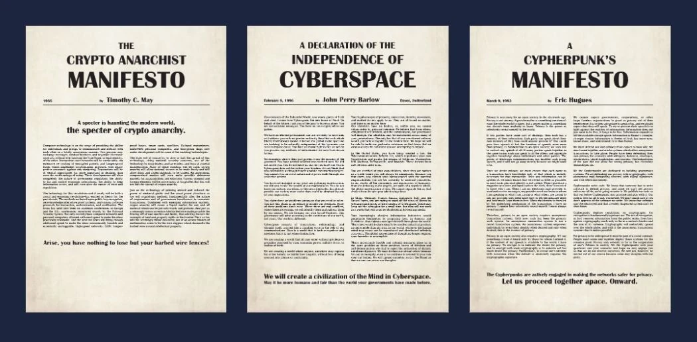
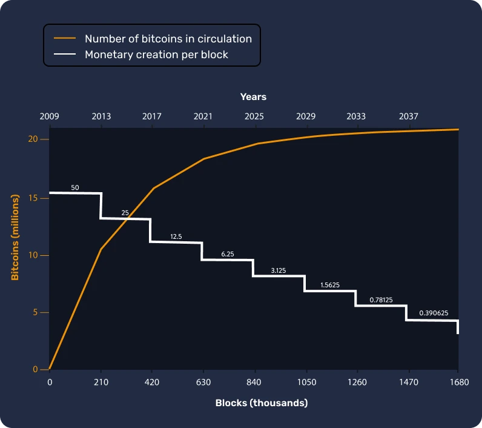
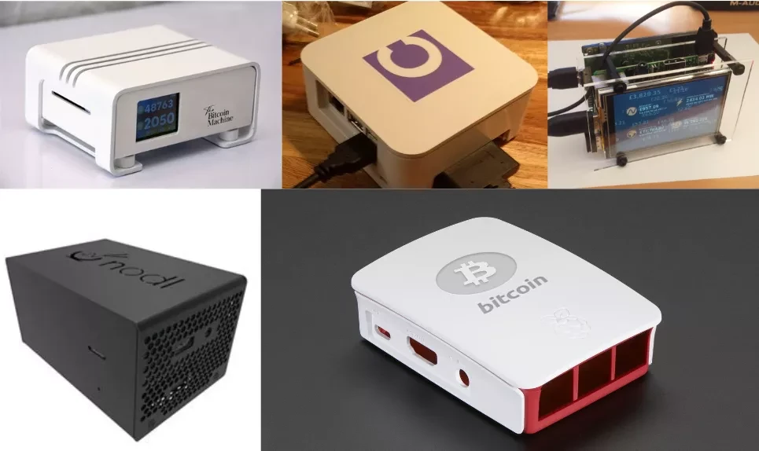
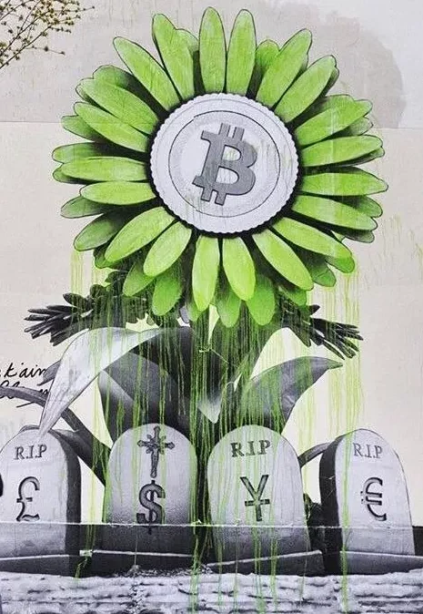
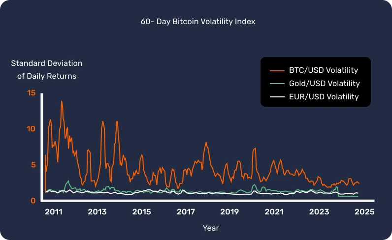

# Matukio Yako ya Kwanza ya Bitcoin

Katika kozi hii, tutaelezea misingi ya Bitcoin katika sura 25, ili uweze kuelewa teknolojia hii kwa njia rahisi na yenye ufanisi. Kozi hii inachunguza misingi ya sekta kwa ujumla, ikijumuisha mada kama vile uchimbaji, pochi, majukwaa ya kununua/kuuza na zaidi. Nyenzo za ziada za elimu zitapatikana katika safari yote, na pia tunakualika kuangalia "Mabango 21" katika sehemu ya nyenzo baada ya kumaliza kozi hii.

Hauhitaji maarifa yoyote maalum ili kuanza. Kwa hakika, maudhui yafuatayo yanaweza kufikiwa na wanafunzi wa viwango vyote, na inapaswa kuchukua takriban saa 15 kumaliza.

+++
# Utangulizi

<partId>3cd2ac82-026c-53e1-874a-baf5842adc6d</partId>

## Kuruka kwenye Yasiyojulikana

<chapterId>27e3fb60-4b50-556b-9e70-c4f5475c121d</chapterId>

### Karibu kwenye dhana mpya ya kifedha na kiteknolojia.

Bitcoin ni mapinduzi ya kiteknolojia na ya fedha, yenye uwezo wa kutufanya tutilie shaka uhusiano wetu kwa pesa na jamii. Kwa hakika, Bitcoin (inayojulikana kama BTC) ni sarafu **isiyofungamana** na **iliyogatuliwa**, ambayo ina maana kwamba haidhibitiwi na huluki au taasisi yoyote. Ni uvumbuzi ambao unapita zaidi ya "sarafu ya mtandao" tu: ni itifaki ya kompyuta (Bitcoin) na kitengo cha fedha (Bitcoin).

Itifaki hutumia teknolojia za msingi kama vile kriptografia, mawasiliano ya mtandao, na "Blockchain" maarufu, wakati kitengo cha Bitcoin hutumika kama sarafu inayohitajika kwa utendakazi mzuri wa itifaki hii. Katika maisha ya kila siku, watu wa Salvadorian na bitcoiners kote ulimwenguni hutumia sarafu ya Bitcoin kununua, kuuza bidhaa na huduma, wakitegemea teknolojia hii kufanya maisha yao kuwa bora.

### Mtaala mpana lakini unaoweza kufikiwa

Katika kozi hii, tutajadili baadhi ya vipengele vya fedha vya Bitcoin, ikiwa ni pamoja na jinsi ya kununua na kuuza bitcoins, kuzihifadhi kwa usalama katika pochi za kidijitali, na kuzitumia kwa miamala. Pia tutachunguza jukumu la wachimbaji, ambao ni muhimu kwa kuunda bitcoins mpya na kupata mtandao wa Bitcoin. Hatimaye, tutachunguza mustakabali wa Bitcoin na jinsi teknolojia ya Lightning Network inavyoweza kuboresha miamala ya Bitcoin.


Ni muhimu kuelewa kwamba Bitcoin ni mfumo mpya wa fedha ambao hubadilisha kabisa uhusiano wetu na pesa, kwa hivyo kujifunza jinsi ya kutumia ni ujuzi muhimu kwa mtu yeyote ambaye anataka kudhibiti pesa zake mwenyewe.

**Sehemu ya 1 - Pesa**


- Sura ya 1 - Pesa ni nini?
- Sura ya 2 - Fiat kama pesa
- Sura ya 3 - Mfumuko wa bei
- Sura ya 4 - Bitcoin sera ya fedha

**Sehemu ya 2 - Bitcoin Wallet**


- Sura ya 5 - Pochi za Bitcoin zinafanyaje kazi?
- Sura ya 6 - Kuchagua usalama wako
- Sura ya 7 - Kuweka Wallet yako
- Sura ya 8 - Kulinda dhidi ya wakati

**Sehemu ya 3 - Vipengele vya kiufundi vya Bitcoin**


- Sura ya 9 - Muamala ni nini?
- Sura ya 10 - nodes za Bitcoin
- Sura ya 11 - Wachimbaji
- Sura ya 12 - Wachimbaji madini na ikolojia

**Sehemu ya 4 - Kuokoa katika Bitcoin**


- Sura ya 13 - bei ya Bitcoin
- Sura ya 14 - Je, unanunuaje Bitcoin?
- Sura ya 15 - Kufanya kazi kwa Bitcoin
- Sura ya 16 - Hyper-bitcoinization

**Sehemu ya 5 - Lightning Network**


- Sura ya 17 - Utangulizi wa Lightning Network
- Sura ya 18 - Tumia kesi kwa Lightning Network

Kabla ya kuanzisha ufafanuzi wa pesa na kazi yake katika jamii (Sura ya 1), tunapaswa kuanza kutoka kwa Genesis ya Bitcoin. Ilizinduliwa mnamo 2009, Bitcoin ni teknolojia mpya ambayo ni tofauti na kitu kingine chochote. Kwa hiyo ni kawaida kutoelewa kila kitu kuhusu hilo, mara moja. Kwa kweli, kama vile unapojifunza jinsi ya kutumia mtandao au kuendesha gari, hauhitaji kujua maelezo yote ya kiufundi mara moja: unaweza kuanza kwa kujifunza jinsi ya kupokea, kulipa na kulinda pesa zako, na kisha kuchukua hatua ndogo ili kusoma kwa undani zaidi.

Baada ya yote, tuko katika hatua za mwanzo tu za kupitishwa kwake, kwani tumepita awamu ya kuondoka: uko katika wakati wa kupata maarifa mengi kama unavyotaka kuhusu uvumbuzi huu muhimu.


Jambo muhimu hapa ni kuelewa teknolojia hii mpya kwa njia ya jumla, kwa hivyo tunatumai utafurahia kozi hii na uendelee kufanya maendeleo katika dhana hii mpya ya fedha duniani.

## Historia ya awali ya Bitcoin

<chapterId>9a94b627-5b69-5d81-9125-f1fa9b0aa6ad</chapterId>

Kabla ya neno "Bitcoin" kuwa sawa na sarafu ya kidijitali na mabadiliko ya kifedha, msingi wa kuundwa kwake uliwekwa na mfululizo wa mawazo, uvumbuzi, na harakati za kijamii. Miongoni mwa haya, harakati ya Cypherpunk inasimama kama kipengele muhimu katika historia ya awali ya Bitcoin.

### Cypherpunks: watazamaji wa ulimwengu wa kidijitali


Katika moyo wa mageuzi ya kiteknolojia ya miaka ya 1980 na 1990, kundi la watu lilianza kutilia shaka kwa kina jukumu la faragha na uhuru katika enzi ya kidijitali. Watu hawa, ambao baadaye wangejulikana kama "cypherpunks", waliamini kabisa kwamba cryptography inaweza kutumika kama chombo cha kulinda haki za mtu binafsi dhidi ya kuingiliwa na serikali na mashirika makubwa.

Watu mashuhuri kama vile Julian Assange, Wei Dai, Tim May, na David Chaum walichukua jukumu muhimu katika kuunda falsafa na maono ya harakati. Wanafikra hawa walishirikisha mawazo yao kwenye orodha ya utumaji barua yenye ushawishi, ambapo washiriki kutoka kote ulimwenguni walishiriki katika mijadala kuhusu njia bora za kutumia teknolojia kwa uhuru zaidi wa mtu binafsi.

### Karatasi tatu za msingi za Cypherpunks



Harakati ya Cypherpunk, iliyojikita zaidi katika uanaharakati wa kidijitali na usimbaji fiche, ilitumia maandishi kadhaa ya msingi kueleza kanuni na maono yake ya siku zijazo. Kati ya maandishi haya, mambo matatu yanajitokeza haswa:


- "Manifesto ya Cypherpunk":

iliyoandikwa na Eric Hughes mwaka wa 1993, "Cypherpunk Manifesto" inadai kuwa faragha ni haki ya msingi. Mwandishi anadai kuwa uwezo wa kuwasiliana kwa uhuru na usiri ni muhimu kwa jamii huru. Ilani hiyo inasema: "Hatuwezi kutarajia serikali, shirika, au mashirika mengine makubwa, yasiyo na uso kutupatia faragha [...]. Ni lazima tutetee faragha yetu ikiwa tunatarajia kuwa na yoyote".


- "Manifesto ya Crypto-Anarchist":

iliyoandikwa na Timothy C. May mwaka wa 1992, hati hii inaeleza jinsi matumizi ya fiche yanaweza kusababisha enzi ya machafuko ya siri ambapo serikali zitakuwa hazina uwezo wa kuingilia masuala ya kibinafsi ya raia. May alifikiria siku zijazo ambapo watu bila kujuana wangeweza kubadilishana pesa bila kuingiliwa na mtu wa tatu.


- "Tamko la Uhuru wa Mtandao":

ingawa si Cypherpunk pekee, maandishi haya yanaonyesha hisia za washiriki wengi katika harakati. Iliyoandikwa mwaka wa 1996 na John Perry Barlow, ni jibu kwa udhibiti unaoongezeka wa mtandao na serikali. Tamko hilo linadai kuwa mtandao ni eneo tofauti na nyanja halisi na haipaswi kuwa chini ya sheria sawa. Kama inavyosema, "Hatuna serikali iliyochaguliwa, na hakuna uwezekano wa kuwa nayo".

### Watangulizi wa Bitcoin

Kabla ya kuibuka kwa Bitcoin, kumekuwa na majaribio kadhaa ya kuunda sarafu ya kidijitali. Kwa mfano, David Chaum alianzisha wazo la "pesa za elektroniki zisizojulikana" na mradi wake "DigiCash" katika miaka ya 1980. Kwa bahati mbaya, kwa sababu ya vikwazo mbalimbali, DigiCash haijawahi kukua.

Mtangulizi mwingine muhimu ni "B-pesa" ya Wei Dai. Ingawa haikutekelezwa kamwe, iliwasilisha wazo la sarafu ya kidijitali isiyojulikana ambapo ugunduzi wa ulaghai ulitekelezwa na jumuiya ya wakaguzi badala ya mamlaka kuu.

Picha hapa chini inaonyesha wazi maendeleo ya harakati kupitia uvumbuzi wake mwingi wa kiteknolojia.


Ilikuwa katika mazingira haya yenye rutuba ambapo kampuni ya ajabu ya Satoshi Nakamoto ilichapisha karatasi nyeupe ya Bitcoin mwaka wa 2008. Katika waraka huu, alichanganya mawazo kadhaa kutoka kwa vuguvugu la Cypherpunk, kama vile Proof of Work na mihuri ya nyakati ya kriptografia, ili kuunda sarafu ya dijiti iliyogatuliwa na inayostahimili udhibiti.

Walakini, Bitcoin ilikuwa zaidi ya hiyo tu: iliwakilisha kufikiwa kwa maadili ya Cypherpunk. Zaidi ya teknolojia yake, iliashiria mapinduzi dhidi ya mifumo ya jadi ya kifedha na kutoa njia mbadala kulingana na uwazi, ugatuaji na uhuru wa mtu binafsi.

### Hitimisho

Historia ya awali ya Bitcoin imekita mizizi katika harakati za Cypherpunk na jitihada za pamoja za kupata uhuru zaidi katika enzi za kidijitali. Kwa kuchanganya kanuni za usimbaji fiche, ugatuaji na uadilifu, Bitcoin imekuwa zaidi ya sarafu. Kwa hakika, ni zao la mapinduzi ya kifalsafa na kiteknolojia yanayoendelea kutengeneza upya ulimwengu wetu.

Kwa hivyo, Bitcoin ni itifaki inayoenea kwa muda mrefu, na inatuhimiza kuhoji uhusiano wetu na nishati, wakati na pesa.

Hata hivyo, Bitcoin ni sarafu "halisi"? Ili kuelewa hili, kwanza tunahitaji kuelewa dhana ya fedha na aina zake mbalimbali, ambazo tutachunguza katika sura inayofuata.

Iwapo ungependa kuchunguza historia ya Bitcoin kwa maelezo zaidi, tunapendekeza sana kozi yetu ya HIS 201, ambapo utagundua asili na chimbuko la polepole la Bitcoin, pamoja na mwanzo wa historia na jumuiya yake. Kozi hii imeandikwa kikamilifu na imetolewa na hadithi nyingi:

https://planb.network/courses/a51c7ceb-e079-4ac3-bf69-6700b985a082
# Pesa

<partId>e913df1a-4cbd-5380-ba67-ca2a0414f671</partId>

## Pesa Katika Historia

<chapterId>c838e64d-d59f-5703-8c74-ea5e8c4fdd31</chapterId>

Mageuzi ya pesa ni kipengele cha kuvutia cha historia ya binadamu ambacho huakisi werevu na ustaarabu katika enzi zote katika kukidhi mahitaji ya kiuchumi yanayoendelea kubadilika.


### Kutoka kwa ganda hadi akaunti za benki

Hapo awali, sarafu ilikuwa mali inayoonekana, kama vile nafaka, mifugo, au bidhaa zingine. Hata hivyo, bidhaa hizi zilikuwa na hasara kubwa ya kuharibika, na hivyo kufanya kuwa vigumu kuzitumia kama njia ya kuokoa muda mrefu. Kwa mfano, mavuno duni au magonjwa ya wanyama yanaweza kuharibu mali ya mtu kwa usiku mmoja.

Kwa hivyo, kadiri ustaarabu ulivyosonga mbele na biashara ilipanuka hadi katika maeneo mapya, hitaji la njia ya kimataifa la kubadilishana liliibuka. Watu walijaribu kwanza vitu kama vile makombora na vito, lakini havikuwa vya kudumu au kovu kama walivyoamini. Hatimaye, dhahabu ikawa kiwango, kutokana na uhaba wake, uimara, na mgawanyiko. Ilikuwa, na inabaki hadi leo, ishara ya utajiri na nguvu.


### Je, jukumu la pesa ni nini?

Pesa ni chombo cha kisasa cha mawasiliano:


- Inaruhusu mawasiliano kati ya sasa na ya baadaye, kwa sababu inabadilisha wakati na nishati yetu kuwa mali ambayo yanaweza kutumika tena katika wakati ujao bila hatari ya kushuka kwa thamani.
- Inawezesha mawasiliano katika lugha ya ulimwengu wote: bila kujuana au kuzungumza lugha moja, wageni wawili wanaweza kubadilishana, kufanya biashara, na kukubaliana juu ya thamani ya vitu.

Kazi yake katika ulimwengu wetu ni ngumu kuiga kwa njia bandia. Kwa kweli, hakuna mtu binafsi au kikundi kinachoweza kuunda pesa, kwani ni jambo la asili ambalo lazima litoke kwenye soko kwa makubaliano ya hiari. Kwa maana hii, bei hutumika kama ishara na vipande vya habari vinavyoongoza jamii katika kugawa rasilimali.

Kwa sababu hizi, dhahabu kama pesa ni matokeo ya miaka 4,000 ya imani ya Darwin ya kifedha kulingana na kazi zifuatazo za Aristotle:


- **Hifadhi ya thamani**: pesa inaweza kutumika kuhamisha nguvu za ununuzi katika siku zijazo, kwa hiyo inahitaji kuwa nyenzo ya kudumu;
- **Kati ya kubadilishana**: pesa inaweza kutumika kubadilishana kwa bidhaa na huduma,badala ya kubadilishana bidhaa kwa bidhaa, hivyo kuepuka sadfa ya kutaka ya wafanyabiashara;
- **Kitengo cha akaunti**: pesa pia huturuhusu kulinganisha thamani za bidhaa mbalimbali ili kuelewa vyema manufaa yake.


### sifa za pesa

Dhahabu inakidhi vigezo vya sarafu inayofaa: uhaba wake wa asili huifanya kuwa ya thamani, wakati sifa zake za kemikali huhakikisha kwamba haimomonywi baada ya muda. Vipengele hivi vimeifanya dhahabu kuwa **duka la thamani** kubwa, lakini si sarafu ya kawaida, kwa sababu aina hii ya pesa haiwezi kugawanywa kwa urahisi au kusafirishwa kwa umbali mrefu. Katika ulimwengu wa utandawazi na kidijitali, dhahabu inatatizika kushika kasi na inahitaji huluki kuu kuifanya iweze kugawanywa na kubadilishana kwa urahisi (yaani kupitia sarafu zilizotengenezwa).

Kinyume chake, sarafu za uaminifu za serikali (fiat) zinaweza kutumika kwa urahisi, lakini mara kwa mara hupunguzwa thamani na vyombo vinavyowadhibiti (wafalme, benki kuu, watawala, madikteta).

Ili kuelezea dhana hii vyema, tutachunguza sifa za sarafu inayofaa:


- **Fungibility**, ikimaanisha kuwa inaweza kubadilishana na kitengo kingine cha aina sawa bila upotezaji wa thamani;
- **Mgawanyiko**, kwani inaweza kugawanywa katika vitengo vidogo ili kuwezesha shughuli za viwango tofauti;
- **Liquidity**, ambayo ina maana kwamba inaweza kubadilishwa kwa urahisi kuwa bidhaa au huduma.

Ili kufikia vigezo hivi, sarafu imebadilika kihistoria kwa kuchukua hatua tofauti:


- Jiwe mbichi -> Sarafu
- Noti -> Kadi ya benki
- Blockchain -> Lightning Network

Sarafu bado zinaendelea kubadilika hadi leo, kurekebisha fomu zao ili kukidhi hali tofauti za utumiaji. Kama tulivyosema, wakati dhahabu ni ghala bora la thamani, haifai tena kwa uchumi wa sasa wa utandawazi. Vile vile, sarafu aminifu kama vile dola na euro ni Liquid sana na zinaweza kusafirishwa kwa urahisi kwa sababu nyingi ni za kidijitali, lakini thamani yake hupunguzwa kila mara na mfumuko wa bei wa fedha.

Kwa upande mwingine, Bitcoin inatoa uwezekano mpya. Sifa zake, kama vile usambazaji wenye kikomo, huifanya kuwa duka bora la thamani. Zaidi ya hayo, kama sarafu isiyoegemea upande wowote ya mtandao, inatumika kama **kati ya Exchange** inayoweza kutumika inayovuka mipaka. Hata hivyo, bado haikubaliwi sana katika biashara leo, licha ya [kupitishwa mara kwa mara](https://btcmap.org/map).

## Fiduciary sarafu

<chapterId>25151d46-7db1-5b48-8bba-cbde1944555a</chapterId>

> "Wale ambao hawawezi kukumbuka yaliyopita wanahukumiwa kurudia" alisema George Santayana.
Ukweli ambao unasikika vyema linapokuja suala la mfumo wa kisasa wa fedha.

### Fiduciary = Kuaminiana

Leo, sarafu kuu kama vile Euro na Dola zinachukuliwa kuwa za kuaminika. Hii ina maana kwamba hawana thamani ya ndani na wanategemea kabisa uaminifu na imani tunayoiweka kwa taasisi inayowaongoza.

Sarafu ya uaminifu ni aina ya pesa ambayo huamuliwa hivyo na taasisi, yaani, serikali, kama Uchina iliyo na Yuan, au muungano wa kisiasa na kiuchumi, kama vile Jumuiya ya Ulaya na Euro. Huluki inayosimamia utoaji wake ni benki kuu (Kwa mfano, tunaweza kutaja Benki ya Watu wa China, Hifadhi ya Shirikisho ya Marekani, au Benki Kuu ya Jamhuri ya Guinea). Ni mashirika haya ambayo yanasimamia kutunga sera za fedha na kwa hivyo ni pesa ngapi zinafaa kuwekwa kwenye mzunguko au kuchapishwa.


### Kushuka kwa thamani ya fedha: mkakati wa zamani kama Milki ya Kirumi

Tangu nyakati za kale, dhahabu imetumika kama kumbukumbu ya fedha, lakini ugumu wake mara nyingi umesababisha viongozi, wawe watawala wa Kirumi au serikali za kisasa, kuchukua sarafu mbadala, mara nyingi za uaminifu.

Utaratibu huo ni rahisi na umechochewa na mazoea ambayo yamekuwepo tangu asili ya ustaarabu. Viongozi, wakiwa na hamu ya kudhibiti mali, huanza kwa kuweka dhahabu katikati, mara nyingi kwa kutumia mamlaka yao na kuahidi ulinzi na usalama. Wakiwa na hifadhi hii ya thamani mikononi mwao, wanaanzisha sarafu mpya, sawa na thamani ya dhahabu, lakini iliyochorwa kwenye sanamu yao. Sarafu hii basi huanza kuzunguka haraka,kukabiliana na urahisi wa matumizi yake rahisi.

Hata hivyo, viongozi hawa wanaanza kushusha thamani ya sarafu mpya taratibu, wakipunguza thamani yake kwa asilimia chache kila mwaka kwa kulinganisha na bei ya awali ya dhahabu. Kushuka kwa thamani huku kimya kimya mara nyingi kunahesabiwa haki kuwa ni kwa maslahi ya watu. Kwa kweli, wale wanaoweka akiba katika sarafu hii ya uaminifu wanaona thamani ya akiba yao inapotea, wakati serikali inafadhili miradi yake kupitia mfumuko wa bei. Zaidi ya hayo, kushuka kwa thamani huku hurahisisha kulipa deni.


Katika wakati muhimu, kiongozi hufanya tangazo: sarafu haiungwi mkono tena na dhahabu. Umma, ambao sasa umezoea sarafu ya uaminifu na ambayo mara nyingi huwa na taarifa potofu kuhusu masuala ya kifedha, inakubali ukweli huu, na kuruhusu serikali kuendesha kwa uhuru fedha za usambazaji na kuchapisha kiasi kikubwa cha fedha bila gharama yoyote.

Uchapishaji wa fedha basi husababisha mfumuko wa bei na polepole hufukarisha idadi ya watu. Mbali na hilo, mfumo wa kifedha unadhibitiwa na kuwekewa vikwazo ili kuepuka kuanguka kwake, kwa kuwa usumbufu wowote unaweza kusababisha mgogoro mkubwa wa kiuchumi. Kinyume na halaiki, taasisi za fedha na watu matajiri wananufaika sana na mfumo huu, ambao unaleta pengo la ukosefu wa usawa na kupendelea ubabe. Katika muktadha huu, hawajahamasishwa kufanya mabadiliko makubwa, kuruhusu mfumo kuendelea na mkondo wake hadi uwezekano wake wa kutokea.

Inapotekelezwa vyema, mkakati huu unaweza kudumu kwa miongo kadhaa. Hata hivyo, ni muhimu kutambua kwamba kushuka kwa thamani kwa haraka sana au kupoteza ujasiri kunaweza kusababisha mfumuko wa bei (angalia sura inayofuata). Historia inaonyesha kwamba dola imepoteza 98% ya thamani yake katika miaka 100, euro 30% katika miaka 20, na pound sterling 99% tangu kuundwa kwake.

Mwishowe, huenda sarafu hiyo isiwe na muunganisho wowote wa dhahabu, sawa na sarafu za Kirumi mwishoni mwa Ufalme, au hata kupunguzwa hadi thamani rahisi ya nambari, iliyotenganishwa na ukweli unaoonekana.

Leo, tunashuhudia mabadiliko ya kihistoria. Dola, ambayo imetawala kwa muda mrefu, inaonekana kupungua, wakati dhahabu imepoteza jukumu lake kuu. Tunasimama kwenye kizingiti cha mzunguko mpya wa fedha, cha kutukumbusha kwamba masomo ya historia mara nyingi husahaulika.


### Bitcoin ni suluhisho?

Kwa sababu ya majengo haya, mapinduzi ya Bitcoin yanashika kasi. Kinyume na sarafu za awali, inahitaji ** hakuna mtu mwingine anayeaminika** na inalenga kutenganisha Serikali na pesa.


Kwa hakika, Bitcoin inajionyesha kama jibu kwa changamoto hizi za kimfumo kwa kupendekeza suluhisho la ugatuzi na mfumo mpya wa fedha sambamba. Kihistoria, ikiwa dhahabu imependelewa kama sarafu kwa sababu ya upinzani wake kwa bidhaa ghushi, Bitcoin vile vile haiwezi kughushiwa. Zaidi ya hayo, ni mdogo kwa vitengo milioni 21, shukrani kwa asili yake ya ugatuzi na usiri. Bitcoin ni sarafu inayotegemea uwazi na kutoegemea upande wowote, ikitoa njia mbadala ya kuvutia kwa mfumo wa kisasa wa fedha za serikali kuu.


Sababu nyingine kwa nini Bitcoin imepata uangalizi ni kuibuka kwa sarafu za kidijitali za benki kuu, au CBDCs, jambo ambalo linaonekana kuepukika. Aina hii mpya ya pesa ingekuza uchumi uliopangwa zaidi na serikali kuu, na inaweza kuzuia uhuru wa kifedha wa watu binafsi na kuwezesha matumizi mabaya ya kimabavu.

Tunaweza kuhitimisha sura hii kwa nukuu kutoka kwa mshindi wa Tuzo ya Nobel F.A Hayek mwaka wa 1984:

> "Siamini kwamba tutawai kuwa na pesa nzuri tena, kabla hatujaliondoa jambo hilo mikononi mwa serikali. Na hatuwezi kuwaondoa kwa nguvu kutoka mikononi mwa serikali, tunachoweza kufanya ni kwa njia fulani ya ujanja au mzunguko kuanzisha kitu ambacho hawawezi kukizuia."
Ili kujifunza zaidi kuhusu hitilafu za kiuchumi na uhuru, tunakualika ugundue kozi yetu ya ECO 102, ambayo inafuatilia maisha na mawazo ya Frédéric Bastiat, mwanafikra wa Kifaransa wa karne ya 19 ambaye bila shaka angethamini kuibuka kwa Bitcoin:

https://planb.network/courses/d07b092b-fa9a-4dd7-bf94-0453e479c7df
## Mfumuko wa bei

<chapterId>b04c024c-54f3-50cb-997f-58721cfc74be</chapterId>

Mfumuko wa bei ni hali ya kifedha ambayo ni mahususi kwa sarafu za fedha: inachangiwa na kupoteza kabisa imani katika sarafu na ongezeko kubwa la mfumuko wa bei kutokana na uchapishaji wa fedha na mamlaka. Kwa sababu hiyo, akiba inayokusanywa na watu binafsi inaweza kupotea kwa muda mfupi, na kusukuma nchi kwenye ukingo wa kuporomoka kwa uchumi, kijamii na kisiasa.

### Mfumuko wa bei unaenda kasi!

Ili kuelewa athari za mfumuko wa bei kwenye uokoaji, tunahitaji kuzingatia viwango tofauti vya mfumuko wa bei.


- Kwa mfumuko wa bei wa 2%, unapoteza 2% ya uwezo wako wa kununua kila mwaka, ambayo ni sawa na 10% kwa miaka 5.
- Kwa 7%, unapoteza nusu yake katika miaka 10.
- Kwa 20%, unapoteza karibu nusu yake katika miaka 3.

Wakati mfumuko wa bei unapotokea, hatuzungumzi tena juu ya 20% kwa mwaka, lakini badala ya 20% kwa mwezi au, kwa kilele chake, hata kwa SIKU. Kupitia mfumuko wa bei wa 100% kwa siku tatu ni hali halisi ambayo imetokea na inaendelea kutokea katika ulimwengu wetu.

Ni muhimu kuelewa kwamba mfumuko wa bei hautokei kwa bahati mbaya, kwa ubepari, au kwa mashambulizi ya kisiasa kutoka kwa wapinzani. Mfumuko wa bei ni matokeo ya moja kwa moja ya maamuzi mabaya ya kifedha yaliyofanywa na benki kuu na wanasiasa. Matokeo yake huathiri kila mwananchi na hata kuathiri vizazi vijavyo. Tunakualika utumie dakika tano kusoma jedwali lifuatalo ili kutambua kikamilifu athari halisi ya jambo hili (kozi ya ECO204 inaangazia zaidi somo hili). Kama unavyoona, hakuna nchi au sarafu inayoweza kuwa salama.


### Je, ni awamu gani za mfumuko wa bei?


Kwa mfumuko wa bei kutokea, matukio fulani lazima yafanyike.

Awamu ya 1 - Kupoteza kujiamini


- Uwekaji kati kwa nguvu za fedha kuwezesha kuundwa kwa fedha na ukiukaji wake. Katika muktadha huu, baadhi ya mambo ya nje yanaweza kusababisha mfumuko mkubwa wa bei, kwa kawaida vita, hatua za kijamii, au ongezeko la bei ya rasilimali muhimu kama vile ngano au petroli. Kwa hivyo, kupoteza imani katika sarafu kunaweza kutokea, na watu binafsi wanaanza kuhoji asili ya fedha na faida za sera za fedha ziliyoidhinishwa.

Awamu ya 2 - Kuporomoka kwa sarafu na ongezeko la bei


- Huku serikali zikipoteza udhibiti wa uaminifu, watu binafsi huanza kutumia ubadilishanaji wa sarafu yao kwa sarafu iliyo imara zaidi, kama ilivyotokea Venezuela na dola ya Marekani. Hali hii husababisha kupanda kwa bei, na hivyo kutengeneza mduara mbaya ambapo bidhaa na huduma zinazidi kuwa ghali. Ili kukidhi mahitaji haya na kusahihisha sera za fedha, serikali huchapisha pesa zaidi, na hivyo kusababisha mfumuko mkubwa wa bei.

Awamu ya 3 - Mduara mbaya wa uchapishaji wa pesa


- Kwa hivyo, bili zaidi na zaidi zinahitajika kununua bidhaa, ambayo husababisha uhaba wa pesa za karatasi. Kwa kujibu, serikali zinaamua kuchapisha bili zaidi, ambayo inachochea mfumuko wa bei hata zaidi.


Awamu ya 4 - Kuibuka kwa sarafu mpya


- Sarafu mpya inaletwa kuchukua nafasi ya ile ya zamani, ili kuvunja mzunguko wa mfumuko wa bei kwa kutekeleza udhibiti mkali ambao haukuwepo na zabuni ya awali ya kisheria.

Kusuluhisha mzozo wa mfumuko wa bei mara nyingi kunahitaji mabadiliko makubwa, kama vile mapinduzi, mabadiliko ya serikali, mabadiliko ya benki kuu, kati ya mengine. Kupoteza imani, kuporomoka kwa sarafu, na ujenzi mpya ni hatua muhimu za kufufua uchumi unaotegemea sarafu ya fiat.

### Mifano tatu mashuhuri


- Ujerumani, 1922-1923.

Mojawapo ya mifano ya kushangaza zaidi ya mfumuko wa bei ilitokea katika Jamhuri ya Weimar ya Ujerumani baada ya Vita vya Kwanza vya Kidunia.

Ujerumani ilikuwa imekopa kiasi kikubwa cha fedha kufadhili vita. Walakini, sio tu Ujerumani iliipoteza, lakini ilibidi kulipa mabilioni ya dola kama fidia. Mwezi uliokuwa na kiwango cha juu zaidi cha mfumuko wa bei ulikuwa Oktoba 1923, ukifikia kilele cha 29,500%, ambacho kilikuwa sawa na kiwango cha mfumuko wa bei cha 20.9% kwa siku. Bei ziliongezeka maradufu kila baada ya siku 3.7!

Sarafu ya Ujerumani ikawa haina maana kiasi kwamba baadhi ya wananchi walipendelea kuchoma pesa zao za karatasi badala ya kuni kwa sababu zilikuwa nafuu. Inasemekana hata katika mikahawa, wahudumu walilazimika kutangaza bei za menyu kila dakika 30 ili kutoa hesabu ya mfumuko wa bei.

Hatimaye, mamlaka iliunda sarafu mpya, iliyoungwa mkono na madeni ya Ujerumani, Ufaransa, na Uingereza, na kuhakikishiwa na ardhi ya Ujerumani.


- Hungary, 1945-1946

Nchi ambayo ilipata kipindi kibaya zaidi cha mfumuko wa bei hadi sasa ni Hungary baada ya Vita vya Kidunia vya pili.

Hungary ilijikuta katika upande wa kushindwa kwa mzozo, na uwezo wake mkubwa wa uzalishaji wa viwanda umeharibiwa. Mwezi uliokuwa na mfumuko wa bei wa juu zaidi ulikuwa Julai 1946, ambao ulishuhudia mfumuko wa bei wa 41,900,000,000,000,000%, sawa na 207% kwa siku. Bei ziliongezeka maradufu kila baada ya saa 15!

Noti ya mwisho kuwekwa kwenye mzunguko ilikuwa Pengo bilioni 100 (100,000,000,000,000,000) mnamo 1946.


- Zimbabwe, 2007-2008

Hadi mwaka 2000, Zimbabwe ilikuwa inajitosheleza kwa karibu mahitaji yake yote isipokuwa ya mafuta.

Mwaka 1997, dola ya Zimbabwe iliporomoka kwa zaidi ya 72% baada ya serikali kukubali kuwalipa maveterani wa vita kwa kiasi sawa cha dola za Marekani milioni 450. Kwa kuwa serikali haikuwa na kiasi hicho katika vifaa vyake, iliamua kuendesha mashine ya uchapishaji. Mwaka 2005, mfumuko wa bei ulifikia 586%, lakini kilele kilikuwa katikati ya Novemba 2008 na kiwango kinachokadiriwa kuwa 79,600,000,000% kwa mwezi.

Mnamo Juni 2007 serikali ilikuwa tayari imechukua hatua za kuweka udhibiti wa bei, lakini hatua hii haikuwa na ushawishi wowote wa uchumi. Maduka halisi "yaliporwa", na wafanyabiashara hawakuwa na njia ya kurejesha maduka yao.

Mnamo Aprili 2009, Waziri wa Fedha alitangaza kusimamishwa kwa dola ya Zimbabwe na kuidhinisha matumizi ya sarafu tofauti za kigeni kwa biashara. Akaunti zote za benki, pensheni, na taasisi za kifedha ziliona salio lao likiyeyuka mara moja.


Kwa kumalizia, mfumuko wa bei una athari ya kushusha thamani ya sarafu kwa haraka, na kusababisha mmomonyoko wa akiba na kupoteza imani katika mfumo wa fedha. Kama Voltaire alivyopendekeza mara moja, sarafu ya fiat itapoteza thamani yake ya asili kila wakati na kuungana kuelekea sifuri.

Sarafu inayotegemea mtu mwingine anayeaminika kama taasisi ya fedha, kiutendaji na kwa muda mrefu, ina kasoro, kwa sababu haiwezi kutoa dhamana ya uwezo wa kununua au kuhifadhi akiba.

Ili kuzama zaidi katika somo la mfumuko wa bei, tunapendekeza kozi ya ECO 204 ya David St-Onge, ambapo utajifunza mizunguko ya mfumuko wa bei ni nini na athari zake halisi kwa maisha yetu. Pia utagundua kufanana kati ya mizunguko hii na, muhimu zaidi, jinsi ya kujikinga nayo.

https://planb.network/courses/caa75343-ac90-4249-bcca-0e2e57c3a0f1
## bitcoins milioni 21

<chapterId>f4a06d76-1963-56fd-93ff-dfa41489bcde</chapterId>

### Sera ya fedha ya Bitcoin

Bitcoin ni sarafu ya kidijitali iliyogatuliwa na kiwango cha juu kilichobainishwa awali cha **vizio milioni 21**. Tabia hii ya asili ya uhaba imedhamiriwa na msimbo wake wa kompyuta na kuimarishwa na makubaliano ya watumiaji wote wanaoshiriki katika itifaki.



Utoaji wake wa kifedha unaweza kuonyeshwa kwa mkunjo ambao unawakilisha wingi wa bitcoins zilizoundwa kwa muda. Kwa mfano, mnamo 2022, takriban bitcoins milioni 18.5 zilikuwa kwenye mzunguko. Utabiri unaonyesha kuwa kufikia 2025, kutakuwa na karibu bitcoins milioni 19.5, inayowakilisha karibu 93% ya jumla ya usambazaji, na kufikia 2037, takwimu hii itafikia milioni 20.4.

### Je, bitcoins mpya zinaundwaje?

Uundaji wa bitcoins mpya ni matokeo ya mchakato wa uchimbaji. Kwa kifupi, wachimbaji wa madini hutumia tarakilishi zenye nguvu ambazo hutatua matatizo magumu ya hisabati, ambayo yanathibitisha na kulinda shughuli. Tatizo linapotatuliwa, mchimbaji anaongeza kizuizi kipya cha miamala kwa Blockchain, Ledger iliyogatuliwa na kusambazwa ambayo hunakili miamala yote iliyofanywa kwenye mtandao. Blockchain inahakikisha uwazi na usalama, kwani kila kizuizi kimeunganishwa na kilichotangulia, na kuifanya iwe vigumu kubadilisha data ya zamani bila makubaliano kutoka kwa mtandao.


Baada ya kufanya kazi hii kwa ufanisi, wachimbaji wanapata thawabu kwa utoaji wa bitcoins mpya kila dakika kumi. Zawadi hii imepangwa kupunguzwa kwa nusu kila vitalu 210,000, ambayo ni takriban kila baada ya miaka minne (tukio linalojulikana kama "Halving"), na kutoa mkondo wa utoaji wa fedha umbo kama ngazi. Kwa sababu ya utaratibu huu, inaweza kutabiriwa kihisabati kuwa uundaji wa bitcoins mpya utakoma mwaka wa 2140, wakati idadi ya jumla inafikia kikomo chake cha milioni 21.

| Nambari ya Halving | Urefu wa kuzuia | Tuzo la BTC Baada ya Halving | BTC iliyokadiriwa katika Mzunguko Baada ya Halving |

| -------------- | ------------ | ------------------------- | ----------------------------------------- |

| 1 | 210,000 | 25 BTC | 10,500,000 BTC |

| 2 | 420,000 | 12.5 BTC | 15,750,000 BTC |

| 3 | 630,000 | 6.25 BTC | 18,375,000 BTC |

| 4 | 840,000 | 3.125 BTC | 19,687,500 BTC |

| 5 | 1,050,000 | 1.5625 BTC | 20,343,750 BTC |

| 6 | 1,260,000 | 0.78125 BTC | 20,671,875 BTC |

| 7 | 1,470,000 | 0.390625 BTC | 20,835,937.5 BTC |

| 8 | 1,680,000 | 0.1953125 BTC | 20,917,968.75 BTC |

| 9 | 1,890,000 | 0.09765625 BTC | 20,958,984.375 BTC |

| 10 | 2,100,000 | 0.048828125 BTC | 20,979,492.188 BTC |

| 11 | 2,310,000 | 0.0244140625 BTC | 20,989,746.094 BTC |

| 12 | 2,520,000 | 0.01220703125 BTC | 20,994,873.047 BTC |

| 13 | 2,730,000 | 0.006103515625 BTC | 20,997,436.523 BTC |

| 14 | 2,940,000 | 0.0030517578125 BTC | 20,998,718.262 BTC |

| 15 | 3,150,000 | 0.00152587890625 BTC | 20,999,359.131 BTC |

| 16 | 3,360,000 | 0.000762939453125 BTC | 20,999,679.566 BTC |

| 17 | 3,570,000 | 0.0003814697265625 BTC | 20,999,839.783 BTC |

| 18 | 3,780,000 | 0.00019073486328125 BTC | 20,999,919.892 BTC |

| 19 | 3,990,000 | 0.000095367431640625 BTC | 20,999,959.946 BTC |

| 20 | 4,200,000 | 0.0000476837158203125 BTC | 20,999,979.973 BTC |

Tutatazama upya dhana ya uchimbaji kwa maelezo zaidi katika [sura ya Miner](https://planb.network/courses/2b7dc507-81e3-4b70-88e6-41ed44239966/dbb8264a-7434-57e4-9fdfd1b).

### Kuhakikisha uhaba wa kidijitali

Kikomo cha milioni 21 ni msingi wa uhaba wa Bitcoin, na imethibitishwa na taratibu mbili muhimu: marekebisho ya ugumu wa uchimbaji na nadharia ya mchezo.


- Marekebisho ya ugumu wa uchimbaji ni mchakato unaofanyika kila vitalu vya 2016, au karibu wiki mbili, ili kuhakikisha kuwa kizuizi kipya kinaongezwa kwa Blockchain kila baada ya dakika kumi kwa wastani. Mzunguko huu wa uundaji wa block na jumla ya kiasi cha bitcoins ni vipengele vya kudumu vya itifaki ya Bitcoin na haiwezi kubadilishwa bila makubaliano ya jumla, tofauti na maamuzi ya kiholela yaliyotolewa katika mifumo ya jadi ya fedha.

Ugumu wa kupata Hash halali hufuata aina ya mzunguko: ikiwa idadi ya wachimbaji huongezeka, inamaanisha kwamba idadi ya vitalu wanayopata ni ya juu, ambayo huleta kupungua kwa muda wa wastani wa kupata block. Kwa sababu yake, ugumu unaongezeka. Kama matokeo, idadi ya vitalu ambavyo wachimbaji hupata hupunguzwa, ambayo inamaanisha kuwa utaratibu unarudi kwa wastani wa dakika 10 kwa kila block. Tafadhali tazama picha hapa chini kwa onyesho la kuona.


Je, unajua kwamba wachimbaji madini wanahamasishwa kuchimba block ili kupata bitcoins mpya kupitia ruzuku ya block, pamoja na ada za miamala kutoka kwa miamala inayojumuishwa kwenye block hiyo?

Kwa hivyo, idadi ya bitcoins iliyotolewa inakaribia kikomo cha milioni 21, wachimbaji watalipwa zaidi kupitia ada zao za miamala kuliko kupitia ruzuku ya kuzuia.


- Nadharia ya mchezo ni dhana ya hisabati ambayo inategemea busara ya binadamu. Huchukulia kwamba watu binafsi hutenda kimantiki, wakitaka kujinufaisha wao wenyewe huku wakizingatia maamuzi yanayoweza kutolewa na wengine. Katika Bitcoin, nadharia ya mchezo husaidia kuhakikisha kwamba wachimbaji na watumiaji wengi watatenda kwa manufaa ya mtandao. Kwa kweli, kwa kuwa mabadiliko ya itifaki hupigiwa kura na watumiaji, marekebisho yoyote ya itifaki ya Bitcoin yatahitaji makubaliano ya jumuiya nzima ya watumiaji, ambayo ni tata sana. Kwa hivyo, ikiwa mtu angetaka kuunda Bitcoin milioni 22, atalazimika kuwashawishi watumiaji wote kwa hiari kupunguza thamani ya akiba yao wenyewe, jambo ambalo halina uwezekano wa kutokea kwa sababu Bitcoin ni ya kimataifa na haidhibitiwi na kundi kuu.


Wazo la kupunguza thamani ya sarafu linakwenda kinyume na falsafa ya kimsingi ya Bitcoin, kwa hivyo mabadiliko ya wingi wake kwa ujumla hayana uwezekano mkubwa kutokea.

### Sera ya fedha inayoweza kukaguliwa: kila sekunde, tangu mwanzo na milele!

Uhaba wa Bitcoin ni mali kuu, na kiwango cha juu cha bitcoins milioni 21 katika mzunguko ni ya umma na inaweza kuthibitishwa na mtu yeyote.

Kwa kweli, mtu yeyote anaweza kufanya hivyo kupitia nodi za Bitcoin (yaani kihalalishaji cha muamala) kwa kuingiza tu amri ifuatayo: `bitcoin-cli gettxoutsetinfo`. Uwazi huu huimarisha imani katika mfumo wa Bitcoin, ambao hautegemei taasisi kuu au watu binafsi, bali uhakikisho wa hisabati na kriptografia ulio katika itifaki yake (Utajifunza jinsi ya kufanya hivi kwa urahisi katika LNP201).

```json
{
"height": 710560,
"bestblock": "0000000000000000000887384d67103412ea7f18a43953e65c8c4ac36bf42e54",
"transactions": 473244,
"txouts": 1018917,
"bogosize": 2183872374,
"hash_serialized_2": "eebb9987337700ffaacbbaa11223344",
"disk_size": 178239584,
"total_amount": 18745998.12345678
}
```

Bitcoin inahakikisha usimamizi mzuri wa fedha kwa kupunguza uundaji wake wa muundo, ambayo inafanya kuwa tofauti sana na sarafu zingine kwa sababu inaweza kulinda akiba ya watumiaji. Kwa kuzingatia kanuni za uchumi wa Austria, idadi yake thabiti na usambazaji unaotabirika huilinda kutokana na hatari za asili za mfumuko wa bei ambazo sarafu za jadi zinapaswa kukabili (angalia kozi ya ECO201 ili kujua zaidi).

Kwa muhtasari, Bitcoin, pamoja na hali yake ya ugatuzi, uhaba uliopangwa, na uwazi, inatoa njia mbadala ya kipekee kwa mifumo ya jadi ya fedha. Inaonyesha jinsi teknolojia inaweza kutumika kuunda sarafu ambayo sio tu ni muhimu na inayoweza kuthibitishwa, lakini pia kuhifadhi thamani ya akiba ya watumiaji kwa kuweka kikomo kwa usambazaji wake.

### Hitimisho la kifungu cha 1!

# Pochi za Bitcoin

<partId>28860585-4f61-59d9-b242-f4c57d837cc1</partId>

## Pochi za Bitcoin ni nini?

<chapterId>1c0166ab-cb7a-5bc6-9175-d13482bd91f1</chapterId>

Katika sehemu ya 2, tutachunguza uhifadhi na usalama wa Bitcoin kupitia matumizi ya pochi, ili kuelewa wapi bitcoins hizi maarufu ziko na jinsi ya kuingiliana nao!

### Kuondoa ufahamu wa pochi za Bitcoin

Tunatumia pochi kuingiliana na mtandao wa Bitcoin kwa njia tatu kuu:


- Ili kupokea bitcoins
- Ili kutuma bitcoins
- Ili kuwalinda dhidi ya majaribio ya udukuzi na wizi

Bitcoin Wallet inaweza kuwa na maumbo na aina nyingi: programu kwenye tarakilishi yako, programu kwenye simu yako mahiri, kifaa halisi kama ufunguo wa USB, au hata kipande cha karatasi. Kila mmoja wao hutumikia kesi tofauti za matumizi. Kwa hakika, baadhi yao zimeundwa kwa ajili ya shughuli kubwa kwa kusisitiza usalama, wakati wengine hutanguliza faragha, au zinalenga kwa malipo ya kila siku ya kiasi kidogo.

Kwa hivyo, portfolios zinaweza kugawanywa katika familia pana za matumizi, kila wakati zikizingatia swali kuu: je, wewe ndiye mmiliki wa pesa au unaacha udhibiti wa pesa zako kwa mtu wa tatu? Tutachunguza mada hii kwa undani katika sura inayofuata, lakini swali linabaki kuwa moja kwa moja: je, pesa ziko mfukoni mwako au kwenye mfuko wa benki yako?


### Bitcoin Wallet inafanyaje kazi?

Iwe ni "benki" yako ya Bitcoin au wewe mwenyewe, idadi kubwa ya pochi za Bitcoin hufanya kazi kwa teknolojia sawa kulingana na kriptografia isiyolinganishwa, ambayo inahusisha mfumo wa jozi muhimu: ufunguo wa kibinafsi wa matumizi na ufunguo wa umma wa kupokea.


- Ufunguo wa kibinafsi

Wakati wa kuanzisha Wallet, maneno ya siri ya kurejesha (ufunguo wa faragha) hutolewa na kuwasilishwa kwako kwa njia ya maneno 12 au 24.

Ufunguo wa kibinafsi ni wa msingi kwa sababu unajumuisha umilikisho wa bitcoins na kwa hivyo haki ya kuzitumia au kuzituma. Kwa hivyo, mmiliki wa ufunguo wa kibinafsi ndiye mmiliki wa kweli wa bitcoins.

Ufunguo huu lazima uhifadhiwe kwa siri na ulindwe vizuri, kwani unafungua bahati yako!


- Ufunguo wa umma na Anwani

Ufunguo wa umma unatolewa kutoka kwa ufunguo wa faragha uliounganishwa nao. Kushiriki ufunguo wa umma huleta hatari kwa faragha (kwa sababu watumiaji wengine wanaweza kuona salio lako) lakini si kwa usalama (kwa sababu hawawezi kutumia pesa zako bila kuwa na ufunguo wa faragha). Kwa upande wake, ufunguo wa umma hutumiwa kuunda anwani za Bitcoin, na hivyo kupokea pesa.

Anwani hizi zinaundwa kiotomatiki na pochi yako na zinaweza kushirikishwa kwa usalama. Ili kuongeza faragha yako, unashauriwa kuzitumia mara moja tu.

Kwa muhtasari, teknolojia hii hutuwezesha kupokea bitcoins bila kumwezesha mpokeaji kuiba pesa zetu! Sanduku la barua linaweza kuwa sitiari inayofaa: watu wanaweza kuweka pesa ndani yake, lakini ni wewe pekee unayeweza kulifungua.


### Je, bitcoins kwenye Wallet?

Ingawa funguo zako zimehifadhiwa kwenye Wallet yako, bitcoins zenyewe kwa hakika "zimehifadhiwa" katika Bitcoin Blockchain, ambayo ni Ledger inayosambazwa kwa umma ndani ya mtandao wa rika-kwa-rika wa Bitcoin (tutachunguza ndani yake katika sehemu ya 3). Hii ina maana kwamba kupoteza kifaa kilicho na pochi lako si lazima kusababisha hasara ya bitcoins zako. Kinachokuruhusu kuunda upya Wallet yako na kutumia Bitcoin yako ni ufunguo wa faragha, kwa hivyo kumbuka kila wakati kuulinda ipasavyo!


Kwa bahati nzuri, tangu 2017, ufunguo wa kibinafsi unaweza kuwakilishwa na orodha rahisi ya maneno 12 au 24, inayojulikana kama maneno ya 'Mnemonic, ambayo ni rahisi sana kuhifadhi. Maneno haya hutumika kama hifadhi ya pesa zako na hukuruhusu kuunda upya pochi lako kwa kutumia programu yoyote ya Bitcoin Wallet. Kwa hiyo, mtu yeyote anayepata orodha hii ya maneno anaweza kufikia bitcoins zako.

### Vipi kuhusu wadukuzi?

Je, ikiwa mtu atakisia orodha yetu ya maneno 12 au 24 kwa bahati mbaya? Jibu fupi ni kwamba haiwezekani sana, shukrani kwa cryptography iliyotumiwa kuunda Wallet. Ili kuiweka katika mtazamo, kugundua kwa bahati mbaya kifungu chako sawa cha maneno ya Mnemonic ni sawa na kupata nambari "sahihi" kati ya 1 na 2 kwa nguvu ya 256, ambayo karibu ni sawa na kupata atomi "sahihi" ulimwenguni. Hata hivyo, ikiwa hujaridhika na usalama huu chaguo-msingi, unaweza kuuboresha kila wakati kwa kuongeza passphrase (neno la ziada) kwenye Bitcoin Wallet yako.


Kwa hivyo, uwezekano wa kuvamia Bitcoin Wallet yako ni mdogo sana ikiwa utafuata mbinu bora za usalama ambazo tutazieleza kwa undani katika sehemu inayofuata.

Kumbuka kuchagua Wallet inayofaa kwa mahitaji na matumizi yako: mafunzo ya kina kuhusu kudhibiti na kupata pochi tofauti yanapatikana katika [sehemu ya mafunzo ya chuo kikuu chetu](https://planb.network/tutorials/wallet).

Ikiwa, wakati wa safari yako chini ya shimo la sungura, unataka kujifunza zaidi kuhusu kujenga Bitcoin Wallet, kutoka entropy hadi anwani za kupokea, tunapendekeza kozi ya CYP 201 iliyotolewa kwa mada hii:

https://planb.network/courses/46b0ced2-9028-4a61-8fbc-3b005ee8d70f
## Pochi za Bitcoin na Usalama

<chapterId>00c1afea-e54a-511f-bab3-2efc2fbfa6a1</chapterId>

### Kuuliza maswali sahihi kabla ya kuanza

Unapomiliki bitcoins, usalama wa pesa zako ni jambo la kusumbua sana. Njia bora ya kufafanua kiwango cha usalama ambacho kinafaa kwa hali yako ni kujiuliza maswali kadhaa:


- Nani anaweza kufikia pesa zako? Kwa maneno mengine, je, una ufikiaji pekee wa bitcoins zako, au je, mtu wa tatu (kama vile kampuni) anakupa ufikiaji wa pesa zako?
- Je, unapanga kutumia bitcoins katika hiyo Wallet? Mara kwa mara? Kwa akiba ya muda wa kati, au ya muda mrefu?
- Je, ujuzi wako wa kiufundi ni upi?
- Bajeti yako ya usalama ni ipi?

Kwa kweli hakuna jibu au suluhisho la jumla, kwa hivyo chukua muda kujibu maswali haya, kwani yatasaidia kurekebisha hatua zako za usalama kulingana na mahitaji yako.


### Kufikiria juu ya pochi za Bitcoin kwa suala la ugumu

Hapa chini, tutafafanua viwango kadhaa vya usalama:


- **Kiwango cha 0**, unatumia kinachojulikana kama "huduma ya uangalizi" ambapo wewe si mmiliki pekee wa bitcoins zako. Fahamu kuwa mtu huyu mwingine anayeaminika anaweza kukuwekea kikomo ufikiaji wa pesa zako wakati wowote. Katika hali hii, kiwango chako cha uhuru wa kifedha ni sawa na cha mfumo wa benki wa jadi na akaunti za benki.


- **Kiwango cha 1**, unatumia Bitcoin Wallet kwenye simu au tarakilishi yako, ambapo wewe ndiwe mmiliki pekee wa bitcoins zako na unaweza kufanya miamala yako kwa urahisi. Zana iliyotajwa hapo juu inajulikana kama "Hot Wallet", kwa sababu ufunguo wa faragha umehifadhiwa kwenye kifaa kilicho na upatikanaji wa mtandao. Katika hali hii, ni muhimu kuhifadhi nakala ya maneno yako ya Mnemonic ili kurejesha ufikiaji wa pesa zako ikiwa utapoteza simu au kompyuta yako.

Kwa mfano, unaweza kutumia Sparrow Wallet kama Hot Wallet:

https://planb.network/tutorials/wallet/desktop/sparrow-c674e2ac-d46f-4c82-92a7-7d1b0e262f5d

- **Kiwango cha 2**, unatumia Wallet halisi, na umepata orodha yako ya maneno 12/24. Mara nyingi hujulikana kama "Cold Wallet" kwa sababu funguo zako zimehifadhiwa kwenye kifaa ambacho hakijaunganishwa kwenye mtandao. Katika hali hii, utahitaji kutia sahihi kila shughuli ukitumia kifaa chako, jambo ambalo hufanya pesa zako zisifikiwe kila siku.

Kwa mfano, unaweza kutumia Ledger, Satochip, au Tapsigner:

https://planb.network/tutorials/wallet/hardware/ledger-nano-s-plus-75043cb3-2e8e-43e8-862d-ca243b8215a4
https://planb.network/tutorials/wallet/hardware/satochip-e9bc81d9-d59b-420d-9672-3360212237ba
https://planb.network/tutorials/wallet/hardware/tapsigner-ab2bcdf9-9509-4908-9a4a-2f2be1e7d5d2


- **Kiwango cha 3**, unatumia kiwango cha 1 au 2 Wallet, lakini umeongeza passphrase ya ziada. Katika hali hii, fahamu kwamba unahitaji kuhifadhi nakala zote za orodha ya maneno 12/24 **na** passphrase yako. Kimsingi, taarifa hizi mbili zimehifadhiwa katika sehemu mbili tofauti.

Ili kujifunza zaidi kuhusu matumizi na utendakazi wa BIP39 passphrase:

https://planb.network/tutorials/wallet/backup/passphrase-a26a0220-806c-44b4-af14-bafdeb1adce7


- **Kiwango cha 4**, unatumia seti ya pochi kuunda "Multisig" Wallet, ambayo ina maana kwamba sahihi nyingi zinahitajika kufanya shughuli. Katika kesi hii, fahamu kwamba kila sehemu ya Multisig inapaswa kuhifadhiwa katika maeneo tofauti. Mbinu hii mara nyingi inachukuliwa kuwa matumizi ya hali ya juu ya Bitcoin, haswa kwa kudhibiti kiasi kikubwa na kwa madhumuni ya ushirika.


Bila shaka, kesi tofauti za matumizi pia zinahitaji pochi tofauti za Bitcoin, na hakuna suluhisho la ukubwa.

### Usalama lazima urekebishwe

Kiasi ambacho mtu yuko tayari kuondoa kwa kiwango maalum cha usalama kinategemea kila mtu. Kwa wengine, kuacha 1 BTC kwenye Hot Wallet ni busara, wakati, kwa wengine, ni kinyume  Kwa hali yoyote, unapotaka kupata kiasi kidogo, tunashauri usitumie pesa nyingi kwa usalama kwa kununua Wallet ya kimwili. Mbali na hilo, kumbuka kuwa kuzidisha usalama na ufikiaji wa bitcoins zako kunaweza kuwa mbaya, haswa ikiwa utashughulikia vibaya nakala za pochi zako.

Kwa kumalizia, umilikisho wa moja kwa moja wa bitcoins ni kipengele muhimu ili kuhakikisha uhuru wa kifedha. Inapendekezwa kutumia Wallet ya simu ya mkononi kwa gharama za kila siku na nje ya mtandao, au "Cold," Wallet halisi ili kuhifadhi kiasi kikubwa zaidi. Biashara, kwa upande mwingine, zinafaa kuzingatia kutumia mifumo ya sahihi nyingi, au "Multisig," kwa usalama ulioongezeka na wa pamoja. Pia ni muhimu kuepuka huduma za uhifadhi, ambazo zinaweza kuiga udhaifu fulani wa mfumo wa jadi na kifedha.

Kwa kuzingatia hili, sasa tunaweza kuhamia sehemu inayofuata ambapo tunaelezea jinsi ya kuunda Bitcoin Wallet. Hata hivyo, ikiwa ungependa kuchunguza zaidi mada ya usalama, unaweza kusoma [makala ya DarthCoin](https://asi0.substack.com/p/Bitcoin-soyez-votre-propre-banque).

## Kuanzisha Wallet

<chapterId>615519eb-4565-557d-86a0-021badf7616f</chapterId>

Usalama wa bitcoins zako una umuhimu sana, na kosa rahisi linaweza kuwa na matokeo mabaya. Ndiyo maana tunahitaji kujifunza mbinu bora za kutumia wakati wa kuunda Bitcoin Wallet mpya.

Tafadhali kumbuka kuwa kozi ya BTC102 itakuongoza kupitia hatua hii.

https://planb.network/courses/f3e3843d-1a1d-450c-96d6-d7232158b81f
### Hatua hii sio mzaha!

Unapoweka Wallet, programu kwa kawaida huunda ufunguo wako wa faragha, kwa kawaida huwakilishwa na orodha ya maneno 12/24 (mara nyingi huitwa "maneno ya seed" au "maneno ya Mnemonic"): maneno haya yanajumuisha ufikiaji wa pesa zako. Ikiwa ufunguo huu utawahi kufichuliwa kwa wahusika wengine, unapaswa kuzingatia kuwa pesa zinazohusika zitaathiriwa. Kwa hivyo, wakati wa kusanidi pochi yako, ni muhimu kufuata sheria hizi:


- Funika kamera zote.
- Usichukue picha ya orodha ya maneno.
- Usiiingize kwenye kompyuta au simu.
- Usiihifadhi kama mwasiliani au uitume kwako kupitia SMS.
- Kamwe usiache maneno yako bila kunakili kwenye dawati lako.
- Usifiche kamwe orodha yako ya maneno katika sehemu isiyo ya kawaida.

Unapaswa kuchukua karatasi tupu au uchapishe [kiolezo] hiki (https://bitcoiner.guide/backup.pdf), na uandike orodha ya maneno kwa kalamu, ukifuata mpangilio uliowasilishwa kwa uzuri na kwa uwazi. Fahamu kwamba ikiwa wino utafifia kwa muda, unaweza kupoteza pesa zako. Kwa hivyo, ni muhimu kukilinda kipande hiki cha karatasi kutokana na mambo ya mazingira ambayo yanaweza kuiharibu, kama vile unyevu au moto.

Tafadhali tafuta mfano wa jinsi ya kuunda karatasi hapa chini: maneno ni bandia, kwa hivyo usitumie!


### Vidokezo vyetu vya kuifanya kwa usahihi

Kando na hilo, hakikisha haufanyi makosa yoyote wakati wa kunakili, vinginevyo warithi wako wanaweza kutatizika kuisoma na wasiweze kurejesha pesa. Mbali na hilo, mara tu umehifadhi maneno, inashauriwa kuunda nakala ya pili na kuihifadhi mahali tofauti na ya kwanza. Hii inahakikisha kuwa una nakala rudufu ikiwa ya asili itapotea au kuharibiwa.


Orodha za maneno zinapaswa kuhifadhiwa katika sehemu salama ambayo unayonaweza kukumbuka kwa urahisi. Epuka kuunda mipango ngumu sana ya kuficha ambayo inaweza kusababisha kuipoteza.

**Maneno yako = pesa yako.**

Pochi za 'Cold' na 'Hot' hutumia mbinu ya orodha ya maneno kama kiwango cha kuweka nakala za funguo za faragha. Kwa hivyo, unaweza kuingiza maneno yako ya Mnemonic katika programu au kifaa chochote kinachooana cha pochi lako ili kurejesha ufikiaji wako. Kwa upande mwingine, tunashauri sana dhidi ya kutumia pochi ambazo hazitoi maneno ya siri, kwani zinaweza kukuhitaji utoe akaunti, barua pepe ya anwani au, mbaya zaidi, kitambulisho.

**TAZAMA: Kutokuwepo kwa orodha ya maneno 12/24 kunapaswa kukuarifu.**

Ikiwa ungependa kugundua, hatua kwa hatua, jinsi ya kusanidi pochi yako mwenyewe na kupata bitcoins zako za kwanza, tunapendekeza pia kuchukua kozi hii nyingine:

https://planb.network/courses/f3e3843d-1a1d-450c-96d6-d7232158b81f
## Kupita Mtihani wa Muda

<chapterId>f58cd446-c202-5eff-aab7-e61cc40e5c06</chapterId>

Kama aina yoyote ya utajiri, bitcoins zako lazima zilindwe dhidi ya hasara, wizi na uharibifu, hasa kwa muda mrefu. Kulinda bitcoins zako kunahitaji ujuzi fulani wa kiufundi na uelewa wa hatari inayohusiana, ambayo hufungua njia kwa mikakati miwili kuu: kuchora bitcoins zako kwenye sahani ya chuma na kuanzisha mpango wa urithi.

### Kuchora kwa chuma

Njia moja ya kulinda bitcoins zako kwa muda mrefu ni kuchora maneno yako ya Mnemonic kwenye nyenzo sugu kama vile chuma, kwa kuunda chelezo halisi ya funguo zako zinazostahimili uharibifu wa maji na moto.

Suluhisho anuwai zinapatikana: zingine ni za bei ya chini, kama vile "Blockmit", wakati zingine zinaweza kuhitaji vifaa maalum zaidi. Unaweza kuchunguza mada hii zaidi katika sehemu ya [mafunzo](https://planb.network/en/tutorials/wallet) ya chuo chetu.


### Fikiria juu ya kizazi kijacho!

Kando na mazoezi haya ya kwanza, kuunda mpango wa urithi ni hatua muhimu ili kuhakikisha kuwa bitcoins zako zinasimamiwa ipasavyo baada ya kifo chako. Mpango huu unahusisha kuandika kwa mkono barua ambapo unaelezea hali ya mali yako, mbinu zao za kufikia na maelezo ya mawasiliano ya watu wanaoaminika ambao una wajibu juu yao. Ni muhimu pia kujadili urithi wa bitcoins na mthibitishaji ili kuhakikisha utii wa kodi, hata kama mtu huyu hapaswi kamwe kukabidhiwa moja kwa moja usimamizi wa bitcoins zako.

Iwapo ungependa kuchunguza zaidi somo la mpango wa urithi wa bitcoins zako, tunapendekeza usome kitabu cha Pamela Morgan [Mpango wa Urithi wa Cryptoasset](https://planb.network/resources/books/28) au ujiandikishe katika kozi ya BTC102, ambapo tunatoa mwongozo wa kuunda mpango wako.


### Faragha ni muhimu

Mbali na kuunda chelezo kimwili au kuendeleza mpango wa urithi, faragha ni mada nyingine muhimu linapokuja suala la usalama wa muda mrefu wa bitcoins zako. Kwa mfano, ni vyema kununua bitcoins bila kutoa kitambulisho ili kupunguza hatari za wizi wa utambulisho au ufuatiliaji wa pesa zako na mashirika hayo kwa zana zinazofaa.

Kuhusu faragha, ni muhimu kuepuka kuzungumza na kila mtu kuhusu bitcoins zako. Hatuwezi kutabiri jinsi teknolojia hii itakavyotambuliwa katika siku zijazo, kwa hivyo kudumisha busara kuhusu umiliki wako ni chaguo la busara: hutaki kuvutia umakini wako au pochi lako.

Vile vile, epuka kushiriki hadharani maelezo kuhusu mfumo wako wa usalama wakati wa mikutano ya Bitcoin au kukutana na watu usiowajua...

### Muhtasari wa Usalama wa Bitcoin Wallet

Pochi za Bitcoin ni vipande vya programu vinavyokuwezesha kuhifadhi bitcoins na kufanya miamala. Kuna aina kadhaa:


- pochi za rununu au PC, rahisi kwa kiasi kidogo na / au gharama za kawaida;
- pochi za kimwili, zinazofaa zaidi kwa kuhifadhi bitcoins kwa muda wa kati na mrefu;
- Pochi za Multisig, ambazo ni ngumu zaidi kudhibiti na zinahitaji sahihi nyingi ili kufanya miamala.

Wakati wa kuunda Wallet, lazima kwanza uhifadhi orodha yako ya maneno 12 au 24 kwenye kipande cha karatasi au sahani ya chuma. Kifungu hiki cha maneno kinachojulikana kama Mnemonic hukuruhusu kurejesha pochi lako kupitia programu yoyote ya Bitcoin Wallet. Fahamu kuwa mtu yeyote anayepata ufikiaji wa orodha hii pia anapata ufikiaji wa pesa zako.

Katika ulimwengu wa Bitcoin, mamlaka ya kifedha yanahusishwa kwa karibu na wajibu wa mtu binafsi, na hivyo kuifanya kuwa muhimu kupata ufikiaji wa pochi na nakala zako. Ili kufikia hili, ni muhimu kufuata miongozo fulani:


- Unda mpango wa urithi ili kuhakikisha kwamba wapendwa wako wanaweza kurejesha pesa ikiwa kuna shida yoyote.
- Epuka kuacha Bitcoins zako kwenye majukwaa ya kubadilishana kwani zinaweza kushambuliwa na wadukuzi.
- Badilisha kiwango chako cha usalama kulingana na mahitaji yako na kesi za matumizi, ili kuchagua vyema kati ya pochi tofauti za Bitcoin zinazopatikana.

Kwa kuwa sasa tumeshughulikia misingi ya pochi za Bitcoin na mbinu bora zaidi za kuzilinda, katika sura inayofuata tutachunguza vipengele vya kiufundi vya Bitcoin. Kwa mara nyingine tena, kuelewa misingi ya itifaki ya Bitcoin kutaongeza ufahamu wako wa jinsi inavyofanya kazi, na kukupa uwezo wa kuitumia vyema.

# Vipengele vya Kiufundi vya Bitcoin.

<partId>a86d7439-e7a2-5f21-b1e9-6b5e23ca265b</partId>

## Kuzindua Bitcoin

<chapterId>b7561082-8943-519d-95d1-a5f60dd2686d</chapterId>

### Wacha tuanze na historia kidogo.


Tarehe 31 Oktoba 2008 inaashiria kuzaliwa kwa teknolojia mpya ya kifedha ambayo ni Bitcoin. Siku hii, Satoshi Nakamoto ambaye jina lake halijulikani aliwasilisha ubunifu wake kwa ulimwengu kupitia barua pepe iliyotumwa kwa orodha ya cypherpunks, jumuiya ya wapenzi wa cryptography iliyojitolea kukuza faragha kwenye mtandao. Barua pepe hii ilikuwa na hati inayoitwa "White Paper", ambayo iliwasilisha jinsi Bitcoin ilivyofanya kazi.

Mpango huu haukuwa na shauku ya kuzalisha mara moja, labda kwa sababu ya kushindwa hapo awali katika majaribio ya kuunda mifumo ya fedha za kidigitali. Hata hivyo, Karatasi hii Nyeupe hatimaye ikawa rejeleo la watumiaji wa Bitcoin na imekuwa mada ya mijadala mingi katika mfumo wa ikolojia wa Bitcoin kwa miaka mingi.


Mnamo Januari 3, 2009, Satoshi alizindua rasmi mtandao wa Bitcoin kwa kuunda block ya kwanza, inayojulikana pia kama "Genesis block", ambayo iliashiria uzinduzi wa Bitcoin Blockchain. Kitalu hiki kina ujumbe wa kufichua unaoangazia dhamira ya Bitcoin: "03/jan/2009 Chansela anayekaribia kupata dhamana ya pili kwa benki."


> "Tunaweza kushinda vita kuu katika mbio za silaha na kupata a
> eneo jipya la uhuru kwa miaka kadhaa." - Satoshi Nakamoto


### Itifaki ya Bitcoin inakuwa hai

Mnamo Januari 9, 2009, Satoshi alitangaza kutolewa kwa toleo la Bitcoin 0.1.0. Muda mfupi baadaye, Hal Finney alichukua programu hiyo na kujiunga na mtandao, ambayo iliashiria uwepo wa nodi mbili na, kwa hiyo, wachimbaji wawili kwenye mtandao. Finney hata alibatilisha hatua hii kwa kutuma ujumbe kwenye Twitter, 'Running Bitcoin'. Mnamo Januari 12, 2009, muamala wa kwanza wa Bitcoin wa 10 BTC ulifanywa kati ya Satoshi na Hal Finney, na unaweza kuipata kwa urahisi, ikiwa utarudi kuzuia 170.


Kuvutiwa na Bitcoin kulikua haraka, na kusababisha watu wengi kuijaribu, kushiriki katika mijadala, kutatua hitilafu, na kutafakari vipengele vyake vya kimaadili, kiuchumi na kifalsafa. Watu walivutiwa sana kwamba Satoshi aliunda jukwaa la BitcoinTalk mnamo Novemba 22, 2009, ili kuwezesha aina hii ya makabiliano.

Jukwaa hilo likawa mahali pazuri pa majadiliano kwa watumiaji wa Bitcoin, kiasi kwamba meme na alama maarufu zinazohusiana na Bitcoin zilizaliwa kutoka humo, kama vile [nembo ya Bitcoin](https://bitcointalk.org/index.php?topic=64.0), maarufu [HODL](https://bitcointalk.org/index.php?topic=375643.0), au hata [Siku ya Pizza](https://bitcointalk.org/index.php?topic=137.msg1195).

**Je, wajua?** Mnamo Mei 22, 2010, Laszlo Hanyecz aliandika historia kwa kujitolea kununua pizza mbili kwa 10.000 BTC: ilikuwa mara ya kwanza kwa Bitcoin kutumika kununua bidhaa halisi.


### Kutoweka kwa Satoshi Nakamoto

Mnamo 2010, Bitcoin ilipoanza kuvutia tahadhari ya vyombo vya habari, Satoshi aliamua kujitenga kwa kutangaza kuondoka kwake katika chapisho la jukwaa mnamo Desemba 12, 2010. Mnamo Aprili 23, 2011, alifanya ubadilisho wake wa mwisho unaojulikana kupitia barua pepe, kisha akatoweka, na kuacha uumbaji wake mikononi mwa jumuiya.

> "Serikali ni nzuri katika kukata vichwa vya serikali kuu
> mitandao inayodhibitiwa kama Napster, lakini mitandao safi ya P2P kama
> Gnutella na Tor wanaonekana kushikilia msimamo wao. - Satoshi Nakamoto
Licha ya kutokuwepo kwa Satoshi, Bitcoin iliendelea kuendelezwa: historia ya Bitcoin inaandikwa kila dakika 10, na itifaki inaendelea kufanya kazi hadi leo kama ilivyokusudiwa. Bila kujali hofu, kutokuwa na uhakika au shaka yoyote, Bitcoin inaendelea kusonga mbele, ikiwa na upatikanaji mkubwa mtandaoni. Kwa hakika, kulingana na [tovuti] hii (https://bitcoinuptime.com/), Bitcoin imekuwa ikifanya kazi bila matatizo makubwa kwa 99.988% ya muda tangu kuundwa.

Kwa baadhi, Bitcoin inafafanuliwa kuwa huluki ya kuvu kama [mycelium](https://brandonquittem.com/Bitcoin-is-the-mycelium-of-money/), huku wengine wakiielezea kama [shimo jeusi](https://dergigi.com/). Ipende au uichukie, Bitcoin inaendelea kuwepo, ikiwa na mdundo wake wa kudumu wa dakika 10 kwa kila block, kama vile mapigo ya moyo ya mfumo mpya wa fedha.

Ili kupata maelezo zaidi kuhusu maandishi ya Satoshi Nakamoto, tunapendekeza usome ["Kitabu cha Satoshi"](https://planb.network/en/resources/books/98) na Phil Champagne au filamu ya hali halisi ya ARTE "Le mystaire Satoshi".


> "Tatizo kuu la sarafu ya kawaida ni uaminifu wote unaohitajika ili kuifanya ifanye kazi. Benki kuu lazima iaminiwe kutodunisha sarafu, lakini historia ya sarafu ya serikali imejaa ukiukaji wa uaminifu huo. Ni lazima benki ziaminike kushikilia pesa zetu na kuzihamisha kwa njia ya kielektroniki, lakini wanazikopesha kwa mawimbi ya mapovu ya mkopo na kwa kiasi kidogo tu cha akiba20" - [GW] Nakamoto](https://Satoshi.nakamotoinstitute.org/posts/p2pfoundation/1/)
Sasa kwa kuwa tuna usuli fulani, hebu tuchunguze jinsi muamala wa Bitcoin unavyofanya kazi kwa ujumla.

## Miamala ya Bitcoin

<chapterId>03482644-5473-590b-975b-b43bb65eac21</chapterId>

Shughuli ya Bitcoin ni uhamisho tu wa umiliki wa bitcoins kupitia matumizi ya Bitcoin Address. Ili kuelezea mchakato huu, hebu tutambulishe wahusika wakuu wawili: Alice na Bob. Alice anataka kupata bitcoins, wakati Bob tayari anamiliki baadhi.

### Hatua ya 1 - Kuunda shughuli kupitia pochi

Ili Bob kuhamisha bitcoins kwa Alice, lazima ampatie mojawapo ya anwani zake za Bitcoin, ambazo ni za kipekee kwa Bitcoin Wallet yake. Kama vile ufunguo wa faragha unavyotumiwa kwa kuzalisha ufunguo wa umma, ufunguo wa mwisho hutumiwa kwa anwani za kuzalisha.

Kwa maneno madhubuti, Alice anapofungua pochi lake na kubonyeza "pokea", msimbo wa QR au Address (kama hii bc1q7957hh3nj47efn8t2r6xdzs2cy3wjcyp8pch6hfkggy7jwrzj93sv4uykr) itaonyeshwa. Hii inatumika kama aina yake ya 'Bitcoin IBAN', ambayo yeye anampa Bob.

Baadaye, Bob anafanya shughuli hiyo kwa kufungua Bitcoin Wallet yake na kubonyeza "tuma". Kisha anakili na kubandika Address ya Alice kwenye sehemu inayohitajika, anaongeza kiasi anachotaka kutuma, na kuamua juu ya ada za muamala, ambazo hutumika kama kichocheo kwa wachimbaji kujumuisha muamala katika eneo linalofuata. Kwa kweli, kadiri ada anazolipa Bob, ndivyo nafasi yake inavyokuwa nzuri zaidi ya kujumuisha shughuli kwenye kizuizi kinachofuata kwenye Blockchain, yaani, Ledger ya umma na isiyobadilika inayorekodi miamala yote ya Bitcoin.

Ili kukamilisha muamala, Bob lazima atie saini kwa ufunguo wake wa faragha ili kuthibitisha kuwa yeye ndiye mmiliki wa bitcoins anazotaka kuhamisha. Hatua hii ni ya kiotomatiki kwenye pochi za rununu, au inachukua fomu ya uthibitisho kwenye pochi lako halisi: "Je! una uhakika unataka kutuma X kwa Y? Ndiyo au hapana".


**Kwa nini tunalipa ada?** Ada ni muhimu ili kuunda soko huria la kujumuisha miamala kwenye vitalu. Kwa kweli, block ina ukubwa wa 1 MB (ambayo ilipanuliwa hadi 4MB baada ya sasisho la SegWit), hivyo idadi ya shughuli ambazo zinaweza "kuingizwa" katika block ni ndogo kwa shughuli elfu chache kwa kila block. kiwango cha shughuli inategemea ugumu wake. Kwa hivyo, shughuli ngumu zaidi kwa kawaida huingiza ada za juu.

### Hatua ya 2: Uenezi wa shughuli kupitia nodi

Katika hatua hii, muamala umeundwa na pochi ya Bob itashiriki na mtandao wa Bitcoin. Kwa kufanya hivyo, pochi lake litawasiliana na node ya mtandao wa Bitcoin, ambayo itaeneza habari hii kwa nodes nyingine. Mchakato wa aina hii huruhusu mtandao mzima kuona muamala huu mpya na kuuzingatia.


Kwa wakati huu, ingawa muamala huu unajulikana kwa kila mtu (kupitia chombo kinachoitwa Mempool), hauwezi kuchukuliwa kuwa umethibitishwa hadi uingizwe kwenye kizuizi na mchimbaji, ambaye ndiye pekee anayeidhinisha miamala kwa kuwajumuisha kwenye Blockchain.

Kwa kweli, wachimbaji madini wana jukumu la kukusanya miamala halali na ambayo haijathibitishwa ili kuzikusanya kwenye kizuizi. Kwa kifupi, lazima watatue fumbo la siri katika mchakato unaoitwa "Proof of Work" ili kizuizi chao kiwe kinachofuata katika Bitcoin Blockchain.


### Hatua ya 3: Muamala unachimbwa kwenye kizuizi na Miner.

Mfumo wa Proof of Work unahitaji kupata "Hash" halali kwa kizuizi kinachohusika: ifikirie kama alama ya kidole ya kipekee inayohusishwa na kizuizi, kinachojumuisha herufi 256. Uhalali wa hii Hash inategemea kiwango cha ugumu wa mtandao wa Bitcoin (tutaingia katika maelezo zaidi baadaye). Kwa sasa, zingatia kwamba Miner imepata kizuizi halali, na kwamba shughuli ya Bob kwa Alice imejumuishwa ndani yake. Kisha, kizuizi kipya halali kinaongezwa kwa Blockchain, Ledger ya kawaida kwa watumiaji wote wa Bitcoin.


### Hatua ya 4: Kizuizi ni halali na kuthibitishwa na nodi rejea ya Alice.

Katika hatua hii, shughuli hiyo inachukuliwa kuwa halali: mchimbaji ataeneza kizuizi kipya kwenye mtandao kupitia nodi yao, na pochi ya Alice itasasishwa.


**Kumbuka:** Hata kama Alice ataarifiwa kwamba amepokea bitcoins katika mojawapo ya anwani zake, inapendekezwa kuzingatia muamala usiobadilika baada tu ya kupokea uthibitisho **sita**. Hii ina maana kwamba vitalu sita vya ziada vinapaswa kuchimbwa juu ya kizuizi kilicho na shughuli ya Bob. Kwa maneno mengine, jinsi shughuli ya zamani inavyokuwa kwenye Blockchain, ndivyo inavyobadilika zaidi.

### Je, ni umuhimu gani wa mchakato huu?

Mfumo wa muamala wa Bitcoin umegatuliwa na hufanya kazi katika-rika, bila wapatanishi wanaoaminika.

Bob hutuma muamala wake kwa mtandao wa Bitcoin, na Mchimbaji anapochapisha kizuizi halali kilicho na shughuli ya Bob, Alice anaweza kuanza kuzingatia kwamba bitcoins ni zake. Uaminifu hauhitajiki katika hatua yoyote ya uhamishaji wa umiliki wa Bitcoin: sheria za itifaki na vivutio vya kiuchumi pekee hufanya iwe ghali sana kutenda kwa nia mbaya ndani ya mfumo wa Bitcoin.

Kwa hakika, watumiaji huhamisha umilikisho wa fedha zao kwa kutia sahihi shughuli kidigitali na funguo zao za kibinafsi. Kwa upande mwingine, wachimbaji wana nguvu ndogo, na watumiaji hudumisha udhibiti mkubwa kwa kutumia nodi za Bitcoin ili kuthibitisha vitalu vipya na shughuli zilizojumuishwa. Kila nodi ina nakala kamili au sehemu ya Ledger, kwa hivyo mtandao unaoundwa na nodi za Bitcoin hufanya mfumo kugatuliwa kweli.

Kama matokeo, ili mtandao wa Bitcoin uharibiwe kabisa, kila nakala ya Blockchain kwenye nodi zote za Bitcoin ingehitaji kuondolewa, ambayo ni kazi isiyowezekana kwa sababu ya usambazaji wa kijiografia wa nodi hizi na ugumu wa kuzikamata.

Hebu tuchunguze kwa undani jinsi nodi za Bitcoin zinavyofanya kazi.

## Nodi za Bitcoin

<chapterId>8533cebc-f799-528b-89df-8d75d4c37f1c</chapterId>

Nodi ni kipengele cha msingi cha usanifu wa mtandao wa Bitcoin, kwani hufanya kazi mbalimbali ambazo ni muhimu:


- Kudumisha nakala ya Bitcoin Blockchain
- Kuthibitisha miamala
- Kusambaza habari kwa nodi zingine
- Utekelezaji wa sheria za itifaki za Bitcoin.

Kwa hivyo, kifaa chochote kinachotumia kipande cha programu ya Bitcoin, kinachoitwa nodi ya Bitcoin (mara nyingi hutumia [Bitcoin Core](https://Bitcoin.org/en/Bitcoin-core/)), huchangia katika ugatuaji wa mtandao.


### Nodes ni msingi wa kati wa Bitcoin.

Kila nodi ina nakala ya Blockchain, ambayo inaruhusu uthibitishaji wa shughuli na kuzuia jaribio lolote la ulaghai. Hali ya mtandao iliyogatuliwa inaipa Bitcoin uthabiti na uimara wa kipekee. Kwa hakika, ili kusimamisha itifaki ya Bitcoin, nodi zote duniani zingelazimika kufungwa. Kwa taarifa yako, kufikia Septemba 2023 kulikuwa na takriban [nodi 45,000](https://bitnodes.io/nodes/all/) zilizosambazwa kote ulimwenguni.

Nodi zina uwezo wa kuthibitisha uhalali wa vitalu na shughuli kwa sababu zinafuata sheria za makubaliano ya Bitcoin. Sheria hizi zinaanzisha sera za fedha za Bitcoin, kama vile kiasi cha malipo ya wachimbaji (ambacho tutajadili kwa undani zaidi katika sehemu inayofuata) na kiasi cha Bitcoin katika mzunguko. Kwa njia fulani, nodi hufanya kama mfumo wa kisheria wa mtandao kwa sababu washiriki wote wa mtandao hufuata sheria sawa kwa sababu yao, kwa hivyo wanahakikisha kutoegemea upande wowote kwa itifaki ya Bitcoin. Sheria za makubaliano hazitofautiani, ikiwa ni, kwa sababu kufanya mabadiliko, idhini ya nodi zote inahitajika.


Utawala ndani ya itifaki ni zaidi ya upeo wa kozi hii ya msingi, lakini ni muhimu kutambua kwamba kila mtumiaji anayeendesha nodi ya Bitcoin anaweza kuamua ni sheria gani za kufuata. Mtumiaji anaweza kuchagua kuzingatia sheria tofauti (yaani, kufanya marekebisho kwa kanuni), lakini ikiwa mabadiliko haya yatabatilisha sheria za sasa za makubaliano, nodi hiyo haitakuwa tena sehemu ya mtandao wa Bitcoin. Kwa hivyo, marekebisho makubwa ni nadra na yanahitaji uratibu mkubwa kati ya maelfu ya washiriki wenye itikadi na maslahi tofauti, ambayo huwalazimu kutoa masasisho ambayo yanachukuliwa kuwa 'bora' na watumiaji wote wa Bitcoin.

### Je! nodi inaonekana kama nini?

Kuna chaguzi kadhaa zinazopatikana unapotaka kusakinisha nodi yako mwenyewe, na gharama tofauti za matengenezo. Unaweza tu kuendesha programu ya Bitcoin Core kwenye tarakilishi yako, lakini itahitaji kiasi kikubwa cha nafasi ya kuhifadhi, kwani Blockchain ni takriban ~500GB. Ili kuondokana na kikwazo hiki, unaweza kuchagua kuweka tu vizuizi vya N mwisho kwenye kumbukumbu kwa kuunda "nodi iliyokatwa". Kwa suluhisho hili la pili, gharama ni kidogo kwa sababu nodi inafanya kazi tu wakati unahitaji.



Chaguo la pili ni kutumia kipande maalum cha vifaa kwa kusudi hili, kama vile Raspberry Pi 4 iliyo na SSD kubwa ya kutosha (kuhusu ~ 2TB). Chaguo hili lingine ni ghali zaidi ikiwa unapaswa kununua vifaa, lakini inawakilisha kidogo chini ya € 10,00 kwa mwaka kwa suala la matumizi ya umeme.

Kwa mtazamo wa kipimo data, ukizingatia block 1 ya MB 1 kila dakika 10, inalingana na takriban 5GB kwa mwezi.

### Nodi lazima zibaki kufikiwa na kila mtu!

Gharama nafuu na upatikanaji wa node ya Bitcoin kwa suala la rasilimali za vifaa, hifadhi, na kipimo data ni sifa muhimu sana, kwani inawezesha ugatuaji wa mtandao.

Hakika, kila mtu ana sababu nzuri ya kuendesha nodi! Gharama na juhudi ni ndogo ikilinganishwa na faida iliyopatikana. Inakubidi tu uanze safari na ujiunge na maelfu ya bitcoiners wengine kuunda mtandao wa Bitcoin wote pamoja.


Kinyume chake, ikiwa vitalu vingekuwa vizito mara 100, bila shaka tungeweza kufanya miamala mara 100 zaidi kila baada ya dakika 10, lakini kuendesha nodi za Bitcoin kungehitaji diski ya 50TB Hard, kipimo data cha zaidi ya 500GB/mwezi, na kipande cha maunzi chenye uwezo wa kuthibitisha mamia ya maelfu ya chini ya dakika 10 za shughuli. Katika hali hii ya dhahania yenye vizuizi vikubwa mara 100, kuendesha nodi za Bitcoin hazingefikiwa na mtu wa kawaida, ambayo ingeathiri ugatuaji wa itifaki na kutoweza kubadilika kwa shughuli na sheria za makubaliano.

Kwa hivyo, vikwazo vya itifaki vimeundwa ili kuwezesha watu wengi iwezekanavyo kuendesha nodi zao za Bitcoin. Kwa hakika, mwaka wa 2017 ulikuwa na utata mkali unaojulikana kama "block size war". Mgogoro huu uliwashindanisha wale waliotaka kurekebisha Bitcoin kwa kuongeza ukubwa wa kuzuia ili kuongeza uwezo wa kufanya miamala (wachimba madini, majukwaa ya ubadilishanaji, na taasisi) dhidi ya wale waliotaka kuhifadhi uhuru na uwezo wa watumiaji (nodi na watumiaji). Mwishowe, chama cha pili kilishinda.

Kufuatia ushindi huu, nodi zilianzisha sasisho linaloitwa SegWit, na kutengeneza njia ya utekelezaji wa Lightning Network, mtandao wa malipo wa papo hapo wa Bitcoin uliojengwa kama safu ya pili ya Bitcoin Blockchain. Hali hii inaonyesha kuwa watumiaji, kupitia nodi zao, wanashikilia nguvu halisi ndani ya Bitcoin, kuwaruhusu kukabiliana na taasisi kubwa wakati wa kukabiliana.

## Wachimbaji madini

<chapterId>dbb8264a-7434-57e4-9d1b-fbd1bae37fdf</chapterId>

**Wachimbaji hulinda mtandao na kuongeza miamala kwenye vizuizi. Wanatumia umeme kupitia mashine za ASIC kutatua Bitcoin Proof of Work.**


### Maelezo ya Proof of Work

"Proof of Work" (POW) ni utaratibu wa makubaliano ya usalama wa itifaki ya Bitcoin. Ni msingi wa kila kitu na ina jukumu muhimu katika nadharia ya mchezo ya Bitcoin.

Ili kueleza jinsi inavyofanya kazi, fikiria bahati nasibu ya ulimwengu wote ambapo kila mtu anaweza kushiriki. Lengo ni kutafuta nambari mahususi inayomwezesha mshindi kusaini kizuizi halali, na kupata zawadi katika Bitcoin. Nambari hii ni rahisi sana kuthibitisha kwa kutumia chaguo la kukokotoa la SHA-256 Hash, lakini ni vigumu kuipata: washiriki (wachimba madini) watajaribu mabilioni kwa mabilioni ya uwezekano, kama vile 1, 52, 2648, 26874615, 15344854131318631, na kadhalika hadi wagundue haki hiyo.

Ikiwa nambari iliyochaguliwa ni sahihi: Jackpot! Vinginevyo, utafutaji unaendelea.

Ili kuongeza idadi ya majaribio, watatumia mashine maalum zinazoitwa ASICs, ambazo zina jukumu la pekee la kuhesabu mabilioni ya uwezekano kwa sekunde (jumla ya idadi ya majaribio inaitwa "Hashrate"). Ili kuendesha mashine hizi, kiasi kikubwa cha umeme kinapaswa kutumiwa. Kwa hivyo, POW hubadilisha nishati kuwa sarafu, kuunganisha ulimwengu halisi na ulimwengu wa kidigitali ili kuunda sarafu ya kwanza inayotegemea nishati.

Mashine hufanya kazi kwa kuendelea, na baada ya wastani wa dakika 10, mshindi anaibuka: mshiriki huyu amefanikiwa kupata Hash sahihi ambayo iko chini ya kizingiti cha ugumu. Mshindi mkuu na pekee atatia saini kizuizi kipya cha seva ya muhuri wa wakati, akiiongeza kwa Blockchain. Wanapokea thawabu zao na kurudi kujaribu bahati yao kwenye kuchimba block inayofuata. Mchakato huu umekuwa ukiendelea kwa zaidi ya miaka kumi, huku mshindi akithibitisha miamala ya Bitcoin kila baada ya dakika 10 huku pia akilinda miamala ya awali, na hivyo kufanya Bitcoin Blockchain kuwa imara na salama zaidi.

Baada ya 2016 (takriban kila baada ya wiki mbili), **marekebisho ya matatizo** husawazisha mchezo wa kimataifa wa uchimbaji kulingana na idadi ya washiriki. Marekebisho haya ni muhimu kwa sababu idadi ya wachimbaji na nguvu zao za pamoja za tarakilishi zinaweza kutofautiana sana kwa wakati. Ili kudumisha muda wa kuzuia lengo, mtandao hurekebisha kiwango cha ugumu kulingana na jinsi vitalu vya mwisho vya 2016 vilichimbwa haraka. Ikiwa walichimbwa haraka sana, ugumu huongezeka, na kuifanya iwe ngumu kupata Hash sahihi. Kinyume chake, ikiwa walichimbwa polepole sana, ugumu hupungua, na kuifanya iwe rahisi.


### uchimbaji unabadilika kila wakati

Kwa miaka mingi, wachimbaji wamejiwekea vifaa vya tarakilishi vinavyozidi ufanisi ili kuzalisha heshi nyingi iwezekanavyo kwa sekunde (Hashrate) huku wakitumia kiasi kidogo cha nishati kwa njia ya gharama nafuu zaidi. Wachimbaji wa mapema kama Satoshi au Hal Finney walichimba kwa kutumia CPU yao tu, kisha wengine walianza uchimbaji na kadi zao za michoro. Siku hizi, wachimbaji wa madini hutumia ASIC (Mzunguko Uliounganishwa wa Programu-Maalum): mashine zilizoundwa pekee kutumia algoriti ya SHA256.


Hashrate ya mtandao wa Bitcoin inawakilisha idadi ya majaribio yaliyofanywa kwa sekunde ili kupata block inayofuata. Leo ilizidi hata 500 TH/s, ambayo ni majaribio bilioni 500,000 kwa sekunde! Kadiri Hashrate ya kimataifa inavyokuwa juu, ndivyo inavyokuwa vigumu kwa muigizaji hasidi kuhodhi rasilimali zinazohitajika ili kupata nguvu nyingi za uchimbaji na kutumia fedha zao zaidi ya mara moja (tatizo la matumizi mara mbili). Kwa hiyo ni faida zaidi ya kiuchumi kufuata sheria za itifaki za Bitcoin kuliko kuchukua hatua dhidi yao.


### Ni nini kinachoweza kupatikana kwenye block?

Kijajuu cha kuzuia kina vipengele kadhaa kama vile saa, lengo la ugumu, nambari ya kizuizi cha mwisho, toleo lililotumiwa, na Merkle Root ya miamala ya awali.

**Coinbase Transaction** huwa ya kwanza kujumuishwa kwenye kizuizi: ina zawadi ya mchimbaji kwa kufanya kazi ya kuidhinisha. Kisha kuja shughuli kuthibitishwa. Wachimbaji watachagua kuingiza miamala ambayo itawapa faida kubwa zaidi, yaani, miamala ya ukubwa mdogo na ada ya juu zaidi.

### Fidia ya wachimbaji

Hapo awali, Mchimbaji inalipwa wakati wanapata kizuizi halali. Kwa usahihi zaidi, wanalipwa kwa njia mbili:


- kupitia ruzuku (bitcoins mpya iliyotengenezwa) iliyojumuishwa kwenye kizuizi;
- kupitia ada za manunuzi kutoka kwa shughuli zilizojumuishwa kwenye kizuizi.

Kiasi cha ruzuku kinafafanuliwa na sheria za makubaliano na inategemea Epoch: **Block reward = ruzuku ya kuzuia + ada za muamala**.

Hakika, kwa vitalu vya kwanza, ruzuku ya kuzuia ilikuwa bitcoins 50. Kila vitalu 210,000 (takriban kila baada ya miaka 4), kiasi hiki ni nusu. Leo (mnamo 2024), tuko katika Epoch ya 5, ambayo ina maana kwamba ruzuku ni bitcoins 3.125. Kwa kifupi, huu ni utaratibu wa moja kwa moja ambao hutoa bitcoins mpya katika mfumo. Ruzuku inapungua kwa muda, hadi inakidhi kikomo cha utoaji wa bitcoins milioni 21. Tayari kuna zaidi ya bitcoins milioni 19.4 katika mzunguko, ambayo ni zaidi ya 92%.


Njia ya pili ya fidia inafafanuliwa na kiasi kilichochaguliwa na watumiaji kwa ada za ununuzi, ambazo zinaonyesha uharaka wa mtumiaji kujumuisha shughuli zao kwenye kizuizi kinachofuata. Kwa kuwa wachimbaji wanataka kuongeza mapato yao, wataelekea kuweka kipaumbele katika shughuli na ada za juu za miamala.


Ili kuleta utulivu wa mtindo wao wa biashara, ambao unategemea malipo wanayopokea kwa kila kizuizi halali, wachimbaji mara nyingi huunda vikundi kupitia "mabwawa ya Mining", ambapo huunganisha rasilimali zao za tarakilishi.

### Kwa nini ujisumbue kufanya haya yote?

Kwa kifupi, uvumbuzi wa Bitcoin ni kupendekeza suluhisho la tatizo la matumizi mara mbili kupitia matumizi ya Blockchain kulingana na Proof of Work yenye shida ya kuelea. Katika ulimwengu wa kidigitali, dhana ya umilikishaji inatofautiana na ile ya ulimwengu wa kimwili. Kwa kweli, katika ulimwengu wa kisasa, kila kitu kinaweza kunakiliwa na kubandikwa, ambayo inajenga hatari ya kutumia mali ya kisasa ya thamani mara nyingi zaidi. Wapatanishi wanaoaminika, kama vile benki, wameundwa ili kutatua tatizo hili la kiteknolojia na kuhakikisha kuwa mali yanapohamishwa, si mali ya mtumaji tena.

Lakini hii inawezaje kufanywa bila mpatanishi anayeaminika? Tatizo hili linaelezewa vyema kupitia kitendawili cha Majenerali wa Byzantine, tatizo la kuratibu taarifa katika mfumo ambapo wahusika mbalimbali hawawezi kuaminiwa. Katika Shida za Majenerali wa Byzantine, kikundi cha majenerali lazima kiratibu shambulio la jiji, lakini wengine wanaweza kuwa wasaliti wanaojaribu kuvuruga mpango huo. Changamoto ni kwa majenerali waaminifu kufikia mwafaka kuhusu kushambulia au kurudi nyuma, licha ya kupokea jumbe zinazoweza kupotosha kutoka kwa wasaliti.


Kwa hivyo Bitcoin ni aina ya suluhisho la kutatua suala hili, au angalau kulifanyia kazi. "Jenerali" wa Bitcoin, au wachimbaji, hutoa vitalu (vya habari) na nodi za Bitcoin huthibitisha miamala ya kifedha kwa kutumia sheria za makubaliano ili kuhakikisha ukweli wa habari. pogo katika gharama ya nishati kati ya uzalishaji wa habari na uthibitishaji huhakikisha kuaminika kwa habari, bila mtu wa tatu anayeaminika.

Wachimbaji ni wajenzi wa usalama wa mtandao wa Bitcoin. Kwa kutumia nishati kuzalisha heshi, wanajenga ukuta ambao hufanya iwe ghali sana kwa wakala hasidi kuandika upya historia ya muamala, na kikwazo hiki cha kiuchumi kinawazuia wengine kutotenda kwa uaminifu.

Hata katika kesi ya shambulio la 51%, ambapo wakala angemiliki zaidi ya nusu ya Hashrate, mtandao utaendelea kuwa salama kwa sababu mshambuliaji lazima atumie nguvu nyingi kama wachimbaji wote kwa pamoja kujaribu kurekebisha Blockchain. Utaratibu huu wa Proof-of-Work unaotumia nishati nyingi ndio unaohakikisha usalama wa mtandao.

### Kwa muhtasari

Nadharia ya mchezo inayotumika kwa Bitcoin inawaondoa wachimbaji madini wasio waaminifu, wanaotumia mashine za ASIC kuchimba madini na kupokea zawadi iwapo watafaulu. Zaidi ya hayo, mara nyingi hujiunga na mabwawa ya uchimbaji ili kushirikisha nguvu zao za tarakilishi na kupokea zawadi ndogo lakini za kawaida zaidi. Wakati uchimbaji wa Bitcoin unaingia gharama kubwa za nishati, ni muhimu kwa uendeshaji na usalama wa mtandao wa Bitcoin. Utaratibu wa Proof-of-Work na teknolojia ya Blockchain Address tatizo la Double-spending na kuhakikisha uadilifu wa taarifa bila kutegemea mtu mwingine anayeaminika. Ingawa kuzalisha maelezo kunahitaji matumizi makubwa ya nishati, kuthibitisha kwamba maelezo hayo huleta gharama kidogo. Ulinganifu huu huimarisha usalama wa mtandao, na kuufanya uwe na faida zaidi kiuchumi kuzingatia sheria za makubaliano badala ya kujaribu kuzivunja.

Iwapo ungependa kutafakari kwa kina mada mahususi ya uchimbaji wa Bitcoin, unaweza kushauriana na kozi yetu ya MIN 201. Utagundua kazi na jukumu la Proof-of-Work, pamoja na mechanics ya sekta ya uchimbaji. Pia tunaeleza jinsi ya kubadilisha ASIC kuwa hita, kukuwezesha kuchimba satoshi zako za kwanza unapopasha joto nyumba yako!

https://planb.network/courses/ce272232-0d97-4482-884a-0f77a2ebc036
## Bitcoin na Ikolojia

<chapterId>4b227ae6-443a-5739-b443-60b7931130d9</chapterId>

Katika sehemu iliyotangulia, tulielewa kuwa usalama wa itifaki ya Bitcoin unategemea matumizi ya juu ya nishati ili kuzalisha Ledger ya umma ya miamala bila mtu wa tatu anayeaminika. Katika vyombo vya habari vya kawaida, gharama ya jumla ya nishati mara nyingi hulinganishwa na matumizi ya umeme ya nchi ndogo. Lakini je, ulinganisho huu una maana? Je, unafaa kuelewa sababu za gharama hizo?

### Gharama ya nishati ya Bitcoin.

Kwanza, hebu tutathmini kwa ubora gharama ya mazingira ya uchimbaji. Mchimbaji lazima awe na mashine kama ASIC na chanzo cha nishati katika mfumo wa umeme ili kuwasha mashine hizi. ASIC mara nyingi hutengenezwa kwa alumini na zinaweza kurejeshwa au kutumika tena kwa madhumuni ya pili (kama inavyoonyeshwa na mradi wa Attakaï uliofafanuliwa katika kozi yetu ya MIN201), ambayo hubadilisha Antminer S9 kuwa hita angani). Kwa hivyo, shida kuu ni matumizi ya nishati.


Matumizi ya umeme yanawakilisha karibu gharama zote za Mchimbaji. Kwa hiyo, wanahimizwa kupata chanzo cha bei nafuu cha umeme, ili waweze kwenda mahali ambapo mitambo ya nguvu imewekwa lakini bado haijaunganishwa kwenye gridi ya umeme ya eneo hilo. Katika kesi hii, wachimbaji hufanya kama mnunuzi wa mwisho, kuruhusu mitambo ya nguvu kupata ufadhili hata kabla ya kuunganishwa kwenye mtandao wa umeme. Watakapounganishwa, mahitaji ya umeme yataongezeka, jambo ambalo litapandisha bei na kuwafanya wachimbaji kuwa na faida kidogo kupata umeme katika maeneo hayo. Kwa kuwa mashine zinaweza kusogezwa kwa urahisi, wachimba migodi wataamua kuchukua ufungaji wao na kukaa mbali zaidi ambapo mahitaji ni ya chini na pia bei, mara nyingi katika maeneo ambayo wanaweza kupata nishati kutoka kwa mitambo ya nguvu za Kijani.

### Mjadala usio na mwisho

Kwa hivyo, mjadala juu ya athari za kiikolojia za Bitcoin mara nyingi huwa potovu, haswa kwa sababu ya ufahamu wa kutosha wa manufaa yake. Bitcoin haiwezi kutathminiwa tu kwa suala la gharama za nishati kwa kila shughuli, kwa sababu wachimbaji hulinda mtandao wa sasa na wa kihistoria, na miamala imepangwa kwa vikundi na sio sawa. Kwa kuongezea, athari za Lightning Network hazizingatiwi hata kidogo. Wale wanaodai kuwa Bitcoin hutumia nishati nyingi wanaweza kuwa na motisha za kisiasa au kutafuta kuuza suluhisho lao la Blockchain. Mara nyingi, kisingizio cha kiikolojia kinatumika kuhalalisha kupigwa marufuku kwa Bitcoin.

Ni muhimu kusisitiza kwamba Bitcoin, kama uvumbuzi wa kimapinduzi, hutoa njia kwa watu wanaoishi chini ya ukandamizaji wa kifedha au tawala za kidikteta kupigania uhuru wao. Kama suluhisho la mwisho, Bitcoin inatoa njia ya uhuru wa kifedha kwa kukwepa udhibiti na vikwazo vya benki. Zaidi ya sarafu, Bitcoin hutumika kama njia ya mawasiliano na ishara ya uhuru, na nishati inayotumiwa na wachimbaji ina jukumu muhimu katika kutetea uhuru huu, kuwezesha ukombozi kutoka kwa mfumo wa kifedha unaotawaliwa na deni na uundaji wa pesa nyingi na benki kuu.


Kwa wale wanaoishi katika nchi zilizo na viwango vya juu vya mfumuko wa bei, Bitcoin ni suala la kuishi. Inatoa njia ya kuishi katika hali mbaya ya kifedha. Zaidi ya hayo, Bitcoin inatoa mfumo wa kifedha wenye usawa zaidi na usio na upendeleo, unaowapa mabilioni ya watu duniani kote ufikiaji wa rasilimali za kifedha. Kwa kuzingatia mtazamo huu, je, matumizi ya nishati yana haki?

### Bitcoin inaweza kuwa chanya kwa mazingira

Hatimaye, ni muhimu kujadili matokeo ya kiuchumi na kimazingira ya kupitishwa kwa Bitcoin.

Wakati wa kulinganisha na mfumo wa sasa wa kifedha, mwisho, kutokana na kuhimiza matumizi ya kupita kiasi na madeni, husababisha matatizo makubwa. Mambo kama vile upatikanaji rahisi wa mikopo, utoaji wa fedha kwa benki, na utaratibu wa benki ya hifadhi ya sehemu zote huchangia kuwa na madeni kupita kiasi na, matokeo yake ni matumizi ya kupindukia.


Ni muhimu kurekebisha mfumo wa fedha ili kuakisi uhaba wa rasilimali zetu na uhaba wa sarafu yetu. Hii itahimiza matumizi ya kuwajibika zaidi na maono ya muda mrefu. Kinyume chake, mfumuko wa bei, kwa kuhimiza matumizi na uwekezaji, una athari mbaya ya muda mrefu kwa mazingira.

Mfumo wa sasa wa kifedha unalingana na mawazo ya uchumi wa Keynesian, ambao, tofauti na uchumi wa Austria, hauzingatii vipengele vya muda na vya nguvu vya hali na rasilimali. Kwa maneno mengine, sarafu isiyo na kikomo haiwezi kuwakilisha vyema rasilimali chache za sayari yetu.



Kwa upande mwingine, wanasiasa huwa na maono ya muda mfupi na wanahitaji ukuaji wa uchumi ili kuchaguliwa tena, hivyo hawawezi kutatua matatizo ya kiikolojia kwa muda mrefu. Kinyume chake, kupitishwa kwa sarafu nzuri kama Bitcoin ni njia mbadala inayoweza kuwawezesha watu kiuchumi.

Hawajui kwamba Bitcoin inakuza matumizi ya nishati ya Kijani. Kwa mfano, miali ya moto iliyowashwa katika maeneo ya visima vya mafuta ili kuchoma methane na kuzuia uchafuzi wa mazingira unaweza kuzimwa na wachimbaji wa Bitcoin, kwa sababu methane inaweza kubadilishwa kuwa umeme ili kuendesha mashine za uchimbaji, ambayo ni ya manufaa kwa mazingira.

**Fuata mojawapo ya kanuni za Bitcoin: Usiamini, jithibitishe!**

### Muhtasari mfupi wa sifa za kiufundi za Bitcoin

Satoshi Nakamoto alitoa itifaki ya Bitcoin mnamo Januari 2009, ambayo tangu wakati huo imebadilika kutokana na jumuiya inayokua ya watengenezaji, wachimbaji na watumiaji wenye nodi za Bitcoin. Kwa kuweka nakala zao wenyewe za Bitcoin Blockchain, Ledger ya umma ya shughuli zote za Bitcoin, nodi hizi zinaweza kuhakikisha uhalali wa shughuli kulingana na sheria za makubaliano za Bitcoin. Hii ni pamoja na kuhakikisha kwamba wachimbaji wanazalisha vitalu halali, ambavyo vina maelfu ya miamala ambayo haijashughulikiwa.

Kwa wastani, kizuizi kinaundwa kila baada ya dakika 10, na Mchimbaji ambaye hupata Hash halali kwa block inayofuata hutuzwa na itifaki na kiasi ambacho kinafafanuliwa na sheria za makubaliano, pamoja na ada za ununuzi kutoka kwa shughuli zote zilizojumuishwa kwenye kizuizi halali. Kwa kuwa matokeo ya algorithm ya hashing (SHA256) kwa ingizo fulani yanachukuliwa kuwa hayatabiriki, mchakato wa uchimbaji unahusisha kujenga vitalu vingi vya wagombea na kupima ikiwa Hash yao ni halali au la. Hata hivyo, ili kuhakikisha kwamba muda wa wastani kati ya vitalu viwili unabaki sawa (~dakika 10) bila kujali idadi ya wachimbaji na nguvu zao za kompyuta, ugumu wa kupata Hash halali hurekebisha kila vitalu vya 2016, takriban kila wiki 2. Wachimbaji madini wametengeneza mashine maalumu za SHA256 kwa muda, zinazoitwa ASICS, ili kuongeza kiwango cha Hash kwa joule, ambayo ina maana kuwa idadi ya majaribio kwa sekunde na kwa nishati inayotumiwa.

Ili wachimbaji wawe na faida iwezekanavyo katika shughuli zao, wanapaswa kupata umeme wa bei nafuu iwezekanavyo, ambao mara nyingi huwa katika maeneo ya mbali, ndani ya mitambo ya nguvu ambayo bado haijaunganishwa kwenye gridi ya taifa. Mchimbaji basi hufanya kama mnunuzi wa chaguo la mwisho na mara tu bei ya umeme inapoongezeka kutokana na kupanda kwa mahitaji, Mchimbaji ataelekea kuhamisha shughuli zao mahali pengine.

Kwa hivyo, itifaki ya Bitcoin ni mfumo wa fedha usiozuilika na usiozuiliwa kwa sababu kila sehemu ya itifaki hiyo inasambazwa kijiografia kote ulimwenguni. Kwa mfano, kuna zaidi ya nodi 40,000 za Bitcoin katika mabara yote. Sheria za makubaliano ya Bitcoin ni kwamba ni faida zaidi kiuchumi kuzifuata kuliko kujaribu kuzivunja, na kwa hiyo hakuna uaminifu unaohitajika kati ya watendaji. Bitcoin haina kiongozi na haiwezi kusimamishwa. Hata kama inawezekana kudhibiti majukwaa ya ubadilishanaji ili kupunguza Bitcoin, mbinu hii ina athari ndogo kwenye mfumo. Kwa kifupi, hakuna hakimu au serikali inayoweza kudhibiti au kusimamisha Bitcoin.

# Je, unawezaje kupata Bitcoin?

<partId>517e1bb7-f032-51a0-930a-a91fe5148d3f</partId>

## Bitcoin Hailali Kamwe!

<chapterId>d5e35e41-ea26-5478-8eb9-07daf9dff508</chapterId>

Bei ya Bitcoin mara nyingi ina sifa ya tete kubwa. Thamani yake inaweza kubadilika kwa kiasi kikubwa kulingana na tofauti za soko au awamu za kukuza na kushuka, kama vile soko lingine lolote la kifedha.


Ili kuiweka kwa urahisi, wanadamu huwa na kununua kila kitu mara moja na kuuza kila kitu mara moja. **Bitcoin haina kinga dhidi ya asili ya mwanadamu.**

### Kuelewa mawimbi ya kupitishwa

Maendeleo na mageuzi ya Bitcoin kwa kiasi kikubwa yanahusishwa na makundi mbalimbali ya watendaji ambao wameunganisha mfumo wake wa ikolojia hatua kwa hatua.


- Waumini:

Watumiaji wa awali wa Bitcoin walikuwa hasa technophiles, cypherpunks, libertarians, na shauku ya dhahabu. Makundi haya yalivutiwa nayo kwa sababu ya thamani yake kama pesa taslimu za kielektroniki ya trustless, upinzani wake kwa udhibiti, na sera yake ya fedha ya uwazi, usiobadilika.


- Mtandao wa giza na wahalifu

Kisha, matumizi ya Bitcoin yalipanuka na kuwa soko la giza la wavuti kama vile Silk Road, kwa kiasi kikubwa kutokana na asili yake isiyoweza kudhibitiwa na isiyojulikana, ambayo pia ilivutia watu binafsi nje ya jukwaa hilo, ikiwa ni pamoja na baadhi ya watu wanaohusika katika shughuli za uhalifu. Hata hivyo, ni muhimu kusisitiza kwamba ni utumiaji wa zana, badala ya zana yenyewe, ambayo huamua uhalali. Matumizi haramu ya Bitcoin hayafanyi mtu kuwa mhalifu; badala yake, ni vitendo mahususi vinavyoweza kuainishwa kuwa haramu. Kwa mfano, kutumia Bitcoin kununua dawa fulani kunaweza kuwa halali au haramu kulingana na kanuni zinazosimamia eneo ambalo shughuli hiyo inafanyika.


- Mshtuko wa ICO na kuwasili kwa umma kwa ujumla.

Mwaka wa 2017 uliwekwa alama na kiputo kikubwa cha kubahatisha katika ulimwengu wa sarafu ya crypto, haswa kwa uzinduzi wa maelfu ya matoleo ya awali ya Sarafu (ICO). Hata hivyo, nyingi ya fedha hizi mpya za crypto hazikuwa na maendeleo halisi au matumizi, na zilipotea haraka. Kiputo hiki cha 2017 kilifuatiwa na masahihisho madhubuti mnamo 2018-2019.


- Kiputo cha NFT na DeFi

Halafu tena mnamo 2020, soko lilipata kiputo kingine cha kubahatisha ambacho kiliendesha bei ya Bitcoin hadi $ 60,000. Povu hili lilikuwa tofauti na zile za awali kwa sababu ya mseto mpana wa wawekezaji, zikiwemo taasisi za fedha na mashirika makubwa. Hata hivyo, kama ilivyokuwa kwa viputo vilivyotangulia, masahihisho makubwa huwa yanafuata mara tu furaha ya awali inapofifia.

### Bitcoin na tete

Kulingana na mizunguko iliyopita, inaonekana kwamba muda wa mzunguko wa kiuchumi wa Bitcoin ni sawa na muda kati ya nusu mbili, labda kwa sababu tukio la Halving hufanya kama kichochezi kwa kukata utoaji wa bitcoins mpya kwa nusu.

Mabadiliko haya makubwa yameiletea Bitcoin sifa kama rasilimali tete, mara nyingi husababisha hasara kubwa kwa watumiaji wake. Ingawa bei inaweza kushuka kwa 10%, 20% au hata 50% kwa siku chache, ni muhimu kuelewa kwamba itifaki ya Bitcoin yenyewe haiathiriwa na mabadiliko ya bei.

Hali hii tete inakubalika kikamilifu leo ​​na watendaji wa Bitcoin na inaweza kupunguzwa na ufumbuzi kadhaa kama vile ua wa fedha (stablecoins), imani kali ya muda mrefu (hodling), au kuepuka tu hatari ya kuwekeza 100% ya fedha za mtu katika Bitcoin bila ufahamu thabiti. Kuelewa ni kwa nini bei ya Bitcoin inabadilikabadilika sana kwa hivyo ni muhimu kwa maendeleo katika sekta hii, kwani hatimaye ni miondoko ya bei na mizunguko ambayo husaidia kupunguza hasira na kudhibiti soko kwa kiasi fulani. Hata hivyo, ni muhimu kutambua kwamba Bitcoin inapokua na kukomaa, tete huwa na athari kidogo.



Ingawa jozi ya btc/dollar inabadilikabadilika kwa muda mfupi, Bitcoin, kutokana na idadi yake ndogo ya bitcoins milioni 21 na mchakato wake wa Halving (Halving uundaji wa fedha kila baada ya miaka 4 kwa wastani), inafuata mwelekeo wa juu zaidi kwa namna ya mitambo. Bila shaka, kama mali yoyote ya kifedha, Bitcoin inategemea mzunguko wa kiuchumi ikiwa ni pamoja na vipindi vya furaha, viputo vya kubahatisha na masahihisho. Jambo hili ni la kawaida kabisa katika teknolojia zinazoibuka, ambapo soko sio la busara au la ufanisi kila wakati.

### Soko la kipekee

Mizunguko hii ya viputo vya kubahatisha ni ya kipekee kabisa ulimwenguni, s ni nadra kwa kipengee kimoja kupata mfululizo wa viputo hivyo kwa kufuatana. Jambo hili linaweza kuhusishwa na ukweli kwamba Bitcoin sio tu Bubble inayokusudiwa kupasuka. Badala yake, inafanya kazi kama sarafu inayotumika kote ulimwenguni. Itifaki ya Bitcoin inajitokeza kwa uwezo wake wa kufanya kazi katika kiwango cha kimataifa, 24/7, ambacho kinaleta changamoto kubwa kwa mamlaka za kifedha zinazojaribu kuzidhibiti.


Leo, Bitcoin inaendelea kudumu na kukua zaidi kwa kuunganishwa zaidi na zaidi katika soko la kitamaduni, na kuanzishwa kwa Bitcoin ETFs, kanuni zilizo wazi zaidi, na zana zilizoboreshwa za kupata na kuhifadhi zote zinachangia katika kasi hii nzuri. Bitcoin imenusurika TENA kiputo chake cha kubahatisha, kwa hivyo labda si hewa ya Hot tu!


## Kupata Bitcoins kwa Kufanya Kazi

<chapterId>be2d83be-406f-582c-83ca-6aa905ff7b04</chapterId>

### Uchumi sambamba unaendelea

Bitcoin inaweza kuonekana kama chombo cha kuunda uchumi sambamba na sarafu ya serikali,kwa sababu inawezekana kuuza bidhaa au huduma na kulipwa katika Bitcoin. Shughuli zinaweza kufanywa moja kwa moja katika Bitcoin, bila ya haja ya kupitia jukwaa la kubadilishana, lakini tu kwenda kutoka pochi la Bitcoin hadi nyingine.

Uchumi wa Bitcoin upo na unaendelea katika maeneo fulani ya dunia, kama vile El Salvador, ambapo Bitcoin imekuwa zabuni ya kisheria tangu 2021. Kuzunguka kwetu kuna baadhi ya watu binafsi, biashara na mashirika ambayo tayari yanakubali Bitcoin kama njia ya malipo ya bidhaa au huduma zao.


Zaidi ya hayo, mradi wa programu huria na shirikishi umezinduliwa, [BTCMap](https://btcmap.org/map#2/21.28937/5.46680), ili kuwezesha matumizi ya Bitcoin katika shughuli za kila siku. Mfumo huu unaorodhesha wafanyabiashara wote wanaokubali Bitcoin, pamoja na jumuiya tofauti za Bitcoin duniani kote, ili uweze kutembelea tovuti yao ili kugundua mfumo wa ikolojia wa Bitcoin unaokuzunguka. Kwa hivyo, licha ya ugumu na kusitasita, kuna mipango kama BTCMap inayochangia kufanya uchumi wa Bitcoin kufikiwa zaidi na rahisi kwa kila mtu.

### Kwa nini tukubali Bitcoin badala ya kuinunua?

Ili kupata bitcoins, unaweza kuzinunua kwenye mifumo inayodhibitiwa na mashirika kama vile AMF (Autorité des Marchés Financiers) nchini Ufaransa, au Tume ya Usalama na Exchange (SEC) nchini Usa, lakini suluhisho hili linajumuisha ufuatiliaji wa miamala yako. Njia nyingine ya kupata bitcoins ni kuzikubali kama njia ya kulipia bidhaa au huduma unazotoa, ili uweze kupata bitcoins kupitia kazi yako bila kuwa na wasiwasi kila mara kuhusu bei ya Bitcoin.

Zaidi ya hayo, kukubali Bitcoin kama mfanyabiashara kuna manufaa kadhaa, ikiwa ni pamoja na upinzani wa udhibiti, kupunguza ada za ununuzi, kuongezeka kwa ufanisi, ulinzi dhidi ya mfumuko wa bei, pamoja na uhuru wa kifedha.


### Unawezaje kuendelea?

Ili kukubali Bitcoin, ni muhimu kujifunza suluhisho tofauti zinazopatikana na kuchagua ile inayofaa zaidi biashara yako. Hakuna suluhisho kamili, na mambo kadhaa lazima yazingatiwe ili kuifanya chaguo lako, kama vile kiasi cha ununuzi kinachotarajiwa, bajeti iliyotengwa, na aina ya biashara (mtandaoni au ya kimwili).

Tutashughulikia mada hii kwa undani katika kozi nyingine, lakini ili kuiweka rahisi, tunaweza kuzingatia aina kadhaa za biashara na suluhisho zinazohusiana.


- Suluhisho rahisi la mtandaoni: OpenNode

https://planb.network/tutorials/business/point-of-sale/open-node-e69a0c1c-47f7-4932-8494-e6f26c3c9784

- Suluhisho kwa wauzaji mahiri: Swiss Bitcoin Pay

https://planb.network/tutorials/business/point-of-sale/swiss-bitcoin-pay-2-a78b057e-ed11-47ac-860c-71019fcb451a

- Suluhisho la miundo mikubwa au bitcoiners zenye shauku: Seva ya BTCpay

## Kuokoa kwa Bitcoin

<chapterId>1d9570c6-5b63-51a6-b87c-7bdb0fc4aa87</chapterId>

### Onyo kabla ya kuanza!

Bitcoin imekuwa rasilimali kuu ya kifedha, haswa kwa sababu ya ukomo wake wa usambazaji na kuongezeka kwa mahitaji. Hata hivyo, kununua Bitcoin hubeba hatari zinazohitaji tahadhari maalum. Kwa hivyo unashauriwa kufanya utafiti wako mwenyewe na kujifunza zaidi kuhusu somo ili kufahamu teknolojia kabla ya kuwekeza fedha zozote.


- Wekeza tu kile unachoweza kumudu kupoteza.
- Bitcoin ni rasilimali yenye tete sana, na bei yake inaweza kushuka hadi 0.
- Utendaji wa zamani sio kiashiria cha kuaminika cha utendaji wa siku zijazo.
- Wasiliana na mshauri wako wa kifedha ikiwa inahitajika.

**Plan ₿ Network haitoi ushauri wowote wa uwekezaji, na hakuna chochote kilichotajwa hapa kinafaa kuzingatiwa hivyo**

### Orodha Ndogo kabla ya kuchukua hatua

Kabla ya kupiga mbizi kununua Bitcoin, hakikisha una:


- pochi salama.
- Uelewa thabiti wa Bitcoin.
- Mpango wa kuweka akiba wa kufuata.
- Maono ya muda mrefu.

Ikiwa mada bado haijulikani wazi, fahamu kuwa kozi ya BTC102 itakuongoza katika kupata bitcoins zako za kwanza. Hapa, tutaangalia tu uso wa mada.

Kwa maneno madhubuti, kuna maswali mawili ya kujiuliza:


- Je, unapaswa kupitisha mkakati wa upataji wa polepole au wa mara moja?
- Je, unapaswa kutumia jukwaa lililodhibitiwa au lisilodhibitiwa?

### Mikakati ya upatikanaji


- Wastani wa Gharama ya Dola

Mkakati wa taratibu unahusisha ununuzi wa mara kwa mara, kumaanisha kununua kiasi kidogo cha Bitcoin kwa vipindi vya kawaida. Njia hii hulainisha bei kwa muda na hutoa ukuaji endelevu wa kiasi cha Bitcoin inayomilikiwa. Ni suluhisho bora kwa akiba ya muda mrefu, na inapunguza wasiwasi kuhusu tete ya bei ya Bitcoin. Baada ya kusanidiwa, unaweza kuisahau na kutazama uwekezaji wako ukikua.


**Jihadhari na UTXO**: Kumbuka kuunganisha UTXO zako kwenye pochi zako mara kwa mara. Zoezi hili ni muhimu kwa kusimamia vyema bitcoins zako na kuepuka ada zisizo za lazima wakati wa shughuli.

A [UTXO](https://planb.network/en/resources/glossary/utxo) ni matokeo ya muamala ambayo bado haijatumiwa, ikimaanisha haijatumika kama ingizo kwa muamala mpya. Kuunganisha UTXOs kunamaanisha kuunganisha UTXOs ndogo kadhaa kuwa moja kubwa, ili kupunguza "uzito" wa muamala, na hivyo kulipa ada ndogo.


- Ununuzi wa hiari

Suluhisho la mara moja linaweza kuwa ununuzi wa moja kwa moja, ambalo hutumiwa kupata mfiduo wa Bitcoin mara moja. Iwe ni kununua wakati wa ajali au kuchukua faida ya bonasi, uamuzi ni wako. Utahitaji kupata ujasiri wako na bonyeza kitufe cha kununua.

Katika kesi hii, unapaswa kuwa mwangalifu na kudhibiti hisia zako, kwani bei ya Bitcoin inaweza kuwa ya kubadilika kabisa. Kwa kweli, FOMO (Hofu ya Kukosa) na FUD (Hofu, Kutokuwa na uhakika, Mashaka) ni adui zako mbaya zaidi! Kumbuka kuwa mtulivu na kufuata mkakati ulioweka mapema, ili kuepuka kufanya maamuzi ya ghafla na yanayoweza kukudhuru.

### Je, tunapaswa kununua Bitcoin zetu kutoka kwa nani?

Kuna njia kadhaa za kupata bitcoins, kila chini ya seti yake,ya kanuni ambazo zinaweza kutofautiana kwa mamlaka. Baadhi ya majukwaa yanahitaji kitambulisho kwa ajili ya uthibitishaji (KYC), huku mengine hayahitaji. Kwa hivyo, ni muhimu kuelewa kanuni zinazohusiana na kila jukwaa.


- Majukwaa ya DCA

Kama tulivyoanzisha hapo juu, njia ya kawaida ya kukusanya bitcoins ni Wastani wa Gharama ya Dola (DCA), ambayo inahusisha kununua mara kwa mara kiasi kidogo. Mifumo kadhaa hutoa huduma hii, kama vile zile zilizoorodheshwa kwenye [ukurasa maalum](https://planb.network/tutorials/exchange). Mbali na usahili wa kusanidi DCA, uondoaji kwa pochi lako kwa ujumla ni kiotomatiki, kumaanisha kuwa utakuwa na udhibiti wa mali yako kila wakati.

Leo, karibu suluhu zote za DCA zinafaa kwa kiasi na zina karibu ada zinazofanana, kwa hivyo chaguo litategemea zaidi upatikanaji katika nchi yako.


- Majukwaa ya wakala

Kwa uwekezaji wa kiasi kikubwa, mifumo inayodhibitiwa na inayotambulika kama vile Kraken, Bitstamp na Paymium inapendekezwa. Wanatoa mazingira salama  kwa shughuli za viwango vya juu.

Matumizi yao ni rahisi na yanapatikana kwa kila mtu:

1. Sanidi akaunti ya KYC/\*

2. Hamisha fedha kwenye akaunti yako

3. Nunua Bitcoin

4. Toa Bitcoin kwa pochi lako


Baada ya ununuzi, inashauriwa kuondoa mara moja bitcoins kutoka kwa majukwaa ya ubadilishanaji ili kupunguza hatari za utapeli na kuzuia fedha. Fahamu kwamba ada ya uondoaji inaweza kuwa kubwa, wakati mwingine hadi euro 25 kulingana na jukwaa.

**Kanuni za Mjue Mteja Wako (KYC) zinahitaji watumiaji kutoa vitambulisho ili kukabiliana na ufadhili wa ugaidi, ukwepaji kodi na utakatishaji fedha.**

Ni muhimu kutambua kwamba KYC ni mada muhimu ya majadiliano katika sekta ya Bitcoin. Ingawa watu wengi wanajadili ufanisi wake, kuna wasiwasi mwingi unaohusishwa nao. Katika programu nyingi za mafunzo na maudhui ya chuo chetu, tunashauri watumiaji wa hali ya juu waepuke mifumo inayohitaji KYC, kwa kuwa mara nyingi kuna njia mbadala zinazolenga faragha zinazopatikana.

### Suluhu zisizo za KYC

Kwa kuongeza, kuna [maeneo ya soko] (https://planb.network/tutorials/exchange) ambapo unaweza kununua na kuuza bitcoins katika ubadilishanaji wa rika-kwa-rika. Kwa ujumla, unazingatia yafuatayo:


- ATM za Bitcoin
- Mikutano ya kimwili na washiriki wengine wa Bitcoin
- Majukwaa haramu na yasiyodhibitiwa
- Suluhu za ulinganishaji kati ya rika-kwa-rika
- Neobanks zinazofanya kazi katika mataifa rafiki ya Bitcoin.


Hatimaye, ni muhimu kutambua kwamba majukumu ya kodi yanaweza kutofautiana kulingana na mamlaka, kwa hivyo tunakuhimiza sana kushauriana na kanuni za nchi yako kabla ya kuchukua hatua zozote ambazo zinaweza kukuweka hatarini.

## Hyper-bitcoinization

<chapterId>b7275d31-3b60-5fb7-b9f5-030097010553</chapterId>

### Mbio za porini ndio zimeanza!

Kama teknolojia yoyote mpya, utumiaji wa Bitcoin unafuata mkondo wa S, unaoonyesha mwendelezo kutoka kwa watumiaji wa mapema hadi kukubalika zaidi. Tumehamia zaidi ya enzi ya watumiaji wa mapema, na viashirio vivyonapendekeza uwezekano wa demokrasia ya Bitcoin. Baada ya yote, ni teknolojia ya virusi ambayo haiwezi kusimamishwa kwa urahisi. Kwa upande mmoja, El Salvador imechukua hatua ya kijasiri ya kupitisha kikamilifu Bitcoin kama zabuni halali. Kinyume chake, nchi nyingine zimeitikia kwa kuipiga marufuku na kuharamisha matumizi yake, jambo ambalo linaonyesha kuwa kupitishwa kwa Bitcoin ni ngumu na kunakabiliwa na ushawishi wa mambo ya kitamaduni, kihistoria na kitaifa.


Kuongezeka kwa Bitcoin kunalazimisha makampuni, vyuo vikuu, wadhibiti na watu binafsi kutilia maanani teknolojia hii mpya. Zana mpya zinahitaji kuundwa, huduma zinahitaji kurekebishwa, na uvumbuzi lazima uendelee ili kuhakikisha uhai wao. Muktadha huu unazua maswali mengi kuhusiana na nyanja mbalimbali, ikiwa ni pamoja na fiche, nadharia ya mchezo, uchumi na sera za fedha, sayansi ya tarakilishi, falsafa, nishati, sheria na udhibiti. Kwa kifupi, Bitcoin ni somo la fani nyingi.


### Bitcoin ni 0 hadi 1

Mwishoni, tunakualika kutafakari juu ya mapinduzi haya mapya ya fedha. Kuna mengi ya kuchunguza Bitcoin,kwamba ni ngumu kuiga kila kitu mara moja. Chukua wakati wako, Bitcoin haitapotea. Kinyume chake, mapinduzi ndiyo yameanza. Tunaamini kuwa tunaweza kuunda ulimwengu tunaotaka kukabidhi kwa watoto wetu: ulimwengu ambao enzi kuu ya binadamu ni haki, ambapo faragha inaheshimiwa kwa chaguo-msingi, na ambapo pesa hazitumiwi. Ni matumaini yetu kwamba, pamoja, tutafanikisha hili.


Iwapo ungependa kupanua ujuzi wako kuhusu Bitcoin, huu ndio wakati muafaka: idadi kubwa ya waandishi, wanafikra, na waandishi wa insha wameunda maudhui ya elimu kuhusu Bitcoin. Kwa miaka michache iliyopita, tumekuwa tukiorodhesha na kuainisha kazi hizi ili kutoa [maktaba ya rasilimali](https://planb.network/resources) kwa watu wanaotamani kujua zaidi kati yenu. Katika sehemu hiyo, Utapata podikasti, tovuti, makala, mafunzo, vitabu, na maudhui mengine bora zaidi.

> "Nadhani mtandao utakuwa mojawapo ya nguvu kuu za kupunguza jukumu la serikali. Kitu kimoja ambacho kinakosekana, lakini ambacho kitatengenezwa hivi karibuni, ni e-cash ya kuaminika - njia ambayo kwenye mtandao unaweza kuhamisha fedha kutoka A hadi B bila A kujua B au B kujua A." - Utabiri wa Milton Friedman mnamo 1999
# Mustakabali wa Bitcoin: Lightning Network

<partId>899fd35e-39e6-5a25-a73e-6fed6e725094</partId>

## Utangulizi mfupi wa Lightning Network

<chapterId>b403f1e4-f1ff-572b-a242-9b58cb3736d0</chapterId>

Kwa kuwa sasa tuna misingi ya itifaki ya Bitcoin, tutaanzisha mtandao wa malipo unaotumia itifaki ya Bitcoin ili kuwezesha shughuli za haraka za umeme: Lightning Network!

Fahamu kuwa yafuatayo ni maelezo ya jumla tu, kwa hivyo, ikiwa ungependa kuyaelewa kwa undani zaidi, tunakualika uangalie kozi yetu ya LNP201.

### Kwa kifupi

Lightning Network ni teknolojia ya kimapinduzi ambayo imebadilisha sana mtazamo wetu wa Bitcoin, kwa kuwa unashughulikia suala la hatari la Bitcoin.

Ili kufahamu kikamilifu Lightning Network, ni muhimu kuelewa jinsi Bitcoin inabadilika na kukua katika tabaka za miundombinu: safu ya kwanza ni Blockchain, na ya pili ni Lightning Network.


### Blockchain haiwezi kukua kwa muda usiojulikana

Lightning Network iliidhinishwa na kutekelezwa mwaka wa 2017 ili kutatua tatizo la kuenea kwa Bitcoin, kwani inaruhusu shughuli za papo hapo, za gharama nafuu za Bitcoin.

Tatizo la kuongezeka linarejelea changamoto ya kutekeleza mfumo wa fedha wenye uwezo wa kutoa idadi inayoongezeka ya miamala kwa sekunde ili kukabiliana na upitishwaji unaoongezeka. Suala hili linahusiana na trilemma ya Blockchain. Hebu fikiria pembetatu iliyo na ugatuaji, usalama, na upanuzi kama vipeo vyake.


Kulingana na hayo, itifaki kulingana na Blockchain inaweza kukidhi sifa mbili kati ya hizi tatu. Ndani ya itifaki ya Bitcoin, wasanidi wamefanya chaguo kupendelea ugatuaji na usalama. Kwa upande mmoja, ukubwa wa block ya 1MB na muda kati ya vitalu viwili (kwa wastani wa dakika 10) huruhusu kuendesha nodi ya Bitcoin kwa gharama ya chini, ikipendelea ugatuaji. Kwa upande mwingine, utengenezaji wa vitalu kupitia Proof-of-Work hufanya ulaghai ndani ya itifaki kuwa ghali sana, huku kuwezesha uthibitishaji na nodi za mtandao na kupendelea usalama. Hata hivyo, chaguo hizi huweka kikomo kwa wastani wa idadi ya miamala katika block, takribani inayolingana na miamala michache kwa sekunde. Nambari hii ni ya kichekesho ikilinganishwa na uwezo wa kukokotoa kwa vichakataji malipo kama vile VISA (1700/s), lakini kikomo hiki ni muhimu ili kufanya miamala na Bitcoin kwa njia inayostahimili udhibiti na Trustless. Walakini, wale wanaokua kwenye Bitcoin wamekuwa wakifikiria juu ya shida hii tangu mwanzo.

### Umeme kama safu juu

Baada ya miaka ya kuzingatia na majaribio mengi, itifaki ya Umeme iliibuka. Kwa kutumia idadi fulani ya vipimo, itifaki hii huunda mtandao wa malipo wa kati-kwa-rika kwa kutumia usalama na upangaji wa itifaki ya shughuli ya Bitcoin. Lightning Network hufanya kama mtandao wa njia za malipo, kuwezesha miamala ya papo hapo na ada za chini kwa mtumaji, na hata huunda njia za ubadilishanaji kati ya watu ambao hawana muunganisho wa moja kwa moja wa kituo.


Huduma za jadi za kuhamisha pesa kama vile Western Union, benki kuu, Visa na Mastercard zinaweza kutoweka ikiwa havitatumia teknolojia ya Lightning Network, ambayo ni bora zaidi na ya gharama nafuu kuliko mifumo ya kisasa ya malipo. Kwa hakika, Lightning Network huwezesha karibu miamala isiyo na kikomo kati ya wenzao wawili wanaoshiriki chaneli, ikigharimu tu gharama za nishati zinazohusiana na shughuli ya kutangaza kuundwa kwa kituo, badala ya kila shughuli ya mtu binafsi.


Shughuli za malipo hulindwa kwa njia ya siri na kwa njia isiyo ya moja kwa moja kupitia nishati inayotumiwa na wachimbaji kwenye Bitcoin. inayoweza kufanywa mara moja, bila vikwazo vya kijiografia, na ada za chini sana (mara nyingi chini ya 0.5%).

Kwa muhtasari, Lightning Network ni jaribio la kuahidi la kupeleka mfumo bora wa malipo ili kununua na kuuza katika Bitcoin. Tayari kuna pochi nyingi za umeme zinazopatikana, ambazo unaweza kugundua katika sehemu yetu ya mafunzo au kupitia kozi zetu za Lightning Network.

Ikiwa ungependa kwenda zaidi ya utangulizi huu na kuelewa utendakazi wote wa Lightning Network, tunapendekeza uchukue kozi hii bora ya Fanis Michalakis kuhusu somo:

https://planb.network/courses/34bd43ef-6683-4a5c-b239-7cb1e40a4aeb
## Kesi za Matumizi ya Lightning Network

<chapterId>684e31f9-ebd1-51b6-91c0-1e6a315f1141</chapterId>

Kama ambavyo tumeona hivi punde, itifaki ya Bitcoin, ingawa ni ya kimapinduzi, inakabiliwa na changamoto kubwa katika suala la hatari linalohitajika kushughulikia shughuli zetu zote za kila siku. Ili kutatua matatizo haya, Lightning Network ilipendekezwa na tangu wakati huo imeendelezwa katika utekelezaji kadhaa tofauti, ambao wote unashirikiana:


- Umeme wa msingi na Blockstream
- Eclair na Acinq
- LND kwa mgomo wa umeme

Mtandao huu wa kati-kwa-rika unalenga kuwezesha miamala midogo (yenye thamani ya chini sana) ambayo isingewezekana kutokana na ada ya juu na muda mrefu wa uthibitishaji kwenye Bitcoin Blockchain.

### Ni kesi gani za matumizi ya mtandao?

Teknolojia hii hufungua mlango wa aina mbalimbali za utumaji programu za Bitcoin ambazo hapo awali hazikuweza kufikiwa kwa sababu ya vikwazo vinavyohitajika ili kuhakikisha usalama na ugatuaji wa Bitcoin. Miongoni mwa matukio haya ya matumizi ya kila siku, tunaweza kutaja malipo ya papo hapo katika biashara za kimwili na mtandaoni, kutiririsha pesa kwa malipo ya wakati halisi, na michango midogo midogo kwa waundaji wa maudhui. Kwa kuwezesha mtandao wa karibu miamala ya papo hapo, salama, na ya gharama nafuu (ya wastani chini ya 0.5%), miundo mingi ya awali ya biashara isiyofikiriwa inaweza kutekelezwa. Hii imewezekana kwa sababu Lightning Network inafanya kazi kwa kutumia satoshis (Sats), kitengo kidogo zaidi cha Bitcoin.


Sekta ya mchezo wa video inatoa mfano wa kuvutia hasa wa jinsi Lightning Network inaweza kutumika kubadilisha miundo ya biashara iliyopo. Dhana ya "ngozi katika mchezo" ni wazo ambalo hivi karibuni limepata umaarufu katika muktadha huu. Kimsingi inahusisha kuwa na hisa ya kifedha katika matokeo ya mchezo. Kwa hakika, Lightning Network inaruhusu wachezaji kuweka dau kiasi kidogo sana cha pesa wanapocheza michezo, kama vile satoshi chache (takriban sehemu ya senti ya euro) ili kuanzisha hisa ambayo huchochea ushindani huku ikiongeza kwa kiasi kikubwa gharama ya kutumia roboti.


Kwa muhtasari, mustakabali wa miamala midogo midogo na Bitcoin inaonekana yenye matumaini kutokana na ubunifu kama vile Lightning Network. Kadiri teknolojia hizi zinavyoendelea kukua na kukomaa, tunaweza kutarajia kuona programu mpya na za kusisimua zikitokea katika siku za usoni.


Mfano mwingine unaweza kuwa "kutiririsha pesa": kupitia Lightning Network, tunaweza kufanya miamala ndogo kila dakika (uwezekano bila mtu mwingine anayeaminika), ambayo hufungua mlango wa kujaribu mifano ya kiuchumi ambapo watumiaji hulipa maudhui kulingana na matumizi yao halisi. Inawezekana hata kutumia mfumo huu kwa kukodisha bidhaa. Katika mfumo kama huo, pesa hugawanywa kiotomatiki, kulingana na asilimia iliyoainishwa, kati ya wachangiaji tofauti wa huduma au bidhaa. Hii inaweza kubadilisha jinsi tunavyofikiria kuhusu miundo ya malipo: badala ya kulipa usajili wa kila mwezi kwa huduma, watumiaji wanaweza kutozwa kwa dakika, au hata kwa sekunde, kwa muda wanaotumia kutumia huduma. Muundo kama huo wa kiuchumi unaweza kuwa na athari kubwa kwa waundaji wa maudhui, ambao wangehamasishwa kutoa maudhui bora ili kuweka usikivu wa watumiaji.


Kwa kumalizia, Lightning Network inafungua matukio mengi ya kusisimua ya matumizi kwa watumiaji wa Bitcoin. Miundo ya kiuchumi inayotokana na fursa za biashara ni nyingi na tofauti, na tunakuhimiza ujiangalie mwenyewe kwa kujaribu programu ya podikasti [Fountain](https://www.fountain.fm/), ambayo hukuruhusu kutuzwa kwa Sats chache kwa kusikiliza podikasti uzipendazo!

## Kidonge Nyekundu au Kidonge cha Bluu?

<chapterId>c81cdb45-6aa9-5462-9835-c4852084b2cc</chapterId>

Kama Morpheus alivyomwambia Neo: "Unachukua kidonge cha bluu, hadithi inaisha, unaamka kitandani mwako, na unaamini chochote unachotaka kuamini. Unachukua kidonge chekundu, unakaa Wonderland, na ninakuonyesha jinsi shimo la sungura linavyoenda." Je, uko tayari kuchunguza shimo la sungura la Bitcoin? Kuwa mwangalifu, kwani unaweza kugundua tena uhuru wako wa kifedha!

### Wakati ujao wa kiteknolojia na athari zake

Teknolojia inabadilika kwa kasi kubwa, na hakuna anayeweza kutabiri maendeleo yake ya baadaye kwa uhakika. Muunganisho wa ulimwengu na akili bandia zinaendelea kusonga mbele, na maarifa ambayo mtu anaweza kupata kupitia mtandao yanazidi kuwa yasiyopimika kadiri muda unavyopita.

Ikiwa tutachukua AI kama mfano, teknolojia hizi tayari zimepita au zinakaribia utendakazi wa kiwango cha binadamu katika idadi inayoongezeka ya vikoa, kama vile michezo ya video, utengenezaji wa picha na maandishi, na uchanganuzi wa data. Kidokezo kimoja kinachowezekana ni kwamba zaidi ya 80% ya kazi zitatoweka kwa sababu ya AI ya otomatiki. Kwa hivyo, chaguzi kadhaa zinapatikana kwetu, kama vile kuzuia maendeleo ya kiteknolojia au kutumia mtaji ulioongezeka kutokana na faida za tija zilizoundwa na AI.

Tuna maswali muhimu ya kujiuliza:


- Je, tunaisimamiaje jamii ambayo asilimia 80 ya ajira zitatoweka?
- Tunawezaje kufufua idadi ya watu?
- Je, kuna hitaji la walimu wengi hivi?
- Matokeo ya kiotomatiki ya kijiografia, kisiasa na kibinadamu hayajajadiliwa vya kutosha.

Tarakilishi, mtandao, utiririshaji na Uhalisia Pepe zitabadilisha elimu. Tunaweza kuwa na kozi ya jumla kwa wanafunzi wote wa Ufaransa wanaosimamiwa na serikali na walimu ambao hawatoi tena mihadhara lakini wanaandamana moja kwa moja na wanafunzi. Watoto wanaweza kwenda katika ulimwengu wa mtandaoni na kusindikizwa katika historia ya kujifunza.


- Uko wapi mpaka kati ya mwalimu na mtu wa AI?
- Je, tunawezaje kuhakikisha jamii inaishi katika ustawi?

Maswali haya ya msingi kwa mustakabali wetu lazima yajadiliwe na kuamuliwa kwa pamoja.

Je, kuna uhusiano gani na Bitcoin? Kama vile Mtandao ulivyobadilisha njia za mawasiliano, Bitcoin inawakilisha mapinduzi ya kiteknolojia kwa aina mpya za shirika kubwa, na kutuwezesha kupata thamani ya kubadilishana bila kutegemea mtu mwingine yeyote anayeaminika. Je, tunataka kuzuia mabadiliko ya kiteknolojia ya mfumo wa fedha, au tunataka kukumbatia uwezekano wa kuongezeka kwa mtaji kupitia faida ya tija mara kumi inayotolewa kwa kutumia Bitcoin na itifaki za Umeme?

### Je, mustakabali wa fedha ni upi?

Mazingatio haya pia yanazua maswali kuhusu ni nani anayefaa kushikilia, kuidhinisha na kufuatilia pesa tunazotumia. Lengo ni kuamua kati ya mfumo funge na viongozi ambao hawajachaguliwa na mfumo wazi bila watu wa tatu wanaoaminika, ambapo kutoegemea upande wowote kunatawala.


- Je, fedha ni aina ya mali binafsi?
- Je, akaunti za waandamanaji zinaweza kuzuiwa bila amri ya Mahakama ya Juu?
- Nani anahakikisha mfumo wa fedha?
- Je, mtu binafsi anawezaje kuwa na mamlaka juu ya pesa zake na kumtegemea mtu wa tatu anayeaminika?
- Je, pesa zinaweza kutumwa kwa upande mwingine wa dunia bila ada au wasuluhishi?

Kukubali teknolojia hizi mpya kunaweza kuwa na uchumi mkubwa wa uzalishaji duniani kote. Je, turuhusu mtiririko huru wa mtiririko wa mtaji? Vizuizi vya kimataifa vina athari ya kiuchumi na kisiasa. Je, ni sawa kutumia waamuzi wa kifedha kama Western Union, ambao wakati mwingine hutoza hadi 25% ya ada? Tunaamini kuwa katika ulimwengu unaozidi kuwa wa kidijitali, pesa zinapaswa kuwekwa kidemokrasia na kuzingatiwa kuwa mali ya watu wote badala ya serikali au mashirika ya kifedha ambayo hayajui.

Suala la nani anapaswa kudhibiti mfumo wa benki ni muhimu kwa sababu sheria za mchezo wa benki sio wazi na zinaeleweka kwa watu wote, na kuruhusu tabaka la wanasiasa na wadhibiti kudumisha mfumo wao, kwa hivyo ni muhimu kuhoji ikiwa soko huria au kikundi cha wasomi wanapaswa kuwa na nguvu juu yake.

### Uhuru wetu uko hatarini.

Udhibiti lazima pia uhojiwe: ni nani aliye na maarifa ya kuamua ni nini kinapaswa kudhibitiwa au la? Vyombo vya habari vimebadilisha msimamo wao kuhusu habari fulani na wale ambao walikaguliwa hapo awali hawachaguliwi tena leo.


- Nani anaamua udhibiti au propaganda ni nini?
- Ni nani aliye na mkono wa kiungu juu ya mfumo wetu?

Tunaamini kwa dhati kwamba kuvumilia udhibiti kunaweza kuharibu uhuru wa kujieleza na haki ya kukusanyika, kwani kunaweza kuwa na athari mbaya kwa uvumbuzi na hiari. Kuweka udhibiti ni ngumu kitaalam bila kuunda dystopia kamili. Hivyo, ni chombo gani kinapaswa kuwa na nguvu ya udhibiti? Jambo hilo ni gumu, na pia ni vigumu kuamua ni nani anayepaswa kuzuiwa au la.

Kuna watu bilioni 2.4 duniani wasio na akaunti ya benki, jambo ambalo huleta tofauti za kijiografia. Kwa upande mwingine, Bitcoin inatoa usawa wa miamala, bila kujali hali yako ya kijamii au nafasi yako ya kisiasa. Itifaki hiyo ni ya kisiasa na haitoi upendeleo maalum kwa viongozi au watu wengine wenye ushawishi, kuhakikisha kuwa kila mtu anapata fursa sawa za kusukuma maendeleo mbele, badala ya kuruhusu wachache kubaki kileleni huku wengine wakiachwa nyuma. Je, kila mtu anapaswa kufikia sarafu sawa, bila kujali hali yake ya kijamii? Ni muhimu kuzingatia ulimwengu tunaotaka kuwaachia watoto wetu, na tunatamani kuunda ulimwengu wazi ambapo wako huru kudhibiti pesa zao wapendavyo.

Bitcoin ni muhimu na haipaswi kuchukuliwa kuwa mchezo wa kubahatisha tu, kwa hivyo ni muhimu kuendelea kuuliza maswali kuhusu Bitcoin na matokeo yake duniani.

### Bitcoin: itifaki ya mapinduzi

Kama tulivyoona katika sura iliyotangulia, itifaki ya Bitcoin haina upande wowote kwa watumiaji wake wote. Shukrani kwa sheria za makubaliano na mfumo wa siri, tunaweza kurekodi shughuli bila kubadilika kwa Ledger ya umma ya kimataifa, tukihakikisha uhamishaji wa thamani ya pesa bila wahusika wengine wanaoaminika. Miundombinu ya pili ya safu (na hivi karibuni Layer ya tatu, na RGB) inatumika kwa uboreshaji wa mtandao na ukuzaji wa utendaji mpya.

Bitcoin ina sifa zote zinazohitajika ili kuwa sarafu bora na yenye afya: inayoweza kugawanywa, kusafirishwa papo hapo, isiyokaguliwa, gharama za uthibitishaji zisizo na maana, na sera ya fedha ambayo tayari imewekwa kuwa vitengo milioni 21 kwa karne nyingi zijazo. Bitcoin ni jina bandia na inaweza kubadilishwa popote duniani bila idhini yoyote kutoka kwa huluki yoyote. Unahitaji tu kushikilia funguo zako za kibinafsi na kukumbuka msemo "Sio funguo zako, sio bitcoins zako".

Inakubaliwa na vikundi tofauti vya watu, kutoka kwa waandishi wa maandishi, hadi libertarians, biashara za jadi, na hata nchi nzima. Hata hivyo, Bitcoin ni ya kila mtu, na kadiri idadi ya watumiaji inavyoongezeka, ndivyo pia idadi ya nodi za Bitcoin ambazo hutumika kama walezi wa historia ya shughuli, kuhakikisha ugatuaji wake unaongezeka.

Bitcoin haiwezi kusimamishwa na haiwezi kukaguliwa tena. Ni mapinduzi ya amani ambayo hubadilisha mfumo wa fedha na kuwezesha ushirikishwaji wa kifedha. Watumiaji wanaweza kupata bitcoins kwa kuzikubali kwa biashara zao au kwa kuzinunua kupitia mifumo iliyodhibitiwa au isiyodhibitiwa. Wanaweza kuhifadhi pesa kwenye pochi zao, programu za rununu, au vifaa halisi, bila kuhitaji wapatanishi wanaoaminika. Bitcoin inatetea uwazi, uhuru, na wajibu wa mtu binafsi: kama msemo unavyosema "Usiamini, Thibitisha".

Satoshi aliunda Bitcoin mwaka 2008 ili kupendekeza mabadiliko ya mfumo wa fedha, kupitia mabadiliko ya sarafu, kwa sababu alijua kwamba kupata pesa rahisi na "kichawi" huleta kwa urahisi rushwa. Kwa hivyo Bitcoin ni njia mbadala ya kujenga mfumo mpya wa fedha usioegemea upande wowote, kwani inaruhusu ukombozi kutoka kwa mfumo wa benki. Hatimaye, ni jambo la kijamii linalotuhimiza kushiriki katika mapinduzi ya amani.

Je, uko tayari kujiunga?

# Hitimisho

<partId>9ed4b454-2950-40b4-a56b-68d109689a82</partId>

## Ukaguzi na Ukadiriaji

<chapterId>585729e2-b0ab-51b5-89ec-593e3ea22c57</chapterId>

<isCourseReview>true</isCourseReview>
## Mtihani wa Mwisho

<chapterId>8410e961-3841-5abf-a51d-04fc0139dd59</chapterId>

<isCourseExam>true</isCourseExam>
## Hitimisho

<chapterId>dfc534be-44a9-5e8c-9c98-e51ef0554e91</chapterId>

<isCourseConclusion>true</isCourseConclusion>
