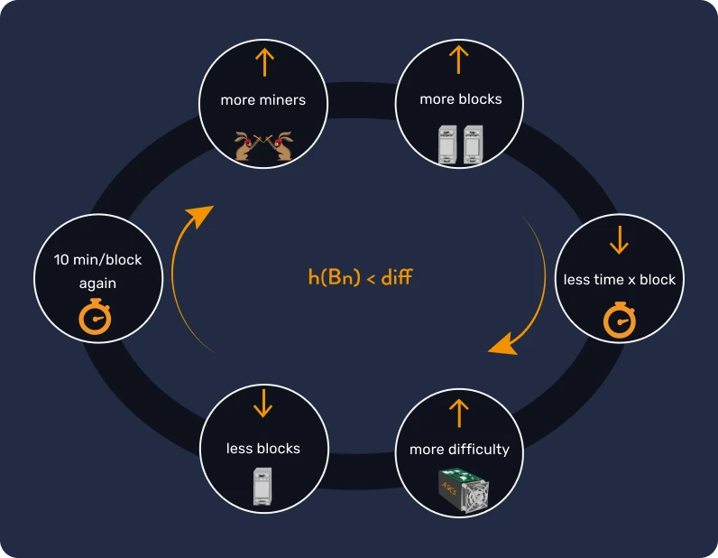
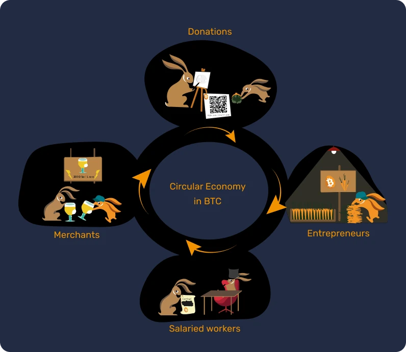

# Cuộc phiêu lưu đầu tiên

Trong khóa học này, những điều liên quan đến Bitcoin được chia làm 25 chương với những giải thích đơn giản và dễ hiểu, để bạn có thể tiếp cận công nghệ này một cách hiệu quả. Bạn sẽ khám phá toàn bộ những khái niệm căn bản trong lĩnh vực này như việc khai thác Bitcoin, ví, các sàn mua/bán và hơn thế nữa. Sẽ có các tài liệu bổ sung trong suốt hành trình đính kèm với bài kiểm tra "21 Posters" sau khi hoàn thành khóa học này.

Để bắt đầu, bạn không cần phải trang bị bất kỳ kiến thức cụ thể nào. Nội dung của khóa học có thể sử dụng cho mọi người, ở mọi trình độ và ước tính trung bình mất khoảng 15 giờ để hoàn tất.

+++
# Phần giới thiệu

<partId>3cd2ac82-026c-53e1-874a-baf5842adc6d</partId>

## Nhảy vào vùng vô định

<chapterId>27e3fb60-4b50-556b-9e70-c4f5475c121d</chapterId>

Chào mừng bạn đến với khóa học BTC101!

Bitcoin là một cuộc cách mạng về công nghệ và tiền tệ, có thể khiến chúng ta đặt câu hỏi về mối quan hệ của mình với tài sản\tiền bạc và xã hội. Trên thực tế, Bitcoin (còn được gọi là BTC) được xem là một loại tiền tệ **trung lập** và **phi tập trung**, có nghĩa là nó không bị bất kỳ pháp nhân hay tổ chức nào kiểm soát. Đây là một sáng kiến vượt ra ngoài phạm vi đơn thuần chỉ là "tiền internet": nó vừa là một giao thức máy tính (Bitcoin) đồng thời là một đơn vị tiền tệ (bitcoin).

Giao thức này sử dụng các công nghệ cơ bản như mật mã học, mạng truyền thông và "dữ liệu chuỗi khối (Blockchain)" nổi tiếng, trong khi đơn vị bitcoin đóng vai trò là loại tiền tệ thiết yếu để giao thức này hoạt động hiệu quả. Trong cuộc sống hàng ngày, người dân El Salvador và những người sở hữu bitcoin (bitcoiners) trên toàn thế giới sử dụng tiền bitcoin trong mua và bán hàng hóa và dịch vụ, có thể nói họ dựa vào công nghệ này để cải thiện cuộc sống.

**Giáo trình giảng dạy toàn diện và dễ tiếp thu:**


Trong khóa học, chúng ta sẽ thảo luận về một số khía cạnh khi vai trò của Bitcoin là tiền tệ, bao gồm cách mua và bán bitcoin, lưu trữ chúng một cách an toàn trong ví kỹ thuật số và sử dụng chúng cho các giao dịch. Chúng ta cũng sẽ xem xét vai trò của thợ đào, những người đóng vai trò thiết yếu trong việc tạo ra bitcoin mới và bảo mật mạng Bitcoin. Cuối cùng là khám phá tương lai của Bitcoin và làm thế nào công nghệ mạng tia chớp (Lightning)có thể cải tiến các giao dịch Bitcoin.


 
Điều quan trọng là phải hiểu rằng Bitcoin là một hệ thống tiền tệ mới sẽ thay đổi hoàn toàn mối quan hệ của chúng ta với tài sản\tiền bạc, vì vậy việc học cách sử dụng nó là một kỹ năng cần thiết cho bất kỳ ai muốn kiểm soát tài sản\tiền của mình.

**Mục 1 - Tiền**


- Chương 1 - Tiền là gì?
- Chương 2 - Tiền pháp định
- Chương 3 - Siêu lạm phát
- Chương 4 - Chính sách tiền tệ của Bitcoin

**Phần 2 - Các loại ví Bitcoin**


- Chương 5 - Ví Bitcoin hoạt động như thế nào?
- Chương 6 - Lựa chọn cách bảo mật của bạn
- Chương 7 - Cài đặt và tinh chỉnh ví của bạn
- Chương 8 - Bảo quản ví qua thời gian

**Phần 3 - Các chức năng kỹ thuật của Bitcoin**


- Chương 9 - Một giao dịch Bitcoin là gì?
- Chương 10 - Các máy chủ Bitcoin
- Chương 11 - Người khai thác (thợ đào)
- Chương 12 - Người khai thác (thợ đào) và hệ sinh thái

**Mục 4 - Tiết kiệm với Bitcoin**


- Chương 13 - Giá Bitcoin
- Chương 14 - Làm thế nào để mua Bitcoin?
- Chương 15 - Làm việc để lấy Bitcoin
- Chương 16 - Quy trình bitcoin hóa

**Phần 5 - Mạng Lightning**


- Chương 17 - Giới thiệu về mạng tia chớp (Lightning)
- Chương 18 - Các ứng dụng của mạng tia chớp (Lightning)


Trước khi tìm hiểu về tiền và chức năng của tiền trong xã hội trong Chương 1, chúng ta nên bắt đầu từ nguồn cội của Bitcoin. Ra mắt vào năm 2009, Bitcoin là một công nghệ khá mới mẻ không giống với các công nghệ khác. Do đó, việc không hiểu gì về nó hay không có một cái nhìn toàn diện trong giai đoạn đầu là điều hiển nhiên. Giống như khi học cách sử dụng Internet hoặc lái xe, bạn không cần phải biết tất cả các chi tiết kỹ thuật ngay lập tức: bạn có thể bắt đầu bằng cách học cách nhận Bitcoin, thanh toán và bảo lưu nguồn vốn của mình bằng Bitcoin, sau đó từng bước nghiên cứu sâu hơn.

Hiện tại, chúng ta đã qua giai đoạn cất cánh nhưng chỉ mới ở giai đoạn đầu của quá trình áp dụng: vì thế bạn đang ở đúng thời điểm như mong muốn để đạt được nhiều kiến thức nhất có thể về cải tiến quan trọng này.


Điểm mấu chốt ở đây là giúp bạn hiểu được công nghệ mới này một cách tổng thể, vì vậy chúng tôi hy vọng bạn thích khóa học này và liên tục phát huy trong hệ thống tiền tệ toàn cầu mới này.

## Lịch sử của Bitcoin


<chapterId>9a94b627-5b69-5d81-9125-f1fa9b0aa6ad</chapterId>

Sẵn sàng khám phá thế giới hấp dẫn của Bitcoin và hiểu rõ mọi cơ chế của nó chưa? Đi thôi!


Trước khi thuật ngữ "Bitcoin" được sử dụng và biết tới như cuộc cách mạng về tiền\tài sản và tài chính kỹ thuật số, sự ra đời của nó dựa trên nền tảng của một loạt các ý tưởng, sáng kiến và phong trào xã hội. Trong số đó, phong trào mật mã học (cypherpunk) nổi lên như một phần then chốt trong quá trình hình thành Bitcoin.

### Cypherpunks: những chuyên gia mật mã học có tầm nhìn xa trông rộng về thế giới số


Vào tâm điểm của sự bùng nổ công nghệ trong những năm 1980 và 1990, một nhóm người đã bắt đầu đặt câu hỏi sâu sắc về vai trò của quyền riêng tư và quyền tự do trong thời đại kỹ thuật số. Những cá nhân này, sau này được gọi là "cypherpunks", tin chắc rằng mật mã học có thể là công cụ để bảo vệ quyền riêng tư khỏi sự xâm phạm của chính phủ và các tổ chức lớn.

Những nhân vật mang tính biểu tượng như Julian Assange, Wei Dai, Tim May và David Chaum đóng vai trò bước ngoặt của việc định hình triết lý và tầm nhìn của phong trào. Những nhà lãnh đạo tư tưởng này đã chia sẻ ý tưởng của họ đến những người có tầm ảnh hưởng qua một danh sách thư tín, những người tham gia từ khắp nơi trên thế giới tranh luận về việc tận dụng công nghệ một cách hiệu quả nhất để mở rộng hơn sự tự do cá nhân.

### Ba bài viết nền tảng cơ bản của Cypherpunks


Phong trào mật mã hóa (cypherpunk), bắt nguồn từ hoạt động cách mạng kỹ thuật số và mật mã học, dựa trên nội dung từ một số văn bản nền tảng cụ thể để diễn đạt các nguyên tắc và tầm nhìn cho tương lai. Trong số các bài viết này, có ba bài nổi bật:


- "Tuyên bố Cypherpunk":

được Eric Hughes viết vào năm 1993, "Tuyên bố Cypherpunk" khẳng định rằng quyền riêng tư là quyền cơ bản. Tác giả lập luận rằng khả năng giao tiếp tự do và bảo mật là điều cần thiết cho một xã hội tự do. Tuyên ngôn nêu rõ: "Chúng ta không thể mong đợi chính phủ, tập đoàn lớn hoặc các tổ chức vô danh khác trao cho chúng ta quyền riêng tư [...]. Chúng ta phải bảo vệ quyền riêng tư của chính mình nếu chúng ta mong đợi có bất kỳ quyền riêng tư nào".


- "Bố cáo chủ nghĩa vô chính phủ bí mật":

được viết bởi Timothy C. May vào năm 1992, tài liệu này giải thích cách sử dụng mật mã có thể dẫn đến kỷ nguyên mật mã học, nơi các chính phủ sẽ không có quyền can thiệp vào các vấn đề riêng tư của công dân. May hình dung ra một tương lai nơi mọi người trao đổi thông tin và tài sản\tiền bạc một cách ẩn danh mà không có sự can thiệp của bên thứ ba.


- "Tuyên ngôn độc lập của không gian mạng":

Mặc dù không hoàn toàn là cypherpunk, văn bản này phản ánh mong muốn và cảm xúc của nhiều người tham gia phong trào. Được John Perry Barlow viết vào năm 1996, đây là phản ứng trước sự gia tăng quy định của chính phủ đối với Internet. Tuyên ngôn khẳng định rằng không gian mạng là một lĩnh vực khác biệt so với một phạm vi vật lý nên do đó không tuân theo cùng một luật lệ. Như trong tuyên bố, "Chúng ta không có chính phủ nào được bầu, và chúng ta sẽ không có một chính phủ như vậy".

### Những phiên bản tiền nhiệm của Bitcoin

Trước khi Bitcoin xuất hiện, đã có một số nỗ lực tạo ra một loại tiền kỹ thuật số. Ví dụ, David Chaum đã giới thiệu khái niệm "tiền điện tử ẩn danh" với dự án "DigiCash" của mình vào những năm 1980. Không may thay, do với nhiều hạn chế khác nhau, DigiCash đã không cất cánh.

Một phiên bản khác cũng quan trọng không kém là "B-money" của Wei Dai. Mặc dù dự án chưa bao giờ được triển khai, nhưng đã trình bày được ý tưởng về một loại tiền kỹ thuật số ẩn danh, trong đó việc phát hiện gian lận được thực hiện bởi cộng đồng của các chuyên gia đánh giá chứ không phải một cơ quan trung ương.

Hình ảnh bên dưới minh họa rõ nét sự quá trình phát triển của Bitcoin qua nhiều cải tiến công nghệ.


Trưởng thành từ môi trường này, một Satoshi Nakamoto bí ẩn đã công bố bản cáo bạch về Bitcoin vào năm 2008. Trong tài liệu này, ông đã kết hợp một số ý tưởng từ phong trào cypherpunk, chẳng hạn như bằng chứng công việc và mã hóa mốc thời gian, để tạo ra một loại tiền kỹ thuật số phi tập trung và tự do.

Tuy nhiên, Bitcoin không chỉ có vậy: nó đại diện cho thành tựu của lý tưởng cypherpunk. Vượt lên trên bề mặt khoa học công nghệ, Bitcoin còn là biểu tượng cho một cuộc cách mạng chống lại các hệ thống tài chính truyền thống với vai trò cung cấp một phương tiện/giải pháp thay thế phát triển dựa trên tính minh bạch, phi tập trung và quyền tự do cá nhân.

### Phần kết luận

Tiền sử của Bitcoin được bắt nguồn từ phong trào cypherpunk tìm kiếm và mở rộng sự tự do trong thời đại kỹ thuật số. Với sự kết hợp các nguyên tắc của mật mã học, sự phi tập trung và sự vẹn toàn, Bitcoin đã vượt xa hơn vai trò của một loại tiền tệ. Được ví như là một sản phẩm của một cuộc cách mạng triết học và công nghệ, nó tiếp tục định hình lại thế giới của chúng ta.

Do đó, Bitcoin là một giao thức công nghệ kéo dài dài về mặt thời gian và khuyến khích đặt câu hỏi về mối quan hệ của chúng ta với năng lượng, thời gian và tài sản\tiền.

Tuy nhiên, Bitcoin có phải là một loại tiền tệ "thực sự" không? Để hiểu được điều này, trước tiên chúng ta cần hiểu khái niệm về tiền và khám phá các hình thức khác nhau của nó trong chương tiếp theo.

Nếu bạn muốn khám phá lịch sử Bitcoin sâu và chi tiết hơn, chúng tôi đặc biệt giới thiệu khóa học HIS 201, bạn sẽ khám phá gốc rễ lịch sử dẫn đến sự xuất hiện của Bitcoin, cũng như sự khởi đầu của cộng đồng một cách cạn kẽ. Khóa học này được ghi chép và trích dẫn đầy đủ, và tất nhiên sẽ xuất hiện nhiều giai thoại:

https://planb.network/courses/a51c7ceb-e079-4ac3-bf69-6700b985a082
# Tiền

<partId>e913df1a-4cbd-5380-ba67-ca2a0414f671</partId>

## Tiền trong suốt lịch sử

<chapterId>c838e64d-d59f-5703-8c74-ea5e8c4fdd31</chapterId>

Sự tiến hóa của tiền tệ là một khía cạnh hấp dẫn của lịch sử loài người, phản ánh sự khéo léo của các nền văn minh qua nhiều thời đại trong việc đáp ứng nhu cầu không ngừng thay đổi của kinh tế .


### Từ vỏ sò đến tài khoản ngân hàng

Ban đầu, tiền là một tài sản hữu hình, chẳng hạn như ngũ cốc, gia súc hoặc một loại hàng hóa cơ bản khác. Tuy nhiên, những hàng hóa này có nhược điểm lớn là dễ hỏng, khiến khó khăn cho việc sử dụng chúng như một phương tiện tiết kiệm dài hạn. Ví dụ, mùa màng thất bát hoặc bệnh dịch của động vật có thể tiêu hủy toàn bộ tài sản của một người chỉ sau một đêm.

Vì vậy, khi các nền văn minh phát triển và mở rộng thương mại đến các vùng mới làm nảy sinh nhu cầu về một phương tiện trao đổi phổ thông. Các thử nghiệm đầu tiên với các vật như vỏ sò và đá quý, nhưng chúng không bền hoặc khan hiếm như đã nghĩ. Cho đến khi vàng trở thành tiêu chuẩn, do có tính khan hiếm, độ bền và khả năng chia nhỏ. Vàng đã và vẫn là biểu tượng của sự giàu có và quyền lực cho đến ngày nay.


### Vai trò của tiền là gì?

Tiền là một công cụ giao tiếp cực kỳ tinh vi:


- Nó cho phép giao tiếp giữa hiện tại và tương lai, vì nó chuyển biến thời gian và năng lượng của chúng ta thành tài sản có thể tái sử dụng trong tương lai và tránh nguy cơ bị mất giá.
- Nó tạo điều kiện thuận lợi cho việc giao tiếp đóng vai trò là ngôn ngữ chung: hai người xa lạ không cần biết nhau hay nói cùng một ngôn ngữ, vẫn có thể trao đổi, mua bán và thống nhất về giá trị của mọi thứ.

Chức năng của nó khó có thể sao chép một cách nhân tạo trong thế giới của chúng ta. Trên thực tế, không có cá nhân hay tổ chức nào có thể tạo ra tiền, vì đây là hiện tượng tự nhiên xuất hiện từ sự đồng thuận tự nguyện trong thị trường. Theo nghĩa này, giá cả đóng vai trò là tín hiệu và những phần của thông tin điều chỉnh phân bổ nguồn lực trong xã hội.

Vì những lý do này, vàng trong vai trò tài sản\tiền là kết quả của 4.000 năm học thuyết tài sản\tiền của Darwin dựa trên các chức năng sau của Aristotle:


- **Lưu trữ giá trị**: tiền có thể được sử dụng để chuyển sức mua vào tương lai, do đó nó phải là vật liệu bền vững;
- **Phương tiện trao đổi**: tiền có thể được sử dụng để trao đổi hàng hóa và dịch vụ thay vì trao đổi hàng hóa, do đó tránh được sự trùng hợp về nhu cầu giữa các thương nhân;
- **Đơn vị tính toán**: tiền cũng cho phép chúng ta so sánh giá trị của các loại hàng hóa khác nhau để hiểu rõ hơn về tính tiện lợi của chúng một cách tương đối.


### Đặc điểm của tiền

Vàng đáp ứng lý tưởng các tiêu chí của một loại tiền tệ hiệu quả: tính hiếm có tự nhiên của nó tạo nên giá trị, trong khi các đặc tính hóa học của nó đảm bảo nó không bị xói mòn theo thời gian. Những đặc điểm này đã làm cho vàng trở thành một **kho lưu trữ giá trị** tuyệt vời, nhưng không phải là một loại tiền tệ phổ biến, vì hình thức tiền này không dễ chia nhỏ hoặc vận chuyển trên những khoảng cách xa. Trong một thế giới toàn cầu hóa và kỹ thuật số, vàng phải vật lộn để theo kịp và đòi hỏi một thực thể trung tâm để làm cho nó có thể chia nhỏ và dễ dàng trao đổi (tức là thông qua các đồng tiền đúc).

Ngược lại, tiền tệ do nhà nước phát hành (tiền pháp định) rất dễ sử dụng, nhưng thường xuyên bị phá giá bởi các thực thể kiểm soát chúng (vua, ngân hàng trung ương, hoàng đế, nhà độc tài).

Để giải thích rõ hơn khái niệm này, chúng ta sẽ khám phá các đặc điểm của một loại tiền tệ hiệu quả:


- **Tính có thể thay thế**, nghĩa là nó có thể hoán đổi với một đơn vị khác cùng loại mà không mất giá trị;
- **Tính có thể chia nhỏ**, vì có thể chia thành các đơn vị nhỏ hơn để tạo điều kiện thuận lợi cho các giao dịch có khối lượng khác nhau;
- **Tính thanh khoản**, nghĩa là có thể dễ dàng chuyển đổi thành hàng hóa hoặc dịch vụ.

Để đáp ứng các tiêu chí này, tiền tệ đã phát triển qua nhiều giai đoạn khác nhau:


- Đá thô -> Tiền xu
- Tiền giấy -> Thẻ ngân hàng
- chuỗi khối dữ liệu (Blockchain) -> Mạng Lightning

Tiền tệ vẫn đang phát triển cho đến ngày nay, điều chỉnh hình thức của chúng để đáp ứng các trường hợp sử dụng khác nhau. Như đã nói, trong khi vàng là một kho lưu trữ giá trị tuyệt vời, nó không còn phù hợp với nền kinh tế toàn cầu hóa hiện tại. Tương tự như vậy, các loại tiền tệ ủy thác như đô la và euro rất thanh khoản và dễ vận chuyển vì hiện nay chúng chủ yếu là kỹ thuật số, nhưng giá trị của chúng liên tục giảm do lạm phát tiền tệ.

Mặt khác, Bitcoin mang đến những khả năng mới. Các đặc tính của nó, chẳng hạn như nguồn cung hạn chế nghiêm ngặt, khiến nó trở thành một kho lưu trữ giá trị tuyệt vời. Hơn nữa, với tư cách là một loại tiền tệ trung lập trên internet, nó đóng vai trò là một **phương tiện trao đổi** khả thi vượt qua biên giới. Tuy nhiên, nó vẫn chưa được chấp nhận rộng rãi trong thương mại ngày nay, mặc dù [được áp dụng liên tục](https://btcmap.org/map).

## tiền tệ ủy thác

<chapterId>25151d46-7db1-5b48-8bba-cbde1944555a</chapterId>

> "Những ai không thể nhớ lại quá khứ thì phải chịu trách nhiệm khi lặp lại quá khứ đó" - George Santayana.
Sự thật có sức tiếng vang cảnh tỉnh sâu sắc khi nói đến hệ thống tiền tệ hiện tại.

### Người ủy thác = Niềm tin

Ngày nay, các loại tiền tệ chính như Euro và Đô la được xem là tiền ủy thác. Điều này có nghĩa là chúng không có giá trị nội tại và hoàn toàn phụ thuộc vào lòng tin và sự tin tưởng mà chúng ta đặt vào các tổ chức quản lý chúng.

Tiền tệ ủy thác là một hình thức tiền tệ được một tổ chức ban hành, tức là một quốc gia, như Trung Quốc với đồng Nhân dân tệ, hoặc một liên minh chính trị-kinh tế, như Liên minh châu Âu với đồng Euro. Tổ chức chịu trách nhiệm phát hành tiền tệ là ngân hàng trung ương (Ví dụ, chúng ta có thể đề cập đến Ngân hàng Nhân dân Trung Quốc, Cục Dự trữ Liên bang Mỹ hoặc Ngân hàng Trung ương Cộng hòa Guinea). Chính những tổ chức này chịu trách nhiệm xây dựng chính sách tiền tệ và do đó quyết định nên đưa (in ra) bao nhiêu tiền vào lưu thông.


### Phá giá tiền tệ: một chiến lược có từ thời Đế chế La Mã

Từ thời cổ đại, vàng đã được dùng làm chuẩn mực cho tiền tệ\tài sản, nhưng tính cứng nhắc của nó thường khiến các nhà lãnh đạo, dù là hoàng đế La Mã hay chính phủ hiện đại, phải áp dụng các loại tiền tệ thay thế, thường là tiền tín thác.

Cơ chế này đơn giản và được lấy cảm hứng từ các hoạt động đã tồn tại từ xa xưa khi các nền văn minh mới ra đời. Các nhà lãnh đạo, muốn kiểm soát sự thịnh vượng, và bắt đầu bằng cách tập trung vào vàng, thường khai thác quyền lực của họ bằng cách hứa hẹn đảm bảo sự an toàn. Với nguồn dự trữ quý giá này trong tay, họ giới thiệu một loại tiền tệ mới, có giá trị tương đương với vàng, nhưng được đúc theo hình ảnh của họ. Sau đó, loại tiền tệ này bắt đầu lưu hành và mọi người nhanh chóng thích nghi và sử dụng vì sự đơn giản và tiện lợi của nó.

Tuy nhiên, những nhà lãnh đạo này sau đó bắt đầu phá giá dần đồng tiền mới phát hành, bằng cách làm giảm lượng vàng của mỗi đồng tiền xuống vài phần trăm mỗi năm so với số lượng vàng của các đồng tiền trước đó. Sự phá giá thầm lặng này thường được biện minh là vì lợi ích của người sử dụng. Nhưng trên thực tế, những người tiết kiệm bằng loại tiền ủy thác này thấy giá trị tiền tiết kiệm của họ bị bào mòn, trong khi nhà nước tài trợ cho các dự án của mình thông qua lạm phát. Thêm vào đó là sự phá giá tiền tệ này có thể giúp nhà nước trả nợ dễ dàng hơn.


Đến một thời điểm quan trọng, các nhà lãnh đạo thông báo: các đồng tiền này không còn được bảo đảm bằng vàng nữa. Công chúng, giờ đã quen với đồng tiền ủy thác và thường nhận thông tin sai lệch về các vấn đề tài chính, chấp nhận thực tế này, cho phép nhà nước tự do thao túng nguồn cung tiền và in ra số tiền khổng lồ mà gần như không phải mất khoản phí.

Việc in tiền sau đó sẽ dẫn đến lạm phát và dần làm cho dân chúng trở nên nghèo đói. Bên cạnh đó, hệ thống tài chính sẽ được quản lý và kìm hãm để tránh sụp đổ, vì bất kỳ sự gián đoạn nào xảy ra cũng có thể gây ra khủng hoảng kinh tế. Ngược với số đông người sử dụng, các tổ chức tài chính và những cá nhân giàu có được hưởng lợi rất nhiều từ hệ thống này, gây ra khoảng cách giàu nghèo và thiên hướng độc quyền. Trong bối cảnh của thiểu số này, họ không có động cơ và không khuyến khích thực hiện những thay đổi triệt để, mà thay vào đó là tiếp tục cho phép hệ thống vận hành cho đến khi có thể xảy ra biến cố.

Khi thực hiện tốt, chiến lược này có thể kéo dài trong nhiều thập kỷ. Tuy nhiên, điều quan trọng cần lưu ý là việc phá giá tiền tệ nhanh chóng hoặc gây mất lòng tin sẽ có thể dẫn đến siêu lạm phát (xem chương tiếp theo). Lịch sử cho thấy đồng đô la đã mất 98% giá trị trong 100 năm, đồng euro mất 30% trong 20 năm và đồng bảng Anh mất 99% kể từ lần đầu phát hành.

Cuối cùng thì loại tiền đồng này có thể không còn liên quan gì đến vàng nữa, tương tự như đồng tiền vào cuối Đế chế La Mã, hoặc thậm chí giá trị của nó chỉ đơn giản được xem là một con số, và hoàn toàn tách biệt khỏi các giá trị hữu hình.

Hiện tại chúng ta đang chứng kiến một bước ngoặt lịch sử. Đồng đô la, vốn đã thống trị từ lâu, đang trên đà suy giảm về giá trị, và khi vàng đã dần mất đi vai trò trung tâm. Chúng ta đang đứng trước ngưỡng cửa của một chu kỳ tiền tệ mới, cho ta thấy rằng những bài học của lịch sử thường bị lãng quên.


### Bitcoin có phải là giải pháp không?

Với những tiền đề này, phong trào cách mạng Bitcoin đang phát triển mạnh mẽ. Trái ngược với các loại tiền tệ trước đây, nó không yêu cầu **một trung gian đáng tin cậy** và với mục đích tách bạch cơ quan trung ương ra khỏi tiền tệ.


Trên thực tế đối với những thách thức của hệ thống này, Bitcoin thể hiện như là một phản ứng bằng cách đề xuất một giải pháp phi tập trung và một hệ thống song song cho với loại tiền tệ mới. Trong lịch sử, nếu vàng được ưa chuộng như một loại tiền tệ do khả năng chống làm giả, thì Bitcoin vượt trội hơn vì không thể bị làm giả. Hơn nữa, nó còn bị giới hạn số lượng với 21 triệu đơn vị, nhờ bản chất phi tập trung và tính mã hóa . Bitcoin là một loại tiền tệ dựa trên sự minh bạch và trung lập, cung cấp một giải pháp thay thế tiềm năng cho hệ thống tiền tệ tập trung hiện tại.


Một lý do khác khiến Bitcoin được chú ý là sự xuất hiện của các loại tiền kỹ thuật số của ngân hàng trung ương, hay CBDC, dường như là điều không thể tránh khỏi. Hình thức tiền tệ mới này sẽ được tận dụng để phát triển một nền kinh tế tập trung hơn và có thể làm tăng rào cản trở đối quyền tự do tài chính cá nhân đồng thời tạo điều kiện cho sự lạm quyền.

Chúng ta có thể kết thúc chương này bằng một trích dẫn từ  F.A Hayek - người đã đoạt giải Nobel năm 1984:

> "Tôi không tin chúng ta sẽ có một loại tiền có giá trị tốt trở lại, cho đến khi chúng ta lấy nó ra khỏi bàn tay của chính phủ. Nếu chúng ta không thể dùng vũ lực, thì có thể đưa ra thứ gì đó mà họ không thể ngăn cản một cách khôn khéo nào đó hoặc theo đường vòng."
Để tìm hiểu thêm về những nhận định sai lệch về kinh tế và sự tự do, mời bạn khám phá khóa học ECO 102 của chúng tôi, khóa học này sẽ mô tả cuộc đời và tư tưởng của Frédéric Bastiat, một nhà tư tưởng người Pháp thế kỷ 19, người chắc chắn sẽ đánh giá cao sự xuất hiện của Bitcoin:

https://planb.network/courses/d07b092b-fa9a-4dd7-bf94-0453e479c7df
## Siêu lạm phát

<chapterId>b04c024c-54f3-50cb-997f-58721cfc74be</chapterId>

Siêu lạm phát là một hiện tượng kinh tế đặc trưng của tiền pháp định: nó được đặc trưng bởi sự mất niềm tin hoàn toàn vào một loại tiền tệ và sự gia tăng mạnh mẽ của lạm phát do việc in tiền của chính quyền. Kết quả là, tiền tiết kiệm của các cá nhân có thể tiêu tan trong một khoảng thời gian tương đối ngắn, đẩy đất nước đến bờ vực sụp đổ về kinh tế, xã hội và chính trị.

### Lạm phát đang tăng cao!

Để hiểu được tác động của lạm phát đến tiền tiết kiệm, chúng ta cần xem xét các tỷ lệ lạm phát khác nhau.


- Với mức lạm phát 2%, bạn mất 2% sức mua hàng năm, tương đương 10% trong 5 năm.
- Với 7%, bạn sẽ mất một nửa số đó trong 10 năm.
- Với 20%, bạn sẽ mất gần một nửa trong vòng 3 năm.

Khi siêu lạm phát xảy ra, chúng ta không còn nói về 20% mỗi năm nữa, mà là 20% mỗi tháng hoặc, ở mức cao nhất, thậm chí là mỗi NGÀY. Trải qua mức lạm phát 100% mỗi ngày trong ba ngày là một kịch bản thực tế đã xảy ra và tiếp tục xảy ra trong thế giới của chúng ta.

Điều quan trọng là siêu lạm phát không xảy ra một cách ngẫu nhiên, mà là do chủ nghĩa tư bản hay do các cuộc tấn công chính trị từ những phe đối lập. Siêu lạm phát là hệ quả trực tiếp của các quyết định sai lầm về tiền tệ từ các ngân hàng trung ương và chính trị gia đưa ra. Hậu quả của nó ảnh hưởng đến mọi công dân và thậm chí tác động đến các thế hệ tiếp theo. Đọc bảng sau đây để nhận ra đầy đủ tác động thực sự của hiện tượng này (khóa học ECO204 sẽ đi sâu hơn vào chủ đề này). Như bạn thấy, không có quốc gia hay loại tiền tệ nào có khả năng an toàn cao.


### Các giai đoạn của siêu lạm phát là gì?


Để siêu lạm phát xảy ra, một số sự kiện nhất định phải diễn ra.

Giai đoạn 1 - Mất lòng tin


- Sự tập trung quyền lực về tiền tệ hình thành điều kiện cho việc tạo ra tiền mới và lạm dụng quyền tạo ra tiền. Trong bối cảnh này, một số yếu tố bên ngoài có thể gây ra siêu lạm phát, thường là chiến tranh, các chính sách xã hội hoặc sự tăng giá của các nguồn tài nguyên chính cơ bản như lúa mì hoặc xăng. Do đó, sự mất niềm tin vào một loại tiền tệ có thể phát sinh và các cá nhân bắt đầu đặt câu hỏi về nguồn gốc của tiền tệ và lợi ích của chính sách tiền tệ được ban hành.

Giai đoạn 2 - tiền tệ sụp đổ và giá cả tăng


- Khi chính phủ mất đi kiểm soát về lòng tin, mọi người bắt đầu chuyển đổi tiền tệ của họ sang một loại tiền tệ ổn định hơn, giống như những gì đã xảy ra ở Venezuela với đồng đô la Mỹ. Hoàn cảnh này dẫn đến giá cả tăng, tạo ra một vòng luẩn quẩn khi hàng hóa và dịch vụ ngày càng đắt đỏ. Nhà nước phải in thêm tiền và điều chỉnh chính sách tiền tệ để đảm bảo đáp ứng nhu cầu trong tình hình này, dẫn đến lạm phát theo cấp số nhân.

Giai đoạn 3 - Vòng luẩn quẩn của việc in tiền


- Do đó, ngày càng cần nhiều tiền giấy hơn để mua hàng hóa, dẫn đến tình trạng khan hiếm tiền giấy. Để ứng phó, chính phủ phải in thêm tiền giấy, làm lạm phát tăng cao hơn nữa.


Giai đoạn 4 - Sự xuất hiện của một loại tiền tệ mới


- Sau đó, một loại tiền tệ mới sẽ được đưa vào sử dụng để thay thế loại tiền tệ cũ, nhằm phá vỡ chu kỳ lạm phát bằng cách thực hiện các biện pháp kiểm soát chặt chẽ hơn, với những kiểm soát chưa từng áp dụng đối với loại tiền tệ hợp pháp trước đó.

Giải quyết khủng hoảng siêu lạm phát thường đòi hỏi những thay đổi triệt để, chẳng hạn như cách mạng, thay đổi chính phủ, thay đổi ngân hàng trung ương, v.v. Khi mất niềm tin, tiền tệ sẽ sụp đổ và việc tái thiết theo từng giai đoạn là thiết yếu giúp hồi phục một nền kinh tế dựa vào tiền pháp định.

### Ba ví dụ điển hình


- Đức, 1922-1923.

Một trong những ví dụ nổi bật nhất về siêu lạm phát xảy ra ở Cộng hòa Weimar của Đức sau Thế chiến thứ nhất.

Đức đã vay một số tiền khổng lồ để tài trợ cho chiến tranh. Tuy nhiên, Đức không chỉ mất tiền mà còn phải trả hàng tỷ đô la tiền bồi thường chiến tranh. Tháng có tỷ lệ lạm phát cao nhất là tháng 10 năm 1923, đạt đỉnh ở mức 29.500%, tương đương với tỷ lệ lạm phát là 20,9% mỗi ngày. Giá cả tăng gấp đôi sau mỗi 3,7 ngày!

Đồng tiền của Đức trở nên vô dụng đến mức một số công dân thích đốt tiền giấy thay vì đốt gỗ vì nó thực sự rẻ hơn. Người ta thậm chí còn kể rằng trong các nhà hàng, người phục vụ phải thông báo giá thực đơn cứ sau 30 phút để điều chỉnh theo lạm phát.

Cuối cùng, chính quyền đã tạo ra một loại tiền tệ mới, được bảo đảm bằng các khoản nợ của Đức, Pháp và Anh, và được bảo chứng bằng đất đai của Đức.


- Hungary, 1945-1946

Quốc gia trải qua thời kỳ siêu lạm phát tồi tệ nhất cho đến nay là Hungary sau Thế chiến thứ II.

Hungary thấy mình ở thế thua cuộc trong cuộc xung đột, với hầu hết năng lực sản xuất công nghiệp bị phá hủy. Tháng có mức lạm phát cao nhất là tháng 7 năm 1946, chứng kiến mức lạm phát giá cả kinh hoàng là 41.900.000.000.000.000%, tương đương 207% mỗi ngày. Giá cả tăng gấp đôi sau mỗi 15 giờ!

Tờ tiền giấy cuối cùng được đưa vào lưu thông là tờ 100 triệu tỷ Pengo (100.000.000.000.000.000) vào năm 1946.


- Zimbabwe, 2007-2008

Cho đến năm 2000, Zimbabwe có thể tự cung tự cấp hầu hết nhu cầu của mình ngoại trừ dầu mỏ.

Năm 1997, đồng đô la Zimbabwe đã sụp đổ hơn 72% sau khi chính phủ đồng ý bồi thường cho các cựu chiến binh số tiền tương đương là 450 triệu đô la Mỹ. Vì chính phủ không có đủ số tiền như vậy trong nguồn cung của mình nên họ đã phải dùng đến máy in tiền. Năm 2005, lạm phát đạt 586%, nhưng đỉnh điểm là vào giữa tháng 11 năm 2008 với tỷ lệ ước tính là 79.600.000.000% mỗi tháng.

Vào tháng 6 năm 2007, chính phủ đã phản ứng bằng cách áp dụng kiểm soát giá, nhưng hành động này không có tác động gì đến nền kinh tế. Các cửa hàng thực sự bị "hôi của", và các thương gia hết phương cách để bổ sung hàng hóa cho cửa hàng của họ.

Vào tháng 4 năm 2009, Bộ trưởng Tài chính đã công bố lệnh đình chỉ đồng đô la Zimbabwe và cho phép sử dụng các loại tiền tệ nước ngoài khác nhau để giao dịch. Tất cả các tài khoản ngân hàng, lương hưu và các tổ chức tài chính đều thấy số dư của họ bốc hơi chỉ sau một đêm.


Tóm lại, siêu lạm phát có tác dụng làm giảm nhanh giá trị của đồng tiền, dẫn đến xói mòn tiền tiết kiệm và mất niềm tin vào hệ thống tiền tệ. Như Voltaire đã từng gợi mở, loại tiền pháp định nào cũng sẽ mất dần giá trị nội tại và cuối cùng là về số không.

Trên thực tế và trong dài hạn, một loại tiền tệ phụ thuộc vào bên thứ ba đáng tin cậy như một tổ chức tài chính là một loại tiền tệ có khiếm khuyết vì nó không thể đảm bảo sức mua hoặc bảo toàn tiền tiết kiệm.

Để đi sâu hơn vào chủ đề siêu lạm phát, bạn nên tham gia khóa học ECO 204 của David St-Onge, nơi bạn sẽ tìm hiểu về các chu kỳ siêu lạm phát và tác động thực sự của chúng đối với cuộc sống của chúng ta. Bạn cũng sẽ tìm hiểu những điểm tương đồng giữa các chu kỳ này và quan trọng nhất là qua đó học cách bảo vệ bản thân.

https://planb.network/courses/caa75343-ac90-4249-bcca-0e2e57c3a0f1
## 21 triệu bitcoin

<chapterId>f4a06d76-1963-56fd-93ff-dfa41489bcde</chapterId>

### Chính sách tiền tệ của Bitcoin

Bitcoin là một loại tiền kỹ thuật số phi tập trung với số lượng tối đa được xác định trước là **21 triệu đơn vị**. Đặc điểm khan hiếm cố hữu này được xác định bởi các mã lập trình của nó và được củng cố bởi sự đồng thuận của tất cả người sử dụng tham gia vào giao thức.


Việc phát hành tiền tệ của nó có thể được minh họa bằng một đường cong biểu thị số lượng bitcoin được tạo ra theo thời gian. Ví dụ, vào năm 2022, có khoảng 18,5 triệu bitcoin đang lưu hành. Dự báo cho thấy đến năm 2025, sẽ có khoảng 19,5 triệu bitcoin, chiếm khoảng 93% tổng nguồn cung và đến năm 2037, con số này sẽ đạt 20,4 triệu.

### Bitcoin mới được tạo ra như thế nào?

Việc tạo ra bitcoin mới là kết quả của quá trình khai thác. Nói một cách ngắn gọn, người khai thác (thợ đào) sử dụng sức mạnh máy tính để giải quyết các vấn đề toán học phức tạp, xác thực và bảo mật các giao dịch. Khi một vấn đề được giải quyết, người khai thác sẽ thêm một khối giao dịch mới vào chuỗi khối dữ liệu (Blockchain), là một sổ cái phân tán và phi tập trung ghi lại tất cả các giao dịch được thực hiện trên mạng. chuỗi khối dữ liệu đảm bảo tính minh bạch và bảo mật, vì mỗi khối được liên kết với khối trước đó, khiến việc thay đổi dữ liệu trong quá khứ mà không có sự đồng thuận từ mạng lưới gần như là không thể.


Sau khi hoàn thành nhiệm vụ này thành công, người khai thác (thợ đào) sẽ được thưởng bitcoin mới được sản xuất ra sau mỗi mười phút. Phần thưởng này được lập trình để giảm một nửa sau mỗi 210.000 khối, tức là khoảng bốn năm một lần (một sự kiện được gọi là "halving"), tạo cho đường cong phát hành tiền tệ có hình dạng giống như cầu thang. Do cơ chế này, có thể dự đoán về mặt toán học rằng việc tạo ra bitcoin mới sẽ chấm dứt vào khoảng năm 2140, khi tổng số lượng đạt đến giới hạn là 21 triệu.

| Số lượng Halving | Chiều cao khối | Phần thưởng BTC sau khi Halving | Ước tính BTC lưu hành sau khi Halving |

| -------------- | ------------ | ------------------------- | ------------------------------------------ |

| 1 | 210.000 | 25 BTC | 10.500.000 BTC |

| 2 | 420.000 | 12,5 BTC | 15.750.000 BTC |

| 3 | 630.000 | 6,25 BTC | 18.375.000 BTC |

| 4 | 840.000 | 3,125 BTC | 19.687.500 BTC |

| 5 | 1.050.000 | 1,5625 BTC | 20.343.750 BTC |

| 6 | 1.260.000 | 0,78125 BTC | 20.671.875 BTC |

| 7 | 1.470.000 | 0,390625 BTC | 20.835.937,5 BTC |

| 8 | 1.680.000 | 0,1953125 BTC | 20.917.968,75 BTC |

| 9 | 1.890.000 | 0,09765625 BTC | 20.958.984,375 BTC |

| 10 | 2.100.000 | 0,048828125 BTC | 20.979.492,188 BTC |

| 11 | 2.310.000 | 0,0244140625 BTC | 20.989.746,094 BTC |

| 12 | 2.520.000 | 0,01220703125 BTC | 20.994.873,047 BTC |

| 13 | 2.730.000 | 0,006103515625 BTC | 20.997.436,523 BTC |

| 14 | 2.940.000 | 0,0030517578125 BTC | 20.998.718,262 BTC |

| 15 | 3.150.000 | 0,00152587890625 BTC | 20.999.359,131 BTC |

| 16 | 3.360.000 | 0,000762939453125 BTC | 20.999.679,566 BTC |

| 17 | 3.570.000 | 0,0003814697265625 BTC | 20.999.839,783 BTC |

| 18 | 3.780.000 | 0,00019073486328125 BTC | 20.999.919,892 BTC |

| 19 | 3.990.000 | 0,000095367431640625 BTC | 20.999.959,946 BTC |

| 20 | 4.200.000 | 0,0000476837158203125 BTC | 20.999.979,973 BTC |

Chúng ta sẽ xem xét lại khái niệm khai thác chi tiết hơn trong [chương về khai thác](https://planb.network/courses/2b7dc507-81e3-4b70-88e6-41ed44239966/dbb8264a-7434-57e4-9d1b-fbd1bae37fdf).

### Đảm bảo sự khan hiếm kỹ thuật số

Giới hạn 21 triệu là cơ sở cho sự khan hiếm của Bitcoin và được đảm bảo bởi hai cơ chế chính: điều chỉnh độ khó khai thác và lý thuyết trò chơi.


- Điều chỉnh độ khó (trong) khai thác là một quá trình diễn ra sau mỗi lần sản xuất 2016 khối, hoặc khoảng hai tuần, để đảm bảo rằng một khối mới được thêm vào Blockchain trung bình cứ sau mười phút. Tần suất tạo khối này và tổng số lượng bitcoin đều là các yếu tố cố định của giao thức Bitcoin và không thể thay đổi nếu không có sự đồng thuận chung, không giống như các quyết định tùy ý được đưa ra trong các hệ thống tiền tệ truyền thống.

Độ khó của việc tìm một hàm mã hóa hợp lệ tuân theo một chu kỳ: nếu số lượng thợ đào tăng lên, điều đó có nghĩa là số lượng khối họ tìm thấy cao hơn, điều này làm giảm thời gian trung bình để tìm một khối. Khi đó, độ khó tăng lên. Vì vậy, số lượng khối mà thợ đào tìm thấy được giảm xuống, điều này có nghĩa là cơ chế quay trở lại mức trung bình là 10 phút cho mỗi khối. Xem hình ảnh bên dưới để biết hình ảnh trực quan.



Bạn có biết rằng thợ đào được khuyến khích khai thác một khối để kiếm bitcoin mới thông qua trợ cấp khối cũng như phí giao dịch từ các giao dịch được đưa vào khối đó?

Thế nên, khi số lượng bitcoin được phát hành đạt đến giới hạn 21 triệu, thợ đào sẽ được trả nhiều hơn thông qua phí giao dịch so với trợ cấp khối.


- Lý thuyết trò chơi là một khái niệm toán học dựa trên suy luận của người. Nó giả định rằng các cá nhân hành động một cách hợp lý, tìm cách tối đa hóa lợi ích của riêng họ trong khi cân nhắc các quyết định tiềm năng của người khác. Trong Bitcoin, lý thuyết trò chơi giúp đảm bảo rằng phần lớn thợ đào và người sử dụng sẽ hành động vì lợi ích tốt nhất của mạng lưới. Trên thực tế, vì những thay đổi giao thức được người dùng bỏ phiếu, nên bất kỳ sửa đổi nào đối với giao thức Bitcoin đều cần có sự đồng ý của toàn bộ cộng đồng người sử dụng, điều này rất phức tạp. Vì vậy, nếu ai đó muốn tạo ra 22 triệu bitcoin, họ sẽ phải thuyết phục tất cả người sử dụng tự nguyện phá giá tiền tiết kiệm của chính họ, điều này khó có thể xảy ra vì Bitcoin là toàn cầu và không được quản lý bởi một nhóm trung tâm.


Ý tưởng phá giá đồng tiền này đi ngược lại triết lý cơ bản của Bitcoin, do đó khả năng thay đổi về số lượng tổng của nó là rất khó xảy ra.

### Một chính sách tiền tệ được kiểm toán: từng giây, ngay từ đầu và mãi mãi!

Sự khan hiếm của Bitcoin là một tài sản lớn và số lượng tối đa 21 triệu bitcoin đang lưu hành là công khai và có thể được bất kỳ ai xác minh.

Trên thực tế, bất kỳ ai cũng có thể thực hiện việc này thông qua một máy chủ Bitcoin (tức là một trình duyệt xác thực giao dịch) chỉ bằng cách nhập lệnh sau: `bitcoin-cli gettxoutsetinfo`. Tính minh bạch này củng cố niềm tin vào hệ thống Bitcoin, vốn không dựa trên các tổ chức trung ương hoặc cá nhân, mà dựa trên các đảm bảo về mặt toán học và mật mã vốn có trong giao thức của nó (Bạn sẽ học cách thực hiện việc này một cách dễ dàng trong LNP201).

```json
{
"height": 710560,
"bestblock": "0000000000000000000887384d67103412ea7f18a43953e65c8c4ac36bf42e54",
"transactions": 473244,
"txouts": 1018917,
"bogosize": 2183872374,
"hash_serialized_2": "eebb9987337700ffaacbbaa11223344",
"disk_size": 178239584,
"total_amount": 18745998.12345678
}
```

Bitcoin đảm bảo quản lý tiền tệ lành mạnh bằng cách hạn chế việc tạo ra nó theo thiết kế, điều này khiến nó rất khác biệt so với các loại tiền tệ khác vì nó có thể bảo vệ tiền tiết kiệm của người tham gia. Phù hợp với các nguyên tắc của lập luận kinh tế Áo, số lượng ổn định và phân phối có thể dự đoán được của nó bảo vệ nó khỏi những rủi ro lạm phát vốn có mà các loại tiền tệ truyền thống phải đối mặt (xem khóa học ECO201 để biết thêm thông tin).

Tóm lại, Bitcoin, với bản chất phi tập trung, tính khan hiếm được và tính minh bạch lập trình sẵn, cung cấp một giải pháp thay thế độc đáo cho các hệ thống tiền tệ truyền thống. Nó minh họa cách công nghệ có thể được sử dụng để tạo ra một loại tiền tệ\tài sản không chỉ hữu ích và có thể xác minh được mà còn bảo toàn giá trị tiết kiệm của người tham gia bằng cách hạn chế nghiêm ngặt nguồn cung đơn vị.

### Kết thúc chương 1!

# Ví Bitcoin

<partId>28860585-4f61-59d9-b242-f4c57d837cc1</partId>

## Ví Bitcoin là gì?

<chapterId>1c0166ab-cb7a-5bc6-9175-d13482bd91f1</chapterId>

Trong chương 2, chúng ta sẽ tìm hiểu cách lưu trữ và bảo vệ Bitcoin của mình bằng việc sử dụng ví, qua đó hiểu được cách tương tác với những đồng bitcoin nổi tiếng này và chúng nằm ở đâu!

### Giải mã ví Bitcoin

Chúng ta sử dụng ví để tương tác với mạng lưới Bitcoin theo ba cách chính:


- Để nhận bitcoin
- Để gửi bitcoin
- Để đảm bảo chúng không bị tấn công và lấy trộm

Ví Bitcoin có thể đa dạng và nhiều hình thức như: phần mềm máy tính, ứng dụng điện thoại thông minh, thiết bị vật lý như ổ USB hoặc thậm chí là một tờ giấy. Mỗi loại phục vụ cho các trường hợp sử dụng khác nhau. Trên thực tế, một số được thiết kế cho các giao dịch lớn với trọng tâm là bảo mật, trong khi một số khác ưu tiên quyền riêng tư hoặc dùng để thanh toán hàng ngày với số tiền nhỏ.

Do vậy, các danh mục vốn có thể được phân loại rộng rãi theo các nhóm sử dụng, nhưng luôn xoay quanh một câu hỏi chính: bạn là chủ sở hữu nguồn vốn hay bạn đang để quyền kiểm soát nguồn tiền của mình cho bên thứ ba? Chúng ta sẽ đi sâu vào chủ đề này một cách chi tiết trong chương tiếp theo, nhưng vẫn với câu hỏi đơn giản: tiền nằm trong túi bạn hay trong túi của ngân hàng?


### Ví Bitcoin hoạt động như thế nào?

Cho dù là "ngân hàng" Bitcoin hay chính bạn, phần lớn ví Bitcoin đều hoạt động với cùng một công nghệ tương tự nhau dựa trên mật mã bất đối xứng, bao gồm hệ thống cặp khóa: khóa riêng để chi tiêu và khóa chung để nhận.


- Khóa riêng

Khi khởi tạo ví, một cụm từ khôi phục mật khẩu (khóa riêng) sẽ được tạo và hiển thị cho bạn dưới dạng 12 hoặc 24 từ.

Khóa riêng là cơ bản vì nó cấu thành quyền sở hữu bitcoin và do đó là quyền sử dụng hoặc gửi chúng. Do đó, người nắm giữ khóa riêng là chủ sở hữu thực sự của bitcoin.

Chiếc chìa khóa này phải được giữ bí mật và bảo vệ cẩn thận vì nó sẽ mở tài khoản của bạn!


- Khóa chung & địa chỉ

Khóa chung được tạo ra từ khóa riêng và được liên kết với khóa riêng. Chia sẻ khóa chung sẽ gây rủi ro cho quyền riêng tư (vì những người dùng khác có thể thấy được số dư tài khoản của bạn) nhưng nó sẽ không gây rủi ro cho vấn đề bảo mật (vì họ không thể chi tiêu tiền của bạn nếu không có khóa riêng). Đổi lại, khóa chung được sử dụng để tạo ra địa chỉ Bitcoin cho việc nhận tiền.

Những địa chỉ này được tự động tạo ra trong ví của bạn và an toàn trong sử dụng rộng rãi. Để tối ưu hóa quyền riêng tư, bạn chỉ nên sử dụng chúng một lần.

Tóm lại, công nghệ này cho phép chúng ta nhận bitcoin mà không cho phép người nhận lấy trộm tiền của chúng ta! Hộp thư có thể là một so sánh ẩn dụ phù hợp: mọi người có thể gửi tiền vào đó, nhưng bạn là người duy nhất có thể mở nó.


### Có bitcoin trong ví không?

Mặc dù khóa của bạn được lưu trữ trong ví của bạn, nhưng bản thân bitcoin thực sự được "lưu giữ" trong chuỗi khối Bitcoin, đây là sổ cái phân tán công khai trong mạng lưới hàng ngang của Bitcoin (chúng ta sẽ đi sâu vào chủ đề này trong phần 3). Điều này có nghĩa là việc mất thiết bị chứa ví của bạn không nhất thiết dẫn đến việc mất bitcoin. Thứ thực sự cho phép bạn tạo lại ví và chi tiêu bitcoin là khóa riêng, vì vậy hãy luôn nhớ bảo mật nó đúng cách!


May mắn là, kể từ năm 2017, khóa riêng có thể được thể hiện dưới dạng một danh sách đơn giản gồm 12 hoặc 24 từ, hay được gọi là 'cụm tư ghi nhớ', làm việc lưu lại dễ dàng hơn. Cụm từ này đóng vai trò là bản sao lưu trữ cho tiền của bạn và cho phép bạn tái tạo lại ví của mình với bất kỳ phần mềm hoặc ứng dụng Bitcoin nào. Do đó, bất kỳ ai tìm thấy danh sách các từ này đều có thể truy cập vào tài khoản bitcoin của bạn.

### Còn tin tặc thì sao?

Nếu ai đó vô tình đoán được danh sách 12 hoặc 24 từ của chúng ta thì sao? Câu trả lời ngắn gọn là khả năng này rất thấp, nhờ vào hàm mã hóa được sử dụng để tạo ví. Để hiểu rõ hơn, việc vô tình khám phá ra cùng một cụm từ mật khẩu của bạn cũng giống như việc đoán ra 1 số "đúng" giữa 1 và $2^256$, gần như tương đương với việc tìm ra nguyên tử "đúng" trong Vũ trụ. Tuy nhiên, nếu bạn không hài lòng với bảo mật mặc định này, bạn luôn có thể nâng cao nó bằng cách thêm một cụm mật khẩu (một từ bổ sung) vào ví Bitcoin của mình.


Khả năng ví Bitcoin của bạn bị hack là cực kỳ thấp nếu bạn tuân thủ các biện pháp bảo mật tối ưu sẽ được trình bày chi tiết ở phần tiếp theo.

Hãy nhớ chọn ví phù hợp với nhu cầu và mục đích sử dụng của bạn: hướng dẫn chi tiết về cách quản lý và bảo mật các loại ví khác nhau có trong [phần hướng dẫn của trường đại học của chúng tôi](https://planb.network/tutorials/wallet).

Nếu trong quá trình học của mình, bạn muốn tìm hiểu thêm về cách lập trình ví Bitcoin, từ entropy đến cách nhận địa chỉ, chúng tôi khuyên bạn nên tham gia khóa học CYP 201 chuyên về chủ đề này:

https://planb.network/courses/46b0ced2-9028-4a61-8fbc-3b005ee8d70f
## Ví Bitcoin và Bảo mật

<chapterId>00c1afea-e54a-511f-bab3-2efc2fbfa6a1</chapterId>

### Đặt câu hỏi đúng trước khi bắt đầu

Khi sở hữu bitcoin, tính an toàn bảo mật cho tiền của bạn là mối quan tâm chính. Cách tốt nhất để xác định mức độ bảo mật phù hợp với tình huống của bạn là tự hỏi bản thân những câu hỏi như:


- Ai có thể truy cập vào tiền của bạn? Nói cách khác, bạn có quyền truy cập duy nhất vào bitcoin của mình hay một bên thứ ba (như công ty) cấp cho bạn quyền truy cập vào tiền của mình?
- Bạn dự định sử dụng bitcoin trong ví đó như thế nào? Thường xuyên? Để tiết kiệm trung hạn hay dài hạn?
- Kỹ năng chuyên môn của bạn là gì?
- Ngân sách cho vấn đề an toàn của bạn là bao nhiêu?

Trên thực tế không có câu trả lời hay giải pháp chung nào, vì vậy hãy dành thời gian trả lời những câu hỏi này vì điều đó sẽ giúp bạn điều chỉnh các biện pháp bảo mật phù hợp nhu cầu của mình.


### Nghĩ về ví Bitcoin theo khía cạnh phức tạp

Dưới đây là định nghĩa một số cấp độ bảo mật:


- **Cấp độ 0**, bạn sử dụng cái gọi là "dịch vụ lưu ký" mà bạn không phải là người duy nhất nắm giữ bitcoin của mình. Hãy lưu ý rằng bên thứ ba đáng tin cậy này có thể hạn chế quyền truy cập của bạn vào tiền của bạn bất kỳ lúc nào. Trong trường hợp này, mức độ chủ quyền về tài chính của bạn tương tự như có tài khoản trong hệ thống ngân hàng truyền thống.


- **Cấp độ 1**, bạn sử dụng ví Bitcoin trên điện thoại hoặc máy tính, nơi bạn là người duy nhất nắm giữ bitcoin của mình và bạn có thể dễ dàng thực hiện các giao dịch của mình. Công cụ được đề cập ở trên được gọi là "ví nóng", vì khóa riêng được lưu trữ trên thiết bị có kết nối internet. Trong trường hợp này, điều quan trọng là phải sao lưu cụm từ mật khẩu của bạn để lấy lại quyền truy cập vào tiền của bạn trong trường hợp mất điện thoại hoặc máy tính.

Ví dụ, bạn có thể sử dụng Sparrow Wallet như một ví nóng:

https://planb.network/tutorials/wallet/desktop/sparrow-c674e2ac-d46f-4c82-92a7-7d1b0e262f5d

- **Cấp độ 2**, bạn sử dụng ví vật lý và bạn đã bảo mật danh sách 12/24 từ của mình. Nó thường được gọi là "Ví lạnh" vì khóa của bạn được lưu trữ trên thiết bị không được kết nối với internet. Trong trường hợp này, bạn sẽ luôn cần phải ký mọi giao dịch bằng thiết bị của mình, điều này khiến tiền của bạn khó truy cập hơn hàng ngày.

Ví dụ, bạn có thể sử dụng Ledger, Satochip hoặc Tapsigner:

https://planb.network/tutorials/wallet/hardware/ledger-nano-s-plus-75043cb3-2e8e-43e8-862d-ca243b8215a4
https://planb.network/tutorials/wallet/hardware/satochip-e9bc81d9-d59b-420d-9672-3360212237ba
https://planb.network/tutorials/wallet/hardware/tapsigner-ab2bcdf9-9509-4908-9a4a-2f2be1e7d5d2


- **Cấp độ 3**, bạn sử dụng ví cấp độ 1 hoặc 2, nhưng bạn đã thêm một cụm mật khẩu bổ sung. Trong trường hợp này, hãy lưu ý rằng bạn cần sao lưu cả danh sách 12/24 từ **và** cụm mật khẩu của bạn. Lý tưởng nhất là hai thông tin này được lưu trữ ở hai nơi khác nhau.

Để tìm hiểu thêm về cách sử dụng và chức năng của cụm mật khẩu BIP39:

https://planb.network/tutorials/wallet/backup/passphrase-a26a0220-806c-44b4-af14-bafdeb1adce7


- **Cấp độ 4**, bạn sử dụng một bộ ví để tạo ví "đa chữ ký", nghĩa là cần nhiều chữ ký để thực hiện giao dịch. Trong trường hợp này, hãy lưu ý rằng mỗi phần của đa chữ ký phải được lưu trữ ở các vị trí khác nhau. Cách tiếp cận này thường được xem là cách sử dụng Bitcoin nâng cao, chủ yếu để quản lý số lượng lớn và cho mục đích của công ty.


Hiển nhiên là các trường hợp sử dụng khác nhau sẽ đòi hỏi các ví Bitcoin khác nhau và không có giải pháp nào phù hợp cho tất cả mọi trường hợp.

### An ninh phải được thích nghi và điều chỉnh

Số tiền được chấp nhận ở một mức độ bảo mật cụ thể sẽ phụ thuộc vào từng cá nhân. Đối với một số người, để lưu 1 BTC trong ví nóng là hợp lý, trong khi đối với những người khác thì ngược lại. Trong mọi trường hợp, khi bạn muốn bảo mật một số tiền nhỏ, chúng tôi khuyên bạn không nên chi quá nhiều cho bảo mật bằng cách mua ví vật lý. Bên cạnh đó, việc phức tạp hóa quá mức vấn đề bảo mật và khả năng truy cập vào tài khoản bitcoin có thể gây bất lợi, đặc biệt là nếu bạn xử lý không chuẩn trong việc lưu trữ bản sao của ví.

Tóm lại, quyền sở hữu trực tiếp bitcoin là yếu tố thiết yếu để đảm bảo quyền làm chủ tài chính của người dùng. Nên sử dụng ứng dụng ví trên các thiết bị di động cho các khoản chi tiêu hàng ngày và ví vật lý ngoại mạng hoặc ví "lạnh" để lưu trữ số tiền lớn hơn. Mặt khác, các doanh nghiệp nên cân nhắc sử dụng hệ thống đa chữ ký hoặc "nhiều chữ ký" để tăng cường và chia sẻ bảo mật. Cũng cần tránh các dịch vụ lưu ký, có thể lập lại bản sao một số lỗ hổng của hệ thống tài chính truyền thống.

Với vấn đề an ninh được đề cập, chúng ta có thể chuyển sang phần tiếp theo, nơi chúng tôi mô tả cách tạo ví Bitcoin. Tuy nhiên, nếu bạn muốn khám phá thêm về chủ đề bảo mật, bạn có thể đọc [bài viết của DarthCoin](https://asi0.substack.com/p/bitcoin-soyez-votre-propre-banque).

## Thiết lập Ví

<chapterId>615519eb-4565-557d-86a0-021badf7616f</chapterId>

Tính bảo mật của bitcoin của bạn có tầm quan trọng sống còn và một sai lầm nhỏ có thể gây ra hậu quả thảm khốc. Đó là lý do tại sao chúng ta cần tìm hiểu các biện pháp thực thi tốt nhất để áp dụng khi tạo ví Bitcoin mới.

Khóa học BTC102 sẽ hướng dẫn bạn thực hiện bước này.

https://planb.network/courses/f3e3843d-1a1d-450c-96d6-d7232158b81f
### Bước này không phải chuyện đùa!

Khi bạn thiết lập ví, phần mềm thường tạo khóa riêng của bạn, thường được biểu thị bằng danh sách 12/24 từ (thường được gọi là "cụm từ hạt giống" hoặc "cụm từ mật khẩu"): những từ này cấu thành quyền truy cập vào tiền của bạn. Nếu khóa này bị tiết lộ cho bên thứ ba, bạn nên nghĩ là khoản tiền trong tài khoản đã bị xâm phạm. Do đó, khi thiết lập ví, điều cần thiết là phải tuân theo các quy tắc sau:


- Che toàn bộ camera.
- Không chụp ảnh danh sách từ.
- Không nhập thông tin này trên máy tính hoặc điện thoại.
- Không lưu dưới dạng danh bạ liên lạc hoặc gửi cho chính mình qua tin nhắn SMS.
- Đừng bao giờ để những từ mật khẩu của bạn trên bàn làm việc khi vắng mặt.
- Đừng bao giờ giấu danh sách từ mật khẩu của bạn ở bất thường.

Theo đúng nghĩa đen là bạn nên lấy một tờ giấy trắng hoặc in [mẫu] này (https://bitcoiner.guide/backup.pdf) và viết danh sách từ mật khẩu theo thứ tự được trình bày một cách gọn gàng và rõ ràng. Lưu ý rằng nếu mực phai theo thời gian, bạn có thể mất tiền. Do đó, điều quan trọng là phải bảo vệ tờ giấy này khỏi các yếu tố môi trường có khả năng làm hỏng nó, như độ ẩm hoặc hỏa hoạn.

Xem ví dụ về cách biên soạn bài viết dưới đây: những từ ngữ này là giả, vì vậy đừng sử dụng chúng!


### Mẹo để làm đúng

Ngoài ra, hãy đảm bảo không mắc bất kỳ lỗi nào trong quá trình sao chép lưu trữ mật khẩu, nếu không người thừa kế của bạn có thể gặp khó khăn khi đọc và không thể lấy lại được tiền. Ngoài ra, sau khi bạn đã lưu các từ mật khẩu, bạn nên tạo một bản sao thứ hai và lưu trữ ở một vị trí khác với bản đầu tiên. Điều này đảm bảo bạn có bản sao lưu trong trường hợp bản gốc bị mất hoặc bị hỏng.


Danh sách từ vựng nên được lưu trữ ở nơi an toàn mà bạn có thể dễ dàng nhớ được. Tránh tạo ra các kế hoạch ẩn dấu quá phức tạp có thể dẫn đến mất chúng.

**Lời nói của bạn = tiền của bạn.**

Cả ví 'lạnh' và 'nóng' đều sử dụng cùng phương pháp danh sách mật khẩu làm tiêu chuẩn để sao lưu khóa riêng. Do đó, bạn có thể nhập cụm từ mật khẩu của mình vào bất kỳ phần mềm hoặc thiết bị ví tương thích nào để khôi phục quyền truy cập của mình. Mặt khác, chúng tôi khuyên bạn không nên sử dụng ví không cung cấp cụm từ hạt giống, vì chúng có thể yêu cầu bạn cung cấp tài khoản, địa chỉ email hoặc thậm chí tệ hơn là ID.

**LƯU Ý: Việc không có danh sách 12/24 từ sẽ khiến bạn cảnh giác.**

Nếu sau đó bạn muốn khám phá từng bước cách thiết lập ví của riêng mình và nhận được những bitcoin đầu tiên, chúng tôi cũng khuyên bạn nên tham gia các khóa học khác:

https://planb.network/courses/f3e3843d-1a1d-450c-96d6-d7232158b81f
## Vượt qua thử thách của thời gian

<chapterId>f58cd446-c202-5eff-aab7-e61cc40e5c06</chapterId>

Cũng giống như bất kỳ hình thức tài sản khác, bitcoin của bạn phải được bảo vệ khỏi mất mát, trộm cắp và suy thoái, đặc biệt là trong thời gian dài. Việc bảo vệ bitcoin của bạn đòi hỏi một số kiến thức kỹ thuật và hiểu biết về các rủi ro liên đới, mở ra hai chiến lược chính: khắc bitcoin của bạn trên một tấm thép và thiết lập kế hoạch thừa kế.

### Khắc trên thép

Một phương pháp để bảo vệ bitcoin của bạn trong thời gian dài là khắc cụm từ mật khẩu lên vật liệu bền như thép, bằng cách tạo bản sao lưu vật lý cho chìa khóa của bạn có khả năng chống chịu được cả thiệt hại do nước và hỏa hoạn.

Có nhiều giải pháp khác nhau: một số giải pháp có chi phí thấp, chẳng hạn như "Blockmit", trong khi một số giải pháp khác có thể yêu cầu thiết bị chuyên dụng hơn. Bạn có thể tìm hiểu thêm về chủ đề này trong phần [hướng dẫn](https://planb.network/en/tutorials/wallet) của học viện chúng tôi.


### Nghĩ cho thế hệ tiếp theo!

Bên cạnh phương pháp đầu tiên nêu trên, việc lập kế hoạch thừa kế là bước quan trọng để đảm bảo rằng bitcoin của bạn được quản lý và phân bổ đúng mong muống của bạn sau khi qua đời. Kế hoạch này bao gồm việc viết tay một lá thư nêu rõ bản chất tài sản của bạn, phương pháp tiếp cận và thông tin liên lạc của những cá nhân đáng tin cậy có trách nhiệm đối với chúng. Việc thảo luận về việc thừa kế bitcoin với luật sư cũng rất quan trọng để đảm bảo tuân thủ thuế và luật pháp, ngay cả khi người này không bao giờ được giao phó trực tiếp việc quản lý bitcoin của bạn.

Nếu bạn muốn tìm hiểu sâu hơn về chủ đề kế hoạch thừa kế bitcoin của mình, chúng tôi khuyên bạn nên đọc cuốn sách [Kế hoạch thừa kế tài sản mã hóa](https://planb.network/resources/books/28) của Pamela Morgan hoặc đăng ký khóa học BTC102, nơi chúng tôi cung cấp hướng dẫn về cách lập kế hoạch.


### Sự quan trọng về quyền riêng tư

Ngoài việc tạo bản sao lưu vật lý hoặc lập kế hoạch thừa kế, quyền riêng tư là một chủ đề quan trọng khác khi nói đến tính bảo mật lâu dài của bitcoin của bạn. Ví dụ, tốt nhất là mua bitcoin ở những nơi không cần cung cấp thông tin nhận dạng để giảm thiểu rủi ro bị đánh cắp danh tính hoặc bị theo dõi bởi những người cung cấp với các công cụ truy vết.

Về quyền riêng tư, điều quan trọng là tránh nói chuyện với mọi người về bitcoin của bạn. Chúng ta không thể dự đoán công nghệ này sẽ được nhìn nhận như thế nào trong tương lai, vì vậy việc duy trì sự kín đáo về quyền sở hữu của bạn là một lựa chọn khôn ngoan: bạn không muốn thu hút sự chú ý vào bản thân hoặc ví của mình.

Tương tự như trên, hãy tránh chia sẻ công khai thông tin chi tiết về hệ thống bảo mật của bạn trong các cuộc họp hoặc cuộc gặp gỡ về bitcoin với người lạ...

### Tóm tắt về việc bảo mật cho ví Bitcoin

Ví Bitcoin là phần mềm cho phép bạn lưu trữ bitcoin và thực hiện giao dịch. Có một số loại sau:


- ví điện thoại hoặc máy tính, thuận tiện cho số tiền nhỏ và/hoặc chi tiêu thường xuyên;
- ví vật lý, phù hợp hơn để lưu trữ bitcoin trong trung và dài hạn;
- ví đa chữ ký, phức tạp hơn trong việc quản lý và yêu cầu nhiều chữ ký để thực hiện giao dịch.

Khi tạo ví, trước tiên bạn phải sao lưu danh sách 12 hoặc 24 từ của mình trên một tờ giấy hoặc một tấm kim loại. Cụm từ ghi nhớ này cho phép bạn khôi phục ví của mình thông qua bất kỳ ứng dụng ví Bitcoin nào. Hãy lưu ý rằng bất kỳ ai có quyền truy cập vào danh sách này cũng có quyền truy cập vào tiền của bạn.

Trong thế giới Bitcoin, chủ quyền về tài chính gắn chặt với trách nhiệm cá nhân, nên cần thiết bảo mật quyền truy cập vào ví và bản sao lưu của bạn. Để đạt được điều này, điều quan trọng là phải tuân theo một số nguyên tắc sau:


- Lập kế hoạch thừa kế để đảm bảo người thân của bạn có thể lấy lại tiền trong trường hợp có bất kỳ vấn đề nào xảy ra.
- Tránh để Bitcoin của bạn trên các sàn giao dịch vì chúng có thể dễ bị tin tặc tấn công.
- Hãy điều chỉnh mức độ bảo mật theo nhu cầu và trường hợp sử dụng của bạn để có thể lựa chọn tốt nhất giữa các loại ví Bitcoin hiện có.

Chúng ta đã tìm hiểu những điều cơ bản về ví Bitcoin và các biện pháp tốt nhất để bảo mật chúng, trong chương tiếp theo, chúng ta sẽ tìm hiểu về các tính năng kỹ thuật của Bitcoin. Một lần nữa, hiểu được những điều cơ bản về giao thức Bitcoin sẽ giúp bạn hiểu rõ hơn về cách thức hoạt động của nó, giúp bạn sử dụng nó tốt hơn.

# Các khía cạnh kỹ thuật của Bitcoin.

<partId>a86d7439-e7a2-5f21-b1e9-6b5e23ca265b</partId>

## Sự ra đời của Bitcoin

<chapterId>b7561082-8943-519d-95d1-a5f60dd2686d</chapterId>

### Hãy bắt đầu với một chút lịch sử.


Ngày 31 tháng 10 năm 2008 đánh dấu sự ra đời của công nghệ tài chính mới là Bitcoin. Vào ngày này, Satoshi Nakamoto bí ẩn đã trình bày sáng kiến của mình với thế giới thông qua gửi một email đến các địa chỉ trong danh sách của cypherpunks, một cộng đồng những người đam mê mật mã dành riêng cho việc thúc đẩy quyền riêng tư trên internet. Email này chứa một tài liệu có tên là "Bản cáo bạch", trình bày cách thức hoạt động của Bitcoin.

Sáng kiến này không tạo ra sự nhiệt tình ngay lập tức, có lẽ là do những thất bại trước đó trong các nỗ lực tạo ra hệ thống tiền kỹ thuật số. Tuy nhiên, Bản cáo bạch này cuối cùng đã trở thành tài liệu tham khảo cho người sử dụng Bitcoin và là chủ đề của nhiều cuộc tranh luận trong hệ sinh thái Bitcoin trong nhiều năm.


Vào ngày 3 tháng 1 năm 2009, Satoshi chính thức triển khai mạng lưới Bitcoin bằng cách tạo ra khối đầu tiên, còn được gọi là "Genesis Block", đánh dấu sự ra mắt của chuỗi khối dữ liệu Bitcoin. Khối này chứa một thông điệp sứ mệnh của Bitcoin: "03/01/2009 Tổng thống đang trên bờ vực cứu trợ lần thứ hai cho các ngân hàng."


> "Chúng ta có thể giành chiến thắng trong một trận chiến lớn trong cuộc chạy đua vũ trang và đạt được
> lãnh thổ tự do mới trong nhiều năm.” - Satoshi Nakamoto


### Giao thức Bitcoin đi vào cuộc sống

Vào ngày 9 tháng 1 năm 2009, Satoshi đã công bố phát hành phiên bản Bitcoin 0.1.0. Ngay sau đó, Hal Finney đã nắm giữ phần mềm và tham gia mạng lưới, đánh dấu sự hiện diện của hai máy chủ và do đó, hai thợ đào trong mạng lưới. Finney thậm chí còn bất tử hóa bước này bằng cách tweet, 'Chạy Bitcoin'. Vào ngày 12 tháng 1 năm 2009, giao dịch Bitcoin đầu tiên trị giá 10 BTC đã được thực hiện giữa Satoshi và Hal Finney, và bạn có thể dễ dàng tìm thấy nó, nếu bạn quay lại khối 170.


Sự quan tâm đến Bitcoin tăng nhanh chóng, khiến nhiều người thử nghiệm, tham gia tranh luận, giải quyết lỗi và suy ngẫm về các khía cạnh đạo đức, kinh tế và triết học của nó. Mọi người bị cuốn hút đến mức Satoshi đã tạo ra diễn đàn BitcoinTalk vào ngày 22 tháng 11 năm 2009 để tạo điều kiện cho những cuộc tranh luật này.

Diễn đàn nhanh chóng trở thành nơi thảo luận được người sử dụng Bitcoin ưa thích, đến nỗi các meme và biểu tượng nổi tiếng liên quan đến Bitcoin đã ra đời từ đó, chẳng hạn như [logo Bitcoin](https://bitcointalk.org/index.php?topic=64.0), [Hodl](https://bitcointalk.org/index.php?topic=375643.0) nổi tiếng, hay thậm chí là [Ngày Pizza](https://bitcointalk.org/index.php?topic=137.msg1195).

**Bạn có biết?** Vào ngày 22 tháng 5 năm 2010, Laszlo Hanyecz đã tạo nên lịch sử khi đề nghị mua hai chiếc pizza với giá 10.000 BTC: đây là lần đầu tiên Bitcoin được sử dụng để mua hàng hóa vật chất.


### Sự biến mất của Satoshi Nakamoto

Vào năm 2010, khi Bitcoin bắt đầu thu hút sự chú ý của giới truyền thông, Satoshi quyết định tạo khoảng cách bằng cách tuyên bố rời đi trong một bài đăng trên diễn đàn vào ngày 12 tháng 12 năm 2010. Vào ngày 23 tháng 4 năm 2011, ông thực hiện cuộc trao đổi riêng tư cuối cùng qua email, sau đó biến mất, để lại sáng tạo của mình cho cộng đồng.

> “Các chính phủ rất giỏi trong việc chặt đầu những người đứng đầu một
> mạng được kiểm soát như Napster, nhưng mạng P2P thuần túy như
> Gnutella và Tor dường như đang tự mình giữ vững vị thế của mình.” - Satoshi Nakamoto
Mặc dù Satoshi vắng mặt, Bitcoin vẫn tiếp tục được phát triển: lịch sử của Bitcoin được viết ra sau mỗi 10 phút và giao thức vẫn tiếp tục hoạt động như dự định cho đến ngày nay. Bất kể nỗi sợ hãi, sự không chắc chắn hay nghi ngờ nào, Bitcoin vẫn tiếp tục tiến về phía trước, với khả năng trực tuyến rất mạnh mẽ. Trên thực tế, theo [trang web] này (https://bitcoinuptime.com/), Bitcoin đã hoạt động và chạy mà không có vấn đề lớn nào trong 99,988% thời gian kể từ khi nó được tạo ra.

Đối với một số người, Bitcoin được định nghĩa là một loại nấm giống như một [hệ nấm sợi](https://brandonquittem.com/bitcoin-is-the-mycelium-of-money/), trong khi người khác mô tả nó như một [hố đen](https://dergigi.com/). Dù bạn thích hay không thì Bitcoin vẫn tiếp tục tồn tại, với nhịp độ đều đặn liên tục 10 phút cho mỗi khối, giống như nhịp đập trái tim của một hệ thống tiền tệ mới.

Để tìm hiểu thêm về các bài viết của Satoshi Nakamoto, chúng tôi khuyên bạn nên đọc ["The Book of Satoshi"](https://planb.network/en/resources/books/98) của Phil Champagne hoặc phim tài liệu "Le mystaire Satoshi" của ARTE.


> “Vấn đề mấu chốt cần thiết của tiền tệ truyền thống là yêu cầu tất cả sự tin tưởng tuyệt đối để khiến nó hoạt động. Ngân hàng trung ương phải được tin tưởng là không làm mất giá tiền tệ, nhưng lịch sử về tiền pháp định đầy rẫy những vi phạm lòng tin đó. Các ngân hàng được tin tưởng để giữ tiền của chúng ta và thực hiện các giao dịch chuyển tiền điện tử, thay vào đó thì họ cho vay tiền theo các đợt bong bóng tín dụng nhưng với chỉ một phần nhỏ dự trữ đảm bảo” - [Satoshi Nakamoto](https://satoshi.nakamotoinstitute.org/posts/p2pfoundation/1/)
Chúng ta đã có một số thông tin cơ bản, hãy cùng xem xét cách thức một giao dịch Bitcoin hoạt động như thế nào.

## Giao dịch Bitcoin

<chapterId>03482644-5473-590b-975b-b43bb65eac21</chapterId>

Giao dịch Bitcoin đơn giản chỉ là việc chuyển giao quyền sở hữu bitcoin bằng cách sử dụng địa chỉ Bitcoin. Để mô tả quá trình này, chúng ta hãy giới thiệu hai nhân vật chính: Alice và Bob. Alice muốn mua bitcoin, trong khi Bob đã sở hữu một số.

### Bước 1 - Tạo giao dịch với ví Bitcoin

Để Bob chuyển bitcoin cho Alice, cô Alice phải cung cấp cho anh Bob duy nhất một trong những địa chỉ có giá trị đối với ví Bitcoin của cô. Cũng giống như khóa riêng được sử dụng để tạo khóa chung, khóa chung sau đó được sử dụng để tạo địa chỉ.

Cụ thể hơn, khi Alice mở ví và nhấn "receive", một mã QR hoặc một địa chỉ (như bc1q7957hh3nj47efn8t2r6xdzs2cy3wjcyp8pch6hfkggy7jwrzj93sv4uykr) sẽ được hiển thị. Mã QR hay địa chỉ này đóng vai trò như một loại 'Bitcoin IBAN' của Alice, sau đó được cô cung cấp cho Bob.

Bob thực hiện giao dịch bằng cách mở ví Bitcoin của mình và nhấn "gửi". Tiếp đó, anh ta sao chép và cắt dán địa chỉ Bitcoin của Alice vào trường bắt buộc, thêm số tiền anh ta muốn gửi và quyết định phí giao dịch - Phí đóng vai trò là động lực để thợ đào đưa giao dịch vào khối tiếp theo. Trên thực tế, phí Bob trả càng cao thì khả năng giao dịch được đưa vào khối tiếp theo được thêm vào chuỗi khối (Blockchain), tức là sổ cái công khai và không thể thay đổi ghi lại tất cả các giao dịch Bitcoin càng cao.

Để hoàn tất giao dịch, Bob phải ký bằng khóa riêng của mình để xác minh rằng anh ta là chủ sở hữu của số bitcoin mà anh ta muốn chuyển. Bước này thường tự động trên ví nóng hoặc dưới dạng là bước xác nhận trên ví vật lý (ví lạnh) của bạn: "Bạn có chắc chắn muốn gửi X đến Y không? Có hoặc không".


**Tại sao phải trả phí?** Phí là yếu tố cần thiết để tạo ra một thị trường tự do cho việc đưa các giao dịch vào các khối. Trên thực tế, một khối có kích thước là 1 MB (đã được mở rộng lên 4 MB với phiên bản Segwit đã cập nhật), do đó, số lượng giao dịch có thể được "chèn" vào một khối bị giới hạn ở một vài nghìn giao dịch trên mỗi khối. Kích thước của một giao dịch phụ thuộc vào độ phức tạp của nó. Vì vậy, các giao dịch phức tạp hơn thường phải chịu phí cao hơn.

### Bước 2: Giao dịch được lan truyền qua các máy chủ

Ở giai đoạn này, giao dịch đã được tạo và ví của Bob sẽ chia sẻ nó với mạng Bitcoin. Để thực hiện việc này, ví của anh Bob sẽ giao tiếp với một máy chủ của mạng Bitcoin, máy chủ này sẽ lan truyền thông tin này đến các máy chủ khác. Quy trình này cho phép toàn bộ mạng lưới nhìn thấy và ghi nhận giao dịch mới này.


Tại thời điểm này, mặc dù giao dịch này được mọi người biết đến (thông qua một công cụ gọi là Mempool), nhưng nó không được xem là đã xác nhận cho đến khi nó được chèn vào một khối bởi một thợ đào, đây là người duy nhất xác thực các giao dịch bằng cách đưa chúng vào chuỗi khối dữ liệu.

Trên thực tế, thợ đào có vai trò thu thập các giao dịch hợp lệ và chưa được xác nhận để tập hợp chúng thành một khối. Nói một cách ngắn gọn, họ phải giải đáp một mật mã, và quá trình này được xem là "bằng chứng công việc" (Proof of work) để khối của họ trở thành khối tiếp theo trong chuỗi khối Bitcoin.


### Bước 3: Giao dịch được thợ đào khai thác trong một khối.

Hệ thống quy trình minh chứng công việc - Proof of work yêu cầu phải tìm một "mã hóa" hợp lệ cho khối đang xét: hãy nghĩ về nó như một dấu vân tay độc nhất của khối dữ liệu, bao gồm 256 ký tự. Tính hợp lệ của mã hóa này phụ thuộc vào độ khó của mạng Bitcoin (chúng ta sẽ đi sâu hơn vào chi tiết sau). Trong ví dụ này, cho rằng một thợ đào đã tìm thấy một khối dữ liệu hợp lệ và giao dịch của Bob với Alice được chứa trong khối này. Tiếp đến, khối dữ liệu hợp lệ mới này được thêm vào chuỗi khối (Blockchain), sổ cái chung cho tất cả người sử dụng Bitcoin.


### Bước 4: Khối dữ liệu hợp lệ và được xác nhận bởi một máy chủ tham chiếu từ Alice.

Ở giai đoạn này, giao dịch được xem là hợp lệ: người khai thác sau đó sẽ đưa khối mới vào mạng thông qua máy chủ của họ và ví của Alice sẽ được cập nhật.


**Lưu ý:** Ngay cả khi Alice được thông báo rằng cô đã nhận được bitcoin tại một trong các địa chỉ của mình, thì cũng thận trọng và chỉ nên xem giao dịch là an toàn sau khi nó đã nhận được **sáu** xác nhận. Điều này có nghĩa là phải khai thác thêm sáu khối trên khối chứa giao dịch của Bob. Nói cách khác, giao dịch càng cũ trong Blockchain thì tính bất biến (an toàn) càng cao.

### Tầm quan trọng của quá trình này là gì?

Hệ thống giao dịch Bitcoin là hệ thống phi tập trung và hoạt động ngang hàng, không cần tin cậy bất kỳ trung gian nào.

Bob gửi giao dịch của mình đến mạng Bitcoin và khi một thợ đào công bố một khối hợp lệ đã chứa giao dịch của Bob, Alice có thể xem bitcoin đã thuộc về cô. Không cần sự tin tưởng ở bất kỳ bước nào trong quá trình chuyển giao quyền sở hữu bitcoin: các quy tắc trong giao thức và động cơ kinh tế cũng đủ khiến những hành động lừa đảo trong hệ thống Bitcoin trở nên vô cùng tốn kém.

Quả thực là người sử dụng chuyển quyền sở hữu tiền của họ bằng cách ký các giao dịch với khóa riêng của họ. Mặt khác, thợ đào nắm giữ quyền hạn hạn chế và người dùng duy trì quyền kiểm soát đáng kể bằng cách sử dụng các máy chủ của mình trong mạng Bitcoin để xác thực các khối mới với các giao dịch bên trong. Mỗi máy chủ đều có một bản sao đầy đủ hoặc một phần của cuốn sổ cái, do đó, mạng lưới được hình thành bởi các máy chủ Bitcoin làm cho hệ thống hoàn toàn phi tập trung.

Với cấu trúc thiết kế này, để phá hủy hoàn toàn mạng lưới Bitcoin, cần phải loại bỏ mọi bản sao của chuỗi khối (Blockchain) trên tất cả các máy chủ Bitcoin, đây là nhiệm vụ bất khả thi do sự phân bố địa lý của các máy chủ này và khó khăn trong việc chiếm giữ chúng về mặt vật lý.

Hãy cùng xem xét kỹ hơn cách hoạt động của một máy chủ Bitcoin.

## Các máy chủ Bitcoin

<chapterId>8533cebc-f799-528b-89df-8d75d4c37f1c</chapterId>

Các máy chủ là thành phần cơ bản của kiến trúc của mạng Bitcoin vì chúng thực hiện nhiều chức năng quan trọng:


- Duy trì một bản sao của chuỗi khối dữ liệu Bitcoin
- Xác thực giao dịch
- Truyền thông tin đến các máy chủ khác
- Thực thi các quy tắc của giao thức Bitcoin.

Vì thế bất kỳ thiết bị nào chạy một phần mềm Bitcoin, được gọi là máy chủ Bitcoin (thường sử dụng [Bitcoin Core](https://bitcoin.org/en/bitcoin-core/)), đều góp phần vào tính phi tập trung của mạng lưới.


### Các máy chủ là nòng cốt của Bitcoin.

Mỗi máy chủ giữ một bản sao của chuỗi khối (Blockchain), cho phép xác minh giao dịch và ngăn chặn mọi nỗ lực gian lận. Bản chất phi tập trung của mạng lưới mang lại cho Bitcoin khả năng phục hồi và độ bền bỉ đặc biệt. Trên thực tế, để ngăn chặn giao thức Bitcoin, tất cả các máy chủ trên toàn thế giới sẽ phải bị đóng. Cụ thể là, tính đến tháng 9 năm 2023, có khoảng [45.000 máy chủ](https://bitnodes.io/nodes/all/) được phân tán trên toàn cầu.

Các máy chủ có khả năng xác minh tính hợp lệ của các khối và giao dịch vì chúng tuân theo các quy tắc của sự đồng thuận Bitcoin. Các quy tắc này thiết lập chính sách tiền tệ của Bitcoin, chẳng hạn như số tiền thưởng của thợ đào (chúng ta sẽ thảo luận chi tiết hơn ở phần tiếp theo) và số lượng bitcoin đang lưu hành. Theo một cách đặc biệt, các máy chủ hoạt động như hệ thống pháp lý của mạng lưới vì tất cả những người tham gia mạng đều tuân theo cùng một quy tắc do chúng duy trì, do đó có thể nói, chúng đảm bảo tính trung lập của giao thức Bitcoin. Các quy tắc đồng thuận hầu như không thay đổi, nếu có, khi cần để thực hiện thay đổi, thì phải có sự chấp thuận của tất cả các máy chủ.


Vấn đề quản trị trong giao thức nằm ngoài phạm vi của khóa học cơ bản này, nhưng điều quan trọng cần lưu ý là mỗi người sử dụng chạy một máy chủ Bitcoin có thể quyết định tuân theo quy tắc nào. Người dùng có thể chọn tuân thủ các quy tắc khác nhau (tức là thực hiện sửa đổi cho mã lập trình), nhưng nếu những thay đổi này làm mất hiệu lực các quy tắc đồng thuận hiện tại, máy chủ đó sẽ không còn là một phần của mạng Bitcoin nữa. Do đó, các sửa đổi lớn rất hiếm xảy ra và đòi hỏi sự nỗ lực phối hợp đáng kể giữa hàng ngàn người tham gia với tư duy và lợi ích khác nhau, chính điều này buộc họ phải cung cấp các bản cập nhật được tất cả người sử dụng Bitcoin xem là 'tốt hơn'.

### Một máy chủ trông như thế nào?

Có một số tùy chọn khả dụng khi bạn muốn cài đặt máy chủ riêng của mình, với các chi phí bảo trì khác nhau. Bạn có thể chỉ cần chạy phần mềm Bitcoin Core trên máy tính của mình, nhưng sẽ cần một lượng không gian lưu trữ đáng kể, vì chuỗi khối (Blockchain) có dung lượng khoảng ~500GB. Để khắc phục hạn chế này, bạn có thể chọn chỉ giữ N khối cuối cùng trong bộ nhớ bằng cách tạo "máy chủ rút gọn". Đối với giải pháp thứ hai này, chi phí không đáng kể vì máy chủ chỉ hoạt động khi bạn cần.


Lựa chọn thứ hai là sử dụng một phần cứng chuyên dụng cho mục đích này, chẳng hạn như Raspberry Pi 4 có ổ SSD đủ lớn (khoảng ~2TB). Lựa chọn khác này đắt hơn nếu bạn phải mua phần cứng, nhưng nó chỉ tốn chưa đến 300,000 vnd mỗi năm về mặt chi phí tiêu thụ điện.

Về băng thông và bộ nhớ, xét 1 khối 1MB cứ sau 10 phút, thì tương ứng với khoảng 5GB mỗi tháng.

### Các máy chủ phải luôn hoạt động và mọi người có thể được truy cập!

Chi phí phải chăng và khả năng tiếp cận của một máy chủ Bitcoin về mặt tài nguyên sử sử dụng cho phần cứng, dung lượng lưu trữ và băng thông là điểm rất quan trọng vì nó tạo điều kiện cho sự phân bổ của mạng lưới.

Thực sự mọi người đều có lý do chính đáng để chạy một máy chủ! Vì chi phí và công sức không đáng kể so với lợi ích thu được. Bạn chỉ cần bắt tay vào cuộc phiêu lưu và tham gia cùng hàng ngàn người sử dụng bitcoin khác để cùng nhau tạo thành mạng lưới Bitcoin.


Ngược lại, nếu các khối dữ liệu lớn hơn 100 lần, chắc chắn có thể thực hiện nhiều giao dịch hơn 100 lần sau mỗi 10 phút, nhưng việc chạy một máy chủ Bitcoin sẽ cần ổ cứng 50TB, băng thông hơn 500GB/tháng và một phần cứng có khả năng xác thực hàng trăm nghìn giao dịch trong vòng chưa đầy 10 phút. Trong tình huống giả định với các khối lớn hơn 100 lần này, việc chạy một máy chủ Bitcoin sẽ không thể tiếp cận được với người bình thường, điều này sẽ gây tổn hại đến cả tính phi tập trung và quy tắc đồng thuận của giao thức và cuối cùng là tính bất biến của các giao dịch.

Vì lý do đó, các điều kiện của giao thức đã được thiết kế để cho phép càng nhiều người chạy các máy chủ Bitcoin của riêng họ càng tốt. Vào năm 2017 một cuộc tranh cãi dữ dội đánh dấu "cuộc chiến kích thước khối dữ liệu". Cuộc xung đột này đã khiến những người muốn sửa đổi Bitcoin bằng cách tăng kích thước khối để nâng cao khả năng giao dịch (thợ đào, nền tảng trao đổi và tổ chức) chống lại những người tìm cách bảo vệ sự độc lập và quyền lực của người dùng (máy chủ và người sử dụng). Cuối cùng, bên thứ hai đã chiến thắng.

Sau chiến thắng này, các máy chủ đã kích hoạt bản cập nhật có tên SegWit, mở đường cho việc triển khai mạng Lightning, một mạng lưới thanh toán Bitcoin tức thời được xây dựng như một lớp hạ tầng cơ sở thứ hai của chuỗi khối Bitcoin. Tình huống này chứng minh rằng người sử dụng, thông qua các máy chủ của họ, nắm giữ quyền lực thực sự trong Bitcoin, cho phép họ đứng lên chống lại các tổ chức lớn trong thời điểm bất đồng.

## Người khai thác (thợ đào)

<chapterId>dbb8264a-7434-57e4-9d1b-fbd1bae37fdf</chapterId>

**Thợ đào bảo mật mạng lưới và thêm giao dịch vào các khối. Họ sử dụng điện thông qua máy ASIC để giải quyết bằng chứng công việc của Bitcoin.**


### Giải thích về Bằng chứng công việc - "Proof of Work" (POW)

Bằng chứng công việc - "Proof of Work" (POW) là cơ chế đồng thuận bảo mật của giao thức Bitcoin. Đây là nền tảng của mọi thứ và đóng vai trò quan trọng trong lý thuyết trò chơi của Bitcoin.

Để giải thích cách thức hoạt động, chúng ta hãy hình dung một cuộc xổ số phổ thông mà mọi người đều có thể tham gia. Mục tiêu là tìm ra một con số cụ thể để cho phép người chiến thắng ký một khối hợp lệ và nhận được phần thưởng bằng Bitcoin. Con số này rất dễ xác minh bằng hàm mã hóa SHA-256, nhưng khó tìm: những người tham gia khai thác (thợ đào) sẽ thử hàng tỷ khả năng, chẳng hạn như 1, 52, 2648, 26874615, 15344854131318631, v.v., cho đến khi họ tìm ra đúng.

Nếu số đã chọn là đúng: Trúng số! Nếu không, quá trình tìm kiếm sẽ tiếp tục.

Để tối ưu hóa số lần thử, họ sẽ sử dụng các máy cụ thể gọi là ASIC, có vai trò duy nhất là tính toán hàng tỷ khả năng mỗi giây (tổng số lần thử được gọi là "HashRate"). Để vận hành các máy này, phải tiêu thụ một lượng điện lớn. Do đó, POW chuyển đổi năng lượng thành tiền tệ, kết nối thế giới thực và thế giới kỹ thuật số để tạo ra loại tiền tệ đầu tiên dựa trên năng lượng.

Các máy hoạt động liên tục và sau trung bình 10 phút, một người chiến thắng sẽ xuất hiện: người tham gia này đã tìm thấy thành công hàm mã hóa chính xác nằm dưới ngưỡng độ khó. Người thắng cuối cùng và duy nhất sau đó sẽ ký mốc thời gian trên khối mới của máy chủ, thêm nó vào chuỗi khối. Họ nhận được phần thưởng của mình và quay lại để thử vận may khai thác khối tiếp theo. Quá trình này đã diễn ra trong hơn mười năm, với người chiến thắng xác nhận các giao dịch Bitcoin sau mỗi 10 phút đồng thời bảo mật các giao dịch trước đó, do đó làm cho chuỗi khối Bitcoin mạnh mẽ và an toàn hơn.

Cứ mỗi 2016 khối (khoảng hai tuần một lần), **việc điều chỉnh độ khó** sẽ cân bằng lại trò chơi khai thác toàn cầu dựa trên số lượng người tham gia. Việc điều chỉnh này là cần thiết vì số lượng thợ đào và sức mạnh tính toán kết hợp của họ có thể thay đổi đáng kể theo thời gian. Để duy trì tỷ lệ thời gian sản xuất khối, mạng sẽ chỉnh lại mức độ khó dựa trên tốc độ khai thác 2016 khối cuối cùng. Nếu chúng được khai thác quá nhanh, độ khó sẽ tăng lên, khiến việc tìm kiếm mã hóa chính xác trở nên khó khăn hơn. Ngược lại, nếu chúng được khai thác quá chậm, độ khó sẽ giảm xuống, khiến việc này trở nên dễ dàng hơn.


### Sản xuất và khai thác liên tục được phát triển

Trong nhiều năm, thợ đào đã trang bị cho mình phần cứng máy tính ngày càng hiệu quả hơn để tạo ra càng nhiều mã hóa càng tốt mỗi giây (HashRate) trong khi tiêu thụ ít năng lượng nhất theo cách tiết kiệm chi phí nhất có thể. Những thế hệ thợ đào đầu tiên như Satoshi hoặc Hal Finney chỉ khai thác bằng CPU của họ, sau đó những người khác bắt đầu khai thác bằng card đồ họa của họ. Ngày nay, thợ đào sử dụng ASIC (Mạch tích hợp dành riêng cho ứng dụng cụ thể): máy được thiết kế riêng để áp dụng thuật toán SHA256.


Tỉ suất mã hóa (Hashrate) của mạng Bitcoin biểu thị số lần thử được thực hiện mỗi giây để tìm khối tiếp theo. Ngày nay, nó thậm chí còn vượt quá 500 TH/s, tức là 500.000 tỷ lần thử mỗi giây! Tỉ suất mã hóa (Hashrate) toàn cầu càng cao, thì kẻ gian càng khó độc quyền các nguồn lực cần thiết để có được phần lớn sức mạnh khai thác và việc chi tiêu khống tiền khó xả ra (vấn đề chi tiêu khống). Do đó về mặt kinh tế, việc tuân thủ sẽ khả thi hơn so với việc chống lại các quy tắc của giao thức Bitcoin.


### Có thể thấy gì trong một khối?

Tiêu đề khối chứa một số yếu tố như thời gian, độ khó mục tiêu, số khối cuối cùng, phiên bản đã sử dụng và Merkle Root của các giao dịch trước đó.

**Giao dịch coinbase** luôn là giao dịch đầu tiên được đưa vào khối: giao dịch này chứa phần thưởng của thợ đào khi thực hiện công việc của xác thực công việc. Sau đó là các giao dịch đã được xác thực. Thợ đào sẽ chọn đưa các giao dịch mang lại cho họ nhiều lợi nhuận nhất, cụ thể là các giao dịch có quy mô nhỏ với mức phí tối đa.

### Phần thưởng cho Người khai thác (thợ đào)

Ban đầu, thợ đào được chi trả khi tìm thấy một khối hợp lệ. Chính xác hơn, họ được thưởng theo hai cách:


- thông qua khoản trợ cấp (bitcoin mới khai thác) có trong khối;
- thông qua phí giao dịch từ các giao dịch được đưa vào khối.

Số tiền trợ cấp được xác định theo các quy tắc đồng thuận và phụ thuộc vào chu kỳ (Epoch): **phần thưởng khối = trợ cấp khối + phí giao dịch**.

Thật vậy, đối với các khối đầu tiên, trợ cấp khối là 50 bitcoin. Cứ mỗi 210.000 khối (khoảng 4 năm một lần), số tiền này lại giảm một nửa. Ngày nay (năm 2024), chúng ta đang ở Kỷ nguyên thứ 5, nghĩa là trợ cấp là 3.125 bitcoin. Tóm lại, đây là cơ chế tự động phân bổbổ bitcoin mới trong hệ thống. Trợ cấp sẽ giảm dần theo thời gian, cho đến khi đạt đến giới hạn phát hành 21 triệu bitcoin. Hiện đã có hơn 19,4 triệu bitcoin đang lưu hành, tức là hơn 92%.


Phương pháp khen thưởng thứ hai được xác định theo số tiền mà người sử dụng chọn cho phí giao dịch, cho thấy tính cấp thiết của người sử dụng khi muốn đưa giao dịch của họ vào khối tiếp theo. Vì thợ đào muốn tối đa hóa thu nhập của mình, họ sẽ có xu hướng ưu tiên các giao dịch có phí giao dịch cao.


Để ổn định mô hình kinh doanh của mình, dựa trên phần thưởng họ nhận được cho mỗi khối hợp lệ, thợ đào thường tạo các nhóm thông qua "nhóm khai thác", nơi họ tập hợp các tài nguyên của mình.

### Tại sao phải bận tâm về tất cả những điều này?

Tóm lại, sự đổi mới của Bitcoin là đề xuất một giải pháp cho vấn đề chi tiêu khống (2 lần) thông qua việc sử dụng chuỗi khối (Blockchain) dựa trên bằng chứng công việc (Proof of Work) với tỷ lệ độ khó khai thác thả nổi. Trong thế giới kỹ thuật số, khái niệm sở hữu khác với khái niệm sở hữu trong thế giới vật lý. Trên thực tế, trong thế giới kỹ thuật số, mọi thứ đều có thể được sao chép và cắt dán, điều này tạo ra rủi ro chi tiêu khống các tài sản kỹ thuật số có giá trị. Các trung gian đáng tin cậy, chẳng hạn như ngân hàng, đã được tạo ra để giải quyết vấn đề công nghệ này và đảm bảo rằng khi một tài sản được chuyển giao, nó không còn thuộc về người gửi nữa.

Nhưng làm sao có thể thực hiện được điều này mà không có một bên trung gian đáng tin cậy? Vấn đề này được mô tả rõ qua thuyết "nghịch lý Byzantine", một vấn đề về việc phối hợp thông tin trong một hệ thống mà không thể tin tưởng nhiều bên khác nhau. Trong bài toán Byzantine, một nhóm các vị tướng phải phối hợp tấn công một thành phố, nhưng trong số đó có thể là những kẻ phản bội đang cố gắng phá vỡ kế hoạch. Thách thức đưa ra là các vị tướng trung thành phải đạt được sự đồng thuận về việc nên tấn công hay rút lui, mặc dù nhận được những thông điệp có khả năng gây hiềm khích và hiểu lầm từ những kẻ phản bội.


Do đó, Bitcoin là một loại giải pháp triệt để về vấn đề này, hoặc ít ra là giải quyết được vấn đề này. Các "vị tướng" của Bitcoin, là thợ đào, tạo ra các khối (thông tin) và các máy chủ Bitcoin xác minh các giao dịch tài chính bằng các quy tắc đồng thuận để đảm bảo tính xác thực của thông tin. Sự chênh lệch đáng kể về chi phí năng lượng giữa việc sản xuất và việc xác minh thông tin sẽ đảm bảo độ tin cậy của thông tin mà không cần tin cậy bên thứ ba.

Thợ đào là người xây dựng nên mạng lưới bảo mật Bitcoin. Bằng cách sử dụng năng lượng để tạo ra các hàm mã hóa, họ xây dựng một bức tường khiến cho tác nhân nguy hại phải tốn kém rất nhiều để viết lại lịch sử giao dịch và sự ngăn cản kinh tế này ngăn cản những người khác hành xử không trung thực.

Ngay cả trong trường hợp tấn công 51%, khi một tác nhân sở hữu hơn một nửa tỉ suất mã hóa, mạng vẫn sẽ an toàn vì kẻ tấn công phải sử dụng khoảng năng lượng bằng tổng năng lượng của tất cả thợ đào cộng lại để cố gắng sửa đổi chuỗi khối (Blockchain). Cơ chế bằng chứng công việc tốn nhiều năng lượng này là thứ đảm bảo tính bảo mật của mạng.

### Tóm lại

Lý thuyết trò chơi áp dụng cho Bitcoin loại bỏ những thợ đào không trung thực, những người sử dụng máy ASIC để đào và nhận phần thưởng khi thành công. Ngoài ra, họ thường tham gia các nhóm khai thác để chia sẻ sức mạnh tính toán của mình và nhận phần thưởng nhỏ hơn nhưng đều đặn hơn. Mặc dù khai thác Bitcoin phải chịu chi phí năng lượng cao, nhưng điều này rất quan trọng đối với hoạt động và bảo mật của mạng Bitcoin. Cơ chế bằng chứng công việc và công nghệ chuỗi khối (Blockchain) giải quyết vấn đề chi tiêu 2 lần và đảm bảo tính toàn vẹn của thông tin mà không cần dựa vào bên thứ ba đáng tin cậy. Mặc dù việc tạo ra thông tin đòi hỏi chi phí năng lượng đáng kể, nhưng việc xác minh thông tin lại tốn một chi phí không đáng kể. Sự chênh lệch đáng kể này củng cố tính bảo mật của mạng, khiến việc tuân thủ các quy tắc đồng thuận khả thi hơn về mặt kinh tế thay vì cố gắng phá vỡ chúng.

Nếu bạn muốn tìm hiểu sâu hơn về chủ đề cụ thể về khai thác Bitcoin, bạn có thể tham khảo khóa học MIN 201 của chúng tôi. Bạn sẽ khám phá cách thức hoạt động và vai trò của việc minh chứng công việc Proof-of-Work, cũng như cơ chế của ngành khai thác. Chúng tôi cũng giải thích cách chuyển đổi ASIC thành lò sưởi, cho phép bạn khai thác những satoshi đầu tiên trong khi sưởi ấm ngôi nhà của mình!

https://planb.network/courses/ce272232-0d97-4482-884a-0f77a2ebc036
## Bitcoin và Sinh thái

<chapterId>4b227ae6-443a-5739-b443-60b7931130d9</chapterId>

Trong phần trước, chúng ta đã hiểu rằng tính bảo mật của giao thức Bitcoin phụ thuộc vào mức tiêu thụ năng lượng cao để tạo ra sổ cái công khai về các giao dịch mà không cần bên thứ ba đáng tin cậy. Trong các phương tiện truyền thông truyền thống, tổng chi phí năng lượng thường được so sánh với mức sử dụng điện của một quốc gia nhỏ. Nhưng liệu sự so sánh này có hợp lý không? Có liên quan gì đến việc hiểu lý do đằng sau những chi phí như vậy không?

### Chi phí năng lượng của Bitcoin.

Trước tiên, hãy đánh giá định tính chi phí môi trường của hoạt động khai thác. Một thợ đào phải có một máy như ASIC và một nguồn năng lượng dưới dạng điện để cung cấp năng lượng cho những máy này. ASIC chủ yếu được làm bằng nhôm và có thể tái chế hoặc tái sử dụng cho mục đích thứ hai (như được chứng minh bằng dự án Attakaï được mô tả trong khóa học MIN201 của chúng tôi),như chuyển thể Antminer S9 thành lò sưởi. Do đó, mối quan tâm chính là mức tiêu thụ năng lượng.


Tiêu thụ điện năng chiếm gần như toàn bộ chi phí của thợ đào. Do đó, họ được khuyến khích tìm nguồn điện giá rẻ để có thể đến những nơi lắp đặt nhà máy điện nhưng chưa thể kết nối với lưới điện của địa phương. Trong trường hợp này, thợ đào đóng vai trò là người mua cuối cùng, cho phép các nhà máy điện đảm bảo nguồn tài chính ngay cả trước khi kết nối với lưới điện. Khi được kết nối, nhu cầu về điện sẽ tăng lên, điều này sẽ làm tăng giá điện và khiến lợi nhuận giảm đi khi thợ đào lấy điện ở những nơi này. Vì máy móc có thể dễ dàng vận chuyển nên thợ đào sẽ quyết định lắp đặt và hoạt động xa hơn, ở nơi có nhu cầu và giá thấp, thường là những khu vực có thể lấy điện từ các nhà máy sản xuất năng lượng sạch và xanh.

### Cuộc tranh luận bất tận

Cuộc tranh luận về tác động sinh thái của Bitcoin thường bị hiểu sai, chủ yếu là do hiểu biết không đầy đủ về tính hữu dụng của nó. Bitcoin không thể được đánh giá đơn giản theo chi phí năng lượng cho mỗi giao dịch, vì thợ đào đảm bảo tính bảo mật cho cả mạng lưới hiện tại và lẫn trong quá khứ, và các giao dịch được gộp lại chứ không phải tất cả đều tương đương. Bên cạnh đó, chưa tính đến tác động của mạng Lightning. Những người tuyên bố rằng Bitcoin tiêu thụ quá nhiều năng lượng có thể có động cơ chính trị hoặc muốn bán giải pháp chuỗi khối (Blockchain) của riêng họ. Cái cớ bảo vệ môi trường thường được sử dụng nhiều lần để biện minh cho lệnh cấm Bitcoin.

Điều quan trọng cần nhấn mạnh là Bitcoin, với tư cách là một phát minh mang tính cách mạng, đã cung cấp một phương tiện tài chính cho những cá nhân đang sống và đấu tranh cho tự do tài chính của họ dưới sự áp bức tài chính hoặc trong một chế độ độc đoán. Là một giải pháp cuối cùng, Bitcoin cung cấp một con đường đến với sự độc lập về tài chính bằng cách bảo vệ quyền tự do cá nhân và bỏ qua các rào cản của ngân hàng. Không chỉ là một loại tiền tệ, Bitcoin còn đóng vai trò là một hình thức giao tiếp và biểu tượng của tự do, và với số năng lượng mà thợ đào phải chi trả đóng vai trò quan trọng trong việc bảo vệ sự tự do này, giải phóng khỏi một hệ thống tài chính luôn bị thao túng bởi tín dụng và chi phối qua việc lạm dụng tạo ra tiền tệ quá mức của các ngân hàng trung ương.


Đối với những người sống ở các quốc gia có tỷ lệ lạm phát cao, Bitcoin là vấn đề sống còn. Nó cung cấp một phương tiện để tồn tại trong những tình huống tài chính bấp bênh. Hơn nữa, Bitcoin cung cấp một hệ thống tài chính công bằng và vô tư hơn, cung cấp cho hàng tỷ người trên toàn thế giới quyền tiếp cận các nguồn tài chính. Với quan điểm này, liệu việc tiêu thụ năng lượng có hợp lý không?

### Bitcoin có thể là một tác động tích cực cho môi trường

Cuối cùng, điều cần thiết là phải thảo luận về hậu quả kinh tế và môi trường của việc áp dụng Bitcoin.

Khi so sánh với hệ thống tài chính hiện tại, hệ thống hiện tại gây ra những vấn đề nghiêm trọng do khuyến khích tiêu dùng quá mức và nợ nần. Các yếu tố như dễ dàng tiếp cận tín dụng, việc phát hành tiền tệ và thực thi chính sách dự trữ một phần của các ngân hàng đều góp phần gây ra tình trạng nợ nần quá mức và do đó, tiêu dùng quá mức.


Cần phải cải cách hệ thống tiền tệ để phản ánh sự khan hiếm tài nguyên song hành với sự khan hiếm tiền tệ. Điều này sẽ khuyến khích tầm nhìn dài hạn và tiêu dùng có trách nhiệm hơn. Ngược lại, lạm phát, bằng cách khuyến khích tiêu dùng và đầu tư, có tác động tiêu cực lâu dài đến môi trường.

Hệ thống tài chính hiện tại phù hợp với các ý tưởng của kinh tế học Keynes, không giống như kinh tế học Áo, lập luận này không tính đến các khía cạnh thời gian và tính chất luôn thay đổi của tình huống và nguồn lực. Nói cách khác, một loại tiền tệ không giới hạn không thể đại diện một cách hiệu quả cho các nguồn lực hạn chế trên hành tinh chúng ta.


Mặt khác, các chính trị gia thường có tầm nhìn ngắn hạn và họ cần tăng trưởng kinh tế để được tái đắc cử, vì vậy họ không thể giải quyết các vấn đề sinh thái trong dài hạn. Ngược lại, việc áp dụng một loại tiền tệ lành mạnh như Bitcoin là một giải pháp thay thế tiềm năng có thể trao quyền cho mọi người về mặt kinh tế.

Họ không thừa nhận việc Bitcoin thúc đẩy việc sử dụng năng lượng sạch và xanh. Ví dụ, ngọn lửa được đốt cháy tại các giếng dầu để đốt khí mê-tan và ngăn ngừa ô nhiễm có thể được dập tắt bởi thợ đào Bitcoin, vì khí mê-tan có thể được chuyển đổi thành điện để cung cấp năng lượng cho máy đào, có lợi cho môi trường.

**Tuân theo một trong những châm ngôn của Bitcoin: Đừng tin, mà hãy tự xác minh!**

### Tóm tắt ngắn gọn về các tính năng kỹ thuật của Bitcoin

Satoshi Nakamoto đã phát hành giao thức Bitcoin vào tháng 1 năm 2009, kể từ đó đã phát triển nhờ vào cộng đồng phát triển của các chuyên gia máy tính, thợ đào và người sử dụng có máy chủ Bitcoin ngày càng lớn mạnh. Bằng cách giữ bản sao riêng của chuỗi khối Bitcoin, một sổ cái công khai của tất cả các giao dịch Bitcoin, các máy chủ này có thể đảm bảo tính hợp lệ của các giao dịch theo các quy tắc đồng thuận của Bitcoin. Điều này bao gồm đảm bảo rằng thợ đào tạo ra các khối hợp lệ, chứa hàng nghìn giao dịch đang chờ xử lý.

Trung bình, một khối được tạo ra sau mỗi 10 phút và thợ đào tìm thấy một mã hóa hợp lệ cho khối tiếp theo sẽ được mạng lưới thưởng với số tiền được xác định theo các quy tắc đồng thuận cũng như phí giao dịch từ tất cả các giao dịch có trong khối hợp lệ. Vì kết quả của thuật toán mã hóa (SHA256) cho một đầu vào nhất định được xem là không thể đoán trước, nên quá trình khai thác bao gồm việc tạo ra nhiều khối ứng cử và kiểm tra xem mã hóa của chúng có hợp lệ hay không. Tuy nhiên, để đảm bảo rằng thời gian trung bình giữa hai khối vẫn không đổi (~10 phút) bất kể số lượng thợ đào và sức mạnh tính toán của họ, độ khó trong việc tìm ra hàm mã hóa hợp lệ sẽ điều chỉnh sau mỗi 2016 khối, khoảng 2 tuần một lần. Theo thời gian, thợ đào đã phát triển các máy SHA256 chuyên dụng, được gọi là ASICS, để tăng tốc độ mã hóa trên mỗi đơn vị năng lượng (joule), nghĩa là số lần thử mỗi giây và trên mỗi năng lượng tiêu thụ.

Để thợ đào có thể có lợi nhuận cao nhất có thể trong hoạt động của mình, họ phải có được nguồn điện rẻ nhất có thể, thường là ở những nơi xa xôi, trong các nhà máy điện chưa được kết nối với lưới điện. Sau đó, thợ đào đóng vai trò là người mua cuối cùng và ngay khi giá điện tăng do nhu cầu tăng, thợ đào sẽ có xu hướng di dời hoạt động của mình đến nơi khác.

Do đó, giao thức Bitcoin là một hệ thống tiền tệ không thể kiểm duyệt và không thể ngăn cản vì mỗi thành phần của giao thức được phân bổ theo địa lý trên toàn cầu. Ví dụ, có hơn 40.000 máy chủ Bitcoin trên khắp các châu lục. Các quy tắc đồng thuận của Bitcoin là như vậy, theo đó, việc tuân theo chúng có lợi hơn về mặt kinh tế so với việc cố gắng phá vỡ chúng, và do đó không cần sự tin tưởng giữa các bên tham gia. Bitcoin không có người lãnh đạo và không thể bị ngăn chặn. Ngay cả khi có thể quản lý các nền tảng trao đổi để hạn chế Bitcoin, thì cách tiếp cận này cũng không có tác động đáng kể đến hệ thống. Tóm lại, không có thẩm phán hay nhà nước nào có thể kiểm duyệt hoặc ngăn chặn Bitcoin.

# Làm thế nào để có được Bitcoin?

<partId>517e1bb7-f032-51a0-930a-a91fe5148d3f</partId>

## Bitcoin không bao giờ ngủ!

<chapterId>d5e35e41-ea26-5478-8eb9-07daf9dff508</chapterId>

Giá Bitcoin thường được đặc trưng bởi sự biến động đáng kể. Giá trị của nó có thể dao động đáng kể tùy thuộc vào biến động của thị trường hoặc giai đoạn tăng giá và giảm giá, giống như bất kỳ thị trường tài chính hiện hành khác.


Nói một cách đơn giản, con người có xu hướng mua mọi thứ cùng một lúc và bán mọi thứ cùng một lúc. **Bitcoin không miễn nhiễm với bản chất con người.**

### Hiểu về làn sóng áp dụng

Cả sự phát triển và tiến hóa của Bitcoin đều có liên quan phần lớn đến các nhóm tác nhân khác nhau đã dần dần tích hợp hệ sinh thái của nó.


- Những người có niềm tin:

Những người sử dụng đầu tiên của Bitcoin chủ yếu là những người đam mê công nghệ, cypherpunk, người theo chủ nghĩa tự do và những người đam mê vàng. Những nhóm này bị thu hút bởi nó vì giá trị của nó như một loại tiền điện tử không cần lòng tin vào bên thứ ba, khả năng chống kiểm duyệt và chính sách tiền tệ minh bạch, không thay đổi của nó.


- Web đen và tội phạm

Sau đó, việc sử dụng Bitcoin đã mở rộng sang các thị trường dark web như Silk Road, phần lớn là do bản chất không thể kiểm soát và ẩn danh của nó, điều này cũng thu hút những cá nhân ngoài nền tảng đó, bao gồm một số người tham gia vào các hoạt động tội phạm. Tuy nhiên, điều quan trọng cần nhấn mạnh là việc áp dụng một công cụ, chứ không phải bản chất của công cụ, mới quyết định tính hợp pháp. Việc sử dụng Bitcoin bất hợp pháp không nhất thiết khiến ai đó trở thành tội phạm; thay vào đó, chính những hành động cụ thể có thể được phân loại là bất hợp pháp. Ví dụ, việc sử dụng Bitcoin để mua một số loại thuốc nhất định có thể hợp pháp hoặc bất hợp pháp tùy thuộc vào các quy định quản lý địa phương nơi giao dịch diễn ra.


- Cơn sốt ICO và sự xuất hiện của công chúng.

Năm 2017 được đánh dấu bằng một bong bóng đầu cơ đáng kể trong thế giới tiền điện tử, đặc biệt là với sự ra mắt của hàng nghìn đđợt chào bán tiền điện tử lần đầu (ICO). Tuy nhiên, rất nhiều loại tiền điện tử mới này không có sự phát triển hoặc tiện ích cụ thể nào và nhanh chóng biến mất. Bong bóng năm 2017 này được theo sau bởi một đợt điều chỉnh mạnh vào năm 2018-2019.


- Bong bóng NFT và DeFi

Sau đó, vào năm 2020, thị trường lại trải qua một bong bóng đầu cơ khác khiến giá Bitcoin tăng lên 60.000 đô la Mỹ. Bong bóng này khác với những bong bóng trước đó vì sự đa dạng hóa rộng rãi hơn của các nhà đầu tư, bao gồm các tổ chức tài chính và các tập đoàn lớn. Tuy nhiên, giống như các bong bóng trước đó, các đợt điều chỉnh đáng kể có xu hướng xảy ra sau khi sự hưng phấn ban đầu lắng xuống.

### Bitcoin và sự biến động

Dựa trên các chu kỳ trước, có vẻ như sự lặp lại của các chu kỳ kinh tế Bitcoin tương đương với khoảng thời gian giữa hai lần điều chỉnh giảm số lượng sản xuất (halving), có lẽ là do sự kiện halving đóng vai trò kích hoạt bằng cách cắt giảm một nửa lượng bitcoin mới được phát hành.

Những biến động đáng kể này đã khiến Bitcoin trở thành một tài sản có tính biến động cao, thường dẫn đến tổn thất đáng kể cho người sử dụng. Mặc dù giá có thể giảm 10%, 20% hoặc thậm chí 50% trong vài ngày, nhưng điều quan trọng là phải hiểu rằng bản thân giao thức Bitcoin không bị ảnh hưởng bởi những thay đổi về giá.

Sự biến động đáng kể này hiện nay được các người dùng Bitcoin chấp nhận hoàn toàn và có thể được giảm thiểu bằng một số giải pháp như phòng ngừa và bình ổn giá trị tài chính (stablecoin), nắm giữ niềm tin dài hạn mãnh liệt (hodling) hoặc đơn giản là tránh rủi ro đầu tư 100% tiền của mình vào Bitcoin mà không có hiểu biết vững chắc. Do đó, việc hiểu lý do tại sao giá Bitcoin dao động nhiều như vậy là điều cần thiết để tiến triển trong ngành này, vì cuối cùng, các biến động và chu kỳ giá giúp điều chỉnh và điều chỉnh thị trường ở một mức độ nào đó. Tuy nhiên, điều cơ bản cần lưu ý là khi Bitcoin phát triển và trưởng thành, sự biến động giá sẽ giảm thiểu.


Mặc dù cặp btc/usd dao động trong ngắn hạn, bitcoin, do số lượng hạn chế là 21 triệu bitcoin và quá trình halving (giảm một nửa lượng sản xuất trung bình 4 năm một lần), vẫn tuân theo xu hướng tăng giá chung gần như cơ học. Tất nhiên, giống như bất kỳ tài sản tài chính nào, bitcoin sẽ chịu các chu kỳ kinh tế bao gồm các giai đoạn hưng phấn, bong bóng đầu cơ và điều chỉnh. Hiện tượng này khá phổ biến trong các công nghệ mới nổi, nơi thị trường không phải lúc nào cũng hợp lý hoặc hiệu quả.

### Một thị trường độc đáo

Những đợt bong bóng đầu cơ này khá độc đáo trên thế giới, vì hiếm khi một tài sản đơn lẻ trải qua một loạt bong bóng như vậy liên tiếp. Qua các hiện tượng thực tế này có thể cho rằng Bitcoin không chỉ là một bong bóng được định sẵn để nổ tung. Thay vào đó, nó hoạt động tích cực như một loại tiền tệ được sử dụng trên thế giới. Giao thức Bitcoin nổi bật với khả năng hoạt động trên quy mô toàn cầu, 24/7, điều này đặt ra những thách thức đáng kể cho các cơ quan tài chính đang cố gắng quản lý nó.


Ngày nay, Bitcoin tiếp tục tồn tại và phát triển hơn nữa bằng việc tích hợp ngày càng nhiều và sâu hơn vào thị trường truyền thống, và sự ra đời của Bitcoin ETF, các quy định rõ ràng hơn và các cải cách các công cụ tài chính để mua bán và lưu trữ đều góp phần vào động lực tích cực này. Bitcoin đã MỘT LẦN NỮA sống sót sau bong bóng đầu cơ của nó, vì vậy có lẽ nó không chỉ là lời nói suông!


## Nhận Bitcoin bằng cách làm việc

<chapterId>be2d83be-406f-582c-83ca-6aa905ff7b04</chapterId>

### Một nền kinh tế song song đang phát triển

Bitcoin có thể được xem là công cụ tạo ra nền kinh tế song song với tiền pháp định, vì có thể bán hàng hóa hoặc dịch vụ và được thanh toán bằng bitcoin. Giao dịch có thể được thực hiện trực tiếp bằng Bitcoin, không cần phải thông qua nền tảng trao đổi, mà chỉ cần chuyển từ ví Bitcoin này sang ví Bitcoin khác.

Nền kinh tế Bitcoin tồn tại và đang phát triển ở một số khu vực trên thế giới, như ở El Salvador, nơi Bitcoin đã là phương tiện thanh toán hợp pháp kể từ năm 2021. Xung quanh chúng ta luôn có những cá nhân, doanh nghiệp và tổ chức đã chấp nhận Bitcoin làm phương tiện thanh toán cho sản phẩm hoặc dịch vụ của họ.


Bên cạnh đó, một dự án hợp tác mã nguồn mở đã được ra mắt, [BTCMap](https://btcmap.org/map#2/21.28937/5.46680), để tạo điều kiện thuận lợi cho việc sử dụng Bitcoin trong các giao dịch hàng ngày. Nền tảng này liệt kê tất cả các thương gia chấp nhận Bitcoin, cũng như các cộng đồng Bitcoin khác nhau trên toàn thế giới, để bạn có thể truy cập trang web của họ để khám phá hệ sinh thái Bitcoin xung quanh bạn. Do đó, bất chấp những khó khăn và do dự, vẫn có những sáng kiến như BTCMap góp phần làm cho nền kinh tế Bitcoin dễ tiếp cận và thuận tiện hơn cho mọi người.

### Tại sao chúng ta nên chấp nhận Bitcoin thay vì mua nó?

Để có được bitcoin, bạn có thể mua chúng trên các nền tảng được quản lý bởi các tổ chức như AMF (Autorité des Marchés Financiers) tại Pháp hoặc Ủy ban Giao dịch Chứng khoán (SEC) tại Mỹ, nhưng giải pháp này đòi hỏi phải theo dõi các giao dịch của bạn. Một phương pháp khác để có được bitcoin là chấp nhận chúng như một phương tiện thanh toán cho các sản phẩm hoặc dịch vụ bạn cung cấp, do đó bạn có thể có được bitcoin thông qua công việc của mình mà không phải lo lắng liên tục về giá của Bitcoin.

Hơn nữa, việc chấp nhận Bitcoin như một phương tiện thanh toán có một số lợi thế, bao gồm khả năng chống kiểm duyệt, giảm phí giao dịch, tăng hiệu quả, bảo vệ chống lại lạm phát cũng như tự do tài chính và chủ quyền.



### Bạn có thể thực hiện thế nào?

Để chấp nhận Bitcoin, cần phải nghiên cứu các giải pháp khả dụng khác nhau và chọn giải pháp phù hợp nhất với doanh nghiệp của bạn. Không có giải pháp nào hoàn hảo và cần phải tính đến một số yếu tố để đưa ra lựa chọn của bạn, chẳng hạn như khối lượng giao dịch dự kiến, ngân sách được phân bổ và loại hình doanh nghiệp (trực tuyến hoặc thực tế).

Chúng tôi sẽ đề cập chi tiết về chủ đề này trong một khóa học khác, nhưng để đơn giản, chúng ta có thể xem xét một số loại hình doanh nghiệp và các giải pháp liên quan.


- Giải pháp trực tuyến đơn giản: OpenNode

https://planb.network/tutorials/business/point-of-sale/open-node-e69a0c1c-47f7-4932-8494-e6f26c3c9784

- Giải pháp cho các thương gia nghiệp dư: Swiss Bitcoin Pay

https://planb.network/tutorials/business/point-of-sale/swiss-bitcoin-pay-2-a78b057e-ed11-47ac-860c-71019fcb451a

- Giải pháp cho các công trình lớn hoặc những người đam mê bitcoin: Máy chủ BTCpay

Để tìm hiểu sâu hơn về chủ đề này, chúng tôi khuyên bạn nên tham gia khóa học BIZ101 của chúng tôi! Tìm hiểu cách tích hợp hiệu quả bitcoin vào ngân quỹ công ty của bạn, chấp nhận bitcoin như một phương thức thanh toán theo hồ sơ của tổ chức và hiểu các yêu cầu về thuế và kế toán liên quan:

https://planb.network/courses/a804c4b6-9ff5-4a29-a530-7d2f5d04bb7a


## Tiết kiệm với Bitcoin

<chapterId>1d9570c6-5b63-51a6-b87c-7bdb0fc4aa87</chapterId>

### Cảnh báo trước khi bắt đầu!

Bitcoin đã trở thành một tài sản tài chính thực thụ, chủ yếu là do nguồn cung hạn chế và nhu cầu ngày càng tăng. Tuy nhiên, việc mua Bitcoin có những rủi ro cần đặc biệt chú ý. Do đó, bạn nên tự nghiên cứu và tìm hiểu thêm về chủ đề này để làm quen với công nghệ trước khi cam kết bất kỳ khoản tiền nào cho đầu tư.


- Chỉ đầu tư số tiền mà bạn có thể mất.
- Bitcoin là một tài sản tài chính có tính biến động cao và giá của nó có thể giảm xuống 0.
- Hiệu suất trong quá khứ không phải là chỉ báo đáng tin cậy cho hiệu suất trong tương lai.
- Liên hệ với cố vấn tài chính của bạn nếu cần.

**Plan ₿ Network không cung cấp bất kỳ dịch vụ tư vấn đầu tư nào và không có nội dung nào được nêu ở đây được xem là như vậy**

### Danh sách kiểm tra nhỏ trước khi quyết định

Trước khi bắt đầu mua Bitcoin, hãy đảm bảo rằng bạn có:


- Một chiếc ví an toàn.
- Hiểu biết sâu sắc về Bitcoin.
- Một kế hoạch tiết kiệm cần tuân thủ.
- Tầm nhìn dài hạn.

Nếu chủ đề vẫn chưa rõ ràng, hãy lưu ý rằng khóa học BTC102 sẽ hướng dẫn bạn cách bảo mật và mua bitcoin đầu tiên. Ở đây, chúng tôi sẽ chỉ nêu sơ lược qua chủ đề.

Cụ thể hơn, bạn cần tự hỏi mình hai câu hỏi:


- Bạn nên áp dụng chiến lược mua tích trữ dần hay mua lại toàn bộ cùng một lúc?
- Bạn nên sử dụng sàn giao dịch được quản lý tập trung hay tự do?

### Chiến lược mua


- Mua nhỏ đều

Chiến lược này liên quan đến việc mua định kỳ, nghĩa là mua một lượng nhỏ Bitcoin theo các khoảng thời gian đều đặn. Phương pháp này làm giảm giá mua trung bình theo thời gian và đảm bảo sự tăng trưởng liên tục về số lượng bitcoin sở hữu. Đây là giải pháp lý tưởng cho việc tiết kiệm dài hạn và làm giảm bớt mối lo ngại về sự biến động giá của Bitcoin. Sau khi thiết lập, bạn chỉ cần quên nó đi và theo dõi khoản đầu tư của mình tăng lên.


**Cẩn thận với UTXO**: Hãy nhớ hợp nhất UTXO trong ví của bạn theo thời gian. Thực hiện hành vi này rất cần thiết để quản lý bitcoin hiệu quả và tránh các khoản phí không cần thiết trong quá trình giao dịch.

Một [UTXO]((https://planb.network/resources/glossary/utxo)) là một đầu ra của một giao dịch chưa được chi tiêu, có nghĩa là nó chưa được sử dụng làm đầu vào cho một giao dịch mới. Việc hợp nhất chúng có nghĩa là kết hợp nhiều UTXO nhỏ thành một UTXO lớn hơn, nhằm giảm "trọng lượng" của giao dịch và do đó trả phí thấp hơn.

[UTXO](https://planb.network/resources/glossary/utxo#:~:text=utxo) (Unspent Transaction Output) là một đầu ra của một giao dịch chưa được chi tiêu, có nghĩa là nó chưa được sử dụng làm đầu vào cho một giao dịch mới. Việc hợp nhất UTXO có nghĩa là kết hợp nhiều UTXO nhỏ thành một UTXO lớn hơn, nhằm giảm "trọng lượng" của giao dịch và do đó phải trả phí thấp hơn.

- Mua tự phát

Giải pháp mua tất cả cùng một lúc có thể xem là mua tự phát, được sử dụng để ngay lập tức tăng lượng sở hữu bitcoin. Cho dù đó là mua trong thời điểm sụp giá hay sử dụng tiền lương thưởng, quyết định là của bạn. Bạn sẽ cần phải tập hợp sự can đảm và nhấn nút mua.

Trong trường hợp này, bạn nên cẩn thận và kiểm soát cảm xúc của mình, vì giá bitcoin có thể khá biến động. Trên thực tế, FOMO (Sợ bỏ lỡ) và FUD (Sợ hãi, Không chắc chắn, Nghi ngờ) là kẻ thù tệ nhất của bạn! Hãy nhớ giữ bình tĩnh và tuân theo chiến lược mà bạn đã thiết lập trước, để tránh đưa ra quyết định bốc đồng và có khả năng gây rủi ro.

### Chúng ta nên mua bitcoin từ ai?

Có một số cách để có được bitcoin, mỗi cách đều phải tuân theo một bộ quy định riêng có thể khác nhau tùy theo khu vực pháp lý. Một số sàn yêu cầu xác minh danh tính (KYC), trong khi một số khác thì không. Do đó, điều quan trọng là phải hiểu các quy định liên quan đến từng sàn.


- Sàn hỗ trợ mua nhỏ đều (DCA)

Như đã giới thiệu ở trên, một phương pháp phổ biến để tích lũy bitcoin là mua nhỏ đều (DCA), bao gồm việc mua thường xuyên các khoản tiền nhỏ. Một số sàn cung cấp dịch vụ này, chẳng hạn như các sàn được liệt kê trên [trang chuyên đề](https://planb.network/tutorials/exchange) của chúng tôi. Ngoài tính đơn giản của việc thiết lập DCA, việc rút tiền vào ví của bạn thường là tự động, nghĩa là bạn sẽ luôn kiểm soát được tài sản của mình.

Ngày nay, hầu hết các giải pháp DCA đều tương đối hiệu quả và có mức phí gần như nhau, do đó, lựa chọn sẽ phụ thuộc nhiều hơn vào tính khả dụng tại quốc gia của bạn.


- Sàn môi giới

Đối với các khoản đầu tư quy mô lớn, các sàn được quản lý và công nhận như Kraken, Bitstamp và Paymium được khuyến nghị. Chúng cung cấp một môi trường an toàn và bảo mật cho các giao dịch khối lượng lớn.

Việc sử dụng chúng rất đơn giản và dễ dàng với mọi người:

1. Thiết lập tài khoản KYC/\*

2. Chuyển tiền vào tài khoản của bạn

3. Mua bitcoin

4. Rút bitcoin vào ví của bạn


Sau khi mua, bạn nên rút ngay bitcoin khỏi các nền tảng trao đổi để giảm thiểu rủi ro bị hack và chặn tiền. Lưu ý rằng phí rút tiền có thể cao, đôi khi lên tới 25 euro tùy thuộc vào nền tảng.

**Các quy định về định danh (KYC) yêu cầu người sử dụng phải cung cấp thông tin nhận dạng để chống lại tài trợ khủng bố, trốn thuế và rửa tiền.**

Điều cần thiết là phải nhận ra rằng KYC là một chủ đề thảo luận quan trọng trong ngành công nghệ Bitcoin. Trong khi nhiều người tranh luận về hiệu quả của nó, thì vẫn có rất nhiều mối quan tâm liên quan đến nó. Trong nhiều chương trình đào tạo và nội dung của học viện, chúng tôi khuyên người sử dụng nâng cao tránh các nền tảng yêu cầu KYC, vì thường có nhiều lựa chọn thay thế tập trung vào quyền riêng tư hơn.

### Giải pháp không KYC

Ngoài ra, có một số [thị trường](https://planb.network/tutorials/exchange) nơi mua và bán bitcoin ở một sàn giao dịch ngang hàng. Nhìn chung, bạn có thể cân nhắc những điều sau:


- Máy ATM Bitcoin
- Gặp gỡ trực tiếp với những người đam mê bitcoin khác
- Nền tảng bất hợp pháp và không được quản lý
- Giải pháp ghép đôi hàng ngang
- Các ngân hàng số hoạt động ở các quốc gia chấp nhận Bitcoin.


Cuối cùng, điều quan trọng cần lưu ý là nghĩa vụ thuế có thể khác nhau tùy theo khu vực pháp lý, vì vậy chúng tôi đặc biệt khuyến khích bạn tham khảo các quy định tại quốc gia của mình trước khi thực hiện bất kỳ hành động nào có thể gây rủi ro cho bạn.

## Siêu bitcoin hóa

<chapterId>b7275d31-3b60-5fb7-b9f5-030097010553</chapterId>

### Cuộc đua khốc liệt chỉ mới bắt đầu!

Giống như bất kỳ công nghệ mới nào, việc áp dụng Bitcoin tuân theo một đường cong hình chữ S, minh họa cho sự tiến triển từ những người áp dụng sớm đến sự chấp nhận phổ biến rộng rãi. Chúng ta đã vượt qua kỷ nguyên của những người áp dụng sớm và các chỉ số cho thấy khả năng phổ thông hóa Bitcoin. Xét cho cùng, đây là một công nghệ lan truyền không thể dễ dàng bị ngăn chặn. Một mặt, El Salvador đã thực hiện bước đi táo bạo là áp dụng hoàn toàn Bitcoin như một loại tiền tệ hợp pháp. Ngược lại, các quốc gia khác đã phản ứng bằng cách cấm và hình sự hóa việc sử dụng nó, điều này cho thấy việc áp dụng Bitcoin rất phức tạp và chịu ảnh hưởng của các yếu tố văn hóa, lịch sử và quốc gia.


Sự trỗi dậy của Bitcoin buộc các công ty, trường đại học, cơ quan quản lý và cá nhân phải tính đến công nghệ mới này. Các công cụ mới cần được tạo ra, các dịch vụ cần được điều chỉnh và sự đổi mới phải tiếp tục để đảm bảo sự tồn tại của chúng. Bối cảnh này đặt ra nhiều câu hỏi liên quan đến nhiều lĩnh vực khác nhau, bao gồm mật mã học, lý thuyết trò chơi, kinh tế học và chính sách tiền tệ, khoa học máy tính, triết học, năng lượng, luật pháp và quy định. Tóm lại, Bitcoin là một chủ đề đa ngành.


### Bitcoin là 0 đến 1

Cuối cùng, chúng tôi mời bạn suy ngẫm về cuộc cách mạng tiền tệ mới này. Có rất nhiều điều để khám phá với Bitcoin đến nỗi thật phức tạp để đồng hóa mọi thứ cùng một lúc. Hãy dành thời gian, Bitcoin sẽ không biến mất. Ngược lại, cuộc cách mạng chỉ mới bắt đầu. Chúng tôi tin rằng chúng tôi có khả năng tạo ra thế giới mà chúng tôi muốn giao phó cho con cháu mình: một thế giới mà chủ quyền của con người là một quyền, nơi quyền riêng tư được tôn trọng theo mặc định và nơi tài sản\tiền bạc không bị thao túng. Chúng tôi hy vọng rằng, cùng nhau, chúng ta sẽ đạt được điều này.


Nếu bạn muốn mở rộng kiến thức về Bitcoin, đây là thời điểm thích hợp: rất nhiều tác giả, nhà tư tưởng và nhà viết tiểu luận đã tạo ra nội dung giáo dục về Bitcoin. Trong vài năm qua, chúng tôi đã liệt kê và phân loại các tác phẩm này để cung cấp [thư viện tài nguyên](https://planb.network/resources) cho những người tò mò nhất trong số các bạn. Trong phần đó, bạn sẽ tìm thấy các podcast, trang web, bài viết, hướng dẫn, sách và nội dung khác hay nhất.

> "Tôi nghĩ rằng Internet sẽ là một trong những lực lượng chính làm giảm vai trò của chính phủ. Một điều còn thiếu, nhưng sẽ sớm được phát triển, là tiền điện tử đáng tin cậy - một phương pháp mà trên Internet, bạn có thể chuyển tiền từ A sang B mà A không biết B hoặc B không biết A." - Dự đoán của Milton Friedman năm 1999
# Tương lai của Bitcoin: Mạng lưới Lightning

<partId>899fd35e-39e6-5a25-a73e-6fed6e725094</partId>

## Giới thiệu vắn tắt về mạng tia chớp (Lightning)

<chapterId>b403f1e4-f1ff-572b-a242-9b58cb3736d0</chapterId>

Chúng ta đã có những kiến thức cơ bản về giao thức Bitcoin, chúng tôi sẽ giới thiệu một mạng lưới thanh toán sử dụng giao thức Bitcoin để cho phép các giao dịch cực nhanh: mạng Lightning!

Xin lưu ý rằng những thông tin sau đây chỉ là mô tả chung, vì vậy, nếu bạn muốn hiểu sâu hơn, chúng tôi mời bạn tham khảo khóa học LNP201 của chúng tôi.

### Tóm lại

mạng tia chớp (Lightning) là công nghệ mang tính cách mạng đã thay đổi sâu sắc nhận thức của chúng ta về Bitcoin vì nó giải quyết được vấn đề về khả năng mở rộng của Bitcoin.

Để nắm bắt đầy đủ về mạng Lightning, điều quan trọng là phải hiểu cách Bitcoin phát triển và tiến hóa trong các lớp hạ tầng cơ sở: lớp đầu tiên là chuỗi khối (Blockchain) và lớp thứ hai là mạng tia chớp (Lightning).


### Một chuỗi khối dữ liệu (Blockchain) không thể phát triển đến vô cực

mạng tia chớp (Lightning)đã được xác thực và triển khai vào năm 2017 để giải quyết vấn đề về khả năng mở rộng của Bitcoin vì nó cho phép giao dịch Bitcoin tức thời với chi phí thấp.

Khả năng mở rộng là một thách thức trong việc triển khai một hệ thống tiền tệ có khả năng không ngừng cung cấp số lượng giao dịch ngày càng tăng trong mỗi giây để đáp ứng cho việc triển khai mở rộng số lượng người dùng. Vấn đề này liên quan đến nghịch lý tam giác của công nghệ chuỗi khối (Blockchain). Hãy tưởng tượng một hình tam giác với các đỉnh là đại diện cho các tính năng phi tập trung, bảo mật và khả năng mở rộng.


Một giao thức dựa trên công nghệ chuỗi khối (Blockchain) chỉ có thể đáp ứng được hai trong ba tính năng này. Trong Bitcoin, các nhà phát triển giao thức đã đưa ra những lựa chọn ưu tiên tính phi tập trung và bảo mật. Một mặt, kích thước khối 1MB và thời gian giữa hai khối (trung bình là 10 phút) cho phép chạy một máy chủ Bitcoin với chi phí thấp hơn, ưu tiên tính phi tập trung. Mặt khác, việc tạo ra các khối thông qua Proof-of-Work khiến gian lận trong giao thức cực kỳ tốn kém, đồng thời tạo điều kiện thuận lợi cho việc xác minh của các máy chủ mạng và ưu tiên tính bảo mật. Tuy nhiên, những lựa chọn này áp đặt giới hạn về số lượng giao dịch trung bình trong một khối, tương ứng với một vài giao dịch mỗi giây. Con số này thật là trò đùa khi so sánh với khả năng tính toán của các bộ xử lý thanh toán như VISA (1700/giây), nhưng giới hạn này là cần thiết để giao dịch với Bitcoin theo cách tự do và không cần tin tưởng. Tuy nhiên, những người phát triển công nghệ Bitcoin đã nghĩ về vấn đề này ngay từ đầu.

### Công nghệ tia chớp (Lightning) như một lớp trên cùng

Sau nhiều năm cân nhắc và nhiều lần thử nghiệm, giao thức Lightning đã ra đời. Sử dụng một số kỹ thuật nhất định, giao thức này phát triển mạng lưới thanh toán hàng ngang bằng cách tận dụng tính bảo mật và khả năng lập trình trong giao dịch của giao thức Bitcoin. Mạng tia chớp (Lightning) hoạt động như một mạng lưới của các kênh thanh toán, cho phép giao dịch tức thời với mức phí giao dịch thấp cho người gửi và thậm chí còn tạo ra các đường truyền trao đổi giữa những cá nhân không có kênh trực tiếp kết nối.


Các dịch vụ chuyển tiền truyền thống như Western Union, ngân hàng trung ương, Visa và Mastercard có thể biến mất nếu họ không áp dụng công nghệ mạng tia chớp (Lightning), công nghệ này hiệu quả và tiết kiệm chi phí hơn các hệ thống thanh toán hiện tại. Trên thực tế, mạng tia chớp (Lightning) cho phép số giao dịch gần như không giới hạn giữa hai bên có chung một kênh giao dịch, và chỉ phát sinh chi phí năng lượng liên quan đến giao dịch để thông báo về việc tạo kênh, thay vì cho từng giao dịch riêng lẻ.


Giao dịch được bảo mật trực tiếp thông qua mã hóa và gián tiếp thông qua năng lượng mà thợ đào sử dụng trên Bitcoin. Các giao dịch có thể được thực hiện ngay tức thì, không giới hạn về mặt địa lý, với mức phí cực thấp (thường dưới 0,5%).

Tóm lại, mạng tia chớp (Lightning) là một giải pháp đầy hứa hẹn để triển khai một hệ thống thanh toán hiệu quả trong việc mua bán bằng Bitcoin. Đã có rất nhiều ví Lightning có sẵn, bạn có thể khám phá trong phần hướng dẫn hoặc qua các khóa học mạng tia chớp (Lightning) của chúng tôi.

Nếu bạn muốn tìm hiểu sâu hơn về phần giới thiệu này và hiểu rõ hơn về cách thức hoạt động của mạng tia chớp (Lightning), chúng tôi khuyên bạn nên tham gia khóa học tuyệt vời này của Fanis Michalakis về chủ đề này:

https://planb.network/courses/34bd43ef-6683-4a5c-b239-7cb1e40a4aeb
## Các trường hợp sử dụng mạng Lightning

<chapterId>684e31f9-ebd1-51b6-91c0-1e6a315f1141</chapterId>

Như chúng ta đã thấy, giao thức Bitcoin, mặc dù mang tính cách mạng, nhưng phải đối mặt với những thách thức đáng kể về khả năng mở rộng quy mô cần thiết để xử lý tất cả các giao dịch hàng ngày. Để giải quyết những vấn đề này, mạng tia chớp (Lightning) đã được đề xuất phát triển và được triển khai thành một số cách thức khác nhau, nhưng tất cả các cách thức này đều có thể tương tác lẫn nhau:


- Core-lightning của Blockstream
- Eclair của Acinq
- LND của Lightning strike

Mạng ngang hàng này nhằm mục đích tạo điều kiện thuận lợi cho các giao dịch nhỏ (có giá trị rất thấp) vốn không thực tế do phí cao và thời gian xác nhận lâu trên chuỗi khối Bitcoin.

### Các trường hợp sử dụng mạng Lightning là gì?

Công nghệ này mở ra cánh cửa cho nhiều ứng dụng tiềm năng cho Bitcoin mà trước đây nằm ngoài tầm với vì những hạn chế cần thiết để đảm bảo tính bảo mật và phi tập trung của Bitcoin. Trong số những trường hợp sử dụng trong giao dịch hàng ngày, chúng ta có thể đề cập đến việc thanh toán tức thời trong giao dịch thương mại truyền thống lẫn trực tuyến, chuyển tiền trực tuyến để thanh toán theo thời gian thực và quyên góp giá trị nhỏ cho người sáng tạo nội dung. Việc cho phép thúc đẩy một mạng lưới các giao dịch gần như tức thời, an toàn và chi phí thấp (trung bình dưới 0,5%), có thể hiện thực hóa nhiều mô hình kinh doanh trước đây không thể tưởng tượng được. Điều này trở nên khả thi vì mạng tia chớp (Lightning) hoạt động với đơn vị satoshi (sats), là đơn vị nhỏ nhất của Bitcoin.


Ngành công nghiệp trò chơi điện tử online cho một ví dụ đặc biệt thú vị về cách Mạng lưới Lightning có thể được sử dụng để chuyển đổi các mô hình kinh doanh hiện có. Khái niệm "có miếng" là một ý tưởng gần đây đã trở nên phổ biến trong bối cảnh này. Về cơ bản, nó liên quan đến việc có cổ phần tài chính trong kết quả của một trò chơi. Trên thực tế, Mạng lưới Lightning cho phép người chơi đặt cược một số tiền rất nhỏ khi chơi trò chơi, chẳng hạn như một vài satoshi (khoảng một phần nhỏ của một xu euro) để lập một cổ phần kích thích sự cạnh tranh trong khi đó đồng thời làm tăng đáng kể chi phí sử dụng bots.


Tóm lại, tương lai của các giao dịch nhỏ với Bitcoin có vẻ đầy hứa hẹn nhờ những cải tiến như mạng tia chớp (Lightning). Khi các công nghệ này tiếp tục phát triển và trưởng thành, chúng ta có thể mong đợi thấy các ứng dụng mới và thú vị xuất hiện trong tương lai gần.


Một ví dụ khác có thể là "money streaming": thông qua mạng tia chớp (Lightning), chúng ta có thể thực hiện các giao dịch nhỏ mỗi phút (có khả năng không cần bên thứ ba đáng tin cậy), mở ra cánh cửa để thử nghiệm các mô hình kinh tế trong đó người tiêu dùng trả tiền cho nội dung dựa trên mức tiêu thụ thực tế của họ. Thậm chí có thể sử dụng hệ thống này để cho thuê hàng hóa. Trong một hệ thống như vậy, tiền được tự động chia, dựa trên tỷ lệ phần trăm được xác định trước, giữa những người đóng góp khác nhau cho một dịch vụ hoặc sản phẩm. Điều này có thể cách mạng hóa cách chúng ta nghĩ về các mô hình thanh toán: thay vì trả phí đăng ký hàng tháng cho một dịch vụ, người sử dụng có thể bị tính phí theo phút hoặc thậm chí theo giây cho thời gian họ sử dụng dịch vụ. Một mô hình kinh tế như vậy có thể có ý nghĩa sâu sắc đối với những người sáng tạo nội dung, những người sẽ được khuyến khích tạo ra nội dung chất lượng để giữ sự chú ý của người sử dụng.


Tóm lại, mạng tia chớp (Lightning) mở ra vô số trường hợp sử dụng thú vị cho người sử dụng Bitcoin. Các mô hình kinh tế và cơ hội kinh doanh kết quả rất nhiều và đa dạng, và chúng tôi khuyến khích bạn tự mình kiểm tra bằng cách dùng thử ứng dụng podcast [Fountain](https://www.fountain.fm/), cho phép bạn được thưởng một vài sats khi nghe podcast yêu thích của mình!

## Viên thuốc đỏ hay viên thuốc xanh?

<chapterId>c81cdb45-6aa9-5462-9835-c4852084b2cc</chapterId>

Như Morpheus đã nói với Neo: "Bạn uống viên thuốc màu xanh, câu chuyện kết thúc, bạn thức dậy trên giường và tin bất cứ điều gì bạn muốn tin. Bạn uống viên thuốc màu đỏ, bạn ở lại Xứ sở thần tiên, và tôi sẽ cho bạn thấy hang thỏ sâu đến mức nào". Bạn đã sẵn sàng khám phá hang thỏ của Bitcoin chưa? Hãy cẩn thận, vì bạn có thể sẽ tìm lại sự tự do tài chính của mình!

### Tương lai công nghệ và những tác động của nó

Công nghệ đang phát triển theo cấp số nhân và không ai có thể dự đoán chắc chắn về sự phát triển trong tương lai của nó. Kết nối toàn cầu và trí tuệ nhân tạo tiếp tục phát triển và kiến thức mà một cá nhân có thể có được thông qua internet đang ngày càng trở nên vô hạn theo thời gian.

Nếu chúng ta lấy AI làm ví dụ, những công nghệ này đã vượt qua hoặc đang tiến gần đến hiệu suất ở cấp độ con người trong một số lĩnh vực với tốc độ ngày càng tăng, chẳng hạn như trò chơi điện tử, sản xuất hình ảnh và văn bản và phân tích dữ liệu. Một hàm ý tiềm ẩn là hơn 80% công việc sẽ biến mất do AI và tự động hóa. Do đó, chúng ta có một số lựa chọn, chẳng hạn như hạn chế tiến bộ công nghệ hoặc khai thác nguồn vốn tăng thêm từ các khoản tăng năng suất do AI tạo ra.

Chúng ta có một số câu hỏi cần thiết để tự hỏi mình:


- Chúng ta có thể quản lý thế nào một xã hội mà 80% việc làm sẽ biến mất?
- Làm thế nào để phục hồi dân số?
- Có cần thiết phải có nhiều giáo viên không?
- Hậu quả về mặt địa chính trị, chính trị và con người của tự động hóa vẫn chưa được thảo luận đầy đủ.

Máy tính, internet, phát trực tuyến và VR sẽ thay đổi giáo dục. Chúng ta có thể có một khóa học phổ quát cho tất cả học sinh được quản lý bởi chính phủ và giáo viên, những giáo viên không còn giảng bài nữa mà trực tiếp hướng dẫn học sinh. Trẻ em có thể bước vào thế giới ảo và được đi cùng với các sự kiện trong quá trình học lịch sử.


- Đâu là ranh giới giữa giáo viên và nhân cách hóa AI?
- Làm sao chúng ta có thể đảm bảo một xã hội thịnh vượng?

Những câu hỏi cơ bản cho tương lai của chúng ta phải được tranh luận và quyết định tập thể.

Mối liên hệ với Bitcoin là gì? Cũng giống như Internet đã cách mạng hóa các phương thức giao tiếp, Bitcoin đại diện cho một cuộc cách mạng công nghệ cho các hình thức tổ chức quy mô lớn mới, cho phép chúng ta trao đổi giá trị mà không cần tin cậy hay dựa vào bất kỳ bên thứ ba nào. Chúng ta có muốn cản trở sự tiến hóa công nghệ của hệ thống tiền tệ hay chúng ta muốn nắm bắt tiềm năng tăng trưởng vốn hóa với mức tăng năng suất gấp bội khi sử dụng giao thức Bitcoin và Lightning?

### Tương lai của nghành tài chính sẽ thế nào?

Những cân nhắc này cũng đặt ra câu hỏi về việc ai nên nắm giữ, ủy quyền và theo dõi số tiền chúng ta sử dụng. Mục tiêu là quyết định giữa một hệ thống khép kín với các nhà lãnh đạo không được bầu hoặc một hệ thống mở không cần tin cậy bên thứ ba, nơi tính trung lập chiếm ưu thế.


- tiền tệ có phải là một hình thức sở hữu tư nhân không?
- Tài khoản của người biểu tình có thể bị chặn mà không cần lệnh của Tòa án Tối cao không?
- Ai bảo đảm hệ thống tài chính?
- Làm thế nào một cá nhân có thể quản lý được tiền của mình và tin tưởng vào bên thứ ba?
- Có thể gửi tiền sang bên kia thế giới mà không mất phí hoặc thông qua trung gian không?

Việc chấp nhận những công nghệ mới này có thể tạo ra nền kinh tế quy mô lớn trên toàn thế giới. Chúng ta có nên cho phép dòng vốn lưu chuyển tự do không? Các lệnh phong tỏa quốc tế có hậu quả về kinh tế và chính trị. Giá trị đạo đức nào khi sử dụng các trung gian tài chính như Western Union, đôi khi tính phí lên tới 25% không? Chúng tôi tin rằng trong một thế giới ngày càng số hóa, tiền nên được dân chủ hóa và được xem là tài sản chung của người dân chứ không phải của nhà nước hoặc các tổ chức tài chính không minh bạch.

Câu hỏi ai nên kiểm soát hệ thống ngân hàng là rất quan trọng vì các quy tắc của trò chơi ngân hàng không minh bạch và dễ hiểu đối với tất cả mọi người, cho phép một nhóm chính trị gia và cơ quan quản lý duy trì quyền kiểm soát hệ thống. Do đó, điều quan trọng là phải đặt câu hỏi liệu thị trường tự do hay một nhóm trí thức có nên nắm quyền kiểm soát hệ thống hay không.

### Tự do của chúng ta đang bị đe dọa.

Kiểm duyệt cũng phải được đặt câu hỏi: ai có kiến thức để quyết định những gì nên được kiểm duyệt hay không? Các phương tiện truyền thông đã thay đổi lập trường của họ về một số thông tin nhất định và những thông tin đã bị kiểm duyệt trước đây thì ngày nay không còn bị kiểm duyệt nữa.


- Ai quyết định kiểm duyệt hay tuyên truyền là gì?
- Ai là người có bàn tay thần thánh điều khiển hệ thống của chúng ta?

Chúng tôi tin tưởng mãnh liệt rằng việc dung túng cho kiểm duyệt có thể phá hủy quyền tự do ngôn luận và quyền tụ họp, vì nó có thể tác động tiêu cực đến sự sáng tạo đổi mới và ý chí tự do. Việc áp đặt kiểm duyệt về mặt kỹ thuật là tương đối khó khi không tạo ra một xã hội phân cực hoàn toàn. Do đó, thực thể nào nên có quyền kiểm duyệt? Vấn đề này rất phức tạp và cũng khó để quyết định ai nên bị hạn chế hay không.

Có 2,4 tỷ người trên thế giới không có tài khoản ngân hàng, điều này tất yếu tạo ra sự bất bình đẳng về mặt địa lý. Mặt khác, Bitcoin trao quyền bình đẳng cho các giao dịch, bất kể địa vị xã hội hoặc vị trí chính trị của bạn. Giao thức này phi chính trị và không trao các đặc quyền cụ thể cho các nhà lãnh đạo hoặc những người có ảnh hưởng khác, đảm bảo rằng mọi người đều có cùng cơ hội để thúc đẩy sự phát triển, thay vì cho phép một số ít người vẫn ở vị trí cao nhất trong khi những người khác bị bỏ lại phía sau. Liệu mọi người có nên được tiếp cận cùng một loại tiền tệ, bất kể địa vị xã hội của họ? Điều cần thiết là phải cân nhắc đến thế giới mà chúng ta muốn để lại cho con cháu mình và chúng ta mong muốn tạo ra một thế giới mở, nơi chúng được tự do quản lý tiền của mình theo cách chúng chọn.

Bitcoin rất quan trọng và không nên chỉ xem nó là một trò chơi may rủi, vì vậy, điều quan trọng là phải tiếp tục đặt câu hỏi về Bitcoin và hệ quả của nó đối với thế giới.

### Bitcoin: một giao thức mang tính cách mạng

Như chúng ta đã thấy trong chương trước, giao thức Bitcoin là trung lập đối với tất cả người sử dụng. Nhờ các quy tắc đồng thuận và mã hóa, chúng ta có thể ghi lại các giao dịch bất biến trong sổ cái công khai toàn cầu, đảm bảo chuyển giao giá trị tiền tệ mà không cần tin cậy bất kỳ bên thứ ba nào. Lớp cơ sở hạ tầng thứ hai (và sắp tới là lớp thứ ba, với RGB) được sử dụng để mở rộng mạng lưới và phát triển các chức năng mới.

Bitcoin có tất cả các đặc điểm cần thiết để trở thành một loại tiền tệ hiệu quả và lành mạnh: có thể chia nhỏ, có thể vận chuyển ngay lập tức, không thể kiểm duyệt, chi phí xác minh không đáng kể và với chính sách tiền tệ đã được thiết lập ở mức 21 triệu đơn vị trong nhiều thế kỷ tới. Bitcoin là đồng tiền ẩn danh và có thể được trao đổi ở bất kỳ đâu trên thế giới mà không cần bất kỳ sự cho phép nào từ bất kỳ thực thể nào. Bạn chỉ cần giữ khóa riêng của mình và nhớ câu nói "Không phải khóa của bạn thì không phải bitcoin của bạn".

Nó được áp dụng bởi nhiều nhóm người khác nhau, từ các nhà mật mã học, đến những người theo chủ nghĩa tự do, đến các doanh nghiệp truyền thống và thậm chí là toàn bộ các quốc gia. Tuy nhiên, Bitcoin dành cho tất cả mọi người và khi số lượng người sử dụng tăng lên, số lượng các máy chủ Bitcoin đóng vai trò là người bảo vệ lịch sử giao dịch cũng tăng theo, đảm bảo tính phi tập trung của nó.

Bitcoin không thể bị ngăn chặn và không thể bị kiểm duyệt nữa. Đây là một cuộc cách mạng hòa bình làm thay đổi hệ thống tiền tệ và cho phép sự thâm nhập tài chính với cộng đồng. Người dùng có thể có được bitcoin bằng cách chấp nhận chúng để giao dịch hoặc mua chúng thông qua các sàn được quản lý tập trung hoặc tự do. Họ có thể lưu trữ tiền trong ví, ứng dụng di động hoặc thiết bị vật lý của mình mà không cần tin cậy các trung gian. Bitcoin ủng hộ sự minh bạch, tự do và trách nhiệm cá nhân: như câu nói "Đừng tin mà hãy xác minh".

Satoshi đã tạo ra Bitcoin vào năm 2008 để đề xuất thay đổi hệ thống tài chính, thông qua việc thay đổi tiền tệ, vì ông biết rằng việc tiếp cận với tiền dễ dàng và "thần kỳ" dễ dẫn đến tham ô. Do đó, Bitcoin là một giải pháp thay thế để xây dựng một hệ thống tiền tệ trung lập mới, vì nó cho phép giải phóng chúng ta ra khỏi hệ thống ngân hàng. Cuối cùng, đây là một hiện tượng xã hội khuyến khích chúng ta tham gia vào một cuộc cách mạng hòa bình.

Bạn đã sẵn sàng tham gia chưa?

# Phần Cuối


<partId>9ed4b454-2950-40b4-a56b-68d109689a82</partId>

## Đánh giá & Xếp hạng

<chapterId>585729e2-b0ab-51b5-89ec-593e3ea22c57</chapterId>

<isCourseReview>true</isCourseReview>
## Bài thi cuối kỳ

<chapterId>8410e961-3841-5abf-a51d-04fc0139dd59</chapterId>

<isCourseExam>true</isCourseExam>
## Phần kết luận

<chapterId>dfc534be-44a9-5e8c-9c98-e51ef0554e91</chapterId>

<isCourseConclusion>true</isCourseConclusion>
