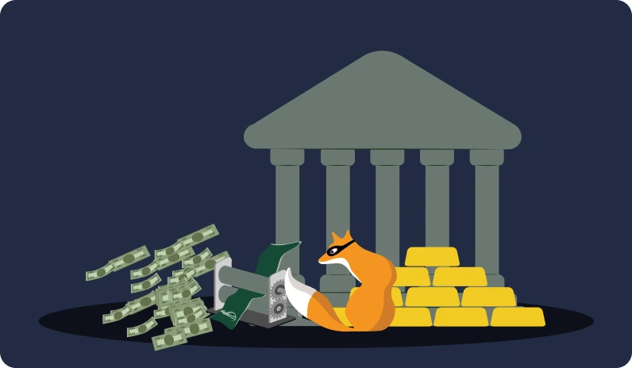
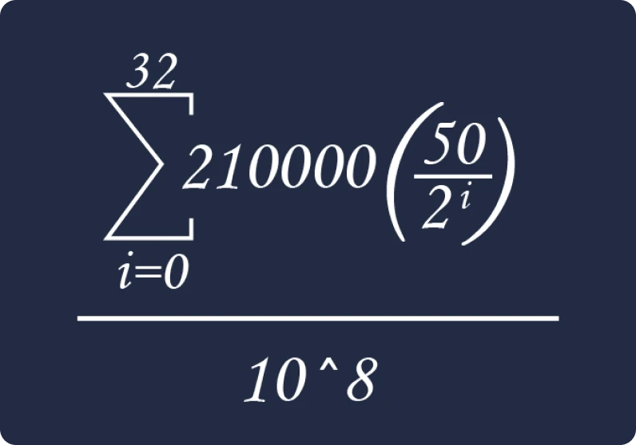
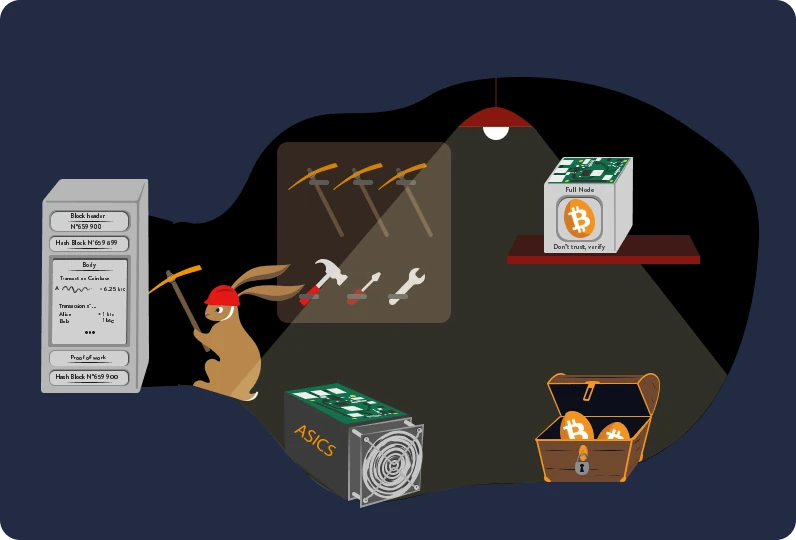
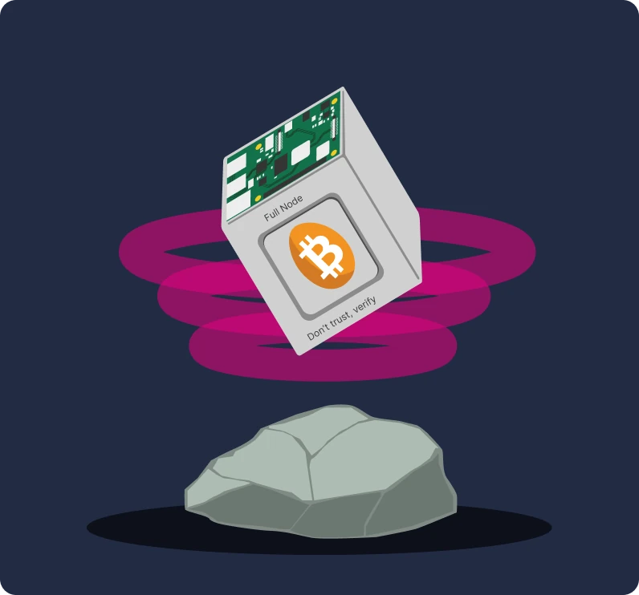
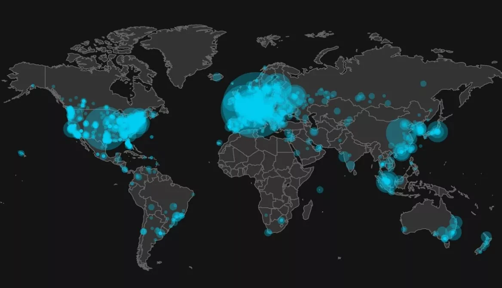
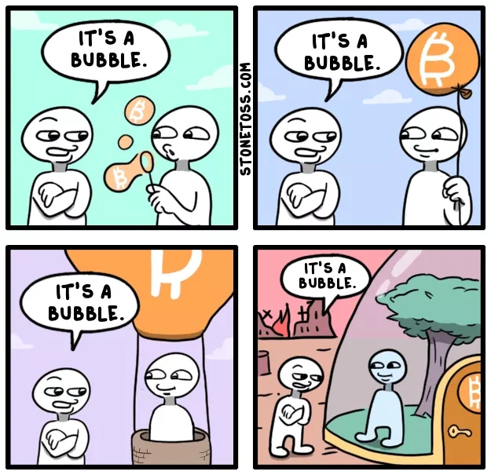

# 您的第一次比特幣冒險

在本課程中，我們將分 25 章解釋比特幣的基礎知識，讓您以簡單且高效的方式瞭解這項技術。課程探討整個行業的基礎知識，包括挖礦、錢包、買賣平台等主題。在整個旅程中，我們會提供額外的教材，我們也邀請您在完成本課程後檢視資源區中的「21 張海報」。

您不需要任何特定的知識就可以開始學習。事實上，以下內容適合各種程度的學生使用，大約需要 15 小時即可完成。

+++
# 簡介

<partId>3cd2ac82-026c-53e1-874a-baf5842adc6d</partId>

## 躍入未知世界

<chapterId>27e3fb60-4b50-556b-9e70-c4f5475c121d</chapterId>

### 歡迎來到新的貨幣和技術範例。

比特幣是一場技術和貨幣革命，能夠讓我們質疑我們與金錢和社會的關係。事實上，比特幣（簡稱 BTC）是一種**中性**和**去中心化**的貨幣，意味它不受任何實體或機構的控制。它是一種創新，超越了純粹的「網路貨幣」：它既是一個電腦協定（Bitcoin），也是一個貨幣單位（比特幣）。

該協議使用了密碼學、網絡通訊和著名的「區塊鏈」等底層技術，而比特幣單位則作為該協議正常運行的必要貨幣。在日常生活中，薩爾瓦多人和世界各地的比特幣使用者使用比特幣貨幣來買賣商品和服務，依靠這項技術讓他們的生活變得更美好。

### 全面但容易理解的課程

在本課程中，我們將討論比特幣的一些貨幣方面的問題，包括如何購買和出售比特幣，如何安全地將比特幣儲存在數位錢包中，以及如何使用比特幣進行交易。我們也會研究礦工的角色，他們是創造新比特幣和保護比特幣網絡安全的關鍵。最後，我們將探討比特幣的未來，以及閃電網路（Lightning Network）技術如何改善比特幣交易。


我們必須了解，比特幣是一種新的貨幣系統，它完全改變了我們與金錢的關係，因此學習如何使用比特幣是任何想要掌控自己資金的人的必備技能。

**第 1 節 - 金錢**


- 第 1 章 - 何謂金錢？
- 第 2 章 - 法定貨幣
- 第 3 章 - 惡性通貨膨脹
- 第 4 章 - 比特幣貨幣政策

**第 2 節 - 比特幣錢包**


- 第 5 章 -比特幣錢包如何運作？
- 第 6 章 - 選擇您的安全性
- 第 7 章 - 設定您的錢包
- 第 8 章 - 保護時間

**第 3 節 -比特幣的技術特點**


- 第 9 章 - 何謂交易？
- 第 10 章 -比特幣節點
- 第 11 章 - 礦工
- 第 12 章 - 礦工與生態

**第 4 節 - 儲存 Bitcoin**


- 第 13 章 - 比特幣價格
- 第 14 章 - 如何購買比特幣？
- 第 15 章 - 為比特幣工作
- 第 16 章 - 超級比特幣化

**Section 5 - 閃電網路 Lightning Network**


- 第 17 章 - 閃電網路網路簡介
- 第 18 章 - 閃電網路的使用案例

在介紹貨幣的定義及其在社會中的功能（第一章）之前，我們應該從比特幣的起源說起。比特幣於 2009 年推出，是一種相對較新的技術，與其他任何技術都不同。因此，不能一下子理解它的一切是很正常的。事實上，就像學習如何使用互聯網或駕駛汽車一樣，你不需要馬上知道所有的技術細節：你可以從學習如何接收、支付和保護你的資金開始，然後逐步深入探索比特幣的運作原理。

畢竟，我們才剛開始採用它，剛剛突破起飛階段：你正好趕上這個關鍵時刻，獲取任何關於這項重要創新的知識。


這裡重要的一點是以整體性的方式理解這項新技術，因此我們希望您喜歡這個課程，並在這個全新的國際貨幣模式中持續進步。

## 比特幣的前史

<chapterId>9a94b627-5b69-5d81-9125-f1fa9b0aa6ad</chapterId>

在「Bitcoin」一詞成為數位貨幣和金融變革的代名詞之前，一系列的想法、創新和社會運動為它的出現奠定了基礎。其中，密碼龐克（Cypherpunk）運動是比特幣誕生前的重要關鍵之一。

### Cypherpunks：數位世界的遠見者


在 1980 和 1990 年代科技演進的核心時期，有一群人開始深刻質疑隱私和自由在數位時代的角色。這些人後來被稱為「密碼龐克（Cypherpunk）」，他們堅信密碼學可以作為一種工具，保護個人權利免受政府和大企業的干擾。

朱利安-阿桑奇 (Julian Assange)、戴威 (Wei Dai)、蒂姆-梅 (Tim May) 和大衛-查姆 (David Chaum) 等代表性人物在塑造該運動的理念和願景方面發揮了關鍵作用。這些思想家在一個具影響力的電子郵件論壇上分享他們的想法，來自世界各地的參與者在這裡激烈辯論，探討如何利用技術來實現更大的個人自由。

### Cypherpunks 的三份基本文件


Cypherpunk 運動深深植根於數位行動主義和密碼學，它參考了幾本基礎著作來闡述其原則和對未來的願景。在這些著作中，有三部特別突出：


- 《密碼龐克宣言》（Cypherpunk Manifesto）：

由 Eric Hughes 於 1993 年撰寫的「Cypherpunk 宣言」聲稱隱私是一項基本權利。作者認為，自由且保密的通訊能力是自由社會的必要條件。宣言指出「我們不能期望政府、企業或其他不露面的大型組織給予我們隱私權......。如果我們希望擁有隱私，就必須自己捍衛它。」


- 《密碼無政府主義宣言》（Crypto-Anarchist Manifesto）

由 Timothy C. May 於 1992 年撰寫，這份文章探討了密碼學如何導致一個密碼無政府時代，在這樣的時代裡，政府將無力干涉公民的私人事務。May 構想的未來是人們匿名交換資訊和金錢，無需第三方介入。


- 《網路空間獨立宣言》（Declaration of the Independence of Cyberspace）

儘管這篇文章不完全屬於 cypherpunk 運動的範疇，但它反映了許多參與者的心聲。John Perry Barlow 撰寫於 1996 年，回應了政府對網際網路日益增強的監管。宣言聲稱，網路空間是有別於實體領域的獨立領域，不應受制於傳統法律。正如其所言，「我們沒有民選的政府，也不太可能會有」。

### 比特幣的前身

在比特幣出現之前，已經有人嘗試創造數位貨幣。例如，David Chaum 在 20 世紀 80 年代推出 「DigiCash」 項目，提出「匿名電子貨幣」的概念。不幸的是，由於各種限制，DigiCash 最終未能成功推廣。

另一個重要的先驅是 Wei Dai 的「B-money」。儘管 B-money 從未真正實施，但它提出了匿名數位貨幣的構想，在這種貨幣中，欺詐檢測由評估者社群而非中央機構執行。

下方的圖片清楚展示了該運動的發展歷程及其眾多技術創新。


正是在這樣充滿創新與思想碰撞的環境中，神秘的中本聰（Satoshi Nakamoto）才在 2008 年發表了《比特幣白皮書》。在這份白皮書中，他結合了幾個來自 cypherpunk 運動的想法，例如工作量證明（Proof of Work）和加密時間戳（Cryptographic Timestamps），創造一種去中心化且可抗審查的數位貨幣。

然而，比特幣不僅僅是一種新型貨幣：它代表了 cypherpunk 理想的實現。除了其技術之外，它象徵了對傳統金融體系的革命，並提供了一個基於透明度、去中心化和個人主權為核心的替代方案。

### 總結

比特幣的前史深深植根於 cypherpunk 運動，以及人類在數位時代追求更大自由的共同努力。透過結合密碼學、去中心化和完整性的原則，比特幣已經不僅僅是一種貨幣。事實上，它是一場哲學和技術革命的產物，並將繼續重塑我們的世界。

因此，比特幣是一個跨越長時間尺度的協議，鼓勵我們質疑我們與能源、時間和金錢的關係。

然而，比特幣是一種「真正的」貨幣嗎？要理解這一點，我們首先需要理解貨幣的概念及其各種形式，我們將在下一章中探討。

如果您想更深入地了解比特幣的歷史，我們強烈向您推薦我們的 HIS 201 課程，在這門課程中，您將發現比特幣的起源、它如何逐步崛起，以及其早期發展與社群建立的歷程。本課程有完整的記錄和資料來源，當然也有許多趣聞軼事：

https://planb.network/courses/a51c7ceb-e079-4ac3-bf69-6700b985a082
# 金錢

<partId>e913df1a-4cbd-5380-ba67-ca2a0414f671</partId>

## 歷史上的貨幣

<chapterId>c838e64d-d59f-5703-8c74-ea5e8c4fdd31</chapterId>

貨幣的演變是人類歷史中引人入勝的一面，它反映了各個文明在不同時代的智慧與創新，以應對不斷變化的經濟需求。


### 從貝殼到銀行帳戶

最初，貨幣是一種有形資產，例如穀物、牲畜或其他商品。然而，這些商品的主要缺點是易腐爛，因此很難用作為長期儲蓄的媒介。例如，糧食歉收或牲畜生病可能會在一夜之間摧毀個人的財富。

因此，隨著文明的進步和貿易擴展到新的地區，人們對通用交換媒介的需求日益增加。人們首先嘗試使用貝殼和寶石等物品，但這些物品並不如他們所認為的那樣耐用或稀缺。最終，黃金因其稀有、耐久性和可分割性而成為貨幣標準。直到今天，黃金仍然是財富和權力的象徵。


### 金錢的角色是什麼？

金錢是一種高度精密的溝通工具：


- 它允許現在和未來之間的溝通，因為它將我們的時間和精力轉化為一種資產，可以在未來的時間裡重新使用，而不會有貶值的風險。
- 它促進了通用語言的溝通：兩個陌生人不認識對方，也不說同一種語言，就可以交換、交易，並就事物的價值達成一致。

貨幣在我們的世界中的功能是很難被人為複製的。事實上，任何個人或團體都無法創造貨幣，因為貨幣是一種自然現象，必須從市場和自願共識中產生。在這個過程中，價格扮演訊號與資訊的角色，指引社會如何有效配置資源。

正因如此，黃金作為貨幣是 4,000 年來貨幣達爾文主義（Darwinism）基於以下亞里斯多德（Aristotelian）提出貨幣三大功能的結果：


- **價值儲存**：貨幣可以用來將購買力轉移到未來，因此它需要是一種耐用的材質；
- **交換媒介**：貨幣可以用來交換商品和服務，而不是以物易物，從而避免交易者之間的需求重合；
- **記帳單位**：貨幣也讓我們可以比較不同商品的價值，以便更了解它們的相對便利性。


### 貨幣的特性

黃金理想地符合高效貨幣的標準：其天然稀有性使其價值不菲，而其化學特性則確保其不會隨著時間的流逝而腐蝕。這些特點使黃金成為一種很好的**價值儲存**，但並非理想的流通貨幣，因為這種形式的貨幣不容易分割或長距離運輸。在全球化和數位化的世界中，黃金難以跟上時代的需求，需要一個中央機構來更易於分割與交換（如鑄造金幣）。

相反地，國家發行的法定貨幣（Fiat）雖然很容易使用，但卻受到掌控它們的機構（國王、中央銀行、皇帝、獨裁者）不斷貶值。

為了更好地解釋這個概念，我們將探討有效貨幣的特徵：


- **可替代性**，意指可與其他同類單位互換而不會失去價值；
- **可分割性**，因為它可以分割成較小的單位，以便適應不同規模的交易；
- **流動性**，即容易轉換為商品或服務。

為了符合這些標準，貨幣在歷史上經歷了不同的演變階段：


- 原石 -> 硬幣
- 鈔票 -> 銀行卡
- 區塊鏈 -> 閃電網路（Lightning Network）

時至今日，貨幣仍在不斷演變，以適應不同的應用場景。正如我們所說，黃金雖然是絕佳的價值儲存工具，但已不再適用於當前的全球化經濟。同樣地，美元和歐元等法定貨幣的流動性很高，也很容易運輸，因為它們現在大多數都是數位化的，但它們的價值卻因貨幣通貨膨脹而不斷降低。

另一方面，比特幣帶來了新的可能性。比特幣的特性，如供應量的嚴格限制，使其成為優秀的價值儲存工具。此外，作為中立的網路貨幣，比特幣是一種可行的**交易媒介**，可以跨越國界。然而，儘管比特幣 [採用率持續成長](https://btcmap.org/map)，但目前仍未被商業界廣泛接受。

## 法定貨幣

<chapterId>25151d46-7db1-5b48-8bba-cbde1944555a</chapterId>

> 「那些不能記住過去的人，注定要重蹈覆轍。」—— 喬治・桑塔亞那（George Santayana）

當談到目前的貨幣體系時，這個真理引起了強烈的共鳴。

### 法定貨幣 = 信任

如今，歐元和美元等主要貨幣被視為法定貨幣。這意味著它們缺乏內在價值，完全取決於我們對管理它們的機構的信任和信心。

法定貨幣是一種由機構（即國家，如中國的人民幣）或政治經濟聯盟（如歐盟的歐元）所頒佈的貨幣形式。負責發行貨幣的機構是中央銀行（例如，我們可以提到中國人民銀行、美國聯邦儲備局或幾內亞共和國中央銀行）。恰恰是這些實體負責制定貨幣政策，從而決定應將多少貨幣投入流通或印刷。


### 貨幣貶值：與羅馬帝國一樣古老的策略

自古以來，黃金一直是貨幣的參考貨幣，但由於其剛性，無論是羅馬皇帝還是現代政府，往往選擇採用替代貨幣，其中多數為法定貨幣。

這個機制很簡單，靈感來自文明起源以來就存在的做法。統治者為了控制財富，首先會集中黃金，通常是利用他們的權力，並承諾提供保護和安全來達成目的。有了手中的珍貴儲備，他們就會推出一種新的貨幣，其價值等同於黃金，但鑄有統治者的肖像。這種貨幣隨後開始流通，人們很快就適應了簡單方便的使用方式。

然而，這些領導人接著就開始讓新貨幣逐步貶值，事實上，與最初的黃金價格相比，新貨幣的價值每年都會降低幾個百分點。這種無聲的貶值通常被辯解為符合人民的利益。實際上，那些以這種法定貨幣儲蓄的人看到他們的儲蓄價值被侵蝕，而國家則透過通膨來資助各種計畫。此外，這種貶值使債務更容易償還。



在關鍵時刻，領導人宣布：貨幣不再由黃金支持。大眾現在已經習慣了法定貨幣，且大多對金融知識了解有限，因此他們默認接受這一現實，允許國家自由地操縱貨幣供應，幾乎不花任何代價就可以印製大量的鈔票。

貨幣印刷隨後會導致通貨膨脹，並逐漸使人民貧困化。此外，金融體系受到管制和限制，以避免其崩潰，因為任何動盪都可能引發重大經濟危機。與大眾相反的是，金融機構與富裕的個人卻從這個系統中獲益良多，進一步加劇貧富差距，並助長威權主義。在這種情況下，他們沒有徹底改變的動力，讓這個體系繼續發展下去，直到最終可能發生崩潰。

如果執行得當，這個策略可以維持數十年。然而，必須注意的是，快速貶值或失去信心可能會導致惡性通貨膨脹 (見下一章)。歷史顯示，美元在 100 年內貶值了 98%，歐元在 20 年內貶值了 30%，而英鎊自創立以來貶值了 99%。

最後，貨幣可能不再與黃金有任何關聯，就像帝國末期的羅馬硬幣一樣，甚至淪為簡單的數值，與有形的現實脫節。

今天，我們正在見證一個歷史性的轉折點。長期佔主導地位的美元似乎正在衰落，而黃金則失去了其核心地位。我們正站在新貨幣週期的門檻上，提醒我們歷史的教訓往往被遺忘。


### 比特幣是解決方案嗎？

因為這些前提，比特幣革命的動力越來越大。與之前的貨幣相反，它**不需要可信任的第三方**，其目標是實現國家與貨幣的分離。


事實上，比特幣提出了一個去中心化的解決方案和一個新的平行貨幣系統，以此作為對這些系統性問題的回應。從歷史上看，如果黃金因其抗偽造性而被青睞作為貨幣，那麼比特幣也同樣無法被偽造。此外，由於其去中心化和加密的特點，比特幣的發行量被限制在 2100 萬枚。比特幣是一種依賴於透明度和中立性的貨幣，為當前的集中式貨幣體系提供了一個有吸引力的替代方案。


比特幣獲得關注的另一個原因是中央銀行數位貨幣（或稱 CBDCs）的出現，這似乎是不可避免的。這種新的貨幣形式將發展更多的中央計劃經濟，既可能妨礙個人的金融自由，也可能助長專制濫用。

我們可以引用諾貝爾獎得主 F.A. 哈耶克（F.A. Hayek）在 1984 年的名言來總結本章內容：

> 「我不認為我們能夠再次擁有良好的貨幣，除非我們將貨幣從政府手中奪走。如果我們不能用暴力手段奪取，那麼我們唯一能做的，就是以某種狡猾或間接的方式引入一種他們無法阻止的東西。」

要了解更多有關經濟謬誤和自由的資訊，我們邀請您探索我們的 ECO 102 課程，該課程追溯了 19 世紀法國思想家弗雷德里克・巴斯夏（Frédéric Bastiat）的生平和思想，他肯定會欣賞比特幣的出現：

https://planb.network/courses/d07b092b-fa9a-4dd7-bf94-0453e479c7df
## 惡性通貨膨脹

<chapterId>b04c024c-54f3-50cb-997f-58721cfc74be</chapterId>

惡性通貨膨脹是法定貨幣特有的一種貨幣現象：它的特點是民眾對貨幣完全失去信心，以及由於政府大量印鈔而導致通貨膨脹急劇增加。因此，個人累積的儲蓄可能會在短時間內迅速貶值，最終將國家推向經濟、社會和政治崩潰的邊緣。

### 通貨膨脹肆虐！

為了解通貨膨脹對儲蓄的影響，我們需要考慮不同的通貨膨脹率。


- 以 2% 的通貨膨脹率計算，您每年會損失 2% 的購買力，5 年內就會損失 10%。
- 如果是 7%，10 年內就會損失一半。
- 如果是 20%，3 年內幾乎會損失一半。

當惡性通貨膨脹發生時，我們談論的不再是每年 20% 的通貨膨脹，而是每月 20% 的通貨膨脹，或在高峰時甚至是每天 20% 的通貨膨脹。在三天內每天經歷 100% 的通貨膨脹，是我們的世界已經發生且持續發生的現實情況。

我們必須了解，惡性通貨膨脹的發生並非偶然，也不是因為資本主義或政治對手的政治攻擊。惡性通貨膨脹是中央銀行家和政治家所做的錯誤貨幣決策的直接後果。這種錯誤會影響所有公民，甚至波及未來世代。我們誠摯地邀請您花五分鐘時間閱讀下表，以充分了解此現象的真正影響（ECO 204 課程將進一步深入探討此主題）。如您所見，沒有任何國家或貨幣是安全的。


### 惡性通貨膨脹有哪些階段？


惡性通膨的發生需要特定條件的觸發。

第一階段 - 失去信心


- 貨幣權力的高度集中，使得政府能夠隨意發行貨幣並濫用權力。在這種情況下，一些外部因素可能會引發惡性通貨膨脹，典型的有戰爭、社會措施或主要資源（如小麥或汽油）的價格上漲。因此，人們會對貨幣失去信心，民眾開始質疑貨幣的來源和強制性貨幣政策的好處。

第二階段 - 貨幣崩盤和物價上漲


- 隨著政府失去公眾信任，人們就會開始將他們的貨幣兌換成更穩定的貨幣，就像委內瑞拉的美元一樣。這種情況會導致價格上漲，形成惡性循環，商品和服務變得越來越昂貴。為了滿足這些需求並修正貨幣政策，國家印制更多的鈔票，造成指數級的通貨膨脹。

第三階段 - 印鈔的惡性循環


- 因此，人們需要越來越多的紙鈔來購買基本商品，最終導致紙幣的稀缺。為了因應這種情況，政府只好印製更多的紙幣，但這只會進一步推動通膨惡化。


第四階段 - 新貨幣的出現


- 政府最終引入新貨幣來取代舊貨幣，並施行比以往更嚴格的貨幣管控措施，以打破通貨膨脹的循環。

解決惡性通貨膨脹的危機通常需要徹底的改變，例如革命、政權更迭、中央銀行高層換人等等。從信心喪失到貨幣崩潰，再到經濟重建，是重振以法定貨幣為基礎的經濟的必要階段。

### 三個顯著的例子


- 德國（1922-1923 年）

最具代表性的惡性通膨案例之一發生在第一次世界大戰後的德國魏瑪共和國（German Weimar Republic）。

德國為了資助戰爭而舉借了大量債務。然而，德國不僅失去了它，還要支付數十億美元的賠款。通貨膨脹率最高的月份是 1923 年 10 月，最高達到29,500%，相當於每天 20.9% 的通貨膨脹率。物價每 3.7 天翻倍一次！

德國貨幣變得毫無價值，以至於有些市民寧願燒紙幣也不燒木材，因為這樣實際上更便宜。甚至有人告訴我們，餐廳的服務生不得不每 30 分鐘重新報一次菜單價格，以計算通貨膨脹。

最後，德國政府推出新貨幣，其價值由德國、法國、英國的債務支持，並以德國土地作為擔保，試圖終結這場貨幣崩潰的危機。


- 匈牙利（1945-1946 年）

迄今為止，歷史上最嚴重的惡性通膨案例發生在二戰後的匈牙利。

匈牙利在戰爭中站在戰敗的一方，且國內大部分工業生產能力被摧毀。通貨膨脹最高的月份是 1946 年 7 月，當時的物價膨脹率高達驚人的41,900,000,000,000,000%（41.9 千萬億 %），相當於每天 207%。物價每 15 小時翻倍一次！

最後流通的紙幣是 1946 年的 100 百萬億 (100,000,000,000,000) 彭戈（Pengo）。


- 辛巴威（2007-2008 年）

直到 2000 年，除了石油之外，辛巴威幾乎能自給自足。

1997 年，在政府同意向退伍軍人賠償相當於 4.5 億美元的補償金後，辛巴威幣崩盤超過 72%。但由於政府財政無力支撐，只能大量印鈔。2005 年，通貨膨脹率達到 586%，但最高峰是在 2008 年 11 月中旬，通貨膨脹率估計為每月 79,600,000,000%（796 億%）。

2007 年 6 月，政府已採取價格管制措施，但此舉並未對經濟產生任何影響。商店遭「洗劫一空」，商人再也沒有辦法為商店補充貨品。

2009 年 4 月，財政部長宣佈暫停使用辛巴威幣，並允許多種外國貨幣流通。所有銀行帳戶、退休金和金融機構的餘額一夜之間蒸發一空。


總而言之，惡性通貨膨脹會使貨幣價值迅速貶值，導致儲蓄流失，並使人們對貨幣體系失去信心。正如伏爾泰 (Voltaire) 曾提出的，法定貨幣最終總會失去其內在價值，並趨向於零。

一種依賴於可信賴的第三方（如金融機構）的貨幣，從實際和長遠來看都是一種有缺陷的貨幣，因為它無法確保購買力，也無法真正保護儲蓄。

若要深入探討惡性通貨膨脹的主題，我們推薦 David St-Onge 的 ECO 204 課程，您將在此瞭解惡性通膨的週期如何運作及其對我們生活的實際影響。您也將發現不同時期的惡性通膨有何相似之處，最重要的是，如何保護自己不受這些週期的影響。

https://planb.network/courses/caa75343-ac90-4249-bcca-0e2e57c3a0f1
## 2,100 萬比特幣

<chapterId>f4a06d76-1963-56fd-93ff-dfa41489bcde</chapterId>

### 比特幣的貨幣政策

比特幣是一種去中心化的數位貨幣，預設的最大數量為 **2100 萬枚**。這種內在的稀缺性由其電腦程式碼所決定，並且受到參與該協議的所有用戶的共識所強化。


它的貨幣發行量可以用一條曲線來說明，這條曲線代表了比特幣隨時間產生的數量。例如，在 2022 年，約有 1,850 萬個比特幣流通。預測顯示，到 2025 年，比特幣的數量將約為 1,950 萬枚，約佔總供應量的 93%，而到 2037 年，這個數字將達到 2,040 萬枚。

### 新的比特幣是如何產生的？

新比特幣的產生是挖礦過程的結果。簡單來說，礦工使用功能高效能電腦解決複雜的數學問題，這些問題會驗證交易並確保交易安全。一旦一個問題被解決，礦工就會在區塊鏈上添加一個新的交易區塊，區塊鏈是一個去中心化的分散式帳本，記錄了網絡上的所有交易。區塊鏈可確保透明度和安全性，因為每個區塊都與之前的區塊相連，因此在未取得網路共識的情況下，幾乎不可能更改過去的資料。



成功執行這項任務後，礦工會獲得每十分鐘發行新比特幣的獎勵。這項獎勵每 210,000 個區塊（約每 4 年）減半一次，這個事件被稱為「減半」，使得貨幣發行曲線呈階梯狀。基於這個機制，我們可以從數學上預測，到 2140 年，當總數達到 2,100 萬的上限時，新的比特幣就會停止產生。

| 減半次數 | 區塊高度 | 減半後的 BTC 獎勵 | 減半後流通中的 BTC 估計量 | | 減半後的 BTC 獎勵

| -------------- | ------------ | ------------------------- | ------------------------------------------ |

| 1 | 210,000 | 25 BTC | 10,500,000 BTC | 1 | 210,000 | 25 BTC | 10,500,000 BTC | 10,500,000 BTC

| 2 | 420,000 | 12.5 BTC | 15,750,000 BTC | 12.5 BTC | 15,750,000 BTC

| 3 | 630,000 | 6.25 BTC | 18,375,000 BTC | 6.25 BTC | 18,375,000 BTC

| 4 | 840,000 | 3.125 BTC | 19,687,500 BTC | 4 | 840,000 | 3.125 BTC | 19,687,500 BTC | 19,687,500 BTC

| 5 | 1,050,000 | 1.5625 BTC | 20,343,750 BTC | 1.5625 BTC | 20,343,750 BTC

| 6 | 1,260,000 | 0.78125 btc | 20,671,875 btc | | 0.78125 btc

| 7 | 1,470,000 | 0.390625 BTC | 20,835,937.5 BTC | 0.390625 BTC

| 8 | 1,680,000 | 0.1953125 BTC | 20,917,968.75 BTC | 0.1953125 BTC | 20,917,968.75 BTC

| 9 | 1,890,000 | 0.09765625 btc | 20,958,984.375 btc | 0.09765625 btc | 20,958,984.375 btc

| 10 | 2,100,000 | 0.048828125 btc | 20,979,492.188 btc | 20,979,492.188 btc

| 11 | 2,310,000 | 0.0244140625 BTC | 20,989,746.094 BTC | 0.0244140625 BTC

| 12 | 2,520,000 | 0.01220703125 BTC | 20,994,873.047 BTC | 0.01220703125 BTC

| 13 | 2,730,000 | 0.006103515625 BTC | 20,997,436.523 BTC | 0.006103515625 BTC

| 14 | 2,940,000 | 0.0030517578125 BTC | 20,998,718.262 BTC | 0.0030517578125 BTC

| 15 | 3,150,000 | 0.00152587890625 BTC | 20,999,359.131 BTC | 0.00152587890625 BTC

| 16 | 3,360,000 | 0.000762939453125 btc | 20,999,679.566 btc | 0.000762939453125 btc

| 17 | 3,570,000 | 0.0003814697265625 BTC | 20,999,839.783 BTC | 0.0003814697265625 BTC

| 18 | 3,780,000 | 0.00019073486328125 BTC | 20,999,919.892 BTC | 0.00019073486328125 BTC

| 19 | 3,990,000 | 0.000095367431640625 BTC | 20,999,959.946 BTC | 20,999,959.946 BTC

| 20 | 4,200,000 | 0.0000476837158203125 BTC | 20,999,979.973 BTC | 0.0000476837158203125 BTC

我們將在 [miner 章節](https://planb.network/courses/2b7dc507-81e3-4b70-88e6-41ed44239966/dbb8264a-7434-57e4-9d1b-fbd1bae37fdf) 中更詳細地重溫挖礦的概念。

### 保證數位稀有性

2100 萬的上限是比特幣稀缺性的基礎，由兩個關鍵機制保證：挖礦難度的調整和博弈論。


- 挖礦難度調整是每 2016 個區塊，也就是大約兩個星期進行一次，以確保平均每十分鐘就有一個新區塊加入到區塊鏈中。區塊產生頻率和比特幣總供應量都是比特幣協議的固定參數，無法像傳統貨幣那樣受到任意操控，除非獲得整個網絡的共識。

挖掘有效雜湊（Valid Hash） 的難度遵循一種週期性變化的機制：如果礦工數量增加，這意味著他們找到的區塊數量也會增加，從而導致找到一個區塊的平均時間減少。因此，難度也會增加。因此，礦工找到的區塊數量會減少，這意味著該機制回到平均每個區塊 10 分鐘的水平。請參閱下圖，以獲得直觀顯示。


您是否知道，礦工挖出一個區塊的動機，是為了透過區塊補貼賺取新比特幣，還能從區塊內的交易手續費中獲得額外收入？

因此，當發行的比特幣數量接近 2,100 萬的上限時，礦工透過交易手續費獲得的報酬將比透過區塊補貼獲得的報酬更多。


- 博弈理論是一種數學概念，它假設個體是理性的，在考慮他人的潛在決定的同時，尋求自身利益的最大化。在比特幣中，博弈理論有助於確保大多數礦工和用戶的行為符合網絡的最佳利益。事實上，由於協定的變更是由用戶投票決定的，因此任何對比特幣協定的修改都需要整個用戶社群的同意，這是非常複雜的。所以，如果有人想創造一個2千2百萬的比特幣，他們必須說服所有用戶自願貶值自己的儲蓄，而這不太可能發生，因為比特幣是全球性的，不受任何中央機構控制。


貨幣貶值的想法與比特幣的基本理念相違背，因此改變其整體數量的可能性極低。

### 可審計的貨幣流動性：每秒鐘、從開始到永遠！

比特幣的稀缺性是一大資產，流通中的最高數量 2,100 萬枚比特幣是公開的，任何人都可以驗證。

事實上，任何人都可以透過比特幣節點（即交易驗證器）來查詢比特幣的供應量，只需輸入以下命令即可：`bitcoin-cli gettxoutsetinfo`.這種透明度增強了人們對比特幣系統的信任，比特幣系統不是基於中央機構或個人，而是建立在數學與密碼學的保證之上（您將在 LNP 201 中學習如何輕鬆地做到這一點）。

```json
{
"height": 710560,
"bestblock": "0000000000000000000887384d67103412ea7f18a43953e65c8c4ac36bf42e54",
"transactions": 473244,
"txouts": 1018917,
"bogosize": 2183872374,
"hash_serialized_2": "eebb9987337700ffaacbbaa11223344",
"disk_size": 178239584,
"total_amount": 18745998.12345678
}
```

比特幣透過其設計上的限制來確保健全的貨幣管理，這使得它與其他貨幣非常不同，因為它可以保護用戶的儲蓄。比特幣符合奧地利經濟學的原則，其穩定的數量和可預測的分佈使其避免了傳統貨幣必須面臨的通貨膨脹的固有風險（請參閱 ECO 201 課程了解更多）。

總之，比特幣以其分散性、程式化的稀缺性和透明度，為傳統貨幣系統提供了一個獨特的替代方案。它說明了如何利用技術來創造一種不僅有用且可驗證的貨幣，而且還透過嚴格限制其供應來保存用戶儲蓄的價值。

### 第 1 節結論！

# 比特幣錢包

<partId>28860585-4f61-59d9-b242-f4c57d837cc1</partId>

## 什麼是比特幣錢包？

<chapterId>1c0166ab-cb7a-5bc6-9175-d13482bd91f1</chapterId>

在第 2 節中，我們將探討比特幣的儲存與安全性，並透過錢包來理解這些知名的比特幣究竟存放在哪裡，以及我們該如何與它們互動！

### 解讀比特幣錢包

我們使用錢包以三種主要方式與比特幣網絡互動：


- 接收比特幣
- 發送比特幣
- 保護比特幣免受駭客攻擊和盜竊

比特幣錢包的形式多種多樣：電腦上的軟體、手機應用、USB 隨身碟等實體裝置，甚至是一張寫有私鑰的紙張。每一種都有不同的用途。事實上，有些是為大額交易而設計的，強調安全性，而有些則以隱私為優先，或者是用於日常的小額支付。

因此，投資組合可分為多種用途，但總是圍繞著一個核心概念：你是否真正掌控你的資金，還是將你的資金交由第三方管理？我們將在下一章詳細探討這一課題，但這個問題其實很簡單：你的錢是在你的口袋裡，還是在銀行家的口袋裡？


### 比特幣錢包如何運作？

無論是由你自己管理比特幣，還是交由某個「比特幣銀行家」代管，大多數比特幣錢包的運作方式都基於非對稱加密技術，這種技術依賴於一對密鑰來運作：私鑰（Private Key）用於發送比特幣;公鑰（Public Key）用於接收比特幣。


- 私鑰

初始化錢包時，會生成一個秘密恢復詞（私鑰），通常由 12 或 24 個單詞組成。

私鑰是最基本的，因為它構成了比特幣的所有權，因此也構成了使用或發送比特幣的權利。因此，擁有私鑰的人就擁有了對比特幣的完全支配權。

這把鑰匙必須保密並妥善保護，因為它能開啟您的財富之門！


- 公鑰與地址

公鑰由私鑰產生，並與私鑰連結。共用公鑰會對隱私造成風險（因為其他用戶可以看到您的餘額），但不會對安全造成風險（因為他們沒有私鑰就不能使用您的資金）。反過來，公鑰被用來創建比特幣地址，從而接收資金。

這些地址由您的錢包自動創建，可以安全地共享。為了最大化您的隱私，建議您只使用一次。

總而言之，這項技術讓我們有能力接收比特幣，但卻不會讓接收者竊取我們的資金！郵箱可以是一個恰當的比喻：人們可以把錢存入郵箱，但只有您才能打開它。


### 比特幣真的存放在錢包裡嗎？

儘管您的私鑰儲存在您的錢包中，但比特幣本身實際上是「儲存」在比特幣區塊鏈中，它是比特幣點對點網絡中公開的去中心化分佈式帳本（我們將在第 3 節中深入探討）。這意味著，丟失包含您錢包的設備不一定會導致您的比特幣丟失。實際上，允許您重新創建您的錢包並使用您的比特幣的是私鑰，所以請務必記住妥善保護它！


幸運的是，自 2017 年起，比特幣私鑰可可以用一組簡單的 12 或 24 個單詞來表示，稱為「助記詞」，相當容易儲存。這組 12 或 24 個單詞相當於你的私鑰備份，並允許您使用任何比特幣錢包軟體或應用程式重新創建您的錢包。因此，任何人只要擁有這些單詞，就可以存取您的比特幣。

### 駭客能破解助記詞嗎？

如果有人不小心猜中了我們的 12 或 24 個詞彙清單怎麼辦？簡短的答案是可能性極低，這要歸功於用來創建錢包的密碼技術。換個角度來看，不小心發現您相同的助記詞組，就等於在 1 和 2 的 256 次方 之間找到「正確」的數字，幾乎等同於在宇宙中找到「正確」的原子。但是，如果您不滿意這種預設的安全性，您可以隨時透過在您的比特幣錢包中添加一個「額外密碼」來增強它。


因此，只要你遵循良好的安全措施，您的比特幣比特幣錢包被駭的機率微乎其微。

請記住，要根據您的需求和用途選擇合適的錢包：[我們的大學教程專區](https://planb.network/tutorials/wallet) 中提供了管理和保護不同錢包的詳細教學。

如果在探索比特幣的過程中，你想深入了解如何從隨機熵（Entropy）生成比特幣錢包，以及如何創建比特幣接收地址，我們推薦 CYP 201 課程：

https://planb.network/courses/46b0ced2-9028-4a61-8fbc-3b005ee8d70f
## 比特幣錢包和安全性

<chapterId>00c1afea-e54a-511f-bab3-2efc2fbfa6a1</chapterId>

### 開始之前詢問正確的問題

當您擁有比特幣時，資金安全將是最重要的考量之一。為了確保你的安全策略適合你的情況，最好的方法是先問自己幾個關鍵問題：

- 誰可以存取您的資金？換句話說，是您獨自存取您的比特幣，還是第三方（如公司）授權您存取您的資金？
- 您打算如何使用該特定錢包中的比特幣？定期使用？用於中期，還是長期儲蓄？
- 您的技術能力為何？
- 您的安全預算是多少？

實際上並沒有通用的答案或解決方案，因此請花時間回答這些問題，因為這將幫助你量身打造適合自己的安全策略。


### 從複雜性的角度思考比特幣錢包

下面，我們將定義幾個安全層級：


- **第 0 級**，您使用所謂的「託管服務」，您不是您比特幣的唯一持有人。請注意，這個可信賴的第三方可以隨時限制您存取您的資金。在這種情況下，您的金融主權等級與擁有銀行帳戶的傳統銀行系統相似。


- **第 1 級**，您使用手機或電腦上的比特幣錢包，您是比特幣的唯一持有人，您可以輕鬆地進行交易。上述工具被稱為「熱錢包」，因為私鑰被儲存在可以上網的設備上。在這種情況下，備份助記詞是至關重要的，以便在丟失手機或電腦的情況下重新獲得您的資金。

例如，您可以使用 Sparrow Wallet 作為熱錢包：

https://planb.network/tutorials/wallet/desktop/sparrow-c674e2ac-d46f-4c82-92a7-7d1b0e262f5d

- **第 2 級**，您使用實體硬體錢包，並已保護您的 12/24 個詞彙清單。它通常被稱為「冷錢包」，因為您的金鑰被儲存在未連接至網際網路的裝置上。在這種情況下，您總是需要用您的裝置簽署每筆交易，這使得您的資金在日常使用中較難存取。

例如，您可以使用 Ledger、Satochip 或 Tapsigner：

https://planb.network/tutorials/wallet/hardware/ledger-nano-s-plus-75043cb3-2e8e-43e8-862d-ca243b8215a4
https://planb.network/tutorials/wallet/hardware/satochip-e9bc81d9-d59b-420d-9672-3360212237ba
https://planb.network/tutorials/wallet/hardware/tapsigner-ab2bcdf9-9509-4908-9a4a-2f2be1e7d5d2


- **第 3 級**，您使用第 1 或第 2 級錢包，但您增加了額外的密碼。在這種情況下，請注意您需要備份 12/24 個單詞清單**和**您的額外密碼。理想情況下，這兩項資訊會儲存在兩個不同的地方。

要進一步瞭解 BIP39 密碼的使用和功能：

https://planb.network/tutorials/wallet/backup/passphrase-a26a0220-806c-44b4-af14-bafdeb1adce7


- **第 4 級**，您使用一組錢包建立「多重簽名」錢包，這表示進行交易時需要多重簽名。在這種情況下，要注意多重簽名的每一部分都應該儲存在不同的位置。這種方式通常被認為是比特幣的進階用途，主要用於管理大額資金和企業用途。


當然，不同的使用情況也需要不同的比特幣錢包，不存在「萬能」的解決方案。

### 安全性需求因人而異

每個人對於不同安全等級能存放的比特幣數量有不同的標準。對於某些人來說，在熱錢包上留下 1 BTC 是合理的，而對於其他人來說，則相反。無論如何，如果只是存放少量比特幣，我們不建議花費過多資金購買硬體錢包。此外，請記住，過度複雜的安全措施可能適得其反，尤其是當你未妥善管理錢包備份時。

總之，直接擁有自己的比特幣是確保金融主權的必要因素。建議使用行動錢包來支付日常支出，並使用離線或「冷」實體錢包來儲存較大的金額。另一方面，企業應考慮使用多重簽名系統，或稱「multisig」，以提高和共享安全性。此外，避免使用保管服務也很重要，因為保管服務會複製傳統金融系統的某些弱點。

考慮到這一點，我們現在可以進入下一節，描述如何創建一個比特幣錢包。不過，如果您想進一步探討安全性的話，可以閱讀這篇[DarthCoin 撰寫的文章](https://asi0.substack.com/p/bitcoin-soyez-votre-propre-banque)。

## 設定錢包

<chapterId>615519eb-4565-557d-86a0-021badf7616f</chapterId>

您的比特幣的安全性極為重要，一個簡單的錯誤就可能帶來災難性的後果。因此，在創建新的比特幣錢包時，學習並採用最佳安全實踐是必不可少的。
請注意，BTC 102 課程將引導您完成此步驟。

https://planb.network/courses/f3e3843d-1a1d-450c-96d6-d7232158b81f
### 這個步驟可不是開玩笑的！

當您設定一個錢包時，軟體會自動生成你的私鑰，通常由 12/24 個單詞（通常稱為「種子詞 」或「助記詞」）組成：這些單詞構成您資金的存取權限。如果此密鑰被透露給第三方，你的資金應視為已經遭到威脅。因此，在設置您的錢包時，必須遵守這些規則：

- 遮住所有攝影機。
- 請勿拍攝單字清單。
- 請勿在電腦或電話上輸入。
- 不要將助記詞存為聯絡人或發送簡訊給自己。
- 不要把這些單詞隨意放在桌上。
- 不要將您的助記詞隱藏在不尋常的地方。

您應該拿一張空白的紙張或列印此 [範本](https://bitcoiner.guide/backup.pdf)，然後用筆依據所呈現的順序整齊清楚地寫下單字清單。請注意，如果墨水隨著時間褪色，您可能會損失資金。因此，重要的是要保護這張紙，使其免受可能損壞它的環境因素（如潮濕或火災）的影響。

 以下是一個示範模板：這邊的註記詞是假的，請勿使用！


### 我們的實用建議

此外，在複製過程中請確保不要出錯，否則您的繼承人可能難以閱讀，並可能無法恢復資金。此外，一旦您儲存了這些字句，建議您製作第二份副本，並將其存放在與第一份副本不同的位置。這可確保您在原件遺失或損壞時有一個備份。


單字清單應該存放在您容易記得的安全地方。避免過於複雜的藏匿方式，以免遺失。

**你的助記詞 = 你的資金。**

無論是「冷」和「熱」錢包，助記詞都是標準的私鑰備份方式。因此，您可以在任何相容的錢包軟體或裝置中輸入您的助記詞，以恢復您的存取權限。另一方面，我們強烈建議不要使用不提供種子詞組的錢包，因為它們可能會要求您提供一個帳戶、一個電子郵件地址，或者更糟糕的是，一個身份證。

**注意：如果錢包沒有提供 12/24 個單詞的助記詞，請保持警惕。**

如果您希望逐步了解如何建立自己的錢包，並獲得第一枚比特幣，我們也建議您參加其他課程：

https://planb.network/courses/f3e3843d-1a1d-450c-96d6-d7232158b81f
## 通過時間的考驗

<chapterId>f58cd446-c202-5eff-aab7-e61cc40e5c06</chapterId>

像任何形式的財富一樣，您的比特幣必須受到保護，防止丟失、被盜和貶值，尤其是長期的保護。保護您的比特幣需要一些技術知識和對相關風險的瞭解，這就開啟了兩個主要策略：將助記詞刻在鋼板上和建立比特幣遺產規劃。

### 鋼材雕刻

要長期保護您的比特幣，其中一個方法是將您的助記短語鐫刻在鋼鐵等耐磨材質上，為您的金鑰建立一個防水、防火的實體備份。

有多種解決方案可供選擇：其中有些成本低廉，例如「Blockmit」，而有些則可能需要更專門的設備。您可以在我們學院的 [教學](https://planb.network/en/tutorials/wallet) 區進一步探索此主題。


### 為下一代做好準備！

除了這第一個做法，創建一個繼承計劃是確保您的比特幣在您去世後得到妥善管理的關鍵一步。這個計劃包括手寫一封信，概述您比特幣資產概況、存取方式，以及負責管理資產的可信任人士的聯繫方式。與公證人討論比特幣繼承計劃也是很重要的，以確保符合稅務規定，但請注意，公證人不應直接管理你的比特幣。

如果您想進一步探討比特幣的繼承計畫這個主題，我們建議您閱讀 Pamela Morgan 的書籍[Cryptoasset Inheritance Plan](https://planb.network/resources/books/28) 或報名參加 BTC 102 課程，我們會在課程中提供建立計畫的指導。


### 隱私權很重要

除了建立實體備份或制定繼承計劃，當涉及到您的比特幣的長期安全性時，隱私是另一個重要的話題。例如，購買比特幣時，最好選擇無需提供身份證明的方式，以降低身份盜用或資金被追蹤的風險，因為某些機構擁有相應的技術來監控交易。

關於隱私，避免向所有人談論您的比特幣是非常重要的。我們無法預測未來社會對比特幣的態度，因此保持低調是明智之舉。你不會希望自己或錢包成為他人關注的目標。

同樣地，避免在比特幣會議或與陌生人見面時公開分享您的安全系統細節……

### 比特幣錢包安全性總結

比特幣錢包是一種軟體工具，允許您儲存比特幣並進行交易。有幾種類型：


- 行動或個人電腦錢包，方便小額和/或定期支出；
- 實體錢包，更適合中長期儲存比特幣；
- 多重簽名錢包，管理起來更複雜，需要多重簽名才能執行交易。

在創建錢包時，您必須先將 12 或 24 個助記詞備份在一張紙或一個金屬板上。這個所謂的助記詞可以讓您透過任何比特幣錢包應用程序還原您的錢包。請注意，任何獲取此清單的人也會獲取您的資金。

在比特幣的世界裡，金融主權與個人責任緊密相連，因此必須確保您的錢包和備份的存取安全。要做到這一點，遵循一定的準則是很重要的：


- 建立繼承計畫，確保你的親人能夠在特殊情況下取回比特幣。
- 避免將比特幣存放在交易所，因為它們容易成為駭客攻擊目標。
- 根據您的需求和使用情況來調整您的安全等級，以便在不同的比特幣錢包中做出明智的選擇。

現在，我們已經介紹了比特幣錢包的基礎知識及最佳安全實踐。在下一章，我們將深入探討比特幣的技術特性，幫助你更透徹地理解比特幣的運作方式，從而更好地運用它。

# 比特幣的技術方面。

<partId>a86d7439-e7a2-5f21-b1e9-6b5e23ca265b</partId>

## 推出比特幣

<chapterId>b7561082-8943-519d-95d1-a5f60dd2686d</chapterId>

### 讓我們先從歷史說起。


2008 年 10 月 31 日，一項嶄新的金融科技——比特幣誕生。當天，匿名的中本聰透過一封發送到 cypherpunks 郵件列表的電子郵件，向全世界展示了他的創新技術，cypherpunks 是一個由密碼學熱衷者組成的社群，致力於在互聯網上推廣隱私。這封電子郵件包含了一份名為《白皮書》的文件，介紹了比特幣的工作原理。

可能是因為之前嘗試創建數位現金系統的失敗，這項提案當時並未立即引起廣泛關注。儘管如此，這份白皮書最終成為了比特幣社群的基石，並且多年來持續在比特幣生態系中引發無數討論與研究。


2009 年 1 月 3 日，中本聰透過創建第一個區塊（也稱為「創世區塊」）正式啟動了比特幣網絡，標誌著比特幣區塊鏈的誕生。這個區塊內嵌了一條具有深遠意義的訊息：「03/jan/2009 Chancellor on brink of second bailout for banks.」（「2009 年 1 月 3 日，英國財政大臣正處於對銀行的第二輪紓困邊緣。」）。


> 「我們可以在這場軍備競賽中贏得一場重大勝利，
> 並在數年間獲得一片新的自由領域。」- 中本聰


### 比特幣協議的誕生

2009 年 1 月 9 日，中本聰（Satoshi Nakamoto）宣布發布 Bitcoin 0.1.0 版本。不久之後，Hal Finney 下載了該軟體並加入了比特幣網絡，這象徵著該網絡擁有了兩個節點，也就是兩位礦工。Hal Finney 甚至在當時發了一條推文來紀錄這一歷史性時刻：「Running Bitcoin」。2009 年 1 月 12 日，第一筆 10 BTC 的比特幣交易在中本聰和 Hal Finney 之間進行，如果您回到區塊 170，您可以很容易地找到它。


人們對比特幣的興趣迅速增長，導致許多人測試 Bitcoin、參與討論、解決比特幣的 Bug 並深入探討其道德、經濟與哲學層面。人們被深深吸引，中本聰為了促進這些類型的交鋒，於 2009 年 11 月 22 日創建了 BitcoinTalk 論壇。該論壇迅速成為比特幣用戶的首選討論場所，以至於與比特幣相關的經典迷因與符號也由此誕生，如[Bitcoin logo](https://bitcointalk.org/index.php?topic=64.0)、著名的[Hodl](https://bitcointalk.org/index.php?topic=375643.0)，甚至[Pizza day](https://bitcointalk.org/index.php?topic=137.msg1195)。

**您知道嗎？** 2010 年 5 月 22 日，Laszlo Hanyecz 以 10.000 BTC 的價格購買了兩個披薩，創造了歷史：這是比特幣第一次被用來購買實體商品。


### 中本聰的消失

2010 年，隨著比特幣開始引起媒體的關注，中本聰決定逐漸淡出，於 2010 年 12 月 12 日在論壇上發帖宣布離開。2011 年 4 月 23 日，他透過電子郵件進行了最後一次已知的私人交流，之後就消失了，把他的發明到了社區手中。

> 「政府擅長摧毀像 Napster 這樣的中心化網絡，
> 但像 Gnutella 和 Tor 這樣的純 P2P 網絡似乎能夠自我維持。」- 中本聰

儘管中本聰不再參與，比特幣仍在繼續發展：比特幣的歷史每 10 分鐘就會被書寫一次，該協議至今仍按照原本的設計穩定運作。無論任何恐懼、不確定或懷疑，比特幣繼續前進，並保持極高的線上可用性。事實上，根據這個[網站](https://bitcoinuptime.com/)，比特幣自創立以來，99.988%的時間都在正常運作，沒有出現大規模的問題。

對於一些人來說，比特幣被定義為像[菌絲體](https://brandonquittem.com/bitcoin-is-the-mycelium-of-money/)一樣的真菌實體，而另一些人則把它描述為[黑洞](https://dergigi.com/)。無論你愛它還是恨它，比特幣繼續存在著，以每 10 分鐘產出一個區塊的節奏，持續跳動，如同新貨幣體系的心跳。

若要進一步瞭解中本聰的著作，我們建議您閱讀 Phil Champagne 的 [「The Book of Satoshi」](https://planb.network/en/resources/books/98) 或 ARTE 的紀錄片「Le mystaire Satoshi」。


> 「傳統貨幣的根本問題在於它需要信任才能運作。我們必須信任中央銀行不會貶值貨幣，但法定貨幣的歷史充滿了對這種信任的背叛。我們還必須信任銀行來保管我們的資金並進行電子轉帳，但他們卻不斷放貸，形成一波又一波的信用泡沫，而儲備金卻少得可憐。」 - [中本聰](https://satoshi.nakamotoinstitute.org/posts/p2pfoundation/1/)

現在我們有了一些背景資料，讓我們來看看比特幣交易一般是如何運作的。

## 比特幣交易

<chapterId>03482644-5473-590b-975b-b43bb65eac21</chapterId>

比特幣交易只是透過比特幣地址轉移比特幣所有權的過程。為了描述這個過程，讓我們引入兩個主角：Alice 和 Bob。Alice 希望獲得比特幣，而 Bob 已經擁有了一些。

### 步驟 1 - 透過錢包建立交易

Bob 要轉帳比特幣給 Alice，她必須提供她的一個比特幣地址給他，這個地址是她的比特幣錢包所獨有的。就像私鑰用於產生公鑰一樣，後者也用於產生地址。

具體來說，當 Alice 打開她的錢包並按下「接收」時，一個 QR 碼或地址（如bc1q7957hh3nj47efn8t2r6xdzs2cy3wjcyp8pch6hfkggy7jwrzj93sv4uykr）就會顯示出來。這個地址類似於她「比特幣 IBAN」，然後提供給 Bob。

之後，Bob 打開他的比特幣錢包並按下「發送」來進行交易。然後，他將 Alice 的地址複製並貼上到指定欄位中，添加他想要發送的金額，並決定交易手續費，作為礦工將交易包含在下一個區塊中的獎勵。事實上，Bob 支付的費用越高，他就越有機會將該交易包含在下一個區塊中，並添加到區塊鏈中，即記錄所有比特幣交易的公共和不可變的總帳。

要完成交易，Bob 必須用他的私鑰簽署，以驗證他是他要轉移的比特幣的擁有者。這一步驟通常在手機錢包上是自動進行的，或者在您的實體錢包上以確認的形式進行：「你確定要發送 X BTC 給 Y 嗎？是/否」。


**為什麼我們要付費？** 手續費的存在是為了建立一個自由市場。事實上，比特幣區塊的大小最初為 1MB，在 SegWit（隔離見證）更新後擴展至 4MB。因此每個區塊中可「插入」的交易數量僅限於幾千筆。交易的大小取決於其複雜性。因此，較複雜的交易通常會產生較高的費用。

### 步驟 2：透過節點傳播交易

在這個階段，交易已經建立，Bob 的錢包會將交易資訊發送到比特幣網絡。要做到這一點，他的錢包會與比特幣網絡中的一個節點進行通信，該節點再將交易資訊傳播到其他節點。這種機制確保整個網絡都能看到這筆新交易，並將其納入考量。


此時，儘管這筆交易已經被所有節點接收並存入 Mempool（未確認交易池），但它尚未被確認。交易只有在被礦工打包進區塊後，才算正式生效。

事實上，礦工的職責是收集有效和未確認的交易，將其編譯成一個區塊。簡而言之，他們必須在一個稱為「工作量證明」（Proof of Work, PoW）的過程中解決加密謎題，才能使他們的區塊成為比特幣區塊鏈中的下一個區塊。



### 步驟 3：交易由礦工在區塊中進行挖礦。

工作量證明（PoW）系統需要為有問題的區塊找到一個有效的「雜湊值」（hash）：把它想像成與區塊相關的唯一指紋，由 256 個字元組成。雜湊值的有效性取決於比特幣網絡的挖礦難度（稍後我們將進一步詳述）。現在，我們可以假設一個礦工找到了一個有效的區塊，Bob 對 Alice 的交易包含在其中。然後，新的有效區塊被添加到區塊鏈，即所有比特幣用戶的公共帳本。


### 步驟 4：該區塊有效，並經由 Alice 的參考節點驗證。

在此階段，交易被視為有效：礦工隨後會透過他們的節點將新區塊傳播到網路中，Alice 的錢包也會被更新。


**Note:** 即使 Alice 收到通知說她在她的其中一個地址收到了比特幣，最好還是在交易收到**六個**確認之後才將它視為不可變更。這表示在包含 Bob 的交易的區塊之後，還要再挖出六個區塊。換句話說，交易在區塊鏈中的時間越長，就越難以被篡改。

### 這個過程的重要性何在？

比特幣交易系統是去中心化的，點對點運作，無需任何受信任的中介機構。

Bob 將他的交易發送到比特幣網絡，當礦工發佈一個包含 Bob 交易的有效區塊時，愛麗絲就可以開始認為這些比特幣屬於她。在比特幣所有權轉移的不需要任何信任機制：比特幣協議的規則與經濟激勵機制使得在系統內惡意行為的成本極高，幾乎不可行。

事實上，用戶透過使用自己的私鑰對交易進行數字簽名來轉移資金的所有權。另一方面，礦工的權力有限，用戶透過使用比特幣節點來驗證新區塊和包含的交易，從而保持對系統的高度掌控。每個節點都有一個完整或部分的區塊鏈副本，因此比特幣節點形成的網絡使該系統真正去中心化。

因此，若要徹底摧毀比特幣網絡，就必須消除所有比特幣節點上的所有區塊鏈副本，然而，由於這些節點分布於全球各地，且難以被實體沒收，這在現實中幾乎是不可能的任務。

接下來，我們將深入探討比特幣節點的運作方式。

## 比特幣節點

<chapterId>8533cebc-f799-528b-89df-8d75d4c37f1c</chapterId>

節點是比特幣網絡架構的基本元素，因為它們執行各種關鍵功能：


- 維護比特幣區塊鏈的完整副本
- 驗證交易
- 將資訊傳送至其他節點
- 執行比特幣協議的規則

因此，任何運行比特幣軟體的設備，稱為比特幣節點（通常使用 [Bitcoin Core](https://bitcoin.org/en/bitcoin-core/)），都有助於網絡的去中心化。



### 節點是比特幣的核心。

每個節點都擁有一份區塊鏈副本，它允許交易驗證並防止任何詐騙企圖。網絡的分散性賦予了比特幣卓越的彈性和穩健性。事實上，要停止比特幣協定，必須關閉全球所有節點。供您參考，截至 2023 年 9 月，大約有 [45,000 個節點](https://bitnodes.io/nodes/all/) 分佈在全球各地。

比特幣節點能夠驗證區塊與交易的有效性，因為它們遵循比特幣共識的規則。這些規則建立了比特幣的貨幣政策，例如礦工獎勵的金額（我們將在下一節詳細討論）和流通中的比特幣數量。在某種程度上，節點充當了網絡的法律系統，因為所有的網絡參與者都遵循相同的規則，所以節點確保了比特幣協議的中立性。共識規則幾乎不會變動，如果有的話，若要修改這些規則，必須獲得所有節點的批准。


雖然比特幣協議的治理超出了本基礎課程的範圍，但重要的是要注意，每個運行比特幣節點的用戶都可以決定遵循哪些規則。用戶可以選擇遵守不同的規則（即對程式碼進行修改），但如果這些變更違反了現行的共識規則，該節點將不再屬於比特幣網絡。因此，重大修改非常罕見，需要數以千計具有不同意識形態和利益的參與者進行大量協調，這迫使他們提供被所有比特幣用戶認為「更好」的更新。

### 節點是什麼樣子？

當您想安裝自己的節點時，有多種選擇，維護成本也不同。您可以簡單地在您的電腦上運行 Bitcoin Core 軟體，但這將需要大量的儲存空間，因為區塊鏈數據目前約為 500GB。為了克服這個限制，您可以選擇透過創建一個 「裁剪節點」（Pruned Node），只在記憶體中保留最後的 N 個區塊。對於第二種解決方案，成本可以忽略不计，因為節點只在您需要時才會啟動。


第二種選擇是使用專門的硬體設備來運行比特幣節點，例如 Raspberry Pi 4 搭配足夠大的固態硬碟 (約 2 TB)。如果您必須購買硬體，這個方案會比較昂貴，但每年的耗電量略低於 10,00 歐元。從頻寬的角度來看，考慮到每 10 分鐘 1 個 1 MB 的區塊，相當於每月約 5GB 的數據流量。

### 節點必須保持每個人都能存取！

比特幣節點的低成本與高可及性（在硬體資源、存儲與頻寬方面）是比特幣網絡去中心化的重要特性。

事實上，每個人都有理由運行一個節點！與所獲得的利益相比，所付出的成本和努力是微不足道的。您只需要開始冒險，加入成千上萬的其他 Bitcoiners 一起組成比特幣網絡。



相反，如果比特幣區塊的大小增加 100 倍，那麼每 10 分鐘內確實可以處理 100 倍的交易量，但是運行一個比特幣節點需要 50TB 的硬盤，超過500 GB/月的網絡流量，以及一個能夠 10 分鐘內驗證數十萬筆交易的硬體。在這種區塊大 100 倍的假設情況下，一般人是無法運行比特幣節點的，這將導致去中心化被削弱，並威脅比特幣交易的不可變性與共識規則的穩定性。

因此，協議約束的設計是為了讓盡可能多的人能夠運行自己的節點。事實上，2017 年發生了一場被稱為 「區塊大小戰爭」（Block Size War）的激烈爭議。這場衝突使那些希望透過擴大區塊來提高交易容量的人（包括礦工、交易所與機構）與那些尋求保留比特幣用戶的獨立性與權力的人（節點運行者與普通用戶）對立起來。最終，第二方取得了勝利。

在這次勝利之後，促成了 SegWit（隔離見證）的更新，為閃電網絡（Lightning Network） 的發展鋪平了道路。閃電網絡是一種即時比特幣支付網絡，作為比特幣區塊鏈的第二層解決方案，目標是提升交易速度並降低手續費。這種情況證明，用戶透過他們的節點在比特幣中擁有真正的權力，使他們能夠在發生分歧時站出來對抗大型機構。

## 礦工

<chapterId>dbb8264a-7434-57e4-9d1b-fbd1bae37fdf</chapterId>

**Miners 保護網路安全並將交易加入區塊。他們透過 ASIC 機器消耗電力，來解決比特幣的工作量證明（Proof of Work, PoW）**。


### 工作量證明說明

「工作量證明」（Proof of Work, PoW）是比特幣協議的安全共識機制。它是一切的基礎，在比特幣的博弈理論中扮演著重要的角色。

為了解釋它是如何工作的，可以想像一個人人都可以參加的全民抽獎。目標是找到一個特定的數字，讓贏家簽署一個有效的區塊，賺取比特幣獎勵。這個數字使用 SHA-256 散列函數進行驗證非常簡單，但卻很難找到：參與者（礦工）將嘗試數以億計的可能性，如 1、52、2648、26874615、15344854131318631 等等，直到發現正確的數字為止。

如果所選的號碼正確：中大獎！否則繼續搜尋。為了最佳化嘗試的次數，他們會使用稱為 ASIC 的特定機器，這些機器的唯一作用是每秒計算數十億次的可能性（嘗試的總次數稱為「算力 HashRate」）。為了操作這些機器，必須消耗大量的電力。因此 PoW（工作量證明） 透過能源轉化為貨幣，連接現實世界與數字世界，創造出第一種基於能源的貨幣。

機器持續運作，平均 10 分鐘後，贏家出現：這位參賽者成功找到低於難度臨界值的正確雜湊值。然後，唯一的大贏家會在時間戳伺服器的新區塊上簽名，將其加入區塊鏈。他們收到獎勵後，會回去試試挖下一個區塊的運氣。這個過程已經進行了十多年，每隔 10 分鐘就會有一位贏家確認比特幣交易，同時也確保過去交易的安全，從而使比特幣區塊鏈更加強大和安全。

每隔 2016 個區塊（約每兩週一次），**難度調整**會根據參與人數重新平衡這個全球挖礦遊戲。這項調整是必要的，因為礦工數目及他們的合計計算能力可能會隨著時間發生顯著變化。為了維持目標區塊時間，網路會根據最近 2016 個區塊的開採速度重新調整難度等級。如果它們被挖得太快，難度就會增加，使得找到正確的雜湊值變得更難。相反，如果挖得太慢，難度就會降低，使其更容易。


### 挖礦產業不斷發展

多年來，礦工們為自己配備了越來越高效的電腦硬體，以便每秒產生盡可能多的雜湊數量 (HashRate)，同時以最具成本效益的方式消耗最少的能源。早期的礦工，例如中本聰或 Hal Finney，只使用他們的 CPU 挖礦，之後其他人開始使用顯示卡挖礦。現在，礦工們使用 ASIC（專用集成電路）：專門用於應用 SHA256 演算法的機器。


比特幣網絡的 Hashrate 代表每秒嘗試尋找下一個區塊的次數。今天，它甚至超過了 500 TH/s，也就是每秒嘗試 500,000 億次！全球 Hashrate 越高，對於惡意攻擊者而言，壟斷網絡資源以獲得大多數算力並進行雙重支付（雙重花費問題）的難度也越高。因此，遵守比特幣協議的規則比違反規則更有經濟效益。


### 區塊內包含哪些內容？

區塊標頭包含數個元素，例如時間、難度目標、最後一個區塊的編號、區塊版本，前一區塊的交易默克爾根（Merkle Root）。

**Coinbase 交易**永遠是包含在區塊中的第一個交易：它包含了礦工執行驗證工作的報酬。接著是經過驗證的交易。礦工會選擇插入給他們帶來最大利潤的交易，即具有最大費用的小規模交易。

### 礦工的報酬

一開始，礦工會在找到有效區塊時獲得報酬。更精確地說，他們有兩種獎勵方式：


- 透過區塊中包含的補貼（新鑄造的比特幣）；
- 透過區塊中包含的交易收取手續費。

總區塊獎勵由共識規則定義，並取決於 Epoch： **區塊獎勵 = 區塊補貼 + 交易手續費**。

事實上，對於第一批區塊，區塊補貼是 50 比特幣。每 210,000 個區塊（約每 4 年），這個金額就會減半。截至 2024 年，我們處於第 5 個時代，區塊補貼是 3.125 比特幣。簡而言之，這是在系統中釋放新比特幣的自動機制。區塊補貼會隨著時間遞減，直到達到 2100 萬比特幣的發行上限。目前已經有超過 1940 萬個比特幣在流通，超過 92%。


第二種報酬方式是由使用者選擇的交易費用金額所定義，這顯示使用者希望其交易被納入下一個區塊的迫切性。由於礦工希望最大化收益，他們會傾向優先處理交易費用高的交易。


為了穩定他們的商業模式，礦工依賴於每個有效區塊的獎勵。礦工們通常會選擇加入「礦池」（Mining Pools）來建立群體，將他們的計算資源集中起來。

### 為什麼要費心做這些事？

簡而言之，比特幣的創新之處在於透過基於工作量證明 (Proof of Work) 且具浮動難度的區塊鏈，解決了數位世界中的「雙重支付（Double Spending）」問題。在數位世界中，所有權的概念與實體世界不同。事實上，在數位世界中，所有東西都可以被複製和貼上，這就產生了使用數位資產價值更多次的風險。傳統上，為了解決這個問題，銀行等受信任的中介機構 被創建來確保當某項資產被轉移時，它不再屬於原持有者。

但是，如果沒有可信賴的中間人，該如何做到這一點呢？拜占庭將軍悖論 (Byzantine Generals' paradox) 很好地描述了這個問題，這是一個在各個參與者都無法信任的系統中協調資訊的問題。在拜占庭將軍問題中，一群將軍必須協調對一座城市的攻擊，但有些將軍可能是叛徒，試圖打亂計劃。挑戰是要讓忠心的將軍們在收到叛徒可能誤導的訊息後，仍能就攻擊或撤退達成共識。


因此，比特幣提供了一種解決或繞過雙重支付問題的方法。比特幣的 「將軍」（即礦工）產生區塊（資訊），而比特幣節點使用共識規則來驗證金融交易，以確保資訊的真實性。資訊生產與驗證之間的能源成本不對稱性，在沒有可信第三方的情況下，確保了資訊的可靠性。

礦工是比特幣網絡安全的建設者。他們消耗能源來產生雜湊值，築起了一堵牆，使得惡意攻擊者需要付出極高代價來重寫交易歷史，這種經濟誘因阻止了其他人的不誠實行為。

即使在 51% 攻擊的情況下，即攻擊者擁有超過一半的 Hashrate，網路仍然是安全的，因為攻擊者必須消耗與所有礦工相同的能量，才能嘗試修改區塊鏈。這種極度耗能的工作量證明機制是確保網路安全的關鍵。

### 總結

博弈論在比特幣中的應用淘汰了不誠實的礦工，他們使用 ASIC 機器進行挖礦，並在成功的情況下獲得獎勵。此外，他們經常加入礦池（Mining Pools）來分享他們的算力，並獲得更小但更穩定的獎勵。雖然比特幣挖礦會產生高昂的能源成本，但它對比特幣網絡的運行和安全卻至關重要。工作證明機制和區塊鏈技術解決了雙重花費的問題，並確保資訊的完整性，而無需依賴可信的第三方。雖然產生資訊需要大量的能量消耗，但驗證這些資訊所產生的成本卻微乎其微。這種不對稱性加強了網路的安全性，使得遵守共識規則而非試圖破壞規則在經濟上更為可行。

如果您想深入瞭解比特幣挖礦的具體主題，可以參考我們的 MIN 201 課程。您將發現工作證明（Proof-of-Work）的工作原理和作用，以及比特幣挖礦產業的機制。我們還解釋了如何將 ASIC 改造成暖氣設備，讓您在為家中取暖的同時挖到第一個聰（Satoshis）！

https://planb.network/courses/ce272232-0d97-4482-884a-0f77a2ebc036
## 比特幣與生態

<chapterId>4b227ae6-443a-5739-b443-60b7931130d9</chapterId>

在上一節中，我們了解到比特幣協議的安全性依賴於高能耗的機制，以確保交易帳本的公開性與去中心化，無需依賴受信任的第三方。在主流媒體中，整體能源成本經常被比作一個小國家的用電量。但這樣的比較是否合理？了解這樣的成本背後的原因有關嗎？

### 比特幣的能源成本。

首先，我們來定性評估挖礦的環境成本。礦工必須擁有 ASIC 之類的機器，以及為這些機器提供電力的能源。ASIC 大多由鋁製成，可回收再利用或作為第二用途（如我們的課程 MIN 201 所介紹的 Attakaï 專案所示，該專案將 Antminer S9 轉變為暖氣設備）。因此，主要的問題在於能源消耗。


對礦工而言，耗電量幾乎是所有的成本。因此，我們鼓勵他們尋找廉價的電力來源，因此他們可以到擁有發電廠但尚未連接國家電網的地區，成為這些電廠的最後買家。讓發電廠在與電網連接之前就能獲得融資。當這些發電廠接上電網後，對電力的需求就會增加，進而提高價格，使礦工在這些地方取得電力的利潤降低。由於機器可以輕易移動，礦工們就會決定把他們的設備搬到需求低、價格也低的更遠地方，最常見的是他們可以從綠色發電廠取得能源的地區。

### 無休止的爭論

因此，有關比特幣對生態影響的爭論往往被誤導，主要原因是對比特幣的用處理解不足。比特幣不能單純以每筆交易的能源成本來衡量，因為礦工同時保障了當前和歷史網絡的安全，而且交易是批量處理的，而非單筆計算，每筆交易的能源消耗不等。此外，閃電網絡的影響甚至都沒有計算在內。那些批評比特幣能源消耗過高的聲音可能具有政治動機，或試圖推銷他們自己的區塊鏈解決方案。很多時候，「環保」被當作藉口來合理化禁止比特幣。

必須強調的是，比特幣作為一種革命性的發明，為生活在金融壓迫或獨裁政權下的個人提供了爭取自由的途徑。作為最後的手段，比特幣提供了一個繞過審查和銀行限制，實現金融獨立的途徑。比特幣不僅是一種貨幣，它還是一種通訊方式和自由的象徵，而礦工所付出的精力在捍衛這種自由方面扮演了關鍵的角色，使得人們能夠從由債務和中央銀行過度製造貨幣所主宰的金融體系中解放出來。


對於生活在高通膨率國家的人來說，比特幣關乎生存。它提供了一種在不穩定的金融環境下生存的手段。此外，比特幣提供了一個更公平公正的金融體系，為全球數十億人提供了金融資源。從這個角度來看，能源消耗是否合理？

### 比特幣可為環境帶來正面影響

最後，有必要討論採用比特幣的經濟和環境後果。

與目前的金融體系比較，後者由於鼓勵過度消費和債務，造成嚴重的問題。容易取得信貸、銀行發行貨幣、部分儲備金制度等因素，都會造成過度負債，進而造成過度消費。


有必要改革貨幣體系，以貨幣的稀缺性來反映我們資源的稀缺性。這將鼓勵更負責任的消費和長遠的眼光。反之，通貨膨脹會鼓勵消費和投資，對環境造成負面的長期影響。

目前的金融體系符合凱恩斯經濟學的觀點，與奧地利經濟學不同的是，凱恩斯經濟學沒有考慮到情況與資源的時間性與動態性。換句話說，無限的貨幣無法有效代表地球上有限的資源。


另一方面，政治家通常都有短期願景，他們需要經濟成長才能連任，因此無法長期解決生態問題。相反地，採用像比特幣這樣健全的貨幣是一個潛在的替代方案，可以增強人們的經濟能力。

他們不知道比特幣提倡使用綠色能源。例如，在石油井場燃燒甲烷以防止污染的火焰，可以透過比特幣礦工來加以利用，因為甲烷可以轉換成電力，為礦機提供動力，這對環境是有益的。

**遵循比特幣的格言之一：不要相信，自己驗證（Don't trust, verify for yourself）！**

### 比特幣技術特點簡介

中本聰於 2009 年 1 月發布了比特幣協議，由於開發人員、礦工和擁有比特幣節點的用戶組成的社區不斷成長，比特幣協定自此不斷發展。比特幣區塊鏈是所有比特幣交易的公共帳簿，這些節點透給保存它們自己的副本，可以根據比特幣的共識規則確保交易的有效性。這包括確保礦工生成有效的區塊，其中包含數以千計的待定交易。

平均來說，每 10 分鐘會建立一個區塊，而為下一個區塊找到有效雜湊值的挖礦者，會獲得協定的獎勵，獎勵金額由共識規則規定，以及有效區塊中包含的所有交易的交易費。由於給定輸入的雜湊演算法 (SHA256) 的結果被認為是不可預測的，因此挖礦過程包括建立無數的候選區塊，並測試它們的雜湊是否有效。然而，為了確保兩個區塊之間的平均時間保持不變 (約 10 分鐘)，不論挖礦者的數量及其運算能力如何，找到有效雜湊值的難度每 2016 個區塊調整一次，大約每 2 周調整一次。隨著時間的推移，礦工們開發了專門的 SHA256 機器，稱為 ASICS，以提高每焦耳的算力，也就是每秒嘗試的次數和消耗的能量。

為了讓礦工在其活動中盡可能獲利，他們必須盡可能獲得最便宜的電力，而這些電力通常位於偏遠地區，在尚未與電網連接的發電廠內。如此一來，礦工就扮演了最後買家的角色，一旦電力價格因需求增加而上漲，礦工就會傾向於將其活動遷移到其他地方。

因此，比特幣協定是一個不可檢查和不可阻擋的貨幣系統，因為協定的每個組成部分在地理上分佈在全球各地。例如，各大洲有超過 40,000 個比特幣節點。比特幣的共識規則是這樣的：遵守規則比試圖破壞規則在經濟上更有利可圖，因此參與者之間不需要信任。比特幣沒有領導者，也無法被阻止。即使可以透過監管交易所平台來限制比特幣，這種方法對系統的影響也是微乎其微的。簡而言之，沒有法官或國家可以審查或阻止比特幣。

# 如何獲得 Bitcoin？

<partId>517e1bb7-f032-51a0-930a-a91fe5148d3f</partId>

## 比特幣永不停歇！

<chapterId>d5e35e41-ea26-5478-8eb9-07daf9dff508</chapterId>

比特幣的價格通常具有顯著的波動性。其價值會根據市場變化或牛市和熊市階段而大幅波動，就像任何其他金融市場一樣。


簡單來說，人類傾向於一次買入所有東西，一次賣出所有東西。 **比特幣也不能避免人類的天性。**

### 理解比特幣的採用浪潮

比特幣的發展和演變在很大程度上都與逐步加入其生態系統的不同群體息息相關。


- 信徒們

比特幣的早期使用者主要是技術狂熱者、cypherpunks、自由主義者和黃金愛好者。這些群體之所以被比特幣所吸引，是因為比特幣作為去信任化的電子現金、對審查的抵抗力以及透明、不可更改的貨幣政策。


- 暗網與犯罪活動

隨後，比特幣的使用擴展到像 Silk Road 這樣的暗網市場，主要是因為它的不可控性和匿名性，也吸引了該平台之外的個人，包括一些從事犯罪活動的人。然而，需要強調的是，決定合法性的是工具的應用方式，而非工具本身，決定了其是否合法。違反規則使用比特幣本身不會使某人成為罪犯；相反，是特定的行為可以被歸類為非法。例如，使用比特幣購買某些物品（如藥品）是否合法，取決於交易所在地的法規。

-  ICO 熱潮與大眾進場

2017 年，加密貨幣世界迎來大規模投機泡沫，成千上萬個 ICO（首次代幣發行）出現。然而，這些新加密貨幣很多都沒有具體的發展或效用，很快就消失了。2017 年的這場泡沫之後，在 2018-2019 年出現了強烈的修正。


- NFT 泡沫與 DeFi

之後又在 2020 年，市場經歷了另一次投機泡沫，把比特幣價格推高到 60,000 美元。這次泡沫與之前的泡沫不同，因為投資者更廣泛地分散，包括金融機構和大型企業。然而，與之前的泡沫一樣，一旦最初的興奮消退，隨之而來的往往是顯著的修正。

### 比特幣與波動性

根據過往的週期，比特幣經濟週期的週期性似乎等同於兩次減半之間的時間長度，這也許是因為減半事件作為一個觸發點，將新比特幣的發行量減半。

這些劇烈的價格波動 使比特幣被視為高度波動性資產，經常導致其使用者蒙受巨大損失。雖然價格可能在幾天內下跌 10%、20% 甚至 50%，但重要的是要瞭解比特幣協定本身不受價格變化的影響。

如今，比特幣的高波動性已被市場參與者所接受，並可以透過多種方式來減緩風險，例如金融對沖（穩定幣）、長期持有（HODLing），避免將 100% 的資金投入比特幣，在未充分理解市場前降低投資風險。因此，理解比特幣的價格為什麼會有如此大的波動，對於在這個行業的進步是非常重要的，因為最終是價格的變動和週期在一定程度上幫助緩和和調節市場。然而，需要注意的是，隨著比特幣的成長和成熟，波動性的影響會變得越來越小。


雖然 btc/dollar 匯率在短期內波動劇烈，但比特幣因為其 2,100 萬枚比特幣的數量有限，以及其減半的過程（平均每 4 年將發行量減半），其價格在長期內呈現準機械式的上升趨勢。當然，就像任何金融資產一樣，比特幣也會受到經濟週期的影響，包括市場狂熱期、投機泡沫期和修正期。這種現象在新興科技中相當普遍，因為市場並不總是理性或有效率的。

### 獨特的市場

比特幣的投機泡沫週期在全球金融市場中十分獨特，因為極少有單一資產能夠連續經歷多次泡沫後依然存續。這種現象可以歸因於比特幣不僅僅是一個泡沫，且不會最終破裂，而是一種全球範圍內實際被使用的貨幣。比特幣協議能夠 24/7 全天候運行，無國界、無中斷，這使其成為難以受金融機構與政府監管的去中心化資產。


如今，比特幣不僅存續下來，更持續成長，並逐步與傳統金融市場融合。比特幣 ETFs 的推出，監管環境日漸明確，更完善的購買和儲存工具，都在為這種積極的勢頭做出貢獻。比特幣**再一次**從投機泡沫中生存了下來，這或許證明了它不僅僅是一場短暫的狂熱，而是一場持續的金融革命！



## 透過工作取得比特幣

<chapterId>be2d83be-406f-582c-83ca-6aa905ff7b04</chapterId>

### 平行經濟正在發展

比特幣可被視為創造與法定貨幣平行經濟的工具，因為可以用比特幣銷售商品或服務並獲得付款。交易可以直接用比特幣進行，不需要透過交易所，只需從一個比特幣錢包到另一個比特幣錢包即可完成支付。

比特幣經濟在世界上某些地區已經存在並正在發展，比如在薩爾瓦多，自 2021 年起比特幣就成為了一種法定貨幣。在我們周圍，已經有一些個人、企業和組織接受比特幣作為其產品或服務的支付手段。


此外，一個開源且協作性的專案[BTCMap](https://btcmap.org/map#2/21.28937/5.46680)已經啟動，以方便在日常交易中使用比特幣。這個平台列出了所有接受比特幣的商家，以及世界各地不同的比特幣社區，您可以訪問他們的網站，探索你周圍的比特幣商家與社群。因此，儘管有許多困難和猶疑，還是有一些像 BTCMap 這樣的項目，為比特幣經濟的普及和便利做出了貢獻。

### 為什麼我們要接受比特幣而不是購買它？

要獲得比特幣，您可以在受機構監管的平台上購買，如法國的法國金融市場管理局 (Autorité des Marchés Financiers, AMF)，或美國的證券交易委員會(SEC)，但這種解決方案需要追蹤您的交易。另一種獲取比特幣的方法是接受比特幣作為您所提供的產品或服務的付款方式，這樣您就可以透過您的工作獲取比特幣，這樣不必時刻擔憂比特幣價格的波動。

此外，接受比特幣作為商家有幾個優點，包括抗審查性、更低的交易手續費、提高支付效率、抵禦通貨膨脹，以及金融自由和主權。


### 如何開始接受比特幣支付？

要接受比特幣，有必要研究不同的可用解決方案，並選擇最適合您業務的方案。沒有完美的解決方案，必須考慮幾個因素才能做出選擇，如預期的交易量、分配的預算、業務類型（網上或實體）等。

我們將在另一門課程中深入探討這個主題，但簡單來說，不同類型的商家可以選擇對應的比特幣支付解決方案。

- 簡單的線上解決方案：OpenNode

https://planb.network/tutorials/business/point-of-sale/open-node-e69a0c1c-47f7-4932-8494-e6f26c3c9784

- 業餘商家的解決方案：Swiss Bitcoin Pay 瑞士比特幣支付

https://planb.network/tutorials/business/point-of-sale/swiss-bitcoin-pay-2-a78b057e-ed11-47ac-860c-71019fcb451a

- 適用於大型企業或比特幣愛好者的解決方案：BTCpay Server 伺服器

## 使用比特幣儲蓄

<chapterId>1d9570c6-5b63-51a6-b87c-7bdb0fc4aa87</chapterId>

### 開始之前的重要警告！

比特幣已成為一種主要的金融資產，主要是由於其有限的供應和不斷增加的需求。然而，購買比特幣存在風險，需要特別注意。因此，建議您在投入任何資金之前，先自行進行研究，瞭解更多相關知識，以熟悉該技術。


- 僅投資你可以承受損失的資金。
- 比特幣是一種高度波動的金融資產，其價格可能跌至 0。
- 過往績效並非未來績效的可靠指標。
- 如有需要，請聯絡您的財務顧問。

**Plan ₿ Network 不提供任何投資建議，且此處所述內容不應被視為投資建議**

### 入行前的迷你核對清單

在購買比特幣之前，請確保你已經準備好以下事項：

- 安全的錢包。
- 對比特幣有紮實的理解。
- 可遵循的儲蓄計劃。
- 長期投資視角。

如果對這個主題仍不清楚，請注意 BTC 102 課程將引導您確保並獲得您的第一枚比特幣。在此，我們只會略略介紹這個主題的基本概念。

具體來說，有兩個問題要問自己：


- 您應該採取分批買入還是一次性買入的策略？
- 您應該使用受監管的平台還是不受監管的平台？

### 購買策略


- 均值成本法

循序漸進的策略包括定期購買，即每隔一段時間購買少量的比特幣。這種方法可以使價格隨著時間的推移而平滑，並使擁有的比特幣數量持續增長。它是長期儲蓄的理想解決方案，並減少了對比特幣價格波動的憂慮。一旦設置完成，您只需忘記它，並觀看您的投資增長。


**注意 UTXO 管理**：記得不時把您的 UTXOs 整合到您的錢包中。這種做法對於有效管理您的比特幣和避免交易過程中不必要的高額手續費是非常重要的。

[UTXO](https://planb.network/en/resources/glossary/utxo) 是尚未被花費的交易輸出，也就是說，它尚未被用作新交易的輸入。合併它們意味著將多個小的 UTXO 合併成一個更大的，以減少交易的「重量」，從而支付更少的手續費。


- 一次性購買

一次性解決方案可以是一次性購買適用於希望立即獲得比特幣的投資者。無論是在暴跌時買入還是利用額外收入或獎金進行購買，決定權都在您手上。您需要鼓起勇氣，按下購買按鈕。

在這種情況下，您應該小心並控制自己的情緒，因為比特幣的價格會有相當大的波動性。事實上，FOMO（害怕錯過）和 FUD（恐懼、不確定、懷疑）是您最大的敵人！請記住保持冷靜，並遵循您事先制定的策略，以避免衝動和可能有害的決策。

### 我們應該向誰購買比特幣？

獲取比特幣有幾種方式，每種方式受不同的監管規範約束，而這些規範可能因國家或地區而異。有些平台需要身份驗證 (KYC)，有些則不需要。因此，在選擇平台前，應先了解適用於該平台的法律與監管要求。


- 均值成本法（DCA）平台

正如我們上面所介紹的，累積比特幣的常用方法是均值成本法 (DCA)，即定期買入少量比特幣。有幾個平台提供這項服務，例如我們 [專頁](https://planb.network/tutorials/exchange) 上列出的平台。除了設定 DCA 的簡單性外，提款到您的錢包提現通常是自動進行，確保你始終掌控自己的資產。

今天，幾乎所有的 DCA 解決方案都相對地有效率，而且手續費也幾乎相近，因此選擇主要取決於你的所在國家是否支援該服務。


- 經紀商平台

對於大規模投資，建議使用 Kraken、Bitstamp 和 Paymium 等受監管和認可的平台。它們為大量交易提供了安全可靠的環境。

其使用方法簡單，人人都能使用：

1.設立 KYC//* 帳戶

2.轉帳至您的帳戶

3.購買比特幣

4.提取比特幣到您的錢包


購買後，建議立即從交易所平台提取比特幣，以盡量降低黑客入侵和資金凍結的風險。請注意，提現費用可能會很高，有時高達 25 歐元，視平台而定。

**Know Your Customer (KYC) 法規要求使用者提供身分證明，以打擊恐怖融資、逃稅與洗錢活動。**

必須承認，KYC 是比特幣行業的一個重要討論議題。雖然很多人都在爭論它的有效性，但也有很多與之相關的顧慮。在我們學院的許多培訓計劃和內容中，我們建議高級用戶避免使用需要 KYC 的平台，因為通常有更注重隱私的替代方案。

### 非 KYC（無身份驗證）購買比特幣的解決方案

此外，有幾個 [市場](https://planb.network/tutorials/exchange)，可以在點對點交易中買賣比特幣。以下是幾種常見方法：


- 比特幣自動櫃員機（ATM）
- 與其他比特幣愛好者面對面交易 
- 未受監管的平台
- 點對點（P2P）撮合解決方案 
- 在比特幣友好國家的新型銀行（Neobanks） 


最後，必須注意的是，稅務義務可能會因司法管轄區的不同而有所差異，因此我們強烈建議您在採取任何可能使您面臨風險的行動之前，先諮詢您所在國家/地區的法規。

## 超級比特幣化

<chapterId>b7275d31-3b60-5fb7-b9f5-030097010553</chapterId>

### 狂野的競賽才剛剛開始！

就像任何新技術一樣，比特幣的應用遵循著 S 型曲線（S-Curve），從早期使用者逐步擴展到更廣泛的群體。我們已經超超越了早期採用階段，指標顯示比特幣有可能民主化。畢竟，比特幣是一種無法輕易阻止的病毒式技術。一方面，薩爾瓦多已經採取了大膽的措施，完全採用比特幣作為法定貨幣。相反，部分國家選擇禁止比特幣，甚至將其使用刑事化，這顯示了比特幣的採用並非單純的技術問題，並暴露在文化、歷史和國家因素的影響下。


比特幣的興起迫使公司、大學、監管機構和個人考慮這項新技術。需要開發新的工具與服務 來適應比特幣的普及化。這種背景提出了許多與不同領域相關的問題，包括密碼學、博弈論、經濟學和貨幣政策、電腦科學、哲學、能源與永續、法律和監管。總之，比特幣是一場涉及多個領域的科技與社會革命。


### 比特幣從 0 到 1

最後，我們邀請您對這場新的貨幣革命進行反思。比特幣有太多值得探索的地方，要一下子吸收所有東西是很複雜的。請放心，比特幣不會消失。相反，革命才剛剛開始。我們相信我們有能力創造一個我們希望託付給我們孩子的世界：一個人類主權是一種權利，隱私被默認尊重，金錢不受操控的世界。我們希望，我們能一起實現這一目標。


如果你想擴大你對比特幣的認識，現在正是時候：許多作家、思想家與專欄作家 已創作了大量關於比特幣的教育內容，涵蓋各種層面與視角。在過去的幾年裡，我們一直在列出和分類這些作品，為對比特幣有興趣的人提供一個[資源庫](https://planb.network/resources)。在這個專區，您將發現最優質的 Podcasts、網站、文章、指南、書籍和其他內容。

> 「 我認為網際網路將成為削弱政府角色的主要力量之一。互聯網目前唯一缺少的東西——但即將被開發出來的——是一種可靠的電子現金。在互聯網上，你可以在 A 不知道 B，B 也不知道 A 的情況下，把資金從 A 轉到 B。」- 米爾頓·傅利曼（Milton Friedman），1999 年
# 比特幣的未來：閃電網絡

<partId>899fd35e-39e6-5a25-a73e-6fed6e725094</partId>

## 閃電網路簡介

<chapterId>b403f1e4-f1ff-572b-a242-9b58cb3736d0</chapterId>

現在我們已經有了比特幣協議的基本知識，我們將介紹一個我們將介紹一個基於比特幣協議，能夠實現閃電般快速交易的支付網絡：閃電網絡！

請注意，以下僅為一般說明，因此，如果您想深入瞭解其詳細內容，歡迎參閱我們的 LNP 201 課程。

### 簡要介紹

閃電網絡是一項革命性的技術，它徹底改變了我們對比特幣的看法，因為它解決了比特幣的可擴展性問題。

要完全掌握閃電網路，必須先了解比特幣基礎架構中的演變和發展：第一層是區塊鏈，第二層是閃電網路。


### 區塊鏈不可能無止境地成長

閃電網路於 2017 年正式實施，目的是解決比特幣的可擴展性問題，因為它可以實現即時、低成本的比特幣交易。

可擴展性問題指的是實施一個能夠提供每秒不斷增加的交易數量的貨幣系統，使其能夠隨著使用者增長，支援越來越多的每秒交易數量。這個問題與區塊鏈的三難關係有關。想像一個三角形，三角形的頂點是去中心化、安全性和可擴展性。


根據它，基於區塊鏈的協議最多只能滿足其中兩個特性。在比特幣協定中，開發人員做出了有利於分散性和安全性的選擇。一方面，1MB 的區塊大小和兩個區塊之間的時間（平均 10 分鐘）允許以較低的成本運行一個比特幣節點，有利於去中心化。另一方面，透過工作證明（Proof-of-Work）產生區塊使得協定內的詐欺成本極高，同時方便了網絡節點的驗證，有利於安全性。然而，這樣的設計導致比特幣每秒只能處理少量交易。與 VISA（1700/秒）等支付處理器的計算能力相比，這個數字簡直是荒謬，但為了以抗審查和無信任的方式使用比特幣進行交易，這個限制是必要的。儘管如此，早在比特幣誕生之初，開發者們就已經意識到可擴展性問題，並不斷尋找解決方案。

### 閃電網絡作為頂層

經過多年的考慮和多次嘗試，閃電網絡協議出現了。此協議基於一系列技術規範，利用比特幣交易協定的安全性和可編程性，建構出點對點的支付網路。閃電網絡充當了支付通道網絡的角色，能以低廉的費用實現用戶的即時交易，它甚至能在雙方沒有直接連接支付通道的情況下，仍可透過其他節點進行交易。


傳統的資金轉移服務（如 Western Union、中央銀行、Visa、Mastercard），如果不採用閃電網絡技術，就有可能消失，因為閃電網絡技術比目前的支付系統更有效率、更具成本效益。事實上，閃電網絡可讓共享通道的兩個交易方之間進行幾乎無限制的交易，只僅需支付建立通道時的能源消耗，後續交易能量成本極低。


交易是透過加密技術，並間接透過比特幣上的礦工所消耗的能量來保障的。交易可以即時進行，不受地域限制，費用極低（通常低於 0.5%）。

總結來說，閃電網絡是一個很有前景的嘗試，它部署了一個高效的支付系統來買賣比特幣。目前已有許多閃電網絡錢包可供使用，您可以在我們的教學區或閃電網絡課程中找到。

如果您想要深入瞭解閃電網絡的所有運作方式，我們建議您參加 Fanis Michalakis 主講的這門專業課程：

https://planb.network/courses/34bd43ef-6683-4a5c-b239-7cb1e40a4aeb
## 閃電網路使用案例

<chapterId>684e31f9-ebd1-51b6-91c0-1e6a315f1141</chapterId>

正如我們剛才所看到的，比特幣協定雖然是革命性的，但仍在處理所有日常交易所需的可擴展性面臨重大挑戰。為了解決這些問題，我們提出了閃電網絡，之後展出多種不同的實作，這些實作之間相互兼容，包括：


- Core-lightning（Blockstream 開發）
- Eclair（Acinq 開發）
- LND（Lightning Labs 開發）

這個點對點網路的核心目標在實現超低手續費的微交易（價值極低），否則會因費用高昂和比特幣區塊鏈上的確認時間過長而無法實現。

### 網路的使用情境為何？

該技術為比特幣的廣泛潛在應用打開了大門，而在此之前，由於要確保比特幣的安全性和去中心化的必要限制，這些應用是無法實現的。在這些日常應用案例中，我們可以提到實體和線上商務中的即時計費、實時支付的流動資金，以及內容創作者的小額贊助。透過一個幾乎即時、安全且低成本（平均低於 0.5%）的交易網絡，許多以前難以想像的商業模式都可以實現。這一切之所以成為可能，是因為閃電網路使用比特幣的最小單位**聰** (Satoshis, sats)運作。


電子遊戲產業提供了一個特別有趣的例子，說明如何利用閃電網路來改變現有的商業模式。在此背景下，「遊戲中的利益」（skin in the game）這個概念最近大受歡迎。指的是玩家在遊戲中投入真實資金，讓比賽更具競爭性與真實感。事實上，閃電網路允許玩家在玩遊戲時下注非常小額的比特幣，例如幾個 sats，以建立刺激競爭的賭注，並提高作弊成本，減少機器人濫用遊戲系統。


總之，得益於閃電網路等創新技術，比特幣微交易的未來看起來前景光明。隨著這些技術的不斷發展和成熟，我們可以期待在不久的將來看到新的和令人興奮的應用出現。


另一個例子可能是「資金串流」：透過閃電網路，我們每分鐘都可以進行微交易（可能不需要可信賴的第三方），這為實驗消費者根據實際消費為內容付費的經濟模式打開了大門。甚至可以想像將這個系統用於租賃商品。在這樣的系統中，金錢會根據預先設定的百分比，自動分配給服務或產品的不同貢獻者。這可能會徹底改變我們對付款模式的看法：用戶可以根據使用服務的時間按分鐘甚至按秒收費，而不是按月支付服務費。這樣的經濟模式可能會對內容創造者產生深遠的影響，他們會被激勵製作高品質的內容，以維持使用者的注意力。


總之，閃電網絡為比特幣用戶開啟了眾多令人興奮的用例。由此產生的經濟模式和商業機會多不勝數，我們鼓勵您嘗試使用 Podcast 應用程式 [Fountain](https://www.fountain.fm/)，親身體驗一下，您可以收聽自己喜愛的播客獲得幾 sats 的獎勵！

## 選擇你的比特幣之路，紅色藥丸還是藍色藥丸？

<chapterId>c81cdb45-6aa9-5462-9835-c4852084b2cc</chapterId>

就像 Morpheus 對 Neo 說的：「你吃了藍色藥丸，故事就結束了，你從床上醒來，你想相信什麼就相信什麼。你吃了紅色藥丸，你就會留在仙境，我會帶你看清這個兔子洞究竟有多深」。您準備好探索比特幣的兔子洞了嗎？注意：這趟旅程可能會讓你重新認識金錢，並發現你將財富自由！

### 科技未來及其影響

科技正以指數級的速度發展，沒有人能確切預測其未來的發展。世界連線和人工智慧不斷進步，個人透過網際網路所能獲得的知識，隨著時間的推移也越來越難以估量。

如果我們以人工智慧為例，這些技術在越來越多的領域中已經超越或接近人類水平的表現，例如電子遊戲、圖像和文字製作以及資料分析。一個潛在的影響是，超過 80% 的工作將因為人工智慧與自動化而消失。因此，我們有幾種選擇，例如限制技術進步，或利用人工智慧所創造的生產力提升所增加的資本。

我們有一些基本的問題要問自己：


- 我們該如何管理一個 80% 工作消失的社會？
- 如何重振人口活力？
- 未來還需要那麼多教師嗎？
- 對於自動化所帶來的地緣政治、政治及人類後果，並未進行充分的討論。電腦、網路、串流和 VR 將會改變教育。政府可為所有學生提供統一的教育課程，而老師也不再講課，而是直接陪伴學生。孩子們可以進入虛擬世界，在陪伴下學習歷史。
- 教師與 AI 人格化（AI Personification）之間的界限在哪裡？
- 如何確保社會在技術變革中持續繁榮？

這些問題關乎人類的未來，值得深思與公開討論。

與比特幣有什麼關係？就像互聯網徹底改變了通訊模式一樣，比特幣代表了新形式的大規模組織的技術革命，使我們能夠在不依賴任何可信賴的第三方的情況下進行價值交換。我們是想阻止貨幣系統的技術演進，還是應該擁抱比特幣與閃電網路所帶來的十倍生產力增長，讓社會資本更高效流動？

### 金融的未來是什麼？

這些考量也提出了誰應該掌控、授權與監管我們所使用的貨幣的問題。我們的目標是要在一個由非選舉產生的領導者所組成的封閉式系統，或是一個沒有可信賴的第三方、以中立為主的開放式系統之間做出決定。


- 貨幣是一種私有財產嗎？
- 沒有最高法院的命令，可以封鎖示威者的帳號嗎？
- 誰來保障金融系統的穩定？
- 個人如何能對自己的金錢擁有主權，卻仍然依賴受信任的第三方？
- 是否應該允許用戶無手續費、無中介機構地跨國轉帳？

接受這些新技術可以在全球範圍內產生巨大的規模經濟。我們是否應該允許資本的自由流動？國際金融封鎖具有重大經濟與政治影響。像西聯（Western Union）這類金融機構是否應該收取高達 25% 的轉帳手續費？這在道德上合理嗎？我們相信，在日益數位化的世界裡，金錢應該民主化，成為「人民的公共財」，而非國家或不透明的金融機構。

誰應該控制銀行體系的問題至關重要，因為銀行業的遊戲規則並不透明，也不為所有人所理解，這使得一小群政治人物與監管機構能夠牢牢掌控金融系統，因此必須質金融系統的權力應該掌握在「自由市場」手中，還是由少數菁英知識分子管理？

### 我們的自由岌岌可危。

審查制度也必須被質疑：誰有權決定什麼應該被審查或不應該被審查？媒體已經改變了對某些資訊的立場，某些資訊曾經被封鎖，後來卻被接受，這意味著審查的標準是主觀的。


- 誰來決定什麼是審查或宣傳？
- 誰擁有「看不見的手」來操控我們的系統？

我們堅信，容忍審查意味著允許言論自由與集會權利的消亡，因為它會對創新和自由意志造成負面影響。實施審查制度在技術上很難不造成完全的烏托邦（Dystopian）。因此，哪個實體應該擁有審查權呢？這個問題很複雜，也很難決定誰應該受到限制或不受到限制。

世界上有 24 億人沒有銀行賬戶，這導致嚴重的地理與社會不平等。另一方面，比特幣賦予交易平等，無視您的社會地位或政治立場。比特幣是非政治性的，不會賦予領導者或其他有影響力的人物特定的特權，確保每個人都有相同的機會推動發展，而不是讓少數人站在頂端，其他人落在後面。是否每個人都應該使用相同的貨幣，而不論其社會地位如何？我們必須考慮我們希望留給子女的世界，我們渴望創造一個開放的世界，讓他們可以自由選擇管理自己的金錢。

比特幣是很重要的，不應該只被視為一種機率遊戲，所以我們應該持續深入探討比特幣的影響，並思考它將如何改變這個世界。

### 比特幣：一個革命性的協議

正如我們在前一章所看到的，比特幣協議對所有用戶都是中立的。透過共識規則與密碼學，我們能夠在全球公開帳本中不可更改地記錄交易，從而實現無需信任第三方的價值轉移。第二層基礎設施（不久將來第三層也會有 RGB）用於網路的可擴展性和新功能的開發。

比特幣擁有成為高效健康貨幣的所有必要特徵：可分割性、可即時傳輸、不可審查性、極低驗證成本，且固定貨幣政策已設定比特幣總供應量為 2100 萬枚。比特幣是偽匿名的，可以在世界任何地方進行交換，不需要任何實體的授權。您只需要持有自己的私鑰，並記住「Not your keys, not your bitcoins.」（沒有私鑰，就沒有你的比特幣）。

它被不同的人群所採用，從密碼學家，到自由主義者，到傳統企業，甚至整個國家。然而，比特幣適合所有人，隨著用戶數量的不斷增加，作為交易歷史守護者的比特幣節點數量也在不斷增加，以確保其去中心化。

比特幣不能被阻止，也不能再被審查。它是一場和平的革命，改變了貨幣體系，實現了金融包容性。用戶可以透過接受比特幣進行交易或透過受監管或不受監管的平台購買比特幣來獲得比特幣。他們可以將資金存放在自己的錢包，行動應用程式或實體設備中，而不需要可信賴的中介。比特幣提倡透明、自由和個人責任：正如俗語所說 「Don't Trust, Verify.」(不要信任，要驗證)。

中本聰於 2008 年創造比特幣，目的不是為了創造一種新投機工具，而是透過改變貨幣來改變金融體系，因為他知道「容易取得的魔法金錢」會導致腐敗。因此，比特幣是建立新的中立貨幣體系的另一種選擇，因為它允許從銀行體系中解放出來。最終，比特幣不僅僅是一種貨幣，它是一場社會現象，它鼓勵我們參與一場和平的金融革命！

您準備好加入了嗎？

# 總結

<partId>9ed4b454-2950-40b4-a56b-68d109689a82</partId>

## 評論與評分

<chapterId>585729e2-b0ab-51b5-89ec-593e3ea22c57</chapterId>

<isCourseReview>true</isCourseReview>。

## 期末考試

<chapterId>8410e961-3841-5abf-a51d-04fc0139dd59</chapterId>

<isCourseExam>true</isCourseExam>。

## 總結

<chapterId>dfc534be-44a9-5e8c-9c98-e51ef0554e91</chapterId>

<isCourseConclusion>true</isCourseConclusion>。

