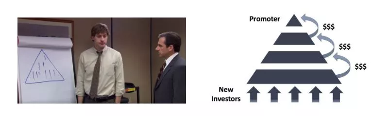
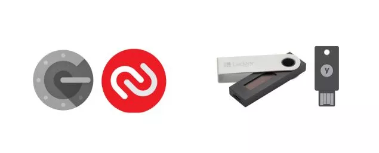
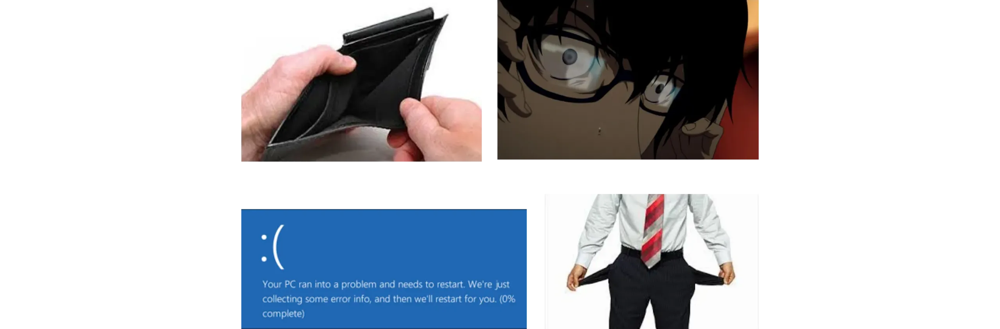
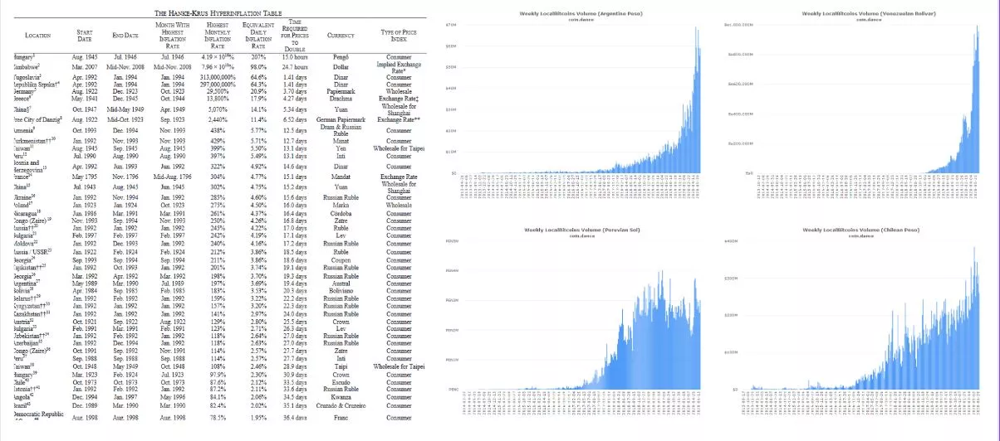
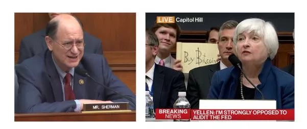
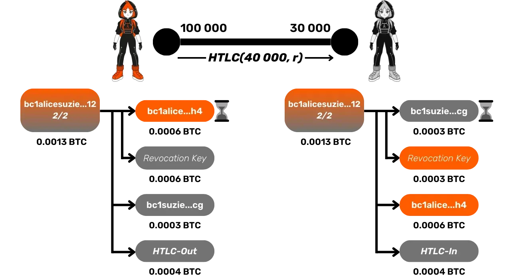
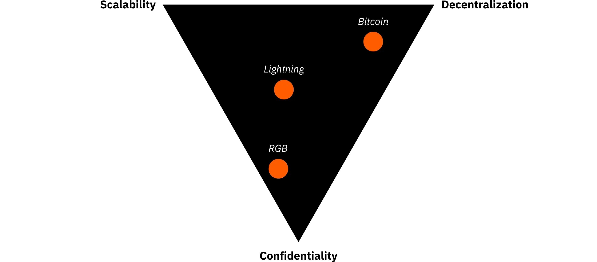
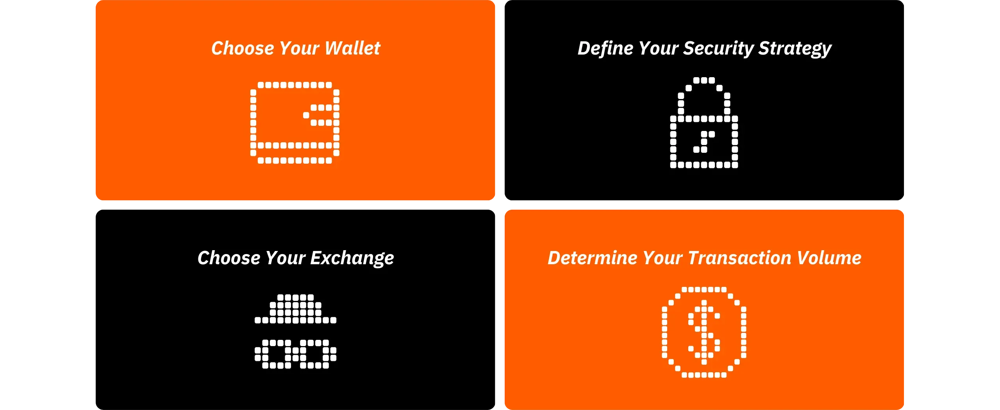

# Cesta k prvním bitcoinům

Ekosystém Bitcoin zažívá velkolepý a bezprecedentní růst. Technologické, ekonomické a společenské transformace, jejichž motorem je vynález Satoshi Nakamoto, se den ode dne zintenzivňují a postupně otevírají dveře do nového světa, který nyní můžete plně využít.

Ponoření do králičí nory Bitcoin je vzrušující intelektuální dobrodružství, které podnítí vaše kritické myšlení a zpochybní mnohá vaše přesvědčení. Toto zkoumání vám poskytne nejen hluboké pochopení toho, jak Bitcoin funguje, ale také skutečnou příležitost získat zpět svou osobní svobodu, chránit své soukromí a dosáhnout skutečné finanční suverenity.

Abych vás touto cestou efektivně provedl, vytvořil jsem tento zcela bezplatný kurz. Zaměřujeme se v něm výhradně na Bitcoin. Žádné nepodstatné diskuse, žádné zmínky o jiných kryptoměnách, jen jasný, přesný a přímočarý obsah.

Tento kurz je navržen tak, abyste měli plnou kontrolu nad způsobem učení a mohli se Bitcoin učit svým vlastním tempem a postupovat tak, jak to nejlépe odpovídá vašim zájmům a cílům.

+++
# Úvod

<partId>008c49b7-5e17-5973-87f2-ba28429b2697</partId>

## Přehled kurzů

<chapterId>bfc96999-0ee1-5c41-8297-1b629f50cffc</chapterId>

Vítejte v BTC102! Pokud jste již absolvovali BTC101, prozkoumali jste klíčové teoretické koncepty, které stojí za tím, proč je Bitcoin tak revoluční technologií. Nyní je čas, abyste tyto znalosti využili v praxi. Tento kurz je navržen tak, aby vám pomohl krok za krokem sestavit váš osobní plán Bitcoin.

V následujících kapitolách vás provedeme praktickými kroky, jak **získat své první bitcoiny**, **správně je zabezpečit** a s jistotou učinit první kroky v tomto rychle rostoucím ekosystému.

https://planb.network/courses/2b7dc507-81e3-4b70-88e6-41ed44239966

Přestože společnost Bitcoin existuje již více než 16 let, je toto odvětví stále mladé, dynamické a hluboce zakořeněné ve svobodě. Jeho základní protokol je plně decentralizovaný a odolný vůči kontrole jakoukoli centrální autoritou, což umožňuje přirozený a organický růst ekosystému.

Tato svoboda je sice zdrojem neuvěřitelné vlny inovací a příležitostí, ale zároveň s sebou nese určitá rizika, včetně podvodů, běžných chyb a nástrah, které často pramení z nedostatku znalostí. Hlavním cílem tohoto kurzu je pomoci vám pohybovat se v tomto novém ekosystému s jistotou a bezpečně.

Za tímto účelem je kurz BTC102 rozdělen do několika částí, z nichž každá se zaměřuje na klíčový aspekt vaší cesty s Bitcoin:

První část, "Předpoklady pro pochopení Bitcoin", vás účinně připraví na cestu, kterou se vydáte. Naučíte se rozpoznat hlavní nástrahy spojené s podvody a finančními podvody, které mohou v ekosystému Bitcoin existovat. Poté se budeme zabývat nezbytnými základy online bezpečnosti.

Nakonec vám poskytnu několik praktických tipů určených speciálně pro začátečníky, které vám pomohou vyhnout se častým chybám při první práci s Bitcoin.

Druhá část, "Porozumění tomu, do čeho jdete", prohloubí vaše celkové znalosti o Bitcoin. Začneme přehledem, který zajistí, že plně porozumíte základním pojmům.

Pak vám vysvětlíme, proč je Bitcoin zásadně důležitý z technologického, ekonomického a sociálního hlediska, a posílíme vaše přesvědčení o jeho hodnotě. Prozkoumáte také odvětví Bitcoin jako celek: jeho klíčové hráče, organizaci a vývoj v průběhu let. Nakonec se budeme zabývat vrstevnatou architekturou ekosystému Bitcoin, což je klíčový koncept pro pochopení toho, jak tento systém pokračuje v inovacích, aniž by byla ohrožena integrita jeho základního protokolu.

Třetí část, "Nastavení vašeho plánu", se zaměřuje na váš osobní přístup ke Bitcoin. Začneme tím, že vám pomůžeme definovat váš uživatelský profil ze čtyř hlavních kategorií:

- hodler*, zaměřený na dlouhodobé držení Bitcoin ;
- skladník*, který nakupuje pravidelně a metodicky;
- uživatele*, který denně upřednostňuje používání Bitcoin;
- a nakonec *paranoik*, který chce maximální zabezpečení, aby účinně ochránil svůj majetek a soukromí.

Provedeme vás realizací strategie, která odpovídá vašemu profilu a pomůže vám dosáhnout vašich osobních cílů.

A konečně čtvrtá část, "Ochrana dědiců a majetku", se zabývá zásadním tématem, které je často opomíjeno: jak zajistit, aby vaše společnost Bitcoin byla předána vašim blízkým v případě neočekávané události. Dozvíte se, jak vytvořit a nastavit plán dědictví Bitcoin, který zajistí zachování vašeho majetku i po skončení vašeho života.

Na konci tohoto kurzu získáte všechny praktické nástroje, které potřebujete k tomu, abyste se mohli s jistotou pohybovat v ekosystému Bitcoin a stát se jedním z jeho nejpokročilejších uživatelů!

Jste připraveni vydat se na cestu do světa Bitcoin? Jdeme na to!

# Předpoklady pro pochopení Bitcoin

<partId>4481fc4b-0f83-489e-ad07-81517c5d6bad</partId>

## Podvody a finanční podvody

<chapterId>8af2948b-2ab5-54c4-862c-3414b8a285a2</chapterId>

Ekosystém Bitcoin a jeho okolní prostředí jsou stále relativně mladé a v závislosti na zemi volně regulované. Tato volnost sice otevírá obrovské možnosti, ale zároveň vytváří živnou půdu pro finanční podvody, šmejdy a různé formy manipulace. Proto je první kapitola tak zásadní: pochopení běžných nástrah vám pomůže se jim vyhnout. Vaše finanční bezpečnost je prioritou, protože špatná zkušenost nemá dopad jen na vás, ale na celou komunitu Bitcoin.

### Bitcoin vs. kryptoměny: pochopení rozdílů

Než budeme pokračovat, je důležité jasně rozlišit dva zásadně odlišné světy:

- Ekosystém Bitcoin** se soustředí na myšlenku zdravých peněz, postavenou na silné decentralizaci, dlouhodobé odolnosti, soukromí a individuální suverenitě. Od svého spuštění v roce 2009 funguje Bitcoin spolehlivě a bezpečně, podporován globální, angažovanou komunitou vývojářů. Nejedná se o přechodný trend, ale o stabilní a dobře zavedený protokol navržený tak, aby si uchoval hodnotu v průběhu času.

- Na druhou stranu odvětví kryptoměn** je mnohem větší a zahrnuje desítky tisíc různých projektů, z nichž každý má svůj vlastní token. Tento prostor často pohání rychlé inovace, hype a krátkodobé finanční spekulace. Mnohé z těchto projektů jsou centralizované, méně bezpečné a nenabízejí mnoho skutečné hodnoty - navzdory odvážným slibům a okázalému marketingu.

Pokud chcete lépe pochopit, odkud Bitcoin pochází a čím se skutečně liší od ostatních projektů, doporučuji podívat se na tento bezplatný navazující kurz o historii Bitcoin:

https://planb.network/courses/a51c7ceb-e079-4ac3-bf69-6700b985a082

Jak víte, platforma Plan ₿ Network je určena výhradně pro Bitcoin. Pochopení rozdílu s ostatními kryptoměnami vám však pomůže vyhnout se nástrahám spojeným se zbytečnými a někdy i podvodnými projekty.

### Hlavní podvody, kterým je třeba se vyhnout

Zde jsou nejčastější podvody, se kterými se můžete na své cestě setkat:

#### Pyramidové systémy a Ponziho schémata

Jedná se o některé z nejčastějších podvodů ve světě kryptoměn. V Ponziho schématu dostávají dřívější účastníci výplaty z peněz novějších účastníků; ne z nějaké skutečné investice nebo produktu. Žádná skutečná hodnota se nevytváří. Systém funguje jen tak dlouho, dokud se k němu připojují noví lidé. Jakmile se příliv nových účastníků zpomalí, celé schéma se rozpadne.

Tyto podvody obvykle obsahují :

- Nerealistické sliby garantovaných výnosů (např. 20% garantovaný výnos);
- Zpoždění nebo potíže při pokusu o výběr investovaných prostředků;
- Silné pobídky k náboru nových členů, aby se systém udržel v chodu;
- Naprostá netransparentnost ohledně skutečného zdroje slíbených výnosů.

Všechny pyramidové a Ponziho systémy jsou nakonec odsouzeny k neúspěchu. Jejich základní slabina spočívá v neustálé potřebě přivádět nové investory, aby bylo možné vyplácet výnosy dřívějším účastníkům. Tuto potřebu je matematicky nemožné udržet v průběhu času, protože počet potřebných nových rekrutů exponenciálně roste s tím, jak systém roste. Jakmile je dosaženo kritického bodu, účastníci začnou pochybovat, zmizí důvěra a celá pyramida se zhroutí. V této fázi přicházejí poslední lidé, kteří se připojili, často ti nejméně informovaní, o celou svou investici bez možnosti ji získat zpět, zatímco organizátoři nebo první investoři již obvykle své prostředky stáhli a systém opustili.

Ve světě kryptoměn mohou mít Ponziho schémata mnoho podob a často jsou navržena tak, aby svou podvodnou povahu skryla za technologickou nebo finanční masku. Tyto podvody mohou vypadat jako nabídky nových tokenů nebo počáteční nabídky mincí (ICO), což jsou operace na získávání finančních prostředků, při nichž se nová kryptoměna prodává veřejnosti. Za technickými termíny jako "Blockchain", "smart contracts" nebo "staking" se za některými projekty ve skutečnosti skrývají složité pyramidové hry. Jiné tvrdí, že nabízejí vysoké výnosy kombinací pochybných kryptoaktiv se systémy odměňování, které zcela závisí na neustálém přílivu nových investorů.

V poslední době se Ponziho schémata rozšířila i do světa decentralizovaných financí (DeFi). Ačkoli DeFi má poskytovat finanční služby bez zprostředkovatelů, některé projekty jej využívají k tomu, aby svým podvodům dodaly falešný pocit legitimity. Některé platformy DeFi slibují vysoké, zaručené výnosy v Exchange za vklady kryptoměn do automatizovaných protokolů. Tyto lákavé sliby jsou často podloženy neprůhlednými a neověřitelnými mechanismy, přičemž tokeny jsou vytvořeny speciálně pro účely podvodu. Ve skutečnosti tyto systémy nemají žádný udržitelný obchodní model - výnosy jsou jednoduše vypláceny z prostředků nových uživatelů, stejně jako u tradičního Ponziho schématu. Když začne důvěra erodovat nebo se zpomalí příliv nových účastníků, tyto systémy se nevyhnutelně zhroutí, což vede ke značným ztrátám nic netušících investorů.

Upozorňujeme, že obsah tohoto kurzu slouží pouze pro vzdělávací účely a neměl by být vykládán jako finanční poradenství. Vaše finanční jistota závisí na tom, zda budete při každém svém finančním rozhodnutí obezřetní, skeptičtí a dobře informovaní.

Nejlepší ochranou je vždy si položit tuto jednoduchou otázku: Odkud vlastně pochází slíbený výnos? Pokud je odpověď nejasná, okamžitě utečte.

#### Čerpadlo a výsypka

Tento typ podvodu spočívá v umělém navyšování ceny aktiva - často tokenu kryptoměny s nízkou likviditou - prostřednictvím koordinované marketingové kampaně, kterou obvykle vede skupina investorů. Typické schéma Pump & Dump se řídí tímto schématem:

- Skupina zasvěcených osob nebo vlivných osobností v tichosti nashromáždí velké množství cílového aktiva.
- Poté zahájí agresivní propagační kampaň, aby vyvolala humbuk a zvýšila cenu.
- Široká veřejnost, hnaná FOMO (Fear of Missing Out), začne aktivum hromadně nakupovat, čímž se cena ještě zvýší.
- Na vrcholu humbuků prodávají insideři své podíly najednou.
- Cena se propadne a opozdilci utrpí velké ztráty.

Je důležité si uvědomit, že strategie Pump & Dump jsou v mnoha zemích nezákonné a považují se za formu manipulace s trhem. Navzdory tomu se takovým schématům nadále daří, zejména v oblasti kryptoměn, kde je regulace stále dohání.

Obzvláště opatrní buďte u soukromých "signálních" skupin na platformách, jako je Telegram, Discord nebo jiné kanály sociálních médií. Ty často provozují influenceři nebo samozvaní odborníci, z nichž někteří dokonce vybírají vstupní poplatky. Ačkoli tyto skupiny tvrdí, že nabízejí exkluzivní investiční příležitosti, skutečnost je mnohem jednostrannější: profitují z nich pouze organizátoři, zatímco většina účastníků nakonec o své peníze přijde.

Je pravda, že někteří účastníci mohou na těchto manipulacích s trhem dočasně vydělat, ale jejich úspěch je obvykle založen pouze na štěstí a dokonalém načasování. Z dlouhodobého hlediska jsou tato schémata neudržitelná. Vyžadují neustálou vysoce rizikovou účast a opakovanou účast na podvodných nastaveních, která nevyhnutelně zkrachují.

A co hůř, živí nebezpečnou iluzi: přesvědčení, že je možné snadno a rychle vydělat peníze, aniž bychom rozuměli tomu, jak finanční systémy skutečně fungují. Tento způsob myšlení nejenže ohrožuje jednotlivce, ale také podkopává důvěryhodnost celého ekosystému kryptoměn

Ze všech těchto důvodů je nejlepší strategií seriózní a promyšlený přístup k investování, který je založen na finančním vzdělání, dobré znalosti základních principů a dlouhodobé perspektivě.

Trpělivým budováním znalostí budete mnohem méně náchylní k emocionální manipulaci a nereálným slibům a mnohem lépe se vyhnete finančním pastem, které mohou vést ke skutečným ztrátám.

#### Darování, loterie a podvody s falešnými dárky

Tento typ podvodu slibuje Bitcoin zdarma nebo jiné odměny v Exchange za to, že nejprve pošlete malou částku peněz. Je důležité si zapamatovat: žádná legitimní osoba ani organizace vás nikdy nepožádá o zaslání kryptoměny předem s příslibem, že vám na oplátku pošle více.

Podvodníci se často vydávají za známé osobnosti (například Elona Muska nebo jiné celebrity) a lákají oběti prostřednictvím sociálních médií. Než se zapojíte do komunikace s účty a webovými stránkami, vždy si dvakrát ověřte jejich legitimitu a nikdy nevěřte nabídkám, které se zdají být příliš štědré nebo příliš dobré na to, aby byly pravdivé.

Někdy se tyto podvody tváří jako podvody se zálohou. Je vám slíbena cena nebo odměna (peníze, výrobek nebo služba), ale nejprve jste požádáni o zaplacení poplatku, který má údajně pokrýt například náklady na dopravu, daně nebo transakci. Jakmile je platba provedena, podvodník zmizí a slíbená odměna nikdy nedorazí.

#### Nabídka shitcoinů a kryptoměn

Centralizované projekty kryptoměn někdy nabízejí tokeny zdarma ("*airdrops*"), aby přilákaly uživatele.Tyto tokeny mají obvykle jen malou nebo žádnou skutečnou hodnotu a slouží hlavně k vytvoření iluze popularity nebo k podnícení spekulací. U těchto druhů propagačních nabídek buďte velmi obezřetní; často se jedná spíše o marketingové pasti než o skutečné příležitosti.

#### Krádež identity a phishing

Útočníci často používají falešné webové stránky, účty na sociálních sítích nebo podvodné e-maily, aby se pokusili ukrást vaše finanční prostředky. Tyto podvody mohou probíhat prostřednictvím jakéhokoli komunikačního kanálu: e-mailu, sociálních sítí, telefonních hovorů nebo dokonce klasické pošty...

Než kliknete na odkaz nebo provedete jakoukoli akci, vždy si ověřte totožnost odesílatele. V případě pochybností navštivte webovou stránku ručně namísto použití poskytnutého odkazu. A co je nejdůležitější, nikdy nikomu nesdělujte své soukromé klíče nebo hesla.

#### Tvrdé vidlice Bitcoin

V průběhu let došlo u Bitcoin k několika *Hard forkům*, které vedly k vytvoření alternativních verzí původní kryptoměny. Zjednodušeně řečeno, *Hard Fork* je rozdělení sítě, které vede ke vzniku dvou samostatných blockchainů, přičemž oba sdílejí stejnou historii až do okamžiku rozdělení. K těmto rozvětvením obvykle dochází, když chce část vývojářské komunity nebo širšího ekosystému Bitcoin zavést zásadní změny v původním protokolu, ale nemůže dosáhnout širokého konsenzu. Místo toho, aby se vzdali svých nápadů, rozhodnou se spustit novou verzi Bitcoin(s pozměněnými pravidly)a doufají, že se uživatelé a těžaři rozhodnou místo toho následovat jejich Fork.

Ne všechny forky *Hard* jsou podvodné, protože některé vznikají v důsledku technických nebo ideologických neshod uvnitř komunity. Jiné jsou však vedeny komerčními zájmy nebo dokonce nečestnými motivy. Nejznámějšími příklady těchto hardforků jsou **Bitcoin Cash (BCH)** a **Bitcoin Satoshi Vision (BSV)**. Tyto alternativní měny, uvedené na trh v roce 2017, respektive 2018, často tvrdí, že jsou "lepšími verzemi" původního Bitcoin. Propagují údajné výhody, jako jsou nižší transakční poplatky nebo rychlejší transakce díky větší velikosti bloků. Tyto technické změny jsou však spojeny s významnými kompromisy, pokud jde o bezpečnost, decentralizaci a robustnost; Elements, které mohou být v rozporu se základními principy Bitcoin.

Kromě technických rozdílů tyto alternativní měny často využívají zmatku, aby přilákaly neinformované investory. Mohou používat marketingové taktiky, jejichž cílem je záměrně uvést v omyl nováčky, kteří se domnívají, že kupují pravé Bitcoin (BTC).

Abyste se nedostali do této pasti, vždy si ověřte měnu, kterou kupujete. Původní měna Bitcoin používá ticker **BTC**, zatímco Bitcoin Cash a její deriváty používají odlišné zkratky, například BCH nebo BSV.

#### Nepoctiví influenceři a falešní guruové

S tím, jak se kryptoměny dostávají do popředí zájmu, se na sociálních sítích objevuje vlna influencerů, samozvaných odborníků a takzvaných "*krypto guru*". Zatímco někteří z nich mohou nabízet skutečné vzdělávací poznatky, mnozí jiní využívají své viditelnosti k propagaci pochybných projektů nebo nebezpečně riskantních (a někdy přímo podvodných) obchodních strategií. tyto osoby jsou obvykle motivovány osobními finančními zájmy a často dostávají přímou nebo nepřímou odměnu za propagaci určitých tokenů nebo platforem.

Tito influenceři se často spoléhají na osvědčené taktiky, jak přilákat začátečníky: prezentují působivé finanční výsledky (které jsou často falešné nebo neověřitelné), vychvalují luxusní životní styl jako údajný důkaz svého úspěchu a propagují "zázračné" investiční strategie. Cílem je vyvolat FOMO - strach z promeškání - a dotlačit své publikum k impulzivním rozhodnutím a neuváženým investicím.

Je důležité si uvědomit, že většina "bezplatných" rad od těchto osobností není nikdy skutečně bezplatná. Za fasádou velkorysosti se často skrývá vypočítavá strategie, která má lidi nasměrovat k nákupu pochybných aktiv. A i kdyby někteří influenceři byli upřímní, zopakovat jejich výsledky by bylo téměř nemožné; jejich úspěch často závisí na specifickém načasování, zasvěcených znalostech nebo jedinečných okolnostech, ke kterým vy prostě nemáte přístup.

Někteří influenceři vás mohou pozvat do soukromých placených skupin, kde tvrdí, že sdílejí exkluzivní obchodní signály nebo zasvěcené tipy, které slibují rychlé a snadné zisky. Ve skutečnosti z těchto skupin těží hlavně samotní organizátoři. Ti často využívají své následovníky jako zdroj likvidity a v podstatě se zbavují majetku za účelem osobního zisku. Odběratelé obvykle nakonec přicházejí o peníze, protože nejsou schopni reagovat tak rychle jako zasvěcenci, kteří obchody organizují (viz část o schématech Pump & Dump).

S ohledem na tuto skutečnost vám přinášíme několik dobrých návyků, které si můžete osvojit, abyste se vyhnuli pastem, které na vás nastražili nepoctiví influenceři:

- Buďte velmi obezřetní s jakýmikoliv investičními doporučeními do kryptoměn.**

Důvěryhodná a znalá osoba vás nikdy nebude tlačit do nákupu kryptoměny, aniž by vás vyzvala, abyste si nejprve udělali vlastní průzkum.

- Placené kurzy obchodování nebo investování nejsou vždy známkou kvality.**

Mnohé z těchto kurzů propagují riskantní nebo příliš zjednodušené strategie; často se jedná o stejné informace, které můžete najít zdarma online.

- Neexistuje žádný zaručený způsob, jak kopírovat něčí obchody a dosáhnout stejných výsledků.**

Každá investiční strategie závisí na osobních souvislostech, načasování, znalostech a dalších faktorech, které nelze přesně kopírovat.

- Dávejte si pozor zejména na rady, které zní příliš dobře na to, aby byly pravdivé.**

Nerealistické sliby nebo zaručené zisky jsou téměř vždy známkou manipulace. Pamatujte si: to, že někdo něco sebevědomě říká, ještě neznamená, že je to pravda.

Vždy mějte na paměti, že každý, s kým se setkáte v Bitcoin nebo v širším krypto ekosystému, má své osobní zájmy; ať už je říká otevřeně, nebo je skrývá mezi řádky. Neexistuje nic takového jako čistě neutrální informace. Dokonce i tento kurz BTC102 má jasný cíl: *podpořit lepší porozumění Bitcoin.*

Proto je důležité, abyste si uvědomovali skutečné motivace, které stojí za každým obsahem, který konzumujete. A nikdy nezapomínejte na toto zlaté pravidlo internetu:

*Pokud se produkt nebo služba zdají být zdarma, je pravděpodobné, že jste produktem vy.*

Nejlepší obranou je osobní vzdělání, zdravá skepse a především zvyk ověřovat si fakta.

### Jak se vyhnout podvodům

**Chcete-li zůstat v bezpečí online, zejména ve světě kryptoměn, mějte na paměti tyto klíčové zásady:**

- Nikdy nedůvěřujte slepě: "*Nedůvěřuj, ověřuj*" ;
- Buďte skeptičtí k zaručeným nebo neobvykle vysokým výnosům;
- Své soukromé klíče nikdy nikomu nesdělujte;
- Neposílejte Bitcoin (ani žádné jiné šifry) na neznámé adresy;
- Pokud máte pochybnosti, udělejte pauzu. Než začnete jednat, ustupte a zamyslete se. FOMO je váš největší nepřítel;
- Vyhněte se placeným obchodním skupinám nebo komunitám, které dávají nereálné sliby;
- Většina dárků nebo "bezplatných" online loterií jsou podvody nebo značně zmanipulované;
- Z dlouhodobého hlediska vždy získáte více, když se budete učit, než když budete sázet.

Ochrana před podvodníky je prvním důležitým krokem k ochraně vašeho majetku, ale nestačí to. Stejně důležité je udržovat důkladnou digitální hygienu. Proto se v další kapitole budeme zabývat tím, jak posílit svou bezpečnost online a jaké osvědčené postupy byste měli přijmout, abyste se v digitálním světě ochránili.

## Zabezpečení online

<chapterId>f0873bf2-6a6f-5485-bb7a-d84be14f404d</chapterId>

Jakmile se začnete zabývat Bitcoin, rychle si uvědomíte, že základní kybernetická bezpečnost není volitelná - je nezbytná. Podvody a podvody jsou jen špičkou ledovce. Náhodná ztráta dat, malware a kompromitovaná hesla mohou být stejně ničivé, zejména pokud spravujete vlastní klíče.

Tato kapitola vás seznámí s několika jednoduchými praktickými kroky, jak zvýšit svou digitální hygienu a chránit se v tomto prostoru.

Pokud chcete jít hlouběji, kurz SEC101 společnosti Plan ₿ Network nabízí komplexní rozbor strategií kybernetické bezpečnosti speciálně navržený pro uživatele Bitcoin.

https://planb.network/courses/99c46148-7080-4915-a7e0-9df0e145cd47

### Proč je kybernetická bezpečnost důležitá

Bitcoin vám dává možnost držet své peníze přímo (bez bank), bez zprostředkovatelů. Tento druh finanční suverenity však s sebou nese vážnou odpovědnost: pokud vám BTC ukradnou v důsledku selhání zabezpečení, neexistuje způsob, jak transakci zvrátit. Na rozdíl od tradičního bankovnictví neexistuje žádná asistenční služba, žádná reklamace podvodu ani pojištění, které by vás zachránilo.

Kromě toho je Bitcoin díky své finanční hodnotě velmi cenným cílem. Hacker, který kompromituje váš Wallet, může okamžitě přesunout vaše finanční prostředky na Address, který ovládá (bez otázek, bez možnosti je získat zpět).

### Čistý a aktualizovaný počítač

Jedním z nejvíce opomíjených aspektů osobní bezpečnosti je aktualizace operačního systému a softwaru. Mnoho aktualizací opravuje známé zranitelnosti, které by jinak mohli zneužít útočníci. Zatímco někteří lidé se aktualizacím vyhýbají v obavě z problémů s výkonem, skutečné riziko spočívá v používání zastaralého softwaru, který již hackeři umějí prolomit.

Důrazně se také doporučuje používat spolehlivý antivirový program. V systému Windows většině uživatelů obvykle postačí integrovaný nástroj Windows Defender. Pokud dáváte přednost dalším funkcím nebo klidu, jsou k dispozici i komerční varianty, například Kaspersky. V systému MacOS jsou hrozby malwaru historicky méně časté **ale ne neexistující**, takže je stále rozumné zůstat obezřetný.

Kromě aktualizací systému a antivirové ochrany si dávejte velký pozor na stahování softwaru z pochybných webových stránek nebo takzvaných "univerzálních" portálů pro stahování. Pokud potřebujete nějaký nástroj nebo aplikaci, vždy přejděte přímo na oficiální zdroj;Tím se výrazně sníží riziko instalace malwaru vydávaného za legitimní software.

Dalším chytrým zvykem je ověřit pravost a integritu jakéhokoli softwaru před jeho instalací do počítače. Pokud si nejste jisti, jak to udělat, nebojte se, máme pro vás speciální návod, který vás tímto procesem provede:

https://planb.network/tutorials/computer-security/data/integrity-authenticity-21d0420a-be02-4663-94a3-8d487f23becc

Nakonec pravidelně zálohujte důležitá data. Externí disk Hard nebo SSD je spolehlivou volbou pro uchovávání duplikátů vašich souborů pro případ náhlého selhání, hacknutí nebo náhodného smazání. Později si poděkujete.

Pokud dáváte přednost cloudovým řešením, zvažte použití zabezpečené služby, jako je Proton Drive. Jen se ujistěte, že jakákoli zvolená možnost respektuje vaše soukromí a nabízí silné šifrování.

https://planb.network/tutorials/computer-security/data/proton-drive-03cbe49f-6ddc-491f-8786-bc20d98ebb16

Obecně doporučovanou strategií zálohování je pravidlo 3-2-1. Jeho cílem je chránit data před náhodnou ztrátou, kybernetickými útoky nebo dokonce přírodními katastrofami.

Myšlenka je jednoduchá:

- Uchovávejte si **nejméně 3 kopie** důležitých dat,
- Ukládejte je na **nejméně 2 různé typy médií** (např. externí disk Hard a cloudové úložiště),
- A ujistěte se, že **1 z těchto kopií je uložena mimo pracoviště** (fyzicky odděleně od hlavního umístění).

Tento přístup nabízí silnou odolnost a pomáhá zajistit, aby vaše data přežila i v případě, že se něco vážně pokazí.

### Řešení noční můry ID

Jedním z nejčastějších důvodů, proč jsou lidé napadáni, je používání slabých hesel. Značný počet uživatelů stále používá stejné heslo pro více účtů nebo volí varianty, které lze snadno uhodnout. Správci hesel jsou ideálním řešením tohoto problému.

Správce hesel umožňuje:

- Bezpečné uložení všech hesel** v šifrovaném trezoru
- generate dlouhá, složitá a jedinečná hesla** automaticky pro každý účet
- Používejte pouze jedno hlavní heslo**, abyste měli bezpečný přístup ke všemu

Díky správci hesel už nikdy nebudete muset klikat na "Zapomenuté heslo" nebo se spoléhat na slabé, opakovaně používané přihlašovací údaje. Většina správců hesel navíc umožňuje bezproblémovou synchronizaci mezi zařízeními (počítač, telefon, tablet) a dokonce i automatické vyplňování přihlašovacích formulářů, takže bezpečný přístup je snadný a efektivní.

Existuje mnoho správců hesel, ale v závislosti na vašich potřebách vám mohu doporučit dvě solidní možnosti. Pokud hledáte něco snadno použitelného, co se bez problémů synchronizuje s více zařízeními, je vynikající volbou Bitwarden:

https://planb.network/tutorials/computer-security/authentication/bitwarden-0532f569-fb00-4fad-acba-2fcb1bf05de9

Pokud chcete mít vše raději lokálně ve svém zařízení, KeePass je skvělá volba:

https://planb.network/tutorials/computer-security/authentication/keepass-f8073bb7-5b4a-4664-9246-228e307be246

### 2FA: dvojitá ochrana

V Bitcoin jste svou vlastní bankou. To znamená, že jste také svým vlastním bezpečnostním týmem. Ani se silným heslem neexistuje nulové riziko - proto je nezbytné zapnout dvoufaktorové ověřování (2FA).

2FA přidává druhý stupeň ochrany Layer tím, že vyžaduje časově omezený jednorázový kód (obvykle 6 číslic) vygenerovaný aplikací, jako je Google Authenticator nebo Authy. Takže i když se někomu podaří získat vaše heslo, bez fyzického přístupu k telefonu se k vašemu účtu nedostane.

https://planb.network/tutorials/computer-security/authentication/authy-a76ab26b-71b0-473c-aa7c-c49153705eb7

Když povolíte 2FA, nezapomeňte uložit klíč pro obnovení aplikace na bezpečné místo. To vám umožní obnovit kódy v případě ztráty nebo změny telefonu. 2FA založené na SMS nebo e-mailu je sice lepší než nic, ale je mnohem méně bezpečné. Útok záměnou SIM karty, kdy někdo převezme kontrolu nad vaším telefonním číslem, může tento druh ochrany snadno obejít.

Pro ty, kteří chtějí zabezpečení posunout ještě o krok dál, poskytují fyzické klíče, jako je YubiKey, ještě vyšší úroveň ochrany.

https://planb.network/tutorials/computer-security/authentication/security-key-61438267-74db-4f1a-87e4-97c8e673533e

### Ochrana vašeho soukromí

Soukromí a kybernetická bezpečnost spolu úzce souvisejí: čím více informací necháváte volně přístupných, tím větší je pravděpodobnost, že se stanete terčem útoku.

**VPN** (*Virtuální privátní síť*) je jednoduchý, ale účinný krok k maskování vaší IP adresy Address a šifrování vašeho internetového provozu. Sice vás neudělá zcela neviditelnými (protože poskytovatel sítě VPN stále vidí vaši aktivitu), ale výrazně ztíží možnost, že by vás někdo chtěl špehovat nebo sledovat vaše zvyky při prohlížení webu.

Klíčem k úspěchu je výběr důvěryhodného poskytovatele VPN, který:

- Nevyžaduje vaše osobní údaje
- Umožňuje platbu prostřednictvím BTC
- Má přísnou politiku zákazu záznamů

Na webu Plan ₿ Network máme k dispozici několik návodů, které vás snadno provedou nastavením sítě VPN. Doporučuji zejména IVPN nebo Mullvad:

https://planb.network/tutorials/computer-security/communication/ivpn-5a0cd5df-29f1-4382-a817-975a96646e68

https://planb.network/tutorials/computer-security/communication/mullvad-968ec5f5-b3f0-4d23-a9e0-c07a3e85aaa8

K základním krokům na ochranu soukromí na internetu patří také:

- Používání **platforem pro šifrované zasílání zpráv**, jako je Signal, SimpleX nebo Session;
- Používání prohlížečů zaměřených na ochranu soukromí, jako je Firefox, Brave nebo Tor (pro zvýšení anonymity);

https://planb.network/tutorials/computer-security/communication/tor-browser-a847e83c-31ef-4439-9eac-742b255129bb

- Použití **zabezpečené poštovní schránky**, jako je například ProtonMail;

https://planb.network/tutorials/computer-security/communication/proton-mail-c3b010ce-254d-4546-b382-19ab9261c6a2

- Šifrování** souborů pomocí nástrojů, jako je Bitlocker (pro Windows) nebo VeraCrypt (dostupný pro více platforem).

https://planb.network/tutorials/computer-security/data/veracrypt-d5ed4c83-7c1c-4181-95ea-963fdf2d83c5

### Postupný vývoj

Kybernetická bezpečnost se může zdát jako obrovský úkol a začátečníci se snadno nechají zahltit a vzdají to, protože se jim to zdá příliš složité. Trik spočívá v tom, že k ní přistupujete krok za krokem. Začněte něčím jednoduchým, například instalací správce hesel. Dejte si několik týdnů na to, abyste se s ním sžili, a pak přejděte k dalšímu kroku: například k zapnutí 2FA na jednom z účtů.

Až si budete s těmito nástroji jistější, budete připraveni přidat pokročilejší postupy, jako je používání sekundárního e-mailu, přechod na ProtonMail, nastavení VPN nebo v případě potřeby procházení přes Tor.

Když se ponoříte hlouběji do světa Bitcoin, zjistíte, že s rostoucí hodnotou vašeho Wallet rostou i rizika. Vybudování pevných bezpečnostních návyků, ochrana soukromí a nastavení správných nástrojů vám zajistí nejen klid, ale také posílí suverenitu, o kterou v Bitcoin jde.

Stručně řečeno: nepodceňujte kybernetickou bezpečnost, věnujte čas nastavení základů a nezapomeňte, že klíčová je důslednost. Bez dobré digitální hygieny vám ani ty nejlepší nástroje příliš nepomohou.

Nezapomeňte se také podívat na [naše výukové programy o počítačové bezpečnosti](https://planb.network/tutorials/computer-security) na Plan ₿ Network.

V příští kapitole se s vámi podělím o několik dalších tipů, které vám pomohou začít s důvěrou na cestě za Bitcoin a vyhnout se mnoha nástrahám, které mohou nováčky zaskočit.

## Tipy pro nováčky

<chapterId>33134b3f-92c1-5185-afb6-88599e47e801</chapterId>

Vstup do systému Bitcoin může být vzrušující, ale nese s sebou i určitá rizika. Svět kryptoměn se nepodobá žádnému jinému; divoké výkyvy cen, neznámé technologie a velmi reálná možnost, že o své prostředky nadobro přijdete kvůli jednoduchým chybám nebo špatným investičním rozhodnutím, to vše jsou nástrahy, kterých by si noví uživatelé měli být vědomi.

V této kapitole se s vámi podělím o několik praktických rad a obecných pokynů pro všechny, kteří dělají své první kroky, zejména pro ty, kteří poprvé nakupují nebo prozkoumávají širší svět finančních investic.

Zde jsou klíčové body, které společně projdeme:

- Pozor na **Shitcoins** a další zbytečné kryptoměny;
- Investujte pouze **peníze, které si můžete dovolit ztratit**;
- Poznejte rozdíl mezi **obchodováním** a **investováním**;
- Uvědomte si **daňové důsledky** svých investic;
- Pečlivě chraňte svou **frázi pro obnovení**;
- Zůstaňte skromní a držte se **nízko** (diskrétnost je součástí bezpečnosti);
- Přemýšlejte dlouhodobě**, přibližujte se a buďte trpěliví (berte to jako maraton, ne jako sprint).

### Nejčastější chyby, kterých je třeba se vyvarovat

Bitcoin je otevřená všem, ale to neznamená, že byste se do ní měli vrhnout nepřipraveni. Zde jsou některé z klasických chyb, kterých se nováčci dopouštějí:

**Technologické chyby:**

- Ztráta fráze seed:** Fráze pro obnovení (obvykle 12 nebo 24 slov) je jediným způsobem, jak získat přístup k vašemu Bitcoin, pokud se něco stane s vaším Wallet. Pokud ji ztratíte, vaše prostředky jsou trvale ztraceny;
- Uložení bitcoinů na platformě třetí strany:** Pokud jsou vaše mince na centralizované platformě, ve skutečnosti je nevlastníte. Jste vystaveni rizikům, jako jsou hackerské útoky, selhání platformy nebo dokonce zabavení finančních prostředků;
- Zanedbání ochrany soukromí:** Ochrana soukromí je základní součástí zabezpečení vašeho majetku. Veřejné odhalení toho, kolik Bitcoin vlastníte, by z vás mohlo udělat cíl;
- Nedostatečné zabezpečení online:** Pokud svá zařízení nezabezpečíte pomocí základních ochran (jako jsou aktualizace, silná hesla nebo 2FA), stanete se snadným cílem útočníků a může vás to stát vše.

**Finanční chyby:**

- Investovat více, než si můžete dovolit ztratit**: Nikdy se nezadlužujte a nevkládejte peníze na nájem do Bitcoin. Vaše základní finanční stabilita by měla být vždy na prvním místě.

- Neznalost rozdílu mezi obchodováním a investováním**: Obchodování vyžaduje čas, dovednosti a vážnou emocionální disciplínu. Dlouhodobé investování je pro začátečníky mnohem přívětivější.

- Zapomeňte na daně**: Každá země má pro kryptoměny svá vlastní daňová pravidla. Jejich ignorování může vést k nepříjemným překvapením v budoucnu.

- Propadnout FOMO**: Impulzivní nákupy ze strachu z promeškání obvykle vedou ke špatnému načasování a špatným rozhodnutím. Vaším nejlepším spojencem je trpělivost.

### Definování investiční strategie

Před nákupem prvního modelu Satoshi je důležité pochopit, proč a jakým způsobem investujete do modelu Bitcoin. To znamená mít jasný finanční plán přizpůsobený vaší osobní situaci a dlouhodobým cílům.

Začněte přesným vymezením svého **rozpočtu**. Nevybírejte jen náhodné číslo. Věnujte čas výpočtu svých měsíčních příjmů, odečtěte od nich fixní výdaje (jako je nájem, půjčky, daně, služby) a také každodenní životní náklady (jídlo, doprava, volný čas atd.). To, co zbude, je vaše rezerva úspor a teprve z této části byste měli uvažovat o investování.

Tímto způsobem zajistíte, že neohrozíte svou finanční pohodu, zejména v případě poklesu trhu. Promyšlená strategie je základem dlouhodobé odolnosti.

Po stanovení rozpočtu si promyslete, jak chcete investovat. Jednou z nejpřívětivějších a nejčastěji doporučovaných metod pro začátečníky je metoda DCA (Dollar Cost Averaging), kdy v pravidelných intervalech (týdně, měsíčně atd.) nakupujete pevně stanovené množství Bitcoin. Tato strategie pomáhá vyhladit vaši průměrnou vstupní cenu v čase a snižuje emocionální dopad cenových výkyvů. Je to chytrý přístup pro většinu lidí, zejména pro nováčky.

Pak se zeptejte sami sebe: Jaký je můj časový horizont?

Chcete rychle vstupovat a vystupovat z trhu (obchodování)? Nebo se spíše ztotožňujete s dlouhodobým smýšlením držet Bitcoin po dobu několika let(hodler)? Pokud jste hodler, pravděpodobně vás méně zajímají denní cenové výkyvy a více se zaměřujete na dlouhodobé zajištění a vlastní úschovu. Pokud obchodujete, budete více vystaveni krátkodobému tržnímu šumu, vyššímu riziku a stresu, který je často spojen s rychlým rozhodováním. Neexistuje univerzální odpověď, ale znalost vlastního přístupu vám pomůže řídit se při rozhodování.

Nejdůležitější je nedělat investiční rozhodnutí na základě emocí nebo strachu. Stanovte si předem strategii, zapište si ji a držte se jí.

Pokud si stále nejste jisti, **začněte s učením.**

Strávit pár hodin zkoumáním Bitcoin, podívat se na bezplatné zdroje na Plan ₿ Network, přečíst si pár knih, přihodit pět eur, jen abyste si to vyzkoušeli, a podívat se na kvalitní obsah online. Zůstaňte zvědaví. Čím pohodlněji se do toho dostanete, tím snazší bude přehodnotit vaši strategii, upravit přístup a s jistotou se posunout vpřed.

### Porozumění volatilitě BTC

Bitcoin je známá svými dramatickými cenovými výkyvy. Pohyby o 10 %, 20 % nebo dokonce 50 % během několika dnů nejsou ničím neobvyklým. Pro nováčky může být taková volatilita dezorientující. Je snadné nechat se strhnout humbukem během býčího období nebo panikařit během poklesu; obojí často vede ke špatným rozhodnutím, jako je prodej se ztrátou.

Proto je důležité, abyste před investicí **pochopili a akceptovali volatilitu produktu Bitcoin**. Tyto cenové výkyvy nejsou chybou, ale vlastností stále ještě zrajícího aktiva. Pokud vám náhlé vzestupy a poklesy nedají spát nebo vás nutí k emotivním rozhodnutím, je pravděpodobné, že jste vložili více, než je vám příjemné riskovat. V takovém případě udělejte krok zpět a přehodnoťte svou strategii a toleranci k riziku. Neváhejte snížit svou pozici, dokud se nebudete cítit klidněji.

Především nikdy neinvestujte více, než si můžete dovolit ztratit. Vyhněte se půjčování peněz na nákup Bitcoin (zejména pokud se stále učíte základům). Pevný základ začíná odměřenými kroky, nikoli neuváženými sázkami.

### Správa a zabezpečení vašeho Bitcoin Wallet

Jednou z nejsilnějších (a často podceňovaných) funkcí systému Bitcoin je **samostatná péče**. U samoobslužného účtu Wallet jste za své prostředky zodpovědní pouze vy. Tyto peněženky se obvykle generují z **obnovovací fráze** (známé také jako fráze seed), což je série 12 nebo 24 slov, která poskytuje plný přístup k vašim BTC. Pokud tuto frázi ztratíte(nebo pokud se jí zmocní někdo jiný), vaše bitcoiny jsou nadobro pryč. **Žádná zákaznická podpora. Žádné resetovací tlačítko**

Proto je zlatým pravidlem v Bitcoin:

"***Nejsou to vaše klíče, nejsou to vaše mince***". Pokud nemáte osobní kontrolu nad svými soukromými klíči, nejste skutečným vlastníkem Bitcoin. Výměny sice mohou být výhodné(zejména v začátcích), ale drží vaše klíče za vás. To znamená, že vaše prostředky jsou v ohrožení, pokud se do platformy nabourá hacker, zmrazí vám účet nebo zkrachuje.

Abyste se tomuto riziku vyhnuli, důrazně doporučujeme nastavit si **vlastní Wallet**, kde budete mít přístup k frázi pro obnovení pouze vy. Tato fráze by měla být vždy zapsána ručně a uložena **offline** na bezpečném místě. Někteří uživatelé dokonce **udržují více záloh**, které jsou pro větší bezpečnost uloženy na oddělených geografických místech.

** Nikdy neukládejte frázi pro obnovení do zařízení připojeného k internetu nebo do cloudu**.

**Jediný hackerský útok nebo narušení bezpečnosti dat může vést k nevratným ztrátám.**

Pokud jste připraveni převzít Ownership svého Bitcoin a chcete se hlouběji ponořit do osvědčených postupů pro zabezpečení fáze obnovení, vřele doporučuji přečíst si tento článek:

https://planb.network/tutorials/wallet/backup/backup-mnemonic-22c0ddfa-fb9f-4e3a-96f9-46e2a7954270

### Důvěrnost a diskrétnost

V dnešním digitálním světě je **rozvážnost často přehlížena**, přesto je klíčovou součástí bezpečnosti, zejména pokud jde o Bitcoin. Čím otevřeněji mluvíte o svých majetkových poměrech, tím větší je pravděpodobnost, že se stanete terčem podvodníků, kyberzločinců nebo i tradičnějších hrozeb, jako je vydírání nebo vydírání.

Po celém světě došlo k mnoha případům, kdy byly uneseny nebo napadeny osoby, o nichž se vědělo, že vlastní velké množství BTC.

**Vyvarujte se chlubení se svým Bitcoin Stash**; ať už na sociálních sítích, nebo dokonce v běžných rozhovorech. Prozrazení citlivých finančních informací nepřináší žádné výhody a rizika jsou reálná.

Je také rozumné **rozdělit své online aktivity**. Například:

- Pro vše, co souvisí s Bitcoin, používejte samostatný e-mail Address, odlišný od osobních nebo pracovních účtů.
- Dávejte si pozor na pokusy o phishing, podezřelé odkazy a falešné webové stránky, které napodobují důvěryhodné platformy.
- Zůstaňte ve střehu! diskrétnost a ostražitost jsou často nejlepší obranou.

Pokud jste připraveni proniknout hlouběji do tématu ochrany osobních údajů Bitcoin, doporučujeme pokračovat v našem kurzu ochrany osobních údajů pro 2. ročník, kde se naučíte pokročilejší techniky pro zabezpečení své identity a aktivit:

https://planb.network/courses/65c138b0-4161-4958-bbe3-c12916bc959c

### Daňové dopady

Přestože se jedná o decentralizovanou měnu, **Bitcoin není osvobozen od daňových zákonů a předpisů** vaší země. Každá jurisdikce má vlastní přístup ke způsobu zdanění zisků z kryptoměn.

Na některých místech jsou zisky při prodeji zdaněny jako kapitálové zisky. Jinde mohou vyžadovat přiznání každého obchodu a někde se uplatňují méně obvyklá pravidla, jako jsou majetkové daně nebo sociální příspěvky.

Před uskutečněním jakýchkoli významných transakcí důrazně doporučujeme poradit se s daňovým odborníkem nebo si prostudovat oficiální pokyny vlády. Věnování času tomu, abyste předem porozuměli svým daňovým povinnostem, vás může uchránit před pozdějšími nečekanými problémy (jako jsou pokuty, audity nebo penále), zejména pokud plánujete velké prodeje nebo realokace portfolia.

### Rozdíl mezi obchodováním, investováním a držením akcií

Bitcoin je často obklopen populárními mylnými představami; jednou z nejčastějších je myšlenka, že se jedná o rychlou cestu k bohatství prostřednictvím obchodování. Je však důležité pochopit jasný rozdíl mezi obchodováním, investováním a držením, protože každý přístup s sebou nese vlastní způsob myšlení, dovednosti a míru rizika.

- Obchodování :**

Buďme upřímní:** pravděpodobně byste neměli obchodovat.**

Obchodování zahrnuje krátkodobé spekulace (někdy s pákovým efektem) s cílem vydělat na výkyvech ceny Bitcoin. I když to může znít lákavě, úspěšné obchodování vyžaduje pokročilé technické znalosti (jako je analýza grafů a řízení rizik), emocionální disciplínu a neustálou pozornost trhu. Je to psychicky náročné a časově náročné a pravdou Hard je, že **většina začátečníků přichází o peníze**, protože podceňují, jak náročné to ve skutečnosti je.

Jak řekl Warren Buffett:

"**Jestliže nejste ochotni držet akcie deset let, nepřemýšlejte o tom, že byste je drželi deset minut**."

Bitcoin není systém rychlého zbohatnutí.

- Investice:**

Investoři mají střednědobý až dlouhodobý pohled a kupují Bitcoin s vírou, že jeho hodnota v průběhu času poroste (měsíce, roky nebo dokonce desetiletí). Stále zde samozřejmě existuje riziko, protože cena Bitcoin může výrazně kolísat. Tento přístup je však obecně klidnější a pro většinu lidí mnohem praktičtější, zejména pro ty, kteří nechtějí trávit každý den hodiny přilepení ke grafům.

- Držení (HODL) :**

"HODL" vzniklo jako překlep pro "hold" a rychle se stalo součástí kultury Bitcoin. Dnes je to čestný odznak.

Hodlery jsou v tomto oboru na velmi dlouhou dobu; někdy na deset a více let. Svůj Bitcoin bezpečně skladují a jednoduše čekají, vedeni pevným přesvědčením o dlouhodobém potenciálu Bitcoin. Neznepokojují je denní výkyvy cen ani medvědí trhy. Jejich myšlení je jednoduché: hromadit, zabezpečit a vyčkávat.

|          | Trading | Investment | Holding |
| ---------------------- | ----------- | -------------- | --------------- |
| Leverage | Yes  | No | No |
| Timeframe | Short-term | Medium-term | Very long-term |
| Asset Type | Contracts | Actual BTC | Actual BTC |
| Risk Level | Very high | High | High |
| Difficulty | Very Hard | Hard | Hard |
| learning curve | Long learning curve | Long learning curve | Long learning curve |
| Potential Loss | UnLimited | Limited | Limited |
| Best For | A few experienced users | Most People | Long-term Believers |

### Učte se dál

Nikdy není příliš brzy (ani příliš pozdě) na to, abyste se začali vzdělávat o penězích, investování a skutečném fungování finančního systému. Nemusíte se stát odborníkem nebo se ponořit do všech technických detailů; stačí, když budete mít solidní přehled, abyste mohli činit informovaná rozhodnutí a vyhnout se klamání finančními produkty, které neslouží vašim zájmům (často propagované bankami nebo poradci).

Skvělým výchozím bodem je kniha *Bohatý táta, chudý táta* od Roberta T. Kiyosakiho. Je všeobecně známá svým přístupným stylem a základními poučkami, jako je pochopení rozdílu mezi aktivy a pasivy a proč je finanční vzdělání klíčem k dlouhodobé nezávislosti.

Pokud jste připraveni jít hlouběji, podcasty jako *The Investors Podcast* nabízejí zasvěcené diskuse o investování, trzích a ekonomických principech. Příležitostně se věnují i Bitcoin, takže jsou solidním dalším krokem pro ty, které zajímá, jak Bitcoin zapadá do širšího finančního prostředí.

### Zlatá pravidla, která je třeba mít na paměti

Na závěr uvádíme několik nadčasových zásad, které by měl mít každý Bitcoiner (zejména začátečník) na paměti:

- Pravidlo č. 1**: Nikdy neinvestujte více, než si můžete dovolit ztratit. Bitcoin je volatilní aktivum. Neriskujte svou finanční stabilitu v honbě za zisky. Vaše základní potřeby a klid by měly být vždy na prvním místě.
- Pravidlo č. 2**: Nedůvěřujte slepě reklamám a zázračným radám. Ignorujte trendy a okázalé sliby. Místo toho se zaměřte na přijímání dobře informovaných a racionálních rozhodnutí. V případě pochybností se na ně vyspěte; proberte je s lidmi, kterým důvěřujete. Je lepší postupovat pomalu a promyšleně, než se pouštět do nákladných chyb.
- Pravidlo č. 3**: Vytvořte si plán a držte se dlouhodobé vize.

Důslednost, trpělivost a disciplína vás dovedou dál než krátkodobé nadšení. Nesnažte se o úspěch, ale o udržitelný růst. Vyhněte se fatálním chybám a nechte malá vítězství v průběhu času narůstat.

Budete-li se řídit těmito zásadami, budete moci přistupovat k investování do Bitcoin s větším přehledem a klidem. Ano, Bitcoin je volatilní a zpočátku může nahánět strach, ale pokud k němu přistupujete opatrně, trpělivě a s nadhledem, skrývá v sobě nepopiratelný potenciál. Věnujte čas budování svých znalostí, v případě potřeby přehodnoťte svou strategii a především si pamatujte: pomalý a soustavný postup vám vždy poslouží lépe než spěch ze strachu nebo netrpělivosti.

# Porozumění tomu, do čeho se pouštíte

<partId>a42355a3-9dd8-57ed-b590-32a333fe09ea</partId>

## Bitcoin za 5 minut

<chapterId>ae122ad9-9b4d-5229-9038-e1b99d5cfc83</chapterId>

Hlavním cílem tohoto kurzu je provést vás získáním a zajištěním vašich prvních bitcoinů. Než se však ponoříte do praktických kroků(jak nakupovat BTC, které peněženky používat a tak dále), je důležité udělat krok zpět a pochopit, co Bitcoin vlastně je. Pochopení hlubší podstaty Bitcoin vám pomůže pochopit, proč se k této technologii obracejí miliony lidí a proč je zásadní pochopit základy, než vložíte své úspory do tak nového a volatilního aktiva.

V průběhu let si společnost Bitcoin získala uznání jako globální peněžní síť. Byla nazývána "digitálním zlatem", "protokolem důvěry", a dokonce "paralelním finančním systémem" Co však tyto termíny ve skutečnosti znamenají? Abychom na to odpověděli, podíváme se blíže na jádro Bitcoin: na příběh jeho vzniku, technické základy, peněžní vlastnosti a jeho potenciální dopad; nejen na jednotlivce, ale i na globální finanční systém jako celek.

### Počátky: Projekt zrozený z dlouholetého hledání

#### Cypherpunkové a vynález systému, který se vymyká bankovní kontrole

Bitcoin se nezrodil přes noc. Je výsledkem desetiletí výzkumu a experimentů v oblasti kryptografie, informatiky a měnové teorie. Před jejím spuštěním v roce 2009 se o vytvoření digitálních měn pokoušelo několik projektů (například eCash, b-money, Bit Gold a RPOW). Všechny se potýkaly se stejným základním problémem: jak zabránit dvojímu utrácení v decentralizovaném systému, aniž by se spoléhaly na centrální autoritu.

Tento problém zůstal nevyřešen až do konce roku 2008, kdy někdo pod jménem Satoshi Nakamoto zveřejnil bílou knihu Bitcoin. O několik měsíců později byla spuštěna první verze open-source softwaru Bitcoin, čímž byl spuštěn systém, který mohl fungovat nezávisle na bankách nebo vládách.

Projekt byl silně ovlivněn étosem Cypherpunk; komunitou vývojářů a myslitelů, kteří věřili ve využití kryptografie k ochraně osobních svobod online. Soukromí a decentralizace pro ně nebyly technickými preferencemi, ale ideologickou nutností. Bitcoin se stala nejúspěšnějším ztělesněním těchto ideálů: peer-to-peer peněžní síť, kterou mohl používat kdokoli, nikdo ji nemohl kontrolovat a každý si ji mohl ověřit.

Cypherpunkeři jsou neformální mezinárodní komunitou jednotlivců, kteří se zasazují o používání kryptografie k ochraně osobních svobod na internetu. Pevně věří v právo jednotlivce na soukromí; zejména ve světě, který je stále více ovlivňován vládním dohledem a zneužíváním dat ze strany firem.

Kořeny hnutí Cypherpunk sahají do počátku 90. let, kdy skupiny kryptografů, programátorů a libertariánů začaly na setkáních v Silicon Valley zkoumat politické důsledky kryptografie. Jedním z nejvýraznějších hlasů v této komunitě byl Tim May, který v roce 1988 sepsal Kryptoanarchistický manifest; základní text, který nastiňuje vizi světa, v němž by šifrování umožnilo jednotlivcům fungovat mimo dosah vlád a centralizované kontroly.

Významným mezníkem v tomto hnutí bylo v roce 1992 vytvoření poštovní konference Cypherpunks, fóra, kde se mohly rozvíjet myšlenky, projekty a politické diskuse o soukromí a kryptografii. V roce 1993 pak Eric Hughes zveřejnil Manifest Cypherpunk, stručné, ale silné prohlášení, které jasně vyjadřovalo poslání a přesvědčení komunity.

Myšlenka digitální měny, která funguje nezávisle na jakékoli centrální autoritě (jako Bitcoin), je hluboce zakořeněna ve filozofii Cypherpunk.

#### Moment po finanční krizi

Bitcoin se neobjevil jen tak z ničeho nic. Vznikl ve velmi specifickém okamžiku - hned po celosvětové finanční krizi v roce 2008. Kolaps amerického trhu s bydlením a krize rizikových úvěrů způsobily krach velkých bank a otřásly důvěrou lidí v celý finanční systém.

V tomto prostředí strachu a nejistoty se zrodila společnost Bitcoin. Jeho tvůrce, známý jako Satoshi Nakamoto, zahrnul do prvního bloku Bitcoin Blockchain, známého jako blok Genesis, velmi symbolickou zprávu. Zpráva zněla:

> **"The Times 03. ledna 2009 Kancléřka na pokraji druhé finanční pomoci bankám "**

Nebylo to jen rande nebo technická poznámka, byl to tichý, ale silný protest. Ukázal, že Bitcoin byl navržen jako něco radikálně odlišného: finanční systém, který není závislý na bankách, záchraně ani rozhodnutích vlády.

Mnozí si to vykládají jako cíl Bitcoin: nabídnout způsob, jak převádět hodnotu bez potřeby prostředníků, řízený jasnými pravidly namísto často nejasných rozhodnutí centrálních bank nebo vlád.

Abyste si prohloubili své znalosti o původu Bitcoin, nabízíme vám bezplatný, komplexní a dobře zdokumentovaný školicí kurz na toto téma:

https://planb.network/courses/a51c7ceb-e079-4ac3-bf69-6700b985a082

### Decentralizovaná síť pro přenos hodnoty

#### Peer-to-peer a bez ústředního orgánu

Bitcoin je definován jako "elektronický peněžní systém peer-to-peer" To znamená, že kdokoli se může připojit k síti pomocí příslušného softwaru (uzlu Bitcoin) a komunikovat přímo s ostatními uživateli, aniž by byl závislý na centrálním serveru. Cílem této decentralizace je zabránit tomu, aby jakýkoli jednotlivý subjekt (například banka, vláda nebo velká korporace) mohl systém kontrolovat, cenzurovat nebo zastavit. Bitcoin funguje nepřetržitě, celosvětově a je přístupný všem bez jakýchkoli podmínek.

Zjednodušeně řečeno, každý účastník sítě Bitcoin (tzv. "uzel") má úplnou kopii transakce Ledger, známou jako Blockchain. Když dojde k nové transakci, je vysílána do sítě. Těžaři pak tyto transakce potvrzují seskupováním do bloků, které se pak přidávají na konec řetězce (odtud název "Blockchain").

#### Blockchain: účetnictví Ledger

Představte si Blockchain jako obří účetnictví Ledger, kde každý řádek představuje transakci. V tradičním bankovním systému je databáze uložena na serverech banky, která může provádět změny, kdykoli se jí zachce. Naproti tomu v systému Bitcoin jsou **všechny změny ověřovány v celé síti**: jakmile je do systému Blockchain přidán nový blok transakcí, je téměř nemožné jej později změnit. Díky tomuto decentralizovanému ověřování je Bitcoin Ledger bezpečný a transparentní.

### Úloha horníků a Proof-of-Work

#### Jak se vytvářejí bloky: Mining

Mining je proces, při kterém počítače (nebo velké farmy Mining) přispívají **výpočetním výkonem** k zabezpečení historie transakcí Bitcoin a vytváření nových bloků. Těžaři soutěží o vyřešení matematické hádanky - konkrétně o nalezení částečné kolize Hash. Tento proces vyžaduje značné množství energie a zdrojů. Jakmile těžař Miner najde platné řešení, odvysílá blok do sítě, která jej ověří a přijme jako platný.

Jako odměnu obdrží Miner nově vytvořené bitcoiny (tzv. blokovou dotaci) spolu s transakčními poplatky ze všech transakcí zahrnutých v daném bloku.

#### Halving: Snížení blokové dotace

Aby se zajistil nedostatek Bitcoin, je dotace na bloky naprogramována tak, že se každých 210 000 bloků sníží na polovinu, tedy zhruba každé čtyři roky. Tato událost je známá jako "Halving" Při spuštění Bitcoin vydělávali těžaři 50 BTC za blok. V roce 2025 tato odměna klesla na 3,125 BTC a v průběhu času se bude dále snižovat.

Nakonec, kolem roku 2140, dosáhne dotace nuly, protože celkový objem Bitcoin dosáhne 21 milionů mincí. Tato předvídatelná emisní křivka napodobuje nedostatek fyzických komodit, jako je zlato; jeden z důvodů, proč se Bitcoin často označuje jako **digitální zlato**.

### Bitcoin Peněžní vlastnosti

#### Nedostatek a pevná měnová politika

Jednou z nejsilnějších vlastností Bitcoin je její *předvídatelná a neměnná měnová politika*. Na rozdíl od tradičních fiat měn (jako je dolar, euro nebo jen), které mohou centrální banky tisknout podle libosti (což často vede k inflaci nebo ekonomickým deformacím), Bitcoin funguje podle transparentního souboru pravidel zakotvených v jeho kódu.

Bitcoinů bude vždy jen 21 milionů a rychlost vydávání nových mincí je všem členům sítě předem známa.

Žádná vláda, instituce ani jednotlivec nemůže jednostranně měnit tento limit Supply ani pravidla rozdělování. Jediným způsobem, jak tyto parametry změnit, by byla změna protokolu Bitcoin; a i ta by vyžadovala konsensus většiny ekonomických účastníků sítě.

Tento zabudovaný nedostatek je hlavním lákadlem pro ty, kteří se chtějí vyhnout nepředvídatelné měnové politice nebo se vyhnout postupnému snižování své kupní síly v důsledku inflace. Časem by to mohlo znamenat změnu ve finančním myšlení, kdy se spoření v deflačním aktivu, jako je Bitcoin, stane atraktivnějším než spoléhání se na tradiční, inflací ohrožené měny.

#### Rozdělitelnost a dostupnost

Jednou z nejvíce podceňovaných předností Bitcoin je jeho dělitelnost. Každou jednotku Bitcoin lze rozdělit na 100 milionů jednotek, tzv. satoši (zkráceně Sats). To znamená, že nemusíte utrácet desítky tisíc eur nebo dolarů, abyste mohli začít; můžete si koupit jen pár eur v hodnotě Bitcoin, a to až na drobné zlomky.

### Otevřenost a transparentnost

#### Veřejný protokol, který je ověřitelný všemi

Bitcoin běží na veřejném protokolu **open-source** (zejména prostřednictvím [Bitcoin Core](https://github.com/Bitcoin/Bitcoin)). To znamená, že jeho kód je volně k dispozici komukoli, kdo si jej může prohlédnout, zkontrolovat a vylepšit. Neexistují žádné skryté mechanismy nebo uzavřené systémy; vše, co se týká fungování systému Bitcoin, je otevřené.

Tato úroveň transparentnosti neuvěřitelně ztěžuje zavádění zadních vrátek nebo provádění tajných změn. Každý, kdo má technické dovednosti, může spustit uzel, podílet se na vývoji nebo vytvářet kompatibilní nástroje. V Bitcoin se důvěra získává prostřednictvím kódu a konsensu, nikoliv centralizovaným řízením.

Tato transparentnost je jedním z klíčových důvodů, proč lidé protokolu Bitcoin důvěřují; brání totiž malé skupině vývojářů manipulovat se sítí pro vlastní prospěch. Protokol Bitcoin funguje na jednoduchém, ale mocném principu: pokud s navrhovanými změnami nesouhlasíte, můžete svůj software neaktualizovat. V některých případech to nezpůsobí žádné narušení; stále zůstanete synchronizováni se zbytkem sítě. V jiných případech to však může vést k takzvanému Hard. Fork, kdy se síť rozdělí na dvě části a vznikne nová verze Bitcoin. Přesně to se stalo v roce 2017 při rozdělení sítě Bitcoin (BTC) a Bitcoin Cash (BCH).

Tento způsob řízení může být pomalý a někdy chaotický, ale je také silnou stránkou; zajišťuje, že žádný subjekt nemůže jednostranně převzít kontrolu, což pomáhá Bitcoin zůstat stabilní, neutrální a odolný vůči centralizaci.

#### Individuální ověřování: uzly

Bitcoin umožňuje komukoli zkontrolovat přesnost Blockchain spuštěním "uzlu" na svém počítači nebo serveru. To znamená stáhnout si software Bitcoin Core (nebo jinou verzi protokolu Bitcoin) a ověřit všechny transakce a bloky od roku 2009. Jakmile je uzel nastaven a synchronizován, stává se plnohodnotnou kopií Blockchain a pomáhá podporovat síť.

Ačkoli je tento přístup technicky náročnější, nabízí nejnáročnějším uživatelům možnost odmítnout důvěřovat třetím stranám. Spuštění uzlu zajišťuje, že se uživatelé mohou účastnit procesu konsensu a zůstat necenzurovatelní, což přímo přispívá k bezpečnosti a decentralizaci sítě.

### Případy použití

#### Odolný způsob přeshraniční platby

Díky své decentralizované povaze funguje Bitcoin nepřetržitě, bez ohledu na hranice nebo časová pásma. V regionech, kde chybí tradiční bankovní infrastruktura, se Bitcoin často používá jako rychlé a levné řešení pro zasílání nebo přijímání finančních prostředků bez závislosti na drahých zprostředkovatelích. Poplatky za transakce se sice mohou lišit v závislosti na přetížení sítě, ale obecně jsou mnohem nižší než poplatky účtované bankami za mezinárodní převody. Řešení Layer-2, jako je Lightning Network, navíc umožňují ještě rychlejší a levnější transakce Bitcoin.

#### Úložiště hodnoty

Vzhledem k jeho nedostatku (limit 21 milionů BTC) a přirozené odolnosti je Bitcoin často považován za dlouhodobou záruku úspor. Ačkoli jeho cena může být krátkodobě volatilní, Bitcoin má v průběhu let od svého vzniku obecně vzestupný trend. Někteří investoři nakupují BTC s přesvědčením, že by mohl sloužit jako uchovatel hodnoty, zejména v případě inflace nebo finančních krizí.

#### Nástroj pro finanční svobodu a odolnost

Kromě investic nabízí Bitcoin způsob, jak chránit finanční suverenitu. V zemích, kde vládnou autoritářské režimy nebo které čelí silným měnovým omezením, poskytuje vlastnictví Bitcoin Wallet (se soukromými klíči) určitou formu svobody. Nikdo nemůže tyto BTC zablokovat nebo zabavit, pokud si držitel zajistí frázi pro jejich obnovení.

Tato vlastnost je atraktivní zejména pro ty, kteří se obávají cenzury nebo zmrazení bankovních účtů. Rezonuje také u obyvatelstva trpícího hyperinflací, jak je vidět ve Venezuele nebo Zimbabwe, kde se držení BTC ukázalo jako stabilnější než držení místní měny, která rychle oslabovala.

### Ještě dlouhá cesta

Bitcoin lze chápat jako "od nuly k jedné": radikální rozchod se zavedenými finančními paradigmaty. Poprvé v historii funguje globální peněžní síť, která je přístupná všem, bez centrálního orgánu, což umožňuje soukromé transakce odolné vůči cenzuře.

Nicméně i po více než deseti letech existence Bitcoin stále vyvolává debaty a vášně. Jeho přijetí roste, objevují se druhá řešení Layer (jako Lightning Network), která zvyšují rychlost transakcí a snižují poplatky, a podniky po celém světě experimentují s novými případy použití. Je pravděpodobné, že Bitcoin bude i nadále ovlivňovat platební systémy a dokonce i způsob, jakým vnímáme peníze, po celá desetiletí.

Pokud si chcete rozšířit své znalosti, můžete se zúčastnit kurzu BTC101 o Plan ₿ Network, který nabízí podrobnější seznámení s technickými a ekonomickými základy Bitcoin.

https://planb.network/courses/2b7dc507-81e3-4b70-88e6-41ed44239966

Po tomto úvodu do Bitcoin (který možná trval o něco déle než 5 minut!) jste nyní lépe připraveni uvažovat o nákupu a zabezpečení bitcoinů. V následujících kapitolách kurzu se ponoříme hlouběji do významu Bitcoin, fungování jeho odvětví a vývoje jeho jednotlivých vrstev. Dále v nadcházející části probereme, jak si nastavit svůj vlastní osobní plán.

## Proč je Bitcoin důležitý?

<chapterId>d4327ac4-9ff8-5192-b542-cb78c0bd0aa7</chapterId>

Proč je Bitcoin tak důležitý? To je hlavní otázka tohoto kurzu. Ať už to souvisí s vaším studiem nebo s vaší investiční strategií, bez jasného pochopení významu Bitcoin hrozí, že se odchýlíte od svého plánu. Cílem je mít vždy na paměti základní principy Bitcoin, aby vaše strategie zůstala v souladu s vaším přesvědčením.

### Univerzální měna

Barack Obama jednou označil Bitcoin za "švýcarskou banku v kapse", a to z dobrého důvodu. Bitcoin nabízí stejné možnosti všem, bez ohledu na to, kdo jsou. Ať už jste teenager, prezident, protestující v Hongkongu nebo "žlutá vesta" ve Francii, všichni mají stejný přístup ke stejnému protokolu a nástrojům:

- Vytvářejte bezplatné a neomezené peněženky (u Bitcoin ve skutečnosti nemluvíme o "účtech", ale spíše o "peněženkách").
- Posílejte peníze kamkoli a komukoli.
- Není potřeba žádná identifikace ani administrativní postupy.
- Přístupné všem bez ohledu na věk, pohlaví, náboženství, zemi nebo výši příjmu.
- Soukromí a transparentnost jsou k dispozici podle vašeho uvážení.
- Žádní zprostředkovatelé ani skryté poplatky.
- Bitcoin je nativně připojen k internetu, což znamená, že jej může používat každý, kdo má přístup k webu.

Bitcoin lze považovat za skutečnou "měnu lidu", alternativní měnový systém, který není závislý na žádné centrální autoritě a je založen na neměnných pravidlech, nikoli na svévolných rozhodnutích. Díky své otevřené a dostupné povaze představuje potenciálně revoluční nástroj pro miliardy lidí na celém světě, ať už jsou vyloučeni z tradičního bankovního systému, nebo jen hledají suverénnější alternativu.

To nás přivádí k zásadní, téměř filozofické otázce, která rozděluje nadšence Bitcoin na dva hlavní světonázory. Na jedné straně jedni vidí Bitcoin jako řešení na podporu finanční inkluze, které umožní miliardám nebankovních jednotlivců konečně získat přístup ke globální peněžní infrastruktuře. Na druhé straně někteří považují Bitcoin za nástroj finančního osvobození, jehož cílem je nabídnout východisko miliardám lidí, kteří jsou již začleněni do bankovního systému, ale chtějí se vymanit z jeho závislosti a získat zpět plnou kontrolu nad svými penězi. Tato úvaha si zaslouží naši pozornost a podrobněji se k ní vrátíme později.

### Ochrana proti měnovým krizím

Po staletí se svět potýkal s měnovými krizemi, které měly na obyvatelstvo ničivé dopady. Miliardy lidí stále trpí důsledky špatně řízené měnové politiky, kdy manipulace s penězi Supply a úrokovými sazbami vytváří systémovou nerovnováhu. Tyto krize nejsou jen náhodnými událostmi - jsou výsledkem systému postaveného na intervencích a manipulaci s penězi a časovými hodnotami.

Tyto krize mohou mít mnoho různých podob. Například hyperinflace likviduje měnu tím, že postupně ničí kupní sílu obyvatelstva, jak je to vidět v zemích, jako je Zimbabwe nebo Venezuela. Na druhé straně přísná měnová kontrola může omezit přístup k finančním prostředkům a zbavit jednotlivce ekonomické svobody, jak se stalo v případě bankovních omezení v Řecku a Libanonu.

A konečně, když vlády devalvují své národní měny, postupně to snižuje úspory lidí, což je neviditelný, ale neustálý úbytek jejich bohatství. V mnoha ohledech to působí jako skrytá daň. Dokud bude měnová politika v rukou centralizovaných orgánů, budou se tyto cykly opakovat.

Bitcoin představuje odvážnou alternativu k tomuto cyklu chronické měnové nestability. Na rozdíl od státem vydávaných měn je postavena na neměnných, na matematice založených pravidlech, která jsou vynucována konsensem; nikoliv vládami nebo centrálními bankami. Její emise je předvídatelná a omezená na přibližně 21 milionů mincí, což z ní činí formu zdravých peněz navrženou tak, aby si v průběhu času udržela svou hodnotu. Protože odolává cenzuře, může kdokoli uchovávat a převádět hodnotu, aniž by se spoléhal na nějakou instituci. A díky své dělitelnosti a přenosnosti je dostupná a praktická; finanční infrastruktura pro kohokoli a kdekoli.

**Věděli jste to?** V historii bylo na celém světě zdokumentováno nejméně 56 případů hyperinflace. V mnoha z těchto případů se zhroutily celé ekonomiky, životní úspory byly zničeny a miliony lidí se ocitly v extrémní chudobě. A co hůř, tato měnová selhání často sloužila jako odrazový můstek pro politické převraty; někdy vedla k autoritářským režimům, jako tomu bylo v Německu ve 20. letech 20. století a v Chile v 70. letech 20. století.

Hanke, S. H., & Krus, N. (2013). *Světové hyperinflace*. In R. Parker & R. Whaples (Eds.), The Handbook of Major Events in Economic History. Routledge Publishing. Převzato z https://ssrn.com/abstract=2130109

Kolaps fiat měn není historickou náhodou, je to vzorec, který se opakuje. Bitcoin dnes nabízí východisko: jedinečnou příležitost, jak ochránit své bohatství mimo vládou kontrolované měnové systémy. V tuto chvíli není otázkou, zda k další krizi dojde, ale kdy. S Bitcoin máte nyní možnost se z těchto destruktivních cyklů vymanit a zvolit si měnový systém postavený na transparentnosti, předvídatelnosti a individuální suverenitě.

### Reakce na státní kontrolu a nespravedlnost

Rostoucí ekonomická nerovnost na celém světě byla vždy živnou půdou pro sociální nepokoje a vzestup politického extremismu. Historie ukazuje, že když se rozdíly mezi bohatými a chudými příliš zvětší, často to vede k napětí, krizím a dokonce k nástupu autoritářských režimů. Tváří v tvář těmto rizikům není ochrana finanční svobody jen luxusem, ale nutností pro každého, kdo si chce zachovat svou nezávislost a zajistit budoucnost své rodiny.

Jaké jsou však reálné možnosti ochrany vašich úspor ve světě, kde stát může vykonávat plnou kontrolu nad majetkem a transakcemi?

- Bankovní účty** mohou být zmrazeny během okamžiku, zabaveny na základě jednoduchého vládního příkazu nebo vyčerpány v důsledku nadměrných peněžních omezení.

- Zlato**, ačkoli sloužilo jako uchovatel hodnoty po tisíciletí, je obtížné rozdělit, nepohodlné pro přepravu a nepraktické pro použití v naléhavých krizových situacích.

- Hotovost** je sice anonymní, ale je objemná, snadno zabavitelná a neustále ztrácí hodnotu v důsledku inflace.

Bitcoin je však více než jen praktický nástroj. Je to také **pokojná forma protestu**; vyhlášení nezávislosti na finančním systému založeném na svévolné moci, centralizaci a systémové nerovnosti. Zvolit si Bitcoin znamená odmítnout manipulaci, znehodnocování a dohled. Jde o znovuzískání vaší **suverenity**, zajištění vaší budoucnosti a obranu vašeho práva na kontrolu vlastního bohatství.

Z tohoto pohledu je Bitcoin více než jen technologie. Je to nástroj přirozeného práva, způsob, jakým se jednotlivci mohou domoci svých základních práv, i když jsou tato práva popírána zákony země. Vrací lidem moc, nikoliv však prostřednictvím revoluce, ale prostřednictvím kodexu.

**Věděli jste to**? Bitcoin je pseudonym, nikoliv anonym. Uživatelé si mohou vytvořit adresy Wallet, aniž by odhalili svou skutečnou identitu, což jim umožňuje posílat a přijímat finanční prostředky mimo tradiční bankovní systém.

Navzdory všeobecnému přesvědčení však Bitcoin neposkytuje úplnou anonymitu. Každá transakce je zaznamenána na veřejném účtu Ledger(Blockchain), ke kterému má kdokoli přístup a může si ho ověřit. Ačkoli adresy Wallet nejsou vázány na jména, finanční aktivitu uživatele lze stále vysledovat a analyzovat, pokud nejsou dodržovány správné postupy ochrany osobních údajů.

### Řešení měnové a bankovní korupce

Centrální banky svou expanzivní měnovou politikou neustále snižují vaši kupní sílu. Prostřednictvím inflace a nadměrného tisku peněz (často maskovaného jako kvantitativní uvolňování) neustále snižují hodnotu měny v oběhu. To působí jako neviditelná daň, která rok za rokem snižuje bohatství těch, kteří spoří ve státem emitovaných penězích.

Na rozdíl od všeobecného přesvědčení, že inflace je přirozeným ekonomickým jevem, je ve skutečnosti nástrojem měnové kontroly, který pomalu ochuzuje obyvatelstvo a přináší prospěch těm, kdo drží finanční aktiva.

Pokud váš majetek není zajištěn v nepeněžních aktivech (jako jsou nemovitosti, dluhopisy nebo akcie), vaše úspory časem nevyhnutelně ztratí na hodnotě. Mezitím ti, kteří mají přístup k finančním nástrojům, nadále zvyšují své bohatství, což prohlubuje propast mezi ekonomickou elitou a zbytkem společnosti.

Nejedná se o chybu v systému, ale o záměrný mechanismus. Centrální banky a vlády jej používají k umělé stimulaci hospodářského růstu a k tomu, aby lidi tlačily k neustálé spotřebě a zvyšování zadlužení.

Náš moderní finanční systém je postaven na koloběhu dluhů, kdy je půjčování nejen podporováno, ale prakticky nevyhnutelné. Jednotlivci si berou půjčky, aby si udrželi svůj životní styl, a pak se ocitají v pasti systému, v němž musí splácet úroky bankám, které vytvářejí peníze ze vzduchu. Není to náhoda, je to strukturální konstrukce, která má přinést prospěch finančním institucím na úkor běžných občanů.

Systém je poškozen vlivem centrálních bank a jejich nekontrolovanou mocí manipulovat s měnovým Supply. **Bitcoin je alternativou.**

Na rozdíl od fiat měn se Bitcoin řídí pravidly vynucovanými konsensem. Její hodnota Supply je omezena; nikdy nebude existovat více než 21 milionů bitcoinů (ve skutečnosti o něco méně vzhledem k tomu, jak je emise strukturována). Žádná vláda, centrální banka ani jednotlivý ekonomický subjekt nemůže tento limit změnit.

To znamená, že Bitcoin funguje v předvídatelném měnovém rámci, v němž je inflace nejen transparentní, ale je navržena tak, aby se po vytěžení posledního Bitcoin zcela snížila.

V minulosti sloužilo zlato jako pojistka proti nekontrolované měnové expanzi. Od pádu zlatého standardu v roce 1971 však žádná národní měna (ať už jde o dolar, euro nebo jen) není kryta hmotným aktivem. Toto oddělení dalo centrálním bankám volnou ruku k neomezenému tisku peněz a připravilo půdu pro desetiletí agresivní měnové expanze, opakované bubliny na trzích aktiv a opakující se finanční krize.

Když uložíte peníze do banky, už nejsou skutečně vaše.

Většina lidí si to neuvědomuje: peníze, které máte na bankovním účtu, nejsou technicky vzato vaším majetkem. Z právního a praktického hlediska jde o půjčku, kterou poskytujete své bance; banka ji může volně použít pro své vlastní operace a investice.

Tento systém je založen na slepé důvěře veřejnosti ve finanční instituce, ale nese s sebou vážná rizika:

- Pokud vaše banka zkrachuje, vaše peníze mohou zmizet.** I v případě systémů pojištění vkladů historie ukázala, že tyto záruky mohou během systémových krizí selhat.
- Pokud vaše banka omezí přístup k vašim prostředkům, je možné, že nebudete moci vybírat nebo používat své vlastní peníze**. To se stalo již mnohokrát; během ekonomického kolapsu v Řecku, Libanonu a Argentině nebo při politických potlačeních, jako byly protesty řidičů kamionů v Kanadě.

Bitcoin nabízí radikálně odlišný režim - otevřený, neutrální a nepodplatitelný. Jeho pravidla jsou pevně zakódována na základě konsensu a platí stejně pro všechny účastníky sítě.

Právě zde se uplatňuje základní princip:

**"Ne vaše klíče, ne vaše Bitcoin. "**

Pokud nemáte pod kontrolou soukromé klíče ke svým bitcoinům, pak je skutečně nevlastníte. Jsou v rukou třetí strany; stejně jako fiat v bance. Pokud však vlastníte své soukromé klíče, máte vy a pouze vy plnou kontrolu nad svými prostředky. Žádná instituce, vláda ani úřad vám je nemůže zmrazit, zabavit ani omezit přístup k nim.

To je to, co činí z Bitcoin mocnou alternativu ke zranitelnosti a nadměrnému rozsahu tradičního finančního systému: měnová suverenita.

### Bitcoin: Politické hnutí?

Bitcoin mění rovnováhu sil mezi jednotlivci a finančními institucemi. Umožňuje každému převzít plnou kontrolu nad svými penězi, ochránit své úspory před inflací a vymanit se z měnových omezení uvalených státy. Jako otevřený systém bez hranic nabízí Bitcoin spravedlivější alternativu; přístupnou všem bez ohledu na sociální postavení, národnost nebo původ.

Přijmout Bitcoin znamená zvolit zdravé peníze. Je to odmítnutí zůstat jen dalším kolečkem v inflační, dluhem poháněné mašinérii současného finančního systému. Je to akt osobní suverenity a pokojný odpor proti měnové korupci a erozi bohatství.

Bitcoineři pocházejí z různých společenských vrstev, ale mají společnou vizi: svět, kde je měnová suverenita v rukou jednotlivců, nikoli institucí. Patří mezi ně např:

- Cypherpunkeři**, kteří se zasazují o soukromí a brání se sledování;
- Utlačovaní občané**, kteří hledají útočiště před autoritářskými režimy a kontrolou kapitálu;
- Anarchisté**, kteří považují Bitcoin za nástroj osvobození od státní kontroly;
- Rakouští ekonomové**, kteří prosazují zdravé peníze a svobodu od vládní manipulace;
- Inženýři, finančníci a zastánci svobody slova**, kteří si uvědomují hluboké společenské důsledky tohoto nového měnového paradigmatu.

Bitcoin svým záměrem překonává politické a ideologické rozdíly. Není levicový ani pravicový, libertariánský ani kolektivistický. Je to neutrální protokol, který se řídí pravidly (nikoli vládcem) platnými pro všechny stejně. Přesto jeho pouhá existence zpochybňuje globální finanční status quo. Bitcoin se stal symbolem odporu, protože jej lidé přijali jako alternativu k fiat měnám a centralizované finanční infrastruktuře; systémům, které jsou stále více vnímány jako nespravedlivé, manipulovatelné a vylučující.

Podle názoru Cypherpunk je Bitcoin více než jen digitální aktivum. Stojí proti neustálému oslabování soukromí ve světě, kde je mizení hotovosti často ospravedlňováno záminkou "bezpečnosti"

Bitcoin umožňuje digitální transakce typu peer-to-peer, které jsou odolné vůči cenzuře; bez zprostředkovatelů nebo strážců. Jak si Satoshi Nakamoto představoval, nabízí digitální ekvivalent hotovosti: způsob, jak Exchange svobodně a bez nutnosti povolení zhodnocovat.

Bitcoin není organizací ani politickou stranou, ale nesporně nese silné filozofické poselství. Nově definuje vztah mezi jednotlivcem a státem a zpochybňuje monopol centrálních bank na tvorbu peněz a kontrolu ekonomiky.

Ať už ji přijmou bojovníci za svobodu, nebo ti, kteří si chtějí jen zachovat svou kupní sílu, znamená Bitcoin začátek nové éry, kdy se finanční suverenita stane základním lidským právem dostupným všem.

Nyní, když jsme prozkoumali hluboký význam vynálezu Satoshi Nakamoto, nás další kapitola zavede do výjimečného odvětví, které se kolem tohoto protokolu rozrostlo; celý ekosystém měnící finance, technologie a společnost.

## Porozumění odvětví Bitcoin

<chapterId>e106c6f1-d75b-5a62-b245-0ea2e4d02ef8</chapterId>

Od svého uvedení na trh v roce 2009 pseudonymním tvůrcem Satoshi Nakamoto podnítil Bitcoin vznik zcela nového odvětví, jehož hodnota se nyní pohybuje v řádu stovek miliard dolarů. Navzdory své relativně krátké historii zaznamenal tento ekosystém explozivní růst a v posledním desetiletí se vyvíjel exponenciálním tempem. Každý den se v tomto rychle se rozvíjejícím odvětví objevují noví hráči (od institucionálních investorů přes agilní startupy až po technologické giganty), kteří do něj vkládají značný kapitál a prostředky.

V současné době dosáhl Bitcoin kritické hranice; bodu, z něhož není návratu. Vlády, centrální banky, fintech korporace a tradiční finanční instituce si již nemohou dovolit ji ignorovat. Ať už prostřednictvím regulace, opatrného přijetí, nebo otevřené konfrontace, nyní uznávají nevyhnutelný dopad Bitcoin na globální ekonomiku.

### Zrod globálního průmyslu

Bitcoin je radikální inovace, skok od nuly k jedničce. Představuje naprostý odklon od tradičního měnového paradigmatu. Pro některé představuje tento rozvrat hrozbu; existenční výzvu jejich zavedené moci a výsadám. Pro ně je Bitcoin Pandořinou skříňkou, která neměla být nikdy otevřena, a použijí všechny dostupné prostředky, aby se jí postavili na odpor.

Jiní však vidí v Bitcoin příležitost, která se naskytne jednou za generaci: nástroj pro svobodu jednotlivce, katalyzátor transformace globálního finančního systému a cestu k transparentnější a spravedlivější alternativě. To jsou ti, kteří vytvářejí, přijímají a přispívají (ti, kteří utvářejí budoucnost).

**Bitcoin** zůstává neutrální. Nežádá o povolení. Nežádá o schválení.

**Prostě existuje.**

V této kapitole se budeme zabývat klíčovými hráči, kteří pohánějí průmysl Bitcoin kupředu. Pochopení jejich rolí, pobídek a vzájemných vztahů je nezbytné pro pochopení dynamiky tohoto rostoucího ekosystému a pro lepší orientaci v příležitostech a výzvách, které představuje.

### Šíření altcoinů

Z technického hlediska je vytvoření nové kryptoměny neuvěřitelně snadné; může trvat jen několik minut a nevyžaduje téměř žádné skutečné inovace. Skutečná výzva nespočívá ve vytvoření, ale v hodnotě. A hodnotu ve světě digitálních aktiv určuje čistě trh; důvěra a poptávka jejich uživatelů.

V prosinci 2019 uvedl CoinMarketCap více než 5 000 tokenů. Do roku 2025 se toto číslo vyšplhalo na miliony, a to díky vzestupu NFT, decentralizovaných financí (DeFi) a nespočtu dalších aplikací (některé legitimní, mnohé pochybné). Tyto tokeny mají nejrůznější podoby: některé se prohlašují za měny, jiné fungují jako cenné papíry, platformní utility, sidechainy nebo tokenizované reprezentace digitálního umění.

Ale řekněme si to na rovinu: **většina těchto kryptoměn je jen o málo víc než podvod.**.

Za rouškou efektní technologie a úhledné značky se skrývá mnoho těchto projektů, které jsou poháněny agresivními marketingovými strategiemi, jejichž cílem je jediné - **vytáhnout váš Bitcoin**. Hrají na chamtivost a neznalost investorů a předkládají svůdné příběhy o revolučních technologiích nebo zaručených výnosech; tvrzení, která při kontrole zřídkakdy obstojí.

V tomto moři hluku se samozřejmě najde hrstka projektů, které se skutečně snaží posouvat hranice. Některé se zaměřují na řešení skutečných technických problémů (škálovatelnost, soukromí, programovatelnost) a mohou přispět cennými nápady do širšího prostoru. Je pravděpodobné, že časem několik z těchto experimentů povede k užitečným inovacím

Základní otázka však zůstává:

**Mohou tyto inovace prosperovat i mimo Bitcoin?**

Zatím vyniká jedna pravda: Bitcoin zůstává jedinými skutečně decentralizovanými digitálními penězi odolnými vůči cenzuře, které jsou podporovány globální sítí a jejichž přijetí stále roste. Na rozdíl od altcoinů není Bitcoin podporován centralizovanými společnostmi ani řízen hrstkou vývojářů a prvních investorů. Je to jediný projekt, který si vysloužil váhu tisíců hodin výzkumu, vývoje a neúnavného zdokonalování.

| Feature               | Bitcoin                  | Altcoins (99.9% of them)       |
| ---------------------|--------------------------|--------------------------------|
| **Liquidity**         | High                     | Low                            |
| **Adoption (Real-World)** | Global and growing       | Very limited                   |
| **Team**              | Decentralized and robust | Centralized and opaque         |
| **Reputation**        | Strong and globally recognized        | Varies, often questionable     |
| **Infrastructure**    | Stable and secure        | Unstable and vulnerable        |
| **Decentralization**  | Yes                      | Rarely                         |
| **Scam Risk**             | No                       | Very likely                    |
| **Real utility?**     | Yes                      | Debatable                      |

**Dejte si pozor na zavádějící tvrzení, jako jsou:**

- "Blockchain, nikoli Bitcoin"
- "XRP je další Bitcoin"
- "Libra nahradí Bitcoin
- "Můj projekt je lepší verzí Bitcoin"
- "Digitální měny centrálních bank učiní Bitcoin zastaralým"

Než investujete svůj čas nebo prostředky do jakéhokoli produktu Altcoin, proveďte vlastní výzkum, protože to není to, čím se zde zabýváme.

**Jsme tu pouze pro Bitcoin a Bitcoin.**

### Přijetí významnými institucemi

Po boomu ICO v roce 2017 začaly instituce projevovat o Blockchain vážný zájem, ale často bez pochopení toho, co je na něm skutečně revolučního. Centrální banky a vlády nyní zkoumají digitální měny centrálních bank (CBDC) a doufají, že se jim podaří modernizovat finanční infrastrukturu a zároveň si zachovat úplnou kontrolu nad transakcemi uživatelů. Projekty již probíhají v zemích, jako je Švédsko, EU, Rusko a Čína.

Do závodu se zapojili i technologičtí giganti. Facebook (nyní Meta) spustil svou stablecoinovou iniciativu Libra, jejímž cílem je vytvořit digitální měnu krytou košem fiat měn. Projekt však narazil na rychlý odpor regulačních orgánů a nakonec byl zrušen.

| Feature                    | Bitcoin | Altcoins | Facebook-Coin | FedCoin |
|---------------------------|---------|----------|---------------|---------|
| **Public**                | Yes     | Varies   | No            | No      |
| **Open**                  | Yes     | Varies   | No            | No      |
| **Borderless**            | Yes     | Varies   | No            | No      |
| **Neutral**               | Yes     | Varies   | No            | No      |
| **Censorship-resistant**  | Yes     | Varies   | No            | No      |

Navzdory odvážnému marketingu tyto iniciativy nesoutěží s Bitcoin; napodobují jeho jazyk a zároveň odmítají jeho základní zásady. Jsou vytvořeny pro dodržování předpisů, ne pro svobodu. Jsou určeny k rozšíření dohledu, nikoli k ochraně soukromí. Spíše upevňují kontrolu, než aby ji rozšiřovaly.

Libra od Facebooku nikdy neměla zpochybňovat status quo, byla vytvořena tak, aby spolupracovala se systémem. Naproti tomu Bitcoin existuje zcela mimo tento systém. Nežádá o povolení. Nespoléhá na důvěru. A funguje bezchybně (bez vůdců, prostojů a centrálního řízení) již více než deset let.

### Regulace a vládní přístupy

Bitcoin se svou povahou vymyká tradičním rámcům. Nespoléhá se na centrální autoritu a nemůže být kontrolován nebo měněn žádným subjektem. Ale zatímco samotný protokol je imunní vůči regulaci, účastníci, kteří s ním komunikují (burzy, podniky a uživatelé), stále podléhají vnitrostátním zákonům.

Vzhledem k tomu, že Bitcoin je celosvětová síť, reagovaly jednotlivé země velmi rozdílnými způsoby:

- Některé státy, jako například Čína, zavádějí přísná omezení**, čímž se snaží omezit užívání, aniž by ho skutečně zastavily.

- Některé jiné země, jako Švýcarsko nebo Kanada, nabízejí vstřícnější prostředí** a považují Bitcoin spíše za příležitost než za hrozbu.

- Většina z nich stále není rozhodnuta**, experimentuje s regulacemi a snaží se vyvážit inovace s dohledem.

Vlády a instituce mají často problém s přesnou klasifikací Bitcoin (jsou to peníze, majetek, nebo něco zcela nového?). Výsledkem je, že předpisy bývají reaktivní, nekonzistentní a neustále se vyvíjejí. Pokud se zabýváte Bitcoin, je nezbytné být informován o místním prostředí; zejména pokud jde o daně, bankovní přístup a pravidla pro dodržování předpisů.

### Postoj bank ke Bitcoin

Banky, které jsou základními kameny tradičního finančního systému, považují Bitcoin za přímou hrozbu pro svůj ekonomický model, který se soustředí na zprostředkování a kontrolu finančních toků. To vysvětluje, proč mnoho bank po celém světě zavedlo omezení pro podniky a jednotlivce používající Bitcoin. Některé jdou tak daleko, že ruší účty nebo omezují přístup ke službám pro společnosti působící v sektoru kryptoměn, často s odvoláním na obavy z praní špinavých peněz (AML) a financování terorismu (CTF).

Přestože je však Bitcoin považován za konkurenta, mnohé z těchto bank aktivně investují do výzkumu a vývoje Blockchain a snaží se využít inovace Bitcoin, aniž by se vzdaly své kontroly. Chápou, že Blockchain nabízí značný potenciál, ale snaží se kontrolovat způsob jeho integrace do své stávající infrastruktury, místo aby přijaly decentralizovaný, otevřený model Bitcoin.

### Kryptoměnové burzy a úschova Bitcoin

Burzy hrají v ekosystému Bitcoin klíčovou roli, protože fungují jako most mezi fiat měnami a Bitcoin. Umožňují uživatelům nakupovat, prodávat a někdy i směňovat Bitcoin za jiná digitální aktiva. Ne všechny burzy jsou však stejné a je nezbytné vybrat si takovou, která odpovídá vašim potřebám a zároveň minimalizuje rizika. Zde jsou klíčové faktory, které je třeba zvážit před použitím Exchange:

- solidní pověst bezpečného zařízení;
- dostatečnou likviditu, která zajistí rychlé obchodování bez extrémních cenových výkyvů;
- pohotový a efektivní zákaznický servis;
- Uživatelsky přívětivá aplikace Interface, která usnadňuje orientaci v transakcích;
- možnost automatických opakovaných nákupů (ARP);
- snadný a bezplatný výběr bitcoinů na osobní účet Wallet.

Burzy, které splňují místní předpisy, musí obvykle dodržovat přísné protokoly **"Poznej svého klienta "** (KYC), které vyžadují, aby uživatelé před přístupem ke službám předložili doklady totožnosti. Tyto procesy mají za cíl zabránit nezákonné činnosti, mohou však ohrozit soukromí, které Bitcoin ze své podstaty nabízí.

Platformy KYC shromažďují vaše osobní údaje pod záminkou bezpečnosti. Tyto údaje mohou být zneužity vládami ke sledování vašich finančních transakcí a k omezení vašeho přístupu k určitým operacím.

Existují však alternativy, jak získat bitcoiny bez nutnosti podrobit se KYC:

- P2P nákup platforem, jako jsou Bisq, Robosat, LNP2PBot, Peach, HODL HODL atd. ;
- Přímé nákupy v hotovosti, například na místních setkáních Bitcoin;
- Regulované nákupní platformy bez KYC, které jsou vzácné, ale v některých zemích dostupné;
- Bankomaty Bitcoin;
- Práce v Exchange za bitcoiny;
- Mining bitcoiny.

Existuje několik typů platforem, z nichž každá je vhodná pro specifické použití:

- Peer-to-peer platformy Exchange (P2P)**

Tyto platformy umožňují uživatelům nakupovat a prodávat bitcoiny přímo mezi sebou, bez centralizovaného zprostředkovatele. Nabízejí větší soukromí, zejména proto, že fungují bez nutnosti KYC. Můžete zde najít místní prodejce, se kterými můžete provádět osobní transakce nebo používat různé online platební metody (SEPA, Revolut, Wise atd.).

**Upozornění:** Pro každou fyzickou transakci si vyberte veřejné a bezpečné místo, abyste se vyhnuli případným podvodům.

https://planb.network/tutorials/exchange/peer-to-peer/bisq-v2-c1c6a702-6c16-4101-8b90-62c424017b80

https://planb.network/tutorials/exchange/peer-to-peer/hodlhodl-d7344cd5-6b18-40f5-8e78-2574a93a3879

https://planb.network/tutorials/exchange/peer-to-peer/lnp2pbot-v2-e6bcb210-610b-487d-970c-7cce85273e3c

https://planb.network/tutorials/exchange/peer-to-peer/peach-c6143241-d900-4047-9b73-1caba5e1f874

https://planb.network/tutorials/exchange/peer-to-peer/robosats-b60e4f7c-533a-4295-9f6d-5368152e8c06

- Pouze platformy Bitcoin Exchange**

Tyto platformy jsou uživatelsky přívětivé a nabízejí jednoduché a transparentní služby. Jsou určeny pouze pro Bitcoin. Často zavádějí řešení pro nákup bitcoinů prostřednictvím průměrování dolarových nákladů (DCA) a nabízejí automatické výběry na osobní Wallet. Jsou vhodné zejména pro začátečníky, kteří chtějí hromadit bitcoiny progresivním a bezpečným způsobem. Příklady: Bitcoiny, které se nacházejí na území České republiky, jsou v současnosti nejrozšířenější na světě: Relai, Bull Bitcoin, StackinSat, Bitstack...

https://planb.network/tutorials/exchange/centralized/bitstack-29fd71be-9570-42c6-8f6f-cd355d62e746

https://planb.network/tutorials/exchange/centralized/bull-bitcoin-europe-0ccf713e-efcd-44ec-8205-211f49ac7d53

https://planb.network/tutorials/exchange/centralized/relai-v2-30a9671d-e407-459d-9203-4c3eae15b30e

https://planb.network/tutorials/exchange/centralized/stackinsat-5af6a380-f3c6-4246-9f81-9957a16ab066

- Platformy Exchange pro všeobecné použití nebo pro obchodování**

Tyto platformy nabízejí pokročilé funkce nad rámec pouhého nákupu Bitcoin, včetně pákového efektu a derivátů. Důrazně však nedoporučujeme obchodovat. Místo toho doporučujeme zakoupit Bitcoin a přesunout jej na vlastní Wallet. Obchodování je vysoce riziková činnost a obecně není vhodná pro ty, kteří se zaměřují na dlouhodobou akumulaci. Zůstat mimo hru obchodování je často rozumnější cesta.

https://planb.network/tutorials/exchange/centralized/bitfinex-dc306d39-bd96-4ab9-a278-a322316716db

https://planb.network/tutorials/exchange/centralized/bitstamp-5a36c896-bff5-46d7-b505-ff069c3ac47c

https://planb.network/tutorials/exchange/centralized/kraken-1ef03e25-9b42-49bd-a47d-249e1a13cfc6

https://planb.network/tutorials/exchange/centralized/paymium-92603f76-b985-49ce-81e5-f4fa0df776e5

**Platformy Exchange nejsou bezpečné peněženky**. Ponecháním bitcoinů na Exchange se vystavujete značnému riziku. Ke ztrátě vašich prostředků může vést několik scénářů:

- Hacking**: Mnoho bitcoinů bylo ukradeno z napadených platforem (např. MtGox);
- Vládní zabavení**: Vláda může platformu uzavřít a zmrazit prostředky jejích uživatelů;
- Úpadek nebo podvod**: Řada platforem zmizela i s penězi svých zákazníků (např. FTX).

Zlaté pravidlo je jednoduché: **Pokud nevlastníte své soukromé klíče, nevlastníte ani své bitcoiny**. Vždy si co nejdříve vyberte své prostředky na osobní účet Wallet, abyste si zajistili naprostou suverenitu nad svými penězi.

### Peněženky, Mining a rozvoj: pilíře ekosystému

#### Peněženky Bitcoin

Srdcem Bitcoin Ownership je Wallet - specializovaný nástroj, který bezpečně ukládá soukromé klíče potřebné k přístupu k bitcoinům a jejich správě. Nástroj Wallet může mít mnoho podob: speciální hardwarové zařízení, mobilní nebo desktopovou aplikaci, nebo dokonce kus papíru s napsaným klíčem. Tyto peněženky propojují vaše digitální bohatství s reálným světem, takže Bitcoin lze používat v každodenním životě.

Každý typ Wallet nabízí jinou rovnováhu:

- Ochrana osobních údajů
- Zabezpečení
- Snadné používání
- Náklady

Odvětví Bitcoin Wallet je rozděleno do několika kategorií, z nichž každá odpovídá různým potřebám a úrovním technických znalostí:

- Hardware Wallet Výrobci**: Tyto společnosti vyvíjejí fyzická zařízení určená pro bezpečné ukládání klíčů. Některé jsou open-source, jiné nabízejí proprietární řešení s různými funkcemi a úrovní zabezpečení. Mezi nejvýznamnější jména patří Ledger, Trezor, Coinkite, Foundation a Shiftcrypto.
- Software Wallet Vývojáři**: Jedná se o různé společnosti i nezávislé vývojáře, kteří vytvářejí mobilní a desktopové aplikace. Jejich nabídky se liší v uživatelském prostředí, zabezpečení a funkcích. Mezi příklady patří Sparrow, Wizard Sardine, Galoy, Synonym a Blockstream.
- Peněženky DIY (*Do It Yourself*)**:Tato řešení s otevřeným zdrojovým kódem jsou určena pro pokročilé uživatele, kteří chtějí mít plnou kontrolu a minimálně se spoléhat na třetí strany. Sestavení vlastní peněženky Wallet snižuje závislost na důvěře a může zvýšit vaši bezpečnost. Mezi významné možnosti DIY patří Seedsigner a Specter DIY.

Peněženky hrají v Bitcoin zásadní roli a budou podrobněji probrány později v tomto kurzu.

#### Bitcoin Mining

Mining je hlavní funkcí sítě Bitcoin. Zajišťuje bezpečnost systému a udržuje Blockchain v provozu. Horníci ověřují transakce a zabezpečují síť prováděním energeticky náročných výpočtů známých jako Proof of Work. Každý nově vytěžený blok přidává do Blockchain dávku transakcí a uvolňuje nové bitcoiny podle emisního plánu protokolu.

V počátcích Bitcoin bylo možné Mining provádět z osobního počítače. Dnes se jedná o konkurenční, globální odvětví, kterému dominují společnosti se značnými finančními a technickými zdroji. Hledání levných zdrojů energie se stalo hlavním cílem, protože těžaři se snaží optimalizovat provozní náklady a ziskovost. Provozy Mining nyní sahají od masivních průmyslových zařízení až po malá zařízení provozovaná v domácnostech nebo garážích.

Ekosystém Mining se skládá z několika hlavních hráčů:

- Výrobci hardwaru**:Společnosti jako Bitmain navrhují a vyrábějí ASIC (Application-Specific Integrated Circuits), ultraspecializované čipy vytvořené výhradně pro Mining Bitcoin.
- Mining pools**:Jedná se o kolektivy těžařů, kteří kombinují svůj výpočetní výkon, aby zvýšili své šance na získání odměn. Vzhledem k rostoucí obtížnosti Mining nabízejí pooly předvídatelnější výplaty tím, že odměny za bloky (nově vytěžené bitcoiny a transakční poplatky) rozdělují mezi účastníky na základě jejich příspěvku. Mezi příklady patří Foundry USA, AntPool, F2Pool, MARA Pool a Braiins Pool.
- Těžaři**:Jedná se o jednotlivce nebo organizace, které provozují hardware a software Mining. Na jedné straně stojí drobní těžaři používající stroje jako Antminer S9 a na druhé straně průmyslové provozy jako Galaxy Digital, které spravují obrovská zařízení určená pro Mining.

Mining je svět sám o sobě, který má mnoho vrstev, jež je třeba prozkoumat; do hry vstupují technické problémy, ekonomické pobídky a energetické aspekty. Zájemci, kteří chtějí tuto oblast prozkoumat hlouběji a skutečně pochopit, jak funguje, se v našem kurzu MIN201 dozvědí vše, co potřebují.

https://planb.network/courses/ce272232-0d97-4482-884a-0f77a2ebc036

#### Vývoj v ekosystému Bitcoin

Srdcem technického vývoje Bitcoin je jádro Bitcoin, nejpoužívanější softwarový klient pro provoz uzlu Bitcoin. Jedná se o projekt s otevřeným zdrojovým kódem, který je plně transparentní a veřejně dostupný na serveru GitHub: [https://github.com/Bitcoin/Bitcoin](https://github.com/Bitcoin/Bitcoin). kde si každý může prohlédnout kód, sledovat diskuse a sledovat, jak se protokol vyvíjí. Přestože jsou navrhovány a diskutovány aktualizace, nikdo není nucen je přijímat a uživatelé mají i nadále kontrolu nad tím, kterou verzi spustí.

Vývoj Bitcoin lze chápat prostřednictvím několika odlišných skupin přispěvatelů:

- Bitcoin Hlavní vývojáři**, Jedná se o osoby, které udržují a vylepšují hlavního softwarového klienta. Mezi ně patří správci, kteří mají klíče ke správě úložiště. V roce 2025 jich je pět: Hennadii Stepanov, Michael Ford, Ava Chow, Gloria Zhao a Ryan Ofsky. Dále jsou to přispěvatelé, kteří zasílají změny kódu, opravy chyb nebo vylepšení. Tyto návrhy procházejí vzájemným hodnocením a komunitní diskusí, než jsou přijaty.
- Vývojáři vrstvených protokolů**,Tato skupina pracuje na technologiích, které staví na Bitcoin, jako je Lightning Network nebo RGB, a snaží se rozšířit možnosti Bitcoin, aniž by měnila jeho jádro.
- Nezávislí vývojáři**, Tito vývojáři se zaměřují na vytváření nástrojů a aplikací pro zlepšení uživatelského komfortu, jako je například Mempool.space(vizuální Interface pro sledování transakční aktivity) nebo Alby( nástroje pro používání plateb Lightning v prohlížečích a aplikacích).

Změny v jádru Bitcoin může navrhnout kdokoli, ale proces je záměrně přísný. Zdokonalování nových nápadů často trvá roky a vyžaduje hluboké technické znalosti, široké zapojení komunity a několik úrovní přezkoumání. Návrhy jsou obvykle předkládány ve formě **Návrhů na zlepšení Bitcoin (BIP)** ; některé z nich se do protokolu nikdy nedostanou.

Inovace jsou vítány, ale pouze tehdy, pokud jsou podloženy pevnými argumenty, konsensem komunity a pečlivým testováním.

Navzdory tomu, co si někteří myslí, nikdo nemá nad Bitcoin jednostrannou kontrolu; ani správci jádra Bitcoin. Jejich úkolem je spravovat softwarový repozitář, nikoliv samotný protokol.

I kdyby správce schválil kontroverzní změnu, neměla by vliv na síť, pokud by **uzly (provozované uživateli)** tuto verzi skutečně nepřijaly a nepoužívaly. Nakonec má kód Bitcoin význam pouze tehdy, pokud se jej lidé rozhodnou provozovat.

Za zmínku také stojí, že **Bitcoin Core není jediným klientem**. Alternativy, jako je Bitcoin Knots, také implementují protokol Bitcoin, což uživatelům poskytuje větší výběr a posiluje decentralizaci systému:

https://planb.network/tutorials/node/bitcoin/bitcoin-knots-e04b2196-4df2-4246-86ef-c02269c29098

## Vrstevnatá architektura Bitcoin

<chapterId>03017765-53cf-5f14-9682-e99ca02d2241</chapterId>

Bitcoin je otevřený systém, který je od počátku navržen jako minimalistický, robustní a bezpečný. Aby bylo možné přidávat funkce, aniž by se měnily jeho základy, evoluce se zpravidla provádí přidáváním **protokolových vrstev** a doplňkových aplikací, které obohacují ekosystém, aniž by byla ohrožena decentralizace a odolnost hlavního systému. Tato flexibilita umožnila mnoha společnostem a nezávislým vývojářům vybudovat kolem Bitcoin infrastrukturu a přidávat inovace přizpůsobené různým případům použití.

### Rozšíření Bitcoin o další vrstvy

Vrstvený přístup umožňuje vylepšovat systém Bitcoin, aniž by se měnil jeho základní protokol, a zaručuje stabilitu a bezpečnost hlavního systému. Tato metoda je podobná fungování internetu, kde na sebe navazuje více protokolů, které nabízejí odlišné funkce při zachování bezproblémové interoperability.

Mezi hlavní překryvné systémy obohacující ekosystém Bitcoin patří:

- Lightning Network**:

Lightning Network, který v roce 2016 vytvořili Thaddeus Dryja a Joseph Poon, je řešením druhé generace Layer, které má umožnit okamžité a levné platby. Dva uživatelé si mohou otevřít soukromý kanál, kde mohou provádět transakce, přičemž zůstatek se na Blockchain aktualizuje pouze při otevření nebo uzavření kanálu. Transakce v rámci kanálu probíhají off-chain, což znamená, že nemusí být jednotlivě zaznamenávány na Bitcoin Blockchain. Tato struktura umožňuje okamžité transakce a minimální poplatky, takže je ideální pro transakce s nízkou hodnotou, které vyžadují rychlé potvrzení.

Řekněme, že si kupujete kávu se základním modelem Bitcoin s použitím základního modelu Layer. Aby byla platba potvrzena (a aby si kavárna mohla být jistá, že jste skutečně zaplatili), musí být transakce zařazena do bloku. To může trvat několik minut v závislosti na zvoleném poplatku. Technicky vzato by měl obchodník počkat na šest potvrzení (přibližně hodinu), aby měl úplnou jistotu, že je platba konečná. Takové čekání samozřejmě nefunguje, když stojíte u přepážky. U přístroje Lightning Network proběhne platba během několika sekund; vaše káva je tedy zaplacena a podána ještě dříve, než stihne vychladnout.

Pokud máte zájem dozvědět se více o tom, jak Lightning funguje, nabízíme vynikající kurz pro druhý ročník, který se tomuto tématu věnuje:

https://planb.network/courses/34bd43ef-6683-4a5c-b239-7cb1e40a4aeb

- Vedlejší řetězce** :

Vedlejší řetězce jsou blokové řetězce, které běží paralelně s hlavním řetězcem Bitcoin. Jsou propojeny obousměrným pegem, který zajišťuje, že aktivum pohybující se mezi řetězci si zachovává stejnou hodnotu; to znamená, že Bitcoin na Sidechain má stále hodnotu jednoho Bitcoin na hlavním řetězci. Každý řetězec Sidechain má svůj vlastní mechanismus konsensu, který může být zcela samostatný nebo částečně závislý na mechanismu Bitcoin.

Hlavní výhodou postranních řetězců je to, že mohou nabízet funkce, které nejsou k dispozici v základním modelu Bitcoin Layer, nebo je nabízejí vylepšenými způsoby. Patří sem větší flexibilita pro vývojáře, rychlejší a/nebo soukromější transakce a větší propustnost transakcí. Aby však mohly tyto výhody poskytovat, vedlejší řetězce často dělají různé kompromisy ve srovnání s hlavním řetězcem Bitcoin.

Koncept sidechains představili v roce 2014 Adam Back, Matt Corallo, Luke Dashjr, Mark Friedenbach, Gregory Maxwell, Andrew Miller, Andrew Poelstra, Jorge Timon a Pieter Wuille. Od roku 2025 jsou nejznámějšími sidechainy v ekosystému Bitcoin Liquid a RSK (Rootstock).

Pokud byste se chtěli tématu Liquid věnovat podrobněji, nabízíme pokročilý kurz pro třetí ročník:

https://planb.network/courses/6d26bcff-51a3-405f-bcdd-9af8297ce727

- RGB** :

RGB je decentralizovaný systém Smart contract zaměřený na ochranu soukromí a navržený tak, aby fungoval nad Bitcoin a Lightning Network. Na rozdíl od tradičních platforem Smart contract používá RGB model Client-side Validation(což znamená, že celý Contract State je uložen off-chain a do Bitcoin jsou zveřejňovány pouze kryptografické závazky Blockchain). Tato konstrukce zlepšuje škálovatelnost i soukromí. Pomocí RGB mohou uživatelé vytvářet pokročilé inteligentní kontrakty pro vydávání tokenů, NFT, decentralizovaných identit nebo dokonce aplikací DeFi přímo na Bitcoin nebo Lightning.

Klíčovou vlastností RGB je ochrana proti Double-spending, které se dosahuje pomocí kryptografické techniky zvané jednorázové pečetě. Tento mechanismus se opírá o skutečnost, že UTXO (Unspent Transaction Outputs) Bitcoin lze utratit pouze jednou. Pravost tokenů je zajištěna ověřením celé historie Contract na straně uživatele(od jeho vytvoření až po aktuální stav).

Pro prohloubení vašich znalostí o RGB nabízíme školení pro čtvrtý ročník (upozorňujeme, že se jedná o vysoce odborný kurz):

https://planb.network/courses/3ce1d37c-05ba-4f54-aa15-7586d37b2bb7

RGB je jen jedním z mnoha protokolů postavených na Bitcoin. Některé z nich jsou rozšířenější než jiné, ale stále vznikají nové. Společným znakem je myšlenka optimalizace každého protokolu Layer pro konkrétní úlohu při zachování integrity a neměnnosti základního protokolu Bitcoin.

Tato vrstevnatá konstrukce je v kontrastu s většinou širšího kryptografického průmyslu, který se často snaží spojit mnoho funkcí do jediného protokolu. Tím, že je Bitcoin jednoduchý a úzce zaměřený, snižujeme jeho útočný prostor, což znamená vyšší bezpečnost. Štíhlý protokol se snáze zabezpečuje, udržuje a rozšiřuje. Bitcoin je navržen tak, aby mimořádně dobře plnil jednu věc: poskytoval zdravé, decentralizované peníze. Všechno ostatní (chytré smlouvy, tokeny, platby a další) lze navrstvit, což umožňuje inovace bez ohrožení jádra.

**Věděli jste, že**?Internet nevznikl najednou; vyvinul se jako zásobník interoperabilních protokolů. Například protokol TCP/IP zajišťuje síťovou komunikaci, protokol HTTP slouží pro web a mnoho dalších vrstev plní specifické funkce. Každá vrstva Layer je optimalizována pro svou práci, čímž vzniká robustní a modulární systém. Stejnou filozofií se řídí i Bitcoin. Jeho základ Layer je silný a minimální a další funkce se přidávají prostřednictvím vrstvených protokolů, jako je Lightning, Liquid nebo RGB; každý z nich se zaměřuje na řešení různých potřeb uživatelů, přičemž základ zůstává zachován.

### Nástroje obchodníka pro přijímání Bitcoin

V současné době je k dispozici spousta nástrojů pro obchodníky, kteří chtějí přijímat Bitcoin jako formu platby. Malým podnikům, které hledají jednoduché nastavení, často stačí k zahájení přímého přijímání plateb použít Hot Wallet(nebo dokonce Lightning Wallet). Větší podniky, které vyžadují řádné účetnictví a výkaznictví, obvykle dávají přednost pokročilejším systémům zpracování plateb. Naštěstí je k dispozici několik možností v závislosti na vašich potřebách.

Pokud dáváte přednost řešení, které vám nevadí, a chcete přijímat fiat měnu přímo na svůj bankovní účet, služby custodialu, jako je OpenNode, nabízejí zjednodušené služby:

https://planb.network/tutorials/business/point-of-sale/open-node-e69a0c1c-47f7-4932-8494-e6f26c3c9784

Pro obchodníky, kteří jsou technicky zdatnější a chtějí mít proces plně pod kontrolou, je BTCPay Server fantastickou open-source volbou. Hlavní nevýhodou je, že jeho nastavení a údržba vyžadují čas a určité technické znalosti:

https://planb.network/tutorials/business/point-of-sale/btcpay-server-928eb01e-824b-4b57-a3e8-8727633beddc

Někde uprostřed mezi nimi najdete Swiss Bitcoin Pay, uživatelsky přívětivé a zároveň výkonné řešení, které je v dobré rovnováze mezi snadným používáním, funkčností a zabezpečením. Funguje dobře jak pro malé prodejce, tak pro větší podniky:

https://planb.network/tutorials/business/point-of-sale/swiss-bitcoin-pay-2-a78b057e-ed11-47ac-860c-71019fcb451a

Přijetí Bitcoin může podniku přinést několik praktických a finančních výhod. Stejně jako hotovost umožňuje Bitcoin přímé platby mezi zákazníkem a obchodníkem (není potřeba tradiční banka). Platby provedené prostřednictvím Lightning Network jsou okamžité a konečné, což snižuje riziko zpětných plateb. A pokud obchodníci drží vlastní Bitcoin (self-custody), získávají větší finanční autonomii.

Může také pomoci snížit náklady, protože odpadají bankovní poplatky a potřeba tradičních platebních terminálů; často stačí chytrý telefon nebo notebook. I v případě zapojení zpracovatelů plateb jsou poplatky obvykle nižší než poplatky účtované bankami.

Na rozdíl od tradičních měn, které v průběhu času ztrácejí hodnotu v důsledku inflace, má Bitcoin pevnou hodnotu Supply ve výši 21 milionů mincí. To z ní činí cenné aktivum pro uchování a diverzifikaci podnikové pokladny v dlouhodobém horizontu.

V každodenním provozu Bitcoin zjednodušuje platby tím, že odstraňuje potřebu fyzické hotovosti, snižuje riziko krádeže a eliminuje možnost padělání peněz. Jedná se o globální měnu, takže je ideální pro mezinárodní zákazníky, protože není třeba provádět konverzi měn. Pro internetové obchody je Bitcoin obzvláště bezpečný a efektivní.

Přijetí Bitcoin může být navíc chytrým marketingovým tahem. Ukazuje, že vaše firma myslí na budoucnost a může přilákat nové zákazníky (zejména z řad mladších generací, jako je generace Z). Je to strategická příležitost s nízkým rizikem a minimálními náklady, které se většinou omezují na počáteční nastavení; to je nyní díky správným nástrojům snadnější než kdykoli předtím.

Pokud chcete prozkoumat, jak lze systém Bitcoin integrovat do vašeho podnikání (ať už jako platební metodu, pokladní aktivum nebo obojí), nabízíme vám kurz pro začátečníky, který je tomu přizpůsoben:

https://planb.network/courses/a804c4b6-9ff5-4a29-a530-7d2f5d04bb7a

Bitcoin se prosazuje jako médium Exchange a stále více se prosazuje v mnoha průmyslových odvětvích. Díky Lightning Network se platby zrychlily a zlevnily, což dále zvyšuje atraktivitu Bitcoin pro obchodníky.

Dosáhli jsme stavu, kdy se do ekosystému Bitcoin může zapojit každý, ať už jej používá v každodenním životě, využívá v podnikání, přispívá ke vzdělávání, pomáhá vylepšovat kód nebo vytváří nové aplikace.

Bitcoin je nyní nezastavitelný.

### Můj osobní pohled

Metaforu "dálnice Bitcoin" jsem vždy považoval za jeden z nejpřesnějších a nejpřesvědčivějších způsobů, jak pochopit, jak se ekosystém vyvíjí a kam směřuje. Bitcoin nejsou jen digitální peníze; je to **rozvíjející se alternativní finanční systém** s vlastními silnými stránkami i nedostatky. Ačkoli je stále mladý a čelí výzvám, jeho odolnost je nepopiratelná. Nezmizí. Naopak, podobně jako černá díra bude postupně pohlcovat vše kolem sebe, dokud se nestane nezpochybnitelným měnovým standardem.

Představte si Bitcoin jako silnici, po které jedete. Právě teď, když si chcete vyřídit každodenní záležitosti (nákup potravin, zaplacení služeb nebo opravu auta), musíte občas z této silnice sjet, což znamená, že se dočasně vracíte do starého finančního systému. Je to proto, že infrastruktura Bitcoin je stále ve výstavbě a některé části každodenního života stále závisí na fiat měně a bankách.

Časem se však tato silnice stane plně vybudovanou dálnicí. Časem se však tato silnice stane plně zastavěnou dálnicí.

Takto vidím budoucnost Bitcoin. Možná zcela nenahradí tradiční finance, ale v klíčových oblastech (efektivita, bezpečnost a přijetí uživateli) je překoná, až se stane standardem pro většinu světa.

Pokud si dobře vzpomínám, tuto metaforu dálnice Bitcoin poprvé představil Andreas Antonopoulos. Jeho vize je stále aktuální a každým krokem vpřed se blížíme k jejímu naplnění.[@aantonop](https://x.com/aantonop)

Další část kurzu je praktická a pomůže vám definovat váš profil bitcoinera na základě vaší osobní situace a cílů.

# Nastavení plánu

<partId>3801faf6-7915-56fa-baf5-ee63ad03b7cf</partId>

## Vyberte si svůj profil

<chapterId>c5d87903-a5f2-5eec-887a-f662734ce49b</chapterId>

Nyní, když jste se seznámili s teoretickými základy programu Bitcoin, je čas přejít k praktické stránce. Tato část vám pomůže pochopit, jak získat své první bitcoiny, jak je bezpečně uložit a jak přizpůsobit svůj přístup na základě vaší osobní situace. Cílem je pomoci vám určit, jaký typ uživatele jste, abyste mohli přijmout strategii, která odpovídá vašim potřebám a omezením.

Bitcoin není jako tradiční aktiva. Vyžaduje promyšlený přístup a důkladné pochopení technických i ekonomických důsledků jeho použití. Na rozdíl od fiat měn funguje Bitcoin na modelu individuální suverenity; to znamená, že jste plně zodpovědní za správu a bezpečnost svých prostředků. Jak jsme uvedli v předchozích kapitolách, tato finanční autonomie je velkou výhodou, ale je také spojena se specifickými osvědčenými postupy, které prozkoumáme v několika následujících kapitolách.

Tento kurz předpokládá, že s programem Bitcoin teprve začínáte. Proto se zaměříme na jednoduchá řešení vhodná pro začátečníky, která se snadno nastavují. Nebudeme se zabývat nepřímými metodami expozice, jako je Mining, nákupem akcií společností souvisejících s Bitcoin ani složitými finančními strategiemi. Cílem je pomoci vám vybrat si Wallet, který vyhovuje vaší situaci, a bezpečně získat vaše první bitcoiny.

### Proč definovat svůj uživatelský profil?

Neexistuje žádný univerzální přístup k nákupu a správě BTC. Každý uživatel má jedinečný kontext, který je utvářen jeho finanční situací, technickými znalostmi a očekáváními ohledně Bitcoin. Proto je důležité zvolit strategii, která odpovídá vašemu osobnímu profilu. Znalost vlastního přístupu vám pomůže činit lepší rozhodnutí a vyhnout se běžným chybám, které vyplývají z nesprávného posouzení vašich potřeb.

Zde jsou některé faktory, které je třeba zvážit při výběru nejlepšího způsobu nákupu a uložení bitcoinů:

- Částka, kterou chcete investovat**: Kupujete malé množství, abyste mohli experimentovat a učit se bez velkého rizika? Nebo plánujete významnější investici, kterou chcete držet dlouhodobě?
- Frekvence vašich investic**: Chcete provést jednorázový nákup a zajistit si své prostředky hned, nebo byste raději rozložili své nákupy v čase pomocí strategie, jako je Dollar-Cost Averaging (DCA), abyste vyrovnali kolísání cen?
- Co chcete dělat se svými bitcoiny**: Držíte je výhradně jako dlouhodobé úspory? Používáte je ke každodenním platbám? Nebo snad od obojího trochu?
- Váš postoj k ochraně soukromí**: Vyhovuje vám poskytování osobních údajů a používání centralizovaných platforem pro nákup Bitcoin? Nebo dáváte přednost metodám zaměřeným na ochranu soukromí, jako jsou peer-to-peer burzy bez KYC?
- Vaše osobní, právní a zeměpisné souvislosti**: V závislosti na místě, kde žijete, může být přístup k některým burzám omezen. Místní zákony a daňové předpisy mohou také ovlivnit způsob uložení a použití vašeho Bitcoin.

Každý z těchto faktorů hraje roli při vytváření správné strategie pro vás. Někteří uživatelé ocení jednoduchost a snadné používání prostřednictvím regulovaných služeb, zatímco jiní budou preferovat samostatnější přístup zaměřený na ochranu soukromí.

To je to, co prozkoumáme příště: různé způsoby, jak získat a zabezpečit bitcoiny, abyste se mohli informovaně rozhodnout na základě svého profilu a svých cílů.

### Hlavní kritéria pro definování vašeho profilu

Výběr správné strategie pro získání a zabezpečení bitcoinů začíná poctivým posouzením vaší osobní situace. Tato rozhodnutí ovlivňuje několik faktorů, včetně rizik, kterým můžete čelit, vašeho životního stylu a způsobu, jakým plánujete bitcoiny používat.

#### Potenciální rizika a hrozby

Výběr správné strategie pro získání a zabezpečení bitcoinů začíná poctivým posouzením vaší osobní situace. Tato rozhodnutí ovlivňuje několik faktorů, včetně rizik, kterým můžete čelit, vašeho životního stylu a způsobu, jakým plánujete bitcoiny používat:

- Kybernetické útoky**: Pokud nejste dobře informováni o kybernetické bezpečnosti nebo používáte zranitelná zařízení, můžete se stát terčem online útoků. V takovém případě může být bezpečnějším řešením uložení bitcoinů offline (úložiště Cold).
- Fyzické hrozby**: Bohužel dochází k fyzickým útokům: vloupání, loupežná přepadení, dokonce i únosy se staly terčem držitelů Bitcoin. Přestože jsou tyto incidenty stále vzácné a většinou postihují vysoce postavené osoby, stojí za to je vzít v úvahu již na začátku při navrhování bezpečnostního nastavení.

- Přírodní katastrofy**: Pokud žijete v oblasti náchylné k požárům, záplavám nebo jiným extrémním povětrnostním jevům, je nezbytné mít odolný záložní systém, který ochrání vaše soukromé klíče.

- Vládní konfiskace**: Pokud ve vaší zemi platí restriktivní nebo nestabilní finanční předpisy, můžete se setkat s omezením nákupu nebo používání Bitcoin. V takových případech budete chtít upřednostnit soukromá, neexekuční řešení.

- Ztráta paměti nebo ztráta dat**: Správa soukromých klíčů vyžaduje ukládání a načítání citlivých informací. Pokud se obáváte zapomnětlivosti nebo možných zdravotních problémů, je rozumné zavést silné zálohovací systémy; nebo dokonce zapojit do svého bezpečnostního plánu důvěryhodnou osobu.

Chcete-li lépe porozumět svým zranitelným místům, ohodnoťte každé z těchto rizik na stupnici od 0 (nízké) do 10 (vysoké). Toto sebehodnocení vám pomůže stanovit priority správné ochrany pro další postup.

#### Životní styl a osobní návyky

Velkou roli při správě bitcoinů hraje také váš každodenní život. Výběr nastavení, které je v souladu s vaším životním stylem, vám usnadní práci a pomůže vám vyhnout se zbytečným třenicím.

**Omezený čas nebo úrok?** Vyberte si jednoduchá, automatizovaná řešení, jako jsou plánované nákupy, které se automaticky převedou do zabezpečeného úložiště.

**Technicky zdatní nebo praktičtí?** Možná dáváte přednost pokročilejším řešením, jako jsou peněženky Multisig, které nabízejí větší kontrolu a zabezpečení.

**Investování pro blízké nebo budoucí generace?** Přemýšlejte včas o dědictví. Existují způsoby, jak zajistit, aby vaše bitcoiny mohly být bezpečně předány, pokud se vám něco stane.

**Vědomost o soukromí?** Některé způsoby nákupu vyžadují osobní údaje (platformy KYC), zatímco jiné (například peer-to-peer nebo Mining) nabízejí větší diskrétnost.

#### Používání bitcoinů

Vaše strategie ukládání a správy by měla odrážet způsob, jakým hodláte používat Bitcoin. Pokud si to ujasníte hned na začátku, bude to pro vás vodítkem při rozhodování.

- Dlouhodobé úspory**: Bitcoin kupujete jako investici a neplánujete jej v dohledné době používat. V tomto případě je klíčové maximální zabezpečení a minimalizace rizika přístupu.
- Postupná akumulace**: Pravidelně nakupujete malé množství. Dobře funguje strategie jako DCA (Dollar Cost Averaging) ve spojení s bezpečným Wallet.
- Každodenní výdaje**: Bitcoin používáte jako peníze. Pro drobné každodenní platby používejte mobilní telefon Wallet (třeba s Bleskem) a většinu Bitcoin si nechte na bezpečnějším místě.
- Příprava na důchod nebo předání majetku**: Chcete svůj majetek Bitcoin někomu předat později. Využijte nástroje, které vám umožní snadno a bezpečně převést finanční prostředky, až nastane ten správný čas. Lze zavést strategie, jako je Multisig s časovým zámkem nebo specifické dědické plány, které zajistí, že o své prostředky nepřijdete ani k nim nebudete mít přístup příliš brzy.

Jakmile si promyslíte svá rizika, životní styl a cíle, budete připraveni učinit chytrá rozhodnutí pro svou cestu s Bitcoin.

Zde jsou čtyři klíčové věci, o kterých je třeba rozhodnout:

- Který Wallet použít
- Jak zabezpečit zařízení Bitcoin
- Jak si koupíte Bitcoin
- Kolik transakcí budete provádět

### Peněženky a bezpečnostní strategie

Zabezpečení soukromých klíčů (které umožňují přístup k bitcoinům) je nejdůležitější součástí vlastnictví a používání Bitcoin. Na rozdíl od tradičního bankovního účtu, kde vaše prostředky spravuje třetí strana, máte u Bitcoin vše plně pod kontrolou. S touto svobodou však přichází i odpovědnost: pokud klíče ztratíte, váš Bitcoin je navždy pryč. Existuje několik typů peněženek, které můžete používat. Každá z nich má své výhody a nevýhody v závislosti na vašich potřebách a úrovni zkušeností.

#### Hot Wallet

Peněženky Hot jsou aplikace nebo software připojené k internetu. Ukládají vaše soukromé klíče na stejném zařízení, kde jsou nainstalovány. Tyto peněženky se skvěle hodí pro každodenní použití nebo pro ukládání malého množství Bitcoin.

Příklady: Wallet, Green Wallet, Sparrow Wallet

S podporou Lightning: Phoenix, Wallet z Satoshi, BitKit

**Výhody** :

- Snadné používání a rychlý přístup k finančním prostředkům.
- Skvěle se hodí pro drobné platby a každodenní použití.
- Některé podporují Lightning Network pro rychlé a levné transakce.

**Nevýhody** :

- Méně bezpečné: vaše klíče jsou v zařízení připojeném k internetu, což zvyšuje riziko hackerských útoků.
- Není vhodný pro dlouhodobé skladování velkého množství.

Nejlepší pro: Pro začátečníky, malé zůstatky a časté transakce.

#### Hardwarové peněženky

Hardwarové peněženky jsou fyzická zařízení, která uchovávají vaše soukromé klíče zcela offline. Jsou mnohem bezpečnější než peněženky Hot, protože snižují riziko online útoků.

Příklady: Ledger, Trezor, Coldcard, Jade, BitBox

**Výhody** :

- Klíče jsou offline = pro hackery je mnohem těžší se k nim dostat.
- Navrženo speciálně pro zabezpečení.

**Nevýhody** :

- Pomalejší používání; je třeba zařízení připojit a fyzicky potvrdit transakce.
- Zařízení si musíte zakoupit, což vás může stát nemalé peníze.

Nejlepší pro: Dlouhodobí držitelé a ti, kteří si zajišťují větší částky.

#### Peněženky s více podpisy

Peněženky Multisig(Multi-signature) vyžadují ke schválení transakce více než jeden klíč. Představte si to jako trezor, který potřebuje k otevření dvě nebo tři kombinace. Tato nastavení jsou ideální pro pokročilé uživatele, firmy nebo kohokoli, kdo hledá špičkové zabezpečení.

Příklady: Liana, Casa, Specter, Sparrow

**Výhody** :

- Velmi silná ochrana; pokud dojde k narušení jednoho klíče, vaše prostředky jsou stále v bezpečí.
- Může snížit riziko krádeže, ztráty nebo nátlaku.
- Klíče můžete rozdělit mezi osoby nebo místa.

**Nevýhody** :

- Složitější nastavení a správa.
- Může vyžadovat koordinaci mezi více lidmi/zařízeními.
- Riziko ztráty finančních prostředků v případě špatné správy Multisig ;
- Vyšší počáteční pořizovací náklady, které mohou vyžadovat nákup několika hardwarových peněženek.

Nejlepší pro: Pro náročné uživatele, rodiny, firmy a dlouhodobá úložiště s vysokým zabezpečením.

#### Správcovské služby a ETF

Někteří lidé se rozhodnou uložit Bitcoin u služeb třetích stran, jako jsou burzy, správci nebo ETF. To vám umožní získat expozici vůči Bitcoin, aniž byste museli sami spravovat soukromé klíče. Je to však spojeno s velkými kompromisy.

Příklady: Burzy jako Coinbase nebo Binance, finanční produkty jako Bitcoin ETF společnosti BlackRock.

**Výhody** :

- Snadné použití; nemusíte sami manipulovat s klíči nebo peněženkami.
- Užitečné pro lidi, kteří chtějí pouze investiční expozici, nikoliv přímo používat Bitcoin.

**Nevýhody** :

- Vlastníkem účtu Bitcoin ve skutečnosti nejste vy, ale správce. Pokud padne, mohou padnout i vaše prostředky (zeptejte se uživatelů Mt. Gox nebo FTX).
- Potenciálně vyšší poplatky a méně soukromí.
- Závislost na důvěryhodné třetí straně, což znamená vzdát se suverenity, což je jedna z hlavních výhod Bitcoin;
- Nezískáte všechny výhody Bitcoin, pokud jde o soukromí a finanční suverenitu.

**Pravidlo: Ne klíče, ne mince.**

Správcovské služby nedoporučujeme ani začátečníkům. Je mnohem lepší věnovat čas tomu, abyste se naučili, jak správně zabezpečit svůj Bitcoin, než riskovat, že o vše přijdete, protože někdo jiný selhal. Ale pokud jste zde a čtete si o peněženkách a správě klíčů, pravděpodobně jste již pochopili, proč je tato zásada důležitá.

Výběr systému Wallet a způsobu zabezpečení závisí na tom, kolik dat ukládáte, na úrovni vašich znalostí a na potenciálních rizicích, která vnímáte. Hybridní přístup však může být rozumnou volbou:

- Pro každodenní transakce používejte telefon Walleton Hot nebo Lightning Wallet;
- Většinu svých bitcoinů, které jsou určeny k dlouhodobému uložení, si zabezpečte pomocí Hardware Wallet.

Pokud se na vašem účtu Hot Wallet nahromadí příliš mnoho bitcoinů, můžete část z nich převést do úložiště Cold. Na druhou stranu, pokud potřebujete více bitcoinů na každodenní výdaje, můžete si je vybrat ze svého úložiště Cold Wallet.

Bezpečnost nakonec závisí především na tom, jak nástroje používáte. Nástroj Hardware Wallet vám nebude k ničemu, pokud ztratíte, odhalíte nebo kompromitujete frázi Mnemonic. Vaší nejlepší ochranou před ztrátou bitcoinů je opatrnost a disciplína. Pro více informací o této problematice vřele doporučuji přečíst si tento článek:

https://planb.network/tutorials/wallet/backup/backup-mnemonic-22c0ddfa-fb9f-4e3a-96f9-46e2a7954270

### Metody akvizice a objemy transakcí

Bitcoiny můžete získat různými způsoby, záleží na tom, jak moc potřebujete mít soukromí, na předpisech ve vaší zemi a na částce, kterou chcete získat. Existují dva hlavní přístupy:

#### Akvizice s ověřením totožnosti (KYC)

Regulované platformy obvykle vyžadují, abyste před nákupem Bitcoin ověřili svou totožnost. To znamená, že pro vytvoření účtu a přístup ke službám nákupu a prodeje budete muset předložit oficiální dokumenty (pas, občanský průkaz, doklad o Address atd.).

**Výhody** :

- Jednoduchý nákupní proces, často vhodný pro začátečníky;
- Možnost nákupu velkého množství najednou;
- Přístup k dalším službám (DCA, automatická konverze, snadný výběr fiat) ;
- Vysoká likvidita s malým rozdílem mezi nákupní a prodejní cenou.

**Nevýhody** :

- Vysoké poplatky za konverze a výběry;
- Některé platformy jsou složité a mohou vás zahltit pokročilými obchodními funkcemi nebo altcoiny;
- Hlavní problémy s ochranou soukromí.

Největší nevýhodou burz KYC je riziko ohrožení soukromí, které může ovlivnit i vaši osobní bezpečnost. KYC umožňuje burzám propojit vaši skutečnou identitu s adresami pro výběr Bitcoin. Tyto informace se stávají ideálním výchozím bodem pro analýzu Blockchain. Jakmile je identifikována Address, je možné sledovat všechny související transakce, což ohrožuje vaše soukromí On-Chain. Bez dodatečných ochranných opatření lze všechny vaše aktivity Bitcoin vysledovat zpět k vám.

Dalším velkým rizikem je, že vláda s přístupem k databázím regulovaných platforem může snadno identifikovat osoby, které nakoupily BTC. I když se to dnes může zdát neškodné, v případě zavedení ekonomických nebo politických omezení by se to mohlo stát problémem. Regulované platformy navíc musí hlásit veškeré podezřelé transakce, což zvyšuje šance na cílený dohled ze strany státních orgánů.

Platformy KYC také uchovávají mnoho citlivých údajů, včetně dokladů totožnosti a potvrzení Address. Tyto údaje jsou často zadávány externím poskytovatelům, kteří se zabývají ověřováním totožnosti. Pokud dojde k hacknutí nebo selhání platformy, mohou být tyto informace odhaleny a použity k phishingu, pokusům o vydírání nebo dokonce k fyzické krádeži. Na rozdíl od jiných úniků dat jsou úniky související s Bitcoin obzvláště rizikové, protože mohou odhalit, že vlastníte cenný majetek.

Proto je důležité si uvědomit, že projít procedurou KYC není jen nevýznamný krok; **ovlivňuje vaši osobní bezpečnost**. Vlády vyžadující tyto kontroly totožnosti nejen porušují vaše přirozená práva, ale také vás vystavují rizikům. Použití těchto platforem vám sice může pomoci začít s Bitcoin, ale měli byste si být vědomi rizik s tím spojených a zvážit prozkoumání jiných než KYC metod pro pozdější získání Bitcoin.

#### Akvizice bez ověření totožnosti (No-KYC)

Nákup Bitcoin bez zveřejnění vaší identity je možností pro ty, kteří upřednostňují soukromí. Tato metoda může zahrnovat několik přístupů:

- Peer-to-peer (P2P) mezi soukromými osobami**: Nákup přímo v hotovosti od osoby, které důvěřujete (přátelé, rodina, místní síť, setkání...), se vyhýbá jakýmkoli oficiálním záznamům o transakcích a udržuje vás mimo bankovní systém. Ačkoli je to pravděpodobně nejlepší způsob, jak získat nebo prodat Bitcoin, je spojen s rizikem fyzického napadení, protože se jedná o přímý kontakt tváří v tvář Exchange.
- Platformy P2P**: Platformy, jako jsou Bisq, RoboSats a Peach, umožňují výměnu mezi soukromými osobami bez nutnosti ověřování totožnosti a k zabezpečení transakcí používají systémy úschovy. Tyto platformy stále nesou riziko krádeže, pokud druhá strana nespolupracuje, ale riziko je minimalizováno službami úschovy.
- Bitcoin Bankomaty (ATM)**: Některé bankomaty (kiosky) umožňují nákup Bitcoin v hotovosti, avšak poplatky bývají vysoké a některé vyžadují ověření totožnosti při větších transakcích.
- Platformy Exchange bez KYC**: Některé platformy, zejména ve Švýcarsku, umožňují nákup malých množství Bitcoin bez nutnosti ověření totožnosti.
- Mining**: Jednotlivci mohou těžit Bitcoin. Starší nebo menší stroje jsou přístupné, což poskytuje netradiční způsob, jak získat Bitcoin bez KYC. Připojením k Mining pool můžete získávat pravidelné výplaty i se základním vybavením. Další informace najdete [v našich návodech k těžbě Mining](https://planb.network/tutorials/mining).
- Platby / mzda v bitcoinech**: Pokud provozujete firmu, můžete jako platbu přijímat Bitcoin. Pokud jste zaměstnaní, můžete v závislosti na jurisdikci požádat o výplatu v Bitcoin. Tyto metody vám umožní získat Bitcoin bez nutnosti KYC.

**Výhody** :

- V závislosti na metodě pomáhá chránit vaše soukromí tím, že omezuje vazby mezi vaší identitou a aktivitou Bitcoin;
- Snižuje riziko cenzury, zmrazení finančních prostředků nebo státních zásahů.
- Umožňuje přístup ke Bitcoin i v přísně regulovaných prostředích.

**Nevýhody** :

- Obvykle složitější než platformy KYC;
- Nižší likvidita a méně transakcí;
- Nákup P2P je často spojen s příplatkem;
- Větší riziko protistrany při výměně mezi soukromými osobami (podvody, podvody, napadení atd.).

### 4 typy uživatelů Bitcoin

Na základě kritérií, která jsme probrali, můžeme určit několik typických profilů uživatelů Bitcoin. Tyto profily jsou flexibilní a mohou se vyvíjet, ale pomáhají objasnit strategie vhodné pro jednotlivé typy a pomáhají vám při výběru správných nástrojů.

#### 1. Hodler

Hodler je investor, který kupuje Bitcoin s dlouhodobou vizí a neplánuje na něj několik let sáhnout. Na rozdíl od stohovatele, který nakupuje pravidelně v průběhu času, hodler obvykle provádí větší, příležitostné nákupy a pak si svůj Bitcoin jednoduše drží.

Preferovaná strategie :

- Nákup prostřednictvím platformy KYC nebo bez KYC v závislosti na jejich požadavcích na ochranu osobních údajů;
- Uložení na zařízení Hardware Wallet nebo použití řešení s více podpisy pro větší bezpečnost;
- vzácné transakce, čímž se minimalizuje interakce s ekosystémem Bitcoin.

Hodler vnímá Bitcoin jako uchovatele hodnoty, podobně jako investor do fyzického zlata. Jejich hlavní výzvou je bezpečné uložení Bitcoin a zajištění možnosti jeho předání dědicům.

#### 2. Zakladač

Stacker je člověk, který postupuje více postupně a důsledně. Pravidelně nakupují Bitcoin, často prostřednictvím strategie průměrování dolarových nákladů (DCA).Jejich cílem je rozložit nákupní cenu v čase a snížit dopad volatility Bitcoin.

Preferovaná strategie :

- Používejte automatizovaný nákup prostřednictvím platformy KYC nabízející DCA;
- Pravidelný převod finančních prostředků do zařízení Hardware Wallet pro bezpečné uložení ;
- Středně citlivý na soukromí, ale upřednostňuje bezpečnost a snadnou akumulaci.

Společnost Stacker se nezaměřuje na krátkodobé spekulace nebo časté používání svého Bitcoin. Na Bitcoin pohlížejí jako na dlouhodobý spořicí plán, který trvá roky nebo dokonce desetiletí. To, co Stacker odlišuje od Hodlera, je jejich způsob pořizování a objem transakcí.

#### 3. Aktivní uživatel

Aktivní uživatel vnímá Bitcoin především jako prostředek Exchange, nikoliv pouze jako úložiště hodnot. Pravidelně jej používají k transakcím, platbám nebo jako součást oběhového hospodářství.

Preferovaná strategie :

- Pro každodenní transakce používejte Hot Wallet na mobilním nebo stolním počítači;
- Využijte Lightning Network pro rychlé a levné platby;
- Zachovejte hybridní přístup a používejte mobilní zařízení Wallet pro výdaje a Hardware Wallet pro úspory;
- Citlivost ochrany osobních údajů se liší v závislosti na konkrétních potřebách.

Aktivním uživatelem může být podnikatel, osoba na volné noze nebo osoba žijící v prostředí, které je přátelské ke Bitcoin a kde je běžné používat Bitcoin ke každodenním platbám. Jejich hlavní prioritou je pohodlí a snaha o dosažení rovnováhy mezi bezpečností a dostupností.

#### 4. Paranoidní

Paranoidní uživatel je vyspělý člověk, který upřednostňuje soukromí a bezpečnost. Vnímá Bitcoin jako nástroj osobní svobody a chce minimalizovat vystavení důvěře a regulaci ze strany třetích stran.

Preferovaná strategie :

- Bitcoin získávejte pouze prostřednictvím jiných kanálů než KYC;
- Používejte peněženky vylepšené o přístupové fráze BIP39 a nastavení s více podpisy;
- Uložení Bitcoin na více fyzických zařízeních na různých místech;
- Vyhněte se centralizovaným službám, které by mohly ohrozit soukromí.

Tento profil je vhodný zejména pro osoby žijící v prostředí nepřátelském vůči Bitcoin, kde by držení nebo užívání BTC mohlo vést k sankcím. Jedná se o složitější přístup, který vyžaduje určitou míru technických znalostí a přísnou disciplínu, aby nedošlo ke ztrátě přístupu k finančním prostředkům.

### Který profil je pro vás ten pravý?

Mějte na paměti, že tyto profily se vzájemně nevylučují. Můžete se ztotožnit s více než jedním z nich a váš přístup se může časem vyvíjet. Například můžete začít jako stacker a postupně přejít na aktivnějšího uživatele nebo si dokonce osvojit paranoidní bezpečnostní myšlení. Můžete být dlouhodobě hodlerem a zároveň používat Bitcoin v každodenním životě.

**Nejdůležitější je sladit strategii s aktuální situací a dlouhodobou vizí.**

V dalších kapitolách se budeme podrobně zabývat každým z těchto profilů, abyste mohli zjistit, který z nich vám nejlépe vyhovuje, a použít přístup, který má pro vaše cíle největší smysl. Budeme se také zabývat nástroji, které odpovídají jednotlivým profilům, a poskytneme vám tak základ pro sestavení vlastního akvizičního a bezpečnostního plánu.

## Hodler: Hodler: Dlouhodobé investování

<chapterId>baf1adc2-3828-5265-8ee5-130be547585c</chapterId>

V komunitě Bitcoin označuje termín "hodler" někoho, kdo uplatňuje dlouhodobý investiční přístup. Toto slovo vzniklo před lety ze slavného překlepu "hold" na fóru Bitcoin Talk a od té doby se stalo symbolem Commitment: držet se svého Bitcoin bez ohledu na cokoli a nestresovat se krátkodobými výkyvy na trhu.

Společnost Hodlers věří v přínos Bitcoin. S pevně stanovenou hodnotou Supply ve výši 21 milionů mincí považují Bitcoin za dlouhodobé úložiště hodnoty (digitální zlato).

### Proč zvolit strategii Hodling?

Historicky byl hodling pro většinu neprofesionálních investorů nejvýnosnějším přístupem. Odstraňuje potřebu časovat trh, což je notoricky známé jako obtížné a emocionálně vyčerpávající. Prostým nákupem a držením se hodlery vyhýbají stresu z obchodování a špatným rozhodnutím, která jsou často spojena s emocionálními reakcemi.

Bitcoin má tendenci pohybovat se v cyklech; po velkých býčích sériích následují prudké korekce a poté dlouhá klidná období. V letech 2013 až 2025 zažila společnost Bitcoin několik takových cyklů, přičemž během medvědích trhů někdy ztratila až 80 % své hodnoty. Tyto fáze mohou být pro hodlery zkouškou trpělivosti, ale ti, kteří zůstali v kurzu, byli obvykle časem odměněni.

Porozumění těmto cyklům pomáhá zvládat emoce. Zkušení hráči vědí, že snaha prodat na vrcholu nebo koupit na dně je ztrátová hra. Místo toho se jako vítězná strategie osvědčilo disciplinované dlouhodobé držení.

### Investiční plán pro společnost Hodler

Společnost Hodlers zaujímá jednoduchý, dlouhodobý přístup: pořídit si Bitcoin, řádně jej zabezpečit a nechat jej na pokoji. S mincemi neobchodují ani je neutrácejí. Jejich cílem je hromadit a chránit svůj majetek s minimální správou.

Zde je solidní plán pro hodler:

#### 1. Výběr a nastavení zařízení Hardware Wallet

Nejdříve k zabezpečení. Hardware Wallet je nutností. Ukládá vaše soukromé klíče offline a chrání vaše prostředky před online útoky.

Zde je několik návodů na peněženky, které jsou skvělé pro hodlery:

https://planb.network/tutorials/wallet/hardware/coldcard-q-73e86d1a-6fe6-4d8b-bb15-8690298020e3

https://planb.network/tutorials/wallet/hardware/jade-plus-green-873099a4-35ec-4be8-b31a-6e7cd6a41ec0

https://planb.network/tutorials/wallet/hardware/ledger-nano-s-plus-75043cb3-2e8e-43e8-862d-ca243b8215a4

https://planb.network/tutorials/wallet/hardware/ledger-flex-3728773e-74d4-4177-b39f-bd923700c76a

https://planb.network/tutorials/wallet/hardware/passport-74e53858-3fa2-43f9-b866-573297546236

https://planb.network/tutorials/wallet/hardware/bitbox02-6af8940f-e19b-4008-8c83-81017032608c

Po nastavení systému Wallet si nezapomeňte zálohovat 12- nebo 24slovnou frázi pro obnovení na trvanlivé fyzické médium. Chcete-li se dozvědět více o tom, jaké médium pro frázi zvolit, postupujte podle tohoto návodu:

https://planb.network/tutorials/wallet/backup/backup-mnemonic-22c0ddfa-fb9f-4e3a-96f9-46e2a7954270

Pro větší jistotu můžete přidat další vrstvy ochrany, jako jsou:

- Vícepodpisový model Wallet s časovým zámkem:

https://planb.network/tutorials/wallet/desktop/liana-306ef457-700c-4fdd-b07a-8fb7a8a29f04

- A BIP39 passphrase:

https://planb.network/tutorials/wallet/backup/passphrase-a26a0220-806c-44b4-af14-bafdeb1adce7

#### 2. Koupit Bitcoin a stáhnout jej

Hodlery nikdy nenechávají své mince na burzách. Platformy mohou být napadeny hackery, zkrachovat nebo být zabaveny. Po nákupu přesuňte svůj Bitcoin rovnou na svůj Hardware Wallet.

Vzhledem k tomu, že investoři mají tendenci investovat větší částky, potřebují burzy se silnou likviditou. Zde je několik burz, které tomu odpovídají:

https://planb.network/tutorials/exchange/centralized/bitfinex-dc306d39-bd96-4ab9-a278-a322316716db

https://planb.network/tutorials/exchange/centralized/kraken-1ef03e25-9b42-49bd-a47d-249e1a13cfc6

https://planb.network/tutorials/exchange/centralized/bitstamp-5a36c896-bff5-46d7-b505-ff069c3ac47c

https://planb.network/tutorials/exchange/centralized/bull-bitcoin-europe-0ccf713e-efcd-44ec-8205-211f49ac7d53

Někteří investoři také používají hybridní přístup a používají DCA (Dollar Cost Averaging) - pravidelně nakupují malé částky, aby vyrovnali volatilitu trhu.

#### 3. Sestavení plánu nástupnictví

To se často přehlíží. Bitcoin je však neúprosný; pokud ztratíte soukromé klíče, vaše mince jsou navždy pryč. Plánování pro případ neschopnosti nebo smrti je zásadní.

Klíčové kroky:

- Napište podrobný návod, jak získat přístup ke službě Bitcoin, pokud se vám to nepodaří;
- Použijte nastavení s více podpisy, abyste zajistili přístup a zároveň snížili riziko ztráty;
- Sdílejte klíčové informace s někým, komu důvěřujete.

Plánování dědictví se budeme věnovat hlouběji v závěrečné části tohoto kurzu.

#### 4. Zůstaňte trpěliví během cyklů

Hodling znamená hrát dlouhou hru. Budete muset zachovat klid během cenových propadů i euforických býčích trhů.

Několik osvědčených postupů:

- Pravidelně, ale ne příliš často, kontrolujte zařízení Wallet. Neustálá kontrola vede k emotivním rozhodnutím;
- Neprodávejte v panice během poklesů trhu. Korekce jsou součástí hry;
- Buďte informováni o vývoji Bitcoin, ale vyhýbejte se mediálnímu humbuku, zejména v době poklesu;
- Pravidelně ověřujte integritu své fráze pro obnovení. Zkontrolujte, zda s obálkou nebylo manipulováno a zda je médium stále čitelné. Pokud se vám zdá, že něco není v pořádku, vytvořte novou zálohu ze svého Wallet;

Chcete-li sledovat své majetky, aniž byste ohrozili své soukromé klíče, zvažte použití zařízení Watch-only wallet. Umožňuje sledovat zůstatky a transakce pouze pomocí vašich veřejných klíčů.

https://planb.network/tutorials/wallet/mobile/blockstream-green-watch-only-66c3bc5a-5fa1-40ef-9998-6d6f7f2810fb

Hodlerova strategie je jednoduchá, ale účinná: koupit, zajistit a zapomenout. Skutečná výzva není technická, ale psychologická. Nejtěžší je odolat nutkání prodávat příliš brzy nebo panikařit při poklesu cen. Pokud však zůstanete disciplinovaní a budete myslet dlouhodobě, hodling se ukázal jako spolehlivý způsob, jak uchovat hodnotu a dlouhodobě budovat bohatství.

### Vyhodnoťte svůj profil Hodler

Pokud se v těchto osobnostních rysech poznáváte, jste pravděpodobně rozený Hodler:

- Trpělivost**: Hodler projevuje výjimečnou trpělivost. Jsou ochotni držet Bitcoin po celá léta (někdy i desetiletí), aniž by se nechali vyvést z míry každodenními výkyvy cen. Chápou, že se Bitcoin pohybuje v cyklech, a nepanikaří, když se cena propadne. Korekce jsou jen součástí hry. Pro hodlery se hodnota neměří v měsících, ale v dlouhodobém horizontu.;
- Dlouhodobá vize** : Hodler myslí mnohem dál než jen na krátkodobý zisk. Věří ve strukturální růst Bitcoin a jeho postupné celosvětové přijetí. Navzdory volatilitě vidí vzestupnou trajektorii; trajektorii expanze následované konsolidací. Bitcoin je pro ně dlouhodobým aktivem, pojistkou proti inflaci a klíčovou součástí větší měnové revoluce;
- Sebedisciplína**: Mentální disciplína je základem myšlení hodlera. Jejich největší výzvou je paradoxně nejednání. Odolávají nutkání prodávat během cenových nárůstů a nepodléhají strachu během propadů. Chápou, že Bitcoin přežila mnoho brutálních medvědích trhů; a že ti, kteří vydrží přes bolest, často těží nejvíce;
- Emoční odolnost** : Cena Bitcoin může během několika týdnů klesnout o 50 % i více, a přesto zůstává hodler klidný. Osvojili si myšlenku, že volatilita neohrožuje základy společnosti Bitcoin. Tato emoční odolnost jim umožňuje zachovat si chladnou hlavu během nejistoty a udržet si racionální pohled na věc, když ostatní panikaří;
- Víra v technologie**: Hodlery nepovažují Bitcoin pouze za spekulativní aktivum. Věří v jeho technologii a převratný potenciál. Pro mnohé z nich nejde jen o peníze, ale o svobodu. Bitcoin vnímají jako odolnou, apolitickou měnu a skutečnou alternativu k tradičnímu bankovnictví, která jednotlivcům umožňuje větší finanční suverenitu.

Hodling je jednoduchý, efektivní a přístupný i pro začátečníky.

V příští kapitole se budeme zabývat podobným, ale aktivnějším profilem: stohovačem.

## Zakladač: Hromadění Satoshů

<chapterId>0daf450d-1b91-5d99-9c31-b52ab52a5e21</chapterId>

V ekosystému Bitcoin je stacker někdo, kdo dlouhodobě a důsledně hromadí satoshi (neboli "Sats"), nejmenší jednotku Bitcoin. Namísto investování velké částky najednou stohovač pravidelně nakupuje malá množství Bitcoin bez ohledu na podmínky na trhu.

Myšlenka je jednoduchá: bitcoinů bude vždy jen asi 21 milionů a každý zlomek se počítá. Úkolem stackera je postupně nashromáždit co nejvíce Sats.

### Proč zvolit stohovací strategii?

Stohování je velmi účinná investiční strategie pro ty, kteří chtějí snížit svou expozici vůči volatilitě trhu a zároveň postupně budovat pozici Bitcoin. Na rozdíl od jednorázového investování nebo spekulativního časování trhu stackeři obvykle používají techniku zvanou Dollar-Cost Averaging (DCA); investují pevnou částku v pravidelných intervalech (denně, týdně, měsíčně...) bez ohledu na aktuální cenu Bitcoin.

Výhody stohování :

- Snížená volatilita**: Pravidelné nákupy pomáhají vyrovnávat cenové výkyvy, protože nakupujete více Sats, když jsou ceny nízké, a méně, když jsou vysoké.
- Přístupnost**: Nepotřebujete velký počáteční kapitál. Můžete začít s pouhými 10 EUR měsíčně a postupem času částku DCA zvyšovat.
- Disciplína a automatizace** : Stackeři se vyhýbají emocionálnímu rozhodování. Automatizované opakované nákupy zajišťují konzistenci a snižují riziko impulzivních kroků.
- Dlouhodobá strategie**: Postupné investování zvyšuje šance na využití výhod býčích trhů a zároveň snižuje riziko během poklesů.

Tato metoda je vhodná zejména pro začátečníky**; odstraňuje tlak na časování trhu a umožňuje stabilní akumulaci bez nutnosti ručních prací.

### Investiční plán společnosti Stacker

Cílem je vytvořit udržitelnou, automatizovanou a bezpečnou strategii pro dlouhodobou akumulaci Bitcoin. Zde jsou uvedeny klíčové kroky k realizaci investičního plánu zásobníku:

#### 1. Výběr správného typu Wallet

Zakladač potřebuje nastavení Wallet, které vyváží snadné používání a dlouhodobé zabezpečení.

- Hot Wallet** : Ideální pro začátečníky, mobilní nebo stolní peněženky umožňují snadno přijímat Sats a provádět platby. Nejlépe se však hodí pro malé částky. Peněženky On-Chain jsou pro střádání výhodnější než peněženky Lightning kvůli lepší správě UTXO. Doporučené softwarové peněženky: Green Wallet, Blue Wallet, Sparrow Wallet, Bitkit, Nunchuk, Aqua, Proton

https://planb.network/tutorials/wallet/mobile/aqua-8e6d7dd3-8c03-45cc-90dd-fe3899a7d125

https://planb.network/tutorials/wallet/mobile/bitkit-wallet-a7224674-85c4-4045-9baf-37018d89550c

https://planb.network/tutorials/wallet/mobile/blockstream-green-e84edaa9-fb65-48c1-a357-8a5f27996143

https://planb.network/tutorials/wallet/desktop/blockstream-green-desktop-c1503adf-1404-4328-b814-aa97fcf0d5da

https://planb.network/tutorials/wallet/mobile/blue-wallet-2f4093da-6d03-4f26-8378-b9351d0dbc90

https://planb.network/tutorials/wallet/mobile/nunchuk-6cbcb406-ec84-478f-afac-bb4da366a6fa

https://planb.network/tutorials/wallet/desktop/proton-wallet-0bee0bba-ab62-4db0-8c63-b2ad698ca178

https://planb.network/tutorials/wallet/desktop/sparrow-c674e2ac-d46f-4c82-92a7-7d1b0e262f5d

- Hardware Wallet**: S rostoucím majetkem Bitcoin je pro minimalizaci rizika krádeže nezbytné zabezpečit své finanční prostředky pomocí Cold Wallet. Seriózní střadatel pravidelně přesouvá finanční prostředky ze svého Hot Wallet na Hardware Wallet. Příklady: Bitbox02, Trezor, Ledger, Coldcard, Jade...

https://planb.network/tutorials/wallet/hardware/coldcard-q-73e86d1a-6fe6-4d8b-bb15-8690298020e3

https://planb.network/tutorials/wallet/hardware/jade-plus-green-873099a4-35ec-4be8-b31a-6e7cd6a41ec0

https://planb.network/tutorials/wallet/hardware/ledger-nano-s-plus-75043cb3-2e8e-43e8-862d-ca243b8215a4

https://planb.network/tutorials/wallet/hardware/ledger-flex-3728773e-74d4-4177-b39f-bd923700c76a

https://planb.network/tutorials/wallet/hardware/passport-74e53858-3fa2-43f9-b866-573297546236

https://planb.network/tutorials/wallet/hardware/bitbox02-6af8940f-e19b-4008-8c83-81017032608c

Nejefektivnějším přístupem je použití obou: Hot Wallet pro každodenní ukládání a Hardware Wallet pro dlouhodobé skladování Cold. Používání Hot Wallet je snadné a pohodlné. Umožňuje vám rychle převzít bitcoiny, místo abyste je nechali na platformě, kde by mohly být vystaveny riziku. V porovnání se zařízením Hardware Wallet však zařízení Hot Wallet nabízí mnohem menší zabezpečení. Stopař proto musí pravidelně převádět své prostředky na Cold Wallet, aby si zajistil dlouhodobé úspory a nedržel příliš mnoho prostředků na Hot Wallet. Při převodu do úložiště Cold zakladač pravidelně konsoliduje UTXO; slučuje malé vstupy, aby optimalizoval budoucí transakční poplatky.

#### 2. Nastavení plánu nákupu DCA

Průměrování dolarových nákladů (DCA) je investiční strategie, při které nakupujete malé množství Bitcoin v pravidelných intervalech bez ohledu na jeho cenu. Pro nastavení efektivního plánu DCA je třeba definovat dva klíčové Elements:

- Frekvence nákupu**: Vyberte si podle svých příjmů a cílů. Vyhněte se příliš častým nákupům, pokud by jejich výsledkem bylo mnoho drobných UTXO, které by se později prodražily. vycházíte ze svého rozpočtu a tolerance k riziku. důležitější než velikost je konzistence; je lepší střádat skromné částky po několik let, než se příliš zavázat a upustit od nich. Výši DCA lze samozřejmě upravovat podle toho, jak se vyvíjí vaše finanční situace.

Dále máte dvě možnosti nastavení DCA: automatizovat jej nebo spravovat ručně. Většina regulovaných obchodních platforem nyní nabízí možnost automatizace DCA. Pokud máte na účtu dostatek fiatů, platforma automaticky provede vaše nákupní příkazy na základě vámi nastavených parametrů. Roste také počet platforem, které se věnují automatizaci DCA a nabízejí další služby, jako jsou automatické výběry na váš samopodpůrný účet Wallet nebo zaokrouhlování vašich denních výdajů. Pokud používáte regulovanou platformu, vřele doporučuji automatizaci DCA pro větší klid při každodenní správě.

Příklady platforem DCA:

https://planb.network/tutorials/exchange/centralized/bitstack-29fd71be-9570-42c6-8f6f-cd355d62e746

https://planb.network/tutorials/exchange/centralized/relai-v2-30a9671d-e407-459d-9203-4c3eae15b30e

https://planb.network/tutorials/exchange/centralized/stackinsat-5af6a380-f3c6-4246-9f81-9957a16ab066

Hlavní burzy podporující DCA:

https://planb.network/tutorials/exchange/centralized/bitfinex-dc306d39-bd96-4ab9-a278-a322316716db

https://planb.network/tutorials/exchange/centralized/bitstamp-5a36c896-bff5-46d7-b505-ff069c3ac47c

https://planb.network/tutorials/exchange/centralized/bull-bitcoin-europe-0ccf713e-efcd-44ec-8205-211f49ac7d53

https://planb.network/tutorials/exchange/centralized/kraken-1ef03e25-9b42-49bd-a47d-249e1a13cfc6

https://planb.network/tutorials/exchange/centralized/paymium-92603f76-b985-49ce-81e5-f4fa0df776e5

Uživatelé stohů mohou také chtít zvýšit své soukromí, i když to není jejich hlavní cíl. V takovém případě by měli zvážit použití metody získání P2P mimo regulované platformy. Na rozdíl od automatizovaných nákupů DCA tyto metody vyžadují, abyste svou nákupní strategii řídili ručně, takže disciplína je klíčem k tomu, abyste zůstali na správné cestě.

https://planb.network/tutorials/exchange/peer-to-peer/bisq-v2-c1c6a702-6c16-4101-8b90-62c424017b80

https://planb.network/tutorials/exchange/peer-to-peer/hodlhodl-d7344cd5-6b18-40f5-8e78-2574a93a3879

https://planb.network/tutorials/exchange/peer-to-peer/lnp2pbot-v2-e6bcb210-610b-487d-970c-7cce85273e3c

https://planb.network/tutorials/exchange/peer-to-peer/peach-c6143241-d900-4047-9b73-1caba5e1f874

https://planb.network/tutorials/exchange/peer-to-peer/robosats-b60e4f7c-533a-4295-9f6d-5368152e8c06

#### 3. Výběr a zabezpečení bitcoinů

Po zavedení nákupní strategie jednoduše vyjměte kartu Bitcoin z karty Exchange a pravidelně ji přenášejte do karty Hardware Wallet. Tím je zajištěna plná vlastní úschova a dlouhodobá ochrana.

#### 4. Čekání na několik cyklů

Stackeři přemýšlejí v letech, ne v měsících. Stejně jako stackeři se musí bránit panice během propadů trhu nebo euforii během býčího období.

Klíčové návyky:

- Nekontrolujte peněženky příliš často, abyste se vyhnuli stresu;
- Nikdy neprodávejte v době poklesu, korekce jsou normální;
- Buďte informováni o vývoji technologie Bitcoin;
- Pravidelně kontrolujte zálohy seed a stav Hardware Wallet: Nyní, když jsou vaše peněženky nastaveny, je důležité nastavit pravidelné monitorování. Pravidelně kontrolujte, zda je vaše věta Mnemonic stále přítomna na svém úložišti a zda nebyla otevřena její neprůhledná obálka. Při těchto kontrolách můžete obálku také otevřít a prozkoumat stav média. Ujistěte se, že není poškozeno a že je věta stále dokonale čitelná. Pokud se na něm objeví známky poškození, je nejlepší vytvořit novou kopii z média Hardware Wallet. Můžete také pravidelně kontrolovat hardwarové peněženky.

Chcete-li snadno sledovat zůstatky, aniž byste ohrozili zabezpečení, nastavte systém Watch-only wallet pro sledování zůstatků pomocí veřejného klíče.

https://planb.network/tutorials/wallet/mobile/blockstream-green-watch-only-66c3bc5a-5fa1-40ef-9998-6d6f7f2810fb

### Vyhodnocení profilu zakladače

Úspěšní stohovači vykazují tyto vlastnosti:

- Organizace**: Dodržujte rozpočet, držte se svého plánu. Střadatelé musí zajistit, aby jejich plán akumulace byl životaschopný po dobu několika let.
- Disciplína**: Dodržujte svůj plán, aniž byste reagovali na šumy na trhu. Pravidelnost má přednost před impulzivními úpravami. Stále je však možné provádět přiměřené úpravy.
- Trpělivost**: Odměna za stohování není okamžitá. Tato strategie se vyvíjí dlouhodobě, někdy trvá roky, než přinese hmatatelné výsledky. Úspěšní jsou ti, kteří dokáží zůstat trpěliví a nenechají se ovlivnit krátkodobými výkyvy.
- Finanční znalosti**: Důkladná znalost DCA, řízení rizik a základů trhu Bitcoin vám pomůže investovat s jistotou. Informovaný střadatel je lépe vybaven k tomu, aby odolal pochybnostem a vyhnul se impulzivním rozhodnutím v obdobích vysoké volatility.
- Dlouhodobá vize**: Zakladač pevně věří v technologický potenciál Bitcoin. Nesoustředí se na krátkodobé cenové výkyvy, ale na stabilní růst svých podílů v průběhu let.

Stručně řečeno, stohování je ideální pro ty, kteří chtějí časem vybudovat pozici Bitcoin, snížit rizika volatility a zachovat si plnou suverenitu; aniž by byli přilepeni ke grafům.

Dále: prozkoumáme radikálně odlišný profil bitcoinera - aktivního uživatele.

## Aktivní uživatel Bitcoin: začlenění Bitcoin do každodenního života

<chapterId>e0a022ab-207c-571f-b4ad-c432214a756c</chapterId>

Stát se aktivním uživatelem Bitcoin znamená překročit rámec dlouhodobých investičních strategií. Na rozdíl od hodlera nebo střadatele, kteří především spoří, aniž by utráceli, aktivní uživatel přistupuje ke Bitcoin jako ke skutečnému prostředku Exchange**. Používá jej k placení za zboží a služby a aktivně se podílí na protihospodářství.

### Proč přijmout strategii aktivního uživatele?

Každodenní používání Bitcoin přináší individuální i kolektivní výhody:

- Podpora ekosystému Bitcoin prostřednictvím přijetí** :

Každá transakce posiluje legitimitu Bitcoin jako měny a podporuje další obchodníky a služby, aby ji přijímali. Používání měny Bitcoin je hlasováním pro její užitečnost. Peníze odvozují svou hodnotu od své schopnosti usnadňovat obchod, nikoliv směnu. Pokud měnu nepřijímají žádní obchodníci, nemá objektivní hodnotu. Čím více zboží a služeb si za ni můžete koupit, tím je užitečnější. Tím, že se rozhodnete platit měnou Bitcoin, směřujete hodnotu k obchodníkům, kteří ji přijímají. To zvyšuje jejich zisky a může časem snížit zisky konkurentů, kteří ji odmítají. V rámci celé komunity může tato dynamika podpořit širší přijetí Bitcoin a přispět k pozitivnímu cyklu přijetí.

- Využijte jedinečné funkce Bitcoin** :

Bitcoin nabízí několik výkonných funkcí, jako jsou rychlé transakce prostřednictvím Lightning Network a osvobození od cenzury, finančního dohledu a seigniorage. Jeho hlavní hodnota spočívá v odstranění vládní kontroly nad penězi Supply a umožnění necenzurovatelných transakcí. Pokud se tyto výhody shodují s vašimi osobními potřebami a hodnotami, možná zjistíte, že vám profil Aktivní uživatel vyhovuje.

- Učte se praxí** :

Aktivní používání Bitcoin vám pomůže získat zkušenosti z reálného světa. Seznámíte se s typy Wallet, ochranou osobních údajů při platbách a správou UTXO. Každodenní používání se stane praktickým výukovým prostředím.

Mezi výzvy patří technická složitost, kolísání cen a potřeba dobré bezpečnostní hygieny, aby se zabránilo ztrátě finančních prostředků.

### Investiční plán pro aktivního uživatele

Přijetí Bitcoin pro každodenní platby vyžaduje promyšlený a strukturovaný přístup. Na rozdíl od Hodlera nebo Stackera musí aktivní uživatel řídit jak dlouhodobé zabezpečení svých prostředků, tak pohodlí každodenních transakcí. Pro efektivní fungování této strategie je nezbytné najít správnou rovnováhu mezi bezpečným uložením prostředků Cold a snadným přístupem k výdajovým prostředkům.

#### 1. Jasné oddělení peněženek

Aktivní uživatelé by měli používat dva různé typy peněženek, aby vyvážili bezpečnost a pohodlí:

- A Cold Wallet (Hardware Wallet) pro zajištění dlouhodobých úspor.

https://planb.network/tutorials/wallet/hardware/coldcard-q-73e86d1a-6fe6-4d8b-bb15-8690298020e3

https://planb.network/tutorials/wallet/hardware/jade-plus-green-873099a4-35ec-4be8-b31a-6e7cd6a41ec0

https://planb.network/tutorials/wallet/hardware/ledger-nano-s-plus-75043cb3-2e8e-43e8-862d-ca243b8215a4

https://planb.network/tutorials/wallet/hardware/ledger-flex-3728773e-74d4-4177-b39f-bd923700c76a

https://planb.network/tutorials/wallet/hardware/passport-74e53858-3fa2-43f9-b866-573297546236

https://planb.network/tutorials/wallet/hardware/bitbox02-6af8940f-e19b-4008-8c83-81017032608c

https://planb.network/tutorials/wallet/hardware/portal-bd6e83f0-0100-4689-aeb3-513cca944ace

https://planb.network/tutorials/wallet/hardware/satochip-e9bc81d9-d59b-420d-9672-3360212237ba

https://planb.network/tutorials/wallet/hardware/seed-signer-ee2c284a-0e23-49a4-b0ca-4a4702072973

https://planb.network/tutorials/wallet/hardware/tapsigner-ab2bcdf9-9509-4908-9a4a-2f2be1e7d5d2

- Jedna nebo více mobilních peněženek Hot pro každodenní transakce. Aktivní uživatel bude mít obvykle jak On-Chain Hot Wallet, tak Lightning Wallet.

https://planb.network/tutorials/wallet/mobile/aqua-8e6d7dd3-8c03-45cc-90dd-fe3899a7d125

https://planb.network/tutorials/wallet/mobile/bitkit-wallet-a7224674-85c4-4045-9baf-37018d89550c

https://planb.network/tutorials/wallet/mobile/blink-7ea5f5a4-e728-4ff9-b3f9-cf20aa6fc2bd

https://planb.network/tutorials/wallet/mobile/blixt-04b319cf-8cbe-4027-b26f-840571f2244f

https://planb.network/tutorials/wallet/mobile/blockstream-green-e84edaa9-fb65-48c1-a357-8a5f27996143

https://planb.network/tutorials/wallet/mobile/blue-wallet-2f4093da-6d03-4f26-8378-b9351d0dbc90

https://planb.network/tutorials/wallet/mobile/breez-46a6867b-c74b-45e7-869c-10a4e0263c06

https://planb.network/tutorials/wallet/mobile/lipa-61019fbd-deb7-4b3c-8cda-0402a4b2e780

https://planb.network/tutorials/wallet/mobile/nunchuk-6cbcb406-ec84-478f-afac-bb4da366a6fa

https://planb.network/tutorials/wallet/mobile/phoenix-0f681345-abff-4bdc-819c-4ae800129cdf

https://planb.network/tutorials/wallet/mobile/wallet-of-satoshi-39149d86-e42b-4e8f-ae9f-7e061e7784f7

https://planb.network/tutorials/wallet/mobile/zeus-3e89603c-501d-439c-8691-d4a0d0de459b

Oddělení finančních prostředků tímto způsobem pomáhá snížit riziko v případě, že dojde ke zneužití účtu Wallet používaného pro každodenní platby.

#### 2. Nastavení vlastního uzlu

Aktivní uživatelé se často snaží snížit svou závislost na důvěryhodných třetích stranách v závislosti na své osobní situaci. Jedním z nejefektivnějších způsobů, jak toho dosáhnout, je provozování vlastního uzlu Bitcoin. To jim umožňuje využívat síť nezávisle a zároveň zvyšuje soukromí jejich transakcí.

https://planb.network/tutorials/node/bitcoin/bitcoin-core-linux-568c13a6-8746-4d63-8e95-f4a61c5ae0ed

https://planb.network/tutorials/node/bitcoin/bitcoin-core-mac-windows-9684ab02-e0af-41c9-8102-86ac7c7727f3

https://planb.network/tutorials/node/bitcoin/bitcoin-knots-e04b2196-4df2-4246-86ef-c02269c29098

https://planb.network/tutorials/node/bitcoin/raspiblitz-d8cdba2e-a682-46cf-9fdc-d8602fbeac02

https://planb.network/tutorials/node/bitcoin/mynode-a481fef3-2fd3-4df3-91c0-112cffa094eb

https://planb.network/tutorials/node/bitcoin/start9-8c8b6827-8423-4929-bcba-89057670ed6a

Pro ty, kteří pravidelně používají Lightning Network, může být správa vlastního uzlu LND, LDK nebo Core-Lightning chytrým krokem. Dává jim plnou kontrolu nad otevíráním a zavíráním kanálů, zvyšuje jejich vlastní suverenitu a může dokonce pomoci snížit transakční poplatky; zejména ve srovnání s automatizovanými řešeními, jako je Phoenix, nebo ještě hůře, správcovskými peněženkami Lightning.

https://planb.network/tutorials/node/lightning-network/alby-hub-62e6356c-6a6d-4134-8f22-c3b6afb9882a

#### 3. Pravidelné pořízení Bitcoin

Aktivní uživatelé musí najít rovnováhu mezi svými dlouhodobými úsporami a množstvím Bitcoin, které mají po ruce pro každodenní použití.

Existuje několik způsobů, jak si Bitcoin pořídit, v závislosti na úrovni soukromí, kterou hledáte:

- Tradiční nákup přes regulované platformy**, jako je Bitfinex nebo Bull Bitcoin (ideální pro doplnění Cold Wallet);

https://planb.network/tutorials/exchange/centralized/bitfinex-dc306d39-bd96-4ab9-a278-a322316716db

https://planb.network/tutorials/exchange/centralized/bitstack-29fd71be-9570-42c6-8f6f-cd355d62e746

https://planb.network/tutorials/exchange/centralized/bitstamp-5a36c896-bff5-46d7-b505-ff069c3ac47c

https://planb.network/tutorials/exchange/centralized/bull-bitcoin-europe-0ccf713e-efcd-44ec-8205-211f49ac7d53

https://planb.network/tutorials/exchange/centralized/kraken-1ef03e25-9b42-49bd-a47d-249e1a13cfc6

https://planb.network/tutorials/exchange/centralized/paymium-92603f76-b985-49ce-81e5-f4fa0df776e5

https://planb.network/tutorials/exchange/centralized/relai-v2-30a9671d-e407-459d-9203-4c3eae15b30e

https://planb.network/tutorials/exchange/centralized/stackinsat-5af6a380-f3c6-4246-9f81-9957a16ab066

- Získání bez KYC** prostřednictvím peer-to-peer služeb, jako jsou Peach, Robosaty nebo bankomaty Bitcoin, které vám umožní přidat se ke svému Wallet bez zveřejnění osobních údajů.

https://planb.network/tutorials/exchange/peer-to-peer/bisq-v2-c1c6a702-6c16-4101-8b90-62c424017b80

https://planb.network/tutorials/exchange/peer-to-peer/hodlhodl-d7344cd5-6b18-40f5-8e78-2574a93a3879

https://planb.network/tutorials/exchange/peer-to-peer/lnp2pbot-v2-e6bcb210-610b-487d-970c-7cce85273e3c

https://planb.network/tutorials/exchange/peer-to-peer/peach-c6143241-d900-4047-9b73-1caba5e1f874

https://planb.network/tutorials/exchange/peer-to-peer/robosats-b60e4f7c-533a-4295-9f6d-5368152e8c06

- Vydělávání v Bitcoin**, Být aktivním uživatelem není jen o utrácení BTC, ale také o jejich vydělávání. Pokud provozujete podnik, zvažte možnost přijímat Bitcoin jako platbu. Jste-li zaměstnanec, zjistěte, zda váš zaměstnavatel nenabízí možnost dostávat celý plat nebo jeho část v BTC.

https://planb.network/tutorials/business/point-of-sale/swiss-bitcoin-pay-2-a78b057e-ed11-47ac-860c-71019fcb451a

https://planb.network/tutorials/business/point-of-sale/open-node-e69a0c1c-47f7-4932-8494-e6f26c3c9784

https://planb.network/tutorials/business/point-of-sale/btcpay-server-928eb01e-824b-4b57-a3e8-8727633beddc

#### 4. Aktivní řízení výdajů

Volba utrácet bitcoiny je často předmětem kritiky. Někteří uživatelé Bitcoin raději utrácejí fiat měny, které považují za méně kvalitní, a proto je chtějí eliminovat, než aby utráceli bitcoiny.Tento způsob myšlení má však dvě zásadní chyby: zaprvé přehlíží výhody Bitcoin jako platebního prostředku (viz předchozí část) a zadruhé vyvolává otázku: proč si držet fiat měnu, která je považována za méně hodnotnou, pro utrácení?

Logičtějším přístupem je metoda "utratit a nahradit". To znamená, že utratíte Bitcoin ze všech výše uvedených důvodů a pak, místo abyste nechali své úspory Bitcoin klesnout, nahradíte utracené Sats nákupem nových za fiat měnu.

Pro usnadnění utrácení za Bitcoin je k dispozici spousta nástrojů, například [BTC Map](https://btcmap.org/), který vám ukáže obchodníky po celém světě, kteří přijímají Bitcoin. Někteří z těchto obchodníků dokonce umožňují objednávat online a nechat si produkty doručit.

Jelikož se stále nacházíme v přechodné fázi, kdy ne všichni obchodníci denně přijímají BTC, existuje několik jednoduchých, ale účinných řešení. Praktickým řešením je například nákup dárkových karet za Bitcoin. Tuto službu nabízí řada poskytovatelů, například Bitrefill, Coinsbee nebo The Bitcoin Company.

https://planb.network/tutorials/exchange/centralized/bitrefill-8c588412-1bfc-465b-9bca-e647a647fbc1

#### 5. Technologické povědomí a flexibilita

Protokol Bitcoin se spolu se systémy Layer-2, jako je Lightning Network, a celou aplikací Layer související s těmito ekosystémy rychle vyvíjí. Jako aktivní uživatelé byste měli:

- Sledujte aktuální informace o nových řešeních, která usnadňují každodenní používání;
- Pravidelně testujte nové nástroje a služby, abyste zlepšili uživatelskou zkušenost;
- Upravujte svou strategii na základě technologického pokroku a změn na trhu.

### Vyhodnocení profilu aktivního uživatele

Jste připraveni být aktivním uživatelem Bitcoin? Zde jsou klíčové vlastnosti, které tento profil definují:

- Pragmatismus a Commitment:** Máte motivaci začlenit Bitcoin do svého každodenního života a aktivně se podílet na růstu jeho ekosystému. Uvědomujete si výhody i výzvy, které s tím souvisejí.
- Technické znalosti:** Buď již dobře rozumíte tomu, jak peněženky Bitcoin a Lightning Network fungují, nebo se to chcete naučit. Bez problémů se orientujete v pokročilých koncepcích, jako je správa UTXO.
- Flexibilita a přizpůsobivost:** Jste otevřeni zkoušení nových nástrojů, přepínání mezi řešeními a úpravám svých postupů podle toho, jak se vyvíjí ekosystém Bitcoin a mění vaše potřeby.
- Finanční disciplína:** S výdaji a úsporami v Bitcoin hospodaříte pečlivě. Chápete, že je důležité jasně oddělit každodenní finanční prostředky od dlouhodobých úspor.

Závěrem lze říci, že aktivní uživatel hraje přímou roli v rozvoji ekosystému Bitcoin. Začleněním Bitcoin do svých každodenních návyků nejen podporují jeho přijetí, ale také rozvíjejí své vlastní odborné znalosti.

V příští kapitole prozkoumáme poslední a možná nejzajímavější profil uživatele Bitcoin: paranoidního uživatele.

## Paranoidní Bitcoiner: Soukromí nade vše

<chapterId>5c624acd-662e-5134-ab7a-fb75cde7c3f8</chapterId>

Pro paranoidní uživatele Bitcoinu není soukromí volitelné, ale nezbytné. Ve světě, kde je sledován téměř každý finanční pohyb, považují ochranu své identity a historie transakcí za neodmyslitelnou součást používání Bitcoin. Obvykle si velmi dobře uvědomují rizika spojená s odhalením osobních údajů(zejména při používání burz, které jsou v souladu s KYC a vyžadují ověření totožnosti).

Pro ně je důležitý každý čin. Každou transakci, každé nastavení Wallet a každou interakci se sítí pečlivě zvažují. Jediné pochybení může odhalit citlivé informace, které spojují jejich identitu s jejich majetkem Bitcoin. Jejich konečný cíl? Používat síť Bitcoin tak, aby jejich identita, poloha a finanční situace zůstaly zcela soukromé.

### Proč tak opatrný přístup?

Volba přístupu zaměřeného na ochranu soukromí přináší několik klíčových výhod:

- Finanční nezávislost:** Tím, že zůstanete mimo radar bank, vlád a korporací, se chráníte před dohledem a nežádoucími zásahy.
- Ochrana majetku:** Pokud se ekonomické nebo politické podmínky stanou nestabilními, je pro třetí strany mnohem obtížnější vystopovat nebo zabavit váš majetek Bitcoin, pokud není spojen s vaší identitou.
- Zvýšená osobní bezpečnost:** Lidé, o nichž je známo, že drží velké množství Bitcoin, se mohou stát terčem útoků. Udržování vaší identity v tajnosti snižuje riziko, že se stanete terčem útoku.
- Svoboda od diskriminace**: Některé služby nebo vlády mohou blokovat transakce nebo účty na základě vaší dřívější činnosti nebo toho, kdo jste. Ochrana soukromí tuto moc drží pod kontrolou.
- Zůstat věrný kořenům Bitcoin:** Bitcoin byl navržen jako forma peněz odolná vůči cenzuře a bez povolení. Ochrana vašeho soukromí je součástí dodržování tohoto původního poslání.

Je to chytrá a promyšlená reakce na velmi reálné hrozby, které v dnešním digitálním a finančním prostředí existují. Ano, tento přístup vyžaduje větší úsilí. Vyžaduje čas, technické znalosti a disciplínu. Ale pro ty, kteří se rozhodnou pro tuto cestu, nejde jen o používání Bitcoin; jde o znovuzískání kontroly nad svými penězi, identitou a svobodou.

Nejsou to jen investoři nebo uživatelé, ale odmítají systém, který o nich chce vědět všechno.

### Paranoidní investiční plán

Paranoidní Bitcoiner se řídí přísnou strategií, která se opírá o dva základní cíle: zachování anonymity a maximální zabezpečení. Tento typ uživatelů se snaží vyhnout působení regulovaných platforem (zejména těch, které vyžadují KYC), eliminovat sledovatelnost transakcí a bránit své prostředky před dohledem, konfiskací a dalšími vnějšími hrozbami.

#### 1. Nastavení peněženek a uzlů

Paranoidní uživatel nikdy nemíchá finanční prostředky podle původu nebo použití. Místo toho rozděluje své peníze podle účelu a používá více specializovaných peněženek:

- A Cold Wallet (vzduchem uzavřené a/nebo DIY)** Dlouhodobé podíly jsou uloženy ve vysoce zabezpečených, vzduchem uzavřených nebo DIY peněženkách. Obvykle se jedná o zařízení s otevřeným zdrojovým kódem nebo o zařízení s ověřitelným kódem, jako jsou Jade, Coldcard, SeedSigner, Portal nebo Passport... Kdykoli je to možné, získají tato zařízení anonymně; buď platbou v hotovosti nebo pomocí Bitcoin v kamenném obchodě, nebo objednávkou online s možností diskrétní dopravy a platby BTC. Ve Francii je například jedním z takových obchodů [Bitcoin Bazar](https://bitcoinbazar.fr/). Podobné poskytovatele můžete vyhledat i ve svém regionu.

https://planb.network/tutorials/wallet/hardware/jade-plus-sparrow-938abf16-e10a-4618-860d-cd771373a262

https://planb.network/tutorials/wallet/hardware/coldcard-q-advanced-b8cc3f29-eea9-48fe-a953-b003d5b115e0

https://planb.network/tutorials/wallet/hardware/passport-74e53858-3fa2-43f9-b866-573297546236

https://planb.network/tutorials/wallet/hardware/portal-bd6e83f0-0100-4689-aeb3-513cca944ace

- Hot Wallet pro každodenní transakce**, Pro pravidelné výdaje volí paranoidní uživatelé peněženky zaměřené na ochranu soukromí, jako jsou Ashigaru, Wasabi Wallet nebo Sparrow Wallet. Tyto peněženky podporují pokročilé funkce, jako jsou: mini-CoinJoin výdajové transakce, payjoins, potenciálně CoinJoin nástroje, kontrola mincí, UTXO tagování nebo možnost připojení přes vlastní uzel Bitcoin.

https://planb.network/tutorials/wallet/desktop/sparrow-c674e2ac-d46f-4c82-92a7-7d1b0e262f5d

https://planb.network/tutorials/wallet/desktop/wasabi-a0b51540-32d2-4ed2-98aa-801da5d35cf6

- Nezbytné je spuštění vlastního uzlu **Bitcoin**. Zajišťuje plnou kontrolu nad vysíláním transakcí a zabraňuje závislosti na infrastruktuře třetích stran. Chrání také soukromí, zabraňuje cenzuře a umožňuje jim nezávisle ověřovat pravidla protokolu Bitcoin. Ať už v systému Linux, Windows, macOS nebo prostřednictvím plug-and-play sestav, jako je RaspiBlitz, myNode nebo Start9, paranoidní uživatel považuje svůj uzel za neoddiskutovatelný pilíř suverenity.

https://planb.network/tutorials/node/bitcoin/bitcoin-core-linux-568c13a6-8746-4d63-8e95-f4a61c5ae0ed

https://planb.network/tutorials/node/bitcoin/bitcoin-core-mac-windows-9684ab02-e0af-41c9-8102-86ac7c7727f3

https://planb.network/tutorials/node/bitcoin/bitcoin-knots-e04b2196-4df2-4246-86ef-c02269c29098

https://planb.network/tutorials/node/bitcoin/raspiblitz-d8cdba2e-a682-46cf-9fdc-d8602fbeac02

https://planb.network/tutorials/node/bitcoin/mynode-a481fef3-2fd3-4df3-91c0-112cffa094eb

https://planb.network/tutorials/node/bitcoin/start9-8c8b6827-8423-4929-bcba-89057670ed6a

- Aby mohli provádět transakce přes **Lightning Network** při zachování stejné úrovně kontroly a diskrétnosti, provozují také vlastní uzel Lightning. To jim umožňuje spravovat kanály přímo a utrácet způsobem, který minimalizuje dohled nebo závislost na správcovských službách.

https://planb.network/tutorials/node/lightning-network/alby-hub-62e6356c-6a6d-4134-8f22-c3b6afb9882a

Zabezpečení tím nekončí. Pro zálohování frází seed používá paranoidní uživatel kovové zálohy v kombinaci se zapečetěnými obálkami s ochranou proti manipulaci. Pravidelně ověřuje, že zálohy zůstávají neporušené, a testuje postupy obnovy Wallet, aby byl připraven na jakoukoli nepředvídatelnou událost.

https://planb.network/tutorials/wallet/backup/backup-mnemonic-22c0ddfa-fb9f-4e3a-96f9-46e2a7954270

https://planb.network/tutorials/wallet/backup/recovery-test-5a75db51-a6a1-4338-a02a-164a8d91b895

Pokud jde o zabezpečení úspor, mohou zavést sofistikovanější nastavení, jako jsou peněženky s více podpisy (s časovými zámky nebo bez nich).

https://planb.network/tutorials/wallet/desktop/liana-306ef457-700c-4fdd-b07a-8fb7a8a29f04

Tyto konfigurace snižují rizika. Přidání BIP39 passphrase k frázi seed přidává další ochranu Layer a zajišťuje, že přístup k jejich prostředkům nemůže být ohrožen jediným zjištěním.

https://planb.network/tutorials/wallet/backup/passphrase-a26a0220-806c-44b4-af14-bafdeb1adce7

Paranoidní uživatelé bitcoinů budou mít samozřejmě promyšlený plán dědictví svých bitcoinů. Tomuto důležitému tématu se budeme podrobně věnovat v další části kurzu.

V širším smyslu tento typ uživatelů uplatňuje pokročilý přístup k výpočetní technice jako celku, který si je vědom ochrany soukromí. Spoléhají se na bezpečné nástroje s otevřeným zdrojovým kódem, které respektují soukromí uživatele ve všech oblastech jeho digitálního života:

- Operační systémy** v telefonu i v počítači;

https://planb.network/tutorials/computer-security/operating-system/grapheneos-08d43d7a-0b22-4638-a151-578d48d32d88

https://planb.network/tutorials/computer-security/operating-system/linux-mint-da44852e-513f-4004-949a-8fde60c1bca5

https://planb.network/tutorials/computer-security/operating-system/ubuntu-78a3be56-5d51-4ec3-8629-0dd27c352ab5

- Nástroje pro ověřování** ;

https://planb.network/tutorials/computer-security/authentication/authy-a76ab26b-71b0-473c-aa7c-c49153705eb7

https://planb.network/tutorials/computer-security/authentication/bitwarden-0532f569-fb00-4fad-acba-2fcb1bf05de9

https://planb.network/tutorials/computer-security/authentication/keepass-f8073bb7-5b4a-4664-9246-228e307be246

https://planb.network/tutorials/computer-security/authentication/security-key-61438267-74db-4f1a-87e4-97c8e673533e

- Komunikační nástroje**;

https://planb.network/tutorials/computer-security/communication/ivpn-5a0cd5df-29f1-4382-a817-975a96646e68

https://planb.network/tutorials/computer-security/communication/mullvad-968ec5f5-b3f0-4d23-a9e0-c07a3e85aaa8

https://planb.network/tutorials/computer-security/communication/proton-mail-c3b010ce-254d-4546-b382-19ab9261c6a2

https://planb.network/tutorials/computer-security/communication/tor-browser-a847e83c-31ef-4439-9eac-742b255129bb

- Nástroje pro správu dat**.

https://planb.network/tutorials/computer-security/data/integrity-authenticity-21d0420a-be02-4663-94a3-8d487f23becc

https://planb.network/tutorials/computer-security/data/proton-drive-03cbe49f-6ddc-491f-8786-bc20d98ebb16

https://planb.network/tutorials/computer-security/data/veracrypt-d5ed4c83-7c1c-4181-95ea-963fdf2d83c5

Pokud se chcete dozvědět více o bezpečnosti IT, nabízíme kompletní kurz pro první ročník věnovaný tomuto tématu:

https://planb.network/courses/99c46148-7080-4915-a7e0-9df0e145cd47

#### 2. Anonymní nákup bitcoinů

Základní zásadou paranoidního investora je pořídit si Bitcoin, aniž by jej spojil se svou skutečnou identitou. Aby se vyhnuli platformám KYC a zabránili pořízení otisků prstů On-Chain, obracejí se k několika strategiím:

- P2P nákup platforem**, jako jsou Bisq, Robosat, LNP2PBot, Peach, HODL HODL atd. ;

https://planb.network/tutorials/exchange/peer-to-peer/bisq-v2-c1c6a702-6c16-4101-8b90-62c424017b80

https://planb.network/tutorials/exchange/peer-to-peer/hodlhodl-d7344cd5-6b18-40f5-8e78-2574a93a3879

https://planb.network/tutorials/exchange/peer-to-peer/lnp2pbot-v2-e6bcb210-610b-487d-970c-7cce85273e3c

https://planb.network/tutorials/exchange/peer-to-peer/peach-c6143241-d900-4047-9b73-1caba5e1f874

https://planb.network/tutorials/exchange/peer-to-peer/robosats-b60e4f7c-533a-4295-9f6d-5368152e8c06

- Osobní výměna peněz**, například na místních setkáních Bitcoin;

https://planb.network/courses/1c643dc9-a15f-4f9e-93b6-cb3c58b4ee35

- Bankomaty Bitcoin**;
- Získání Sats** poskytnutím zboží nebo služeb v Exchange pro Bitcoin;
- Mining bitcoinů**.

https://planb.network/tutorials/mining/hardware/attakai-0d177e6b-e167-4b25-8e38-4ec74213d1fb

https://planb.network/tutorials/mining/hardware/braiin-mini-miner-b4c5cb2c-e7ee-4521-a750-edefb0747db3

https://planb.network/tutorials/mining/hardware/bitaxe-d317e1a7-d775-401d-85df-51f4f2217566

Centralizovaným výměnám se zcela vyhýbáme kvůli rizikům, která představují; jak pro soukromí, tak pro možnou cenzuru nebo zabavení.

#### 3. Zabránění sledování v řetězci

I po anonymním získání mincí může dojít k úniku osobních údajů On-Chain, pokud si nedáte pozor. Paranoidní uživatel podniká další kroky k ochraně soukromí na úrovni transakcí:

- Zamezení opětovného použití Address**, a to buď ručně, nebo pomocí pokročilých nástrojů, jako jsou Silent Payments nebo BIP47 ;
- Označování UTXO** ;
- Nácvik ovládání rohů při utrácení** ;
- Vyhnutí se konsolidaci UTXO** ;
- Používání transakčních struktur, které chrání soukromí**: coinjoins, payjoins, ricochets a mini-payment coinjoins...

Jsou také obeznámeni se základy sledování Blockchain a vědí, jak společnosti sledují aktivity. Díky pochopení heuristiky a vzorců, které používají firmy zabývající se analýzou řetězců, mohou podniknout aktivní kroky, aby se nedostali do známých pastí.

Pro ty, kteří chtějí hlouběji proniknout do problematiky ochrany soukromí a odolnosti proti sledování On-Chain, nabízíme pokročilé školení pro druhé ročníky na téma Bitcoin Ochrana soukromí:

https://planb.network/courses/65c138b0-4161-4958-bbe3-c12916bc959c

#### 4. Zůstávají ostražití a aktualizují svou strategii

Protokol Bitcoin, Lightning Network a související nástroje se neustále vyvíjejí. Paranoidní uživatel zůstává ostražitý a přizpůsobivý:

- Informování o nových technikách ochrany soukromí a bezpečnostních nástrojích
- Pravidelné testování nových nástrojů a služeb pro udržení jejich provozního nastavení
- Rutinní kontrola aktuálnosti a správného fungování hardwarových peněženek a uzlů
- Pravidelné ověřování, že se zálohami (např. zapečetěnými obálkami Mnemonic) nebylo manipulováno
- Sledování vývoje regulace za účelem přizpůsobení strategie v reálném čase

### Vyhodnocení vašeho paranoidního profilu

Přijetí paranoidní strategie není náhodné rozhodnutí.  Vyžaduje přísnou disciplínu, neustálou pečlivost a značnou časovou investici do zvládnutí nástrojů a osvědčených postupů ochrany osobních údajů.

Je pro vás tento přístup vhodný?

Zde jsou hlavní rysy paranoidního bitcoinera:

- Ostražitý a dbající na bezpečnost**: Jste ochotni přijmout další opatření, abyste zabránili úniku osobních informací. Finanční dohled považujete za vážnou hrozbu a aktivně hledáte způsoby, jak se před ním chránit.
- Nezávislý**: Odmítáte se spoléhat na služby třetích stran při ukládání, správě nebo převodu vašich bitcoinů. Jste připraveni hostovat vlastní uzly Bitcoin a Lightning, používat komplexní peněženky a převzít plnou odpovědnost za správu svých záloh a soukromých klíčů.
- Nedůvěřivý**: Důvěryhodnost: aktivně se vyhýbáte platformám KYC a dáváte přednost anonymním metodám získávání P2P, i když to znamená, že za ně zaplatíte vyšší cenu. Chápete, že veškeré sdílené osobní údaje mohou být jednoho dne použity proti vám.
- Znalosti a disciplína**:Máte nadšení pro kybernetickou bezpečnost a technologie zvyšující ochranu soukromí. Věnujete čas studiu dostupných řešení, testování nástrojů, vzděláváte se v oblasti osvědčených postupů a uplatňujete přísné metodiky pro minimalizaci rizik.
- Pragmatičtí a realističtí**:Chápete, že úplná anonymita je téměř nemožná, ale snažíte se co nejvíce omezit své odhalení a zároveň vyvážit soukromí, bezpečnost a použitelnost. Váš přístup se neustále vyvíjí v reakci na nové hrozby a technologický vývoj.

Pokud vám tyto vlastnosti připadají povědomé, je tato strategie pro vás pravděpodobně vhodná. Je náročná a vyžaduje soustavné úsilí, ale poskytuje vysokou úroveň finanční suverenity a ochrany před dohledem, zabavením nebo dohledatelností vašich finančních prostředků.

Tento přístup je vhodný zejména v případě, že:

- Držte značné množství přípravku Bitcoin,
- Žít v autoritářském režimu,
- potřebujete chránit svou anonymitu z osobních, profesních nebo ideologických důvodů.

V další části kurzu probereme zásadní téma, které se často opomíjí: jak předat své bitcoiny v případě nouze.

# Ochrana dědiců a majetku

<partId>0b8a9528-719b-4a2d-bd50-1e173a896570</partId>

## Vytvoření dědického plánu

<chapterId>233c88d3-2e8e-5eba-ac06-efe67a209038</chapterId>

Zajištění přenosu vašich bitcoinů je často opomíjenou, ale zásadní povinností. Finanční suverenita, kterou Bitcoin nabízí, s sebou nese také nutnost pečlivé správy majetku. Bez toho by se mohlo stát, že vaši dědicové nebudou mít přístup k vašim vydělaným prostředkům Hard. V této kapitole se budeme zabývat základy plánování pozůstalosti, které se vztahují na Bitcoin.

### Proč je nutné připravit plán nástupnictví Bitcoin?

Představte si, že se stane náhlá událost (nehoda nebo nepředvídaná okolnost) a vy už tu nejste. Vaše rodina, která již truchlí, nyní čelí další výzvě: přístupu k vašim bitcoinům. Možná vás slyšeli mluvit o soukromých klíčích, frázích Mnemonic a nevratnosti transakcí, ale tyto pojmy jim mohou být nejasné. Jsou odkázáni na to, aby se na to snažili přijít sami.

Pak máte dvě možnosti:

- Věnujte čas vytvoření jasného a strukturovaného plánu, který vašim blízkým umožní snadný a bezpečný přístup k vašim bitcoinům;
- Nedělat nic a doufat, že na to přijdou sami. Pokud však udělají chybu, ztratí přístup k účtu Wallet nebo omylem pošlou prostředky na nesprávný účet Address, váš majetek může být navždy ztracen.

Pouhých 15 minut až hodina strávená nad plánem dědictví může znamenat zásadní rozdíl. Není to jen otázka opatrnosti, ale také způsob, jak projevit odpovědnost vůči těm, kteří se na vás mohou spoléhat.

### Cíle nástupnického plánu Bitcoin

Pamela Morgan ve své knize *[Cryptoasset Inheritance Planning](https://www.amazon.com/gp/product/1947910116/)* uvádí čtyři klíčové cíle pro solidní dědický plán:

- Zajistěte svým dědicům přístup k bitcoinům ve správný čas (ale ne dříve);
- Minimalizujte riziko krádeže nebo kompromitace předtím, než bitcoiny zdědí;
- Ujistěte se, že vaši dědicové vědí, jak bitcoiny dlouhodobě zabezpečit, pokud si to přejí;
- Předejděte rodinným sporům a omezte právní komplikace při předávání kryptoaktiv.

Promyšlený plán není jen o převodu majetku, ale také o ochraně vašich blízkých před běžnými chybami a potenciálními hrozbami.

Tato kapitola je inspirována prací [Pamely Morgan](https://x.com/pamelawjd). [Její kniha](https://www.amazon.com/gp/product/1947910116/), a přestože její kniha nabízí podrobnou a odborníky ověřenou metodu pro vytvoření dědického plánu Bitcoin, **tento obsah nepředstavuje právní poradenství**.  Jedná se o osvědčený přístup, ale každý by si měl udělat vlastní průzkum a přizpůsobit doporučení své osobní situaci a jurisdikci.

[Pamela Morgan](https://x.com/pamelawjd) velkoryse povolila použití [své práce](https://www.amazon.com/gp/product/1947910116/) pro tento kurz a my budeme postupovat podle jejího přístupu k vytvoření konkrétního plánu dědictví Bitcoin. V této kapitole se zaměříme na první část její knihy.

Abychom lépe pochopili, jak vytvořit plán nástupnictví po společnosti Bitcoin, podíváme se na příklad Cédrica, typického uživatele Bitcoin, který potřebuje zorganizovat, jak bude jeho majetek předán, pokud se stane něco neočekávaného.

Jeho profil:

- Dlouhodobý investor, který neobchoduje často;
- Vlastní Hardware Wallet a mobilní Wallet pro příležitostné použití;
- K nákupu bitcoinů používá jedinou platformu KYC Exchange;
- Bitcoin představil jeho bratranec;
- Nemá altcoiny ani nepoužívá Lightning Network.

Naším cílem je vytvořit jednoduchý a účinný plán přizpůsobený Cédricovu profilu, než přejdeme ke složitějším scénářům zahrnujícím další typy uživatelů.

### Než začnete

Vyhraďte si 30 minut času. Ne pro sebe, ale pro ty, kteří jsou na vás závislí. Plánování majetku je důležitý úkol, který se však často odkládá, zanedbává nebo dokonce ignoruje. Příliš mnoho lidí, dokonce i těch nejopatrnějších, ho odkládá... dokud není příliš pozdě. Kvůli nedostatku předvídavosti již přišli o tisíce bitcoinů. Nedělejte tuto chybu! Toto je **ZÁVĚREČNÝ KROK** na vaší cestě k finanční suverenitě: zabezpečte své bohatství Bitcoin pro své blízké.

#### Co potřebujete?

Ujistěte se, že máte klidné prostředí bez rušivých vlivů, a pak si shromážděte těchto několik nástrojů:

- 4 až 5 listů bílého papíru ;
- Pero;
- 2 obálky ;
- Telefon nebo kniha Address;
- Počítač (volitelně).

#### Obvyklé mylné představy o plánování dědictví

Mnoho lidí tento krok odkládá kvůli mylným představám, které jim brání jednat. Zde jsou některé běžné mýty, které uvádí Pamela Morgan v knize _Cryptoasset Inheritance Planning_ (strana 18):

- "*Potřebuji si najmout právníka.*"** → **Nepravda**. I když právník může být užitečný v právních záležitostech, technický plán dědictví Bitcoin lze sestavit i bez něj. Nejdůležitější je mít jasné a dostupné pokyny;
- "*Potřebuji důvěřovat třetí straně.*"** → **Nepravda**. Váš plán může být navržen tak, aby minimalizoval potřebu důvěry, například distribucí informací mezi více stran nebo použitím řešení s více podpisy, s časovým zámkem nebo bez něj;
- "*Plánování usnadní krádež mého majetku.*"** → **Nepravda**.Promyšlený plán chrání před pokusy o krádež a zároveň zajistí, že vaši dědicové budou moci bezpečně získat vaše finanční prostředky zpět. Je však důležité si uvědomit, že žádné řešení není spolehlivé: dědický plán zvyšuje riziko krádeže v závislosti na tom, jaké informace jsou sdíleny. Podrobněji se tomuto tématu budeme věnovat později;
- "*Hodnota mých bitcoinů je příliš malá na to, abych ji plánoval.*"** → **Nepravda**. vždy je lepší plánovat dopředu. Vaši blízcí pravděpodobně neznají přesné množství Bitcoin, které vlastníte, a to je dobře. Ale kdyby se vám něco stalo, nechtěli by ho získat zpět, i když neznají přesné množství? Hodnota Bitcoin může v průběhu času výrazně vzrůst, takže je rozumné jim přístup k vašim prostředkům usnadnit a nedávat jim falešné naděje ohledně hodnoty nebo je nenechat hledat něco, co možná neexistuje.
- "*Moji dědicové si to vyřeší sami.*"** → **Nepravda**. Bitcoin není jako běžný bankovní účet. Bez jasných pokynů se může stát, že vaši blízcí nebudou mít k vašim prostředkům nikdy přístup, nebo najdou jen jejich část. Na rozdíl od bankovních účtů, kde finanční instituce nebo notáři po smrti kontaktují rodinné příslušníky, neexistuje žádný prostředník, který by vaši rodinu informoval o vašem účtu Bitcoin Wallet. Proto je na vás, abyste jej výslovně zahrnuli do svého plánu pozůstalosti;
- "*Smart contract zvládne všechno.*"** → **Nepravda**. Systém Smart contract, například multi-sig Wallet s časovým zámkem, může být součástí řešení, ale nikdy nenahradí dobře strukturovaný plán, zejména pro lidi, kteří neznají systém Bitcoin. Obě řešení se vzájemně doplňují.

Je čas jednat. Těchto 30 minut věnujte sestavení plánu dědictví. Je to jednoduchý krok, ale pro vaše blízké může mít zásadní význam.

### Krok 1: Vyberte ty správné osoby, které budou vašim dědicům pomáhat

Pokud jde o předání dědictví v Bitcoin, vaši blízcí pravděpodobně nebudou obeznámeni se správou soukromých klíčů nebo obnovou peněženek. Budou potřebovat externí pomoc od kompetentních a důvěryhodných osob. Ideálním přístupem je vybrat alespoň dvě různé osoby:

- Důvěryhodný příbuzný**, který zajistí hladký průběh vašeho plánu. Nemusí mít nutně hluboké znalosti v oblasti Bitcoin, ale musí to být někdo, na koho se vaši dědicové mohou spolehnout.
- Zkušený uživatel Bitcoin**, který může poskytnout technickou podporu při obnově prostředků, správě peněženek a pochopení souvisejících procesů.

Lidé, které si vyberete, by nikdy neměli mít přímý přístup k vašim soukromým klíčům (ani k frázi Mnemonic), ale musí mít tuto možnost:

- Vedení dědiců při vymáhání a zajišťování finančních prostředků;
- Vysvětlete základy peněženek Bitcoin, frází pro obnovení a transakcí;
- Pomůže vám vyhnout se běžným chybám.

Na papíře, který se stane vaším plánem dědictví Bitcoin, vytvořte srovnávací tabulku potenciálních kandidátů, zhodnoťte jejich úroveň důvěry, jejich znalosti o Bitcoin a způsob, jak je kontaktovat. Například:

| Person               | Trust Level     | Bitcoin Knowledge   | Contact Methods         | Notes                                                                                                                   |
|----------------------|-----------------|----------------------|--------------------------|------------------------------------------------------------------------------------------------------------------------|
| My brother Bob       | Very high       | Low                  | Phone & email            | Bob doesn't know Bitcoin well, but he's 100% reliable. He can ensure the process goes smoothly.                        |
| My cousin Nathan     | High            | Medium               | Phone & Instagram        | Has some Bitcoin knowledge and can guide my heirs. Aware of the plan. #1 to talk to in case of need.                   |
| Ricco (Bitcoiner friend) | Medium      | Very high            | Twitter, email & photo   | Very technically skilled, but should never have access to the funds. To be contacted for technical support.            |
| Bitcoin YouTuber     | Low             | High                 | YouTube channel          | Good information source for learning, but cannot intervene directly.                                                   |

Pokud nemáte spolehlivého nebo kompetentního člena rodiny, můžete také zvážit najmutí profesionála, například právníka specializujícího se na dědictví Bitcoin nebo specializovanou službu plánování pozůstalosti. Klíčové je, aby vaši dědicové měli přístup ke spolehlivé odborné pomoci při zachování bezpečnosti a důvěrnosti vašich finančních prostředků.

### Krok 2: Vytvoření rychlé a snadné inventury

Než začnete přemýšlet o zabezpečení nebo přenosu bitcoinů, je důležité udělat si přehledný soupis svého majetku Bitcoin. Tento soupis poslouží jako základ pro uspořádání vašeho dědického plánu a pomůže vašim dědicům pochopit, kde se váš majetek nachází a jak se k němu dostat.

Cílem není okamžité zlepšení bezpečnosti, ale pouze katalogizace současné situace. Jedná se o přehled vašich bitcoinů a prostředků, jak se k nim dostat. Zabezpečení můžete upravit a posílit později, až bude tato první inventura dokončena.

Zvažte všechna místa, kde máte bitcoiny nebo fiat měnu spojenou s Bitcoin. To může zahrnovat:

- Platformy Exchange**:  Účty s BTC nebo fiat propojené s vašimi nákupy na Bitcoin.
- Peněženky Hot (mobilní nebo stolní)**: Aplikace nainstalované v telefonu, které se používají pro každodenní transakce;
- Hardwarové peněženky** : Fyzická zařízení, která uchovávají vaše soukromé klíče offline;
- Další řešení**: Multisig, papírové peněženky, speciálně uložené soukromé klíče atd.

Ke strukturování tohoto soupisu použijte tabulku. Cílem není ukládat tento dokument online, ale uchovávat jej na bezpečném místě, nejlépe na papíře. Například:

| General | Storage type | Assets held | Localization | Mnemonic backup | Password (PIN, passphrase...) | Notes |
| --------------------- | ---------------- | -------------- | --------------------------------- | ------------------------------------------------------------------------ | ----------------------------------------------------------------------------------------------- | --------------------------------------------------------------------------------------------------------------- |
| Bitfinex | BTC & Euros | Accessible online | None (custodial platform) | | Bitwarden & 2FA password manager with Authy app on my phone | I bought my BTC here. Funds must be withdrawn after purchase |
| Physical wallet | Jade Plus | BTC | Personal safe at home | Copy at my Uncle Bob's and in a bank safe at BNP Paribas | passphrase stored at my mother's. PIN code stored on Bitwarden password manager. PIN code stored on Bitwarden password manager. | I use 2 separate wallets: a normal one with only the mnemonic phrase and one with a passphrase. |
| Green Wallet | BTC | On my Iphone 15 | Copy of the seed in my safe at home | PIN code stored on the Bitwarden password manager. | The application is in hidden mode. | The application is in hidden mode |

V této fázi můžete pocítit nutkání okamžitě upravit rozdělení svých prostředků, zlepšit zabezpečení nebo dokonce koupit či prodat více bitcoinů. Zatím nejednejte! Cílem zde není jednat, ale vytvořit si přehled o své současné situaci. Svůj plán můžete vždy později vylepšit, ale prozatím se soustřeďte na co nejdůkladnější dokončení inventury.

Po provedení této inventury bude mnohem snazší identifikovat slabá místa a zorganizovat bezpečný a efektivní proces přenosu.

### Krok 3: Napište dopis

#### Proč ručně psaný dopis?

Je důležité, aby byl váš dědický plán jasný, čitelný a bezpečný. Abyste toho dosáhli, napište dopis ručně inkoustem na papír a vyhněte se digitálním dokumentům, které by mohly být ohroženy. Tento dopis není závěť ani právní prohlášení, ale praktický návod, který pomůže vašim blízkým bezpečně získat vaše bitcoiny zpět.

Dopis by měl být jednoduchý, přímý a měl by obsahovat následující základní údaje Elements:

- Úvod vysvětlující povahu majetku, který má být vrácen;
- Kontakty na důvěryhodné osoby, které mohou vašim dědicům pomoci v procesu vymáhání;
- Přehledný soupis majetku, včetně způsobů jeho uložení a údajů o přístupu k němu;
- Specifické bezpečnostní pokyny, abyste se vyhnuli chybám nebo podvodům;
- Závěrečná zpráva a případné právní pokyny.

#### Vzorový dědický dopis

Zde je model inspirovaný knihou Pamely Morgan Cryptoasset Inheritance Planning. Měli byste si ho samozřejmě přizpůsobit své osobní situaci:

---
**Datum: `Uveďte datum`**

Vážení `jména dědiců`,

Pokud čtete tento dopis, už tu nejsem. Především vězte, že vás mám rád a věnoval jsem čas přípravě tohoto dokumentu, který vám pomůže spravovat mé bitcoiny, které mohou mít hodnotu. Není to složitý úkol, ale vyžaduje opatrnost a obezřetnost. Bitcoin je systém peer-to-peer: v případě omylu neexistuje možnost odvolání. Než podniknete jakékoli kroky, věnujte prosím čas úplnému přečtení tohoto dopisu.

#### 1. Kontakt na důvěryhodné osoby

Určil jsem několik osob, které vám pomohou porozumět směrnici Bitcoin a získat zpět můj majetek. Nikdy by neměly mít přímý přístup k finančním prostředkům, ale mohou vás tímto procesem provést:

- Můj bratr Bob: +33 6 00 00 00 00; bobmybrother@supermail.com. Bobovi můžete důvěřovat, že vám v tomto procesu pomůže. I když není nejlépe technicky znalý Bitcoin, je to ta správná osoba, která se na vše zeptá a zajistí opatrnost, aby vám bezpečně zaručila úspěch.
- Můj bratranec Nathan: +33 6 00 00 00 00; nathandelacroix@supermail.com. Nathan mě seznámil s Bitcoin. Je velmi zkušený v oblasti výpočetní techniky a dokáže odpovědět na většinu vašich otázek. Vlastní také několik Bitcoin a může vás technicky provést. Setkali jste se s ním na rodinných setkáních a přikládám jeho fotografii.
- Ricco: ricco: @RiccoSuperBitcoiner na Twitteru; ricco425@supermail.com. S Riccem úzce spolupracuji již řadu let. Nikdy jste se s ním nesetkali, takže se ujistěte, že kontaktujete správnou osobu tím, že se ho zeptáte: "Jak se jmenuje Cédricův pes?" Pokud odpoví "12", je to on. Ricco je velmi přátelský a zkušený odborník na Bitcoin. Odpoví na všechny vaše otázky a můžete se spolehnout na jeho úsudek o bezpečnosti Bitcoin. Neváhejte se na něj obrátit, ale nikdy mu nedávejte přímý přístup k prostředkům.

Možná to zní divně, ale kontaktujte je všechny. Kromě toho se můžete dozvědět více, když si poslechnete Andrease Antonopoulose na YouTube a koupíte si knihu *Cryptoasset Inheritance Planning* od Pamely Morgan.

Než učiníte důležité rozhodnutí, kontaktujte všechny tyto osoby a ověřte si jejich názory. **Nikomu slepě nedůvěřujte**

#### 2. Kde jsou moje bitcoiny?

Zde je podrobný soupis mých sbírek, jejich umístění a přístup k nim.

- Pro přístup k telefonu Samourai Wallet používám telefon (Samsung Galaxy S8). Obnovovací fráze pro tento Wallet je uložena ve dvou kopiích: jedna je uložena v bankovním trezoru, druhá u strýčka Boba. Kód PIN potřebný k odemknutí telefonu i zařízení Wallet je uložen u mě doma a u mé babičky.
- K online platformě Exchange Bitfinex přistupuji prostřednictvím svého notebooku Dell 2018. Mohou tam být ještě bitcoiny nebo dolary. Chcete-li tyto prostředky získat zpět, musíte buď kontaktovat přímo společnost Bitfinex, nebo se pokusit získat přístup k mému účtu. (**Dejte si pozor, může to být nezákonné - zkontrolujte místní zákony**)..
- Přístup ke svým online účtům jsem zabezpečil pomocí správce hesel. Záloha tohoto správce je uložena v bankovním trezoru. Můj účet Bitfinex je také chráněn dvoufaktorovým ověřováním, ke kterému mám přístup buď prostřednictvím telefonu (Samsung Galaxy S8, aplikace Authy), nebo pomocí záložního kódu, který mám doma.
- Vlastním Trezor Model One Hardware Wallet, ke kterému přistupuji přes počítač pomocí softwaru Sparrow Wallet. Obnovovací fráze pro tento Wallet je uložena ve dvou kopiích: jedna v bankovním trezoru, druhá u strýčka Boba. PIN kód pro tento Wallet je uložen u mě doma a u mé matky. Samotné zařízení je pravděpodobně uloženo v trezoru v mé kanceláři. Na svém zařízení Trezor Model One používám kód BIP39 passphrase. Tento passphrase je klíčový pro přístup k prostředkům v zařízení. Záloha tohoto zařízení passphrase je uložena na dvou místech: u mě doma a u mé matky.

Před nakládáním s těmito prostředky proveďte veškerá nezbytná opatření. Nikdy nesdělujte celou větu o vymáhání jedné osobě a tyto údaje sdílejte pouze v případě, že je to nezbytně nutné.

#### 3. Bezpečnostní opatření a pokyny

- Nespěchejte**. Než začnete jednat, dejte si čas na učení. Bitcoin je při správném používání bezpečný.
- Nikdy nedávejte větu o 24 slovech pouze jedné osobě**. Pokud vás někdo požádá o plný přístup, buďte obezřetní.
- Nepřipojujte mé peněženky k neznámému počítači**. Používejte zabezpečené prostředí, pokud možno offline.
- Pozor na podvody**. Kolem modelu Bitcoin existuje mnoho podvodů. Důvěřujte pouze lidem uvedeným v tomto dopise.
- Uložte si vše, co děláte**.  Dělejte si poznámky, zaznamenávejte důležité kroky a chraňte přístup.

#### 4. Právní informace a závěrečná zpráva

Kopii závěti najdete v mém osobním spisu a u notáře. Tento dopis nenahrazuje oficiální závěť, ale bude vám vodítkem při správě mých bitcoinů.

Dávejte na sebe pozor a nezapomeňte, že vás mám rád. Přeji si, aby vám tato aktiva byla užitečná a pomohla vám jít dál s klidnou myslí.

Vlastnoruční podpis

Vaše jméno

Datum

---
Toto je konkrétní příklad dědického dopisu. Nezapomeňte jej přizpůsobit své osobní situaci. Důležité je také rozhodnout se, kolik podrobností do procesu vymáhání zahrnout. Pokud se obáváte, že vaši dědicové nebudou schopni získat zpět vaše bitcoiny s těmito minimálními informacemi, zvažte sepsání návodu, který by celý proces podrobně vysvětloval krok za krokem.

Kromě toho budete muset zvážit, kolik informací v tomto dědickém plánu prozradíte. Čím více informací o svých bezpečnostních metodách sdělíte, tím více riskujete, že ohrozíte svou bezpečnost ještě za svého života, pokud se tento dopis dostane do nesprávných rukou. Například zloděj, který by tento dopis našel, by okamžitě věděl, kde hledat důležité informace Wallet. Na druhou stranu, pokud se podělíte o příliš málo informací, vystavujete své dědice riziku, že nebudou mít přístup k vašim bitcoinům. Proto musíte najít střední cestu.

Dilema dědického plánu nakonec kopíruje bezpečnostní strategie: vždy jde o vyvážení rizika ztráty a rizika krádeže. Nedostatečné zdokumentování informací zvyšuje riziko, že vaši dědicové ztratí přístup k bitcoinům, zatímco sdílení příliš mnoha informací by mohlo zvýšit riziko krádeže hned.

### Krok 4: Zkontrolujte a uložte svůj dopis

Než dopis uzavřete, ujistěte se, že obsahuje:

- Přehledný seznam důvěryhodných osob s jejich kontaktními údaji
- Podrobný soupis vašeho majetku a místa, kde ho najdete
- Přesné pokyny týkající se přístupu a zabezpečení
- Promyšlený a soucitný vzkaz dědicům

V závislosti na své osobní situaci si vytvořte několik ručně psaných kopií tohoto dopisu a uložte je na bezpečných místech (v trezoru, u důvěryhodné osoby apod.). Informujte své dědice o existenci tohoto dědického plánu, aniž byste nutně hned sdělovali jeho obsah. Pro větší ochranu můžete dopis vložit do neprůhledné obálky, abyste měli jistotu, že se k němu nikdo nedostal bez vašeho svolení.

V případě potřeby se poraďte s právníkem nebo notářem, abyste svůj plán formálně začlenili do právního rámce.

**Gratulujeme!** Dokončili jste důležitý krok k zajištění svého majetku Bitcoin. Nyní můžete svůj plán dědictví zdokonalovat jeho pravidelným přezkoumáváním a zkoumáním pokročilejších řešení, jako je snižování nastavení Multisig s časovými zámky:

https://planb.network/tutorials/wallet/desktop/liana-306ef457-700c-4fdd-b07a-8fb7a8a29f04

Odkaz: [*Plánování dědictví kryptoaktiv, jednoduchý průvodce pro vlastníky* - Pamela Morgan, 2018.](https://www.amazon.com/gp/product/1947910116/)

Zvláštní poděkování patří [Pamele Morgan](https://x.com/pamelawjd) za její práci a za to, že umožnila převzetí tohoto obsahu.

## Nyní patříte mezi 0,1 % nejlépe připravených bitcoinářů

<chapterId>5f4cfab9-9af1-584b-a1fe-a0769a991f19</chapterId>

Pokud jste se dostali až sem, patříte k osvícené menšině! Tak daleko se s Bitcoin dostane jen velmi málo lidí a vy můžete být hrdí na to, jak daleko jste došli. Možná jste sledovali všechny výukové programy nabízené v tomto školení: Založili jste si svůj první fond Hardware Wallet, zajistili jste si frázi pro obnovu, vytvořili jste plán průměrování nákladů v dolarech (DCA), získali jste fond Bitcoin s KYC i bez něj, dokonce jste si naplánovali dědictví po fondu Bitcoin. Každý krok, který jste udělali, je skokem ke skutečné finanční suverenitě.

I když jste to ještě všechno neudělali, ale jste odhodláni to udělat brzy, už teď máte náskok. Toto odhodlání učit se a jednat je to, na čem opravdu záleží. Nyní chápete, proč Bitcoin představuje tak důležitý posun pro naši individuální i kolektivní budoucnost.

Od doby, kdy jsem začal lidi informovat o Bitcoin, jsme se já i ekosystém výrazně posunuli. Tento kurz byl kompletně aktualizován, aby odrážel to nejlepší, co dnes Bitcoin nabízí. Byla to pořádná společná cesta!

### Co bude dál s Bitcoin?

Pokud se podíváme na logaritmickou cenovou křivku, je nám jasné jedno: nikdy přesně nevíme, kde se v cyklech nacházíme. Možná čtete tento kurz právě v době, kdy začíná nová fáze růstu, nebo se možná nacházíte uprostřed medvědího trhu. Ať už je to jakkoli, cykly pokračují, nevyhnutelně přerušované velkolepými vzestupy a někdy brutálními korekcemi.

Kromě ceny je však růst Bitcoin ohromující. To, co začalo jako obskurní projekt mezi cypherpunkery, se stalo globálním hnutím. Od Silk Road po institucionální přijetí se Bitcoin pevně usadil v globálním finančním prostředí. Už není vnímána jako okrajový experiment, ale jako seriózní třída aktiv, kterou přijaly instituce a miliony jednotlivců po celém světě.

Tento posun ve vnímání přichází současně s neustálým technickým pokrokem. Peněženky a infrastruktura se neustále zlepšují. Každý rok se objevují nová řešení, díky nimž je Bitcoin bezpečnější, odolnější a uživatelsky přívětivější. Dnes je Bitcoin decentralizovanější, dostupnější a lépe pochopená než kdykoli předtím.

Výzvy samozřejmě zůstávají: regulace, ochrana soukromí, širší přijetí a rozvoj oběhového hospodářství. Dokud však bude komunita aktivní, zvídavá a angažovaná, zůstane Bitcoin silnou alternativou k tradičnímu finančnímu systému.

Jedno je jisté: Bitcoin bude existovat i nadále; bude vyrábět nový blok přibližně každých 10 minut, neúnavně, den za dnem, rok za rokem. Uvidíme více uživatelů, peněženek, burz a také více regulací, technických překážek, krizí a inovací.

S pokračujícími globálními krizemi a inflací, která snižuje kupní sílu fiat měn, bude Bitcoin přirozeně přitahovat stále více lidí, kteří hledají finanční svobodu a individuální suverenitu. Tato dynamika bude Bitcoin neustále posilovat a přitahovat nové talenty, kteří budou zdokonalovat jeho protokol, jeho škálovací vrstvy a případy každodenního použití z hlediska bezpečnosti, soukromí a užitečnosti.

### jaký je váš další krok?

Paradoxně největší změnou nebude Bitcoin, ale vy.

Budete se vyvíjet v tom, jak používáte, chápete a máte vztah ke Bitcoin. Možná si pro něj vypěstujete opravdovou vášeň, která vám umožní začít učit ostatní, zapojit se do komunity nebo si prostě dlouhodobě uchovat své bohatství. Ať už se vydáte jakoukoli cestou, Bitcoin změní váš pohled na svět; a pravděpodobně i váš vztah ke svobodě a finanční odpovědnosti.

Zde je několik směrů, kterými se můžete vydat:

#### 1. Udržujte tempo

Pokud vám vaše současná strategie vyhovuje, pokračujte v ní.

Pokračujte v pravidelném stohování Sats a dodržujte osvědčené postupy pro zabezpečení. Již jste si vybudovali pevné základy a není třeba jít dál, pokud je vaším hlavním cílem jednoduše zabezpečit své úspory Bitcoin.

Věnujte čas sledování vývoje ekosystému, zdokonalování strategie a případnému posílení nastavení.

#### 2. Prohlubte své znalosti

Vaše cesta zde nekončí. Svět Bitcoin se neustále vyvíjí a vždy je co objevovat. Zde je několik směrů, které byste mohli prozkoumat, abyste prohloubili své znalosti o Bitcoin:

- Chcete-li zvýšit úroveň svého digitálního zabezpečení, začněte naším úvodním kurzem zabezpečení:

https://planb.network/courses/99c46148-7080-4915-a7e0-9df0e145cd47

- Pokud vás zajímá ekonomická a filozofická stránka Bitcoin, podívejte se na tyto podrobné kurzy:

https://planb.network/courses/d07b092b-fa9a-4dd7-bf94-0453e479c7df

https://planb.network/courses/caa75343-ac90-4249-bcca-0e2e57c3a0f1

https://planb.network/courses/9d1bde6a-33e5-45dd-b7c0-94da72e45b11

- Majitelé firem, kteří mají zájem o začlenění Bitcoin do své firemní strategie, by si neměli nechat ujít::

https://planb.network/courses/a804c4b6-9ff5-4a29-a530-7d2f5d04bb7a

- Chcete-li se dozvědět fascinující příběh o vzniku Bitcoin a prvních letech systému, vřele doporučuji tento kurz:

https://planb.network/courses/a51c7ceb-e079-4ac3-bf69-6700b985a082

- A konečně, pokud vás zajímají technické aspekty systému Bitcoin a jeho ekosystému, prozkoumejte tato školení:

https://planb.network/courses/34bd43ef-6683-4a5c-b239-7cb1e40a4aeb

https://planb.network/courses/46b0ced2-9028-4a61-8fbc-3b005ee8d70f

https://planb.network/courses/65c138b0-4161-4958-bbe3-c12916bc959c

#### 3. Přispějte do ekosystému Bitcoin

Bitcoin je víc než jen finanční nástroj, je to hnutí. V závislosti na vašich schopnostech a zájmech můžete přispět mnoha způsoby:

- Vzdělávat a zvyšovat povědomí**: Pomozte svým blízkým porozumět Bitcoin, sdílejte své znalosti a účastněte se místních diskusí;
- Vývoj nástrojů a aplikací**: Pokud máte technické dovednosti, je přispívání k nástrojům s otevřeným zdrojovým kódem skvělým způsobem, jak přinést hodnotu společnosti Bitcoin;
- Připojte se k místní komunitě**: Účastněte se akcí, setkání a fór, abyste se seznámili s dalšími bitcoinery a Exchange názory na nejnovější vývoj.

Pokud chcete pomoci vzdělávat ostatní, Plan ₿ Network stále hledá přispěvatele! Veškerý náš vzdělávací obsah je otevřený a umístěný na serveru GitHub. Uvítáme přispěvatele, kteří nám pomohou s korekturami a překlady obsahu do různých jazyků; v Exchange pro několik Sats! Ať už nyní, nebo později na své cestě Bitcoin, jste zváni, abyste se připojili k [naší skupině Telegram pro přispěvatele](https://t.me/PlanBNetwork_ContentBuilder) Plan ₿ Network.

### Závěrečná slova

Moc vám děkujeme za absolvování kurzu BTC102.

Jmenuji se Rogzy, jsem zakladatel Découvre Bitcoin a spoluzakladatel Plan ₿ Network;platformy, kterou umožnili naši noví neuvěřitelní partneři, Tether a Fulgur Ventures, a naše společné poslání vzdělávat co nejvíce lidí o Bitcoin.

Vaše zpětná vazba je nesmírně cenná. Neváhejte zanechat na platformě komentáře a sdělit nám, co si myslíte o této aktualizované verzi kurzu. Vaše podněty nám pomáhají neustále zlepšovat kvalitu našeho obsahu.

Nyní jste připraveni složit závěrečnou zkoušku; test o 40 otázkách, který potvrdí vaše znalosti a udělí vám certifikát.

Hodně štěstí!

Doufám, že se brzy uvidíme v dalším kurzu Plan ₿ Network; ať už v mém nebo v kurzu jiného úžasného učitele z komunity. A kdo ví, možná se dokonce setkáme osobně na konferenci, akci nebo setkání Bitcoin.

Ještě jednou vám blahopřeji k tomu, jak daleko jste došli. A nezapomeňte, že můj hlavní cíl zůstává stále stejný:

**Pomoci co největšímu počtu lidí dosáhnout finanční nezávislosti prostřednictvím Bitcoin.**

**Přeji vám vše nejlepší na vaší cestě s Bitcoin!**

# Závěrečná část

<partId>a8425389-4a53-4b57-b9b4-36c1cab12de5</partId>

## Recenze a hodnocení

<chapterId>3f43175a-fb7a-5b1c-a887-7dcf615d7a3a</chapterId>

<isCourseReview>true</isCourseReview>
## Závěrečná zkouška

<chapterId>f3ff8089-8f89-56a8-be8c-b60296b4d91f</chapterId>

<isCourseExam>true</isCourseExam>
## Závěr

<chapterId>b082b8eb-dabc-5d79-94cf-eb8f48fc1968</chapterId>

<isCourseConclusion>true</isCourseConclusion>
