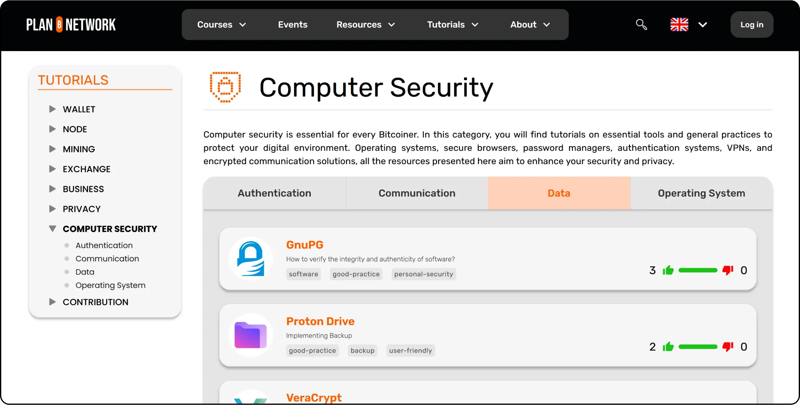
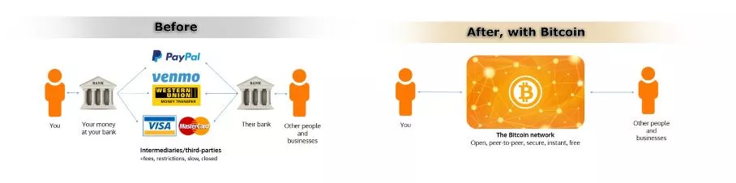
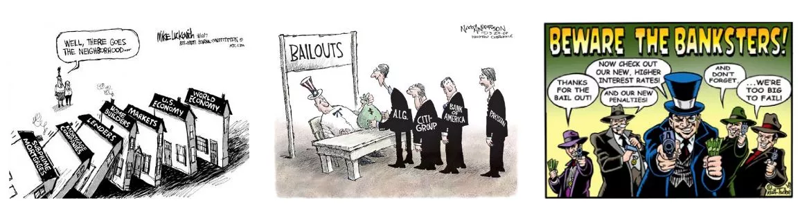
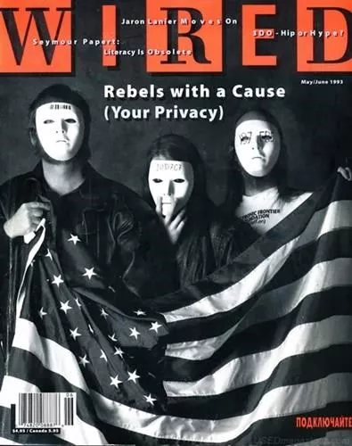
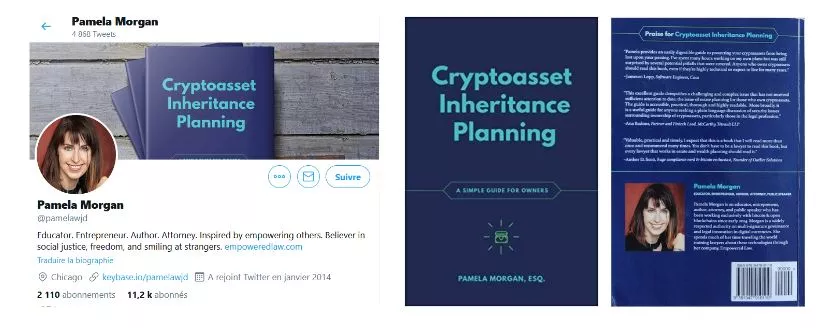

# Eine Reise zu Ihren ersten Bitcoins

Das Bitcoin-Ökosystem erfährt ein spektakuläres und nie dagewesenes Wachstum. Die technologischen, wirtschaftlichen und sozialen Veränderungen, die durch die Erfindung von Satoshi Nakamoto vorangetrieben werden, intensivieren sich von Tag zu Tag und öffnen allmählich die Türen zu einer neuen Welt, von der Sie jetzt in vollem Umfang profitieren können.

Das Eintauchen in das Bitcoin Kaninchenloch ist ein spannendes intellektuelles Abenteuer, das Ihr kritisches Denken anregen und viele Ihrer Überzeugungen in Frage stellen wird. Diese Erkundung wird Ihnen nicht nur ein tiefes Verständnis dafür vermitteln, wie Bitcoin funktioniert, sondern auch eine echte Chance, Ihre persönliche Freiheit zurückzugewinnen, Ihre Privatsphäre zu schützen und wahre finanzielle Souveränität zu erlangen.

Um Sie auf dieser Reise effektiv zu begleiten, habe ich diesen völlig kostenlosen Kurs erstellt. Hier liegt der Fokus ausschließlich auf Bitcoin. Keine irrelevanten Diskussionen, keine Erwähnung anderer Kryptowährungen, nur klare, präzise und geradlinige Inhalte.

Dieser Kurs ist so konzipiert, dass Sie die volle Kontrolle darüber haben, wie Sie lernen. Sie können Bitcoin in Ihrem eigenen Tempo erkunden und den Weg einschlagen, der Ihren Interessen und Zielen am besten entspricht.

+++
# Einführung

<partId>008c49b7-5e17-5973-87f2-ba28429b2697</partId>

## Überblick über den Kurs

<chapterId>bfc96999-0ee1-5c41-8297-1b629f50cffc</chapterId>

Willkommen bei BTC102! Wenn Sie bereits BTC101 abgeschlossen haben, haben Sie die wichtigsten theoretischen Konzepte erforscht, die erklären, warum Bitcoin eine so revolutionäre Technologie ist. Jetzt, mit BTC102, ist es an der Zeit, dieses Wissen in die Tat umzusetzen. Dieser Kurs soll Ihnen helfen, Schritt für Schritt Ihren persönlichen Bitcoin-Plan zu erstellen.

In den folgenden Kapiteln führen wir Sie durch die praktischen Schritte, um **ihre ersten Bitcoins** zu bekommen, **sie richtig zu sichern** und selbstbewusst Ihre ersten Schritte in diesem schnell wachsenden Ökosystem zu machen.

https://planb.network/courses/2b7dc507-81e3-4b70-88e6-41ed44239966

Obwohl Bitcoin bereits seit über 16 Jahren existiert, ist die Branche noch jung, dynamisch und tief in der Freiheit verwurzelt. Das zugrundeliegende Protokoll ist vollständig dezentralisiert und widersteht der Kontrolle durch eine zentrale Behörde, sodass das Ökosystem auf natürliche und organische Weise wachsen kann.

Diese Freiheit bringt eine unglaubliche Welle von Innovationen und Möglichkeiten mit sich, birgt aber auch gewisse Risiken, darunter Betrug, häufige Fehler und Fallstricke, die oft aus mangelndem Wissen resultieren. Das Hauptziel dieses Kurses ist es, Ihnen zu helfen, sich in diesem neuen Ökosystem mit Vertrauen und Sicherheit zu bewegen.

Um dies zu erreichen, ist der Kurs BTC102 in mehrere Abschnitte unterteilt, die sich jeweils auf einen wichtigen Aspekt Ihrer Reise mit Bitcoin konzentrieren:

Der erste Abschnitt, "Voraussetzungen für das Verständnis von Bitcoin", bereitet Sie effektiv auf den bevorstehenden Weg vor. Sie werden lernen, die wichtigsten Fallstricke im Zusammenhang mit Betrug und Finanzbetrug zu erkennen, die im Bitcoin-Ökosystem existieren können. Dann werden wir die wesentlichen Grundlagen der Online-Sicherheit behandeln.

Zum Schluss gebe ich Ihnen noch ein paar praktische Tipps, die speziell für Anfänger gedacht sind und Ihnen helfen, häufige Fehler zu vermeiden, wenn Sie zum ersten Mal mit Bitcoin arbeiten.

Der zweite Abschnitt, "Verstehen, worauf Sie sich einlassen", wird Ihr Gesamtverständnis von Bitcoin vertiefen. Wir werden mit einem Überblick beginnen, um sicherzustellen, dass Sie die wesentlichen Konzepte vollständig verstehen.

Dann werden wir Ihnen erklären, warum Bitcoin aus technologischer, wirtschaftlicher und sozialer Sicht von grundlegender Bedeutung ist und Sie in Ihrem Glauben an seinen Wert bestärken. Sie werden auch die Bitcoin-Industrie als Ganzes untersuchen: ihre Hauptakteure, ihre Organisation und ihre Entwicklung im Laufe der Jahre. Schließlich werden wir die Schichtenarchitektur des Bitcoin-Ökosystems behandeln, ein entscheidendes Konzept, um zu verstehen, wie dieses System weiterhin Innovationen hervorbringt, ohne die Integrität seines Kernprotokolls zu gefährden.

Der dritte Abschnitt, "Einrichten Ihres Plans", befasst sich mit Ihrem persönlichen Ansatz für Bitcoin. Wir beginnen damit, dass wir Ihnen helfen, Ihr Benutzerprofil aus vier Hauptkategorien zu definieren:

- der hodler*, der sich darauf konzentriert, Bitcoin langfristig zu halten;
- der Stapler*, der regelmäßig und systematisch einkauft;
- der Nutzer*, der Bitcoin vorrangig täglich nutzt;
- und schließlich *der Paranoiker*, der maximale Sicherheit wünscht, um sein Vermögen und seine Privatsphäre wirksam zu schützen.

Wir begleiten Sie bei der Umsetzung einer Strategie, die Ihrem Profil entspricht und Ihnen hilft, Ihre persönlichen Ziele zu erreichen.

Der vierte Abschnitt, "Schutz Ihrer Erben und Ihres Vermögens", behandelt schließlich ein wichtiges Thema, das oft übersehen wird: wie Sie sicherstellen können, dass Ihr Bitcoin im Falle eines unerwarteten Ereignisses an Ihre Angehörigen weitergegeben wird. Sie erfahren, wie Sie einen Bitcoin-Erbschaftsplan erstellen und einrichten können, um die Erhaltung Ihres Vermögens über Ihre Lebenszeit hinaus zu gewährleisten.

Am Ende dieses Kurses verfügen Sie über alle praktischen Werkzeuge, die Sie benötigen, um sich sicher im Bitcoin-Ökosystem zu bewegen und einer der fortgeschrittensten Benutzer zu werden!

Sind Sie bereit, Ihre Reise in die Welt von Bitcoin zu beginnen? Los geht's!

# Voraussetzungen für das Verständnis von Bitcoin

<partId>4481fc4b-0f83-489e-ad07-81517c5d6bad</partId>

## Betrug und Finanzbetrug

<chapterId>8af2948b-2ab5-54c4-862c-3414b8a285a2</chapterId>

Das Bitcoin-Ökosystem und sein Umfeld sind noch relativ jung und je nach Land nur locker reguliert. Diese Freiheit eröffnet zwar enorme Möglichkeiten, schafft aber auch einen fruchtbaren Boden für Finanzbetrug, Betrug und verschiedene Formen der Manipulation. Deshalb ist das erste Kapitel so wichtig: Wenn Sie die üblichen Fallstricke kennen, können Sie sie vermeiden. Ihre finanzielle Sicherheit hat Priorität, denn eine schlechte Erfahrung betrifft nicht nur Sie, sondern die gesamte Bitcoin-Gemeinschaft.

### Bitcoin vs. Kryptos: die Unterschiede verstehen

Bevor wir weitermachen, ist es wichtig, zwischen zwei grundlegend verschiedenen Welten zu unterscheiden:

- Im Mittelpunkt des Bitcoin-Ökosystems** steht die Idee eines soliden Geldes, das auf starker Dezentralisierung, langfristiger Stabilität, Privatsphäre und individueller Souveränität beruht. Seit seiner Einführung im Jahr 2009 hat Bitcoin zuverlässig und sicher funktioniert, unterstützt von einer globalen, engagierten Gemeinschaft von Entwicklern. Es ist kein vorübergehender Trend, sondern ein stabiles und gut etabliertes Protokoll, das darauf ausgelegt ist, den Wert über die Zeit zu erhalten.

- Die Kryptowährungsbranche** ist dagegen viel größer und umfasst Zehntausende verschiedener Projekte, von denen jedes seinen eigenen Token hat. Dieser Bereich wird oft durch schnelle Innovation, Hype und kurzfristige Finanzspekulationen angetrieben. Viele dieser Projekte sind zentralisiert, weniger sicher und bieten keinen wirklichen Wert - trotz kühner Versprechen und auffälligem Marketing.

Wenn Sie besser verstehen möchten, woher Bitcoin kommt und was es wirklich von anderen Projekten unterscheidet, empfehle ich Ihnen, sich später diesen kostenlosen Folgekurs über die Geschichte von Bitcoin anzusehen:

https://planb.network/courses/a51c7ceb-e079-4ac3-bf69-6700b985a082

Wie Sie wissen, ist die Plan ₿ Network-Plattform ausschließlich dem Bitcoin gewidmet. Wenn Sie jedoch den Unterschied zu anderen Kryptowährungen verstehen, können Sie die Fallstricke vermeiden, die mit nutzlosen und manchmal sogar betrügerischen Projekten verbunden sind.

### Die wichtigsten zu vermeidenden Betrügereien

Hier sind die häufigsten Betrugsfälle, denen Sie auf Ihrer Reise begegnen können:

#### Pyramidensysteme und Schneeballsysteme

Dies sind einige der häufigsten Betrügereien in der Kryptowelt. Bei einem Schneeballsystem erhalten frühe Teilnehmer Auszahlungen mit dem Geld der neueren Teilnehmer, nicht mit einer echten Investition oder einem Produkt. Es wird kein tatsächlicher Wert geschaffen. Das System funktioniert nur so lange, wie immer wieder neue Teilnehmer hinzukommen. Sobald der Strom neuer Teilnehmer nachlässt, fällt das ganze System auseinander.

Diese Betrügereien sind in der Regel mit :

- Unrealistische Versprechen garantierter Renditen (z.B. 20% garantierte Rendite);
- Verzögerungen oder Schwierigkeiten beim Versuch, Ihre angelegten Gelder abzuheben;
- Starke Anreize zur Anwerbung neuer Mitglieder, um das System am Laufen zu halten;
- Völlige Intransparenz über die wahre Quelle der versprochenen Erträge.

Letztlich sind alle Pyramiden- und Schneeballsysteme zum Scheitern verurteilt. Ihre grundlegende Schwäche liegt in der ständigen Notwendigkeit, neue Investoren anzuwerben, um die Renditen an frühere Teilnehmer auszuzahlen. Dieser Bedarf wird mit der Zeit mathematisch unmöglich aufrechtzuerhalten sein, da die Zahl der benötigten neuen Anleger exponentiell ansteigt, wenn das System wächst. Sobald ein kritischer Punkt erreicht ist, beginnen die Teilnehmer zu zweifeln, das Vertrauen schwindet, und die gesamte Pyramide bricht zusammen. In diesem Stadium verlieren die letzten Teilnehmer, die oft am wenigsten informiert sind, ihre gesamte Investition, ohne dass sie sie zurückerhalten, während die Organisatoren oder frühen Investoren ihre Gelder in der Regel bereits abgezogen und das System verlassen haben.

In der Welt der Kryptowährungen können Ponzi-Schemata viele Formen annehmen, die oft darauf ausgelegt sind, ihre betrügerische Natur hinter einer technologischen oder finanziellen Maske zu verbergen. Diese Betrügereien können als neue Token-Angebote oder Initial Coin Offerings (ICOs) auftreten, bei denen eine neue Kryptowährung an die Öffentlichkeit verkauft wird. Hinter technischen Begriffen wie "Blockchain", "Smart Contracts" oder "Staking" verbergen sich bei einigen Projekten komplexe Schneeballsysteme. Andere behaupten, hohe Renditen zu bieten, indem sie fragwürdige Krypto-Assets mit Vergütungssystemen kombinieren, die sich ausschließlich auf den kontinuierlichen Zustrom neuer Investoren verlassen.

In jüngster Zeit haben sich Ponzi-Schemata auch in der Welt der dezentralen Finanzen (DeFi) ausgebreitet. Während DeFi dazu gedacht ist, Finanzdienstleistungen ohne Vermittler anzubieten, nutzen einige Projekte es, um ihren Betrügereien ein falsches Gefühl von Legitimität zu verleihen. Bestimmte DeFi-Plattformen versprechen hohe, garantierte Renditen in Exchange für Einzahlungen von Kryptowährungen in automatisierte Protokolle. Diese verlockenden Versprechen werden oft durch undurchsichtige und nicht überprüfbare Mechanismen unterstützt, wobei die Token speziell für den Betrug geschaffen werden. In Wirklichkeit haben diese Systeme kein nachhaltiges Geschäftsmodell - die Renditen werden einfach aus den Geldern neuer Nutzer gezahlt, genau wie bei einem herkömmlichen Schneeballsystem. Wenn das Vertrauen zu schwinden beginnt oder der Zustrom neuer Teilnehmer nachlässt, brechen diese Systeme unweigerlich zusammen, was zu erheblichen Verlusten für ahnungslose Anleger führt.

Bitte beachten Sie, dass der Inhalt dieses Kurses nur zu Bildungszwecken dient und nicht als Finanzberatung ausgelegt werden sollte. Ihre finanzielle Sicherheit hängt von Ihrer Fähigkeit ab, bei jeder finanziellen Entscheidung, die Sie treffen, vorsichtig, skeptisch und gut informiert zu bleiben.

Der beste Schutz ist, sich immer diese einfache Frage zu stellen: Woher kommt eigentlich die versprochene Rendite? Wenn die Antwort unklar ist, laufen Sie sofort weg.

#### Pump & Dump

Bei dieser Art von Betrug wird der Preis eines Vermögenswerts - häufig ein Kryptowährungs-Token mit geringer Liquidität - durch eine koordinierte Marketingkampagne künstlich in die Höhe getrieben, die in der Regel von einer Gruppe von Anlegern geleitet wird. Das typische Pump & Dump-Schema folgt diesem Muster:

- Eine Gruppe von Insidern oder einflussreichen Persönlichkeiten sammelt im Stillen eine große Menge des angestrebten Vermögenswerts an.
- Dann starten sie eine aggressive Werbekampagne, um den generate-Hype anzuheizen und den Preis in die Höhe zu treiben.
- Die breite Öffentlichkeit, getrieben von FOMO (Fear of Missing Out), beginnt, den Vermögenswert in großer Zahl zu kaufen, was den Preis noch weiter in die Höhe treibt.
- Auf dem Höhepunkt des Hypes verkaufen die Insider ihre Anteile auf einmal.
- Der Preis stürzt ab und hinterlässt bei den Nachzüglern hohe Verluste.

Es ist wichtig zu wissen, dass Pump & Dump-Strategien in vielen Ländern illegal sind und als eine Form der Marktmanipulation angesehen werden. Trotzdem florieren solche Systeme weiterhin, vor allem im Bereich der Kryptowährungen, wo die Regulierung noch nicht abgeschlossen ist.

Seien Sie besonders vorsichtig bei privaten "Signal"-Gruppen auf Plattformen wie Telegram, Discord oder anderen Social-Media-Kanälen. Diese werden oft von Influencern oder selbsternannten Experten betrieben, von denen einige sogar Eintrittsgelder verlangen. Während diese Gruppen vorgeben, exklusive Investitionsmöglichkeiten zu bieten, ist die Realität weitaus einseitiger: Nur die Organisatoren profitieren, während die meisten Teilnehmer am Ende ihr Geld verlieren.

Es stimmt, dass einige Teilnehmer vorübergehend von dieser Art von Marktmanipulationen profitieren können, aber ihr Erfolg beruht in der Regel auf nichts anderem als Glück und perfektem Timing. Auf lange Sicht sind diese Systeme nicht nachhaltig. Sie erfordern ein ständiges hohes Risiko und eine wiederholte Beteiligung an betrügerischen Machenschaften, die unweigerlich scheitern.

Schlimmer noch, sie nähren eine gefährliche Illusion: den Glauben, dass es möglich ist, schnell und einfach Geld zu verdienen, ohne zu verstehen, wie Finanzsysteme tatsächlich funktionieren. Diese Denkweise setzt nicht nur Einzelpersonen einem Risiko aus, sondern untergräbt auch die Glaubwürdigkeit des gesamten Kryptowährungsökosystems

Aus all diesen Gründen besteht die beste Strategie darin, einen seriösen, durchdachten Ansatz für Investitionen zu verfolgen, der auf finanzieller Bildung, einem soliden Verständnis der Fundamentaldaten und einer langfristigen Perspektive beruht.

Wenn Sie Ihr Wissen geduldig aufbauen, sind Sie weit weniger anfällig für emotionale Manipulationen und unrealistische Versprechungen und viel besser gerüstet, um die finanziellen Fallen zu vermeiden, die zu echten Verlusten führen können.

#### Spenden-, Lotterie- und gefälschte Werbegeschenke-Betrug

Diese Art von Betrug verspricht kostenlose Bitcoin oder andere Belohnungen in Exchange, wenn Sie zuerst einen kleinen Geldbetrag senden. Es ist wichtig, sich daran zu erinnern: Keine seriöse Person oder Organisation wird Sie jemals auffordern, Kryptowährung im Voraus zu senden, mit dem Versprechen, Ihnen im Gegenzug mehr zu schicken.

Betrüger geben sich oft als bekannte Persönlichkeiten des öffentlichen Lebens (wie Elon Musk oder andere Prominente) aus, um ihre Opfer über soziale Medien zu ködern. Überprüfen Sie immer die Legitimität von Konten und Websites, bevor Sie mit ihnen in Kontakt treten, und vertrauen Sie niemals Angeboten, die zu großzügig oder zu gut erscheinen, um wahr zu sein.

Manchmal treten diese Betrügereien als "Vorschussbetrug" auf. Ihnen wird ein Preis oder eine Belohnung versprochen (Geld, ein Produkt oder eine Dienstleistung), aber Sie werden zuerst aufgefordert, eine Gebühr zu zahlen, angeblich um Dinge wie Versand, Steuern oder Transaktionskosten zu decken. Sobald die Zahlung erfolgt ist, verschwindet der Betrüger, und die versprochene Belohnung kommt nie an.

#### Shitcoins und Kryptowährungen im Angebot

Zentralisierte Kryptowährungsprojekte bieten manchmal kostenlose Token ("*airdrops*") an, um Nutzer anzulocken. Diese Token haben in der Regel wenig bis keinen realen Wert und werden hauptsächlich verwendet, um die Illusion von Popularität zu erzeugen oder Spekulationen anzuheizen. Seien Sie bei dieser Art von Werbeangeboten äußerst vorsichtig; es handelt sich dabei oft eher um Marketing-Fallen als um echte Chancen.

#### Identitätsdiebstahl und Phishing

Angreifer nutzen oft gefälschte Websites, Konten in sozialen Medien oder betrügerische E-Mails, um zu versuchen, Ihr Geld zu stehlen. Diese Betrügereien können über jeden Kommunikationskanal erfolgen: E-Mail, soziale Netzwerke, Telefonanrufe oder sogar herkömmliche Post...

Bevor Sie auf einen Link klicken oder eine Aktion durchführen, überprüfen Sie immer die Identität des Absenders. Rufen Sie im Zweifelsfall die Website manuell auf, anstatt einen angegebenen Link zu verwenden. Am wichtigsten ist, dass Sie niemals Ihre privaten Schlüssel oder Passwörter an andere weitergeben.

#### Bitcoin Hartgabel

Im Laufe der Jahre hat Bitcoin mehrere *Hard-Forks* erlebt, die zur Schaffung alternativer Versionen der ursprünglichen Kryptowährung führten. Einfach ausgedrückt ist ein *Hard Fork* eine Abspaltung im Netzwerk, die zu zwei getrennten Blockchains führt, die beide bis zum Zeitpunkt der Abspaltung dieselbe Geschichte haben. Diese Abspaltungen treten typischerweise auf, wenn ein Teil der Entwicklergemeinschaft oder des breiteren Bitcoin-Ökosystems größere Änderungen am ursprünglichen Protokoll einführen möchte, aber keinen breiten Konsens erreichen kann. Anstatt ihre Ideen aufzugeben, beschließen sie, eine neue Version von Bitcoin (mit geänderten Regeln) zu starten, in der Hoffnung, dass die Nutzer und Miner stattdessen ihrem Fork folgen werden.

Nicht alle *Hard-Gabeln* sind betrügerisch, da einige aus technischen oder ideologischen Meinungsverschiedenheiten innerhalb der Gemeinschaft entstehen. Andere werden jedoch von kommerziellen Interessen oder sogar unlauteren Motiven angetrieben. Die bekanntesten Beispiele für diese Hardforks sind **Bitcoin Cash (BCH)** und **Bitcoin Satoshi Vision (BSV)**. Diese 2017 bzw. 2018 eingeführten Alternativwährungen behaupten oft, "bessere Versionen" des ursprünglichen Bitcoin zu sein. Sie werben mit angeblichen Vorteilen wie niedrigeren Transaktionsgebühren oder schnelleren Transaktionen aufgrund größerer Blockgrößen. Diese technischen Änderungen gehen jedoch mit erheblichen Kompromissen in Bezug auf Sicherheit, Dezentralisierung und Robustheit einher; Elements, die mit den Grundprinzipien von Bitcoin in Konflikt geraten können.

Abgesehen von den technischen Unterschieden nutzen diese alternativen Währungen oft die Verwirrung aus, um uninformierte Anleger anzulocken. Sie können Marketingtaktiken anwenden, die darauf abzielen, Neulinge absichtlich in die Irre zu führen, die glauben, sie würden echte Bitcoin (BTC) kaufen.

Um nicht in diese Falle zu tappen, sollten Sie immer die Währung überprüfen, die Sie kaufen. Das ursprüngliche Bitcoin verwendet den Ticker **BTC**, während Bitcoin Cash und seine Derivate unterschiedliche Akronyme verwenden, wie BCH oder BSV.

#### Unehrliche Influencer und gefälschte Gurus

In dem Maße, in dem Kryptowährungen in der breiten Öffentlichkeit an Aufmerksamkeit gewinnen, ist in den sozialen Medien eine Welle von Influencern, selbsternannten Experten und sogenannten "Krypto-Gurus" entstanden. Während einige von ihnen wirklich lehrreiche Einblicke bieten, nutzen viele andere ihren Bekanntheitsgrad, um dubiose Projekte oder gefährlich riskante (und manchmal sogar betrügerische) Handelsstrategien zu fördern. Diese Personen sind in der Regel durch persönliche finanzielle Interessen motiviert und erhalten oft eine direkte oder indirekte Vergütung für die Förderung bestimmter Token oder Plattformen.

Diese Influencer setzen oft auf bewährte Taktiken, um Anfänger anzulocken: Sie präsentieren beeindruckende finanzielle Ergebnisse (die oft gefälscht oder nicht nachprüfbar sind), stellen einen luxuriösen Lebensstil als vermeintlichen Beweis für ihren Erfolg zur Schau und werben für "wundersame" Anlagestrategien. Das Ziel ist es, FOMO - die Angst, etwas zu verpassen - auszulösen und ihr Publikum zu impulsiven Entscheidungen und rücksichtslosen Investitionen zu bewegen.

Es ist wichtig zu verstehen, dass die meisten "kostenlosen" Ratschläge dieser Persönlichkeiten nie wirklich kostenlos sind. Hinter der Fassade der Großzügigkeit verbirgt sich oft eine kalkulierte Strategie, um die Menschen zum Kauf fragwürdiger Anlagen zu bewegen. Und selbst wenn einige Influencer ehrlich wären, wäre es fast unmöglich, ihre Ergebnisse zu reproduzieren. Ihr Erfolg hängt oft von einem bestimmten Timing, Insiderwissen oder einzigartigen Umständen ab, zu denen Sie einfach keinen Zugang haben.

Manche Influencer laden Sie ein, privaten, kostenpflichtigen Gruppen beizutreten, in denen sie behaupten, exklusive Handelssignale oder Insider-Tipps zu teilen, die schnelle und einfache Gewinne versprechen. In Wirklichkeit profitieren von diesen Gruppen hauptsächlich die Organisatoren selbst. Sie nutzen ihre Anhänger oft als Liquiditätsquelle und veräußern im Wesentlichen Vermögenswerte zum persönlichen Vorteil. Die Abonnenten verlieren in der Regel Geld, da sie nicht so schnell reagieren können wie die Insider, die den Handel orchestrieren (siehe den Abschnitt über Pump & Dump-Systeme).

In Anbetracht dieser Tatsache sollten Sie sich einige gute Gewohnheiten aneignen, um nicht in die Fallen unehrlicher Influencer zu tappen:

- Seien Sie sehr vorsichtig mit allen Krypto-Investitionsempfehlungen.**

Eine vertrauenswürdige und sachkundige Person wird Sie niemals zum Kauf einer Kryptowährung drängen, ohne Sie zu ermutigen, zuerst Ihre eigenen Nachforschungen anzustellen.

- Kostenpflichtige Handels- oder Investitionskurse sind nicht immer ein Qualitätsmerkmal

Viele dieser Kurse propagieren riskante oder allzu einfache Strategien; oft sind es dieselben Informationen, die Sie kostenlos im Internet finden können.

- Es gibt keine Garantie dafür, dass man die Geschäfte von jemandem kopiert und identische Ergebnisse erzielt.**

Jede Anlagestrategie hängt vom persönlichen Kontext, vom Timing, vom Wissen und von anderen Faktoren ab, die sich nicht exakt duplizieren lassen.

- Seien Sie besonders vorsichtig bei Ratschlägen, die zu gut klingen, um wahr zu sein.**

Unrealistische Versprechungen oder garantierte Gewinne sind fast immer ein Zeichen von Manipulation. Denken Sie daran: Nur weil jemand etwas selbstbewusst sagt, ist es noch lange nicht wahr.

Denken Sie immer daran, dass jeder, dem Sie im Bitcoin oder im breiteren Krypto-Ökosystem begegnen, eine persönliche Agenda verfolgt, ob sie nun offen ausgesprochen oder zwischen den Zeilen versteckt wird. So etwas wie rein neutrale Informationen gibt es nicht. Auch dieser Kurs, BTC102, hat ein klares Ziel: *ein besseres Verständnis von Bitcoin zu fördern.*

Deshalb ist es wichtig, dass Sie sich über die wahren Beweggründe hinter jedem von Ihnen konsumierten Inhalt im Klaren sind. Und vergessen Sie nie diese goldene Regel des Internets:

*Wenn ein Produkt oder eine Dienstleistung kostenlos zu sein scheint, sind Sie wahrscheinlich das Produkt*

Letztendlich ist Ihre beste Verteidigung die persönliche Bildung, eine gesunde Skepsis und vor allem die Gewohnheit, Fakten selbst zu überprüfen.

### Wie man Betrug vermeidet

**Um online sicher zu sein, insbesondere in der Welt der Kryptowährungen, sollten Sie die folgenden Grundsätze beachten:**

- Vertrauen Sie niemals blind: "*Vertrauen Sie nicht, überprüfen Sie*" ;
- Seien Sie skeptisch bei garantierten oder ungewöhnlich hohen Renditen;
- Geben Sie Ihre privaten Schlüssel niemals an Dritte weiter;
- Senden Sie kein Bitcoin (oder andere Kryptowährungen) an unbekannte Adressen;
- Im Zweifelsfall halten Sie inne. Treten Sie zurück und denken Sie nach, bevor Sie etwas unternehmen. FOMO ist Ihr schlimmster Feind;
- Vermeiden Sie bezahlte Handelsgruppen oder Gemeinschaften, die unrealistische Versprechungen machen;
- Die meisten Werbegeschenke oder "kostenlosen" Lotterien im Internet sind Betrug oder stark manipuliert;
- Langfristig haben Sie immer mehr davon, wenn Sie lernen, als wenn Sie zocken.

Sich vor Betrug zu schützen, ist ein wichtiger erster Schritt zum Schutz Ihres Vermögens, aber das reicht nicht aus. Genauso wichtig ist es, eine gute digitale Hygiene aufrechtzuerhalten. Deshalb werden wir im nächsten Kapitel untersuchen, wie Sie Ihre Online-Sicherheit verbessern können und welche bewährten Verfahren Sie anwenden sollten, um sich in der digitalen Welt zu schützen.

## Online-Sicherheit

<chapterId>f0873bf2-6a6f-5485-bb7a-d84be14f404d</chapterId>

Sobald Sie sich mit Bitcoin beschäftigen, werden Sie schnell feststellen, dass grundlegende Cybersicherheit nicht optional ist, sondern unerlässlich. Scams und Betrug sind nur die Spitze des Eisbergs. Versehentlicher Datenverlust, Malware und kompromittierte Passwörter können ebenso verheerend sein, besonders wenn Sie Ihre eigenen Schlüssel verwalten.

Dieses Kapitel führt Sie durch einige einfache, praktische Schritte, um Ihre digitale Hygiene zu verbessern und sich in diesem Bereich zu schützen.

Wenn Sie tiefer einsteigen möchten, bietet der SEC101-Kurs von Plan ₿ Network eine umfassende Aufschlüsselung der Cybersicherheitsstrategien, die speziell für Bitcoin-Nutzer entwickelt wurden.

https://planb.network/courses/99c46148-7080-4915-a7e0-9df0e145cd47

### Warum Cybersecurity wichtig ist

Bitcoin gibt Ihnen die Macht, Ihr Geld direkt zu halten (ohne Banken), ohne Zwischenhändler. Aber diese Art von finanzieller Souveränität geht mit einer großen Verantwortung einher: Wenn Ihre BTC aufgrund einer Sicherheitslücke gestohlen werden, gibt es keine Möglichkeit, die Transaktion rückgängig zu machen. Anders als bei traditionellen Banken gibt es keinen Helpdesk, keine Betrugsanzeige und keine Versicherung, die Ihnen aus der Patsche hilft.

Hinzu kommt, dass der finanzielle Wert des Bitcoin ihn zu einem hochrangigen Ziel macht. Ein Hacker, der Ihren Wallet kompromittiert, kann Ihr Geld sofort auf einen Address verschieben, den er kontrolliert (ohne Fragen zu stellen, ohne Möglichkeit, es zurückzubekommen).

### Ein sauberer, aktueller Computer

Einer der am meisten übersehenen Aspekte der persönlichen Sicherheit besteht darin, Ihr Betriebssystem und Ihre Software auf dem neuesten Stand zu halten. Viele Updates schließen bekannte Sicherheitslücken, die sonst von Angreifern ausgenutzt werden könnten. Manche Menschen vermeiden Aktualisierungen aus Angst vor Leistungseinbußen. Das eigentliche Risiko besteht jedoch darin, veraltete Software zu verwenden, von der Hacker bereits wissen, wie sie zu knacken ist.

Es wird auch dringend empfohlen, ein zuverlässiges Antivirenprogramm zu verwenden. Unter Windows ist der integrierte Windows Defender in der Regel für die meisten Benutzer ausreichend. Wenn Sie zusätzliche Funktionen oder Sicherheit wünschen, sind auch kommerzielle Optionen wie Kaspersky erhältlich. Unter macOS sind Malware-Bedrohungen in der Regel weniger verbreitet **aber nicht inexistent**, daher ist es immer noch ratsam, vorsichtig zu sein.

Abgesehen von Systemaktualisierungen und Virenschutz sollten Sie beim Herunterladen von Software von zweifelhaften Websites oder sogenannten "universellen" Download-Portalen äußerst vorsichtig sein. Wenn Sie ein Tool oder eine Anwendung benötigen, gehen Sie immer direkt zur offiziellen Quelle; dadurch wird das Risiko der Installation von Malware, die als legitime Software getarnt ist, drastisch reduziert.

Eine weitere kluge Angewohnheit ist es, die Authentizität und Integrität jeder Software zu überprüfen, bevor Sie sie auf Ihrem Computer installieren. Wenn Sie sich nicht sicher sind, wie das geht, haben wir eine spezielle Anleitung für Sie, die Sie durch den Prozess führt:

https://planb.network/tutorials/computer-security/data/integrity-authenticity-21d0420a-be02-4663-94a3-8d487f23becc

Schließlich sollten Sie regelmäßig Sicherungskopien Ihrer wichtigen Daten erstellen. Ein externes Hard-Laufwerk oder eine SSD ist eine solide Option, um ein Duplikat Ihrer Dateien für den Fall eines plötzlichen Ausfalls, eines Hackerangriffs oder einer versehentlichen Löschung zu speichern. Sie werden es Ihnen später danken.

Wenn Sie Cloud-Lösungen bevorzugen, sollten Sie einen sicheren Dienst wie Proton Drive nutzen. Stellen Sie nur sicher, dass die von Ihnen gewählte Option Ihre Privatsphäre respektiert und eine starke Verschlüsselung bietet.

https://planb.network/tutorials/computer-security/data/proton-drive-03cbe49f-6ddc-491f-8786-bc20d98ebb16

Eine weithin empfohlene Sicherungsstrategie ist die "3-2-1-Regel". Sie soll Ihre Daten vor versehentlichem Verlust, Cyberangriffen oder sogar Naturkatastrophen schützen.

Die Idee ist einfach:

- Bewahren Sie **mindestens 3 Kopien** von Ihren wichtigen Daten auf,
- Speichern Sie sie auf **mindestens 2 verschiedenen Arten von Datenträgern** (z. B. einem externen Hard-Laufwerk und einem Cloud-Speicher),
- Und stellen Sie sicher, dass **1 dieser Kopien außerhalb des Standorts** (physisch getrennt von Ihrem Hauptstandort) aufbewahrt wird.

Dieser Ansatz bietet eine hohe Ausfallsicherheit und trägt dazu bei, dass Ihre Daten auch dann überleben, wenn etwas ernsthaft schief geht.

### Die Lösung für den ID-Albtraum

Einer der Hauptgründe, warum Menschen gehackt werden, ist die Verwendung schwacher Passwörter. Eine beträchtliche Anzahl von Nutzern verwendet immer noch dasselbe Passwort für mehrere Konten oder wählt Variationen, die leicht zu erraten sind. Passwort-Manager sind die perfekte Lösung für dieses Problem.

Mit einem Passwort-Manager können Sie:

- Speichern Sie alle Ihre Kennwörter sicher** in einem verschlüsselten Tresor
- generate lange, komplexe und eindeutige Passwörter** automatisch für jedes Konto
- Verwenden Sie nur ein Master-Passwort**, um auf alles sicher zuzugreifen

Mit einem Passwortmanager müssen Sie nie wieder auf "Passwort vergessen" klicken oder sich auf schwache, wiederverwendete Anmeldedaten verlassen. Außerdem lassen sich die meisten Passwort-Manager nahtlos mit Ihren Geräten (Desktop, Telefon, Tablet) synchronisieren und füllen sogar Anmeldeformulare automatisch aus, was den sicheren Zugang mühelos und effizient macht.

Es gibt viele Passwort-Manager, aber ich kann Ihnen zwei solide Optionen empfehlen, je nach Ihren Bedürfnissen. Wenn Sie etwas suchen, das einfach zu bedienen ist und sich nahtlos mit mehreren Geräten synchronisieren lässt, ist Bitwarden eine ausgezeichnete Wahl:

https://planb.network/tutorials/computer-security/authentication/bitwarden-0532f569-fb00-4fad-acba-2fcb1bf05de9

Wenn Sie lieber alles lokal auf Ihrem eigenen Gerät speichern möchten, ist KeePass eine gute Option:

https://planb.network/tutorials/computer-security/authentication/keepass-f8073bb7-5b4a-4664-9246-228e307be246

### 2FA: doppelter Schutz

In Bitcoin sind Sie Ihre eigene Bank. Das bedeutet, dass Sie auch Ihr eigenes Sicherheitsteam sind. Selbst mit einem starken Passwort gibt es kein Nullrisiko - deshalb ist die Zwei-Faktor-Authentifizierung (2FA) so wichtig.

2FA fügt ein zweites Layer des Schutzes hinzu, indem es einen zeitbasierten Einmalcode (normalerweise 6 Ziffern) erfordert, der von einer App wie Google Authenticator oder Authy generiert wird. Selbst wenn es also jemandem gelingt, Ihr Passwort zu erhalten, kann er ohne physischen Zugang zu Ihrem Telefon nicht auf Ihr Konto zugreifen.

https://planb.network/tutorials/computer-security/authentication/authy-a76ab26b-71b0-473c-aa7c-c49153705eb7

Wenn Sie 2FA aktivieren, stellen Sie sicher, dass Sie den Wiederherstellungsschlüssel für Ihre App an einem sicheren Ort speichern. So können Sie Ihre Codes wiederherstellen, wenn Sie Ihr Telefon verlieren oder wechseln. SMS- oder E-Mail-basierte 2FA ist zwar besser als gar nichts, aber viel unsicherer. Bei einem SIM-Swap-Angriff, bei dem jemand die Kontrolle über Ihre Telefonnummer übernimmt, kann diese Art von Schutz leicht umgangen werden.

Für diejenigen, die noch einen Schritt weiter gehen wollen, bieten physische Schlüssel wie YubiKey ein noch höheres Maß an Schutz.

https://planb.network/tutorials/computer-security/authentication/security-key-61438267-74db-4f1a-87e4-97c8e673533e

### Schutz Ihrer Privatsphäre

Datenschutz und Cybersicherheit sind eng miteinander verknüpft: Je mehr Informationen Sie frei zugänglich machen, desto größer ist die Wahrscheinlichkeit, dass Sie zur Zielscheibe werden.

Ein **VPN** (*Virtuelles Privates Netzwerk*) ist ein einfacher, aber effektiver Schritt, um Ihre IP Address zu maskieren und Ihren Internetverkehr zu verschlüsseln. Damit werden Sie zwar nicht völlig unsichtbar (da der VPN-Anbieter Ihre Aktivitäten immer noch sehen kann), aber es macht es für jeden, der versucht, Sie auszuspionieren oder Ihre Surfgewohnheiten zu verfolgen, deutlich schwieriger.

Der Schlüssel ist die Wahl eines vertrauenswürdigen VPN-Anbieters, der:

- Benötigt keine persönlichen Informationen
- Ermöglicht die Zahlung über BTC
- Hat eine strikte No-Logs-Politik

Wir haben auf Plan ₿ Network mehrere Anleitungen zur Verfügung, die Sie bei der Einrichtung eines VPNs unterstützen können. Ich empfehle insbesondere IVPN oder Mullvad:

https://planb.network/tutorials/computer-security/communication/ivpn-5a0cd5df-29f1-4382-a817-975a96646e68

https://planb.network/tutorials/computer-security/communication/mullvad-968ec5f5-b3f0-4d23-a9e0-c07a3e85aaa8

Zu den wichtigsten Maßnahmen zum Schutz Ihrer Privatsphäre im Internet gehören auch:

- Verwendung von **verschlüsselten Nachrichtenübermittlungsplattformen** wie Signal, SimpleX oder Session;
- Verwendung von Browsern, die auf den Schutz der Privatsphäre ausgerichtet sind, wie Firefox, Brave oder Tor (für mehr Anonymität);

https://planb.network/tutorials/computer-security/communication/tor-browser-a847e83c-31ef-4439-9eac-742b255129bb

- Verwendung einer **sicheren Mailbox** wie ProtonMail;

https://planb.network/tutorials/computer-security/communication/proton-mail-c3b010ce-254d-4546-b382-19ab9261c6a2

- Verschlüsseln** Sie Ihre Dateien mit Tools wie Bitlocker (für Windows) oder VeraCrypt (plattformübergreifend verfügbar).

https://planb.network/tutorials/computer-security/data/veracrypt-d5ed4c83-7c1c-4181-95ea-963fdf2d83c5

### Schrittweises Voranschreiten

Cybersicherheit kann wie ein gewaltiges Unterfangen erscheinen, und Anfänger können leicht überfordert sein und aufgeben, weil es zu komplex erscheint. Der Trick ist, Schritt für Schritt vorzugehen. Beginnen Sie mit etwas Einfachem, wie der Installation eines Passwortmanagers. Geben Sie sich ein paar Wochen Zeit, um sich damit vertraut zu machen, und gehen Sie dann zum nächsten Schritt über: z. B. die Aktivierung von 2FA für eines Ihrer Konten.

Je sicherer Sie mit diesen Tools werden, desto eher können Sie fortgeschrittenere Praktiken anwenden, z. B. eine zweite E-Mail-Adresse verwenden, zu ProtonMail wechseln, ein VPN einrichten oder bei Bedarf mit Tor surfen.

Wenn Sie tiefer in die Welt von Bitcoin eintauchen, werden Sie feststellen, dass die Risiken mit dem zunehmenden Wert Ihres Wallet wachsen. Der Aufbau solider Sicherheitsgewohnheiten, der Schutz Ihrer Privatsphäre und die Einrichtung der richtigen Tools werden Ihnen nicht nur Sicherheit geben, sondern auch die Souveränität stärken, die Bitcoin ausmacht.

Kurz gesagt: Unterschätzen Sie die Cybersicherheit nicht, nehmen Sie sich die Zeit, um die Grundlagen zu schaffen, und denken Sie daran, dass Beständigkeit der Schlüssel ist. Ohne eine gute digitale Hygiene können auch die besten Tools nicht viel für Sie tun.

Schauen Sie sich auch [unsere Computer-Sicherheits-Tutorials](https://planb.network/tutorials/computer-security) auf Plan ₿ Network an.

Im nächsten Kapitel werde ich Ihnen einige weitere Tipps geben, die Ihnen helfen sollen, Ihre Bitcoin-Reise mit Zuversicht anzutreten und die vielen Fallen zu vermeiden, die Neulinge überraschen können.

## Tipps für Neueinsteiger

<chapterId>33134b3f-92c1-5185-afb6-88599e47e801</chapterId>

Der Einstieg in Bitcoin kann aufregend sein, birgt aber auch einige Risiken. Die Welt der Kryptowährungen ist mit keiner anderen vergleichbar. Wilde Preisschwankungen, unbekannte Technologie und die sehr reale Möglichkeit, Ihr Geld durch einfache Fehler oder schlechte Investitionsentscheidungen für immer zu verlieren, sind alles Fallstricke, derer sich neue Nutzer bewusst sein sollten.

In diesem Kapitel gebe ich einige praktische Ratschläge und allgemeine Anleitungen für alle, die ihre ersten Schritte machen, insbesondere für diejenigen, die ihren ersten Kauf tätigen oder die Welt der Geldanlagen im weiteren Sinne erkunden.

Hier sind die wichtigsten Punkte, die wir gemeinsam durchgehen werden:

- Hüten Sie sich vor **Shitcoins** und anderen nutzlosen Kryptowährungen;
- Investieren Sie nur **Geld, das Sie sich leisten können zu verlieren**;
- Kennen Sie den Unterschied zwischen **Handel** und **Investition**;
- Seien Sie sich der **Steuerfolgen** Ihrer Investitionen bewusst;
- Schützen Sie Ihre **Wiederherstellungsphrase** sorgfältig;
- Bleiben Sie bescheiden und verhalten Sie sich **zurückhaltend** (Diskretion ist Teil der Sicherheit);
- Denken Sie langfristig**, zoomen Sie und seien Sie geduldig (sehen Sie es als einen Marathon, nicht als einen Sprint).

### Häufig zu vermeidende Fehler

Bitcoin steht allen offen, aber das bedeutet nicht, dass Sie unvorbereitet einsteigen sollten. Hier sind einige der klassischen Fehler, die von Neulingen gemacht werden:

**Technische Fehler:**

- Verlust Ihres seed-Satzes:** Ihr Wiederherstellungssatz (normalerweise 12 oder 24 Wörter) ist die einzige Möglichkeit, auf Ihren Bitcoin zuzugreifen, wenn Ihrem Wallet etwas zustößt. Wenn Sie sie verlieren, ist Ihr Guthaben für immer verloren;
- Speichern Sie Ihre Bitcoins auf einer Drittanbieter-Plattform:** Wenn Ihre Münzen auf einer zentralen Plattform gespeichert sind, gehören sie Ihnen nicht wirklich. Sie sind Risiken wie Hacks, Plattformausfällen oder sogar Geldbeschlagnahmungen ausgesetzt;
- Vernachlässigung der Privatsphäre:** Der Schutz Ihrer Privatsphäre ist ein wesentlicher Bestandteil der Sicherung Ihres Vermögens. Wenn Sie öffentlich bekannt geben, wie viel Bitcoin Sie besitzen, könnten Sie zu einer Zielscheibe werden;
- Unzureichende Online-Sicherheit:** Wenn Sie Ihre Geräte nicht mit grundlegenden Schutzmaßnahmen (wie Updates, sicheren Passwörtern oder 2FA) absichern, sind Sie ein leichtes Ziel für Angreifer, und das kann Sie alles kosten.

**Finanzielle Fehler:**

- Investieren Sie mehr, als Sie sich leisten können, zu verlieren**: Verschulden Sie sich niemals und stecken Sie Ihr Mietgeld nicht in Bitcoin. Ihre grundlegende finanzielle Stabilität sollte immer an erster Stelle stehen.

- Sie kennen den Unterschied zwischen Handel und Investitionen nicht**: Der Handel erfordert Zeit, Geschick und große emotionale Disziplin. Langfristiges Investieren ist viel anfängerfreundlicher.

- Vergessen Sie die Steuern**: Jedes Land hat seine eigenen Steuervorschriften für Kryptowährungen. Sie zu ignorieren, kann später zu bösen Überraschungen führen.

- Auf FOMO** hereinfallen: Impulskäufe aus Angst, etwas zu verpassen, führen in der Regel zu schlechtem Timing und schlechten Entscheidungen. Geduld ist Ihr bester Verbündeter.

### Festlegung einer Anlagestrategie

Bevor Sie Ihren ersten Satoshi kaufen, sollten Sie unbedingt verstehen, warum und wie Sie in Bitcoin investieren. Das bedeutet, dass Sie einen klaren Finanzplan haben müssen, der auf Ihre persönliche Situation und Ihre langfristigen Ziele zugeschnitten ist.

Legen Sie zunächst Ihr **Budget** genau fest. Wählen Sie nicht einfach eine beliebige Zahl aus. Nehmen Sie sich die Zeit, Ihr monatliches Einkommen zu berechnen, ziehen Sie Ihre festen Ausgaben (wie Miete, Darlehen, Steuern, Versorgungsleistungen) sowie Ihre täglichen Lebenshaltungskosten (Lebensmittel, Transport, Freizeit usw.) ab. Was übrig bleibt, ist Ihre Sparmarge, und nur von diesem Teil sollten Sie Investitionen in Betracht ziehen.

Auf diese Weise können Sie sicherstellen, dass Sie Ihr finanzielles Wohlergehen nicht aufs Spiel setzen, insbesondere im Falle eines Marktabschwungs. Eine durchdachte Strategie ist die Grundlage für langfristige Widerstandsfähigkeit.

Sobald Sie Ihr Budget festgelegt haben, sollten Sie sich überlegen, wie Sie investieren wollen. Eine der anfängerfreundlichsten und am häufigsten empfohlenen Methoden ist das Dollar Cost Averaging (DCA), bei dem Sie in regelmäßigen Abständen (wöchentlich, monatlich usw.) einen festen Betrag von Bitcoin kaufen. Diese Strategie trägt dazu bei, Ihren durchschnittlichen Einstiegspreis im Laufe der Zeit zu glätten und die emotionalen Auswirkungen von Preisschwankungen zu verringern. Für die meisten Menschen, insbesondere für Neueinsteiger, ist dies ein kluger Ansatz.

Dann fragen Sie sich selbst: Was ist mein Zeithorizont?

Wollen Sie schnell in den Markt ein- und aussteigen (Trading)? Oder sind Sie eher langfristig orientiert und halten Bitcoin über mehrere Jahre (Hodler)? Wenn Sie ein Hodler sind, kümmern Sie sich wahrscheinlich weniger um die täglichen Kursschwankungen und konzentrieren sich mehr auf die langfristige Sicherheit und die Selbstverwahrung. Wenn Sie handeln, sind Sie kurzfristigen Marktschwankungen, höheren Risiken und dem Stress, der oft mit schnellen Entscheidungen einhergeht, stärker ausgesetzt. Es gibt keine pauschale Antwort, aber wenn Sie Ihren eigenen Ansatz kennen, können Sie Ihre Entscheidungen besser treffen.

Am wichtigsten ist, dass Sie Investitionsentscheidungen nicht auf der Grundlage von Gefühlen oder Ängsten treffen. Legen Sie im Voraus eine Strategie fest, schreiben Sie sie auf und halten Sie sich daran.

Wenn Sie noch unsicher sind, **beginnen Sie mit dem Lernen**

Verbringen Sie ein paar Stunden damit, Bitcoin zu erforschen, sehen Sie sich die kostenlosen Ressourcen zu Plan ₿ Network an, lesen Sie ein paar Bücher, werfen Sie fünf Euro ein, nur um es auszuprobieren, und sehen Sie sich einige hochwertige Inhalte online an. Bleiben Sie neugierig. Je wohler Sie sich fühlen, desto leichter wird es Ihnen fallen, Ihre Strategie zu überdenken, Ihren Ansatz zu optimieren und mit Zuversicht weiterzumachen.

### Die Volatilität von BTC verstehen

Bitcoin ist für seine dramatischen Kursschwankungen bekannt. Schwankungen von 10 %, 20 % oder sogar 50 % innerhalb weniger Tage sind keine Seltenheit. Für Neueinsteiger kann diese Art von Volatilität verwirrend sein. Es ist leicht, sich während der Hausse vom Hype mitreißen zu lassen oder während des Abschwungs in Panik zu geraten; beides führt oft zu schlechten Entscheidungen, wie dem Verkauf mit Verlust.

Deshalb ist es entscheidend, **die Volatilität von Bitcoin zu verstehen und zu akzeptieren**, bevor Sie investieren. Diese Preisschwankungen sind kein Fehler, sondern ein Merkmal eines noch nicht ausgereiften Vermögenswerts. Wenn plötzliche Auf- und Abschwünge Sie nachts wachhalten oder zu emotionalen Entscheidungen zwingen, haben Sie wahrscheinlich mehr investiert, als Sie riskieren möchten. In diesem Fall sollten Sie einen Schritt zurücktreten und Ihre Strategie und Risikotoleranz neu bewerten. Zögern Sie nicht, Ihre Position zu verkleinern, bis Sie sich wieder wohler fühlen.

Vor allem sollten Sie nie mehr investieren, als Sie sich leisten können, zu verlieren. Vermeiden Sie es, Geld zu leihen, um Bitcoin zu kaufen (vor allem, wenn Sie die Grundlagen noch lernen). Ein solides Fundament beginnt mit maßvollen Schritten, nicht mit unbedachten Wetten.

### Verwaltung und Sicherung Ihres Bitcoin Wallet

Eine der leistungsfähigsten (und oft unterschätzten) Funktionen des Bitcoin ist die **Selbstverwaltung**. Bei einem selbst gehosteten Wallet sind Sie allein für Ihr Geld verantwortlich. Diese Wallets werden in der Regel aus einer **Wiederherstellungsphrase** (auch bekannt als seed-Phrase) generiert, einer Folge von 12 oder 24 Wörtern, die Ihnen vollen Zugriff auf Ihre BTC gewährt. Wenn Sie diese Phrase verlieren (oder wenn jemand anderes sie in die Hände bekommt), sind Ihre Bitcoins für immer weg. **Kein Kundendienst. Kein Reset-Knopf.**

Deshalb lautet die goldene Regel in Bitcoin:

"***Nicht Ihre Schlüssel, nicht Ihre Münzen***". Wenn Sie nicht persönlich die Kontrolle über Ihre privaten Schlüssel haben, gehört Ihnen Ihr Bitcoin nicht wirklich. Börsen können zwar praktisch sein (vor allem zu Beginn), aber sie halten Ihre Schlüssel für Sie. Das bedeutet, dass Ihr Geld in Gefahr ist, wenn die Plattform gehackt wird, Ihr Konto einfriert oder bankrott geht.

Um dieses Risiko zu vermeiden, wird dringend empfohlen, einen **eigenen Wallet** einzurichten, bei dem nur Sie Zugriff auf die Wiederherstellungsphrase haben. Diese Phrase sollte immer handschriftlich notiert und **offline** an einem sicheren Ort gespeichert werden. Manche Benutzer **erhalten sogar mehrere Sicherungskopien**, die zur zusätzlichen Sicherheit an verschiedenen geografischen Orten aufbewahrt werden.

**Speichern Sie Ihre Wiederherstellungsphrase niemals auf einem mit dem Internet verbundenen Gerät oder in der Cloud**.

**Ein einziger Hack oder eine Datenverletzung kann zu irreversiblen Schäden führen

Wenn Sie bereit sind, Ownership von Ihrem Bitcoin zu übernehmen und tiefer in die bewährten Verfahren zur Sicherung Ihrer Wiederherstellungsphrase eintauchen möchten, empfehle ich Ihnen diesen Artikel:

https://planb.network/tutorials/wallet/backup/backup-mnemonic-22c0ddfa-fb9f-4e3a-96f9-46e2a7954270

### Vertraulichkeit und Diskretion

In der heutigen digitalen Welt wird **Diskretion oft übersehen**; sie ist jedoch ein entscheidender Faktor für die Sicherheit, insbesondere wenn es um Bitcoin geht. Je offener Sie über Ihre Besitztümer sprechen, desto wahrscheinlicher werden Sie zum Ziel von Betrügern, Cyberkriminellen oder sogar traditionellen Bedrohungen wie Erpressung.

Es gab zahlreiche Fälle auf der ganzen Welt, in denen Personen, die bekanntermaßen große Mengen an BTC besitzen, entführt oder überfallen wurden.

**Vermeiden Sie es, mit Ihrem Bitcoin Stash** zu prahlen, sei es in sozialen Medien oder sogar in lockeren Gesprächen. Die Preisgabe sensibler finanzieller Informationen hat keine Vorteile, und die Risiken sind real.

Es ist auch ratsam, Ihre Online-Aktivitäten **aufzuteilen**. Zum Beispiel:

- Verwenden Sie für alles, was mit Bitcoin zu tun hat, eine separate E-Mail Address, die sich von Ihren persönlichen oder beruflichen Konten unterscheidet.
- Seien Sie vorsichtig bei Phishing-Versuchen, verdächtigen Links und gefälschten Websites, die vertrauenswürdige Plattformen imitieren.
- Bleiben Sie wachsam! Diskretion und Wachsamkeit sind oft Ihre beste Verteidigung.

Wenn Sie bereit sind, tiefer in das Thema Bitcoin-Datenschutz einzusteigen, empfehlen wir Ihnen, mit unserem Jahr-2-Datenschutzkurs fortzufahren, in dem Sie fortgeschrittene Techniken lernen, um Ihre Identität und Ihre Aktivitäten zu schützen:

https://planb.network/courses/65c138b0-4161-4958-bbe3-c12916bc959c

### Steuerliche Implikationen

Obwohl es sich um eine dezentralisierte Währung handelt, ist **Bitcoin nicht von den Steuergesetzen und -vorschriften** Ihres Landes ausgenommen. Jede Gerichtsbarkeit hat ihren eigenen Ansatz, wie Gewinne aus Kryptowährungen besteuert werden.

In einigen Ländern werden die Gewinne beim Verkauf als Kapitalerträge besteuert. In anderen müssen Sie unter Umständen jeden Handel angeben, und in einigen Ländern gelten weniger gängige Regeln, wie Vermögenssteuern oder Sozialabgaben.

Es wird dringend empfohlen, vor größeren Transaktionen einen Steuerfachmann zu konsultieren oder die offiziellen Leitlinien Ihrer Regierung zu lesen. Wenn Sie sich die Zeit nehmen, Ihre steuerlichen Verpflichtungen im Voraus zu verstehen, können Sie sich vor unerwarteten Problemen (wie Geldstrafen, Prüfungen oder Bußgeldern) schützen, insbesondere wenn Sie größere Verkäufe oder Portfolioumschichtungen planen.

### Der Unterschied zwischen Handeln, Investieren und Halten

Bitcoin ist oft von populären Missverständnissen umgeben; eines der häufigsten ist die Vorstellung, dass es ein schneller Weg ist, durch den Handel reich zu werden. Es ist jedoch wichtig, den klaren Unterschied zwischen Trading, Investieren und Halten zu verstehen, da jeder Ansatz seine eigene Denkweise, seine eigenen Fähigkeiten und sein eigenes Risikoniveau mit sich bringt.

- Handel :**

Seien wir ehrlich: **Sie sollten wahrscheinlich nicht handeln.**

Der Handel beinhaltet kurzfristige Spekulationen (manchmal mit Hebelwirkung) mit dem Ziel, von den Kursschwankungen von Bitcoin zu profitieren. Das mag zwar verlockend klingen, aber erfolgreicher Handel erfordert fortgeschrittene technische Kenntnisse (wie Chartanalyse und Risikomanagement), emotionale Disziplin und ständige Aufmerksamkeit für den Markt. Es ist geistig anstrengend und zeitaufwendig, und die Hard Wahrheit ist, dass **die meisten Anfänger Geld verlieren**, weil sie unterschätzen, wie anspruchsvoll es wirklich ist.

Wie Warren Buffett bekanntlich sagte:

"Wenn du nicht bereit bist, eine Aktie zehn Jahre lang zu halten, denke nicht einmal daran, sie zehn Minuten lang zu halten**."

Bitcoin ist kein System, mit dem man schnell reich werden kann.

- Investition:**

Investoren sind mittel- bis langfristig orientiert und kaufen Bitcoin in dem Glauben, dass sein Wert im Laufe der Zeit (Monate, Jahre oder sogar Jahrzehnte) steigen wird. Natürlich besteht immer noch ein Risiko, da der Preis von Bitcoin erheblich schwanken kann. Aber diese Herangehensweise ist im Allgemeinen ruhiger und für die meisten Menschen weitaus praktischer, insbesondere für diejenigen, die nicht jeden Tag stundenlang an den Charts kleben wollen.

- Holding (HODL) :**

"HODL" war ursprünglich ein Tippfehler für "hold" und wurde schnell Teil der Bitcoin-Kultur. Heute ist es ein Ehrenabzeichen.

Die Hodlers sind sehr langfristig orientiert, manchmal zehn Jahre oder länger. Sie lagern ihr Bitcoin sicher und warten einfach ab, weil sie von dem langfristigen Potenzial von Bitcoin fest überzeugt sind. Sie lassen sich von täglichen Preisschwankungen oder Bärenmärkten nicht aus der Ruhe bringen. Ihre Denkweise ist einfach: ansammeln, sichern und abwarten.

|          | Trading | Investment | Holding |
| ---------------------- | ----------- | -------------- | --------------- |
| Leverage | Yes  | No | No |
| Timeframe | Short-term | Medium-term | Very long-term |
| Asset Type | Contracts | Actual BTC | Actual BTC |
| Risk Level | Very high | High | High |
| Difficulty | Very Hard | Hard | Hard |
| learning curve | Long learning curve | Long learning curve | Long learning curve |
| Potential Loss | UnLimited | Limited | Limited |
| Best For | A few experienced users | Most People | Long-term Believers |

### Weiter lernen

Es ist nie zu früh (oder zu spät), sich über Geld, Investitionen und die Funktionsweise des Finanzsystems zu informieren. Sie müssen kein Experte werden oder sich in jedes technische Detail vertiefen. Ein solides, umfassendes Verständnis reicht aus, um fundierte Entscheidungen zu treffen und zu vermeiden, dass Sie von Finanzprodukten in die Irre geführt werden, die nicht Ihren Interessen dienen (oft von Banken oder Beratern beworben).

Ein guter Ausgangspunkt ist das Buch *Rich Dad, Poor Dad* von Robert T. Kiyosaki. Es ist weithin bekannt für seinen zugänglichen Stil und seine grundlegenden Lektionen, wie z. B. das Verständnis des Unterschieds zwischen Vermögen und Verbindlichkeiten und warum finanzielle Bildung der Schlüssel zu langfristiger Unabhängigkeit ist.

Wenn Sie bereit sind, tiefer einzusteigen, bieten Podcasts wie *The Investors Podcast* aufschlussreiche Diskussionen über Investitionen, Märkte und wirtschaftliche Grundsätze. Sie behandeln gelegentlich auch Bitcoin und sind damit ein solider nächster Schritt für diejenigen, die verstehen wollen, wie Bitcoin in die breitere Finanzlandschaft passt.

### Goldene Regeln, die es zu beachten gilt

Zum Schluss noch ein paar zeitlose Prinzipien, die jeder Bitcoiner (besonders Anfänger) im Hinterkopf behalten sollte:

- Regel Nr. 1**: Investieren Sie nie mehr, als Sie sich leisten können, zu verlieren. Bitcoin ist ein volatiler Vermögenswert. Riskieren Sie nicht Ihre finanzielle Stabilität auf der Jagd nach Gewinnen. Ihre grundlegenden Bedürfnisse und Ihr Seelenfrieden sollten immer an erster Stelle stehen.
- Regel Nr. 2**: Folgen Sie nicht blindlings dem Hype und vertrauen Sie nicht auf Wundermittel. Ignorieren Sie Trends und auffällige Versprechungen. Konzentrieren Sie sich stattdessen darauf, gut informierte, rationale Entscheidungen zu treffen. Schlafen Sie im Zweifelsfall eine Nacht drüber; sprechen Sie mit Menschen, denen Sie vertrauen, darüber. Es ist besser, langsam und bedacht vorzugehen, als sich in kostspielige Fehler zu stürzen.
- Regel Nr. 3**: Erstellen Sie einen Plan und verfolgen Sie eine langfristige Vision.

Beständigkeit, Geduld und Disziplin bringen Sie weiter als kurzfristige Aufregung. Streben Sie nicht nach "Mondschüssen", sondern nach nachhaltigem Wachstum. Vermeiden Sie fatale Fehler und lassen Sie kleine Erfolge mit der Zeit wachsen.

Wenn Sie diese Grundsätze befolgen, können Sie Bitcoin-Investitionen mit mehr Klarheit und Gelassenheit angehen. Ja, Bitcoin ist unbeständig und kann anfangs einschüchternd wirken, aber wenn man sich ihm mit Vorsicht, Geduld und einer bodenständigen Einstellung nähert, birgt er unbestreitbares Potenzial. Nehmen Sie sich die Zeit, Ihr Wissen aufzubauen, überprüfen Sie Ihre Strategie bei Bedarf und denken Sie vor allem daran: Langsame und stetige Fortschritte sind immer besser als überstürzte Schritte aus Angst oder Ungeduld.

# Verstehen, worauf man sich einlässt

<partId>a42355a3-9dd8-57ed-b590-32a333fe09ea</partId>

## Bitcoin in 5 Minuten

<chapterId>ae122ad9-9b4d-5229-9038-e1b99d5cfc83</chapterId>

In diesem Kurs geht es in erster Linie darum, Sie durch den Erwerb und die Sicherung Ihrer ersten Bitcoins zu führen. Doch bevor wir uns den praktischen Schritten zuwenden (wie man BTC kauft, welche Wallets man verwendet und so weiter), ist es wichtig, einen Schritt zurückzutreten und zu verstehen, was Bitcoin wirklich ist. Wenn Sie die tiefere Natur von Bitcoin begreifen, werden Sie verstehen, warum sich Millionen von Menschen dieser Technologie zuwenden und warum es entscheidend ist, die Grundlagen zu verstehen, bevor Sie Ihre Ersparnisse in einen so neuen und unbeständigen Vermögenswert investieren.

Im Laufe der Jahre hat Bitcoin als globales Währungsnetzwerk Anerkennung gefunden. Es wurde "digitales Gold", ein "Vertrauensprotokoll" und sogar ein "paralleles Finanzsystem" genannt Aber was bedeuten diese Begriffe wirklich? Um diese Frage zu beantworten, werden wir einen genaueren Blick auf den Kern von Bitcoin werfen: seine Entstehungsgeschichte, seine technischen Grundlagen, seine monetären Eigenschaften und seine potenziellen Auswirkungen - nicht nur auf Einzelpersonen, sondern auf das globale Finanzsystem als Ganzes.

### Die Ursprünge: Ein Projekt, geboren aus einer langjährigen Suche

#### Cypherpunks und die Erfindung eines Systems, das sich der Kontrolle der Banken entzieht

Bitcoin wurde nicht über Nacht geboren. Es ist das Ergebnis jahrzehntelanger Forschung und Experimente in den Bereichen Kryptografie, Informatik und Geldtheorie. Vor dem Start im Jahr 2009 haben mehrere Projekte (wie eCash, b-money, Bit Gold und RPOW) versucht, digitale Währungen zu schaffen. Alle standen vor demselben Kernproblem: Wie kann man in einem dezentralen System doppelte Ausgaben verhindern, ohne sich auf eine zentrale Behörde zu verlassen?

Diese Herausforderung blieb bis Ende 2008 ungelöst, als jemand unter dem Namen Satoshi Nakamoto das Bitcoin White Paper veröffentlichte. Einige Monate später ging die erste Version der Open-Source-Software von Bitcoin in Betrieb und führte ein System ein, das unabhängig von Banken oder Regierungen funktionieren konnte.

Das Projekt wurde stark vom Cypherpunk-Ethos beeinflusst, einer Gemeinschaft von Entwicklern und Denkern, die an den Einsatz von Kryptographie zum Schutz der individuellen Online-Freiheiten glaubten. Für sie waren Datenschutz und Dezentralisierung keine technischen Vorlieben, sondern ideologische Notwendigkeiten. Bitcoin erwies sich als die erfolgreichste Verkörperung dieser Ideale: ein Peer-to-Peer-Geldnetzwerk, das jeder nutzen, niemand kontrollieren und jeder überprüfen konnte.

Die Cypherpunks sind eine informelle, internationale Gemeinschaft von Einzelpersonen, die sich für den Einsatz von Kryptographie zur Verteidigung der persönlichen Freiheiten im Internet einsetzen. Sie glauben fest an das Recht des Einzelnen auf Privatsphäre, insbesondere in einer Welt, die zunehmend von staatlicher Überwachung und Datenausbeutung durch Unternehmen geprägt ist.

Die Wurzeln der Cypherpunk-Bewegung reichen bis in die frühen 1990er Jahre zurück, als Gruppen von Kryptographen, Programmierern und Libertären bei Treffen im Silicon Valley begannen, die politischen Implikationen der Kryptographie zu untersuchen. Eine der prominentesten Stimmen in der Gemeinschaft war Tim May, der 1988 das Crypto Anarchist Manifesto verfasste; ein grundlegender Text, der eine Vision für eine Welt skizzierte, in der Verschlüsselung Einzelpersonen befähigen würde, außerhalb der Reichweite von Regierungen und zentraler Kontrolle zu agieren.

Ein wichtiger Meilenstein in der Bewegung war 1992 die Einrichtung der Cypherpunks-Mailingliste, ein Forum, in dem Ideen, Projekte und politische Diskussionen über Datenschutz und Kryptografie gedeihen konnten. 1993 veröffentlichte Eric Hughes das Manifest der Cypherpunk, eine kurze, aber aussagekräftige Erklärung, die den Auftrag und die Überzeugungen der Gemeinschaft klar zum Ausdruck brachte.

Die Idee einer digitalen Währung, die unabhängig von einer zentralen Behörde funktioniert (wie Bitcoin), ist tief in der Philosophie von Cypherpunk verwurzelt.

#### Der Moment nach der Finanzkrise

Bitcoin ist nicht einfach aus dem Nichts aufgetaucht. Es wurde zu einem ganz bestimmten Zeitpunkt geschaffen - direkt nach der globalen Finanzkrise von 2008. Der Zusammenbruch des US-Immobilienmarktes und die Subprime-Krise führten zum Zusammenbruch großer Banken und erschütterten das Vertrauen der Menschen in das gesamte Finanzsystem.

In diesem Umfeld der Angst und Unsicherheit wurde Bitcoin geboren. Der Schöpfer, bekannt als Satoshi Nakamoto, fügte eine sehr symbolische Botschaft in den allerersten Block des Bitcoin Blockchain, bekannt als Genesis Block, ein. Die Botschaft lautete:

> **The Times 03/Jan/2009: "Kanzler am Rande der zweiten Rettungsaktion für Banken" **

Dies war nicht nur ein Datum oder ein technischer Hinweis, sondern ein stiller, aber kraftvoller Protest. Es zeigte, dass Bitcoin etwas radikal anderes sein sollte: ein Finanzsystem, das nicht von Banken, Rettungsaktionen oder Regierungsentscheidungen abhängt.

Viele interpretieren dies als das Ziel von Bitcoin: einen Weg zu bieten, Werte ohne Zwischenhändler zu übertragen, der durch klare Regeln kontrolliert wird, anstatt durch die oft unklaren Entscheidungen von Zentralbanken oder Regierungen.

Um Ihr Wissen über die Ursprünge von Bitcoin zu vertiefen, bieten wir einen kostenlosen, umfassenden und gut dokumentierten Schulungskurs zu diesem Thema an:

https://planb.network/courses/a51c7ceb-e079-4ac3-bf69-6700b985a082

### Ein dezentrales Netzwerk zur Wertübertragung

#### Peer-to-Peer und keine zentrale Stelle

Bitcoin ist definiert als ein "Peer-to-Peer-Electronic-Cash-System" Das bedeutet, dass sich jeder mit der entsprechenden Software (einem Bitcoin-Knoten) an das Netzwerk anschließen und direkt mit anderen Nutzern interagieren kann, ohne sich auf einen zentralen Server zu verlassen. Das Ziel dieser Dezentralisierung ist es, zu verhindern, dass eine einzelne Instanz (wie eine Bank, eine Regierung oder ein großes Unternehmen) das System kontrolliert, zensiert oder stoppt. Bitcoin arbeitet rund um die Uhr, weltweit und ist für jeden ohne Bedingungen zugänglich.

Vereinfacht ausgedrückt verfügt jeder Teilnehmer des Bitcoin-Netzes (ein so genannter "Knoten") über eine vollständige Kopie der Transaktion Ledger, die als Blockchain bezeichnet wird. Wenn eine neue Transaktion stattfindet, wird sie an das Netzwerk gesendet. Die Miner bestätigen dann diese Transaktionen, indem sie sie zu Blöcken zusammenfassen, die dann am Ende der Kette angehängt werden (daher der Name "Blockchain").

#### Blockchain: eine Buchhaltung Ledger

Stellen Sie sich das Blockchain als ein riesiges Buchhaltungs-Ledger vor, bei dem jede Zeile eine Transaktion darstellt. In einem traditionellen Banksystem ist die Datenbank auf den Servern einer Bank gespeichert, die Änderungen vornehmen kann, wann immer sie will. Im Bitcoin hingegen werden **alle Änderungen im gesamten Netzwerk validiert**: Sobald ein neuer Block von Transaktionen zum Blockchain hinzugefügt wurde, ist es fast unmöglich, ihn später zu ändern. Diese dezentralisierte Validierung macht Bitcoins Ledger sicher und transparent.

### Die Rolle der Bergleute und Proof-of-Work

#### Wie Blöcke erstellt werden: Mining

Mining ist der Prozess, bei dem Computer (oder große Mining-Farmen) **Rechenleistung** beisteuern, um den Transaktionsverlauf von Bitcoin zu sichern und neue Blöcke zu erstellen. Die Miner konkurrieren um die Lösung eines mathematischen Rätsels, d. h. um das Auffinden einer partiellen Hash-Kollision. Dieser Prozess erfordert erhebliche Energie und Ressourcen. Sobald ein Miner eine gültige Lösung gefunden hat, sendet er den Block an das Netzwerk, das ihn verifiziert und als gültig anerkennt.

Als Belohnung erhält die Miner neu geschaffene Bitcoins (die so genannte Blocksubvention) zusammen mit den Transaktionsgebühren aller in diesem Block enthaltenen Transaktionen.

#### Der Halving: Abnehmende Blocksubvention

Um die Knappheit von Bitcoin zu gewährleisten, ist eine Halbierung der Blocksubvention alle 210.000 Blöcke programmiert, also etwa alle vier Jahre. Dieses Ereignis ist als "Halving" bekannt Als Bitcoin eingeführt wurde, verdienten Miner 50 BTC pro Block. Im Jahr 2025 ist diese Belohnung auf 3,125 BTC gesunken und wird im Laufe der Zeit weiter sinken.

Schließlich, um das Jahr 2140, wird die Subvention Null erreichen, da die Gesamtmenge von Bitcoin bei 21 Millionen Münzen endet. Diese vorhersehbare Emissionskurve imitiert die Knappheit physischer Rohstoffe wie Gold; ein Grund, warum Bitcoin oft als **digitales Gold** bezeichnet wird.

### Bitcoin Monetäre Eigenschaften

#### Knappheit und eine feste Geldpolitik

Eine der stärksten Eigenschaften von Bitcoin ist seine *vorhersehbare und unveränderliche Geldpolitik*. Im Gegensatz zu herkömmlichen Fiat-Währungen (wie dem Dollar, Euro oder Yen), die von den Zentralbanken nach Belieben gedruckt werden können (was oft zu Inflation oder wirtschaftlichen Verzerrungen führt), funktioniert Bitcoin nach einem transparenten Regelwerk, das in seinen Code eingebettet ist.

Es wird immer nur 21 Millionen Bitcoins geben, und die Rate, mit der neue Münzen ausgegeben werden, ist allen Mitgliedern des Netzwerks im Voraus bekannt.

Keine Regierung, Institution oder Einzelperson kann diese Supply-Obergrenze oder die Verteilungsregeln einseitig ändern. Die einzige Möglichkeit, diese Parameter zu ändern, wäre eine Änderung des Bitcoin-Protokolls, und selbst dafür wäre ein Konsens der Mehrheit der Wirtschaftsteilnehmer des Netzwerks erforderlich.

Diese eingebaute Knappheit ist ein großer Anreiz für diejenigen, die sich von einer unvorhersehbaren Geldpolitik abwenden oder die allmähliche Erosion ihrer Kaufkraft durch Inflation vermeiden wollen. Mit der Zeit könnte dies ein Umdenken in der Finanzwelt bewirken, bei dem das Sparen in einem deflationären Vermögenswert wie Bitcoin attraktiver wird als das Vertrauen in traditionelle, inflationsanfällige Währungen.

#### Teilbarkeit und Zugänglichkeit

Eine der am meisten unterschätzten Stärken von Bitcoin ist seine Teilbarkeit. Jedes Bitcoin kann in 100 Millionen Einheiten, so genannte Satoshis (oder kurz Sats), aufgeteilt werden. Das bedeutet, dass Sie nicht Zehntausende von Euro oder Dollar ausgeben müssen, um anzufangen; Sie können Bitcoin im Wert von wenigen Euro kaufen, bis hin zu winzigen Bruchteilen.

### Offenheit und Transparenz

#### Ein öffentliches, von allen überprüfbares Protokoll

Bitcoin läuft auf einem öffentlichen, **Open-Source**-Protokoll (vor allem durch [Bitcoin Core] (https://github.com/Bitcoin/Bitcoin)). Das bedeutet, dass der Code für jeden frei zugänglich ist, um ihn zu inspizieren, zu prüfen und zu verbessern. Es gibt keine versteckten Mechanismen oder geschlossenen Systeme; alles, was die Funktionsweise von Bitcoin betrifft, ist offengelegt.

Dieses Maß an Transparenz macht es unglaublich schwierig, Hintertüren einzubauen oder geheime Änderungen vorzunehmen. Jeder, der über die technischen Fähigkeiten verfügt, kann einen Knoten betreiben, zur Entwicklung beitragen oder kompatible Tools erstellen. Bei Bitcoin wird das Vertrauen durch Code und Konsens erworben, nicht durch zentrale Kontrolle.

Diese Transparenz ist einer der Hauptgründe, warum die Menschen dem Bitcoin-Protokoll vertrauen; sie verhindert, dass eine kleine Gruppe von Entwicklern das Netz zu ihrem eigenen Vorteil manipuliert. Bitcoin funktioniert nach einem einfachen, aber wirkungsvollen Prinzip: Wenn Sie mit den vorgeschlagenen Änderungen nicht einverstanden sind, steht es Ihnen frei, Ihre Software nicht zu aktualisieren. In einigen Fällen wird dies keine Unterbrechung verursachen; Sie bleiben weiterhin mit dem Rest des Netzwerks synchronisiert. In anderen Fällen kann dies jedoch zu einem so genannten Hard Fork führen, bei dem sich das Netz in zwei Teile spaltet und eine neue Version von Bitcoin geschaffen wird. Genau das ist 2017 mit der Spaltung zwischen Bitcoin (BTC) und Bitcoin Cash (BCH) passiert.

Diese Art der Verwaltung kann zwar langsam und manchmal chaotisch sein, aber sie ist auch eine Stärke; sie stellt sicher, dass keine einzelne Einheit einseitig die Kontrolle übernehmen kann und hilft Bitcoin, stabil, neutral und resistent gegen Zentralisierung zu bleiben.

#### Individuelle Validierung: Knotenpunkte

Bitcoin ermöglicht es jedem, die Genauigkeit des Blockchain zu überprüfen, indem er einen "Knoten" auf seinem Computer oder Server betreibt. Dies bedeutet, dass man die Bitcoin Core Software (oder eine andere Version des Bitcoin Protokolls) herunterlädt und alle Transaktionen und Blöcke seit 2009 verifiziert. Sobald Ihr Knotenpunkt eingerichtet und synchronisiert ist, wird er zu einer vollständigen Kopie des Blockchain und trägt zur Unterstützung des Netzwerks bei.

Obwohl dieser Ansatz technisch anspruchsvoller ist, bietet er den anspruchsvollsten Nutzern die Möglichkeit, sich gegen das Vertrauen in Dritte zu entscheiden. Der Betrieb eines Knotens stellt sicher, dass die Nutzer am Konsensprozess teilnehmen können und nicht zensierbar sind, was direkt zur Sicherheit und Dezentralisierung des Netzwerks beiträgt.

### Anwendungsfälle

#### Eine robuste, grenzüberschreitende Zahlungsmethode

Aufgrund seines dezentralen Charakters arbeitet Bitcoin rund um die Uhr, unabhängig von Grenzen oder Zeitzonen. In Regionen, in denen es keine traditionelle Bankinfrastruktur gibt, wird Bitcoin oft als schnelle, kostengünstige Lösung für das Senden oder Empfangen von Geldern genutzt, ohne auf teure Vermittler angewiesen zu sein. Obwohl die Transaktionsgebühren je nach Netzwerküberlastung variieren können, sind sie im Allgemeinen viel niedriger als die Gebühren, die von Banken für internationale Überweisungen erhoben werden. Darüber hinaus ermöglichen Layer-2-Lösungen wie das Lightning Network noch schnellere und günstigere Bitcoin-Transaktionen.

#### Ein Wertaufbewahrungsmittel

Aufgrund seiner Knappheit (die Obergrenze liegt bei 21 Millionen BTC) und seiner inhärenten Widerstandsfähigkeit wird Bitcoin oft als langfristige Sparanlage betrachtet. Obwohl sein Preis kurzfristig schwanken kann, hat Bitcoin seit seiner Einführung im Allgemeinen einen Aufwärtstrend gezeigt. Einige Anleger kaufen BTC in dem Glauben, dass sie als Wertaufbewahrungsmittel dienen könnten, insbesondere im Falle von Inflation oder Finanzkrisen.

#### Ein Werkzeug für finanzielle Freiheit und Widerstandsfähigkeit

Über Investitionen hinaus bietet Bitcoin eine Möglichkeit, die finanzielle Souveränität zu schützen. In Ländern mit autoritären Regimen oder starken monetären Einschränkungen bietet der Besitz eines Bitcoin Wallet (mit privaten Schlüsseln) eine Form von Freiheit. Niemand kann diese BTC blockieren oder konfiszieren, solange der Inhaber seinen Rückzahlungssatz sicherstellt.

Diese Eigenschaft ist besonders für diejenigen attraktiv, die Zensur oder das Einfrieren von Bankkonten fürchten. Sie kommt auch bei Bevölkerungsgruppen gut an, die unter Hyperinflation leiden, wie in Venezuela oder Simbabwe, wo sich der Besitz von BTC als stabiler erwies als der Besitz der Landeswährung, die schnell an Wert verlor.

### Ein langer Weg liegt vor uns

Bitcoin kann als "Zero to One" betrachtet werden: ein radikaler Bruch mit etablierten Finanzparadigmen. Zum ersten Mal in der Geschichte funktioniert ein globales, für alle zugängliches monetäres Netzwerk ohne eine zentrale Behörde und ermöglicht zensurresistente und private Transaktionen.

Dennoch sorgt Bitcoin nach mehr als einem Jahrzehnt seines Bestehens weiterhin für Debatten und Begeisterung. Seine Akzeptanz nimmt zu, Zweit-Layer-Lösungen (wie das Lightning Network) entstehen, um die Transaktionsgeschwindigkeit zu erhöhen und die Gebühren zu senken, und Unternehmen weltweit experimentieren mit neuen Anwendungsfällen. Es ist wahrscheinlich, dass Bitcoin die Zahlungssysteme und sogar die Art und Weise, wie wir Geld wahrnehmen, noch über Jahrzehnte hinweg beeinflussen wird.

Wenn Sie Ihr Wissen weiter ausbauen möchten, können Sie den BTC101-Kurs über Plan ₿ Network besuchen, der eine tiefergehende Untersuchung der technischen und wirtschaftlichen Grundlagen von Bitcoin bietet.

https://planb.network/courses/2b7dc507-81e3-4b70-88e6-41ed44239966

Nach dieser Einführung in Bitcoin (die vielleicht etwas länger als 5 Minuten gedauert hat!) sind Sie nun besser gerüstet, um den Kauf und die Sicherung von Bitcoins in Betracht zu ziehen. In den folgenden Kapiteln des Kurses werden wir tiefer in die Bedeutung von Bitcoin, die Funktionsweise seiner Industrie und die Entwicklung seiner verschiedenen Schichten eintauchen. Im nächsten Abschnitt werden wir besprechen, wie Sie Ihren eigenen persönlichen Plan aufstellen können.

## Warum ist Bitcoin wichtig?

<chapterId>d4327ac4-9ff8-5192-b542-cb78c0bd0aa7</chapterId>

Warum ist Bitcoin so wichtig? Das ist die zentrale Frage in diesem Kurs. Ob es um Ihr Studium oder Ihre Anlagestrategie geht, ohne ein klares Verständnis der Bedeutung von Bitcoin besteht die Gefahr, dass Sie von Ihrem Plan abweichen. Ziel ist es, die Grundprinzipien von Bitcoin stets im Auge zu behalten, um sicherzustellen, dass Ihre Strategie mit Ihren Überzeugungen im Einklang steht.

### Eine universelle Währung

Barack Obama bezeichnete Bitcoin einmal als eine "Schweizer Bank in Ihrer Tasche", und das aus gutem Grund. Bitcoin bietet allen die gleichen Möglichkeiten, egal wer sie sind. Ob Sie nun ein Teenager, ein Präsident, ein Demonstrant in Hongkong oder eine "gelbe Weste" in Frankreich sind, jeder hat den gleichen Zugang zu denselben Protokollen und Werkzeugen:

- Erstellen Sie kostenlose und unbegrenzte Geldbörsen (bei Bitcoin sprechen wir nicht wirklich von "Konten", sondern eher von "Geldbörsen").
- Senden Sie Geld überall und an jeden.
- Eine Identifizierung oder ein Verwaltungsverfahren ist nicht erforderlich.
- Zugang für alle, unabhängig von Alter, Geschlecht, Religion, Land oder Einkommensniveau.
- Datenschutz und Transparenz nach Ihrem Ermessen.
- Keine Vermittler oder versteckten Gebühren.
- Das Bitcoin ist internetfähig, d. h. jeder, der über einen Internetzugang verfügt, kann es nutzen.

Bitcoin kann als die wahre "Währung des Volkes" angesehen werden, ein alternatives Währungssystem, das nicht von einer zentralen Behörde abhängt und auf unveränderlichen Regeln statt auf willkürlichen Entscheidungen beruht. Seine offene und zugängliche Natur macht es zu einem potenziell revolutionären Werkzeug für Milliarden von Menschen weltweit, unabhängig davon, ob sie vom traditionellen Bankensystem ausgeschlossen sind oder einfach eine souveränere Alternative suchen.

Dies führt uns zu einer grundlegenden, fast philosophischen Frage, die Bitcoin-Enthusiasten in zwei große Weltanschauungen spaltet. Auf der einen Seite sehen die einen Bitcoin als eine Lösung zur Förderung der finanziellen Eingliederung, die es den Milliarden von Menschen ohne Bankverbindung ermöglicht, endlich Zugang zu einer globalen monetären Infrastruktur zu erhalten. Auf der anderen Seite sehen einige Bitcoin als ein finanzielles Befreiungsinstrument, das einen Ausweg für die Milliarden von Menschen bieten soll, die bereits in das Bankensystem integriert sind, sich aber aus dessen Abhängigkeit befreien und die volle Kontrolle über ihr Geld zurückgewinnen wollen. Diese Überlegung verdient unsere Aufmerksamkeit, und wir werden später noch ausführlicher auf sie zurückkommen.

### Schutz vor Währungskrisen

Seit Jahrhunderten hat die Welt Währungskrisen erlebt, die verheerende Auswirkungen auf die Bevölkerung hatten. Milliarden von Menschen leiden immer noch unter den Folgen einer schlecht geführten Geldpolitik, bei der die Manipulation von Geld Supply und Zinssätzen zu systemischen Ungleichgewichten führt. Diese Krisen sind keine zufälligen Ereignisse - sie sind das Ergebnis eines Systems, das auf Interventionen und der Manipulation von Geld und Zeitwerten beruht.

Diese Krisen können viele verschiedene Formen annehmen. Bei einer Hyperinflation beispielsweise wird eine Währung durch die schrittweise Zerstörung der Kaufkraft der Menschen vernichtet, wie in Ländern wie Simbabwe und Venezuela zu beobachten war. Andererseits können strenge Währungskontrollen den Zugang zu Geldmitteln einschränken und den Einzelnen seiner wirtschaftlichen Freiheit berauben, wie es bei den Bankenbeschränkungen in Griechenland und im Libanon der Fall war.

Und schließlich, wenn Regierungen ihre nationalen Währungen abwerten, werden die Ersparnisse der Menschen allmählich aufgezehrt; ein unsichtbarer, aber ständiger Abfluss ihres Vermögens. In vielerlei Hinsicht wirkt dies wie eine versteckte Steuer. Solange die Geldpolitik in den Händen zentraler Behörden bleibt, werden sich diese Zyklen zwangsläufig wiederholen.

Bitcoin stellt eine mutige Alternative zu diesem Kreislauf chronischer monetärer Instabilität dar. Im Gegensatz zu staatlich herausgegebenen Währungen basiert es auf unveränderlichen, mathematisch basierten Regeln, die durch Konsens durchgesetzt werden, nicht durch Regierungen oder Zentralbanken. Seine Ausgabe ist vorhersehbar und auf etwa 21 Millionen Münzen begrenzt, was es zu einer Form von gesundem Geld macht, das seinen Wert über lange Zeit behält. Da es keiner Zensur unterliegt, kann jeder Werte speichern und übertragen, ohne sich auf eine Institution verlassen zu müssen. Und dank seiner Teilbarkeit und Übertragbarkeit ist es sowohl zugänglich als auch praktisch: eine Finanzinfrastruktur für jedermann und überall.

**Wussten Sie schon?** Im Laufe der Geschichte gab es weltweit mindestens 56 dokumentierte Fälle von Hyperinflation. In vielen dieser Fälle brachen ganze Volkswirtschaften zusammen, wurden Ersparnisse vernichtet und Millionen in extreme Armut gestürzt. Schlimmer noch, diese monetären Zusammenbrüche dienten oft als Sprungbrett für politische Umwälzungen, die manchmal zu autoritären Regimen führten, wie in Deutschland in den 1920er Jahren und in Chile in den 1970er Jahren.

Hanke, S. H., & Krus, N. (2013). *World Hyperinflations*. In R. Parker & R. Whaples (Eds.), The Handbook of Major Events in Economic History. Routledge Publishing. Abgerufen von https://ssrn.com/abstract=2130109

Der Zusammenbruch von Fiat-Währungen ist kein historischer Zufall; es ist ein Muster, das sich wiederholt. Heute bietet Bitcoin einen Ausweg: eine einzigartige Gelegenheit, Ihr Vermögen außerhalb von staatlich kontrollierten Geldsystemen zu schützen. Zum jetzigen Zeitpunkt ist die Frage nicht, ob eine weitere Krise eintritt, sondern wann. Mit Bitcoin haben Sie jetzt die Möglichkeit, aus diesen zerstörerischen Zyklen auszusteigen und sich für ein Geldsystem zu entscheiden, das auf Transparenz, Berechenbarkeit und individueller Souveränität beruht.

### Eine Antwort auf staatliche Kontrolle und Ungerechtigkeit

Die wachsende wirtschaftliche Ungleichheit in der Welt war schon immer ein fruchtbarer Boden für soziale Unruhen und den Aufstieg des politischen Extremismus. Die Geschichte zeigt, dass eine zu große Kluft zwischen Arm und Reich oft zu Spannungen, Krisen und sogar zum Aufstieg autoritärer Regime führt. Angesichts dieser Risiken ist der Schutz der finanziellen Freiheit nicht nur ein Luxus, sondern eine Notwendigkeit für jeden, der seine Unabhängigkeit bewahren und die Zukunft seiner Familie sichern will.

Aber welche Möglichkeiten gibt es in einer Welt, in der der Staat die volle Kontrolle über Vermögenswerte und Transaktionen ausüben kann, um Ihre Ersparnisse zu schützen?

- Bankkonten** können im Handumdrehen eingefroren, durch eine einfache behördliche Anordnung beschlagnahmt oder durch übermäßige Geldbeschränkungen geleert werden.

- Gold** dient zwar seit Jahrtausenden als Wertaufbewahrungsmittel, ist aber Hard schwer zu teilen, schwer zu transportieren und für den Einsatz in dringenden Krisensituationen unpraktisch.

- Bargeld** ist zwar anonym, aber sperrig, leicht zu konfiszieren und verliert aufgrund der Inflation ständig an Wert.

Aber Bitcoin ist mehr als nur ein praktisches Werkzeug. Es ist auch **eine friedliche Form des Protests**; eine Erklärung der Unabhängigkeit von einem Finanzsystem, das auf willkürlicher Macht, Zentralisierung und systemischer Ungleichheit beruht. Sich für Bitcoin zu entscheiden bedeutet, Manipulation, Entwertung und Überwachung abzulehnen. Es geht darum, Ihre **Souveränität** zurückzufordern, Ihre Zukunft zu sichern und Ihr Recht zu verteidigen, Ihr eigenes Vermögen zu kontrollieren.

In diesem Sinne ist Bitcoin mehr als nur eine Technologie. Es ist ein Werkzeug des Naturrechts, eine Möglichkeit für den Einzelnen, seine Grundrechte geltend zu machen, selbst wenn diese Rechte durch die Gesetze des Landes verweigert werden. Es gibt dem Volk die Macht zurück, nicht durch eine Revolution, sondern durch einen Code.

**Wussten Sie schon**? Bitcoin ist pseudonym, nicht anonym. Nutzer können Wallet-Adressen erstellen, ohne ihre wahre Identität preiszugeben, und so Geld außerhalb des traditionellen Bankensystems senden und empfangen.

Entgegen der landläufigen Meinung bietet Bitcoin jedoch keine vollständige Anonymität. Jede Transaktion wird auf einem öffentlichen Ledger (dem Blockchain) aufgezeichnet, auf das jeder zugreifen und es überprüfen kann. Obwohl Wallet-Adressen nicht mit Namen verknüpft sind, können die finanziellen Aktivitäten eines Nutzers immer noch zurückverfolgt und analysiert werden, wenn keine angemessenen Datenschutzpraktiken befolgt werden.

### Eine Lösung für die Korruption im Geld- und Bankwesen

Die Zentralbanken untergraben durch ihre expansive Geldpolitik ständig Ihre Kaufkraft. Durch Inflation und übermäßiges Gelddrucken (oft getarnt als Quantitative Easing) verwässern sie ständig den Wert der im Umlauf befindlichen Währung. Dies wirkt wie eine unsichtbare Steuer, die Jahr für Jahr das Vermögen derjenigen schmälert, die in staatlich ausgegebenem Geld sparen.

Entgegen der landläufigen Meinung, dass Inflation ein natürliches wirtschaftliches Phänomen ist, handelt es sich in Wirklichkeit um ein geldpolitisches Steuerungsinstrument, das die Bevölkerung langsam verarmen lässt, während diejenigen, die Geldvermögen besitzen, davon profitieren.

Wenn Ihr Vermögen nicht durch nicht-monetäre Vermögenswerte (wie Immobilien, Anleihen oder Aktien) gesichert ist, verlieren Ihre Ersparnisse mit der Zeit unweigerlich an Wert. In der Zwischenzeit vermehren diejenigen, die Zugang zu Finanzinstrumenten haben, ihren Reichtum weiter und vergrößern die Kluft zwischen der wirtschaftlichen Elite und dem Rest der Gesellschaft.

Dies ist kein Fehler im System, sondern ein absichtlicher Mechanismus. Zentralbanken und Regierungen nutzen ihn, um das Wirtschaftswachstum künstlich anzukurbeln und die Menschen zu ständigem Konsum und steigenden Schulden zu drängen.

Unser modernes Finanzsystem ist auf einem Schuldenkreislauf aufgebaut, in dem die Kreditaufnahme nicht nur gefördert wird, sondern praktisch unvermeidbar ist. Der Einzelne nimmt Kredite auf, um seinen Lebensstil aufrechtzuerhalten, nur um dann in einem System gefangen zu sein, in dem er Zinsen an Banken zurückzahlen muss, die Geld aus dem Nichts erschaffen. Das ist kein Zufall, sondern eine strukturelle Konstruktion, die den Finanzinstituten auf Kosten der normalen Bürger zugute kommt.

Das System ist durch den Einfluss der Zentralbanken und deren unkontrollierte Macht zur Manipulation des Geldes Supply korrumpiert. **Bitcoin ist die Alternative

Im Gegensatz zu Fiat-Währungen unterliegt Bitcoin Regeln, die im Konsensverfahren durchgesetzt werden. Der Supply ist gedeckelt; es wird nie mehr als 21 Millionen Bitcoins geben (tatsächlich sind es aufgrund der Struktur der Ausgabe etwas weniger). Keine Regierung, Zentralbank oder ein einzelner Wirtschaftsakteur kann diese Grenze ändern.

Das bedeutet, dass Bitcoin in einem vorhersehbaren monetären Rahmen arbeitet, in dem die Inflation nicht nur transparent ist, sondern auch vollständig abklingen soll, sobald das letzte Bitcoin abgebaut ist.

In der Vergangenheit diente Gold als Schutz vor unkontrollierter Geldmengenausweitung. Doch seit dem Zusammenbruch des Goldstandards im Jahr 1971 ist keine nationale Währung (sei es der Dollar, der Euro oder der Yen) mehr durch einen materiellen Vermögenswert gedeckt. Diese Loslösung gab den Zentralbanken freie Hand, um ungehindert Geld zu drucken, und ebnete den Weg für jahrzehntelange aggressive Geldmengenausweitung, wiederholte Vermögensblasen und wiederkehrende Finanzkrisen.

Wenn Sie Geld bei einer Bank einzahlen, gehört es Ihnen nicht mehr wirklich.

Die meisten Menschen sind sich dessen nicht bewusst: Das Geld, das Sie auf einem Bankkonto haben, ist technisch gesehen nicht Ihr Eigentum. Rechtlich und praktisch gesehen handelt es sich um ein Darlehen, das Sie Ihrer Bank gewähren und das die Bank für ihre eigenen Geschäfte und Investitionen verwenden kann.

Dieses System beruht auf dem blinden Vertrauen der Öffentlichkeit in die Finanzinstitute, birgt aber ernste Risiken:

- Wenn Ihre Bank zusammenbricht, könnte Ihr Geld verschwinden.** Selbst bei Einlagensicherungssystemen hat die Geschichte gezeigt, dass diese Garantien bei Systemkrisen versagen können.
- Wenn Ihre Bank den Zugang zu Ihren Geldern einschränkt, können Sie möglicherweise Ihr eigenes Geld nicht abheben oder verwenden**. Das ist schon oft vorgekommen, z. B. während der Wirtschaftskrise in Griechenland, im Libanon und in Argentinien oder bei politischen Auseinandersetzungen wie den Trucker-Protesten in Kanada.

Bitcoin bietet einen radikal anderen Modus: offen, neutral und unbestechlich. Seine Regeln sind im Konsens fest kodiert und gelten für alle Netzwerkteilnehmer gleichermaßen.

Hier kommt das Kernprinzip ins Spiel:

**"Nicht deine Schlüssel, nicht dein Bitcoin. "**

Wenn Sie die privaten Schlüssel zu Ihren Bitcoins nicht kontrollieren, dann gehören sie Ihnen nicht wirklich. Sie befinden sich in den Händen einer dritten Partei, genau wie Papiergeld in einer Bank. Aber wenn Sie Ihre privaten Schlüssel besitzen, haben Sie und nur Sie allein die volle Kontrolle über Ihr Geld. Keine Institution, keine Regierung, keine Behörde kann Ihren Zugang einfrieren, beschlagnahmen oder einschränken.

Das ist es, was Bitcoin zu einer mächtigen Alternative zu den Anfälligkeiten und der Ausuferung des traditionellen Finanzsystems macht: monetäre Souveränität.

### Bitcoin: Eine politische Bewegung?

Bitcoin verändert das Gleichgewicht der Macht zwischen Einzelpersonen und Finanzinstituten. Es befähigt jeden, die volle Kontrolle über sein Geld zu übernehmen, seine Ersparnisse vor Inflation zu schützen und sich von den monetären Beschränkungen der Staaten zu befreien. Als offenes und grenzenloses System bietet Bitcoin eine gerechtere Alternative, die für alle zugänglich ist, unabhängig von sozialem Status, Nationalität oder Herkunft.

Bitcoin anzunehmen bedeutet, sich für gesundes Geld zu entscheiden. Es ist eine Weigerung, nur ein weiteres Rädchen in der inflationären, schuldengetriebenen Maschinerie des derzeitigen Finanzsystems zu sein. Es ist ein Akt der persönlichen Souveränität und ein friedlicher Widerstand gegen monetäre Korruption und die Aushöhlung des Wohlstands.

Bitcoiner kommen aus allen Gesellschaftsschichten, doch sie haben eine gemeinsame Vision: eine Welt, in der die Geldhoheit in den Händen von Einzelpersonen und nicht von Institutionen liegt. Unter ihnen sind:

- Cypherpunks**, die sich für den Schutz der Privatsphäre und gegen Überwachung einsetzen;
- Unterdrückte Bürger**, die Zuflucht vor autoritären Regimen und Kapitalkontrollen suchen;
- Anarchisten**, die Bitcoin als Mittel zur Befreiung von staatlicher Kontrolle betrachten;
- Österreichische Ökonomen**, die sich für gesundes Geld und Freiheit von staatlicher Manipulation einsetzen;
- Ingenieure, Finanzexperten und Verfechter der Meinungsfreiheit**, die die tiefgreifenden gesellschaftlichen Auswirkungen dieses neuen Währungsparadigmas erkennen.

Bitcoin ist so konzipiert, dass es politische und ideologische Grenzen überschreitet. Es ist nicht links oder rechts, libertär oder kollektivistisch. Es handelt sich um ein neutrales Protokoll, das von Regeln (nicht vom Herrscher) bestimmt wird, die für alle gleichermaßen gelten. Dennoch stellt seine bloße Existenz den globalen finanziellen Status quo in Frage. Bitcoin ist zu einem Symbol des Widerstands geworden, weil die Menschen es als Alternative zu Fiat-Währungen und zentralisierter Finanzinfrastruktur angenommen haben; Systeme, die zunehmend als ungerecht, manipulierbar und ausgrenzend angesehen werden.

Für Cypherpunk ist Bitcoin mehr als ein digitaler Vermögenswert. Es steht gegen die stetige Aushöhlung der Privatsphäre in einer Welt, in der das Verschwinden von Bargeld oft unter dem Deckmantel der "Sicherheit" gerechtfertigt wird

Bitcoin ermöglicht zensurresistente, digitale Peer-to-Peer-Transaktionen, frei von Zwischenhändlern oder Torwächtern. Wie Satoshi Nakamoto es sich vorgestellt hat, bietet es das digitale Äquivalent von Bargeld: eine Möglichkeit, Exchange Werte frei und ohne Erlaubnis zu übertragen.

Bitcoin ist weder eine Organisation noch eine politische Partei, aber sie hat unbestreitbar eine starke philosophische Botschaft. Es definiert die Beziehung zwischen dem Einzelnen und dem Staat neu und stellt das Monopol der Zentralbanken auf Geldschöpfung und wirtschaftliche Kontrolle in Frage.

Ob von Freiheitskämpfern oder von Menschen, die einfach nur ihre Kaufkraft erhalten wollen, Bitcoin markiert den Beginn einer neuen Ära; einer Ära, in der finanzielle Souveränität zu einem grundlegenden Menschenrecht wird, das für alle zugänglich ist.

Nachdem wir nun die tiefgreifende Bedeutung von Satoshi Nakamotos Erfindung erforscht haben, wird uns das nächste Kapitel in die außergewöhnliche Industrie führen, die sich um dieses Protokoll herum entwickelt hat; ein ganzes Ökosystem, das Finanzen, Technologie und Gesellschaft umgestaltet.

## Die Bitcoin-Industrie verstehen

<chapterId>e106c6f1-d75b-5a62-b245-0ea2e4d02ef8</chapterId>

Seit seiner Einführung im Jahr 2009 durch den pseudonymen Schöpfer Satoshi Nakamoto hat Bitcoin den Aufstieg einer völlig neuen Branche ausgelöst, deren Wert sich mittlerweile auf Hunderte von Milliarden Dollar beläuft. Trotz seiner relativ kurzen Geschichte hat dieses Ökosystem ein explosives Wachstum erfahren und sich in den letzten zehn Jahren exponentiell entwickelt. Jeden Tag investieren neue Akteure (von institutionellen Anlegern über agile Start-ups bis hin zu Tech-Giganten) beträchtliches Kapital und Ressourcen, um ihren Anspruch in diesem rasch expandierenden Sektor geltend zu machen.

Heute hat Bitcoin eine kritische Schwelle erreicht; einen Punkt, an dem es kein Zurück mehr gibt. Regierungen, Zentralbanken, Fintech-Unternehmen und traditionelle Finanzinstitute können es sich nicht länger leisten, es zu ignorieren. Ob durch Regulierung, vorsichtige Annahme oder offene Konfrontation, sie erkennen jetzt die unvermeidlichen Auswirkungen von Bitcoin auf die Weltwirtschaft.

### Die Entstehung einer globalen Industrie

Bitcoin ist eine radikale Innovation, ein Sprung von Null auf Eins. Sie stellt einen totalen Bruch mit dem traditionellen Währungsparadigma dar. Für einige ist diese Störung eine Bedrohung, eine existenzielle Herausforderung für ihre etablierte Macht und ihre Privilegien. Für sie ist Bitcoin eine Büchse der Pandora, die niemals hätte geöffnet werden dürfen, und sie werden sich mit allen ihnen zur Verfügung stehenden Mitteln dagegen wehren.

Andere hingegen sehen Bitcoin als eine einmalige Chance: ein Werkzeug für individuelle Freiheit, ein Katalysator für die Umgestaltung des globalen Finanzsystems und ein Weg zu einer transparenteren und gerechteren Alternative. Dies sind die Erbauer, Übernehmer und Mitwirkenden (die, die die Zukunft gestalten).

**Bitcoin** selbst bleibt neutral. Es bittet nicht um Erlaubnis. Es bittet nicht um Zustimmung.

**Sie existiert einfach

In diesem Kapitel werden wir die Hauptakteure untersuchen, die die Bitcoin-Industrie vorantreiben. Das Verständnis ihrer Rollen, Anreize und Interaktionen ist unerlässlich, um die Dynamik dieses wachsenden Ökosystems zu verstehen und die damit verbundenen Chancen und Herausforderungen besser zu meistern.

### Die Ausbreitung von Altcoins

Technisch gesehen ist es unglaublich einfach, eine neue Kryptowährung zu schaffen; es kann nur ein paar Minuten dauern und erfordert wenig bis keine wirkliche Innovation. Die wahre Herausforderung liegt nicht in der Schaffung, sondern im Wert. Und der Wert wird in der Welt der digitalen Vermögenswerte ausschließlich durch den Markt bestimmt, durch das Vertrauen und die Nachfrage der Nutzer.

Im Dezember 2019 listete CoinMarketCap über 5.000 Token auf. Bis zum Jahr 2025 wird diese Zahl in die Millionen gehen, dank des Aufstiegs von NFTs, dezentralem Finanzwesen (DeFi) und unzähligen anderen Anwendungen (einige legitim, viele fragwürdig). Diese Token gibt es in allen Formen und Ausprägungen: Einige behaupten, Währungen zu sein, andere fungieren als Wertpapiere, Plattform-Dienstprogramme, Sidechains oder tokenisierte Darstellungen von digitaler Kunst.

Aber lassen Sie uns das klarstellen: **Die meisten dieser Kryptowährungen sind kaum mehr als Betrug**.

Hinter dem Schleier der auffälligen Technologie und des ausgefeilten Brandings verbergen sich bei vielen dieser Projekte aggressive Marketingstrategien, die nur auf eines abzielen: **Ihr Bitcoin** herauszuholen. Sie spielen mit der Gier und der Unwissenheit der Anleger, indem sie verführerische Geschichten über revolutionäre Technologien oder garantierte Renditen verbreiten; Behauptungen, die einer genauen Prüfung selten standhalten.

Natürlich gibt es in diesem Meer von Lärm eine kleine Handvoll Projekte, die wirklich versuchen, die Grenzen zu erweitern. Einige konzentrieren sich auf die Lösung echter technischer Herausforderungen (Skalierbarkeit, Datenschutz, Programmierbarkeit) und können wertvolle Ideen für den weiteren Raum beisteuern. Es ist wahrscheinlich, dass mit der Zeit einige dieser Experimente zu nützlichen Innovationen führen werden

Aber die grundlegende Frage bleibt bestehen:

**Können diese Innovationen außerhalb von Bitcoin gedeihen?**

Bis jetzt sticht eine Wahrheit hervor: Bitcoin bleibt das einzige wirklich dezentralisierte, zensurresistente digitale Geld, das von einem globalen Netzwerk und einer wachsenden Akzeptanz unterstützt wird. Anders als Altcoins wird Bitcoin nicht von zentralisierten Unternehmen gestützt oder von einer Handvoll Entwickler und frühen Investoren gesteuert. Es ist das einzige Projekt, das das Gewicht von Tausenden von Stunden der Forschung, Entwicklung und unerbittlichen Verfeinerung verdient hat.

| Feature               | Bitcoin                  | Altcoins (99.9% of them)       |
| ---------------------|--------------------------|--------------------------------|
| **Liquidity**         | High                     | Low                            |
| **Adoption (Real-World)** | Global and growing       | Very limited                   |
| **Team**              | Decentralized and robust | Centralized and opaque         |
| **Reputation**        | Strong and globally recognized        | Varies, often questionable     |
| **Infrastructure**    | Stable and secure        | Unstable and vulnerable        |
| **Decentralization**  | Yes                      | Rarely                         |
| **Scam Risk**             | No                       | Very likely                    |
| **Real utility?**     | Yes                      | Debatable                      |

**Seien Sie vorsichtig bei irreführenden Behauptungen wie:**

- "Blockchain, nicht Bitcoin"
- "XRP ist das nächste Bitcoin"
- "Libra wird Bitcoin ersetzen
- "Mein Projekt ist eine bessere Version von Bitcoin"
- "Digitale Währungen der Zentralbanken werden Bitcoin überflüssig machen"

Bevor Sie Ihre Zeit oder Ressourcen in ein Altcoin investieren, sollten Sie selbst recherchieren, denn darum geht es hier nicht.

**Wir sind hier, um über Bitcoin und nur über Bitcoin zu berichten

### Annahme durch wichtige Institutionen

Nach dem ICO-Boom von 2017 begannen Institutionen, ernsthaftes Interesse an Blockchain zu zeigen, jedoch oft ohne zu begreifen, was es wirklich revolutionär macht. Zentralbanken und Regierungen erforschen nun Zentralbank-Digitalwährungen (CBDCs) in der Hoffnung, die Finanzinfrastruktur zu modernisieren und gleichzeitig die vollständige Kontrolle über die Transaktionen der Nutzer zu behalten. In Ländern wie Schweden, der EU, Russland und China sind bereits Projekte im Gange.

Auch Tech-Giganten haben sich dem Rennen angeschlossen. Facebook (jetzt Meta) startete seine Stablecoin-Initiative, Libra, mit dem Ziel, eine digitale Währung zu schaffen, die durch einen Korb von Fiat-Währungen gedeckt ist. Das Projekt stieß jedoch schnell auf den Widerstand der Regulierungsbehörden und wurde schließlich aufgegeben.

| Feature                    | Bitcoin | Altcoins | Facebook-Coin | FedCoin |
|---------------------------|---------|----------|---------------|---------|
| **Public**                | Yes     | Varies   | No            | No      |
| **Open**                  | Yes     | Varies   | No            | No      |
| **Borderless**            | Yes     | Varies   | No            | No      |
| **Neutral**               | Yes     | Varies   | No            | No      |
| **Censorship-resistant**  | Yes     | Varies   | No            | No      |

Trotz mutigen Marketings konkurrieren diese Initiativen nicht mit Bitcoin; sie imitieren dessen Sprache, während sie dessen Kernprinzipien ablehnen. Sie sind auf Einhaltung der Vorschriften ausgelegt, nicht auf Freiheit. Sie sind darauf ausgelegt, die Überwachung auszuweiten, nicht die Privatsphäre zu schützen. Sie verstärken die Kontrolle, anstatt sie zu verteilen.

Die Facebook-Waage war nie dazu gedacht, den Status quo in Frage zu stellen; sie wurde gebaut, um mit dem System zu arbeiten. Im Gegensatz dazu existiert Bitcoin völlig außerhalb dieses Systems. Es bittet nicht um Erlaubnis. Es ist nicht auf Vertrauen angewiesen. Und es läuft seit über einem Jahrzehnt einwandfrei (ohne Leiter, Ausfallzeiten oder zentrale Kontrolle).

### Regulierung und Regierungsansätze

Bitcoin steht naturgemäß außerhalb des traditionellen Rahmens. Es stützt sich nicht auf eine zentrale Behörde und kann nicht von einer einzelnen Einrichtung kontrolliert oder verändert werden. Aber während das Protokoll selbst immun gegen Regulierung ist, unterliegen die Teilnehmer, die mit ihm interagieren (Börsen, Unternehmen und Nutzer), immer noch den nationalen Gesetzen.

Da es sich bei Bitcoin um ein globales Netzwerk handelt, haben die Länder auf sehr unterschiedliche Weise reagiert:

- Einige Länder verhängen strenge Beschränkungen**, wie z. B. China, und versuchen, den Konsum einzudämmen, ohne ihn jemals wirklich zu stoppen.

- Einige andere Länder, wie die Schweiz oder Kanada, bieten ein freundlicheres Umfeld** und sehen Bitcoin eher als Chance denn als Bedrohung.

- Die meisten sind noch unentschlossen** und experimentieren mit Vorschriften, während sie versuchen, ein Gleichgewicht zwischen Innovation und Aufsicht zu finden.

Regierungen und Institutionen haben oft Schwierigkeiten, Bitcoin genau zu klassifizieren (ist es Geld, Eigentum oder etwas völlig Neues?). Infolgedessen neigen die Vorschriften dazu, reaktiv und inkonsistent zu sein und sich ständig weiterzuentwickeln. Wenn Sie mit Bitcoin zu tun haben, müssen Sie sich unbedingt über die örtlichen Gegebenheiten informieren, vor allem, wenn es um Steuern, Bankzugang und Compliance-Vorschriften geht.

### Die Haltung der Banken zu Bitcoin

Als Eckpfeiler des traditionellen Finanzsystems sehen die Banken Bitcoin als direkte Bedrohung ihres Wirtschaftsmodells, das sich auf die Vermittlung und Kontrolle von Finanzströmen konzentriert. Dies erklärt, warum viele Banken in der ganzen Welt Beschränkungen für Unternehmen und Einzelpersonen, die Bitcoin nutzen, eingeführt haben. Einige gehen sogar so weit, dass sie Konten schließen oder den Zugang zu Dienstleistungen für Unternehmen, die im Kryptowährungssektor tätig sind, einschränken, wobei sie sich häufig auf Bedenken hinsichtlich der Geldwäschebekämpfung (AML) und der Bekämpfung der Terrorismusfinanzierung (CTF) berufen.

Während Bitcoin jedoch als Konkurrent angesehen wird, investieren viele dieser Banken aktiv in die Forschung und Entwicklung von Blockchain und versuchen, die Innovationen von Bitcoin zu nutzen, ohne ihre Kontrolle aufzugeben. Sie sind sich bewusst, dass Blockchain ein erhebliches Potenzial bietet, aber sie wollen kontrollieren, wie es in ihre bestehende Infrastruktur integriert wird, anstatt das dezentrale, offene Modell von Bitcoin zu übernehmen.

### Kryptowährungsbörsen und Bitcoin-Verwahrung

Börsen spielen eine wichtige Rolle im Bitcoin-Ökosystem, da sie als Brücke zwischen Fiat-Währungen und Bitcoin fungieren. Sie ermöglichen es den Nutzern, Bitcoin zu kaufen, zu verkaufen und manchmal gegen andere digitale Vermögenswerte zu tauschen. Allerdings sind nicht alle Börsen gleich, und es ist wichtig, diejenige zu wählen, die Ihren Bedürfnissen entspricht und gleichzeitig die Risiken minimiert. Hier sind die wichtigsten Faktoren, die Sie beachten sollten, bevor Sie eine Exchange nutzen:

- einen soliden Ruf als sicher;
- ausreichende Liquidität, um einen schnellen Handel ohne extreme Kursschwankungen zu gewährleisten;
- einen reaktionsschnellen und effizienten Kundendienst;
- Ein benutzerfreundlicher Interface, der das Navigieren in den Transaktionen erleichtert;
- eine Option für automatisch wiederkehrende Käufe (ARP);
- einfache, kostenlose Abhebung von Bitcoins auf einen persönlichen Wallet.

Börsen, die die lokalen Vorschriften einhalten, müssen in der Regel strenge **"Know Your Customer "** (KYC)-Protokolle befolgen, die von den Nutzern die Vorlage von Ausweisdokumenten verlangen, bevor sie auf die Dienste zugreifen können. Diese Verfahren sollen zwar illegale Aktivitäten verhindern, können aber die Privatsphäre, die Bitcoin von Natur aus bietet, beeinträchtigen.

KYC-Plattformen sammeln Ihre persönlichen Daten unter dem Deckmantel der Sicherheit. Diese Daten können von Regierungen ausgenutzt werden, um Ihre Finanztransaktionen zu überwachen und Ihren Zugang zu bestimmten Geschäften zu beschränken.

Es gibt jedoch Alternativen, um Bitcoins zu erwerben, ohne sich der KYC zu unterwerfen:

- P2P Kaufplattformen wie Bisq, Robosat, LNP2PBot, Peach, HODL, usw. ;
- Direkte Barkäufe, zum Beispiel bei lokalen Bitcoin-Treffen;
- Geregelte Kaufplattformen ohne KYC, die zwar selten, aber in bestimmten Ländern verfügbar sind;
- Bitcoin Geldautomaten;
- Arbeiten in Exchange für Bitcoins;
- Mining Bitcoins.

Es gibt verschiedene Arten von Plattformen, die jeweils für bestimmte Zwecke geeignet sind:

- Peer-to-Peer-Plattformen Exchange (P2P)**

Diese Plattformen ermöglichen es den Nutzern, Bitcoins direkt miteinander zu kaufen und zu verkaufen, ohne dass ein zentraler Vermittler zwischengeschaltet ist. Sie bieten mehr Privatsphäre, insbesondere weil sie ohne KYC arbeiten. Sie können lokale Verkäufer finden, mit denen Sie persönliche Transaktionen durchführen oder verschiedene Online-Zahlungsmethoden (SEPA, Revolut, Wise usw.) verwenden können.

**Vorsicht:** Wählen Sie für jede physische Transaktion einen öffentlichen und sicheren Ort, um möglichen Betrug zu vermeiden.

https://planb.network/tutorials/exchange/peer-to-peer/bisq-v2-c1c6a702-6c16-4101-8b90-62c424017b80

https://planb.network/tutorials/exchange/peer-to-peer/hodlhodl-d7344cd5-6b18-40f5-8e78-2574a93a3879

https://planb.network/tutorials/exchange/peer-to-peer/lnp2pbot-v2-e6bcb210-610b-487d-970c-7cce85273e3c

https://planb.network/tutorials/exchange/peer-to-peer/peach-c6143241-d900-4047-9b73-1caba5e1f874

https://planb.network/tutorials/exchange/peer-to-peer/robosats-b60e4f7c-533a-4295-9f6d-5368152e8c06

- Bitcoin-only Exchange-Plattformen**

Diese Plattformen verfolgen einen benutzerfreundlichen Ansatz und bieten einen einfachen, transparenten Service. Sie sind Bitcoin-only. Sie implementieren oft Lösungen für den Kauf von Bitcoins durch Dollar-Cost Averaging (DCA) und bieten automatische Abhebungen auf ein persönliches Wallet. Sie eignen sich besonders für Anfänger, die Bitcoins auf progressive und sichere Weise anhäufen möchten. Beispiele: Relai, Bull Bitcoin, StackinSat, Bitstack...

https://planb.network/tutorials/exchange/centralized/bitstack-29fd71be-9570-42c6-8f6f-cd355d62e746

https://planb.network/tutorials/exchange/centralized/bull-bitcoin-europe-0ccf713e-efcd-44ec-8205-211f49ac7d53

https://planb.network/tutorials/exchange/centralized/relai-v2-30a9671d-e407-459d-9203-4c3eae15b30e

https://planb.network/tutorials/exchange/centralized/stackinsat-5af6a380-f3c6-4246-9f81-9957a16ab066

- Universell einsetzbare oder handelsorientierte Exchange-Plattformen**

Diese Plattformen bieten fortgeschrittene Funktionen, die über den einfachen Kauf von Bitcoin hinausgehen, einschließlich Hebelwirkung und Derivate. Wir raten jedoch dringend vom Handel ab. Stattdessen empfehlen wir, Bitcoin zu kaufen und es in Ihr eigenes Wallet zu übertragen. Der Handel ist eine risikoreiche Tätigkeit und im Allgemeinen nicht für diejenigen geeignet, die auf eine langfristige Akkumulation ausgerichtet sind. Sich aus dem Handel herauszuhalten, ist oft der klügere Weg.

https://planb.network/tutorials/exchange/centralized/bitfinex-dc306d39-bd96-4ab9-a278-a322316716db

https://planb.network/tutorials/exchange/centralized/bitstamp-5a36c896-bff5-46d7-b505-ff069c3ac47c

https://planb.network/tutorials/exchange/centralized/kraken-1ef03e25-9b42-49bd-a47d-249e1a13cfc6

https://planb.network/tutorials/exchange/centralized/paymium-92603f76-b985-49ce-81e5-f4fa0df776e5

**Exchange Plattformen sind keine sicheren Geldbörsen**. Wenn Sie Ihre Bitcoins auf einem Exchange lassen, setzen Sie sich einem erheblichen Risiko aus. Mehrere Szenarien können zum Verlust Ihres Geldes führen:

- Hacking**: Viele Bitcoins wurden von kompromittierten Plattformen (z. B. MtGox) gestohlen;
- Staatliche Beschlagnahmung**: Eine Regierung kann eine Plattform abschalten und die Gelder ihrer Nutzer einfrieren;
- Konkurs oder Betrug**: Zahlreiche Plattformen sind mit dem Geld ihrer Kunden verschwunden (z.B. FTX).

Die goldene Regel ist einfach: **Wenn Sie Ihre privaten Schlüssel nicht besitzen, besitzen Sie Ihre Bitcoins nicht wirklich**. Heben Sie Ihr Geld immer so schnell wie möglich auf ein persönliches Wallet ab, um die vollständige Souveränität über Ihr Geld zu gewährleisten.

### Geldbörsen, Mining und Entwicklung: die Säulen des Ökosystems

#### Bitcoin Geldbörsen

Das Herzstück von Bitcoin Ownership ist das Wallet - ein spezielles Tool, das die privaten Schlüssel sicher speichert, die für den Zugriff und die Verwaltung Ihrer Bitcoins benötigt werden. Ein Wallet kann viele Formen annehmen: ein spezielles Hardware-Gerät, eine mobile oder Desktop-App oder sogar ein Stück Papier mit einem darauf geschriebenen Schlüssel. Diese Geldbörsen verbinden Ihren digitalen Reichtum mit der realen Welt und machen Bitcoin im täglichen Leben nutzbar.

Jeder Wallet-Typ bietet ein unterschiedliches Verhältnis von:

- Datenschutz
- Sicherheit
- Benutzerfreundlichkeit
- Kosten

Die Bitcoin Wallet-Industrie ist in mehrere Kategorien unterteilt, die jeweils unterschiedliche Bedürfnisse und Niveaus an technischem Fachwissen abdecken:

- Hardware Wallet-Hersteller**: Diese Unternehmen entwickeln physische Geräte für die sichere Speicherung von Schlüsseln. Einige sind quelloffen, während andere proprietäre Lösungen mit unterschiedlichen Funktionen und Sicherheitsniveaus anbieten. Zu den bekannten Namen gehören Ledger, Trezor, Coinkite, Foundation und Shiftcrypto.
- Software Wallet-Entwickler**: Diese reichen von Unternehmen bis zu unabhängigen Entwicklern, die mobile und Desktop-Anwendungen erstellen. Ihre Angebote variieren in Bezug auf Benutzerfreundlichkeit, Sicherheit und Funktionen. Beispiele sind Sparrow, Wizard Sardine, Galoy, Synonym und Blockstream.
- DIY (*Do It Yourself*) Wallets**:Diese Open-Source-Lösungen sind für fortgeschrittene Benutzer gedacht, die volle Kontrolle und minimale Abhängigkeit von Dritten wünschen. Der Bau einer eigenen Wallet reduziert die Vertrauensabhängigkeit und kann Ihre Sicherheitslage verbessern. Bemerkenswerte DIY-Optionen sind Seedsigner und Specter DIY.

Geldbörsen spielen eine grundlegende Rolle in Bitcoin und werden im weiteren Verlauf dieses Kurses genauer untersucht.

#### Bitcoin Mining

Mining ist eine Kernfunktion des Bitcoin-Netzes. Es gewährleistet die Sicherheit des Systems und hält das Blockchain in Betrieb. Miner validieren Transaktionen und sichern das Netzwerk, indem sie energieintensive Berechnungen durchführen, die als Proof of Work bekannt sind. Jeder neu geschürfte Block fügt dem Blockchain eine Reihe von Transaktionen hinzu und gibt neue Bitcoins gemäß dem Ausgabeplan des Protokolls frei.

In den Anfängen von Bitcoin konnte Mining von einem Personal Computer aus durchgeführt werden. Heute ist es eine wettbewerbsfähige, globale Industrie, die von Unternehmen mit beträchtlichen finanziellen und technischen Ressourcen beherrscht wird. Die Suche nach billigen Energiequellen ist zu einem der Hauptschwerpunkte geworden, da die Bergleute bestrebt sind, die Betriebskosten und die Rentabilität zu optimieren. Mining-Betriebe reichen heute von riesigen Industrieanlagen bis hin zu kleinen Anlagen, die in Häusern oder Garagen betrieben werden.

Das Mining-Ökosystem besteht aus mehreren wichtigen Akteuren:

- Hardwarehersteller**: Unternehmen wie Bitmain entwickeln und produzieren ASICs (Application-Specific Integrated Circuits), hochspezialisierte Chips, die ausschließlich für Mining Bitcoin entwickelt wurden.
- Mining-Pools**: Dies sind Kollektive von Minern, die ihre Rechenleistung bündeln, um ihre Chancen auf Belohnungen zu verbessern. Angesichts des zunehmenden Schwierigkeitsgrads von Mining bieten Pools besser vorhersehbare Auszahlungen, indem sie die Blockbelohnungen (neu geschürfte Bitcoins und Transaktionsgebühren) unter den Teilnehmern auf der Grundlage ihres Beitrags verteilen. Beispiele hierfür sind Foundry USA, AntPool, F2Pool, MARA Pool und Braiins Pool.
- Miner**: Dies sind die Personen oder Organisationen, die die Mining-Hardware und -Software betreiben. Auf der einen Seite gibt es Kleinschürfer, die Maschinen wie den Antminer S9 verwenden, und auf der anderen Seite Industrieunternehmen wie Galaxy Digital, die riesige Anlagen für Mining betreiben.

Mining ist eine Welt für sich, die es auf vielen Ebenen zu erforschen gilt; technische Herausforderungen, wirtschaftliche Anreize und energetische Überlegungen kommen alle ins Spiel. Für diejenigen, die diesen Bereich weiter erforschen und wirklich verstehen möchten, wie er funktioniert, bietet unser MIN201-Kurs alles, was Sie wissen müssen.

https://planb.network/courses/ce272232-0d97-4482-884a-0f77a2ebc036

#### Entwicklung im Ökosystem Bitcoin

Das Herzstück der technischen Entwicklung von Bitcoin ist Bitcoin Core, der am weitesten verbreitete Software-Client für den Betrieb eines Bitcoin-Knotens. Es ist ein Open-Source-Projekt, vollständig transparent und öffentlich auf GitHub verfügbar: [https://github.com/Bitcoin/Bitcoin](https://github.com/Bitcoin/Bitcoin). Dort kann jeder den Code überprüfen, Diskussionen verfolgen und sehen, wie sich das Protokoll weiterentwickelt. Obwohl Aktualisierungen vorgeschlagen und diskutiert werden, wird niemand gezwungen, sie zu übernehmen, und die Benutzer behalten die Kontrolle darüber, welche Version sie verwenden.

Die Entwicklung von Bitcoin lässt sich anhand einiger verschiedener Gruppen von Mitwirkenden nachvollziehen:

- Bitcoin Kernentwickler**: Dies sind die Personen, die den Haupt-Software-Client pflegen und verbessern. Dazu gehören auch die Maintainer, die den Schlüssel zur Verwaltung des Repositorys besitzen. Im Jahr 2025 gibt es fünf von ihnen: Hennadii Stepanov, Michael Ford, Ava Chow, Gloria Zhao und Ryan Ofsky. Dann gibt es noch die Mitwirkenden, die Codeänderungen, Fehlerbehebungen oder Verbesserungen vorschlagen. Diese Vorschläge werden von Kollegen geprüft und von der Gemeinschaft diskutiert, bevor sie angenommen werden.
- Entwickler von Schichtprotokollen**, Diese Gruppe arbeitet an Technologien, die auf Bitcoin aufbauen, wie Lightning Network oder RGB, mit dem Ziel, die Fähigkeiten von Bitcoin zu erweitern, ohne seinen Kern zu verändern.
- Unabhängige Entwickler**: Diese Entwickler konzentrieren sich auf die Erstellung von Tools und Anwendungen zur Verbesserung der Benutzerfreundlichkeit, wie z. B. Mempool.space (ein visuelles Interface zur Verfolgung von Transaktionsaktivitäten) oder Alby (Tools zur Verwendung von Lightning-Zahlungen in Browsern und Apps).

Jeder kann Änderungen an Bitcoin Core vorschlagen, aber der Prozess ist absichtlich streng. Neue Ideen brauchen oft Jahre, um verfeinert zu werden, und erfordern ein tiefes technisches Verständnis, ein breites Engagement der Gemeinschaft und eine mehrstufige Überprüfung. Vorschläge werden in der Regel in Form von **Bitcoin Improvement Proposals (BIPs)** eingereicht, von denen einige es nie in das Protokoll schaffen.

Innovationen sind willkommen, aber nur, wenn sie durch solide Argumente, einen Konsens der Gemeinschaft und sorgfältige Tests gestützt werden.

Entgegen dem, was manche glauben mögen, hat niemand einseitige Kontrolle über Bitcoin, nicht einmal die Betreuer von Bitcoin Core. Ihre Aufgabe ist es, das Software-Repository zu verwalten, nicht das Protokoll selbst.

Selbst wenn ein Betreuer eine umstrittene Änderung genehmigen würde, hätte dies keine Auswirkungen auf das Netz, es sei denn, **Knoten (die von Benutzern betrieben werden)** nehmen diese Version tatsächlich an und führen sie aus. Letztendlich ist der Code von Bitcoin nur dann von Bedeutung, wenn die Menschen sich dafür entscheiden, ihn auszuführen.

Es ist auch erwähnenswert, dass **Bitcoin Core nicht der einzige Client** ist. Alternativen wie Bitcoin Knots implementieren ebenfalls das Bitcoin-Protokoll, was den Nutzern mehr Auswahl bietet und die Dezentralisierung des Systems verstärkt:

https://planb.network/tutorials/node/bitcoin/bitcoin-knots-e04b2196-4df2-4246-86ef-c02269c29098

## Die mehrschichtige Architektur von Bitcoin

<chapterId>03017765-53cf-5f14-9682-e99ca02d2241</chapterId>

Bitcoin ist ein offenes System, das von Anfang an auf Minimalismus, Robustheit und Sicherheit ausgelegt ist. Um Funktionen hinzuzufügen, ohne die Grundlagen zu verändern, werden Entwicklungen im Allgemeinen durch das Hinzufügen von **Protokollschichten** und ergänzenden Anwendungen vorgenommen, die das Ökosystem bereichern, ohne die Dezentralisierung und Widerstandsfähigkeit des Hauptsystems zu beeinträchtigen. Diese Flexibilität hat es zahlreichen Unternehmen und unabhängigen Entwicklern ermöglicht, eine Infrastruktur um Bitcoin herum aufzubauen und Innovationen hinzuzufügen, die an verschiedene Anwendungsfälle angepasst sind.

### Bitcoin Erweiterung mit zusätzlichen Schichten

Der mehrschichtige Ansatz ermöglicht es, Bitcoin zu verbessern, ohne das Kernprotokoll zu ändern, und garantiert so die Stabilität und Sicherheit des Hauptsystems. Diese Methode ist vergleichbar mit der Funktionsweise des Internets, wo mehrere Protokolle aufeinander aufbauen, um unterschiedliche Funktionen zu bieten und gleichzeitig eine reibungslose Interoperabilität zu gewährleisten.

Zu den wichtigsten Overlay-Systemen, die das Bitcoin-Ökosystem bereichern, gehören:

- Lightning Network**:

Der Lightning Network, der 2016 von Thaddeus Dryja und Joseph Poon entwickelt wurde, ist eine zweite Layer-Lösung, die sofortige und kostengünstige Zahlungen ermöglicht. Zwei Nutzer können einen privaten Kanal öffnen, in dem sie Transaktionen durchführen können, wobei der Kontostand auf dem Blockchain nur aktualisiert wird, wenn der Kanal geöffnet oder geschlossen wird. Die Transaktionen innerhalb des Kanals finden auf dem off-chain statt, d. h. sie müssen nicht einzeln auf dem Bitcoin aufgezeichnet werden. Diese Struktur ermöglicht sofortige Transaktionen und minimale Gebühren, was sie ideal für Transaktionen mit geringem Wert macht, die eine schnelle Bestätigung erfordern.

Nehmen wir an, Sie kaufen einen Kaffee mit Bitcoin unter Verwendung der Basis Layer. Damit die Zahlung bestätigt werden kann (und damit das Café sicher sein kann, dass Sie tatsächlich bezahlt haben), muss die Transaktion in einen Block aufgenommen werden. Das kann einige Minuten dauern, je nach der von Ihnen gewählten Gebühr. Technisch gesehen sollte der Händler sechs Bestätigungen (etwa eine Stunde) abwarten, um sicher zu sein, dass die Zahlung endgültig ist. Diese Wartezeit ist natürlich nicht möglich, wenn Sie am Schalter stehen. Mit dem Lightning Network wird die Zahlung in nur wenigen Sekunden abgewickelt, so dass Ihr Kaffee bezahlt und serviert ist, bevor er überhaupt abgekühlt sein kann.

Wenn Sie mehr über die Funktionsweise von Lightning erfahren möchten, bieten wir einen ausgezeichneten Kurs für das zweite Studienjahr zu diesem Thema an:

https://planb.network/courses/34bd43ef-6683-4a5c-b239-7cb1e40a4aeb

- Seitenketten** :

Sidechains sind Blockchains, die parallel zu Bitcoins Haupt-Blockchain laufen. Sie sind über einen Zwei-Wege-Peg verbunden, der sicherstellt, dass der Vermögenswert, der sich zwischen den Ketten bewegt, den gleichen Wert behält; das heißt, ein Bitcoin auf der Sidechain ist immer noch ein Bitcoin auf der Hauptkette wert. Jeder Sidechain hat seinen eigenen Konsensmechanismus, der völlig unabhängig oder teilweise abhängig von dem des Bitcoin sein kann.

Der Hauptvorteil von Sidechains besteht darin, dass sie Funktionen bieten können, die auf der Bitcoin-Basis Layer nicht verfügbar sind, oder sie auf verbesserte Weise anbieten. Dazu gehören mehr Flexibilität für Entwickler, schnellere und/oder privatere Transaktionen und ein höherer Transaktionsdurchsatz. Um diese Vorteile zu bieten, müssen Sidechains jedoch oft andere Kompromisse eingehen als die Hauptkette von Bitcoin.

Das Konzept der Sidechains wurde 2014 von Adam Back, Matt Corallo, Luke Dashjr, Mark Friedenbach, Gregory Maxwell, Andrew Miller, Andrew Poelstra, Jorge Timon und Pieter Wuille eingeführt. Ab 2025 sind die bekanntesten Sidechains im Bitcoin-Ökosystem Liquid und RSK (Rootstock).

Wenn Sie sich eingehender mit Liquid beschäftigen möchten, bieten wir einen Kurs für Fortgeschrittene im dritten Jahr zu diesem Thema an:

https://planb.network/courses/6d26bcff-51a3-405f-bcdd-9af8297ce727

- RGB** :

RGB ist ein dezentrales und datenschutzorientiertes Smart contract-System, das auf Bitcoin und Lightning Network aufbaut. Im Gegensatz zu herkömmlichen Smart contract-Plattformen verwendet RGB ein Client-side Validation-Modell (d. h. das vollständige Contract State wird auf off-chain gespeichert, und nur kryptografische Verpflichtungen werden auf Bitcoin Blockchain veröffentlicht). Dieses Design verbessert sowohl die Skalierbarkeit als auch den Datenschutz. Mit RGB können Benutzer fortschrittliche Smart Contracts für die Ausgabe von Token, NFTs, dezentralen Identitäten oder sogar DeFi-Anwendungen direkt auf Bitcoin oder Lightning erstellen.

Ein Hauptmerkmal von RGB ist der Schutz vor Double-spending, der durch eine kryptografische Technik namens Single-use Seals erreicht wird. Dieser Mechanismus beruht auf der Tatsache, dass die UTXOs (Unspent Transaction Outputs) von Bitcoin nur einmal ausgegeben werden können. Die Authentizität der Token wird durch die benutzerseitige Validierung der gesamten Historie des Contract (von seiner Erstellung bis zu seinem aktuellen Zustand) sichergestellt.

Um Ihre Kenntnisse über RGB zu vertiefen, bieten wir einen Schulungskurs für das vierte Jahr an (bitte beachten Sie, dass es sich um einen sehr technischen Kurs handelt):

https://planb.network/courses/3ce1d37c-05ba-4f54-aa15-7586d37b2bb7

RGB ist nur eines von vielen Protokollen, die auf Bitcoin aufbauen. Einige sind weiter verbreitet als andere, aber es kommen immer wieder neue hinzu. Der gemeinsame Nenner ist die Idee, jedes Layer für eine bestimmte Aufgabe zu optimieren und dabei die Integrität und Unveränderlichkeit des Basisprotokolls von Bitcoin zu bewahren.

Dieses mehrschichtige Design steht im Gegensatz zu einem Großteil der breiteren Kryptoindustrie, die oft versucht, viele Funktionen in einem einzigen Protokoll zu bündeln. Indem wir Bitcoin einfach und eng fokussiert halten, reduzieren wir seine Angriffsfläche, was mehr Sicherheit bedeutet. Ein schlankes Protokoll ist leichter zu sichern, zu warten und zu skalieren. Bitcoin ist darauf ausgelegt, eine Sache extrem gut zu machen: solides, dezentralisiertes Geld bereitzustellen. Alles andere (Smart Contracts, Token, Zahlungen und mehr) kann darauf aufgesetzt werden und ermöglicht Innovationen, ohne den Kern zu gefährden.

**Wussten Sie schon, dass das Internet nicht auf einmal entstanden ist, sondern sich aus mehreren interoperablen Protokollen entwickelt hat? TCP/IP ist beispielsweise für die Netzwerkkommunikation zuständig, HTTP für das Internet, und viele andere Schichten erfüllen spezifische Funktionen. Jeder Layer ist für seine Aufgabe optimiert, wodurch ein robustes und modulares System entsteht. Bitcoin folgt der gleichen Philosophie. Das Basis-Layer ist stark und minimal, und zusätzliche Funktionen werden durch Schichtprotokolle wie Lightning, Liquid oder RGB hinzugefügt; jedes konzentriert sich auf die Lösung verschiedener Benutzeranforderungen, während die Grundlage intakt bleibt.

### Händler-Tools für die Annahme von Bitcoin

Heutzutage gibt es viele Tools für Händler, die Bitcoin als Zahlungsmittel akzeptieren möchten. Für kleine Unternehmen, die eine einfache Einrichtung wünschen, ist die Verwendung eines Hot Wallet (oder sogar eines Lightning Wallet) oft ausreichend, um mit der direkten Annahme von Zahlungen zu beginnen. Größere Unternehmen, die eine ordnungsgemäße Buchhaltung und Berichterstattung benötigen, bevorzugen in der Regel fortschrittlichere Zahlungsverarbeitungssysteme. Glücklicherweise gibt es je nach Ihren Bedürfnissen mehrere Optionen.

Wenn Sie eine "hands-off"-Lösung bevorzugen und Fiat-Währungen direkt auf Ihr Bankkonto erhalten möchten, bieten Depotdienste wie OpenNode eine optimierte Erfahrung:

https://planb.network/tutorials/business/point-of-sale/open-node-e69a0c1c-47f7-4932-8494-e6f26c3c9784

Für Händler, die technisch versierter sind und die volle Kontrolle über den Prozess haben möchten, ist BTCPay Server eine fantastische Open-Source-Option. Der größte Nachteil ist, dass die Einrichtung und Wartung Zeit und einige technische Kenntnisse erfordert:

https://planb.network/tutorials/business/point-of-sale/btcpay-server-928eb01e-824b-4b57-a3e8-8727633beddc

Irgendwo dazwischen finden Sie Swiss Bitcoin Pay, eine benutzerfreundliche und dennoch leistungsstarke Lösung, die ein gutes Gleichgewicht zwischen Benutzerfreundlichkeit, Funktionalität und Sicherheit bietet. Sie eignet sich sowohl für kleine Einzelhändler als auch für größere Unternehmen:

https://planb.network/tutorials/business/point-of-sale/swiss-bitcoin-pay-2-a78b057e-ed11-47ac-860c-71019fcb451a

Die Annahme von Bitcoin kann für ein Unternehmen mehrere praktische und finanzielle Vorteile bringen. Genau wie Bargeld ermöglicht das Bitcoin direkte Zahlungen zwischen dem Kunden und dem Händler (keine Notwendigkeit für eine traditionelle Bank). Zahlungen, die über das Lightning Network getätigt werden, sind sofort und endgültig, wodurch das Risiko von Rückbuchungen verringert wird. Und wenn Händler ihr eigenes Bitcoin halten (Selbstverwahrung), gewinnen sie größere finanzielle Autonomie.

Es kann auch zur Kostensenkung beitragen, da keine Bankgebühren anfallen und keine herkömmlichen Zahlungsterminals benötigt werden; oft genügt ein Smartphone oder ein Laptop. Selbst wenn Zahlungsabwickler beteiligt sind, sind die Gebühren in der Regel niedriger als die von Banken erhobenen.

Im Gegensatz zu herkömmlichen Währungen, die im Laufe der Zeit durch die Inflation an Wert verlieren, hat Bitcoin einen festen Supply von 21 Millionen Münzen. Dies macht es zu einem wertvollen Vermögenswert für die langfristige Erhaltung und Diversifizierung der Unternehmensfinanzen.

Im Tagesgeschäft vereinfacht Bitcoin den Zahlungsverkehr, da kein physisches Bargeld mehr benötigt wird, das Diebstahlrisiko verringert und die Möglichkeit von Falschgeld ausgeschlossen wird. Da es sich um eine globale Währung handelt, ist sie ideal für internationale Kunden, da keine Währungsumrechnung erforderlich ist. Für Online-Shops ist Bitcoin besonders sicher und effizient.

Darüber hinaus kann die Akzeptanz von Bitcoin ein kluger Marketingzug sein. Es zeigt, dass Ihr Unternehmen zukunftsorientiert ist und neue Kunden anziehen kann (vor allem bei jüngeren Generationen wie der Generation Z). Es ist eine risikoarme, strategische Möglichkeit mit minimalen Kosten, die sich meist auf die Ersteinrichtung beschränken, die heute mit den richtigen Tools einfacher denn je ist.

Wenn Sie herausfinden möchten, wie Bitcoin in Ihr Unternehmen integriert werden kann (sei es als Zahlungsmethode, als Treasury-Asset oder beides), bieten wir einen auf diesen Bedarf zugeschnittenen Einsteigerkurs an:

https://planb.network/courses/a804c4b6-9ff5-4a29-a530-7d2f5d04bb7a

Bitcoin ist als Medium von Exchange auf dem Vormarsch und wird in vielen Branchen zunehmend angenommen. Der Lightning Network hat Zahlungen schneller und billiger gemacht, was die Attraktivität des Bitcoin für Händler weiter erhöht.

Wir sind an einem Punkt angelangt, an dem sich jeder in das Bitcoin-Ökosystem einbringen kann, sei es durch die Nutzung im Alltag, die Einführung in Unternehmen, Beiträge zur Bildung, die Unterstützung bei der Verbesserung des Codes oder die Entwicklung neuer Anwendungen.

Bitcoin ist jetzt nicht mehr zu stoppen.

### Meine persönliche Sichtweise

Ich habe die Metapher der "Bitcoin-Autobahn" immer für eine der genauesten und überzeugendsten Möglichkeiten gehalten, um zu verstehen, wie sich das Ökosystem entwickelt und wohin es steuert. Bitcoin ist nicht einfach nur digitales Geld; es ist **ein wachsendes alternatives Finanzsystem**, mit seinen eigenen Stärken und Schwächen. Es ist zwar noch jung und steht vor Herausforderungen, aber seine Widerstandsfähigkeit ist unbestreitbar. Es wird nicht verschwinden. Im Gegenteil, wie ein schwarzes Loch wird es nach und nach alles um sich herum absorbieren, bis es zu einem unbestreitbaren Währungsstandard wird.

Stellen Sie sich Bitcoin als eine Straße vor, auf der Sie fahren. Um alltägliche Dinge zu erledigen (Lebensmittel zu kaufen, Dienstleistungen zu bezahlen oder Ihr Auto reparieren zu lassen), müssen Sie diese Straße manchmal verlassen, das heißt, Sie kehren vorübergehend zum alten Finanzsystem zurück. Das liegt daran, dass sich die Bitcoin-Infrastruktur noch im Aufbau befindet und einige Bereiche des täglichen Lebens noch auf Fiat-Währung und Banken angewiesen sind.

Aber mit der Zeit wird diese Straße zu einer voll ausgebauten Autobahn werden. Aber im Laufe der Zeit wird diese Straße zu einer voll ausgebauten Autobahn werden.

So sehe ich auch die Zukunft von Bitcoin. Es wird das traditionelle Finanzwesen vielleicht nicht vollständig ersetzen, aber es wird es in Schlüsselbereichen (Effizienz, Sicherheit und Benutzerakzeptanz) übertreffen, bis es für den Großteil der Welt zum Standard wird.

Wenn ich mich richtig erinnere, wurde diese Metapher der Bitcoin-Autobahn erstmals von Andreas Antonopoulos vorgestellt. Seine Vision hat auch heute noch Gültigkeit, und mit jedem Schritt nach vorn kommen wir ihr näher.(https://x.com/aantonop)

Der nächste Schritt im Kurs: Wir werden praktisch und helfen Ihnen, Ihr Bitcoiner-Profil auf der Grundlage Ihrer persönlichen Situation und Ziele zu definieren.

# Aufstellung Ihres Plans

<partId>3801faf6-7915-56fa-baf5-ee63ad03b7cf</partId>

## Wählen Sie Ihr Profil

<chapterId>c5d87903-a5f2-5eec-887a-f662734ce49b</chapterId>

Nachdem Sie nun die theoretischen Grundlagen von Bitcoin kennengelernt haben, ist es an der Zeit, sich mit der praktischen Seite zu beschäftigen. In diesem Abschnitt erfahren Sie, wie Sie Ihre ersten Bitcoins erwerben, wie Sie sie sicher aufbewahren und wie Sie Ihr Vorgehen auf Ihre persönliche Situation abstimmen können. Das Ziel ist es, Ihnen dabei zu helfen, herauszufinden, welcher Nutzertyp Sie sind, damit Sie eine Strategie wählen können, die Ihren Bedürfnissen und Einschränkungen entspricht.

Bitcoin ist nicht wie herkömmliche Vermögenswerte. Es erfordert einen durchdachten Ansatz und ein solides Verständnis sowohl der technischen als auch der wirtschaftlichen Implikationen seiner Verwendung. Im Gegensatz zu Fiat-Währungen funktioniert Bitcoin nach dem Modell der individuellen Souveränität, d. h. Sie sind für die Verwaltung und Sicherheit Ihrer Gelder voll verantwortlich. Wie wir bereits in früheren Abschnitten erörtert haben, ist diese finanzielle Autonomie ein großer Vorteil, aber sie geht auch mit bestimmten bewährten Praktiken einher, die wir in den nächsten Kapiteln untersuchen werden.

Dieser Kurs geht davon aus, dass Sie gerade erst mit Bitcoin anfangen. Daher werden wir uns auf einfache, anfängerfreundliche Lösungen konzentrieren, die leicht einzurichten sind. Wir werden keine indirekten Expositionsmethoden wie Mining, den Kauf von Aktien von Bitcoin-bezogenen Unternehmen oder komplexe Finanzstrategien behandeln. Unser Ziel ist es, Ihnen dabei zu helfen, einen Wallet auszuwählen, der zu Ihrer Situation passt, und Ihre ersten Bitcoins sicher zu erwerben.

### Warum sollten Sie Ihr Benutzerprofil definieren?

Es gibt keine Einheitslösung für den Kauf und die Verwaltung von BTC. Jeder Nutzer hat einen einzigartigen Kontext, der von seiner finanziellen Situation, seinem technischen Wissen und seinen Erwartungen an Bitcoin geprägt ist. Aus diesem Grund ist es wichtig, eine Strategie zu wählen, die zu Ihrem persönlichen Profil passt. Wenn Sie Ihre eigene Herangehensweise kennen, können Sie bessere Entscheidungen treffen und häufige Fehler vermeiden, die aus einer Fehleinschätzung Ihrer Bedürfnisse resultieren.

Hier sind einige der Faktoren, die Sie berücksichtigen sollten, wenn Sie herausfinden wollen, wie Sie Ihre Bitcoins am besten kaufen und aufbewahren können:

- Der Betrag, den Sie investieren möchten**: Wollen Sie einen kleinen Betrag kaufen, um zu experimentieren und zu lernen, ohne ein großes Risiko einzugehen? Oder planen Sie eine größere Investition, die langfristig gehalten werden soll?
- Ihre Investitionshäufigkeit**: Möchten Sie einen einmaligen Kauf tätigen und Ihr Kapital sofort sichern, oder möchten Sie Ihre Käufe mit einer Strategie wie Dollar-Cost Averaging (DCA) über einen längeren Zeitraum verteilen, um Preisschwankungen auszugleichen?
- Was Sie mit Ihren Bitcoins** machen wollen: Halten Sie sie ausschließlich als langfristige Ersparnisse? Verwenden Sie sie für tägliche Zahlungen? Oder vielleicht ein bisschen von beidem?
- Ihre Einstellung zum Datenschutz**: Fühlen Sie sich wohl dabei, persönliche Daten anzugeben und zentralisierte Plattformen zu nutzen, um Bitcoin zu kaufen? Oder bevorzugen Sie Methoden, bei denen die Privatsphäre im Vordergrund steht, wie Peer-to-Peer-Tauschbörsen ohne KYC?
- Ihr persönlicher, rechtlicher und geografischer Kontext**: Je nachdem, wo Sie wohnen, kann der Zugang zu bestimmten Börsen eingeschränkt sein. Örtliche Gesetze und Steuervorschriften können auch Einfluss darauf haben, wie Sie Ihren Bitcoin aufbewahren und verwenden.

Jeder dieser Faktoren spielt eine Rolle bei der Ausarbeitung der richtigen Strategie für Sie. Einige Nutzer legen Wert auf Einfachheit und Benutzerfreundlichkeit durch regulierte Dienste, während andere einen eher autonomen und datenschutzorientierten Ansatz bevorzugen.

Das werden wir als Nächstes erforschen: die verschiedenen Möglichkeiten zum Erwerb und zur Sicherung Ihrer Bitcoins, damit Sie auf der Grundlage Ihres Profils und Ihrer Ziele fundierte Entscheidungen treffen können.

### Die wichtigsten Kriterien für die Festlegung Ihres Profils

Die Wahl der richtigen Strategie für den Erwerb und die Sicherung Ihrer Bitcoins beginnt mit einer ehrlichen Einschätzung Ihrer persönlichen Situation. Mehrere Faktoren beeinflussen diese Entscheidungen, einschließlich der Risiken, denen Sie ausgesetzt sind, Ihres Lebensstils und wie Sie Ihre Bitcoins verwenden wollen.

#### Potenzielle Risiken und Bedrohungen

Die Wahl der richtigen Strategie für den Erwerb und die Sicherung Ihrer Bitcoins beginnt mit einer ehrlichen Einschätzung Ihrer persönlichen Situation. Mehrere Faktoren beeinflussen diese Entscheidungen, einschließlich der Risiken, denen Sie ausgesetzt sind, Ihres Lebensstils und wie Sie Ihre Bitcoins verwenden wollen:

- Cyber-Angriffe**: Wenn Sie sich nicht gut mit Cybersicherheit auskennen oder anfällige Geräte verwenden, könnten Sie ein Ziel für Online-Angriffe werden. In diesem Fall könnte die Offline-Speicherung Ihrer Bitcoins (Cold-Speicher) eine sicherere Option sein.
- Physische Bedrohungen**: Leider gibt es physische Angriffe; Einbrüche, Raubüberfälle und sogar Entführungen haben Bitcoin-Inhaber ins Visier genommen. Diese Vorfälle sind zwar immer noch selten und betreffen meist prominente Personen, aber es lohnt sich, sie von Anfang an bei der Planung Ihrer Sicherheitseinrichtung zu berücksichtigen.

- Naturkatastrophen**: Wenn Sie in einem Gebiet leben, das anfällig für Waldbrände, Überschwemmungen oder andere extreme Wetterereignisse ist, ist es wichtig, ein robustes Backup-System zu haben, das Ihre privaten Schlüssel schützt.

- Staatliche Beschlagnahmung**: Wenn in Ihrem Land restriktive oder instabile Finanzvorschriften gelten, kann es sein, dass Sie beim Kauf oder der Verwendung von Bitcoin auf Einschränkungen stoßen. In solchen Fällen sollten Sie private Lösungen ohne Freiheitsentzug bevorzugen.

- Speicherverlust oder Datenverlust**: Bei der Verwaltung privater Schlüssel müssen Sie sensible Informationen speichern und abrufen. Wenn Sie sich Sorgen über Vergesslichkeit oder mögliche Gesundheitsprobleme machen, ist es ratsam, starke Sicherungssysteme zu implementieren oder sogar eine vertrauenswürdige Person in Ihren Sicherheitsplan einzubeziehen.

Um Ihre Schwachstellen besser zu verstehen, bewerten Sie jedes dieser Risiken auf einer Skala von 0 (niedrig) bis 10 (hoch). Diese Selbsteinschätzung wird Ihnen helfen, die richtigen Schutzmaßnahmen für die Zukunft zu priorisieren.

#### Lebensstil und persönliche Gewohnheiten

Auch Ihr Alltag spielt eine große Rolle dabei, wie Sie Ihre Bitcoins verwalten werden. Die Wahl eines Systems, das zu Ihrem Lebensstil passt, wird Ihnen die Arbeit erleichtern und Ihnen helfen, unnötige Reibungen zu vermeiden.

**Entscheiden Sie sich für einfache, automatisierte Lösungen, z. B. geplante Einkäufe, die automatisch in einen sicheren Speicher übertragen werden.

**Sie bevorzugen vielleicht fortschrittlichere Lösungen wie Multisig-Geldbörsen, die mehr Kontrolle und Sicherheit bieten.

**Investieren für Angehörige oder künftige Generationen?** Denken Sie frühzeitig an die Vererbung. Es gibt Möglichkeiten, um sicherzustellen, dass Ihre Bitcoins sicher weitergegeben werden können, falls Ihnen etwas zustößt.

**Einige Kaufmethoden erfordern persönliche Informationen (KYC-Plattformen), während andere (wie Peer-to-Peer oder Mining) mehr Diskretion bieten.

#### Verwendung Ihrer Bitcoins

Ihre Speicher- und Verwaltungsstrategie sollte widerspiegeln, wie Sie Ihr Bitcoin zu nutzen gedenken. Wenn Sie sich darüber von Anfang an im Klaren sind, werden Ihre Entscheidungen davon beeinflusst.

- Langfristige Einsparungen**: Sie kaufen den Bitcoin als Investition und planen nicht, ihn in nächster Zeit zu benutzen. In diesem Fall sind maximale Sicherheit und minimiertes Zugangsrisiko entscheidend.
- Allmähliche Akkumulation**: Sie kaufen regelmäßig kleine Beträge. Eine Strategie wie Dollar Cost Averaging (DCA), gepaart mit einem sicheren Wallet, funktioniert gut.
- Alltägliche Ausgaben**: Verwenden Sie den Bitcoin wie Geld. Verwenden Sie ein mobiles Wallet für kleine tägliche Zahlungen (vielleicht mit Lightning), und bewahren Sie den Großteil Ihres Bitcoin an einem sichereren Ort auf.
- Sie bereiten sich auf den Ruhestand vor oder vererben Ihr Vermögen**: Sie möchten Ihr Bitcoin später an jemanden weitergeben. Nutzen Sie Instrumente, die die Übertragung von Geldern zum richtigen Zeitpunkt einfach und sicher machen. Mit Strategien wie Multisig mit Zeitsperre oder speziellen Erbschaftsplänen können Sie sicherstellen, dass Ihre Mittel weder verloren gehen noch zu früh abgerufen werden.

Sobald Sie Ihre Risiken, Ihren Lebensstil und Ihre Ziele durchdacht haben, sind Sie bereit, intelligente Entscheidungen für Ihre Bitcoin-Reise zu treffen.

Hier sind die vier wichtigsten Punkte, die es zu beachten gilt:

- Welches Wallet soll verwendet werden?
- Wie Sie Ihr Bitcoin sichern
- Wie Sie Bitcoin kaufen können
- Wie viel Sie umschlagen werden

### Geldbörsen und Sicherheitsstrategien

Die Sicherung Ihrer privaten Schlüssel (die den Zugang zu Ihren Bitcoins ermöglichen) ist der wichtigste Teil des Besitzes und der Nutzung von Bitcoin. Im Gegensatz zu einem traditionellen Bankkonto, bei dem eine dritte Partei Ihre Gelder verwaltet, haben Sie bei Bitcoin die volle Kontrolle. Aber mit dieser Freiheit kommt auch Verantwortung: Wenn Sie Ihre Schlüssel verlieren, ist Ihr Bitcoin für immer verloren. Es gibt mehrere Arten von Geldbörsen, die Sie verwenden können. Jede hat ihre eigenen Vor- und Nachteile, je nach Ihren Bedürfnissen und Ihrer Erfahrung.

#### Hot Wallet

Hot-Geldbörsen sind Anwendungen oder Software, die mit dem Internet verbunden sind. Sie speichern Ihre privaten Schlüssel auf demselben Gerät, auf dem sie installiert sind. Diese Geldbörsen eignen sich hervorragend für den täglichen Gebrauch oder zum Speichern kleiner Mengen von Bitcoin.

Beispiele: Blau Wallet, Green Wallet, Sperling Wallet

Mit Lightning-Unterstützung: Phoenix, Wallet von Satoshi, BitKit

**Vorteile** :

- Einfacher Gebrauch und schneller Zugriff auf Ihr Geld.
- Ideal für kleine Zahlungen und den täglichen Gebrauch.
- Einige unterstützen das Lightning Network für schnelle und günstige Transaktionen.

**Nachteile** :

- Weniger sicher: Ihre Schlüssel befinden sich auf einem mit dem Internet verbundenen Gerät, was das Risiko von Hacks erhöht.
- Nicht geeignet für die langfristige Lagerung großer Mengen.

Am besten geeignet für: Einsteiger, kleine Guthaben und häufige Transaktionen.

#### Hardware-Geldbörsen

Hardware-Geldbörsen sind physische Geräte, die Ihre privaten Schlüssel vollständig offline speichern. Sie sind viel sicherer als Hot-Geldbörsen, weil sie das Risiko von Online-Angriffen verringern.

Beispiele: Ledger, Trezor, Coldcard, Jade, BitBox

**Vorteile** :

- Die Schlüssel sind offline = viel schwieriger für Hacker zu erreichen.
- Speziell für die Sicherheit entwickelt.

**Nachteile** :

- Langsamer in der Anwendung; Sie müssen das Gerät anschließen und Transaktionen physisch bestätigen.
- Sie müssen das Gerät kaufen, was Sie eine ganze Menge Geld kosten kann.

Am besten geeignet für: Langfristige Inhaber und alle, die größere Beträge absichern.

#### Multisignatur-Geldbörsen

Multisig(Multi-Signatur)-Brieftaschen erfordern mehr als einen Schlüssel, um eine Transaktion zu genehmigen. Stellen Sie sich das wie einen Tresor vor, der zwei oder drei Kombinationen zum Öffnen benötigt. Diese Konfigurationen sind ideal für fortgeschrittene Benutzer, Unternehmen oder jeden, der nach erstklassiger Sicherheit sucht.

Beispiele: Liana, Casa, Specter, Sperling

**Vorteile** :

- Sehr starker Schutz; wenn ein Schlüssel kompromittiert wird, sind Ihre Gelder immer noch sicher.
- Sie können die Risiken von Diebstahl, Verlust oder Nötigung verringern.
- Sie können die Schlüssel zwischen Personen oder Standorten verteilen.

**Nachteile** :

- Die Einrichtung und Verwaltung ist komplexer.
- Kann die Koordination zwischen mehreren Personen/Geräten erfordern.
- Risiko des Verlusts von Mitteln, wenn Multisig falsch verwaltet wird;
- Höhere Anschaffungskosten, die möglicherweise den Kauf mehrerer Hardware-Geldbörsen erfordern.

Am besten geeignet für: Power-User, Familien, Unternehmen und Langzeitspeicher mit hoher Sicherheit.

#### Verwahrungsdienstleistungen und ETFs

Manche Menschen entscheiden sich dafür, Bitcoin bei Drittanbietern wie Börsen, Verwahrern oder ETFs zu speichern. Auf diese Weise können Sie Bitcoin nutzen, ohne selbst private Schlüssel zu verwalten. Dies ist jedoch mit erheblichen Nachteilen verbunden.

Beispiele: Börsen wie Coinbase oder Binance, Finanzprodukte wie der Bitcoin ETF von BlackRock.

**Vorteile** :

- Einfach zu bedienen; Sie müssen nicht selbst mit Schlüsseln oder Geldbörsen hantieren.
- Nützlich für Leute, die nur ein Investitionsengagement wünschen und Bitcoin nicht direkt nutzen wollen.

**Nachteile** :

- Ihr Bitcoin gehört nicht Ihnen, sondern dem Verwahrer. Wenn sie untergehen, könnten auch Ihre Fonds untergehen (fragen Sie einfach Mt. Gox oder FTX-Nutzer).
- Möglicherweise höhere Gebühren und weniger Privatsphäre.
- Abhängigkeit von einer vertrauenswürdigen dritten Partei, was bedeutet, dass die Souveränität aufgegeben wird, einer der Hauptvorteile von Bitcoin;
- Sie erhalten nicht alle Vorteile der Bitcoin in Bezug auf die Privatsphäre und die finanzielle Souveränität.

**Daumenregel: Nicht die Schlüssel, nicht die Münzen.**

Wir empfehlen selbst Anfängern keine Verwahrungsdienste. Es ist viel besser, sich die Zeit zu nehmen und zu lernen, wie man seinen Bitcoin richtig sichert, als zu riskieren, alles zu verlieren, weil jemand anderes versagt hat. Aber wenn Sie hier sind und über Geldbörsen und Schlüsselverwaltung lesen, haben Sie wahrscheinlich schon verstanden, warum dieser Grundsatz wichtig ist.

Die Wahl des Wallet und der Sicherheitsmethode hängt davon ab, wie viel Sie speichern, wie viel Fachwissen Sie haben und welche potenziellen Risiken Sie wahrnehmen. Ein hybrider Ansatz kann jedoch eine intelligente Option sein:

- Verwenden Sie für die täglichen Transaktionen ein Hot Walleton-Telefon oder ein Lightning Wallet;
- Verwenden Sie einen Hardware Wallet für die Sicherung des Großteils Ihrer Bitcoins, die für langfristige Ersparnisse bestimmt sind.

Wenn sich in Ihrem Hot Wallet zu viele Bitcoins ansammeln, können Sie einige davon in Ihren Cold-Speicher übertragen. Wenn Sie andererseits mehr Bitcoins für Ihre täglichen Ausgaben benötigen, können Sie diese von Ihrem Cold Wallet abheben.

Letztendlich hängt die Sicherheit weitgehend davon ab, wie Sie die Werkzeuge einsetzen. Ein Hardware Wallet wird Ihnen nicht viel nützen, wenn Sie den Mnemonic-Satz verlieren, preisgeben oder kompromittieren. Vorsicht und Disziplin sind Ihr bester Schutz gegen den Verlust von Bitcoins. Um mehr darüber zu erfahren, empfehle ich Ihnen, diesen Artikel zu lesen:

https://planb.network/tutorials/wallet/backup/backup-mnemonic-22c0ddfa-fb9f-4e3a-96f9-46e2a7954270

### Erfassungsmethoden und Transaktionsvolumina

Es gibt verschiedene Möglichkeiten, Bitcoins zu erwerben, je nachdem, wie viel Privatsphäre Sie benötigen, welche Vorschriften in Ihrem Land gelten und wie viel Sie erwerben möchten. Es gibt zwei Hauptansätze:

#### Akquisition mit Identitätsüberprüfung (KYC)

Regulierte Plattformen verlangen in der Regel, dass Sie Ihre Identität verifizieren, bevor Sie Bitcoin kaufen. Das bedeutet, dass Sie offizielle Dokumente vorlegen müssen (Reisepass, Personalausweis, Nachweis von Address usw.), um ein Konto zu erstellen und Zugang zu Kauf- und Verkaufsdiensten zu erhalten.

**Vorteile** :

- Einfacher Kaufprozess, oft auch für Anfänger geeignet;
- Möglichkeit, große Mengen auf einmal zu kaufen;
- Zugang zu zusätzlichen Dienstleistungen (DCA, automatische Konvertierung, einfache Fiat-Abhebung) ;
- Hohe Liquidität mit einer geringen Differenz zwischen An- und Verkaufspreis.

**Nachteile** :

- Hohe Gebühren für Umwandlungen und Abhebungen;
- Einige Plattformen sind kompliziert und können Sie mit fortgeschrittenen Handelsfunktionen oder Altcoins überfordern;
- Wichtige Fragen zum Datenschutz.

Der größte Nachteil von KYC-Börsen ist das Datenschutzrisiko, das auch Ihre persönliche Sicherheit beeinträchtigen kann. KYC ermöglicht es den Börsen, Ihre echte Identität mit Ihren Bitcoin-Abhebungsadressen zu verknüpfen. Diese Informationen sind ein idealer Ausgangspunkt für die Blockchain-Analyse. Sobald ein Address identifiziert ist, ist es möglich, alle damit verbundenen Transaktionen zu verfolgen, was Ihre On-Chain Privatsphäre gefährdet. Ohne zusätzliche Schutzmaßnahmen können alle Ihre Bitcoin-Aktivitäten zu Ihnen zurückverfolgt werden.

Ein weiteres großes Risiko besteht darin, dass die Regierung, die Zugang zu den Datenbanken der regulierten Plattformen hat, leicht Personen identifizieren kann, die BTC gekauft haben. Dies mag zwar heute noch harmlos erscheinen, könnte aber zu einem Problem werden, wenn wirtschaftliche oder politische Beschränkungen auferlegt werden. Darüber hinaus müssen regulierte Plattformen alle verdächtigen Transaktionen melden, was die Wahrscheinlichkeit einer gezielten Überwachung durch die Behörden erhöht.

Außerdem speichern KYC-Plattformen eine Menge sensibler Daten, darunter Ausweise und Nachweise von Address. Diese Daten werden oft an Drittanbieter ausgelagert, die die Identitätsprüfung übernehmen. Wenn eine Plattform gehackt wird oder versagt, können diese Informationen offengelegt und für Phishing, Erpressungsversuche oder sogar physischen Diebstahl verwendet werden. Im Gegensatz zu anderen Datenschutzverletzungen sind Lecks im Zusammenhang mit Bitcoin besonders risikoreich, da sie aufdecken könnten, dass Sie wertvolle Vermögenswerte besitzen.

Es ist also wichtig zu verstehen, dass die KYC-Prüfung nicht nur ein unbedeutender Schritt ist; **sie betrifft Ihre persönliche Sicherheit**. Regierungen, die diese Identitätsprüfungen verlangen, verletzen nicht nur Ihre natürlichen Rechte, sondern setzen Sie auch Risiken aus. Die Nutzung dieser Plattformen kann Ihnen zwar den Einstieg in den Erwerb von Bitcoin erleichtern, Sie sollten sich jedoch der damit verbundenen Risiken bewusst sein und in Erwägung ziehen, für den späteren Erwerb von Bitcoin andere Methoden als KYC zu nutzen.

#### Erwerb ohne Identitätsüberprüfung (No-KYC)

Bitcoin zu kaufen, ohne seine Identität preiszugeben, ist eine Option für diejenigen, die Wert auf ihre Privatsphäre legen. Diese Methode kann mehrere Ansätze beinhalten:

- Peer-to-Peer (P2P) zwischen Privatpersonen**: Der direkte Kauf in bar von einer Person Ihres Vertrauens (Freunde, Familie, lokales Netzwerk, Treffen...) vermeidet jegliche offizielle Transaktionsaufzeichnungen und hält Sie aus dem Bankensystem heraus. Dies ist zwar wahrscheinlich der beste Weg, Bitcoin zu erwerben oder zu verkaufen, birgt aber das Risiko eines körperlichen Angriffs, da es sich um ein Exchange von Angesicht zu Angesicht handelt.
- P2P-Plattformen**: Plattformen wie Bisq, RoboSats und Peach erleichtern den Austausch zwischen Privatpersonen, ohne dass eine Identitätsprüfung erforderlich ist, und nutzen Treuhandsysteme zur Sicherung von Transaktionen. Diese Plattformen bergen immer noch das Risiko eines Diebstahls, wenn die andere Partei nicht kooperiert, aber das Risiko wird durch Treuhanddienste minimiert.
- Bitcoin Geldautomaten (ATMs)**: An einigen Geldautomaten (Kiosken) können Sie Bitcoin mit Bargeld kaufen, allerdings sind die Gebühren in der Regel hoch, und einige verlangen bei größeren Transaktionen eine Ausweiskontrolle.
- KYC-freie Exchange-Plattformen**: Auf einigen Plattformen, insbesondere in der Schweiz, können Sie kleine Mengen von Bitcoin kaufen, ohne dass eine Identitätsprüfung erforderlich ist.
- Mining**: Privatpersonen können Bitcoin abbauen. Ältere oder kleinere Maschinen sind zugänglich und bieten eine nicht-traditionelle Möglichkeit, Bitcoin ohne KYC zu erwerben. Wenn Sie einem Mining pool beitreten, können Sie regelmäßige Auszahlungen verdienen, selbst mit einfacher Ausrüstung. Weitere Informationen finden Sie [in unseren Mining-Tutorials] (https://planb.network/tutorials/mining).
- Zahlungen/Gehalt in Bitcoins**: Wenn Sie ein Unternehmen führen, können Sie Bitcoin als Bezahlung akzeptieren. Wenn Sie angestellt sind, können Sie je nach Gerichtsbarkeit darum bitten, in Bitcoin bezahlt zu werden. Diese Methoden ermöglichen es Ihnen, Bitcoin ohne KYC zu erwerben.

**Vorteile** :

- Je nach Methode hilft es, Ihre Privatsphäre zu schützen, indem es Verbindungen zwischen Ihrer Identität und Ihrer Bitcoin-Aktivität einschränkt;
- Reduziert das Risiko von Zensur, Einfrieren von Geldern oder staatlichen Eingriffen.
- Ermöglicht den Zugriff auf Bitcoin auch in stark regulierten Umgebungen.

**Nachteile** :

- In der Regel komplizierter als KYC-Plattformen;
- Geringere Liquidität und weniger Transaktionen;
- Der Kauf von P2P ist oft mit einer Prämie verbunden;
- Größeres Gegenparteirisiko beim Austausch zwischen Privatpersonen (Betrug, Überfall usw.).

### Die 4 Arten von Bitcoin-Benutzern

Auf der Grundlage der besprochenen Kriterien lassen sich mehrere typische Bitcoin-Nutzerprofile ermitteln. Diese Profile sind flexibel und können sich weiterentwickeln, aber sie helfen dabei, die für jeden Typus geeigneten Strategien zu verdeutlichen und Sie bei der Auswahl der richtigen Werkzeuge zu unterstützen.

#### 1. Der Hodler

Der Hodler ist ein Investor, der Bitcoin mit einer langfristigen Vision kauft und plant, es mehrere Jahre lang nicht anzurühren. Im Gegensatz zum Stacker, der im Laufe der Zeit regelmäßig kauft, tätigt der Hodler in der Regel größere, gelegentliche Käufe und hält dann einfach an seinem Bitcoin fest.

Bevorzugte Strategie :

- Kauf über eine KYC- oder Nicht-KYC-Plattform, je nach den Bedürfnissen des Datenschutzes;
- Speicherung auf einem Hardware Wallet oder Verwendung einer Multisignaturlösung für zusätzliche Sicherheit;
- seltene Transaktionen, wodurch die Interaktion mit dem Bitcoin-Ökosystem minimiert wird.

Die Hodler sehen das Bitcoin als Wertaufbewahrungsmittel, ähnlich wie ein Investor in physisches Gold. Ihre größte Herausforderung besteht darin, ihr Bitcoin sicher aufzubewahren und sicherzustellen, dass sie es an ihre Erben weitergeben können.

#### 2. Der Stapler

Der Stacker ist jemand, der einen eher schrittweisen, konsequenten Ansatz verfolgt. Sie kaufen Bitcoin regelmäßig, oft im Rahmen einer Dollar-Cost Averaging (DCA)-Strategie, um ihren Kaufpreis über die Zeit zu verteilen und die Auswirkungen der Volatilität von Bitcoin zu verringern.

Bevorzugte Strategie :

- Nutzen Sie den automatisierten Einkauf über eine KYC-Plattform, die DCA anbietet;
- Regelmäßige Überweisung von Geldmitteln an eine Hardware Wallet zur sicheren Aufbewahrung ;
- Mäßig sensibel für den Schutz der Privatsphäre, legt aber Wert auf Sicherheit und einfache Akkumulierung.

Die Stacker konzentrieren sich nicht auf kurzfristige Spekulationen oder die häufige Nutzung ihres Bitcoin. Sie betrachten Bitcoin als einen langfristigen Sparplan, der sich über Jahre oder sogar Jahrzehnte erstreckt. Was die Stacker von den Hodler unterscheidet, ist ihre Art des Erwerbs und das Transaktionsvolumen.

#### 3. Der aktive Nutzer

Der aktive Nutzer betrachtet Bitcoin hauptsächlich als Mittel zur Exchange und nicht nur als Wertaufbewahrungsmittel. Sie verwenden es regelmäßig für Transaktionen, Zahlungen oder als Teil einer Kreislaufwirtschaft.

Bevorzugte Strategie :

- Verwenden Sie einen Hot Wallet auf dem Handy oder Desktop für tägliche Transaktionen;
- Nutzen Sie den Lightning Network für schnelle und günstige Zahlungen;
- Behalten Sie einen hybriden Ansatz bei, indem Sie einen mobilen Wallet für Ausgaben und einen Hardware Wallet für Einsparungen verwenden;
- Die Sensibilität für den Datenschutz variiert je nach den spezifischen Bedürfnissen.

Der aktive Nutzer könnte ein Unternehmer, Freiberufler oder jemand sein, der in einem Bitcoin-freundlichen Umfeld lebt, in dem die Verwendung von Bitcoin für alltägliche Zahlungen üblich ist. Ihre Hauptpriorität ist die Bequemlichkeit, wobei sie ein Gleichgewicht zwischen Sicherheit und Zugänglichkeit anstreben.

#### 4. Der Paranoiker

Der paranoide Benutzer ist eine fortgeschrittene Person, die Wert auf Privatsphäre und Sicherheit legt. Sie sehen Bitcoin als ein Werkzeug für persönliche Freiheit und wollen das Vertrauen und die Regulierung durch Dritte so gering wie möglich halten.

Bevorzugte Strategie :

- Erwerben Sie Bitcoin nur über Nicht-KYC-Kanäle;
- Verwenden Sie Geldbörsen, die mit BIP39-Passphrasen und Multisignatur-Einrichtungen erweitert wurden;
- Speichern Sie Bitcoin auf mehreren physischen Geräten an verschiedenen Orten;
- Vermeiden Sie zentralisierte Dienste, die die Privatsphäre gefährden könnten.

Dieses Profil eignet sich besonders für Menschen, die in einem Bitcoin-feindlichen Umfeld leben, in dem der Besitz oder die Verwendung von BTC zu Sanktionen führen könnte. Es handelt sich um einen komplexeren Ansatz, der ein gewisses Maß an technischem Know-how und strenger Disziplin erfordert, um den Verlust des Zugangs zu den Mitteln zu vermeiden.

### Welches Profil ist das richtige für Sie?

Denken Sie daran, dass sich diese Profile nicht gegenseitig ausschließen. Sie könnten sich mit mehr als einem identifizieren, und Ihr Ansatz könnte sich im Laufe der Zeit weiterentwickeln. Sie könnten zum Beispiel als Stacker beginnen und sich allmählich zu einem aktiveren Nutzer entwickeln oder sogar eine paranoide Sicherheitseinstellung annehmen. Sie könnten ein Langzeit-Hodler sein, während Sie Bitcoin in Ihrem täglichen Leben verwenden.

**Das Wichtigste ist, dass Sie Ihre Strategie mit Ihrer aktuellen Situation und Ihrer langfristigen Vision in Einklang bringen

In den nächsten Kapiteln werden wir jedes dieser Profile im Detail untersuchen, damit Sie herausfinden können, welches Profil am besten zu Ihnen passt, und den Ansatz anwenden können, der für Ihre Ziele am sinnvollsten ist. Wir werden auch die Werkzeuge behandeln, die zu jedem Profil passen, und Ihnen die Grundlage für die Erstellung Ihres eigenen Akquisitions- und Sicherheitsplans geben.

## Der Hodler: Langfristiges Investieren

<chapterId>baf1adc2-3828-5265-8ee5-130be547585c</chapterId>

In der Bitcoin-Gemeinschaft bezieht sich der Begriff "hodler" auf jemanden, der einen langfristigen Investitionsansatz verfolgt. Das Wort entstand aus einem berühmten Tippfehler von "hold" im Bitcoin Talk-Forum vor Jahren und ist seitdem zu einem Symbol für Commitment geworden: Halten Sie an Ihrem Bitcoin fest, egal was passiert, ohne sich über kurzfristige Marktschwankungen aufzuregen.

Hodler glauben an das Wertversprechen von Bitcoin. Mit einem festen Supply von 21 Millionen Münzen sehen sie Bitcoin als langfristigen Wertaufbewahrungsort (digitales Gold).

### Warum eine Hodling-Strategie wählen?

In der Vergangenheit war das "Hodling" für die meisten nicht-professionellen Anleger der profitabelste Ansatz. Er macht es überflüssig, den Markt zu timen, was bekanntermaßen schwierig und emotional anstrengend ist. Durch einfaches Kaufen und Halten vermeiden Hodler den Stress des Handels und die schlechten Entscheidungen, die oft mit emotionalen Reaktionen einhergehen.

Bitcoin neigt dazu, sich in Zyklen zu bewegen, d. h. auf eine große Hausse folgen starke Korrekturen und dann lange ruhige Phasen. Zwischen 2013 und 2025 durchlief Bitcoin mehrere dieser Zyklen und verlor während der Bärenmärkte manchmal bis zu 80 % seines Wertes. Diese Phasen können die Geduld eines Anlegers auf die Probe stellen, aber diejenigen, die durchhalten, wurden im Allgemeinen im Laufe der Zeit belohnt.

Das Verständnis dieser Zyklen hilft, Emotionen zu steuern. Erfahrene Anleger wissen, dass es ein verlorenes Spiel ist, zu versuchen, an der Spitze zu verkaufen oder am Boden zu kaufen. Stattdessen hat sich diszipliniertes, langfristiges Halten als erfolgreiche Strategie erwiesen.

### Investitionsplan für einen Hodler

Die Hodler verfolgen einen einfachen, langfristigen Ansatz: Sie erwerben Bitcoin, sichern es ordnungsgemäß und lassen es in Ruhe. Sie handeln nicht mit ihren Münzen und geben sie nicht aus. Ihr Ziel ist es, ihre Bestände mit minimaler Verwaltung anzuhäufen und zu schützen.

Hier ist ein solider Plan für einen Hodler:

#### 1. Auswählen und Einrichten eines Hardware Wallet

Das Wichtigste zuerst: Sicherheit. Ein Hardware Wallet ist ein Muss. Es speichert Ihre privaten Schlüssel offline und schützt Ihr Geld vor Online-Angriffen.

Hier sind einige Anleitungen für Geldbörsen, die für Hodler geeignet sind:

https://planb.network/tutorials/wallet/hardware/coldcard-q-73e86d1a-6fe6-4d8b-bb15-8690298020e3

https://planb.network/tutorials/wallet/hardware/jade-plus-green-873099a4-35ec-4be8-b31a-6e7cd6a41ec0

https://planb.network/tutorials/wallet/hardware/ledger-nano-s-plus-75043cb3-2e8e-43e8-862d-ca243b8215a4

https://planb.network/tutorials/wallet/hardware/ledger-flex-3728773e-74d4-4177-b39f-bd923700c76a

https://planb.network/tutorials/wallet/hardware/passport-74e53858-3fa2-43f9-b866-573297546236

https://planb.network/tutorials/wallet/hardware/bitbox02-6af8940f-e19b-4008-8c83-81017032608c

Sobald Ihr Wallet eingerichtet ist, sollten Sie Ihre 12- oder 24-Wort-Wiederherstellungsphrase auf einem dauerhaften physischen Medium sichern. In dieser Anleitung erfahren Sie mehr darüber, welches Medium Sie für Ihre Phrase wählen sollten:

https://planb.network/tutorials/wallet/backup/backup-mnemonic-22c0ddfa-fb9f-4e3a-96f9-46e2a7954270

Für zusätzlichen Seelenfrieden können Sie zusätzliche Schutzmaßnahmen ergreifen:

- Ein Wallet mit Mehrfachsignatur und Zeitschloss:

https://planb.network/tutorials/wallet/desktop/liana-306ef457-700c-4fdd-b07a-8fb7a8a29f04

- A BIP39 passphrase:

https://planb.network/tutorials/wallet/backup/passphrase-a26a0220-806c-44b4-af14-bafdeb1adce7

#### 2. Bitcoin kaufen und zurückziehen

Hodler lassen ihre Münzen niemals auf Börsen liegen. Plattformen können gehackt werden, in Konkurs gehen oder beschlagnahmt werden. Sobald Sie kaufen, verschieben Sie Ihren Bitcoin direkt auf Ihren Hardware Wallet.

Da Hodler in der Regel größere Beträge investieren, benötigen sie Börsen mit hoher Liquidität. Hier sind einige, die dafür in Frage kommen:

https://planb.network/tutorials/exchange/centralized/bitfinex-dc306d39-bd96-4ab9-a278-a322316716db

https://planb.network/tutorials/exchange/centralized/kraken-1ef03e25-9b42-49bd-a47d-249e1a13cfc6

https://planb.network/tutorials/exchange/centralized/bitstamp-5a36c896-bff5-46d7-b505-ff069c3ac47c

https://planb.network/tutorials/exchange/centralized/bull-bitcoin-europe-0ccf713e-efcd-44ec-8205-211f49ac7d53

Einige Hodler verfolgen auch einen hybriden Ansatz, indem sie DCA (Dollar Cost Averaging) verwenden, d. h. regelmäßig kleine Beträge kaufen, um Marktschwankungen auszugleichen.

#### 3. Aufstellung eines Nachfolgeplans

Das wird oft übersehen. Aber Bitcoin ist unerbittlich: Wenn Ihre privaten Schlüssel verloren gehen, sind Ihre Münzen für immer verloren. Die Planung für den Fall der Erwerbsunfähigkeit oder des Todes ist entscheidend.

Wichtige Schritte:

- Schreiben Sie einen detaillierten Leitfaden, in dem Sie erklären, wie Sie auf Ihren Bitcoin zugreifen können, wenn Sie dazu nicht in der Lage sind;
- Verwenden Sie eine Einrichtung mit mehreren Unterschriften, um den Zugang zu ermöglichen und gleichzeitig das Verlustrisiko zu verringern;
- Teilen Sie wichtige Informationen mit jemandem, dem Sie vertrauen.

Im letzten Teil dieses Kurses werden wir uns eingehender mit der Erbschaftsplanung befassen.

#### 4. Geduldig durch die Zyklen gehen

Hodling bedeutet, das lange Spiel zu spielen. Sie müssen sowohl bei Kurseinbrüchen als auch bei euphorischen Bullenmärkten die Ruhe bewahren.

Ein paar bewährte Praktiken:

- Überprüfen Sie Ihren Wallet regelmäßig, aber nicht zu oft. Ständige Überwachung führt zu emotionalen Entscheidungen;
- Verkaufen Sie nicht in Panik, wenn der Markt einbricht. Korrekturen sind Teil des Spiels;
- Bleiben Sie über die Entwicklungen bei Bitcoin auf dem Laufenden, aber vermeiden Sie den Medienrummel, insbesondere in Zeiten des Abschwungs;
- Überprüfen Sie in regelmäßigen Abständen die Integrität Ihrer Wiederherstellungsphrase. Vergewissern Sie sich, dass der Umschlag nicht manipuliert wurde und dass das Medium noch lesbar ist. Wenn irgendetwas nicht in Ordnung zu sein scheint, generate Sie eine neue Sicherung von Ihrem Wallet;

Um Ihre Bestände zu überwachen, ohne Ihre privaten Schlüssel zu gefährden, sollten Sie einen Watch-only wallet verwenden. Damit können Sie Salden und Transaktionen nur mit Ihren öffentlichen Schlüsseln verfolgen.

https://planb.network/tutorials/wallet/mobile/blockstream-green-watch-only-66c3bc5a-5fa1-40ef-9998-6d6f7f2810fb

Die Strategie von hodler ist einfach, aber wirkungsvoll: kaufen, sichern und vergessen. Die eigentliche Herausforderung ist nicht technischer Natur, sondern psychologischer Natur. Am schwierigsten ist es, dem Drang zu widerstehen, zu früh zu verkaufen oder bei Kursrückgängen in Panik zu geraten. Aber wenn man diszipliniert bleibt und langfristig denkt, hat sich Hodling als zuverlässiger Weg erwiesen, Werte zu erhalten und langfristig Vermögen aufzubauen.

### Bewerten Sie Ihr Hodler-Profil

Wenn Sie sich in diesen Persönlichkeitsmerkmalen wiedererkennen, sind Sie wahrscheinlich ein geborener Hodler:

- Geduld**: Ein Hodler zeigt außergewöhnliche Geduld. Sie sind bereit, Bitcoin jahrelang (manchmal jahrzehntelang) zu halten, ohne sich von täglichen Preisschwankungen verunsichern zu lassen. Sie verstehen, dass Bitcoin sich in Zyklen bewegt und geraten nicht in Panik, wenn der Preis abstürzt. Korrekturen sind nur ein Teil des Spiels. Für Hodler wird der Wert nicht in Monaten gemessen, sondern auf lange Sicht;
- Langfristige Vision** : Das Unternehmen hodler denkt weit über kurzfristige Gewinne hinaus. Sie glauben an das strukturelle Wachstum von Bitcoin und die allmähliche weltweite Verbreitung. Trotz der Volatilität sehen sie einen Aufwärtstrend, eine Expansion gefolgt von einer Konsolidierung. Für sie ist Bitcoin ein langfristiger Vermögenswert, eine Absicherung gegen Inflation und ein wichtiger Bestandteil einer größeren monetären Revolution;
- Selbstdisziplin**: Mentale Disziplin ist der Kern der hodlerschen Denkweise. Paradoxerweise besteht ihre größte Herausforderung darin, nicht zu handeln. Sie widerstehen dem Drang zu verkaufen, wenn die Kurse steigen, und geben sich nicht der Angst hin, wenn sie abstürzen. Sie wissen, dass Bitcoin viele brutale Bärenmärkte überlebt hat und dass diejenigen, die durch den Schmerz hindurch durchhalten, oft am meisten profitieren;
- Emotionale Widerstandsfähigkeit** : Der Kurs von Bitcoin kann innerhalb weniger Wochen um 50 % oder mehr fallen, und dennoch bleibt der Hodler ruhig. Sie haben die Idee verinnerlicht, dass die Volatilität die Grundlagen von Bitcoin nicht untergräbt. Diese emotionale Widerstandsfähigkeit ermöglicht es ihnen, bei Ungewissheit einen kühlen Kopf zu bewahren und eine rationale Perspektive beizubehalten, wenn andere in Panik geraten;
- Glaube an die Technologie**: Die Hodlers sehen Bitcoin nicht nur als spekulative Anlage. Sie glauben an die Technologie und ihr bahnbrechendes Potenzial. Für viele geht es nicht nur um Geld; es geht um Freiheit. Bitcoin wird als widerstandsfähige, unpolitische Währung und als echte Alternative zum traditionellen Bankwesen angesehen, die dem Einzelnen mehr finanzielle Souveränität verleiht.

Hodling ist einfach, effektiv und zugänglich, auch für Anfänger.

Im nächsten Kapitel werden wir ein ähnliches, aber aktiveres Profil untersuchen: den Stapler.

## Der Stapler: Anhäufung von Satoshis

<chapterId>0daf450d-1b91-5d99-9c31-b52ab52a5e21</chapterId>

Im Bitcoin-Ökosystem ist ein Stacker jemand, der konsequent und langfristig Satoshis (oder "Sats"), die kleinste Einheit von Bitcoin, anhäuft. Anstatt eine große Summe auf einmal zu investieren, kauft ein Stacker regelmäßig kleine Mengen von Bitcoin, unabhängig von den Marktbedingungen.

Die Idee ist einfach: Es wird immer nur etwa 21 Millionen Bitcoins geben, und jeder Bruchteil zählt. Die Aufgabe des Stackers ist es, kontinuierlich so viele Sats wie möglich anzuhäufen.

### Warum eine Stacking-Strategie?

Stacking ist eine hocheffektive Anlagestrategie für diejenigen, die ihr Risiko der Marktvolatilität verringern und gleichzeitig schrittweise eine Bitcoin-Position aufbauen wollen. Im Gegensatz zu Pauschalinvestitionen oder spekulativem Markt-Timing verwenden Stacker in der Regel eine Technik namens Dollar-Cost Averaging (DCA): Sie investieren in regelmäßigen Abständen (täglich, wöchentlich, monatlich...) einen festen Betrag, unabhängig vom aktuellen Preis von Bitcoin.

Die Vorteile des Stapelns :

- Geringere Volatilität**: Regelmäßige Käufe tragen dazu bei, Preisschwankungen auszugleichen, da Sie mehr Sats kaufen, wenn die Preise niedrig sind, und weniger, wenn sie hoch sind; dies gleicht Ihre Kostenbasis aus und verringert den emotionalen Stress.
- Zugänglichkeit**: Sie brauchen kein großes Anfangskapital. Sie können mit nur 10 € pro Monat beginnen und Ihren DCA-Betrag mit der Zeit erhöhen.
- Disziplin und Automatisierung** : Stacker vermeiden emotionale Entscheidungen. Automatisierte, wiederkehrende Käufe sorgen für Konsistenz und verringern das Risiko impulsiver Bewegungen.
- Langfristige Strategie**: Schrittweises Investieren erhöht die Chancen, von Hausse-Märkten zu profitieren, und mindert gleichzeitig das Risiko bei Abschwüngen.

Diese Methode ist besonders **für Anfänger** geeignet; sie nimmt den Druck des Timings des Marktes weg und ermöglicht eine stetige, handfreie Akkumulation.

### Der Investitionsplan des Staplers

Ziel ist es, eine nachhaltige, automatisierte und sichere Strategie zur Akkumulation von Bitcoin über einen langen Zeitraum zu entwickeln. Hier sind die wichtigsten Schritte zur Umsetzung Ihres Stacker-Investitionsplans:

#### 1. Die Wahl des richtigen Wallet-Typs

Ein Stapler braucht eine Wallet-Einrichtung, die Benutzerfreundlichkeit und langfristige Sicherheit in Einklang bringt.

- Hot Wallet** : Ideal für Anfänger: Mit mobilen oder Desktop-Geldbörsen können Sie problemlos Sats empfangen und Zahlungen vornehmen. Sie sind jedoch am besten für kleine Beträge geeignet. On-Chain-Geldbörsen werden zum Stapeln gegenüber Lightning-Geldbörsen bevorzugt, da sie UTXO besser verwalten. Empfohlene Software-Geldbörsen: Green Wallet, Blue Wallet, Sparrow Wallet, Bitkit, Nunchuk, Aqua, Proton

https://planb.network/tutorials/wallet/mobile/aqua-8e6d7dd3-8c03-45cc-90dd-fe3899a7d125

https://planb.network/tutorials/wallet/mobile/bitkit-wallet-a7224674-85c4-4045-9baf-37018d89550c

https://planb.network/tutorials/wallet/mobile/blockstream-green-e84edaa9-fb65-48c1-a357-8a5f27996143

https://planb.network/tutorials/wallet/desktop/blockstream-green-desktop-c1503adf-1404-4328-b814-aa97fcf0d5da

https://planb.network/tutorials/wallet/mobile/blue-wallet-2f4093da-6d03-4f26-8378-b9351d0dbc90

https://planb.network/tutorials/wallet/mobile/nunchuk-6cbcb406-ec84-478f-afac-bb4da366a6fa

https://planb.network/tutorials/wallet/desktop/proton-wallet-0bee0bba-ab62-4db0-8c63-b2ad698ca178

https://planb.network/tutorials/wallet/desktop/sparrow-c674e2ac-d46f-4c82-92a7-7d1b0e262f5d

- Hardware Wallet**: Wenn Ihre Bitcoin-Bestände wachsen, ist die Sicherung Ihrer Gelder mit einem Cold Wallet unerlässlich, um das Risiko eines Diebstahls zu minimieren. Ein seriöser Stacker verschiebt regelmäßig Gelder von seinem Hot Wallet in einen Hardware Wallet. Beispiele: Bitbox02, Trezor, Ledger, Coldcard, Jade...

https://planb.network/tutorials/wallet/hardware/coldcard-q-73e86d1a-6fe6-4d8b-bb15-8690298020e3

https://planb.network/tutorials/wallet/hardware/jade-plus-green-873099a4-35ec-4be8-b31a-6e7cd6a41ec0

https://planb.network/tutorials/wallet/hardware/ledger-nano-s-plus-75043cb3-2e8e-43e8-862d-ca243b8215a4

https://planb.network/tutorials/wallet/hardware/ledger-flex-3728773e-74d4-4177-b39f-bd923700c76a

https://planb.network/tutorials/wallet/hardware/passport-74e53858-3fa2-43f9-b866-573297546236

https://planb.network/tutorials/wallet/hardware/bitbox02-6af8940f-e19b-4008-8c83-81017032608c

Am effektivsten ist es, beide zu verwenden: einen Hot Wallet für die tägliche Stapelung und einen Hardware Wallet für die langfristige Lagerung von Cold. Der Hot Wallet ist einfach und bequem zu bedienen. Er ermöglicht es Ihnen, Ihre Bitcoins schnell in Besitz zu nehmen, anstatt sie auf der Plattform zu lassen, wo sie einem Risiko ausgesetzt sein könnten. Im Vergleich zu einem Hardware Wallet bietet der Hot Wallet jedoch deutlich weniger Sicherheit. Der Stacker muss daher seine Gelder regelmäßig auf seinen Cold Wallet übertragen, um seine langfristigen Ersparnisse zu sichern und zu vermeiden, dass er zu viele Gelder im Hot Wallet hält. In regelmäßigen Abständen konsolidiert der Stapler UTXOs, wenn er sie in den Cold transferiert; er fasst kleine Eingänge zusammen, um zukünftige Transaktionsgebühren zu optimieren.

#### 2. Einen DCA-Einkaufsplan aufstellen

Dollar-Cost Averaging (DCA) ist eine Anlagestrategie, bei der Sie in regelmäßigen Abständen kleine Mengen von Bitcoin kaufen, unabhängig von seinem Preis. Um einen effektiven DCA-Plan aufzustellen, müssen Sie zwei wichtige Elements:

- Kaufhäufigkeit**: Wöchentlich, zweiwöchentlich oder monatlich; wählen Sie je nach Ihrem Einkommen und Ihren Zielen. Vermeiden Sie zu häufige Käufe, wenn dies zu vielen kleinen UTXOs führt, die später kostspielig sind. Richten Sie sich dabei nach Ihrem Budget und Ihrer Risikotoleranz: Beständigkeit ist wichtiger als Größe; es ist besser, über Jahre hinweg bescheidene Beträge anzuhäufen, als sich zu sehr zu verpflichten und auszusteigen. Natürlich kann Ihr DCA-Betrag angepasst werden, wenn sich Ihre finanzielle Situation weiterentwickelt.

Als Nächstes haben Sie zwei Möglichkeiten, Ihr DCA einzurichten: es zu automatisieren oder manuell zu verwalten. Die meisten regulierten Handelsplattformen bieten inzwischen die Möglichkeit, Ihr DCA zu automatisieren. Wenn Sie genügend Guthaben auf Ihrem Konto haben, führt die Plattform Ihre Kaufaufträge automatisch auf der Grundlage der von Ihnen festgelegten Parameter aus. Es gibt auch eine wachsende Zahl von Plattformen, die sich der DCA-Automatisierung verschrieben haben und zusätzliche Dienstleistungen wie automatische Abhebungen auf Ihr selbstverwahrtes Wallet oder das Aufrunden Ihrer täglichen Ausgaben anbieten. Wenn Sie eine regulierte Plattform nutzen, empfehle ich Ihnen dringend, Ihr DCA zu automatisieren, damit Sie bei der täglichen Verwaltung mehr Sicherheit haben.

Beispiele für DCA-Plattformen:

https://planb.network/tutorials/exchange/centralized/bitstack-29fd71be-9570-42c6-8f6f-cd355d62e746

https://planb.network/tutorials/exchange/centralized/relai-v2-30a9671d-e407-459d-9203-4c3eae15b30e

https://planb.network/tutorials/exchange/centralized/stackinsat-5af6a380-f3c6-4246-9f81-9957a16ab066

Mainstream-Börsen unterstützen DCA:

https://planb.network/tutorials/exchange/centralized/bitfinex-dc306d39-bd96-4ab9-a278-a322316716db

https://planb.network/tutorials/exchange/centralized/bitstamp-5a36c896-bff5-46d7-b505-ff069c3ac47c

https://planb.network/tutorials/exchange/centralized/bull-bitcoin-europe-0ccf713e-efcd-44ec-8205-211f49ac7d53

https://planb.network/tutorials/exchange/centralized/kraken-1ef03e25-9b42-49bd-a47d-249e1a13cfc6

https://planb.network/tutorials/exchange/centralized/paymium-92603f76-b985-49ce-81e5-f4fa0df776e5

Stacker wollen vielleicht auch ihre Privatsphäre schützen, auch wenn das nicht ihr primäres Ziel ist. In diesem Fall sollten sie eine P2P-Erwerbsmethode außerhalb der regulierten Plattformen in Betracht ziehen. Im Gegensatz zu automatisierten DCA-Käufen müssen Sie bei diesen Methoden Ihre Kaufstrategie manuell verwalten, so dass Disziplin der Schlüssel zum Erfolg ist.

https://planb.network/tutorials/exchange/peer-to-peer/bisq-v2-c1c6a702-6c16-4101-8b90-62c424017b80

https://planb.network/tutorials/exchange/peer-to-peer/hodlhodl-d7344cd5-6b18-40f5-8e78-2574a93a3879

https://planb.network/tutorials/exchange/peer-to-peer/lnp2pbot-v2-e6bcb210-610b-487d-970c-7cce85273e3c

https://planb.network/tutorials/exchange/peer-to-peer/peach-c6143241-d900-4047-9b73-1caba5e1f874

https://planb.network/tutorials/exchange/peer-to-peer/robosats-b60e4f7c-533a-4295-9f6d-5368152e8c06

#### 3. Abheben und Sichern von Bitcoins

Sobald Sie Ihre Kaufstrategie festgelegt haben, entnehmen Sie Ihren Bitcoin einfach aus dem Exchange und übertragen ihn regelmäßig auf Ihren Hardware Wallet. Dies gewährleistet eine vollständige Selbstverwahrung und langfristigen Schutz.

#### 4. Warten auf mehrere Zyklen

Stacker denken in Jahren, nicht in Monaten. Wie Hodler müssen sie der Panik bei Marktabstürzen oder der Euphorie bei Haussephasen widerstehen.

Wichtige Gewohnheiten:

- Schauen Sie nicht zu oft in Ihr Portemonnaie, um Stress zu vermeiden;
- Verkaufen Sie niemals in einem Abschwung; Korrekturen sind normal;
- Bleiben Sie über die technischen Entwicklungen von Bitcoin informiert;
- Überprüfen Sie regelmäßig Ihre seed-Sicherungen und den Hardware Wallet-Status: Jetzt, wo Ihre Geldbörsen eingerichtet sind, ist es wichtig, eine regelmäßige Überwachung einzurichten. Überprüfen Sie regelmäßig, ob Ihr Mnemonic-Satz noch an seinem Aufbewahrungsort vorhanden ist und ob sein undurchsichtiger Umschlag nicht geöffnet wurde. Bei diesen Kontrollen können Sie auch den Umschlag öffnen, um den Zustand des Mediums zu prüfen. Vergewissern Sie sich, dass er unbeschädigt ist und der Satz noch einwandfrei lesbar ist. Wenn es Anzeichen für eine Beschädigung gibt, erstellen Sie am besten eine neue Kopie von Ihrem Hardware Wallet. Sie können auch Ihre Hardware-Gehäuse regelmäßig überprüfen.

Um die Überwachung zu erleichtern, ohne die Sicherheit zu beeinträchtigen, können Sie einen Watch-only wallet einrichten, um die Salden mit einem öffentlichen Schlüssel zu verfolgen.

https://planb.network/tutorials/wallet/mobile/blockstream-green-watch-only-66c3bc5a-5fa1-40ef-9998-6d6f7f2810fb

### Bewerten Sie Ihr Staplerprofil

Erfolgreiche Stacker zeichnen sich durch diese Eigenschaften aus:

- Organisation**: Halten Sie Ihr Budget ein, halten Sie sich an Ihren Plan. Die Stacker müssen sicherstellen, dass ihr Akkumulationsplan über mehrere Jahre hinweg tragfähig ist.
- Disziplin**: Befolgen Sie Ihren Zeitplan, ohne auf Marktgeräusche zu reagieren. Regelmäßigkeit hat Vorrang vor impulsiven Anpassungen. Es ist jedoch immer noch möglich, angemessene Anpassungen vorzunehmen.
- Geduld**: Das Stacking zahlt sich nicht sofort aus. Diese Strategie entfaltet sich über lange Zeiträume, die manchmal Jahre dauern, bevor sie zu greifbaren Ergebnissen führt. Erfolgreich sind diejenigen, die geduldig bleiben können, ohne sich von kurzfristigen Schwankungen beeinflussen zu lassen.
- Finanzwissen**: Ein solides Verständnis von DCA, Risikomanagement und Bitcoin Marktgrundlagen hilft Ihnen, mit Vertrauen zu investieren. Ein informierter Stacker ist besser in der Lage, Zweifeln zu widerstehen und in Zeiten hoher Volatilität keine impulsiven Entscheidungen zu treffen.
- Langfristige Vision**: Ein Stacker glaubt fest an das technologische Potenzial von Bitcoin. Ihr Schwerpunkt liegt nicht auf kurzfristigen Preisschwankungen, sondern auf dem stetigen Ausbau ihrer Bestände über die Jahre.

Kurzum, Stacking ist ideal für alle, die im Laufe der Zeit eine Bitcoin-Position aufbauen, das Volatilitätsrisiko reduzieren und die volle Souveränität behalten wollen, ohne an Charts zu kleben.

Als Nächstes werden wir ein völlig anderes Bitcoiner-Profil untersuchen: den aktiven Nutzer.

## Der aktive Bitcoin-Benutzer: Integration des Bitcoin in das tägliche Leben

<chapterId>e0a022ab-207c-571f-b4ad-c432214a756c</chapterId>

Ein aktiver Bitcoin-Nutzer zu werden bedeutet, über langfristige Investitionsstrategien hinauszugehen. Anders als der Hodler oder der Stacker, die in erster Linie sparen, ohne etwas auszugeben, behandelt der aktive Nutzer Bitcoin als echtes Medium von Exchange**. Er nutzt es, um Waren und Dienstleistungen zu bezahlen und aktiv an der Gegenökonomie teilzunehmen.

### Warum eine Strategie für aktive Nutzer?

Die tägliche Anwendung von Bitcoin bietet sowohl individuelle als auch kollektive Vorteile:

- Unterstützung des Bitcoin-Ökosystems durch Übernahme** :

Jede Transaktion stärkt die Legitimität von Bitcoin als Währung und ermutigt mehr Händler und Dienstleistungen, es zu akzeptieren. Die Verwendung von Bitcoin ist ein Votum für seinen Nutzen. Der Wert des Geldes ergibt sich aus seiner Fähigkeit, den Handel zu erleichtern, nicht aus dem Tauschhandel. Wenn keine Kaufleute eine Währung akzeptieren, hat sie keinen objektiven Wert. Je mehr Waren und Dienstleistungen man damit kaufen kann, desto nützlicher wird es. Wenn Sie mit Bitcoin bezahlen, lenken Sie den Wert in Richtung der Händler, die diese Währung akzeptieren. Dies steigert ihre Gewinne und kann im Laufe der Zeit die Gewinne von Konkurrenten, die es ablehnen, verringern. In einer Gemeinschaft kann diese Dynamik eine breitere Akzeptanz von Bitcoin fördern und zu einem positiven Kreislauf der Akzeptanz beitragen.

- Profitieren Sie von den einzigartigen Funktionen des Bitcoin** :

Das Bitcoin bietet mehrere leistungsstarke Funktionen, wie schnelle Transaktionen über das Lightning Network und Freiheit von Zensur, finanzieller Überwachung und Seigniorage. Sein Kernwert liegt darin, dass er die staatliche Kontrolle über das Geld Supply aufhebt und unzensierbare Transaktionen ermöglicht. Wenn diese Vorteile mit Ihren persönlichen Bedürfnissen und Werten übereinstimmen, werden Sie feststellen, dass das Profil des aktiven Benutzers gut zu Ihnen passt.

- Lernen durch Handeln** :

Die aktive Nutzung von Bitcoin hilft Ihnen, Erfahrungen in der Praxis zu sammeln. Sie werden mit den Wallet-Typen, dem Datenschutz bei Zahlungen und der UTXO-Verwaltung vertraut gemacht. Der tägliche Gebrauch wird zu einer praktischen Lernumgebung.

Zu den Herausforderungen gehören die technische Komplexität, die Preisvolatilität und die Notwendigkeit einer guten Sicherheitshygiene, um den Verlust von Geldern zu verhindern.

### Investitionsplan für einen aktiven Nutzer

Die Einführung von Bitcoin für alltägliche Zahlungen erfordert einen durchdachten und strukturierten Ansatz. Im Gegensatz zu einem Hodler oder einem Stacker muss der aktive Nutzer sowohl die langfristige Sicherheit seiner Gelder als auch die Bequemlichkeit der täglichen Transaktionen verwalten. Das richtige Gleichgewicht zwischen der sicheren Aufbewahrung von Cold und dem einfachen Zugang zu den Geldmitteln ist entscheidend für das Gelingen dieser Strategie.

#### 1. Klare Trennung der Geldbörsen

Aktive Nutzer sollten zwei verschiedene Arten von Geldbörsen verwenden, um ein Gleichgewicht zwischen Sicherheit und Komfort herzustellen:

- A Cold Wallet (Hardware Wallet) zur Sicherung langfristiger Einsparungen.

https://planb.network/tutorials/wallet/hardware/coldcard-q-73e86d1a-6fe6-4d8b-bb15-8690298020e3

https://planb.network/tutorials/wallet/hardware/jade-plus-green-873099a4-35ec-4be8-b31a-6e7cd6a41ec0

https://planb.network/tutorials/wallet/hardware/ledger-nano-s-plus-75043cb3-2e8e-43e8-862d-ca243b8215a4

https://planb.network/tutorials/wallet/hardware/ledger-flex-3728773e-74d4-4177-b39f-bd923700c76a

https://planb.network/tutorials/wallet/hardware/passport-74e53858-3fa2-43f9-b866-573297546236

https://planb.network/tutorials/wallet/hardware/bitbox02-6af8940f-e19b-4008-8c83-81017032608c

https://planb.network/tutorials/wallet/hardware/portal-bd6e83f0-0100-4689-aeb3-513cca944ace

https://planb.network/tutorials/wallet/hardware/satochip-e9bc81d9-d59b-420d-9672-3360212237ba

https://planb.network/tutorials/wallet/hardware/seed-signer-ee2c284a-0e23-49a4-b0ca-4a4702072973

https://planb.network/tutorials/wallet/hardware/tapsigner-ab2bcdf9-9509-4908-9a4a-2f2be1e7d5d2

- Eine oder mehrere mobile Hot-Geldbörsen für tägliche Transaktionen. In der Regel hat ein aktiver Nutzer sowohl ein On-Chain Hot Wallet als auch ein Lightning Wallet.

https://planb.network/tutorials/wallet/mobile/aqua-8e6d7dd3-8c03-45cc-90dd-fe3899a7d125

https://planb.network/tutorials/wallet/mobile/bitkit-wallet-a7224674-85c4-4045-9baf-37018d89550c

https://planb.network/tutorials/wallet/mobile/blink-7ea5f5a4-e728-4ff9-b3f9-cf20aa6fc2bd

https://planb.network/tutorials/wallet/mobile/blixt-04b319cf-8cbe-4027-b26f-840571f2244f

https://planb.network/tutorials/wallet/mobile/blockstream-green-e84edaa9-fb65-48c1-a357-8a5f27996143

https://planb.network/tutorials/wallet/mobile/blue-wallet-2f4093da-6d03-4f26-8378-b9351d0dbc90

https://planb.network/tutorials/wallet/mobile/breez-46a6867b-c74b-45e7-869c-10a4e0263c06

https://planb.network/tutorials/wallet/mobile/lipa-61019fbd-deb7-4b3c-8cda-0402a4b2e780

https://planb.network/tutorials/wallet/mobile/nunchuk-6cbcb406-ec84-478f-afac-bb4da366a6fa

https://planb.network/tutorials/wallet/mobile/phoenix-0f681345-abff-4bdc-819c-4ae800129cdf

https://planb.network/tutorials/wallet/mobile/wallet-of-satoshi-39149d86-e42b-4e8f-ae9f-7e061e7784f7

https://planb.network/tutorials/wallet/mobile/zeus-3e89603c-501d-439c-8691-d4a0d0de459b

Diese Trennung Ihrer Gelder trägt zur Risikominderung bei, falls der Wallet, der für die täglichen Zahlungen verwendet wird, kompromittiert wird.

#### 2. Einen eigenen Knotenpunkt einrichten

Aktive Nutzer wollen oft ihre Abhängigkeit von vertrauenswürdigen Dritten reduzieren, je nach ihren persönlichen Umständen. Eine der effektivsten Möglichkeiten, dies zu erreichen, besteht darin, einen eigenen Bitcoin-Knoten zu betreiben. Dadurch können sie das Netzwerk unabhängig nutzen und gleichzeitig die Privatsphäre ihrer Transaktionen verbessern.

https://planb.network/tutorials/node/bitcoin/bitcoin-core-linux-568c13a6-8746-4d63-8e95-f4a61c5ae0ed

https://planb.network/tutorials/node/bitcoin/bitcoin-core-mac-windows-9684ab02-e0af-41c9-8102-86ac7c7727f3

https://planb.network/tutorials/node/bitcoin/bitcoin-knots-e04b2196-4df2-4246-86ef-c02269c29098

https://planb.network/tutorials/node/bitcoin/raspiblitz-d8cdba2e-a682-46cf-9fdc-d8602fbeac02

https://planb.network/tutorials/node/bitcoin/mynode-a481fef3-2fd3-4df3-91c0-112cffa094eb

https://planb.network/tutorials/node/bitcoin/start9-8c8b6827-8423-4929-bcba-89057670ed6a

Für diejenigen, die regelmäßig den Lightning Network nutzen, kann die Verwaltung eines eigenen LND, LDK oder Core-Lightning-Knotens ein kluger Schritt sein. Es gibt ihnen die volle Kontrolle über das Öffnen und Schließen von Kanälen, erhöht die Selbstsouveränität und kann sogar dazu beitragen, die Transaktionsgebühren zu senken; insbesondere im Vergleich zu automatisierten Lösungen wie Phoenix oder noch schlimmer, verwahrten Lightning-Wallets.

https://planb.network/tutorials/node/lightning-network/alby-hub-62e6356c-6a6d-4134-8f22-c3b6afb9882a

#### 3. Regulärer Bitcoin-Erwerb

Aktive Nutzer müssen ein Gleichgewicht zwischen ihren langfristigen Ersparnissen und der Menge an Bitcoin finden, die sie für den täglichen Gebrauch bereithalten.

Es gibt verschiedene Möglichkeiten, Bitcoin zu erwerben, je nachdem, welchen Grad an Privatsphäre Sie wünschen:

- Traditioneller Kauf über regulierte Plattformen** wie Bitfinex oder Bull Bitcoin (ideal zum Auffüllen Ihres Cold Wallet);

https://planb.network/tutorials/exchange/centralized/bitfinex-dc306d39-bd96-4ab9-a278-a322316716db

https://planb.network/tutorials/exchange/centralized/bitstack-29fd71be-9570-42c6-8f6f-cd355d62e746

https://planb.network/tutorials/exchange/centralized/bitstamp-5a36c896-bff5-46d7-b505-ff069c3ac47c

https://planb.network/tutorials/exchange/centralized/bull-bitcoin-europe-0ccf713e-efcd-44ec-8205-211f49ac7d53

https://planb.network/tutorials/exchange/centralized/kraken-1ef03e25-9b42-49bd-a47d-249e1a13cfc6

https://planb.network/tutorials/exchange/centralized/paymium-92603f76-b985-49ce-81e5-f4fa0df776e5

https://planb.network/tutorials/exchange/centralized/relai-v2-30a9671d-e407-459d-9203-4c3eae15b30e

https://planb.network/tutorials/exchange/centralized/stackinsat-5af6a380-f3c6-4246-9f81-9957a16ab066

- Non-KYC-Erwerb** über Peer-to-Peer-Dienste wie Peach, Robosats oder Bitcoin-Geldautomaten; damit können Sie Ihren Wallet aufstocken, ohne persönliche Daten preiszugeben.

https://planb.network/tutorials/exchange/peer-to-peer/bisq-v2-c1c6a702-6c16-4101-8b90-62c424017b80

https://planb.network/tutorials/exchange/peer-to-peer/hodlhodl-d7344cd5-6b18-40f5-8e78-2574a93a3879

https://planb.network/tutorials/exchange/peer-to-peer/lnp2pbot-v2-e6bcb210-610b-487d-970c-7cce85273e3c

https://planb.network/tutorials/exchange/peer-to-peer/peach-c6143241-d900-4047-9b73-1caba5e1f874

https://planb.network/tutorials/exchange/peer-to-peer/robosats-b60e4f7c-533a-4295-9f6d-5368152e8c06

- Verdienen mit Bitcoin**, Als aktiver Nutzer geht es nicht nur darum, BTC auszugeben, sondern auch darum, sie zu verdienen. Wenn Sie ein Unternehmen führen, sollten Sie erwägen, Bitcoin als Zahlungsmittel zu akzeptieren. Wenn Sie Angestellter sind, prüfen Sie, ob Ihr Arbeitgeber die Möglichkeit bietet, Ihr Gehalt ganz oder teilweise in BTC zu erhalten.

https://planb.network/tutorials/business/point-of-sale/swiss-bitcoin-pay-2-a78b057e-ed11-47ac-860c-71019fcb451a

https://planb.network/tutorials/business/point-of-sale/open-node-e69a0c1c-47f7-4932-8494-e6f26c3c9784

https://planb.network/tutorials/business/point-of-sale/btcpay-server-928eb01e-824b-4b57-a3e8-8727633beddc

#### 4. Aktives Kostenmanagement

Die Entscheidung, Bitcoins auszugeben, ist oft Gegenstand von Kritik. Einige Bitcoin-Nutzer ziehen es vor, Fiat-Währungen auszugeben, die sie für minderwertig halten und daher abschaffen wollen, anstatt Bitcoins auszugeben. Diese Denkweise hat jedoch zwei entscheidende Fehler: Erstens übersieht sie die Vorteile von Bitcoin als Zahlungsmittel (siehe vorheriger Abschnitt), und zweitens wirft sie die Frage auf: Warum sollte man Fiat-Währungen, die als weniger wertvoll angesehen werden, zum Ausgeben behalten?

Ein logischerer Ansatz ist die Methode "Ausgeben und Ersetzen". Dies bedeutet, dass Sie Bitcoin aus den oben genannten Gründen ausgeben und dann, anstatt Ihre Bitcoin-Ersparnisse schrumpfen zu lassen, die ausgegebenen Sats durch den Kauf neuer Sats in Fiat-Währung ersetzen.

Um das Ausgeben von Bitcoin zu erleichtern, gibt es zahlreiche Tools, wie z. B. [BTC Map] (https://btcmap.org/), die Ihnen Händler auf der ganzen Welt zeigt, die Bitcoin akzeptieren. Bei einigen dieser Händler können Sie sogar online bestellen und sich die Produkte liefern lassen.

Da wir uns noch in einer Übergangsphase befinden, in der nicht alle Händler des täglichen Lebens BTC akzeptieren, gibt es einige einfache, aber effektive Umgehungsmöglichkeiten. Zum Beispiel ist der Kauf von Geschenkkarten mit Bitcoin eine praktische Lösung, und viele Anbieter wie Bitrefill, Coinsbee oder The Bitcoin Company bieten diesen Service an.

https://planb.network/tutorials/exchange/centralized/bitrefill-8c588412-1bfc-465b-9bca-e647a647fbc1

#### 5. Technologisches Bewusstsein und Flexibilität

Das Bitcoin-Protokoll sowie Layer-2-Systeme wie das Lightning Network und die gesamte Anwendung Layer, die mit diesen Ökosystemen zusammenhängt, entwickeln sich rasch weiter. Als aktiver Nutzer sollten Sie:

- Bleiben Sie auf dem Laufenden über neue Lösungen, die die tägliche Arbeit erleichtern;
- Testen Sie regelmäßig neue Tools und Dienste, um die Benutzerfreundlichkeit zu verbessern;
- Passen Sie Ihre Strategie an den technologischen Fortschritt und an Marktveränderungen an.

### Bewerten Sie Ihr aktives Nutzerprofil

Sind Sie geeignet, ein aktiver Bitcoin-Nutzer zu sein? Hier sind die wichtigsten Merkmale, die dieses Profil ausmachen:

- Pragmatismus und Commitment:** Sie sind motiviert, Bitcoin in Ihr tägliches Leben zu integrieren und eine aktive Rolle beim Wachstum des Ökosystems zu spielen. Sie erkennen sowohl die Vorteile als auch die Herausforderungen, die damit verbunden sind.
- Technische Kenntnisse:** Sie haben entweder bereits eine solide Vorstellung davon, wie Bitcoin-Geldbörsen und der Lightning Network funktionieren, oder Sie sind begierig darauf, es zu lernen. Sie kennen sich mit fortgeschrittenen Konzepten wie der UTXO-Verwaltung aus.
- Flexibilität und Anpassungsfähigkeit:** Sie sind bereit, neue Tools auszuprobieren, zwischen Lösungen zu wechseln und Ihre Praktiken anzupassen, wenn sich das Bitcoin-Ökosystem weiterentwickelt und sich Ihre Anforderungen ändern.
- Finanzielle Disziplin:** Sie verwalten Ihre Bitcoin Ausgaben und Ersparnisse mit Sorgfalt. Sie wissen, wie wichtig es ist, Ihre täglichen Ausgaben von Ihren langfristigen Ersparnissen klar zu trennen.

Zusammenfassend lässt sich sagen, dass der aktive Nutzer eine direkte Rolle dabei spielt, das Ökosystem von Bitcoin voranzutreiben. Indem sie Bitcoin in ihre täglichen Gewohnheiten einbeziehen, unterstützen sie nicht nur die Akzeptanz des Produkts, sondern erweitern auch ihr eigenes Fachwissen.

Im nächsten Kapitel werden wir das letzte und vielleicht faszinierendste Bitcoin-Nutzerprofil untersuchen: den paranoiden Nutzer.

## Der paranoide Bitcoiner: Privatsphäre über alles

<chapterId>5c624acd-662e-5134-ab7a-fb75cde7c3f8</chapterId>

Für den paranoiden Bitcoiner ist die Privatsphäre nicht optional, sondern essentiell. In einer Welt, in der fast jede finanzielle Bewegung verfolgt wird, sehen sie den Schutz ihrer Identität und Transaktionshistorie als einen nicht verhandelbaren Teil der Nutzung von Bitcoin. Sie sind sich in der Regel der Risiken bewusst, die mit der Preisgabe persönlicher Daten verbunden sind (insbesondere bei der Nutzung von KYC-konformen Börsen, die eine Identitätsüberprüfung erfordern).

Für sie ist jede Handlung wichtig. Jede Transaktion, jede Wallet-Einrichtung und jede Interaktion mit dem Netzwerk wird sorgfältig geprüft. Ein einziger Ausrutscher könnte sensible Informationen preisgeben, die ihre Identität mit ihren Bitcoin-Beständen in Verbindung bringen. Ihr ultimatives Ziel? Bitcoin so zu nutzen, dass ihre Identität, ihr Standort und ihre finanzielle Situation völlig geheim bleiben.

### Warum ein so vorsichtiger Ansatz?

Die Entscheidung für eine datenschutzfreundliche Denkweise bietet mehrere entscheidende Vorteile:

- Finanzielle Autonomie:** Indem Sie sich aus dem Blickfeld von Banken, Regierungen und Unternehmen heraushalten, schützen Sie sich vor Überwachung und unerwünschter Einmischung.
- Vermögensschutz:** Wenn die wirtschaftlichen oder politischen Bedingungen instabil werden, ist es für Dritte viel schwieriger, Ihren Bitcoin aufzuspüren oder zu beschlagnahmen, wenn er nicht mit Ihrer Identität verbunden ist.
- Verbesserte persönliche Sicherheit:** Personen, von denen bekannt ist, dass sie große Mengen von Bitcoin besitzen, können zur Zielscheibe werden. Wenn man seine Identität verbirgt, sinkt das Risiko, zur Zielscheibe zu werden.
- Freiheit von Diskriminierung**: Einige Dienste oder Regierungen können Transaktionen oder Konten auf der Grundlage Ihrer früheren Aktivitäten oder Ihrer Person sperren. Die Privatsphäre hält diese Macht in Schach.
- Wir bleiben den Wurzeln von Bitcoin treu:** Bitcoin wurde als zensurresistente und erlaubnisfreie Form des Geldes entwickelt. Der Schutz Ihrer Privatsphäre ist Teil der Einhaltung dieser ursprünglichen Mission.

Es ist eine intelligente, kalkulierte Antwort auf die sehr realen Bedrohungen, die in der heutigen digitalen und finanziellen Landschaft bestehen. Ja, dieser Ansatz erfordert mehr Aufwand. Er erfordert Zeit, technisches Wissen und Disziplin. Aber für diejenigen, die sich für diesen Weg entscheiden, geht es nicht nur darum, Bitcoin zu verwenden; es geht darum, die Kontrolle über ihr Geld, ihre Identität und ihre Freiheit zurückzugewinnen.

Sie sind nicht einfach nur Investoren oder Nutzer; sie entscheiden sich gegen ein System, das alles über sie wissen will.

### Paranoider Investitionsplan

Der paranoide Bitcoiner verfolgt eine strikte Strategie, die auf zwei Kernzielen beruht: Wahrung der Anonymität und Maximierung der Sicherheit. Diese Art von Nutzer versucht, die Exposition gegenüber regulierten Plattformen (insbesondere solchen, die KYC verlangen) zu vermeiden, die Rückverfolgbarkeit von Transaktionen zu eliminieren und ihre Gelder vor Überwachung, Beschlagnahme und anderen externen Bedrohungen zu schützen.

#### 1. Einrichten von Geldbörsen und Knotenpunkten

Der paranoide Benutzer mischt niemals Geldmittel nach Herkunft oder Verwendung. Stattdessen teilen sie ihre Bitcoin nach Verwendungszweck auf und verwenden mehrere spezialisierte Geldbörsen:

- A Cold Wallet (air-gapped und/oder DIY)** Langfristige Bestände werden in hochsicheren, air-gapped oder DIY-Geldbörsen gespeichert. Dabei handelt es sich in der Regel um Open-Source-Geräte oder solche mit verifizierbarem Code, wie Jade, Coldcard, SeedSigner, Portal oder Passport... Wann immer es möglich ist, erwerben sie diese Geräte anonym; entweder durch Barzahlung oder mit Bitcoin in einem physischen Geschäft, oder durch Online-Bestellung mit diskreten Versandoptionen und BTC-Zahlungen. In Frankreich ist zum Beispiel [Bitcoin Bazar] (https://bitcoinbazar.fr/) ein solches Geschäft. Sie können nach ähnlichen Anbietern in Ihrer Region suchen.

https://planb.network/tutorials/wallet/hardware/jade-plus-sparrow-938abf16-e10a-4618-860d-cd771373a262

https://planb.network/tutorials/wallet/hardware/coldcard-q-advanced-b8cc3f29-eea9-48fe-a953-b003d5b115e0

https://planb.network/tutorials/wallet/hardware/passport-74e53858-3fa2-43f9-b866-573297546236

https://planb.network/tutorials/wallet/hardware/portal-bd6e83f0-0100-4689-aeb3-513cca944ace

- Ein Hot Wallet für alltägliche Transaktionen**, für regelmäßige Ausgaben entscheiden sich paranoide Nutzer für datenschutzorientierte Geldbörsen wie Ashigaru, Wasabi Wallet oder Sparrow Wallet. Diese Wallets unterstützen fortgeschrittene Funktionen wie: Mini-CoinJoin-Ausgabetransaktionen, Payjoins, potenzielle CoinJoin-Tools, Münzkontrolle, UTXO-Tagging oder die Möglichkeit, eine Verbindung über Ihren eigenen Bitcoin-Knoten herzustellen.

https://planb.network/tutorials/wallet/desktop/sparrow-c674e2ac-d46f-4c82-92a7-7d1b0e262f5d

https://planb.network/tutorials/wallet/desktop/wasabi-a0b51540-32d2-4ed2-98aa-801da5d35cf6

- Der Betrieb eines eigenen **Bitcoin-Knotens** ist unerlässlich. Er gewährleistet die volle Kontrolle über die Übertragung von Transaktionen und vermeidet die Abhängigkeit von der Infrastruktur Dritter. Außerdem schützt es die Privatsphäre, verhindert Zensur und ermöglicht es ihnen, die Regeln des Bitcoin-Protokolls unabhängig zu überprüfen. Ob unter Linux, Windows, macOS oder über Plug-and-Play-Konfigurationen wie RaspiBlitz, myNode oder Start9, der paranoide Nutzer betrachtet seinen Knoten als nicht verhandelbare Säule der Souveränität.

https://planb.network/tutorials/node/bitcoin/bitcoin-core-linux-568c13a6-8746-4d63-8e95-f4a61c5ae0ed

https://planb.network/tutorials/node/bitcoin/bitcoin-core-mac-windows-9684ab02-e0af-41c9-8102-86ac7c7727f3

https://planb.network/tutorials/node/bitcoin/bitcoin-knots-e04b2196-4df2-4246-86ef-c02269c29098

https://planb.network/tutorials/node/bitcoin/raspiblitz-d8cdba2e-a682-46cf-9fdc-d8602fbeac02

https://planb.network/tutorials/node/bitcoin/mynode-a481fef3-2fd3-4df3-91c0-112cffa094eb

https://planb.network/tutorials/node/bitcoin/start9-8c8b6827-8423-4929-bcba-89057670ed6a

- Um Transaktionen über das **Lightning Network** abzuwickeln und dabei das gleiche Maß an Kontrolle und Diskretion zu wahren, betreiben sie auch ihren eigenen Lightning-Knoten. So können sie die Kanäle direkt verwalten und die Ausgaben so tätigen, dass die Überwachung oder die Abhängigkeit von Verwahrungsdiensten minimiert wird.

https://planb.network/tutorials/node/lightning-network/alby-hub-62e6356c-6a6d-4134-8f22-c3b6afb9882a

Die Sicherheit hört damit nicht auf. Für die Sicherung von seed-Sätzen verwendet der paranoide Benutzer Metallsicherungen in Kombination mit manipulationssicheren versiegelten Umschlägen. Sie überprüfen regelmäßig, dass die Sicherungen unversehrt bleiben, und testen Wallet-Wiederherstellungsverfahren, um für alle Eventualitäten gerüstet zu sein.

https://planb.network/tutorials/wallet/backup/backup-mnemonic-22c0ddfa-fb9f-4e3a-96f9-46e2a7954270

https://planb.network/tutorials/wallet/backup/recovery-test-5a75db51-a6a1-4338-a02a-164a8d91b895

Wenn es um die Sicherung von Ersparnissen geht, können sie ausgefeiltere Systeme wie Geldbörsen mit mehreren Unterschriften (mit oder ohne Zeitschloss) einsetzen.

https://planb.network/tutorials/wallet/desktop/liana-306ef457-700c-4fdd-b07a-8fb7a8a29f04

Diese Konfigurationen verringern die Risiken. Die Hinzufügung eines BIP39 passphrase zum seed-Satz fügt einen weiteren Layer zum Schutz hinzu und stellt sicher, dass der Zugang zu ihren Geldern nicht durch eine einzige Entdeckung gefährdet werden kann.

https://planb.network/tutorials/wallet/backup/passphrase-a26a0220-806c-44b4-af14-bafdeb1adce7

Ein paranoider Bitcoiner wird natürlich einen gut durchdachten Nachlassplan für seine Bitcoins haben. Dieses wichtige Thema wird im nächsten Teil des Kurses im Detail behandelt.

Im weiteren Sinne wendet dieser Nutzertyp einen fortschrittlichen, datenschutzbewussten Ansatz für die gesamte Datenverarbeitung an. Sie verlassen sich auf sichere Open-Source-Tools, die die Privatsphäre der Nutzer in jedem Layer ihres digitalen Lebens respektieren:

- Betriebssysteme**, sowohl auf ihrem Telefon als auch auf ihrem Computer;

https://planb.network/tutorials/computer-security/operating-system/grapheneos-08d43d7a-0b22-4638-a151-578d48d32d88

https://planb.network/tutorials/computer-security/operating-system/linux-mint-da44852e-513f-4004-949a-8fde60c1bca5

https://planb.network/tutorials/computer-security/operating-system/ubuntu-78a3be56-5d51-4ec3-8629-0dd27c352ab5

- Werkzeuge zur Authentifizierung** ;

https://planb.network/tutorials/computer-security/authentication/authy-a76ab26b-71b0-473c-aa7c-c49153705eb7

https://planb.network/tutorials/computer-security/authentication/bitwarden-0532f569-fb00-4fad-acba-2fcb1bf05de9

https://planb.network/tutorials/computer-security/authentication/keepass-f8073bb7-5b4a-4664-9246-228e307be246

https://planb.network/tutorials/computer-security/authentication/security-key-61438267-74db-4f1a-87e4-97c8e673533e

- Kommunikationsmittel**;

https://planb.network/tutorials/computer-security/communication/ivpn-5a0cd5df-29f1-4382-a817-975a96646e68

https://planb.network/tutorials/computer-security/communication/mullvad-968ec5f5-b3f0-4d23-a9e0-c07a3e85aaa8

https://planb.network/tutorials/computer-security/communication/proton-mail-c3b010ce-254d-4546-b382-19ab9261c6a2

https://planb.network/tutorials/computer-security/communication/tor-browser-a847e83c-31ef-4439-9eac-742b255129bb

- Werkzeuge zur Datenverwaltung**.

https://planb.network/tutorials/computer-security/data/integrity-authenticity-21d0420a-be02-4663-94a3-8d487f23becc

https://planb.network/tutorials/computer-security/data/proton-drive-03cbe49f-6ddc-491f-8786-bc20d98ebb16

https://planb.network/tutorials/computer-security/data/veracrypt-d5ed4c83-7c1c-4181-95ea-963fdf2d83c5

Wenn Sie mehr über das Thema IT-Sicherheit erfahren möchten, bieten wir Ihnen einen kompletten Einsteigerkurs zu diesem Thema an:

https://planb.network/courses/99c46148-7080-4915-a7e0-9df0e145cd47

#### 2. Anonymer Kauf von Bitcoins

Ein Grundprinzip des paranoiden Anlegers ist es, Bitcoin zu erwerben, ohne es mit seiner realen Identität zu verknüpfen. Um KYC-Plattformen zu umgehen und On-Chain Fingerabdrücke zu verhindern, wenden sie mehrere Strategien an:

- P2P-Kaufplattformen** wie Bisq, Robosat, LNP2PBot, Peach, HODL, usw. ;

https://planb.network/tutorials/exchange/peer-to-peer/bisq-v2-c1c6a702-6c16-4101-8b90-62c424017b80

https://planb.network/tutorials/exchange/peer-to-peer/hodlhodl-d7344cd5-6b18-40f5-8e78-2574a93a3879

https://planb.network/tutorials/exchange/peer-to-peer/lnp2pbot-v2-e6bcb210-610b-487d-970c-7cce85273e3c

https://planb.network/tutorials/exchange/peer-to-peer/peach-c6143241-d900-4047-9b73-1caba5e1f874

https://planb.network/tutorials/exchange/peer-to-peer/robosats-b60e4f7c-533a-4295-9f6d-5368152e8c06

- Persönlicher Bargeldhandel**, zum Beispiel bei lokalen Bitcoin-Treffen;

https://planb.network/courses/1c643dc9-a15f-4f9e-93b6-cb3c58b4ee35

- Bitcoin Geldautomaten**;
- Verdienen Sie Sats** durch die Bereitstellung von Waren oder Dienstleistungen in Exchange für Bitcoin;
- Mining Bitcoins**.

https://planb.network/tutorials/mining/hardware/attakai-0d177e6b-e167-4b25-8e38-4ec74213d1fb

https://planb.network/tutorials/mining/hardware/braiin-mini-miner-b4c5cb2c-e7ee-4521-a750-edefb0747db3

https://planb.network/tutorials/mining/hardware/bitaxe-d317e1a7-d775-401d-85df-51f4f2217566

Zentralisierte Börsen werden aufgrund der damit verbundenen Risiken - sowohl für die Privatsphäre als auch für eine mögliche Zensur oder Beschlagnahme - vollständig vermieden.

#### 3. Verhinderung der Rückverfolgung in der Kette

Auch nach dem anonymen Erwerb von Münzen ist es immer noch möglich, persönliche Daten On-Chain preiszugeben, wenn Sie nicht vorsichtig sind. Der paranoide Benutzer unternimmt zusätzliche Schritte zum Schutz der Privatsphäre auf der Transaktionsebene:

- Vermeidung der Wiederverwendung von Address**, entweder manuell oder mit Hilfe fortschrittlicher Tools wie Silent Payments oder BIP47 ;
- Kennzeichnung Ihrer UTXOs** ;
- Üben der Kurvenkontrolle beim Ausgeben** ;
- Vermeidung der Konsolidierung von UTXOs** ;
- Verwendung von Transaktionsstrukturen, die die Privatsphäre schützen**: Coinjoins, Payjoins, Ricochets und Mini-Payment Coinjoins...

Sie sind auch mit den Grundlagen der Blockchain-Überwachung vertraut und wissen, wie Unternehmen Aktivitäten verfolgen. Wenn sie die Heuristiken und Muster kennen, die von Kettenanalysefirmen verwendet werden, können sie aktiv Maßnahmen ergreifen, um zu vermeiden, in bekannte Fallen zu tappen.

Für diejenigen, die sich eingehender mit On-Chain Datenschutz und Überwachungswiderstand befassen möchten, bieten wir im zweiten Jahr eine Fortbildung zu Bitcoin Datenschutzpraktiken an:

https://planb.network/courses/65c138b0-4161-4958-bbe3-c12916bc959c

#### 4. Wachsam bleiben und ihre Strategie aktualisieren

Das Bitcoin-Protokoll, Lightning Network und die zugehörigen Tools werden ständig weiterentwickelt. Ein paranoider Benutzer bleibt wachsam und anpassungsfähig:

- Über neue Datenschutztechniken und Sicherheitstools auf dem Laufenden bleiben
- Regelmäßiges Testen neuer Tools und Dienste, um die Betriebseinrichtung auf dem neuesten Stand zu halten
- Routinemäßige Überprüfung, ob die Hardware-Geldbörsen und -Knoten auf dem neuesten Stand sind und ordnungsgemäß funktionieren
- Regelmäßige Überprüfung, ob Sicherungskopien (z. B. versiegelte Mnemonic-Umschläge) nicht manipuliert worden sind
- Verfolgung der regulatorischen Entwicklungen, um ihre Strategie in Echtzeit anzupassen

### Bewertung Ihres paranoiden Profils

Die Einführung einer paranoiden Strategie ist keine zufällige Entscheidung.  Sie erfordert strenge Disziplin, ständige Sorgfalt und eine beträchtliche Zeitinvestition, um die Werkzeuge und die besten Praktiken für den Datenschutz zu beherrschen.

Ist dieser Ansatz der richtige für Sie?

Hier sind die wichtigsten Merkmale eines paranoiden Bitcoiners:

- Wachsam und sicherheitsbewusst**: Sie legen großen Wert auf Ihre Privatsphäre und sind bereit, zusätzliche Vorsichtsmaßnahmen zu ergreifen, um ein Durchsickern persönlicher Informationen zu verhindern. Sie sehen die finanzielle Überwachung als ernsthafte Bedrohung an und suchen aktiv nach Möglichkeiten, sich davor zu schützen.
- Unabhängig**: Sie lehnen es ab, sich bei der Speicherung, Verwaltung oder Übertragung Ihrer Bitcoins auf einen Drittanbieterdienst zu verlassen. Sie sind bereit, Ihre eigenen Bitcoin- und Lightning-Knoten zu hosten, komplexe Wallets zu verwenden und die volle Verantwortung für die Verwaltung Ihrer Backups und privaten Schlüssel zu übernehmen.
- Misstrauisch**: Sie meiden aktiv KYC-Plattformen und bevorzugen anonyme P2P-Akquisitionsmethoden, selbst wenn Sie dafür einen Aufpreis zahlen müssen. Sie wissen, dass alle persönlichen Daten, die Sie weitergeben, eines Tages gegen Sie verwendet werden könnten.
- Sachkundig und diszipliniert**: Sie haben eine Leidenschaft für Cybersicherheit und Technologien zur Verbesserung des Datenschutzes. Sie nehmen sich die Zeit, verfügbare Lösungen zu studieren, Tools zu testen, sich über bewährte Verfahren zu informieren und strenge Methoden anzuwenden, um Risiken zu minimieren.
- Pragmatisch und realistisch**: Sie wissen, dass völlige Anonymität fast unmöglich ist, aber Sie bemühen sich, Ihre Gefährdung so weit wie möglich zu reduzieren und dabei ein Gleichgewicht zwischen Datenschutz, Sicherheit und Benutzerfreundlichkeit herzustellen. Ihr Ansatz entwickelt sich ständig weiter, um auf neue Bedrohungen und technologische Entwicklungen zu reagieren.

Wenn Ihnen diese Merkmale bekannt vorkommen, ist diese Strategie wahrscheinlich genau das Richtige für Sie. Sie ist anspruchsvoll und erfordert konsequente Anstrengungen, aber sie bietet ein hohes Maß an finanzieller Souveränität und Schutz vor Überwachung, Beschlagnahme oder Rückverfolgung Ihrer Gelder.

Dieser Ansatz ist besonders wichtig, wenn Sie:

- Halten Sie erhebliche Mengen an Bitcoin,
- Sie leben unter einem autoritären Regime,
- ihre Anonymität aus persönlichen, beruflichen oder ideologischen Gründen schützen müssen.

Im nächsten Abschnitt des Kurses werden wir ein wichtiges Thema besprechen, das oft übersehen wird: wie Sie Ihre Bitcoins im Notfall weitergeben können.

# Schutz für Ihre Erben und Ihr Vermögen

<partId>0b8a9528-719b-4a2d-bd50-1e173a896570</partId>

## Erstellung eines Erbschaftsplans

<chapterId>233c88d3-2e8e-5eba-ac06-efe67a209038</chapterId>

Die Sicherstellung der Übertragung Ihrer Bitcoins ist eine Verantwortung, die oft übersehen wird, aber entscheidend ist. Die finanzielle Souveränität, die Bitcoin bietet, bringt auch die Notwendigkeit einer sorgfältigen Nachlassverwaltung mit sich. Andernfalls könnten sich Ihre Erben außerstande sehen, auf Ihre mit Hard erwirtschafteten Gelder zuzugreifen. In diesem Kapitel werden wir die Grundlagen der Nachlassplanung im Zusammenhang mit Bitcoin untersuchen.

### Warum ist es notwendig, einen Bitcoin-Nachfolgeplan zu erstellen?

Stellen Sie sich vor, ein plötzliches Ereignis (ein Unfall oder ein unvorhergesehener Umstand) und Sie sind nicht mehr da. Ihre Familie, die bereits trauert, steht nun vor einer weiteren Herausforderung: dem Zugriff auf Ihre Bitcoins. Sie haben vielleicht gehört, wie Sie über private Schlüssel, Mnemonic-Phrasen und die Unumkehrbarkeit von Transaktionen gesprochen haben, aber diese Konzepte sind ihnen vielleicht nicht klar. Sie müssen versuchen, es auf eigene Faust herauszufinden.

Sie haben dann zwei Möglichkeiten:

- Nehmen Sie sich die Zeit, einen klaren, strukturierten Plan zu erstellen, der es Ihren Angehörigen ermöglicht, einfach und sicher auf Ihre Bitcoins zuzugreifen;
- Nichts zu tun und zu hoffen, dass sie es selbst herausfinden werden. Aber wenn sie einen Fehler machen, den Zugang zu einem Wallet verlieren oder versehentlich die Gelder an den falschen Address schicken, könnte Ihr Vermögen für immer verloren sein.

Wenn Sie nur 15 Minuten bis eine Stunde für einen Nachlassplan aufwenden, kann das den Unterschied ausmachen. Es geht nicht nur darum, vorsichtig zu sein, sondern auch darum, Verantwortung gegenüber denjenigen zu zeigen, die sich auf Sie verlassen können.

### Die Ziele eines Bitcoin-Nachfolgeplans

Pamela Morgan skizziert in ihrem Buch *[Cryptoasset Inheritance Planning](https://www.amazon.com/gp/product/1947910116/)* vier wichtige Ziele für einen soliden Nachlassplan:

- Stellen Sie sicher, dass Ihre Erben zum richtigen Zeitpunkt (aber nicht vorher) auf Ihre Bitcoins zugreifen können;
- Minimieren Sie das Risiko eines Diebstahls oder einer Kompromittierung, bevor sie die Bitcoins erben;
- Stellen Sie sicher, dass Ihre Erben wissen, wie sie die Bitcoins langfristig sichern können, wenn sie dies wünschen;
- Vermeiden Sie Familienstreitigkeiten und begrenzen Sie rechtliche Komplikationen bei der Weitergabe von Krypto-Vermögenswerten.

Bei einem gut durchdachten Plan geht es nicht nur um die Übertragung von Vermögenswerten, sondern auch darum, Ihre Angehörigen vor häufigen Fehlern und potenziellen Bedrohungen zu schützen.

Dieses Kapitel ist inspiriert von der Arbeit von [Pamela Morgan](https://x.com/pamelawjd). [Ihr Buch](https://www.amazon.com/gp/product/1947910116/) bietet zwar eine detaillierte und von Experten geprüfte Methode zur Erstellung eines Bitcoin-Erbschaftsplans, **dieser Inhalt stellt jedoch keine Rechtsberatung** dar.  Es handelt sich um einen bewährten Ansatz, aber jede Person sollte ihre eigenen Nachforschungen anstellen und die Empfehlungen an ihre persönliche Situation und Rechtsprechung anpassen.

[Pamela Morgan](https://x.com/pamelawjd) hat großzügigerweise die Verwendung [ihrer Arbeit](https://www.amazon.com/gp/product/1947910116/) für diesen Kurs genehmigt, und wir werden ihrem Ansatz folgen, um einen konkreten Bitcoin Nachlassplan zu erstellen. In diesem Kapitel werden wir uns auf den ersten Teil ihres Buches konzentrieren.

Um besser zu verstehen, wie man einen Bitcoin-Nachfolgeplan erstellt, betrachten wir das Beispiel von Cédric, einem typischen Bitcoin-Nutzer, der organisieren muss, wie sein Vermögen weitergegeben wird, wenn etwas Unerwartetes passiert.

Sein Profil:

- Langfristiger Anleger, der nicht häufig handelt;
- Besitzt einen Hardware Wallet und einen mobilen Wallet für den gelegentlichen Gebrauch;
- Verwendet eine einzige KYC Exchange Plattform, um seine Bitcoins zu kaufen;
- Er wurde von seinem Cousin in Bitcoin eingeführt;
- Verfügt nicht über Altcoins oder verwendet Lightning Network.

Unser Ziel ist es, einen einfachen, effektiven Plan zu erstellen, der auf Cédrics Profil zugeschnitten ist, bevor wir zu komplexeren Szenarien mit anderen Nutzertypen übergehen.

### Bevor Sie beginnen

Nehmen Sie sich 30 Minuten Ihrer Zeit. Nicht für sich selbst, sondern für diejenigen, die von Ihnen abhängig sind. Die Nachlassplanung ist eine wichtige Aufgabe, die jedoch oft aufgeschoben, vernachlässigt oder sogar ignoriert wird. Zu viele Menschen, selbst die umsichtigsten, schieben sie auf... bis es zu spät ist. Tausende von Bitcoins sind bereits durch mangelnde Voraussicht verloren gegangen. Machen Sie diesen Fehler nicht! Dies ist **der ENDE SCHRITT** auf Ihrer Reise zur finanziellen Souveränität: Sichern Sie Ihr Bitcoin-Vermögen für Ihre Lieben.

#### Was brauchen Sie?

Vergewissern Sie sich, dass Sie eine ruhige, ablenkungsfreie Umgebung haben, und stellen Sie dann diese wenigen Hilfsmittel zusammen:

- 4 bis 5 Blatt weißes Papier ;
- Stift;
- 2 Briefumschläge ;
- Ein Telefon oder Address-Buch;
- Ein Computer (optional).

#### Häufige Missverständnisse bei der Nachlassplanung

Viele Menschen zögern diesen Schritt aufgrund falscher Vorstellungen hinaus, die sie davon abhalten, Maßnahmen zu ergreifen. Hier sind einige gängige Mythen, die Pamela Morgan in _Cryptoasset Inheritance Planning_ (Seite 18) darlegt:

- "*Ich muss einen Anwalt beauftragen.*"** → **Falsch**. Ein Anwalt kann zwar bei rechtlichen Fragen hilfreich sein, aber ein technischer Bitcoin-Erbschaftsplan kann auch ohne ihn erstellt werden. Das Wichtigste ist, dass die Anweisungen klar und verständlich sind;
- "*Ich muss einer dritten Partei vertrauen. "** → **Falsch**. Ihr Plan kann so gestaltet werden, dass der Bedarf an Vertrauen minimiert wird, z. B. durch die Verteilung von Informationen auf mehrere Parteien oder die Verwendung von Lösungen mit mehreren Unterschriften, mit oder ohne Zeitsperre;
- "Ein gut durchdachter Plan schützt vor Diebstahlsversuchen und stellt gleichzeitig sicher, dass Ihre Erben Ihr Vermögen sicher zurückerhalten können. Es ist jedoch wichtig zu wissen, dass keine Lösung narrensicher ist: Ein Nachlassplan erhöht das Risiko eines Diebstahls, je nachdem, welche Informationen weitergegeben werden. Darauf werden wir später noch genauer eingehen;
- "*Der Wert meiner Bitcoins ist zu gering, um zu planen.*"** → **Falsch**. Es ist immer besser, im Voraus zu planen. Ihre Angehörigen kennen wahrscheinlich nicht die genaue Menge an Bitcoin, die Sie besitzen, und das ist auch gut so. Aber wenn Ihnen etwas zustößt, würden sie es dann nicht zurückerhalten wollen, auch wenn sie den genauen Betrag nicht kennen? Der Wert von Bitcoin kann im Laufe der Zeit beträchtlich ansteigen. Daher ist es ratsam, ihnen den Zugriff auf Ihr Geld zu erleichtern und zu vermeiden, dass sie sich falsche Hoffnungen über den Wert machen oder nach etwas suchen, das möglicherweise nicht existiert.
- "*Meine Erben werden es selbst herausfinden.*"** → **Falsch**. Bitcoin ist nicht wie ein normales Bankkonto. Ohne klare Anweisungen können Ihre Angehörigen möglicherweise nie auf Ihr Geld zugreifen oder nur einen Teil davon finden. Im Gegensatz zu Bankkonten, bei denen Finanzinstitute oder Notare die Familienangehörigen im Todesfall kontaktieren, gibt es keinen Vermittler, der Ihre Familie über Ihr Bitcoin Wallet informieren wird. Daher müssen Sie es ausdrücklich in Ihre Nachlassplanung aufnehmen;
- "*Ein Smart contract kann alles verwalten "** → **Falsch**. Ein Smart contract, wie z. B. ein multi-sig Wallet mit Zeitschloss, kann ein Teil der Lösung sein, aber er wird niemals einen gut strukturierten Plan ersetzen, insbesondere für Personen, die mit Bitcoin nicht vertraut sind. Beide Lösungen sind komplementär.

Es ist an der Zeit, zu handeln. Nehmen Sie sich diese 30 Minuten Zeit, um Ihren Erbschaftsplan aufzustellen. Es ist ein einfacher Schritt, aber er könnte für Ihre Angehörigen den entscheidenden Unterschied ausmachen.

### Schritt 1: Wählen Sie die richtigen Personen für die Betreuung Ihrer Erben aus

Wenn es um die Weitergabe eines Erbes in Bitcoin geht, sind Ihre Angehörigen wahrscheinlich nicht mit der Verwaltung privater Schlüssel oder der Wiederherstellung von Geldbörsen vertraut. Sie werden externe Hilfe von kompetenten und vertrauenswürdigen Personen benötigen. Ideal ist es, wenn Sie mindestens zwei verschiedene Personen auswählen:

- Eine Vertrauensperson**, die für die reibungslose Ausführung Ihres Plans sorgt. Er muss sich nicht unbedingt mit Bitcoin auskennen, aber er muss jemand sein, auf den sich Ihre Erben verlassen können.
- Ein erfahrener Bitcoin-Benutzer**, der technische Unterstützung bei der Rückgewinnung von Geldern, der Verwaltung von Geldbörsen und dem Verständnis der damit verbundenen Prozesse leisten kann.

Die von Ihnen ausgewählten Personen sollten niemals direkten Zugang zu Ihren privaten Schlüsseln (oder Ihrer Mnemonic-Phrase) haben, aber sie müssen dazu in der Lage sein:

- Unterstützung der Erben bei der Rückforderung und Sicherung der Gelder;
- Erklären Sie die Grundlagen von Bitcoin-Geldbörsen, Wiederherstellungsphrasen und Transaktionen;
- Sie helfen, häufige Fehler zu vermeiden.

Erstellen Sie auf dem Papier, das Ihr Bitcoin-Nachfolgeplan werden soll, eine Vergleichstabelle potenzieller Kandidaten, in der Sie den Grad ihres Vertrauens, ihre Kenntnisse über Bitcoin und die Möglichkeiten der Kontaktaufnahme mit ihnen bewerten. Zum Beispiel:

| Person               | Trust Level     | Bitcoin Knowledge   | Contact Methods         | Notes                                                                                                                   |
|----------------------|-----------------|----------------------|--------------------------|------------------------------------------------------------------------------------------------------------------------|
| My brother Bob       | Very high       | Low                  | Phone & email            | Bob doesn't know Bitcoin well, but he's 100% reliable. He can ensure the process goes smoothly.                        |
| My cousin Nathan     | High            | Medium               | Phone & Instagram        | Has some Bitcoin knowledge and can guide my heirs. Aware of the plan. #1 to talk to in case of need.                   |
| Ricco (Bitcoiner friend) | Medium      | Very high            | Twitter, email & photo   | Very technically skilled, but should never have access to the funds. To be contacted for technical support.            |
| Bitcoin YouTuber     | Low             | High                 | YouTube channel          | Good information source for learning, but cannot intervene directly.                                                   |

Wenn Sie kein zuverlässiges oder kompetentes Familienmitglied haben, können Sie auch in Erwägung ziehen, einen Fachmann zu beauftragen, z. B. einen auf Bitcoin-Erbschaften spezialisierten Rechtsanwalt oder einen spezialisierten Nachlassplanungsdienst. Das Wichtigste ist, dass Ihre Erben Zugang zu zuverlässiger technischer Hilfe haben und gleichzeitig die Sicherheit und Vertraulichkeit Ihres Vermögens gewahrt bleibt.

### Schritt 2: Erstellen Sie schnell und einfach eine Bestandsaufnahme

Bevor Sie darüber nachdenken, Ihre Bitcoins zu sichern oder zu übertragen, ist es wichtig, ein klares Inventar Ihrer Bitcoin-Vermögenswerte zu erstellen. Dieses Inventar dient als Grundlage für die Organisation Ihres Nachlassplans und hilft Ihren Erben zu verstehen, wo sich Ihre Vermögenswerte befinden und wie sie darauf zugreifen können.

Das Ziel ist nicht, Ihre Sicherheit sofort zu verbessern, sondern einfach Ihre aktuelle Situation zu katalogisieren. Es ist eine Momentaufnahme Ihrer Bitcoins und der Mittel, um auf sie zuzugreifen. Sie können die Sicherheit später anpassen und verstärken, wenn diese erste Bestandsaufnahme abgeschlossen ist.

Überlegen Sie sich alle Orte, an denen Sie Bitcoins oder Fiat-Währung in Verbindung mit Bitcoin haben. Dies kann beinhalten:

- Exchange-Plattformen**:  Konten mit BTC oder Fiat, die mit Ihren Bitcoin-Käufen verbunden sind.
- Hot Geldbörsen (mobil oder Desktop)**: Auf Ihrem Telefon installierte Apps, die für alltägliche Transaktionen verwendet werden;
- Hardware-Geldbörsen** : Physische Geräte, die Ihre privaten Schlüssel offline speichern;
- Andere Lösungen**: Multisig, Papiergeldbörsen, speziell aufbewahrte private Schlüssel, usw.

Verwenden Sie eine Tabelle, um dieses Verzeichnis zu strukturieren. Sie sollten dieses Dokument nicht online speichern, sondern an einem sicheren Ort aufbewahren, am besten auf Papier. Zum Beispiel:

| General | Storage type | Assets held | Localization | Mnemonic backup | Password (PIN, passphrase...) | Notes |
| --------------------- | ---------------- | -------------- | --------------------------------- | ------------------------------------------------------------------------ | ----------------------------------------------------------------------------------------------- | --------------------------------------------------------------------------------------------------------------- |
| Bitfinex | BTC & Euros | Accessible online | None (custodial platform) | | Bitwarden & 2FA password manager with Authy app on my phone | I bought my BTC here. Funds must be withdrawn after purchase |
| Physical wallet | Jade Plus | BTC | Personal safe at home | Copy at my Uncle Bob's and in a bank safe at BNP Paribas | passphrase stored at my mother's. PIN code stored on Bitwarden password manager. PIN code stored on Bitwarden password manager. | I use 2 separate wallets: a normal one with only the mnemonic phrase and one with a passphrase. |
| Green Wallet | BTC | On my Iphone 15 | Copy of the seed in my safe at home | PIN code stored on the Bitwarden password manager. | The application is in hidden mode. | The application is in hidden mode |

In diesem Stadium könnten Sie den Drang verspüren, Ihre Fondsverteilung sofort anzupassen, Ihre Sicherheit zu verbessern oder sogar mehr Bitcoins zu kaufen oder zu verkaufen. Handeln Sie noch nicht! Hier geht es nicht darum, Maßnahmen zu ergreifen, sondern eine Momentaufnahme Ihrer aktuellen Situation zu erstellen. Sie können Ihren Plan später immer noch verbessern, aber im Moment sollten Sie sich darauf konzentrieren, die Bestandsaufnahme so gründlich wie möglich durchzuführen.

Nach dieser Bestandsaufnahme wird es viel einfacher sein, Schwachstellen zu erkennen und einen sicheren und effektiven Übertragungsprozess zu organisieren.

### Schritt 3: Schreiben Sie den Brief

#### Warum ein handgeschriebener Brief?

Es ist wichtig, dass Ihr Nachlassplan klar, lesbar und sicher ist. Um dies zu erreichen, schreiben Sie den Brief von Hand mit Tinte auf Papier und vermeiden Sie digitale Dokumente, die kompromittiert werden könnten. Dieser Brief ist weder ein Testament noch eine rechtliche Erklärung, sondern ein praktischer Leitfaden, der Ihren Angehörigen hilft, Ihre Bitcoins sicher zu erhalten.

Das Schreiben sollte einfach und direkt sein und die folgenden wesentlichen Elements enthalten:

- Eine Einleitung, in der die Art der zurückzufordernden Vermögenswerte erläutert wird;
- Kontakte zu vertrauenswürdigen Personen, die Ihre Erben bei der Wiederherstellung unterstützen können;
- Ein klares Inventar der Vermögenswerte, einschließlich der Aufbewahrungsmethoden und der Zugangsdaten;
- Spezifische Sicherheitshinweise zur Vermeidung von Fehlern oder Betrug;
- Eine abschließende Nachricht, ggf. zusammen mit rechtlichen Hinweisen.

#### Muster eines Erbscheins

Hier ist ein Modell, das von Pamela Morgans Cryptoasset Inheritance Planning inspiriert ist. Sie sollten es natürlich an Ihre persönliche Situation anpassen:

---
**Datum: `Datum angeben`**

Liebe `Namen der Erben`,

Wenn Sie diesen Brief lesen, bin ich nicht mehr hier. Zuallererst sollten Sie wissen, dass ich Sie liebe und mir die Zeit genommen habe, dieses Dokument vorzubereiten, um Ihnen bei der Verwaltung meiner Bitcoins zu helfen, die möglicherweise einen Wert haben. Dies ist keine komplizierte Aufgabe, aber sie erfordert Sorgfalt und Vorsicht. Bitcoin ist ein Peer-to-Peer-System: Es gibt keinen Regress, wenn ein Fehler gemacht wird. Bitte nehmen Sie sich die Zeit, diesen Brief vollständig zu lesen, bevor Sie etwas unternehmen.

#### 1. Kontakt zu vertrauenswürdigen Personen

Ich habe mehrere Personen benannt, die Ihnen dabei helfen sollen, Bitcoin zu verstehen und mein Vermögen wiederzuerlangen. Sie sollten niemals direkten Zugang zu den Geldern haben, können Sie aber durch das Verfahren leiten:

- Mein Bruder Bob: +33 6 00 00 00 00; bobmybrother@supermail.com. Sie können Bob vertrauen, dass er Ihnen bei diesem Prozess hilft. Er ist zwar nicht der technisch versierteste in Sachen Bitcoin, aber er ist die richtige Person, um alles in Frage zu stellen und Vorsicht walten zu lassen, um Ihren Erfolg sicher zu gewährleisten.
- Mein Cousin Nathan: +33 6 00 00 00 00; nathandelacroix@supermail.com. Nathan hat mich mit Bitcoin bekannt gemacht. Er kennt sich sehr gut mit Computern aus und kann die meisten Ihrer Fragen beantworten. Er besitzt auch einige Bitcoin und kann Sie technisch anleiten. Sie haben ihn bei Familientreffen kennengelernt, und ich habe hier ein Foto von ihm eingefügt.
- Ricco: @RiccoSuperBitcoiner auf Twitter; ricco425@supermail.com. Ich habe jahrelang eng mit Ricco zusammengearbeitet. Sie sind ihm noch nie begegnet, also stellen Sie sicher, dass Sie die richtige Person kontaktieren, indem Sie ihn fragen: "Wie heißt der Hund von Cédric?" Wenn er "12" antwortet, ist er es. Ricco ist ein sehr freundlicher und kompetenter Bitcoin-Experte. Er wird alle Ihre Fragen beantworten, und Sie können seinem Urteil über die Sicherheit von Bitcoin vertrauen. Zögern Sie nicht, ihn zu kontaktieren, aber geben Sie ihm niemals direkten Zugang zu den Geldern.

Es mag seltsam klingen, aber kontaktieren Sie sie alle. Darüber hinaus können Sie mehr erfahren, wenn Sie Andreas Antonopoulos auf YouTube zuhören und das Buch *Cryptoasset Inheritance Planning* von Pamela Morgan kaufen.

Setzen Sie sich mit all diesen Personen in Verbindung und überprüfen Sie deren Meinungen, bevor Sie wichtige Entscheidungen treffen. **Vertrauen Sie niemandem blind

#### 2. Wo sind meine Bitcoins?

Hier finden Sie ein detailliertes Verzeichnis meiner Bestände, ihren Standort und wie Sie Zugang zu ihnen erhalten.

- Ich benutze mein Telefon (Samsung Galaxy S8), um auf meinen Samourai Wallet zuzugreifen. Die Wiederherstellungsphrase für diesen Wallet ist in zwei Kopien gespeichert: eine wird im Banktresor aufbewahrt, die andere bei Onkel Bob. Die PIN, die zum Entsperren sowohl meines Telefons als auch des Wallet benötigt wird, wird bei mir zu Hause und bei meiner Großmutter aufbewahrt.
- Ich greife über meinen Dell 2018 Laptop auf die Online-Exchange-Plattform Bitfinex zu. Es könnten noch Bitcoins oder Dollar vorhanden sein. Um diese Gelder wiederzuerlangen, müssen Sie entweder Bitfinex direkt kontaktieren oder versuchen, auf mein Konto zuzugreifen. (**Vorsicht, dies könnte illegal sein - überprüfen Sie Ihre lokalen Gesetze**).
- Ich habe den Zugang zu meinen Online-Konten mit einem Passwort-Manager gesichert. Ein Backup dieses Managers ist im Tresor der Bank gespeichert. Mein Bitfinex-Konto ist außerdem durch eine Zwei-Faktor-Authentifizierung geschützt, auf die ich entweder über mein Telefon (Samsung Galaxy S8, Authy-App) oder über den Backup-Code, den ich zu Hause aufbewahrt habe, zugreifen kann.
- Ich besitze einen Trezor Model One Hardware Wallet, auf den ich über meinen PC mit der Software Sparrow Wallet zugreife. Die Wiederherstellungsphrase für diesen Wallet ist in zwei Kopien gespeichert: eine im Banktresor, die andere bei Onkel Bob. Die PIN für diesen Wallet ist bei mir zu Hause und bei meiner Mutter gespeichert. Das Gerät selbst wird wahrscheinlich in einem Safe in meinem Büro aufbewahrt. Ich verwende ein BIP39 passphrase auf meinem Trezor Model One. Dieses passphrase ist entscheidend für den Zugriff auf die Gelder auf dem Gerät. Ein Backup dieses passphrase wird an zwei Orten aufbewahrt: bei mir zu Hause und bei meiner Mutter.

Treffen Sie alle notwendigen Vorsichtsmaßnahmen, bevor Sie mit diesen Geldern umgehen. Geben Sie niemals den gesamten Rückforderungssatz an eine Person weiter und teilen Sie diese Einzelheiten nur mit, wenn es unbedingt notwendig ist.

#### 3. Sicherheitsvorkehrungen und Anweisungen

- Überstürzen Sie nichts**. Nehmen Sie sich Zeit zum Lernen, bevor Sie handeln. Bitcoin ist bei richtiger Anwendung sicher.
- Geben Sie den Satz mit den 24 Wörtern niemals nur an eine Person weiter**. Wenn jemand Sie um vollständigen Zugang bittet, sollten Sie vorsichtig sein.
- Verbinden Sie meine Geldbörsen nicht mit einem unbekannten Computer**. Verwenden Sie eine sichere Umgebung, wenn möglich offline.
- Hüten Sie sich vor Betrügereien**. Es gibt viele Betrügereien im Zusammenhang mit dem Bitcoin. Vertrauen Sie nur den in diesem Schreiben genannten Personen.
- Speichern Sie alles, was Sie tun**.  Machen Sie Notizen, halten Sie wichtige Schritte fest und schützen Sie den Zugriff.

#### 4. Rechtliche Hinweise und Schlussbotschaft

Sie finden eine Kopie meines Testaments in meiner persönlichen Akte und bei meinem Notar. Dieses Schreiben ersetzt kein offizielles Testament, aber es wird Sie bei der Verwaltung meiner Bitcoins unterstützen.

Passt auf euch auf und denkt daran, dass ich euch liebe. Ich wünsche mir, dass diese Informationen für euch nützlich sind und euch helfen, in Ruhe weiterzuarbeiten.

Handschriftliche Unterschrift

Ihr Name

Datum

---
Dies ist ein konkretes Beispiel für einen Erbschaftsbrief. Passen Sie es unbedingt an Ihre persönliche Situation an. Es ist auch wichtig zu entscheiden, wie detailliert der Rückgewinnungsprozess sein soll. Wenn Sie befürchten, dass Ihre Erben mit diesen minimalen Informationen nicht in der Lage sein werden, Ihre Bitcoins wiederzuerlangen, sollten Sie in Erwägung ziehen, eine Schritt-für-Schritt-Anleitung zu verfassen, die den Prozess im Detail erklärt.

Außerdem müssen Sie abwägen, wie viele Informationen Sie in diesem Nachlassplan preisgeben. Je mehr Sie über Ihre Sicherheitsmethoden preisgeben, desto mehr riskieren Sie, Ihre Sicherheit zu Lebzeiten zu gefährden, wenn dieser Brief in die falschen Hände gerät. Ein Einbrecher, der diesen Brief findet, wüsste zum Beispiel sofort, wo er nach wichtigen Wallet-Informationen suchen muss. Wenn Sie andererseits zu wenig preisgeben, setzen Sie Ihre Erben dem Risiko aus, dass sie keinen Zugriff auf Ihre Bitcoins haben. Daher müssen Sie einen Mittelweg finden.

Letztlich spiegelt das Dilemma der Nachlassplanung die Sicherheitsstrategien wider: Es geht immer darum, das Verlustrisiko mit dem Diebstahlsrisiko abzuwägen. Wenn Sie nicht genug Informationen dokumentieren, erhöht sich das Risiko, dass Ihre Erben den Zugang zu den Bitcoins verlieren, während die Weitergabe von zu vielen Informationen das Risiko eines Diebstahls erhöhen könnte.

### Schritt 4: Überprüfen und speichern Sie Ihren Brief

Vergewissern Sie sich vor dem Schluss, dass Ihr Schreiben Folgendes enthält:

- Eine übersichtliche Liste von vertrauenswürdigen Personen mit deren Kontaktinformationen
- Eine detaillierte Bestandsaufnahme Ihrer Vermögenswerte und wo sie zu finden sind
- Genaue Anweisungen zu Zugang und Sicherheit
- Eine aufmerksame und einfühlsame Botschaft an Ihre Erben

Fertigen Sie je nach Ihrer persönlichen Situation mehrere handschriftliche Kopien dieses Schreibens an und bewahren Sie sie an einem sicheren Ort auf (in einem Safe, bei einer Vertrauensperson usw.). Informieren Sie Ihre Erben über die Existenz dieses Nachlassplans, ohne jedoch unbedingt sofort den Inhalt preiszugeben. Als zusätzlichen Schutz können Sie den Brief in einen undurchsichtigen Umschlag stecken, um sicherzustellen, dass er nicht ohne Ihre Zustimmung eingesehen wurde.

Wenden Sie sich bei Bedarf an einen Rechtsanwalt oder Notar, um Ihren Plan formell in einen rechtlichen Rahmen einzubinden.

**Glückwunsch!** Sie haben einen entscheidenden Schritt zur Sicherung Ihres Bitcoin-Vermögens getan. Sie können nun Ihren Erbschaftsplan verfeinern, indem Sie ihn regelmäßig überprüfen und fortschrittlichere Lösungen wie die Verringerung von Multisig-Einrichtungen mit Zeitschaltern erforschen:

https://planb.network/tutorials/wallet/desktop/liana-306ef457-700c-4fdd-b07a-8fb7a8a29f04

Referenz: [*Cryptoasset Inheritance Planning, A Simple Guide for Owners* - Pamela Morgan, 2018.](https://www.amazon.com/gp/product/1947910116/)

Besonderer Dank geht an [Pamela Morgan](https://x.com/pamelawjd) für ihre Arbeit und die Genehmigung, diesen Inhalt zu übernehmen.

## Sie gehören jetzt zu den 0,1% der am besten vorbereiteten Bitcoinern

<chapterId>5f4cfab9-9af1-584b-a1fe-a0769a991f19</chapterId>

Wenn Sie es bis hierher geschafft haben, gehören Sie jetzt zu einer aufgeklärten Minderheit! Nur sehr wenige Menschen kommen mit Bitcoin so weit, und Sie können stolz darauf sein, wie weit Sie gekommen sind. Vielleicht haben Sie alle in diesem Schulungskurs angebotenen Anleitungen befolgt: Sie haben Ihr erstes Hardware Wallet eingerichtet, Ihre Rückgewinnungsphrase gesichert, einen Dollar-Cost-Averaging-Plan (DCA) erstellt, Bitcoin mit und ohne KYC erworben und sogar Ihre Bitcoin-Vererbung geplant. Jeder Schritt, den Sie gemacht haben, ist ein Sprung in Richtung wahrer finanzieller Souveränität.

Auch wenn Sie noch nicht alles gemacht haben, aber Sie haben sich vorgenommen, es bald zu tun, sind Sie der Zeit schon voraus. Diese Entschlossenheit zu lernen und zu handeln ist das, was wirklich zählt. Sie verstehen jetzt, warum Bitcoin eine so wichtige Veränderung für unsere individuelle und kollektive Zukunft darstellt.

Seit ich begonnen habe, die Menschen über Bitcoin aufzuklären, haben sich sowohl das Ökosystem als auch ich erheblich weiterentwickelt. Dieser Kurs wurde vollständig aktualisiert, um das Beste widerzuspiegeln, was Bitcoin heute zu bieten hat. Es war eine lange gemeinsame Reise!

### Wie geht es mit Bitcoin weiter?

Wenn wir uns die logarithmische Preiskurve ansehen, wird eines klar: Wir wissen nie genau, wo wir uns in den Zyklen befinden. Vielleicht lesen Sie diesen Kurs gerade, wenn eine neue Wachstumsphase beginnt, oder vielleicht befinden Sie sich mitten in einer Baisse. Wie dem auch sei, die Zyklen gehen weiter, unweigerlich unterbrochen von spektakulären Höchstständen und manchmal brutalen Korrekturen.

Aber abgesehen vom Preis ist das Wachstum von Bitcoin erstaunlich. Was als obskures Projekt von Cypherpunks begann, hat sich zu einer globalen Bewegung entwickelt. Von der Seidenstraße bis zur institutionellen Übernahme hat sich Bitcoin fest in der globalen Finanzlandschaft etabliert. Es wird nicht mehr als Randexperiment betrachtet, sondern als eine ernstzunehmende Anlageklasse, die von Institutionen und Millionen von Privatpersonen weltweit angenommen wird.

Diese veränderte Wahrnehmung geht mit einem kontinuierlichen technischen Fortschritt einher. Die Geldbörsen und die Infrastruktur werden ständig verbessert. Jedes Jahr tauchen neue Lösungen auf, die Bitcoin sicherer, widerstandsfähiger und benutzerfreundlicher machen. Heute ist Bitcoin dezentraler, zugänglicher und besser verstanden als je zuvor.

Natürlich gibt es weiterhin Herausforderungen: Regulierung, Datenschutz, breitere Akzeptanz und die Entwicklung einer Kreislaufwirtschaft. Aber solange die Gemeinschaft aktiv, neugierig und engagiert bleibt, wird Bitcoin eine starke Alternative zum traditionellen Finanzsystem bleiben.

Eine Sache ist sicher: Bitcoin wird weiterhin existieren und etwa alle 10 Minuten einen neuen Block produzieren, unermüdlich, Tag für Tag, Jahr für Jahr. Wir werden mehr Nutzer, Geldbörsen und Börsen sehen, aber auch mehr Vorschriften, technische Hürden, Krisen und Innovationen.

Da die globalen Krisen weitergehen und die Inflation die Kaufkraft von Fiat-Währungen untergräbt, wird Bitcoin natürlich mehr Menschen anziehen, die finanzielle Freiheit und individuelle Souveränität suchen. Diese Dynamik wird Bitcoin weiter stärken und neue Talente anziehen, um sein Protokoll, seine Skalierungsschichten und seine alltäglichen Anwendungsfälle in Bezug auf Sicherheit, Privatsphäre und Nutzen zu verbessern.

### was ist Ihr nächster Schritt?

Ironischerweise wird die größte Veränderung nicht Bitcoin sein, sondern Sie selbst.

Sie werden sich in der Art und Weise, wie Sie Bitcoin nutzen, verstehen und mit ihm umgehen, weiterentwickeln. Vielleicht entwickeln Sie eine echte Leidenschaft dafür, so dass Sie beginnen, andere zu unterrichten, sich in der Gemeinschaft zu engagieren oder einfach Ihr Vermögen langfristig zu bewahren. Wie auch immer Ihr Weg aussieht, Bitcoin wird Ihre Weltanschauung verändert haben und wahrscheinlich auch Ihr Verhältnis zu Freiheit und finanzieller Verantwortung.

Hier sind einige Möglichkeiten, die Sie als nächstes nutzen können:

#### 1. Behalten Sie den Schwung bei

Wenn Ihre derzeitige Strategie für Sie funktioniert, machen Sie einfach weiter.

Setzen Sie Sats regelmäßig ein und halten Sie sich an bewährte Sicherheitsverfahren. Sie haben bereits eine solide Grundlage geschaffen, und es gibt keinen Grund, weiter zu gehen, wenn Ihr Hauptziel einfach darin besteht, Ihre Bitcoin-Ersparnisse zu schützen.

Nehmen Sie sich Zeit, um die Entwicklung des Ökosystems zu beobachten, Ihre Strategie zu verfeinern und Ihre Einrichtung nach Bedarf zu verstärken.

#### 2. Vertiefen Sie Ihr Wissen

Ihre Reise ist hier noch nicht zu Ende. Bitcoin ist eine Welt, die sich ständig weiterentwickelt, und es gibt immer mehr zu entdecken. Hier sind einige Richtungen, die Sie vielleicht erkunden möchten, um Ihr Verständnis von Bitcoin zu vertiefen:

- Um Ihre digitale Sicherheit zu erhöhen, beginnen Sie mit unserem Einführungskurs in die Sicherheit:

https://planb.network/courses/99c46148-7080-4915-a7e0-9df0e145cd47

- Wenn Sie sich für die wirtschaftliche und philosophische Seite von Bitcoin interessieren, sollten Sie sich diese vertiefenden Kurse ansehen:

https://planb.network/courses/d07b092b-fa9a-4dd7-bf94-0453e479c7df

https://planb.network/courses/caa75343-ac90-4249-bcca-0e2e57c3a0f1

https://planb.network/courses/9d1bde6a-33e5-45dd-b7c0-94da72e45b11

- Unternehmer, die daran interessiert sind, Bitcoin in ihre Unternehmensstrategie zu integrieren, sollten dies nicht verpassen::

https://planb.network/courses/a804c4b6-9ff5-4a29-a530-7d2f5d04bb7a

- Um die faszinierende Geschichte hinter der Entstehung von Bitcoin und den ersten Jahren des Systems zu erfahren, kann ich diesen Kurs nur empfehlen:

https://planb.network/courses/a51c7ceb-e079-4ac3-bf69-6700b985a082

- Wenn Sie neugierig auf die technischen Aspekte von Bitcoin und seinem Ökosystem sind, sollten Sie sich diese Schulungskurse ansehen:

https://planb.network/courses/34bd43ef-6683-4a5c-b239-7cb1e40a4aeb

https://planb.network/courses/46b0ced2-9028-4a61-8fbc-3b005ee8d70f

https://planb.network/courses/65c138b0-4161-4958-bbe3-c12916bc959c

#### 3. Tragen Sie zum Bitcoin-Ökosystem bei

Bitcoin ist mehr als nur ein Finanzinstrument; es ist eine Bewegung. Je nach Ihren Fähigkeiten und Interessen gibt es viele Möglichkeiten, wie Sie sich einbringen können:

- Aufklären und das Bewusstsein schärfen**: Helfen Sie Ihren Angehörigen, Bitcoin zu verstehen, teilen Sie Ihr Wissen und nehmen Sie an lokalen Diskussionen teil;
- Entwickeln Sie Tools und Anwendungen**: Wenn Sie über technische Fähigkeiten verfügen, ist die Mitarbeit an Open-Source-Tools eine gute Möglichkeit, Bitcoin einen Mehrwert zu bieten;
- Treten Sie einer lokalen Gemeinschaft bei**: Nehmen Sie an Veranstaltungen, Treffen und Foren teil, um andere Bitcoiner zu treffen und Exchange über die neuesten Entwicklungen zu informieren.

Wenn Sie helfen möchten, andere zu unterrichten, sucht Plan ₿ Network immer nach Mitwirkenden! Alle unsere Bildungsinhalte sind Open-Source und werden auf GitHub gehostet. Wir freuen uns über Mitwirkende, die beim Korrekturlesen und Übersetzen von Inhalten in verschiedene Sprachen helfen; in Exchange für ein paar Sats! Ob jetzt oder später auf Ihrer Bitcoin Reise, Sie sind eingeladen, [unserer Telegram-Gruppe für Mitwirkende] (https://t.me/PlanBNetwork_ContentBuilder) von Plan ₿ Network beizutreten.

### Letzte Worte

Vielen Dank, dass Sie den Kurs BTC102 besucht haben.

Mein Name ist Rogzy, Gründer von Découvre Bitcoin und Mitbegründer von Plan ₿ Network; eine Plattform, die durch unsere unglaublichen neuen Partner, Tether und Fulgur Ventures, und durch unsere gemeinsame Mission, so viele Menschen wie möglich über Bitcoin aufzuklären, ermöglicht wird.

Ihr Feedback ist uns sehr wichtig. Sie können gerne Kommentare auf der Plattform hinterlassen und uns mitteilen, was Sie von dieser aktualisierten Version des Kurses halten. Ihre Anregungen helfen uns, die Qualität unserer Inhalte weiter zu verbessern.

Sie sind nun bereit, die Abschlussprüfung abzulegen, einen Test mit 40 Fragen, der Ihr Wissen bestätigt und Ihnen Ihr Zertifikat verleiht.

Viel Glück!

Ich hoffe, Sie bald in einem anderen Kurs über Plan ₿ Network wiederzusehen, sei es in einem meiner Kurse oder in einem Kurs eines anderen großartigen Lehrers in der Gemeinschaft. Und wer weiß, vielleicht treffen wir uns sogar persönlich auf einer Konferenz, einer Veranstaltung oder einem Bitcoin-Treffen.

Nochmals herzlichen Glückwunsch, dass Sie so weit gekommen sind. Und denken Sie daran: Mein Hauptziel wird immer das gleiche bleiben:

**So vielen Menschen wie möglich durch Bitcoin zu finanzieller Souveränität zu verhelfen

**Wir wünschen Ihnen alles Gute auf Ihrer Reise mit Bitcoin!**

# Letzter Abschnitt

<partId>a8425389-4a53-4b57-b9b4-36c1cab12de5</partId>

## Rezensionen und Bewertungen

<chapterId>3f43175a-fb7a-5b1c-a887-7dcf615d7a3a</chapterId>

<isCourseReview>true</isCourseReview>
## Abschlussprüfung

<chapterId>f3ff8089-8f89-56a8-be8c-b60296b4d91f</chapterId>

<isCourseExam>true</isCourseExam>
## Schlussfolgerung

<chapterId>b082b8eb-dabc-5d79-94cf-eb8f48fc1968</chapterId>

<isCourseConclusion>true</isCourseConclusion>
