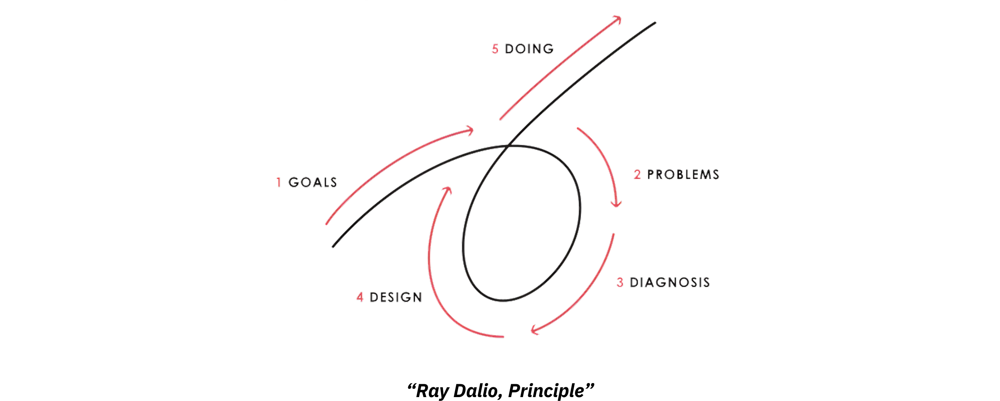
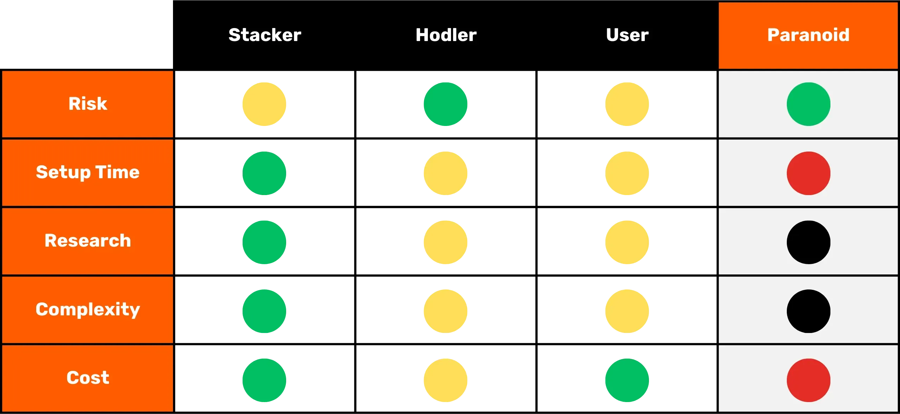

# A journey to your first bitcoins

The Bitcoin ecosystem is experiencing spectacular and unprecedented growth. The technological, economic and social transformations driven by Satoshi Nakamoto's invention are intensifying day by day, and are gradually opening the doors to a new world, that you can now take full advantage of.

Diving into the Bitcoin Rabbit Hole is an exciting intellectual adventure that will stimulate your critical thinking and challenge many of your convictions. This exploration will not only give you a deep understanding of how Bitcoin works, but also a real opportunity to reclaim your personal freedom, protect your privacy, and achieve true financial sovereignty.

To guide you effectively through this journey, I've created this entirely free course. Here, the focus is exclusively on Bitcoin. No irrelevant discussions, no mention of other cryptocurrencies, just clear, precise, and straightforward content.

This course is designed to give you full control over how you learn, allowing you to explore Bitcoin at your own pace, following the path that best fits your interests and goals.

+++
# Introduction

<partId>008c49b7-5e17-5973-87f2-ba28429b2697</partId>

## Course overview

<chapterId>bfc96999-0ee1-5c41-8297-1b629f50cffc</chapterId>

Welcome to BTC102! If you've already completed BTC101, you've explored the key theoretical concepts behind why Bitcoin is such a revolutionary technology. Now, with BTC102, it's time to put that knowledge into action. This course is designed to help you build your personal Bitcoin plan, step by step.

In the chapters ahead, we'll guide you through the practical steps to **get your first bitcoins**, **secure** them properly, and confidently take your first steps into this fast-growing ecosystem.

https://planb.network/courses/2b7dc507-81e3-4b70-88e6-41ed44239966

Although Bitcoin has existed for over 16 years, the industry is still young, dynamic, and deeply rooted in freedom. Its underlying protocol is fully decentralized and resistant to control by any central authority, allowing the ecosystem to grow in a natural and organic way. 
While this freedom fuels an incredible wave of innovation and opportunity, it also comes with certain risks, including scams, common mistakes and pitfalls that often stem from a lack of knowledge. The main goal of this course is to help you navigate this new ecosystem with confidence and safety.

To achieve this, the BTC102 course is divided into several sections, each focusing on a key aspect of your journey with Bitcoin:

The first section,"Prerequisites for understanding Bitcoin", effectively prepares you for the path ahead. You will learn to identify the main pitfalls related to scams and financial frauds that may exist in the Bitcoin ecosystem. We will then cover the essential basics of online security.
Finally, I'll give you a few practical tips specially designed for beginners to help you avoid common mistakes when working with Bitcoin for the first time.

The second section, "Understanding what you're getting into", will deepen your overall understanding of Bitcoin. We will begin with a review to ensure you fully understand the essential concepts.
Then, we'll explain why Bitcoin is fundamentally important from technological, economic, and social perspectives,strengthening your beliefs in its value. You will also explore the Bitcoin industry as a whole: its key players, its organization, and its evolution over the years. Finally, we will cover the layered architecture of the Bitcoin ecosystem, a crucial concept for understanding how this system continues to innovate without compromising the integrity of its core protocol.

The third section, "Setting up your plan", focuses on your personal approach to Bitcoin. We'll start by helping you define your user profile from four main categories:

- *the hodler*, focused on holding bitcoin long-term ;
- *the stacker*,  who buys regularly and methodically;
- *the user*, who prioritizes using Bitcoin daily;
- and finally *the paranoid*, who wants maximum security to effectively protect his assets and privacy.

We'll guide you through the implementation of a strategy that fits your profile and helps you achieve your personal goals.

Finally, the fourth section, "Protecting Your Heirs and Wealth," covers a crucial topic that's often overlooked: how to ensure your Bitcoin is passed on to your loved ones in case of an unexpected event. You'll learn how to create and set up a Bitcoin inheritance plan, ensuring the preservation of your wealth beyond your lifetime.

By the end of this course, you'll have all the practical tools you need to confidently navigate the Bitcoin ecosystem and become one of its most advanced users!

Ready to begin your journey into the world of Bitcoin? Let's go!

# Prerequisites for understanding Bitcoin

<partId>4481fc4b-0f83-489e-ad07-81517c5d6bad</partId>

## Scams and financial fraud

<chapterId>8af2948b-2ab5-54c4-862c-3414b8a285a2</chapterId>

:::video id=9f3a7b2e-2c4d-4c1e-8b1f-3a2c1d4e5f6a:::

The Bitcoin ecosystem and its surrounding environment are still relatively young and loosely regulated, depending on the country. While this freedom opens up vast opportunities, it also creates a fertile ground for financial frauds, scams, and various forms of manipulation. That's why the first chapter is so crucial: understanding the common pitfalls will help you avoid them. Your financial security is a priority because a bad experience doesn't just affect you, it impacts the entire Bitcoin community.

### Bitcoin vs cryptos: understanding the differences

Before going any further, it's important to clearly distinguish between two fundamentally different worlds:

- **The Bitcoin ecosystem** is centered around the idea of sound money, built on strong decentralization, long-term resilience, privacy, and individual sovereignty. Since its launch in 2009, Bitcoin has operated reliably and securely, supported by a global, committed community of developers. It is not a passing trend, but a stable and well-established protocol designed to preserve value over time.

- **The cryptocurrency industry**, on the other hand, is much bigger and includes tens of thousands of different projects, each with its own token. This space is often driven by fast innovation, hype, and short-term financial speculation. Many of these projects are centralized, less secure, and don't offer much real value—despite bold promises and flashy marketing.

If you'd like to better understand where Bitcoin comes from and what truly makes it different from other projects, I recommend checking out this free follow-up course on the history of Bitcoin later on:

https://planb.network/courses/a51c7ceb-e079-4ac3-bf69-6700b985a082

As you know, the Plan ₿ Network platform is exclusively dedicated to Bitcoin. However, understanding the distinction with other cryptocurrencies will help you avoid the pitfalls associated with useless and sometimes even fraudulent projects.

### The main scams to avoid

Here are the most common scams you may come across on your journey:

#### Pyramid schemes and Ponzi schemes

These are some of the most common scams in the crypto world. In a Ponzi scheme, early participants receive payouts using the money from newer ones; not from any real investment or product. There's no actual value being created. The system only works as long as new people keep joining. Once the flow of new participants slows down, the whole scheme falls apart.

These scams usually feature :

- Unrealistic promises of guaranteed returns (e.g. 20% guaranteed return);
- Delays or difficulties when trying to withdraw your invested funds;
- Strong incentives to recruit new members to keep the system running;
- A complete lack of transparency about the true source of the promised returns.

Ultimately, all pyramid and Ponzi schemes are doomed to fail. Their fundamental weakness lies in the constant need to bring in new investors to pay returns to earlier participants. This need becomes mathematically impossible to sustain over time because the number of new recruits required increases exponentially as the system grows. Once a critical point is reached, participants start to doubt, trust disappears, and the entire pyramid collapses. At this stage, the last people to join, often the least informed, lose their entire investment with no way to recover it, while the organizers or early investors have typically already withdrawn their funds and left the system.

In the cryptocurrency world, Ponzi schemes can take many forms, often designed to conceal their fraudulent nature behind a technological or financial mask. These scams can appear as new token offerings or Initial Coin Offerings (ICOs), which are fundraising operations where a new cryptocurrency is sold to the public. Behind technical terms like "blockchain," "smart contracts," or "staking," some projects are actually hiding complex pyramid schemes. Others claim to offer high returns by combining questionable crypto-assets with compensation systems that rely entirely on the continuous influx of new investors.

More recently, Ponzi schemes have also spread into the world of Decentralized Finance (DeFi). While DeFi is intended to provide financial services without intermediaries, some projects use it to lend a false sense of legitimacy to their scams. Certain DeFi platforms promise high, guaranteed returns in exchange for cryptocurrency deposits into automated protocols. These attractive promises are often backed by opaque and unverifiable mechanisms, with tokens created specifically for the scam. In reality, these systems have no sustainable business model—the returns are simply paid from the funds of new users, just like a traditional Ponzi scheme. When trust starts to erode or the influx of new participants slows down, these systems inevitably collapse, leading to significant losses for unsuspecting investors.

Please note that the content of this course is for educational purposes only and should not be interpreted as financial advice. Your financial security depends on your ability to remain cautious, skeptical and well-informed with every financial decision you make.

The best protection is to always ask this simple question: Where does the promised return actually come from? If the answer is unclear, run away immediately.

#### Pump & Dump

This type of scam involves artificially inflating the price of an asset—often a low-liquidity cryptocurrency token—through a coordinated marketing campaign, usually led by a group of investors. The typical Pump & Dump scheme follows this pattern:

- A group of insiders or influential figures quietly accumulates a large amount of the targeted asset.
- They then launch an aggressive promotional campaign to generate hype and drive up the price.
- The general public, driven by FOMO (Fear of Missing Out), starts buying the asset in large numbers, pushing the price even higher.
- At the peak of the hype, the insiders sell off their holdings all at once.
- The price crashes, leaving latecomers with heavy losses.

It's important to note that Pump & Dump strategies are illegal in many countries and are considered a form of market manipulation. Despite this, such schemes continue to flourish, especially in the cryptocurrency space, where regulation is still catching up.

Be especially cautious of private "signal" groups on platforms like Telegram, Discord, or other social media channels. These are often run by influencers or self-proclaimed experts, some of whom even charge entry fees. While these groups claim to offer exclusive investment opportunities, the reality is far more one-sided: only the organizers profit, while most participants end up losing their money.

It's true that some participants might temporarily profit from these kinds of market manipulations, but their success is usually based on nothing more than luck and perfect timing. In the long run, these schemes are not sustainable. They require constant high-risk involvement and repeated participation in fraudulent setups that inevitably collapse.

Even worse, they feed into a dangerous illusion: the belief that it's possible to make quick and easy money without understanding how financial systems actually work. This mindset not only puts individuals at risk, but also undermines the credibility of the entire cryptocurrency ecosystem

For all these reasons, the best strategy is to stick with a serious, thoughtful approach to investing, one that's grounded in financial education, a solid understanding of the fundamentals, and a long-term perspective. 
By patiently building your knowledge, you'll be far less vulnerable to emotional manipulation and unrealistic promises; and much better equipped to avoid the kind of financial traps that can lead to real losses.

#### Donation, Lottery, and Fake Giveaway Scams

This type of scam promises free Bitcoin or other rewards in exchange for you sending a small amount of money first. It's important to remember: no legitimate individual or organization will ever ask you to send cryptocurrency upfront with the promise of sending you more in return.

Scammers often impersonate well-known public figures(like Elon Musk or other celebrities)to lure victims through social media. Always double-check the legitimacy of accounts and websites before engaging with them, and never trust offers that seem overly generous or too good to be true.

Sometimes, these scams appear as "advance fee" frauds. You're promised a prize or reward(money, a product, or a service) but are first asked to pay a fee, supposedly to cover things like shipping, taxes, or transaction costs. Once the payment is made, the scammer vanishes, and the promised reward never arrives.

#### Shitcoins and cryptocurrencies on offer

Centralized crypto-currency projects sometimes offer free tokens ("*airdrops*") to attract users.These tokens typically hold little to no real value and are mainly used to create the illusion of popularity or to fuel speculation. Be extremely cautious with these kinds of promotional offers; they're often marketing traps rather than genuine opportunities.

#### Identity theft and phishing

Attackers often use fake websites, social media accounts, or deceptive emails to try and steal your funds. These scams can come through any communication channel: email, social networks, phone calls, or even traditional mail...

Before clicking on a link or taking any action, always double-check the sender's identity. When in doubt, visit the website manually instead of using a provided link. Most importantly, never share your private keys or passwords with anyone.

#### Bitcoin Hardforks

Over the years, Bitcoin has experienced several *hard forks*, which resulted in the creation of alternative versions of the original cryptocurrency. In simple terms, a *hard fork* is a split in the network that leads to two separate blockchains, both sharing the same history up until the moment of the split. These forks typically happen when part of the developer community or broader Bitcoin ecosystem wants to introduce major changes to the original protocol but can't reach widespread consensus. Instead of abandoning their ideas, they decide to launch a new version of Bitcoin(with altered rules)hoping that users and miners will choose to follow their fork instead.

Not all *hard forks* are fraudulent, as some arise from technical or ideological disagreements within the community. However, others are driven by commercial interests or even dishonest motives. The most well-known examples of these hardforks are **Bitcoin Cash (BCH)** and **Bitcoin Satoshi Vision (BSV)**. Launched in 2017 and 2018, respectively, these alternative currencies often claim to be "better versions" of the original Bitcoin. They promote supposed advantages such as lower transaction fees or faster transactions due to increased block sizes. However, these technical changes come with significant trade-offs in terms of security, decentralization, and robustness; elements that can conflict with Bitcoin's foundational principles.

Beyond technical differences, these alternative currencies often capitalize on confusion to attract uninformed investors. They may employ marketing tactics designed to deliberately mislead newcomers who believe they are purchasing genuine Bitcoin (BTC).

To avoid falling into this trap, always verify the currency you're buying. The original Bitcoin uses the ticker **BTC**, while Bitcoin Cash and its derivatives use distinct acronyms, such as BCH or BSV.

#### Dishonest influencers and fake gurus

As cryptocurrencies gain mainstream attention, social media has seen a surge of influencers, self-proclaimed experts, and so-called "*crypto gurus*". While a few may offer genuine educational insights, many others take advantage of their visibility to promote dubious projects or dangerously risky (and sometimes outright fraudulent)trading strategies.These individuals are usually motivated by personal financial interests, often receiving direct or indirect compensation for promoting certain tokens or platforms.

These influencers often rely on proven tactics to attract beginners: they showcase impressive financial results (which are often fake or unverifiable), flaunt a luxurious lifestyle as supposed proof of their success, and promote “miracle” investment strategies. The goal is to trigger FOMO — the fear of missing out — and push their audience into impulsive decisions and reckless investments.

It's important to understand that most "free" advice from these personalities is never truly free. Behind the façade of generosity often lies a calculated strategy to steer people toward buying questionable assets. And even if some influencers were being honest, replicating their results would be nearly impossible; their success often depends on specific timing, insider knowledge, or unique circumstances that you simply don't have access to.

Some influencers may invite you to join private, paid groups where they claim to share exclusive trading signals or insider tips that promise quick and easy profits. In reality, these groups mainly benefit the organizers themselves. They often use their followers as a source of liquidity, essentially offloading assets for personal gain. Subscribers usually end up losing money, as they're unable to react as quickly as the insiders who orchestrate the trades (see the section on Pump & Dump schemes).

In light of this reality, here are some good habits to adopt to avoid falling into the traps set by dishonest influencers:

- **Be very cautious with any crypto investment recommendations.**
A trustworthy and knowledgeable person will never pressure you into buying a cryptocurrency without encouraging you to do your own research first.
- **Paid trading or investment courses aren't always a mark of quality.**
Many of these courses promote risky or overly simplistic strategies; often the same information you can find online for free.
- **There's no such thing as a guaranteed way to copy someone's trades and get identical results.**
Every investment strategy depends on personal context, timing, knowledge, and other factors that can't be duplicated exactly.
- **Be especially wary of advice that sounds too good to be true.**
Unrealistic promises or guaranteed profits are almost always signs of manipulation. Remember: just because someone says something confidently doesn't make it true.

Always remember, everyone you encounter in the Bitcoin or broader crypto ecosystem has a personal agenda; whether it's stated outright or hidden between the lines. There's no such thing as purely neutral information. Even this course, BTC102, has a clear goal, *to promote better understanding of Bitcoin.*
That's why it's essential to stay aware of the real motivations behind every piece of content you consume. And never forget this golden rule of the internet:
*If a product or service seems free, chances are you are the product.*

Ultimately, your best defense is personal education, healthy skepticism, and most importantly, the habit of verifying facts for yourself.

### How to avoid scams

**To stay safe online, especially in the world of crypto, keep these key principles in mind:**

- Never trust blindly: "*Don't trust, verify*" ;
- Be skeptical of guaranteed or unusually high returns;
- Never share your private keys with anyone;
- Don't send Bitcoin (or any crypto) to unknown addresses;
- If in doubt, pause. Step back and think before taking action. FOMO is your worst enemy;
- Avoid paid trading groups or communities that make unrealistic promises;
- Most giveaways or "free" lotteries online are scams or heavily rigged;
- You'll always gain more in the long term by learning than by gambling.

Protecting yourself from scams is a crucial first step in safeguarding your assets; but it's not enough. Maintaining strong digital hygiene is just as important. That's why, in the next chapter, we'll explore how to strengthen your online security and the best practices you should adopt to protect yourself in the digital world.

## Online security

<chapterId>f0873bf2-6a6f-5485-bb7a-d84be14f404d</chapterId>

:::video id=2a1b3c4d-5e6f-7a8b-9c0d-1e2f3a4b5c6d:::

As soon as you start getting into Bitcoin, you'll quickly realize that basic cybersecurity isn't optional—it's essential. Scams and fraud are just the tip of the iceberg. Accidental data loss, malware, and compromised passwords can be just as devastating, especially when you're managing your own keys.

This chapter walks you through some simple, practical steps to level up your digital hygiene and protect yourself in the space.

If you want to go deeper, Plan ₿ Network's SEC101 course offers a comprehensive breakdown of cybersecurity strategies specifically designed for Bitcoin users.

https://planb.network/courses/99c46148-7080-4915-a7e0-9df0e145cd47

### Why Cybersecurity Matters

Bitcoin gives you the power to hold your money directly(without banks), without intermediaries. But that kind of financial sovereignty comes with serious responsibility: if your BTC gets stolen due to a security lapse, there's no way to reverse the transaction. Unlike traditional banking, there's no help desk, no fraud claim, and no insurance to bail you out.

On top of that, the financial value of Bitcoin makes it a high-value target. A hacker who compromises your wallet can instantly move your funds to an address they control(no questions asked, no way to get it back).

### A clean, up-to-date computer

One of the most overlooked aspects of personal security is keeping your operating system and software up to date. Many updates patch known vulnerabilities that could otherwise be exploited by attackers. While some people avoid updates fearing performance issues, the real risk lies in running outdated software that hackers already know how to break.

It's also highly recommended to use a reliable antivirus. On Windows, the built-in Windows Defender is generally sufficient for most users. If you prefer additional features or peace of mind, commercial options like Kaspersky are also available. On macOS, malware threats are historically less common **but not non-existent** so it's still smart to stay cautious.

Beyond system updates and antivirus protection, be extremely wary of downloading software from sketchy websites or so-called "universal" download portals. When you need a tool or application, always go straight to the official source;This drastically reduces the risk of installing malware disguised as legitimate software.
Another smart habit is to verify the authenticity and integrity of any software before installing it on your machine. If you're not sure how to do that, don't worry we've got a dedicated tutorial to walk you through the process:

https://planb.network/tutorials/computer-security/data/integrity-authenticity-21d0420a-be02-4663-94a3-8d487f23becc

Finally, make regular backups of your important data. An external hard drive or SSD is a solid option for keeping a duplicate of your files in case of sudden failure, hacking, or accidental deletion. You'll thank yourself later.

If you prefer cloud solutions, consider using a secure service like Proton Drive. Just make sure whatever option you choose respects your privacy and offers strong encryption.

https://planb.network/tutorials/computer-security/data/proton-drive-03cbe49f-6ddc-491f-8786-bc20d98ebb16

A widely recommended backup strategy is the "3-2-1 rule". It is designed to protect your data from accidental loss, cyberattacks or even natural disasters.
The idea is simple:
- Keep **at least 3 copies** of your important data,
- Store them on **at least 2 different types of media** (e.g., an external hard drive and cloud storage),
- And make sure **1 of those copies is stored off-site**(physically separated from your main location).

This approach offers strong resilience and helps ensure your data survives even if something goes seriously wrong.

### The solution to the ID nightmare

One of the biggest reasons people get hacked is using weak passwords. A significant number of users still reuse the same password across multiple accounts, or choose variations that are easy to guess. Password managers are the perfect solution to this problem.

A password manager lets you:
- **Store all your passwords securely** in an encrypted vault
- **Generate long, complex, and unique passwords** automatically for each account
- **Use just one master password**,to access everything securely

With a password manager, you'll never have to click "Forgot password" again or rely on weak, reused credentials. Plus, most password managers sync seamlessly across your devices(desktop, phone, tablet) and even autofill login forms, making secure access both effortless and efficient.

There are many password managers out there, but I can recommend two solid options depending on your needs. If you're looking for something easy to use that syncs seamlessly across multiple devices, Bitwarden is an excellent choice:

https://planb.network/tutorials/computer-security/authentication/bitwarden-0532f569-fb00-4fad-acba-2fcb1bf05de9

If you rather keep everything locally on your own device, KeePass is a great option:

https://planb.network/tutorials/computer-security/authentication/keepass-f8073bb7-5b4a-4664-9246-228e307be246

### 2FA: double protection

In Bitcoin, you're your own bank. That means you're also your own security team. Even with a strong password, there's no such thing as zero risk-which is why enabling two-factor authentication (2FA) is essential.

2FA adds a second layer of protection by requiring a time-based one-time code (usually 6 digits) generated by an app like Google Authenticator or Authy. So even if someone manages to get your password, they still can't access your account without physical access to your phone.

https://planb.network/tutorials/computer-security/authentication/authy-a76ab26b-71b0-473c-aa7c-c49153705eb7

When you enable 2FA, make sure to save the recovery key for your app in a safe place. This will let you restore your codes if you lose or change your phone. While SMS or email-based 2FA is better than nothing, it's much less secure. A SIM swap attack, where someone takes control of your phone number, can easily bypass this kind of protection.

For those looking to take security a step further, physical keys like YubiKey provide an even higher level of protection.

https://planb.network/tutorials/computer-security/authentication/security-key-61438267-74db-4f1a-87e4-97c8e673533e

### Protecting your privacy

Privacy and cybersecurity are closely linked: the more information you leave freely accessible, the more likely you are to become a target.

A **VPN** (*Virtual Private Network*) is a simple yet effective step to mask your IP address and encrypt your internet traffic. While it won't make you completely invisible (since the VPN provider can still see your activity), it does make it significantly harder for anyone trying to spy on you or track your browsing habits.
The key is choosing a trustworthy VPN provider that:
- Doesn't require your personal information
- Allows payment via BTC
- Has a strict no-logs policy

We have several tutorials available on Plan ₿ Network that can guide you through setting up a VPN easily. I particularly recommend IVPN or Mullvad:

https://planb.network/tutorials/computer-security/communication/ivpn-5a0cd5df-29f1-4382-a817-975a96646e68

https://planb.network/tutorials/computer-security/communication/mullvad-968ec5f5-b3f0-4d23-a9e0-c07a3e85aaa8

Essential steps to protect your privacy online also include:
- Using **encrypted messaging platforms** such as Signal, SimpleX or Session;
- Using privacy-focused browsers such as Firefox, Brave, or Tor (for enhanced anonymity);

https://planb.network/tutorials/computer-security/communication/tor-browser-a847e83c-31ef-4439-9eac-742b255129bb

- Using a **secure mailbox** such as ProtonMail;

https://planb.network/tutorials/computer-security/communication/proton-mail-c3b010ce-254d-4546-b382-19ab9261c6a2

- **Encrypting** your files with tools like Bitlocker (for Windows) or VeraCrypt (available across multi-platform).

https://planb.network/tutorials/computer-security/data/veracrypt-d5ed4c83-7c1c-4181-95ea-963fdf2d83c5

### Step-by-step progression

Cybersecurity can seem like a massive undertaking, and it's easy for beginners to get overwhelmed and give up because it seems too complex. The trick is to approach it step by step. Start with something simple, like installing a password manager. Give yourself a few weeks to get comfortable with it, then move on to the next step: like enabling 2FA on one of your accounts.

As you get more confident with these tools, you'll be ready to add more advanced practices, like using a secondary email, switching to ProtonMail, setting up a VPN, or browsing with Tor when necessary.

As you dive deeper into the world of Bitcoin, you'll notice that the risks grow as the value of your wallet increases. Building solid security habits, protecting your privacy, and setting up the right tools will not only give you peace of mind but also strengthen the sovereignty Bitcoin is all about.

In short: don't underestimate cybersecurity, take the time to set up the basics, and remember that consistency is key. Without good digital hygiene, even the best tools won't do much for you.

Also be sure to checkout [our computer security tutorials](https://planb.network/tutorials/computer-security) on Plan ₿ Network.

In the next chapter, I'll share a few more tips to help you get started on your Bitcoin journey with confidence; and to steer clear of the many traps that can catch newcomers off guard.

## Tips for newcomers

<chapterId>33134b3f-92c1-5185-afb6-88599e47e801</chapterId>

:::video id=7e9f3b2c-4d1a-4c5e-8b0d-3a2c1d4e5f6b:::

Getting into Bitcoin can be exciting; but it also comes with its fair share of risks. The world of crypto is unlike any other; wild price swings, unfamiliar technology, and the very real possibility of losing your funds for good due to simple mistakes or poor investment choices are all pitfalls that new users should be aware of.

In this chapter, I'll share some practical advice and general guidance for anyone who is taking their first steps, especially those making their first purchase or exploring the broader world of financial investment.

Here are the key points that we will go over together:

- Beware of **Shitcoins** and other useless cryptocurrencies;
- Only invest **money you can afford to lose**;
- Know the difference between **trading** and **investing**;
- Be aware of the **tax implications** of your investments;
- Protect your **recovery phrase** carefully;
- Stay humble and keep a **low profile**(discretion is part of security);
- **Think long term**, zoom out and be patient(think of it as a marathon, not a sprint).

### Common mistakes to avoid

Bitcoin is open to everyone, but that doesn't mean you should dive in unprepared. Here are some of the classic mistakes made by newcomers:

**Technological mistakes:**

- **Losing your seed phrase:** Your recovery phrase (usually 12 or 24 words) is the only way to access your bitcoin if something happens to your wallet. If you lose it, your funds are gone permanently;
- **Storing your bitcoins on a third-party platform:** If your coins are on a centralized platform, you don't really own them. You're exposed to risks like hacks, platform failures, or even fund seizures;
- **Neglecting privacy:** Protecting your privacy is a core part of securing your assets. Publicly revealing how much bitcoin you hold could make you a target;
- **Insufficient online security:** Failing to secure your devices with basic protections (like updates, strong passwords, or 2FA) makes you an easy mark for attackers; and could cost you everything.

**Financial mistakes:**

- **Investing more than you can afford to lose**: Never go into debt or put your rent money into bitcoin. Your basic financial stability should always come first.

- **Not knowing the difference between trading and investing**: Trading requires time, skill, and serious emotional discipline. Long-term investing is far more beginner-friendly.

- **Forgetting about taxes**: Every country has its own tax rules for crypto. Ignoring them can lead to painful surprises down the road.

- **Falling for FOMO**: Buying impulsively out of fear of missing out usually leads to bad timing and bad decisions. Patience is your best ally.

### Defining an investment strategy

Before buying your first satoshi, it's crucial to understand why you're investing in Bitcoin and how. This means having a clear financial plan tailored to your personal situation and long-term goals.

Start by defining your **budget** with precision. Don't just pick a random number. Take the time to calculate your monthly income, subtract your fixed expenses (like rent, loans, taxes, utilities), as well as your day-to-day living costs (food, transport, leisure, etc.). Whatever remains is your savings margin and it's only from this portion that you should consider investing.
Approaching it this way ensures that you're not putting your financial well-being at risk, especially in the event of a market downturn. A thoughtful strategy is the foundation of long-term resilience.

Once your budget is defined, think about how you want to invest. One of the most beginner-friendly and widely recommended methods is Dollar Cost Averaging (DCA), buying a fixed amount of bitcoin at regular intervals (weekly, monthly, etc.). This strategy helps smooth out your average entry price over time and reduces the emotional impact of price swings. It's a smart approach for most people, especially newcomers.

Then, ask yourself: What's my time horizon?
Are you looking to make quick moves in and out of the market (trading)? Or are you more aligned with the long-term mindset of holding Bitcoin over several years(hodler)? If you're a hodler, you're probably less concerned with daily price swings and more focused on long-term security and self-custody. If you're trading, you'll be more exposed to short-term market noise, higher risk, and the stress that often comes with rapid decision-making. There's no one-size-fits-all answer, but knowing your own approach will help guide your decisions.

Most importantly, don't make investment decisions based on emotion or fear. Set a strategy in advance, write it down, and stick to it.

If you're still unsure, **start by learning.**
Spend a few hours exploring Bitcoin, check out the free resources on Plan ₿ Network, read a couple of books, throw in five euros just to try it out, and watch some quality content online. Stay curious. The more comfortable you get, the easier it'll be to revisit your strategy, tweak your approach, and move forward with confidence.

### Understanding BTC's volatility

Bitcoin is known for its dramatic price swings. Moves of 10%, 20%, or even 50% over just a few days aren't unusual. For newcomers, this kind of volatility can be disorienting. It's easy to get swept up in the hype during bull runs or panic during downturns; both of which often lead to poor decisions, like selling at a loss.

That's why it's crucial to **understand and accept Bitcoin's volatility** before you invest. These price swings aren't a bug, they're a feature of a still-maturing asset. If sudden ups and downs are keeping you up at night or pushing you into emotional decisions, chances are you've put in more than you're comfortable risking. In that case, take a step back and reassess your strategy and risk tolerance. Don't hesitate to scale down your position until you feel more at ease.

Above all, never invest more than you can afford to lose. Avoid borrowing money to buy bitcoin(especially if you're still learning the fundamentals). A solid foundation starts with measured steps, not reckless bets.

### Managing and securing your Bitcoin wallet

One of Bitcoin's most powerful(and often underestimated) features is **self-custody**. With a self-hosted wallet, you alone are responsible for your funds. These wallets are typically generated from a **recovery phrase** (also known as a seed phrase), a series of 12 or 24 words that grants full access to your BTC. If you lose this phrase(or if someone else gets hold of it) your bitcoins are gone for good. **No customer support. No reset button.**

That's why the golden rule in Bitcoin is:
 "***Not your keys, not your coins***". If you don't personally control your private keys, you don't truly own your bitcoin. While exchanges can be convenient(especially when starting out) they hold your keys for you. That means your funds are at risk if the platform gets hacked, freezes your account, or goes bankrupt.

To avoid this risk, it's strongly recommended to set up your **own wallet**, where only you have access to the recovery phrase. This phrase should always be written down by hand and stored **offline** in a safe location. Some users even **maintain multiple backups**, stored in separate geographic locations for added security.

**Never store your recovery phrase on an internet-connected device or in the cloud**.
**A single hack or data breach could lead to irreversible loss.**

If you're ready to take ownership of your bitcoin and want to dive deeper into best practices for securing your recovery phrase, I highly recommend checking out this article:

https://planb.network/tutorials/wallet/backup/backup-mnemonic-22c0ddfa-fb9f-4e3a-96f9-46e2a7954270

### Confidentiality and discretion

In today's digital world, **discretion is often overlooked**; yet it's a crucial part of staying safe, especially when it comes to Bitcoin. The more openly you talk about your holdings, the more likely you are to become a target for scammers, cybercriminals, or even more traditional threats like extortion or blackmail.
There have been numerous cases across the world where individuals known to hold large amounts of BTC were kidnapped or attacked.

**Avoid bragging about your bitcoin stash**; whether on social media or even in casual conversations. There's no upside to revealing sensitive financial information, and the risks are real.

It's also wise to **compartmentalize your online activity**. For example:
- Use a separate email address for anything Bitcoin-related, distinct from your personal or work accounts.
- Be cautious of phishing attempts, suspicious links, and fake websites that mimic trusted platforms.
- Stay alert! discretion and vigilance are often your best defense.

If you're ready to go deeper into the topic of Bitcoin privacy, we recommend continuing with our Year 2 Privacy Course, where you'll learn more advanced techniques to keep your identity and activity secure:

https://planb.network/courses/65c138b0-4161-4958-bbe3-c12916bc959c

### Tax implications

Despite being a decentralized currency, **Bitcoin is not exempt from the tax laws and regulations** of your country. Every jurisdiction has its own approach to how gains from cryptocurrencies are taxed.
In some places, profits are taxed as capital gains upon selling. Others may require you to declare every trade, and some apply less common rules, such as wealth taxes or social contributions.

Before making any significant transactions, it's strongly recommended to consult a tax professional or review your government's official guidance. Taking time to understand your tax obligations in advance can save you from unexpected issues later (like fines, audits, or penalties) especially if you're planning large sales or portfolio reallocations.

### The Difference Between Trading, Investing, and Holding

Bitcoin is often surrounded by popular misconceptions; one of the most common being the idea that it's a fast track to getting rich through trading. But it's important to understand the clear distinction between trading, investing, and holding, as each approach comes with its own mindset, skillset, and level of risk.

- **Trading :**

Let's be honest:**you probably shouldn't be trading.**
Trading involves short-term speculation(sometimes with leverage) aiming to profit from Bitcoin's price swings. While it may sound appealing, successful trading requires advanced technical knowledge (like chart analysis and risk management), emotional discipline, and constant attention to the market. It's mentally taxing and time-consuming, and the hard truth is that **most beginners lose money** because they underestimate how demanding it really is.
As Warren Buffett famously said:
"**If you're not willing to hold a stock for ten years, don't even think about holding it for ten minutes**."
Bitcoin isn't a get-rich-quick scheme.

- **Investment:**

Investors take a medium to long-term view, buying bitcoin with the belief that its value will grow over time(months, years, or even decades). There's still risk, of course, since the price of bitcoin can fluctuate significantly. But this approach is generally calmer and far more practical for most people, especially those who don't want to spend hours glued to the charts every day.

- **Holding (HODL) :**

"HODL" started as a typo for "hold" and quickly became part of Bitcoin culture. Today, it's a badge of honor.
Hodlers are in it for the very long game; sometimes ten years or more. They store their bitcoin safely and simply wait, driven by strong conviction in Bitcoin's long-term potential. They aren't fazed by daily price swings or bear markets. Their mindset is simple: accumulate, secure, and sit tight.

|          | Trading | Investment | Holding |
| ---------------------- | ----------- | -------------- | --------------- |
| Leverage | Yes  | No | No |
| Timeframe | Short-term | Medium-term | Very long-term |
| Asset Type | Contracts | Actual BTC | Actual BTC |
| Risk Level | Very high | High | High |
| Difficulty | Very Hard | Hard | Hard |
| learning curve | Long learning curve | Long learning curve | Long learning curve |
| Potential Loss | UnLimited | Limited | Limited |
| Best For | A few experienced users | Most People | Long-term Believers |

### Keep Learning

It's never too early(or too late) to start educating yourself about money, investing, and how the financial system really works. You don't need to become an expert or dive into every technical detail; having a solid, big-picture understanding is enough to make informed decisions and avoid being misled by financial products that don't serve your interests (often promoted by banks or advisors).

A great starting point is the book *Rich Dad, Poor Dad* by Robert T. Kiyosaki. It's widely known for its approachable style and foundational lessons; like understanding the difference between assets and liabilities, and why financial education is key to long-term independence.

If you're ready to go deeper, podcasts like *The Investors Podcast* offer insightful discussions on investing, markets, and economic principles. They occasionally cover Bitcoin too, making it a solid next step for those curious to understand how Bitcoin fits into the broader financial landscape.

### Golden Rules to Keep in Mind

To wrap things up, here are a few timeless principles that every Bitcoiner(especially beginners) should keep in mind:

- **Rule n°1**: Never invest more than you can afford to lose. Bitcoin is a volatile asset. Don't risk your financial stability chasing gains. Your essential needs and peace of mind should always come first.
- **Rule n°2**: Don't blindly follow the hype or trust miracle advice. Ignore trends and flashy promises. Instead focus on making well-informed, rational decisions. When in doubt, sleep on it; talk it through with people you trust. It's better to move slowly and thoughtfully than to rush into costly mistakes.
- **Rule n°3**: Build a plan and stick to a long-term vision.
Consistency, patience, and discipline will take you further than short-term excitement. Don't aim for moonshots; aim for sustainable growth. Avoid fatal mistakes and let small wins compound over time.

By following these principles, you'll be able to approach Bitcoin investing with more clarity and peace of mind. Yes, Bitcoin is volatile, and it can be intimidating at first; but when approached with caution, patience, and a grounded mindset, it holds undeniable potential. Take the time to build your knowledge, revisit your strategy when needed, and above all, remember: slow and steady progress will always serve you better than rushing in out of fear or impatience.

# Understanding what you're getting into

<partId>a42355a3-9dd8-57ed-b590-32a333fe09ea</partId>

## Bitcoin in 5 minutes

<chapterId>ae122ad9-9b4d-5229-9038-e1b99d5cfc83</chapterId>

:::video id=3c2d1e4f-5a6b-7c8d-9e0f-1a2b3c4d5e6f:::

In this course, the primary goal is to guide you through acquiring and securing your first bitcoins. But before diving into the practical steps(how to buy BTC, which wallets to use, and so on) it's important to take a step back and understand what Bitcoin really is. Grasping the deeper nature of Bitcoin will help you see why millions of people are turning to this technology, and why it's crucial to understand the fundamentals before putting your savings into such a new and volatile asset.

Over the years, Bitcoin has gained recognition as a global monetary network. It's been called "digital gold", a "trust protocol", and even a "parallel financial system." But what do those terms really mean? To answer that, we'll take a closer look at Bitcoin's core: its origin story, technical foundations, monetary properties, and its potential impact; not only on individuals, but on the global financial system as a whole.

### The Origins: A Project Born from a Longstanding Quest

#### Cypherpunks and the invention of a system beyond banking control

Bitcoin wasn't born overnight. Its the result of decades of research and experimentation in cryptography, computer science, and monetary theory. Prior to its launch in 2009, several projects(like eCash, b-money, Bit Gold, and RPOW) attempted to create digital currencies. All faced the same core issue: how to prevent double spending in a decentralized system without relying on a central authority.

That challenge remained unsolved until late 2008, when someone using the name Satoshi Nakamoto published the Bitcoin white paper. A few months later, the first version of Bitcoin's open-source software went live, launching a system that could operate independently of banks or governments.

The project was heavily influenced by the Cypherpunk ethos; a community of developers and thinkers who believed in using cryptography to protect individual freedoms online. For them, privacy and decentralization weren't technical preferences, but ideological necessities. Bitcoin emerged as the most successful embodiment of those ideals: a peer-to-peer monetary network that anyone could use, no one could control, and everyone could verify.

The Cypherpunks are an informal, international community of individuals who advocate for the use of cryptography to defend personal freedoms online. They strongly believe in the individual's right to privacy; especially in a world increasingly shaped by government surveillance and corporate data exploitation.

The roots of the Cypherpunk movement go back to the early 1990s, when groups of cryptographers, programmers, and libertarians began exploring the political implications of cryptography during meetups in Silicon Valley. One of the most prominent voices in the community was Tim May, who authored the Crypto Anarchist Manifesto in 1988; a foundational text outlining a vision for a world where encryption would empower individuals to operate beyond the reach of governments and centralized control.
A major milestone in the movement came in 1992 with the creation of the Cypherpunks mailing list, a forum where ideas, projects, and political discussions about privacy and cryptography could flourish. Then, in 1993, Eric Hughes published the Cypherpunk's Manifesto, a brief but powerful declaration that clearly expressed the community's mission and beliefs.

The idea of a digital currency that operates independently of any central authority(like Bitcoin)is deeply rooted in Cypherpunk philosophy.

#### Post-Financial Crisis Moment

Bitcoin didn't just appear out of nowhere. It was created at a very specific moment—right after the global financial crisis of 2008. The collapse of the U.S. housing market and the subprime loan crisis caused major banks to fail and shook people's trust in the entire financial system.

It was in this environment of fear and uncertainty that Bitcoin was born. The creator, known as Satoshi Nakamoto, included a very symbolic message in the very first block of the Bitcoin blockchain, known as the Genesis block. The message was:

>**"The Times 03/Jan/2009 Chancellor on brink of second bailout for banks"**

This wasn't just a date or a technical note; it was a quiet but powerful protest. It showed that Bitcoin was designed to be something radically different: a financial system that doesn't depend on banks, bailouts, or government decisions.

Many interpret this as Bitcoin's goal: to offer a way to transfer value without needing middlemen, controlled by clear rules instead of the often unclear decisions made by central banks or governments.

To deepen your knowledge of Bitcoin's origins, we offer a free, comprehensive and well-documented training course on the subject:

https://planb.network/courses/a51c7ceb-e079-4ac3-bf69-6700b985a082

### A decentralized network to transfer value

#### Peer-to-peer and no central body

Bitcoin is defined as a "peer-to-peer electronic cash system." This means that anyone can connect to the network using the appropriate software (a Bitcoin node) and interact directly with other users, without relying on a central server. The goal of this decentralization is to prevent any single entity (such as a bank, government, or large corporation) from controlling, censoring, or halting the system. Bitcoin operates 24/7, globally, and is accessible to everyone without any conditions.

In simple terms, every participant in the Bitcoin network (called a "node") has a full copy of the transaction ledger, known as the blockchain. When a new transaction happens, it's broadcast to the network. Miners then confirm these transactions by grouping them into blocks which are then added to the end of the chain (hence the name "Blockchain").

#### Blockchain: an accounting ledger

Think of the blockchain as a giant accounting ledger, where every line represents a transaction. In a traditional banking system, the database is stored on a bank's servers, which can make changes whenever they want. On the other hand, in Bitcoin, **all changes are validated across the entire network**: once a new block of transactions is added to the blockchain, it's nearly impossible to alter it later. This decentralized validation makes Bitcoin's ledger secure and transparent.

### The Role of Miners and Proof-of-Work

#### How Blocks Are Created: Mining

Mining is the process by which computers (or large mining farms) contribute **computational power** to secure Bitcoin's transaction history and create new blocks. Miners compete to solve a mathematical puzzle—specifically, finding a partial hash collision. This process requires significant energy and resources. Once a miner finds a valid solution, they broadcast the block to the network, which verifies and accepts it as valid.
As a reward, the miner receives newly created bitcoins (called the block subsidy) along with the transaction fees from all transactions included in that block.

#### The Halving: Decreasing Block Subsidy

To ensure Bitcoin's scarcity, the block subsidy is programmed to halve every 210,000 blocks; roughly every four years. This event is known as the "halving." When Bitcoin launched, miners earned 50 BTC per block. In 2025, that reward has dropped to 3.125 BTC and will continue to decrease over time.
Eventually, around the year 2140, the subsidy will reach zero, as Bitcoin's total supply will cap at 21 million coins. This predictable issuance curve mimics the scarcity of physical commodities like gold; one reason Bitcoin is often referred to as **digital gold**.

### Bitcoin Monetary Properties

#### Scarcity and a Fixed Monetary Policy

One of Bitcoin's most powerful features is its *predictable and unchangeable monetary policy*. Unlike traditional fiat currencies (like the dollar, euro, or yen), which can be printed at will by central banks(often leading to inflation or economic distortions)Bitcoin operates under a transparent set of rules embedded in its code.
There will only ever be 21 million bitcoins, and the rate at which new coins are issued is known in advance by everyone in the network.

No government, institution, or individual can unilaterally change this supply cap or the distribution rules. The only way to alter these parameters would be to change Bitcoin's protocol; and even that would require consensus from a majority of the network's economic participants.

This built-in scarcity is a major draw for those looking to opt out of unpredictable monetary policies or avoid the gradual erosion of their purchasing power through inflation. Over time, this could represent a shift in financial thinking, where saving in a deflationary asset like Bitcoin becomes more attractive than relying on traditional, inflation-prone currencies.

#### Divisibility and Accessibility

One of Bitcoin's most underrated strengths is its divisibility. Each bitcoin can be broken down into 100 million units, known as satoshis (or sats for short). This means you don't need to spend tens of thousands of euros or dollars to get started; you can buy just a few euros worth of bitcoin, down to tiny fractions.

### Openness and Transparency

#### A public protocol, verifiable by all

Bitcoin runs on a public, **open-source** protocol(most notably through [Bitcoin Core](https://github.com/bitcoin/bitcoin)). This means its code is freely available for anyone to inspect, audit, and improve. There are no hidden mechanisms or closed systems; everything about how Bitcoin works is out in the open.
This level of transparency makes it incredibly difficult to introduce backdoors or make secret changes. Anyone with the technical skills can run a node, contribute to development, or build compatible tools. In Bitcoin, trust is earned through code and consensus, not through centralized control.

This transparency is one of the key reasons people trust the Bitcoin protocol; it prevents a small group of developers from manipulating the network for their own gain. Bitcoin operates on a simple but powerful principle: if you disagree with proposed changes, you're free not to update your software. In some cases, this won't cause any disruption; you'll still stay in sync with the rest of the network. But in other cases, this can lead to what's known as a hard fork, where the network splits in two,  and a new version of Bitcoin is created. That's exactly what happened in 2017 with the split between Bitcoin (BTC) and Bitcoin Cash (BCH).

While this kind of governance can be slow and sometimes messy, it's also a strength; it ensures that no single entity can unilaterally take control, helping Bitcoin remain stable, neutral, and resistant to centralization.

#### Individual Validation: nodes

Bitcoin allows anyone to check the accuracy of the blockchain by running a "node" on their computer or server. This means downloading the Bitcoin Core software (or another version of the Bitcoin protocol) and verifying all transactions and blocks since 2009. Once your node is set up and synced, it becomes a full copy of the blockchain and helps support the network.

Although this approach is more technical, it offers the most demanding users the ability to opt-out of trusting third parties. Running a node ensures that users can participate in the consensus process and remain uncensorable, contributing directly to the security and decentralization of the network.

### Use cases

#### A Resilient, Cross-Border Payment Method

Due to its decentralized nature, Bitcoin operates 24/7, unaffected by borders or time zones. In regions where traditional banking infrastructure is lacking, Bitcoin is often used as a fast, low-cost solution for sending or receiving funds without relying on expensive intermediaries. While transaction fees can vary based on network congestion, they are generally much lower than the fees charged by banks for international transfers. Additionally, layer-2 solutions like the Lightning Network allow for even faster and cheaper Bitcoin transactions.

#### A store of value

Due to its scarcity (capped at 21 million BTC) and inherent resilience, Bitcoin is often seen as a long-term savings safeguard. While its price can be volatile in the short term, Bitcoin has generally followed an upward trend over the years since its inception. Some investors purchase BTC with the belief that it could serve as a store of value, particularly in the face of inflation or financial crises.

#### A tool for financial freedom and resilience

Beyond investment, Bitcoin offers a way to protect financial sovereignty. In countries under authoritarian regimes or facing heavy monetary restrictions, having a Bitcoin wallet (with private keys) provides a form of freedom. No one can block or confiscate these BTC, as long as the holder secures their recovery phrase.

This characteristic is especially appealing to those who fear censorship or the freezing of bank accounts. It also resonates with populations suffering from hyperinflation, as seen in Venezuela or Zimbabwe, where holding BTC proved more stable than keeping local currency, which was rapidly depreciating.

### A long way to go

Bitcoin can be seen as a "Zero to One": a radical break with established financial paradigms. For the first time in history, a global monetary network, accessible to all, operates without a central authority, enabling censorship-resistant and private transactions.

Nevertheless, after more than a decade of existence, Bitcoin continues to spark debates and passions. Its adoption is growing, second-layer solutions (like the Lightning Network) are emerging to improve transaction speed and lower fees, and businesses worldwide are experimenting with new use cases. It is likely that Bitcoin will continue to influence payment systems and even the way we perceive money for decades to come.

If you'd like to expand your knowledge further, you can take  the BTC101 course on Plan ₿ Network, which offers a more in-depth exploration of Bitcoin's technical and economic fundamentals.

https://planb.network/courses/2b7dc507-81e3-4b70-88e6-41ed44239966

After this introduction to Bitcoin (which may have taken a bit longer than 5 minutes!), you're now better equipped to consider buying and securing bitcoins. In the following chapters of the course, we will dive deeper into the significance of Bitcoin, the workings of its industry, and the development of its various layers. Next, in the upcoming section, we'll discuss how to set up your own personal plan.
## Why is Bitcoin important?

<chapterId>d4327ac4-9ff8-5192-b542-cb78c0bd0aa7</chapterId>

:::video id=5f6e7d8c-9b0a-1c2d-3e4f-5a6b7c8d9e0f:::

Why is Bitcoin so important? That's the central question of this course. Whether it's related to your studies or your investment strategy, without a clear understanding of Bitcoin's significance, there's a risk of deviating from your plan. The goal is to always keep the fundamental principles of Bitcoin in mind to ensure that your strategy remains aligned with your beliefs.

### A universal currency

Barack Obama once referred to Bitcoin as a "Swiss bank in your pocket," and for good reason. Bitcoin offers the same opportunities to everyone, no matter who they are. Whether you're a teenager, a president, a protester in Hong Kong, or a "Yellow Vest" in France, everyone has equal access to the same protocol and tools:

- Create free and unlimited wallets (with Bitcoin, we don't really talk about "accounts," but rather "wallets").
- Send money anywhere, to anyone.
- No need for identification or any administrative procedures.
- Accessible to all, regardless of age, gender, religion, country, or income level.
- Privacy and transparency available at your discretion.
- No intermediaries or hidden fees.
- Bitcoin is native to the internet, meaning anyone with web access can use it.

Bitcoin can be seen as the true "currency of the people," an alternative monetary system that doesn't rely on any central authority and is based on immutable rules rather than arbitrary decisions. Its open and accessible nature makes it a potentially revolutionary tool for billions of people worldwide, whether they are excluded from the traditional banking system or simply seeking a more sovereign alternative.

This leads us to a fundamental, almost philosophical question that divides Bitcoin enthusiasts into two main worldviews. On one side, some see Bitcoin as a solution to promote financial inclusion, enabling the billions of unbanked individuals to finally access a global monetary infrastructure. On the other side, some view Bitcoin as a financial liberation tool aimed at offering a way out for the billions of people already integrated into the banking system, but who wish to free themselves from its dependency and regain full control over their money. This reflection deserves our attention, and we will return to it in more detail later on.

### Protection against currency crises

For centuries, the world has experienced monetary crises that have had devastating effects on populations. Billions of people are still suffering from the consequences of poorly managed monetary policies, where the manipulation of money supply and interest rates creates systemic imbalances. These crises aren't just random events—they're the result of a system built on intervention and the manipulation of money and time values.

These crises can take many different forms. Hyperinflation, for instance, wipes out a currency by gradually destroying people's purchasing power; as seen in countries like Zimbabwe and Venezuela. On the other hand, strict monetary controls can limit access to funds and strip individuals of their economic freedom, as happened with banking restrictions in Greece and Lebanon.

And finally, when governments devalue their national currencies, it gradually erodes people's savings; an invisible but constant drain on their wealth. In many ways, it acts like a hidden tax. As long as monetary policy remains in the hands of centralized authorities, these cycles are destined to repeat.

Bitcoin presents a bold alternative to this cycle of chronic monetary instability. Unlike state-issued currencies, it's built on unchangeable, math-based rules enforced by consensus; not by governments or central banks. Its issuance is predictable and capped at around 21 million coins, making it a form of sound money designed to hold its value over time. Because it resists censorship, anyone can store and transfer value without relying on an institution. And thanks to its divisibility and portability, it's both accessible and practical; financial infrastructure for anyone, anywhere.

**Did you know?** Throughout history, there have been at least 56 documented cases of hyperinflation worldwide. In many of those cases, entire economies collapsed, life savings were wiped out, and millions were pushed into extreme poverty. Even worse, these monetary failures often acted as a springboard for political upheaval; sometimes leading to authoritarian regimes, as happened in Germany in the 1920s and Chile in the 1970s.

Hanke, S. H., & Krus, N. (2013). *World Hyperinflations*. In R. Parker & R. Whaples (Eds.), The Handbook of Major Events in Economic History. Routledge Publishing. Retrieved from https://ssrn.com/abstract=2130109

The collapse of fiat currencies isn't some historical fluke; it's a pattern that repeats itself. Today, Bitcoin offers a way out: a unique opportunity to protect your wealth outside of government-controlled monetary systems. At this point, the question isn't if another crisis will happen, but when. With Bitcoin, you now have the option to opt out of these destructive cycles and choose a monetary system built on transparency, predictability, and individual sovereignty.

### A response to state control and injustice

Growing economic inequality around the world has always been fertile ground for social unrest and the rise of political extremism. History shows that when the gap between rich and poor becomes too wide, it often leads to tension, crisis, and even the rise of authoritarian regimes. In the face of these risks, protecting your financial freedom isn't just a luxury; it's a necessity for anyone who wants to preserve their autonomy and safeguard their family's future.

But in a world where the state can exercise full control over assets and transactions, what real options are there to protect your savings?

- **Bank accounts** can be frozen in an instant, seized by a simple government order, or drained through excessive monetary restrictions.

- **Gold**, though it has served as a store of value for millennia, is hard to divide, inconvenient to transport, and impractical for use in urgent crisis situations.

- **Cash**, while anonymous, is bulky, easy to confiscate, and constantly losing value due to inflation.

But Bitcoin is more than just a practical tool. It is also **a peaceful form of protest**; a declaration of independence from a financial system based on arbitrary power, centralization, and systemic inequality. Choosing Bitcoin means rejecting manipulation, devaluation, and surveillance. It's about reclaiming your **sovereignty**, securing your future, and defending your right to control your own wealth.

In this light, Bitcoin is more than technology. It's a tool of natural law, a way for individuals to assert their fundamental rights, even when those rights are denied by the laws of the land. It gives power back to the people, not through revolution, but through code.

**Did you know**? Bitcoin is pseudonymous, not anonymous. Users can create wallet addresses without revealing their real identity, allowing them to send and receive funds outside the traditional banking system.

However, contrary to popular belief, Bitcoin does not offer full anonymity. Every transaction is recorded on a public ledger(the blockchain) which anyone can access and verify. While wallet addresses aren't tied to names, a user's financial activity can still be traced and analyzed if proper privacy practices aren't followed.

### A Solution to Monetary and Banking Corruption

Central banks, through their expansionary monetary policies, are constantly eroding your purchasing power. Through inflation and excessive money printing(often disguised as Quantitative Easing) they steadily dilute the value of the currency in circulation. This acts as an invisible tax that, year after year, diminishes the wealth of those who save in government-issued money.

Contrary to the common belief that inflation is a natural economic phenomenon, it is in fact a monetary control tool; one that slowly impoverishes the general population while benefiting those who hold financial assets.

If your wealth isn't secured in non-monetary assets(such as real estate, bonds, or stocks);your savings will inevitably lose value over time. Meanwhile, those with access to financial instruments continue to grow their wealth, widening the gap between the economic elite and the rest of society.

This isn't a flaw in the system; it's a deliberate mechanism. Central banks and governments use it to artificially stimulate economic growth and to push people toward constant consumption and increasing debt.

Our modern financial system is built on a cycle of debt; one where borrowing isn't just encouraged, it's practically unavoidable. Individuals take on loans to maintain their lifestyle, only to find themselves trapped in a system where they must repay interest to banks that create money out of thin air. This isn't accidental; it's a structural design meant to benefit financial institutions at the expense of everyday citizens.

The system is corrupted by central bank influence and their unchecked power to manipulate the monetary supply. **Bitcoin is the alternative.**

Unlike fiat currencies, Bitcoin is governed by rules enforced by consensus. Its supply is capped; there will never be more than 21 million bitcoins in existence (in fact, slightly fewer due to how issuance is structured). No government, central bank, or single economic actor can alter this limit.

This means Bitcoin operates under a predictable monetary framework; one where inflation is not only transparent, but designed to taper off completely once the final bitcoin is mined.

In the past, gold served as a check against unchecked monetary expansion. But since the collapse of the gold standard in 1971, no national currency(be it the dollar, euro, or yen) is backed by a tangible asset. This detachment gave central banks free rein to print money without restraint, paving the way for decades of aggressive monetary expansion, repeated asset bubbles, and recurring financial crises.

When You Deposit Money in a Bank, It's No Longer Truly Yours.
Most people don't realize this: the money you hold in a bank account is technically not your property. In legal and practical terms, it's a loan you're giving to your bank; one that the bank is free to use for its own operations and investments.
This system is built on blind public trust in financial institutions, but it carries serious risks:

- **If your bank collapses, your money could vanish.** Even with deposit insurance schemes, history has shown that these guarantees may fail during systemic crises.
- **If your bank restricts access to your funds, you may be unable to withdraw or use your own money**. This has happened many times; during economic meltdowns in Greece, Lebanon, and Argentina, or amid political crackdowns like the trucker protests in Canada.

Bitcoin offers a radically different mode; open, neutral, and incorruptible. Its rules are hardcoded by consensus and apply equally to all network participants.

This is where the core principle comes in:
**"Not your keys, not your Bitcoin."**
If you don't control the private keys to your bitcoins, then you don't truly own them. They're in the hands of a third party; just like fiat in a bank. But if you hold your private keys, you and you alone have full control over your funds. No institution, no government, no authority can freeze, seize, or restrict your access.
This is what makes Bitcoin a powerful alternative to the vulnerabilities and overreach of the traditional financial system: monetary sovereignty.

### Bitcoin: A Political Movement?

Bitcoin reshapes the balance of power between individuals and financial institutions. It empowers anyone to take full control of their money, protect their savings from inflation, and break free from the monetary restrictions imposed by states. As an open and borderless system, Bitcoin offers a fairer alternative; accessible to all, regardless of social status, nationality, or origin.
To embrace Bitcoin is to choose sound money. It's a refusal to remain just another cog in the inflationary, debt-driven machinery of the current financial system. It's an act of personal sovereignty and a peaceful resistance against monetary corruption and the erosion of wealth.

Bitcoiners come from all walks of life, yet they share a common vision: a world where monetary sovereignty lies in the hands of individuals, not institutions. Among them are:
- **Cypherpunks**, who champion privacy and resist surveillance;
- **Oppressed citizens**, seeking refuge from authoritarian regimes and capital controls;
- **Anarchists**, who view Bitcoin as a tool for liberation from state control;
- **Austrian economists**, advocating for sound money and freedom from government manipulation;
- **Engineers, financiers, and free speech advocates**, who recognize the profound societal implications of this new monetary paradigm.

Bitcoin, by design, transcends political and ideological divides. It is not left or right, libertarian or collectivist. It is a neutral protocol, governed by rules(not ruler) applied equally to everyone. Yet its mere existence challenges the global financial status quo. Bitcoin has become a symbol of resistance because people have adopted it as an alternative to fiat currencies and centralized financial infrastructure; systems increasingly seen as unjust, manipulable, and exclusionary.

To the cypherpunk mind, Bitcoin is more than a digital asset. It stands against the steady erosion of privacy in a world where the disappearance of cash is often justified under the guise of "security."
Bitcoin enables censorship-resistant, peer-to-peer digital transactions; free from intermediaries or gatekeepers. As Satoshi Nakamoto envisioned, it offers the digital equivalent of cash: a way to exchange value freely, without needing permission.

Bitcoin is not an organization or a political party, but it undeniably carries a powerful philosophical message. It redefines the relationship between the individual and the state, challenging central banks' monopoly on money creation and economic control.
Whether adopted by freedom fighters or by those simply seeking to preserve their purchasing power, Bitcoin marks the beginning of a new era; one where financial sovereignty becomes a basic human right, accessible to all.

Now that we've explored the profound significance of Satoshi Nakamoto's invention, the next chapter will take us into the extraordinary industry that has grown around this protocol; an entire ecosystem reshaping finance, technology, and society.

## Understanding the Bitcoin industry

<chapterId>e106c6f1-d75b-5a62-b245-0ea2e4d02ef8</chapterId>

:::video id=8a9b0c1d-2e3f-4a5b-6c7d-8e9f0a1b2c3d:::

Since its launch in 2009 by the pseudonymous creator Satoshi Nakamoto, Bitcoin has sparked the rise of an entirely new industry; now valued in the hundreds of billions of dollars. Despite its relatively short history, this ecosystem has experienced explosive growth, evolving at an exponential pace over the past decade. Every day, new players(ranging from institutional investors and agile startups to tech giants) pour significant capital and resources into staking their claim in this rapidly expanding sector.

Today, Bitcoin has reached a critical threshold; a point of no return. Governments, central banks, fintech corporations, and traditional financial institutions can no longer afford to ignore it. Whether through regulation, cautious adoption, or open confrontation, they now recognize Bitcoin's inevitable impact on the global economy.

### The birth of a global industry

Bitcoin is a radical innovation, a leap from zero to one. It represents a total break from the traditional monetary paradigm. To some, this disruption is a threat; an existential challenge to their established power and privileges. For them, Bitcoin is a Pandora's box that should never have been opened, and they will use every means at their disposal to resist it.

Others, however, see Bitcoin as a once-in-a-generation opportunity: a tool for individual freedom, a catalyst for transforming the global financial system, and a path toward a more transparent and equitable alternative. These are the builders, adopters, and contributors(the ones shaping the future).

**Bitcoin** itself remains neutral. It doesn't seek permission. It doesn't ask for approval.
**It simply exists.**

In this chapter, we'll explore the key players driving the Bitcoin industry forward. Understanding their roles, incentives, and interactions is essential to grasp the dynamics of this growing ecosystem and to better navigate the opportunities and challenges it presents.

### The proliferation of altcoins

Technically speaking, creating a new cryptocurrency is incredibly easy; it can take just a few minutes and requires little to no actual innovation. The real challenge isn't in the creation, but in the value. And value, in the world of digital assets, is purely determined by the market; by the confidence and demand of its users.
Back in December 2019, CoinMarketCap listed over 5,000 tokens. By 2025, that number has exploded into the millions, thanks to the rise of NFTs, decentralized finance (DeFi), and countless other applications(some legitimate, many questionable). These tokens come in all shapes and forms: some claim to be currencies, others function as securities, platform utilities, sidechains, or tokenized representations of digital art.

But let's be clear: **most of these cryptocurrencies are little more than scams.**. 
Behind the veil of flashy technology and slick branding, many of these projects are powered by aggressive marketing strategies designed to do one thing, **extract your bitcoin**. They play on investor greed and ignorance, spinning seductive narratives about revolutionary tech or guaranteed returns; claims that rarely hold up under scrutiny.

Of course, within this sea of noise, a small handful of projects genuinely attempt to push the boundaries. Some focus on solving real technical challenges(scalability, privacy, programmability) and may contribute valuable ideas to the broader space. It's likely that over time, a few of these experiments will lead to useful innovations

But the fundamental question remains:
**Can these innovations thrive outside of Bitcoin?**

So far, one truth stands out: Bitcoin remains the only truly decentralized, censorship-resistant digital money, backed by a global network and growing adoption. Unlike altcoins, Bitcoin isn't propped up by centralized companies or governed by a handful of developers and early investors. It's the only project that has earned the weight of thousands of hours of research, development, and relentless refinement.

| Feature               | Bitcoin                  | Altcoins (99.9% of them)       |
| ---------------------|--------------------------|--------------------------------|
| **Liquidity**         | High                     | Low                            |
| **Adoption (Real-World)** | Global and growing       | Very limited                   |
| **Team**              | Decentralized and robust | Centralized and opaque         |
| **Reputation**        | Strong and globally recognized        | Varies, often questionable     |
| **Infrastructure**    | Stable and secure        | Unstable and vulnerable        |
| **Decentralization**  | Yes                      | Rarely                         |
| **Scam Risk**             | No                       | Very likely                    |
| **Real utility?**     | Yes                      | Debatable                      |

**Be wary of misleading claims like:**

- "Blockchain, not Bitcoin"
- "XRP is the next Bitcoin"
- "Libra will replace Bitcoin
- "My project is a better version of Bitcoin"
- "Central bank digital currencies will make Bitcoin obsolete"

Before investing your time or resources into any altcoin, do your own research as that's not what we're here to cover.
**We're here to cover Bitcoin and Bitcoin only.**

### Adoption by major institutions

After the ICO boom of 2017, institutions began showing serious interest in blockchain; but often without grasping what truly makes it revolutionary. Central banks and governments are now exploring Central Bank Digital Currencies (CBDCs), hoping to modernize financial infrastructure while maintaining complete control over user transactions. Projects are already underway in countries like Sweden, the EU, Russia, and China.

Tech giants have joined the race too. Facebook (now Meta) launched its stablecoin initiative, Libra, aiming to create a digital currency backed by a basket of fiat currencies. But the project met swift regulatory resistance and was eventually abandoned.

| Feature                    | Bitcoin | Altcoins | Facebook-Coin | FedCoin |
|---------------------------|---------|----------|---------------|---------|
| **Public**                | Yes     | Varies   | No            | No      |
| **Open**                  | Yes     | Varies   | No            | No      |
| **Borderless**            | Yes     | Varies   | No            | No      |
| **Neutral**               | Yes     | Varies   | No            | No      |
| **Censorship-resistant**  | Yes     | Varies   | No            | No      |

Despite bold marketing, these initiatives don't compete with Bitcoin; they imitate its language while rejecting its core principles. They're built for compliance, not freedom. They're designed to extend surveillance, not protect privacy. They entrench control rather than distribute it.

Facebook's Libra was never meant to challenge the status quo; it was built to work with the system. In contrast, Bitcoin exists entirely outside that system. It doesn't ask for permission. It doesn't rely on trust. And it's been running flawlessly(without leaders, downtime, or central control) for over a decade.

### Regulation and Government Approaches

Bitcoin, by its very nature, operates outside traditional frameworks. It doesn't rely on a central authority and can't be controlled or altered by any single entity. But while the protocol itself is immune to regulation, the participants who interact with it(exchanges, businesses, and users) are still subject to national laws.

Since Bitcoin is a global network, countries have responded in vastly different ways:

- **Some impose heavy restrictions**, like China, attempting to curb usage without ever truly stopping it.

- **Some others offer more welcoming environments**, such as Switzerland or Canada, seeing Bitcoin as an opportunity rather than a threat.

- **Most are still undecided**, experimenting with regulations while trying to balance innovation with oversight.

Governments and institutions often struggle to classify Bitcoin accurately(is it money, property, or something entirely new?). As a result, regulations tend to be reactive, inconsistent, and constantly evolving. If you're involved in Bitcoin, it's essential to stay informed about your local landscape; especially when it comes to taxes, banking access, and compliance rules.

### The Banks' Stance on Bitcoin

As cornerstones of the traditional financial system, banks see Bitcoin as a direct threat to their economic model, which is centered around intermediation and control of financial flows. This explains why many banks across the world have imposed restrictions on businesses and individuals using Bitcoin. Some go as far as closing accounts or limiting access to services for companies operating in the cryptocurrency sector, often citing anti-money laundering (AML) and counter-terrorism financing (CTF) concerns.

However, while Bitcoin is seen as a competitor, many of these same banks are actively investing in blockchain research and development, trying to leverage Bitcoin's innovations without relinquishing their control. They understand that blockchain offers significant potential, but they aim to control how it's integrated into their existing infrastructure, rather than embracing Bitcoin's decentralized, open model.

### Cryptocurrency Exchanges and Bitcoin Custody

Exchanges play a critical role in the Bitcoin ecosystem, acting as bridges between fiat currencies and Bitcoin. They allow users to buy, sell, and sometimes trade Bitcoin for other digital assets. However, not all exchanges are created equal, and it's essential to choose the one that aligns with your needs while minimizing risks. Here are key factors to consider before using an exchange:

- a solid reputation for being secure ;
- sufficient liquidity to ensure rapid trading without extreme price fluctuations;
- responsive and efficient customer service;
- A user-friendly interface that makes transactions easier to navigate;
- an option for automatic recurring purchases (ARP);
- easy, free withdrawal of bitcoins to a personal wallet.

Exchanges that comply with local regulations typically have to follow strict **"Know Your Customer"** (KYC) protocols, requiring users to provide identification documents before accessing services. While these processes are designed to prevent illegal activity, they can compromise the privacy that Bitcoin inherently offers.

KYC platforms collect your personal information under the guise of security. This data can be exploited by governments to monitor your financial transactions and restrict your access to certain operations.

However, there are alternatives for acquiring bitcoins without submitting to KYC:

- P2P purchase platforms such as Bisq, Robosat, LNP2PBot, Peach, HODL HODL, etc. ;
- Direct cash purchases, for example at local Bitcoin meetups;
- Regulated purchase platforms without KYC, which are rare but available in certain countries.;
- Bitcoin ATMs;
- Working in exchange for bitcoins;
- Mining bitcoins.

There are several types of platforms, each suited for specific uses:

- **Peer-to-peer exchange platforms (P2P)**

These platforms allow users to buy and sell bitcoins directly with each other, without a centralized intermediary. They offer greater privacy, especially because they operate without KYC. You can find local sellers with whom you can conduct in-person transactions or use various online payment methods (SEPA, Revolut, Wise, etc.).

**Caution:** For any physical transaction, choose a public and secure location to avoid potential scams.

https://planb.network/tutorials/exchange/peer-to-peer/bisq-v2-c1c6a702-6c16-4101-8b90-62c424017b80

https://planb.network/tutorials/exchange/peer-to-peer/hodlhodl-d7344cd5-6b18-40f5-8e78-2574a93a3879

https://planb.network/tutorials/exchange/peer-to-peer/lnp2pbot-v2-e6bcb210-610b-487d-970c-7cce85273e3c

https://planb.network/tutorials/exchange/peer-to-peer/peach-c6143241-d900-4047-9b73-1caba5e1f874

https://planb.network/tutorials/exchange/peer-to-peer/robosats-b60e4f7c-533a-4295-9f6d-5368152e8c06

- **Bitcoin-only exchange platforms**

These platforms take a user-friendly approach, offering a simple, transparent service. They are Bitcoin-only. They often implement solutions for purchasing bitcoins through Dollar-Cost Averaging (DCA) and offer automatic withdrawals to a personal wallet. They are particularly suited to beginners looking to accumulate bitcoins in a progressive and secure way. Examples: Relai, Bull Bitcoin, StackinSat, Bitstack...

https://planb.network/tutorials/exchange/centralized/bitstack-29fd71be-9570-42c6-8f6f-cd355d62e746

https://planb.network/tutorials/exchange/centralized/bull-bitcoin-europe-0ccf713e-efcd-44ec-8205-211f49ac7d53

https://planb.network/tutorials/exchange/centralized/relai-v2-30a9671d-e407-459d-9203-4c3eae15b30e

https://planb.network/tutorials/exchange/centralized/stackinsat-5af6a380-f3c6-4246-9f81-9957a16ab066

- **General-Purpose or Trading-Oriented Exchange Platforms**

These platforms offer advanced features beyond simply buying Bitcoin, including leverage and derivatives. However, we strongly advise against trading. Instead, we recommend purchasing Bitcoin and moving it to your own wallet. Trading is a high-risk activity and generally not suited for those focused on long-term accumulation. Staying out of the trading game is often the smarter path.

https://planb.network/tutorials/exchange/centralized/bitfinex-dc306d39-bd96-4ab9-a278-a322316716db

https://planb.network/tutorials/exchange/centralized/bitstamp-5a36c896-bff5-46d7-b505-ff069c3ac47c

https://planb.network/tutorials/exchange/centralized/kraken-1ef03e25-9b42-49bd-a47d-249e1a13cfc6

https://planb.network/tutorials/exchange/centralized/paymium-92603f76-b985-49ce-81e5-f4fa0df776e5

**Exchange platforms are not secure wallets**. Leaving your bitcoins on an exchange exposes you to considerable risk. Several scenarios could result in the loss of your funds:

- **Hacking**: Many bitcoins have been stolen from compromised platforms (e.g. MtGox);
- **Government seizure**: A government can shut down a platform and freeze its users' funds;
- **Bankruptcy or fraud**: Numerous platforms have disappeared with their customers' money  (e.g. FTX).

The golden rule is simple: **If you don't own your private keys, you don't truly own your bitcoins**. Always withdraw your funds to a personal wallet as soon as possible to ensure complete sovereignty over your money.

### Wallets, mining and development: the pillars of the ecosystem

#### Bitcoin wallets

At the heart of Bitcoin ownership lies the wallet—a specialized tool that securely stores the private keys needed to access and manage your bitcoins. A wallet can take many forms: a dedicated hardware device, a mobile or desktop app, or even a piece of paper with a key written on it. These wallets bridge your digital wealth with the real world, making Bitcoin usable in everyday life.

Each type of wallet offers a different balance of:
- Privacy
- Security
- Ease of use
- Cost

The Bitcoin wallet industry is divided into several categories, each catering to different needs and levels of technical expertise:

- **Hardware Wallet Manufacturers**: These companies develop physical devices designed for secure key storage. Some are open-source, while others offer proprietary solutions with varying features and levels of security. Notable names include Ledger, Trezor, Coinkite, Foundation, and Shiftcrypto.
- **Software Wallet Developers**: These range from companies to independent developers creating mobile and desktop applications. Their offerings vary in user experience, security, and features. Examples include Sparrow, Wizard Sardine, Galoy, Synonym, and Blockstream.
- **DIY (*Do It Yourself*) Wallets**:These open-source solutions are designed for advanced users who want full control and minimal reliance on third parties. Building your own wallet reduces trust dependencies and can increase your security posture. Notable DIY options include Seedsigner and Specter DIY.

Wallets play a fundamental role in Bitcoin and will be explored in more depth later in this course.

#### Bitcoin Mining

Mining is a core function of the Bitcoin network. It ensures the system's security and keeps the blockchain operational. Miners validate transactions and secure the network by performing energy-intensive computations known as Proof of Work. Each newly mined block adds a batch of transactions to the blockchain and releases new bitcoins according to the protocol's issuance schedule.

In Bitcoin's early days, mining could be done from a personal computer. Today, it's a competitive, global industry dominated by companies with substantial financial and technical resources. The quest for cheap energy sources has become a key focus, as miners aim to optimize operational costs and profitability. Mining operations now range from massive industrial facilities to small-scale setups running in homes or garages..

The mining ecosystem consists of several major players:

- **Hardware Manufacturers**:Companies like Bitmain design and produce ASICs (Application-Specific Integrated Circuits), ultra-specialized chips created solely for mining Bitcoin.
- **Mining pools**:These are collectives of miners who combine their computing power to improve their chances of earning rewards. Given the increasing difficulty of mining, pools offer more predictable payouts by distributing block rewards (newly mined bitcoins and transaction fees) among participants based on their contribution. Examples include Foundry USA, AntPool, F2Pool, MARA Pool, and Braiins Pool.
- **Miners**:These are the individuals or organizations running the mining hardware and software. On one end, there are small-scale miners using machines like the Antminer S9, and on the other, industrial operations like Galaxy Digital, which manage enormous facilities dedicated to mining.

Mining is a world of its own, with many layers to explore; technical challenges, economic incentives, and energy considerations all come into play. For those interested in exploring this area further and truly understand how it works, our MIN201 course takes you through everything you need to know.

https://planb.network/courses/ce272232-0d97-4482-884a-0f77a2ebc036

#### Development in the Bitcoin ecosystem

At the heart of Bitcoin's technical evolution lies Bitcoin Core, the most widely used software client for running a Bitcoin node. It's an open-source project, fully transparent and publicly available on GitHub: [https://github.com/Bitcoin/Bitcoin](https://github.com/Bitcoin/Bitcoin). where anyone can review the code, follow discussions, and see how the protocol evolves. While updates are proposed and debated, no one is forced to adopt them and users remain in control of which version they run.

Bitcoin development can be understood through a few distinct groups of contributors:

- **Bitcoin Core developers**, These are the individuals who maintain and improve the main software client. Among these are the maintainers, who hold the keys to managing the repository. In 2025, there are five of them: Hennadii Stepanov, Michael Ford, Ava Chow, Gloria Zhao and Ryan Ofsky. Then there are the contributors who submit code changes, bug fixes, or improvements. These proposals go through peer review and community discussion before being accepted.
- **Developers of Layered protocols**,This group works on technologies that build on top of Bitcoin, like the Lightning Network or RGB, aiming to extend Bitcoin's capabilities without changing its core.
- **Independent developers**, These developers focus on creating tools and applications to improve the user experience, such as Mempool.space(a visual interface for tracking transaction activity) or Alby( tools for using Lightning payments in browsers and apps).

Anyone can propose changes to Bitcoin Core, but the process is intentionally rigorous. New ideas often take years to refine and require deep technical understanding, broad community engagement, and multiple layers of review. Proposals are typically submitted in the form of **Bitcoin Improvement Proposals (BIPs)**;some of which never make it into the protocol.
Innovation is welcome, but only when it's backed by solid reasoning, community consensus, and careful testing.

Despite what some might believe, no one has unilateral control over Bitcoin; not even the maintainers of Bitcoin Core. Their role is to manage the software repository, not the protocol itself.

Even if a maintainer approved a controversial change, it wouldn't affect the network unless **nodes (run by users)** actually adopt and run that version. In the end, Bitcoin's code only matters if people choose to run it.
It's also worth noting that **Bitcoin Core isn't the only client**. Alternatives like Bitcoin Knots implement the Bitcoin protocol too, giving users more choice and reinforcing the system's decentralization:

https://planb.network/tutorials/node/bitcoin/bitcoin-knots-e04b2196-4df2-4246-86ef-c02269c29098

## The Layered Architecture of Bitcoin

<chapterId>03017765-53cf-5f14-9682-e99ca02d2241</chapterId>

:::video id=6b7c8d9e-0f1a-2b3c-4d5e-6f7a8b9c0d1e:::

Bitcoin is an open system designed to be minimalist, robust and secure from the outset. To add functionality without altering its foundations, evolutions are generally made by adding **protocol layers** and complementary applications that enrich the ecosystem without compromising the decentralization and resilience of the main system. This flexibility has enabled numerous companies and independent developers to build an infrastructure around Bitcoin, adding innovations adapted to different use cases.

### Bitcoin extension with additional layers

The layered approach allows Bitcoin to be improved without changing its core protocol, guaranteeing the stability and security of the main system. This method is similar to how the Internet works, where multiple protocols build on each other to offer distinct functionalities while maintaining smooth interoperability.

Among the main overlay systems enriching the Bitcoin ecosystem are:

- **Lightning Network**:

The Lightning Network, created by Thaddeus Dryja and Joseph Poon in 2016, is a second-layer solution designed to enable instant and low-cost payments. Two users can open a private channel where they can transact with the balance only being updated on the blockchain when the channel is opened or closed. Transactions within the channel occur off-chain, which means they don't need to be recorded individually on the Bitcoin blockchain. This structure enables instantaneous transactions and minimal fees, making it ideal for low-value transactions that require quick confirmation.

Let's say you're buying a coffee with Bitcoin using the base layer. For the payment to be confirmed(and for the café to be sure you've actually paid) the transaction needs to be included in a block. That can take several minutes, depending on the fee you've chosen. Technically, the merchant should wait for six confirmations (about an hour) to be fully confident the payment is final. Obviously, that kind of wait doesn't work when you're standing at the counter. With the Lightning Network, the payment goes through in just a few seconds; so your coffee is paid for and served before it even has time to get cool.

If you're interested in learning more about how Lightning works, we offer an excellent second-year course dedicated to this topic:

https://planb.network/courses/34bd43ef-6683-4a5c-b239-7cb1e40a4aeb

- **Sidechains** :

Sidechains are blockchains that run in parallel with Bitcoin's main blockchain. They're connected via a two-way peg, which ensures that the asset moving between the chains retains the same value; meaning a bitcoin on the sidechain is still worth one bitcoin on the main chain. Each sidechain has its own consensus mechanism, which may be entirely separate or partially dependent on Bitcoin's.

The main advantage of sidechains is that they can offer features not available on the Bitcoin base layer; or offer them in improved ways. This includes more flexibility for developers, faster and/or more private transactions, and greater transaction throughput. However, to provide these benefits, sidechains often make different trade-offs compared to Bitcoin's main chain. 

The concept of sidechains was introduced in 2014 by Adam Back, Matt Corallo, Luke Dashjr, Mark Friedenbach, Gregory Maxwell, Andrew Miller, Andrew Poelstra, Jorge Timon, and Pieter Wuille. As of 2025, the most well-known sidechains in the Bitcoin ecosystem are Liquid and RSK (Rootstock).

If you'd like to explore Liquid in more detail, we offer an advanced third-year course on the topic:

https://planb.network/courses/6d26bcff-51a3-405f-bcdd-9af8297ce727

- **RGB** :

RGB is a decentralized and privacy-focused smart contract system designed to work on top of Bitcoin and the Lightning Network. Unlike traditional smart contract platforms, RGB uses a client-side validation model(meaning that the full contract state is stored off-chain, and only cryptographic commitments are published to the Bitcoin blockchain). This design improves both scalability and privacy. With RGB, users can create advanced smart contracts for issuing tokens, NFTs, decentralized identities, or even DeFi applications, directly on Bitcoin or Lightning.

A key feature of RGB is its protection against double-spending, achieved using a cryptographic technique called Single-use Seals. This mechanism relies on the fact that Bitcoin's UTXOs (Unspent Transaction Outputs) can only be spent once. The authenticity of tokens is ensured by the user-side validation of the contract's entire history(from its creation to its current state).

To deepen your knowledge of RGB, we offer a fourth-year training course (please note that it is highly technical):

https://planb.network/courses/3ce1d37c-05ba-4f54-aa15-7586d37b2bb7

RGB is just one of many protocols built on top of Bitcoin. While some are more widely adopted than others, new ones continue to emerge. The common thread is the idea of optimizing each layer for a specific task, while preserving the integrity and immutability of Bitcoin's base protocol.

This layered design stands in contrast to much of the broader crypto industry, which often seeks to bundle many features into a single protocol. By keeping Bitcoin simple and narrowly focused, we reduce its attack surface; which means greater security. A lean protocol is easier to secure, maintain, and scale. Bitcoin is designed to do one thing extremely well: provide sound, decentralized money. Everything else(smart contracts, tokens, payments, and more)can be layered on top, allowing innovation without compromising the core.

**Did you know**?The Internet wasn't built all at once; it evolved as a stack of interoperable protocols. For example, TCP/IP handles network communication, HTTP powers the web, and many other layers serve specific functions. Each layer is optimized for its job, creating a robust and modular system. Bitcoin follows this same philosophy. Its base layer is strong and minimal, and additional functionality is added through layered protocols like Lightning, Liquid, or RGB; each focused on solving different user needs while keeping the foundation intact.

### Merchant Tools for Accepting Bitcoin

Today, there are plenty of tools available for merchants who want to accept Bitcoin as a form of payment. For small businesses looking for a simple setup, using a hot wallet(or even a Lightning wallet) is often enough to start accepting payments directly. Larger businesses that require proper accounting and reporting will usually prefer more advanced payment processing systems. Fortunately, there are several options available depending on your needs.

If you prefer a hands-off solution and want to receive fiat currency directly into your bank account, custodial services like OpenNode offer a streamlined experience:

https://planb.network/tutorials/business/point-of-sale/open-node-e69a0c1c-47f7-4932-8494-e6f26c3c9784

For merchants who are more technically inclined and want full control over the process, BTCPay Server is a fantastic open-source option. The main downside is that it requires time to set up and maintain, along with some technical knowledge:

https://planb.network/tutorials/business/point-of-sale/btcpay-server-928eb01e-824b-4b57-a3e8-8727633beddc

Somewhere in between, you'll find Swiss Bitcoin Pay, a user-friendly yet powerful solution that strikes a good balance between ease of use, functionality, and security. It works well for both small retailers and larger businesses:

https://planb.network/tutorials/business/point-of-sale/swiss-bitcoin-pay-2-a78b057e-ed11-47ac-860c-71019fcb451a

Accepting Bitcoin can bring several practical and financial benefits to a business. Just like cash, Bitcoin allows for direct payments between the customer and the merchant(no need for a traditional bank). Payments made through the Lightning Network are instant and final, reducing the risk of chargebacks. And when merchants hold their own Bitcoin (self-custody), they gain greater financial autonomy.

It can also help cut costs by eliminating banking fees and the need for traditional payment terminals; a smartphone or laptop is often all you need. Even with payment processors involved, fees are generally lower than those charged by banks.

Unlike traditional currencies that lose value over time due to inflation, Bitcoin has a fixed supply of 21 million coins. This makes it a valuable asset for preserving and diversifying business treasury over the long term.

In day-to-day operations, Bitcoin simplifies payments by removing the need for physical cash, reducing theft risks, and eliminating the possibility of counterfeit money. It's a global currency, making it ideal for international customers since there's no need for currency conversion. For online stores, Bitcoin is especially secure and efficient.

On top of that, accepting Bitcoin can be a smart marketing move. It shows your business is forward-thinking and can attract new customers(especially among younger generations like Gen Z). It's a low-risk, strategic opportunity with minimal costs, mostly limited to the initial setup; which is now easier than ever with the right tools.

If you'd like to explore how Bitcoin can be integrated into your business(whether as a payment method, a treasury asset, or both) we offer a beginner-level course tailored to that need:

https://planb.network/courses/a804c4b6-9ff5-4a29-a530-7d2f5d04bb7a

Bitcoin is gaining ground as a medium of exchange, with growing adoption across many industries. The Lightning Network has made payments faster and cheaper, further increasing Bitcoin's appeal for merchants.

We've reached a point where anyone can get involved in the Bitcoin ecosystem; whether by using it in everyday life, adopting it in business, contributing to education, helping improve the code, or building new applications.
Bitcoin is now unstoppable.

### My personal Perspective

I've always found the "Bitcoin highway" metaphor to be one of the most accurate and compelling ways to understand how the ecosystem is evolving; and where it's headinge. Bitcoin isn't just digital money; it's **a growing alternative financial system**, with its own strengths and flaws. While still young and facing challenges, its resilience is undeniable. It's not going away. On the contrary, like a black hole, it will gradually absorb everything around it until it becomes an undeniable monetary standard.

Picture Bitcoin as a road you're driving on. Right now, to take care of everyday essentials (buying groceries, paying for services, or getting your car fixed), you sometimes have to exit this road; meaning you temporarily return to the old financial system. That's because the Bitcoin infrastructure is still under construction, and some parts of daily life still rely on fiat currency and banks.

But over time, this road will become a fully built-out highway. But over time, this road will become a fully built-out highway.

That's how I see Bitcoin's future playing out. It might not completely replace traditional finance, but it will outperform it in key areas(efficiency, security, and user adoption) until it becomes the standard for most of the world.

If I remember correctly, this metaphor of the Bitcoin highway was first introduced by Andreas Antonopoulos. His vision still holds up today, and with every step forward, we're getting closer to living it.[@aantonop](https://x.com/aantonop)

Next up in the course: we'll get practical and help you define your bitcoiner profile based on your personal situation and goals.

# Setting up your plan

<partId>3801faf6-7915-56fa-baf5-ee63ad03b7cf</partId>

## Choose your profile

<chapterId>c5d87903-a5f2-5eec-887a-f662734ce49b</chapterId>

:::video id=1a2b3c4d-5e6f-7a8b-9c0d-1e2f3a4b5c6d:::

Now that you've learned the theoretical foundations of Bitcoin, it's time to move into the practical side. This section will help you understand how to acquire your first bitcoins, how to store them securely, and how to tailor your approach based on your personal situation. The goal is to help you identify what type of user you are so you can adopt a strategy that matches your needs and constraints.

Bitcoin isn't like traditional assets. It requires a thoughtful approach and a solid understanding of both the technical and economic implications of using it. Unlike fiat currencies, Bitcoin operates on a model of individual sovereignty; meaning you are fully responsible for the management and security of your funds. As we discussed in earlier sections, this financial autonomy is a major advantage, but it also comes with specific best practices, which we'll explore in the next few chapters.

This course assumes that you're just getting started with Bitcoin. So we'll focus on simple, beginner-friendly solutions that are easy to set up. We won't cover indirect exposure methods such as mining, buying stocks in Bitcoin-related companies, or complex financial strategies. The goal here is to help you pick a wallet that fits your situation and safely acquire your first bitcoins.

### Why define your user profile?

There's no one-size-fits-all approach to buying and managing BTC. Every user has a unique context, shaped by their financial situation, technical knowledge, and expectations around Bitcoin. That's why it's important to choose a strategy that aligns with your personal profile. Knowing your own approach helps you make better decisions and avoid common mistakes that come from misjudging your needs.

Here are some of the factors to consider when figuring out the best way to buy and store your bitcoins:

- **The amount you want to invest**: Are you buying a small amount just to experiment and learn without taking on much risk? Or are you planning a more substantial investment meant to be held long-term?
- **Your investment frequency**: Do you want to make a one-time purchase and secure your funds right away, or would you rather spread out your purchases over time using a strategy like Dollar-Cost Averaging (DCA) to smooth out price volatility?
- **What you want to do with your bitcoins**: Are you holding it strictly as long-term savings? Using it for daily payments? Or maybe a bit of both?
- **Your stance on privacy**: Are you comfortable providing personal information and using centralized platforms to buy bitcoin? Or do you prefer privacy-first methods like peer-to-peer, no-KYC exchanges?
- **Your personal, legal, and geographical context**: Depending on where you live, access to certain exchanges might be restricted. Local laws and tax rules can also influence how you store and use your bitcoin.

Each of these factors plays a role in shaping the right strategy for you. Some users will value simplicity and ease of use through regulated services, while others will prefer a more autonomous and privacy-focused approach.

That's what we're going to explore next: the different ways to acquire and secure your bitcoins, so you can make informed decisions based on your profile and your goals.

### The main criteria for defining your profile

Choosing the right strategy for acquiring and securing your bitcoins starts with an honest assessment of your personal situation. Several factors influence these decisions, including the risks you may face, your lifestyle, and how you plan to use your bitcoins.

#### Potential risks and threats

Choosing the right strategy for acquiring and securing your bitcoins starts with an honest assessment of your personal situation. Several factors influence these decisions, including the risks you may face, your lifestyle, and how you plan to use your bitcoins:

- **Cyber attacks**: If you're not well-versed in cybersecurity or are using vulnerable devices, you could become a target for online attacks. In that case, storing your bitcoins offline (cold storage) might be a safer option.
- **Physical threats**: Unfortunately, physical attacks do happen; break-ins, robberies, even kidnappings have targeted bitcoin holders. While these incidents are still rare and mostly affect high-profile individuals, it's worth considering them from the start when designing your security setup.

- **Natural disasters**: If you live in an area prone to wildfires, floods, or other extreme weather events, it's crucial to have a resilient backup system that protects your private keys.

- **Government confiscation**: If your country has restrictive or unstable financial regulations, you might face limits on buying or using bitcoin. In such cases, you'll want to favor private, non-custodial solutions.

- **Memory loss or data loss**: Managing private keys requires you to store and retrieve sensitive information. If you're concerned about forgetfulness or potential health issues, it's wise to implement strong backup systems; or even involve a trusted person in your security plan.

To better understand your vulnerabilities, rate each of these risks on a scale from 0 (low) to 10 (high). This self-assessment will help you prioritize the right protections moving forward.

#### Lifestyle and Personal Habits

Your day-to-day life also plays a big role in how you'll manage your bitcoins. Choosing a setup that aligns with your lifestyle will make things easier and help you avoid unnecessary friction.

**Limited time or interest?** Opt for simple, automated solutions; like scheduled purchases that automatically transfer to secure storage.

**Tech-savvy or hands-on?** You might prefer more advanced solutions like multisig wallets that offer greater control and security.

**Investing for loved ones or future generations?** Think early about inheritance. There are ways to make sure your bitcoins can be passed on securely if something happens to you.

**Privacy-conscious?** Some buying methods require personal information (KYC platforms), while others (like peer-to-peer or mining) offer more discretion.

#### Using your bitcoins

Your storage and management strategy should reflect how you intend to use your bitcoin. Being clear on this from the beginning will guide your decisions.

- **Long-term savings**: You're buying bitcoin as an investment and don't plan to use it anytime soon. In this case, maximum security and minimized access risk are key.
- **Gradual accumulation**: You're buying small amounts regularly. A strategy like Dollar Cost Averaging (DCA), paired with a secure wallet, works well.
- **Day-to-day expenses**: ou use bitcoin like money. Use a mobile wallet for small daily payments (maybe with Lightning), and keep most of your bitcoin somewhere safer.
- **Preparing for retirement or passing on your wealth**: You want to pass your bitcoin to someone later. Use tools that make it easy and safe to transfer funds when the time is right. Strategies such as Multisig with timelock or specific inheritance plans can be put in place to ensure that your funds are neither lost nor accessed too early.

Once you've thought through your risks, lifestyle, and goals, you'll be ready to make smart choices for your bitcoin journey.

Here are the four key things to decide:

- Which wallet to use
- How to secure your bitcoin
- How you'll buy bitcoin
- How much you'll be transacting

### Wallets and Security Strategies

Securing your private keys(the ones that give access to your bitcoins) is the most important part of owning and using Bitcoin. Unlike a traditional bank account, where a third party manages your funds, Bitcoin puts you in full control. But with that freedom comes responsibility: if you lose your keys, your bitcoin is gone forever. There are several types of wallets you can use. Each has its own pros and cons depending on your needs and level of experience.

#### Hot Wallet

Hot wallets are apps or software connected to the internet. They store your private keys on the same device where they're installed. These wallets are great for everyday use or storing small amounts of bitcoin.

Examples: Blue Wallet, Green Wallet, Sparrow Wallet
With Lightning support: Phoenix, Wallet of Satoshi, BitKit

**Advantages** :

- Easy to use and quick access to your funds.
- Great for small payments and daily use.
- Some support the Lightning Network for fast and cheap transactions.

**Disadvantages** :

- Less secure: your keys are on a device connected to the internet, which increases risk of hacks.
- Not suitable for storing large amounts over the long term.

Best for: Beginners, small balances, and frequent transactions.

#### Hardware Wallets

Hardware wallets are physical devices that store your private keys completely offline. They're much more secure than hot wallets because they reduce the risk of online attacks.

Examples: Ledger, Trezor, Coldcard, Jade, BitBox

**Advantages** :

- Keys are offline = much harder for hackers to access.
- Designed specifically for security.

**Disadvantages** :

- Slower to use; you need to connect the device and physically confirm transactions.
- You'll need to buy the device, which can cost you a fair amount of money.

Best for: Long-term holders and anyone securing larger amounts.

#### Multisignature Wallets

Multisig(Multi-signature) wallets require more than one key to approve a transaction. Think of it like a vault that needs two or three combinations to open. These setups are ideal for advanced users, businesses, or anyone looking for top-tier security.

Examples: Liana, Casa, Specter, Sparrow

**Advantages** :

- Very strong protection; if one key is compromised, your funds are still safe.
- Can reduce risks from theft, loss, or coercion.
- You can distribute keys between people or locations.

**Disadvantages** :

- More complex to set up and manage.
- May require coordination between multiple people/devices.
- Risk of loss of funds if Multisig is mismanaged ;
- Higher initial acquisition cost, potentially requiring the purchase of several hardware wallets.

Best for: Power users, families, companies, and long-term storage with high security.

#### Custodial services and ETFs

Some people choose to store bitcoin with third-party services like exchanges, custodians, or ETFs. This lets you gain exposure to bitcoin without managing private keys yourself. But it comes with major trade-offs.

Examples: Exchanges like Coinbase or Binance, financial products like BlackRock's Bitcoin ETF.

**Advantages** :

- Easy to use; no need to handle keys or wallets yourself.
- Useful for people who just want investment exposure, not to use bitcoin directly.

**Disadvantages** :

- You don't actually own your bitcoin; the custodian does. If they go down, so might your funds (just ask Mt. Gox or FTX users).
- Potentially higher fees and less privacy.
- Dependence on a trusted third party, which means giving up sovereignty, one of Bitcoin's main benefits;
- You don't get all the benefits of Bitcoin in terms of privacy and financial sovereignty.

**Rule of thumb: Not your keys, not your coins.**

We don't recommend custodial services even for beginners. It's much better to take the time to learn how to secure your bitcoin properly than to risk losing it all because someone else failed. But if you're here, reading about wallets and key management, you've probably already understood why that principle matters.

The choice of wallet and security method depends on how much you're storing, your level of expertise, and the potential risks you perceive. However, a hybrid approach can be a smart option:

- Use a Hot Walleton phone or a Lightning wallet for daily transactions;
- Use a hardware wallet for securing the majority of your bitcoins, which are intended for long-term savings.

If your hot wallet accumulates too many bitcoins, you can transfer some to your cold storage. On the other hand, if you need more bitcoins for daily spending, you can withdraw from your cold wallet.

In the end, security largely depends on how you use the tools. A hardware wallet won't do you much good if you lose, expose, or compromise the mnemonic phrase. Caution and discipline are your best protection against losing bitcoins. For more on this, I highly recommend reading this article:

https://planb.network/tutorials/wallet/backup/backup-mnemonic-22c0ddfa-fb9f-4e3a-96f9-46e2a7954270

### Methods of Acquisition and Transaction Volumes

There are various ways to acquire bitcoins, depending on how much privacy you need, the regulations in your country, and the amount you want to acquire. There are two main approaches:

#### Acquisition with Identity Verification (KYC)

Regulated platforms typically require you to verify your identity before buying bitcoin. This means you'll need to provide official documents (passport, ID, proof of address, etc.) to create an account and access buying and selling services.

**Advantages** :

- Simple purchasing process, often suitable for beginners;
- Possibility of purchasing large amounts at once;
- Access to additional services (DCA, automatic conversion, easy fiat withdrawal) ;
- High liquidity with a little difference between the buying and selling prices.

**Disadvantages** :

- High fees for conversions and withdrawals;
- Some platforms are complicated and may overwhelm you with advanced trading features or altcoins;
- Major privacy issues.

The biggest downside of KYC exchanges is the privacy risk, which can also affect your personal security. KYC allows exchanges to link your real identity to your Bitcoin withdrawal addresses. This info becomes an ideal starting point for blockchain analysis. Once an address is identified, it's possible to track all associated transactions, which compromises your on-chain privacy. Without extra protective measures, all your Bitcoin activity can be traced back to you.

Another big risk is that the government, with access to regulated platforms' databases, can easily identify individuals who have bought BTC. While this may seem harmless today, it could become an issue if economic or political restrictions are imposed. Moreover, regulated platforms must report any suspicious transactions, increasing the chances of targeted surveillance by public authorities.

Also, KYC platforms store a lot of sensitive data, including IDs and proof of address. This data is often outsourced to third-party providers who handle identity verification. If a platform gets hacked or fails, this information can be exposed and used for phishing, extortion attempts, or even physical theft. Unlike other data breaches, Bitcoin-related leaks are especially risky because they might reveal that you own valuable assets.

So, it's important to understand that going through KYC isn't just a minor step; **it affects your personal security**. Governments requiring these identity checks are not only violating your natural rights but also exposing you to risks. While using these platforms can help you get started with Bitcoin, you should be aware of the risks involved and consider exploring non-KYC methods to acquire Bitcoin later.

#### Acquisition Without Identity Verification (No-KYC)

Buying Bitcoin without disclosing your identity is an option for those who prioritize privacy. This method can involve several approaches:

- **Peer-to-peer (P2P) between private individuals**: Buying directly in cash from a person you trust (friends, family, local network, meetups...) avoids any official transaction records and keeps you out of the banking system. While this is likely the best way to acquire or sell Bitcoin, it comes with the risk of physical assault since it's a face-to-face exchange.
- **P2P Platforms**: Platforms such as Bisq, RoboSats and Peach facilitate exchanges between private individuals without the need for identity verification, using escrow systems to secure transactions. These platforms still carry the risk of theft if the other party doesn't cooperate, but the risk is minimized by escrow services.
- **Bitcoin Automated Teller Machines (ATMs)**: Some ATMs (kiosks) allow you to buy Bitcoin with cash, though fees tend to be high, and some require ID verification for larger transactions.
- **KYC-free exchange platforms**: Some platforms, particularly in Switzerland, let you buy small amounts of Bitcoin without requiring ID verification.
- **Mining**: Individuals can mine Bitcoin. Older or smaller machines are accessible, providing a non-traditional way to acquire Bitcoin without KYC. By joining a mining pool, you can earn regular payouts, even with basic equipment. For more info, [check out our mining tutorials](https://planb.network/tutorials/mining).
- **Payments / Salary in bitcoins**: If you run a business, you can accept Bitcoin as payment. If you're employed, depending on your jurisdiction, you may be able to ask to be paid in Bitcoin. These methods allow you to acquire Bitcoin without KYC.

**Advantages** :

- Depending on the method, it helps preserve your privacy by limiting links between your identity and your Bitcoin activity;
- Reduces the risk of censorship, fund freezing, or state interference.
- Allows access to Bitcoin even in highly regulated environments.

**Disadvantages** :

- Usually more complicated than KYC platforms;
- Lower liquidity and fewer transactions;
- P2P buying often comes with a premium;
- Greater counterparty risk in exchanges between private individuals (scams, fraud, assault, etc.).

### The 4 Types of Bitcoin Users

Based on the criteria we've discussed, we can identify several typical Bitcoin user profiles. These profiles are flexible and can evolve, but they help clarify the strategies suited for each type and guide you in choosing the right tools.

#### 1. The Hodler

The hodler is an investor who buys Bitcoin with a long-term vision and doesn't plan on touching it for several years. Unlike the Stacker, who buys regularly over time, the Hodler typically makes larger, occasional purchases and then simply holds onto their Bitcoin.

Preferred strategy :

- Purchase via a KYC or non-KYC platform depending on their privacy needs;
- Storage on a Hardware Wallet or using a multisignature solution for extra security;
- rare transactions, minimizing interaction with the Bitcoin ecosystem.

The Hodler sees Bitcoin as a store of value, similar to an investor in physical gold. Their main challenge is securely storing their Bitcoin and ensuring they can pass it on to heirs.

#### 2. The stacker

The Stacker is someone who takes a more gradual, consistent approach. They buy Bitcoin regularly, often through a Dollar-Cost Averaging (DCA) strategy.Their goal is to spread out their purchase price over time and reduce the impact of Bitcoin's volatility.

Preferred strategy :

- Use automated purchasing through a KYC platform offering DCA;
- Regular transfer of funds to a Hardware Wallet for secure storage ;
- Moderately sensitive to privacy but prioritizes security and ease of accumulation.

The Stacker doesn't focus on short-term speculation or using their Bitcoin frequently. They view Bitcoin as a long-term savings plan, spanning years or even decades. What sets the Stacker apart from the Hodler is their method of acquisition and transaction volume.

#### 3. The active user

The Active User views Bitcoin mainly as a means of exchange rather than just a store of value. They use it regularly for transactions, payments, or as part of a circular economy.

Preferred strategy :

- Use a hot wallet on mobile or desktop for daily transactions;
- Utilize the Lightning Network for fast and cheap payments;
- Maintain a hybrid approach, using a mobile wallet for spending and a hardware wallet for savings;
- Privacy sensitivity varies depending on specific needs.

The Active User might be an entrepreneur, freelancer, or someone living in a Bitcoin-friendly environment where using Bitcoin for everyday payments is common. Their main priority is convenience, aiming to strike a balance between security and accessibility.

#### 4. The paranoid

The Paranoid User is an advanced individual who prioritizes privacy and security. They see Bitcoin as a tool for personal freedom and want to minimize exposure to third-party trust and regulation.

Preferred strategy :

- Acquire Bitcoin only through non-KYC channels;
- Use wallets enhanced with BIP39 passphrases and multisignature setups;
- Store Bitcoin across multiple physical devices in different locations;
- Avoid centralized services that could compromise privacy.

This profile is particularly suited to people living in environments hostile to Bitcoin, where possession or use of BTC could result in sanctions. It's a more complex approach, requiring a degree of technical expertise and strict discipline to avoid any loss of access to funds.

### Which profile is right for you?

Keep in mind that these profiles aren't mutually exclusive. You might identify with more than one, and your approach could evolve over time. For example, you might start out as a stacker and gradually shift into a more active user or even adopt a paranoid security mindset. You could be a long-term hodler while still using Bitcoin in your day-to-day life.

**What matters most is aligning your strategy with your current situation and long-term vision.**

In the next chapters, we'll explore each of these profiles in detail so you can figure out which one fits you best; and apply the approach that makes the most sense for your goals. We'll also cover the tools that match each profile, giving you the foundation to build your own acquisition and security plan.

## The Hodler: Investing for the Long Term

<chapterId>baf1adc2-3828-5265-8ee5-130be547585c</chapterId>

:::video id=3f4e5d6c-7b8a-9c0d-1e2f-3a4b5c6d7e8f:::

In the Bitcoin community, the term "hodler" refers to someone who takes a long-term investment approach. The word originated from a famous typo of "hold" on the Bitcoin Talk forum years ago and has since become a symbol of commitment: hold on to your bitcoin no matter what, without stressing over short-term market swings.

Hodlers believe in Bitcoin's value proposition. With a fixed supply of 21 million coins, they see Bitcoin as a long-term store of value(digital gold).

### Why Choose a Hodling Strategy?

Historically, hodling has been the most profitable approach for most non-professional investors. It removes the need to time the market, which is notoriously difficult and emotionally draining. By simply buying and holding, hodlers avoid the stress of trading and the poor decisions that often come with emotional reactions.

Bitcoin tends to move in cycles; major bull runs followed by sharp corrections, then long quiet periods. Between 2013 and 2025, Bitcoin experienced multiple of these cycles, sometimes losing up to 80% of its value during bear markets. These phases can test a hodler's patience, but those who stay the course have generally been rewarded over time.

Understanding these cycles helps manage emotions. Seasoned hodlers know it's a losing game to try and sell at the top or buy at the bottom. Instead, disciplined long-term holding has proven to be a winning strategy.

### Investment plan for a Hodler

Hodlers take a simple, long-term approach: acquire Bitcoin, secure it properly, and leave it alone. They don't trade or spend their coins. Their goal is to accumulate and protect their holdings with minimal management.

Here's a solid plan for a hodler:

#### 1. Choose and Set Up a Hardware Wallet

First things first: security. A hardware wallet is a must. It stores your private keys offline, protecting your funds from online attacks. 
Here are some tutorials for wallets that are great for hodlers:

https://planb.network/tutorials/wallet/hardware/coldcard-q-73e86d1a-6fe6-4d8b-bb15-8690298020e3

https://planb.network/tutorials/wallet/hardware/jade-plus-green-873099a4-35ec-4be8-b31a-6e7cd6a41ec0

https://planb.network/tutorials/wallet/hardware/ledger-nano-s-plus-75043cb3-2e8e-43e8-862d-ca243b8215a4

https://planb.network/tutorials/wallet/hardware/ledger-flex-3728773e-74d4-4177-b39f-bd923700c76a

https://planb.network/tutorials/wallet/hardware/passport-74e53858-3fa2-43f9-b866-573297546236

https://planb.network/tutorials/wallet/hardware/bitbox02-6af8940f-e19b-4008-8c83-81017032608c

Once your wallet is set up, be sure to back up your 12- or 24-word recovery phrase on a durable physical medium. To find out more about which medium to choose for your phrase, follow this tutorial:

https://planb.network/tutorials/wallet/backup/backup-mnemonic-22c0ddfa-fb9f-4e3a-96f9-46e2a7954270

For extra peace of mind, you can add layers of protection like:
- A multisignature wallet with a timelock:

https://planb.network/tutorials/wallet/desktop/liana-306ef457-700c-4fdd-b07a-8fb7a8a29f04

- A BIP39 passphrase:

https://planb.network/tutorials/wallet/backup/passphrase-a26a0220-806c-44b4-af14-bafdeb1adce7

#### 2. Buy Bitcoin and Withdraw It

Hodlers never leave their coins on exchanges. Platforms can get hacked, go bankrupt, or be seized. Once you buy, move your Bitcoin straight to your hardware wallet.

Because hodlers tend to invest larger amounts, they need exchanges with strong liquidity. Here are a few that fit the bill:

https://planb.network/tutorials/exchange/centralized/bitfinex-dc306d39-bd96-4ab9-a278-a322316716db

https://planb.network/tutorials/exchange/centralized/kraken-1ef03e25-9b42-49bd-a47d-249e1a13cfc6

https://planb.network/tutorials/exchange/centralized/bitstamp-5a36c896-bff5-46d7-b505-ff069c3ac47c

https://planb.network/tutorials/exchange/centralized/bull-bitcoin-europe-0ccf713e-efcd-44ec-8205-211f49ac7d53

Some hodlers also adopt a hybrid approach by using DCA (Dollar Cost Averaging)—buying small amounts regularly to smooth out market volatility.

#### 3. Setting up a succession plan

This is often overlooked. But Bitcoin is unforgiving; if your private keys are lost, your coins are gone forever. Planning for incapacity or death is crucial.

Key steps:

- Write a detailed guide explaining how to access your Bitcoin if you're unable to;
- Use a multisignature setup to provide access while reducing the risk of loss;
- Share key information with someone you trust.

We'll go deeper into inheritance planning in the final section of this course.

#### 4. Stay Patient Through the Cycles

Hodling means playing the long game. You'll need to stay calm during price crashes and euphoric bull markets alike.

A few best practices:

- Check your wallet periodically; but not too often. Constant monitoring leads to emotional decisions;
- Don't panic-sell during market dips. Corrections are part of the game;
- Stay informed on Bitcoin developments, but avoid media hype, especially during downturns;
- Periodically verify the integrity of your recovery phrase. Check that the envelope hasn't been tampered with and that the medium is still legible. If anything looks off, generate a new backup from your wallet;

To monitor your holdings without compromising your private keys, consider using a watch-only wallet. It lets you track balances and transactions using your public keys only.

https://planb.network/tutorials/wallet/mobile/blockstream-green-watch-only-66c3bc5a-5fa1-40ef-9998-6d6f7f2810fb

The hodler's strategy is simple but powerful: buy, secure, and forget. The real challenge isn't technical; it's psychological. The hardest part is resisting the urge to sell too early or panic during price drops. But if you stay disciplined and think long-term, hodling has proven to be a reliable way to preserve value and build wealth over time.

### Evaluate your Hodler profile

If you recognize yourself in these personality traits, you're probably a natural Hodler:

- **Patience**: A hodler displays exceptional patience. They're willing to hold Bitcoin for years(sometimes decades)without being rattled by daily price swings. They understand that Bitcoin moves in cycles and don't panic when the price crashes. Corrections are just part of the game. For hodlers, value is measured not in months, but over the long term.;
- **Long-term vision** : The hodler thinks far beyond short-term profits. They believe in Bitcoin's structural growth and gradual global adoption. Despite the volatility, they see an upward trajectory; one of expansion followed by consolidation. To them, Bitcoin is a long-lasting asset, a hedge against inflation, and a key part of a larger monetary revolution;
- **Self-discipline**: Mental discipline is core to the hodler mindset. Paradoxically, their greatest challenge is not acting. They resist the urge to sell during price surges and don't give in to fear during crashes. They understand Bitcoin has survived many brutal bear markets; and that those who hold through the pain often benefit the most;
- **Emotional resilience** : Bitcoin's price can drop 50% or more in a matter of weeks; and yet, the hodler remains calm. They've internalized the idea that volatility doesn't undermine Bitcoin's fundamentals. This emotional toughness allows them to keep a level head during uncertainty and maintain a rational outlook when others panic;
- **Belief in technology**: Hodlers don't see Bitcoin as just a speculative asset. They believe in its technology and its disruptive potential. For many, it's not just about money; it's about freedom. Bitcoin is viewed as a resilient, apolitical currency and a real alternative to traditional banking, empowering individuals with greater financial sovereignty.

Hodling is simple, effective, and accessible; even for beginners.
In the next chapter, we'll explore a similar but more active profile: the stacker.

## The Stacker: Accumulating Satoshis

<chapterId>0daf450d-1b91-5d99-9c31-b52ab52a5e21</chapterId>

:::video id=4e5f6a7b-8c9d-0e1f-2a3b-4c5d6e7f8a9b:::

In the Bitcoin ecosystem, a stacker is someone who takes a consistent, long-term approach to accumulating satoshis (or "sats"), the smallest unit of Bitcoin. Rather than investing a large sum all at once, a stacker regularly purchases small amounts of bitcoin, regardless of the market conditions.

The idea is simple: there will only ever be around 21 million bitcoins, and every fraction counts. The stacker's mission is to steadily accumulate as many sats as possible.

### Why Choose a Stacking Strategy?

Stacking is a highly effective investment strategy for those looking to reduce their exposure to market volatility while gradually building a bitcoin position. Unlike lump-sum investing or speculative market timing, stackers typically use a technique called Dollar-Cost Averaging (DCA); investing a fixed amount at regular intervals (daily, weekly, monthly...), regardless of the current price of bitcoin.

The advantages of stacking :

- **Reduced volatility**: Regular purchases help smooth out price fluctuations, as you buy more sats when prices are low and fewer when they're high; averaging your cost basis and reducing emotional stress.
- **Accessibility**: You don't need a large initial capital. You can start with as little as €10 per month and increase your DCA amount over time.
- **Discipline and automation** : Stackers avoid emotional decision-making. Automated recurring purchases ensure consistency and reduce the risk of impulsive moves.
- **Long-Term Strategy**: Gradual investing increases the chances of benefiting from bull markets while mitigating risk during downturns.

This method is especially **well-suited for beginners**; it removes the pressure of timing the market and allows for a steady, hands-off accumulation.

### The Stacker's Investment Plan

The goal is to build a sustainable, automated, and secure strategy for accumulating bitcoin over a long period of time. Here are the key steps to implementing your stacker investment plan:

#### 1. Choosing the right type of wallet

A stacker needs a wallet setup that balances ease of use with long-term security.

- **Hot Wallet** : Ideal for beginners, mobile or desktop wallets allow you to easily receive sats and make payments. However, they are best suited for small amounts. On-chain wallets are preferred for stacking over Lightning wallets due to better UTXO management. Recommended software wallets: Green Wallet, Blue Wallet, Sparrow Wallet, Bitkit, Nunchuk, Aqua, Proton

https://planb.network/tutorials/wallet/mobile/aqua-8e6d7dd3-8c03-45cc-90dd-fe3899a7d125

https://planb.network/tutorials/wallet/mobile/bitkit-wallet-a7224674-85c4-4045-9baf-37018d89550c

https://planb.network/tutorials/wallet/mobile/blockstream-green-e84edaa9-fb65-48c1-a357-8a5f27996143

https://planb.network/tutorials/wallet/desktop/blockstream-green-desktop-c1503adf-1404-4328-b814-aa97fcf0d5da

https://planb.network/tutorials/wallet/mobile/blue-wallet-2f4093da-6d03-4f26-8378-b9351d0dbc90

https://planb.network/tutorials/wallet/mobile/nunchuk-6cbcb406-ec84-478f-afac-bb4da366a6fa

https://planb.network/tutorials/wallet/desktop/proton-wallet-0bee0bba-ab62-4db0-8c63-b2ad698ca178

https://planb.network/tutorials/wallet/desktop/sparrow-c674e2ac-d46f-4c82-92a7-7d1b0e262f5d

- **Hardware Wallet**: As your bitcoin holdings grow, securing your funds with a cold wallet is essential to minimize the risk of theft. A serious stacker regularly moves funds from their hot wallet to a hardware wallet. Examples: Bitbox02, Trezor, Ledger, Coldcard, Jade...

https://planb.network/tutorials/wallet/hardware/coldcard-q-73e86d1a-6fe6-4d8b-bb15-8690298020e3

https://planb.network/tutorials/wallet/hardware/jade-plus-green-873099a4-35ec-4be8-b31a-6e7cd6a41ec0

https://planb.network/tutorials/wallet/hardware/ledger-nano-s-plus-75043cb3-2e8e-43e8-862d-ca243b8215a4

https://planb.network/tutorials/wallet/hardware/ledger-flex-3728773e-74d4-4177-b39f-bd923700c76a

https://planb.network/tutorials/wallet/hardware/passport-74e53858-3fa2-43f9-b866-573297546236

https://planb.network/tutorials/wallet/hardware/bitbox02-6af8940f-e19b-4008-8c83-81017032608c

The most effective approach is to use both: a hot wallet for daily stacking and a hardware wallet for long-term cold storage. The hot wallet is easy and convenient to use. It allows you to quickly take possession of your bitcoins, rather than leaving them on the platform where they could be exposed to risk. However, compared to a Hardware Wallet, the hot wallet offers much less security. The stacker must therefore regularly transfer his funds to his cold wallet to secure his long-term savings and avoid keeping too many funds in the hot wallet. Periodically, the stacker consolidates UTXOs when transferring to cold storage; merging small inputs to optimize future transaction fees.

#### 2. Set up a DCA purchasing plan

Dollar-Cost Averaging (DCA) is an investment strategy where you purchase small amounts of Bitcoin at regular intervals, regardless of its price. To set up an effective DCA plan, you need to define two key elements:

- **Purchase frequency**: Weekly, biweekly, or monthly; choose based on your income and goals. Avoid too frequent buys if it results in many tiny UTXOs that are costly to spend later.Base this on your budget and risk tolerance.Consistency is more important than size; it's better to stack modest amounts for years than overcommit and drop out. Naturally, your DCA amount can be adjusted as your financial situation evolves.

Next, you have two options for setting up your DCA: automating it or managing it manually. Most regulated trading platforms now offer the option to automate your DCA. With enough fiat in your account, the platform will automatically execute your buy orders based on the parameters you've set. There's also a growing number of platforms dedicated to DCA automation, offering additional services like automatic withdrawals to your self-custody wallet or rounding off your daily expenses. If you're using a regulated platform, I highly recommend automating your DCA for greater peace of mind in your day-to-day management.

Examples of DCA platforms:

https://planb.network/tutorials/exchange/centralized/bitstack-29fd71be-9570-42c6-8f6f-cd355d62e746

https://planb.network/tutorials/exchange/centralized/relai-v2-30a9671d-e407-459d-9203-4c3eae15b30e

https://planb.network/tutorials/exchange/centralized/stackinsat-5af6a380-f3c6-4246-9f81-9957a16ab066

Mainstream exchanges supporting DCA:

https://planb.network/tutorials/exchange/centralized/bitfinex-dc306d39-bd96-4ab9-a278-a322316716db

https://planb.network/tutorials/exchange/centralized/bitstamp-5a36c896-bff5-46d7-b505-ff069c3ac47c

https://planb.network/tutorials/exchange/centralized/bull-bitcoin-europe-0ccf713e-efcd-44ec-8205-211f49ac7d53

https://planb.network/tutorials/exchange/centralized/kraken-1ef03e25-9b42-49bd-a47d-249e1a13cfc6

https://planb.network/tutorials/exchange/centralized/paymium-92603f76-b985-49ce-81e5-f4fa0df776e5

Stackers may also want to enhance their privacy, even if it's not their primary goal. In this case, they should consider using a P2P acquisition method, outside of regulated platforms. Unlike automated DCA purchases, these methods require you to manage your buying strategy manually, so discipline is key to staying on track.

https://planb.network/tutorials/exchange/peer-to-peer/bisq-v2-c1c6a702-6c16-4101-8b90-62c424017b80

https://planb.network/tutorials/exchange/peer-to-peer/hodlhodl-d7344cd5-6b18-40f5-8e78-2574a93a3879

https://planb.network/tutorials/exchange/peer-to-peer/lnp2pbot-v2-e6bcb210-610b-487d-970c-7cce85273e3c

https://planb.network/tutorials/exchange/peer-to-peer/peach-c6143241-d900-4047-9b73-1caba5e1f874

https://planb.network/tutorials/exchange/peer-to-peer/robosats-b60e4f7c-533a-4295-9f6d-5368152e8c06

#### 3. Withdrawing and securing bitcoins

Once your purchase strategy is in place, simply withdraw your bitcoin from the exchange and transfer it to your hardware wallet regularly. This ensures full self-custody and long-term protection.

#### 4. Waiting for several cycles

Stackers think in years, not months. Like hodlers, they must resist panic during market crashes or euphoria during bull runs.

Key habits:

- Don't check your wallets too often to avoid stress;
- Never sell in a downturn; corrections are normal;
- Stay informed about Bitcoin tech developments;
- Periodically check your seed backups and hardware wallet status: Now that your wallets are set up, it's important to set up regular monitoring. Periodically, check that your mnemonic phrase is still present at its storage location and that its opaque envelope has not been opened. During these checks, you can also open the envelope to examine the condition of the media. Make sure that it is undamaged and that the sentence is still perfectly legible. If there are any signs of damage, it's best to create a new copy from your Hardware Wallet. You can also check your hardware wallets regularly.

For easy monitoring without compromising security, set up a watch-only wallet to track balances using public key.

https://planb.network/tutorials/wallet/mobile/blockstream-green-watch-only-66c3bc5a-5fa1-40ef-9998-6d6f7f2810fb

### Evaluate your stacker profile

Successful stackers demonstrate these traits:

- **Organization**: Stay on budget, stick to your plan. Stackers must ensure that their accumulation plan is viable over several years.
- **Discipline**: Follow your schedule without reacting to market noise. Regularity takes precedence over impulsive adjustments. However, it is still possible to make reasonable adjustments.
- **Patience**: The rewards of stacking are not immediate. This strategy unfolds over long periods, sometimes taking years, before yielding tangible results. Those who succeed are those who can remain patient, without being swayed by short-term volatility.
- **Financial knowledge**: A solid understanding of DCA, risk management, and Bitcoin market fundamentals helps you invest with confidence. An informed stacker is better equipped to resist doubts and avoid making impulsive decisions during periods of high volatility.
- **Long-term vision**: A stacker believes strongly in the technological potential of Bitcoin. Their focus is not on short-term price swings, but on steadily growing their holdings over the years.

In short, stacking is ideal for those who want to build a bitcoin position over time, reduce volatility risks, and maintain full sovereignty; without being glued to charts.

Next: we'll explore a radically different bitcoiner profile; the active user.

## The Active Bitcoin User: Integrating Bitcoin into Everyday Life

<chapterId>e0a022ab-207c-571f-b4ad-c432214a756c</chapterId>

:::video id=5f6a7b8c-9d0e-1f2a-3b4c-5d6e7f8a9b0c:::

Becoming an active Bitcoin user means going beyond long-term investment strategies. Unlike the hodler or the stacker who primarily save without spending, the active user treats Bitcoin as a real medium of exchange**. They use it to pay for goods and services and actively participate in the counter-economy.

### Why adopt an active user strategy?

Using Bitcoin daily offers both individual and collective advantages:

- **Support the Bitcoin ecosystem through adoption** :

Each transaction strengthens Bitcoin's legitimacy as a currency and encourages more merchants and services to accept it. Using Bitcoin is casting a vote for its utility. Money derives its value from its ability to facilitate trade; not barter. If no merchants accept a currency, it has no objective value. The more goods and services you can buy with it, the more useful it becomes. By choosing to pay in Bitcoin, you're directing value toward merchants who accept it. This increases their profits and may, over time, reduce profits for competitors who reject it. Across a community, this dynamic can drive broader acceptance of Bitcoin and contribute to a virtuous cycle of adoption.

- **Take advantage of Bitcoin's unique features** :

Bitcoin offers several powerful features, such as fast transactions through the Lightning Network, and freedom from censorship, financial surveillance, and seigniorage. Its core value lies in removing government control over the money supply and enabling uncensorable transactions. If these advantages align with your personal needs and values, you may find that the Active User profile suits you well.

- **Learn by doing** :

Actively using Bitcoin helps you develop real-world experience. You'll become familiar with wallet types, payment privacy, and UTXO management. Daily use becomes a practical learning environment.

Challenges include technical complexity, price volatility, and the need for good security hygiene to prevent loss of funds.

### Investment plan for an active user

Adopting Bitcoin for everyday payments requires a thoughtful and structured approach. Unlike a Hodler or a Stacker, the Active User must manage both the long-term security of their funds and the convenience of daily transactions. Striking the right balance between secure cold storage and easy access to spending funds is essential to make this strategy work effectively.

#### 1. Clear separation of wallets

Active users should use two different types of wallets to balance security and convenience:

- A cold wallet (Hardware Wallet) to secure long-term savings.

https://planb.network/tutorials/wallet/hardware/coldcard-q-73e86d1a-6fe6-4d8b-bb15-8690298020e3

https://planb.network/tutorials/wallet/hardware/jade-plus-green-873099a4-35ec-4be8-b31a-6e7cd6a41ec0

https://planb.network/tutorials/wallet/hardware/ledger-nano-s-plus-75043cb3-2e8e-43e8-862d-ca243b8215a4

https://planb.network/tutorials/wallet/hardware/ledger-flex-3728773e-74d4-4177-b39f-bd923700c76a

https://planb.network/tutorials/wallet/hardware/passport-74e53858-3fa2-43f9-b866-573297546236

https://planb.network/tutorials/wallet/hardware/bitbox02-6af8940f-e19b-4008-8c83-81017032608c

https://planb.network/tutorials/wallet/hardware/portal-bd6e83f0-0100-4689-aeb3-513cca944ace

https://planb.network/tutorials/wallet/hardware/satochip-e9bc81d9-d59b-420d-9672-3360212237ba

https://planb.network/tutorials/wallet/hardware/seed-signer-ee2c284a-0e23-49a4-b0ca-4a4702072973

https://planb.network/tutorials/wallet/hardware/tapsigner-ab2bcdf9-9509-4908-9a4a-2f2be1e7d5d2

- One or more mobile hot wallets for daily transactions. Typically, an active user will have both an on-chain hot wallet and a Lightning wallet.

https://planb.network/tutorials/wallet/mobile/aqua-8e6d7dd3-8c03-45cc-90dd-fe3899a7d125

https://planb.network/tutorials/wallet/mobile/bitkit-wallet-a7224674-85c4-4045-9baf-37018d89550c

https://planb.network/tutorials/wallet/mobile/blink-7ea5f5a4-e728-4ff9-b3f9-cf20aa6fc2bd

https://planb.network/tutorials/wallet/mobile/blixt-04b319cf-8cbe-4027-b26f-840571f2244f

https://planb.network/tutorials/wallet/mobile/blockstream-green-e84edaa9-fb65-48c1-a357-8a5f27996143

https://planb.network/tutorials/wallet/mobile/blue-wallet-2f4093da-6d03-4f26-8378-b9351d0dbc90

https://planb.network/tutorials/wallet/mobile/breez-46a6867b-c74b-45e7-869c-10a4e0263c06

https://planb.network/tutorials/wallet/mobile/lipa-61019fbd-deb7-4b3c-8cda-0402a4b2e780

https://planb.network/tutorials/wallet/mobile/nunchuk-6cbcb406-ec84-478f-afac-bb4da366a6fa

https://planb.network/tutorials/wallet/mobile/phoenix-0f681345-abff-4bdc-819c-4ae800129cdf

https://planb.network/tutorials/wallet/mobile/wallet-of-satoshi-39149d86-e42b-4e8f-ae9f-7e061e7784f7

https://planb.network/tutorials/wallet/mobile/zeus-3e89603c-501d-439c-8691-d4a0d0de459b

Separating your funds this way helps reduce risk in case the wallet used for everyday payments is compromised.

#### 2. Set up your own node

Active users often aim to reduce their reliance on trusted third parties, depending on their personal circumstances. One of the most effective ways to achieve this is by running their own Bitcoin node. This allows them to use the network independently while enhancing the privacy of their transactions.

https://planb.network/tutorials/node/bitcoin/bitcoin-core-linux-568c13a6-8746-4d63-8e95-f4a61c5ae0ed

https://planb.network/tutorials/node/bitcoin/bitcoin-core-mac-windows-9684ab02-e0af-41c9-8102-86ac7c7727f3

https://planb.network/tutorials/node/bitcoin/bitcoin-knots-e04b2196-4df2-4246-86ef-c02269c29098

https://planb.network/tutorials/node/bitcoin/raspiblitz-d8cdba2e-a682-46cf-9fdc-d8602fbeac02

https://planb.network/tutorials/node/bitcoin/mynode-a481fef3-2fd3-4df3-91c0-112cffa094eb

https://planb.network/tutorials/node/bitcoin/start9-8c8b6827-8423-4929-bcba-89057670ed6a

For those who regularly use the Lightning Network, managing their own LND, LDK, or Core-Lightning node can be a smart move. It gives them full control over opening and closing channels, increases self-sovereignty, and can even help lower transaction fees; especially when compared to automated solutions like Phoenix, or worse, custodial Lightning wallets.

https://planb.network/tutorials/node/lightning-network/alby-hub-62e6356c-6a6d-4134-8f22-c3b6afb9882a

#### 3. Regular Bitcoin Acquisition

Active users need to strike a balance between their long-term savings and the amount of Bitcoin kept on hand for daily use.

There are several ways to acquire Bitcoin, depending on the level of privacy you're looking for:

- **Traditional purchase through regulated platforms** like Bitfinex or Bull Bitcoin(ideal for topping up your cold wallet);

https://planb.network/tutorials/exchange/centralized/bitfinex-dc306d39-bd96-4ab9-a278-a322316716db

https://planb.network/tutorials/exchange/centralized/bitstack-29fd71be-9570-42c6-8f6f-cd355d62e746

https://planb.network/tutorials/exchange/centralized/bitstamp-5a36c896-bff5-46d7-b505-ff069c3ac47c

https://planb.network/tutorials/exchange/centralized/bull-bitcoin-europe-0ccf713e-efcd-44ec-8205-211f49ac7d53

https://planb.network/tutorials/exchange/centralized/kraken-1ef03e25-9b42-49bd-a47d-249e1a13cfc6

https://planb.network/tutorials/exchange/centralized/paymium-92603f76-b985-49ce-81e5-f4fa0df776e5

https://planb.network/tutorials/exchange/centralized/relai-v2-30a9671d-e407-459d-9203-4c3eae15b30e

https://planb.network/tutorials/exchange/centralized/stackinsat-5af6a380-f3c6-4246-9f81-9957a16ab066

- **Non-KYC acquisition** via peer-to-peer services such as Peach, Robosats, or Bitcoin ATMs; allowing you to add to your wallet without revealing personal information.

https://planb.network/tutorials/exchange/peer-to-peer/bisq-v2-c1c6a702-6c16-4101-8b90-62c424017b80

https://planb.network/tutorials/exchange/peer-to-peer/hodlhodl-d7344cd5-6b18-40f5-8e78-2574a93a3879

https://planb.network/tutorials/exchange/peer-to-peer/lnp2pbot-v2-e6bcb210-610b-487d-970c-7cce85273e3c

https://planb.network/tutorials/exchange/peer-to-peer/peach-c6143241-d900-4047-9b73-1caba5e1f874

https://planb.network/tutorials/exchange/peer-to-peer/robosats-b60e4f7c-533a-4295-9f6d-5368152e8c06

- **Earning in Bitcoin**, Being an active user isn't just about spending BTC; it's also about earning it. If you run a business, consider accepting Bitcoin as payment. If you're an employee, see if your employer offers the option to receive all or part of your salary in BTC.

https://planb.network/tutorials/business/point-of-sale/swiss-bitcoin-pay-2-a78b057e-ed11-47ac-860c-71019fcb451a

https://planb.network/tutorials/business/point-of-sale/open-node-e69a0c1c-47f7-4932-8494-e6f26c3c9784

https://planb.network/tutorials/business/point-of-sale/btcpay-server-928eb01e-824b-4b57-a3e8-8727633beddc

#### 4. Active expense management

The choice of spending bitcoins is often subject to criticism. Some Bitcoin users prefer to spend fiat currencies, which they consider of lesser quality and therefore wish to eliminate, rather than spend bitcoins.But this mindset has two key flaws: firstly, it overlooks the advantages of Bitcoin as a means of payment (see previous section), and second, it raises the question: why hold onto fiat currency, which is seen as less valuable, for spending?

A more logical approach is the "Spend and Replace" method. This means spending Bitcoin for all the reasons mentioned before, and then, instead of letting your Bitcoin savings shrink, you replace the spent sats by buying new ones with fiat currency.

To make Bitcoin spending easier, there are plenty of tools available, such as [BTC Map](https://btcmap.org/), which shows you merchants around the world that accept Bitcoin. Some of these merchants even allow you to order online and have products delivered.

Since we're still in a transition phase where not all daily merchants accept BTC, there are some simple yet effective workarounds. For example, buying gift cards with Bitcoin is a practical solution, and many providers like Bitrefill, Coinsbee, or The Bitcoin Company offer this service.

https://planb.network/tutorials/exchange/centralized/bitrefill-8c588412-1bfc-465b-9bca-e647a647fbc1

#### 5. Technological Awareness and Flexibility

The Bitcoin protocol, along with layer-2 systems like the Lightning Network and the entire application layer related to these ecosystems, is evolving rapidly. As an active user, you should:

- Stay updated on new solutions that make everyday adoption easier;
- Regularly test new tools and services to improve the user experience;
- Adjust your strategy based on technological advancements and market changes.

### Evaluate your active user profile

Are you cut out to be an active Bitcoin user? Here are the key traits that define this profile:

- **Pragmatism and Commitment:** You are motivated to integrate Bitcoin into your daily life and play an active role in the growth of its ecosystem. You recognize both the benefits and the challenges that come with it.
- **Technical Proficiency:** You either already have a solid grasp of how Bitcoin wallets and the Lightning Network work; or you're eager to learn. You're comfortable navigating advanced concepts like UTXO management.
- **Flexibility and Adaptability:** You're open to trying new tools, switching between solutions, and adjusting your practices as the Bitcoin ecosystem evolves and your needs change.
- **Financial Discipline:** You manage your Bitcoin spending and savings with care. You understand the importance of clearly separating your day-to-day funds from your long-term savings.

In conclusion, the active user plays a direct role in driving Bitcoin's ecosystem forward. By incorporating Bitcoin into their daily habits, they not only support its adoption but also grow their own expertise.

In the next chapter, we'll explore the final and perhaps most intriguing Bitcoin user profile: the paranoid user.

## The Paranoid Bitcoiner: Privacy Above All

<chapterId>5c624acd-662e-5134-ab7a-fb75cde7c3f8</chapterId>

:::video id=6a7b8c9d-0e1f-2a3b-4c5d-6e7f8a9b0c1d:::

For the paranoid Bitcoiner, privacy isn't optional; its essential. In a world where nearly every financial move is tracked, they see protecting their identity and transaction history as a non-negotiable part of using Bitcoin. They're usually very aware of the risks involved in exposing personal data(especially when using KYC-compliant exchanges that require ID verification).

To them, every action matters. Every transaction, every wallet setup, and every interaction with the network is carefully considered. A single slip-up could reveal sensitive information that links their identity to their Bitcoin holdings. Their ultimate goal? Use Bitcoin in a way that keeps their identity, location, and financial situation completely private.

### Why take such a cautious approach?

Choosing a privacy-first mindset offers several key benefits:

- **Financial autonomy:** By staying off the radar of banks, governments, and corporations, you protect yourself from surveillance and unwanted interference.
- **Asset protection:** If economic or political conditions become unstable, it's much harder for third parties to trace or seize your Bitcoin if it's not linked to your identity.
- **Improved personal safety:** People known to hold large amounts of Bitcoin can become targets. Keeping your identity hidden lowers your risk of being targeted.
- **Freedom from discrimination**: Some services or governments may block transactions or accounts based on your past activity or who you are. Privacy keeps that power in check.
- **Staying true to Bitcoin's roots:** Bitcoin was designed as a censorship-resistant and permissionless form of money. Protecting your privacy is part of honoring that original mission.

It's a smart, calculated response to the very real threats that exist in today's digital and financial landscape. Yes, this approach demands more effort. It takes time, technical knowledge, and discipline. But for those who choose this path, it's not just about using Bitcoin; it's about reclaiming control over their money, their identity, and their freedom.
They're not simply investors or users; they're opting out of a system that demands to know everything about them.

### Paranoid investment plan

The paranoid Bitcoiner follows a strict strategy built around two core goals: preserving anonymity and maximizing security. This type of user seeks to avoid exposure to regulated platforms (especially those requiring KYC), eliminate transaction traceability, and defend their funds against surveillance, confiscation, and other external threats.

#### 1. Setting up wallets and nodes

The paranoid user never mixes funds based on origin or use. Instead, they compartmentalize their Bitcoin by purpose, using multiple, specialized wallets:

- **A cold wallet (air-gapped and/or DIY)** Long-term holdings are stored in highly secure, air-gapped or DIY wallets. These are typically open-source devices or those with verifiable code, such as Jade, Coldcard, SeedSigner, Portal or Passport... Whenever possible, they'll acquire these devices anonymously; either by paying cash or using bitcoin at a physical store, or by ordering online with discreet shipping options and BTC payments. In France, for example, [Bitcoin Bazar](https://bitcoinbazar.fr/) is one such store. You can search for similar providers in your region.

https://planb.network/tutorials/wallet/hardware/jade-plus-sparrow-938abf16-e10a-4618-860d-cd771373a262

https://planb.network/tutorials/wallet/hardware/coldcard-q-advanced-b8cc3f29-eea9-48fe-a953-b003d5b115e0

https://planb.network/tutorials/wallet/hardware/passport-74e53858-3fa2-43f9-b866-573297546236

https://planb.network/tutorials/wallet/hardware/portal-bd6e83f0-0100-4689-aeb3-513cca944ace

- **A hot wallet for everyday transactions**, For regular spending, paranoid users opt for privacy-focused wallets such as Ashigaru, Wasabi Wallet or Sparrow Wallet. These wallets support advanced features such as: mini-CoinJoin spending transactions, payjoins, potentially CoinJoin tools, coin control, UTXO tagging, or the ability to connect via your own Bitcoin node.

https://planb.network/tutorials/wallet/desktop/sparrow-c674e2ac-d46f-4c82-92a7-7d1b0e262f5d

https://planb.network/tutorials/wallet/desktop/wasabi-a0b51540-32d2-4ed2-98aa-801da5d35cf6

- Running their own **Bitcoin node** is essential. It ensures full control over transaction broadcasting and avoids reliance on third-party infrastructure. It also protects privacy, prevents censorship, and lets them independently verify the rules of the Bitcoin protocol. Whether on Linux, Windows, macOS, or via plug-and-play setups like RaspiBlitz, myNode, or Start9, the paranoid user treats their node as a non-negotiable pillar of sovereignty.

https://planb.network/tutorials/node/bitcoin/bitcoin-core-linux-568c13a6-8746-4d63-8e95-f4a61c5ae0ed

https://planb.network/tutorials/node/bitcoin/bitcoin-core-mac-windows-9684ab02-e0af-41c9-8102-86ac7c7727f3

https://planb.network/tutorials/node/bitcoin/bitcoin-knots-e04b2196-4df2-4246-86ef-c02269c29098

https://planb.network/tutorials/node/bitcoin/raspiblitz-d8cdba2e-a682-46cf-9fdc-d8602fbeac02

https://planb.network/tutorials/node/bitcoin/mynode-a481fef3-2fd3-4df3-91c0-112cffa094eb

https://planb.network/tutorials/node/bitcoin/start9-8c8b6827-8423-4929-bcba-89057670ed6a

- To transact over the **Lightning Network** while keeping the same level of control and discretion, they also operate their own Lightning node. This allows them to manage channels directly and spend in a way that minimizes surveillance or dependency on custodial services.

https://planb.network/tutorials/node/lightning-network/alby-hub-62e6356c-6a6d-4134-8f22-c3b6afb9882a

Security doesn't stop there. For backing up seed phrases, the paranoid user uses metal backups combined with tamper-evident sealed envelopes. They regularly verify that the backups remain uncompromised and test wallet recovery procedures to be ready for any contingency.

https://planb.network/tutorials/wallet/backup/backup-mnemonic-22c0ddfa-fb9f-4e3a-96f9-46e2a7954270

https://planb.network/tutorials/wallet/backup/recovery-test-5a75db51-a6a1-4338-a02a-164a8d91b895

When it comes to securing savings, they may implement more sophisticated setups such as multisignature wallets(with or without timelocks).

https://planb.network/tutorials/wallet/desktop/liana-306ef457-700c-4fdd-b07a-8fb7a8a29f04

These configurations reduce the risks. Adding a BIP39 passphrase to the seed phrase adds yet another layer of protection and ensures that access to their funds can't be compromised by a single discovery.

https://planb.network/tutorials/wallet/backup/passphrase-a26a0220-806c-44b4-af14-bafdeb1adce7

A paranoid Bitcoiner will, of course, have a well-thought-out inheritance plan for their bitcoins. This important topic will be covered in detail in the next part of the course.

More broadly, this type of user applies an advanced, privacy-conscious approach to computing as a whole. They rely on open-source, secure tools that respect user privacy in every layer of their digital life:

- **Operating systems**, both on their phone and their computer;

https://planb.network/tutorials/computer-security/operating-system/grapheneos-08d43d7a-0b22-4638-a151-578d48d32d88

https://planb.network/tutorials/computer-security/operating-system/linux-mint-da44852e-513f-4004-949a-8fde60c1bca5

https://planb.network/tutorials/computer-security/operating-system/ubuntu-78a3be56-5d51-4ec3-8629-0dd27c352ab5

- **Authentication tools** ;

https://planb.network/tutorials/computer-security/authentication/authy-a76ab26b-71b0-473c-aa7c-c49153705eb7

https://planb.network/tutorials/computer-security/authentication/bitwarden-0532f569-fb00-4fad-acba-2fcb1bf05de9

https://planb.network/tutorials/computer-security/authentication/keepass-f8073bb7-5b4a-4664-9246-228e307be246

https://planb.network/tutorials/computer-security/authentication/security-key-61438267-74db-4f1a-87e4-97c8e673533e

- **Communication tools**;

https://planb.network/tutorials/computer-security/communication/ivpn-5a0cd5df-29f1-4382-a817-975a96646e68

https://planb.network/tutorials/computer-security/communication/mullvad-968ec5f5-b3f0-4d23-a9e0-c07a3e85aaa8

https://planb.network/tutorials/computer-security/communication/proton-mail-c3b010ce-254d-4546-b382-19ab9261c6a2

https://planb.network/tutorials/computer-security/communication/tor-browser-a847e83c-31ef-4439-9eac-742b255129bb

- **Data management tools**.

https://planb.network/tutorials/computer-security/data/integrity-authenticity-21d0420a-be02-4663-94a3-8d487f23becc

https://planb.network/tutorials/computer-security/data/proton-drive-03cbe49f-6ddc-491f-8786-bc20d98ebb16

https://planb.network/tutorials/computer-security/data/veracrypt-d5ed4c83-7c1c-4181-95ea-963fdf2d83c5

If you would like to find out more about the subject of IT security, we offer a complete first-year course dedicated to this topic:

https://planb.network/courses/99c46148-7080-4915-a7e0-9df0e145cd47

#### 2. Buying bitcoins anonymously

A core principle for the paranoid investor is to acquire bitcoin without linking it to their real-world identity. To avoid KYC platforms and prevent on-chain fingerprinting, they turn to several strategies:

- **P2P buying platforms** such as Bisq, Robosat, LNP2PBot, Peach, HODL HODL, etc. ;

https://planb.network/tutorials/exchange/peer-to-peer/bisq-v2-c1c6a702-6c16-4101-8b90-62c424017b80

https://planb.network/tutorials/exchange/peer-to-peer/hodlhodl-d7344cd5-6b18-40f5-8e78-2574a93a3879

https://planb.network/tutorials/exchange/peer-to-peer/lnp2pbot-v2-e6bcb210-610b-487d-970c-7cce85273e3c

https://planb.network/tutorials/exchange/peer-to-peer/peach-c6143241-d900-4047-9b73-1caba5e1f874

https://planb.network/tutorials/exchange/peer-to-peer/robosats-b60e4f7c-533a-4295-9f6d-5368152e8c06

- **In-person cash trades**, for example at local Bitcoin meetups;

https://planb.network/courses/1c643dc9-a15f-4f9e-93b6-cb3c58b4ee35

- **Bitcoin ATMs**;
- **Earning sats** by providing goods or services in exchange for bitcoin;
- **Mining bitcoins**.

https://planb.network/tutorials/mining/hardware/attakai-0d177e6b-e167-4b25-8e38-4ec74213d1fb

https://planb.network/tutorials/mining/hardware/braiin-mini-miner-b4c5cb2c-e7ee-4521-a750-edefb0747db3

https://planb.network/tutorials/mining/hardware/bitaxe-d317e1a7-d775-401d-85df-51f4f2217566

Centralized exchanges are avoided entirely due to the risks they pose; both for privacy and for potential censorship or seizure.

#### 3. Preventing onchain tracing

Even after acquiring coins anonymously, it's still possible to leak personal data on-chain if you aren't careful. The paranoid user takes additional steps to protect privacy at the transaction level:

- **Avoiding address reuse**, either manually or using advanced tools such as Silent Payments or BIP47 ;
- **Labeling your UTXOs** ;
- **Practicing corner control when spending** ;
- **Avoiding consolidation of UTXOs** ;
- **Using transaction structures that protect privacy**: coinjoins, payjoins, ricochets, and mini-payment coinjoins...

They're also familiar with the basics of blockchain surveillance and know how companies trace activity. By understanding the heuristics and patterns used by chain analysis firms, they can take active steps to avoid falling into known traps.

For those who want to go deeper into on-chain privacy and surveillance resistance, we offer an advanced second-year training on Bitcoin privacy practices:

https://planb.network/courses/65c138b0-4161-4958-bbe3-c12916bc959c

#### 4. Staying vigilant and updating their strategy

The Bitcoin protocol, Lightning Network, and related tools are evolving constantly. A paranoid user remains alert and adaptable:

- Staying informed about new privacy techniques and security tools
- Regularly testing new tools and services to keep their operational setup sharp
- Routinely checking that hardware wallets and nodes are up to date and functioning correctly
- Periodically verifying that backups (e.g., sealed mnemonic envelopes) haven't been tampered with
- Tracking regulatory developments to adapt their strategy in real time

### Assessing your paranoid profile

Adopting a paranoid strategy isn't a casual decision.  It requires strict discipline, constant diligence, and a significant investment of time to master the tools and privacy best practices. 
Is this approach right for you? 
Here are the key traits of a paranoid bitcoiner:

- **Vigilant and Security-Conscious**: You place immense value on your privacy and are willing to take extra precautions to prevent any leaks of personal information. You see financial surveillance as a serious threat and actively seek ways to protect yourself from it.
- **Independent**: You refuse to rely on any third-party service to store, manage, or transfer your bitcoins. You're prepared to host your own Bitcoin and Lightning nodes, use complex wallets, and take full responsibility for managing your backups and private keys.
- **Distrustful**: You actively avoid KYC platforms and prefer anonymous P2P acquisition methods, even if it means paying a premium for them. You understand that any personal data shared could one day be used against you.
- **Knowledgeable and Disciplined**:You have a passion for cybersecurity and privacy-enhancing technologies. You take the time to study available solutions, test tools, educate yourself on best practices, and apply strict methodologies to minimize risks.
- **Pragmatic and Realistic**:You understand that complete anonymity is nearly impossible, but you strive to reduce your exposure as much as possible while balancing privacy, security, and usability. Your approach continuously evolves in response to new threats and technological developments.

If these traits sound familiar, this strategy is likely a good fit for you. It's demanding and requires consistent effort, but it provides a high level of financial sovereignty and protection against surveillance, seizure, or traceability of your funds.

This approach is especially relevant if you:

- Hold significant amounts of bitcoin,
- Live under an authoritarian regime,
- need to protect your anonymity for personal, professional, or ideological reasons.

In the next section of the course, we'll discuss a crucial topic often overlooked: how to pass on your bitcoins in case of an emergency.

# Protecting Your Heirs and Your Wealth

<partId>0b8a9528-719b-4a2d-bd50-1e173a896570</partId>

## Creating an inheritance plan

<chapterId>233c88d3-2e8e-5eba-ac06-efe67a209038</chapterId>

:::video id=7b8c9d0e-1f2a-3b4c-5d6e-7f8a9b0c1d2e:::

Ensuring the transmission of your bitcoins is a responsibility that is often overlooked but is crucial. The financial sovereignty that Bitcoin offers also comes with the need for careful estate management. Without this, your heirs could find themselves unable to access your hard-earned funds. In this chapter, we will explore the fundamentals of estate planning as it applies to Bitcoin.

### Why it'a necessary to prepare a Bitcoin succession plan?

Imagine a sudden event(an accident or unforeseen circumstance)and you're no longer here. Your family, already grieving, is now faced with another challenge: accessing your bitcoins. They may have heard you talk about private keys, mnemonic phrases, and the irreversibility of transactions, but these concepts may be unclear to them. They're left trying to figure it out on their own.

You then have two options:

- Taking time to set up a clear, structured plan that will allow your loved ones to access your bitcoins easily and securely;
- Doing nothing, hoping they'll figure it out on their own. But if they make a mistake, lose access to a wallet or accidentally send the funds to the wrong address, your wealth could be lost forever.

Spending just 15 minutes to an hour on an inheritance plan could make all the difference. It's not only a matter of being cautious but also a way to show responsibility to those who may rely on you.

### The Goals of a Bitcoin Succession Plan

Pamela Morgan, in her book *[Cryptoasset Inheritance Planning](https://www.amazon.com/gp/product/1947910116/)*, outlines four key goals for a solid inheritance plan:

- Ensure your heirs can access your bitcoins at the right time(but not before);
- Minimize the risk of theft or compromise before they inherit the bitcoins;
- Make sure your heirs know how to secure the bitcoins long-term if they wish;
- Avoid family disputes and limit legal complications when passing down crypto-assets.

A well-thought-out plan isn't just about transferring wealth; it is also about protecting your loved ones from common mistakes and potential threats.

This chapter is inspired by the work of [Pamela Morgan](https://x.com/pamelawjd). [Her book](https://www.amazon.com/gp/product/1947910116/)  and while her book offers a detailed and expert-validated method for creating a Bitcoin inheritance plan, **this content does not constitute legal advice**.  It's a proven approach, but each person should do their own research and adapt the recommendations to fit their personal situation and jurisdiction.

[Pamela Morgan](https://x.com/pamelawjd) has generously authorized the use of [her work](https://www.amazon.com/gp/product/1947910116/) for this course, and we will follow her approach to create a concrete Bitcoin inheritance plan. In this chapter, we'll focus on the first part of her book.

To better understand how to create a Bitcoin succession plan, we'll look at the example of Cédric, a typical Bitcoin user who needs to organize how his wealth will be passed on if something unexpected happens.

His Profile:

- Long-term investor who does not trade frequently;
- Owns a hardware wallet and a mobile wallet for occasional use;
- Uses a single KYC exchange platform to buy his bitcoins;
- Introduced to Bitcoin by his cousin ;
- Does not have altcoins or use Lightning network.

Our goal is to create a simple, effective plan tailored to Cédric's profile before we move on to more complex scenarios involving other types of users.

### Before you start

Take 30 minutes of your time. Not for yourself, but for those who depend on you. Estate planning is an important task, yet one that is often postponed, neglected or even ignored. Too many people, even the most cautious ones, put it off... until it's too late. Thousands of bitcoins have already been lost through lack of foresight. Don't make this mistake! This is **the FINAL STEP** in your journey to financial sovereignty: securing your Bitcoin wealth for your loved ones.

#### What do you need?

Make sure you have a calm, distraction-free environment, then gather these few tools:

- 4 to 5 sheets of white paper ;
- Pen;
- 2 envelopes ;
- A phone or address book;
- A computer (optional).

#### Common misconceptions about inheritance planning

Many people delay this step because of misconceptions that prevent them from taking action. Here are some common myths, outlined by Pamela Morgan in _Cryptoasset Inheritance Planning_ (page 18):

- **"*I need to hire a lawyer.*"** → **False**. While a lawyer may be helpful for legal matters, a technical Bitcoin inheritance plan can be set up without one. The most important thing is to have clear and accessible instructions;
- **"*I need to trust a third party.*"** → **False**. Your plan can be designed in such a way that minimizes the need for trust, such as distributing information across multiple parties or using multi-signature solutions, with or without a timelock;
- **"*Planning will make my assets easy to steal.*"** → **False**.A well-thought-out plan protects against theft attempts while ensuring that your heirs can recover your funds safely. However, it's important to note that no solution is foolproof: an inheritance plan does increase the risk of theft, depending on what information is shared. We'll discuss this in more detail later;
- **"*The value of my bitcoins is too small to plan.*"** → **False**.  it's always better to plan ahead. Your loved ones likely don't know the exact amount of Bitcoin you own, and that's a good thing. But if something happens to you, wouldn't they want to recover it, even if they don't know the exact amount? The value of Bitcoin can grow significantly over time, so it's wise to make it easier for them to access your funds, and to avoid giving them false hope about the value or leaving them searching for something that might not exist.
- **"*My heirs will figure it out on their own.*"** → **False**. Bitcoin isn't like a regular bank account. Without clear instructions, your loved ones might never be able to access your funds, or only find part of them. Unlike bank accounts, where financial institutions or notaries contact family members upon death, there's no intermediary that will inform your family about your Bitcoin wallet. Therefore, it's up to you to explicitly include it in your estate plan;
- **"*A smart contract can manage everything.*"** → **False**. A smart contract, such as a multi-sig wallet with a timelock, can be part of the solution, but it will never replace a well-structured plan, especially for people unfamiliar with Bitcoin. Both solutions are complementary.

It's time to take action. Spend these 30 minutes setting up your inheritance plan. It's a simple step, but it could make all the difference for your loved ones.

### Step 1: Select the right people to assist your heirs

When it comes to passing on an inheritance in Bitcoin, your loved ones will likely be unfamiliar with managing private keys or recovering wallets. They will need external assistance from competent and trustworthy individuals. The ideal approach is to select at least two distinct people:

- **A trusted relative**, who will ensure the smooth execution of your plan. They don't necessarily need deep knowledge of Bitcoin, but they must be someone your heirs can rely on.
- **An experienced Bitcoin user**, who can provide technical support for recovering the funds, managing wallets, and understanding the processes involved.

The people you choose should never have direct access to your private keys (or your mnemonic phrase), but they need to be able to:

- Guide your heirs in recovering and securing the funds;
- Explain the basics of Bitcoin wallets, recovery phrases, and transactions;
- Help avoid common mistakes.

On the paper that will become your Bitcoin inheritance plan, create a comparison table of potential candidates, evaluating their level of trust, their knowledge of Bitcoin, and how to contact them. For example:

| Person               | Trust Level     | Bitcoin Knowledge   | Contact Methods         | Notes                                                                                                                   |
|----------------------|-----------------|----------------------|--------------------------|------------------------------------------------------------------------------------------------------------------------|
| My brother Bob       | Very high       | Low                  | Phone & email            | Bob doesn't know Bitcoin well, but he's 100% reliable. He can ensure the process goes smoothly.                        |
| My cousin Nathan     | High            | Medium               | Phone & Instagram        | Has some Bitcoin knowledge and can guide my heirs. Aware of the plan. #1 to talk to in case of need.                   |
| Ricco (Bitcoiner friend) | Medium      | Very high            | Twitter, email & photo   | Very technically skilled, but should never have access to the funds. To be contacted for technical support.            |
| Bitcoin YouTuber     | Low             | High                 | YouTube channel          | Good information source for learning, but cannot intervene directly.                                                   |

If you don't have a reliable or competent family member, you can also consider hiring a professional, such as a lawyer specializing in Bitcoin inheritance, or a specialized estate planning service. The key is that your heirs have access to reliable technical help while maintaining the security and confidentiality of your funds.

### Step 2: Create a quick and easy inventory

Before thinking about securing or transmitting your bitcoins, it's important to make a clear inventory of your Bitcoin assets. This inventory will serve as the foundation for organizing your inheritance plan and will help your heirs understand where your assets are located and how to access them.

The goal here is not to immediately improve your security, but simply to catalog your current situation. It's a snapshot of your bitcoins and the means to access them. You can adjust and strengthen security later, once this first inventory is complete.

Consider all the places where you have bitcoins or fiat currency associated with Bitcoin. This may include:

- **Exchange platforms**:  Accounts with BTC or fiat linked to your Bitcoin purchases.
- **Hot wallets (mobile or desktop)**: Apps installed on your phone, used for everyday transactions;
- **Hardware wallets** : Physical devices that store your private keys offline;
- **Other solutions**: Multisig, paper wallets, specially stored private keys, etc.

Use a table to structure this inventory. The idea is not to store this document online but to keep it in a secure place, ideally on paper. For example:

| General | Storage type | Assets held | Localization | Mnemonic backup | Password (PIN, passphrase...) | Notes |
| --------------------- | ---------------- | -------------- | --------------------------------- | ------------------------------------------------------------------------ | ----------------------------------------------------------------------------------------------- | --------------------------------------------------------------------------------------------------------------- |
| Bitfinex | BTC & Euros | Accessible online | None (custodial platform) | | Bitwarden & 2FA password manager with Authy app on my phone | I bought my BTC here. Funds must be withdrawn after purchase |
| Physical wallet | Jade Plus | BTC | Personal safe at home | Copy at my Uncle Bob's and in a bank safe at BNP Paribas | passphrase stored at my mother's. PIN code stored on Bitwarden password manager. PIN code stored on Bitwarden password manager. | I use 2 separate wallets: a normal one with only the mnemonic phrase and one with a passphrase. |
| Green Wallet | BTC | On my Iphone 15 | Copy of the seed in my safe at home | PIN code stored on the Bitwarden password manager. | The application is in hidden mode. | The application is in hidden mode |

At this stage, you might feel the urge to immediately adjust your fund distribution, improve your security, or even buy or sell more bitcoins. Don't act yet! The goal here is not to take action but to establish a snapshot of your current situation. You can always improve your plan later, but for now, stay focused on completing the inventory as thoroughly as possible.

Once this inventory is done, it will be much easier to identify weak points and organize a secure and effective transmission process.

### Step 3: Write the Letter

#### Why a handwritten letter?

It's crucial that your inheritance plan be clear, readable, and secure. To achieve this, write the letter by hand in ink on paper, and avoid digital documents that could be compromised. This letter is not a will or a legal declaration, but a practical guide to help your loved ones recover your bitcoins safely.

The letter should be simple, direct, and contain the following essential elements:

- An introduction explaining the nature of the assets to be recovered;
- Contacts of trusted people who can assist your heirs in the recovery process;
- A clear inventory of assets, including the storage methods and access details;
- Specific security instructions to avoid errors or scams;
- A final message, along with any legal instructions if applicable.

#### Sample Inheritance Letter

Here's a model inspired by Pamela Morgan's Cryptoasset Inheritance Planning. You should, of course, adapt it to your personal situation:

---
**Date: `Indicate date`**

Dear `Names of heirs`,

If you are reading this letter, I am no longer here. First of all, know that I love you and have taken the time to prepare this document to help you manage my bitcoins, which may have value. This is not a complicated task, but it requires care and caution. Bitcoin is a peer-to-peer system: there is no recourse if a mistake is made. Please take the time to read this letter fully before taking any action.

#### 1. Contact Trusted Individuals

I have designated several people to assist you in understanding Bitcoin and recovering my assets. They should never have direct access to the funds but can guide you through the process:

- My brother Bob: +33 6 00 00 00 00; bobmybrother@supermail.com. You can trust Bob to help you in this process. While he's not the most technically knowledgeable about Bitcoin, he's the right person to question everything and ensure caution to guarantee your success safely.
- My cousin Nathan: +33 6 00 00 00 00; nathandelacroix@supermail.com. Nathan introduced me to Bitcoin. He's very skilled in computing and can answer most of your questions. He also owns some Bitcoin and can guide you technically. You've met him at family gatherings, and I've included a photo of him here.
- Ricco: @RiccoSuperBitcoiner on Twitter; ricco425@supermail.com. I've worked closely with Ricco for years. You've never met him, so make sure you contact the right person by asking him "What is Cédric's dog's name?" If he answers "12," it's him. Ricco is a very friendly and skilled Bitcoin expert. He will answer all your questions and you can trust his judgment about Bitcoin security. Don't hesitate to contact him, but never give him direct access to the funds.
It may sound strange, but contact them all. In addition, you can learn more by listening to Andreas Antonopoulos on YouTube and by buying the book *Cryptoasset Inheritance Planning* by Pamela Morgan.

Contact all these people and cross-check their opinions before making important decisions. **Don't trust anyone blindly.**

#### 2. Where Are My Bitcoins?
Here's a detailed inventory of my holdings, their location, and how to access them.

- I use my phone (Samsung Galaxy S8) to access my Samourai wallet. The recovery phrase for this wallet is saved in two copies: one is stored in the bank vault, the other with Uncle Bob. The PIN needed to unlock both my phone and the wallet is kept at my home and with my grandmother.
- I access the online exchange platform Bitfinex via my Dell 2018 laptop. There might still be bitcoins or dollars. To recover these funds, you'll either need to contact Bitfinex directly or try to access my account. (**Be careful, this might be illegal—check your local laws**)..
- I've secured access to my online accounts using a password manager. A backup of this manager is stored in the bank vault. My Bitfinex account is also protected by two-factor authentication, which can be accessed either via my phone (Samsung Galaxy S8, Authy app) or by using the backup code I've kept at home.
- I own a Trezor Model One hardware wallet, accessed via my PC using Sparrow Wallet software. The recovery phrase for this wallet is stored in two copies: one in the bank vault, the other with Uncle Bob. The PIN for this wallet is stored at my home and with my mother. The device itself is likely stored in a safe at my office. I use a BIP39 passphrase on my Trezor Model One. This passphrase is crucial for accessing the funds on the device. A backup of this passphrase is stored in two locations: at my home and with my mother.

Take all necessary precautions before handling these funds. Never disclose the full recovery phrase to one person and only share these details if absolutely necessary.

#### 3. Safety precautions and instructions

- **Don't rush**. Take time to learn before you act. Bitcoin is safe when used correctly.
- **Never give the 24-word sentence to just one person**. If someone asks you for full access, be wary.
- **Don't connect my wallets to an unknown computer**. Use a secure environment, offline if possible.
- **Beware of scams**. There are many scams surrounding the Bitcoin. Only trust the people mentioned in this letter.
- **Save everything you do**.  Take notes, record important steps, and protect access.

#### 4. Legal information and final message

You will find a copy of my will in my personal file and with my notary. This letter does not replace an official will, but it will guide you in managing my bitcoins.

Take care of yourselves and remember that I love you. My wish is for these assets to be useful to you and help you move forward with peace of mind.

Handwritten Signature

Your Name

Date

---
This is a concrete example of an inheritance letter. Be sure to adapt it to your personal situation. It's also important to decide how much detail to include in the recovery process. If you fear your heirs won't be able to recover your bitcoins with this minimal information, consider writing a step-by-step tutorial explaining the process in detail.

Moreover, you'll need to balance how much information you reveal in this inheritance plan. The more you share about your security methods, the more you risk compromising your security while you're alive if this letter falls into the wrong hands. For example, a burglar finding this letter would immediately know where to look for critical wallet information. On the other hand, if you share too little, you expose your heirs to the risk of not being able to access your bitcoins. Therefore, you must find a middle ground.

Ultimately, the inheritance plan dilemma mirrors the security strategies: it's always about balancing the risk of loss with the risk of theft. Not documenting enough information increases the risk of your heirs losing access to the bitcoins, while sharing too much could elevate the risk of theft now.

### Step 4: Review and Store Your Letter

Before wrapping up, make sure your letter includes:

- A clear list of trusted individuals with their contact information
- A detailed inventory of your assets and where to find them
- Precise instructions regarding access and security
- A thoughtful and compassionate message to your heirs

Depending on your personal situation, create multiple handwritten copies of this letter and store them in secure places (a safe, with a trusted person, etc.). Inform your heirs that this inheritance plan exists, without necessarily revealing its contents right away. For added protection, you may want to place the letter in a tamper-evident opaque envelope to ensure that it hasn't been accessed without your permission.

If needed, consult with a lawyer or notary to formally integrate your plan into a legal framework.

**Congratulations!** You've completed a critical step in securing your bitcoin wealth. You can now refine your inheritance plan by reviewing it periodically and exploring more advanced solutions like decreasing multisig setups with timelocks:

https://planb.network/tutorials/wallet/desktop/liana-306ef457-700c-4fdd-b07a-8fb7a8a29f04

Reference: [*Cryptoasset Inheritance Planning, A Simple Guide for Owners* - Pamela Morgan, 2018.](https://www.amazon.com/gp/product/1947910116/)

Special thanks to [Pamela Morgan](https://x.com/pamelawjd) for her work and for allowing this content to be adapted.

## You're Now Among the Top 0.1% Most Prepared Bitcoiners

<chapterId>5f4cfab9-9af1-584b-a1fe-a0769a991f19</chapterId>

:::video id=8c9d0e1f-2a3b-4c5d-6e7f-8a9b0c1d2e3f:::

If you've made it this far, you're now part of an enlightened minority! Very few people go this far with Bitcoin, and you can be proud of how far you've come. Perhaps you've followed all the tutorials offered in this training course: Set up your first hardware wallet, Secured your recovery phrase, Created a dollar-cost averaging (DCA) plan, Acquired bitcoin with and without KYC, Even planned your bitcoin inheritance. Every step you've taken is a leap toward true financial sovereignty.

Even if you haven't done it all just yet, but you're committed to doing it soon, you're already ahead of the curve. That determination to learn and take action is what really matters. You now understand why Bitcoin represents such an important shift for our individual and collective future.

Since I started educating people about Bitcoin, both the ecosystem and I have evolved significantly. This course has been completely updated to reflect the best of what Bitcoin has to offer today. It's been quite the journey together!

### What's Next for Bitcoin?

If we look at the logarithmic price curve, one thing becomes clear: we never know exactly where we are in cycles. Perhaps you're reading this course just as a new phase of growth is beginning, or perhaps you're in the middle of a bear market. Whatever the case, the cycles continue, inevitably punctuated by spectacular highs and sometimes brutal corrections.

But beyond price, Bitcoin's growth is astonishing. What started as an obscure project among cypherpunks has become a global movement. From Silk Road to institutional adoption, Bitcoin has firmly established itself in the global financial landscape. It's no longer seen as a fringe experiment, but as a serious asset class embraced by institutions and millions of individuals worldwide.

This shift in perception has come alongside continuous technical progress. Wallets and infrastructure are constantly improving. Every year, new solutions emerge that make Bitcoin more secure, resilient, and user-friendly. Today, Bitcoin is more decentralized, more accessible, and better understood than ever before.

Of course, challenges remain: regulation, privacy, broader adoption, and developing a circular economy. But as long as the community stays active, curious, and engaged, Bitcoin will remain a powerful alternative to the traditional financial system.

One thing is certain: Bitcoin will continue to exist; producing a new block approximately every 10 minutes, tirelessly, day after day, year after year. We'll see more users, wallets, exchanges, and also more regulations, technical hurdles, crises, and innovations.

As global crises continue and inflation erodes the purchasing power of fiat currencies, Bitcoin will naturally draw more people in, those seeking financial freedom and individual sovereignty. This dynamic will keep strengthening Bitcoin and attracting new talent to improve its protocol, its scaling layers, and its everyday use cases in terms of security, privacy, and utility.

### what's your next move?

Ironically, the biggest change won't be Bitcoin; it will be you.
You'll evolve in how you use, understand, and relate to Bitcoin. Maybe you'll develop a true passion for it, enough to start teaching others, get involved in the community, or simply preserve your wealth for the long term. Whatever your path, Bitcoin will have changed your worldview; and likely your relationship to freedom and financial responsibility.

Here are a few directions you can take next:

#### 1. Keep up the momentum

If your current strategy is working for you, just keep going.
Keep stacking sats regularly and maintaining best practices for security. You've already built a strong foundation, and there's no need to go further if your main goal is simply to safeguard your bitcoin savings.

Take time to observe the ecosystem's evolution, refine your strategy, and strengthen your setup as needed.

#### 2. Deepen your knowledge

Your journey doesn't end here. Bitcoin is an ever-evolving world, and there's always more to discover. Here are a few directions you might want to explore to deepen your understanding of Bitcoin:

- To level up your digital security, start with our introductory security course:

https://planb.network/courses/99c46148-7080-4915-a7e0-9df0e145cd47

- If you're drawn to the economic and philosophical side of Bitcoin, check out these in-depth courses:

https://planb.network/courses/d07b092b-fa9a-4dd7-bf94-0453e479c7df

https://planb.network/courses/caa75343-ac90-4249-bcca-0e2e57c3a0f1

https://planb.network/courses/9d1bde6a-33e5-45dd-b7c0-94da72e45b11

-  Business owners interested in integrating Bitcoin into their company strategy shouldn't miss::

https://planb.network/courses/a804c4b6-9ff5-4a29-a530-7d2f5d04bb7a

- To discover the fascinating story behind the creation of Bitcoin and the early years of the system, I highly recommend this course:

https://planb.network/courses/a51c7ceb-e079-4ac3-bf69-6700b985a082

- Finally, if you're curious about the technical aspects of Bitcoin and its ecosystem, explore these training courses:

https://planb.network/courses/34bd43ef-6683-4a5c-b239-7cb1e40a4aeb

https://planb.network/courses/46b0ced2-9028-4a61-8fbc-3b005ee8d70f

https://planb.network/courses/65c138b0-4161-4958-bbe3-c12916bc959c

#### 3. Contribute to the Bitcoin Ecosystem

Bitcoin is more than just a financial tool; it's a movement. Depending on your skills and interests, there are many ways you can contribute:

- **Educate and raise awareness**: Help your loved ones understand Bitcoin, share your knowledge and take part in local discussions;
- **Develop tools and applications**: If you have technical skills, contributing to open-source tools is a great way to bring value to Bitcoin ;
- **Join a local community**: Participate in events, meetups and forums to meet other bitcoiners and exchange views on the latest developments.

If you'd like to help educate others, Plan ₿ Network is always looking for contributors! All our educational content is open-source and hosted on GitHub. We welcome contributors to help proofread and translate content into various languages; in exchange for a few sats! Whether now or later in your Bitcoin journey, you're invited to join [our Telegram group for contributors](https://t.me/PlanBNetwork_ContentBuilder) of Plan ₿ Network.

### Final words

Thank you so much for taking the BTC102 course.

My name is Rogzy, founder of Découvre Bitcoin and co-founder of the Plan ₿ Network;a platform made possible by our incredible new partners, Tether and Fulgur Ventures, and by our shared mission to educate as many people as possible about Bitcoin.

Your feedback is incredibly valuable. Feel free to leave comments on the platform and let us know what you thought of this updated version of the course. Your suggestions help us keep improving the quality of our content.

You're now ready to take the final exam; a 40-question test that will validate your understanding and grant you your certificate.

Good luck!

I hope to see you again soon in another course on Plan ₿ Network; whether it's one of mine or one from another amazing teacher in the community. And who knows, maybe we'll even meet in person at a conference, event, or Bitcoin meetup.

Once again, congratulations on how far you've come. And remember; my primary goal will always remain the same:
**To help as many people as possible achieve financial sovereignty through Bitcoin.**

**Wishing you all the best on your journey with Bitcoin!**

# Final Section

<partId>a8425389-4a53-4b57-b9b4-36c1cab12de5</partId>

## Reviews & Ratings

<chapterId>3f43175a-fb7a-5b1c-a887-7dcf615d7a3a</chapterId>

<isCourseReview>true</isCourseReview>
## Final Exam

<chapterId>f3ff8089-8f89-56a8-be8c-b60296b4d91f</chapterId>

<isCourseExam>true</isCourseExam>
## Conclusion

<chapterId>b082b8eb-dabc-5d79-94cf-eb8f48fc1968</chapterId>

<isCourseConclusion>true</isCourseConclusion>

