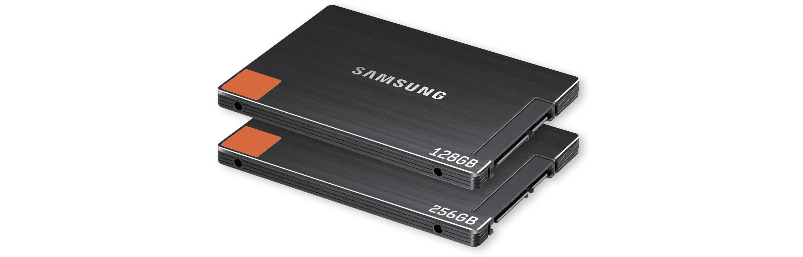
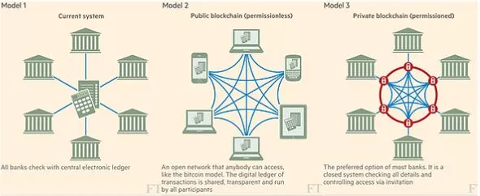
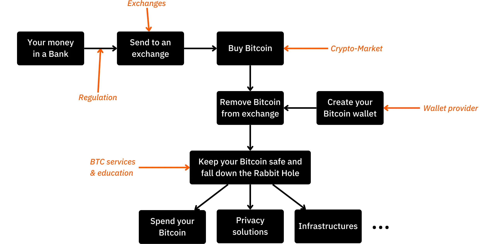
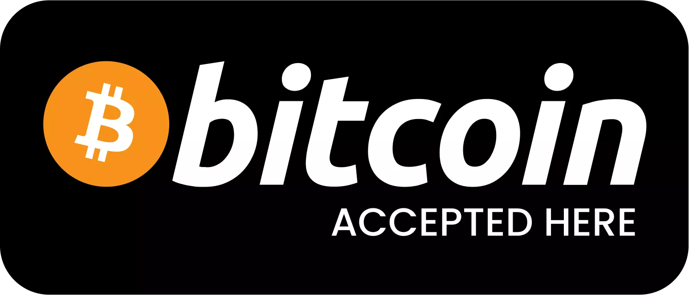
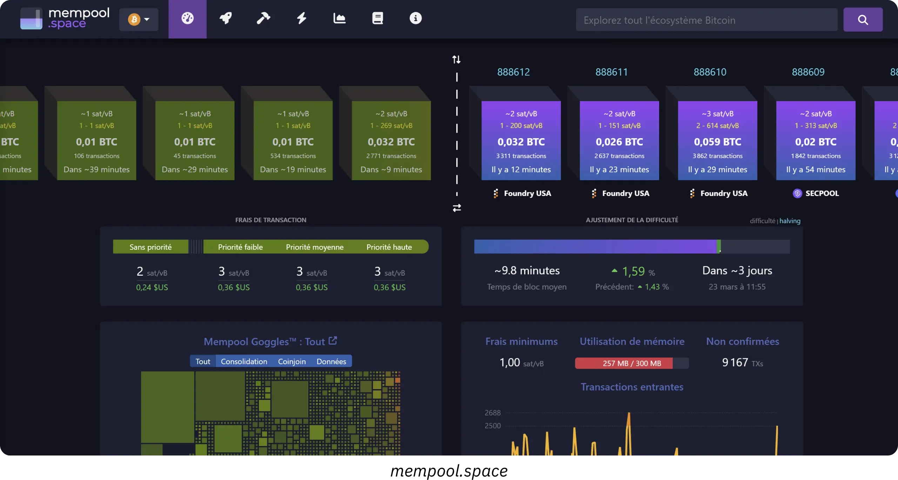

# Un viaje hacia tus primeros bitcoins

El ecosistema de Bitcoin está experimentando un crecimiento espectacular y sin precedentes. Las transformaciones tecnológicas, económicas y sociales impulsadas por la invención de Satoshi Nakamoto se intensifican día a día y abren poco a poco las puertas a un nuevo mundo, del que ahora puedes sacar el máximo partido.

Sumergirse en la madriguera del Bitcoin es una emocionante aventura intelectual que estimulará su pensamiento crítico y desafiará muchas de sus convicciones. Esta exploración no sólo le dará una comprensión profunda de cómo funciona Bitcoin, sino también una oportunidad real para recuperar su libertad personal, proteger su privacidad y lograr una verdadera soberanía financiera.

Para guiarte eficazmente a través de este viaje, he creado este curso totalmente gratuito. Aquí, la atención se centra exclusivamente en Bitcoin. Sin discusiones irrelevantes, sin mención de otras criptomonedas, sólo contenido claro, preciso y directo.

Este curso está diseñado para que usted tenga pleno control sobre su aprendizaje, permitiéndole explorar Bitcoin a su propio ritmo, siguiendo el camino que mejor se adapte a sus intereses y objetivos.

+++
# Introducción

<partId>008c49b7-5e17-5973-87f2-ba28429b2697</partId>

## Resumen del curso

<chapterId>bfc96999-0ee1-5c41-8297-1b629f50cffc</chapterId>

¡Bienvenido a BTC102! Si ya has completado BTC101, habrás explorado los conceptos teóricos clave que explican por qué Bitcoin es una tecnología tan revolucionaria. Ahora, con BTC102, es el momento de poner ese conocimiento en acción. Este curso está diseñado para ayudarle a construir su plan personal de Bitcoin, paso a paso.

En los próximos capítulos, te guiaremos a través de los pasos prácticos para **obtener tus primeros bitcoins**, **protegerlos** adecuadamente y dar con confianza tus primeros pasos en este ecosistema de rápido crecimiento.

https://planb.network/courses/2b7dc507-81e3-4b70-88e6-41ed44239966

Aunque Bitcoin existe desde hace más de 16 años, el sector sigue siendo joven, dinámico y profundamente arraigado en la libertad. Su protocolo subyacente está totalmente descentralizado y es resistente al control de cualquier autoridad central, lo que permite que el ecosistema crezca de forma natural y orgánica.

Aunque esta libertad alimenta una increíble ola de innovación y oportunidades, también conlleva ciertos riesgos, como estafas, errores comunes y trampas que a menudo se derivan de la falta de conocimientos. El objetivo principal de este curso es ayudarte a navegar por este nuevo ecosistema con confianza y seguridad.

Para lograrlo, el curso BTC102 se divide en varias secciones, cada una de ellas centrada en un aspecto clave de su viaje con Bitcoin:

La primera sección, "Requisitos previos para entender Bitcoin", le prepara eficazmente para el camino que tiene por delante. Aprenderá a identificar las principales trampas relacionadas con estafas y fraudes financieros que pueden existir en el ecosistema de Bitcoin. A continuación, trataremos los fundamentos esenciales de la seguridad en línea.

Por último, te daré algunos consejos prácticos especialmente diseñados para principiantes, que te ayudarán a evitar errores comunes cuando trabajes con Bitcoin por primera vez.

La segunda sección, "Entender en qué se está metiendo", profundizará en su comprensión general de la Bitcoin. Comenzaremos con un repaso para asegurarnos de que comprende plenamente los conceptos esenciales.

A continuación, le explicaremos por qué el Bitcoin tiene una importancia fundamental desde los puntos de vista tecnológico, económico y social, reforzando su convicción en su valor. También exploraremos la industria del Bitcoin en su conjunto: sus actores clave, su organización y su evolución a lo largo de los años. Por último, abordaremos la arquitectura en capas del ecosistema Bitcoin, un concepto crucial para entender cómo este sistema sigue innovando sin comprometer la integridad de su protocolo central.

La tercera sección, "Configuración de tu plan", se centra en tu enfoque personal de Bitcoin. Empezaremos ayudándote a definir tu perfil de usuario a partir de cuatro categorías principales:

- el hodler*, centrado en mantener el Bitcoin a largo plazo ;
- el apilador*, que compra regular y metódicamente;
- el usuario*, que prioriza el uso diario de Bitcoin;
- y por último *el paranoico*, que quiere la máxima seguridad para proteger eficazmente sus bienes y su intimidad.

Le guiaremos en la aplicación de una estrategia que se ajuste a su perfil y le ayude a alcanzar sus objetivos personales.

Por último, la cuarta sección, "Proteger a sus herederos y su patrimonio", trata un tema crucial que a menudo se pasa por alto: cómo garantizar que su Bitcoin se transmita a sus seres queridos en caso de un acontecimiento inesperado. Aprenderá a crear y establecer un plan de sucesión de la Bitcoin que garantice la conservación de su patrimonio más allá de su vida.

Al final de este curso, dispondrás de todas las herramientas prácticas que necesitas para navegar con confianza por el ecosistema Bitcoin y convertirte en uno de sus usuarios más avanzados

¿Listo para comenzar tu viaje al mundo de Bitcoin? Vamos allá

# Requisitos previos para entender Bitcoin

<partId>4481fc4b-0f83-489e-ad07-81517c5d6bad</partId>

## Estafas y fraudes financieros

<chapterId>8af2948b-2ab5-54c4-862c-3414b8a285a2</chapterId>

El ecosistema de la Bitcoin y su entorno son todavía relativamente jóvenes y están poco regulados, dependiendo del país. Aunque esta libertad abre enormes oportunidades, también crea un terreno fértil para fraudes financieros, estafas y diversas formas de manipulación. Por eso es tan importante el primer capítulo: conocer las trampas más comunes le ayudará a evitarlas. Tu seguridad financiera es una prioridad porque una mala experiencia no sólo te afecta a ti, sino a toda la comunidad Bitcoin.

### Bitcoin vs criptomonedas: entender las diferencias

Antes de seguir adelante, es importante distinguir claramente entre dos mundos fundamentalmente distintos:

- El ecosistema de Bitcoin** se centra en la idea de un dinero sólido, construido sobre una fuerte descentralización, resiliencia a largo plazo, privacidad y soberanía individual. Desde su lanzamiento en 2009, Bitcoin ha funcionado de forma fiable y segura, con el apoyo de una comunidad global y comprometida de desarrolladores. No se trata de una moda pasajera, sino de un protocolo estable y bien establecido, diseñado para preservar el valor a lo largo del tiempo.

- El sector de las criptomonedas**, por otra parte, es mucho mayor e incluye decenas de miles de proyectos diferentes, cada uno con su propio token. Este espacio suele estar impulsado por la innovación rápida, el bombo publicitario y la especulación financiera a corto plazo. Muchos de estos proyectos están centralizados, son menos seguros y no ofrecen mucho valor real, a pesar de las promesas audaces y el marketing llamativo.

Si desea comprender mejor de dónde procede la Bitcoin y qué la diferencia realmente de otros proyectos, le recomiendo que consulte este curso de seguimiento gratuito sobre la historia de la Bitcoin más adelante:

https://planb.network/courses/a51c7ceb-e079-4ac3-bf69-6700b985a082

Como ya sabe, la plataforma Plan ₿ Network se dedica exclusivamente al Bitcoin. Sin embargo, entender la distinción con otras criptodivisas te ayudará a evitar las trampas asociadas a proyectos inútiles y a veces incluso fraudulentos.

### Las principales estafas que hay que evitar

Éstas son las estafas más comunes que puede encontrarse en su viaje:

#### Estafas piramidales y esquemas Ponzi

Estas son algunas de las estafas más comunes en el mundo de las criptomonedas. En un esquema Ponzi, los primeros participantes reciben pagos utilizando el dinero de los nuevos; no de ninguna inversión o producto real. No se crea ningún valor real. El sistema sólo funciona mientras siga entrando gente nueva. Una vez que el flujo de nuevos participantes se ralentiza, todo el esquema se desmorona.

Estas estafas suelen incluir :

- Promesas poco realistas de rendimientos garantizados (por ejemplo, 20% de rendimiento garantizado);
- Retrasos o dificultades al intentar retirar sus fondos invertidos;
- Fuertes incentivos para captar nuevos afiliados que mantengan el sistema en funcionamiento;
- Una falta total de transparencia sobre el verdadero origen de los rendimientos prometidos.

En última instancia, todos los sistemas piramidales y Ponzi están condenados al fracaso. Su debilidad fundamental radica en la necesidad constante de captar nuevos inversores para pagar las ganancias a los participantes anteriores. Esta necesidad se hace matemáticamente imposible de mantener en el tiempo porque el número de nuevos reclutas necesarios aumenta exponencialmente a medida que crece el sistema. Una vez alcanzado un punto crítico, los participantes empiezan a dudar, la confianza desaparece y toda la pirámide se derrumba. En esta fase, los últimos en unirse, a menudo los menos informados, pierden toda su inversión sin forma de recuperarla, mientras que los organizadores o primeros inversores normalmente ya han retirado sus fondos y abandonado el sistema.

En el mundo de las criptomonedas, los esquemas Ponzi pueden adoptar muchas formas, a menudo diseñadas para ocultar su naturaleza fraudulenta tras una máscara tecnológica o financiera. Estas estafas pueden aparecer como nuevas ofertas de tokens u ofertas iniciales de monedas (ICO), que son operaciones de recaudación de fondos en las que se vende al público una nueva criptodivisa. Detrás de términos técnicos como "Blockchain", "contratos inteligentes" o "estafa", algunos proyectos esconden en realidad complejas estafas piramidales. Otros afirman ofrecer altos rendimientos combinando criptoactivos cuestionables con sistemas de compensación que dependen por completo de la afluencia continua de nuevos inversores.

Más recientemente, los esquemas Ponzi también se han extendido al mundo de las finanzas descentralizadas (DeFi). Aunque la DeFi pretende ofrecer servicios financieros sin intermediarios, algunos proyectos la utilizan para dar una falsa sensación de legitimidad a sus estafas. Algunas plataformas DeFi prometen rendimientos elevados y garantizados en Exchange por depósitos de criptomonedas en protocolos automatizados. Estas atractivas promesas suelen estar respaldadas por mecanismos opacos y no verificables, con tokens creados específicamente para la estafa. En realidad, estos sistemas no tienen un modelo de negocio sostenible: los beneficios se pagan simplemente con los fondos de los nuevos usuarios, como en un esquema Ponzi tradicional. Cuando la confianza empieza a erosionarse o la afluencia de nuevos participantes se ralentiza, estos sistemas se colapsan inevitablemente, provocando pérdidas significativas a los inversores desprevenidos.

Tenga en cuenta que el contenido de este curso tiene únicamente fines educativos y no debe interpretarse como asesoramiento financiero. Su seguridad financiera depende de su capacidad para mantenerse cauto, escéptico y bien informado con cada decisión financiera que tome.

La mejor protección es hacerse siempre esta sencilla pregunta: ¿De dónde procede realmente la rentabilidad prometida? Si la respuesta no está clara, huya inmediatamente.

#### Bomba y vertedero

Este tipo de estafa consiste en inflar artificialmente el precio de un activo -a menudo una criptomoneda de baja liquidez- mediante una campaña de marketing coordinada, normalmente dirigida por un grupo de inversores. El esquema típico de Pump & Dump sigue este patrón:

- Un grupo de personas con información privilegiada o influyentes acumula en silencio una gran cantidad del activo en cuestión.
- Entonces lanzan una agresiva campaña promocional para dar bombo a generate y hacer subir el precio.
- El público en general, movido por el miedo a perderse algo, empieza a comprar el activo en grandes cantidades, lo que hace que el precio suba aún más.
- En el punto álgido de la exageración, las personas con información privilegiada venden todas sus participaciones a la vez.
- El precio se desploma, dejando a los rezagados con grandes pérdidas.

Es importante señalar que las estrategias Pump & Dump son ilegales en muchos países y se consideran una forma de manipulación del mercado. A pesar de ello, este tipo de esquemas siguen floreciendo, especialmente en el espacio de las criptomonedas, donde la regulación todavía se está poniendo al día.

Ten especial cuidado con los grupos privados de "señales" en plataformas como Telegram, Discord u otros canales de redes sociales. Suelen estar dirigidos por personas influyentes o autoproclamados expertos, algunos de los cuales incluso cobran cuotas de entrada. Aunque estos grupos afirman ofrecer oportunidades de inversión exclusivas, la realidad es mucho más parcial: solo se benefician los organizadores, mientras que la mayoría de los participantes acaban perdiendo su dinero.

Es cierto que algunos participantes pueden beneficiarse temporalmente de este tipo de manipulaciones del mercado, pero su éxito no suele basarse más que en la suerte y la sincronización perfecta. A largo plazo, estos sistemas no son sostenibles. Requieren una implicación constante de alto riesgo y la participación repetida en montajes fraudulentos que inevitablemente se desmoronan.

Peor aún, alimentan una peligrosa ilusión: la creencia de que es posible ganar dinero rápido y fácil sin entender cómo funcionan realmente los sistemas financieros. Esta mentalidad no sólo pone en peligro a las personas, sino que también socava la credibilidad de todo el ecosistema de las criptomonedas

Por todas estas razones, la mejor estrategia consiste en adoptar un enfoque serio y reflexivo de la inversión, basado en la educación financiera, un sólido conocimiento de los fundamentos y una perspectiva a largo plazo.

Construyendo pacientemente su conocimiento, será mucho menos vulnerable a la manipulación emocional y a las promesas poco realistas; y estará mucho mejor equipado para evitar el tipo de trampas financieras que pueden conducir a pérdidas reales.

#### Estafas de donaciones, loterías y falsos sorteos

Este tipo de estafa promete Bitcoin gratis u otras recompensas en Exchange a cambio de que envíes primero una pequeña cantidad de dinero. Es importante recordar que ninguna persona u organización legítima te pedirá que envíes criptomoneda por adelantado con la promesa de enviarte más a cambio.

Los estafadores suelen hacerse pasar por personajes públicos conocidos (como Elon Musk u otros famosos) para atraer a sus víctimas a través de las redes sociales. Comprueba siempre la legitimidad de las cuentas y los sitios web antes de ponerte en contacto con ellos, y nunca confíes en ofertas que parezcan demasiado generosas o demasiado buenas para ser verdad.

A veces, estas estafas aparecen como fraudes de "pago por adelantado". Le prometen un premio o recompensa (dinero, un producto o un servicio), pero antes le piden que pague una cantidad, supuestamente para cubrir gastos como el envío, los impuestos o los costes de la transacción. Una vez efectuado el pago, el estafador desaparece y la recompensa prometida nunca llega.

#### Oferta de monedas de mierda y criptomonedas

Los proyectos centralizados de criptomonedas a veces ofrecen tokens gratuitos ("*airdrops*") para atraer usuarios. Estos tokens suelen tener poco o ningún valor real y se utilizan principalmente para crear la ilusión de popularidad o para alimentar la especulación. Sea extremadamente cauto con este tipo de ofertas promocionales; a menudo son trampas de marketing más que auténticas oportunidades.

#### Robo de identidad y phishing

Los atacantes suelen utilizar sitios web falsos, cuentas en redes sociales o correos electrónicos engañosos para intentar robarle sus fondos. Estas estafas pueden llegar a través de cualquier canal de comunicación: correo electrónico, redes sociales, llamadas telefónicas o incluso correo tradicional....

Antes de hacer clic en un enlace o realizar cualquier acción, compruebe siempre la identidad del remitente. En caso de duda, visite el sitio web manualmente en lugar de utilizar un enlace proporcionado. Y lo más importante, nunca compartas tus claves privadas o contraseñas con nadie.

#### Bitcoin Horcas

A lo largo de los años, la Bitcoin ha experimentado varias *bifurcaciones Hard*, que han dado lugar a la creación de versiones alternativas de la criptomoneda original. En términos sencillos, una *Hard Fork* es una escisión en la red que da lugar a dos blockchains separadas, ambas compartiendo la misma historia hasta el momento de la escisión. Estas bifurcaciones suelen producirse cuando parte de la comunidad de desarrolladores o del ecosistema Bitcoin más amplio quiere introducir cambios importantes en el protocolo original, pero no consigue alcanzar un consenso generalizado. En lugar de abandonar sus ideas, deciden lanzar una nueva versión de Bitcoin (con reglas modificadas) con la esperanza de que los usuarios y mineros elijan seguir su Fork en su lugar.

No todas las bifurcaciones *Hard* son fraudulentas, ya que algunas surgen de desacuerdos técnicos o ideológicos dentro de la comunidad. Sin embargo, otras obedecen a intereses comerciales o incluso a motivos deshonestos. Los ejemplos más conocidos de estos hardforks son **Bitcoin Cash (BCH)** y **Bitcoin Satoshi Vision (BSV)**. Lanzadas en 2017 y 2018, respectivamente, estas monedas alternativas a menudo afirman ser "versiones mejores" de la Bitcoin original. Promueven supuestas ventajas como tarifas de transacción más bajas o transacciones más rápidas debido al aumento del tamaño de los bloques. Sin embargo, estos cambios técnicos vienen acompañados de importantes contrapartidas en términos de seguridad, descentralización y solidez; Elements que pueden entrar en conflicto con los principios fundacionales de Bitcoin.

Más allá de las diferencias técnicas, estas monedas alternativas suelen aprovechar la confusión para atraer a inversores desinformados. Pueden emplear tácticas de marketing diseñadas para engañar deliberadamente a los recién llegados, que creen que están comprando Bitcoin (BTC) auténticos.

Para evitar caer en esta trampa, verifica siempre la moneda que estás comprando. La Bitcoin original utiliza el ticker **BTC**, mientras que la Bitcoin Cash y sus derivados utilizan acrónimos distintos, como BCH o BSV.

#### Influenciadores deshonestos y falsos gurús

A medida que las criptomonedas ganan popularidad, las redes sociales se llenan de personas influyentes, expertos autoproclamados y los llamados "gurús de las criptomonedas". Mientras que unos pocos pueden ofrecer conocimientos educativos genuinos, muchos otros se aprovechan de su visibilidad para promover proyectos dudosos o estrategias de negociación peligrosamente arriesgadas (y, a veces, directamente fraudulentas).

Estas personas influyentes suelen recurrir a tácticas probadas para atraer a principiantes: muestran resultados financieros impresionantes (que a menudo son falsos o inverificables), alardean de un estilo de vida lujoso como supuesta prueba de su éxito y promueven estrategias de inversión "milagrosas". El objetivo es desencadenar el FOMO (miedo a perderse algo) y empujar a su audiencia a tomar decisiones impulsivas y realizar inversiones temerarias.

Es importante entender que la mayoría de los consejos "gratuitos" de estas personalidades nunca son realmente gratuitos. Detrás de la fachada de generosidad a menudo se esconde una estrategia calculada para dirigir a la gente hacia la compra de activos cuestionables. E incluso si algunas personas influyentes fueran honestas, replicar sus resultados sería casi imposible; su éxito a menudo depende de un momento específico, de información privilegiada o de circunstancias únicas a las que usted simplemente no tiene acceso.

Algunas personas influyentes pueden invitarle a unirse a grupos privados de pago en los que afirman compartir señales de trading exclusivas o consejos privilegiados que prometen beneficios rápidos y fáciles. En realidad, estos grupos benefician principalmente a los propios organizadores. A menudo utilizan a sus seguidores como fuente de liquidez, esencialmente descargando activos para su beneficio personal. Los suscriptores suelen acabar perdiendo dinero, ya que son incapaces de reaccionar con la misma rapidez que los iniciados que orquestan las operaciones (véase la sección sobre esquemas de Pump & Dump).

Ante esta realidad, he aquí algunos buenos hábitos que conviene adoptar para evitar caer en las trampas que tienden los influencers deshonestos:

- Sea muy cauteloso con cualquier recomendación de inversión en criptomonedas.**

Una persona de confianza y bien informada nunca le presionará para que compre una criptomoneda sin animarle a que haga primero su propia investigación.

- Los cursos de negociación o inversión de pago no siempre son una marca de calidad.**

Muchos de estos cursos promueven estrategias arriesgadas o demasiado simplistas; a menudo, la misma información que se puede encontrar gratuitamente en Internet.

- No existe una forma garantizada de copiar las operaciones de alguien y obtener resultados idénticos.**

Toda estrategia de inversión depende del contexto personal, el momento oportuno, los conocimientos y otros factores que no pueden reproducirse con exactitud.

- Desconfíe especialmente de los consejos que parezcan demasiado buenos para ser ciertos.**

Las promesas poco realistas o los beneficios garantizados son casi siempre signos de manipulación. Recuerda: que alguien diga algo con seguridad no significa que sea cierto.

Recuerda siempre que todas las personas con las que te encuentres en el Bitcoin o en el ecosistema criptográfico más amplio tienen una agenda personal, ya sea declarada abiertamente u oculta entre líneas. No existe la información puramente neutral. Incluso este curso, BTC102, tiene un objetivo claro, *promover una mejor comprensión de Bitcoin.*

Por eso es esencial ser consciente de las verdaderas motivaciones que hay detrás de cada contenido que consumes. Y nunca olvides esta regla de oro de Internet:

*Si un producto o servicio parece gratuito, lo más probable es que usted sea el producto.*

En última instancia, su mejor defensa es la educación personal, un sano escepticismo y, lo que es más importante, el hábito de verificar los hechos por sí mismo.

### Cómo evitar las estafas

**Para mantenerse seguro en línea, especialmente en el mundo de las criptomonedas, tenga en cuenta estos principios clave:**

- Nunca confíes ciegamente: "*No confíes, verifica*" ;
- Desconfíe de los rendimientos garantizados o inusualmente altos;
- Nunca compartas tus claves privadas con nadie;
- No envíes Bitcoin (ni ninguna criptografía) a direcciones desconocidas;
- En caso de duda, haz una pausa. Da un paso atrás y piensa antes de actuar. El FOMO es tu peor enemigo;
- Evita los grupos o comunidades comerciales de pago que hacen promesas poco realistas;
- La mayoría de los sorteos o loterías "gratis" en Internet son estafas o están muy amañados;
- Siempre ganarás más a largo plazo aprendiendo que apostando.

Protegerse de las estafas es un primer paso crucial para salvaguardar sus activos, pero no es suficiente. Mantener una higiene digital sólida es igual de importante. Por eso, en el próximo capítulo, exploraremos cómo reforzar tu seguridad online y las mejores prácticas que debes adoptar para protegerte en el mundo digital.

## Seguridad en línea

<chapterId>f0873bf2-6a6f-5485-bb7a-d84be14f404d</chapterId>

En cuanto empieces a meterte en Bitcoin, te darás cuenta rápidamente de que la ciberseguridad básica no es opcional, sino esencial. Las estafas y los fraudes son sólo la punta del iceberg. La pérdida accidental de datos, el malware y las contraseñas comprometidas pueden ser igual de devastadores, especialmente cuando gestionas tus propias claves.

Este capítulo te guía a través de algunos pasos sencillos y prácticos para mejorar tu higiene digital y protegerte en el espacio.

Si desea profundizar, el curso SEC101 de Plan ₿ Network ofrece un desglose exhaustivo de las estrategias de ciberseguridad diseñado específicamente para los usuarios de Bitcoin.

https://planb.network/courses/99c46148-7080-4915-a7e0-9df0e145cd47

### Por qué es importante la ciberseguridad

Bitcoin te da el poder de tener tu dinero directamente (sin bancos), sin intermediarios. Pero ese tipo de soberanía financiera conlleva una grave responsabilidad: si te roban el BTC por un fallo de seguridad, no hay forma de revertir la transacción. A diferencia de la banca tradicional, no hay servicio de asistencia, ni reclamación por fraude, ni seguro que te rescate.

Además, el valor financiero de Bitcoin lo convierte en un objetivo de alto valor. Un hacker que compromete tu Wallet puede mover instantáneamente tus fondos a un Address que controle (sin preguntas, sin forma de recuperarlos).

### Un ordenador limpio y actualizado

Uno de los aspectos más olvidados de la seguridad personal es mantener actualizados el sistema operativo y el software. Muchas actualizaciones corrigen vulnerabilidades conocidas que, de otro modo, podrían ser aprovechadas por los atacantes. Aunque algunas personas evitan las actualizaciones por miedo a los problemas de rendimiento, el verdadero riesgo reside en ejecutar software obsoleto que los hackers ya saben cómo vulnerar.

También es muy recomendable utilizar un antivirus fiable. En Windows, el Windows Defender integrado suele ser suficiente para la mayoría de los usuarios. Si prefieres funciones adicionales o tranquilidad, también hay disponibles opciones comerciales como Kaspersky. En macOS, las amenazas de malware son históricamente menos comunes **pero no inexistentes**, por lo que sigue siendo inteligente ser precavido.

Más allá de las actualizaciones del sistema y la protección antivirus, desconfíe de la descarga de software desde sitios web poco fiables o portales de descarga denominados "universales". Cuando necesites una herramienta o aplicación, dirígete siempre a la fuente oficial; esto reduce drásticamente el riesgo de instalar malware disfrazado de software legítimo.

Otro hábito inteligente es verificar la autenticidad e integridad de cualquier software antes de instalarlo en tu máquina. Si no estás seguro de cómo hacerlo, no te preocupes, tenemos un tutorial dedicado para guiarte a través del proceso:

https://planb.network/tutorials/computer-security/data/integrity-authenticity-21d0420a-be02-4663-94a3-8d487f23becc

Por último, haga copias de seguridad periódicas de sus datos importantes. Una unidad externa Hard o SSD es una opción sólida para mantener un duplicado de tus archivos en caso de fallo repentino, pirateo o borrado accidental. Después te lo agradecerás.

Si prefieres las soluciones en la nube, considera la posibilidad de utilizar un servicio seguro como Proton Drive. Eso sí, asegúrate de que cualquier opción que elijas respeta tu privacidad y ofrece un cifrado potente.

https://planb.network/tutorials/computer-security/data/proton-drive-03cbe49f-6ddc-491f-8786-bc20d98ebb16

Una estrategia de copia de seguridad ampliamente recomendada es la "regla 3-2-1". Está diseñada para proteger tus datos de pérdidas accidentales, ciberataques o incluso desastres naturales.

La idea es sencilla:

- Conserva **al menos 3 copias** de tus datos importantes,
- Almacénalos en **al menos 2 tipos diferentes de soportes** (por ejemplo, una unidad externa Hard y almacenamiento en la nube),
- Y asegúrese de que **1 de esas copias se almacena fuera de las instalaciones** (separada físicamente de su ubicación principal).

Este enfoque ofrece una gran resistencia y ayuda a garantizar que sus datos sobrevivan incluso si algo va muy mal.

### La solución a la pesadilla del DNI

Una de las principales razones por las que la gente es pirateada es el uso de contraseñas débiles. Un número significativo de usuarios sigue reutilizando la misma contraseña en varias cuentas, o elige variaciones que son fáciles de adivinar. Los gestores de contraseñas son la solución perfecta a este problema.

Un gestor de contraseñas te permite:

- Almacena todas tus contraseñas de forma segura** en una cámara encriptada
- generate contraseñas largas, complejas y únicas** automáticamente para cada cuenta
- Utilice sólo una contraseña maestra**, para acceder a todo de forma segura

Con un gestor de contraseñas, nunca tendrás que volver a hacer clic en "Olvidé mi contraseña" ni confiar en credenciales débiles y reutilizadas. Además, la mayoría de los gestores de contraseñas se sincronizan a la perfección en todos tus dispositivos (ordenador, teléfono, tableta) e incluso rellenan automáticamente los formularios de inicio de sesión, lo que facilita el acceso seguro y lo hace más eficiente.

Hay muchos gestores de contraseñas por ahí, pero puedo recomendar dos opciones sólidas en función de sus necesidades. Si estás buscando algo fácil de usar que se sincronice sin problemas a través de múltiples dispositivos, Bitwarden es una excelente opción:

https://planb.network/tutorials/computer-security/authentication/bitwarden-0532f569-fb00-4fad-acba-2fcb1bf05de9

Si prefieres mantener todo localmente en tu propio dispositivo, KeePass es una gran opción:

https://planb.network/tutorials/computer-security/authentication/keepass-f8073bb7-5b4a-4664-9246-228e307be246

### 2FA: doble protección

En Bitcoin, eres tu propio banco. Eso significa que también eres tu propio equipo de seguridad. Incluso con una contraseña segura, no existe el riesgo cero, por lo que es esencial activar la autenticación de dos factores (2FA).

2FA añade un segundo Layer de protección al requerir un código de un solo uso basado en el tiempo (normalmente 6 dígitos) generado por una aplicación como Google Authenticator o Authy. Así, aunque alguien consiga tu contraseña, no podrá acceder a tu cuenta sin tener acceso físico a tu teléfono.

https://planb.network/tutorials/computer-security/authentication/authy-a76ab26b-71b0-473c-aa7c-c49153705eb7

Cuando actives 2FA, asegúrate de guardar la clave de recuperación de tu aplicación en un lugar seguro. Esto te permitirá restaurar tus códigos si pierdes o cambias de teléfono. Aunque la 2FA por SMS o correo electrónico es mejor que nada, es mucho menos segura. Un ataque de intercambio de SIM, en el que alguien toma el control de tu número de teléfono, puede eludir fácilmente este tipo de protección.

Para los que quieren ir un paso más allá, las llaves físicas como YubiKey ofrecen un nivel de protección aún mayor.

https://planb.network/tutorials/computer-security/authentication/security-key-61438267-74db-4f1a-87e4-97c8e673533e

### Protección de la intimidad

La privacidad y la ciberseguridad están estrechamente vinculadas: cuanta más información deje libremente accesible, más probabilidades tendrá de convertirse en un objetivo.

Una **VPN** (*Red Privada Virtual*) es un paso sencillo pero eficaz para enmascarar tu IP Address y cifrar tu tráfico de Internet. Aunque no te hará completamente invisible (ya que el proveedor de la VPN puede seguir viendo tu actividad), sí dificulta considerablemente que alguien intente espiarte o rastrear tus hábitos de navegación.

La clave está en elegir un proveedor de VPN de confianza que:

- No necesita sus datos personales
- Permite el pago mediante BTC
- Tiene una estricta política de no-logs

Tenemos varios tutoriales disponibles en Plan ₿ Network que pueden guiarte para configurar una VPN fácilmente. Recomiendo especialmente IVPN o Mullvad:

https://planb.network/tutorials/computer-security/communication/ivpn-5a0cd5df-29f1-4382-a817-975a96646e68

https://planb.network/tutorials/computer-security/communication/mullvad-968ec5f5-b3f0-4d23-a9e0-c07a3e85aaa8

Entre las medidas esenciales para proteger su privacidad en Internet también se incluyen:

- Utilizar **plataformas de mensajería cifrada** como Signal, SimpleX o Session;
- Utilizar navegadores centrados en la privacidad como Firefox, Brave o Tor (para mejorar el anonimato);

https://planb.network/tutorials/computer-security/communication/tor-browser-a847e83c-31ef-4439-9eac-742b255129bb

- Utilizando un **buzón seguro** como ProtonMail;

https://planb.network/tutorials/computer-security/communication/proton-mail-c3b010ce-254d-4546-b382-19ab9261c6a2

- Cifrando** tus archivos con herramientas como Bitlocker (para Windows) o VeraCrypt (disponible en multiplataforma).

https://planb.network/tutorials/computer-security/data/veracrypt-d5ed4c83-7c1c-4181-95ea-963fdf2d83c5

### Progresión paso a paso

La ciberseguridad puede parecer una empresa enorme, y es fácil que los principiantes se sientan abrumados y abandonen porque parece demasiado compleja. El truco está en abordarlo paso a paso. Empieza por algo sencillo, como instalar un gestor de contraseñas. Tómate unas semanas para sentirte cómodo con él y luego pasa al siguiente paso, como activar el 2FA en una de tus cuentas.

A medida que te sientas más seguro con estas herramientas, estarás preparado para añadir prácticas más avanzadas, como usar un correo electrónico secundario, cambiar a ProtonMail, configurar una VPN o navegar con Tor cuando sea necesario.

A medida que te adentres en el mundo de Bitcoin, te darás cuenta de que los riesgos crecen a medida que aumenta el valor de tu Wallet. Crear hábitos de seguridad sólidos, proteger tu privacidad y configurar las herramientas adecuadas no solo te dará tranquilidad, sino que también reforzará la soberanía de Bitcoin.

En resumen: no subestimes la ciberseguridad, tómate el tiempo necesario para configurar lo básico y recuerda que la coherencia es la clave. Sin una buena higiene digital, ni siquiera las mejores herramientas harán mucho por ti.

Asegúrese también de consultar [nuestros tutoriales sobre seguridad informática](https://planb.network/tutorials/computer-security) en Plan ₿ Network.

En el próximo capítulo, compartiré algunos consejos más que le ayudarán a iniciar su andadura en la Bitcoin con confianza y a evitar las numerosas trampas que pueden pillar desprevenidos a los recién llegados.

## Consejos para los recién llegados

<chapterId>33134b3f-92c1-5185-afb6-88599e47e801</chapterId>

Entrar en la Bitcoin puede ser emocionante, pero también conlleva sus riesgos. El mundo de las criptomonedas no se parece a ningún otro; las oscilaciones de precios, la tecnología desconocida y la posibilidad real de perder tus fondos para siempre debido a simples errores o malas decisiones de inversión son escollos que los nuevos usuarios deben tener en cuenta.

En este capítulo, compartiré algunos consejos prácticos y orientaciones generales para cualquier persona que esté dando sus primeros pasos, especialmente los que realicen su primera compra o exploren el amplio mundo de la inversión financiera.

Estos son los puntos clave que repasaremos juntos:

- Cuidado con las **Shitcoins** y otras criptodivisas inútiles;
- Invierta sólo **dinero que pueda permitirse perder**;
- Conozca la diferencia entre **comercio** e **inversión**;
- Tenga en cuenta las **implicaciones fiscales** de sus inversiones;
- Proteja cuidadosamente su **frase de recuperación**;
- Sé humilde y mantén un **perfil bajo** (la discreción forma parte de la seguridad);
- Piense a largo plazo**, alárguese y tenga paciencia (considérelo un maratón, no un sprint).

### Errores comunes que hay que evitar

La Bitcoin está abierta a todo el mundo, pero eso no significa que debas sumergirte en ella sin estar preparado. Estos son algunos de los errores clásicos que cometen los recién llegados:

**Errores tecnológicos:**

- Pérdida de su frase seed:** Su frase de recuperación (normalmente de 12 ó 24 palabras) es la única forma de acceder a su Bitcoin si algo le ocurre a su Wallet. Si la pierde, sus fondos desaparecen definitivamente. Si la pierdes, tus fondos desaparecen de forma permanente;
- Si tus monedas están en una plataforma centralizada, en realidad no son tuyas. Estás expuesto a riesgos como hackeos, fallos de la plataforma o incluso confiscaciones de fondos;
- Descuidar la privacidad:** Proteger tu privacidad es una parte fundamental de la seguridad de tus activos. Revelar públicamente la cantidad de Bitcoin que tienes podría convertirte en un objetivo;
- Seguridad en línea insuficiente:** No proteger tus dispositivos con protecciones básicas (como actualizaciones, contraseñas seguras o 2FA) te convierte en un blanco fácil para los atacantes, y podría costarte todo.

**Errores financieros:**

- Invierte más de lo que puedas permitirte perder**: Nunca te endeudes ni inviertas el dinero de tu alquiler en Bitcoin. Tu estabilidad financiera básica debe ser siempre lo primero.

- No conocer la diferencia entre trading e inversión**: El trading requiere tiempo, habilidad y una gran disciplina emocional. La inversión a largo plazo es mucho más fácil para los principiantes.

- Olvidarse de los impuestos**: Cada país tiene sus propias normas fiscales para las criptomonedas. Ignorarlas puede llevarte a sorpresas dolorosas en el futuro.

- Caer en el FOMO**: Comprar impulsivamente por miedo a perderse algo suele conducir a un mal momento y a malas decisiones. La paciencia es tu mejor aliada.

### Definir una estrategia de inversión

Antes de comprar su primera Satoshi, es fundamental entender por qué invierte en Bitcoin y cómo. Esto significa tener un plan financiero claro adaptado a tu situación personal y a tus objetivos a largo plazo.

Empiece por definir su **presupuesto** con precisión. No elijas una cifra al azar. Tómate tu tiempo para calcular tus ingresos mensuales, restar tus gastos fijos (como alquiler, préstamos, impuestos, servicios públicos), así como tus gastos cotidianos (comida, transporte, ocio, etc.). Lo que quede es tu margen de ahorro y sólo a partir de esta parte debes plantearte invertir.

Enfocarlo de este modo le garantiza que no está poniendo en riesgo su bienestar financiero, especialmente en caso de caída del mercado. Una estrategia meditada es la base de la resistencia a largo plazo.

Una vez definido su presupuesto, piense en cómo quiere invertir. Uno de los métodos más recomendables para los principiantes es el Dollar Cost Averaging (DCA), que consiste en comprar una cantidad fija de Bitcoin a intervalos regulares (semanales, mensuales, etc.). Esta estrategia ayuda a suavizar el precio medio de entrada a lo largo del tiempo y reduce el impacto emocional de las oscilaciones de precios. Es un enfoque inteligente para la mayoría de la gente, especialmente para los recién llegados.

Entonces, pregúntese: ¿Cuál es mi horizonte temporal?

¿Busca entrar y salir rápidamente del mercado (trading)? ¿O está más alineado con la mentalidad a largo plazo de mantener la Bitcoin durante varios años (hodler)? Si es un hodler, probablemente le preocupen menos las oscilaciones diarias de los precios y esté más centrado en la seguridad y la autocustodia a largo plazo. Si se dedica al trading, estará más expuesto al ruido del mercado a corto plazo, a un mayor riesgo y al estrés que suele conllevar la toma rápida de decisiones. No hay una respuesta única para todos, pero conocer su propio enfoque le ayudará a orientar sus decisiones.

Y lo que es más importante, no tome decisiones de inversión basadas en la emoción o el miedo. Fija una estrategia de antemano, escríbela y cíñete a ella.

Si aún no estás seguro, **empieza por aprender.**

Dedica unas horas a explorar Bitcoin, echa un vistazo a los recursos gratuitos de Plan ₿ Network, lee un par de libros, invierte cinco euros sólo para probarlo y mira algunos contenidos de calidad en línea. Mantén la curiosidad. Cuanto más cómodo te sientas, más fácil te resultará revisar tu estrategia, modificar tu enfoque y avanzar con confianza.

### Comprender la volatilidad de BTC

El Bitcoin es conocido por sus espectaculares oscilaciones de precios. Movimientos del 10%, 20% o incluso 50% en pocos días no son inusuales. Para los recién llegados, este tipo de volatilidad puede ser desorientadora. Es fácil dejarse llevar por la euforia durante las fases alcistas o dejarse llevar por el pánico durante las fases bajistas, lo que a menudo lleva a tomar decisiones equivocadas, como vender con pérdidas.

Por eso es crucial **comprender y aceptar la volatilidad del Bitcoin** antes de invertir. Estas oscilaciones de precios no son un error, sino una característica de un activo que aún está madurando. Si las subidas y bajadas repentinas le quitan el sueño o le empujan a tomar decisiones emocionales, lo más probable es que haya invertido más de lo que se siente cómodo arriesgando. En ese caso, dé un paso atrás y reevalúe su estrategia y su tolerancia al riesgo. No dude en reducir su posición hasta que se sienta más cómodo.

Sobre todo, nunca inviertas más de lo que puedas permitirte perder. Evite pedir dinero prestado para comprar Bitcoin (sobre todo si aún está aprendiendo los fundamentos). Una base sólida comienza con pasos medidos, no con apuestas temerarias.

### Gestión y seguridad de su Bitcoin Wallet

Una de las características más potentes (y a menudo subestimada) de Bitcoin es la **autocustodia**. Con una Wallet autocustodiada, usted es el único responsable de sus fondos. Estos monederos suelen generarse a partir de una **frase de recuperación** (también conocida como frase seed), una serie de 12 o 24 palabras que concede acceso completo a tus BTC. Si pierdes esta frase (o si alguien se hace con ella) tus bitcoins desaparecen para siempre. **No hay atención al cliente. No hay botón de reinicio

Por eso la regla de oro en Bitcoin es:

"***Ni tus llaves, ni tus monedas***". Si no controla personalmente sus claves privadas, no es el verdadero propietario de su Bitcoin. Mientras que los intercambios pueden ser convenientes (especialmente cuando se empieza) que tienen sus llaves para usted. Eso significa que sus fondos están en riesgo si la plataforma es hackeada, congela su cuenta, o va a la quiebra.

Para evitar este riesgo, se recomienda encarecidamente configurar su **propio Wallet**, donde sólo usted tenga acceso a la frase de recuperación. Esta frase debe escribirse siempre a mano y guardarse **fuera de línea** en un lugar seguro. Algunos usuarios incluso **mantienen múltiples copias de seguridad**, almacenadas en ubicaciones geográficas separadas para mayor seguridad.

**Nunca almacenes tu frase de recuperación en un dispositivo conectado a Internet o en la nube**.

**Un solo hackeo o violación de datos podría provocar pérdidas irreversibles.**

Si está listo para tomar Ownership de su Bitcoin y desea profundizar en las mejores prácticas para asegurar su frase de recuperación, le recomiendo encarecidamente que eche un vistazo a este artículo:

https://planb.network/tutorials/wallet/backup/backup-mnemonic-22c0ddfa-fb9f-4e3a-96f9-46e2a7954270

### Confidencialidad y discreción

En el mundo digital de hoy en día, la **discreción suele pasarse por alto**; sin embargo, es una parte crucial para mantenerse a salvo, especialmente cuando se trata de Bitcoin. Cuanto más abiertamente hables de tus posesiones, más probabilidades tendrás de convertirte en objetivo de estafadores, ciberdelincuentes o incluso de amenazas más tradicionales como la extorsión o el chantaje.

Se han producido numerosos casos en todo el mundo en los que personas conocidas por poseer grandes cantidades de BTC fueron secuestradas o atacadas.

**Evita presumir de tu Bitcoin Stash**, ya sea en las redes sociales o incluso en conversaciones informales. Revelar información financiera confidencial no tiene ninguna ventaja, y los riesgos son reales.

También es aconsejable **compartimentar tu actividad en Internet**. Por ejemplo:

- Utilice un correo electrónico Address separado para todo lo relacionado con Bitcoin, distinto de sus cuentas personales o de trabajo.
- Tenga cuidado con los intentos de phishing, los enlaces sospechosos y los sitios web falsos que imitan plataformas de confianza.
- La discreción y la vigilancia suelen ser la mejor defensa.

Si estás preparado para profundizar en el tema de la privacidad de Bitcoin, te recomendamos que continúes con nuestro Curso de Privacidad Año 2, donde aprenderás técnicas más avanzadas para mantener tu identidad y actividad seguras:

https://planb.network/courses/65c138b0-4161-4958-bbe3-c12916bc959c

### Implicaciones fiscales

A pesar de ser una moneda descentralizada, **Bitcoin no está exenta de las leyes y normativas fiscales** de su país. Cada jurisdicción tiene su propio enfoque sobre cómo se gravan las ganancias de las criptodivisas.

En algunos lugares, los beneficios se gravan como plusvalías al vender. Otros pueden exigirte que declares cada operación, y algunos aplican normas menos comunes, como el impuesto sobre el patrimonio o las cotizaciones sociales.

Antes de realizar cualquier transacción importante, se recomienda encarecidamente consultar a un profesional fiscal o revisar las directrices oficiales de su gobierno. Dedicar tiempo a conocer de antemano sus obligaciones fiscales puede evitarle problemas inesperados más adelante (como multas, auditorías o sanciones), sobre todo si planea grandes ventas o reasignaciones de cartera.

### La diferencia entre negociar, invertir y mantener

La Bitcoin suele estar rodeada de ideas erróneas; una de las más comunes es la idea de que es una vía rápida para hacerse rico a través del trading. Pero es importante entender la clara distinción entre trading, inversión y tenencia, ya que cada enfoque conlleva su propia mentalidad, conjunto de habilidades y nivel de riesgo.

- Comercio :**

Seamos sinceros: probablemente no deberías comerciar

El trading consiste en especular a corto plazo (a veces con apalancamiento) con el objetivo de beneficiarse de las oscilaciones de precios de Bitcoin. Aunque pueda parecer atractivo, el éxito de las operaciones requiere conocimientos técnicos avanzados (como análisis de gráficos y gestión de riesgos), disciplina emocional y una atención constante al mercado. Es mentalmente agotador y requiere mucho tiempo, y la verdad Hard es que **la mayoría de los principiantes pierden dinero** porque subestiman lo exigente que es en realidad.

Como dijo Warren Buffett:

"**Si no estás dispuesto a mantener una acción durante diez años, ni se te ocurra mantenerla diez minutos**"

Bitcoin no es un sistema para hacerse rico rápidamente.

- Inversión:**

Los inversores adoptan una visión a medio y largo plazo, comprando Bitcoin con la convicción de que su valor crecerá con el tiempo (meses, años o incluso décadas). Sigue habiendo riesgo, por supuesto, ya que el precio del Bitcoin puede fluctuar significativamente. Pero este enfoque suele ser más tranquilo y mucho más práctico para la mayoría de la gente, especialmente para quienes no quieren pasar horas pegados a los gráficos todos los días.

- Sujeción (HODL) :**

"HODL" empezó como un error tipográfico de "hold" y rápidamente pasó a formar parte de la cultura Bitcoin. Hoy es una insignia de honor.

Los Hodlers están en el juego a muy largo plazo; a veces diez años o más. Almacenan su Bitcoin de forma segura y se limitan a esperar, impulsados por una fuerte convicción en el potencial a largo plazo de la Bitcoin. No les asustan las oscilaciones diarias de los precios ni los mercados bajistas. No les preocupan las oscilaciones diarias de los precios ni los mercados bajistas. Su mentalidad es simple: acumular, asegurar y esperar.

|          | Trading | Investment | Holding |
| ---------------------- | ----------- | -------------- | --------------- |
| Leverage | Yes  | No | No |
| Timeframe | Short-term | Medium-term | Very long-term |
| Asset Type | Contracts | Actual BTC | Actual BTC |
| Risk Level | Very high | High | High |
| Difficulty | Very Hard | Hard | Hard |
| learning curve | Long learning curve | Long learning curve | Long learning curve |
| Potential Loss | UnLimited | Limited | Limited |
| Best For | A few experienced users | Most People | Long-term Believers |

### Sigue aprendiendo

Nunca es demasiado pronto (ni demasiado tarde) para empezar a informarse sobre el dinero, la inversión y el funcionamiento real del sistema financiero. No es necesario que te conviertas en un experto ni que te sumerjas en todos los detalles técnicos; basta con tener una comprensión sólida y general para tomar decisiones informadas y evitar que te engañen con productos financieros que no sirven a tus intereses (a menudo promovidos por bancos o asesores).

Un buen punto de partida es el libro "Padre rico, padre pobre", de Robert T. Kiyosaki. Es muy conocido por su estilo cercano y sus lecciones fundamentales, como entender la diferencia entre activos y pasivos, y por qué la educación financiera es clave para la independencia a largo plazo.

Si está preparado para profundizar en el tema, podcasts como *The Investors Podcast* ofrecen interesantes debates sobre inversión, mercados y principios económicos. Ocasionalmente también tratan el tema de la Bitcoin, lo que lo convierte en un buen paso para aquellos que tengan curiosidad por saber cómo encaja la Bitcoin en el panorama financiero general.

### Reglas de oro a tener en cuenta

Para terminar, he aquí algunos principios atemporales que todo Bitcoiner (especialmente los principiantes) debería tener en cuenta:

- Regla n°1**: Nunca inviertas más de lo que puedas permitirte perder. La Bitcoin es un activo volátil. No arriesgue su estabilidad financiera persiguiendo ganancias. Tus necesidades esenciales y tu tranquilidad deben ser siempre lo primero.
- Regla nº 2**: No sigas ciegamente el bombo publicitario ni confíes en consejos milagrosos. Ignore las modas y las promesas llamativas. Concéntrese en tomar decisiones bien informadas y racionales. En caso de duda, consúltalo con la almohada; háblalo con personas de confianza. Es mejor avanzar despacio y con reflexión que precipitarse y cometer errores costosos.
- Regla nº 3**: Elabora un plan y mantén una visión a largo plazo.

La constancia, la paciencia y la disciplina le llevarán más lejos que el entusiasmo a corto plazo. No busques la luna, sino el crecimiento sostenible. Evita los errores fatales y deja que las pequeñas victorias se acumulen con el tiempo.

Siguiendo estos principios, podrá abordar la inversión en Bitcoin con mayor claridad y tranquilidad. Sí, la Bitcoin es volátil y puede intimidar al principio, pero si se aborda con cautela, paciencia y una mentalidad fundamentada, encierra un potencial innegable. Tómese su tiempo para adquirir conocimientos, revise su estrategia cuando sea necesario y, sobre todo, recuerde: un progreso lento y constante siempre le será más útil que precipitarse por miedo o impaciencia.

# Entender en qué se está metiendo

<partId>a42355a3-9dd8-57ed-b590-32a333fe09ea</partId>

## Bitcoin en 5 minutos

<chapterId>ae122ad9-9b4d-5229-9038-e1b99d5cfc83</chapterId>

En este curso, el objetivo principal es guiarte para que adquieras y asegures tus primeros bitcoins. Pero antes de sumergirte en los pasos prácticos (cómo comprar BTC, qué monederos utilizar, etc.) es importante dar un paso atrás y entender qué es realmente la Bitcoin. Comprender la naturaleza profunda de Bitcoin le ayudará a ver por qué millones de personas están recurriendo a esta tecnología, y por qué es crucial entender los fundamentos antes de poner sus ahorros en un activo tan nuevo y volátil.

A lo largo de los años, Bitcoin ha ido ganando reconocimiento como red monetaria mundial. Se la ha llamado "oro digital", "protocolo de confianza" e incluso "sistema financiero paralelo" Pero, ¿qué significan realmente esos términos? Para responder a esa pregunta, examinaremos más detenidamente el núcleo de Bitcoin: su historia de origen, sus fundamentos técnicos, sus propiedades monetarias y su impacto potencial; no sólo sobre los individuos, sino sobre el sistema financiero mundial en su conjunto.

### Los orígenes: Un proyecto nacido de una larga búsqueda

#### Los cypherpunks y la invención de un sistema que escapa al control bancario

Bitcoin no nació de la noche a la mañana. Es el resultado de décadas de investigación y experimentación en criptografía, informática y teoría monetaria. Antes de su lanzamiento en 2009, varios proyectos (como eCash, b-money, Bit Gold y RPOW) intentaron crear monedas digitales. Todos se enfrentaban al mismo problema central: cómo evitar el doble gasto en un sistema descentralizado sin depender de una autoridad central.

Ese reto siguió sin resolverse hasta finales de 2008, cuando alguien que utilizaba el nombre de Satoshi Nakamoto publicó el libro blanco de Bitcoin. Unos meses más tarde, la primera versión del software de código abierto de Bitcoin se puso en marcha, lanzando un sistema que podría operar independientemente de bancos o gobiernos.

El proyecto estuvo muy influido por el espíritu de Cypherpunk, una comunidad de desarrolladores y pensadores que creían en el uso de la criptografía para proteger las libertades individuales en Internet. Para ellos, la privacidad y la descentralización no eran preferencias técnicas, sino necesidades ideológicas. Bitcoin surgió como la encarnación más exitosa de esos ideales: una red monetaria entre iguales que cualquiera podía utilizar, nadie podía controlar y todo el mundo podía verificar.

Los Cypherpunks son una comunidad internacional informal de individuos que abogan por el uso de la criptografía para defender las libertades personales en Internet. Creen firmemente en el derecho individual a la privacidad, especialmente en un mundo cada vez más marcado por la vigilancia gubernamental y la explotación de datos por parte de las empresas.

Las raíces del movimiento Cypherpunk se remontan a principios de la década de 1990, cuando grupos de criptógrafos, programadores y libertarios empezaron a explorar las implicaciones políticas de la criptografía durante reuniones en Silicon Valley. Una de las voces más destacadas de la comunidad fue Tim May, autor en 1988 del Manifiesto Criptoanarquista, un texto fundacional que esbozaba la visión de un mundo en el que la encriptación permitiría a los individuos operar fuera del alcance de los gobiernos y del control centralizado.

Un hito importante en el movimiento se produjo en 1992 con la creación de la lista de correo Cypherpunks, un foro en el que podían florecer ideas, proyectos y debates políticos sobre privacidad y criptografía. Después, en 1993, Eric Hughes publicó el Manifiesto de Cypherpunk, una breve pero poderosa declaración que expresaba claramente la misión y las creencias de la comunidad.

La idea de una moneda digital que funcione independientemente de cualquier autoridad central (como la Bitcoin) está profundamente arraigada en la filosofía de la Cypherpunk.

#### El momento posterior a la crisis financiera

La Bitcoin no surgió de la nada. Se creó en un momento muy concreto: justo después de la crisis financiera mundial de 2008. El colapso del mercado inmobiliario estadounidense y la crisis de los préstamos de alto riesgo provocaron la quiebra de grandes bancos y sacudieron la confianza de la gente en todo el sistema financiero.

Fue en este entorno de miedo e incertidumbre donde nació la Bitcoin. Su creador, conocido como Satoshi Nakamoto, incluyó un mensaje muy simbólico en el primer bloque de la Bitcoin Blockchain, conocido como bloque Genesis. El mensaje era:

> **"The Times 03/ene/2009 El canciller, al borde de un segundo rescate bancario "**

No era sólo una fecha o una nota técnica; era una protesta silenciosa pero poderosa. Demostró que la Bitcoin estaba diseñada para ser algo radicalmente distinto: un sistema financiero que no dependiera de los bancos, los rescates o las decisiones gubernamentales.

Muchos interpretan esto como el objetivo de la Bitcoin: ofrecer una forma de transferir valor sin necesidad de intermediarios, controlada por normas claras en lugar de las decisiones, a menudo poco claras, de los bancos centrales o los gobiernos.

Para profundizar en el conocimiento de los orígenes de la Bitcoin, ofrecemos un curso de formación gratuito, completo y bien documentado sobre el tema:

https://planb.network/courses/a51c7ceb-e079-4ac3-bf69-6700b985a082

### Una red descentralizada para transferir valor

#### Entre iguales y sin organismo central

Bitcoin se define como un "sistema de dinero electrónico entre iguales" Esto significa que cualquiera puede conectarse a la red utilizando el software adecuado (un nodo Bitcoin) e interactuar directamente con otros usuarios, sin depender de un servidor central. El objetivo de esta descentralización es impedir que una sola entidad (como un banco, un gobierno o una gran empresa) controle, censure o detenga el sistema. Bitcoin funciona 24 horas al día, 7 días a la semana, en todo el mundo, y es accesible a todo el mundo sin condiciones.

En términos sencillos, cada participante en la red Bitcoin (denominado "nodo") dispone de una copia completa de la transacción Ledger, conocida como Blockchain. Cuando se produce una nueva transacción, se transmite a la red. A continuación, los mineros confirman estas transacciones agrupándolas en bloques que se añaden al final de la cadena (de ahí el nombre "Blockchain").

#### Blockchain: una contabilidad Ledger

Piense en la Blockchain como una Ledger gigante de contabilidad, en la que cada línea representa una transacción. En un sistema bancario tradicional, la base de datos se almacena en los servidores de un banco, que puede hacer cambios cuando quiera. En cambio, en Bitcoin, **todos los cambios se validan en toda la red**: una vez que se añade un nuevo bloque de transacciones a Blockchain, es casi imposible alterarlo posteriormente. Esta validación descentralizada hace que la Bitcoin sea segura y transparente.

### El papel de los mineros y Proof-of-Work

#### Cómo se crean los bloques: Mining

Mining es el proceso por el cual los ordenadores (o grandes granjas de Mining) contribuyen con **potencia computacional** para asegurar el historial de transacciones de Bitcoin y crear nuevos bloques. Los mineros compiten para resolver un rompecabezas matemático, en concreto, encontrar una colisión parcial de Hash. Este proceso requiere una gran cantidad de energía y recursos. Una vez que un Miner encuentra una solución válida, transmite el bloque a la red, que lo verifica y lo acepta como válido.

Como recompensa, el Miner recibe bitcoins de nueva creación (denominados subsidio del bloque) junto con las comisiones de transacción de todas las transacciones incluidas en ese bloque.

#### La Halving: disminución de la subvención en bloque

Para garantizar la escasez de Bitcoin, la subvención en bloque está programada para reducirse a la mitad cada 210.000 bloques; aproximadamente cada cuatro años. Este evento se conoce como "Halving" Cuando se lanzó Bitcoin, los mineros ganaban 50 BTC por bloque. En 2025, esa recompensa se ha reducido a 3,125 BTC y seguirá disminuyendo con el tiempo.

Finalmente, hacia el año 2140, la subvención llegará a cero, ya que el total de Bitcoin alcanzará un tope de 21 millones de monedas. Esta curva de emisión predecible imita la escasez de materias primas físicas como el oro; una de las razones por las que a menudo se hace referencia a Bitcoin como **oro digital**.

### Bitcoin Propiedades monetarias

#### Escasez y política monetaria fija

Una de las características más poderosas de la Bitcoin es su *política monetaria predecible e inmutable*. A diferencia de las monedas fiduciarias tradicionales (como el dólar, el euro o el yen), que los bancos centrales pueden imprimir a voluntad (lo que a menudo provoca inflación o distorsiones económicas), la Bitcoin funciona con un conjunto transparente de reglas integradas en su código.

Sólo habrá 21 millones de bitcoins y el ritmo de emisión de nuevas monedas es conocido de antemano por todos los miembros de la red.

Ningún gobierno, institución o individuo puede cambiar unilateralmente este tope de Supply ni las normas de distribución. La única manera de alterar estos parámetros sería cambiar el protocolo de Bitcoin; e incluso eso requeriría el consenso de la mayoría de los participantes económicos de la red.

Esta escasez intrínseca es una gran atracción para quienes desean escapar de políticas monetarias impredecibles o evitar la erosión gradual de su poder adquisitivo a causa de la inflación. Con el tiempo, esto podría representar un cambio en el pensamiento financiero, en el que ahorrar en un activo deflacionista como el Bitcoin resulta más atractivo que confiar en las monedas tradicionales, propensas a la inflación.

#### Divisibilidad y accesibilidad

Uno de los puntos fuertes más infravalorados del Bitcoin es su divisibilidad. Cada Bitcoin puede dividirse en 100 millones de unidades, conocidas como satoshis (o Sats para abreviar). Esto significa que no es necesario gastar decenas de miles de euros o dólares para empezar; puedes comprar Bitcoin por valor de unos pocos euros, hasta fracciones minúsculas.

### Apertura y transparencia

#### Un protocolo público, verificable por todos

Bitcoin funciona con un protocolo público de código abierto (en particular, a través de [Bitcoin Core](https://github.com/Bitcoin/Bitcoin)). Esto significa que su código está disponible libremente para que cualquiera pueda inspeccionarlo, auditarlo y mejorarlo. No hay mecanismos ocultos ni sistemas cerrados; todo el funcionamiento de Bitcoin es público.

Este nivel de transparencia hace increíblemente difícil introducir puertas traseras o realizar cambios secretos. Cualquiera con los conocimientos técnicos necesarios puede gestionar un nodo, contribuir al desarrollo o crear herramientas compatibles. En Bitcoin, la confianza se gana a través del código y el consenso, no del control centralizado.

Esta transparencia es una de las razones clave por las que la gente confía en el protocolo Bitcoin; impide que un pequeño grupo de desarrolladores manipule la red en su propio beneficio. Bitcoin se basa en un principio sencillo pero poderoso: si no estás de acuerdo con los cambios propuestos, puedes no actualizar tu software. En algunos casos, esto no causará ningún trastorno; seguirás sincronizado con el resto de la red. Pero en otros casos, esto puede llevar a lo que se conoce como Hard Fork, donde la red se divide en dos, y se crea una nueva versión de Bitcoin. Eso es exactamente lo que ocurrió en 2017 con la división entre Bitcoin (BTC) y Bitcoin Cash (BCH).

Aunque este tipo de gobierno puede ser lento y a veces desordenado, también es un punto fuerte: garantiza que ninguna entidad pueda tomar el control unilateralmente, lo que ayuda a Bitcoin a mantenerse estable, neutral y resistente a la centralización.

#### Validación individual: nodos

La Bitcoin permite a cualquiera comprobar la exactitud de la Blockchain ejecutando un "nodo" en su ordenador o servidor. Esto significa descargar el software Bitcoin Core (u otra versión del protocolo Bitcoin) y verificar todas las transacciones y bloques desde 2009. Una vez que su nodo está configurado y sincronizado, se convierte en una copia completa de la Blockchain y ayuda a sostener la red.

Aunque este enfoque es más técnico, ofrece a los usuarios más exigentes la posibilidad de no confiar en terceros. Ejecutar un nodo garantiza que los usuarios puedan participar en el proceso de consenso y permanecer incensurables, contribuyendo directamente a la seguridad y descentralización de la red.

### Casos prácticos

#### Un método de pago transfronterizo resistente

Debido a su naturaleza descentralizada, Bitcoin funciona 24 horas al día, 7 días a la semana, sin verse afectada por fronteras o husos horarios. En regiones que carecen de infraestructuras bancarias tradicionales, Bitcoin se utiliza a menudo como solución rápida y barata para enviar o recibir fondos sin depender de intermediarios caros. Aunque las comisiones por transacción pueden variar en función de la congestión de la red, suelen ser muy inferiores a las que cobran los bancos por las transferencias internacionales. Además, las soluciones Layer-2 como la Lightning Network permiten realizar transacciones Bitcoin aún más rápidas y baratas.

#### Un depósito de valor

Debido a su escasez (con un tope de 21 millones de BTC) y a su resistencia inherente, la Bitcoin suele considerarse una garantía de ahorro a largo plazo. Aunque su precio puede ser volátil a corto plazo, la Bitcoin ha seguido en general una tendencia al alza a lo largo de los años desde su creación. Algunos inversores compran BTC con la creencia de que podría servir como depósito de valor, sobre todo frente a la inflación o las crisis financieras.

#### Una herramienta para la libertad financiera y la resiliencia

Más allá de la inversión, Bitcoin ofrece una forma de proteger la soberanía financiera. En países bajo regímenes autoritarios o que se enfrentan a fuertes restricciones monetarias, tener una Bitcoin Wallet (con claves privadas) proporciona una forma de libertad. Nadie puede bloquear o confiscar estos BTC, siempre que el titular asegure su frase de recuperación.

Esta característica es especialmente atractiva para quienes temen la censura o la congelación de cuentas bancarias. También resuena entre las poblaciones que sufren hiperinflación, como se ha visto en Venezuela o Zimbabue, donde poseer BTC resultó más estable que mantener la moneda local, que se depreciaba rápidamente.

### Un largo camino por recorrer

La Bitcoin puede considerarse un "Cero a Uno": una ruptura radical con los paradigmas financieros establecidos. Por primera vez en la historia, una red monetaria mundial, accesible a todos, funciona sin una autoridad central, permitiendo transacciones privadas y resistentes a la censura.

Sin embargo, tras más de una década de existencia, la Bitcoin sigue suscitando debates y pasiones. Su adopción va en aumento, están surgiendo soluciones de segunda Layer (como la Lightning Network) para mejorar la velocidad de las transacciones y reducir las comisiones, y empresas de todo el mundo experimentan con nuevos casos de uso. Es probable que la Bitcoin siga influyendo en los sistemas de pago e incluso en nuestra percepción del dinero durante las próximas décadas.

Si desea ampliar sus conocimientos, puede seguir el curso BTC101 sobre Plan ₿ Network, que ofrece una exploración más profunda de los fundamentos técnicos y económicos de Bitcoin.

https://planb.network/courses/2b7dc507-81e3-4b70-88e6-41ed44239966

Después de esta introducción a la Bitcoin (¡que puede haberte llevado algo más de 5 minutos!), ahora estás mejor preparado para plantearte la compra y la seguridad de bitcoins. En los siguientes capítulos del curso, profundizaremos en la importancia de Bitcoin, el funcionamiento de su industria y el desarrollo de sus distintas capas. A continuación, en la próxima sección, hablaremos de cómo establecer tu propio plan personal.

## ¿Por qué es importante el Bitcoin?

<chapterId>d4327ac4-9ff8-5192-b542-cb78c0bd0aa7</chapterId>

¿Por qué es tan importante la Bitcoin? Esa es la pregunta central de este curso. Tanto si está relacionado con sus estudios como con su estrategia de inversión, sin una comprensión clara de la importancia de Bitcoin, existe el riesgo de desviarse de su plan. El objetivo es tener siempre presentes los principios fundamentales de Bitcoin para asegurarse de que su estrategia se mantiene alineada con sus creencias.

### Una moneda universal

Barack Obama se refirió en una ocasión a la Bitcoin como "un banco suizo en tu bolsillo", y con razón. La Bitcoin ofrece las mismas oportunidades a todo el mundo, sea quien sea. Ya seas un adolescente, un presidente, un manifestante en Hong Kong o un "chaleco amarillo" en Francia, todos tienen el mismo acceso al mismo protocolo y las mismas herramientas:

- Crear carteras gratuitas e ilimitadas (con Bitcoin, en realidad no hablamos de "cuentas", sino de "carteras").
- Envíe dinero a cualquier lugar y a cualquier persona.
- Sin necesidad de identificación ni trámites administrativos.
- Accesible a todos, independientemente de la edad, el sexo, la religión, el país o el nivel de ingresos.
- Privacidad y transparencia a su discreción.
- Sin intermediarios ni comisiones ocultas.
- Bitcoin es nativo de Internet, lo que significa que cualquier persona con acceso a la red puede utilizarlo.

La Bitcoin puede considerarse la verdadera "moneda del pueblo", un sistema monetario alternativo que no depende de ninguna autoridad central y se basa en reglas inmutables y no en decisiones arbitrarias. Su naturaleza abierta y accesible la convierte en una herramienta potencialmente revolucionaria para miles de millones de personas en todo el mundo, tanto si están excluidas del sistema bancario tradicional como si simplemente buscan una alternativa más soberana.

Esto nos lleva a una cuestión fundamental, casi filosófica, que divide a los entusiastas de la Bitcoin en dos visiones principales del mundo. Por un lado, algunos ven la Bitcoin como una solución para promover la inclusión financiera, permitiendo a los miles de millones de personas no bancarizadas acceder por fin a una infraestructura monetaria mundial. Por otro lado, algunos ven la Bitcoin como una herramienta de liberación financiera destinada a ofrecer una salida a los miles de millones de personas ya integradas en el sistema bancario, pero que desean liberarse de su dependencia y recuperar el pleno control sobre su dinero. Esta reflexión merece nuestra atención, y volveremos sobre ella con más detalle más adelante.

### Protección contra las crisis monetarias

Durante siglos, el mundo ha experimentado crisis monetarias que han tenido efectos devastadores en las poblaciones. Miles de millones de personas siguen sufriendo las consecuencias de políticas monetarias mal gestionadas, en las que la manipulación del dinero Supply y de los tipos de interés crea desequilibrios sistémicos. Estas crisis no son meros sucesos aleatorios: son el resultado de un sistema construido sobre la intervención y la manipulación del dinero y los valores temporales.

Estas crisis pueden adoptar formas muy diversas. La hiperinflación, por ejemplo, aniquila una moneda destruyendo gradualmente el poder adquisitivo de la gente; como se ha visto en países como Zimbabue y Venezuela. Por otro lado, los controles monetarios estrictos pueden limitar el acceso a los fondos y despojar a los individuos de su libertad económica, como ocurrió con las restricciones bancarias en Grecia y Líbano.

Y por último, cuando los gobiernos devalúan sus monedas nacionales, erosionan gradualmente los ahorros de la gente, una sangría invisible pero constante de su riqueza. En muchos sentidos, actúa como un impuesto oculto. Mientras la política monetaria siga en manos de autoridades centralizadas, estos ciclos están destinados a repetirse.

La Bitcoin presenta una alternativa audaz a este ciclo de inestabilidad monetaria crónica. A diferencia de las monedas emitidas por el Estado, se basa en reglas matemáticas inmutables aplicadas por consenso, no por gobiernos ni bancos centrales. Su emisión es predecible y está limitada a unos 21 millones de monedas, lo que la convierte en una forma de dinero sólida diseñada para mantener su valor a lo largo del tiempo. Como resiste la censura, cualquiera puede almacenar y transferir valor sin depender de una institución. Y gracias a su divisibilidad y portabilidad, es accesible y práctico: infraestructura financiera para cualquiera, en cualquier lugar.

**A lo largo de la historia se han documentado al menos 56 casos de hiperinflación en todo el mundo. En muchos de esos casos, se hundieron economías enteras, se esfumaron los ahorros de toda una vida y millones de personas se vieron abocadas a la pobreza extrema. Peor aún, estos fracasos monetarios a menudo actuaron como trampolín para la agitación política; a veces conduciendo a regímenes autoritarios, como ocurrió en Alemania en la década de 1920 y en Chile en la década de 1970.

Hanke, S. H., y Krus, N. (2013). *Hiperinflaciones mundiales*. En R. Parker & R. Whaples (Eds.), The Handbook of Major Events in Economic History. Routledge Publishing. Obtenido de https://ssrn.com/abstract=2130109

El colapso de las monedas fiduciarias no es una casualidad histórica; es un patrón que se repite. Hoy, la Bitcoin ofrece una salida: una oportunidad única para proteger su patrimonio al margen de los sistemas monetarios controlados por los gobiernos. En este momento, la cuestión no es si se producirá otra crisis, sino cuándo. Con Bitcoin, ahora tiene la opción de salir de estos ciclos destructivos y elegir un sistema monetario basado en la transparencia, la previsibilidad y la soberanía individual.

### Una respuesta al control estatal y a la injusticia

La creciente desigualdad económica en todo el mundo siempre ha sido terreno abonado para el malestar social y el auge del extremismo político. La historia demuestra que cuando la brecha entre ricos y pobres se hace demasiado grande, suele provocar tensiones, crisis e incluso el surgimiento de regímenes autoritarios. Ante estos riesgos, proteger su libertad financiera no es sólo un lujo; es una necesidad para cualquiera que quiera preservar su autonomía y salvaguardar el futuro de su familia.

Pero en un mundo en el que el Estado puede ejercer un control total sobre los activos y las transacciones, ¿qué opciones reales existen para proteger sus ahorros?

- Las cuentas bancarias** pueden ser congeladas en un instante, embargadas por una simple orden gubernamental o vaciadas mediante restricciones monetarias excesivas.

- El oro**, aunque ha servido como depósito de valor durante milenios, es Hard de dividir, incómodo de transportar y poco práctico para su uso en situaciones de crisis urgentes.

- El efectivo**, aunque anónimo, es voluminoso, fácil de confiscar y pierde valor constantemente debido a la inflación.

Pero la Bitcoin es algo más que una herramienta práctica. También es **una forma pacífica de protesta**; una declaración de independencia de un sistema financiero basado en el poder arbitrario, la centralización y la desigualdad sistémica. Elegir Bitcoin significa rechazar la manipulación, la devaluación y la vigilancia. Se trata de reclamar tu **soberanía**, asegurar tu futuro y defender tu derecho a controlar tu propia riqueza.

Desde este punto de vista, la Bitcoin es más que tecnología. Es una herramienta de la ley natural, una forma de que los individuos hagan valer sus derechos fundamentales, incluso cuando esos derechos son negados por las leyes del país. Devuelve el poder al pueblo, no a través de la revolución, sino del código.

**¿Lo sabías? Bitcoin es seudónimo, no anónimo. Los usuarios pueden crear direcciones Wallet sin revelar su identidad real, lo que les permite enviar y recibir fondos al margen del sistema bancario tradicional.

Sin embargo, en contra de la creencia popular, Bitcoin no ofrece un anonimato total. Cada transacción se registra en una Ledger pública (la Blockchain) a la que cualquiera puede acceder y verificar. Aunque las direcciones Wallet no están vinculadas a nombres, la actividad financiera de un usuario puede rastrearse y analizarse si no se siguen las prácticas de privacidad adecuadas.

### Una solución a la corrupción monetaria y bancaria

Los bancos centrales, a través de sus políticas monetarias expansivas, erosionan constantemente tu poder adquisitivo. Mediante la inflación y la impresión excesiva de dinero (a menudo disfrazada de relajación cuantitativa) diluyen constantemente el valor de la moneda en circulación. Esto actúa como un impuesto invisible que, año tras año, disminuye la riqueza de aquellos que ahorran en dinero emitido por el gobierno.

En contra de la creencia común de que la inflación es un fenómeno económico natural, en realidad es una herramienta de control monetario; una que empobrece lentamente a la población en general mientras beneficia a quienes poseen activos financieros.

Si su riqueza no está asegurada en activos no monetarios (como bienes inmuebles, bonos o acciones), sus ahorros perderán valor inevitablemente con el tiempo. Mientras tanto, los que tienen acceso a instrumentos financieros siguen aumentando su riqueza, ampliando la brecha entre la élite económica y el resto de la sociedad.

No se trata de un defecto del sistema, sino de un mecanismo deliberado. Los bancos centrales y los gobiernos lo utilizan para estimular artificialmente el crecimiento económico y empujar a la gente hacia el consumo constante y el endeudamiento creciente.

Nuestro sistema financiero moderno se basa en un ciclo de endeudamiento en el que pedir prestado no sólo se fomenta, sino que es prácticamente inevitable. Los individuos piden préstamos para mantener su estilo de vida, sólo para encontrarse atrapados en un sistema en el que deben devolver los intereses a los bancos que crean dinero de la nada. Esto no es accidental; es un diseño estructural destinado a beneficiar a las instituciones financieras a expensas de los ciudadanos de a pie.

El sistema está corrompido por la influencia de los bancos centrales y su poder incontrolado para manipular el Supply monetario. **Bitcoin es la alternativa.**

A diferencia de las monedas fiduciarias, la Bitcoin se rige por normas aplicadas por consenso. Su Supply tiene un límite; nunca habrá más de 21 millones de bitcoins en existencia (de hecho, algo menos debido a cómo está estructurada la emisión). Ningún gobierno, banco central o agente económico puede alterar este límite.

Esto significa que el Bitcoin funciona en un marco monetario previsible, en el que la inflación no sólo es transparente, sino que está diseñada para reducirse completamente una vez que se haya extraído el último Bitcoin.

En el pasado, el oro servía de freno a la expansión monetaria desenfrenada. Pero desde el colapso del patrón oro en 1971, ninguna moneda nacional (ya sea el dólar, el euro o el yen) está respaldada por un activo tangible. Este desprendimiento dio rienda suelta a los bancos centrales para imprimir dinero sin restricciones, allanando el camino para décadas de agresiva expansión monetaria, repetidas burbujas de activos y crisis financieras recurrentes.

Cuando depositas dinero en un banco, ya no es verdaderamente tuyo.

La mayoría de la gente no se da cuenta de esto: el dinero que tiene en una cuenta bancaria no es técnicamente de su propiedad. En términos jurídicos y prácticos, es un préstamo que usted concede a su banco y que éste puede utilizar para sus propias operaciones e inversiones.

Este sistema se basa en la confianza ciega del público en las instituciones financieras, pero conlleva graves riesgos:

- Incluso con sistemas de garantía de depósitos, la historia ha demostrado que estas garantías pueden fallar durante las crisis sistémicas.
- Si tu banco restringe el acceso a tus fondos, es posible que no puedas retirar o utilizar tu propio dinero**. Esto ha sucedido muchas veces: durante las crisis económicas de Grecia, Líbano y Argentina, o en medio de represiones políticas como las protestas de los camioneros en Canadá.

Bitcoin ofrece un modo radicalmente distinto: abierto, neutral e incorruptible. Sus reglas están codificadas por consenso y se aplican por igual a todos los participantes de la red.

Aquí es donde entra en juego el principio básico:

**"Ni tus llaves, ni tu Bitcoin"**

Si no controlas las claves privadas de tus bitcoins, entonces no eres realmente su propietario. Están en manos de terceros, como el dinero fiduciario en un banco. Pero si posees tus claves privadas, tú y sólo tú tienes el control total sobre tus fondos. Ninguna institución, ningún gobierno, ninguna autoridad puede congelar, confiscar o restringir tu acceso.

Esto es lo que hace de la Bitcoin una poderosa alternativa a las vulnerabilidades y extralimitaciones del sistema financiero tradicional: la soberanía monetaria.

### Bitcoin: ¿Un movimiento político?

Bitcoin reestructura el equilibrio de poder entre los individuos y las instituciones financieras. Permite a cualquier persona tomar el control total de su dinero, proteger sus ahorros de la inflación y liberarse de las restricciones monetarias impuestas por los Estados. Como sistema abierto y sin fronteras, Bitcoin ofrece una alternativa más justa, accesible a todos, independientemente de su condición social, nacionalidad u origen.

Adoptar la Bitcoin es optar por el dinero sano. Es negarse a seguir siendo una pieza más de la maquinaria inflacionista y endeudada del actual sistema financiero. Es un acto de soberanía personal y una resistencia pacífica contra la corrupción monetaria y la erosión de la riqueza.

Los bitcoiners proceden de todos los ámbitos de la vida, pero comparten una visión común: un mundo en el que la soberanía monetaria esté en manos de los individuos, no de las instituciones. Entre ellos se encuentran:

- Cypherpunks**, que defienden la privacidad y se resisten a la vigilancia;
- Ciudadanos oprimidos**, que buscan refugio de regímenes autoritarios y controles de capital;
- Anarquistas**, que ven en la Bitcoin una herramienta de liberación del control estatal;
- Economistas austriacos**, partidarios de una moneda sana y libre de manipulaciones gubernamentales;
- Ingenieros, financieros y defensores de la libertad de expresión**, que reconocen las profundas implicaciones sociales de este nuevo paradigma monetario.

La Bitcoin, por su diseño, trasciende las divisiones políticas e ideológicas. No es de izquierdas ni de derechas, ni libertario ni colectivista. Es un protocolo neutral, regido por normas (no gobernantes) que se aplican a todos por igual. Sin embargo, su mera existencia desafía el statu quo financiero mundial. La Bitcoin se ha convertido en un símbolo de resistencia porque la gente la ha adoptado como alternativa a las monedas fiduciarias y a la infraestructura financiera centralizada; sistemas cada vez más vistos como injustos, manipulables y excluyentes.

Para la mente de Cypherpunk, Bitcoin es más que un activo digital. Se opone a la constante erosión de la privacidad en un mundo en el que la desaparición del dinero en efectivo se justifica a menudo con el pretexto de la "seguridad."

Bitcoin permite transacciones digitales entre iguales, sin intermediarios ni guardianes, y resistentes a la censura. Tal y como imaginó Satoshi Nakamoto, ofrece el equivalente digital del dinero en efectivo: una forma de Exchange valorar libremente, sin necesidad de permiso.

Bitcoin no es una organización ni un partido político, pero es innegable que transmite un poderoso mensaje filosófico. Redefine la relación entre el individuo y el Estado, desafiando el monopolio de los bancos centrales sobre la creación de dinero y el control económico.

Ya sea adoptada por los luchadores por la libertad o por quienes simplemente buscan preservar su poder adquisitivo, la Bitcoin marca el comienzo de una nueva era, en la que la soberanía financiera se convierte en un derecho humano básico, accesible a todos.

Ahora que hemos explorado el profundo significado de la invención de Satoshi Nakamoto, el siguiente capítulo nos adentrará en la extraordinaria industria que ha crecido en torno a este protocolo; todo un ecosistema que está reconfigurando las finanzas, la tecnología y la sociedad.

## Entender la industria de la Bitcoin

<chapterId>e106c6f1-d75b-5a62-b245-0ea2e4d02ef8</chapterId>

Desde su lanzamiento en 2009 por el creador seudónimo Satoshi Nakamoto, Bitcoin ha desencadenado el surgimiento de una industria completamente nueva, valorada actualmente en cientos de miles de millones de dólares. A pesar de su relativamente corta historia, este ecosistema ha experimentado un crecimiento explosivo, evolucionando a un ritmo exponencial durante la última década. Cada día, nuevos actores (desde inversores institucionales y empresas emergentes ágiles hasta gigantes tecnológicos) invierten grandes cantidades de capital y recursos para hacerse un hueco en este sector en rápida expansión.

Hoy en día, la Bitcoin ha alcanzado un umbral crítico; un punto de no retorno. Gobiernos, bancos centrales, empresas de tecnología financiera e instituciones financieras tradicionales ya no pueden permitirse ignorarlo. Ya sea a través de la regulación, la adopción cautelosa o la confrontación abierta, ahora reconocen el impacto inevitable de Bitcoin en la economía mundial.

### El nacimiento de una industria mundial

Bitcoin es una innovación radical, un salto de cero a uno. Representa una ruptura total con el paradigma monetario tradicional. Para algunos, esta disrupción es una amenaza; un desafío existencial a su poder y privilegios establecidos. Para ellos, la Bitcoin es una caja de Pandora que nunca debió abrirse, y utilizarán todos los medios a su alcance para resistirse a ella.

Otros, sin embargo, ven la Bitcoin como una oportunidad única en una generación: una herramienta para la libertad individual, un catalizador para transformar el sistema financiero mundial y un camino hacia una alternativa más transparente y equitativa. Estos son los constructores, adoptantes y contribuyentes (los que forjan el futuro).

*el propio *Bitcoin** permanece neutral. No pide permiso. No pide aprobación.

**Simplemente existe.**

En este capítulo analizaremos los principales actores que impulsan el sector de la Bitcoin. Entender sus funciones, incentivos e interacciones es esencial para comprender la dinámica de este ecosistema en crecimiento y para navegar mejor por las oportunidades y retos que presenta.

### La proliferación de las altcoins

Desde el punto de vista técnico, crear una nueva criptomoneda es increíblemente fácil; puede llevar sólo unos minutos y requiere poca o ninguna innovación real. El verdadero reto no está en la creación, sino en el valor. Y el valor, en el mundo de los activos digitales, está puramente determinado por el mercado; por la confianza y la demanda de sus usuarios.

Allá por diciembre de 2019, CoinMarketCap enumeraba más de 5.000 tokens. Para 2025, ese número se ha disparado a millones, gracias al auge de las NFT, las finanzas descentralizadas (DeFi) y otras innumerables aplicaciones (algunas legítimas, muchas cuestionables). Estos tokens son de todo tipo: algunos pretenden ser monedas, otros funcionan como valores, utilidades de plataforma, sidechains o representaciones tokenizadas de arte digital.

Pero seamos claros: **la mayoría de estas criptodivisas son poco más que estafas.**.

Detrás del velo de la tecnología llamativa y la marca hábil, muchos de estos proyectos son impulsados por estrategias de marketing agresivas diseñadas para hacer una cosa, **extraer su Bitcoin**. Se aprovechan de la avaricia y la ignorancia de los inversores, esgrimiendo seductores discursos sobre tecnología revolucionaria o rendimientos garantizados, afirmaciones que rara vez se sostienen bajo escrutinio.

Por supuesto, dentro de este mar de ruido, hay un pequeño puñado de proyectos que intentan realmente superar los límites. Algunos se centran en resolver problemas técnicos reales (escalabilidad, privacidad, programabilidad) y pueden aportar ideas valiosas a un espacio más amplio. Es probable que, con el tiempo, algunos de estos experimentos den lugar a innovaciones útiles

Pero la cuestión fundamental sigue en pie:

**¿Podrán prosperar estas innovaciones fuera de Bitcoin?**

Hasta ahora, una verdad destaca: Bitcoin sigue siendo la única moneda digital verdaderamente descentralizada y resistente a la censura, respaldada por una red mundial y una adopción creciente. A diferencia de las altcoins, Bitcoin no está apuntalada por empresas centralizadas ni gobernada por un puñado de desarrolladores y primeros inversores. Es el único proyecto que se ha ganado el peso de miles de horas de investigación, desarrollo y perfeccionamiento incesante.

| Feature               | Bitcoin                  | Altcoins (99.9% of them)       |
| ---------------------|--------------------------|--------------------------------|
| **Liquidity**         | High                     | Low                            |
| **Adoption (Real-World)** | Global and growing       | Very limited                   |
| **Team**              | Decentralized and robust | Centralized and opaque         |
| **Reputation**        | Strong and globally recognized        | Varies, often questionable     |
| **Infrastructure**    | Stable and secure        | Unstable and vulnerable        |
| **Decentralization**  | Yes                      | Rarely                         |
| **Scam Risk**             | No                       | Very likely                    |
| **Real utility?**     | Yes                      | Debatable                      |

**Tenga cuidado con afirmaciones engañosas como:**

- "Blockchain, no Bitcoin"
- "XRP es el próximo Bitcoin"
- "Libra sustituirá a Bitcoin
- "Mi proyecto es una versión mejorada de Bitcoin"
- "Las monedas digitales de los bancos centrales harán obsoleta la Bitcoin"

Antes de invertir su tiempo o recursos en cualquier Altcoin, investigue por su cuenta, ya que no es eso lo que vamos a tratar aquí.

**Estamos aquí para cubrir Bitcoin y Bitcoin solamente.**

### Adopción por las principales instituciones

Tras el boom de las ICO de 2017, las instituciones empezaron a mostrar un serio interés por la Blockchain; pero a menudo sin comprender qué es lo que realmente la hace revolucionaria. Los bancos centrales y los gobiernos están explorando ahora las monedas digitales de los bancos centrales (CBDC), con la esperanza de modernizar la infraestructura financiera manteniendo un control total sobre las transacciones de los usuarios. Ya hay proyectos en marcha en países como Suecia, la UE, Rusia y China.

Los gigantes tecnológicos también se han sumado a la carrera. Facebook (ahora Meta) lanzó su iniciativa de stablecoin, Libra, con el objetivo de crear una moneda digital respaldada por una cesta de monedas fiduciarias. Pero el proyecto se topó con una rápida resistencia regulatoria y acabó abandonándose.

| Feature                    | Bitcoin | Altcoins | Facebook-Coin | FedCoin |
|---------------------------|---------|----------|---------------|---------|
| **Public**                | Yes     | Varies   | No            | No      |
| **Open**                  | Yes     | Varies   | No            | No      |
| **Borderless**            | Yes     | Varies   | No            | No      |
| **Neutral**               | Yes     | Varies   | No            | No      |
| **Censorship-resistant**  | Yes     | Varies   | No            | No      |

A pesar de su atrevido marketing, estas iniciativas no compiten con la Bitcoin; imitan su lenguaje al tiempo que rechazan sus principios básicos. Están concebidas para el cumplimiento, no para la libertad. Están diseñadas para ampliar la vigilancia, no para proteger la privacidad. Afianzan el control en lugar de distribuirlo.

La Libra de Facebook nunca pretendió desafiar el statu quo; se construyó para trabajar con el sistema. En cambio, Bitcoin existe totalmente fuera de ese sistema. No pide permiso. No depende de la confianza. Y lleva más de una década funcionando a la perfección (sin líderes, tiempos de inactividad ni control central).

### Normativa y enfoques gubernamentales

La Bitcoin, por su propia naturaleza, opera fuera de los marcos tradicionales. No depende de una autoridad central y no puede ser controlado ni alterado por ninguna entidad. Pero aunque el propio protocolo es inmune a la regulación, los participantes que interactúan con él (bolsas, empresas y usuarios) siguen sujetos a las leyes nacionales.

Dado que Bitcoin es una red mundial, los países han respondido de maneras muy diferentes:

- Algunos imponen fuertes restricciones**, como China, que intentan frenar el consumo sin llegar a detenerlo realmente.

- Otros ofrecen entornos más acogedores**, como Suiza o Canadá, que ven en el Bitcoin una oportunidad más que una amenaza.

- La mayoría sigue indecisa**, experimentando con normativas mientras intenta equilibrar la innovación con la supervisión.

Los gobiernos y las instituciones suelen tener dificultades para clasificar con precisión el Bitcoin (¿es dinero, propiedad o algo totalmente nuevo?). Como resultado, la normativa tiende a ser reactiva, incoherente y en constante evolución. Si trabajas con Bitcoin, es esencial que te mantengas informado sobre el panorama local, especialmente en lo que se refiere a impuestos, acceso bancario y normas de cumplimiento.

### La postura de los bancos ante la Bitcoin

Como piedras angulares del sistema financiero tradicional, los bancos ven en la Bitcoin una amenaza directa para su modelo económico, centrado en la intermediación y el control de los flujos financieros. Esto explica por qué muchos bancos de todo el mundo han impuesto restricciones a las empresas y particulares que utilizan Bitcoin. Algunos llegan incluso a cerrar cuentas o limitar el acceso a los servicios a las empresas que operan en el sector de la criptomoneda, alegando a menudo preocupaciones relacionadas con la lucha contra el blanqueo de capitales (AML) y la financiación del terrorismo (CTF).

Sin embargo, aunque Bitcoin se considera un competidor, muchos de estos mismos bancos están invirtiendo activamente en la investigación y el desarrollo de Blockchain, tratando de aprovechar las innovaciones de Bitcoin sin renunciar a su control. Entienden que Blockchain ofrece un potencial significativo, pero pretenden controlar cómo se integra en su infraestructura actual, en lugar de adoptar el modelo descentralizado y abierto de Bitcoin.

### Intercambio de criptomonedas y custodia de Bitcoin

Los intercambios desempeñan un papel fundamental en el ecosistema de Bitcoin, actuando como puentes entre las monedas fiduciarias y Bitcoin. Permiten a los usuarios comprar, vender y, a veces, intercambiar Bitcoin por otros activos digitales. Permiten a los usuarios comprar, vender y, a veces, intercambiar Bitcoin por otros activos digitales. Sin embargo, no todos los intercambios son iguales, y es esencial elegir el que se adapte a sus necesidades al tiempo que minimiza los riesgos. Estos son los factores clave a tener en cuenta antes de utilizar una Exchange:

- una sólida reputación de seguridad ;
- liquidez suficiente para garantizar una negociación rápida sin fluctuaciones extremas de los precios;
- un servicio de atención al cliente ágil y eficaz;
- Un Interface fácil de usar que facilita la navegación por las transacciones;
- una opción para las compras recurrentes automáticas (ARP);
- retirada fácil y gratuita de bitcoins a una Wallet personal.

Las bolsas que cumplen la normativa local suelen tener que seguir estrictos protocolos de **"Conozca a su cliente "** (KYC, por sus siglas en inglés), que obligan a los usuarios a facilitar documentos de identificación antes de acceder a los servicios. Aunque estos procesos están diseñados para evitar actividades ilegales, pueden comprometer la privacidad que ofrece intrínsecamente Bitcoin.

Las plataformas KYC recopilan su información personal con el pretexto de la seguridad. Estos datos pueden ser explotados por los gobiernos para controlar tus transacciones financieras y restringir tu acceso a determinadas operaciones.

Sin embargo, existen alternativas para adquirir bitcoins sin someterse a KYC:

- P2P plataformas de compra como Bisq, Robosat, LNP2PBot, Peach, HODL HODL, etc. ;
- Compras directas en efectivo, por ejemplo en reuniones locales de Bitcoin;
- Plataformas de compra reguladas sin KYC, poco frecuentes pero disponibles en algunos países.;
- Cajeros Bitcoin;
- Trabajando en Exchange por bitcoins;
- Mining bitcoins.

Existen varios tipos de plataformas, cada una adecuada para usos específicos:

- Plataformas peer-to-peer Exchange (P2P)**

Estas plataformas permiten a los usuarios comprar y vender bitcoins directamente entre ellos, sin un intermediario centralizado. Ofrecen mayor privacidad, sobre todo porque operan sin KYC. Puedes encontrar vendedores locales con los que realizar transacciones en persona o utilizar diversos métodos de pago online (SEPA, Revolut, Wise, etc.).

**Precaución:** Para cualquier transacción física, elija un lugar público y seguro para evitar posibles estafas.

https://planb.network/tutorials/exchange/peer-to-peer/bisq-v2-c1c6a702-6c16-4101-8b90-62c424017b80

https://planb.network/tutorials/exchange/peer-to-peer/hodlhodl-d7344cd5-6b18-40f5-8e78-2574a93a3879

https://planb.network/tutorials/exchange/peer-to-peer/lnp2pbot-v2-e6bcb210-610b-487d-970c-7cce85273e3c

https://planb.network/tutorials/exchange/peer-to-peer/peach-c6143241-d900-4047-9b73-1caba5e1f874

https://planb.network/tutorials/exchange/peer-to-peer/robosats-b60e4f7c-533a-4295-9f6d-5368152e8c06

- Sólo Bitcoin Plataformas Exchange**

Estas plataformas son fáciles de usar y ofrecen un servicio sencillo y transparente. Sólo admiten Bitcoin. Suelen implementar soluciones para la compra de bitcoins a través de Dollar-Cost Averaging (DCA) y ofrecen retiradas automáticas a una Wallet personal. Son especialmente adecuadas para principiantes que buscan acumular bitcoins de forma progresiva y segura. Ejemplos: Relai, Bull Bitcoin, StackinSat, Bitstack...

https://planb.network/tutorials/exchange/centralized/bitstack-29fd71be-9570-42c6-8f6f-cd355d62e746

https://planb.network/tutorials/exchange/centralized/bull-bitcoin-europe-0ccf713e-efcd-44ec-8205-211f49ac7d53

https://planb.network/tutorials/exchange/centralized/relai-v2-30a9671d-e407-459d-9203-4c3eae15b30e

https://planb.network/tutorials/exchange/centralized/stackinsat-5af6a380-f3c6-4246-9f81-9957a16ab066

- Plataformas Exchange de uso general u orientadas al comercio**

Estas plataformas ofrecen funciones avanzadas que van más allá de la simple compra de Bitcoin, incluido el apalancamiento y los derivados. Sin embargo, desaconsejamos encarecidamente el trading. En su lugar, recomendamos comprar Bitcoin y trasladarlo a su propia Wallet. El trading es una actividad de alto riesgo y, por lo general, no es adecuada para quienes se centran en la acumulación a largo plazo. Mantenerse al margen del juego del trading suele ser el camino más inteligente.

https://planb.network/tutorials/exchange/centralized/bitfinex-dc306d39-bd96-4ab9-a278-a322316716db

https://planb.network/tutorials/exchange/centralized/bitstamp-5a36c896-bff5-46d7-b505-ff069c3ac47c

https://planb.network/tutorials/exchange/centralized/kraken-1ef03e25-9b42-49bd-a47d-249e1a13cfc6

https://planb.network/tutorials/exchange/centralized/paymium-92603f76-b985-49ce-81e5-f4fa0df776e5

**Las plataformas Exchange no son monederos seguros**. Dejar tus bitcoins en una Exchange te expone a un riesgo considerable. Varios escenarios podrían resultar en la pérdida de tus fondos:

- Hacking**: Muchos bitcoins han sido robados de plataformas comprometidas (por ejemplo, MtGox);
- Embargo gubernamental**: Un gobierno puede cerrar una plataforma y congelar los fondos de sus usuarios;
- Quiebra o fraude**: Numerosas plataformas han desaparecido con el dinero de sus clientes (por ejemplo, FTX).

La regla de oro es simple: **Si no eres dueño de tus claves privadas, no eres realmente dueño de tus bitcoins**. Retira siempre tus fondos a una Wallet personal lo antes posible para asegurarte una soberanía total sobre tu dinero.

### Monederos, Mining y desarrollo: los pilares del ecosistema

#### Carteras Bitcoin

En el corazón de la Bitcoin Ownership se encuentra la Wallet, una herramienta especializada que almacena de forma segura las claves privadas necesarias para acceder y gestionar tus bitcoins. Una Wallet puede adoptar muchas formas: un dispositivo de hardware dedicado, una aplicación móvil o de escritorio, o incluso un trozo de papel con una clave escrita en él. Estos monederos tienden un puente entre tu riqueza digital y el mundo real, haciendo que la Bitcoin pueda utilizarse en la vida cotidiana.

Cada tipo de Wallet ofrece un equilibrio diferente de:

- Privacidad
- Seguridad
- Facilidad de uso
- Coste

La industria de la Bitcoin Wallet se divide en varias categorías, cada una de las cuales responde a diferentes necesidades y niveles de conocimientos técnicos:

- Fabricantes de Hardware Wallet**: Estas empresas desarrollan dispositivos físicos diseñados para el almacenamiento seguro de claves. Algunos son de código abierto, mientras que otros ofrecen soluciones propietarias con distintas características y niveles de seguridad. Entre ellas destacan Ledger, Trezor, Coinkite, Foundation y Shiftcrypto.
- Desarrolladores de Software Wallet**: Desde empresas a desarrolladores independientes que crean aplicaciones para móviles y ordenadores de sobremesa. Sus ofertas varían en experiencia de usuario, seguridad y prestaciones. Algunos ejemplos son Sparrow, Wizard Sardine, Galoy, Synonym y Blockstream.
- Carteras DIY (*Hágalo usted mismo*)**:Estas soluciones de código abierto están diseñadas para usuarios avanzados que desean un control total y una dependencia mínima de terceros. Construir su propia Wallet reduce las dependencias de confianza y puede aumentar su postura de seguridad. Entre las opciones DIY destacan Seedsigner y Specter DIY.

Los monederos desempeñan un papel fundamental en Bitcoin y se estudiarán en mayor profundidad más adelante en este curso.

#### Bitcoin Mining

Mining es una función central de la red Bitcoin. Garantiza la seguridad del sistema y mantiene operativa la Blockchain. Los mineros validan las transacciones y garantizan la seguridad de la red realizando cálculos que consumen mucha energía, conocidos como Proof of Work. Cada nuevo bloque minado añade un lote de transacciones a la Blockchain y libera nuevos bitcoins según el calendario de emisión del protocolo.

En sus inicios, la Bitcoin podía hacerse desde un ordenador personal. Hoy es una industria competitiva y global dominada por empresas con importantes recursos financieros y técnicos. La búsqueda de fuentes de energía baratas se ha convertido en un objetivo clave, ya que los mineros pretenden optimizar los costes operativos y la rentabilidad. Las operaciones de Mining abarcan desde grandes instalaciones industriales hasta pequeñas instalaciones domésticas o en garajes...

El ecosistema de la Mining está formado por varios actores principales:

- Fabricantes de hardware**:Empresas como Bitmain diseñan y producen ASIC (Application-Specific Integrated Circuits), chips ultraespecializados creados exclusivamente para Mining Bitcoin.
- Mining pools**: son colectivos de mineros que combinan su potencia de cálculo para mejorar sus posibilidades de obtener recompensas. Dada la creciente dificultad de Mining, los pools ofrecen pagos más predecibles distribuyendo las recompensas de los bloques (bitcoins recién minados y tasas de transacción) entre los participantes en función de su contribución. Algunos ejemplos son Foundry USA, AntPool, F2Pool, MARA Pool y Braiins Pool.
- Mineros**:Son las personas u organizaciones que gestionan el hardware y el software de Mining. Por un lado, hay mineros a pequeña escala que utilizan máquinas como la Antminer S9, y por otro, operaciones industriales como Galaxy Digital, que gestionan enormes instalaciones dedicadas a Mining.

El Mining es un mundo en sí mismo, con muchas capas que explorar; entran en juego retos técnicos, incentivos económicos y consideraciones energéticas. Para los interesados en profundizar en este campo y comprender realmente cómo funciona, nuestro curso MIN201 le lleva a través de todo lo que necesita saber.

https://planb.network/courses/ce272232-0d97-4482-884a-0f77a2ebc036

#### Desarrollo del ecosistema Bitcoin

En el corazón de la evolución técnica de Bitcoin se encuentra Bitcoin Core, el cliente de software más utilizado para ejecutar un nodo Bitcoin. Es un proyecto de código abierto, totalmente transparente y disponible públicamente en GitHub: [https://github.com/Bitcoin/Bitcoin](https://github.com/Bitcoin/Bitcoin). donde cualquiera puede revisar el código, seguir los debates y ver cómo evoluciona el protocolo. Aunque se proponen y debaten actualizaciones, nadie está obligado a adoptarlas y los usuarios siguen controlando qué versión ejecutan.

El desarrollo de la Bitcoin puede entenderse a través de algunos grupos distintos de contribuyentes:

- Bitcoin Desarrolladores del núcleo**, Son las personas que mantienen y mejoran el cliente de software principal. Entre ellos están los mantenedores, que tienen las llaves de la gestión del repositorio. En 2025, son cinco: Hennadii Stepanov, Michael Ford, Ava Chow, Gloria Zhao y Ryan Ofsky. Luego están los colaboradores que envían cambios en el código, correcciones de errores o mejoras. Estas propuestas pasan por una revisión inter pares y un debate en la comunidad antes de ser aceptadas.
- Desarrolladores de protocolos por capas**,Este grupo trabaja en tecnologías que se basan en Bitcoin, como Lightning Network o RGB, con el objetivo de ampliar las capacidades de Bitcoin sin cambiar su núcleo.
- Desarrolladores independientes**, Estos desarrolladores se centran en la creación de herramientas y aplicaciones para mejorar la experiencia del usuario, como Mempool.space(un Interface visual para el seguimiento de la actividad de las transacciones) o Alby( herramientas para utilizar los pagos Lightning en navegadores y apps).

Cualquiera puede proponer cambios en el núcleo de Bitcoin, pero el proceso es intencionadamente riguroso. Las nuevas ideas suelen tardar años en perfeccionarse y requieren un profundo conocimiento técnico, una amplia participación de la comunidad y múltiples niveles de revisión. Las propuestas suelen presentarse en forma de **Propuestas de mejora de Bitcoin (BIP)**, algunas de las cuales nunca llegan a incluirse en el protocolo.

La innovación es bienvenida, pero sólo cuando está respaldada por un razonamiento sólido, el consenso de la comunidad y pruebas cuidadosas.

A pesar de lo que algunos puedan creer, nadie tiene control unilateral sobre Bitcoin; ni siquiera los mantenedores de Bitcoin Core. Su función es gestionar el repositorio de software, no el protocolo en sí.

Aunque un mantenedor aprobara un cambio controvertido, no afectaría a la red a menos que **los nodos (gestionados por usuarios)** adoptaran y ejecutaran realmente esa versión. Al final, el código de Bitcoin sólo importa si la gente decide ejecutarlo.

También cabe destacar que **Bitcoin Core no es el único cliente**. Alternativas como Bitcoin Knots también implementan el protocolo Bitcoin, dando a los usuarios más opciones y reforzando la descentralización del sistema:

https://planb.network/tutorials/node/bitcoin/bitcoin-knots-e04b2196-4df2-4246-86ef-c02269c29098

## La arquitectura en capas de Bitcoin

<chapterId>03017765-53cf-5f14-9682-e99ca02d2241</chapterId>

Bitcoin es un sistema abierto diseñado para ser minimalista, robusto y seguro desde el principio. Para añadir funcionalidades sin alterar sus fundamentos, las evoluciones se realizan generalmente añadiendo **capas de protocolo** y aplicaciones complementarias que enriquecen el ecosistema sin comprometer la descentralización y resistencia del sistema principal. Esta flexibilidad ha permitido a numerosas empresas y desarrolladores independientes construir una infraestructura en torno a Bitcoin, añadiendo innovaciones adaptadas a diferentes casos de uso.

### Ampliación Bitcoin con capas adicionales

El enfoque por capas permite mejorar Bitcoin sin cambiar su protocolo central, lo que garantiza la estabilidad y seguridad del sistema principal. Este método es similar al funcionamiento de Internet, donde múltiples protocolos se basan unos en otros para ofrecer distintas funcionalidades sin dejar de mantener una interoperabilidad fluida.

Entre los principales sistemas superpuestos que enriquecen el ecosistema Bitcoin se encuentran:

- Lightning Network**:

La Lightning Network, creada por Thaddeus Dryja y Joseph Poon en 2016, es una solución de segunda Layer diseñada para permitir pagos instantáneos y de bajo coste. Dos usuarios pueden abrir un canal privado en el que realizar transacciones cuyo saldo solo se actualiza en la Blockchain cuando se abre o se cierra el canal. Las transacciones dentro del canal se producen off-chain, lo que significa que no necesitan registrarse individualmente en la Bitcoin Blockchain. Esta estructura permite transacciones instantáneas y comisiones mínimas, por lo que es ideal para transacciones de poco valor que requieren una confirmación rápida.

Supongamos que estás comprando un café con Bitcoin utilizando la base Layer. Para que el pago se confirme (y para que la cafetería esté segura de que realmente has pagado) la transacción tiene que incluirse en un bloque. Esto puede tardar varios minutos, dependiendo de la tarifa que haya elegido. Técnicamente, el comerciante debería esperar seis confirmaciones (aproximadamente una hora) para estar completamente seguro de que el pago es definitivo. Obviamente, ese tipo de espera no funciona cuando estás de pie en el mostrador. Con la Lightning Network, el pago se realiza en sólo unos segundos, por lo que el café está pagado y servido antes de que se enfríe.

Si le interesa saber más sobre el funcionamiento de Lightning, le ofrecemos un excelente curso de segundo año dedicado a este tema:

https://planb.network/courses/34bd43ef-6683-4a5c-b239-7cb1e40a4aeb

- Cadenas laterales** :

Las cadenas laterales son cadenas de bloques que funcionan en paralelo con la Blockchain principal de la Bitcoin. Están conectadas mediante una clavija bidireccional que garantiza que los activos que se mueven entre ellas conservan el mismo valor. Están conectadas mediante una conexión bidireccional, que garantiza que los activos que se mueven entre las cadenas conservan el mismo valor; es decir, una Bitcoin en la Sidechain sigue valiendo una Bitcoin en la cadena principal. Cada Sidechain tiene su propio mecanismo de consenso, que puede ser totalmente independiente o parcialmente dependiente del de la Bitcoin.

La principal ventaja de las sidechains es que pueden ofrecer funciones no disponibles en la Bitcoin base Layer; u ofrecerlas de forma mejorada. Esto incluye una mayor flexibilidad para los desarrolladores, transacciones más rápidas y/o privadas, y un mayor rendimiento de las transacciones. Sin embargo, para ofrecer estas ventajas, las sidechains suelen hacer diferentes concesiones en comparación con la cadena principal de Bitcoin.

El concepto de sidechains fue introducido en 2014 por Adam Back, Matt Corallo, Luke Dashjr, Mark Friedenbach, Gregory Maxwell, Andrew Miller, Andrew Poelstra, Jorge Timon y Pieter Wuille. A partir de 2025, las sidechains más conocidas en el ecosistema Bitcoin son Liquid y RSK (Rootstock).

Si desea profundizar en la Liquid, le ofrecemos un curso avanzado de tercer curso sobre el tema:

https://planb.network/courses/6d26bcff-51a3-405f-bcdd-9af8297ce727

- RGB** :

RGB es un sistema Smart contract descentralizado y centrado en la privacidad, diseñado para funcionar sobre Bitcoin y Lightning Network. A diferencia de las plataformas Smart contract tradicionales, RGB utiliza un modelo Client-side Validation (lo que significa que la Contract State completa se almacena off-chain, y sólo los compromisos criptográficos se publican en la Bitcoin Blockchain). Este diseño mejora tanto la escalabilidad como la privacidad. Con RGB, los usuarios pueden crear contratos inteligentes avanzados para la emisión de tokens, NFTs, identidades descentralizadas, o incluso aplicaciones DeFi, directamente en Bitcoin o Lightning.

Una característica clave de RGB es su protección frente a Double-spending, conseguida mediante una técnica criptográfica denominada Sellos de un solo uso. Este mecanismo se basa en el hecho de que los UTXOs (Unspent Transaction Outputs) de Bitcoin sólo pueden gastarse una vez. La autenticidad de los tokens se garantiza mediante la validación por parte del usuario de todo el historial de Contract (desde su creación hasta su estado actual).

Para profundizar sus conocimientos sobre RGB, le ofrecemos un curso de formación de cuarto año (tenga en cuenta que es muy técnico):

https://planb.network/courses/3ce1d37c-05ba-4f54-aa15-7586d37b2bb7

RGB es sólo uno de los muchos protocolos creados sobre Bitcoin. Aunque algunos se han adoptado más que otros, siguen apareciendo otros nuevos. El hilo conductor es la idea de optimizar cada Layer para una tarea específica, preservando al mismo tiempo la integridad e inmutabilidad del protocolo base de Bitcoin.

Este diseño por capas contrasta con el de gran parte de la industria criptográfica en general, que a menudo intenta agrupar muchas funciones en un único protocolo. Al mantener Bitcoin simple y con un enfoque limitado, reducimos su superficie de ataque, lo que se traduce en una mayor seguridad. Un protocolo sencillo es más fácil de proteger, mantener y ampliar. Bitcoin está diseñado para hacer una cosa muy bien: proporcionar dinero sólido y descentralizado. Todo lo demás (contratos inteligentes, tokens, pagos y más) se puede superponer, permitiendo la innovación sin comprometer el núcleo.

**Internet no se construyó de golpe, sino que evolucionó como una pila de protocolos interoperables. Por ejemplo, TCP/IP gestiona la comunicación en red, HTTP impulsa la Web y muchas otras capas cumplen funciones específicas. Cada Layer está optimizada para su trabajo, creando un sistema robusto y modular. Bitcoin sigue esta misma filosofía. Su Layer base es sólida y mínima, y se añaden funciones adicionales a través de protocolos por capas como Lightning, Liquid o RGB; cada uno centrado en resolver diferentes necesidades del usuario manteniendo intacta la base.

### Herramientas comerciales para aceptar Bitcoin

Hoy en día, hay un montón de herramientas disponibles para los comerciantes que quieren aceptar Bitcoin como forma de pago. Para las pequeñas empresas que buscan una configuración sencilla, el uso de una Hot Wallet(o incluso una Wallet Lightning) suele ser suficiente para empezar a aceptar pagos directamente. Las empresas más grandes que requieren una contabilidad e informes adecuados suelen preferir sistemas de procesamiento de pagos más avanzados. Afortunadamente, hay varias opciones disponibles en función de sus necesidades.

Si prefiere una solución sin intervención y quiere recibir moneda fiduciaria directamente en su cuenta bancaria, los servicios de custodia como OpenNode ofrecen una experiencia simplificada:

https://planb.network/tutorials/business/point-of-sale/open-node-e69a0c1c-47f7-4932-8494-e6f26c3c9784

Para los comerciantes con más conocimientos técnicos y que deseen tener un control total sobre el proceso, BTCPay Server es una fantástica opción de código abierto. El principal inconveniente es que requiere tiempo para configurarlo y mantenerlo, además de algunos conocimientos técnicos:

https://planb.network/tutorials/business/point-of-sale/btcpay-server-928eb01e-824b-4b57-a3e8-8727633beddc

En algún punto intermedio, encontrará Swiss Bitcoin Pay, una solución fácil de usar pero potente que logra un buen equilibrio entre facilidad de uso, funcionalidad y seguridad. Funciona bien tanto para pequeños comercios como para grandes empresas:

https://planb.network/tutorials/business/point-of-sale/swiss-bitcoin-pay-2-a78b057e-ed11-47ac-860c-71019fcb451a

Aceptar Bitcoin puede aportar varias ventajas prácticas y financieras a una empresa. Al igual que el efectivo, la Bitcoin permite pagos directos entre el cliente y el comerciante (sin necesidad de un banco tradicional). Los pagos realizados a través de la Lightning Network son instantáneos y definitivos, lo que reduce el riesgo de devoluciones. Y cuando los comerciantes tienen su propia Bitcoin (autocustodia), ganan mayor autonomía financiera.

También puede ayudar a reducir costes al eliminar las comisiones bancarias y la necesidad de terminales de pago tradicionales; a menudo basta con un smartphone o un ordenador portátil. Incluso cuando intervienen procesadores de pagos, las comisiones suelen ser inferiores a las que cobran los bancos.

A diferencia de las monedas tradicionales, que pierden valor con el tiempo debido a la inflación, Bitcoin tiene un Supply fijo de 21 millones de monedas. Esto la convierte en un activo valioso para preservar y diversificar la tesorería empresarial a largo plazo.

En las operaciones cotidianas, la Bitcoin simplifica los pagos al eliminar la necesidad de efectivo físico, reducir los riesgos de robo y eliminar la posibilidad de falsificación de dinero. Es una moneda global, por lo que es ideal para clientes internacionales, ya que no hay necesidad de conversión de divisas. Para las tiendas en línea, Bitcoin es especialmente seguro y eficaz.

Además, aceptar el Bitcoin puede ser una medida de marketing inteligente. Demuestra que su empresa tiene visión de futuro y puede atraer a nuevos clientes (especialmente entre las generaciones más jóvenes, como la Generación Z). Es una oportunidad estratégica de bajo riesgo con unos costes mínimos, limitados principalmente a la configuración inicial, que ahora es más fácil que nunca con las herramientas adecuadas.

Si desea explorar cómo puede integrar Bitcoin en su empresa (ya sea como método de pago, como activo de tesorería o como ambas cosas), le ofrecemos un curso para principiantes adaptado a esa necesidad:

https://planb.network/courses/a804c4b6-9ff5-4a29-a530-7d2f5d04bb7a

La Bitcoin está ganando terreno como medio de la Exchange, con una adopción creciente en muchos sectores. La Lightning Network ha agilizado y abaratado los pagos, lo que aumenta aún más el atractivo de la Bitcoin para los comerciantes.

Hemos llegado a un punto en el que cualquiera puede participar en el ecosistema Bitcoin, ya sea utilizándolo en la vida cotidiana, adoptándolo en la empresa, contribuyendo a la educación, ayudando a mejorar el código o creando nuevas aplicaciones.

Bitcoin es ahora imparable.

### Mi perspectiva personal

Siempre me ha parecido que la metáfora de la "autopista Bitcoin" es una de las formas más precisas y convincentes de entender cómo está evolucionando el ecosistema y hacia dónde se dirige. Bitcoin no es sólo dinero digital; es **un sistema financiero alternativo** en expansión, con sus propios puntos fuertes y defectos. Aunque todavía es joven y se enfrenta a retos, su resistencia es innegable. No va a desaparecer. Al contrario, como un agujero negro, absorberá gradualmente todo a su alrededor hasta convertirse en un estándar monetario innegable.

Imagine la Bitcoin como una carretera por la que circula. Ahora mismo, para hacer frente a las necesidades cotidianas (comprar alimentos, pagar servicios o arreglar el coche), a veces tienes que salir de esta carretera, lo que significa que vuelves temporalmente al antiguo sistema financiero. Esto se debe a que la infraestructura de Bitcoin aún está en construcción, y algunas partes de la vida cotidiana siguen dependiendo de la moneda fiduciaria y los bancos.

Pero con el tiempo, esta carretera se convertirá en una autopista totalmente construida. Pero con el tiempo, esta carretera se convertirá en una autopista totalmente construida.

Así es como veo el futuro de Bitcoin. Puede que no sustituya por completo a las finanzas tradicionales, pero las superará en áreas clave (eficiencia, seguridad y adopción por parte de los usuarios) hasta convertirse en el estándar para la mayor parte del mundo.

Si no recuerdo mal, esta metáfora de la autopista Bitcoin fue presentada por primera vez por Andreas Antonopoulos. Su visión sigue vigente hoy en día y, a cada paso que damos, estamos más cerca de vivirla.[@aantonop](https://x.com/aantonop)

A continuación, nos pondremos prácticos y te ayudaremos a definir tu perfil de bitcoiner en función de tu situación personal y tus objetivos.

# Establecimiento del plan

<partId>3801faf6-7915-56fa-baf5-ee63ad03b7cf</partId>

## Elija su perfil

<chapterId>c5d87903-a5f2-5eec-887a-f662734ce49b</chapterId>

Ahora que has aprendido los fundamentos teóricos de Bitcoin, es hora de pasar a la parte práctica. Esta sección te ayudará a entender cómo adquirir tus primeros bitcoins, cómo almacenarlos de forma segura y cómo adaptar tu enfoque en función de tu situación personal. El objetivo es ayudarte a identificar qué tipo de usuario eres para que puedas adoptar una estrategia que se ajuste a tus necesidades y limitaciones.

El Bitcoin no es como los activos tradicionales. Requiere un enfoque reflexivo y una sólida comprensión de las implicaciones técnicas y económicas de su uso. A diferencia de las monedas fiduciarias, Bitcoin funciona según un modelo de soberanía individual, lo que significa que usted es plenamente responsable de la gestión y la seguridad de sus fondos. Como hemos visto en secciones anteriores, esta autonomía financiera es una gran ventaja, pero también conlleva buenas prácticas específicas, que exploraremos en los próximos capítulos.

Este curso asume que usted está empezando con Bitcoin. Por lo tanto, nos centraremos en soluciones sencillas y fáciles de configurar para principiantes. No cubriremos métodos de exposición indirecta como la Mining, la compra de acciones en empresas relacionadas con la Bitcoin o estrategias financieras complejas. El objetivo aquí es ayudarte a elegir una Wallet que se adapte a tu situación y adquirir de forma segura tus primeros bitcoins.

### ¿Por qué definir su perfil de usuario?

No existe un enfoque único para comprar y gestionar BTC. Cada usuario tiene un contexto único, determinado por su situación financiera, sus conocimientos técnicos y sus expectativas en torno a Bitcoin. Por eso es importante elegir una estrategia que se ajuste a tu perfil personal. Conocer tu propio enfoque te ayuda a tomar mejores decisiones y a evitar los errores comunes que surgen al juzgar mal tus necesidades.

Estos son algunos de los factores que hay que tener en cuenta a la hora de elegir la mejor forma de comprar y almacenar bitcoins:

- La cantidad que quieres invertir**: ¿Va a comprar una pequeña cantidad sólo para experimentar y aprender sin asumir mucho riesgo? ¿O planea una inversión más importante para mantenerla a largo plazo?
- Su frecuencia de inversión**: ¿Desea realizar una única compra y asegurar sus fondos de inmediato, o prefiere distribuir sus compras a lo largo del tiempo utilizando una estrategia como el Dollar-Cost Averaging (DCA) para suavizar la volatilidad de los precios?
- Qué quieres hacer con tus bitcoins**: ¿Los guardas estrictamente como ahorro a largo plazo? ¿Para pagos diarios? ¿O tal vez un poco de ambas cosas?
- Su postura sobre la privacidad**: ¿Te sientes cómodo proporcionando información personal y utilizando plataformas centralizadas para comprar Bitcoin? ¿O prefiere los métodos que dan prioridad a la privacidad, como los intercambios entre pares y sin necesidad de conocer los datos personales?
- Su contexto personal, jurídico y geográfico**: Dependiendo de su lugar de residencia, el acceso a determinados intercambios podría estar restringido. Las leyes y normas fiscales locales también pueden influir en la forma de almacenar y utilizar su Bitcoin.

Cada uno de estos factores desempeña un papel a la hora de configurar la estrategia adecuada para usted. Algunos usuarios valorarán la sencillez y la facilidad de uso a través de servicios regulados, mientras que otros preferirán un enfoque más autónomo y centrado en la privacidad.

Eso es lo que vamos a explorar a continuación: las distintas formas de adquirir y asegurar tus bitcoins, para que puedas tomar decisiones informadas en función de tu perfil y tus objetivos.

### Los principales criterios para definir su perfil

La elección de la estrategia adecuada para adquirir y asegurar sus bitcoins comienza con una evaluación honesta de su situación personal. Hay varios factores que influyen en estas decisiones, como los riesgos a los que puedes enfrentarte, tu estilo de vida y el uso que piensas dar a tus bitcoins.

#### Riesgos y amenazas potenciales

Elegir la estrategia adecuada para adquirir y asegurar tus bitcoins empieza por una evaluación honesta de tu situación personal. Hay varios factores que influyen en estas decisiones, como los riesgos a los que puedes enfrentarte, tu estilo de vida y el uso que piensas dar a tus bitcoins:

- Ciberataques**: Si no estás versado en ciberseguridad o utilizas dispositivos vulnerables, podrías convertirte en objetivo de ataques online. En ese caso, almacenar tus bitcoins sin conexión (almacenamiento Cold) podría ser una opción más segura.
- Amenazas físicas**: Desgraciadamente, los ataques físicos ocurren; robos, atracos e incluso secuestros han tenido como objetivo a titulares de Bitcoin. Aunque estos incidentes siguen siendo poco frecuentes y afectan sobre todo a personas de alto perfil, merece la pena tenerlos en cuenta desde el principio a la hora de diseñar la configuración de seguridad.

- Catástrofes naturales**: Si vives en una zona propensa a incendios forestales, inundaciones u otros fenómenos meteorológicos extremos, es crucial contar con un sistema de copia de seguridad resistente que proteja tus claves privadas.

- Confiscación gubernamental**: Si su país tiene una normativa financiera restrictiva o inestable, es posible que se encuentre con límites a la hora de comprar o utilizar Bitcoin. En estos casos, es preferible optar por soluciones privadas no privativas de libertad.

- Pérdida de memoria o de datos**: La gestión de claves privadas requiere almacenar y recuperar información sensible. Si te preocupan los olvidos o posibles problemas de salud, es aconsejable implantar sistemas de copia de seguridad sólidos; o incluso involucrar a una persona de confianza en tu plan de seguridad.

Para comprender mejor sus vulnerabilidades, puntúe cada uno de estos riesgos en una escala de 0 (bajo) a 10 (alto). Esta autoevaluación le ayudará a priorizar las protecciones adecuadas de cara al futuro.

#### Estilo de vida y hábitos personales

Tu día a día también juega un papel importante a la hora de gestionar tus bitcoins. Elegir una configuración que se adapte a tu estilo de vida te facilitará las cosas y te ayudará a evitar fricciones innecesarias.

**Opte por soluciones sencillas y automatizadas, como compras programadas que se transfieren automáticamente a un almacenamiento seguro.

**Quizá prefiera soluciones más avanzadas, como los monederos Multisig, que ofrecen mayor control y seguridad.

**¿Invertir para los seres queridos o las generaciones futuras?** Piensa pronto en la herencia. Hay formas de asegurarse de que sus bitcoins puedan transmitirse de forma segura en caso de que le ocurra algo.

**Algunos métodos de compra requieren información personal (plataformas KYC), mientras que otros (como peer-to-peer o Mining) ofrecen más discreción.

#### Utilizar sus bitcoins

Su estrategia de almacenamiento y gestión debe reflejar cómo piensa utilizar su Bitcoin. Tenerlo claro desde el principio orientará sus decisiones.

- Ahorro a largo plazo**: Está comprando Bitcoin como inversión y no tiene previsto utilizarla a corto plazo. En este caso, la máxima seguridad y minimizar el riesgo de acceso son clave.
- Acumulación gradual**: Compras pequeñas cantidades con regularidad. Una estrategia como Dollar Cost Averaging (DCA), combinada con un Wallet seguro, funciona bien.
- Gastos cotidianos**: utiliza Bitcoin como si fuera dinero. Utiliza una Wallet móvil para pequeños pagos diarios (quizá con Lightning), y guarda la mayor parte de tu Bitcoin en un lugar más seguro.
- Preparar la jubilación o transmitir su patrimonio**: Quiere pasar su Bitcoin a alguien más adelante. Utilice herramientas que faciliten y garanticen la transferencia de fondos en el momento oportuno. Se pueden poner en marcha estrategias como Multisig con timelock o planes de sucesión específicos para garantizar que sus fondos no se pierdan ni se acceda a ellos demasiado pronto.

Una vez que hayas reflexionado sobre tus riesgos, estilo de vida y objetivos, estarás preparado para tomar decisiones inteligentes en tu viaje Bitcoin.

He aquí las cuatro claves para decidir:

- Qué Wallet utilizar
- Cómo proteger su Bitcoin
- Cómo comprar Bitcoin
- Cuánto va a negociar

### Monederos y estrategias de seguridad

Asegurar sus claves privadas (las que dan acceso a sus bitcoins) es la parte más importante de poseer y utilizar Bitcoin. A diferencia de una cuenta bancaria tradicional, en la que un tercero gestiona sus fondos, Bitcoin le da todo el control. Pero esa libertad conlleva una responsabilidad: si pierdes tus claves, tu Bitcoin desaparece para siempre. Hay varios tipos de monederos que puedes utilizar. Cada uno tiene sus pros y sus contras en función de tus necesidades y tu nivel de experiencia.

#### Hot Wallet

Los monederos Hot son aplicaciones o software conectados a Internet. Almacenan tus claves privadas en el mismo dispositivo donde están instaladas. Estos monederos son ideales para el uso diario o para almacenar pequeñas cantidades de Bitcoin.

Ejemplos: Azul Wallet, Green Wallet, Gorrión Wallet

Compatible con Lightning: Phoenix, Wallet de Satoshi, BitKit

**Ventajas** :

- Facilidad de uso y acceso rápido a sus fondos.
- Ideal para pequeños pagos y uso diario.
- Algunos admiten el Lightning Network para transacciones rápidas y baratas.

**Desventajas** :

- Menos seguro: tus claves están en un dispositivo conectado a Internet, lo que aumenta el riesgo de hackeos.
- No es adecuado para almacenar grandes cantidades a largo plazo.

Lo mejor para: Principiantes, saldos pequeños y transacciones frecuentes.

#### Carteras de hardware

Los monederos hardware son dispositivos físicos que almacenan tus claves privadas completamente fuera de línea. Son mucho más seguros que los monederos Hot porque reducen el riesgo de ataques en línea.

Ejemplos: Ledger, Trezor, Coldcard, Jade, BitBox

**Ventajas** :

- Las claves están desconectadas = mucho más difícil para los hackers acceder a ellas.
- Diseñado específicamente para la seguridad.

**Desventajas** :

- Uso más lento; es necesario conectar el dispositivo y confirmar físicamente las transacciones.
- Tendrás que comprar el aparato, lo que puede costarte bastante dinero.

Lo mejor para: Titulares a largo plazo y cualquiera que garantice importes más elevados.

#### Billeteras multifirma

Los monederos Multisig(Multi-firma) requieren más de una clave para aprobar una transacción. Piense que es como una cámara acorazada que necesita dos o tres combinaciones para abrirse. Estas configuraciones son ideales para usuarios avanzados, empresas o cualquiera que busque seguridad de primer nivel.

Ejemplos: Liana, Casa, Specter, Sparrow

**Ventajas** :

- Protección muy fuerte; si una clave se ve comprometida, sus fondos siguen estando seguros.
- Puede reducir los riesgos de robo, pérdida o coacción.
- Puedes distribuir llaves entre personas o lugares.

**Desventajas** :

- Más complejo de configurar y gestionar.
- Puede requerir la coordinación entre múltiples personas/dispositivos.
- Riesgo de pérdida de fondos si Multisig se gestiona mal ;
- Mayor coste de adquisición inicial, que puede requerir la compra de varios monederos físicos.

Lo mejor para: Usuarios avanzados, familias, empresas y almacenamiento a largo plazo con alta seguridad.

#### Servicios de custodia y ETF

Algunas personas optan por almacenar Bitcoin con servicios de terceros como bolsas, custodios o ETF. Esto le permite exponerse a Bitcoin sin tener que gestionar las claves privadas. Pero esto conlleva importantes contrapartidas.

Ejemplos: Bolsas como Coinbase o Binance, productos financieros como el ETF Bitcoin de BlackRock.

**Ventajas** :

- Fácil de usar; no es necesario manipular llaves o carteras.
- Útil para las personas que sólo quieren la exposición de inversión, no para utilizar Bitcoin directamente.

**Desventajas** :

- En realidad, usted no es el propietario de su Bitcoin, sino el depositario. Si ellos caen, también lo harán tus fondos (pregúntale a los usuarios de Mt. Gox o FTX).
- Tasas potencialmente más altas y menos privacidad.
- Dependencia de un tercero de confianza, lo que supone renunciar a la soberanía, una de las principales ventajas de Bitcoin;
- No obtienes todos los beneficios de la Bitcoin en términos de privacidad y soberanía financiera.

**Regla de oro: Ni tus llaves, ni tus monedas.**

No recomendamos los servicios de custodia ni siquiera para los principiantes. Es mucho mejor tomarse el tiempo necesario para aprender a asegurar tu Bitcoin correctamente que arriesgarse a perderlo todo porque alguien falló. Pero si estás aquí, leyendo sobre monederos y gestión de claves, probablemente ya hayas entendido por qué importa ese principio.

La elección de Wallet y del método de seguridad depende de la cantidad que almacenes, de tu nivel de experiencia y de los riesgos potenciales que percibas. Sin embargo, un enfoque híbrido puede ser una opción inteligente:

- Utilice un teléfono Walleton Hot o un Lightning Wallet para las transacciones diarias;
- Utilice una Hardware Wallet para asegurar la mayor parte de sus bitcoins, que están destinados al ahorro a largo plazo.

Si su Hot Wallet acumula demasiados bitcoins, puede transferir algunos a su Cold de almacenamiento. Por otro lado, si necesitas más bitcoins para el gasto diario, puedes retirarlos de tu Cold Wallet.

Al final, la seguridad depende en gran medida de cómo utilices las herramientas. Una Hardware Wallet no te servirá de mucho si pierdes, expones o comprometes la frase Mnemonic. La precaución y la disciplina son tu mejor protección contra la pérdida de bitcoins. Para más información sobre este tema, recomiendo encarecidamente la lectura de este artículo:

https://planb.network/tutorials/wallet/backup/backup-mnemonic-22c0ddfa-fb9f-4e3a-96f9-46e2a7954270

### Métodos de adquisición y volúmenes de transacciones

Hay varias formas de adquirir bitcoins, dependiendo de la privacidad que necesites, la normativa de tu país y la cantidad que quieras adquirir. Hay dos enfoques principales:

#### Adquisición con verificación de identidad (KYC)

Las plataformas reguladas suelen exigir que verifiques tu identidad antes de comprar Bitcoin. Esto significa que tendrás que aportar documentos oficiales (pasaporte, DNI, prueba de Address, etc.) para crear una cuenta y acceder a los servicios de compraventa.

**Ventajas** :

- Proceso de compra sencillo, a menudo adecuado para principiantes;
- Posibilidad de comprar grandes cantidades de una sola vez;
- Acceso a servicios adicionales (DCA, conversión automática, retirada fácil de fiat) ;
- Alta liquidez con poca diferencia entre los precios de compra y de venta.

**Desventajas** :

- Comisiones elevadas por conversiones y reintegros;
- Algunas plataformas son complicadas y pueden abrumarte con funciones avanzadas de negociación o altcoins;
- Importantes problemas de privacidad.

El mayor inconveniente de los intercambios KYC es el riesgo de privacidad, que también puede afectar a su seguridad personal. KYC permite a los intercambios vincular su identidad real a sus Bitcoin direcciones de retirada. Esta información se convierte en un punto de partida ideal para el análisis de Blockchain. Una vez identificada una Address, es posible rastrear todas las transacciones asociadas, lo que compromete tu On-Chain privacidad. Sin medidas de protección adicionales, toda su actividad en Bitcoin puede ser rastreada hasta usted.

Otro gran riesgo es que el Gobierno, con acceso a las bases de datos de las plataformas reguladas, pueda identificar fácilmente a las personas que han comprado BTC. Aunque esto pueda parecer inofensivo hoy, podría convertirse en un problema si se imponen restricciones económicas o políticas. Además, las plataformas reguladas deben informar de cualquier transacción sospechosa, lo que aumenta las posibilidades de vigilancia selectiva por parte de las autoridades públicas.

Además, las plataformas KYC almacenan gran cantidad de datos confidenciales, incluidos los documentos de identidad y las pruebas de Address. Estos datos suelen subcontratarse a proveedores externos que se encargan de la verificación de la identidad. Si una plataforma es pirateada o falla, esta información puede quedar expuesta y utilizarse para suplantación de identidad, intentos de extorsión o incluso robos físicos. A diferencia de otras violaciones de datos, las filtraciones relacionadas con Bitcoin son especialmente arriesgadas porque podrían revelar que posees activos valiosos.

Por lo tanto, es importante entender que pasar por KYC no es sólo un paso menor; **afecta a su seguridad personal**. Los gobiernos que exigen estas comprobaciones de identidad no sólo violan tus derechos naturales, sino que también te exponen a riesgos. Aunque el uso de estas plataformas puede ayudarte a empezar a adquirir Bitcoin, debes ser consciente de los riesgos que conlleva y considerar la posibilidad de explorar métodos que no sean KYC para adquirir Bitcoin más adelante.

#### Adquisición sin verificación de identidad (No-KYC)

Comprar Bitcoin sin revelar su identidad es una opción para quienes dan prioridad a la privacidad. Este método puede implicar varios enfoques:

- Peer-to-peer (P2P) entre particulares**: Comprar directamente en efectivo a una persona de confianza (amigos, familia, red local, meetups...) evita cualquier registro oficial de transacciones y te mantiene fuera del sistema bancario. Aunque esta es probablemente la mejor forma de adquirir o vender Bitcoin, conlleva el riesgo de agresión física al tratarse de una Exchange cara a cara.
- Plataformas P2P**: Plataformas como Bisq, RoboSats y Peach facilitan los intercambios entre particulares sin necesidad de verificar la identidad, utilizando sistemas de custodia para asegurar las transacciones. Estas plataformas aún conllevan el riesgo de robo si la otra parte no coopera, pero el riesgo se minimiza gracias a los servicios de custodia.
- Cajeros automáticos (ATM)** de Bitcoin: Algunos cajeros automáticos (quioscos) permiten comprar Bitcoin con dinero en efectivo, aunque las comisiones suelen ser elevadas y algunos exigen la verificación de la identidad para transacciones de mayor cuantía.
- Plataformas Exchange sin KYC**: Algunas plataformas, especialmente en Suiza, le permiten comprar pequeñas cantidades de Bitcoin sin necesidad de verificar su identidad.
- Mining**: Los particulares pueden minar Bitcoin. Las máquinas más antiguas o pequeñas son accesibles, proporcionando una forma no tradicional de adquirir Bitcoin sin KYC. Uniéndote a una Mining pool, puedes ganar pagos regulares, incluso con equipos básicos. Para más información, [consulta nuestros tutoriales sobre Mining](https://planb.network/tutorials/mining).
- Pagos / Salario en bitcoins**: Si tienes un negocio, puedes aceptar Bitcoin como pago. Si eres empleado, dependiendo de tu jurisdicción, puedes pedir que te paguen en Bitcoin. Estos métodos te permiten adquirir Bitcoin sin KYC.

**Ventajas** :

- Dependiendo del método, ayuda a preservar su privacidad limitando los vínculos entre su identidad y su actividad en Bitcoin;
- Reduce el riesgo de censura, congelación de fondos o injerencia estatal.
- Permite el acceso a Bitcoin incluso en entornos muy regulados.

**Desventajas** :

- Suelen ser más complicadas que las plataformas KYC;
- Menor liquidez y menos transacciones;
- La compra de P2P suele tener un precio elevado;
- Mayor riesgo de contraparte en los intercambios entre particulares (estafas, fraudes, asaltos, etc.).

### Los 4 tipos de usuarios de Bitcoin

Basándonos en los criterios que hemos comentado, podemos identificar varios perfiles típicos de usuarios de Bitcoin. Estos perfiles son flexibles y pueden evolucionar, pero ayudan a clarificar las estrategias adecuadas para cada tipo y te orientan a la hora de elegir las herramientas adecuadas.

#### 1. El Hodler

El hodler es un inversor que compra Bitcoin con una visión a largo plazo y no piensa tocarla durante varios años. A diferencia del Stacker, que compra con regularidad a lo largo del tiempo, el Hodler suele hacer compras más grandes y ocasionales y luego simplemente conserva su Bitcoin.

Estrategia preferida :

- Comprar a través de una plataforma con o sin CSC en función de sus necesidades de privacidad;
- Almacenamiento en una Hardware Wallet o uso de una solución multifirma para mayor seguridad;
- transacciones raras, minimizando la interacción con el ecosistema Bitcoin.

Los Hodler ven la Bitcoin como un depósito de valor, similar a un inversor en oro físico. Su principal reto es almacenar de forma segura su Bitcoin y asegurarse de poder transmitirlo a sus herederos.

#### 2. El apilador

El apilador es una persona que adopta un enfoque más gradual y coherente. Compran Bitcoin con regularidad, a menudo a través de una estrategia de Dollar-Cost Averaging (DCA). Su objetivo es distribuir el precio de compra a lo largo del tiempo y reducir el impacto de la volatilidad de Bitcoin.

Estrategia preferida :

- Utilice la compra automatizada a través de una plataforma que ofrezca DCA;
- Transferencia periódica de fondos a un Hardware Wallet para su almacenamiento seguro ;
- Moderadamente sensible a la privacidad, pero prioriza la seguridad y la facilidad de acumulación.

El apilador no se centra en la especulación a corto plazo ni en utilizar su Bitcoin con frecuencia. Consideran la Bitcoin como un plan de ahorro a largo plazo, que abarca años o incluso décadas. Lo que diferencia a los Stacker de los Hodler es su método de adquisición y el volumen de transacciones.

#### 3. El usuario activo

El Usuario Activo ve la Bitcoin principalmente como un medio de Exchange más que como un simple depósito de valor. Lo utilizan habitualmente para transacciones, pagos o como parte de una economía circular.

Estrategia preferida :

- Utilice una Hot Wallet en el móvil o en el ordenador de sobremesa para las transacciones diarias;
- Utilice la Lightning Network para pagos rápidos y baratos;
- Mantener un enfoque híbrido, utilizando una Wallet móvil para los gastos y una Hardware Wallet para los ahorros;
- La sensibilidad de la privacidad varía en función de las necesidades específicas.

El usuario activo puede ser un empresario, un autónomo o alguien que vive en un entorno favorable a la Bitcoin en el que es habitual utilizarla para los pagos cotidianos. Su principal prioridad es la comodidad, buscando un equilibrio entre seguridad y accesibilidad.

#### 4. El paranoico

El Usuario Paranoico es un individuo avanzado que prioriza la privacidad y la seguridad. Ven Bitcoin como una herramienta para la libertad personal y quieren minimizar la exposición a la confianza y la regulación de terceros.

Estrategia preferida :

- Adquirir Bitcoin sólo a través de canales no KYC;
- Utilice monederos mejorados con frases de contraseña BIP39 y configuraciones multifirma;
- Almacene Bitcoin en varios dispositivos físicos de distintas ubicaciones;
- Evite los servicios centralizados que puedan comprometer la privacidad.

Este perfil es especialmente adecuado para las personas que viven en entornos hostiles al Bitcoin, donde la posesión o el uso de BTC podría acarrear sanciones. Se trata de un enfoque más complejo, que requiere cierto grado de conocimientos técnicos y una disciplina estricta para evitar cualquier pérdida de acceso a los fondos.

### ¿Qué perfil le conviene?

Ten en cuenta que estos perfiles no son mutuamente excluyentes. Es posible que te identifiques con más de uno y que tu enfoque evolucione con el tiempo. Por ejemplo, podrías empezar como un apilador y convertirte gradualmente en un usuario más activo o incluso adoptar una mentalidad de seguridad paranoica. Podrías ser un hodler a largo plazo sin dejar de utilizar Bitcoin en tu vida cotidiana.

**Lo más importante es alinear tu estrategia con tu situación actual y tu visión a largo plazo

En los próximos capítulos, exploraremos cada uno de estos perfiles en detalle para que pueda averiguar cuál se adapta mejor a usted y aplicar el enfoque que tenga más sentido para sus objetivos. También trataremos las herramientas que encajan con cada perfil, lo que le proporcionará la base para construir su propio plan de adquisición y seguridad.

## El Hodler: Invertir a largo plazo

<chapterId>baf1adc2-3828-5265-8ee5-130be547585c</chapterId>

En la comunidad Bitcoin, el término "hodler" se refiere a alguien que adopta un enfoque de inversión a largo plazo. La palabra tiene su origen en una famosa errata de "hold" (mantener) en el foro Bitcoin Talk hace años y desde entonces se ha convertido en un símbolo de Commitment: mantener su Bitcoin pase lo que pase, sin estresarse por las oscilaciones del mercado a corto plazo.

Los Hodlers creen en la propuesta de valor de Bitcoin. Con un Supply fijo de 21 millones de monedas, ven el Bitcoin como un depósito de valor a largo plazo (oro digital).

### ¿Por qué elegir una estrategia Hodling?

Históricamente, el hodling ha sido el método más rentable para la mayoría de los inversores no profesionales. Elimina la necesidad de cronometrar el mercado, lo que es muy difícil y emocionalmente agotador. Al comprar y mantener, los inversores evitan el estrés de la negociación y las malas decisiones que suelen acompañar a las reacciones emocionales.

Bitcoin tiende a moverse en ciclos: grandes rachas alcistas seguidas de fuertes correcciones y, a continuación, largos periodos de calma. Entre 2013 y 2025, Bitcoin experimentó múltiples de estos ciclos, perdiendo a veces hasta el 80% de su valor durante los mercados bajistas. Estas fases pueden poner a prueba la paciencia del inversor, pero los que mantienen el rumbo suelen verse recompensados con el tiempo.

Comprender estos ciclos ayuda a gestionar las emociones. Los veteranos saben que intentar vender en los máximos o comprar en los mínimos es una estrategia perdedora. Por el contrario, la estrategia ganadora ha demostrado ser una tenencia disciplinada a largo plazo.

### Plan de inversión para un Hodler

Los Hodler adoptan un enfoque sencillo y a largo plazo: adquieren Bitcoin, las protegen adecuadamente y las dejan en paz. No comercian ni gastan sus monedas. Su objetivo es acumular y proteger sus posesiones con una gestión mínima.

Aquí hay un plan sólido para un hodler:

#### 1. Elegir y configurar una Hardware Wallet

Lo primero es lo primero: la seguridad. Un Hardware Wallet es imprescindible. Almacena tus claves privadas offline, protegiendo tus fondos de ataques online.

Aquí tienes algunos tutoriales de carteras ideales para hodlers:

https://planb.network/tutorials/wallet/hardware/coldcard-q-73e86d1a-6fe6-4d8b-bb15-8690298020e3

https://planb.network/tutorials/wallet/hardware/jade-plus-green-873099a4-35ec-4be8-b31a-6e7cd6a41ec0

https://planb.network/tutorials/wallet/hardware/ledger-nano-s-plus-75043cb3-2e8e-43e8-862d-ca243b8215a4

https://planb.network/tutorials/wallet/hardware/ledger-flex-3728773e-74d4-4177-b39f-bd923700c76a

https://planb.network/tutorials/wallet/hardware/passport-74e53858-3fa2-43f9-b866-573297546236

https://planb.network/tutorials/wallet/hardware/bitbox02-6af8940f-e19b-4008-8c83-81017032608c

Una vez configurado su Wallet, asegúrese de hacer una copia de seguridad de su frase de recuperación de 12 ó 24 palabras en un soporte físico duradero. Para saber más sobre qué soporte elegir para su frase, siga este tutorial:

https://planb.network/tutorials/wallet/backup/backup-mnemonic-22c0ddfa-fb9f-4e3a-96f9-46e2a7954270

Para mayor tranquilidad, puedes añadir capas de protección como:

- Un Wallet multifirma con bloqueo de tiempo:

https://planb.network/tutorials/wallet/desktop/liana-306ef457-700c-4fdd-b07a-8fb7a8a29f04

- A BIP39 passphrase:

https://planb.network/tutorials/wallet/backup/passphrase-a26a0220-806c-44b4-af14-bafdeb1adce7

#### 2. Comprar Bitcoin y retirarlo

Los Hodlers nunca dejan sus monedas en las bolsas. Las plataformas pueden ser pirateadas, quebrar o ser embargadas. Una vez que compres, mueve tu Bitcoin directamente a tu Hardware Wallet.

Como los hodlers suelen invertir grandes cantidades, necesitan bolsas con gran liquidez. Estas son algunas de ellas:

https://planb.network/tutorials/exchange/centralized/bitfinex-dc306d39-bd96-4ab9-a278-a322316716db

https://planb.network/tutorials/exchange/centralized/kraken-1ef03e25-9b42-49bd-a47d-249e1a13cfc6

https://planb.network/tutorials/exchange/centralized/bitstamp-5a36c896-bff5-46d7-b505-ff069c3ac47c

https://planb.network/tutorials/exchange/centralized/bull-bitcoin-europe-0ccf713e-efcd-44ec-8205-211f49ac7d53

Algunos hodlers también adoptan un enfoque híbrido utilizando el DCA (Dollar Cost Averaging), es decir, comprando pequeñas cantidades con regularidad para suavizar la volatilidad del mercado.

#### 3. Establecer un plan de sucesión

Esto se suele pasar por alto. Pero Bitcoin no perdona: si pierdes tus claves privadas, tus monedas desaparecen para siempre. Planificar la incapacidad o la muerte es crucial.

Pasos clave:

- Escribe una guía detallada explicando cómo acceder a tu Bitcoin si no puedes;
- Utilice una configuración multifirma para proporcionar acceso al tiempo que reduce el riesgo de pérdida;
- Comparta la información clave con alguien de confianza.

Profundizaremos en la planificación de la herencia en la última sección de este curso.

#### 4. Paciencia durante los ciclos

Hodling significa jugar a largo plazo. Tendrás que mantener la calma tanto en las caídas de precios como en los eufóricos mercados alcistas.

Algunas buenas prácticas:

- Compruebe su Wallet periódicamente, pero no con demasiada frecuencia. La monitorización constante conduce a decisiones emocionales;
- No entre en pánico y venda durante las caídas del mercado. Las correcciones forman parte del juego;
- Manténgase informado sobre la evolución de la Bitcoin, pero evite las exageraciones mediáticas, especialmente durante los periodos de recesión;
- Verifique periódicamente la integridad de su frase de recuperación. Compruebe que el sobre no ha sido manipulado y que el soporte sigue siendo legible. Si algo parece estar mal, generate una nueva copia de seguridad de su Wallet;

Para controlar sus existencias sin comprometer sus claves privadas, considere la posibilidad de utilizar una Watch-only wallet. Te permite hacer un seguimiento de saldos y transacciones utilizando únicamente tus claves públicas.

https://planb.network/tutorials/wallet/mobile/blockstream-green-watch-only-66c3bc5a-5fa1-40ef-9998-6d6f7f2810fb

La estrategia del hodler es sencilla pero poderosa: comprar, asegurar y olvidar. El verdadero reto no es técnico, sino psicológico. Lo más difícil es resistirse al impulso de vender demasiado pronto o dejarse llevar por el pánico durante las caídas de precios. Pero si se mantiene la disciplina y se piensa a largo plazo, el hodling ha demostrado ser una forma fiable de preservar el valor y acumular riqueza a lo largo del tiempo.

### Evalúe su perfil Hodler

Si te reconoces en estos rasgos de personalidad, probablemente seas un Hodler nato:

- Paciencia**: Un hodler muestra una paciencia excepcional. Está dispuesto a mantener Bitcoin durante años (a veces décadas) sin dejarse perturbar por las oscilaciones diarias del precio. Entienden que Bitcoin se mueve en ciclos y no se asustan cuando el precio cae. Las correcciones forman parte del juego. Para los hodlers, el valor no se mide en meses, sino a largo plazo..;
- Visión a largo plazo** : Los hodler piensan mucho más allá de los beneficios a corto plazo. Creen en el crecimiento estructural del Bitcoin y en su adopción gradual a escala mundial. A pesar de la volatilidad, ven una trayectoria ascendente, de expansión seguida de consolidación. Para ellos, Bitcoin es un activo duradero, una cobertura contra la inflación y una pieza clave de una revolución monetaria más amplia;
- Autodisciplina**: La disciplina mental es fundamental para la mentalidad del hodler. Paradójicamente, su mayor reto es no actuar. Resisten el impulso de vender durante las subidas de precios y no ceden al miedo durante las caídas. Entienden que la Bitcoin ha sobrevivido a muchos mercados bajistas brutales y que los que aguantan el dolor suelen ser los más beneficiados;
- Resistencia emocional** : El precio de Bitcoin puede caer un 50% o más en cuestión de semanas y, sin embargo, el hodler mantiene la calma. Han interiorizado la idea de que la volatilidad no socava los fundamentos de Bitcoin. Esta fortaleza emocional les permite mantener la cabeza fría en momentos de incertidumbre y mantener una perspectiva racional cuando otros entran en pánico;
- Creer en la tecnología**: Los Hodlers no ven la Bitcoin como un mero activo especulativo. Creen en su tecnología y en su potencial disruptivo. Para muchos, no se trata sólo de dinero, sino de libertad. Bitcoin se considera una moneda resistente y apolítica y una alternativa real a la banca tradicional, que dota a las personas de una mayor soberanía financiera.

El hodling es sencillo, eficaz y accesible, incluso para los principiantes.

En el próximo capítulo, exploraremos un perfil similar pero más activo: el apilador.

## El Apilador: Acumulando Satoshis

<chapterId>0daf450d-1b91-5d99-9c31-b52ab52a5e21</chapterId>

En el ecosistema Bitcoin, un apilador es alguien que adopta un enfoque coherente y a largo plazo para acumular satoshis (o "Sats"), la unidad más pequeña de Bitcoin. En lugar de invertir una gran suma de una sola vez, un apilador compra regularmente pequeñas cantidades de Bitcoin, independientemente de las condiciones del mercado. En lugar de invertir una gran suma de una sola vez, un apilador compra regularmente pequeñas cantidades de Bitcoin, independientemente de las condiciones del mercado.

La idea es sencilla: sólo habrá unos 21 millones de bitcoins, y cada fracción cuenta. La misión del apilador es acumular de forma constante tantos Sats como sea posible.

### ¿Por qué elegir una estrategia de apilamiento?

El apilamiento es una estrategia de inversión muy eficaz para quienes desean reducir su exposición a la volatilidad de los mercados mientras construyen gradualmente una posición en Bitcoin. A diferencia de la inversión a tanto alzado o del market timing especulativo, los stackers suelen utilizar una técnica denominada Dollar-Cost Averaging (DCA); invierten una cantidad fija a intervalos regulares (diarios, semanales, mensuales...), independientemente del precio actual del Bitcoin.

Las ventajas del apilamiento :

- Reducción de la volatilidad**: Las compras regulares ayudan a suavizar las fluctuaciones de precios, ya que usted compra más Sats cuando los precios son bajos y menos cuando son altos; promediando su base de coste y reduciendo el estrés emocional.
- Accesibilidad**: No necesitas un gran capital inicial. Puedes empezar con tan solo 10 € al mes e ir aumentando el importe de tu DCA con el tiempo.
- Disciplina y automatización** : Los apiladores evitan las decisiones emocionales. Las compras recurrentes automatizadas garantizan la coherencia y reducen el riesgo de movimientos impulsivos.
- Estrategia a largo plazo**: La inversión gradual aumenta las posibilidades de beneficiarse de los mercados alcistas al tiempo que mitiga el riesgo durante las fases bajistas.

Este método es especialmente **adecuado para principiantes**; elimina la presión de sincronizar el mercado y permite una acumulación constante y sin intervención.

### El plan de inversión del apilador

El objetivo es construir una estrategia sostenible, automatizada y segura para acumular Bitcoin durante un largo periodo de tiempo. Estos son los pasos clave para poner en marcha su plan de inversión en apiladoras:

#### 1. Elegir el tipo adecuado de Wallet

Un apilador necesita una configuración Wallet que equilibre la facilidad de uso con la seguridad a largo plazo.

- Hot Wallet** : Ideales para principiantes, los monederos móviles o de sobremesa permiten recibir Sats y realizar pagos fácilmente. Sin embargo, son más adecuados para pequeñas cantidades. Los monederos On-Chain son preferibles para el apilamiento a los monederos Lightning debido a la mejor gestión de UTXO. Billeteras de software recomendadas: Green Wallet, Blue Wallet, Sparrow Wallet, Bitkit, Nunchuk, Aqua, Proton

https://planb.network/tutorials/wallet/mobile/aqua-8e6d7dd3-8c03-45cc-90dd-fe3899a7d125

https://planb.network/tutorials/wallet/mobile/bitkit-wallet-a7224674-85c4-4045-9baf-37018d89550c

https://planb.network/tutorials/wallet/mobile/blockstream-green-e84edaa9-fb65-48c1-a357-8a5f27996143

https://planb.network/tutorials/wallet/desktop/blockstream-green-desktop-c1503adf-1404-4328-b814-aa97fcf0d5da

https://planb.network/tutorials/wallet/mobile/blue-wallet-2f4093da-6d03-4f26-8378-b9351d0dbc90

https://planb.network/tutorials/wallet/mobile/nunchuk-6cbcb406-ec84-478f-afac-bb4da366a6fa

https://planb.network/tutorials/wallet/desktop/proton-wallet-0bee0bba-ab62-4db0-8c63-b2ad698ca178

https://planb.network/tutorials/wallet/desktop/sparrow-c674e2ac-d46f-4c82-92a7-7d1b0e262f5d

- Hardware Wallet**: A medida que crecen sus existencias de Bitcoin, asegurar sus fondos con una Cold Wallet es esencial para minimizar el riesgo de robo. Un apilador serio mueve regularmente fondos de su Hot Wallet a una Hardware Wallet. Ejemplos: Bitbox02, Trezor, Ledger, Coldcard, Jade...

https://planb.network/tutorials/wallet/hardware/coldcard-q-73e86d1a-6fe6-4d8b-bb15-8690298020e3

https://planb.network/tutorials/wallet/hardware/jade-plus-green-873099a4-35ec-4be8-b31a-6e7cd6a41ec0

https://planb.network/tutorials/wallet/hardware/ledger-nano-s-plus-75043cb3-2e8e-43e8-862d-ca243b8215a4

https://planb.network/tutorials/wallet/hardware/ledger-flex-3728773e-74d4-4177-b39f-bd923700c76a

https://planb.network/tutorials/wallet/hardware/passport-74e53858-3fa2-43f9-b866-573297546236

https://planb.network/tutorials/wallet/hardware/bitbox02-6af8940f-e19b-4008-8c83-81017032608c

Lo más eficaz es utilizar ambas: una Hot Wallet para el apilamiento diario y una Hardware Wallet para el almacenamiento a largo plazo Cold. La Hot Wallet es fácil y cómoda de usar. Le permite tomar rápidamente posesión de sus bitcoins, en lugar de dejarlos en la plataforma donde podrían estar expuestos a riesgos. Sin embargo, en comparación con una Hardware Wallet, la Hot Wallet ofrece mucha menos seguridad. Por lo tanto, el apilador debe transferir regularmente sus fondos a su Cold Wallet para asegurar sus ahorros a largo plazo y evitar mantener demasiados fondos en la Hot Wallet. Periódicamente, el apilador consolida UTXOs al transferir al almacén Cold; fusionando pequeñas entradas para optimizar las futuras comisiones de transacción.

#### 2. Establecer un plan de compras de ACA

El Dollar-Cost Averaging (DCA) es una estrategia de inversión en la que se compran pequeñas cantidades de Bitcoin a intervalos regulares, independientemente de su precio. Para establecer un plan DCA eficaz, es necesario definir dos Elements clave:

- Frecuencia de compra**: Semanal, quincenal o mensual; elija en función de sus ingresos y objetivos. Evite comprar con demasiada frecuencia si ello se traduce en muchos UTXOs diminutos que resultan costosos de gastar más tarde.Base esto en su presupuesto y tolerancia al riesgo.La constancia es más importante que el tamaño; es mejor acumular cantidades modestas durante años que comprometerse en exceso y abandonar. Naturalmente, el importe de su ACA puede ajustarse a medida que evolucione su situación financiera.

A continuación, tiene dos opciones para configurar su ACA: automatizarlo o gestionarlo manualmente. La mayoría de las plataformas de negociación reguladas ofrecen ahora la opción de automatizar su ACA. Con suficiente dinero fiduciario en su cuenta, la plataforma ejecutará automáticamente sus órdenes de compra basándose en los parámetros que haya establecido. También hay un número creciente de plataformas dedicadas a la automatización del ACA, que ofrecen servicios adicionales como retiradas automáticas a su Wallet de autocustodia o el redondeo de sus gastos diarios. Si utiliza una plataforma regulada, le recomiendo encarecidamente que automatice su ACA para mayor tranquilidad en su gestión diaria.

Ejemplos de plataformas DCA:

https://planb.network/tutorials/exchange/centralized/bitstack-29fd71be-9570-42c6-8f6f-cd355d62e746

https://planb.network/tutorials/exchange/centralized/relai-v2-30a9671d-e407-459d-9203-4c3eae15b30e

https://planb.network/tutorials/exchange/centralized/stackinsat-5af6a380-f3c6-4246-9f81-9957a16ab066

Principales bolsas que apoyan el DCA:

https://planb.network/tutorials/exchange/centralized/bitfinex-dc306d39-bd96-4ab9-a278-a322316716db

https://planb.network/tutorials/exchange/centralized/bitstamp-5a36c896-bff5-46d7-b505-ff069c3ac47c

https://planb.network/tutorials/exchange/centralized/bull-bitcoin-europe-0ccf713e-efcd-44ec-8205-211f49ac7d53

https://planb.network/tutorials/exchange/centralized/kraken-1ef03e25-9b42-49bd-a47d-249e1a13cfc6

https://planb.network/tutorials/exchange/centralized/paymium-92603f76-b985-49ce-81e5-f4fa0df776e5

Los apiladores también pueden querer mejorar su privacidad, aunque no sea su objetivo principal. En este caso, deberían plantearse utilizar un método de adquisición P2P, al margen de las plataformas reguladas. A diferencia de las compras automatizadas de ACA, estos métodos requieren que gestiones tu estrategia de compra manualmente, por lo que la disciplina es clave para mantenerte en el buen camino.

https://planb.network/tutorials/exchange/peer-to-peer/bisq-v2-c1c6a702-6c16-4101-8b90-62c424017b80

https://planb.network/tutorials/exchange/peer-to-peer/hodlhodl-d7344cd5-6b18-40f5-8e78-2574a93a3879

https://planb.network/tutorials/exchange/peer-to-peer/lnp2pbot-v2-e6bcb210-610b-487d-970c-7cce85273e3c

https://planb.network/tutorials/exchange/peer-to-peer/peach-c6143241-d900-4047-9b73-1caba5e1f874

https://planb.network/tutorials/exchange/peer-to-peer/robosats-b60e4f7c-533a-4295-9f6d-5368152e8c06

#### 3. Retirar y asegurar bitcoins

Una vez establecida su estrategia de compra, sólo tiene que retirar su Bitcoin de la Exchange y transferirla periódicamente a su Hardware Wallet. De este modo se garantiza la autocustodia total y la protección a largo plazo.

#### 4. Esperar varios ciclos

Los apiladores piensan en años, no en meses. Al igual que los hodlers, deben resistirse al pánico durante las caídas del mercado o a la euforia durante las subidas.

Hábitos clave:

- No revises tus carteras con demasiada frecuencia para evitar el estrés;
- Nunca venda en una fase descendente; las correcciones son normales;
- Manténgase informado sobre los avances tecnológicos de Bitcoin;
- Compruebe periódicamente las copias de seguridad de su seed y el estado de su Hardware Wallet: Ahora que sus monederos están configurados, es importante establecer una supervisión periódica. Compruebe periódicamente que su frase Mnemonic sigue presente en su lugar de almacenamiento y que no se ha abierto su sobre opaco. Durante estas comprobaciones, también puede abrir el sobre para examinar el estado del soporte. Asegúrese de que no presenta daños y de que la frase sigue siendo perfectamente legible. Si hay indicios de daños, lo mejor es crear una nueva copia a partir de su Hardware Wallet. También puede comprobar regularmente sus carteras de hardware.

Para facilitar la supervisión sin comprometer la seguridad, configure una Watch-only wallet para realizar el seguimiento de los saldos mediante clave pública.

https://planb.network/tutorials/wallet/mobile/blockstream-green-watch-only-66c3bc5a-5fa1-40ef-9998-6d6f7f2810fb

### Evalúe su perfil de apilador

Los apiladores de éxito demuestran estos rasgos:

- Organización**: Manténgase dentro del presupuesto, cíñase a su plan. Los apiladores deben asegurarse de que su plan de acumulación es viable a lo largo de varios años.
- Disciplina**: Siga su programa sin reaccionar al ruido del mercado. La regularidad prima sobre los ajustes impulsivos. Sin embargo, aún es posible realizar ajustes razonables.
- Paciencia**: Las recompensas del apilamiento no son inmediatas. Esta estrategia se desarrolla a lo largo de periodos prolongados, a veces durante años, antes de dar resultados tangibles. Los que triunfan son los que saben ser pacientes, sin dejarse influir por la volatilidad a corto plazo.
- Conocimientos financieros**: Una sólida comprensión del ACA, la gestión del riesgo y los fundamentos del mercado Bitcoin le ayuda a invertir con confianza. Un apilador informado está mejor preparado para resistir las dudas y evitar tomar decisiones impulsivas en periodos de gran volatilidad.
- Visión a largo plazo**: Un apilador cree firmemente en el potencial tecnológico de Bitcoin. Su atención no se centra en las oscilaciones de precios a corto plazo, sino en el crecimiento constante de sus participaciones a lo largo de los años.

En resumen, el apilamiento es ideal para quienes desean construir una posición Bitcoin a lo largo del tiempo, reducir los riesgos de volatilidad y mantener la plena soberanía; sin estar pegados a los gráficos.

A continuación, exploraremos un perfil de bitcoiner radicalmente distinto: el usuario activo.

## El usuario activo de Bitcoin: integración de Bitcoin en la vida cotidiana

<chapterId>e0a022ab-207c-571f-b4ad-c432214a756c</chapterId>

Convertirse en un usuario activo de Bitcoin significa ir más allá de las estrategias de inversión a largo plazo. A diferencia del hodler o el stacker, que principalmente ahorran sin gastar, el usuario activo trata Bitcoin como un medio real de Exchange**. La utiliza para pagar bienes y servicios y participa activamente en la contraeconomía.

### ¿Por qué adoptar una estrategia de usuario activo?

El uso diario de Bitcoin ofrece ventajas tanto individuales como colectivas:

- Apoyar el ecosistema Bitcoin mediante la adopción** :

Cada transacción refuerza la legitimidad de Bitcoin como moneda y anima a más comerciantes y servicios a aceptarla. Utilizar Bitcoin es votar por su utilidad. El dinero obtiene su valor de su capacidad para facilitar el comercio, no el trueque. Si ningún comerciante acepta una moneda, ésta carece de valor objetivo. Cuantos más bienes y servicios se puedan comprar con ella, más útil será. Al elegir pagar en Bitcoin, estás dirigiendo valor hacia los comerciantes que la aceptan. Esto aumenta sus beneficios y puede, con el tiempo, reducir los beneficios de los competidores que lo rechazan. En toda una comunidad, esta dinámica puede impulsar una mayor aceptación de Bitcoin y contribuir a un círculo virtuoso de adopción.

- Aproveche las funciones exclusivas de Bitcoin** :

La Bitcoin ofrece varias características potentes, como transacciones rápidas a través de la Lightning Network, y libertad frente a la censura, la vigilancia financiera y el señoreaje. Su valor fundamental reside en eliminar el control gubernamental sobre el dinero Supply y permitir transacciones sin censura. Si estas ventajas coinciden con tus necesidades y valores personales, puede que el perfil de Usuario Activo se adapte bien a ti.

- Aprender haciendo** :

El uso activo de Bitcoin le ayuda a desarrollar experiencia en el mundo real. Se familiarizará con los tipos de Wallet, la privacidad de los pagos y la gestión de UTXO. El uso diario se convierte en un entorno de aprendizaje práctico.

Entre los retos figuran la complejidad técnica, la volatilidad de los precios y la necesidad de una buena higiene de seguridad para evitar la pérdida de fondos.

### Plan de inversión para un usuario activo

Adoptar la Bitcoin para los pagos cotidianos requiere un planteamiento meditado y estructurado. A diferencia de un Hodler o un Stacker, el usuario activo debe gestionar tanto la seguridad a largo plazo de sus fondos como la comodidad de las transacciones diarias. Para que esta estrategia funcione con eficacia, es esencial encontrar el equilibrio adecuado entre el almacenamiento seguro de la Cold y el fácil acceso a los fondos para gastos.

#### 1. Separación clara de los monederos

Los usuarios activos deberían utilizar dos tipos diferentes de monederos para equilibrar seguridad y comodidad:

- A Cold Wallet (Hardware Wallet) para garantizar el ahorro a largo plazo.

https://planb.network/tutorials/wallet/hardware/coldcard-q-73e86d1a-6fe6-4d8b-bb15-8690298020e3

https://planb.network/tutorials/wallet/hardware/jade-plus-green-873099a4-35ec-4be8-b31a-6e7cd6a41ec0

https://planb.network/tutorials/wallet/hardware/ledger-nano-s-plus-75043cb3-2e8e-43e8-862d-ca243b8215a4

https://planb.network/tutorials/wallet/hardware/ledger-flex-3728773e-74d4-4177-b39f-bd923700c76a

https://planb.network/tutorials/wallet/hardware/passport-74e53858-3fa2-43f9-b866-573297546236

https://planb.network/tutorials/wallet/hardware/bitbox02-6af8940f-e19b-4008-8c83-81017032608c

https://planb.network/tutorials/wallet/hardware/portal-bd6e83f0-0100-4689-aeb3-513cca944ace

https://planb.network/tutorials/wallet/hardware/satochip-e9bc81d9-d59b-420d-9672-3360212237ba

https://planb.network/tutorials/wallet/hardware/seed-signer-ee2c284a-0e23-49a4-b0ca-4a4702072973

https://planb.network/tutorials/wallet/hardware/tapsigner-ab2bcdf9-9509-4908-9a4a-2f2be1e7d5d2

- Uno o varios monederos Hot móviles para las transacciones diarias. Normalmente, un usuario activo tendrá una On-Chain Hot Wallet y una Wallet Lightning.

https://planb.network/tutorials/wallet/mobile/aqua-8e6d7dd3-8c03-45cc-90dd-fe3899a7d125

https://planb.network/tutorials/wallet/mobile/bitkit-wallet-a7224674-85c4-4045-9baf-37018d89550c

https://planb.network/tutorials/wallet/mobile/blink-7ea5f5a4-e728-4ff9-b3f9-cf20aa6fc2bd

https://planb.network/tutorials/wallet/mobile/blixt-04b319cf-8cbe-4027-b26f-840571f2244f

https://planb.network/tutorials/wallet/mobile/blockstream-green-e84edaa9-fb65-48c1-a357-8a5f27996143

https://planb.network/tutorials/wallet/mobile/blue-wallet-2f4093da-6d03-4f26-8378-b9351d0dbc90

https://planb.network/tutorials/wallet/mobile/breez-46a6867b-c74b-45e7-869c-10a4e0263c06

https://planb.network/tutorials/wallet/mobile/lipa-61019fbd-deb7-4b3c-8cda-0402a4b2e780

https://planb.network/tutorials/wallet/mobile/nunchuk-6cbcb406-ec84-478f-afac-bb4da366a6fa

https://planb.network/tutorials/wallet/mobile/phoenix-0f681345-abff-4bdc-819c-4ae800129cdf

https://planb.network/tutorials/wallet/mobile/wallet-of-satoshi-39149d86-e42b-4e8f-ae9f-7e061e7784f7

https://planb.network/tutorials/wallet/mobile/zeus-3e89603c-501d-439c-8691-d4a0d0de459b

Separar sus fondos de esta manera ayuda a reducir el riesgo en caso de que la Wallet utilizada para los pagos cotidianos se vea comprometida.

#### 2. Crea tu propio nodo

Los usuarios activos suelen tratar de reducir su dependencia de terceros de confianza, en función de sus circunstancias personales. Una de las formas más eficaces de conseguirlo es gestionar su propio nodo Bitcoin. Esto les permite utilizar la red de forma independiente al tiempo que mejora la privacidad de sus transacciones.

https://planb.network/tutorials/node/bitcoin/bitcoin-core-linux-568c13a6-8746-4d63-8e95-f4a61c5ae0ed

https://planb.network/tutorials/node/bitcoin/bitcoin-core-mac-windows-9684ab02-e0af-41c9-8102-86ac7c7727f3

https://planb.network/tutorials/node/bitcoin/bitcoin-knots-e04b2196-4df2-4246-86ef-c02269c29098

https://planb.network/tutorials/node/bitcoin/raspiblitz-d8cdba2e-a682-46cf-9fdc-d8602fbeac02

https://planb.network/tutorials/node/bitcoin/mynode-a481fef3-2fd3-4df3-91c0-112cffa094eb

https://planb.network/tutorials/node/bitcoin/start9-8c8b6827-8423-4929-bcba-89057670ed6a

Para aquellos que utilizan habitualmente la Lightning Network, gestionar su propio nodo LND, LDK o Core-Lightning puede ser una decisión inteligente. Esto les da un control total sobre la apertura y cierre de canales, aumenta la auto-soberanía, e incluso puede ayudar a reducir las tasas de transacción, especialmente en comparación con soluciones automatizadas como Phoenix, o peor, carteras Lightning de custodia.

https://planb.network/tutorials/node/lightning-network/alby-hub-62e6356c-6a6d-4134-8f22-c3b6afb9882a

#### 3. Adquisición regular de Bitcoin

Los usuarios activos necesitan encontrar un equilibrio entre sus ahorros a largo plazo y la cantidad de Bitcoin que tienen a mano para su uso diario.

Hay varias formas de adquirir Bitcoin, según el nivel de privacidad que busque:

- Compra tradicional a través de plataformas reguladas** como Bitfinex o Bull Bitcoin(ideal para recargar su Cold Wallet);

https://planb.network/tutorials/exchange/centralized/bitfinex-dc306d39-bd96-4ab9-a278-a322316716db

https://planb.network/tutorials/exchange/centralized/bitstack-29fd71be-9570-42c6-8f6f-cd355d62e746

https://planb.network/tutorials/exchange/centralized/bitstamp-5a36c896-bff5-46d7-b505-ff069c3ac47c

https://planb.network/tutorials/exchange/centralized/bull-bitcoin-europe-0ccf713e-efcd-44ec-8205-211f49ac7d53

https://planb.network/tutorials/exchange/centralized/kraken-1ef03e25-9b42-49bd-a47d-249e1a13cfc6

https://planb.network/tutorials/exchange/centralized/paymium-92603f76-b985-49ce-81e5-f4fa0df776e5

https://planb.network/tutorials/exchange/centralized/relai-v2-30a9671d-e407-459d-9203-4c3eae15b30e

https://planb.network/tutorials/exchange/centralized/stackinsat-5af6a380-f3c6-4246-9f81-9957a16ab066

- Adquisición sin KYC** a través de servicios peer-to-peer como Peach, Robosats o cajeros automáticos Bitcoin; lo que le permite añadir a su Wallet sin revelar información personal.

https://planb.network/tutorials/exchange/peer-to-peer/bisq-v2-c1c6a702-6c16-4101-8b90-62c424017b80

https://planb.network/tutorials/exchange/peer-to-peer/hodlhodl-d7344cd5-6b18-40f5-8e78-2574a93a3879

https://planb.network/tutorials/exchange/peer-to-peer/lnp2pbot-v2-e6bcb210-610b-487d-970c-7cce85273e3c

https://planb.network/tutorials/exchange/peer-to-peer/peach-c6143241-d900-4047-9b73-1caba5e1f874

https://planb.network/tutorials/exchange/peer-to-peer/robosats-b60e4f7c-533a-4295-9f6d-5368152e8c06

- Ganar en Bitcoin**, Ser un usuario activo no es sólo gastar BTC; también es ganarlo. Si tienes un negocio, considera aceptar Bitcoin como pago. Si eres empleado, comprueba si tu empresa te ofrece la opción de recibir todo o parte de tu salario en BTC.

https://planb.network/tutorials/business/point-of-sale/swiss-bitcoin-pay-2-a78b057e-ed11-47ac-860c-71019fcb451a

https://planb.network/tutorials/business/point-of-sale/open-node-e69a0c1c-47f7-4932-8494-e6f26c3c9784

https://planb.network/tutorials/business/point-of-sale/btcpay-server-928eb01e-824b-4b57-a3e8-8727633beddc

#### 4. Gestión activa del gasto

La elección de gastar bitcoins suele ser objeto de críticas. Algunos usuarios de Bitcoin prefieren gastar monedas fiduciarias, que consideran de menor calidad y, por tanto, desean eliminar, antes que gastar bitcoins.Pero esta forma de pensar tiene dos defectos clave: en primer lugar, pasa por alto las ventajas de Bitcoin como medio de pago (véase la sección anterior) y, en segundo lugar, plantea la pregunta: ¿por qué conservar moneda fiduciaria, que se considera de menor valor, para gastar?

Un enfoque más lógico es el método de "gastar y reemplazar". Esto significa gastar Bitcoin por todas las razones antes mencionadas, y luego, en lugar de dejar que tus ahorros de Bitcoin se reduzcan, reemplazas los Sats gastados comprando nuevos con moneda fiduciaria.

Para que gastar Bitcoin sea más fácil, hay muchas herramientas disponibles, como [BTC Map](https://btcmap.org/), que te muestra los comercios de todo el mundo que aceptan Bitcoin. Algunos de estos comercios permiten incluso hacer pedidos en línea y recibir los productos a domicilio.

Dado que aún estamos en una fase de transición en la que no todos los comercios aceptan BTC, existen algunas soluciones sencillas pero eficaces. Por ejemplo, comprar tarjetas regalo con Bitcoin es una solución práctica, y muchos proveedores como Bitrefill, Coinsbee o The Bitcoin Company ofrecen este servicio.

https://planb.network/tutorials/exchange/centralized/bitrefill-8c588412-1bfc-465b-9bca-e647a647fbc1

#### 5. Conciencia y flexibilidad tecnológicas

El protocolo Bitcoin, junto con los sistemas Layer-2 como el Lightning Network y toda la aplicación Layer relacionada con estos ecosistemas, está evolucionando rápidamente. Como usuario activo, debería:

- Manténgase al día de las nuevas soluciones que facilitan la adopción cotidiana;
- Probar periódicamente nuevas herramientas y servicios para mejorar la experiencia del usuario;
- Ajuste su estrategia en función de los avances tecnológicos y los cambios del mercado.

### Evalúe su perfil de usuario activo

¿Estás hecho para ser un usuario activo de Bitcoin? He aquí los rasgos clave que definen este perfil:

- Pragmatismo y Commitment:** Te motiva integrar Bitcoin en tu vida diaria y desempeñar un papel activo en el crecimiento de su ecosistema. Reconoces tanto los beneficios como los retos que conlleva.
- Conocimientos técnicos:** O bien ya tiene un sólido conocimiento del funcionamiento de los monederos Bitcoin y Lightning Network, o bien está deseando aprender. Te sientes cómodo navegando por conceptos avanzados como la gestión de UTXO.
- Flexibilidad y adaptabilidad:** Está abierto a probar nuevas herramientas, cambiar de una solución a otra y adaptar sus prácticas a medida que evoluciona el ecosistema Bitcoin y cambian sus necesidades.
- Disciplina financiera:** Gestionas tus gastos y ahorros de Bitcoin con cuidado. Comprendes la importancia de separar claramente tus fondos diarios de tus ahorros a largo plazo.

En conclusión, el usuario activo desempeña un papel directo en el impulso del ecosistema de Bitcoin. Al incorporar Bitcoin a sus hábitos diarios, no solo apoyan su adopción, sino que también hacen crecer su propia experiencia.

En el próximo capítulo, exploraremos el último perfil de usuario de Bitcoin, quizá el más intrigante: el usuario paranoico.

## El Bitcoiner paranoico: La privacidad por encima de todo

<chapterId>5c624acd-662e-5134-ab7a-fb75cde7c3f8</chapterId>

Para el Bitcoiner paranoico, la privacidad no es opcional, sino esencial. En un mundo en el que casi todos los movimientos financieros son rastreados, consideran que proteger su identidad y su historial de transacciones es una parte innegociable del uso de Bitcoin. Suelen ser muy conscientes de los riesgos que conlleva exponer sus datos personales (especialmente cuando utilizan intercambios que cumplen los requisitos KYC y que exigen la verificación de la identidad).

Para ellos, cada acción es importante. Cada transacción, cada configuración de Wallet y cada interacción con la red son cuidadosamente consideradas. Un solo desliz podría revelar información sensible que vincula su identidad a sus posesiones de Bitcoin. ¿Su objetivo final? Utilizar Bitcoin de forma que su identidad, ubicación y situación financiera sigan siendo completamente privadas.

### ¿Por qué tanta cautela?

Optar por una mentalidad que dé prioridad a la privacidad ofrece varias ventajas clave:

- Autonomía financiera:** Al permanecer fuera del radar de bancos, gobiernos y empresas, te proteges de la vigilancia y las interferencias no deseadas.
- Protección de activos:** Si las condiciones económicas o políticas se vuelven inestables, es mucho más difícil que terceros rastreen o confisquen su Bitcoin si no está vinculada a su identidad.
- Mayor seguridad personal:** Las personas conocidas por poseer grandes cantidades de Bitcoin pueden convertirse en objetivos. Mantener oculta su identidad reduce el riesgo de convertirse en objetivo.
- Libre de discriminación**: Algunos servicios o gobiernos pueden bloquear transacciones o cuentas basándose en tu actividad pasada o en quién eres. La privacidad mantiene ese poder bajo control.
- Fiel a las raíces de Bitcoin:** Bitcoin se diseñó como una forma de dinero resistente a la censura y sin permisos. Proteger su privacidad es parte de honrar esa misión original.

Es una respuesta inteligente y calculada a las amenazas reales que existen en el panorama digital y financiero actual. Sí, este enfoque exige más esfuerzo. Requiere tiempo, conocimientos técnicos y disciplina. Pero para quienes eligen este camino, no se trata sólo de utilizar Bitcoin; se trata de recuperar el control sobre su dinero, su identidad y su libertad.

No son simples inversores o usuarios; están optando por salir de un sistema que exige saberlo todo sobre ellos.

### Plan de inversión paranoico

El Bitcoiner paranoico sigue una estrategia estricta construida en torno a dos objetivos fundamentales: preservar el anonimato y maximizar la seguridad. Este tipo de usuario busca evitar la exposición a plataformas reguladas (especialmente las que exigen KYC), eliminar la trazabilidad de las transacciones y defender sus fondos frente a la vigilancia, la confiscación y otras amenazas externas.

#### 1. Configuración de monederos y nodos

El usuario paranoico nunca mezcla fondos en función de su origen o uso. En lugar de ello, compartimenta su Bitcoin por finalidad, utilizando múltiples carteras especializadas:

- A Cold Wallet (air-gapped and/or DIY)** Las tenencias a largo plazo se almacenan en monederos de alta seguridad, air-gapped o DIY. Suelen ser dispositivos de código abierto o con código verificable, como Jade, Coldcard, SeedSigner, Portal o Passport... Siempre que sea posible, adquirirán estos dispositivos de forma anónima; ya sea pagando en efectivo o utilizando Bitcoin en una tienda física, o haciendo pedidos en línea con opciones de envío discretas y pagos en BTC. En Francia, por ejemplo, [Bitcoin Bazar](https://bitcoinbazar.fr/) es una de estas tiendas. Puede buscar proveedores similares en su región.

https://planb.network/tutorials/wallet/hardware/jade-plus-sparrow-938abf16-e10a-4618-860d-cd771373a262

https://planb.network/tutorials/wallet/hardware/coldcard-q-advanced-b8cc3f29-eea9-48fe-a953-b003d5b115e0

https://planb.network/tutorials/wallet/hardware/passport-74e53858-3fa2-43f9-b866-573297546236

https://planb.network/tutorials/wallet/hardware/portal-bd6e83f0-0100-4689-aeb3-513cca944ace

- Una Hot Wallet para las transacciones diarias**, Para el gasto regular, los usuarios paranoicos optan por monederos enfocados a la privacidad como Ashigaru, Wasabi Wallet o Sparrow Wallet. Estos monederos soportan características avanzadas como: transacciones de gasto mini-CoinJoin, payjoins, herramientas potencialmente CoinJoin, control de monedas, etiquetado UTXO, o la posibilidad de conectarse a través de su propio nodo Bitcoin.

https://planb.network/tutorials/wallet/desktop/sparrow-c674e2ac-d46f-4c82-92a7-7d1b0e262f5d

https://planb.network/tutorials/wallet/desktop/wasabi-a0b51540-32d2-4ed2-98aa-801da5d35cf6

- Ejecutar su propio **nodo Bitcoin** es esencial. Garantiza un control total sobre la difusión de las transacciones y evita depender de infraestructuras de terceros. También protege la privacidad, evita la censura y les permite verificar de forma independiente las reglas del protocolo Bitcoin. Ya sea en Linux, Windows, macOS o mediante configuraciones plug-and-play como RaspiBlitz, myNode o Start9, el usuario paranoico trata su nodo como un pilar de soberanía no negociable.

https://planb.network/tutorials/node/bitcoin/bitcoin-core-linux-568c13a6-8746-4d63-8e95-f4a61c5ae0ed

https://planb.network/tutorials/node/bitcoin/bitcoin-core-mac-windows-9684ab02-e0af-41c9-8102-86ac7c7727f3

https://planb.network/tutorials/node/bitcoin/bitcoin-knots-e04b2196-4df2-4246-86ef-c02269c29098

https://planb.network/tutorials/node/bitcoin/raspiblitz-d8cdba2e-a682-46cf-9fdc-d8602fbeac02

https://planb.network/tutorials/node/bitcoin/mynode-a481fef3-2fd3-4df3-91c0-112cffa094eb

https://planb.network/tutorials/node/bitcoin/start9-8c8b6827-8423-4929-bcba-89057670ed6a

- Para realizar transacciones a través del **Lightning Network** manteniendo el mismo nivel de control y discreción, también gestionan su propio nodo Lightning. Esto les permite gestionar los canales directamente y gastar de una forma que minimiza la vigilancia o la dependencia de los servicios de custodia.

https://planb.network/tutorials/node/lightning-network/alby-hub-62e6356c-6a6d-4134-8f22-c3b6afb9882a

La seguridad no se detiene ahí. Para hacer copias de seguridad de las frases de seed, el usuario paranoico utiliza copias de seguridad metálicas combinadas con sobres sellados a prueba de manipulaciones. Comprueban periódicamente que las copias de seguridad no se vean comprometidas y ponen a prueba los procedimientos de recuperación de Wallet para estar preparados ante cualquier contingencia.

https://planb.network/tutorials/wallet/backup/backup-mnemonic-22c0ddfa-fb9f-4e3a-96f9-46e2a7954270

https://planb.network/tutorials/wallet/backup/recovery-test-5a75db51-a6a1-4338-a02a-164a8d91b895

Cuando se trata de asegurar los ahorros, pueden aplicar sistemas más sofisticados, como los monederos multifirma (con o sin reloj).

https://planb.network/tutorials/wallet/desktop/liana-306ef457-700c-4fdd-b07a-8fb7a8a29f04

Estas configuraciones reducen los riesgos. Añadir una passphrase BIP39 a la frase seed añade otra Layer de protección y garantiza que el acceso a sus fondos no pueda verse comprometido por un simple descubrimiento.

https://planb.network/tutorials/wallet/backup/passphrase-a26a0220-806c-44b4-af14-bafdeb1adce7

Un Bitcoiner paranoico tendrá, por supuesto, un plan de herencia bien pensado para sus bitcoins. Este importante tema se tratará en detalle en la siguiente parte del curso.

En términos más generales, este tipo de usuario aplica un enfoque avanzado y consciente de la privacidad a la informática en su conjunto. Confían en herramientas seguras y de código abierto que respetan la privacidad del usuario en cada Layer de su vida digital:

- Sistemas operativos**, tanto en su teléfono como en su ordenador;

https://planb.network/tutorials/computer-security/operating-system/grapheneos-08d43d7a-0b22-4638-a151-578d48d32d88

https://planb.network/tutorials/computer-security/operating-system/linux-mint-da44852e-513f-4004-949a-8fde60c1bca5

https://planb.network/tutorials/computer-security/operating-system/ubuntu-78a3be56-5d51-4ec3-8629-0dd27c352ab5

- Herramientas de autenticación** ;

https://planb.network/tutorials/computer-security/authentication/authy-a76ab26b-71b0-473c-aa7c-c49153705eb7

https://planb.network/tutorials/computer-security/authentication/bitwarden-0532f569-fb00-4fad-acba-2fcb1bf05de9

https://planb.network/tutorials/computer-security/authentication/keepass-f8073bb7-5b4a-4664-9246-228e307be246

https://planb.network/tutorials/computer-security/authentication/security-key-61438267-74db-4f1a-87e4-97c8e673533e

- Herramientas de comunicación**;

https://planb.network/tutorials/computer-security/communication/ivpn-5a0cd5df-29f1-4382-a817-975a96646e68

https://planb.network/tutorials/computer-security/communication/mullvad-968ec5f5-b3f0-4d23-a9e0-c07a3e85aaa8

https://planb.network/tutorials/computer-security/communication/proton-mail-c3b010ce-254d-4546-b382-19ab9261c6a2

https://planb.network/tutorials/computer-security/communication/tor-browser-a847e83c-31ef-4439-9eac-742b255129bb

- Herramientas de gestión de datos**.

https://planb.network/tutorials/computer-security/data/integrity-authenticity-21d0420a-be02-4663-94a3-8d487f23becc

https://planb.network/tutorials/computer-security/data/proton-drive-03cbe49f-6ddc-491f-8786-bc20d98ebb16

https://planb.network/tutorials/computer-security/data/veracrypt-d5ed4c83-7c1c-4181-95ea-963fdf2d83c5

Si desea saber más sobre el tema de la seguridad informática, le ofrecemos un curso completo de primer año dedicado a este tema:

https://planb.network/courses/99c46148-7080-4915-a7e0-9df0e145cd47

#### 2. Comprar bitcoins de forma anónima

Un principio básico para el inversor paranoico es adquirir Bitcoin sin vincularlo a su identidad en el mundo real. Para evitar las plataformas KYC y prevenir la huella digital de On-Chain, recurren a varias estrategias:

- P2P plataformas de compra** como Bisq, Robosat, LNP2PBot, Peach, HODL HODL, etc. ;

https://planb.network/tutorials/exchange/peer-to-peer/bisq-v2-c1c6a702-6c16-4101-8b90-62c424017b80

https://planb.network/tutorials/exchange/peer-to-peer/hodlhodl-d7344cd5-6b18-40f5-8e78-2574a93a3879

https://planb.network/tutorials/exchange/peer-to-peer/lnp2pbot-v2-e6bcb210-610b-487d-970c-7cce85273e3c

https://planb.network/tutorials/exchange/peer-to-peer/peach-c6143241-d900-4047-9b73-1caba5e1f874

https://planb.network/tutorials/exchange/peer-to-peer/robosats-b60e4f7c-533a-4295-9f6d-5368152e8c06

- Intercambios en metálico en persona**, por ejemplo en reuniones locales de Bitcoin;

https://planb.network/courses/1c643dc9-a15f-4f9e-93b6-cb3c58b4ee35

- Cajeros Bitcoin**;
- Ganar Sats** proporcionando bienes o servicios en Exchange para Bitcoin;
- Mining bitcoins**.

https://planb.network/tutorials/mining/hardware/attakai-0d177e6b-e167-4b25-8e38-4ec74213d1fb

https://planb.network/tutorials/mining/hardware/braiin-mini-miner-b4c5cb2c-e7ee-4521-a750-edefb0747db3

https://planb.network/tutorials/mining/hardware/bitaxe-d317e1a7-d775-401d-85df-51f4f2217566

Los intercambios centralizados se evitan por completo debido a los riesgos que plantean, tanto para la privacidad como para posibles censuras o confiscaciones.

#### 3. Impedir el rastreo en cadena

Incluso después de adquirir monedas de forma anónima, sigue siendo posible filtrar datos personales On-Chain si no se tiene cuidado. El usuario paranoico toma medidas adicionales para proteger la privacidad a nivel de transacción:

- Evitar la reutilización de Address**, ya sea manualmente o mediante herramientas avanzadas como Silent Payments o BIP47 ;
- Etiquetado de los UTXO** ;
- Practicar el control de las esquinas al gastar** ;
- Evitar la consolidación de UTXOs** ;
- Utilizar estructuras de transacción que protejan la privacidad**: coinjoins, payjoins, ricochets y mini-payment coinjoins...

También están familiarizados con los fundamentos de la vigilancia Blockchain y saben cómo las empresas rastrean la actividad. Al comprender la heurística y los patrones utilizados por las empresas de análisis de cadenas, pueden tomar medidas activas para evitar caer en trampas conocidas.

Para quienes deseen profundizar en la resistencia a la privacidad y la vigilancia On-Chain, ofrecemos una formación avanzada de segundo año sobre prácticas de privacidad Bitcoin:

https://planb.network/courses/65c138b0-4161-4958-bbe3-c12916bc959c

#### 4. Mantenerse alerta y actualizar su estrategia

El protocolo Bitcoin, Lightning Network y las herramientas relacionadas evolucionan constantemente. Un usuario paranoico permanece alerta y adaptable:

- Mantenerse informado sobre las nuevas técnicas de protección de la intimidad y las herramientas de seguridad
- Probar regularmente nuevas herramientas y servicios para mantener a punto su configuración operativa
- Comprobación rutinaria de que los monederos hardware y los nodos están actualizados y funcionan correctamente
- Comprobación periódica de que las copias de seguridad (por ejemplo, los sobres sellados Mnemonic) no han sido manipuladas
- Seguir la evolución de la normativa para adaptar su estrategia en tiempo real

### Evalúe su perfil paranoide

Adoptar una estrategia paranoica no es una decisión casual.  Requiere una disciplina estricta, una diligencia constante y una importante inversión de tiempo para dominar las herramientas y las mejores prácticas de privacidad.

¿Le conviene este enfoque?

Estos son los rasgos clave de un bitcoiner paranoico:

- Vigilante y preocupado por la seguridad**: Valora enormemente su intimidad y está dispuesto a tomar precauciones adicionales para evitar cualquier filtración de información personal. Considera que la vigilancia financiera es una amenaza grave y busca activamente formas de protegerse de ella.
- Independiente**: Te niegas a depender de ningún servicio de terceros para almacenar, gestionar o transferir tus bitcoins. Estás preparado para alojar tus propios nodos Bitcoin y Lightning, utilizar monederos complejos y asumir toda la responsabilidad de gestionar tus copias de seguridad y claves privadas.
- Desconfiado**: Evitas activamente las plataformas KYC y prefieres los métodos de adquisición anónimos P2P, incluso si eso significa pagar una prima por ellos. Entiendes que cualquier dato personal compartido podría ser utilizado algún día en tu contra.
- Conocedor y disciplinado**:Le apasionan la ciberseguridad y las tecnologías que mejoran la privacidad. Dedica tiempo a estudiar las soluciones disponibles, probar las herramientas, formarse en las mejores prácticas y aplicar metodologías estrictas para minimizar los riesgos.
- Pragmático y realista**:Entiende que el anonimato total es casi imposible, pero se esfuerza por reducir su exposición tanto como sea posible al tiempo que equilibra la privacidad, la seguridad y la facilidad de uso. Su enfoque evoluciona continuamente en respuesta a las nuevas amenazas y avances tecnológicos.

Si estas características le resultan familiares, es probable que esta estrategia sea adecuada para usted. Es exigente y requiere un esfuerzo constante, pero proporciona un alto nivel de soberanía financiera y protección frente a la vigilancia, el embargo o la trazabilidad de sus fondos.

Este enfoque es especialmente pertinente si

- Mantener cantidades significativas de Bitcoin,
- Vivir bajo un régimen autoritario,
- necesidad de proteger su anonimato por motivos personales, profesionales o ideológicos.

En la siguiente sección del curso, trataremos un tema crucial que a menudo se pasa por alto: cómo transmitir tus bitcoins en caso de emergencia.

# Proteger a sus herederos y su patrimonio

<partId>0b8a9528-719b-4a2d-bd50-1e173a896570</partId>

## Crear un plan de sucesión

<chapterId>233c88d3-2e8e-5eba-ac06-efe67a209038</chapterId>

Garantizar la transmisión de sus bitcoins es una responsabilidad que a menudo se pasa por alto, pero que es crucial. La soberanía financiera que ofrece la Bitcoin también conlleva la necesidad de una cuidadosa gestión del patrimonio. Sin esto, tus herederos podrían verse incapaces de acceder a tus fondos ganados con Hard. En este capítulo, exploraremos los fundamentos de la planificación patrimonial en lo que se refiere a la Bitcoin.

### ¿Por qué es necesario preparar un plan de sucesión Bitcoin?

Imagina un suceso repentino (un accidente o una circunstancia imprevista) y que ya no estás aquí. Tu familia, ya afligida, se enfrenta ahora a otro reto: acceder a tus bitcoins. Puede que te hayan oído hablar de claves privadas, frases Mnemonic y la irreversibilidad de las transacciones, pero estos conceptos pueden no estar claros para ellos. Se ven obligados a resolverlo por su cuenta.

Entonces tienes dos opciones:

- Tómese su tiempo para establecer un plan claro y estructurado que permita a sus seres queridos acceder a sus bitcoins de forma fácil y segura;
- Sin hacer nada, esperando que se las arreglen solos. Pero si cometen un error, pierden el acceso a una Wallet o envían accidentalmente los fondos a la Address equivocada, tu patrimonio podría perderse para siempre.

Dedicar entre 15 minutos y una hora a un plan de sucesión puede marcar la diferencia. No se trata sólo de ser precavido, sino también de demostrar responsabilidad a quienes pueden depender de ti.

### Objetivos de un plan de sucesión Bitcoin

Pamela Morgan, en su libro *[Cryptoasset Inheritance Planning](https://www.amazon.com/gp/product/1947910116/)*, esboza cuatro objetivos clave para un plan de sucesión sólido:

- Asegúrese de que sus herederos puedan acceder a sus bitcoins en el momento oportuno (pero no antes);
- Minimizar el riesgo de robo o compromiso antes de que hereden los bitcoins;
- Asegúrate de que tus herederos saben cómo asegurar los bitcoins a largo plazo si así lo desean;
- Evite disputas familiares y limite las complicaciones legales en la transmisión de criptoactivos.

Un plan bien pensado no sólo consiste en transferir el patrimonio, sino también en proteger a sus seres queridos de errores comunes y amenazas potenciales.

Este capítulo se inspira en el trabajo de [Pamela Morgan](https://x.com/pamelawjd). [Su libro](https://www.amazon.com/gp/product/1947910116/) y aunque su libro ofrece un método detallado y validado por expertos para crear un plan de herencia Bitcoin, **este contenido no constituye asesoramiento jurídico**.  Se trata de un método de probada eficacia, pero cada persona debe investigar por su cuenta y adaptar las recomendaciones a su situación personal y a su jurisdicción.

[Pamela Morgan](https://x.com/pamelawjd) ha autorizado generosamente el uso de [su obra](https://www.amazon.com/gp/product/1947910116/) para este curso, y seguiremos su enfoque para crear un plan de herencia Bitcoin concreto. En este capítulo, nos centraremos en la primera parte de su libro.

Para entender mejor cómo crear un plan de sucesión de Bitcoin, veremos el ejemplo de Cédric, un usuario típico de Bitcoin que necesita organizar cómo se transmitirá su patrimonio si ocurre algo inesperado.

Su perfil:

- Inversor a largo plazo que no negocia con frecuencia;
- Posee una Hardware Wallet y una Wallet móvil para uso ocasional;
- Utiliza una única plataforma KYC Exchange para comprar sus bitcoins;
- Introducido en Bitcoin por su primo ;
- No tiene altcoins ni utiliza Lightning Network.

Nuestro objetivo es crear un plan sencillo y eficaz adaptado al perfil de Cédric antes de pasar a escenarios más complejos que impliquen a otros tipos de usuarios.

### Antes de empezar

Dedica 30 minutos de tu tiempo. No por usted, sino por quienes dependen de usted. La planificación patrimonial es una tarea importante, pero a menudo se pospone, se descuida o incluso se ignora. Demasiadas personas, incluso las más precavidas, lo posponen... hasta que es demasiado tarde. Ya se han perdido miles de bitcoins por falta de previsión. No cometa este error Este es **el PASO FINAL** en su viaje hacia la soberanía financiera: asegurar su riqueza Bitcoin para sus seres queridos.

#### ¿Qué necesita?

Asegúrate de disponer de un entorno tranquilo y libre de distracciones y, a continuación, reúne estas pocas herramientas:

- 4 a 5 hojas de papel blanco ;
- Bolígrafo;
- 2 sobres ;
- Un teléfono o una libreta Address;
- Un ordenador (opcional).

#### Errores comunes sobre la planificación de herencias

Muchas personas retrasan este paso debido a ideas erróneas que les impiden actuar. He aquí algunos mitos comunes, expuestos por Pamela Morgan en _Cryptoasset Inheritance Planning_ (página 18):

- "*Necesito contratar a un abogado*"** → **Falso**. Aunque un abogado puede ser útil para cuestiones legales, un plan técnico de herencia Bitcoin puede establecerse sin necesidad de uno. Lo más importante es tener instrucciones claras y accesibles;
- "*Necesito confiar en un tercero*"** → **Falso**. Su plan puede diseñarse de tal forma que se minimice la necesidad de confianza, por ejemplo distribuyendo la información entre varias partes o utilizando soluciones multifirma, con o sin bloqueo temporal;
- "*Un plan hará que mis bienes sean fáciles de robar "** → **Falso**.Un plan bien pensado protege frente a intentos de robo al tiempo que garantiza que sus herederos puedan recuperar sus fondos de forma segura. Sin embargo, es importante tener en cuenta que ninguna solución es infalible: un plan de sucesión aumenta el riesgo de robo, dependiendo de la información que se comparta. Hablaremos de ello con más detalle más adelante;
- "*El valor de mis bitcoins es demasiado pequeño para planificarlo.*"** → **Falso**. siempre es mejor planificar con antelación. Es probable que tus seres queridos no sepan la cantidad exacta de Bitcoin que posees, y eso es bueno. Pero si te ocurre algo, ¿no querrían recuperarla, aunque no sepan la cantidad exacta? El valor de Bitcoin puede aumentar considerablemente con el tiempo, por lo que es conveniente facilitarles el acceso a tus fondos y evitar darles falsas esperanzas sobre el valor o dejarles buscando algo que podría no existir.
- "*Mis herederos se las apañarán solos*"** → **Falso**. La Bitcoin no es como una cuenta bancaria normal. Sin instrucciones claras, es posible que tus seres queridos nunca puedan acceder a tus fondos, o que solo encuentren parte de ellos. A diferencia de las cuentas bancarias, en las que las entidades financieras o los notarios se ponen en contacto con los familiares en caso de fallecimiento, no hay ningún intermediario que informe a su familia sobre su Bitcoin Wallet. Por lo tanto, depende de usted incluirla explícitamente en su plan sucesorio;
- "*Una Smart contract puede gestionarlo todo*"** → **Falso**. Una Smart contract, como una multi-sig Wallet con timelock, puede ser parte de la solución, pero nunca sustituirá a un plan bien estructurado, especialmente para las personas que no estén familiarizadas con la Bitcoin. Ambas soluciones son complementarias.

Es hora de pasar a la acción. Dedique estos 30 minutos a establecer su plan de sucesión. Es un paso sencillo, pero podría marcar la diferencia para tus seres queridos.

### Paso 1: Seleccionar a las personas adecuadas para ayudar a sus herederos

A la hora de transmitir una herencia en Bitcoin, es probable que sus seres queridos no estén familiarizados con la gestión de claves privadas o la recuperación de monederos. Necesitarán ayuda externa de personas competentes y de confianza. Lo ideal es seleccionar al menos a dos personas distintas:

- Un familiar de confianza**, que garantizará la buena ejecución de su plan. No tiene por qué tener conocimientos profundos de Bitcoin, pero debe ser alguien en quien sus herederos puedan confiar.
- Un usuario experimentado de Bitcoin**, que pueda proporcionar asistencia técnica para recuperar los fondos, gestionar los monederos y comprender los procesos implicados.

Las personas que elijas nunca deberían tener acceso directo a tus claves privadas (ni a tu frase Mnemonic), pero tienen que poder hacerlo:

- Guiar a sus herederos para recuperar y asegurar los fondos;
- Explicar los fundamentos de los monederos Bitcoin, frases de recuperación y transacciones;
- Ayuda a evitar errores comunes.

En el papel que se convertirá en su plan de sucesión de Bitcoin, elabore una tabla comparativa de los posibles candidatos, evaluando su nivel de confianza, sus conocimientos sobre Bitcoin y la forma de ponerse en contacto con ellos. Por ejemplo:

| Person               | Trust Level     | Bitcoin Knowledge   | Contact Methods         | Notes                                                                                                                   |
|----------------------|-----------------|----------------------|--------------------------|------------------------------------------------------------------------------------------------------------------------|
| My brother Bob       | Very high       | Low                  | Phone & email            | Bob doesn't know Bitcoin well, but he's 100% reliable. He can ensure the process goes smoothly.                        |
| My cousin Nathan     | High            | Medium               | Phone & Instagram        | Has some Bitcoin knowledge and can guide my heirs. Aware of the plan. #1 to talk to in case of need.                   |
| Ricco (Bitcoiner friend) | Medium      | Very high            | Twitter, email & photo   | Very technically skilled, but should never have access to the funds. To be contacted for technical support.            |
| Bitcoin YouTuber     | Low             | High                 | YouTube channel          | Good information source for learning, but cannot intervene directly.                                                   |

Si no tiene un familiar de confianza o competente, también puede plantearse contratar a un profesional, como un abogado especializado en herencias Bitcoin, o un servicio especializado en planificación patrimonial. La clave está en que sus herederos tengan acceso a una ayuda técnica fiable, manteniendo al mismo tiempo la seguridad y confidencialidad de sus fondos.

### Paso 2: Crear un inventario rápido y sencillo

Antes de pensar en asegurar o transmitir tus bitcoins, es importante hacer un inventario claro de tus activos de Bitcoin. Este inventario servirá de base para organizar tu plan de sucesión y ayudará a tus herederos a entender dónde se encuentran tus activos y cómo acceder a ellos.

El objetivo no es mejorar inmediatamente tu seguridad, sino simplemente catalogar tu situación actual. Es una instantánea de tus bitcoins y de los medios para acceder a ellos. Podrás ajustar y reforzar la seguridad más adelante, una vez completado este primer inventario.

Considera todos los lugares donde tienes bitcoins o moneda fiduciaria asociada a Bitcoin. Esto puede incluir:

- Plataformas Exchange**:  Cuentas con BTC o fiat vinculadas a sus compras Bitcoin.
- Monederos Hot (móviles o de sobremesa)**: Aplicaciones instaladas en el teléfono que se utilizan para las transacciones cotidianas;
- Billeteras de hardware** : Dispositivos físicos que almacenan tus claves privadas sin conexión;
- Otras soluciones**: Multisig, monederos de papel, claves privadas especialmente almacenadas, etc.

Utilice una tabla para estructurar este inventario. La idea no es almacenar este documento en línea, sino guardarlo en un lugar seguro, idealmente en papel. Por ejemplo:

| General | Storage type | Assets held | Localization | Mnemonic backup | Password (PIN, passphrase...) | Notes |
| --------------------- | ---------------- | -------------- | --------------------------------- | ------------------------------------------------------------------------ | ----------------------------------------------------------------------------------------------- | --------------------------------------------------------------------------------------------------------------- |
| Bitfinex | BTC & Euros | Accessible online | None (custodial platform) | | Bitwarden & 2FA password manager with Authy app on my phone | I bought my BTC here. Funds must be withdrawn after purchase |
| Physical wallet | Jade Plus | BTC | Personal safe at home | Copy at my Uncle Bob's and in a bank safe at BNP Paribas | passphrase stored at my mother's. PIN code stored on Bitwarden password manager. PIN code stored on Bitwarden password manager. | I use 2 separate wallets: a normal one with only the mnemonic phrase and one with a passphrase. |
| Green Wallet | BTC | On my Iphone 15 | Copy of the seed in my safe at home | PIN code stored on the Bitwarden password manager. | The application is in hidden mode. | The application is in hidden mode |

En esta fase, es posible que sientas el impulso de ajustar inmediatamente la distribución de tus fondos, mejorar tu seguridad o incluso comprar o vender más bitcoins. No actúe todavía El objetivo aquí no es actuar, sino establecer una instantánea de tu situación actual. Siempre puedes mejorar tu plan más adelante, pero por ahora, céntrate en completar el inventario lo más exhaustivamente posible.

Una vez hecho este inventario, será mucho más fácil identificar los puntos débiles y organizar un proceso de transmisión seguro y eficaz.

### Paso 3: Escribir la carta

#### ¿Por qué una carta manuscrita?

Es crucial que su plan de sucesión sea claro, legible y seguro. Para conseguirlo, escribe la carta a mano, con tinta y en papel, y evita los documentos digitales que puedan verse comprometidos. Esta carta no es un testamento ni una declaración legal, sino una guía práctica para ayudar a tus seres queridos a recuperar tus bitcoins de forma segura.

La carta debe ser sencilla, directa y contener los siguientes elementos esenciales Elements:

- Una introducción que explique la naturaleza de los activos que deben recuperarse;
- Contactos de personas de confianza que puedan ayudar a sus herederos en el proceso de recuperación;
- Un inventario claro de los activos, incluidos los métodos de almacenamiento y los detalles de acceso;
- Instrucciones de seguridad específicas para evitar errores o estafas;
- Un mensaje final, junto con las instrucciones legales si procede.

#### Modelo de carta de herencia

He aquí un modelo inspirado en el Cryptoasset Inheritance Planning de Pamela Morgan. Por supuesto, debes adaptarlo a tu situación personal:

---
**Fecha: `Indicar fecha`**

Estimado `Nombres de los herederos`,

Si estás leyendo esta carta, ya no estoy aquí. En primer lugar, debes saber que te quiero y que me he tomado el tiempo de preparar este documento para ayudarte a gestionar mis bitcoins, que pueden tener valor. No es una tarea complicada, pero requiere cuidado y precaución. Bitcoin es un sistema peer-to-peer: no hay recurso si se comete un error. Por favor, tómese el tiempo necesario para leer esta carta detenidamente antes de emprender cualquier acción.

#### 1. Contactar con personas de confianza

He designado a varias personas para que le ayuden a entender la Bitcoin y a recuperar mis activos. Nunca deben tener acceso directo a los fondos, pero pueden guiarte en el proceso:

- Mi hermano Bob: +33 6 00 00 00 00; bobmybrother@supermail.com. Puedes confiar en Bob para que te ayude en este proceso. Aunque no es el que más conocimientos técnicos tiene sobre la Bitcoin, es la persona adecuada para cuestionarlo todo y asegurar la cautela para garantizar tu éxito con seguridad.
- Mi primo Nathan: +33 6 00 00 00 00; nathandelacroix@supermail.com. Nathan me introdujo en Bitcoin. Es muy experto en informática y puede responder a la mayoría de tus preguntas. También posee algunos Bitcoin y puede orientarte técnicamente. Le he visto en reuniones familiares y he incluido una foto suya aquí.
- Ricco: @RiccoSuperBitcoiner en Twitter; ricco425@supermail.com. He trabajado estrechamente con Ricco durante años. No le conoces, así que asegúrate de contactar con la persona adecuada preguntándole "¿Cómo se llama el perro de Cédric?" Si responde "12", es él. Ricco es un experto en Bitcoin muy amable y hábil. Responderá a todas sus preguntas y puede confiar en su criterio sobre la seguridad de Bitcoin. No dude en ponerse en contacto con él, pero nunca le dé acceso directo a los fondos.

Puede sonar extraño, pero póngase en contacto con todos ellos. Además, puedes aprender más escuchando a Andreas Antonopoulos en YouTube y comprando el libro *Cryptoasset Inheritance Planning* de Pamela Morgan.

Ponte en contacto con todas estas personas y coteja sus opiniones antes de tomar decisiones importantes. **No confíes ciegamente en nadie.**

#### 2. ¿Dónde están mis bitcoins?

Aquí tiene un inventario detallado de mis fondos, su ubicación y cómo acceder a ellos.

- Utilizo mi teléfono (Samsung Galaxy S8) para acceder a mi Samourai Wallet. La frase de recuperación de este Wallet está guardada en dos copias: una está almacenada en la cámara acorazada del banco y la otra la tiene el tío Bob. El PIN necesario para desbloquear tanto mi teléfono como el Wallet está guardado en mi casa y con mi abuela.
- Accedo a la plataforma online Exchange Bitfinex a través de mi portátil Dell 2018. Puede que aún queden bitcoins o dólares. Para recuperar estos fondos, tendrás que contactar directamente con Bitfinex o intentar acceder a mi cuenta. (**Ten cuidado, esto podría ser ilegal-comprueba tus leyes locales**)..
- He protegido el acceso a mis cuentas online con un gestor de contraseñas. Una copia de seguridad de este gestor se guarda en la cámara acorazada del banco. Mi cuenta de Bitfinex también está protegida por la autenticación de dos factores, a la que se puede acceder a través de mi teléfono (Samsung Galaxy S8, aplicación Authy) o utilizando el código de copia de seguridad que guardo en casa.
- Tengo un Trezor Model One Hardware Wallet, al que accedo a través de mi PC utilizando el software Sparrow Wallet. La frase de recuperación de esta Wallet está almacenada en dos copias: una en la cámara acorazada del banco y la otra con el tío Bob. El PIN de esta Wallet está guardado en mi casa y con mi madre. Es probable que el propio dispositivo esté guardado en una caja fuerte de mi oficina. Uso una passphrase BIP39 en mi Trezor Modelo Uno. Esta passphrase es crucial para acceder a los fondos del dispositivo. Una copia de seguridad de esta passphrase está almacenada en dos lugares: en mi casa y con mi madre.

Tome todas las precauciones necesarias antes de manejar estos fondos. No revele nunca la frase de recuperación completa a una sola persona y comparta estos detalles solo si es absolutamente necesario.

#### 3. Precauciones de seguridad e instrucciones

- No te precipites**. Tómese su tiempo para aprender antes de actuar. Bitcoin es seguro si se utiliza correctamente.
- Nunca le des la frase de 24 palabras a una sola persona**. Si alguien te pide acceso completo, desconfía.
- No conecte mis monederos a un ordenador desconocido**. Utiliza un entorno seguro, offline si es posible.
- Cuidado con las estafas**. Hay muchas estafas en torno a la Bitcoin. Confíe únicamente en las personas mencionadas en esta carta.
- Guarda todo lo que haces**.  Toma notas, registra los pasos importantes y protege el acceso.

#### 4. Información legal y mensaje final

Encontrará una copia de mi testamento en mi archivo personal y ante mi notario. Esta carta no sustituye a un testamento oficial, pero le guiará en la gestión de mis bitcoins.

Cuidaos y recordad que os quiero. Mi deseo es que estos bienes os sean útiles y os ayuden a avanzar con tranquilidad.

Firma manuscrita

Su nombre

Fecha

---
Este es un ejemplo concreto de carta de herencia. No deje de adaptarlo a su situación personal. También es importante decidir cuántos detalles incluir en el proceso de recuperación. Si temes que tus herederos no sean capaces de recuperar tus bitcoins con esta información mínima, considera escribir un tutorial paso a paso explicando el proceso en detalle.

Además, tendrás que sopesar cuánta información revelas en este plan de herencia. Cuanto más compartas sobre tus métodos de seguridad, más te arriesgas a comprometer tu seguridad en vida si esta carta cae en las manos equivocadas. Por ejemplo, un ladrón que encontrara esta carta sabría inmediatamente dónde buscar información crítica sobre Wallet. Por otro lado, si compartes demasiado poco, expones a tus herederos al riesgo de no poder acceder a tus bitcoins. Por lo tanto, debes encontrar un término medio.

En última instancia, el dilema del plan de sucesión refleja las estrategias de seguridad: siempre se trata de equilibrar el riesgo de pérdida con el riesgo de robo. No documentar suficiente información aumenta el riesgo de que tus herederos pierdan el acceso a los bitcoins, mientras que compartir demasiada podría elevar ahora el riesgo de robo.

### Paso 4: Revise y guarde su carta

Antes de terminar, asegúrate de que tu carta incluye:

- Una lista clara de personas de confianza con su información de contacto
- Un inventario detallado de sus activos y dónde encontrarlos
- Instrucciones precisas sobre acceso y seguridad
- Un mensaje reflexivo y compasivo para sus herederos

Dependiendo de su situación personal, haga varias copias manuscritas de esta carta y guárdelas en lugares seguros (una caja fuerte, en casa de una persona de confianza, etc.). Informe a sus herederos de que existe este plan de sucesión, sin revelar necesariamente su contenido de inmediato. Para mayor protección, puede colocar la carta en un sobre opaco a prueba de manipulaciones para asegurarse de que no han accedido a ella sin su permiso.

Si es necesario, consulte a un abogado o notario para integrar formalmente su plan en un marco jurídico.

**¡Felicidades!** Has completado un paso crítico para asegurar tu patrimonio Bitcoin. Ahora puede perfeccionar su plan de herencia revisándolo periódicamente y explorando soluciones más avanzadas como la disminución de Multisig configuraciones con relojes de fichar:

https://planb.network/tutorials/wallet/desktop/liana-306ef457-700c-4fdd-b07a-8fb7a8a29f04

Referencia: [*Cryptoasset Inheritance Planning, A Simple Guide for Owners* - Pamela Morgan, 2018.](https://www.amazon.com/gp/product/1947910116/)

Un agradecimiento especial a [Pamela Morgan](https://x.com/pamelawjd) por su trabajo y por permitir la adaptación de este contenido.

## Ya está entre el 0,1% de bitcoiners más preparados

<chapterId>5f4cfab9-9af1-584b-a1fe-a0769a991f19</chapterId>

Si has llegado hasta aquí, ¡ya formas parte de una minoría ilustrada! Muy pocas personas llegan tan lejos con Bitcoin, y puedes estar orgulloso de lo lejos que has llegado. Tal vez haya seguido todos los tutoriales ofrecidos en este curso de formación: Configurar su primera Hardware Wallet, Asegurar su frase de recuperación, Crear un plan de promediado de coste en dólares (DCA), Adquirir Bitcoin con y sin KYC, Incluso planificar su herencia Bitcoin. Cada paso que ha dado es un salto hacia la verdadera soberanía financiera.

Incluso si aún no lo has hecho todo, pero te has comprometido a hacerlo pronto, ya vas por delante. Esa determinación de aprender y pasar a la acción es lo que realmente importa. Ahora entiendes por qué la Bitcoin representa un cambio tan importante para nuestro futuro individual y colectivo.

Desde que empecé a educar a la gente sobre Bitcoin, tanto el ecosistema como yo hemos evolucionado significativamente. Este curso ha sido completamente actualizado para reflejar lo mejor de lo que Bitcoin tiene que ofrecer hoy en día. ¡Ha sido todo un viaje juntos!

### ¿Cuál es el futuro de la Bitcoin?

Si observamos la curva logarítmica de precios, una cosa queda clara: nunca sabemos exactamente en qué fase de los ciclos nos encontramos. Quizá esté leyendo este curso justo cuando comienza una nueva fase de crecimiento, o quizá se encuentre en medio de un mercado bajista. Sea como fuere, los ciclos continúan, inevitablemente salpicados de máximos espectaculares y, a veces, de correcciones brutales.

Pero más allá del precio, el crecimiento de Bitcoin es asombroso. Lo que empezó como un oscuro proyecto entre cypherpunks se ha convertido en un movimiento global. Desde la Ruta de la Seda hasta la adopción institucional, la Bitcoin se ha establecido firmemente en el panorama financiero mundial. Ya no se ve como un experimento marginal, sino como una clase de activos seria adoptada por instituciones y millones de particulares de todo el mundo.

Este cambio de percepción ha venido acompañado de un progreso técnico continuo. Los monederos y la infraestructura mejoran constantemente. Cada año surgen nuevas soluciones que hacen que Bitcoin sea más segura, resistente y fácil de usar. Hoy en día, la Bitcoin está más descentralizada, es más accesible y se entiende mejor que nunca.

Por supuesto, sigue habiendo retos: la regulación, la privacidad, una adopción más amplia y el desarrollo de una economía circular. Pero mientras la comunidad se mantenga activa, curiosa y comprometida, Bitcoin seguirá siendo una poderosa alternativa al sistema financiero tradicional.

Una cosa es segura: Bitcoin seguirá existiendo; produciendo un nuevo bloque aproximadamente cada 10 minutos, incansablemente, día tras día, año tras año. Veremos más usuarios, monederos, intercambios, y también más regulaciones, obstáculos técnicos, crisis e innovaciones.

A medida que continúen las crisis mundiales y la inflación erosione el poder adquisitivo de las monedas fiduciarias, Bitcoin atraerá de forma natural a más personas, aquellas que busquen la libertad financiera y la soberanía individual. Esta dinámica seguirá fortaleciendo Bitcoin y atrayendo nuevos talentos para mejorar su protocolo, sus capas de escalado y sus casos de uso cotidiano en términos de seguridad, privacidad y utilidad.

### ¿cuál es su próximo movimiento?

Irónicamente, el mayor cambio no será Bitcoin, sino usted.

Evolucionará en su forma de utilizar, comprender y relacionarse con la Bitcoin. Tal vez desarrolle una verdadera pasión por él, lo suficiente como para empezar a enseñar a otros, involucrarse en la comunidad, o simplemente preservar su riqueza a largo plazo. Sea cual sea su camino, Bitcoin habrá cambiado su visión del mundo y, probablemente, su relación con la libertad y la responsabilidad financiera.

He aquí algunas direcciones que puede tomar a continuación:

#### 1. Mantener el impulso

Si su estrategia actual le funciona, siga adelante.

Siga apilando Sats regularmente y manteniendo las mejores prácticas de seguridad. Ya has construido una base sólida, y no hay necesidad de ir más allá si tu objetivo principal es simplemente salvaguardar tus ahorros de Bitcoin.

Tómese su tiempo para observar la evolución del ecosistema, perfeccionar su estrategia y reforzar su configuración según sea necesario.

#### 2. Profundice sus conocimientos

Tu viaje no termina aquí. Bitcoin es un mundo en constante evolución y siempre hay más por descubrir. He aquí algunas direcciones que quizá desee explorar para profundizar en su conocimiento de Bitcoin:

- Para mejorar su seguridad digital, empiece con nuestro curso introductorio de seguridad:

https://planb.network/courses/99c46148-7080-4915-a7e0-9df0e145cd47

- Si le atrae el aspecto económico y filosófico de la Bitcoin, consulte estos cursos en profundidad:

https://planb.network/courses/d07b092b-fa9a-4dd7-bf94-0453e479c7df

https://planb.network/courses/caa75343-ac90-4249-bcca-0e2e57c3a0f1

https://planb.network/courses/9d1bde6a-33e5-45dd-b7c0-94da72e45b11

- Los empresarios interesados en integrar la Bitcoin en la estrategia de su empresa no deberían perderse::

https://planb.network/courses/a804c4b6-9ff5-4a29-a530-7d2f5d04bb7a

- Para descubrir la fascinante historia que se esconde tras la creación de Bitcoin y los primeros años del sistema, recomiendo encarecidamente este curso:

https://planb.network/courses/a51c7ceb-e079-4ac3-bf69-6700b985a082

- Por último, si siente curiosidad por los aspectos técnicos de Bitcoin y su ecosistema, explore estos cursos de formación:

https://planb.network/courses/34bd43ef-6683-4a5c-b239-7cb1e40a4aeb

https://planb.network/courses/46b0ced2-9028-4a61-8fbc-3b005ee8d70f

https://planb.network/courses/65c138b0-4161-4958-bbe3-c12916bc959c

#### 3. Contribuir al ecosistema Bitcoin

Bitcoin es algo más que una herramienta financiera: es un movimiento. Dependiendo de tus habilidades e intereses, puedes contribuir de muchas maneras:

- Educar y sensibilizar**: Ayude a sus seres queridos a entender el Bitcoin, comparta sus conocimientos y participe en debates locales;
- Desarrollar herramientas y aplicaciones**: Si tienes conocimientos técnicos, contribuir a las herramientas de código abierto es una gran manera de aportar valor a Bitcoin ;
- Únete a una comunidad local**: Participa en eventos, reuniones y foros para conocer a otros bitcoiners y Exchange opiniones sobre las últimas novedades.

Si quieres ayudar a educar a otros, Plan ₿ Network siempre está buscando colaboradores Todo nuestro contenido educativo es de código abierto y está alojado en GitHub. Damos la bienvenida a colaboradores que ayuden a corregir y traducir el contenido a varios idiomas; ¡en Exchange para algunos Sats! Ya sea ahora o más adelante en tu viaje Bitcoin, estás invitado a unirte a [nuestro grupo de Telegram para colaboradores](https://t.me/PlanBNetwork_ContentBuilder) de Plan ₿ Network.

### Palabras finales

Muchas gracias por realizar el curso BTC102.

Mi nombre es Rogzy, fundador de Découvre Bitcoin y cofundador de Plan ₿ Network;una plataforma que ha sido posible gracias a nuestros increíbles nuevos socios, Tether y Fulgur Ventures, y a nuestra misión compartida de educar al mayor número posible de personas sobre Bitcoin.

Sus comentarios son increíblemente valiosos. No dude en dejar comentarios en la plataforma y hacernos saber qué le ha parecido esta versión actualizada del curso. Tus sugerencias nos ayudan a seguir mejorando la calidad de nuestros contenidos.

Ahora está preparado para realizar el examen final, una prueba de 40 preguntas que validará sus conocimientos y le otorgará el certificado.

Buena suerte

Espero volver a verte pronto en otro curso de Plan ₿ Network; ya sea uno de los míos o uno de otro profesor increíble de la comunidad. Y quién sabe, tal vez incluso nos conozcamos en persona en una conferencia, evento o meetup de Bitcoin.

Una vez más, enhorabuena por lo lejos que has llegado. Y recuerda: mi objetivo principal seguirá siendo siempre el mismo:

**Ayudar al mayor número posible de personas a alcanzar la soberanía financiera a través de Bitcoin.**

**¡Le deseo lo mejor en su viaje con Bitcoin!**

# Sección final

<partId>a8425389-4a53-4b57-b9b4-36c1cab12de5</partId>

## Opiniones y valoraciones

<chapterId>3f43175a-fb7a-5b1c-a887-7dcf615d7a3a</chapterId>

<isCourseReview>true</isCourseReview>
## Examen final

<chapterId>f3ff8089-8f89-56a8-be8c-b60296b4d91f</chapterId>

<isCourseExam>true</isCourseExam>
## Conclusión

<chapterId>b082b8eb-dabc-5d79-94cf-eb8f48fc1968</chapterId>

<isCourseConclusion>true</isCourseConclusion>
