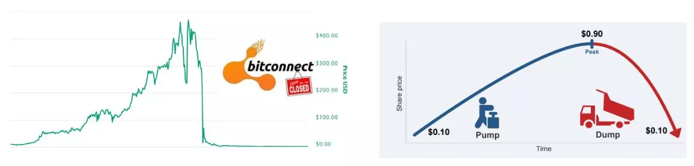
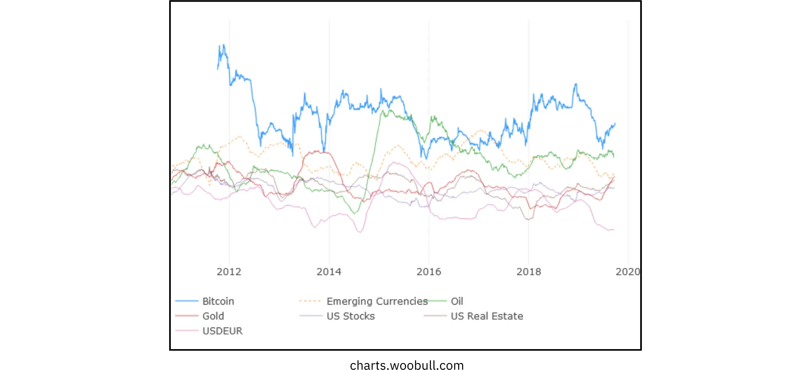
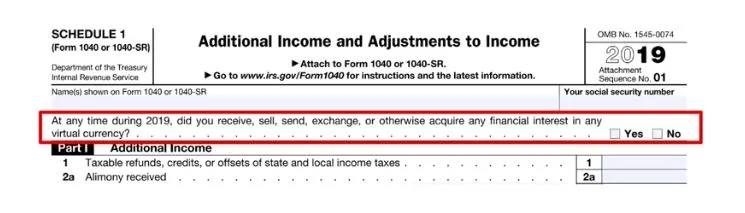
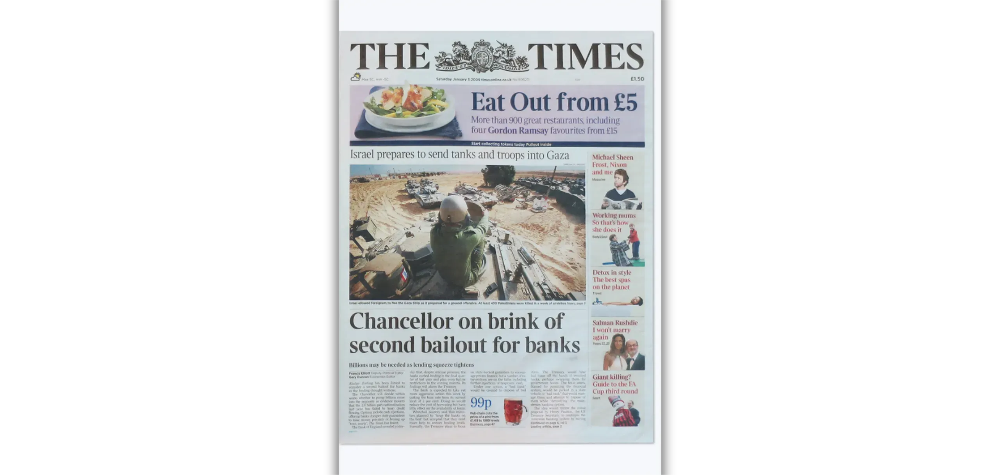
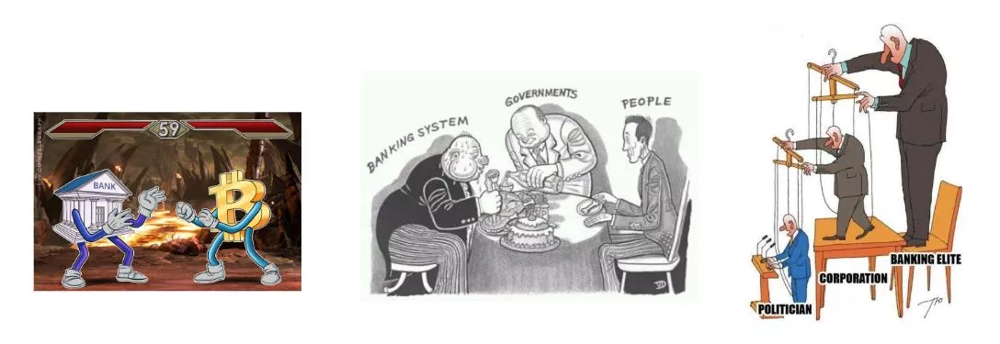
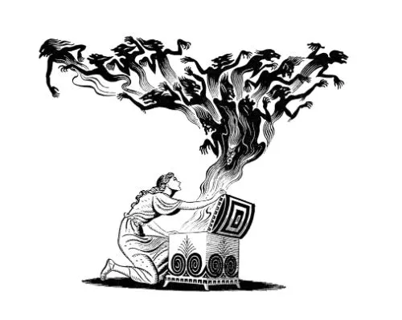
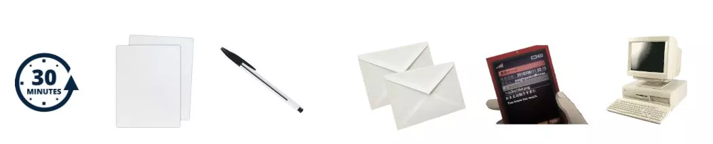

# Teekond oma esimeste bitcoin'ideni

Bitcoin ökosüsteem kogeb suurejoonelist ja enneolematut kasvu. Satoshi Nakamoto leiutisest ajendatud tehnoloogilised, majanduslikud ja sotsiaalsed muutused intensiivistuvad päevast päeva ning avavad järk-järgult uksed uude maailma, mida saate nüüd täielikult ära kasutada.

Sukeldumine Bitcoin Rabbit Hole'i on põnev intellektuaalne seiklus, mis stimuleerib teie kriitilist mõtlemist ja seab kahtluse alla paljud teie veendumused. See uurimine ei anna teile mitte ainult sügavat arusaamist sellest, kuidas Bitcoin töötab, vaid ka tõelise võimaluse nõuda tagasi oma isiklikku vabadust, kaitsta oma eraelu puutumatust ja saavutada tõeline finantssuveräänsus.

Et teid tõhusalt läbi selle teekonna juhendada, olen loonud selle täiesti tasuta kursuse. Siin keskendutakse ainult Bitcoin-le. Ei mingeid asjassepuutumatuid arutelusid, ei mingit mainimist teistest krüptovaluutadest, vaid ainult selge, täpne ja sirgjooneline sisu.

Selle kursuse eesmärk on anda teile täielik kontroll selle üle, kuidas te õpite, võimaldades teil uurida Bitcoin omaenda tempo järgi, järgides oma huvidele ja eesmärkidele kõige paremini vastavat teed.

+++
# Sissejuhatus

<partId>008c49b7-5e17-5973-87f2-ba28429b2697</partId>

## Kursuse ülevaade

<chapterId>bfc96999-0ee1-5c41-8297-1b629f50cffc</chapterId>

Tere tulemast BTC102-sse! Kui te olete juba läbinud BTC101, siis olete uurinud peamisi teoreetilisi kontseptsioone, miks Bitcoin on nii revolutsiooniline tehnoloogia. Nüüd, BTC102, on aeg need teadmised ellu viia. See kursus on mõeldud selleks, et aidata teil samm-sammult koostada oma isiklik Bitcoin plaan.

Järgnevates peatükkides juhatame teid läbi praktiliste sammude, et **saada oma esimesed bitcoinid**, **kaitseda** neid korralikult ja astuda julgelt esimesed sammud selles kiiresti kasvavas ökosüsteemis.

https://planb.network/courses/2b7dc507-81e3-4b70-88e6-41ed44239966

Kuigi Bitcoin on eksisteerinud juba üle 16 aasta, on see tööstusharu endiselt noor, dünaamiline ja sügavalt vabaduses juurdunud. Selle aluseks olev protokoll on täielikult detsentraliseeritud ja ei allu ühegi keskvõimu kontrollile, mis võimaldab ökosüsteemil kasvada loomulikul ja orgaanilisel viisil.

Kuigi see vabadus toidab uskumatut innovatsiooni ja võimaluste lainet, kaasnevad sellega ka teatavad riskid, sealhulgas pettused, tavalised vead ja lõksud, mis tulenevad sageli teadmiste puudumisest. Selle kursuse peamine eesmärk on aidata teil selles uues ökosüsteemis enesekindlalt ja turvaliselt navigeerida.

Selle saavutamiseks on BTC102 kursus jagatud mitmeks osaks, millest igaüks keskendub teie Bitcoin teekonna peamisele aspektile:

Esimene osa "Bitcoin mõistmise eeldused" valmistab teid tõhusalt ette edasiseks teekonnaks. Te saate teada, millised on peamised pettuste ja finantspettustega seotud lõkse, mis võivad olla Bitcoin ökosüsteemis olemas. Seejärel käsitleme veebiturvalisuse olulisi põhitõdesid.

Lõpuks annan teile mõned praktilised nõuanded, mis on mõeldud spetsiaalselt algajatele, et aidata teil vältida tavalisi vigu, kui te esimest korda Bitcoin-ga töötate.

Teine osa "Mõistmine, millesse te satute" süvendab teie üldist arusaamist Bitcoin-st. Alustame ülevaatega, et tagada teile täielik arusaamine olulistest mõistetest.

Seejärel selgitame, miks Bitcoin on tehnoloogilisest, majanduslikust ja sotsiaalsest vaatenurgast põhimõtteliselt oluline, tugevdades teie veendumusi selle väärtuses. Samuti uurite Bitcoin tööstust tervikuna: selle võtmeisikuid, organisatsiooni ja arengut aastate jooksul. Lõpuks käsitleme Bitcoin ökosüsteemi mitmekihilist ülesehitust, mis on oluline kontseptsioon, et mõista, kuidas see süsteem jätkab uuendusi, ilma et see kahjustaks selle põhiprotokolli terviklikkust.

Kolmas osa "Oma plaani koostamine" keskendub teie isiklikule lähenemisele Bitcoin-le. Alustame sellest, et aitame teil määratleda oma kasutajaprofiili neljast põhikategooriast:

- hodler*, mis keskendub Bitcoin pikaajalise hoidmise eesmärgil ;
- virnastaja*, kes ostab regulaarselt ja metoodiliselt;
- kasutaja*, kes eelistab Bitcoin igapäevast kasutamist;
- ja lõpuks *paranoiline*, kes tahab maksimaalset turvalisust, et tõhusalt kaitsta oma vara ja eraelu puutumatust.

Juhendame teid sellise strateegia rakendamisel, mis sobib teie profiiliga ja aitab teil saavutada teie isiklikke eesmärke.

Neljas osa "Teie pärijate ja varanduse kaitsmine" hõlmab olulist teemat, mis sageli tähelepanuta jääb: kuidas tagada, et teie Bitcoin läheb ootamatu sündmuse korral teie lähedastele üle. Te saate teada, kuidas luua ja seadistada Bitcoin pärimisplaan, tagades oma varanduse säilimise pärast teie eluiga.

Selle kursuse lõpuks on teil kõik praktilised vahendid, mida vajate, et navigeerida Bitcoin ökosüsteemis kindlalt ja saada üheks selle kõige edasijõudnumatest kasutajatest!

Kas olete valmis alustama oma teekonda Bitcoin maailma? Läheme!

# Bitcoin mõistmise eeldused

<partId>4481fc4b-0f83-489e-ad07-81517c5d6bad</partId>

## Pettused ja finantspettused

<chapterId>8af2948b-2ab5-54c4-862c-3414b8a285a2</chapterId>

Bitcoin ökosüsteem ja seda ümbritsev keskkond on sõltuvalt riigist veel suhteliselt noor ja nõrgalt reguleeritud. Kuigi see vabadus avab tohutuid võimalusi, loob see ka soodsa pinnase finantspettustele, pettustele ja mitmesugustele manipulatsioonivormidele. Seepärast on esimene peatükk nii oluline: tavapäraste lõkse mõistmine aitab teil neid vältida. Teie rahaline turvalisus on esmatähtis, sest halb kogemus ei mõjuta mitte ainult teid, vaid kogu Bitcoin kogukonda.

### Bitcoin vs krüptod: erinevuste mõistmine

Enne kui minna edasi, on oluline selgelt eristada kahte põhimõtteliselt erinevat maailma:

- Bitcoin ökosüsteemi** keskmes on usaldusväärse raha idee, mis põhineb tugeval detsentraliseerimisel, pikaajalisel vastupidavusel, privaatsusel ja individuaalsel suveräänsusel. Alates selle käivitamisest 2009. aastal on Bitcoin tegutsenud usaldusväärselt ja turvaliselt, mida toetab ülemaailmne pühendunud arendajate kogukond. See ei ole mööduv trend, vaid stabiilne ja väljakujunenud protokoll, mis on loodud väärtuse säilitamiseks aja jooksul.

- Krüptovaluutatööstus** on seevastu palju suurem ja hõlmab kümneid tuhandeid erinevaid projekte, millest igaühel on oma token. Seda ruumi ajendavad sageli kiire innovatsioon, hype ja lühiajalised finantsspekulatsioonid. Paljud neist projektidest on tsentraliseeritud, vähem turvalised ja ei paku palju tegelikku väärtust - vaatamata julgetele lubadustele ja silmatorkavale turundusele.

Kui soovite paremini mõista, kust Bitcoin pärineb ja mis teeb selle tõesti teistest projektidest erinevaks, siis soovitan hiljem vaadata seda tasuta jätkukursust Bitcoin ajaloo kohta:

https://planb.network/courses/a51c7ceb-e079-4ac3-bf69-6700b985a082

Nagu te teate, on Plan ₿ Network platvorm pühendatud ainult Bitcoin-le. Siiski aitab teiste krüptovaluutade erinevuse mõistmine vältida kasutute ja mõnikord isegi petturlike projektidega seotud lõkse.

### Peamised pettused, mida vältida

Siin on kõige levinumad pettused, millega võite oma reisil kokku puutuda:

#### Püramiidskeemid ja Ponzi skeemid

Need on mõned kõige levinumad pettused krüptomaailmas. Ponzi skeemi puhul saavad varajased osalejad väljamakseid uuemate osalejate raha abil; mitte mingist reaalsest investeeringust või tootest. Tegelikku väärtust ei looda. Süsteem toimib ainult seni, kuni uued inimesed jätkavad liitumist. Kui uute osalejate voog aeglustub, langeb kogu skeem kokku.

Need petuskeemid on tavaliselt :

- Ebarealistlikud lubadused garanteeritud tootluse kohta (nt 20% garanteeritud tootlus);
- Viivitused või raskused investeeritud raha väljavõtmisel;
- Tugevad stiimulid uute liikmete värbamiseks, et hoida süsteemi käigus;
- Täielik läbipaistvuse puudumine lubatud tulude tegeliku allika kohta.

Lõppkokkuvõttes on kõik püramiid- ja Ponzi-skeemid hukule määratud. Nende põhiline nõrkus seisneb pidevas vajaduses tuua uusi investoreid, et maksta tulu varasematele osalejatele. Seda vajadust on aja jooksul matemaatiliselt võimatu säilitada, sest süsteemi kasvades suureneb eksponentsiaalselt vajalike uute osalejate arv. Kui saavutatakse kriitiline punkt, hakkavad osalejad kahtlema, usaldus kaob ja kogu püramiid kukub kokku. Selles etapis kaotavad viimasena liitunud inimesed, kes on sageli kõige vähem informeeritud, kogu oma investeeringu, mida ei ole võimalik tagasi saada, samal ajal kui korraldajad või varajased investorid on tavaliselt juba oma raha tagasi võtnud ja süsteemist lahkunud.

Krüptoraha maailmas võivad Ponzi-skeemid võtta mitmeid vorme, mis on sageli kavandatud selleks, et varjata oma pettust tehnoloogilise või rahalise maski taha. Need petuskeemid võivad esineda uute tokenite pakkumiste või ICOde (Initial Coin Offerings) kujul, mis on rahakogumisoperatsioonid, mille käigus müüakse avalikkusele uut krüptovaluutat. Selliste tehniliste terminite nagu "Blockchain", "arukad lepingud" või "panustamine" taga peituvad mõned projektid tegelikult keerulised püramiidskeemid. Teised väidavad, et pakuvad kõrget tulu, kombineerides küsitavaid krüptovarasid hüvitissüsteemidega, mis sõltuvad täielikult uute investorite pidevast sissevoolust.

Viimasel ajal on Ponzi skeemid levinud ka detsentraliseeritud finantside (DeFi) maailma. Kuigi DeFi eesmärk on pakkuda finantsteenuseid ilma vahendajateta, kasutavad mõned projektid seda selleks, et anda oma petuskeemidele vale legitiimsuse tunne. Teatud DeFi platvormid lubavad Exchange-s kõrgeid, garanteeritud tulusid krüptoraha hoiuste eest automaatsetesse protokollidesse. Neid atraktiivseid lubadusi toetavad sageli läbipaistmatud ja kontrollimata mehhanismid, kusjuures märgid on loodud spetsiaalselt kelmuse jaoks. Tegelikkuses ei ole neil süsteemidel mingit jätkusuutlikku ärimudelit - tulu makstakse lihtsalt uute kasutajate vahenditest, nagu traditsioonilises Ponzi-skeemis. Kui usaldus hakkab kaduma või uute osalejate sissevool aeglustub, kukuvad need süsteemid paratamatult kokku, mis toob pahaaimamatutele investoritele kaasa märkimisväärse kahju.

Pange tähele, et selle kursuse sisu on mõeldud ainult hariduslikel eesmärkidel ja seda ei tohiks tõlgendada kui finantsnõustamist. Teie rahaline turvalisus sõltub teie võimest olla ettevaatlik, skeptiline ja hästi informeeritud iga finantsotsuse puhul, mida teete.

Parim kaitse on alati küsida seda lihtsat küsimust: Kust see lubatud tulu tegelikult tuleb? Kui vastus on ebaselge, põgenege kohe.

#### Pump & Dump

Seda tüüpi pettus hõlmab vara - sageli madala likviidsusega krüptoraha tokeni - hinna kunstlikku ülespuhumist kooskõlastatud turunduskampaania abil, mida tavaliselt juhib grupp investoreid. Tüüpiline Pump & Dump skeem järgib seda mustrit:

- Siseringi või mõjukate isikute rühm kogub vaikselt suure hulga sihtvara.
- Seejärel käivitavad nad agressiivse reklaamikampaania generate hype'i tekitamiseks ja hinna tõstmiseks.
- Üldsus, ajendatuna FOMO (Fear of Missing Out), hakkab vara suurel hulgal ostma, mis tõstab hinda veelgi kõrgemale.
- Hype'i tipphetkel müüvad asjatundjad oma osalused korraga maha.
- Hind kukub kokku, jättes hilinejatele suuri kahjusid.

Oluline on märkida, et Pump & Dump strateegiad on paljudes riikides ebaseaduslikud ja neid peetakse turuga manipuleerimise vormiks. Sellised skeemid jätkavad sellest hoolimata õitsemist, eriti krüptovaluutade valdkonnas, kus reguleerimine on alles järele jõudmas.

Olge eriti ettevaatlik selliste platvormide nagu Telegram, Discord või muud sotsiaalmeediakanalid, privaatsete "signaaligruppide" suhtes. Neid juhivad sageli mõjutajad või isehakanud eksperdid, kellest mõned võtavad isegi osalustasu. Kuigi need rühmad väidavad, et pakuvad eksklusiivseid investeerimisvõimalusi, on tegelikkus palju ühekülgsem: ainult korraldajad saavad kasu, samas kui enamik osalejaid kaotavad lõpuks oma raha.

On tõsi, et mõned osalejad võivad sellistest turumanipulatsioonidest ajutiselt kasu saada, kuid nende edu põhineb tavaliselt vaid õnne ja täiuslikul ajastamisel. Pikemas perspektiivis ei ole need skeemid jätkusuutlikud. Nad nõuavad pidevat kõrge riskiga osalemist ja korduvat osalemist pettuse korraldustes, mis paratamatult kokku kukuvad.

Veelgi hullem on see, et nad toidavad ohtlikku illusiooni: uskumust, et on võimalik teenida kiirelt ja lihtsalt raha, mõistmata, kuidas finantssüsteemid tegelikult toimivad. Selline mõtteviis ei sea mitte ainult üksikisikuid ohtu, vaid õõnestab ka kogu krüptoraha ökosüsteemi usaldusväärsust

Kõigil neil põhjustel on parim strateegia jääda investeerimisse tõsise ja läbimõeldud lähenemisviisi juurde, mis põhineb finantsharidusel, fundamentaalteadmistel ja pikaajalisel perspektiivil.

Oma teadmisi kannatlikult suurendades olete palju vähem haavatavam emotsionaalse manipuleerimise ja ebareaalsete lubaduste suhtes ning palju paremini varustatud, et vältida finantslõksu, mis võivad viia tegelike kaotusteni.

#### Annetused, loteriid ja võltsitud auhinnakelmused

Seda tüüpi pettus lubab tasuta Bitcoin või muid hüvesid Exchange-s, kui saadate esmalt väikese rahasumma. Oluline on meeles pidada: ükski seaduslik isik või organisatsioon ei palu teil kunagi saata krüptoraha ette, lubades teile vastutasuks rohkem raha saata.

Petturid kehastavad sageli tuntud avaliku elu tegelasi (nagu Elon Musk või teised kuulsused), et meelitada ohvreid sotsiaalmeedia kaudu. Kontrollige alati enne kontode ja veebisaitide seaduslikkust ning ärge kunagi usaldage pakkumisi, mis tunduvad liiga helded või liiga head, et olla tõsi.

Mõnikord esinevad need petuskeemid "ettemaksupettustena". Sulle lubatakse auhinda või tasu (raha, toode või teenus), kuid esmalt palutakse maksta tasu, mis on väidetavalt mõeldud näiteks saatmise, maksude või tehingukulude katmiseks. Kui makse on tehtud, siis pettur kaob ja lubatud tasu ei saabu kunagi.

#### Shitcoinid ja krüptovaluutad pakkumisel

Tsentraliseeritud krüptovaluutaprojektid pakuvad mõnikord kasutajate ligimeelitamiseks tasuta märke ("*airdrops*").Need märgid omavad tavaliselt vähe või üldse mitte mingit tegelikku väärtust ja neid kasutatakse peamiselt populaarsuse illusiooni loomiseks või spekulatsioonide õhutamiseks. Olge äärmiselt ettevaatlik sedalaadi reklaamipakkumiste puhul; sageli on need pigem turunduslõksud kui tõelised võimalused.

#### Identiteedivargused ja andmepüük

Ründajad kasutavad sageli võltsitud veebisaite, sotsiaalmeedia kontosid või petlikke e-kirju, et üritada teie raha varastada. Need petuskeemid võivad toimuda mis tahes suhtluskanalite kaudu: e-posti, sotsiaalvõrgustike, telefonikõnede või isegi traditsioonilise posti kaudu...

Enne lingile klõpsamist või mis tahes toimingu sooritamist kontrollige alati kaks korda saatja isikut. Kahtluse korral külastage veebilehte käsitsi, mitte ei kasuta esitatud linki. Kõige tähtsam on, et ärge kunagi jagage oma isiklikke võtmeid või paroole kellegagi.

#### Bitcoin kõvavardad

Aastate jooksul on Bitcoin kogenud mitmeid *Hard hargnemisi*, mille tulemusel on loodud algse krüptoraha alternatiivseid versioone. Lihtsustatult öeldes on *Hard Fork* võrgu jagunemine, mis viib kahe eraldi plokiahela tekkimiseni, mis mõlemad jagavad sama ajalugu kuni jagunemise hetkeni. Sellised hargnemised toimuvad tavaliselt siis, kui osa arendajaskonnast või laiemast Bitcoin ökosüsteemist soovib teha algsesse protokolli suuri muudatusi, kuid ei suuda saavutada laialdast konsensust. Selle asemel, et loobuda oma ideedest, otsustavad nad käivitada uue Bitcoin versiooni (muudetud reeglitega), lootes, et kasutajad ja kaevandajad otsustavad selle asemel järgida nende Fork.

Kõik *Hard hargnemised* ei ole pettused, sest mõned neist tulenevad tehnilistest või ideoloogilistest erimeelsustest kogukonna sees. Teiste taga on aga ärilised huvid või isegi ebaausad motiivid. Kõige tuntumad näited sellistest hardforkidest on **Bitcoin Cash (BCH)** ja **Bitcoin Satoshi Vision (BSV)**. Need 2017. ja 2018. aastal käivitatud alternatiivsed valuutad väidavad sageli, et nad on originaal Bitcoin "paremad versioonid". Nad propageerivad väidetavaid eeliseid, nagu väiksemad tehingutasud või kiiremad tehingud tänu suuremale plokisuurusele. Nende tehniliste muudatustega kaasnevad siiski märkimisväärsed kompromissid turvalisuse, detsentraliseerimise ja tugevuse osas; Elements, mis võivad olla vastuolus Bitcoin aluspõhimõtetega.

Lisaks tehnilistele erinevustele kasutavad need alternatiivsed valuutad sageli ära segadust, et meelitada teadmatuid investoreid. Nad võivad kasutada turundustaktikat, mille eesmärk on meelega eksitada uustulnukaid, kes usuvad, et nad ostavad ehtsat Bitcoin (BTC).

Et vältida sellesse lõksu langemist, kontrollige alati, millist valuutat te ostate. Algne Bitcoin kasutab tickerit **BTC**, samas kui Bitcoin Cash ja selle tuletisinstrumendid kasutavad erinevaid lühendeid, näiteks BCH või BSV.

#### Ebaausad mõjutajad ja võltsgurud

Kuna krüptovaluutad saavad üha enam tähelepanu, on sotsiaalmeedias kasvanud mõjutajate, isehakanud ekspertide ja nn *krüptogurude* hulk. Kuigi mõned neist võivad pakkuda tõelisi harivaid teadmisi, kasutavad paljud teised oma nähtavust ära selleks, et edendada kahtlasi projekte või ohtlikult riskantseid (ja mõnikord lausa petturlikke) kauplemisstrateegiaid.Neid isikuid motiveerivad tavaliselt isiklikud finantshuvid, saades sageli otsest või kaudset hüvitist teatud tokenite või platvormide edendamise eest.

Need mõjutajad tuginevad sageli tõestatud taktikatele, et meelitada algajaid: nad esitlevad muljetavaldavaid finantstulemusi (mis on sageli võltsitud või kontrollimata), uhkeldavad luksusliku elustiiliga kui väidetava tõendusmaterjaliga oma edu kohta ja reklaamivad "ime" investeerimisstrateegiaid. Eesmärk on tekitada FOMO - hirm puudu jäämise ees - ning ajendada oma publikut impulsiivsetele otsustele ja hoolimatutele investeeringutele.

Oluline on mõista, et enamik nende isiksuste "tasuta" nõuandeid ei ole kunagi tõeliselt tasuta. Suuremeelsuse fassaadi taga peitub sageli kalkuleeritud strateegia, et suunata inimesi küsitavate varade ostmisele. Ja isegi kui mõned mõjutajad oleksid ausad, oleks nende tulemuste kordamine peaaegu võimatu; nende edu sõltub sageli konkreetsest ajastusest, siseteadmistest või unikaalsetest asjaoludest, millele teil lihtsalt puudub juurdepääs.

Mõned mõjutajad võivad teid kutsuda liituma tasuliste eragruppidega, kus nad väidavad, et jagavad eksklusiivseid kauplemissignaale või siseringi vihjeid, mis lubavad kiiret ja lihtsat kasumit. Tegelikkuses on need rühmad peamiselt kasulikud korraldajatele endile. Sageli kasutavad nad oma järgijaid likviidsuse allikana, sisuliselt müües varasid isikliku kasu saamiseks. Tellijad kaotavad tavaliselt lõpuks raha, sest nad ei suuda reageerida nii kiiresti kui kauplemist korraldavad insaiderid (vt jaotist Pump & Dump skeemide kohta).

Selle reaalsuse valguses on siin mõned head harjumused, mida võtta omaks, et vältida ebaausate mõjutajate püünistesse langemist:

- Ole väga ettevaatlik mis tahes krüptoinvesteeringute soovituste puhul.**

Usaldusväärne ja asjatundlik inimene ei survesta teid kunagi krüptoraha ostmiseks, julgustamata teid esmalt ise järele uurima.

- Tasulised kauplemis- või investeerimiskursused ei ole alati kvaliteedimärk.**

Paljud neist kursustest propageerivad riskantseid või liiga lihtsustatud strateegiaid; sageli on see sama teave, mida on võimalik leida internetis tasuta.

- Ei ole olemas sellist asja nagu garanteeritud võimalus kopeerida kellegi tehinguid ja saada identseid tulemusi.**

Iga investeerimisstrateegia sõltub isiklikust kontekstist, ajastusest, teadmistest ja muudest teguritest, mida ei saa täpselt dubleerida.

- Olge eriti ettevaatlik nõuannete suhtes, mis kõlab liiga hästi, et olla tõsi.**

Ebarealistlikud lubadused või garanteeritud kasum on peaaegu alati manipuleerimise tunnused. Pidage meeles: see, et keegi ütleb midagi enesekindlalt, ei tee seda veel tõeks.

Pidage alati meeles, et kõigil, kellega Bitcoin või laiemas krüptoökosüsteemis kokku puutute, on isiklik tegevuskava, olenemata sellest, kas see on otsesõnu välja öeldud või varjatud ridade vahele. Ei ole olemas sellist asja nagu puhtalt neutraalne teave. Isegi sellel kursusel, BTC102, on selge eesmärk, * edendada Bitcoin paremat mõistmist*

Seepärast on oluline olla teadlik tegelikest motiividest, mis peituvad iga tarbitava sisu taga. Ja ärge kunagi unustage seda interneti kuldreeglit:

*Kui toode või teenus tundub tasuta, siis on tõenäoline, et see on just teie toode.*

Lõppkokkuvõttes on teie parim kaitse isiklik haridus, tervislik skeptitsism ja mis kõige tähtsam, harjumus ise fakte kontrollida.

### Kuidas vältida pettusi

**Selleks, et olla turvaline internetis, eriti krüptomaailmas, pidage meeles järgmisi põhiprintsiipe:**

- Ära kunagi usalda pimesi: "*Ei usalda, kontrolli*" ;
- Ole skeptiline garanteeritud või ebatavaliselt kõrge tootluse suhtes;
- Ärge kunagi jagage oma isiklikke võtmeid kellegagi;
- Ärge saatke Bitcoin (või mis tahes krüpto) tundmatutele aadressidele;
- Kahtluse korral tehke paus. Enne tegutsemist astuge sammu tagasi ja mõelge. FOMO on teie suurim vaenlane;
- Vältige tasulisi kauplemisrühmi või kogukondi, mis annavad ebarealistlikke lubadusi;
- Enamasti on online-loteriad või "tasuta" loosimised pettused või tugevalt manipuleeritud;
- Pikemas perspektiivis võidate alati rohkem, kui õppides, kui mängides.

Enda kaitsmine pettuste eest on esimene oluline samm oma vara kaitsmisel, kuid sellest ei piisa. Sama oluline on ka tugeva digitaalse hügieeni säilitamine. Seepärast uurime järgmises peatükis, kuidas tugevdada oma veebiturvalisust ja milliseid parimaid tavasid peaksite omaks võtma, et end digitaalses maailmas kaitsta.

## Online-turvalisus

<chapterId>f0873bf2-6a6f-5485-bb7a-d84be14f404d</chapterId>

Niipea kui hakkate Bitcoin-ga tegelema, mõistate kiiresti, et põhiline küberturvalisus ei ole vabatahtlik - see on hädavajalik. Pettused ja pettused on vaid jäämäe tipp. Juhuslik andmekaotus, pahavara ja kompromiteeritud paroolid võivad olla sama hävitavad, eriti kui te ise oma võtmeid haldate.

Selles peatükis tutvustatakse teile mõningaid lihtsaid praktilisi samme, et parandada oma digitaalset hügieeni ja kaitsta end selles ruumis.

Kui soovite süveneda, pakub Plan ₿ Network kursus SEC101 põhjalikku küberturvalisuse strateegiate jaotust, mis on mõeldud spetsiaalselt Bitcoin kasutajatele.

https://planb.network/courses/99c46148-7080-4915-a7e0-9df0e145cd47

### Miks küberturvalisus on oluline

Bitcoin annab teile võimaluse hoida oma raha otse (ilma pankadeta), ilma vahendajateta. Kuid sellise finantssuveräänsusega kaasneb ka tõsine vastutus: kui teie BTC varastatakse turvakatkestuse tõttu, ei ole võimalik tehingut tagasi pöörata. Erinevalt traditsioonilisest pangandusest ei ole olemas abiteenistust, pettusekohustust ega kindlustust, mis teid välja aitaks.

Lisaks sellele muudab Bitcoin rahaline väärtus selle suure väärtusega sihtmärgiks. Häkker, kes kahjustab teie Wallet, võib teie vahendid kohe üle viia nende kontrolli all olevasse Address-sse (küsimusi ei esitata, neid ei ole võimalik tagasi saada).

### Puhas, ajakohane arvuti

Üks enim tähelepanuta jäetud isikliku turvalisuse aspekte on operatsioonisüsteemi ja tarkvara ajakohasena hoidmine. Paljud uuendused parandavad teadaolevaid haavatavusi, mida ründajad võivad muidu ära kasutada. Kuigi mõned inimesed väldivad uuendusi, kartes jõudlusprobleeme, seisneb tegelik oht selles, et kasutatakse vananenud tarkvara, mida häkkerid juba teavad, kuidas murda.

Samuti on väga soovitatav kasutada usaldusväärset viirusetõrjet. Windowsi puhul on sisseehitatud Windows Defender enamiku kasutajate jaoks üldiselt piisav. Kui soovite lisafunktsioone või meelerahu, on saadaval ka kommertsvalikud, näiteks Kaspersky. MacOSi puhul on pahavaraohud ajalooliselt vähem levinud **, kuid mitte olematud**, nii et on siiski mõistlik olla ettevaatlik.

Lisaks süsteemiuuendustele ja viirusetõrjele olge äärmiselt ettevaatlik tarkvara allalaadimise suhtes kahtlastelt veebisaitidelt või nn universaalsetest allalaadimisportaalidest. Kui teil on vaja mingit tööriista või rakendust, minge alati otse ametlikust allikast;See vähendab oluliselt ohtu, et paigaldate seaduslikuks tarkvaraks maskeeritud pahavara.

Teine tark harjumus on kontrollida igasuguse tarkvara autentsust ja terviklikkust enne selle paigaldamist oma masinasse. Kui te ei ole kindel, kuidas seda teha, siis ärge muretsege, meil on selleks spetsiaalne õpetus, mis juhatab teid selle protsessi läbi:

https://planb.network/tutorials/computer-security/data/integrity-authenticity-21d0420a-be02-4663-94a3-8d487f23becc

Lõpetuseks, tehke oma tähtsatest andmetest regulaarselt varukoopiaid. Väline Hard-ketas või SSD-ketas on kindel valik, et hoida oma failide duplikaati ootamatu rikke, häkkimise või juhusliku kustutamise korral. Hiljem tänate ennast.

Kui eelistate pilvelahendusi, kaaluge sellise turvalise teenuse nagu Proton Drive kasutamist. Veenduge vaid, et mis tahes valitud variant austaks teie privaatsust ja pakuks tugevat krüpteerimist.

https://planb.network/tutorials/computer-security/data/proton-drive-03cbe49f-6ddc-491f-8786-bc20d98ebb16

Laialdaselt soovitatav varundusstrateegia on "3-2-1 reegel". Selle eesmärk on kaitsta teie andmeid juhusliku kaotsimineku, küberrünnakute või isegi loodusõnnetuste eest.

Idee on lihtne:

- Hoidke oma olulistest andmetest **mitte vähemasti 3 koopiat**,
- Hoidke neid **mittepidi** vähemalt kahel erineval andmekandjal (nt väline Hard-ketas ja pilvemälu),
- Ja veenduge, et **1 neist koopiatest on salvestatud väljaspool** (füüsiliselt eraldatud teie peamisest asukohast).

Selline lähenemisviis pakub tugevat vastupidavust ja aitab tagada teie andmete säilimise isegi siis, kui midagi läheb tõsiselt valesti.

### Lahendus ID-õhtu õudusunenäole

Üks suurimaid põhjusi, miks inimesi häkitakse, on nõrkade paroolide kasutamine. Suur osa kasutajaid kasutab ikka veel sama parooli mitme konto puhul või valib paroolide variante, mida on lihtne ära arvata. Paroolihaldurid on selle probleemi ideaalne lahendus.

Paroolihaldur võimaldab teil:

- Säilitage kõiki oma paroole turvaliselt** krüpteeritud võlvkambris
- generate pikad, keerulised ja unikaalsed paroolid** automaatselt igale kontole
- Kasutage vaid ühte peaparooli**, et pääseda kõigele turvaliselt ligi

Paroolihalduri abil ei pea te enam kunagi klõpsama "Unustatud parool" või tuginema nõrkadele, korduvkasutatavatele kasutajatunnustele. Lisaks sünkroonib enamik paroolihaldureid sujuvalt kõiki teie seadmeid (lauaarvuti, telefon, tahvelarvuti) ja täidab isegi sisselogimisvormid automaatselt, muutes turvalise juurdepääsu nii lihtsaks kui ka tõhusaks.

Seal on palju paroolihaldureid, kuid ma võin soovitada kahte kindlat valikut, sõltuvalt teie vajadustest. Kui otsite midagi, mida on lihtne kasutada ja mis sünkroonib sujuvalt mitmete seadmete vahel, on Bitwarden suurepärane valik:

https://planb.network/tutorials/computer-security/authentication/bitwarden-0532f569-fb00-4fad-acba-2fcb1bf05de9

Kui eelistate hoida kõike lokaalselt oma seadmes, on KeePass suurepärane võimalus:

https://planb.network/tutorials/computer-security/authentication/keepass-f8073bb7-5b4a-4664-9246-228e307be246

### 2FA: kahekordne kaitse

Bitcoin-s oled sa ise oma pank. See tähendab, et olete ka oma turvameeskond. Isegi tugeva parooliga ei ole olemas nullriski, mistõttu on kahefaktorilise autentimise (2FA) võimaldamine hädavajalik.

2FA lisab teise Layer kaitse, nõudes ajapõhist ühekordset koodi (tavaliselt 6 numbrit), mille genereerib rakendus nagu Google Authenticator või Authy. Nii et isegi kui kellelgi õnnestub teie parool kätte saada, ei saa ta ikkagi teie kontole ligi ilma füüsilise juurdepääsuta teie telefonile.

https://planb.network/tutorials/computer-security/authentication/authy-a76ab26b-71b0-473c-aa7c-c49153705eb7

Kui lubate 2FA, salvestage rakenduse taastamisvõti kindlasti turvalisse kohta. See võimaldab teil taastada oma koodid, kui kaotate või vahetate telefoni. Kuigi SMS- või e-posti-põhine 2FA on parem kui mitte midagi, on see palju vähem turvaline. SIM-vahetusrünnak, mille puhul keegi võtab teie telefoninumbri üle kontrolli, võib hõlpsasti sellisest kaitsest mööda minna.

Neile, kes soovivad turvalisust veelgi kõrgemale viia, pakuvad füüsilised võtmed, nagu YubiKey, veelgi kõrgemat kaitsetaset.

https://planb.network/tutorials/computer-security/authentication/security-key-61438267-74db-4f1a-87e4-97c8e673533e

### Teie eraelu puutumatuse kaitsmine

Privaatsus ja küberturvalisus on omavahel tihedalt seotud: mida rohkem teavet jätate vabalt kättesaadavaks, seda tõenäolisemalt saate sihtmärgiks.

**VPN** (*Virtuaalne privaatvõrk*) on lihtne, kuid tõhus vahend IP Address maskeerimiseks ja internetiliikluse krüpteerimiseks. Kuigi see ei tee teid täiesti nähtamatuks (kuna VPN-teenuse pakkuja võib teie tegevust endiselt näha), muudab see oluliselt raskemaks kõigi nende jaoks, kes üritavad teie järele luurata või teie sirvimisharjumusi jälgida.

Oluline on valida usaldusväärne VPN-teenuse pakkuja, mis:

- Ei nõua teie isikuandmeid
- Võimaldab maksmist BTC kaudu
- On range logisid mittekasutav poliitika

Meil on Plan ₿ Network-s mitu õpetust, mis aitavad teil hõlpsasti VPN-i seadistamist läbi viia. Eriti soovitan IVPN-i või Mullvadi:

https://planb.network/tutorials/computer-security/communication/ivpn-5a0cd5df-29f1-4382-a817-975a96646e68

https://planb.network/tutorials/computer-security/communication/mullvad-968ec5f5-b3f0-4d23-a9e0-c07a3e85aaa8

Olulised sammud oma privaatsuse kaitsmiseks internetis on ka järgmised:

- Kasutades **krüpteeritud sõnumivahetusplatvorme**, nagu Signal, SimpleX või Session;
- Kasutades privaatsusele keskendunud brausereid, nagu Firefox, Brave või Tor (suurema anonüümsuse tagamiseks);

https://planb.network/tutorials/computer-security/communication/tor-browser-a847e83c-31ef-4439-9eac-742b255129bb

- Kasutades **turvalist postkasti** nagu ProtonMail;

https://planb.network/tutorials/computer-security/communication/proton-mail-c3b010ce-254d-4546-b382-19ab9261c6a2

- Oma failide krüpteerimine** selliste vahenditega nagu Bitlocker (Windowsile) või VeraCrypt (saadaval mitmeplatvormiliselt).

https://planb.network/tutorials/computer-security/data/veracrypt-d5ed4c83-7c1c-4181-95ea-963fdf2d83c5

### Samm-sammuline edenemine

Küberturvalisus võib tunduda tohutu ettevõtmine ning algajatel on lihtne üle pingutada ja loobuda, sest see tundub liiga keeruline. Trikk on läheneda sellele samm-sammult. Alustage millestki lihtsast, näiteks paroolihalduri paigaldamisest. Andke endale paar nädalat aega, et sellega harjuda, ja seejärel liikuge edasi järgmise sammu juurde: näiteks 2FA aktiveerimine ühes teie kontos.

Kui saate nende tööriistadega üha kindlamalt hakkama, olete valmis lisama edasijõudnute tavasid, näiteks kasutama sekundaarset e-posti, üleminekut ProtonMailile, VPN-i loomist või vajaduse korral Toriga sirvimist.

Bitcoin maailma süvenedes märkate, et Wallet väärtuse kasvades suurenevad ka riskid. Kindlate turvaharjumuste loomine, privaatsuse kaitsmine ja õigete vahendite seadistamine ei anna teile mitte ainult meelerahu, vaid tugevdab ka suveräänsust, mida Bitcoin endast kujutab.

Lühidalt: ärge alahinnake küberturvalisust, võtke aega põhitõdede loomiseks ja pidage meeles, et järjepidevus on võtmetähtsusega. Ilma hea digitaalse hügieenita ei aita isegi parimad vahendid teile palju.

Vaadake kindlasti ka [meie arvutiturbeõpetusi](https://planb.network/tutorials/computer-security) Plan ₿ Network kohta.

Järgmises peatükis jagan veel mõned nõuanded, mis aitavad teil Bitcoin teekonda enesekindlalt alustada ja vältida paljusid lõkse, mis võivad uustulnukatele silma jääda.

## Näpunäited uutele tulijatele

<chapterId>33134b3f-92c1-5185-afb6-88599e47e801</chapterId>

Bitcoin-sse sisenemine võib olla põnev, kuid sellega kaasnevad ka riskid. Krüptomaailm ei ole sarnane ühelegi teisele; metsikud hinnakõikumised, tundmatu tehnoloogia ja väga reaalne võimalus kaotada oma vahendid lõplikult lihtsate vigade või halbade investeerimisvalikute tõttu on kõik lõksud, millest uued kasutajad peaksid olema teadlikud.

Selles peatükis jagan mõningaid praktilisi nõuandeid ja üldisi juhiseid kõigile, kes teevad oma esimesi samme, eriti neile, kes teevad oma esimese ostu või uurivad finantsinvesteeringute laiemat maailma.

Siin on põhipunktid, mida me koos läbi vaatame:

- Ettevaatust **Shitcoins** ja muude kasutute krüptovaluutade suhtes;
- Investeeri ainult **raha, mida võid endale lubada kaotada**;
- Teadke erinevust **kaubanduse** ja **investeerimise** vahel;
- Olge teadlik oma investeeringute **maksumõjudest**;
- Kaitske hoolikalt oma **kaitsesõnu**;
- Jääge tagasihoidlikuks ja hoidke **madalat profiili** (diskreetsus on osa turvalisusest);
- Mõelge pikemas perspektiivis**, suurendage ja olge kannatlik (mõelge sellele kui maratonile, mitte kui sprindile).

### Levinumad vead, mida vältida

Bitcoin on avatud kõigile, kuid see ei tähenda, et te peaksite sinna ettevalmistamata sukelduma. Siin on mõned klassikalised vead, mida uustulnukad teevad:

**Tehnoloogilised vead:**

- seed fraasi kaotamine:** Teie taastamisfraas (tavaliselt 12 või 24 sõna) on ainus viis pääseda ligi oma Bitcoin-le, kui teie Wallet-ga midagi juhtub. Kui te kaotate selle, on teie vahendid lõplikult kadunud;
- Bitcoinide hoidmine kolmanda osapoole platvormil:** Kui teie mündid on tsentraliseeritud platvormil, ei ole need tegelikult teie omandis. Te olete avatud sellistele riskidele nagu häkkimised, platvormi tõrked või isegi fondide arestimine;
- Privaatsuse unarusse jätmine:** Privaatsuse kaitsmine on oma vara kaitsmise põhiline osa. Avalikustamine, kui palju Bitcoin teil on, võib teid sihtmärgiks muuta;
- Ebapiisav veebiturvalisus:** Kui te ei turvata oma seadmeid põhiliste kaitsemeetmetega (nagu uuendused, tugevad paroolid või 2FA), siis olete ründajate jaoks kerge sihtmärk ja see võib teile maksma minna.

**Finantsvead:**

- Investeerida rohkem, kui te võite endale lubada kaotada**: Ärge kunagi võtke võlgu ega pange oma rendiraha Bitcoin-sse. Teie põhiline finantsstabiilsus peaks alati olema esikohal.

- Ei tea vahet kauplemise ja investeerimise vahel**: Kauplemine nõuab aega, oskusi ja tõsist emotsionaalset distsipliini. Pikaajaline investeerimine on tunduvalt algaja-sõbralikum.

- Unustades maksud**: Igal riigil on oma maksueeskirjad krüpto kohta. Nende eiramine võib põhjustada hiljem valusaid üllatusi.

- FOMOsse langemine**: Ostmine impulsiivselt, kuna kardad vahele jääda, toob tavaliselt kaasa halva ajastuse ja halvad otsused. Kannatlikkus on teie parim liitlane.

### Investeerimisstrateegia määratlemine

Enne oma esimese Satoshi ostmist on oluline mõista, miks ja kuidas te Bitcoin-sse investeerite. See tähendab, et teil peab olema selge finantsplaan, mis on kohandatud teie isiklikule olukorrale ja pikaajalistele eesmärkidele.

Alustage oma **eelarve** täpsest määratlemisest. Ärge valige lihtsalt juhuslikku numbrit. Võtke aega, et arvutada oma igakuine sissetulek, lahutada sellest püsikulud (nt üür, laen, maksud, kommunaalkulud) ning igapäevased elamiskulud (toit, transport, vaba aeg jne). See, mis jääb, on teie säästumarginaal ja ainult sellest osast peaksite kaaluma investeerimist.

Selline lähenemine tagab, et te ei sea oma rahalist heaolu ohtu, eriti turu languse korral. Läbimõeldud strateegia on pikaajalise vastupidavuse alus.

Kui teie eelarve on kindlaks määratud, mõelge, kuidas soovite investeerida. Üks kõige algajasõbralikumaid ja laialdaselt soovitatud meetodeid on Dollar Cost Averaging (DCA), mille puhul ostetakse kindla koguse Bitcoin korrapäraselt (kord nädalas, kuus jne). See strateegia aitab ühtlustada teie keskmist sisenemishinda aja jooksul ja vähendab hinnakõikumiste emotsionaalset mõju. See on enamiku inimeste, eriti uustulnukate jaoks arukas lähenemine.

Siis küsige endalt: Milline on minu ajahorisont?

Kas soovite teha kiireid käike turule ja sealt välja (kauplemine)? Või olete rohkem kooskõlas pikaajalise mõtteviisiga hoida Bitcoin mitme aasta jooksul (hodler)? Kui olete hodler, siis olete tõenäoliselt vähem mures igapäevaste hinnakõikumiste pärast ja keskendute rohkem pikaajalisele turvalisusele ja enesekindlusele. Kui te kauplete, olete rohkem avatud lühiajalisele turumüra, kõrgema riski ja stressi suhtes, mis sageli kaasneb kiirete otsuste tegemisega. Ühtne vastus ei ole olemas, kuid teie enda lähenemisviisi tundmine aitab teie otsuseid suunata.

Kõige tähtsam on, et ärge tehke investeerimisotsuseid emotsioonide või hirmu põhjal. Määrake eelnevalt strateegia, kirjutage see üles ja pidage sellest kinni.

Kui sa pole veel kindel, **alusta õppimisega.**

Veeda paar tundi Bitcoin uurides, vaata Plan ₿ Network tasuta ressursse, loe paar raamatut, viska viis eurot lihtsalt proovimiseks ja vaata kvaliteetset sisu internetis. Jääge uudishimulikuks. Mida mugavamalt hakkate, seda lihtsam on oma strateegiat üle vaadata, oma lähenemist kohandada ja enesekindlalt edasi liikuda.

### BTC volatiilsuse mõistmine

Bitcoin on tuntud oma järskude hinnakõikumiste poolest. Liikumine 10%, 20% või isegi 50% vaid mõne päeva jooksul ei ole ebatavaline. Uutele tulijatele võib selline volatiilsus olla segadusttekitav. Pulli tõusu ajal on lihtne lasta end kaasa haarata või languse ajal paanikasse sattuda, mis mõlemad viivad sageli halbade otsusteni, näiteks kahjumiga müümiseni.

Seepärast on väga oluline enne investeerimist **mõistatada ja aktsepteerida Bitcoin volatiilsust**. Need hinnakõikumised ei ole viga, need on alles küpseva vara omadus. Kui äkilised tõusud ja langused hoiavad teid öösel ärkvel või sunnivad teid tegema emotsionaalseid otsuseid, on tõenäoline, et olete investeerinud rohkem, kui teile on mugav riskida. Sellisel juhul võtke sammu tagasi ja hinnake oma strateegia ja riskitaluvus ümber. Ärge kartke oma positsiooni vähendada, kuni tunnete end rahulikumalt.

Ennekõike ärge investeerige kunagi rohkem, kui te võite endale lubada kaotada. Vältige raha laenamist, et osta Bitcoin (eriti kui te alles õpite põhitõdesid). Kindel vundament algab mõõdetud sammudega, mitte hoolimatute panustega.

### Bitcoin Wallet haldamine ja turvamine

Üks Bitcoin kõige võimsamaid (ja sageli alahinnatud) omadusi on **iseseisvumine**. Wallet puhul vastutate oma rahaliste vahendite eest ainult teie. Need rahakotid genereeritakse tavaliselt **tagasivõtmislausest** (tuntud ka kui seed lause), mis on 12 või 24 sõnast koosnev seeria, mis annab täieliku juurdepääsu teie BTC-le. Kui te kaotate selle fraasi (või kui keegi teine saab selle kätte), on teie bitcoinid lõplikult kadunud. **Klienditugi puudub. Ei ole nullinuppu.**

Seepärast on Bitcoin kuldne reegel:

"***Ei teie võtmed, mitte teie mündid***". Kui te ei kontrolli isiklikult oma isiklikke võtmeid, siis ei ole te oma Bitcoin tõeline omanik. Kuigi vahetused võivad olla mugavad (eriti alustades), hoiavad nad teie võtmeid teie eest. See tähendab, et teie raha on ohus, kui platvormi häkitakse, teie konto külmutatakse või see läheb pankrotti.

Selle riski vältimiseks on tungivalt soovitatav luua oma **omavara Wallet**, kus ainult teil on juurdepääs taastamislausetele. See fraas tuleks alati käsitsi üles kirjutada ja hoida **offline** turvalises kohas. Mõned kasutajad koguni **säilitavad mitu varukoopiat**, mida hoitakse lisaturvalisuse tagamiseks eraldi geograafilistes kohtades.

**Mitte kunagi salvestage oma taastamislauset internetiühendusega seadmes või pilves**.

**Ühene häkkimine või andmete rikkumine võib põhjustada pöördumatuid kaotusi.**

Kui olete valmis võtma Ownership oma Bitcoin ja soovite süveneda taastumisfraasi turvamise parimatesse tavadesse, soovitan tungivalt tutvuda selle artikliga:

https://planb.network/tutorials/wallet/backup/backup-mnemonic-22c0ddfa-fb9f-4e3a-96f9-46e2a7954270

### Konfidentsiaalsus ja diskreetsus

Tänapäeva digitaalses maailmas jäetakse **diskreetsus sageli tähelepanuta**, kuid see on oluline osa turvalisuse tagamisel, eriti kui tegemist on Bitcoin-ga. Mida avatumalt räägite oma varadest, seda tõenäolisemalt satute petturite, küberkurjategijate või isegi traditsioonilisemate ohtude, nagu väljapressimine või väljapressimine, sihtmärgiks.

Maailmas on olnud mitmeid juhtumeid, kus isikud, kelle teadaolevalt on suures koguses BTCd, on röövitud või rünnatud.

**Vältige oma Bitcoin Stash**; kas sotsiaalmeedias või isegi juhuslikes vestlustes. Tundliku finantsteabe avalikustamisel ei ole mingeid eeliseid ja riskid on reaalsed.

Samuti on mõistlik **jaotada oma veebitegevus**. Näiteks:

- Kasutage eraldi e-posti Address kõigeks Bitcoin-ga seotud asjaajamiseks, mis erineb teie isiklikest või töökontodest.
- Olge ettevaatlik andmepüügikatsete, kahtlaste linkide ja võltsitud veebisaitide suhtes, mis jäljendavad usaldusväärseid platvorme.
- Olge tähelepanelik! diskreetsus ja valvsus on sageli teie parim kaitse.

Kui oled valmis süvenema Bitcoin privaatsuse teemasse, soovitame jätkata meie 2. aasta privaatsuskursusega, kus õpid edasijõudnute tehnikaid oma identiteedi ja tegevuse turvalisuse tagamiseks:

https://planb.network/courses/65c138b0-4161-4958-bbe3-c12916bc959c

### Maksumõju

Vaatamata sellele, et tegemist on detsentraliseeritud valuutaga, ei ole **Bitcoin vabastatud teie riigi maksuseadustest ja -eeskirjadest**. Igal jurisdiktsioonil on oma lähenemine sellele, kuidas krüptovaluutadest saadud tulu maksustatakse.

Mõnes kohas maksustatakse kasum müügil kapitalikasumina. Teised võivad nõuda, et te deklareeriksite iga tehingu, ja mõnedes kohaldatakse vähem levinud eeskirju, näiteks varamaksu või sotsiaalmaksu.

Enne oluliste tehingute tegemist on tungivalt soovitatav konsulteerida maksuspetsialistiga või tutvuda oma valitsuse ametlike suunistega. Kui te võtate aega, et mõista oma maksukohustusi ette, võib see säästa teid hilisematest ootamatutest probleemidest (nagu trahvid, auditid või trahvid), eriti kui te plaanite suuri müügitehinguid või portfelli ümberpaigutusi.

### Erinevus kauplemise, investeerimise ja hoidmise vahel

Bitcoin on sageli ümbritsetud populaarsete väärarusaamadega; üks levinumaid on idee, et see on kiire tee rikkaks saamiseni kauplemise kaudu. Kuid on oluline mõista selget vahet kauplemisel, investeerimisel ja hoidmisel, sest iga lähenemisviisiga kaasneb oma mõtteviis, oskused ja riskitase.

- Kauplemine :**

Olgem ausad: **sa ei peaks ilmselt kauplema.**

Kauplemine hõlmab lühiajalist spekuleerimist (mõnikord koos finantsvõimendusega), mille eesmärk on saada kasu Bitcoin hinna kõikumisest. Kuigi see võib kõlada ahvatlevana, nõuab edukas kauplemine arenenud tehnilisi teadmisi (nagu diagrammianalüüs ja riskijuhtimine), emotsionaalset distsipliini ja pidevat tähelepanu turule. See on vaimselt koormav ja aeganõudev ning Hard tõde on see, et ** enamus algajaid kaotavad raha**, sest nad alahindavad, kui nõudlik see tegelikult on.

Nagu Warren Buffett kuulsalt ütles:

"**Kui sa ei taha aktsiat kümme aastat hoida, ära isegi mõtle sellele, et hoia seda kümme minutit**."

Bitcoin ei ole kiire rikastumise skeem.

- Investeeringud:**

Investorid võtavad keskmise ja pikaajalise perspektiivi, ostes Bitcoin, uskudes, et selle väärtus kasvab aja jooksul (kuud, aastad või isegi aastakümned). Risk on muidugi ikkagi olemas, sest Bitcoin hind võib märkimisväärselt kõikuda. Kuid selline lähenemine on üldiselt rahulikum ja enamiku inimeste jaoks palju praktilisem, eriti nende jaoks, kes ei taha iga päev tundide kaupa graafikute külge kleepida.

- Holding (HODL) :**

"HODL" sai alguse trükivigastusest "hold" ja muutus kiiresti osaks Bitcoin kultuurist. Tänapäeval on see aumärk.

Hodlerid on selles mängus väga pikka aega, mõnikord kümme aastat või kauemgi. Nad hoiustavad oma Bitcoin ohutult ja lihtsalt ootavad, olles veendunud Bitcoin pikaajalises potentsiaalis. Neid ei häiri igapäevased hinnakõikumised ega karuturud. Nende mõtteviis on lihtne: koguda, kindlustada ja oodata.

|          | Trading | Investment | Holding |
| ---------------------- | ----------- | -------------- | --------------- |
| Leverage | Yes  | No | No |
| Timeframe | Short-term | Medium-term | Very long-term |
| Asset Type | Contracts | Actual BTC | Actual BTC |
| Risk Level | Very high | High | High |
| Difficulty | Very Hard | Hard | Hard |
| learning curve | Long learning curve | Long learning curve | Long learning curve |
| Potential Loss | UnLimited | Limited | Limited |
| Best For | A few experienced users | Most People | Long-term Believers |

### Jätka õppimist

Kunagi ei ole liiga vara (või liiga hilja) hakata end harima raha, investeerimise ja finantssüsteemi tegeliku toimimise kohta. Te ei pea muutuma eksperdiks ega süvenema igasse tehnilisse üksikasjasse; piisab kindlast, terviklikust arusaamast, et teha teadlikke otsuseid ja vältida eksitamist finantstoodete poolt, mis ei teeni teie huve (mida sageli reklaamivad pangad või nõustajad).

Hea lähtepunkt on Robert T. Kiyosaki raamat *Rich Dad, Poor Dad*. See on laialdaselt tuntud oma lihtsa stiili ja põhiliste õppetundide poolest; näiteks mõistetakse erinevust varade ja kohustuste vahel ning selgitatakse, miks finantsharidus on pikaajalise sõltumatuse võti.

Kui olete valmis süvenema, pakuvad sellised podcastid nagu *Investorite Podcast* põhjalikke arutelusid investeerimise, turgude ja majanduspõhimõtete kohta. Nad katavad aeg-ajalt ka Bitcoin, mistõttu on see kindel järgmine samm neile, kes soovivad mõista, kuidas Bitcoin sobib laiemasse finantsmaastikku.

### Kuldsed reeglid, mida silmas pidada

Kokkuvõtteks on siin mõned ajatud põhimõtted, mida iga Bitcoiner (eriti algajad) peaks meeles pidama:

- Eeskiri nr 1**: Ära kunagi investeeri rohkem, kui sa võid endale lubada kaotada. Bitcoin on volatiilne vara. Ärge riskige oma finantsstabiilsusega kasumi taga ajades. Teie põhivajadused ja meelerahu peaksid alati olema esikohal.
- Reegel nr 2**: Ärge järgige pimesi hype'i või usaldage imede nõuandeid. Ignoreeri trende ja silmatorkavaid lubadusi. Selle asemel keskenduge hästi informeeritud, ratsionaalsete otsuste tegemisele. Kahtluse korral magage selle üle; arutage seda läbi inimestega, keda usaldate. Parem on liikuda aeglaselt ja läbimõeldult kui kiirustada kulukatesse vigadesse.
- Reegel nr 3**: Koostage plaan ja järgige pikaajalist visiooni.

Järjepidevus, kannatlikkus ja distsipliin viivad teid kaugemale kui lühiajaline põnevus. Ärge püüdke kuuvarjundite poole, vaid jätkusuutliku kasvu poole. Vältige fataalseid vigu ja laske väikestel võitudel aja jooksul liituda.

Järgides neid põhimõtteid, saate läheneda Bitcoin investeerimisele suurema selguse ja meelerahuga. Jah, Bitcoin on volatiilne ja võib alguses olla hirmutav, kuid kui läheneda sellele ettevaatlikult, kannatlikult ja mõistlikult, on selles vaieldamatu potentsiaal. Võtke aega oma teadmiste kogumiseks, vaadake vajaduse korral oma strateegia üle ja eelkõige pidage meeles: aeglane ja kindel areng on alati parem kui hirmust või kannatamatusest kiirustamine.

# Mõistmine, millesse te satute

<partId>a42355a3-9dd8-57ed-b590-32a333fe09ea</partId>

## Bitcoin 5 minutiga

<chapterId>ae122ad9-9b4d-5229-9038-e1b99d5cfc83</chapterId>

Selle kursuse peamine eesmärk on juhendada teid oma esimeste bitcoinide omandamise ja kindlustamise kaudu. Kuid enne praktilistesse sammudesse (kuidas osta BTC-d, milliseid rahakotte kasutada jne) on oluline astuda samm tagasi ja mõista, mis on Bitcoin tegelikult. Bitcoin sügavama olemuse mõistmine aitab teil mõista, miks miljonid inimesed selle tehnoloogia poole pöörduvad ja miks on oluline mõista põhialuseid, enne kui panete oma säästud sellisesse uude ja volatiilsesse varasse.

Aastate jooksul on Bitcoin saavutanud tunnustuse kui ülemaailmne rahavõrk. Seda on nimetatud "digitaalseks kullaks", "usaldusprotokolliks" ja isegi "paralleelseks finantssüsteemiks" Kuid mida need mõisted tegelikult tähendavad? Et sellele vastata, vaatleme lähemalt Bitcoin tuuma: selle tekkelugu, tehnilised alused, rahaomadused ja potentsiaalne mõju; mitte ainult üksikisikutele, vaid kogu ülemaailmsele finantssüsteemile.

### Päritolu: Projekt, mis on sündinud pikaajalise otsingu tulemusena

#### Cypherpunks ja panganduse kontrolli alt väljapoole jääva süsteemi leiutamine

Bitcoin ei sündinud üleöö. See on aastakümnete pikkuste uuringute ja katsetuste tulemus krüptograafia, arvutiteaduse ja rahateooria valdkonnas. Enne selle käivitamist 2009. aastal üritasid mitmed projektid (nagu eCash, b-money, Bit Gold ja RPOW) luua digitaalseid valuutasid. Kõik seisid silmitsi sama põhiprobleemiga: kuidas vältida topeltkulutusi detsentraliseeritud süsteemis, ilma et nad tugineksid keskasutusele.

See probleem jäi lahendamata kuni 2008. aasta lõpuni, mil keegi, kes kasutas nime Satoshi Nakamoto, avaldas valge raamatu Bitcoin. Mõni kuu hiljem käivitati Bitcoin avatud lähtekoodiga tarkvara esimene versioon, millega käivitati süsteem, mis võiks toimida pankadest ja valitsustest sõltumatult.

Projekti mõjutas tugevalt Cypherpunk eetos; arendajate ja mõtlejate kogukond, kes uskusid krüptograafia kasutamisse, et kaitsta üksikisiku vabadusi internetis. Nende jaoks ei olnud privaatsus ja detsentraliseerimine mitte tehnilised eelistused, vaid ideoloogilised vajadused. Bitcoin kujunes nende ideaalide kõige edukamaks kehastuseks: võrdõiguslik rahavõrk, mida igaüks võis kasutada, mida keegi ei saanud kontrollida ja mida igaüks võis kontrollida.

Cypherpunks on mitteametlik rahvusvaheline kogukond, mis propageerib krüptograafia kasutamist isikuvabaduste kaitsmiseks internetis. Nad usuvad kindlalt üksikisiku õigusesse eraelu puutumatusele, eriti maailmas, mida üha enam kujundab valitsuse jälgimine ja ettevõtete andmete ärakasutamine.

Cypherpunk liikumise juured ulatuvad 1990. aastate algusesse, kui krüptograafide, programmeerijate ja libertaarlaste rühmad hakkasid Silicon Valley's toimunud kohtumistel uurima krüptograafia poliitilisi mõjusid. Üks silmapaistvamaid hääli selles kogukonnas oli Tim May, kes kirjutas 1988. aastal krüptoanalarhistliku manifesti, mis on põhitekst, milles visandatakse nägemus maailmast, kus krüpteerimine annaks üksikisikutele võimaluse tegutseda väljaspool valitsuste ja tsentraliseeritud kontrolli.

Liikumise oluline verstapost oli 1992. aastal Cypherpunks'i postiloendi loomine, mis oli foorum, kus said areneda ideed, projektid ja poliitilised arutelud privaatsuse ja krüptograafia üle. Seejärel avaldas Eric Hughes 1993. aastal Cypherpunk manifesti, lühikese, kuid jõulise deklaratsiooni, mis väljendas selgelt kogukonna missiooni ja tõekspidamisi.

Digitaalse valuuta idee, mis toimib sõltumatult mis tahes keskasutusest (nagu Bitcoin), on sügavalt juurdunud Cypherpunk filosoofias.

#### Finantskriisijärgne hetk

Bitcoin ei ilmunud tühjalt kohalt. See loodi väga konkreetsel hetkel - kohe pärast 2008. aasta ülemaailmset finantskriisi. USA eluasemeturu kokkuvarisemine ja kõrge riskitasemega laenude kriis põhjustas suurte pankade pankrotistumise ja raputas inimeste usaldust kogu finantssüsteemi vastu.

Just selles hirmu ja ebakindluse keskkonnas sündis Bitcoin. Looja, keda tuntakse Satoshi Nakamoto nime all, lisas Bitcoin Blockchain kõige esimesse plokki, mida tuntakse Genesis plokina, väga sümboolse sõnumi. Sõnum oli järgmine:

> **"The Times 03/Jan/2009 Kantsler on pankade teise päästepaketi äärel "**

See ei olnud lihtsalt kuupäev või tehniline märkus; see oli vaikne, kuid jõuline protest. See näitas, et Bitcoin oli mõeldud millegi radikaalselt teistsuguse loomiseks: finantssüsteem, mis ei sõltu pankadest, tagatistest ega valitsuse otsustest.

Paljud tõlgendavad seda kui Bitcoin eesmärki: pakkuda võimalust väärtuse ülekandmiseks ilma vahendajaid vajamata, mida kontrollivad selged reeglid keskpankade või valitsuste sageli ebaselgete otsuste asemel.

Selleks, et süvendada oma teadmisi Bitcoin päritolu kohta, pakume tasuta põhjalikku ja hästi dokumenteeritud koolituskursust sel teemal:

https://planb.network/courses/a51c7ceb-e079-4ac3-bf69-6700b985a082

### Detsentraliseeritud võrgustik väärtuse ülekandmiseks

#### Vastastikune koostöö ja keskse asutuse puudumine

Bitcoin on määratletud kui "vastastikune elektrooniline sularahasüsteem" See tähendab, et igaüks saab vastava tarkvara (Bitcoin sõlme) abil võrku ühenduda ja suhelda otse teiste kasutajatega, ilma et ta peaks tuginema keskserverile. Sellise detsentraliseerimise eesmärk on vältida, et ükski üksus (näiteks pank, valitsus või suurettevõte) ei saaks süsteemi kontrollida, tsenseerida või peatada. Bitcoin töötab 24/7, ülemaailmselt ja on kõigile tingimusteta kättesaadav.

Lihtsustatult öeldes on igal Bitcoin võrgu osalisel (mida nimetatakse "sõlmedeks") täielik koopia tehingust Ledger, mida nimetatakse Blockchain. Kui toimub uus tehing, edastatakse see võrku. Seejärel kinnitavad kaevandajad need tehingud, rühmitades need plokkideks, mis seejärel lisatakse ahela lõppu (sellest ka nimi "Blockchain").

#### Blockchain: raamatupidamine Ledger

Mõelge Blockchain-st kui hiiglaslikust raamatupidamislikust Ledger-st, kus iga rida kujutab endast tehingut. Traditsioonilises pangandussüsteemis on andmebaas salvestatud panga serverites, mis võivad teha muudatusi, millal iganes nad soovivad. Bitcoin-s seevastu **võetakse kõik muudatused üle kogu võrgu**: kui uus tehinguplokk on Blockchain-sse lisatud, on seda hiljem peaaegu võimatu muuta. Selline detsentraliseeritud valideerimine muudab Bitcoin Ledger turvaliseks ja läbipaistvaks.

### Kaevurite ja Proof-of-Work roll

#### Kuidas plokid luuakse: Mining

Mining on protsess, mille käigus arvutid (või suured Mining-farmid) panustavad **arvutusvõimsust** Bitcoin tehinguloo kindlustamiseks ja uute plokkide loomiseks. Kaevandajad võistlevad matemaatilise mõistatuse lahendamisel - täpsemalt öeldes osalise Hash kokkupõrke leidmisel. See protsess nõuab märkimisväärset energiat ja ressursse. Kui Miner leiab kehtiva lahenduse, edastavad nad ploki võrku, mis kontrollib ja aktsepteerib selle kehtivana.

Preemiaks saab Miner vastloodud bitcoinid (nn plokksubsiidium) koos kõigi selles plokis sisalduvate tehingute tehingutasudega.

#### Halving: vähendades plokkide toetust

Bitcoin nappuse tagamiseks on plokisubsiidium programmeeritud pooleks iga 210 000 ploki järel, st umbes iga nelja aasta tagant. Seda sündmust nimetatakse "Halving" Kui Bitcoin käivitati, teenisid kaevurid 50 BTC ühe ploki kohta. Aastal 2025 on see tasu langenud 3,125 BTC-ni ja väheneb aja jooksul veelgi.

Lõpuks, umbes aastal 2140, jõuab toetus nullini, kuna Bitcoin kogusumma Supply jõuab 21 miljoni mündini. Selline prognoositav emissioonikõver jäljendab füüsilise kauba, näiteks kulla nappust; see on üks põhjus, miks Bitcoin nimetatakse sageli **digitaalseks kullaks**.

### Bitcoin Rahalised omadused

#### Puudus ja fikseeritud rahapoliitika

Bitcoin üks võimsamaid omadusi on selle *ennustatav ja muutumatu rahapoliitika*. Erinevalt traditsioonilistest fiat-valuutadest (nagu dollar, euro või jeen), mida keskpangad võivad trükkida suvaliselt (mis sageli toob kaasa inflatsiooni või majandusmoonutusi), toimib Bitcoin oma koodis sisalduvate läbipaistvate reeglite alusel.

Bitcoine on alati ainult 21 miljonit ning uute müntide emiteerimise kiirus on kõigile võrgus osalejatele ette teada.

Ükski valitsus, institutsioon või üksikisik ei saa ühepoolselt muuta seda Supply ülempiiri või jaotuseeskirju. Ainus võimalus neid parameetreid muuta oleks Bitcoin protokolli muutmine; ja isegi selleks oleks vaja võrgu majanduses osalejate enamuse konsensust.

See sisseehitatud nappus on oluline tõmbenumber nende jaoks, kes soovivad loobuda ettearvamatust rahapoliitikast või vältida oma ostujõu järkjärgulist vähenemist inflatsiooni tõttu. Aja jooksul võib see tähendada muutust finantsmõtlemises, kus säästmine deflatiivsesse varasse, nagu Bitcoin, muutub atraktiivsemaks kui traditsioonilistesse, inflatsioonile altid valuutadesse toetumine.

#### Jagatavus ja juurdepääsetavus

Bitcoin üks alahinnatud tugevusi on selle jagatavus. Iga Bitcoin saab jaotada 100 miljoniks ühikuks, mida nimetatakse satoshiks (või lühendatult Sats). See tähendab, et te ei pea alustamiseks kulutama kümneid tuhandeid eurosid või dollareid; te võite osta Bitcoin vaid mõne euro väärtuses, kuni tillukeste murdosadeni.

### Avatus ja läbipaistvus

#### Avalik protokoll, mida kõik saavad kontrollida

Bitcoin töötab avaliku, **avatud lähtekoodiga** protokolli alusel (eelkõige [Bitcoin Core] (https://github.com/Bitcoin/Bitcoin) kaudu). See tähendab, et selle kood on vabalt kättesaadav kõigile, kes saavad seda kontrollida, auditeerida ja täiustada. Ei ole mingeid varjatud mehhanisme ega suletud süsteeme; kõik Bitcoin tööpõhimõtted on avalikult kättesaadavad.

Selline läbipaistvuse tase muudab tagauste sisseviimise või salajaste muudatuste tegemise uskumatult keeruliseks. Igaüks, kellel on tehnilised oskused, võib käivitada sõlme, aidata kaasa arendusele või ehitada ühilduvaid tööriistu. Bitcoin-s teenitakse usaldus koodi ja konsensuse, mitte tsentraliseeritud kontrolli kaudu.

See läbipaistvus on üks peamisi põhjusi, miks inimesed usaldavad Bitcoin protokolli; see takistab väikesel arendajate rühmal võrguga manipuleerimast oma huvides. Bitcoin toimib lihtsa, kuid võimsa põhimõtte alusel: kui te ei ole nõus kavandatud muudatustega, võite oma tarkvara mitte uuendada. Mõnel juhul ei põhjusta see mingeid häireid; te jääte ikkagi ülejäänud võrguga sünkroonis. Teistel juhtudel võib see aga viia nn Hard Fork tekkimiseni, kus võrk jaguneb kaheks ja tekib uus versioon Bitcoin. Just see juhtus 2017. aastal Bitcoin (BTC) ja Bitcoin Cash (BCH) jagunemisega.

Kuigi selline valitsemine võib olla aeglane ja mõnikord segane, on see ka tugevus; see tagab, et ükski üksus ei saa ühepoolselt kontrolli alla võtta, aidates Bitcoin-l jääda stabiilseks, neutraalseks ja tsentraliseerimisele vastupidavaks.

#### Individuaalne valideerimine: sõlmed

Bitcoin võimaldab igaühel kontrollida Blockchain täpsust, käivitades "sõlme" oma arvutis või serveris. See tähendab Bitcoin Core tarkvara (või mõne muu Bitcoin protokolli versiooni) allalaadimist ja kõigi tehingute ja plokkide kontrollimist alates 2009. aastast. Kui teie sõlme on loodud ja sünkroonitud, muutub see Blockchain täielikuks koopiaks ja aitab võrgustikku toetada.

Kuigi see lähenemisviis on tehnilisem, pakub see kõige nõudlikumatele kasutajatele võimaluse loobuda kolmandate isikute usaldamisest. Sõlme käivitamine tagab, et kasutajad saavad osaleda konsensusprotsessis ja jääda tsenseerimata, aidates otseselt kaasa võrgu turvalisusele ja detsentraliseerimisele.

### Kasutusjuhtumid

#### Vastupidav piiriülene makseviis

Tänu oma detsentraliseeritud olemusele töötab Bitcoin 24/7, mida ei mõjuta piirid ega ajavööndid. Piirkondades, kus traditsiooniline pangainfrastruktuur puudub, kasutatakse Bitcoin sageli kiire ja odava lahendusena raha saatmiseks või vastuvõtmiseks, ilma et oleks vaja kasutada kalleid vahendajaid. Kuigi tehingutasud võivad erineda sõltuvalt võrgu ülekoormusest, on need üldiselt palju madalamad kui pankade poolt rahvusvaheliste ülekannete eest võetavad tasud. Lisaks võimaldavad Layer-2 lahendused, nagu Lightning Network, veelgi kiiremaid ja odavamaid Bitcoin tehinguid.

#### Väärtuse säilitamine

Bitcoin peetakse selle vähesuse (ülempiir 21 miljonit BTC) ja loomuliku vastupidavuse tõttu sageli pikaajalise säästu tagatiseks. Kuigi selle hind võib lühiajaliselt olla kõikuv, on Bitcoin alates selle kasutuselevõtust alates üldiselt tõusutrendis. Mõned investorid ostavad BTC-d, uskudes, et see võib olla väärtuse säilitaja, eriti inflatsiooni või finantskriisi korral.

#### Finantsvabaduse ja vastupanuvõime vahend

Lisaks investeeringutele pakub Bitcoin võimalust kaitsta finantssuveräänsust. Autoritaarse režiimi all olevates riikides või riikides, kus kehtivad ranged rahalised piirangud, pakub Bitcoin Wallet (koos isiklike võtmetega) teatud liiki vabadust. Keegi ei saa neid BTC-d blokeerida ega konfiskeerida, kui omanik tagab oma taastamislauset.

See omadus on eriti atraktiivne neile, kes kardavad tsensuuri või pangakontode külmutamist. Samuti leiab see vastukaja hüperinflatsiooni all kannatava elanikkonna seas, nagu näiteks Venezuelas või Zimbabwes, kus BTC hoidmine osutus stabiilsemaks kui kohaliku valuuta hoidmine, mis kiiresti odavnes.

### Veel pikk tee minna

Bitcoin võib vaadelda kui "nullist üheni": radikaalne katkestus väljakujunenud finantsparadigmadest. Esimest korda ajaloos tegutseb kõigile kättesaadav ülemaailmne rahavõrk ilma keskvõimuorganita, võimaldades tsensuurikindlaid ja privaatseid tehinguid.

Sellest hoolimata tekitab Bitcoin ka pärast enam kui kümneaastast eksisteerimist jätkuvalt arutelusid ja kirgi. Selle kasutuselevõtt kasvab, tekivad teise Layer lahendused (nagu Lightning Network), mis parandavad tehingu kiirust ja vähendavad tasusid, ning ettevõtted kogu maailmas katsetavad uusi kasutusviise. On tõenäoline, et Bitcoin mõjutab maksesüsteeme ja isegi seda, kuidas me raha tajume, veel aastakümneid.

Kui soovite oma teadmisi veelgi laiendada, võite läbida Plan ₿ Network kursuse BTC101, mis pakub Bitcoin tehniliste ja majanduslike põhialuste põhjalikumat uurimist.

https://planb.network/courses/2b7dc507-81e3-4b70-88e6-41ed44239966

Pärast seda Bitcoin tutvustust (mis võis võtta veidi kauem aega kui 5 minutit!), olete nüüd paremini varustatud, et kaaluda bitcoinide ostmist ja kindlustamist. Kursuse järgmistes peatükkides sukeldume sügavamalt Bitcoin tähtsusesse, selle tööstuse toimimisse ja selle erinevate kihtide arengusse. Järgnevalt arutame järgmises osas, kuidas luua oma isiklik plaan.

## Miks on Bitcoin oluline?

<chapterId>d4327ac4-9ff8-5192-b542-cb78c0bd0aa7</chapterId>

Miks on Bitcoin nii oluline? See on selle kursuse keskne küsimus. Olenemata sellest, kas see on seotud teie õpingute või investeerimisstrateegiaga, ilma selge arusaamata Bitcoin tähtsusest on oht kalduda oma plaanist kõrvale. Eesmärk on hoida Bitcoin aluspõhimõtteid alati meeles, et teie strateegia oleks kooskõlas teie veendumustega.

### Universaalne valuuta

Barack Obama nimetas Bitcoin kord "Šveitsi pangaks sinu taskus" ja seda põhjusega. Bitcoin pakub kõigile samu võimalusi, olenemata sellest, kes nad on. Olenemata sellest, kas olete teismeline, president, protestija Hongkongis või "kollase vestiga" Prantsusmaal, kõigil on võrdne juurdepääs samale protokollile ja vahenditele:

- Loo tasuta ja piiramatu arvu rahakotte (Bitcoin puhul ei räägi me tegelikult mitte "kontodest", vaid pigem "rahakottidest").
- Saada raha ükskõik kuhu, ükskõik kellele.
- Ei ole vaja identifitseerimist ega mingeid haldusmenetlusi.
- Kättesaadav kõigile, sõltumata vanusest, soost, usutunnistusest, riigist või sissetulekust.
- Privaatsus ja läbipaistvus teie äranägemisel.
- Ei mingeid vahendajaid ega varjatud tasusid.
- Bitcoin on algupärane internet, mis tähendab, et seda saab kasutada igaüks, kellel on veebiühendus.

Bitcoin võib vaadelda kui tõelist "rahva valuutat", alternatiivset rahasüsteemi, mis ei sõltu ühestki keskvõimust ja põhineb pigem muutumatutel reeglitel kui suvalistel otsustel. Selle avatud ja kättesaadav olemus muudab selle potentsiaalselt revolutsiooniliseks vahendiks miljardite inimeste jaoks kogu maailmas, olenemata sellest, kas nad on traditsioonilisest pangandussüsteemist kõrvale jäetud või lihtsalt otsivad sõltumatumat alternatiivi.

See viib meid põhimõttelise, peaaegu filosoofilise küsimuse juurde, mis jagab Bitcoin entusiastid kahte peamisesse maailmavaatesse. Ühest küljest näevad mõned Bitcoin lahendust, millega edendatakse finantssektori kaasamist, võimaldades miljarditele pangateenuseta isikutele lõpuks ometi juurdepääsu ülemaailmsele rahalisele infrastruktuurile. Teiselt poolt näevad mõned Bitcoin-d kui finantsvabastuse vahendit, mille eesmärk on pakkuda väljapääsu miljarditele inimestele, kes on juba pangandussüsteemi integreeritud, kuid soovivad vabaneda selle sõltuvusest ja saada tagasi täieliku kontrolli oma raha üle. See mõtteviis väärib meie tähelepanu ja me pöördume selle juurde hiljem üksikasjalikumalt tagasi.

### Kaitse valuutakriiside eest

Maailmas on sajandeid kogetud rahakriise, millel on olnud laastav mõju elanikkonnale. Miljardid inimesed kannatavad ikka veel halvasti juhitud rahapoliitika tagajärgede all, kus raha Supply ja intressimääradega manipuleerimine tekitab süsteemset tasakaalustamatust. Need kriisid ei ole lihtsalt juhuslikud sündmused - need on sekkumisele ning raha ja ajaväärtusega manipuleerimisele rajatud süsteemi tulemus.

Need kriisid võivad võtta erinevaid vorme. Hüperinflatsioon näiteks hävitab valuuta, hävitades järk-järgult inimeste ostujõu, nagu seda on näha sellistes riikides nagu Zimbabwe ja Venezuela. Teisest küljest võib range rahakontroll piirata juurdepääsu rahalistele vahenditele ja võtta inimestelt majandusliku vabaduse, nagu juhtus pangapiirangute puhul Kreekas ja Liibanonis.

Ja lõpuks, kui valitsused devalveerivad oma riigi valuutat, vähendab see järk-järgult inimeste säästusid; see on nähtamatu, kuid pidev jõukuse vähenemine. Paljudel juhtudel toimib see nagu varjatud maks. Niikaua kui rahapoliitika jääb tsentraliseeritud ametiasutuste kätte, on need tsüklid määratud korduma.

Bitcoin esitab julge alternatiivi sellele kroonilise rahalise ebastabiilsuse tsüklile. Erinevalt riiklikult emiteeritud valuutadest põhineb see muutumatutel, matemaatikal põhinevatel reeglitel, mida rakendatakse konsensuse, mitte valitsuste või keskpankade poolt. Selle emissioon on prognoositav ja piiratud umbes 21 miljoni mündiga, mis muudab selle usaldusväärseks rahaks, mis on loodud selleks, et hoida oma väärtust pikema aja jooksul. Kuna see on tsensuurile vastupidine, saab igaüks väärtust säilitada ja kanda üle, ilma et ta peaks sõltuma mõnest institutsioonist. Ja tänu jagatavusele ja ülekantavusele on see nii kättesaadav kui ka praktiline; finantsinfrastruktuur igaühele ja igal pool.

**Teadsid sa seda?** Ajaloo jooksul on maailmas esinenud vähemalt 56 dokumenteeritud hüperinflatsiooni juhtumit. Paljudel neist juhtumitest kukkusid kokku terved majandused, hävisid säästud ja miljonid inimesed suruti äärmisesse vaesusse. Veelgi hullem on see, et need rahapuudujäägid toimisid sageli poliitilise murrangu hüppelauana, mis mõnikord viisid autoritaarsete režiimideni, nagu juhtus Saksamaal 1920ndatel ja Tšiilis 1970ndatel.

Hanke, S. H., & Krus, N. (2013). *Maailma hüperinflatsioonid*. In R. Parker & R. Whaples (Eds.), The Handbook of Major Events in Economic History. Routledge Publishing. Välja otsitud aadressil https://ssrn.com/abstract=2130109

Fiat-valuutade kokkuvarisemine ei ole mingi ajalooline juhus; see on muster, mis kordub. Täna pakub Bitcoin väljapääsu: ainulaadne võimalus kaitsta oma rikkust väljaspool valitsuse kontrollitud rahasüsteeme. Praegusel hetkel ei ole küsimus mitte selles, kas järjekordne kriis toimub, vaid millal. Bitcoin abil on teil nüüd võimalus nendest destruktiivsetest tsüklitest loobuda ja valida rahasüsteem, mis põhineb läbipaistvusel, prognoositavusel ja individuaalsel suveräänsusel.

### Vastus riigi kontrollile ja ebaõiglusele

Kasvav majanduslik ebavõrdsus kogu maailmas on alati olnud viljakas pinnas sotsiaalsetele rahutustele ja poliitilise ekstremismi tõusule. Ajalugu näitab, et kui lõhe rikaste ja vaeste vahel muutub liiga suureks, toob see sageli kaasa pingeid, kriise ja isegi autoritaarsete režiimide tekkimise. Nende riskide ees ei ole oma finantsvabaduse kaitsmine lihtsalt luksus, vaid hädavajalik igaühe jaoks, kes soovib säilitada oma iseseisvust ja kindlustada oma pere tulevikku.

Kuid millised on reaalsed võimalused oma säästude kaitsmiseks maailmas, kus riik saab teostada täielikku kontrolli varade ja tehingute üle?

- Pangakontod** võib külmutada hetkega, konfiskeerida lihtsa valitsuse korraldusega või tühjendada ülemääraste rahaliste piirangute kaudu.

- Kuigi kuld** on olnud aastatuhandeid väärtuse säilitaja, on seda Hard jagada, ebamugav transportida ja ebapraktiline kasutada kiireloomulistes kriisiolukordades.

- Sularaha** on küll anonüümne, kuid see on mahukas, kergesti konfiskeeritav ja kaotab inflatsiooni tõttu pidevalt oma väärtust.

Kuid Bitcoin on rohkem kui lihtsalt praktiline vahend. See on ka **rahumeelne protestivorm**; iseseisvusdeklaratsioon finantssüsteemist, mis põhineb omavolilisel võimul, tsentraliseerimisel ja süsteemsel ebavõrdsusel. Bitcoin valimine tähendab manipuleerimise, devalveerimise ja jälgimise tagasilükkamist. See tähendab oma **sovereigniteedi** tagasivõitmist, oma tuleviku kindlustamist ja oma õiguse kaitsmist kontrollida oma jõukust.

Selles valguses on Bitcoin rohkem kui tehnoloogia. See on loodusseaduse vahend, üksikisikute võimalus oma põhiõigusi maksma panna, isegi kui need õigused on riigi seadustega keelatud. See annab võimu tagasi inimestele, mitte revolutsiooni, vaid koodide kaudu.

**Te teadsite**? Bitcoin on pseudonüümne, mitte anonüümne. Kasutajad saavad luua Wallet-aadressid ilma oma tegelikku identiteeti paljastamata, mis võimaldab neil saata ja saada raha väljaspool traditsioonilist pangandussüsteemi.

Vastupidiselt levinud arvamusele ei paku Bitcoin siiski täielikku anonüümsust. Iga tehing salvestatakse avalikus Ledger (Blockchain), millele igaüks saab juurdepääsu ja mida ta saab kontrollida. Kuigi Wallet-aadressid ei ole seotud nimedega, on kasutaja finantstegevust siiski võimalik jälgida ja analüüsida, kui ei järgita nõuetekohaseid privaatsustavasid.

### Lahendus raha- ja panganduskorruptsioonile

Keskpangad vähendavad oma ekspansiivse rahapoliitikaga pidevalt teie ostujõudu. Inflatsiooni ja ülemäärase rahatrükkimise (sageli maskeerituna kvantitatiivseks leevendamiseks) kaudu lahjendavad nad pidevalt ringluses oleva raha väärtust. See toimib nähtamatu maksuna, mis aasta-aastalt vähendab nende jõukust, kes säästavad valitsuse emiteeritud rahas.

Vastupidiselt üldlevinud arvamusele, et inflatsioon on loomulik majandusnähtus, on see tegelikult rahapoliitiline kontrollivahend, mis aeglaselt vaesustab elanikkonda, kuid toob kasu neile, kellel on finantsvarad.

Kui teie varandus ei ole tagatud mitterahaliste varadega (näiteks kinnisvara, võlakirjad või aktsiad), kaotavad teie säästud aja jooksul paratamatult oma väärtust. Samal ajal jätkavad need, kellel on juurdepääs finantsinstrumentidele, oma rikkuse kasvatamist, suurendades lõhet majandusliku eliidi ja ülejäänud ühiskonna vahel.

See ei ole süsteemi viga; see on tahtlik mehhanism. Keskpangad ja valitsused kasutavad seda selleks, et kunstlikult stimuleerida majanduskasvu ja sundida inimesi pidevale tarbimisele ja võlakoormuse suurendamisele.

Meie kaasaegne finantssüsteem on üles ehitatud võlgade tsüklile, kus laenamine ei ole mitte ainult julgustatud, vaid praktiliselt vältimatu. Üksikisikud võtavad laenu, et säilitada oma elustiili, kuid leiavad end lõksus süsteemis, kus nad peavad maksma intressi pankadele, kes loovad raha õhust. See ei ole juhuslik; see on struktuuriline ülesehitus, mis on mõeldud finantsinstitutsioonide kasuks tavakodanike arvelt.

Süsteemi rikub keskpankade mõju ja nende kontrollimatu võim manipuleerida rahapoliitikaga Supply. **Bitcoin on alternatiiv

Erinevalt fiatvaluutadest reguleerivad Bitcoin reegleid konsensuse alusel. Selle Supply on piiratud; kunagi ei ole rohkem kui 21 miljonit bitcoin'i (tegelikult on emiteerimise struktuuri tõttu veidi vähem). Ükski valitsus, keskpank või üksik majandustegelane ei saa seda piirangut muuta.

See tähendab, et Bitcoin tegutseb prognoositava rahapoliitilise raamistiku alusel, kus inflatsioon ei ole mitte ainult läbipaistev, vaid on kavandatud täielikult vähenema, kui lõplik Bitcoin on kaevandatud.

Varem oli kuld kontrollimatu rahapoliitilise ekspansiooni vastu. Kuid alates kullastandardi kokkuvarisemisest 1971. aastal ei ole ükski riiklik valuuta (olgu see siis dollar, euro või jeen) tagatud materiaalse varaga. See eraldatus andis keskpankadele vabad käed raha piiramatult trükkida, sillutades teed aastakümnete pikkusele agressiivsele rahapoliitilisele ekspansioonile, korduvatele varamullidele ja korduvatele finantskriisidele.

Kui te hoiustate raha pangas, ei ole see enam tõeliselt teie oma.

Enamik inimesi ei mõista seda: pangakontol olev raha ei ole tehniliselt teie omand. Juriidiliselt ja praktiliselt on see laen, mille te annate pangale, mida pank võib vabalt kasutada oma tegevusteks ja investeeringuteks.

See süsteem põhineb üldsuse pimedal usaldusel finantsasutuste vastu, kuid sellega kaasnevad tõsised riskid:

- Kui teie pank variseb kokku, võib teie raha kaduda.** Isegi hoiuste kindlustusskeemide puhul on ajalugu näidanud, et need tagatised võivad süsteemsete kriiside ajal ebaõnnestuda.
- Kui teie pank piirab juurdepääsu teie rahalistele vahenditele, ei pruugi teil olla võimalik oma raha välja võtta või kasutada**. Seda on juhtunud mitmeid kordi; näiteks Kreeka, Liibanoni ja Argentina majanduslanguse ajal või poliitiliste mahasurumiste ajal, nagu näiteks veoautojuhi protestid Kanadas.

Bitcoin pakub radikaalselt teistsugust režiimi; avatud, neutraalne ja korrumpeerumatu. Selle reeglid on konsensuse alusel kõvakooditud ja kehtivad võrdselt kõigile võrguosalistele.

Siinkohal tulebki mängu põhiprintsiip:

**"Mitte sinu võtmed, mitte sinu Bitcoin. "**

Kui te ei kontrolli oma bitcoinide privaatvõtmeid, siis ei ole need tegelikult teie omanduses. Need on kolmanda osapoole käes; nagu fiat pangas. Kui aga teie privaatvõtmed on teie käes, siis on teil ja ainult teil täielik kontroll oma raha üle. Ükski institutsioon, valitsus ega asutus ei saa teie raha külmutada, arestida ega piirata teie juurdepääsu.

Just see teeb Bitcoin-st võimsa alternatiivi traditsioonilise finantssüsteemi haavatavusele ja ülemäärasusele: rahaline suveräänsus.

### Bitcoin: Poliitiline liikumine?

Bitcoin muudab üksikisikute ja finantsasutuste vahelise võimutasakaalu. See annab igaühele võimaluse võtta oma raha täielikult kontrolli alla, kaitsta oma säästusid inflatsiooni eest ja vabaneda riikide kehtestatud rahalistest piirangutest. Avatud ja piirideta süsteemina pakub Bitcoin õiglasemat alternatiivi, mis on kättesaadav kõigile, olenemata sotsiaalsest staatusest, rahvusest või päritolust.

Bitcoin omaksvõtmine tähendab, et valime mõistliku raha. See on keeldumine jääda lihtsalt üheks hammasrattaks praeguse finantssüsteemi inflatsiooni- ja võlakoormusega seotud masinavärgis. See on isikliku suveräänsuse akt ja rahumeelne vastupanu rahalisele korruptsioonile ja jõukuse vähenemisele.

Bitcoini kasutajad on pärit kõikidest eluvaldkondadest, kuid neil on ühine visioon: maailm, kus rahapoliitiline suveräänsus on üksikisikute, mitte institutsioonide käes. Nende seas on:

- Cypherpunks**, kes võitlevad eraelu puutumatuse eest ja seisavad vastu jälgimisele;
- Surnud kodanikud**, kes otsivad varjupaika autoritaarsete režiimide ja kapitalikontrolli eest;
- Anarhistid**, kes näevad Bitcoin riigi kontrolli alt vabanemise vahendina;
- Austria majandusteadlased**, kes pooldavad usaldusväärset raha ja vabadust valitsuse manipuleerimisest;
- Insenerid, finantseerijaid ja sõnavabaduse kaitsjad**, kes tunnistavad selle uue rahaparadigma sügavat ühiskondlikku mõju.

Bitcoin on kavandatud nii, et see ületab poliitilisi ja ideoloogilisi eraldusjooni. See ei ole vasakpoolne ega parempoolne, libertaarne ega kollektivistlik. See on neutraalne protokoll, mida reguleerivad reeglid (mitte valitseja), mida kohaldatakse võrdselt kõigi suhtes. Ometi seab juba selle olemasolu kahtluse alla globaalse finantsstatusquo. Bitcoin on saanud vastupanu sümboliks, sest inimesed on selle kasutusele võtnud alternatiivina fiat-valuutadele ja tsentraliseeritud finantsinfrastruktuurile; süsteemid, mida peetakse üha enam ebaõiglaseks, manipuleeritavaks ja tõrjuvaks.

Cypherpunk meelest on Bitcoin rohkem kui digitaalne vara. See seisab vastu eraelu puutumatuse pidevale vähenemisele maailmas, kus sularaha kadumist põhjendatakse sageli "turvalisuse" varjus

Bitcoin võimaldab tsensuurikindlaid, peer-to-peer digitaalseid tehinguid; ilma vahendajate või väravavalvuriteta. Nagu Satoshi Nakamoto ette kujutas, pakub see digitaalse ekvivalendi sularahale: viis Exchange väärtuse vabalt, ilma luba vajamata.

Bitcoin ei ole organisatsioon ega poliitiline partei, kuid see kannab vaieldamatult võimsat filosoofilist sõnumit. See määratleb uuesti üksikisiku ja riigi vahelise suhte, seades kahtluse alla keskpankade monopoli rahaloome ja majandusliku kontrolli üle.

Bitcoin tähistab uue ajastu algust, kus finantssõltumatus muutub kõigile kättesaadavaks põhiliseks inimõiguseks, olenemata sellest, kas selle võtavad vastu vabadusvõitlejad või need, kes lihtsalt soovivad säilitada oma ostujõudu.

Nüüd, kui me oleme uurinud Satoshi Nakamoto leiutise sügavat tähtsust, tutvustame järgmises peatükis selle protokolli ümber kasvanud erakordset tööstust, tervet ökosüsteemi, mis kujundab ümber rahandust, tehnoloogiat ja ühiskonda.

## Bitcoin tööstuse mõistmine

<chapterId>e106c6f1-d75b-5a62-b245-0ea2e4d02ef8</chapterId>

Alates pseudonüümse looja Satoshi Nakamoto poolt 2009. aastal käivitatud Bitcoin on käivitanud täiesti uue tööstusharu, mille väärtus ulatub nüüd sadadesse miljarditesse dollaritesse. Hoolimata oma suhteliselt lühikesest ajaloost on see ökosüsteem kogenud plahvatuslikku kasvu, mis on viimase kümne aasta jooksul arenenud eksponentsiaalse kiirusega. Iga päev panevad uued osalejad (alates institutsionaalsetest investoritest ja agiilsetest idufirmadest kuni tehnoloogiagigantideni) märkimisväärset kapitali ja ressursse, et selles kiiresti laienevas sektoris oma nõudmistele kindlaks teha.

Tänaseks on Bitcoin jõudnud kriitilise läveni; punkt, kust ei ole enam tagasipöördumist. Valitsused, keskpangad, fintech-ettevõtted ja traditsioonilised finantsasutused ei saa enam lubada endale selle ignoreerimist. Nad tunnistavad nüüd Bitcoin vältimatut mõju maailmamajandusele, olgu see siis reguleerimise, ettevaatliku kasutuselevõtu või avatud vastasseisu kaudu.

### Ülemaailmse tööstuse sünd

Bitcoin on radikaalne uuendus, hüpe nullist üheni. See kujutab endast täielikku lahknemist traditsioonilisest rahaparadigmast. Mõne jaoks on see katkestus oht, eksistentsiaalne väljakutse nende väljakujunenud võimule ja privileegidele. Nende jaoks on Bitcoin Pandora laegas, mida ei oleks tohtinud kunagi avada, ja nad kasutavad kõiki nende käsutuses olevaid vahendeid, et sellele vastu seista.

Teised aga näevad Bitcoin-s võimalust, mis on kord põlvkonna jooksul: individuaalse vabaduse vahend, katalüsaator globaalse finantssüsteemi ümberkujundamiseks ning tee läbipaistvama ja õiglasema alternatiivi suunas. Need on ehitajad, kasutuselevõtjad ja toetajad (need, kes kujundavad tulevikku).

**Bitcoin** ise jääb neutraalseks. See ei küsi luba. Ta ei küsi heakskiitu.

**See on lihtsalt olemas.**

Selles peatükis uurime Bitcoin tööstust edasiviivaid võtmeisikuid. Nende rollide, stiimulite ja vastastikuse mõju mõistmine on oluline, et mõista selle kasvava ökosüsteemi dünaamikat ja paremini orienteeruda selle pakutavate võimaluste ja väljakutsetega.

### Altcoinide levik

Tehniliselt võttes on uue krüptoraha loomine uskumatult lihtne; see võib võtta vaid mõned minutid ja ei nõua tegelikku uuendustegevust. Tõeline väljakutse ei seisne mitte loomises, vaid väärtuses. Ja väärtuse määrab digitaalsete varade maailmas puhtalt turg; kasutajate usaldus ja nõudlus.

2019. aasta detsembris loetles CoinMarketCap üle 5000 märgi. Aastaks 2025 on see arv tänu NFT-de, detsentraliseeritud rahanduse (DeFi) ja lugematute muude rakenduste (mõned seaduslikud, paljud küsitavad) tõusule plahvatuslikult kasvanud miljonitesse. Need märgid on igasuguse kujuga: mõned väidavad, et nad on valuutad, teised toimivad väärtpaberitena, platvormi utiliitidena, sidechains'idena või digitaalse kunsti tokeniseeritud esindustena.

Aga olgem selged: **Enamus neist krüptovaluutadest on vaid pettused.**.

Paljude nende projektide taga, mis on varjatud silmatorkava tehnoloogia ja libedate brändide taga, on agressiivsed turundusstrateegiad, mille eesmärk on teha vaid üht: **väljendada teie Bitcoin**. Nad mängivad investorite ahnusega ja teadmatusega, keerates võrgutavaid narratiive revolutsioonilisest tehnoloogiast või garanteeritud tootlusest; väited, mis harva peavad kontrollimisel vastu.

Loomulikult on selles mürameres ka väike käputäis projekte, mis püüavad tõepoolest piire ületada. Mõned neist keskenduvad tõeliste tehniliste probleemide lahendamisele (skaleeritavus, privaatsus, programmeeritavus) ja võivad anda väärtuslikke ideid laiemalt. On tõenäoline, et aja jooksul viivad mõned neist katsetustest kasulikke uuendusi

Kuid põhiküsimus jääb:

**Kas need uuendused saavad areneda väljaspool Bitcoin?

Siiani paistab silma üks tõde: Bitcoin on endiselt ainus tõeliselt detsentraliseeritud, tsensuurikindel digitaalne raha, mida toetab ülemaailmne võrgustik ja mille vastuvõtmine kasvab. Erinevalt altcoinidest ei toeta Bitcoin tsentraliseeritud ettevõtted ega juhi seda käputäis arendajaid ja varajasi investoreid. See on ainus projekt, mis on ära teeninud tuhandete tundide pikkuse teadus- ja arendustegevuse ning järeleandmatu täiustamise kaalu.

| Feature               | Bitcoin                  | Altcoins (99.9% of them)       |
| ---------------------|--------------------------|--------------------------------|
| **Liquidity**         | High                     | Low                            |
| **Adoption (Real-World)** | Global and growing       | Very limited                   |
| **Team**              | Decentralized and robust | Centralized and opaque         |
| **Reputation**        | Strong and globally recognized        | Varies, often questionable     |
| **Infrastructure**    | Stable and secure        | Unstable and vulnerable        |
| **Decentralization**  | Yes                      | Rarely                         |
| **Scam Risk**             | No                       | Very likely                    |
| **Real utility?**     | Yes                      | Debatable                      |

**Ole ettevaatlik selliste eksitavate väidete suhtes nagu:**

- "Blockchain, mitte Bitcoin"
- "XRP on järgmine Bitcoin"
- "Libra asendab Bitcoin
- "Minu projekt on Bitcoin parem versioon"
- "Keskpankade digitaalsed valuutad muudavad Bitcoin iganenuks"

Enne kui investeerite oma aega või ressursse mis tahes Altcoin-sse, tehke omaenda uurimistöö, sest see ei ole see, mida me siin katame.

**Me oleme siin, et katta Bitcoin ja ainult Bitcoin.**

### Vastuvõtmine suuremate institutsioonide poolt

Pärast 2017. aasta ICO-buumi hakkasid institutsioonid Blockchain vastu tõsist huvi tundma; kuid sageli ilma, et nad mõistaksid, mis teeb selle tõeliselt revolutsiooniliseks. Keskpangad ja valitsused uurivad nüüd keskpankade digitaalvaluutasid (CBDC), lootes moderniseerida finantsinfrastruktuuri, säilitades samal ajal täieliku kontrolli kasutajate tehingute üle. Projektid on juba käimas sellistes riikides nagu Rootsi, EL, Venemaa ja Hiina.

Võistlusega on liitunud ka tehnoloogiahiiud. Facebook (nüüd Meta) käivitas oma stabiilse mündi algatuse Libra, mille eesmärk on luua digitaalne valuuta, mida toetab fiatvaluutade korv. Kuid projekt kohtas kiiret regulatiivset vastupanu ja lõpuks loobuti sellest.

| Feature                    | Bitcoin | Altcoins | Facebook-Coin | FedCoin |
|---------------------------|---------|----------|---------------|---------|
| **Public**                | Yes     | Varies   | No            | No      |
| **Open**                  | Yes     | Varies   | No            | No      |
| **Borderless**            | Yes     | Varies   | No            | No      |
| **Neutral**               | Yes     | Varies   | No            | No      |
| **Censorship-resistant**  | Yes     | Varies   | No            | No      |

Hoolimata julgest turundusest ei konkureeri need algatused Bitcoin-ga; nad imiteerivad selle keelt, lükates samal ajal tagasi selle põhiprintsiibid. Nad on loodud vastavuse, mitte vabaduse jaoks. Need on kavandatud järelevalve laiendamiseks, mitte eraelu puutumatuse kaitsmiseks. Nad pigem kinnistavad kontrolli, kui levitavad seda.

Facebooki Libra ei olnud kunagi mõeldud selleks, et vaidlustada status quo; see oli loodud selleks, et töötada koos süsteemiga. Seevastu Bitcoin eksisteerib täiesti väljaspool seda süsteemi. See ei küsi luba. See ei tugine usaldusele. Ja see töötab juba üle kümne aasta laitmatult (ilma juhtide, seisakute või keskse kontrollita).

### Reguleerimine ja valitsuse lähenemisviisid

Bitcoin tegutseb oma olemuselt väljaspool traditsioonilisi raamistikke. See ei sõltu kesksest asutusest ja seda ei saa kontrollida ega muuta ükski üksus. Kuigi protokoll ise on reguleerimise suhtes immuunne, kehtivad sellega suhtlevatele osalejatele (börsid, ettevõtted ja kasutajad) siiski riiklikud seadused.

Kuna Bitcoin on ülemaailmne võrgustik, on riigid reageerinud sellele väga erinevalt:

- Mõned kehtestavad rangeid piiranguid**, nagu Hiina, püüdes piirata kasutamist, ilma et seda kunagi tõeliselt lõpetataks.

- Mõned teised riigid, nagu Šveits või Kanada, pakuvad sõbralikumat keskkonda**, nähes Bitcoin pigem võimaluse kui ohuna.

- Enamik neist on veel otsustamata**, katsetades regulatsioonidega, püüdes samal ajal tasakaalustada innovatsiooni ja järelevalvet.

Valitsused ja institutsioonid võitlevad sageli Bitcoin täpse klassifitseerimisega (kas see on raha, vara või midagi täiesti uut?). Selle tulemusel kipuvad eeskirjad olema reaktiivsed, ebajärjekindlad ja pidevalt muutuvad. Kui olete seotud Bitcoin-ga, on oluline olla kursis oma kohaliku olukorraga; eriti kui tegemist on maksude, pangandusjuurdepääsu ja vastavusreeglitega.

### Pankade seisukoht Bitcoin suhtes

Traditsioonilise finantssüsteemi nurgakivina näevad pangad Bitcoin otsese ohuna oma majandusmudelile, mis keskendub finantsvoogude vahendamisele ja kontrollile. See selgitab, miks paljud pangad kogu maailmas on kehtestanud piirangud ettevõtetele ja üksikisikutele, kes kasutavad Bitcoin. Mõned lähevad nii kaugele, et sulgevad kontod või piiravad krüptovaluutasektoris tegutsevate ettevõtete juurdepääsu teenustele, viidates sageli rahapesu ja terrorismi rahastamise vastu võitlemise probleemidele.

Kuigi Bitcoin peetakse konkurendiks, investeerivad paljud neist samadest pankadest aktiivselt Blockchain teadus- ja arendustegevusse, püüdes kasutada Bitcoin uuendusi, ilma et nad loovutaksid oma kontrolli. Nad mõistavad, et Blockchain pakub märkimisväärset potentsiaali, kuid nad püüavad kontrollida, kuidas see integreeritakse nende olemasolevasse infrastruktuuri, selle asemel, et võtta omaks Bitcoin detsentraliseeritud, avatud mudel.

### Krüptoraha vahetused ja Bitcoin Custody

Vahetuskohtadel on Bitcoin ökosüsteemis oluline roll, kuna nad on sillaks fiat-valuutade ja Bitcoin vahel. Nad võimaldavad kasutajatel osta, müüa ja mõnikord kaubelda Bitcoin teiste digitaalsete varade vastu. Siiski ei ole kõik börsid võrdsed ja on oluline valida see, mis vastab teie vajadustele, vähendades samal ajal riske. Siin on peamised tegurid, mida enne Exchange kasutamist kaaluda:

- kindel maine on turvaline ;
- piisav likviidsus, et tagada kiire kauplemine ilma äärmuslike hinnakõikumiseta;
- reageeriv ja tõhus klienditeenindus;
- Kasutajasõbralik Interface, mis muudab tehingud lihtsamaks;
- automaatsete korduvate ostude (ARP) võimalus;
- lihtne ja tasuta bitcoinide väljavõtmine isiklikule Wallet-le.

Kohalikke eeskirju järgivad börsid peavad tavaliselt järgima rangeid **"Tunne oma klienti "** (KYC) protokolle, mis nõuavad, et kasutajad esitaksid enne teenuste kasutamist isikut tõendavad dokumendid. Kuigi need protsessid on mõeldud ebaseadusliku tegevuse vältimiseks, võivad need kahjustada Bitcoin poolt pakutavat eraelu puutumatust.

KYC-platvormid koguvad teie isikuandmeid turvalisuse varjus. Valitsused võivad neid andmeid ära kasutada, et jälgida teie finantstehinguid ja piirata teie juurdepääsu teatavatele toimingutele.

Kuid bitcoinide omandamiseks on ka alternatiive, ilma KYCi tegemata:

- P2P ostuplatvormid nagu Bisq, Robosat, LNP2PBot, Peach, HODL HODL jne ;
- Otsesed sularahaostud, näiteks kohalikel Bitcoin kohtumistel;
- Reguleeritud ostuplatvormid ilma KYC-ta, mis on haruldased, kuid teatud riikides kättesaadavad;
- Bitcoin sularahaautomaadid;
- Töötamine Exchange-s bitcoinide jaoks;
- Mining bitcoinid.

On olemas mitut tüüpi platvorme, millest igaüks sobib konkreetseteks kasutusaladeks:

- Exchange platvormid (P2P)**

Need platvormid võimaldavad kasutajatel osta ja müüa bitcoine otse üksteisega, ilma tsentraliseeritud vahendajata. Nad pakuvad suuremat privaatsust, eriti kuna nad töötavad ilma KYC-ta. Saate leida kohalikke müüjaid, kellega saate teha isiklikke tehinguid või kasutada erinevaid online-makseviise (SEPA, Revolut, Wise jne).

** Ettevaatust:** Iga füüsilise tehingu puhul valige avalik ja turvaline koht, et vältida võimalikke pettusi.

https://planb.network/tutorials/exchange/peer-to-peer/bisq-v2-c1c6a702-6c16-4101-8b90-62c424017b80

https://planb.network/tutorials/exchange/peer-to-peer/hodlhodl-d7344cd5-6b18-40f5-8e78-2574a93a3879

https://planb.network/tutorials/exchange/peer-to-peer/lnp2pbot-v2-e6bcb210-610b-487d-970c-7cce85273e3c

https://planb.network/tutorials/exchange/peer-to-peer/peach-c6143241-d900-4047-9b73-1caba5e1f874

https://planb.network/tutorials/exchange/peer-to-peer/robosats-b60e4f7c-533a-4295-9f6d-5368152e8c06

- Ainult Bitcoin Exchange platvormid**

Need platvormid kasutavad kasutajasõbralikku lähenemisviisi, pakkudes lihtsat ja läbipaistvat teenust. Need on ainult Bitcoin. Nad rakendavad sageli lahendusi bitcoinide ostmiseks dollar-kulude keskmistamise (DCA) kaudu ja pakuvad automaatseid väljavõtteid isiklikule Wallet-le. Nad sobivad eriti hästi algajatele, kes soovivad koguda bitcoine järkjärguliselt ja turvaliselt. Näiteid: Relai, Bull Bitcoin, StackinSat, Bitstack...

https://planb.network/tutorials/exchange/centralized/bitstack-29fd71be-9570-42c6-8f6f-cd355d62e746

https://planb.network/tutorials/exchange/centralized/bull-bitcoin-europe-0ccf713e-efcd-44ec-8205-211f49ac7d53

https://planb.network/tutorials/exchange/centralized/relai-v2-30a9671d-e407-459d-9203-4c3eae15b30e

https://planb.network/tutorials/exchange/centralized/stackinsat-5af6a380-f3c6-4246-9f81-9957a16ab066

- Üldotstarbelised või kauplemisele orienteeritud Exchange platvormid**

Need platvormid pakuvad täiustatud funktsioone, mis lähevad kaugemale Bitcoin ostmisest, sealhulgas finantsvõimendust ja tuletisinstrumente. Siiski soovitame tungivalt mitte kaubelda. Selle asemel soovitame osta Bitcoin ja viia see oma Wallet-i. Kauplemine on kõrge riskiga tegevus ja üldiselt ei sobi neile, kes keskenduvad pikaajalisele akumulatsioonile. Kauplemisest eemalejäämine on sageli targem tee.

https://planb.network/tutorials/exchange/centralized/bitfinex-dc306d39-bd96-4ab9-a278-a322316716db

https://planb.network/tutorials/exchange/centralized/bitstamp-5a36c896-bff5-46d7-b505-ff069c3ac47c

https://planb.network/tutorials/exchange/centralized/kraken-1ef03e25-9b42-49bd-a47d-249e1a13cfc6

https://planb.network/tutorials/exchange/centralized/paymium-92603f76-b985-49ce-81e5-f4fa0df776e5

**Exchange platvormid ei ole turvalised rahakotid**. Kui jätate oma bitcoinid Exchange-le, siis on teil märkimisväärne risk. Mitmed stsenaariumid võivad põhjustada teie raha kadumist:

- Häkkimine**: Paljud bitcoinid on varastatud kompromiteeritud platvormidelt (nt MtGox);
- Valitsuse konfiskeerimine**: Valitsus võib sulgeda platvormi ja külmutada selle kasutajate rahalised vahendid;
- Pankrot või pettus**: Arvukad platvormid on koos oma klientide rahaga kadunud (nt FTX).

Kuldne reegel on lihtne: **Kui te ei oma isiklikke võtmeid, ei ole te ka tegelikult oma bitcoinide omanik**. Võtke oma raha alati niipea kui võimalik välja isiklikule Wallet-le, et tagada täielik suveräänsus oma raha üle.

### Rahakotid, Mining ja areng: ökosüsteemi tugisambad

#### Bitcoin rahakotid

Bitcoin Ownership keskmes on Wallet - spetsiaalne tööriist, mis hoiab turvaliselt bitcoinidele juurdepääsuks ja nende haldamiseks vajalikke privaatvõtmeid. Wallet võib olla mitmes vormis: spetsiaalne riistvaraline seade, mobiil- või lauaarvutirakendus või isegi paber, millele on kirjutatud võti. Need rahakotid ühendavad teie digitaalset rikkust reaalmaailmaga, muutes Bitcoin igapäevaelus kasutatavaks.

Iga Wallet tüüp pakub erinevat tasakaalu:

- Privaatsus
- Turvalisus
- Kasutamise lihtsus
- Kulud

Bitcoin Wallet tööstus jaguneb mitmesse kategooriasse, millest igaüks vastab erinevatele vajadustele ja tehniliste teadmiste tasemele:

- Hardware Wallet Tootjad**: Need ettevõtted arendavad füüsilisi seadmeid, mis on ette nähtud võtmete turvaliseks säilitamiseks. Mõned neist on avatud lähtekoodiga, teised aga pakuvad eri funktsioonide ja turvatasemetega patenteeritud lahendusi. Märkimisväärsed nimed on Ledger, Trezor, Coinkite, Foundation ja Shiftcrypto.
- Software Wallet arendajad**: Need ulatuvad ettevõtetest sõltumatute arendajateni, kes loovad mobiil- ja lauaarvutirakendusi. Nende pakkumised erinevad kasutajakogemuse, turvalisuse ja funktsioonide poolest. Näiteks Sparrow, Wizard Sardine, Galoy, Synonym ja Blockstream.
- DIY (*Do It Yourself*) rahakotid**: Need avatud lähtekoodiga lahendused on mõeldud edasijõudnud kasutajatele, kes soovivad täielikku kontrolli ja minimaalset sõltuvust kolmandatest osapooltest. Oma Wallet ehitamine vähendab usaldussõltuvust ja võib suurendada teie turvalisuse positsiooni. Märkimisväärsed DIY-variandid on Seedsigner ja Specter DIY.

Rahakotid mängivad Bitcoins olulist rolli ja neid käsitletakse põhjalikumalt hiljem selles kursuses.

#### Bitcoin Mining

Mining on Bitcoin võrgu põhifunktsioon. See tagab süsteemi turvalisuse ja hoiab Blockchain töökorras. Kaevandajad valideerivad tehinguid ja kindlustavad võrgu, tehes energiamahukaid arvutusi, mida tuntakse Proof of Work nime all. Iga uus kaevandatud plokk lisab tehingupartii Blockchain-le ja vabastab uusi bitcoine vastavalt protokolli väljastamise ajakavale.

Bitcoin algusaegadel sai Mining teha personaalarvutist. Tänapäeval on tegemist konkurentsivõimelise, ülemaailmse tööstusharuga, kus domineerivad märkimisväärsete rahaliste ja tehniliste ressurssidega ettevõtted. Odavate energiaallikate otsimine on muutunud peamiseks fookuseks, kuna kaevandajad püüavad optimeerida tegevuskulusid ja kasumlikkust. Mining operatsioonid ulatuvad nüüd massiivsetest tööstusrajatistest kuni kodudes või garaažides töötavate väikesemahuliste seadeldisteni.

Mining ökosüsteem koosneb mitmest peamisest osalejast:

- Riistvaratootjad**: Ettevõtted nagu Bitmain projekteerivad ja toodavad ASIC-sid (Application-Specific Integrated Circuits), ülispetsiifilisi kiipe, mis on loodud ainult Mining Bitcoin jaoks.
- Mining basseinid**: Need on kaevurite kollektiivid, kes ühendavad oma arvutusvõimsuse, et suurendada oma võimalusi teenida tasu. Arvestades Mining kasvavat raskusastet, pakuvad poolid prognoositavamaid väljamakseid, jagades plokkide vahel tasu (äsja kaevandatud bitcoinid ja tehingutasud) vastavalt osalejate panusele. Näiteks Foundry USA, AntPool, F2Pool, MARA Pool ja Braiins Pool.
- Kaevandajad**: Need on isikud või organisatsioonid, kes kasutavad Mining riistvara ja tarkvara. Ühelt poolt on väikekaevandajad, kes kasutavad masinaid nagu Antminer S9, ja teiselt poolt tööstusettevõtted nagu Galaxy Digital, kes haldavad Mining-le pühendatud tohutuid rajatisi.

Mining on omaette maailm, kus on palju tasandeid, mida tuleb uurida: tehnilised väljakutsed, majanduslikud stiimulid ja energeetilised kaalutlused. Neile, kes soovivad seda valdkonda lähemalt uurida ja selle toimimisest tõeliselt aru saada, pakub meie MIN201 kursus kõike, mida on vaja teada.

https://planb.network/courses/ce272232-0d97-4482-884a-0f77a2ebc036

#### Areng Bitcoin ökosüsteemis

Bitcoin tehnilise arengu keskmes on Bitcoin Core, mis on kõige laialdasemalt kasutatav Bitcoin sõlme käitamiseks mõeldud tarkvaraklient. See on avatud lähtekoodiga projekt, mis on täielikult läbipaistev ja avalikult kättesaadav GitHubis: [https://github.com/Bitcoin/Bitcoin](https://github.com/Bitcoin/Bitcoin). kus igaüks saab vaadata koodi, jälgida arutelusid ja näha, kuidas protokoll areneb. Kuigi uuendusi pakutakse välja ja arutatakse, ei ole keegi sunnitud neid vastu võtma ja kasutajad jäävad kontrollima, millist versiooni nad kasutavad.

Bitcoin arengut saab mõista mõne erineva tegijate rühma kaudu:

- Bitcoin Core arendajad**, Need on isikud, kes hooldavad ja täiustavad põhitarkvara klienti. Nende hulgas on hooldajad, kellel on repositooriumi haldamise võtmed. Aastal 2025 on neid viis: Hennadii Stepanov, Michael Ford, Ava Chow, Gloria Zhao ja Ryan Ofsky. Siis on kaastöötajad, kes esitavad koodimuudatusi, veaparandusi või parandusi. Need ettepanekud läbivad vastastikuse eksperdihinnangu ja kogukonna arutelu, enne kui need heaks kiidetakse.
- Kihtprotokollide arendajad**,See rühm töötab tehnoloogiatega, mis põhinevad Bitcoin peal, nagu Lightning Network või RGB, eesmärgiga laiendada Bitcoin võimalusi ilma selle tuuma muutmata.
- Sõltumatud arendajad**, Need arendajad keskenduvad kasutajakogemuse parandamiseks mõeldud tööriistade ja rakenduste loomisele, näiteks Mempool.space (visuaalne Interface tehinguaktiivsuse jälgimiseks) või Alby (vahendid Lightning-maksete kasutamiseks brauserites ja rakendustes).

Igaüks võib teha ettepanekuid Bitcoin Core'i muutmiseks, kuid protsess on tahtlikult range. Uute ideede väljatöötamine võtab sageli aastaid ning nõuab põhjalikku tehnilist arusaamist, laiaulatuslikku kaasamist ja mitmekordset läbivaatamist. Ettepanekud esitatakse tavaliselt **Bitcoin parandusettepanekute (BIP) ** vormis; mõned neist ei jõua kunagi protokolli.

Uuendused on teretulnud, kuid ainult siis, kui neid toetavad kindlad põhjendused, kogukonna konsensus ja hoolikas testimine.

Hoolimata sellest, mida mõned võivad uskuda, ei ole kellelgi ühepoolset kontrolli Bitcoin üle; isegi mitte Bitcoin Core'i hooldajatel. Nende roll on hallata tarkvarahoidlat, mitte protokolli ennast.

Isegi kui hooldaja kiidaks heaks vastuolulise muudatuse, ei mõjutaks see võrku, kui **sõlmed (mida juhivad kasutajad)** ei võta seda versiooni tegelikult kasutusele ja ei kasuta seda. Lõppkokkuvõttes on Bitcoin kood oluline ainult siis, kui inimesed otsustavad seda kasutada.

Samuti tasub märkida, et **Bitcoin Core ei ole ainus klient**. Alternatiivid, nagu Bitcoin Knots, rakendavad samuti Bitcoin protokolli, andes kasutajatele rohkem valikuvõimalusi ja tugevdades süsteemi detsentraliseeritust:

https://planb.network/tutorials/node/bitcoin/bitcoin-knots-e04b2196-4df2-4246-86ef-c02269c29098

## Bitcoin kihiline arhitektuur

<chapterId>03017765-53cf-5f14-9682-e99ca02d2241</chapterId>

Bitcoin on avatud süsteem, mis on algusest peale loodud minimalistlikuks, töökindlaks ja turvaliseks. Funktsionaalsuse lisamiseks ilma selle aluseid muutmata tehakse arenguid üldiselt **protokollide kihtide** ja täiendavate rakenduste lisamisega, mis rikastavad ökosüsteemi, ilma et see kahjustaks põhisüsteemi detsentraliseeritust ja vastupidavust. Selline paindlikkus on võimaldanud arvukatel ettevõtetel ja sõltumatutel arendajatel luua Bitcoin ümber infrastruktuuri, lisades uuendusi, mis on kohandatud erinevatele kasutusviisidele.

### Bitcoin laiendus koos täiendavate kihtidega

Kihiline lähenemisviis võimaldab Bitcoin täiustada ilma selle põhiprotokolli muutmata, tagades põhisüsteemi stabiilsuse ja turvalisuse. See meetod sarnaneb Interneti toimimisele, kus mitu protokolli tuginevad üksteisele, et pakkuda erinevaid funktsioone, säilitades samal ajal sujuva koostalitlusvõime.

Bitcoin ökosüsteemi rikastavate peamiste kattesüsteemide hulgas on järgmised:

- Lightning Network**:

2016. aastal Thaddeus Dryja ja Joseph Pooni loodud Lightning Network on teine Layer lahendus, mis on mõeldud kiirete ja odavate maksete võimaldamiseks. Kaks kasutajat saavad avada privaatse kanali, kus nad saavad teha tehinguid, kusjuures saldo uuendatakse Blockchain-l ainult siis, kui kanal avatakse või suletakse. Kanalisisesed tehingud toimuvad off-chain, mis tähendab, et neid ei ole vaja eraldi registreerida Bitcoin Blockchain-s. Selline struktuur võimaldab koheseid tehinguid ja minimaalseid tasusid, mis muudab selle ideaalseks väikese väärtusega tehingute jaoks, mis vajavad kiiret kinnitust.

Oletame, et ostate kohvi Bitcoin abil, kasutades baasil Layer. Selleks, et makse oleks kinnitatud (ja et kohvik saaks olla kindel, et olete tegelikult maksnud), tuleb tehing lisada blokki. See võib võtta mitu minutit, sõltuvalt valitud tasust. Tehniliselt peaks kaupmees ootama kuus kinnitust (umbes tund), et olla täiesti kindel, et makse on lõplik. Ilmselgelt ei tööta selline ooteaeg, kui te seisate leti ääres. Lightning Network puhul toimub makse vaid mõne sekundiga; seega on teie kohvi eest tasutud ja serveeritud enne, kui see jõuab jahtuda.

Kui olete huvitatud rohkem teada saama, kuidas välk töötab, siis pakume sellele teemale pühendatud suurepärast teise aasta kursust:

https://planb.network/courses/34bd43ef-6683-4a5c-b239-7cb1e40a4aeb

- Külgahelad** :

Sidechains on plokiahelad, mis töötavad paralleelselt Bitcoin peamise Blockchainga. Nad on ühendatud kahesuunalise pegli kaudu, mis tagab, et ahelate vahel liikuv vara säilitab sama väärtuse; see tähendab, et Bitcoin Sidechain-l on endiselt väärt ühe Bitcoin peamise ahela jaoks. Igal Sidechain-l on oma konsensusmehhanism, mis võib olla täiesti eraldiseisev või osaliselt sõltuv Bitcoin omast.

Külgahelate peamine eelis on see, et nad võivad pakkuda funktsioone, mida Bitcoin baasil Layer ei ole võimalik kasutada, või pakkuda neid täiustatud viisil. See hõlmab suuremat paindlikkust arendajatele, kiiremaid ja/või privaatsemaid tehinguid ning suuremat tehingu läbilaskevõimet. Kuid nende eeliste pakkumiseks teevad kõrvalahelad sageli erinevaid kompromisse võrreldes Bitcoin põhiketti.

Külgahelate kontseptsiooni tutvustasid 2014. aastal Adam Back, Matt Corallo, Luke Dashjr, Mark Friedenbach, Gregory Maxwell, Andrew Miller, Andrew Poelstra, Jorge Timon ja Pieter Wuille. Alates 2025. aastast on Bitcoin ökosüsteemis kõige tuntumad külgahelad Liquid ja RSK (Rootstock).

Kui soovite Liquid põhjalikumalt uurida, siis pakume sellel teemal kolmanda aasta kursust:

https://planb.network/courses/6d26bcff-51a3-405f-bcdd-9af8297ce727

- RGB** :

RGB on detsentraliseeritud ja privaatsusele keskendunud Smart contract süsteem, mis on mõeldud töötama Bitcoin ja Lightning Network peal. Erinevalt traditsioonilistest Smart contract platvormidest kasutab RGB Client-side Validation mudelit (mis tähendab, et kogu Contract State salvestatakse off-chain ja Bitcoin Blockchain-le avaldatakse ainult krüptograafilised kohustused). Selline ülesehitus parandab nii skaleeritavust kui ka privaatsust. RGB abil saavad kasutajad otse Bitcoin või Lightningi abil luua täiustatud nutikaid lepinguid žetoonide, NFTde, detsentraliseeritud identiteetide või isegi DeFi rakenduste väljastamiseks.

RGB peamine omadus on selle kaitse Double-spending vastu, mis on saavutatud krüptograafilise tehnikaga, mida nimetatakse ühekordseks pitsatiks. See mehhanism tugineb asjaolule, et Bitcoin UTXOd (Unspent Transaction Outputs) saab kulutada ainult üks kord. Märgiste autentsus tagatakse Contract kogu ajaloo (alates selle loomisest kuni selle praeguse olekuni) kasutajapoolse valideerimisega.

Selleks, et süvendada oma teadmisi RGB kohta, pakume neljanda aasta koolituskursust (palun arvestage, et see on väga tehniline):

https://planb.network/courses/3ce1d37c-05ba-4f54-aa15-7586d37b2bb7

RGB on vaid üks paljudest protokollidest, mis on ehitatud Bitcoin peal. Kuigi mõned neist on laialdasemalt kasutusele võetud kui teised, tekib pidevalt uusi. Ühine joon on idee optimeerida iga Layer konkreetse ülesande jaoks, säilitades samal ajal Bitcoin alusprotokolli terviklikkuse ja muutumatuse.

Selline mitmekihiline ülesehitus on vastuolus suure osaga laiemast krüptotööstusest, kus sageli püütakse koondada paljud funktsioonid ühte protokolli. Hoides Bitcoin lihtsana ja kitsalt keskendununa, vähendame selle ründepinda, mis tähendab suuremat turvalisust. Lihtsat protokolli on lihtsam kaitsta, hooldada ja laiendada. Bitcoin on loodud selleks, et teha ühte asja väga hästi: pakkuda usaldusväärset, detsentraliseeritud raha. Kõik muu (arukad lepingud, märgid, maksed ja muu) saab kihiliselt peale panna, võimaldades innovatsiooni, ilma et see ohustaks põhitegevust.

**Te teadsite**?Internetti ei ehitatud korraga; see arenes koostalitlusvõimeliste protokollide virna. Näiteks TCP/IP tegeleb võrgukommunikatsiooniga, HTTP toetab veebi ja paljud teised kihid täidavad konkreetseid funktsioone. Iga Layer on optimeeritud oma töö jaoks, luues tugeva ja modulaarse süsteemi. Bitcoin järgib sama filosoofiat. Selle baas Layer on tugev ja minimaalne ning lisafunktsioone lisatakse kihiliste protokollidega nagu Lightning, Liquid või RGB; igaüks neist keskendub erinevate kasutajate vajaduste lahendamisele, säilitades samal ajal aluse.

### Kaupmehe vahendid Bitcoin vastuvõtmiseks

Tänapäeval on kaupmeestele, kes soovivad Bitcoin maksevahendina aktsepteerida, saadaval palju vahendeid. Väikeettevõtetele, kes soovivad lihtsat seadistust, piisab sageli Hot Wallet (või isegi Lightning Wallet) kasutamisest, et alustada maksete otsest vastuvõtmist. Suuremad ettevõtted, kes vajavad nõuetekohast raamatupidamist ja aruandlust, eelistavad tavaliselt arenenumaid maksetöötlussüsteeme. Õnneks on sõltuvalt teie vajadustest saadaval mitu võimalust.

Kui eelistate lahendust, mille puhul te ei pea käed külge ja soovite saada fiatvaluutat otse oma pangakontole, pakuvad sellised hoiuteenused nagu OpenNode lihtsustatud kogemust:

https://planb.network/tutorials/business/point-of-sale/open-node-e69a0c1c-47f7-4932-8494-e6f26c3c9784

Kaupmeeste jaoks, kes on tehniliselt rohkem huvitatud ja soovivad täielikku kontrolli protsessi üle, on BTCPay Server fantastiline avatud lähtekoodiga valik. Peamine puudus on see, et selle seadistamine ja hooldamine nõuab aega ning mõningaid tehnilisi teadmisi:

https://planb.network/tutorials/business/point-of-sale/btcpay-server-928eb01e-824b-4b57-a3e8-8727633beddc

Kusagil vahepeal on Swiss Bitcoin Pay, mis on kasutajasõbralik, kuid samas võimas lahendus, mis pakub head tasakaalu kasutusmugavuse, funktsionaalsuse ja turvalisuse vahel. See sobib hästi nii väikestele jaemüüjatele kui ka suurematele ettevõtetele:

https://planb.network/tutorials/business/point-of-sale/swiss-bitcoin-pay-2-a78b057e-ed11-47ac-860c-71019fcb451a

Bitcoin vastuvõtmine võib tuua ettevõttele mitmeid praktilisi ja rahalisi eeliseid. Nagu sularaha, võimaldab Bitcoin otsemakseid kliendi ja kaupmehe vahel (ei ole vaja traditsioonilist panka). Lightning Network kaudu tehtavad maksed on kohesed ja lõplikud, vähendades tagasimaksete riski. Ja kui kaupmehed hoiavad oma Bitcoin-i (isehoidmine), saavad nad suurema finantsautonoomia.

Samuti võib see aidata vähendada kulusid, kuna pangatasud ja traditsiooniliste makseterminalide vajadus on välistatud; sageli piisab nutitelefonist või sülearvutist. Isegi kui tegemist on makseprotsessoritega, on tasud üldiselt madalamad kui pankade poolt võetavad tasud.

Erinevalt traditsioonilistest valuutadest, mis kaotavad inflatsiooni tõttu aja jooksul oma väärtust, on Bitcoin fikseeritud Supply 21 miljonit münti. See muudab selle väärtuslikuks varaks, et säilitada ja mitmekesistada ettevõtte varandust pikemas perspektiivis.

Bitcoin lihtsustab igapäevaseid makseid, kaotades vajaduse füüsilise sularaha järele, vähendades vargusriski ja välistades võltsitud raha tekkimise võimaluse. Tegemist on ülemaailmse valuutaga, mis muudab selle ideaalseks rahvusvaheliste klientide jaoks, sest valuutavahetust ei ole vaja teha. Veebipoodide jaoks on Bitcoin eriti turvaline ja tõhus.

Lisaks sellele võib Bitcoin vastuvõtmine olla nutikas turunduskäik. See näitab, et teie ettevõte on edumeelne ja võib meelitada uusi kliente (eriti nooremate põlvkondade, näiteks Z-generatsiooni seas). See on madala riskiga strateegiline võimalus, mille kulud on minimaalsed ja piirduvad peamiselt esialgse seadistamisega, mis on nüüd õigete vahenditega lihtsam kui kunagi varem.

Kui soovite uurida, kuidas Bitcoin saab teie ettevõttesse integreerida (kas makseviisina, varana või mõlemana), siis pakume algtasemel kursust, mis on kohandatud sellele vajadusele:

https://planb.network/courses/a804c4b6-9ff5-4a29-a530-7d2f5d04bb7a

Bitcoin on Exchange vahendina muutumas üha enam kasutatavaks paljudes tööstusharudes. Lightning Network on muutnud maksed kiiremaks ja odavamaks, mis suurendab veelgi Bitcoin atraktiivsust kaupmeeste jaoks.

Oleme jõudnud punkti, kus igaüks saab osaleda Bitcoin ökosüsteemis; kas kasutades seda igapäevaelus, võttes seda kasutusele äris, andes oma panuse haridusse, aidates parandada koodi või ehitades uusi rakendusi.

Bitcoin on nüüd peatamatu.

### Minu isiklik vaatenurk

Ma olen alati leidnud, et "Bitcoin maantee" metafoor on üks kõige täpsemaid ja veenvamaid viise, kuidas mõista, kuidas ökosüsteem areneb ja kuhu see suundub. Bitcoin ei ole lihtsalt digitaalne raha; see on **kasvav alternatiivne finantssüsteem**, millel on oma tugevused ja puudused. Kuigi see on veel noor ja seisab silmitsi väljakutsetega, on selle vastupidavus vaieldamatu. See ei kao. Vastupidi, nagu must auk, neelab see järk-järgult kõik enda ümber, kuni sellest saab vaieldamatu rahastandard.

Kujutage Bitcoin kui teed, millel te sõidate. Praegu peate te igapäevaste hädavajalike asjade (toidukaupade ostmine, teenuste eest tasumine või auto remontimine) jaoks mõnikord sellelt teelt väljuma, mis tähendab, et te pöördute ajutiselt tagasi vanasse finantssüsteemi. See on tingitud sellest, et Bitcoin infrastruktuur on veel ehitamisel ning mõned igapäevaelu osad sõltuvad endiselt fiat-valuutast ja pankadest.

Kuid aja jooksul muutub see tee täielikult väljaehitatud maanteeks. Kuid aja jooksul muutub see tee täielikult väljaehitatud maanteeks.

Nii näen ma Bitcoin tulevikku. See ei pruugi täielikult asendada traditsioonilisi finantse, kuid see edestab neid võtmevaldkondades (tõhusus, turvalisus ja kasutajate omaksvõtt), kuni see muutub standardiks enamiku maailma jaoks.

Kui ma õigesti mäletan, siis seda Bitcoin maantee metafoori tutvustas esimest korda Andreas Antonopoulos. Tema visioon kehtib tänaseni ja iga sammuga oleme selle elluviimisele lähemal.[@aantonop](https://x.com/aantonop)

Järgmiseks kursusel: me läheme praktiliseks ja aitame teil määratleda oma bitcoiner-profiili, mis põhineb teie isiklikul olukorral ja eesmärkidel.

# Plaani koostamine

<partId>3801faf6-7915-56fa-baf5-ee63ad03b7cf</partId>

## Valige oma profiil

<chapterId>c5d87903-a5f2-5eec-887a-f662734ce49b</chapterId>

Nüüd, kui olete õppinud Bitcoin teoreetilised alused, on aeg minna üle praktilisele poolele. See osa aitab teil mõista, kuidas hankida oma esimesed bitcoinid, kuidas neid turvaliselt säilitada ja kuidas kohandada oma lähenemist vastavalt isiklikule olukorrale. Eesmärk on aidata teil kindlaks teha, mis tüüpi kasutaja te olete, et saaksite võtta kasutusele strateegia, mis vastab teie vajadustele ja piirangutele.

Bitcoin ei ole nagu traditsioonilised varad. See nõuab läbimõeldud lähenemist ja kindlat arusaamist nii tehnilistest kui ka majanduslikest tagajärgedest. Erinevalt fiat-valuutadest toimib Bitcoin individuaalse suveräänsuse mudelil, mis tähendab, et te vastutate täielikult oma vahendite haldamise ja turvalisuse eest. Nagu me varasemates peatükkides arutasime, on see finantsautonoomia suur eelis, kuid sellega kaasnevad ka konkreetsed parimad tavad, mida uurime järgmistes peatükkides.

See kursus eeldab, et te alles alustate Bitcoin-ga. Seega keskendume lihtsatele, algajale sobivatele lahendustele, mida on lihtne sisse seada. Me ei käsitle kaudseid riskipositsiooni meetodeid, nagu Mining, Bitcoin-ga seotud ettevõtete aktsiate ostmist või keerulisi finantsstrateegiaid. Eesmärk on aidata teil valida Wallet, mis sobib teie olukorraga, ja omandada ohutult oma esimesed bitcoinid.

### Miks määrata oma kasutajaprofiil?

BTC ostmiseks ja haldamiseks ei ole ühtset lähenemist. Igal kasutajal on unikaalne kontekst, mida kujundavad tema finantsolukord, tehnilised teadmised ja ootused Bitcoin suhtes. Seepärast on oluline valida strateegia, mis vastab teie isiklikule profiilile. Oma lähenemisviisi tundmine aitab teil teha paremaid otsuseid ja vältida tavalisi vigu, mis tulenevad teie vajaduste valesti hindamisest.

Siin on mõned tegurid, mida tuleb arvestada, kui otsite parimat viisi bitcoinide ostmiseks ja hoidmiseks:

- Summa, mida soovite investeerida**: Kas ostate väikese summa, et lihtsalt katsetada ja õppida, võtmata suurt riski? Või plaanite suuremat investeeringut, mis on mõeldud pikaajaliseks hoidmiseks?
- Teie investeeringute sagedus**: Kas soovite teha ühekordse ostu ja kindlustada oma vahendid kohe või soovite pigem jaotada oma ostud aja peale, kasutades sellist strateegiat nagu Dollar-Cost Averaging (DCA), et tasandada hinna kõikumist?
- Mida soovite oma bitcoinidega teha**: Kas te hoiate neid rangelt pikaajaliste säästudena? Kas kasutate seda igapäevasteks makseteks? Või äkki natuke mõlemat?
- Teie suhtumine eraelu puutumatusse**: Kas teil on mugav anda isikuandmeid ja kasutada Bitcoin ostmiseks tsentraliseeritud platvorme? Või eelistate privaatsust eelistavaid meetodeid, nagu näiteks peer-to-peer, no-KYC-vahetused?
- Teie isiklik, õiguslik ja geograafiline kontekst**: Sõltuvalt sellest, kus te elate, võib juurdepääs teatavatele börsidele olla piiratud. Kohalikud seadused ja maksueeskirjad võivad mõjutada ka seda, kuidas te oma Bitcoin hoiustate ja kasutate.

Kõik need tegurid mängivad rolli teie jaoks õige strateegia kujundamisel. Mõned kasutajad hindavad lihtsust ja kasutusmugavust reguleeritud teenuste kaudu, samas kui teised eelistavad autonoomsemat ja privaatsusele keskendunud lähenemist.

Seda uurime järgmisena: erinevaid võimalusi bitcoinide omandamiseks ja kindlustamiseks, et saaksite teha teadlikke otsuseid vastavalt oma profiilile ja eesmärkidele.

### Peamised kriteeriumid oma profiili määratlemiseks

Õige strateegia valimine bitcoinide omandamiseks ja kindlustamiseks algab teie isikliku olukorra ausast hindamisest. Neid otsuseid mõjutavad mitmed tegurid, sealhulgas võimalikud riskid, teie elustiil ja see, kuidas te kavatsete oma bitcoin'e kasutada.

#### Võimalikud riskid ja ohud

Õige strateegia valimine bitcoinide omandamiseks ja kindlustamiseks algab teie isikliku olukorra ausast hindamisest. Neid otsuseid mõjutavad mitmed tegurid, sealhulgas võimalikud riskid, teie elustiil ja see, kuidas te kavatsete oma bitcoin'e kasutada:

- Küberrünnakud**: Kui te ei ole küberturvalisuses hästi kursis või kasutate haavatavaid seadmeid, võite saada veebirünnakute sihtmärgiks. Sellisel juhul võib bitcoinide hoiustamine võrguühenduseta (Cold ladustamine) olla turvalisem variant.
- Füüsilised ohud**: Kahjuks juhtub füüsilisi rünnakuid; Bitcoin omanike vastu on toime pandud sissemurdmisi, röövimisi ja isegi röövimisi. Kuigi need juhtumid on siiski haruldased ja puudutavad enamasti kõrgetasemelisi isikuid, tasub nendega juba algusest peale arvestada, kui kujundate oma turvaseadet.

- Looduskatastroofid**: Kui elate piirkonnas, kus esineb metsatulekahjusid, üleujutusi või muid äärmuslikke ilmastikunähtusi, on väga oluline, et teil oleks vastupidav varusüsteem, mis kaitseb teie isiklikke võtmeid.

- Valitsuse konfiskeerimine**: Kui teie riigis kehtivad piiravad või ebastabiilsed finantseeskirjad, võib Bitcoin ostmine või kasutamine olla piiratud. Sellistel juhtudel peaksite eelistama eraviisilisi, mittekinnipidamiskohustuslikke lahendusi.

- Mälukaotus või andmekaotus**: Privaatvõtmete haldamine nõuab tundliku teabe salvestamist ja kättesaamist. Kui olete mures unustamise või võimalike terviseprobleemide pärast, on mõistlik rakendada tugevaid varundussüsteeme; või isegi kaasata oma turvaplaani usaldusväärne isik.

Et paremini mõista oma haavatavusi, hinnake iga riski skaalal 0 (madal) kuni 10 (kõrge). See enesehindamine aitab teil seada õiged kaitsemeetmed prioriteediks.

#### Elustiil ja isiklikud harjumused

Teie igapäevane elu mängib samuti suurt rolli selles, kuidas te oma bitcoin'eid haldate. Teie elustiiliga sobiva seadistuse valimine teeb asjad lihtsamaks ja aitab vältida tarbetuid vastuolusid.

** Piiratud aeg või huvi?** Valige lihtsad, automatiseeritud lahendused, näiteks plaanilised ostud, mis kantakse automaatselt turvalisse hoidlasse.

**Tehnoloogiline tai praktiline?** Sa võid eelistada arenenumaid lahendusi, nagu Multisig rahakotid, mis pakuvad suuremat kontrolli ja turvalisust.

**Investeerimine lähedaste või tulevaste põlvkondade jaoks?** Mõelge varakult pärimisele. On viise, kuidas tagada oma bitcoinide turvaline edasiandmine, kui sinuga peaks midagi juhtuma.

**Privaatsustundlikud?** Mõned ostumeetodid nõuavad isikuandmeid (KYC-platvormid), samas kui teised (nagu peer-to-peer või Mining) pakuvad suuremat diskreetsust.

#### Kasutades oma bitcoinid

Teie ladustamis- ja haldusstrateegia peaks kajastama seda, kuidas te kavatsete oma Bitcoin kasutada. Kui te olete selles algusest peale selge, siis see aitab teil otsuseid teha.

- Pikaajaline kokkuhoid**: Te ostate Bitcoin investeeringuna ja ei kavatse seda lähiajal kasutada. Sellisel juhul on võtmetähtsusega maksimaalne turvalisus ja minimaalne juurdepääsurisk.
- Järkjärguline akumuleerumine**: Te ostate regulaarselt väikeseid koguseid. Selline strateegia nagu Dollar Cost Averaging (DCA) koos turvalise Wallet-ga töötab hästi.
- Igapäevased kulutused**: Bitcoin kasutatakse nagu raha. Kasutage mobiilset Wallet väikeste igapäevaste maksete tegemiseks (võib-olla Lightningiga) ja hoidke suuremat osa oma Bitcoin-st kusagil turvalisemas kohas.
- Ettevalmistused pensionile jäämiseks või oma vara edasiandmiseks**: Soovite oma Bitcoin hiljem kellelegi üle anda. Kasutage vahendeid, mis muudavad raha ülekandmise lihtsaks ja turvaliseks, kui on õige aeg. Sellised strateegiad nagu Multisig koos ajalukuga või konkreetsed pärandamiskavad saab kasutusele võtta, et tagada, et teie vahendid ei läheks kaduma ega liiga vara kättesaadavaks.

Kui olete läbi mõelnud oma riskid, elustiili ja eesmärgid, olete valmis tegema arukaid valikuid oma Bitcoin reisiks.

Siin on neli põhilist asja, mille üle otsustada:

- Millist Wallet kasutada
- Kuidas kindlustada oma Bitcoin
- Kuidas te ostate Bitcoin
- Kui palju te teete tehinguid

### Rahakotid ja turvastrateegiad

Bitcoin omamise ja kasutamise kõige olulisem osa on oma privaatvõtmete (need, mis võimaldavad juurdepääsu bitcoin'idele) turvamine. Erinevalt traditsioonilisest pangakontost, kus kolmas isik haldab teie raha, on Bitcoin puhul teie täielik kontroll. Kuid selle vabadusega kaasneb ka vastutus: kui te kaotate oma võtmed, on teie Bitcoin igaveseks kadunud. Teil on võimalik kasutada mitut tüüpi rahakotte. Igaühel neist on oma plussid ja miinused, sõltuvalt teie vajadustest ja kogemuste tasemest.

#### Hot Wallet

Hot rahakotid on rakendused või tarkvara, mis on ühendatud internetti. Need salvestavad teie privaatseid võtmeid samas seadmes, kuhu need on paigaldatud. Need rahakotid sobivad suurepäraselt igapäevaseks kasutamiseks või väikeste koguste Bitcoin hoidmiseks.

Näited: Wallet, Green Wallet, varblane Wallet

Lightning-toega: Wallet, Satoshi, BitKit: Phoenix, Wallet, Satoshi, BitKit

**Eelised** :

- Lihtne kasutada ja kiire juurdepääs oma rahalistele vahenditele.
- Sobib suurepäraselt väikesteks makseteks ja igapäevaseks kasutamiseks.
- Mõned toetavad Lightning Network kiirete ja odavate tehingute tegemiseks.

**Häired** :

- Vähem turvaline: teie võtmed on seadmes, mis on ühendatud internetti, mis suurendab häkkimisohtu.
- Ei sobi suurte koguste pikaajaliseks säilitamiseks.

Parimad: Algajad, väikesed saldod ja sagedased tehingud.

#### Riistvara rahakotid

Riistvaralised rahakotid on füüsilised seadmed, mis salvestavad teie privaatseid võtmeid täiesti offline. Need on palju turvalisemad kui Hot rahakotid, sest need vähendavad online-rünnakute ohtu.

Näited: Ledger, Trezor, Coldcard, Jade, BitBox

**Eelised** :

- Võtmed on võrguühenduseta = häkkeritel on palju raskem ligi pääseda.
- Mõeldud spetsiaalselt turvalisuse tagamiseks.

**Häired** :

- Kasutamine on aeglasem; seade tuleb ühendada ja tehingud füüsiliselt kinnitada.
- Peate ostma seadme, mis võib teile maksma üsna palju raha.

Parimad: Pikaajalised omanikud ja kõik, kes kindlustavad suuremaid summasid.

#### Mitme allkirjaga rahakotid

Multisig (mitme allkirjaga) rahakotid nõuavad tehingu kinnitamiseks rohkem kui ühte võtit. Mõelge sellele kui võlvkappi, mille avamiseks on vaja kahte või kolme kombinatsiooni. Need seadistused on ideaalsed edasijõudnud kasutajatele, ettevõtetele või kõigile, kes otsivad tipptasemel turvalisust.

Näited: Liana, Casa, Specter, Sparrow

**Eelised** :

- Väga tugev kaitse; kui üks võti on ohus, on teie raha endiselt turvaline.
- Võib vähendada varguse, kadumise või sundimise ohtu.
- Saate jagada võtmeid inimeste või asukohtade vahel.

**Häired** :

- Keerulisem luua ja hallata.
- Võib nõuda mitme inimese/seadme vahelist koordineerimist.
- Rahaliste vahendite kaotamise oht, kui Multisig on valesti hallatud ;
- Kõrgemad esialgsed soetuskulud, mis võivad nõuda mitme riistvaralise rahakoti ostmist.

Parimad: Power-kasutajad, perekonnad, ettevõtted ja pikaajaline säilitamine suure turvalisusega.

#### Hoiuteenused ja ETFid

Mõned inimesed valivad Bitcoin hoidmise kolmandate isikute teenuste, näiteks börside, depositooriumide või ETFide kaudu. See võimaldab teil Bitcoin-ga kokku puutuda, ilma et peaksite ise privaatvõtmeid haldama. Kuid sellega kaasnevad suured kompromissid.

Näited: Finantstooted nagu BlackRocki Bitcoin ETF.

**Eelised** :

- Lihtne kasutada; ei ole vaja ise võtmeid või rahakotte käsitseda.
- Kasulik inimestele, kes soovivad lihtsalt investeerimispositsiooni, mitte kasutada Bitcoin otse.

**Häired** :

- Bitcoin ei kuulu tegelikult teile, vaid hoolealusele. Kui nad lähevad alla, siis võivad ka teie vahendid kaduda (küsige lihtsalt Mt. Goxi või FTXi kasutajatelt).
- Võimalikud kõrgemad tasud ja vähem privaatsust.
- Sõltuvus usaldusväärsest kolmandast isikust, mis tähendab loobumist suveräänsusest, mis on üks Bitcoin peamisi eeliseid;
- Te ei saa kõiki Bitcoin eeliseid privaatsuse ja finantssõltumatuse osas.

**Ehtereglistik: Mitte oma võtmed, mitte mündid.**

Me ei soovita hooldusteenuseid isegi algajatele. Palju parem on võtta aega, et õppida, kuidas oma Bitcoin korralikult turvata, kui riskida, et kaotate kõik, sest keegi teine ei suutnud. Aga kui te olete siin, lugedes rahakottidest ja võtmehaldusest, siis olete ilmselt juba aru saanud, miks see põhimõte oluline on.

Wallet ja turvameetodi valik sõltub sellest, kui palju te salvestate, teie teadmiste tasemest ja võimalikest riskidest, mida te tajute. Hübriidne lähenemisviis võib siiski olla arukas valik:

- Kasutage igapäevasteks tehinguteks Hot Walleton-telefoni või Lightning Wallet;
- Kasutage Hardware Wallet enamiku oma bitcoinide kindlustamiseks, mis on mõeldud pikaajalisteks säästudeks.

Kui teie Hot Wallet koguneb liiga palju bitcoine, saate osa neist üle kanda oma Cold hoidlasse. Teisest küljest, kui teil on igapäevaseks kulutamiseks rohkem bitcoine vaja, võite oma Cold Wallet-st välja võtta.

Lõppkokkuvõttes sõltub turvalisus suuresti sellest, kuidas te neid vahendeid kasutate. Hardware Wallet ei aita teile palju kasu, kui te kaotate, paljastate või kompromiteerite Mnemonic fraasi. Ettevaatlikkus ja distsipliin on teie parim kaitse bitcoinide kaotamise eest. Selle kohta soovitan lugeda seda artiklit:

https://planb.network/tutorials/wallet/backup/backup-mnemonic-22c0ddfa-fb9f-4e3a-96f9-46e2a7954270

### Omandamismeetodid ja tehingu mahud

Bitcoinide omandamiseks on erinevaid viise, olenevalt sellest, kui palju privaatsust vajate, millised on teie riigi eeskirjad ja kui palju soovite omandada. On kaks peamist lähenemisviisi:

#### Omandamine koos isikusamasuse kontrollimisega (KYC)

Reguleeritud platvormid nõuavad tavaliselt enne Bitcoin ostmist teie identiteedi kontrollimist. See tähendab, et konto loomiseks ja ostu- ja müügiteenuste kasutamiseks peate esitama ametlikud dokumendid (pass, isikut tõendav dokument, tõend Address jne).

**Eelised** :

- Lihtne ostuprotsess, mis sobib sageli algajatele;
- Võimalus osta korraga suuri summasid;
- Juurdepääs täiendavatele teenustele (DCA, automaatne konverteerimine, lihtne fiat-konto väljavõtmine) ;
- Kõrge likviidsus ja väike erinevus ostu- ja müügihinna vahel.

**Häired** :

- Kõrged tasud konverteerimise ja väljavõtmise eest;
- Mõned platvormid on keerulised ja võivad teid koormata täiustatud kauplemisfunktsioonidega või altcoinidega;
- Olulised privaatsusküsimused.

KYC-vahetuste suurimaks puuduseks on privaatsusrisk, mis võib mõjutada ka teie isiklikku turvalisust. KYC võimaldab börsidel seostada teie tegelikku identiteeti teie Bitcoin väljavõtteaadressidega. See info muutub ideaalseks lähtepunktiks Blockchain analüüsiks. Kui Address on tuvastatud, on võimalik jälgida kõiki sellega seotud tehinguid, mis ohustab teie On-Chain privaatsust. Ilma täiendavate kaitsemeetmeteta on võimalik kogu teie Bitcoin tegevus teie juurde tagasi jälgida.

Teine suur risk on see, et valitsus, kellel on juurdepääs reguleeritud platvormide andmebaasidele, saab hõlpsasti tuvastada isikud, kes on ostnud BTC-d. Kuigi see võib praegu tunduda kahjutu, võib see muutuda probleemiks, kui kehtestatakse majanduslikud või poliitilised piirangud. Lisaks peavad reguleeritud platvormid teatama kõigist kahtlastest tehingutest, mis suurendab riigiasutuste poolt teostatava sihipärase järelevalve võimalusi.

Samuti salvestavad KYC-platvormid palju tundlikke andmeid, sealhulgas isikutunnistused ja Address tõendid. Need andmed on sageli edasi antud kolmandatele osapooltele, kes tegelevad identiteedi kontrollimisega. Kui platvormi häkitakse või see ebaõnnestub, võib see teave avalikuks tulla ja seda võidakse kasutada andmepüügi, väljapressimiskatsete või isegi füüsilise varguse puhul. Erinevalt muudest andmekaitserikkumistest on Bitcoin-ga seotud lekked eriti ohtlikud, sest need võivad paljastada, et teil on väärtuslik vara.

Seega on oluline mõista, et KYC-i läbimine ei ole lihtsalt väike samm; **see mõjutab teie isiklikku turvalisust**. Valitsused, kes nõuavad neid isikukontrolle, ei riku mitte ainult teie loomulikke õigusi, vaid seavad teid ka ohtu. Kuigi nende platvormide kasutamine võib aidata teil alustada Bitcoin-ga, peaksite olema teadlik sellega seotud riskidest ja kaaluma Bitcoin omandamiseks hiljem ka muude kui KYC-väliste meetodite uurimist.

#### Omandamine ilma isikusamasuse kontrollimiseta (No-KYC)

Bitcoin ostmine ilma oma identiteeti avalikustamata on võimalus neile, kes peavad privaatsust esmatähtsaks. See meetod võib hõlmata mitmeid lähenemisviise:

- Peer-to-peer (P2P) eraisikute vahel**: Ostes otse sularahas inimeselt, keda usaldate (sõbrad, perekond, kohalik võrgustik, kohtumised...), väldite igasugust ametlikku tehingu arvestust ja jääte pangandussüsteemist välja. Kuigi see on tõenäoliselt parim viis Bitcoin omandamiseks või müümiseks, kaasneb sellega füüsilise rünnaku oht, kuna tegemist on näost näkku Exchange.
- P2P platvormid**: Platvormid, nagu Bisq, RoboSats ja Peach, hõlbustavad eraisikute vahelist vahetust ilma isikusamasuse kontrollimise vajaduseta, kasutades tehingute turvamiseks eskroonsüsteeme. Nendel platvormidel on endiselt varguse oht, kui teine pool ei tee koostööd, kuid risk on hoiuteenuste abil minimeeritud.
- Bitcoin Rahaautomaadid**: Mõned sularahaautomaadid (kioskid) võimaldavad teil osta Bitcoin sularahaga, kuigi teenustasud kipuvad olema kõrged ja mõned nõuavad suuremate tehingute puhul isikutuvastust.
- KYC-vabad Exchange platvormid**: Mõned platvormid, eriti Šveitsis, võimaldavad teil osta väikeseid koguseid Bitcoin ilma isikutuvastust nõudmata.
- Mining**: Üksikisikud võivad kaevandada Bitcoin. Vanemad või väiksemad masinad on kättesaadavad, pakkudes ebatraditsioonilist viisi Bitcoin omandamiseks ilma KYC-ta. Mining pool-ga liitudes saate teenida regulaarseid väljamakseid isegi põhivarustusega. Lisainfo saamiseks [vaadake meie Mining õpetusi](https://planb.network/tutorials/mining).
- Maksed / palk bitcoinides**: Kui teil on ettevõte, võite võtta maksetena vastu Bitcoin. Kui te olete palgatöötaja, võite sõltuvalt teie jurisdiktsioonist paluda palka Bitcoin-ga. Need meetodid võimaldavad teil omandada Bitcoin ilma KYC-ta.

**Eelised** :

- Sõltuvalt meetodist aitab see säilitada teie privaatsust, piirates seoseid teie identiteedi ja teie Bitcoin tegevuse vahel;
- Vähendab tsensuuri, fondide külmutamise või riigi sekkumise ohtu.
- Võimaldab juurdepääsu Bitcoin-le isegi rangelt reguleeritud keskkondades.

**Häired** :

- Tavaliselt keerulisem kui KYC-platvormid;
- Väiksem likviidsus ja vähem tehinguid;
- P2P ostmisega kaasneb sageli lisatasu;
- Suurem vastaspoole risk eraisikute vahelises kaubavahetuses (pettused, kelmused, kallaletungid jne).

### Bitcoin kasutajate 4 tüüpi

Arutletud kriteeriumide põhjal saame tuvastada mitu tüüpilist Bitcoin kasutaja profiili. Need profiilid on paindlikud ja võivad areneda, kuid need aitavad selgitada igale tüübile sobivaid strateegiaid ja suunavad teid õigete vahendite valimisel.

#### 1. Hodler

Hodler on investor, kes ostab Bitcoin pikaajalise visiooniga ja ei kavatse seda mitu aastat puudutada. Erinevalt Stackerist, kes ostab regulaarselt aja jooksul, teeb Hodler tavaliselt suuremaid, juhuslikke oste ja hoiab siis lihtsalt oma Bitcoin.

Eelistatud strateegia :

- Ostmine KYC- või mitte-KYC-platvormi kaudu sõltuvalt nende privaatsusvajadustest;
- Säilitamine Hardware Wallet-l või mitme allkirjaga lahenduse kasutamine täiendava turvalisuse tagamiseks;
- harvaesinevad tehingud, minimeerides vastastikust mõju Bitcoin ökosüsteemiga.

Hodler näeb Bitcoin väärtuse säilitajana, sarnaselt füüsilise kulla investorile. Nende peamine väljakutse on Bitcoin turvaline säilitamine ja selle tagamine, et nad saaksid seda pärijatele edasi anda.

#### 2. Stacker

Stacker on keegi, kes kasutab järkjärgulist ja järjekindlat lähenemist. Nad ostavad Bitcoin regulaarselt, sageli DCA (Dollar-Cost Averaging) strateegia abil.Nende eesmärk on hajutada ostuhinda aja jooksul ja vähendada Bitcoin volatiilsuse mõju.

Eelistatud strateegia :

- Kasutage automaatset ostmist DCA-d pakkuvate KYC-platvormide kaudu;
- Regulaarne rahaliste vahendite ülekandmine Hardware Wallet turvaliseks säilitamiseks ;
- Mõõdukalt tundlik eraelu puutumatuse suhtes, kuid seab esikohale turvalisuse ja kogumise lihtsuse.

Stacker ei keskendu lühiajalisele spekuleerimisele ega oma Bitcoin sagedasele kasutamisele. Nad näevad Bitcoin pikaajalise säästuplaanina, mis hõlmab aastaid või isegi aastakümneid. See, mis eristab Stackerit Hodlerist, on nende omandamismeetod ja tehingumaht.

#### 3. Aktiivne kasutaja

Aktiivne kasutaja näeb Bitcoin peamiselt Exchange vahendina, mitte ainult väärtuse säilitajana. Nad kasutavad seda regulaarselt tehinguteks, makseteks või ringmajanduse osana.

Eelistatud strateegia :

- Kasutage Hot Wallet mobiilis või lauaarvutis igapäevasteks tehinguteks;
- Kasutage Lightning Network kiireks ja odavaks maksmiseks;
- Säilitage hübriidlähenemine, kasutades kulutuste tegemiseks mobiilset Wallet ja säästude tegemiseks Hardware Wallet;
- Privaatsustundlikkus sõltub konkreetsetest vajadustest.

Aktiivne kasutaja võib olla ettevõtja, vabakutseline või keegi, kes elab Bitcoin-sõbralikus keskkonnas, kus Bitcoin kasutamine igapäevasteks makseteks on tavaline. Nende peamine prioriteet on mugavus, püüdes leida tasakaalu turvalisuse ja kättesaadavuse vahel.

#### 4. Paranoiline

Paranoiline kasutaja on arenenud inimene, kes seab prioriteediks privaatsuse ja turvalisuse. Nad näevad Bitcoin isikliku vabaduse vahendina ja soovivad minimeerida kokkupuudet kolmandate isikute usalduse ja regulatsiooniga.

Eelistatud strateegia :

- Hankige Bitcoin ainult mitte-KYC-kanalite kaudu;
- Kasutage rahakotte, mida on täiustatud BIP39 paroolidega ja mitme allkirja seadistustega;
- Hoida Bitcoin mitmes füüsilises seadmes erinevates kohtades;
- Vältige tsentraliseeritud teenuseid, mis võivad ohustada privaatsust.

See profiil sobib eriti hästi inimestele, kes elavad Bitcoin suhtes vaenulikus keskkonnas, kus BTC valdamine või kasutamine võib kaasa tuua sanktsioone. See on keerulisem lähenemisviis, mis nõuab teatavat tehnilist asjatundlikkust ja ranget distsipliini, et vältida juurdepääsu kaotamist rahalistele vahenditele.

### Milline profiil sobib teile?

Pidage meeles, et need profiilid ei välista üksteist. Te võite samastuda rohkem kui ühega ja teie lähenemine võib aja jooksul muutuda. Näiteks võite alustades olla stäkker ja järk-järgult muutuda aktiivsemaks kasutajaks või isegi võtta vastu paranoilise turvanägemuse. Te võite olla pikaajaline hodler, kuid samas kasutada Bitcoin oma igapäevaelus.

**Minu kõige tähtsam on viia oma strateegia vastavusse oma praeguse olukorra ja pikaajalise visiooniga.**

Järgmistes peatükkides uurime iga neist profiilidest üksikasjalikult, et te saaksite välja selgitada, milline neist sobib teile kõige paremini, ja rakendada lähenemisviisi, mis on teie eesmärkide jaoks kõige mõistlikum. Samuti käsitleme igale profiilile sobivaid vahendeid, mis annavad teile aluse oma omandamis- ja turvaplaani koostamiseks.

## Hodler: Hodler: Investeerimine pikaks ajaks

<chapterId>baf1adc2-3828-5265-8ee5-130be547585c</chapterId>

Bitcoin kogukonnas viitab mõiste "hodler" inimesele, kes kasutab pikaajalist investeerimisviisi. Sõna sai alguse kuulsast trükivigastusest "hold" Bitcoin Talk foorumis aastaid tagasi ja sellest ajast alates on sellest saanud Commitment sümbol: hoia oma Bitcoin-st kinni, ükskõik, mis juhtub, ilma lühiajaliste turukõikumiste pärast stressimata.

Hodlerid usuvad Bitcoin väärtuspakkumisse. Fikseeritud Supply 21 miljonit münti, nad näevad Bitcoin kui pikaajalist väärtuse säilitamist (digitaalne kuld).

### Miks valida Hodlingi strateegia?

Ajalooliselt on hodling olnud kõige kasumlikum lähenemisviis enamiku mitteprofessionaalsete investorite jaoks. See kaotab vajaduse ajastada turgu, mis on teatavasti raske ja emotsionaalselt kurnav. Lihtsalt ostes ja hoides, väldivad hodlerid kauplemisest tulenevat stressi ja halbu otsuseid, mis sageli kaasnevad emotsionaalsete reaktsioonidega.

Bitcoin kipub liikuma tsükliliselt; suurtele tõusudele järgnevad järsud korrektsioonid, seejärel pikad vaiksed perioodid. Aastatel 2013-2025 oli Bitcoin mitu sellist tsüklit, kaotades mõnikord kuni 80% oma väärtusest karuturgude ajal. Need faasid võivad proovile panna investori kannatlikkuse, kuid need, kes on kursil püsinud, on aja jooksul üldiselt premeeritud.

Nende tsüklite mõistmine aitab emotsioonidega toime tulla. Kogenud kauplejad teavad, et tipphetkel müüa või põhja juures osta on kaotusterohke mäng. Selle asemel on distsiplineeritud pikaajaline hoidmine osutunud võitnud strateegiaks.

### Hodleri investeerimisplaan

Hodlerid kasutavad lihtsat ja pikaajalist lähenemisviisi: omandavad Bitcoin, kindlustavad selle korralikult ja jätavad selle rahule. Nad ei kauple ega kuluta oma münte. Nende eesmärk on koguda ja kaitsta oma varusid minimaalse haldamisega.

Siin on kindel plaan hodleri jaoks:

#### 1. Hardware Wallet valimine ja seadistamine

Kõigepealt: turvalisus. Hardware Wallet on hädavajalik. See salvestab teie isiklikud võtmed võrguühenduseta, kaitstes teie vahendeid veebirünnakute eest.

Siin on mõned õpetused rahakottide jaoks, mis sobivad hästi hodleritele:

https://planb.network/tutorials/wallet/hardware/coldcard-q-73e86d1a-6fe6-4d8b-bb15-8690298020e3

https://planb.network/tutorials/wallet/hardware/jade-plus-green-873099a4-35ec-4be8-b31a-6e7cd6a41ec0

https://planb.network/tutorials/wallet/hardware/ledger-nano-s-plus-75043cb3-2e8e-43e8-862d-ca243b8215a4

https://planb.network/tutorials/wallet/hardware/ledger-flex-3728773e-74d4-4177-b39f-bd923700c76a

https://planb.network/tutorials/wallet/hardware/passport-74e53858-3fa2-43f9-b866-573297546236

https://planb.network/tutorials/wallet/hardware/bitbox02-6af8940f-e19b-4008-8c83-81017032608c

Kui Wallet on seadistatud, varundage kindlasti 12- või 24-sõnaline taastamislause püsivale füüsilisele andmekandjale. Lisateavet selle kohta, millist andmekandjat oma fraasi jaoks valida, leiate sellest õpetusest:

https://planb.network/tutorials/wallet/backup/backup-mnemonic-22c0ddfa-fb9f-4e3a-96f9-46e2a7954270

Täiendava meelerahu tagamiseks saate lisada selliseid kaitsekihti nagu:

- Mitmesignatuuriline Wallet koos ajalukuga:

https://planb.network/tutorials/wallet/desktop/liana-306ef457-700c-4fdd-b07a-8fb7a8a29f04

- BIP39 passphrase:

https://planb.network/tutorials/wallet/backup/passphrase-a26a0220-806c-44b4-af14-bafdeb1adce7

#### 2. Ostke Bitcoin ja võtke see tagasi

Hodlerid ei jäta kunagi oma münte vahetusse. Platvorme võib häkkida, pankrotti minna või konfiskeerida. Kui olete ostnud, viige oma Bitcoin otse oma Hardware Wallet-i.

Kuna kauplejad investeerivad tavaliselt suuremaid summasid, vajavad nad tugeva likviidsusega börsid. Siin on mõned, mis sobivad:

https://planb.network/tutorials/exchange/centralized/bitfinex-dc306d39-bd96-4ab9-a278-a322316716db

https://planb.network/tutorials/exchange/centralized/kraken-1ef03e25-9b42-49bd-a47d-249e1a13cfc6

https://planb.network/tutorials/exchange/centralized/bitstamp-5a36c896-bff5-46d7-b505-ff069c3ac47c

https://planb.network/tutorials/exchange/centralized/bull-bitcoin-europe-0ccf713e-efcd-44ec-8205-211f49ac7d53

Mõned investorid kasutavad ka hübriidmeetodit, kasutades DCA-d (Dollar Cost Averaging) - ostavad regulaarselt väikeseid summasid, et tasandada turu volatiilsust.

#### 3. Järeleandmise kava koostamine

See jääb sageli tähelepanuta. Kuid Bitcoin on andestamatu; kui teie isiklikud võtmed kaovad, on teie mündid igaveseks kadunud. Planeerimine töövõimetuse või surma puhuks on ülioluline.

Peamised sammud:

- Kirjutage üksikasjalik juhend, milles selgitatakse, kuidas pääseda ligi oma Bitcoin-le, kui te ei saa seda teha;
- Kasutage mitme allkirja seadistust, et tagada juurdepääs, vähendades samal ajal kaotusriski;
- Jagage olulist teavet kellegagi, keda te usaldate.

Selle kursuse viimases osas käsitleme põhjalikumalt pärandi planeerimist.

#### 4. Jääge kannatlikuks läbi tsüklite

Hodling tähendab pikka mängu. Peate jääma rahulikuks nii hinnakrahhi kui ka eufoorilise pulli ajal.

Mõned parimad tavad:

- Kontrollige oma Wallet regulaarselt, kuid mitte liiga tihti. Pidev jälgimine toob kaasa emotsionaalsed otsused;
- Ärge müüge paaniliselt turu languse ajal. Korrektsioonid on osa mängust;
- Olge kursis Bitcoin arengutega, kuid vältige meediakära, eriti majanduslanguse ajal;
- Kontrollige perioodiliselt oma taastamislause terviklikkust. Kontrollige, et ümbrikku ei ole võltsitud ja et andmekandja on endiselt loetav. Kui miski ei tundu olevat korras, generate uus varukoopia oma Wallet;

Et jälgida oma varusid ilma oma isiklikke võtmeid ohustamata, kaaluge Watch-only wallet kasutamist. See võimaldab teil jälgida saldosid ja tehinguid ainult oma avalike võtmete abil.

https://planb.network/tutorials/wallet/mobile/blockstream-green-watch-only-66c3bc5a-5fa1-40ef-9998-6d6f7f2810fb

Hodleri strateegia on lihtne, kuid võimas: osta, kinnita ja unusta. Tegelik väljakutse ei ole tehniline, vaid psühholoogiline. Kõige raskem on vastu seista tungile müüa liiga vara või paanikasse sattuda hinnalanguse ajal. Kuid kui püsite distsiplineeritult ja mõtlete pikaajaliselt, on hodlerlus osutunud usaldusväärseks viisiks väärtuse säilitamiseks ja jõukuse kasvatamiseks aja jooksul.

### Hinnake oma Hodleri profiili

Kui tunned end neis isiksuseomadustes ära, oled tõenäoliselt loomupärane Hodler:

- Kannatlikkus**: Hodler näitab erakordset kannatlikkust. Nad on valmis hoidma Bitcoin aastaid (mõnikord aastakümneid), ilma et neid häiriksid igapäevased hinnakõikumised. Nad mõistavad, et Bitcoin liigub tsükliliselt, ja ei paanitse, kui hind kukub. Korrektsioonid on lihtsalt osa mängust. Hodlerite jaoks mõõdetakse väärtust mitte kuudes, vaid pikaajaliselt..;
- Pikaajaline visioon** : Hodler mõtleb kaugemale lühiajalisest kasumist. Nad usuvad Bitcoin struktuursesse kasvu ja järk-järgulisse ülemaailmsesse vastuvõtmisse. Hoolimata volatiilsusest näevad nad tõusuteed; laienemist, millele järgneb konsolideerimine. Nende jaoks on Bitcoin pikaajaline vara, inflatsioonikaitse ja oluline osa suuremast rahalisest revolutsioonist;
- Enesedistsipliin**: Vaimne distsipliin on hodleri mõtteviisi tuum. Paradoksaalsel kombel ei ole nende suurim väljakutse tegutsemine. Nad seisavad vastu tungile müüa hinnatõusu ajal ja ei allu hinnakrahhide ajal hirmule. Nad mõistavad, et Bitcoin on üle elanud palju jõhkraid karuturge ja et need, kes valu läbi kannatavad, saavad sageli kõige rohkem kasu;
- Emotsionaalne vastupidavus** : Bitcoin hind võib mõne nädalaga langeda 50% või rohkem; ja ometi jääb hodler rahulikuks. Nad on sisendanud mõtte, et volatiilsus ei õõnesta Bitcoin põhialuseid. See emotsionaalne vastupidavus võimaldab neil ebakindluse ajal säilitada tasakaalukust ja ratsionaalset perspektiivi, kui teised satuvad paanikasse;
- Usk tehnoloogiasse**: Hodlerid ei näe Bitcoin vaid spekulatiivset vara. Nad usuvad selle tehnoloogiasse ja selle häirivasse potentsiaali. Paljude jaoks ei ole tegemist ainult rahaga, vaid vabadusega. Bitcoin peetakse paindlikuks, apoliitiliseks valuutaks ja reaalseks alternatiiviks traditsioonilisele pangandusele, mis annab inimestele suurema finantssuveräänsuse.

Hodling on lihtne, tõhus ja kättesaadav; isegi algajatele.

Järgmises peatükis uurime sarnast, kuid aktiivsemat profiili: stäkker.

## Stacker: Satoshide akumuleerimine

<chapterId>0daf450d-1b91-5d99-9c31-b52ab52a5e21</chapterId>

Bitcoin ökosüsteemis on stäkker see, kes kogub järjepidevalt ja pikaajaliselt satoshi (või "Sats"), mis on Bitcoin väikseim ühik. Selle asemel, et investeerida korraga suur summa, ostab stäkker regulaarselt väikeseid koguseid Bitcoin, sõltumata turutingimustest.

Idee on lihtne: bitcoine on alati ainult umbes 21 miljonit ja iga murdosa loeb. Stackeri ülesanne on koguda järjepidevalt võimalikult palju Sats.

### Miks valida virnastamisstrateegia?

Stacking on väga tõhus investeerimisstrateegia neile, kes soovivad vähendada oma riskipositsiooni turu volatiilsusele, ehitades samal ajal järk-järgult Bitcoin positsiooni. Erinevalt ühekordsetest investeeringutest või spekulatiivsest turutimingist kasutavad virnastajad tavaliselt meetodit nimega Dollar-Cost Averaging (DCA); investeerivad kindla summa regulaarsete ajavahemike järel (iga päev, nädalas, kuus...), sõltumata Bitcoin hetkehinnast.

Virnastamise eelised :

- Vähendatud volatiilsus**: Regulaarsed ostud aitavad tasandada hinnakõikumisi, kuna ostate rohkem Sats, kui hinnad on madalad, ja vähem, kui need on kõrged; keskmistate oma kulubaasi ja vähendate emotsionaalset stressi.
- Ligipääsetavus**: Te ei vaja suurt algkapitali. Võite alustada juba 10 euroga kuus ja suurendada oma DCA-summat aja jooksul.
- Distsipliin ja automatiseerimine** : Stackerid väldivad emotsionaalseid otsuseid. Automatiseeritud korduvad ostud tagavad järjepidevuse ja vähendavad impulsiivsete liigutuste riski.
- Pikaajaline strateegia**: Järkjärguline investeerimine suurendab võimalusi saada kasu tõusuturgudest, vähendades samal ajal riske languse ajal.

See meetod sobib eriti hästi algajatele**; see eemaldab turu ajastamise surve ja võimaldab stabiilset, käed rüpes akumuleerimist.

### Stackeri investeerimiskava

Eesmärk on luua jätkusuutlik, automatiseeritud ja turvaline strateegia Bitcoin kogumiseks pika aja jooksul. Siin on peamised sammud, mis aitavad teil rakendada oma stäkkide investeerimisplaani:

#### 1. Õige Wallet tüübi valimine

Stacker vajab Wallet seadistust, mis tasakaalustab kasutusmugavust ja pikaajalist turvalisust.

- Hot Wallet** : Ideaalne algajatele, mobiil- või lauaarvutid võimaldavad teil hõlpsasti vastu võtta Sats ja teha makseid. Siiski sobivad need kõige paremini väikeste summade jaoks. On-Chain rahakotid on paremate UTXO haldamise tõttu eelistatud Lightning rahakottidele. Soovitatavad tarkvaralised rahakotid: Green Wallet, Blue Wallet, Sparrow Wallet, Bitkit, Nunchuk, Aqua, Proton

https://planb.network/tutorials/wallet/mobile/aqua-8e6d7dd3-8c03-45cc-90dd-fe3899a7d125

https://planb.network/tutorials/wallet/mobile/bitkit-wallet-a7224674-85c4-4045-9baf-37018d89550c

https://planb.network/tutorials/wallet/mobile/blockstream-green-e84edaa9-fb65-48c1-a357-8a5f27996143

https://planb.network/tutorials/wallet/desktop/blockstream-green-desktop-c1503adf-1404-4328-b814-aa97fcf0d5da

https://planb.network/tutorials/wallet/mobile/blue-wallet-2f4093da-6d03-4f26-8378-b9351d0dbc90

https://planb.network/tutorials/wallet/mobile/nunchuk-6cbcb406-ec84-478f-afac-bb4da366a6fa

https://planb.network/tutorials/wallet/desktop/proton-wallet-0bee0bba-ab62-4db0-8c63-b2ad698ca178

https://planb.network/tutorials/wallet/desktop/sparrow-c674e2ac-d46f-4c82-92a7-7d1b0e262f5d

- Hardware Wallet**: Cold Wallet on vargusohu vähendamiseks hädavajalik, kui teie Bitcoin varud kasvavad. Tõsine hoiustaja liigutab regulaarselt vahendeid oma Hot Wallet-st Hardware Wallet-ni. Näiteid: Bitbox02, Trezor, Ledger, Coldcard, Jade...

https://planb.network/tutorials/wallet/hardware/coldcard-q-73e86d1a-6fe6-4d8b-bb15-8690298020e3

https://planb.network/tutorials/wallet/hardware/jade-plus-green-873099a4-35ec-4be8-b31a-6e7cd6a41ec0

https://planb.network/tutorials/wallet/hardware/ledger-nano-s-plus-75043cb3-2e8e-43e8-862d-ca243b8215a4

https://planb.network/tutorials/wallet/hardware/ledger-flex-3728773e-74d4-4177-b39f-bd923700c76a

https://planb.network/tutorials/wallet/hardware/passport-74e53858-3fa2-43f9-b866-573297546236

https://planb.network/tutorials/wallet/hardware/bitbox02-6af8940f-e19b-4008-8c83-81017032608c

Kõige tõhusam on kasutada mõlemat: Hot Wallet igapäevaseks virnastamiseks ja Hardware Wallet pikaajaliseks Cold ladustamiseks. Hot Wallet on lihtne ja mugav kasutada. See võimaldab teil oma bitcoinid kiiresti enda valdusesse võtta, selle asemel, et jätta need platvormile, kus need võivad olla ohus. Võrreldes Hardware Wallet-ga pakub Hot Wallet siiski palju vähem turvalisust. Seetõttu peab stäkker oma raha regulaarselt üle kandma oma Cold Wallet-sse, et kindlustada oma pikaajalisi sääste ja vältida liiga suure hulga raha hoidmist Hot Wallet-s. Perioodiliselt konsolideerib virnastaja UTXOd Cold ladustusse ülekandmisel; ühendab väikesed sisendid, et optimeerida tulevasi tehingutasusid.

#### 2. Kehtestada DCA ostukava

Dollar-Cost Averaging (DCA) on investeerimisstrateegia, mille puhul te ostate regulaarselt väikese koguse Bitcoin, sõltumata selle hinnast. Tõhusa DCA-kava koostamiseks peate määratlema kaks peamist Elements:

- Ostmise sagedus**: Iga nädal, iga kahe nädala tagant või kord kuus; valige vastavalt oma sissetulekule ja eesmärkidele. Vältige liiga sagedasi oste, kui selle tulemuseks on palju pisikesi UTXOsid, mida hiljem kulutada on kulukas. lähtuge oma eelarvest ja riskitaluvusest. järjepidevus on tähtsam kui suurus; parem on aastate jooksul kuhjata tagasihoidlikke summasid, kui võtta liigseid kohustusi ja loobuda. Loomulikult saab teie DCA-summat kohandada vastavalt teie finantsolukorra muutumisele.

Järgnevalt on teil kaks võimalust DCA seadistamiseks: selle automatiseerimine või käsitsi haldamine. Enamik reguleeritud kauplemisplatvorme pakub nüüd võimalust oma DCA automatiseerimiseks. Kui teie kontol on piisavalt fiatraha, täidab platvorm automaatselt teie ostukorraldused vastavalt teie seatud parameetritele. Samuti on üha rohkem platvorme, mis on pühendatud DCA automatiseerimisele, pakkudes lisateenuseid, nagu automaatsed väljamaksed omaenda Wallet-le või igapäevaste kulude ümardamine. Kui kasutate reguleeritud platvormi, soovitan väga oma DCA automatiseerimist, et tagada suurem meelerahu oma igapäevases juhtimises.

DCA platvormide näited:

https://planb.network/tutorials/exchange/centralized/bitstack-29fd71be-9570-42c6-8f6f-cd355d62e746

https://planb.network/tutorials/exchange/centralized/relai-v2-30a9671d-e407-459d-9203-4c3eae15b30e

https://planb.network/tutorials/exchange/centralized/stackinsat-5af6a380-f3c6-4246-9f81-9957a16ab066

DCAd toetavad peamised börsid:

https://planb.network/tutorials/exchange/centralized/bitfinex-dc306d39-bd96-4ab9-a278-a322316716db

https://planb.network/tutorials/exchange/centralized/bitstamp-5a36c896-bff5-46d7-b505-ff069c3ac47c

https://planb.network/tutorials/exchange/centralized/bull-bitcoin-europe-0ccf713e-efcd-44ec-8205-211f49ac7d53

https://planb.network/tutorials/exchange/centralized/kraken-1ef03e25-9b42-49bd-a47d-249e1a13cfc6

https://planb.network/tutorials/exchange/centralized/paymium-92603f76-b985-49ce-81e5-f4fa0df776e5

Stackerid võivad ka soovida suurendada oma privaatsust, isegi kui see ei ole nende esmane eesmärk. Sellisel juhul peaksid nad kaaluma P2P omandamismeetodi kasutamist väljaspool reguleeritud platvorme. Erinevalt automaatsetest DCA ostudest tuleb nende meetodite puhul juhtida ostustrateegiat käsitsi, nii et distsipliin on võtmetähtsusega, et püsida õigel teel.

https://planb.network/tutorials/exchange/peer-to-peer/bisq-v2-c1c6a702-6c16-4101-8b90-62c424017b80

https://planb.network/tutorials/exchange/peer-to-peer/hodlhodl-d7344cd5-6b18-40f5-8e78-2574a93a3879

https://planb.network/tutorials/exchange/peer-to-peer/lnp2pbot-v2-e6bcb210-610b-487d-970c-7cce85273e3c

https://planb.network/tutorials/exchange/peer-to-peer/peach-c6143241-d900-4047-9b73-1caba5e1f874

https://planb.network/tutorials/exchange/peer-to-peer/robosats-b60e4f7c-533a-4295-9f6d-5368152e8c06

#### 3. Bitcoinide väljavõtmine ja kindlustamine

Kui teie ostustrateegia on paigas, võtke lihtsalt Bitcoin Exchange-st välja ja kandke see regulaarselt üle Hardware Wallet-sse. See tagab täieliku enesehoidmise ja pikaajalise kaitse.

#### 4. Mitme tsükli ootamine

Stackerid mõtlevad aastates, mitte kuudes. Nagu hodlerid, peavad nad vastu pidama paanikale turukrahhi ajal või eufooriale pulli ajal.

Peamised harjumused:

- Ärge kontrollige oma rahakotti liiga tihti, et vältida stressi;
- Ärge kunagi müüge languse ajal; korrektsioonid on normaalsed;
- Olge kursis Bitcoin tehnoloogia arenguga;
- Kontrollige regulaarselt oma seed varukoopiaid ja Hardware Wallet olekut: Nüüd, kui teie rahakotid on seadistatud, on oluline seadistada regulaarne järelevalve. Kontrollige perioodiliselt, et teie Mnemonic fraas oleks ikka veel oma hoiukohas ja et selle läbipaistmatu ümbrik ei oleks avatud. Nende kontrollide käigus võite ka ümbriku avada, et uurida andmekandja seisundit. Veenduge, et see on kahjustamata ja et lause on endiselt täiesti loetav. Kui on mingeid märke kahjustustest, on kõige parem luua uus koopia oma Hardware Wallet-st. Samuti võite regulaarselt kontrollida oma riistvara rahakotte.

Lihtsaks jälgimiseks ilma turvalisust ohustamata seadistage Watch-only wallet saldode jälgimiseks avaliku võtme abil.

https://planb.network/tutorials/wallet/mobile/blockstream-green-watch-only-66c3bc5a-5fa1-40ef-9998-6d6f7f2810fb

### Hinnake oma virnastaja profiili

Edukad virnastajad demonstreerivad neid omadusi:

- Organisatsioon**: Jääge eelarvesse, pidage oma plaanist kinni. Stackerid peavad tagama, et nende akumulatsiooniplaan on elujõuline mitme aasta jooksul.
- Distsipliin**: Järgige oma ajakava, ilma et reageeriksite turumüra. Korrapärasus on tähtsam kui impulsiivsed kohandused. Siiski on võimalik teha mõistlikke kohandusi.
- Kannatlikkus**: Saavutused virnastamisest ei ole kohesed. See strateegia areneb pika aja jooksul, mõnikord aastaid, enne kui see annab käegakatsutavaid tulemusi. Edu saavutavad need, kes suudavad jääda kannatlikuks, laskmata end mõjutada lühiajalisest volatiilsusest.
- Finantsalased teadmised**: Bitcoin turu põhitõdesid, mis aitavad teil investeerida kindlalt. Informeeritud stäkker on paremini varustatud, et seista vastu kahtlustele ja vältida impulsiivsete otsuste tegemist suure volatiilsuse ajal.
- Pikaajaline visioon**: Stacker usub kindlalt Bitcoin tehnoloogilisse potentsiaali. Nad ei keskendu lühiajalistele hinnakõikumistele, vaid oma osaluse pidevale suurendamisele aastate jooksul.

Lühidalt öeldes on virnastamine ideaalne neile, kes soovivad aja jooksul luua Bitcoin positsiooni, vähendada volatiilsuse riske ja säilitada täielikku suveräänsust; ilma graafikute külge liimimata.

Järgmine: uurime radikaalselt erinevat bitcoineri profiili; aktiivne kasutaja.

## Aktiivne Bitcoin kasutaja: Bitcoin integreerimine igapäevaellu

<chapterId>e0a022ab-207c-571f-b4ad-c432214a756c</chapterId>

Bitcoin aktiivseks kasutajaks saamine tähendab, et tuleb minna kaugemale pikaajalistest investeerimisstrateegiatest. Erinevalt hodlerist või stäkkerist, kes peamiselt säästab ilma kulutamata, suhtub aktiivne kasutaja Bitcoin-sse kui Exchange** tegelikku meediumisse. Nad kasutavad seda kaupade ja teenuste eest tasumiseks ning osalevad aktiivselt vastumajanduses.

### Miks võtta vastu aktiivse kasutaja strateegia?

Bitcoin igapäevane kasutamine pakub nii individuaalseid kui ka kollektiivseid eeliseid:

- Bitcoin ökosüsteemi toetamine vastuvõtmise kaudu** :

Iga tehing tugevdab Bitcoin kui valuuta legitiimsust ning julgustab rohkem kaupmehi ja teenuseid seda aktsepteerima. Bitcoin kasutamine on hääle andmine selle kasulikkuse poolt. Raha väärtus tuleneb selle võimest hõlbustada kaubandust, mitte vahetuskaubandust. Kui ükski kaupmees ei aktsepteeri valuutat, ei ole sellel objektiivset väärtust. Mida rohkem kaupu ja teenuseid saab sellega osta, seda kasulikumaks muutub see. Kui otsustate maksta Bitcoin-ga, suunate väärtuse kaupmeeste poole, kes seda aktsepteerivad. See suurendab nende kasumit ja võib aja jooksul vähendada konkurentide kasumit, kes seda tagasi lükkavad. Kogu kogukonnas võib see dünaamika soodustada Bitcoin laiemat aktsepteerimist ja aidata kaasa vastuvõtu positiivsele tsüklile.

- Kasutage Bitcoin unikaalseid funktsioone** :

Bitcoin pakub mitmeid võimsaid funktsioone, nagu näiteks kiireid tehinguid Lightning Network kaudu ning vabadust tsensuurist, finantsjärelevalvest ja seigniorage'ist. Selle põhiväärtus seisneb valitsuse kontrolli kaotamises raha Supply üle ja tsenseerimata tehingute võimaldamises. Kui need eelised on kooskõlas teie isiklike vajaduste ja väärtustega, võite leida, et aktiivse kasutaja profiil sobib teile hästi.

- Õpi tegutsedes** :

Bitcoin aktiivne kasutamine aitab teil omandada reaalseid kogemusi. Te tutvute Wallet tüüpidega, maksete privaatsusega ja UTXO haldamisega. Igapäevane kasutamine muutub praktiliseks õpikeskkonnaks.

Väljakutsete hulka kuuluvad tehniline keerukus, hindade volatiilsus ja vajadus hea turbehügieeni järele, et vältida vahendite kaotamist.

### Investeerimisplaan aktiivse kasutaja jaoks

Bitcoin kasutuselevõtt igapäevaste maksete tegemiseks nõuab läbimõeldud ja struktureeritud lähenemist. Erinevalt Hodlerist või Stackerist peab aktiivne kasutaja haldama nii oma rahaliste vahendite pikaajalist turvalisust kui ka igapäevaste tehingute mugavust. Selle strateegia tõhusaks toimimiseks on oluline leida õige tasakaal turvalise Cold säilitamise ja kulukohustuste lihtsa kättesaadavuse vahel.

#### 1. Rahakottide selge eraldamine

Aktiivsed kasutajad peaksid turvalisuse ja mugavuse tasakaalustamiseks kasutama kahte erinevat tüüpi rahakotte:

- A Cold Wallet (Hardware Wallet), et tagada pikaajaline säästmine.

https://planb.network/tutorials/wallet/hardware/coldcard-q-73e86d1a-6fe6-4d8b-bb15-8690298020e3

https://planb.network/tutorials/wallet/hardware/jade-plus-green-873099a4-35ec-4be8-b31a-6e7cd6a41ec0

https://planb.network/tutorials/wallet/hardware/ledger-nano-s-plus-75043cb3-2e8e-43e8-862d-ca243b8215a4

https://planb.network/tutorials/wallet/hardware/ledger-flex-3728773e-74d4-4177-b39f-bd923700c76a

https://planb.network/tutorials/wallet/hardware/passport-74e53858-3fa2-43f9-b866-573297546236

https://planb.network/tutorials/wallet/hardware/bitbox02-6af8940f-e19b-4008-8c83-81017032608c

https://planb.network/tutorials/wallet/hardware/portal-bd6e83f0-0100-4689-aeb3-513cca944ace

https://planb.network/tutorials/wallet/hardware/satochip-e9bc81d9-d59b-420d-9672-3360212237ba

https://planb.network/tutorials/wallet/hardware/seed-signer-ee2c284a-0e23-49a4-b0ca-4a4702072973

https://planb.network/tutorials/wallet/hardware/tapsigner-ab2bcdf9-9509-4908-9a4a-2f2be1e7d5d2

- Üks või mitu mobiilset Hot rahakotti igapäevasteks tehinguteks. Tavaliselt on aktiivsel kasutajal nii On-Chain Hot Wallet kui ka Lightning Wallet.

https://planb.network/tutorials/wallet/mobile/aqua-8e6d7dd3-8c03-45cc-90dd-fe3899a7d125

https://planb.network/tutorials/wallet/mobile/bitkit-wallet-a7224674-85c4-4045-9baf-37018d89550c

https://planb.network/tutorials/wallet/mobile/blink-7ea5f5a4-e728-4ff9-b3f9-cf20aa6fc2bd

https://planb.network/tutorials/wallet/mobile/blixt-04b319cf-8cbe-4027-b26f-840571f2244f

https://planb.network/tutorials/wallet/mobile/blockstream-green-e84edaa9-fb65-48c1-a357-8a5f27996143

https://planb.network/tutorials/wallet/mobile/blue-wallet-2f4093da-6d03-4f26-8378-b9351d0dbc90

https://planb.network/tutorials/wallet/mobile/breez-46a6867b-c74b-45e7-869c-10a4e0263c06

https://planb.network/tutorials/wallet/mobile/lipa-61019fbd-deb7-4b3c-8cda-0402a4b2e780

https://planb.network/tutorials/wallet/mobile/nunchuk-6cbcb406-ec84-478f-afac-bb4da366a6fa

https://planb.network/tutorials/wallet/mobile/phoenix-0f681345-abff-4bdc-819c-4ae800129cdf

https://planb.network/tutorials/wallet/mobile/wallet-of-satoshi-39149d86-e42b-4e8f-ae9f-7e061e7784f7

https://planb.network/tutorials/wallet/mobile/zeus-3e89603c-501d-439c-8691-d4a0d0de459b

Rahaliste vahendite selline eraldamine aitab vähendada riski, kui igapäevasteks makseteks kasutatav Wallet satub ohtu.

#### 2. Seadistage oma sõlmpunkt

Aktiivsete kasutajate eesmärk on sageli vähendada sõltuvalt isiklikust olukorrast oma sõltuvust usaldusväärsetest kolmandatest isikutest. Üks tõhusamaid viise selle saavutamiseks on oma Bitcoin sõlme käitamine. See võimaldab neil kasutada võrku iseseisvalt, suurendades samal ajal oma tehingute privaatsust.

https://planb.network/tutorials/node/bitcoin/bitcoin-core-linux-568c13a6-8746-4d63-8e95-f4a61c5ae0ed

https://planb.network/tutorials/node/bitcoin/bitcoin-core-mac-windows-9684ab02-e0af-41c9-8102-86ac7c7727f3

https://planb.network/tutorials/node/bitcoin/bitcoin-knots-e04b2196-4df2-4246-86ef-c02269c29098

https://planb.network/tutorials/node/bitcoin/raspiblitz-d8cdba2e-a682-46cf-9fdc-d8602fbeac02

https://planb.network/tutorials/node/bitcoin/mynode-a481fef3-2fd3-4df3-91c0-112cffa094eb

https://planb.network/tutorials/node/bitcoin/start9-8c8b6827-8423-4929-bcba-89057670ed6a

Neile, kes kasutavad regulaarselt Lightning Network, võib oma LND, LDK või Core-Lightning-sõlme haldamine olla nutikas samm. See annab neile täieliku kontrolli kanalite avamise ja sulgemise üle, suurendab enesevalitsust ja võib isegi aidata vähendada tehingutasusid; eriti võrreldes automaatsete lahendustega, nagu Phoenix, või halvemal juhul hoolealuste Lightning-rahakottidega.

https://planb.network/tutorials/node/lightning-network/alby-hub-62e6356c-6a6d-4134-8f22-c3b6afb9882a

#### 3. Tavaline Bitcoin omandamine

Aktiivsed kasutajad peavad leidma tasakaalu oma pikaajaliste säästude ja igapäevaseks kasutamiseks vajaliku Bitcoin koguse vahel.

Bitcoin omandamiseks on mitu võimalust, sõltuvalt sellest, millist privaatsuse taset te otsite:

- Traditsiooniline ostmine reguleeritud platvormide** kaudu, nagu Bitfinex või Bull Bitcoin (ideaalne oma Cold Wallet täiendamiseks);

https://planb.network/tutorials/exchange/centralized/bitfinex-dc306d39-bd96-4ab9-a278-a322316716db

https://planb.network/tutorials/exchange/centralized/bitstack-29fd71be-9570-42c6-8f6f-cd355d62e746

https://planb.network/tutorials/exchange/centralized/bitstamp-5a36c896-bff5-46d7-b505-ff069c3ac47c

https://planb.network/tutorials/exchange/centralized/bull-bitcoin-europe-0ccf713e-efcd-44ec-8205-211f49ac7d53

https://planb.network/tutorials/exchange/centralized/kraken-1ef03e25-9b42-49bd-a47d-249e1a13cfc6

https://planb.network/tutorials/exchange/centralized/paymium-92603f76-b985-49ce-81e5-f4fa0df776e5

https://planb.network/tutorials/exchange/centralized/relai-v2-30a9671d-e407-459d-9203-4c3eae15b30e

https://planb.network/tutorials/exchange/centralized/stackinsat-5af6a380-f3c6-4246-9f81-9957a16ab066

- Mittekaitstav omandamine** peer-to-peer teenuste, näiteks Peach, Robosats või Bitcoin sularahaautomaadid kaudu; võimaldab teil lisada oma Wallet ilma isiklikke andmeid avaldamata.

https://planb.network/tutorials/exchange/peer-to-peer/bisq-v2-c1c6a702-6c16-4101-8b90-62c424017b80

https://planb.network/tutorials/exchange/peer-to-peer/hodlhodl-d7344cd5-6b18-40f5-8e78-2574a93a3879

https://planb.network/tutorials/exchange/peer-to-peer/lnp2pbot-v2-e6bcb210-610b-487d-970c-7cce85273e3c

https://planb.network/tutorials/exchange/peer-to-peer/peach-c6143241-d900-4047-9b73-1caba5e1f874

https://planb.network/tutorials/exchange/peer-to-peer/robosats-b60e4f7c-533a-4295-9f6d-5368152e8c06

- Bitcoin** teenimine, aktiivne kasutaja ei ole ainult BTC kulutamine, vaid ka selle teenimine. Kui teil on ettevõte, kaaluge Bitcoin-i aktsepteerimist maksetena. Kui olete töötaja, uurige, kas teie tööandja pakub võimalust saada kogu oma palk või osa sellest BTC-s.

https://planb.network/tutorials/business/point-of-sale/swiss-bitcoin-pay-2-a78b057e-ed11-47ac-860c-71019fcb451a

https://planb.network/tutorials/business/point-of-sale/open-node-e69a0c1c-47f7-4932-8494-e6f26c3c9784

https://planb.network/tutorials/business/point-of-sale/btcpay-server-928eb01e-824b-4b57-a3e8-8727633beddc

#### 4. Aktiivne kulude juhtimine

Bitcoinide kulutamise valikut kritiseeritakse sageli. Mõned Bitcoin kasutajad eelistavad pigem kulutada fiat-valuutat, mida nad peavad vähemväärtuslikuks ja soovivad seetõttu sellest loobuda, kui kulutada bitcoin'e. Kuid sellisel mõtteviisil on kaks peamist puudust: esiteks jäetakse tähelepanuta Bitcoin kui maksevahendi eelised (vt eelmine lõik) ja teiseks tekib küsimus: miks hoida kulutamiseks fiat-valuutat, mida peetakse vähemväärtuslikuks?

Loogilisem lähenemisviis on "Kuluta ja asenda" meetod. See tähendab, et kulutate Bitcoin kõikidel eespool nimetatud põhjustel ja seejärel, selle asemel, et lasta oma Bitcoin säästudel kahaneda, asendate kulutatud Sats, ostes uusi fiat-valuutaga.

Bitcoin kulutamise lihtsustamiseks on saadaval palju vahendeid, näiteks [BTC Map](https://btcmap.org/), mis näitab teile kaupmehi üle kogu maailma, kes aktsepteerivad Bitcoin. Mõned neist kaupmeestest võimaldavad teil isegi internetis tellida ja tooteid kohale toimetada.

Kuna me oleme veel üleminekufaasis, kus kõik igapäevased kaupmehed ei aktsepteeri BTC-d, on olemas mõned lihtsad, kuid tõhusad lahendused. Näiteks kinkekaartide ostmine Bitcoin-ga on praktiline lahendus ja paljud teenusepakkujad nagu Bitrefill, Coinsbee või The Bitcoin Company pakuvad seda teenust.

https://planb.network/tutorials/exchange/centralized/bitrefill-8c588412-1bfc-465b-9bca-e647a647fbc1

#### 5. Tehnoloogiline teadlikkus ja paindlikkus

Bitcoin protokoll koos Layer-2 süsteemidega nagu Lightning Network ja kogu nende ökosüsteemidega seotud rakendus Layer areneb kiiresti. Aktiivse kasutajana peaksite:

- Olge kursis uute lahendustega, mis muudavad igapäevase kasutuselevõtu lihtsamaks;
- Testi regulaarselt uusi vahendeid ja teenuseid, et parandada kasutajakogemust;
- Kohandage oma strateegiat vastavalt tehnoloogia arengule ja turumuutustele.

### Hinnake oma aktiivse kasutaja profiili

Kas olete valmis olema aktiivne Bitcoin kasutaja? Siin on peamised tunnused, mis määravad selle profiili:

- Pragmaatilisus ja Commitment:** Te olete motiveeritud integreerima Bitcoin oma igapäevaellu ja mängima aktiivset rolli selle ökosüsteemi kasvus. Tunnistate nii selle eeliseid kui ka sellega kaasnevaid väljakutseid.
- Tehniline pädevus:** Sa kas tunned juba hästi, kuidas Bitcoin rahakotid ja Lightning Network töötavad, või oled innukas õppima. Sa tunned end mugavalt edasijõudnud mõistete, näiteks UTXO haldamine, käsitsemisel.
- Paindlikkus ja kohanemisvõime:** Olete avatud uute vahendite proovimisele, lahenduste vahel vahetamisele ja oma tavade kohandamisele, kui Bitcoin ökosüsteem areneb ja teie vajadused muutuvad.
- Finantsdistsipliin:** Te haldate oma Bitcoin kulutusi ja säästusid hoolikalt. Sa mõistad, kui oluline on selgelt eraldada oma igapäevased vahendid pikaajalistest säästudest.

Kokkuvõttes mängib aktiivne kasutaja otsest rolli Bitcoin ökosüsteemi edendamisel. Kui nad lisavad Bitcoin oma igapäevastesse harjumustesse, ei toeta nad mitte ainult selle kasutuselevõttu, vaid suurendavad ka oma teadmisi.

Järgmises peatükis uurime viimast ja ehk kõige intrigeerivamat Bitcoin kasutaja profiili: paranoiline kasutaja.

## Paranoiline Bitcoiner: Bitcoin: Privaatsus üle kõige

<chapterId>5c624acd-662e-5134-ab7a-fb75cde7c3f8</chapterId>

Paranoilise Bitcoineri jaoks ei ole privaatsus vabatahtlik, see on hädavajalik. Maailmas, kus peaaegu iga rahalist liigutust jälgitakse, peavad nad oma identiteedi ja tehinguloo kaitsmist Bitcoin kasutamise vältimatuks osaks. Nad on tavaliselt väga teadlikud riskidest, mis kaasnevad isikuandmete avaldamisega (eriti kui nad kasutavad KYC-konformseid vahetusi, mis nõuavad isikutuvastust).

Nende jaoks on iga tegevus oluline. Iga tehing, iga Wallet seadistus ja iga suhtlus võrguga on hoolikalt kaalutud. Ükski eksimus võib paljastada tundlikku teavet, mis seob nende identiteedi nende Bitcoin valdustega. Nende lõppeesmärk? Bitcoin kasutamine viisil, mis hoiab nende identiteedi, asukoha ja finantsolukorra täiesti privaatsena.

### Miks võtta selline ettevaatlik lähenemine?

Privaatsust esikohale seadev mõtteviis pakub mitmeid olulisi eeliseid:

- Rahaline autonoomia:** Püsides pankade, valitsuste ja korporatsioonide radarist eemal, kaitsete end jälgimise ja soovimatu sekkumise eest.
- Varade kaitse:** Kui majanduslikud või poliitilised tingimused muutuvad ebastabiilseks, on kolmandatel isikutel palju raskem teie Bitcoin üles leida või konfiskeerida, kui see ei ole seotud teie identiteediga.
- Parem isiklik ohutus:** Inimesed, kes teadaolevalt hoiavad suuri koguseid Bitcoin, võivad muutuda sihtmärkideks. Teie identiteedi varjamine vähendab teie sihtmärgiks sattumise riski.
- Vabadus diskrimineerimisest**: Mõned teenused või valitsused võivad blokeerida tehinguid või kontosid teie varasema tegevuse või teie isiku põhjal. Privaatsus hoiab selle võimu kontrolli all.
- Jäädes truuks Bitcoin juurtele:** Bitcoin on loodud tsensuurikindlaks ja lubadeta rahavormiks. Teie privaatsuse kaitsmine on osa selle algse missiooni austamisest.

See on arukas ja kalkuleeritud vastus tänapäeva digitaalsel ja finantsmaastikul esinevatele väga reaalsetele ohtudele. Jah, see lähenemisviis nõuab rohkem jõupingutusi. See nõuab aega, tehnilisi teadmisi ja distsipliini. Kuid nende jaoks, kes valivad selle tee, ei ole tegemist mitte ainult Bitcoin kasutamisega, vaid ka kontrolli tagasisaamisega oma raha, identiteedi ja vabaduse üle.

Nad ei ole lihtsalt investorid või kasutajad; nad loobuvad süsteemist, mis nõuab, et nad teeksid kõik endast teada.

### Paranoiline investeerimisplaan

Paranoiline Bitcoiner järgib ranget strateegiat, mis põhineb kahel põhieesmärgil: anonüümsuse säilitamine ja turvalisuse maksimeerimine. Seda tüüpi kasutaja püüab vältida kokkupuudet reguleeritud platvormidega (eriti nendega, mis nõuavad KYC-i), kõrvaldada tehingu jälgitavuse ning kaitsta oma raha jälgimise, konfiskeerimise ja muude väliste ohtude eest.

#### 1. Rahakottide ja sõlmede seadistamine

Paranoiline kasutaja ei sega kunagi vahendeid päritolu või kasutamise alusel. Selle asemel jaotab ta oma Bitcoin sihtotstarbeliselt, kasutades selleks mitut spetsiaalset rahakotti:

- A Cold Wallet (õhukapseliga ja/või DIY)** Pikaajalisi varusid hoitakse väga turvalistes, õhukapseliga või DIY-kohaga varustatud rahakottides. Need on tavaliselt avatud lähtekoodiga või kontrollitava koodiga seadmed, näiteks Jade, Coldcard, SeedSigner, Portal või Passport... Kui võimalik, omandavad nad need seadmed anonüümselt; kas sularaha või Bitcoin abil füüsilises poes või tellides neid internetis diskreetsete saatmisvõimaluste ja BTC-maksetega. Prantsusmaal on näiteks [Bitcoin Bazar](https://bitcoinbazar.fr/) üks selline pood. Võite otsida sarnaseid teenusepakkujaid oma piirkonnas.

https://planb.network/tutorials/wallet/hardware/jade-plus-sparrow-938abf16-e10a-4618-860d-cd771373a262

https://planb.network/tutorials/wallet/hardware/coldcard-q-advanced-b8cc3f29-eea9-48fe-a953-b003d5b115e0

https://planb.network/tutorials/wallet/hardware/passport-74e53858-3fa2-43f9-b866-573297546236

https://planb.network/tutorials/wallet/hardware/portal-bd6e83f0-0100-4689-aeb3-513cca944ace

- Hot Wallet igapäevasteks tehinguteks**, regulaarsete kulutuste tegemiseks valivad paranoilised kasutajad privaatsusele keskendunud rahakotid nagu Ashigaru, Wasabi Wallet või Sparrow Wallet. Need rahakotid toetavad selliseid täiustatud funktsioone nagu: mini-CoinJoin kulutamistehingud, payjoins, potentsiaalselt CoinJoin tööriistad, mündi kontroll, UTXO märgistamine või võimalus ühendada oma Bitcoin sõlme kaudu.

https://planb.network/tutorials/wallet/desktop/sparrow-c674e2ac-d46f-4c82-92a7-7d1b0e262f5d

https://planb.network/tutorials/wallet/desktop/wasabi-a0b51540-32d2-4ed2-98aa-801da5d35cf6

- Oluline on oma **Bitcoin sõlme** käivitamine. See tagab täieliku kontrolli tehingute edastamise üle ja väldib sõltuvust kolmanda osapoole infrastruktuurist. Samuti kaitseb see eraelu puutumatust, takistab tsensuuri ja võimaldab neil sõltumatult kontrollida Bitcoin protokolli reegleid. Kas Linuxis, Windowsis, macOSis või plug-and-play seadistuste nagu RaspiBlitz, myNode või Start9 kaudu, paranoiline kasutaja käsitleb oma sõlme kui suveräänsuse mittekaubeldavat tugisammast.

https://planb.network/tutorials/node/bitcoin/bitcoin-core-linux-568c13a6-8746-4d63-8e95-f4a61c5ae0ed

https://planb.network/tutorials/node/bitcoin/bitcoin-core-mac-windows-9684ab02-e0af-41c9-8102-86ac7c7727f3

https://planb.network/tutorials/node/bitcoin/bitcoin-knots-e04b2196-4df2-4246-86ef-c02269c29098

https://planb.network/tutorials/node/bitcoin/raspiblitz-d8cdba2e-a682-46cf-9fdc-d8602fbeac02

https://planb.network/tutorials/node/bitcoin/mynode-a481fef3-2fd3-4df3-91c0-112cffa094eb

https://planb.network/tutorials/node/bitcoin/start9-8c8b6827-8423-4929-bcba-89057670ed6a

- Selleks, et teha tehinguid **Lightning Network** kaudu, säilitades samasuguse kontrolli ja diskreetsuse, kasutavad nad ka oma Lightning-sõlme. See võimaldab neil hallata kanaleid otse ja kulutada viisil, mis vähendab järelevalvet või sõltuvust hooldusteenustest.

https://planb.network/tutorials/node/lightning-network/alby-hub-62e6356c-6a6d-4134-8f22-c3b6afb9882a

Turvalisus ei lõpe sellega. Paranoiline kasutaja kasutab seed lausete varundamiseks metallist varukoopiaid koos võltsimiskindlate pitseeritud ümbrikutega. Nad kontrollivad korrapäraselt, et varukoopiad jäävad rikkumata, ja testivad Wallet taastamisprotseduure, et olla valmis mis tahes ettenägematute olukordade korral.

https://planb.network/tutorials/wallet/backup/backup-mnemonic-22c0ddfa-fb9f-4e3a-96f9-46e2a7954270

https://planb.network/tutorials/wallet/backup/recovery-test-5a75db51-a6a1-4338-a02a-164a8d91b895

Kui tegemist on säästude kindlustamisega, võivad nad rakendada keerulisemaid seadistusi, näiteks mitme allkirjaga rahakotte (koos või ilma ajatõketega).

https://planb.network/tutorials/wallet/desktop/liana-306ef457-700c-4fdd-b07a-8fb7a8a29f04

Need konfiguratsioonid vähendavad riske. BIP39 passphrase lisamine seed fraasile lisab veel ühe Layer kaitse ja tagab, et juurdepääs oma rahalistele vahenditele ei saa olla ohus ühegi avastuse tõttu.

https://planb.network/tutorials/wallet/backup/passphrase-a26a0220-806c-44b4-af14-bafdeb1adce7

Paranoilisel bitcoineril on muidugi oma bitcoinide jaoks hästi läbimõeldud pärimisplaan. Seda olulist teemat käsitletakse üksikasjalikult kursuse järgmises osas.

Laiemalt võttes rakendab seda tüüpi kasutaja arenenud, eraelu puutumatust arvestavat lähenemist arvutite kasutamisele tervikuna. Nad usaldavad avatud lähtekoodiga turvalisi vahendeid, mis austavad kasutaja eraelu puutumatust igas Layer digitaalses elus:

- Operatsioonisüsteemid** nii telefonis kui ka arvutis;

https://planb.network/tutorials/computer-security/operating-system/grapheneos-08d43d7a-0b22-4638-a151-578d48d32d88

https://planb.network/tutorials/computer-security/operating-system/linux-mint-da44852e-513f-4004-949a-8fde60c1bca5

https://planb.network/tutorials/computer-security/operating-system/ubuntu-78a3be56-5d51-4ec3-8629-0dd27c352ab5

- Autentimisvahendid** ;

https://planb.network/tutorials/computer-security/authentication/authy-a76ab26b-71b0-473c-aa7c-c49153705eb7

https://planb.network/tutorials/computer-security/authentication/bitwarden-0532f569-fb00-4fad-acba-2fcb1bf05de9

https://planb.network/tutorials/computer-security/authentication/keepass-f8073bb7-5b4a-4664-9246-228e307be246

https://planb.network/tutorials/computer-security/authentication/security-key-61438267-74db-4f1a-87e4-97c8e673533e

- Kommunikatsioonivahendid**;

https://planb.network/tutorials/computer-security/communication/ivpn-5a0cd5df-29f1-4382-a817-975a96646e68

https://planb.network/tutorials/computer-security/communication/mullvad-968ec5f5-b3f0-4d23-a9e0-c07a3e85aaa8

https://planb.network/tutorials/computer-security/communication/proton-mail-c3b010ce-254d-4546-b382-19ab9261c6a2

https://planb.network/tutorials/computer-security/communication/tor-browser-a847e83c-31ef-4439-9eac-742b255129bb

- Andmehaldusvahendid**.

https://planb.network/tutorials/computer-security/data/integrity-authenticity-21d0420a-be02-4663-94a3-8d487f23becc

https://planb.network/tutorials/computer-security/data/proton-drive-03cbe49f-6ddc-491f-8786-bc20d98ebb16

https://planb.network/tutorials/computer-security/data/veracrypt-d5ed4c83-7c1c-4181-95ea-963fdf2d83c5

Kui soovite IT-turbe teemast rohkem teada saada, pakume sellele teemale pühendatud täielikku esimese aasta kursust:

https://planb.network/courses/99c46148-7080-4915-a7e0-9df0e145cd47

#### 2. Bitcoinide ostmine anonüümselt

Paranoilise investori peamine põhimõte on omandada Bitcoin, sidumata seda oma tegeliku identiteediga. Selleks, et vältida KYC-platvorme ja vältida On-Chain sõrmejälgede võtmist, kasutavad nad mitmeid strateegiaid:

- P2P ostuplatvormid** nagu Bisq, Robosat, LNP2PBot, Peach, HODL HODL jne ;

https://planb.network/tutorials/exchange/peer-to-peer/bisq-v2-c1c6a702-6c16-4101-8b90-62c424017b80

https://planb.network/tutorials/exchange/peer-to-peer/hodlhodl-d7344cd5-6b18-40f5-8e78-2574a93a3879

https://planb.network/tutorials/exchange/peer-to-peer/lnp2pbot-v2-e6bcb210-610b-487d-970c-7cce85273e3c

https://planb.network/tutorials/exchange/peer-to-peer/peach-c6143241-d900-4047-9b73-1caba5e1f874

https://planb.network/tutorials/exchange/peer-to-peer/robosats-b60e4f7c-533a-4295-9f6d-5368152e8c06

- Isiklikud sularahatehingud**, näiteks kohalikel Bitcoin kohtumistel;

https://planb.network/courses/1c643dc9-a15f-4f9e-93b6-cb3c58b4ee35

- Bitcoin sularahaautomaadid**;
- Sats** teenimine Exchange kaupade või teenuste osutamisega Bitcoin jaoks;
- Mining bitcoin**.

https://planb.network/tutorials/mining/hardware/attakai-0d177e6b-e167-4b25-8e38-4ec74213d1fb

https://planb.network/tutorials/mining/hardware/braiin-mini-miner-b4c5cb2c-e7ee-4521-a750-edefb0747db3

https://planb.network/tutorials/mining/hardware/bitaxe-d317e1a7-d775-401d-85df-51f4f2217566

Tsentraliseeritud andmevahetust välditakse täielikult, kuna sellega kaasnevad riskid; nii privaatsuse kui ka võimaliku tsensuuri või konfiskeerimise tõttu.

#### 3. Onchain jälgimise vältimine

Isegi pärast anonüümset müntide omandamist on võimalik, et On-Chain isiklikud andmed lekivad, kui te ei ole ettevaatlik. Paranoiline kasutaja võtab täiendavaid meetmeid, et kaitsta privaatsust tehingu tasandil:

- Address korduvkasutamise** vältimine, kas käsitsi või kasutades täiustatud vahendeid, nagu Silent Payments või BIP47 ;
- UTXO-de märgistamine** ;
- Nurgakontrolli harjutamine kulutuste tegemisel** ;
- UTXOde konsolideerimise vältimine** ;
- Kasutades privaatsust kaitsvaid tehingustruktuure**: coinjoins, payjoins, ricochets ja mini-makse coinjoins...

Samuti on nad tuttavad Blockchain jälgimise põhitõdedega ja teavad, kuidas ettevõtted jälgivad tegevust. Mõistes ahelanalüüsi firmade kasutatavat heuristikat ja mustreid, saavad nad võtta aktiivseid meetmeid, et vältida tuntud lõksu langemist.

Neile, kes soovivad süveneda On-Chain eraelu puutumatuse ja jälgimisvastase võitluse teemasse, pakume teise kursuse Bitcoin eraelu puutumatuse tavade edasijõudnute koolitust:

https://planb.network/courses/65c138b0-4161-4958-bbe3-c12916bc959c

#### 4. Valveloleku säilitamine ja strateegia ajakohastamine

Bitcoin protokoll, Lightning Network ja sellega seotud vahendid arenevad pidevalt. Paranoiline kasutaja jääb valvsaks ja kohanemisvõimeliseks:

- Uute privaatsustehnikate ja turvavahenditega kursis olemine
- Regulaarne uute vahendite ja teenuste testimine, et hoida oma töökorraldust teravana
- Rutiinne kontroll, et riistvaralised rahakotid ja sõlmed oleksid ajakohased ja töötaksid õigesti
- Kontrollida perioodiliselt, et varukoopiaid (nt suletud Mnemonic ümbrikud) ei ole võltsitud
- Regulatiivsete arengute jälgimine, et kohandada oma strateegiat reaalajas

### Oma paranoilise profiili hindamine

Paranoilise strateegia vastuvõtmine ei ole juhuslik otsus.  See nõuab ranget distsipliini, pidevat hoolsust ja märkimisväärset ajainvesteeringut, et omandada vahendid ja privaatsuse parimad tavad.

Kas selline lähenemine on teie jaoks õige?

Siin on paranoilise bitcoineri peamised tunnused:

- Valvlik ja turvateadlik**: Te väärtustate oma eraelu puutumatust ja olete valmis võtma täiendavaid ettevaatusabinõusid, et vältida isiklike andmete lekkimist. Näete finantsjärelevalvet tõsise ohuna ja otsite aktiivselt viise, kuidas end selle eest kaitsta.
- Sõltumatu**: Te keeldute toetumast kolmandatele osapooltele oma bitcoinide säilitamisel, haldamisel või ülekandmisel. Olete valmis majutama ise oma Bitcoin ja Lightning-sõlmed, kasutama keerulisi rahakotte ning võtma täieliku vastutuse oma varukoopiate ja privaatvõtmete haldamise eest.
- Ebausaldusväärne**: Te väldite aktiivselt KYC-platvorme ja eelistate anonüümseid P2P omandamismeetodeid, isegi kui see tähendab, et peate nende eest maksma lisatasu. Te mõistate, et kõiki jagatud isikuandmeid võidakse ühel päeval teie vastu kasutada.
- Teadmised ja distsipliin**:Sul on kirg küberturvalisuse ja privaatsust suurendavate tehnoloogiate vastu. Võtad aega, et uurida olemasolevaid lahendusi, testida vahendeid, harida end parimate tavade osas ja rakendada rangeid metoodikaid riskide minimeerimiseks.
- Pragmaatiline ja realistlik**:Sa mõistad, et täielik anonüümsus on peaaegu võimatu, kuid püüad vähendada oma kokkupuudet nii palju kui võimalik, tasakaalustades samal ajal privaatsust, turvalisust ja kasutatavust. Teie lähenemisviis areneb pidevalt, et reageerida uutele ohtudele ja tehnoloogia arengule.

Kui need tunnused tunduvad tuttavad, sobib see strateegia tõenäoliselt teie jaoks. See on nõudlik ja nõuab järjepidevat pingutust, kuid see pakub suurt finantssuveräänsust ja kaitset teie rahaliste vahendite jälgimise, konfiskeerimise või jälgitavuse eest.

See lähenemisviis on eriti asjakohane, kui:

- Hoida märkimisväärseid koguseid Bitcoin,
- Elada autoritaarse režiimi all,
- vajadus kaitsta oma anonüümsust isiklikel, tööalastel või ideoloogilistel põhjustel.

Kursuse järgmises osas arutame olulist teemat, mis sageli tähelepanuta jäetakse: kuidas oma bitcoin'eid hädaolukorras edasi anda.

# Oma pärijate ja varanduse kaitsmine

<partId>0b8a9528-719b-4a2d-bd50-1e173a896570</partId>

## Pärimisplaani koostamine

<chapterId>233c88d3-2e8e-5eba-ac06-efe67a209038</chapterId>

Teie bitcoinide edastamise tagamine on vastutus, mida sageli ei arvestata, kuid mis on väga oluline. Bitcoin pakutava finantssuveräänsuse juurde kuulub ka vajadus hoolika varahalduse järele. Ilma selleta võivad teie pärijad sattuda olukorda, kus nad ei pääse ligi teie Hard-ga teenitud rahalistele vahenditele. Selles peatükis uurime pärandi planeerimise põhialuseid, kuna see kehtib Bitcoin puhul.

### Miks on vaja koostada Bitcoin järelkasvukava?

Kujutage ette, et juhtub ootamatu sündmus (õnnetus või ettenägematu asjaolu) ja teid ei ole enam siin. Teie perekond, kes juba niigi leinab, seisab nüüd silmitsi teise väljakutsega: juurdepääs teie bitcoinidele. Nad on võib-olla kuulnud, kuidas te räägite privaatvõtmetest, Mnemonic lausetest ja tehingute pöördumatusest, kuid need mõisted võivad olla neile ebaselged. Nad on jäänud ise üritama aru saada.

Seejärel on teil kaks võimalust:

- Võtke aega, et koostada selge, struktureeritud plaan, mis võimaldab teie lähedastel hõlpsasti ja turvaliselt teie bitcoinidele ligi pääseda;
- Ei tee midagi, lootes, et nad saavad ise aru. Aga kui nad teevad vea, kaotavad juurdepääsu Wallet-le või saadavad vahendid kogemata valesse Address-sse, võib teie varandus olla igaveseks kadunud.

Vaid 15 minutit kuni tund aega pärimisplaani koostamiseks võib muuta kõik ära. See ei ole mitte ainult ettevaatlikkuse küsimus, vaid ka viis näidata vastutust nende ees, kes võivad teie peale loota.

### Bitcoin järelkasvukava eesmärgid

Pamela Morgan toob oma raamatus *[Cryptoasset Inheritance Planning](https://www.amazon.com/gp/product/1947910116/)* välja neli põhieesmärki usaldusväärse pärimisplaani koostamiseks:

- Veenduge, et teie pärijad saavad teie bitcoinidele juurdepääsu õigel ajal (kuid mitte varem);
- Minimeerida varguse või kompromissi ohtu enne, kui nad bitcoinid pärivad;
- Veenduge, et teie pärijad teavad, kuidas bitcoinid soovi korral pikaajaliselt kindlustada;
- Vältida perevaidlusi ja piirata õiguslikke komplikatsioone krüptovarade edasiandmisel.

Hästi läbimõeldud plaan ei tähenda mitte ainult varanduse ülekandmist, vaid ka teie lähedaste kaitsmist tavaliste vigade ja võimalike ohtude eest.

See peatükk on inspireeritud [Pamela Morgani] (https://x.com/pamelawjd) tööst. [Tema raamat](https://www.amazon.com/gp/product/1947910116/) ja kuigi tema raamat pakub üksikasjalikku ja ekspertide poolt kinnitatud meetodit Bitcoin pärimiskava koostamiseks, **see sisu ei kujuta endast juriidilist nõuannet**.  Tegemist on tõestatud lähenemisega, kuid iga inimene peaks tegema oma uurimistöö ja kohandama soovitusi vastavalt oma isiklikule olukorrale ja jurisdiktsioonile.

[Pamela Morgan](https://x.com/pamelawjd) on lahkelt lubanud kasutada [tema tööd](https://www.amazon.com/gp/product/1947910116/) selle kursuse jaoks ning me järgime tema lähenemisviisi, et luua konkreetne Bitcoin pärimisplaan. Selles peatükis keskendume tema raamatu esimesele osale.

Selleks, et paremini mõista, kuidas luua Bitcoin pärimiskava, vaatleme Cédrici näidet, kes on tüüpiline Bitcoin kasutaja, kes peab korraldama, kuidas tema vara edasi anda, kui midagi ootamatut juhtub.

Tema profiil:

- Pikaajaline investor, kes ei kauple sageli;
- Omab Hardware Wallet ja juhuslikuks kasutamiseks mobiilset Wallet;
- Kasutab oma bitcoinide ostmiseks ühte KYC Exchange platvormi;
- Bitcoin tutvustas tema nõbu ;
- Ei ole altcoine ega kasuta Lightning Network.

Meie eesmärk on luua lihtne ja tõhus plaan, mis on kohandatud Cédrici profiilile, enne kui me läheme edasi keerulisemate stsenaariumide juurde, mis hõlmavad teist tüüpi kasutajaid.

### Enne alustamist

Võtke 30 minutit oma ajast. Mitte enda jaoks, vaid nende jaoks, kes sinust sõltuvad. Kinnisvara planeerimine on oluline ülesanne, mida sageli edasi lükatakse, unarusse jäetakse või isegi ignoreeritakse. Liiga paljud inimesed, isegi kõige ettevaatlikumad, lükkavad seda edasi... kuni on liiga hilja. Tuhanded bitcoinid on juba kaotatud ettenägematuse tõttu. Ärge tehke seda viga! See on **ELIMINE STEP** teie teekonnal finantssuveräänsuse poole: kindlustage oma Bitcoin rikkus oma lähedaste jaoks.

#### Mida sa vajad?

Veenduge, et teil on rahulik, häireteta keskkond, ja koguge siis need mõned vahendid:

- 4 kuni 5 lehte valget paberit ;
- Pliiats;
- 2 ümbrikku ;
- Telefon või Address raamat;
- Arvuti (valikuline).

#### Üldised väärarusaamad pärandi planeerimise kohta

Paljud inimesed lükkavad selle sammu edasi, sest väärarusaamad takistavad neid tegutsemast. Siin on mõned levinud müüdid, mida Pamela Morgan kirjeldab raamatus _Cryptoasset Inheritance Planning_ (lk 18):

- "*Mina pean palkama advokaadi.*"** → **Vale**. Kuigi advokaat võib olla abiks juriidilistes küsimustes, saab tehnilise Bitcoin pärimiskava koostada ka ilma selleta. Kõige tähtsam on, et juhised oleksid selged ja arusaadavad;
- "*Mina pean usaldama kolmandat osapoolt.*"** → **Vale**. Teie plaani saab koostada nii, et usalduse vajadus oleks minimaalne, näiteks jagades teavet mitme osapoole vahel või kasutades mitme allkirjaga lahendusi, kas koos ajalukuga või ilma;
- "*Planeerimine muudab minu vara kergesti varastatavaks. "** → **Vale**.Hästi läbimõeldud plaan kaitseb varguskatsete eest, tagades samal ajal, et teie pärijad saavad teie raha turvaliselt tagasi. Siiski on oluline märkida, et ükski lahendus ei ole lollikindel: pärimisplaan suurendab varguse ohtu, sõltuvalt sellest, millist teavet jagatakse. Seda arutame hiljem üksikasjalikumalt;
- "*Minu bitcoinide väärtus on planeerimiseks liiga väike. "** → **Vale**. alati on parem ette planeerida. Teie lähedased ei tea tõenäoliselt teie Bitcoin täpset väärtust ja see on hea. Aga kui teiega midagi juhtub, kas nad ei tahaks seda tagasi saada, isegi kui nad ei tea täpset summat? Bitcoin väärtus võib aja jooksul märkimisväärselt kasvada, seega on mõistlik teha neile ligipääs teie rahalistele vahenditele lihtsamaks ja vältida seda, et anda neile vale lootust väärtuse kohta või jätta nad otsima midagi, mida võib-olla ei olegi olemas.
- "*Minu pärijad saavad ise aru. "** → **Vale**. Bitcoin ei ole nagu tavaline pangakonto. Ilma selgete juhisteta ei pruugi teie lähedased kunagi teie rahalistele vahenditele ligi pääseda või leiavad neist vaid osa. Erinevalt pangakontodest, kus finantsasutused või notarid võtavad surma korral pereliikmetega ühendust, ei ole vahendajat, kes teavitab teie perekonda teie Bitcoin Wallet-st. Seetõttu on teie ülesanne lisada see selgesõnaliselt oma pärandvara plaani;
- "*Smart contract saab kõike hallata.*"** → **Vale**. Smart contract, näiteks multi-sig Wallet koos ajalukuga, võib olla osa lahendusest, kuid see ei asenda kunagi hästi struktureeritud plaani, eriti inimestele, kes ei tunne Bitcoin. Mõlemad lahendused täiendavad üksteist.

On aeg tegutseda. Kuluta need 30 minutit oma pärimisplaani koostamiseks. See on lihtne samm, kuid see võib teie lähedaste jaoks kõik ära teha.

### 1. samm: valige õiged inimesed, kes abistavad teie pärijaid

Kui tegemist on pärandi edasiandmisega Bitcoin-s, ei ole teie lähedased tõenäoliselt kursis privaatvõtmete haldamise või rahakottide taastamisega. Nad vajavad pädevate ja usaldusväärsete isikute välist abi. Ideaalne on valida vähemalt kaks erinevat inimest:

- Usaldusväärne sugulane**, kes tagab teie plaani sujuva elluviimise. Ta ei pea tingimata tundma Bitcoin põhjalikult, kuid ta peab olema keegi, kelle peale teie pärijad saavad loota.
- Kogenud Bitcoin kasutaja**, kes suudab pakkuda tehnilist tuge vahendite taastamisel, rahakottide haldamisel ja sellega seotud protsesside mõistmisel.

Teie valitud inimestel ei tohiks kunagi olla otsest juurdepääsu teie privaatvõtmetele (või Mnemonic fraasile), kuid neil peab olema võimalik seda teha:

- Juhendage oma pärijaid rahaliste vahendite tagasisaamisel ja kindlustamisel;
- Selgitage Bitcoin rahakottide, taastamislausete ja tehingute põhitõdesid;
- Aitab vältida tavalisi vigu.

Looge paberile, millest saab teie Bitcoin pärimisplaan, potentsiaalsete kandidaatide võrdlustabel, hinnates nende usalduse taset, nende teadmisi Bitcoin kohta ja seda, kuidas nendega ühendust võtta. Näiteks:

| Person               | Trust Level     | Bitcoin Knowledge   | Contact Methods         | Notes                                                                                                                   |
|----------------------|-----------------|----------------------|--------------------------|------------------------------------------------------------------------------------------------------------------------|
| My brother Bob       | Very high       | Low                  | Phone & email            | Bob doesn't know Bitcoin well, but he's 100% reliable. He can ensure the process goes smoothly.                        |
| My cousin Nathan     | High            | Medium               | Phone & Instagram        | Has some Bitcoin knowledge and can guide my heirs. Aware of the plan. #1 to talk to in case of need.                   |
| Ricco (Bitcoiner friend) | Medium      | Very high            | Twitter, email & photo   | Very technically skilled, but should never have access to the funds. To be contacted for technical support.            |
| Bitcoin YouTuber     | Low             | High                 | YouTube channel          | Good information source for learning, but cannot intervene directly.                                                   |

Kui teil ei ole usaldusväärset või pädevat pereliiget, võite kaaluda ka professionaali, näiteks Bitcoin pärimisele spetsialiseerunud advokaadi või spetsialiseerunud pärandvara planeerimise teenuse palkamist. Oluline on, et teie pärijatel oleks juurdepääs usaldusväärsele tehnilisele abile, säilitades samal ajal teie rahaliste vahendite turvalisuse ja konfidentsiaalsuse.

### 2. samm: Loo kiire ja lihtne inventuur

Enne kui mõtlete oma bitcoinide kindlustamise või edastamise peale, on oluline teha selge inventuur oma Bitcoin varadest. See inventuur on aluseks teie pärimisplaani korraldamisele ja aitab teie pärijatel mõista, kus teie varad asuvad ja kuidas neile ligi pääseda.

Eesmärgiks ei ole siinkohal teie turvalisuse kohene parandamine, vaid lihtsalt praeguse olukorra kataloogimine. See on hetkeülevaade teie bitcoinidest ja vahenditest, millega neile ligi pääseda. Saate turvalisust hiljem kohandada ja tugevdada, kui see esimene inventuur on lõpule viidud.

Mõelge kõigile kohtadele, kus teil on bitcoinid või fiat-valuuta seotud Bitcoin. See võib hõlmata järgmist:

- Exchange platvormid**:  BTC- või fiat-kontod, mis on seotud teie Bitcoin ostudega.
- Hot rahakotid (mobiiltelefoni või lauaarvuti)**: Telefonile paigaldatud rakendused, mida kasutatakse igapäevasteks tehinguteks;
- Riistvaralised rahakotid** : Füüsilised seadmed, mis salvestavad teie privaatseid võtmeid võrguühenduseta;
- Muud lahendused**: Multisig, paberrahakotid, spetsiaalselt salvestatud privaatvõtmed jne.

Kasutage selle inventuuri struktureerimiseks tabelit. Idee on, et seda dokumenti ei tuleks hoida võrgus, vaid turvalises kohas, ideaaljuhul paberil. Näiteks:

| General | Storage type | Assets held | Localization | Mnemonic backup | Password (PIN, passphrase...) | Notes |
| --------------------- | ---------------- | -------------- | --------------------------------- | ------------------------------------------------------------------------ | ----------------------------------------------------------------------------------------------- | --------------------------------------------------------------------------------------------------------------- |
| Bitfinex | BTC & Euros | Accessible online | None (custodial platform) | | Bitwarden & 2FA password manager with Authy app on my phone | I bought my BTC here. Funds must be withdrawn after purchase |
| Physical wallet | Jade Plus | BTC | Personal safe at home | Copy at my Uncle Bob's and in a bank safe at BNP Paribas | passphrase stored at my mother's. PIN code stored on Bitwarden password manager. PIN code stored on Bitwarden password manager. | I use 2 separate wallets: a normal one with only the mnemonic phrase and one with a passphrase. |
| Green Wallet | BTC | On my Iphone 15 | Copy of the seed in my safe at home | PIN code stored on the Bitwarden password manager. | The application is in hidden mode. | The application is in hidden mode |

Selles etapis võite tunda vajadust koheselt kohandada oma fondide jaotust, parandada oma turvalisust või isegi osta või müüa rohkem bitcoine. Ärge tegutsege veel! Eesmärk ei ole siinkohal tegutseda, vaid teha hetkeseisundist ülevaade oma praegusest olukorrast. Saate oma plaani alati hiljem täiustada, kuid praegu keskenduge võimalikult põhjalikule inventuuri lõpuleviimisele.

Kui see inventuur on tehtud, on palju lihtsam tuvastada nõrgad kohad ning korraldada turvaline ja tõhus edastamisprotsess.

### 3. samm: Kirjutage kiri

#### Miks käsitsi kirjutatud kiri?

On väga oluline, et teie pärimiskava oleks selge, loetav ja turvaline. Selle saavutamiseks kirjutage kiri käsitsi tindiga paberile ja vältige digitaalseid dokumente, mida võib kahjustada. See kiri ei ole testament ega juriidiline deklaratsioon, vaid praktiline juhend, mis aitab teie lähedastel bitcoinid turvaliselt tagasi saada.

Kiri peaks olema lihtne, otsekohene ja sisaldama järgmisi olulisi Elements:

- Sissejuhatus, milles selgitatakse sissenõutavate varade olemust;
- Usaldusväärsete inimeste kontaktid, kes saavad teie pärijaid taastamisprotsessis aidata;
- Selge varade inventuur, sealhulgas ladustamismeetodid ja juurdepääsu üksikasjad;
- Konkreetsed turvajuhised vigade või pettuste vältimiseks;
- Lõppsõnum koos võimalike õiguslike juhistega, kui see on asjakohane.

#### Näidis pärimiskiri

Siin on mudel, mis on inspireeritud Pamela Morgani krüptovarade pärimise planeerimisest. Loomulikult peaksite seda kohandama oma isikliku olukorraga:

---
**Kuupäev: "Märkige kuupäev" **

Lugupeetud "pärijate nimed",

Kui te seda kirja loete, siis ma ei ole enam siin. Kõigepealt teadke, et ma armastan teid ja olen võtnud aega selle dokumendi koostamiseks, et aidata teil hallata minu bitcoin'e, millel võib olla väärtus. See ei ole keeruline ülesanne, kuid see nõuab ettevaatust ja ettevaatust. Bitcoin on võrdõiguslik süsteem: vea korral ei ole õiguskaitsevahendeid. Palun võtke aega, et lugeda see kiri täielikult läbi, enne kui te midagi ette võtate.

#### 1. Võtke ühendust usaldusväärsete isikutega

Olen määranud mitu inimest, kes aitavad teil Bitcoin mõistmisel ja minu varade tagasisaamisel. Neil ei tohiks kunagi olla otsest juurdepääsu rahalistele vahenditele, kuid nad saavad teid protsessi käigus juhendada:

- Minu vend Bob: +33 6 00 00 00 00; bobmybrother@supermail.com. Võite usaldada Bobi, et ta aitab teid selles protsessis. Kuigi ta ei ole tehniliselt kõige paremini kursis Bitcoin-ga, on ta õige inimene, kes küsitleb kõike ja tagab ettevaatlikkuse, et tagada teie edu ohutult.
- Minu nõbu Nathan: +33 6 00 00 00 00; nathandelacroix@supermail.com. Nathan tutvustas mulle Bitcoin. Ta on väga osav arvutikasutaja ja oskab vastata enamikule teie küsimustele. Tal on ka mõned Bitcoin ja ta võib teid tehniliselt juhendada. Te olete temaga kohtunud perekondlikel kokkutulekutel ja ma lisasin siia tema foto.
- Ricco: @RiccoSuperBitcoiner Twitteris; ricco425@supermail.com. Olen Riccoga aastaid tihedat koostööd teinud. Sa ei ole temaga kunagi kohtunud, seega veendu, et sa võtad ühendust õige inimesega, küsides temalt: "Mis on Cédrici koera nimi?" Kui ta vastab "12", siis on see tema. Ricco on väga sõbralik ja osav Bitcoin ekspert. Ta vastab kõigile teie küsimustele ja te võite usaldada tema otsust Bitcoin turvalisuse kohta. Ärge kartke temaga ühendust võtta, kuid ärge kunagi andke talle otsest juurdepääsu rahalistele vahenditele.

See võib tunduda kummaline, kuid võtke nendega kõigiga ühendust. Lisaks saate rohkem teada, kui kuulate Andreas Antonopoulose juttu YouTube'is ja ostate Pamela Morgani raamatu *Krüptovarade pärimise planeerimine*.

Võtke ühendust kõigi nende inimestega ja kontrollige nende arvamusi enne oluliste otsuste tegemist. **Mitte usaldage kedagi pimesi.**

#### 2. Kus on minu bitcoinid?

Siin on üksikasjalik ülevaade minu varudest, nende asukohast ja sellest, kuidas neile ligi pääseda.

- Kasutan oma telefoni (Samsung Galaxy S8), et pääseda ligi oma Samourai Wallet-le. Selle Wallet taastamise fraas on salvestatud kahes eksemplaris: üks on pangakapis, teine onu Bobi juures. PIN-koodi, mida on vaja nii minu telefoni kui ka Wallet avamiseks, hoitakse minu kodus ja vanaema juures.
- Juurdepääsen Exchange veebiplatvormile Bitfinex oma Dell 2018 sülearvuti kaudu. Seal võib olla veel bitcoine või dollareid. Nende vahendite taastamiseks peate kas võtma otse ühendust Bitfinexiga või proovima juurdepääsu minu kontole. (**Ole ettevaatlik, see võib olla ebaseaduslik - kontrollige oma kohalikke seadusi**)...
- Olen turvanud juurdepääsu oma võrgukontodele paroolihalduri abil. Selle halduri varukoopiat hoitakse pangakapis. Minu Bitfinexi konto on kaitstud ka kahefaktorilise autentimisega, millele pääseb ligi kas minu telefoni (Samsung Galaxy S8, Authy rakendus) või kodus hoitava varukoodi abil.
- Mul on Trezor Model One Hardware Wallet, millele pääsen ligi oma arvuti kaudu, kasutades Sparrow Wallet tarkvara. Selle Wallet taastamislauset hoitakse kahes eksemplaris: üks on pangakapis, teine onu Bobi juures. Selle Wallet PIN-koodi säilitatakse minu kodus ja minu ema juures. Seadet ennast hoitakse tõenäoliselt minu kontoris asuvas seifis. Ma kasutan oma Trezor Model One'is BIP39 passphrase. See passphrase on oluline seadmes olevatele rahalistele vahenditele juurdepääsuks. Selle passphrase varukoopiat hoitakse kahes kohas: minu kodus ja minu ema juures.

Enne nende vahendite käitlemist võtke kõik vajalikud ettevaatusabinõud. Ärge kunagi avalikustage kogu tagasinõudmise lauset ühele inimesele ja jagage neid üksikasju ainult siis, kui see on hädavajalik.

#### 3. Ohutusabinõud ja juhised

- Ärge kiirustage**. Võtke aega õppimiseks, enne kui tegutsete. Bitcoin on õige kasutamise korral ohutu.
- Ärge kunagi andke 24-sõnalist lauset ainult ühele inimesele**. Kui keegi küsib teilt täielikku juurdepääsu, olge ettevaatlik.
- Ärge ühendage minu rahakotte tundmatu arvutiga**. Kasutage turvalist keskkonda, võimaluse korral võrguühenduseta.
- Ettevaatust pettuste eest**. Bitcoin ümber on palju pettusi. Usaldage ainult selles kirjas nimetatud inimesi.
- Salvestage kõik, mida teete**.  Tehke märkmeid, salvestage olulised sammud ja kaitske juurdepääsu.

#### 4. Õiguslik teave ja lõppsõnum

Minu testamendi koopia leiate minu isiklikus toimikus ja minu notari juures. See kiri ei asenda ametlikku testamenti, kuid see juhendab teid minu bitcoinide haldamisel.

Hoidke ennast ja pidage meeles, et ma armastan teid. Minu soov on, et need varad oleksid teile kasulikud ja aitaksid teil rahulikult edasi liikuda.

Käsitsi kirjutatud allkiri

Teie nimi

Kuupäev

---
See on konkreetne näide pärimiskirja kohta. Kohandage seda kindlasti oma isikliku olukorraga. Oluline on ka otsustada, kui palju üksikasju tagastamisel lisada. Kui kardate, et teie pärijad ei suuda selle minimaalse teabe abil teie bitcoin'eid tagasi saada, kaaluge samm-sammult õpetuse kirjutamist, milles protsessi üksikasjalikult selgitatakse.

Lisaks peate tasakaalustama, kui palju teavet te selles pärimisplaanis avaldate. Mida rohkem te oma turvameetoditest jagate, seda rohkem riskite oma turvalisust eluajal ohustada, kui see kiri satub valedesse kätesse. Näiteks seda kirja leidev sissemurdja teaks kohe, kust otsida kriitilist Wallet teavet. Teisest küljest, kui te jagate liiga vähe, seate oma pärijad ohtu, et nad ei pääse teie bitcoinidele ligi. Seetõttu peate leidma kesktee.

Lõppkokkuvõttes peegeldab pärandamiskava dilemma julgeolekustrateegiaid: alati on tegemist kaotuse ja varguse riski tasakaalustamisega. Piisava teabe dokumenteerimata jätmine suurendab riski, et teie pärijad kaotavad juurdepääsu bitcoinidele, samas kui liiga palju jagamine võib tõsta varguse riski nüüd.

### 4. samm: Vaadake oma kiri läbi ja salvestage see

Enne lõpetamist veenduge, et teie kiri sisaldab järgmist:

- Selge nimekiri usaldusväärsetest isikutest koos nende kontaktandmetega
- Üksikasjalik ülevaade teie varadest ja nende asukohast
- Täpsed juhised juurdepääsu ja turvalisuse kohta
- Läbimõeldud ja kaastundlik sõnum oma pärijatele

Sõltuvalt teie isiklikust olukorrast koostage sellest kirjast mitu käsitsi kirjutatud koopiat ja hoidke neid turvalises kohas (seifis, usaldusväärse isiku juures jne). Teavitage oma pärijaid sellest, et see pärimiskava on olemas, ilma et te ilmtingimata kohe selle sisu avaldaksite. Täiendava kaitse tagamiseks võite panna kirja võltsimiskindlasse läbipaistmatusse ümbrikusse, et tagada, et sellele ei ole ilma teie loata ligi pääsenud.

Vajaduse korral konsulteerige juristi või notariga, et oma plaan ametlikult õiguslikku raamistikku integreerida.

**Gratulatsioonid!** Olete läbinud kriitilise sammu oma Bitcoin rikkuse kindlustamisel. Nüüd saate oma pärimisplaani täiustada, vaadates seda perioodiliselt läbi ja uurides edasijõudnute lahendusi, nagu näiteks Multisig seadistuste vähenemine koos ajamäärangutega:

https://planb.network/tutorials/wallet/desktop/liana-306ef457-700c-4fdd-b07a-8fb7a8a29f04

Viide: [Pamela Morgan, 2018.](https://www.amazon.com/gp/product/1947910116/)

Eriline tänu [Pamela Morganile](https://x.com/pamelawjd) tema töö eest ja selle sisu kohandamise lubamise eest.

## Sa oled nüüd Top 0,1% kõige paremini ettevalmistatud Bitcoiners seas

<chapterId>5f4cfab9-9af1-584b-a1fe-a0769a991f19</chapterId>

Kui olete jõudnud nii kaugele, siis kuulute nüüd valgustatud vähemusse! Väga vähesed inimesed jõuavad Bitcoin-ga nii kaugele ja te võite olla uhke selle üle, kui kaugele te olete jõudnud. Võib-olla olete jälginud kõiki selles koolituskursuses pakutavaid õpetusi: Seadistanud oma esimese Hardware Wallet, Taganud oma taastumislause, Loonud dollari-kulude keskmistamise (DCA) plaani, Omandanud Bitcoin koos KYC-ga ja ilma selleta, Isegi planeerinud oma Bitcoin pärimise. Iga teie tehtud samm on hüpe tõelise finantssuveräänsuse suunas.

Isegi kui te ei ole seda kõike veel teinud, kuid olete otsustanud seda varsti teha, olete juba ees. See otsusekindlus õppida ja tegutseda on see, mis on tõesti oluline. Nüüd mõistate, miks Bitcoin kujutab endast nii olulist muutust meie individuaalse ja kollektiivse tuleviku jaoks.

Alates sellest, kui ma hakkasin inimesi Bitcoin kohta harima, on nii ökosüsteem kui ka mina ise oluliselt arenenud. See kursus on täielikult uuendatud, et kajastada parimat, mida Bitcoin tänapäeval pakkuda suudab. See on olnud päris suur teekond koos!

### Mis on Bitcoin järgmine samm?

Kui me vaatame logaritmilist hinnakõverat, siis selgub üks asi: me ei tea kunagi täpselt, kus me tsüklites oleme. Võib-olla loete te seda kursust just siis, kui algab uus kasvufaas, või ehk olete keset karuturgu. Igal juhul jätkuvad tsüklid, mida paratamatult katkestavad suurejoonelised tõusud ja mõnikord jõhkrad korrektsioonid.

Kuid lisaks hinnale on Bitcoin kasv hämmastav. See, mis algas salapärastes küpsepunkide seas, on muutunud ülemaailmseks liikumiseks. Siiditeelt institutsionaalse vastuvõtmiseni on Bitcoin kindlalt kanda kinnitanud end globaalsel finantsmaastikul. Seda ei käsitleta enam kui marginaalset eksperimenti, vaid kui tõsist varaklassi, mille on omaks võtnud institutsioonid ja miljonid üksikisikud kogu maailmas.

Selline muutus arusaamades on toimunud koos pideva tehnilise arenguga. Rahakotid ja infrastruktuur paranevad pidevalt. Igal aastal ilmuvad uued lahendused, mis muudavad Bitcoin turvalisemaks, vastupidavamaks ja kasutajasõbralikumaks. Täna on Bitcoin detsentraliseeritum, kättesaadavam ja paremini mõistetav kui kunagi varem.

Loomulikult on veel väljakutseid: reguleerimine, eraelu puutumatus, laiem kasutuselevõtt ja ringmajanduse arendamine. Kuid seni, kuni kogukond on aktiivne, uudishimulik ja kaasatud, jääb Bitcoin traditsioonilisele finantssüsteemile võimsaks alternatiiviks.

Üks asi on kindel: Bitcoin jätkab eksisteerimist; ta toodab uue ploki umbes iga 10 minuti tagant, väsimatult, päevast päeva, aastast aastasse. Me näeme rohkem kasutajaid, rahakotte, vahetusi, aga ka rohkem regulatsioone, tehnilisi takistusi, kriise ja uuendusi.

Kuna ülemaailmsed kriisid jätkuvad ja inflatsioon vähendab fiat-valuutade ostujõudu, siis tõmbab Bitcoin loomulikult rohkem inimesi, kes otsivad finantsvabadust ja individuaalset suveräänsust. See dünaamika tugevdab Bitcoin-i ja meelitab uusi talente, et parandada selle protokolli, selle skaalamiskihte ja igapäevaseid kasutusjuhtumeid turvalisuse, privaatsuse ja kasulikkuse osas.

### mis on teie järgmine samm?

Iroonilisel kombel ei ole suurimaks muutuseks Bitcoin, vaid teie.

Te arenete selles, kuidas te Bitcoin kasutate, mõistate ja sellega seotud olete. Võib-olla tekib teil tõeline kirg selle vastu, piisavalt, et hakata teisi õpetama, osaleda kogukonnas või lihtsalt säilitada oma rikkust pikaks ajaks. Milline ka ei oleks teie tee, Bitcoin on muutnud teie maailmavaadet ja tõenäoliselt ka teie suhet vabadusse ja finantsvastutusse.

Siin on mõned suunad, mida saate järgmiseks võtta:

#### 1. Hoidke hoogu üleval

Kui teie praegune strateegia töötab teie jaoks, siis jätkake lihtsalt.

Hoidke Sats korrapäraselt virnas ja säilitage parimad turvatavad. Te olete juba tugeva vundamendi rajanud ja pole vaja minna kaugemale, kui teie peamine eesmärk on lihtsalt kaitsta oma Bitcoin sääste.

Võtke aega, et jälgida ökosüsteemi arengut, täiustada oma strateegiat ja tugevdada oma seadistust vastavalt vajadusele.

#### 2. Süvendada oma teadmisi

Teie teekond ei lõpe siin. Bitcoin on pidevalt arenev maailm ja alati on veel rohkem avastamist. Siin on mõned suunad, mida võiksite uurida, et süvendada oma arusaamist Bitcoin-st:

- Digitaalse turvalisuse tõstmiseks alustage meie sissejuhatavast turvakursusest:

https://planb.network/courses/99c46148-7080-4915-a7e0-9df0e145cd47

- Kui teid köidab Bitcoin majanduslik ja filosoofiline külg, vaadake neid põhjalikke kursusi:

https://planb.network/courses/d07b092b-fa9a-4dd7-bf94-0453e479c7df

https://planb.network/courses/caa75343-ac90-4249-bcca-0e2e57c3a0f1

https://planb.network/courses/9d1bde6a-33e5-45dd-b7c0-94da72e45b11

- Ettevõtjad, kes on huvitatud Bitcoin integreerimisest oma ettevõtte strateegiasse, ei tohiks vahele jätta::

https://planb.network/courses/a804c4b6-9ff5-4a29-a530-7d2f5d04bb7a

- Et avastada põnev lugu Bitcoin loomise ja süsteemi algusaastate taga, soovitan seda kursust väga:

https://planb.network/courses/a51c7ceb-e079-4ac3-bf69-6700b985a082

- Lõpuks, kui olete huvitatud Bitcoin ja selle ökosüsteemi tehnilistest aspektidest, uurige neid koolituskursusi:

https://planb.network/courses/34bd43ef-6683-4a5c-b239-7cb1e40a4aeb

https://planb.network/courses/46b0ced2-9028-4a61-8fbc-3b005ee8d70f

https://planb.network/courses/65c138b0-4161-4958-bbe3-c12916bc959c

#### 3. Panustage Bitcoin ökosüsteemi

Bitcoin on rohkem kui lihtsalt finantsinstrument; see on liikumine. Sõltuvalt teie oskustest ja huvidest on palju võimalusi, kuidas te saate oma panuse anda:

- Harida ja tõsta teadlikkust**: Aidake oma lähedastel mõista Bitcoin, jagage oma teadmisi ja osalege kohalikes aruteludes;
- Tööriistade ja rakenduste arendamine**: Kui teil on tehnilised oskused, siis on avatud lähtekoodiga tööriistade väljatöötamine suurepärane võimalus Bitcoin väärtustamiseks;
- Liitu kohaliku kogukonnaga**: Osalege üritustel, kohtumistel ja foorumitel, et kohtuda teiste bitcoin'i kasutajatega ja Exchange seisukohtadega viimaste arengute kohta.

Kui soovite aidata teisi harida, Plan ₿ Network otsib alati toetajaid! Kogu meie hariduslik sisu on avatud lähtekoodiga ja asub GitHubis. Ootame kaastöötajaid, kes aitaksid korrigeerida ja tõlkida sisu erinevatesse keeltesse; Exchange jaoks mõned Sats! Kas nüüd või hiljem oma Bitcoin teekonnal, olete oodatud liituma [meie Telegrami grupi kaastöötajatele](https://t.me/PlanBNetwork_ContentBuilder) Plan ₿ Network.

### Viimased sõnad

Suur tänu, et võtsite osa BTC102 kursusest.

Minu nimi on Rogzy, Découvre Bitcoin asutaja ja Plan ₿ Network kaasasutaja; platvormi, mille on võimaldanud meie uskumatud uued partnerid Tether ja Fulgur Ventures ning meie ühine missioon harida võimalikult palju inimesi Bitcoin kohta.

Teie tagasiside on uskumatult väärtuslik. Jäta julgelt kommentaarid platvormile ja anna meile teada, mida arvad kursuse uuendatud versioonist. Teie ettepanekud aitavad meil jätkuvalt parandada meie sisu kvaliteeti.

Nüüd olete valmis sooritama lõpueksamit; 40 küsimusest koosnev test kinnitab teie arusaamist ja annab teile tunnistuse.

Palju õnne!

Ma loodan, et näeme teid varsti jälle mõnel teisel Plan ₿ Network kursusel; olgu see siis üks minu või mõne teise hämmastava õpetaja kursus kogukonnas. Ja kes teab, võib-olla kohtume isegi isiklikult mõnel konverentsil, üritusel või Bitcoin kohtumisel.

Veel kord, õnnitlen teid selle puhul, kui kaugele te olete jõudnud. Ja pidage meeles, et minu peamine eesmärk jääb alati samaks:

** Aidata võimalikult paljudel inimestel Bitcoin abil saavutada finantssõltumatus.**

**Kõikesi häid soovides Bitcoin reisil!**

# Lõplik osa

<partId>a8425389-4a53-4b57-b9b4-36c1cab12de5</partId>

## Arvamused ja hinnangud

<chapterId>3f43175a-fb7a-5b1c-a887-7dcf615d7a3a</chapterId>

<isCourseReview>true</isCourseReview>
## Lõpueksam

<chapterId>f3ff8089-8f89-56a8-be8c-b60296b4d91f</chapterId>

<isCourseExam>true</isCourseExam>
## Kokkuvõte

<chapterId>b082b8eb-dabc-5d79-94cf-eb8f48fc1968</chapterId>

<isCourseConclusion>true</isCourseConclusion>
