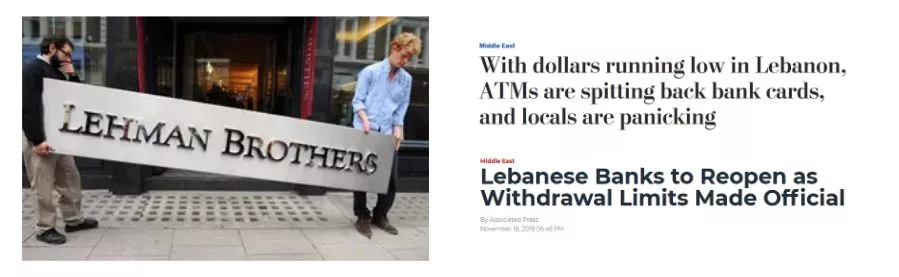
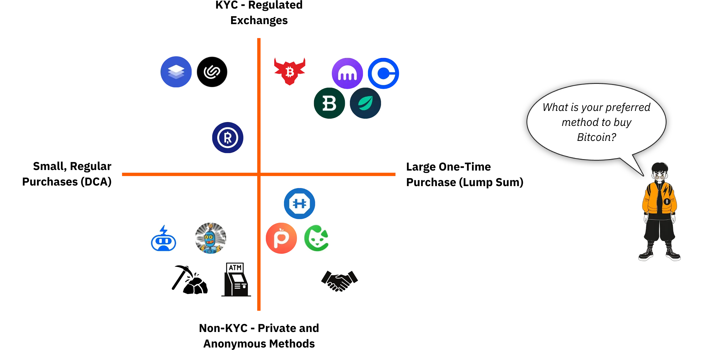

# سفری به اولین بیت‌کوین‌های شما

اکوسیستم Bitcoin در حال تجربه رشدی شگفت‌انگیز و بی‌سابقه است. تحولات تکنولوژیکی، اقتصادی و اجتماعی که توسط اختراع Satoshi ناکاموتو هدایت می‌شوند، روز به روز شدت می‌گیرند و به تدریج درهای دنیای جدیدی را باز می‌کنند که اکنون می‌توانید به طور کامل از آن بهره‌مند شوید.

غوطه‌ور شدن در دنیای پیچیده Bitcoin یک ماجراجویی فکری هیجان‌انگیز است که تفکر انتقادی شما را تحریک کرده و بسیاری از باورهایتان را به چالش می‌کشد. این کاوش نه تنها درک عمیقی از نحوه کار Bitcoin به شما می‌دهد، بلکه فرصتی واقعی برای بازپس‌گیری آزادی شخصی، حفاظت از حریم خصوصی و دستیابی به حاکمیت مالی واقعی فراهم می‌کند.

برای راهنمایی مؤثر شما در این سفر، من این دوره کاملاً رایگان را ایجاد کرده‌ام. در اینجا، تمرکز به‌طور انحصاری بر روی Bitcoin است. هیچ بحث غیرمرتبطی، هیچ اشاره‌ای به سایر ارزهای دیجیتال، فقط محتوای واضح، دقیق و مستقیم.

این دوره به گونه‌ای طراحی شده است که به شما کنترل کامل بر نحوه یادگیری خود بدهد و به شما اجازه دهد تا Bitcoin را با سرعت خودتان کاوش کنید و مسیری را دنبال کنید که بهترین تطابق را با علایق و اهداف شما دارد.

+++
# مقدمه

<partId>008c49b7-5e17-5973-87f2-ba28429b2697</partId>

## بررسی کلی دوره

<chapterId>bfc96999-0ee1-5c41-8297-1b629f50cffc</chapterId>

به BTC102 خوش آمدید! اگر قبلاً BTC101 را گذرانده‌اید، مفاهیم نظری کلیدی را که چرا Bitcoin یک فناوری انقلابی است، بررسی کرده‌اید. اکنون، با BTC102، زمان آن رسیده است که آن دانش را به عمل تبدیل کنید. این دوره طراحی شده است تا به شما کمک کند برنامه شخصی Bitcoin خود را به صورت گام به گام بسازید.

در فصل‌های پیش رو، ما شما را از طریق مراحل عملی برای **دریافت اولین بیت‌کوین‌هایتان**، **ایمن‌سازی** صحیح آن‌ها و با اطمینان برداشتن اولین قدم‌هایتان در این اکوسیستم در حال رشد سریع راهنمایی خواهیم کرد.

https://planb.network/courses/2b7dc507-81e3-4b70-88e6-41ed44239966

اگرچه Bitcoin بیش از 16 سال است که وجود دارد، صنعت هنوز جوان، پویا و عمیقاً ریشه در آزادی دارد. پروتکل زیربنایی آن به طور کامل غیرمتمرکز است و در برابر کنترل توسط هر مرجع مرکزی مقاوم است، که به اکوسیستم اجازه می‌دهد به صورت طبیعی و ارگانیک رشد کند.

در حالی که این آزادی موجی شگفت‌انگیز از نوآوری و فرصت را به همراه دارد، همچنین با خطرات خاصی همراه است، از جمله کلاهبرداری‌ها، اشتباهات رایج و مشکلاتی که اغلب از کمبود دانش ناشی می‌شوند. هدف اصلی این دوره این است که به شما کمک کند با اطمینان و ایمنی در این اکوسیستم جدید حرکت کنید.

برای دستیابی به این هدف، دوره BTC102 به چندین بخش تقسیم شده است که هر کدام بر جنبه‌ای کلیدی از سفر شما با Bitcoin تمرکز دارند:

بخش اول، "پیش‌نیازهای درک Bitcoin"، شما را به‌طور مؤثر برای مسیر پیش رو آماده می‌کند. شما یاد خواهید گرفت که مشکلات اصلی مربوط به کلاهبرداری‌ها و تقلب‌های مالی که ممکن است در اکوسیستم Bitcoin وجود داشته باشد را شناسایی کنید. سپس به اصول اساسی امنیت آنلاین خواهیم پرداخت.

در نهایت، چند نکته عملی که به‌طور ویژه برای مبتدیان طراحی شده‌اند را به شما ارائه می‌دهم تا به شما کمک کنند از اشتباهات رایج هنگام کار با Bitcoin برای اولین بار اجتناب کنید.

بخش دوم، "درک آنچه وارد آن می‌شوید"، درک کلی شما از Bitcoin را عمیق‌تر خواهد کرد. ما با یک مرور شروع خواهیم کرد تا اطمینان حاصل کنیم که شما مفاهیم اساسی را به‌طور کامل درک کرده‌اید.

سپس، توضیح خواهیم داد که چرا Bitcoin از دیدگاه‌های فناوری، اقتصادی و اجتماعی به‌طور اساسی مهم است و باورهای شما را به ارزش آن تقویت می‌کند. شما همچنین به بررسی صنعت Bitcoin به‌طور کلی خواهید پرداخت: بازیگران کلیدی آن، سازماندهی آن و تکامل آن در طول سال‌ها. در نهایت، معماری لایه‌ای اکوسیستم Bitcoin را پوشش خواهیم داد، مفهومی حیاتی برای درک چگونگی ادامه نوآوری این سیستم بدون به خطر انداختن یکپارچگی پروتکل اصلی آن.

بخش سوم، "راه‌اندازی برنامه شما"، بر رویکرد شخصی شما به Bitcoin تمرکز دارد. ما با کمک به شما در تعریف پروفایل کاربری‌تان از چهار دسته اصلی شروع خواهیم کرد:

- هولدر*، متمرکز بر نگه‌داری Bitcoin در بلندمدت؛
- انبار کننده*، که به طور منظم و روشمند خرید می‌کند؛
- کاربر*، که اولویت را به استفاده روزانه از Bitcoin می‌دهد؛
- و در نهایت *فرد پارانوئید*، که خواهان حداکثر امنیت برای حفاظت مؤثر از دارایی‌ها و حریم خصوصی خود است.

ما شما را در اجرای یک استراتژی که با پروفایل شما سازگار است و به شما در دستیابی به اهداف شخصی‌تان کمک می‌کند، راهنمایی خواهیم کرد.

در نهایت، بخش چهارم، "حفاظت از وارثان و ثروت شما"، به موضوع مهمی می‌پردازد که اغلب نادیده گرفته می‌شود: چگونه اطمینان حاصل کنید که Bitcoin شما در صورت وقوع یک رویداد غیرمنتظره به عزیزانتان منتقل می‌شود. شما یاد خواهید گرفت که چگونه یک برنامه ارثیه Bitcoin ایجاد و تنظیم کنید، و اطمینان حاصل کنید که ثروت شما فراتر از طول عمرتان حفظ می‌شود.

تا پایان این دوره، شما تمام ابزارهای عملی مورد نیاز برای پیمایش با اطمینان در اکوسیستم Bitcoin و تبدیل شدن به یکی از پیشرفته‌ترین کاربران آن را خواهید داشت!

آماده‌اید تا سفر خود را به دنیای Bitcoin آغاز کنید؟ بزن بریم!

# پیش‌نیازهای درک Bitcoin

<partId>4481fc4b-0f83-489e-ad07-81517c5d6bad</partId>

## کلاهبرداری‌ها و تقلب مالی

<chapterId>8af2948b-2ab5-54c4-862c-3414b8a285a2</chapterId>

:::video id=9f3a7b2e-2c4d-4c1e-8b1f-3a2c1d4e5f6a:::

اکوسیستم Bitcoin و محیط اطراف آن هنوز نسبتاً جوان و به طور سست تنظیم شده است، که بسته به کشور متفاوت است. در حالی که این آزادی فرصت‌های گسترده‌ای را باز می‌کند، همچنین زمینه‌ای حاصلخیز برای کلاهبرداری‌های مالی، فریب‌ها و اشکال مختلف دستکاری ایجاد می‌کند. به همین دلیل است که فصل اول بسیار حیاتی است: درک مشکلات رایج به شما کمک می‌کند از آنها اجتناب کنید. امنیت مالی شما اولویت دارد زیرا یک تجربه بد فقط بر شما تأثیر نمی‌گذارد، بلکه بر کل جامعه Bitcoin تأثیر می‌گذارد.

### Bitcoin در مقابل ارزهای دیجیتال: درک تفاوت‌ها

قبل از ادامه، مهم است که به وضوح بین دو دنیای اساساً متفاوت تمایز قائل شویم:

- اکوسیستم Bitcoin** حول ایده پول سالم متمرکز است که بر پایه تمرکززدایی قوی، مقاومت بلندمدت، حریم خصوصی و حاکمیت فردی ساخته شده است. از زمان راه‌اندازی آن در سال 2009، Bitcoin به‌طور قابل‌اعتماد و ایمن عمل کرده و توسط جامعه‌ای جهانی و متعهد از توسعه‌دهندگان پشتیبانی می‌شود. این یک روند گذرا نیست، بلکه یک پروتکل پایدار و جاافتاده است که برای حفظ ارزش در طول زمان طراحی شده است.

- صنعت ارزهای دیجیتال**، از سوی دیگر، بسیار بزرگ‌تر است و شامل ده‌ها هزار پروژه مختلف می‌شود که هر کدام دارای token خاص خود هستند. این فضا اغلب توسط نوآوری سریع، هیاهو و سفته‌بازی مالی کوتاه‌مدت هدایت می‌شود. بسیاری از این پروژه‌ها متمرکز، کمتر امن و ارزش واقعی زیادی ارائه نمی‌دهند—با وجود وعده‌های جسورانه و بازاریابی پر زرق و برق.

اگر می‌خواهید بهتر بفهمید که Bitcoin از کجا می‌آید و چه چیزی واقعاً آن را از پروژه‌های دیگر متمایز می‌کند، توصیه می‌کنم بعداً این دوره پیگیری رایگان درباره تاریخچه Bitcoin را بررسی کنید:

https://planb.network/courses/a51c7ceb-e079-4ac3-bf69-6700b985a082

همانطور که می‌دانید، پلتفرم Plan ₿ Network به طور انحصاری به Bitcoin اختصاص دارد. با این حال، درک تفاوت با سایر ارزهای دیجیتال به شما کمک می‌کند تا از مشکلات مرتبط با پروژه‌های بی‌فایده و گاهی حتی کلاهبرداری جلوگیری کنید.

### کلاهبرداری‌های اصلی که باید از آن‌ها اجتناب کرد

در اینجا رایج‌ترین کلاهبرداری‌هایی که ممکن است در سفر با آن‌ها مواجه شوید آورده شده است:

#### طرح‌های هرمی و طرح‌های پونزی

این‌ها برخی از رایج‌ترین کلاهبرداری‌ها در دنیای رمز ارز هستند. در یک طرح پانزی، شرکت‌کنندگان اولیه با استفاده از پول شرکت‌کنندگان جدیدتر پرداختی دریافت می‌کنند؛ نه از طریق هیچ سرمایه‌گذاری یا محصول واقعی. هیچ ارزش واقعی ایجاد نمی‌شود. این سیستم تنها تا زمانی کار می‌کند که افراد جدید به آن بپیوندند. به محض اینکه جریان شرکت‌کنندگان جدید کند شود، کل طرح فرو می‌پاشد.

این کلاهبرداری‌ها معمولاً شامل:

- وعده‌های غیرواقعی بازدهی تضمین‌شده (مثلاً بازدهی تضمین‌شده ۲۰٪)؛
- تاخیر یا مشکلات هنگام تلاش برای برداشت وجوه سرمایه‌گذاری‌شده؛
- انگیزه‌های قوی برای جذب اعضای جدید به منظور حفظ عملکرد سیستم؛
- عدم شفافیت کامل در مورد منبع واقعی بازده‌های وعده داده شده.

در نهایت، تمامی طرح‌های هرمی و پونزی محکوم به شکست هستند. ضعف اساسی آن‌ها در نیاز مداوم به جذب سرمایه‌گذاران جدید برای پرداخت سود به شرکت‌کنندگان قبلی نهفته است. این نیاز به مرور زمان به صورت ریاضی غیرقابل حفظ می‌شود زیرا تعداد افراد جدید مورد نیاز به صورت نمایی افزایش می‌یابد. هنگامی که به نقطه بحرانی می‌رسد، شرکت‌کنندگان شروع به شک می‌کنند، اعتماد از بین می‌رود و کل هرم فرو می‌ریزد. در این مرحله، آخرین افرادی که به سیستم می‌پیوندند، که اغلب کمترین اطلاعات را دارند، کل سرمایه‌گذاری خود را از دست می‌دهند و هیچ راهی برای بازیابی آن ندارند، در حالی که سازمان‌دهندگان یا سرمایه‌گذاران اولیه معمولاً قبلاً وجوه خود را برداشت کرده و از سیستم خارج شده‌اند.

در دنیای ارزهای دیجیتال، طرح‌های پانزی می‌توانند به اشکال مختلفی ظاهر شوند و اغلب به گونه‌ای طراحی شده‌اند که ماهیت کلاهبردارانه خود را پشت یک نقاب تکنولوژیکی یا مالی پنهان کنند. این کلاهبرداری‌ها ممکن است به صورت پیشنهادات جدید token یا عرضه اولیه سکه (ICO) ظاهر شوند، که عملیات جمع‌آوری سرمایه‌ای هستند که در آن یک ارز دیجیتال جدید به عموم فروخته می‌شود. پشت اصطلاحات فنی مانند "Blockchain"، "قراردادهای هوشمند"، یا "استیکینگ"، برخی پروژه‌ها در واقع طرح‌های هرمی پیچیده‌ای را پنهان می‌کنند. برخی دیگر ادعا می‌کنند که با ترکیب دارایی‌های دیجیتال مشکوک با سیستم‌های جبرانی که به طور کامل به جریان مداوم سرمایه‌گذاران جدید متکی هستند، بازدهی بالایی ارائه می‌دهند.

اخیراً، طرح‌های پانزی به دنیای امور مالی غیرمتمرکز (DeFi) نیز گسترش یافته‌اند. در حالی که DeFi برای ارائه خدمات مالی بدون واسطه‌ها طراحی شده است، برخی پروژه‌ها از آن برای ایجاد حس کاذب مشروعیت به کلاهبرداری‌های خود استفاده می‌کنند. برخی از پلتفرم‌های DeFi وعده بازدهی بالا و تضمین‌شده در Exchange برای سپرده‌گذاری ارزهای دیجیتال در پروتکل‌های خودکار را می‌دهند. این وعده‌های جذاب اغلب با مکانیزم‌های مبهم و غیرقابل‌تأیید پشتیبانی می‌شوند، با توکن‌هایی که به‌طور خاص برای کلاهبرداری ایجاد شده‌اند. در واقعیت، این سیستم‌ها هیچ مدل کسب‌وکار پایداری ندارند—بازدهی‌ها صرفاً از وجوه کاربران جدید پرداخت می‌شود، درست مانند یک طرح پانزی سنتی. هنگامی که اعتماد شروع به فرسایش می‌کند یا ورود شرکت‌کنندگان جدید کند می‌شود، این سیستم‌ها به‌طور اجتناب‌ناپذیری فرو می‌پاشند و منجر به زیان‌های قابل‌توجهی برای سرمایه‌گذاران ناآگاه می‌شوند.

لطفاً توجه داشته باشید که محتوای این دوره صرفاً برای اهداف آموزشی است و نباید به عنوان مشاوره مالی تعبیر شود. امنیت مالی شما به توانایی شما در باقی ماندن محتاط، شکاک و آگاه با هر تصمیم مالی که می‌گیرید، بستگی دارد.

بهترین محافظت این است که همیشه این سوال ساده را بپرسید: بازده وعده داده شده در واقع از کجا می‌آید؟ اگر پاسخ نامشخص است، فوراً دور شوید.

#### پامپ و دامپ

این نوع کلاهبرداری شامل افزایش مصنوعی قیمت یک دارایی—اغلب یک ارز دیجیتال با نقدینگی پایین به نام token—از طریق یک کمپین بازاریابی هماهنگ شده است که معمولاً توسط گروهی از سرمایه‌گذاران هدایت می‌شود. طرح معمول پمپ و تخلیه این الگو را دنبال می‌کند:

- گروهی از افراد داخلی یا چهره‌های تأثیرگذار به‌طور مخفیانه مقدار زیادی از دارایی مورد نظر را جمع‌آوری می‌کنند.
- سپس یک کمپین تبلیغاتی تهاجمی برای هیجان generate راه‌اندازی می‌کنند و قیمت را بالا می‌برند.
- عموم مردم، تحت تأثیر FOMO (ترس از دست دادن)، شروع به خرید دارایی به تعداد زیاد می‌کنند و قیمت را حتی بالاتر می‌برند.
- در اوج هیاهو، افراد داخلی به‌طور همزمان دارایی‌های خود را می‌فروشند.
- قیمت سقوط می‌کند و تازه‌واردان را با ضررهای سنگین مواجه می‌سازد.

توجه به این نکته مهم است که استراتژی‌های پمپ و تخلیه در بسیاری از کشورها غیرقانونی هستند و به عنوان شکلی از دستکاری بازار تلقی می‌شوند. با وجود این، چنین طرح‌هایی همچنان رونق دارند، به ویژه در فضای ارزهای دیجیتال که مقررات هنوز در حال پیشرفت است.

به‌ویژه نسبت به گروه‌های خصوصی "سیگنال" در پلتفرم‌هایی مانند تلگرام، دیسکورد یا سایر کانال‌های رسانه‌های اجتماعی محتاط باشید. این گروه‌ها اغلب توسط اینفلوئنسرها یا کارشناسان خودخوانده اداره می‌شوند که برخی از آن‌ها حتی هزینه ورودی دریافت می‌کنند. در حالی که این گروه‌ها ادعا می‌کنند فرصت‌های سرمایه‌گذاری انحصاری ارائه می‌دهند، واقعیت بسیار یک‌طرفه‌تر است: تنها برگزارکنندگان سود می‌برند، در حالی که اکثر شرکت‌کنندگان پول خود را از دست می‌دهند.

درست است که برخی از شرکت‌کنندگان ممکن است به طور موقت از این نوع دستکاری‌های بازار سود ببرند، اما موفقیت آن‌ها معمولاً بر اساس چیزی جز شانس و زمان‌بندی دقیق نیست. در بلندمدت، این طرح‌ها پایدار نیستند. آن‌ها نیاز به مشارکت مداوم با ریسک بالا و شرکت مکرر در تنظیمات تقلبی دارند که به ناچار فرو می‌پاشند.

حتی بدتر، آنها به یک توهم خطرناک دامن می‌زنند: باور به اینکه می‌توان بدون درک واقعی از نحوه کارکرد سیستم‌های مالی، به سرعت و به راحتی پول به دست آورد. این طرز فکر نه تنها افراد را در معرض خطر قرار می‌دهد، بلکه اعتبار کل اکوسیستم ارزهای دیجیتال را نیز تضعیف می‌کند.

به‌خاطر تمام این دلایل، بهترین استراتژی این است که به یک رویکرد جدی و متفکرانه در سرمایه‌گذاری پایبند باشید، رویکردی که بر پایه آموزش مالی، درک قوی از اصول بنیادی و دیدگاه بلندمدت بنا شده است.

با صبر و حوصله دانش خود را افزایش دهید، کمتر در معرض دستکاری‌های احساسی و وعده‌های غیرواقعی قرار خواهید گرفت؛ و به مراتب بهتر مجهز خواهید شد تا از تله‌های مالی که می‌توانند به زیان‌های واقعی منجر شوند، اجتناب کنید.

#### کلاهبرداری‌های اهدا، قرعه‌کشی و هدیه جعلی

این نوع کلاهبرداری وعده دریافت رایگان Bitcoin یا پاداش‌های دیگر در Exchange را می‌دهد به شرطی که ابتدا مقدار کمی پول ارسال کنید. مهم است به یاد داشته باشید: هیچ فرد یا سازمان قانونی هرگز از شما نمی‌خواهد که ابتدا ارز دیجیتال ارسال کنید با وعده ارسال بیشتر در ازای آن.

کلاهبرداران اغلب خود را به جای شخصیت‌های معروف عمومی (مانند ایلان ماسک یا سایر افراد مشهور) جا می‌زنند تا قربانیان را از طریق شبکه‌های اجتماعی فریب دهند. همیشه قبل از تعامل با حساب‌ها و وب‌سایت‌ها، مشروعیت آن‌ها را دوباره بررسی کنید و هرگز به پیشنهاداتی که بیش از حد سخاوتمندانه یا بیش از حد خوب به نظر می‌رسند، اعتماد نکنید.

گاهی اوقات، این کلاهبرداری‌ها به صورت کلاهبرداری‌های "پیش‌پرداخت" ظاهر می‌شوند. به شما وعده یک جایزه یا پاداش (پول، یک محصول، یا یک خدمت) داده می‌شود اما ابتدا از شما خواسته می‌شود که هزینه‌ای بپردازید، که ظاهراً برای پوشش مواردی مانند حمل و نقل، مالیات یا هزینه‌های تراکنش است. پس از انجام پرداخت، کلاهبردار ناپدید می‌شود و پاداش وعده داده شده هرگز نمی‌رسد.

#### شت‌کوین‌ها و ارزهای دیجیتال موجود برای عرضه

پروژه‌های متمرکز ارزهای دیجیتال گاهی اوقات توکن‌های رایگان ("*ایردراپ‌ها*") ارائه می‌دهند تا کاربران را جذب کنند. این توکن‌ها معمولاً ارزش واقعی کمی دارند یا اصلاً ندارند و عمدتاً برای ایجاد توهم محبوبیت یا تحریک به سفته‌بازی استفاده می‌شوند. با این نوع پیشنهادات تبلیغاتی بسیار محتاط باشید؛ آن‌ها اغلب تله‌های بازاریابی هستند تا فرصت‌های واقعی.

#### سرقت هویت و فیشینگ

مهاجمان اغلب از وب‌سایت‌های جعلی، حساب‌های شبکه‌های اجتماعی، یا ایمیل‌های فریبنده استفاده می‌کنند تا سعی کنند وجوه شما را سرقت کنند. این کلاهبرداری‌ها می‌توانند از طریق هر کانال ارتباطی بیایند: ایمیل، شبکه‌های اجتماعی، تماس‌های تلفنی، یا حتی پست سنتی...

قبل از کلیک کردن روی یک لینک یا انجام هر اقدامی، همیشه هویت فرستنده را دوباره بررسی کنید. در صورت شک، به جای استفاده از لینک ارائه شده، به صورت دستی به وب‌سایت مراجعه کنید. مهم‌تر از همه، هرگز کلیدهای خصوصی یا رمزهای عبور خود را با کسی به اشتراک نگذارید.

#### Bitcoin هاردفورک‌ها

در طول سال‌ها، Bitcoin چندین *انشعاب Hard* را تجربه کرده است که منجر به ایجاد نسخه‌های جایگزین از ارز دیجیتال اصلی شده‌اند. به زبان ساده، یک *Hard Fork* شکافی در شبکه است که به دو بلاکچین جداگانه منجر می‌شود و هر دو تا لحظه انشعاب تاریخچه یکسانی دارند. این انشعابات معمولاً زمانی رخ می‌دهند که بخشی از جامعه توسعه‌دهندگان یا اکوسیستم گسترده‌تر Bitcoin می‌خواهد تغییرات عمده‌ای را در پروتکل اصلی معرفی کند اما نمی‌تواند به توافق گسترده‌ای دست یابد. به جای رها کردن ایده‌های خود، تصمیم می‌گیرند نسخه جدیدی از Bitcoin (با قوانین تغییر یافته) را راه‌اندازی کنند به امید اینکه کاربران و ماینرها تصمیم بگیرند به جای آن از Fork پیروی کنند.

همه *فورک‌های Hard* کلاهبرداری نیستند، زیرا برخی از آنها ناشی از اختلافات فنی یا ایدئولوژیکی درون جامعه هستند. با این حال، برخی دیگر توسط منافع تجاری یا حتی انگیزه‌های نادرست هدایت می‌شوند. شناخته‌شده‌ترین مثال‌های این هاردفورک‌ها **Bitcoin کش (BCH)** و **Bitcoin Satoshi ویژن (BSV)** هستند. این ارزهای جایگزین که به ترتیب در سال‌های ۲۰۱۷ و ۲۰۱۸ راه‌اندازی شدند، اغلب ادعا می‌کنند که "نسخه‌های بهتری" از Bitcoin اصلی هستند. آنها مزایای فرضی مانند کارمزدهای پایین‌تر تراکنش یا تراکنش‌های سریع‌تر به دلیل افزایش اندازه بلوک‌ها را تبلیغ می‌کنند. با این حال، این تغییرات فنی با معاوضه‌های قابل توجهی از نظر امنیت، تمرکززدایی و استحکام همراه هستند؛ Elements که می‌تواند با اصول بنیادی Bitcoin در تضاد باشد.

فراتر از تفاوت‌های فنی، این ارزهای جایگزین اغلب از سردرگمی برای جذب سرمایه‌گذاران ناآگاه بهره‌برداری می‌کنند. آن‌ها ممکن است از تاکتیک‌های بازاریابی استفاده کنند که به‌طور عمدی تازه‌واردانی را که فکر می‌کنند در حال خرید Bitcoin (BTC) واقعی هستند، گمراه کنند.

برای جلوگیری از افتادن در این تله، همیشه ارز مورد نظر خود را بررسی کنید. Bitcoin اصلی از نماد **BTC** استفاده می‌کند، در حالی که Bitcoin Cash و مشتقات آن از اختصارات متفاوتی مانند BCH یا BSV استفاده می‌کنند.

#### اینفلوئنسرهای ناصادق و گوروهای جعلی

با جلب توجه عمومی به ارزهای دیجیتال، رسانه‌های اجتماعی شاهد افزایش تعداد اینفلوئنسرها، کارشناسان خودخوانده و به‌اصطلاح "*گوروهای کریپتو*" بوده‌اند. در حالی که برخی ممکن است بینش‌های آموزشی واقعی ارائه دهند، بسیاری دیگر از دیده شدن خود سوءاستفاده کرده و پروژه‌های مشکوک یا استراتژی‌های معاملاتی بسیار پرخطر (و گاهی کاملاً کلاهبردارانه) را ترویج می‌کنند. این افراد معمولاً با انگیزه‌های مالی شخصی هدایت می‌شوند و اغلب برای تبلیغ توکن‌ها یا پلتفرم‌های خاص، به‌طور مستقیم یا غیرمستقیم جبران مالی دریافت می‌کنند.

اینفلوئنسرها اغلب به تاکتیک‌های اثبات‌شده‌ای برای جذب مبتدیان متکی هستند: آنها نتایج مالی چشمگیر (که اغلب جعلی یا غیرقابل‌تأیید هستند) را به نمایش می‌گذارند، سبک زندگی لوکسی را به عنوان مدرک موفقیت خود به رخ می‌کشند و استراتژی‌های سرمایه‌گذاری "معجزه‌آسا" را تبلیغ می‌کنند. هدف این است که FOMO — ترس از دست دادن — را تحریک کنند و مخاطبان خود را به تصمیمات عجولانه و سرمایه‌گذاری‌های بی‌پروا سوق دهند.

مهم است که درک کنیم بیشتر توصیه‌های "رایگان" از این شخصیت‌ها هرگز واقعاً رایگان نیست. پشت نمای سخاوت اغلب یک استراتژی حساب‌شده برای هدایت مردم به سمت خرید دارایی‌های مشکوک نهفته است. و حتی اگر برخی از اینفلوئنسرها صادق باشند، تکرار نتایج آن‌ها تقریباً غیرممکن خواهد بود؛ موفقیت آن‌ها اغلب به زمان‌بندی خاص، دانش داخلی یا شرایط منحصر به فردی بستگی دارد که شما به آن‌ها دسترسی ندارید.

برخی از اینفلوئنسرها ممکن است شما را دعوت کنند تا به گروه‌های خصوصی و پولی بپیوندید که در آن‌ها ادعا می‌کنند سیگنال‌های معاملاتی انحصاری یا نکات داخلی را به اشتراک می‌گذارند که وعده سود سریع و آسان را می‌دهند. در واقعیت، این گروه‌ها عمدتاً به نفع خود سازمان‌دهندگان هستند. آن‌ها اغلب از دنبال‌کنندگان خود به عنوان منبع نقدینگی استفاده می‌کنند و اساساً دارایی‌ها را برای سود شخصی خود تخلیه می‌کنند. مشترکین معمولاً پول خود را از دست می‌دهند، زیرا نمی‌توانند به سرعت افرادی که معاملات را سازمان‌دهی می‌کنند، واکنش نشان دهند (به بخش طرح‌های پمپ و تخلیه مراجعه کنید).

با توجه به این واقعیت، در اینجا چند عادت خوب برای جلوگیری از افتادن در دام‌های تعیین‌شده توسط تأثیرگذاران ناصادق آورده شده است:

- در مورد هر گونه توصیه سرمایه‌گذاری در ارزهای دیجیتال بسیار محتاط باشید.**

یک فرد قابل اعتماد و آگاه هرگز شما را تحت فشار قرار نمی‌دهد تا بدون تشویق به انجام تحقیقات شخصی، یک ارز دیجیتال بخرید.

- دوره‌های آموزشی یا سرمایه‌گذاری پولی همیشه نشانه‌ای از کیفیت نیستند.**

بسیاری از این دوره‌ها استراتژی‌های پرخطر یا بیش از حد ساده‌انگارانه را ترویج می‌کنند؛ اغلب همان اطلاعاتی که می‌توانید به صورت رایگان به صورت آنلاین پیدا کنید.

- هیچ راه تضمینی برای کپی کردن معاملات شخصی و دستیابی به نتایج یکسان وجود ندارد.**

هر استراتژی سرمایه‌گذاری به زمینه شخصی، زمان‌بندی، دانش و عوامل دیگری بستگی دارد که نمی‌توان آن‌ها را به‌طور دقیق تکرار کرد.

- به‌ویژه از توصیه‌هایی که بیش از حد خوب به نظر می‌رسند، برحذر باشید.**

وعده‌های غیرواقعی یا سودهای تضمین‌شده تقریباً همیشه نشانه‌های دستکاری هستند. به یاد داشته باشید: فقط به این دلیل که کسی با اطمینان چیزی می‌گوید، به معنای درست بودن آن نیست.

همیشه به یاد داشته باشید، هر کسی که در Bitcoin یا اکوسیستم گسترده‌تر کریپتو با او برخورد می‌کنید، یک برنامه شخصی دارد؛ چه به‌طور صریح بیان شده باشد یا بین خطوط پنهان باشد. چیزی به نام اطلاعات کاملاً بی‌طرف وجود ندارد. حتی این دوره، BTC102، هدف روشنی دارد، *ترویج درک بهتر از Bitcoin.*

به همین دلیل است که آگاهی از انگیزه‌های واقعی پشت هر محتوایی که مصرف می‌کنید ضروری است. و هرگز این قانون طلایی اینترنت را فراموش نکنید:

*اگر یک محصول یا خدمات به نظر رایگان می‌آید، احتمالاً شما خود محصول هستید.*

در نهایت، بهترین دفاع شما آموزش شخصی، شک سالم و مهم‌تر از همه، عادت به بررسی حقایق برای خودتان است.

### چگونه از کلاهبرداری‌ها جلوگیری کنیم

**برای ایمنی آنلاین، به‌ویژه در دنیای رمزنگاری، این اصول کلیدی را در نظر داشته باشید:**

- هرگز کورکورانه اعتماد نکنید: "*اعتماد نکنید، بررسی کنید*" ;
- از بازدهی‌های تضمین‌شده یا غیرمعمولاً بالا مشکوک باشید؛
- هرگز کلیدهای خصوصی خود را با کسی به اشتراک نگذارید؛
- Bitcoin (یا هر ارز دیجیتال دیگری) را به آدرس‌های ناشناس ارسال نکنید؛
- اگر شک دارید، مکث کنید. یک قدم به عقب بردارید و قبل از اقدام فکر کنید. ترس از دست دادن بدترین دشمن شماست؛
- از گروه‌ها یا جوامع معاملاتی پولی که وعده‌های غیرواقعی می‌دهند، اجتناب کنید؛
- بیشتر هدایا یا قرعه‌کشی‌های "رایگان" آنلاین کلاهبرداری یا به شدت دستکاری شده‌اند؛
- در بلندمدت همیشه با یادگیری بیشتر از قمار کردن به دست خواهید آورد.

محافظت از خود در برابر کلاهبرداری‌ها یک گام اولیه حیاتی در حفاظت از دارایی‌های شماست؛ اما کافی نیست. حفظ بهداشت دیجیتال قوی نیز به همان اندازه مهم است. به همین دلیل، در فصل بعدی، ما به بررسی چگونگی تقویت امنیت آنلاین شما و بهترین روش‌هایی که باید برای محافظت از خود در دنیای دیجیتال اتخاذ کنید، خواهیم پرداخت.

## امنیت آنلاین

<chapterId>f0873bf2-6a6f-5485-bb7a-d84be14f404d</chapterId>

:::video id=2a1b3c4d-5e6f-7a8b-9c0d-1e2f3a4b5c6d:::

به محض اینکه شروع به کار با Bitcoin کنید، به سرعت متوجه خواهید شد که امنیت سایبری پایه‌ای اختیاری نیست—بلکه ضروری است. کلاهبرداری‌ها و تقلب‌ها فقط نوک کوه یخ هستند. از دست دادن تصادفی داده‌ها، بدافزارها و رمزهای عبور به خطر افتاده می‌توانند به همان اندازه ویرانگر باشند، به ویژه زمانی که خودتان کلیدهایتان را مدیریت می‌کنید.

این فصل شما را با چند گام ساده و عملی برای ارتقاء بهداشت دیجیتال و محافظت از خود در این فضا آشنا می‌کند.

اگر می‌خواهید عمیق‌تر بروید، دوره SEC101 در Plan ₿ Network یک تجزیه و تحلیل جامع از استراتژی‌های امنیت سایبری ارائه می‌دهد که به‌طور خاص برای کاربران Bitcoin طراحی شده است.

https://planb.network/courses/99c46148-7080-4915-a7e0-9df0e145cd47

### چرا امنیت سایبری مهم است؟

Bitcoin به شما قدرت می‌دهد تا پول خود را مستقیماً (بدون بانک‌ها) و بدون واسطه نگه دارید. اما این نوع حاکمیت مالی با مسئولیت جدی همراه است: اگر BTC شما به دلیل نقص امنیتی دزدیده شود، هیچ راهی برای بازگرداندن تراکنش وجود ندارد. برخلاف بانکداری سنتی، هیچ میز کمکی، هیچ ادعای تقلب و هیچ بیمه‌ای برای نجات شما وجود ندارد.

علاوه بر این، ارزش مالی Bitcoin آن را به یک هدف با ارزش بالا تبدیل می‌کند. یک هکر که Wallet شما را به خطر بیندازد می‌تواند فوراً وجوه شما را به یک Address که کنترل می‌کند منتقل کند (بدون هیچ سؤالی، بدون راهی برای بازگرداندن آن).

### یک کامپیوتر تمیز و به‌روز

یکی از جنبه‌های نادیده گرفته شده امنیت شخصی، به‌روز نگه داشتن سیستم‌عامل و نرم‌افزارها است. بسیاری از به‌روزرسانی‌ها، آسیب‌پذیری‌های شناخته شده‌ای را که ممکن است توسط مهاجمان مورد سوءاستفاده قرار گیرند، برطرف می‌کنند. در حالی که برخی افراد به دلیل ترس از مشکلات عملکردی از به‌روزرسانی‌ها اجتناب می‌کنند، خطر واقعی در اجرای نرم‌افزارهای قدیمی است که هکرها قبلاً می‌دانند چگونه آن‌ها را بشکنند.

همچنین به شدت توصیه می‌شود که از یک آنتی‌ویروس قابل اعتماد استفاده کنید. در ویندوز، Windows Defender داخلی به طور کلی برای اکثر کاربران کافی است. اگر ویژگی‌های اضافی یا آرامش خاطر بیشتری می‌خواهید، گزینه‌های تجاری مانند Kaspersky نیز در دسترس هستند. در macOS، تهدیدات بدافزار به طور تاریخی کمتر رایج هستند **اما غیر موجود نیستند** بنابراین هنوز هم هوشمندانه است که محتاط بمانید.

فراتر از به‌روزرسانی‌های سیستم و حفاظت آنتی‌ویروس، بسیار مراقب دانلود نرم‌افزار از وب‌سایت‌های مشکوک یا به‌اصطلاح پورتال‌های دانلود "جهانی" باشید. هنگامی که به یک ابزار یا برنامه نیاز دارید، همیشه مستقیماً به منبع رسمی مراجعه کنید؛ این کار به‌طور چشمگیری خطر نصب بدافزارهایی که به‌عنوان نرم‌افزار قانونی پنهان شده‌اند را کاهش می‌دهد.

عادت هوشمندانه دیگر این است که قبل از نصب هر نرم‌افزاری روی دستگاه خود، اصالت و یکپارچگی آن را بررسی کنید. اگر نمی‌دانید چگونه این کار را انجام دهید، نگران نباشید، ما یک آموزش اختصاصی داریم که شما را در این فرآیند راهنمایی می‌کند:

https://planb.network/tutorials/computer-security/data/integrity-authenticity-21d0420a-be02-4663-94a3-8d487f23becc

در نهایت، از داده‌های مهم خود به طور منظم نسخه پشتیبان تهیه کنید. یک درایو خارجی Hard یا SSD گزینه‌ای مطمئن برای نگهداری نسخه‌ای از فایل‌های شما در صورت خرابی ناگهانی، هک شدن یا حذف تصادفی است. بعداً از خودتان تشکر خواهید کرد.

اگر به راه‌حل‌های ابری علاقه دارید، استفاده از سرویسی امن مانند Proton Drive را در نظر بگیرید. فقط مطمئن شوید که هر گزینه‌ای که انتخاب می‌کنید به حریم خصوصی شما احترام می‌گذارد و رمزگذاری قوی ارائه می‌دهد.

https://planb.network/tutorials/computer-security/data/proton-drive-03cbe49f-6ddc-491f-8786-bc20d98ebb16

یک استراتژی پشتیبان‌گیری که به‌طور گسترده توصیه می‌شود، "قانون ۳-۲-۱" است. این استراتژی برای محافظت از داده‌های شما در برابر از دست رفتن تصادفی، حملات سایبری یا حتی بلایای طبیعی طراحی شده است.

ایده ساده است:

- حداقل **3 نسخه** از داده‌های مهم خود را نگه دارید،
- آن‌ها را روی **حداقل ۲ نوع رسانه مختلف** ذخیره کنید (مثلاً یک درایو خارجی Hard و ذخیره‌سازی ابری)،
- و مطمئن شوید که **1 نسخه از آن‌ها در مکانی خارج از سایت** (به‌صورت فیزیکی جدا از مکان اصلی شما) ذخیره شده است.

این رویکرد مقاومت قوی ارائه می‌دهد و کمک می‌کند تا اطمینان حاصل شود که داده‌های شما حتی اگر مشکلی جدی پیش بیاید، باقی می‌مانند.

### راه‌حل کابوس شناسایی

یکی از بزرگترین دلایلی که افراد هک می‌شوند استفاده از رمزهای عبور ضعیف است. تعداد قابل توجهی از کاربران همچنان از همان رمز عبور در چندین حساب استفاده می‌کنند یا تغییراتی را انتخاب می‌کنند که به راحتی قابل حدس زدن هستند. مدیران رمز عبور راه‌حل مناسبی برای این مشکل هستند.

یک مدیر رمز عبور به شما اجازه می‌دهد:

- رمزهای عبور خود را به صورت امن** در یک گاوصندوق رمزگذاری شده ذخیره کنید
- generate رمزهای عبور طولانی، پیچیده و منحصربه‌فرد** را به‌طور خودکار برای هر حساب ایجاد می‌کند.
- از یک رمز عبور اصلی** برای دسترسی امن به همه چیز استفاده کنید

با یک مدیر رمز عبور، هرگز نیازی به کلیک روی "رمز عبور را فراموش کرده‌ام" نخواهید داشت یا به اعتبارنامه‌های ضعیف و تکراری متکی نخواهید بود. علاوه بر این، اکثر مدیران رمز عبور به‌طور یکپارچه در دستگاه‌های شما (رایانه رومیزی، تلفن، تبلت) همگام‌سازی می‌شوند و حتی فرم‌های ورود را به‌طور خودکار پر می‌کنند، که دسترسی امن را هم آسان و هم کارآمد می‌سازد.

مدیران رمز عبور زیادی وجود دارند، اما من می‌توانم دو گزینه‌ی مطمئن را بسته به نیازهای شما توصیه کنم. اگر به دنبال چیزی هستید که استفاده از آن آسان باشد و به‌طور یکپارچه در چندین دستگاه همگام‌سازی شود، Bitwarden یک انتخاب عالی است:

https://planb.network/tutorials/computer-security/authentication/bitwarden-0532f569-fb00-4fad-acba-2fcb1bf05de9

اگر ترجیح می‌دهید همه چیز را به صورت محلی روی دستگاه خود نگه دارید، KeePass یک گزینه عالی است:

https://planb.network/tutorials/computer-security/authentication/keepass-f8073bb7-5b4a-4664-9246-228e307be246

### ۲FA: حفاظت دوگانه

در Bitcoin، شما بانک خودتان هستید. این بدان معناست که شما همچنین تیم امنیتی خودتان هستید. حتی با یک رمز عبور قوی، چیزی به نام ریسک صفر وجود ندارد - به همین دلیل فعال‌سازی احراز هویت دو مرحله‌ای (2FA) ضروری است.

۲FA یک لایه دوم از حفاظت Layer اضافه می‌کند که با درخواست یک کد یک‌بار مصرف مبتنی بر زمان (معمولاً ۶ رقمی) که توسط برنامه‌ای مانند Google Authenticator یا Authy تولید می‌شود، عمل می‌کند. بنابراین حتی اگر کسی موفق به دستیابی به رمز عبور شما شود، بدون دسترسی فیزیکی به تلفن شما نمی‌تواند به حساب شما دسترسی پیدا کند.

https://planb.network/tutorials/computer-security/authentication/authy-a76ab26b-71b0-473c-aa7c-c49153705eb7

وقتی احراز هویت دو مرحله‌ای (2FA) را فعال می‌کنید، مطمئن شوید که کلید بازیابی برنامه خود را در مکانی امن ذخیره کنید. این کار به شما اجازه می‌دهد تا در صورت گم کردن یا تغییر گوشی خود، کدهایتان را بازیابی کنید. در حالی که احراز هویت دو مرحله‌ای مبتنی بر پیامک یا ایمیل بهتر از هیچ است، اما امنیت بسیار کمتری دارد. یک حمله تعویض سیم‌کارت، که در آن شخصی کنترل شماره تلفن شما را به دست می‌گیرد، می‌تواند به راحتی این نوع حفاظت را دور بزند.

برای کسانی که به دنبال افزایش امنیت هستند، کلیدهای فیزیکی مانند YubiKey سطح حفاظت بالاتری را ارائه می‌دهند.

https://planb.network/tutorials/computer-security/authentication/security-key-61438267-74db-4f1a-87e4-97c8e673533e

### حفظ حریم خصوصی شما

حریم خصوصی و امنیت سایبری به‌طور نزدیکی به هم مرتبط هستند: هرچه اطلاعات بیشتری را به‌صورت آزاد در دسترس بگذارید، احتمال بیشتری وجود دارد که هدف قرار بگیرید.

یک **VPN** (*شبکه خصوصی مجازی*) یک گام ساده اما مؤثر برای پنهان کردن IP شما Address و رمزگذاری ترافیک اینترنت شما است. در حالی که شما را به طور کامل نامرئی نمی‌کند (زیرا ارائه‌دهنده VPN هنوز می‌تواند فعالیت شما را ببیند)، اما کار را برای هر کسی که سعی در جاسوسی یا ردیابی عادات مرور شما دارد، به طور قابل توجهی سخت‌تر می‌کند.

کلید انتخاب یک ارائه‌دهنده VPN قابل‌اعتماد است که:

- نیاز به اطلاعات شخصی شما ندارد
- اجازه پرداخت از طریق BTC را می‌دهد
- سیاست سختگیرانه بدون لاگ دارد

ما چندین آموزش در دسترس برای Plan ₿ Network داریم که می‌تواند شما را در راه‌اندازی آسان یک VPN راهنمایی کند. من به‌ویژه IVPN یا Mullvad را توصیه می‌کنم:

https://planb.network/tutorials/computer-security/communication/ivpn-5a0cd5df-29f1-4382-a817-975a96646e68

https://planb.network/tutorials/computer-security/communication/mullvad-968ec5f5-b3f0-4d23-a9e0-c07a3e85aaa8

مراحل ضروری برای حفاظت از حریم خصوصی شما به صورت آنلاین همچنین شامل:

- استفاده از **پلتفرم‌های پیام‌رسان رمزگذاری‌شده** مانند Signal، SimpleX یا Session؛
- استفاده از مرورگرهای متمرکز بر حریم خصوصی مانند فایرفاکس، بریو، یا تور (برای ناشناس بودن بیشتر)؛

https://planb.network/tutorials/computer-security/communication/tor-browser-a847e83c-31ef-4439-9eac-742b255129bb

- استفاده از **صندوق پستی امن** مانند ProtonMail؛

https://planb.network/tutorials/computer-security/communication/proton-mail-c3b010ce-254d-4546-b382-19ab9261c6a2

- رمزگذاری** فایل‌های خود با ابزارهایی مانند Bitlocker (برای ویندوز) یا VeraCrypt (در دسترس در چندین پلتفرم).

https://planb.network/tutorials/computer-security/data/veracrypt-d5ed4c83-7c1c-4181-95ea-963fdf2d83c5

### پیشرفت گام‌به‌گام

امنیت سایبری می‌تواند به نظر یک کار بزرگ بیاید و برای مبتدیان آسان است که احساس غرق شدن کنند و تسلیم شوند زیرا به نظر می‌رسد بسیار پیچیده است. نکته این است که به آن گام به گام نزدیک شوید. با چیزی ساده شروع کنید، مانند نصب یک مدیر رمز عبور. به خودتان چند هفته زمان بدهید تا با آن راحت شوید، سپس به مرحله بعدی بروید: مانند فعال کردن 2FA در یکی از حساب‌های خود.

همانطور که با این ابزارها اعتماد به نفس بیشتری پیدا می‌کنید، آماده خواهید بود تا روش‌های پیشرفته‌تری را اضافه کنید، مانند استفاده از یک ایمیل ثانویه، تغییر به ProtonMail، راه‌اندازی یک VPN، یا مرور با Tor در صورت لزوم.

همان‌طور که عمیق‌تر به دنیای Bitcoin وارد می‌شوید، متوجه خواهید شد که با افزایش ارزش Wallet شما، ریسک‌ها نیز افزایش می‌یابند. ایجاد عادات امنیتی محکم، حفاظت از حریم خصوصی خود و راه‌اندازی ابزارهای مناسب نه تنها به شما آرامش خاطر می‌دهد بلکه حاکمیت Bitcoin را که همه چیز درباره آن است، تقویت می‌کند.

به طور خلاصه: امنیت سایبری را دست کم نگیرید، زمان بگذارید تا اصول اولیه را تنظیم کنید و به یاد داشته باشید که ثبات کلیدی است. بدون بهداشت دیجیتال خوب، حتی بهترین ابزارها هم برای شما کار زیادی نخواهند کرد.

همچنین حتماً [آموزش‌های امنیت کامپیوتر ما](https://planb.network/tutorials/computer-security) را در Plan ₿ Network بررسی کنید.

در فصل بعدی، چند نکته دیگر را با شما به اشتراک خواهم گذاشت تا به شما کمک کند با اطمینان سفر خود را با Bitcoin آغاز کنید؛ و از بسیاری از تله‌هایی که می‌تواند تازه‌واردان را غافلگیر کند، دوری کنید.

## نکاتی برای تازه‌واردان

<chapterId>33134b3f-92c1-5185-afb6-88599e47e801</chapterId>

:::video id=7e9f3b2c-4d1a-4c5e-8b0d-3a2c1d4e5f6b:::

ورود به Bitcoin می‌تواند هیجان‌انگیز باشد؛ اما همچنین با سهم عادلانه‌ای از ریسک‌ها همراه است. دنیای کریپتو با هیچ دنیای دیگری قابل مقایسه نیست؛ نوسانات شدید قیمت، فناوری ناآشنا، و احتمال واقعی از دست دادن همیشگی سرمایه به دلیل اشتباهات ساده یا انتخاب‌های ضعیف سرمایه‌گذاری، همگی از مشکلاتی هستند که کاربران جدید باید از آن‌ها آگاه باشند.

در این فصل، من برخی از توصیه‌های عملی و راهنمایی‌های کلی را برای هر کسی که اولین قدم‌های خود را برمی‌دارد، به‌ویژه کسانی که اولین خرید خود را انجام می‌دهند یا دنیای گسترده‌تر سرمایه‌گذاری مالی را کاوش می‌کنند، به اشتراک خواهم گذاشت.

در اینجا نکات کلیدی که با هم مرور خواهیم کرد آورده شده است:

- از **Shitcoins** و سایر ارزهای دیجیتال بی‌فایده بر حذر باشید؛
- فقط **پولی که می‌توانید از دست بدهید** را سرمایه‌گذاری کنید؛
- تفاوت بین **معامله‌گری** و **سرمایه‌گذاری** را بدانید؛
- از **پیامدهای مالیاتی** سرمایه‌گذاری‌های خود آگاه باشید؛
- عبارت بازیابی **خود را** با دقت محافظت کنید؛
- فروتن بمانید و **پروفایل پایین** را حفظ کنید (احتیاط بخشی از امنیت است)؛
- در بلندمدت فکر کنید**، دیدگاه خود را گسترش دهید و صبور باشید (به آن به‌عنوان یک ماراتن فکر کنید، نه یک دوی سرعت).

### اشتباهات رایجی که باید از آنها اجتناب کرد

Bitcoin برای همه باز است، اما این به این معنا نیست که باید بدون آمادگی وارد شوید. در اینجا برخی از اشتباهات کلاسیک که تازه‌واردان مرتکب می‌شوند آورده شده است:

**اشتباهات تکنولوژیکی:**

- از دست دادن عبارت seed شما:** عبارت بازیابی شما (معمولاً ۱۲ یا ۲۴ کلمه) تنها راه دسترسی به Bitcoin شما است اگر اتفاقی برای Wallet شما بیفتد. اگر آن را گم کنید، وجوه شما به طور دائمی از دست می‌رود؛
- ذخیره بیت‌کوین‌های شما در یک پلتفرم شخص ثالث:** اگر سکه‌های شما در یک پلتفرم متمرکز قرار دارند، شما واقعاً مالک آن‌ها نیستید. شما در معرض خطراتی مانند هک، خرابی پلتفرم، یا حتی توقیف وجوه قرار دارید؛
- نادیده گرفتن حریم خصوصی:** حفاظت از حریم خصوصی شما بخش اصلی ایمن‌سازی دارایی‌های شماست. افشای عمومی میزان Bitcoin که در اختیار دارید می‌تواند شما را هدف قرار دهد؛
- امنیت آنلاین ناکافی:** عدم تأمین دستگاه‌های خود با حفاظت‌های پایه (مانند به‌روزرسانی‌ها، گذرواژه‌های قوی، یا احراز هویت دو مرحله‌ای) شما را به هدفی آسان برای مهاجمان تبدیل می‌کند؛ و می‌تواند برای شما هزینه‌بر باشد.

**اشتباهات مالی:**

- سرمایه‌گذاری بیش از توان مالی برای از دست دادن**: هرگز به بدهی نروید یا پول اجاره خود را در Bitcoin قرار ندهید. ثبات مالی پایه شما همیشه باید در اولویت باشد.

- ندانستن تفاوت بین معامله‌گری و سرمایه‌گذاری**: معامله‌گری نیاز به زمان، مهارت و انضباط احساسی جدی دارد. سرمایه‌گذاری بلندمدت بسیار بیشتر برای مبتدیان مناسب است.

- فراموش کردن مالیات‌ها**: هر کشور قوانین مالیاتی خاص خود را برای ارزهای دیجیتال دارد. نادیده گرفتن آن‌ها می‌تواند به شگفتی‌های دردناکی در آینده منجر شود.

- افتادن در دام فومو**: خرید عجولانه به دلیل ترس از دست دادن معمولاً به زمان‌بندی و تصمیم‌گیری‌های بد منجر می‌شود. صبر بهترین هم‌پیمان شماست.

### تعریف یک استراتژی سرمایه‌گذاری

قبل از خرید اولین Satoshi، بسیار مهم است که بفهمید چرا در Bitcoin سرمایه‌گذاری می‌کنید و چگونه. این به معنای داشتن یک برنامه مالی روشن است که به وضعیت شخصی و اهداف بلندمدت شما اختصاص داده شده باشد.

با دقت **بودجه** خود را تعریف کنید. فقط یک عدد تصادفی انتخاب نکنید. زمانی را برای محاسبه درآمد ماهانه خود اختصاص دهید، هزینه‌های ثابت خود (مانند اجاره، وام‌ها، مالیات‌ها، خدمات) و همچنین هزینه‌های روزمره زندگی (غذا، حمل و نقل، تفریح و غیره) را کم کنید. هر چه باقی می‌ماند حاشیه پس‌انداز شماست و فقط از این بخش باید به سرمایه‌گذاری فکر کنید.

نزدیک شدن به این موضوع به این شکل تضمین می‌کند که شما رفاه مالی خود را به خطر نمی‌اندازید، به‌ویژه در صورت رکود بازار. یک استراتژی مدبرانه پایه و اساس مقاومت بلندمدت است.

پس از تعریف بودجه خود، به این فکر کنید که چگونه می‌خواهید سرمایه‌گذاری کنید. یکی از روش‌های بسیار مناسب برای مبتدیان و به طور گسترده توصیه شده، میانگین‌گیری هزینه دلاری (DCA) است، خرید مقدار ثابتی از Bitcoin در فواصل منظم (هفتگی، ماهانه و غیره). این استراتژی به هموار کردن قیمت ورودی متوسط شما در طول زمان کمک می‌کند و تأثیر احساسی نوسانات قیمت را کاهش می‌دهد. این یک رویکرد هوشمندانه برای اکثر افراد، به ویژه تازه‌واردان است.

سپس از خود بپرسید: افق زمانی من چیست؟

آیا به دنبال انجام معاملات سریع در بازار هستید (تریدینگ)؟ یا بیشتر با ذهنیت بلندمدت نگه‌داری Bitcoin برای چندین سال همسو هستید (هودلر)؟ اگر هودلر هستید، احتمالاً کمتر نگران نوسانات روزانه قیمت هستید و بیشتر بر امنیت بلندمدت و نگه‌داری شخصی تمرکز دارید. اگر در حال تریدینگ هستید، بیشتر در معرض نویز کوتاه‌مدت بازار، ریسک بالاتر و استرسی که اغلب با تصمیم‌گیری سریع همراه است، قرار می‌گیرید. هیچ پاسخ یکسانی برای همه وجود ندارد، اما شناخت رویکرد خودتان به شما در هدایت تصمیماتتان کمک خواهد کرد.

مهم‌تر از همه، تصمیمات سرمایه‌گذاری را بر اساس احساسات یا ترس نگیرید. یک استراتژی از پیش تعیین کنید، آن را بنویسید و به آن پایبند باشید.

اگر هنوز مطمئن نیستید، **با یادگیری شروع کنید.**

چند ساعتی را به کاوش در Bitcoin بگذرانید، منابع رایگان در Plan ₿ Network را بررسی کنید، چند کتاب بخوانید، پنج یورو برای امتحان کردن آن بپردازید و محتوای با کیفیتی را به صورت آنلاین تماشا کنید. کنجکاو بمانید. هرچه راحت‌تر شوید، بازبینی استراتژی، اصلاح رویکرد و پیشرفت با اطمینان برایتان آسان‌تر خواهد شد.

### درک نوسانات BTC

Bitcoin به نوسانات شدید قیمت معروف است. تغییرات 10٪، 20٪، یا حتی 50٪ در عرض چند روز غیرمعمول نیستند. برای تازه‌واردان، این نوع نوسانات می‌تواند گیج‌کننده باشد. در طول دوره‌های صعودی به راحتی می‌توان تحت تأثیر هیجان قرار گرفت یا در دوره‌های نزولی دچار وحشت شد؛ هر دوی این‌ها اغلب به تصمیمات نادرست منجر می‌شوند، مانند فروش با ضرر.

به همین دلیل است که **درک و پذیرش نوسانات Bitcoin** قبل از سرمایه‌گذاری بسیار مهم است. این نوسانات قیمتی یک نقص نیستند، بلکه ویژگی یک دارایی در حال رشد هستند. اگر نوسانات ناگهانی شما را شب‌ها بیدار نگه می‌دارند یا شما را به تصمیم‌گیری‌های احساسی سوق می‌دهند، احتمالاً بیش از حدی که راحت هستید ریسک کرده‌اید. در این صورت، یک قدم به عقب بردارید و استراتژی و تحمل ریسک خود را مجدداً ارزیابی کنید. از کاهش موقعیت خود تا زمانی که احساس راحتی بیشتری کنید، تردید نکنید.

بیش از هر چیز، هرگز بیش از آنچه می‌توانید از دست بدهید سرمایه‌گذاری نکنید. از قرض گرفتن پول برای خرید Bitcoin خودداری کنید (به‌ویژه اگر هنوز در حال یادگیری اصول اولیه هستید). یک پایه محکم با گام‌های سنجیده شروع می‌شود، نه با شرط‌بندی‌های بی‌پروا.

### مدیریت و ایمن‌سازی Bitcoin Wallet شما

یکی از قدرتمندترین (و اغلب دست‌کم‌گرفته‌شده‌ترین) ویژگی‌های Bitcoin، **خود-امانی** است. با یک Wallet خود-میزبان، شما به تنهایی مسئول وجوه خود هستید. این کیف‌پول‌ها معمولاً از یک **عبارت بازیابی** (که به عنوان عبارت seed نیز شناخته می‌شود) تولید می‌شوند، مجموعه‌ای از ۱۲ یا ۲۴ کلمه که دسترسی کامل به BTC شما را فراهم می‌کند. اگر این عبارت را گم کنید (یا اگر شخص دیگری به آن دسترسی پیدا کند) بیت‌کوین‌های شما برای همیشه از دست رفته‌اند. **بدون پشتیبانی مشتری. بدون دکمه بازنشانی.**

به همین دلیل، قانون طلایی در Bitcoin این است:

"***کلیدهای شما نیست، سکه‌های شما نیست***". اگر شما به صورت شخصی کلیدهای خصوصی خود را کنترل نکنید، واقعاً مالک Bitcoin خود نیستید. در حالی که صرافی‌ها می‌توانند راحت باشند (به خصوص در شروع کار)، آن‌ها کلیدهای شما را برای شما نگه می‌دارند. این بدان معناست که اگر پلتفرم هک شود، حساب شما را مسدود کند یا ورشکسته شود، سرمایه شما در معرض خطر است.

برای جلوگیری از این ریسک، به شدت توصیه می‌شود که **Wallet شخصی خود** را راه‌اندازی کنید، جایی که فقط شما به عبارت بازیابی دسترسی دارید. این عبارت باید همیشه به صورت دستی نوشته شده و به صورت **آفلاین** در مکانی امن نگهداری شود. برخی از کاربران حتی **چندین نسخه پشتیبان** را نگهداری می‌کنند که در مکان‌های جغرافیایی جداگانه برای امنیت بیشتر ذخیره شده‌اند.

**هرگز عبارت بازیابی خود را در دستگاه متصل به اینترنت یا در فضای ابری ذخیره نکنید**.

**یک هک یا نقض داده می‌تواند به از دست دادن غیرقابل جبران منجر شود.**

اگر آماده‌اید تا Ownership خود را از Bitcoin بگیرید و می‌خواهید به بهترین روش‌ها برای ایمن‌سازی عبارت بازیابی خود عمیق‌تر بپردازید، به شدت توصیه می‌کنم این مقاله را بررسی کنید:

https://planb.network/tutorials/wallet/backup/backup-mnemonic-22c0ddfa-fb9f-4e3a-96f9-46e2a7954270

### محرمانگی و احتیاط

در دنیای دیجیتال امروز، **احتیاط اغلب نادیده گرفته می‌شود**؛ با این حال، این یک بخش حیاتی از ایمنی است، به‌ویژه وقتی صحبت از Bitcoin می‌شود. هرچه بیشتر به‌طور علنی درباره دارایی‌های خود صحبت کنید، احتمال بیشتری وجود دارد که هدف کلاهبرداران، مجرمان سایبری، یا حتی تهدیدات سنتی‌تر مانند اخاذی یا باج‌گیری قرار بگیرید.

موارد متعددی در سراسر جهان وجود داشته است که در آن افراد شناخته شده به داشتن مقادیر زیادی BTC ربوده یا مورد حمله قرار گرفته‌اند.

**از خودستایی درباره Bitcoin Stash خودداری کنید**؛ چه در شبکه‌های اجتماعی و چه در مکالمات غیررسمی. فاش کردن اطلاعات مالی حساس هیچ سودی ندارد و خطرات آن واقعی است.

همچنین عاقلانه است که **فعالیت آنلاین خود را بخش‌بندی کنید**. برای مثال:

- از یک ایمیل جداگانه Address برای هر چیزی که به Bitcoin مربوط است استفاده کنید، که از حساب‌های شخصی یا کاری شما متمایز باشد.
- از تلاش‌های فیشینگ، لینک‌های مشکوک و وب‌سایت‌های جعلی که پلتفرم‌های معتبر را تقلید می‌کنند، احتیاط کنید.
- هوشیار باشید! احتیاط و هوشیاری اغلب بهترین دفاع شما هستند.

اگر آماده‌اید تا به موضوع حریم خصوصی Bitcoin عمیق‌تر بپردازید، توصیه می‌کنیم با دوره حریم خصوصی سال دوم ما ادامه دهید، جایی که تکنیک‌های پیشرفته‌تری برای حفظ امنیت هویت و فعالیت خود خواهید آموخت:

https://planb.network/courses/65c138b0-4161-4958-bbe3-c12916bc959c

### پیامدهای مالیاتی

با وجود اینکه یک ارز غیرمتمرکز است، **Bitcoin از قوانین و مقررات مالیاتی** کشور شما مستثنی نیست. هر حوزه قضایی رویکرد خاص خود را در مورد چگونگی مالیات‌گذاری بر سودهای حاصل از ارزهای دیجیتال دارد.

در برخی مکان‌ها، سودها به عنوان سود سرمایه در هنگام فروش مشمول مالیات می‌شوند. ممکن است در جاهای دیگر نیاز باشد که هر معامله را اعلام کنید و برخی قوانین کمتر رایج مانند مالیات بر ثروت یا مشارکت‌های اجتماعی اعمال می‌شوند.

قبل از انجام هرگونه تراکنش مهم، به شدت توصیه می‌شود که با یک متخصص مالیاتی مشورت کنید یا راهنمایی‌های رسمی دولت خود را بررسی کنید. صرف زمان برای درک تعهدات مالیاتی خود از پیش می‌تواند شما را از مشکلات غیرمنتظره بعدی (مانند جریمه‌ها، حسابرسی‌ها یا مجازات‌ها) نجات دهد، به ویژه اگر قصد فروش‌های بزرگ یا تخصیص مجدد پرتفوی را دارید.

### تفاوت بین معامله، سرمایه‌گذاری و نگهداری

Bitcoin اغلباً با تصورات غلط رایج احاطه شده است؛ یکی از متداول‌ترین آنها این ایده است که این یک راه سریع برای ثروتمند شدن از طریق تجارت است. اما مهم است که تفاوت واضح بین تجارت، سرمایه‌گذاری و نگهداری را درک کنیم، زیرا هر رویکرد با ذهنیت، مهارت و سطح ریسک خاص خود همراه است.

- معامله :**

بیایید صادق باشیم:**شما احتمالاً نباید معامله کنید.**

معامله‌گری شامل سفته‌بازی کوتاه‌مدت (گاهی با اهرم) با هدف کسب سود از نوسانات قیمت Bitcoin است. در حالی که ممکن است جذاب به نظر برسد، معامله‌گری موفق نیازمند دانش فنی پیشرفته (مانند تحلیل نمودار و مدیریت ریسک)، انضباط احساسی و توجه مداوم به بازار است. این کار از نظر ذهنی خسته‌کننده و زمان‌بر است و حقیقت Hard این است که **بیشتر مبتدیان پول از دست می‌دهند** زیرا سختی واقعی آن را دست‌کم می‌گیرند.

همانطور که وارن بافت به‌طور معروف گفت:

"**اگر حاضر نیستید سهامی را برای ده سال نگه دارید، حتی به نگه داشتن آن برای ده دقیقه هم فکر نکنید**."

Bitcoin یک طرح سریع ثروتمند شدن نیست.

- سرمایه‌گذاری:**

سرمایه‌گذاران دیدگاه میان‌مدت تا بلندمدت دارند و Bitcoin را با این باور خریداری می‌کنند که ارزش آن در طول زمان (ماه‌ها، سال‌ها یا حتی دهه‌ها) افزایش خواهد یافت. البته هنوز هم ریسک وجود دارد، زیرا قیمت Bitcoin می‌تواند به‌طور قابل‌توجهی نوسان کند. اما این رویکرد به‌طور کلی آرام‌تر و بسیار عملی‌تر برای اکثر افراد است، به‌ویژه کسانی که نمی‌خواهند ساعت‌ها هر روز به نمودارها خیره شوند.

- نگهداری (HODL) :**

"HODL" به عنوان یک اشتباه تایپی برای "hold" شروع شد و به سرعت بخشی از فرهنگ Bitcoin شد. امروزه، این یک نشان افتخار است.

هولدرها برای بازی بسیار طولانی در آن هستند؛ گاهی اوقات ده سال یا بیشتر. آنها Bitcoin خود را با اطمینان ذخیره می‌کنند و به سادگی منتظر می‌مانند، با انگیزه‌ای قوی از پتانسیل بلندمدت Bitcoin. آنها از نوسانات روزانه قیمت یا بازارهای نزولی نگران نمی‌شوند. ذهنیت آنها ساده است: جمع‌آوری، ایمن‌سازی و محکم نشستن.

|          | Trading | Investment | Holding |
| ---------------------- | ----------- | -------------- | --------------- |
| Leverage | Yes  | No | No |
| Timeframe | Short-term | Medium-term | Very long-term |
| Asset Type | Contracts | Actual BTC | Actual BTC |
| Risk Level | Very high | High | High |
| Difficulty | Very Hard | Hard | Hard |
| learning curve | Long learning curve | Long learning curve | Long learning curve |
| Potential Loss | UnLimited | Limited | Limited |
| Best For | A few experienced users | Most People | Long-term Believers |

### به یادگیری ادامه دهید

هرگز برای شروع آموزش خود درباره پول، سرمایه‌گذاری و نحوه عملکرد واقعی سیستم مالی زود (یا دیر) نیست. نیازی نیست که به یک کارشناس تبدیل شوید یا به هر جزئیات فنی بپردازید؛ داشتن یک درک کلی و جامع کافی است تا تصمیمات آگاهانه بگیرید و از گمراه شدن توسط محصولات مالی که به نفع شما نیستند (که اغلب توسط بانک‌ها یا مشاوران تبلیغ می‌شوند) جلوگیری کنید.

یک نقطه شروع عالی کتاب *پدر پولدار، پدر بی‌پول* نوشته رابرت تی. کیوساکی است. این کتاب به خاطر سبک قابل فهم و درس‌های بنیادی‌اش شناخته شده است؛ مانند درک تفاوت بین دارایی‌ها و بدهی‌ها، و اینکه چرا آموزش مالی برای استقلال بلندمدت کلیدی است.

اگر آماده‌اید که عمیق‌تر بروید، پادکست‌هایی مانند *The Investors Podcast* بحث‌های روشنگری درباره سرمایه‌گذاری، بازارها و اصول اقتصادی ارائه می‌دهند. آن‌ها گاهی اوقات به Bitcoin نیز می‌پردازند، که این امر آن را به یک گام بعدی محکم برای کسانی که کنجکاو هستند بفهمند چگونه Bitcoin در چشم‌انداز مالی گسترده‌تر جای می‌گیرد، تبدیل می‌کند.

### قوانین طلایی که باید به خاطر سپرد

برای جمع‌بندی، در اینجا چند اصل بی‌زمان وجود دارد که هر بیت‌کوینری (به‌ویژه مبتدیان) باید به خاطر داشته باشد:

- قانون شماره 1**: هرگز بیش از آنچه می‌توانید از دست بدهید، سرمایه‌گذاری نکنید. Bitcoin یک دارایی ناپایدار است. برای دستیابی به سود، ثبات مالی خود را به خطر نیندازید. نیازهای اساسی و آرامش خاطر شما همیشه باید در اولویت باشد.
- قانون شماره ۲**: کورکورانه به دنبال هیاهو نروید و به توصیه‌های معجزه‌آسا اعتماد نکنید. روندها و وعده‌های پر زرق و برق را نادیده بگیرید. در عوض، بر تصمیم‌گیری‌های آگاهانه و منطقی تمرکز کنید. وقتی شک دارید، به آن فکر کنید؛ با افرادی که به آن‌ها اعتماد دارید صحبت کنید. بهتر است به آرامی و با دقت حرکت کنید تا اینکه با عجله به اشتباهات پرهزینه بیفتید.
- قانون شماره ۳**: یک برنامه بسازید و به یک چشم‌انداز بلندمدت پایبند باشید.

ثبات، صبر و انضباط شما را بیشتر از هیجان‌های کوتاه‌مدت پیش خواهد برد. به دنبال موفقیت‌های بزرگ و ناگهانی نباشید؛ به دنبال رشد پایدار باشید. از اشتباهات مهلک پرهیز کنید و بگذارید پیروزی‌های کوچک در طول زمان انباشته شوند.

با پیروی از این اصول، می‌توانید با وضوح و آرامش بیشتری به سرمایه‌گذاری در Bitcoin نزدیک شوید. بله، Bitcoin نوسان دارد و در ابتدا می‌تواند ترسناک باشد؛ اما وقتی با احتیاط، صبر و ذهنی متعادل به آن نزدیک شوید، پتانسیل غیرقابل انکاری دارد. زمان بگذارید تا دانش خود را بسازید، در صورت نیاز استراتژی خود را بازبینی کنید و مهم‌تر از همه، به یاد داشته باشید: پیشرفت آهسته و پیوسته همیشه بهتر از عجله کردن از روی ترس یا بی‌صبری به شما خدمت خواهد کرد.

# درک آنچه وارد آن می‌شوید

<partId>a42355a3-9dd8-57ed-b590-32a333fe09ea</partId>

## Bitcoin در 5 دقیقه

<chapterId>ae122ad9-9b4d-5229-9038-e1b99d5cfc83</chapterId>

:::video id=3c2d1e4f-5a6b-7c8d-9e0f-1a2b3c4d5e6f:::

در این دوره، هدف اصلی راهنمایی شما در کسب و ایمن‌سازی اولین بیت‌کوین‌های شماست. اما قبل از ورود به مراحل عملی (چگونه BTC بخریم، از کدام کیف پول‌ها استفاده کنیم و غیره) مهم است که یک قدم به عقب برداریم و بفهمیم که Bitcoin واقعاً چیست. درک ماهیت عمیق‌تر Bitcoin به شما کمک می‌کند تا ببینید چرا میلیون‌ها نفر به این فناوری روی آورده‌اند و چرا درک اصول اولیه قبل از سرمایه‌گذاری پس‌انداز خود در چنین دارایی جدید و ناپایداری ضروری است.

در طول سال‌ها، Bitcoin به عنوان یک شبکه پولی جهانی شناخته شده است. به آن "طلای دیجیتال"، "پروتکل اعتماد" و حتی "سیستم مالی موازی" گفته‌اند. اما این اصطلاحات واقعاً به چه معنا هستند؟ برای پاسخ به این سوال، نگاهی دقیق‌تر به هسته Bitcoin خواهیم داشت: داستان پیدایش، مبانی فنی، ویژگی‌های پولی و تأثیر بالقوه آن؛ نه تنها بر افراد، بلکه بر سیستم مالی جهانی به طور کلی.

### خاستگاه‌ها: پروژه‌ای زاده شده از یک جستجوی دیرینه

#### سایفرپانک‌ها و اختراع سیستمی فراتر از کنترل بانک‌ها

Bitcoin یک شبه به وجود نیامد. این نتیجه دهه‌ها تحقیق و آزمایش در رمزنگاری، علوم کامپیوتر و نظریه پولی است. پیش از راه‌اندازی آن در سال 2009، چندین پروژه (مانند eCash، b-money، Bit Gold و RPOW) تلاش کردند تا ارزهای دیجیتال ایجاد کنند. همه با همان مشکل اصلی مواجه شدند: چگونه می‌توان در یک سیستم غیرمتمرکز بدون اتکا به یک مرجع مرکزی از دوبار خرج کردن جلوگیری کرد.

این چالش تا اواخر سال ۲۰۰۸ حل نشده باقی ماند، زمانی که فردی با نام Satoshi ناکاموتو مقاله سفید Bitcoin را منتشر کرد. چند ماه بعد، اولین نسخه از نرم‌افزار متن‌باز Bitcoin به صورت زنده اجرا شد و سیستمی را راه‌اندازی کرد که می‌توانست به‌طور مستقل از بانک‌ها یا دولت‌ها عمل کند.

این پروژه به شدت تحت تأثیر اصول Cypherpunk قرار گرفت؛ جامعه‌ای از توسعه‌دهندگان و متفکران که به استفاده از رمزنگاری برای حفاظت از آزادی‌های فردی در فضای آنلاین اعتقاد داشتند. برای آن‌ها، حریم خصوصی و تمرکززدایی ترجیحات فنی نبودند، بلکه ضرورت‌های ایدئولوژیک بودند. Bitcoin به عنوان موفق‌ترین تجسم این ایده‌ها ظهور کرد: یک شبکه پولی همتا به همتا که هر کسی می‌توانست از آن استفاده کند، هیچ‌کس نمی‌توانست آن را کنترل کند و همه می‌توانستند آن را تأیید کنند.

سایفرپانک‌ها یک جامعه غیررسمی و بین‌المللی از افرادی هستند که از استفاده از رمزنگاری برای دفاع از آزادی‌های شخصی آنلاین حمایت می‌کنند. آن‌ها به شدت به حق حریم خصوصی فرد اعتقاد دارند؛ به‌ویژه در دنیایی که به طور فزاینده‌ای تحت تأثیر نظارت دولتی و بهره‌برداری از داده‌های شرکتی قرار دارد.

ریشه‌های جنبش Cypherpunk به اوایل دهه ۱۹۹۰ بازمی‌گردد، زمانی که گروه‌هایی از رمزنگاران، برنامه‌نویسان و آزادی‌خواهان شروع به بررسی پیامدهای سیاسی رمزنگاری در گردهمایی‌هایی در سیلیکون ولی کردند. یکی از برجسته‌ترین صداها در این جامعه تیم می بود که در سال ۱۹۸۸ مانیفست آنارشیست رمزنگاری را نوشت؛ متنی بنیادی که چشم‌اندازی برای جهانی ترسیم می‌کرد که در آن رمزنگاری به افراد قدرت می‌دهد تا فراتر از دسترس دولت‌ها و کنترل متمرکز عمل کنند.

یک نقطه عطف مهم در این جنبش در سال ۱۹۹۲ با ایجاد لیست پستی Cypherpunks به وقوع پیوست، یک انجمن که در آن ایده‌ها، پروژه‌ها و بحث‌های سیاسی درباره حریم خصوصی و رمزنگاری می‌توانست شکوفا شود. سپس، در سال ۱۹۹۳، اریک هیوز مانیفست Cypherpunk را منتشر کرد، یک اعلامیه کوتاه اما قدرتمند که به وضوح مأموریت و باورهای جامعه را بیان می‌کرد.

ایده یک ارز دیجیتال که به‌طور مستقل از هر مرجع مرکزی عمل می‌کند (مانند Bitcoin) به‌طور عمیق در فلسفه Cypherpunk ریشه دارد.

#### لحظه پس از بحران مالی

Bitcoin به‌طور ناگهانی ظاهر نشد. این در یک لحظه بسیار خاص ایجاد شد—بلافاصله پس از بحران مالی جهانی 2008. فروپاشی بازار مسکن ایالات متحده و بحران وام‌های رهنی با ریسک بالا باعث شد بانک‌های بزرگ شکست بخورند و اعتماد مردم به کل سیستم مالی متزلزل شود.

در این محیط ترس و عدم اطمینان بود که Bitcoin متولد شد. خالق آن، که به نام Satoshi Nakamoto شناخته می‌شود، یک پیام بسیار نمادین را در اولین بلوک Bitcoin Blockchain، که به عنوان بلوک Genesis شناخته می‌شود، قرار داد. پیام این بود:

> **"تایمز 03/ژانویه/2009 صدراعظم در آستانه دومین کمک مالی به بانک‌ها"**

این فقط یک تاریخ یا یک یادداشت فنی نبود؛ بلکه یک اعتراض آرام اما قدرتمند بود. این نشان می‌داد که Bitcoin به گونه‌ای طراحی شده که چیزی به‌طور ریشه‌ای متفاوت باشد: یک سیستم مالی که به بانک‌ها، کمک‌های مالی یا تصمیمات دولتی وابسته نیست.

بسیاری این را به عنوان هدف Bitcoin تفسیر می‌کنند: ارائه راهی برای انتقال ارزش بدون نیاز به واسطه‌ها، که توسط قوانین شفاف کنترل می‌شود به جای تصمیمات اغلب نامشخصی که توسط بانک‌های مرکزی یا دولت‌ها اتخاذ می‌شود.

برای تعمیق دانش خود درباره منشأ Bitcoin، ما یک دوره آموزشی رایگان، جامع و مستند در این زمینه ارائه می‌دهیم:

https://planb.network/courses/a51c7ceb-e079-4ac3-bf69-6700b985a082

### یک شبکه غیرمتمرکز برای انتقال ارزش

#### همتا به همتا و بدون نهاد مرکزی

Bitcoin به عنوان یک "سیستم نقدی الکترونیکی همتا به همتا" تعریف شده است. این بدان معناست که هر کسی می‌تواند با استفاده از نرم‌افزار مناسب (یک نود Bitcoin) به شبکه متصل شود و به طور مستقیم با دیگر کاربران تعامل کند، بدون اینکه به یک سرور مرکزی متکی باشد. هدف از این تمرکززدایی جلوگیری از کنترل، سانسور یا توقف سیستم توسط هر نهاد واحدی (مانند بانک، دولت یا شرکت بزرگ) است. Bitcoin به صورت ۲۴/۷، به صورت جهانی عمل می‌کند و بدون هیچ‌گونه شرایطی برای همه قابل دسترسی است.

به زبان ساده، هر شرکت‌کننده در شبکه Bitcoin (که به آن "گره" گفته می‌شود) یک نسخه کامل از تراکنش Ledger دارد که به عنوان Blockchain شناخته می‌شود. هنگامی که یک تراکنش جدید اتفاق می‌افتد، به شبکه پخش می‌شود. سپس ماینرها این تراکنش‌ها را با گروه‌بندی آن‌ها در بلوک‌هایی تأیید می‌کنند که سپس به انتهای زنجیره اضافه می‌شوند (به همین دلیل به آن "Blockchain" گفته می‌شود).

#### Blockchain: یک حسابداری Ledger

Blockchain را به عنوان یک Ledger حسابداری بزرگ تصور کنید، جایی که هر خط نمایانگر یک تراکنش است. در یک سیستم بانکی سنتی، پایگاه داده بر روی سرورهای بانک ذخیره می‌شود که می‌توانند هر زمان که بخواهند تغییراتی ایجاد کنند. از سوی دیگر، در Bitcoin، **تمام تغییرات در سراسر شبکه تأیید می‌شوند**: زمانی که یک بلوک جدید از تراکنش‌ها به Blockchain اضافه می‌شود، تغییر آن در آینده تقریباً غیرممکن است. این تأیید غیرمتمرکز باعث می‌شود که Ledger در Bitcoin امن و شفاف باشد.

### نقش ماینرها و Proof-of-Work

#### چگونه بلوک‌ها ایجاد می‌شوند: Mining

Mining فرآیندی است که در آن کامپیوترها (یا مزارع بزرگ Mining) قدرت **محاسباتی** را برای تأمین امنیت تاریخچه تراکنش‌های Bitcoin و ایجاد بلوک‌های جدید فراهم می‌کنند. ماینرها برای حل یک معمای ریاضی رقابت می‌کنند - به طور خاص، یافتن یک برخورد جزئی Hash. این فرآیند به انرژی و منابع قابل توجهی نیاز دارد. هنگامی که یک Miner یک راه‌حل معتبر پیدا می‌کند، بلوک را به شبکه پخش می‌کند که آن را تأیید و به عنوان معتبر می‌پذیرد.

به عنوان پاداش، Miner بیت‌کوین‌های تازه ایجاد شده (که به آن یارانه بلوک گفته می‌شود) را به همراه کارمزدهای تراکنش از تمامی تراکنش‌های موجود در آن بلوک دریافت می‌کند.

#### Halving: کاهش یارانه بلوک

برای اطمینان از کمیابی Bitcoin، یارانه بلاک برنامه‌ریزی شده است که هر 210,000 بلاک به نصف کاهش یابد؛ تقریباً هر چهار سال یک‌بار. این رویداد به عنوان "Halving" شناخته می‌شود. زمانی که Bitcoin راه‌اندازی شد، ماینرها 50 BTC به ازای هر بلاک کسب می‌کردند. در سال 2025، این پاداش به 3.125 BTC کاهش یافته و با گذشت زمان همچنان کاهش خواهد یافت.

در نهایت، حدود سال 2140، یارانه به صفر خواهد رسید، زیرا مجموع Supply در Bitcoin به 21 میلیون سکه محدود خواهد شد. این منحنی صدور قابل پیش‌بینی، کمبود کالاهای فیزیکی مانند طلا را تقلید می‌کند؛ یکی از دلایلی که Bitcoin اغلب به عنوان **طلای دیجیتال** شناخته می‌شود.

### Bitcoin ویژگی‌های پولی

#### کمیابی و سیاست پولی ثابت

یکی از قدرتمندترین ویژگی‌های Bitcoin *سیاست پولی قابل پیش‌بینی و تغییرناپذیر* آن است. برخلاف ارزهای فیات سنتی (مانند دلار، یورو یا ین) که می‌توانند توسط بانک‌های مرکزی به دلخواه چاپ شوند (که اغلب منجر به تورم یا تحریفات اقتصادی می‌شود)، Bitcoin تحت مجموعه‌ای شفاف از قوانین که در کد آن تعبیه شده است، عمل می‌کند.

تنها ۲۱ میلیون بیت‌کوین وجود خواهد داشت و نرخ صدور سکه‌های جدید از پیش برای همه در شبکه شناخته شده است.

هیچ دولت، نهاد یا فردی نمی‌تواند به‌طور یک‌جانبه این سقف Supply یا قوانین توزیع را تغییر دهد. تنها راه برای تغییر این پارامترها، تغییر پروتکل Bitcoin است؛ و حتی آن نیز نیاز به توافق اکثریت شرکت‌کنندگان اقتصادی شبکه دارد.

این کمبود ذاتی یک جاذبه بزرگ برای کسانی است که به دنبال خروج از سیاست‌های پولی غیرقابل پیش‌بینی یا اجتناب از فرسایش تدریجی قدرت خرید خود از طریق تورم هستند. با گذشت زمان، این می‌تواند نشان‌دهنده تغییری در تفکر مالی باشد، جایی که پس‌انداز در یک دارایی کاهش‌دهنده مانند Bitcoin جذاب‌تر از تکیه بر ارزهای سنتی و مستعد تورم می‌شود.

#### تقسیم‌پذیری و دسترسی‌پذیری

یکی از نقاط قوت کمتر شناخته‌شده Bitcoin قابلیت تقسیم‌پذیری آن است. هر Bitcoin می‌تواند به ۱۰۰ میلیون واحد تقسیم شود که به عنوان ساتوشی (یا به اختصار Sats) شناخته می‌شود. این بدان معناست که شما نیازی به صرف ده‌ها هزار یورو یا دلار برای شروع ندارید؛ می‌توانید فقط چند یورو از Bitcoin را خریداری کنید، حتی به مقادیر بسیار کوچک.

### باز بودن و شفافیت

#### یک پروتکل عمومی، قابل تأیید توسط همه

Bitcoin بر روی یک پروتکل **متن‌باز** عمومی اجرا می‌شود (به‌ویژه از طریق [Bitcoin Core](https://github.com/Bitcoin/Bitcoin)). این بدان معناست که کد آن به‌صورت رایگان در دسترس همه قرار دارد تا بررسی، ممیزی و بهبود یابد. هیچ مکانیزم پنهان یا سیستم بسته‌ای وجود ندارد؛ همه چیز درباره نحوه کار Bitcoin به‌صورت آشکار است.

این سطح از شفافیت معرفی درب‌های پشتی یا ایجاد تغییرات مخفی را به شدت دشوار می‌کند. هر کسی با مهارت‌های فنی می‌تواند یک نود را اجرا کند، به توسعه کمک کند، یا ابزارهای سازگار بسازد. در Bitcoin، اعتماد از طریق کد و اجماع به دست می‌آید، نه از طریق کنترل متمرکز.

این شفافیت یکی از دلایل اصلی است که مردم به پروتکل Bitcoin اعتماد دارند؛ این امر از دستکاری شبکه توسط گروه کوچکی از توسعه‌دهندگان برای منافع شخصی جلوگیری می‌کند. Bitcoin بر اساس یک اصل ساده اما قدرتمند عمل می‌کند: اگر با تغییرات پیشنهادی مخالفید، آزادید که نرم‌افزار خود را به‌روزرسانی نکنید. در برخی موارد، این کار هیچ اختلالی ایجاد نمی‌کند؛ شما همچنان با بقیه شبکه همگام خواهید ماند. اما در موارد دیگر، این می‌تواند به چیزی منجر شود که به عنوان Hard Fork شناخته می‌شود، جایی که شبکه به دو قسمت تقسیم می‌شود و نسخه جدیدی از Bitcoin ایجاد می‌شود. این دقیقاً همان چیزی است که در سال ۲۰۱۷ با تقسیم بین Bitcoin (BTC) و Bitcoin Cash (BCH) اتفاق افتاد.

در حالی که این نوع حکمرانی می‌تواند کند و گاهی اوقات آشفته باشد، اما همچنین یک نقطه قوت است؛ این اطمینان را می‌دهد که هیچ نهاد واحدی نمی‌تواند به‌طور یک‌جانبه کنترل را به دست گیرد، که به Bitcoin کمک می‌کند پایدار، بی‌طرف و مقاوم در برابر تمرکزگرایی باقی بماند.

#### اعتبار فردی: گره‌ها

Bitcoin به هر کسی اجازه می‌دهد تا با اجرای یک "نود" بر روی کامپیوتر یا سرور خود، دقت Blockchain را بررسی کند. این به معنای دانلود نرم‌افزار Bitcoin Core (یا نسخه دیگری از پروتکل Bitcoin) و تأیید تمام تراکنش‌ها و بلوک‌ها از سال 2009 است. هنگامی که نود شما راه‌اندازی و همگام‌سازی شد، به یک نسخه کامل از Blockchain تبدیل می‌شود و به پشتیبانی از شبکه کمک می‌کند.

اگرچه این رویکرد فنی‌تر است، اما به کاربران پرتقاضا این امکان را می‌دهد که از اعتماد به اشخاص ثالث صرف‌نظر کنند. اجرای یک نود تضمین می‌کند که کاربران می‌توانند در فرآیند اجماع شرکت کنند و غیرقابل سانسور باقی بمانند و به طور مستقیم به امنیت و تمرکززدایی شبکه کمک کنند.

### موارد استفاده

#### یک روش پرداخت مقاوم و فرامرزی

به دلیل ماهیت غیرمتمرکز خود، Bitcoin به صورت ۲۴/۷ عمل می‌کند و تحت تأثیر مرزها یا مناطق زمانی قرار نمی‌گیرد. در مناطقی که زیرساخت‌های بانکی سنتی کمبود دارند، Bitcoin اغلب به عنوان یک راه‌حل سریع و کم‌هزینه برای ارسال یا دریافت وجوه بدون اتکا به واسطه‌های گران‌قیمت استفاده می‌شود. در حالی که کارمزدهای تراکنش می‌تواند بر اساس تراکم شبکه متفاوت باشد، به طور کلی بسیار کمتر از کارمزدهایی است که بانک‌ها برای انتقالات بین‌المللی دریافت می‌کنند. علاوه بر این، راه‌حل‌های Layer-2 مانند Lightning Network امکان تراکنش‌های Bitcoin را حتی سریع‌تر و ارزان‌تر فراهم می‌کنند.

#### ذخیره ارزش

به دلیل کمیابی آن (محدود به ۲۱ میلیون BTC) و مقاومت ذاتی، Bitcoin اغلب به عنوان یک محافظ پس‌انداز بلندمدت دیده می‌شود. در حالی که قیمت آن می‌تواند در کوتاه‌مدت نوسان داشته باشد، Bitcoin به طور کلی از زمان پیدایش خود یک روند صعودی را دنبال کرده است. برخی از سرمایه‌گذاران BTC را با این باور خریداری می‌کنند که می‌تواند به عنوان یک ذخیره ارزش عمل کند، به ویژه در مواجهه با تورم یا بحران‌های مالی.

#### ابزاری برای آزادی مالی و تاب‌آوری

فراتر از سرمایه‌گذاری، Bitcoin راهی برای حفاظت از حاکمیت مالی ارائه می‌دهد. در کشورهایی که تحت رژیم‌های استبدادی هستند یا با محدودیت‌های شدید پولی مواجه‌اند، داشتن Bitcoin Wallet (با کلیدهای خصوصی) نوعی آزادی فراهم می‌کند. تا زمانی که دارنده عبارت بازیابی خود را ایمن نگه دارد، هیچ‌کس نمی‌تواند این BTC را مسدود یا مصادره کند.

این ویژگی به‌ویژه برای کسانی که از سانسور یا مسدود شدن حساب‌های بانکی می‌ترسند، جذاب است. همچنین با جمعیت‌هایی که از ابر تورم رنج می‌برند، همان‌طور که در ونزوئلا یا زیمبابوه دیده می‌شود، همخوانی دارد، جایی که نگه‌داشتن BTC نسبت به نگه‌داشتن ارز محلی که به سرعت در حال کاهش ارزش بود، پایدارتر بود.

### راه درازی در پیش است

Bitcoin می‌تواند به عنوان یک "از صفر به یک" دیده شود: یک گسست رادیکال از پارادایم‌های مالی موجود. برای اولین بار در تاریخ، یک شبکه پولی جهانی که برای همه قابل دسترسی است، بدون یک مرجع مرکزی عمل می‌کند و تراکنش‌های مقاوم در برابر سانسور و خصوصی را امکان‌پذیر می‌سازد.

با این حال، پس از بیش از یک دهه وجود، Bitcoin همچنان به ایجاد بحث‌ها و شور و شوق می‌پردازد. پذیرش آن در حال افزایش است، راه‌حل‌های Layer دوم (مانند Lightning Network) برای بهبود سرعت تراکنش و کاهش هزینه‌ها در حال ظهور هستند و کسب‌وکارها در سراسر جهان در حال آزمایش موارد استفاده جدید هستند. احتمالاً Bitcoin به تأثیرگذاری بر سیستم‌های پرداخت و حتی نحوه درک ما از پول برای دهه‌های آینده ادامه خواهد داد.

اگر مایل به گسترش دانش خود هستید، می‌توانید دوره BTC101 را در Plan ₿ Network بگذرانید که به بررسی عمیق‌تری از اصول فنی و اقتصادی Bitcoin می‌پردازد.

https://planb.network/courses/2b7dc507-81e3-4b70-88e6-41ed44239966

پس از این مقدمه درباره Bitcoin (که ممکن است کمی بیشتر از ۵ دقیقه طول کشیده باشد!)، اکنون بهتر مجهز شده‌اید تا خرید و تأمین امنیت بیت‌کوین‌ها را در نظر بگیرید. در فصل‌های بعدی این دوره، به بررسی عمیق‌تری از اهمیت Bitcoin، عملکرد صنعت آن و توسعه لایه‌های مختلف آن خواهیم پرداخت. در بخش بعدی، درباره چگونگی تنظیم برنامه شخصی خود صحبت خواهیم کرد.

## چرا Bitcoin مهم است؟

<chapterId>d4327ac4-9ff8-5192-b542-cb78c0bd0aa7</chapterId>

:::video id=5f6e7d8c-9b0a-1c2d-3e4f-5a6b7c8d9e0f:::

چرا Bitcoin اینقدر مهم است؟ این سوال اصلی این دوره است. چه به تحصیلات شما مربوط باشد یا به استراتژی سرمایه‌گذاری‌تان، بدون درک واضحی از اهمیت Bitcoin، خطر انحراف از برنامه‌تان وجود دارد. هدف این است که همیشه اصول بنیادی Bitcoin را در ذهن داشته باشید تا اطمینان حاصل کنید که استراتژی شما با باورهایتان همسو باقی می‌ماند.

### یک ارز جهانی

باراک اوباما یک بار به Bitcoin به عنوان "یک بانک سوئیسی در جیب شما" اشاره کرد، و دلیل خوبی هم داشت. Bitcoin همان فرصت‌ها را به همه ارائه می‌دهد، مهم نیست که چه کسی هستند. چه شما یک نوجوان باشید، یک رئیس‌جمهور، یک معترض در هنگ‌کنگ، یا یک "جلیقه زرد" در فرانسه، همه به طور مساوی به همان پروتکل و ابزارها دسترسی دارند:

- کیف‌پول‌های رایگان و نامحدود ایجاد کنید (با Bitcoin، ما واقعاً در مورد "حساب‌ها" صحبت نمی‌کنیم، بلکه در مورد "کیف‌پول‌ها" صحبت می‌کنیم).
- ارسال پول به هر جا، برای هر کس.
- نیازی به شناسایی یا هیچ‌گونه رویه اداری نیست.
- قابل دسترسی برای همه، بدون توجه به سن، جنسیت، دین، کشور یا سطح درآمد.
- حریم خصوصی و شفافیت در اختیار شماست.
- بدون واسطه یا هزینه‌های پنهان.
- Bitcoin بومی اینترنت است، به این معنی که هر کسی که به وب دسترسی داشته باشد می‌تواند از آن استفاده کند.

Bitcoin می‌تواند به عنوان "ارز واقعی مردم" دیده شود، یک سیستم پولی جایگزین که به هیچ مرجع مرکزی وابسته نیست و بر اساس قوانین تغییرناپذیر به جای تصمیمات دلخواه است. ماهیت باز و قابل دسترس آن، این ارز را به ابزاری بالقوه انقلابی برای میلیاردها نفر در سراسر جهان تبدیل می‌کند، چه آن‌هایی که از سیستم بانکی سنتی محروم هستند و چه آن‌هایی که به دنبال جایگزینی مستقل‌تر هستند.

این ما را به یک پرسش بنیادی و تقریباً فلسفی می‌رساند که علاقه‌مندان به Bitcoin را به دو دیدگاه اصلی تقسیم می‌کند. از یک سو، برخی Bitcoin را به عنوان راه‌حلی برای ترویج شمول مالی می‌بینند که به میلیاردها فرد بدون بانک اجازه می‌دهد تا سرانجام به یک زیرساخت پولی جهانی دسترسی پیدا کنند. از سوی دیگر، برخی Bitcoin را به عنوان ابزاری برای آزادی مالی می‌بینند که هدف آن ارائه راهی برای خروج به میلیاردها نفری است که در حال حاضر در سیستم بانکی ادغام شده‌اند، اما می‌خواهند خود را از وابستگی به آن رها کرده و کنترل کامل بر پول خود را بازیابند. این تأمل شایسته توجه ماست و در ادامه به تفصیل بیشتری به آن خواهیم پرداخت.

### حفاظت در برابر بحران‌های ارزی

برای قرن‌ها، جهان با بحران‌های پولی مواجه بوده است که اثرات ویرانگری بر جمعیت‌ها داشته‌اند. میلیاردها نفر هنوز از پیامدهای سیاست‌های پولی ضعیف مدیریت شده رنج می‌برند، جایی که دستکاری پول Supply و نرخ‌های بهره باعث ایجاد عدم تعادل‌های سیستماتیک می‌شود. این بحران‌ها فقط رویدادهای تصادفی نیستند—آن‌ها نتیجه سیستمی هستند که بر اساس مداخله و دستکاری ارزش‌های پول و زمان ساخته شده است.

این بحران‌ها می‌توانند اشکال مختلفی به خود بگیرند. به عنوان مثال، ابر تورم با از بین بردن تدریجی قدرت خرید مردم، یک ارز را نابود می‌کند؛ همان‌طور که در کشورهایی مانند زیمبابوه و ونزوئلا دیده شده است. از سوی دیگر، کنترل‌های سخت‌گیرانه پولی می‌توانند دسترسی به وجوه را محدود کرده و افراد را از آزادی اقتصادی‌شان محروم کنند، همان‌طور که با محدودیت‌های بانکی در یونان و لبنان اتفاق افتاد.

و در نهایت، زمانی که دولت‌ها ارزش پول ملی خود را کاهش می‌دهند، به تدریج پس‌اندازهای مردم را از بین می‌برد؛ یک تخلیه نامرئی اما مداوم از ثروت آن‌ها. به بسیاری از جهات، مانند یک مالیات پنهان عمل می‌کند. تا زمانی که سیاست پولی در دست مقامات متمرکز باقی بماند، این چرخه‌ها محکوم به تکرار هستند.

Bitcoin جایگزینی جسورانه برای این چرخه ناپایداری مزمن پولی ارائه می‌دهد. برخلاف ارزهای صادر شده توسط دولت، بر اساس قوانین ریاضی تغییرناپذیر ساخته شده که توسط اجماع اجرا می‌شود؛ نه توسط دولت‌ها یا بانک‌های مرکزی. انتشار آن قابل پیش‌بینی و به حدود ۲۱ میلیون سکه محدود شده است، که آن را به شکلی از پول پایدار تبدیل می‌کند که برای حفظ ارزش خود در طول زمان طراحی شده است. به دلیل مقاومت در برابر سانسور، هر کسی می‌تواند بدون تکیه بر یک نهاد، ارزش را ذخیره و انتقال دهد. و به لطف قابلیت تقسیم‌پذیری و حمل‌پذیری آن، هم در دسترس و هم عملی است؛ زیرساخت مالی برای هر کسی، در هر کجا.

**آیا می‌دانستید؟** در طول تاریخ، حداقل ۵۶ مورد مستند از ابر تورم در سراسر جهان وجود داشته است. در بسیاری از این موارد، اقتصادهای کامل فروپاشیدند، پس‌اندازهای زندگی از بین رفتند و میلیون‌ها نفر به فقر شدید کشیده شدند. بدتر از آن، این شکست‌های پولی اغلب به عنوان سکوی پرتابی برای آشفتگی‌های سیاسی عمل کردند؛ گاهی منجر به رژیم‌های استبدادی شدند، همان‌طور که در آلمان در دهه ۱۹۲۰ و شیلی در دهه ۱۹۷۰ اتفاق افتاد.

هانکه، اس. اچ.، و کرُس، ن. (2013). *ابر تورم‌های جهان*. در آر. پارکر و آر. وپلز (ویراستاران)، کتاب راهنمای رویدادهای مهم در تاریخ اقتصادی. انتشارات روتلج. بازیابی شده از https://ssrn.com/abstract=2130109

سقوط ارزهای فیات یک اتفاق تاریخی تصادفی نیست؛ این یک الگوی تکراری است. امروز، Bitcoin راهی برای خروج ارائه می‌دهد: یک فرصت منحصر به فرد برای حفاظت از ثروت شما خارج از سیستم‌های پولی تحت کنترل دولت. در این مرحله، سوال این نیست که آیا بحران دیگری رخ خواهد داد، بلکه چه زمانی. با Bitcoin، اکنون این گزینه را دارید که از این چرخه‌های مخرب خارج شوید و یک سیستم پولی مبتنی بر شفافیت، پیش‌بینی‌پذیری و حاکمیت فردی را انتخاب کنید.

### پاسخی به کنترل دولتی و بی‌عدالتی

رشد نابرابری اقتصادی در سراسر جهان همواره زمینه‌ای حاصلخیز برای ناآرامی‌های اجتماعی و ظهور افراط‌گرایی سیاسی بوده است. تاریخ نشان می‌دهد که وقتی فاصله بین ثروتمندان و فقرا بیش از حد زیاد می‌شود، اغلب به تنش، بحران و حتی ظهور رژیم‌های استبدادی منجر می‌شود. در مواجهه با این خطرات، حفاظت از آزادی مالی شما تنها یک تجمل نیست؛ بلکه ضرورتی است برای هر کسی که می‌خواهد استقلال خود را حفظ کند و آینده خانواده‌اش را ایمن سازد.

اما در دنیایی که دولت می‌تواند کنترل کامل بر دارایی‌ها و تراکنش‌ها را اعمال کند، چه گزینه‌های واقعی برای محافظت از پس‌اندازهای شما وجود دارد؟

- حساب‌های بانکی** می‌توانند به‌سرعت مسدود شوند، با یک دستور ساده دولتی توقیف شوند، یا از طریق محدودیت‌های پولی بیش از حد تخلیه شوند.

- طلا**، اگرچه برای هزاران سال به عنوان ذخیره ارزش خدمت کرده است، Hard برای تقسیم، حمل و نقل نامناسب و برای استفاده در شرایط بحرانی فوری غیرعملی است.

- پول نقد**، در حالی که ناشناس است، حجیم، به راحتی قابل مصادره و به دلیل تورم به طور مداوم در حال از دست دادن ارزش است.

اما Bitcoin چیزی بیش از یک ابزار عملی است. این همچنین **شکلی مسالمت‌آمیز از اعتراض** است؛ اعلامیه‌ای از استقلال از یک سیستم مالی مبتنی بر قدرت خودسرانه، تمرکز و نابرابری سیستماتیک. انتخاب Bitcoin به معنای رد دستکاری، کاهش ارزش و نظارت است. این درباره بازپس‌گیری **حاکمیت** شما، تأمین آینده‌تان و دفاع از حق شما برای کنترل ثروت خودتان است.

در این راستا، Bitcoin بیش از یک فناوری است. این یک ابزار قانون طبیعی است، راهی برای افراد تا حقوق اساسی خود را اعمال کنند، حتی زمانی که این حقوق توسط قوانین کشور نادیده گرفته می‌شوند. این قدرت را به مردم بازمی‌گرداند، نه از طریق انقلاب، بلکه از طریق کد.

**آیا می‌دانستید**؟ Bitcoin نام مستعار دارد، نه ناشناس. کاربران می‌توانند آدرس‌های Wallet را بدون افشای هویت واقعی خود ایجاد کنند و به آن‌ها اجازه می‌دهد تا خارج از سیستم بانکی سنتی وجوه ارسال و دریافت کنند.

با این حال، برخلاف باور عمومی، Bitcoin ناشناس بودن کامل را ارائه نمی‌دهد. هر تراکنش در یک Ledger عمومی (Blockchain) ثبت می‌شود که هر کسی می‌تواند به آن دسترسی داشته و آن را تأیید کند. در حالی که آدرس‌های Wallet به نام‌ها متصل نیستند، فعالیت مالی یک کاربر همچنان می‌تواند ردیابی و تحلیل شود اگر اصول صحیح حفظ حریم خصوصی رعایت نشود.

### راه‌حلی برای فساد پولی و بانکی

بانک‌های مرکزی، از طریق سیاست‌های پولی انبساطی خود، به طور مداوم قدرت خرید شما را کاهش می‌دهند. از طریق تورم و چاپ بیش از حد پول (که اغلب به عنوان تسهیل کمی پنهان می‌شود) به تدریج ارزش ارز در گردش را کاهش می‌دهند. این به عنوان یک مالیات نامرئی عمل می‌کند که سال به سال ثروت کسانی که در پول صادر شده توسط دولت پس‌انداز می‌کنند را کاهش می‌دهد.

برخلاف باور عمومی که تورم یک پدیده طبیعی اقتصادی است، در واقع یک ابزار کنترل پولی است؛ ابزاری که به آرامی جمعیت عمومی را فقیر می‌کند در حالی که به نفع کسانی است که دارایی‌های مالی دارند.

اگر ثروت شما در دارایی‌های غیرپولی (مانند املاک و مستغلات، اوراق قرضه یا سهام) تأمین نشده باشد؛ پس‌اندازهای شما به‌طور اجتناب‌ناپذیری با گذشت زمان ارزش خود را از دست خواهند داد. در همین حال، کسانی که به ابزارهای مالی دسترسی دارند به رشد ثروت خود ادامه می‌دهند و شکاف بین نخبگان اقتصادی و بقیه جامعه را افزایش می‌دهند.

این یک نقص در سیستم نیست؛ بلکه یک مکانیزم عمدی است. بانک‌های مرکزی و دولت‌ها از آن برای تحریک مصنوعی رشد اقتصادی و سوق دادن مردم به سمت مصرف مداوم و افزایش بدهی استفاده می‌کنند.

سیستم مالی مدرن ما بر چرخه‌ای از بدهی بنا شده است؛ چرخه‌ای که در آن قرض گرفتن نه تنها تشویق می‌شود، بلکه عملاً اجتناب‌ناپذیر است. افراد برای حفظ سبک زندگی خود وام می‌گیرند و در نهایت خود را در سیستمی گرفتار می‌بینند که باید بهره‌ای را به بانک‌هایی بپردازند که پول را از هیچ خلق می‌کنند. این اتفاقی نیست؛ بلکه یک طراحی ساختاری است که به نفع مؤسسات مالی و به ضرر شهروندان عادی است.

سیستم توسط نفوذ بانک مرکزی و قدرت بی‌حد و حصر آن‌ها برای دستکاری پولی Supply فاسد شده است. **Bitcoin جایگزین است.**

برخلاف ارزهای فیات، Bitcoin توسط قوانینی که با اجماع اجرا می‌شوند، اداره می‌شود. Supply آن محدود شده است؛ هرگز بیش از ۲۱ میلیون بیت‌کوین وجود نخواهد داشت (در واقع، به دلیل ساختار انتشار، کمی کمتر). هیچ دولت، بانک مرکزی یا بازیگر اقتصادی واحدی نمی‌تواند این محدودیت را تغییر دهد.

این بدان معناست که Bitcoin تحت یک چارچوب پولی قابل پیش‌بینی عمل می‌کند؛ چارچوبی که در آن تورم نه تنها شفاف است، بلکه به گونه‌ای طراحی شده که به‌طور کامل کاهش یابد زمانی که آخرین Bitcoin استخراج شود.

در گذشته، طلا به عنوان یک کنترل در برابر گسترش بی‌رویه پولی عمل می‌کرد. اما از زمان فروپاشی استاندارد طلا در سال ۱۹۷۱، هیچ ارز ملی (چه دلار، یورو یا ین) توسط یک دارایی ملموس پشتیبانی نمی‌شود. این جدایی به بانک‌های مرکزی آزادی کامل داد تا بدون محدودیت پول چاپ کنند و راه را برای دهه‌ها گسترش تهاجمی پولی، حباب‌های مکرر دارایی و بحران‌های مالی مکرر هموار کرد.

وقتی پول را در بانک سپرده‌گذاری می‌کنید، دیگر واقعاً متعلق به شما نیست.

بیشتر مردم این را نمی‌دانند: پولی که در حساب بانکی نگه می‌دارید، از نظر فنی دارایی شما نیست. از نظر قانونی و عملی، این یک وامی است که به بانک خود می‌دهید؛ وامی که بانک آزاد است از آن برای عملیات و سرمایه‌گذاری‌های خود استفاده کند.

این سیستم بر اساس اعتماد عمومی کور به مؤسسات مالی ساخته شده است، اما خطرات جدی به همراه دارد:

- اگر بانک شما سقوط کند، پول شما ممکن است ناپدید شود.** حتی با طرح‌های بیمه سپرده، تاریخ نشان داده است که این تضمین‌ها ممکن است در طول بحران‌های سیستمیک شکست بخورند.
- اگر بانک شما دسترسی به وجوهتان را محدود کند، ممکن است نتوانید پول خود را برداشت یا استفاده کنید**. این اتفاق بارها رخ داده است؛ در طول بحران‌های اقتصادی در یونان، لبنان و آرژانتین، یا در میان سرکوب‌های سیاسی مانند اعتراضات کامیون‌داران در کانادا.

Bitcoin یک حالت کاملاً متفاوت ارائه می‌دهد؛ باز، بی‌طرف و فسادناپذیر. قوانین آن با اجماع به‌صورت سخت‌افزاری کدنویسی شده و به‌طور مساوی برای همه شرکت‌کنندگان شبکه اعمال می‌شود.

در اینجا اصل اساسی وارد عمل می‌شود:

**"کلیدهای شما نیست، Bitcoin شما نیست."**

اگر کلیدهای خصوصی بیت‌کوین‌های خود را کنترل نکنید، در واقع مالک آن‌ها نیستید. آن‌ها در دست یک شخص ثالث هستند؛ درست مانند پول فیات در یک بانک. اما اگر کلیدهای خصوصی خود را نگه دارید، شما و فقط شما کنترل کامل بر وجوه خود دارید. هیچ مؤسسه، هیچ دولتی، هیچ مرجعی نمی‌تواند دسترسی شما را مسدود، مصادره یا محدود کند.

این چیزی است که Bitcoin را به یک جایگزین قدرتمند برای آسیب‌پذیری‌ها و تجاوزهای سیستم مالی سنتی تبدیل می‌کند: حاکمیت پولی.

### Bitcoin: یک جنبش سیاسی؟

Bitcoin تعادل قدرت بین افراد و مؤسسات مالی را تغییر می‌دهد. این امکان را به هر کسی می‌دهد تا کنترل کامل بر پول خود داشته باشد، پس‌اندازهای خود را از تورم محافظت کند و از محدودیت‌های پولی تحمیل شده توسط دولت‌ها رهایی یابد. به عنوان یک سیستم باز و بدون مرز، Bitcoin یک جایگزین عادلانه‌تر ارائه می‌دهد؛ در دسترس برای همه، بدون توجه به وضعیت اجتماعی، ملیت یا منشأ.

پذیرفتن Bitcoin به معنای انتخاب پول سالم است. این یک امتناع از باقی ماندن به عنوان یک چرخ‌دنده دیگر در ماشین‌آلات تورمی و بدهی‌محور سیستم مالی فعلی است. این یک عمل حاکمیت شخصی و مقاومتی مسالمت‌آمیز در برابر فساد پولی و فرسایش ثروت است.

بیت‌کوینرها از همه اقشار جامعه می‌آیند، اما آن‌ها یک دیدگاه مشترک دارند: جهانی که در آن حاکمیت پولی در دست افراد است، نه نهادها. در میان آن‌ها هستند:

- سایفرپانک‌ها**، که حامی حریم خصوصی هستند و در برابر نظارت مقاومت می‌کنند؛
- شهروندان تحت ستم**، در جستجوی پناه از رژیم‌های استبدادی و کنترل‌های سرمایه؛
- آنارشیست‌ها**، که Bitcoin را به عنوان ابزاری برای رهایی از کنترل دولت می‌بینند؛
- اقتصاددانان اتریشی**، مدافع پول سالم و آزادی از دستکاری دولت؛
- مهندسان، مالی‌ها، و طرفداران آزادی بیان**، که به پیامدهای عمیق اجتماعی این الگوی جدید پولی پی برده‌اند.

Bitcoin، به‌طور طراحی‌شده، از تقسیمات سیاسی و ایدئولوژیک فراتر می‌رود. نه چپ است و نه راست، نه آزادی‌خواه و نه جمع‌گرا. این یک پروتکل بی‌طرف است که توسط قوانین (نه حاکم) به‌طور مساوی برای همه اعمال می‌شود. با این حال، وجود ساده آن وضعیت موجود مالی جهانی را به چالش می‌کشد. Bitcoin به نمادی از مقاومت تبدیل شده است زیرا مردم آن را به عنوان جایگزینی برای ارزهای فیات و زیرساخت‌های مالی متمرکز پذیرفته‌اند؛ سیستم‌هایی که به طور فزاینده‌ای ناعادلانه، قابل دستکاری و انحصاری دیده می‌شوند.

برای ذهن Cypherpunk، Bitcoin بیش از یک دارایی دیجیتال است. این در برابر فرسایش مداوم حریم خصوصی در دنیایی که ناپدید شدن پول نقد اغلب تحت عنوان "امنیت" توجیه می‌شود، ایستادگی می‌کند.

Bitcoin تراکنش‌های دیجیتال همتا به همتا و مقاوم در برابر سانسور را امکان‌پذیر می‌سازد؛ بدون واسطه‌ها یا نگهبانان. همان‌طور که Satoshi ناکاموتو تصور می‌کرد، این معادل دیجیتالی پول نقد را ارائه می‌دهد: راهی برای Exchange ارزش به‌صورت آزادانه، بدون نیاز به اجازه.

Bitcoin یک سازمان یا حزب سیاسی نیست، اما بدون شک حامل یک پیام فلسفی قدرتمند است. این مفهوم رابطه بین فرد و دولت را بازتعریف می‌کند و انحصار بانک‌های مرکزی بر ایجاد پول و کنترل اقتصادی را به چالش می‌کشد.

خواه توسط مبارزان آزادی یا توسط کسانی که به سادگی به دنبال حفظ قدرت خرید خود هستند، Bitcoin آغازگر عصر جدیدی است؛ عصری که در آن حاکمیت مالی به یک حق اساسی انسانی تبدیل می‌شود که برای همه قابل دسترسی است.

اکنون که به بررسی اهمیت عمیق اختراع Satoshi ناکاموتو پرداخته‌ایم، فصل بعدی ما را به صنعت فوق‌العاده‌ای می‌برد که پیرامون این پروتکل رشد کرده است؛ یک اکوسیستم کامل که در حال تغییر شکل دادن به امور مالی، فناوری و جامعه است.

## درک صنعت Bitcoin

<chapterId>e106c6f1-d75b-5a62-b245-0ea2e4d02ef8</chapterId>

:::video id=8a9b0c1d-2e3f-4a5b-6c7d-8e9f0a1b2c3d:::

از زمان راه‌اندازی آن در سال 2009 توسط خالق با نام مستعار Satoshi Nakamoto، Bitcoin موجب ظهور یک صنعت کاملاً جدید شده است؛ اکنون ارزش آن به صدها میلیارد دلار می‌رسد. با وجود تاریخچه نسبتاً کوتاه آن، این اکوسیستم رشد انفجاری را تجربه کرده و در طول دهه گذشته با سرعتی نمایی تکامل یافته است. هر روز، بازیگران جدید (از سرمایه‌گذاران نهادی و استارتاپ‌های چابک گرفته تا غول‌های فناوری) سرمایه و منابع قابل توجهی را برای ادعای سهم خود در این بخش به سرعت در حال گسترش، وارد می‌کنند.

امروز، Bitcoin به یک آستانه بحرانی رسیده است؛ نقطه‌ای که بازگشتی ندارد. دولت‌ها، بانک‌های مرکزی، شرکت‌های فین‌تک و مؤسسات مالی سنتی دیگر نمی‌توانند آن را نادیده بگیرند. چه از طریق مقررات، پذیرش محتاطانه یا رویارویی آشکار، اکنون تأثیر اجتناب‌ناپذیر Bitcoin بر اقتصاد جهانی را به رسمیت می‌شناسند.

### تولد یک صنعت جهانی

Bitcoin یک نوآوری رادیکال است، جهشی از صفر به یک. این یک گسست کامل از پارادایم سنتی پولی را نشان می‌دهد. برای برخی، این اختلال یک تهدید است؛ چالشی وجودی برای قدرت و امتیازات تثبیت‌شده آن‌ها. برای آن‌ها، Bitcoin جعبه پاندورایی است که هرگز نباید باز می‌شد و آن‌ها از هر وسیله‌ای که در اختیار دارند برای مقاومت در برابر آن استفاده خواهند کرد.

با این حال، دیگران Bitcoin را به عنوان یک فرصت یک‌بار در هر نسل می‌بینند: ابزاری برای آزادی فردی، کاتالیزوری برای تحول سیستم مالی جهانی و مسیری به سوی جایگزینی شفاف‌تر و عادلانه‌تر. این‌ها سازندگان، پذیرندگان و مشارکت‌کنندگان هستند (کسانی که آینده را شکل می‌دهند).

**Bitcoin** خود بی‌طرف باقی می‌ماند. اجازه نمی‌خواهد. درخواست تأیید نمی‌کند.

**این به سادگی وجود دارد.**

در این فصل، به بررسی بازیگران کلیدی که صنعت Bitcoin را به جلو می‌برند، خواهیم پرداخت. درک نقش‌ها، انگیزه‌ها و تعاملات آن‌ها برای فهم دینامیک این اکوسیستم در حال رشد و برای بهتر پیمایش فرصت‌ها و چالش‌هایی که ارائه می‌دهد، ضروری است.

### تکثیر آلت‌کوین‌ها

از نظر فنی، ایجاد یک ارز دیجیتال جدید فوق‌العاده آسان است؛ این کار می‌تواند تنها چند دقیقه طول بکشد و به نوآوری واقعی کمی یا هیچ نیازی ندارد. چالش واقعی در ایجاد نیست، بلکه در ارزش است. و ارزش، در دنیای دارایی‌های دیجیتال، به‌طور کامل توسط بازار تعیین می‌شود؛ توسط اعتماد و تقاضای کاربران آن.

در دسامبر ۲۰۱۹، CoinMarketCap بیش از ۵۰۰۰ توکن را فهرست کرده بود. تا سال ۲۰۲۵، این تعداد به میلیون‌ها رسیده است، به لطف ظهور NFTها، امور مالی غیرمتمرکز (DeFi)، و بی‌شمار کاربرد دیگر (برخی معتبر، بسیاری مشکوک). این توکن‌ها در انواع و اشکال مختلفی ظاهر می‌شوند: برخی ادعا می‌کنند که ارز هستند، برخی دیگر به عنوان اوراق بهادار، ابزارهای پلتفرم، زنجیره‌های جانبی، یا نمایندگی‌های توکنیزه شده از هنر دیجیتال عمل می‌کنند.

اما بیایید روشن باشیم: **بیشتر این ارزهای دیجیتال چیزی جز کلاهبرداری نیستند.**.

پشت پرده‌ی فناوری‌های پر زرق و برق و برندینگ شیک، بسیاری از این پروژه‌ها توسط استراتژی‌های بازاریابی تهاجمی هدایت می‌شوند که برای انجام یک کار طراحی شده‌اند، **استخراج Bitcoin شما**. آن‌ها بر روی طمع و ناآگاهی سرمایه‌گذاران بازی می‌کنند و روایت‌های فریبنده‌ای درباره‌ی فناوری انقلابی یا بازدهی تضمین‌شده می‌سازند؛ ادعاهایی که به ندرت در برابر بررسی دقیق دوام می‌آورند.

البته، در این دریای نویز، تعداد کمی از پروژه‌ها واقعاً تلاش می‌کنند تا مرزها را جابجا کنند. برخی بر حل چالش‌های فنی واقعی (مقیاس‌پذیری، حریم خصوصی، برنامه‌پذیری) تمرکز دارند و ممکن است ایده‌های ارزشمندی به فضای گسترده‌تر ارائه دهند. احتمالاً با گذشت زمان، تعدادی از این آزمایش‌ها به نوآوری‌های مفید منجر خواهند شد.

اما سوال اساسی باقی می‌ماند:

**آیا این نوآوری‌ها می‌توانند خارج از Bitcoin شکوفا شوند؟**

تا کنون، یک حقیقت برجسته است: Bitcoin تنها پول دیجیتال واقعاً غیرمتمرکز و مقاوم در برابر سانسور است که توسط یک شبکه جهانی و پذیرش رو به رشد پشتیبانی می‌شود. برخلاف آلت‌کوین‌ها، Bitcoin توسط شرکت‌های متمرکز حمایت نمی‌شود و توسط تعداد کمی از توسعه‌دهندگان و سرمایه‌گذاران اولیه اداره نمی‌شود. این تنها پروژه‌ای است که وزن هزاران ساعت تحقیق، توسعه و بهبود بی‌وقفه را به دست آورده است.

| Feature               | Bitcoin                  | Altcoins (99.9% of them)       |
| ---------------------|--------------------------|--------------------------------|
| **Liquidity**         | High                     | Low                            |
| **Adoption (Real-World)** | Global and growing       | Very limited                   |
| **Team**              | Decentralized and robust | Centralized and opaque         |
| **Reputation**        | Strong and globally recognized        | Varies, often questionable     |
| **Infrastructure**    | Stable and secure        | Unstable and vulnerable        |
| **Decentralization**  | Yes                      | Rarely                         |
| **Scam Risk**             | No                       | Very likely                    |
| **Real utility?**     | Yes                      | Debatable                      |

**مراقب ادعاهای گمراه‌کننده‌ای مانند:**

- "Blockchain، نه Bitcoin"
- "XRP همان Bitcoin بعدی است"
- "لیبرا جایگزین Bitcoin خواهد شد
- "پروژه من نسخه بهتری از Bitcoin است"
- "ارزهای دیجیتال بانک مرکزی Bitcoin را منسوخ خواهند کرد"

قبل از سرمایه‌گذاری زمان یا منابع خود در هر Altcoin، تحقیقات خود را انجام دهید زیرا این چیزی نیست که ما اینجا برای پوشش آن باشیم.

**ما اینجا هستیم تا فقط Bitcoin را پوشش دهیم.**

### پذیرش توسط نهادهای بزرگ

پس از رونق ICO در سال ۲۰۱۷، مؤسسات شروع به نشان دادن علاقه جدی به Blockchain کردند؛ اما اغلب بدون درک واقعی از آنچه که واقعاً آن را انقلابی می‌سازد. بانک‌های مرکزی و دولت‌ها اکنون در حال بررسی ارزهای دیجیتال بانک مرکزی (CBDCs) هستند، به امید مدرن‌سازی زیرساخت‌های مالی در حالی که کنترل کامل بر تراکنش‌های کاربران را حفظ می‌کنند. پروژه‌ها در کشورهایی مانند سوئد، اتحادیه اروپا، روسیه و چین در حال انجام است.

غول‌های فناوری نیز به این رقابت پیوسته‌اند. فیسبوک (که اکنون به نام متا شناخته می‌شود) ابتکار استیبل‌کوین خود، لیبرا، را راه‌اندازی کرد و هدف آن ایجاد یک ارز دیجیتال بود که توسط سبدی از ارزهای فیات پشتیبانی می‌شود. اما این پروژه با مقاومت سریع نظارتی مواجه شد و در نهایت رها شد.

| Feature                    | Bitcoin | Altcoins | Facebook-Coin | FedCoin |
|---------------------------|---------|----------|---------------|---------|
| **Public**                | Yes     | Varies   | No            | No      |
| **Open**                  | Yes     | Varies   | No            | No      |
| **Borderless**            | Yes     | Varies   | No            | No      |
| **Neutral**               | Yes     | Varies   | No            | No      |
| **Censorship-resistant**  | Yes     | Varies   | No            | No      |

با وجود بازاریابی جسورانه، این ابتکارات با Bitcoin رقابت نمی‌کنند؛ آن‌ها زبان آن را تقلید می‌کنند در حالی که اصول اصلی آن را رد می‌کنند. آن‌ها برای انطباق ساخته شده‌اند، نه آزادی. آن‌ها برای گسترش نظارت طراحی شده‌اند، نه حفاظت از حریم خصوصی. آن‌ها کنترل را تثبیت می‌کنند به جای اینکه آن را توزیع کنند.

لیبرای فیسبوک هرگز قرار نبود وضعیت موجود را به چالش بکشد؛ بلکه برای کار با سیستم ساخته شده بود. در مقابل، Bitcoin کاملاً خارج از آن سیستم وجود دارد. این اجازه نمی‌خواهد. به اعتماد وابسته نیست. و بیش از یک دهه است که بدون نقص (بدون رهبران، توقف یا کنترل مرکزی) در حال اجراست.

### مقررات و رویکردهای دولتی

Bitcoin، به‌طور ذاتی، خارج از چارچوب‌های سنتی عمل می‌کند. این سیستم به یک مرجع مرکزی وابسته نیست و نمی‌تواند توسط هیچ نهاد واحدی کنترل یا تغییر داده شود. اما در حالی که خود پروتکل از مقررات مصون است، شرکت‌کنندگانی که با آن تعامل دارند (صرافی‌ها، کسب‌وکارها و کاربران) همچنان تابع قوانین ملی هستند.

از آنجا که Bitcoin یک شبکه جهانی است، کشورها به روش‌های بسیار متفاوتی پاسخ داده‌اند:

- برخی محدودیت‌های سنگینی اعمال می‌کنند**، مانند چین، که تلاش می‌کند استفاده را محدود کند بدون اینکه واقعاً آن را متوقف کند.

- برخی دیگر محیط‌های پذیراتری ارائه می‌دهند**، مانند سوئیس یا کانادا، که Bitcoin را به عنوان یک فرصت می‌بینند نه یک تهدید.

- اکثر هنوز تصمیم نگرفته‌اند** و در حال آزمایش با مقررات هستند، در حالی که سعی می‌کنند نوآوری را با نظارت متعادل کنند.

دولت‌ها و مؤسسات اغلب در طبقه‌بندی Bitcoin به‌طور دقیق دچار مشکل می‌شوند (آیا این پول است، دارایی است، یا چیزی کاملاً جدید؟). در نتیجه، مقررات تمایل دارند که واکنشی، ناسازگار و به‌طور مداوم در حال تکامل باشند. اگر در Bitcoin دخیل هستید، ضروری است که درباره چشم‌انداز محلی خود مطلع باشید؛ به‌ویژه وقتی صحبت از مالیات، دسترسی به بانک و قوانین انطباق به میان می‌آید.

### موضع بانک‌ها در مورد Bitcoin

به عنوان سنگ بناهای سیستم مالی سنتی، بانک‌ها Bitcoin را به عنوان تهدیدی مستقیم برای مدل اقتصادی خود می‌بینند که بر واسطه‌گری و کنترل جریان‌های مالی متمرکز است. این توضیح می‌دهد که چرا بسیاری از بانک‌ها در سراسر جهان محدودیت‌هایی بر کسب‌وکارها و افراد استفاده‌کننده از Bitcoin اعمال کرده‌اند. برخی حتی تا جایی پیش می‌روند که حساب‌ها را می‌بندند یا دسترسی به خدمات را برای شرکت‌های فعال در بخش ارزهای دیجیتال محدود می‌کنند و اغلب به نگرانی‌های مربوط به مبارزه با پول‌شویی (AML) و تأمین مالی تروریسم (CTF) اشاره می‌کنند.

با این حال، در حالی که Bitcoin به عنوان یک رقیب دیده می‌شود، بسیاری از همین بانک‌ها به طور فعال در حال سرمایه‌گذاری در تحقیق و توسعه Blockchain هستند و سعی می‌کنند از نوآوری‌های Bitcoin بهره‌برداری کنند بدون اینکه کنترل خود را از دست بدهند. آنها درک می‌کنند که Blockchain پتانسیل قابل توجهی ارائه می‌دهد، اما هدف آنها این است که نحوه ادغام آن در زیرساخت‌های موجود خود را کنترل کنند، به جای پذیرش مدل غیرمتمرکز و باز Bitcoin.

### صرافی‌های ارز دیجیتال و نگهداری Bitcoin

صرافی‌ها نقش حیاتی در اکوسیستم Bitcoin ایفا می‌کنند و به عنوان پل‌هایی بین ارزهای فیات و Bitcoin عمل می‌کنند. آن‌ها به کاربران اجازه می‌دهند تا Bitcoin را خریداری، بفروشند و گاهی با دیگر دارایی‌های دیجیتال مبادله کنند. با این حال، همه صرافی‌ها به یک اندازه ایجاد نشده‌اند و انتخاب صرافی‌ای که با نیازهای شما همخوانی داشته باشد و در عین حال ریسک‌ها را به حداقل برساند، ضروری است. در اینجا عوامل کلیدی که باید قبل از استفاده از یک Exchange در نظر بگیرید، آورده شده است:

- شهرتی قوی برای امنیت داشتن؛
- نقدینگی کافی برای اطمینان از معاملات سریع بدون نوسانات شدید قیمت؛
- خدمات مشتری پاسخگو و کارآمد؛
- یک Interface کاربرپسند که انجام تراکنش‌ها را آسان‌تر می‌کند؛
- گزینه‌ای برای خریدهای خودکار مکرر (ARP)؛
- برداشت آسان و رایگان بیت‌کوین به Wallet شخصی.

صرافی‌هایی که با مقررات محلی مطابقت دارند معمولاً باید از پروتکل‌های سختگیرانه **"مشتری خود را بشناسید"** (KYC) پیروی کنند و از کاربران بخواهند که مدارک شناسایی ارائه دهند تا بتوانند به خدمات دسترسی پیدا کنند. در حالی که این فرآیندها برای جلوگیری از فعالیت‌های غیرقانونی طراحی شده‌اند، می‌توانند حریم خصوصی که Bitcoin به طور ذاتی ارائه می‌دهد را به خطر بیندازند.

پلتفرم‌های KYC اطلاعات شخصی شما را تحت پوشش امنیت جمع‌آوری می‌کنند. این داده‌ها می‌توانند توسط دولت‌ها برای نظارت بر تراکنش‌های مالی شما و محدود کردن دسترسی شما به عملیات خاص مورد سوءاستفاده قرار گیرند.

با این حال، روش‌های جایگزینی برای به‌دست‌آوردن بیت‌کوین بدون نیاز به KYC وجود دارد:

- پلتفرم‌های خرید P2P مانند Bisq، Robosat، LNP2PBot، Peach، HODL HODL، و غیره؛
- خریدهای نقدی مستقیم، به عنوان مثال در ملاقات‌های محلی Bitcoin؛
- پلتفرم‌های خرید تنظیم‌شده بدون KYC، که نادر اما در برخی کشورها در دسترس هستند.
- دستگاه‌های خودپرداز Bitcoin؛
- کار در Exchange برای بیت‌کوین‌ها؛
- Mining بیت‌کوین.

چندین نوع پلتفرم وجود دارد که هر کدام برای استفاده‌های خاصی مناسب هستند:

- پلتفرم‌های همتا به همتا Exchange (P2P)**

این پلتفرم‌ها به کاربران اجازه می‌دهند تا بیت‌کوین‌ها را به‌طور مستقیم با یکدیگر خرید و فروش کنند، بدون واسطه مرکزی. آن‌ها حریم خصوصی بیشتری ارائه می‌دهند، به‌ویژه به این دلیل که بدون KYC فعالیت می‌کنند. شما می‌توانید فروشندگان محلی را پیدا کنید که با آن‌ها می‌توانید معاملات حضوری انجام دهید یا از روش‌های مختلف پرداخت آنلاین (SEPA، Revolut، Wise و غیره) استفاده کنید.

**احتیاط:** برای هرگونه معامله فیزیکی، مکانی عمومی و امن را انتخاب کنید تا از کلاهبرداری‌های احتمالی جلوگیری شود.

https://planb.network/tutorials/exchange/peer-to-peer/bisq-v2-c1c6a702-6c16-4101-8b90-62c424017b80

https://planb.network/tutorials/exchange/peer-to-peer/hodlhodl-d7344cd5-6b18-40f5-8e78-2574a93a3879

https://planb.network/tutorials/exchange/peer-to-peer/lnp2pbot-v2-e6bcb210-610b-487d-970c-7cce85273e3c

https://planb.network/tutorials/exchange/peer-to-peer/peach-c6143241-d900-4047-9b73-1caba5e1f874

https://planb.network/tutorials/exchange/peer-to-peer/robosats-b60e4f7c-533a-4295-9f6d-5368152e8c06

- Bitcoin-فقط Exchange پلتفرم‌ها**

این پلتفرم‌ها رویکردی کاربرپسند دارند و خدماتی ساده و شفاف ارائه می‌دهند. آن‌ها فقط Bitcoin هستند. اغلب راه‌حل‌هایی برای خرید بیت‌کوین از طریق میانگین‌گیری هزینه دلار (DCA) پیاده‌سازی می‌کنند و برداشت‌های خودکار به یک Wallet شخصی ارائه می‌دهند. آن‌ها به‌ویژه برای مبتدیانی که به دنبال جمع‌آوری بیت‌کوین به‌صورت تدریجی و امن هستند، مناسب‌اند. مثال‌ها: Relai، Bull Bitcoin، StackinSat، Bitstack...

https://planb.network/tutorials/exchange/centralized/bitstack-29fd71be-9570-42c6-8f6f-cd355d62e746

https://planb.network/tutorials/exchange/centralized/bull-bitcoin-europe-0ccf713e-efcd-44ec-8205-211f49ac7d53

https://planb.network/tutorials/exchange/centralized/relai-v2-30a9671d-e407-459d-9203-4c3eae15b30e

https://planb.network/tutorials/exchange/centralized/stackinsat-5af6a380-f3c6-4246-9f81-9957a16ab066

- پلتفرم‌های Exchange عمومی یا تجارت‌محور**

این پلتفرم‌ها ویژگی‌های پیشرفته‌ای فراتر از خرید ساده Bitcoin ارائه می‌دهند، از جمله اهرم و مشتقات. با این حال، ما به شدت توصیه می‌کنیم که از معامله‌گری خودداری کنید. در عوض، پیشنهاد می‌کنیم Bitcoin را خریداری کرده و به Wallet خود منتقل کنید. معامله‌گری فعالیتی با ریسک بالا است و عموماً برای کسانی که بر انباشت بلندمدت تمرکز دارند مناسب نیست. دوری از بازی معامله‌گری اغلب مسیر هوشمندانه‌تری است.

https://planb.network/tutorials/exchange/centralized/bitfinex-dc306d39-bd96-4ab9-a278-a322316716db

https://planb.network/tutorials/exchange/centralized/bitstamp-5a36c896-bff5-46d7-b505-ff069c3ac47c

https://planb.network/tutorials/exchange/centralized/kraken-1ef03e25-9b42-49bd-a47d-249e1a13cfc6

https://planb.network/tutorials/exchange/centralized/paymium-92603f76-b985-49ce-81e5-f4fa0df776e5

**پلتفرم‌های Exchange کیف پول‌های امنی نیستند**. نگه‌داشتن بیت‌کوین‌های خود در یک Exchange شما را در معرض ریسک قابل‌توجهی قرار می‌دهد. چندین سناریو می‌تواند منجر به از دست رفتن وجوه شما شود:

- هک**: بیت‌کوین‌های زیادی از پلتفرم‌های به خطر افتاده (مثلاً MtGox) دزدیده شده‌اند؛
- توقیف دولتی**: یک دولت می‌تواند یک پلتفرم را تعطیل کرده و وجوه کاربران آن را مسدود کند؛
- ورشکستگی یا کلاهبرداری**: پلتفرم‌های متعددی با پول مشتریان خود ناپدید شده‌اند (مثلاً FTX).

قانون طلایی ساده است: **اگر کلیدهای خصوصی خود را ندارید، بیت‌کوین‌های خود را واقعاً مالک نیستید**. همیشه وجوه خود را در اسرع وقت به یک Wallet شخصی منتقل کنید تا حاکمیت کامل بر پول خود را تضمین کنید.

### کیف‌پول‌ها، Mining و توسعه: ارکان اکوسیستم

#### کیف پول‌های Bitcoin

در قلب Bitcoin Ownership، Wallet قرار دارد—ابزاری تخصصی که کلیدهای خصوصی مورد نیاز برای دسترسی و مدیریت بیت‌کوین‌های شما را به‌طور امن ذخیره می‌کند. یک Wallet می‌تواند اشکال مختلفی داشته باشد: یک دستگاه سخت‌افزاری اختصاصی، یک اپلیکیشن موبایل یا دسکتاپ، یا حتی یک تکه کاغذ با یک کلید نوشته شده روی آن. این کیف‌پول‌ها ثروت دیجیتال شما را با دنیای واقعی پیوند می‌دهند و Bitcoin را در زندگی روزمره قابل استفاده می‌کنند.

هر نوع از Wallet تعادل متفاوتی از:

- حریم خصوصی
- امنیت
- سهولت استفاده
- هزینه

صنعت Bitcoin Wallet به چندین دسته تقسیم می‌شود که هر کدام به نیازها و سطوح مختلف تخصص فنی پاسخ می‌دهند:

- Hardware Wallet تولیدکنندگان**: این شرکت‌ها دستگاه‌های فیزیکی طراحی‌شده برای ذخیره‌سازی امن کلید را توسعه می‌دهند. برخی از آن‌ها متن‌باز هستند، در حالی که دیگران راه‌حل‌های اختصاصی با ویژگی‌ها و سطوح امنیتی مختلف ارائه می‌دهند. نام‌های قابل‌توجه شامل Ledger، Trezor، Coinkite، Foundation و Shiftcrypto می‌باشند.
- توسعه‌دهندگان Software Wallet**: این گروه شامل شرکت‌ها و توسعه‌دهندگان مستقل است که برنامه‌های موبایل و دسکتاپ ایجاد می‌کنند. محصولات آن‌ها در تجربه کاربری، امنیت و ویژگی‌ها متفاوت است. مثال‌هایی شامل Sparrow، Wizard Sardine، Galoy، Synonym و Blockstream می‌باشد.
- کیف پول‌های DIY (*خودت انجام بده*)**: این راه‌حل‌های متن‌باز برای کاربران پیشرفته طراحی شده‌اند که می‌خواهند کنترل کامل و کمترین وابستگی به اشخاص ثالث داشته باشند. ساخت Wallet خودتان وابستگی‌های اعتمادی را کاهش می‌دهد و می‌تواند وضعیت امنیتی شما را بهبود بخشد. گزینه‌های DIY قابل توجه شامل Seedsigner و Specter DIY هستند.

کیف پول‌ها نقش اساسی در Bitcoin ایفا می‌کنند و در ادامه این دوره به‌طور عمیق‌تری بررسی خواهند شد.

#### Bitcoin Mining

Mining یک عملکرد اصلی از شبکه Bitcoin است. این عملکرد امنیت سیستم را تضمین می‌کند و Blockchain را عملیاتی نگه می‌دارد. ماینرها با انجام محاسبات انرژی‌بر که به عنوان Proof of Work شناخته می‌شوند، تراکنش‌ها را تأیید و شبکه را ایمن می‌کنند. هر بلوک جدید استخراج شده، یک دسته از تراکنش‌ها را به Blockchain اضافه می‌کند و بیت‌کوین‌های جدید را طبق برنامه انتشار پروتکل آزاد می‌کند.

در روزهای اولیه Bitcoin، Mining می‌توانست از یک کامپیوتر شخصی انجام شود. امروزه، این یک صنعت رقابتی و جهانی است که توسط شرکت‌هایی با منابع مالی و فنی قابل توجهی تسلط یافته است. جستجو برای منابع انرژی ارزان به یک تمرکز اصلی تبدیل شده است، زیرا معدن‌کاران به دنبال بهینه‌سازی هزینه‌های عملیاتی و سودآوری هستند. عملیات Mining اکنون از تأسیسات صنعتی عظیم تا تنظیمات کوچک‌مقیاس که در خانه‌ها یا گاراژها اجرا می‌شوند، متغیر است.

اکوسیستم Mining شامل چندین بازیگر اصلی است:

- سازندگان سخت‌افزار**: شرکت‌هایی مانند Bitmain طراحی و تولید ASICها (مدارهای مجتمع خاص‌منظوره)، تراشه‌های فوق‌تخصصی که منحصراً برای Mining Bitcoin ساخته شده‌اند، را انجام می‌دهند.
- استخرهای Mining**: این‌ها گروه‌هایی از ماینرها هستند که قدرت محاسباتی خود را ترکیب می‌کنند تا شانس خود را برای کسب پاداش افزایش دهند. با توجه به افزایش سختی Mining، استخرها با توزیع پاداش‌های بلاک (بیت‌کوین‌های تازه استخراج‌شده و کارمزدهای تراکنش) بین شرکت‌کنندگان بر اساس سهم آن‌ها، پرداخت‌های قابل پیش‌بینی‌تری ارائه می‌دهند. مثال‌هایی شامل Foundry USA، AntPool، F2Pool، MARA Pool و Braiins Pool می‌باشند.
- ماینرها**: این‌ها افراد یا سازمان‌هایی هستند که سخت‌افزار و نرم‌افزار Mining را اجرا می‌کنند. در یک سو، ماینرهای کوچک‌مقیاس با استفاده از ماشین‌هایی مانند Antminer S9 قرار دارند و در سوی دیگر، عملیات صنعتی مانند Galaxy Digital که تأسیسات عظیمی را به Mining اختصاص داده‌اند.

Mining دنیای خاص خود را دارد، با لایه‌های بسیاری برای کاوش؛ چالش‌های فنی، انگیزه‌های اقتصادی و ملاحظات انرژی همگی نقش دارند. برای کسانی که علاقه‌مند به کاوش بیشتر در این زمینه و درک واقعی نحوه عملکرد آن هستند، دوره MIN201 ما شما را از هر آنچه که باید بدانید، عبور می‌دهد.

https://planb.network/courses/ce272232-0d97-4482-884a-0f77a2ebc036

#### توسعه در اکوسیستم Bitcoin

در قلب تکامل فنی Bitcoin، Bitcoin Core قرار دارد، که پرکاربردترین نرم‌افزار کلاینت برای اجرای یک نود Bitcoin است. این پروژه متن‌باز، کاملاً شفاف و به‌صورت عمومی در GitHub در دسترس است: [https://github.com/Bitcoin/Bitcoin](https://github.com/Bitcoin/Bitcoin). جایی که هر کسی می‌تواند کد را بررسی کند، بحث‌ها را دنبال کند و ببیند که پروتکل چگونه تکامل می‌یابد. در حالی که به‌روزرسانی‌ها پیشنهاد و مورد بحث قرار می‌گیرند، هیچ‌کس مجبور به پذیرش آن‌ها نیست و کاربران کنترل دارند که کدام نسخه را اجرا کنند.

توسعه Bitcoin را می‌توان از طریق چند گروه متمایز از مشارکت‌کنندگان درک کرد:

- Bitcoin توسعه‌دهندگان اصلی**، این‌ها افرادی هستند که نرم‌افزار اصلی را نگهداری و بهبود می‌بخشند. در میان آن‌ها نگهدارندگان هستند که کلیدهای مدیریت مخزن را در دست دارند. در سال 2025، پنج نفر از آن‌ها عبارتند از: هنادی استپانوف، مایکل فورد، آوا چو، گلوریا ژائو و رایان آف‌اسکی. سپس مشارکت‌کنندگانی هستند که تغییرات کد، رفع اشکال یا بهبودها را ارائه می‌دهند. این پیشنهادات قبل از پذیرش از طریق بررسی همتا و بحث جامعه انجام می‌شود.
- توسعه‌دهندگان پروتکل‌های لایه‌ای**، این گروه بر روی فناوری‌هایی کار می‌کند که بر روی Bitcoin ساخته می‌شوند، مانند Lightning Network یا RGB، با هدف گسترش قابلیت‌های Bitcoin بدون تغییر در هسته آن.
- توسعه‌دهندگان مستقل**، این توسعه‌دهندگان بر ایجاد ابزارها و برنامه‌هایی برای بهبود تجربه کاربری تمرکز دارند، مانند Mempool.space (یک Interface بصری برای ردیابی فعالیت تراکنش) یا Alby (ابزارهایی برای استفاده از پرداخت‌های Lightning در مرورگرها و برنامه‌ها).

هر کسی می‌تواند تغییراتی را در Bitcoin Core پیشنهاد دهد، اما این فرآیند به‌طور عمدی سخت‌گیرانه است. ایده‌های جدید اغلب سال‌ها طول می‌کشد تا تصحیح شوند و نیاز به درک فنی عمیق، مشارکت گسترده جامعه و چندین لایه بررسی دارند. پیشنهادات معمولاً به صورت **پیشنهادات بهبود Bitcoin (BIPs)** ارائه می‌شوند؛ برخی از آنها هرگز وارد پروتکل نمی‌شوند.

نوآوری مورد استقبال است، اما تنها زمانی که با استدلال محکم، اجماع جامعه و آزمایش دقیق پشتیبانی شود.

با وجود اینکه برخی ممکن است باور کنند، هیچ‌کس کنترل یک‌جانبه‌ای بر Bitcoin ندارد؛ حتی نگهدارندگان هسته Bitcoin. نقش آن‌ها مدیریت مخزن نرم‌افزار است، نه خود پروتکل.

حتی اگر یک نگهدارنده یک تغییر بحث‌برانگیز را تأیید کند، این تغییر بر شبکه تأثیر نمی‌گذارد مگر اینکه **گره‌ها (که توسط کاربران اجرا می‌شوند)** واقعاً آن نسخه را بپذیرند و اجرا کنند. در نهایت، کد Bitcoin تنها در صورتی اهمیت دارد که مردم انتخاب کنند آن را اجرا کنند.

همچنین شایان ذکر است که **Bitcoin Core تنها مشتری نیست**. گزینه‌هایی مانند Bitcoin Knots نیز پروتکل Bitcoin را پیاده‌سازی می‌کنند و به کاربران انتخاب بیشتری می‌دهند و تمرکززدایی سیستم را تقویت می‌کنند:

https://planb.network/tutorials/node/bitcoin/bitcoin-knots-e04b2196-4df2-4246-86ef-c02269c29098

## معماری لایه‌ای Bitcoin

<chapterId>03017765-53cf-5f14-9682-e99ca02d2241</chapterId>

:::video id=6b7c8d9e-0f1a-2b3c-4d5e-6f7a8b9c0d1e:::

Bitcoin یک سیستم باز است که به گونه‌ای طراحی شده است که از ابتدا مینیمالیستی، قوی و امن باشد. برای افزودن قابلیت‌ها بدون تغییر در پایه‌های آن، تکامل‌ها عموماً با افزودن **لایه‌های پروتکل** و برنامه‌های مکمل انجام می‌شود که اکوسیستم را بدون به خطر انداختن تمرکززدایی و مقاومت سیستم اصلی غنی می‌سازند. این انعطاف‌پذیری به شرکت‌ها و توسعه‌دهندگان مستقل متعددی این امکان را داده است که زیرساختی در اطراف Bitcoin بسازند و نوآوری‌هایی متناسب با موارد استفاده مختلف اضافه کنند.

### Bitcoin توسعه با لایه‌های اضافی

رویکرد لایه‌ای به Bitcoin اجازه می‌دهد تا بدون تغییر در پروتکل اصلی آن بهبود یابد و ثبات و امنیت سیستم اصلی را تضمین کند. این روش مشابه نحوه کار اینترنت است، جایی که پروتکل‌های متعدد بر روی یکدیگر ساخته می‌شوند تا قابلیت‌های متمایزی ارائه دهند و در عین حال تعامل روان را حفظ کنند.

در میان سیستم‌های پوششی اصلی که اکوسیستم Bitcoin را غنی می‌سازند عبارتند از:

- Lightning Network**:

Lightning Network، که توسط Thaddeus Dryja و Joseph Poon در سال 2016 ایجاد شد، یک راه‌حل دوم-Layer است که برای امکان‌پذیر ساختن پرداخت‌های فوری و کم‌هزینه طراحی شده است. دو کاربر می‌توانند یک کانال خصوصی باز کنند که در آن می‌توانند معامله کنند و موجودی تنها زمانی در Blockchain به‌روزرسانی می‌شود که کانال باز یا بسته شود. تراکنش‌ها درون کانال به صورت off-chain انجام می‌شوند، به این معنی که نیازی به ثبت جداگانه آن‌ها در Bitcoin Blockchain نیست. این ساختار امکان تراکنش‌های فوری و کارمزدهای حداقلی را فراهم می‌کند و آن را برای تراکنش‌های کم‌ارزش که نیاز به تأیید سریع دارند، ایده‌آل می‌سازد.

فرض کنید که شما با استفاده از Bitcoin و بر پایه Layer یک قهوه می‌خرید. برای اینکه پرداخت تأیید شود (و برای اینکه کافه مطمئن شود که واقعاً پرداخت کرده‌اید)، تراکنش باید در یک بلوک گنجانده شود. این کار می‌تواند چندین دقیقه طول بکشد، بسته به هزینه‌ای که انتخاب کرده‌اید. از نظر فنی، فروشنده باید منتظر شش تأییدیه بماند (حدود یک ساعت) تا کاملاً مطمئن شود که پرداخت نهایی است. بدیهی است که چنین انتظاری زمانی که شما در پیشخوان ایستاده‌اید، کارساز نیست. با Lightning Network، پرداخت در عرض چند ثانیه انجام می‌شود؛ بنابراین قهوه شما پرداخت شده و سرو می‌شود قبل از اینکه حتی فرصت سرد شدن پیدا کند.

اگر به یادگیری بیشتر در مورد نحوه کار Lightning علاقه‌مند هستید، ما یک دوره عالی سال دوم اختصاص داده شده به این موضوع ارائه می‌دهیم:

https://planb.network/courses/34bd43ef-6683-4a5c-b239-7cb1e40a4aeb

- زنجیره‌های جانبی** :

سایدچین‌ها بلاکچین‌هایی هستند که به صورت موازی با Bitcoin اصلی Blockchain اجرا می‌شوند. آنها از طریق یک پیوند دوطرفه متصل می‌شوند که تضمین می‌کند دارایی که بین زنجیره‌ها جابجا می‌شود، ارزش خود را حفظ می‌کند؛ به این معنی که یک Bitcoin در Sidechain همچنان به اندازه یک Bitcoin در زنجیره اصلی ارزش دارد. هر Sidechain مکانیزم اجماع خود را دارد که ممکن است کاملاً جدا یا تا حدی وابسته به Bitcoin باشد.

مزیت اصلی زنجیره‌های جانبی این است که می‌توانند ویژگی‌هایی را ارائه دهند که در پایه Bitcoin یا Layer در دسترس نیستند؛ یا آنها را به روش‌های بهبود یافته ارائه دهند. این شامل انعطاف‌پذیری بیشتر برای توسعه‌دهندگان، تراکنش‌های سریع‌تر و/یا خصوصی‌تر، و توان عملیاتی بیشتر تراکنش‌ها می‌شود. با این حال، برای ارائه این مزایا، زنجیره‌های جانبی اغلب مبادلات متفاوتی نسبت به زنجیره اصلی Bitcoin انجام می‌دهند.

مفهوم زنجیره‌های جانبی در سال ۲۰۱۴ توسط آدام بک، مت کورالو، لوک دش‌جونیور، مارک فریدنباخ، گرگوری مکسول، اندرو میلر، اندرو پولسترا، خورخه تیمون و پیتر ویل معرفی شد. از سال ۲۰۲۵، شناخته‌شده‌ترین زنجیره‌های جانبی در اکوسیستم Bitcoin، Liquid و RSK (Rootstock) هستند.

اگر مایلید Liquid را با جزئیات بیشتری بررسی کنید، ما یک دوره پیشرفته سال سوم در این موضوع ارائه می‌دهیم:

https://planb.network/courses/6d26bcff-51a3-405f-bcdd-9af8297ce727

- RGB** :

RGB یک سیستم Smart contract غیرمتمرکز و متمرکز بر حریم خصوصی است که برای کار بر روی Bitcoin و Lightning Network طراحی شده است. برخلاف پلتفرم‌های سنتی Smart contract، RGB از مدل Client-side Validation استفاده می‌کند (به این معنی که کل Contract State به صورت off-chain ذخیره می‌شود و تنها تعهدات رمزنگاری به Bitcoin Blockchain منتشر می‌شوند). این طراحی هم مقیاس‌پذیری و هم حریم خصوصی را بهبود می‌بخشد. با RGB، کاربران می‌توانند قراردادهای هوشمند پیشرفته‌ای برای صدور توکن‌ها، NFTها، هویت‌های غیرمتمرکز، یا حتی برنامه‌های DeFi، به طور مستقیم بر روی Bitcoin یا Lightning ایجاد کنند.

یکی از ویژگی‌های کلیدی RGB حفاظت آن در برابر Double-spending است که با استفاده از تکنیک رمزنگاری به نام مهر و موم‌های یک‌بار مصرف به دست می‌آید. این مکانیزم بر این واقعیت تکیه دارد که UTXOهای (خروجی‌های تراکنش خرج نشده) Bitcoin تنها یک بار قابل خرج کردن هستند. اصالت توکن‌ها با اعتبارسنجی سمت کاربر از کل تاریخچه Contract (از زمان ایجاد تا وضعیت فعلی آن) تضمین می‌شود.

برای تعمیق دانش خود در مورد RGB، ما یک دوره آموزشی سال چهارم ارائه می‌دهیم (لطفاً توجه داشته باشید که این دوره بسیار فنی است):

https://planb.network/courses/3ce1d37c-05ba-4f54-aa15-7586d37b2bb7

RGB تنها یکی از بسیاری از پروتکل‌هایی است که بر روی Bitcoin ساخته شده‌اند. در حالی که برخی بیشتر از دیگران پذیرفته شده‌اند، پروتکل‌های جدید همچنان در حال ظهور هستند. نقطه مشترک این است که هر Layer برای یک وظیفه خاص بهینه‌سازی شود، در حالی که یکپارچگی و تغییرناپذیری پروتکل پایه Bitcoin حفظ شود.

این طراحی لایه‌ای در تضاد با بخش زیادی از صنعت گسترده‌تر رمزنگاری است که اغلب به دنبال ادغام ویژگی‌های متعدد در یک پروتکل واحد است. با ساده و متمرکز نگه‌داشتن Bitcoin، سطح حمله آن را کاهش می‌دهیم؛ که به معنای امنیت بیشتر است. یک پروتکل کم‌حجم آسان‌تر قابل ایمن‌سازی، نگهداری و مقیاس‌پذیری است. Bitcoin برای انجام یک کار به‌طور فوق‌العاده طراحی شده است: ارائه پول سالم و غیرمتمرکز. همه چیزهای دیگر (قراردادهای هوشمند، توکن‌ها، پرداخت‌ها و بیشتر) می‌توانند بر روی آن لایه‌بندی شوند و به نوآوری بدون به خطر انداختن هسته اصلی اجازه دهند.

**آیا می‌دانستید**؟ اینترنت به‌یک‌باره ساخته نشد؛ بلکه به‌عنوان مجموعه‌ای از پروتکل‌های قابل‌همکاری تکامل یافت. به‌عنوان مثال، TCP/IP ارتباطات شبکه را مدیریت می‌کند، HTTP وب را قدرت می‌بخشد و بسیاری از لایه‌های دیگر وظایف خاصی را انجام می‌دهند. هر Layer برای کار خود بهینه‌سازی شده است و یک سیستم قوی و مدولار ایجاد می‌کند. Bitcoin از همین فلسفه پیروی می‌کند. پایه Layer آن قوی و حداقلی است و عملکرد اضافی از طریق پروتکل‌های لایه‌ای مانند Lightning، Liquid یا RGB اضافه می‌شود؛ هرکدام بر حل نیازهای مختلف کاربران تمرکز دارند درحالی‌که پایه را دست‌نخورده نگه می‌دارند.

### ابزارهای بازرگان برای پذیرش Bitcoin

امروزه، ابزارهای زیادی برای بازرگانانی که می‌خواهند Bitcoin را به عنوان یک روش پرداخت بپذیرند، در دسترس است. برای کسب‌وکارهای کوچک که به دنبال یک راه‌اندازی ساده هستند، استفاده از Hot Wallet (یا حتی یک Lightning Wallet) اغلب برای شروع پذیرش پرداخت‌ها به صورت مستقیم کافی است. کسب‌وکارهای بزرگتر که به حسابداری و گزارش‌دهی مناسب نیاز دارند، معمولاً سیستم‌های پردازش پرداخت پیشرفته‌تری را ترجیح می‌دهند. خوشبختانه، بسته به نیازهای شما، گزینه‌های متعددی در دسترس است.

اگر ترجیح می‌دهید یک راه‌حل بدون نیاز به مدیریت مستقیم داشته باشید و می‌خواهید ارز فیات را مستقیماً به حساب بانکی خود دریافت کنید، خدمات نگهداری مانند OpenNode تجربه‌ای ساده و روان ارائه می‌دهند:

https://planb.network/tutorials/business/point-of-sale/open-node-e69a0c1c-47f7-4932-8494-e6f26c3c9784

برای بازرگانانی که از نظر فنی تمایل بیشتری دارند و می‌خواهند کنترل کامل بر فرآیند داشته باشند، BTCPay Server یک گزینه منبع‌باز فوق‌العاده است. اصلی‌ترین نقطه ضعف آن این است که نیاز به زمان برای راه‌اندازی و نگهداری دارد، به همراه مقداری دانش فنی:

https://planb.network/tutorials/business/point-of-sale/btcpay-server-928eb01e-824b-4b57-a3e8-8727633beddc

جایی در این میان، Swiss Bitcoin Pay را خواهید یافت، یک راه‌حل کاربرپسند و در عین حال قدرتمند که تعادل خوبی بین سهولت استفاده، عملکرد و امنیت برقرار می‌کند. این راه‌حل برای هر دو خرده‌فروشان کوچک و کسب‌وکارهای بزرگ به خوبی کار می‌کند:

https://planb.network/tutorials/business/point-of-sale/swiss-bitcoin-pay-2-a78b057e-ed11-47ac-860c-71019fcb451a

پذیرش Bitcoin می‌تواند مزایای عملی و مالی متعددی برای یک کسب‌وکار به همراه داشته باشد. درست مانند پول نقد، Bitcoin امکان پرداخت مستقیم بین مشتری و تاجر را فراهم می‌کند (نیازی به بانک سنتی نیست). پرداخت‌های انجام شده از طریق Lightning Network فوری و نهایی هستند و خطر بازپرداخت را کاهش می‌دهند. و زمانی که تجار Bitcoin خود را نگه می‌دارند (خود نگهداری)، استقلال مالی بیشتری به دست می‌آورند.

همچنین می‌تواند با حذف هزینه‌های بانکی و نیاز به پایانه‌های پرداخت سنتی، به کاهش هزینه‌ها کمک کند؛ اغلب یک گوشی هوشمند یا لپ‌تاپ تمام چیزی است که نیاز دارید. حتی با وجود پردازشگرهای پرداخت، هزینه‌ها معمولاً کمتر از هزینه‌های دریافت شده توسط بانک‌ها است.

برخلاف ارزهای سنتی که به دلیل تورم با گذشت زمان ارزش خود را از دست می‌دهند، Bitcoin دارای Supply ثابت به میزان ۲۱ میلیون سکه است. این امر آن را به یک دارایی ارزشمند برای حفظ و تنوع‌بخشی به خزانه‌داری کسب‌وکار در بلندمدت تبدیل می‌کند.

در عملیات روزمره، Bitcoin با حذف نیاز به پول نقد فیزیکی، کاهش خطرات سرقت و از بین بردن امکان پول تقلبی، پرداخت‌ها را ساده می‌کند. این یک ارز جهانی است که آن را برای مشتریان بین‌المللی ایده‌آل می‌سازد زیرا نیازی به تبدیل ارز نیست. برای فروشگاه‌های آنلاین، Bitcoin به‌ویژه امن و کارآمد است.

علاوه بر این، پذیرش Bitcoin می‌تواند یک حرکت هوشمندانه در بازاریابی باشد. این نشان می‌دهد که کسب‌وکار شما آینده‌نگر است و می‌تواند مشتریان جدیدی را جذب کند (به‌ویژه در میان نسل‌های جوان‌تر مانند نسل Z). این یک فرصت استراتژیک با ریسک کم و هزینه‌های حداقلی است که عمدتاً به تنظیمات اولیه محدود می‌شود؛ که اکنون با ابزارهای مناسب آسان‌تر از همیشه است.

اگر مایلید بررسی کنید که چگونه Bitcoin می‌تواند در کسب‌وکار شما ادغام شود (چه به عنوان یک روش پرداخت، یک دارایی خزانه، یا هر دو)، ما یک دوره مبتدی متناسب با این نیاز ارائه می‌دهیم:

https://planb.network/courses/a804c4b6-9ff5-4a29-a530-7d2f5d04bb7a

Bitcoin به عنوان یک رسانه Exchange در حال پیشرفت است و در بسیاری از صنایع به طور فزاینده‌ای پذیرفته می‌شود. Lightning Network پرداخت‌ها را سریع‌تر و ارزان‌تر کرده است و جذابیت Bitcoin را برای بازرگانان بیشتر کرده است.

ما به نقطه‌ای رسیده‌ایم که هر کسی می‌تواند در اکوسیستم Bitcoin مشارکت کند؛ چه با استفاده از آن در زندگی روزمره، پذیرش آن در کسب‌وکار، کمک به آموزش، کمک به بهبود کد، یا ساخت برنامه‌های جدید.

Bitcoin اکنون غیرقابل توقف است.

### دیدگاه شخصی من

همیشه استعاره "بزرگراه Bitcoin" را یکی از دقیق‌ترین و جذاب‌ترین راه‌ها برای درک چگونگی تکامل اکوسیستم و جهت‌گیری آن یافته‌ام. Bitcoin فقط پول دیجیتال نیست؛ بلکه **یک سیستم مالی جایگزین در حال رشد** است، با نقاط قوت و ضعف خاص خود. در حالی که هنوز جوان است و با چالش‌هایی روبروست، مقاومت آن غیرقابل انکار است. این سیستم از بین نمی‌رود. برعکس، مانند یک سیاه‌چاله، به تدریج همه چیز اطراف خود را جذب می‌کند تا زمانی که به یک استاندارد پولی غیرقابل انکار تبدیل شود.

تصور کنید Bitcoin به عنوان جاده‌ای که در حال رانندگی بر روی آن هستید. در حال حاضر، برای رسیدگی به نیازهای روزمره (خرید مواد غذایی، پرداخت هزینه خدمات، یا تعمیر خودرو)، گاهی اوقات باید از این جاده خارج شوید؛ به این معنا که به طور موقت به سیستم مالی قدیمی بازمی‌گردید. این به این دلیل است که زیرساخت Bitcoin هنوز در حال ساخت است و برخی از جنبه‌های زندگی روزمره همچنان به ارز فیات و بانک‌ها وابسته است.

اما با گذشت زمان، این جاده به یک بزرگراه کاملاً ساخته شده تبدیل خواهد شد. اما با گذشت زمان، این جاده به یک بزرگراه کاملاً ساخته شده تبدیل خواهد شد.

این‌گونه آینده Bitcoin را می‌بینم. ممکن است به‌طور کامل جایگزین مالی سنتی نشود، اما در زمینه‌های کلیدی (کارایی، امنیت و پذیرش کاربر) عملکرد بهتری خواهد داشت تا زمانی که به استانداردی برای بیشتر نقاط جهان تبدیل شود.

اگر درست به خاطر بیاورم، این استعاره از بزرگراه Bitcoin اولین بار توسط آندریاس آنتونوپولوس معرفی شد. دیدگاه او همچنان امروز معتبر است و با هر قدم به جلو، به زندگی در آن نزدیک‌تر می‌شویم.[@aantonop](https://x.com/aantonop)

در ادامه دوره: ما به صورت عملی به شما کمک خواهیم کرد تا پروفایل بیت‌کوینر خود را بر اساس وضعیت شخصی و اهداف‌تان تعریف کنید.

# راه‌اندازی برنامه شما

<partId>3801faf6-7915-56fa-baf5-ee63ad03b7cf</partId>

## نمایه خود را انتخاب کنید

<chapterId>c5d87903-a5f2-5eec-887a-f662734ce49b</chapterId>

:::video id=1a2b3c4d-5e6f-7a8b-9c0d-1e2f3a4b5c6d:::

اکنون که مبانی نظری Bitcoin را آموخته‌اید، زمان آن رسیده است که به بخش عملی بپردازید. این بخش به شما کمک می‌کند تا بفهمید چگونه اولین بیت‌کوین‌های خود را به دست آورید، چگونه آن‌ها را به‌طور امن ذخیره کنید و چگونه رویکرد خود را بر اساس وضعیت شخصی‌تان تنظیم کنید. هدف این است که به شما کمک کنیم تا نوع کاربری خود را شناسایی کنید تا بتوانید استراتژی‌ای را اتخاذ کنید که با نیازها و محدودیت‌های شما مطابقت داشته باشد.

Bitcoin شبیه دارایی‌های سنتی نیست. این نیازمند یک رویکرد متفکرانه و درک جامعی از پیامدهای فنی و اقتصادی استفاده از آن است. برخلاف ارزهای فیات، Bitcoin بر اساس مدلی از حاکمیت فردی عمل می‌کند؛ به این معنا که شما به طور کامل مسئول مدیریت و امنیت وجوه خود هستید. همان‌طور که در بخش‌های قبلی بحث کردیم، این استقلال مالی یک مزیت بزرگ است، اما همچنین با بهترین روش‌های خاصی همراه است که در فصل‌های بعدی به آن‌ها خواهیم پرداخت.

این دوره فرض می‌کند که شما تازه با Bitcoin شروع کرده‌اید. بنابراین ما بر روی راه‌حل‌های ساده و مناسب برای مبتدیان که به راحتی قابل تنظیم هستند تمرکز خواهیم کرد. ما روش‌های مواجهه غیرمستقیم مانند Mining، خرید سهام در شرکت‌های مرتبط با Bitcoin، یا استراتژی‌های مالی پیچیده را پوشش نخواهیم داد. هدف اینجا این است که به شما کمک کنیم یک Wallet که با وضعیت شما سازگار است انتخاب کنید و اولین بیت‌کوین‌های خود را به‌طور ایمن به دست آورید.

### چرا پروفایل کاربری خود را تعریف کنید؟

هیچ رویکرد یکسانی برای خرید و مدیریت BTC وجود ندارد. هر کاربر دارای زمینه‌ای منحصر به فرد است که توسط وضعیت مالی، دانش فنی و انتظاراتشان در مورد Bitcoin شکل گرفته است. به همین دلیل مهم است که استراتژی‌ای را انتخاب کنید که با پروفایل شخصی شما همخوانی داشته باشد. شناخت رویکرد خودتان به شما کمک می‌کند تا تصمیمات بهتری بگیرید و از اشتباهات رایجی که ناشی از قضاوت نادرست نیازهایتان است، اجتناب کنید.

در اینجا برخی از عواملی که باید هنگام تعیین بهترین روش برای خرید و ذخیره بیت‌کوین‌های خود در نظر بگیرید، آورده شده است:

- مقداری که می‌خواهید سرمایه‌گذاری کنید**: آیا قصد دارید مقدار کمی بخرید تا بدون پذیرش ریسک زیاد، آزمایش و یادگیری کنید؟ یا برنامه‌ریزی برای یک سرمایه‌گذاری قابل توجه دارید که قرار است در بلندمدت نگه داشته شود؟
- فرکانس سرمایه‌گذاری شما**: آیا می‌خواهید یک خرید یک‌باره انجام دهید و بلافاصله سرمایه خود را ایمن کنید، یا ترجیح می‌دهید خریدهای خود را در طول زمان با استفاده از استراتژی‌هایی مانند میانگین‌گیری هزینه دلار (DCA) برای هموار کردن نوسانات قیمت پخش کنید؟
- می‌خواهید با بیت‌کوین‌های خود چه کاری انجام دهید**: آیا آن را به‌عنوان پس‌انداز بلندمدت نگه می‌دارید؟ برای پرداخت‌های روزانه استفاده می‌کنید؟ یا شاید کمی از هر دو؟
- موضع شما در مورد حریم خصوصی**: آیا با ارائه اطلاعات شخصی و استفاده از پلتفرم‌های متمرکز برای خرید Bitcoin راحت هستید؟ یا روش‌های اولویت‌دار حریم خصوصی مانند مبادلات همتا به همتا و بدون KYC را ترجیح می‌دهید؟
- زمینه شخصی، قانونی و جغرافیایی شما**: بسته به جایی که زندگی می‌کنید، دسترسی به برخی از صرافی‌ها ممکن است محدود باشد. قوانین محلی و مقررات مالیاتی نیز می‌توانند بر نحوه ذخیره و استفاده از Bitcoin شما تأثیر بگذارند.

هر یک از این عوامل نقشی در شکل‌گیری استراتژی مناسب برای شما ایفا می‌کند. برخی از کاربران به سادگی و سهولت استفاده از طریق خدمات تنظیم‌شده ارزش می‌دهند، در حالی که دیگران رویکردی خودمختارتر و متمرکز بر حریم خصوصی را ترجیح می‌دهند.

این همان چیزی است که ما در ادامه به بررسی آن خواهیم پرداخت: روش‌های مختلف برای به دست آوردن و ایمن‌سازی بیت‌کوین‌های شما، تا بتوانید بر اساس پروفایل و اهداف خود تصمیمات آگاهانه‌ای بگیرید.

### معیارهای اصلی برای تعریف پروفایل شما

انتخاب استراتژی مناسب برای به‌دست‌آوردن و ایمن‌سازی بیت‌کوین‌های شما با ارزیابی صادقانه از وضعیت شخصی شما آغاز می‌شود. چندین عامل بر این تصمیمات تأثیر می‌گذارند، از جمله ریسک‌هایی که ممکن است با آن‌ها مواجه شوید، سبک زندگی شما و نحوه برنامه‌ریزی شما برای استفاده از بیت‌کوین‌هایتان.

#### خطرات و تهدیدات احتمالی

انتخاب استراتژی مناسب برای به‌دست‌آوردن و ایمن‌سازی بیت‌کوین‌های شما با یک ارزیابی صادقانه از وضعیت شخصی شما آغاز می‌شود. چندین عامل بر این تصمیمات تأثیر می‌گذارند، از جمله ریسک‌هایی که ممکن است با آن‌ها مواجه شوید، سبک زندگی شما و نحوه برنامه‌ریزی شما برای استفاده از بیت‌کوین‌هایتان:

- حملات سایبری**: اگر در امنیت سایبری مهارت ندارید یا از دستگاه‌های آسیب‌پذیر استفاده می‌کنید، ممکن است هدف حملات آنلاین قرار بگیرید. در این صورت، ذخیره بیت‌کوین‌های خود به صورت آفلاین (ذخیره‌سازی Cold) ممکن است گزینه‌ای امن‌تر باشد.
- تهدیدات فیزیکی**: متأسفانه، حملات فیزیکی اتفاق می‌افتند؛ نفوذ به خانه‌ها، سرقت‌ها، حتی آدم‌ربایی‌ها دارندگان Bitcoin را هدف قرار داده‌اند. در حالی که این حوادث هنوز نادر هستند و عمدتاً افراد برجسته را تحت تأثیر قرار می‌دهند، ارزش دارد که از ابتدا هنگام طراحی تنظیمات امنیتی خود آن‌ها را در نظر بگیرید.

- بلایای طبیعی**: اگر در منطقه‌ای زندگی می‌کنید که مستعد آتش‌سوزی‌های جنگلی، سیل یا سایر رویدادهای شدید آب و هوایی است، داشتن یک سیستم پشتیبان مقاوم که از کلیدهای خصوصی شما محافظت کند، بسیار مهم است.

- توقیف دولتی**: اگر کشور شما مقررات مالی محدودکننده یا ناپایداری دارد، ممکن است با محدودیت‌هایی در خرید یا استفاده از Bitcoin مواجه شوید. در چنین مواردی، بهتر است راه‌حل‌های خصوصی و غیرامانی را ترجیح دهید.

- از دست دادن حافظه یا از دست دادن داده**: مدیریت کلیدهای خصوصی نیازمند ذخیره و بازیابی اطلاعات حساس است. اگر نگران فراموشی یا مشکلات احتمالی سلامتی هستید، عاقلانه است که سیستم‌های پشتیبان قوی را پیاده‌سازی کنید؛ یا حتی یک فرد مورد اعتماد را در برنامه امنیتی خود دخیل کنید.

برای درک بهتر آسیب‌پذیری‌های خود، هر یک از این ریسک‌ها را در مقیاسی از 0 (کم) تا 10 (زیاد) ارزیابی کنید. این ارزیابی شخصی به شما کمک می‌کند تا حفاظت‌های مناسب را در آینده اولویت‌بندی کنید.

#### سبک زندگی و عادات شخصی

زندگی روزمره شما نیز نقش بزرگی در نحوه مدیریت بیت‌کوین‌هایتان ایفا می‌کند. انتخاب یک تنظیماتی که با سبک زندگی شما همخوانی داشته باشد، کارها را آسان‌تر کرده و به شما کمک می‌کند از اصطکاک‌های غیرضروری جلوگیری کنید.

**زمان یا علاقه محدود؟** راه‌حل‌های ساده و خودکار را انتخاب کنید؛ مانند خریدهای زمان‌بندی‌شده که به‌طور خودکار به ذخیره‌سازی امن منتقل می‌شوند.

**فناوری‌دوست یا عملی؟** ممکن است راه‌حل‌های پیشرفته‌تری مانند کیف‌پول‌های Multisig را ترجیح دهید که کنترل و امنیت بیشتری ارائه می‌دهند.

**سرمایه‌گذاری برای عزیزان یا نسل‌های آینده؟** زود به ارث و میراث فکر کنید. راه‌هایی وجود دارد که اطمینان حاصل کنید بیت‌کوین‌های شما در صورت وقوع اتفاقی برای شما، به‌صورت امن منتقل می‌شوند.

**آیا به حریم خصوصی اهمیت می‌دهید؟** برخی از روش‌های خرید نیاز به اطلاعات شخصی دارند (پلتفرم‌های KYC)، در حالی که روش‌های دیگر (مانند همتا به همتا یا Mining) حریم خصوصی بیشتری ارائه می‌دهند.

#### استفاده از بیت‌کوین‌های شما

استراتژی ذخیره‌سازی و مدیریت شما باید نشان‌دهنده نحوه استفاده شما از Bitcoin باشد. از ابتدا روشن بودن در این مورد، تصمیم‌گیری‌های شما را هدایت خواهد کرد.

- پس‌انداز بلندمدت**: شما در حال خرید Bitcoin به عنوان یک سرمایه‌گذاری هستید و قصد ندارید به زودی از آن استفاده کنید. در این صورت، حداکثر امنیت و کاهش ریسک دسترسی کلیدی هستند.
- تجمع تدریجی**: شما به طور منظم مقادیر کمی خریداری می‌کنید. استراتژی‌ای مانند میانگین‌گیری هزینه دلار (DCA)، همراه با Wallet امن، به خوبی کار می‌کند.
- هزینه‌های روزمره**: از Bitcoin مانند پول استفاده کنید. از یک Wallet موبایل برای پرداخت‌های روزانه کوچک (شاید با Lightning) استفاده کنید و بیشتر Bitcoin خود را در جایی امن‌تر نگه دارید.
- آمادگی برای بازنشستگی یا انتقال ثروت خود**: شما می‌خواهید Bitcoin خود را در آینده به کسی منتقل کنید. از ابزارهایی استفاده کنید که انتقال وجوه را در زمان مناسب آسان و ایمن می‌سازند. استراتژی‌هایی مانند Multisig با قفل زمانی یا برنامه‌های ارث خاص می‌توانند به کار گرفته شوند تا اطمینان حاصل شود که وجوه شما نه گم می‌شوند و نه زودتر از موعد دسترسی پیدا می‌کنند.

هنگامی که به دقت به ریسک‌ها، سبک زندگی و اهداف خود فکر کردید، آماده خواهید بود تا انتخاب‌های هوشمندانه‌ای برای سفر Bitcoin خود انجام دهید.

در اینجا چهار نکته کلیدی برای تصمیم‌گیری وجود دارد:

- کدام Wallet را استفاده کنیم؟
- چگونه Bitcoin خود را ایمن کنید
- چگونه Bitcoin را خریداری خواهید کرد؟
- چقدر معامله خواهید کرد؟

### کیف پول‌ها و استراتژی‌های امنیتی

حفاظت از کلیدهای خصوصی شما (کلیدهایی که دسترسی به بیت‌کوین‌های شما را فراهم می‌کنند) مهم‌ترین بخش از مالکیت و استفاده از Bitcoin است. برخلاف یک حساب بانکی سنتی که در آن یک شخص ثالث وجوه شما را مدیریت می‌کند، Bitcoin کنترل کامل را به شما می‌دهد. اما با این آزادی، مسئولیت نیز به همراه می‌آید: اگر کلیدهای خود را گم کنید، Bitcoin شما برای همیشه از دست رفته است. چندین نوع کیف پول وجود دارد که می‌توانید استفاده کنید. هر کدام مزایا و معایب خاص خود را دارند که بسته به نیازها و سطح تجربه شما متفاوت است.

#### Hot Wallet

کیف‌پول‌های Hot اپلیکیشن‌ها یا نرم‌افزارهایی هستند که به اینترنت متصل می‌شوند. آن‌ها کلیدهای خصوصی شما را بر روی همان دستگاهی که نصب شده‌اند ذخیره می‌کنند. این کیف‌پول‌ها برای استفاده روزمره یا ذخیره مقادیر کم Bitcoin عالی هستند.

مثال‌ها: آبی Wallet، Green Wallet، Sparrow wallet

با پشتیبانی از لایتنینگ: Phoenix، Wallet از Satoshi، BitKit

**مزایا** :

- استفاده آسان و دسترسی سریع به وجوه شما.
- عالی برای پرداخت‌های کوچک و استفاده روزانه.
- برخی از Lightning Network برای تراکنش‌های سریع و ارزان حمایت می‌کنند.

**معایب** :

- کمتر امن: کلیدهای شما روی دستگاهی است که به اینترنت متصل است، که خطر هک را افزایش می‌دهد.
- برای ذخیره‌سازی مقادیر زیاد در بلندمدت مناسب نیست.

بهترین برای: مبتدیان، موجودی‌های کوچک، و تراکنش‌های مکرر.

#### کیف پول سخت‌افزاری

کیف‌پول‌های سخت‌افزاری دستگاه‌های فیزیکی هستند که کلیدهای خصوصی شما را به‌طور کامل به‌صورت آفلاین ذخیره می‌کنند. آن‌ها بسیار امن‌تر از کیف‌پول‌های Hot هستند زیرا خطر حملات آنلاین را کاهش می‌دهند.

مثال‌ها: Ledger، Trezor، Coldcard، Jade، BitBox

**مزایا** :

- کلیدها آفلاین هستند = دسترسی هکرها بسیار سخت‌تر است.
- طراحی شده به طور خاص برای امنیت.

**معایب** :

- استفاده کندتر است؛ شما نیاز دارید دستگاه را متصل کرده و تراکنش‌ها را به صورت فیزیکی تأیید کنید.
- شما باید دستگاه را بخرید، که می‌تواند مبلغ قابل توجهی برای شما هزینه داشته باشد.

بهترین برای: دارندگان بلندمدت و هر کسی که مقادیر بیشتری را تأمین می‌کند.

#### کیف پول‌های چندامضایی

کیف‌پول‌های Multisig(چند امضایی) برای تأیید یک تراکنش به بیش از یک کلید نیاز دارند. آن را مانند یک گاوصندوق در نظر بگیرید که برای باز شدن به دو یا سه ترکیب نیاز دارد. این تنظیمات برای کاربران پیشرفته، کسب‌وکارها یا هر کسی که به دنبال امنیت درجه یک است، ایده‌آل هستند.

مثال‌ها: Liana، Casa، Specter، Sparrow

**مزایا** :

- محافظت بسیار قوی؛ اگر یک کلید به خطر بیفتد، وجوه شما همچنان امن است.
- می‌تواند خطرات ناشی از سرقت، گم شدن یا اجبار را کاهش دهد.
- می‌توانید کلیدها را بین افراد یا مکان‌ها توزیع کنید.

**معایب** :

- پیچیده‌تر برای راه‌اندازی و مدیریت.
- ممکن است نیاز به هماهنگی بین چندین نفر/دستگاه داشته باشد.
- خطر از دست دادن وجوه در صورت سوء مدیریت Multisig ؛
- هزینه اولیه بالاتر برای خرید، که ممکن است نیاز به خرید چندین کیف پول سخت‌افزاری داشته باشد.

بهترین برای: کاربران حرفه‌ای، خانواده‌ها، شرکت‌ها، و ذخیره‌سازی بلندمدت با امنیت بالا.

#### خدمات نگهداری و ETF‌ها

برخی افراد انتخاب می‌کنند که Bitcoin را با خدمات شخص ثالث مانند صرافی‌ها، نگهبانان یا ETFها ذخیره کنند. این به شما اجازه می‌دهد تا بدون مدیریت کلیدهای خصوصی خود، به Bitcoin دسترسی پیدا کنید. اما این کار با معاوضه‌های عمده‌ای همراه است.

نمونه‌ها: صرافی‌هایی مانند Coinbase یا Binance، محصولات مالی مانند ETF Bitcoin بلک‌راک.

**مزایا** :

- استفاده آسان؛ نیازی به حمل کلیدها یا کیف پول نیست.
- مفید برای افرادی که فقط می‌خواهند در معرض سرمایه‌گذاری قرار بگیرند، نه اینکه مستقیماً از Bitcoin استفاده کنند.

**معایب** :

- شما در واقع مالک Bitcoin خود نیستید؛ متولی آن است. اگر آنها سقوط کنند، ممکن است سرمایه شما نیز از بین برود (فقط از کاربران Mt. Gox یا FTX بپرسید).
- هزینه‌های بالقوه بالاتر و حریم خصوصی کمتر.
- وابستگی به یک شخص ثالث مورد اعتماد، که به معنای چشم‌پوشی از حاکمیت است، یکی از مزایای اصلی Bitcoin؛
- شما از تمام مزایای Bitcoin از نظر حریم خصوصی و حاکمیت مالی بهره‌مند نمی‌شوید.

**قاعده کلی: کلیدهایتان نباشد، سکه‌هایتان هم نیست.**

ما خدمات نگهداری را حتی برای مبتدیان توصیه نمی‌کنیم. بهتر است زمانی را صرف کنید تا یاد بگیرید چگونه Bitcoin خود را به‌درستی ایمن کنید تا اینکه به‌خاطر اشتباه شخص دیگری همه چیز را از دست بدهید. اما اگر اینجا هستید و درباره کیف پول‌ها و مدیریت کلیدها می‌خوانید، احتمالاً قبلاً متوجه شده‌اید که چرا این اصل اهمیت دارد.

انتخاب Wallet و روش امنیتی به میزان ذخیره‌سازی شما، سطح تخصص شما و ریسک‌های احتمالی که درک می‌کنید بستگی دارد. با این حال، یک رویکرد ترکیبی می‌تواند گزینه‌ای هوشمندانه باشد:

- از یک تلفن Hot Walleton یا یک Lightning Wallet برای تراکنش‌های روزانه استفاده کنید؛
- از Hardware Wallet برای ایمن‌سازی اکثر بیت‌کوین‌های خود که برای پس‌انداز بلندمدت در نظر گرفته شده‌اند، استفاده کنید.

اگر Hot Wallet شما بیت‌کوین‌های زیادی جمع کند، می‌توانید مقداری را به ذخیره‌سازی Cold خود منتقل کنید. از طرف دیگر، اگر به بیت‌کوین بیشتری برای هزینه‌های روزانه نیاز دارید، می‌توانید از Cold Wallet خود برداشت کنید.

در نهایت، امنیت تا حد زیادی به نحوه استفاده شما از ابزارها بستگی دارد. یک Hardware Wallet برای شما فایده زیادی نخواهد داشت اگر عبارت Mnemonic را گم کنید، افشا کنید یا به خطر بیندازید. احتیاط و انضباط بهترین محافظت شما در برابر از دست دادن بیت‌کوین‌ها هستند. برای اطلاعات بیشتر در این زمینه، به شدت توصیه می‌کنم این مقاله را بخوانید:

https://planb.network/tutorials/wallet/backup/backup-mnemonic-22c0ddfa-fb9f-4e3a-96f9-46e2a7954270

### روش‌های اکتساب و حجم معاملات

راه‌های مختلفی برای به‌دست‌آوردن بیت‌کوین وجود دارد که به میزان حریم خصوصی مورد نیاز شما، مقررات کشور شما و مقدار بیت‌کوینی که می‌خواهید به‌دست آورید بستگی دارد. دو رویکرد اصلی وجود دارد:

#### کسب با تأیید هویت (KYC)

پلتفرم‌های تحت نظارت معمولاً از شما می‌خواهند که قبل از خرید Bitcoin هویت خود را تأیید کنید. این بدان معناست که شما باید مدارک رسمی (پاسپورت، کارت شناسایی، اثبات Address، و غیره) را ارائه دهید تا یک حساب کاربری ایجاد کرده و به خدمات خرید و فروش دسترسی پیدا کنید.

**مزایا** :

- فرآیند خرید ساده، اغلب مناسب برای مبتدیان؛
- امکان خرید مقادیر زیاد به‌صورت یکجا؛
- دسترسی به خدمات اضافی (DCA، تبدیل خودکار، برداشت آسان فیات) ;
- نقدینگی بالا با تفاوت کم بین قیمت‌های خرید و فروش.

**معایب** :

- هزینه‌های بالا برای تبدیل‌ها و برداشت‌ها؛
- برخی از پلتفرم‌ها پیچیده هستند و ممکن است شما را با ویژگی‌های پیشرفته معاملاتی یا آلت‌کوین‌ها گیج کنند؛
- مسائل عمده حریم خصوصی.

بزرگترین نقطه ضعف صرافی‌های KYC خطر حریم خصوصی است که می‌تواند بر امنیت شخصی شما نیز تأثیر بگذارد. KYC به صرافی‌ها اجازه می‌دهد هویت واقعی شما را به آدرس‌های برداشت Bitcoin شما پیوند دهند. این اطلاعات به نقطه شروع ایده‌آلی برای تحلیل Blockchain تبدیل می‌شود. هنگامی که یک Address شناسایی شد، امکان ردیابی تمام تراکنش‌های مرتبط وجود دارد که حریم خصوصی On-Chain شما را به خطر می‌اندازد. بدون اقدامات حفاظتی اضافی، تمام فعالیت‌های Bitcoin شما می‌تواند به شما بازگردد.

یکی دیگر از ریسک‌های بزرگ این است که دولت، با دسترسی به پایگاه‌های داده پلتفرم‌های تنظیم‌شده، می‌تواند به راحتی افرادی را که BTC خریده‌اند شناسایی کند. در حالی که این موضوع ممکن است امروز بی‌ضرر به نظر برسد، اما می‌تواند به یک مشکل تبدیل شود اگر محدودیت‌های اقتصادی یا سیاسی اعمال شود. علاوه بر این، پلتفرم‌های تنظیم‌شده باید هرگونه تراکنش مشکوک را گزارش دهند که احتمال نظارت هدفمند توسط مقامات عمومی را افزایش می‌دهد.

همچنین، پلتفرم‌های KYC مقدار زیادی از داده‌های حساس، از جمله شناسه‌ها و اثبات Address را ذخیره می‌کنند. این داده‌ها اغلب به ارائه‌دهندگان شخص ثالث که تأیید هویت را انجام می‌دهند، برون‌سپاری می‌شود. اگر یک پلتفرم هک شود یا شکست بخورد، این اطلاعات می‌تواند افشا شده و برای فیشینگ، تلاش‌های اخاذی یا حتی سرقت فیزیکی استفاده شود. برخلاف سایر نقض‌های داده، نشت‌های مرتبط با Bitcoin به‌ویژه خطرناک هستند زیرا ممکن است نشان دهند که شما دارایی‌های با ارزشی دارید.

بنابراین، مهم است که درک کنید که گذراندن KYC فقط یک مرحله جزئی نیست؛ **این بر امنیت شخصی شما تأثیر می‌گذارد**. دولت‌ها با درخواست این بررسی‌های هویتی نه تنها حقوق طبیعی شما را نقض می‌کنند بلکه شما را در معرض خطرات قرار می‌دهند. در حالی که استفاده از این پلتفرم‌ها می‌تواند به شما کمک کند تا با Bitcoin شروع کنید، باید از خطرات موجود آگاه باشید و در نظر بگیرید که روش‌های بدون KYC را برای به دست آوردن Bitcoin در آینده بررسی کنید.

#### کسب بدون تأیید هویت (بدون KYC)

خرید Bitcoin بدون افشای هویت شما گزینه‌ای است برای کسانی که به حریم خصوصی اهمیت می‌دهند. این روش می‌تواند شامل چندین رویکرد باشد:

- همتا به همتا (P2P) بین افراد خصوصی**: خرید مستقیم با پول نقد از شخصی که به او اعتماد دارید (دوستان، خانواده، شبکه محلی، ملاقات‌ها...) از هرگونه سوابق رسمی تراکنش جلوگیری می‌کند و شما را از سیستم بانکی دور نگه می‌دارد. در حالی که این احتمالاً بهترین راه برای به دست آوردن یا فروش Bitcoin است، خطر حمله فیزیکی را به همراه دارد زیرا این یک Exchange حضوری است.
- پلتفرم‌های P2P**: پلتفرم‌هایی مانند Bisq، RoboSats و Peach مبادلات بین افراد خصوصی را بدون نیاز به تأیید هویت تسهیل می‌کنند و از سیستم‌های امانی برای ایمن‌سازی تراکنش‌ها استفاده می‌کنند. این پلتفرم‌ها همچنان خطر سرقت را در صورت عدم همکاری طرف مقابل دارند، اما این خطر با خدمات امانی به حداقل می‌رسد.
- دستگاه‌های خودپرداز (ATM) Bitcoin**: برخی از دستگاه‌های خودپرداز (کیوسک‌ها) به شما اجازه می‌دهند تا Bitcoin را با پول نقد خریداری کنید، اگرچه کارمزدها معمولاً بالا هستند و برخی برای تراکنش‌های بزرگتر نیاز به تأیید هویت دارند.
- پلتفرم‌های Exchange بدون نیاز به KYC**: برخی از پلتفرم‌ها، به ویژه در سوئیس، به شما اجازه می‌دهند مقادیر کمی از Bitcoin را بدون نیاز به تأیید هویت خریداری کنید.
- Mining**: افراد می‌توانند Bitcoin را استخراج کنند. ماشین‌های قدیمی‌تر یا کوچکتر قابل دسترسی هستند و راهی غیرسنتی برای به‌دست آوردن Bitcoin بدون KYC فراهم می‌کنند. با پیوستن به یک Mining pool، حتی با تجهیزات پایه می‌توانید پرداخت‌های منظم دریافت کنید. برای اطلاعات بیشتر، [آموزش‌های Mining ما را بررسی کنید](https://planb.network/tutorials/Mining).
- پرداخت‌ها / حقوق به بیت‌کوین**: اگر کسب‌وکاری دارید، می‌توانید Bitcoin را به عنوان پرداخت بپذیرید. اگر شاغل هستید، بسته به حوزه قضایی شما، ممکن است بتوانید درخواست کنید که حقوقتان به Bitcoin پرداخت شود. این روش‌ها به شما اجازه می‌دهند تا بدون KYC، Bitcoin به دست آورید.

**مزایا** :

- بسته به روش، این کار با محدود کردن ارتباطات بین هویت شما و فعالیت Bitcoin شما به حفظ حریم خصوصی‌تان کمک می‌کند؛
- خطر سانسور، مسدود شدن وجوه یا دخالت دولت را کاهش می‌دهد.
- اجازه دسترسی به Bitcoin حتی در محیط‌های با مقررات سخت‌گیرانه را می‌دهد.

**معایب** :

- معمولاً پیچیده‌تر از پلتفرم‌های KYC؛
- نقدینگی کمتر و معاملات کمتر؛
- خرید P2P اغلب با قیمت بالاتری همراه است؛
- ریسک بیشتر طرف مقابل در مبادلات بین افراد خصوصی (کلاهبرداری، تقلب، حمله و غیره).

### ۴ نوع کاربر Bitcoin

بر اساس معیارهایی که مورد بحث قرار داده‌ایم، می‌توانیم چندین پروفایل کاربری معمولی Bitcoin را شناسایی کنیم. این پروفایل‌ها انعطاف‌پذیر هستند و می‌توانند تکامل یابند، اما به روشن شدن استراتژی‌های مناسب برای هر نوع کمک می‌کنند و شما را در انتخاب ابزارهای مناسب راهنمایی می‌کنند.

#### ۱. هولدر

هولدر سرمایه‌گذاری است که Bitcoin را با دیدگاه بلندمدت خریداری می‌کند و قصد ندارد برای چندین سال به آن دست بزند. برخلاف استکر، که به‌طور منظم در طول زمان خرید می‌کند، هولدر معمولاً خریدهای بزرگ‌تر و گهگاهی انجام می‌دهد و سپس به‌سادگی Bitcoin خود را نگه می‌دارد.

استراتژی ترجیحی :

- خرید از طریق یک پلتفرم KYC یا غیر KYC بسته به نیازهای حریم خصوصی آنها؛
- ذخیره‌سازی بر روی Hardware Wallet یا استفاده از راه‌حل چندامضایی برای امنیت بیشتر؛
- تراکنش‌های نادر، به حداقل رساندن تعامل با اکوسیستم Bitcoin.

هولدر Bitcoin را به عنوان ذخیره ارزش می‌بیند، مشابه یک سرمایه‌گذار در طلای فیزیکی. چالش اصلی آن‌ها ذخیره‌سازی امن Bitcoin و اطمینان از انتقال آن به وارثان است.

#### 2. انباشته‌کننده

استکر کسی است که رویکردی تدریجی و مداوم اتخاذ می‌کند. آن‌ها به طور منظم Bitcoin را خریداری می‌کنند، اغلب از طریق استراتژی میانگین‌گیری هزینه دلاری (DCA). هدف آن‌ها این است که قیمت خرید خود را در طول زمان پخش کنند و تأثیر نوسانات Bitcoin را کاهش دهند.

استراتژی ترجیحی :

- از خرید خودکار از طریق یک پلتفرم KYC که DCA ارائه می‌دهد، استفاده کنید؛
- انتقال منظم وجوه به Hardware Wallet برای ذخیره‌سازی امن؛
- نسبتاً به حریم خصوصی حساس است اما امنیت و سهولت در انباشت را در اولویت قرار می‌دهد.

استکر بر روی سفته‌بازی کوتاه‌مدت یا استفاده مکرر از Bitcoin تمرکز نمی‌کند. آن‌ها به Bitcoin به عنوان یک برنامه پس‌انداز بلندمدت نگاه می‌کنند که سال‌ها یا حتی دهه‌ها طول می‌کشد. چیزی که استکر را از هودلر متمایز می‌کند، روش کسب و حجم تراکنش آن‌ها است.

#### ۳. کاربر فعال

کاربر فعال به Bitcoin بیشتر به عنوان وسیله‌ای برای Exchange نگاه می‌کند تا صرفاً یک ذخیره ارزش. آن‌ها به طور منظم از آن برای تراکنش‌ها، پرداخت‌ها یا به عنوان بخشی از یک اقتصاد چرخشی استفاده می‌کنند.

استراتژی ترجیحی :

- از Hot Wallet بر روی موبایل یا دسکتاپ برای تراکنش‌های روزانه استفاده کنید؛
- از Lightning Network برای پرداخت‌های سریع و ارزان استفاده کنید؛
- یک رویکرد ترکیبی را حفظ کنید، از یک Wallet موبایل برای هزینه‌ها و یک Hardware Wallet برای پس‌انداز استفاده کنید؛
- حساسیت به حریم خصوصی بسته به نیازهای خاص متفاوت است.

کاربر فعال ممکن است یک کارآفرین، فریلنسر، یا فردی باشد که در محیطی سازگار با Bitcoin زندگی می‌کند، جایی که استفاده از Bitcoin برای پرداخت‌های روزمره رایج است. اولویت اصلی آن‌ها راحتی است و هدفشان ایجاد تعادل بین امنیت و دسترسی‌پذیری است.

#### ۴. پارانوئید

کاربر پارانوئید یک فرد پیشرفته است که اولویت او حریم خصوصی و امنیت است. آن‌ها Bitcoin را به عنوان ابزاری برای آزادی شخصی می‌بینند و می‌خواهند مواجهه با اعتماد و مقررات شخص ثالث را به حداقل برسانند.

استراتژی ترجیحی :

- فقط از طریق کانال‌های بدون KYC، Bitcoin را تهیه کنید؛
- از کیف‌پول‌هایی با عبارت‌های عبور BIP39 و تنظیمات چندامضایی استفاده کنید؛
- ذخیره Bitcoin در چندین دستگاه فیزیکی در مکان‌های مختلف؛
- از خدمات متمرکز که ممکن است حریم خصوصی را به خطر بیندازند، اجتناب کنید.

این پروفایل به‌ویژه برای افرادی مناسب است که در محیط‌هایی زندگی می‌کنند که به Bitcoin خصومت دارند، جایی که داشتن یا استفاده از BTC می‌تواند منجر به تحریم‌ها شود. این یک رویکرد پیچیده‌تر است که نیاز به درجه‌ای از تخصص فنی و انضباط سخت‌گیرانه دارد تا از هرگونه از دست دادن دسترسی به وجوه جلوگیری شود.

### کدام پروفایل برای شما مناسب است؟

به خاطر داشته باشید که این پروفایل‌ها به‌طور متقابل انحصاری نیستند. ممکن است با بیش از یکی از آن‌ها هم‌ذات‌پنداری کنید و رویکرد شما در طول زمان تکامل یابد. به عنوان مثال، ممکن است به عنوان یک انبارکننده شروع کنید و به تدریج به یک کاربر فعال‌تر تبدیل شوید یا حتی یک ذهنیت امنیتی پارانوئید را اتخاذ کنید. شما می‌توانید یک هولدر بلندمدت باشید در حالی که همچنان از Bitcoin در زندگی روزمره خود استفاده می‌کنید.

**آنچه بیشترین اهمیت را دارد، همسو کردن استراتژی شما با وضعیت فعلی و چشم‌انداز بلندمدت شماست.**

در فصل‌های بعدی، هر یک از این پروفایل‌ها را به‌طور مفصل بررسی خواهیم کرد تا بتوانید تشخیص دهید کدام یک برای شما مناسب‌تر است؛ و رویکردی را که بیشترین معنا را برای اهداف شما دارد، اعمال کنید. همچنین ابزارهایی که با هر پروفایل مطابقت دارند را پوشش خواهیم داد و به شما پایه‌ای برای ساختن برنامه‌ی خود در زمینه‌ی کسب و امنیت ارائه خواهیم کرد.

## هولدر: سرمایه‌گذاری برای بلندمدت

<chapterId>baf1adc2-3828-5265-8ee5-130be547585c</chapterId>

:::video id=3f4e5d6c-7b8a-9c0d-1e2f-3a4b5c6d7e8f:::

در جامعه Bitcoin، اصطلاح "hodler" به کسی اشاره دارد که رویکرد سرمایه‌گذاری بلندمدت را اتخاذ می‌کند. این کلمه از یک اشتباه تایپی معروف "hold" در انجمن گفتگوی Bitcoin سال‌ها پیش نشأت گرفته و از آن زمان به نمادی از Commitment تبدیل شده است: به Bitcoin خود بچسبید، بدون توجه به نوسانات کوتاه‌مدت بازار.

هودلرها به ارزش پیشنهادی Bitcoin باور دارند. با یک Supply ثابت به تعداد 21 میلیون سکه، آن‌ها Bitcoin را به عنوان یک ذخیره ارزش بلندمدت (طلای دیجیتال) می‌بینند.

### چرا استراتژی هودلینگ را انتخاب کنیم؟

از نظر تاریخی، هودل کردن برای اکثر سرمایه‌گذاران غیرحرفه‌ای سودآورترین روش بوده است. این روش نیاز به زمان‌بندی بازار را که به‌طور بدنامی دشوار و از نظر احساسی خسته‌کننده است، از بین می‌برد. با خرید و نگه‌داری ساده، هودلرها از استرس معامله و تصمیمات ضعیفی که اغلب با واکنش‌های احساسی همراه است، اجتناب می‌کنند.

Bitcoin تمایل دارد که در چرخه‌ها حرکت کند؛ دوره‌های صعودی بزرگ به دنبال اصلاحات شدید، سپس دوره‌های طولانی آرام. بین سال‌های 2013 و 2025، Bitcoin چندین بار این چرخه‌ها را تجربه کرد و گاهی تا 80٪ از ارزش خود را در بازارهای نزولی از دست داد. این مراحل می‌تواند صبر یک هولدر را به چالش بکشد، اما کسانی که مسیر را ادامه می‌دهند، به طور کلی در طول زمان پاداش گرفته‌اند.

درک این چرخه‌ها به مدیریت احساسات کمک می‌کند. هولدرهای با تجربه می‌دانند که تلاش برای فروش در اوج یا خرید در کف یک بازی باخت است. در عوض، نگهداری بلندمدت و منظم به عنوان یک استراتژی برنده ثابت شده است.

### برنامه سرمایه‌گذاری برای یک هودلر

هودلرها رویکردی ساده و بلندمدت دارند: Bitcoin را به دست آورید، آن را به‌درستی ایمن کنید و به حال خود رها کنید. آن‌ها سکه‌های خود را معامله یا خرج نمی‌کنند. هدف آن‌ها انباشت و حفاظت از دارایی‌هایشان با حداقل مدیریت است.

در اینجا یک برنامه محکم برای یک هودلر آمده است:

#### 1. انتخاب و راه‌اندازی یک Hardware Wallet

اولین چیزها اول: امنیت. یک Hardware Wallet ضروری است. این دستگاه کلیدهای خصوصی شما را به صورت آفلاین ذخیره می‌کند و از وجوه شما در برابر حملات آنلاین محافظت می‌کند.

در اینجا چند آموزش برای کیف پول‌هایی که برای هودلرها عالی هستند آورده شده است:

https://planb.network/tutorials/wallet/hardware/coldcard-q-73e86d1a-6fe6-4d8b-bb15-8690298020e3

https://planb.network/tutorials/wallet/hardware/jade-plus-green-873099a4-35ec-4be8-b31a-6e7cd6a41ec0

https://planb.network/tutorials/wallet/hardware/ledger-nano-s-plus-75043cb3-2e8e-43e8-862d-ca243b8215a4

https://planb.network/tutorials/wallet/hardware/ledger-flex-3728773e-74d4-4177-b39f-bd923700c76a

https://planb.network/tutorials/wallet/hardware/passport-74e53858-3fa2-43f9-b866-573297546236

https://planb.network/tutorials/wallet/hardware/bitbox02-6af8940f-e19b-4008-8c83-81017032608c

پس از راه‌اندازی Wallet خود، حتماً عبارت بازیابی ۱۲ یا ۲۴ کلمه‌ای خود را بر روی یک رسانه فیزیکی بادوام پشتیبان‌گیری کنید. برای اطلاعات بیشتر درباره انتخاب رسانه مناسب برای عبارت خود، این آموزش را دنبال کنید:

https://planb.network/tutorials/wallet/backup/backup-mnemonic-22c0ddfa-fb9f-4e3a-96f9-46e2a7954270

برای آرامش خاطر بیشتر، می‌توانید لایه‌های حفاظتی مانند موارد زیر را اضافه کنید:

- یک Wallet چندامضایی با قفل زمانی:

https://planb.network/tutorials/wallet/desktop/liana-306ef457-700c-4fdd-b07a-8fb7a8a29f04

- یک BIP39 passphrase:

https://planb.network/tutorials/wallet/backup/passphrase-a26a0220-806c-44b4-af14-bafdeb1adce7

#### ۲. خرید Bitcoin و برداشت آن

هودلرها هرگز سکه‌های خود را در صرافی‌ها نگه نمی‌دارند. پلتفرم‌ها ممکن است هک شوند، ورشکسته شوند یا مصادره شوند. پس از خرید، Bitcoin خود را مستقیماً به Hardware Wallet خود منتقل کنید.

زیرا هولدرها تمایل دارند مبالغ بیشتری سرمایه‌گذاری کنند، به صرافی‌هایی با نقدینگی قوی نیاز دارند. در اینجا چند مورد که مناسب هستند:

https://planb.network/tutorials/exchange/centralized/bitfinex-dc306d39-bd96-4ab9-a278-a322316716db

https://planb.network/tutorials/exchange/centralized/kraken-1ef03e25-9b42-49bd-a47d-249e1a13cfc6

https://planb.network/tutorials/exchange/centralized/bitstamp-5a36c896-bff5-46d7-b505-ff069c3ac47c

https://planb.network/tutorials/exchange/centralized/bull-bitcoin-europe-0ccf713e-efcd-44ec-8205-211f49ac7d53

برخی از هولدرها نیز با استفاده از روش ترکیبی DCA (میانگین هزینه دلاری) - خرید مقادیر کم به‌طور منظم برای هموار کردن نوسانات بازار - اقدام می‌کنند.

#### ۳. تنظیم یک برنامه جانشینی

اغلباً نادیده گرفته می‌شود. اما Bitcoin بی‌رحم است؛ اگر کلیدهای خصوصی‌تان گم شوند، سکه‌های شما برای همیشه از دست رفته‌اند. برنامه‌ریزی برای ناتوانی یا مرگ بسیار مهم است.

مراحل کلیدی:

- نوشتن یک راهنمای جامع برای دسترسی به Bitcoin در صورتی که قادر به این کار نیستید:

1. **بررسی اتصال اینترنت**: اطمینان حاصل کنید که دستگاه شما به اینترنت متصل است. اگر از Wi-Fi استفاده می‌کنید، مطمئن شوید که سیگنال قوی است.

2. **بازنشانی دستگاه**: دستگاه Bitcoin خود را خاموش و روشن کنید. این کار می‌تواند مشکلات موقتی را برطرف کند.

3. **بررسی نام کاربری و رمز عبور**: مطمئن شوید که نام کاربری و رمز عبور خود را به درستی وارد می‌کنید. در صورت فراموشی، از گزینه "بازیابی رمز عبور" استفاده کنید.

4. **به‌روزرسانی نرم‌افزار**: بررسی کنید که آیا نرم‌افزار دستگاه شما به‌روز است یا خیر. به‌روزرسانی‌ها می‌توانند مشکلات دسترسی را حل کنند.

5. **بررسی تنظیمات فایروال و آنتی‌ویروس**: ممکن است تنظیمات امنیتی شما مانع از دسترسی به Bitcoin شوند. به طور موقت فایروال یا آنتی‌ویروس را غیرفعال کنید و دوباره تلاش کنید.

6. **استفاده از مرورگر دیگر**: اگر از طریق مرورگر وب به Bitcoin دسترسی پیدا می‌کنید، مرورگر دیگری را امتحان کنید.

7. **تماس با پشتیبانی فنی**: اگر هیچ‌یک از مراحل بالا مشکل را حل نکرد، با تیم پشتیبانی فنی تماس بگیرید و مشکل خود را گزارش دهید.

8. **بررسی مشکلات سخت‌افزاری**: اطمینان حاصل کنید که هیچ مشکل سخت‌افزاری در دستگاه شما وجود ندارد که مانع از دسترسی شود.

با دنبال کردن این مراحل، باید بتوانید به Bitcoin خود دسترسی پیدا کنید. اگر مشکل همچنان ادامه داشت، ممکن است نیاز به بررسی‌های تخصصی‌تر داشته باشید.
- از یک تنظیم چندامضایی استفاده کنید تا دسترسی را فراهم کرده و خطر از دست دادن را کاهش دهید؛
- اطلاعات کلیدی را با فردی که به او اعتماد دارید به اشتراک بگذارید.

در بخش نهایی این دوره به برنامه‌ریزی ارث به‌طور عمیق‌تری خواهیم پرداخت.

#### ۴. در طول چرخه‌ها صبور بمانید

هودلینگ به معنای بازی درازمدت است. شما باید در طول سقوط قیمت‌ها و بازارهای گاوی سرخوش آرام بمانید.

چند بهترین روش‌ها:

- به طور دوره‌ای Wallet خود را بررسی کنید؛ اما نه خیلی زیاد. نظارت مداوم منجر به تصمیمات احساسی می‌شود؛
- در هنگام افت بازار، با وحشت نفروشید. اصلاحات بخشی از بازی هستند؛
- در جریان تحولات Bitcoin باشید، اما از هیاهوی رسانه‌ای، به‌ویژه در دوران رکود، اجتناب کنید؛
- به‌طور دوره‌ای صحت عبارت بازیابی خود را بررسی کنید. اطمینان حاصل کنید که پاکت دست‌نخورده باقی مانده و رسانه همچنان قابل خواندن است. اگر چیزی غیرعادی به نظر می‌رسد، generate یک نسخه پشتیبان جدید از Wallet خود تهیه کنید؛

برای نظارت بر دارایی‌های خود بدون به خطر انداختن کلیدهای خصوصی، استفاده از Watch-only wallet را در نظر بگیرید. این دستگاه به شما اجازه می‌دهد تا تنها با استفاده از کلیدهای عمومی، موجودی‌ها و تراکنش‌ها را پیگیری کنید.

https://planb.network/tutorials/wallet/mobile/blockstream-green-watch-only-66c3bc5a-5fa1-40ef-9998-6d6f7f2810fb

استراتژی هودلر ساده اما قدرتمند است: خرید، ایمن‌سازی و فراموشی. چالش واقعی فنی نیست؛ بلکه روان‌شناختی است. سخت‌ترین بخش مقاومت در برابر وسوسه فروش زودهنگام یا وحشت در هنگام کاهش قیمت‌هاست. اما اگر منضبط بمانید و به بلندمدت فکر کنید، هودلینگ به عنوان روشی قابل اعتماد برای حفظ ارزش و ساختن ثروت در طول زمان اثبات شده است.

### پروفایل هودلر خود را ارزیابی کنید

اگر خود را در این ویژگی‌های شخصیتی می‌شناسید، احتمالاً یک هودلر طبیعی هستید:

- صبر**: یک هولدر صبر فوق‌العاده‌ای از خود نشان می‌دهد. آن‌ها مایلند Bitcoin را برای سال‌ها (گاهی دهه‌ها) نگه دارند بدون اینکه از نوسانات روزانه قیمت دچار اضطراب شوند. آن‌ها درک می‌کنند که Bitcoin در چرخه‌ها حرکت می‌کند و وقتی قیمت سقوط می‌کند، وحشت نمی‌کنند. اصلاحات فقط بخشی از بازی است. برای هولدرها، ارزش نه در ماه‌ها، بلکه در بلندمدت سنجیده می‌شود.;
- چشم‌انداز بلندمدت** : هولدر به سودهای کوتاه‌مدت فکر نمی‌کند. آن‌ها به رشد ساختاری و پذیرش تدریجی جهانی Bitcoin باور دارند. با وجود نوسانات، آن‌ها یک مسیر صعودی را می‌بینند؛ مسیری از گسترش که به دنبال آن تثبیت می‌آید. برای آن‌ها، Bitcoin یک دارایی ماندگار، پوششی در برابر تورم، و بخش کلیدی از یک انقلاب پولی بزرگ‌تر است؛
- خویشتن‌داری**: انضباط ذهنی هسته اصلی ذهنیت هودلر است. به‌طور متناقض، بزرگ‌ترین چالش آن‌ها عمل نکردن است. آن‌ها در برابر وسوسه فروش در زمان افزایش قیمت مقاومت می‌کنند و در هنگام سقوط‌ها تسلیم ترس نمی‌شوند. آن‌ها می‌دانند که Bitcoin از بسیاری از بازارهای نزولی سخت جان سالم به در برده است؛ و کسانی که در طول درد نگه می‌دارند اغلب بیشترین بهره را می‌برند؛
- تاب‌آوری احساسی** : قیمت Bitcoin می‌تواند در عرض چند هفته 50% یا بیشتر کاهش یابد؛ و با این حال، هولدر آرام می‌ماند. آن‌ها این ایده را درونی کرده‌اند که نوسانات به اصول بنیادی Bitcoin آسیب نمی‌زند. این سختی احساسی به آن‌ها اجازه می‌دهد تا در زمان عدم اطمینان خونسردی خود را حفظ کنند و در زمانی که دیگران وحشت می‌کنند، دیدگاه منطقی خود را نگه دارند؛
- باور به فناوری**: هادلرها Bitcoin را صرفاً به عنوان یک دارایی سفته‌بازی نمی‌بینند. آن‌ها به فناوری و پتانسیل مخرب آن باور دارند. برای بسیاری، این فقط درباره پول نیست؛ بلکه درباره آزادی است. Bitcoin به عنوان یک ارز مقاوم و غیرسیاسی و یک جایگزین واقعی برای بانکداری سنتی دیده می‌شود که به افراد قدرت بیشتری برای حاکمیت مالی می‌دهد.

هودلینگ ساده، مؤثر و در دسترس است؛ حتی برای مبتدیان.

در فصل بعد، به بررسی پروفایلی مشابه اما فعال‌تر خواهیم پرداخت: استکر.

## استکر: انباشت ساتوشی‌ها

<chapterId>0daf450d-1b91-5d99-9c31-b52ab52a5e21</chapterId>

:::video id=4e5f6a7b-8c9d-0e1f-2a3b-4c5d6e7f8a9b:::

در اکوسیستم Bitcoin، یک انباشته‌کننده کسی است که رویکردی پایدار و بلندمدت برای جمع‌آوری ساتوشی‌ها (یا "Sats")، کوچک‌ترین واحد Bitcoin، اتخاذ می‌کند. به جای سرمایه‌گذاری یک مبلغ بزرگ به‌صورت یکجا، یک انباشته‌کننده به‌طور منظم مقادیر کمی از Bitcoin را خریداری می‌کند، بدون توجه به شرایط بازار.

ایده ساده است: همیشه حدود ۲۱ میلیون بیت‌کوین وجود خواهد داشت و هر کسر اهمیت دارد. مأموریت انبارکننده این است که به طور پیوسته تا حد ممکن Sats جمع‌آوری کند.

### چرا استراتژی انباشت را انتخاب کنیم؟

انباشتن یک استراتژی سرمایه‌گذاری بسیار مؤثر برای کسانی است که به دنبال کاهش مواجهه خود با نوسانات بازار هستند و در عین حال به تدریج یک موقعیت Bitcoin ایجاد می‌کنند. برخلاف سرمایه‌گذاری یکجا یا زمان‌بندی بازار به صورت سفته‌بازی، انباشتن‌کنندگان معمولاً از تکنیکی به نام میانگین‌گیری هزینه دلاری (DCA) استفاده می‌کنند؛ سرمایه‌گذاری یک مبلغ ثابت در فواصل منظم (روزانه، هفتگی، ماهانه...)، بدون توجه به قیمت فعلی Bitcoin.

مزایای انباشتن :

- کاهش نوسانات**: خریدهای منظم به هموار کردن نوسانات قیمت کمک می‌کند، زیرا شما زمانی که قیمت‌ها پایین است، Sats بیشتری می‌خرید و زمانی که قیمت‌ها بالا است، کمتر می‌خرید؛ که این امر میانگین هزینه پایه شما را کاهش داده و استرس احساسی را کاهش می‌دهد.
- دسترسی**: شما نیازی به سرمایه اولیه بزرگ ندارید. می‌توانید با حداقل €10 در ماه شروع کنید و مبلغ DCA خود را در طول زمان افزایش دهید.
- انضباط و اتوماسیون** : انباشته‌کنندگان از تصمیم‌گیری احساسی اجتناب می‌کنند. خریدهای تکراری خودکار، ثبات را تضمین کرده و ریسک حرکات تکانشی را کاهش می‌دهند.
- استراتژی بلندمدت**: سرمایه‌گذاری تدریجی شانس بهره‌مندی از بازارهای صعودی را افزایش می‌دهد و در عین حال ریسک در دوران رکود را کاهش می‌دهد.

این روش به‌ویژه **برای مبتدیان بسیار مناسب است**؛ فشار زمان‌بندی بازار را از بین می‌برد و امکان انباشت پایدار و بدون دخالت را فراهم می‌کند.

### طرح سرمایه‌گذاری استکر

هدف این است که یک استراتژی پایدار، خودکار و امن برای انباشت Bitcoin در طولانی‌مدت ایجاد شود. در اینجا مراحل کلیدی برای اجرای برنامه سرمایه‌گذاری استکر شما آمده است:

#### 1. انتخاب نوع مناسب Wallet

یک انباردار به یک تنظیم Wallet نیاز دارد که تعادل بین سهولت استفاده و امنیت بلندمدت را برقرار کند.

- Hot Wallet** : کیف پول‌های موبایل یا دسکتاپ که برای مبتدیان ایده‌آل هستند، به شما امکان می‌دهند به راحتی Sats دریافت کرده و پرداخت‌ها را انجام دهید. با این حال، آن‌ها برای مقادیر کم مناسب‌تر هستند. کیف پول‌های On-Chain به دلیل مدیریت بهتر UTXO برای انباشت نسبت به کیف پول‌های Lightning ترجیح داده می‌شوند. کیف پول‌های نرم‌افزاری توصیه‌شده: Green Wallet، Blue Wallet، Sparrow wallet، Bitkit، Nunchuk، Aqua، Proton

https://planb.network/tutorials/wallet/mobile/aqua-8e6d7dd3-8c03-45cc-90dd-fe3899a7d125

https://planb.network/tutorials/wallet/mobile/bitkit-wallet-a7224674-85c4-4045-9baf-37018d89550c

https://planb.network/tutorials/wallet/mobile/blockstream-green-e84edaa9-fb65-48c1-a357-8a5f27996143

https://planb.network/tutorials/wallet/desktop/blockstream-green-desktop-c1503adf-1404-4328-b814-aa97fcf0d5da

https://planb.network/tutorials/wallet/mobile/blue-wallet-2f4093da-6d03-4f26-8378-b9351d0dbc90

https://planb.network/tutorials/wallet/mobile/nunchuk-6cbcb406-ec84-478f-afac-bb4da366a6fa

https://planb.network/tutorials/wallet/desktop/proton-wallet-0bee0bba-ab62-4db0-8c63-b2ad698ca178

https://planb.network/tutorials/wallet/desktop/sparrow-c674e2ac-d46f-4c82-92a7-7d1b0e262f5d

- Hardware Wallet**: با رشد دارایی‌های Bitcoin شما، ایمن‌سازی وجوه با یک Cold Wallet برای به حداقل رساندن خطر سرقت ضروری است. یک انباشته‌کننده جدی به طور منظم وجوه را از Hot Wallet خود به یک Hardware Wallet منتقل می‌کند. مثال‌ها: Bitbox02، Trezor، Ledger، Coldcard، Jade...

https://planb.network/tutorials/wallet/hardware/coldcard-q-73e86d1a-6fe6-4d8b-bb15-8690298020e3

https://planb.network/tutorials/wallet/hardware/jade-plus-green-873099a4-35ec-4be8-b31a-6e7cd6a41ec0

https://planb.network/tutorials/wallet/hardware/ledger-nano-s-plus-75043cb3-2e8e-43e8-862d-ca243b8215a4

https://planb.network/tutorials/wallet/hardware/ledger-flex-3728773e-74d4-4177-b39f-bd923700c76a

https://planb.network/tutorials/wallet/hardware/passport-74e53858-3fa2-43f9-b866-573297546236

https://planb.network/tutorials/wallet/hardware/bitbox02-6af8940f-e19b-4008-8c83-81017032608c

موثرترین رویکرد این است که از هر دو استفاده کنید: یک Hot Wallet برای انباشت روزانه و یک Hardware Wallet برای ذخیره‌سازی بلندمدت Cold. استفاده از Hot Wallet آسان و راحت است. این امکان را به شما می‌دهد که به سرعت بیت‌کوین‌های خود را در اختیار بگیرید، به جای اینکه آن‌ها را روی پلتفرم بگذارید که ممکن است در معرض خطر قرار گیرند. با این حال، در مقایسه با یک Hardware Wallet، Hot Wallet امنیت بسیار کمتری ارائه می‌دهد. بنابراین، انباشت‌کننده باید به طور منظم وجوه خود را به Cold Wallet خود منتقل کند تا پس‌انداز بلندمدت خود را ایمن کند و از نگهداری بیش از حد وجوه در Hot Wallet اجتناب کند. به صورت دوره‌ای، انباشت‌کننده هنگام انتقال به ذخیره‌سازی Cold، UTXOها را تجمیع می‌کند؛ ورودی‌های کوچک را برای بهینه‌سازی هزینه‌های تراکنش آینده ادغام می‌کند.

#### ۲. تنظیم یک برنامه خرید DCA

میانگین هزینه دلاری (DCA) یک استراتژی سرمایه‌گذاری است که در آن شما مقادیر کمی از Bitcoin را در فواصل منظم خریداری می‌کنید، بدون توجه به قیمت آن. برای تنظیم یک برنامه DCA مؤثر، باید دو Elements کلیدی را تعریف کنید:

- تناوب خرید**: هفتگی، دو هفته یک‌بار، یا ماهانه؛ بر اساس درآمد و اهداف خود انتخاب کنید. از خریدهای بسیار مکرر خودداری کنید اگر منجر به ایجاد UTXOهای کوچک و پرهزینه برای خرج کردن در آینده می‌شود. این را بر اساس بودجه و تحمل ریسک خود پایه‌گذاری کنید. ثبات مهم‌تر از اندازه است؛ بهتر است مقادیر کمی را برای سال‌ها جمع‌آوری کنید تا اینکه بیش از حد متعهد شوید و کنار بکشید. به طور طبیعی، مقدار DCA شما می‌تواند با تغییر وضعیت مالی‌تان تنظیم شود.

در مرحله بعد، شما دو گزینه برای تنظیم DCA خود دارید: خودکارسازی آن یا مدیریت دستی. اکثر پلتفرم‌های معاملاتی تحت نظارت اکنون گزینه‌ای برای خودکارسازی DCA شما ارائه می‌دهند. با داشتن مقدار کافی ارز فیات در حساب خود، پلتفرم به‌طور خودکار سفارشات خرید شما را بر اساس پارامترهایی که تعیین کرده‌اید اجرا می‌کند. همچنین تعداد رو به رشدی از پلتفرم‌ها وجود دارند که به خودکارسازی DCA اختصاص یافته‌اند و خدمات اضافی مانند برداشت خودکار به Wallet خودگردان شما یا گرد کردن هزینه‌های روزانه شما را ارائه می‌دهند. اگر از یک پلتفرم تحت نظارت استفاده می‌کنید، به شدت توصیه می‌کنم برای آرامش خاطر بیشتر در مدیریت روزانه خود، DCA خود را خودکار کنید.

نمونه‌هایی از پلتفرم‌های DCA:

https://planb.network/tutorials/exchange/centralized/bitstack-29fd71be-9570-42c6-8f6f-cd355d62e746

https://planb.network/tutorials/exchange/centralized/relai-v2-30a9671d-e407-459d-9203-4c3eae15b30e

https://planb.network/tutorials/exchange/centralized/stackinsat-5af6a380-f3c6-4246-9f81-9957a16ab066

صرافی‌های اصلی که از DCA پشتیبانی می‌کنند:

https://planb.network/tutorials/exchange/centralized/bitfinex-dc306d39-bd96-4ab9-a278-a322316716db

https://planb.network/tutorials/exchange/centralized/bitstamp-5a36c896-bff5-46d7-b505-ff069c3ac47c

https://planb.network/tutorials/exchange/centralized/bull-bitcoin-europe-0ccf713e-efcd-44ec-8205-211f49ac7d53

https://planb.network/tutorials/exchange/centralized/kraken-1ef03e25-9b42-49bd-a47d-249e1a13cfc6

https://planb.network/tutorials/exchange/centralized/paymium-92603f76-b985-49ce-81e5-f4fa0df776e5

استکرها ممکن است بخواهند حریم خصوصی خود را افزایش دهند، حتی اگر این هدف اصلی آنها نباشد. در این صورت، آنها باید روش خرید P2P را در نظر بگیرند، خارج از پلتفرم‌های تنظیم‌شده. برخلاف خریدهای خودکار DCA، این روش‌ها نیاز دارند که استراتژی خرید خود را به صورت دستی مدیریت کنید، بنابراین انضباط کلید ماندن در مسیر است.

https://planb.network/tutorials/exchange/peer-to-peer/bisq-v2-c1c6a702-6c16-4101-8b90-62c424017b80

https://planb.network/tutorials/exchange/peer-to-peer/hodlhodl-d7344cd5-6b18-40f5-8e78-2574a93a3879

https://planb.network/tutorials/exchange/peer-to-peer/lnp2pbot-v2-e6bcb210-610b-487d-970c-7cce85273e3c

https://planb.network/tutorials/exchange/peer-to-peer/peach-c6143241-d900-4047-9b73-1caba5e1f874

https://planb.network/tutorials/exchange/peer-to-peer/robosats-b60e4f7c-533a-4295-9f6d-5368152e8c06

#### ۳. برداشت و ایمن‌سازی بیت‌کوین‌ها

پس از تعیین استراتژی خرید خود، به سادگی Bitcoin خود را از Exchange برداشت کرده و به طور منظم به Hardware Wallet منتقل کنید. این کار مالکیت کامل و حفاظت بلندمدت را تضمین می‌کند.

#### ۴. منتظر ماندن برای چندین چرخه

استکرها به سال‌ها فکر می‌کنند، نه ماه‌ها. مانند هولدرها، آن‌ها باید در برابر وحشت در زمان سقوط بازار یا سرخوشی در دوران صعود بازار مقاومت کنند.

عادات کلیدی:

- کیف پول خود را زیاد چک نکنید تا از استرس جلوگیری کنید؛
- هرگز در زمان رکود نفروشید؛ اصلاحات طبیعی هستند؛
- در جریان آخرین تحولات فناوری Bitcoin باشید؛
- به‌طور دوره‌ای از پشتیبان‌گیری‌های seed و وضعیت Hardware Wallet خود بررسی کنید: اکنون که کیف پول‌های شما تنظیم شده‌اند، مهم است که نظارت منظم را تنظیم کنید. به‌طور دوره‌ای بررسی کنید که عبارت Mnemonic شما هنوز در محل ذخیره‌سازی خود موجود است و پاکت مات آن باز نشده است. در طول این بررسی‌ها، می‌توانید پاکت را باز کنید تا وضعیت رسانه را بررسی کنید. اطمینان حاصل کنید که آسیب ندیده و جمله هنوز کاملاً خوانا است. اگر نشانه‌ای از آسیب وجود دارد، بهتر است یک نسخه جدید از Hardware Wallet خود ایجاد کنید. همچنین می‌توانید به‌طور منظم کیف پول‌های سخت‌افزاری خود را بررسی کنید.

برای نظارت آسان بدون به خطر انداختن امنیت، یک Watch-only wallet را برای پیگیری موجودی‌ها با استفاده از کلید عمومی تنظیم کنید.

https://planb.network/tutorials/wallet/mobile/blockstream-green-watch-only-66c3bc5a-5fa1-40ef-9998-6d6f7f2810fb

### پروفایل استکر خود را ارزیابی کنید

استکرهای موفق این ویژگی‌ها را نشان می‌دهند:

- سازمان**: در بودجه بمانید، به برنامه خود پایبند باشید. انباشته‌کنندگان باید اطمینان حاصل کنند که برنامه انباشت آنها در طول چندین سال قابل اجرا است.
- انضباط**: بدون واکنش به سر و صدای بازار، برنامه خود را دنبال کنید. نظم و ترتیب بر تنظیمات ناگهانی اولویت دارد. با این حال، همچنان امکان انجام تنظیمات معقول وجود دارد.
- صبر**: پاداش‌های انباشتن فوری نیستند. این استراتژی در طول دوره‌های طولانی، گاهی اوقات سال‌ها، قبل از ارائه نتایج ملموس، آشکار می‌شود. کسانی که موفق می‌شوند، کسانی هستند که می‌توانند صبور بمانند، بدون اینکه تحت تأثیر نوسانات کوتاه‌مدت قرار گیرند.
- دانش مالی**: درک قوی از DCA، مدیریت ریسک و اصول بنیادی بازار Bitcoin به شما کمک می‌کند با اطمینان سرمایه‌گذاری کنید. یک انباشته‌کننده مطلع بهتر می‌تواند در برابر شک‌ها مقاومت کند و از تصمیم‌گیری‌های عجولانه در دوره‌های نوسان بالا اجتناب کند.
- چشم‌انداز بلندمدت**: یک انبارکننده به شدت به پتانسیل تکنولوژیکی Bitcoin اعتقاد دارد. تمرکز آن‌ها بر نوسانات کوتاه‌مدت قیمت نیست، بلکه بر افزایش تدریجی دارایی‌های خود در طول سال‌ها است.

به طور خلاصه، انباشت برای کسانی که می‌خواهند به مرور زمان یک موقعیت Bitcoin بسازند، ریسک نوسانات را کاهش دهند و حاکمیت کامل را حفظ کنند، ایده‌آل است؛ بدون اینکه به نمودارها چسبیده باشند.

بعدی: ما به بررسی پروفایل کاملاً متفاوتی از بیت‌کوینرها خواهیم پرداخت؛ کاربر فعال.

## کاربر فعال Bitcoin: ادغام Bitcoin در زندگی روزمره

<chapterId>e0a022ab-207c-571f-b4ad-c432214a756c</chapterId>

:::video id=5f6a7b8c-9d0e-1f2a-3b4c-5d6e7f8a9b0c:::

فعال شدن به عنوان یک کاربر Bitcoin به معنای فراتر رفتن از استراتژی‌های سرمایه‌گذاری بلندمدت است. برخلاف هودلر یا استکر که عمدتاً بدون خرج کردن پس‌انداز می‌کنند، کاربر فعال با Bitcoin به عنوان یک واسطه واقعی Exchange** رفتار می‌کند. آن‌ها از آن برای پرداخت کالاها و خدمات استفاده می‌کنند و به طور فعال در اقتصاد متقابل شرکت می‌کنند.

### چرا استراتژی کاربر فعال را اتخاذ کنیم؟

استفاده روزانه از Bitcoin مزایای فردی و جمعی را ارائه می‌دهد:

- از اکوسیستم Bitcoin از طریق پذیرش حمایت کنید** :

هر تراکنش مشروعیت Bitcoin را به عنوان یک ارز تقویت می‌کند و تجار و خدمات بیشتری را تشویق به پذیرش آن می‌کند. استفاده از Bitcoin به منزله رأی دادن به سودمندی آن است. پول ارزش خود را از توانایی‌اش در تسهیل تجارت می‌گیرد؛ نه مبادله کالا به کالا. اگر هیچ تاجری یک ارز را نپذیرد، آن ارز هیچ ارزش عینی ندارد. هرچه کالاها و خدمات بیشتری بتوانید با آن بخرید، مفیدتر می‌شود. با انتخاب پرداخت با Bitcoin، شما ارزش را به سمت تجار پذیرنده آن هدایت می‌کنید. این امر سود آن‌ها را افزایش می‌دهد و ممکن است با گذشت زمان، سود رقبا که آن را رد می‌کنند، کاهش یابد. در سراسر یک جامعه، این پویایی می‌تواند پذیرش گسترده‌تر Bitcoin را تحریک کند و به یک چرخه فضیلت‌آمیز از پذیرش کمک کند.

- از ویژگی‌های منحصر به فرد Bitcoin بهره‌مند شوید** :

Bitcoin چندین ویژگی قدرتمند ارائه می‌دهد، مانند تراکنش‌های سریع از طریق Lightning Network، و آزادی از سانسور، نظارت مالی، و حق‌الضرب. ارزش اصلی آن در حذف کنترل دولت بر پول Supply و امکان‌پذیر ساختن تراکنش‌های غیرقابل سانسور نهفته است. اگر این مزایا با نیازها و ارزش‌های شخصی شما همخوانی دارد، ممکن است متوجه شوید که پروفایل کاربر فعال برای شما مناسب است.

- یادگیری با انجام دادن** :

استفاده فعال از Bitcoin به شما کمک می‌کند تا تجربه دنیای واقعی کسب کنید. شما با انواع Wallet، حریم خصوصی پرداخت و مدیریت UTXO آشنا خواهید شد. استفاده روزانه به یک محیط یادگیری عملی تبدیل می‌شود.

چالش‌ها شامل پیچیدگی فنی، نوسانات قیمت، و نیاز به رعایت بهداشت امنیتی مناسب برای جلوگیری از از دست دادن وجوه می‌باشند.

### طرح سرمایه‌گذاری برای یک کاربر فعال

اتخاذ Bitcoin برای پرداخت‌های روزمره نیازمند رویکردی متفکرانه و ساختاریافته است. برخلاف یک Hodler یا Stacker، کاربر فعال باید هم امنیت بلندمدت وجوه خود و هم راحتی تراکنش‌های روزانه را مدیریت کند. ایجاد تعادل مناسب بین ذخیره‌سازی امن Cold و دسترسی آسان به وجوه برای خرج کردن، برای کارآمدی این استراتژی ضروری است.

#### ۱. جداسازی واضح کیف پول‌ها

کاربران فعال باید از دو نوع کیف پول مختلف برای تعادل بین امنیت و راحتی استفاده کنند:

- Cold Wallet (Hardware Wallet) برای تأمین پس‌انداز بلندمدت.

https://planb.network/tutorials/wallet/hardware/coldcard-q-73e86d1a-6fe6-4d8b-bb15-8690298020e3

https://planb.network/tutorials/wallet/hardware/jade-plus-green-873099a4-35ec-4be8-b31a-6e7cd6a41ec0

https://planb.network/tutorials/wallet/hardware/ledger-nano-s-plus-75043cb3-2e8e-43e8-862d-ca243b8215a4

https://planb.network/tutorials/wallet/hardware/ledger-flex-3728773e-74d4-4177-b39f-bd923700c76a

https://planb.network/tutorials/wallet/hardware/passport-74e53858-3fa2-43f9-b866-573297546236

https://planb.network/tutorials/wallet/hardware/bitbox02-6af8940f-e19b-4008-8c83-81017032608c

https://planb.network/tutorials/wallet/hardware/portal-bd6e83f0-0100-4689-aeb3-513cca944ace

https://planb.network/tutorials/wallet/hardware/satochip-e9bc81d9-d59b-420d-9672-3360212237ba

https://planb.network/tutorials/wallet/hardware/seed-signer-ee2c284a-0e23-49a4-b0ca-4a4702072973

https://planb.network/tutorials/wallet/hardware/tapsigner-ab2bcdf9-9509-4908-9a4a-2f2be1e7d5d2

- یک یا چند کیف پول موبایل Hot برای تراکنش‌های روزانه. معمولاً، یک کاربر فعال هم یک On-Chain، Hot، Wallet و هم یک Lightning Wallet خواهد داشت.

https://planb.network/tutorials/wallet/mobile/aqua-8e6d7dd3-8c03-45cc-90dd-fe3899a7d125

https://planb.network/tutorials/wallet/mobile/bitkit-wallet-a7224674-85c4-4045-9baf-37018d89550c

https://planb.network/tutorials/wallet/mobile/blink-7ea5f5a4-e728-4ff9-b3f9-cf20aa6fc2bd

https://planb.network/tutorials/wallet/mobile/blixt-04b319cf-8cbe-4027-b26f-840571f2244f

https://planb.network/tutorials/wallet/mobile/blockstream-green-e84edaa9-fb65-48c1-a357-8a5f27996143

https://planb.network/tutorials/wallet/mobile/blue-wallet-2f4093da-6d03-4f26-8378-b9351d0dbc90

https://planb.network/tutorials/wallet/mobile/breez-46a6867b-c74b-45e7-869c-10a4e0263c06

https://planb.network/tutorials/wallet/mobile/lipa-61019fbd-deb7-4b3c-8cda-0402a4b2e780

https://planb.network/tutorials/wallet/mobile/nunchuk-6cbcb406-ec84-478f-afac-bb4da366a6fa

https://planb.network/tutorials/wallet/mobile/phoenix-0f681345-abff-4bdc-819c-4ae800129cdf

https://planb.network/tutorials/wallet/mobile/wallet-of-satoshi-39149d86-e42b-4e8f-ae9f-7e061e7784f7

https://planb.network/tutorials/wallet/mobile/zeus-3e89603c-501d-439c-8691-d4a0d0de459b

جدا کردن وجوه خود به این روش به کاهش ریسک در صورت به خطر افتادن Wallet که برای پرداخت‌های روزمره استفاده می‌شود، کمک می‌کند.

#### ۲. نود خود را راه‌اندازی کنید

کاربران فعال اغلب به دنبال کاهش وابستگی خود به اشخاص ثالث مورد اعتماد هستند، که این امر به شرایط شخصی آن‌ها بستگی دارد. یکی از مؤثرترین راه‌ها برای دستیابی به این هدف، اجرای نود Bitcoin خودشان است. این کار به آن‌ها اجازه می‌دهد تا به صورت مستقل از شبکه استفاده کنند و در عین حال حریم خصوصی تراکنش‌هایشان را افزایش دهند.

https://planb.network/tutorials/node/bitcoin/bitcoin-core-linux-568c13a6-8746-4d63-8e95-f4a61c5ae0ed

https://planb.network/tutorials/node/bitcoin/bitcoin-core-mac-windows-9684ab02-e0af-41c9-8102-86ac7c7727f3

https://planb.network/tutorials/node/bitcoin/bitcoin-knots-e04b2196-4df2-4246-86ef-c02269c29098

https://planb.network/tutorials/node/bitcoin/raspiblitz-d8cdba2e-a682-46cf-9fdc-d8602fbeac02

https://planb.network/tutorials/node/bitcoin/mynode-a481fef3-2fd3-4df3-91c0-112cffa094eb

https://planb.network/tutorials/node/bitcoin/start9-8c8b6827-8423-4929-bcba-89057670ed6a

برای کسانی که به طور منظم از Lightning Network استفاده می‌کنند، مدیریت گره LND، LDK، یا Core-Lightning خود می‌تواند یک حرکت هوشمندانه باشد. این کار به آن‌ها کنترل کامل بر باز و بسته کردن کانال‌ها می‌دهد، خودمختاری را افزایش می‌دهد و حتی می‌تواند به کاهش هزینه‌های تراکنش کمک کند؛ به ویژه در مقایسه با راه‌حل‌های خودکار مانند Phoenix، یا بدتر از آن، کیف پول‌های Lightning حضانتی.

https://planb.network/tutorials/node/lightning-network/alby-hub-62e6356c-6a6d-4134-8f22-c3b6afb9882a

#### ۳. اکتساب منظم Bitcoin

کاربران فعال باید بین پس‌انداز بلندمدت خود و مقدار Bitcoin که برای استفاده روزانه نگه می‌دارند، تعادل برقرار کنند.

راه‌های مختلفی برای تهیه Bitcoin وجود دارد، بسته به سطح حریم خصوصی که به دنبال آن هستید:

- خرید سنتی از طریق پلتفرم‌های تنظیم‌شده** مانند Bitfinex یا Bull Bitcoin (ایده‌آل برای شارژ کردن Cold Wallet شما)؛

https://planb.network/tutorials/exchange/centralized/bitfinex-dc306d39-bd96-4ab9-a278-a322316716db

https://planb.network/tutorials/exchange/centralized/bitstack-29fd71be-9570-42c6-8f6f-cd355d62e746

https://planb.network/tutorials/exchange/centralized/bitstamp-5a36c896-bff5-46d7-b505-ff069c3ac47c

https://planb.network/tutorials/exchange/centralized/bull-bitcoin-europe-0ccf713e-efcd-44ec-8205-211f49ac7d53

https://planb.network/tutorials/exchange/centralized/kraken-1ef03e25-9b42-49bd-a47d-249e1a13cfc6

https://planb.network/tutorials/exchange/centralized/paymium-92603f76-b985-49ce-81e5-f4fa0df776e5

https://planb.network/tutorials/exchange/centralized/relai-v2-30a9671d-e407-459d-9203-4c3eae15b30e

https://planb.network/tutorials/exchange/centralized/stackinsat-5af6a380-f3c6-4246-9f81-9957a16ab066

- کسب بدون KYC** از طریق خدمات همتا به همتا مانند Peach، Robosats، یا دستگاه‌های خودپرداز Bitcoin؛ به شما این امکان را می‌دهد که بدون افشای اطلاعات شخصی به Wallet خود اضافه کنید.

https://planb.network/tutorials/exchange/peer-to-peer/bisq-v2-c1c6a702-6c16-4101-8b90-62c424017b80

https://planb.network/tutorials/exchange/peer-to-peer/hodlhodl-d7344cd5-6b18-40f5-8e78-2574a93a3879

https://planb.network/tutorials/exchange/peer-to-peer/lnp2pbot-v2-e6bcb210-610b-487d-970c-7cce85273e3c

https://planb.network/tutorials/exchange/peer-to-peer/peach-c6143241-d900-4047-9b73-1caba5e1f874

https://planb.network/tutorials/exchange/peer-to-peer/robosats-b60e4f7c-533a-4295-9f6d-5368152e8c06

- کسب درآمد در Bitcoin**، فعال بودن به عنوان یک کاربر تنها به معنای خرج کردن BTC نیست؛ بلکه به معنای کسب آن نیز هست. اگر کسب‌وکاری دارید، در نظر بگیرید که Bitcoin را به عنوان پرداخت بپذیرید. اگر کارمند هستید، ببینید آیا کارفرمای شما گزینه دریافت تمام یا بخشی از حقوق خود را به صورت BTC ارائه می‌دهد.

https://planb.network/tutorials/business/point-of-sale/swiss-bitcoin-pay-2-a78b057e-ed11-47ac-860c-71019fcb451a

https://planb.network/tutorials/business/point-of-sale/open-node-e69a0c1c-47f7-4932-8494-e6f26c3c9784

https://planb.network/tutorials/business/point-of-sale/btcpay-server-928eb01e-824b-4b57-a3e8-8727633beddc

#### ۴. مدیریت فعال هزینه‌ها

انتخاب خرج کردن بیت‌کوین‌ها اغلب مورد انتقاد قرار می‌گیرد. برخی از کاربران Bitcoin ترجیح می‌دهند ارزهای فیات را خرج کنند، که آن‌ها را با کیفیت پایین‌تر می‌دانند و بنابراین می‌خواهند حذف کنند، به جای اینکه بیت‌کوین‌ها را خرج کنند. اما این طرز فکر دو نقص کلیدی دارد: اولاً، مزایای Bitcoin به عنوان یک وسیله پرداخت را نادیده می‌گیرد (به بخش قبلی مراجعه کنید)، و دوم، این سوال را مطرح می‌کند: چرا ارز فیات را که کمتر ارزشمند تلقی می‌شود، برای خرج کردن نگه داریم؟

رویکرد منطقی‌تر روش "خرج و جایگزینی" است. این به معنای خرج کردن Bitcoin به دلایلی است که قبلاً ذکر شد و سپس، به جای اینکه پس‌انداز Bitcoin شما کاهش یابد، Sats خرج شده را با خرید جدید با ارز فیات جایگزین می‌کنید.

برای آسان‌تر کردن خرج کردن Bitcoin، ابزارهای زیادی در دسترس هستند، مانند [BTC Map](https://btcmap.org/) که به شما نشان می‌دهد کدام فروشندگان در سراسر جهان Bitcoin را قبول می‌کنند. برخی از این فروشندگان حتی به شما اجازه می‌دهند که به صورت آنلاین سفارش دهید و محصولات را تحویل بگیرید.

از آنجا که ما هنوز در مرحله انتقالی هستیم که همه فروشندگان روزانه BTC را نمی‌پذیرند، برخی راه‌حل‌های ساده اما مؤثر وجود دارد. به عنوان مثال، خرید کارت‌های هدیه با Bitcoin یک راه‌حل عملی است و بسیاری از ارائه‌دهندگان مانند Bitrefill، Coinsbee یا The Bitcoin Company این خدمات را ارائه می‌دهند.

https://planb.network/tutorials/exchange/centralized/bitrefill-8c588412-1bfc-465b-9bca-e647a647fbc1

#### ۵. آگاهی و انعطاف‌پذیری فناوری

پروتکل Bitcoin، همراه با سیستم‌های Layer-2 مانند Lightning Network و کل برنامه Layer مرتبط با این اکوسیستم‌ها، به سرعت در حال تکامل است. به عنوان یک کاربر فعال، شما باید:

- در جریان راه‌حل‌های جدیدی باشید که پذیرش روزمره را آسان‌تر می‌کنند؛
- به طور منظم ابزارها و خدمات جدید را آزمایش کنید تا تجربه کاربری را بهبود بخشید؛
- استراتژی خود را بر اساس پیشرفت‌های فناوری و تغییرات بازار تنظیم کنید.

### پروفایل کاربر فعال خود را ارزیابی کنید

آیا برای استفاده فعال از Bitcoin مناسب هستید؟ در اینجا ویژگی‌های کلیدی که این پروفایل را تعریف می‌کنند آورده شده است:

- عمل‌گرایی و Commitment:** شما انگیزه دارید که Bitcoin را در زندگی روزمره خود ادغام کنید و نقش فعالی در رشد اکوسیستم آن ایفا کنید. شما هم مزایا و هم چالش‌های همراه با آن را تشخیص می‌دهید.
- مهارت فنی:** شما یا در حال حاضر درک کاملی از کیف پول‌های Bitcoin و نحوه کار Lightning Network دارید؛ یا مشتاق یادگیری هستید. شما با مفاهیم پیشرفته‌ای مانند مدیریت UTXO راحت هستید.
- انعطاف‌پذیری و سازگاری:** شما آماده‌اید ابزارهای جدید را امتحان کنید، بین راه‌حل‌ها جابجا شوید و با تکامل اکوسیستم Bitcoin و تغییر نیازهایتان، روش‌های خود را تنظیم کنید.
- انضباط مالی:** شما هزینه‌ها و پس‌اندازهای Bitcoin خود را با دقت مدیریت می‌کنید. شما اهمیت جدا کردن واضح وجوه روزمره خود از پس‌اندازهای بلندمدت را درک می‌کنید.

در نتیجه، کاربر فعال نقش مستقیمی در پیشبرد اکوسیستم Bitcoin ایفا می‌کند. با گنجاندن Bitcoin در عادات روزانه خود، نه تنها از پذیرش آن حمایت می‌کنند بلکه تخصص خود را نیز گسترش می‌دهند.

در فصل بعد، به بررسی نهایی و شاید جذاب‌ترین پروفایل کاربری Bitcoin خواهیم پرداخت: کاربر پارانوئید.

## بیت‌کوینر پارانوئید: حریم خصوصی بالاتر از همه چیز

<chapterId>5c624acd-662e-5134-ab7a-fb75cde7c3f8</chapterId>

:::video id=6a7b8c9d-0e1f-2a3b-4c5d-6e7f8a9b0c1d:::

برای بیت‌کوینرهای پارانوئید، حریم خصوصی اختیاری نیست؛ ضروری است. در دنیایی که تقریباً هر حرکت مالی ردیابی می‌شود، آن‌ها حفاظت از هویت و تاریخچه تراکنش‌های خود را به عنوان بخشی غیرقابل مذاکره از استفاده از Bitcoin می‌بینند. آن‌ها معمولاً به خوبی از خطرات مرتبط با افشای داده‌های شخصی آگاه هستند (به ویژه هنگام استفاده از صرافی‌های مطابق با KYC که نیاز به تأیید هویت دارند).

برای آنها، هر اقدام مهم است. هر تراکنش، هر تنظیم Wallet، و هر تعامل با شبکه با دقت مورد بررسی قرار می‌گیرد. یک اشتباه کوچک می‌تواند اطلاعات حساسی را فاش کند که هویت آنها را به دارایی‌های Bitcoin آنها مرتبط می‌سازد. هدف نهایی آنها؟ استفاده از Bitcoin به گونه‌ای که هویت، مکان و وضعیت مالی آنها کاملاً خصوصی باقی بماند.

### چرا چنین رویکرد محتاطانه‌ای اتخاذ کنید؟

انتخاب یک ذهنیت اولویت‌دهنده به حریم خصوصی چندین مزیت کلیدی را ارائه می‌دهد:

- خودمختاری مالی:** با دور ماندن از دید بانک‌ها، دولت‌ها و شرکت‌ها، خود را از نظارت و دخالت‌های ناخواسته محافظت می‌کنید.
- حفاظت از دارایی:** اگر شرایط اقتصادی یا سیاسی ناپایدار شود، برای اشخاص ثالث بسیار دشوارتر است که Bitcoin شما را ردیابی یا مصادره کنند اگر به هویت شما مرتبط نباشد.
- بهبود ایمنی شخصی:** افرادی که به داشتن مقادیر زیادی از Bitcoin شناخته می‌شوند، ممکن است هدف قرار گیرند. مخفی نگه‌داشتن هویت شما خطر هدف قرار گرفتن را کاهش می‌دهد.
- آزادی از تبعیض**: برخی خدمات یا دولت‌ها ممکن است تراکنش‌ها یا حساب‌ها را بر اساس فعالیت‌های گذشته شما یا هویت شما مسدود کنند. حریم خصوصی این قدرت را کنترل می‌کند.
- وفادار ماندن به ریشه‌های Bitcoin:** Bitcoin به عنوان شکلی از پول طراحی شده است که در برابر سانسور مقاوم است و نیازی به مجوز ندارد. حفاظت از حریم خصوصی شما بخشی از احترام به آن مأموریت اصلی است.

این یک پاسخ هوشمندانه و حساب‌شده به تهدیدات بسیار واقعی است که در چشم‌انداز دیجیتال و مالی امروز وجود دارد. بله، این رویکرد نیاز به تلاش بیشتری دارد. زمان، دانش فنی و انضباط می‌طلبد. اما برای کسانی که این مسیر را انتخاب می‌کنند، این فقط درباره استفاده از Bitcoin نیست؛ بلکه درباره بازپس‌گیری کنترل بر پول، هویت و آزادی‌شان است.

آن‌ها صرفاً سرمایه‌گذاران یا کاربران نیستند؛ آن‌ها از سیستمی که می‌خواهد همه چیز را درباره‌شان بداند، خارج می‌شوند.

### طرح سرمایه‌گذاری پارانوئید

بیت‌کوینر پارانوئید از یک استراتژی سختگیرانه پیروی می‌کند که حول دو هدف اصلی ساخته شده است: حفظ ناشناس بودن و حداکثر کردن امنیت. این نوع کاربر به دنبال اجتناب از مواجهه با پلتفرم‌های تنظیم‌شده (به‌ویژه آن‌هایی که نیاز به KYC دارند)، حذف قابلیت ردیابی تراکنش‌ها و دفاع از وجوه خود در برابر نظارت، مصادره و سایر تهدیدات خارجی است.

#### ۱. راه‌اندازی کیف‌پول‌ها و نودها

کاربر پارانوئید هرگز وجوه را بر اساس منشاء یا استفاده مخلوط نمی‌کند. در عوض، آن‌ها Bitcoin خود را بر اساس هدف تقسیم‌بندی می‌کنند و از کیف‌پول‌های متعدد و تخصصی استفاده می‌کنند:

- یک Cold Wallet (ایزوله و/یا DIY)** دارایی‌های بلندمدت در کیف‌پول‌های بسیار امن، ایزوله یا DIY ذخیره می‌شوند. این‌ها معمولاً دستگاه‌های متن‌باز یا دستگاه‌هایی با کد قابل تأیید هستند، مانند Jade، Coldcard، SeedSigner، Portal یا Passport... هر زمان که ممکن باشد، این دستگاه‌ها را به صورت ناشناس تهیه می‌کنند؛ یا با پرداخت نقدی یا استفاده از Bitcoin در یک فروشگاه فیزیکی، یا با سفارش آنلاین با گزینه‌های حمل و نقل محرمانه و پرداخت‌های BTC. به عنوان مثال، در فرانسه، [Bitcoin Bazar](https://bitcoinbazar.fr/) یکی از این فروشگاه‌ها است. شما می‌توانید به دنبال ارائه‌دهندگان مشابه در منطقه خود بگردید.

https://planb.network/tutorials/wallet/hardware/jade-plus-sparrow-938abf16-e10a-4618-860d-cd771373a262

https://planb.network/tutorials/wallet/hardware/coldcard-q-advanced-b8cc3f29-eea9-48fe-a953-b003d5b115e0

https://planb.network/tutorials/wallet/hardware/passport-74e53858-3fa2-43f9-b866-573297546236

https://planb.network/tutorials/wallet/hardware/portal-bd6e83f0-0100-4689-aeb3-513cca944ace

- یک Hot Wallet برای تراکنش‌های روزمره**، برای هزینه‌های معمول، کاربران محتاط کیف‌پول‌های متمرکز بر حریم خصوصی مانند Ashigaru، Wasabi Wallet یا Sparrow wallet را انتخاب می‌کنند. این کیف‌پول‌ها از ویژگی‌های پیشرفته‌ای مانند: تراکنش‌های هزینه‌ای mini-CoinJoin، payjoins، ابزارهای بالقوه CoinJoin، کنترل سکه، برچسب‌گذاری UTXO، یا توانایی اتصال از طریق نود Bitcoin خودتان پشتیبانی می‌کنند.

https://planb.network/tutorials/wallet/desktop/sparrow-c674e2ac-d46f-4c82-92a7-7d1b0e262f5d

https://planb.network/tutorials/wallet/desktop/wasabi-a0b51540-32d2-4ed2-98aa-801da5d35cf6

- اجرای **گره Bitcoin** خودشان ضروری است. این کار کنترل کامل بر پخش تراکنش‌ها را تضمین می‌کند و از وابستگی به زیرساخت‌های شخص ثالث جلوگیری می‌کند. همچنین حریم خصوصی را حفظ می‌کند، از سانسور جلوگیری می‌کند و به آن‌ها اجازه می‌دهد قوانین پروتکل Bitcoin را به‌طور مستقل تأیید کنند. چه در لینوکس، ویندوز، macOS یا از طریق تنظیمات پلاگ‌ اند پلی مانند RaspiBlitz، myNode یا Start9، کاربر محتاط گره خود را به عنوان یک ستون غیرقابل مذاکره از حاکمیت می‌داند.

https://planb.network/tutorials/node/bitcoin/bitcoin-core-linux-568c13a6-8746-4d63-8e95-f4a61c5ae0ed

https://planb.network/tutorials/node/bitcoin/bitcoin-core-mac-windows-9684ab02-e0af-41c9-8102-86ac7c7727f3

https://planb.network/tutorials/node/bitcoin/bitcoin-knots-e04b2196-4df2-4246-86ef-c02269c29098

https://planb.network/tutorials/node/bitcoin/raspiblitz-d8cdba2e-a682-46cf-9fdc-d8602fbeac02

https://planb.network/tutorials/node/bitcoin/mynode-a481fef3-2fd3-4df3-91c0-112cffa094eb

https://planb.network/tutorials/node/bitcoin/start9-8c8b6827-8423-4929-bcba-89057670ed6a

- برای انجام تراکنش از طریق **Lightning Network** در حالی که همان سطح کنترل و احتیاط را حفظ می‌کنند، آن‌ها همچنین نود لایتنینگ خود را اداره می‌کنند. این به آن‌ها اجازه می‌دهد تا کانال‌ها را به‌طور مستقیم مدیریت کرده و به گونه‌ای خرج کنند که نظارت یا وابستگی به خدمات حضانتی را به حداقل برسانند.

https://planb.network/tutorials/node/lightning-network/alby-hub-62e6356c-6a6d-4134-8f22-c3b6afb9882a

امنیت به همین‌جا ختم نمی‌شود. برای پشتیبان‌گیری از عبارات seed، کاربر محتاط از پشتیبان‌های فلزی همراه با پاکت‌های مهر و موم شده ضد دستکاری استفاده می‌کند. آن‌ها به‌طور منظم بررسی می‌کنند که پشتیبان‌ها بدون تغییر باقی مانده‌اند و روش‌های بازیابی Wallet را آزمایش می‌کنند تا برای هر شرایط اضطراری آماده باشند.

https://planb.network/tutorials/wallet/backup/backup-mnemonic-22c0ddfa-fb9f-4e3a-96f9-46e2a7954270

https://planb.network/tutorials/wallet/backup/recovery-test-5a75db51-a6a1-4338-a02a-164a8d91b895

وقتی صحبت از تأمین پس‌انداز می‌شود، ممکن است تنظیمات پیچیده‌تری مانند کیف‌پول‌های چندامضایی (با یا بدون قفل زمانی) را اجرا کنند.

https://planb.network/tutorials/wallet/desktop/liana-306ef457-700c-4fdd-b07a-8fb7a8a29f04

این پیکربندی‌ها خطرات را کاهش می‌دهند. افزودن یک BIP39 passphrase به عبارت seed یک Layer دیگر از حفاظت اضافه می‌کند و اطمینان حاصل می‌کند که دسترسی به وجوه آن‌ها نمی‌تواند با یک کشف واحد به خطر بیفتد.

https://planb.network/tutorials/wallet/backup/passphrase-a26a0220-806c-44b4-af14-bafdeb1adce7

یک بیت‌کوینر پارانوئید، البته، یک برنامه ارث‌بری خوب‌فکرشده برای بیت‌کوین‌های خود خواهد داشت. این موضوع مهم به‌طور مفصل در بخش بعدی دوره پوشش داده خواهد شد.

به طور کلی، این نوع کاربر از رویکردی پیشرفته و آگاه به حریم خصوصی در محاسبات به طور کلی استفاده می‌کند. آن‌ها به ابزارهای متن‌باز و امنی که به حریم خصوصی کاربر در هر Layer از زندگی دیجیتالشان احترام می‌گذارند، متکی هستند:

- سیستم‌عامل‌ها**، هم بر روی تلفن و هم بر روی رایانه‌شان؛

https://planb.network/tutorials/computer-security/operating-system/grapheneos-08d43d7a-0b22-4638-a151-578d48d32d88

https://planb.network/tutorials/computer-security/operating-system/linux-mint-da44852e-513f-4004-949a-8fde60c1bca5

https://planb.network/tutorials/computer-security/operating-system/ubuntu-78a3be56-5d51-4ec3-8629-0dd27c352ab5

- ابزارهای احراز هویت** ;

https://planb.network/tutorials/computer-security/authentication/authy-a76ab26b-71b0-473c-aa7c-c49153705eb7

https://planb.network/tutorials/computer-security/authentication/bitwarden-0532f569-fb00-4fad-acba-2fcb1bf05de9

https://planb.network/tutorials/computer-security/authentication/keepass-f8073bb7-5b4a-4664-9246-228e307be246

https://planb.network/tutorials/computer-security/authentication/security-key-61438267-74db-4f1a-87e4-97c8e673533e

- ابزارهای ارتباطی**؛

https://planb.network/tutorials/computer-security/communication/ivpn-5a0cd5df-29f1-4382-a817-975a96646e68

https://planb.network/tutorials/computer-security/communication/mullvad-968ec5f5-b3f0-4d23-a9e0-c07a3e85aaa8

https://planb.network/tutorials/computer-security/communication/proton-mail-c3b010ce-254d-4546-b382-19ab9261c6a2

https://planb.network/tutorials/computer-security/communication/tor-browser-a847e83c-31ef-4439-9eac-742b255129bb

- ابزارهای مدیریت داده**.

https://planb.network/tutorials/computer-security/data/integrity-authenticity-21d0420a-be02-4663-94a3-8d487f23becc

https://planb.network/tutorials/computer-security/data/proton-drive-03cbe49f-6ddc-491f-8786-bc20d98ebb16

https://planb.network/tutorials/computer-security/data/veracrypt-d5ed4c83-7c1c-4181-95ea-963fdf2d83c5

اگر مایلید اطلاعات بیشتری در مورد موضوع امنیت فناوری اطلاعات کسب کنید، ما یک دوره کامل سال اول را به این موضوع اختصاص داده‌ایم:

https://planb.network/courses/99c46148-7080-4915-a7e0-9df0e145cd47

#### ۲. خرید بیت‌کوین به صورت ناشناس

یک اصل اساسی برای سرمایه‌گذار محتاط این است که Bitcoin را بدون ارتباط با هویت واقعی خود به دست آورد. برای اجتناب از پلتفرم‌های KYC و جلوگیری از اثر انگشت On-Chain، آن‌ها به چندین استراتژی متوسل می‌شوند:

- پلتفرم‌های خرید P2P** مانند Bisq، Robosat، LNP2PBot، Peach، HODL HODL، و غیره؛

https://planb.network/tutorials/exchange/peer-to-peer/bisq-v2-c1c6a702-6c16-4101-8b90-62c424017b80

https://planb.network/tutorials/exchange/peer-to-peer/hodlhodl-d7344cd5-6b18-40f5-8e78-2574a93a3879

https://planb.network/tutorials/exchange/peer-to-peer/lnp2pbot-v2-e6bcb210-610b-487d-970c-7cce85273e3c

https://planb.network/tutorials/exchange/peer-to-peer/peach-c6143241-d900-4047-9b73-1caba5e1f874

https://planb.network/tutorials/exchange/peer-to-peer/robosats-b60e4f7c-533a-4295-9f6d-5368152e8c06

- معاملات نقدی حضوری**، به عنوان مثال در ملاقات‌های محلی Bitcoin؛

https://planb.network/courses/1c643dc9-a15f-4f9e-93b6-cb3c58b4ee35

- دستگاه‌های خودپرداز Bitcoin**؛
- کسب Sats** با ارائه کالاها یا خدمات در Exchange برای Bitcoin؛
- Mining بیت‌کوین**.

https://planb.network/tutorials/mining/hardware/attakai-0d177e6b-e167-4b25-8e38-4ec74213d1fb

https://planb.network/tutorials/mining/hardware/braiin-mini-miner-b4c5cb2c-e7ee-4521-a750-edefb0747db3

https://planb.network/tutorials/mining/hardware/bitaxe-d317e1a7-d775-401d-85df-51f4f2217566

صرافی‌های متمرکز به‌طور کامل به دلیل خطراتی که ایجاد می‌کنند، هم برای حریم خصوصی و هم برای احتمال سانسور یا توقیف، اجتناب می‌شوند.

#### ۳. جلوگیری از ردیابی در زنجیره

حتی پس از به‌دست آوردن سکه‌ها به‌صورت ناشناس، اگر مراقب نباشید، همچنان ممکن است داده‌های شخصی On-Chain را فاش کنید. کاربر محتاط اقدامات اضافی برای حفاظت از حریم خصوصی در سطح تراکنش انجام می‌دهد:

- اجتناب از استفاده مجدد Address**، چه به صورت دستی و چه با استفاده از ابزارهای پیشرفته مانند Silent Payments یا BIP47؛
- برچسب‌گذاری UTXOهای شما** ;
- تمرین کنترل گوشه هنگام خرج کردن** ;
- اجتناب از تجمیع UTXOها** ;
- استفاده از ساختارهای تراکنش که حریم خصوصی را حفظ می‌کنند**: کوین‌جوین‌ها، پی‌جوین‌ها، ریکوشه‌ها، و کوین‌جوین‌های پرداخت کوچک...

آن‌ها همچنین با اصول اولیه نظارت Blockchain آشنا هستند و می‌دانند که شرکت‌ها چگونه فعالیت‌ها را ردیابی می‌کنند. با درک روش‌ها و الگوهایی که توسط شرکت‌های تحلیل زنجیره‌ای استفاده می‌شود، می‌توانند اقدامات فعالی برای جلوگیری از افتادن در تله‌های شناخته‌شده انجام دهند.

برای کسانی که می‌خواهند به عمق بیشتری در مورد حریم خصوصی و مقاومت در برابر نظارت On-Chain بپردازند، ما یک دوره آموزشی پیشرفته سال دوم در مورد شیوه‌های حریم خصوصی Bitcoin ارائه می‌دهیم:

https://planb.network/courses/65c138b0-4161-4958-bbe3-c12916bc959c

#### ۴. هوشیار ماندن و به‌روزرسانی استراتژی خود

پروتکل Bitcoin، Lightning Network، و ابزارهای مرتبط به طور مداوم در حال تکامل هستند. یک کاربر پارانوئید هوشیار و سازگار باقی می‌ماند:

- آگاه ماندن از تکنیک‌های جدید حریم خصوصی و ابزارهای امنیتی
- به‌طور منظم ابزارها و خدمات جدید را آزمایش می‌کنند تا تنظیمات عملیاتی خود را به‌روز نگه دارند.
- به‌طور منظم بررسی کنید که کیف‌پول‌های سخت‌افزاری و نودها به‌روز و به‌درستی کار می‌کنند.
- به‌طور دوره‌ای بررسی کنید که نسخه‌های پشتیبان (مثلاً پاکت‌های مهر و موم شده Mnemonic) دستکاری نشده باشند.
- پیگیری تحولات نظارتی برای تطبیق استراتژی خود در زمان واقعی

### ارزیابی پروفایل پارانوئید شما

اتخاذ یک استراتژی پارانوئید تصمیمی سطحی نیست. این کار نیازمند انضباط سختگیرانه، دقت مداوم و سرمایه‌گذاری قابل توجهی از زمان برای تسلط بر ابزارها و بهترین شیوه‌های حفظ حریم خصوصی است.

آیا این رویکرد برای شما مناسب است؟

در اینجا ویژگی‌های کلیدی یک بیت‌کوینر پارانوئید آمده است:

- هوشیار و امنیت‌محور**: شما برای حریم خصوصی خود ارزش زیادی قائل هستید و مایلید اقدامات اضافی برای جلوگیری از نشت اطلاعات شخصی انجام دهید. شما نظارت مالی را به عنوان یک تهدید جدی می‌بینید و به طور فعال به دنبال راه‌هایی برای محافظت از خود در برابر آن هستید.
- مستقل**: شما از تکیه بر هرگونه خدمات شخص ثالث برای ذخیره، مدیریت یا انتقال بیت‌کوین‌های خود خودداری می‌کنید. شما آماده‌اید تا گره‌های Bitcoin و Lightning خود را میزبانی کنید، از کیف‌پول‌های پیچیده استفاده کنید و مسئولیت کامل مدیریت پشتیبان‌ها و کلیدهای خصوصی خود را بر عهده بگیرید.
- بی‌اعتماد**: شما به‌طور فعال از پلتفرم‌های KYC اجتناب می‌کنید و روش‌های ناشناس برای کسب P2P را ترجیح می‌دهید، حتی اگر به معنای پرداخت هزینه اضافی باشد. شما درک می‌کنید که هرگونه اطلاعات شخصی به اشتراک گذاشته شده ممکن است روزی علیه شما استفاده شود.
- آگاه و منظم**: شما به امنیت سایبری و فناوری‌های افزایش حریم خصوصی علاقه‌مند هستید. شما زمان می‌گذارید تا راه‌حل‌های موجود را مطالعه کنید، ابزارها را آزمایش کنید، خود را در مورد بهترین روش‌ها آموزش دهید و روش‌های سختگیرانه‌ای را برای به حداقل رساندن ریسک‌ها اعمال کنید.
- عمل‌گرایانه و واقع‌بینانه**: شما درک می‌کنید که ناشناس بودن کامل تقریباً غیرممکن است، اما تلاش می‌کنید تا حد امکان مواجهه خود را کاهش دهید و در عین حال بین حریم خصوصی، امنیت و قابلیت استفاده تعادل برقرار کنید. رویکرد شما به طور مداوم در پاسخ به تهدیدات جدید و پیشرفت‌های فناوری تکامل می‌یابد.

اگر این ویژگی‌ها آشنا به نظر می‌رسند، این استراتژی احتمالاً برای شما مناسب است. این استراتژی نیازمند تلاش مداوم و سخت‌کوشی است، اما سطح بالایی از حاکمیت مالی و حفاظت در برابر نظارت، توقیف یا ردیابی وجوه شما را فراهم می‌کند.

این رویکرد به ویژه مرتبط است اگر شما:

- مقادیر قابل توجهی از Bitcoin را نگه دارید،
- زندگی تحت یک رژیم استبدادی،
- نیاز به حفاظت از ناشناس بودن خود به دلایل شخصی، حرفه‌ای یا ایدئولوژیک دارید.

در بخش بعدی دوره، به موضوع مهمی که اغلب نادیده گرفته می‌شود خواهیم پرداخت: چگونه در صورت بروز وضعیت اضطراری بیت‌کوین‌های خود را منتقل کنیم.

# محافظت از وارثان و ثروت شما

<partId>0b8a9528-719b-4a2d-bd50-1e173a896570</partId>

## ایجاد یک برنامه ارثیه

<chapterId>233c88d3-2e8e-5eba-ac06-efe67a209038</chapterId>

:::video id=7b8c9d0e-1f2a-3b4c-5d6e-7f8a9b0c1d2e:::

اطمینان از انتقال بیت‌کوین‌های شما مسئولیتی است که اغلب نادیده گرفته می‌شود اما بسیار حیاتی است. حاکمیت مالی که Bitcoin ارائه می‌دهد، نیاز به مدیریت دقیق اموال را نیز به همراه دارد. بدون این، وارثان شما ممکن است نتوانند به وجوهی که از طریق Hard به دست آورده‌اید دسترسی پیدا کنند. در این فصل، به بررسی اصول برنامه‌ریزی اموال همان‌طور که به Bitcoin مربوط می‌شود، خواهیم پرداخت.

### چرا تهیه یک برنامه جانشینی Bitcoin ضروری است؟

تصور کنید یک رویداد ناگهانی (یک تصادف یا شرایط پیش‌بینی‌نشده) رخ دهد و شما دیگر اینجا نباشید. خانواده شما که در حال حاضر در حال سوگواری هستند، اکنون با چالش دیگری روبرو می‌شوند: دسترسی به بیت‌کوین‌های شما. ممکن است آن‌ها شنیده باشند که شما درباره کلیدهای خصوصی، عبارات Mnemonic و غیرقابل برگشت بودن تراکنش‌ها صحبت کرده‌اید، اما این مفاهیم ممکن است برای آن‌ها نامشخص باشد. آن‌ها مجبورند خودشان سعی کنند آن را بفهمند.

سپس دو گزینه دارید:

- اختصاص زمان برای تنظیم یک برنامه واضح و ساختارمند که به عزیزانتان اجازه می‌دهد به راحتی و با امنیت به بیت‌کوین‌های شما دسترسی پیدا کنند؛
- هیچ کاری نکردن، امیدوار بودن که خودشان متوجه شوند. اما اگر اشتباهی کنند، دسترسی به Wallet را از دست بدهند یا به‌طور تصادفی وجوه را به Address اشتباه ارسال کنند، ثروت شما ممکن است برای همیشه از دست برود.

صرف 15 دقیقه تا یک ساعت برای برنامه‌ریزی ارث می‌تواند تفاوت زیادی ایجاد کند. این نه تنها یک مسئله احتیاطی است بلکه راهی برای نشان دادن مسئولیت‌پذیری به کسانی است که ممکن است به شما وابسته باشند.

### اهداف یک برنامه جانشینی Bitcoin

پاملا مورگان در کتاب خود *[برنامه‌ریزی ارث دارایی‌های رمزنگاری](https://www.amazon.com/gp/product/1947910116/)*، چهار هدف کلیدی برای یک برنامه ارث محکم را تشریح می‌کند:

- اطمینان حاصل کنید که وارثان شما می‌توانند در زمان مناسب (اما نه قبل از آن) به بیت‌کوین‌های شما دسترسی پیدا کنند؛
- ریسک سرقت یا به خطر افتادن را قبل از اینکه بیت‌کوین‌ها را به ارث ببرند به حداقل برسانید؛
- مطمئن شوید که وارثان شما می‌دانند چگونه بیت‌کوین‌ها را در صورت تمایل به‌صورت بلندمدت ایمن کنند؛
- از اختلافات خانوادگی جلوگیری کنید و پیچیدگی‌های قانونی را هنگام انتقال دارایی‌های رمزنگاری کاهش دهید.

یک برنامه‌ریزی خوب و دقیق فقط درباره انتقال ثروت نیست؛ بلکه همچنین درباره محافظت از عزیزانتان در برابر اشتباهات رایج و تهدیدات احتمالی است.

این فصل از کار [پاملا مورگان](https://x.com/pamelawjd) الهام گرفته شده است. [کتاب او](https://www.amazon.com/gp/product/1947910116/) و در حالی که کتاب او روش مفصل و تایید شده‌ای توسط کارشناسان برای ایجاد یک برنامه ارث Bitcoin ارائه می‌دهد، **این محتوا به منزله مشاوره حقوقی نیست**. این یک روش اثبات شده است، اما هر فرد باید تحقیقات خود را انجام دهد و توصیه‌ها را برای تطبیق با وضعیت شخصی و حوزه قضایی خود تنظیم کند.

[پاملا مورگان](https://x.com/pamelawjd) به‌طور سخاوتمندانه اجازه استفاده از [کار او](https://www.amazon.com/gp/product/1947910116/) را برای این دوره داده است و ما از روش او برای ایجاد یک برنامه ارثیه Bitcoin مشخص پیروی خواهیم کرد. در این فصل، بر روی بخش اول کتاب او تمرکز خواهیم کرد.

برای درک بهتر چگونگی ایجاد یک برنامه جانشینی Bitcoin، به مثال سدریک، یک کاربر معمولی Bitcoin که نیاز دارد سازماندهی کند که چگونه ثروتش در صورت وقوع اتفاق غیرمنتظره منتقل شود، نگاه خواهیم کرد.

پروفایل او:

- سرمایه‌گذار بلندمدت که به‌طور مکرر معامله نمی‌کند؛
- دارای یک Hardware Wallet و یک موبایل Wallet برای استفاده گاه‌به‌گاه؛
- از یک پلتفرم KYC Exchange برای خرید بیت‌کوین‌های خود استفاده می‌کند؛
- توسط پسرعمویش به Bitcoin معرفی شد؛
- فاقد آلت‌کوین‌ها است یا از Lightning Network استفاده نمی‌کند.

هدف ما ایجاد یک برنامه ساده و مؤثر است که متناسب با پروفایل سدریک باشد، قبل از اینکه به سناریوهای پیچیده‌تری که شامل انواع دیگر کاربران می‌شود، بپردازیم.

### قبل از شروع

30 دقیقه از وقت خود را اختصاص دهید. نه برای خودتان، بلکه برای کسانی که به شما وابسته‌اند. برنامه‌ریزی املاک یک وظیفه مهم است، اما اغلب به تعویق افتاده، نادیده گرفته شده یا حتی فراموش می‌شود. افراد زیادی، حتی محتاط‌ترین‌ها، آن را به تعویق می‌اندازند... تا زمانی که خیلی دیر شده است. هزاران بیت‌کوین به دلیل عدم آینده‌نگری از دست رفته‌اند. این اشتباه را نکنید! این **آخرین گام** در سفر شما به سوی حاکمیت مالی است: تأمین ثروت Bitcoin برای عزیزانتان.

#### به چه چیزی نیاز دارید؟

اطمینان حاصل کنید که محیطی آرام و بدون حواس‌پرتی دارید، سپس این چند ابزار را جمع‌آوری کنید:

- ۴ تا ۵ برگ کاغذ سفید ؛
- خودکار؛
- ۲ پاکت ؛
- تلفن یا کتاب Address؛
- یک کامپیوتر (اختیاری).

#### تصورات غلط رایج درباره برنامه‌ریزی ارثیه

بسیاری از افراد به دلیل تصورات غلطی که مانع از اقدام آن‌ها می‌شود، این مرحله را به تأخیر می‌اندازند. در اینجا برخی از افسانه‌های رایج که توسط پاملا مورگان در _Cryptoasset Inheritance Planning_ (صفحه ۱۸) بیان شده‌اند:

- "*من نیاز به استخدام یک وکیل دارم.*"** → **نادرست**. در حالی که یک وکیل ممکن است برای مسائل حقوقی مفید باشد، یک برنامه ارثیه فنی Bitcoin می‌تواند بدون وکیل تنظیم شود. مهم‌ترین چیز داشتن دستورالعمل‌های واضح و قابل دسترس است؛
- "*من نیاز دارم به یک شخص ثالث اعتماد کنم.*"** → **نادرست**. برنامه شما می‌تواند به گونه‌ای طراحی شود که نیاز به اعتماد را به حداقل برساند، مانند توزیع اطلاعات بین چندین طرف یا استفاده از راه‌حل‌های چند امضایی، با یا بدون قفل زمانی؛
- "*برنامه‌ریزی باعث می‌شود دارایی‌هایم به راحتی دزدیده شوند.*"** → **نادرست**. یک برنامه‌ریزی دقیق از تلاش‌های سرقت محافظت می‌کند و در عین حال اطمینان می‌دهد که وارثان شما می‌توانند به‌طور ایمن وجوه شما را بازیابی کنند. با این حال، مهم است که توجه داشته باشید هیچ راه‌حلی بی‌عیب و نقص نیست: یک برنامه ارثیه می‌تواند خطر سرقت را افزایش دهد، بسته به اینکه چه اطلاعاتی به اشتراک گذاشته می‌شود. ما در ادامه به تفصیل در این مورد بحث خواهیم کرد؛
- "*ارزش بیت‌کوین‌های من برای برنامه‌ریزی خیلی کم است.*"** → **نادرست**. همیشه بهتر است از قبل برنامه‌ریزی کنید. عزیزان شما احتمالاً مقدار دقیق Bitcoin که دارید را نمی‌دانند، و این چیز خوبی است. اما اگر اتفاقی برای شما بیفتد، آیا آن‌ها نمی‌خواهند آن را بازیابی کنند، حتی اگر مقدار دقیق آن را ندانند؟ ارزش Bitcoin می‌تواند به مرور زمان به‌طور قابل‌توجهی افزایش یابد، بنابراین عاقلانه است که دسترسی به وجوه خود را برای آن‌ها آسان‌تر کنید و از دادن امید واهی درباره ارزش یا جستجو برای چیزی که ممکن است وجود نداشته باشد، جلوگیری کنید.
- "*وراث من خودشان آن را حل خواهند کرد.*"** → **نادرست**. Bitcoin مانند یک حساب بانکی معمولی نیست. بدون دستورالعمل‌های واضح، عزیزان شما ممکن است هرگز نتوانند به وجوه شما دسترسی پیدا کنند یا فقط بخشی از آنها را پیدا کنند. برخلاف حساب‌های بانکی، که در آن مؤسسات مالی یا دفاتر اسناد رسمی با اعضای خانواده پس از مرگ تماس می‌گیرند، هیچ واسطه‌ای وجود ندارد که خانواده شما را در مورد Bitcoin Wallet شما مطلع کند. بنابراین، این به عهده شماست که به‌طور صریح آن را در برنامه املاک خود بگنجانید؛
- "*یک Smart contract می‌تواند همه چیز را مدیریت کند.*"** → **نادرست**. یک Smart contract، مانند یک multi-sig Wallet با قفل زمانی، می‌تواند بخشی از راه‌حل باشد، اما هرگز جایگزین یک برنامه‌ریزی خوب ساختار یافته نخواهد شد، به‌ویژه برای افرادی که با Bitcoin آشنا نیستند. هر دو راه‌حل مکمل یکدیگر هستند.

وقت اقدام فرا رسیده است. این ۳۰ دقیقه را صرف تنظیم برنامه ارث خود کنید. این یک گام ساده است، اما می‌تواند تفاوت بزرگی برای عزیزانتان ایجاد کند.

### مرحله 1: افراد مناسب را برای کمک به وارثان خود انتخاب کنید

وقتی صحبت از انتقال ارث در Bitcoin می‌شود، احتمالاً عزیزان شما با مدیریت کلیدهای خصوصی یا بازیابی کیف پول‌ها آشنا نخواهند بود. آنها به کمک خارجی از افراد ماهر و قابل اعتماد نیاز خواهند داشت. رویکرد ایده‌آل این است که حداقل دو فرد متمایز را انتخاب کنید:

- یک خویشاوند مورد اعتماد**، که اجرای روان برنامه شما را تضمین کند. آنها لزوماً نیازی به دانش عمیق از Bitcoin ندارند، اما باید کسی باشند که وارثان شما بتوانند به او اعتماد کنند.
- یک کاربر با تجربه Bitcoin**، که می‌تواند پشتیبانی فنی برای بازیابی وجوه، مدیریت کیف پول‌ها و درک فرآیندهای درگیر ارائه دهد.

افرادی که انتخاب می‌کنید هرگز نباید به کلیدهای خصوصی شما (یا عبارت Mnemonic شما) دسترسی مستقیم داشته باشند، اما باید بتوانند:

- وراث خود را در بازیابی و تأمین وجوه راهنمایی کنید؛
- مبانی کیف‌پول‌های Bitcoin، عبارات بازیابی و تراکنش‌ها را توضیح دهید؛
- کمک به جلوگیری از اشتباهات رایج.

بر روی کاغذی که به طرح ارثیه Bitcoin شما تبدیل خواهد شد، یک جدول مقایسه‌ای از نامزدهای بالقوه ایجاد کنید و سطح اعتماد، دانش آن‌ها از Bitcoin و نحوه تماس با آن‌ها را ارزیابی کنید. برای مثال:

| Person               | Trust Level     | Bitcoin Knowledge   | Contact Methods         | Notes                                                                                                                   |
|----------------------|-----------------|----------------------|--------------------------|------------------------------------------------------------------------------------------------------------------------|
| My brother Bob       | Very high       | Low                  | Phone & email            | Bob doesn't know Bitcoin well, but he's 100% reliable. He can ensure the process goes smoothly.                        |
| My cousin Nathan     | High            | Medium               | Phone & Instagram        | Has some Bitcoin knowledge and can guide my heirs. Aware of the plan. #1 to talk to in case of need.                   |
| Ricco (Bitcoiner friend) | Medium      | Very high            | Twitter, email & photo   | Very technically skilled, but should never have access to the funds. To be contacted for technical support.            |
| Bitcoin YouTuber     | Low             | High                 | YouTube channel          | Good information source for learning, but cannot intervene directly.                                                   |

اگر عضو خانواده‌ای که قابل اعتماد یا شایسته باشد ندارید، می‌توانید به استخدام یک حرفه‌ای، مانند وکیلی که در ارث Bitcoin تخصص دارد، یا یک خدمات برنامه‌ریزی املاک تخصصی فکر کنید. نکته کلیدی این است که وارثان شما به کمک فنی قابل اعتماد دسترسی داشته باشند و در عین حال امنیت و محرمانگی وجوه شما حفظ شود.

### مرحله 2: یک موجودی سریع و آسان ایجاد کنید

قبل از فکر کردن به ایمن‌سازی یا انتقال بیت‌کوین‌های خود، مهم است که یک فهرست واضح از دارایی‌های Bitcoin خود تهیه کنید. این فهرست به عنوان پایه‌ای برای سازماندهی برنامه ارث شما عمل خواهد کرد و به وارثان شما کمک می‌کند تا بفهمند دارایی‌های شما کجا قرار دارند و چگونه به آن‌ها دسترسی پیدا کنند.

هدف در اینجا بهبود فوری امنیت شما نیست، بلکه صرفاً فهرست‌بندی وضعیت فعلی شماست. این یک نمای کلی از بیت‌کوین‌های شما و روش‌های دسترسی به آن‌هاست. شما می‌توانید امنیت را بعداً، پس از تکمیل این فهرست اولیه، تنظیم و تقویت کنید.

تمام مکان‌هایی را که در آن‌ها بیت‌کوین یا ارز فیات مرتبط با Bitcoin دارید، در نظر بگیرید. این ممکن است شامل موارد زیر باشد:

- Exchange پلتفرم‌ها**: حساب‌هایی با BTC یا ارز فیات که به خریدهای Bitcoin شما متصل هستند.
- کیف‌پول‌های Hot (موبایل یا دسکتاپ)**: اپلیکیشن‌هایی که روی تلفن شما نصب می‌شوند و برای تراکنش‌های روزمره استفاده می‌شوند؛
- کیف‌پول‌های سخت‌افزاری** : دستگاه‌های فیزیکی که کلیدهای خصوصی شما را به صورت آفلاین ذخیره می‌کنند؛
- راه‌حل‌های دیگر**: Multisig، کیف پول‌های کاغذی، کلیدهای خصوصی ذخیره‌شده به‌صورت ویژه، و غیره.

از یک جدول برای ساختاردهی به این موجودی استفاده کنید. ایده این است که این سند را به صورت آنلاین ذخیره نکنید بلکه آن را در مکانی امن، ایده‌آل بر روی کاغذ، نگه دارید. برای مثال:

| General | Storage type | Assets held | Localization | Mnemonic backup | Password (PIN, passphrase...) | Notes |
| --------------------- | ---------------- | -------------- | --------------------------------- | ------------------------------------------------------------------------ | ----------------------------------------------------------------------------------------------- | --------------------------------------------------------------------------------------------------------------- |
| Bitfinex | BTC & Euros | Accessible online | None (custodial platform) | | Bitwarden & 2FA password manager with Authy app on my phone | I bought my BTC here. Funds must be withdrawn after purchase |
| Physical wallet | Jade Plus | BTC | Personal safe at home | Copy at my Uncle Bob's and in a bank safe at BNP Paribas | passphrase stored at my mother's. PIN code stored on Bitwarden password manager. PIN code stored on Bitwarden password manager. | I use 2 separate wallets: a normal one with only the mnemonic phrase and one with a passphrase. |
| Green Wallet | BTC | On my Iphone 15 | Copy of the seed in my safe at home | PIN code stored on the Bitwarden password manager. | The application is in hidden mode. | The application is in hidden mode |

در این مرحله، ممکن است احساس کنید که باید فوراً توزیع سرمایه خود را تنظیم کنید، امنیت خود را بهبود بخشید، یا حتی بیت‌کوین بیشتری بخرید یا بفروشید. هنوز اقدام نکنید! هدف در اینجا اقدام کردن نیست، بلکه ایجاد یک تصویر کلی از وضعیت فعلی شماست. شما همیشه می‌توانید برنامه خود را بعداً بهبود بخشید، اما فعلاً تمرکز خود را بر تکمیل موجودی به‌طور کامل حفظ کنید.

به محض اینکه این موجودی انجام شود، شناسایی نقاط ضعف و سازماندهی یک فرآیند انتقال امن و مؤثر بسیار آسان‌تر خواهد بود.

### مرحله 3: نامه را بنویسید

#### چرا یک نامه دست‌نویس؟

ضروری است که برنامه ارثیه شما واضح، خوانا و امن باشد. برای دستیابی به این هدف، نامه را با دست و با جوهر روی کاغذ بنویسید و از اسناد دیجیتالی که ممکن است به خطر بیفتند، اجتناب کنید. این نامه وصیت‌نامه یا اعلامیه قانونی نیست، بلکه یک راهنمای عملی برای کمک به عزیزانتان در بازیابی ایمن بیت‌کوین‌های شماست.

نامه باید ساده، مستقیم و حاوی موارد ضروری زیر باشد Elements:

- مقدمه‌ای که ماهیت دارایی‌هایی که باید بازیابی شوند را توضیح می‌دهد؛
- اطلاعات تماس افراد معتمدی که می‌توانند به وارثان شما در فرآیند بازیابی کمک کنند؛
- فهرست شفافی از دارایی‌ها، شامل روش‌های ذخیره‌سازی و جزئیات دسترسی؛
- دستورالعمل‌های امنیتی خاص برای جلوگیری از خطاها یا کلاهبرداری‌ها؛
- یک پیام نهایی، همراه با هرگونه دستورالعمل قانونی در صورت لزوم.

#### نمونه نامه ارثیه

در اینجا مدلی الهام گرفته از برنامه‌ریزی ارث دارایی‌های رمزنگاری شده توسط پاملا مورگان ارائه شده است. شما باید، البته، آن را با توجه به وضعیت شخصی خود تطبیق دهید:

---
**تاریخ: `تاریخ را مشخص کنید`**

`نام وارثان` عزیز،

اگر در حال خواندن این نامه هستید، من دیگر اینجا نیستم. اول از همه، بدانید که من شما را دوست دارم و وقت گذاشته‌ام تا این سند را آماده کنم تا به شما در مدیریت بیت‌کوین‌هایم که ممکن است ارزش داشته باشند، کمک کنم. این کار پیچیده‌ای نیست، اما نیاز به دقت و احتیاط دارد. Bitcoin یک سیستم همتا به همتا است: اگر اشتباهی رخ دهد، هیچ راه جبرانی وجود ندارد. لطفاً قبل از انجام هر اقدامی، وقت بگذارید و این نامه را به طور کامل بخوانید.

#### 1. با افراد مورد اعتماد تماس بگیرید

من چندین نفر را تعیین کرده‌ام تا به شما در درک Bitcoin و بازیابی دارایی‌هایم کمک کنند. آنها هرگز نباید به صورت مستقیم به وجوه دسترسی داشته باشند، اما می‌توانند شما را در این فرآیند راهنمایی کنند:

- برادر من Bob: +33 6 00 00 00 00; bobmybrother@supermail.com. می‌توانید به Bob اعتماد کنید تا در این فرآیند به شما کمک کند. در حالی که او از نظر فنی درباره Bitcoin آگاهی زیادی ندارد، او فرد مناسبی است که همه چیز را زیر سوال ببرد و احتیاط لازم را برای تضمین موفقیت شما به‌طور ایمن به کار گیرد.
- پسرعمویم ناتان: +33 6 00 00 00 00; nathandelacroix@supermail.com. ناتان من را با Bitcoin آشنا کرد. او در زمینه کامپیوتر بسیار ماهر است و می‌تواند به بیشتر سوالات شما پاسخ دهد. او همچنین مقداری Bitcoin دارد و می‌تواند شما را از نظر فنی راهنمایی کند. شما او را در گردهمایی‌های خانوادگی ملاقات کرده‌اید و من عکسی از او را اینجا قرار داده‌ام.
- ریکو: @RiccoSuperBitcoiner در توییتر؛ ricco425@supermail.com. من سال‌هاست که به‌طور نزدیک با ریکو کار کرده‌ام. شما هرگز او را ملاقات نکرده‌اید، بنابراین مطمئن شوید که با شخص درست تماس می‌گیرید با پرسیدن از او "نام سگ سدریک چیست؟" اگر او پاسخ داد "۱۲"، او همان شخص است. ریکو یک کارشناس بسیار دوستانه و ماهر در زمینه Bitcoin است. او به تمام سوالات شما پاسخ خواهد داد و می‌توانید به قضاوت او درباره امنیت Bitcoin اعتماد کنید. در تماس با او تردید نکنید، اما هرگز به او دسترسی مستقیم به وجوه ندهید.

ممکن است عجیب به نظر برسد، اما با همه آنها تماس بگیرید. علاوه بر این، می‌توانید با گوش دادن به آندریاس آنتونوپولوس در یوتیوب و خرید کتاب *برنامه‌ریزی ارث دارایی‌های رمزنگاری* نوشته پاملا مورگان، اطلاعات بیشتری کسب کنید.

با همه این افراد تماس بگیرید و نظرات آن‌ها را قبل از گرفتن تصمیمات مهم بررسی کنید. **به هیچ‌کس کورکورانه اعتماد نکنید.**

#### ۲. بیت‌کوین‌های من کجا هستند؟

در اینجا فهرست دقیقی از دارایی‌هایم، مکان آن‌ها و نحوه دسترسی به آن‌ها آمده است.

- من از تلفن همراهم (Samsung Galaxy S8) برای دسترسی به Samourai Wallet استفاده می‌کنم. عبارت بازیابی برای این Wallet در دو نسخه ذخیره شده است: یکی در گاوصندوق بانک و دیگری نزد عمو Bob. پین مورد نیاز برای باز کردن قفل هم تلفن و هم Wallet در خانه‌ام و نزد مادربزرگم نگهداری می‌شود.
- من از طریق لپ‌تاپ Dell 2018 خود به پلتفرم آنلاین Exchange بیت‌فینکس دسترسی پیدا می‌کنم. ممکن است هنوز بیت‌کوین یا دلار در آنجا باشد. برای بازیابی این وجوه، یا باید مستقیماً با بیت‌فینکس تماس بگیرید یا سعی کنید به حساب من دسترسی پیدا کنید. (**مراقب باشید، این ممکن است غیرقانونی باشد—قوانین محلی خود را بررسی کنید**)..
- من دسترسی به حساب‌های آنلاین خود را با استفاده از یک مدیر رمز عبور ایمن کرده‌ام. یک نسخه پشتیبان از این مدیر در گاوصندوق بانک ذخیره شده است. حساب Bitfinex من نیز با احراز هویت دو مرحله‌ای محافظت می‌شود که می‌توان از طریق تلفن من (Samsung Galaxy S8، برنامه Authy) یا با استفاده از کد پشتیبانی که در خانه نگه داشته‌ام به آن دسترسی پیدا کرد.
- من صاحب یک Trezor Model One Hardware Wallet هستم که از طریق رایانه شخصی‌ام با نرم‌افزار Sparrow wallet دسترسی پیدا می‌کنم. عبارت بازیابی برای این Wallet در دو نسخه ذخیره شده است: یکی در گاوصندوق بانک و دیگری نزد عمو Bob. پین این Wallet در خانه‌ام و نزد مادرم ذخیره شده است. خود دستگاه احتمالاً در یک گاوصندوق در دفتر کارم نگهداری می‌شود. من از یک BIP39 passphrase بر روی Trezor Model One خود استفاده می‌کنم. این passphrase برای دسترسی به وجوه روی دستگاه بسیار مهم است. یک نسخه پشتیبان از این passphrase در دو مکان ذخیره شده است: در خانه‌ام و نزد مادرم.

تمام اقدامات احتیاطی لازم را قبل از دست زدن به این وجوه انجام دهید. هرگز عبارت بازیابی کامل را به یک نفر فاش نکنید و این جزئیات را فقط در صورت لزوم به اشتراک بگذارید.

#### ۳. اقدامات و دستورالعمل‌های ایمنی

- عجله نکنید**. قبل از اقدام، زمان بگذارید تا یاد بگیرید. Bitcoin در صورت استفاده صحیح ایمن است.
- هرگز جمله ۲۴ کلمه‌ای را فقط به یک نفر ندهید**. اگر کسی از شما دسترسی کامل خواست، محتاط باشید.
- کیف پول‌هایم را به یک کامپیوتر ناشناس وصل نکنید**. از یک محیط امن استفاده کنید، در صورت امکان به صورت آفلاین.
- مراقب کلاهبرداری‌ها باشید**. کلاهبرداری‌های زیادی در مورد Bitcoin وجود دارد. فقط به افرادی که در این نامه ذکر شده‌اند اعتماد کنید.
- همه چیز را ذخیره کنید**. یادداشت بردارید، مراحل مهم را ثبت کنید و دسترسی را محافظت کنید.

#### ۴. اطلاعات قانونی و پیام نهایی

شما یک نسخه از وصیت‌نامه من را در پرونده شخصی‌ام و نزد دفتر اسناد رسمی من خواهید یافت. این نامه جایگزین وصیت‌نامه رسمی نیست، اما در مدیریت بیت‌کوین‌های من به شما راهنمایی خواهد کرد.

مراقب خودتان باشید و به یاد داشته باشید که دوستتان دارم. آرزوی من این است که این دارایی‌ها برای شما مفید باشند و به شما کمک کنند با آرامش خاطر پیش بروید.

امضای دست‌نویس

نام شما

تاریخ

---
این یک مثال مشخص از یک نامه ارثیه است. حتماً آن را با توجه به وضعیت شخصی خود تطبیق دهید. همچنین مهم است که تصمیم بگیرید چه مقدار جزئیات در فرآیند بازیابی گنجانده شود. اگر نگران هستید که وارثان شما نتوانند با این اطلاعات حداقلی بیت‌کوین‌های شما را بازیابی کنند، در نظر بگیرید که یک آموزش گام به گام بنویسید که فرآیند را به طور کامل توضیح دهد.

علاوه بر این، شما باید میزان اطلاعاتی که در این برنامه ارثیه فاش می‌کنید را متعادل کنید. هرچه بیشتر درباره روش‌های امنیتی خود به اشتراک بگذارید، بیشتر خطر به خطر افتادن امنیت خود را در حالی که زنده هستید، در صورتی که این نامه به دست افراد نادرست بیفتد، افزایش می‌دهید. به عنوان مثال، یک دزد که این نامه را پیدا کند، بلافاصله می‌داند که کجا باید به دنبال اطلاعات حیاتی Wallet بگردد. از سوی دیگر، اگر اطلاعات کمی به اشتراک بگذارید، وارثان خود را در معرض خطر عدم دسترسی به بیت‌کوین‌های شما قرار می‌دهید. بنابراین، باید یک راه میانه پیدا کنید.

در نهایت، معضل برنامه ارث‌بری بازتابی از استراتژی‌های امنیتی است: همیشه درباره تعادل بین خطر از دست دادن و خطر سرقت است. مستندسازی ناکافی اطلاعات، خطر از دست دادن دسترسی وارثان به بیت‌کوین‌ها را افزایش می‌دهد، در حالی که به اشتراک‌گذاری بیش از حد می‌تواند خطر سرقت را در حال حاضر افزایش دهد.

### مرحله ۴: نامه خود را بررسی و ذخیره کنید

قبل از اتمام، مطمئن شوید که نامه شما شامل موارد زیر است:

- فهرستی شفاف از افراد مورد اعتماد با اطلاعات تماس آن‌ها
- فهرست دقیقی از دارایی‌های شما و محل یافتن آن‌ها
- دستورالعمل‌های دقیق در مورد دسترسی و امنیت
- یک پیام متفکرانه و دلسوزانه به وارثان خود

بسته به وضعیت شخصی شما، چندین نسخه دست‌نویس از این نامه تهیه کرده و آن‌ها را در مکان‌های امن (یک گاوصندوق، نزد یک فرد مورد اعتماد، و غیره) نگهداری کنید. به وارثان خود اطلاع دهید که این برنامه ارث وجود دارد، بدون اینکه لزوماً محتوای آن را فوراً فاش کنید. برای حفاظت بیشتر، ممکن است بخواهید نامه را در یک پاکت مات و ضد دستکاری قرار دهید تا اطمینان حاصل شود که بدون اجازه شما به آن دسترسی نشده است.

در صورت لزوم، با یک وکیل یا دفتر اسناد رسمی مشورت کنید تا برنامه خود را به طور رسمی در یک چارچوب قانونی ادغام کنید.

**تبریک!** شما یک مرحله حیاتی در تأمین ثروت Bitcoin خود را به پایان رسانده‌اید. اکنون می‌توانید با بررسی دوره‌ای و کاوش در راه‌حل‌های پیشرفته‌تر مانند کاهش تنظیمات Multisig با قفل‌های زمانی، برنامه ارث خود را بهبود بخشید:

https://planb.network/tutorials/wallet/desktop/liana-306ef457-700c-4fdd-b07a-8fb7a8a29f04

مرجع: [*برنامه‌ریزی ارث دارایی‌های رمزنگاری، راهنمای ساده برای مالکان* - پاملا مورگان، ۲۰۱۸.](https://www.amazon.com/gp/product/1947910116/)

تشکر ویژه از [پاملا مورگان](https://x.com/pamelawjd) برای کارش و اجازه دادن به اقتباس این محتوا.

## شما اکنون در میان 0.1٪ برتر بیت‌کوینرهای آماده‌تر هستید.

<chapterId>5f4cfab9-9af1-584b-a1fe-a0769a991f19</chapterId>

:::video id=8c9d0e1f-2a3b-4c5d-6e7f-8a9b0c1d2e3f:::

اگر تا اینجا پیش آمده‌اید، اکنون بخشی از یک اقلیت روشن‌فکر هستید! افراد بسیار کمی تا این حد با Bitcoin پیش می‌روند و شما می‌توانید به مسیری که طی کرده‌اید افتخار کنید. شاید تمام آموزش‌های ارائه شده در این دوره آموزشی را دنبال کرده‌اید: راه‌اندازی اولین Hardware Wallet خود، ایمن‌سازی عبارت بازیابی، ایجاد یک برنامه میانگین‌گیری هزینه دلار (DCA)، کسب Bitcoin با و بدون KYC، حتی برنامه‌ریزی برای ارثیه Bitcoin خود. هر قدمی که برداشته‌اید، جهشی به سوی حاکمیت مالی واقعی است.

حتی اگر هنوز همه کارها را انجام نداده‌اید، اما متعهد به انجام آن در آینده نزدیک هستید، شما از منحنی جلوتر هستید. این عزم برای یادگیری و اقدام است که واقعاً اهمیت دارد. اکنون می‌فهمید چرا Bitcoin نمایانگر چنین تغییر مهمی برای آینده فردی و جمعی ما است.

از زمانی که شروع به آموزش مردم درباره Bitcoin کردم، هم اکوسیستم و هم خودم به طور قابل توجهی تکامل یافته‌ایم. این دوره به طور کامل به‌روزرسانی شده است تا بهترین‌های آنچه Bitcoin امروز ارائه می‌دهد را منعکس کند. این یک سفر فوق‌العاده با هم بوده است!

### بعدی برای Bitcoin چیست؟

اگر به منحنی قیمت لگاریتمی نگاه کنیم، یک چیز روشن می‌شود: ما هرگز دقیقاً نمی‌دانیم در کجای چرخه‌ها قرار داریم. شاید شما این دوره را درست زمانی که یک مرحله جدید از رشد در حال آغاز است می‌خوانید، یا شاید در میانه یک بازار نزولی هستید. در هر صورت، چرخه‌ها ادامه دارند و به‌طور اجتناب‌ناپذیری با اوج‌های چشمگیر و گاهی اصلاحات شدید همراه هستند.

اما فراتر از قیمت، رشد Bitcoin شگفت‌انگیز است. چیزی که به عنوان یک پروژه ناشناخته در میان سایفرپانک‌ها آغاز شد، به یک جنبش جهانی تبدیل شده است. از جاده ابریشم تا پذیرش نهادی، Bitcoin به طور محکم در چشم‌انداز مالی جهانی جایگاه خود را تثبیت کرده است. دیگر به عنوان یک آزمایش حاشیه‌ای دیده نمی‌شود، بلکه به عنوان یک کلاس دارایی جدی که توسط نهادها و میلیون‌ها فرد در سراسر جهان پذیرفته شده است، شناخته می‌شود.

این تغییر در درک همراه با پیشرفت فنی مداوم رخ داده است. کیف پول‌ها و زیرساخت‌ها به طور مداوم در حال بهبود هستند. هر سال، راه‌حل‌های جدیدی ظاهر می‌شوند که Bitcoin را امن‌تر، مقاوم‌تر و کاربرپسندتر می‌سازند. امروز، Bitcoin بیش از هر زمان دیگری غیرمتمرکزتر، در دسترس‌تر و بهتر درک شده است.

البته، چالش‌هایی همچنان باقی است: مقررات، حریم خصوصی، پذیرش گسترده‌تر، و توسعه یک اقتصاد چرخشی. اما تا زمانی که جامعه فعال، کنجکاو و درگیر باقی بماند، Bitcoin به عنوان یک جایگزین قدرتمند برای سیستم مالی سنتی باقی خواهد ماند.

یک چیز قطعی است: Bitcoin به وجود خود ادامه خواهد داد؛ هر ۱۰ دقیقه یک بلوک جدید تولید می‌کند، بی‌وقفه، روز به روز، سال به سال. ما شاهد کاربران بیشتر، کیف‌پول‌ها، صرافی‌ها و همچنین مقررات بیشتر، موانع فنی، بحران‌ها و نوآوری‌ها خواهیم بود.

با ادامه بحران‌های جهانی و کاهش قدرت خرید ارزهای فیات به دلیل تورم، Bitcoin به طور طبیعی افراد بیشتری را به خود جذب خواهد کرد، افرادی که به دنبال آزادی مالی و حاکمیت فردی هستند. این پویایی به تقویت Bitcoin ادامه خواهد داد و استعدادهای جدیدی را برای بهبود پروتکل آن، لایه‌های مقیاس‌پذیری و موارد استفاده روزمره آن از نظر امنیت، حریم خصوصی و کاربرد جذب خواهد کرد.

### حرکت بعدی شما چیست؟

به طرز طنزآمیزی، بزرگترین تغییر Bitcoin نخواهد بود؛ بلکه شما خواهید بود.

شما در نحوه استفاده، درک و ارتباط با Bitcoin تکامل خواهید یافت. شاید به اندازه‌ای به آن علاقه‌مند شوید که شروع به آموزش دیگران کنید، در جامعه مشارکت کنید، یا به سادگی ثروت خود را برای بلندمدت حفظ کنید. هر مسیری که انتخاب کنید، Bitcoin دیدگاه شما را نسبت به جهان تغییر خواهد داد؛ و احتمالاً رابطه شما با آزادی و مسئولیت مالی را تحت تأثیر قرار خواهد داد.

در اینجا چند مسیر وجود دارد که می‌توانید در ادامه انتخاب کنید:

#### 1. به حفظ شتاب ادامه دهید

اگر استراتژی فعلی شما برایتان کار می‌کند، فقط ادامه دهید.

به انباشت منظم Sats ادامه دهید و بهترین روش‌ها را برای امنیت حفظ کنید. شما قبلاً یک پایه قوی ساخته‌اید و نیازی به پیشروی بیشتر نیست اگر هدف اصلی شما صرفاً حفاظت از پس‌اندازهای Bitcoin است.

برای مشاهده تکامل اکوسیستم وقت بگذارید، استراتژی خود را اصلاح کنید و در صورت نیاز تنظیمات خود را تقویت کنید.

#### 2. دانش خود را عمیق‌تر کنید

سفر شما در اینجا به پایان نمی‌رسد. Bitcoin یک دنیای همیشه در حال تکامل است و همیشه چیزهای بیشتری برای کشف وجود دارد. در اینجا چند جهت وجود دارد که ممکن است بخواهید برای عمیق‌تر کردن درک خود از Bitcoin کاوش کنید:

- برای ارتقاء امنیت دیجیتال خود، با دوره مقدماتی امنیت ما شروع کنید:

https://planb.network/courses/99c46148-7080-4915-a7e0-9df0e145cd47

- اگر به جنبه‌های اقتصادی و فلسفی Bitcoin علاقه‌مند هستید، این دوره‌های عمیق را بررسی کنید:

https://planb.network/courses/d07b092b-fa9a-4dd7-bf94-0453e479c7df

https://planb.network/courses/caa75343-ac90-4249-bcca-0e2e57c3a0f1

https://planb.network/courses/9d1bde6a-33e5-45dd-b7c0-94da72e45b11

- صاحبان کسب‌وکار که به ادغام Bitcoin در استراتژی شرکت خود علاقه‌مند هستند، نباید از دست بدهند::

https://planb.network/courses/a804c4b6-9ff5-4a29-a530-7d2f5d04bb7a

- برای کشف داستان جذاب پشت پرده ایجاد Bitcoin و سال‌های اولیه این سیستم، من به شدت این دوره را توصیه می‌کنم:

https://planb.network/courses/a51c7ceb-e079-4ac3-bf69-6700b985a082

- در نهایت، اگر به جنبه‌های فنی Bitcoin و اکوسیستم آن کنجکاو هستید، این دوره‌های آموزشی را بررسی کنید:

https://planb.network/courses/34bd43ef-6683-4a5c-b239-7cb1e40a4aeb

https://planb.network/courses/46b0ced2-9028-4a61-8fbc-3b005ee8d70f

https://planb.network/courses/65c138b0-4161-4958-bbe3-c12916bc959c

#### 3. به اکوسیستم Bitcoin کمک کنید

Bitcoin چیزی بیش از یک ابزار مالی است؛ این یک حرکت است. بسته به مهارت‌ها و علایق شما، راه‌های زیادی وجود دارد که می‌توانید مشارکت کنید:

- آموزش و افزایش آگاهی**: به عزیزان خود کمک کنید تا Bitcoin را درک کنند، دانش خود را به اشتراک بگذارید و در بحث‌های محلی شرکت کنید؛
- توسعه ابزارها و برنامه‌ها**: اگر مهارت‌های فنی دارید، مشارکت در ابزارهای متن‌باز راهی عالی برای افزودن ارزش به Bitcoin است؛
- به یک جامعه محلی بپیوندید**: در رویدادها، ملاقات‌ها و انجمن‌ها شرکت کنید تا با دیگر بیت‌کوینرها و دیدگاه‌های Exchange درباره آخرین تحولات آشنا شوید.

اگر مایل به کمک به آموزش دیگران هستید، Plan ₿ Network همیشه به دنبال مشارکت‌کنندگان است! تمام محتوای آموزشی ما متن‌باز است و در GitHub میزبانی می‌شود. ما از مشارکت‌کنندگان برای کمک به ویرایش و ترجمه محتوا به زبان‌های مختلف استقبال می‌کنیم؛ در Exchange برای چند Sats! چه اکنون و چه در ادامه سفر Bitcoin خود، از شما دعوت می‌کنیم به [گروه تلگرام ما برای مشارکت‌کنندگان](https://t.me/PlanBNetwork_ContentBuilder) در Plan ₿ Network بپیوندید.

### کلمات پایانی

از اینکه در دوره BTC102 شرکت کردید بسیار سپاسگزاریم.

نام من روگزی است، بنیان‌گذار Découvre Bitcoin و هم‌بنیان‌گذار Plan ₿ Network؛ پلتفرمی که با همکاری شرکای جدید و فوق‌العاده ما، Tether و Fulgur Ventures، و با مأموریت مشترک ما برای آموزش هر چه بیشتر مردم درباره Bitcoin ممکن شده است.

بازخورد شما بسیار ارزشمند است. لطفاً نظرات خود را در پلتفرم بگذارید و به ما بگویید که نظر شما درباره این نسخه به‌روز شده دوره چیست. پیشنهادات شما به ما کمک می‌کند تا کیفیت محتوای خود را بهبود بخشیم.

شما اکنون آماده‌اید تا در آزمون نهایی شرکت کنید؛ یک آزمون ۴۰ سوالی که دانش شما را تأیید کرده و گواهینامه‌تان را به شما اعطا خواهد کرد.

موفق باشی!

امیدوارم به زودی در دوره دیگری در Plan ₿ Network شما را دوباره ببینم؛ چه یکی از دوره‌های من باشد یا یکی از یک معلم شگفت‌انگیز دیگر در جامعه. و چه بسا، شاید حتی در یک کنفرانس، رویداد، یا ملاقات Bitcoin به صورت حضوری ملاقات کنیم.

یک بار دیگر، تبریک می‌گویم به خاطر مسیری که طی کرده‌اید. و به یاد داشته باشید؛ هدف اصلی من همیشه ثابت خواهد ماند:

**برای کمک به هر چه بیشتر افراد برای دستیابی به حاکمیت مالی از طریق Bitcoin.**

**برای شما بهترین‌ها را در سفر با Bitcoin آرزو می‌کنم!**

# بخش نهایی

<partId>a8425389-4a53-4b57-b9b4-36c1cab12de5</partId>

## بررسی‌ها و رتبه‌بندی‌ها

<chapterId>3f43175a-fb7a-5b1c-a887-7dcf615d7a3a</chapterId>

<isCourseReview>true</isCourseReview>
## امتحان نهایی

<chapterId>f3ff8089-8f89-56a8-be8c-b60296b4d91f</chapterId>

<isCourseExam>true</isCourseExam>
## نتیجه‌گیری

<chapterId>b082b8eb-dabc-5d79-94cf-eb8f48fc1968</chapterId>

<isCourseConclusion>true</isCourseConclusion>