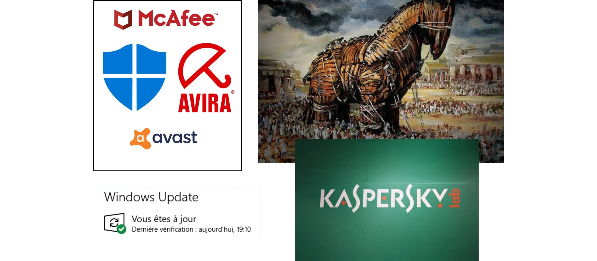
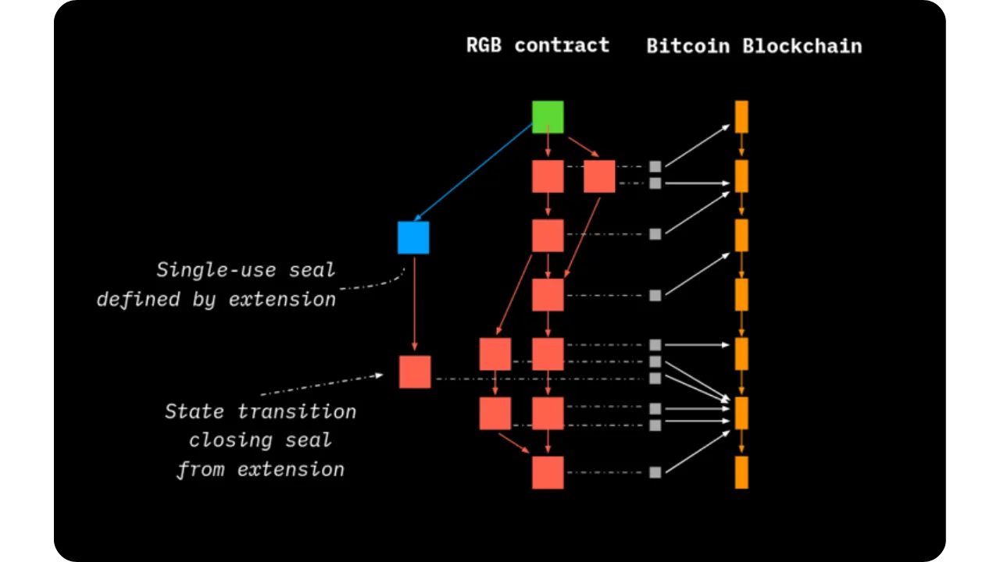
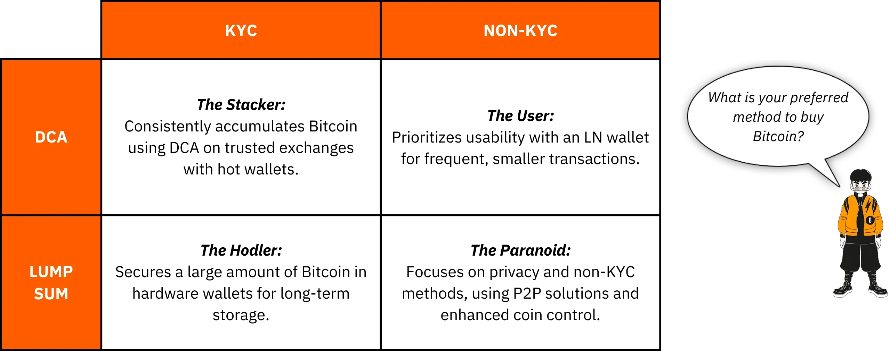

# Matka ensimmäisiin bitcoineihin

Bitcoin:n ekosysteemi kasvaa huikeasti ja ennennäkemättömästi. Satoshi Nakamoton keksinnön vauhdittamat teknologiset, taloudelliset ja sosiaaliset muutokset kiihtyvät päivä päivältä ja avaavat vähitellen ovet uuteen maailmaan, josta sinä voit nyt ottaa täyden hyödyn irti.

Sukellus Bitcoin Rabbit Holeen on jännittävä älyllinen seikkailu, joka stimuloi kriittistä ajatteluasi ja haastaa monia vakaumuksiasi. Tämä tutkimusmatka ei ainoastaan anna sinulle syvällistä ymmärrystä siitä, miten Bitcoin toimii, vaan myös todellisen tilaisuuden vaatia takaisin henkilökohtainen vapautesi, suojella yksityisyyttäsi ja saavuttaa todellinen taloudellinen riippumattomuus.

Jotta voisin opastaa sinua tehokkaasti tällä matkalla, olen luonut tämän täysin ilmaisen kurssin. Tässä keskitytään yksinomaan Bitcoin:een. Ei epäolennaisia keskusteluja, ei mainintoja muista kryptovaluutoista, vain selkeää, täsmällistä ja suoraviivaista sisältöä.

Tämä kurssi on suunniteltu niin, että voit täysin hallita oppimistapojasi, jolloin voit tutustua Bitcoin:een omaan tahtiisi ja seurata polkua, joka sopii parhaiten kiinnostuksen kohteisiisi ja tavoitteisiisi.

+++
# Johdanto

<partId>008c49b7-5e17-5973-87f2-ba28429b2697</partId>

## Kurssin yleiskatsaus

<chapterId>bfc96999-0ee1-5c41-8297-1b629f50cffc</chapterId>

Tervetuloa BTC102:een! Jos olet jo suorittanut BTC101-kurssin, olet tutustunut keskeisiin teoreettisiin käsitteisiin, jotka selittävät, miksi Bitcoin on niin vallankumouksellinen teknologia. Nyt BTC102:n myötä on aika toteuttaa nämä tiedot käytännössä. Tämä kurssi on suunniteltu auttamaan sinua rakentamaan henkilökohtainen Bitcoin-suunnitelmasi askel askeleelta.

Seuraavissa luvuissa opastamme sinua käytännön vaiheissa, jotta voit **hankkia ensimmäiset bitcoinisi**, **suojata** ne kunnolla ja ottaa itsevarmasti ensimmäiset askeleesi tässä nopeasti kasvavassa ekosysteemissä.

https://planb.network/courses/2b7dc507-81e3-4b70-88e6-41ed44239966

Vaikka Bitcoin on ollut olemassa jo yli 16 vuotta, ala on edelleen nuori, dynaaminen ja syvälle vapauteen juurtunut. Sen taustalla oleva protokolla on täysin hajautettu ja vastustuskykyinen keskusviranomaisten valvonnalle, mikä mahdollistaa ekosysteemin luonnollisen ja orgaanisen kasvun.

Vaikka tämä vapaus synnyttää uskomattoman innovaation ja mahdollisuuksien aallon, siihen liittyy myös tiettyjä riskejä, kuten huijauksia, yleisiä virheitä ja sudenkuoppia, jotka usein johtuvat tiedon puutteesta. Tämän kurssin päätavoitteena on auttaa sinua navigoimaan tässä uudessa ekosysteemissä luottavaisesti ja turvallisesti.

Tämän saavuttamiseksi BTC102-kurssi on jaettu useisiin osioihin, joista kukin keskittyy Bitcoin:n kanssa kulkemasi matkan keskeiseen osa-alueeseen:

Ensimmäinen jakso "Bitcoin:n ymmärtämisen edellytykset" valmistelee sinua tehokkaasti tulevaan. Opit tunnistamaan Bitcoin-ekosysteemissä mahdollisesti esiintyviin huijauksiin ja taloudellisiin petoksiin liittyvät tärkeimmät sudenkuopat. Sen jälkeen käsittelemme verkkoturvallisuuden olennaisia perusteita.

Lopuksi annan muutamia käytännön vinkkejä, jotka on suunniteltu erityisesti aloittelijoille ja joiden avulla voit välttää tavallisia virheitä, kun työskentelet Bitcoin:n kanssa ensimmäistä kertaa.

Toinen osio, "Ymmärrä, mihin olet ryhtymässä", syventää yleistä ymmärrystäsi Bitcoin:sta. Aluksi käymme läpi kaikki olennaiset käsitteet varmistaaksemme, että ymmärrät ne täysin.

Sen jälkeen selitämme, miksi Bitcoin on perustavanlaatuisen tärkeä teknologisesta, taloudellisesta ja yhteiskunnallisesta näkökulmasta, ja vahvistamme uskoasi sen arvoon. Tutustut myös Bitcoin-teollisuuteen kokonaisuutena: sen keskeisiin toimijoihin, organisaatioon ja kehitykseen vuosien varrella. Lopuksi käsittelemme Bitcoin-ekosysteemin kerroksittaista arkkitehtuuria, joka on ratkaiseva käsite sen ymmärtämiseksi, miten tämä järjestelmä jatkaa innovointia vaarantamatta sen ydinprotokollan eheyttä.

Kolmannessa osassa "Suunnitelman laatiminen" keskitytään henkilökohtaiseen lähestymistapaan Bitcoin:ään. Aloitamme auttamalla sinua määrittelemään käyttäjäprofiilisi neljästä pääluokasta:

- hodler*, joka keskittyy pitämään Bitcoin:tä hallussaan pitkällä aikavälillä ;
- pinoaja*, joka ostaa säännöllisesti ja järjestelmällisesti;
- käyttäjä*, joka käyttää Bitcoin:tta ensisijaisesti päivittäin;
- ja lopuksi *paranoidi*, joka haluaa maksimaalisen turvallisuuden suojellakseen tehokkaasti omaisuuttaan ja yksityisyyttään.

Opastamme sinua toteuttamaan strategian, joka sopii profiiliisi ja auttaa sinua saavuttamaan henkilökohtaiset tavoitteesi.

Neljännessä osassa "Perillisten ja varallisuuden suojaaminen" käsitellään tärkeää aihetta, joka usein unohdetaan: miten varmistetaan, että Bitcoin siirtyy läheisille odottamattoman tapahtuman sattuessa. Opit, miten Bitcoin:n perintösuunnitelma luodaan ja laaditaan, jotta voit varmistaa varallisuutesi säilymisen elinaikasi jälkeen.

Tämän kurssin lopussa sinulla on kaikki käytännön työkalut, joita tarvitset navigoidaksesi Bitcoin-ekosysteemissä ja tullaksesi yhdeksi sen edistyneimmistä käyttäjistä!

Oletko valmis aloittamaan matkasi Bitcoin:n maailmaan? Mennään!

# Bitcoin:n ymmärtämisen edellytykset

<partId>4481fc4b-0f83-489e-ad07-81517c5d6bad</partId>

## Huijaukset ja talouspetokset

<chapterId>8af2948b-2ab5-54c4-862c-3414b8a285a2</chapterId>

Bitcoin-ekosysteemi ja sitä ympäröivä ympäristö ovat vielä suhteellisen nuoria ja maasta riippuen löyhästi säänneltyjä. Vaikka tämä vapaus avaa valtavia mahdollisuuksia, se luo myös hedelmällisen maaperän taloushuijauksille, huijauksille ja erilaisille manipulaatioille. Siksi ensimmäinen luku on niin tärkeä: yleisten sudenkuoppien ymmärtäminen auttaa sinua välttämään ne. Taloudellinen turvallisuutesi on etusijalla, sillä huono kokemus ei vaikuta vain sinuun, vaan koko Bitcoin-yhteisöön.

### Bitcoin vs. kryptot: erojen ymmärtäminen

Ennen kuin menemme pidemmälle, on tärkeää tehdä selvä ero kahden täysin erilaisen maailman välillä:

- Bitcoin-ekosysteemi** keskittyy terveen rahan ideaan, joka perustuu vahvaan hajauttamiseen, pitkän aikavälin kestävyyteen, yksityisyyteen ja yksilön itsemääräämisoikeuteen. Bitcoin on toiminut luotettavasti ja turvallisesti siitä lähtien, kun se lanseerattiin vuonna 2009, ja sitä on tukenut maailmanlaajuinen, sitoutunut kehittäjäyhteisö. Se ei ole ohimenevä trendi, vaan vakaa ja vakiintunut protokolla, joka on suunniteltu säilyttämään arvonsa pitkällä aikavälillä.

- Kryptovaluuttateollisuus** on sitä vastoin paljon laajempi, ja siihen kuuluu kymmeniä tuhansia eri projekteja, joilla kullakin on oma tokeninsa. Tätä alaa ohjaavat usein nopeat innovaatiot, hype ja lyhyen aikavälin taloudellinen keinottelu. Monet näistä hankkeista ovat keskitettyjä, vähemmän turvallisia eivätkä tarjoa juurikaan todellista arvoa rohkeista lupauksista ja näyttävästä markkinoinnista huolimatta.

Jos haluat ymmärtää paremmin, mistä Bitcoin on peräisin ja mikä tekee siitä erilaisen kuin muut projektit, suosittelen tutustumaan tähän Bitcoin:n historiaa käsittelevään ilmaiseen jatkokurssiin myöhemmin:

https://planb.network/courses/a51c7ceb-e079-4ac3-bf69-6700b985a082

Kuten tiedätte, Plan ₿ Network-alusta on omistettu yksinomaan Bitcoin:lle. Jos kuitenkin ymmärrät eron muihin kryptovaluuttoihin, voit välttää hyödyttömiin ja joskus jopa vilpillisiin hankkeisiin liittyvät sudenkuopat.

### Tärkeimmät vältettävät huijaukset

Tässä ovat yleisimmät huijaukset, joihin saatat törmätä matkallasi:

#### Pyramidijärjestelmät ja Ponzi-järjestelmät

Nämä ovat kryptomaailman yleisimpiä huijauksia. Ponzi-huijauksessa varhaiset osallistujat saavat maksuja uudempien osallistujien rahoilla, ei mistään oikeasta sijoituksesta tai tuotteesta. Mitään todellista arvoa ei luoda. Järjestelmä toimii vain niin kauan kuin uusia ihmisiä liittyy jatkuvasti. Kun uusien osallistujien virta hidastuu, koko järjestelmä hajoaa.

Näissä huijauksissa on yleensä :

- Epärealistiset lupaukset taatusta tuotosta (esim. 20 prosentin takuutuotto);
- Viivästyksiä tai vaikeuksia, kun yrität nostaa sijoitettuja varoja;
- Vahvat kannustimet rekrytoida uusia jäseniä järjestelmän ylläpitämiseksi;
- Luvattujen tuottojen todellisen lähteen täydellinen avoimuuden puute.

Loppujen lopuksi kaikki pyramidi- ja Ponzi-järjestelmät ovat tuomittuja epäonnistumaan. Niiden perustavanlaatuinen heikkous on jatkuva tarve saada uusia sijoittajia maksamaan tuottoa aiemmille osallistujille. Tätä tarvetta on matemaattisesti mahdotonta ylläpitää ajan mittaan, koska tarvittavien uusien tulokkaiden määrä kasvaa eksponentiaalisesti järjestelmän kasvaessa. Kun kriittinen piste on saavutettu, osallistujat alkavat epäillä, luottamus katoaa ja koko pyramidi romahtaa. Tässä vaiheessa viimeisenä liittyneet ihmiset, jotka ovat usein vähiten perillä asioista, menettävät koko sijoituksensa, eivätkä voi saada sitä takaisin, kun taas järjestäjät tai varhaiset sijoittajat ovat yleensä jo vetäneet varansa pois ja poistuneet järjestelmästä.

Kryptovaluuttamaailmassa Ponzi-huijaukset voivat olla monenlaisia, ja ne on usein suunniteltu kätkemään petollinen luonne teknologisen tai taloudellisen naamion taakse. Nämä huijaukset voivat näyttäytyä uusina token-tarjouksina tai Initial Coin Offerings (ICO), jotka ovat varainhankintaoperaatioita, joissa uutta kryptovaluuttaa myydään yleisölle. Teknisten termien, kuten "Blockchain", "älykkäät sopimukset" tai "panostaminen", taakse kätkeytyy joissakin hankkeissa itse asiassa monimutkaisia pyramidihuijauksia. Toiset väittävät tarjoavansa suuria tuottoja yhdistämällä kyseenalaisia krypto-omaisuuksia korvausjärjestelmiin, jotka perustuvat täysin uusien sijoittajien jatkuvaan tuloon.

Viime aikoina Ponzi-järjestelmät ovat levinneet myös hajautetun rahoituksen (DeFi) maailmaan. Vaikka DeFi:n tarkoituksena on tarjota rahoituspalveluja ilman välikäsiä, jotkin hankkeet käyttävät sitä antaakseen huijauksilleen vääränlaisen laillisuuden tunteen. Tietyt DeFi-alustat lupaavat Exchange:ssa korkeita, taattuja tuottoja kryptovaluuttatalletuksista automaattisiin protokolliin. Näiden houkuttelevien lupausten taustalla on usein läpinäkymättömiä ja todentamattomia mekanismeja, ja niiden taustalla on erityisesti huijausta varten luotuja tokeneita. Todellisuudessa näillä järjestelmillä ei ole kestävää liiketoimintamallia - tuotot maksetaan yksinkertaisesti uusien käyttäjien varoista, aivan kuten perinteisessä Ponzi-järjestelmässä. Kun luottamus alkaa rapautua tai uusien osallistujien tulo hidastuu, nämä järjestelmät romahtavat väistämättä, mikä johtaa pahaa-aavistamattomien sijoittajien merkittäviin tappioihin.

Huomaa, että tämän kurssin sisältö on tarkoitettu ainoastaan koulutustarkoituksiin, eikä sitä pidä tulkita rahoitusneuvonnaksi. Taloudellinen turvallisuutesi riippuu kyvystäsi pysyä varovaisena, skeptisenä ja hyvin informoituna jokaisen tekemäsi rahoituspäätöksen yhteydessä.

Paras suoja on kysyä aina tämä yksinkertainen kysymys: Mistä luvattu tuotto todella tulee? Jos vastaus on epäselvä, juokse välittömästi pois.

#### Pump & Dump

Tämäntyyppiseen huijaukseen kuuluu, että omaisuuserän - usein matalan likviditeetin kryptovaluuttapolettimerkin - hintaa paisutetaan keinotekoisesti koordinoidulla markkinointikampanjalla, jota yleensä johtaa ryhmä sijoittajia. Tyypillinen Pump & Dump -järjestelmä noudattaa tätä kaavaa:

- Ryhmä sisäpiiriläisiä tai vaikutusvaltaisia henkilöitä kerää hiljaa suuren määrän kohteena olevaa omaisuutta.
- Sen jälkeen ne käynnistävät aggressiivisen mainoskampanjan generate-hypeä varten ja nostavat hintaa.
- Yleisö alkaa FOMO:n (Fear of Missing Out) innoittamana ostaa omaisuuserää suurina määrinä, mikä nostaa hintaa entisestään.
- Hypen huipulla sisäpiiriläiset myyvät omistuksensa kerralla pois.
- Hinta romahtaa ja myöhästyjät kärsivät suuria tappioita.

On tärkeää huomata, että Pump & Dump -strategiat ovat laittomia monissa maissa, ja niitä pidetään eräänlaisena markkinoiden manipulointina. Tästä huolimatta tällaiset järjestelmät kukoistavat edelleen, erityisesti kryptovaluutta-alalla, jossa sääntely on vasta tulossa.

Ole erityisen varovainen Telegramin, Discordin tai muiden sosiaalisen median kanavien kaltaisten alustojen yksityisten "signaaliryhmien" suhteen. Niitä ylläpitävät usein vaikuttajat tai itseään asiantuntijoiksi kutsuvat henkilöt, joista jotkut perivät jopa osallistumismaksuja. Vaikka nämä ryhmät väittävät tarjoavansa eksklusiivisia sijoitusmahdollisuuksia, todellisuus on paljon yksipuolisempi: vain järjestäjät hyötyvät, kun taas useimmat osallistujat menettävät lopulta rahansa.

On totta, että jotkut osallistujat saattavat tilapäisesti hyötyä tällaisista markkinamanipulaatioista, mutta heidän menestyksensä perustuu yleensä vain tuuriin ja täydelliseen ajoitukseen. Pitkällä aikavälillä nämä järjestelmät eivät ole kestäviä. Ne edellyttävät jatkuvaa suuren riskin ottamista ja toistuvaa osallistumista vilpillisiin asetelmiin, jotka väistämättä romahtavat.

Vielä pahempaa on se, että ne ruokkivat vaarallista harhaa: uskomusta siitä, että on mahdollista tehdä nopeasti ja helposti rahaa ymmärtämättä, miten rahoitusjärjestelmät todellisuudessa toimivat. Tämä ajattelutapa ei ainoastaan aseta yksilöitä vaaraan, vaan myös heikentää koko kryptovaluuttaekosysteemin uskottavuutta

Kaikista näistä syistä paras strategia on pitää kiinni vakavasta ja harkitusta lähestymistavasta sijoittamiseen, joka perustuu talouskoulutukseen, perusasioiden vankkaan ymmärtämiseen ja pitkän aikavälin näkökulmaan.

Kun kartutat tietämystäsi kärsivällisesti, olet paljon vähemmän altis tunnemanipulaatiolle ja epärealistisille lupauksille ja paljon paremmin varustautunut välttämään taloudellisia ansoja, jotka voivat johtaa todellisiin tappioihin.

#### Lahjoitus, arpajaiset ja väärennetyt Giveaway-huijaukset

Tämäntyyppinen huijaus lupaa ilmaisen Bitcoin:n tai muita Exchange:n palkintoja, jos lähetät ensin pienen summan rahaa. On tärkeää muistaa, että yksikään laillinen henkilö tai organisaatio ei koskaan pyydä sinua lähettämään kryptovaluuttaa etukäteen ja lupaa lähettää sinulle vastineeksi enemmän rahaa.

Huijarit esiintyvät usein tunnetuina julkisuuden henkilöinä (kuten Elon Musk tai muut julkkikset) houkutellakseen uhreja sosiaalisen median kautta. Tarkista aina tilien ja verkkosivustojen laillisuus, ennen kuin otat niihin yhteyttä, äläkä koskaan luota tarjouksiin, jotka vaikuttavat liian anteliailta tai liian hyviltä ollakseen totta.

Joskus nämä huijaukset esiintyvät "ennakkomaksuhuijauksina". Sinulle luvataan palkinto tai palkkio (rahaa, tuote tai palvelu), mutta sinua pyydetään ensin maksamaan maksu, jonka oletetaan kattavan esimerkiksi toimituskulut, verot tai transaktiokulut. Kun maksu on suoritettu, huijari katoaa, eikä luvattua palkkiota koskaan saada.

#### Shitcoineja ja kryptovaluuttoja tarjolla

Keskitetyt kryptovaluuttaprojektit tarjoavat joskus ilmaisia tokeneita ("*airdrops*") houkutellakseen käyttäjiä.Näillä tokeneilla on yleensä vain vähän tai ei lainkaan todellista arvoa, ja niitä käytetään lähinnä luomaan illuusio suosiosta tai vauhdittamaan spekulaatiota. Ole äärimmäisen varovainen tällaisten kampanjatarjousten kanssa; ne ovat usein pikemminkin markkinointiansoja kuin todellisia mahdollisuuksia.

#### Identiteettivarkaudet ja tietojenkalastelu

Hyökkääjät käyttävät usein väärennettyjä verkkosivustoja, sosiaalisen median tilejä tai harhaanjohtavia sähköposteja yrittäessään varastaa varojasi. Nämä huijaukset voivat tapahtua minkä tahansa viestintäkanavan kautta: sähköpostin, sosiaalisten verkostojen, puheluiden tai jopa perinteisen postin kautta....

Ennen kuin napsautat linkkiä tai ryhdyt mihinkään toimiin, tarkista aina lähettäjän henkilöllisyys. Jos olet epävarma, käy sivustolla manuaalisesti sen sijaan, että käyttäisit annettua linkkiä. Mikä tärkeintä, älä koskaan jaa yksityisiä avaimia tai salasanoja kenenkään kanssa.

#### Bitcoin Kovahaarukat

Bitcoin on vuosien varrella kokenut useita *Hard haarautumia*, jotka ovat johtaneet alkuperäisen kryptovaluutan vaihtoehtoisten versioiden luomiseen. Yksinkertaisesti sanottuna *Hard Fork* on verkon jakautuminen, joka johtaa kahteen erilliseen lohkoketjuun, joilla molemmilla on sama historia jakautumishetkeen asti. Tällaisia haarautumia tapahtuu yleensä silloin, kun osa kehittäjäyhteisöstä tai laajemmasta Bitcoin-ekosysteemistä haluaa tehdä suuria muutoksia alkuperäiseen protokollaan, mutta ei pääse laajaan yhteisymmärrykseen. Sen sijaan, että he hylkäisivät ideansa, he päättävät julkaista uuden version Bitcoin:sta (muutetuilla säännöillä) toivoen, että käyttäjät ja louhijat valitsevat Fork:n sen sijaan.

Kaikki *Hard:n haarautumiset* eivät ole vilpillisiä, sillä jotkut niistä johtuvat yhteisön sisäisistä teknisistä tai ideologisista erimielisyyksistä. Toisten taustalla ovat kuitenkin kaupalliset intressit tai jopa epärehelliset motiivit. Tunnetuimpia esimerkkejä tällaisista hardforkeista ovat **Bitcoin Cash (BCH)** ja **Bitcoin Satoshi Vision (BSV)**. Nämä vuonna 2017 ja 2018 lanseeratut vaihtoehtoiset valuutat väittävät usein olevansa "parempia versioita" alkuperäisestä Bitcoin:stä. Ne mainostavat oletettuja etuja, kuten alhaisempia transaktiomaksuja tai nopeampia transaktioita suuremman lohkokoon ansiosta. Näihin teknisiin muutoksiin liittyy kuitenkin merkittäviä kompromisseja turvallisuuden, hajauttamisen ja kestävyyden kannalta; Elements, jotka voivat olla ristiriidassa Bitcoin:n perusperiaatteiden kanssa.

Teknisten erojen lisäksi nämä vaihtoehtoiset valuutat hyödyntävät usein hämmennystä houkutellakseen tietämättömiä sijoittajia. Ne saattavat käyttää markkinointitaktiikoita, joiden tarkoituksena on johtaa tarkoituksellisesti harhaan uusia tulokkaita, jotka luulevat ostavansa aitoa Bitcoin (BTC).

Jotta et joutuisi tähän ansaan, tarkista aina ostamasi valuutta. Alkuperäinen Bitcoin käyttää nimimerkkiä **BTC**, kun taas Bitcoin Cash ja sen johdannaiset käyttävät erillisiä lyhenteitä, kuten BCH tai BSV.

#### Epärehelliset vaikuttajat ja väärennetyt gurut

Kryptovaluuttojen saadessa valtavirran huomion sosiaalisessa mediassa on nähty vaikuttajien, itseoikeutettujen asiantuntijoiden ja niin sanottujen *kryptogurujen* lisääntyminen. Vaikka muutamat heistä saattavat tarjota aitoja opettavaisia näkemyksiä, monet muut käyttävät näkyvyyttään hyväkseen edistääkseen kyseenalaisia hankkeita tai vaarallisen riskialttiita (ja joskus suorastaan petollisia) kaupankäyntistrategioita.Näiden henkilöiden motiivina ovat yleensä henkilökohtaiset taloudelliset intressit, ja he saavat usein suoraa tai epäsuoraa korvausta tiettyjen kuponkien tai alustojen edistämisestä.

Nämä vaikuttajat käyttävät usein hyväksi havaittuja taktiikoita houkutellakseen aloittelijoita: he esittelevät vaikuttavia taloudellisia tuloksia (jotka ovat usein väärennettyjä tai tarkistamattomia), esittävät ylellistä elämäntyyliä muka todisteena menestyksestään ja mainostavat "ihmeellisiä" sijoitusstrategioita. Tavoitteena on herättää FOMO - pelko siitä, että jää paitsi - ja ajaa yleisö impulsiivisiin päätöksiin ja holtittomiin sijoituksiin.

On tärkeää ymmärtää, että suurin osa näiden persoonallisuuksien antamista "ilmaisista" neuvoista ei ole koskaan todella ilmaisia. Anteliaisuuden julkisivun takana on usein laskelmoitu strategia, jolla ihmisiä ohjataan ostamaan kyseenalaista omaisuutta. Ja vaikka jotkut vaikuttajat olisivatkin rehellisiä, heidän tulostensa toistaminen olisi lähes mahdotonta; heidän menestyksensä riippuu usein erityisestä ajoituksesta, sisäpiirin tiedosta tai ainutlaatuisista olosuhteista, joita sinulla ei yksinkertaisesti ole käytettävänäsi.

Jotkut vaikuttajat saattavat kutsua sinut liittymään yksityisiin, maksullisiin ryhmiin, joissa he väittävät jakavansa eksklusiivisia kaupankäyntisignaaleja tai sisäpiirin vinkkejä, jotka lupaavat nopeita ja helppoja voittoja. Todellisuudessa nämä ryhmät hyödyttävät lähinnä järjestäjiä itseään. He käyttävät seuraajiaan usein likviditeetin lähteenä, jolloin he lähinnä purkavat omaisuuttaan henkilökohtaisen hyödyn saamiseksi. Tilaajat päätyvät yleensä menettämään rahaa, koska he eivät pysty reagoimaan yhtä nopeasti kuin kauppoja järjestävät sisäpiiriläiset (ks. jakso Pump & Dump -järjestelmistä).

Tämän todellisuuden valossa tässä on muutamia hyviä tapoja, joiden avulla voit välttää joutumasta epärehellisten vaikuttajien asettamiin ansoihin:

- Ole hyvin varovainen kryptosijoitussuositusten suhteen.**

Luotettava ja asiantunteva henkilö ei koskaan painosta sinua ostamaan kryptovaluuttaa rohkaisematta sinua tekemään ensin omaa tutkimusta.

- Maksulliset kaupankäynti- tai sijoituskurssit eivät aina ole merkki laadusta.**

Monet näistä kursseista edistävät riskialttiita tai liian yksinkertaistettuja strategioita; usein samat tiedot löydät ilmaiseksi verkosta.

- Ei ole olemassa mitään taattua tapaa kopioida jonkun kauppaa ja saada samanlaisia tuloksia.**

Jokainen sijoitusstrategia riippuu henkilökohtaisesta kontekstista, ajoituksesta, tietämyksestä ja muista tekijöistä, joita ei voida jäljentää tarkasti.

- Ole erityisen varovainen sellaisten neuvojen suhteen, jotka kuulostavat liian hyviltä ollakseen totta. **

Epärealistiset lupaukset tai taatut voitot ovat lähes aina merkkejä manipuloinnista. Muista: se, että joku sanoo jotain itsevarmasti, ei tee siitä totta.

Muista aina, että kaikilla Bitcoin:n tai laajemman kryptoekosysteemin edustajilla on henkilökohtainen agenda, olipa se sitten sanottu suoraan tai piilotettu rivien väliin. Puhtaasti neutraalia tietoa ei ole olemassa. Jopa tällä kurssilla, BTC102:lla, on selkeä tavoite: *edistää Bitcoin:n parempaa ymmärtämistä.*

Siksi on tärkeää olla tietoinen jokaisen käyttämäsi sisällön todellisista motiiveista. Äläkä koskaan unohda tätä internetin kultaista sääntöä:

*Jos tuote tai palvelu vaikuttaa ilmaiselta, olet todennäköisesti itse tuote.*

Viime kädessä paras puolustuskeinosi on henkilökohtainen koulutus, terve skeptisyys ja ennen kaikkea tapa tarkistaa tosiasiat itse.

### Miten välttää huijauksia

**Voidaksesi pysyä turvassa verkossa, erityisesti kryptomaailmassa, pidä mielessä nämä keskeiset periaatteet:**

- Älä koskaan luota sokeasti: "* Älä luota, tarkista*" ;
- Suhtaudu epäilevästi taattuihin tai epätavallisen korkeisiin tuottoihin;
- Älä koskaan jaa yksityisiä avaimiasi kenenkään kanssa;
- Älä lähetä Bitcoin:a (tai mitään kryptoa) tuntemattomiin osoitteisiin;
- Jos olet epävarma, pysähdy. Astu taaksepäin ja mieti ennen kuin ryhdyt toimiin. FOMO on pahin vihollisesi;
- Vältä maksullisia kaupparyhmiä tai yhteisöjä, jotka antavat epärealistisia lupauksia;
- Useimmat lahjakortit tai "ilmaiset" arpajaiset verkossa ovat huijauksia tai pahasti manipuloituja;
- Pitkällä aikavälillä voitat aina enemmän oppimalla kuin pelaamalla.

Suojautuminen huijauksilta on tärkeä ensimmäinen askel omaisuutesi suojaamisessa, mutta se ei riitä. Vahvan digitaalisen hygienian ylläpitäminen on yhtä tärkeää. Siksi seuraavassa luvussa tarkastelemme, miten voit vahvistaa verkkoturvallisuuttasi ja parhaita käytäntöjä, joita sinun tulisi ottaa käyttöön suojellaksesi itseäsi digitaalisessa maailmassa.

## Verkkoturvallisuus

<chapterId>f0873bf2-6a6f-5485-bb7a-d84be14f404d</chapterId>

Heti kun aloitat Bitcoin:n käytön, huomaat nopeasti, että perustietoturva ei ole vapaaehtoista, vaan välttämätöntä. Huijaukset ja petokset ovat vain jäävuoren huippu. Tietojen tahaton katoaminen, haittaohjelmat ja vaarantuneet salasanat voivat olla yhtä tuhoisia, varsinkin kun hallinnoit omia avaimiasi.

Tässä luvussa käydään läpi joitakin yksinkertaisia, käytännöllisiä toimia, joiden avulla voit parantaa digitaalista hygieniaasi ja suojella itseäsi digitaalisessa tilassa.

Jos haluat mennä syvemmälle, Plan ₿ Network:n SEC101-kurssi tarjoaa kattavan jaottelun kyberturvallisuusstrategioista, jotka on suunniteltu erityisesti Bitcoin:n käyttäjille.

https://planb.network/courses/99c46148-7080-4915-a7e0-9df0e145cd47

### Miksi kyberturvallisuus on tärkeää

Bitcoin antaa sinulle vallan pitää rahojasi suoraan (ilman pankkeja), ilman välikäsiä. Mutta tällainen taloudellinen itsemääräämisoikeus tuo mukanaan vakavan vastuun: jos BTC:si varastetaan turvallisuuspuutteen vuoksi, tapahtumaa ei voi peruuttaa. Toisin kuin perinteisessä pankkitoiminnassa, ei ole help desk -palvelua, ei petosvaatimuksia eikä vakuutusta, joka pelastaisi sinut.

Lisäksi Bitcoin:n taloudellinen arvo tekee siitä arvokkaan kohteen. Wallet:n vaarantava hakkeri voi välittömästi siirtää rahasi hallitsemalleen Address:lle (ilman kysymyksiä, eikä rahoja voi saada takaisin).

### Siisti, ajan tasalla oleva tietokone

Yksi henkilökohtaisen tietoturvan unohdetuimmista osa-alueista on käyttöjärjestelmän ja ohjelmistojen pitäminen ajan tasalla. Monet päivitykset paikkaavat tunnettuja haavoittuvuuksia, joita hyökkääjät voisivat muutoin käyttää hyväkseen. Vaikka jotkut välttelevät päivityksiä suorituskykyongelmien pelossa, todellinen riski on vanhentuneiden ohjelmistojen käyttäminen, jotka hakkerit osaavat jo murtaa.

On myös erittäin suositeltavaa käyttää luotettavaa virustorjuntaohjelmaa. Windowsissa sisäänrakennettu Windows Defender on yleensä riittävä useimmille käyttäjille. Jos haluat lisäominaisuuksia tai mielenrauhaa, saatavilla on myös kaupallisia vaihtoehtoja, kuten Kaspersky. MacOS:ssä haittaohjelmien uhat ovat historiallisesti harvinaisempia **mutta eivät ole olemattomia**, joten on silti viisasta olla varovainen.

Järjestelmäpäivitysten ja virustorjunnan lisäksi kannattaa olla erittäin varovainen ladatessasi ohjelmistoja epäilyttäviltä verkkosivustoilta tai niin sanotuista "yleisistä" latausportaaleista. Kun tarvitset työkalua tai sovellusta, siirry aina suoraan viralliseen lähteeseen;Tämä vähentää huomattavasti lailliseksi ohjelmistoksi naamioituneen haittaohjelman asentamisen riskiä.

Toinen fiksu tapa on tarkistaa kaikkien ohjelmistojen aitous ja eheys ennen niiden asentamista koneellesi. Jos et ole varma, miten se tehdään, älä huoli, meillä on oma opetusohjelma, joka opastaa sinua prosessin läpi:

https://planb.network/tutorials/computer-security/data/integrity-authenticity-21d0420a-be02-4663-94a3-8d487f23becc

Lopuksi, tee säännöllisesti varmuuskopioita tärkeistä tiedoistasi. Ulkoinen Hard-asema tai SSD-levy on hyvä vaihtoehto tiedostojen kopioiden säilyttämiseen äkillisen vian, hakkeroinnin tai vahingossa tapahtuvan poistamisen varalta. Kiität itseäsi myöhemmin.

Jos suosit pilviratkaisuja, harkitse Proton Driven kaltaisen suojatun palvelun käyttöä. Varmista vain, että valitsemasi vaihtoehto kunnioittaa yksityisyyttäsi ja tarjoaa vahvan salauksen.

https://planb.network/tutorials/computer-security/data/proton-drive-03cbe49f-6ddc-491f-8786-bc20d98ebb16

Yleisesti suositeltu varmuuskopiointistrategia on "3-2-1-sääntö". Sen tarkoituksena on suojata tiedot vahingossa tapahtuvalta katoamiselta, verkkohyökkäyksiltä tai jopa luonnonkatastrofeilta.

Idea on yksinkertainen:

- Pidä **vähintään 3 kopiota** tärkeistä tiedoistasi,
- Tallenna ne **vähintään kahdelle erityyppiselle tietovälineelle** (esim. ulkoinen Hard-asema ja pilvitallennus),
- Ja varmista, että **1 näistä kopioista on tallennettu muualle** (fyysisesti erillään pääsijainnista).

Tämä lähestymistapa tarjoaa vahvan kestävyyden ja auttaa varmistamaan, että tietosi säilyvät, vaikka jokin menisi pahasti pieleen.

### Ratkaisu henkilöllisyystodistusten painajaiseen

Yksi suurimmista syistä, miksi ihmiset joutuvat hakkeroiduksi, on heikkojen salasanojen käyttö. Huomattava osa käyttäjistä käyttää edelleen samaa salasanaa useilla tileillä tai valitsee muunnelmia, jotka on helppo arvata. Salasanojen hallintajärjestelmät ovat täydellinen ratkaisu tähän ongelmaan.

Salasanojen hallinnan avulla voit:

- Säilytä kaikki salasanasi turvallisesti** salatussa holvissa
- generate pitkät, monimutkaiset ja yksilölliset salasanat** automaattisesti jokaiselle tilille
- Käytä vain yhtä pääsalasanaa**, jolla pääset kaikkeen turvallisesti käsiksi

Salasanahallinnan avulla sinun ei enää koskaan tarvitse klikata "Unohdin salasanan" tai luottaa heikoihin, toistuvasti käytettyihin tunnuksiin. Lisäksi useimmat salasanahallintajärjestelmät synkronoivat saumattomasti kaikki laitteesi (työpöytä, puhelin, tabletti) ja jopa täyttävät kirjautumislomakkeet automaattisesti, mikä tekee turvallisesta käytöstä vaivatonta ja tehokasta.

Salasanahallintaohjelmia on monia, mutta voin suositella kahta vankkaa vaihtoehtoa tarpeidesi mukaan. Jos etsit jotain helppokäyttöistä, joka synkronoi saumattomasti useiden laitteiden välillä, Bitwarden on erinomainen valinta:

https://planb.network/tutorials/computer-security/authentication/bitwarden-0532f569-fb00-4fad-acba-2fcb1bf05de9

Jos haluat pitää kaiken mieluummin paikallisesti omalla laitteellasi, KeePass on hyvä vaihtoehto:

https://planb.network/tutorials/computer-security/authentication/keepass-f8073bb7-5b4a-4664-9246-228e307be246

### 2FA: kaksinkertainen suojaus

Bitcoin:ssä olet oma pankkisi. Se tarkoittaa, että olet myös oma turvatiimisi. Vaikka salasana olisi vahva, nollariskiä ei ole olemassakaan, minkä vuoksi kaksitekijätodennuksen (2FA) käyttöönotto on tärkeää.

2FA lisää toisen Layer-suojan vaatimalla aikapohjaisen kertakäyttökoodin (yleensä 6 numeroa), joka luodaan sovelluksella, kuten Google Authenticator tai Authy. Vaikka joku saisi salasanasi haltuunsa, hän ei silti pääse tilillesi ilman fyysistä pääsyä puhelimeesi.

https://planb.network/tutorials/computer-security/authentication/authy-a76ab26b-71b0-473c-aa7c-c49153705eb7

Kun otat 2FA:n käyttöön, varmista, että sovelluksen palautusavain tallennetaan turvalliseen paikkaan. Näin voit palauttaa koodit, jos kadotat tai vaihdat puhelimesi. Vaikka tekstiviesti- tai sähköpostipohjainen 2FA on parempi kuin ei mitään, se on paljon vähemmän turvallinen. SIM-kortin vaihtohyökkäys, jossa joku ottaa puhelinnumerosi haltuunsa, voi helposti ohittaa tällaisen suojan.

Niille, jotka haluavat viedä turvallisuuden askeleen pidemmälle, YubiKeyn kaltaiset fyysiset avaimet tarjoavat vieläkin paremman suojan.

https://planb.network/tutorials/computer-security/authentication/security-key-61438267-74db-4f1a-87e4-97c8e673533e

### Yksityisyyden suojaaminen

Yksityisyys ja kyberturvallisuus liittyvät läheisesti toisiinsa: mitä enemmän tietoja jätät vapaasti saataville, sitä todennäköisemmin sinusta tulee kohde.

**VPN** (*Virtuaalinen yksityisverkko*) on yksinkertainen mutta tehokas tapa peittää IP Address ja salata internet-liikenteesi. Vaikka se ei tee sinusta täysin näkymätöntä (koska VPN-palveluntarjoaja voi silti nähdä toimintasi), se vaikeuttaa huomattavasti kenen tahansa vakoilua tai selaustottumustesi seuraamista.

Tärkeintä on valita luotettava VPN-palveluntarjoaja, joka:

- Ei vaadi henkilötietojasi
- Mahdollistaa maksun BTC:n kautta
- Noudattaa tiukkaa kirjaamiskieltopolitiikkaa

Plan ₿ Network:ssä on useita oppaita, jotka opastavat sinua VPN:n perustamisessa helposti. Suosittelen erityisesti IVPN:ää tai Mullvadia:

https://planb.network/tutorials/computer-security/communication/ivpn-5a0cd5df-29f1-4382-a817-975a96646e68

https://planb.network/tutorials/computer-security/communication/mullvad-968ec5f5-b3f0-4d23-a9e0-c07a3e85aaa8

Yksityisyyden suojaamiseen verkossa kuuluvat myös seuraavat olennaiset toimet:

- Käyttämällä **salattuja viestialustoja**, kuten Signal, SimpleX tai Session;
- Käyttämällä yksityisyyden suojaan keskittyviä selaimia, kuten Firefox, Brave tai Tor (anonymiteetin parantamiseksi);

https://planb.network/tutorials/computer-security/communication/tor-browser-a847e83c-31ef-4439-9eac-742b255129bb

- Käyttämällä **turvallista postilaatikkoa**, kuten ProtonMail;

https://planb.network/tutorials/computer-security/communication/proton-mail-c3b010ce-254d-4546-b382-19ab9261c6a2

- Tiedostojen salaaminen** Bitlockerin (Windows) tai VeraCryptin (saatavilla useilla alustoilla) kaltaisilla työkaluilla.

https://planb.network/tutorials/computer-security/data/veracrypt-d5ed4c83-7c1c-4181-95ea-963fdf2d83c5

### Vaiheittainen eteneminen

Kyberturvallisuus voi tuntua massiiviselta yritykseltä, ja aloittelijoiden on helppo hukkua siihen ja luovuttaa, koska se tuntuu liian monimutkaiselta. Temppu on lähestyä asiaa askel askeleelta. Aloita jostain yksinkertaisesta, kuten salasanahallintaohjelman asentamisesta. Anna itsellesi muutama viikko aikaa totutella siihen, ja siirry sitten seuraavaan vaiheeseen, kuten 2FA:n käyttöönottoon yhdellä tililläsi.

Kun luotat yhä enemmän näihin työkaluihin, voit lisätä niihin edistyneempiä käytäntöjä, kuten toisen sähköpostin käytön, ProtonMailin käytön, VPN:n käyttöönoton tai tarvittaessa Tor-selailun.

Kun sukellat syvemmälle Bitcoin:n maailmaan, huomaat, että riskit kasvavat Wallet:n arvon kasvaessa. Vankkojen tietoturvatottumusten luominen, yksityisyytesi suojaaminen ja oikeiden työkalujen käyttöönotto ei ainoastaan anna sinulle mielenrauhaa, vaan myös vahvistaa sitä suvereniteettia, josta Bitcoin:ssa on kyse.

Lyhyesti sanottuna: älä aliarvioi kyberturvallisuutta, käytä aikaa perusasioiden luomiseen ja muista, että johdonmukaisuus on avainasemassa. Ilman hyvää digitaalista hygieniaa parhaimmillakaan työkaluilla ei ole paljon hyötyä.

Muista myös tutustua [tietoturvaoppaamme](https://planb.network/tutorials/computer-security) osoitteessa Plan ₿ Network.

Seuraavassa luvussa kerron vielä muutamia vinkkejä, joiden avulla voit aloittaa Bitcoin-matkasi luottavaisesti ja välttää monia ansoja, jotka voivat yllättää tulokkaat.

## Vinkkejä uusille tulokkaille

<chapterId>33134b3f-92c1-5185-afb6-88599e47e801</chapterId>

Bitcoin:n aloittaminen voi olla jännittävää, mutta siihen liittyy myös omat riskinsä. Kryptomaailma on erilainen kuin mikään muu; hurjat hinnanvaihtelut, tuntematon teknologia ja hyvin todellinen mahdollisuus menettää rahasi lopullisesti yksinkertaisten virheiden tai huonojen sijoitusvalintojen vuoksi ovat kaikki sudenkuoppia, joista uusien käyttäjien tulisi olla tietoisia.

Tässä luvussa jaan joitakin käytännön neuvoja ja yleisiä ohjeita kaikille, jotka ovat ottamassa ensimmäisiä askeliaan, erityisesti niille, jotka tekevät ensimmäisen ostoksensa tai tutustuvat laajemmin finanssisijoittamisen maailmaan.

Seuraavassa ovat keskeiset kohdat, jotka käymme yhdessä läpi:

- Varo **Shitcoineja** ja muita hyödyttömiä kryptovaluuttoja;
- Sijoita vain **rahaa, jonka sinulla on varaa menettää**;
- Tiedä ero **kaupankäynnin** ja **sijoittamisen** välillä;
- Ole tietoinen sijoitustesi **verovaikutuksista**;
- Suojaa **palautuslauseesi** huolellisesti;
- Pysy nöyränä ja pidä **matalaa profiilia** (hienotunteisuus on osa turvallisuutta);
- Ajattele pitkällä aikavälillä**, suurenna ja ole kärsivällinen (ajattele, että se on maraton, ei sprintti).

### Yleiset virheet, joita kannattaa välttää

Bitcoin on avoin kaikille, mutta se ei tarkoita, että sinun pitäisi sukeltaa sinne valmistautumatta. Seuraavassa on muutamia klassisia virheitä, joita tulokkaat tekevät:

**Tekniset virheet:**

- seed-lauseen menettäminen:** Palautuslauseesi (yleensä 12 tai 24 sanaa) on ainoa tapa käyttää Bitcoin:tä, jos Wallet:lle tapahtuu jotain. Jos kadotat sen, varasi katoavat lopullisesti;
- Bitcoinien tallentaminen kolmannen osapuolen alustalle:** Jos kolikkosi ovat keskitetyssä alustassa, et oikeastaan omista niitä. Olet alttiina riskeille, kuten hakkeroinnille, alustan vioittumiselle tai jopa rahastojen takavarikoinnille;
- Yksityisyyden suojan laiminlyönti:** Yksityisyyden suojaaminen on keskeinen osa omaisuuden turvaamista. Jos paljastat julkisesti, kuinka paljon Bitcoin:ää sinulla on hallussasi, voit joutua kohteeksi;
- Riittämätön verkkoturva:** Jos et suojaa laitteitasi perussuojauksilla (kuten päivityksillä, vahvoilla salasanoilla tai 2FA:lla), olet helppo kohde hyökkääjille, ja se voi maksaa sinulle kaiken.

**Rahoitusvirheet:**

- Sijoitat enemmän kuin sinulla on varaa menettää**: Älä koskaan velkaannu tai laita vuokrarahojasi Bitcoin:aan. Taloudellisen perusvakautesi tulisi aina olla etusijalla.

- Ei tiedetä, mitä eroa on kaupankäynnillä ja sijoittamisella**: Kaupankäynti vaatii aikaa, taitoa ja vakavaa tunnekuria. Pitkän aikavälin sijoittaminen on paljon aloittelijoille helpompaa.

- Unohdetaan verot**: Jokaisella maalla on omat kryptoa koskevat verosääntönsä. Niiden huomiotta jättäminen voi aiheuttaa ikäviä yllätyksiä myöhemmin.

- FOMO**: Ostaminen impulsiivisesti, koska pelkäävät jäävänsä paitsi, johtaa yleensä huonoon ajoitukseen ja huonoihin päätöksiin. Kärsivällisyys on paras liittolaisesi.

### Sijoitusstrategian määrittely

Ennen kuin ostat ensimmäisen Satoshi:n, on tärkeää ymmärtää, miksi ja miten sijoitat Bitcoin:ään. Tämä tarkoittaa, että sinulla on selkeä rahoitussuunnitelma, joka on räätälöity henkilökohtaiseen tilanteeseesi ja pitkän aikavälin tavoitteisiisi.

Aloita määrittelemällä **budjettisi** tarkasti. Älä vain valitse satunnaista lukua. Ota aikaa laskea kuukausitulosi, vähennä niistä kiinteät menot (kuten vuokra, lainat, verot, yleishyödylliset palvelut) sekä päivittäiset elinkustannukset (ruoka, liikenne, vapaa-aika jne.). Jäljelle jäävä summa on säästömarginaalisi, ja vasta tästä osasta sinun kannattaa harkita sijoittamista.

Lähestymällä asiaa tällä tavoin varmistat, ettet aseta taloudellista hyvinvointiasi vaaraan etenkään markkinoiden laskusuhdanteen sattuessa. Harkittu strategia on pitkän aikavälin kestävyyden perusta.

Kun budjettisi on määritelty, mieti, miten haluat sijoittaa. Yksi aloittelijoille sopivimmista ja laajalti suositelluista menetelmistä on Dollar Cost Averaging (DCA), jossa ostetaan kiinteä määrä Bitcoin:tä säännöllisin väliajoin (viikoittain, kuukausittain jne.). Tämä strategia auttaa tasoittamaan keskimääräistä tulohintaasi ajan mittaan ja vähentää hinnanvaihtelujen emotionaalista vaikutusta. Se on fiksu lähestymistapa useimmille ihmisille, erityisesti vasta-alkajille.

Kysy sitten itseltäsi: Mikä on aikahorisontti?

Haluatko tehdä nopeita liikkeitä sisään ja ulos markkinoilta (kaupankäynti)? Vai oletko enemmän linjassa pitkän aikavälin ajattelutavan kanssa ja pidät Bitcoin:ta useiden vuosien ajan (hodler)? Jos olet hodler, olet luultavasti vähemmän huolissasi päivittäisistä hinnanvaihteluista ja keskityt enemmän pitkän aikavälin turvallisuuteen ja itsesäilytykseen. Jos olet kaupankäynnin kohteena, olet alttiimpi lyhyen aikavälin markkinahälylle, suuremmalle riskille ja stressille, joka usein liittyy nopeaan päätöksentekoon. Yhtä kaikille sopivaa vastausta ei ole, mutta oman lähestymistapasi tunteminen auttaa ohjaamaan päätöksiäsi.

Tärkeintä on, ettet tee sijoituspäätöksiä tunteiden tai pelon perusteella. Aseta strategia etukäteen, kirjoita se ylös ja pidä siitä kiinni.

Jos olet vielä epävarma, **aloita oppimalla.**

Vietä muutama tunti tutustumalla Bitcoin:ään, tutustu Plan ₿ Network:n ilmaisiin resursseihin, lue pari kirjaa, anna viisi euroa kokeillaksesi sitä ja katsele laadukasta sisältöä verkossa. Pysy uteliaana. Mitä mukavammaksi tulet, sitä helpompi on tarkistaa strategiaasi, muokata lähestymistapaa ja edetä luottavaisesti.

### BTC:n volatiliteetin ymmärtäminen

Bitcoin on tunnettu dramaattisista hinnanvaihteluistaan. Muutaman päivän aikana tapahtuvat 10, 20 tai jopa 50 prosentin muutokset eivät ole epätavallista. Uusille tulokkaille tällainen volatiliteetti voi olla hämmentävää. On helppo ajautua hypeen noususuhdanteiden aikana tai panikoida laskusuhdanteiden aikana; molemmat johtavat usein huonoihin päätöksiin, kuten tappiolla myymiseen.

Siksi on tärkeää, että **ymmärrät ja hyväksyt Bitcoin:n volatiliteetin** ennen sijoitusta. Nämä hintavaihtelut eivät ole vika, vaan ne ovat vielä kypsymässä olevan hyödykkeen ominaisuus. Jos äkilliset nousut ja laskut valvottavat sinua öisin tai pakottavat sinut tekemään tunnepohjaisia päätöksiä, olet todennäköisesti sijoittanut enemmän kuin voit ottaa riskin. Siinä tapauksessa ota askel taaksepäin ja arvioi strategiasi ja riskinsietokykysi uudelleen. Älä epäröi pienentää positioasi, kunnes tunnet olosi rauhallisemmaksi.

Ennen kaikkea älä koskaan sijoita enemmän kuin sinulla on varaa menettää. Vältä lainaamasta rahaa Bitcoin:n ostamiseen (varsinkin jos opettelet vielä perusteita). Vankka perusta alkaa harkituilla askeleilla, ei holtittomilla panostuksilla.

### Bitcoin Wallet:n hallinta ja suojaaminen

Yksi Bitcoin:n tehokkaimmista (ja usein aliarvioiduista) ominaisuuksista on **itseohjaus**. Kun Wallet on itse isännöity, olet yksin vastuussa varoistasi. Nämä lompakot luodaan tyypillisesti **palautuslauseesta** (tunnetaan myös nimellä seed-lause), joka on 12 tai 24 sanan sarja, joka antaa täyden pääsyn BTC:si. Jos kadotat tämän lauseen (tai jos joku muu saa sen haltuunsa), bitcoinisi ovat lopullisesti poissa. **Ei asiakastukea. Ei nollauspainiketta.**

Siksi Bitcoin:n kultainen sääntö on:

"***Ei avaimia, ei kolikoita***". Jos et itse hallitse yksityisiä avaimiasi, et todella omista Bitcoin:ääsi. Vaikka vaihdot voivat olla käteviä (varsinkin aloittaessasi), ne pitävät avaimia puolestasi. Se tarkoittaa, että varasi ovat vaarassa, jos alustaan murtaudutaan, tilisi jäädytetään tai se menee konkurssiin.

Tämän riskin välttämiseksi on erittäin suositeltavaa perustaa **oma Wallet**, jossa vain sinulla on pääsy palautuslauseeseen. Tämä lauseke olisi aina kirjoitettava käsin ja säilytettävä **offline** turvallisessa paikassa. Jotkut käyttäjät jopa **ylläpitävät useita varmuuskopioita**, jotka on tallennettu erillisiin maantieteellisiin paikkoihin turvallisuuden lisäämiseksi.

**Älä koskaan säilytä palautuslausetta internetiin liitetyssä laitteessa tai pilvipalvelussa**.

**Yksittäinen hakkerointi tai tietomurto voi johtaa peruuttamattomiin menetyksiin.**

Jos olet valmis ottamaan Ownership:n Bitcoin:stä ja haluat syventyä palautuslauseen turvaamisen parhaisiin käytäntöihin, suosittelen tutustumaan tähän artikkeliin:

https://planb.network/tutorials/wallet/backup/backup-mnemonic-22c0ddfa-fb9f-4e3a-96f9-46e2a7954270

### Luottamuksellisuus ja vaitiolovelvollisuus

Nykypäivän digitaalisessa maailmassa **hienotunteisuus jätetään usein huomiotta**, mutta se on kuitenkin olennainen osa turvallisuuden säilyttämistä, erityisesti Bitcoin:n osalta. Mitä avoimemmin puhut omistuksistasi, sitä todennäköisemmin sinusta tulee huijareiden, verkkorikollisten tai jopa perinteisempien uhkien, kuten kiristyksen tai kiristyksen, kohde.

Eri puolilla maailmaa on ollut lukuisia tapauksia, joissa henkilöitä, joilla tiedetään olevan suuria määriä BTC:tä, on kidnapattu tai hyökätty heidän kimppuunsa.

**Vältä kehuskelemista Bitcoin Stash**:lläsi sosiaalisessa mediassa tai jopa satunnaisissa keskusteluissa. Arkaluonteisten taloudellisten tietojen paljastamisesta ei ole mitään hyötyä, ja riskit ovat todellisia.

On myös viisasta **jakauttaa verkkotoimintasi**. Esimerkiksi:

- Käytä erillistä Address-sähköpostia Bitcoin:een liittyviin asioihin, joka on erillään henkilökohtaisista tai työtileistäsi.
- Ole varovainen phishing-yrityksiä, epäilyttäviä linkkejä ja väärennettyjä verkkosivustoja kohtaan, jotka jäljittelevät luotettavia alustoja.
- Pysy valppaana! Harkinta ja valppaus ovat usein paras puolustuskeinosi.

Jos olet valmis syventymään syvällisemmin Bitcoin:n yksityisyyden suojaan, suosittelemme jatkamaan vuoden 2 yksityisyyskurssilla, jossa opit edistyneempiä tekniikoita henkilöllisyytesi ja toimintojesi suojaamiseksi:

https://planb.network/courses/65c138b0-4161-4958-bbe3-c12916bc959c

### Verovaikutukset

Vaikka kyseessä on hajautettu valuutta, **Bitcoin ei ole vapautettu maasi verolaeista ja -määräyksistä**. Jokaisella lainkäyttöalueella on oma lähestymistapansa siihen, miten kryptovaluutoista saatuja voittoja verotetaan.

Joissakin paikoissa voittoja verotetaan myyntivoittoina. Toisissa maissa saatetaan vaatia, että jokainen kauppa on ilmoitettava, ja joissakin maissa sovelletaan harvinaisempia sääntöjä, kuten varallisuusveroa tai sosiaaliturvamaksuja.

Ennen kuin teet merkittäviä liiketoimia, on erittäin suositeltavaa konsultoida veroalan ammattilaista tai tutustua hallituksen virallisiin ohjeisiin. Jos käytät aikaa verovelvollisuuksiesi ymmärtämiseen etukäteen, voit välttyä myöhemmin odottamattomilta ongelmilta (kuten sakot, tarkastukset tai rangaistukset), etenkin jos suunnittelet suuria myyntejä tai salkun uudelleenjärjestelyjä.

### Kaupankäynnin, sijoittamisen ja hallussapidon välinen ero

Bitcoin:tä ympäröivät usein suositut väärinkäsitykset; yksi yleisimmistä on ajatus siitä, että se on nopea tie rikastumiseen kaupankäynnin avulla. On kuitenkin tärkeää ymmärtää, että kaupankäynnin, sijoittamisen ja hallussapidon välillä on selkeä ero, sillä kumpaankin lähestymistapaan liittyy oma ajattelutapansa, taitonsa ja riskitasonsa.

- Kaupankäynti :**

Ollaan rehellisiä: **sinun ei luultavasti pitäisi käydä kauppaa.**

Kaupankäyntiin kuuluu lyhyen aikavälin keinottelu (joskus vipuvaikutuksella), jonka tavoitteena on hyötyä Bitcoin:n hinnanvaihteluista. Vaikka se saattaa kuulostaa houkuttelevalta, menestyksekäs kaupankäynti vaatii kehittynyttä teknistä tietämystä (kuten kaavioanalyysia ja riskienhallintaa), tunnekuria ja jatkuvaa markkinoiden tarkkailua. Se on henkisesti rasittavaa ja aikaa vievää, ja Hard totuus on, että **usein aloittelijat menettävät rahaa**, koska he aliarvioivat, kuinka vaativaa se todella on.

Kuten Warren Buffett tunnetusti sanoi:

"**Jos et ole valmis pitämään osaketta kymmenen vuotta, älä edes harkitse sen pitämistä kymmenen minuuttia**."

Bitcoin ei ole mikään nopean rikastumisen järjestelmä.

- Sijoitus:**

Sijoittajat suhtautuvat asiaan keskipitkällä tai pitkällä aikavälillä ja ostavat Bitcoin:n uskoen, että sen arvo kasvaa ajan myötä (kuukausien, vuosien tai jopa vuosikymmenten kuluessa). Riski on tietysti edelleen olemassa, sillä Bitcoin:n hinta voi vaihdella huomattavasti. Mutta tämä lähestymistapa on yleensä rauhallisempi ja paljon käytännöllisempi useimmille ihmisille, erityisesti niille, jotka eivät halua viettää tunteja liimautuneena kaavioihin joka päivä.

- Holding (HODL) :**

"HODL" alkoi kirjoitusvirheestä "hold", ja siitä tuli nopeasti osa Bitcoin-kulttuuria. Nykyään se on kunniamerkki.

Hodlerit ovat mukana hyvin pitkässä pelissä, joskus kymmenen vuotta tai enemmänkin. He varastoivat Bitcoin:nsa turvallisesti ja yksinkertaisesti odottavat, koska he uskovat vahvasti Bitcoin:n pitkän aikavälin potentiaaliin. Päivittäiset hinnanvaihtelut tai karhumarkkinat eivät heitä häiritse. Heidän ajattelutapansa on yksinkertainen: kerää, turvaa ja odota rauhassa.

|          | Trading | Investment | Holding |
| ---------------------- | ----------- | -------------- | --------------- |
| Leverage | Yes  | No | No |
| Timeframe | Short-term | Medium-term | Very long-term |
| Asset Type | Contracts | Actual BTC | Actual BTC |
| Risk Level | Very high | High | High |
| Difficulty | Very Hard | Hard | Hard |
| learning curve | Long learning curve | Long learning curve | Long learning curve |
| Potential Loss | UnLimited | Limited | Limited |
| Best For | A few experienced users | Most People | Long-term Believers |

### Jatka oppimista

Koskaan ei ole liian aikaista (tai liian myöhäistä) alkaa kouluttaa itseään rahasta, sijoittamisesta ja siitä, miten rahoitusjärjestelmä todella toimii. Sinun ei tarvitse olla asiantuntija tai perehtyä kaikkiin teknisiin yksityiskohtiin; vankka, kokonaisvaltainen ymmärrys riittää, jotta voit tehdä tietoon perustuvia päätöksiä ja välttää harhaanjohtamista rahoitustuotteilla, jotka eivät palvele etujasi (usein pankkien tai neuvonantajien mainostamia).

Hyvä lähtökohta on Robert T. Kiyosakin kirja *Rich Dad, Poor Dad*. Se on laajalti tunnettu helposti lähestyttävästä tyylistään ja perustavanlaatuisista opetuksistaan, kuten varojen ja velkojen välisen eron ymmärtämisestä ja siitä, miksi talouskoulutus on avain pitkän aikavälin riippumattomuuteen.

Jos olet valmis syventymään, podcastit, kuten *The Investors Podcast*, tarjoavat oivaltavia keskusteluja sijoittamisesta, markkinoista ja talouden periaatteista. He käsittelevät toisinaan myös Bitcoin:ää, joten se on hyvä seuraava askel niille, jotka haluavat ymmärtää, miten Bitcoin sopii laajempaan taloudelliseen kokonaisuuteen.

### Kultaiset säännöt, jotka on syytä pitää mielessä

Lopuksi tässä on muutamia ajattomia periaatteita, jotka jokaisen Bitcoinerin (erityisesti aloittelijoiden) tulisi pitää mielessä:

- Sääntö nro 1**: Älä koskaan sijoita enemmän kuin sinulla on varaa menettää. Bitcoin on epävakaa omaisuuserä. Älä vaaranna taloudellista vakautta voittojen perässä. Perustarpeesi ja mielenrauhasi tulisi aina olla etusijalla.
- Sääntö nro 2**: Älä seuraa sokeasti hypeä tai luota ihmeellisiin neuvoihin. Älä välitä trendeistä ja räikeistä lupauksista. Keskity sen sijaan tekemään perusteltuja ja järkeviä päätöksiä. Kun olet epävarma, nuku yön yli ja keskustele asiasta luotettavien ihmisten kanssa. On parempi edetä hitaasti ja harkiten kuin tehdä kalliita virheitä.
- Sääntö nro 3**: Tee suunnitelma ja pidä kiinni pitkän aikavälin visiosta.

Johdonmukaisuus, kärsivällisyys ja kurinalaisuus vievät sinut pidemmälle kuin lyhytaikainen innostus. Älä tavoittele kuutamohyppyjä vaan kestävää kasvua. Vältä kohtalokkaita virheitä ja anna pienten voittojen yhdistyä ajan myötä.

Noudattamalla näitä periaatteita voit lähestyä Bitcoin-sijoittamista selkeämmin ja rauhallisemmin. Kyllä, Bitcoin on epävakaa, ja se voi olla aluksi pelottava, mutta kun sitä lähestytään varovaisesti, kärsivällisesti ja maadoittuneella ajattelutavalla, siinä on kiistaton potentiaali. Käytä aikaa tietämyksesi kartuttamiseen, tarkista strategiaasi tarvittaessa ja ennen kaikkea muista: hidas ja tasainen eteneminen on aina parempi vaihtoehto kuin pelosta tai kärsimättömyydestä johtuva kiirehtiminen.

# Ymmärrä, mihin olet ryhtymässä

<partId>a42355a3-9dd8-57ed-b590-32a333fe09ea</partId>

## Bitcoin 5 minuutissa

<chapterId>ae122ad9-9b4d-5229-9038-e1b99d5cfc83</chapterId>

Tällä kurssilla ensisijaisena tavoitteena on opastaa sinua hankkimaan ja turvaamaan ensimmäiset bitcoinisi. Mutta ennen kuin siirrytään käytännön vaiheisiin (miten ostaa BTC:tä, mitä lompakoita kannattaa käyttää ja niin edelleen), on tärkeää ottaa askel taaksepäin ja ymmärtää, mitä Bitcoin todella on. Bitcoin:n syvällisemmän luonteen ymmärtäminen auttaa sinua ymmärtämään, miksi miljoonat ihmiset ovat kääntyneet tämän teknologian puoleen ja miksi on tärkeää ymmärtää perusteet ennen kuin sijoitat säästösi tällaiseen uuteen ja epävakaaseen omaisuuserään.

Vuosien mittaan Bitcoin on saanut tunnustusta maailmanlaajuisena rahaverkostona. Sitä on kutsuttu "digitaaliseksi kullaksi", "luottamusprotokollaksi" ja jopa "rinnakkaiseksi rahoitusjärjestelmäksi" Mutta mitä nämä termit oikeastaan tarkoittavat? Vastataksemme tähän tarkastelemme Bitcoin:n ydintä tarkemmin: sen syntytarinaa, teknisiä perusteita, rahapoliittisia ominaisuuksia ja potentiaalisia vaikutuksia, ei vain yksilöihin vaan koko maailmanlaajuiseen rahoitusjärjestelmään.

### Alkuperä: Projekti, joka on syntynyt pitkäaikaisesta etsinnästä

#### Cypherpunks ja pankkien valvonnan ulottumattomissa olevan järjestelmän keksiminen

Bitcoin ei syntynyt yhdessä yössä. Se on tulosta vuosikymmenien tutkimus- ja kokeilutyöstä salakirjoituksen, tietojenkäsittelytieteen ja rahateorian alalla. Ennen sen käyttöönottoa vuonna 2009 useat projektit (kuten eCash, b-money, Bit Gold ja RPOW) yrittivät luoda digitaalisia valuuttoja. Kaikilla oli sama keskeinen ongelma: miten estää kaksinkertainen rahankäyttö hajautetussa järjestelmässä turvautumatta keskusviranomaiseen.

Tämä haaste pysyi ratkaisemattomana, kunnes vuoden 2008 lopulla Satoshi Nakamoto -nimellä esiintynyt henkilö julkaisi Bitcoin white paperin. Muutamaa kuukautta myöhemmin Bitcoin:n avoimen lähdekoodin ohjelmiston ensimmäinen versio otettiin käyttöön, mikä käynnisti järjestelmän, joka voisi toimia riippumattomasti pankeista tai hallituksista.

Hankkeeseen vaikutti vahvasti Cypherpunk:n eetos; se oli kehittäjien ja ajattelijoiden yhteisö, joka uskoi kryptografian käyttöön yksilönvapauksien suojelemiseksi verkossa. Heille yksityisyys ja hajauttaminen eivät olleet teknisiä mieltymyksiä vaan ideologisia välttämättömyyksiä. Bitcoin oli näiden ihanteiden menestyksekkäin ilmentymä: vertaisverkkoon perustuva rahaverkko, jota kuka tahansa voi käyttää, jota kukaan ei voi hallita ja jonka jokainen voi todentaa.

Cypherpunks on epävirallinen, kansainvälinen yhteisö, joka koostuu henkilöistä, jotka puolustavat kryptografian käyttöä henkilökohtaisten vapauksien puolustamiseksi verkossa. He uskovat vahvasti yksilön oikeuteen yksityisyyteen, erityisesti maailmassa, jota hallituksen valvonta ja yritysten tietojen hyväksikäyttö muokkaavat yhä enemmän.

Cypherpunk-liikkeen juuret juontavat juurensa 1990-luvun alkupuolelle, jolloin kryptografien, ohjelmoijien ja libertaarien ryhmät alkoivat tutkia kryptografian poliittisia vaikutuksia Piilaaksossa järjestetyissä tapaamisissa. Yksi yhteisön merkittävimmistä äänistä oli Tim May, joka kirjoitti vuonna 1988 Crypto Anarchist Manifesto -teoksen, joka oli perustava teksti, jossa hahmoteltiin visio maailmasta, jossa salaus antaisi yksilöille mahdollisuuden toimia hallitusten ja keskitetyn valvonnan ulottumattomissa.

Merkittävä virstanpylväs liikkeessä oli vuonna 1992, kun perustettiin Cypherpunks-postilista, foorumi, jossa yksityisyyttä ja salausta koskevat ideat, projektit ja poliittiset keskustelut saivat kukoistaa. Vuonna 1993 Eric Hughes julkaisi Cypherpunk:n manifestin, lyhyen mutta voimakkaan julistuksen, joka ilmaisi selkeästi yhteisön tehtävän ja uskomukset.

Ajatus digitaalisesta valuutasta, joka toimii keskusviranomaisista riippumatta (kuten Bitcoin), on syvällä Cypherpunk:n filosofiassa.

#### Finanssikriisin jälkeinen hetki

Bitcoin ei ilmestynyt tyhjästä. Se luotiin hyvin erityisellä hetkellä - heti vuoden 2008 maailmanlaajuisen rahoituskriisin jälkeen. Yhdysvaltain asuntomarkkinoiden romahdus ja subprime-lainakriisi aiheuttivat suurten pankkien kaatumisen ja horjuttivat ihmisten luottamusta koko rahoitusjärjestelmään.

Bitcoin syntyi tässä pelon ja epävarmuuden ympäristössä. Bitcoin Blockchain:n luoja, joka tunnetaan nimellä Satoshi Nakamoto, sisällytti hyvin symbolisen viestin Bitcoin Blockchain:n ensimmäiseen lohkoon, joka tunnetaan nimellä Genesis. Viesti oli seuraava:

> **"The Times 03/Jan/2009 Liittokansleri toisen pankkien pelastuspaketin partaalla "**

Kyse ei ollut vain päivämäärästä tai teknisestä huomautuksesta, vaan hiljaisesta mutta voimakkaasta protestista. Se osoitti, että Bitcoin oli suunniteltu joksikin radikaalisti erilaiseksi: rahoitusjärjestelmäksi, joka ei ole riippuvainen pankeista, pelastustoimista tai hallituksen päätöksistä.

Monet tulkitsevat tämän Bitcoin:n tavoitteeksi: tarjota tapa siirtää arvoa ilman välikäsiä, jota valvotaan selkeillä säännöillä keskuspankkien tai hallitusten usein epäselvien päätösten sijaan.

Jos haluat syventää tietämystäsi Bitcoin:n alkuperästä, tarjoamme aiheesta ilmaisen, kattavan ja hyvin dokumentoidun koulutuskurssin:

https://planb.network/courses/a51c7ceb-e079-4ac3-bf69-6700b985a082

### Hajautettu verkko arvon siirtämiseen

#### Vertaisverkko ilman keskitettyä elintä

Bitcoin määritellään "vertaisverkkopohjaiseksi sähköiseksi käteisrahajärjestelmäksi" Tämä tarkoittaa sitä, että kuka tahansa voi liittyä verkkoon asianmukaisen ohjelmiston (Bitcoin-solmun) avulla ja olla suoraan vuorovaikutuksessa muiden käyttäjien kanssa ilman keskitettyä palvelinta. Hajauttamisen tavoitteena on estää yksittäisiä tahoja (kuten pankkeja, hallituksia tai suuryrityksiä) valvomasta, sensuroimasta tai pysäyttämästä järjestelmää. Bitcoin toimii 24/7, maailmanlaajuisesti, ja se on kaikkien käytettävissä ilman ehtoja.

Yksinkertaisesti sanottuna jokaisella Bitcoin-verkon osallistujalla (jota kutsutaan "solmuksi") on täydellinen kopio Ledger-tapahtumasta, jota kutsutaan Blockchain:ksi. Kun uusi transaktio tapahtuu, se lähetetään verkkoon. Louhijat vahvistavat nämä transaktiot ryhmittelemällä ne lohkoiksi, jotka sitten lisätään ketjun loppuun (tästä nimi "Blockchain").

#### Blockchain: kirjanpito Ledger

Ajattele Blockchain:a jättimäisenä kirjanpidollisena Ledger:nä, jossa jokainen rivi edustaa tapahtumaa. Perinteisessä pankkijärjestelmässä tietokanta on tallennettu pankin palvelimille, jotka voivat tehdä muutoksia milloin tahansa. Toisaalta Bitcoin:ssä **kaikki muutokset validoidaan koko verkossa**: kun uusi tapahtumalohko on lisätty Blockchain:een, sitä on lähes mahdotonta muuttaa myöhemmin. Tämä hajautettu validointi tekee Bitcoin:n Ledger:stä turvallisen ja läpinäkyvän.

### Kaivosmiesten ja Proof-of-Work:n rooli

#### Miten lohkot luodaan: Mining

Mining on prosessi, jossa tietokoneet (tai suuret Mining-farmit) käyttävät **laskentatehoa** Bitcoin:n transaktiohistorian turvaamiseksi ja uusien lohkojen luomiseksi. Louhijat kilpailevat ratkaistakseen matemaattisen arvoituksen - tarkemmin sanottuna löytääkseen osittaisen Hash-kolarin. Tämä prosessi vaatii paljon energiaa ja resursseja. Kun Miner löytää kelvollisen ratkaisun, se lähettää lohkon verkkoon, joka tarkistaa ja hyväksyy sen kelvolliseksi.

Palkkioksi Miner saa juuri luotuja bitcoineja (ns. lohkotuki) sekä kaikkien kyseiseen lohkoon sisältyvien transaktioiden transaktiomaksut.

#### Halving: Ryhmätuen vähentäminen

Bitcoin:n niukkuuden varmistamiseksi lohkotuki on ohjelmoitu puolitettavaksi 210 000 lohkon välein eli noin neljän vuoden välein. Tämä tapahtuma tunnetaan nimellä "Halving" Kun Bitcoin käynnistettiin, louhijat ansaitsivat 50 BTC per lohko. Vuonna 2025 tämä palkkio on pudonnut 3,125 BTC:hen, ja sen lasku jatkuu edelleen ajan myötä.

Lopulta, vuoden 2140 tienoilla, tuki on nolla, kun Bitcoin:n Supply:n kokonaisarvo on 21 miljoonaa kolikkoa. Tämä ennakoitavissa oleva liikkeeseenlaskukäyrä jäljittelee kullan kaltaisten fyysisten hyödykkeiden niukkuutta; tämä on yksi syy siihen, miksi Bitcoin:ta kutsutaan usein **digitaaliseksi kullaksi**.

### Bitcoin Rahalliset ominaisuudet

#### Niukkuus ja kiinteä rahapolitiikka

Yksi Bitcoin:n tehokkaimmista ominaisuuksista on sen *ennustettava ja muuttumaton rahapolitiikka*. Toisin kuin perinteiset fiat-valuutat (kuten dollari, euro tai jeni), joita keskuspankit voivat painaa mielensä mukaan (mikä usein johtaa inflaatioon tai talouden vääristymiin), Bitcoin toimii sen koodiin upotettujen läpinäkyvien sääntöjen mukaisesti.

Bitcoineja on aina vain 21 miljoonaa, ja kaikki verkon jäsenet tietävät etukäteen, kuinka nopeasti uusia kolikoita lasketaan liikkeeseen.

Mikään hallitus, laitos tai yksityishenkilö ei voi yksipuolisesti muuttaa tätä Supply-kattoa tai jakelusääntöjä. Ainoa tapa muuttaa näitä parametreja olisi muuttaa Bitcoin:n protokollaa, ja sekin edellyttäisi verkon taloudellisten osallistujien enemmistön yksimielisyyttä.

Tämä sisäänrakennettu niukkuus on merkittävä vetovoimatekijä niille, jotka haluavat välttyä arvaamattomalta rahapolitiikalta tai välttää ostovoimansa asteittaisen heikkenemisen inflaation vuoksi. Ajan mittaan tämä voi merkitä muutosta rahoitusajattelussa, jolloin säästäminen Bitcoin:n kaltaiseen deflatoriseen omaisuuserään tulee houkuttelevammaksi kuin perinteisiin, inflaatioalttiisiin valuuttoihin luottaminen.

#### Jaettavuus ja saavutettavuus

Yksi Bitcoin:n aliarvostetuimmista vahvuuksista on sen jaettavuus. Kukin Bitcoin voidaan jakaa 100 miljoonaan yksikköön, jotka tunnetaan nimellä satoshi (tai lyhyesti Sats). Tämä tarkoittaa, että sinun ei tarvitse käyttää kymmeniä tuhansia euroja tai dollareita päästäkseen alkuun, vaan voit ostaa Bitcoin:a vain muutamalla eurolla, pieniin murto-osiin asti.

### Avoimuus ja läpinäkyvyys

#### Julkinen protokolla, jonka kaikki voivat todentaa

Bitcoin toimii julkisella, **avoimen lähdekoodin** protokollalla (lähinnä [Bitcoin Core] (https://github.com/Bitcoin/Bitcoin)). Tämä tarkoittaa, että sen koodi on vapaasti kaikkien saatavilla tarkastettavaksi, tarkastettavaksi ja parannettavaksi. Bitcoin:ssä ei ole piilomekanismeja tai suljettuja järjestelmiä; kaikki Bitcoin:n toimintaan liittyvä on avointa.

Tämä avoimuuden taso tekee takaovien käyttöönotosta tai salaisten muutosten tekemisestä uskomattoman vaikeaa. Kuka tahansa, jolla on teknisiä taitoja, voi käyttää solmua, osallistua kehitystyöhön tai rakentaa yhteensopivia työkaluja. Bitcoin:ssa luottamus ansaitaan koodin ja konsensuksen kautta, ei keskitetyn valvonnan kautta.

Tämä avoimuus on yksi tärkeimmistä syistä, miksi ihmiset luottavat Bitcoin-protokollaan; se estää pientä kehittäjäryhmää manipuloimasta verkkoa oman etunsa vuoksi. Bitcoin toimii yksinkertaisella mutta tehokkaalla periaatteella: jos et hyväksy ehdotettuja muutoksia, voit vapaasti olla päivittämättä ohjelmistoasi. Joissakin tapauksissa tämä ei aiheuta mitään häiriöitä; pysyt silti synkronoituna muun verkon kanssa. Toisissa tapauksissa tämä voi kuitenkin johtaa niin sanottuun Hard Fork:een, jossa verkko jakautuu kahtia ja syntyy uusi versio Bitcoin:stä. Juuri näin tapahtui vuonna 2017, kun Bitcoin (BTC) ja Bitcoin Cash (BCH) jakautuivat.

Vaikka tällainen hallinto voi olla hidasta ja joskus sotkuista, se on myös sen vahvuus: se varmistaa, ettei mikään yksittäinen taho voi yksipuolisesti ottaa hallintaa, mikä auttaa Bitcoin:tä pysymään vakaana, neutraalina ja vastustamaan keskittämistä.

#### Yksittäinen validointi: solmut

Bitcoin:n avulla kuka tahansa voi tarkistaa Blockchain:n tarkkuuden suorittamalla "solmun" tietokoneellaan tai palvelimellaan. Tämä tarkoittaa Bitcoin Core -ohjelmiston (tai jonkin muun Bitcoin-protokollan version) lataamista ja kaikkien vuoden 2009 jälkeen tapahtuneiden transaktioiden ja lohkojen tarkistamista. Kun solmu on perustettu ja synkronoitu, siitä tulee täydellinen kopio Blockchain:stä ja se auttaa tukemaan verkkoa.

Vaikka tämä lähestymistapa on teknisempi, se tarjoaa vaativimmillekin käyttäjille mahdollisuuden kieltäytyä luottamasta kolmansiin osapuoliin. Solmun pyörittäminen varmistaa, että käyttäjät voivat osallistua konsensusprosessiin ja pysyä sensuroimattomina, mikä edistää suoraan verkon turvallisuutta ja hajauttamista.

### Käyttötapaukset

#### Kestävä, rajat ylittävä maksutapa

Hajautetun luonteensa ansiosta Bitcoin toimii 24/7, eivätkä rajat tai aikavyöhykkeet vaikuta siihen. Alueilla, joilla perinteinen pankki-infrastruktuuri puuttuu, Bitcoin:ää käytetään usein nopeana ja edullisena ratkaisuna varojen lähettämiseen tai vastaanottamiseen ilman kalliita välittäjiä. Vaikka transaktiomaksut voivat vaihdella verkon ruuhkautumisen mukaan, ne ovat yleensä paljon alhaisemmat kuin pankkien kansainvälisistä siirroista perimät maksut. Lisäksi Layer-2 -ratkaisut, kuten Lightning Network, mahdollistavat vielä nopeammat ja halvemmat Bitcoin-tapahtumat.

#### Arvopankki

Bitcoin:n niukkuuden (enimmäismäärä 21 miljoonaa BTC) ja luontaisen kestävyyden vuoksi sitä pidetään usein pitkän aikavälin säästöturvana. Vaikka Bitcoin:n hinta voi vaihdella lyhyellä aikavälillä, sen hinta on yleensä ollut noususuuntainen vuosien ajan sen käyttöönotosta lähtien. Jotkut sijoittajat ostavat BTC:tä uskoen, että se voisi toimia arvosäilönnä erityisesti inflaation tai rahoituskriisien aikana.

#### Taloudellisen vapauden ja joustavuuden väline

Sijoittamisen lisäksi Bitcoin tarjoaa keinon suojella taloudellista riippumattomuutta. Maissa, joissa vallitsee autoritaarinen hallinto tai joissa on ankaria rahapoliittisia rajoituksia, Bitcoin Wallet (yksityisavaimilla) tarjoaa eräänlaisen vapauden. Kukaan ei voi estää tai takavarikoida näitä BTC:itä, kunhan haltija varmistaa palautuslausekkeensa.

Tämä ominaisuus on erityisen houkutteleva niille, jotka pelkäävät sensuuria tai pankkitilien jäädyttämistä. Se sopii myös hyperinflaatiosta kärsivälle väestölle, kuten Venezuelassa ja Zimbabwessa, joissa BTC:n hallussapito osoittautui vakaammaksi kuin paikallisen valuutan hallussapito, jonka arvo laski nopeasti.

### Pitkä matka edessä

Bitcoin voidaan nähdä "nollasta yhteen": radikaali irtautuminen vakiintuneista rahoitusmalleista. Ensimmäistä kertaa historiassa maailmanlaajuinen rahaverkko, joka on kaikkien saatavilla, toimii ilman keskusviranomaista ja mahdollistaa sensuurin kestävät ja yksityiset transaktiot.

Bitcoin herättää kuitenkin yli kymmenen vuoden olemassaolon jälkeen edelleen keskustelua ja intohimoja. Sen hyväksyntä kasvaa, Lightning Network:n kaltaisia Layer-ratkaisuja on syntymässä transaktionopeuden parantamiseksi ja maksujen alentamiseksi, ja yritykset ympäri maailmaa kokeilevat uusia käyttötapoja. On todennäköistä, että Bitcoin vaikuttaa edelleen maksujärjestelmiin ja jopa siihen, miten ymmärrämme rahan vielä vuosikymmeniä eteenpäin.

Jos haluat laajentaa tietämystäsi, voit osallistua Plan ₿ Network:aa käsittelevälle BTC101-kurssille, jossa tutustutaan syvällisemmin Bitcoin:n teknisiin ja taloudellisiin perusteisiin.

https://planb.network/courses/2b7dc507-81e3-4b70-88e6-41ed44239966

Tämän Bitcoin:n esittelyn jälkeen (joka saattoi kestää hieman yli 5 minuuttia!) sinulla on nyt paremmat valmiudet harkita bitcoinien ostamista ja turvaamista. Kurssin seuraavissa luvuissa sukellamme syvemmälle Bitcoin:n merkitykseen, sen toimialan toimintaan ja sen eri kerrosten kehitykseen. Seuraavaksi, tulevassa luvussa, keskustelemme siitä, miten voit laatia oman henkilökohtaisen suunnitelmasi.

## Miksi Bitcoin on tärkeä?

<chapterId>d4327ac4-9ff8-5192-b542-cb78c0bd0aa7</chapterId>

Miksi Bitcoin on niin tärkeä? Se on tämän kurssin keskeinen kysymys. Olipa kyse sitten opinnoistasi tai sijoitusstrategiastasi, ilman selkeää käsitystä Bitcoin:n merkityksestä on vaarana, että poikkeat suunnitelmastasi. Tavoitteena on pitää Bitcoin:n perusperiaatteet aina mielessä, jotta strategiasi pysyy linjassa uskomustesi kanssa.

### Yleismaailmallinen valuutta

Barack Obama kutsui Bitcoin:aa kerran "sveitsiläiseksi pankiksi taskussasi", ja hyvästä syystä. Bitcoin tarjoaa samat mahdollisuudet kaikille, olivatpa he keitä tahansa. Olitpa sitten teini-ikäinen, presidentti, mielenosoittaja Hongkongissa tai "keltaliivinen" Ranskassa, kaikilla on yhtäläiset mahdollisuudet käyttää samoja protokollia ja välineitä:

- Luo ilmaisia ja rajoittamattomia lompakoita (Bitcoin:ssä ei oikeastaan puhuta "tileistä" vaan pikemminkin "lompakoista").
- Lähetä rahaa minne tahansa, kenelle tahansa.
- Tunnistamista tai hallinnollisia menettelyjä ei tarvita.
- Kaikkien saatavilla iästä, sukupuolesta, uskonnosta, maasta tai tulotasosta riippumatta.
- Yksityisyys ja läpinäkyvyys ovat käytettävissä harkintasi mukaan.
- Ei välikäsiä tai piilotettuja maksuja.
- Bitcoin on natiivisti yhteydessä internetiin, eli kuka tahansa, jolla on verkkoyhteys, voi käyttää sitä.

Bitcoin voidaan nähdä todellisena "kansan valuuttana", vaihtoehtoisena rahajärjestelmänä, joka ei ole riippuvainen mistään keskusviranomaisesta ja joka perustuu mielivaltaisten päätösten sijaan muuttumattomiin sääntöihin. Sen avoin ja helppokäyttöinen luonne tekee siitä potentiaalisesti vallankumouksellisen välineen miljardeille ihmisille maailmanlaajuisesti, olivatpa he sitten perinteisen pankkijärjestelmän ulkopuolella tai vain etsimässä suvereenimpaa vaihtoehtoa.

Tämä johtaa meidät perustavanlaatuiseen, lähes filosofiseen kysymykseen, joka jakaa Bitcoin-harrastajat kahteen päämaailmankatsomukseen. Toisaalta jotkut pitävät Bitcoin:ta ratkaisuna, jolla edistetään taloudellista osallisuutta ja mahdollistetaan miljardien pankkitoimintaa vailla olevien henkilöiden pääsy maailmanlaajuiseen rahapoliittiseen infrastruktuuriin. Toisaalta jotkut näkevät Bitcoin:n taloudellisen vapautumisen välineenä, jonka tarkoituksena on tarjota ulospääsy niille miljardeille ihmisille, jotka ovat jo integroituneet pankkijärjestelmään, mutta jotka haluavat vapautua sen riippuvuudesta ja saada rahansa takaisin täysin hallintaan. Tämä pohdinta ansaitsee huomiomme, ja palaamme siihen yksityiskohtaisemmin myöhemmin.

### Suojautuminen valuuttakriiseiltä

Maailmassa on vuosisatojen ajan koettu rahakriisejä, joilla on ollut tuhoisia vaikutuksia väestöihin. Miljardit ihmiset kärsivät edelleen huonosti hoidetun rahapolitiikan seurauksista, kun rahan Supply ja korkojen manipulointi aiheuttaa systeemistä epätasapainoa. Nämä kriisit eivät ole vain satunnaisia tapahtumia - ne ovat seurausta järjestelmästä, joka on rakennettu interventioiden sekä rahan ja aika-arvojen manipuloinnin varaan.

Nämä kriisit voivat olla monenlaisia. Esimerkiksi hyperinflaatio hävittää valuutan tuhoamalla vähitellen ihmisten ostovoiman, kuten Zimbabwen ja Venezuelan kaltaisissa maissa on nähty. Toisaalta tiukka rahapoliittinen valvonta voi rajoittaa varojen saantia ja riistää yksilöiden taloudellisen vapauden, kuten tapahtui Kreikan ja Libanonin pankkirajoitusten yhteydessä.

Ja lopuksi, kun hallitukset devalvoivat kansallista valuuttaa, se vähitellen heikentää ihmisten säästöjä, mikä on näkymätön, mutta jatkuva varallisuuden tyhjennys. Monella tavalla se toimii kuin piilovero. Niin kauan kuin rahapolitiikka pysyy keskusviranomaisten käsissä, nämä syklit toistuvat.

Bitcoin tarjoaa rohkean vaihtoehdon tälle kroonisen rahapoliittisen epävakauden kierrolle. Toisin kuin valtion valuutat, se perustuu muuttumattomiin, matematiikkaan perustuviin sääntöihin, joita noudatetaan konsensuksella, ei hallitusten tai keskuspankkien toimesta. Sen liikkeeseenlasku on ennakoitavissa ja rajoitettu noin 21 miljoonaan kolikkoon, mikä tekee siitä terveen rahan, joka on suunniteltu säilyttämään arvonsa pitkällä aikavälillä. Koska se kestää sensuuria, kuka tahansa voi tallentaa ja siirtää arvoa ilman riippuvuutta instituutioista. Jaon ja siirrettävyyden ansiosta se on sekä helposti saatavilla että käytännöllinen; rahoitusinfrastruktuuri on kaikkien saatavilla, missä tahansa.

**Tiesitkö?** Historian saatossa maailmassa on ollut ainakin 56 dokumentoitua hyperinflaatiotapausta. Monissa näistä tapauksista kokonaiset taloudet romahtivat, säästöt tuhoutuivat ja miljoonat ajautuivat äärimmäiseen köyhyyteen. Vielä pahempaa on, että nämä rahapoliittiset epäonnistumiset toimivat usein poliittisen kuohunnan ponnahduslautana, joka joskus johti autoritaarisiin hallintoihin, kuten tapahtui Saksassa 1920-luvulla ja Chilessä 1970-luvulla.

Hanke, S. H., & Krus, N. (2013). *Maailman hyperinflaatiot*. Teoksessa R. Parker & R. Whaples (toim.), The Handbook of Major Events in Economic History. Routledge Publishing. Haettu osoitteesta https://ssrn.com/abstract=2130109

Fiat-valuuttojen romahtaminen ei ole mikään historiallinen sattuma, vaan se on kaava, joka toistuu. Tänään Bitcoin tarjoaa ulospääsyn: ainutlaatuisen mahdollisuuden suojella varallisuuttasi hallituksen valvomien rahajärjestelmien ulkopuolella. Tässä vaiheessa kysymys ei ole siitä, tuleeko uusi kriisi, vaan milloin. Bitcoin:n avulla sinulla on nyt mahdollisuus jättäytyä pois näistä tuhoisista sykleistä ja valita rahajärjestelmä, joka perustuu avoimuuteen, ennustettavuuteen ja yksilön itsemääräämisoikeuteen.

### Vastaus valtion valvontaan ja epäoikeudenmukaisuuteen

Kasvava taloudellinen eriarvoisuus eri puolilla maailmaa on aina ollut hedelmällinen maaperä yhteiskunnallisille levottomuuksille ja poliittisten ääriliikkeiden nousulle. Historia osoittaa, että kun rikkaiden ja köyhien välinen kuilu kasvaa liian suureksi, se johtaa usein jännitteisiin, kriiseihin ja jopa autoritaaristen hallintojen nousuun. Näiden riskien edessä taloudellisen vapauden suojaaminen ei ole vain ylellisyyttä, vaan välttämättömyys kaikille, jotka haluavat säilyttää itsenäisyytensä ja turvata perheensä tulevaisuuden.

Mutta maailmassa, jossa valtio voi valvoa täysin omaisuutta ja liiketoimia, mitä todellisia vaihtoehtoja on suojella säästöjäsi?

- Pankkitilit** voidaan jäädyttää hetkessä, ne voidaan takavarikoida yksinkertaisella hallituksen määräyksellä tai tyhjentää liiallisilla rahapoliittisilla rajoituksilla.

- Vaikka kulta** on toiminut arvovarastona vuosituhansien ajan, sitä on Hard jakaa, sitä on hankala kuljettaa ja sitä on epäkäytännöllistä käyttää kiireellisissä kriisitilanteissa.

- Käteinen** on nimettömänä tilaa vievää, helposti takavarikoitavaa ja menettää jatkuvasti arvoaan inflaation vuoksi.

Bitcoin on kuitenkin enemmän kuin vain käytännöllinen väline. Se on myös **rauhanomainen protestin muoto**; julistus itsenäisyydestä rahoitusjärjestelmästä, joka perustuu mielivaltaiseen valtaan, keskittämiseen ja järjestelmälliseen epätasa-arvoon. Bitcoin:n valitseminen tarkoittaa manipuloinnin, devalvaation ja valvonnan hylkäämistä. Kyse on **suvereenisuutesi** takaisin saamisesta, tulevaisuutesi turvaamisesta ja oikeutesi puolustamisesta hallita omaa varallisuuttasi.

Tässä valossa Bitcoin on enemmän kuin teknologiaa. Se on luonnonoikeuden väline, jonka avulla yksilöt voivat puolustaa perusoikeuksiaan, vaikka maan lait kieltävät nämä oikeudet. Se antaa vallan takaisin kansalle, ei vallankumouksen vaan koodien avulla.

**Tiesitkö sinä? Bitcoin on pseudonyymi, ei anonyymi. Käyttäjät voivat luoda Wallet-osoitteita paljastamatta todellista henkilöllisyyttään, jolloin he voivat lähettää ja vastaanottaa varoja perinteisen pankkijärjestelmän ulkopuolella.

Toisin kuin yleisesti uskotaan, Bitcoin ei kuitenkaan tarjoa täydellistä anonymiteettiä. Jokainen transaktio tallennetaan julkiseen Ledger:een (Blockchain), johon kuka tahansa voi päästä käsiksi ja jonka voi tarkistaa. Vaikka Wallet-osoitteita ei ole sidottu nimiin, käyttäjän taloudellinen toiminta voidaan silti jäljittää ja analysoida, jos asianmukaisia tietosuojakäytäntöjä ei noudateta.

### Ratkaisu raha- ja pankkialan korruptioon

Keskuspankit heikentävät jatkuvasti ostovoimaasi ekspansiivisen rahapolitiikkansa avulla. Inflaation ja liiallisen rahan painamisen (joka usein naamioidaan kvantitatiiviseksi elvytykseksi) avulla ne heikentävät jatkuvasti liikkeessä olevan valuutan arvoa. Tämä toimii kuin näkymätön vero, joka vuosi vuodelta vähentää niiden varallisuutta, jotka säästävät valtion liikkeeseen laskemassa rahassa.

Toisin kuin yleisesti luullaan, että inflaatio on luonnollinen taloudellinen ilmiö, se on itse asiassa rahapoliittinen ohjauskeino, joka köyhdyttää hitaasti väestöä ja hyödyttää samalla niitä, joilla on hallussaan rahoitusvaroja.

Jos varallisuuttasi ei ole turvattu muilla kuin rahamääräisillä varoilla (kuten kiinteistöillä, joukkovelkakirjoilla tai osakkeilla), säästösi menettävät väistämättä arvoa ajan myötä. Samaan aikaan ne, joilla on mahdollisuus käyttää rahoitusvälineitä, kasvattavat edelleen varallisuuttaan, mikä kasvattaa kuilua taloudellisen eliitin ja muun yhteiskunnan välillä.

Tämä ei ole järjestelmän vika, vaan tarkoituksellinen mekanismi. Keskuspankit ja hallitukset käyttävät sitä stimuloidakseen keinotekoisesti talouskasvua ja ajaakseen ihmisiä jatkuvaan kulutukseen ja velkaantumiseen.

Nykyaikainen rahoitusjärjestelmämme on rakennettu velkakierteen varaan, jossa lainanottoa ei vain kannusteta, vaan se on käytännössä väistämätöntä. Yksityishenkilöt ottavat lainaa ylläpitääkseen elämäntyyliään, mutta joutuvat sitten loukkuun järjestelmään, jossa heidän on maksettava korkoa pankeille, jotka luovat rahaa tyhjästä. Tämä ei ole sattumaa, vaan se on rakenteellinen ratkaisu, jonka tarkoituksena on hyödyttää rahoituslaitoksia tavallisten kansalaisten kustannuksella.

Keskuspankkien vaikutusvalta ja niiden hallitsematon valta manipuloida rahapoliittista Supply:ta korruptoivat järjestelmää. **Bitcoin on vaihtoehto.**

Toisin kuin fiat-valuuttoja, Bitcoin:ää ohjaavat säännöt, joita sovelletaan konsensuksella. Sen Supply:lle on asetettu yläraja; bitcoineja ei ole koskaan olemassa yli 21 miljoonaa kappaletta (itse asiassa hieman vähemmän, koska liikkeeseenlasku on järjestetty). Mikään hallitus, keskuspankki tai yksittäinen taloudellinen toimija ei voi muuttaa tätä rajaa.

Tämä tarkoittaa, että Bitcoin toimii ennustettavissa olevissa rahapoliittisissa puitteissa, joissa inflaatio ei ole vain läpinäkyvää, vaan se on suunniteltu hidastumaan kokonaan, kun viimeinen Bitcoin on louhittu.

Aiemmin kulta toimi hillitsemättömän rahapoliittisen laajentumisen varalta. Kultakannan romahdettua vuonna 1971 minkään kansallisen valuutan (olipa se dollari, euro tai jeni) vakuutena ei kuitenkaan ole ollut mitään konkreettista omaisuutta. Tämä irrottautuminen antoi keskuspankeille vapaat kädet painaa rahaa hillitsemättä, mikä tasoitti tietä vuosikymmeniä kestäneelle aggressiiviselle rahapolitiikan laajentumiselle, toistuville varallisuuskuplille ja toistuville rahoituskriiseille.

Kun talletat rahaa pankkiin, se ei ole enää oikeasti sinun.

Useimmat ihmiset eivät ymmärrä tätä: pankkitilillä olevat rahat eivät ole teknisesti omaisuuttasi. Oikeudellisesti ja käytännöllisesti katsoen kyseessä on laina, jonka annat pankille, ja jota pankki voi käyttää vapaasti omiin toimintoihinsa ja investointeihinsa.

Järjestelmä perustuu yleisön sokeaan luottamukseen rahoituslaitoksia kohtaan, mutta siihen liittyy vakavia riskejä:

- Jos pankkisi romahtaa, rahasi voivat kadota.** Historia on osoittanut, että jopa talletusvakuutusjärjestelmät voivat epäonnistua järjestelmäkriiseissä.
- Jos pankkisi rajoittaa varojen käyttöä, et ehkä voi nostaa tai käyttää omia rahojasi**. Näin on käynyt monta kertaa: Kreikan, Libanonin ja Argentiinan talousromahduksen aikana tai poliittisten sortotoimien, kuten Kanadan rekkakuskien mielenosoitusten, aikana.

Bitcoin tarjoaa radikaalisti erilaisen tilan: avoimen, neutraalin ja lahjomattoman. Sen säännöt on koodattu yksimielisesti, ja niitä sovelletaan tasapuolisesti kaikkiin verkon osallistujiin.

Tässä kohtaa ydinperiaate tulee kuvaan mukaan:

**"Ei avaimia, ei Bitcoin. "**

Jos et hallitse bitcoinien yksityisiä avaimia, et todellakaan omista niitä. Ne ovat kolmannen osapuolen käsissä, aivan kuten pankissa oleva fiat. Mutta jos yksityiset avaimet ovat sinun hallussasi, sinulla ja vain sinulla on täysi määräysvalta varoihisi. Mikään laitos, hallitus tai viranomainen ei voi jäädyttää, takavarikoida tai rajoittaa pääsysi niihin.

Tämä tekee Bitcoin:sta tehokkaan vaihtoehdon perinteisen rahoitusjärjestelmän haavoittuvuudelle ja liialliselle ulottuvuudelle: rahapoliittinen suvereniteetti.

### Bitcoin: Poliittinen liike?

Bitcoin muuttaa yksityishenkilöiden ja rahoituslaitosten välistä voimatasapainoa. Se antaa kenelle tahansa mahdollisuuden ottaa rahansa täysin haltuunsa, suojata säästönsä inflaatiolta ja vapautua valtioiden asettamista rahapoliittisista rajoituksista. Avoimena ja rajattomana järjestelmänä Bitcoin tarjoaa oikeudenmukaisemman vaihtoehdon, joka on kaikkien saatavilla sosiaalisesta asemasta, kansallisuudesta tai alkuperästä riippumatta.

Bitcoin:n omaksuminen on terveen rahan valitsemista. Se on kieltäytymistä olemasta vain yksi ratas nykyisen rahoitusjärjestelmän inflaatiovetoisen, velkavetoisen koneiston rattaissa. Se on henkilökohtaisen itsemääräämisoikeuden osoitus ja rauhanomainen vastarinta rahan korruptiota ja varallisuuden rapautumista vastaan.

Bitcoin-käyttäjät ovat eri elämäntilanteista, mutta heillä on yhteinen visio: maailma, jossa rahapoliittinen itsemääräämisoikeus on yksilöiden, ei instituutioiden, käsissä. Heidän joukossaan ovat mm:

- Cypherpunks**, jotka puolustavat yksityisyyttä ja vastustavat valvontaa;
- Sorretut kansalaiset**, jotka etsivät pakopaikkaa autoritaarisista järjestelmistä ja pääoman valvonnasta;
- Anarkistit**, jotka pitävät Bitcoin:ta välineenä vapautumiseen valtion valvonnasta;
- Itävaltalaiset taloustieteilijät**, jotka kannattavat tervettä rahaa ja vapautta hallituksen manipuloinnista;
- Insinöörejä, rahoittajia ja sananvapauden puolestapuhujia**, jotka tunnistavat tämän uuden rahaparadigman syvälliset yhteiskunnalliset vaikutukset.

Bitcoin ylittää poliittiset ja ideologiset rajat. Se ei ole vasemmistolainen tai oikeistolainen, libertaristinen tai kollektivistinen. Se on neutraali protokolla, jota ohjaavat säännöt (ei hallitsija), joita sovelletaan tasapuolisesti kaikkiin. Silti sen pelkkä olemassaolo haastaa maailmanlaajuisen taloudellisen status quon. Bitcoin:stä on tullut vastarinnan symboli, koska ihmiset ovat ottaneet sen käyttöön vaihtoehtona fiat-valuutoille ja keskitetyille rahoitusinfrastruktuureille; järjestelmiä pidetään yhä useammin epäoikeudenmukaisina, manipuloitavina ja poissulkevina.

Cypherpunk:n mielestä Bitcoin on enemmän kuin digitaalinen omaisuus. Se vastustaa yksityisyyden jatkuvaa heikkenemistä maailmassa, jossa käteisen katoamista perustellaan usein "turvallisuuden" varjolla

Bitcoin mahdollistaa sensuuria kestävät, vertaisverkkopohjaiset digitaaliset transaktiot ilman välikäsiä tai portinvartijoita. Kuten Satoshi Nakamoto visioi, se tarjoaa digitaalisen vastineen käteiselle: keinon Exchange arvostaa vapaasti ilman lupaa.

Bitcoin ei ole järjestö tai poliittinen puolue, mutta sillä on kiistatta voimakas filosofinen viesti. Se määrittelee uudelleen yksilön ja valtion välisen suhteen ja haastaa keskuspankkien monopolin rahanluonnissa ja talouden valvonnassa.

Bitcoin merkitsee uuden aikakauden alkua, jossa taloudellisesta riippumattomuudesta tulee perusihmisoikeus, joka on kaikkien ulottuvilla, riippumatta siitä, ottavatko sen käyttöön vapaustaistelijat vai ne, jotka haluavat vain säilyttää ostovoimansa.

Nyt kun olemme tutustuneet Satoshi Nakamoton keksinnön syvälliseen merkitykseen, seuraavassa luvussa tutustumme tämän protokollan ympärille kasvaneeseen poikkeukselliseen teollisuuteen, kokonaiseen ekosysteemiin, joka muuttaa rahoitusta, teknologiaa ja yhteiskuntaa.

## Bitcoin-teollisuuden ymmärtäminen

<chapterId>e106c6f1-d75b-5a62-b245-0ea2e4d02ef8</chapterId>

Sen jälkeen, kun Satoshi Nakamoto -nimimerkin luoja Bitcoin lanseerasi sen vuonna 2009, se on synnyttänyt täysin uuden toimialan, jonka arvo on nyt satoja miljardeja dollareita. Suhteellisen lyhyestä historiastaan huolimatta tämä ekosysteemi on kasvanut räjähdysmäisesti ja kehittynyt eksponentiaalista vauhtia viime vuosikymmenen aikana. Joka päivä uudet toimijat (institutionaalisista sijoittajista ja ketteristä startup-yrityksistä teknologiajätteihin) sijoittavat huomattavia pääomia ja resursseja voidakseen vakiinnuttaa asemansa tällä nopeasti kasvavalla alalla.

Bitcoin on nyt saavuttanut kriittisen kynnyksen, pisteen, josta ei ole enää paluuta. Hallituksilla, keskuspankeilla, fintech-yrityksillä ja perinteisillä rahoituslaitoksilla ei ole enää varaa jättää sitä huomiotta. Ne tunnustavat nyt Bitcoin:n väistämättömän vaikutuksen maailmantalouteen, olipa kyse sitten sääntelystä, varovaisesta käyttöönotosta tai avoimesta vastakkainasettelusta.

### Maailmanlaajuisen teollisuudenalan synty

Bitcoin on radikaali innovaatio, hyppäys nollasta yhteen. Se merkitsee täydellistä irtautumista perinteisestä rahaparadigmasta. Joillekin tämä häiriö on uhka, eksistentiaalinen haaste heidän vakiintuneelle vallalleen ja etuoikeuksilleen. Heille Bitcoin on Pandoran lipas, jota ei olisi koskaan pitänyt avata, ja he käyttävät kaikkia käytettävissään olevia keinoja vastustaakseen sitä.

Toiset taas näkevät Bitcoin:n kerran sukupolvessa tarjoutuvana tilaisuutena: yksilönvapauden välineenä, katalysaattorina globaalin rahoitusjärjestelmän muuttamiseksi ja tienä kohti avoimempaa ja oikeudenmukaisempaa vaihtoehtoa. Nämä ovat rakentajia, omaksujia ja myötävaikuttajia (ne, jotka muokkaavat tulevaisuutta).

**Bitcoin** itse pysyy neutraalina. Se ei pyydä lupaa. Se ei pyydä hyväksyntää.

**Se on yksinkertaisesti olemassa.**

Tässä luvussa tarkastelemme Bitcoin-alan keskeisiä toimijoita, jotka vievät Bitcoin-teollisuutta eteenpäin. Heidän roolinsa, kannustimiensa ja vuorovaikutuksensa ymmärtäminen on välttämätöntä, jotta tämän kasvavan ekosysteemin dynamiikka voidaan ymmärtää ja jotta sen tarjoamat mahdollisuudet ja haasteet pystytään hallitsemaan paremmin.

### Altcoinien yleistyminen

Teknisesti ottaen uuden kryptovaluutan luominen on uskomattoman helppoa; se voi kestää vain muutaman minuutin, eikä se vaadi juuri mitään varsinaista innovointia. Todellinen haaste ei olekaan luomisessa, vaan arvossa. Digitaalisten varojen maailmassa arvo määräytyy puhtaasti markkinoiden, käyttäjien luottamuksen ja kysynnän perusteella.

Joulukuussa 2019 CoinMarketCap listasi yli 5 000 kuponkia. Vuoteen 2025 mennessä tuo määrä on räjähtänyt miljooniin NFT:iden, hajautetun rahoituksen (DeFi) ja lukemattomien muiden sovellusten (jotkut lailliset, monet kyseenalaiset) nousun ansiosta. Näitä tokeneita on monenlaisia: jotkut väittävät olevansa valuuttoja, toiset toimivat arvopapereina, alustan apuohjelmina, sivuketjuina tai digitaalisen taiteen tokenisoituina esityksinä.

Mutta tehdäänpä asia selväksi: **Useimmat näistä kryptovaluutoista ovat pelkkiä huijauksia.**.

Räikeän tekniikan ja tyylikkään brändäyksen verhon takana monet näistä projekteista perustuvat aggressiivisiin markkinointistrategioihin, joiden tarkoituksena on tehdä vain yksi asia: **poistaa Bitcoin:si**. Ne käyttävät hyväkseen sijoittajien ahneutta ja tietämättömyyttä ja keksivät vietteleviä tarinoita vallankumouksellisesta teknologiasta tai taatusta tuotosta; väitteet, jotka harvoin kestävät tarkastelun.

Tietenkin tässä melumeren keskellä on pieni kourallinen hankkeita, jotka yrittävät aidosti ylittää rajoja. Jotkut keskittyvät ratkaisemaan todellisia teknisiä haasteita (skaalautuvuus, yksityisyys, ohjelmoitavuus), ja ne voivat tuoda arvokkaita ideoita laajemmalle alueelle. On todennäköistä, että ajan myötä muutamat näistä kokeiluista johtavat hyödyllisiin innovaatioihin

Peruskysymys on kuitenkin edelleen olemassa:

**voivatko nämä innovaatiot menestyä Bitcoin:n ulkopuolella?**

Toistaiseksi yksi totuus erottuu edukseen: Bitcoin on edelleen ainoa aidosti hajautettu, sensuurin kestävä digitaalinen raha, jonka tukena on maailmanlaajuinen verkosto ja kasvava hyväksyntä. Toisin kuin altcoineja, Bitcoin:ta eivät tue keskitetyt yritykset tai sitä ei hallinnoi kourallinen kehittäjiä ja varhaisia sijoittajia. Se on ainoa hanke, joka on ansainnut tuhansien tuntien tutkimus- ja kehitystyön sekä hellittämättömän hiomisen painoarvon.

| Feature               | Bitcoin                  | Altcoins (99.9% of them)       |
| ---------------------|--------------------------|--------------------------------|
| **Liquidity**         | High                     | Low                            |
| **Adoption (Real-World)** | Global and growing       | Very limited                   |
| **Team**              | Decentralized and robust | Centralized and opaque         |
| **Reputation**        | Strong and globally recognized        | Varies, often questionable     |
| **Infrastructure**    | Stable and secure        | Unstable and vulnerable        |
| **Decentralization**  | Yes                      | Rarely                         |
| **Scam Risk**             | No                       | Very likely                    |
| **Real utility?**     | Yes                      | Debatable                      |

**Ole varovainen sellaisten harhaanjohtavien väitteiden suhteen kuin:**

- "Blockchain, ei Bitcoin."
- "XRP on seuraava Bitcoin"
- "Libra korvaa Bitcoin:n
- "Projektini on parempi versio Bitcoin:stä"
- "Keskuspankkien digitaaliset valuutat tekevät Bitcoin:sta vanhentuneen"

Ennen kuin sijoitat aikaasi tai resurssejasi mihinkään Altcoin:een, tee oma tutkimuksesi, sillä se ei ole se, mitä me täällä käsittelemme.

**Olemme täällä kattamassa Bitcoin:ää ja vain Bitcoin:ää.**

### Suurten laitosten hyväksyntä

Vuoden 2017 ICO-buumin jälkeen instituutiot alkoivat osoittaa vakavaa kiinnostusta Blockchain:tä kohtaan, mutta usein ymmärtämättä, mikä siitä todella tekee vallankumouksellisen. Keskuspankit ja hallitukset tutkivat nyt keskuspankkien digitaalisia valuuttoja (Central Bank Digital Currencies, CBDC) ja toivovat voivansa nykyaikaistaa rahoitusinfrastruktuuria säilyttäen samalla täydellisen kontrollin käyttäjien transaktioista. Hankkeita on jo käynnissä esimerkiksi Ruotsissa, EU:ssa, Venäjällä ja Kiinassa.

Teknologiajätit ovat myös liittyneet kilpailuun. Facebook (nykyään Meta) käynnisti vakaan valuutan, Libran, luomiseen tähtäävän aloitteen, jonka tavoitteena on luoda digitaalinen valuutta, jonka tukena on fiat-valuuttakori. Hanke kohtasi kuitenkin nopeaa sääntelyn vastustusta, ja siitä luovuttiin lopulta.

| Feature                    | Bitcoin | Altcoins | Facebook-Coin | FedCoin |
|---------------------------|---------|----------|---------------|---------|
| **Public**                | Yes     | Varies   | No            | No      |
| **Open**                  | Yes     | Varies   | No            | No      |
| **Borderless**            | Yes     | Varies   | No            | No      |
| **Neutral**               | Yes     | Varies   | No            | No      |
| **Censorship-resistant**  | Yes     | Varies   | No            | No      |

Rohkeasta markkinoinnista huolimatta nämä aloitteet eivät kilpaile Bitcoin:n kanssa, vaan jäljittelevät sen kieltä ja hylkäävät sen keskeiset periaatteet. Ne on rakennettu vaatimustenmukaisuutta, ei vapautta varten. Ne on suunniteltu laajentamaan valvontaa, ei suojelemaan yksityisyyttä. Ne pikemminkin vahvistavat valvontaa kuin jakavat sitä.

Facebookin Libraa ei koskaan tarkoitettu haastamaan vallitsevaa tilannetta, vaan se rakennettiin toimimaan järjestelmän kanssa. Sitä vastoin Bitcoin on täysin järjestelmän ulkopuolella. Se ei pyydä lupaa. Se ei luota luottamukseen. Ja se on toiminut moitteettomasti (ilman johtajia, seisokkiaikoja tai keskitettyä valvontaa) jo yli vuosikymmenen ajan.

### Sääntely ja hallitusten lähestymistavat

Bitcoin toimii luonteensa vuoksi perinteisten puitteiden ulkopuolella. Se ei ole riippuvainen keskusviranomaisesta, eikä mikään yksittäinen taho voi valvoa tai muuttaa sitä. Vaikka protokolla itsessään on vapaa sääntelystä, sen kanssa vuorovaikutuksessa oleviin osallistujiin (pörsseihin, yrityksiin ja käyttäjiin) sovelletaan silti kansallisia lakeja.

Koska Bitcoin on maailmanlaajuinen verkosto, maat ovat reagoineet siihen hyvin eri tavoin:

- Joissakin maissa, kuten Kiinassa, asetetaan tiukkoja rajoituksia**, joilla yritetään rajoittaa käyttöä lopettamatta sitä kuitenkaan koskaan.

- Jotkut muut maat, kuten Sveitsi tai Kanada, tarjoavat myönteisempiä ympäristöjä** ja pitävät Bitcoin:tä pikemminkin mahdollisuutena kuin uhkana.

- Useimmat ovat vielä epävarmoja** ja kokeilevat sääntelyä yrittäessään tasapainottaa innovointia ja valvontaa.

Hallituksilla ja instituutioilla on usein vaikeuksia luokitella Bitcoin tarkasti (onko se rahaa, omaisuutta vai jotain aivan uutta?). Tämän seurauksena säännökset ovat yleensä reaktiivisia, epäjohdonmukaisia ja kehittyvät jatkuvasti. Jos olet tekemisissä Bitcoin:n kanssa, on tärkeää pysyä ajan tasalla paikallisista olosuhteista, erityisesti verojen, pankkipalvelujen saatavuuden ja sääntöjen noudattamista koskevien sääntöjen osalta.

### Pankkien kanta Bitcoin:een

Perinteisen rahoitusjärjestelmän kulmakivinä toimivat pankit pitävät Bitcoin:a suorana uhkana niiden talousmallille, joka perustuu rahoituksen välittämiseen ja rahavirtojen hallintaan. Tämä selittää, miksi monet pankit eri puolilla maailmaa ovat asettaneet rajoituksia Bitcoin:aa käyttäville yrityksille ja yksityishenkilöille. Jotkut menevät jopa niin pitkälle, että ne sulkevat tilit tai rajoittavat kryptovaluutta-alalla toimivien yritysten palveluiden käyttöä, ja vetoavat usein rahanpesun ja terrorismin rahoittamisen torjuntaan (CTF).

Vaikka Bitcoin:tä pidetään kilpailijana, monet näistä samoista pankeista investoivat aktiivisesti Blockchain:n tutkimus- ja kehitystyöhön ja yrittävät hyödyntää Bitcoin:n innovaatioita luopumatta kuitenkaan omasta määräysvallastaan. Ne ymmärtävät, että Blockchain tarjoaa merkittävää potentiaalia, mutta ne pyrkivät kontrolloimaan sitä, miten se integroidaan niiden nykyiseen infrastruktuuriin, sen sijaan että ne omaksuisivat Bitcoin:n hajautetun, avoimen mallin.

### Kryptovaluuttapörssit ja Bitcoin:n säilytysjärjestelmä

Pörsseillä on tärkeä rooli Bitcoin-ekosysteemissä, sillä ne toimivat siltana fiat-valuuttojen ja Bitcoin:n välillä. Niiden avulla käyttäjät voivat ostaa, myydä ja joskus vaihtaa Bitcoin:n muihin digitaalisiin varoihin. Kaikki pörssit eivät kuitenkaan ole samanarvoisia, ja on tärkeää valita sellainen, joka vastaa tarpeitasi ja minimoi riskit. Seuraavassa on keskeisiä tekijöitä, jotka kannattaa ottaa huomioon ennen Exchange:n käyttämistä:

- vankka maine turvallisena ;
- riittävä likviditeetti nopean kaupankäynnin varmistamiseksi ilman äärimmäisiä hintavaihteluita;
- reagoiva ja tehokas asiakaspalvelu;
- Käyttäjäystävällinen Interface, joka helpottaa liiketoimien navigointia;
- vaihtoehto automaattisille toistuville ostoille (ARP);
- helppo ja ilmainen bitcoinien nosto henkilökohtaiseen Wallet:een.

Paikallisia säännöksiä noudattavien pörssien on yleensä noudatettava tiukkoja **"Tunne asiakkaasi "** (KYC) -protokollia, joissa vaaditaan käyttäjiä esittämään henkilöllisyystodistukset ennen palvelujen käyttöä. Vaikka nämä prosessit on suunniteltu estämään laitonta toimintaa, ne voivat vaarantaa Bitcoin:n luontaisesti tarjoaman yksityisyyden suojan.

KYC-alustat keräävät henkilötietojasi turvallisuuden varjolla. Hallitukset voivat käyttää näitä tietoja hyväkseen seuratakseen finanssitransaktioitasi ja rajoittaakseen pääsyäsi tiettyihin operaatioihin.

On kuitenkin olemassa vaihtoehtoja bitcoinien hankkimiseksi ilman KYC-vaatimuksia:

- P2P ostoalustat, kuten Bisq, Robosat, LNP2PBot, Peach, HODL HODL jne. ;
- Suorat käteisostot, esimerkiksi paikallisissa Bitcoin-kokouksissa;
- Säännellyt ostoalustat ilman KYC:tä, jotka ovat harvinaisia, mutta saatavilla tietyissä maissa;
- Bitcoin Pankkiautomaatit;
- Työskentely Exchange:ssa bitcoineja vastaan;
- Mining bitcoinit.

Alustoja on monenlaisia, ja ne soveltuvat kukin tiettyihin käyttötarkoituksiin:

- Vertaisverkkoalustat Exchange (P2P)**

Näiden alustojen avulla käyttäjät voivat ostaa ja myydä bitcoineja suoraan toistensa kanssa ilman keskitettyä välittäjää. Ne tarjoavat suuremman yksityisyyden suojan, erityisesti koska ne toimivat ilman KYC:tä. Voit löytää paikallisia myyjiä, joiden kanssa voit tehdä henkilökohtaisia kauppoja tai käyttää erilaisia verkkomaksutapoja (SEPA, Revolut, Wise jne.).

**Varovaisuus:** Valitse fyysisiä maksutapahtumia varten julkinen ja turvallinen paikka mahdollisten huijausten välttämiseksi.

https://planb.network/tutorials/exchange/peer-to-peer/bisq-v2-c1c6a702-6c16-4101-8b90-62c424017b80

https://planb.network/tutorials/exchange/peer-to-peer/hodlhodl-d7344cd5-6b18-40f5-8e78-2574a93a3879

https://planb.network/tutorials/exchange/peer-to-peer/lnp2pbot-v2-e6bcb210-610b-487d-970c-7cce85273e3c

https://planb.network/tutorials/exchange/peer-to-peer/peach-c6143241-d900-4047-9b73-1caba5e1f874

https://planb.network/tutorials/exchange/peer-to-peer/robosats-b60e4f7c-533a-4295-9f6d-5368152e8c06

- Vain Bitcoin Exchange-alustat**

Nämä alustat ovat käyttäjäystävällisiä ja tarjoavat yksinkertaista ja avointa palvelua. Ne ovat vain Bitcoin-alustoja. Ne toteuttavat usein ratkaisuja bitcoinien ostamiseen DCA:n (Dollar-Cost Averaging) avulla ja tarjoavat automaattisia nostoja henkilökohtaiseen Wallet:een. Ne sopivat erityisesti aloittelijoille, jotka haluavat kerätä bitcoineja asteittain ja turvallisesti. Esimerkkejä: Relai, Bull Bitcoin, StackinSat, Bitstack...

https://planb.network/tutorials/exchange/centralized/bitstack-29fd71be-9570-42c6-8f6f-cd355d62e746

https://planb.network/tutorials/exchange/centralized/bull-bitcoin-europe-0ccf713e-efcd-44ec-8205-211f49ac7d53

https://planb.network/tutorials/exchange/centralized/relai-v2-30a9671d-e407-459d-9203-4c3eae15b30e

https://planb.network/tutorials/exchange/centralized/stackinsat-5af6a380-f3c6-4246-9f81-9957a16ab066

- Yleiskäyttöiset tai kaupankäyntipainotteiset Exchange-alustat**

Nämä alustat tarjoavat Bitcoin:n ostamista laajempia ominaisuuksia, kuten vipuvaikutusta ja johdannaisia. Neuvomme kuitenkin voimakkaasti kaupankäynnistä. Sen sijaan suosittelemme Bitcoin:n ostamista ja sen siirtämistä omaan Wallet:een. Kaupankäynti on erittäin riskialtista toimintaa, eikä se yleensä sovi niille, jotka keskittyvät pitkän aikavälin kartuttamiseen. Kaupankäynnin ulkopuolelle jääminen on usein fiksumpi tie.

https://planb.network/tutorials/exchange/centralized/bitfinex-dc306d39-bd96-4ab9-a278-a322316716db

https://planb.network/tutorials/exchange/centralized/bitstamp-5a36c896-bff5-46d7-b505-ff069c3ac47c

https://planb.network/tutorials/exchange/centralized/kraken-1ef03e25-9b42-49bd-a47d-249e1a13cfc6

https://planb.network/tutorials/exchange/centralized/paymium-92603f76-b985-49ce-81e5-f4fa0df776e5

**Exchange-alustat eivät ole turvallisia lompakoita**. Bitcoinien jättäminen Exchange:lle altistaa sinut huomattavalle riskille. Useat skenaariot voivat johtaa varojen menettämiseen:

- Hakkerointi**: Monet bitcoinit on varastettu vaarantuneilta alustoilta (esim. MtGox);
- Hallituksen takavarikko**: Hallitus voi sulkea alustan ja jäädyttää sen käyttäjien varat;
- Konkurssi tai petos**: Lukuisat alustat ovat kadonneet asiakkaidensa rahojen kanssa (esim. FTX).

Kultainen sääntö on yksinkertainen: **Jos et omista yksityisiä avaimiasi, et todellakaan omista bitcoinejasi**. Nosta rahasi aina mahdollisimman pian henkilökohtaiseen Wallet:aan varmistaaksesi täydellisen määräysvallan rahoihisi.

### Lompakot, Mining ja kehitys: ekosysteemin tukipilarit

#### Bitcoin lompakot

Bitcoin Ownership:n ytimessä on Wallet - erikoistunut työkalu, joka tallentaa turvallisesti yksityiset avaimet, joita tarvitaan bitcoinien käyttämiseen ja hallintaan. Wallet voi olla monenlainen: erityinen laitteisto, mobiili- tai työpöytäsovellus tai jopa paperinpala, johon on kirjoitettu avain. Nämä lompakot muodostavat sillan digitaalisen varallisuutesi ja reaalimaailman välille, joten Bitcoin on käyttökelpoinen jokapäiväisessä elämässä.

Kukin Wallet-tyyppi tarjoaa erilaisen tasapainon:

- Yksityisyys
- Turvallisuus
- Helppokäyttöisyys
- Kustannukset

Bitcoin Wallet -teollisuus on jaettu useisiin luokkiin, joista kukin vastaa erilaisiin tarpeisiin ja teknisen asiantuntemuksen tasoihin:

- Hardware Wallet Valmistajat**: Nämä yritykset kehittävät fyysisiä laitteita, jotka on suunniteltu avainten turvalliseen tallentamiseen. Jotkut ovat avoimen lähdekoodin yrityksiä, kun taas toiset tarjoavat omia ratkaisuja, joiden ominaisuudet ja turvallisuustasot vaihtelevat. Tunnettuja nimiä ovat Ledger, Trezor, Coinkite, Foundation ja Shiftcrypto.
- Software Wallet Kehittäjät**: Nämä vaihtelevat yrityksistä itsenäisiin kehittäjiin, jotka luovat mobiili- ja työpöytäsovelluksia. Heidän tarjontansa vaihtelee käyttäjäkokemuksen, turvallisuuden ja ominaisuuksien suhteen. Esimerkkejä ovat Sparrow, Wizard Sardine, Galoy, Synonym ja Blockstream.
- DIY (*Do It Yourself*) -lompakot**:Nämä avoimen lähdekoodin ratkaisut on suunniteltu edistyneille käyttäjille, jotka haluavat täyden hallinnan ja mahdollisimman vähän riippuvuutta kolmansista osapuolista. Oman Wallet:n rakentaminen vähentää riippuvuuksia luottamuksesta ja voi lisätä turvallisuustasoasi. Huomionarvoisia DIY-vaihtoehtoja ovat Seedsigner ja Specter DIY.

Lompakoilla on perustavanlaatuinen rooli Bitcoin:ssä, ja niihin perehdytään tarkemmin myöhemmin tällä kurssilla.

#### Bitcoin Mining

Mining on Bitcoin-verkon ydintoiminto. Se varmistaa järjestelmän turvallisuuden ja pitää Blockchain:n toiminnassa. Louhijat validoivat transaktioita ja varmistavat verkon suorittamalla Proof of Work-nimellä tunnettuja energiaintensiivisiä laskutoimituksia. Jokainen uusi louhittu lohko lisää erän transaktioita Blockchain:een ja vapauttaa uusia bitcoineja protokollan liikkeeseenlaskun aikataulun mukaisesti.

Bitcoin:n alkuaikoina Mining voitiin tehdä henkilökohtaiselta tietokoneelta. Nykyään se on kilpailukykyinen, maailmanlaajuinen ala, jota hallitsevat yritykset, joilla on huomattavat taloudelliset ja tekniset resurssit. Halpojen energialähteiden etsimisestä on tullut keskeinen painopiste, kun kaivostoiminnan harjoittajat pyrkivät optimoimaan toimintakustannukset ja kannattavuuden. Mining-toiminnot vaihtelevat nykyään massiivisista teollisuuslaitoksista pienimuotoisiin, kodeissa tai autotalleissa toimiviin laitteistoihin.

Mining-ekosysteemi koostuu useista tärkeimmistä toimijoista:

- Laitevalmistajat**: Bitmainin kaltaiset yritykset suunnittelevat ja valmistavat ASIC-piirejä (Application-Specific Integrated Circuits), jotka ovat erittäin erikoistuneita siruja, jotka on luotu yksinomaan Mining Bitcoin:tä varten.
- Mining-poolit**:Nämä ovat kaivostyöläisten ryhmiä, jotka yhdistävät laskentatehonsa parantaakseen mahdollisuuksiaan ansaita palkintoja. Koska Mining:n vaikeusaste kasvaa, poolit tarjoavat ennustettavampia maksuja jakamalla lohkopalkkiot (vastalöydetyt bitcoinit ja transaktiomaksut) osallistujien kesken heidän panoksensa perusteella. Esimerkkejä ovat Foundry USA, AntPool, F2Pool, MARA Pool ja Braiins Pool.
- Louhijat**:Nämä ovat henkilöitä tai organisaatioita, jotka käyttävät Mining-laitteistoa ja -ohjelmistoa. Toisessa päässä ovat pienimuotoiset kaivostyöntekijät, jotka käyttävät Antminer S9:n kaltaisia koneita, ja toisessa päässä Galaxy Digitalin kaltaiset teollisuusyritykset, jotka hallinnoivat valtavia Mining:lle omistettuja laitoksia.

Mining on oma maailmansa, jossa on paljon tutkittavaa: tekniset haasteet, taloudelliset kannustimet ja energianäkökohdat ovat kaikki mukana. Niille, jotka ovat kiinnostuneita tutkimaan tätä aluetta tarkemmin ja ymmärtämään sen toimintaa, MIN201-kurssimme tarjoaa kaiken tarvittavan tiedon.

https://planb.network/courses/ce272232-0d97-4482-884a-0f77a2ebc036

#### Bitcoin-ekosysteemin kehitys

Bitcoin:n teknisen kehityksen ytimessä on Bitcoin Core, joka on laajimmin käytetty ohjelmistoasiakasohjelma Bitcoin-solmun käyttämiseen. Se on avoimen lähdekoodin projekti, joka on täysin avoin ja julkisesti saatavilla GitHubissa: [https://github.com/Bitcoin/Bitcoin](https://github.com/Bitcoin/Bitcoin). jossa kuka tahansa voi tarkastella koodia, seurata keskusteluja ja nähdä, miten protokolla kehittyy. Vaikka päivityksiä ehdotetaan ja niistä keskustellaan, ketään ei pakoteta hyväksymään niitä, ja käyttäjät voivat itse päättää, mitä versiota he käyttävät.

Bitcoin:n kehitystä voidaan ymmärtää muutaman eri tekijäryhmän kautta:

- Bitcoin Ydinkehittäjät**, Nämä henkilöt ylläpitävät ja parantavat pääohjelmistoasiakasta. Heidän joukossaan ovat ylläpitäjät, joilla on avaimet arkiston hallintaan. Vuonna 2025 heitä on viisi: Hennadii Stepanov, Michael Ford, Ava Chow, Gloria Zhao ja Ryan Ofsky. Sitten on avustajia, jotka toimittavat koodimuutoksia, virheenkorjauksia tai parannuksia. Nämä ehdotukset käyvät läpi vertaisarvioinnin ja yhteisön keskustelun ennen kuin ne hyväksytään.
- Kerrosprotokollien kehittäjät**,Tämä ryhmä työskentelee Bitcoin:n päälle rakennettavien tekniikoiden, kuten Lightning Network:n tai RGB:n, parissa ja pyrkii laajentamaan Bitcoin:n ominaisuuksia muuttamatta sen ydintä.
- Riippumattomat kehittäjät**, Nämä kehittäjät keskittyvät luomaan työkaluja ja sovelluksia käyttäjäkokemuksen parantamiseksi, kuten Mempool.space (visuaalinen Interface tapahtumatoimintojen seurantaan) tai Alby (työkalut Lightning-maksujen käyttämiseen selaimissa ja sovelluksissa).

Kuka tahansa voi ehdottaa muutoksia Bitcoin Coreen, mutta prosessi on tarkoituksella tiukka. Uusien ideoiden hiominen vie usein vuosia, ja ne edellyttävät syvällistä teknistä ymmärrystä, yhteisön laajaa osallistumista ja monipuolista tarkastelua. Ehdotukset toimitetaan yleensä **Bitcoin Improvement Proposals (BIPs)** -muodossa, joista osa ei koskaan pääse protokollaan.

Innovaatiot ovat tervetulleita, mutta vain silloin, kun niiden taustalla on vankka perustelu, yhteisön yksimielisyys ja huolellinen testaus.

Huolimatta siitä, mitä jotkut saattavat uskoa, kenelläkään ei ole yksipuolista määräysvaltaa Bitcoin:een; ei edes Bitcoin Core -ohjelman ylläpitäjillä. Heidän tehtävänään on hallinnoida ohjelmistovarastoa, ei itse protokollaa.

Vaikka ylläpitäjä hyväksyisi kiistanalaisen muutoksen, se ei vaikuttaisi verkkoon, elleivät **solmut (joita käyttäjät ylläpitävät)** todella hyväksy ja käytä kyseistä versiota. Loppujen lopuksi Bitcoin:n koodilla on merkitystä vain, jos ihmiset päättävät käyttää sitä.

On myös syytä huomata, että **Bitcoin Core ei ole ainoa asiakasohjelma**. Myös vaihtoehdot, kuten Bitcoin Knots, käyttävät Bitcoin-protokollaa, mikä antaa käyttäjille enemmän valinnanvaraa ja vahvistaa järjestelmän hajautuneisuutta:

https://planb.network/tutorials/node/bitcoin/bitcoin-knots-e04b2196-4df2-4246-86ef-c02269c29098

## Bitcoin:n kerroksellinen arkkitehtuuri

<chapterId>03017765-53cf-5f14-9682-e99ca02d2241</chapterId>

Bitcoin on avoin järjestelmä, joka on suunniteltu alusta alkaen minimalistiseksi, vankaksi ja turvalliseksi. Toiminnallisuuden lisäämiseksi sen perusteita muuttamatta kehitys tapahtuu yleensä lisäämällä **protokollakerroksia** ja täydentäviä sovelluksia, jotka rikastuttavat ekosysteemiä vaarantamatta pääjärjestelmän hajautuneisuutta ja kestävyyttä. Tämä joustavuus on mahdollistanut sen, että lukuisat yritykset ja riippumattomat kehittäjät ovat voineet rakentaa infrastruktuurin Bitcoin:n ympärille ja lisätä innovaatioita, jotka on mukautettu erilaisiin käyttötapauksiin.

### Bitcoin-laajennus lisäkerroksilla

Kerroksittaisen lähestymistavan ansiosta Bitcoin:ta voidaan parantaa muuttamatta sen ydinprotokollaa, mikä takaa pääjärjestelmän vakauden ja turvallisuuden. Menetelmä on samankaltainen kuin Internetin toiminta, jossa useat protokollat rakentuvat toistensa päälle tarjotakseen erilaisia toimintoja ja säilyttäen samalla sujuvan yhteentoimivuuden.

Tärkeimpiä Bitcoin-ekosysteemiä rikastuttavia päällekkäisjärjestelmiä ovat:

- Lightning Network**:

Thaddeus Dryjan ja Joseph Poonin vuonna 2016 luoma Lightning Network on toinen Layer-ratkaisu, joka on suunniteltu mahdollistamaan välittömät ja edulliset maksut. Kaksi käyttäjää voi avata yksityisen kanavan, jossa he voivat tehdä liiketoimia, ja saldo päivittyy Blockchain:een vain, kun kanava avataan tai suljetaan. Kanavan sisäiset tapahtumat tapahtuvat off-chain:ssä, joten niitä ei tarvitse kirjata erikseen Bitcoin Blockchain:een. Tämä rakenne mahdollistaa välittömät transaktiot ja minimaaliset maksut, joten se on ihanteellinen pienen arvon transaktioihin, jotka vaativat nopean vahvistuksen.

Oletetaan, että olet ostamassa kahvia Bitcoin:llä käyttäen pohjaa Layer. Jotta maksu voidaan vahvistaa (ja jotta kahvila voi olla varma, että olet todella maksanut), maksutapahtuma on sisällytettävä lohkoon. Tämä voi kestää useita minuutteja valitsemastasi maksusta riippuen. Teknisesti ottaen kauppiaan pitäisi odottaa kuusi vahvistusta (noin tunti), jotta hän voi olla täysin varma, että maksu on lopullinen. Tällainen odotus ei tietenkään onnistu, kun seisot tiskillä. Lightning Network:n avulla maksu suoritetaan vain muutamassa sekunnissa, joten kahvisi on maksettu ja tarjoiltu ennen kuin se ehtii edes jäähtyä.

Jos olet kiinnostunut oppimaan lisää Lightningin toiminnasta, tarjoamme erinomaisen toisen vuoden kurssin, joka on omistettu tälle aiheelle:

https://planb.network/courses/34bd43ef-6683-4a5c-b239-7cb1e40a4aeb

- Sivuketjut** :

Sivuketjut ovat lohkoketjuja, jotka toimivat rinnakkain Bitcoin:n Blockchain-pääketjun kanssa. Ne ovat yhteydessä toisiinsa kaksisuuntaisella pegillä, joka varmistaa, että ketjujen välillä liikkuva omaisuuserä säilyttää saman arvon; eli Bitcoin-ketjussa oleva Sidechain on edelleen yhden Bitcoin:n arvoinen pääketjussa. Jokaisella Sidechain:llä on oma konsensusmekanisminsa, joka voi olla täysin erillinen tai osittain riippuvainen Bitcoin:n konsensusmekanismista.

Sivuketjujen tärkein etu on, että ne voivat tarjota ominaisuuksia, joita ei ole saatavilla Bitcoin-perus Layer:ssä, tai tarjota niitä parannetuilla tavoilla. Tällaisia ominaisuuksia ovat muun muassa suurempi joustavuus kehittäjille, nopeammat ja/tai yksityisemmät transaktiot ja suurempi transaktioiden läpimeno. Näiden etujen tarjoamiseksi sivuketjut tekevät kuitenkin usein erilaisia kompromisseja Bitcoin:n pääketjuun verrattuna.

Adam Back, Matt Corallo, Luke Dashjr, Mark Friedenbach, Gregory Maxwell, Andrew Miller, Andrew Poelstra, Jorge Timon ja Pieter Wuille esittivät sivuketjujen käsitteen vuonna 2014. Vuodesta 2025 lähtien Bitcoin-ekosysteemin tunnetuimmat sivuketjut ovat Liquid ja RSK (Rootstock).

Jos haluat tutustua Liquid:een tarkemmin, tarjoamme aiheesta kolmannen vuoden syventävän kurssin:

https://planb.network/courses/6d26bcff-51a3-405f-bcdd-9af8297ce727

- RGB** :

RGB on hajautettu ja yksityisyyteen keskittyvä Smart contract-järjestelmä, joka on suunniteltu toimimaan Bitcoin:n ja Lightning Network:n päällä. Toisin kuin perinteiset Smart contract-alustat, RGB käyttää Client-side Validation-mallia (mikä tarkoittaa, että koko Contract State tallennetaan off-chain:ään ja vain kryptografiset sitoumukset julkaistaan Bitcoin:een Blockchain). Tämä malli parantaa sekä skaalautuvuutta että yksityisyyttä. RGB:n avulla käyttäjät voivat luoda kehittyneitä älykkäitä sopimuksia tokenien, NFT:iden, hajautettujen identiteettien tai jopa DeFi-sovellusten liikkeeseenlaskuun suoraan Bitcoin:ssa tai Lightningissa.

RGB:n keskeinen ominaisuus on sen suojaus Double-spending:tä vastaan, joka on saavutettu kryptografisella tekniikalla nimeltä Single-use Seals. Tämä mekanismi perustuu siihen, että Bitcoin:n UTXO:t (Unspent Transaction Outputs) voidaan käyttää vain kerran. Merkkien aitous varmistetaan Contract:n koko historian (sen luomisesta nykyiseen tilaan) validoinnilla käyttäjän puolelta.

Jos haluat syventää RGB:n tuntemustasi, tarjoamme neljännen vuosikurssin (huomaa, että se on erittäin tekninen):

https://planb.network/courses/3ce1d37c-05ba-4f54-aa15-7586d37b2bb7

RGB on vain yksi monista Bitcoin:n päälle rakennetuista protokollista. Vaikka jotkin niistä on otettu laajemmin käyttöön kuin toiset, uusia syntyy jatkuvasti. Yhteistä on ajatus optimoida jokainen Layer tiettyyn tehtävään säilyttäen samalla Bitcoin:n perusprotokollan eheys ja muuttumattomuus.

Tämä kerroksittainen rakenne on vastakohta suurelle osalle laajemmasta kryptoalasta, joka pyrkii usein niputtamaan monia ominaisuuksia yhteen ainoaan protokollaan. Pitämällä Bitcoin yksinkertaisena ja kapea-alaisesti keskittyneenä vähennämme sen hyökkäyspintaa, mikä tarkoittaa suurempaa turvallisuutta. Pelkistetty protokolla on helpompi suojata, ylläpitää ja skaalata. Bitcoin on suunniteltu tekemään yksi asia erittäin hyvin: tarjoamaan järkevää, hajautettua rahaa. Kaikki muu (älykkäät sopimukset, merkit, maksut ja muut) voidaan kerrostaa päälle, mikä mahdollistaa innovaatiot vaarantamatta ydintä.

**Tiesitkö**?Internetiä ei rakennettu kerralla, vaan se kehittyi yhteentoimivien protokollien pinona. Esimerkiksi TCP/IP hoitaa verkkoviestintää, HTTP toimii verkkopalvelun voimanlähteenä, ja monet muut kerrokset palvelevat erityistehtäviä. Jokainen Layer on optimoitu tehtäväänsä varten, mikä luo vankan ja modulaarisen järjestelmän. Bitcoin noudattaa samaa filosofiaa. Sen perustana oleva Layer on vahva ja minimaalinen, ja lisätoiminnallisuuksia lisätään Lightningin, Liquid:n tai RGB:n kaltaisten kerrosprotokollien avulla; kukin niistä keskittyy ratkaisemaan erilaisia käyttäjien tarpeita pitäen perustan ehjänä.

### Kauppiaan työkalut Bitcoin:n hyväksymiseksi

Nykyään kauppiaille, jotka haluavat hyväksyä Bitcoin:n maksuvälineenä, on tarjolla runsaasti työkaluja. Pienille yrityksille, jotka etsivät yksinkertaista asennusta, riittää usein Hot Wallet:n (tai jopa Lightning Wallet:n) käyttö maksujen suoran hyväksymisen aloittamiseen. Suuremmat yritykset, jotka vaativat asianmukaista kirjanpitoa ja raportointia, suosivat yleensä kehittyneempiä maksujenkäsittelyjärjestelmiä. Onneksi tarjolla on useita vaihtoehtoja tarpeidesi mukaan.

Jos haluat olla rauhallisempi ja vastaanottaa fiat-valuuttaa suoraan pankkitilillesi, OpenNoden kaltaiset säilytyspalvelut tarjoavat virtaviivaisen kokemuksen:

https://planb.network/tutorials/business/point-of-sale/open-node-e69a0c1c-47f7-4932-8494-e6f26c3c9784

BTCPay Server on loistava avoimen lähdekoodin vaihtoehto kauppiaille, jotka ovat teknisesti taitavampia ja haluavat hallita prosessia täysin. Suurin haittapuoli on se, että sen perustaminen ja ylläpito vaatii aikaa ja jonkin verran teknistä osaamista:

https://planb.network/tutorials/business/point-of-sale/btcpay-server-928eb01e-824b-4b57-a3e8-8727633beddc

Jossain näiden välissä on Swiss Bitcoin Pay, käyttäjäystävällinen mutta tehokas ratkaisu, jossa on hyvä tasapaino helppokäyttöisyyden, toiminnallisuuden ja turvallisuuden välillä. Se toimii hyvin sekä pienille vähittäiskauppiaille että suuremmille yrityksille:

https://planb.network/tutorials/business/point-of-sale/swiss-bitcoin-pay-2-a78b057e-ed11-47ac-860c-71019fcb451a

Bitcoin:n hyväksyminen voi tuoda yritykselle useita käytännön ja taloudellisia etuja. Käteisen rahan tavoin Bitcoin mahdollistaa suorat maksut asiakkaan ja kauppiaan välillä (perinteistä pankkia ei tarvita). Lightning Network:n kautta suoritetut maksut ovat välittömiä ja lopullisia, mikä vähentää takaisinkirjausten riskiä. Ja kun kauppiaat pitävät Bitcoin:ää hallussaan (oma säilytys), he saavat suuremman taloudellisen riippumattomuuden.

Se voi myös auttaa leikkaamaan kustannuksia, sillä pankkimaksut ja perinteiset maksupäätteet jäävät pois, ja usein riittää, että käytät älypuhelinta tai kannettavaa tietokonetta. Vaikka maksuprosessorit ovat mukana, maksut ovat yleensä pienempiä kuin pankkien perimät maksut.

Toisin kuin perinteiset valuutat, joiden arvo laskee ajan myötä inflaation vuoksi, Bitcoin:n kiinteä Supply on 21 miljoonaa kolikkoa. Tämä tekee siitä arvokkaan omaisuuden, jolla voidaan säilyttää ja monipuolistaa yrityksen kassavaroja pitkällä aikavälillä.

Bitcoin yksinkertaistaa maksuja päivittäisessä toiminnassa poistamalla fyysisen käteisen rahan tarpeen, vähentämällä varkausriskiä ja poistamalla väärennetyn rahan mahdollisuuden. Se on maailmanlaajuinen valuutta, joten se sopii erinomaisesti kansainvälisille asiakkaille, koska valuutan muuntamista ei tarvita. Verkkokaupoille Bitcoin on erityisen turvallinen ja tehokas.

Lisäksi Bitcoin:n hyväksyminen voi olla fiksu markkinointiliike. Se osoittaa, että yrityksesi on tulevaisuuteen suuntautunut, ja se voi houkutella uusia asiakkaita (erityisesti nuorempien sukupolvien, kuten Gen Z:n, keskuudessa). Se on vähäriskinen, strateginen tilaisuus, jonka kustannukset ovat minimaaliset ja rajoittuvat lähinnä alkuasennukseen, joka on nyt helpompaa kuin koskaan oikeiden työkalujen avulla.

Jos haluat tutkia, miten Bitcoin voidaan integroida yritykseesi (joko maksutapana, kassavarana tai molempina), tarjoamme alkeistason kurssin, joka on räätälöity juuri tähän tarpeeseen:

https://planb.network/courses/a804c4b6-9ff5-4a29-a530-7d2f5d04bb7a

Bitcoin on yleistymässä Exchange:n välineenä, ja sen käyttö lisääntyy monilla teollisuudenaloilla. Lightning Network on nopeuttanut ja halventanut maksuja, mikä lisää Bitcoin:n houkuttelevuutta kauppiaiden keskuudessa.

Olemme päässeet pisteeseen, jossa kuka tahansa voi osallistua Bitcoin-ekosysteemiin, olipa kyse sitten sen käytöstä jokapäiväisessä elämässä, sen käyttöönotosta liiketoiminnassa, osallistumisesta koulutukseen, koodin parantamisesta tai uusien sovellusten rakentamisesta.

Bitcoin on nyt pysäyttämätön.

### Henkilökohtainen näkökulmani

Olen aina pitänyt "Bitcoin-moottoritie"-metaforaa yhtenä tarkimmista ja houkuttelevimmista tavoista ymmärtää, miten ekosysteemi kehittyy ja mihin se on menossa. Bitcoin ei ole pelkkää digitaalista rahaa, vaan **kasvava vaihtoehtoinen rahoitusjärjestelmä**, jolla on omat vahvuutensa ja puutteensa. Vaikka se on vielä nuori ja kohtaa haasteita, sen kestävyys on kiistaton. Se ei ole katoamassa. Päinvastoin, mustan aukon tavoin se imee vähitellen itseensä kaiken ympärillään, kunnes siitä tulee kiistaton rahanormi.

Kuvittele Bitcoin tieksi, jota ajat. Juuri nyt sinun on joskus poistuttava tältä tieltä, jotta voit hoitaa jokapäiväiset välttämättömät asiat (ostaa elintarvikkeita, maksaa palveluista tai korjata autosi), eli palaat väliaikaisesti vanhaan rahoitusjärjestelmään. Tämä johtuu siitä, että Bitcoin-infrastruktuuria rakennetaan edelleen, ja jotkin arkielämän osa-alueet ovat edelleen riippuvaisia fiat-valuutasta ja pankeista.

Ajan myötä tästä tiestä tulee kuitenkin täysin rakennettu valtatie. Mutta ajan myötä tästä tiestä tulee täysin rakennettu valtatie.

Näin näen Bitcoin:n tulevaisuuden kehittyvän. Se ei ehkä täysin korvaa perinteistä rahoitusalaa, mutta se päihittää sen keskeisillä osa-alueilla (tehokkuus, turvallisuus ja käyttäjien omaksuminen), kunnes siitä tulee standardi suurimmalle osalle maailmaa.

Jos muistan oikein, tämän Bitcoin-moottoritien metaforan esitteli ensimmäisen kerran Andreas Antonopoulos. Hänen näkemyksensä on edelleen ajankohtainen, ja jokaisella askeleella eteenpäin olemme lähempänä sen toteuttamista.[@aantonop](https://x.com/aantonop)

Seuraavaksi kurssilla siirrytään käytäntöön ja autamme sinua määrittelemään bitcoiner-profiilisi henkilökohtaisen tilanteesi ja tavoitteidesi perusteella.

# Suunnitelman laatiminen

<partId>3801faf6-7915-56fa-baf5-ee63ad03b7cf</partId>

## Valitse profiilisi

<chapterId>c5d87903-a5f2-5eec-887a-f662734ce49b</chapterId>

Nyt kun olet oppinut Bitcoin:n teoreettiset perusteet, on aika siirtyä käytännön puolelle. Tämä osio auttaa sinua ymmärtämään, miten hankit ensimmäiset bitcoinisi, miten säilytät niitä turvallisesti ja miten voit räätälöidä lähestymistapasi henkilökohtaisen tilanteesi mukaan. Tavoitteena on auttaa sinua tunnistamaan, minkä tyyppinen käyttäjä olet, jotta voit omaksua tarpeisiisi ja rajoituksiisi sopivan strategian.

Bitcoin ei ole kuin perinteiset varat. Se vaatii harkittua lähestymistapaa ja vankkaa ymmärrystä sekä sen käytön teknisistä että taloudellisista vaikutuksista. Toisin kuin fiat-valuutat, Bitcoin toimii yksilöllisen itsemääräämisoikeuden mallilla, mikä tarkoittaa, että olet täysin vastuussa varojesi hallinnoinnista ja turvallisuudesta. Kuten aiemmissa kappaleissa on käsitelty, tämä taloudellinen riippumattomuus on suuri etu, mutta siihen liittyy myös erityisiä parhaita käytäntöjä, joita tarkastelemme seuraavissa luvuissa.

Tällä kurssilla oletetaan, että olet vasta aloittamassa Bitcoin:n käyttöä. Keskitymme siis yksinkertaisiin, aloittelijoille sopiviin ratkaisuihin, jotka on helppo ottaa käyttöön. Emme käsittele Mining:n kaltaisia epäsuoria altistumismenetelmiä, Bitcoin:een liittyvien yritysten osakkeiden ostamista tai monimutkaisia rahoitusstrategioita. Tavoitteena on auttaa sinua valitsemaan tilanteeseesi sopiva Wallet ja hankkimaan turvallisesti ensimmäiset bitcoinisi.

### Miksi määritellä käyttäjäprofiili?

BTC:n ostamiseen ja hallintaan ei ole olemassa yhtä ainoaa sopivaa lähestymistapaa. Jokaisella käyttäjällä on ainutlaatuinen tilanne, jota muokkaavat hänen taloudellinen tilanteensa, tekninen tietämyksensä ja Bitcoin:ään liittyvät odotukset. Siksi on tärkeää valita strategia, joka vastaa henkilökohtaista profiiliasi. Oman lähestymistapasi tunteminen auttaa sinua tekemään parempia päätöksiä ja välttämään yleisiä virheitä, jotka johtuvat tarpeidesi virhearvioinnista.

Seuraavassa on joitakin tekijöitä, jotka on otettava huomioon, kun mietit parasta tapaa ostaa ja säilyttää bitcoineja:

- Summa, jonka haluat sijoittaa**: Ostatko pienen määrän vain kokeillaksesi ja oppiaksesi ottamatta suurta riskiä? Vai suunnitteletko suurempaa sijoitusta, joka on tarkoitettu pitkäaikaiseen hallussapitoon?
- Sijoitustiheytesi**: Haluatko tehdä kertaluonteisen oston ja turvata varasi heti, vai haluaisitko mieluummin hajauttaa ostosi ajallisesti käyttämällä strategiaa, kuten Dollar-Cost Averaging (DCA), tasoittaaksesi hintojen vaihtelua?
- Mitä haluat tehdä bitcoineillasi**: Pidätkö niitä tiukasti pitkän aikavälin säästöinä? Käytätkö niitä päivittäisiin maksuihin? Vai ehkä vähän molempia?
- Yksityisyyttä koskeva kantasi**: Oletko valmis antamaan henkilökohtaisia tietoja ja käyttämään keskitettyjä alustoja Bitcoin:n ostamiseen? Vai pidätkö mieluummin yksityisyydensuojaa kunnioittavista menetelmistä, kuten vertaisverkkopörsseistä, joissa ei ole KYC-pörssiä?
- Henkilökohtainen, oikeudellinen ja maantieteellinen taustasi**: Asuinpaikastasi riippuen pääsy tiettyihin pörsseihin voi olla rajoitettu. Paikalliset lait ja verosäännöt voivat myös vaikuttaa siihen, miten säilytät ja käytät Bitcoin:tä.

Jokaisella näistä tekijöistä on merkitystä sinulle sopivan strategian valinnassa. Jotkut käyttäjät arvostavat yksinkertaisuutta ja helppokäyttöisyyttä säänneltyjen palvelujen avulla, kun taas toiset haluavat itsenäisemmän ja yksityisyyteen keskittyvän lähestymistavan.

Seuraavaksi käsittelemme eri tapoja hankkia ja turvata bitcoinit, jotta voit tehdä tietoon perustuvia päätöksiä profiilisi ja tavoitteidesi perusteella.

### Tärkeimmät kriteerit profiilin määrittämiseksi

Oikean strategian valitseminen bitcoinien hankkimiseksi ja turvaamiseksi alkaa henkilökohtaisen tilanteesi rehellisellä arvioinnilla. Useat tekijät vaikuttavat näihin päätöksiin, kuten mahdolliset riskit, elämäntyylisi ja se, miten aiot käyttää bitcoinejasi.

#### Mahdolliset riskit ja uhat

Oikean strategian valitseminen bitcoinien hankkimiseksi ja turvaamiseksi alkaa henkilökohtaisen tilanteesi rehellisellä arvioinnilla. Useat tekijät vaikuttavat näihin päätöksiin, kuten mahdolliset riskit, elämäntyylisi ja se, miten aiot käyttää bitcoinejasi:

- Kyberhyökkäykset**: Jos et ole perehtynyt kyberturvallisuuteen tai käytät haavoittuvia laitteita, voit joutua verkkohyökkäysten kohteeksi. Siinä tapauksessa bitcoinien tallentaminen offline-tilassa (Cold-varastointi) voi olla turvallisempi vaihtoehto.
- Fyysiset uhat**: Bitcoin:n haltijoihin on kohdistunut murtoja, ryöstöjä ja jopa kidnappauksia. Vaikka tällaiset tapaukset ovat edelleen harvinaisia ja kohdistuvat useimmiten korkean profiilin henkilöihin, ne kannattaa ottaa huomioon alusta alkaen turva-asetuksia suunniteltaessa.

- Luonnonkatastrofit**: Jos asut alueella, joka on altis maastopaloille, tulville tai muille äärimmäisille sääilmiöille, on erittäin tärkeää, että sinulla on kestävä varmuuskopiointijärjestelmä, joka suojaa yksityiset avaimesi.

- Hallituksen takavarikointi**: Jos maassasi on rajoittavia tai epävakaita rahoitussäännöksiä, Bitcoin:n ostamista tai käyttöä saatetaan rajoittaa. Tällaisissa tapauksissa sinun kannattaa suosia yksityisiä, ei-vartiointiin perustuvia ratkaisuja.

- Muistin menetys tai tietojen menetys**: Yksityisten avainten hallinta edellyttää arkaluontoisten tietojen tallentamista ja hakemista. Jos olet huolissasi muistamattomuudesta tai mahdollisista terveysongelmista, on viisasta ottaa käyttöön vahvat varmuuskopiointijärjestelmät tai jopa ottaa luotettava henkilö mukaan turvallisuussuunnitelmaasi.

Jotta ymmärtäisit haavoittuvuutesi paremmin, arvioi kukin näistä riskeistä asteikolla 0 (alhainen) - 10 (korkea). Tämä itsearviointi auttaa sinua priorisoimaan oikeat suojaukset jatkossa.

#### Elämäntapa ja henkilökohtaiset tavat

Myös jokapäiväinen elämäsi vaikuttaa suuresti siihen, miten hallitset bitcoinejasi. Jos valitset elämäntyylisi mukaisen asetelman, se helpottaa asioita ja auttaa sinua välttämään turhaa kitkaa.

**Rajoitettu aika tai korko?** Valitse yksinkertaiset, automaattiset ratkaisut, kuten ajastetut ostot, jotka siirtyvät automaattisesti turvalliseen varastoon.

**Teknisesti perehtynyt vai käytännönläheinen?** Saatat suosia kehittyneempiä ratkaisuja, kuten Multisig-lompakoita, jotka tarjoavat paremman hallinnan ja turvallisuuden.

**Sijoittaminen läheisiä tai tulevia sukupolvia varten?** Ajattele perintöä jo varhaisessa vaiheessa. On olemassa keinoja varmistaa, että bitcoinisi voidaan siirtää turvallisesti eteenpäin, jos sinulle tapahtuu jotain.

**Tietosuojatietoinen?** Jotkin ostomenetelmät vaativat henkilökohtaisia tietoja (KYC-alustat), kun taas toiset (kuten vertaisverkkopalvelut tai Mining) tarjoavat enemmän harkintaa.

#### Bitcoinien käyttäminen

Säilytys- ja hallintastrategian on heijastettava sitä, miten aiot käyttää Bitcoin:ääsi. Jos tämä on selvää alusta alkaen, se ohjaa päätöksiäsi.

- Pitkän aikavälin säästöt**: Bitcoin:n ostaminen on sijoitus, etkä aio käyttää sitä lähiaikoina. Tässä tapauksessa maksimaalinen turvallisuus ja minimoitu käyttöriski ovat avainasemassa.
- Asteittainen kertyminen**: Ostat pieniä määriä säännöllisesti. Strategia, kuten Dollar Cost Averaging (DCA), yhdistettynä turvalliseen Wallet:ään, toimii hyvin.
- Päivittäiset kulut**: käytät Bitcoin:tä kuin rahaa. Käytä Wallet-matkapuhelinta pieniin päivittäisiin maksuihin (ehkä Lightningin avulla) ja säilytä suurin osa Bitcoin:stä turvallisemmassa paikassa.
- Valmistautuminen eläkkeelle jäämiseen tai varallisuuden siirtämiseen**: Haluat siirtää Bitcoin-varallisuutesi jollekulle myöhemmin. Käytä työkaluja, joiden avulla varojen siirtäminen on helppoa ja turvallista, kun aika on oikea. Strategiat, kuten Multisig, jossa on aikarajoitus, tai erityiset perintösuunnitelmat voidaan ottaa käyttöön sen varmistamiseksi, että varoja ei menetetä eikä niihin päästä käsiksi liian aikaisin.

Kun olet miettinyt riskejäsi, elämäntapojasi ja tavoitteitasi, olet valmis tekemään fiksuja valintoja Bitcoin-matkallasi.

Seuraavassa on neljä keskeistä asiaa, joista on päätettävä:

- Minkä Wallet:n käyttö
- Bitcoin:n varmistaminen
- Miten ostat Bitcoin:ää
- Kuinka paljon aiot tehdä kauppoja

### Lompakot ja turvallisuusstrategiat

Bitcoin:n omistamisen ja käyttämisen tärkein osa on yksityisten avainten turvaaminen (ne avaimet, joiden avulla pääset käsiksi bitcoineihisi). Toisin kuin perinteisellä pankkitilillä, jossa kolmas osapuoli hallinnoi varojasi, Bitcoin antaa sinulle täyden kontrollin. Mutta tämän vapauden myötä tulee myös vastuu: jos kadotat avaimesi, Bitcoin on mennyttä ikuisesti. Voit käyttää useita erilaisia lompakoita. Jokaisella on omat hyvät ja huonot puolensa tarpeidesi ja kokemustasosi mukaan.

#### Hot Wallet

Hot-lompakot ovat sovelluksia tai ohjelmistoja, jotka ovat yhteydessä internetiin. Ne tallentavat yksityiset avaimesi samaan laitteeseen, johon ne on asennettu. Nämä lompakot sopivat erinomaisesti jokapäiväiseen käyttöön tai pienten Bitcoin-määrien säilyttämiseen.

Esimerkkejä: Wallet, Green Wallet, Varpunen Wallet

Lightning-tuella: Wallet ja Satoshi, BitKit

**Hyötyjä** :

- Helppokäyttöinen ja nopea pääsy varoihisi.
- Sopii erinomaisesti pieniin maksuihin ja päivittäiseen käyttöön.
- Jotkut tukevat Lightning Network:ää nopeiden ja halpojen tapahtumien vuoksi.

**Haitat** :

- Vähemmän turvallinen: avaimesi ovat laitteessa, joka on yhteydessä internetiin, mikä lisää hakkerointiriskiä.
- Ei sovellu suurten määrien pitkäaikaiseen varastointiin.

Paras: Aloittelijoille, pienille saldoille ja usein tapahtuville maksutapahtumille.

#### Laitteiston lompakot

Laitelompakot ovat fyysisiä laitteita, jotka tallentavat yksityiset avaimesi täysin offline-tilassa. Ne ovat paljon turvallisempia kuin Hot-lompakot, koska ne vähentävät verkkohyökkäysten riskiä.

Esimerkkejä: Ledger, Trezor, Coldcard, Jade, BitBox

**Hyötyjä** :

- Avaimet ovat offline-tilassa = hakkerien on paljon vaikeampi päästä käsiksi niihin.
- Suunniteltu erityisesti turvallisuutta varten.

**Haitat** :

- Hitaampi käyttää; laite on kytkettävä ja maksutapahtumat on vahvistettava fyysisesti.
- Sinun on ostettava laite, mikä voi maksaa melkoisen summan rahaa.

Paras: Pitkäaikaiset haltijat ja kaikki, jotka turvaavat suurempia summia.

#### Moniääniset lompakot

Multisig (Multi-signature) -lompakot vaativat useamman kuin yhden avaimen tapahtuman hyväksymiseksi. Ajattele sitä kuin holvia, jonka avaamiseen tarvitaan kaksi tai kolme yhdistelmää. Nämä asetukset ovat ihanteellisia edistyneille käyttäjille, yrityksille tai kaikille, jotka etsivät huipputason turvallisuutta.

Esimerkkejä: Liana, Casa, Specter, Sparrow

**Hyötyjä** :

- Erittäin vahva suojaus; jos yksi avain vaarantuu, varasi ovat silti turvassa.
- Voi vähentää varkaudesta, katoamisesta tai pakottamisesta aiheutuvia riskejä.
- Voit jakaa avaimia henkilöiden tai paikkojen välillä.

**Haitat** :

- Monimutkaisempi perustaa ja hallita.
- Saattaa edellyttää useiden henkilöiden/laitteiden välistä koordinointia.
- Varojen menettämisriski, jos Multisig:ta hoidetaan väärin ;
- Korkeammat alkuhankintakustannukset, jotka saattavat edellyttää useiden laitteistolompakoiden hankkimista.

Paras: Tehokäyttäjät, perheet, yritykset ja pitkäaikainen tallennus, jossa on korkea tietoturva.

#### Säilytyspalvelut ja ETF:t

Jotkut haluavat tallentaa Bitcoin:n kolmannen osapuolen palveluihin, kuten pörsseihin, säilytysyhteisöihin tai ETF-rahastoihin. Näin voit altistua Bitcoin:lle hallinnoimatta itse yksityisiä avaimia. Siihen liittyy kuitenkin merkittäviä kompromisseja.

Esimerkkejä: Rahoitustuotteet, kuten BlackRockin Bitcoin ETF.

**Hyötyjä** :

- Helppokäyttöinen; avaimia tai lompakoita ei tarvitse käsitellä itse.
- Hyödyllinen ihmisille, jotka haluavat vain sijoitusaltistusta, eivät käytä Bitcoin:tä suoraan.

**Haitat** :

- Et itse asiassa omista Bitcoin-tietojasi, vaan huoltaja omistaa ne. Jos se kaatuu, niin saattavat myös varasi kaatua (kysy vaikka Mt. Goxin tai FTX:n käyttäjiltä).
- Mahdollisesti korkeammat maksut ja vähemmän yksityisyyttä.
- Riippuvuus luotetusta kolmannesta osapuolesta, mikä tarkoittaa luopumista suvereniteetista, joka on yksi Bitcoin:n tärkeimmistä eduista;
- Et saa kaikkia Bitcoin:n etuja yksityisyyden ja taloudellisen riippumattomuuden osalta.

**Nyrkkisääntö: Ei avaimia, ei kolikoita.**

Emme suosittele huoltajapalveluita edes aloittelijoille. On paljon parempi käyttää aikaa siihen, että opit turvaamaan Bitcoin:n kunnolla, kuin ottaa riski menettää kaikki, koska joku muu epäonnistui. Mutta jos olet täällä lukemassa lompakoista ja avainten hallinnasta, olet luultavasti jo ymmärtänyt, miksi tällä periaatteella on merkitystä.

Wallet:n ja turvamenetelmän valinta riippuu siitä, kuinka paljon tallennat, osaamistasostasi ja havaitsemistasi mahdollisista riskeistä. Hybridilähestymistapa voi kuitenkin olla fiksu vaihtoehto:

- Käytä Hot Walleton-puhelinta tai Lightning Wallet -puhelinta päivittäisiin tapahtumiin;
- Käytä Hardware Wallet:a suurimman osan bitcoineistasi turvaamiseen, sillä ne on tarkoitettu pitkäaikaisiin säästöihin.

Jos Hot Wallet:ään kertyy liikaa bitcoineja, voit siirtää osan niistä Cold-varastoon. Toisaalta, jos tarvitset enemmän bitcoineja päivittäisiin menoihin, voit nostaa niitä Cold Wallet -varastostasi.

Loppujen lopuksi turvallisuus riippuu pitkälti siitä, miten käytät työkaluja. Hardware Wallet:stä ei ole paljon hyötyä, jos kadotat, paljastat tai vaarannat Mnemonic-lauseen. Varovaisuus ja kurinalaisuus ovat paras suojasi bitcoinien menettämistä vastaan. Jos haluat lisätietoja tästä, suosittelen lukemaan tämän artikkelin:

https://planb.network/tutorials/wallet/backup/backup-mnemonic-22c0ddfa-fb9f-4e3a-96f9-46e2a7954270

### Hankintamenetelmät ja transaktiomäärät

Bitcoineja voi hankkia monella eri tavalla riippuen siitä, kuinka paljon yksityisyyttä tarvitset, maasi säädöksistä ja haluamastasi määrästä. On olemassa kaksi päätapaa:

#### Hankinta henkilöllisyyden tarkistamisen (KYC) avulla

Säännellyt alustat vaativat yleensä henkilöllisyytesi tarkistamista ennen Bitcoin:n ostamista. Tämä tarkoittaa, että sinun on esitettävä viralliset asiakirjat (passi, henkilöllisyystodistus, todiste Address:stä jne.), jotta voit luoda tilin ja käyttää osto- ja myyntipalveluja.

**Hyötyjä** :

- Yksinkertainen ostoprosessi, sopii usein aloittelijoille;
- Mahdollisuus ostaa suuria määriä kerralla;
- Pääsy lisäpalveluihin (DCA, automaattinen muuntaminen, helppo fiat-nosto) ;
- Korkea likviditeetti ja pieni ero osto- ja myyntihintojen välillä.

**Haitat** :

- Korkeat palkkiot konversioista ja kotiutuksista;
- Jotkin alustat ovat monimutkaisia ja saattavat hukuttaa sinut kehittyneillä kaupankäyntiominaisuuksilla tai altcoineilla;
- Merkittäviä yksityisyyskysymyksiä.

KYC-pörssien suurin haittapuoli on yksityisyysriski, joka voi vaikuttaa myös henkilökohtaiseen turvallisuuteesi. KYC:n avulla vaihdot voivat yhdistää todellisen henkilöllisyytesi Bitcoin-nosto-osoitteisiisi. Tästä tiedosta tulee ihanteellinen lähtökohta Blockchain-analyysille. Kun Address on tunnistettu, on mahdollista seurata kaikkia siihen liittyviä tapahtumia, mikä vaarantaa On-Chain yksityisyytesi. Ilman ylimääräisiä suojatoimenpiteitä kaikki Bitcoin-toimintasi voidaan jäljittää sinuun.

Toinen suuri riski on se, että hallitus, jolla on pääsy säänneltyjen alustojen tietokantoihin, voi helposti tunnistaa BTC:tä ostaneet henkilöt. Vaikka tämä saattaa vaikuttaa harmittomalta tänään, siitä voi tulla ongelma, jos taloudellisia tai poliittisia rajoituksia asetetaan. Lisäksi säänneltyjen alustojen on raportoitava kaikista epäilyttävistä liiketoimista, mikä lisää viranomaisten kohdennetun valvonnan mahdollisuuksia.

Lisäksi KYC-alustat tallentavat paljon arkaluonteisia tietoja, kuten henkilöllisyystodistuksia ja Address-todistuksia. Nämä tiedot on usein ulkoistettu ulkopuolisille palveluntarjoajille, jotka hoitavat henkilöllisyyden todentamisen. Jos alustaan murtaudutaan tai se epäonnistuu, nämä tiedot voivat paljastua ja niitä voidaan käyttää tietojenkalastelussa, kiristysyrityksissä tai jopa fyysisissä varkauksissa. Toisin kuin muut tietomurrot, Bitcoin:een liittyvät vuodot ovat erityisen riskialttiita, koska ne saattavat paljastaa, että omistat arvokasta omaisuutta.

On siis tärkeää ymmärtää, että KYC-tarkastuksen läpikäyminen ei ole vain pieni askel, vaan se vaikuttaa henkilökohtaiseen turvallisuuteesi**. Hallitukset, jotka vaativat näitä henkilöllisyystarkastuksia, eivät ainoastaan loukkaa luonnollisia oikeuksiasi vaan myös altistavat sinut riskeille. Vaikka näiden alustojen käyttäminen voi auttaa sinua pääsemään alkuun Bitcoin:n kanssa, sinun tulisi olla tietoinen riskeistä ja harkita muiden kuin KYC-menetelmien tutkimista Bitcoin:n hankkimiseksi myöhemmin.

#### Hankinta ilman henkilöllisyyden todentamista (No-KYC)

Bitcoin:n ostaminen ilman henkilöllisyytesi paljastamista on vaihtoehto niille, jotka pitävät yksityisyyttä tärkeimpänä. Tämä menetelmä voi sisältää useita lähestymistapoja:

- Yksityishenkilöiden välinen vertaisverkko (P2P)**: Ostamalla suoraan käteisellä henkilöltä, johon luotat (ystävät, perhe, paikallinen verkosto, tapaamiset...), vältät kaikki viralliset tapahtumatiedot ja pysyt poissa pankkijärjestelmästä. Vaikka tämä on todennäköisesti paras tapa hankkia tai myydä Bitcoin, siihen liittyy fyysisen hyökkäyksen riski, koska kyseessä on kasvokkain tapahtuva Exchange.
- P2P Alustat**: Bisqin, RoboSatsin ja Peachin kaltaiset alustat helpottavat yksityishenkilöiden välistä vaihtoa ilman henkilöllisyyden todentamista ja käyttävät escrow-järjestelmiä transaktioiden turvaamiseksi. Näillä alustoilla on edelleen varkauden riski, jos toinen osapuoli ei tee yhteistyötä, mutta escrow-palvelut minimoivat riskin.
- Bitcoin Pankkiautomaatit **: Bitcoin:n voi ostaa käteisellä joistakin pankkiautomaateista (kioskeista), mutta maksut ovat yleensä korkeita, ja jotkut vaativat henkilöllisyystodistuksen tarkistamista suuremmissa maksutapahtumissa.
- KYC-vapaat Exchange-alustat**: Bitcoin:tä voi ostaa pieniä määriä Bitcoin:tä ilman henkilöllisyyden tarkistamista.
- Mining**: Bitcoin. Vanhemmat tai pienemmät koneet ovat käytettävissä, mikä tarjoaa tavanomaisesta poikkeavan tavan hankkia Bitcoin ilman KYC:tä. Liittymällä Mining pool:een voit ansaita säännöllisiä voittoja jopa peruslaitteilla. Lisätietoja saat [tutustumalla Mining-oppaaseemme](https://planb.network/tutorials/mining).
- Maksut / palkka bitcoineina**: Jos sinulla on yritys, voit hyväksyä maksuksi Bitcoin. Jos sinulla on työsuhde, voit lainkäyttöalueestasi riippuen pyytää saada palkkasi Bitcoin:nä. Näillä menetelmillä voit hankkia Bitcoin:ää ilman KYC:tä.

**Hyötyjä** :

- Menetelmästä riippuen se auttaa säilyttämään yksityisyytesi rajoittamalla henkilöllisyytesi ja Bitcoin-toimintasi välisiä yhteyksiä;
- Vähentää sensuurin, varojen jäädyttämisen tai valtion puuttumisen riskiä.
- Mahdollistaa Bitcoin:n käytön myös tiukasti säännellyissä ympäristöissä.

**Haitat** :

- Yleensä monimutkaisempia kuin KYC-alustat;
- Pienempi likviditeetti ja vähemmän liiketoimia;
- P2P:n ostamiseen liittyy usein palkkio;
- Suurempi vastapuoliriski yksityishenkilöiden välisessä vaihdossa (huijaukset, petokset, pahoinpitelyt jne.).

### Bitcoin:n 4 käyttäjätyyppiä

Käsiteltyjen kriteerien perusteella voimme tunnistaa useita tyypillisiä Bitcoin-käyttäjäprofiileja. Nämä profiilit ovat joustavia ja voivat kehittyä, mutta ne auttavat selventämään kullekin tyypille sopivia strategioita ja opastavat oikeiden työkalujen valinnassa.

#### 1. Hodler

Hodler on sijoittaja, joka ostaa Bitcoin:n pitkällä tähtäimellä eikä aio koskea siihen useisiin vuosiin. Toisin kuin Stacker, joka ostaa säännöllisesti ajan mittaan, Hodler tekee yleensä suurempia, satunnaisia ostoja ja pitää sitten Bitcoin:nsä.

Suositeltava strategia :

- Ostaminen KYC- tai ei-KYC-alustan kautta heidän yksityisyystarpeistaan riippuen;
- Säilytys Hardware Wallet:ssa tai käyttämällä moniäänistä ratkaisua lisäturvallisuuden lisäämiseksi;
- harvinaiset liiketoimet, jolloin vuorovaikutus Bitcoin-ekosysteemin kanssa on mahdollisimman vähäistä.

Hodler näkee Bitcoin:n arvosäilönnä, joka on samanlainen kuin fyysiseen kultaan sijoittaminen. Heidän suurin haasteensa on Bitcoin:n turvallinen säilyttäminen ja sen siirtäminen perillisille.

#### 2. Pinoaja

Stacker on henkilö, joka lähestyy asiaa asteittain ja johdonmukaisesti. He ostavat Bitcoin:ää säännöllisesti, usein DCA-strategian (Dollar-Cost Averaging) avulla.Heidän tavoitteenaan on hajauttaa ostohinta ajallisesti ja vähentää Bitcoin:n volatiliteetin vaikutusta.

Suositeltava strategia :

- Käytä automaattista ostamista DCA:ta tarjoavan KYC-alustan kautta;
- Varojen säännöllinen siirto Hardware Wallet:een turvallista säilytystä varten ;
- Kohtalaisen herkkä yksityisyydelle, mutta asettaa etusijalle turvallisuuden ja kertymisen helppouden.

Stacker ei keskity lyhytaikaiseen spekulointiin tai Bitcoin:n tiheään käyttöön. He pitävät Bitcoin:tä pitkän aikavälin säästösuunnitelmana, joka ulottuu vuosiin tai jopa vuosikymmeniin. Se, mikä erottaa Stackerin Hodlerista, on heidän hankintamenetelmänsä ja transaktiomääränsä.

#### 3. Aktiivinen käyttäjä

Aktiivinen käyttäjä pitää Bitcoin:a lähinnä Exchange:n välineenä eikä pelkästään arvovarastona. Hän käyttää sitä säännöllisesti liiketoimiin, maksuihin tai osana kiertotaloutta.

Suositeltava strategia :

- Käytä Hot Wallet Wallet mobiililaitteella tai työpöydällä päivittäisiin maksutapahtumiin;
- Hyödynnä Lightning Network nopeisiin ja halpoihin maksuihin;
- Säilytetään hybridi lähestymistapa, jossa käytetään liikkuvaa Wallet:a menojen ja Hardware Wallet:ää säästöjen kirjaamiseen;
- Yksityisyyden suoja vaihtelee erityistarpeiden mukaan.

Aktiivinen käyttäjä voi olla yrittäjä, freelancer tai henkilö, joka asuu Bitcoin-ystävällisessä ympäristössä, jossa Bitcoin:n käyttö jokapäiväisiin maksuihin on yleistä. Heidän tärkein prioriteettinsa on mukavuus, ja he pyrkivät löytämään tasapainon turvallisuuden ja käytettävyyden välillä.

#### 4. Vainoharhainen

Paranoidi käyttäjä on edistynyt henkilö, jolle yksityisyys ja turvallisuus ovat tärkeitä. Hän näkee Bitcoin:n henkilökohtaisen vapauden välineenä ja haluaa minimoida altistumisen kolmannen osapuolen luottamukselle ja sääntelylle.

Suositeltava strategia :

- Hanki Bitcoin ainoastaan muiden kuin KYC-kanavien kautta;
- Käytä lompakoita, jotka on parannettu BIP39-salasanoilla ja usean allekirjoituksen asetuksilla;
- Tallenna Bitcoin useisiin fyysisiin laitteisiin eri paikoissa;
- Vältä keskitettyjä palveluja, jotka voivat vaarantaa yksityisyyden.

Tämä profiili soveltuu erityisesti Bitcoin:lle vihamielisessä ympäristössä asuville henkilöille, joille BTC:n hallussapito tai käyttö voi johtaa seuraamuksiin. Kyseessä on monimutkaisempi lähestymistapa, joka edellyttää jonkin verran teknistä asiantuntemusta ja tiukkaa kurinalaisuutta, jotta vältyttäisiin varojen saannin menettämiseltä.

### Mikä profiili sopii sinulle?

Muista, että nämä profiilit eivät sulje toisiaan pois. Saatat samaistua useampaan kuin yhteen, ja lähestymistapasi voi kehittyä ajan myötä. Saatat esimerkiksi olla aluksi pinoaja ja siirtyä vähitellen aktiivisemmaksi käyttäjäksi tai jopa omaksua vainoharhaisen turvallisuusajattelun. Voisit olla pitkäaikainen hodler ja käyttää silti Bitcoin:ää jokapäiväisessä elämässäsi.

** Tärkeintä on sovittaa strategiasi yhteen nykytilanteesi ja pitkän aikavälin visiosi kanssa.** **

Seuraavissa luvuissa tarkastelemme kutakin näistä profiileista yksityiskohtaisesti, jotta voit selvittää, mikä niistä sopii sinulle parhaiten, ja soveltaa tavoitteiden kannalta järkevintä lähestymistapaa. Käsittelemme myös kuhunkin profiiliin sopivia työkaluja, jolloin saat perustan oman hankinta- ja turvallisuussuunnitelmasi rakentamiseen.

## Hodler: Hodler: Sijoittaminen pitkällä aikavälillä

<chapterId>baf1adc2-3828-5265-8ee5-130be547585c</chapterId>

Bitcoin-yhteisössä termi "hodler" viittaa henkilöön, joka sijoittaa pitkällä aikavälillä. Sana sai alkunsa kuuluisasta kirjoitusvirheestä "hold" Bitcoin Talk -foorumilla vuosia sitten, ja siitä on sittemmin tullut Commitment:n symboli: pidä kiinni Bitcoin:stasi, vaikka mitä tapahtuisi, stressaamatta lyhyen aikavälin markkinavaihteluista.

Hodlers uskoo Bitcoin:n arvolupaukseen. Kun Supply:n kiinteä määrä on 21 miljoonaa kolikkoa, he pitävät Bitcoin:ää pitkäaikaisena arvon säilyttäjänä (digitaalinen kulta).

### Miksi valita Hodling-strategia?

Historiallisesti hodling on ollut kannattavin lähestymistapa useimmille ei-ammattimaisille sijoittajille. Se poistaa tarpeen ajoittaa markkinoita, mikä on tunnetusti vaikeaa ja henkisesti kuluttavaa. Ostamalla ja pitämällä hallussaan hodlerit välttävät kaupankäynnin aiheuttaman stressin ja huonot päätökset, joita tunnereaktiot usein aiheuttavat.

Bitcoin:llä on taipumus liikkua sykleissä; suuria nousukausia seuraa jyrkkä korjausliike, jonka jälkeen seuraa pitkä hiljainen jakso. Vuosien 2013 ja 2025 välillä Bitcoin koki useita tällaisia syklejä, ja joskus se menetti jopa 80 prosenttia arvostaan laskusuhdanteiden aikana. Nämä vaiheet voivat koetella hodlerin kärsivällisyyttä, mutta ne, jotka pysyvät mukana, ovat yleensä palkitut ajan mittaan.

Näiden syklien ymmärtäminen auttaa hallitsemaan tunteita. Kokeneet hodlerit tietävät, että on tappiollista yrittää myydä huipulla tai ostaa pohjalla. Sen sijaan kurinalainen pitkäaikainen pitäminen on osoittautunut voittajistrategiaksi.

### Hodlerin investointisuunnitelma

Hodlerit noudattavat yksinkertaista ja pitkäjänteistä lähestymistapaa: hankkivat Bitcoin:n, varmistavat sen asianmukaisesti ja jättävät sen rauhaan. He eivät käy kauppaa eivätkä tuhlaa kolikoitaan. Heidän tavoitteenaan on kerätä ja suojella omistuksiaan mahdollisimman vähäisellä hallinnoinnilla.

Tässä on vankka suunnitelma hodleria varten:

#### 1. Hardware Wallet:n valinta ja käyttöönotto

Ensimmäisenä asiana on turvallisuus. Hardware Wallet on välttämätön. Se tallentaa yksityiset avaimesi offline-tilassa, mikä suojaa varojasi verkkohyökkäyksiltä.

Seuraavassa on muutamia lompakoiden ohjeistuksia, jotka sopivat erinomaisesti hodareille:

https://planb.network/tutorials/wallet/hardware/coldcard-q-73e86d1a-6fe6-4d8b-bb15-8690298020e3

https://planb.network/tutorials/wallet/hardware/jade-plus-green-873099a4-35ec-4be8-b31a-6e7cd6a41ec0

https://planb.network/tutorials/wallet/hardware/ledger-nano-s-plus-75043cb3-2e8e-43e8-862d-ca243b8215a4

https://planb.network/tutorials/wallet/hardware/ledger-flex-3728773e-74d4-4177-b39f-bd923700c76a

https://planb.network/tutorials/wallet/hardware/passport-74e53858-3fa2-43f9-b866-573297546236

https://planb.network/tutorials/wallet/hardware/bitbox02-6af8940f-e19b-4008-8c83-81017032608c

Kun Wallet on asetettu, varmista, että 12- tai 24-sanainen palautuslauseke on varmuuskopioitu kestävälle fyysiselle välineelle. Jos haluat lisätietoja siitä, mikä tallennusväline kannattaa valita lausetta varten, seuraa tätä ohjetta:

https://planb.network/tutorials/wallet/backup/backup-mnemonic-22c0ddfa-fb9f-4e3a-96f9-46e2a7954270

Voit lisätä mielenrauhaa lisäämällä seuraavanlaisia suojakerroksia:

- Wallet monimerkkinen Wallet, jossa on aikalukko:

https://planb.network/tutorials/wallet/desktop/liana-306ef457-700c-4fdd-b07a-8fb7a8a29f04

- A BIP39 passphrase:

https://planb.network/tutorials/wallet/backup/passphrase-a26a0220-806c-44b4-af14-bafdeb1adce7

#### 2. Osta Bitcoin ja vedä se pois

Hodlerit eivät koskaan jätä kolikoitaan pörsseihin. Alustat voivat joutua hakkeroiduksi, mennä konkurssiin tai ne voidaan takavarikoida. Kun olet ostanut, siirrä Bitcoin suoraan Hardware Wallet:ään.

Koska huijarit sijoittavat yleensä suurempia summia, he tarvitsevat pörssejä, joilla on vahva likviditeetti. Seuraavassa on muutamia sopivia pörssejä:

https://planb.network/tutorials/exchange/centralized/bitfinex-dc306d39-bd96-4ab9-a278-a322316716db

https://planb.network/tutorials/exchange/centralized/kraken-1ef03e25-9b42-49bd-a47d-249e1a13cfc6

https://planb.network/tutorials/exchange/centralized/bitstamp-5a36c896-bff5-46d7-b505-ff069c3ac47c

https://planb.network/tutorials/exchange/centralized/bull-bitcoin-europe-0ccf713e-efcd-44ec-8205-211f49ac7d53

Jotkut hodlerit omaksuvat myös hybridilähestymistavan käyttämällä DCA:ta (Dollar Cost Averaging) - ostamalla säännöllisesti pieniä määriä markkinoiden volatiliteetin tasoittamiseksi.

#### 3. Perintösuunnitelman laatiminen

Tämä jätetään usein huomiotta. Bitcoin on kuitenkin armoton: jos yksityiset avaimesi katoavat, kolikkosi ovat poissa ikuisesti. Suunnittelu työkyvyttömyyden tai kuoleman varalle on ratkaisevan tärkeää.

Tärkeimmät vaiheet:

- Kirjoita yksityiskohtainen opas, jossa selitetään, miten Bitcoin:ää voi käyttää, jos et pysty siihen;
- Käytä usean allekirjoituksen asetuksia, jotta voit tarjota pääsyn ja vähentää samalla häviämisriskiä;
- Jaa keskeiset tiedot jonkun luotettavan henkilön kanssa.

Tutustumme perintösuunnitteluun syvällisemmin tämän kurssin viimeisessä osassa.

#### 4. Pysy kärsivällisenä syklien aikana

Hodling tarkoittaa pitkän pelin pelaamista. Sinun on pysyttävä rauhallisena niin kurssilaskujen kuin euforisten nousumarkkinoidenkin aikana.

Muutamia parhaita käytäntöjä:

- Tarkista Wallet säännöllisesti, mutta ei liian usein. Jatkuva seuranta johtaa tunnepohjaisiin päätöksiin;
- Älä myy paniikissa markkinoiden laskun aikana. Korjaukset ovat osa peliä;
- Pysy ajan tasalla Bitcoin:n kehityksestä, mutta vältä mediakohua erityisesti laskusuhdanteen aikana;
- Tarkista palautuslauseen eheys säännöllisesti. Tarkista, että kirjekuorta ei ole peukaloitu ja että väline on edelleen luettavissa. Jos jokin näyttää olevan pielessä, generate uusi varmuuskopio Wallet:stä;

Jos haluat valvoa omistuksiasi vaarantamatta yksityisiä avaimiasi, harkitse Watch-only wallet:n käyttöä. Sen avulla voit seurata saldoja ja tapahtumia vain julkisten avainten avulla.

https://planb.network/tutorials/wallet/mobile/blockstream-green-watch-only-66c3bc5a-5fa1-40ef-9998-6d6f7f2810fb

Hodlerin strategia on yksinkertainen mutta tehokas: osta, varmista ja unohda. Todellinen haaste ei ole tekninen vaan psykologinen. Vaikeinta on vastustaa halua myydä liian aikaisin tai panikoida hinnanlaskun aikana. Mutta jos pysyt kurinalaisena ja ajattelet pitkäjänteisesti, hodling on osoittautunut luotettavaksi tavaksi säilyttää arvo ja kartuttaa varallisuutta ajan mittaan.

### Arvioi Hodler-profiilisi

Jos tunnistat itsessäsi näitä luonteenpiirteitä, olet todennäköisesti luontainen Hodler:

- Kärsivällisyys**: Hodler osoittaa poikkeuksellista kärsivällisyyttä. Hän on valmis pitämään Bitcoin:n vuosia (joskus vuosikymmeniä) ilman, että päivittäiset hinnanvaihtelut häiritsevät häntä. He ymmärtävät, että Bitcoin liikkuu sykleissä, eivätkä panikoi, kun hinta romahtaa. Korjaukset ovat vain osa peliä. Hodlersille arvoa ei mitata kuukausissa, vaan pitkällä aikavälillä;
- Pitkän aikavälin visio** : Hodler ajattelee kaukana lyhyen aikavälin voittoja pidemmälle. He uskovat Bitcoin:n rakenteelliseen kasvuun ja asteittaiseen maailmanlaajuiseen käyttöönottoon. Vaihteluista huolimatta he näkevät nousujohteisen kehityskaaren, joka koostuu laajentumisesta ja sitä seuraavasta vakautumisesta. Heille Bitcoin on pitkäaikainen hyödyke, suoja inflaatiota vastaan ja keskeinen osa laajempaa rahapoliittista vallankumousta;
- Itsekuri**: Henkinen kurinalaisuus on hodlerin ajattelutavan ydin. Paradoksaalista kyllä, heidän suurin haasteensa on olla toimimatta. He vastustavat myyntihalua hintapiikkien aikana eivätkä anna periksi pelolle romahdusten aikana. He ymmärtävät, että Bitcoin on selvinnyt monista raaoista karhumarkkinoista ja että ne, jotka kestävät tuskan läpi, hyötyvät usein eniten;
- Emotionaalinen joustavuus** : Bitcoin:n hinta voi pudota 50 % tai enemmän muutamassa viikossa, ja silti hodler pysyy rauhallisena. He ovat sisäistäneet ajatuksen, että volatiliteetti ei heikennä Bitcoin:n perusteita. Tämän tunnekestävyyden ansiosta he pystyvät pitämään päänsä kylmänä epävarmuuden aikana ja säilyttämään rationaalisen näkökulman, kun muut panikoivat;
- Usko teknologiaan**: Hodlerit eivät pidä Bitcoin:tä pelkkänä spekulatiivisena hyödykkeenä. He uskovat sen teknologiaan ja sen mullistavaan potentiaaliin. Monille kyse ei ole vain rahasta, vaan vapaudesta. Bitcoin:aa pidetään joustavana, epäpoliittisena valuuttana ja todellisena vaihtoehtona perinteiselle pankkitoiminnalle, joka antaa yksilöille suuremman taloudellisen itsemääräämisoikeuden.

Hodling on yksinkertainen, tehokas ja helppokäyttöinen, jopa aloittelijoille.

Seuraavassa luvussa tarkastelemme samankaltaista mutta aktiivisempaa profiilia: pinoajaa.

## Pinoaja: Satoshien kerääminen

<chapterId>0daf450d-1b91-5d99-9c31-b52ab52a5e21</chapterId>

Bitcoin-ekosysteemissä stacker on henkilö, joka kerää johdonmukaisesti ja pitkäjänteisesti satosheja (tai "Sats"), Bitcoin:n pienintä yksikköä. Sen sijaan, että sijoittaisi suuren summan kerralla, stacker ostaa säännöllisesti pieniä määriä Bitcoin:tä markkinaolosuhteista riippumatta.

Idea on yksinkertainen: bitcoineja on vain noin 21 miljoonaa, ja jokainen murto-osa on tärkeä. Stackerin tehtävänä on kerätä tasaisesti mahdollisimman monta Sats:a.

### Miksi valita pinoamisstrategia?

Pinoaminen on erittäin tehokas sijoitusstrategia niille, jotka haluavat vähentää altistumistaan markkinoiden volatiliteetille ja rakentaa samalla asteittain Bitcoin-positiota. Toisin kuin kertasijoittaminen tai spekulatiivinen markkinoiden ajoitus, pinoajat käyttävät yleensä tekniikkaa nimeltä Dollar-Cost Averaging (DCA); he sijoittavat kiinteän summan säännöllisin väliajoin (päivittäin, viikoittain, kuukausittain...) Bitcoin:n senhetkisestä hinnasta riippumatta.

Pinoamisen edut :

- Vähentynyt volatiliteetti**: Säännölliset ostot auttavat tasoittamaan hintavaihteluita, kun ostat enemmän Sats:tä, kun hinnat ovat alhaiset, ja vähemmän, kun ne ovat korkeat.
- Saavutettavuus**: Et tarvitse suurta alkupääomaa. Voit aloittaa jo 10 eurolla kuukaudessa ja kasvattaa DCA-määrääsi ajan myötä.
- Kurinalaisuus ja automaatio** : Pinoajat välttävät tunnepohjaista päätöksentekoa. Automatisoidut toistuvat ostot varmistavat johdonmukaisuuden ja vähentävät impulsiivisten siirtojen riskiä.
- Pitkän aikavälin strategia**: Asteittainen sijoittaminen lisää mahdollisuuksia hyötyä noususuhdanteista ja vähentää samalla riskejä laskusuhdanteiden aikana.

Tämä menetelmä soveltuu erityisen hyvin aloittelijoille**; se poistaa markkinoiden ajoittamiseen liittyvät paineet ja mahdollistaa tasaisen, kädet vapaan kerääntymisen.

### Pinoajan investointisuunnitelma

Tavoitteena on luoda kestävä, automatisoitu ja turvallinen strategia Bitcoin:n keräämiseksi pitkällä aikavälillä. Seuraavassa ovat tärkeimmät vaiheet pinoajainvestointisuunnitelman toteuttamiseksi:

#### 1. Oikean Wallet-tyypin valitseminen

Pinoaja tarvitsee Wallet-asennuksen, jossa on tasapainossa helppokäyttöisyys ja pitkäaikainen turvallisuus.

- Hot Wallet** : Ihanteellinen aloittelijoille, mobiili- tai työpöytälompakoiden avulla voit helposti vastaanottaa Sats ja suorittaa maksuja. Ne soveltuvat kuitenkin parhaiten pienille summille. On-Chain-lompakoita suositaan pinoamiseen Lightning-lompakoiden sijaan paremman UTXO-hallinnan vuoksi. Suositellut ohjelmistolompakot: Green Wallet, Blue Wallet, Sparrow Wallet, Bitkit, Nunchuk, Aqua, Proton

https://planb.network/tutorials/wallet/mobile/aqua-8e6d7dd3-8c03-45cc-90dd-fe3899a7d125

https://planb.network/tutorials/wallet/mobile/bitkit-wallet-a7224674-85c4-4045-9baf-37018d89550c

https://planb.network/tutorials/wallet/mobile/blockstream-green-e84edaa9-fb65-48c1-a357-8a5f27996143

https://planb.network/tutorials/wallet/desktop/blockstream-green-desktop-c1503adf-1404-4328-b814-aa97fcf0d5da

https://planb.network/tutorials/wallet/mobile/blue-wallet-2f4093da-6d03-4f26-8378-b9351d0dbc90

https://planb.network/tutorials/wallet/mobile/nunchuk-6cbcb406-ec84-478f-afac-bb4da366a6fa

https://planb.network/tutorials/wallet/desktop/proton-wallet-0bee0bba-ab62-4db0-8c63-b2ad698ca178

https://planb.network/tutorials/wallet/desktop/sparrow-c674e2ac-d46f-4c82-92a7-7d1b0e262f5d

- Hardware Wallet**: Cold Wallet: Kun Bitcoin-varallisuutesi kasvavat, on tärkeää turvata varasi Cold Wallet:llä varkausriskin minimoimiseksi. Vakavasti ottava varainhoitaja siirtää säännöllisesti varoja Hot Wallet:stä Hardware Wallet:een. Esimerkkejä: Esimerkkejä: Bitbox02, Trezor, Ledger, Coldcard, Jade ...

https://planb.network/tutorials/wallet/hardware/coldcard-q-73e86d1a-6fe6-4d8b-bb15-8690298020e3

https://planb.network/tutorials/wallet/hardware/jade-plus-green-873099a4-35ec-4be8-b31a-6e7cd6a41ec0

https://planb.network/tutorials/wallet/hardware/ledger-nano-s-plus-75043cb3-2e8e-43e8-862d-ca243b8215a4

https://planb.network/tutorials/wallet/hardware/ledger-flex-3728773e-74d4-4177-b39f-bd923700c76a

https://planb.network/tutorials/wallet/hardware/passport-74e53858-3fa2-43f9-b866-573297546236

https://planb.network/tutorials/wallet/hardware/bitbox02-6af8940f-e19b-4008-8c83-81017032608c

Tehokkain tapa on käyttää molempia: Hot Wallet päivittäiseen pinoamiseen ja Hardware Wallet pitkäaikaiseen Cold varastointiin. Hot Wallet on helppo ja kätevä käyttää. Sen avulla voit nopeasti ottaa bitcoinisi haltuun sen sijaan, että jättäisit ne alustalle, jossa ne voivat altistua riskeille. Hardware Wallet:een verrattuna Hot Wallet tarjoaa kuitenkin paljon vähemmän turvallisuutta. Siksi pinoaja joutuu siirtämään varojaan säännöllisesti Cold Wallet:een turvatakseen pitkän aikavälin säästönsä ja välttääkseen pitämästä liikaa varoja Hot Wallet:ssa. Ajoittain pinoaja yhdistää UTXO-varoja siirtäessään niitä Cold-varastoon; pieniä panoksia yhdistämällä optimoi tulevat transaktiomaksut.

#### 2. DCA-ostosuunnitelman laatiminen

Dollar-Cost Averaging (DCA) on sijoitusstrategia, jossa ostat pieniä määriä Bitcoin:ää säännöllisin väliajoin riippumatta sen hinnasta. Jotta voit laatia tehokkaan DCA-suunnitelman, sinun on määriteltävä kaksi keskeistä Elements:

- Ostotiheys**: Valitse tulojesi ja tavoitteidesi mukaan. Vältä liian tiheitä ostoja, jos se johtaa moniin pieniin UTXO-eriin, joiden käyttäminen myöhemmin on kallista.Perusta tämä budjettiisi ja riskinsietokykyysi.Johdonmukaisuus on tärkeämpää kuin koko; on parempi kasata vaatimattomia määriä vuosien ajan kuin sitoutua liikaa ja luopua. DCA-määrääsi voidaan luonnollisesti mukauttaa taloudellisen tilanteesi kehittyessä.

Seuraavaksi sinulla on kaksi vaihtoehtoa DCA:n määrittämiseksi: automatisointi tai manuaalinen hallinta. Useimmat säännellyt kauppapaikat tarjoavat nyt mahdollisuuden automatisoida DCA:n. Kun tililläsi on tarpeeksi fiatia, alusta toteuttaa ostotoimeksiannot automaattisesti asettamiesi parametrien perusteella. DCA:n automatisointiin on myös kasvava määrä alustoja, jotka tarjoavat lisäpalveluita, kuten automaattisia nostoja omahallinnollesi Wallet:lle tai päivittäisten kulujesi pyöristämistä. Jos käytät säänneltyä alustaa, suosittelen lämpimästi DCA:n automatisointia, jotta voit olla rauhallisempi päivittäisessä hallinnoinnissa.

Esimerkkejä DCA-alustoista:

https://planb.network/tutorials/exchange/centralized/bitstack-29fd71be-9570-42c6-8f6f-cd355d62e746

https://planb.network/tutorials/exchange/centralized/relai-v2-30a9671d-e407-459d-9203-4c3eae15b30e

https://planb.network/tutorials/exchange/centralized/stackinsat-5af6a380-f3c6-4246-9f81-9957a16ab066

DCA:ta tukevat valtavirran pörssit:

https://planb.network/tutorials/exchange/centralized/bitfinex-dc306d39-bd96-4ab9-a278-a322316716db

https://planb.network/tutorials/exchange/centralized/bitstamp-5a36c896-bff5-46d7-b505-ff069c3ac47c

https://planb.network/tutorials/exchange/centralized/bull-bitcoin-europe-0ccf713e-efcd-44ec-8205-211f49ac7d53

https://planb.network/tutorials/exchange/centralized/kraken-1ef03e25-9b42-49bd-a47d-249e1a13cfc6

https://planb.network/tutorials/exchange/centralized/paymium-92603f76-b985-49ce-81e5-f4fa0df776e5

Pinoajat saattavat myös haluta parantaa yksityisyyttään, vaikka se ei olisikaan heidän ensisijainen tavoitteensa. Tällöin heidän tulisi harkita P2P-hankintamenetelmän käyttöä säänneltyjen alustojen ulkopuolella. Toisin kuin automatisoidut DCA-ostot, nämä menetelmät edellyttävät ostostrategian hallintaa manuaalisesti, joten kurinalaisuus on avainasemassa pysymisessä.

https://planb.network/tutorials/exchange/peer-to-peer/bisq-v2-c1c6a702-6c16-4101-8b90-62c424017b80

https://planb.network/tutorials/exchange/peer-to-peer/hodlhodl-d7344cd5-6b18-40f5-8e78-2574a93a3879

https://planb.network/tutorials/exchange/peer-to-peer/lnp2pbot-v2-e6bcb210-610b-487d-970c-7cce85273e3c

https://planb.network/tutorials/exchange/peer-to-peer/peach-c6143241-d900-4047-9b73-1caba5e1f874

https://planb.network/tutorials/exchange/peer-to-peer/robosats-b60e4f7c-533a-4295-9f6d-5368152e8c06

#### 3. Bitcoinien nostaminen ja turvaaminen

Kun ostostrategia on valmis, voit yksinkertaisesti ottaa Bitcoin:n pois Exchange:stä ja siirtää sen säännöllisesti Hardware Wallet:een. Näin varmistat täydellisen itsesäilytyksen ja pitkäaikaisen suojan.

#### 4. Odotetaan useita syklejä

Pinoajat ajattelevat vuosissa, eivät kuukausissa. Hodlerien tavoin heidän on vastustettava paniikkia markkinoiden romahtaessa tai euforiaa noususuhdanteiden aikana.

Tärkeimmät tavat:

- Älä tarkista lompakoitasi liian usein stressin välttämiseksi;
- Älä koskaan myy laskusuhdanteessa; korjausliikkeet ovat normaaleja;
- Pysy ajan tasalla Bitcoin-teknologian kehityksestä;
- Tarkista säännöllisesti seed:n varmuuskopiot ja Hardware Wallet:n tila: Nyt kun lompakot on perustettu, on tärkeää ottaa käyttöön säännöllinen seuranta. Tarkista säännöllisesti, että Mnemonic-lauseesi on edelleen säilytyspaikassaan ja että sen läpinäkymätöntä kirjekuorta ei ole avattu. Näiden tarkistusten aikana voit myös avata kirjekuoren ja tutkia tietovälineen kunnon. Varmista, että se on vahingoittumaton ja että lause on edelleen täysin luettavissa. Jos siinä on merkkejä vaurioista, on parasta luoda uusi kopio Hardware Wallet:stä. Voit myös tarkastaa laitteistosi lompakot säännöllisesti.

Jos haluat helpottaa seurantaa turvallisuudesta tinkimättä, voit määrittää Watch-only wallet:n seuraamaan saldoja julkisen avaimen avulla.

https://planb.network/tutorials/wallet/mobile/blockstream-green-watch-only-66c3bc5a-5fa1-40ef-9998-6d6f7f2810fb

### Arvioi pinoamisprofiilisi

Onnistuneilla pinoajilla on nämä ominaisuudet:

- Organisaatio**: Pysy budjetissa ja noudata suunnitelmaasi. Pinoajien on varmistettava, että niiden kasautumissuunnitelma on toteuttamiskelpoinen usean vuoden ajan.
- Kurinalaisuus**: Seuraa aikatauluasi reagoimatta markkinoiden kohinaan. Säännöllisyys menee impulsiivisten mukautusten edelle. On kuitenkin mahdollista tehdä kohtuullisia mukautuksia.
- Kärsivällisyys**: Pinoamisen palkinnot eivät ole välittömiä. Tämä strategia kehittyy pitkien ajanjaksojen kuluessa, joskus jopa vuosien ajan, ennen kuin se tuottaa konkreettisia tuloksia. Menestyjiä ovat ne, jotka pystyvät pysymään kärsivällisinä ja jotka eivät anna lyhyen aikavälin vaihtelujen vaikuttaa.
- Taloudellinen tietämys**: Bitcoin:n markkinoiden perustekijöiden ja riskienhallinnan vankka tuntemus auttaa sinua sijoittamaan luottavaisin mielin. Asiantunteva sijoittaja on paremmin varustautunut vastustamaan epäilyjä ja välttämään impulsiivisten päätösten tekemistä korkean volatiliteetin aikana.
- Pitkän aikavälin visio**: Bitcoin:n teknologiseen potentiaaliin. Hän ei keskity lyhyen aikavälin hinnanvaihteluihin vaan kasvattaa omistuksiaan tasaisesti vuosien mittaan.

Lyhyesti sanottuna pinoaminen on ihanteellinen niille, jotka haluavat rakentaa Bitcoin-positiota ajan myötä, vähentää volatiliteettiriskejä ja säilyttää täyden suvereniteetin ilman, että he ovat liimautuneet kaavioihin.

Seuraavaksi tutkimme täysin erilaista bitcoiner-profiilia, aktiivista käyttäjää.

## Aktiivinen Bitcoin-käyttäjä: Bitcoin:n integroiminen jokapäiväiseen elämäänsä

<chapterId>e0a022ab-207c-571f-b4ad-c432214a756c</chapterId>

Bitcoin:n aktiiviseksi käyttäjäksi ryhtyminen tarkoittaa, että mennään pidemmälle kuin pitkän aikavälin sijoitusstrategiat. Toisin kuin hodler tai pinoaja, jotka ensisijaisesti säästävät kuluttamatta, aktiivinen käyttäjä pitää Bitcoin:a todellisena Exchange** -välineenä. Hän käyttää sitä tavaroiden ja palvelujen maksamiseen ja osallistuu aktiivisesti vastatalouteen.

### Miksi ottaa käyttöön aktiivisen käyttäjän strategia?

Bitcoin:n päivittäinen käyttö tarjoaa sekä yksilöllisiä että kollektiivisia etuja:

- Tuetaan Bitcoin-ekosysteemiä hyväksymällä** :

Jokainen transaktio vahvistaa Bitcoin:n legitimiteettiä valuuttana ja kannustaa yhä useampia kauppiaita ja palveluita hyväksymään sen. Bitcoin:n käyttäminen on äänestäminen sen hyödyllisyyden puolesta. Rahan arvo perustuu sen kykyyn helpottaa kaupankäyntiä, ei vaihtokauppaa. Jos yksikään kauppias ei hyväksy valuuttaa, sillä ei ole objektiivista arvoa. Mitä enemmän tavaroita ja palveluita sillä voi ostaa, sitä hyödyllisempi siitä tulee. Kun päätät maksaa Bitcoin:lla, ohjaat arvosi kauppiaille, jotka hyväksyvät sen. Tämä kasvattaa heidän voittojaan ja saattaa ajan mittaan vähentää niiden kilpailijoiden voittoja, jotka hylkäävät sen. Koko yhteisössä tämä dynamiikka voi edistää Bitcoin:n laajempaa hyväksyntää ja edistää hyväksymisen myönteistä kierrettä.

- Hyödynnä Bitcoin:n ainutlaatuisia ominaisuuksia** :

Bitcoin tarjoaa useita tehokkaita ominaisuuksia, kuten nopeat maksutapahtumat Lightning Network:n kautta sekä vapauden sensuurista, talousvalvonnasta ja seigniorageista. Sen ydinarvo on poistaa hallituksen valvonta rahan Supply:stä ja mahdollistaa sensuroimattomat transaktiot. Jos nämä edut vastaavat henkilökohtaisia tarpeitasi ja arvojasi, saatat huomata, että Active User -profiili sopii sinulle hyvin.

- Opi tekemällä** :

Bitcoin:n aktiivinen käyttö auttaa sinua hankkimaan käytännön kokemusta. Tutustut Wallet-tyyppeihin, maksujen tietosuojaan ja UTXO:n hallintaan. Päivittäisestä käytöstä tulee käytännön oppimisympäristö.

Haasteita ovat muun muassa tekninen monimutkaisuus, hintojen epävakaus ja tarve hyvään turvallisuushygieniaan varojen menettämisen estämiseksi.

### Aktiivisen käyttäjän investointisuunnitelma

Bitcoin:n käyttöönotto jokapäiväisissä maksuissa edellyttää harkittua ja suunnitelmallista lähestymistapaa. Toisin kuin Hodlerin tai Stackerin, aktiivisen käyttäjän on huolehdittava sekä varojensa pitkäaikaisesta turvallisuudesta että päivittäisten maksutapahtumien mukavuudesta. Oikean tasapainon löytäminen Cold:n turvallisen säilytyksen ja varojen helpon saatavuuden välillä on olennaisen tärkeää, jotta tämä strategia toimisi tehokkaasti.

#### 1. Lompakoiden selkeä erottelu

Aktiivisten käyttäjien tulisi käyttää kahta erilaista lompakkoa turvallisuuden ja mukavuuden tasapainottamiseksi:

- A Cold Wallet (Hardware Wallet) pitkän aikavälin säästöjen turvaamiseksi.

https://planb.network/tutorials/wallet/hardware/coldcard-q-73e86d1a-6fe6-4d8b-bb15-8690298020e3

https://planb.network/tutorials/wallet/hardware/jade-plus-green-873099a4-35ec-4be8-b31a-6e7cd6a41ec0

https://planb.network/tutorials/wallet/hardware/ledger-nano-s-plus-75043cb3-2e8e-43e8-862d-ca243b8215a4

https://planb.network/tutorials/wallet/hardware/ledger-flex-3728773e-74d4-4177-b39f-bd923700c76a

https://planb.network/tutorials/wallet/hardware/passport-74e53858-3fa2-43f9-b866-573297546236

https://planb.network/tutorials/wallet/hardware/bitbox02-6af8940f-e19b-4008-8c83-81017032608c

https://planb.network/tutorials/wallet/hardware/portal-bd6e83f0-0100-4689-aeb3-513cca944ace

https://planb.network/tutorials/wallet/hardware/satochip-e9bc81d9-d59b-420d-9672-3360212237ba

https://planb.network/tutorials/wallet/hardware/seed-signer-ee2c284a-0e23-49a4-b0ca-4a4702072973

https://planb.network/tutorials/wallet/hardware/tapsigner-ab2bcdf9-9509-4908-9a4a-2f2be1e7d5d2

- Yksi tai useampi Hot-mobiililompakko päivittäisiä maksutapahtumia varten. Tyypillisesti aktiivisella käyttäjällä on sekä On-Chain Hot Wallet että Lightning Wallet.

https://planb.network/tutorials/wallet/mobile/aqua-8e6d7dd3-8c03-45cc-90dd-fe3899a7d125

https://planb.network/tutorials/wallet/mobile/bitkit-wallet-a7224674-85c4-4045-9baf-37018d89550c

https://planb.network/tutorials/wallet/mobile/blink-7ea5f5a4-e728-4ff9-b3f9-cf20aa6fc2bd

https://planb.network/tutorials/wallet/mobile/blixt-04b319cf-8cbe-4027-b26f-840571f2244f

https://planb.network/tutorials/wallet/mobile/blockstream-green-e84edaa9-fb65-48c1-a357-8a5f27996143

https://planb.network/tutorials/wallet/mobile/blue-wallet-2f4093da-6d03-4f26-8378-b9351d0dbc90

https://planb.network/tutorials/wallet/mobile/breez-46a6867b-c74b-45e7-869c-10a4e0263c06

https://planb.network/tutorials/wallet/mobile/lipa-61019fbd-deb7-4b3c-8cda-0402a4b2e780

https://planb.network/tutorials/wallet/mobile/nunchuk-6cbcb406-ec84-478f-afac-bb4da366a6fa

https://planb.network/tutorials/wallet/mobile/phoenix-0f681345-abff-4bdc-819c-4ae800129cdf

https://planb.network/tutorials/wallet/mobile/wallet-of-satoshi-39149d86-e42b-4e8f-ae9f-7e061e7784f7

https://planb.network/tutorials/wallet/mobile/zeus-3e89603c-501d-439c-8691-d4a0d0de459b

Varojen erottaminen toisistaan tällä tavoin auttaa vähentämään riskiä, jos jokapäiväisiin maksuihin käytetty Wallet vaarantuu.

#### 2. Oman solmun perustaminen

Aktiiviset käyttäjät pyrkivät usein vähentämään riippuvuuttaan luotetuista kolmansista osapuolista henkilökohtaisista olosuhteistaan riippuen. Yksi tehokkaimmista tavoista saavuttaa tämä on oman Bitcoin-solmun käyttäminen. Näin he voivat käyttää verkkoa itsenäisesti ja parantaa samalla liiketoimiensa yksityisyyttä.

https://planb.network/tutorials/node/bitcoin/bitcoin-core-linux-568c13a6-8746-4d63-8e95-f4a61c5ae0ed

https://planb.network/tutorials/node/bitcoin/bitcoin-core-mac-windows-9684ab02-e0af-41c9-8102-86ac7c7727f3

https://planb.network/tutorials/node/bitcoin/bitcoin-knots-e04b2196-4df2-4246-86ef-c02269c29098

https://planb.network/tutorials/node/bitcoin/raspiblitz-d8cdba2e-a682-46cf-9fdc-d8602fbeac02

https://planb.network/tutorials/node/bitcoin/mynode-a481fef3-2fd3-4df3-91c0-112cffa094eb

https://planb.network/tutorials/node/bitcoin/start9-8c8b6827-8423-4929-bcba-89057670ed6a

Lightning Network:ää säännöllisesti käyttäville oman LND-, LDK- tai Core-Lightning-solmun hallinta voi olla järkevä ratkaisu. Se antaa heille täyden hallinnan kanavien avaamisesta ja sulkemisesta, lisää itsemääräämisoikeutta ja voi jopa auttaa alentamaan transaktiomaksuja; erityisesti verrattuna automaattisiin ratkaisuihin, kuten Phoenixiin, tai vielä pahempaan, holhoaviin Lightning-lompakoihin.

https://planb.network/tutorials/node/lightning-network/alby-hub-62e6356c-6a6d-4134-8f22-c3b6afb9882a

#### 3. Säännöllinen Bitcoin-hankinta

Aktiivisten käyttäjien on löydettävä tasapaino pitkän aikavälin säästöjen ja päivittäiseen käyttöön tarkoitetun Bitcoin:n määrän välillä.

Bitcoin:n voi hankkia useilla eri tavoilla sen mukaan, millaista yksityisyyden suojaa haluat:

- Perinteinen osto säänneltyjen alustojen**, kuten Bitfinexin tai Bull Bitcoin:n kautta (ihanteellinen Cold Wallet:n täydentämiseen);

https://planb.network/tutorials/exchange/centralized/bitfinex-dc306d39-bd96-4ab9-a278-a322316716db

https://planb.network/tutorials/exchange/centralized/bitstack-29fd71be-9570-42c6-8f6f-cd355d62e746

https://planb.network/tutorials/exchange/centralized/bitstamp-5a36c896-bff5-46d7-b505-ff069c3ac47c

https://planb.network/tutorials/exchange/centralized/bull-bitcoin-europe-0ccf713e-efcd-44ec-8205-211f49ac7d53

https://planb.network/tutorials/exchange/centralized/kraken-1ef03e25-9b42-49bd-a47d-249e1a13cfc6

https://planb.network/tutorials/exchange/centralized/paymium-92603f76-b985-49ce-81e5-f4fa0df776e5

https://planb.network/tutorials/exchange/centralized/relai-v2-30a9671d-e407-459d-9203-4c3eae15b30e

https://planb.network/tutorials/exchange/centralized/stackinsat-5af6a380-f3c6-4246-9f81-9957a16ab066

- Non-KYC-hankinta** vertaisverkkopalvelujen, kuten Peachin, Robosattien tai Bitcoin-automaattien, kautta; voit lisätä Wallet-tietojasi paljastamatta henkilökohtaisia tietoja.

https://planb.network/tutorials/exchange/peer-to-peer/bisq-v2-c1c6a702-6c16-4101-8b90-62c424017b80

https://planb.network/tutorials/exchange/peer-to-peer/hodlhodl-d7344cd5-6b18-40f5-8e78-2574a93a3879

https://planb.network/tutorials/exchange/peer-to-peer/lnp2pbot-v2-e6bcb210-610b-487d-970c-7cce85273e3c

https://planb.network/tutorials/exchange/peer-to-peer/peach-c6143241-d900-4047-9b73-1caba5e1f874

https://planb.network/tutorials/exchange/peer-to-peer/robosats-b60e4f7c-533a-4295-9f6d-5368152e8c06

- Ansaitseminen Bitcoin**, Aktiivinen käyttäjä ei ole vain BTC:n käyttämistä, vaan myös sen ansaitsemista. Jos sinulla on yritys, harkitse Bitcoin:n hyväksymistä maksuksi. Jos olet työntekijä, katso, tarjoaako työnantajasi mahdollisuuden saada palkkasi kokonaan tai osittain BTC:nä.

https://planb.network/tutorials/business/point-of-sale/swiss-bitcoin-pay-2-a78b057e-ed11-47ac-860c-71019fcb451a

https://planb.network/tutorials/business/point-of-sale/open-node-e69a0c1c-47f7-4932-8494-e6f26c3c9784

https://planb.network/tutorials/business/point-of-sale/btcpay-server-928eb01e-824b-4b57-a3e8-8727633beddc

#### 4. Aktiivinen kulujen hallinta

Bitcoineja käytetään usein kriittisesti. Jotkut Bitcoin-käyttäjät käyttävät mieluummin fiat-valuuttaa, jota he pitävät huonompilaatuisena ja haluavat siksi poistaa sen, kuin käyttää bitcoineja.Tässä ajattelutavassa on kuitenkin kaksi keskeistä virhettä: ensinnäkin se jättää huomiotta Bitcoin:n edut maksuvälineenä (ks. edellinen jakso) ja toiseksi se herättää kysymyksen: miksi pitää kiinni fiat-valuutasta, jota pidetään vähemmän arvokkaana, ja käyttää sitä?

Loogisempi lähestymistapa on "Spend and Replace" -menetelmä. Tämä tarkoittaa Bitcoin:n käyttämistä kaikista edellä mainituista syistä, ja sen sijaan, että antaisit Bitcoin-säästöjesi pienentyä, korvaat käytetyt Sats:t ostamalla uusia Sats:iä fiat-valuutalla.

Bitcoin-käyttöjen helpottamiseksi on saatavilla runsaasti työkaluja, kuten [BTC Map](https://btcmap.org/), joka näyttää sinulle Bitcoin:n hyväksyvät kauppiaat ympäri maailmaa. Joillakin näistä kauppiaista voit jopa tilata verkossa ja saada tuotteet toimitettua.

Koska olemme vielä siirtymävaiheessa, jossa kaikki päivittäiset kauppiaat eivät hyväksy BTC:tä, on olemassa joitakin yksinkertaisia mutta tehokkaita kiertoteitä. Esimerkiksi lahjakorttien ostaminen Bitcoin:llä on käytännöllinen ratkaisu, ja monet palveluntarjoajat, kuten Bitrefill, Coinsbee tai The Bitcoin Company, tarjoavat tätä palvelua.

https://planb.network/tutorials/exchange/centralized/bitrefill-8c588412-1bfc-465b-9bca-e647a647fbc1

#### 5. Teknologinen tietoisuus ja joustavuus

Bitcoin-protokolla sekä Layer-2 -järjestelmät, kuten Lightning Network, ja koko näihin ekosysteemeihin liittyvä Layer-sovellus kehittyvät nopeasti. Aktiivisena käyttäjänä sinun tulisi:

- Pysy ajan tasalla uusista ratkaisuista, jotka helpottavat jokapäiväistä käyttöönottoa;
- Testaa säännöllisesti uusia työkaluja ja palveluja käyttäjäkokemuksen parantamiseksi;
- Säädä strategiaasi teknologian kehityksen ja markkinoiden muutosten perusteella.

### Arvioi aktiivisen käyttäjän profiiliasi

Onko sinusta aktiiviseksi Bitcoin-käyttäjäksi? Tässä ovat tämän profiilin tärkeimmät piirteet:

- Pragmaattisuus ja Commitment:** Olet motivoitunut integroimaan Bitcoin:n jokapäiväiseen elämääsi ja osallistumaan aktiivisesti sen ekosysteemin kasvuun. Tunnistat sekä hyödyt että siihen liittyvät haasteet.
- Tekninen osaaminen:** Sinulla on joko jo vankka käsitys Bitcoin-lompakoiden ja Lightning Network:n toiminnasta tai olet innokas oppimaan. Sinulla on hyvä tuntuma UTXO:n hallinnan kaltaisiin edistyneisiin käsitteisiin.
- Joustavuus ja sopeutumiskyky:** Olet avoin kokeilemaan uusia työkaluja, vaihtamaan ratkaisuja ja mukauttamaan käytäntöjäsi Bitcoin-ekosysteemin kehittyessä ja tarpeidesi muuttuessa.
- Taloudellinen kurinalaisuus:** Hallitset Bitcoin:n menoja ja säästöjä huolellisesti. Ymmärrät, että on tärkeää erottaa selvästi päivittäiset rahasi pitkäaikaisista säästöistäsi.

Yhteenvetona voidaan todeta, että aktiivisella käyttäjällä on suora rooli Bitcoin:n ekosysteemin edistämisessä. Sisällyttämällä Bitcoin:n päivittäisiin tottumuksiinsa he paitsi tukevat sen käyttöönottoa myös kasvattavat omaa asiantuntemustaan.

Seuraavassa luvussa tarkastelemme viimeistä ja ehkä kiehtovinta Bitcoin-käyttäjäprofiilia: vainoharhainen käyttäjä.

## Paranoidi Bitcoiner: Bitcoin: Yksityisyys ennen kaikkea

<chapterId>5c624acd-662e-5134-ab7a-fb75cde7c3f8</chapterId>

Vainoharhaiselle Bitcoin-käyttäjälle yksityisyys ei ole valinnaista, vaan välttämätöntä. Maailmassa, jossa lähes jokaista rahaliikennettä seurataan, he pitävät identiteettinsä ja tapahtumahistoriansa suojaamista Bitcoin:n käytön ehdottomana osana. He ovat yleensä hyvin tietoisia henkilötietojen paljastamiseen liittyvistä riskeistä (erityisesti käytettäessä KYC-yhteensopivia pörssejä, jotka vaativat henkilöllisyyden todentamista).

Heille jokaisella teolla on merkitystä. Jokainen tapahtuma, jokainen Wallet-asetus ja jokainen vuorovaikutus verkon kanssa harkitaan huolellisesti. Yksikin lipsahdus voi paljastaa arkaluonteisia tietoja, jotka yhdistävät heidän henkilöllisyytensä heidän Bitcoin-omistuksiinsa. Heidän perimmäinen tavoitteensa? Käyttää Bitcoin:ää siten, että heidän henkilöllisyytensä, sijaintinsa ja taloudellinen tilanteensa pysyvät täysin salassa.

### Miksi näin varovainen lähestymistapa?

Yksityisyydensuojaa korostavan ajattelutavan valitseminen tarjoaa useita keskeisiä etuja:

- Taloudellinen riippumattomuus:** Pysyttelemällä poissa pankkien, hallitusten ja yritysten tutkan alta suojaat itsesi valvonnalta ja ei-toivotulta häirinnältä.
- Omaisuuden suojaaminen:** Jos taloudelliset tai poliittiset olosuhteet muuttuvat epävakaiksi, kolmansien osapuolten on paljon vaikeampi jäljittää tai takavarikoida Bitcoin:tasi, jos sitä ei ole yhdistetty henkilöllisyyteesi.
- Henkilöturvallisuuden parantaminen:** Henkilöt, joilla tiedetään olevan suuria määriä Bitcoin:ää, voivat joutua kohteeksi. Henkilöllisyytesi pitäminen piilossa vähentää riskiäsi joutua kohteeksi.
- Vapaus syrjinnästä**: Jotkin palvelut tai hallitukset voivat estää tapahtumia tai tilejä aikaisemman toimintasi tai henkilöllisyytesi perusteella. Yksityisyys pitää tämän vallan kurissa.
- Bitcoin:n juurille uskollisena pysyminen:** Bitcoin suunniteltiin sensuurin kestäväksi ja luvattomaksi rahan muodoksi. Yksityisyytesi suojaaminen on osa tämän alkuperäisen tehtävän kunnioittamista.

Se on älykäs ja laskelmoitu vastaus nykypäivän digitaalisessa ja rahoitusmaailmassa esiintyviin todellisiin uhkiin. Kyllä, tämä lähestymistapa vaatii enemmän työtä. Se vaatii aikaa, teknistä osaamista ja kurinalaisuutta. Mutta niille, jotka valitsevat tämän tien, kyse ei ole vain Bitcoin:n käytöstä, vaan rahojen, identiteetin ja vapauden hallinnan takaisin saamisesta.

He eivät ole pelkkiä sijoittajia tai käyttäjiä, vaan he kieltäytyvät järjestelmästä, joka haluaa tietää heistä kaiken.

### Paranoidi investointisuunnitelma

Vainoharhainen Bitcoiner noudattaa tiukkaa strategiaa, joka perustuu kahteen keskeiseen tavoitteeseen: anonymiteetin säilyttämiseen ja turvallisuuden maksimointiin. Tämäntyyppinen käyttäjä pyrkii välttämään altistumista säännellyille alustoille (erityisesti niille, jotka vaativat KYC:tä), poistamaan transaktioiden jäljitettävyyden ja puolustamaan varojaan valvontaa, takavarikointia ja muita ulkoisia uhkia vastaan.

#### 1. Lompakoiden ja solmujen perustaminen

Vainoharhainen käyttäjä ei koskaan sekoita varoja alkuperän tai käytön perusteella. Sen sijaan hän jakaa Bitcoin:nsa käyttötarkoituksen mukaan ja käyttää useita erikoistuneita lompakoita:

- A Cold Wallet (ilmakapseloitu ja/tai DIY)** Pitkäaikaisvarastot säilytetään erittäin turvallisissa, ilmakapseloiduissa tai DIY-lompakoissa. Nämä ovat tyypillisesti avoimen lähdekoodin laitteita tai laitteita, joissa on todennettavissa oleva koodi, kuten Jade, Coldcard, SeedSigner, Portal tai Passport.... Aina kun mahdollista, he hankkivat nämä laitteet anonyymisti; joko maksamalla käteisellä tai Bitcoin:llä fyysisessä myymälässä tai tilaamalla verkossa huomaamattomilla toimitusvaihtoehdoilla ja BTC-maksuilla. Esimerkiksi Ranskassa [Bitcoin Bazar](https://bitcoinbazar.fr/) on yksi tällainen kauppa. Voit etsiä vastaavia palveluntarjoajia alueeltasi.

https://planb.network/tutorials/wallet/hardware/jade-plus-sparrow-938abf16-e10a-4618-860d-cd771373a262

https://planb.network/tutorials/wallet/hardware/coldcard-q-advanced-b8cc3f29-eea9-48fe-a953-b003d5b115e0

https://planb.network/tutorials/wallet/hardware/passport-74e53858-3fa2-43f9-b866-573297546236

https://planb.network/tutorials/wallet/hardware/portal-bd6e83f0-0100-4689-aeb3-513cca944ace

- Hot Wallet jokapäiväisiin maksutapahtumiin**, Säännölliseen rahankäyttöön vainoharhaiset käyttäjät valitsevat yksityisyyteen keskittyvät lompakot, kuten Ashigaru, Wasabi Wallet tai Sparrow Wallet. Nämä lompakot tukevat kehittyneitä ominaisuuksia, kuten mini-CoinJoin-käyttötransaktioita, payjoineja, mahdollisesti CoinJoin-työkaluja, kolikonhallintaa, UTXO-merkintää tai mahdollisuutta muodostaa yhteys oman Bitcoin-solmun kautta.

https://planb.network/tutorials/wallet/desktop/sparrow-c674e2ac-d46f-4c82-92a7-7d1b0e262f5d

https://planb.network/tutorials/wallet/desktop/wasabi-a0b51540-32d2-4ed2-98aa-801da5d35cf6

- Oman **Bitcoin-solmun** käyttäminen on välttämätöntä. Se takaa täyden kontrollin transaktioiden lähettämiseen ja välttää riippuvuuden kolmannen osapuolen infrastruktuurista. Se myös suojaa yksityisyyttä, estää sensuurin ja antaa niille mahdollisuuden tarkistaa itsenäisesti Bitcoin-protokollan säännöt. Vainoharhainen käyttäjä pitää omaa solmua itsenäisyyden kiistattomana tukipilarina, olipa se sitten Linuxissa, Windowsissa, macOS:ssä tai RaspiBlitzin, myNoden tai Start9:n kaltaisissa plug-and-play-asetelmissa.

https://planb.network/tutorials/node/bitcoin/bitcoin-core-linux-568c13a6-8746-4d63-8e95-f4a61c5ae0ed

https://planb.network/tutorials/node/bitcoin/bitcoin-core-mac-windows-9684ab02-e0af-41c9-8102-86ac7c7727f3

https://planb.network/tutorials/node/bitcoin/bitcoin-knots-e04b2196-4df2-4246-86ef-c02269c29098

https://planb.network/tutorials/node/bitcoin/raspiblitz-d8cdba2e-a682-46cf-9fdc-d8602fbeac02

https://planb.network/tutorials/node/bitcoin/mynode-a481fef3-2fd3-4df3-91c0-112cffa094eb

https://planb.network/tutorials/node/bitcoin/start9-8c8b6827-8423-4929-bcba-89057670ed6a

- Käyttääkseen **Lightning Network**:n** kautta tapahtuvaa kaupankäyntiä ja säilyttääkseen samalla valvonnan ja harkinnanvaraisuuden he käyttävät myös omaa Lightning-solmua. Näin ne voivat hallita kanavia suoraan ja käyttää varoja tavalla, joka minimoi valvonnan tai riippuvuuden säilytyspalveluista.

https://planb.network/tutorials/node/lightning-network/alby-hub-62e6356c-6a6d-4134-8f22-c3b6afb9882a

Turvallisuus ei lopu tähän. seed-lausekkeiden varmuuskopiointiin vainoharhainen käyttäjä käyttää metallisia varmuuskopioita, joihin on yhdistetty väärentämisen varalta sinetöidyt kirjekuoret. Hän varmistaa säännöllisesti, että varmuuskopiot ovat turvallisia, ja testaa Wallet-tiedonpalautusmenettelyjä, jotta hän on valmis kaikkiin mahdollisiin tilanteisiin.

https://planb.network/tutorials/wallet/backup/backup-mnemonic-22c0ddfa-fb9f-4e3a-96f9-46e2a7954270

https://planb.network/tutorials/wallet/backup/recovery-test-5a75db51-a6a1-4338-a02a-164a8d91b895

Säästöjen turvaamiseksi ne saattavat ottaa käyttöön kehittyneempiä järjestelmiä, kuten usean allekirjoituksen lompakoita (joko aikalukolla tai ilman).

https://planb.network/tutorials/wallet/desktop/liana-306ef457-700c-4fdd-b07a-8fb7a8a29f04

Nämä kokoonpanot vähentävät riskejä. BIP39 passphrase:n lisääminen seed-lauseeseen lisää vielä yhden Layer-suojan ja varmistaa, että varojen käyttö ei voi vaarantua yksittäisen löydön vuoksi.

https://planb.network/tutorials/wallet/backup/passphrase-a26a0220-806c-44b4-af14-bafdeb1adce7

Vainoharhaisella Bitcoin-asiakkaalla on tietenkin hyvin harkittu perintäsuunnitelma bitcoinejaan varten. Tätä tärkeää aihetta käsitellään yksityiskohtaisesti kurssin seuraavassa osassa.

Laajemmin ajateltuna tämäntyyppiset käyttäjät soveltavat kehittynyttä, yksityisyyden suojaa kunnioittavaa lähestymistapaa koko tietotekniikkaan. He luottavat avoimen lähdekoodin turvallisiin työkaluihin, jotka kunnioittavat käyttäjän yksityisyyttä digitaalisessa elämässään jokaisessa Layer:ssa:

- Käyttöjärjestelmät** sekä puhelimessa että tietokoneessa;

https://planb.network/tutorials/computer-security/operating-system/grapheneos-08d43d7a-0b22-4638-a151-578d48d32d88

https://planb.network/tutorials/computer-security/operating-system/linux-mint-da44852e-513f-4004-949a-8fde60c1bca5

https://planb.network/tutorials/computer-security/operating-system/ubuntu-78a3be56-5d51-4ec3-8629-0dd27c352ab5

- Tunnistustyökalut** ;

https://planb.network/tutorials/computer-security/authentication/authy-a76ab26b-71b0-473c-aa7c-c49153705eb7

https://planb.network/tutorials/computer-security/authentication/bitwarden-0532f569-fb00-4fad-acba-2fcb1bf05de9

https://planb.network/tutorials/computer-security/authentication/keepass-f8073bb7-5b4a-4664-9246-228e307be246

https://planb.network/tutorials/computer-security/authentication/security-key-61438267-74db-4f1a-87e4-97c8e673533e

- Viestintävälineet**;

https://planb.network/tutorials/computer-security/communication/ivpn-5a0cd5df-29f1-4382-a817-975a96646e68

https://planb.network/tutorials/computer-security/communication/mullvad-968ec5f5-b3f0-4d23-a9e0-c07a3e85aaa8

https://planb.network/tutorials/computer-security/communication/proton-mail-c3b010ce-254d-4546-b382-19ab9261c6a2

https://planb.network/tutorials/computer-security/communication/tor-browser-a847e83c-31ef-4439-9eac-742b255129bb

- Tiedonhallintavälineet**.

https://planb.network/tutorials/computer-security/data/integrity-authenticity-21d0420a-be02-4663-94a3-8d487f23becc

https://planb.network/tutorials/computer-security/data/proton-drive-03cbe49f-6ddc-491f-8786-bc20d98ebb16

https://planb.network/tutorials/computer-security/data/veracrypt-d5ed4c83-7c1c-4181-95ea-963fdf2d83c5

Jos haluat lisätietoja tietoturva-asioista, tarjoamme aiheeseen keskittyvän ensimmäisen vuoden kurssin:

https://planb.network/courses/99c46148-7080-4915-a7e0-9df0e145cd47

#### 2. Bitcoinien ostaminen nimettömänä

Vainoharhaisen sijoittajan keskeisenä periaatteena on hankkia Bitcoin yhdistämättä sitä todelliseen identiteettiinsä. Välttääkseen KYC-alustat ja estääkseen On-Chain sormenjäljen, he käyttävät useita strategioita:

- P2P ostoalustat**, kuten Bisq, Robosat, LNP2PBot, Peach, HODL HODL jne;

https://planb.network/tutorials/exchange/peer-to-peer/bisq-v2-c1c6a702-6c16-4101-8b90-62c424017b80

https://planb.network/tutorials/exchange/peer-to-peer/hodlhodl-d7344cd5-6b18-40f5-8e78-2574a93a3879

https://planb.network/tutorials/exchange/peer-to-peer/lnp2pbot-v2-e6bcb210-610b-487d-970c-7cce85273e3c

https://planb.network/tutorials/exchange/peer-to-peer/peach-c6143241-d900-4047-9b73-1caba5e1f874

https://planb.network/tutorials/exchange/peer-to-peer/robosats-b60e4f7c-533a-4295-9f6d-5368152e8c06

- Henkilökohtaiset käteiskaupat**, esimerkiksi paikallisissa Bitcoin-tapaamisissa;

https://planb.network/courses/1c643dc9-a15f-4f9e-93b6-cb3c58b4ee35

- Bitcoin pankkiautomaatit**;
- Sats**:n ansaitseminen tarjoamalla tavaroita tai palveluja Exchange:ssa Bitcoin:ää varten;
- Mining bitcoinia**.

https://planb.network/tutorials/mining/hardware/attakai-0d177e6b-e167-4b25-8e38-4ec74213d1fb

https://planb.network/tutorials/mining/hardware/braiin-mini-miner-b4c5cb2c-e7ee-4521-a750-edefb0747db3

https://planb.network/tutorials/mining/hardware/bitaxe-d317e1a7-d775-401d-85df-51f4f2217566

Keskitettyjä vaihtopisteitä vältetään kokonaan niiden aiheuttamien riskien vuoksi, jotka koskevat sekä yksityisyyttä että mahdollista sensuuria tai takavarikkoa.

#### 3. Ketjun sisäisen jäljityksen estäminen

Vaikka hankkisit kolikoita nimettömänä, on silti mahdollista vuotaa henkilökohtaisia tietoja On-Chain, jos et ole varovainen. Vainoharhainen käyttäjä ryhtyy lisätoimiin yksityisyyden suojaamiseksi tapahtumatasolla:

- Address:n uudelleenkäytön** välttäminen joko manuaalisesti tai käyttämällä kehittyneitä työkaluja, kuten Silent Payments tai BIP47 ;
- UTXO:iden merkitseminen** ;
- Harjoitellaan kulman hallintaa, kun menot** ;
- UTXO:iden konsolidoinnin välttäminen** ;
- Käyttämällä yksityisyyttä suojaavia transaktiorakenteita**: coinjoins, payjoins, ricochets ja mini-maksu coinjoins...

He tuntevat myös Blockchain-valvonnan perusteet ja tietävät, miten yritykset jäljittävät toimintaa. Kun he ymmärtävät ketjuanalyysiyritysten käyttämät heuristiikat ja mallit, he voivat ryhtyä aktiivisiin toimiin välttääkseen joutumasta tunnettuihin ansoihin.

Niille, jotka haluavat syventyä syvällisemmin On-Chain:n yksityisyyden suojaan ja valvonnan vastustamiseen, tarjoamme toisen vuoden jatkokoulutusta Bitcoin:n yksityisyyden suojaa koskevista käytännöistä:

https://planb.network/courses/65c138b0-4161-4958-bbe3-c12916bc959c

#### 4. Valppaana pysyminen ja strategian päivittäminen

Bitcoin-protokolla, Lightning Network ja siihen liittyvät työkalut kehittyvät jatkuvasti. Vainoharhainen käyttäjä pysyy valppaana ja sopeutumiskykyisenä:

- Pysytään ajan tasalla uusista yksityisyyden suojaa koskevista tekniikoista ja tietoturvatyökaluista
- Uusien työkalujen ja palvelujen säännöllinen testaus, jotta toiminta-asetukset pysyvät ajan tasalla
- Tarkistetaan rutiininomaisesti, että laitteistolompakot ja solmut ovat ajan tasalla ja toimivat oikein
- Varmistetaan säännöllisesti, että varmuuskopioita (esim. sinetöityjä Mnemonic-kirjekuoria) ei ole peukaloitu
- Sääntelyn kehittymisen seuranta strategiansa mukauttamiseksi reaaliaikaisesti

### Vainoharhainen profiilisi arviointi

Vainoharhaisen strategian omaksuminen ei ole satunnainen päätös.  Se vaatii tiukkaa kurinalaisuutta, jatkuvaa huolellisuutta ja huomattavaa ajallista panostusta työkalujen ja parhaiden yksityisyydensuojakäytäntöjen hallintaan.

Onko tämä lähestymistapa oikea sinulle?

Tässä ovat vainoharhaisen bitcoinerin tärkeimmät piirteet:

- Valpas ja turvallisuustietoinen**: Olet valmis ryhtymään ylimääräisiin varotoimiin estääkseen henkilökohtaisten tietojen vuotamisen. Pidät talousvalvontaa vakavana uhkana ja etsit aktiivisesti keinoja suojautua siltä.
- Itsenäinen**: Kieltäydyt turvautumasta mihinkään kolmannen osapuolen palveluun bitcoinien tallentamisessa, hallinnoimisessa tai siirtämisessä. Olet valmis isännöimään omia Bitcoin- ja Lightning-solmuja, käyttämään monimutkaisia lompakoita ja ottamaan täyden vastuun varmuuskopioiden ja yksityisten avainten hallinnasta.
- Epäluuloinen**: Välttelet aktiivisesti KYC-alustoja ja suosit anonyymejä P2P-hankintamenetelmiä, vaikka se merkitsisi lisämaksun maksamista. Ymmärrät, että kaikkia jaettuja henkilötietoja voidaan jonain päivänä käyttää sinua vastaan.
- Osaava ja kurinalainen**:Sinulla on intohimo kyberturvallisuutta ja yksityisyyden suojaa parantavia teknologioita kohtaan. Käytät aikaa käytettävissä olevien ratkaisujen tutkimiseen, työkalujen testaamiseen, parhaisiin käytäntöihin perehtymiseen ja tiukkojen menetelmien soveltamiseen riskien minimoimiseksi.
- Pragmaattinen ja realistinen**:Ymmärrät, että täydellinen anonymiteetti on lähes mahdotonta, mutta pyrit vähentämään altistumistasi mahdollisimman paljon ja tasapainottelemaan samalla yksityisyyden, turvallisuuden ja käytettävyyden välillä. Lähestymistapasi kehittyy jatkuvasti uusien uhkien ja teknologian kehityksen myötä.

Jos nämä piirteet kuulostavat tutuilta, tämä strategia sopii todennäköisesti sinulle. Se on vaativa ja vaatii johdonmukaista työtä, mutta se tarjoaa suuren taloudellisen riippumattomuuden ja suojan varojesi valvontaa, takavarikointia tai jäljitettävyyttä vastaan.

Tämä lähestymistapa on erityisen tärkeä, jos:

- Pitää hallussaan merkittäviä määriä Bitcoin:ää,
- Elää autoritaarisen hallinnon alaisuudessa,
- tarve suojella nimettömyyttäsi henkilökohtaisista, ammatillisista tai ideologisista syistä.

Kurssin seuraavassa osiossa käsittelemme tärkeää aihetta, joka jätetään usein huomiotta: miten siirtää bitcoinit eteenpäin hätätilanteessa.

# Perillisten ja omaisuuden suojaaminen

<partId>0b8a9528-719b-4a2d-bd50-1e173a896570</partId>

## Perintösuunnitelman laatiminen

<chapterId>233c88d3-2e8e-5eba-ac06-efe67a209038</chapterId>

Bitcoineidesi siirron varmistaminen on vastuu, joka usein jätetään huomiotta, mutta joka on ratkaisevan tärkeä. Bitcoin:n tarjoama taloudellinen itsemääräämisoikeus edellyttää myös huolellista omaisuuden hallintaa. Ilman sitä perillisesi saattavat joutua olemaan kykenemättömiä käyttämään Hard:llä ansaitsemiasi varoja. Tässä luvussa tarkastelemme perinnönjaon perusteita Bitcoin:n osalta.

### Miksi on tarpeen laatia Bitcoin-perintäsuunnitelma?

Kuvittele äkillinen tapahtuma (onnettomuus tai odottamaton seikka), ja sinä et ole enää täällä. Perheesi, joka on jo valmiiksi surun murtama, joutuu nyt uuden haasteen eteen: bitcoinien saaminen. He ovat ehkä kuulleet sinun puhuvan yksityisistä avaimista, Mnemonic-lauseista ja transaktioiden peruuttamattomuudesta, mutta nämä käsitteet saattavat olla heille epäselviä. He joutuvat yrittämään selvittää asian itse.

Sitten sinulla on kaksi vaihtoehtoa:

- Varaa aikaa selkeän ja jäsennellyn suunnitelman laatimiseen, jonka avulla läheisesi pääsevät käsiksi bitcoineihisi helposti ja turvallisesti;
- Ei tehdä mitään ja toivotaan, että he keksivät sen itse. Mutta jos he tekevät virheen, menettävät pääsyn Wallet:een tai lähettävät varat vahingossa väärään Address:een, varallisuutesi voi olla menetetty lopullisesti.

Vain 15 minuutista tuntiin perintösuunnitelman laatimiseen voi olla ratkaisevaa. Kyse ei ole vain varovaisuudesta, vaan myös tavasta osoittaa vastuuntuntoa niille, jotka saattavat luottaa sinuun.

### Bitcoin:n seuraajasuunnitelman tavoitteet

Pamela Morgan hahmottelee kirjassaan *[Cryptoasset Inheritance Planning] (https://www.amazon.com/gp/product/1947910116/)* neljä keskeistä tavoitetta vankalle perintösuunnitelmalle:

- Varmista, että perillisesi pääsevät käsiksi bitcoineihisi oikeaan aikaan (mutta ei aikaisemmin);
- Minimoi varkauden tai vaaran riski ennen kuin he perivät bitcoinit;
- Varmista, että perillisesi tietävät, miten bitcoinit voidaan halutessaan turvata pitkällä aikavälillä;
- Vältä perheriitoja ja rajoita oikeudellisia komplikaatioita kryptovarallisuuden siirtämisen yhteydessä.

Hyvin harkittu suunnitelma ei ole vain varallisuuden siirtämistä, vaan myös läheistesi suojelemista yleisiltä virheiltä ja mahdollisilta uhkilta.

Tämä luku on saanut vaikutteita [Pamela Morganin] (https://x.com/pamelawjd) työstä. [Hänen kirjastaan](https://www.amazon.com/gp/product/1947910116/), ja vaikka hänen kirjansa tarjoaa yksityiskohtaisen ja asiantuntijoiden vahvistaman menetelmän Bitcoin-perintösuunnitelman laatimiseen, **tämä sisältö ei ole oikeudellista neuvontaa**.  Kyseessä on todistetusti toimiva lähestymistapa, mutta jokaisen henkilön tulisi tehdä oma tutkimuksensa ja mukauttaa suositukset omaan tilanteeseensa ja lainkäyttöalueeseensa sopiviksi.

[Pamela Morgan](https://x.com/pamelawjd) on anteliaasti antanut luvan käyttää [hänen työtään](https://www.amazon.com/gp/product/1947910116/) tällä kurssilla, ja me seuraamme hänen lähestymistapaansa luodaksemme konkreettisen Bitcoin-perintösuunnitelman. Tässä luvussa keskitymme hänen kirjansa ensimmäiseen osaan.

Jotta ymmärtäisimme paremmin, miten Bitcoin:n perintösuunnitelma luodaan, tarkastelemme esimerkkiä Cédricistä, tyypillisestä Bitcoin:n käyttäjästä, jonka on järjestettävä, miten hänen varallisuutensa siirtyy eteenpäin, jos jotain odottamatonta tapahtuu.

Hänen profiilinsa:

- Pitkäaikainen sijoittaja, joka ei käy kauppaa usein;
- Omistaa Hardware Wallet:n ja satunnaisesti käytettävän Wallet:n;
- Käyttää yhtä KYC Exchange -alustaa bitcoiniensa ostamiseen;
- Serkkunsa esitteli Bitcoin:n ;
- Ei ole altcoineja eikä käytä Lightning Network:ta.

Tavoitteenamme on luoda yksinkertainen, tehokas suunnitelma, joka on räätälöity Cédricin profiiliin, ennen kuin siirrymme monimutkaisempiin skenaarioihin, joissa on mukana muita käyttäjätyyppejä.

### Ennen kuin aloitat

Käytä 30 minuuttia ajastasi. Ei itsellesi, vaan niille, jotka ovat sinusta riippuvaisia. Perintösuunnittelu on tärkeä tehtävä, jota kuitenkin usein lykätään, laiminlyödään tai jopa sivuutetaan. Liian monet ihmiset, jopa kaikkein varovaisimmat, lykkäävät sitä... kunnes on liian myöhäistä. Tuhansia bitcoineja on jo menetetty ennakoinnin puutteen vuoksi. Älä tee tätä virhettä! Tämä on **viimeinen askel** matkallasi kohti taloudellista suvereniteettia: Bitcoin-varallisuutesi turvaaminen läheisillesi.

#### Mitä tarvitset?

Varmista, että sinulla on rauhallinen, häiriötön ympäristö, ja kerää sitten nämä muutamat työkalut:

- 4-5 arkkia valkoista paperia ;
- Kynä;
- 2 kirjekuorta ;
- Puhelin tai Address-kirja;
- Tietokone (valinnainen).

#### Yleisiä väärinkäsityksiä perintösuunnittelusta

Monet ihmiset viivyttelevät tätä vaihetta väärinkäsitysten vuoksi, jotka estävät heitä ryhtymästä toimiin. Seuraavassa on muutamia yleisiä myyttejä, jotka Pamela Morgan esittelee kirjassaan _Cryptoasset Inheritance Planning_ (sivu 18):

- "*Minun on palkattava asianajaja.*"** → **Väärin**. Vaikka lakimies voi olla avuksi oikeudellisissa asioissa, tekninen Bitcoin-perintösuunnitelma voidaan laatia ilman lakimiestä. Tärkeintä on, että ohjeet ovat selkeät ja ymmärrettävät;
- "*Minun on luotettava kolmanteen osapuoleen.*"** → **Väärin**. Suunnitelmasi voidaan suunnitella siten, että luottamuksen tarve minimoidaan, esimerkiksi jakamalla tiedot useille osapuolille tai käyttämällä usean allekirjoituksen ratkaisuja, joko aikalukon kanssa tai ilman;
- "*Suunnittelu tekee varallisuudestani helposti varastettavaa.*"** → **Väärin**.Hyvin harkittu suunnitelma suojaa varkausyrityksiltä ja varmistaa samalla, että perillisesi voivat saada varasi turvallisesti takaisin. On kuitenkin tärkeää huomata, että mikään ratkaisu ei ole idioottivarma: perintösuunnitelma lisää varkauden riskiä riippuen siitä, mitä tietoja jaetaan. Käsittelemme tätä asiaa tarkemmin myöhemmin;
- "*Bitcoinieni arvo on liian pieni suunnitellakseni. "** → **Väärin**. on aina parempi suunnitella etukäteen. Läheisesi eivät todennäköisesti tiedä omistamiesi Bitcoin:n tarkkaa määrää, ja se on hyvä asia. Mutta jos sinulle tapahtuu jotain, eikö he haluaisi saada sen takaisin, vaikka he eivät tietäisikään tarkkaa määrää? Bitcoin:n arvo voi kasvaa huomattavasti ajan myötä, joten on viisasta helpottaa varojen saamista ja välttää antamasta heille vääriä toiveita arvosta tai jättämästä heitä etsimään jotain, mitä ei ehkä olekaan.
- "*Perilliset selvittävät asian itse.*"** → **Väärin**. Bitcoin ei ole kuin tavallinen pankkitili. Ilman selkeitä ohjeita läheisesi eivät ehkä koskaan pääse käsiksi varoihisi tai löytävät vain osan niistä. Toisin kuin pankkitileillä, joilla rahoituslaitokset tai notaarit ottavat yhteyttä perheenjäseniin kuolemantapauksen yhteydessä, Bitcoin Wallet:sta ei ole välittäjää, joka ilmoittaisi perheellesi. Siksi on sinun tehtäväsi sisällyttää se nimenomaisesti jäämistösuunnitelmaasi;
- "*Smart contract voi hallita kaikkea.*"** → **Väärin**. Smart contract, kuten multi-sig Wallet, jossa on aikalukko, voi olla osa ratkaisua, mutta se ei koskaan korvaa hyvin jäsenneltyä suunnitelmaa, varsinkaan Bitcoin:ää tuntemattomille henkilöille. Molemmat ratkaisut täydentävät toisiaan.

On aika ryhtyä toimiin. Käytä nämä 30 minuuttia perintösuunnitelman laatimiseen. Se on yksinkertainen toimenpide, mutta se voi vaikuttaa suuresti läheistesi elämään.

### Vaihe 1: Valitse oikeat henkilöt avustamaan perillisiäsi

Kun on kyse perinnön siirtämisestä Bitcoin:ssa, läheisesi eivät todennäköisesti tunne yksityisten avainten hallintaa tai lompakoiden palauttamista. He tarvitsevat ulkopuolista apua päteviltä ja luotettavilta henkilöiltä. Ihanteellinen lähestymistapa on valita vähintään kaksi eri henkilöä:

- Luotettava sukulainen**, joka varmistaa suunnitelmasi sujuvan toteuttamisen. Hänen ei välttämättä tarvitse tuntea Bitcoin:ää syvällisesti, mutta hänen on oltava henkilö, johon perillisesi voivat luottaa.
- Kokenut Bitcoin-käyttäjä**, joka voi antaa teknistä tukea varojen takaisin saamisessa, lompakoiden hallinnassa ja prosessien ymmärtämisessä.

Valitsemillasi henkilöillä ei saisi koskaan olla suoraa pääsyä yksityisiin avaimiin (tai Mnemonic-lauseeseen), mutta heidän on voitava päästä käsiksi niihin:

- Opastaa perillisiäsi varojen takaisin saamisessa ja turvaamisessa;
- Selitä Bitcoin-lompakoiden, palautuslausekkeiden ja transaktioiden perusteet;
- Auttaa välttämään yleisiä virheitä.

Laadi Bitcoin-perintösuunnitelmasi paperille vertailutaulukko mahdollisista ehdokkaista ja arvioi heidän luottamustasoaan, heidän tietämystään Bitcoin:sta ja sitä, miten heihin voi ottaa yhteyttä. Esimerkiksi:

| Person               | Trust Level     | Bitcoin Knowledge   | Contact Methods         | Notes                                                                                                                   |
|----------------------|-----------------|----------------------|--------------------------|------------------------------------------------------------------------------------------------------------------------|
| My brother Bob       | Very high       | Low                  | Phone & email            | Bob doesn't know Bitcoin well, but he's 100% reliable. He can ensure the process goes smoothly.                        |
| My cousin Nathan     | High            | Medium               | Phone & Instagram        | Has some Bitcoin knowledge and can guide my heirs. Aware of the plan. #1 to talk to in case of need.                   |
| Ricco (Bitcoiner friend) | Medium      | Very high            | Twitter, email & photo   | Very technically skilled, but should never have access to the funds. To be contacted for technical support.            |
| Bitcoin YouTuber     | Low             | High                 | YouTube channel          | Good information source for learning, but cannot intervene directly.                                                   |

Jos sinulla ei ole luotettavaa tai pätevää perheenjäsentä, voit myös harkita ammattilaisen, kuten Bitcoin-perintöasioihin erikoistuneen lakimiehen tai erikoistuneen perintösuunnittelupalvelun palkkaamista. Tärkeintä on, että perillisilläsi on käytettävissään luotettavaa teknistä apua ja että samalla säilytät varojesi turvallisuuden ja luottamuksellisuuden.

### Vaihe 2: Luo nopea ja helppo inventaario

Ennen kuin mietit bitcoinien turvaamista tai siirtämistä, on tärkeää tehdä selkeä inventaario Bitcoin-varoistasi. Tämä inventaario toimii pohjana perintösuunnitelmasi järjestämiselle ja auttaa perillisiäsi ymmärtämään, missä omaisuutesi sijaitsevat ja miten niihin pääsee käsiksi.

Tavoitteena ei ole parantaa turvallisuutta välittömästi, vaan yksinkertaisesti luetteloida nykyinen tilanne. Se on tilannekatsaus bitcoineistasi ja keinoista, joilla niihin pääsee käsiksi. Voit säätää ja vahvistaa turvallisuutta myöhemmin, kun tämä ensimmäinen inventaario on valmis.

Mieti kaikkia paikkoja, joissa sinulla on Bitcoin:een liittyviä bitcoineja tai fiat-valuuttaa. Näitä voivat olla mm:

- Exchange-alustat**:  BTC- tai fiat-tilit, jotka on yhdistetty Bitcoin-ostoksiisi.
- Hot-lompakot (mobiili tai työpöytä)**: Puhelimeen asennetut sovellukset, joita käytetään jokapäiväisiin maksutapahtumiin;
- Laitteiston lompakot** : Fyysiset laitteet, jotka tallentavat yksityiset avaimesi offline-tilassa;
- Muut ratkaisut**: Multisig, paperilompakot, erityisesti tallennetut yksityiset avaimet jne.

Käytä taulukkoa tämän luettelon jäsentämiseen. Tarkoituksena ei ole säilyttää tätä asiakirjaa verkossa vaan turvallisessa paikassa, mieluiten paperilla. Esimerkiksi:

| General | Storage type | Assets held | Localization | Mnemonic backup | Password (PIN, passphrase...) | Notes |
| --------------------- | ---------------- | -------------- | --------------------------------- | ------------------------------------------------------------------------ | ----------------------------------------------------------------------------------------------- | --------------------------------------------------------------------------------------------------------------- |
| Bitfinex | BTC & Euros | Accessible online | None (custodial platform) | | Bitwarden & 2FA password manager with Authy app on my phone | I bought my BTC here. Funds must be withdrawn after purchase |
| Physical wallet | Jade Plus | BTC | Personal safe at home | Copy at my Uncle Bob's and in a bank safe at BNP Paribas | passphrase stored at my mother's. PIN code stored on Bitwarden password manager. PIN code stored on Bitwarden password manager. | I use 2 separate wallets: a normal one with only the mnemonic phrase and one with a passphrase. |
| Green Wallet | BTC | On my Iphone 15 | Copy of the seed in my safe at home | PIN code stored on the Bitwarden password manager. | The application is in hidden mode. | The application is in hidden mode |

Tässä vaiheessa saatat tuntea tarvetta muuttaa välittömästi rahastojesi jakoa, parantaa turvallisuuttasi tai jopa ostaa tai myydä lisää bitcoineja. Älä toimi vielä! Tavoitteena ei ole ryhtyä toimiin, vaan luoda tilannekuva nykytilanteestasi. Voit aina parantaa suunnitelmaasi myöhemmin, mutta nyt keskity inventaarion tekemiseen mahdollisimman perusteellisesti.

Kun tämä kartoitus on tehty, on paljon helpompi tunnistaa heikot kohdat ja järjestää turvallinen ja tehokas lähetysprosessi.

### Vaihe 3: Kirjoita kirje

#### Miksi käsinkirjoitettu kirje?

On erittäin tärkeää, että perintösuunnitelmasi on selkeä, luettava ja turvallinen. Kirjoita kirje käsin musteella paperille ja vältä digitaalisia asiakirjoja, jotka voivat vaarantua. Tämä kirje ei ole testamentti tai oikeudellinen ilmoitus, vaan käytännön opas, jonka avulla läheisesi voivat saada bitcoinisi turvallisesti takaisin.

Kirjeen on oltava yksinkertainen ja suora, ja sen on sisällettävä seuraavat olennaiset Elements:

- Johdanto, jossa selitetään perittävän omaisuuden luonne;
- Sellaisten luotettavien henkilöiden yhteystiedot, jotka voivat auttaa perillisiäsi perintäprosessissa;
- Selkeä omaisuusluettelo, mukaan lukien säilytysmenetelmät ja käyttöoikeustiedot;
- Erityiset turvaohjeet virheiden ja huijausten välttämiseksi;
- Loppuviesti ja mahdolliset oikeudelliset ohjeet.

#### Näyte perintökirje

Tässä on Pamela Morganin Cryptoasset Inheritance Planning -kirjan innoittama malli. Sinun kannattaa tietenkin mukauttaa se omaan tilanteeseesi:

---
**Päiväys: "Ilmoita päivämäärä "****

Hyvä `Perillisten nimet`,

Jos luet tätä kirjettä, en ole enää täällä. Ensinnäkin, tiedä, että rakastan sinua ja olen käyttänyt aikaa tämän asiakirjan laatimiseen auttaakseni sinua hallitsemaan bitcoinejani, joilla saattaa olla arvoa. Tämä ei ole monimutkainen tehtävä, mutta se vaatii huolellisuutta ja varovaisuutta. Bitcoin on vertaisjärjestelmä: ei ole mitään oikeussuojakeinoja, jos tehdään virhe. Ole hyvä ja lue tämä kirje kokonaan ennen kuin ryhdyt mihinkään toimiin.

#### 1. Ota yhteyttä luotettuihin henkilöihin

Olen nimennyt useita henkilöitä auttamaan sinua Bitcoin:n ymmärtämisessä ja varojeni takaisin saamisessa. Heillä ei pitäisi koskaan olla suoraa pääsyä varoihin, mutta he voivat opastaa sinua prosessin aikana:

- Veljeni Bob: +33 6 00 00 00 00 00; bobmybrother@supermail.com. Voit luottaa siihen, että Bob auttaa sinua tässä prosessissa. Vaikka hän ei ole teknisesti kaikkein asiantuntevin Bitcoin:stä, hän on oikea henkilö kyseenalaistamaan kaiken ja varmistamaan varovaisuuden, jotta onnistumisesi voidaan taata turvallisesti.
- Serkkuni Nathan: +33 6 00 00 00 00 00; nathandelacroix@supermail.com. Nathan esitteli minulle Bitcoin:n. Hän on erittäin taitava tietojenkäsittelyssä ja osaa vastata useimpiin kysymyksiisi. Hän omistaa myös Bitcoin:n ja voi opastaa sinua teknisesti. Olet tavannut hänet sukukokouksissa, ja olen liittänyt hänestä kuvan tähän.
- Ricco: @RiccoSuperBitcoiner Twitterissä; ricco425@supermail.com. Olen työskennellyt tiiviisti Riccon kanssa vuosia. Et ole koskaan tavannut häntä, joten varmista, että otat yhteyttä oikeaan henkilöön kysymällä häneltä "Mikä on Cédricin koiran nimi?" Jos hän vastaa "12", se on hän. Ricco on erittäin ystävällinen ja taitava Bitcoin-asiantuntija. Hän vastaa kaikkiin kysymyksiisi, ja voit luottaa hänen arvioonsa Bitcoin:n turvallisuudesta. Älä epäröi ottaa häneen yhteyttä, mutta älä koskaan anna hänelle suoraa pääsyä varoihin.

Saattaa kuulostaa oudolta, mutta ota yhteyttä kaikkiin. Lisäksi voit oppia lisää kuuntelemalla Andreas Antonopoulosin kuunnelmia YouTubessa ja ostamalla Pamela Morganin kirjan *Cryptoasset Inheritance Planning*.

Ota yhteyttä kaikkiin näihin henkilöihin ja tarkista heidän mielipiteensä ennen tärkeiden päätösten tekemistä. **Älä luota keneenkään sokeasti.**

#### 2. Missä minun bitcoinini ovat?

Tässä on yksityiskohtainen luettelo omistuksistani, niiden sijainnista ja siitä, miten niitä voi käyttää.

- Käytän puhelintani (Samsung Galaxy S8) Samourai Wallet -laitteeseeni. Tämän Wallet:n palautuslauseke on tallennettu kahteen kopioon: toinen on pankkiholvissa ja toinen Bob-sedällä. Sekä puhelimeni että Wallet:n lukituksen avaamiseen tarvittavaa PIN-koodia säilytetään kotonani ja isoäitini luona.
- Käytän online Exchange -alustaa Bitfinexiä Dell 2018 -kannettavan tietokoneeni kautta. Siellä saattaa olla vielä bitcoineja tai dollareita. Näiden varojen takaisin saamiseksi sinun on joko otettava suoraan yhteyttä Bitfinexiin tai yritettävä päästä tililleni. (**Ole varovainen, tämä saattaa olla laitonta - tarkista paikalliset lait**)...
- Olen varmistanut pääsyn verkkotileilleni salasanahallinnan avulla. Tämän hallinnan varmuuskopio säilytetään pankkiholvissa. Bitfinex-tilini on myös suojattu kaksitekijätodennuksella, johon pääsee käsiksi joko puhelimellani (Samsung Galaxy S8, Authy-sovellus) tai kotona säilyttämälläni varmuuskopiokoodilla.
- Omistan Trezor Model One Hardware Wallet:n, jota käytetään PC:n kautta Sparrow Wallet -ohjelmiston avulla. Tämän Wallet:n palautuslausetta säilytetään kahdessa kopiossa: toinen on pankkiholvissa ja toinen Bob-sedän luona. Tämän Wallet:n PIN-koodi on säilytetty kotonani ja äitini luona. Itse laitetta säilytetään todennäköisesti toimistoni kassakaapissa. Käytän BIP39 passphrase:tä Trezor Model One -mallissani. Tämä passphrase on ratkaisevan tärkeä, jotta pääsen käsiksi laitteessa oleviin varoihin. Tämän passphrase:n varmuuskopio on kahdessa paikassa: kotona ja äidilläni.

Noudata kaikkia tarvittavia varotoimia ennen näiden varojen käsittelyä. Älä koskaan paljasta koko takaisinperintälausetta yhdelle henkilölle ja jaa nämä tiedot vain, jos se on ehdottoman välttämätöntä.

#### 3. Turvatoimet ja ohjeet

- Älä kiirehdi**. Ota aikaa oppia ennen kuin toimit. Bitcoin on turvallinen, kun sitä käytetään oikein.
- Älä koskaan anna 24-sanaisen lauseen antamista vain yhdelle henkilölle**. Jos joku pyytää sinulta täyttä käyttöoikeutta, ole varovainen.
- Älä yhdistä lompakkoani tuntemattomaan tietokoneeseen**. Käytä turvallista ympäristöä, offline-tilassa, jos mahdollista.
- Varo huijauksia**. Bitcoin:n ympärillä on monia huijauksia. Luota vain tässä kirjeessä mainittuihin henkilöihin.
- Tallenna kaikki tekemäsi**.  Tee muistiinpanoja, tallenna tärkeät vaiheet ja suojaa pääsy.

#### 4. Oikeudelliset tiedot ja loppuviesti

Löydät kopion testamentistani henkilökohtaisesta kansiostani ja notaariltani. Tämä kirje ei korvaa virallista testamenttia, mutta se opastaa sinua bitcoinieni hallinnoinnissa.

Pitäkää huolta itsestänne ja muistakaa, että rakastan teitä. Toiveeni on, että näistä varoista olisi teille hyötyä ja että ne auttaisivat teitä etenemään eteenpäin mielenrauhassa.

Käsin kirjoitettu allekirjoitus

Nimesi

Päivämäärä

---
Tämä on konkreettinen esimerkki perintäkirjeestä. Muista mukauttaa se omaan tilanteeseesi. On myös tärkeää päättää, kuinka yksityiskohtaisesti perintökirjeeseen sisällytetään. Jos pelkäät, että perillisesi eivät pysty perimään bitcoinejasi takaisin näillä vähäisillä tiedoilla, harkitse vaiheittaisen ohjeen kirjoittamista, jossa prosessi selitetään yksityiskohtaisesti.

Lisäksi sinun on tasapainotettava, kuinka paljon tietoja paljastat tässä perintösuunnitelmassa. Mitä enemmän kerrot turvamenetelmistäsi, sitä enemmän vaarannat turvallisuutesi jo eläessäsi, jos kirje joutuu vääriin käsiin. Esimerkiksi murtovaras, joka löytäisi tämän kirjeen, tietäisi heti, mistä etsiä kriittisiä Wallet-tietoja. Toisaalta, jos jaat liian vähän, altistat perillisesi riskille, että he eivät pääse käsiksi bitcoineihisi. Siksi sinun on löydettävä keskitie.

Viime kädessä perintösuunnitelman dilemma on turvallisuusstrategioiden peilikuva: kyse on aina häviämisriskin ja varkausriskin tasapainottamisesta. Jos et dokumentoi tarpeeksi tietoja, riski siitä, että perillisesi menettävät pääsyn bitcoineihin, kasvaa, kun taas jos jaat liikaa tietoja, varkauden riski voi kasvaa nyt.

### Vaihe 4: Tarkista ja tallenna kirjeesi

Ennen kuin lopetat, varmista, että kirjeesi sisältää:

- Selkeä luettelo luotetuista henkilöistä ja heidän yhteystietonsa
- Yksityiskohtainen inventaario omaisuudestasi ja siitä, mistä ne löytyvät
- Tarkat ohjeet pääsystä ja turvallisuudesta
- Huolellinen ja myötätuntoinen viesti perillisille

Henkilökohtaisesta tilanteestasi riippuen laadi useita käsinkirjoitettuja kopioita tästä kirjeestä ja säilytä niitä turvallisessa paikassa (kassakaapissa, luotettavan henkilön luona jne.). Ilmoita perillisillesi, että tämä perintösuunnitelma on olemassa, mutta älä välttämättä paljasta sen sisältöä heti. Lisäsuojan vuoksi voit halutessasi laittaa kirjeen väärentämisen estävään läpinäkymättömään kirjekuoreen sen varmistamiseksi, ettei siihen ole päästy käsiksi ilman lupaasi.

Tarvittaessa ota yhteyttä lakimieheen tai notaariin, jotta suunnitelmasi voidaan virallisesti sisällyttää oikeudelliseen kehykseen.

**Onnittelut!** Olet suorittanut kriittisen vaiheen Bitcoin-varallisuutesi turvaamisessa. Voit nyt tarkentaa perintösuunnitelmaasi tarkastelemalla sitä säännöllisesti ja tutkimalla edistyneempiä ratkaisuja, kuten Multisig-asetusten vähentämistä aikarajoilla:

https://planb.network/tutorials/wallet/desktop/liana-306ef457-700c-4fdd-b07a-8fb7a8a29f04

Viite: pamela Morgan, 2018.](https://www.amazon.com/gp/product/1947910116/) [*Cryptoasset Inheritance Planning, A Simple Guide for Owners* - Pamela Morgan, 2018.](https://www.amazon.com/gp/product/1947910116/)

Erityiskiitokset [Pamela Morganille](https://x.com/pamelawjd) hänen työstään ja siitä, että hän antoi luvan mukauttaa tätä sisältöä.

## Olet nyt Top 0,1% eniten valmistautunut Bitcoiners joukossa

<chapterId>5f4cfab9-9af1-584b-a1fe-a0769a991f19</chapterId>

Jos olet päässyt tähän asti, kuulut nyt valistuneeseen vähemmistöön! Hyvin harvat ihmiset pääsevät näin pitkälle Bitcoin:n kanssa, ja voit olla ylpeä siitä, miten pitkälle olet päässyt. Ehkä olet seurannut kaikkia tämän kurssin tarjoamia opetusohjelmia: Perustanut ensimmäisen Hardware Wallet:n, varmistanut palautuslausekkeen, luonut dollarin ja kustannusten keskiarvosuunnitelman (DCA-suunnitelman), hankkinut Bitcoin:n KYC:n kanssa ja ilman KYC:tä, jopa suunnitellut Bitcoin:n perintöä. Jokainen ottamasi askel on harppaus kohti todellista taloudellista riippumattomuutta.

Vaikka et olisikaan vielä tehnyt kaikkea, mutta olet sitoutunut tekemään sen pian, olet jo edellä. Tuo päättäväisyys oppia ja ryhtyä toimiin on se, millä on todella merkitystä. Ymmärrät nyt, miksi Bitcoin edustaa niin tärkeää muutosta yksilöllisen ja yhteisen tulevaisuutemme kannalta.

Sen jälkeen, kun aloin valistaa ihmisiä Bitcoin:stä, sekä ekosysteemi että minä olemme kehittyneet merkittävästi. Tämä kurssi on päivitetty täysin vastaamaan parasta, mitä Bitcoin:llä on nykyään tarjota. Se on ollut melkoinen matka yhdessä!

### Mitä Bitcoin:lle seuraavaksi?

Jos tarkastelemme logaritmista hintakäyrää, yksi asia käy selväksi: emme koskaan tiedä tarkalleen, missä vaiheessa sykliä olemme. Ehkä luet tätä kurssia juuri, kun uusi kasvuvaihe on alkamassa, tai ehkä olet keskellä karhumarkkinoita. Oli miten oli, syklit jatkuvat, ja niiden väistämättä väliin mahtuu näyttäviä huippulukemia ja joskus rajuja korjauksia.

Hinnan lisäksi Bitcoin:n kasvu on hämmästyttävää. Alun perin salakirjoittajien hämärästä projektista on tullut maailmanlaajuinen liike. Silkkitiestä institutionaaliseen hyväksyntään Bitcoin on vakiinnuttanut paikkansa maailmanlaajuisessa rahoitusmaailmassa. Sitä ei enää pidetä marginaalisena kokeiluna, vaan vakavasti otettavana omaisuusluokkana, jonka instituutiot ja miljoonat yksityishenkilöt ympäri maailmaa ovat hyväksyneet.

Tämä muutos käsityksessä on tapahtunut jatkuvan teknisen kehityksen ohella. Lompakot ja infrastruktuuri kehittyvät jatkuvasti. Joka vuosi syntyy uusia ratkaisuja, jotka tekevät Bitcoin:sta entistä turvallisemman, kestävämmän ja käyttäjäystävällisemmän. Nykyään Bitcoin on hajautetumpi, helpommin saatavilla ja ymmärrettävämpi kuin koskaan aiemmin.

Haasteita on toki vielä jäljellä: sääntely, yksityisyyden suoja, laajempi käyttöönotto ja kiertotalouden kehittäminen. Mutta niin kauan kuin yhteisö pysyy aktiivisena, uteliaana ja sitoutuneena, Bitcoin pysyy tehokkaana vaihtoehtona perinteiselle rahoitusjärjestelmälle.

Yksi asia on varma: Bitcoin jatkaa olemassaoloaan; se tuottaa uuden lohkon noin 10 minuutin välein, väsymättä, päivästä toiseen, vuodesta toiseen. Käyttäjiä, lompakoita ja pörssejä tulee olemaan enemmän, ja myös säännöksiä, teknisiä esteitä, kriisejä ja innovaatioita tulee olemaan enemmän.

Maailmanlaajuisten kriisien jatkuessa ja inflaation heikentäessä fiat-valuuttojen ostovoimaa Bitcoin luonnollisesti vetää puoleensa yhä useampia ihmisiä, jotka etsivät taloudellista vapautta ja yksilöllistä itsemääräämisoikeutta. Tämä dynamiikka vahvistaa Bitcoin:tä ja houkuttelee uusia lahjakkuuksia parantamaan sen protokollaa, skaalauskerroksia ja jokapäiväisiä käyttötapauksia turvallisuuden, yksityisyyden suojan ja hyödyllisyyden kannalta.

### mikä on seuraava siirtosi?

Ironista kyllä, suurin muutos ei tule olemaan Bitcoin, vaan sinä.

Kehityt siinä, miten käytät, ymmärrät ja suhtaudut Bitcoin:een. Ehkä sinusta kehittyy todellista intohimoa sitä kohtaan, niin että alat opettaa muita, osallistut yhteisön toimintaan tai yksinkertaisesti säilytät varallisuutesi pitkällä aikavälillä. Olipa polkusi mikä tahansa, Bitcoin on muuttanut maailmankuvaasi ja todennäköisesti myös suhdettasi vapauteen ja taloudelliseen vastuuseen.

Seuraavassa on muutamia suuntia, joita voit seuraavaksi ottaa:

#### 1. Pidä vauhtia yllä

Jos nykyinen strategiasi toimii, jatka vain.

Pinoat Sats:tä säännöllisesti ja noudatat parhaita turvallisuuskäytäntöjä. Olet jo luonut vahvan perustan, eikä sinun tarvitse mennä pidemmälle, jos päätavoitteesi on vain turvata Bitcoin-säästösi.

Ota aikaa tarkkailla ekosysteemin kehitystä, tarkenna strategiaasi ja vahvista asetuksiasi tarpeen mukaan.

#### 2. Syvennä tietämystäsi

Matkasi ei pääty tähän. Bitcoin on jatkuvasti kehittyvä maailma, ja aina on lisää löydettävää. Seuraavassa on muutamia suuntia, joita voit halutessasi tutkia syventääksesi ymmärrystäsi Bitcoin:sta:

- Jos haluat parantaa digitaalista tietoturvaasi, aloita tietoturvan peruskurssillamme:

https://planb.network/courses/99c46148-7080-4915-a7e0-9df0e145cd47

- Jos Bitcoin:n taloudellinen ja filosofinen puoli kiinnostaa sinua, tutustu näihin syventäviin kursseihin:

https://planb.network/courses/d07b092b-fa9a-4dd7-bf94-0453e479c7df

https://planb.network/courses/caa75343-ac90-4249-bcca-0e2e57c3a0f1

https://planb.network/courses/9d1bde6a-33e5-45dd-b7c0-94da72e45b11

- Yritysten omistajien, jotka ovat kiinnostuneita sisällyttämään Bitcoin:n yrityksensä strategiaan, ei pitäisi jättää väliin seuraavaa::

https://planb.network/courses/a804c4b6-9ff5-4a29-a530-7d2f5d04bb7a

- Jos haluat tutustua kiehtovaan tarinaan Bitcoin:n luomisen ja järjestelmän alkuvuosien takana, suosittelen lämpimästi tätä kurssia:

https://planb.network/courses/a51c7ceb-e079-4ac3-bf69-6700b985a082

- Jos olet utelias Bitcoin:n ja sen ekosysteemin teknisistä näkökohdista, tutustu näihin koulutuksiin:

https://planb.network/courses/34bd43ef-6683-4a5c-b239-7cb1e40a4aeb

https://planb.network/courses/46b0ced2-9028-4a61-8fbc-3b005ee8d70f

https://planb.network/courses/65c138b0-4161-4958-bbe3-c12916bc959c

#### 3. Osallistu Bitcoin-ekosysteemiin

Bitcoin on enemmän kuin pelkkä rahoitusväline, se on liike. Taidoistasi ja kiinnostuksen kohteistasi riippuen voit antaa panoksesi monin tavoin:

- Kouluttaa ja lisätä tietoisuutta**: Auta läheisiäsi ymmärtämään Bitcoin, jaa tietosi ja osallistu paikallisiin keskusteluihin;
- Työkalujen ja sovellusten kehittäminen**: Jos sinulla on teknisiä taitoja, avoimeen lähdekoodiin perustuvien työkalujen kehittäminen on hyvä tapa tuoda lisäarvoa Bitcoin:lle;
- Liity paikalliseen yhteisöön**: Osallistu tapahtumiin, tapaamisiin ja foorumeihin tavataksesi muita bitcoin-asiakkaita ja Exchange:n näkemyksiä viimeisimmästä kehityksestä.

Jos haluat auttaa kouluttamaan muita, Plan ₿ Network etsii aina avustajia! Kaikki koulutussisältömme on avointa lähdekoodia, ja sitä ylläpidetään GitHubissa. Toivotamme tervetulleeksi avustajia auttamaan sisällön oikolukemisessa ja kääntämisessä eri kielille; Exchange:ssä muutamalle Sats:lle! Olitpa sitten nyt tai myöhemmin Bitcoin-matkallasi, olet tervetullut liittymään [osallistujille tarkoitettuun Telegram-ryhmäämme](https://t.me/PlanBNetwork_ContentBuilder) Plan ₿ Network:n jäseneksi.

### Viimeiset sanat

Paljon kiitoksia BTC102-kurssin suorittamisesta.

Nimeni on Rogzy, Découvre Bitcoin:n perustaja ja Plan ₿ Network:n toinen perustaja; alustan ovat mahdollistaneet uskomattomat uudet kumppanimme, Tether ja Fulgur Ventures, sekä yhteinen tehtävämme kouluttaa mahdollisimman monia ihmisiä Bitcoin:sta.

Palautteesi on uskomattoman arvokasta. Voit vapaasti jättää kommentteja alustalle ja kertoa meille, mitä mieltä olet tästä kurssin päivitetystä versiosta. Ehdotuksesi auttavat meitä jatkuvasti parantamaan sisältömme laatua.

Olet nyt valmis suorittamaan loppukokeen, 40 kysymyksen testin, joka vahvistaa ymmärryksesi ja antaa sinulle todistuksen.

Onnea!

Toivon näkeväni sinut pian uudestaan Plan ₿ Network:n kurssilla, olipa se sitten minun tai jonkun muun uskomattoman yhteisön opettajan kurssi. Ja kuka tietää, ehkä tapaamme jopa henkilökohtaisesti jossain konferenssissa, tapahtumassa tai Bitcoin-tapaamisessa.

Vielä kerran, onnittelut siitä, miten pitkälle olet päässyt. Ja muistakaa, että ensisijainen tavoitteeni pysyy aina samana:

**Helpotella mahdollisimman monia ihmisiä saavuttamaan taloudellinen riippumattomuus Bitcoin:n avulla.**

**Toivotamme sinulle kaikkea hyvää matkallasi Bitcoin:n kanssa!**

# Viimeinen jakso

<partId>a8425389-4a53-4b57-b9b4-36c1cab12de5</partId>

## Arvostelut & arvostelut

<chapterId>3f43175a-fb7a-5b1c-a887-7dcf615d7a3a</chapterId>

<isCourseReview>true</isCourseReview>
## Loppukoe

<chapterId>f3ff8089-8f89-56a8-be8c-b60296b4d91f</chapterId>

<isCourseExam>true</isCourseExam>
## Päätelmä

<chapterId>b082b8eb-dabc-5d79-94cf-eb8f48fc1968</chapterId>

<isCourseConclusion>true</isCourseConclusion>
