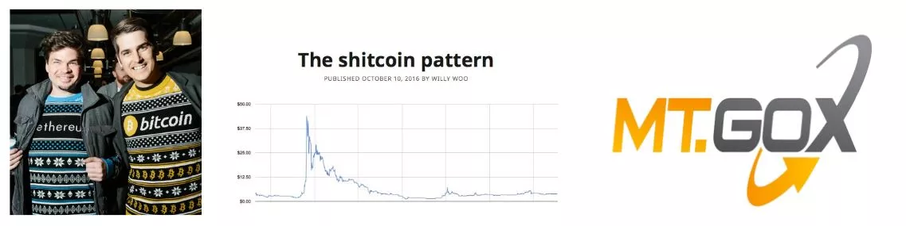
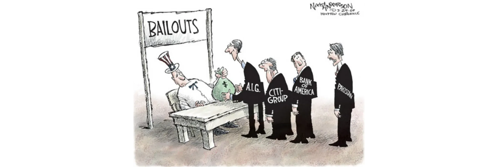
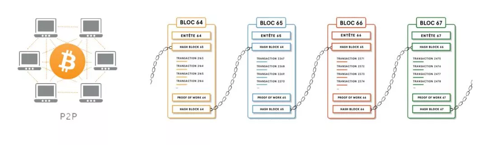

# Un voyage vers vos premiers bitcoins

L’écosystème Bitcoin connaît une croissance spectaculaire et sans précédent. Les transformations technologiques, économiques et sociales portées par l'invention de Satoshi Nakamoto s’intensifient jour après jour et ouvrent progressivement les portes d'un monde nouveau, dont vous pouvez dès maintenant tirer pleinement profit.

Plonger dans le Terrier de Bitcoin, c’est se lancer dans une aventure intellectuelle passionnante, qui stimulera votre esprit critique et vous poussera à remettre en question bon nombre de vos convictions. Cette exploration vous offrira non seulement une compréhension approfondie du fonctionnement de Bitcoin, mais aussi une occasion concrète de reconquérir votre liberté individuelle, de protéger votre vie privée, et de retrouver une véritable souveraineté financière.

Pour vous guider efficacement dans cette démarche, j’ai conçu ce cours entièrement gratuit. Ici, une seule règle : uniquement Bitcoin. Pas de discours creux, aucune autre cryptomonnaie, uniquement du contenu clair, précis, et sans détour.

Structuré de façon à vous laisser pleinement maître de votre apprentissage, ce cours vous permet de tracer votre propre parcours sur Bitcoin, à votre rythme, en fonction de vos intérêts et de vos objectifs personnels.

+++

# Introduction

<partId>008c49b7-5e17-5973-87f2-ba28429b2697</partId>

## Aperçu du cours

<chapterId>bfc96999-0ee1-5c41-8297-1b629f50cffc</chapterId>

Bienvenue dans la formation BTC102 ! Vous avez peut-être déjà suivi la formation BTC101 et découvert les concepts théoriques fondamentaux qui font de Bitcoin une révolution technologique majeure. Avec BTC102, il est maintenant temps de passer à la pratique : cette formation a été spécialement conçue pour vous aider à mettre en place concrètement votre plan Bitcoin personnel. Dans les prochains chapitres, nous allons donc vous accompagner étape par étape pour **obtenir vos premiers bitcoins**, les **sécuriser** efficacement et réussir votre entrée dans cet écosystème en pleine expansion.

https://planb.network/courses/2b7dc507-81e3-4b70-88e6-41ed44239966

Malgré son existence depuis plus de 16 ans, l'industrie de Bitcoin demeure jeune, dynamique et profondément libre. En effet, son protocole sous-jacent, entièrement décentralisé et impossible à contrôler totalement par une autorité centrale, permet à cet écosystème de se développer de manière naturelle et organique. Si cette liberté favorise une incroyable vague d'innovations et de possibilités, elle expose aussi ses utilisateurs à certains risques, notamment des arnaques, des erreurs courantes ou des pièges liés à un manque de connaissance. L'objectif principal de cette formation est justement de vous aider à naviguer sereinement et en toute sécurité dans ce nouvel écosystème.

Pour cela, la formation BTC102 est structurée en plusieurs sections, chacune abordant un aspect essentiel pour votre parcours personnel avec Bitcoin :

La première section, intitulée "Prérequis pour comprendre Bitcoin", vous prépare efficacement au parcours qui suit. Vous y apprendrez à identifier clairement les principaux pièges liés aux arnaques et fraudes financières qui peuvent exister dans l’écosystème Bitcoin. Nous vous enseignerons ensuite les bases essentielles de la sécurité en ligne. Enfin, je vous donnerai quelques conseils pratiques spécialement conçus pour les novices, destinés à éviter les erreurs fréquentes lors de vos premières interactions avec Bitcoin.

La deuxième section, "Comprendre dans quoi on se lance", vous permettra d'approfondir votre compréhension globale de Bitcoin. Nous commencerons par un rappel pour vous assurer que vous maîtrisez parfaitement les concepts essentiels. Puis, nous détaillerons précisément pourquoi Bitcoin revêt une importance fondamentale d'un point de vue technologique, économique et social, afin de renforcer vos convictions. Vous découvrirez ensuite l’industrie de Bitcoin dans sa globalité : ses acteurs, son organisation et son évolution au fil des années. Enfin, nous aborderons l'architecture en couches de l'écosystème Bitcoin, un concept important pour comprendre comment ce système continue sans cesse d'innover sans pour autant affaiblir le protocole de base.

La troisième section, "Mise en place de votre plan", se focalise sur votre approche personnelle de Bitcoin. Nous commencerons par vous aider à définir votre profil d’utilisateur parmi quatre grandes catégories : 
- *le hodler*, focalisé sur la détention de long terme ;
- *le stacker*, qui réalise des achats réguliers et méthodiques ;
- *l'utilisateur*, qui privilégie un usage quotidien ;
- et enfin *le paranoïaque*, soucieux d'une sécurité maximale pour protéger efficacement son patrimoine et sa confidentialité.

Vous serez accompagné pas à pas dans la mise en place d'une stratégie adaptée à votre profil personnel et à vos objectifs spécifiques.

Enfin, la quatrième partie, "Protéger ses héritiers et son patrimoine", aborde un sujet crucial souvent oublié : comment assurer la transmission de vos bitcoins à vos proches en cas d’événement imprévu. Vous apprendrez concrètement à créer et à mettre en place un plan d’héritage Bitcoin, afin de garantir la pérennité de votre patrimoine au-delà de votre propre existence.

À l'issue de cette formation, vous disposerez de toutes les clés pratiques nécessaires pour évoluer sereinement dans l’écosystème Bitcoin et figurer ainsi parmi les utilisateurs les plus avancés !

Prêt à débuter votre parcours dans le monde de Bitcoin ? Allons-y !  

# Prérequis pour comprendre Bitcoin

<partId>4481fc4b-0f83-489e-ad07-81517c5d6bad</partId>

## Arnaques et fraudes financières

<chapterId>8af2948b-2ab5-54c4-862c-3414b8a285a2</chapterId>

L’écosystème Bitcoin et son environnement restent relativement jeunes et faiblement régulés en fonction des pays. Si cette liberté offre d’immenses possibilités, elle constitue aussi un terrain fertile pour les fraudes financières, les escroqueries et toutes sortes de manipulations. C'est précisément pour cette raison que ce premier chapitre est important : connaître les pièges typiques permet de mieux s’en protéger. Votre sécurité financière est une priorité, car une mauvaise expérience nuit non seulement à vous, mais également à la réputation de toute la communauté Bitcoin.

### Bitcoin vs cryptos : comprendre les différences

Avant d’aller plus loin, il est important de distinguer clairement deux univers distincts :

- **L’industrie Bitcoin**, axée sur une monnaie saine, une décentralisation forte, la résilience, la vie privée et la souveraineté individuelle. Le protocole Bitcoin est développé avec une approche à long terme et représente une valeur stable, existante depuis 2009, et bénéficiant du travail sérieux d’une large communauté de développeurs.

- **L’industrie des cryptomonnaies**, beaucoup plus vaste, qui inclut des dizaines de milliers de projets différents, chacun avec son token. Cette industrie est davantage orientée vers l’innovation rapide, les effets de mode et la spéculation financière à court terme. Les projets y sont souvent centralisés, peu sécurisés, et beaucoup n’apportent aucune valeur réelle, malgré leur marketing agressif.

Si vous souhaitez en savoir plus sur les origines de Bitcoin et sur ce qui distingue profondément ce protocole des autres, je vous recommande de suivre ultérieurement cette autre formation gratuite de deuxième année sur l'histoire de Bitcoin :

https://planb.network/courses/a51c7ceb-e079-4ac3-bf69-6700b985a082

Comme vous le savez, la plateforme Plan ₿ Network est exclusivement dédiée à Bitcoin. Cependant, comprendre la distinction avec les autres cryptomonnaies vous permettra de mieux éviter les pièges liés aux projets inutiles, voire parfois frauduleux.

### Les principales escroqueries à éviter

Voici les arnaques les plus courantes que vous rencontrerez dans votre parcours :

#### Systèmes pyramidaux et Ponzi

Les pyramides financières et les systèmes de Ponzi figurent parmi les escroqueries les plus fréquentes dans l’écosystème crypto. Dans un système de Ponzi, les premiers investisseurs sont rémunérés avec l'argent des nouveaux entrants. Aucun produit ou valeur réelle n'est créé. La viabilité du système dépend uniquement de l’arrivée constante de nouveaux participants.

Ces arnaques présentent généralement :
- Des promesses de rendements garantis irréalistes (par exemple : 20 % de rendement garanti) ;
- Des délais ou des difficultés pour retirer vos fonds investis ;
- Des incitations fortes à parrainer de nouveaux membres pour maintenir le système en vie ;
- Un manque total de transparence sur la source réelle du rendement promis.

Finalement, tous les systèmes pyramidaux et de Ponzi sont par essence condamnés à l’échec. Leur faiblesse fondamentale réside dans le besoin permanent d'attirer de nouveaux investisseurs afin de rémunérer les anciens participants. Or, cette nécessité finit par devenir mathématiquement impossible à satisfaire, car le nombre de nouveaux entrants exigés augmente exponentiellement au fur et à mesure que le système grandit. Lorsque ce seuil critique est atteint, les participants commencent à douter, la confiance disparaît rapidement, et l'ensemble de la pyramide financière s'effondre brusquement. À ce stade, les derniers arrivants, souvent les moins informés, perdent la totalité de leur investissement sans aucun recours possible, tandis que les organisateurs ou les premiers investisseurs ont généralement déjà récupéré leurs fonds et quitté le système.

Dans l'univers des cryptomonnaies, ces systèmes Ponzi peuvent prendre des formes très variées, conçues spécialement pour masquer leur fonctionnement frauduleux derrière un voile technologique ou financier. Ils peuvent ainsi apparaître sous la forme de nouvelles offres de tokens ou d’*Initial Coin Offerings* (ICO), c’est-à-dire des opérations de levée de fonds via la vente publique d'une nouvelle cryptomonnaie. Derrière des termes techniques comme "blockchain", "contrats intelligents", ou "staking", certains projets cachent en réalité des schémas pyramidaux complexes. D’autres encore prétendent offrir des rendements élevés en combinant crypto-actifs douteux et systèmes de rémunération basés exclusivement sur l'arrivée continue de nouveaux investisseurs.

Plus récemment, les escroqueries de type Ponzi se sont également étendues à la Finance Décentralisée (DeFi). La DeFi, censée permettre des services financiers sans intermédiaires, est parfois utilisée pour donner une apparence légitime à ces arnaques. Certains projets DeFi promettent ainsi des rendements très élevés et garantis en échange de dépôts de cryptomonnaies sur des protocoles automatisés. Ces promesses attractives sont souvent justifiées par des mécanismes opaques et non vérifiables, avec des jetons spécifiquement créés pour l’occasion. En réalité, ces systèmes n’ont pas de modèle économique viable : les intérêts versés proviennent uniquement des fonds apportés par les nouveaux utilisateurs, exactement comme dans un Ponzi traditionnel. Lorsque la confiance s’érode ou lorsque l’afflux de nouveaux entrants ralentit, ces systèmes s’effondrent inévitablement, entraînant des pertes considérables pour les investisseurs naïfs.

Il convient de souligner que le contenu de ce cours est destiné à des fins purement éducatives et ne doit pas être interprété comme un conseil financier. Votre sécurité financière dépend de votre capacité à rester prudent, sceptique et informé dans chacune de vos décisions financières.

La meilleure protection est de toujours poser cette question simple : **D’où vient réellement le rendement promis ?** Si la réponse est floue, fuyez immédiatement.

#### Pump & Dump

Cette autre escroquerie consiste à manipuler artificiellement le prix d’un actif (souvent un token de cryptomonnaie peu liquide) à travers une campagne marketing coordonnée, généralement orchestrée par un groupe d’investisseurs. Le mécanisme typique d’un Pump & Dump est le suivant :
- Un leader d'opinion ou un groupe d'investisseurs accumule d'abord un grand nombre d'actions ou d'autres actifs ciblés ;
- Ils lancent ensuite une campagne de communication agressive pour provoquer une hausse rapide du prix ;
- Le public, animé par le "FOMO" (*Fear Of Missing Out*), achète massivement l’actif, faisant grimper encore davantage son prix ;
- Au pic de la manipulation, les initiateurs vendent brutalement leurs actifs en masse, ce qui provoque l’effondrement du prix ;
- Les investisseurs attirés par la manipulation subissent d’importantes pertes financières.

Il est important de rappeler que les stratégies de Pump & Dump sont totalement illégales et considérées comme une manipulation des marchés financiers dans de nombreux pays. Mais malgré leur caractère frauduleux, ces techniques continuent de proliférer, notamment au sein de l'univers des cryptomonnaies. Je vous conseille donc d'éviter les groupes de "signaux" privés sur Telegram, Discord ou d'autres réseaux sociaux, souvent dirigés par des influenceurs ou des pseudo-experts qui exigent même parfois des frais d’adhésion pour y accéder. Ces groupes créent l’illusion de fournir des opportunités financières exclusives, mais la réalité est que seuls les organisateurs gagnent véritablement, tandis que les participants finissent généralement par perdre leur argent.

Il est vrai que certains participants peuvent temporairement tirer profit de ces manipulations, mais ce succès éphémère repose avant tout sur la chance et le timing. Sur le long terme, ces pratiques ne sont pas rentables, car elles nécessitent une prise de risque permanente et une participation répétée à des schémas frauduleux qui finissent toujours par échouer. Ces pratiques entretiennent une illusion dangereuse : celle qu'il est possible de gagner rapidement et facilement beaucoup d’argent sans comprendre les mécanismes financiers réels.

Pour toutes ces raisons, la meilleure stratégie reste toujours de privilégier une approche d’investissement sérieuse, basée sur l’éducation financière, la compréhension des fondamentaux et une vision de long terme. En construisant patiemment vos connaissances, vous serez beaucoup moins sensible aux manipulations émotionnelles et aux promesses irréalistes, et bien mieux préparé pour éviter ces pièges financiers destructeurs.

#### Arnaques aux dons, loteries et fausses promotions

Cette arnaque consiste à promettre des bitcoins ou d’autres récompenses gratuites contre l’envoi préalable d’argent. Aucun individu ou entreprise sérieuse ne vous demandera d’envoyer des bitcoins pour vous en renvoyer davantage.

Des escrocs utilisent régulièrement l’identité de personnalités connues (comme Elon Musk ou d’autres célébrités) pour attirer leurs victimes sur les réseaux sociaux. Vérifiez toujours soigneusement les comptes et les sites internet avant d’interagir, et ne croyez jamais les promesses trop généreuses.

Parfois, ces escroqueries peuvent également prendre la forme d'une arnaque aux frais avancés. Cela consiste à vous promettre un gain ou un cadeau (argent, produit, service...), mais à exiger d'abord un paiement sous prétexte de couvrir des frais (livraison, taxes, frais de transaction...). Une fois le paiement effectué, l'escroc disparaît sans jamais envoyer ce qui était promis au départ.

#### Shitcoins et cryptomonnaies offertes

Des projets de crypto-monnaies centralisés offrent parfois des jetons gratuits ("*airdrops*") pour attirer les utilisateurs. Ces jetons n’ont généralement aucune valeur réelle et servent uniquement à créer une illusion de popularité ou à encourager la spéculation. Soyez extrêmement prudent face à ces offres promotionnelles.

#### Usurpation d’identité et phishing

Les attaquants emploient fréquemment des faux sites, faux comptes ou e-mails trompeurs pour tenter de dérober vos fonds. Ces tentatives de fraude peuvent provenir de tout moyen de communication : email, réseaux sociaux, téléphone, courrier postal...

Avant de cliquer sur un lien ou de prendre une quelconque action, assurez-vous toujours de vérifier l’identité exacte de l’expéditeur, ou préférez accéder au site manuellement, sans utiliser le lien fourni. De manière plus générale, ne divulguez jamais vos clés privées ou vos mots de passe à quiconque.

#### Hardforks de Bitcoin

Bitcoin a subi plusieurs *hardforks* au fil du temps, donnant naissance à des versions alternatives de la monnaie originale. Concrètement, un *hardforks* correspond à une scission du réseau en deux blockchains distinctes partageant un historique commun jusqu'au moment de la séparation. Ces divisions surviennent généralement lorsqu'une partie des développeurs ou de la communauté Bitcoin souhaite apporter des modifications radicales au protocole original, mais n'obtient pas un consensus suffisant. Incapables de convaincre la majorité, ils choisissent alors de créer une version alternative de Bitcoin, avec des règles modifiées, en espérant que la communauté les suive.

Certains *hardforks* ne sont pas directement des arnaques, car ils reposent simplement sur des désaccords techniques ou idéologiques au sein de la communauté, mais d'autres sont essentiellement motivés par des raisons commerciales, voire malhonnêtes. Les exemples les plus connus de ces hardforks sont **Bitcoin Cash (BCH)** et **Bitcoin Satoshi Vision (BSV)**. Apparues respectivement en 2017 et 2018, ces monnaies alternatives prétendent souvent être de meilleures versions du Bitcoin original en mettant en avant des avantages supposés, tels que des frais de transactions moins élevés ou des transactions plus rapides grâce à une taille de blocs augmentée. En réalité, ces modifications techniques comportent des compromis importants en matière de sécurité, de décentralisation et de robustesse, qui peuvent venir en contradiction avec les principes fondateurs de Bitcoin.

Au-delà des différences techniques, ces monnaies alternatives jouent souvent sur la confusion pour attirer des investisseurs peu informés. Ils peuvent parfois utiliser des outils marketing afin d’induire volontairement en erreur des novices pensant acheter du véritable Bitcoin (BTC).

Pour éviter de tomber dans ce genre de piège, vérifiez toujours la monnaie que vous achetez. Le Bitcoin original utilise le ticker **BTC**, tandis que Bitcoin Cash et ses dérivés utilisent des acronymes distincts (par exemple BCH ou BSV).

#### Influenceurs malhonnêtes et faux gourous

Avec la popularité croissante des cryptomonnaies, une multitude d'influenceurs, de faux experts et de prétendus gourous sont apparus sur les réseaux sociaux. Si certains apportent parfois une valeur éducative réelle, beaucoup d'autres profitent malheureusement de leur visibilité pour promouvoir des projets douteux ou des stratégies de trading particulièrement risquées, voire frauduleuses. Ces individus sont généralement motivés par leurs intérêts financiers personnels, recevant souvent des rémunérations directes ou indirectes en échange de la promotion de certains tokens ou plateformes.

Ces influenceurs adoptent des tactiques éprouvées pour séduire les débutants : ils publient des résultats financiers impressionnants (souvent truqués ou impossibles à vérifier), vantent leur succès personnel à travers un mode de vie luxueux et présentent des stratégies d'investissement miraculeuses. Ils cherchent à susciter le FOMO, la peur de manquer une opportunité, afin d’inciter leurs abonnés à prendre des décisions impulsives et à investir sans réfléchir.

Il est important de comprendre que la plupart des conseils gratuits diffusés par ces personnalités ne sont jamais réellement gratuits. Derrière les apparences altruistes se cachent généralement des stratégies de manipulation pour inciter à l'achat d'actifs douteux. Par ailleurs, même s'ils étaient honnêtes, il serait impossible de répliquer fidèlement leurs résultats, car ces derniers dépendent d’un timing précis ou d’un contexte particulier dont vous n'avez pas connaissance.

Les influenceurs vous proposeront parfois de rejoindre des groupes privés payants, où ils promettent d'offrir des signaux ou des conseils censés garantir des gains rapides et faciles. Dans la réalité, ces groupes profitent principalement aux organisateurs eux-mêmes, qui utilisent leur audience comme source de liquidité pour réaliser leurs propres profits. Les abonnés finissent généralement par subir des pertes importantes, faute de pouvoir réagir aussi rapidement que les initiateurs des opérations (voir la partie sur le Pump & Dump).

Face à cette réalité, voici quelques bonnes pratiques à adopter pour éviter les pièges tendus par ces influenceurs :
- **Soyez extrêmement prudent vis-à-vis de toute recommandation d’achat d’une cryptomonnaie**. Une personne honnête et compétente ne vous incitera jamais à acheter précipitamment un actif sans vous encourager à faire vos propres recherches ;
- **Les formations payantes en trading ou en investissement ne sont pas nécessairement synonymes de qualité**. Souvent, elles présentent des techniques risquées ou simplistes, disponibles gratuitement ailleurs sur internet ;
- **Gardez à l’esprit qu’il n’existe aucune méthode miracle** pour copier facilement les transactions d'un tiers et obtenir exactement les mêmes résultats. Chaque stratégie d’investissement dépend du contexte personnel, des connaissances spécifiques, du timing et d’une multitude d’autres facteurs qu’il est impossible de reproduire à l’identique ;
- **Soyez particulièrement vigilant face aux recommandations qui semblent trop belles** pour être vraies. Les promesses irréalistes ou les garanties de gains immédiats sont presque systématiquement des signes de manipulation. Rappelez-vous que ce n'est pas parce qu'une personne dit quelque chose que cela est nécessairement vrai.

Enfin, souvenez-vous que chaque personne que vous rencontrez dans l'écosystème Bitcoin ou crypto a nécessairement un agenda personnel, explicite ou implicite, et qu'il n’y a pas d’information totalement neutre. Même ce cours BTC102 que vous suivez actuellement poursuit l’objectif clair de promouvoir une meilleure compréhension de Bitcoin. Soyez donc attentif aux motivations réelles derrière chaque contenu auquel vous êtes exposé. Gardez toujours à l’esprit ce principe essentiel : Si un produit ou un service semble gratuit, c'est probablement que c'est vous le produit.

La meilleure protection reste l’éducation personnelle, le scepticisme bien placé, et surtout, l’habitude constante de vérifier les faits par vous-même.

### Comment éviter les arnaques ?

**Enfin, voici quelques conseils pour éviter les arnaques en ligne :**
- Ne faites jamais confiance aveuglément : "*Don't trust, verify*" ;
- Méfiez-vous des rendements trop élevés ou garantis ;
- Ne communiquez jamais vos clés privées à qui que ce soit ;
- N'envoyez jamais de bitcoins à une adresse inconnue ;
- Si vous avez un doute, attendez et prenez du recul avant toute décision. Le FOMO est votre pire ennemi ;
- Évitez de participer à des groupes de trading payants ou aux promesses irréalistes ;
- La plupart des cadeaux ou des loteries gratuites sur internet sont frauduleux ou truqués ;
- Vous gagnerez toujours plus en apprenant qu'en jouant.

Se prémunir contre les arnaques est une première étape importante pour la protection de votre patrimoine, mais cela ne suffit pas. Il est tout aussi essentiel de maintenir une bonne hygiène numérique. C'est pourquoi, dans le chapitre suivant, nous explorerons comment renforcer votre sécurité numérique et les bonnes pratiques à adopter.

## Sécurité en ligne

<chapterId>f0873bf2-6a6f-5485-bb7a-d84be14f404d</chapterId>

Dès l’instant où vous vous intéressez à Bitcoin, vous devez forcément vous intéresser un minimum à la cybersécurité. Les fraudes financières et les arnaques ne sont pas les seules menaces : la perte accidentelle de données, les malwares ou le vol de mots de passe peuvent eux aussi causer des dommages. L’objectif de ce chapitre est de vous présenter des mesures de protection simples et efficaces, applicables à tout utilisateur désireux de renforcer son hygiène numérique.

Si vous souhaitez aller plus loin dans chacun de ces aspects, Plan ₿ Network propose une formation complète SEC101 qui entre dans le détail des stratégies de cybersécurité :

https://planb.network/courses/99c46148-7080-4915-a7e0-9df0e145cd47

### Pourquoi la sécurité informatique est importante ?

Bitcoin apporte la possibilité de détenir sa monnaie directement, sans aucun intermédiaire. Mais cette souveraineté financière a son revers : si quelqu’un dérobe vos bitcoins (à cause d’une faille de sécurité), il est impossible de revenir en arrière. Contrairement aux banques traditionnelles, il n’y a ni réclamation ni assurance si vous vous faites pirater vos actifs.

De plus, l’attrait économique de Bitcoin en fait une cible de choix pour des personnes malintentionnées : un hacker qui vole vos BTC peut les transférer instantanément sur son propre portefeuille, sans avoir à craindre un remboursement forcé. Dans ce contexte, une bonne hygiène informatique n’est pas un luxe : c’est la première ligne de défense pour éviter de voir ses efforts et son argent envolés.

### Un ordinateur propre et à jour

Un point souvent négligé est la mise à jour régulière de vos logiciels et de votre système d’exploitation. Certaines mises à jour corrigent des failles de sécurité susceptibles d’être exploitées par des pirates. Beaucoup hésitent à les installer, de crainte que leur machine devienne plus lente ; en réalité, ne pas mettre à jour son PC vous expose à des vulnérabilités documentées et déjà corrigées.

De même, l’utilisation d’un antivirus fiable est vivement recommandée. Sur Windows, Windows Defender (installé par défaut) peut convenir aux utilisateurs ordinaires ; si vous le souhaitez, vous pouvez opter pour un antivirus commercial (comme Kaspersky, par exemple). Sur Mac, la menace de malware est historiquement moindre, mais reste possible : il est toujours bon de prendre des précautions.

En plus de ces points, méfiez-vous des téléchargements provenant de sites douteux ou de portails de téléchargement universels. Lorsque vous avez besoin d’un logiciel, privilégiez la source officielle. Cela réduit drastiquement les risques que des programmes malveillants soient embarqués dans ce que vous pensez être un fichier légitime. Une autre bonne pratique est de toujours vérifier l'authenticité et l'intégrité d'un logiciel avant de l'installer sur votre machine. Si vous ne savez pas comment le faire, nous avons un tutoriel dédié à ce sujet :

https://planb.network/tutorials/computer-security/data/integrity-authenticity-21d0420a-be02-4663-94a3-8d487f23becc

Enfin, pensez à sauvegarder régulièrement vos données. Un disque dur externe (ou un SSD) vous permettra de conserver un duplicata de vos fichiers importants. Cela vous évitera de gros regrets en cas de panne soudaine, de piratage ou d’erreur de manipulation. Si vous préférez les solutions en ligne, il existe des services sécurisés comme Proton Drive par exemple.

https://planb.network/tutorials/computer-security/data/proton-drive-03cbe49f-6ddc-491f-8786-bc20d98ebb16

Une stratégie de sauvegarde généralement conseillée est la règle du "3-2-1". Elle vise à protéger vos données contre la perte accidentelle, les attaques informatiques ou les catastrophes naturelles. Cette règle implique de conserver au minimum **3 copies** de vos données importantes, stockées sur au moins **2 supports différents** (par exemple, un disque dur local et un stockage cloud), tout en gardant toujours **1 copie hors site** (physiquement éloignée de votre lieu principal). Cette méthode garantit une bonne résilience de vos données.

### La solution au cauchemar des identifiants

La première raison pour laquelle tant de gens se font pirater est la faiblesse de leurs mots de passe. On estime qu’une part importante des internautes utilise le même mot de passe pour plusieurs comptes, ou choisit une variante triviale facile à deviner. **Les gestionnaires de mots de passe** répondent précisément à ce problème.

Un gestionnaire de mots de passe vous permet :
- De stocker tous vos mots de passe sous forme chiffrée ;
- De générer automatiquement des identifiants longs, aléatoires, uniques et complexes ;
- D’avoir un seul mot de passe maître à mémoriser pour accéder à tous les autres.

Avec un gestionnaire de mot de passe, vous n’aurez plus jamais à cliquer sur "Mot de passe oublié" ou à inventer des mots de passe faibles. Vous pouvez facilement retrouver l'accès à tous vos identifiants. En prime, ces logiciels peuvent se synchroniser sur plusieurs appareils (ordinateur, téléphone, tablette) et facilitent la connexion automatique à vos sites habituels.

De nombreux logiciels de gestion de mots de passe sont disponibles, mais je peux vous en recommander deux selon vos besoins. Si vous recherchez un logiciel facile à utiliser et synchronisable sur plusieurs appareils, Bitwarden est une excellente option :

https://planb.network/tutorials/computer-security/authentication/bitwarden-0532f569-fb00-4fad-acba-2fcb1bf05de9

Si vous préférez un logiciel local, uniquement sur votre ordinateur, KeePass est une bonne solution :

https://planb.network/tutorials/computer-security/authentication/keepass-f8073bb7-5b4a-4664-9246-228e307be246

### 2FA : la double protection

Même avec un mot de passe fort, le risque zéro n’existe pas. C’est pourquoi l’**authentification à deux facteurs** (2FA) est une couche de sécurité supplémentaire désormais considérée comme indispensable. Dès qu'il est possible de l'utiliser, vous devriez la mettre en place, surtout pour vos comptes sensibles.

Le concept est très simple : après avoir entré votre mot de passe sur un site, vous devez fournir un code temporaire (composé de 6 chiffres en général) généré par une application sur votre téléphone (Google Authenticator, Authy...). Ainsi, un pirate qui détiendrait votre mot de passe mais pas l’accès physique à votre téléphone ne pourrait pas se connecter à votre compte.

https://planb.network/tutorials/computer-security/authentication/authy-a76ab26b-71b0-473c-aa7c-c49153705eb7

Lorsque vous activez la 2FA, veillez à conserver la clé de récupération de votre application, afin de pouvoir recréer vos codes en cas de perte ou de changement de téléphone. Quant à la double authentification par SMS ou par email, elle reste mieux que rien, mais est nettement moins sûre : un simple vol ou clonage de carte SIM (*SIM swap*) peut la mettre en échec. 

Pour ceux qui souhaitent aller plus loin, il existe des solutions par clé physique (comme YubiKey) qui offre un degré de sécurité encore supérieur.

https://planb.network/tutorials/computer-security/authentication/security-key-61438267-74db-4f1a-87e4-97c8e673533e

### Protéger sa vie privée

La protection de la vie privée et la cybersécurité sont étroitement liées : plus vous laissez d’informations en libre accès, plus vous risquez de devenir une cible.

Un **VPN** (*Virtual Private Network*) peut déjà constituer un pas simple pour masquer votre adresse IP et chiffrer vos échanges sur Internet. Cela ne vous rend pas invisible, puisque le fournisseur de VPN peut encore voir vos actions, mais cela rend la tâche plus compliquée à quiconque chercherait à vous espionner ou à cibler vos habitudes de navigation. L’important est de choisir un VPN de confiance, qui ne vous demande pas votre identité, qui permet un paiement du service en BTC et qui ne conserve pas de journaux d’activité.

Nous disposons de plusieurs tutoriels sur Plan ₿ Network pour apprendre à configurer facilement un VPN. Je pourrais notamment vous recommander IVPN ou Mullvad :

https://planb.network/tutorials/computer-security/communication/ivpn-5a0cd5df-29f1-4382-a817-975a96646e68

https://planb.network/tutorials/computer-security/communication/mullvad-968ec5f5-b3f0-4d23-a9e0-c07a3e85aaa8

Les gestes essentiels pour préserver sa confidentialité en ligne incluent également  :

- L’utilisation de **messageries chiffrées** comme Signal, SimpleX ou encore Session ;
- L’utilisation de **navigateurs** plus respectueux de la vie privée, tels que Firefox, Brave ou Tor (pour un anonymat renforcé) ;

https://planb.network/tutorials/computer-security/communication/tor-browser-a847e83c-31ef-4439-9eac-742b255129bb

- L'utilisation d'une **boite mail sécurisée** (comme ProtonMail, par exemple) ;

https://planb.network/tutorials/computer-security/communication/proton-mail-c3b010ce-254d-4546-b382-19ab9261c6a2

- Le **chiffrement** de vos fichiers grâce à des outils comme Bitlocker (sur Windows) ou VeraCrypt (multi-plateformes).

https://planb.network/tutorials/computer-security/data/veracrypt-d5ed4c83-7c1c-4181-95ea-963fdf2d83c5

### Avancer par étapes

La sécurité informatique peut sembler un chantier immense. Beaucoup de débutants abandonnent l’idée de tout mettre en place d’un coup, car ils jugent la tâche trop complexe. Pour éviter ce problème, abordez chaque outil étape par étape, progressivement. Par exemple, commencez par installer un gestionnaire de mots de passe, laissez-vous quelques semaines pour vous familiariser avec celui-ci, puis passez à l’étape suivante : l’activation du 2FA sur un premier compte, etc.

Au fil du temps, vous prendrez confiance dans ces solutions et serez prêt à adopter d’autres pratiques, comme l’usage d’une adresse email secondaire, la migration vers ProtonMail, l’installation d’un VPN ou la navigation via Tor pour les situations qui l’exigent.

À mesure que vous avancerez dans l’univers de Bitcoin, vous vous rendrez compte que les menaces grandissent avec la valeur que peut prendre votre portefeuille. S’armer de bonnes pratiques, renforcer sa confidentialité et mettre en place les outils adéquats procurent non seulement une tranquillité d’esprit, mais renforcent aussi la souveraineté que prône l’esprit Bitcoin.

En résumé : ne sous-estimez jamais la cybersécurité, prenez le temps d’installer les protections de base, et rappelez-vous que le point central reste votre discipline : sans une hygiène numérique rigoureuse, les meilleurs outils du monde ne vous serviront à rien.

Je vous conseille également d'aller faire un tour sur [nos tutoriels dédiés à la sécurité informatique](https://planb.network/tutorials/computer-security) sur Plan ₿ Network.

Dans le prochain chapitre, je vais vous donner quelques conseils supplémentaires pour commencer votre parcours sur Bitcoin dans les meilleures conditions et pour vous éviter de tomber dans les nombreux pièges.

## Conseils pour novice

<chapterId>33134b3f-92c1-5185-afb6-88599e47e801</chapterId>

Lorsque l’on découvre Bitcoin, il est facile de se laisser emporter par l’engouement et d’adopter des comportements hasardeux. L’univers des cryptomonnaies est en effet très particulier : volatilité des prix, nouvelles technologies, risques de pertes définitives en raison d’erreurs techniques ou de mauvais choix d’investissement… Autant d’écueils à éviter.

Dans ce chapitre, je vous offre quelques conseils pratiques et une orientation générale pour celles et ceux qui se lancent dans l’achat de leurs premiers bitcoins, et plus largement, dans tout placement financier.

Voici le principaux conseils que nous allons détailler ensemble :
- Méfiez-vous des Shitcoins et autres cryptomonnaies dépourvues d'utilité ;
- Investissez uniquement ce que vous êtes prêt à perdre ;
- Comprenez bien la distinction entre le trading et l'investissement ;
- Soyez conscient des implications fiscales de vos investissements ;
- Gérez soigneusement votre phrase mnémonique ;
- Gardez une attitude humble et discrète ;
- Adoptez une vision à long terme.

### Les erreurs courantes à éviter

L'univers de Bitcoin est accessible à tous, mais cela ne signifie pas qu'il faut y entrer sans préparation. Voici quelques-unes des erreurs classiques commises par les investisseurs novices :

**Erreurs technologiques :**

- **Perte de la graine de votre portefeuille :** Votre graine (ou phrase mnémonique) est une série de 12 ou 24 mots permettant de récupérer l'accès à vos bitcoins. Si vous perdez cette phrase, vous perdez définitivement l’accès à vos fonds ;
- **Stocker ses bitcoins sur une plateforme tierce :** Garder vos bitcoins sur une plateforme d’échange signifie que vous ne détenez pas réellement vos bitcoins. Vous êtes alors exposé à des risques tels que le piratage, la faillite ou la confiscation ;
- **Négliger sa confidentialité :** Protéger votre vie privée doit faire partie de votre stratégie de sécurisation. Exposer publiquement la quantité de bitcoins que vous possédez peut attirer l'attention d'individus mal intentionnés ;
- **Sécurité en ligne insuffisante :** Un manque de précautions basiques peut rendre vos appareils vulnérables au piratage et causer des pertes importantes.

**Erreurs financières :**

- **Investir plus que ce que vous pouvez vous permettre de perdre :** N'investissez jamais en vous endettant ou avec l’argent destiné à vos dépenses essentielles ;
- **Ignorer la différence entre trading et investissement à long terme :** Le trading est une activité risquée qui demande beaucoup de temps et de compétences techniques avancées. L’investissement à long terme est mieux adapté aux débutants ;
- **Oublier les implications fiscales :** Chaque pays a ses propres règles fiscales concernant le bitcoin. Ignorer ces règles peut vous exposer à des pertes financières importantes ;
- **Céder au FOMO (*Fear Of Missing Out*) :** Acheter impulsivement parce que vous craignez de manquer une opportunité conduit souvent à des achats au pire moment.

### Définir une stratégie d’investissement

Avant d’acheter le moindre satoshi, il est important de savoir pourquoi et comment vous souhaitez investir dans le bitcoin. Cette démarche implique de mettre en place un plan financier clair, adapté à votre situation personnelle et à vos objectifs.

En premier lieu, définissez avec précision votre **budget**. Il ne s’agit pas simplement de décider d’un montant approximatif : prenez le temps de calculer vos revenus mensuels, puis d’en soustraire vos charges fixes (loyer, emprunts, impôts, factures...), ainsi que les frais liés à votre vie courante (nourriture, transport, loisirs...). Le reste disponible constitue votre marge d’épargne ; c’est seulement sur cette partie que vous pouvez envisager d’investir. En procédant ainsi, vous vous assurez de ne pas engager des sommes qui mettraient en péril votre stabilité financière si le marché connaissait une forte correction.

Ensuite, pensez à la méthode d’investissement la plus adaptée pour vous. Le **Dollar Cost Averaging (DCA)** consiste à acheter du bitcoin (ou tout autre actif) à intervalles réguliers, toutes les semaines, tous les mois... Cette technique permet de lisser le prix d’achat au fil du temps et de réduire l’impact émotionnel des fluctuations importantes du marché. C’est un choix judicieux pour la majorité des investisseurs, surtout pour les débutants.

Enfin, clarifiez votre **vision** : s’agit-il d’un placement à court terme, dans l’optique de faire des allers-retours fréquents (trading), ou d’un investissement moyen ou long terme, plus proche de l’esprit "hodl" (détenir ses bitcoins sur plusieurs années) ? Votre stratégie diffèrera considérablement selon votre horizon de placement. Un "hodler" aura tendance à moins s’inquiéter des variations quotidiennes et préférera stocker ses BTC en toute sécurité, tandis qu’un trader cherchera à tirer parti des mouvements de prix plus rapides, au risque de multiplier les transactions et de s’exposer davantage au stress et aux mauvaises décisions.

L'objectif n'est pas de concevoir un plan parfait, mais plutôt de disposer d'une structure claire à suivre et à respecter. Il est important de ne pas effectuer vos achats sous l'impulsion de l'émotion ou de la peur. Adoptez une stratégie que vous avez définie au préalable sur papier pour minimiser tout stress inutile.

En cas de doute : commencez par vous informer. Plongez dans l'univers de Bitcoin pendant quelques heures (vous trouverez une multitude de ressources sur Plan ₿ Network). Lisez deux ou trois livres, investissez cinq euros pour tester, visionnez des documentaires et des vidéos. Gardez l'esprit ouvert. Une fois que vous vous sentirez plus à l'aise avec Bitcoin, vous pourrez éventuellement réviser votre plan d'action et adapter votre utilisation.

### Connaître la volatilité du BTC

Le bitcoin subit des variations de prix parfois spectaculaires. Il n’est pas rare de voir des mouvements de 10 %, 20 % ou même 50 % en l’espace de quelques jours. Une telle volatilité peut dérouter les débutants, qui, sous l’effet de la panique, pourraient vendre à perte ou, à l’inverse, se laisser emporter par la frénésie d’un marché haussier.

Pour éviter ces réactions impulsives, il est indispensable d’accepter la nature volatile du bitcoin avant même de se lancer. Ne considérez pas ces fluctuations comme une anomalie, mais comme une caractéristique inhérente à cet actif encore jeune. De fait, si ces hausses ou baisses subites vous empêchent de dormir ou vous incitent à prendre des décisions contre-productives, il se peut que vous ayez investi une somme trop importante. Dans ce cas, réévaluez votre plan et votre tolérance au risque, quitte à réduire votre exposition pour retrouver une certaine sérénité.

Il va de soi qu'il ne faut donc investir que ce que vous pouvez vous permettre de perdre ! Ne vous endettez pas pour investir dans une monnaie dont vous ne comprenez peut-être pas encore tous les tenants et aboutissants.

### Gestion et sécurité de votre portefeuille Bitcoin

L’un des aspects les plus uniques de Bitcoin est la notion de **self-custody**. Vous pouvez disposer de votre propre portefeuille sur lequel vous êtes entièrement responsable. Celui-ci est généralement généré à partir d'une phrase mnémonique (une série de 12 ou 24 mots), qui vous donne un contrôle absolu sur vos BTC. Si vous la perdez ou si elle tombe entre de mauvaises mains, vos fonds deviennent irrécupérables.

Dès lors, la règle d’or sur Bitcoin est : "***Not your keys, not your coins***". Si vous ne possédez pas vous-même vos clés privées, vous n’êtes pas réellement propriétaire de vos bitcoins. Les plateformes d’échange peuvent être pratiques pour démarrer ou effectuer des transactions, mais elles conservent les clés de vos BTC ; si elles font faillite, se font pirater ou décident de geler votre compte, vous risquez de tout perdre.

Pour éviter ce scénario, il est vivement recommandé de configurer votre propre portefeuille, où vous seul détenez la phrase mnémonique. Cette dernière doit être notée à la main, sur un support physique, et conservée dans un lieu sûr, à l’abri. Certains optent même pour une double sauvegarde, conservée dans deux endroits géographiquement distincts. Quoi qu’il en soit, veillez à **ne jamais stocker votre phrase mnémonique sur un appareil connecté** à Internet ou sur un service cloud, car un simple piratage ou une fuite de données pourrait se révéler catastrophique.

Si vous souhaitez approfondir vos connaissances sur la sécurisation de votre phrase mnémonique, je vous recommande de consulter cet article. Il détaille les risques encourus et les bonnes pratiques à adopter pour les éviter :

https://planb.network/tutorials/wallet/backup/backup-mnemonic-22c0ddfa-fb9f-4e3a-96f9-46e2a7954270
 
### Confidentialité et discrétion

Dans le monde numérique, on sous-estime trop souvent l’importance de la discrétion. Or, plus vous divulguez publiquement vos avoirs en bitcoins, plus vous devenez une cible potentielle pour des escrocs, des cybercriminels ou, dans certains cas, pour des menaces plus ordinaires (extorsion, chantage, etc.). Inutile de vous vanter ouvertement de détenir d’importantes quantités de BTC, que ce soit sur les réseaux sociaux ou lors de discussions avec des connaissances. Malheureusement, il y eu de très nombreux cas d'enlèvements de Bitcoiners à travers différents pays.

Par ailleurs, il est important de cloisonner vos activités en ligne. Vous pouvez par exemple séparer votre adresse e-mail classique (pour le quotidien) de celle utilisée pour vos comptes liés à Bitcoin. Méfiez-vous des tentatives de phishing, des liens suspects et des sites imitant des plateformes officielles. En bref, la **discrétion** et la **vigilance** vous protègeront souvent des ennuis.

Si vous êtes intéressé par le sujet de la confidentialité sur Bitcoin, je vous recommande de suivre par la suite cette formation de deuxième année :

https://planb.network/courses/65c138b0-4161-4958-bbe3-c12916bc959c

### Implications fiscales

En dépit de son statut de monnaie décentralisée, le bitcoin n’échappe pas aux réglementations et aux lois fiscales de votre pays. Chaque juridiction possède ses propres règles quant à la taxation des gains issus des cryptomonnaies. Certains pays imposent la plus-value lors de la revente, d’autres prévoient des déclarations spécifiques pour tout échange, et d’autres encore peuvent adopter des approches moins courantes (impôts sur la fortune, charges sociales, etc.).

Avant de réaliser des transactions importantes, il est vivement recommandé de vous renseigner auprès d’un professionnel ou de consulter les sites gouvernementaux. Une **planification fiscale** en amont vous évitera des déconvenues (amendes, régularisations, pénalités...), particulièrement si vous prévoyez des reventes conséquentes.

### Différences entre trading, investissement et holding

L’univers de Bitcoin est souvent associé à des clichés dans le grand public, notamment l’idée d’un enrichissement rapide via le trading. Or, il convient de distinguer clairement trois approches différentes, chacune ayant ses propres exigences et risques.

- **Le trading :**

Vous ne devriez pas faire de trading. Le trading s’effectue sur de courtes périodes, avec parfois un usage de levier financier. Les traders cherchent à exploiter les mouvements de prix, souvent volatils, pour dégager des profits rapides. Il faut un solide bagage technique (analyse graphique, gestion du risque...) et une résistance au stress ; la plupart des débutants échouent faute d’expérience ou de méthode rigoureuse. Suivre constamment l'évolution du marché peut s'avérer complexe et exige un engagement à temps plein. Comme l'a bien dit Warren Buffet : "*Si vous n'êtes pas prêt à garder une action pendant 10 ans, ne songez même pas à la garder 10 minutes*".

- **L'investissement :**  

L’investisseur adopte un horizon de temps moyen ou long, sans recours au levier. Il cherche à acquérir du bitcoin en misant sur l’évolution de sa valeur au fil des mois, voire des années. Le risque reste présent, car le prix peut fluctuer, mais l’approche est généralement plus calme et mieux adaptée à la majorité du grand public, qui ne souhaite pas consacrer des heures quotidiennes à surveiller les marchés.

- **L'holding (HODL) :**

"*HODL*" est une déformation humoristique de "*hold*", devenue emblématique dans la communauté Bitcoin. Les "*hodlers*" conservent leurs BTC sur le très long terme, parfois dix ans ou plus, persuadés que Bitcoin prendra de la valeur à mesure que son adoption progresse. Cette stratégie exige une forte conviction dans le potentiel de Bitcoin et une indifférence relative aux secousses passagères du marché.

|                        | Trading     | Investissement | Holding         |
| ---------------------- | ----------- | -------------- | --------------- |
| Levier                 | Oui         | Non            | Non             |
| Temporalité            | Court terme | Moyen terme    | Très long terme |
| Type d'actif           | Contrat     | BTC            | BTC             |
| Risque                 | Très haut   | Haut           | Haut            |
| Difficulté             | Très dur    | Dur            | Dur             |
| Courbe d'apprentissage | Longue      | Longue         | Longue          |
| Pertes potentielles    | Illimitées  | Limitées       | Limitées        |
| Plus adapté à          | Certains    | La plupart     | Certains        |

### Se former continuellement

Il n'y a pas d'âge pour commencer à s'éduquer en matière d'investissement et pour comprendre le fonctionnement de l'argent et du système financier. Il n'est pas nécessaire de plonger dans les détails ; une compréhension globale est suffisante pour prendre des décisions éclairées, basées sur des faits plutôt que sur l'ignorance. Cela peut s'avérer précieux tout au long de votre vie, et vous permettre de détecter lorsque quelqu'un tente de vous vendre un mauvais produit d'investissement (comme pourrait le faire une banque).

En guise d’introduction à la logique d’investissement, l’ouvrage ***Rich Dad, Poor Dad* de Robert T. Kiyosaki** est réputé pour sa pédagogie et sa simplicité. Il aborde des principes fondamentaux tels que la différence entre un actif et un passif, ou encore le rôle de l’éducation financière dans la réussite personnelle.

Pour aller plus loin, des émissions comme ***The Investors Podcast*** approfondissent la finance et l’économie. Si vous travaillez déjà dans le domaine de la finance ou si cela vous passionne, écoutez quelques-uns de leurs épisodes. Certains d'entre eux parlent de Bitcoin.

### Règles d’or à retenir

Pour terminer, gardez à l’esprit quelques principes simples mais incontournables :

- **Règle n°1** : N’investissez jamais plus que ce que vous pouvez vous permettre de perdre. En d’autres termes, ne mettez pas votre sécurité financière en danger pour un actif volatile.

- **Règle n°2** : Ne vous fiez pas aveuglément à la tendance générale du marché ou aux conseils miracles. Évitez ce qui est à la mode. Concentrez-vous plutôt sur le fait de progresser en prenant des décisions rationnelles. En cas de doute, prenez une nuit de réflexion et discutez-en avec vos proches. Il est préférable de prendre son temps plutôt que de se précipiter. La meilleure stratégie consiste à avancer étape par étape.

- **Règle n°3** : Élaborez un plan et une vision à long terme. La patience, la régularité et la discipline sont souvent plus payantes que l’excitation à court terme. Planifiez et ne prenez pas trop de risques. Le but est d'éviter des échecs fatals tout en accumulant les succès.

En appliquant ces préceptes, vous pourrez aborder l’investissement de manière plus sereine et réfléchie. Malgré la volatilité du bitcoin et son aspect parfois déroutant, cette technologie recèle un potentiel indéniable à condition de l’approcher avec prudence et réalisme. Prenez le temps de renforcer vos connaissances, ajustez votre stratégie au besoin et, surtout, rappelez-vous qu’il vaut mieux progresser lentement mais sûrement, plutôt que de céder à l’impatience ou à la peur de manquer une opportunité.

# Comprendre dans quoi on se lance

<partId>a42355a3-9dd8-57ed-b590-32a333fe09ea</partId>

## Bitcoin en 5 minutes

<chapterId>ae122ad9-9b4d-5229-9038-e1b99d5cfc83</chapterId>

Dans cette formation, l’objectif principal consiste à vous guider dans l’obtention et la sécurisation de vos premiers bitcoins. Toutefois, avant de passer aux considérations pratiques (comment acquérir des BTC, quels portefeuilles utiliser, etc.), un bref rappel sur ce qu’est réellement Bitcoin s’impose. Comprendre la nature profonde de Bitcoin vous aidera à discerner les raisons pour lesquelles des millions de personnes s’intéressent à cette technologie, et pourquoi il est essentiel de bien maîtriser les concepts fondamentaux avant d’investir votre épargne dans un actif aussi novateur et volatile.

Au fil des ans, Bitcoin s'est imposé comme un réseau monétaire globalement reconnu. On l’a souvent qualifié de "nouvel or numérique", de "protocole de confiance", voire de "système financier parallèle". Mais qu’est-ce qui se cache derrière ces définitions ? Pour répondre à cette question, nous allons examiner les grandes lignes de Bitcoin : ses origines, son fonctionnement technique, ses propriétés monétaires et son impact potentiel sur les utilisateurs comme sur le système économique mondial.

### Les origines : un projet né d’une longue quête

#### Cypherpunks et invention d’un système hors du contrôle bancaire

Contrairement à ce que l’on pourrait penser, Bitcoin n’est pas simplement le fruit d’une inspiration soudaine. Avant 2009, de nombreux essais ont tenté de créer des formes de monnaie numérique : eCash, b-money, Bit Gold, RPOW etc. Tous se heurtaient à un problème resté célèbre dans le monde de l’informatique et des réseaux décentralisés : celui de la double dépense et de la synchronisation d’un registre unique à l’échelle mondiale sans passer par un organe central de validation.

C’est dans ce contexte qu’est publié, fin 2008, le **White Paper de Bitcoin** par un certain Satoshi Nakamoto (pseudonyme dont la véritable identité n’a jamais été révélée à ce jour). Au début de l’année 2009, Nakamoto lance le système Bitcoin et la première version fonctionnelle d'un logiciel client. Les idées majeures derrière cette invention s’inscrivent dans la lignée idéologique des **Cypherpunks**.

Les Cypherpunks sont une communauté informelle et internationale de personnes promouvant l'utilisation de la cryptographie comme moyen d'assurer les libertés individuelles sur Internet. Les cypherpunks défendent le droit fondamental pour l'individu de protéger sa vie privée, en particulier dans un contexte d'augmentation de la surveillance étatique et d'exploitation des données par des entités privées.

Le mouvement des cypherpunks remonte au début des années 1990, lorsque des groupes de cryptographes, de programmeurs et de libertariens ont commencé à discuter des implications politiques de la cryptographie au cours de leurs premières réunions dans la Silicon Valley. La personnalité principale au sein de la communauté était Tim May, qui avait écrit le *Crypto Anarchist Manifesto* en 1988, texte fondateur du mouvement. Parmi les moments clés de l'histoire des cypherpunks, il y a la fondation, en 1992, de la *Cypherpunks mailing list*, une liste de diffusion de courrier électronique qui a servi pour ces discussions. La publication par Eric Hughes en 1993 du *Cypherpunk's Manifesto*, document exposant les objectifs et les actions des cypherpunks, a également été un moment important.

L'idée d'une monnaie électronique qui ne s'établit pas sur une entité centrale, comme Bitcoin, est enracinée dans la philosophie des cypherpunks

#### Un timing post-crise financière

Le contexte économique n’était pas anodin : fin 2008, la planète subissait une crise financière d’une ampleur considérable, liée à l'effondrement du marché immobilier américain provoqué par l'explosion de la bulle des subprimes et à la méfiance grandissante envers le secteur bancaire. Dans le premier bloc de la blockchain Bitcoin (*Genesis block*), Satoshi Nakamoto a même laissé un message qui faisait référence à la crise : 

> The Times 03/Jan/2009 Chancellor on brink of second bailout for banks

Beaucoup y voient une référence à l’ambition de Bitcoin : proposer un système de transfert de valeur **sans intermédiaire** de confiance, régi par des règles transparentes, et non pas par les décisions souvent opaques de banques centrales ou de gouvernements.

Pour approfondir vos connaissances sur les origines de Bitcoin, nous proposons une formation gratuite, très complète et documentée sur le sujet :

https://planb.network/courses/a51c7ceb-e079-4ac3-bf69-6700b985a082

### Un réseau décentralisé pour transférer de la valeur

#### Peer-to-peer et absence d’organe central

Bitcoin se définit comme un "**Un système de cash électronique pair-à-pair**" : tout utilisateur peut se connecter au réseau à l’aide du logiciel approprié (un nœud Bitcoin) et communiquer directement avec les autres utilisateurs, sans passer par un serveur central unique. Cette décentralisation vise à éviter qu’une entité quelconque (banque, État, grande société...) puisse contrôler, censurer ou arrêter le système. Bitcoin est un **système d’échange de valeur** qui fonctionne 24 heures sur 24, 7 jours sur 7, partout sur la planète, accessible à tous sans condition.

En pratique, chaque participant au réseau (chaque nœud) possède une copie complète du registre des transactions, appelé la **blockchain**. Dès qu’une nouvelle transaction est émise, elle est propagée à travers le réseau. Des mineurs confirment ensuite à intervalles réguliers ces transactions en les regroupant dans des blocs, ajoutés ensuite à la fin de la chaîne (d’où le nom de "blockchain").

#### La blockchain : un grand livre comptable

Pour comprendre la blockchain, on peut la comparer à un registre comptable où chaque ligne représente une transaction. Dans un système bancaire classique, la base de données se trouve sur les serveurs d’une banque, qui peut, de manière unilatérale, apporter des modifications. À l’inverse, dans Bitcoin, **toutes les modifications sont validées de façon distribuée** : chaque nouveau bloc de transactions, une fois ajouté à la blockchain, est presque impossible à modifier à postériori.

### Le rôle des mineurs et la Proof-of-Work

#### Création des blocs par le minage

Le minage est l’opération par laquelle un ordinateur (ou une ferme d’ordinateurs) fournit de la **puissance de calcul** pour sécuriser l'historique économique et créer les blocs. Les mineurs tentent de résoudre un problème mathématique (trouver une collision partielle sur un hash), ce qui exige une certaine quantité d’énergie et de ressources. Une fois la solution trouvée, le mineur diffuse le nouveau bloc, et le réseau reconnaît la validité de ce bloc. Le mineur reçoit en récompense un certain nombre de bitcoins fraîchement créés, et les frais des transactions incluses dans son bloc.

#### La subvention décroissante et le halving

Afin de garantir la rareté de Bitcoin, la subvention pour le minage subit une division programmée de moitié tous les **210 000 blocs** au niveau de la création de nouveaux bitcoins (environ tous les quatre ans). On appelle ce mécanisme le **halving**. Au lancement de Bitcoin, la subvention était de 50 BTC par bloc. Aujourd’hui, elle n’est plus que de 3,125 BTC (en 2025), et continuera à diminuer dans les années à venir, jusqu’à cesser complètement vers 2140, lorsque la quantité maximale d'environ 21 millions de bitcoins aura été mise en circulation. Cette courbe d’émission prévisible confère à Bitcoin une dimension de **rareté numérique** semblable à celle de l’or, d’où parfois le surnom d'or numérique.

### Les propriétés monétaires du bitcoin

#### Rareté et politique monétaire programmée

L’un des points les plus importants de Bitcoin est d’avoir instauré une **politique monétaire immuable**. Dans le monde des monnaies fiduciaires (euro, dollar, yen...), les banques centrales peuvent émettre de la monnaie à volonté, ce qui entraîne une inflation importante ou divers déséquilibres économiques. À l’inverse, le bitcoin repose sur des règles inscrites dans le code source : il y aura au maximum environ 21 millions de bitcoins, et le rythme d’émission est connu à l’avance de tous les participants.

Personne, pas même un gouvernement, ne peut modifier unilatéralement ce plafond ou la manière dont les BTC sont distribués. La seule manière d'y parvenir serait de modifier les règles du protocole, une modification qui ne peut réussir que si la majorité économique des nœuds du réseau y consent.

Cette caractéristique suscite un fort intérêt, notamment auprès de celles et ceux qui souhaitent échapper aux politiques monétaires imprévisibles ou à la dévaluation constante de leur monnaie nationale. Cette innovation pourrait conduire, sur le long terme, à un changement de paradigme financier, où l’épargne serait mieux préservée de l’inflation.

#### Divisibilité et accessibilité

Il est important de souligner que **chaque bitcoin est divisible** jusqu’à la huitième décimale (unité appelée le "satoshi" ou "sats"). Cela signifie qu’il est parfaitement possible d’acheter ou d’envoyer de toutes petites fractions de BTC. Nul besoin de débourser des dizaines de milliers d’euros pour commencer à acquérir vos premiers sats.

### Ouverture et transparence

#### Un protocole public, vérifiable par tous

Le protocole Bitcoin repose sur des clients qui sont **open-source** (le plus important est [Bitcoin Core](https://github.com/bitcoin/bitcoin)). Autrement dit, le code qui définit son fonctionnement est publié librement, si bien que tout développeur peut l’examiner, l’auditer, et éventuellement proposer des améliorations. Il devient alors très difficile de cacher une fonctionnalité malveillante ou d’opérer une manipulation secrète : chacun peut, en théorie, déployer sa propre implémentation tout en respectant les règles de consensus.

Cette transparence contribue à la confiance dans le protocole, dans la mesure où elle évite qu’un groupe restreint de programmeurs ne manipule le réseau à son avantage. Bitcoin repose en effet sur le principe suivant : si vous n’êtes pas d’accord avec les modifications suggérées, vous pouvez tout simplement refuser de mettre à jour votre logiciel. Dans certains cas, vous pouvez rester synchronisé avec le reste du réseau, mais dans d'autres, cela peut provoquer ce que l'on appelle un "Hardfork". Cela créer un nouveau système Bitcoin distinct de l'original. C'est exactement ce qui s'est produit en 2017 avec la scission entre Bitcoin (BTC) et Bitcoin Cash (BCH).

Tout cela rend la gouvernance de Bitcoin très lente et parfois conflictuelle, mais garantit également une certaine stabilité et une résistance à la centralisation.

#### Validation individuelle : les nœuds

Bitcoin permet à tout un chacun de vérifier l’intégrité de la blockchain : en faisant **tourner un nœud** sur son propre ordinateur ou un serveur. Cela consiste à télécharger le logiciel Bitcoin Core (ou une autre implémentation du protocole), puis à vérifier toutes les transactions et tous les blocs depuis 2009. Une fois synchronisé, votre nœud agit comme une archive complète et participe au réseau.

Cette approche, certes plus technique, garantit aux utilisateurs les plus exigeants qu’ils peuvent s’affranchir de la confiance envers un tiers, participer au consensus et être incensurables. 

### Les cas d’usage

#### Un moyen d’échange transfrontalier et résilient

Par sa nature décentralisée, Bitcoin fonctionne jour et nuit, indépendamment des frontières et des fuseaux horaires. Dans certaines régions dépourvues d’infrastructures bancaires robustes, Bitcoin est parfois utilisé comme solution pour envoyer ou recevoir des fonds rapidement, sans intermédiaire coûteux. Les frais de transaction peuvent varier en fonction de la congestion du réseau, mais restent généralement inférieurs aux commissions que pratiquent certaines banques pour des virements internationaux. De plus, il existe des systèmes de surcouche tels que le Lightning Network, qui permettent de réaliser des transactions en bitcoins de manière rapide et à faible coût.

#### Une réserve de valeur

Grâce à sa rareté (21 millions de BTC) et sa robustesse, le bitcoin est parfois considéré comme une solution pour protéger son épargne sur le long terme. Son cours, qui peut être volatil sur le court terme, a néanmoins suivi une tendance haussière de long terme depuis sa création. Certains investisseurs achètent du BTC avec l’idée qu’il pourrait servir de réserve de valeur face à l’inflation ou à des crises financières.

#### Un outil de liberté financière et de résilience

Au-delà de l’investissement, Bitcoin représente un **moyen de protéger sa souveraineté financière**. Dans des pays soumis à des régimes autoritaires ou à de fortes restrictions monétaires, la possibilité d’avoir un portefeuille Bitcoin (avec ses propres clés privées) offre une forme de liberté. Personne ne peut bloquer ou confisquer ces BTC, dès lors que le détenteur prend soin de sécuriser sa phrase mnémonique.

Cette caractéristique séduit particulièrement ceux qui craignent la censure ou le gel de comptes bancaires. Elle intéresse également les populations victimes d’hyperinflation, comme ce fut le cas au Venezuela ou au Zimbabwe : détenir du BTC était plus stable que conserver la monnaie nationale qui se dépréciait à toute vitesse.

### Un chemin encore long

Bitcoin peut être vu comme un "*Zero to One*" : une rupture radicale avec les paradigmes financiers établis. Pour la première fois dans l’histoire, un réseau monétaire planétaire, accessible à tous, fonctionne sans organe central et permet de faire des transactions résistantes à la censure et confidentielles.

Quoi qu’il en soit, après plus d’une décennie d’existence, Bitcoin continue de susciter débats et passions. Son adoption progresse, des solutions de seconde couche (comme le Lightning Network) émergent pour améliorer la vitesse et réduire les frais, et des entreprises du monde entier expérimentent de nouveaux cas d’usage. Il est donc probable que Bitcoin influence durablement les systèmes de paiement et la perception même de la monnaie dans les décennies à venir.

Pour poursuivre votre apprentissage, vous pouvez suivre la formation BTC101 sur Plan ₿ Network, où les fondements techniques et économiques de Bitcoin sont abordés de manière plus approfondie.

https://planb.network/courses/2b7dc507-81e3-4b70-88e6-41ed44239966

Après cette introduction sur Bitcoin (certes un peu plus longue que 5 minutes !), vous voilà mieux armé pour envisager l’achat de bitcoins et leur sécurisation. Dans les chapitres suivants de la formation, nous étudierons en détail l'importance de Bitcoin, le fonctionnement de son industrie, et le développement de ses différentes couches. Ensuite, dans la section suivante, nous aborderons la mise en place de votre propre plan personnel.

## Pourquoi Bitcoin est important ?

<chapterId>d4327ac4-9ff8-5192-b542-cb78c0bd0aa7</chapterId>

Pourquoi Bitcoin est-il si important ? C'est la question centrale de ce cours. Que cela touche vos études ou votre stratégie d'investissement, sans une compréhension claire de l'importance de Bitcoin, il y a un risque de déviation de votre plan d'action. L'objectif est donc de toujours garder à l'esprit les principes fondamentaux de Bitcoin pour s'assurer que votre stratégie reste alignée avec vos convictions.

### Une monnaie universelle

Barack Obama a un jour qualifié Bitcoin de "*banque suisse dans votre poche*". En effet, Bitcoin offre les mêmes opportunités à tous, indépendamment de votre statut. Que vous soyez un adolescent, un président, un manifestant à Hong Kong, ou un "gilet jaune" en France, chacun a accès de manière égale au même protocole et aux mêmes outils :

- Création de comptes gratuits et illimités (sur Bitcoin, on ne parle pas vraiment de "compte" mais plutôt de "portefeuille").
- Possibilité d'envoyer de l'argent partout et à n'importe qui.
- Aucune nécessité de pièce d'identité ou de formalités administratives.
- Accessibilité pour tous, sans distinction d'âge, de genre, de religion, de pays ou de niveau de revenu.
- Confidentialité et transparence à la demande.
- Absence d'intermédiaires ou de frais cachés.
- Bitcoin est natif d'Internet, ce qui le rend accessible à quiconque a accès au web.

Bitcoin peut être perçu comme la véritable "monnaie du peuple", un système monétaire alternatif qui ne dépend d’aucune autorité centrale et qui repose sur des règles immuables plutôt que sur des décisions arbitraires. Sa nature ouverte et accessible en fait un outil potentiellement révolutionnaire pour des milliards de personnes à travers le monde, qu’elles soient exclues du système bancaire traditionnel ou simplement en quête d’une alternative plus souveraine.

Cela nous amène à une question fondamentale, presque philosophique, qui divise les bitcoiners en 2 grandes visions du monde. D’un côté, certains voient en Bitcoin une solution pour favoriser l’inclusion financière et permettre aux milliards de personnes non bancarisées d’accéder enfin à une infrastructure monétaire mondiale. De l’autre, certains considèrent Bitcoin comme un outil d’émancipation financière destiné à offrir une porte de sortie aux milliards d’individus qui sont déjà intégrés au système bancaire, mais qui souhaitent s’affranchir de sa dépendance et retrouver un contrôle total sur leur argent. Cette réflexion mérite notre attention, mais nous prendrons le temps d’y revenir plus en détail ultérieurement.

### Une protection contre les crises monétaires

Depuis des siècles, l’histoire économique mondiale est jalonnée de crises monétaires aux conséquences souvent désastreuses pour les populations. Des milliards de personnes subissent encore aujourd’hui les effets dévastateurs de politiques monétaires mal gérées, où la manipulation de la masse monétaire et des taux d’intérêt entraîne des déséquilibres systémiques. Ces crises ne sont pas de simples accidents ponctuels : elles sont la conséquence directe d’un système basé sur l’interventionnisme et la manipulation de la valeur de la monnaie et de la valeur du temps.

Les manifestations de ces crises prennent plusieurs formes. L’hyperinflation, par exemple, réduit une devise à néant en détruisant progressivement le pouvoir d’achat des citoyens, comme ce fut le cas au Zimbabwe ou au Venezuela par exemple. Le contrôle monétaire, quant à lui, limite l’accès aux capitaux et prive les individus de leur liberté économique, comme on l’a vu avec les restrictions bancaires en Grèce ou au Liban.

Enfin, la dévaluation orchestrée des monnaies nationales érode l'épargne des populations en leur imposant une perte de richesse invisible mais constante. C'est une forme d'impôt caché. Tant que les gouvernements auront la mainmise sur la création monétaire, ces phénomènes continueront de se répéter.

Bitcoin offre une alternative radicale à cette instabilité chronique. Contrairement aux monnaies étatiques, il repose sur des règles immuables et mathématiques, imposées par le consensus, sans possibilité d’intervention extérieure. Son émission est prévisible et limitée à environ 21 millions d’unités, ce qui en fait une forme d'argent sain conçue pour préserver sa valeur sur le long terme. Sa résistance à la censure garantit à chacun la possibilité de stocker et transférer de la valeur sans dépendre d’une institution, tandis que sa divisibilité et sa portabilité en font un outil financier accessible et universel.

**Le saviez-vous** ? Au cours de l'histoire, au moins 56 cas d’hyperinflation ont été recensés à travers le monde. Dans de nombreux cas, ces épisodes monétaires ont non seulement détruit l’économie des pays touchés, mais aussi anéanti les épargnes de millions de citoyens, entraînant des vagues de pauvreté extrême. Pire encore, l’effondrement des monnaies a souvent servi de catalyseur à des bouleversements politiques, conduisant parfois à l’instauration de régimes autoritaires, comme en Allemagne dans les années 1920 ou au Chili dans les années 1970.

Hanke, S. H., & Krus, N. (2013). *World Hyperinflations*. In R. Parker & R. Whaples (Eds.), The Handbook of Major Events in Economic History. Routledge Publishing. Retrieved from https://ssrn.com/abstract=2130109

La destruction des monnaies fiduciaires n’est pas une aberration historique, mais un phénomène récurrent. Aujourd’hui, Bitcoin représente une échappatoire inédite : un moyen de préserver son patrimoine en dehors des systèmes monétaires contrôlés par les États. La question n’est plus de savoir si une nouvelle crise se produira, mais plutôt quand. Grâce à Bitcoin, vous avez désormais la possibilité de vous protéger contre ces cycles destructeurs et de choisir un système monétaire qui repose sur la transparence et la souveraineté individuelle.

### La réponse à l'injustice et au contrôle des États

Les inégalités économiques croissantes à travers le monde ont toujours été un terreau fertile pour l’instabilité sociale et la montée des extrémismes politiques. L’histoire a montré que lorsque les disparités de richesse deviennent trop profondes, elles entraînent des tensions qui peuvent mener à des crises, voire à l’établissement de régimes autoritaires. Face à ces dangers, la protection de sa liberté financière devient une nécessité pour quiconque souhaite préserver son autonomie et celle de sa famille.

Mais dans un monde où l’État peut exercer un contrôle total sur les biens et les transactions, quelles sont réellement les options disponibles pour mettre ses économies à l’abri ?

- **Les comptes bancaires** peuvent être gelés en un instant, saisis sur simple décision gouvernementale ou vidés par des restrictions monétaires abusives.

- **L’or**, bien qu’il ait servi de réserve de valeur pendant des millénaires, est difficile à diviser, complexe à transporter et à utiliser dans un contexte de crise immédiate.

- **Le cash**, bien qu’anonyme, est encombrant, vulnérable aux confiscations et surtout, il perd constamment de sa valeur à cause de l’inflation.

Bitcoin apporte une solution unique à toutes ces problématiques. En permettant à chacun de stocker et de transférer sa richesse sous une forme numérique et décentralisée, il offre un moyen de protection financière sans précédent. Aucune autorité ne peut en interdire l’accès, ni en restreindre l’usage, tant que l’utilisateur détient ses propres clés privées. Grâce à sa nature non confiscable, Bitcoin permet à des millions de personnes vivant sous des régimes oppressifs d’échapper à la surveillance et aux sanctions arbitraires des États. Aujourd’hui, près de la moitié de la population mondiale vit sous un gouvernement autoritaire ou hostile à la liberté individuelle : ces personnes ont besoin de Bitcoin plus que quiconque.

Mais au-delà de sa simple utilité pratique, Bitcoin incarne aussi un acte de résistance pacifique. Adopter Bitcoin, c’est refuser de se soumettre à un système monétaire basé sur le contrôle, la manipulation et l’arbitraire. C’est affirmer son droit à l’indépendance financière et reprendre le pouvoir sur ses propres ressources. Dans un monde où l’argent est devenu un outil de coercition politique, Bitcoin représente une alternative permettant à chacun de choisir un système plus juste, fondé sur des règles transparentes et immuables plutôt que sur la volonté des puissants. Au-delà des lois existantes, Bitcoin se présente comme un outil jusnaturaliste, qui vous permet d'affirmer vos droits naturels en tant qu'individu.

**Le saviez-vous** ? Bitcoin est pseudo-anonyme. Chaque utilisateur peut générer une adresse sans révéler son identité, ce qui lui permet de recevoir et d’envoyer des fonds en dehors du système bancaire traditionnel. Toutefois, contrairement aux idées reçues, Bitcoin n’est pas totalement anonyme : toutes les transactions sont inscrites dans un registre public, la blockchain, et peuvent être vérifiées par n’importe qui. Cela signifie que bien que les noms des utilisateurs ne soient pas directement visibles, leur activité financière peut être analysée si elle n’est pas protégée par des pratiques adéquates.

### Une solution contre la corruption monétaire et bancaire

Les banques centrales, par leurs politiques monétaires expansionnistes, ne cessent d’éroder votre pouvoir d’achat. À travers l’inflation et la création monétaire excessive (*Quantitative Easing*), elles diluent progressivement la valeur de la monnaie en circulation. Ce mécanisme fonctionne comme une taxe invisible qui, année après année, réduit la richesse de ceux qui conservent leur épargne en monnaie étatique. Contrairement à l’idée reçue selon laquelle l’inflation est un phénomène économique naturel, il s’agit en réalité d’un outil de contrôle monétaire, qui appauvrit progressivement la population tout en favorisant ceux qui détiennent des actifs financiers.

Si vous ne disposez pas d’un patrimoine non monétaire (via des placements immobiliers, des obligations, des actions...) votre épargne perdra inévitablement de la valeur au fil du temps. Pendant ce temps, ceux qui ont accès aux actifs financiers continueront à s’enrichir, ce qui creuse ainsi l’écart entre les élites économiques et le reste de la population. Loin d’être un simple dysfonctionnement du système, cette mécanique est une stratégie délibérée mise en place par les banques centrales et les gouvernements afin de stimuler artificiellement la croissance économique et d’inciter la population à consommer et à s’endetter toujours davantage.

Le modèle monétaire actuel repose sur un cercle vicieux où l’endettement est non seulement encouragé, mais presque inévitable. En contractant des crédits pour financer leur mode de vie, les individus se retrouvent prisonniers d’un système où ils doivent rembourser des intérêts à des banques qui, elles, créent de l’argent ex nihilo. Ce n’est pas un hasard, mais un choix structurel : un système conçu pour favoriser les institutions financières au détriment des citoyens.

Notre système est corrompu par l’influence des banques centrales et leur pouvoir de manipulation monétaire. **Bitcoin est la solution.**

Contrairement aux devises étatiques, Bitcoin est régi par des règles imposées par le consensus : il n’y aura jamais plus de 21 millions de bitcoins en circulation (environ, car c'est même un peu moins de 21 millions). Aucun gouvernement, aucune banque centrale, aucun acteur économique seul ne peut en modifier l’émission. Cela signifie que, contrairement aux monnaies étatiques, Bitcoin offre un cadre monétaire où l’inflation est totalement prévisible et finira par disparaître progressivement avec le temps, lorsque l'émission totale de l'offre monétaire sera terminée.

Dans le passé, l’or remplissait ce rôle de rempart contre la création monétaire incontrôlée. Cependant, depuis l’abandon du standard or en 1971, plus aucune monnaie nationale (euro, dollar, yen, etc.) n’est adossée à un actif tangible. Dès lors, les banques centrales ont eu carte blanche pour imprimer autant d’argent qu’elles le souhaitaient, sans contrainte réelle. Ce débranchement de l’or a ouvert la voie à des décennies de création monétaire effrénée, favorisant les cycles de bulles économiques et de crises financières récurrentes.

Si vous avez de l’argent sur un compte bancaire, sachez qu’il ne vous appartient plus réellement. En réalité, cet argent est un prêt que vous accordez à votre banque, qui l’utilise à son gré pour financer ses propres opérations. Ce modèle repose sur la confiance aveugle du public envers les institutions bancaires, mais il comporte des risques majeurs :

- **Si votre banque fait faillite**, votre argent peut disparaître. Malgré les mécanismes de garantie bancaire, l’histoire a montré que ces protections ne suffisent pas toujours en cas de crise systémique.
- **Si votre banque décide de restreindre l’accès à vos fonds**, vous pouvez vous retrouver incapable de retirer ou d’utiliser votre propre argent, comme cela a été observé à plusieurs reprises dans des crises économiques récentes (Grèce, Liban, Argentine…) ou durant des mouvements de contestation (les camionneurs au Canada).

Bitcoin, en revanche, est un système ouvert, neutre et incorruptible. Ses règles sont fixées une fois pour toutes par le consensus et s’appliquent de manière uniforme à tous les participants du réseau.

C’est là qu’intervient le principe fondamental : "***Pas vos clés, pas vos bitcoins***".Si vous ne possédez pas les clés privées permettant de déverrouiller vos bitcoins, alors ces bitcoins ne sont pas réellement les vôtres. Ils sont sous le contrôle d’un tiers, exactement comme l’argent placé dans une banque. En revanche, si vous détenez votre clé privée, vous seul avez le pouvoir absolu sur vos fonds. Aucune autorité, aucune institution ne peut les saisir ou en limiter l’usage. C’est cette souveraineté monétaire qui fait de Bitcoin une alternative puissante face aux dérives du système financier traditionnel.

### Bitcoin, un mouvement politique ?

Bitcoin redéfinit le rapport de force entre l’individu et les institutions financières. Il permet à chacun de reprendre le contrôle total sur sa monnaie, de protéger son épargne contre l’inflation, et d’échapper aux restrictions monétaires imposées par les États. En offrant une alternative accessible à tous, sans distinction de statut social, d’origine ou de nationalité, Bitcoin ouvre la voie à un système monétaire plus juste et équitable. Adopter le bitcoin, c’est choisir une monnaie saine. C’est refuser d’être un simple rouage dans la machine inflationniste et bancaire actuelle. C’est un acte de souveraineté individuelle et de résistance pacifique contre la corruption monétaire et la confiscation des richesses.

Les Bitcoiners viennent d’horizons variés, mais ils partagent une vision commune : celle d’un monde où la souveraineté monétaire est entre les mains des individus, et non des institutions. Parmi eux, on retrouve les cypherpunks, fervents défenseurs de la confidentialité et de la résistance aux systèmes de surveillance ; les citoyens opprimés, cherchant une échappatoire aux régimes autoritaires et aux restrictions monétaires ; les anarchistes, qui voient en Bitcoin un moyen de s’affranchir du contrôle étatique ; les adeptes de l’école autrichienne d’économie, qui prônent une monnaie saine et libre de toute manipulation gouvernementale ; ainsi que des ingénieurs, des financiers et des militants pour la liberté d’expression, conscients des implications profondes de ce nouveau paradigme monétaire.

Bitcoin, par sa nature, transcende les clivages politiques et idéologiques. Il n’est ni de gauche ni de droite, ni libertaire ni collectiviste. Il est un protocole neutre, régi par des règles immuables, appliquées de manière impartiale à tous ses utilisateurs. Pourtant, son existence même défie le statu quo du système financier mondial. Si Bitcoin est devenu un symbole de résistance, c’est avant tout parce que ses utilisateurs l’ont adopté comme une alternative aux monnaies étatiques et aux infrastructures financières traditionnelles, perçues comme injustes, centralisées et manipulables.

Du point de vue des cypherpunks, Bitcoin représente bien plus qu’un simple actif numérique. Il s’oppose directement à l’érosion progressive de la vie privée dans un monde où la disparition des paiements en cash est souvent justifiée par des arguments sécuritaires. En permettant des transactions numériques résistantes à la censure et sans intermédiaire, Bitcoin offre une alternative concrète à un futur où chaque paiement serait scruté, analysé et potentiellement restreint par des autorités centrales. Dans cette optique, et comme le décrivait Nakamoto, Bitcoin peut être vu comme l’équivalent numérique du cash : un moyen d’échanger librement de la valeur sans avoir à demander la permission.

Ainsi, bien que Bitcoin ne soit ni une organisation ni un parti politique, il est indéniablement porteur d’un message philosophique puissant. Il redéfinit la relation entre l’individu et l’État, et remet en question le monopole des banques centrales sur la création monétaire et la gestion de l’économie. Qu’il soit adopté par des militants pour la liberté ou simplement par ceux qui cherchent une meilleure préservation de leur pouvoir d’achat, Bitcoin incarne une nouvelle ère où la souveraineté financière devient un droit fondamental accessible à tous.

Maintenant que nous avons étudié l'importance de l'invention de Satoshi Nakamoto, je vous invite dans le prochain chapitre à explorer l'incroyable industrie qui s'est développée au fil des ans autour de ce protocole.

## Comprendre l'industrie de Bitcoin

<chapterId>e106c6f1-d75b-5a62-b245-0ea2e4d02ef8</chapterId>

Avec l’arrivée de Bitcoin en 2009 sous l’impulsion de Satoshi Nakamoto, une toute nouvelle industrie, aujourd’hui valorisée à plusieurs milliards de dollars, a vu le jour. Malgré son jeune âge, cet écosystème a connu une croissance fulgurante, en évoluant à un rythme exponentiel au cours de la dernière décennie. Chaque jour, de nouveaux acteurs, investisseurs institutionnels, startups innovantes et grandes entreprises technologiques, injectent des sommes considérables pour s’imposer dans ce secteur en pleine expansion.

Aujourd’hui, Bitcoin a franchi un seuil critique : un point de non-retour où même les gouvernements, les banques centrales, les géants du numérique et les entreprises du secteur financier ne peuvent plus l’ignorer. Que ce soit à travers des tentatives de régulation, d’adoption ou de confrontation, ces acteurs ont pris conscience de l’impact inévitable de Bitcoin sur l’économie mondiale.

### La naissance d'une industrie mondiale

Bitcoin est une innovation radicale, un passage de **0 à 1**, qui ne peut être défait. Il représente une rupture complète avec le paradigme monétaire traditionnel. Certains y verront une menace existentielle, un bouleversement qui remet en cause leur pouvoir et leurs privilèges. Pour eux, Bitcoin est une boîte de Pandore qu’ils auraient préféré ne jamais voir s’ouvrir, et ils tenteront de le combattre par tous les moyens.

D’autres, au contraire, percevront Bitcoin comme une opportunité unique : un levier de liberté individuelle, un outil capable de transformer le système financier mondial et d’offrir une alternative plus juste et transparente. Ceux-là choisiront de l’adopter, de l’intégrer à leurs activités et de contribuer à son développement.

**Bitcoin, quant à lui, est indifférent à ces luttes. Il ne prend pas parti, il ne cherche ni l’approbation ni le rejet. Il existe, tout simplement.**

Dans ce chapitre, nous allons explorer les principaux acteurs de cette industrie émergente. Comprendre leur rôle et leurs motivations est essentiel pour saisir le fonctionnement global de cet écosystème et mieux appréhender les enjeux auxquels nous faisons face en y entrant.

### La prolifération des altcoins

Il est techniquement simple pour n'importe qui de créer sa propre cryptomonnaie : cela ne prend que quelques minutes et ne nécessite aucune innovation particulière. Cependant, la véritable question est de savoir si cette monnaie aura une quelconque valeur. Cette dernière est uniquement déterminée par le marché et repose sur la confiance des utilisateurs. En décembre 2019, plus de 5000 tokens étaient répertoriés sur CoinMarketCap. En 2025, il en existe plusieurs millions, avec l’essor des NFT, de la finance décentralisée (DeFi) et de nombreuses autres applications plus ou moins pertinentes. Ces jetons prennent diverses formes : certains prétendent être de véritables monnaies, d’autres sont conçus comme des titres financiers, des carburants pour des plateformes, des sidechains, ou encore des représentations d’objets numériques sous forme d’art tokenisé.

Cependant, il est important de comprendre que **la plupart de ces cryptomonnaies ne sont rien de plus que des arnaques**. Derrière une façade technologique sophistiquée, ces projets sont souvent portés par des stratégies marketing agressives visant uniquement à récupérer vos bitcoins. Ces "projets" sont conçus pour exploiter l’avidité et l’ignorance des investisseurs, en leur promettant des rendements irréalistes et en jouant sur des narratifs attrayants mais infondés.

Toutefois, parmi cette myriade de projets douteux, une infime minorité tente sincèrement d’expérimenter de nouvelles technologies et d’apporter des innovations réelles. Certains de ces projets cherchent à améliorer des aspects techniques comme l’évolutivité, la confidentialité ou la programmabilité des transactions. Avec le temps, il est probable que certaines initiatives légitimes émergent, conduisant à des applications réellement utiles. Mais la question fondamentale reste entière : **ces innovations peuvent-elles vraiment prospérer en dehors de Bitcoin ?**

À ce jour, une chose est sûre : Bitcoin demeure la seule monnaie numérique véritablement décentralisée, résistante à la censure et portée par une adoption mondiale croissante. Contrairement aux altcoins, il n’est pas soutenu par des entreprises centralisées ni soumis aux décisions arbitraires d’un petit groupe de développeurs ou d’investisseurs. Bitcoin est le seul projet qui justifie des milliers d’heures de recherche, de développement et d’amélioration continue.

| Caractéristique       | Bitcoin                  | Altcoins (99,9 % d’entre eux) |
| --------------------- | ------------------------ | ----------------------------- |
| **Liquidité**         | Élevée                   | Faible                        |
| **Adoption (réelle)** | Mondiale et croissante   | Très limitée                  |
| **Équipe**            | Décentralisée et robuste | Centralisée et opaque         |
| **Réputation**        | Solide et mondiale       | Variable et souvent douteuse  |
| **Infrastructure**    | Stable et sécurisée      | Instable et vulnérable        |
| **Décentralisation**  | Oui                      | Rarement                      |
| **Arnaque ?**         | Non                      | Très probable                 |
| **Utilité réelle ?**  | Oui                      | Discutable                    |

**Ne tombez pas dans le piège de certaines affirmations trompeuses :**
- "Blockchain, pas Bitcoin"
- "XRP est le nouveau Bitcoin"
- "Libra va remplacer Bitcoin"
- "Mon projet est un Bitcoin amélioré"
- "Les monnaies numériques de banque centrale vont rendre Bitcoin obsolète"

Avant d’investir des ressources dans les altcoins, il est impératif d’effectuer ses propres recherches. Cependant, ici, nous ne vous guiderons pas dans cet univers : **nous nous concentrons uniquement sur le plus important. Nous nous concentrons uniquement sur Bitcoin.**

### Une adoption des grandes institutions

Suite à la bulle des ICO de 2017, de nombreux acteurs institutionnels ont commencé à s’intéresser à la "blockchain", souvent sans en comprendre la finalité réelle. Des banques centrales et des gouvernements explorent désormais la possibilité d’émettre leurs propres monnaies numériques (CBDC), cherchant ainsi à moderniser le système financier tout en conservant un contrôle total sur les transactions. Plusieurs pays, comme la Suède, l’Europe, la Russie et la Chine, ont déjà initié des projets pilotes de cryptomonnaies étatiques.

Dans le même temps, des géants de la technologie tentent d’imposer leurs propres solutions financières. Facebook, par exemple, avait lancé son projet de stablecoin, Libra, visant à créer une monnaie numérique adossée à un panier de devises. Ce projet a cependant suscité une forte opposition réglementaire et a finalement été abandonné.

|Caractéristique|Bitcoin|Altcoins|Facebook-Coin|FedCoin|
|---|---|---|---|---|
|**Public**|Oui|Variable|Non|Non|
|**Ouvert**|Oui|Variable|Non|Non|
|**Sans frontière**|Oui|Variable|Non|Non|
|**Neutre**|Oui|Variable|Non|Non|
|**Résistant à la censure**|Oui|Variable|Non|Non|

Alors que ces initiatives prétendent rivaliser avec Bitcoin, elles restent fondamentalement centralisées. Conçues pour respecter les réglementations locales et offrir un contrôle total aux émetteurs, elles ne garantissent ni la souveraineté financière, ni la confidentialité des utilisateurs. Ces monnaies numériques ne feront qu’intensifier la surveillance financière de masse, limitant encore davantage la liberté économique des individus.

Le projet Libra de Facebook n’a jamais eu pour objectif de concurrencer Bitcoin. Il était conçu pour s’intégrer au système bancaire, pas pour le remplacer. À ce jour, aucune blockchain privée ou semi-centralisée n’a réussi à s’imposer à l’échelle mondiale, alors que Bitcoin continue de fonctionner de manière autonome, sécurisée et sans interruption depuis plus d’une décennie.

### Réglementations et postures gouvernementales

Le protocole Bitcoin est, par nature, hors de portée des réglementations étatiques. Contrairement aux systèmes financiers traditionnels, il ne dépend d’aucune institution centrale et ne peut être censuré ou manipulé par une autorité unique. Cependant, si le protocole lui-même est immuable, les acteurs qui interagissent avec Bitcoin, comme les plateformes d’échange, les entreprises spécialisées et les utilisateurs, restent soumis aux lois et réglementations locales.

Étant donné que Bitcoin est un réseau mondial et décentralisé, chaque pays adopte une approche différente à son sujet. Certains gouvernements, comme la Chine, ont tenté à plusieurs reprises de restreindre, voire d’interdire son utilisation. À l’opposé, d’autres pays, comme le Canada, la Suisse ou Malte, ont adopté une posture plus ouverte. De nombreuses juridictions cherchent aujourd’hui à encadrer le secteur des cryptomonnaies, notamment en imposant des obligations de conformité aux entreprises qui permettent l’achat, la vente ou la conservation de bitcoins.

Cependant, ces processus réglementaires sont lents et évolutifs, car les décideurs peinent à saisir pleinement la nature de Bitcoin et ses implications à long terme. Il est donc recommandé de mener des recherches approfondies sur la situation réglementaire de Bitcoin dans votre pays, notamment en ce qui concerne la fiscalité, l’achat et la détention de bitcoins, ainsi que les restrictions bancaires éventuelles.

### L’attitude des banques face à Bitcoin

Les banques, en tant que piliers du système financier traditionnel, perçoivent Bitcoin comme une menace à leur modèle économique basé sur l’intermédiation et le contrôle des flux financiers. C’est pourquoi, dans de nombreux pays, elles imposent des restrictions aux entreprises et aux particuliers utilisant Bitcoin. Plusieurs banques ferment des comptes ou limitent l’accès à leurs services pour les sociétés opérant dans le secteur des cryptomonnaies, sous prétexte de lutte contre le blanchiment d’argent et le financement du terrorisme.

Dans le même temps, ces mêmes banques investissent massivement dans la recherche et le développement de technologies liées à la blockchain, et cherchent à exploiter les innovations de Bitcoin tout en conservant leur pouvoir de contrôle.

### Les plateformes d’échange et la garde des bitcoins

Les plateformes d’échange jouent un rôle important dans l’écosystème Bitcoin en facilitant la conversion entre les monnaies étatiques et les bitcoins. Elles permettent aux utilisateurs d’acheter, de vendre et parfois d’échanger des bitcoins contre d’autres actifs numériques. Chaque plateforme possède ses propres spécificités et il est essentiel de choisir celle qui correspond à ses besoins tout en minimisant les risques. Voici quelques critères à prendre en compte avant d’utiliser une plateforme :
- une réputation solide en matière de sécurité ;
- une liquidité suffisante pour assurer des échanges rapides et sans forte variation de prix ;
- un service client réactif et efficace en cas de problème ;
- une interface utilisateur intuitive pour faciliter les transactions ;
- une option permettant d’effectuer des achats automatiques récurrents (DCA) ;
- un retrait facile et gratuit des bitcoins vers un portefeuille personnel.

Les plateformes d’échange enregistrées et conformes aux réglementations locales doivent généralement respecter les obligations imposées par les autorités financières. Cela implique souvent l’application de procédures strictes de vérification d’identité, connues sous le nom de **KYC (*Know Your Customer*)**. Ces contrôles exigent que l’utilisateur fournisse des documents d'identification avant de pouvoir accéder aux services de la plateforme.

**Prudence** : Les plateformes KYC collectent vos données personnelles sous prétexte de sécurité. Ces informations peuvent être exploitées par des gouvernements pour surveiller vos transactions financières et restreindre votre accès à certaines opérations.

Toutefois, il existe des alternatives pour acquérir des bitcoins sans se soumettre à un KYC :
- Les plateformes d'achat en P2P telles que Bisq, Robosat, LNP2PBot, Peach, Hodl Hodl, etc. ;
- Les achats en direct contre du cash, par exemple lors de meetups Bitcoin locaux ;
- Les plateformes d'achat régulées sans KYC, qui sont rares mais disponibles dans certains pays ;
- Les distributeurs automatiques de bitcoins (ATM) ;
- Travailler en échange de bitcoins ;
- Miner des bitcoins.

Il existe plusieurs types de plateformes, chacune répondant à des usages spécifiques :

- **Plateformes d’échange en pair-à-pair (P2P)**

Ces plateformes permettent d’acheter et de vendre des bitcoins directement entre utilisateurs, sans intermédiaire centralisé. Elles offrent une plus grande confidentialité, notamment parce qu'elles fonctionnent sans KYC. Il est possible d’y trouver des vendeurs locaux avec qui réaliser des transactions en personne ou via divers modes de paiement en ligne (SEPA, Revolut, Wise...).

**Attention :** pour toute transaction physique, privilégiez un lieu public et sécurisé afin d’éviter les tentatives d’escroquerie.

https://planb.network/tutorials/exchange/peer-to-peer/bisq-v2-c1c6a702-6c16-4101-8b90-62c424017b80

https://planb.network/tutorials/exchange/peer-to-peer/hodlhodl-d7344cd5-6b18-40f5-8e78-2574a93a3879

https://planb.network/tutorials/exchange/peer-to-peer/lnp2pbot-v2-e6bcb210-610b-487d-970c-7cce85273e3c

https://planb.network/tutorials/exchange/peer-to-peer/peach-c6143241-d900-4047-9b73-1caba5e1f874

https://planb.network/tutorials/exchange/peer-to-peer/robosats-b60e4f7c-533a-4295-9f6d-5368152e8c06

- **Les plateformes d’échange Bitcoin-only**

Ces plateformes adoptent une approche respectueuse des utilisateurs en leur offrant un service simple et transparent. Elles sont Bitcoin-only. Elles mettent souvent en place des solutions permettant d’acheter des bitcoins via un **Dollar-Cost Averaging (DCA)** et proposent des retraits automatiques vers un portefeuille personnel. Elles sont particulièrement adaptées aux débutants qui cherchent à accumuler des bitcoins de manière progressive et sécurisée. Exemples : Relai, Bull Bitcoin, StackinSat, Bitstack...

https://planb.network/tutorials/exchange/centralized/bitstack-29fd71be-9570-42c6-8f6f-cd355d62e746

https://planb.network/tutorials/exchange/centralized/bull-bitcoin-europe-0ccf713e-efcd-44ec-8205-211f49ac7d53

https://planb.network/tutorials/exchange/centralized/relai-v2-30a9671d-e407-459d-9203-4c3eae15b30e

https://planb.network/tutorials/exchange/centralized/stackinsat-5af6a380-f3c6-4246-9f81-9957a16ab066

- **Les plateformes d’échange généralistes ou orientées trading**

Ces plateformes permettent d'acheter du bitcoin, mais également de trader sur les cryptomonnaies en utilisant des outils avancés tels que l’effet de levier et les contrats dérivés. Évidemment, nous conseillons de ne pas faire de trading et de simplement acheter vos bitcoins puis les retirer de la plateforme. Le trading est un jeu risqué qui ne convient pas à ceux qui cherchent simplement à accumuler des bitcoins pour le long terme.  

https://planb.network/tutorials/exchange/centralized/bitfinex-dc306d39-bd96-4ab9-a278-a322316716db

https://planb.network/tutorials/exchange/centralized/bitstamp-5a36c896-bff5-46d7-b505-ff069c3ac47c

https://planb.network/tutorials/exchange/centralized/kraken-1ef03e25-9b42-49bd-a47d-249e1a13cfc6

https://planb.network/tutorials/exchange/centralized/paymium-92603f76-b985-49ce-81e5-f4fa0df776e5

Les plateformes d’échange ne sont pas des portefeuilles sécurisés. En laissant vos bitcoins sur un exchange, vous prenez un risque considérable. Plusieurs scénarios peuvent entraîner la perte de vos fonds :
- **Piratage** : Beaucoup de bitcoins ont été volés sur des plateformes compromises (exemple : MtGox) ;
- **Saisie gouvernementale** : Un gouvernement peut exiger la fermeture d’une plateforme et geler les fonds de ses utilisateurs ;
- **Faillite ou escroquerie** : De nombreuses plateforme ont disparu avec l’argent de leurs clients (exemple : FTX).

La règle d’or est simple : **si vous ne détenez pas vos clés privées, vous ne possédez pas réellement vos bitcoins.** Toujours retirer ses fonds vers un portefeuille personnel dès que possible est la seule manière d’assurer une souveraineté totale sur son argent.

### Portefeuilles, minage et développement : les piliers de l’écosystème

#### Les portefeuilles Bitcoin

Les bitcoins sont sécurisés avec ce que l’on appelle un portefeuille, un logiciel spécialisé qui conserve et gère les clés privées permettant de débloquer les bitcoins d'un utilisateur. Il peut s’agir d’un appareil matériel dédié, d’un logiciel installé sur un ordinateur ou un smartphone, ou même d’un simple morceau de papier sur lequel est inscrite une clé. Ces portefeuilles assurent le lien entre vos bitcoins et le monde extérieur, afin de faciliter leur utilisation au quotidien.

Chaque portefeuille présente des caractéristiques propres qui influencent son niveau de sécurité et son usage :
- confidentialité ;
- sécurité ;
- facilité d’utilisation ;
- coût.

L’industrie des portefeuilles Bitcoin est structurée en plusieurs catégories distinctes :

- Les créateurs de hardware wallets. Ces entreprises développent des dispositifs matériels dédiés au stockage sécurisé des clés privées. Certaines solutions sont open-source, tandis que d’autres proposent des appareils avec différentes fonctionnalités et niveaux de sécurité. Parmi les acteurs majeurs, on retrouve Ledger, Trezor, Coinkite, Foundation ou encore Shiftcrypto.

- Les créateurs de software wallets. Il s’agit de sociétés ou de développeurs indépendants qui conçoivent des portefeuilles logiciels pour mobiles et ordinateurs. Ces solutions varient en termes de sécurité et de facilité d’utilisation. Quelques exemples : Sparrow, Wizard Sardine, Galoy, Synonyme, Blockstream...

- Les portefeuilles DIY (*Do It Yourself*). Ces solutions open-source permettent aux utilisateurs avancés de créer leur propre portefeuille, réduisant ainsi leur dépendance aux fournisseurs tiers et minimisant les risques liés à la confiance dans un acteur externe. Quelques exemple : Seedsigner, Specter DIY...

Les portefeuilles sont un élément important de Bitcoin et feront l’objet d’une étude approfondie dans les prochaines sections de cette formation.

#### Le minage sur Bitcoin

Le minage, quant à lui, est une activité essentielle pour la sécurité et la maintenance du réseau Bitcoin. Les mineurs confirment les transactions et sécurisent la blockchain en réalisant des calculs intensifs via la preuve de travail. Chaque bloc miné permet d’ajouter de nouvelles transactions à la blockchain et d’émettre de nouveaux bitcoins selon le mécanisme établi.

Dans les premiers jours de Bitcoin, le minage était une activité individuelle, souvent réalisée sur des ordinateurs personnels. Aujourd’hui, ce secteur est dominé par de grandes entreprises disposant d’importants moyens financiers et logistiques. La recherche de sources d’énergie bon marché est devenue un enjeu clé pour les mineurs, qui cherchent à maximiser leur rentabilité en optimisant leurs coûts énergétiques. Les mineurs sont présents partout dans le monde, et opèrent aussi bien dans des infrastructures industrielles massives que dans des installations plus modestes.

L’industrie du minage se divise en plusieurs catégories d’acteurs :

- **Les constructeurs de matériel de minage** (par exemple : Bitmain). Ces entreprises conçoivent et produisent les ASIC (*Application-Specific Integrated Circuits*), des puces ultra-spécialisées dédiées au minage de Bitcoin ;
- **Les pools de minage**. C'est un regroupement de mineurs qui mettent en commun leur puissance de calcul pour augmenter leurs chances de valider des blocs. Face à la difficulté croissante du minage, cette collaboration permet de rendre les récompenses plus régulières et prévisibles. Lorsqu'un bloc est trouvé, la récompense (bitcoins minés et frais de transaction) est répartie entre les membres en fonction de leur contribution. Ce système réduit la variance des gains et assure une meilleure stabilité financière aux mineurs. Quelques exemple : Foundry USA, AntPool, F2Pool, MARA Pool, Braiins Pool...
- **Les mineurs**. Ce sont les opérateurs qui utilisent les machines et les logiciels pour sécuriser le réseau et générer des blocs. On distingue les petits mineurs indépendants, qui utilisent du matériel comme des S9, et les grandes fermes industrielles, comme Galaxy, qui disposent d’immenses infrastructures dédiées.

Le minage est un domaine à part entière, qui soulève des questions techniques, économiques et énergétiques complexes. Pour ceux qui souhaitent approfondir cet aspect, notre formation MIN201 propose une étude détaillée du sujet :

https://planb.network/courses/ce272232-0d97-4482-884a-0f77a2ebc036

#### Le développement sur l'écosystème Bitcoin

Le client majoritaire Bitcoin Core est un projet open-source. Son code est accessible publiquement sur GitHub : [https://github.com/bitcoin/bitcoin](https://github.com/bitcoin/bitcoin). Toute l’évolution du protocole, des mises à jour aux discussions techniques, y est documentée de manière transparente. Les utilisateurs sont libres d’examiner le code et de choisir d’adopter ou non les mises à jour proposées.

L’écosystème de développement de Bitcoin peut être divisé en plusieurs catégories de contributeurs :
- Les développeurs de Bitcoin Core, qui assurent le développement et la maintenance du client principal. Parmi ceux-ci, on distingue les mainteneurs, qui possèdent les clés pour gérer le dépôt. En 2025, ils sont au nombre de cinq : Hennadii Stepanov, Michael Ford, Ava Chow, Gloria Zhao, et Ryan Ofsky. Ensuite, il y a les contributeurs qui proposent des modifications, lesquelles sont examinées par les mainteneurs.
- Les développeurs de protocoles annexes, qui conçoivent des solutions complémentaires comme le Lightning Network ou RGB.
- Les développeurs indépendants, qui créent divers outils et applications destinés à améliorer l’expérience utilisateur, comme Mempool.space ou Alby par exemple.

Tout le monde peut proposer une modification au code, mais contribuer au développement de Bitcoin Core est un processus exigeant. Modifier son code implique un travail de longue haleine, nécessitant de nombreuses validations et des débats au sein de la communauté. Beaucoup de développeurs consacrent des années à proposer des améliorations sous forme de BIP (*Bitcoin Improvement Proposals*), dont certaines ne seront jamais implémentées. C’est un environnement où l’innovation et la rigueur sont essentielles.

Contrairement aux idées reçues, les mainteneurs et contributeurs de Bitcoin Core ne détiennent aucun pouvoir absolu sur le protocole. Ils ne peuvent pas imposer des modifications arbitraires.

Leur unique pouvoir réside dans la capacité de modifier le client majoritaire, Bitcoin Core. Théoriquement, ces modifications doivent obtenir le consensus des utilisateurs et des contributeurs avant d'être fusionnées. Toutefois, même si les mainteneurs décidaient d'agir de manière subreptice, il serait encore nécessaire que les nœuds du réseau Bitcoin acceptent d'implémenter ces modifications. Le code en lui-même est inutile s'il n'est pas exécuté sur une machine. Il est également important de mentionner l'existence de clients alternatifs qui implémentent le protocole Bitcoin, tels que Bitcoin Knots :

https://planb.network/tutorials/node/bitcoin/bitcoin-knots-e04b2196-4df2-4246-86ef-c02269c29098

## L'architecture en couches de Bitcoin

<chapterId>03017765-53cf-5f14-9682-e99ca02d2241</chapterId>

Bitcoin est un système ouvert conçu pour être minimaliste, robuste et sécurisé à la base. Pour ajouter des fonctionnalités sans altérer ses fondations, les évolutions se font généralement par l'ajout de **couches de protocoles** et d'applications complémentaires qui enrichissent l'écosystème sans compromettre la décentralisation et la résilience du système principal. Cette flexibilité a permis à de nombreuses entreprises et développeurs indépendants de bâtir une infrastructure autour de Bitcoin, en y apportant des innovations adaptées à différents cas d'usage.

### L'extension de Bitcoin par couches additionnelles

L’approche en couches permet d’améliorer Bitcoin sans modifier directement son protocole de base, ce qui garantie la stabilité et la sécurité du système principal. Cette méthode est similaire à celle utilisée pour Internet, où plusieurs protocoles s’empilent pour offrir des fonctionnalités distinctes tout en maintenant une interopérabilité fluide.

Parmi les principaux système de surcouches qui enrichissent l'écosystème Bitcoin, on retrouve :

- **Le Lightning Network** : 

Une solution de seconde couche inventée par Thaddeus Dryja et Joseph Poon en 2016 qui permet d'effectuer des paiements à finalité presque instantanée et généralement à faible coût. Lightning permet de créer des canaux de paiement entre les utilisateurs, au sein desquels les transactions peuvent être effectuées presque instantanément et avec des frais minimes, sans avoir à enregistrer chaque transaction individuellement sur la blockchain. Les canaux peuvent rester ouverts quasi indéfiniment, et ne nécessitent des transactions sur la blockchain que lors de leur ouverture et de leur clôture. Le Lightning Network vise à améliorer la scalabilité de Bitcoin et à rendre possible son utilisation pour des paiements de faible valeur et qui nécessite une finalité rapide.

Par exemple, si vous deviez payer un café en bitcoins en utilisant le système de base, pour que la transaction soit définitivement réglée, et donc que le commerçant soit assuré de votre paiement, il faudrait attendre au minimum que votre transaction soit incluse dans un bloc. Cela peut prendre plusieurs minutes, à condition que vous ayez choisi un taux de frais approprié. En théorie, le commerçant devrait même attendre 6 confirmations, soit en moyenne 1 heure, pour être totalement sûr que la transaction est réglée sur Bitcoin. Ce délai est inacceptable pour les paiements en magasin. Avec Lightning, la transaction en bitcoins est réglée en quelques secondes, ce qui permet ainsi au barman de vous servir votre café sans attendre qu'il ne refroidisse.

Si vous souhaitez en savoir plus sur le fonctionnement théorique de Lightning, nous proposons une excellente formation de deuxième année sur ce sujet :

https://planb.network/courses/34bd43ef-6683-4a5c-b239-7cb1e40a4aeb

- **Les sidechains** : 

Ce sont des blockchains conçues pour fonctionner en parallèle avec la blockchain principale de Bitcoin. Les deux blockchains sont connectées à l'aide d'un ancrage bilatéral qui permet de faire en sorte que l'actif qui circule sur la sidechain conserve la même valeur que le bitcoin sur la chaîne principale. La sidechain dispose de son propre mécanisme de consensus qui peut être indépendant ou qui peut reposer en partie sur celui de la chaîne principale. 

Les sidechains permettent généralement d'utiliser des fonctionnalités qui ne sont pas disponibles directement sur la chaîne principale, ou bien de bénéficier de fonctionnalités améliorées, comme par exemple : plus de flexibilité dans le développement, des transactions plus rapides et/ou plus confidentielles, ou encore, une capacité transactionnelle plus élevée. Pour ce faire, la sidechain fait des compromis techniques par rapport à la chaîne principale.

Le concept de sidechain a initialement été présenté en 2014 par Adam Back, Matt Corallo, Luke Dashjr, Mark Friedenbach, Gregory Maxwell, Andrew Miller, Andrew Poelstra, Jorge Timon et Pieter Wuille. Actuellement (2025), les sidechains les plus connues sur Bitcoin sont Liquid et RSK (Rootstock).

Pour approfondir vos connaissances sur la sidechain Liquid, nous proposons une formation de troisième année :

https://planb.network/courses/6d26bcff-51a3-405f-bcdd-9af8297ce727

- **RGB** : 

C'est un système de contrats intelligents décentralisé et confidentiel, conçu pour fonctionner avec Bitcoin et le Lightning Network. Ce protocole fonctionne sur un modèle de validation côté client et sépare le stockage de l’état des contrats de la blockchain, afin de ne conserver que des engagements cryptographiques sur celle-ci. Ainsi, l’historique complet des états est maintenu en dehors de la chaîne, ce qui permet une meilleure scalabilité et confidentialité. RGB permet la création de contrats complexes afin d'emmètre des tokens, des NFT, des identités décentralisées ou des solutions de DeFi, directement par-dessus Bitcoin ou Lightning.

Sur RGB, la résistance à la double dépense est assurée par l'utilisation de Single-use Seal, un mécanisme cryptographique qui tire parti du fait que les UTXOs sur Bitcoin ne peuvent être utilisés qu'une seule fois. Quant à l'authenticité des jetons, elle est garantie par la vérification côté client de l'historique des états, depuis la création du contrat jusqu'à son état le plus récent.

Pour approfondir vos connaissances sur RGB, nous proposons une formation de quatrième année (attention, elle est très technique) :

https://planb.network/courses/3ce1d37c-05ba-4f54-aa15-7586d37b2bb7

Voici les principaux protocoles de surcouche, mais il en existe évidemment de nombreux autres, plus ou moins utilisés, et de nouveaux protocoles émergeront très probablement dans le futur. L'idée derrière ces extensions est d'optimiser chaque couche pour une tâche spécifique tout en préservant l'intégrité et l'immuabilité du protocole Bitcoin.

Cette stratégie de développement, qui va à contre-courant de l'industrie crypto, présente l'avantage de ne pas complexifier Bitcoin, de le maintenir simple et donc sécurisé. Plus un système est simple, plus il est performant et sûr. En réduisant ses fonctionnalités à l'essentiel, on diminue sa surface d'attaque, et une surface d'attaque réduite signifie un système plus sécurisé. Bitcoin excelle dans une seule chose et la réalise parfaitement. Les autres utilisations se déploient sur des systèmes qui se connectent à Bitcoin et tentent, à divers degrés, de bénéficier de ses caractéristiques tout en en proposant d'autres.

**Le saviez-vous** ? Internet ne s'est pas construit en une seule étape. Il repose sur un empilement de couches de protocoles interdépendants, comme TCP/IP pour la communication réseau, HTTP pour le web, et d'autres protocoles spécialisés. Chacune de ces couches est optimisée pour une fonction précise, ce qui garantit un système efficace et modulaire. Bitcoin adopte la même approche, en s’appuyant sur son réseau principal comme base solide, tout en développant des solutions additionnelles pour répondre aux besoins spécifiques des utilisateurs.

### Les outils d'intégration pour les commerçants

Aujourd'hui, de nombreuses solutions existent pour les commerçants qui souhaitent accepter le bitcoin comme moyen de paiement. Pour les petites structures qui souhaitent une mise en place informelle, il suffit d'installer un portefeuille chaud, voire un portefeuille Lightning, pour recevoir des paiements directement sur celui-ci. Les entreprises plus importantes, qui ont besoin de tenir une comptabilité, devront plutôt opter pour un système spécialisé de traitement des paiements. Plusieurs options sont disponibles également dans ce domaine.

Pour ceux qui préfèrent ne pas s'embêter et recevoir des fonds en monnaie fiat directement sur leur compte bancaire, il existe des solutions custodiales comme Open Node :

https://planb.network/tutorials/business/point-of-sale/open-node-e69a0c1c-47f7-4932-8494-e6f26c3c9784

Pour les commerçants prêts à mettre les mains dans le cambouis et qui veulent contrôler entièrement le processus, le logiciel BTCPay Server est une excellente option. Cependant, l'inconvénient majeur de BTCPay Server est que sa mise en place et sa gestion prennent du temps, et nécessitent une certaine expertise technique :

https://planb.network/tutorials/business/point-of-sale/btcpay-server-928eb01e-824b-4b57-a3e8-8727633beddc

Entre ces 2 solutions, il y a Swiss Bitcoin Pay qui est un compromis très intéressant entre facilité d'utilisation, fonctionnalités et sécurité. Cette solution convient aussi bien aux très petits commerces qu'aux plus grandes structures :

https://planb.network/tutorials/business/point-of-sale/swiss-bitcoin-pay-2-a78b057e-ed11-47ac-860c-71019fcb451a

Accepter le bitcoin offre de nombreux avantages pratiques et financiers pour une entreprise. Comme l’argent liquide, le bitcoin permet des paiements directs entre le client et le commerçant, sans nécessiter de passer par une banque traditionnelle. Les paiements en bitcoins via Lightning sont instantanés et définitifs, ce qui réduit ainsi les risques liés aux remboursements bancaires. De plus, en conservant les bitcoins directement (self-custody), le commerçant renforce l'autonomie financière de son entreprise.

Le bitcoin réduit également les frais en éliminant les commissions bancaires et les coûts liés aux terminaux de paiement : un smartphone ou un ordinateur suffit. Même en utilisant des intermédiaires de paiement, les frais restent généralement inférieurs à ceux des banques.

Contrairement aux monnaies traditionnelles sujettes à l'inflation, la quantité de bitcoins est limitée à 21 millions d’unités, ce qui offre ainsi aux commerçants un moyen efficace de préserver et diversifier la trésorerie de leurs entreprises sur le long terme.

Au quotidien, le bitcoin simplifie les transactions en supprimant la gestion d’une caisse physique, les risques liés aux vols et la possibilité de faux billets. De plus, c’est une monnaie mondiale, avantageuse pour les clients internationaux puisqu'elle ne nécessite aucun change. Pour les commerces en ligne, Bitcoin est particulièrement efficace et sécurisé.

Enfin, accepter Bitcoin constitue aussi une excellente stratégie marketing. Cela positionne un commerce comme innovant et attire une nouvelle clientèle, notamment auprès de la génération Z. Accepter le bitcoin représente donc une opportunité stratégique à faible risque, avec des coûts limités essentiellement au temps de mise en place, désormais simple et rapide à réaliser avec les outils adaptés.

Si vous souhaitez en savoir plus sur l'intégration de Bitcoin dans les entreprises, que ce soit comme moyen de paiement, comme placement de trésorerie ou les deux, nous avons une formation de première année spécialement conçue pour vous :

https://planb.network/courses/a804c4b6-9ff5-4a29-a530-7d2f5d04bb7a

Bitcoin en tant que monnaie d’échange continue de gagner du terrain, avec une adoption croissante dans de nombreux secteurs. L’essor du Lightning Network a également permis de réduire considérablement les frais de transaction et d’accélérer les paiements, rendant Bitcoin encore plus attractif pour les commerçants.

Nous sommes aujourd’hui à un stade où tout le monde peut s’impliquer dans l’écosystème Bitcoin. Que ce soit en l’utilisant dans la vie quotidienne, en l’intégrant dans un commerce, en participant à l’éducation, en contribuant au développement du code ou en innovant à travers de nouveaux usages, Bitcoin est devenu un phénomène inarrêtable.

### Mon point de vue personnel

L’image de l’autoroute de Bitcoin est, à mon sens, l’une des métaphores les plus pertinentes pour illustrer l’évolution de son écosystème et la place qu’il occupera dans le futur. Bitcoin n’est pas seulement une monnaie numérique, c’est un **système financier alternatif**, en pleine maturation, avec ses forces et ses imperfections. Bien qu’il soit encore jeune et confronté à divers défis, sa résilience est indéniable. Il ne disparaîtra pas. Au contraire, il absorbera progressivement tout ce qui l’entoure, tel un trou noir, jusqu’à s’imposer comme un standard monétaire incontournable.

Imaginez Bitcoin comme une route sur laquelle vous circulez. Aujourd’hui, pour subvenir à certains besoins essentiels (acheter de la nourriture, payer un service, réparer un véhicule) vous devez parfois quitter cette route, c'est-à-dire retourner temporairement sur l’ancien système financier. L’infrastructure autour de Bitcoin est encore en construction, et certaines commodités restent inaccessibles sans passer par des monnaies étatiques et des banques traditionnelles.

Cependant, avec le temps, cette route évoluera en une véritable autoroute. L’infrastructure sera suffisamment développée pour que la majorité des transactions et des échanges se déroulent nativement en bitcoins, sans nécessiter de conversion vers une autre monnaie. Une fois cette transformation achevée, l'extrême majorité du trafic monétaire se fera à pleine vitesse sur l’autoroute Bitcoin, tandis qu'une infime partie des utilisateurs continueront à ralentir ou à s’arrêter pour interagir avec l’ancien système financier.

À ce stade, la nécessité de sortir de l’écosystème Bitcoin deviendra marginale. Les biens et services seront directement accessibles via le système Bitcoin, et l’idée même de revenir aux systèmes monétaires traditionnels semblera inefficace, risquée et obsolète. Ce sera une transition naturelle : ceux qui resteront attachés à l’ancien système ne disparaîtront pas, mais ils verront leur modèle perdre en pertinence et en attractivité.

C’est cette vision qui me semble la plus réaliste pour l’avenir de Bitcoin. Il ne remplacera peut-être pas totalement l’ancien système, mais il finira par le **dépasser en efficacité, en sécurité et en adoption**, jusqu’à devenir la norme pour la majorité de la population mondiale.

Si ma mémoire est bonne, c’est Andreas Antonopoulos qui a introduit cette idée de l’autoroute Bitcoin. Son analyse continue d’être pertinente, et chaque avancée de l’écosystème nous rapproche un peu plus de cette réalité. [@aantonop](https://x.com/aantonop)

Dans la prochaine section du cours, nous passerons à la pratique pour définir et choisir votre profil de bitcoiner en fonction de votre situation personnelle et de vos objectifs.

# Mise en place de votre plan

<partId>3801faf6-7915-56fa-baf5-ee63ad03b7cf</partId>

## Choisir son profil

<chapterId>c5d87903-a5f2-5eec-887a-f662734ce49b</chapterId>

Après avoir étudié les fondements théoriques de Bitcoin, il est maintenant temps de passer à la pratique. L’objectif est de comprendre comment acquérir vos premiers bitcoins, comment les sécuriser efficacement et comment adapter votre approche en fonction de votre profil personnel. Cette section de la formation vous aidera à identifier quel type d’utilisateur vous êtes afin d’adopter la stratégie la plus adaptée à vos besoins et contraintes personnelles.

Bitcoin n’est pas un actif comme les autres. Il nécessite une approche réfléchie et une bonne compréhension des implications techniques et économiques de son utilisation. Contrairement aux monnaies traditionnelles, il repose sur un modèle de souveraineté individuelle, où l’utilisateur est pleinement responsable de la gestion et de la sécurité de ses fonds. Comme nous l'avons vu dans les précédents chapitres, cette autonomie financière est un avantage, mais elle implique également de suivre des bonnes pratiques spécifiques que nous allons explorer dans les prochaines sections.

Dans cette formation, nous partons du principe que vous êtes débutant sur Bitcoin. Ainsi, nous privilégierons des solutions simples, rapides à mettre en place et adaptées à une première expérience. Nous ne traiterons pas des méthodes d’exposition indirecte à Bitcoin, comme le minage, l’achat d’actions d’entreprises liées à Bitcoin ou les stratégies financières complexes. L’objectif est avant tout de vous aider à choisir un portefeuille adapté à votre situation et de trouver la meilleure méthode pour acquérir vos premiers bitcoins en toute sécurité.

### Pourquoi définir votre profil d'utilisateur ?

L’acquisition et la gestion de BTC ne suivent pas une approche unique et universelle. Chaque utilisateur a des besoins spécifiques, influencés par sa situation financière, son niveau de connaissances, et ses attentes vis-à-vis de Bitcoin. Il est donc important d’adopter une stratégie cohérente qui s’aligne avec votre profil personnel. Comprendre votre propre approche vous permettra d’optimiser votre expérience et d’éviter les erreurs courantes liées à une mauvaise anticipation de vos besoins.

Plusieurs éléments doivent être pris en compte pour déterminer la meilleure stratégie d’acquisition et de stockage de vos bitcoins :

- **Le montant que vous souhaitez investir** : Achetez-vous une petite somme pour découvrir Bitcoin sans prendre de risque significatif, ou envisagez-vous un investissement plus important destiné à être conservé sur le long terme ?

- **Votre fréquence d’investissement** : Voulez-vous acheter en une seule fois et sécuriser immédiatement vos fonds, ou préférez-vous répartir vos achats sur une longue période en utilisant des stratégies comme le *Dollar-Cost Averaging* (DCA) pour lisser votre prix d’acquisition et minimiser l’impact de la volatilité ?

- **L’utilisation que vous souhaitez faire de vos bitcoins** : Souhaitez-vous les conserver en tant qu’épargne à long terme, les utiliser comme moyen de paiement au quotidien, ou les deux en même temps ?

- **Votre sensibilité à la confidentialité** : Acceptez-vous de fournir des informations personnelles et de passer par des plateformes centralisées pour acquérir vos bitcoins, ou privilégiez-vous des méthodes plus respectueuses de votre vie privée, comme les échanges pair-à-pair sans KYC ?

- **Votre contexte géographique, juridique et personnel** : Selon votre pays de résidence, l’accès à certaines plateformes d’échange peut être restreint, et les obligations fiscales ou réglementaires peuvent influencer vos choix en matière de stockage et d’utilisation de Bitcoin.

Chacun de ces éléments impacte directement les solutions les plus adaptées à votre profil. Certains privilégieront la simplicité et la rapidité via des services régulés, tandis que d’autres opteront pour des méthodes plus autonomes et confidentielles.

C'est ce que nous allons étudier : quelles sont les différentes approches disponibles pour acquérir et sécuriser vos bitcoins, afin que vous puissiez faire des choix éclairés en fonction de votre profil et de vos objectifs ?

### Les principaux critères pour définir votre profil

Déterminer la meilleure stratégie pour acquérir et sécuriser vos bitcoins nécessite une analyse approfondie de votre situation personnelle. Plusieurs facteurs influencent ces choix, notamment les risques auxquels vous êtes exposés, votre mode de vie et l’usage que vous souhaitez faire de vos bitcoins.

#### Risques potentiels et menaces

Le degré de sécurité nécessaire dépend des menaces spécifiques auxquelles vous pourriez être confronté. Identifier ces risques vous aidera à choisir les outils et les stratégies les plus adaptés. Parmi les principales menaces à considérer, il y a :

- **Le piratage informatique** : Si vous n’êtes pas familier avec la cybersécurité ou que vous utilisez des appareils vulnérables, vous pourriez être une cible pour les attaques en ligne. Un stockage sécurisé hors ligne pourrait être recommandé.

- **L'attaque physique** : Malheureusement, il n'est pas rare que des bitcoiners soient ciblés par des attaques physiques, que ce soit avec des cambriolages, des braquages ou même des enlèvements. Bien que ce risque reste relativement rare et concerne principalement des personnalités connues pour le moment, il est important de le prendre en compte dès le début dans votre stratégie de sécurisation.

- **Les catastrophes naturelles** : Si vous vivez dans une région sujette aux incendies, aux inondations ou à d’autres événements climatiques extrêmes, il est important de réfléchir à une solution de sauvegarde adaptée qui protège vos clés privées.

- **La confiscation gouvernementale** : Si votre pays applique des régulations financières strictes ou instables, vous pourriez être confronté à des restrictions sur l’achat ou l’utilisation de vos bitcoins. Dans ce cas, des solutions favorisant la confidentialité et la self-custody doivent être privilégiées.

- **La perte de mémoire ou d’information** : La gestion des clés privées repose sur la capacité à stocker et à récupérer des informations. Si vous pensez être vulnérable à une perte de mémoire ou tout autre problème de santé, il est important d’adopter des solutions de sauvegarde fiables, voire d’impliquer une personne de confiance dans votre plan de sécurisation.

Pour mieux comprendre vos vulnérabilités, évaluez chaque risque sur une échelle de 0 (faible) à 10 (élevé). Cette analyse vous aidera à identifier les menaces prioritaires et à mettre en place les protections adéquates par la suite.

#### Style de vie et habitudes personnelles

Votre quotidien influence également la manière dont vous allez gérer vos bitcoins. Adopter une stratégie adaptée à votre mode de vie vous évitera des complications inutiles.

Si vous avez peu de temps à consacrer à Bitcoin, privilégiez des solutions simples et automatisées, comme l’achat programmé avec un retrait automatique vers un portefeuille sécurisé. Si, au contraire, vous souhaitez gérer activement votre sécurité, des solutions plus avancées comme le multisig peuvent être envisagées.

Êtes-vous à l’aise avec la technologie ou préférez-vous une solution clé en main ? Certains portefeuilles et méthodes de stockage nécessitent un certain niveau de compétence, tandis que d’autres sont conçus pour être accessibles aux débutants.

Si vous investissez pour des proches ou pour des générations futures, la transmission de vos bitcoins doit être pensée dès maintenant. Il existe des solutions pour faciliter la succession et garantir que vos fonds ne soient pas perdus en cas d’incapacité.

À quel point la protection de votre vie privée est-elle une priorité ? Certaines méthodes d’acquisition nécessitent de fournir des informations personnelles (plateformes KYC), tandis que d’autres permettent une plus grande discrétion (échanges pair-à-pair, mining, etc.).

#### Utilisation de vos bitcoins

Votre stratégie de gestion et de conservation de vos bitcoins dépend aussi de l’usage que vous souhaitez en faire. Il est important de clarifier cet aspect dès le départ.

- **Épargne à long terme** : Vous achetez des bitcoins dans une logique d’investissement et ne prévoyez pas de les utiliser à court terme. Vous devez donc privilégier un stockage très sécurisé et des solutions qui minimisent les risques d’accès non autorisé.
- **Accumulation progressive** : Vous investissez régulièrement de petites sommes en bitcoins, sans chercher à spéculer sur le court terme. Dans ce cas, une solution automatisée de DCA combinée à un portefeuille sécurisé est une approche efficace.
- **Dépenses courantes** : Vous utilisez vos bitcoins comme moyen de paiement. Il est alors préférable de combiner un portefeuille mobile facile d’accès pour les transactions quotidiennes (sûrement avec Lightning) et un stockage plus sécurisé pour votre épargne.
- **Préparation de la retraite ou transmission patrimoniale** : Vous souhaitez stocker vos bitcoins pour les transmettre plus tard à vos proches. Des stratégies comme le multisig avec timelock ou des plans de succession spécifiques peuvent être mis en place pour garantir que vos fonds ne soient ni perdus, ni accessibles trop tôt.

En fonction de ces critères, vous pourrez choisir les meilleures solutions pour acheter, sécuriser et utiliser vos bitcoins de manière optimale et adaptée à votre profil. 

Pour simplifier ce processus, on peut le découper en quatre éléments principaux à choisir :
- Votre portefeuille Bitcoin ;
- Votre stratégie de sécurisation ;
- Votre méthode d'acquisition ;
- Votre volume de transaction.

### Portefeuilles et stratégies de sécurisation

La sécurisation de vos clé privées donnant accès à vos bitcoins est l'élément central de votre stratégie d’investissement et d’utilisation. Contrairement à un compte bancaire traditionnel, où l'institution prend en charge la gestion de vos fonds, Bitcoin vous offre un contrôle total sur votre argent. Mais cette autonomie implique aussi une responsabilité : **si vous perdez vos clés privées, vos bitcoins sont définitivement perdus**. Il existe plusieurs types de portefeuilles, chacun présentant des avantages et des inconvénients en fonction de votre profil et de vos besoins.

#### Hot wallet

Les portefeuilles chauds sont des logiciels connectés à Internet, permettant d’envoyer et de recevoir des bitcoins. Ils stockent vos clés privées directement sur la machine où est installé le logiciel. Ils sont souvent utilisés pour les transactions quotidiennes ou pour de petites réserves de bitcoins. Exemples : Blue Wallet, Green Wallet, Sparrow Wallet...

Parmi ces solutions, on peut également inclure les portefeuilles qui prennent en charge le Lightning Network, par exemple : BitKit, Phoenix, Wallet of Satoshi...

**Avantages** :
- Facilité d’utilisation et accès rapide aux fonds pour les paiements courants ou une utilisation mobile ;
- Intégration avec le Lightning Network pour des transactions rapides et peu coûteuses

**Inconvénients** :
- Exposition au risque de piratage, car les clés privées sont stockées sur un appareil connecté à internet et avec une très grande surface d'attaque.

Les hot wallets sont adaptés aux petits montants et aux utilisateurs ayant besoin d’un accès fréquent à leurs bitcoins. Ils ne sont pas adaptés pour le stockage à long terme de sommes importantes.

#### Hardware Wallet

Les hardware wallets sont des dispositifs physiques conçus pour générer et stocker vos clés privées hors ligne. Ils offrent un niveau de sécurité bien supérieur aux portefeuilles chauds, car ils ne sont pas connectés à internet et disposent d'une surface d'attaque réduite. Exemples : Ledger, Trezor, Jade, Coldcard, BitBox...

**Avantages** :
- Stockage hors ligne des clés privées, ce qui réduit les risques d’accès non autorisé.

**Inconvénients** :
- Processus de transaction plus long, car nécessite une validation physique sur l’appareil ;
- Coût d’acquisition initial plus élevé qu’un portefeuille logiciel.

Les hardware wallets sont fortement recommandés pour ceux qui souhaitent sécuriser des montants significatifs sur le long terme.

#### Solutions multisignatures

Les portefeuilles multisignatures nécessitent plusieurs clés privées pour autoriser une transaction. Ce modèle de sécurité avancé est particulièrement adapté pour protéger des fonds importants, notamment pour des entreprises, des institutions ou des individus soucieux d’avoir un stockage ultra-sécurisé. Grâce à Miniscript, il existe de nos jours des systèmes de multisignatures avec timelock qui offrent un niveau de sécurité très élevé. Exemples : Liana, Casa, Sparrow, Specter...

**Avantages** :
- Sécurité renforcée : même en cas de compromission d’une clé, les fonds restent protégés ;
- Protection contre les vol ou agressions physiques ;
- Possibilité de répartir la gestion des clés sur plusieurs personnes ou emplacements.

**Inconvénients** :
- Complexité de mise en place et gestion plus exigeante ;
- Peut nécessiter une coordination entre plusieurs parties pour effectuer une transaction ;
- Risque de perte de fonds si le multisig est mal géré ;
- Coût d’acquisition initial plus élevé, car il nécessite potentiellement d'acheter plusieurs hardware wallets.

Les solutions multisignatures sont adaptées aux investisseurs de long terme, aux entreprises et aux organisations cherchant une sécurité maximale. Elles sont moins adaptées aux débutants en raison de leur complexité de gestion, même si des solutions comme Liana sont assez simples à prendre en main.

#### Services custodiaux et ETF

Certaines personnes choisissent de stocker leurs bitcoins via des services tiers, comme les plateformes d’échange, les banques ou les ETF (fonds négociés en bourse). Ces solutions permettent d’exposer un portefeuille d’investissement au bitcoin sans avoir à gérer soi-même la détention des clés privées, mais comme nous l'avons vu dans les chapitres précédents, elles comportent des risques important qu'il ne faut pas négliger.

**Avantages** :
- Facilité d’utilisation, car il n'y a pas besoin de gérer soi-même la sécurisation.

**Inconvénients** :
- Vous ne possédez pas réellement vos bitcoins et vous êtes donc exposés à des risques de pertes en cas de faillite, d'arnaque, de saisie, de gel... (exemples : FTX, MtGox...) ;
- Frais potentiellement élevés ;
- Dépendance à un tiers de confiance, ce qui va à l’encontre de la philosophie de Bitcoin ;
- Vous ne bénéficiez pas de tous les avantages de Bitcoin en termes de confidentialité et de souveraineté financière.

L’adage **"Pas vos clés, pas vos bitcoins"** s’applique particulièrement ici. Déléguer le stockage de ses bitcoins à une entité tierce revient à détenir un simple droit de créance sur ces bitcoins, et non la pleine propriété des actifs. 

C'est pourquoi nous déconseillons ces solutions, même pour les débutants. Il est préférable de prendre le temps d'apprendre à sécuriser soi-même ses bitcoins et d'éviter ainsi tous ces risques inutiles, plutôt que d'opter pour la facilité en laissant ses bitcoins sur un exchange, avec tous les dangers que cela implique. Mais si vous êtes en train de lire ce cours qui vous apprend à sécuriser vos bitcoins, vous avez sûrement déjà saisi l'importance de ce principe.

Ce choix du portefeuille et de la méthode de sécurisation dépend du montant stocké, de votre niveau de compétence et des menaces perçues. Mais une approche hybride peut également être judicieuse :
- Utilisez un hot wallet sur mobile ou un portefeuille Lightning pour les transactions courantes ;
- Utilisez à côté un hardware wallet pour sécuriser la majorité de vos bitcoins, qui constituent votre épargne à long terme.

Si votre portefeuille chaud accumule trop de bitcoins, vous pouvez en transférer une partie vers votre portefeuille froid. Inversement, si vous avez besoin de plus de bitcoins pour vos dépenses courantes, vous pouvez en retirer de votre épargne sur le portefeuille froid.

Dans tous les cas, la sécurité repose principalement sur votre utilisation. Un bon hardware wallet ne vaut rien si la phrase mnémonique est perdue, divulguée ou compromise. La prudence et la discipline sont les meilleures protections contre la perte de bitcoins. Pour en savoir plus sur ce sujet, je vous conseille vivement de lire également cet article :

https://planb.network/tutorials/wallet/backup/backup-mnemonic-22c0ddfa-fb9f-4e3a-96f9-46e2a7954270

### Méthodes d'acquisition et volumes de transactions

L’acquisition de bitcoins peut se faire de différentes manières, en fonction de votre besoin en confidentialité, de la réglementation en vigueur dans votre pays et du montant que vous souhaitez acquérir. Deux grandes approches existent :

#### L'acquisition avec vérification d’identité (KYC)

Les plateformes réglementées exigent généralement une vérification d’identité avant d’autoriser l’achat de bitcoins. Cela signifie que vous devez fournir des documents officiels (passeport, carte d’identité, justificatif de domicile...) pour créer un compte et accéder aux services d’achat et de vente.

**Avantages** :
- Processus d’achat simple, souvent adapté aux débutants ;
- Possibilité d’acheter de gros montants en une seule fois ;
- Accès à des services supplémentaires (DCA, conversion automatique, facilité de retrait en fiat) ;
- Liquidité élevée et faible écart entre les prix d’achat et de vente.

**Inconvénients** :
- Peut couter cher en frais pour les conversion et les retraits ;
- Certaines plateformes sont assez compliquées à utiliser et peuvent vous perdre au milieu des foncitonnalités de trading avancées et les shitcoins ;
- Approche très problématique pour votre confidentialité.

En effet, le principal inconvénient des plateformes d'échange avec KYC réside dans les risques liés à votre confidentialité, qui affectent indirectement votre sécurité personnelle. Le KYC permet aux plateformes d'échange d'associer une identité réelle aux adresses Bitcoin utilisées pour les retraits. Cette information devient un point d'entrée idéal pour des analyses de chaîne. Une fois une adresse identifiée, il peut devenir possible de suivre l’ensemble des transactions associées à un utilisateur, ce qui compromet ainsi sa confidentialité onchain. Sans mesures de protection supplémentaires, l’ensemble de son activité sur Bitcoin peut être relié à son identité.

Un autre danger important est que l'État, en ayant accès aux bases de données des plateformes régulées, peut facilement identifier les individus ayant acheté du BTC. Même si cette information semble anodine aujourd’hui, elle pourrait devenir problématique dans un contexte de restrictions économiques ou politiques. De plus, les plateformes soumises à la réglementation doivent signaler toute transaction jugée suspecte, ce qui augmente ainsi le risque d’une surveillance ciblée par les administrations publiques.

Aussi, les plateformes de KYC stockent une quantité importante de données sensibles, notamment des pièces d’identité et des justificatifs de domicile. Ce stockage est même souvent délégué à des prestataires externes qui s'occupent de réaliser la vérification d'identité. En cas de piratage ou de faillite, ces informations peuvent être exposées et utilisées pour des attaques de phishing, des tentatives d’extorsion ou même des vols physiques. Contrairement à d’autres fuites de données, celles liées à Bitcoin sont particulièrement risquées, car elles révèlent également une possession potentielle d’actifs de valeur.

Il est donc important de comprendre que se soumettre à un KYC n'est pas une démarche anodine. Ce n'est pas simplement une lubie anarchiste ; **cela concerne votre sécurité personnelle**. Les États, en exigeant ces vérifications d'identité de la part des plateformes d'échange, violent non seulement vos droits naturels, mais vous exposent également à des risques indirects. Certes, utiliser ces plateformes peut être un moyen de débuter dans l'univers de Bitcoin, mais il ne faut pas sous-estimer les dangers que cela peut entraîner. Pensez donc à envisager des méthodes d'acquisition de bitcoins sans KYC par la suite.

#### L'acquisition sans vérification d’identité (No-KYC)

L’achat de bitcoins sans divulguer son identité est une alternative pour ceux qui privilégient leur confidentialité. Cette approche peut reposer sur plusieurs méthodes :

- **Le pair-à-pair (P2P) entre particuliers** : Acheter directement en cash auprès d’une personne de confiance (amis, famille, réseau local, meetups...) permet d’éviter tout enregistrement officiel de la transaction et de ne pas passer par le système bancaire. C'est sûrement la meilleure manière d'acquérir ou de vendre des bitcoins, même si elle implique des risques d'agression puisque l'on parle d'un échange physique.
- **Les plateformes spécialisées en P2P** : Des plateformes comme Bisq, RoboSats ou encore Peach facilitent les échanges entre particuliers sans nécessiter de vérification d’identité, en utilisant des systèmes de dépôt fiduciaire (*escrow*) pour sécuriser les transactions. Ces plateformes présentent tout de même un risque de vol en cas de non coopération du pair, bien que ce risque soit réduit grâce aux systèmes de dépôts fiduciaires.
- **Les distributeurs automatiques de bitcoins (ATM)** : Certains guichets permettent d’acheter des bitcoins en espèces, bien que les frais soient généralement élevés et que certains imposent une identification au-delà d’un certain montant.
- **Les plateformes d'échange sans KYC** : Certaines plateformes, notamment en Suisse, permettent l'achat de petites quantités de bitcoins sans nécessiter de vérification d'identité.
- **Le minage** : Il est tout à fait possible pour un individu de participer au minage de Bitcoin. Des machines plus anciennes ou plus petites sont accessibles et peuvent offrir une méthode non conventionnelle pour acquérir des bitcoins sans passer par un KYC. En rejoignant un pool de minage, vous pouvez obtenir des revenus réguliers, même avec un équipement limité. Pour plus d'informations, [consultez nos tutoriels sur le minage](https://planb.network/tutorials/mining).
- **Les paiements / Le salaire en bitcoins** : Si vous dirigez une entreprise, vous pouvez accepter des paiements en bitcoins. Si vous êtes salarié, selon la juridiction et le type d'entreprise où vous travaillez, il peut être envisageable de demander à être rémunéré en bitcoins. Ces options permettent d'acquérir des bitcoins sans KYC.

**Avantages** :
- Selon la méthode choisie, protège plus ou moins votre confidentialité en limitant les liens possibles entre votre identité et votre activité sur Bitcoin ;
- Réduit les risques de censure, de gel des fonds ou d’ingérence étatique ;
- Possibilité d’accéder à Bitcoin même dans des environnements réglementés stricts.

**Inconvénients** :
- Processus souvent plus complexe que les plateformes KYC ;
- Liquidité et volumes de transaction plus faibles ;
- Premium souvent présent sur l'achat en P2P ;
- Risque de contrepartie plus important dans les échanges entre particuliers (escroqueries, arnaques, agression...).

### Les 4 profils types de bitcoiners

En fonction des critères analysés précédemment, il est possible d’identifier plusieurs profils types d’utilisateurs de Bitcoin. Ces profils ne sont pas figés et peuvent évoluer avec le temps, mais ils permettent d’avoir une vision claire des stratégies adaptées à chaque besoin, et de choisir les outils qui correspondent.

#### 1. Le hodler

Le hodler est un investisseur qui achète du bitcoin avec une vision de long terme et qui ne compte pas y toucher avant plusieurs années. Contrairement au stacker, il n’achète pas forcément de manière récurrente, mais préfère des achats ponctuels de montants plus conséquents.

Stratégie privilégiée :
- Achat via une plateforme KYC ou non-KYC selon son degré de confidentialité souhaité ;
- Stockage sur un hardware wallet ou via une solution multisignature pour une sécurité renforcée ;
- Absence de transactions fréquentes, donc peu d’interactions avec l’écosystème Bitcoin.

Le hodler considère le bitcoin comme un actif de réserve de valeur et adopte une posture proche de celle d’un investisseur en or physique. Son principal défi est de sécuriser son stockage tout en assurant la transmission éventuelle de ses fonds à ses héritiers.

#### 2. Le stacker

Le stacker est un utilisateur qui adopte une approche d’accumulation progressive. Il achète régulièrement des bitcoins en petites quantités, souvent via une stratégie de *Dollar-Cost Averaging* (DCA). Son objectif est de lisser son prix d’achat sur le long terme et de minimiser l’impact de la volatilité.

Stratégie privilégiée :
- Achat automatisé via une plateforme KYC offrant une option de DCA ;
- Transfert régulier des fonds vers un hardware wallet pour un stockage sécurisé ;
- Sensibilité modérée à la confidentialité, mais priorité donnée à la sécurité et à la facilité d’accumulation.

Le stacker ne cherche pas à spéculer à court terme ni à utiliser fréquemment ses bitcoins. Il voit Bitcoin comme une épargne sur plusieurs années, voire plusieurs décennies. Ce qui distingue le stacker du hodler est sa méthode d'acquisition et ses volumes de transaction.

#### 3. L’utilisateur actif

L’utilisateur actif voit Bitcoin avant tout comme un moyen d’échange et non uniquement comme une réserve de valeur. Il l’utilise régulièrement pour des transactions, des paiements ou dans le cadre d’une économie circulaire.

Stratégie privilégiée :
- Utilisation d’un hot wallet sur mobile ou ordinateur pour des transactions quotidiennes ;
- Utilisation du Lightning Network pour des paiements rapides et peu coûteux ;
- Gestion hybride entre un portefeuille mobile pour les dépenses et un hardware wallet pour l’épargne ;
- Sensibilité variable à la confidentialité en fonction des besoins.

L’utilisateur actif peut être un entrepreneur, un freelance ou tout simplement une personne vivant dans un environnement où Bitcoin peut être un moyen de paiement courant. Sa priorité est la praticité, avec un équilibre entre sécurité et accessibilité.

#### 4. Le paranoïaque

Le paranoïaque est un utilisateur avancé qui accorde une forte importance à la confidentialité et à la sécurité. Il considère Bitcoin comme un outil d’émancipation individuelle et veut minimiser autant que possible son exposition aux tiers de confiance et aux régulations.

Stratégie privilégiée :
- Acquisition exclusivement via des canaux non-KYC ;
- Utilisation de portefeuilles renforcés avec passphrase BIP39 et solutions multisignatures ;
- Stockage sur plusieurs supports physiques répartis sur différentes localisations ;
- Aucune interaction avec des services centralisés qui pourraient compromettre sa confidentialité.

Ce profil est particulièrement adapté aux personnes vivant dans des environnements hostiles à Bitcoin, où la possession ou l’utilisation de BTC pourrait entraîner des sanctions. C’est une approche plus complexe, qui demande une certaine expertise technique et une discipline stricte pour éviter toute perte d’accès aux fonds.

### Quel profil vous correspond ?

Ces profils ne sont évidemment pas exclusifs et peuvent se combiner, voir évoluer avec le temps. Un utilisateur peut être à la fois stacker et hodler, ou paranoïaque pour ses économies tout en étant utilisateur actif au quotidien. Il est également possible de débuter comme stacker, puis d'évoluer au fil du temps vers un profil d'utilisateur actif et de paranoïaque.

**L’important est d’adapter votre approche en fonction de votre situation et de votre vision à long terme.** 

Dans les prochains chapitres, nous étudierons en détail chaque profil afin que vous puissiez identifier et appliquer la méthode qui vous convient le mieux. Nous explorerons également les outils les plus adaptés à chaque profil, ce qui vous permettra de mettre en place votre propre stratégie d'acquisition et de sécurisation.

## Le Hodler : investir sur le long terme

<chapterId>baf1adc2-3828-5265-8ee5-130be547585c</chapterId>

Dans la communauté Bitcoin, le terme "Hodler" désigne un investisseur qui adopte une stratégie d'investissement à très long terme. Issu d'un meme apparu sur le forum Bitcoin Talk il y a plusieurs années, le mot "hodl" est une déformation volontaire du mot "hold", qui symbolise l'idée de conserver ses bitcoins quoi qu'il arrive, sans se soucier des fluctuations à court terme du marché.

Le hodler est convaincu par la proposition de valeur de Bitcoin. Avec seulement 21 millions de bitcoins existants à terme, le hodler considère cet actif comme une réserve de valeur.

### Pourquoi adopter une stratégie de hodling ?

Le hodling est historiquement la stratégie la plus rentable pour la majorité des investisseurs non professionnels, car il élimine le besoin de prédire les mouvements de marché, une tâche extrêmement difficile et stressante. En achetant et en conservant ses bitcoins, le hodler s'épargne la volatilité émotionnelle du trading et évite de prendre des décisions impulsives, souvent perdantes.

Historiquement, Bitcoin évolue en cycles marqués par des périodes de forte hausse suivies de corrections significatives et parfois de longues périodes d'accalmie. Par exemple, entre 2013 et 2025, Bitcoin est passé par plusieurs cycles de hausse (*bull run*) et de baisse (*bear market*), avec des pertes temporaires pouvant atteindre 80 % de sa valeur. Pour un hodler, ces périodes sont particulièrement éprouvantes, mais elles sont généralement suivies par des reprises sur le long terme.

Comprendre ces cycles permet de mieux gérer ses émotions. Un hodler aguerri sait qu'il est inutile de tenter de vendre au sommet ou d'acheter au plus bas, car ces stratégies échouent le plus souvent. En revanche, une détention prolongée et disciplinée s'est révélée historiquement payante.

### Plan d'investissement d'un hodler

Le hodler adopte donc une approche d’investissement à long terme. Son objectif principal est de conserver ses bitcoins sur plusieurs années, indépendamment des fluctuations de marché. Il ne cherche ni à trader ni à dépenser ses bitcoins, mais à en accumuler et à les sécuriser avec une stratégie simple et robuste. Le plan d’investissement pour un hodler repose sur quelques étapes essentielles qui garantissent une sécurité optimale et une gestion minimale des fonds :

#### 1. Choisir et configurer un hardware wallet

Un hodler doit avant tout sécuriser ses fonds en utilisant un hardware wallet, un dispositif permettant de stocker les clés privées donnant accès à ses bitcoins hors ligne, à l'abri des attaques informatiques. Voici plusieurs tutoriels complets sur des solutions qui conviendront au profil de hodler :

https://planb.network/tutorials/wallet/hardware/coldcard-q-73e86d1a-6fe6-4d8b-bb15-8690298020e3

https://planb.network/tutorials/wallet/hardware/jade-plus-green-873099a4-35ec-4be8-b31a-6e7cd6a41ec0

https://planb.network/tutorials/wallet/hardware/ledger-nano-s-plus-75043cb3-2e8e-43e8-862d-ca243b8215a4

https://planb.network/tutorials/wallet/hardware/ledger-flex-3728773e-74d4-4177-b39f-bd923700c76a

https://planb.network/tutorials/wallet/hardware/passport-74e53858-3fa2-43f9-b866-573297546236

https://planb.network/tutorials/wallet/hardware/bitbox02-6af8940f-e19b-4008-8c83-81017032608c

Une fois le portefeuille configuré, il est important de bien sauvegarder la phrase mnémonique de 12 ou 24 mots sur un support physique durable. Pour en savoir plus sur quel support choisir pour votre phrase, je vous conseille de suivre ce tutoriel :

https://planb.network/tutorials/wallet/backup/backup-mnemonic-22c0ddfa-fb9f-4e3a-96f9-46e2a7954270

Le hodler pourrait également vouloir renforcer la sécurité de son portefeuille sur le long terme. En fonction des montants à sécuriser, il pourrait opter pour un portefeuille multisignatures avec timelock :

https://planb.network/tutorials/wallet/desktop/liana-306ef457-700c-4fdd-b07a-8fb7a8a29f04

Ou bien, il pourrait mettre en place une passphrase BIP39 :

https://planb.network/tutorials/wallet/backup/passphrase-a26a0220-806c-44b4-af14-bafdeb1adce7

#### 2. Acheter du Bitcoin sur une plateforme et le retirer

Un hodler n’a pas vocation à laisser ses bitcoins sur une plateforme d’échange, car celles-ci présentent un risque de piratage, de saisie ou de faillite. Le hodler privilégie la sécurité de ses fonds, il va donc les retirer sur son hardware wallet.

Le hodler réalise des volumes importants. Il recherchera donc une plateforme qui offre suffisamment de liquidités. Voici plusieurs tutoriels complets sur des plateformes adaptées à ce profil :

https://planb.network/tutorials/exchange/centralized/bitfinex-dc306d39-bd96-4ab9-a278-a322316716db

https://planb.network/tutorials/exchange/centralized/kraken-1ef03e25-9b42-49bd-a47d-249e1a13cfc6

https://planb.network/tutorials/exchange/centralized/bitstamp-5a36c896-bff5-46d7-b505-ff069c3ac47c

https://planb.network/tutorials/exchange/centralized/bull-bitcoin-europe-0ccf713e-efcd-44ec-8205-211f49ac7d53

Le hodler peut également adopter un profil hybride avec le stacker. Au lieu de se limiter à des achats ponctuels, il pourrait aussi effectuer de petits achats réguliers. Dans ce cas, il pourrait mettre en place une stratégie d'acquisition en *Dollar Cost Averaging* (DCA).

#### 3. Mettre en place un plan de succession

Un aspect souvent négligé est la transmission des bitcoins en cas d’incapacité ou de décès. Contrairement aux actifs traditionnels, le bitcoin n’offre aucune solution de récupération si les clés privées sont perdues. Il est donc important d’anticiper cet aspect dès le début.

Plan d’action :
- Rédiger un guide détaillé expliquant comment accéder aux fonds en cas d’incapacité ;
- Utiliser une solution multisignature pour garantir un accès sécurisé tout en réduisant les risques de perte accidentelle ;
- Confier une partie des informations à une personne de confiance.

Nous détaillerons ce point spécifique plus en détail dans la dernière section du cours.

#### 4. Patienter sur plusieurs cycles

Le hodler adopte une vision long terme, ce qui signifie qu’il doit résister aux fluctuations du marché et ne pas céder à la panique lors des corrections baissières ou des fortes hausses.

Quelques recommandations :
- Vérifier périodiquement l’état du portefeuille, mais éviter les consultations trop fréquentes qui peuvent mener à des décisions impulsives ;
- Ne pas vendre sous la pression des cycles baissiers, Bitcoin fonctionne par cycles, et les corrections sont normales dans un marché ;
- Se tenir informé des évolutions de Bitcoin (notamment techniques), sans être influencé par les médias traditionnels qui alimentent souvent la peur lors des baisses de marché ;
- Mettre en place un suivi régulier du portefeuille : Maintenant que votre portefeuille est configuré, il est important de mettre en place un suivi régulier. De manière périodique, vérifiez que votre phrase mnémonique est toujours présente à son lieu de stockage et que son enveloppe opaque n’a pas été ouverte. Lors de ces contrôles, vous pouvez également ouvrir l’enveloppe pour examiner l’état du support. Assurez-vous qu’il n’est pas endommagé et que la phrase reste parfaitement lisible. Si vous constatez les moindres signes de dégradation, il est préférable de créer une nouvelle copie à partir de votre hardware wallet. Vous pouvez également vérifier le bon fonctionnement de vos hardware wallets régulièrement.

Pour suivre plus facilement l'évolution de votre portefeuille Bitcoin, il existe des outils permettant de mettre en place un wallet "watch-only". Cela vous permet, grâce aux clés publiques de votre portefeuille, de surveiller vos transactions et vos soldes, par exemple via une application mobile, sans compromettre la sécurité de vos clés privées qui restent stockées exclusivement sur votre hardware wallet.

https://planb.network/tutorials/wallet/mobile/blockstream-green-watch-only-66c3bc5a-5fa1-40ef-9998-6d6f7f2810fb

Le plan d’investissement du hodler repose donc sur une stratégie simple mais rigoureuse : acheter, sécuriser, oublier. Son principal défi n’est pas technique, puisque la configuration d'un portefeuille est assez simple, mais psychologique : résister à la tentation de vendre trop tôt et ne pas se laisser influencer par la volatilité du marché.

### Évaluer votre profil de hodler

Si vous vous reconnaissez dans ces traits de personnalité, vous êtes probablement un hodler naturel :

- **Patience** : Un hodler fait preuve d’une patience exceptionnelle. Il est prêt à conserver ses bitcoins pendant des années, voire des décennies, sans se laisser perturber par les fluctuations quotidiennes du marché. Il comprend que Bitcoin évolue par cycles, et il ne panique pas lorsque le prix chute brutalement. Il sait que les corrections sont normales et que la valeur de Bitcoin ne se mesure pas sur quelques mois, mais sur le long terme ;

- **Vision à long terme** : Le hodler possède une vision qui dépasse les simples gains financiers à court terme. Il croit en la croissance structurelle de Bitcoin et en son adoption progressive à l’échelle mondiale. Il pense que malgré la volatilité, l’adoption de Bitcoin suit une trajectoire ascendante, marquée par des phases d’expansion et de consolidation. Il voit Bitcoin comme un actif durable, un rempart pour son épargne contre l’inflation et un changement de paradigme monétaire ;

- **Auto-discipline** : L’une des qualités essentielles du hodler est sa discipline mentale. Paradoxalement, son plus grand défi n’est pas d’agir, mais de ne rien faire. Il doit résister à la tentation de vendre lors des hausses spectaculaires de prix, ou au contraire de paniquer lors des krachs. Le hodler sait que Bitcoin a traversé de nombreux cycles baissiers, et que ceux qui conservent leurs bitcoins sur le long terme sont souvent ceux qui en bénéficient le plus ;

- **Résilience émotionnelle** : Le marché de Bitcoin est imprévisible et marqué par des corrections parfois violentes. Pourtant, le hodler ne cède pas à la panique. Il a intégré l’idée que Bitcoin peut perdre 50 % ou plus de sa valeur en quelques semaines, sans que cela ne remette en cause son potentiel fondamental. Il a la capacité de supporter la pression émotionnelle, et son sang-froid lui permet de garder une vision rationnelle, même dans les périodes d’incertitude ;

- **Croyance en la technologie** : Le hodler ne voit pas Bitcoin comme un simple actif spéculatif. Il croit en sa technologie et en son potentiel disruptif sur le système monétaire. Son engagement dépasse souvent l’aspect financier : il considère Bitcoin comme une alternative au système bancaire traditionnel, une monnaie résiliente et apolitique, capable d’apporter plus de liberté et d’indépendance aux individus.

Le hodling reste une stratégie simple, efficace et accessible à tous les investisseurs, même débutants. Dans le prochain chapitre, nous allons étudier un profil similaire à celui du hodler : le stacker.

## Le Stacker : accumuler des satoshis

<chapterId>0daf450d-1b91-5d99-9c31-b52ab52a5e21</chapterId>

Dans l’écosystème Bitcoin, un stacker est une personne qui adopte une approche pour accumuler progressivement des satoshis (ou "sats"), la plus petite unité du BTC. Plutôt que d’investir une somme conséquente en une seule fois, le stacker achète régulièrement des petites quantités de bitcoins, quelles que soient les conditions du marché.

L'idée est simple : il n'y aura qu'environ 21 millions de bitcoins, et chaque fraction de bitcoin compte ! La mission que se fixe le stacker est d'accumuler autant de sats que possible.

### Pourquoi adopter une stratégie de stacking ?

Le stacking est une méthode d’investissement particulièrement efficace pour les personnes souhaitant réduire leur exposition à la volatilité du marché tout en accumulant progressivement des bitcoins. Contrairement à un achat unique ou à une stratégie spéculative basée sur le "market timing", le stacker utilise généralement la technique du *Dollar-Cost Averaging* (DCA). Cette approche consiste à investir un montant fixe à intervalle régulier (chaque jour, semaine, mois...), indépendamment du prix du bitcoin à ce moment-là.

Les avantages du stacking :

- **Réduction de la volatilité** : En achetant de manière récurrente, le stacker réduit l'impact de la volatilité sur son investissement global, puisqu'il achète automatiquement plus d'unités quand les prix sont bas et moins quand ils sont élevés. Il lisse son prix moyen d’achat et réduit le stress lié aux fluctuations.

- **Accessibilité** : Pas besoin d’un capital important au départ. Il est possible de commencer avec ne serait-ce que 10 € par mois pour se faire la main, puis éventuellement augmenter le montant du DCA plus tard.

- **Discipline et automatisation** : Le stacking permet d’accumuler sans être influencé par les émotions du marché. L’automatisation des achats réduit énormément le risque de prise de décision irrationnelle.

- **Stratégie idéale pour le long terme** : En investissant progressivement, le stacker maximise ses chances de capter les cycles haussiers tout en atténuant les risques sur les corrections.

Cette méthode est **particulièrement adaptée aux débutants**, car elle permet d’entrer sur Bitcoin sans se soucier du prix et sans chercher à anticiper les mouvements du marché (une erreur courante chez les nouveaux investisseurs).

### Plan d’investissement d’un stacker

L'objectif du stacker est d’établir une stratégie durable, automatisée et sécurisée, qui lui permette d’optimiser son accumulation sur une très longue période. Voici les étapes clés pour mettre en place votre plan d'investissement du stacker :

#### 1. Choisir le type de portefeuille adapté

Un stacker doit penser à la fois simplicité d’usage et sécurisation des fonds à long terme. Le choix du portefeuille est donc une étape importante.

- **Hot Wallet** : Idéal pour débuter, un wallet mobile ou sur ordinateur permet de recevoir facilement ses premiers satoshis et d’effectuer des paiements si besoin. C’est une solution adaptée aux petits montants uniquement. Le stacker pourrait envisager d'utiliser un portefeuille Lightning, mais la gestion des portefeuilles on-chain sur ces applications est généralement moins efficace. Je recommanderais donc de privilégier un véritable logiciel de portefeuille on-chain. Exemples : Green Wallet, Blue Wallet, Sparrow Wallet...

https://planb.network/tutorials/wallet/mobile/aqua-8e6d7dd3-8c03-45cc-90dd-fe3899a7d125

https://planb.network/tutorials/wallet/mobile/bitkit-wallet-a7224674-85c4-4045-9baf-37018d89550c

https://planb.network/tutorials/wallet/mobile/blockstream-green-e84edaa9-fb65-48c1-a357-8a5f27996143

https://planb.network/tutorials/wallet/desktop/blockstream-green-desktop-c1503adf-1404-4328-b814-aa97fcf0d5da

https://planb.network/tutorials/wallet/mobile/blue-wallet-2f4093da-6d03-4f26-8378-b9351d0dbc90

https://planb.network/tutorials/wallet/mobile/nunchuk-6cbcb406-ec84-478f-afac-bb4da366a6fa

https://planb.network/tutorials/wallet/desktop/proton-wallet-0bee0bba-ab62-4db0-8c63-b2ad698ca178

https://planb.network/tutorials/wallet/desktop/sparrow-c674e2ac-d46f-4c82-92a7-7d1b0e262f5d

- **Hardware Wallet** : À mesure que l’accumulation progresse, il devient important de sécuriser les fonds sur un portefeuille froid pour réduire au maximum les risques de vol. Un stacker sérieux transfère régulièrement ses fonds de son portefeuille chaud vers un hardware wallet. Exemples : Bitbox02, Trezor, Ledger, Coldcard, Jade...

https://planb.network/tutorials/wallet/hardware/coldcard-q-73e86d1a-6fe6-4d8b-bb15-8690298020e3

https://planb.network/tutorials/wallet/hardware/jade-plus-green-873099a4-35ec-4be8-b31a-6e7cd6a41ec0

https://planb.network/tutorials/wallet/hardware/ledger-nano-s-plus-75043cb3-2e8e-43e8-862d-ca243b8215a4

https://planb.network/tutorials/wallet/hardware/ledger-flex-3728773e-74d4-4177-b39f-bd923700c76a

https://planb.network/tutorials/wallet/hardware/passport-74e53858-3fa2-43f9-b866-573297546236

https://planb.network/tutorials/wallet/hardware/bitbox02-6af8940f-e19b-4008-8c83-81017032608c

La stratégie la plus simple pour le stacker est d'utiliser un portefeuille chaud en combinaison avec un hardware wallet. Le stacker gère donc 2 portefeuilles Bitcoin distincts. Le premier sert à recevoir les sats achetés régulièrement, chaque semaine ou chaque mois, depuis la plateforme d'échange (ou encore mieux : en P2P). Le portefeuille chaud est facile et pratique à utiliser. Il permet de rapidement prendre possession de ses bitcoins pour ne pas les laisser sur la plateforme où ils pourraient être exposés à des risques. Cependant, comparé à un hardware wallet, le portefeuille chaud offre beaucoup moins de sécurité. Le stacker doit donc régulièrement transférer ses fonds vers son portefeuille froid pour sécuriser son épargne à long terme et éviter de conserver trop de fonds dans le portefeuille chaud. Lors de cette opération, le stacker peut également consolider ses UTXOs, c'est-à-dire regrouper plusieurs petits morceaux de bitcoins acquis en DCA en un seul gros UTXO sur le portefeuille froid.

#### 2. Mettre en place un plan d'achat en DCA

Le *Dollar-Cost Averaging* (DCA) est une stratégie d’investissement qui consiste à acheter des fractions de BTC à intervalles réguliers, quel que soit le prix. Pour structurer efficacement un plan d'achat en DCA, 2 éléments doivent être déterminés :

- **La fréquence d'achat** : Souhaitez-vous acheter chaque semaine, toutes les deux semaines, ou chaque mois ? Ce choix dépend de votre situation financière et de vos objectifs à long terme. Mais il est tout de même recommandé d’opter pour une fréquence pas trop courte, afin d’éviter la multiplication d’UTXOs de très petits montants, qui pourraient poser des problèmes d’optimisation des frais de transaction à l’avenir.

- **Le montant de l'achat** : Votre budget d’accumulation doit être déterminé en fonction de votre capacité d’épargne et de la part de votre patrimoine que vous souhaitez allouer au bitcoin. Il faut adopter une approche réaliste pour éviter de surestimer votre capacité d’investissement et de vous mettre en difficulté financière. Le plus important dans une stratégie DCA n’est pas la somme investie à chaque cycle, mais la constance sur le long terme. Il vaut mieux investir un montant modéré de manière régulière sur plusieurs années que de se forcer à acheter des sommes trop importantes de manière irrégulière qui pourraient impacter votre équilibre financier. Ce montant pourra évidemment évoluer par la suite en fonction de l'évolution de votre capacité d'investissement.

Ensuite, pour effectuer votre DCA, vous avez deux options : l'automatiser ou non. De nos jours, la plupart des plateformes d'échange régulées offrent la possibilité de mettre en place un DCA automatisé. Il vous suffit de disposer de suffisamment de monnaie fiat sur votre compte, et la plateforme exécutera automatiquement votre ordre d'achat selon les paramètres que vous avez définis. Il existe également de plus en plus de plateformes spécialisées dans l'automatisation du DCA, proposant des services supplémentaires comme le retrait automatique vers votre portefeuille en self-custody ou l'arrondi de vos dépenses quotidiennes. Si vous utilisez une plateforme régulée, je vous conseille vivement d'automatiser votre DCA pour une plus grande tranquillité d'esprit au quotidien.

Voici des exemple de plateformes spécialisées dans le DCA :

https://planb.network/tutorials/exchange/centralized/bitstack-29fd71be-9570-42c6-8f6f-cd355d62e746

https://planb.network/tutorials/exchange/centralized/relai-v2-30a9671d-e407-459d-9203-4c3eae15b30e

https://planb.network/tutorials/exchange/centralized/stackinsat-5af6a380-f3c6-4246-9f81-9957a16ab066

Et voici quelques plateformes d'échange généralistes qui prennent en charge l'automatisation de DCA :

https://planb.network/tutorials/exchange/centralized/bitfinex-dc306d39-bd96-4ab9-a278-a322316716db

https://planb.network/tutorials/exchange/centralized/bitstamp-5a36c896-bff5-46d7-b505-ff069c3ac47c

https://planb.network/tutorials/exchange/centralized/bull-bitcoin-europe-0ccf713e-efcd-44ec-8205-211f49ac7d53

https://planb.network/tutorials/exchange/centralized/kraken-1ef03e25-9b42-49bd-a47d-249e1a13cfc6

https://planb.network/tutorials/exchange/centralized/paymium-92603f76-b985-49ce-81e5-f4fa0df776e5

Le stacker peut également chercher à optimiser sa confidentialité, même si ce n'est pas son objectif principal. Dans ce cas, il devrait envisager d'utiliser une méthode d'acquisition en P2P, en dehors des plateformes régulées. Ces méthodes ne permettent pas d'automatiser l'achat en DCA. Par conséquent, il faudra faire preuve de discipline et suivre manuellement sa stratégie d'achat.

https://planb.network/tutorials/exchange/peer-to-peer/bisq-v2-c1c6a702-6c16-4101-8b90-62c424017b80

https://planb.network/tutorials/exchange/peer-to-peer/hodlhodl-d7344cd5-6b18-40f5-8e78-2574a93a3879

https://planb.network/tutorials/exchange/peer-to-peer/lnp2pbot-v2-e6bcb210-610b-487d-970c-7cce85273e3c

https://planb.network/tutorials/exchange/peer-to-peer/peach-c6143241-d900-4047-9b73-1caba5e1f874

https://planb.network/tutorials/exchange/peer-to-peer/robosats-b60e4f7c-533a-4295-9f6d-5368152e8c06

#### 3. Retirer ses bitcoins et les sécuriser

Une fois le portefeuille et l'achat récurrent mis en place, la tâche du stacker devient relativement simple. Il lui suffit de retirer ses bitcoins de la plateforme d'échange et de transférer régulièrement ses fonds vers son hardware wallet pour assurer une sécurisation à long terme. Puis, le stacker n'a plus qu'à patienter.

#### 4. Patienter sur plusieurs cycles

Comme le hodler, le stacker adopte une vision long terme, ce qui signifie qu’il doit résister aux fluctuations du marché et ne pas céder à la panique lors des corrections baissières ou des fortes hausses.

Quelques recommandations :
- Vérifier périodiquement l’état des portefeuilles, mais éviter les consultations trop fréquentes qui peuvent mener à des décisions impulsives ;
- Ne pas vendre sous la pression des cycles baissiers, Bitcoin fonctionne par cycles, et les corrections sont normales dans un marché ;
- Se tenir informé des évolutions de Bitcoin (notamment techniques), sans être influencé par les médias traditionnels qui alimentent souvent la peur lors des baisses de marché ;
- Mettre en place un suivi régulier des portefeuilles : Maintenant que vos portefeuilles sont configurés, il est important de mettre en place un suivi régulier. De manière périodique, vérifiez que votre phrase mnémonique est toujours présente à son lieu de stockage et que son enveloppe opaque n’a pas été ouverte. Lors de ces contrôles, vous pouvez également ouvrir l’enveloppe pour examiner l’état du support. Assurez-vous qu’il n’est pas endommagé et que la phrase reste parfaitement lisible. Si vous constatez les moindres signes de dégradation, il est préférable de créer une nouvelle copie à partir de votre hardware wallet. Vous pouvez également vérifier le bon fonctionnement de vos hardware wallets régulièrement.

Pour suivre plus facilement l'évolution de vos portefeuilles Bitcoin, il existe des outils permettant de mettre en place un wallet "watch-only". Cela vous permet, grâce aux clés publiques de votre portefeuille, de surveiller vos transactions et vos soldes, par exemple via une application mobile, sans compromettre la sécurité de vos clés privées qui restent stockées exclusivement sur votre hardware wallet.

https://planb.network/tutorials/wallet/mobile/blockstream-green-watch-only-66c3bc5a-5fa1-40ef-9998-6d6f7f2810fb

### Évaluer votre profil de stacker

La stratégie du stacker repose sur plusieurs qualités essentielles qui permettent de maintenir une constance dans l’investissement, tout en évitant les pièges liés aux émotions et aux fluctuations du marché.

- **Organisation** : Une gestion financière rigoureuse et une planification claire sont indispensables pour maintenir des achats récurrents sans perturber son budget personnel. Un stacker doit s’assurer que son plan d’accumulation est viable sur plusieurs années.

- **Rigueur et discipline** : Stacker implique de respecter son plan d’investissement sans céder aux émotions. Modifier brutalement sa stratégie en fonction des mouvements soudains du marché peut nuire à l’efficacité du stacking. La régularité prime sur les ajustements impulsifs. Toutefois, il est tout de même possible d'effectuer des ajustements raisonnables, notamment si votre capacité d'investissement augmente.

- **Patience** : Les bénéfices du stacking ne se manifestent pas immédiatement. Cette stratégie fonctionne sur des cycles longs, parfois plusieurs années, avant d’offrir des résultats tangibles. Ceux qui réussissent sont ceux qui savent attendre sans se laisser perturber par la volatilité à court terme.

- **Connaissance financière** : Comprendre les bases du DCA, la gestion du risque et les fondamentaux du marché Bitcoin permet d’aborder l’investissement avec sérénité. Un stacker informé est moins sujet aux doutes et aux décisions irrationnelles en période de forte volatilité.

- **Vision à long terme** : Un stacker a une conviction forte dans le potentiel technologique de Bitcoin. Il ne se focalise pas sur les variations à court terme, mais sur la croissance progressive de son portefeuille au fil des années.

En résumé, la stratégie du stacking convient à ceux qui souhaitent accumuler du bitcoin sur le long terme sans y passer trop de temps, et en réduisant les risques liés à la volatilité. Dans le prochain chapitre, nous allons étudier un profil de bitcoiner radicalement différent : l'utilisateur actif.

## L'Utilisateur : adopter Bitcoin au quotidien

<chapterId>e0a022ab-207c-571f-b4ad-c432214a756c</chapterId>

Devenir un utilisateur actif de Bitcoin, c'est faire le choix d'intégrer cette monnaie dans son quotidien, bien au-delà de l'investissement à long terme. Contrairement au hodler ou au stacker, qui conservent leurs bitcoins sans les dépenser, l'utilisateur actif considère Bitcoin comme un véritable **moyen d'échange**, lui permettant d’effectuer des transactions, de payer des biens et services, et de participer à la contre-économie.

### Pourquoi adopter une stratégie d'utilisateur actif ?

L’utilisation quotidienne de Bitcoin offre plusieurs avantages significatifs, tant sur le plan individuel que collectif :

- **Soutenir directement l'écosystème Bitcoin en participant à son adoption progressive** :

Chaque transaction effectuée renforce l’usage de Bitcoin en tant que monnaie et incite davantage de commerçants et de services à l’accepter. Il est également important de comprendre que l'utilisation du bitcoin comme moyen d'échange équivaut à un acte de vote. En effet, l'utilité d'une monnaie découle directement de sa capacité à faciliter le commerce plutôt que le troc. Si elle n'est acceptée par aucun commerçant, elle n'a objectivement aucune valeur. Plus le nombre de biens et services disponibles à l'achat avec une monnaie est élevé, plus cette monnaie est utile à une personne donnée. En utilisant le bitcoin comme moyen de paiement, vous choisissez de dépenser votre argent chez un commerçant qui l'accepte. Vous orientez ainsi la valeur économique vers ce commerçant au lieu d'un autre. Par conséquent, le commerçant qui accepte le bitcoin peut voir ses bénéfices augmenter grâce à votre transaction, tandis que son concurrent pourrait voir les siens diminuer. À l'échelle d'un groupe de personnes, cet acte conduit à une acceptation de plus en plus large du BTC par les commerçants et peut mener à la disparition naturelle de ceux qui refusent de l'accepter. Cela crée un cercle vertueux qui peut s'initier tant du côté des commerçants que des consommateurs.

- **Profiter des propriétés uniques de Bitcoin** :

Bitcoin dispose de caractéristiques intéressantes comme la rapidité des transactions grâce au Lightning Network, l'absence de censure, de surveillance financière et de seigneuriage. La proposition de valeur de Bitcoin provient en effet de sa capacité à retirer aux gouvernements le contrôle de l'offre monétaire et la censure des transactions. Si ces caractéristiques se traduisent par des avantages dans votre situation personnelle, alors vous pourriez envisager d'adopter le profil d'un utilisateur actif.

- **Mieux comprendre la technologie** :

L’utilisation active de Bitcoin permet d’acquérir une expérience pratique, de se familiariser avec les portefeuilles et d’explorer des concepts avancés comme la confidentialité des paiements ou la gestion des UTXOs. En choisissant d'utiliser Bitcoin au quotidien, vous allez inévitablement acquérir de nouvelles connaissances.

Cependant, il est important de prendre en compte certains défis : la complexité technique, la volatilité des prix qui peut affecter la valeur des dépenses, ainsi que la nécessité d’une bonne gestion de la sécurité pour éviter les pertes de fonds.

### Plan d'investissement d'un utilisateur actif

Adopter Bitcoin comme moyen de paiement quotidien nécessite une approche bien structurée. Contrairement à un hodler ou un stacker, l’utilisateur actif doit gérer à la fois la sécurité de ses fonds à long terme et la praticité des transactions au quotidien. Un bon équilibre entre stockage sécurisé à froid et accès rapide aux bitcoins est important pour optimiser cette stratégie.

#### 1. Séparation claire des portefeuilles

L’utilisateur actif doit utiliser 2 types de portefeuilles distincts pour optimiser à la fois la sécurité et la praticité de ses transactions :
- Un portefeuille froid (hardware wallet) pour sécuriser son épargne à long terme.

https://planb.network/tutorials/wallet/hardware/coldcard-q-73e86d1a-6fe6-4d8b-bb15-8690298020e3

https://planb.network/tutorials/wallet/hardware/jade-plus-green-873099a4-35ec-4be8-b31a-6e7cd6a41ec0

https://planb.network/tutorials/wallet/hardware/ledger-nano-s-plus-75043cb3-2e8e-43e8-862d-ca243b8215a4

https://planb.network/tutorials/wallet/hardware/ledger-flex-3728773e-74d4-4177-b39f-bd923700c76a

https://planb.network/tutorials/wallet/hardware/passport-74e53858-3fa2-43f9-b866-573297546236

https://planb.network/tutorials/wallet/hardware/bitbox02-6af8940f-e19b-4008-8c83-81017032608c

https://planb.network/tutorials/wallet/hardware/portal-bd6e83f0-0100-4689-aeb3-513cca944ace

https://planb.network/tutorials/wallet/hardware/satochip-e9bc81d9-d59b-420d-9672-3360212237ba

https://planb.network/tutorials/wallet/hardware/seed-signer-ee2c284a-0e23-49a4-b0ca-4a4702072973

https://planb.network/tutorials/wallet/hardware/tapsigner-ab2bcdf9-9509-4908-9a4a-2f2be1e7d5d2

- Un ou plusieurs portefeuilles chauds sur mobile pour recevoir et envoyer des bitcoins facilement au quotidien. L'utilisateur actif aura souvent un portefeuille chaud on-chain et un portefeuille Lightning.

https://planb.network/tutorials/wallet/mobile/aqua-8e6d7dd3-8c03-45cc-90dd-fe3899a7d125

https://planb.network/tutorials/wallet/mobile/bitkit-wallet-a7224674-85c4-4045-9baf-37018d89550c

https://planb.network/tutorials/wallet/mobile/blink-7ea5f5a4-e728-4ff9-b3f9-cf20aa6fc2bd

https://planb.network/tutorials/wallet/mobile/blixt-04b319cf-8cbe-4027-b26f-840571f2244f

https://planb.network/tutorials/wallet/mobile/blockstream-green-e84edaa9-fb65-48c1-a357-8a5f27996143

https://planb.network/tutorials/wallet/mobile/blue-wallet-2f4093da-6d03-4f26-8378-b9351d0dbc90

https://planb.network/tutorials/wallet/mobile/breez-46a6867b-c74b-45e7-869c-10a4e0263c06

https://planb.network/tutorials/wallet/mobile/lipa-61019fbd-deb7-4b3c-8cda-0402a4b2e780

https://planb.network/tutorials/wallet/mobile/nunchuk-6cbcb406-ec84-478f-afac-bb4da366a6fa

https://planb.network/tutorials/wallet/mobile/phoenix-0f681345-abff-4bdc-819c-4ae800129cdf

https://planb.network/tutorials/wallet/mobile/wallet-of-satoshi-39149d86-e42b-4e8f-ae9f-7e061e7784f7

https://planb.network/tutorials/wallet/mobile/zeus-3e89603c-501d-439c-8691-d4a0d0de459b

Cette séparation permet de limiter les risques en cas de compromission du portefeuille utilisé pour les paiements quotidiens.

#### 2. Monter son propre nœud

En fonction de sa situation personnelle, l'utilisateur actif cherchera à minimiser sa dépendance envers les tiers de confiance. Pour cela, il aura souvent son propre nœud Bitcoin, ce qui lui permet d'être totalement indépendant dans son utilisation du protocole et de protéger la confidentialité de ses transactions.

https://planb.network/tutorials/node/bitcoin/bitcoin-core-linux-568c13a6-8746-4d63-8e95-f4a61c5ae0ed

https://planb.network/tutorials/node/bitcoin/bitcoin-core-mac-windows-9684ab02-e0af-41c9-8102-86ac7c7727f3

https://planb.network/tutorials/node/bitcoin/bitcoin-knots-e04b2196-4df2-4246-86ef-c02269c29098

https://planb.network/tutorials/node/bitcoin/raspiblitz-d8cdba2e-a682-46cf-9fdc-d8602fbeac02

https://planb.network/tutorials/node/bitcoin/mynode-a481fef3-2fd3-4df3-91c0-112cffa094eb

https://planb.network/tutorials/node/bitcoin/start9-8c8b6827-8423-4929-bcba-89057670ed6a

Si l'utilisateur actif utilise fréquemment le Lightning Network, il pourrait également être judicieux de gérer son propre nœud LND, LDK ou Core-Lightning et de prendre en charge l'ouverture et la fermeture de ses canaux. Cela lui permettra d'être indépendant dans son utilisation du Lightning Network et potentiellement de réduire les frais associés à ses transactions quotidiennes, comparativement à l'utilisation de nœuds Lightning gérés automatiquement comme Phoenix, ou encore pire, de portefeuilles Lightning custodiaux.

https://planb.network/tutorials/node/lightning-network/alby-hub-62e6356c-6a6d-4134-8f22-c3b6afb9882a

#### 3. Acquisition régulière de bitcoins

Un utilisateur actif doit maintenir un équilibre entre son épargne et son stock de bitcoins utilisables au quotidien. 

Plusieurs méthodes permettent d’acquérir du Bitcoin en fonction du niveau de confidentialité recherché :

- Achat classique via une plateforme régulée comme Bitfinex ou Bull Bitcoin, idéal pour recharger son portefeuille froid ;

https://planb.network/tutorials/exchange/centralized/bitfinex-dc306d39-bd96-4ab9-a278-a322316716db

https://planb.network/tutorials/exchange/centralized/bitstack-29fd71be-9570-42c6-8f6f-cd355d62e746

https://planb.network/tutorials/exchange/centralized/bitstamp-5a36c896-bff5-46d7-b505-ff069c3ac47c

https://planb.network/tutorials/exchange/centralized/bull-bitcoin-europe-0ccf713e-efcd-44ec-8205-211f49ac7d53

https://planb.network/tutorials/exchange/centralized/kraken-1ef03e25-9b42-49bd-a47d-249e1a13cfc6

https://planb.network/tutorials/exchange/centralized/paymium-92603f76-b985-49ce-81e5-f4fa0df776e5

https://planb.network/tutorials/exchange/centralized/relai-v2-30a9671d-e407-459d-9203-4c3eae15b30e

https://planb.network/tutorials/exchange/centralized/stackinsat-5af6a380-f3c6-4246-9f81-9957a16ab066

- Acquisition non-KYC via des solutions peer-to-peer comme Peach, Robosats ou encore les ATM Bitcoin, permettant d’alimenter son portefeuille sans divulguer d’informations personnelles ;

https://planb.network/tutorials/exchange/peer-to-peer/bisq-v2-c1c6a702-6c16-4101-8b90-62c424017b80

https://planb.network/tutorials/exchange/peer-to-peer/hodlhodl-d7344cd5-6b18-40f5-8e78-2574a93a3879

https://planb.network/tutorials/exchange/peer-to-peer/lnp2pbot-v2-e6bcb210-610b-487d-970c-7cce85273e3c

https://planb.network/tutorials/exchange/peer-to-peer/peach-c6143241-d900-4047-9b73-1caba5e1f874

https://planb.network/tutorials/exchange/peer-to-peer/robosats-b60e4f7c-533a-4295-9f6d-5368152e8c06

- Paiement en bitcoins pour ses revenus : Être un utilisateur actif de Bitcoin ne se limite pas seulement à dépenser des bitcoins, mais également à en gagner en échange de son travail. Si vous êtes dirigeant d'une entreprise, vous pouvez choisir d'accepter le bitcoin comme moyen de paiement. Si vous êtes salarié, vous pouvez envisager de recevoir tout ou partie de votre salaire en BTC si votre entreprise le propose.

https://planb.network/tutorials/business/point-of-sale/swiss-bitcoin-pay-2-a78b057e-ed11-47ac-860c-71019fcb451a

https://planb.network/tutorials/business/point-of-sale/open-node-e69a0c1c-47f7-4932-8494-e6f26c3c9784

https://planb.network/tutorials/business/point-of-sale/btcpay-server-928eb01e-824b-4b57-a3e8-8727633beddc

#### 4. Gestion active des dépenses

Le choix de dépenser des bitcoins est souvent sujet à critiques. Certains utilisateurs de Bitcoin préfèrent dépenser des monnaies fiat, qu'ils considèrent de moindre qualité et souhaitent donc éliminer, plutôt que de dépenser des bitcoins. Toutefois, cette réflexion présente deux problèmes : elle néglige d'abord les avantages du bitcoin comme moyen de paiement (voir section précédente), et ensuite, elle soulève la question de pourquoi détenir de la monnaie fiat considérée comme inférieure pour les dépenses ?

Une approche plus logique est celle du "*Spend and Replace*", qui consiste à dépenser ses bitcoins pour toutes les raisons précédemment évoquées, puis, afin de ne pas diminuer son épargne en bitcoins, à remplacer les sats dépensés par de nouveaux sats achetés avec de la monnaie fiat.

Pour faciliter les dépenses en bitcoins, de nombreux outils sont également disponibles, notamment [BTC Map](https://btcmap.org/), qui répertorie les commerçants à travers le monde acceptant le bitcoin. Certains de ces commerçants proposent également la commande en ligne avec livraison.

Comme nous sommes dans une période de transition où tous les commerçants nécessaires au quotidien n'acceptent pas encore le BTC, il existe des astuces qui peuvent sembler rudimentaires mais qui s'avèrent très utiles. Par exemple, l'achat de cartes cadeaux en bitcoins est une option pratique offerte par plusieurs fournisseurs tels que Bitrefill, Coinsbee, ou The Bitcoin Company.

https://planb.network/tutorials/exchange/centralized/bitrefill-8c588412-1bfc-465b-9bca-e647a647fbc1

#### 5. Veille technologique et flexibilité

Le protocole Bitcoin, les système de surcouche comme le Lightning Network et toute la couche applicative liée à ces écosystèmes évoluent rapidement. Un utilisateur actif doit donc : 
- Se tenir informé des nouvelles solutions qui facilitent l’adoption au quotidien ;
- Tester régulièrement de nouveaux outils et services pour améliorer son expérience utilisateur ;
- Ajuster sa stratégie en fonction des avancées technologiques et des évolutions du marché.

### Évaluer votre profil d'utilisateur actif

Êtes-vous fait pour être un utilisateur actif de Bitcoin ? Voici les caractéristiques essentielles :

- **Pragmatisme et Engagement :** Vous êtes motivé à intégrer Bitcoin à votre quotidien et à participer activement à la croissance de son écosystème. Vous êtes conscient à la fois des avantages et des défis que cela implique.

- **Compétence technique :** Vous avez une bonne compréhension ou êtes prêt à acquérir des compétences approfondies sur le fonctionnement des portefeuilles Bitcoin et du Lightning Network. Vous êtes à l'aise avec des concepts techniques avancés comme la gestion des UTXOs.

- **Flexibilité et Adaptabilité :** Vous êtes prêt à tester différentes solutions, à changer d'outils et à ajuster vos pratiques selon l'évolution rapide de l'écosystème Bitcoin et de vos besoins au quotidien.

- **Discipline financière :** Vous êtes rigoureux dans la gestion de vos dépenses et de votre épargne Bitcoin. Vous comprenez l'importance de séparer clairement vos fonds destinés à l'utilisation quotidienne et ceux réservés à l'épargne à long terme.

En conclusion, l'utilisateur actif contribue directement à la dynamique de l’écosystème Bitcoin. En intégrant Bitcoin dans ses habitudes quotidiennes, il soutient son adoption et développe sa propre expertise.

Dans le chapitre suivant, nous allons étudier le dernier profil type de bitcoiner, qui est probablement le plus complexe mais aussi le plus fascinant : celui de l'utilisateur paranoïaque.

## Le Paranoïaque : protéger sa vie privée

<chapterId>5c624acd-662e-5134-ab7a-fb75cde7c3f8</chapterId>

Le bitcoiner paranoïaque fait de la confidentialité une priorité absolue. Il ne considère pas la protection de la vie privée comme un simple confort, mais comme une nécessité vitale dans un monde où la surveillance financière est omniprésente. Ce profil est souvent adopté par des personnes conscientes des dangers liés à l’exposition de leurs données personnelles, notamment via les plateformes d’achat traditionnelles soumises aux réglementations KYC.

Pour lui, chaque interaction avec Bitcoin doit être pensée pour minimiser les traces laissées derrière lui. Il sait que chaque achat, chaque transaction et chaque erreur peut compromettre son anonymat et rendre son identité traçable. Son objectif est d'utiliser Bitcoin sans jamais révéler qui il est, où il se trouve, ni combien il possède.

### Pourquoi adopter une stratégie de paranoïaque ?

Une approche axée sur la confidentialité et la sécurité offre plusieurs avantages pour vous :

- **Préserver votre indépendance financière** : éviter la surveillance et la censure exercées par les banques, gouvernements et plateformes centralisées.

- **Minimiser le risque de confiscation** : en cas de répression économique ou d’instabilité politique, il est plus difficile pour un tiers d’identifier et de saisir les fonds du paranoïaque.

- **Réduire votre exposition aux menaces extérieures** : les attaques informatiques  physiques ciblent souvent des individus dont l’identité est associée à des fonds importants. Protéger sa confidentialité, c'est également améliorer sa sécurité.

- **Éviter les discriminations financières** : certains États ou entreprises appliquent des restrictions arbitraires sur les transactions en fonction de l’identité de l’utilisateur ou de ses actes passés. Rester confidentiel permet de se protéger contre ces pratiques injustes.

- **Respecter le principe fondamental de Bitcoin** : Bitcoin a été conçu pour être une monnaie ouverte et résistante à la censure. En maximisant sa confidentialité, on adopte pleinement l’esprit initial du projet.

La paranoïa, loin d’être un simple trait de caractère, représente ici une approche rationnelle face aux risques réels liés à la sécurité numérique, à la surveillance, au vol, ou à d’autres attaques malveillantes. Ce type d’utilisateur reconnaît la nécessité d’être constamment vigilant et proactif pour préserver sa vie privée dans un environnement de plus en plus surveillé, afin de protéger également sa sécurité personnelle.

Cette approche demande du temps, des connaissances et de la rigueur, mais elle garantit un contrôle total sur son argent et sa liberté financière. Ceux qui choisissent cette voie ne recherchent pas seulement un investissement ou un moyen de paiement, mais une véritable indépendance vis-à-vis du système financier traditionnel.

### Plan d’investissement d’un paranoïaque

L’approche du paranoïaque repose sur une stratégie stricte visant à préserver son anonymat et à sécuriser ses fonds de manière maximale. Ce type d’utilisateur cherche à minimiser son exposition aux plateformes régulées (KYC), éviter toute traçabilité des transactions et garantir une protection optimale contre les menaces externes (surveillance gouvernementale, attaques informatiques, confiscations...).

#### 1. Configurer ses portefeuilles et ses nœuds

Un paranoïaque ne mélange jamais ses fonds en fonction de leur origine et de leur usage. Il adopte une gestion cloisonnée de ses bitcoins en utilisant plusieurs portefeuilles distincts :

- **Un portefeuille froid (air-gapped et/ou DIY)** pour le stockage à long terme de ses bitcoins. L'utilisateur paranoïaque favorisera des solutions avancées, open-source ou avec code source disponible, telles que Jade, Coldcard, SeedSigner, Portal, ou encore Passport... Si possible, il achètera son hardware wallet de manière anonyme, soit en cash ou en bitcoins dans un magasin physique spécialisé, soit en le commandant en ligne auprès d'une boutique spécialisée qui offre des options de livraison anonyme en locker et un paiement en bitcoins. Par exemple, en France, le [Bitcoin Bazar](https://bitcoinbazar.fr/) propose ce type de service. Vérifiez dans votre propre pays l'existence de telles boutiques.

https://planb.network/tutorials/wallet/hardware/jade-plus-sparrow-938abf16-e10a-4618-860d-cd771373a262

https://planb.network/tutorials/wallet/hardware/coldcard-q-advanced-b8cc3f29-eea9-48fe-a953-b003d5b115e0

https://planb.network/tutorials/wallet/hardware/passport-74e53858-3fa2-43f9-b866-573297546236

https://planb.network/tutorials/wallet/hardware/portal-bd6e83f0-0100-4689-aeb3-513cca944ace

- **Un portefeuille chaud pour les transactions quotidiennes**, intégrant des outils avancés de confidentialité tels que Ashigaru, Wasabi Wallet ou Sparrow Wallet. Ces outils offrent de nombreuses options de confidentialité, notamment les transactions de dépense mini-coinjoin, les payjoins, potentiellement des outils de coinjoin, le coin control, l'étiquetage d'UTXOs, ou encore la possibilité de se connecter via son propre nœud Bitcoin.

https://planb.network/tutorials/wallet/desktop/sparrow-c674e2ac-d46f-4c82-92a7-7d1b0e262f5d

https://planb.network/tutorials/wallet/desktop/wasabi-a0b51540-32d2-4ed2-98aa-801da5d35cf6

- **Un nœud Bitcoin** pour éviter toute dépendance aux nœuds publics et garantir un contrôle total sur ses transactions. Avoir son propre nœud Bitcoin protège la confidentialité des transactions lors de leur diffusion, élimine la nécessité de faire confiance à un tiers pour les données de la blockchain Bitcoin, empêche la censure de vos transactions, et vous permet de participer à la définition des règles de standardisation et de consensus du système. C'est donc un outil indispensable pour l'utilisateur paranoïaque, et, plus généralement, pour tout utilisateur de Bitcoin suffisamment expérimenté.

https://planb.network/tutorials/node/bitcoin/bitcoin-core-linux-568c13a6-8746-4d63-8e95-f4a61c5ae0ed

https://planb.network/tutorials/node/bitcoin/bitcoin-core-mac-windows-9684ab02-e0af-41c9-8102-86ac7c7727f3

https://planb.network/tutorials/node/bitcoin/bitcoin-knots-e04b2196-4df2-4246-86ef-c02269c29098

https://planb.network/tutorials/node/bitcoin/raspiblitz-d8cdba2e-a682-46cf-9fdc-d8602fbeac02

https://planb.network/tutorials/node/bitcoin/mynode-a481fef3-2fd3-4df3-91c0-112cffa094eb

https://planb.network/tutorials/node/bitcoin/start9-8c8b6827-8423-4929-bcba-89057670ed6a

- **Un nœud Lightning** pour effectuer des dépenses quotidiennes tout en contrôlant entièrement le processus, y compris l'ouverture et la gestion des canaux, tout en étant indépendant dans son utilisation de Lightning.

https://planb.network/tutorials/node/lightning-network/alby-hub-62e6356c-6a6d-4134-8f22-c3b6afb9882a

L'utilisateur paranoïaque choisira également des outils avancés pour sécuriser ses portefeuilles. Pour la gestion de ses phrases mnémoniques, il optera pour des supports en métal accompagnés d'enveloppes opaques scellées, afin de se protéger contre les catastrophes naturelles et de vérifier régulièrement que personne n'a accédé à ses phrases.

https://planb.network/tutorials/wallet/backup/backup-mnemonic-22c0ddfa-fb9f-4e3a-96f9-46e2a7954270

https://planb.network/tutorials/wallet/backup/recovery-test-5a75db51-a6a1-4338-a02a-164a8d91b895

Pour son épargne, il peut mettre en place un portefeuille plus complexe, en utilisant soit un multisig simple, soit un multisig avec des timelocks.

https://planb.network/tutorials/wallet/desktop/liana-306ef457-700c-4fdd-b07a-8fb7a8a29f04

Il utilisera aussi une passphrase BIP39 pour éviter d'avoir un point de défaillance unique.

https://planb.network/tutorials/wallet/backup/passphrase-a26a0220-806c-44b4-af14-bafdeb1adce7

Le paranoïaque aura évidemment un plan d'héritage pour ses bitcoins, mais ce point sera expliqué plus en détail dans la section suivante de la formation.

Plus largement, l'utilisateur paranoïaque adopte une utilisation responsable et avancée de l'informatique. Il privilégie des outils sécurisés, open-source et respectueux de la vie privée pour :

- Ses systèmes d'exploitation, aussi bien sur son téléphone que sur son ordinateur ;

https://planb.network/tutorials/computer-security/operating-system/grapheneos-08d43d7a-0b22-4638-a151-578d48d32d88

https://planb.network/tutorials/computer-security/operating-system/linux-mint-da44852e-513f-4004-949a-8fde60c1bca5

https://planb.network/tutorials/computer-security/operating-system/ubuntu-78a3be56-5d51-4ec3-8629-0dd27c352ab5

- Ses systèmes d'authentification ;

https://planb.network/tutorials/computer-security/authentication/authy-a76ab26b-71b0-473c-aa7c-c49153705eb7

https://planb.network/tutorials/computer-security/authentication/bitwarden-0532f569-fb00-4fad-acba-2fcb1bf05de9

https://planb.network/tutorials/computer-security/authentication/keepass-f8073bb7-5b4a-4664-9246-228e307be246

https://planb.network/tutorials/computer-security/authentication/security-key-61438267-74db-4f1a-87e4-97c8e673533e

- Ses outils de communication ;

https://planb.network/tutorials/computer-security/communication/ivpn-5a0cd5df-29f1-4382-a817-975a96646e68

https://planb.network/tutorials/computer-security/communication/mullvad-968ec5f5-b3f0-4d23-a9e0-c07a3e85aaa8

https://planb.network/tutorials/computer-security/communication/proton-mail-c3b010ce-254d-4546-b382-19ab9261c6a2

https://planb.network/tutorials/computer-security/communication/tor-browser-a847e83c-31ef-4439-9eac-742b255129bb

- Ses outils de gestion des données.

https://planb.network/tutorials/computer-security/data/integrity-authenticity-21d0420a-be02-4663-94a3-8d487f23becc

https://planb.network/tutorials/computer-security/data/proton-drive-03cbe49f-6ddc-491f-8786-bc20d98ebb16

https://planb.network/tutorials/computer-security/data/veracrypt-d5ed4c83-7c1c-4181-95ea-963fdf2d83c5

Si vous souhaitez en savoir plus sur ce sujet de la sécurité informatique, nous proposons une formation complète de première année dédiée à ce thème :

https://planb.network/courses/99c46148-7080-4915-a7e0-9df0e145cd47

#### 2. Acheter des bitcoins de manière anonyme

L’un des objectifs majeurs du paranoïaque est d’acquérir ses bitcoins sans passer par une plateforme KYC, afin d’éviter toute liaison entre son identité et ses activités onchain. Pour cela, il privilégie plusieurs solutions :

- Les plateformes d'achat en P2P telles que Bisq, Robosat, LNP2PBot, Peach, Hodl Hodl, etc. ;

https://planb.network/tutorials/exchange/peer-to-peer/bisq-v2-c1c6a702-6c16-4101-8b90-62c424017b80

https://planb.network/tutorials/exchange/peer-to-peer/hodlhodl-d7344cd5-6b18-40f5-8e78-2574a93a3879

https://planb.network/tutorials/exchange/peer-to-peer/lnp2pbot-v2-e6bcb210-610b-487d-970c-7cce85273e3c

https://planb.network/tutorials/exchange/peer-to-peer/peach-c6143241-d900-4047-9b73-1caba5e1f874

https://planb.network/tutorials/exchange/peer-to-peer/robosats-b60e4f7c-533a-4295-9f6d-5368152e8c06

- Les achats en direct contre du cash, par exemple lors de meetups Bitcoin locaux ;

https://planb.network/courses/1c643dc9-a15f-4f9e-93b6-cb3c58b4ee35

- Les distributeurs automatiques de bitcoins (ATM) ;
- Travailler en échange de bitcoins ;
- Miner des bitcoins.

https://planb.network/tutorials/mining/hardware/attakai-0d177e6b-e167-4b25-8e38-4ec74213d1fb

https://planb.network/tutorials/mining/hardware/braiin-mini-miner-b4c5cb2c-e7ee-4521-a750-edefb0747db3

https://planb.network/tutorials/mining/hardware/bitaxe-d317e1a7-d775-401d-85df-51f4f2217566

Le paranoïaque évite systématiquement l'utilisation de plateformes d'échange centralisées afin de se prémunir contre les risques associés à ces entités.

#### 3. Éviter le traçage onchain

Même après une acquisition anonyme, les bitcoins peuvent être tracés sur la blockchain s’ils ne sont pas gérés correctement. Le paranoïaque adopte plusieurs stratégies pour protéger sa vie privée :

- **Éviter la réutilisation d'adresses**, soit manuellement, soit grâce à des outils avancés tels que les Silent Payments ou le BIP47 ;
- **Étiqueter ses UTXOs** ;
- **Pratiquer le coin control lors des dépenses** ;
- **Éviter la consolidation des UTXOs** ;
- **Utiliser des structures de transactions qui protègent la confidentialité** : coinjoins, payjoins, ricochets, et mini-coinjoins de paiement...

L'utilisateur paranoïaque s'est également familiarisé avec les bases de l'analyse de chaîne. Il connaît les patterns et les heuristiques utilisés par les sociétés d'analyse de chaîne pour mieux s'en protéger.

Si vous souhaitez approfondir vos connaissances sur ces pratiques et sur la confidentialité sur Bitcoin, nous proposons une formation complète de deuxième année qui détaille tous ces aspects :

https://planb.network/courses/65c138b0-4161-4958-bbe3-c12916bc959c

#### 4. Maintenir une veille constante et ajuster sa stratégie

Le protocole Bitcoin, les systèmes de surcouche comme le Lightning Network, et toute la couche applicative liée à ces écosystèmes évoluent rapidement. Un utilisateur paranoïaque doit donc :
- Se tenir informé des nouvelles solutions, notamment des nouvelles techniques de protection de la vie privée ;
- Tester régulièrement de nouveaux outils et services pour améliorer son expérience utilisateur ;
- Tester régulièrement la robustesse de son système, notamment le fonctionnement et la mise à jour des hardware wallets, le fonctionnement et la mise à jour des nœuds, ainsi que la vérification des enveloppes opaques des phrases mnémoniques ;
- Suivre les nouvelles régulations et menaces afin d’ajuster sa stratégie.

### Évaluer votre profil de paranoïaque

Adopter une stratégie de paranoïaque n’est pas une démarche anodine. Elle demande beaucoup de rigueur, une discipline constante et un investissement en temps pour maîtriser les outils et les bonnes pratiques de confidentialité. Ce profil est-il fait pour vous ? Voici les traits caractéristiques du bitcoiner paranoïaque :

- **Vigilant et sécuritaire** : Vous attachez une importance capitale à votre vie privée et êtes prêt à prendre des précautions supplémentaires pour éviter toute fuite d’informations personnelles. Vous considérez la surveillance financière comme une menace et cherchez à vous protéger de toute ingérence.

- **Indépendant** : Vous ne voulez dépendre d’aucun intermédiaire pour stocker, gérer ou transférer vos bitcoins. Vous êtes prêt à héberger votre propre nœud Bitcoin et Lightning, à utiliser des portefeuilles complexes et à gérer vous-même vos sauvegardes et clés privées.

- **Méfiant** : Vous refusez d’utiliser les plateformes KYC et privilégiez des modes d’acquisition anonymes en P2P, même si cela implique de payer un premium sur le prix. Vous savez que chaque donnée personnelle partagée pourra être utilisée contre vous.

- **Érudit et rigoureux** : Vous êtes passionné par la cybersécurité et les technologies de protection de la vie privée. Vous prenez le temps d’étudier les différentes solutions existantes, d’essayer les outils, de vous former sur les bonnes pratiques et d’appliquer des méthodes strictes pour limiter les risques d’erreur.

- **Pragmatique et raisonné** : Vous savez qu’un anonymat absolu est presque impossible à atteindre, mais vous cherchez à réduire au maximum votre exposition tout en trouvant un équilibre entre confidentialité, sécurité et praticité d’utilisation. Vous adaptez continuellement votre approche aux nouvelles menaces et évolutions technologiques.

Si vous vous reconnaissez dans ces traits, alors cette stratégie vous conviendra probablement. Le chemin est exigeant et demande un effort constant, mais il garantit une souveraineté financière totale et une sécurité renforcée face aux risques de surveillance, de saisie ou de traçabilité de vos fonds.

Cette approche est particulièrement pertinente si vous détenez des montants importants, si vous êtes exposé à des régimes autoritaires, ou si vous souhaitez protéger votre anonymat pour des raisons personnelles ou idéologiques. Même si cela peut sembler extrême pour certains, ces précautions deviennent essentielles pour ceux qui exigent le plus haut niveau de confidentialité et de protection de leurs bitcoins.

Dans la prochaine section du cours, nous allons aborder un sujet souvent négligé et pourtant au combien important : celui de la transmission de ses bitcoins en cas de problème.

# Protéger ses héritiers et son patrimoine

<partId>0b8a9528-719b-4a2d-bd50-1e173a896570</partId>

## Création d'un plan d'héritage

<chapterId>233c88d3-2e8e-5eba-ac06-efe67a209038</chapterId>

Assurer la transmission de ses bitcoins est une responsabilité souvent négligée, mais pourtant essentielle. La souveraineté financière qu’offre Bitcoin implique également une gestion rigoureuse de sa succession, faute de quoi vos héritiers pourraient se retrouver dans l’incapacité d’accéder à vos fonds durement gagnés. Dans ce chapitre, nous allons explorer les principes fondamentaux de la planification successorale appliquée à Bitcoin.

### Pourquoi préparer un plan de succession Bitcoin ?

Imaginons un scénario brutal mais réaliste. Un accident soudain, un événement imprévu… et vous disparaissez. Votre famille, déjà submergée par la douleur, se retrouve face à un problème inattendu : l'accès à vos bitcoins. Ils savent que vous parliez souvent de sécurité, de clés privées, de phrases mnémoniques et d'irréversibilité des transactions, mais ces concepts restent flous pour eux. Ils sont désormais seuls face à ce défi.

Vous avez alors deux choix :

- Anticiper en créant un plan clair et structuré qui permettra à vos proches d’accéder à vos bitcoins de manière simple et sécurisée ;
- Ne rien faire, en espérant qu’ils réussiront à tout comprendre par eux-mêmes. Mais s'ils commettent une erreur, s’ils perdent l'accès à un portefeuille ou s’ils envoient accidentellement les fonds à une mauvaise adresse, votre patrimoine disparaît à jamais.

Prendre 15 minutes à 1 heure pour mettre en place un plan de succession peut faire toute la différence. Ce n’est pas seulement une question de prudence, mais aussi de responsabilité envers ceux qui pourraient dépendre de vous.

### Les objectifs d’un plan de succession Bitcoin

Pamela Morgan, dans son livre *[Cryptoasset Inheritance Planning](https://www.amazon.com/gp/product/1947910116/)*, définit 4 objectifs essentiels pour un bon plan de succession :

- Garantir que vos héritiers puissent récupérer vos bitcoins en temps voulu, mais pas avant ;
- Minimiser les risques de vol ou de compromission avant que les bitcoins ne leur soient remis ;
- S’assurer que les héritiers puissent sécuriser les bitcoins sur le long terme s’ils le souhaitent ;
- Prévenir les conflits familiaux et limiter les complications juridiques liées à l’héritage de crypto-actifs.

Un plan bien conçu ne sert pas uniquement à transférer un patrimoine, mais aussi à protéger vos proches des erreurs courantes et des menaces potentielles.

Le chapitre qui suit est directement inspiré du travail de [Pamela Morgan](https://x.com/pamelawjd). [Son livre](https://www.amazon.com/gp/product/1947910116/) propose une méthode structurée et validée par des experts en sécurité pour organiser un plan de succession adapté aux bitcoins. Cependant, **ce contenu ne constitue pas un avis juridique**. Il s’agit d’une méthodologie éprouvée, mais chaque utilisateur doit faire ses propres recherches et adapter les recommandations à sa situation personnelle et à sa juridiction.

[Pamela Morgan](https://x.com/pamelawjd) a généreusement autorisé l’utilisation de [ses travaux](https://www.amazon.com/gp/product/1947910116/) pour cette formation, et son approche servira de fil conducteur pour établir un exemple concret de plan d’héritage Bitcoin. Dans ce chapitre, nous nous concentrerons uniquement sur la première partie de son livre.

Pour illustrer l’élaboration d’un plan de succession Bitcoin, nous suivrons le parcours de Cédric, un utilisateur typique de Bitcoin, qui doit organiser la transmission de son patrimoine en cas d’imprévu.

Son profil :
- Investisseur à long terme, qui ne réalise pas de transactions fréquentes ;
- Détenteur d’un hardware wallet et d’un portefeuille mobile pour une utilisation occasionnelle ;
- Utilisateur d’une seule plateforme d’échange KYC, où il achète ses bitcoins ;
- Initié à Bitcoin par son cousin ;
- Ne possède pas d'altcoins et n'utilise pas Lightning.

L’objectif est de créer un plan simple et efficace, adapté à son profil, avant d’explorer des scénarios plus complexes avec d’autres types d’utilisateurs.

### Prérequis avant de commencer

Prenez 30 minutes de votre temps. Pas pour vous, mais pour ceux qui comptent sur vous. La planification successorale est une tâche importante, pourtant souvent repoussée, négligée, voire ignorée. Trop de personnes, même parmi les plus prudentes, remettent cela à plus tard… jusqu’au jour où il est trop tard. Des milliers de bitcoins ont déjà été perdus à cause d’un manque d’anticipation. Ne commettez pas cette erreur ! C’est **l’ÉTAPE FINALE** de votre démarche de souveraineté financière : sécuriser votre patrimoine Bitcoin pour vos proches.

#### De quoi avez-vous besoin ?

Assurez-vous de disposer d’un environnement calme et sans distractions, puis rassemblez ces quelques outils :
- 4 à 5 feuilles de papier blanc ;
- Un stylo ;
- 2 enveloppes ;
- Un téléphone ou un carnet d’adresses ;
- Un ordinateur (optionnel).

#### Les idées reçues sur la planification successorale

Beaucoup de personnes repoussent cette étape en raison de fausses croyances qui les empêchent d’agir. Voici quelques idées courantes citées par Pamela Morgan dans _Cryptoasset Inheritance Planning_ (page 18) :

- **"*Je dois engager un avocat.*"** → **Faux**. Un avocat peut être utile pour des aspects juridiques, mais un plan d’héritage technique Bitcoin peut être mis en place sans lui. L’essentiel est d’avoir des instructions claires et accessibles ;

- **"*Je dois faire confiance à un tiers.*"** → **Faux**. Votre plan peut être conçu de manière à minimiser la confiance nécessaire, en répartissant les informations entre plusieurs parties ou en utilisant des solutions multisignatures, avec ou sans timelock ;

- **"*La planification rendra mes avoirs faciles à voler.*"** → **Faux**. Une approche bien pensée protège contre les tentatives de vol tout en garantissant que vos héritiers puissent récupérer vos fonds en toute sécurité. Cependant, il convient de noter qu'il n'existe pas de solution magique : un plan d'héritage implique inévitablement une augmentation du risque de vol, en fonction des informations qui y sont divulguées. Nous approfondirons cet aspect plus loin ;

- **"*La valeur de mes bitcoins est trop faible pour être planifiée.*"** → **Faux**. Peu importe le montant, il vaut mieux anticiper. Vos proches ne connaissent probablement pas le montant de votre épargne en bitcoins, et c'est très bien. Mais en cas de problème, ne chercheront ils pas à les récupérer puisqu'ils ne connaissent pas le montant ? Ce que je veux dire, c'est que même si vous ne possédez que 100€ en BTC et que vos proches sont au courant de votre investissement, ils voudront récupérer ces fonds à votre décès. Il est donc judicieux de leur faciliter la tâche, pour éviter de leur donner de faux espoirs quant au montant ou de les laisser chercher en vain quelque chose qui pourrait ne pas exister. De plus, le bitcoin est un actif rare et sa valeur peut potentiellement croître considérablement au fil des ans ;

- **"*Mes héritiers découvriront tout par eux-mêmes.*"** → **Faux**. Bitcoin n’est pas un compte bancaire classique. Sans instructions précises, vos proches risquent de ne jamais retrouver l’accès à vos fonds, ou de n'en trouver qu'une partie. À la différence des comptes bancaires, pour lesquels les institutions financières ou les notaires contactent les proches en cas de décès, aucun intermédiaire ne notifiera votre famille de l'existence de votre portefeuille Bitcoin. Il vous revient, par conséquent, de le mentionner explicitement dans votre plan d'héritage ;

- **"*Un contrat intelligent peut tout gérer.*"** → **Faux**. Un smart contract comme un portefeuille multisig avec timelock peut être une pièce du puzzle, mais il ne remplacera jamais une planification bien structurée, surtout pour des personnes non familières avec Bitcoin. Les deux sont sont complémentaires.

Il est temps d’agir. Prenez ces 30 minutes et mettez en place votre plan d’héritage. C’est une démarche simple, mais qui peut faire toute la différence pour vos proches.

### Étape 1 : Sélectionner les bonnes personnes pour assister vos héritiers

Lorsqu’il s’agit de transmettre un héritage en bitcoins, vos proches ne seront probablement pas familiarisés avec la gestion de clés privées ou la récupération de portefeuilles. Ils auront besoin d’une aide extérieure, de la part de personnes compétentes et de confiance. L’idéal est de choisir au moins 2 personnes distinctes :
- **Un proche de confiance**, qui veillera à la bonne exécution de votre plan. Il n’a pas forcément besoin d’avoir des connaissances approfondies sur Bitcoin, mais il doit être quelqu’un sur qui vos héritiers pourront compter ;
- **Un utilisateur expérimenté de Bitcoin**, qui pourra fournir une assistance technique pour la récupération des fonds, la gestion des portefeuilles et la compréhension des processus.

Les personnes choisies ne doivent jamais avoir un accès direct à vos clés privées (ou votre phrase mnémonique), mais elles devront être en mesure de :
- Guider vos héritiers dans la récupération et la sécurisation des fonds ;
- Expliquer les principes de base des portefeuilles Bitcoin, des phrases de récupération et des transactions ;
- Aider à éviter les erreurs courantes.

Sur votre feuille de papier qui va devenir votre plan d'héritage Bitcoin, réalisez ce tableau comparatif des personnes potentielles, en évaluant leur niveau de confiance, leur connaissance de Bitcoin, et leur moyen de contact. Par exemple :

| Personne              | Niveau de confiance | Compétences Bitcoin | Moyens de contact      | Remarque                                                                                                                |
| --------------------- | ------------------- | ------------------- | ---------------------- | ----------------------------------------------------------------------------------------------------------------------- |
| Mon frère Bob         | Très grande         | Basse               | Téléphone & mail       | Bob ne connaît pas Bitcoin, mais il est fiable à 100%. Il peut s’assurer que le processus se déroule correctement.      |
| Mon cousin Nathan     | Grande              | Moyenne             | Téléphone & Instagram  | Il a des bases sur Bitcoin et saura guider mes héritiers. Il est au courant du plan. N°1 à qui parler en cas de besoin. |
| Ricco (ami Bitcoiner) | Moyenne             | Très grande         | Twitter, mail et photo | Très compétent techniquement, mais ne doit jamais avoir accès aux fonds. À contacter pour assistance technique.         |
| Youtubeur Bitcoin     | Basse               | Grande              | Chaîne YouTube         | Source d’information pour se former, mais ne peut pas intervenir directement.                                           |

Si vous n’avez aucun proche fiable ou compétent, vous pouvez également envisager de recourir à un professionnel, comme un avocat spécialisé en héritage Bitcoin, ou un service de planification successorale. L’essentiel est que vos héritiers aient accès à une aide technique fiable tout en préservant la sécurité et la confidentialité de vos fonds.

### Étape 2 : Réaliser un inventaire simple et rapide

Avant de penser à sécuriser ou transmettre vos bitcoins, il est important de dresser un état des lieux précis de votre patrimoine Bitcoin. Cet inventaire servira de base pour organiser votre succession et permettra à vos héritiers de comprendre où se trouvent vos actifs et comment y accéder.

L’objectif ici n’est pas d’améliorer immédiatement votre sécurité, mais simplement de répertorier votre situation actuelle. Il s’agit d’une capture instantanée de vos bitcoins et des moyens d’y accéder. Vous pourrez ajuster et renforcer la sécurité plus tard, une fois ce premier inventaire réalisé.

Réfléchissez à tous les endroits où vous possédez des bitcoins ou des monnaies fiat associées à Bitcoin. Cela peut inclure :

- **Les plateformes d’échange** : Comptes avec BTC ou fonds fiat liés à vos achats de bitcoins ;
- **Portefeuilles chauds mobile ou desktop** : Applications installées sur votre téléphone, utilisées pour des transactions courantes ;
- **Portefeuilles matériels** : Dispositifs physiques sécurisant vos clés privées hors ligne ;
- **Autres solutions** : Multisig, paper wallets, clés privées stockées de manière spécifique, etc.

Utilisez un tableau pour structurer cet inventaire. L’idée n’est pas de stocker ce document en ligne, mais de le conserver dans un endroit sécurisé sous forme papier. Par exemple :

| Général               | Type de stockage | Actifs détenus | Localisation                      | Sauvegarde de la phrase mnémonique                                       | Mot de passe (PIN, passphrase...)                                                               | Notes                                                                                                           |
| --------------------- | ---------------- | -------------- | --------------------------------- | ------------------------------------------------------------------------ | ----------------------------------------------------------------------------------------------- | --------------------------------------------------------------------------------------------------------------- |
| Plateforme d’échange  | Bitfinex         | BTC & Euros    | Accessible en ligne               | Aucune (plateforme custodiale)                                           | Gestionnaire de mots de passe Bitwarden & 2FA avec l'application Authy sur mon téléphone        | J’ai acheté mes BTC ici. Les fonds doivent être retirés après achat.                                            |
| Portefeuille physique | Jade Plus        | BTC            | Coffre-fort personnel au domicile | Copie chez mon oncle Bob et dans un coffre de banque chez la BNP Paribas | Passphrase stockée chez ma mère. Code PIN stocké sur le gestionnaire de mot de passe Bitwarden. | J’utilise 2 portefeuilles distincts : un normal avec uniquement la phrase mnémonique et un avec une passphrase. |
| Portefeuille mobile   | Green Wallet     | BTC            | Sur mon téléphone Iphone 15       | Copie de la seed dans mon coffre au domicile                             | Code PIN stocké sur le gestionnaire de mot de passe Bitwarden.                                  | L’application est en mode caché.                                                                                |

Vous pourriez ressentir à cette étape l’envie de modifier immédiatement la répartition de vos fonds, d’améliorer votre sécurité, ou encore de vendre ou d'acheter plus de bitcoins. Ne faites rien pour l’instant ! L’objectif ici n’est pas d’agir, mais d’établir une photographie de votre situation actuelle. Vous pourrez toujours améliorer votre plan plus tard, mais pour le moment, restez focalisé sur l’inventaire et complétez-le de manière la plus exhaustive possible.

Une fois cet état des lieux réalisé, il sera beaucoup plus simple d’identifier les points faibles et de structurer une transmission efficace et sécurisée.

### Étape 3 : Rédiger la lettre

#### Pourquoi une lettre manuscrite ?

Il est important que votre plan de succession soit clair, lisible et sécurisé. Pour cela, rédigez une lettre à l’encre sur papier, et évitez les documents numériques qui pourraient être compromis. Cette lettre n’est ni un testament, ni une déclaration légale, mais un guide pratique pour aider vos proches à récupérer vos bitcoins sans risque.

Cette lettre doit être simple, directe et contenir les éléments essentiels suivants :

- Une introduction expliquant la nature des actifs à récupérer ;
- Les contacts de confiance qui pourront assister vos héritiers dans la récupération ;
- Un inventaire clair des actifs, avec les dispositifs et les méthodes d’accès ;
- Des consignes de sécurité précises, pour éviter toute erreur ou arnaque ;
- Une conclusion bienveillante, accompagnée d’éventuelles instructions légales.

#### Modèle de lettre d’héritage

Voici un modèle inspiré du livre *Cryptoasset Inheritance Planning* de Pamela Morgan. Vous devez évidemment l’adapter selon votre situation personnelle :

---

**Date : `Indiquez la date`**

Chers `Noms des héritiers`,

Si vous lisez cette lettre, c’est que je ne suis plus là. Tout d’abord, sachez que je vous aime et que j’ai pris le temps de préparer ce document pour vous aider à gérer mes bitcoins qui pourraient avoir de la valeur. Ce n’est pas une tâche compliquée, mais elle demande rigueur et prudence. **Bitcoin est un système sans intermédiaire : il n’existe aucun recours si une erreur est commise.** Prenez le temps de lire cette lettre en entier avant d’agir.

#### 1. Contactez des personnes de confiance

J’ai désigné plusieurs personnes qui peuvent vous aider à comprendre Bitcoin et à récupérer mes actifs. Elles ne doivent jamais avoir accès directement aux fonds, mais elles peuvent vous guider dans ce processus :

- Mon frère Bob ; +33 6 00 00 00 00 ; bobmybrother@supermail.com. Vous pouvez faire confiance à Bob pour vous aider dans ce processus. Bien qu'il ne soit pas le plus doué techniquement sur Bitcoin, il est la bonne personne pour tout remettre en question et faire preuve de prudence afin de garantir votre réussite en toute sécurité.
- Mon cousin Nathan ; +33 6 00 00 00 00 ; nathandelacroix@supermail.com. C'est Nathan qui m'a fait découvrir Bitcoin. Il est très compétent en informatique et pourra répondre à la plupart de vos questions. Il possède également quelques fractions de bitcoins et pourra vous guider sur le plan technique. Vous l'avez déjà vu à plusieurs reprises lors de réunions de famille, et j'ai inclus une photo de lui ici.
- Ricco ; @RiccoSuperBitcoiner sur Twitter ; ricco425@supermail.com. Je travaille en étroite collaboration avec Ricco depuis de nombreuses années. Vous ne l'avez jamais rencontré, alors assurez-vous de parler à la bonne personne en lui demandant "*Quel est le nom du chien de Cédric*". S'il répond "*12*", c'est bon. Ricco est un expert très amical et compétent sur Bitcoin. Il répondra à toutes vos questions et vous pourrez vous fier à son jugement concernant la sécurité des bitcoins. N'ayez pas peur de le contacter, en revanche, ne lui laissez jamais l'accès direct au fonds.
- Cela peut vous sembler étrange, mais contactez-les tous. De plus, vous pouvez vous former en écoutant Andreas Antonopoulos sur YouTube et en achetant le livre *Cryptoasset Inheritance Planning* de Pamela Morgan.

Contactez toutes ces personnes et croisez leurs avis avant de prendre les décisions importantes. **Ne faites confiance à personne aveuglément.**

#### 2. Où se trouvent mes bitcoins ?

Voici un inventaire précis de mes avoirs, de leur emplacement et des méthodes d’accès.

- J'utilise mon téléphone (Samsung Galaxy S8) pour accéder à mon portefeuille Samourai. La phrase mnémonique permettant de restaurer le portefeuille est sauvegardée en deux exemplaires : l'un est stocké dans le coffre de la banque, l'autre chez Oncle Bob. Le code PIN nécessaire pour déverrouiller à la fois mon téléphone et le portefeuille est conservé à mon domicile ainsi que chez ma grand-mère.

- J'accède à la plateforme d'échange en ligne Bitfinex via mon ordinateur Dell 2018. Il est possible que des bitcoins ou des dollars y soient encore présents. Pour récupérer ces fonds, vous devrez soit contacter directement Bitfinex, soit essayer d'accéder à mon compte. (*Faites attention, cela peut être illégal - vérifiez votre législation locale*).

- J'ai sécurisé l'accès à mes comptes en ligne à l'aide d'un gestionnaire de mots de passe. Une sauvegarde de ce gestionnaire est stockée dans le coffre de la banque. Mon compte Bitfinex est également protégé par une authentification à deux facteurs, accessible soit via mon téléphone (Samsung Galaxy S8, application Authy), soit grâce au code de secours que j'ai conservé à mon domicile.

- Je possède un portefeuille matériel Trezor Model One, accessible depuis mon PC via le logiciel Sparrow Wallet. La phrase mnémonique permettant de restaurer ce portefeuille est stockée en deux exemplaires : l'un dans le coffre de la banque, l'autre chez Oncle Bob. Le code PIN nécessaire pour l'utiliser est conservé à mon domicile ainsi que chez ma mère. Quant à l'appareil lui-même, il est probablement rangé dans un coffre-fort à mon bureau. J'utilise une passphrase BIP39 sur mon Trezor Model One. Cette passphrase est indispensable pour accéder aux fonds stockés sur l’appareil. Une sauvegarde est conservée en deux endroits : à mon domicile et chez ma mère.

Prenez toutes les précautions nécessaires avant de manipuler ces fonds. Ne divulguez jamais la phrase de récupération complète à une seule personne et ne partagez ces informations qu’en cas d’absolue nécessité.

#### 3. Précautions et consignes de sécurité

- **Ne vous précipitez pas.** Prenez le temps d’apprendre avant d’agir. Bitcoin est sûr s'il est utilisé correctement.
- **Ne communiquez jamais la phrase de 24 mots à une seule personne.** Si quelqu’un vous demande l’accès total, méfiez-vous.
- **Ne connectez pas mes portefeuilles sur un ordinateur inconnu.** Utilisez un environnement sécurisé, hors ligne si possible.
- **Méfiez-vous des scams.** Les fraudes autour du Bitcoin sont nombreuses. Ne vous fiez qu’aux personnes de confiance mentionnées dans cette lettre.
- **Sauvegardez tout ce que vous faites.** Prenez des notes, enregistrez les étapes importantes, et protégez les accès.

#### 4. Informations légales et message final

Vous trouverez une copie de mon testament dans mon dossier personnel, ainsi que chez mon notaire. Cette lettre ne remplace pas un testament officiel, mais elle vous guidera pour gérer mes bitcoins.

Prenez soin de vous et souvenez-vous que je vous aime. Mon souhait est que ces actifs vous soient utiles et vous aident à avancer sereinement.

`Signature manuscrite`
`Votre nom`
`Date`

---

Voici un exemple concret de lettre qui sert de plan d'héritage. Vous devez évidemment adapter ce modèle à votre situation personnelle. Il est également important de choisir le niveau de détail que vous souhaitez apporter au processus de récupération. Si vous craignez que vos proches ne puissent pas récupérer vos bitcoins avec si peu d'informations, envisagez de rédiger une sorte de tutoriel pas à pas qui explique le processus en détail.

Aussi, vous devrez décider de la quantité d'informations à révéler dans ce plan d'héritage. Plus vous partagez de détails sur vos méthodes de sécurisation, plus vous risquez de compromettre votre sécurité tant que vous êtes en vie si cette lettre tombe entre de mauvaises mains. Par exemple, un cambrioleur qui trouve cette lettre saurait immédiatement où chercher les informations critiques de vos portefeuilles. À l'inverse, en ne divulguant que trop peu d'informations, vous exposez vos proches au risque de ne pas pouvoir accéder à vos bitcoins. Il est donc nécessaire de trouver un juste milieu.

Finalement, la problématique du plan d'héritage rejoint celle des stratégies de sécurisation : il s'agit toujours de balancer entre le risque de perte et le risque de vol. En ne consignant pas suffisamment d'informations, vous augmentez le risque que vos proches perdent l'accès aux bitcoins, tandis que trop d'informations peuvent accroître le risque de vol actuellement.

### Étape 4 : Vérifier et stocker la lettre

Avant de conclure, assurez-vous d’avoir bien inclus :
- Une liste claire des personnes de confiance, avec leurs contacts ;
- Un inventaire détaillé des actifs et de leurs emplacements ;
- Des instructions précises sur l’accès et la sécurité ;
- Un message bienveillant pour vos héritiers.

En fonction de ce que vous estimez nécessaire dans votre situation personnelle, réalisez plusieurs copies de cette lettre à la main et conservez-les dans des endroits sécurisés (coffre-fort, chez un proche de confiance...). Informez vos héritiers de l'existence de ce plan d'héritage, sans nécessairement leur en dévoiler le contenu immédiatement. Vous pouvez également utiliser une pochette opaque inviolable pour vous assurer que votre plan d'héritage n'a pas été consulté sans votre consentement.

Si besoin, consultez un avocat spécialisé ou un notaire pour intégrer ce plan dans un cadre légal officiel.

**Bravo !** Vous venez d’achever une étape essentielle pour protéger votre patrimoine en bitcoins. Vous pouvez maintenant perfectionner votre plan d'héritage en le mettant à jour régulièrement et en explorant des solutions plus avancées comme les multisig dégressifs avec timelock :

https://planb.network/tutorials/wallet/desktop/liana-306ef457-700c-4fdd-b07a-8fb7a8a29f04

Référence : [*Cryptoasset Inheritance Planning, A Simple Guide for Owners* - Pamela Morgan, 2018.](https://www.amazon.com/gp/product/1947910116/)

Merci beaucoup à [Pamela Morgan](https://x.com/pamelawjd) pour son travail et son autorisation d’adaptation.

## Félicitations ! Vous faites partie des 0,1 % les mieux préparés

<chapterId>5f4cfab9-9af1-584b-a1fe-a0769a991f19</chapterId>

Si vous êtes arrivé jusqu'ici, vous faites désormais partie d'une minorité éclairée ! Peu de personnes vont aussi loin dans leur parcours avec Bitcoin, et vous pouvez être fier du chemin accompli. Peut-être avez-vous suivi tous les tutoriels proposés dans cette formation : créé votre premier portefeuille avec un hardware wallet, sécurisé votre phrase mnémonique, mis en place un plan de DCA, acheté des bitcoins avec ou sans KYC, et même planifié votre héritage. Chaque étape franchie est un pas vers la souveraineté financière.

Même si vous n'avez pas encore concrétisé toutes ces démarches, mais que vous êtes déterminé à les réaliser bientôt, vous êtes déjà sur la bonne voie. Cette volonté de comprendre et d’agir est importante. Vous comprenez désormais pourquoi Bitcoin est un enjeu majeur pour notre avenir individuel et collectif.

Depuis mes débuts en tant qu’éducateur sur Bitcoin, l'écosystème a profondément évolué, tout comme moi-même d’ailleurs. Cette formation a été entièrement révisée pour vous offrir le meilleur de l'écosystème Bitcoin actuel. Quel voyage incroyable nous avons parcouru ensemble !

### Quel avenir pour Bitcoin ?

Si nous regardons la courbe de prix logarithmique, une évidence s'impose : nous ne savons jamais exactement où nous en sommes dans les cycles. Peut-être lisez-vous cette formation alors que débute une nouvelle phase de croissance, ou bien êtes-vous en plein cœur d’un marché baissier. Quoi qu’il en soit, les cycles continuent, inévitablement ponctué de hauts spectaculaires et de corrections parfois brutales.

Mais au-delà du prix, l’évolution de Bitcoin est remarquable. Depuis sa création, il est passé d’une expérience marginale, connue d'une poignée de cypherpunks, à un phénomène mondial incontournable. Depuis Silk Road jusqu'au dernières vagues d'adoption institutionnelle, Bitcoin s'est durablement ancré dans le paysage économique mondial. Il n’est plus perçu comme une excentricité risquée, mais comme un actif sérieux, adopté massivement par les institutions financières et des millions d’individus à travers le monde.

Ce changement de perception est accompagné d'améliorations constantes sur le plan technique : les portefeuilles et les infrastructures évoluent en permanence. Chaque année, de nouvelles solutions voient le jour, qui rendent Bitcoin toujours plus robuste, résilient et facile d'utilisation. Aujourd’hui, Bitcoin est plus décentralisé, plus accessible et mieux compris qu’il ne l’a jamais été.

Pourtant, de nombreux défis subsistent : régulation, protection de la vie privée, adoption généralisée, développement d'une économie circulaire… Mais tant que la communauté reste active, curieuse et engagée, Bitcoin demeurera une force positive capable d’offrir une véritable alternative au système monétaire traditionnel.

La véritable certitude est que Bitcoin continuera simplement à exister, à produire un nouveau bloc environ toutes les 10 minutes, inlassablement, jour après jour, année après année. Il y aura sûrement toujours plus d'utilisateurs, de portefeuilles, de plateformes d'échange, mais aussi plus de régulation, de défis techniques, de crises et d’innovations.

À mesure que notre monde deviendra plus complexe, que les crises financières se succéderont et que l'inflation grignotera le pouvoir d’achat des monnaies fiduciaires, Bitcoin attirera encore davantage de personnes en quête de liberté financière et de souveraineté individuelle. Cette dynamique permettra à Bitcoin de continuer à se renforcer, et d'attirer de nouveaux talents qui feront progresser le protocole, les surcouches et la couche applicative vers plus de sécurité, de confidentialité et d'utilité au quotidien.

### Quelle est la prochaine étape ?

Paradoxalement, le plus grand changement ne sera pas Bitcoin lui-même, ce sera vous. C’est vous qui évoluerez dans votre manière d’utiliser, de percevoir et d’interagir avec Bitcoin. Vous développerez peut-être une véritable passion pour le sujet, au point de vouloir enseigner vous-même, participer activement à la communauté, ou simplement préserver tranquillement votre capital à long terme. Dans tous les cas, Bitcoin aura changé votre façon de voir le monde, et probablement votre rapport à la liberté et à la responsabilité financière.

Voici quelques directions que vous pourriez explorer pour approfondir votre compréhension et votre implication.

#### 1. Continuer sur votre lancée

Si vous vous sentez à l’aise avec votre stratégie actuelle, vous pouvez simplement poursuivre sur la même voie. Continuez à accumuler des bitcoins régulièrement et à appliquer les bonnes pratiques de sécurité. Vous avez mis en place des fondations solides, et il n’est pas nécessaire d’aller plus loin si votre objectif était uniquement de sécuriser votre épargne en bitcoins.

Dans ce cas, prenez le temps d’observer l’évolution de Bitcoin, d’affiner votre stratégie et de renforcer votre sécurité à mesure que l’écosystème se développe.

#### 2. Approfondir vos connaissances

Votre parcours ne s’arrête pas ici. Bitcoin est un monde en perpétuelle évolution, et il y a toujours plus à découvrir. Voici quelques directions que vous pourriez explorer pour approfondir votre compréhension de Bitcoin :

- Pour renforcer votre sécurité informatique, commencez avec le cours de première année SEC101 :

https://planb.network/courses/99c46148-7080-4915-a7e0-9df0e145cd47

- Si les enjeux économiques et monétaires vous intéressent, enrichissez votre compréhension de Bitcoin d'un point de vue économique et philosophique grâce aux formations suivantes proposées par Plan ₿ Network :

https://planb.network/courses/d07b092b-fa9a-4dd7-bf94-0453e479c7df

https://planb.network/courses/caa75343-ac90-4249-bcca-0e2e57c3a0f1

https://planb.network/courses/9d1bde6a-33e5-45dd-b7c0-94da72e45b11

- Pour les dirigeants intéressés par l'intégration du bitcoin dans leur entreprise, ce cours est incontournable :

https://planb.network/courses/a804c4b6-9ff5-4a29-a530-7d2f5d04bb7a

- Pour découvrir l'histoire fascinante de la création de Bitcoin et les premières années du système, je vous recommande fortement ce cours :

https://planb.network/courses/a51c7ceb-e079-4ac3-bf69-6700b985a082

- Enfin, si vous êtes curieux des aspects techniques de Bitcoin et de son écosystème, explorez ces formations :

https://planb.network/courses/34bd43ef-6683-4a5c-b239-7cb1e40a4aeb

https://planb.network/courses/46b0ced2-9028-4a61-8fbc-3b005ee8d70f

https://planb.network/courses/65c138b0-4161-4958-bbe3-c12916bc959c

#### 3. Participer activement à l’écosystème Bitcoin

Bitcoin est bien plus qu’un simple actif financier, c’est aussi un mouvement technologique et philosophique. En fonction de votre profil et de vos compétences, vous pouvez contribuer à l'écosystème de différentes manières :

- **Éduquer et sensibiliser** : Aidez vos proches à comprendre Bitcoin, partagez vos connaissances et participez aux discussions locales ;

- **Développer des outils et applications** : Si vous avez des compétences techniques, contribuer à des outils open-source est une excellente manière d’apporter de la valeur à Bitcoin ;

- **Rejoindre une communauté locale** : Participez aux événements, meetups et forums pour rencontrer d’autres bitcoiners et échanger sur les dernières avancées.

Naturellement, si vous souhaitez contribuer à l'éducation du public sur Bitcoin, votre aide serait grandement appréciée sur Plan ₿ Network. Nos ressources pédagogiques sont open-source, hébergées sur GitHub, et nous sommes toujours à la recherche de contributeurs pour aider à relire et améliorer les contenus dans les diverses langues que nous offrons, en échange de quelques satoshis ! Que ce soit immédiatement ou pour plus tard dans votre parcours sur Bitcoin, n'hésitez pas à rejoindre [notre groupe Telegram pour les contributeurs](https://t.me/PlanBNetwork_ContentBuilder) de Plan ₿ Network.

### Le mot de la fin

Je tiens à vous remercier sincèrement d'avoir suivi cette formation BTC102. Mon nom est Rogzy, fondateur de Découvre Bitcoin et cofondateur de Plan ₿ Network, une plateforme devenue réalité grâce à nos nouveaux partenaires, Tether et Fulgur Ventures, et à la volonté commune d'éduquer le plus grand nombre sur Bitcoin.

Votre retour est très précieux : n’hésitez pas à commenter directement sur la plateforme pour nous dire ce que vous avez pensé de cette nouvelle version du cours. Vos suggestions sont essentielles pour nous aider à améliorer constamment la qualité de nos contenus.

Vous allez maintenant passer à l’examen final composé de 40 questions qui valideront votre compréhension et vous permettront d'obtenir votre certificat. Bonne chance à vous !

J’espère avoir le plaisir de vous retrouver très vite dans d'autres cours disponibles sur Plan ₿ Network, qu'ils soient réalisés par moi-même ou par d’autres excellents professeurs de la communauté. Peut-être aurons-nous également la chance de nous croiser lors d’un événement, d'une conférence, ou d’une rencontre autour de Bitcoin.

Encore une fois, bravo pour tout ce chemin parcouru. Rappelez-vous que mon objectif premier reste toujours le même : éduquer le maximum de personnes à travers le monde pour leur permettre d’accéder à une véritable souveraineté financière grâce à Bitcoin.

Bonne continuation dans votre aventure avec Bitcoin !

# Section finale

<partId>a8425389-4a53-4b57-b9b4-36c1cab12de5</partId>

## Avis & Notes

<chapterId>3f43175a-fb7a-5b1c-a887-7dcf615d7a3a</chapterId>
<isCourseReview>true</isCourseReview>

## Examen final

<chapterId>f3ff8089-8f89-56a8-be8c-b60296b4d91f</chapterId>
<isCourseExam>true</isCourseExam>

## Conclusion

<chapterId>b082b8eb-dabc-5d79-94cf-eb8f48fc1968</chapterId>
<isCourseConclusion>true</isCourseConclusion>

