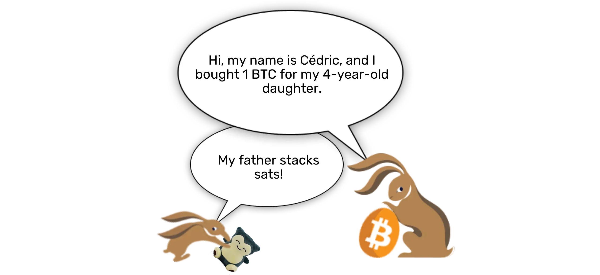
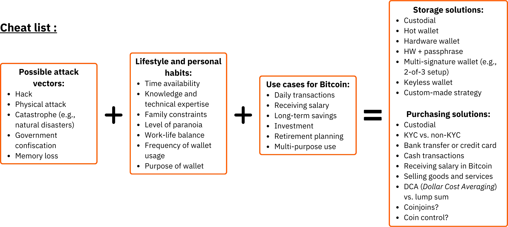
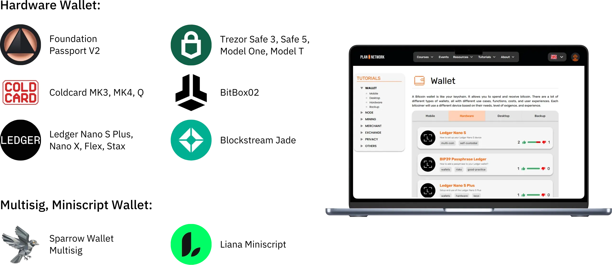
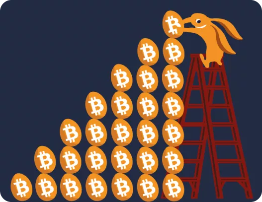
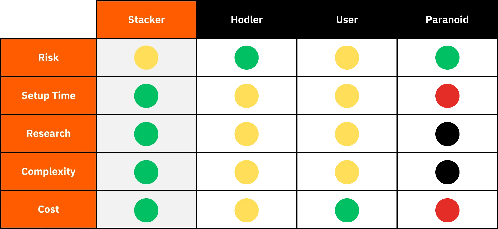
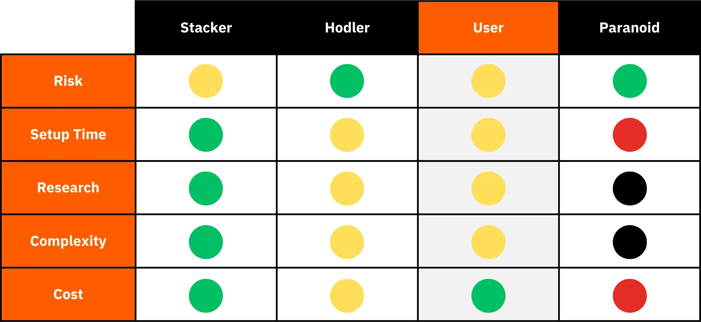

# Perjalanan menuju bitcoin pertama Anda

Ekosistem Bitcoin mengalami pertumbuhan yang spektakuler dan belum pernah terjadi sebelumnya. Transformasi teknologi, ekonomi, dan sosial yang didorong oleh penemuan Satoshi Nakamoto semakin meningkat dari hari ke hari, dan secara bertahap membuka pintu ke dunia baru, yang sekarang dapat Anda manfaatkan sepenuhnya.

Menyelami Bitcoin Rabbit Hole adalah petualangan intelektual yang mengasyikkan yang akan merangsang pemikiran kritis Anda dan menantang banyak keyakinan Anda. Penjelajahan ini tidak hanya akan memberi Anda pemahaman mendalam tentang cara kerja Bitcoin, tetapi juga peluang nyata untuk merebut kembali kebebasan pribadi Anda, melindungi privasi Anda, dan mencapai kedaulatan finansial yang sesungguhnya.

Untuk memandu Anda secara efektif melalui perjalanan ini, saya telah membuat kursus yang sepenuhnya gratis ini. Di sini, fokusnya hanya pada Bitcoin. Tidak ada diskusi yang tidak relevan, tidak ada penyebutan mata uang kripto lainnya, hanya konten yang jelas, tepat, dan lugas.

Kursus ini dirancang untuk memberi Anda kendali penuh atas cara belajar Anda, memungkinkan Anda menjelajahi Bitcoin dengan kecepatan Anda sendiri, mengikuti jalur yang paling sesuai dengan minat dan tujuan Anda.

+++
# Pendahuluan

<partId>008c49b7-5e17-5973-87f2-ba28429b2697</partId>

## Gambaran umum kursus

<chapterId>bfc96999-0ee1-5c41-8297-1b629f50cffc</chapterId>

Selamat datang di BTC102! Jika Anda telah menyelesaikan BTC101, Anda telah menjelajahi konsep teoretis utama di balik mengapa Bitcoin adalah teknologi yang revolusioner. Sekarang, dengan BTC102, saatnya untuk menerapkan pengetahuan tersebut ke dalam tindakan. Kursus ini dirancang untuk membantu Anda membangun rencana Bitcoin pribadi Anda, selangkah demi selangkah.

Pada bab-bab selanjutnya, kami akan memandu Anda melalui langkah-langkah praktis untuk **mendapatkan bitcoin pertama Anda**, **mengamankannya dengan benar, dan dengan percaya diri mengambil langkah pertama Anda ke dalam ekosistem yang berkembang pesat ini.

https://planb.network/courses/2b7dc507-81e3-4b70-88e6-41ed44239966

Meskipun Bitcoin telah ada selama lebih dari 16 tahun, industri ini masih muda, dinamis, dan berakar kuat pada kebebasan. Protokol yang mendasarinya sepenuhnya terdesentralisasi dan tahan terhadap kontrol oleh otoritas pusat mana pun, yang memungkinkan ekosistem tumbuh secara alami dan organik.

Meskipun kebebasan ini mendorong gelombang inovasi dan peluang yang luar biasa, hal ini juga disertai dengan risiko tertentu, termasuk penipuan, kesalahan umum, dan jebakan yang sering kali berasal dari kurangnya pengetahuan. Tujuan utama dari kursus ini adalah untuk membantu Anda menavigasi ekosistem baru ini dengan percaya diri dan aman.

Untuk mencapai hal ini, kursus BTC102 dibagi menjadi beberapa bagian, masing-masing berfokus pada aspek kunci dari perjalanan Anda dengan Bitcoin:

Bagian pertama, "Prasyarat untuk memahami Bitcoin", secara efektif mempersiapkan Anda untuk jalan yang akan Anda lalui. Anda akan belajar mengidentifikasi jebakan utama yang terkait dengan penipuan dan penipuan keuangan yang mungkin ada dalam ekosistem Bitcoin. Kami kemudian akan membahas dasar-dasar penting keamanan online.

Terakhir, saya akan memberikan beberapa saran praktis yang secara khusus didesain untuk para pemula, untuk membantu Anda menghindari kesalahan umum apabila bekerja dengan Bitcoin untuk pertama kali.

Bagian kedua, "Memahami apa yang Anda hadapi", akan memperdalam pemahaman Anda secara keseluruhan tentang Bitcoin. Kami akan memulai dengan tinjauan untuk memastikan Anda sepenuhnya memahami konsep-konsep penting.

Kemudian, kami akan menjelaskan mengapa Bitcoin pada dasarnya penting dari perspektif teknologi, ekonomi, dan sosial, yang akan memperkuat keyakinan Anda akan nilainya. Anda juga akan menjelajahi industri Bitcoin secara keseluruhan: para pemain utamanya, organisasinya, dan evolusinya selama bertahun-tahun. Terakhir, kita akan membahas arsitektur berlapis dari ekosistem Bitcoin, sebuah konsep penting untuk memahami bagaimana sistem ini terus berinovasi tanpa mengorbankan integritas protokol intinya.

Bagian ketiga, "Menyiapkan rencana Anda", berfokus pada pendekatan pribadi Anda terhadap Bitcoin. Kami akan mulai dengan membantu Anda menentukan profil pengguna dari empat kategori utama:

- hodler*, berfokus untuk memegang Bitcoin dalam jangka panjang;
- penumpuk*, yang membeli secara teratur dan metodis;
- pengguna*, yang memprioritaskan penggunaan Bitcoin setiap hari;
- dan terakhir *paranoid*, yang menginginkan keamanan maksimum untuk melindungi aset dan privasinya secara efektif.

Kami akan memandu Anda dalam menerapkan strategi yang sesuai dengan profil Anda dan membantu Anda mencapai tujuan pribadi Anda.

Terakhir, bagian keempat, "Melindungi Ahli Waris dan Kekayaan Anda," membahas topik penting yang sering diabaikan: bagaimana memastikan Bitcoin Anda diwariskan kepada orang yang Anda cintai jika terjadi peristiwa yang tidak terduga. Anda akan belajar cara membuat dan mengatur rencana warisan Bitcoin, memastikan kelestarian kekayaan Anda setelah Anda meninggal.

Pada akhir kursus ini, Anda akan memiliki semua alat praktis yang Anda butuhkan untuk menavigasi ekosistem Bitcoin dengan percaya diri dan menjadi salah satu pengguna yang paling mahir!

Siap untuk memulai perjalanan Anda ke dunia Bitcoin? Ayo pergi!

# Prasyarat untuk memahami Bitcoin

<partId>4481fc4b-0f83-489e-ad07-81517c5d6bad</partId>

## Penipuan dan kecurangan keuangan

<chapterId>8af2948b-2ab5-54c4-862c-3414b8a285a2</chapterId>

Ekosistem Bitcoin dan lingkungan sekitarnya masih relatif muda dan diatur secara longgar, tergantung pada negaranya. Meskipun kebebasan ini membuka peluang yang sangat besar, namun juga menciptakan lahan subur untuk penipuan keuangan, penipuan, dan berbagai bentuk manipulasi. Itulah mengapa bab pertama ini sangat penting: memahami jebakan-jebakan umum akan membantu Anda menghindarinya. Keamanan finansial Anda adalah prioritas karena pengalaman buruk tidak hanya berdampak pada Anda, tetapi juga pada seluruh komunitas Bitcoin.

### Bitcoin vs kripto: memahami perbedaannya

Sebelum melangkah lebih jauh, penting untuk membedakan secara jelas antara dua dunia yang berbeda secara fundamental:

- Ekosistem Bitcoin** berpusat pada gagasan uang yang sehat, dibangun di atas desentralisasi yang kuat, ketahanan jangka panjang, privasi, dan kedaulatan individu. Sejak diluncurkan pada tahun 2009, Bitcoin telah beroperasi dengan andal dan aman, didukung oleh komunitas pengembang global yang berkomitmen. Ini bukan tren yang akan berlalu, tetapi protokol yang stabil dan mapan yang dirancang untuk mempertahankan nilai dari waktu ke waktu.

- Industri mata uang kripto**, di sisi lain, jauh lebih besar dan mencakup puluhan ribu proyek yang berbeda, masing-masing dengan tokennya sendiri. Ruang ini sering kali didorong oleh inovasi yang cepat, hype, dan spekulasi keuangan jangka pendek. Banyak dari proyek-proyek ini terpusat, kurang aman, dan tidak menawarkan banyak nilai nyata-meskipun ada janji-janji yang berani dan pemasaran yang mencolok.

Jika Anda ingin lebih memahami dari mana Bitcoin berasal dan apa yang membuatnya berbeda dari proyek lainnya, saya sarankan untuk melihat kursus lanjutan gratis tentang sejarah Bitcoin nanti:

https://planb.network/courses/a51c7ceb-e079-4ac3-bf69-6700b985a082

Seperti yang Anda ketahui, platform Plan ₿ Network didedikasikan khusus untuk Bitcoin. Namun, memahami perbedaannya dengan mata uang kripto lainnya akan membantu Anda menghindari jebakan yang terkait dengan proyek-proyek yang tidak berguna dan terkadang bahkan penipuan.

### Penipuan utama yang harus dihindari

Berikut ini adalah penipuan yang paling umum yang mungkin Anda temui dalam perjalanan Anda:

#### Skema piramida dan skema Ponzi

Ini adalah beberapa penipuan yang paling umum terjadi di dunia kripto. Dalam skema Ponzi, peserta awal menerima pembayaran menggunakan uang dari peserta yang lebih baru; bukan dari investasi atau produk nyata. Tidak ada nilai aktual yang diciptakan. Sistem ini hanya bekerja selama orang-orang baru terus bergabung. Begitu aliran peserta baru melambat, seluruh skema akan berantakan.

Penipuan ini biasanya menampilkan :

- Janji yang tidak realistis tentang jaminan pengembalian (misalnya, jaminan pengembalian 20%);
- Penundaan atau kesulitan saat mencoba menarik dana yang Anda investasikan;
- Insentif yang kuat untuk merekrut anggota baru agar sistem tetap berjalan;
- Kurangnya transparansi mengenai sumber sebenarnya dari imbal hasil yang dijanjikan.

Pada akhirnya, semua skema piramida dan Ponzi pasti akan gagal. Kelemahan mendasarnya terletak pada kebutuhan konstan untuk membawa investor baru untuk membayar pengembalian kepada peserta sebelumnya. Kebutuhan ini secara matematis tidak mungkin dipertahankan dari waktu ke waktu karena jumlah anggota baru yang dibutuhkan meningkat secara eksponensial seiring dengan pertumbuhan sistem. Setelah titik kritis tercapai, peserta mulai ragu, kepercayaan menghilang, dan seluruh piramida runtuh. Pada tahap ini, orang-orang terakhir yang bergabung, yang sering kali paling sedikit mendapatkan informasi, kehilangan seluruh investasi mereka tanpa ada cara untuk mendapatkannya kembali, sementara penyelenggara atau investor awal biasanya sudah menarik dana mereka dan meninggalkan sistem.

Dalam dunia mata uang kripto, skema Ponzi dapat muncul dalam berbagai bentuk, yang sering kali dirancang untuk menyembunyikan sifat penipuan mereka di balik topeng teknologi atau keuangan. Penipuan ini dapat muncul sebagai penawaran token baru atau Initial Coin Offerings (ICO), yang merupakan operasi penggalangan dana di mana mata uang kripto baru dijual kepada publik. Di balik istilah teknis seperti "Blockchain", "kontrak pintar", atau "staking", beberapa proyek sebenarnya menyembunyikan skema piramida yang rumit. Proyek lainnya mengklaim menawarkan keuntungan yang tinggi dengan menggabungkan aset kripto yang meragukan dengan sistem kompensasi yang sepenuhnya bergantung pada masuknya investor baru secara terus menerus.

Baru-baru ini, skema Ponzi juga telah menyebar ke dunia Keuangan Terdesentralisasi (DeFi). Meskipun DeFi dimaksudkan untuk menyediakan layanan keuangan tanpa perantara, beberapa proyek menggunakannya untuk memberikan kesan legitimasi palsu terhadap penipuan mereka. Platform DeFi tertentu menjanjikan pengembalian yang tinggi dan terjamin dalam Exchange untuk setoran mata uang kripto ke dalam protokol otomatis. Janji-janji yang menarik ini sering kali didukung oleh mekanisme yang tidak jelas dan tidak dapat diverifikasi, dengan token yang dibuat khusus untuk penipuan. Pada kenyataannya, sistem ini tidak memiliki model bisnis yang berkelanjutan - pengembaliannya hanya dibayarkan dari dana pengguna baru, seperti skema Ponzi tradisional. Ketika kepercayaan mulai terkikis atau masuknya peserta baru melambat, sistem ini pasti akan runtuh, yang menyebabkan kerugian yang signifikan bagi investor yang tidak menaruh curiga.

Harap diperhatikan bahwa konten kursus ini hanya untuk tujuan edukasi dan tidak boleh ditafsirkan sebagai nasihat keuangan. Keamanan finansial Anda bergantung pada kemampuan Anda untuk tetap berhati-hati, skeptis, dan memiliki informasi yang cukup tentang setiap keputusan finansial yang Anda buat.

Perlindungan terbaik adalah dengan selalu menanyakan pertanyaan sederhana ini: Dari mana sebenarnya keuntungan yang dijanjikan itu berasal? Jika jawabannya tidak jelas, segera kabur.

#### Pompa & Pembuangan

Jenis penipuan ini melibatkan penggelembungan harga aset secara artifisial - sering kali berupa token mata uang kripto dengan likuiditas rendah - melalui kampanye pemasaran yang terkoordinasi, biasanya dipimpin oleh sekelompok investor. Skema Pump & Dump biasanya mengikuti pola ini:

- Sekelompok orang dalam atau tokoh berpengaruh diam-diam mengumpulkan sejumlah besar aset yang ditargetkan.
- Mereka kemudian meluncurkan kampanye promosi yang agresif untuk mendongkrak popularitas generate dan menaikkan harganya.
- Masyarakat umum, didorong oleh FOMO (Fear of Missing Out), mulai membeli aset dalam jumlah besar, mendorong harga lebih tinggi lagi.
- Pada puncak hype, orang dalam menjual kepemilikan mereka sekaligus.
- Harga jatuh, membuat para pendatang baru mengalami kerugian besar.

Penting untuk dicatat bahwa strategi Pump & Dump adalah ilegal di banyak negara dan dianggap sebagai bentuk manipulasi pasar. Meskipun demikian, skema seperti ini terus berkembang, terutama di dunia mata uang kripto, di mana regulasi masih terus berkembang.

Berhati-hatilah dengan grup "sinyal" pribadi di platform seperti Telegram, Discord, atau saluran media sosial lainnya. Grup-grup ini sering kali dikelola oleh para influencer atau orang yang mengaku sebagai pakar, beberapa di antaranya bahkan memungut biaya pendaftaran. Meskipun grup-grup ini mengklaim menawarkan peluang investasi eksklusif, kenyataannya jauh lebih berat sebelah: hanya penyelenggara yang untung, sementara sebagian besar peserta akhirnya kehilangan uang mereka.

Memang benar bahwa beberapa peserta mungkin mendapatkan keuntungan sementara dari manipulasi pasar semacam ini, tetapi keberhasilan mereka biasanya tidak lebih dari keberuntungan dan waktu yang tepat. Dalam jangka panjang, skema ini tidak berkelanjutan. Skema ini membutuhkan keterlibatan berisiko tinggi yang konstan dan partisipasi berulang kali dalam pengaturan curang yang pasti akan runtuh.

Lebih buruk lagi, mereka memberi makan ilusi yang berbahaya: keyakinan bahwa menghasilkan uang dengan cepat dan mudah tanpa memahami cara kerja sistem keuangan yang sebenarnya. Pola pikir ini tidak hanya menempatkan individu dalam risiko, tetapi juga merusak kredibilitas seluruh ekosistem mata uang kripto

Untuk semua alasan ini, strategi terbaik adalah tetap berpegang pada pendekatan yang serius dan bijaksana dalam berinvestasi, yang didasarkan pada pendidikan keuangan, pemahaman yang kuat tentang dasar-dasar, dan perspektif jangka panjang.

Dengan membangun pengetahuan Anda dengan sabar, Anda tidak akan terlalu rentan terhadap manipulasi emosional dan janji-janji yang tidak realistis; dan jauh lebih siap untuk menghindari jebakan finansial yang dapat menyebabkan kerugian nyata.

#### Penipuan Donasi, Lotere, dan Hadiah Palsu

Jenis penipuan ini menjanjikan Bitcoin gratis atau hadiah lain di Exchange jika Anda mengirimkan sejumlah kecil uang terlebih dahulu. Penting untuk diingat: tidak ada individu atau organisasi yang sah yang akan meminta Anda mengirim mata uang kripto di muka dengan janji akan mengirim lebih banyak sebagai imbalan.

Para penipu sering kali menyamar sebagai tokoh publik terkenal (seperti Elon Musk atau selebriti lainnya) untuk memikat korban melalui media sosial. Selalu periksa kembali keabsahan akun dan situs web sebelum berinteraksi dengan mereka, dan jangan pernah mempercayai tawaran yang tampak terlalu murah hati atau terlalu bagus untuk menjadi kenyataan.

Terkadang, penipuan ini muncul sebagai penipuan "biaya di muka". Anda dijanjikan hadiah atau imbalan (uang, produk, atau layanan), tetapi pertama-tama diminta untuk membayar biaya, yang konon untuk menutupi biaya pengiriman, pajak, atau biaya transaksi. Setelah pembayaran dilakukan, penipu menghilang, dan hadiah yang dijanjikan tidak pernah tiba.

#### Shitcoin dan mata uang kripto yang ditawarkan

Proyek mata uang kripto terpusat terkadang menawarkan token gratis ("*airdrops*") untuk menarik pengguna, token ini biasanya tidak memiliki nilai yang nyata dan biasanya digunakan untuk menciptakan ilusi popularitas atau memicu spekulasi. Berhati-hatilah dengan penawaran promosi seperti ini; penawaran ini sering kali merupakan jebakan pemasaran dan bukannya peluang yang sebenarnya.

#### Pencurian identitas dan phishing

Para penyerang sering kali menggunakan situs web palsu, akun media sosial, atau email yang menipu untuk mencoba mencuri dana Anda. Penipuan ini dapat dilakukan melalui saluran komunikasi apa pun: email, jejaring sosial, panggilan telepon, atau bahkan surat biasa...

Sebelum mengklik tautan atau melakukan tindakan apa pun, selalu periksa kembali identitas pengirim. Jika ragu, kunjungi situs web secara manual alih-alih menggunakan tautan yang disediakan. Yang paling penting, jangan pernah membagikan kunci pribadi atau kata sandi Anda kepada siapa pun.

#### Bitcoin Hardforks

Selama bertahun-tahun, Bitcoin telah mengalami beberapa *Hard fork*, yang menghasilkan versi alternatif dari mata uang kripto asli. Secara sederhana, *Hard Fork* adalah perpecahan dalam jaringan yang mengarah ke dua blockchain yang terpisah, keduanya berbagi sejarah yang sama hingga saat perpecahan. Fork ini biasanya terjadi ketika bagian dari komunitas pengembang atau ekosistem Bitcoin yang lebih luas ingin memperkenalkan perubahan besar pada protokol asli tetapi tidak dapat mencapai konsensus yang luas. Alih-alih meninggalkan ide mereka, mereka memutuskan untuk meluncurkan versi baru Bitcoin (dengan aturan yang diubah) dengan harapan pengguna dan penambang akan memilih untuk mengikuti Fork sebagai gantinya.

Tidak semua *Hard fork* adalah penipuan, karena beberapa muncul dari ketidaksepakatan teknis atau ideologis dalam komunitas. Akan tetapi, yang lainnya didorong oleh kepentingan komersial atau bahkan motif yang tidak jujur. Contoh yang paling terkenal dari hardforks ini adalah **Bitcoin Cash (BCH)** dan **Bitcoin Satoshi Vision (BSV)**. Diluncurkan pada tahun 2017 dan 2018, mata uang alternatif ini sering kali diklaim sebagai "versi yang lebih baik" dari Bitcoin yang asli. Mereka mempromosikan keuntungan yang seharusnya seperti biaya transaksi yang lebih rendah atau transaksi yang lebih cepat karena peningkatan ukuran blok. Namun, perubahan teknis ini memiliki trade-off yang signifikan dalam hal keamanan, desentralisasi, dan ketahanan; Elements yang dapat bertentangan dengan prinsip-prinsip dasar Bitcoin.

Di luar perbedaan teknis, mata uang alternatif ini sering kali memanfaatkan kebingungan untuk menarik investor yang kurang informasi. Mereka mungkin menggunakan taktik pemasaran yang dirancang untuk menyesatkan pendatang baru yang percaya bahwa mereka membeli Bitcoin (BTC) asli.

Agar tidak terjebak dalam jebakan ini, selalu verifikasi mata uang yang Anda beli. Bitcoin asli menggunakan ticker **BTC**, sedangkan Bitcoin Cash dan turunannya menggunakan singkatan yang berbeda, seperti BCH atau BSV.

#### Influencer yang tidak jujur dan guru palsu

Ketika mata uang kripto mendapatkan perhatian utama, media sosial telah menyaksikan lonjakan influencer, pakar yang memproklamirkan diri, dan apa yang disebut sebagai "*guru kripto*". Meskipun beberapa orang mungkin menawarkan wawasan edukasi yang tulus, banyak orang lain yang memanfaatkan visibilitas mereka untuk mempromosikan proyek-proyek yang meragukan atau strategi perdagangan yang sangat berisiko (dan terkadang langsung menipu), orang-orang ini biasanya termotivasi oleh kepentingan finansial pribadi, sering kali menerima kompensasi langsung atau tidak langsung untuk mempromosikan token atau platform tertentu.

Para influencer ini sering kali mengandalkan taktik yang sudah terbukti untuk menarik para pemula: mereka memamerkan hasil keuangan yang mengesankan (yang sering kali palsu atau tidak bisa diverifikasi), memamerkan gaya hidup mewah sebagai bukti kesuksesan mereka, dan mempromosikan strategi investasi "ajaib". Tujuannya adalah untuk memicu FOMO - rasa takut ketinggalan - dan mendorong audiens mereka untuk mengambil keputusan impulsif dan investasi yang sembrono.

Penting untuk dipahami bahwa sebagian besar nasihat "gratis" dari para tokoh ini tidak pernah benar-benar gratis. Di balik tampilan kedermawanan sering kali terdapat strategi yang diperhitungkan untuk mengarahkan orang agar membeli aset yang meragukan. Dan bahkan jika beberapa influencer jujur, meniru hasil yang mereka berikan hampir tidak mungkin dilakukan; kesuksesan mereka sering kali bergantung pada waktu tertentu, pengetahuan orang dalam, atau situasi unik yang tidak dapat Anda akses.

Beberapa influencer mungkin mengundang Anda untuk bergabung dengan grup berbayar pribadi di mana mereka mengklaim membagikan sinyal trading eksklusif atau tips orang dalam yang menjanjikan keuntungan cepat dan mudah. Kenyataannya, grup-grup ini hanya menguntungkan para penyelenggaranya. Mereka sering menggunakan pengikut mereka sebagai sumber likuiditas, yang pada dasarnya melepaskan aset untuk keuntungan pribadi. Pelanggan biasanya berakhir dengan kehilangan uang, karena mereka tidak dapat bereaksi secepat orang dalam yang mengatur perdagangan (lihat bagian skema Pump & Dump).

Melihat kenyataan ini, berikut adalah beberapa kebiasaan baik yang bisa diterapkan agar tidak jatuh ke dalam perangkap yang dibuat oleh influencer yang tidak jujur:

- Berhati-hatilah dengan rekomendasi investasi kripto apa pun.**

Orang yang dapat dipercaya dan berpengetahuan luas tidak akan pernah memaksa Anda untuk membeli mata uang kripto tanpa mendorong Anda untuk melakukan riset terlebih dahulu.

- Kursus trading atau investasi berbayar tidak selalu menandakan kualitas yang baik.**

Banyak dari kursus ini mempromosikan strategi yang berisiko atau terlalu sederhana; sering kali informasi yang sama dapat Anda temukan secara online secara gratis.

- Tidak ada cara yang dapat dijamin untuk menyalin trade seseorang dan mendapatkan hasil yang sama.**

Setiap strategi investasi bergantung pada konteks pribadi, waktu, pengetahuan, dan faktor lain yang tidak dapat ditiru secara persis.

- Berhati-hatilah dengan saran yang terdengar terlalu bagus untuk menjadi kenyataan.**

Janji yang tidak realistis atau jaminan keuntungan hampir selalu merupakan tanda manipulasi. Ingat: hanya karena seseorang mengatakan sesuatu dengan penuh percaya diri, bukan berarti itu benar.

Ingatlah selalu, setiap orang yang Anda temui di Bitcoin atau ekosistem kripto yang lebih luas memiliki agenda pribadi; baik yang dinyatakan secara langsung maupun yang tersembunyi. Tidak ada yang namanya informasi yang murni netral. Bahkan kursus ini, BTC102, memiliki tujuan yang jelas, *untuk mempromosikan pemahaman yang lebih baik tentang Bitcoin.*

Itulah mengapa sangat penting untuk tetap menyadari motivasi sebenarnya di balik setiap konten yang Anda konsumsi. Dan jangan pernah melupakan aturan emas internet ini:

*Jika sebuah produk atau layanan tampak gratis, kemungkinan besar Anda adalah produknya*

Pada akhirnya, pertahanan terbaik Anda adalah pendidikan pribadi, skeptisisme yang sehat, dan yang paling penting, kebiasaan memverifikasi fakta untuk diri Anda sendiri.

### Cara menghindari penipuan

**Agar tetap aman saat online, terutama di dunia kripto, ingatlah prinsip-prinsip utama berikut ini:**

- Jangan pernah mempercayai secara membabi buta: "*Jangan percaya, verifikasi*";
- Bersikaplah skeptis terhadap imbal hasil yang dijamin atau sangat tinggi;
- Jangan pernah membagikan kunci pribadi Anda dengan siapa pun;
- Jangan mengirim Bitcoin (atau kripto apa pun) ke alamat yang tidak dikenal;
- Jika ragu, berhenti sejenak. Mundurlah sejenak dan pikirkan sebelum mengambil tindakan. FOMO adalah musuh terburuk Anda;
- Hindari grup atau komunitas trading berbayar yang memberikan janji yang tidak realistis;
- Sebagian besar hadiah atau lotere "gratis" online adalah penipuan atau sangat dicurangi;
- Anda akan selalu mendapatkan lebih banyak keuntungan dalam jangka panjang dengan belajar daripada berjudi.

Melindungi diri Anda dari penipuan adalah langkah pertama yang sangat penting dalam melindungi aset Anda; tetapi itu saja tidak cukup. Menjaga kebersihan digital yang kuat juga sama pentingnya. Itulah sebabnya, di bab berikutnya, kita akan membahas cara memperkuat keamanan online Anda dan praktik-praktik terbaik yang harus Anda terapkan untuk melindungi diri Anda sendiri di dunia digital.

## Keamanan online

<chapterId>f0873bf2-6a6f-5485-bb7a-d84be14f404d</chapterId>

Segera setelah Anda mulai menggunakan Bitcoin, Anda akan segera menyadari bahwa keamanan siber dasar bukanlah pilihan-itu sangat penting. Penipuan dan kecurangan hanyalah puncak gunung es. Kehilangan data yang tidak disengaja, malware, dan kata sandi yang disusupi bisa sama merusaknya, terutama ketika Anda mengelola kunci Anda sendiri.

Bab ini memandu Anda melalui beberapa langkah sederhana dan praktis untuk meningkatkan kebersihan digital Anda dan melindungi diri Anda di dalam ruang.

Jika Anda ingin mempelajari lebih dalam, kursus SEC101 dari Plan ₿ Network menawarkan perincian komprehensif tentang strategi keamanan siber yang dirancang khusus untuk pengguna Bitcoin.

https://planb.network/courses/99c46148-7080-4915-a7e0-9df0e145cd47

### Mengapa Keamanan Siber Penting

Bitcoin memberi Anda kekuatan untuk menyimpan uang Anda secara langsung (tanpa bank), tanpa perantara. Namun, kedaulatan finansial semacam itu disertai dengan tanggung jawab yang serius: jika BTC Anda dicuri karena adanya celah keamanan, tidak ada cara untuk membatalkan transaksi. Tidak seperti perbankan tradisional, tidak ada meja bantuan, tidak ada klaim penipuan, dan tidak ada asuransi yang menalangi Anda.

Selain itu, nilai finansial dari Bitcoin membuatnya menjadi target bernilai tinggi. Peretas yang membobol Wallet Anda dapat langsung memindahkan dana Anda ke Address yang mereka kendalikan (tidak ada pertanyaan, tidak ada cara untuk mendapatkannya kembali).

### Komputer yang bersih dan mutakhir

Salah satu aspek yang paling sering diabaikan dari keamanan pribadi adalah menjaga sistem operasi dan perangkat lunak Anda tetap mutakhir. Banyak pembaruan yang menambal kerentanan yang diketahui yang dapat dieksploitasi oleh penyerang. Meskipun sebagian orang menghindari pembaruan karena khawatir akan masalah kinerja, risiko sebenarnya terletak pada menjalankan perangkat lunak usang yang sudah diketahui cara membobolnya oleh para peretas.

Juga sangat disarankan untuk menggunakan antivirus yang andal. Di Windows, Windows Defender bawaan umumnya sudah cukup memadai bagi sebagian besar pengguna. Jika Anda lebih suka fitur tambahan atau ketenangan pikiran, opsi komersial seperti Kaspersky juga tersedia. Di macOS, ancaman malware secara historis kurang umum **tetapi bukannya tidak ada** jadi tetaplah berhati-hati.

Di luar pembaruan sistem dan perlindungan antivirus, berhati-hatilah dalam mengunduh perangkat lunak dari situs web yang tidak jelas atau yang disebut portal unduhan "universal". Saat Anda membutuhkan alat atau aplikasi, selalu langsung ke sumber resminya; Hal ini secara drastis mengurangi risiko menginstal malware yang menyamar sebagai perangkat lunak yang sah.

Kebiasaan cerdas lainnya adalah memverifikasi keaslian dan integritas perangkat lunak apa pun sebelum menginstalnya di komputer Anda. Jika Anda tidak yakin bagaimana cara melakukannya, jangan khawatir, kami memiliki tutorial khusus untuk memandu Anda melalui prosesnya:

https://planb.network/tutorials/computer-security/data/integrity-authenticity-21d0420a-be02-4663-94a3-8d487f23becc

Terakhir, buatlah cadangan data penting Anda secara teratur. Drive Hard eksternal atau SSD adalah pilihan yang tepat untuk menyimpan duplikat file Anda jika terjadi kerusakan mendadak, peretasan, atau penghapusan yang tidak disengaja. Anda akan berterima kasih pada diri Anda sendiri nanti.

Jika Anda lebih memilih solusi cloud, pertimbangkan untuk menggunakan layanan yang aman seperti Proton Drive. Pastikan opsi apa pun yang Anda pilih menghormati privasi Anda dan menawarkan enkripsi yang kuat.

https://planb.network/tutorials/computer-security/data/proton-drive-03cbe49f-6ddc-491f-8786-bc20d98ebb16

Strategi pencadangan yang banyak direkomendasikan adalah "aturan 3-2-1". Strategi ini dirancang untuk melindungi data Anda dari kehilangan yang tidak disengaja, serangan siber, atau bahkan bencana alam.

Idenya sederhana saja:

- Simpanlah **setidaknya 3 salinan** data penting Anda,
- Simpan pada **setidaknya 2 jenis media yang berbeda** (misalnya, drive Hard eksternal dan penyimpanan cloud),
- Dan pastikan **1 dari salinan tersebut disimpan di luar lokasi** (secara fisik terpisah dari lokasi utama Anda).

Pendekatan ini menawarkan ketahanan yang kuat dan membantu memastikan data Anda tetap bertahan bahkan jika terjadi kesalahan serius.

### Solusi untuk mimpi buruk ID

Salah satu alasan terbesar orang diretas adalah menggunakan kata sandi yang lemah. Banyak sekali pengguna yang masih menggunakan ulang kata sandi yang sama pada beberapa akun, atau memilih variasi yang mudah ditebak. Pengelola kata sandi adalah solusi sempurna untuk masalah ini.

Pengelola kata sandi memungkinkan Anda:

- Simpan semua kata sandi Anda dengan aman** dalam brankas terenkripsi
- generate kata sandi yang panjang, rumit, dan unik** secara otomatis untuk setiap akun
- Gunakan hanya satu kata sandi utama**, untuk mengakses semuanya dengan aman

Dengan pengelola kata sandi, Anda tidak perlu lagi mengeklik "Lupa kata sandi" atau mengandalkan kredensial yang lemah dan digunakan kembali. Selain itu, sebagian besar pengelola kata sandi menyinkronkan dengan lancar di seluruh perangkat Anda (desktop, ponsel, tablet) dan bahkan formulir login yang terisi otomatis, sehingga akses yang aman menjadi lebih mudah dan efisien.

Ada banyak sekali pengelola kata sandi di luar sana, tetapi saya bisa merekomendasikan dua opsi yang solid tergantung pada kebutuhan Anda. Jika Anda mencari sesuatu yang mudah digunakan dan disinkronkan dengan mulus di berbagai perangkat, Bitwarden adalah pilihan yang sangat baik:

https://planb.network/tutorials/computer-security/authentication/bitwarden-0532f569-fb00-4fad-acba-2fcb1bf05de9

Jika Anda lebih suka menyimpan semuanya secara lokal di perangkat Anda sendiri, KeePass adalah pilihan yang bagus:

https://planb.network/tutorials/computer-security/authentication/keepass-f8073bb7-5b4a-4664-9246-228e307be246

### 2FA: perlindungan ganda

Di Bitcoin, Anda adalah bank Anda sendiri. Itu berarti Anda juga merupakan tim keamanan Anda sendiri. Bahkan dengan kata sandi yang kuat, tidak ada yang namanya risiko nol - itulah sebabnya mengapa mengaktifkan otentikasi dua faktor (2FA) sangat penting.

2FA menambahkan perlindungan Layer kedua dengan membutuhkan kode sekali pakai berbasis waktu (biasanya 6 digit) yang dihasilkan oleh aplikasi seperti Google Authenticator atau Authy. Jadi, meskipun seseorang berhasil mendapatkan kata sandi Anda, mereka tetap tidak dapat mengakses akun Anda tanpa akses fisik ke ponsel Anda.

https://planb.network/tutorials/computer-security/authentication/authy-a76ab26b-71b0-473c-aa7c-c49153705eb7

Ketika Anda mengaktifkan 2FA, pastikan untuk menyimpan kunci pemulihan untuk aplikasi Anda di tempat yang aman. Hal ini akan memungkinkan Anda memulihkan kode jika Anda kehilangan atau mengganti ponsel. Meskipun 2FA berbasis SMS atau email lebih baik daripada tidak sama sekali, namun tetap saja kurang aman. Serangan penukaran SIM, di mana seseorang mengambil alih nomor telepon Anda, dapat dengan mudah menerobos perlindungan semacam ini.

Bagi mereka yang ingin meningkatkan keamanan selangkah lebih maju, kunci fisik seperti YubiKey memberikan tingkat perlindungan yang lebih tinggi.

https://planb.network/tutorials/computer-security/authentication/security-key-61438267-74db-4f1a-87e4-97c8e673533e

### Melindungi privasi Anda

Privasi dan keamanan siber sangat erat kaitannya: semakin banyak informasi yang Anda biarkan dapat diakses secara bebas, semakin besar kemungkinan Anda menjadi target.

Sebuah **VPN** (*Virtual Private Network*) adalah langkah sederhana namun efektif untuk menyembunyikan IP Address Anda dan mengenkripsi lalu lintas internet Anda. Meskipun tidak akan membuat Anda benar-benar tidak terlihat (karena penyedia VPN masih bisa melihat aktivitas Anda), namun ini akan mempersulit siapa pun yang mencoba memata-matai Anda atau melacak kebiasaan jelajah Anda.

Kuncinya adalah memilih penyedia VPN yang dapat dipercaya:

- Tidak memerlukan informasi pribadi Anda
- Mengizinkan pembayaran melalui BTC
- Memiliki kebijakan tanpa pencatatan yang ketat

Kami memiliki beberapa tutorial yang tersedia di Plan ₿ Network yang bisa memandu Anda menyiapkan VPN dengan mudah. Saya secara khusus merekomendasikan IVPN atau Mullvad:

https://planb.network/tutorials/computer-security/communication/ivpn-5a0cd5df-29f1-4382-a817-975a96646e68

https://planb.network/tutorials/computer-security/communication/mullvad-968ec5f5-b3f0-4d23-a9e0-c07a3e85aaa8

Langkah-langkah penting untuk melindungi privasi Anda secara online juga termasuk:

- Menggunakan **platform pesan terenkripsi** seperti Signal, SimpleX atau Session;
- Menggunakan peramban yang berfokus pada privasi seperti Firefox, Brave, atau Tor (untuk anonimitas yang ditingkatkan);

https://planb.network/tutorials/computer-security/communication/tor-browser-a847e83c-31ef-4439-9eac-742b255129bb

- Menggunakan **kotak surat yang aman** seperti ProtonMail;

https://planb.network/tutorials/computer-security/communication/proton-mail-c3b010ce-254d-4546-b382-19ab9261c6a2

- Mengenkripsi** file Anda dengan alat seperti Bitlocker (untuk Windows) atau VeraCrypt (tersedia di berbagai platform).

https://planb.network/tutorials/computer-security/data/veracrypt-d5ed4c83-7c1c-4181-95ea-963fdf2d83c5

### Perkembangan langkah demi langkah

Keamanan siber bisa terlihat seperti pekerjaan yang sangat besar, dan mudah bagi para pemula untuk kewalahan dan menyerah karena tampaknya terlalu rumit. Kuncinya adalah mendekatinya selangkah demi selangkah. Mulailah dengan sesuatu yang sederhana, seperti memasang pengelola kata sandi. Beri diri Anda waktu beberapa minggu untuk merasa nyaman dengannya, lalu lanjutkan ke langkah berikutnya: seperti mengaktifkan 2FA pada salah satu akun Anda.

Ketika Anda semakin percaya diri dengan alat-alat ini, Anda akan siap untuk menambahkan praktik-praktik yang lebih canggih, seperti menggunakan email sekunder, beralih ke ProtonMail, menyiapkan VPN, atau menjelajah dengan Tor bila perlu.

Ketika Anda menyelami dunia Bitcoin lebih dalam, Anda akan menyadari bahwa risikonya bertambah seiring dengan meningkatnya nilai Wallet Anda. Membangun kebiasaan keamanan yang solid, melindungi privasi Anda, dan menyiapkan alat yang tepat tidak hanya akan memberi Anda ketenangan pikiran, tetapi juga memperkuat kedaulatan yang dimiliki Bitcoin.

Singkatnya: jangan meremehkan keamanan siber, luangkan waktu untuk menyiapkan dasar-dasarnya, dan ingatlah bahwa konsistensi adalah kuncinya. Tanpa kebersihan digital yang baik, bahkan alat yang terbaik pun tidak akan banyak membantu Anda.

Pastikan juga untuk melihat [tutorial keamanan komputer kami](https://planb.network/tutorials/computer-security) pada Plan ₿ Network.

Dalam bab berikutnya, saya akan berbagi beberapa saran lagi untuk membantu Anda memulai perjalanan Bitcoin Anda dengan percaya diri; dan untuk menghindari banyak jebakan yang bisa membuat para pemula lengah.

## Kiat untuk pendatang baru

<chapterId>33134b3f-92c1-5185-afb6-88599e47e801</chapterId>

Masuk ke dalam Bitcoin bisa jadi sangat menarik; tetapi juga memiliki risiko yang cukup besar. Dunia kripto tidak seperti dunia lainnya; perubahan harga yang liar, teknologi yang tidak dikenal, dan kemungkinan yang sangat nyata untuk kehilangan dana Anda untuk selamanya karena kesalahan sederhana atau pilihan investasi yang buruk adalah jebakan yang harus diperhatikan oleh pengguna baru.

Dalam bab ini, saya akan membagikan beberapa saran praktis dan panduan umum bagi siapa saja yang mengambil langkah pertama mereka, terutama mereka yang melakukan pembelian pertama atau menjelajahi dunia investasi keuangan yang lebih luas.

Berikut adalah poin-poin penting yang akan kita bahas bersama:

- Waspadalah terhadap **Shitcoins** dan mata uang kripto lainnya yang tidak berguna;
- Hanya investasikan **uang yang Anda sanggup untuk kehilangan**;
- Ketahui perbedaan antara **trading** dan **investasi**;
- Ketahuilah implikasi pajak dari investasi Anda;
- Lindungi **frase pemulihan** Anda dengan hati-hati;
- Tetaplah rendah hati dan jaga agar tetap **rendah hati** (kebijaksanaan adalah bagian dari keamanan);
- Berpikirlah jangka panjang**, perbesar dan bersabarlah (anggaplah ini sebagai maraton, bukan lari cepat).

### Kesalahan umum yang harus dihindari

Bitcoin terbuka untuk semua orang, tetapi bukan berarti Anda harus menyelam tanpa persiapan. Berikut adalah beberapa kesalahan klasik yang dilakukan oleh pendatang baru:

**Kesalahan teknologi:**

- Kehilangan frasa seed Anda:** Frasa pemulihan Anda (biasanya 12 atau 24 kata) adalah satu-satunya cara untuk mengakses Bitcoin Anda jika terjadi sesuatu pada Wallet Anda. Jika Anda kehilangannya, dana Anda akan hilang secara permanen;
- Menyimpan bitcoin Anda di platform pihak ketiga:** Jika koin Anda berada di platform terpusat, Anda tidak benar-benar memilikinya. Anda terekspos pada risiko seperti peretasan, kegagalan platform, atau bahkan penyitaan dana;
- Mengabaikan privasi:** Melindungi privasi Anda adalah bagian inti dari mengamankan aset Anda. Mengungkapkan kepada publik berapa banyak Bitcoin yang Anda miliki dapat membuat Anda menjadi target;
- Keamanan online yang tidak memadai:** Gagal mengamankan perangkat Anda dengan perlindungan dasar (seperti pembaruan, kata sandi yang kuat, atau 2FA) membuat Anda menjadi sasaran empuk para penyerang; dan dapat membuat Anda kehilangan segalanya.

**Kesalahan keuangan:**

- Berinvestasi lebih dari yang Anda mampu untuk kehilangan**: Jangan pernah berhutang atau memasukkan uang sewa Anda ke dalam Bitcoin. Stabilitas keuangan dasar Anda harus selalu diutamakan.

- Tidak mengetahui perbedaan antara trading dan investasi**: Trading membutuhkan waktu, keahlian, dan disiplin emosional yang serius. Investasi jangka panjang jauh lebih ramah bagi pemula.

- Melupakan pajak**: Setiap negara memiliki aturan pajaknya sendiri untuk kripto. Mengabaikannya dapat menyebabkan kejutan yang menyakitkan di kemudian hari.

- Terjerumus ke dalam FOMO**: Membeli secara impulsif karena takut ketinggalan biasanya berujung pada waktu yang tidak tepat dan keputusan yang buruk. Kesabaran adalah sekutu terbaik Anda.

### Menentukan strategi investasi

Sebelum membeli Satoshi pertama Anda, sangat penting untuk memahami mengapa Anda berinvestasi di Bitcoin dan bagaimana caranya. Ini berarti memiliki rencana keuangan yang jelas yang disesuaikan dengan situasi pribadi dan tujuan jangka panjang Anda.

Mulailah dengan menentukan **anggaran** Anda dengan tepat. Jangan asal memilih angka. Luangkan waktu untuk menghitung pendapatan bulanan Anda, kurangi pengeluaran tetap Anda (seperti sewa, pinjaman, pajak, utilitas), serta biaya hidup sehari-hari (makanan, transportasi, rekreasi, dan lain-lain). Yang tersisa adalah margin tabungan Anda dan hanya dari bagian inilah Anda harus mempertimbangkan untuk berinvestasi.

Dengan melakukan pendekatan seperti ini, Anda tidak akan membahayakan kesehatan finansial Anda, terutama jika terjadi penurunan pasar. Strategi yang matang adalah fondasi ketahanan jangka panjang.

Setelah anggaran Anda ditentukan, pikirkan bagaimana Anda ingin berinvestasi. Salah satu metode yang paling ramah pemula dan banyak direkomendasikan adalah Dollar Cost Averaging (DCA), membeli Bitcoin dalam jumlah tetap secara berkala (mingguan, bulanan, dll). Strategi ini membantu memuluskan harga masuk rata-rata Anda dari waktu ke waktu dan mengurangi dampak emosional dari perubahan harga. Ini adalah pendekatan yang cerdas bagi kebanyakan orang, terutama pendatang baru.

Kemudian, tanyakan pada diri sendiri: Apa jangka waktu saya?

Apakah Anda ingin melakukan pergerakan cepat masuk dan keluar pasar (trading)? Atau apakah Anda lebih selaras dengan pola pikir jangka panjang dengan memegang Bitcoin selama beberapa tahun (hodler)? Jika Anda seorang hodler, Anda mungkin tidak terlalu peduli dengan perubahan harga harian dan lebih fokus pada keamanan jangka panjang dan penyimpanan sendiri. Jika Anda berdagang, Anda akan lebih terpapar pada gejolak pasar jangka pendek, risiko lebih tinggi, dan stres yang sering kali muncul karena pengambilan keputusan yang cepat. Tidak ada jawaban yang cocok untuk semua orang, tetapi mengetahui pendekatan Anda sendiri akan membantu memandu keputusan Anda.

Yang paling penting, jangan membuat keputusan investasi berdasarkan emosi atau rasa takut. Tetapkan strategi terlebih dahulu, tuliskan, dan patuhi.

Jika Anda masih tidak yakin, **mulailah dengan belajar.**

Luangkan beberapa jam untuk menjelajahi Bitcoin, lihat sumber daya gratis di Plan ₿ Network, baca beberapa buku, siapkan lima euro untuk mencobanya, dan tonton beberapa konten berkualitas secara online. Tetaplah penasaran. Semakin Anda merasa nyaman, semakin mudah untuk meninjau kembali strategi Anda, menyesuaikan pendekatan Anda, dan bergerak maju dengan percaya diri.

### Memahami volatilitas BTC

Bitcoin dikenal dengan perubahan harga yang dramatis. Pergerakan 10%, 20%, atau bahkan 50% hanya dalam beberapa hari bukanlah hal yang aneh. Bagi pendatang baru, volatilitas semacam ini bisa membingungkan. Sangat mudah untuk terbawa oleh hype selama kenaikan harga atau panik saat penurunan harga; keduanya sering kali berujung pada keputusan yang buruk, seperti menjual dengan kerugian.

Itulah mengapa sangat penting untuk **memahami dan menerima volatilitas Bitcoin** sebelum Anda berinvestasi. Perubahan harga ini bukanlah bug, ini adalah fitur dari aset yang masih jatuh tempo. Jika kenaikan dan penurunan tiba-tiba membuat Anda terjaga di malam hari atau mendorong Anda untuk mengambil keputusan emosional, kemungkinan besar Anda telah menempatkan lebih dari yang Anda rasa nyaman untuk mengambil risiko. Jika demikian, mundurlah sejenak dan kaji ulang strategi dan toleransi risiko Anda. Jangan ragu untuk mengurangi posisi Anda hingga Anda merasa lebih nyaman.

Yang terpenting, jangan pernah berinvestasi lebih dari yang Anda mampu untuk kehilangan. Hindari meminjam uang untuk membeli Bitcoin (terutama jika Anda masih mempelajari dasar-dasarnya). Fondasi yang kokoh dimulai dengan langkah-langkah yang terukur, bukan taruhan yang gegabah.

### Mengelola dan mengamankan Bitcoin Wallet Anda

Salah satu fitur Bitcoin yang paling kuat (dan sering diremehkan) adalah **self-custody**. Dengan Wallet yang disimpan sendiri, Anda sendiri yang bertanggung jawab atas dana Anda. Dompet ini biasanya dibuat dari **frase pemulihan** (juga dikenal sebagai frase seed), serangkaian 12 atau 24 kata yang memberikan akses penuh ke BTC Anda. Jika Anda kehilangan frasa ini (atau jika orang lain mendapatkannya), maka bitcoin Anda akan hilang untuk selamanya. **Tidak ada dukungan pelanggan. Tidak ada tombol reset.**

Itulah mengapa aturan emas dalam Bitcoin adalah:

"***Bukan kunci Anda, bukan koin Anda***". Jika Anda tidak secara pribadi mengontrol kunci pribadi Anda, Anda tidak benar-benar memiliki Bitcoin Anda. Meskipun bursa bisa jadi nyaman (terutama saat memulai), namun mereka memegang kunci Anda untuk Anda. Itu berarti dana Anda berisiko jika platform diretas, membekukan akun Anda, atau bangkrut.

Untuk menghindari risiko ini, sangat disarankan untuk menyiapkan **WW-85** Anda sendiri, di mana hanya Anda yang memiliki akses ke frasa pemulihan. Frasa ini harus selalu ditulis dengan tangan dan disimpan secara **offline** di lokasi yang aman. Beberapa pengguna bahkan **mempertahankan beberapa cadangan**, disimpan di lokasi geografis yang terpisah untuk keamanan tambahan.

**Jangan pernah menyimpan frasa pemulihan Anda di perangkat yang terhubung ke internet atau di cloud**.

**Satu peretasan atau pembobolan data dapat menyebabkan kerugian yang tidak dapat dipulihkan.**

Jika Anda siap untuk menggunakan Ownership dari Bitcoin Anda dan ingin menyelami lebih dalam praktik terbaik untuk mengamankan frasa pemulihan Anda, saya sangat menyarankan untuk membaca artikel ini:

https://planb.network/tutorials/wallet/backup/backup-mnemonic-22c0ddfa-fb9f-4e3a-96f9-46e2a7954270

### Kerahasiaan dan kebijaksanaan

Di dunia digital saat ini, **kebijaksanaan sering kali diabaikan**; namun ini adalah bagian penting untuk tetap aman, terutama jika menyangkut Bitcoin. Semakin terbuka Anda berbicara tentang kepemilikan Anda, semakin besar kemungkinan Anda menjadi target penipu, penjahat dunia maya, atau bahkan ancaman yang lebih tradisional seperti pemerasan atau pemerasan.

Ada banyak kasus di seluruh dunia di mana individu yang diketahui memiliki BTC dalam jumlah besar diculik atau diserang.

**Hindari membual tentang Bitcoin Stash Anda **; baik di media sosial atau bahkan dalam percakapan biasa. Tidak ada untungnya mengungkapkan informasi keuangan yang sensitif, dan risikonya nyata.

Sebaiknya Anda juga mengelompokkan aktivitas online Anda. Sebagai contoh:

- Gunakan email terpisah Address untuk segala sesuatu yang berhubungan dengan Bitcoin, yang berbeda dengan akun pribadi atau akun kantor Anda.
- Berhati-hatilah terhadap upaya phishing, tautan yang mencurigakan, dan situs web palsu yang meniru platform tepercaya.
- Tetap waspada! kebijaksanaan dan kewaspadaan sering kali merupakan pertahanan terbaik Anda.

Jika Anda siap untuk mendalami topik privasi Bitcoin lebih dalam, kami sarankan untuk melanjutkan dengan Kursus Privasi Tahun ke-2, di mana Anda akan mempelajari teknik-teknik yang lebih canggih untuk menjaga identitas dan aktivitas Anda tetap aman:

https://planb.network/courses/65c138b0-4161-4958-bbe3-c12916bc959c

### Implikasi pajak

Meskipun merupakan mata uang terdesentralisasi, **Bitcoin tidak dikecualikan dari undang-undang dan peraturan pajak** negara Anda. Setiap yurisdiksi memiliki pendekatannya sendiri tentang bagaimana keuntungan dari mata uang kripto dikenakan pajak.

Di beberapa tempat, keuntungan dikenakan pajak sebagai keuntungan modal pada saat penjualan. Negara lain mungkin mengharuskan Anda melaporkan setiap transaksi, dan beberapa negara menerapkan aturan yang kurang umum, seperti pajak kekayaan atau kontribusi sosial.

Sebelum melakukan transaksi penting, sangat disarankan untuk berkonsultasi dengan profesional pajak atau meninjau panduan resmi pemerintah Anda. Meluangkan waktu untuk memahami kewajiban pajak Anda terlebih dahulu dapat menyelamatkan Anda dari masalah tak terduga di kemudian hari (seperti denda, audit, atau penalti), terutama jika Anda merencanakan penjualan atau realokasi portofolio dalam jumlah besar.

### Perbedaan Antara Trading, Investasi, dan Holding

Bitcoin sering kali dikelilingi oleh kesalahpahaman yang populer; salah satu yang paling umum adalah gagasan bahwa ini adalah jalur cepat untuk menjadi kaya melalui perdagangan. Namun, penting untuk memahami perbedaan yang jelas antara trading, investasi, dan kepemilikan, karena setiap pendekatan memiliki pola pikir, keahlian, dan tingkat risikonya masing-masing.

- Perdagangan :**

Jujur saja:** Anda mungkin tidak seharusnya melakukan trading.**

Trading melibatkan spekulasi jangka pendek (terkadang dengan leverage) yang bertujuan untuk mendapatkan keuntungan dari perubahan harga Bitcoin. Meskipun mungkin terdengar menarik, perdagangan yang sukses membutuhkan pengetahuan teknis tingkat lanjut (seperti analisis grafik dan manajemen risiko), disiplin emosional, dan perhatian terus-menerus terhadap pasar. Hal ini membebani mental dan memakan waktu, dan kebenaran Hard adalah bahwa **sebagian besar pemula kehilangan uang** karena mereka meremehkan betapa beratnya hal tersebut.

Seperti yang dikatakan oleh Warren Buffett:

"**Jika Anda tidak bersedia memegang saham selama sepuluh tahun, jangan pernah berpikir untuk memegangnya selama sepuluh menit**."

Bitcoin bukanlah skema cepat kaya.

- Investasi:**

Investor mengambil pandangan jangka menengah hingga jangka panjang, membeli Bitcoin dengan keyakinan bahwa nilainya akan tumbuh seiring waktu (bulan, tahun, atau bahkan dekade). Tentu saja masih ada risiko, karena harga Bitcoin dapat berfluktuasi secara signifikan. Tetapi pendekatan ini umumnya lebih tenang dan jauh lebih praktis bagi kebanyakan orang, terutama mereka yang tidak ingin menghabiskan waktu berjam-jam terpaku pada grafik setiap hari.

- Menahan (HODL): ** (HODL)

"HODL" berawal dari kesalahan ketik untuk "hold" dan dengan cepat menjadi bagian dari budaya Bitcoin. Sekarang, itu adalah lencana kehormatan.

Para Hodlers berada di dalamnya untuk permainan yang sangat panjang; terkadang sepuluh tahun atau lebih. Mereka menyimpan Bitcoin mereka dengan aman dan hanya menunggu, didorong oleh keyakinan yang kuat pada potensi jangka panjang Bitcoin. Mereka tidak terpengaruh oleh perubahan harga harian atau pasar bearish. Pola pikir mereka sederhana: kumpulkan, amankan, dan tunggu saja.

|          | Trading | Investment | Holding |
| ---------------------- | ----------- | -------------- | --------------- |
| Leverage | Yes  | No | No |
| Timeframe | Short-term | Medium-term | Very long-term |
| Asset Type | Contracts | Actual BTC | Actual BTC |
| Risk Level | Very high | High | High |
| Difficulty | Very Hard | Hard | Hard |
| learning curve | Long learning curve | Long learning curve | Long learning curve |
| Potential Loss | UnLimited | Limited | Limited |
| Best For | A few experienced users | Most People | Long-term Believers |

### Terus Belajar

Tidak ada kata terlalu dini (atau terlambat) untuk mulai mengedukasi diri Anda sendiri tentang uang, investasi, dan cara kerja sistem keuangan. Anda tidak perlu menjadi seorang ahli atau menyelami setiap detail teknis; memiliki pemahaman yang solid dan menyeluruh sudah cukup untuk membuat keputusan yang tepat dan menghindari penyesatan oleh produk keuangan yang tidak sesuai dengan minat Anda (yang sering kali dipromosikan oleh bank atau penasihat).

Titik awal yang bagus adalah buku *Rich Dad, Poor Dad* oleh Robert T. Kiyosaki. Buku ini dikenal luas karena gayanya yang mudah didekati dan pelajaran-pelajaran dasarnya; seperti memahami perbedaan antara aset dan kewajiban, dan mengapa pendidikan keuangan adalah kunci untuk kemandirian jangka panjang.

Jika Anda siap untuk mendalami lebih dalam, podcast seperti *The Investors Podcast* menawarkan diskusi mendalam tentang investasi, pasar, dan prinsip-prinsip ekonomi. Mereka juga sesekali membahas Bitcoin, menjadikannya langkah yang solid bagi mereka yang ingin tahu bagaimana Bitcoin cocok dengan lanskap keuangan yang lebih luas.

### Aturan Emas yang Perlu Diperhatikan

Sebagai penutup, berikut ini adalah beberapa prinsip abadi yang harus diingat oleh setiap Bitcoiner (terutama pemula):

- Aturan no. 1**: Jangan pernah berinvestasi lebih dari yang Anda mampu untuk kehilangan. Bitcoin adalah aset yang mudah berubah. Jangan mempertaruhkan stabilitas keuangan Anda untuk mengejar keuntungan. Kebutuhan esensial dan ketenangan pikiran Anda harus selalu diutamakan.
- Aturan no. 2**: Jangan mengikuti hype atau mempercayai saran ajaib secara membabi buta. Abaikan tren dan janji-janji yang mencolok. Sebaliknya, fokuslah untuk membuat keputusan yang rasional dan terinformasi dengan baik. Jika ragu, pikirkan dulu; bicarakan dengan orang yang Anda percayai. Lebih baik bergerak perlahan dan penuh pertimbangan daripada terburu-buru melakukan kesalahan yang merugikan.
- Aturan no. 3**: Buatlah rencana dan berpegang teguh pada visi jangka panjang.

Konsistensi, kesabaran, dan disiplin akan membawa Anda lebih jauh daripada kegembiraan jangka pendek. Jangan mengincar kemenangan sesaat; bidiklah pertumbuhan yang berkelanjutan. Hindari kesalahan fatal dan biarkan kemenangan kecil bertambah seiring waktu.

Dengan mengikuti prinsip-prinsip ini, Anda akan dapat melakukan investasi Bitcoin dengan lebih jelas dan tenang. Ya, Bitcoin mudah berubah, dan bisa jadi menakutkan pada awalnya; tetapi jika didekati dengan hati-hati, sabar, dan pola pikir yang membumi, Bitcoin memiliki potensi yang tak terbantahkan. Luangkan waktu untuk membangun pengetahuan Anda, tinjau kembali strategi Anda bila diperlukan, dan yang terpenting, ingatlah: kemajuan yang lambat dan stabil akan selalu membantu Anda lebih baik daripada terburu-buru karena takut atau tidak sabar.

# Memahami apa yang Anda hadapi

<partId>a42355a3-9dd8-57ed-b590-32a333fe09ea</partId>

## Bitcoin dalam 5 menit

<chapterId>ae122ad9-9b4d-5229-9038-e1b99d5cfc83</chapterId>

Dalam kursus ini, tujuan utamanya adalah memandu Anda untuk mendapatkan dan mengamankan bitcoin pertama Anda. Tetapi sebelum menyelami langkah-langkah praktis (cara membeli BTC, dompet mana yang akan digunakan, dan seterusnya), penting untuk mengambil langkah mundur dan memahami apa sebenarnya Bitcoin itu. Memahami lebih dalam tentang Bitcoin akan membantu Anda memahami mengapa jutaan orang beralih ke teknologi ini, dan mengapa sangat penting untuk memahami dasar-dasarnya sebelum memasukkan tabungan Anda ke dalam aset yang baru dan mudah berubah.

Selama bertahun-tahun, Bitcoin telah mendapatkan pengakuan sebagai jaringan moneter global. Ia disebut "emas digital", "protokol kepercayaan", dan bahkan "sistem keuangan paralel" Namun, apa arti sebenarnya dari istilah-istilah tersebut? Untuk menjawabnya, kita akan melihat lebih dekat pada inti dari Bitcoin: kisah asal-usulnya, fondasi teknis, properti moneter, dan potensi dampaknya; tidak hanya pada individu, tetapi juga pada sistem keuangan global secara keseluruhan.

### Asal-usul: Sebuah Proyek yang Lahir dari Pencarian yang Telah Berlangsung Lama

#### Cypherpunks dan penemuan sistem di luar kendali perbankan

Bitcoin tidak lahir dalam semalam. Ini adalah hasil dari penelitian dan eksperimen selama beberapa dekade dalam kriptografi, ilmu komputer, dan teori moneter. Sebelum diluncurkan pada tahun 2009, beberapa proyek (seperti eCash, b-money, Bit Gold, dan RPOW) mencoba menciptakan mata uang digital. Semuanya menghadapi masalah inti yang sama: bagaimana mencegah pengeluaran ganda dalam sistem yang terdesentralisasi tanpa bergantung pada otoritas pusat.

Tantangan tersebut masih belum terpecahkan hingga akhir tahun 2008, ketika seseorang yang menggunakan nama Satoshi Nakamoto menerbitkan buku putih Bitcoin. Beberapa bulan kemudian, versi pertama perangkat lunak sumber terbuka Bitcoin diluncurkan, meluncurkan sebuah sistem yang dapat beroperasi secara independen dari bank atau pemerintah.

Proyek ini sangat dipengaruhi oleh etos Cypherpunk; sebuah komunitas pengembang dan pemikir yang percaya bahwa penggunaan kriptografi dapat melindungi kebebasan individu secara online. Bagi mereka, privasi dan desentralisasi bukanlah preferensi teknis, tetapi kebutuhan ideologis. Bitcoin muncul sebagai perwujudan paling sukses dari cita-cita tersebut: sebuah jaringan moneter peer-to-peer yang dapat digunakan oleh siapa saja, tidak ada yang dapat mengontrol, dan semua orang dapat memverifikasi.

The Cypherpunks adalah sebuah komunitas informal internasional yang terdiri dari individu-individu yang mengadvokasi penggunaan kriptografi untuk mempertahankan kebebasan pribadi secara online. Mereka sangat percaya pada hak individu atas privasi; terutama di dunia yang semakin dibentuk oleh pengawasan pemerintah dan eksploitasi data perusahaan.

Akar dari gerakan Cypherpunk berawal dari awal tahun 1990-an, ketika kelompok kriptografer, programmer, dan libertarian mulai mengeksplorasi implikasi politik dari kriptografi pada saat pertemuan di Silicon Valley. Salah satu suara yang paling menonjol dalam komunitas ini adalah Tim May, yang menulis Crypto Anarchist Manifesto pada tahun 1988; sebuah teks dasar yang menguraikan visi untuk dunia di mana enkripsi akan memberdayakan individu untuk beroperasi di luar jangkauan pemerintah dan kontrol terpusat.

Tonggak penting dalam gerakan ini terjadi pada tahun 1992 dengan pembuatan milis Cypherpunks, sebuah forum di mana ide, proyek, dan diskusi politik tentang privasi dan kriptografi dapat berkembang. Kemudian, pada tahun 1993, Eric Hughes menerbitkan Manifesto Cypherpunk, sebuah deklarasi singkat namun kuat yang dengan jelas mengekspresikan misi dan keyakinan komunitas.

Ide mata uang digital yang beroperasi secara independen dari otoritas pusat manapun (seperti Bitcoin) berakar kuat dalam filosofi Cypherpunk.

#### Momen Pasca Krisis Keuangan

Bitcoin tidak muncul begitu saja. Ini diciptakan pada saat yang sangat spesifik-tepat setelah krisis keuangan global tahun 2008. Runtuhnya pasar perumahan AS dan krisis pinjaman subprime menyebabkan bank-bank besar gagal dan mengguncang kepercayaan masyarakat terhadap seluruh sistem keuangan.

Dalam lingkungan yang penuh ketakutan dan ketidakpastian inilah Bitcoin lahir. Penciptanya, yang dikenal sebagai Satoshi Nakamoto, menyertakan pesan yang sangat simbolis dalam blok pertama Bitcoin Blockchain, yang dikenal sebagai blok Genesis. Pesan itu adalah:

> **"The Times 03/Jan/2009 Kanselir di ambang bailout kedua untuk bank-bank "**

Ini bukan sekadar tanggal atau catatan teknis; ini adalah protes yang tenang namun kuat. Hal ini menunjukkan bahwa Bitcoin dirancang untuk menjadi sesuatu yang sangat berbeda: sistem keuangan yang tidak bergantung pada bank, dana talangan, atau keputusan pemerintah.

Banyak yang menafsirkan hal ini sebagai tujuan Bitcoin: menawarkan cara untuk mentransfer nilai tanpa memerlukan perantara, dikendalikan oleh aturan yang jelas, bukannya keputusan yang sering tidak jelas yang dibuat oleh bank sentral atau pemerintah.

Untuk memperdalam pengetahuan Anda tentang asal-usul Bitcoin, kami menawarkan kursus pelatihan gratis, komprehensif, dan terdokumentasi dengan baik tentang subjek ini:

https://planb.network/courses/a51c7ceb-e079-4ac3-bf69-6700b985a082

### Jaringan terdesentralisasi untuk mentransfer nilai

#### Peer-to-peer dan tidak ada badan pusat

Bitcoin didefinisikan sebagai "sistem uang elektronik peer-to-peer" Ini berarti bahwa siapa pun dapat terhubung ke jaringan menggunakan perangkat lunak yang sesuai (node Bitcoin) dan berinteraksi langsung dengan pengguna lain, tanpa bergantung pada server pusat. Tujuan dari desentralisasi ini adalah untuk mencegah satu entitas (seperti bank, pemerintah, atau perusahaan besar) untuk mengontrol, menyensor, atau menghentikan sistem. Bitcoin beroperasi 24/7, secara global, dan dapat diakses oleh semua orang tanpa syarat apa pun.

Secara sederhana, setiap peserta dalam jaringan Bitcoin (disebut "node") memiliki salinan lengkap transaksi Ledger, yang dikenal sebagai Blockchain. Ketika sebuah transaksi baru terjadi, transaksi tersebut disiarkan ke jaringan. Para penambang kemudian mengonfirmasi transaksi ini dengan mengelompokkannya ke dalam blok-blok yang kemudian ditambahkan ke akhir rantai (oleh karena itu dinamakan "Blockchain").

#### Blockchain: akuntansi Ledger

Bayangkan Blockchain sebagai Ledger akuntansi raksasa, di mana setiap baris mewakili sebuah transaksi. Dalam sistem perbankan tradisional, database disimpan di server bank, yang dapat melakukan perubahan kapan pun mereka mau. Di sisi lain, dalam Bitcoin, **semua perubahan divalidasi di seluruh jaringan**: setelah blok transaksi baru ditambahkan ke Blockchain, hampir tidak mungkin untuk mengubahnya di kemudian hari. Validasi terdesentralisasi ini membuat Bitcoin menjadi aman dan transparan.

### Peran Penambang dan Proof-of-Work

#### Bagaimana Blok Dibuat: Mining

Mining adalah proses di mana komputer (atau peternakan Mining yang besar) menyumbangkan **kekuatan komputasi** untuk mengamankan riwayat transaksi Bitcoin dan membuat blok baru. Para penambang berkompetisi untuk memecahkan teka-teki matematika-khususnya, menemukan tabrakan parsial Hash. Proses ini membutuhkan energi dan sumber daya yang signifikan. Ketika sebuah Miner menemukan solusi yang valid, mereka akan menyiarkan blok tersebut ke jaringan, yang akan memverifikasi dan menerimanya sebagai solusi yang valid.

Sebagai hadiah, Miner menerima bitcoin yang baru dibuat (disebut subsidi blok) bersama dengan biaya transaksi dari semua transaksi yang termasuk dalam blok tersebut.

#### Halving: Penurunan Subsidi Blok

Untuk memastikan kelangkaan Bitcoin, subsidi blok diprogram untuk mengurangi separuhnya setiap 210.000 blok; kira-kira setiap empat tahun. Peristiwa ini dikenal sebagai "Halving" Ketika Bitcoin diluncurkan, penambang mendapatkan 50 BTC per blok. Pada tahun 2025, hadiah tersebut turun menjadi 3,125 BTC dan akan terus menurun seiring berjalannya waktu.

Pada akhirnya, sekitar tahun 2140, subsidi akan mencapai nol, karena total Bitcoin akan mencapai 21 juta koin. Kurva penerbitan yang dapat diprediksi ini meniru kelangkaan komoditas fisik seperti emas; salah satu alasan mengapa Bitcoin sering disebut sebagai **gold digital**.

### Bitcoin Properti Moneter

#### Kelangkaan dan Kebijakan Moneter Tetap

Salah satu fitur Bitcoin yang paling kuat adalah *kebijakan moneter yang dapat diprediksi dan tidak dapat diubah*. Tidak seperti mata uang fiat tradisional (seperti dolar, euro, atau yen), yang dapat dicetak sesuka hati oleh bank sentral (yang sering kali menyebabkan inflasi atau distorsi ekonomi), Bitcoin beroperasi di bawah seperangkat aturan transparan yang tertanam dalam kodenya.

Hanya akan ada 21 juta bitcoin, dan kecepatan penerbitan koin baru sudah diketahui sebelumnya oleh semua orang dalam jaringan.

Tidak ada pemerintah, institusi, atau individu yang dapat secara sepihak mengubah batas Supply ini atau aturan distribusinya. Satu-satunya cara untuk mengubah parameter ini adalah dengan mengubah protokol Bitcoin; dan itu pun membutuhkan konsensus dari mayoritas peserta ekonomi jaringan.

Kelangkaan bawaan ini merupakan daya tarik utama bagi mereka yang ingin menghindari kebijakan moneter yang tidak dapat diprediksi atau menghindari erosi daya beli mereka secara bertahap melalui inflasi. Seiring waktu, hal ini dapat mewakili pergeseran dalam pemikiran keuangan, di mana menabung dalam aset deflasi seperti Bitcoin menjadi lebih menarik daripada mengandalkan mata uang tradisional yang rentan terhadap inflasi.

#### Pembagian dan Aksesibilitas

Salah satu kekuatan Bitcoin yang paling diremehkan adalah kemampuannya untuk dibagi-bagi. Setiap Bitcoin dapat dipecah menjadi 100 juta unit, yang dikenal sebagai satoshi (atau disingkat Sats). Ini berarti Anda tidak perlu menghabiskan puluhan ribu euro atau dolar untuk memulai; Anda bisa membeli Bitcoin senilai beberapa euro saja, hingga pecahan kecil.

### Keterbukaan dan Transparansi

#### Protokol publik, dapat diverifikasi oleh semua orang

Bitcoin berjalan pada protokol **open-source** publik (terutama melalui [Bitcoin Core] (https://github.com/Bitcoin/Bitcoin)). Ini berarti kodenya tersedia secara bebas bagi siapa saja untuk diperiksa, diaudit, dan ditingkatkan. Tidak ada mekanisme tersembunyi atau sistem tertutup; segala sesuatu tentang cara kerja Bitcoin ada di tempat terbuka.

Tingkat transparansi ini membuatnya sangat sulit untuk memperkenalkan pintu belakang atau membuat perubahan rahasia. Siapa pun yang memiliki keterampilan teknis dapat menjalankan node, berkontribusi pada pengembangan, atau membangun alat yang kompatibel. Dalam Bitcoin, kepercayaan diperoleh melalui kode dan konsensus, bukan melalui kontrol terpusat.

Transparansi ini adalah salah satu alasan utama orang mempercayai protokol Bitcoin; protokol ini mencegah sekelompok kecil pengembang memanipulasi jaringan untuk keuntungan mereka sendiri. Bitcoin beroperasi dengan prinsip yang sederhana namun kuat: jika Anda tidak setuju dengan perubahan yang diusulkan, Anda bebas untuk tidak memperbarui perangkat lunak Anda. Dalam beberapa kasus, hal ini tidak akan menyebabkan gangguan apa pun; Anda akan tetap sinkron dengan jaringan lainnya. Tetapi dalam kasus lain, ini dapat menyebabkan apa yang dikenal sebagai Hard Fork, di mana jaringan terpecah menjadi dua, dan versi baru Bitcoin dibuat. Itulah yang terjadi pada tahun 2017 dengan perpecahan antara Bitcoin (BTC) dan Bitcoin Cash (BCH).

Meskipun tata kelola semacam ini bisa lambat dan terkadang berantakan, ini juga merupakan kekuatan; ini memastikan bahwa tidak ada satu entitas pun yang dapat secara sepihak mengambil alih kendali, sehingga membantu Bitcoin tetap stabil, netral, dan tahan terhadap sentralisasi.

#### Validasi Individu: node

Bitcoin memungkinkan siapa saja untuk memeriksa keakuratan Blockchain dengan menjalankan "node" pada komputer atau server mereka. Ini berarti mengunduh perangkat lunak Bitcoin Core (atau versi lain dari protokol Bitcoin) dan memverifikasi semua transaksi dan blok sejak tahun 2009. Setelah node Anda diatur dan disinkronkan, node tersebut akan menjadi salinan lengkap Blockchain dan membantu mendukung jaringan.

Meskipun pendekatan ini lebih bersifat teknis, pendekatan ini menawarkan kepada para pengguna yang paling membutuhkan kemampuan untuk tidak mempercayai pihak ketiga. Menjalankan sebuah node memastikan bahwa pengguna dapat berpartisipasi dalam proses konsensus dan tetap tidak dapat disensor, berkontribusi secara langsung pada keamanan dan desentralisasi jaringan.

### Kasus penggunaan

#### Metode Pembayaran Lintas Batas yang Tangguh

Karena sifatnya yang terdesentralisasi, Bitcoin beroperasi 24/7, tidak terpengaruh oleh perbatasan atau zona waktu. Di wilayah di mana infrastruktur perbankan tradisional kurang, Bitcoin sering digunakan sebagai solusi cepat dan murah untuk mengirim atau menerima dana tanpa bergantung pada perantara yang mahal. Meskipun biaya transaksi dapat bervariasi berdasarkan kepadatan jaringan, biaya ini umumnya jauh lebih rendah daripada biaya yang dikenakan oleh bank untuk transfer internasional. Selain itu, solusi Layer-2 seperti Lightning Network memungkinkan transaksi Bitcoin yang lebih cepat dan lebih murah.

#### Tempat penyimpanan nilai

Karena kelangkaannya (dibatasi pada 21 juta BTC) dan ketahanan yang melekat, Bitcoin sering dilihat sebagai pengaman tabungan jangka panjang. Meskipun harganya bisa bergejolak dalam jangka pendek, Bitcoin secara umum mengikuti tren kenaikan selama bertahun-tahun sejak diluncurkan. Beberapa investor membeli BTC dengan keyakinan bahwa BTC dapat berfungsi sebagai penyimpan nilai, terutama dalam menghadapi inflasi atau krisis keuangan.

#### Alat untuk kebebasan dan ketahanan finansial

Selain investasi, Bitcoin menawarkan cara untuk melindungi kedaulatan keuangan. Di negara-negara yang berada di bawah rezim otoriter atau menghadapi pembatasan moneter yang ketat, memiliki Bitcoin Wallet (dengan kunci pribadi) memberikan bentuk kebebasan. Tidak ada yang dapat memblokir atau menyita BTC ini, selama pemegangnya mengamankan frasa pemulihan mereka.

Karakteristik ini sangat menarik bagi mereka yang takut akan penyensoran atau pembekuan rekening bank. Hal ini juga beresonansi dengan populasi yang menderita hiperinflasi, seperti yang terlihat di Venezuela atau Zimbabwe, di mana memegang BTC terbukti lebih stabil daripada menyimpan mata uang lokal, yang terdepresiasi dengan cepat.

### Jalan yang masih panjang

Bitcoin dapat dilihat sebagai "Zero to One": sebuah terobosan radikal dengan paradigma keuangan yang sudah mapan. Untuk pertama kalinya dalam sejarah, jaringan moneter global, yang dapat diakses oleh semua orang, beroperasi tanpa otoritas pusat, sehingga memungkinkan transaksi yang tahan sensor dan bersifat pribadi.

Namun demikian, setelah lebih dari satu dekade keberadaannya, Bitcoin terus memicu perdebatan dan gairah. Adopsinya terus berkembang, solusi Layer kedua (seperti Lightning Network) bermunculan untuk meningkatkan kecepatan transaksi dan biaya yang lebih rendah, dan bisnis di seluruh dunia bereksperimen dengan kasus-kasus penggunaan baru. Kemungkinan besar Bitcoin akan terus memengaruhi sistem pembayaran dan bahkan cara kita memandang uang selama beberapa dekade mendatang.

Jika Anda ingin memperluas pengetahuan Anda lebih jauh, Anda bisa mengikuti kursus BTC101 di Plan ₿ Network, yang menawarkan eksplorasi lebih mendalam mengenai dasar-dasar teknis dan ekonomi Bitcoin.

https://planb.network/courses/2b7dc507-81e3-4b70-88e6-41ed44239966

Setelah pengenalan tentang Bitcoin ini (yang mungkin membutuhkan waktu lebih dari 5 menit!), Anda sekarang lebih siap untuk mempertimbangkan membeli dan mengamankan bitcoin. Dalam bab-bab selanjutnya dalam kursus ini, kita akan membahas lebih dalam mengenai pentingnya Bitcoin, cara kerja industrinya, dan pengembangan berbagai lapisannya. Selanjutnya, di bagian berikutnya, kita akan membahas cara menyiapkan rencana pribadi Anda sendiri.

## Mengapa Bitcoin penting?

<chapterId>d4327ac4-9ff8-5192-b542-cb78c0bd0aa7</chapterId>

Mengapa Bitcoin begitu penting? Itulah pertanyaan utama dari kursus ini. Entah itu terkait dengan studi atau strategi investasi Anda, tanpa pemahaman yang jelas tentang pentingnya Bitcoin, ada risiko menyimpang dari rencana Anda. Tujuannya adalah untuk selalu mengingat prinsip-prinsip dasar Bitcoin untuk memastikan bahwa strategi Anda tetap selaras dengan keyakinan Anda.

### Mata uang universal

Barack Obama pernah menyebut Bitcoin sebagai "bank Swiss di saku Anda," dan untuk alasan yang bagus. Bitcoin menawarkan peluang yang sama kepada semua orang, siapa pun mereka. Apakah Anda seorang remaja, presiden, pengunjuk rasa di Hong Kong, atau "Rompi Kuning" di Prancis, semua orang memiliki akses yang sama ke protokol dan alat yang sama:

- Buat dompet gratis dan tak terbatas (dengan Bitcoin, kita tidak benar-benar berbicara tentang "akun", melainkan "dompet").
- Kirim uang ke mana saja, kepada siapa saja.
- Tidak perlu identifikasi atau prosedur administratif apa pun.
- Dapat diakses oleh semua orang, tanpa memandang usia, jenis kelamin, agama, negara, atau tingkat pendapatan.
- Privasi dan transparansi tersedia sesuai dengan kebijaksanaan Anda.
- Tidak ada perantara atau biaya tersembunyi.
- Bitcoin merupakan produk asli internet, yang berarti siapa pun yang memiliki akses web dapat menggunakannya.

Bitcoin dapat dilihat sebagai "mata uang rakyat" yang sebenarnya, sebuah sistem moneter alternatif yang tidak bergantung pada otoritas pusat mana pun dan didasarkan pada aturan yang tidak dapat diubah, bukan pada keputusan yang sewenang-wenang. Sifatnya yang terbuka dan mudah diakses menjadikannya alat yang berpotensi revolusioner bagi miliaran orang di seluruh dunia, baik yang tidak termasuk dalam sistem perbankan tradisional atau yang hanya mencari alternatif yang lebih berdaulat.

Hal ini membawa kita pada pertanyaan mendasar dan hampir filosofis yang membagi para penggemar Bitcoin ke dalam dua pandangan utama. Di satu sisi, beberapa orang melihat Bitcoin sebagai solusi untuk mempromosikan inklusi keuangan, yang memungkinkan miliaran orang yang tidak memiliki rekening bank untuk akhirnya dapat mengakses infrastruktur moneter global. Di sisi lain, beberapa orang melihat Bitcoin sebagai alat pembebasan finansial yang bertujuan untuk menawarkan jalan keluar bagi miliaran orang yang telah terintegrasi ke dalam sistem perbankan, tetapi ingin membebaskan diri mereka sendiri dari ketergantungan dan mendapatkan kembali kendali penuh atas uang mereka. Refleksi ini patut mendapat perhatian kita, dan kita akan kembali membahasnya secara lebih rinci nanti.

### Perlindungan terhadap krisis mata uang

Selama berabad-abad, dunia telah mengalami krisis moneter yang berdampak buruk pada populasi. Miliaran orang masih menderita akibat kebijakan moneter yang tidak dikelola dengan baik, di mana manipulasi uang dan suku bunga menciptakan ketidakseimbangan sistemik. Krisis-krisis ini bukan hanya peristiwa acak - ini adalah hasil dari sistem yang dibangun di atas intervensi dan manipulasi nilai uang dan waktu.

Krisis ini dapat terjadi dalam berbagai bentuk. Hiperinflasi, misalnya, melenyapkan mata uang dengan menghancurkan daya beli masyarakat secara bertahap; seperti yang terlihat di negara-negara seperti Zimbabwe dan Venezuela. Di sisi lain, kontrol moneter yang ketat dapat membatasi akses ke dana dan melucuti kebebasan ekonomi individu, seperti yang terjadi pada pembatasan perbankan di Yunani dan Lebanon.

Dan akhirnya, ketika pemerintah mendevaluasi mata uang nasional mereka, hal ini secara bertahap mengikis tabungan masyarakat; sebuah pengurasan yang tidak terlihat namun terus menerus terhadap kekayaan mereka. Dalam banyak hal, hal ini bertindak seperti pajak tersembunyi. Selama kebijakan moneter tetap berada di tangan otoritas terpusat, siklus ini akan terus berulang.

Bitcoin menyajikan alternatif yang berani untuk siklus ketidakstabilan moneter yang kronis ini. Tidak seperti mata uang yang dikeluarkan negara, Bitcoin dibangun di atas aturan berbasis matematika yang tidak dapat diubah dan ditegakkan oleh konsensus; bukan oleh pemerintah atau bank sentral. Penerbitannya dapat diprediksi dan dibatasi sekitar 21 juta koin, menjadikannya bentuk uang yang dirancang untuk mempertahankan nilainya dari waktu ke waktu. Karena tidak dapat disensor, siapa pun dapat menyimpan dan mentransfer nilainya tanpa bergantung pada institusi. Dan berkat kemampuannya untuk dibagi dan dipindahtangankan, Bitcoin mudah diakses dan praktis; infrastruktur keuangan untuk siapa saja, di mana saja.

**Tahukah Anda? Sepanjang sejarah, setidaknya ada 56 kasus hiperinflasi yang terdokumentasi di seluruh dunia. Dalam banyak kasus tersebut, seluruh perekonomian runtuh, tabungan habis, dan jutaan orang jatuh ke dalam kemiskinan ekstrem. Lebih buruk lagi, kegagalan moneter ini sering menjadi batu loncatan untuk pergolakan politik; terkadang mengarah ke rezim otoriter, seperti yang terjadi di Jerman pada tahun 1920-an dan Chili pada tahun 1970-an.

Hanke, S. H., & Krus, N. (2013). *Hiperinflasi Dunia*. Dalam R. Parker & R. Whaples (Eds.), Buku Pegangan Peristiwa-Peristiwa Penting dalam Sejarah Ekonomi. Routledge Publishing. Diambil kembali dari https://ssrn.com/abstract=2130109

Runtuhnya mata uang fiat bukanlah suatu kebetulan sejarah; ini adalah sebuah pola yang berulang dengan sendirinya. Hari ini, Bitcoin menawarkan jalan keluar: kesempatan unik untuk melindungi kekayaan Anda di luar sistem moneter yang dikendalikan pemerintah. Pada titik ini, pertanyaannya bukan apakah krisis lain akan terjadi, tetapi kapan. Dengan Bitcoin, Anda sekarang memiliki pilihan untuk keluar dari siklus destruktif ini dan memilih sistem moneter yang dibangun di atas transparansi, prediktabilitas, dan kedaulatan individu.

### Tanggapan terhadap kontrol dan ketidakadilan negara

Ketimpangan ekonomi yang semakin besar di seluruh dunia selalu menjadi lahan subur bagi keresahan sosial dan munculnya ekstremisme politik. Sejarah menunjukkan bahwa ketika kesenjangan antara kaya dan miskin menjadi terlalu lebar, hal ini sering kali menyebabkan ketegangan, krisis, dan bahkan munculnya rezim otoriter. Menghadapi risiko-risiko ini, melindungi kebebasan finansial Anda bukanlah sebuah kemewahan, melainkan sebuah keharusan bagi siapa pun yang ingin mempertahankan otonomi dan menjaga masa depan keluarganya.

Namun, di dunia di mana negara dapat memegang kendali penuh atas aset dan transaksi, pilihan nyata apa yang tersedia untuk melindungi tabungan Anda?

- Rekening bank** dapat dibekukan dalam sekejap, disita oleh perintah pemerintah, atau dikuras melalui pembatasan moneter yang berlebihan.

- Emas**, meskipun telah berfungsi sebagai penyimpan nilai selama ribuan tahun, namun sulit untuk dibagi, tidak nyaman untuk diangkut, dan tidak praktis untuk digunakan dalam situasi krisis yang mendesak.

- Uang tunai**, meskipun anonim, berukuran besar, mudah disita, dan nilainya terus menurun karena inflasi.

Tetapi Bitcoin lebih dari sekadar alat praktis. Ini juga merupakan **bentuk protes damai**; sebuah deklarasi kemerdekaan dari sistem keuangan yang didasarkan pada kekuasaan yang sewenang-wenang, sentralisasi, dan ketidaksetaraan sistemik. Memilih Bitcoin berarti menolak manipulasi, devaluasi, dan pengawasan. Ini adalah tentang merebut kembali **kedaulatan** Anda, mengamankan masa depan Anda, dan mempertahankan hak Anda untuk mengontrol kekayaan Anda sendiri.

Dalam hal ini, Bitcoin lebih dari sekadar teknologi. Ini adalah alat hukum alam, cara bagi individu untuk menegaskan hak-hak dasar mereka, bahkan ketika hak-hak tersebut ditolak oleh hukum negara. Alat ini mengembalikan kekuasaan kepada rakyat, bukan melalui revolusi, tetapi melalui kode.

**Tahukah Anda? Bitcoin bersifat pseudonim, bukan anonim. Pengguna dapat membuat alamat Wallet tanpa mengungkapkan identitas asli mereka, sehingga memungkinkan mereka untuk mengirim dan menerima dana di luar sistem perbankan tradisional.

Namun, berlawanan dengan kepercayaan umum, Bitcoin tidak menawarkan anonimitas penuh. Setiap transaksi dicatat pada Ledger publik (Blockchain) yang dapat diakses dan diverifikasi oleh siapa saja. Meskipun alamat Wallet tidak terkait dengan nama, aktivitas keuangan pengguna masih dapat dilacak dan dianalisis jika praktik privasi yang tepat tidak diikuti.

### Solusi untuk Korupsi Moneter dan Perbankan

Bank sentral, melalui kebijakan moneter ekspansif mereka, terus-menerus mengikis daya beli Anda. Melalui inflasi dan pencetakan uang yang berlebihan (sering kali disamarkan sebagai Pelonggaran Kuantitatif), mereka terus menurunkan nilai mata uang yang beredar. Hal ini bertindak sebagai pajak tak terlihat yang, dari tahun ke tahun, mengurangi kekayaan mereka yang menabung dalam uang yang dikeluarkan pemerintah.

Berlawanan dengan kepercayaan umum bahwa inflasi adalah fenomena ekonomi alami, inflasi sebenarnya adalah alat kontrol moneter; alat yang secara perlahan memiskinkan masyarakat umum sementara menguntungkan mereka yang memiliki aset keuangan.

Jika kekayaan Anda tidak dijamin dalam aset non-moneter (seperti real estat, obligasi, atau saham), tabungan Anda pasti akan kehilangan nilainya dari waktu ke waktu. Sementara itu, mereka yang memiliki akses ke instrumen keuangan terus mengembangkan kekayaan mereka, sehingga memperlebar jurang pemisah antara elit ekonomi dan masyarakat.

Ini bukan cacat dalam sistem; ini adalah mekanisme yang disengaja. Bank sentral dan pemerintah menggunakannya untuk merangsang pertumbuhan ekonomi secara artifisial dan mendorong orang untuk terus mengkonsumsi dan meningkatkan utang.

Sistem keuangan modern kita dibangun di atas siklus utang; sistem di mana meminjam tidak hanya dianjurkan, tetapi juga tidak dapat dihindari. Individu mengambil pinjaman untuk mempertahankan gaya hidup mereka, hanya untuk menemukan diri mereka terjebak dalam sistem di mana mereka harus membayar bunga kepada bank yang menciptakan uang dari udara. Ini bukan kebetulan; ini adalah desain struktural yang dimaksudkan untuk menguntungkan lembaga keuangan dengan mengorbankan masyarakat biasa.

Sistem ini dirusak oleh pengaruh bank sentral dan kekuatan mereka yang tidak terkendali untuk memanipulasi Supply moneter. **Bitcoin adalah alternatifnya.**

Tidak seperti mata uang fiat, Bitcoin diatur oleh aturan yang diberlakukan oleh konsensus. Supply dibatasi; tidak akan pernah ada lebih dari 21 juta bitcoin yang ada (pada kenyataannya, sedikit lebih sedikit karena bagaimana penerbitannya terstruktur). Tidak ada pemerintah, bank sentral, atau pelaku ekonomi yang dapat mengubah batas ini.

Ini berarti Bitcoin beroperasi di bawah kerangka kerja moneter yang dapat diprediksi; di mana inflasi tidak hanya transparan, tetapi juga dirancang untuk meruncing sepenuhnya setelah Bitcoin terakhir ditambang.

Di masa lalu, emas berfungsi sebagai cek terhadap ekspansi moneter yang tidak terkendali. Namun, sejak runtuhnya standar emas pada tahun 1971, tidak ada mata uang nasional (baik itu dolar, euro, atau yen) yang didukung oleh aset berwujud. Pelepasan ini memberikan kebebasan bagi bank sentral untuk mencetak uang tanpa kendali, membuka jalan bagi ekspansi moneter yang agresif selama beberapa dekade, gelembung aset yang berulang, dan krisis keuangan yang berulang.

Ketika Anda Menyimpan Uang di Bank, Uang Itu Tidak Lagi Menjadi Milik Anda.

Kebanyakan orang tidak menyadari hal ini: uang yang Anda simpan di rekening bank secara teknis bukanlah milik Anda. Secara hukum dan praktis, ini adalah pinjaman yang Anda berikan kepada bank Anda; yang bebas digunakan oleh bank untuk operasi dan investasinya sendiri.

Sistem ini dibangun di atas kepercayaan publik yang membabi buta terhadap lembaga keuangan, tetapi memiliki risiko yang serius:

- Jika bank Anda runtuh, uang Anda bisa lenyap.** Bahkan dengan skema asuransi deposito, sejarah telah menunjukkan bahwa jaminan ini dapat gagal selama krisis sistemik.
- Jika bank Anda membatasi akses ke dana Anda, Anda mungkin tidak dapat menarik atau menggunakan uang Anda sendiri**. Hal ini telah terjadi berkali-kali; selama krisis ekonomi di Yunani, Lebanon, dan Argentina, atau di tengah-tengah tindakan keras politik seperti protes pengemudi truk di Kanada.

Bitcoin menawarkan mode yang sangat berbeda; terbuka, netral, dan tidak dapat dirusak. Aturannya dikodekan dengan konsensus dan berlaku sama untuk semua peserta jaringan.

Di sinilah prinsip utamanya:

**"Bukan kunci Anda, bukan Bitcoin Anda. "**

Jika Anda tidak mengontrol kunci pribadi bitcoin Anda, maka Anda tidak benar-benar memilikinya. Mereka berada di tangan pihak ketiga; sama seperti uang kertas di bank. Namun, jika Anda memegang kunci pribadi Anda, Anda dan Anda sendiri yang memiliki kendali penuh atas dana Anda. Tidak ada institusi, pemerintah, atau otoritas yang dapat membekukan, menyita, atau membatasi akses Anda.

Inilah yang membuat Bitcoin menjadi alternatif yang kuat terhadap kerentanan dan jangkauan yang berlebihan dari sistem keuangan tradisional: kedaulatan moneter.

### Bitcoin: Sebuah Gerakan Politik?

Bitcoin membentuk kembali keseimbangan kekuatan antara individu dan lembaga keuangan. Sistem ini memberdayakan siapa pun untuk mengambil kendali penuh atas uang mereka, melindungi tabungan mereka dari inflasi, dan membebaskan diri dari pembatasan moneter yang diberlakukan oleh negara. Sebagai sistem yang terbuka dan tanpa batas, Bitcoin menawarkan alternatif yang lebih adil; dapat diakses oleh semua orang, tanpa memandang status sosial, kebangsaan, atau asal negara.

Menggunakan Bitcoin berarti memilih uang yang sehat. Ini adalah penolakan untuk tetap menjadi roda penggerak dalam mesin inflasi yang digerakkan oleh utang dari sistem keuangan saat ini. Ini adalah tindakan kedaulatan pribadi dan perlawanan damai terhadap korupsi moneter dan pengikisan kekayaan.

Para pengguna Bitcoin berasal dari berbagai kalangan, namun mereka memiliki visi yang sama: sebuah dunia di mana kedaulatan moneter berada di tangan individu, bukan institusi. Di antara mereka adalah:

- Cypherpunks**, yang memperjuangkan privasi dan menentang pengawasan;
- Warga negara yang tertindas**, mencari perlindungan dari rezim otoriter dan kontrol modal;
- Anarkis**, yang melihat Bitcoin sebagai alat untuk pembebasan dari kontrol negara;
- Ekonom Austria**, mengadvokasi uang yang sehat dan kebebasan dari manipulasi pemerintah;
- Insinyur, pemodal, dan pendukung kebebasan berbicara**, yang menyadari implikasi sosial yang mendalam dari paradigma moneter baru ini.

Bitcoin, secara desain, melampaui batas-batas politik dan ideologi. Ini bukan kiri atau kanan, libertarian atau kolektivis. Ini adalah protokol netral, diatur oleh aturan (bukan penguasa) yang berlaku sama untuk semua orang. Namun, keberadaannya menantang status quo keuangan global. Bitcoin telah menjadi simbol perlawanan karena orang-orang telah mengadopsinya sebagai alternatif dari mata uang fiat dan infrastruktur keuangan terpusat; sistem yang semakin dipandang tidak adil, dapat dimanipulasi, dan ekslusif.

Bagi Cypherpunk, Bitcoin lebih dari sekadar aset digital. Ini berdiri melawan erosi privasi yang terus berlanjut di dunia di mana hilangnya uang tunai sering kali dibenarkan dengan kedok "keamanan"

Bitcoin memungkinkan transaksi digital peer-to-peer yang tahan sensor; bebas dari perantara atau penjaga gerbang. Seperti yang dibayangkan Nakamoto, Satoshi menawarkan uang digital yang setara dengan uang tunai: sebuah cara untuk mendapatkan nilai Exchange secara bebas, tanpa memerlukan izin.

Bitcoin bukanlah sebuah organisasi atau partai politik, tetapi tidak dapat disangkal membawa pesan filosofis yang kuat. Ini mendefinisikan ulang hubungan antara individu dan negara, menantang monopoli bank sentral atas penciptaan uang dan kontrol ekonomi.

Baik diadopsi oleh para pejuang kemerdekaan atau oleh mereka yang hanya ingin mempertahankan daya beli mereka, Bitcoin menandai dimulainya era baru; era di mana kedaulatan keuangan menjadi hak asasi manusia yang dapat diakses oleh semua orang.

Setelah kita menjelajahi makna mendalam dari penemuan Satoshi Nakamoto, bab selanjutnya akan membawa kita ke dalam industri luar biasa yang telah berkembang di sekitar protokol ini; sebuah ekosistem yang membentuk kembali keuangan, teknologi, dan masyarakat.

## Memahami industri Bitcoin

<chapterId>e106c6f1-d75b-5a62-b245-0ea2e4d02ef8</chapterId>

Sejak diluncurkan pada tahun 2009 oleh pencipta dengan nama samaran Satoshi Nakamoto, Bitcoin telah memicu kebangkitan industri yang sama sekali baru; yang sekarang bernilai ratusan miliar dolar. Meskipun sejarahnya relatif singkat, ekosistem ini telah mengalami pertumbuhan yang eksplosif, berkembang dengan kecepatan eksponensial selama dekade terakhir. Setiap hari, para pemain baru (mulai dari investor institusional dan perusahaan rintisan yang lincah hingga raksasa teknologi) menggelontorkan modal dan sumber daya yang signifikan untuk mempertaruhkan posisi mereka di sektor yang berkembang pesat ini.

Saat ini, Bitcoin telah mencapai ambang batas kritis; titik tanpa harapan. Pemerintah, bank sentral, perusahaan fintech, dan lembaga keuangan tradisional tidak bisa lagi mengabaikannya. Baik melalui regulasi, adopsi yang hati-hati, atau konfrontasi terbuka, mereka sekarang menyadari dampak Bitcoin yang tak terelakkan terhadap ekonomi global.

### Lahirnya industri global

Bitcoin merupakan inovasi radikal, sebuah lompatan dari nol ke satu. Ini merupakan terobosan total dari paradigma moneter tradisional. Bagi sebagian orang, gangguan ini merupakan ancaman; tantangan eksistensial terhadap kekuasaan dan hak istimewa yang sudah mapan. Bagi mereka, Bitcoin adalah kotak Pandora yang seharusnya tidak pernah dibuka, dan mereka akan menggunakan segala cara untuk menolaknya.

Namun, yang lain melihat Bitcoin sebagai peluang sekali dalam satu generasi: alat untuk kebebasan individu, katalisator untuk mengubah sistem keuangan global, dan jalan menuju alternatif yang lebih transparan dan adil. Mereka adalah para pembangun, pengadopsi, dan kontributor (yang membentuk masa depan).

**Bitcoin** itu sendiri tetap netral. Ia tidak meminta izin. Ia tidak meminta persetujuan.

**Itu hanya ada.**

Dalam bab ini, kita akan mengeksplorasi para pemain kunci yang mendorong industri Bitcoin ke depan. Memahami peran, insentif, dan interaksi mereka sangat penting untuk memahami dinamika ekosistem yang sedang berkembang ini dan untuk menavigasi peluang dan tantangan yang ada dengan lebih baik.

### Proliferasi altcoin

Secara teknis, membuat mata uang kripto baru sangatlah mudah; hanya membutuhkan waktu beberapa menit dan hanya membutuhkan sedikit atau bahkan tidak membutuhkan inovasi sama sekali. Tantangan sebenarnya bukan pada penciptaannya, tetapi pada nilainya. Dan nilai, dalam dunia aset digital, murni ditentukan oleh pasar; oleh kepercayaan dan permintaan penggunanya.

Pada bulan Desember 2019, CoinMarketCap mendaftarkan lebih dari 5.000 token. Pada tahun 2025, jumlah tersebut telah meledak menjadi jutaan, berkat munculnya NFT, keuangan terdesentralisasi (DeFi), dan aplikasi lain yang tak terhitung jumlahnya (beberapa sah, banyak yang dipertanyakan). Token-token ini hadir dalam berbagai bentuk dan rupa: ada yang diklaim sebagai mata uang, ada pula yang berfungsi sebagai sekuritas, utilitas platform, sidechain, atau representasi seni digital yang diberi token.

Namun, mari kita perjelas: **sebagian besar mata uang kripto ini tidak lebih dari sekadar penipuan**.

Di balik tabir teknologi yang mencolok dan branding yang apik, banyak dari proyek-proyek ini didukung oleh strategi pemasaran yang agresif yang dirancang untuk melakukan satu hal, **ekstrak Bitcoin Anda**. Mereka memanfaatkan keserakahan dan ketidaktahuan investor, memutar narasi yang menggoda tentang teknologi revolusioner atau keuntungan yang terjamin; klaim yang jarang sekali bisa dipertanggungjawabkan.

Tentu saja, dalam lautan kebisingan ini, ada segelintir proyek yang benar-benar berusaha untuk mendorong batas-batasnya. Beberapa fokus pada pemecahan tantangan teknis yang nyata (skalabilitas, privasi, programabilitas) dan dapat menyumbangkan ide-ide berharga ke ruang yang lebih luas. Kemungkinan besar seiring berjalannya waktu, beberapa eksperimen ini akan menghasilkan inovasi yang bermanfaat

Namun pertanyaan mendasar tetap ada:

**Dapatkah inovasi ini berkembang di luar Bitcoin?

Sejauh ini, ada satu kebenaran yang menonjol: Bitcoin tetap menjadi satu-satunya uang digital yang benar-benar terdesentralisasi dan tahan sensor, didukung oleh jaringan global dan adopsi yang terus meningkat. Tidak seperti altcoin, Bitcoin tidak disokong oleh perusahaan terpusat atau diatur oleh segelintir pengembang dan investor awal. Ini adalah satu-satunya proyek yang telah mendapatkan ribuan jam penelitian, pengembangan, dan penyempurnaan tanpa henti.

| Feature               | Bitcoin                  | Altcoins (99.9% of them)       |
| ---------------------|--------------------------|--------------------------------|
| **Liquidity**         | High                     | Low                            |
| **Adoption (Real-World)** | Global and growing       | Very limited                   |
| **Team**              | Decentralized and robust | Centralized and opaque         |
| **Reputation**        | Strong and globally recognized        | Varies, often questionable     |
| **Infrastructure**    | Stable and secure        | Unstable and vulnerable        |
| **Decentralization**  | Yes                      | Rarely                         |
| **Scam Risk**             | No                       | Very likely                    |
| **Real utility?**     | Yes                      | Debatable                      |

**Berhati-hatilah terhadap klaim yang menyesatkan seperti:**

- "Blockchain, bukan Bitcoin"
- "XRP adalah Bitcoin berikutnya"
- "Libra akan menggantikan Bitcoin
- "Proyek saya adalah versi yang lebih baik dari Bitcoin"
- "Mata uang digital bank sentral akan membuat Bitcoin menjadi usang"

Sebelum menginvestasikan waktu atau sumber daya Anda ke dalam Altcoin apa pun, lakukan penelitian Anda sendiri karena bukan itu yang akan kami bahas di sini.

**Kami di sini hanya membahas Bitcoin dan Bitcoin saja.**

### Adopsi oleh lembaga-lembaga besar

Setelah booming ICO pada tahun 2017, berbagai institusi mulai menunjukkan ketertarikan yang serius terhadap Blockchain; namun seringkali tanpa memahami apa yang membuatnya menjadi revolusioner. Bank sentral dan pemerintah sekarang menjajaki Mata Uang Digital Bank Sentral (CBDC), dengan harapan dapat memodernisasi infrastruktur keuangan sambil mempertahankan kontrol penuh atas transaksi pengguna. Proyek-proyek sudah berjalan di negara-negara seperti Swedia, Uni Eropa, Rusia, dan Cina.

Raksasa teknologi juga telah bergabung dalam perlombaan ini. Facebook (sekarang Meta) meluncurkan inisiatif stablecoin, Libra, yang bertujuan untuk menciptakan mata uang digital yang didukung oleh sekumpulan mata uang fiat. Namun proyek ini mendapat perlawanan dari regulator dan akhirnya ditinggalkan.

| Feature                    | Bitcoin | Altcoins | Facebook-Coin | FedCoin |
|---------------------------|---------|----------|---------------|---------|
| **Public**                | Yes     | Varies   | No            | No      |
| **Open**                  | Yes     | Varies   | No            | No      |
| **Borderless**            | Yes     | Varies   | No            | No      |
| **Neutral**               | Yes     | Varies   | No            | No      |
| **Censorship-resistant**  | Yes     | Varies   | No            | No      |

Meskipun pemasarannya berani, inisiatif ini tidak bersaing dengan Bitcoin; mereka meniru bahasanya sambil menolak prinsip-prinsip intinya. Mereka dibangun untuk kepatuhan, bukan kebebasan. Mereka dirancang untuk memperluas pengawasan, bukan melindungi privasi. Mereka mengukuhkan kontrol daripada mendistribusikannya.

Libra Facebook tidak pernah dimaksudkan untuk menantang status quo; Libra dibangun untuk bekerja dengan sistem. Sebaliknya, Bitcoin sepenuhnya berada di luar sistem tersebut. Ia tidak meminta izin. Ia tidak bergantung pada kepercayaan. Dan telah berjalan dengan sempurna (tanpa pemimpin, waktu henti, atau kontrol pusat) selama lebih dari satu dekade.

### Peraturan dan Pendekatan Pemerintah

Bitcoin, pada dasarnya, beroperasi di luar kerangka kerja tradisional. Protokol ini tidak bergantung pada otoritas pusat dan tidak dapat dikontrol atau diubah oleh satu entitas pun. Akan tetapi, meskipun protokol itu sendiri kebal terhadap regulasi, peserta yang berinteraksi dengannya (bursa, bisnis, dan pengguna) masih tunduk pada hukum nasional.

Karena Bitcoin adalah jaringan global, negara-negara telah merespons dengan cara yang sangat berbeda:

- Beberapa negara memberlakukan pembatasan yang ketat**, seperti Cina, mencoba untuk membatasi penggunaan tanpa benar-benar menghentikannya.

- Beberapa negara lain menawarkan lingkungan yang lebih ramah**, seperti Swiss atau Kanada, yang melihat Bitcoin sebagai peluang dan bukan sebagai ancaman.

- Sebagian besar masih ragu-ragu**, bereksperimen dengan peraturan sambil mencoba menyeimbangkan antara inovasi dan pengawasan.

Pemerintah dan institusi sering kali kesulitan untuk mengklasifikasikan Bitcoin secara akurat (apakah itu uang, properti, atau sesuatu yang sama sekali baru?). Akibatnya, peraturan cenderung reaktif, tidak konsisten, dan terus berkembang. Jika Anda terlibat dalam Bitcoin, penting untuk selalu mendapatkan informasi tentang lanskap lokal Anda; terutama jika menyangkut pajak, akses perbankan, dan aturan kepatuhan.

### Sikap Bank terhadap Bitcoin

Sebagai landasan sistem keuangan tradisional, bank melihat Bitcoin sebagai ancaman langsung terhadap model ekonomi mereka, yang berpusat pada intermediasi dan kontrol arus keuangan. Hal ini menjelaskan mengapa banyak bank di seluruh dunia telah memberlakukan pembatasan pada bisnis dan individu yang menggunakan Bitcoin. Beberapa bahkan sampai menutup akun atau membatasi akses ke layanan untuk perusahaan yang beroperasi di sektor mata uang kripto, sering kali dengan alasan anti pencucian uang (AML) dan masalah pendanaan terorisme (CTF).

Namun, meskipun Bitcoin dipandang sebagai pesaing, banyak dari bank-bank yang sama secara aktif berinvestasi dalam penelitian dan pengembangan Blockchain, mencoba memanfaatkan inovasi Bitcoin tanpa melepaskan kendali mereka. Mereka memahami bahwa Blockchain menawarkan potensi yang signifikan, tetapi mereka bertujuan untuk mengontrol bagaimana hal itu diintegrasikan ke dalam infrastruktur mereka yang ada, daripada merangkul model desentralisasi dan terbuka Bitcoin.

### Pertukaran Mata Uang Kripto dan Penitipan Bitcoin

Bursa memainkan peran penting dalam ekosistem Bitcoin, bertindak sebagai jembatan antara mata uang fiat dan Bitcoin. Bursa memungkinkan pengguna untuk membeli, menjual, dan terkadang menukar Bitcoin dengan aset digital lainnya. Namun, tidak semua bursa diciptakan sama, dan sangat penting untuk memilih bursa yang sesuai dengan kebutuhan Anda sambil meminimalkan risiko. Berikut adalah faktor-faktor utama yang perlu dipertimbangkan sebelum menggunakan Exchange:

- reputasi yang kuat untuk keamanan;
- likuiditas yang cukup untuk memastikan perdagangan yang cepat tanpa fluktuasi harga yang ekstrim;
- layanan pelanggan yang responsif dan efisien;
- Interface yang mudah digunakan dan membuat transaksi lebih mudah dinavigasi;
- opsi untuk pembelian berulang otomatis (ARP);
- penarikan bitcoin yang mudah dan gratis ke Wallet pribadi.

Bursa yang mematuhi peraturan setempat biasanya harus mengikuti protokol **"Kenali Pelanggan Anda "** (KYC) yang ketat, yang mengharuskan pengguna memberikan dokumen identifikasi sebelum mengakses layanan. Meskipun proses ini dirancang untuk mencegah aktivitas ilegal, proses ini dapat membahayakan privasi yang ditawarkan Bitcoin secara inheren.

Platform KYC mengumpulkan informasi pribadi Anda dengan kedok keamanan. Data ini dapat dieksploitasi oleh pemerintah untuk memantau transaksi keuangan Anda dan membatasi akses Anda ke operasi tertentu.

Namun, ada beberapa alternatif untuk mendapatkan bitcoin tanpa harus tunduk pada KYC:

- Platform pembelian P2P seperti Bisq, Robosat, LNP2PBot, Peach, HODL HODL, dll. ;
- Pembelian tunai langsung, misalnya pada pertemuan Bitcoin lokal;
- Platform pembelian teregulasi tanpa KYC, yang jarang terjadi tetapi tersedia di negara-negara tertentu ..;
- ATM Bitcoin;
- Bekerja di Exchange untuk bitcoin;
- Mining bitcoin.

Ada beberapa jenis platform, masing-masing cocok untuk penggunaan tertentu:

- Platform Exchange peer-to-peer (P2P)**

Platform-platform ini memungkinkan para pengguna untuk membeli dan menjual bitcoin secara langsung satu sama lain, tanpa perantara yang terpusat. Platform ini menawarkan privasi yang lebih besar, terutama karena mereka beroperasi tanpa KYC. Anda bisa menemukan penjual lokal yang bisa diajak bertransaksi secara langsung atau menggunakan berbagai metode pembayaran online (SEPA, Revolut, Wise, dll.).

**Perhatian:** Untuk transaksi fisik apa pun, pilihlah lokasi umum dan aman untuk menghindari potensi penipuan.

https://planb.network/tutorials/exchange/peer-to-peer/bisq-v2-c1c6a702-6c16-4101-8b90-62c424017b80

https://planb.network/tutorials/exchange/peer-to-peer/hodlhodl-d7344cd5-6b18-40f5-8e78-2574a93a3879

https://planb.network/tutorials/exchange/peer-to-peer/lnp2pbot-v2-e6bcb210-610b-487d-970c-7cce85273e3c

https://planb.network/tutorials/exchange/peer-to-peer/peach-c6143241-d900-4047-9b73-1caba5e1f874

https://planb.network/tutorials/exchange/peer-to-peer/robosats-b60e4f7c-533a-4295-9f6d-5368152e8c06

- Platform Bitcoin khusus Exchange****

Platform ini mengambil pendekatan yang ramah pengguna, menawarkan layanan yang sederhana dan transparan. Mereka hanya untuk Bitcoin. Mereka sering menerapkan solusi untuk membeli bitcoin melalui Dollar-Cost Averaging (DCA) dan menawarkan penarikan otomatis ke Wallet pribadi. Mereka sangat cocok untuk pemula yang ingin mengumpulkan bitcoin dengan cara yang progresif dan aman. Contoh: Relai, Bull Bitcoin, StackinSat, Bitstack...

https://planb.network/tutorials/exchange/centralized/bitstack-29fd71be-9570-42c6-8f6f-cd355d62e746

https://planb.network/tutorials/exchange/centralized/bull-bitcoin-europe-0ccf713e-efcd-44ec-8205-211f49ac7d53

https://planb.network/tutorials/exchange/centralized/relai-v2-30a9671d-e407-459d-9203-4c3eae15b30e

https://planb.network/tutorials/exchange/centralized/stackinsat-5af6a380-f3c6-4246-9f81-9957a16ab066

- Platform Exchange Tujuan Umum atau Berorientasi Perdagangan**

Platform ini menawarkan fitur-fitur canggih yang lebih dari sekadar membeli Bitcoin, termasuk leverage dan derivatif. Namun, kami sangat menyarankan agar Anda tidak melakukan trading. Sebagai gantinya, kami sarankan untuk membeli Bitcoin dan memindahkannya ke Wallet Anda sendiri. Trading adalah aktivitas berisiko tinggi dan umumnya tidak cocok untuk mereka yang berfokus pada akumulasi jangka panjang. Menjauhi permainan perdagangan seringkali merupakan jalan yang lebih cerdas.

https://planb.network/tutorials/exchange/centralized/bitfinex-dc306d39-bd96-4ab9-a278-a322316716db

https://planb.network/tutorials/exchange/centralized/bitstamp-5a36c896-bff5-46d7-b505-ff069c3ac47c

https://planb.network/tutorials/exchange/centralized/kraken-1ef03e25-9b42-49bd-a47d-249e1a13cfc6

https://planb.network/tutorials/exchange/centralized/paymium-92603f76-b985-49ce-81e5-f4fa0df776e5

**Platform Exchange bukanlah dompet yang aman**. Meninggalkan bitcoin Anda di Exchange membuat Anda menghadapi risiko yang cukup besar. Beberapa skenario dapat mengakibatkan hilangnya dana Anda:

- Peretasan**: Banyak bitcoin yang telah dicuri dari platform yang telah disusupi (misalnya MtGox);
- Penyitaan oleh pemerintah**: Pemerintah dapat menutup sebuah platform dan membekukan dana penggunanya;
- Kebangkrutan atau penipuan**: Banyak platform telah menghilang bersama uang pelanggan mereka (mis. FTX).

Aturan emasnya sederhana: **Jika Anda tidak memiliki kunci pribadi, Anda tidak benar-benar memiliki bitcoin Anda**. Selalu tarik dana Anda ke Wallet pribadi sesegera mungkin untuk memastikan kedaulatan penuh atas uang Anda.

### Dompet, Mining, dan pengembangan: pilar-pilar ekosistem

#### Dompet Bitcoin

Inti dari Bitcoin adalah Ownership, yaitu sebuah alat khusus yang menyimpan kunci pribadi dengan aman untuk mengakses dan mengelola bitcoin Anda. Wallet dapat berbentuk dalam berbagai bentuk: perangkat keras khusus, aplikasi seluler atau desktop, atau bahkan selembar kertas dengan tulisan kunci di atasnya. Dompet ini menjembatani kekayaan digital Anda dengan dunia nyata, membuat Bitcoin dapat digunakan dalam kehidupan sehari-hari.

Setiap tipe Wallet menawarkan keseimbangan yang berbeda:

- Privasi
- Keamanan
- Kemudahan penggunaan
- Biaya

Industri Bitcoin Wallet dibagi menjadi beberapa kategori, masing-masing melayani kebutuhan dan tingkat keahlian teknis yang berbeda:

- Produsen Hardware Wallet**: Perusahaan-perusahaan ini mengembangkan perangkat fisik yang dirancang untuk penyimpanan kunci yang aman. Beberapa diantaranya merupakan sumber terbuka, sementara yang lainnya menawarkan solusi eksklusif dengan berbagai fitur dan tingkat keamanan. Nama-nama yang terkenal termasuk Ledger, Trezor, Coinkite, Foundation, dan Shiftcrypto.
- Software Wallet Pengembang**: Mulai dari perusahaan hingga pengembang independen yang membuat aplikasi seluler dan desktop. Penawaran mereka bervariasi dalam hal pengalaman pengguna, keamanan, dan fitur. Contohnya termasuk Sparrow, Wizard Sarden, Galoy, Synonym, dan Blockstream.
- Dompet DIY (*Do It Yourself*): Solusi sumber terbuka ini dirancang untuk pengguna tingkat lanjut yang menginginkan kontrol penuh dan ketergantungan minimal pada pihak ketiga. Membangun Wallet Anda sendiri akan mengurangi ketergantungan pada pihak ketiga dan dapat meningkatkan postur keamanan Anda. Opsi DIY yang terkenal termasuk Seedsigner dan Specter DIY.

Dompet memainkan peran mendasar dalam Bitcoin dan akan dieksplorasi lebih dalam di kursus ini.

#### Bitcoin Mining

Mining adalah fungsi inti dari jaringan Bitcoin. Ini memastikan keamanan sistem dan menjaga operasional Blockchain. Para penambang memvalidasi transaksi dan mengamankan jaringan dengan melakukan komputasi intensif energi yang dikenal sebagai Proof of Work. Setiap blok yang baru ditambang menambahkan sekumpulan transaksi ke Blockchain dan melepaskan bitcoin baru sesuai dengan jadwal penerbitan protokol.

Pada masa awal Bitcoin, Mining dapat dilakukan dari komputer pribadi. Saat ini, industri ini merupakan industri global yang kompetitif yang didominasi oleh perusahaan-perusahaan dengan sumber daya keuangan dan teknis yang besar. Pencarian sumber energi yang murah telah menjadi fokus utama, karena para penambang bertujuan untuk mengoptimalkan biaya operasional dan profitabilitas. Operasi Mining sekarang berkisar dari fasilitas industri besar hingga pengaturan skala kecil yang berjalan di rumah atau garasi ...

Ekosistem Mining terdiri dari beberapa pemain utama:

- Produsen Perangkat Keras**: Perusahaan seperti Bitmain merancang dan memproduksi ASIC (Sirkuit Terpadu Khusus Aplikasi), chip ultra-khusus yang dibuat hanya untuk Mining Bitcoin.
- Mining pools**: Ini adalah kumpulan penambang yang menggabungkan kekuatan komputasi mereka untuk meningkatkan peluang mendapatkan reward. Mengingat tingkat kesulitan Mining yang semakin tinggi, pool menawarkan pembayaran yang lebih dapat diprediksi dengan mendistribusikan block reward (bitcoin yang baru ditambang dan biaya transaksi) di antara para peserta berdasarkan kontribusinya. Contohnya adalah Foundry USA, AntPool, F2Pool, MARA Pool, dan Braiins Pool.
- Penambang**: Ini adalah individu atau organisasi yang menjalankan perangkat keras dan perangkat lunak Mining. Di satu sisi, ada penambang skala kecil yang menggunakan mesin seperti Antminer S9, dan di sisi lain, operasi industri seperti Galaxy Digital, yang mengelola fasilitas besar yang didedikasikan untuk Mining.

Mining adalah dunianya sendiri, dengan banyak lapisan untuk dijelajahi; tantangan teknis, insentif ekonomi, dan pertimbangan energi semuanya ikut berperan. Bagi mereka yang tertarik untuk menjelajahi area ini lebih jauh dan benar-benar memahami cara kerjanya, kursus MIN201 kami akan membawa Anda melalui semua yang perlu Anda ketahui.

https://planb.network/courses/ce272232-0d97-4482-884a-0f77a2ebc036

#### Pengembangan di ekosistem Bitcoin

Inti dari evolusi teknis Bitcoin adalah Bitcoin Core, klien perangkat lunak yang paling banyak digunakan untuk menjalankan node Bitcoin. Ini adalah proyek sumber terbuka, sepenuhnya transparan dan tersedia untuk umum di GitHub: [https://github.com/Bitcoin/Bitcoin](https://github.com/Bitcoin/Bitcoin). di mana setiap orang dapat meninjau kode, mengikuti diskusi, dan melihat bagaimana protokol ini berkembang. Meskipun pembaruan diusulkan dan diperdebatkan, tidak ada yang dipaksa untuk mengadopsinya dan pengguna tetap memegang kendali atas versi mana yang mereka jalankan.

Pengembangan Bitcoin dapat dipahami melalui beberapa kelompok kontributor yang berbeda:

- Bitcoin Pengembang inti**, Mereka adalah individu yang memelihara dan meningkatkan klien perangkat lunak utama. Di antaranya adalah pengelola, yang memegang kunci untuk mengelola repositori. Pada tahun 2025, ada lima orang di antaranya: Hennadii Stepanov, Michael Ford, Ava Chow, Gloria Zhao, dan Ryan Ofsky. Kemudian ada kontributor yang mengirimkan perubahan kode, perbaikan bug, atau peningkatan. Proposal-proposal ini akan melalui tinjauan sejawat dan diskusi komunitas sebelum diterima.
- Pengembang protokol berlapis**, Grup ini bekerja pada teknologi yang dibangun di atas Bitcoin, seperti Lightning Network atau RGB, yang bertujuan untuk memperluas kemampuan Bitcoin tanpa mengubah intinya.
- Pengembang independen**, Pengembang ini fokus pada pembuatan alat dan aplikasi untuk meningkatkan pengalaman pengguna, seperti Mempool.space (Interface visual untuk melacak aktivitas transaksi) atau Alby (alat untuk menggunakan pembayaran Lightning di browser dan aplikasi).

Siapa pun dapat mengusulkan perubahan pada Bitcoin Core, tetapi prosesnya sangat ketat. Ide-ide baru sering kali membutuhkan waktu bertahun-tahun untuk disempurnakan dan membutuhkan pemahaman teknis yang mendalam, keterlibatan komunitas yang luas, dan berbagai lapisan peninjauan. Proposal biasanya diajukan dalam bentuk **Proposal Perbaikan Bitcoin (BIP) **; beberapa di antaranya tidak pernah masuk ke dalam protokol.

Inovasi disambut baik, tetapi hanya jika didukung oleh alasan yang kuat, konsensus komunitas, dan pengujian yang cermat.

Terlepas dari apa yang mungkin dipercaya oleh beberapa orang, tidak ada yang memiliki kontrol sepihak atas Bitcoin; bahkan pengelola Bitcoin Core. Peran mereka adalah mengelola repositori perangkat lunak, bukan protokol itu sendiri.

Bahkan jika pengelola menyetujui perubahan kontroversial, itu tidak akan mempengaruhi jaringan kecuali **node (yang dijalankan oleh pengguna)** benar-benar mengadopsi dan menjalankan versi tersebut. Pada akhirnya, kode Bitcoin hanya akan berpengaruh jika orang-orang memilih untuk menjalankannya.

Perlu juga dicatat bahwa **Bitcoin Core bukan satu-satunya klien**. Alternatif seperti Bitcoin Knot juga mengimplementasikan protokol Bitcoin, memberikan lebih banyak pilihan kepada pengguna dan memperkuat desentralisasi sistem:

https://planb.network/tutorials/node/bitcoin/bitcoin-knots-e04b2196-4df2-4246-86ef-c02269c29098

## Arsitektur Berlapis dari Bitcoin

<chapterId>03017765-53cf-5f14-9682-e99ca02d2241</chapterId>

Bitcoin adalah sistem terbuka yang dirancang untuk menjadi minimalis, kuat, dan aman sejak awal. Untuk menambah fungsionalitas tanpa mengubah fondasinya, evolusi umumnya dilakukan dengan menambahkan **lapisan protokol** dan aplikasi pelengkap yang memperkaya ekosistem tanpa mengorbankan desentralisasi dan ketahanan sistem utama. Fleksibilitas ini telah memungkinkan banyak perusahaan dan pengembang independen untuk membangun infrastruktur di sekitar Bitcoin, menambahkan inovasi yang disesuaikan dengan kasus penggunaan yang berbeda.

### Ekstensi Bitcoin dengan lapisan tambahan

Pendekatan berlapis memungkinkan Bitcoin ditingkatkan tanpa mengubah protokol intinya, menjamin stabilitas dan keamanan sistem utama. Metode ini mirip dengan cara kerja Internet, di mana beberapa protokol dibangun di atas satu sama lain untuk menawarkan fungsi yang berbeda sambil mempertahankan interoperabilitas yang lancar.

Di antara sistem hamparan utama yang memperkaya ekosistem Bitcoin adalah:

- Lightning Network**:

Lightning Network, yang diciptakan oleh Thaddeus Dryja dan Joseph Poon pada tahun 2016, merupakan solusi Layer kedua yang dirancang untuk memungkinkan pembayaran instan dan berbiaya rendah. Dua pengguna dapat membuka saluran pribadi di mana mereka dapat bertransaksi dengan saldo yang hanya diperbarui pada Blockchain ketika saluran dibuka atau ditutup. Transaksi di dalam saluran terjadi pada off-chain, yang berarti tidak perlu dicatat secara individual pada Bitcoin Blockchain. Struktur ini memungkinkan transaksi seketika dan biaya minimal, sehingga ideal untuk transaksi bernilai rendah yang membutuhkan konfirmasi cepat.

Katakanlah Anda membeli kopi dengan Bitcoin menggunakan basis Layer. Agar pembayaran dapat dikonfirmasi (dan agar kafe dapat memastikan bahwa Anda benar-benar telah membayar), transaksi harus dimasukkan ke dalam sebuah blok. Hal ini bisa memakan waktu beberapa menit, tergantung pada biaya yang Anda pilih. Secara teknis, pedagang harus menunggu enam konfirmasi (sekitar satu jam) untuk memastikan bahwa pembayaran sudah final. Tentu saja, penantian seperti itu tidak akan berhasil jika Anda berdiri di konter. Dengan Lightning Network, pembayaran dilakukan hanya dalam beberapa detik; jadi kopi Anda dibayar dan disajikan bahkan sebelum kopi tersebut menjadi dingin.

Jika Anda tertarik untuk mempelajari lebih lanjut tentang cara kerja Lightning, kami menawarkan kursus tahun kedua yang sangat baik yang didedikasikan untuk topik ini:

https://planb.network/courses/34bd43ef-6683-4a5c-b239-7cb1e40a4aeb

- Rantai samping**:

Sidechain adalah blockchain yang berjalan secara paralel dengan Bitcoin utama Blockchain. Mereka terhubung melalui pasak dua arah, yang memastikan bahwa aset yang bergerak di antara rantai tetap memiliki nilai yang sama; yang berarti satu Bitcoin pada Sidechain masih bernilai satu Bitcoin pada rantai utama. Setiap Sidechain memiliki mekanisme konsensusnya sendiri, yang mungkin sepenuhnya terpisah atau sebagian bergantung pada mekanisme Bitcoin.

Keuntungan utama dari sidechain adalah mereka dapat menawarkan fitur yang tidak tersedia pada basis Bitcoin, Layer; atau menawarkannya dengan cara yang lebih baik. Ini termasuk fleksibilitas yang lebih tinggi untuk pengembang, transaksi yang lebih cepat dan/atau lebih privat, dan throughput transaksi yang lebih besar. Akan tetapi, untuk memberikan keuntungan ini, sidechain sering kali membuat trade-off yang berbeda dibandingkan dengan chain utama Bitcoin.

Konsep sidechain diperkenalkan pada tahun 2014 oleh Adam Back, Matt Corallo, Luke Dashjr, Mark Friedenbach, Gregory Maxwell, Andrew Miller, Andrew Poelstra, Jorge Timon, dan Pieter Wuille. Pada tahun 2025, sidechain yang paling terkenal di ekosistem Bitcoin adalah Liquid dan RSK (Rootstock).

Jika Anda ingin menjelajahi Liquid secara lebih rinci, kami menawarkan kursus lanjutan tahun ketiga tentang topik ini:

https://planb.network/courses/6d26bcff-51a3-405f-bcdd-9af8297ce727

- RGB**:

RGB adalah sistem Smart contract yang terdesentralisasi dan berfokus pada privasi yang dirancang untuk bekerja di atas Bitcoin dan Lightning Network. Tidak seperti platform Smart contract tradisional, RGB menggunakan model Client-side Validation (yang berarti bahwa Contract State penuh disimpan off-chain, dan hanya komitmen kriptografi yang dipublikasikan ke Bitcoin Blockchain). Desain ini meningkatkan skalabilitas dan privasi. Dengan RGB, pengguna dapat membuat kontrak pintar tingkat lanjut untuk menerbitkan token, NFT, identitas terdesentralisasi, atau bahkan aplikasi DeFi, langsung di Bitcoin atau Lightning.

Fitur utama dari RGB adalah perlindungannya terhadap Double-spending, yang dicapai dengan menggunakan teknik kriptografi yang disebut Segel Sekali Pakai. Mekanisme ini bergantung pada fakta bahwa UTXO (Unspent Transaction Outputs) Bitcoin hanya dapat digunakan satu kali. Keaslian token dipastikan dengan validasi sisi pengguna dari seluruh sejarah Contract (mulai dari pembuatan hingga statusnya saat ini).

Untuk memperdalam pengetahuan Anda tentang RGB, kami menawarkan kursus pelatihan tahun keempat (harap diperhatikan bahwa kursus ini sangat teknis):

https://planb.network/courses/3ce1d37c-05ba-4f54-aa15-7586d37b2bb7

RGB hanyalah salah satu dari sekian banyak protokol yang dibangun di atas Bitcoin. Meskipun beberapa diadopsi secara lebih luas daripada yang lain, protokol baru terus bermunculan. Benang merahnya adalah gagasan untuk mengoptimalkan setiap Layer untuk tugas tertentu, sambil mempertahankan integritas dan kekekalan protokol dasar Bitcoin.

Desain berlapis ini berbeda dengan kebanyakan industri kripto yang lebih luas, yang sering kali berusaha menggabungkan banyak fitur ke dalam satu protokol. Dengan menjaga Bitcoin tetap sederhana dan fokus, kami mengurangi permukaan serangan; yang berarti keamanan yang lebih besar. Protokol yang ramping lebih mudah untuk diamankan, dipelihara, dan ditingkatkan. Bitcoin dirancang untuk melakukan satu hal dengan sangat baik: menyediakan uang yang aman dan terdesentralisasi. Segala sesuatu yang lain (kontrak pintar, token, pembayaran, dan banyak lagi) dapat dilapisi di atasnya, memungkinkan inovasi tanpa mengorbankan inti.

**Tahukah Anda** Internet tidak dibangun sekaligus; Internet berevolusi sebagai tumpukan protokol yang dapat dioperasikan. Sebagai contoh, TCP/IP menangani komunikasi jaringan, HTTP menggerakkan web, dan banyak lapisan lain yang melayani fungsi-fungsi tertentu. Setiap Layer dioptimalkan untuk tugasnya, menciptakan sistem yang kuat dan modular. Bitcoin mengikuti filosofi yang sama. Basis Layer kuat dan minimal, dan fungsionalitas tambahan ditambahkan melalui protokol berlapis seperti Lightning, Liquid, atau RGB; masing-masing berfokus pada penyelesaian kebutuhan pengguna yang berbeda sambil menjaga fondasi tetap utuh.

### Alat Pedagang untuk Menerima Bitcoin

Saat ini, ada banyak alat yang tersedia untuk pedagang yang ingin menerima Bitcoin sebagai bentuk pembayaran. Untuk bisnis kecil yang mencari pengaturan sederhana, menggunakan Hot Wallet (atau bahkan Lightning Wallet) sering kali cukup untuk mulai menerima pembayaran secara langsung. Bisnis yang lebih besar yang membutuhkan akuntansi dan pelaporan yang tepat biasanya akan lebih memilih sistem pemrosesan pembayaran yang lebih canggih. Untungnya, ada beberapa opsi yang tersedia tergantung pada kebutuhan Anda.

Jika Anda lebih memilih solusi yang lebih mudah dan ingin menerima mata uang fiat langsung ke rekening bank Anda, layanan kustodian seperti OpenNode menawarkan pengalaman yang efisien:

https://planb.network/tutorials/business/point-of-sale/open-node-e69a0c1c-47f7-4932-8494-e6f26c3c9784

Untuk pedagang yang lebih cenderung secara teknis dan menginginkan kontrol penuh atas prosesnya, BTCPay Server adalah opsi sumber terbuka yang fantastis. Kelemahan utamanya adalah memerlukan waktu untuk mengatur dan memelihara, bersama dengan beberapa pengetahuan teknis:

https://planb.network/tutorials/business/point-of-sale/btcpay-server-928eb01e-824b-4b57-a3e8-8727633beddc

Di antara keduanya, Anda akan menemukan Swiss Bitcoin Pay, solusi yang mudah digunakan namun kuat yang memberikan keseimbangan yang baik antara kemudahan penggunaan, fungsionalitas, dan keamanan. Solusi ini bekerja dengan baik untuk pengecer kecil dan bisnis yang lebih besar:

https://planb.network/tutorials/business/point-of-sale/swiss-bitcoin-pay-2-a78b057e-ed11-47ac-860c-71019fcb451a

Menerima Bitcoin dapat memberikan beberapa manfaat praktis dan finansial bagi bisnis. Sama seperti uang tunai, Bitcoin memungkinkan pembayaran langsung antara pelanggan dan pedagang (tidak perlu melalui bank tradisional). Pembayaran yang dilakukan melalui Lightning Network bersifat instan dan final, sehingga mengurangi risiko tolak bayar. Dan ketika pedagang memegang Bitcoin mereka sendiri (penyimpanan sendiri), mereka mendapatkan otonomi keuangan yang lebih besar.

Ini juga dapat membantu memangkas biaya dengan menghilangkan biaya perbankan dan kebutuhan akan terminal pembayaran tradisional; ponsel cerdas atau laptop sering kali adalah yang Anda butuhkan. Bahkan dengan melibatkan pemroses pembayaran, biaya umumnya lebih rendah daripada yang dibebankan oleh bank.

Tidak seperti mata uang tradisional yang kehilangan nilainya dari waktu ke waktu karena inflasi, Bitcoin memiliki Supply yang tetap sebesar 21 juta koin. Hal ini menjadikannya aset yang berharga untuk melestarikan dan mendiversifikasi perbendaharaan bisnis dalam jangka panjang.

Dalam operasi sehari-hari, Bitcoin menyederhanakan pembayaran dengan menghilangkan kebutuhan akan uang tunai fisik, mengurangi risiko pencurian, dan menghilangkan kemungkinan uang palsu. Bitcoin merupakan mata uang global, sehingga ideal untuk pelanggan internasional karena tidak perlu melakukan konversi mata uang. Untuk toko online, Bitcoin sangat aman dan efisien.

Selain itu, menerima Bitcoin dapat menjadi langkah pemasaran yang cerdas. Hal ini menunjukkan bahwa bisnis Anda berpikiran maju dan dapat menarik pelanggan baru (terutama di kalangan generasi muda seperti Gen Z). Ini adalah peluang strategis yang berisiko rendah dengan biaya minimal, sebagian besar terbatas pada penyiapan awal; yang sekarang lebih mudah dari sebelumnya dengan alat yang tepat.

Jika Anda ingin mengeksplorasi bagaimana Bitcoin dapat diintegrasikan ke dalam bisnis Anda (baik sebagai metode pembayaran, aset treasury, atau keduanya), kami menawarkan kursus tingkat pemula yang disesuaikan dengan kebutuhan tersebut:

https://planb.network/courses/a804c4b6-9ff5-4a29-a530-7d2f5d04bb7a

Bitcoin semakin populer sebagai media dari Exchange, dengan adopsi yang terus meningkat di berbagai industri. Lightning Network telah membuat pembayaran menjadi lebih cepat dan lebih murah, sehingga semakin meningkatkan daya tarik Bitcoin bagi para pedagang.

Kami telah mencapai titik di mana siapa pun dapat terlibat dalam ekosistem Bitcoin; baik dengan menggunakannya dalam kehidupan sehari-hari, mengadopsinya dalam bisnis, berkontribusi pada pendidikan, membantu meningkatkan kode, atau membangun aplikasi baru.

Bitcoin kini tak terbendung.

### Perspektif pribadi saya

Saya selalu menemukan metafora "jalan raya Bitcoin" sebagai salah satu cara yang paling akurat dan menarik untuk memahami bagaimana ekosistem berkembang; dan ke mana arahnya. Bitcoin bukan hanya uang digital; Bitcoin merupakan sistem keuangan alternatif yang sedang berkembang, dengan kekuatan dan kekurangannya sendiri. Meskipun masih muda dan menghadapi berbagai tantangan, ketahanannya tidak dapat disangkal. Ia tidak akan hilang. Sebaliknya, seperti lubang hitam, secara bertahap akan menyerap semua yang ada di sekitarnya hingga menjadi standar moneter yang tak terbantahkan.

Bayangkan Bitcoin sebagai jalan yang sedang Anda lalui. Saat ini, untuk memenuhi kebutuhan sehari-hari (membeli bahan makanan, membayar layanan, atau memperbaiki mobil Anda), terkadang Anda harus keluar dari jalan ini; yang berarti Anda untuk sementara waktu kembali ke sistem keuangan yang lama. Hal ini dikarenakan infrastruktur Bitcoin masih dalam tahap pembangunan, dan beberapa bagian dari kehidupan sehari-hari masih bergantung pada mata uang fiat dan bank.

Namun seiring berjalannya waktu, jalan ini akan menjadi jalan raya yang sepenuhnya dibangun. Namun seiring berjalannya waktu, jalan ini akan menjadi jalan raya yang sepenuhnya dibangun.

Begitulah cara saya melihat masa depan Bitcoin. Ini mungkin tidak sepenuhnya menggantikan keuangan tradisional, tetapi akan mengunggulinya di bidang-bidang utama (efisiensi, keamanan, dan adopsi pengguna) hingga menjadi standar untuk sebagian besar dunia.

Jika saya tidak salah ingat, metafora jalan raya Bitcoin ini pertama kali diperkenalkan oleh Andreas Antonopoulos. Visinya masih bertahan hingga saat ini, dan dengan setiap langkah maju, kami semakin dekat untuk mewujudkannya.[@aantonop](https://x.com/aantonop)

Selanjutnya dalam kursus ini: kita akan membahas secara praktis dan membantu Anda menentukan profil bitcoiner Anda berdasarkan situasi dan tujuan pribadi Anda.

# Menyiapkan rencana Anda

<partId>3801faf6-7915-56fa-baf5-ee63ad03b7cf</partId>

## Pilih profil Anda

<chapterId>c5d87903-a5f2-5eec-887a-f662734ce49b</chapterId>

Sekarang setelah Anda mempelajari dasar-dasar teoretis dari Bitcoin, sekarang saatnya beralih ke sisi praktisnya. Bagian ini akan membantu Anda memahami cara mendapatkan bitcoin pertama Anda, cara menyimpannya dengan aman, dan cara menyesuaikan pendekatan berdasarkan situasi pribadi Anda. Tujuannya adalah untuk membantu Anda mengidentifikasi tipe pengguna seperti apa Anda sehingga Anda bisa menerapkan strategi yang sesuai dengan kebutuhan dan kendala Anda.

Bitcoin tidak seperti aset tradisional. Dibutuhkan pendekatan yang bijaksana dan pemahaman yang kuat tentang implikasi teknis dan ekonomi dalam menggunakannya. Tidak seperti mata uang fiat, Bitcoin beroperasi dengan model kedaulatan individu; yang berarti Anda bertanggung jawab penuh atas pengelolaan dan keamanan dana Anda. Seperti yang telah kita bahas di bagian sebelumnya, otonomi keuangan ini merupakan keuntungan utama, tetapi juga dilengkapi dengan praktik terbaik yang spesifik, yang akan kita bahas dalam beberapa bab berikutnya.

Kursus ini mengasumsikan bahwa Anda baru saja memulai dengan Bitcoin. Jadi kita akan fokus pada solusi sederhana dan ramah pemula yang mudah disiapkan. Kami tidak akan membahas metode eksposur tidak langsung seperti Mining, membeli saham di perusahaan yang terkait dengan Bitcoin, atau strategi keuangan yang rumit. Tujuannya di sini adalah untuk membantu Anda memilih Wallet yang sesuai dengan situasi Anda dan mendapatkan bitcoin pertama Anda dengan aman.

### Mengapa menentukan profil pengguna Anda?

Tidak ada satu pendekatan yang cocok untuk semua orang dalam membeli dan mengelola BTC. Setiap pengguna memiliki konteks yang unik, yang dibentuk oleh situasi keuangan, pengetahuan teknis, dan ekspektasi mereka seputar Bitcoin. Itulah mengapa penting untuk memilih strategi yang sesuai dengan profil pribadi Anda. Mengetahui pendekatan Anda sendiri akan membantu Anda membuat keputusan yang lebih baik dan menghindari kesalahan umum yang muncul karena salah menilai kebutuhan Anda.

Berikut adalah beberapa faktor yang perlu dipertimbangkan ketika mencari cara terbaik untuk membeli dan menyimpan bitcoin Anda:

- Jumlah yang ingin Anda investasikan**: Apakah Anda membeli dalam jumlah kecil hanya untuk bereksperimen dan belajar tanpa mengambil banyak risiko? Atau apakah Anda merencanakan investasi yang lebih besar yang dimaksudkan untuk jangka panjang?
- Frekuensi investasi Anda**: Apakah Anda ingin melakukan pembelian satu kali dan langsung mengamankan dana Anda, atau Anda lebih suka menyebarkan pembelian Anda dari waktu ke waktu menggunakan strategi seperti Dollar-Cost Averaging (DCA) untuk meredam volatilitas harga?
- Apa yang ingin Anda lakukan dengan bitcoin Anda**: Apakah Anda menyimpannya hanya sebagai tabungan jangka panjang? Menggunakannya untuk pembayaran harian? Atau mungkin sedikit dari keduanya?
- Sikap Anda terhadap privasi**: Apakah Anda merasa nyaman memberikan informasi pribadi dan menggunakan platform terpusat untuk membeli Bitcoin? Atau apakah Anda lebih memilih metode yang mengutamakan privasi seperti pertukaran peer-to-peer, tanpa KYC?
- Konteks pribadi, hukum, dan geografis Anda**: Tergantung di mana Anda tinggal, akses ke bursa tertentu mungkin dibatasi. Hukum setempat dan peraturan pajak juga dapat memengaruhi cara Anda menyimpan dan menggunakan Bitcoin.

Masing-masing faktor ini berperan dalam membentuk strategi yang tepat untuk Anda. Beberapa pengguna akan menghargai kesederhanaan dan kemudahan penggunaan melalui layanan yang diatur, sementara yang lain akan lebih memilih pendekatan yang lebih otonom dan berfokus pada privasi.

Itulah yang akan kita bahas selanjutnya: berbagai cara untuk mendapatkan dan mengamankan bitcoin Anda, sehingga Anda bisa mengambil keputusan yang tepat berdasarkan profil dan tujuan Anda.

### Kriteria utama untuk menentukan profil Anda

Memilih strategi yang tepat untuk mendapatkan dan mengamankan bitcoin Anda dimulai dengan penilaian yang jujur terhadap situasi pribadi Anda. Beberapa faktor memengaruhi keputusan ini, termasuk risiko yang mungkin Anda hadapi, gaya hidup Anda, dan bagaimana Anda berencana menggunakan bitcoin Anda.

#### Potensi risiko dan ancaman

Memilih strategi yang tepat untuk memperoleh dan mengamankan bitcoin Anda dimulai dengan penilaian yang jujur terhadap situasi pribadi Anda. Beberapa faktor memengaruhi keputusan ini, termasuk risiko yang mungkin Anda hadapi, gaya hidup Anda, dan bagaimana Anda berencana menggunakan bitcoin Anda:

- Serangan siber**: Jika Anda tidak berpengalaman dalam keamanan siber atau menggunakan perangkat yang rentan, Anda bisa menjadi target serangan online. Dalam hal ini, menyimpan bitcoin Anda secara offline (penyimpanan Cold) mungkin merupakan pilihan yang lebih aman.
- Ancaman fisik**: Sayangnya, serangan fisik memang bisa terjadi; pembobolan, perampokan, bahkan penculikan telah menargetkan pemegang Bitcoin. Meskipun insiden ini masih jarang terjadi dan sebagian besar memengaruhi individu dengan profil tinggi, ada baiknya mempertimbangkannya sejak awal saat merancang pengaturan keamanan Anda.

- Bencana alam**: Jika Anda tinggal di daerah yang rawan kebakaran hutan, banjir, atau peristiwa cuaca ekstrem lainnya, sangat penting untuk memiliki sistem cadangan yang tangguh yang melindungi kunci pribadi Anda.

- Penyitaan oleh pemerintah**: Jika negara Anda memiliki peraturan keuangan yang ketat atau tidak stabil, Anda mungkin menghadapi batasan untuk membeli atau menggunakan Bitcoin. Dalam kasus seperti itu, Anda sebaiknya memilih solusi pribadi dan non-penahanan.

- Kehilangan memori atau kehilangan data**: Mengelola kunci pribadi mengharuskan Anda untuk menyimpan dan mengambil informasi sensitif. Jika Anda khawatir akan kelupaan atau potensi masalah kesehatan, sebaiknya Anda menerapkan sistem pencadangan yang kuat; atau bahkan melibatkan orang tepercaya dalam rencana keamanan Anda.

Untuk lebih memahami kerentanan Anda, beri nilai masing-masing risiko ini pada skala dari 0 (rendah) hingga 10 (tinggi). Penilaian mandiri ini akan membantu Anda memprioritaskan perlindungan yang tepat di masa mendatang.

#### Gaya Hidup dan Kebiasaan Pribadi

Kehidupan sehari-hari Anda juga memainkan peran besar dalam cara Anda mengelola bitcoin. Memilih pengaturan yang sesuai dengan gaya hidup Anda akan membuat segalanya lebih mudah dan membantu Anda menghindari gesekan yang tidak perlu.

**Waktu atau minat terbatas? Pilihlah solusi sederhana dan otomatis; seperti pembelian terjadwal yang secara otomatis ditransfer ke penyimpanan yang aman.

**Mengerti teknologi atau langsung? ** Anda mungkin lebih suka solusi yang lebih canggih seperti dompet Multisig yang menawarkan kontrol dan keamanan yang lebih baik.

**Berinvestasi untuk orang yang Anda cintai atau generasi mendatang? Pikirkan sejak dini tentang warisan. Ada beberapa cara untuk memastikan bitcoin Anda dapat diwariskan dengan aman jika sesuatu terjadi pada Anda.

**Sadar akan privasi** Beberapa metode pembelian memerlukan informasi pribadi (platform KYC), sementara yang lain (seperti peer-to-peer atau Mining) menawarkan lebih banyak keleluasaan.

#### Menggunakan bitcoin Anda

Strategi penyimpanan dan manajemen Anda harus mencerminkan bagaimana Anda ingin menggunakan Bitcoin Anda. Kejelasan mengenai hal ini sejak awal akan memandu keputusan Anda.

- Tabungan jangka panjang**: Anda membeli Bitcoin sebagai investasi dan tidak berencana untuk menggunakannya dalam waktu dekat. Dalam hal ini, keamanan maksimum dan risiko akses yang diminimalkan adalah kuncinya.
- Akumulasi bertahap**: Anda membeli dalam jumlah kecil secara teratur. Strategi seperti Dollar Cost Averaging (DCA), yang dipasangkan dengan Wallet yang aman, bekerja dengan baik.
- Pengeluaran sehari-hari**: Anda menggunakan Bitcoin seperti uang. Gunakan Wallet seluler untuk pembayaran harian yang kecil (mungkin dengan Lightning), dan simpan sebagian besar Bitcoin Anda di tempat yang lebih aman.
- Mempersiapkan masa pensiun atau mewariskan kekayaan Anda**: Anda ingin mewariskan Bitcoin Anda kepada seseorang di kemudian hari. Gunakan alat yang memudahkan dan aman untuk mentransfer dana pada waktu yang tepat. Strategi seperti Multisig dengan penguncian waktu atau rencana warisan tertentu dapat diterapkan untuk memastikan bahwa dana Anda tidak hilang atau diakses terlalu dini.

Setelah Anda memikirkan risiko, gaya hidup, dan tujuan Anda, Anda akan siap untuk membuat pilihan cerdas untuk perjalanan Bitcoin Anda.

Berikut ini adalah empat hal utama yang harus diputuskan:

- Wallet mana yang akan digunakan
- Cara mengamankan Bitcoin Anda
- Bagaimana Anda akan membeli Bitcoin
- Berapa banyak Anda akan bertransaksi

### Dompet dan Strategi Keamanan

Mengamankan kunci pribadi Anda (kunci yang memberikan akses ke bitcoin Anda) adalah bagian terpenting dalam memiliki dan menggunakan Bitcoin. Tidak seperti rekening bank tradisional, di mana pihak ketiga mengelola dana Anda, Bitcoin memberi Anda kendali penuh. Namun, dengan kebebasan tersebut, ada tanggung jawab yang harus Anda pikul: jika Anda kehilangan kunci, maka Bitcoin Anda akan hilang selamanya. Ada beberapa jenis dompet yang bisa Anda gunakan. Masing-masing memiliki kelebihan dan kekurangannya sendiri tergantung pada kebutuhan dan tingkat pengalaman Anda.

#### Hot Wallet

Dompet Hot adalah aplikasi atau perangkat lunak yang terhubung ke internet. Dompet ini menyimpan kunci pribadi Anda pada perangkat yang sama dengan tempat mereka diinstal. Dompet ini sangat bagus untuk penggunaan sehari-hari atau menyimpan Bitcoin dalam jumlah kecil.

Contoh: Wallet Biru, Green Wallet, Burung Gereja Wallet

Dengan dukungan Lightning: Phoenix, Wallet dari Satoshi, BitKit

**Keuntungan**:

- Mudah digunakan dan akses cepat ke dana Anda.
- Cocok untuk pembayaran kecil dan penggunaan sehari-hari.
- Beberapa mendukung Lightning Network untuk transaksi yang cepat dan murah.

**Kekurangan** :

- Kurang aman: kunci Anda ada di perangkat yang terhubung ke internet, yang meningkatkan risiko peretasan.
- Tidak cocok untuk menyimpan dalam jumlah besar dalam jangka panjang.

Terbaik untuk: Pemula, saldo kecil, dan sering bertransaksi.

#### Dompet Perangkat Keras

Dompet perangkat keras adalah perangkat fisik yang menyimpan kunci pribadi Anda secara offline. Dompet ini jauh lebih aman dibandingkan dompet Hot karena mengurangi risiko serangan online.

Contoh: Ledger, Trezor, Coldcard, Jade, BitBox

**Keuntungan**:

- Kunci offline = jauh lebih sulit diakses oleh peretas.
- Dirancang khusus untuk keamanan.

**Kekurangan** :

- Lebih lambat untuk digunakan; Anda perlu menghubungkan perangkat dan mengonfirmasi transaksi secara fisik.
- Anda harus membeli perangkatnya, yang bisa menghabiskan cukup banyak uang.

Terbaik untuk: Pemegang jangka panjang dan siapa pun yang mengamankan jumlah yang lebih besar.

#### Dompet Multisignature

Dompet Multisig (Multi-tanda tangan) membutuhkan lebih dari satu kunci untuk menyetujui sebuah transaksi. Anggap saja seperti lemari besi yang membutuhkan dua atau tiga kombinasi untuk membukanya. Pengaturan ini ideal untuk pengguna tingkat lanjut, bisnis, atau siapa pun yang mencari keamanan tingkat atas.

Contoh: Liana, Casa, Spectre, Sparrow

**Keuntungan**:

- Perlindungan yang sangat kuat; jika satu kunci dibobol, dana Anda masih aman.
- Dapat mengurangi risiko pencurian, kehilangan, atau pemaksaan.
- Anda dapat mendistribusikan kunci di antara orang atau lokasi.

**Kekurangan** :

- Lebih kompleks untuk diatur dan dikelola.
- Mungkin memerlukan koordinasi antara beberapa orang/perangkat.
- Risiko kehilangan dana jika Multisig salah kelola;
- Biaya akuisisi awal yang lebih tinggi, berpotensi membutuhkan pembelian beberapa dompet perangkat keras.

Terbaik untuk: Pengguna yang kuat, keluarga, perusahaan, dan penyimpanan jangka panjang dengan keamanan tinggi.

#### Layanan kustodian dan ETF

Beberapa orang memilih untuk menyimpan Bitcoin dengan layanan pihak ketiga seperti bursa, kustodian, atau ETF. Hal ini memungkinkan Anda untuk mendapatkan eksposur ke Bitcoin tanpa harus mengelola private key sendiri. Namun, hal ini memiliki kekurangan.

Contoh: Bursa seperti Coinbase atau Binance, produk keuangan seperti ETF Bitcoin BlackRock.

**Keuntungan**:

- Mudah digunakan; tidak perlu memegang kunci atau dompet sendiri.
- Berguna bagi orang yang hanya menginginkan eksposur investasi, tidak menggunakan Bitcoin secara langsung.

**Kekurangan** :

- Anda tidak benar-benar memiliki Bitcoin Anda; kustodianlah yang memilikinya. Jika mereka turun, begitu juga dengan dana Anda (tanyakan saja pada pengguna Mt. Gox atau FTX).
- Potensi biaya yang lebih tinggi dan privasi yang lebih sedikit.
- Ketergantungan pada pihak ketiga yang tepercaya, yang berarti menyerahkan kedaulatan, salah satu manfaat utama Bitcoin;
- Anda tidak mendapatkan semua manfaat Bitcoin dalam hal privasi dan kedaulatan finansial.

**Aturan praktis: Bukan kunci Anda, bukan koin Anda.**

Kami tidak merekomendasikan layanan kustodian bahkan untuk pemula. Jauh lebih baik meluangkan waktu untuk mempelajari cara mengamankan Bitcoin Anda dengan benar daripada mengambil risiko kehilangan semuanya karena orang lain gagal. Tetapi jika Anda berada di sini, membaca tentang dompet dan manajemen kunci, Anda mungkin sudah mengerti mengapa prinsip itu penting.

Pilihan Wallet dan metode keamanan tergantung pada seberapa banyak yang Anda simpan, tingkat keahlian Anda, dan potensi risiko yang Anda rasakan. Namun, pendekatan hibrida bisa menjadi pilihan yang cerdas:

- Gunakan telepon Walleton Hot atau Lightning Wallet untuk transaksi harian;
- Gunakan Hardware Wallet untuk mengamankan sebagian besar bitcoin Anda, yang ditujukan untuk tabungan jangka panjang.

Jika Hot Wallet Anda mengakumulasi terlalu banyak bitcoin, Anda dapat mentransfer sebagian ke penyimpanan Cold Anda. Di sisi lain, jika Anda membutuhkan lebih banyak bitcoin untuk pengeluaran harian, Anda dapat menariknya dari Cold Wallet Anda.

Pada akhirnya, keamanan sangat bergantung pada bagaimana Anda menggunakan alat ini. Hardware Wallet tidak akan banyak membantu Anda jika Anda kehilangan, mengekspos, atau mengkompromikan frasa Mnemonic. Kehati-hatian dan disiplin adalah perlindungan terbaik Anda untuk mencegah kehilangan bitcoin. Untuk lebih lanjut mengenai hal ini, saya sangat menyarankan Anda untuk membaca artikel ini:

https://planb.network/tutorials/wallet/backup/backup-mnemonic-22c0ddfa-fb9f-4e3a-96f9-46e2a7954270

### Metode Akuisisi dan Volume Transaksi

Ada berbagai cara untuk mendapatkan bitcoin, tergantung pada seberapa besar privasi yang Anda butuhkan, peraturan di negara Anda, dan jumlah yang ingin Anda peroleh. Ada dua pendekatan utama:

#### Akuisisi dengan Verifikasi Identitas (KYC)

Platform yang teregulasi biasanya mengharuskan Anda memverifikasi identitas Anda sebelum membeli Bitcoin. Ini berarti Anda harus memberikan dokumen resmi (paspor, KTP, bukti Address, dll.) untuk membuat akun dan mengakses layanan jual beli.

**Keuntungan** :

- Proses pembelian yang sederhana, sering kali cocok untuk pemula;
- Kemungkinan untuk membeli dalam jumlah besar sekaligus;
- Akses ke layanan tambahan (DCA, konversi otomatis, penarikan fiat yang mudah);
- Likuiditas tinggi dengan sedikit perbedaan antara harga beli dan harga jual.

**Kekurangan** :

- Biaya tinggi untuk konversi dan penarikan;
- Beberapa platform rumit dan mungkin membuat Anda kewalahan dengan fitur trading atau altcoin yang canggih;
- Masalah privasi utama.

Kelemahan terbesar dari pertukaran KYC adalah risiko privasi, yang juga dapat memengaruhi keamanan pribadi Anda. KYC memungkinkan bursa untuk menautkan identitas asli Anda ke alamat penarikan Bitcoin Anda. Informasi ini menjadi titik awal yang ideal untuk analisis Blockchain. Setelah Address diidentifikasi, semua transaksi terkait dapat dilacak, yang membahayakan privasi On-Chain Anda. Tanpa tindakan perlindungan ekstra, semua aktivitas Bitcoin Anda dapat ditelusuri kembali kepada Anda.

Risiko besar lainnya adalah pemerintah, dengan akses ke database platform yang teregulasi, dapat dengan mudah mengidentifikasi individu yang telah membeli BTC. Meskipun saat ini hal ini tampak tidak berbahaya, namun dapat menjadi masalah jika pembatasan ekonomi atau politik diberlakukan. Selain itu, platform yang teregulasi harus melaporkan setiap transaksi yang mencurigakan, sehingga meningkatkan kemungkinan pengawasan yang ditargetkan oleh otoritas publik.

Selain itu, platform KYC menyimpan banyak data sensitif, termasuk ID dan bukti Address. Data ini sering kali dialihdayakan ke penyedia pihak ketiga yang menangani verifikasi identitas. Jika sebuah platform diretas atau gagal, informasi ini dapat diekspos dan digunakan untuk phishing, upaya pemerasan, atau bahkan pencurian fisik. Tidak seperti pelanggaran data lainnya, kebocoran terkait Bitcoin sangat berisiko karena dapat mengungkapkan bahwa Anda memiliki aset berharga.

Jadi, penting untuk memahami bahwa melalui KYC bukan hanya langkah kecil; **ini mempengaruhi keamanan pribadi Anda**. Pemerintah yang mewajibkan pemeriksaan identitas ini tidak hanya melanggar hak asasi Anda, tetapi juga membuat Anda berisiko. Meskipun menggunakan platform ini dapat membantu Anda memulai dengan Bitcoin, Anda harus menyadari risiko yang terlibat dan mempertimbangkan untuk mengeksplorasi metode non-KYC untuk mendapatkan Bitcoin nanti.

#### Akuisisi Tanpa Verifikasi Identitas (Tanpa KYC)

Membeli Bitcoin tanpa mengungkapkan identitas Anda adalah pilihan bagi mereka yang memprioritaskan privasi. Metode ini dapat melibatkan beberapa pendekatan:

- Peer-to-peer (P2P) antara individu pribadi**: Membeli langsung secara tunai dari orang yang Anda percayai (teman, keluarga, jaringan lokal, pertemuan...) menghindari catatan transaksi resmi dan menjauhkan Anda dari sistem perbankan. Meskipun ini mungkin merupakan cara terbaik untuk mendapatkan atau menjual Bitcoin, cara ini memiliki risiko penyerangan fisik karena ini adalah Exchange yang dilakukan secara langsung.
- Platform P2P**: Platform seperti Bisq, RoboSats, dan Peach memfasilitasi pertukaran antara individu pribadi tanpa perlu verifikasi identitas, menggunakan sistem escrow untuk mengamankan transaksi. Platform-platform ini masih memiliki risiko pencurian jika pihak lain tidak bekerja sama, tetapi risiko ini diminimalkan dengan layanan escrow.
- Anjungan Tunai Mandiri (ATM) Bitcoin **: Beberapa ATM (kios) memungkinkan Anda membeli Bitcoin dengan uang tunai, meskipun biayanya cenderung tinggi, dan beberapa memerlukan verifikasi ID untuk transaksi yang lebih besar.
- Platform Exchange bebas KYC**: Beberapa platform, terutama di Swiss, memungkinkan Anda membeli Bitcoin dalam jumlah kecil tanpa memerlukan verifikasi identitas.
- Mining**: Perorangan dapat menambang Bitcoin. Mesin yang lebih tua atau lebih kecil dapat diakses, memberikan cara non-tradisional untuk mendapatkan Bitcoin tanpa KYC. Dengan bergabung dengan Mining pool, Anda dapat memperoleh pembayaran reguler, bahkan dengan peralatan dasar. Untuk info lebih lanjut, [lihat tutorial Mining] (https://planb.network/tutorials/mining).
- Pembayaran / Gaji dalam bitcoin**: Jika Anda menjalankan bisnis, Anda dapat menerima Bitcoin sebagai pembayaran. Jika Anda bekerja, tergantung pada yurisdiksi Anda, Anda mungkin dapat meminta untuk dibayar dengan Bitcoin. Metode-metode ini memungkinkan Anda memperoleh Bitcoin tanpa KYC.

**Keuntungan**:

- Tergantung pada metodenya, ini membantu menjaga privasi Anda dengan membatasi hubungan antara identitas Anda dan aktivitas Bitcoin Anda;
- Mengurangi risiko penyensoran, pembekuan dana, atau campur tangan negara.
- Memungkinkan akses ke Bitcoin bahkan di lingkungan yang sangat diatur.

**Kekurangan** :

- Biasanya lebih rumit daripada platform KYC;
- Likuiditas yang lebih rendah dan transaksi yang lebih sedikit;
- Pembelian P2P sering kali disertai dengan harga premium;
- Risiko mitra pengimbang yang lebih besar dalam pertukaran antara individu pribadi (penipuan, kecurangan, penyerangan, dll.).

### 4 Jenis Pengguna Bitcoin

Berdasarkan kriteria yang telah kita bahas, kita dapat mengidentifikasi beberapa profil pengguna Bitcoin yang umum. Profil ini fleksibel dan dapat berkembang, tetapi membantu memperjelas strategi yang cocok untuk setiap jenis dan memandu Anda dalam memilih alat yang tepat.

#### 1. The Hodler

Hodler adalah investor yang membeli Bitcoin dengan visi jangka panjang dan tidak berencana untuk menyentuhnya selama beberapa tahun. Tidak seperti Stacker, yang membeli secara teratur dari waktu ke waktu, Hodler biasanya melakukan pembelian dalam jumlah besar dan sesekali dan kemudian menyimpan Bitcoin mereka.

Strategi yang lebih disukai :

- Pembelian melalui platform KYC atau non-KYC tergantung pada kebutuhan privasi mereka;
- Penyimpanan pada Hardware Wallet atau menggunakan solusi multisignature untuk keamanan ekstra;
- transaksi yang jarang terjadi, meminimalkan interaksi dengan ekosistem Bitcoin.

Keluarga Hodler melihat Bitcoin sebagai penyimpan nilai, mirip dengan investor emas fisik. Tantangan utama mereka adalah menyimpan Bitcoin dengan aman dan memastikan bahwa mereka dapat mewariskannya kepada ahli waris.

#### 2. Penumpuk

Stacker adalah seseorang yang mengambil pendekatan yang lebih bertahap dan konsisten. Mereka membeli Bitcoin secara teratur, sering kali melalui strategi Dollar-Cost Averaging (DCA), tujuan mereka adalah untuk menyebarkan harga pembelian dari waktu ke waktu dan mengurangi dampak volatilitas Bitcoin.

Strategi yang lebih disukai :

- Gunakan pembelian otomatis melalui platform KYC yang menawarkan DCA;
- Transfer dana secara teratur ke Hardware Wallet untuk penyimpanan yang aman;
- Cukup sensitif terhadap privasi tetapi memprioritaskan keamanan dan kemudahan akumulasi.

The Stacker tidak berfokus pada spekulasi jangka pendek atau sering menggunakan Bitcoin mereka. Mereka memandang Bitcoin sebagai rencana tabungan jangka panjang, yang mencakup bertahun-tahun atau bahkan puluhan tahun. Yang membedakan Stacker dengan Hodler adalah metode akuisisi dan volume transaksinya.

#### 3. Pengguna aktif

Pengguna Aktif memandang Bitcoin terutama sebagai sarana Exchange dan bukan hanya sebagai penyimpan nilai. Mereka menggunakannya secara teratur untuk transaksi, pembayaran, atau sebagai bagian dari ekonomi sirkular.

Strategi yang lebih disukai :

- Gunakan Hot Wallet di ponsel atau desktop untuk transaksi harian;
- Manfaatkan Lightning Network untuk pembayaran yang cepat dan murah;
- Mempertahankan pendekatan hibrida, menggunakan ponsel Wallet untuk pengeluaran dan Hardware Wallet untuk tabungan;
- Sensitivitas privasi bervariasi, tergantung pada kebutuhan spesifik.

Pengguna Aktif mungkin seorang pengusaha, pekerja lepas, atau seseorang yang tinggal di lingkungan yang ramah Bitcoin di mana menggunakan Bitcoin untuk pembayaran sehari-hari adalah hal yang umum. Prioritas utama mereka adalah kenyamanan, yang bertujuan untuk menyeimbangkan antara keamanan dan aksesibilitas.

#### 4. Paranoid

Pengguna Paranoid adalah individu tingkat lanjut yang memprioritaskan privasi dan keamanan. Mereka melihat Bitcoin sebagai alat untuk kebebasan pribadi dan ingin meminimalkan paparan terhadap kepercayaan dan regulasi pihak ketiga.

Strategi yang lebih disukai :

- Dapatkan Bitcoin hanya melalui saluran non-KYC;
- Gunakan dompet yang disempurnakan dengan frasa sandi BIP39 dan pengaturan multisignature;
- Simpan Bitcoin di beberapa perangkat fisik di lokasi yang berbeda;
- Hindari layanan terpusat yang dapat membahayakan privasi.

Profil ini sangat cocok untuk orang-orang yang tinggal di lingkungan yang tidak mendukung Bitcoin, di mana kepemilikan atau penggunaan BTC dapat mengakibatkan sanksi. Ini adalah pendekatan yang lebih kompleks, membutuhkan keahlian teknis dan disiplin yang ketat untuk menghindari hilangnya akses ke dana.

### Profil mana yang tepat untuk Anda?

Perlu diingat bahwa profil-profil ini tidak saling eksklusif. Anda mungkin mengidentifikasi diri Anda dengan lebih dari satu profil, dan pendekatan Anda dapat berkembang seiring waktu. Misalnya, Anda mungkin memulai sebagai penumpuk dan secara bertahap berubah menjadi pengguna yang lebih aktif atau bahkan mengadopsi pola pikir keamanan yang paranoid. Anda bisa menjadi hodler jangka panjang sambil tetap menggunakan Bitcoin dalam kehidupan sehari-hari.

**Yang paling penting adalah menyelaraskan strategi Anda dengan situasi saat ini dan visi jangka panjang Anda.**

Dalam bab-bab berikutnya, kita akan menjelajahi masing-masing profil ini secara mendetail sehingga Anda dapat mengetahui mana yang paling cocok untuk Anda; dan menerapkan pendekatan yang paling masuk akal untuk tujuan Anda. Kita juga akan membahas alat yang cocok dengan masing-masing profil, memberikan Anda dasar untuk membangun rencana akuisisi dan keamanan Anda sendiri.

## The Hodler: Berinvestasi untuk Jangka Panjang

<chapterId>baf1adc2-3828-5265-8ee5-130be547585c</chapterId>

Dalam komunitas Bitcoin, istilah "hodler" mengacu pada seseorang yang mengambil pendekatan investasi jangka panjang. Kata ini berasal dari kesalahan ketik "hold" yang terkenal di forum Bitcoin Talk beberapa tahun yang lalu dan sejak saat itu menjadi simbol Commitment: berpegang teguh pada Bitcoin Anda apa pun yang terjadi, tanpa menekankan pada perubahan pasar jangka pendek.

Hodlers percaya pada proposisi nilai Bitcoin. Dengan Supply tetap sebesar 21 juta koin, mereka melihat Bitcoin sebagai penyimpan nilai jangka panjang (emas digital).

### Mengapa Memilih Strategi Hodling?

Secara historis, hodling telah menjadi pendekatan yang paling menguntungkan bagi sebagian besar investor non-profesional. Pendekatan ini menghilangkan kebutuhan untuk mengatur waktu di pasar, yang terkenal sulit dan menguras emosi. Dengan hanya membeli dan menahan, para hodler menghindari stres dalam trading dan keputusan buruk yang sering kali muncul karena reaksi emosional.

Bitcoin cenderung bergerak dalam siklus; kenaikan besar diikuti oleh koreksi tajam, kemudian periode tenang yang panjang. Antara 2013 dan 2025, Bitcoin mengalami beberapa siklus ini, terkadang kehilangan hingga 80% nilainya selama pasar turun. Fase-fase ini dapat menguji kesabaran seorang pedagang, tetapi mereka yang tetap bertahan biasanya mendapat imbalan dari waktu ke waktu.

Memahami siklus ini membantu mengelola emosi. Trader berpengalaman tahu bahwa mencoba menjual di atas atau membeli di bawah adalah permainan yang merugi. Sebaliknya, kepemilikan jangka panjang yang disiplin telah terbukti menjadi strategi kemenangan.

### Rencana investasi untuk Hodler

Hodlers mengambil pendekatan jangka panjang yang sederhana: dapatkan Bitcoin, amankan dengan benar, dan biarkan saja. Mereka tidak memperdagangkan atau membelanjakan koin mereka. Tujuan mereka adalah mengumpulkan dan melindungi kepemilikan mereka dengan manajemen yang minimal.

Inilah rencana yang solid untuk seorang penjaja makanan:

#### 1. Memilih dan Menyiapkan Hardware Wallet

Hal pertama yang pertama: keamanan. Hardware Wallet adalah suatu keharusan. Alat ini menyimpan kunci pribadi Anda secara offline, melindungi dana Anda dari serangan online.

Berikut ini beberapa tutorial untuk dompet yang bagus untuk para hodler:

https://planb.network/tutorials/wallet/hardware/coldcard-q-73e86d1a-6fe6-4d8b-bb15-8690298020e3

https://planb.network/tutorials/wallet/hardware/jade-plus-green-873099a4-35ec-4be8-b31a-6e7cd6a41ec0

https://planb.network/tutorials/wallet/hardware/ledger-nano-s-plus-75043cb3-2e8e-43e8-862d-ca243b8215a4

https://planb.network/tutorials/wallet/hardware/ledger-flex-3728773e-74d4-4177-b39f-bd923700c76a

https://planb.network/tutorials/wallet/hardware/passport-74e53858-3fa2-43f9-b866-573297546236

https://planb.network/tutorials/wallet/hardware/bitbox02-6af8940f-e19b-4008-8c83-81017032608c

Setelah Wallet Anda disiapkan, pastikan untuk mencadangkan frasa pemulihan 12 atau 24 kata pada media fisik yang tahan lama. Untuk mengetahui lebih lanjut tentang media mana yang harus dipilih untuk frasa Anda, ikuti tutorial ini:

https://planb.network/tutorials/wallet/backup/backup-mnemonic-22c0ddfa-fb9f-4e3a-96f9-46e2a7954270

Untuk ketenangan pikiran ekstra, Anda dapat menambahkan lapisan perlindungan seperti:

- Wallet multisignature dengan penguncian waktu:

https://planb.network/tutorials/wallet/desktop/liana-306ef457-700c-4fdd-b07a-8fb7a8a29f04

- A BIP39 passphrase:

https://planb.network/tutorials/wallet/backup/passphrase-a26a0220-806c-44b4-af14-bafdeb1adce7

#### 2. Beli Bitcoin dan Tarik Kembali

Hodlers tidak pernah meninggalkan koin mereka di bursa. Platform dapat diretas, bangkrut, atau disita. Setelah Anda membeli, pindahkan Bitcoin Anda langsung ke Hardware Wallet Anda.

Karena para hodler cenderung menginvestasikan jumlah yang lebih besar, mereka membutuhkan bursa dengan likuiditas yang kuat. Berikut adalah beberapa yang sesuai dengan kebutuhan tersebut:

https://planb.network/tutorials/exchange/centralized/bitfinex-dc306d39-bd96-4ab9-a278-a322316716db

https://planb.network/tutorials/exchange/centralized/kraken-1ef03e25-9b42-49bd-a47d-249e1a13cfc6

https://planb.network/tutorials/exchange/centralized/bitstamp-5a36c896-bff5-46d7-b505-ff069c3ac47c

https://planb.network/tutorials/exchange/centralized/bull-bitcoin-europe-0ccf713e-efcd-44ec-8205-211f49ac7d53

Beberapa pedagang juga mengadopsi pendekatan hybrid dengan menggunakan DCA (Dollar Cost Averaging) - membeli dalam jumlah kecil secara teratur untuk meredam volatilitas pasar.

#### 3. Menyiapkan rencana suksesi

Hal ini sering diabaikan. Tetapi Bitcoin tidak kenal ampun; jika kunci pribadi Anda hilang, koin Anda akan hilang selamanya. Merencanakan ketidakmampuan atau kematian sangatlah penting.

Langkah-langkah utama:

- Tulislah panduan terperinci yang menjelaskan cara mengakses Bitcoin jika Anda tidak dapat melakukannya;
- Gunakan pengaturan multisignature untuk menyediakan akses sekaligus mengurangi risiko kehilangan;
- Bagikan informasi penting dengan seseorang yang Anda percayai.

Kita akan membahas lebih dalam tentang perencanaan warisan di bagian akhir kursus ini.

#### 4. Tetap Sabar Melewati Siklus

Hodling berarti memainkan permainan jangka panjang. Anda harus tetap tenang saat harga jatuh dan pasar bullish yang euforia.

Beberapa praktik terbaik:

- Periksa Wallet Anda secara berkala; tetapi jangan terlalu sering. Pemantauan yang terus-menerus akan menghasilkan keputusan yang emosional;
- Jangan panik menjual saat pasar turun. Koreksi adalah bagian dari permainan;
- Tetap terinformasi mengenai perkembangan Bitcoin, tetapi hindari hype media, terutama saat terjadi penurunan;
- Verifikasi integritas frasa pemulihan Anda secara berkala. Periksa apakah amplop belum dirusak dan medianya masih terbaca. Jika ada yang terlihat aneh, buatlah cadangan baru dari generate dari Wallet Anda;

Untuk memonitor kepemilikan Anda tanpa mengorbankan private key Anda, pertimbangkan untuk menggunakan Watch-only wallet. Alat ini memungkinkan Anda untuk melacak saldo dan transaksi dengan menggunakan public key Anda saja.

https://planb.network/tutorials/wallet/mobile/blockstream-green-watch-only-66c3bc5a-5fa1-40ef-9998-6d6f7f2810fb

Strategi para penipu itu sederhana namun ampuh: beli, amankan, dan lupakan. Tantangan sebenarnya bukanlah masalah teknis, melainkan masalah psikologis. Bagian tersulit adalah menahan keinginan untuk menjual terlalu dini atau panik saat harga turun. Namun, jika Anda tetap disiplin dan berpikir jangka panjang, hodling telah terbukti menjadi cara yang dapat diandalkan untuk mempertahankan nilai dan membangun kekayaan dari waktu ke waktu.

### Mengevaluasi profil Hodler Anda

Jika Anda mengenali diri Anda sendiri dalam ciri-ciri kepribadian ini, Anda mungkin adalah seorang Hodler yang alami:

- Kesabaran**: Seorang pedagang menunjukkan kesabaran yang luar biasa. Mereka bersedia memegang Bitcoin selama bertahun-tahun (terkadang puluhan tahun) tanpa terguncang oleh perubahan harga harian. Mereka memahami bahwa Bitcoin bergerak dalam siklus dan tidak panik ketika harga jatuh. Koreksi hanyalah bagian dari permainan. Untuk hodlers, nilai diukur bukan dalam hitungan bulan, tetapi dalam jangka panjang ..;
- Visi jangka panjang** : Hodler berpikir jauh melampaui keuntungan jangka pendek. Mereka percaya pada pertumbuhan struktural Bitcoin dan adopsi global secara bertahap. Meskipun ada volatilitas, mereka melihat lintasan ke atas; salah satu ekspansi yang diikuti oleh konsolidasi. Bagi mereka, Bitcoin adalah aset jangka panjang, lindung nilai terhadap inflasi, dan bagian penting dari revolusi moneter yang lebih besar;
- Disiplin diri**: Disiplin mental adalah inti dari pola pikir seorang hodler. Paradoksnya, tantangan terbesar mereka adalah tidak bertindak. Mereka menahan keinginan untuk menjual selama lonjakan harga dan tidak menyerah pada rasa takut saat terjadi crash. Mereka memahami bahwa Bitcoin telah bertahan dalam banyak pasar bearish yang brutal; dan bahwa mereka yang bertahan dalam rasa sakit sering kali mendapatkan keuntungan yang paling besar;
- Ketahanan emosional**: Harga Bitcoin dapat turun 50% atau lebih dalam hitungan minggu; namun, pedagang tetap tenang. Mereka telah menginternalisasi gagasan bahwa volatilitas tidak merusak fundamental Bitcoin. Ketangguhan emosional ini memungkinkan mereka untuk tetap tenang selama ketidakpastian dan mempertahankan pandangan rasional ketika orang lain panik;
- Kepercayaan pada teknologi**: Hodlers tidak melihat Bitcoin hanya sebagai aset spekulatif. Mereka percaya pada teknologi dan potensi disruptifnya. Bagi banyak orang, ini bukan hanya tentang uang; ini tentang kebebasan. Bitcoin dipandang sebagai mata uang yang tangguh, apolitis, dan merupakan alternatif nyata dari perbankan tradisional, yang memberdayakan individu dengan kedaulatan finansial yang lebih besar.

Hodling itu sederhana, efektif, dan mudah diakses; bahkan untuk pemula sekalipun.

Dalam bab berikutnya, kita akan menjelajahi profil yang serupa tetapi lebih aktif: stacker.

## The Stacker: Mengumpulkan Satoshi

<chapterId>0daf450d-1b91-5d99-9c31-b52ab52a5e21</chapterId>

Dalam ekosistem Bitcoin, stacker adalah seseorang yang mengambil pendekatan jangka panjang yang konsisten untuk mengumpulkan satoshi (atau "Sats"), unit terkecil dari Bitcoin. Daripada menginvestasikan sejumlah besar sekaligus, stacker secara teratur membeli Bitcoin dalam jumlah kecil, terlepas dari kondisi pasar.

Idenya sederhana: hanya akan ada sekitar 21 juta bitcoin, dan setiap pecahan sangat berarti. Misi penumpuk adalah terus mengumpulkan Sats sebanyak mungkin.

### Mengapa Memilih Strategi Penumpukan?

Stacking adalah strategi investasi yang sangat efektif bagi mereka yang ingin mengurangi eksposur mereka terhadap volatilitas pasar sambil secara bertahap membangun posisi Bitcoin. Tidak seperti investasi sekaligus atau waktu pasar spekulatif, stacker biasanya menggunakan teknik yang disebut Dollar-Cost Averaging (DCA); menginvestasikan jumlah tetap secara berkala (harian, mingguan, bulanan ...), terlepas dari harga Bitcoin saat ini.

Keuntungan menumpuk:

- Mengurangi volatilitas**: Pembelian reguler membantu memperlancar fluktuasi harga, karena Anda membeli lebih banyak Sats saat harga rendah dan lebih sedikit saat harga tinggi; rata-rata basis biaya Anda dan mengurangi stres emosional.
- Aksesibilitas**: Anda tidak memerlukan modal awal yang besar. Anda bisa mulai dengan hanya €10 per bulan dan meningkatkan jumlah DCA Anda dari waktu ke waktu.
- Disiplin dan otomatisasi**: Stacker menghindari pengambilan keputusan yang emosional. Pembelian berulang otomatis memastikan konsistensi dan mengurangi risiko pergerakan impulsif.
- Strategi Jangka Panjang**: Investasi bertahap meningkatkan peluang untuk mendapatkan keuntungan dari pasar bullish sekaligus mengurangi risiko saat terjadi penurunan.

Metode ini sangat cocok untuk pemula; metode ini menghilangkan tekanan untuk menentukan waktu pasar dan memungkinkan akumulasi yang stabil dan tanpa beban.

### Rencana Investasi Stacker

Tujuannya adalah untuk membangun strategi yang berkelanjutan, otomatis, dan aman untuk mengumpulkan Bitcoin dalam jangka waktu yang lama. Berikut adalah langkah-langkah utama untuk mengimplementasikan rencana investasi stacker Anda:

#### 1. Memilih tipe Wallet yang tepat

Stacker membutuhkan pengaturan Wallet yang menyeimbangkan kemudahan penggunaan dengan keamanan jangka panjang.

- Hot Wallet**: Ideal untuk pemula, dompet seluler atau desktop memungkinkan Anda menerima Sats dan melakukan pembayaran dengan mudah. Namun, dompet ini paling cocok untuk jumlah kecil. Dompet On-Chain lebih disukai untuk ditumpuk daripada dompet Lightning karena manajemen UTXO yang lebih baik. Dompet perangkat lunak yang direkomendasikan: Green Wallet, Blue Wallet, Sparrow Wallet, Bitkit, Nunchuk, Aqua, Proton

https://planb.network/tutorials/wallet/mobile/aqua-8e6d7dd3-8c03-45cc-90dd-fe3899a7d125

https://planb.network/tutorials/wallet/mobile/bitkit-wallet-a7224674-85c4-4045-9baf-37018d89550c

https://planb.network/tutorials/wallet/mobile/blockstream-green-e84edaa9-fb65-48c1-a357-8a5f27996143

https://planb.network/tutorials/wallet/desktop/blockstream-green-desktop-c1503adf-1404-4328-b814-aa97fcf0d5da

https://planb.network/tutorials/wallet/mobile/blue-wallet-2f4093da-6d03-4f26-8378-b9351d0dbc90

https://planb.network/tutorials/wallet/mobile/nunchuk-6cbcb406-ec84-478f-afac-bb4da366a6fa

https://planb.network/tutorials/wallet/desktop/proton-wallet-0bee0bba-ab62-4db0-8c63-b2ad698ca178

https://planb.network/tutorials/wallet/desktop/sparrow-c674e2ac-d46f-4c82-92a7-7d1b0e262f5d

- Hardware Wallet**: Seiring dengan bertambahnya kepemilikan Bitcoin Anda, mengamankan dana Anda dengan Cold Wallet sangat penting untuk meminimalkan risiko pencurian. Seorang stacker yang serius secara teratur memindahkan dana dari Hot Wallet ke Hardware Wallet. Contoh: Bitbox02, Trezor, Ledger, Coldcard, Jade...

https://planb.network/tutorials/wallet/hardware/coldcard-q-73e86d1a-6fe6-4d8b-bb15-8690298020e3

https://planb.network/tutorials/wallet/hardware/jade-plus-green-873099a4-35ec-4be8-b31a-6e7cd6a41ec0

https://planb.network/tutorials/wallet/hardware/ledger-nano-s-plus-75043cb3-2e8e-43e8-862d-ca243b8215a4

https://planb.network/tutorials/wallet/hardware/ledger-flex-3728773e-74d4-4177-b39f-bd923700c76a

https://planb.network/tutorials/wallet/hardware/passport-74e53858-3fa2-43f9-b866-573297546236

https://planb.network/tutorials/wallet/hardware/bitbox02-6af8940f-e19b-4008-8c83-81017032608c

Pendekatan yang paling efektif adalah dengan menggunakan keduanya: Hot Wallet untuk penumpukan harian dan Hardware Wallet untuk penyimpanan Cold jangka panjang. Hot Wallet mudah dan nyaman digunakan. Ini memungkinkan Anda untuk dengan cepat memiliki bitcoin Anda, daripada meninggalkannya di platform di mana mereka dapat terpapar risiko. Namun, dibandingkan dengan Hardware Wallet, Hot Wallet menawarkan keamanan yang jauh lebih sedikit. Oleh karena itu, stacker harus secara teratur mentransfer dananya ke Cold Wallet untuk mengamankan simpanan jangka panjangnya dan menghindari menyimpan terlalu banyak dana di Hot Wallet. Secara berkala, stacker mengkonsolidasikan UTXO ketika mentransfer ke penyimpanan Cold; menggabungkan input kecil untuk mengoptimalkan biaya transaksi di masa depan.

#### 2. Siapkan rencana pembelian DCA

Dollar-Cost Averaging (DCA) adalah strategi investasi di mana Anda membeli sejumlah kecil Bitcoin secara berkala, berapa pun harganya. Untuk membuat rencana DCA yang efektif, Anda perlu menentukan dua hal penting Elements:

- Frekuensi pembelian**: Mingguan, dua mingguan, atau bulanan; pilih berdasarkan pendapatan dan tujuan Anda. Hindari pembelian yang terlalu sering karena akan menghasilkan banyak UTXO kecil yang mahal untuk dibelanjakan di kemudian hari, sesuaikan dengan anggaran dan toleransi risiko Anda. Konsistensi lebih penting daripada jumlah; lebih baik menumpuk jumlah yang tidak terlalu besar selama bertahun-tahun daripada terlalu banyak dan berhenti. Secara alami, jumlah DCA Anda dapat disesuaikan dengan perkembangan situasi keuangan Anda.

Selanjutnya, Anda memiliki dua opsi untuk mengatur DCA: mengotomatiskannya atau mengelolanya secara manual. Sebagian besar platform perdagangan teregulasi sekarang menawarkan opsi untuk mengotomatiskan DCA Anda. Dengan jumlah fiat yang cukup di akun Anda, platform akan secara otomatis mengeksekusi order beli Anda berdasarkan parameter yang Anda tetapkan. Ada juga semakin banyak platform yang didedikasikan untuk otomatisasi DCA, menawarkan layanan tambahan seperti penarikan otomatis ke Wallet penyimpanan mandiri Anda atau membulatkan pengeluaran harian Anda. Jika Anda menggunakan platform yang teregulasi, saya sangat menyarankan untuk mengotomatiskan DCA Anda agar Anda lebih tenang dalam pengelolaan sehari-hari.

Contoh platform DCA:

https://planb.network/tutorials/exchange/centralized/bitstack-29fd71be-9570-42c6-8f6f-cd355d62e746

https://planb.network/tutorials/exchange/centralized/relai-v2-30a9671d-e407-459d-9203-4c3eae15b30e

https://planb.network/tutorials/exchange/centralized/stackinsat-5af6a380-f3c6-4246-9f81-9957a16ab066

Bursa utama yang mendukung DCA:

https://planb.network/tutorials/exchange/centralized/bitfinex-dc306d39-bd96-4ab9-a278-a322316716db

https://planb.network/tutorials/exchange/centralized/bitstamp-5a36c896-bff5-46d7-b505-ff069c3ac47c

https://planb.network/tutorials/exchange/centralized/bull-bitcoin-europe-0ccf713e-efcd-44ec-8205-211f49ac7d53

https://planb.network/tutorials/exchange/centralized/kraken-1ef03e25-9b42-49bd-a47d-249e1a13cfc6

https://planb.network/tutorials/exchange/centralized/paymium-92603f76-b985-49ce-81e5-f4fa0df776e5

Stacker mungkin juga ingin meningkatkan privasi mereka, meskipun itu bukan tujuan utama mereka. Dalam hal ini, mereka harus mempertimbangkan untuk menggunakan metode akuisisi P2P, di luar platform yang diatur. Tidak seperti pembelian DCA otomatis, metode ini mengharuskan Anda untuk mengelola strategi pembelian secara manual, jadi disiplin adalah kunci untuk tetap berada di jalur yang benar.

https://planb.network/tutorials/exchange/peer-to-peer/bisq-v2-c1c6a702-6c16-4101-8b90-62c424017b80

https://planb.network/tutorials/exchange/peer-to-peer/hodlhodl-d7344cd5-6b18-40f5-8e78-2574a93a3879

https://planb.network/tutorials/exchange/peer-to-peer/lnp2pbot-v2-e6bcb210-610b-487d-970c-7cce85273e3c

https://planb.network/tutorials/exchange/peer-to-peer/peach-c6143241-d900-4047-9b73-1caba5e1f874

https://planb.network/tutorials/exchange/peer-to-peer/robosats-b60e4f7c-533a-4295-9f6d-5368152e8c06

#### 3. Menarik dan mengamankan bitcoin

Setelah strategi pembelian Anda siap, cukup tarik Bitcoin Anda dari Exchange dan transfer ke Hardware Wallet Anda secara teratur. Hal ini memastikan penjagaan penuh dan perlindungan jangka panjang.

#### 4. Menunggu beberapa siklus

Stacker berpikir dalam hitungan tahun, bukan bulan. Seperti para hodler, mereka harus menahan kepanikan saat pasar jatuh atau euforia saat pasar naik.

Kebiasaan utama:

- Jangan terlalu sering memeriksa dompet Anda untuk menghindari stres;
- Jangan pernah menjual saat pasar sedang turun; koreksi adalah hal yang normal;
- Tetap terinformasi tentang perkembangan teknologi Bitcoin;
- Periksa cadangan seed dan status Hardware Wallet Anda secara berkala: Setelah wallet Anda disiapkan, penting untuk melakukan pemantauan secara rutin. Secara berkala, periksa apakah frasa Mnemonic Anda masih ada di lokasi penyimpanannya dan amplop buramnya belum dibuka. Selama pemeriksaan ini, Anda juga dapat membuka amplop untuk memeriksa kondisi media. Pastikan tidak ada kerusakan dan kalimatnya masih terbaca dengan sempurna. Jika ada tanda-tanda kerusakan, sebaiknya buat salinan baru dari Hardware Wallet Anda. Anda juga dapat memeriksa dompet perangkat keras Anda secara teratur.

Untuk pemantauan yang mudah tanpa mengorbankan keamanan, siapkan Watch-only wallet untuk melacak saldo menggunakan kunci publik.

https://planb.network/tutorials/wallet/mobile/blockstream-green-watch-only-66c3bc5a-5fa1-40ef-9998-6d6f7f2810fb

### Mengevaluasi profil stacker Anda

Stacker yang sukses menunjukkan sifat-sifat ini:

- Organisasi**: Tetap sesuai anggaran, tetap berpegang pada rencana Anda. Stacker harus memastikan bahwa rencana akumulasi mereka dapat berjalan selama beberapa tahun.
- Disiplin**: Ikuti jadwal Anda tanpa bereaksi terhadap kebisingan pasar. Keteraturan lebih diutamakan daripada penyesuaian impulsif. Namun, Anda masih bisa melakukan penyesuaian yang wajar.
- Kesabaran**: Hasil dari stacking tidak langsung terlihat. Strategi ini berlangsung dalam jangka waktu lama, terkadang bertahun-tahun, sebelum memberikan hasil yang nyata. Mereka yang berhasil adalah mereka yang dapat tetap bersabar, tanpa terpengaruh oleh volatilitas jangka pendek.
- Pengetahuan keuangan**: Pemahaman yang kuat mengenai DCA, manajemen risiko, dan fundamental pasar Bitcoin membantu Anda berinvestasi dengan percaya diri. Seorang stacker yang berpengetahuan luas akan lebih siap untuk menahan keraguan dan menghindari membuat keputusan impulsif selama periode volatilitas tinggi.
- Visi jangka panjang**: Seorang stacker sangat percaya pada potensi teknologi Bitcoin. Fokus mereka bukan pada perubahan harga jangka pendek, tetapi pada pertumbuhan kepemilikan mereka secara stabil selama bertahun-tahun.

Singkatnya, stacking sangat ideal bagi mereka yang ingin membangun posisi Bitcoin dari waktu ke waktu, mengurangi risiko volatilitas, dan mempertahankan kedaulatan penuh; tanpa terpaku pada grafik.

Berikutnya: kita akan menjelajahi profil pengguna bitcoin yang sangat berbeda; pengguna aktif.

## Pengguna Bitcoin yang Aktif: Mengintegrasikan Bitcoin ke dalam Kehidupan Sehari-hari

<chapterId>e0a022ab-207c-571f-b4ad-c432214a756c</chapterId>

Menjadi pengguna aktif Bitcoin berarti melampaui strategi investasi jangka panjang. Tidak seperti hodler atau stacker yang hanya menabung tanpa membelanjakan, pengguna aktif memperlakukan Bitcoin sebagai media nyata dari Exchange**. Mereka menggunakannya untuk membayar barang dan jasa dan secara aktif berpartisipasi dalam ekonomi tandingan.

### Mengapa mengadopsi strategi pengguna aktif?

Menggunakan Bitcoin setiap hari menawarkan keuntungan individu dan kolektif:

- Mendukung ekosistem Bitcoin melalui adopsi**:

Setiap transaksi memperkuat legitimasi Bitcoin sebagai mata uang dan mendorong lebih banyak pedagang dan layanan untuk menerimanya. Menggunakan Bitcoin berarti memberikan suara untuk kegunaannya. Uang mendapatkan nilainya dari kemampuannya untuk memfasilitasi perdagangan; bukan barter. Jika tidak ada pedagang yang menerima mata uang, maka mata uang tersebut tidak memiliki nilai objektif. Semakin banyak barang dan jasa yang dapat Anda beli dengan mata uang tersebut, semakin berguna mata uang tersebut. Dengan memilih untuk membayar menggunakan Bitcoin, Anda mengarahkan nilai kepada pedagang yang menerimanya. Hal ini meningkatkan keuntungan mereka dan mungkin, seiring waktu, mengurangi keuntungan bagi pesaing yang menolaknya. Di seluruh komunitas, dinamika ini dapat mendorong penerimaan Bitcoin yang lebih luas dan berkontribusi pada siklus adopsi yang baik.

- Manfaatkan fitur unik Bitcoin**:

Bitcoin menawarkan beberapa fitur canggih, seperti transaksi cepat melalui Lightning Network, dan kebebasan dari penyensoran, pengawasan keuangan, dan seigniorage. Nilai intinya terletak pada penghapusan kontrol pemerintah atas uang Supply dan memungkinkan transaksi yang tidak dapat disensor. Jika keuntungan ini sesuai dengan kebutuhan dan nilai pribadi Anda, Anda mungkin menemukan bahwa profil Pengguna Aktif cocok untuk Anda.

- Belajar dengan melakukan** :

Menggunakan Bitcoin secara aktif akan membantu Anda mengembangkan pengalaman dunia nyata. Anda akan terbiasa dengan tipe Wallet, privasi pembayaran, dan manajemen UTXO. Penggunaan sehari-hari menjadi lingkungan belajar yang praktis.

Tantangannya meliputi kompleksitas teknis, volatilitas harga, dan kebutuhan akan kebersihan keamanan yang baik untuk mencegah hilangnya dana.

### Rencana investasi untuk pengguna aktif

Mengadopsi Bitcoin untuk pembayaran sehari-hari membutuhkan pendekatan yang bijaksana dan terstruktur. Tidak seperti Hodler atau Stacker, Pengguna Aktif harus mengelola keamanan jangka panjang dana mereka dan kenyamanan transaksi harian. Mencapai keseimbangan yang tepat antara penyimpanan Cold yang aman dan akses yang mudah untuk membelanjakan dana sangat penting untuk membuat strategi ini bekerja secara efektif.

#### 1. Pemisahan dompet yang jelas

Pengguna aktif sebaiknya menggunakan dua jenis dompet yang berbeda untuk menyeimbangkan keamanan dan kenyamanan:

- A Cold Wallet (Hardware Wallet) untuk mengamankan tabungan jangka panjang.

https://planb.network/tutorials/wallet/hardware/coldcard-q-73e86d1a-6fe6-4d8b-bb15-8690298020e3

https://planb.network/tutorials/wallet/hardware/jade-plus-green-873099a4-35ec-4be8-b31a-6e7cd6a41ec0

https://planb.network/tutorials/wallet/hardware/ledger-nano-s-plus-75043cb3-2e8e-43e8-862d-ca243b8215a4

https://planb.network/tutorials/wallet/hardware/ledger-flex-3728773e-74d4-4177-b39f-bd923700c76a

https://planb.network/tutorials/wallet/hardware/passport-74e53858-3fa2-43f9-b866-573297546236

https://planb.network/tutorials/wallet/hardware/bitbox02-6af8940f-e19b-4008-8c83-81017032608c

https://planb.network/tutorials/wallet/hardware/portal-bd6e83f0-0100-4689-aeb3-513cca944ace

https://planb.network/tutorials/wallet/hardware/satochip-e9bc81d9-d59b-420d-9672-3360212237ba

https://planb.network/tutorials/wallet/hardware/seed-signer-ee2c284a-0e23-49a4-b0ca-4a4702072973

https://planb.network/tutorials/wallet/hardware/tapsigner-ab2bcdf9-9509-4908-9a4a-2f2be1e7d5d2

- Satu atau lebih dompet mobile Hot untuk transaksi harian. Biasanya, pengguna aktif akan memiliki On-Chain Hot Wallet dan Lightning Wallet.

https://planb.network/tutorials/wallet/mobile/aqua-8e6d7dd3-8c03-45cc-90dd-fe3899a7d125

https://planb.network/tutorials/wallet/mobile/bitkit-wallet-a7224674-85c4-4045-9baf-37018d89550c

https://planb.network/tutorials/wallet/mobile/blink-7ea5f5a4-e728-4ff9-b3f9-cf20aa6fc2bd

https://planb.network/tutorials/wallet/mobile/blixt-04b319cf-8cbe-4027-b26f-840571f2244f

https://planb.network/tutorials/wallet/mobile/blockstream-green-e84edaa9-fb65-48c1-a357-8a5f27996143

https://planb.network/tutorials/wallet/mobile/blue-wallet-2f4093da-6d03-4f26-8378-b9351d0dbc90

https://planb.network/tutorials/wallet/mobile/breez-46a6867b-c74b-45e7-869c-10a4e0263c06

https://planb.network/tutorials/wallet/mobile/lipa-61019fbd-deb7-4b3c-8cda-0402a4b2e780

https://planb.network/tutorials/wallet/mobile/nunchuk-6cbcb406-ec84-478f-afac-bb4da366a6fa

https://planb.network/tutorials/wallet/mobile/phoenix-0f681345-abff-4bdc-819c-4ae800129cdf

https://planb.network/tutorials/wallet/mobile/wallet-of-satoshi-39149d86-e42b-4e8f-ae9f-7e061e7784f7

https://planb.network/tutorials/wallet/mobile/zeus-3e89603c-501d-439c-8691-d4a0d0de459b

Memisahkan dana Anda dengan cara ini membantu mengurangi risiko jika Wallet yang digunakan untuk pembayaran sehari-hari mengalami gangguan.

#### 2. Siapkan node Anda sendiri

Pengguna aktif sering kali ingin mengurangi ketergantungan mereka pada pihak ketiga yang tepercaya, tergantung pada keadaan pribadi mereka. Salah satu cara paling efektif untuk mencapai hal ini adalah dengan menjalankan node Bitcoin mereka sendiri. Hal ini memungkinkan mereka untuk menggunakan jaringan secara mandiri sambil meningkatkan privasi transaksi mereka.

https://planb.network/tutorials/node/bitcoin/bitcoin-core-linux-568c13a6-8746-4d63-8e95-f4a61c5ae0ed

https://planb.network/tutorials/node/bitcoin/bitcoin-core-mac-windows-9684ab02-e0af-41c9-8102-86ac7c7727f3

https://planb.network/tutorials/node/bitcoin/bitcoin-knots-e04b2196-4df2-4246-86ef-c02269c29098

https://planb.network/tutorials/node/bitcoin/raspiblitz-d8cdba2e-a682-46cf-9fdc-d8602fbeac02

https://planb.network/tutorials/node/bitcoin/mynode-a481fef3-2fd3-4df3-91c0-112cffa094eb

https://planb.network/tutorials/node/bitcoin/start9-8c8b6827-8423-4929-bcba-89057670ed6a

Bagi mereka yang secara teratur menggunakan Lightning Network, mengelola LND, LDK, atau node Core-Lightning mereka sendiri dapat menjadi langkah yang cerdas. Hal ini memberi mereka kendali penuh atas pembukaan dan penutupan saluran, meningkatkan kedaulatan diri, dan bahkan dapat membantu menurunkan biaya transaksi; terutama jika dibandingkan dengan solusi otomatis seperti Phoenix, atau yang lebih buruk lagi, dompet Lightning kustodian.

https://planb.network/tutorials/node/lightning-network/alby-hub-62e6356c-6a6d-4134-8f22-c3b6afb9882a

#### 3. Akuisisi Bitcoin Reguler

Pengguna aktif perlu menyeimbangkan antara penghematan jangka panjang mereka dan jumlah Bitcoin yang disimpan untuk penggunaan sehari-hari.

Ada beberapa cara untuk mendapatkan Bitcoin, tergantung pada tingkat privasi yang Anda cari:

- Pembelian tradisional melalui platform teregulasi** seperti Bitfinex atau Bull Bitcoin (ideal untuk mengisi ulang Cold Wallet);

https://planb.network/tutorials/exchange/centralized/bitfinex-dc306d39-bd96-4ab9-a278-a322316716db

https://planb.network/tutorials/exchange/centralized/bitstack-29fd71be-9570-42c6-8f6f-cd355d62e746

https://planb.network/tutorials/exchange/centralized/bitstamp-5a36c896-bff5-46d7-b505-ff069c3ac47c

https://planb.network/tutorials/exchange/centralized/bull-bitcoin-europe-0ccf713e-efcd-44ec-8205-211f49ac7d53

https://planb.network/tutorials/exchange/centralized/kraken-1ef03e25-9b42-49bd-a47d-249e1a13cfc6

https://planb.network/tutorials/exchange/centralized/paymium-92603f76-b985-49ce-81e5-f4fa0df776e5

https://planb.network/tutorials/exchange/centralized/relai-v2-30a9671d-e407-459d-9203-4c3eae15b30e

https://planb.network/tutorials/exchange/centralized/stackinsat-5af6a380-f3c6-4246-9f81-9957a16ab066

- Akuisisi non-KYC** melalui layanan peer-to-peer seperti Peach, Robosats, atau ATM Bitcoin; memungkinkan Anda untuk menambah Wallet tanpa mengungkapkan informasi pribadi.

https://planb.network/tutorials/exchange/peer-to-peer/bisq-v2-c1c6a702-6c16-4101-8b90-62c424017b80

https://planb.network/tutorials/exchange/peer-to-peer/hodlhodl-d7344cd5-6b18-40f5-8e78-2574a93a3879

https://planb.network/tutorials/exchange/peer-to-peer/lnp2pbot-v2-e6bcb210-610b-487d-970c-7cce85273e3c

https://planb.network/tutorials/exchange/peer-to-peer/peach-c6143241-d900-4047-9b73-1caba5e1f874

https://planb.network/tutorials/exchange/peer-to-peer/robosats-b60e4f7c-533a-4295-9f6d-5368152e8c06

- Menghasilkan uang di Bitcoin**, Menjadi pengguna aktif bukan hanya tentang membelanjakan BTC, tetapi juga tentang menghasilkan uang. Jika Anda menjalankan bisnis, pertimbangkan untuk menerima Bitcoin sebagai pembayaran. Jika Anda seorang karyawan, lihat apakah perusahaan Anda menawarkan opsi untuk menerima semua atau sebagian gaji Anda dalam BTC.

https://planb.network/tutorials/business/point-of-sale/swiss-bitcoin-pay-2-a78b057e-ed11-47ac-860c-71019fcb451a

https://planb.network/tutorials/business/point-of-sale/open-node-e69a0c1c-47f7-4932-8494-e6f26c3c9784

https://planb.network/tutorials/business/point-of-sale/btcpay-server-928eb01e-824b-4b57-a3e8-8727633beddc

#### 4. Manajemen pengeluaran aktif

Pilihan untuk membelanjakan bitcoin sering kali menjadi sasaran kritik. Beberapa pengguna Bitcoin lebih suka membelanjakan mata uang fiat, yang mereka anggap memiliki kualitas yang lebih rendah dan oleh karena itu ingin dihilangkan, daripada membelanjakan bitcoin, tetapi pola pikir ini memiliki dua kelemahan utama: pertama, pola pikir ini mengabaikan keunggulan Bitcoin sebagai alat pembayaran (lihat bagian sebelumnya), dan kedua, pola pikir ini memunculkan pertanyaan: mengapa harus menggunakan mata uang fiat yang dianggap kurang berharga untuk dibelanjakan?

Pendekatan yang lebih logis adalah metode "Habiskan dan Ganti". Ini berarti membelanjakan Bitcoin untuk semua alasan yang disebutkan sebelumnya, dan kemudian, alih-alih membiarkan tabungan Bitcoin Anda menyusut, Anda mengganti Sats yang telah dihabiskan dengan membeli yang baru dengan mata uang fiat.

Untuk mempermudah pembelanjaan Bitcoin, ada banyak alat yang tersedia, seperti [BTC Map] (https://btcmap.org/), yang menunjukkan kepada Anda pedagang di seluruh dunia yang menerima Bitcoin. Beberapa merchant ini bahkan memungkinkan Anda untuk memesan secara online dan mengirimkan produk.

Karena kita masih dalam tahap transisi di mana tidak semua pedagang harian menerima BTC, ada beberapa solusi yang sederhana namun efektif. Misalnya, membeli kartu hadiah dengan Bitcoin adalah solusi praktis, dan banyak penyedia seperti Bitrefill, Coinsbee, atau The Bitcoin Company yang menawarkan layanan ini.

https://planb.network/tutorials/exchange/centralized/bitrefill-8c588412-1bfc-465b-9bca-e647a647fbc1

#### 5. Kesadaran dan Fleksibilitas Teknologi

Protokol Bitcoin, bersama dengan sistem Layer-2 seperti Lightning Network dan seluruh aplikasi Layer yang terkait dengan ekosistem ini, berkembang dengan cepat. Sebagai pengguna aktif, Anda harus mengikutinya:

- Terus ikuti perkembangan solusi baru yang membuat adopsi sehari-hari menjadi lebih mudah;
- Uji alat dan layanan baru secara teratur untuk meningkatkan pengalaman pengguna;
- Sesuaikan strategi Anda berdasarkan kemajuan teknologi dan perubahan pasar.

### Mengevaluasi profil pengguna aktif Anda

Apakah Anda cocok untuk menjadi pengguna Bitcoin yang aktif? Berikut ini adalah ciri-ciri utama yang mendefinisikan profil ini:

- Pragmatisme dan Commitment:** Anda termotivasi untuk mengintegrasikan Bitcoin ke dalam kehidupan sehari-hari Anda dan berperan aktif dalam pertumbuhan ekosistemnya. Anda menyadari manfaat dan tantangan yang menyertainya.
- Kemahiran Teknis:** Anda sudah memiliki pemahaman yang kuat tentang cara kerja dompet Bitcoin dan Lightning Network; atau Anda sangat ingin belajar. Anda merasa nyaman menavigasi konsep-konsep tingkat lanjut seperti manajemen UTXO.
- Fleksibilitas dan Kemampuan Beradaptasi:** Anda terbuka untuk mencoba alat baru, beralih di antara solusi, dan menyesuaikan praktik Anda seiring dengan berkembangnya ekosistem Bitcoin dan perubahan kebutuhan Anda.
- Disiplin Keuangan:** Anda mengelola pengeluaran dan tabungan Bitcoin Anda dengan hati-hati. Anda memahami pentingnya memisahkan dengan jelas dana sehari-hari dari tabungan jangka panjang Anda.

Kesimpulannya, pengguna aktif memainkan peran langsung dalam mendorong ekosistem Bitcoin ke depan. Dengan memasukkan Bitcoin ke dalam kebiasaan sehari-hari, mereka tidak hanya mendukung pengadopsiannya, tetapi juga mengembangkan keahlian mereka sendiri.

Dalam bab berikutnya, kita akan menjelajahi profil pengguna Bitcoin yang terakhir dan mungkin yang paling menarik: pengguna yang paranoid.

## Bitcoiner yang Paranoid: Privasi di Atas Segalanya

<chapterId>5c624acd-662e-5134-ab7a-fb75cde7c3f8</chapterId>

Bagi para Bitcoiner yang paranoid, privasi bukanlah sebuah pilihan, melainkan sebuah keharusan. Di dunia di mana hampir setiap pergerakan keuangan dilacak, mereka melihat bahwa melindungi identitas dan riwayat transaksi mereka adalah bagian yang tidak dapat dinegosiasikan dalam menggunakan Bitcoin. Mereka biasanya sangat sadar akan risiko yang terlibat dalam mengekspos data pribadi (terutama ketika menggunakan bursa yang sesuai dengan KYC yang memerlukan verifikasi ID).

Bagi mereka, setiap tindakan itu penting. Setiap transaksi, setiap pengaturan Wallet, dan setiap interaksi dengan jaringan dipertimbangkan dengan cermat. Satu kesalahan saja dapat mengungkapkan informasi sensitif yang menghubungkan identitas mereka dengan kepemilikan Bitcoin. Tujuan akhir mereka? Menggunakan Bitcoin dengan cara yang menjaga identitas, lokasi, dan situasi keuangan mereka tetap rahasia.

### Mengapa mengambil pendekatan yang begitu hati-hati?

Memilih pola pikir yang mengutamakan privasi menawarkan beberapa manfaat utama:

- Otonomi keuangan:** Dengan menjauhi radar bank, pemerintah, dan perusahaan, Anda melindungi diri Anda dari pengawasan dan gangguan yang tidak diinginkan.
- Perlindungan aset:** Jika kondisi ekonomi atau politik menjadi tidak stabil, akan lebih sulit bagi pihak ketiga untuk melacak atau menyita Bitcoin Anda jika tidak terkait dengan identitas Anda.
- Keamanan pribadi yang lebih baik:** Orang yang diketahui memiliki Bitcoin dalam jumlah besar dapat menjadi target. Menyembunyikan identitas Anda akan menurunkan risiko Anda menjadi target.
- Bebas dari diskriminasi**: Beberapa layanan atau pemerintah dapat memblokir transaksi atau akun berdasarkan aktivitas Anda di masa lalu atau siapa Anda. Privasi menjaga kekuatan itu tetap terkendali.
- Tetap setia pada akar Bitcoin:** Bitcoin dirancang sebagai bentuk uang yang tahan sensor dan tanpa izin. Melindungi privasi Anda adalah bagian dari menghormati misi awal tersebut.

Ini adalah respons yang cerdas dan penuh perhitungan terhadap ancaman nyata yang ada dalam lanskap digital dan keuangan saat ini. Ya, pendekatan ini membutuhkan lebih banyak usaha. Dibutuhkan waktu, pengetahuan teknis, dan disiplin. Tetapi bagi mereka yang memilih jalan ini, ini bukan hanya tentang menggunakan Bitcoin; ini tentang merebut kembali kendali atas uang, identitas, dan kebebasan mereka.

Mereka bukan sekadar investor atau pengguna; mereka memilih keluar dari sistem yang menuntut untuk mengetahui segala sesuatu tentang mereka.

### Rencana investasi paranoid

Bitcoiner yang paranoid mengikuti strategi ketat yang dibangun di sekitar dua tujuan utama: menjaga anonimitas dan memaksimalkan keamanan. Pengguna jenis ini berusaha menghindari paparan terhadap platform yang diatur (terutama yang membutuhkan KYC), menghilangkan keterlacakan transaksi, dan mempertahankan dana mereka dari pengawasan, penyitaan, dan ancaman eksternal lainnya.

#### 1. Menyiapkan dompet dan node

Pengguna paranoid tidak pernah mencampur dana berdasarkan asal atau penggunaannya. Sebaliknya, mereka mengkotak-kotakkan Bitcoin mereka berdasarkan tujuan, menggunakan beberapa dompet khusus:

- A Cold Wallet (air-gapped dan/atau DIY)** Kepemilikan jangka panjang disimpan dalam dompet yang sangat aman, air-gapped atau DIY. Ini biasanya merupakan perangkat sumber terbuka atau perangkat dengan kode yang dapat diverifikasi, seperti Jade, Coldcard, SeedSigner, Portal, atau Passport... Jika memungkinkan, mereka akan mendapatkan perangkat ini secara anonim; baik dengan membayar tunai atau menggunakan Bitcoin di toko fisik, atau dengan memesan secara online dengan opsi pengiriman yang bijaksana dan pembayaran BTC. Di Prancis, misalnya, [Bitcoin Bazar] (https://bitcoinbazar.fr/) adalah salah satu toko tersebut. Anda dapat mencari penyedia serupa di wilayah Anda.

https://planb.network/tutorials/wallet/hardware/jade-plus-sparrow-938abf16-e10a-4618-860d-cd771373a262

https://planb.network/tutorials/wallet/hardware/coldcard-q-advanced-b8cc3f29-eea9-48fe-a953-b003d5b115e0

https://planb.network/tutorials/wallet/hardware/passport-74e53858-3fa2-43f9-b866-573297546236

https://planb.network/tutorials/wallet/hardware/portal-bd6e83f0-0100-4689-aeb3-513cca944ace

- Hot Wallet untuk transaksi sehari-hari **, Untuk pengeluaran rutin, pengguna paranoid memilih dompet yang berfokus pada privasi seperti Ashigaru, Wasabi Wallet atau Sparrow Wallet. Dompet-dompet ini mendukung fitur-fitur canggih seperti: transaksi pembelanjaan mini-CoinJoin, payjoin, alat yang berpotensi menjadi CoinJoin, kontrol koin, penandaan UTXO, atau kemampuan untuk terhubung melalui node Bitcoin Anda sendiri.

https://planb.network/tutorials/wallet/desktop/sparrow-c674e2ac-d46f-4c82-92a7-7d1b0e262f5d

https://planb.network/tutorials/wallet/desktop/wasabi-a0b51540-32d2-4ed2-98aa-801da5d35cf6

- Menjalankan **node Bitcoin** mereka sendiri sangatlah penting. Hal ini memastikan kontrol penuh atas penyiaran transaksi dan menghindari ketergantungan pada infrastruktur pihak ketiga. Ini juga melindungi privasi, mencegah penyensoran, dan memungkinkan mereka memverifikasi aturan protokol Bitcoin secara independen. Baik di Linux, Windows, macOS, atau melalui pengaturan plug-and-play seperti RaspiBlitz, myNode, atau Start9, pengguna yang paranoid memperlakukan node mereka sebagai pilar kedaulatan yang tidak dapat dinegosiasikan.

https://planb.network/tutorials/node/bitcoin/bitcoin-core-linux-568c13a6-8746-4d63-8e95-f4a61c5ae0ed

https://planb.network/tutorials/node/bitcoin/bitcoin-core-mac-windows-9684ab02-e0af-41c9-8102-86ac7c7727f3

https://planb.network/tutorials/node/bitcoin/bitcoin-knots-e04b2196-4df2-4246-86ef-c02269c29098

https://planb.network/tutorials/node/bitcoin/raspiblitz-d8cdba2e-a682-46cf-9fdc-d8602fbeac02

https://planb.network/tutorials/node/bitcoin/mynode-a481fef3-2fd3-4df3-91c0-112cffa094eb

https://planb.network/tutorials/node/bitcoin/start9-8c8b6827-8423-4929-bcba-89057670ed6a

- Untuk bertransaksi melalui **Lightning Network** dengan tetap menjaga tingkat kontrol dan kebijaksanaan yang sama, mereka juga mengoperasikan node Lightning mereka sendiri. Hal ini memungkinkan mereka untuk mengelola saluran secara langsung dan membelanjakan dengan cara yang meminimalkan pengawasan atau ketergantungan pada layanan kustodian.

https://planb.network/tutorials/node/lightning-network/alby-hub-62e6356c-6a6d-4134-8f22-c3b6afb9882a

Keamanan tidak berhenti sampai di situ. Untuk mencadangkan frasa seed, pengguna yang paranoid menggunakan cadangan logam yang dikombinasikan dengan amplop tertutup yang tahan rusak. Mereka secara teratur memverifikasi bahwa cadangan tetap tidak terganggu dan menguji prosedur pemulihan Wallet agar siap untuk segala kemungkinan.

https://planb.network/tutorials/wallet/backup/backup-mnemonic-22c0ddfa-fb9f-4e3a-96f9-46e2a7954270

https://planb.network/tutorials/wallet/backup/recovery-test-5a75db51-a6a1-4338-a02a-164a8d91b895

Dalam hal mengamankan tabungan, mereka dapat menerapkan pengaturan yang lebih canggih seperti dompet multisignature (dengan atau tanpa kunci waktu).

https://planb.network/tutorials/wallet/desktop/liana-306ef457-700c-4fdd-b07a-8fb7a8a29f04

Konfigurasi ini mengurangi risiko. Menambahkan BIP39 passphrase ke frasa seed menambahkan satu lagi perlindungan Layer dan memastikan bahwa akses ke dana mereka tidak dapat dikompromikan oleh satu penemuan.

https://planb.network/tutorials/wallet/backup/passphrase-a26a0220-806c-44b4-af14-bafdeb1adce7

Seorang Bitcoiner yang paranoid tentu saja akan memiliki rencana warisan yang matang untuk bitcoin mereka. Topik penting ini akan dibahas secara rinci di bagian selanjutnya dari kursus ini.

Secara lebih luas, tipe pengguna ini menerapkan pendekatan yang canggih dan sadar akan privasi terhadap komputasi secara keseluruhan. Mereka mengandalkan alat bantu open-source dan aman yang menghormati privasi pengguna dalam setiap Layer kehidupan digital mereka:

- Sistem operasi**, baik di ponsel maupun komputer mereka;

https://planb.network/tutorials/computer-security/operating-system/grapheneos-08d43d7a-0b22-4638-a151-578d48d32d88

https://planb.network/tutorials/computer-security/operating-system/linux-mint-da44852e-513f-4004-949a-8fde60c1bca5

https://planb.network/tutorials/computer-security/operating-system/ubuntu-78a3be56-5d51-4ec3-8629-0dd27c352ab5

- Alat bantu autentikasi** ;

https://planb.network/tutorials/computer-security/authentication/authy-a76ab26b-71b0-473c-aa7c-c49153705eb7

https://planb.network/tutorials/computer-security/authentication/bitwarden-0532f569-fb00-4fad-acba-2fcb1bf05de9

https://planb.network/tutorials/computer-security/authentication/keepass-f8073bb7-5b4a-4664-9246-228e307be246

https://planb.network/tutorials/computer-security/authentication/security-key-61438267-74db-4f1a-87e4-97c8e673533e

- Alat komunikasi**;

https://planb.network/tutorials/computer-security/communication/ivpn-5a0cd5df-29f1-4382-a817-975a96646e68

https://planb.network/tutorials/computer-security/communication/mullvad-968ec5f5-b3f0-4d23-a9e0-c07a3e85aaa8

https://planb.network/tutorials/computer-security/communication/proton-mail-c3b010ce-254d-4546-b382-19ab9261c6a2

https://planb.network/tutorials/computer-security/communication/tor-browser-a847e83c-31ef-4439-9eac-742b255129bb

- Alat manajemen data**.

https://planb.network/tutorials/computer-security/data/integrity-authenticity-21d0420a-be02-4663-94a3-8d487f23becc

https://planb.network/tutorials/computer-security/data/proton-drive-03cbe49f-6ddc-491f-8786-bc20d98ebb16

https://planb.network/tutorials/computer-security/data/veracrypt-d5ed4c83-7c1c-4181-95ea-963fdf2d83c5

Jika Anda ingin mengetahui lebih lanjut tentang subjek keamanan TI, kami menawarkan kursus tahun pertama yang lengkap yang didedikasikan untuk topik ini:

https://planb.network/courses/99c46148-7080-4915-a7e0-9df0e145cd47

#### 2. Membeli bitcoin secara anonim

Prinsip utama bagi investor paranoid adalah mendapatkan Bitcoin tanpa menghubungkannya dengan identitas dunia nyata mereka. Untuk menghindari platform KYC dan mencegah sidik jari On-Chain, mereka beralih ke beberapa strategi:

- Platform pembelian P2P** seperti Bisq, Robosat, LNP2PBot, Peach, HODL HODL, dll. ;

https://planb.network/tutorials/exchange/peer-to-peer/bisq-v2-c1c6a702-6c16-4101-8b90-62c424017b80

https://planb.network/tutorials/exchange/peer-to-peer/hodlhodl-d7344cd5-6b18-40f5-8e78-2574a93a3879

https://planb.network/tutorials/exchange/peer-to-peer/lnp2pbot-v2-e6bcb210-610b-487d-970c-7cce85273e3c

https://planb.network/tutorials/exchange/peer-to-peer/peach-c6143241-d900-4047-9b73-1caba5e1f874

https://planb.network/tutorials/exchange/peer-to-peer/robosats-b60e4f7c-533a-4295-9f6d-5368152e8c06

- Jual beli tunai secara langsung**, misalnya pada pertemuan Bitcoin lokal;

https://planb.network/courses/1c643dc9-a15f-4f9e-93b6-cb3c58b4ee35

- ATM Bitcoin**;
- Mendapatkan Sats** dengan menyediakan barang atau jasa di Exchange untuk Bitcoin;
- Mining bitcoin**.

https://planb.network/tutorials/mining/hardware/attakai-0d177e6b-e167-4b25-8e38-4ec74213d1fb

https://planb.network/tutorials/mining/hardware/braiin-mini-miner-b4c5cb2c-e7ee-4521-a750-edefb0747db3

https://planb.network/tutorials/mining/hardware/bitaxe-d317e1a7-d775-401d-85df-51f4f2217566

Pertukaran terpusat dihindari sepenuhnya karena risiko yang ditimbulkannya; baik untuk privasi maupun potensi penyensoran atau penyitaan.

#### 3. Mencegah penelusuran onchain

Bahkan setelah mendapatkan koin secara anonim, masih mungkin terjadi kebocoran data pribadi On-Chain jika Anda tidak berhati-hati. Pengguna yang paranoid mengambil langkah tambahan untuk melindungi privasi di tingkat transaksi:

- Menghindari penggunaan ulang Address**, baik secara manual maupun menggunakan alat bantu canggih seperti Silent Payments atau BIP47;
- Memberi label pada UTXO Anda**;
- Mempraktikkan kontrol sudut saat melakukan pembelanjaan** ;
- Menghindari konsolidasi UTXO**;
- Menggunakan struktur transaksi yang melindungi privasi**: coinjoins, payjoins, ricochets, dan coinjoins pembayaran mini...

Mereka juga terbiasa dengan dasar-dasar pengawasan Blockchain dan tahu bagaimana perusahaan melacak aktivitas. Dengan memahami heuristik dan pola yang digunakan oleh perusahaan analisis rantai, mereka dapat mengambil langkah aktif untuk menghindari jatuh ke dalam perangkap yang diketahui.

Bagi mereka yang ingin mendalami lebih dalam tentang privasi dan ketahanan pengawasan On-Chain, kami menawarkan pelatihan lanjutan tahun kedua tentang praktik privasi Bitcoin:

https://planb.network/courses/65c138b0-4161-4958-bbe3-c12916bc959c

#### 4. Tetap waspada dan memperbarui strategi mereka

Protokol Bitcoin, Lightning Network, dan alat bantu terkait terus berkembang. Pengguna yang paranoid tetap waspada dan mudah beradaptasi:

- Tetap terinformasi tentang teknik privasi dan alat keamanan baru
- Menguji alat dan layanan baru secara teratur untuk menjaga pengaturan operasional mereka tetap tajam
- Secara rutin memeriksa apakah dompet perangkat keras dan node sudah diperbarui dan berfungsi dengan benar
- Memverifikasi secara berkala bahwa cadangan (misalnya, amplop Mnemonic yang disegel) belum dirusak
- Melacak perkembangan peraturan untuk menyesuaikan strategi mereka secara real time

### Menilai profil paranoid Anda

Mengadopsi strategi paranoid bukanlah keputusan yang sembarangan.  Dibutuhkan disiplin yang ketat, ketekunan yang konstan, dan investasi waktu yang signifikan untuk menguasai alat dan praktik terbaik privasi.

Apakah pendekatan ini tepat untuk Anda?

Berikut adalah ciri-ciri utama seorang bitcoiner yang paranoid:

- Waspada dan Sadar akan Keamanan**: Anda sangat menghargai privasi Anda dan bersedia melakukan tindakan pencegahan ekstra untuk mencegah kebocoran informasi pribadi. Anda melihat pengawasan keuangan sebagai ancaman serius dan secara aktif mencari cara untuk melindungi diri Anda darinya.
- Independen**: Anda menolak untuk bergantung pada layanan pihak ketiga mana pun untuk menyimpan, mengelola, atau mentransfer bitcoin Anda. Anda siap untuk meng-host node Bitcoin dan Lightning Anda sendiri, menggunakan dompet yang rumit, dan bertanggung jawab penuh untuk mengelola cadangan dan kunci pribadi Anda.
- Tidak percaya**: Anda secara aktif menghindari platform KYC dan lebih memilih metode akuisisi P2P anonim, meskipun itu berarti membayar premi untuk itu. Anda memahami bahwa data pribadi apa pun yang dibagikan suatu hari nanti dapat digunakan untuk melawan Anda.
- Berpengetahuan luas dan Disiplin**: Anda memiliki hasrat untuk keamanan siber dan teknologi yang meningkatkan privasi. Anda meluangkan waktu untuk mempelajari solusi yang tersedia, menguji alat, mengedukasi diri Anda sendiri tentang praktik terbaik, dan menerapkan metodologi yang ketat untuk meminimalkan risiko.
- Pragmatis dan Realistis**: Anda memahami bahwa anonimitas sepenuhnya hampir tidak mungkin, tetapi Anda berusaha untuk mengurangi eksposur Anda sebanyak mungkin sambil menyeimbangkan privasi, keamanan, dan kegunaan. Pendekatan Anda terus berkembang dalam menanggapi ancaman baru dan perkembangan teknologi.

Jika ciri-ciri ini terdengar familiar, strategi ini mungkin cocok untuk Anda. Strategi ini menuntut dan membutuhkan upaya yang konsisten, tetapi memberikan tingkat kedaulatan finansial yang tinggi dan perlindungan terhadap pengawasan, penyitaan, atau penelusuran dana Anda.

Pendekatan ini sangat relevan jika Anda:

- Pegang Bitcoin dalam jumlah yang signifikan,
- Hidup di bawah rezim otoriter,
- perlu melindungi anonimitas Anda untuk alasan pribadi, profesional, atau ideologis.

Di bagian selanjutnya dari kursus ini, kita akan membahas topik penting yang sering diabaikan: bagaimana cara memberikan bitcoin Anda dalam keadaan darurat.

# Melindungi Ahli Waris dan Kekayaan Anda

<partId>0b8a9528-719b-4a2d-bd50-1e173a896570</partId>

## Membuat rencana warisan

<chapterId>233c88d3-2e8e-5eba-ac06-efe67a209038</chapterId>

Memastikan pengiriman bitcoin Anda adalah sebuah tanggung jawab yang sering kali diabaikan tetapi sangat penting. Kedaulatan finansial yang ditawarkan Bitcoin juga disertai dengan kebutuhan akan pengelolaan harta warisan yang cermat. Tanpa ini, ahli waris Anda mungkin tidak dapat mengakses dana yang diperoleh dari Hard. Dalam bab ini, kita akan mengeksplorasi dasar-dasar perencanaan warisan yang berlaku untuk Bitcoin.

### Mengapa perlu menyiapkan rencana suksesi Bitcoin?

Bayangkan jika terjadi suatu peristiwa yang tiba-tiba (kecelakaan atau keadaan yang tidak terduga) dan Anda sudah tidak ada di dunia ini. Keluarga Anda, yang sudah berduka, kini dihadapkan pada tantangan lain: mengakses bitcoin Anda. Mereka mungkin pernah mendengar Anda berbicara mengenai kunci pribadi, frasa Mnemonic, dan transaksi yang tidak dapat dibatalkan, tetapi konsep-konsep ini mungkin tidak jelas bagi mereka. Mereka harus mencari tahu sendiri.

Anda kemudian memiliki dua opsi:

- Luangkan waktu untuk membuat rencana yang jelas dan terstruktur yang memungkinkan orang yang Anda cintai mengakses bitcoin Anda dengan mudah dan aman;
- Tidak melakukan apa pun, berharap mereka akan mengetahuinya sendiri. Namun jika mereka melakukan kesalahan, kehilangan akses ke Wallet atau secara tidak sengaja mengirim dana ke Address yang salah, kekayaan Anda bisa hilang selamanya.

Meluangkan waktu hanya 15 menit hingga satu jam untuk membuat rencana warisan dapat membuat perbedaan besar. Ini bukan hanya masalah kehati-hatian, tetapi juga cara untuk menunjukkan tanggung jawab kepada mereka yang mungkin bergantung pada Anda.

### Tujuan dari Rencana Suksesi Bitcoin

Pamela Morgan, dalam bukunya *[Perencanaan Warisan Aset Kripto] (https://www.amazon.com/gp/product/1947910116/)*, menguraikan empat tujuan utama untuk rencana warisan yang solid:

- Pastikan ahli waris Anda dapat mengakses bitcoin Anda pada waktu yang tepat (bukan sebelumnya);
- Meminimalkan risiko pencurian atau kompromi sebelum mereka mewarisi bitcoin;
- Pastikan ahli waris Anda mengetahui cara mengamankan bitcoin dalam jangka panjang jika mereka menginginkannya;
- Hindari perselisihan keluarga dan batasi komplikasi hukum saat mewariskan aset kripto.

Rencana yang matang bukan hanya tentang mentransfer kekayaan; tetapi juga tentang melindungi orang yang Anda cintai dari kesalahan umum dan potensi ancaman.

Bab ini terinspirasi oleh karya [Pamela Morgan] (https://x.com/pamelawjd). [Bukunya] (https://www.amazon.com/gp/product/1947910116/) dan meskipun bukunya menawarkan metode yang terperinci dan divalidasi oleh para ahli untuk membuat rencana waris Bitcoin, **isi ini bukan merupakan nasihat hukum**.  Ini adalah pendekatan yang telah terbukti, tetapi setiap orang harus melakukan penelitian sendiri dan menyesuaikan rekomendasinya agar sesuai dengan situasi dan yurisdiksi pribadi mereka.

[Pamela Morgan] (https://x.com/pamelawjd) telah dengan murah hati mengizinkan penggunaan [karyanya] (https://www.amazon.com/gp/product/1947910116/) untuk kursus ini, dan kita akan mengikuti pendekatannya untuk membuat rencana waris Bitcoin yang konkret. Pada bab ini, kita akan fokus pada bagian pertama dari bukunya.

Untuk lebih memahami cara membuat rencana suksesi Bitcoin, kita akan melihat contoh dari Cédric, seorang pengguna Bitcoin yang perlu mengatur bagaimana kekayaannya akan diwariskan jika sesuatu yang tidak terduga terjadi.

Profilnya:

- Investor jangka panjang yang tidak sering bertransaksi;
- Memiliki Hardware Wallet dan Wallet mobile untuk penggunaan sesekali;
- Menggunakan satu platform KYC Exchange untuk membeli bitcoinnya;
- Diperkenalkan ke Bitcoin oleh sepupunya;
- Tidak memiliki altcoin atau menggunakan Lightning Network.

Tujuan kami adalah membuat rencana sederhana dan efektif yang disesuaikan dengan profil Cédric sebelum kami beralih ke skenario yang lebih kompleks yang melibatkan jenis pengguna lain.

### Sebelum Anda mulai

Luangkan waktu Anda selama 30 menit. Bukan untuk diri Anda sendiri, tetapi untuk mereka yang bergantung pada Anda. Perencanaan warisan adalah tugas yang penting, namun sering kali ditunda, diabaikan, atau bahkan diabaikan. Terlalu banyak orang, bahkan yang paling berhati-hati sekalipun, menundanya... sampai semuanya terlambat. Ribuan bitcoin telah hilang karena kurangnya kejelian. Jangan membuat kesalahan ini! Ini adalah **LANGKAH TERAKHIR** dalam perjalanan Anda menuju kedaulatan finansial: mengamankan kekayaan Bitcoin Anda untuk orang yang Anda cintai.

#### Apa yang Anda butuhkan?

Pastikan Anda memiliki lingkungan yang tenang dan bebas gangguan, kemudian kumpulkan beberapa alat ini:

- 4 hingga 5 lembar kertas putih;
- Pena;
- 2 amplop ;
- Telepon atau buku Address;
- Komputer (opsional).

#### Kesalahpahaman umum tentang perencanaan warisan

Banyak orang menunda langkah ini karena kesalahpahaman yang menghalangi mereka untuk mengambil tindakan. Berikut ini adalah beberapa mitos umum, yang diuraikan oleh Pamela Morgan dalam _Perencanaan Warisan Aset Kripto_ (halaman 18):

- "*Saya perlu menyewa seorang pengacara "** → **Salah**. Meskipun seorang pengacara dapat membantu untuk masalah hukum, rencana warisan Bitcoin yang bersifat teknis dapat dibuat tanpa pengacara. Yang terpenting adalah memiliki instruksi yang jelas dan mudah diakses;
- "*Saya harus mempercayai pihak ketiga.*"** → **Salah**. Rencana Anda dapat dirancang sedemikian rupa untuk meminimalkan kebutuhan akan kepercayaan, seperti mendistribusikan informasi ke berbagai pihak atau menggunakan solusi multi-tanda tangan, dengan atau tanpa penguncian waktu;
- "*Perencanaan akan membuat aset saya mudah dicuri.*"** → **Salah**. Rencana yang dipikirkan dengan matang akan melindungi dari upaya pencurian sekaligus memastikan bahwa ahli waris Anda dapat mengambil dana Anda dengan aman. Namun, penting untuk dicatat bahwa tidak ada solusi yang sangat mudah: rencana waris memang meningkatkan risiko pencurian, tergantung pada informasi apa yang dibagikan. Kita akan membahas hal ini lebih detail nanti;
- "*Nilai bitcoin saya terlalu kecil untuk direncanakan*"** → **Salah**. selalu lebih baik untuk membuat rencana ke depan. Orang yang Anda cintai mungkin tidak mengetahui jumlah pasti Bitcoin yang Anda miliki, dan itu adalah hal yang baik. Tetapi jika sesuatu terjadi pada Anda, bukankah mereka ingin memulihkannya, meskipun mereka tidak tahu jumlah pastinya? Nilai Bitcoin dapat tumbuh secara signifikan dari waktu ke waktu, jadi adalah bijaksana untuk mempermudah mereka mengakses dana Anda, dan untuk menghindari memberi mereka harapan palsu tentang nilainya atau membiarkan mereka mencari sesuatu yang mungkin tidak ada.
- "*Ahli waris saya akan mengetahuinya sendiri.*"** → **Salah**. Bitcoin tidak seperti rekening bank biasa. Tanpa instruksi yang jelas, orang yang Anda cintai mungkin tidak akan pernah bisa mengakses dana Anda, atau hanya bisa menemukan sebagian saja. Tidak seperti rekening bank, di mana lembaga keuangan atau notaris menghubungi anggota keluarga setelah kematian, tidak ada perantara yang akan memberi tahu keluarga Anda tentang Bitcoin Wallet Anda. Oleh karena itu, terserah Anda untuk secara eksplisit memasukkannya ke dalam rencana waris Anda;
- "*Sebuah Smart contract dapat mengatur segalanya.*"** → **Salah**. Smart contract, seperti multi-sig Wallet dengan timelock, dapat menjadi bagian dari solusi, tetapi tidak akan pernah menggantikan rencana yang terstruktur dengan baik, terutama bagi orang yang tidak terbiasa dengan Bitcoin. Kedua solusi tersebut saling melengkapi.

Saatnya mengambil tindakan. Luangkan waktu 30 menit ini untuk menyiapkan rencana warisan Anda. Ini adalah langkah yang sederhana, tetapi dapat membuat perbedaan besar bagi orang yang Anda cintai.

### Langkah 1: Pilih orang yang tepat untuk membantu ahli waris Anda

Ketika harus memberikan warisan di Bitcoin, orang yang Anda cintai mungkin tidak terbiasa mengelola kunci pribadi atau memulihkan dompet. Mereka akan membutuhkan bantuan eksternal dari individu yang kompeten dan dapat dipercaya. Pendekatan yang ideal adalah dengan memilih setidaknya dua orang yang berbeda:

- Kerabat tepercaya**, yang akan memastikan kelancaran pelaksanaan rencana Anda. Mereka tidak perlu memiliki pengetahuan mendalam tentang Bitcoin, tetapi mereka haruslah seseorang yang dapat diandalkan oleh ahli waris Anda.
- Pengguna Bitcoin yang berpengalaman**, yang dapat memberikan dukungan teknis untuk memulihkan dana, mengelola dompet, dan memahami proses yang terlibat.

Orang-orang yang Anda pilih tidak boleh memiliki akses langsung ke private key Anda (atau frasa Mnemonic Anda), tetapi mereka harus dapat mengaksesnya:

- Memandu ahli waris Anda dalam memulihkan dan mengamankan dana;
- Menjelaskan dasar-dasar dompet Bitcoin, frasa pemulihan, dan transaksi;
- Membantu menghindari kesalahan umum.

Di atas kertas yang akan menjadi rencana warisan Bitcoin Anda, buatlah tabel perbandingan kandidat potensial, evaluasi tingkat kepercayaan mereka, pengetahuan mereka tentang Bitcoin, dan bagaimana cara menghubungi mereka. Sebagai contoh:

| Person               | Trust Level     | Bitcoin Knowledge   | Contact Methods         | Notes                                                                                                                   |
|----------------------|-----------------|----------------------|--------------------------|------------------------------------------------------------------------------------------------------------------------|
| My brother Bob       | Very high       | Low                  | Phone & email            | Bob doesn't know Bitcoin well, but he's 100% reliable. He can ensure the process goes smoothly.                        |
| My cousin Nathan     | High            | Medium               | Phone & Instagram        | Has some Bitcoin knowledge and can guide my heirs. Aware of the plan. #1 to talk to in case of need.                   |
| Ricco (Bitcoiner friend) | Medium      | Very high            | Twitter, email & photo   | Very technically skilled, but should never have access to the funds. To be contacted for technical support.            |
| Bitcoin YouTuber     | Low             | High                 | YouTube channel          | Good information source for learning, but cannot intervene directly.                                                   |

Jika Anda tidak memiliki anggota keluarga yang dapat diandalkan atau kompeten, Anda juga dapat mempertimbangkan untuk menyewa seorang profesional, seperti pengacara yang berspesialisasi dalam warisan Bitcoin, atau layanan perencanaan warisan khusus. Kuncinya adalah ahli waris Anda memiliki akses ke bantuan teknis yang dapat diandalkan dengan tetap menjaga keamanan dan kerahasiaan dana Anda.

### Langkah 2: Membuat inventaris yang cepat dan mudah

Sebelum berpikir untuk mengamankan atau mengirimkan bitcoin Anda, penting untuk membuat inventaris yang jelas mengenai aset Bitcoin Anda. Inventaris ini akan menjadi dasar untuk mengatur rencana warisan Anda dan akan membantu ahli waris Anda memahami di mana aset Anda berada dan bagaimana cara mengaksesnya.

Tujuannya di sini bukan untuk meningkatkan keamanan Anda secara langsung, tetapi hanya untuk mendata situasi Anda saat ini. Ini adalah gambaran singkat mengenai bitcoin Anda dan sarana untuk mengaksesnya. Anda bisa menyesuaikan dan memperkuat keamanan nanti, setelah inventaris pertama ini selesai.

Pertimbangkan semua tempat di mana Anda memiliki bitcoin atau mata uang fiat yang terkait dengan Bitcoin. Ini mungkin termasuk:

- Platform Exchange**:  Akun dengan BTC atau fiat yang ditautkan ke pembelian Bitcoin Anda.
- Dompet Hot (seluler atau desktop)**: Aplikasi yang diinstal pada ponsel Anda, digunakan untuk transaksi sehari-hari;
- Dompet perangkat keras**: Perangkat fisik yang menyimpan kunci pribadi Anda secara offline;
- Solusi lainnya**: Multisig, dompet kertas, kunci pribadi yang disimpan secara khusus, dll.

Gunakan tabel untuk menyusun inventaris ini. Idenya bukan untuk menyimpan dokumen ini secara online, namun menyimpannya di tempat yang aman, idealnya di atas kertas. Sebagai contoh:

| General | Storage type | Assets held | Localization | Mnemonic backup | Password (PIN, passphrase...) | Notes |
| --------------------- | ---------------- | -------------- | --------------------------------- | ------------------------------------------------------------------------ | ----------------------------------------------------------------------------------------------- | --------------------------------------------------------------------------------------------------------------- |
| Bitfinex | BTC & Euros | Accessible online | None (custodial platform) | | Bitwarden & 2FA password manager with Authy app on my phone | I bought my BTC here. Funds must be withdrawn after purchase |
| Physical wallet | Jade Plus | BTC | Personal safe at home | Copy at my Uncle Bob's and in a bank safe at BNP Paribas | passphrase stored at my mother's. PIN code stored on Bitwarden password manager. PIN code stored on Bitwarden password manager. | I use 2 separate wallets: a normal one with only the mnemonic phrase and one with a passphrase. |
| Green Wallet | BTC | On my Iphone 15 | Copy of the seed in my safe at home | PIN code stored on the Bitwarden password manager. | The application is in hidden mode. | The application is in hidden mode |

Pada tahap ini, Anda mungkin merasakan dorongan untuk segera menyesuaikan distribusi dana Anda, meningkatkan keamanan, atau bahkan membeli atau menjual lebih banyak bitcoin. Jangan bertindak dulu! Tujuannya di sini bukan untuk mengambil tindakan, tetapi untuk membuat gambaran situasi Anda saat ini. Anda selalu dapat memperbaiki rencana Anda nanti, tetapi untuk saat ini, tetaplah fokus untuk menyelesaikan inventaris Anda selengkap mungkin.

Setelah inventarisasi ini selesai, akan lebih mudah untuk mengidentifikasi titik-titik lemah dan mengatur proses transmisi yang aman dan efektif.

### Langkah 3: Menulis Surat

#### Mengapa surat tulisan tangan?

Sangat penting bahwa rencana warisan Anda harus jelas, mudah dibaca, dan aman. Untuk mencapai hal ini, tulislah surat tersebut dengan tangan menggunakan tinta di atas kertas, dan hindari dokumen digital yang dapat disalahgunakan. Surat ini bukanlah surat wasiat atau pernyataan hukum, tetapi sebuah panduan praktis untuk membantu orang yang Anda cintai mendapatkan kembali bitcoin Anda dengan aman.

Surat tersebut harus sederhana, langsung, dan berisi Elements yang penting:

- Pengantar yang menjelaskan sifat aset yang akan dipulihkan;
- Kontak orang tepercaya yang dapat membantu ahli waris Anda dalam proses pemulihan;
- Inventaris aset yang jelas, termasuk metode penyimpanan dan detail akses;
- Petunjuk keamanan khusus untuk menghindari kesalahan atau penipuan;
- Pesan terakhir, bersama dengan instruksi hukum apa pun jika ada.

#### Contoh Surat Warisan

Berikut adalah model yang terinspirasi dari Perencanaan Warisan Aset Kripto Pamela Morgan. Tentu saja Anda harus menyesuaikannya dengan situasi pribadi Anda:

---
**Tanggal: `Tunjukkan tanggal`**

Kepada Yth. `Nama-nama ahli waris`,

Jika Anda membaca surat ini, saya sudah tidak ada di sini. Pertama-tama, ketahuilah bahwa saya mencintai Anda dan telah meluangkan waktu untuk menyiapkan dokumen ini untuk membantu Anda mengelola bitcoin saya, yang mungkin bernilai. Ini bukanlah tugas yang rumit, tetapi membutuhkan kehati-hatian dan ketelitian. Bitcoin adalah sistem peer-to-peer: tidak ada jalan lain jika terjadi kesalahan. Mohon luangkan waktu untuk membaca surat ini secara lengkap sebelum melakukan tindakan apa pun.

#### 1. Menghubungi Individu Terpercaya

Saya telah menunjuk beberapa orang untuk membantu Anda memahami Bitcoin dan memulihkan aset saya. Mereka tidak boleh memiliki akses langsung ke dana, tetapi dapat memandu Anda melalui prosesnya:

- Saudaraku Bob: +33 6 00 00 00 00; bobmybrother@supermail.com. Anda dapat mempercayai Bob untuk membantu Anda dalam proses ini. Meskipun dia bukan orang yang paling paham secara teknis tentang Bitcoin, dia adalah orang yang tepat untuk mempertanyakan segala sesuatu dan memastikan kehati-hatian untuk menjamin kesuksesan Anda dengan aman.
- Sepupu saya Nathan: +33 6 00 00 00 00; nathandelacroix@supermail.com. Nathan memperkenalkan saya pada Bitcoin. Dia sangat ahli dalam bidang komputasi dan dapat menjawab sebagian besar pertanyaan Anda. Dia juga memiliki beberapa Bitcoin dan dapat memandu Anda secara teknis. Anda telah bertemu dengannya di pertemuan keluarga, dan saya telah menyertakan fotonya di sini.
- Ricco: @RiccoSuperBitcoiner di Twitter; ricco425@supermail.com. Saya telah bekerja sama dengan Ricco selama bertahun-tahun. Anda belum pernah bertemu dengannya, jadi pastikan Anda menghubungi orang yang tepat dengan menanyakan "Siapa nama anjing Cédric?" Jika dia menjawab "12," itu dia. Ricco adalah seorang ahli Bitcoin yang sangat ramah dan terampil. Dia akan menjawab semua pertanyaan Anda dan Anda bisa mempercayai penilaiannya tentang keamanan Bitcoin. Jangan ragu untuk menghubunginya, tetapi jangan pernah memberinya akses langsung ke dana.

Mungkin terdengar aneh, tetapi hubungi mereka semua. Selain itu, Anda dapat mempelajari lebih lanjut dengan mendengarkan Andreas Antonopoulos di YouTube dan dengan membeli buku *Cryptoasset Inheritance Planning* oleh Pamela Morgan.

Hubungi semua orang ini dan periksa kembali pendapat mereka sebelum membuat keputusan penting. **Jangan mempercayai siapa pun secara membabi buta.**

#### 2. Di Mana Bitcoin Saya?

Berikut ini adalah inventaris terperinci dari kepemilikan saya, lokasinya, dan cara mengaksesnya.

- Saya menggunakan ponsel saya (Samsung Galaxy S8) untuk mengakses Samourai Wallet. Frasa pemulihan untuk Wallet ini disimpan dalam dua salinan: satu disimpan di brankas bank, yang lainnya di Paman Bob. PIN yang diperlukan untuk membuka kunci ponsel saya dan Wallet disimpan di rumah saya dan di rumah nenek saya.
- Saya mengakses platform Exchange online Bitfinex melalui laptop Dell 2018 saya. Mungkin masih ada bitcoin atau dolar. Untuk memulihkan dana ini, Anda harus menghubungi Bitfinex secara langsung atau mencoba mengakses akun saya. (**Hati-hati, ini mungkin ilegal-periksa hukum setempat Anda**) ...
- Saya telah mengamankan akses ke akun online saya menggunakan pengelola kata sandi. Cadangan dari pengelola ini disimpan di brankas bank. Akun Bitfinex saya juga dilindungi oleh autentikasi dua faktor, yang dapat diakses melalui ponsel (Samsung Galaxy S8, aplikasi Authy) atau dengan menggunakan kode cadangan yang saya simpan di rumah.
- Saya memiliki Trezor Model One Hardware Wallet, yang diakses melalui PC menggunakan perangkat lunak Sparrow Wallet. Frasa pemulihan untuk Wallet ini disimpan dalam dua salinan: satu di brankas bank, satu lagi di Paman Bob. PIN untuk Wallet ini disimpan di rumah saya dan ibu saya. Perangkat itu sendiri kemungkinan disimpan di brankas di kantor saya. Saya menggunakan BIP39 passphrase pada Trezor Model One. passphrase ini sangat penting untuk mengakses dana pada perangkat. Cadangan dari passphrase ini disimpan di dua lokasi: di rumah saya dan di rumah ibu saya.

Lakukan semua tindakan pencegahan yang diperlukan sebelum menangani dana ini. Jangan pernah mengungkapkan frasa pemulihan penuh kepada satu orang dan hanya bagikan detail ini jika benar-benar diperlukan.

#### 3. Tindakan pencegahan dan petunjuk keselamatan

- Jangan terburu-buru**. Luangkan waktu untuk belajar sebelum Anda bertindak. Bitcoin aman bila digunakan dengan benar.
- Jangan pernah memberikan kalimat 24 kata hanya kepada satu orang**. Jika seseorang meminta akses penuh kepada Anda, berhati-hatilah.
- Jangan hubungkan dompet saya ke komputer yang tidak dikenal**. Gunakan lingkungan yang aman, offline jika memungkinkan.
- Waspadalah terhadap penipuan**. Ada banyak penipuan seputar Bitcoin. Hanya percaya pada orang-orang yang disebutkan dalam surat ini.
- Simpan semua yang Anda lakukan**.  Buat catatan, rekam langkah-langkah penting, dan lindungi akses.

#### 4. Informasi hukum dan pesan terakhir

Anda akan menemukan salinan surat wasiat saya di file pribadi saya dan di notaris saya. Surat ini tidak menggantikan surat wasiat resmi, tetapi akan memandu Anda dalam mengelola bitcoin saya.

Jaga dirimu dan ingatlah bahwa aku mencintaimu. Harapan saya adalah agar aset-aset ini bermanfaat bagi Anda dan membantu Anda melangkah maju dengan tenang.

Tanda Tangan Tulisan Tangan

Nama Anda

Tanggal

---
Ini adalah contoh konkret dari surat warisan. Pastikan untuk menyesuaikannya dengan situasi pribadi Anda. Penting juga untuk memutuskan seberapa banyak detail yang akan disertakan dalam proses pemulihan. Jika Anda khawatir ahli waris Anda tidak dapat memulihkan bitcoin Anda dengan informasi yang minim, pertimbangkan untuk menulis tutorial langkah demi langkah yang menjelaskan prosesnya secara mendetail.

Selain itu, Anda harus menyeimbangkan seberapa banyak informasi yang Anda ungkapkan dalam rencana warisan ini. Semakin banyak Anda berbagi tentang metode keamanan Anda, semakin besar risiko Anda membahayakan keamanan Anda saat Anda masih hidup jika surat ini jatuh ke tangan yang salah. Sebagai contoh, pencuri yang menemukan surat ini akan segera tahu ke mana harus mencari informasi Wallet yang penting. Di sisi lain, jika Anda membagikan terlalu sedikit, Anda mengekspos ahli waris Anda pada risiko tidak dapat mengakses bitcoin Anda. Oleh karena itu, Anda harus mencari jalan tengah.

Pada akhirnya, dilema rencana warisan mencerminkan strategi keamanan: ini selalu tentang menyeimbangkan risiko kehilangan dengan risiko pencurian. Tidak mendokumentasikan informasi yang cukup akan meningkatkan risiko ahli waris Anda kehilangan akses ke bitcoin, sementara membagikan terlalu banyak informasi dapat meningkatkan risiko pencurian saat ini.

### Langkah 4: Tinjau dan Simpan Surat Anda

Sebelum membungkusnya, pastikan surat Anda sudah termasuk:

- Daftar yang jelas dari individu-individu tepercaya dengan informasi kontak mereka
- Inventaris aset Anda secara mendetail dan di mana menemukannya
- Instruksi yang tepat mengenai akses dan keamanan
- Pesan yang penuh perhatian dan kasih kepada ahli waris Anda

Tergantung pada situasi pribadi Anda, buatlah beberapa salinan surat yang ditulis tangan dan simpanlah di tempat yang aman (brankas, di tempat orang yang Anda percayai, dan sebagainya). Beritahukan ahli waris Anda bahwa rencana warisan ini ada, tanpa harus langsung mengungkapkan isinya. Untuk perlindungan tambahan, Anda mungkin ingin memasukkan surat tersebut ke dalam amplop buram yang sulit dirusak untuk memastikan bahwa surat tersebut tidak dapat diakses tanpa seizin Anda.

Jika perlu, konsultasikan dengan pengacara atau notaris untuk mengintegrasikan rencana Anda ke dalam kerangka hukum.

**Selamat!** Anda telah menyelesaikan langkah penting dalam mengamankan kekayaan Bitcoin Anda. Sekarang Anda dapat menyempurnakan rencana warisan Anda dengan meninjaunya secara berkala dan mengeksplorasi solusi yang lebih canggih seperti mengurangi pengaturan Multisig dengan kunci waktu:

https://planb.network/tutorials/wallet/desktop/liana-306ef457-700c-4fdd-b07a-8fb7a8a29f04

Referensi: [*Perencanaan Warisan Aset Kripto, Panduan Sederhana untuk Pemilik* - Pamela Morgan, 2018.] (https://www.amazon.com/gp/product/1947910116/)

Terima kasih khusus kepada [Pamela Morgan] (https://x.com/pamelawjd) atas karyanya dan telah mengizinkan konten ini untuk diadaptasi.

## Anda Sekarang Berada di Antara 0,1% Pengguna Bitcoin Paling Siap

<chapterId>5f4cfab9-9af1-584b-a1fe-a0769a991f19</chapterId>

Jika Anda telah berhasil sejauh ini, Anda sekarang menjadi bagian dari minoritas yang tercerahkan! Sangat sedikit orang yang melangkah sejauh ini dengan Bitcoin, dan Anda bisa bangga dengan seberapa jauh Anda telah melangkah. Mungkin Anda telah mengikuti semua tutorial yang ditawarkan dalam kursus pelatihan ini: Menyiapkan Hardware Wallet pertama Anda, Mengamankan frasa pemulihan Anda, Membuat rencana rata-rata biaya dolar (DCA), Mengakuisisi Bitcoin dengan dan tanpa KYC, Bahkan merencanakan warisan Bitcoin Anda. Setiap langkah yang Anda ambil adalah lompatan menuju kedaulatan finansial yang sesungguhnya.

Meskipun Anda belum melakukan semuanya, tetapi Anda berkomitmen untuk segera melakukannya, Anda sudah berada di depan. Tekad untuk belajar dan mengambil tindakan itulah yang paling penting. Anda sekarang mengerti mengapa Bitcoin mewakili perubahan yang sangat penting bagi masa depan individu dan kolektif kita.

Sejak saya mulai mengedukasi orang-orang tentang Bitcoin, baik ekosistem maupun saya telah berkembang secara signifikan. Kursus ini telah sepenuhnya diperbarui untuk mencerminkan yang terbaik dari apa yang ditawarkan Bitcoin saat ini. Ini merupakan perjalanan yang sangat menyenangkan!

### Apa Selanjutnya untuk Bitcoin?

Jika kita melihat kurva harga logaritmik, satu hal menjadi jelas: kita tidak pernah tahu persis di mana kita berada dalam sebuah siklus. Mungkin Anda membaca kursus ini saat fase pertumbuhan baru dimulai, atau mungkin Anda sedang berada di tengah-tengah pasar turun. Apa pun itu, siklus terus berlanjut, pasti diselingi oleh titik tertinggi yang spektakuler dan terkadang koreksi yang brutal.

Namun di luar harga, pertumbuhan Bitcoin sangat mencengangkan. Apa yang dimulai sebagai proyek yang tidak jelas di antara para cypherpunks telah menjadi gerakan global. Dari Jalur Sutra hingga adopsi institusional, Bitcoin telah memantapkan dirinya dalam lanskap keuangan global. Ini tidak lagi dilihat sebagai eksperimen pinggiran, tetapi sebagai kelas aset serius yang dianut oleh institusi dan jutaan individu di seluruh dunia.

Pergeseran persepsi ini terjadi seiring dengan kemajuan teknis yang berkelanjutan. Dompet dan infrastruktur terus meningkat. Setiap tahun, solusi baru muncul yang membuat Bitcoin lebih aman, tangguh, dan ramah pengguna. Saat ini, Bitcoin lebih terdesentralisasi, lebih mudah diakses, dan lebih dipahami daripada sebelumnya.

Tentu saja, tantangan tetap ada: regulasi, privasi, adopsi yang lebih luas, dan mengembangkan ekonomi sirkular. Namun, selama komunitas tetap aktif, ingin tahu, dan terlibat, Bitcoin akan tetap menjadi alternatif yang kuat untuk sistem keuangan tradisional.

Satu hal yang pasti: Bitcoin akan terus ada; menghasilkan blok baru kira-kira setiap 10 menit, tanpa lelah, hari demi hari, tahun demi tahun. Kita akan melihat lebih banyak pengguna, dompet, bursa, dan juga lebih banyak peraturan, rintangan teknis, krisis, dan inovasi.

Ketika krisis global terus berlanjut dan inflasi mengikis daya beli mata uang fiat, Bitcoin secara alami akan menarik lebih banyak orang, mereka yang mencari kebebasan finansial dan kedaulatan individu. Dinamika ini akan terus memperkuat Bitcoin dan menarik talenta baru untuk meningkatkan protokol, lapisan penskalaan, dan kasus penggunaan sehari-hari dalam hal keamanan, privasi, dan utilitas.

### apa langkah Anda selanjutnya?

Ironisnya, perubahan terbesar bukanlah Bitcoin, melainkan Anda.

Anda akan berkembang dalam cara Anda menggunakan, memahami, dan berhubungan dengan Bitcoin. Mungkin Anda akan mengembangkan hasrat sejati untuk itu, cukup untuk mulai mengajar orang lain, terlibat dalam komunitas, atau sekadar melestarikan kekayaan Anda untuk jangka panjang. Apapun jalan Anda, Bitcoin akan mengubah cara pandang Anda terhadap dunia; dan kemungkinan besar hubungan Anda dengan kebebasan dan tanggung jawab finansial.

Berikut adalah beberapa petunjuk yang dapat Anda lakukan selanjutnya:

#### 1. Pertahankan momentum

Jika strategi Anda saat ini berhasil, teruskan saja.

Teruslah menumpuk Sats secara teratur dan pertahankan praktik terbaik untuk keamanan. Anda telah membangun fondasi yang kuat, dan tidak perlu melangkah lebih jauh jika tujuan utama Anda hanya untuk melindungi simpanan Bitcoin Anda.

Luangkan waktu untuk mengamati evolusi ekosistem, menyempurnakan strategi Anda, dan memperkuat pengaturan Anda sesuai kebutuhan.

#### 2. Memperdalam pengetahuan Anda

Perjalanan Anda tidak berakhir di sini. Bitcoin adalah dunia yang terus berkembang, dan selalu ada yang bisa dijelajahi. Berikut adalah beberapa arah yang mungkin ingin Anda jelajahi untuk memperdalam pemahaman Anda tentang Bitcoin:

- Untuk meningkatkan keamanan digital Anda, mulailah dengan kursus pengantar keamanan kami:

https://planb.network/courses/99c46148-7080-4915-a7e0-9df0e145cd47

- Jika Anda tertarik pada sisi ekonomi dan filosofis Bitcoin, lihatlah kursus-kursus mendalam ini:

https://planb.network/courses/d07b092b-fa9a-4dd7-bf94-0453e479c7df

https://planb.network/courses/caa75343-ac90-4249-bcca-0e2e57c3a0f1

https://planb.network/courses/9d1bde6a-33e5-45dd-b7c0-94da72e45b11

- Pemilik bisnis yang tertarik untuk mengintegrasikan Bitcoin ke dalam strategi perusahaan mereka tidak boleh melewatkan::

https://planb.network/courses/a804c4b6-9ff5-4a29-a530-7d2f5d04bb7a

- Untuk menemukan kisah menarik di balik pembuatan Bitcoin dan tahun-tahun awal sistem ini, saya sangat merekomendasikan kursus ini:

https://planb.network/courses/a51c7ceb-e079-4ac3-bf69-6700b985a082

- Terakhir, jika Anda ingin tahu tentang aspek teknis Bitcoin dan ekosistemnya, jelajahi kursus pelatihan ini:

https://planb.network/courses/34bd43ef-6683-4a5c-b239-7cb1e40a4aeb

https://planb.network/courses/46b0ced2-9028-4a61-8fbc-3b005ee8d70f

https://planb.network/courses/65c138b0-4161-4958-bbe3-c12916bc959c

#### 3. Berkontribusi pada Ekosistem Bitcoin

Bitcoin lebih dari sekadar alat keuangan; ini adalah sebuah gerakan. Bergantung pada keahlian dan minat Anda, ada banyak cara untuk berkontribusi:

- Mendidik dan meningkatkan kesadaran**: Bantu orang yang Anda cintai untuk memahami Bitcoin, bagikan pengetahuan Anda, dan ambil bagian dalam diskusi lokal;
- Mengembangkan alat dan aplikasi**: Jika Anda memiliki keterampilan teknis, berkontribusi pada alat bantu sumber terbuka adalah cara yang tepat untuk memberikan nilai tambah pada Bitcoin;
- Bergabunglah dengan komunitas lokal**: Berpartisipasilah dalam acara, pertemuan, dan forum untuk bertemu dengan para pengguna bitcoin lainnya dan Exchange melihat perkembangan terbaru.

Jika Anda ingin membantu mengedukasi orang lain, Plan ₿ Network selalu mencari kontributor! Semua konten edukasi kami bersifat open-source dan dihosting di GitHub. Kami menyambut para kontributor untuk membantu mengoreksi dan menerjemahkan konten ke dalam berbagai bahasa; di Exchange untuk beberapa Sats! Baik sekarang atau nanti dalam perjalanan Bitcoin Anda, Anda diundang untuk bergabung dengan [grup Telegram kami untuk kontributor] (https://t.me/PlanBNetwork_ContentBuilder) di Plan ₿ Network.

### Kata-kata terakhir

Terima kasih banyak telah mengikuti kursus BTC102.

Nama saya Rogzy, pendiri Découvre Bitcoin dan salah satu pendiri Plan ₿ Network; sebuah platform yang dimungkinkan oleh mitra baru kami yang luar biasa, Tether dan Fulgur Ventures, dan oleh misi bersama kami untuk mengedukasi sebanyak mungkin orang tentang Bitcoin.

Umpan balik Anda sangat berharga. Jangan ragu untuk meninggalkan komentar di platform dan beri tahu kami pendapat Anda tentang versi terbaru dari kursus ini. Saran Anda membantu kami untuk terus meningkatkan kualitas konten kami.

Anda sekarang siap untuk mengikuti ujian akhir; tes 40 pertanyaan yang akan memvalidasi pemahaman Anda dan memberikan Anda sertifikat.

Semoga berhasil!

Saya berharap dapat bertemu Anda lagi segera dalam kursus lain di Plan ₿ Network; apakah itu salah satu dari saya atau salah satu dari guru yang luar biasa di komunitas ini. Dan siapa tahu, mungkin kita akan bertemu langsung di sebuah konferensi, acara, atau pertemuan Bitcoin.

Sekali lagi, selamat atas pencapaian Anda. Dan ingatlah; tujuan utama saya akan selalu sama:

**Untuk membantu sebanyak mungkin orang mencapai kedaulatan finansial melalui Bitcoin.**

**Semoga Anda mendapatkan yang terbaik dalam perjalanan Anda dengan Bitcoin!**

# Bagian Akhir

<partId>a8425389-4a53-4b57-b9b4-36c1cab12de5</partId>

## Ulasan & Peringkat

<chapterId>3f43175a-fb7a-5b1c-a887-7dcf615d7a3a</chapterId>

<isCourseReview>true</isCourseReview>
## Ujian Akhir

<chapterId>f3ff8089-8f89-56a8-be8c-b60296b4d91f</chapterId>

<isCourseExam>true</isCourseExam>
## Kesimpulan

<chapterId>b082b8eb-dabc-5d79-94cf-eb8f48fc1968</chapterId>

<isCourseConclusion>true</isCourseConclusion>
