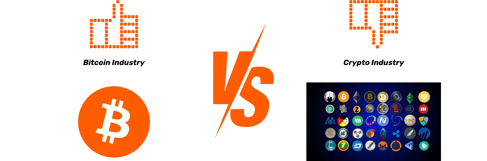
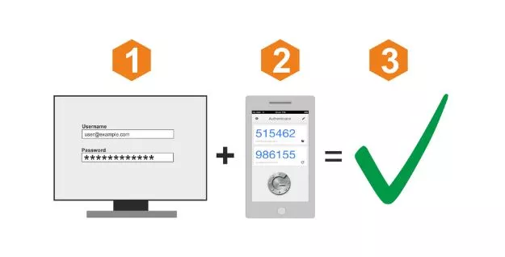
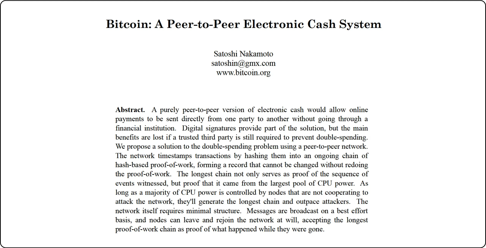
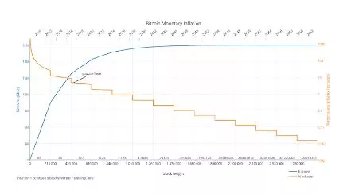
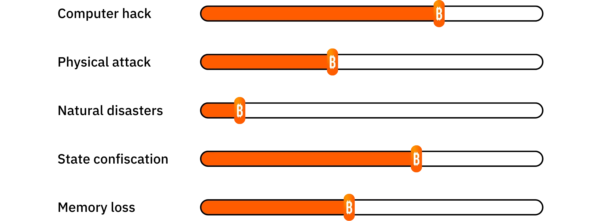
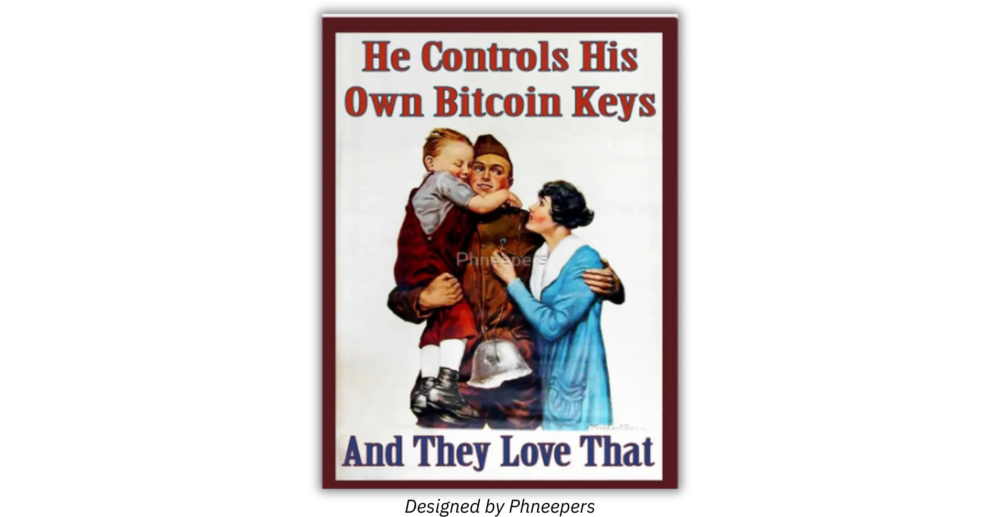

# Un viaggio verso i primi bitcoin

L'ecosistema Bitcoin sta vivendo una crescita spettacolare e senza precedenti. Le trasformazioni tecnologiche, economiche e sociali guidate dall'invenzione di Satoshi Nakamoto si intensificano di giorno in giorno e stanno gradualmente aprendo le porte a un nuovo mondo, di cui ora potete approfittare.

Immergersi nella tana del coniglio del Bitcoin è un'emozionante avventura intellettuale che stimolerà il vostro pensiero critico e metterà in discussione molte delle vostre convinzioni. Questa esplorazione non solo vi darà una profonda comprensione del funzionamento del Bitcoin, ma anche una reale opportunità di reclamare la vostra libertà personale, proteggere la vostra privacy e raggiungere una vera sovranità finanziaria.

Per guidarvi efficacemente in questo viaggio, ho creato questo corso completamente gratuito. Qui, l'attenzione è rivolta esclusivamente al Bitcoin. Nessuna discussione irrilevante, nessun riferimento ad altre criptovalute, solo contenuti chiari, precisi e diretti.

Questo corso è stato progettato per darvi il pieno controllo sulle modalità di apprendimento, permettendovi di esplorare il Bitcoin al vostro ritmo, seguendo il percorso che meglio si adatta ai vostri interessi e obiettivi.

+++
# Introduzione

<partId>008c49b7-5e17-5973-87f2-ba28429b2697</partId>

## Panoramica del corso

<chapterId>bfc96999-0ee1-5c41-8297-1b629f50cffc</chapterId>

Benvenuti a BTC102! Se avete già completato BTC101, avete esplorato i concetti teorici chiave che spiegano perché il Bitcoin è una tecnologia così rivoluzionaria. Ora, con BTC102, è il momento di mettere in pratica queste conoscenze. Questo corso è stato progettato per aiutarvi a costruire il vostro piano Bitcoin personale, passo dopo passo.

Nei prossimi capitoli vi guideremo attraverso i passi pratici per **ottenere i vostri primi bitcoin**, **proteggerli** correttamente e muovere con sicurezza i primi passi in questo ecosistema in rapida crescita.

https://planb.network/courses/2b7dc507-81e3-4b70-88e6-41ed44239966

Sebbene Bitcoin esista da oltre 16 anni, il settore è ancora giovane, dinamico e profondamente radicato nella libertà. Il protocollo sottostante è completamente decentralizzato e resistente al controllo di qualsiasi autorità centrale, consentendo all'ecosistema di crescere in modo naturale e organico.

Se da un lato questa libertà alimenta un'incredibile ondata di innovazione e opportunità, dall'altro comporta alcuni rischi, tra cui truffe, errori comuni e insidie che spesso derivano dalla mancanza di conoscenze. L'obiettivo principale di questo corso è aiutarvi a navigare in questo nuovo ecosistema con fiducia e sicurezza.

Per raggiungere questo obiettivo, il corso BTC102 è suddiviso in diverse sezioni, ognuna delle quali si concentra su un aspetto chiave del vostro percorso con il Bitcoin:

La prima sezione, "Prerequisiti per la comprensione del Bitcoin", vi prepara efficacemente al percorso da seguire. Imparerete a identificare le principali insidie legate alle truffe e alle frodi finanziarie che possono esistere nell'ecosistema del Bitcoin. Verranno poi trattate le basi essenziali della sicurezza online.

Infine, vi darò alcuni consigli pratici pensati appositamente per i principianti, per aiutarvi a evitare gli errori più comuni quando lavorate con Bitcoin per la prima volta.

La seconda sezione, "Capire a cosa si va incontro", approfondirà la vostra comprensione generale del Bitcoin. Inizieremo con un ripasso per assicurarci che abbiate compreso appieno i concetti essenziali.

Poi vi spiegheremo perché il Bitcoin è di fondamentale importanza dal punto di vista tecnologico, economico e sociale, rafforzando le vostre convinzioni sul suo valore. Esploreremo anche l'industria del Bitcoin nel suo complesso: i suoi attori principali, la sua organizzazione e la sua evoluzione nel corso degli anni. Infine, tratteremo l'architettura a strati dell'ecosistema Bitcoin, un concetto cruciale per comprendere come questo sistema continui a innovarsi senza compromettere l'integrità del suo protocollo di base.

La terza sezione, "Impostazione del piano", si concentra sull'approccio personale a Bitcoin. Inizieremo aiutandovi a definire il vostro profilo utente in quattro categorie principali:

- l'hodler*, focalizzato sulla detenzione di Bitcoin a lungo termine;
- l'impilatore*, che acquista regolarmente e con metodo;
- l'utente*, che dà la priorità all'uso quotidiano di Bitcoin;
- e infine *il paranoico*, che vuole la massima sicurezza per proteggere efficacemente i propri beni e la propria privacy.

Vi guideremo nell'implementazione di una strategia che si adatti al vostro profilo e vi aiuti a raggiungere i vostri obiettivi personali.

Infine, la quarta sezione, "Protezione degli eredi e del patrimonio", tratta un argomento cruciale spesso trascurato: come garantire che il vostro Bitcoin sia trasmesso ai vostri cari in caso di evento inaspettato. Imparerete come creare e impostare un piano di eredità del Bitcoin, garantendo la conservazione del vostro patrimonio anche dopo la vostra vita.

Alla fine di questo corso, avrete tutti gli strumenti pratici necessari per navigare con sicurezza nell'ecosistema Bitcoin e diventare uno dei suoi utenti più avanzati!

Siete pronti a iniziare il vostro viaggio nel mondo del Bitcoin? Andiamo!

# Prerequisiti per la comprensione del Bitcoin

<partId>4481fc4b-0f83-489e-ad07-81517c5d6bad</partId>

## Truffe e frodi finanziarie

<chapterId>8af2948b-2ab5-54c4-862c-3414b8a285a2</chapterId>

L'ecosistema Bitcoin e l'ambiente circostante sono ancora relativamente giovani e poco regolamentati, a seconda del Paese. Se da un lato questa libertà apre vaste opportunità, dall'altro crea un terreno fertile per frodi finanziarie, truffe e varie forme di manipolazione. Ecco perché il primo capitolo è così cruciale: capire le insidie più comuni vi aiuterà a evitarle. La vostra sicurezza finanziaria è una priorità perché una cattiva esperienza non riguarda solo voi, ma l'intera comunità Bitcoin.

### Bitcoin vs cripto: capire le differenze

Prima di proseguire, è importante distinguere chiaramente tra due mondi fondamentalmente diversi:

- L'ecosistema Bitcoin** è incentrato sull'idea di una moneta sana, costruita su una forte decentralizzazione, sulla resilienza a lungo termine, sulla privacy e sulla sovranità individuale. Dal suo lancio nel 2009, il Bitcoin ha operato in modo affidabile e sicuro, supportato da una comunità di sviluppatori globale e impegnata. Non si tratta di una tendenza passeggera, ma di un protocollo stabile e consolidato, progettato per conservare il valore nel tempo.

- Il settore delle criptovalute**, invece, è molto più grande e comprende decine di migliaia di progetti diversi, ognuno con il proprio token. Questo spazio è spesso guidato da una rapida innovazione, dal clamore e dalla speculazione finanziaria a breve termine. Molti di questi progetti sono centralizzati, meno sicuri e non offrono molto valore reale, nonostante le promesse ardite e il marketing appariscente.

Se volete capire meglio da dove viene il Bitcoin e che cosa lo rende veramente diverso dagli altri progetti, vi consiglio di seguire questo corso gratuito sulla storia del Bitcoin, che troverete più avanti:

https://planb.network/courses/a51c7ceb-e079-4ac3-bf69-6700b985a082

Come sapete, la piattaforma Plan ₿ Network è dedicata esclusivamente alla Bitcoin. Tuttavia, comprendere la distinzione con altre criptovalute vi aiuterà a evitare le insidie associate a progetti inutili e talvolta persino fraudolenti.

### Le principali truffe da evitare

Ecco le truffe più comuni in cui potreste imbattervi durante il vostro viaggio:

#### Schemi piramidali e schemi Ponzi

Queste sono alcune delle truffe più comuni nel mondo delle criptovalute. In uno schema Ponzi, i primi partecipanti ricevono pagamenti utilizzando il denaro dei nuovi arrivati, non da un vero investimento o prodotto. Non viene creato alcun valore reale. Il sistema funziona solo finché ci sono nuove adesioni. Quando il flusso di nuovi partecipanti rallenta, l'intero schema crolla.

Queste truffe sono solitamente caratterizzate da :

- Promesse irrealistiche di rendimenti garantiti (ad es. 20% di rendimento garantito);
- Ritardi o difficoltà nel tentativo di ritirare i fondi investiti;
- Forti incentivi a reclutare nuovi membri per mantenere il sistema in funzione;
- Una totale mancanza di trasparenza sulla vera fonte dei rendimenti promessi.

In definitiva, tutti gli schemi piramidali e Ponzi sono destinati a fallire. La loro debolezza fondamentale risiede nella costante necessità di coinvolgere nuovi investitori per pagare i rendimenti ai partecipanti precedenti. Questa necessità diventa matematicamente impossibile da sostenere nel tempo, perché il numero di nuove reclute necessarie aumenta esponenzialmente con la crescita del sistema. Una volta raggiunto un punto critico, i partecipanti iniziano a dubitare, la fiducia scompare e l'intera piramide crolla. A questo punto, gli ultimi ad aderire, spesso i meno informati, perdono l'intero investimento senza poterlo recuperare, mentre gli organizzatori o i primi investitori hanno già ritirato i loro fondi e lasciato il sistema.

Nel mondo delle criptovalute, gli schemi Ponzi possono assumere diverse forme, spesso progettate per nascondere la loro natura fraudolenta dietro una maschera tecnologica o finanziaria. Queste truffe possono presentarsi come nuove offerte di token o ICO (Initial Coin Offerings), ovvero operazioni di raccolta fondi in cui una nuova criptovaluta viene venduta al pubblico. Dietro termini tecnici come "Blockchain", "smart contract" o "staking", alcuni progetti nascondono in realtà complessi schemi piramidali. Altri sostengono di offrire rendimenti elevati combinando criptovalute discutibili con sistemi di compensazione che si basano interamente sul continuo afflusso di nuovi investitori.

Più recentemente, gli schemi Ponzi si sono diffusi anche nel mondo della finanza decentralizzata (DeFi). Sebbene la DeFi abbia lo scopo di fornire servizi finanziari senza intermediari, alcuni progetti la utilizzano per dare un falso senso di legittimità alle loro truffe. Alcune piattaforme di DeFi promettono rendimenti elevati e garantiti in Exchange per depositi di criptovalute in protocolli automatizzati. Queste allettanti promesse sono spesso sostenute da meccanismi opachi e non verificabili, con token creati appositamente per la truffa. In realtà, questi sistemi non hanno un modello di business sostenibile: i rendimenti sono semplicemente pagati dai fondi dei nuovi utenti, proprio come un tradizionale schema Ponzi. Quando la fiducia inizia a venir meno o l'afflusso di nuovi partecipanti rallenta, questi sistemi inevitabilmente collassano, causando perdite significative per gli investitori ignari.

Si prega di notare che il contenuto di questo corso è solo a scopo educativo e non deve essere interpretato come una consulenza finanziaria. La vostra sicurezza finanziaria dipende dalla vostra capacità di rimanere cauti, scettici e ben informati in ogni decisione finanziaria che prendete.

La migliore protezione consiste nel porsi sempre questa semplice domanda: Da dove proviene effettivamente il rendimento promesso? Se la risposta non è chiara, scappate immediatamente.

#### Pompa e scarico

Questo tipo di truffa consiste nel gonfiare artificialmente il prezzo di un asset - spesso un token di criptovaluta a bassa liquidità - attraverso una campagna di marketing coordinata, di solito guidata da un gruppo di investitori. Il tipico schema Pump & Dump segue questo schema:

- Un gruppo di insider o di figure influenti accumula in modo silenzioso una grande quantità dell'asset preso di mira.
- Poi lanciano un'aggressiva campagna promozionale per far salire l'hype e il prezzo.
- Il pubblico in generale, spinto dalla FOMO (Fear of Missing Out), inizia ad acquistare l'asset in gran numero, spingendo il prezzo ancora più in alto.
- Al culmine del clamore, gli insider vendono le loro partecipazioni tutte in una volta.
- Il prezzo crolla, lasciando ai ritardatari pesanti perdite.

È importante notare che le strategie Pump & Dump sono illegali in molti Paesi e sono considerate una forma di manipolazione del mercato. Nonostante ciò, questi schemi continuano a prosperare, soprattutto nello spazio delle criptovalute, dove la regolamentazione è ancora in fase di aggiornamento.

Fate particolare attenzione ai gruppi privati di "segnalazione" su piattaforme come Telegram, Discord o altri canali di social media. Questi gruppi sono spesso gestiti da influencer o da sedicenti esperti, alcuni dei quali fanno pagare delle quote di iscrizione. Sebbene questi gruppi sostengano di offrire opportunità di investimento esclusive, la realtà è molto più unilaterale: solo gli organizzatori traggono profitto, mentre la maggior parte dei partecipanti finisce per perdere il proprio denaro.

È vero che alcuni partecipanti possono temporaneamente trarre profitto da questo tipo di manipolazioni del mercato, ma il loro successo si basa di solito solo sulla fortuna e sul tempismo perfetto. A lungo termine, questi schemi non sono sostenibili. Richiedono un coinvolgimento costante e ad alto rischio e la partecipazione ripetuta a trucchi fraudolenti che inevitabilmente crollano.

Peggio ancora, alimentano una pericolosa illusione: la convinzione che sia possibile fare soldi facili e veloci senza comprendere il reale funzionamento dei sistemi finanziari. Questa mentalità non solo mette a rischio gli individui, ma mina anche la credibilità dell'intero ecosistema delle criptovalute

Per tutti questi motivi, la strategia migliore consiste nel mantenere un approccio serio e ponderato agli investimenti, basato sull'educazione finanziaria, su una solida comprensione dei fondamentali e su una prospettiva a lungo termine.

Costruendo pazientemente le vostre conoscenze, sarete molto meno vulnerabili alle manipolazioni emotive e alle promesse irrealistiche, e molto più attrezzati per evitare le trappole finanziarie che possono portare a perdite reali.

#### Truffe di donazioni, lotterie e falsi regali

Questo tipo di truffa promette Bitcoin gratuiti o altre ricompense in Exchange in cambio dell'invio di una piccola somma di denaro. È importante ricordare che nessun individuo o organizzazione legittima vi chiederà mai di inviare criptovalute in anticipo con la promessa di inviarvi di più in cambio.

I truffatori spesso impersonano personaggi pubblici noti (come Elon Musk o altre celebrità) per attirare le vittime attraverso i social media. Verificate sempre la legittimità di account e siti web prima di interagire con loro e non fidatevi mai di offerte che sembrano troppo generose o troppo belle per essere vere.

A volte queste truffe si presentano come frodi "a pagamento anticipato". Vi viene promesso un premio o una ricompensa (denaro, un prodotto o un servizio) ma prima vi viene chiesto di pagare una tassa, presumibilmente per coprire cose come la spedizione, le tasse o i costi di transazione. Una volta effettuato il pagamento, il truffatore sparisce e la ricompensa promessa non arriva mai.

#### Shitcoin e criptovalute in offerta

I progetti di criptovalute centralizzate a volte offrono token gratuiti ("*airdrop*") per attirare gli utenti. Questi token di solito hanno un valore reale minimo o nullo e vengono utilizzati principalmente per creare l'illusione della popolarità o per alimentare la speculazione. Siate estremamente cauti con questo tipo di offerte promozionali: spesso si tratta di trappole di marketing piuttosto che di vere e proprie opportunità.

#### Furto di identità e phishing

Gli aggressori spesso utilizzano siti web falsi, account di social media o e-mail ingannevoli per cercare di rubare i vostri fondi. Queste truffe possono avvenire attraverso qualsiasi canale di comunicazione: e-mail, social network, telefonate o anche posta tradizionale...

Prima di cliccare su un link o di intraprendere qualsiasi azione, verificate sempre l'identità del mittente. In caso di dubbio, visitate il sito web manualmente invece di utilizzare un link fornito. Soprattutto, non condividete mai le vostre chiavi o password private con nessuno.

#### Forchette rigide Bitcoin

Nel corso degli anni, il Bitcoin ha subito diverse *forcelle Hard*, che hanno portato alla creazione di versioni alternative della criptovaluta originale. In parole povere, un *Hard Fork* è una scissione nella rete che porta a due blockchain separate, che condividono entrambe la stessa storia fino al momento della scissione. Queste biforcazioni avvengono in genere quando una parte della comunità di sviluppatori o del più ampio ecosistema Bitcoin vuole introdurre modifiche importanti al protocollo originale, ma non riesce a raggiungere un consenso diffuso. Invece di abbandonare le proprie idee, decidono di lanciare una nuova versione del Bitcoin (con regole modificate) sperando che gli utenti e i minatori scelgano di seguire il loro Fork.

Non tutti i fork di *Hard* sono fraudolenti, poiché alcuni nascono da disaccordi tecnici o ideologici all'interno della comunità. Tuttavia, altri sono guidati da interessi commerciali o addirittura da motivazioni disoneste. Gli esempi più noti di questi hardfork sono **Bitcoin Cash (BCH)** e **Bitcoin Satoshi Vision (BSV)**. Lanciate rispettivamente nel 2017 e nel 2018, queste valute alternative spesso affermano di essere "versioni migliori" della Bitcoin originale. Promuovono presunti vantaggi come commissioni di transazione più basse o transazioni più veloci grazie all'aumento delle dimensioni dei blocchi. Tuttavia, queste modifiche tecniche comportano compromessi significativi in termini di sicurezza, decentralizzazione e robustezza; Elements che possono entrare in conflitto con i principi fondanti del Bitcoin.

Al di là delle differenze tecniche, queste valute alternative spesso sfruttano la confusione per attirare investitori non informati. Possono utilizzare tattiche di marketing progettate per ingannare deliberatamente i nuovi arrivati che credono di acquistare Bitcoin (BTC) autentici.

Per evitare di cadere in questa trappola, verificate sempre la valuta che state acquistando. Il Bitcoin originale utilizza il ticker **BTC**, mentre il Bitcoin Cash e i suoi derivati utilizzano acronimi distinti, come BCH o BSV.

#### Influencer disonesti e falsi guru

Con l'affermarsi delle criptovalute, sui social media si è assistito a un'ondata di influencer, sedicenti esperti e cosiddetti "guru della criptovaluta". Mentre alcuni di essi possono offrire autentici spunti educativi, molti altri approfittano della loro visibilità per promuovere progetti dubbi o strategie di trading pericolosamente rischiose (e a volte del tutto fraudolente). Questi individui sono di solito motivati da interessi finanziari personali, e spesso ricevono compensi diretti o indiretti per promuovere determinati token o piattaforme.

Questi influencer si affidano spesso a tattiche collaudate per attirare i principianti: mostrano risultati finanziari impressionanti (spesso falsi o non verificabili), ostentano uno stile di vita lussuoso come presunta prova del loro successo e promuovono strategie di investimento "miracolose". L'obiettivo è quello di scatenare la FOMO (fear of missing out) e spingere il pubblico a prendere decisioni impulsive e a fare investimenti azzardati.

È importante capire che la maggior parte dei consigli "gratuiti" di queste personalità non sono mai veramente gratuiti. Dietro la facciata di generosità spesso si nasconde una strategia calcolata per indirizzare le persone verso l'acquisto di attività discutibili. E anche se alcuni influencer fossero onesti, replicare i loro risultati sarebbe quasi impossibile; il loro successo dipende spesso da un tempismo specifico, da conoscenze privilegiate o da circostanze uniche a cui voi non avete accesso.

Alcuni influencer possono invitarvi a partecipare a gruppi privati a pagamento in cui affermano di condividere segnali di trading esclusivi o consigli privilegiati che promettono profitti facili e veloci. In realtà, questi gruppi vanno principalmente a beneficio degli organizzatori stessi. Spesso usano i loro follower come fonte di liquidità, scaricando essenzialmente le attività per guadagno personale. Gli iscritti di solito finiscono per perdere denaro, poiché non sono in grado di reagire con la stessa rapidità degli insider che orchestrano le operazioni (si veda la sezione sugli schemi Pump & Dump).

Alla luce di questa realtà, ecco alcune buone abitudini da adottare per evitare di cadere nelle trappole degli influencer disonesti:

- Siate molto cauti con qualsiasi raccomandazione di investimento in criptovalute.**

Una persona affidabile e competente non vi farà mai pressione per acquistare una criptovaluta senza incoraggiarvi a fare prima le vostre ricerche.

- I corsi di trading o di investimento a pagamento non sono sempre un marchio di qualità **

Molti di questi corsi promuovono strategie rischiose o troppo semplicistiche, spesso le stesse informazioni che si possono trovare gratuitamente online.

- Non esiste un modo garantito per copiare le operazioni di qualcuno e ottenere risultati identici **

Ogni strategia di investimento dipende dal contesto personale, dai tempi, dalle conoscenze e da altri fattori che non possono essere riprodotti esattamente.

- Diffidate soprattutto dei consigli che sembrano troppo belli per essere veri **

Promesse irrealistiche o profitti garantiti sono quasi sempre segni di manipolazione. Ricordate: il fatto che qualcuno dica qualcosa con sicurezza non lo rende vero.

Ricordate sempre che tutti coloro che incontrate nel Bitcoin o nel più ampio ecosistema delle criptovalute hanno un'agenda personale, che sia dichiarata apertamente o nascosta tra le righe. Non esistono informazioni puramente neutrali. Anche questo corso, BTC102, ha un obiettivo chiaro: *promuovere una migliore comprensione della Bitcoin.*

Ecco perché è fondamentale essere consapevoli delle reali motivazioni che stanno dietro a ogni contenuto che si consuma. E non dimenticate mai questa regola d'oro di Internet:

*Se un prodotto o un servizio sembra gratuito, è probabile che siate voi il prodotto.*

In definitiva, la migliore difesa è l'educazione personale, un sano scetticismo e, soprattutto, l'abitudine a verificare i fatti in prima persona.

### Come evitare le truffe

**Per rimanere al sicuro online, soprattutto nel mondo delle criptovalute, è bene tenere a mente questi principi chiave:**

- Mai fidarsi ciecamente: "*Non fidarti, verifica*";
- Siate scettici nei confronti di rendimenti garantiti o insolitamente elevati;
- Non condividete mai le vostre chiavi private con nessuno;
- Non inviate Bitcoin (o qualsiasi crittografia) a indirizzi sconosciuti;
- In caso di dubbio, fate una pausa. Fate un passo indietro e riflettete prima di agire. La FOMO è il vostro peggior nemico;
- Evitate i gruppi di trading a pagamento o le comunità che fanno promesse irrealistiche;
- La maggior parte degli omaggi o delle lotterie "gratuite" online sono truffe o pesantemente truccate;
- A lungo termine si guadagnerà sempre di più imparando che giocando d'azzardo.

Proteggersi dalle truffe è un primo passo fondamentale per salvaguardare i propri beni, ma non basta. Mantenere una forte igiene digitale è altrettanto importante. Ecco perché nel prossimo capitolo analizzeremo come rafforzare la vostra sicurezza online e le migliori pratiche da adottare per proteggervi nel mondo digitale.

## Sicurezza online

<chapterId>f0873bf2-6a6f-5485-bb7a-d84be14f404d</chapterId>

Non appena inizierete a occuparvi di Bitcoin, vi renderete subito conto che la sicurezza informatica di base non è facoltativa, ma essenziale. Truffe e frodi sono solo la punta dell'iceberg. La perdita accidentale di dati, il malware e le password compromesse possono essere altrettanto devastanti, soprattutto quando si gestiscono le proprie chiavi.

Questo capitolo illustra alcuni semplici passi pratici per migliorare la vostra igiene digitale e proteggervi nello spazio.

Se volete approfondire, il corso SEC101 di Plan ₿ Network offre un'analisi completa delle strategie di cybersecurity specificamente studiate per gli utenti di Bitcoin.

https://planb.network/courses/99c46148-7080-4915-a7e0-9df0e145cd47

### Perché la sicurezza informatica è importante

Il Bitcoin vi dà il potere di detenere il vostro denaro direttamente (senza banche), senza intermediari. Ma questo tipo di sovranità finanziaria comporta gravi responsabilità: se il vostro BTC viene rubato a causa di una falla nella sicurezza, non c'è modo di annullare la transazione. A differenza delle banche tradizionali, non c'è un help desk, non c'è una richiesta di risarcimento per frode e non c'è un'assicurazione che possa salvarvi.

Inoltre, il valore finanziario del Bitcoin lo rende un obiettivo di alto valore. Un hacker che comprometta il vostro Wallet può spostare istantaneamente i vostri fondi su un Address che controlla (senza fare domande, senza poterli recuperare).

### Un computer pulito e aggiornato

Uno degli aspetti più trascurati della sicurezza personale è mantenere aggiornati il sistema operativo e il software. Molti aggiornamenti eliminano vulnerabilità note che altrimenti potrebbero essere sfruttate dagli aggressori. Sebbene alcuni evitino gli aggiornamenti per timore di problemi di prestazioni, il rischio reale è quello di utilizzare software obsoleto che gli hacker sanno già come violare.

Si consiglia inoltre di utilizzare un antivirus affidabile. Su Windows, Windows Defender integrato è generalmente sufficiente per la maggior parte degli utenti. Se si preferiscono funzioni aggiuntive o tranquillità, sono disponibili anche opzioni commerciali come Kaspersky. Su macOS, le minacce di malware sono storicamente meno comuni **ma non inesistenti**, quindi è comunque opportuno essere prudenti.

Oltre agli aggiornamenti del sistema e alla protezione antivirus, diffidate di scaricare software da siti web poco raccomandabili o da portali di download cosiddetti "universali". Quando avete bisogno di uno strumento o di un'applicazione, rivolgetevi sempre alla fonte ufficiale; questo riduce drasticamente il rischio di installare malware camuffato da software legittimo.

Un'altra abitudine intelligente è quella di verificare l'autenticità e l'integrità di qualsiasi software prima di installarlo sul computer. Se non siete sicuri di come fare, non preoccupatevi, abbiamo un tutorial dedicato che vi guiderà attraverso il processo:

https://planb.network/tutorials/computer-security/data/integrity-authenticity-21d0420a-be02-4663-94a3-8d487f23becc

Infine, eseguite regolarmente dei backup dei vostri dati importanti. Un'unità esterna Hard o un'unità SSD sono una valida opzione per conservare una duplicazione dei file in caso di guasto improvviso, hacking o cancellazione accidentale. Vi ringrazierete in seguito.

Se preferite le soluzioni cloud, prendete in considerazione un servizio sicuro come Proton Drive. Assicuratevi che qualsiasi opzione scegliate rispetti la vostra privacy e offra una forte crittografia.

https://planb.network/tutorials/computer-security/data/proton-drive-03cbe49f-6ddc-491f-8786-bc20d98ebb16

Una strategia di backup ampiamente consigliata è la "regola del 3-2-1". È progettata per proteggere i dati da perdite accidentali, attacchi informatici o persino disastri naturali.

L'idea è semplice:

- Conservate **almeno 3 copie** dei vostri dati importanti,
- Memorizzateli su **almeno 2 tipi diversi di supporti** (ad esempio, un'unità Hard esterna e un cloud storage),
- E assicuratevi che **una di queste copie sia conservata fuori sede** (fisicamente separata dalla sede principale).

Questo approccio offre una forte resilienza e contribuisce a garantire che i dati sopravvivano anche se qualcosa va storto.

### La soluzione all'incubo dell'ID

Uno dei motivi principali per cui le persone vengono violate è l'utilizzo di password deboli. Un numero significativo di utenti riutilizza la stessa password per più account o sceglie varianti facili da indovinare. I gestori di password sono la soluzione perfetta a questo problema.

Un gestore di password vi permette di:

- Memorizzate tutte le vostre password in modo sicuro** in un caveau crittografato
- generate password lunghe, complesse e uniche** automaticamente per ogni account
- Utilizzate una sola password principale**, per accedere a tutto in modo sicuro

Con un gestore di password, non dovrete mai più cliccare su "Password dimenticata" o affidarvi a credenziali deboli e riutilizzate. Inoltre, la maggior parte dei gestori di password si sincronizza perfettamente tra i dispositivi (desktop, telefono, tablet) e compila automaticamente i moduli di accesso, rendendo l'accesso sicuro semplice ed efficiente.

Ci sono molti gestori di password in circolazione, ma posso consigliare due opzioni solide a seconda delle vostre esigenze. Se cercate qualcosa di facile da usare che si sincronizzi perfettamente su più dispositivi, Bitwarden è una scelta eccellente:

https://planb.network/tutorials/computer-security/authentication/bitwarden-0532f569-fb00-4fad-acba-2fcb1bf05de9

Se preferite tenere tutto in locale sul vostro dispositivo, KeePass è un'ottima opzione:

https://planb.network/tutorials/computer-security/authentication/keepass-f8073bb7-5b4a-4664-9246-228e307be246

### 2FA: doppia protezione

In Bitcoin, siete la vostra banca. Ciò significa che siete anche il vostro team di sicurezza. Anche con una password forte, il rischio zero non esiste: ecco perché è essenziale attivare l'autenticazione a due fattori (2FA).

il 2FA aggiunge un secondo Layer di protezione richiedendo un codice monouso a tempo (solitamente di 6 cifre) generato da un'app come Google Authenticator o Authy. In questo modo, anche se qualcuno riesce a ottenere la vostra password, non può comunque accedere al vostro account senza avere accesso fisico al vostro telefono.

https://planb.network/tutorials/computer-security/authentication/authy-a76ab26b-71b0-473c-aa7c-c49153705eb7

Quando si attiva la 2FA, assicurarsi di salvare la chiave di recupero dell'applicazione in un luogo sicuro. Questo vi permetterà di ripristinare i codici in caso di smarrimento o cambio del telefono. Sebbene il 2FA basato su SMS o e-mail sia meglio di niente, è molto meno sicuro. Un attacco di SIM swap, in cui qualcuno prende il controllo del vostro numero di telefono, può facilmente aggirare questo tipo di protezione.

Per chi vuole fare un passo avanti nella sicurezza, le chiavi fisiche come YubiKey offrono un livello di protezione ancora più elevato.

https://planb.network/tutorials/computer-security/authentication/security-key-61438267-74db-4f1a-87e4-97c8e673533e

### Protezione della privacy

La privacy e la sicurezza informatica sono strettamente collegate: più informazioni si lasciano liberamente accessibili, più è probabile che si diventi un bersaglio.

Una **VPN** (*Virtual Private Network*) è una soluzione semplice ma efficace per mascherare il vostro IP Address e crittografare il vostro traffico Internet. Sebbene non vi renda completamente invisibili (poiché il provider VPN può comunque vedere la vostra attività), rende molto più difficile per chiunque cercare di spiarvi o di tracciare le vostre abitudini di navigazione.

Il segreto è scegliere un provider VPN affidabile che:

- Non richiede informazioni personali
- Consente il pagamento tramite BTC
- Ha una rigorosa politica di assenza di log

Su Plan ₿ Network sono disponibili diverse esercitazioni che possono guidarvi nella configurazione di una VPN in modo semplice. Raccomando in particolare IVPN o Mullvad:

https://planb.network/tutorials/computer-security/communication/ivpn-5a0cd5df-29f1-4382-a817-975a96646e68

https://planb.network/tutorials/computer-security/communication/mullvad-968ec5f5-b3f0-4d23-a9e0-c07a3e85aaa8

I passi essenziali per proteggere la vostra privacy online includono anche:

- Utilizzo di **piattaforme di messaggistica criptata** come Signal, SimpleX o Session;
- Utilizzare browser incentrati sulla privacy come Firefox, Brave o Tor (per un maggiore anonimato);

https://planb.network/tutorials/computer-security/communication/tor-browser-a847e83c-31ef-4439-9eac-742b255129bb

- Utilizzando una **casella postale sicura** come ProtonMail;

https://planb.network/tutorials/computer-security/communication/proton-mail-c3b010ce-254d-4546-b382-19ab9261c6a2

- Crittografia** dei file con strumenti come Bitlocker (per Windows) o VeraCrypt (disponibile su più piattaforme).

https://planb.network/tutorials/computer-security/data/veracrypt-d5ed4c83-7c1c-4181-95ea-963fdf2d83c5

### Progressione graduale

La sicurezza informatica può sembrare un'impresa enorme ed è facile che i principianti si lascino sopraffare e rinuncino perché sembra troppo complessa. Il trucco consiste nell'affrontare la questione passo dopo passo. Iniziate con qualcosa di semplice, come l'installazione di un gestore di password. Lasciatevi qualche settimana per abituarvi, poi passate al passo successivo, come l'attivazione della 2FA su uno dei vostri account.

Man mano che prenderete confidenza con questi strumenti, sarete pronti ad aggiungere pratiche più avanzate, come l'utilizzo di un'e-mail secondaria, il passaggio a ProtonMail, l'impostazione di una VPN o la navigazione con Tor quando necessario.

Man mano che vi addentrerete nel mondo del Bitcoin, noterete che i rischi aumentano con l'aumentare del valore del vostro Wallet. Costruire solide abitudini di sicurezza, proteggere la vostra privacy e impostare gli strumenti giusti non solo vi farà stare tranquilli, ma rafforzerà anche la sovranità del Bitcoin.

In breve: non sottovalutate la sicurezza informatica, prendetevi il tempo necessario per impostare le basi e ricordate che la coerenza è fondamentale. Senza una buona igiene digitale, anche i migliori strumenti non faranno molto per voi.

Assicuratevi anche di controllare [le nostre esercitazioni sulla sicurezza informatica](https://planb.network/tutorials/computer-security) su Plan ₿ Network.

Nel prossimo capitolo, condividerò altri suggerimenti per aiutarvi a iniziare il vostro viaggio nel Bitcoin con fiducia e a evitare le numerose trappole che possono cogliere di sorpresa i nuovi arrivati.

## Consigli per i nuovi arrivati

<chapterId>33134b3f-92c1-5185-afb6-88599e47e801</chapterId>

Entrare nel mondo delle Bitcoin può essere emozionante, ma comporta anche una buona dose di rischi. Il mondo delle criptovalute è diverso da qualsiasi altro: oscillazioni di prezzo selvagge, tecnologia sconosciuta e la possibilità molto concreta di perdere definitivamente i propri fondi a causa di semplici errori o scelte di investimento sbagliate sono tutte insidie di cui i nuovi utenti dovrebbero essere consapevoli.

In questo capitolo condividerò alcuni consigli pratici e una guida generale per chiunque stia muovendo i primi passi, in particolare per chi sta facendo il primo acquisto o sta esplorando il mondo più ampio degli investimenti finanziari.

Ecco i punti chiave che esamineremo insieme:

- Attenzione ai **Shitcoin** e alle altre criptovalute inutili;
- Investite solo **denaro che potete permettervi di perdere**;
- Conoscere la differenza tra **trading** e **investimento**;
- Siate consapevoli delle **implicazioni fiscali** dei vostri investimenti;
- Proteggete con cura la vostra **frase di recupero**;
- Rimanete umili e mantenete un **basso profilo** (la discrezione fa parte della sicurezza);
- Pensate a lungo termine**, fate un po' di zoom e siate pazienti (vedetela come una maratona, non come uno sprint).

### Errori comuni da evitare

La Bitcoin è aperta a tutti, ma questo non significa che ci si debba tuffare impreparati. Ecco alcuni dei classici errori commessi dai nuovi arrivati:

**Errori tecnologici

- Perdita della frase seed:** La frase di recupero (di solito 12 o 24 parole) è l'unico modo per accedere al vostro Bitcoin se succede qualcosa al vostro Wallet. Se la perdete, i vostri fondi sono persi definitivamente. Se la si perde, i fondi sono persi definitivamente;
- Conservare i bitcoin su una piattaforma di terze parti:** Se i vostri bitcoin sono su una piattaforma centralizzata, non li possedete veramente. Siete esposti a rischi come hacking, fallimenti della piattaforma o addirittura sequestri di fondi;
- Trascurare la privacy:** Proteggere la propria privacy è una parte fondamentale della sicurezza dei propri beni. Rivelare pubblicamente la quantità di Bitcoin in vostro possesso potrebbe rendervi un bersaglio;
- Sicurezza online insufficiente:** La mancata protezione dei vostri dispositivi con protezioni di base (come aggiornamenti, password forti o 2FA) vi rende un bersaglio facile per gli aggressori e potrebbe costarvi tutto.

**Errori finanziari

- Investire più di quanto ci si possa permettere di perdere**: Non indebitatevi mai e non investite il denaro dell'affitto nel Bitcoin. La vostra stabilità finanziaria di base deve sempre venire prima di tutto.

- Non conoscere la differenza tra trading e investimento**: Il trading richiede tempo, abilità e una seria disciplina emotiva. Gli investimenti a lungo termine sono molto più adatti ai principianti.

- Dimenticare le tasse**: Ogni Paese ha le proprie regole fiscali per le criptovalute. Ignorarle può portare a dolorose sorprese in futuro.

- Cadere nella FOMO**: Acquistare impulsivamente per paura di perdersi qualcosa porta di solito a un cattivo tempismo e a decisioni sbagliate. La pazienza è la vostra migliore alleata.

### Definire una strategia di investimento

Prima di acquistare il vostro primo Satoshi, è fondamentale capire perché state investendo in Bitcoin e come. Ciò significa avere un piano finanziario chiaro e adeguato alla propria situazione personale e ai propri obiettivi a lungo termine.

Iniziate definendo il vostro **budget** con precisione. Non scegliete un numero a caso. Prendete il tempo necessario per calcolare il vostro reddito mensile, sottraete le spese fisse (come l'affitto, i prestiti, le tasse, le utenze) e le spese quotidiane (cibo, trasporti, tempo libero, ecc.). Quello che rimane è il vostro margine di risparmio ed è solo da questa parte che dovrete considerare di investire.

Un approccio di questo tipo garantisce che non si metta a rischio il proprio benessere finanziario, soprattutto in caso di ribasso del mercato. Una strategia ponderata è il fondamento di una resilienza a lungo termine.

Una volta definito il vostro budget, pensate a come volete investire. Uno dei metodi più semplici per i principianti e ampiamente consigliati è il Dollar Cost Averaging (DCA), che consiste nell'acquistare una quantità fissa di Bitcoin a intervalli regolari (settimanali, mensili, ecc.). Questa strategia consente di uniformare il prezzo medio di ingresso nel tempo e di ridurre l'impatto emotivo delle oscillazioni di prezzo. È un approccio intelligente per la maggior parte delle persone, soprattutto per i principianti.

Poi, chiedetevi: Qual è il mio orizzonte temporale?

Volete entrare e uscire rapidamente dal mercato (trading)? Oppure siete più allineati con la mentalità a lungo termine di detenere il Bitcoin per diversi anni (hodler)? Se siete hodler, probabilmente vi preoccupate meno delle oscillazioni giornaliere dei prezzi e vi concentrate maggiormente sulla sicurezza e sull'autocustodia a lungo termine. Se fate trading, sarete più esposti al rumore del mercato a breve termine, al rischio più elevato e allo stress che spesso deriva dalla rapidità delle decisioni. Non esiste una risposta univoca per tutti, ma conoscere il proprio approccio vi aiuterà a orientare le vostre decisioni.

Soprattutto, non prendete decisioni di investimento basate sulle emozioni o sulla paura. Stabilite in anticipo una strategia, scrivetela e attenetevi ad essa.

Se non siete ancora sicuri, **iniziate con l'imparare.**

Dedicate qualche ora all'esplorazione di Bitcoin, date un'occhiata alle risorse gratuite su Plan ₿ Network, leggete un paio di libri, spendete cinque euro solo per provarlo e guardate qualche contenuto di qualità online. Rimanete curiosi. Più vi sentirete a vostro agio, più sarà facile rivedere la vostra strategia, modificare il vostro approccio e andare avanti con fiducia.

### Capire la volatilità del BTC

Il Bitcoin è noto per le sue forti oscillazioni di prezzo. Non sono insolite variazioni del 10%, 20% o addirittura del 50% nell'arco di pochi giorni. Per i nuovi arrivati, questo tipo di volatilità può disorientare. È facile farsi travolgere dall'entusiasmo durante le corse al rialzo o dal panico durante le flessioni; entrambe le cose portano spesso a decisioni sbagliate, come vendere in perdita.

Ecco perché è fondamentale **comprendere e accettare la volatilità** del Bitcoin prima di investire. Queste oscillazioni di prezzo non sono un difetto, ma una caratteristica di un asset ancora in fase di maturazione. Se gli improvvisi alti e bassi vi tengono svegli la notte o vi spingono a prendere decisioni emotive, è probabile che abbiate investito più di quanto vi sentite di rischiare. In questo caso, fate un passo indietro e rivalutate la vostra strategia e la vostra tolleranza al rischio. Non esitate a ridurre la vostra posizione finché non vi sentite più tranquilli.

Soprattutto, non investite mai più di quanto potete permettervi di perdere. Evitate di prendere in prestito denaro per acquistare Bitcoin (soprattutto se state ancora imparando i fondamenti). Una base solida inizia con passi misurati, non con scommesse avventate.

### Gestione e protezione del Bitcoin Wallet

Una delle caratteristiche più potenti (e spesso sottovalutate) del Bitcoin è l'**autocustodia**. Con un Wallet self-hosted, solo voi siete responsabili dei vostri fondi. Questi portafogli sono in genere generati da una **frase di recupero** (nota anche come frase seed), una serie di 12 o 24 parole che garantisce l'accesso completo ai vostri BTC. Se perdete questa frase (o se qualcun altro ne entra in possesso) i vostri bitcoin sono persi per sempre. **Nessun supporto clienti. Nessun pulsante di reset.**

Ecco perché la regola d'oro del Bitcoin è:

"Non le vostre chiavi, non le vostre monete***". Se non si controllano personalmente le proprie chiavi private, non si possiede veramente la propria Bitcoin. Anche se gli exchange possono essere convenienti (soprattutto quando si inizia), essi detengono le chiavi per voi. Ciò significa che i vostri fondi sono a rischio se la piattaforma viene violata, blocca il vostro conto o fallisce.

Per evitare questo rischio, si consiglia vivamente di impostare un **proprio Wallet**, dove solo voi avete accesso alla frase di recupero. Questa frase deve essere sempre scritta a mano e conservata **offline** in un luogo sicuro. Alcuni utenti mantengono anche **più backup**, archiviati in luoghi geografici separati per una maggiore sicurezza.

**Non memorizzate mai la vostra frase di recupero su un dispositivo connesso a Internet o nel cloud**.

**Un singolo hack o violazione dei dati potrebbe portare a perdite irreversibili

Se siete pronti a prendere il Ownership del vostro Bitcoin e volete approfondire le best practice per la protezione della vostra frase di recupero, vi consiglio di leggere questo articolo:

https://planb.network/tutorials/wallet/backup/backup-mnemonic-22c0ddfa-fb9f-4e3a-96f9-46e2a7954270

### Riservatezza e discrezione

Nel mondo digitale di oggi, la **discrezione è spesso trascurata**; eppure è una parte fondamentale per rimanere al sicuro, soprattutto quando si tratta di Bitcoin. Quanto più apertamente si parla delle proprie proprietà, tanto più è probabile che si diventi un bersaglio di truffatori, criminali informatici o anche di minacce più tradizionali come estorsioni o ricatti.

In tutto il mondo si sono verificati numerosi casi in cui persone note per detenere grandi quantità di BTC sono state rapite o aggredite.

**Evitate di vantarvi del vostro Bitcoin Stash**, sia sui social media che in conversazioni casuali. Non c'è alcun vantaggio nel rivelare informazioni finanziarie sensibili e i rischi sono reali.

È anche saggio **compartimentare la propria attività online**. Ad esempio:

- Utilizzate un'e-mail Address separata per tutto ciò che riguarda il Bitcoin, distinta dai vostri account personali o di lavoro.
- Fate attenzione ai tentativi di phishing, ai link sospetti e ai siti web falsi che imitano piattaforme affidabili.
- La discrezione e la vigilanza sono spesso la migliore difesa.

Se siete pronti ad approfondire l'argomento della privacy Bitcoin, vi consigliamo di continuare con il nostro corso sulla privacy dell'anno 2, dove imparerete tecniche più avanzate per mantenere la vostra identità e la vostra attività al sicuro:

https://planb.network/courses/65c138b0-4161-4958-bbe3-c12916bc959c

### Implicazioni fiscali

Nonostante sia una valuta decentralizzata, **Bitcoin non è esente dalle leggi e dai regolamenti fiscali** del vostro Paese. Ogni giurisdizione ha un proprio approccio alle modalità di tassazione dei guadagni derivanti dalle criptovalute.

In alcuni luoghi, i profitti sono tassati come plusvalenze al momento della vendita. Altri possono richiedere di dichiarare ogni transazione e altri ancora applicano regole meno comuni, come le imposte sul patrimonio o i contributi sociali.

Prima di effettuare transazioni significative, si consiglia vivamente di consultare un professionista fiscale o di prendere visione delle linee guida ufficiali del proprio governo. Prendersi del tempo per capire in anticipo i propri obblighi fiscali può evitare problemi inaspettati in seguito (come multe, audit o sanzioni), soprattutto se si stanno pianificando grandi vendite o riallocazioni di portafoglio.

### La differenza tra trading, investimento e detenzione

Il Bitcoin è spesso circondato da idee sbagliate; una delle più comuni è l'idea che si tratti di una corsia preferenziale per diventare ricchi attraverso il trading. Ma è importante capire la netta distinzione tra trading, investimento e detenzione, poiché ogni approccio comporta una propria mentalità, un proprio bagaglio di competenze e un proprio livello di rischio.

- Trading :**

Siamo onesti: probabilmente non dovreste fare trading

Il trading implica una speculazione a breve termine (a volte con leva finanziaria) con l'obiettivo di trarre profitto dalle oscillazioni di prezzo del Bitcoin. Sebbene possa sembrare allettante, il trading di successo richiede conoscenze tecniche avanzate (come l'analisi dei grafici e la gestione del rischio), disciplina emotiva e attenzione costante al mercato. È mentalmente impegnativo e richiede tempo, e la verità Hard è che **la maggior parte dei principianti perde denaro** perché sottovaluta quanto sia realmente impegnativo.

Come disse notoriamente Warren Buffett:

"**Se non siete disposti a tenere un'azione per dieci anni, non pensate nemmeno di tenerla per dieci minuti**"

Il Bitcoin non è un sistema per fare soldi a palate.

- Investimento:**

Gli investitori adottano una visione a medio-lungo termine, acquistando il Bitcoin con la convinzione che il suo valore crescerà nel tempo (mesi, anni o addirittura decenni). Naturalmente, il rischio è sempre presente, poiché il prezzo del Bitcoin può fluttuare in modo significativo. Ma questo approccio è generalmente più tranquillo e molto più pratico per la maggior parte delle persone, soprattutto per coloro che non vogliono passare ore e ore incollati ai grafici ogni giorno.

- Tenuta (HODL) :**

"HODL" è nato come un errore di battitura per "hold" ed è diventato rapidamente parte della cultura Bitcoin. Oggi è un distintivo d'onore. Oggi è un distintivo d'onore.

Gli Hodler sono in gioco per un periodo molto lungo, a volte di dieci anni o più. Conservano il Bitcoin in modo sicuro e aspettano semplicemente, spinti dalla forte convinzione del potenziale a lungo termine del Bitcoin. Non si lasciano scoraggiare dalle oscillazioni giornaliere dei prezzi o dai mercati ribassisti. La loro mentalità è semplice: accumulare, mettere al sicuro e aspettare.

|          | Trading | Investment | Holding |
| ---------------------- | ----------- | -------------- | --------------- |
| Leverage | Yes  | No | No |
| Timeframe | Short-term | Medium-term | Very long-term |
| Asset Type | Contracts | Actual BTC | Actual BTC |
| Risk Level | Very high | High | High |
| Difficulty | Very Hard | Hard | Hard |
| learning curve | Long learning curve | Long learning curve | Long learning curve |
| Potential Loss | UnLimited | Limited | Limited |
| Best For | A few experienced users | Most People | Long-term Believers |

### Continuare a imparare

Non è mai troppo presto (o troppo tardi) per iniziare a informarsi sul denaro, sugli investimenti e su come funziona realmente il sistema finanziario. Non è necessario diventare un esperto o immergersi in ogni dettaglio tecnico; una solida comprensione del quadro generale è sufficiente per prendere decisioni informate ed evitare di essere ingannati da prodotti finanziari che non servono ai vostri interessi (spesso promossi da banche o consulenti).

Un ottimo punto di partenza è il libro *Papà ricco, papà povero* di Robert T. Kiyosaki. È molto conosciuto per il suo stile accessibile e per le sue lezioni fondamentali, come la comprensione della differenza tra attività e passività e il motivo per cui l'educazione finanziaria è fondamentale per l'indipendenza a lungo termine.

Se siete pronti ad approfondire, podcast come *The Investors Podcast* offrono discussioni approfondite su investimenti, mercati e principi economici. Occasionalmente trattano anche il Bitcoin, rendendolo un solido passo successivo per chi è curioso di capire come il Bitcoin si inserisca nel più ampio panorama finanziario.

### Regole d'oro da tenere a mente

Per concludere, ecco alcuni principi senza tempo che ogni Bitcoiner (soprattutto i principianti) dovrebbe tenere a mente:

- Regola n°1**: Non investite mai più di quanto potete permettervi di perdere. Il Bitcoin è un asset volatile. Non rischiate la vostra stabilità finanziaria a caccia di guadagni. I vostri bisogni essenziali e la vostra tranquillità devono sempre essere al primo posto.
- Regola n°2**: Non seguite ciecamente il clamore e non fidatevi dei consigli miracolosi. Ignorate le tendenze e le promesse appariscenti. Concentratevi piuttosto sul prendere decisioni razionali e ben informate. In caso di dubbio, dormiteci sopra e parlatene con persone di fiducia. È meglio muoversi lentamente e in modo ponderato, piuttosto che affrettarsi a commettere errori costosi.
- Regola n. 3**: Costruire un piano e attenersi a una visione a lungo termine.

La costanza, la pazienza e la disciplina vi porteranno più lontano dell'entusiasmo a breve termine. Non puntate al colpo di fulmine, ma a una crescita sostenibile. Evitate gli errori fatali e lasciate che i piccoli successi si accumulino nel tempo.

Seguendo questi principi, sarete in grado di affrontare gli investimenti nel Bitcoin con maggiore chiarezza e tranquillità. Sì, il Bitcoin è volatile e all'inizio può intimorire; ma se affrontato con cautela, pazienza e una mentalità solida, ha un potenziale innegabile. Prendetevi il tempo necessario per costruire le vostre conoscenze, rivedete la vostra strategia quando necessario e, soprattutto, ricordate: un progresso lento e costante vi servirà sempre meglio di una corsa affrettata per paura o impazienza.

# Capire a cosa si va incontro

<partId>a42355a3-9dd8-57ed-b590-32a333fe09ea</partId>

## Bitcoin in 5 minuti

<chapterId>ae122ad9-9b4d-5229-9038-e1b99d5cfc83</chapterId>

In questo corso, l'obiettivo principale è quello di guidarvi nell'acquisizione e nella messa in sicurezza dei vostri primi bitcoin. Ma prima di immergersi nelle fasi pratiche (come acquistare BTC, quali portafogli utilizzare e così via) è importante fare un passo indietro e capire che cos'è realmente il Bitcoin. Capire la natura più profonda del Bitcoin vi aiuterà a capire perché milioni di persone si stanno rivolgendo a questa tecnologia e perché è fondamentale comprendere i fondamenti prima di investire i propri risparmi in un bene così nuovo e volatile.

Nel corso degli anni, il Bitcoin è stato riconosciuto come una rete monetaria globale. È stato definito "oro digitale", "protocollo di fiducia" e persino "sistema finanziario parallelo" Ma cosa significano davvero questi termini? Per rispondere a questa domanda, daremo un'occhiata più da vicino al nucleo del Bitcoin: la sua storia di origine, le sue basi tecniche, le sue proprietà monetarie e il suo potenziale impatto, non solo sugli individui, ma sul sistema finanziario globale nel suo complesso.

### Le origini: Un progetto nato da una lunga ricerca

#### I cypherpunk e l'invenzione di un sistema al di fuori del controllo bancario

Il Bitcoin non è nato da un giorno all'altro. È il risultato di decenni di ricerca e sperimentazione in crittografia, informatica e teoria monetaria. Prima del suo lancio nel 2009, diversi progetti (come eCash, b-money, Bit Gold e RPOW) hanno tentato di creare valute digitali. Tutti hanno affrontato lo stesso problema di fondo: come prevenire la doppia spesa in un sistema decentralizzato senza affidarsi a un'autorità centrale.

Questa sfida è rimasta irrisolta fino alla fine del 2008, quando qualcuno con il nome di Satoshi Nakamoto ha pubblicato il white paper Bitcoin. Pochi mesi dopo, la prima versione del software open-source di Bitcoin è stata resa disponibile, lanciando un sistema in grado di operare indipendentemente da banche o governi.

Il progetto è stato fortemente influenzato dall'etica di Cypherpunk, una comunità di sviluppatori e pensatori che credevano nell'uso della crittografia per proteggere le libertà individuali online. Per loro, la privacy e la decentralizzazione non erano preferenze tecniche, ma necessità ideologiche. Bitcoin è emerso come l'incarnazione di maggior successo di questi ideali: una rete monetaria peer-to-peer che chiunque poteva usare, nessuno poteva controllare e tutti potevano verificare.

I Cypherpunk sono una comunità internazionale informale di individui che sostengono l'uso della crittografia per difendere le libertà personali online. Credono fermamente nel diritto alla privacy dell'individuo, soprattutto in un mondo sempre più caratterizzato dalla sorveglianza governativa e dallo sfruttamento dei dati aziendali.

Le radici del movimento Cypherpunk risalgono ai primi anni Novanta, quando gruppi di crittografi, programmatori e libertari iniziarono a esplorare le implicazioni politiche della crittografia durante gli incontri nella Silicon Valley. Una delle voci più importanti della comunità è stata quella di Tim May, autore nel 1988 del Manifesto crittografico anarchico, un testo fondamentale che delinea la visione di un mondo in cui la crittografia avrebbe permesso agli individui di operare al di fuori della portata dei governi e del controllo centralizzato.

Una pietra miliare del movimento fu la creazione, nel 1992, della mailing list Cypherpunks, un forum dove potevano fiorire idee, progetti e discussioni politiche sulla privacy e la crittografia. Poi, nel 1993, Eric Hughes pubblicò il Manifesto del Cypherpunk, una breve ma potente dichiarazione che esprimeva chiaramente la missione e le convinzioni della comunità.

L'idea di una moneta digitale che operi indipendentemente da qualsiasi autorità centrale (come il Bitcoin) è profondamente radicata nella filosofia del Cypherpunk.

#### Momento post-crisi finanziaria

Il Bitcoin non è apparso dal nulla. È stato creato in un momento molto specifico, subito dopo la crisi finanziaria globale del 2008. Il crollo del mercato immobiliare statunitense e la crisi dei mutui subprime hanno causato il fallimento di importanti banche e hanno scosso la fiducia dei cittadini nell'intero sistema finanziario.

È in questo ambiente di paura e incertezza che nacque il Bitcoin. Il creatore, noto come Satoshi Nakamoto, inserì un messaggio molto simbolico nel primo blocco del Bitcoin Blockchain, noto come blocco Genesis. Il messaggio era:

> **"The Times 03/gennaio/2009 Il cancelliere sull'orlo del secondo salvataggio delle banche "**

Non si trattava solo di una data o di una nota tecnica, ma di una protesta silenziosa ma potente. Dimostrava che il Bitcoin era stato progettato per essere qualcosa di radicalmente diverso: un sistema finanziario che non dipende dalle banche, dai salvataggi o dalle decisioni del governo.

Molti interpretano questo come l'obiettivo del Bitcoin: offrire un modo per trasferire il valore senza bisogno di intermediari, controllato da regole chiare invece che dalle decisioni spesso poco chiare prese dalle banche centrali o dai governi.

Per approfondire la conoscenza delle origini del Bitcoin, offriamo un corso di formazione gratuito, completo e ben documentato sull'argomento:

https://planb.network/courses/a51c7ceb-e079-4ac3-bf69-6700b985a082

### Una rete decentralizzata per trasferire valore

#### Peer-to-peer e nessun organismo centrale

Bitcoin è definito come un "sistema di denaro elettronico peer-to-peer" Ciò significa che chiunque può connettersi alla rete utilizzando il software appropriato (un nodo Bitcoin) e interagire direttamente con altri utenti, senza fare affidamento su un server centrale. L'obiettivo di questa decentralizzazione è quello di evitare che una singola entità (come una banca, un governo o una grande azienda) possa controllare, censurare o bloccare il sistema. Bitcoin opera 24 ore su 24, 7 giorni su 7, a livello globale, ed è accessibile a tutti senza alcuna condizione.

In parole povere, ogni partecipante alla rete Bitcoin (chiamato "nodo") possiede una copia completa della transazione Ledger, nota come Blockchain. Quando avviene una nuova transazione, questa viene trasmessa alla rete. I minatori confermano le transazioni raggruppandole in blocchi che vengono aggiunti alla fine della catena (da qui il nome "Blockchain").

#### Blockchain: una contabilità Ledger

Pensate al Blockchain come a un gigantesco Ledger contabile, dove ogni riga rappresenta una transazione. In un sistema bancario tradizionale, il database è memorizzato sui server della banca, che può apportare modifiche quando vuole. Nel Bitcoin, invece, **tutte le modifiche sono convalidate dall'intera rete**: una volta aggiunto un nuovo blocco di transazioni al Blockchain, è quasi impossibile modificarlo in seguito. Questa convalida decentralizzata rende il Bitcoin del Ledger sicuro e trasparente.

### Il ruolo dei minatori e del Proof-of-Work

#### Come vengono creati i blocchi: Mining

Il Mining è il processo attraverso il quale i computer (o le grandi fattorie Mining) contribuiscono alla **potenza di calcolo** per proteggere la cronologia delle transazioni del Bitcoin e creare nuovi blocchi. I minatori competono per risolvere un rompicapo matematico, in particolare per trovare una collisione parziale del Hash. Questo processo richiede energia e risorse significative. Questo processo richiede energia e risorse significative. Una volta che un Miner trova una soluzione valida, trasmette il blocco alla rete, che lo verifica e lo accetta come valido.

Come ricompensa, il Miner riceve bitcoin di nuova creazione (chiamati block subsidy) insieme alle commissioni di transazione di tutte le transazioni incluse in quel blocco.

#### Il Halving: diminuzione della sovvenzione a blocchi

Per garantire la scarsità del Bitcoin, la sovvenzione dei blocchi è programmata per dimezzarsi ogni 210.000 blocchi, all'incirca ogni quattro anni. Questo evento è noto come "Halving" Al momento del lancio del Bitcoin, i minatori guadagnavano 50 BTC per blocco. Nel 2025, questa ricompensa è scesa a 3,125 BTC e continuerà a diminuire nel tempo.

Alla fine, intorno all'anno 2140, la sovvenzione raggiungerà lo zero, poiché il totale del Bitcoin raggiungerà i 21 milioni di monete. Questa curva di emissione prevedibile imita la scarsità di beni fisici come l'oro; uno dei motivi per cui il Bitcoin viene spesso definito **oro digitale**.

### Bitcoin Proprietà monetarie

#### Scarsità e politica monetaria fissa

Una delle caratteristiche più potenti del Bitcoin è la sua *politica monetaria prevedibile e immutabile*. A differenza delle valute fiat tradizionali (come il dollaro, l'euro o lo yen), che possono essere stampate a piacimento dalle banche centrali (spesso causando inflazione o distorsioni economiche), il Bitcoin opera in base a un insieme trasparente di regole incorporate nel suo codice.

Ci saranno sempre e solo 21 milioni di bitcoin e la velocità di emissione di nuove monete è nota in anticipo a tutti i membri della rete.

Nessun governo, istituzione o individuo può modificare unilateralmente il tetto del Supply o le regole di distribuzione. L'unico modo per alterare questi parametri sarebbe quello di modificare il protocollo del Bitcoin; e anche questo richiederebbe il consenso della maggioranza dei partecipanti economici della rete.

Questa scarsità incorporata è un'attrattiva importante per coloro che desiderano sottrarsi a politiche monetarie imprevedibili o evitare la graduale erosione del loro potere d'acquisto a causa dell'inflazione. Nel tempo, questo potrebbe rappresentare un cambiamento nel pensiero finanziario, in cui il risparmio in un asset deflazionistico come il Bitcoin diventa più attraente rispetto all'affidamento sulle valute tradizionali, soggette a inflazione.

#### Divisibilità e accessibilità

Uno dei punti di forza più sottovalutati del Bitcoin è la sua divisibilità. Ogni Bitcoin può essere suddiviso in 100 milioni di unità, note come satoshi (o Sats in breve). Ciò significa che non è necessario spendere decine di migliaia di euro o di dollari per iniziare; è possibile acquistare solo pochi euro di Bitcoin, fino a frazioni minuscole.

### Apertura e trasparenza

#### Un protocollo pubblico, verificabile da tutti

Bitcoin funziona su un protocollo pubblico, **open-source** (in particolare attraverso [Bitcoin Core](https://github.com/Bitcoin/Bitcoin)). Ciò significa che il suo codice è liberamente disponibile per chiunque possa ispezionarlo, verificarlo e migliorarlo. Non ci sono meccanismi nascosti o sistemi chiusi; tutto ciò che riguarda il funzionamento di Bitcoin è alla luce del sole.

Questo livello di trasparenza rende incredibilmente difficile introdurre backdoor o apportare modifiche segrete. Chiunque abbia le competenze tecniche può gestire un nodo, contribuire allo sviluppo o costruire strumenti compatibili. In Bitcoin, la fiducia si guadagna attraverso il codice e il consenso, non attraverso il controllo centralizzato.

Questa trasparenza è uno dei motivi principali per cui le persone si fidano del protocollo Bitcoin; impedisce a un piccolo gruppo di sviluppatori di manipolare la rete per il proprio tornaconto. Il Bitcoin opera secondo un principio semplice ma potente: se non siete d'accordo con le modifiche proposte, siete liberi di non aggiornare il vostro software. In alcuni casi, questo non causerà alcuna interruzione; rimarrete comunque sincronizzati con il resto della rete. Ma in altri casi, questo può portare a quello che è noto come un Hard Fork, in cui la rete si divide in due e viene creata una nuova versione del Bitcoin. Questo è esattamente ciò che è accaduto nel 2017 con la divisione tra Bitcoin (BTC) e Bitcoin Cash (BCH).

Sebbene questo tipo di governance possa essere lento e talvolta disordinato, è anche un punto di forza: assicura che nessuna singola entità possa prendere il controllo unilateralmente, aiutando il Bitcoin a rimanere stabile, neutrale e resistente alla centralizzazione.

#### Convalida individuale: nodi

Il Bitcoin consente a chiunque di verificare l'accuratezza del Blockchain eseguendo un "nodo" sul proprio computer o server. Ciò significa scaricare il software Bitcoin Core (o un'altra versione del protocollo Bitcoin) e verificare tutte le transazioni e i blocchi dal 2009. Una volta configurato e sincronizzato, il nodo diventa una copia completa del Blockchain e contribuisce al supporto della rete.

Sebbene questo approccio sia più tecnico, offre agli utenti più esigenti la possibilità di non fidarsi di terzi. La gestione di un nodo garantisce che gli utenti possano partecipare al processo di consenso senza essere censurati, contribuendo direttamente alla sicurezza e alla decentralizzazione della rete.

### Casi d'uso

#### Un metodo di pagamento transfrontaliero resiliente

Grazie alla sua natura decentralizzata, Bitcoin opera 24 ore su 24, 7 giorni su 7, senza essere influenzato da confini o fusi orari. Nelle regioni in cui le infrastrutture bancarie tradizionali sono carenti, il Bitcoin è spesso utilizzato come soluzione rapida e a basso costo per inviare o ricevere fondi senza affidarsi a costosi intermediari. Le commissioni di transazione possono variare in base alla congestione della rete, ma in genere sono molto più basse delle commissioni applicate dalle banche per i trasferimenti internazionali. Inoltre, le soluzioni Layer-2 come il Lightning Network consentono di effettuare transazioni Bitcoin ancora più veloci ed economiche.

#### Un deposito di valore

A causa della sua scarsità (con un tetto massimo di 21 milioni di BTC) e della sua intrinseca resilienza, il Bitcoin è spesso considerato una garanzia di risparmio a lungo termine. Sebbene il suo prezzo possa essere volatile nel breve termine, il Bitcoin ha generalmente seguito una tendenza al rialzo nel corso degli anni dalla sua nascita. Alcuni investitori acquistano il BTC con la convinzione che possa servire come riserva di valore, in particolare di fronte all'inflazione o alle crisi finanziarie.

#### Uno strumento per la libertà finanziaria e la resilienza

Oltre agli investimenti, il Bitcoin offre un modo per proteggere la sovranità finanziaria. Nei Paesi sotto regimi autoritari o che devono affrontare pesanti restrizioni monetarie, avere un Bitcoin Wallet (con chiavi private) offre una forma di libertà. Nessuno può bloccare o confiscare questi BTC, finché il possessore si assicura la frase di recupero.

Questa caratteristica è particolarmente interessante per coloro che temono la censura o il congelamento dei conti bancari. Risuona anche con le popolazioni che soffrono di iperinflazione, come nel caso del Venezuela o dello Zimbabwe, dove detenere BTC si è rivelato più stabile rispetto alla valuta locale, che si stava rapidamente svalutando.

### Una lunga strada da percorrere

Il Bitcoin può essere visto come uno "Zero a Uno": una rottura radicale con i paradigmi finanziari consolidati. Per la prima volta nella storia, una rete monetaria globale, accessibile a tutti, opera senza un'autorità centrale, consentendo transazioni private e resistenti alla censura.

Tuttavia, dopo oltre un decennio di esistenza, il Bitcoin continua a suscitare dibattiti e passioni. La sua adozione è in crescita, stanno emergendo soluzioni di seconda generazione (come il Lightning Network) per migliorare la velocità delle transazioni e ridurre le commissioni, e le aziende di tutto il mondo stanno sperimentando nuovi casi d'uso. È probabile che il Bitcoin continuerà a influenzare i sistemi di pagamento e persino il modo in cui percepiamo il denaro nei decenni a venire.

Se desiderate ampliare ulteriormente le vostre conoscenze, potete seguire il corso BTC101 sul Plan ₿ Network, che offre un'esplorazione più approfondita dei fondamenti tecnici ed economici del Bitcoin.

https://planb.network/courses/2b7dc507-81e3-4b70-88e6-41ed44239966

Dopo questa introduzione al Bitcoin (che potrebbe aver richiesto un po' più di 5 minuti!), ora siete meglio equipaggiati per considerare l'acquisto e la sicurezza dei bitcoin. Nei capitoli successivi del corso, approfondiremo il significato di Bitcoin, il funzionamento del suo settore e lo sviluppo dei suoi vari livelli. Nella prossima sezione, poi, parleremo di come impostare il vostro piano personale.

## Perché il Bitcoin è importante?

<chapterId>d4327ac4-9ff8-5192-b542-cb78c0bd0aa7</chapterId>

Perché il Bitcoin è così importante? Questa è la domanda centrale di questo corso. Che si tratti di studi o di strategie di investimento, senza una chiara comprensione del significato del Bitcoin si rischia di deviare dal proprio piano. L'obiettivo è quello di tenere sempre a mente i principi fondamentali del Bitcoin per garantire che la vostra strategia rimanga allineata alle vostre convinzioni.

### Una moneta universale

Barack Obama una volta ha definito il Bitcoin come una "banca svizzera in tasca", e per una buona ragione. Il Bitcoin offre le stesse opportunità a tutti, indipendentemente da chi siano. Che si tratti di un adolescente, di un presidente, di un manifestante di Hong Kong o di un "Gilet giallo" in Francia, tutti hanno uguale accesso allo stesso protocollo e agli stessi strumenti:

- Creare portafogli gratuiti e illimitati (con Bitcoin non si parla di "conti", ma piuttosto di "portafogli").
- Inviate denaro ovunque e a chiunque.
- Non c'è bisogno di identificazione o di procedure amministrative.
- Accessibile a tutti, indipendentemente da età, sesso, religione, paese o livello di reddito.
- Privacy e trasparenza disponibili a vostra discrezione.
- Nessun intermediario o costo nascosto.
- Il Bitcoin è nativo di Internet, il che significa che chiunque abbia accesso al Web può utilizzarlo.

Il Bitcoin può essere visto come la vera "moneta del popolo", un sistema monetario alternativo che non si affida ad alcuna autorità centrale e si basa su regole immutabili piuttosto che su decisioni arbitrarie. La sua natura aperta e accessibile lo rende uno strumento potenzialmente rivoluzionario per miliardi di persone in tutto il mondo, sia che siano escluse dal sistema bancario tradizionale sia che siano semplicemente alla ricerca di un'alternativa più sovrana.

Questo ci porta a una questione fondamentale, quasi filosofica, che divide gli appassionati del Bitcoin in due principali visioni del mondo. Da un lato, alcuni vedono il Bitcoin come una soluzione per promuovere l'inclusione finanziaria, consentendo ai miliardi di individui non bancarizzati di accedere finalmente a un'infrastruttura monetaria globale. Dall'altro lato, alcuni vedono il Bitcoin come uno strumento di liberazione finanziaria volto a offrire una via d'uscita ai miliardi di persone già integrate nel sistema bancario, ma che desiderano liberarsi dalla sua dipendenza e riprendere il pieno controllo del proprio denaro. Questa riflessione merita la nostra attenzione e torneremo ad approfondirla in seguito.

### Protezione contro le crisi valutarie

Per secoli il mondo ha vissuto crisi monetarie che hanno avuto effetti devastanti sulle popolazioni. Miliardi di persone soffrono ancora delle conseguenze di politiche monetarie mal gestite, in cui la manipolazione della moneta Supply e dei tassi di interesse crea squilibri sistemici. Queste crisi non sono eventi casuali: sono il risultato di un sistema costruito sull'intervento e sulla manipolazione del denaro e dei valori temporali.

Queste crisi possono assumere diverse forme. L'iperinflazione, ad esempio, cancella una valuta distruggendo gradualmente il potere d'acquisto dei cittadini, come è avvenuto in Paesi come lo Zimbabwe e il Venezuela. D'altro canto, i rigidi controlli monetari possono limitare l'accesso ai fondi e privare gli individui della loro libertà economica, come è accaduto con le restrizioni bancarie in Grecia e in Libano.

Infine, quando i governi svalutano le loro valute nazionali, erodono gradualmente i risparmi delle persone; una perdita invisibile ma costante della loro ricchezza. Per molti versi, agisce come una tassa nascosta. Finché la politica monetaria rimane nelle mani di autorità centralizzate, questi cicli sono destinati a ripetersi.

Il Bitcoin presenta un'alternativa coraggiosa a questo ciclo di instabilità monetaria cronica. A differenza delle valute emesse dagli Stati, è costruita su regole immutabili basate sulla matematica e applicate per consenso, non da governi o banche centrali. La sua emissione è prevedibile e limitata a circa 21 milioni di monete, il che la rende una forma di moneta solida progettata per mantenere il suo valore nel tempo. Poiché resiste alla censura, chiunque può immagazzinare e trasferire valore senza dipendere da un'istituzione. E grazie alla sua divisibilità e portabilità, è accessibile e pratica; un'infrastruttura finanziaria per chiunque, ovunque.

**Nel corso della storia, ci sono stati almeno 56 casi documentati di iperinflazione in tutto il mondo. In molti di questi casi, intere economie sono crollate, i risparmi di una vita sono stati spazzati via e milioni di persone sono state spinte in estrema povertà. Ancora peggio, questi fallimenti monetari hanno spesso agito da trampolino di lancio per sconvolgimenti politici; a volte hanno portato a regimi autoritari, come è accaduto in Germania negli anni Venti e in Cile negli anni Settanta.

Hanke, S. H., & Krus, N. (2013). *Le iperinflazioni mondiali*. In R. Parker & R. Whaples (Eds.), The Handbook of Major Events in Economic History. Routledge Publishing. Recuperato da https://ssrn.com/abstract=2130109

Il crollo delle valute fiat non è un caso storico, ma uno schema che si ripete. Oggi il Bitcoin offre una via d'uscita: un'opportunità unica per proteggere il proprio patrimonio al di fuori dei sistemi monetari controllati dai governi. A questo punto, la domanda non è se ci sarà un'altra crisi, ma quando. Con il Bitcoin, ora avete la possibilità di scegliere di uscire da questi cicli distruttivi e di scegliere un sistema monetario costruito sulla trasparenza, sulla prevedibilità e sulla sovranità individuale.

### Una risposta al controllo e all'ingiustizia dello Stato

La crescente disuguaglianza economica nel mondo è sempre stata un terreno fertile per i disordini sociali e l'ascesa dell'estremismo politico. La storia dimostra che quando il divario tra ricchi e poveri diventa troppo ampio, spesso porta a tensioni, crisi e persino all'ascesa di regimi autoritari. Di fronte a questi rischi, proteggere la propria libertà finanziaria non è solo un lusso, ma una necessità per chiunque voglia preservare la propria autonomia e salvaguardare il futuro della propria famiglia.

Ma in un mondo in cui lo Stato può esercitare il pieno controllo su beni e transazioni, quali sono le opzioni reali per proteggere i propri risparmi?

- I conti bancari** possono essere congelati in un istante, sequestrati con un semplice ordine governativo o prosciugati da eccessive restrizioni monetarie.

- L'oro**, sebbene sia servito come riserva di valore per millenni, è Hard da dividere, scomodo da trasportare e poco pratico da usare in situazioni di crisi urgenti.

- Il contante**, pur essendo anonimo, è ingombrante, facile da confiscare e perde costantemente valore a causa dell'inflazione.

Ma il Bitcoin è più di un semplice strumento pratico. È anche **una forma di protesta pacifica**; una dichiarazione di indipendenza da un sistema finanziario basato su potere arbitrario, centralizzazione e disuguaglianza sistemica. Scegliere il Bitcoin significa rifiutare la manipolazione, la svalutazione e la sorveglianza. Si tratta di reclamare la propria **sovranità**, di assicurare il proprio futuro e di difendere il diritto di controllare la propria ricchezza.

In quest'ottica, il Bitcoin è più che una tecnologia. È uno strumento di diritto naturale, un modo per gli individui di affermare i loro diritti fondamentali, anche quando questi diritti sono negati dalle leggi del paese. Restituisce il potere al popolo, non attraverso la rivoluzione, ma attraverso il codice.

**Lo sapevate? Bitcoin è pseudonimo, non anonimo. Gli utenti possono creare indirizzi Wallet senza rivelare la loro vera identità, consentendo loro di inviare e ricevere fondi al di fuori del sistema bancario tradizionale.

Tuttavia, contrariamente a quanto si crede, il Bitcoin non offre un completo anonimato. Ogni transazione viene registrata su un Ledger pubblico (il Blockchain) a cui chiunque può accedere e verificare. Anche se gli indirizzi Wallet non sono legati ai nomi, l'attività finanziaria di un utente può comunque essere tracciata e analizzata se non si seguono le corrette pratiche di privacy.

### Una soluzione alla corruzione monetaria e bancaria

Le banche centrali, attraverso le loro politiche monetarie espansive, erodono costantemente il vostro potere d'acquisto. Attraverso l'inflazione e l'eccessiva stampa di denaro (spesso mascherata da Quantitative Easing) diluiscono costantemente il valore della moneta in circolazione. Questo agisce come una tassa invisibile che, anno dopo anno, diminuisce la ricchezza di coloro che risparmiano in denaro emesso dal governo.

Contrariamente alla convinzione comune che l'inflazione sia un fenomeno economico naturale, si tratta in realtà di uno strumento di controllo monetario, che impoverisce lentamente la popolazione in generale e avvantaggia chi detiene attività finanziarie.

Se la vostra ricchezza non è garantita da attività non monetarie (come immobili, obbligazioni o azioni), i vostri risparmi perderanno inevitabilmente valore nel tempo. Nel frattempo, chi ha accesso agli strumenti finanziari continua ad accrescere la propria ricchezza, aumentando il divario tra l'élite economica e il resto della società.

Non si tratta di un difetto del sistema, ma di un meccanismo deliberato. Le banche centrali e i governi lo usano per stimolare artificialmente la crescita economica e per spingere le persone a consumare costantemente e a indebitarsi sempre di più.

Il nostro sistema finanziario moderno è costruito su un ciclo di indebitamento, in cui il prestito non è solo incoraggiato, ma è praticamente inevitabile. Gli individui contraggono prestiti per mantenere il proprio stile di vita, per poi ritrovarsi intrappolati in un sistema in cui devono ripagare gli interessi alle banche che creano denaro dal nulla. Non si tratta di una casualità, ma di un disegno strutturale volto a favorire le istituzioni finanziarie a scapito dei cittadini.

Il sistema è corrotto dall'influenza delle banche centrali e dal loro potere incontrollato di manipolare il Supply monetario. **Bitcoin è l'alternativa.**

A differenza delle valute fiat, il Bitcoin è governato da regole applicate per consenso. Il suo Supply ha un limite: non ci saranno mai più di 21 milioni di bitcoin in circolazione (in realtà, un numero leggermente inferiore a causa di come è strutturata l'emissione). Nessun governo, banca centrale o singolo attore economico può modificare questo limite.

Ciò significa che il Bitcoin opera in un quadro monetario prevedibile, in cui l'inflazione non solo è trasparente, ma è progettata per ridursi completamente una volta estratto il Bitcoin finale.

In passato, l'oro serviva a controllare l'espansione monetaria incontrollata. Ma dal crollo del gold standard nel 1971, nessuna valuta nazionale (sia essa il dollaro, l'euro o lo yen) è sostenuta da un bene tangibile. Questo distacco ha dato alle banche centrali la possibilità di stampare moneta senza freni, aprendo la strada a decenni di espansione monetaria aggressiva, bolle speculative a ripetizione e crisi finanziarie ricorrenti.

Quando si deposita il denaro in banca, non è più veramente tuo.

La maggior parte delle persone non se ne rende conto: il denaro depositato su un conto bancario non è tecnicamente di vostra proprietà. In termini legali e pratici, si tratta di un prestito concesso alla banca, che è libera di utilizzarlo per le proprie operazioni e i propri investimenti.

Questo sistema si basa sulla cieca fiducia del pubblico nelle istituzioni finanziarie, ma comporta gravi rischi:

- Anche con i sistemi di assicurazione dei depositi, la storia ha dimostrato che queste garanzie possono fallire durante le crisi sistemiche.
- Se la vostra banca limita l'accesso ai vostri fondi, potreste non essere in grado di prelevare o utilizzare il vostro denaro**. Questo è successo molte volte: durante i crolli economici in Grecia, Libano e Argentina, o durante le repressioni politiche come le proteste dei camionisti in Canada.

Bitcoin offre una modalità radicalmente diversa: aperta, neutrale e incorruttibile. Le sue regole sono codificate dal consenso e si applicano allo stesso modo a tutti i partecipanti alla rete.

È qui che entra in gioco il principio fondamentale:

**"Non le tue chiavi, non il tuo Bitcoin"**

Se non controllate le chiavi private dei vostri bitcoin, allora non li possedete veramente. Sono nelle mani di terzi, proprio come le banconote in una banca. Ma se siete voi a detenere le chiavi private, voi e solo voi avete il pieno controllo dei vostri fondi. Nessuna istituzione, nessun governo, nessuna autorità può bloccare, sequestrare o limitare il vostro accesso.

Questo è ciò che rende il Bitcoin una potente alternativa alle vulnerabilità e agli eccessi del sistema finanziario tradizionale: la sovranità monetaria.

### Bitcoin: un movimento politico?

Il Bitcoin ridisegna l'equilibrio di potere tra individui e istituzioni finanziarie. Permette a chiunque di assumere il pieno controllo del proprio denaro, di proteggere i propri risparmi dall'inflazione e di liberarsi dalle restrizioni monetarie imposte dagli Stati. Come sistema aperto e senza confini, il Bitcoin offre un'alternativa più equa, accessibile a tutti, indipendentemente dallo status sociale, dalla nazionalità o dall'origine.

Abbracciare il Bitcoin significa scegliere il denaro sano. È un rifiuto di rimanere solo un altro ingranaggio dell'attuale sistema finanziario, inflazionistico e basato sul debito. È un atto di sovranità personale e una resistenza pacifica contro la corruzione monetaria e l'erosione della ricchezza.

I bitcoiners provengono da tutti i ceti sociali, ma condividono una visione comune: un mondo in cui la sovranità monetaria sia nelle mani degli individui, non delle istituzioni. Tra loro ci sono:

- Cypherpunks**, che difendono la privacy e si oppongono alla sorveglianza;
- Cittadini oppressi**, che cercano rifugio da regimi autoritari e controlli sui capitali;
- Anarchici**, che vedono il Bitcoin come uno strumento di liberazione dal controllo statale;
- Economisti austriaci**, sostenitori di una moneta sana e della libertà dalle manipolazioni governative;
- Ingegneri, finanzieri e sostenitori della libertà di parola**, che riconoscono le profonde implicazioni sociali di questo nuovo paradigma monetario.

Il Bitcoin, per sua stessa concezione, trascende le divisioni politiche e ideologiche. Non è né di destra né di sinistra, né libertario né collettivista. È un protocollo neutrale, governato da regole (non da governanti) applicate in modo uguale a tutti. Eppure la sua sola esistenza sfida lo status quo finanziario globale. Il Bitcoin è diventato un simbolo di resistenza perché le persone lo hanno adottato come alternativa alle valute fiat e alle infrastrutture finanziarie centralizzate; sistemi sempre più visti come ingiusti, manipolabili ed escludenti.

Per la mente del Cypherpunk, il Bitcoin è più di un bene digitale. Si oppone alla costante erosione della privacy in un mondo in cui la scomparsa del denaro contante è spesso giustificata con il pretesto della "sicurezza"

Bitcoin consente di effettuare transazioni digitali peer-to-peer, resistenti alla censura e libere da intermediari o gatekeeper. Come immaginato da Satoshi Nakamoto, offre l'equivalente digitale del denaro contante: un modo per Exchange dare valore liberamente, senza bisogno di autorizzazioni.

Il Bitcoin non è un'organizzazione o un partito politico, ma è innegabilmente portatore di un potente messaggio filosofico. Ridefinisce il rapporto tra l'individuo e lo Stato, sfidando il monopolio delle banche centrali sulla creazione di denaro e sul controllo economico.

Che sia adottato dai combattenti per la libertà o da chi cerca semplicemente di preservare il proprio potere d'acquisto, il Bitcoin segna l'inizio di una nuova era, in cui la sovranità finanziaria diventa un diritto umano fondamentale, accessibile a tutti.

Dopo aver esplorato il profondo significato dell'invenzione di Satoshi Nakamoto, il prossimo capitolo ci porterà a conoscere la straordinaria industria che si è sviluppata intorno a questo protocollo; un intero ecosistema che sta ridisegnando la finanza, la tecnologia e la società.

## Comprendere il settore del Bitcoin

<chapterId>e106c6f1-d75b-5a62-b245-0ea2e4d02ef8</chapterId>

Dal suo lancio nel 2009 da parte del creatore pseudonimo Satoshi Nakamoto, il Bitcoin ha dato il via all'ascesa di un settore completamente nuovo, ora valutato in centinaia di miliardi di dollari. Nonostante la sua storia relativamente breve, questo ecosistema ha conosciuto una crescita esplosiva, evolvendosi a un ritmo esponenziale negli ultimi dieci anni. Ogni giorno, nuovi attori (da investitori istituzionali e agili startup a giganti della tecnologia) investono ingenti capitali e risorse per affermarsi in questo settore in rapida espansione.

Oggi il Bitcoin ha raggiunto una soglia critica, un punto di non ritorno. Governi, banche centrali, società fintech e istituzioni finanziarie tradizionali non possono più permettersi di ignorarlo. Che si tratti di una regolamentazione, di un'adozione prudente o di un confronto aperto, ora riconoscono l'impatto inevitabile del Bitcoin sull'economia globale.

### La nascita di un'industria globale

Il Bitcoin è un'innovazione radicale, un salto da zero a uno. Rappresenta una rottura totale del paradigma monetario tradizionale. Per alcuni, questa rottura è una minaccia, una sfida esistenziale al loro potere e ai loro privilegi consolidati. Per loro, il Bitcoin è un vaso di Pandora che non avrebbe mai dovuto essere aperto e useranno ogni mezzo a loro disposizione per resistere.

Altri, invece, vedono il Bitcoin come un'opportunità irripetibile: uno strumento per la libertà individuale, un catalizzatore per trasformare il sistema finanziario globale e un percorso verso un'alternativa più trasparente ed equa. Questi sono i costruttori, gli adottatori e i contributori (quelli che danno forma al futuro).

*il *Bitcoin** rimane neutrale. Non chiede il permesso. Non chiede approvazione.

**Esiste semplicemente.**

In questo capitolo analizzeremo gli attori principali che guidano il settore del Bitcoin. La comprensione dei loro ruoli, incentivi e interazioni è essenziale per comprendere le dinamiche di questo ecosistema in crescita e per meglio orientarsi tra le opportunità e le sfide che esso presenta.

### La proliferazione delle altcoin

Tecnicamente parlando, la creazione di una nuova criptovaluta è incredibilmente facile; può richiedere solo pochi minuti e non richiede alcuna innovazione. La vera sfida non sta nella creazione, ma nel valore. E il valore, nel mondo degli asset digitali, è determinato esclusivamente dal mercato, dalla fiducia e dalla domanda degli utenti.

A dicembre 2019, CoinMarketCap elencava oltre 5.000 token. Nel 2025, questo numero è esploso in milioni, grazie all'ascesa delle NFT, della finanza decentralizzata (DeFi) e di innumerevoli altre applicazioni (alcune legittime, molte discutibili). Questi token si presentano in tutte le forme: alcuni pretendono di essere valute, altri funzionano come titoli, utility di piattaforma, sidechain o rappresentazioni tokenizzate di arte digitale.

Ma siamo chiari: **la maggior parte di queste criptovalute sono poco più che truffe.**.

Dietro il velo di una tecnologia appariscente e di un branding accattivante, molti di questi progetti sono alimentati da strategie di marketing aggressive progettate per fare una cosa sola: **estrarre il vostro Bitcoin**. Fanno leva sull'avidità e sull'ignoranza degli investitori, proponendo narrazioni seducenti su tecnologie rivoluzionarie o su rendimenti garantiti; affermazioni che raramente reggono sotto esame.

Naturalmente, all'interno di questo mare di rumore, una piccola manciata di progetti cerca davvero di superare i limiti. Alcuni si concentrano sulla soluzione di problemi tecnici reali (scalabilità, privacy, programmabilità) e possono contribuire con idee preziose allo spazio più ampio. È probabile che nel tempo alcuni di questi esperimenti portino a innovazioni utili

Ma la domanda fondamentale rimane:

**Queste innovazioni possono prosperare al di fuori del Bitcoin?

Finora è emersa una verità: Bitcoin rimane l'unica moneta digitale veramente decentralizzata e resistente alla censura, sostenuta da una rete globale e da una crescente adozione. A differenza delle altcoin, Bitcoin non è sostenuta da aziende centralizzate o governata da una manciata di sviluppatori e primi investitori. È l'unico progetto che si è guadagnato il peso di migliaia di ore di ricerca, sviluppo e perfezionamento incessante.

| Feature               | Bitcoin                  | Altcoins (99.9% of them)       |
| ---------------------|--------------------------|--------------------------------|
| **Liquidity**         | High                     | Low                            |
| **Adoption (Real-World)** | Global and growing       | Very limited                   |
| **Team**              | Decentralized and robust | Centralized and opaque         |
| **Reputation**        | Strong and globally recognized        | Varies, often questionable     |
| **Infrastructure**    | Stable and secure        | Unstable and vulnerable        |
| **Decentralization**  | Yes                      | Rarely                         |
| **Scam Risk**             | No                       | Very likely                    |
| **Real utility?**     | Yes                      | Debatable                      |

**Diffidate di affermazioni fuorvianti quali

- "Blockchain, non Bitcoin"
- "XRP è il prossimo Bitcoin"
- "Libra sostituirà il Bitcoin
- "Il mio progetto è una versione migliore del Bitcoin"
- "Le valute digitali delle banche centrali renderanno obsoleto il Bitcoin"

Prima di investire il vostro tempo o le vostre risorse in un Altcoin, fate le vostre ricerche, perché non è di questo che ci occupiamo.

**Siamo qui per coprire il Bitcoin e solo il Bitcoin

### Adozione da parte delle principali istituzioni

Dopo il boom delle ICO del 2017, le istituzioni hanno iniziato a mostrare serio interesse per la Blockchain, ma spesso senza capire cosa la renda davvero rivoluzionaria. Le banche centrali e i governi stanno ora esplorando le valute digitali delle banche centrali (CBDC), nella speranza di modernizzare l'infrastruttura finanziaria mantenendo il controllo completo sulle transazioni degli utenti. Progetti sono già in corso in Paesi come la Svezia, l'UE, la Russia e la Cina.

Anche i giganti della tecnologia si sono uniti alla corsa. Facebook (ora Meta) ha lanciato la sua iniziativa di stablecoin, Libra, con l'obiettivo di creare una valuta digitale sostenuta da un paniere di valute fiat. Ma il progetto ha incontrato una rapida resistenza normativa ed è stato infine abbandonato.

| Feature                    | Bitcoin | Altcoins | Facebook-Coin | FedCoin |
|---------------------------|---------|----------|---------------|---------|
| **Public**                | Yes     | Varies   | No            | No      |
| **Open**                  | Yes     | Varies   | No            | No      |
| **Borderless**            | Yes     | Varies   | No            | No      |
| **Neutral**               | Yes     | Varies   | No            | No      |
| **Censorship-resistant**  | Yes     | Varies   | No            | No      |

Nonostante l'audacia del marketing, queste iniziative non competono con il Bitcoin; imitano il suo linguaggio, ma rifiutano i suoi principi fondamentali. Sono costruite per la conformità, non per la libertà. Sono progettate per estendere la sorveglianza, non per proteggere la privacy. Rafforzano il controllo piuttosto che distribuirlo.

Libra di Facebook non è mai stato pensato per sfidare lo status quo; è stato costruito per lavorare con il sistema. Al contrario, Bitcoin esiste completamente al di fuori del sistema. Non chiede il permesso. Non si basa sulla fiducia. E funziona perfettamente (senza leader, tempi morti o controllo centrale) da oltre un decennio.

### Regolamentazione e approcci governativi

Il Bitcoin, per sua stessa natura, opera al di fuori delle strutture tradizionali. Non si affida a un'autorità centrale e non può essere controllato o alterato da una singola entità. Ma mentre il protocollo in sé è immune da regolamentazioni, i partecipanti che interagiscono con esso (borse, aziende e utenti) sono ancora soggetti alle leggi nazionali.

Poiché il Bitcoin è una rete globale, i Paesi hanno risposto in modi molto diversi:

- Alcuni impongono pesanti restrizioni**, come la Cina, cercando di limitare l'uso senza mai fermarlo veramente.

- Altri offrono ambienti più accoglienti**, come la Svizzera o il Canada, che vedono nel Bitcoin un'opportunità piuttosto che una minaccia.

- La maggior parte è ancora indecisa**, sperimentando con i regolamenti e cercando di bilanciare l'innovazione con la supervisione.

I governi e le istituzioni spesso faticano a classificare con precisione il Bitcoin (si tratta di denaro, proprietà o di qualcosa di completamente nuovo?). Di conseguenza, le normative tendono a essere reattive, incoerenti e in continua evoluzione. Se siete coinvolti nel Bitcoin, è essenziale rimanere informati sul panorama locale, soprattutto per quanto riguarda le tasse, l'accesso alle banche e le regole di conformità.

### La posizione delle banche sul Bitcoin

In quanto pilastri del sistema finanziario tradizionale, le banche vedono il Bitcoin come una minaccia diretta al loro modello economico, incentrato sull'intermediazione e sul controllo dei flussi finanziari. Questo spiega perché molte banche in tutto il mondo hanno imposto restrizioni alle imprese e agli individui che utilizzano il Bitcoin. Alcune si spingono fino alla chiusura dei conti o alla limitazione dell'accesso ai servizi per le aziende che operano nel settore delle criptovalute, spesso adducendo problemi di antiriciclaggio (AML) e di finanziamento del terrorismo (CTF).

Tuttavia, mentre il Bitcoin è visto come un concorrente, molte di queste stesse banche stanno investendo attivamente nella ricerca e nello sviluppo del Blockchain, cercando di sfruttare le innovazioni del Bitcoin senza rinunciare al proprio controllo. Sono consapevoli del fatto che il Blockchain offre un potenziale significativo, ma mirano a controllare il modo in cui viene integrato nella loro infrastruttura esistente, piuttosto che abbracciare il modello aperto e decentralizzato del Bitcoin.

### Scambi di criptovalute e custodia Bitcoin

Gli scambi svolgono un ruolo fondamentale nell'ecosistema Bitcoin, fungendo da ponte tra le valute fiat e il Bitcoin. Permettono agli utenti di acquistare, vendere e talvolta scambiare il Bitcoin con altri beni digitali. Tuttavia, non tutti gli exchange sono creati allo stesso modo ed è essenziale scegliere quello che si allinea alle proprie esigenze riducendo al minimo i rischi. Ecco i fattori chiave da considerare prima di utilizzare un Exchange:

- una solida reputazione di sicurezza;
- liquidità sufficiente a garantire una negoziazione rapida senza fluttuazioni estreme dei prezzi;
- un servizio clienti reattivo ed efficiente;
- Un Interface di facile utilizzo che facilita la navigazione delle transazioni;
- un'opzione per gli acquisti automatici ricorrenti (ARP);
- prelievo facile e gratuito di bitcoin su un Wallet personale.

Gli scambi che rispettano le normative locali devono in genere seguire rigidi protocolli **"Know Your Customer "** (KYC), che richiedono agli utenti di fornire documenti di identificazione prima di accedere ai servizi. Se da un lato questi processi sono pensati per prevenire attività illegali, dall'altro possono compromettere la privacy che Bitcoin offre intrinsecamente.

Le piattaforme KYC raccolgono i vostri dati personali con il pretesto della sicurezza. Questi dati possono essere sfruttati dai governi per monitorare le vostre transazioni finanziarie e limitare il vostro accesso a determinate operazioni.

Tuttavia, esistono alternative per acquisire bitcoin senza sottoporsi al KYC:

- P2P acquistare piattaforme come Bisq, Robosat, LNP2PBot, Peach, HODL HODL, ecc;
- Acquisti diretti in contanti, ad esempio ai raduni locali Bitcoin;
- Piattaforme di acquisto regolamentate senza KYC, rare ma disponibili in alcuni paesi;
- Bitcoin ATM;
- Lavorare in Exchange per i bitcoin;
- Mining bitcoin.

Esistono diversi tipi di piattaforme, ognuna adatta a usi specifici:

- Piattaforme peer-to-peer Exchange (P2P)**

Queste piattaforme consentono agli utenti di acquistare e vendere bitcoin direttamente tra loro, senza un intermediario centralizzato. Offrono una maggiore privacy, soprattutto perché operano senza KYC. È possibile trovare venditori locali con cui effettuare transazioni di persona o utilizzare diversi metodi di pagamento online (SEPA, Revolut, Wise, ecc.).

**Attenzione: ** Per qualsiasi transazione fisica, scegliete un luogo pubblico e sicuro per evitare potenziali truffe.

https://planb.network/tutorials/exchange/peer-to-peer/bisq-v2-c1c6a702-6c16-4101-8b90-62c424017b80

https://planb.network/tutorials/exchange/peer-to-peer/hodlhodl-d7344cd5-6b18-40f5-8e78-2574a93a3879

https://planb.network/tutorials/exchange/peer-to-peer/lnp2pbot-v2-e6bcb210-610b-487d-970c-7cce85273e3c

https://planb.network/tutorials/exchange/peer-to-peer/peach-c6143241-d900-4047-9b73-1caba5e1f874

https://planb.network/tutorials/exchange/peer-to-peer/robosats-b60e4f7c-533a-4295-9f6d-5368152e8c06

- Solo Bitcoin Piattaforme Exchange**

Queste piattaforme hanno un approccio user-friendly e offrono un servizio semplice e trasparente. Sono solo Bitcoin. Spesso implementano soluzioni per l'acquisto di bitcoin tramite Dollar-Cost Averaging (DCA) e offrono prelievi automatici su un Wallet personale. Sono particolarmente adatti ai principianti che vogliono accumulare bitcoin in modo progressivo e sicuro. Esempi: Relai, Bull Bitcoin, StackinSat, Bitstack...

https://planb.network/tutorials/exchange/centralized/bitstack-29fd71be-9570-42c6-8f6f-cd355d62e746

https://planb.network/tutorials/exchange/centralized/bull-bitcoin-europe-0ccf713e-efcd-44ec-8205-211f49ac7d53

https://planb.network/tutorials/exchange/centralized/relai-v2-30a9671d-e407-459d-9203-4c3eae15b30e

https://planb.network/tutorials/exchange/centralized/stackinsat-5af6a380-f3c6-4246-9f81-9957a16ab066

- Piattaforme Exchange di uso generale o orientate al trading**

Queste piattaforme offrono funzioni avanzate che vanno oltre il semplice acquisto di Bitcoin, tra cui la leva finanziaria e i derivati. Tuttavia, sconsigliamo vivamente di fare trading. Consigliamo invece di acquistare il Bitcoin e di spostarlo sul proprio Wallet. Il trading è un'attività ad alto rischio e in genere non è adatto a chi punta all'accumulo a lungo termine. Rimanere fuori dal gioco del trading è spesso la strada più intelligente.

https://planb.network/tutorials/exchange/centralized/bitfinex-dc306d39-bd96-4ab9-a278-a322316716db

https://planb.network/tutorials/exchange/centralized/bitstamp-5a36c896-bff5-46d7-b505-ff069c3ac47c

https://planb.network/tutorials/exchange/centralized/kraken-1ef03e25-9b42-49bd-a47d-249e1a13cfc6

https://planb.network/tutorials/exchange/centralized/paymium-92603f76-b985-49ce-81e5-f4fa0df776e5

**Le piattaforme Exchange non sono portafogli sicuri**. Lasciare i propri bitcoin su un Exchange espone a un rischio considerevole. Diversi scenari potrebbero portare alla perdita dei vostri fondi:

- Hackeraggio**: Molti bitcoin sono stati rubati da piattaforme compromesse (ad esempio MtGox);
- Sequestro governativo**: Un governo può chiudere una piattaforma e congelare i fondi dei suoi utenti;
- Fallimento o frode**: Numerose piattaforme sono scomparse con i soldi dei loro clienti (ad esempio FTX).

La regola d'oro è semplice: **Se non possedete le vostre chiavi private, non possedete veramente i vostri bitcoin**. Ritirate sempre i vostri fondi su un Wallet personale il prima possibile per assicurarvi la completa sovranità sul vostro denaro.

### Portafogli, Mining e sviluppo: i pilastri dell'ecosistema

#### Portafogli Bitcoin

Il cuore del Bitcoin Ownership è il Wallet, uno strumento specializzato che memorizza in modo sicuro le chiavi private necessarie per accedere e gestire i bitcoin. Un Wallet può assumere diverse forme: un dispositivo hardware dedicato, un'applicazione mobile o desktop, o anche un pezzo di carta con una chiave scritta sopra. Questi portafogli collegano la vostra ricchezza digitale con il mondo reale, rendendo il Bitcoin utilizzabile nella vita di tutti i giorni.

Ogni tipo di Wallet offre un diverso equilibrio di:

- La privacy
- Sicurezza
- Facilità d'uso
- Costo

Il settore Bitcoin Wallet è suddiviso in diverse categorie, ognuna delle quali risponde a esigenze e livelli di competenza tecnica diversi:

- Produttori di Hardware Wallet**: Queste aziende sviluppano dispositivi fisici progettati per l'archiviazione sicura delle chiavi. Alcune sono open-source, mentre altre offrono soluzioni proprietarie con caratteristiche e livelli di sicurezza diversi. Tra i nomi più noti vi sono Ledger, Trezor, Coinkite, Foundation e Shiftcrypto.
- Sviluppatori Software Wallet**: Si tratta di aziende e sviluppatori indipendenti che creano applicazioni mobili e desktop. Le loro offerte variano in termini di esperienza utente, sicurezza e funzionalità. Tra gli esempi, Sparrow, Wizard Sardine, Galoy, Synonym e Blockstream.
- Portafogli** DIY (*Do It Yourself*): queste soluzioni open-source sono progettate per gli utenti avanzati che desiderano un controllo totale e una dipendenza minima da terzi. Costruire il proprio Wallet riduce le dipendenze dalla fiducia e può aumentare la propria sicurezza. Tra le opzioni fai-da-te degne di nota vi sono Seedsigner e Specter DIY.

I portafogli svolgono un ruolo fondamentale nel Bitcoin e verranno approfonditi più avanti in questo corso.

#### Bitcoin Mining

Il Mining è una funzione centrale della rete Bitcoin. Garantisce la sicurezza del sistema e mantiene il Blockchain operativo. I minatori convalidano le transazioni e proteggono la rete eseguendo calcoli ad alta intensità di energia, noti come Proof of Work. Ogni nuovo blocco minato aggiunge un lotto di transazioni al Blockchain e rilascia nuovi bitcoin secondo il programma di emissione del protocollo.

Agli albori del Bitcoin, il Mining poteva essere effettuato da un personal computer. Oggi è un'industria competitiva e globale, dominata da aziende con notevoli risorse finanziarie e tecniche. La ricerca di fonti energetiche a basso costo è diventata un obiettivo fondamentale, in quanto i minatori mirano a ottimizzare i costi operativi e la redditività. Le operazioni di Mining vanno da enormi impianti industriali a piccole installazioni in casa o in garage.

L'ecosistema Mining è composto da diversi attori principali:

- Produttori di hardware**: aziende come Bitmain progettano e producono ASIC (Application-Specific Integrated Circuits), chip ultra-specializzati creati esclusivamente per il Mining Bitcoin.
- Pool Mining**: si tratta di gruppi di minatori che uniscono la loro potenza di calcolo per aumentare le possibilità di ottenere ricompense. Data la crescente difficoltà del Mining, i pool offrono pagamenti più prevedibili distribuendo le ricompense dei blocchi (bitcoin appena estratti e commissioni di transazione) tra i partecipanti in base al loro contributo. Ne sono un esempio Foundry USA, AntPool, F2Pool, MARA Pool e Braiins Pool.
- Minatori**: sono gli individui o le organizzazioni che gestiscono l'hardware e il software del Mining. Da un lato, ci sono minatori su piccola scala che utilizzano macchine come l'Antminer S9, dall'altro, operazioni industriali come Galaxy Digital, che gestiscono enormi strutture dedicate al Mining.

Il Mining è un mondo a sé stante, con molti livelli da esplorare; entrano in gioco sfide tecniche, incentivi economici e considerazioni energetiche. Per coloro che sono interessati ad esplorare ulteriormente questo settore e a comprenderne veramente il funzionamento, il nostro corso MIN201 vi spiega tutto quello che c'è da sapere.

https://planb.network/courses/ce272232-0d97-4482-884a-0f77a2ebc036

#### Sviluppo nell'ecosistema Bitcoin

Al centro dell'evoluzione tecnica di Bitcoin si trova Bitcoin Core, il client software più utilizzato per l'esecuzione di un nodo Bitcoin. È un progetto open-source, completamente trasparente e pubblicamente disponibile su GitHub: [https://github.com/Bitcoin/Bitcoin](https://github.com/Bitcoin/Bitcoin). dove chiunque può esaminare il codice, seguire le discussioni e vedere come si evolve il protocollo. Gli aggiornamenti vengono proposti e discussi, ma nessuno è obbligato ad adottarli e gli utenti mantengono il controllo sulla versione da eseguire.

Lo sviluppo del Bitcoin può essere compreso attraverso alcuni gruppi distinti di contributori:

- Bitcoin Sviluppatori del nucleo**, Sono le persone che mantengono e migliorano il client principale del software. Tra questi ci sono i manutentori, che detengono le chiavi per la gestione del repository. Nel 2025, ce ne sono cinque: Hennadii Stepanov, Michael Ford, Ava Chow, Gloria Zhao e Ryan Ofsky. Poi ci sono i collaboratori che inviano modifiche al codice, correzioni di bug o miglioramenti. Queste proposte vengono sottoposte alla revisione paritaria e alla discussione della comunità prima di essere accettate.
- Sviluppatori di protocolli stratificati**, questo gruppo lavora su tecnologie che si basano su Bitcoin, come Lightning Network o RGB, con l'obiettivo di estendere le capacità di Bitcoin senza modificarne il nucleo.
- Sviluppatori indipendenti**, Questi sviluppatori si concentrano sulla creazione di strumenti e applicazioni per migliorare l'esperienza dell'utente, come ad esempio Mempool.space (un Interface visivo per tracciare l'attività delle transazioni) o Alby (strumenti per utilizzare i pagamenti Lightning nei browser e nelle app).

Chiunque può proporre modifiche al Bitcoin Core, ma il processo è intenzionalmente rigoroso. Le nuove idee richiedono spesso anni per essere perfezionate e richiedono una profonda comprensione tecnica, un ampio coinvolgimento della comunità e molteplici livelli di revisione. Le proposte sono in genere presentate sotto forma di **Proposte di miglioramento del Bitcoin (BIP)**; alcune di esse non vengono mai inserite nel protocollo.

L'innovazione è benvenuta, ma solo quando è sostenuta da un solido ragionamento, dal consenso della comunità e da un'attenta sperimentazione.

Nonostante ciò che alcuni potrebbero credere, nessuno ha il controllo unilaterale su Bitcoin; nemmeno i manutentori di Bitcoin Core. Il loro ruolo è quello di gestire il repository del software, non il protocollo stesso.

Anche se un manutentore approvasse una modifica controversa, questa non avrebbe effetto sulla rete a meno che i **nodi (gestiti dagli utenti)** non adottino ed eseguano effettivamente quella versione. Alla fine, il codice di Bitcoin conta solo se le persone scelgono di eseguirlo.

Vale la pena notare che **Bitcoin Core non è l'unico client**. Anche alternative come Bitcoin Knots implementano il protocollo Bitcoin, offrendo agli utenti una maggiore scelta e rafforzando la decentralizzazione del sistema:

https://planb.network/tutorials/node/bitcoin/bitcoin-knots-e04b2196-4df2-4246-86ef-c02269c29098

## L'architettura a strati del Bitcoin

<chapterId>03017765-53cf-5f14-9682-e99ca02d2241</chapterId>

Bitcoin è un sistema aperto progettato per essere minimalista, robusto e sicuro fin dall'inizio. Per aggiungere funzionalità senza alterare le sue fondamenta, le evoluzioni vengono generalmente effettuate aggiungendo **strati di protocollo** e applicazioni complementari che arricchiscono l'ecosistema senza compromettere la decentralizzazione e la resilienza del sistema principale. Questa flessibilità ha permesso a numerose aziende e sviluppatori indipendenti di costruire un'infrastruttura attorno al Bitcoin, aggiungendo innovazioni adatte a diversi casi d'uso.

### Estensione Bitcoin con strati aggiuntivi

L'approccio a strati consente di migliorare il Bitcoin senza modificare il suo protocollo principale, garantendo la stabilità e la sicurezza del sistema principale. Questo metodo è simile al funzionamento di Internet, dove più protocolli si basano l'uno sull'altro per offrire funzionalità distinte, pur mantenendo un'interoperabilità senza problemi.

Tra i principali sistemi di overlay che arricchiscono l'ecosistema Bitcoin vi sono:

- Lightning Network**:

Il Lightning Network, creato da Thaddeus Dryja e Joseph Poon nel 2016, è una soluzione di secondo Layer progettata per consentire pagamenti istantanei e a basso costo. Due utenti possono aprire un canale privato in cui effettuare transazioni e il saldo viene aggiornato sul Blockchain solo quando il canale viene aperto o chiuso. Le transazioni all'interno del canale avvengono nel off-chain, il che significa che non devono essere registrate individualmente nel Bitcoin Blockchain. Questa struttura consente transazioni istantanee e commissioni minime, rendendola ideale per le transazioni di basso valore che richiedono una rapida conferma.

Supponiamo di acquistare un caffè con Bitcoin utilizzando la base Layer. Affinché il pagamento sia confermato (e il bar sia sicuro che abbiate effettivamente pagato), la transazione deve essere inserita in un blocco. Questo può richiedere diversi minuti, a seconda della tariffa scelta. Tecnicamente, il commerciante dovrebbe attendere sei conferme (circa un'ora) per avere la certezza che il pagamento sia definitivo. Ovviamente, questo tipo di attesa non è possibile quando si è in piedi allo sportello. Con il Lightning Network, il pagamento avviene in pochi secondi: il caffè viene pagato e servito prima ancora che si raffreddi.

Se siete interessati a saperne di più sul funzionamento di Lightning, offriamo un eccellente corso del secondo anno dedicato a questo argomento:

https://planb.network/courses/34bd43ef-6683-4a5c-b239-7cb1e40a4aeb

- Sidechain** :

Le Sidechain sono blockchain che funzionano in parallelo con la Bitcoin principale. Sono collegate tramite un peg bidirezionale, che assicura che l'asset che si muove tra le catene mantenga lo stesso valore; ciò significa che un Bitcoin sul Sidechain vale ancora un Bitcoin sulla catena principale. Ogni Sidechain ha il proprio meccanismo di consenso, che può essere completamente separato o parzialmente dipendente da quello del Bitcoin.

Il vantaggio principale delle sidechain è che possono offrire funzionalità non disponibili sulla base Bitcoin Layer o offrirle in modi migliori. Tra queste, una maggiore flessibilità per gli sviluppatori, transazioni più veloci e/o più private e un maggiore throughput delle transazioni. Tuttavia, per fornire questi vantaggi, le sidechain spesso fanno dei compromessi diversi rispetto alla catena principale del Bitcoin.

Il concetto di sidechain è stato introdotto nel 2014 da Adam Back, Matt Corallo, Luke Dashjr, Mark Friedenbach, Gregory Maxwell, Andrew Miller, Andrew Poelstra, Jorge Timon e Pieter Wuille. A partire dal 2025, le sidechain più note nell'ecosistema Bitcoin sono Liquid e RSK (Rootstock).

Se desiderate approfondire il tema del Liquid, offriamo un corso avanzato di terzo anno sull'argomento:

https://planb.network/courses/6d26bcff-51a3-405f-bcdd-9af8297ce727

- RGB** :

RGB è un sistema Smart contract decentralizzato e incentrato sulla privacy, progettato per funzionare sopra Bitcoin e Lightning Network. A differenza delle piattaforme Smart contract tradizionali, RGB utilizza un modello Client-side Validation (il che significa che l'intero Contract State è memorizzato nel off-chain e solo gli impegni crittografici sono pubblicati nel Bitcoin Blockchain). Questo design migliora sia la scalabilità che la privacy. Con RGB, gli utenti possono creare smart contract avanzati per l'emissione di token, NFT, identità decentralizzate o persino applicazioni DeFi, direttamente su Bitcoin o Lightning.

Una caratteristica fondamentale del RGB è la sua protezione nei confronti del Double-spending, ottenuta con una tecnica crittografica chiamata Single-use Seals. Questo meccanismo si basa sul fatto che gli UTXO (Unspent Transaction Outputs) del Bitcoin possono essere spesi una sola volta. L'autenticità dei token è garantita dalla convalida da parte dell'utente dell'intera storia del Contract (dalla sua creazione al suo stato attuale).

Per approfondire la conoscenza del RGB, offriamo un corso di formazione del quarto anno (si noti che è altamente tecnico):

https://planb.network/courses/3ce1d37c-05ba-4f54-aa15-7586d37b2bb7

Il RGB è solo uno dei numerosi protocolli costruiti sulla base del Bitcoin. Mentre alcuni sono più ampiamente adottati di altri, continuano ad emergere nuovi protocolli. Il filo conduttore è l'idea di ottimizzare ogni Layer per un compito specifico, preservando l'integrità e l'immutabilità del protocollo di base Bitcoin.

Questo design a strati è in contrasto con gran parte del settore della crittografia, che spesso cerca di raggruppare molte funzioni in un unico protocollo. Mantenendo il Bitcoin semplice e mirato, riduciamo la sua superficie di attacco, il che significa maggiore sicurezza. Un protocollo snello è più facile da proteggere, mantenere e scalare. Bitcoin è stato progettato per fare una cosa estremamente bene: fornire denaro solido e decentralizzato. Tutto il resto (contratti intelligenti, token, pagamenti e altro) può essere stratificato sopra, consentendo l'innovazione senza compromettere il nucleo centrale.

**Internet non è stato costruito tutto in una volta, ma si è evoluto come una pila di protocolli interoperabili. Ad esempio, il TCP/IP gestisce le comunicazioni di rete, l'HTTP alimenta il web e molti altri livelli svolgono funzioni specifiche. Ogni Layer è ottimizzato per il suo compito, creando un sistema robusto e modulare. Il Bitcoin segue la stessa filosofia. Il Layer di base è solido e minimale, e le funzionalità aggiuntive vengono aggiunte attraverso protocolli stratificati come Lightning, Liquid o RGB; ognuno di essi si concentra sulla soluzione di diverse esigenze degli utenti, mantenendo intatte le fondamenta.

### Strumenti del commerciante per l'accettazione del Bitcoin

Oggi sono disponibili numerosi strumenti per gli esercenti che desiderano accettare il Bitcoin come forma di pagamento. Per le piccole imprese che desiderano una configurazione semplice, l'utilizzo di un Hot Wallet (o anche di un Lightning Wallet) è spesso sufficiente per iniziare ad accettare direttamente i pagamenti. Le aziende più grandi, che necessitano di un'adeguata contabilità e rendicontazione, preferiscono solitamente sistemi di elaborazione dei pagamenti più avanzati. Fortunatamente sono disponibili diverse opzioni a seconda delle esigenze.

Se si preferisce una soluzione non vincolante e si desidera ricevere la valuta fiat direttamente sul proprio conto bancario, i servizi di custodia come OpenNode offrono un'esperienza semplificata:

https://planb.network/tutorials/business/point-of-sale/open-node-e69a0c1c-47f7-4932-8494-e6f26c3c9784

Per i commercianti che sono più inclini alla tecnica e vogliono avere il pieno controllo del processo, BTCPay Server è una fantastica opzione open-source. Il principale svantaggio è che richiede tempo per la configurazione e la manutenzione, oltre a una certa conoscenza tecnica:

https://planb.network/tutorials/business/point-of-sale/btcpay-server-928eb01e-824b-4b57-a3e8-8727633beddc

A metà strada si trova Swiss Bitcoin Pay, una soluzione facile da usare ma potente, in grado di raggiungere un buon equilibrio tra facilità d'uso, funzionalità e sicurezza. Funziona bene sia per i piccoli rivenditori che per le aziende più grandi:

https://planb.network/tutorials/business/point-of-sale/swiss-bitcoin-pay-2-a78b057e-ed11-47ac-860c-71019fcb451a

L'accettazione del Bitcoin può portare diversi vantaggi pratici e finanziari a un'azienda. Proprio come i contanti, il Bitcoin consente di effettuare pagamenti diretti tra il cliente e l'esercente (senza bisogno di una banca tradizionale). I pagamenti effettuati tramite il Lightning Network sono istantanei e definitivi, riducendo il rischio di chargeback. Inoltre, quando gli esercenti detengono il proprio Bitcoin (self-custody), acquisiscono una maggiore autonomia finanziaria.

Può anche contribuire a ridurre i costi eliminando le commissioni bancarie e la necessità di terminali di pagamento tradizionali; spesso è sufficiente uno smartphone o un computer portatile. Anche se i processori di pagamento sono coinvolti, le commissioni sono generalmente inferiori a quelle applicate dalle banche.

A differenza delle valute tradizionali, che perdono valore nel tempo a causa dell'inflazione, il Bitcoin ha un Supply fisso di 21 milioni di monete. Questo lo rende un bene prezioso per preservare e diversificare il tesoro aziendale a lungo termine.

Nelle operazioni quotidiane, il Bitcoin semplifica i pagamenti eliminando la necessità di contanti fisici, riducendo i rischi di furto ed eliminando la possibilità di denaro contraffatto. È una valuta globale, ideale per i clienti internazionali, poiché non è necessario convertire la valuta. Per i negozi online, Bitcoin è particolarmente sicuro ed efficiente.

Inoltre, accettare il Bitcoin può essere una mossa di marketing intelligente. Dimostra che la vostra azienda è lungimirante e può attirare nuovi clienti (soprattutto tra le generazioni più giovani, come la Gen Z). È un'opportunità strategica a basso rischio con costi minimi, per lo più limitati alla configurazione iniziale, che ora è più facile che mai con gli strumenti giusti.

Se desiderate esplorare il modo in cui il Bitcoin può essere integrato nella vostra azienda (come metodo di pagamento, come attività di tesoreria o come entrambi), offriamo un corso per principianti adatto a questa esigenza:

https://planb.network/courses/a804c4b6-9ff5-4a29-a530-7d2f5d04bb7a

Il Bitcoin sta guadagnando terreno come supporto del Exchange, con una crescente adozione in molti settori. Il Lightning Network ha reso i pagamenti più veloci ed economici, aumentando ulteriormente l'attrattiva del Bitcoin per gli esercenti.

Siamo arrivati a un punto in cui chiunque può essere coinvolto nell'ecosistema Bitcoin, sia utilizzandolo nella vita quotidiana, sia adottandolo in ambito aziendale, contribuendo alla formazione, aiutando a migliorare il codice o costruendo nuove applicazioni.

Bitcoin è ora inarrestabile.

### Il mio punto di vista personale

Ho sempre trovato la metafora dell'"autostrada Bitcoin" uno dei modi più accurati e convincenti per capire come si sta evolvendo l'ecosistema e dove si sta dirigendo. Il Bitcoin non è solo denaro digitale; è **un sistema finanziario alternativo in crescita**, con i suoi punti di forza e i suoi difetti. Sebbene sia ancora giovane e debba affrontare delle sfide, la sua resilienza è innegabile. Non sta scomparendo. Al contrario, come un buco nero, assorbirà gradualmente tutto ciò che lo circonda fino a diventare uno standard monetario indiscutibile.

Immaginate il Bitcoin come una strada che state percorrendo. In questo momento, per occuparsi delle cose essenziali di tutti i giorni (comprare la spesa, pagare i servizi o far riparare l'auto), a volte si deve uscire da questa strada; ciò significa che si ritorna temporaneamente al vecchio sistema finanziario. Questo perché l'infrastruttura Bitcoin è ancora in fase di costruzione e alcune parti della vita quotidiana si basano ancora sulla valuta fiat e sulle banche.

Ma col tempo questa strada diventerà un'autostrada completamente costruita. Ma col tempo, questa strada diventerà un'autostrada completamente costruita.

Ecco come vedo il futuro del Bitcoin. Forse non sostituirà completamente la finanza tradizionale, ma la supererà in aree chiave (efficienza, sicurezza e adozione da parte degli utenti) fino a diventare lo standard per la maggior parte del mondo.

Se ricordo bene, la metafora dell'autostrada Bitcoin è stata introdotta per la prima volta da Andreas Antonopoulos. La sua visione è ancora valida oggi e, a ogni passo avanti, ci avviciniamo sempre di più a viverla.[@aantonop](https://x.com/aantonop)

Il prossimo passo del corso è la definizione del vostro profilo di bitcoiner in base alla vostra situazione personale e ai vostri obiettivi.

# Impostazione del piano

<partId>3801faf6-7915-56fa-baf5-ee63ad03b7cf</partId>

## Scegliete il vostro profilo

<chapterId>c5d87903-a5f2-5eec-887a-f662734ce49b</chapterId>

Dopo aver appreso le basi teoriche del Bitcoin, è ora di passare all'aspetto pratico. Questa sezione vi aiuterà a capire come acquisire i vostri primi bitcoin, come conservarli in modo sicuro e come adattare il vostro approccio in base alla vostra situazione personale. L'obiettivo è quello di aiutarvi a identificare il vostro tipo di utente, in modo da poter adottare una strategia adatta alle vostre esigenze e ai vostri vincoli.

Il Bitcoin non è come i beni tradizionali. Richiede un approccio ponderato e una solida comprensione delle implicazioni tecniche ed economiche del suo utilizzo. A differenza delle valute fiat, il Bitcoin opera su un modello di sovranità individuale; ciò significa che siete pienamente responsabili della gestione e della sicurezza dei vostri fondi. Come abbiamo discusso nelle sezioni precedenti, questa autonomia finanziaria è un grande vantaggio, ma comporta anche specifiche best practice, che analizzeremo nei prossimi capitoli.

Questo corso parte dal presupposto che siate alle prime armi con Bitcoin. Ci concentreremo quindi su soluzioni semplici, adatte ai principianti e facili da impostare. Non tratteremo metodi di esposizione indiretta come il Mining, l'acquisto di azioni di società legate al Bitcoin o strategie finanziarie complesse. L'obiettivo è quello di aiutarvi a scegliere un Wallet adatto alla vostra situazione e ad acquisire in modo sicuro i vostri primi bitcoin.

### Perché definire il proprio profilo utente?

Non esiste un approccio unico all'acquisto e alla gestione dei BTC. Ogni utente ha un contesto unico, plasmato dalla sua situazione finanziaria, dalle sue conoscenze tecniche e dalle sue aspettative nei confronti della Bitcoin. Ecco perché è importante scegliere una strategia che si allinei al proprio profilo personale. Conoscere il proprio approccio aiuta a prendere decisioni migliori e a evitare gli errori più comuni che derivano da un'errata valutazione delle proprie esigenze.

Ecco alcuni dei fattori da considerare quando si decide il modo migliore per acquistare e conservare i bitcoin:

- L'importo che volete investire**: State acquistando una piccola quantità solo per sperimentare e imparare senza correre grossi rischi? Oppure state pianificando un investimento più consistente da mantenere a lungo termine?
- La vostra frequenza di investimento**: Volete fare un acquisto unico e mettere subito al sicuro i vostri fondi o preferite distribuire gli acquisti nel tempo utilizzando una strategia come il Dollar-Cost Averaging (DCA) per attenuare la volatilità dei prezzi?
- Cosa volete fare con i vostri bitcoin**: Li tenete rigorosamente come risparmio a lungo termine? Li utilizzate per i pagamenti quotidiani? O forse un po' di entrambi?
- La sua posizione sulla privacy**: Siete a vostro agio nel fornire informazioni personali e nell'utilizzare piattaforme centralizzate per acquistare il Bitcoin? O preferisci i metodi che privilegiano la privacy, come gli scambi peer-to-peer e no-KYC?
- Il vostro contesto personale, legale e geografico**: A seconda del luogo in cui si vive, l'accesso a determinati scambi potrebbe essere limitato. Anche le leggi e le norme fiscali locali possono influenzare le modalità di conservazione e utilizzo del Bitcoin.

Ognuno di questi fattori gioca un ruolo nella definizione della strategia giusta per voi. Alcuni utenti apprezzeranno la semplicità e la facilità d'uso dei servizi regolamentati, mentre altri preferiranno un approccio più autonomo e incentrato sulla privacy.

Ecco cosa esploreremo in seguito: i diversi modi per acquisire e mettere al sicuro i bitcoin, in modo che possiate prendere decisioni informate in base al vostro profilo e ai vostri obiettivi.

### I criteri principali per la definizione del profilo

La scelta della giusta strategia per acquisire e mettere al sicuro i bitcoin inizia con una valutazione onesta della propria situazione personale. Diversi fattori influenzano queste decisioni, tra cui i rischi a cui si può andare incontro, il proprio stile di vita e l'uso che si intende fare dei bitcoin.

#### Rischi e minacce potenziali

La scelta della giusta strategia per acquisire e mettere al sicuro i bitcoin inizia con una valutazione onesta della propria situazione personale. Diversi fattori influenzano queste decisioni, tra cui i rischi a cui si può andare incontro, il proprio stile di vita e l'uso che si intende fare dei bitcoin:

- Attacchi informatici**: Se non siete esperti di sicurezza informatica o utilizzate dispositivi vulnerabili, potreste diventare un bersaglio di attacchi online. In questo caso, conservare i bitcoin offline (Cold storage) potrebbe essere un'opzione più sicura.
- Minacce fisiche**: Sfortunatamente, gli attacchi fisici possono verificarsi; effrazioni, rapine e persino rapimenti hanno preso di mira i titolari di Bitcoin. Sebbene questi incidenti siano ancora rari e riguardino per lo più persone di alto profilo, vale la pena di considerarli fin dall'inizio quando si progetta l'impianto di sicurezza.

- Disastri naturali**: Se vivete in un'area soggetta a incendi, inondazioni o altri eventi meteorologici estremi, è fondamentale disporre di un sistema di backup resiliente che protegga le vostre chiavi private.

- Confisca governativa**: Se nel vostro Paese vigono normative finanziarie restrittive o instabili, potreste trovarvi di fronte a limiti all'acquisto o all'utilizzo di Bitcoin. In questi casi, è bene privilegiare soluzioni private e non confiscatorie.

- Perdita di memoria o di dati**: La gestione delle chiavi private richiede la memorizzazione e il recupero di informazioni sensibili. Se siete preoccupati per la dimenticanza o per potenziali problemi di salute, è consigliabile implementare solidi sistemi di backup o addirittura coinvolgere una persona fidata nel vostro piano di sicurezza.

Per comprendere meglio le vostre vulnerabilità, valutate ciascuno di questi rischi su una scala da 0 (basso) a 10 (alto). Questa autovalutazione vi aiuterà a stabilire le priorità per le giuste protezioni da adottare in futuro.

#### Stile di vita e abitudini personali

Anche la vostra vita quotidiana gioca un ruolo importante nella gestione dei bitcoin. La scelta di un'impostazione in linea con il vostro stile di vita renderà le cose più semplici e vi aiuterà a evitare inutili attriti.

**Optate per soluzioni semplici e automatizzate, come acquisti programmati che vengono trasferiti automaticamente in un deposito sicuro.

**Potreste preferire soluzioni più avanzate come i portafogli Multisig che offrono maggiore controllo e sicurezza.

**Investire per i propri cari o per le generazioni future? ** Pensare per tempo all'eredità. Ci sono modi per assicurarsi che i vostri bitcoin possano essere trasmessi in modo sicuro se vi succede qualcosa.

**Alcuni metodi di acquisto richiedono informazioni personali (piattaforme KYC), mentre altri (come il peer-to-peer o il Mining) offrono maggiore discrezione.

#### Utilizzo dei bitcoin

La strategia di conservazione e gestione deve riflettere l'uso che si intende fare del Bitcoin. La chiarezza su questo punto fin dall'inizio guiderà le vostre decisioni.

- Risparmio a lungo termine**: L'acquisto del Bitcoin è un investimento e non si prevede di utilizzarlo a breve. In questo caso, la massima sicurezza e il rischio di accesso ridotto al minimo sono fondamentali.
- Accumulo graduale**: Acquisti regolari di piccole quantità. Una strategia come il Dollar Cost Averaging (DCA), abbinata a un Wallet sicuro, funziona bene.
- Spese quotidiane**: utilizzate il Bitcoin come se fosse denaro. Utilizzate un Wallet mobile per i piccoli pagamenti quotidiani (magari con Lightning) e conservate la maggior parte del vostro Bitcoin in un luogo più sicuro.
- Prepararsi alla pensione o a trasmettere il proprio patrimonio**: Volete trasmettere il vostro Bitcoin a qualcuno più avanti. Utilizzate strumenti che rendano facile e sicuro il trasferimento dei fondi al momento giusto. Strategie come la Multisig con timelock o piani di successione specifici possono essere messe in atto per garantire che i vostri fondi non vadano persi o che non vi si acceda troppo presto.

Dopo aver riflettuto sui vostri rischi, sul vostro stile di vita e sui vostri obiettivi, sarete pronti a fare scelte intelligenti per il vostro viaggio con la Bitcoin.

Ecco le quattro cose fondamentali da decidere:

- Quale Wallet utilizzare
- Come proteggere il Bitcoin
- Come acquistare il Bitcoin
- Quanto si transa

### Portafogli e strategie di sicurezza

La protezione delle vostre chiavi private (quelle che danno accesso ai vostri bitcoin) è la parte più importante del possesso e dell'utilizzo di Bitcoin. A differenza di un conto bancario tradizionale, dove una terza parte gestisce i vostri fondi, Bitcoin vi dà il pieno controllo. Ma questa libertà comporta una responsabilità: se si perdono le chiavi, la Bitcoin è persa per sempre. Esistono diversi tipi di portafogli. Ognuno ha i suoi pro e i suoi contro, a seconda delle vostre esigenze e del vostro livello di esperienza.

#### Hot Wallet

I portafogli Hot sono applicazioni o software collegati a Internet. Memorizzano le chiavi private sullo stesso dispositivo in cui sono installate. Questi portafogli sono ideali per l'uso quotidiano o per conservare piccole quantità di Bitcoin.

Esempi: Blu Wallet, Green Wallet, Passero Wallet

Con supporto Lightning: Phoenix, Wallet di Satoshi, BitKit

**Vantaggi** :

- Facile da usare e rapido accesso ai vostri fondi.
- Ottimo per i piccoli pagamenti e per l'uso quotidiano.
- Alcuni supportano il Lightning Network per transazioni veloci ed economiche.

**Svantaggi** :

- Meno sicuro: le chiavi si trovano su un dispositivo connesso a Internet, il che aumenta il rischio di hackeraggio.
- Non è adatto alla conservazione di grandi quantità a lungo termine.

Ideale per: Principianti, piccoli saldi e transazioni frequenti.

#### Portafogli hardware

I portafogli hardware sono dispositivi fisici che conservano le chiavi private completamente offline. Sono molto più sicuri dei portafogli Hot perché riducono il rischio di attacchi online.

Esempi: Ledger, Trezor, Coldcard, Jade, BitBox

**Vantaggi** :

- Le chiavi sono offline = molto più difficili da raggiungere per gli hacker.
- Progettato specificamente per la sicurezza.

**Svantaggi** :

- L'utilizzo è più lento; è necessario collegare il dispositivo e confermare fisicamente le transazioni.
- È necessario acquistare il dispositivo, che può costare una discreta somma di denaro.

Ideale per: Per i titolari a lungo termine e per chi assicura importi elevati.

#### Portafogli multi-firma

I portafogli Multisig (multi-firma) richiedono più di una chiave per approvare una transazione. Si pensi a una cassaforte che necessita di due o tre combinazioni per essere aperta. Queste configurazioni sono ideali per gli utenti avanzati, per le aziende o per chiunque desideri una sicurezza di alto livello.

Esempi: Liana, Casa, Specter, Sparrow

**Vantaggi** :

- Protezione molto forte; se una chiave è compromessa, i vostri fondi sono ancora al sicuro.
- Può ridurre i rischi di furto, perdita o coercizione.
- È possibile distribuire le chiavi tra persone o sedi.

**Svantaggi** :

- Più complesso da configurare e gestire.
- Può richiedere il coordinamento tra più persone/dispositivi.
- Rischio di perdita di fondi in caso di cattiva gestione del Multisig ;
- Costo iniziale di acquisizione più elevato, che potrebbe richiedere l'acquisto di diversi portafogli hardware.

Ideale per: Power user, famiglie, aziende e archiviazione a lungo termine con elevata sicurezza.

#### Servizi di custodia ed ETF

Alcuni scelgono di depositare il Bitcoin presso servizi di terze parti come borse, depositi o ETF. Ciò consente di ottenere un'esposizione al Bitcoin senza gestire personalmente le chiavi private. Ma questo comporta dei grossi compromessi.

Esempi: Borse come Coinbase o Binance, prodotti finanziari come l'ETF Bitcoin di BlackRock.

**Vantaggi** :

- Facile da usare, non è necessario maneggiare chiavi o portafogli.
- Utile per chi vuole solo un'esposizione agli investimenti, non per utilizzare direttamente il Bitcoin.

**Svantaggi** :

- Non siete voi a possedere il vostro Bitcoin, ma il depositario. Se la banca depositaria fallisce, lo stesso vale per i vostri fondi (chiedete agli utenti di Mt. Gox o FTX).
- Costi potenzialmente più elevati e meno privacy.
- Dipendere da una terza parte fidata significa rinunciare alla sovranità, uno dei principali vantaggi del Bitcoin;
- Non si ottengono tutti i vantaggi del Bitcoin in termini di privacy e sovranità finanziaria.

**Regola empirica: Non le chiavi, non le monete

Non consigliamo i servizi di custodia nemmeno ai principianti. È molto meglio prendersi il tempo necessario per imparare a proteggere correttamente la propria Bitcoin piuttosto che rischiare di perdere tutto perché qualcun altro ha fallito. Ma se siete qui a leggere di portafogli e gestione delle chiavi, probabilmente avete già capito perché questo principio è importante.

La scelta del Wallet e del metodo di sicurezza dipende dalla quantità di dati da archiviare, dal livello di esperienza e dai rischi potenziali percepiti. Tuttavia, un approccio ibrido può essere un'opzione intelligente:

- Utilizzare un telefono Hot Walleton o un Lightning Wallet per le transazioni quotidiane;
- Utilizzate una Hardware Wallet per mettere al sicuro la maggior parte dei vostri bitcoin, che sono destinati ai risparmi a lungo termine.

Se il vostro Hot Wallet accumula troppi bitcoin, potete trasferirne un po' al vostro deposito Cold. D'altra parte, se avete bisogno di più bitcoin per le spese quotidiane, potete prelevare dal vostro Cold Wallet.

Alla fine, la sicurezza dipende in gran parte da come si utilizzano gli strumenti. Un Hardware Wallet non serve a molto se si perde, si espone o si compromette la frase Mnemonic. La cautela e la disciplina sono la migliore protezione contro la perdita di bitcoin. Per saperne di più, vi consiglio di leggere questo articolo:

https://planb.network/tutorials/wallet/backup/backup-mnemonic-22c0ddfa-fb9f-4e3a-96f9-46e2a7954270

### Metodi di acquisizione e volumi di transazioni

Esistono vari modi per acquisire bitcoin, a seconda della privacy di cui si ha bisogno, delle norme vigenti nel proprio Paese e della quantità che si desidera acquisire. Esistono due approcci principali:

#### Acquisizione con verifica dell'identità (KYC)

Le piattaforme regolamentate di solito richiedono la verifica della propria identità prima di acquistare Bitcoin. Ciò significa che dovrete fornire documenti ufficiali (passaporto, carta d'identità, prova di Address, ecc.) per creare un account e accedere ai servizi di acquisto e vendita.

**Vantaggi** :

- Processo di acquisto semplice, spesso adatto ai principianti;
- Possibilità di acquistare grandi quantità in una sola volta;
- Accesso a servizi aggiuntivi (DCA, conversione automatica, prelievo fiat agevolato) ;
- Elevata liquidità con una piccola differenza tra i prezzi di acquisto e di vendita.

**Svantaggi** :

- Commissioni elevate per conversioni e prelievi;
- Alcune piattaforme sono complicate e possono sovraccaricarvi di funzioni di trading avanzate o di altcoin;
- Importanti problemi di privacy.

Il più grande svantaggio degli scambi KYC è il rischio di privacy, che può anche influire sulla vostra sicurezza personale. Il KYC consente agli scambi di collegare la vostra identità reale agli indirizzi di prelievo Bitcoin . Queste informazioni diventano un punto di partenza ideale per l'analisi del Blockchain. Una volta identificato un Address, è possibile tracciare tutte le transazioni associate, il che compromette la vostra privacy On-Chain . Senza ulteriori misure di protezione, tutte le vostre attività Bitcoin possono essere ricondotte a voi.

Un altro grande rischio è che il governo, avendo accesso ai database delle piattaforme regolamentate, possa facilmente identificare gli individui che hanno acquistato BTC. Sebbene questo possa sembrare innocuo oggi, potrebbe diventare un problema in caso di restrizioni economiche o politiche. Inoltre, le piattaforme regolamentate devono segnalare qualsiasi transazione sospetta, aumentando le possibilità di una sorveglianza mirata da parte delle autorità pubbliche.

Inoltre, le piattaforme KYC memorizzano molti dati sensibili, tra cui i documenti d'identità e le prove di Address . Questi dati sono spesso esternalizzati a fornitori terzi che si occupano della verifica dell'identità. Se una piattaforma viene violata o fallisce, queste informazioni possono essere esposte e utilizzate per phishing, tentativi di estorsione o persino furti fisici. A differenza di altre violazioni di dati, le fughe di notizie legate a Bitcoin sono particolarmente rischiose perché potrebbero rivelare che si possiedono beni di valore.

Quindi, è importante capire che il controllo KYC non è solo un passo secondario, ma che riguarda la vostra sicurezza personale. I governi che richiedono questi controlli di identità non solo violano i vostri diritti naturali, ma vi espongono anche a rischi. Sebbene l'utilizzo di queste piattaforme possa aiutarvi a iniziare con il Bitcoin, dovreste essere consapevoli dei rischi connessi e considerare di esplorare metodi diversi dal KYC per acquisire il Bitcoin in un secondo momento.

#### Acquisizione senza verifica dell'identità (No-KYC)

L'acquisto di Bitcoin senza rivelare la propria identità è un'opzione per coloro che danno priorità alla privacy. Questo metodo può prevedere diversi approcci:

- Peer-to-peer (P2P) tra privati**: Acquistare direttamente in contanti da una persona di cui ci si fida (amici, parenti, rete locale, incontri...) evita qualsiasi registrazione ufficiale delle transazioni e vi tiene fuori dal sistema bancario. Sebbene questo sia probabilmente il modo migliore per acquistare o vendere Bitcoin, comporta il rischio di aggressione fisica poiché si tratta di un Exchange faccia a faccia.
- Piattaforme P2P**: Piattaforme come Bisq, RoboSats e Peach facilitano gli scambi tra privati senza la necessità di verificare l'identità, utilizzando sistemi di deposito a garanzia delle transazioni. Queste piattaforme comportano comunque il rischio di furto se la controparte non collabora, ma il rischio è minimizzato dai servizi di deposito a garanzia.
- Bancomat (ATM) Bitcoin **: Alcuni sportelli automatici (chioschi) consentono di acquistare il Bitcoin in contanti, anche se le commissioni tendono a essere elevate e alcuni richiedono la verifica del documento d'identità per le transazioni più importanti.
- Piattaforme Exchange senza KYC**: Alcune piattaforme, in particolare in Svizzera, consentono di acquistare piccole quantità di Bitcoin senza richiedere la verifica dell'identità.
- Mining**: Gli individui possono estrarre Bitcoin. Le macchine più vecchie o più piccole sono accessibili, offrendo un modo non tradizionale di acquisire il Bitcoin senza KYC. Iscrivendosi a un Mining pool, si possono ottenere pagamenti regolari, anche con attrezzature di base. Per maggiori informazioni, [consultare i nostri tutorial sul Mining](https://planb.network/tutorials/mining).
- Pagamenti / Stipendio in bitcoin**: Se gestite un'attività commerciale, potete accettare Bitcoin come pagamento. Se siete dipendenti, a seconda della vostra giurisdizione, potreste chiedere di essere pagati in Bitcoin. Questi metodi consentono di acquisire Bitcoin senza KYC.

**Vantaggi** :

- A seconda del metodo, aiuta a preservare la privacy dell'utente limitando i collegamenti tra la sua identità e l'attività del Bitcoin;
- Riduce il rischio di censura, congelamento dei fondi o interferenze statali.
- Consente l'accesso al Bitcoin anche in ambienti altamente regolamentati.

**Svantaggi** :

- Di solito sono più complicate delle piattaforme KYC;
- Minore liquidità e minori transazioni;
- L'acquisto di P2P spesso comporta un sovrapprezzo;
- Maggiore rischio di controparte negli scambi tra privati (truffe, frodi, aggressioni, ecc.).

### I 4 tipi di utenti del Bitcoin

Sulla base dei criteri che abbiamo discusso, possiamo identificare diversi profili tipici di utenti Bitcoin. Questi profili sono flessibili e possono evolvere, ma contribuiscono a chiarire le strategie adatte a ciascun tipo e a guidarvi nella scelta degli strumenti giusti.

#### 1. L'Hodler

L'hodler è un investitore che acquista Bitcoin con una visione a lungo termine e non intende toccarlo per diversi anni. A differenza dello Stacker, che acquista regolarmente nel corso del tempo, l'Hodler effettua in genere acquisti più consistenti e occasionali e poi si limita a conservare il Bitcoin.

Strategia preferita :

- Acquistare tramite una piattaforma KYC o non KYC, a seconda delle esigenze di privacy;
- Archiviazione su un Hardware Wallet o utilizzando una soluzione a più firme per una maggiore sicurezza;
- transazioni rare, riducendo al minimo l'interazione con l'ecosistema Bitcoin.

Hodler vede la Bitcoin come una riserva di valore, simile a un investitore in oro fisico. La loro sfida principale è conservare in modo sicuro il Bitcoin e assicurarsi di poterlo trasmettere agli eredi.

#### 2. L'impilatore

Lo Stacker è colui che adotta un approccio più graduale e costante. Acquista regolarmente il Bitcoin, spesso attraverso una strategia di Dollar-Cost Averaging (DCA), con l'obiettivo di distribuire il prezzo di acquisto nel tempo e ridurre l'impatto della volatilità del Bitcoin.

Strategia preferita :

- Utilizzare l'acquisto automatizzato attraverso una piattaforma KYC che offra DCA;
- Trasferimento regolare di fondi a un Hardware Wallet per l'archiviazione sicura;
- Moderatamente sensibile alla privacy, ma privilegia la sicurezza e la facilità di accumulo.

Gli Stacker non si concentrano sulle speculazioni a breve termine o sull'utilizzo frequente della Bitcoin. Considerano la Bitcoin come un piano di risparmio a lungo termine, che si estende per anni o addirittura decenni. Ciò che distingue gli Stacker dagli Hodler è il loro metodo di acquisizione e il volume delle transazioni.

#### 3. L'utente attivo

L'Utente attivo vede il Bitcoin principalmente come un mezzo di Exchange piuttosto che come un semplice deposito di valore. Lo usa regolarmente per transazioni, pagamenti o come parte di un'economia circolare.

Strategia preferita :

- Utilizzate un Hot Wallet su cellulare o desktop per le transazioni quotidiane;
- Utilizzate il Lightning Network per pagamenti rapidi ed economici;
- Mantenere un approccio ibrido, utilizzando un Wallet mobile per le spese e un Hardware Wallet per i risparmi;
- La sensibilità alla privacy varia a seconda delle esigenze specifiche.

L'utente attivo potrebbe essere un imprenditore, un libero professionista o una persona che vive in un ambiente Bitcoin-friendly dove l'uso di Bitcoin per i pagamenti quotidiani è comune. La loro priorità principale è la convenienza, con l'obiettivo di trovare un equilibrio tra sicurezza e accessibilità.

#### 4. Il paranoico

L'utente paranoico è un individuo avanzato che dà priorità alla privacy e alla sicurezza. Vede il Bitcoin come uno strumento di libertà personale e vuole ridurre al minimo l'esposizione alla fiducia e alla regolamentazione di terzi.

Strategia preferita :

- Acquisire il Bitcoin solo attraverso canali non KYC;
- Utilizzare portafogli potenziati con passphrase BIP39 e configurazioni multi-firma;
- Archiviare il Bitcoin su più dispositivi fisici in luoghi diversi;
- Evitare servizi centralizzati che potrebbero compromettere la privacy.

Questo profilo è particolarmente adatto a chi vive in ambienti ostili alla Bitcoin, dove il possesso o l'uso di BTC potrebbe comportare sanzioni. Si tratta di un approccio più complesso, che richiede un certo grado di competenza tecnica e una disciplina rigorosa per evitare la perdita dell'accesso ai fondi.

### Qual è il profilo giusto per voi?

Tenete presente che questi profili non si escludono a vicenda. Potreste identificarvi con più di uno e il vostro approccio potrebbe evolvere nel tempo. Ad esempio, potreste iniziare come accatastatore e passare gradualmente a un utente più attivo o addirittura adottare una mentalità paranoica sulla sicurezza. Potreste essere un hodler a lungo termine, pur continuando a usare Bitcoin nella vostra vita quotidiana.

**Ciò che conta di più è allineare la strategia alla situazione attuale e alla visione a lungo termine

Nei prossimi capitoli analizzeremo in dettaglio ciascuno di questi profili, in modo che possiate capire quale sia il più adatto a voi e applicare l'approccio più sensato per i vostri obiettivi. Inoltre, tratteremo gli strumenti che corrispondono a ciascun profilo, fornendovi le basi per costruire il vostro piano di acquisizione e sicurezza.

## Hodler: Investire a lungo termine

<chapterId>baf1adc2-3828-5265-8ee5-130be547585c</chapterId>

Nella comunità Bitcoin, il termine "hodler" si riferisce a chi adotta un approccio di investimento a lungo termine. Il termine è nato da un famoso errore di battitura di "hold" sul forum di Bitcoin Talk anni fa e da allora è diventato un simbolo di Commitment: mantenere il proprio Bitcoin a prescindere da tutto, senza stressarsi per le oscillazioni di mercato a breve termine.

Gli Hodler credono nella proposta di valore di Bitcoin. Con un Supply fisso di 21 milioni di monete, vedono il Bitcoin come un deposito di valore a lungo termine (oro digitale).

### Perché scegliere una strategia di Hodling?

Storicamente, l'hodling è stato l'approccio più redditizio per la maggior parte degli investitori non professionisti. Non è più necessario cronometrare il mercato, un'operazione notoriamente difficile ed emotivamente faticosa. Comprando e tenendo semplicemente, gli hodler evitano lo stress del trading e le decisioni sbagliate che spesso derivano dalle reazioni emotive.

Bitcoin tende a muoversi in cicli: grandi corse al rialzo seguite da brusche correzioni, quindi lunghi periodi di calma. Tra il 2013 e il 2025, Bitcoin ha sperimentato diversi di questi cicli, perdendo a volte fino all'80% del suo valore durante i mercati ribassisti. Queste fasi possono mettere a dura prova la pazienza di un investitore, ma chi mantiene la rotta è stato generalmente premiato nel tempo.

Capire questi cicli aiuta a gestire le emozioni. Gli hodler esperti sanno che è un gioco perdente cercare di vendere al top o comprare al ribasso. Al contrario, la detenzione disciplinata a lungo termine si è dimostrata una strategia vincente.

### Piano di investimento per un Hodler

Gli Hodler adottano un approccio semplice e a lungo termine: acquistano il Bitcoin, lo proteggono adeguatamente e lo lasciano in pace. Non commerciano né spendono le loro monete. Il loro obiettivo è accumulare e proteggere le loro proprietà con una gestione minima.

Ecco un piano solido per un hodler:

#### 1. Scegliere e impostare un Hardware Wallet

Prima di tutto, la sicurezza. Un Hardware Wallet è indispensabile. Memorizza le chiavi private offline, proteggendo i fondi dagli attacchi online.

Ecco alcuni tutorial per portafogli ideali per gli hodler:

https://planb.network/tutorials/wallet/hardware/coldcard-q-73e86d1a-6fe6-4d8b-bb15-8690298020e3

https://planb.network/tutorials/wallet/hardware/jade-plus-green-873099a4-35ec-4be8-b31a-6e7cd6a41ec0

https://planb.network/tutorials/wallet/hardware/ledger-nano-s-plus-75043cb3-2e8e-43e8-862d-ca243b8215a4

https://planb.network/tutorials/wallet/hardware/ledger-flex-3728773e-74d4-4177-b39f-bd923700c76a

https://planb.network/tutorials/wallet/hardware/passport-74e53858-3fa2-43f9-b866-573297546236

https://planb.network/tutorials/wallet/hardware/bitbox02-6af8940f-e19b-4008-8c83-81017032608c

Una volta impostato il Wallet, assicurarsi di eseguire il backup della frase di recupero di 12 o 24 parole su un supporto fisico durevole. Per saperne di più su quale supporto scegliere per la frase, seguite questa guida:

https://planb.network/tutorials/wallet/backup/backup-mnemonic-22c0ddfa-fb9f-4e3a-96f9-46e2a7954270

Per una maggiore tranquillità, è possibile aggiungere livelli di protezione quali:

- Un Wallet a più firme con blocco temporale:

https://planb.network/tutorials/wallet/desktop/liana-306ef457-700c-4fdd-b07a-8fb7a8a29f04

- UN BIP39 passphrase:

https://planb.network/tutorials/wallet/backup/passphrase-a26a0220-806c-44b4-af14-bafdeb1adce7

#### 2. Acquistare il Bitcoin e ritirarlo

Gli hodler non lasciano mai le loro monete sulle borse. Le piattaforme possono essere violate, andare in bancarotta o essere sequestrate. Una volta acquistato, spostate il vostro Bitcoin direttamente sul vostro Hardware Wallet.

Poiché gli hodler tendono a investire somme maggiori, hanno bisogno di borse con una forte liquidità. Eccone alcune che fanno al caso loro:

https://planb.network/tutorials/exchange/centralized/bitfinex-dc306d39-bd96-4ab9-a278-a322316716db

https://planb.network/tutorials/exchange/centralized/kraken-1ef03e25-9b42-49bd-a47d-249e1a13cfc6

https://planb.network/tutorials/exchange/centralized/bitstamp-5a36c896-bff5-46d7-b505-ff069c3ac47c

https://planb.network/tutorials/exchange/centralized/bull-bitcoin-europe-0ccf713e-efcd-44ec-8205-211f49ac7d53

Alcuni hodler adottano anche un approccio ibrido, utilizzando il DCA (Dollar Cost Averaging) - acquistando regolarmente piccole quantità per attenuare la volatilità del mercato.

#### 3. Impostazione di un piano di successione

Questo aspetto viene spesso trascurato. Ma il Bitcoin non perdona: se si perdono le chiavi private, le monete sono perse per sempre. Pianificare l'incapacità o la morte è fondamentale.

Passi chiave:

- Scrivere una guida dettagliata che spieghi come accedere al Bitcoin se non si è in grado di farlo;
- Utilizzate una configurazione a più firme per garantire l'accesso riducendo il rischio di perdita;
- Condividete le informazioni chiave con una persona di fiducia.

Approfondiremo il tema della pianificazione successoria nella sezione finale di questo corso.

#### 4. Rimanere pazienti durante i cicli

Hodling significa giocare a lungo termine. Dovrete mantenere la calma sia durante i crolli dei prezzi che durante i mercati toro euforici.

Alcune buone pratiche:

- Controllare periodicamente il Wallet, ma non troppo spesso. Un monitoraggio costante porta a decisioni emotive;
- Non fatevi prendere dal panico durante i ribassi del mercato. Le correzioni fanno parte del gioco;
- Rimanete informati sugli sviluppi del Bitcoin, ma evitate il clamore mediatico, soprattutto nei periodi di crisi;
- Verificare periodicamente l'integrità della frase di recupero. Verificare che la busta non sia stata manomessa e che il supporto sia ancora leggibile. Se qualcosa non quadra, generate un nuovo backup dal Wallet;

Per monitorare le vostre partecipazioni senza compromettere le vostre chiavi private, prendete in considerazione l'utilizzo di un Watch-only wallet. Questo strumento consente di monitorare i saldi e le transazioni utilizzando esclusivamente le chiavi pubbliche.

https://planb.network/tutorials/wallet/mobile/blockstream-green-watch-only-66c3bc5a-5fa1-40ef-9998-6d6f7f2810fb

La strategia di Hodler è semplice ma potente: acquistare, proteggere e dimenticare. La vera sfida non è tecnica, ma psicologica. La parte più difficile è resistere all'impulso di vendere troppo presto o di farsi prendere dal panico durante i cali di prezzo. Ma se si rimane disciplinati e si pensa a lungo termine, l'hodling si è dimostrato un modo affidabile per preservare il valore e costruire ricchezza nel tempo.

### Valutare il proprio profilo Hodler

Se vi riconoscete in questi tratti della personalità, probabilmente siete degli Hodler naturali:

- Pazienza**: Un hodler mostra una pazienza eccezionale. È disposto a detenere il Bitcoin per anni (a volte decenni) senza lasciarsi turbare dalle oscillazioni giornaliere del prezzo. Capiscono che il Bitcoin si muove ciclicamente e non si lasciano prendere dal panico quando il prezzo crolla. Le correzioni fanno parte del gioco. Per gli hodler, il valore non si misura in mesi, ma sul lungo periodo;
- Visione a lungo termine** : Hodler pensa ben oltre i profitti a breve termine. Credono nella crescita strutturale del Bitcoin e nella sua graduale adozione a livello globale. Nonostante la volatilità, vedono una traiettoria ascendente: un'espansione seguita da un consolidamento. Per loro, il Bitcoin è un bene di lunga durata, una copertura contro l'inflazione e una parte fondamentale di una più ampia rivoluzione monetaria;
- Autodisciplina**: La disciplina mentale è fondamentale per la mentalità degli hodler. Paradossalmente, la loro sfida più grande è non agire. Resistono all'impulso di vendere durante le impennate dei prezzi e non cedono alla paura durante i crolli. Capiscono che il Bitcoin è sopravvissuto a molti mercati ribassisti brutali e che coloro che resistono al dolore spesso ne traggono i maggiori benefici;
- Resilienza emotiva** : Il prezzo di Bitcoin può scendere del 50% o più nel giro di poche settimane; eppure, gli hodler restano calmi. Ha interiorizzato l'idea che la volatilità non mina i fondamentali di Bitcoin. Questa durezza emotiva consente loro di mantenere la calma durante l'incertezza e di mantenere una visione razionale quando gli altri vanno nel panico;
- Credere nella tecnologia**: Gli Hodler non vedono il Bitcoin solo come un bene speculativo. Credono nella sua tecnologia e nel suo potenziale dirompente. Per molti non si tratta solo di denaro, ma di libertà. Il Bitcoin è visto come una moneta resiliente e apolitica e come una vera alternativa alle banche tradizionali, che conferisce agli individui una maggiore sovranità finanziaria.

L'Hodling è semplice, efficace e accessibile anche ai principianti.

Nel prossimo capitolo esploreremo un profilo simile ma più attivo: lo stacker.

## L'impilatore: Accumulare satoshi

<chapterId>0daf450d-1b91-5d99-9c31-b52ab52a5e21</chapterId>

Nell'ecosistema Bitcoin, uno stacker è una persona che adotta un approccio coerente e a lungo termine per accumulare satoshis (o "Sats"), la più piccola unità di Bitcoin. Invece di investire una grande somma tutta in una volta, uno stacker acquista regolarmente piccole quantità di Bitcoin, indipendentemente dalle condizioni di mercato.

L'idea è semplice: ci saranno sempre e solo circa 21 milioni di bitcoin, e ogni frazione conta. La missione dello stacker è quella di accumulare costantemente il maggior numero di Sats possibile.

### Perché scegliere una strategia di impilamento?

Lo stacking è una strategia d'investimento molto efficace per coloro che desiderano ridurre l'esposizione alla volatilità del mercato, costruendo gradualmente una posizione Bitcoin . A differenza degli investimenti a forfait o del market timing speculativo, gli stackers utilizzano una tecnica chiamata Dollar-Cost Averaging (DCA); investono un importo fisso a intervalli regolari (giornalieri, settimanali, mensili...), indipendentemente dal prezzo corrente del Bitcoin.

I vantaggi dell'impilamento :

- Riduzione della volatilità**: Gli acquisti regolari contribuiscono ad attenuare le fluttuazioni dei prezzi, in quanto si acquistano più Sats quando i prezzi sono bassi e meno quando sono alti; in questo modo si calcola la base dei costi e si riduce lo stress emotivo.
- Accessibilità**: Non è necessario un grande capitale iniziale. Potete iniziare con soli 10 euro al mese e aumentare il vostro importo DCA nel tempo.
- Disciplina e automazione** : Gli accatastatori evitano di prendere decisioni emotive. Gli acquisti ricorrenti automatizzati garantiscono la coerenza e riducono il rischio di mosse impulsive.
- Strategia a lungo termine**: L'investimento graduale aumenta le possibilità di trarre vantaggio dai mercati in rialzo, riducendo al contempo il rischio durante le fasi di ribasso.

Questo metodo è particolarmente adatto ai principianti**; elimina la pressione del timing del mercato e consente un accumulo costante e senza l'ausilio delle mani.

### Il piano di investimento dell'impilatore

L'obiettivo è costruire una strategia sostenibile, automatizzata e sicura per accumulare Bitcoin per un lungo periodo di tempo. Ecco i passaggi chiave per implementare il vostro piano di investimento per l'accumulo:

#### 1. Scelta del tipo giusto di Wallet

Un impilatore ha bisogno di una configurazione Wallet che bilanci la facilità d'uso con la sicurezza a lungo termine.

- Hot Wallet** : Ideali per i principianti, i portafogli mobili o desktop consentono di ricevere facilmente Sats ed effettuare pagamenti. Tuttavia, sono più adatti per piccoli importi. I portafogli On-Chain sono preferibili per l'impilamento rispetto ai portafogli Lightning grazie a una migliore gestione dei UTXO. Portafogli software consigliati: Green Wallet, Blue Wallet, Sparrow Wallet, Bitkit, Nunchuk, Aqua, Proton

https://planb.network/tutorials/wallet/mobile/aqua-8e6d7dd3-8c03-45cc-90dd-fe3899a7d125

https://planb.network/tutorials/wallet/mobile/bitkit-wallet-a7224674-85c4-4045-9baf-37018d89550c

https://planb.network/tutorials/wallet/mobile/blockstream-green-e84edaa9-fb65-48c1-a357-8a5f27996143

https://planb.network/tutorials/wallet/desktop/blockstream-green-desktop-c1503adf-1404-4328-b814-aa97fcf0d5da

https://planb.network/tutorials/wallet/mobile/blue-wallet-2f4093da-6d03-4f26-8378-b9351d0dbc90

https://planb.network/tutorials/wallet/mobile/nunchuk-6cbcb406-ec84-478f-afac-bb4da366a6fa

https://planb.network/tutorials/wallet/desktop/proton-wallet-0bee0bba-ab62-4db0-8c63-b2ad698ca178

https://planb.network/tutorials/wallet/desktop/sparrow-c674e2ac-d46f-4c82-92a7-7d1b0e262f5d

- Hardware Wallet**: Con l'aumento del patrimonio Bitcoin, è essenziale proteggere i fondi con un Cold Wallet per ridurre al minimo il rischio di furto. Un accatastatore serio sposta regolarmente i fondi dal proprio Hot Wallet a un Hardware Wallet. Esempi: Bitbox02, Trezor, Ledger, Coldcard, Jade...

https://planb.network/tutorials/wallet/hardware/coldcard-q-73e86d1a-6fe6-4d8b-bb15-8690298020e3

https://planb.network/tutorials/wallet/hardware/jade-plus-green-873099a4-35ec-4be8-b31a-6e7cd6a41ec0

https://planb.network/tutorials/wallet/hardware/ledger-nano-s-plus-75043cb3-2e8e-43e8-862d-ca243b8215a4

https://planb.network/tutorials/wallet/hardware/ledger-flex-3728773e-74d4-4177-b39f-bd923700c76a

https://planb.network/tutorials/wallet/hardware/passport-74e53858-3fa2-43f9-b866-573297546236

https://planb.network/tutorials/wallet/hardware/bitbox02-6af8940f-e19b-4008-8c83-81017032608c

L'approccio più efficace consiste nell'utilizzare entrambi: un Hot Wallet per l'accatastamento quotidiano e un Hardware Wallet per lo stoccaggio a lungo termine Cold. Il Hot Wallet è facile e comodo da usare. Consente di prendere rapidamente possesso dei bitcoin, anziché lasciarli sulla piattaforma dove potrebbero essere esposti a rischi. Tuttavia, rispetto a un Hardware Wallet, il Hot Wallet offre molta meno sicurezza. Lo stacker deve quindi trasferire regolarmente i suoi fondi al suo Cold Wallet per garantire i suoi risparmi a lungo termine ed evitare di tenere troppi fondi nel Hot Wallet. Periodicamente, l'accatastatore consolida gli UTXO durante il trasferimento al deposito Cold, unendo i piccoli ingressi per ottimizzare le spese di transazione future.

#### 2. Impostare un piano di acquisti DCA

Il Dollar-Cost Averaging (DCA) è una strategia di investimento che prevede l'acquisto di piccole quantità di Bitcoin a intervalli regolari, indipendentemente dal suo prezzo. Per impostare un piano DCA efficace, è necessario definire due elementi chiave Elements:

- Frequenza di acquisto**: Settimanale, bisettimanale o mensile; scegliete in base al vostro reddito e ai vostri obiettivi. Evitate acquisti troppo frequenti, se questo comporta molti piccoli UTXO che sono costosi da spendere in seguito. Basatevi sul vostro budget e sulla vostra tolleranza al rischio. La costanza è più importante della dimensione; è meglio accumulare importi modesti per anni piuttosto che impegnarsi troppo e abbandonare. Naturalmente, l'importo del DCA può essere modificato in base all'evoluzione della vostra situazione finanziaria.

Per impostare la DCA avete due possibilità: automatizzarla o gestirla manualmente. La maggior parte delle piattaforme di trading regolamentate offre oggi la possibilità di automatizzare il DCA. Con una quantità sufficiente di fiat sul conto, la piattaforma eseguirà automaticamente gli ordini di acquisto in base ai parametri impostati. Esiste anche un numero crescente di piattaforme dedicate all'automazione del DCA, che offrono servizi aggiuntivi come il prelievo automatico sul vostro Wallet o l'arrotondamento delle vostre spese giornaliere. Se utilizzate una piattaforma regolamentata, vi consiglio vivamente di automatizzare il vostro DCA per una maggiore tranquillità nella gestione quotidiana.

Esempi di piattaforme DCA:

https://planb.network/tutorials/exchange/centralized/bitstack-29fd71be-9570-42c6-8f6f-cd355d62e746

https://planb.network/tutorials/exchange/centralized/relai-v2-30a9671d-e407-459d-9203-4c3eae15b30e

https://planb.network/tutorials/exchange/centralized/stackinsat-5af6a380-f3c6-4246-9f81-9957a16ab066

Borse di commercio tradizionali che supportano i DCA:

https://planb.network/tutorials/exchange/centralized/bitfinex-dc306d39-bd96-4ab9-a278-a322316716db

https://planb.network/tutorials/exchange/centralized/bitstamp-5a36c896-bff5-46d7-b505-ff069c3ac47c

https://planb.network/tutorials/exchange/centralized/bull-bitcoin-europe-0ccf713e-efcd-44ec-8205-211f49ac7d53

https://planb.network/tutorials/exchange/centralized/kraken-1ef03e25-9b42-49bd-a47d-249e1a13cfc6

https://planb.network/tutorials/exchange/centralized/paymium-92603f76-b985-49ce-81e5-f4fa0df776e5

Gli stacker possono anche voler migliorare la propria privacy, anche se non è il loro obiettivo principale. In questo caso, dovrebbero prendere in considerazione l'utilizzo di un metodo di acquisizione P2P, al di fuori delle piattaforme regolamentate. A differenza degli acquisti automatici di DCA, questi metodi richiedono una gestione manuale della strategia di acquisto, quindi la disciplina è fondamentale per non perdere la rotta.

https://planb.network/tutorials/exchange/peer-to-peer/bisq-v2-c1c6a702-6c16-4101-8b90-62c424017b80

https://planb.network/tutorials/exchange/peer-to-peer/hodlhodl-d7344cd5-6b18-40f5-8e78-2574a93a3879

https://planb.network/tutorials/exchange/peer-to-peer/lnp2pbot-v2-e6bcb210-610b-487d-970c-7cce85273e3c

https://planb.network/tutorials/exchange/peer-to-peer/peach-c6143241-d900-4047-9b73-1caba5e1f874

https://planb.network/tutorials/exchange/peer-to-peer/robosats-b60e4f7c-533a-4295-9f6d-5368152e8c06

#### 3. Prelevare e mettere al sicuro i bitcoin

Una volta attuata la strategia di acquisto, è sufficiente prelevare il Bitcoin dal Exchange e trasferirlo regolarmente al Hardware Wallet. In questo modo si garantisce un'autocustodia completa e una protezione a lungo termine.

#### 4. Attesa per diversi cicli

Gli impilatori pensano in anni, non in mesi. Come gli hodler, devono resistere al panico durante i crolli dei mercati o all'euforia durante le corse dei tori.

Abitudini chiave:

- Non controllate troppo spesso il portafoglio per evitare lo stress;
- Non vendete mai in una fase di ribasso; le correzioni sono normali;
- Rimanete informati sugli sviluppi tecnologici del Bitcoin;
- Controllare periodicamente i backup del seed e lo stato del Hardware Wallet: Ora che i portafogli sono stati configurati, è importante impostare un monitoraggio regolare. Controllate periodicamente che la frase Mnemonic sia ancora presente nel suo luogo di conservazione e che la sua busta opaca non sia stata aperta. Durante questi controlli, è possibile aprire la busta per esaminare le condizioni del supporto. Assicuratevi che non sia danneggiato e che la frase sia ancora perfettamente leggibile. Se ci sono segni di danneggiamento, è meglio creare una nuova copia dal Hardware Wallet. È inoltre possibile controllare regolarmente i portafogli hardware.

Per facilitare il monitoraggio senza compromettere la sicurezza, impostare un Watch-only wallet per monitorare i saldi utilizzando la chiave pubblica.

https://planb.network/tutorials/wallet/mobile/blockstream-green-watch-only-66c3bc5a-5fa1-40ef-9998-6d6f7f2810fb

### Valutare il profilo dell'accatastatore

Gli impilatori di successo dimostrano queste caratteristiche:

- Organizzazione**: Rispettare il budget, attenersi al piano. Gli accatastatori devono assicurarsi che il loro piano di accumulo sia sostenibile per diversi anni.
- Disciplina**: Seguire il proprio programma senza reagire al rumore del mercato. La regolarità ha la precedenza sugli aggiustamenti impulsivi. Tuttavia, è sempre possibile effettuare aggiustamenti ragionevoli.
- Pazienza**: I frutti dello stacking non sono immediati. Questa strategia si sviluppa per lunghi periodi, a volte anche per anni, prima di dare risultati tangibili. Coloro che hanno successo sono quelli che riescono a mantenere la pazienza, senza farsi influenzare dalla volatilità a breve termine.
- Conoscenze finanziarie**: Una solida conoscenza della DCA, della gestione del rischio e dei fondamenti del mercato Bitcoin vi aiuta a investire con fiducia. Uno stacker informato è meglio equipaggiato per resistere ai dubbi ed evitare di prendere decisioni impulsive durante i periodi di alta volatilità.
- Visione a lungo termine**: Uno stacker crede fermamente nel potenziale tecnologico del Bitcoin. Non si concentra sulle oscillazioni di prezzo a breve termine, ma sulla crescita costante delle proprie partecipazioni nel corso degli anni.

In breve, lo stacking è ideale per chi vuole costruire una posizione Bitcoin nel tempo, ridurre i rischi di volatilità e mantenere la piena sovranità, senza essere incollato ai grafici.

A seguire, esploreremo un profilo di bitcoiner radicalmente diverso: l'utente attivo.

## L'utente attivo del Bitcoin: integrare il Bitcoin nella vita quotidiana

<chapterId>e0a022ab-207c-571f-b4ad-c432214a756c</chapterId>

Diventare un utente attivo del Bitcoin significa andare oltre le strategie di investimento a lungo termine. A differenza dell'hodler o dell'accatastatore che risparmiano principalmente senza spendere, l'utente attivo tratta il Bitcoin come un vero e proprio mezzo di comunicazione del Exchange**. Lo usa per pagare beni e servizi e partecipa attivamente alla controeconomia.

### Perché adottare una strategia per gli utenti attivi?

L'uso quotidiano di Bitcoin offre vantaggi sia individuali che collettivi:

- Sostenere l'ecosistema Bitcoin attraverso l'adozione** :

Ogni transazione rafforza la legittimità del Bitcoin come valuta e incoraggia altri commercianti e servizi ad accettarlo. Utilizzare il Bitcoin significa votare a favore della sua utilità. Il denaro deriva il suo valore dalla capacità di facilitare il commercio, non il baratto. Se nessun commerciante accetta una moneta, essa non ha alcun valore oggettivo. Più beni e servizi si possono acquistare con essa, più diventa utile. Scegliendo di pagare in Bitcoin, si indirizza il valore verso i commercianti che lo accettano. Questo aumenta i loro profitti e può, nel tempo, ridurre i profitti dei concorrenti che la rifiutano. In una comunità, questa dinamica può portare a una più ampia accettazione del Bitcoin e contribuire a un ciclo virtuoso di adozione.

- Sfruttate le caratteristiche uniche del Bitcoin** :

Il Bitcoin offre diverse caratteristiche potenti, come transazioni veloci attraverso il Lightning Network e la libertà dalla censura, dalla sorveglianza finanziaria e dal signoraggio. Il suo valore fondamentale consiste nell'eliminare il controllo governativo sulla moneta Supply e nel consentire transazioni non censurabili. Se questi vantaggi sono in linea con le vostre esigenze e i vostri valori personali, potreste trovare il profilo di Utente Attivo adatto a voi.

- Imparare facendo** :

L'utilizzo attivo di Bitcoin aiuta a sviluppare un'esperienza reale. Si acquisisce familiarità con i tipi di Wallet, con la privacy dei pagamenti e con la gestione del UTXO . L'uso quotidiano diventa un ambiente di apprendimento pratico.

Le sfide includono la complessità tecnica, la volatilità dei prezzi e la necessità di una buona igiene di sicurezza per evitare la perdita di fondi.

### Piano di investimento per un utente attivo

L'adozione di Bitcoin per i pagamenti quotidiani richiede un approccio ponderato e strutturato. A differenza di un Hodler o di uno Stacker, l'Utente attivo deve gestire sia la sicurezza a lungo termine dei propri fondi che la comodità delle transazioni quotidiane. Trovare il giusto equilibrio tra la sicurezza della conservazione del Cold e la facilità di accesso ai fondi di spesa è essenziale per far funzionare efficacemente questa strategia.

#### 1. Separazione netta dei portafogli

Gli utenti attivi dovrebbero utilizzare due diversi tipi di portafogli per bilanciare sicurezza e convenienza:

- A Cold Wallet (Hardware Wallet) per garantire un risparmio a lungo termine.

https://planb.network/tutorials/wallet/hardware/coldcard-q-73e86d1a-6fe6-4d8b-bb15-8690298020e3

https://planb.network/tutorials/wallet/hardware/jade-plus-green-873099a4-35ec-4be8-b31a-6e7cd6a41ec0

https://planb.network/tutorials/wallet/hardware/ledger-nano-s-plus-75043cb3-2e8e-43e8-862d-ca243b8215a4

https://planb.network/tutorials/wallet/hardware/ledger-flex-3728773e-74d4-4177-b39f-bd923700c76a

https://planb.network/tutorials/wallet/hardware/passport-74e53858-3fa2-43f9-b866-573297546236

https://planb.network/tutorials/wallet/hardware/bitbox02-6af8940f-e19b-4008-8c83-81017032608c

https://planb.network/tutorials/wallet/hardware/portal-bd6e83f0-0100-4689-aeb3-513cca944ace

https://planb.network/tutorials/wallet/hardware/satochip-e9bc81d9-d59b-420d-9672-3360212237ba

https://planb.network/tutorials/wallet/hardware/seed-signer-ee2c284a-0e23-49a4-b0ca-4a4702072973

https://planb.network/tutorials/wallet/hardware/tapsigner-ab2bcdf9-9509-4908-9a4a-2f2be1e7d5d2

- Uno o più portafogli mobili Hot per le transazioni quotidiane. In genere, un utente attivo possiede sia un On-Chain Hot Wallet che un Wallet Lightning.

https://planb.network/tutorials/wallet/mobile/aqua-8e6d7dd3-8c03-45cc-90dd-fe3899a7d125

https://planb.network/tutorials/wallet/mobile/bitkit-wallet-a7224674-85c4-4045-9baf-37018d89550c

https://planb.network/tutorials/wallet/mobile/blink-7ea5f5a4-e728-4ff9-b3f9-cf20aa6fc2bd

https://planb.network/tutorials/wallet/mobile/blixt-04b319cf-8cbe-4027-b26f-840571f2244f

https://planb.network/tutorials/wallet/mobile/blockstream-green-e84edaa9-fb65-48c1-a357-8a5f27996143

https://planb.network/tutorials/wallet/mobile/blue-wallet-2f4093da-6d03-4f26-8378-b9351d0dbc90

https://planb.network/tutorials/wallet/mobile/breez-46a6867b-c74b-45e7-869c-10a4e0263c06

https://planb.network/tutorials/wallet/mobile/lipa-61019fbd-deb7-4b3c-8cda-0402a4b2e780

https://planb.network/tutorials/wallet/mobile/nunchuk-6cbcb406-ec84-478f-afac-bb4da366a6fa

https://planb.network/tutorials/wallet/mobile/phoenix-0f681345-abff-4bdc-819c-4ae800129cdf

https://planb.network/tutorials/wallet/mobile/wallet-of-satoshi-39149d86-e42b-4e8f-ae9f-7e061e7784f7

https://planb.network/tutorials/wallet/mobile/zeus-3e89603c-501d-439c-8691-d4a0d0de459b

Separare i fondi in questo modo aiuta a ridurre il rischio nel caso in cui il Wallet utilizzato per i pagamenti quotidiani venga compromesso.

#### 2. Impostare il proprio nodo

Gli utenti attivi spesso mirano a ridurre la loro dipendenza da terze parti fidate, a seconda delle circostanze personali. Uno dei modi più efficaci per raggiungere questo obiettivo è quello di gestire un proprio nodo Bitcoin . Ciò consente loro di utilizzare la rete in modo indipendente, migliorando al contempo la privacy delle loro transazioni.

https://planb.network/tutorials/node/bitcoin/bitcoin-core-linux-568c13a6-8746-4d63-8e95-f4a61c5ae0ed

https://planb.network/tutorials/node/bitcoin/bitcoin-core-mac-windows-9684ab02-e0af-41c9-8102-86ac7c7727f3

https://planb.network/tutorials/node/bitcoin/bitcoin-knots-e04b2196-4df2-4246-86ef-c02269c29098

https://planb.network/tutorials/node/bitcoin/raspiblitz-d8cdba2e-a682-46cf-9fdc-d8602fbeac02

https://planb.network/tutorials/node/bitcoin/mynode-a481fef3-2fd3-4df3-91c0-112cffa094eb

https://planb.network/tutorials/node/bitcoin/start9-8c8b6827-8423-4929-bcba-89057670ed6a

Per coloro che utilizzano regolarmente il Lightning Network, gestire il proprio nodo LND, LDK o Core-Lightning può essere una mossa intelligente. Questo permette di avere il pieno controllo sull'apertura e la chiusura dei canali, aumenta la sovranità personale e può persino contribuire a ridurre le commissioni sulle transazioni, soprattutto se paragonate a soluzioni automatizzate come Phoenix o, peggio, ai portafogli Lightning di deposito.

https://planb.network/tutorials/node/lightning-network/alby-hub-62e6356c-6a6d-4134-8f22-c3b6afb9882a

#### 3. Acquisizione regolare di Bitcoin

Gli utenti attivi devono trovare un equilibrio tra i loro risparmi a lungo termine e la quantità di Bitcoin da tenere a portata di mano per l'uso quotidiano.

Esistono diversi modi per acquisire il Bitcoin, a seconda del livello di privacy che si desidera ottenere:

- Acquisto tradizionale tramite piattaforme regolamentate** come Bitfinex o Bull Bitcoin (ideale per ricaricare il Cold Wallet);

https://planb.network/tutorials/exchange/centralized/bitfinex-dc306d39-bd96-4ab9-a278-a322316716db

https://planb.network/tutorials/exchange/centralized/bitstack-29fd71be-9570-42c6-8f6f-cd355d62e746

https://planb.network/tutorials/exchange/centralized/bitstamp-5a36c896-bff5-46d7-b505-ff069c3ac47c

https://planb.network/tutorials/exchange/centralized/bull-bitcoin-europe-0ccf713e-efcd-44ec-8205-211f49ac7d53

https://planb.network/tutorials/exchange/centralized/kraken-1ef03e25-9b42-49bd-a47d-249e1a13cfc6

https://planb.network/tutorials/exchange/centralized/paymium-92603f76-b985-49ce-81e5-f4fa0df776e5

https://planb.network/tutorials/exchange/centralized/relai-v2-30a9671d-e407-459d-9203-4c3eae15b30e

https://planb.network/tutorials/exchange/centralized/stackinsat-5af6a380-f3c6-4246-9f81-9957a16ab066

- Acquisizione non KYC** tramite servizi peer-to-peer come Peach, Robosat o ATM Bitcoin; consente di aggiungere al proprio Wallet senza rivelare informazioni personali.

https://planb.network/tutorials/exchange/peer-to-peer/bisq-v2-c1c6a702-6c16-4101-8b90-62c424017b80

https://planb.network/tutorials/exchange/peer-to-peer/hodlhodl-d7344cd5-6b18-40f5-8e78-2574a93a3879

https://planb.network/tutorials/exchange/peer-to-peer/lnp2pbot-v2-e6bcb210-610b-487d-970c-7cce85273e3c

https://planb.network/tutorials/exchange/peer-to-peer/peach-c6143241-d900-4047-9b73-1caba5e1f874

https://planb.network/tutorials/exchange/peer-to-peer/robosats-b60e4f7c-533a-4295-9f6d-5368152e8c06

- Guadagnare in Bitcoin**, Essere un utente attivo non significa solo spendere BTC, ma anche guadagnarli. Se gestite un'attività commerciale, considerate la possibilità di accettare Bitcoin come pagamento. Se siete dipendenti, verificate se il vostro datore di lavoro offre la possibilità di ricevere tutto o parte del vostro stipendio in BTC.

https://planb.network/tutorials/business/point-of-sale/swiss-bitcoin-pay-2-a78b057e-ed11-47ac-860c-71019fcb451a

https://planb.network/tutorials/business/point-of-sale/open-node-e69a0c1c-47f7-4932-8494-e6f26c3c9784

https://planb.network/tutorials/business/point-of-sale/btcpay-server-928eb01e-824b-4b57-a3e8-8727633beddc

#### 4. Gestione attiva delle spese

La scelta di spendere bitcoin è spesso oggetto di critiche. Alcuni utenti del Bitcoin preferiscono spendere le valute fiat, che considerano di qualità inferiore e che quindi desiderano eliminare, piuttosto che spendere i bitcoin. Ma questa mentalità ha due difetti fondamentali: in primo luogo, trascura i vantaggi del Bitcoin come mezzo di pagamento (si veda la sezione precedente), e in secondo luogo, solleva la domanda: perché tenere la valuta fiat, che è considerata di minor valore, per spendere?

Un approccio più logico è il metodo "Spendi e sostituisci". Ciò significa spendere Bitcoin per tutti i motivi menzionati in precedenza e poi, invece di lasciare che i propri risparmi di Bitcoin si riducano, si sostituiscono i Sats spesi acquistandone di nuovi con la valuta fiat.

Per facilitare la spesa in Bitcoin, sono disponibili numerosi strumenti, come [BTC Map](https://btcmap.org/), che mostra i commercianti di tutto il mondo che accettano Bitcoin. Alcuni di questi commercianti consentono persino di ordinare online e di farsi consegnare i prodotti.

Poiché ci troviamo ancora in una fase di transizione in cui non tutti i commercianti accettano BTC, esistono alcune soluzioni semplici ma efficaci. Ad esempio, l'acquisto di carte regalo con Bitcoin è una soluzione pratica e molti fornitori come Bitrefill, Coinsbee o The Bitcoin Company offrono questo servizio.

https://planb.network/tutorials/exchange/centralized/bitrefill-8c588412-1bfc-465b-9bca-e647a647fbc1

#### 5. Consapevolezza tecnologica e flessibilità

Il protocollo Bitcoin, insieme ai sistemi Layer-2 come il Lightning Network e all'intera applicazione Layer relativa a questi ecosistemi, è in rapida evoluzione. In qualità di utenti attivi, dovreste:

- Rimanete aggiornati sulle nuove soluzioni che facilitano l'adozione quotidiana;
- Testare regolarmente nuovi strumenti e servizi per migliorare l'esperienza dell'utente;
- Adattare la strategia in base ai progressi tecnologici e ai cambiamenti del mercato.

### Valutare il proprio profilo di utente attivo

Siete tagliati per essere un utente attivo di Bitcoin? Ecco le caratteristiche principali che definiscono questo profilo:

- Pragmatismo e Commitment:** Siete motivati a integrare il Bitcoin nella vostra vita quotidiana e a svolgere un ruolo attivo nella crescita del suo ecosistema. Riconoscete sia i vantaggi che le sfide che ne derivano.
- Competenza tecnica:** Avete già una solida conoscenza del funzionamento dei portafogli Bitcoin e del Lightning Network oppure siete desiderosi di imparare. Siete a vostro agio nella navigazione di concetti avanzati come la gestione del UTXO.
- Flessibilità e adattabilità:** Siete aperti a provare nuovi strumenti, a passare da una soluzione all'altra e a modificare le vostre pratiche in base all'evoluzione dell'ecosistema Bitcoin e al cambiamento delle vostre esigenze.
- Disciplina finanziaria:** Gestite con cura le spese e i risparmi del vostro Bitcoin. Comprendete l'importanza di separare chiaramente i fondi quotidiani dai risparmi a lungo termine.

In conclusione, l'utente attivo svolge un ruolo diretto nel far progredire l'ecosistema di Bitcoin. Incorporando Bitcoin nelle loro abitudini quotidiane, non solo ne sostengono l'adozione, ma accrescono anche le proprie competenze.

Nel prossimo capitolo esploreremo l'ultimo e forse più intrigante profilo di utente di Bitcoin: l'utente paranoico.

## Il Bitcoiner paranoico: La privacy prima di tutto

<chapterId>5c624acd-662e-5134-ab7a-fb75cde7c3f8</chapterId>

Per i Bitcoiner paranoici, la privacy non è facoltativa, ma essenziale. In un mondo in cui quasi tutti i movimenti finanziari sono tracciati, la protezione della propria identità e della cronologia delle transazioni è una parte non negoziabile dell'utilizzo di Bitcoin. Di solito sono molto consapevoli dei rischi che comporta l'esposizione dei dati personali (soprattutto quando si utilizzano exchange conformi alle norme KYC che richiedono la verifica dell'identità).

Per loro, ogni azione è importante. Ogni transazione, ogni impostazione del Wallet e ogni interazione con la rete sono considerate con attenzione. Un singolo errore potrebbe rivelare informazioni sensibili che collegano la loro identità alle loro proprietà Bitcoin. Il loro obiettivo finale? Utilizzare il Bitcoin in modo da mantenere la loro identità, la loro posizione e la loro situazione finanziaria completamente privata.

### Perché adottare un approccio così cauto?

La scelta di una mentalità orientata alla privacy offre diversi vantaggi fondamentali:

- Autonomia finanziaria:** Rimanendo fuori dai radar di banche, governi e aziende, vi proteggete dalla sorveglianza e dalle interferenze indesiderate.
- Protezione dei beni:** Se le condizioni economiche o politiche diventano instabili, è molto più difficile per terzi rintracciare o sequestrare il vostro Bitcoin se non è collegato alla vostra identità.
- Maggiore sicurezza personale:** Le persone che detengono grandi quantità di Bitcoin possono diventare bersagli. Tenere nascosta la propria identità riduce il rischio di essere presi di mira.
- Libertà dalla discriminazione**: Alcuni servizi o governi possono bloccare transazioni o conti in base alle vostre attività passate o alla vostra identità. La privacy tiene sotto controllo questo potere.
- Rimanere fedeli alle radici di Bitcoin:** Bitcoin è stato progettato come una forma di denaro resistente alla censura e senza permessi. Proteggere la vostra privacy fa parte dell'onorare questa missione originale.

È una risposta intelligente e calcolata alle minacce reali che esistono nel panorama digitale e finanziario di oggi. Certo, questo approccio richiede un maggiore impegno. Richiede tempo, conoscenze tecniche e disciplina. Ma per chi sceglie questa strada, non si tratta solo di usare il Bitcoin: si tratta di recuperare il controllo sul proprio denaro, sulla propria identità e sulla propria libertà.

Non sono semplici investitori o utenti, ma si sottraggono a un sistema che pretende di sapere tutto di loro.

### Piano di investimento paranoico

Il Bitcoiner paranoico segue una strategia rigorosa costruita intorno a due obiettivi fondamentali: preservare l'anonimato e massimizzare la sicurezza. Questo tipo di utente cerca di evitare l'esposizione alle piattaforme regolamentate (soprattutto quelle che richiedono il KYC), di eliminare la tracciabilità delle transazioni e di difendere i propri fondi da sorveglianza, confisca e altre minacce esterne.

#### 1. Impostazione di portafogli e nodi

L'utente paranoico non mischia mai i fondi in base all'origine o all'uso. Al contrario, compartimenta il proprio Bitcoin in base allo scopo, utilizzando portafogli multipli e specializzati:

- A Cold Wallet (air-gapped e/o DIY)** Le disponibilità a lungo termine sono conservate in portafogli altamente sicuri, air-gapped o DIY. Si tratta in genere di dispositivi open-source o con codice verificabile, come Jade, Coldcard, SeedSigner, Portal o Passport... Quando possibile, acquistano questi dispositivi in modo anonimo, pagando in contanti o utilizzando il Bitcoin in un negozio fisico, oppure ordinando online con opzioni di spedizione discrete e pagamenti in BTC. In Francia, ad esempio, [Bitcoin Bazar](https://bitcoinbazar.fr/) è uno di questi negozi. È possibile cercare fornitori simili nella propria regione.

https://planb.network/tutorials/wallet/hardware/jade-plus-sparrow-938abf16-e10a-4618-860d-cd771373a262

https://planb.network/tutorials/wallet/hardware/coldcard-q-advanced-b8cc3f29-eea9-48fe-a953-b003d5b115e0

https://planb.network/tutorials/wallet/hardware/passport-74e53858-3fa2-43f9-b866-573297546236

https://planb.network/tutorials/wallet/hardware/portal-bd6e83f0-0100-4689-aeb3-513cca944ace

- Un Hot Wallet per le transazioni quotidiane**, Per le spese regolari, gli utenti paranoici optano per portafogli incentrati sulla privacy come Ashigaru, Wasabi Wallet o Sparrow Wallet. Questi portafogli supportano funzioni avanzate come: transazioni di spesa mini-CoinJoin, payjoin, strumenti potenzialmente CoinJoin, controllo delle monete, tagging UTXO o possibilità di connettersi tramite il proprio nodo Bitcoin.

https://planb.network/tutorials/wallet/desktop/sparrow-c674e2ac-d46f-4c82-92a7-7d1b0e262f5d

https://planb.network/tutorials/wallet/desktop/wasabi-a0b51540-32d2-4ed2-98aa-801da5d35cf6

- La gestione del proprio **nodo Bitcoin** è essenziale. Assicura il pieno controllo sulla trasmissione delle transazioni ed evita di affidarsi a infrastrutture di terzi. Inoltre, protegge la privacy, previene la censura e consente di verificare in modo indipendente le regole del protocollo Bitcoin. Che sia su Linux, Windows, macOS o tramite configurazioni plug-and-play come RaspiBlitz, myNode o Start9, l'utente paranoico considera il proprio nodo come un pilastro non negoziabile della sovranità.

https://planb.network/tutorials/node/bitcoin/bitcoin-core-linux-568c13a6-8746-4d63-8e95-f4a61c5ae0ed

https://planb.network/tutorials/node/bitcoin/bitcoin-core-mac-windows-9684ab02-e0af-41c9-8102-86ac7c7727f3

https://planb.network/tutorials/node/bitcoin/bitcoin-knots-e04b2196-4df2-4246-86ef-c02269c29098

https://planb.network/tutorials/node/bitcoin/raspiblitz-d8cdba2e-a682-46cf-9fdc-d8602fbeac02

https://planb.network/tutorials/node/bitcoin/mynode-a481fef3-2fd3-4df3-91c0-112cffa094eb

https://planb.network/tutorials/node/bitcoin/start9-8c8b6827-8423-4929-bcba-89057670ed6a

- Per effettuare transazioni sul **Lightning Network** mantenendo lo stesso livello di controllo e discrezione, essi gestiscono anche il proprio nodo Lightning. Ciò consente loro di gestire direttamente i canali e di spendere in modo da ridurre al minimo la sorveglianza o la dipendenza dai servizi di custodia.

https://planb.network/tutorials/node/lightning-network/alby-hub-62e6356c-6a6d-4134-8f22-c3b6afb9882a

La sicurezza non si ferma qui. Per il backup delle frasi seed, l'utente paranoico utilizza backup in metallo combinati con buste sigillate antimanomissione. Verificano regolarmente che i backup non siano compromessi e testano le procedure di ripristino Wallet per essere pronti a qualsiasi evenienza.

https://planb.network/tutorials/wallet/backup/backup-mnemonic-22c0ddfa-fb9f-4e3a-96f9-46e2a7954270

https://planb.network/tutorials/wallet/backup/recovery-test-5a75db51-a6a1-4338-a02a-164a8d91b895

Quando si tratta di garantire i risparmi, possono implementare configurazioni più sofisticate, come i portafogli multi-firma (con o senza timelock).

https://planb.network/tutorials/wallet/desktop/liana-306ef457-700c-4fdd-b07a-8fb7a8a29f04

Queste configurazioni riducono i rischi. L'aggiunta di un passphrase BIP39 alla frase seed aggiunge un ulteriore Layer di protezione e garantisce che l'accesso ai loro fondi non possa essere compromesso da una singola scoperta.

https://planb.network/tutorials/wallet/backup/passphrase-a26a0220-806c-44b4-af14-bafdeb1adce7

Un Bitcoiner paranoico avrà ovviamente un piano di successione ben studiato per i propri bitcoin. Questo importante argomento sarà trattato in dettaglio nella prossima parte del corso.

Più in generale, questo tipo di utente applica un approccio avanzato e attento alla privacy all'informatica nel suo complesso. Si affida a strumenti sicuri e open-source che rispettano la privacy dell'utente in ogni Layer della sua vita digitale:

- Sistemi operativi**, sia sul telefono che sul computer;

https://planb.network/tutorials/computer-security/operating-system/grapheneos-08d43d7a-0b22-4638-a151-578d48d32d88

https://planb.network/tutorials/computer-security/operating-system/linux-mint-da44852e-513f-4004-949a-8fde60c1bca5

https://planb.network/tutorials/computer-security/operating-system/ubuntu-78a3be56-5d51-4ec3-8629-0dd27c352ab5

- Strumenti di autenticazione** ;

https://planb.network/tutorials/computer-security/authentication/authy-a76ab26b-71b0-473c-aa7c-c49153705eb7

https://planb.network/tutorials/computer-security/authentication/bitwarden-0532f569-fb00-4fad-acba-2fcb1bf05de9

https://planb.network/tutorials/computer-security/authentication/keepass-f8073bb7-5b4a-4664-9246-228e307be246

https://planb.network/tutorials/computer-security/authentication/security-key-61438267-74db-4f1a-87e4-97c8e673533e

- Strumenti di comunicazione**;

https://planb.network/tutorials/computer-security/communication/ivpn-5a0cd5df-29f1-4382-a817-975a96646e68

https://planb.network/tutorials/computer-security/communication/mullvad-968ec5f5-b3f0-4d23-a9e0-c07a3e85aaa8

https://planb.network/tutorials/computer-security/communication/proton-mail-c3b010ce-254d-4546-b382-19ab9261c6a2

https://planb.network/tutorials/computer-security/communication/tor-browser-a847e83c-31ef-4439-9eac-742b255129bb

- Strumenti di gestione dei dati**.

https://planb.network/tutorials/computer-security/data/integrity-authenticity-21d0420a-be02-4663-94a3-8d487f23becc

https://planb.network/tutorials/computer-security/data/proton-drive-03cbe49f-6ddc-491f-8786-bc20d98ebb16

https://planb.network/tutorials/computer-security/data/veracrypt-d5ed4c83-7c1c-4181-95ea-963fdf2d83c5

Se desiderate approfondire il tema della sicurezza informatica, offriamo un corso completo al primo anno dedicato a questo argomento:

https://planb.network/courses/99c46148-7080-4915-a7e0-9df0e145cd47

#### 2. Acquistare bitcoin in modo anonimo

Un principio fondamentale per l'investitore paranoico è quello di acquisire il Bitcoin senza collegarlo alla propria identità reale. Per evitare le piattaforme KYC e prevenire il rilevamento delle impronte digitali del On-Chain, essi ricorrono a diverse strategie:

- Piattaforme di acquisto P2P** come Bisq, Robosat, LNP2PBot, Peach, HODL HODL, ecc;

https://planb.network/tutorials/exchange/peer-to-peer/bisq-v2-c1c6a702-6c16-4101-8b90-62c424017b80

https://planb.network/tutorials/exchange/peer-to-peer/hodlhodl-d7344cd5-6b18-40f5-8e78-2574a93a3879

https://planb.network/tutorials/exchange/peer-to-peer/lnp2pbot-v2-e6bcb210-610b-487d-970c-7cce85273e3c

https://planb.network/tutorials/exchange/peer-to-peer/peach-c6143241-d900-4047-9b73-1caba5e1f874

https://planb.network/tutorials/exchange/peer-to-peer/robosats-b60e4f7c-533a-4295-9f6d-5368152e8c06

- Scambi di denaro di persona**, ad esempio in occasione dei raduni locali Bitcoin;

https://planb.network/courses/1c643dc9-a15f-4f9e-93b6-cb3c58b4ee35

- Bitcoin ATM**;
- Guadagnare Sats** fornendo beni o servizi in Exchange per Bitcoin;
- Mining bitcoin**.

https://planb.network/tutorials/mining/hardware/attakai-0d177e6b-e167-4b25-8e38-4ec74213d1fb

https://planb.network/tutorials/mining/hardware/braiin-mini-miner-b4c5cb2c-e7ee-4521-a750-edefb0747db3

https://planb.network/tutorials/mining/hardware/bitaxe-d317e1a7-d775-401d-85df-51f4f2217566

Gli scambi centralizzati vengono completamente evitati a causa dei rischi che comportano, sia per la privacy che per la potenziale censura o sequestro.

#### 3. Prevenzione del tracciamento onchain

Anche dopo aver acquisito monete in modo anonimo, se non si sta attenti è sempre possibile far trapelare i dati personali On-Chain . L'utente paranoico adotta ulteriori misure per proteggere la privacy a livello di transazione:

- Evitare il riutilizzo di Address**, sia manualmente che utilizzando strumenti avanzati come Silent Payments o BIP47 ;
- Etichettatura degli UTXO** ;
- Esercitare il controllo dell'angolo quando si spende** ;
- Evitare il consolidamento di UTXO** ;
- Utilizzo di strutture di transazione che proteggono la privacy**: coinjoin, payjoin, ricochet e mini-payment coinjoin...

Hanno anche familiarità con le basi della sorveglianza Blockchain e sanno come le aziende tracciano le attività. Comprendendo l'euristica e gli schemi utilizzati dalle società di analisi della catena, possono adottare misure attive per evitare di cadere nelle trappole conosciute.

Per coloro che desiderano approfondire il tema della privacy e della resistenza alla sorveglianza On-Chain, offriamo una formazione avanzata al secondo anno sulle pratiche di privacy Bitcoin:

https://planb.network/courses/65c138b0-4161-4958-bbe3-c12916bc959c

#### 4. Rimanere vigili e aggiornare la propria strategia

Il protocollo Bitcoin, Lightning Network e gli strumenti correlati sono in continua evoluzione. Un utente paranoico rimane vigile e adattabile:

- Rimanere informati sulle nuove tecniche di privacy e sugli strumenti di sicurezza
- Testare regolarmente nuovi strumenti e servizi per mantenere il proprio assetto operativo aggiornato
- Verifica di routine che i portafogli e i nodi hardware siano aggiornati e funzionino correttamente
- Verificare periodicamente che i backup (ad esempio, le buste sigillate Mnemonic) non siano stati manomessi
- Seguire gli sviluppi normativi per adattare la propria strategia in tempo reale

### Valutare il proprio profilo paranoico

Adottare una strategia paranoica non è una decisione casuale.  Richiede una disciplina rigorosa, una diligenza costante e un investimento significativo di tempo per padroneggiare gli strumenti e le best practice in materia di privacy.

Questo approccio è adatto a voi?

Ecco i tratti principali di un bitcoiner paranoico:

- Vigile e attento alla sicurezza**: Attribuite un valore immenso alla vostra privacy e siete disposti a prendere ulteriori precauzioni per evitare fughe di informazioni personali. Considerate la sorveglianza finanziaria come una grave minaccia e cercate attivamente di proteggervi da essa.
- Indipendente**: Rifiutate di affidarvi a servizi di terze parti per conservare, gestire o trasferire i vostri bitcoin. Siete disposti a ospitare i vostri nodi Bitcoin e Lightning, a utilizzare portafogli complessi e ad assumervi la piena responsabilità della gestione dei vostri backup e delle vostre chiavi private.
- Diffidente**: Evitate attivamente le piattaforme KYC e preferite i metodi di acquisizione anonimi P2P, anche a costo di pagare un premio. Siete consapevoli che qualsiasi dato personale condiviso potrebbe un giorno essere usato contro di voi.
- Conoscenza e disciplina**:Avete una passione per la sicurezza informatica e per le tecnologie che migliorano la privacy. Vi prendete il tempo necessario per studiare le soluzioni disponibili, testare gli strumenti, istruirvi sulle best practice e applicare metodologie rigorose per ridurre al minimo i rischi.
- Pragmatico e realistico**: siete consapevoli che il completo anonimato è quasi impossibile, ma vi sforzate di ridurre il più possibile la vostra esposizione, bilanciando privacy, sicurezza e usabilità. Il vostro approccio si evolve continuamente in risposta alle nuove minacce e agli sviluppi tecnologici.

Se queste caratteristiche vi suonano familiari, è probabile che questa strategia sia adatta a voi. È impegnativa e richiede uno sforzo costante, ma offre un alto livello di sovranità finanziaria e di protezione contro la sorveglianza, il sequestro o la tracciabilità dei vostri fondi.

Questo approccio è particolarmente importante se:

- Trattenere quantità significative di Bitcoin,
- Vivere sotto un regime autoritario,
- necessità di proteggere l'anonimato per motivi personali, professionali o ideologici.

Nella prossima sezione del corso, affronteremo un argomento cruciale spesso trascurato: come trasmettere i bitcoin in caso di emergenza.

# Proteggere gli eredi e il patrimonio

<partId>0b8a9528-719b-4a2d-bd50-1e173a896570</partId>

## Creare un piano di successione

<chapterId>233c88d3-2e8e-5eba-ac06-efe67a209038</chapterId>

Assicurare la trasmissione dei propri bitcoin è una responsabilità spesso trascurata, ma fondamentale. La sovranità finanziaria offerta dalla Bitcoin comporta anche la necessità di un'attenta gestione del patrimonio. Senza di essa, i vostri eredi potrebbero trovarsi nell'impossibilità di accedere ai vostri fondi guadagnati con la Hard. In questo capitolo esamineremo i fondamenti della pianificazione successoria in relazione alla Bitcoin.

### Perché è necessario preparare un piano di successione Bitcoin?

Immaginate un evento improvviso (un incidente o una circostanza imprevista) e di non esserci più. La vostra famiglia, già in lutto, si trova ora ad affrontare un'altra sfida: accedere ai vostri bitcoin. Potrebbero avervi sentito parlare di chiavi private, frasi Mnemonic e irreversibilità delle transazioni, ma questi concetti potrebbero non essere chiari per loro. Non resta che cercare di capirli da soli.

A questo punto avete due opzioni:

- Prendetevi del tempo per definire un piano chiaro e strutturato che permetta ai vostri cari di accedere ai vostri bitcoin in modo semplice e sicuro;
- Non fare nulla, sperando che se la cavino da soli. Ma se commettono un errore, perdono l'accesso a un Wallet o inviano accidentalmente i fondi al Address sbagliato, il vostro patrimonio potrebbe andare perso per sempre.

Dedicare da 15 minuti a un'ora a un piano di successione può fare la differenza. Non è solo una questione di prudenza, ma anche un modo per dimostrare la propria responsabilità nei confronti di coloro che possono contare su di voi.

### Gli obiettivi di un piano di successione Bitcoin

Pamela Morgan, nel suo libro *[Cryptoasset Inheritance Planning](https://www.amazon.com/gp/product/1947910116/)*, delinea quattro obiettivi chiave per un solido piano di successione:

- Assicuratevi che i vostri eredi possano accedere ai vostri bitcoin al momento giusto (ma non prima);
- Ridurre al minimo il rischio di furto o compromissione prima di ereditare i bitcoin;
- Assicuratevi che gli eredi sappiano come proteggere i bitcoin a lungo termine, se lo desiderano;
- Evitare le controversie familiari e limitare le complicazioni legali quando si tramandano i cripto-asset.

Un piano ben congegnato non serve solo a trasferire il patrimonio, ma anche a proteggere i vostri cari da errori comuni e potenziali minacce.

Questo capitolo si ispira al lavoro di [Pamela Morgan](https://x.com/pamelawjd). [Il suo libro](https://www.amazon.com/gp/product/1947910116/) offre un metodo dettagliato e convalidato da esperti per creare un piano di eredità Bitcoin, ma **questo contenuto non costituisce una consulenza legale**.  Si tratta di un approccio collaudato, ma ogni persona dovrebbe fare le proprie ricerche e adattare le raccomandazioni alla propria situazione personale e alla propria giurisdizione.

[Pamela Morgan] (https://x.com/pamelawjd) ha generosamente autorizzato l'uso del [suo lavoro] (https://www.amazon.com/gp/product/1947910116/) per questo corso, e seguiremo il suo approccio per creare un piano di eredità Bitcoin concreto. In questo capitolo ci concentreremo sulla prima parte del suo libro.

Per capire meglio come creare un piano di successione Bitcoin, analizzeremo l'esempio di Cédric, un tipico utente Bitcoin che deve organizzare la trasmissione del suo patrimonio in caso di imprevisti.

Il suo profilo:

- Investitore a lungo termine che non fa trading di frequente;
- Possiede un Hardware Wallet e un Wallet mobile per uso occasionale;
- Utilizza un'unica piattaforma KYC Exchange per acquistare i suoi bitcoin;
- Introdotto al Bitcoin da suo cugino ;
- Non ha altcoin né utilizza Lightning Network.

Il nostro obiettivo è quello di creare un piano semplice ed efficace, adatto al profilo di Cédric, prima di passare a scenari più complessi che coinvolgano altri tipi di utenti.

### Prima di iniziare

Prendetevi 30 minuti del vostro tempo. Non per voi stessi, ma per coloro che dipendono da voi. La pianificazione patrimoniale è un compito importante, ma che spesso viene rimandato, trascurato o addirittura ignorato. Troppe persone, anche quelle più prudenti, la rimandano... finché non è troppo tardi. Migliaia di bitcoin sono già andati persi per mancanza di lungimiranza. Non commettete questo errore! Questa è **la FASE FINALE** del vostro viaggio verso la sovranità finanziaria: mettere al sicuro la vostra ricchezza Bitcoin per i vostri cari.

#### Di cosa avete bisogno?

Assicuratevi di avere un ambiente calmo e privo di distrazioni, quindi raccogliete questi pochi strumenti:

- 4 o 5 fogli di carta bianca ;
- Penna;
- 2 buste ;
- Un telefono o una rubrica Address;
- Un computer (opzionale).

#### Le idee sbagliate più comuni sulla pianificazione dell'eredità

Molte persone ritardano questo passo a causa di idee sbagliate che impediscono loro di agire. Ecco alcuni miti comuni, illustrati da Pamela Morgan in _Pianificazione dell'eredità di criptovalute_ (pagina 18):

- "Devo assumere un avvocato "** → **Falso**. Sebbene un avvocato possa essere utile per le questioni legali, un piano di successione tecnico Bitcoin può essere predisposto anche senza. La cosa più importante è avere istruzioni chiare e accessibili;
- "Devo fidarmi di una terza parte "** → **Falso**. Il vostro piano può essere progettato in modo tale da ridurre al minimo la necessità di fiducia, ad esempio distribuendo le informazioni tra più parti o utilizzando soluzioni a firma multipla, con o senza timelock;
- "Un piano ben congegnato protegge dai tentativi di furto e garantisce agli eredi la possibilità di recuperare i fondi in modo sicuro. Tuttavia, è importante notare che nessuna soluzione è infallibile: un piano di eredità aumenta il rischio di furto, a seconda delle informazioni condivise. Ne parleremo in dettaglio più avanti;
- "*Il valore dei miei bitcoin è troppo piccolo per pianificare.*"** → **Falso**. è sempre meglio pianificare in anticipo. I vostri cari probabilmente non conoscono l'esatto ammontare di Bitcoin che possedete, e questo è un bene. Ma se vi succede qualcosa, non vorrebbero recuperarlo, anche se non ne conoscono l'esatto ammontare? Il valore del Bitcoin può crescere in modo significativo nel tempo, quindi è saggio rendere più facile l'accesso ai vostri fondi, evitando di dare false speranze sul valore o di lasciarli alla ricerca di qualcosa che potrebbe non esistere.
- "I miei eredi se la caveranno da soli "** → **Falso**. Il Bitcoin non è come un normale conto bancario. Senza istruzioni chiare, i vostri cari potrebbero non essere mai in grado di accedere ai vostri fondi, o trovarne solo una parte. A differenza dei conti bancari, dove gli istituti finanziari o i notai contattano i familiari al momento del decesso, non c'è un intermediario che informi i vostri familiari del vostro Bitcoin Wallet. Pertanto, spetta a voi includerlo esplicitamente nel vostro piano successorio;
- "Un Smart contract può gestire tutto "** → **Falso**. Un Smart contract, come un multi-sig Wallet con blocco temporale, può essere parte della soluzione, ma non potrà mai sostituire un piano ben strutturato, soprattutto per chi non ha familiarità con il Bitcoin. Entrambe le soluzioni sono complementari.

È ora di passare all'azione. Dedicate questi 30 minuti alla definizione del vostro piano di successione. È un passo semplice, ma potrebbe fare la differenza per i vostri cari.

### Fase 1: selezionare le persone giuste per assistere gli eredi

Quando si tratta di trasmettere un'eredità in Bitcoin, è probabile che i vostri cari non abbiano familiarità con la gestione delle chiavi private o il recupero dei portafogli. Avranno bisogno dell'assistenza esterna di persone competenti e fidate. L'approccio ideale è quello di selezionare almeno due persone distinte:

- Un parente fidato**, che garantisca la corretta esecuzione del vostro piano. Non deve necessariamente avere una conoscenza approfondita del Bitcoin, ma deve essere una persona su cui i vostri eredi possano fare affidamento.
- Un utente esperto di Bitcoin**, in grado di fornire assistenza tecnica per il recupero dei fondi, la gestione dei portafogli e la comprensione dei processi coinvolti.

Le persone scelte non devono mai avere accesso diretto alle vostre chiavi private (o alla vostra frase Mnemonic), ma devono poterlo fare:

- Guidare gli eredi nel recupero e nella messa al sicuro dei fondi;
- Spiegare le basi dei portafogli Bitcoin, delle frasi di recupero e delle transazioni;
- Aiutano a evitare gli errori più comuni.

Sul foglio che diventerà il vostro piano di eredità del Bitcoin, create una tabella di confronto dei potenziali candidati, valutando il loro livello di fiducia, la loro conoscenza del Bitcoin e le modalità di contatto. Ad esempio:

| Person               | Trust Level     | Bitcoin Knowledge   | Contact Methods         | Notes                                                                                                                   |
|----------------------|-----------------|----------------------|--------------------------|------------------------------------------------------------------------------------------------------------------------|
| My brother Bob       | Very high       | Low                  | Phone & email            | Bob doesn't know Bitcoin well, but he's 100% reliable. He can ensure the process goes smoothly.                        |
| My cousin Nathan     | High            | Medium               | Phone & Instagram        | Has some Bitcoin knowledge and can guide my heirs. Aware of the plan. #1 to talk to in case of need.                   |
| Ricco (Bitcoiner friend) | Medium      | Very high            | Twitter, email & photo   | Very technically skilled, but should never have access to the funds. To be contacted for technical support.            |
| Bitcoin YouTuber     | Low             | High                 | YouTube channel          | Good information source for learning, but cannot intervene directly.                                                   |

Se non avete un familiare affidabile o competente, potete anche considerare di assumere un professionista, come un avvocato specializzato in eredità Bitcoin o un servizio di pianificazione successoria specializzato. L'importante è che i vostri eredi abbiano accesso a un aiuto tecnico affidabile, pur mantenendo la sicurezza e la riservatezza dei vostri fondi.

### Fase 2: creare un inventario facile e veloce

Prima di pensare di mettere al sicuro o trasmettere i vostri bitcoin, è importante fare un inventario chiaro dei vostri beni Bitcoin. Questo inventario servirà come base per organizzare il vostro piano di successione e aiuterà i vostri eredi a capire dove si trovano i vostri beni e come accedervi.

L'obiettivo non è quello di migliorare immediatamente la vostra sicurezza, ma semplicemente di catalogare la vostra situazione attuale. È un'istantanea dei vostri bitcoin e dei mezzi per accedervi. Potrete regolare e rafforzare la sicurezza in seguito, una volta completato questo primo inventario.

Considerate tutti i luoghi in cui avete bitcoin o valuta fiat associati a Bitcoin. Questo può includere:

- Piattaforme Exchange**:  Conti con BTC o fiat collegati ai vostri acquisti Bitcoin.
- Portafogli Hot (mobile o desktop)**: Applicazioni installate sul telefono, utilizzate per le transazioni quotidiane;
- Portafogli hardware** : Dispositivi fisici che memorizzano le chiavi private offline;
- Altre soluzioni**: Multisig, portafogli cartacei, chiavi private memorizzate in modo speciale, ecc.

Utilizzate una tabella per strutturare l'inventario. L'idea non è quella di archiviare questo documento online, ma di conservarlo in un luogo sicuro, possibilmente su carta. Ad esempio:

| General | Storage type | Assets held | Localization | Mnemonic backup | Password (PIN, passphrase...) | Notes |
| --------------------- | ---------------- | -------------- | --------------------------------- | ------------------------------------------------------------------------ | ----------------------------------------------------------------------------------------------- | --------------------------------------------------------------------------------------------------------------- |
| Bitfinex | BTC & Euros | Accessible online | None (custodial platform) | | Bitwarden & 2FA password manager with Authy app on my phone | I bought my BTC here. Funds must be withdrawn after purchase |
| Physical wallet | Jade Plus | BTC | Personal safe at home | Copy at my Uncle Bob's and in a bank safe at BNP Paribas | passphrase stored at my mother's. PIN code stored on Bitwarden password manager. PIN code stored on Bitwarden password manager. | I use 2 separate wallets: a normal one with only the mnemonic phrase and one with a passphrase. |
| Green Wallet | BTC | On my Iphone 15 | Copy of the seed in my safe at home | PIN code stored on the Bitwarden password manager. | The application is in hidden mode. | The application is in hidden mode |

In questa fase, potreste sentire l'esigenza di modificare immediatamente la distribuzione dei fondi, di migliorare la sicurezza o addirittura di acquistare o vendere altri bitcoin. Non agite ancora! L'obiettivo non è quello di agire, ma di fare un'istantanea della vostra situazione attuale. Potrete sempre migliorare il vostro piano in seguito, ma per il momento concentratevi sul completamento dell'inventario nel modo più completo possibile.

Una volta fatto questo inventario, sarà molto più facile identificare i punti deboli e organizzare un processo di trasmissione sicuro ed efficace.

### Fase 3: scrivere la lettera

#### Perché una lettera scritta a mano?

È fondamentale che il piano di successione sia chiaro, leggibile e sicuro. A tal fine, scrivete la lettera a mano con inchiostro su carta ed evitate documenti digitali che potrebbero essere compromessi. Questa lettera non è un testamento o una dichiarazione legale, ma una guida pratica per aiutare i vostri cari a recuperare i vostri bitcoin in modo sicuro.

La lettera deve essere semplice, diretta e contenere i seguenti elementi essenziali Elements:

- Un'introduzione che spiega la natura dei beni da recuperare;
- Contatti di persone fidate che possono assistere gli eredi nel processo di recupero;
- Un chiaro inventario dei beni, compresi i metodi di conservazione e i dettagli di accesso;
- Istruzioni di sicurezza specifiche per evitare errori o truffe;
- Un messaggio finale, con eventuali istruzioni legali.

#### Esempio di lettera di eredità

Ecco un modello ispirato a Cryptoasset Inheritance Planning di Pamela Morgan. Naturalmente, dovrete adattarlo alla vostra situazione personale:

---
**Data: "Indicare la data"

Gentile `Nomi degli eredi`,

Se state leggendo questa lettera, io non sono più qui. Prima di tutto, sappiate che vi voglio bene e che mi sono preso il tempo di preparare questo documento per aiutarvi a gestire i miei bitcoin, che potrebbero avere un valore. Non è un compito complicato, ma richiede attenzione e cautela. Bitcoin è un sistema peer-to-peer: non c'è possibilità di rivalsa in caso di errore. Vi preghiamo di leggere attentamente questa lettera prima di intraprendere qualsiasi azione.

#### 1. Contattare persone di fiducia

Ho designato diverse persone per assistervi nella comprensione del Bitcoin e nel recupero dei miei beni. Non devono mai avere accesso diretto ai fondi, ma possono guidarvi attraverso il processo:

- Mio fratello Bob: +33 6 00 00 00 00; bobmybrother@supermail.com. Potete fidarvi di Bob per aiutarvi in questo processo. Anche se non è il più esperto in materia di Bitcoin, è la persona giusta per mettere in discussione tutto e garantire la cautela necessaria a garantirvi un successo sicuro.
- Mio cugino Nathan: +33 6 00 00 00 00; nathandelacroix@supermail.com. Nathan mi ha fatto conoscere il Bitcoin. È molto esperto di informatica e può rispondere alla maggior parte delle vostre domande. Possiede anche alcuni Bitcoin e può guidarvi dal punto di vista tecnico. Lo avrete incontrato alle riunioni di famiglia e ho incluso una sua foto qui.
- Ricco: @RiccoSuperBitcoiner su Twitter; ricco425@supermail.com. Ho lavorato a stretto contatto con Ricco per anni. Non l'avete mai incontrato, quindi assicuratevi di contattare la persona giusta chiedendogli: "Come si chiama il cane di Cédric?" Se risponde "12", è lui. Ricco è un esperto di Bitcoin molto cordiale e competente. Risponderà a tutte le vostre domande e potrete fidarvi del suo giudizio sulla sicurezza del Bitcoin. Non esitate a contattarlo, ma non dategli mai accesso diretto ai fondi.

Può sembrare strano, ma contattateli tutti. Inoltre, potete saperne di più ascoltando Andreas Antonopoulos su YouTube e acquistando il libro *Cryptoasset Inheritance Planning* di Pamela Morgan.

Contattate tutte queste persone e verificate le loro opinioni prima di prendere decisioni importanti. **Non fidatevi ciecamente di nessuno

#### 2. Dove sono i miei Bitcoin?

Ecco un inventario dettagliato delle mie proprietà, la loro ubicazione e le modalità di accesso.

- Uso il mio telefono (Samsung Galaxy S8) per accedere al mio Samourai Wallet. La frase di recupero per questo Wallet è salvata in due copie: una è conservata nel caveau della banca, l'altra presso lo zio Bob. Il PIN necessario per sbloccare sia il mio telefono che il Wallet è conservato a casa mia e presso mia nonna.
- Accedo alla piattaforma online Exchange Bitfinex tramite il mio laptop Dell 2018. Potrebbero esserci ancora bitcoin o dollari. Per recuperare questi fondi, dovrete contattare direttamente Bitfinex o cercare di accedere al mio conto. (**Attenzione, questo potrebbe essere illegale, controllate le vostre leggi locali**)...
- Ho protetto l'accesso ai miei account online utilizzando un gestore di password. Un backup di questo gestore è conservato nel caveau della banca. Il mio conto Bitfinex è protetto anche da un'autenticazione a due fattori, a cui si può accedere tramite il mio telefono (Samsung Galaxy S8, app Authy) o utilizzando il codice di backup che ho conservato a casa.
- Possiedo un Trezor Model One Hardware Wallet, a cui si accede tramite il PC utilizzando il software Sparrow Wallet. La frase di recupero per questo Wallet è conservata in due copie: una nel caveau della banca, l'altra presso lo zio Bob. Il PIN di questo Wallet è conservato a casa mia e presso mia madre. Il dispositivo stesso è probabilmente conservato in una cassaforte del mio ufficio. Uso un passphrase BIP39 sul mio Trezor Model One. Questo passphrase è fondamentale per accedere ai fondi del dispositivo. Un backup di questo passphrase è conservato in due luoghi: a casa mia e presso mia madre.

Prendete tutte le precauzioni necessarie prima di gestire questi fondi. Non rivelate mai l'intera frase di recupero a una sola persona e condividete questi dettagli solo se assolutamente necessario.

#### 3. Precauzioni e istruzioni di sicurezza

- Non abbiate fretta**. Prendete tempo per imparare prima di agire. Il Bitcoin è sicuro se usato correttamente.
- Non date mai la frase di 24 parole a una sola persona**. Se qualcuno vi chiede l'accesso completo, diffidate.
- Non collegare i portafogli a un computer sconosciuto**. Utilizzare un ambiente sicuro, se possibile offline.
- Attenzione alle truffe**. Ci sono molte truffe che riguardano il Bitcoin. Fidatevi solo delle persone menzionate in questa lettera.
- Salvate tutto quello che fate**.  Prendete appunti, registrate i passaggi importanti e proteggete l'accesso.

#### 4. Informazioni legali e messaggio finale

Troverete una copia del mio testamento nel mio archivio personale e presso il mio notaio. Questa lettera non sostituisce un testamento ufficiale, ma vi guiderà nella gestione dei miei bitcoin.

Abbiate cura di voi e ricordate che vi voglio bene. Il mio desiderio è che questi beni vi siano utili e vi aiutino ad andare avanti con serenità.

Firma autografa

Il tuo nome

Data

---
Questo è un esempio concreto di lettera di eredità. Assicuratevi di adattarlo alla vostra situazione personale. È importante anche decidere quanti dettagli includere nel processo di recupero. Se temete che i vostri eredi non siano in grado di recuperare i vostri bitcoin con queste informazioni minime, prendete in considerazione l'idea di scrivere un tutorial passo dopo passo che spieghi il processo in dettaglio.

Inoltre, dovrete valutare bene quante informazioni rivelare in questo piano di eredità. Più informazioni condividete sui vostri metodi di sicurezza, più rischiate di compromettere la vostra sicurezza in vita se questa lettera cade nelle mani sbagliate. Ad esempio, un ladro che trovasse questa lettera saprebbe subito dove cercare le informazioni critiche del Wallet. D'altra parte, se condividete troppo poco, esponete i vostri eredi al rischio di non poter accedere ai vostri bitcoin. Pertanto, è necessario trovare una via di mezzo.

In definitiva, il dilemma del piano di eredità rispecchia le strategie di sicurezza: si tratta sempre di bilanciare il rischio di perdita con il rischio di furto. Non documentare abbastanza informazioni aumenta il rischio che gli eredi perdano l'accesso ai bitcoin, mentre condividere troppo potrebbe aumentare il rischio di furto.

### Fase 4: revisione e archiviazione della lettera

Prima di concludere, assicuratevi che la vostra lettera includa:

- Un elenco chiaro di persone di fiducia con le relative informazioni di contatto
- Un inventario dettagliato dei vostri beni e di dove trovarli
- Istruzioni precise per l'accesso e la sicurezza
- Un messaggio premuroso e compassionevole agli eredi

A seconda della vostra situazione personale, create più copie scritte a mano di questa lettera e conservatele in luoghi sicuri (una cassaforte, presso una persona fidata, ecc.). Informate i vostri eredi dell'esistenza di questo piano ereditario, senza necessariamente rivelarne subito il contenuto. Per una maggiore protezione, si consiglia di inserire la lettera in una busta opaca e antimanomissione, in modo da garantire che non sia stata consultata senza il vostro permesso.

Se necessario, consultate un avvocato o un notaio per integrare formalmente il vostro piano in un quadro giuridico.

**Avete completato un passo fondamentale per garantire la vostra ricchezza Bitcoin . Ora potete perfezionare il vostro piano di eredità rivedendolo periodicamente ed esplorando soluzioni più avanzate come le configurazioni decrescenti Multisig con orologi a tempo:

https://planb.network/tutorials/wallet/desktop/liana-306ef457-700c-4fdd-b07a-8fb7a8a29f04

Riferimento: [*Pianificazione dell'eredità dei criptoasset, una semplice guida per i proprietari* - Pamela Morgan, 2018.](https://www.amazon.com/gp/product/1947910116/)

Un ringraziamento speciale a [Pamela Morgan](https://x.com/pamelawjd) per il suo lavoro e per aver permesso l'adattamento di questo contenuto.

## Ora siete tra i primi 0,1% di utenti di Bitcoin più preparati

<chapterId>5f4cfab9-9af1-584b-a1fe-a0769a991f19</chapterId>

Se siete arrivati fin qui, fate parte di una minoranza illuminata! Pochissime persone arrivano a questo punto con Bitcoin e voi potete essere orgogliosi di quanto avete fatto. Forse avete seguito tutte le esercitazioni proposte in questo corso di formazione: Impostare il vostro primo Hardware Wallet, Assicurare la vostra frase di recupero, Creare un piano di mediazione del costo del dollaro (DCA), Acquisire Bitcoin con e senza KYC, Persino pianificare la vostra eredità di Bitcoin. Ogni passo compiuto è un salto verso la vera sovranità finanziaria.

Anche se non avete ancora fatto tutto, ma vi siete impegnati a farlo presto, siete già in vantaggio. La determinazione a imparare e ad agire è ciò che conta davvero. Ora capite perché il Bitcoin rappresenta un cambiamento così importante per il nostro futuro individuale e collettivo.

Da quando ho iniziato a istruire le persone sul Bitcoin, sia io che l'ecosistema ci siamo evoluti in modo significativo. Questo corso è stato completamente aggiornato per riflettere il meglio di ciò che il Bitcoin ha da offrire oggi. È stato un bel viaggio insieme!

### Qual è il futuro del Bitcoin?

Se osserviamo la curva logaritmica dei prezzi, una cosa diventa chiara: non sappiamo mai esattamente in quale fase del ciclo ci troviamo. Forse state leggendo questo corso proprio mentre sta iniziando una nuova fase di crescita, o forse vi trovate nel bel mezzo di un mercato orso. In ogni caso, i cicli continuano, inevitabilmente punteggiati da massimi spettacolari e da correzioni talvolta brutali.

Ma al di là del prezzo, la crescita di Bitcoin è sorprendente. Quello che era iniziato come un progetto oscuro tra i cypherpunk è diventato un movimento globale. Dalla Via della Seta all'adozione istituzionale, il Bitcoin si è saldamente affermato nel panorama finanziario globale. Non è più visto come un esperimento marginale, ma come una classe di attività seria abbracciata da istituzioni e milioni di individui in tutto il mondo.

Questo cambiamento di percezione è andato di pari passo con i continui progressi tecnici. I portafogli e le infrastrutture sono in costante miglioramento. Ogni anno emergono nuove soluzioni che rendono il Bitcoin più sicuro, resiliente e facile da usare. Oggi il Bitcoin è più decentralizzato, più accessibile e meglio compreso che mai.

Naturalmente, le sfide rimangono: regolamentazione, privacy, adozione più ampia e sviluppo di un'economia circolare. Ma finché la comunità rimarrà attiva, curiosa e impegnata, il Bitcoin rimarrà una potente alternativa al sistema finanziario tradizionale.

Una cosa è certa: Bitcoin continuerà a esistere, producendo un nuovo blocco ogni 10 minuti circa, instancabilmente, giorno dopo giorno, anno dopo anno. Vedremo più utenti, portafogli, scambi, e anche più regolamenti, ostacoli tecnici, crisi e innovazioni.

Con il perdurare delle crisi globali e l'inflazione che erode il potere d'acquisto delle valute fiat, il Bitcoin attirerà naturalmente sempre più persone, alla ricerca della libertà finanziaria e della sovranità individuale. Questa dinamica continuerà a rafforzare il Bitcoin e ad attrarre nuovi talenti per migliorare il suo protocollo, i suoi livelli di scalabilità e i suoi casi d'uso quotidiano in termini di sicurezza, privacy e utilità.

### qual è la tua prossima mossa?

Ironicamente, il cambiamento più grande non sarà il Bitcoin, ma sarete voi.

Il vostro modo di usare, capire e relazionarvi con il Bitcoin si evolverà. Forse svilupperete una vera e propria passione, tanto da iniziare a insegnare ad altri, a impegnarvi nella comunità o semplicemente a preservare la vostra ricchezza a lungo termine. Qualunque sia il vostro percorso, Bitcoin avrà cambiato la vostra visione del mondo e probabilmente il vostro rapporto con la libertà e la responsabilità finanziaria.

Ecco alcune direzioni che potete seguire:

#### 1. Mantenere lo slancio

Se la vostra strategia attuale funziona, continuate ad andare avanti.

Continuate ad accumulare regolarmente Sats e a mantenere le migliori pratiche per la sicurezza. Avete già costruito una solida base e non c'è bisogno di andare oltre se il vostro obiettivo principale è semplicemente quello di salvaguardare i vostri risparmi Bitcoin.

Prendete tempo per osservare l'evoluzione dell'ecosistema, affinare la vostra strategia e rafforzare il vostro assetto, se necessario.

#### 2. Approfondire le conoscenze

Il vostro viaggio non finisce qui. Il Bitcoin è un mondo in continua evoluzione e c'è sempre qualcosa da scoprire. Ecco alcune direzioni che potreste voler esplorare per approfondire la vostra conoscenza del Bitcoin:

- Per migliorare la vostra sicurezza digitale, iniziate con il nostro corso introduttivo sulla sicurezza:

https://planb.network/courses/99c46148-7080-4915-a7e0-9df0e145cd47

- Se siete attratti dall'aspetto economico e filosofico del Bitcoin, date un'occhiata a questi corsi di approfondimento:

https://planb.network/courses/d07b092b-fa9a-4dd7-bf94-0453e479c7df

https://planb.network/courses/caa75343-ac90-4249-bcca-0e2e57c3a0f1

https://planb.network/courses/9d1bde6a-33e5-45dd-b7c0-94da72e45b11

- Gli imprenditori interessati a integrare il Bitcoin nella loro strategia aziendale non dovrebbero perdersi::

https://planb.network/courses/a804c4b6-9ff5-4a29-a530-7d2f5d04bb7a

- Per scoprire l'affascinante storia della creazione del Bitcoin e dei primi anni del sistema, consiglio vivamente questo corso:

https://planb.network/courses/a51c7ceb-e079-4ac3-bf69-6700b985a082

- Infine, se siete curiosi di conoscere gli aspetti tecnici di Bitcoin e del suo ecosistema, esplorate questi corsi di formazione:

https://planb.network/courses/34bd43ef-6683-4a5c-b239-7cb1e40a4aeb

https://planb.network/courses/46b0ced2-9028-4a61-8fbc-3b005ee8d70f

https://planb.network/courses/65c138b0-4161-4958-bbe3-c12916bc959c

#### 3. Contribuire all'ecosistema Bitcoin

Il Bitcoin è più di un semplice strumento finanziario: è un movimento. A seconda delle vostre competenze e dei vostri interessi, potete contribuire in molti modi:

- Educare e sensibilizzare**: Aiutate i vostri cari a comprendere il Bitcoin, condividete le vostre conoscenze e partecipate alle discussioni locali;
- Sviluppare strumenti e applicazioni**: Se avete competenze tecniche, contribuire a strumenti open-source è un ottimo modo per portare valore a Bitcoin ;
- Unisciti a una comunità locale**: Partecipare a eventi, incontri e forum per incontrare altri bitcoiners e conoscere le opinioni di Exchange sugli ultimi sviluppi.

Se volete contribuire a educare gli altri, Plan ₿ Network è sempre alla ricerca di collaboratori! Tutti i nostri contenuti didattici sono open-source e ospitati su GitHub. Siamo lieti che i collaboratori ci aiutino a correggere e tradurre i contenuti in varie lingue; in Exchange per qualche Sats! Sia ora che più avanti nel tuo percorso Bitcoin, sei invitato a unirti [al nostro gruppo Telegram per collaboratori](https://t.me/PlanBNetwork_ContentBuilder) di Plan ₿ Network.

### Le parole finali

Grazie mille per aver partecipato al corso BTC102.

Mi chiamo Rogzy, fondatore del Découvre Bitcoin e cofondatore del Plan ₿ Network; una piattaforma resa possibile dai nostri nuovi incredibili partner, Tether e Fulgur Ventures, e dalla nostra missione condivisa di educare quante più persone possibile sul Bitcoin.

Il vostro feedback è incredibilmente prezioso. Sentitevi liberi di lasciare commenti sulla piattaforma e fateci sapere cosa ne pensate di questa versione aggiornata del corso. I vostri suggerimenti ci aiutano a migliorare costantemente la qualità dei nostri contenuti.

Ora siete pronti a sostenere l'esame finale, un test di 40 domande che convaliderà la vostra comprensione e vi conferirà il certificato.

Buona fortuna!

Spero di rivedervi presto in un altro corso sul Plan ₿ Network, che sia il mio o quello di un altro straordinario insegnante della comunità. E chissà, forse ci incontreremo di persona a una conferenza, a un evento o a un incontro Bitcoin.

Ancora una volta, complimenti per i progressi fatti. E ricordate: il mio obiettivo principale rimarrà sempre lo stesso:

**Per aiutare il maggior numero possibile di persone a raggiungere la sovranità finanziaria attraverso il Bitcoin

**Auguri a tutti voi per il vostro viaggio con Bitcoin!**

# Sezione finale

<partId>a8425389-4a53-4b57-b9b4-36c1cab12de5</partId>

## Recensioni e valutazioni

<chapterId>3f43175a-fb7a-5b1c-a887-7dcf615d7a3a</chapterId>

<isCourseReview>true</isCourseReview>
## Esame finale

<chapterId>f3ff8089-8f89-56a8-be8c-b60296b4d91f</chapterId>

<isCourseExam>true</isCourseExam>
## Conclusione

<chapterId>b082b8eb-dabc-5d79-94cf-eb8f48fc1968</chapterId>

<isCourseConclusion>true</isCourseConclusion>
