# 初めてのビットコインへの旅

Bitcoinのエコシステムは、目を見張るようなかつてない成長を遂げている。Satoshiナカモトの発明によってもたらされた技術的、経済的、社会的変革は日々激しさを増し、新しい世界への扉を徐々に開きつつあります。

Bitcoinのウサギの穴に飛び込むことは、あなたの批判的思考を刺激し、あなたの信念の多くに挑戦する刺激的な知的冒険です。この探検は、Bitcoinがどのように機能するかを深く理解するだけでなく、個人の自由を取り戻し、プライバシーを守り、真の経済的主権を獲得する真の機会を与えてくれるだろう。

この旅を効果的に案内するために、私はこの完全無料のコースを作った。ここでは、Bitcoinにのみ焦点を当てています。関連性のない議論や他の暗号通貨についての言及はなく、明確で、正確で、わかりやすい内容となっています。

このコースは、学習方法を完全にコントロールできるように設計されており、自分の興味や目標に最も適した道をたどりながら、自分のペースでBitcoinを探求することができます。

+++
# はじめに

<partId>008c49b7-5e17-5973-87f2-ba28429b2697</partId>

## コース概要

<chapterId>bfc96999-0ee1-5c41-8297-1b629f50cffc</chapterId>

BTC102へようこそ！すでにBTC101を修了された方は、Bitcoinがなぜこれほど革命的な技術なのか、その背後にある重要な理論的概念を探求されたことでしょう。さて、BTC102では、いよいよその知識を実行に移します。このコースは、あなただけのBitcoinプランを段階的に構築するためのものです。

この先の章では、**最初のビットコインを入手**し、**それらを適切に保護**し、この急成長するエコシステムに自信を持って第一歩を踏み出すための実践的なステップをご案内します。

https://planb.network/courses/2b7dc507-81e3-4b70-88e6-41ed44239966

Bitcoinは16年以上存在しているが、この業界はまだ若く、ダイナミックで、自由に深く根ざしている。その基礎となるプロトコルは完全に非中央集権的であり、中央当局によるコントロールに抵抗性があるため、エコシステムは自然で有機的な方法で成長することができる。

この自由は、革新とチャンスの素晴らしい波を後押しする一方で、詐欺やよくある間違い、知識不足からくる落とし穴など、ある種のリスクも伴います。このコースの主な目的は、この新しいエコシステムを自信を持って安全にナビゲートすることです。

そのために、BTC102コースはいくつかのセクションに分かれており、それぞれがBitcoinでの旅の重要な側面に焦点を当てています：

最初のセクション「Bitcoinを理解するための前提条件」では、この先の道筋を効果的に準備します。Bitcoinのエコシステムに存在する可能性のある詐欺や金融詐欺に関する主な落とし穴を特定することを学びます。そして、オンライン・セキュリティの基本を学びます。

最後に、Bitcoinを初めて使うときにありがちな失敗を避けるための、初心者向けの実践的なヒントをいくつか紹介しよう。

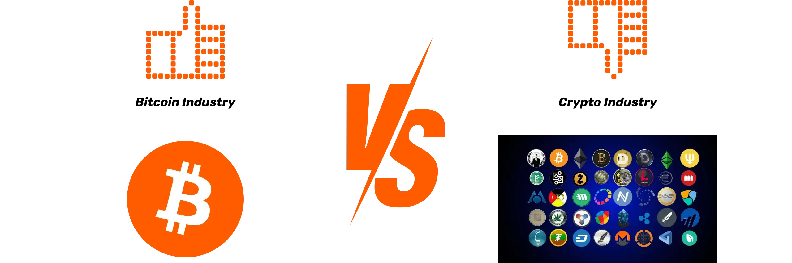

第2章は、Bitcoinの全体的な理解を深めていただくためのセクションです。まずは、重要なコンセプトを完全に理解するための復習から始めます。

そして、技術的、経済的、社会的観点から、Bitcoinが基本的に重要である理由を説明し、その価値に対する確信を深めていただきます。また、Bitcoin業界全体について、その主要なプレーヤー、組織、そして長年にわたる変遷を探ります。最後に、Bitcoinエコシステムのレイヤー・アーキテクチャーを取り上げます。これは、このシステムが、そのコア・プロトコルの完全性を損なうことなく、どのように革新を続けているかを理解する上で極めて重要な概念です。

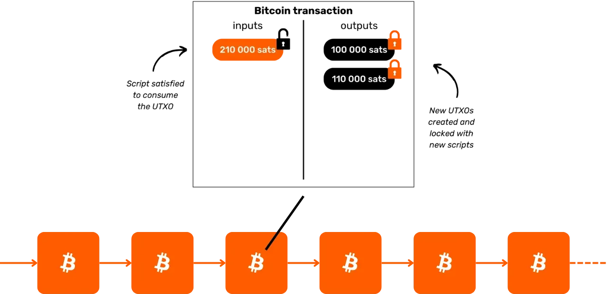

第3章「プランの設定」では、Bitcoinへの個人的なアプローチに焦点を当てます。まず、4つの主要なカテゴリーからあなたのユーザー・プロフィールを定義することから始めます：

- ホドラー*は、Bitcoinの長期保有に焦点を当てた；
- 規則正しく几帳面に買い付けるスタッカー*；
- ユーザー*はBitcoinを毎日使うことを優先する；
- そして最後に、自分の資産とプライバシーを効果的に守るため、最大限のセキュリティを望むパラノイア*である。

私たちは、あなたのプロフィールに合った戦略を実行し、あなたの個人的な目標達成をサポートします。

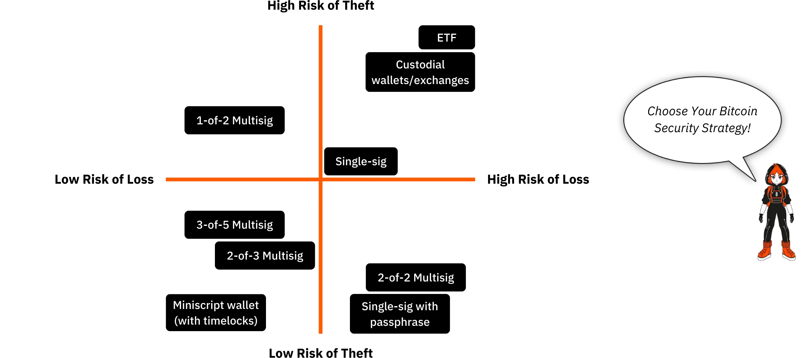

最後に、第4章「相続人と財産を守る」では、見落とされがちな重要なトピック、つまり、予期せぬ出来事に備えてBitcoinを確実に愛する人たちに引き継ぐ方法を取り上げます。Bitcoinの相続プランの作成と設定方法を学び、あなたの生涯を超えた財産の保全を確実にします。

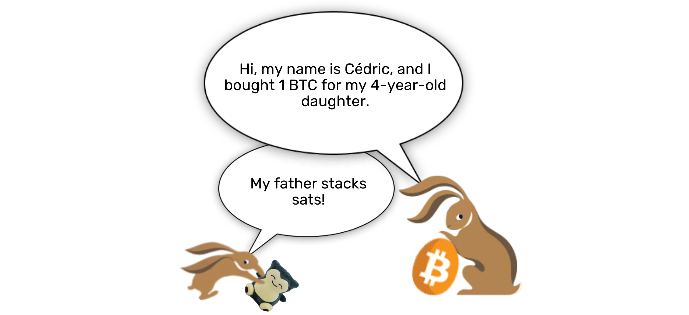

このコースが終わる頃には、Bitcoinのエコシステムを自信を持ってナビゲートし、最も高度なユーザーになるために必要な実用的なツールをすべて手に入れることができます！

Bitcoinの世界へ旅立つ準備はいいか？さあ、行こう！

# Bitcoinを理解するための前提条件

<partId>4481fc4b-0f83-489e-ad07-81517c5d6bad</partId>

## 詐欺と金融詐欺

<chapterId>8af2948b-2ab5-54c4-862c-3414b8a285a2</chapterId>

Bitcoinのエコシステムとその周辺環境は、国にもよるが、まだ比較的歴史が浅く、規制も緩い。この自由さは、大きなチャンスを開く一方で、金融詐欺や詐欺、さまざまな形の操作のための肥沃な土壌を作り出している。よくある落とし穴を理解することで、それらを避けることができる。なぜなら、悪い経験はあなただけでなく、Bitcoinコミュニティ全体に影響を与えるからです。

### Bitcoinと暗号：違いを理解する

先に進む前に、根本的に異なる2つの世界を明確に区別することが重要だ：

- Bitcoinのエコシステム**は、強力な分散化、長期的な回復力、プライバシー、そして個人の主権を基盤にした健全な貨幣という考え方を中心にしています。2009年の開始以来、Bitcoinはグローバルで献身的な開発者コミュニティによって支えられ、確実かつ安全に運用されてきました。Bitcoinは一過性のトレンドではなく、長期にわたって価値を維持するように設計された、安定し確立されたプロトコルなのです。

- 一方、暗号通貨業界**ははるかに規模が大きく、何万もの異なるプロジェクトがあり、それぞれが独自のトークンを持っている。この業界はしばしば、急速な技術革新、誇大広告、短期的な金融投機によって動かされている。これらのプロジェクトの多くは、中央集権的で安全性が低く、大胆な約束や派手なマーケティングにもかかわらず、本当の価値をあまり提供していない。

Bitcoinがどこから来たのか、何が他のプロジェクトと真に違うのかをもっと理解したい方は、Bitcoinの歴史に関する無料のフォローアップコースを後でチェックすることをお勧めする：

https://planb.network/courses/a51c7ceb-e079-4ac3-bf69-6700b985a082

ご存知の通り、Plan ₿ NetworkプラットフォームはBitcoin専用です。しかし、他の暗号通貨との違いを理解することで、役に立たない、時には詐欺的なプロジェクトに関連する落とし穴を避けることができます。

### 避けるべき主な詐欺

ここでは、旅先で出くわす可能性のある最も一般的な詐欺を紹介する：

#### マルチ商法とネズミ講

これらは暗号の世界で最も一般的な詐欺の一部である。ポンジ・スキームでは、初期の参加者は、実際の投資や製品からではなく、新しい参加者からの資金を使って支払いを受ける。実際に価値が生み出されることはない。このシステムが機能するのは、新規参加者が増え続けている間だけだ。新規参加者の流れが悪くなると、スキーム全体が崩壊する。

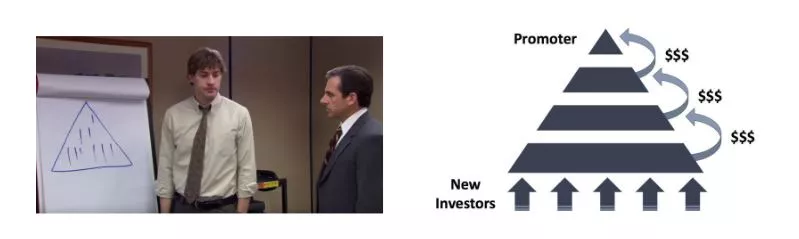

このような詐欺の特徴は、通常、：

- 非現実的なリターン保証の約束（20％のリターン保証など）；
- 投資資金を引き出す際の遅延または困難；
- システムを維持するために新メンバーを勧誘する強いインセンティブ；
- 約束された返礼品の真の出所に関する透明性が完全に欠如している。

結局のところ、マルチ商法やネズミ講はすべて失敗する運命にある。その根本的な弱点は、初期の参加者にリターンを支払うために、常に新しい投資家を呼び込む必要があることにある。システムが成長するにつれて、必要とされる新規加入者の数は指数関数的に増加するため、この必要性を維持することは時間とともに数学的に不可能になる。臨界点に達すると、参加者は疑念を抱き始め、信頼は消え、ピラミッド全体が崩壊する。この段階で、最後に参加した人たち（多くの場合、最も情報に疎い人たち）は、回復する術もなく、投資額のすべてを失うことになる。

暗号通貨の世界では、ネズミ講は様々な形態をとり、多くの場合、技術的または金融的な仮面の後ろに詐欺的な性質を隠すように設計されている。このような詐欺は、新たなトークン・オファリングやイニシャル・コイン・オファリング（ICO）として現れることがある。Blockchain」、「スマートコントラクト」、「ステーキング」といった専門用語の裏に、実は複雑なマルチ商法が隠されているプロジェクトもある。また、疑わしい暗号資産と、新規投資家の継続的な流入に全面的に依存する報酬システムを組み合わせることで、高いリターンを提供すると主張するものもある。

最近では、ネズミ講は分散型金融（DeFi）の世界にも広がっている。DeFiは仲介者なしに金融サービスを提供することを意図しているが、一部のプロジェクトはそれを利用して詐欺に偽りの正当性を与えている。ある種のDeFiプラットフォームは、自動化されたプロトコルに暗号通貨を入金することで、Exchangeでの高額の保証されたリターンを約束している。このような魅力的な約束は、多くの場合、詐欺のために特別に作られたトークンによる不透明で検証不可能なメカニズムによって裏付けられている。実際のところ、こうしたシステムには持続可能なビジネスモデルがない。リターンは、伝統的なネズミ講のように、新規ユーザーの資金から支払われるだけだ。信頼が損なわれ始めたり、新規参加者の流入が鈍ったりすると、こうしたシステムは必然的に崩壊し、疑うことを知らない投資家に大きな損失をもたらす。

本コースの内容は教育目的のみであり、金融アドバイスとして解釈されるべきものではないことにご留意ください。あなたの経済的な安全性は、あなたが金融に関するあらゆる決断を下す際に、用心深く、懐疑的で、十分な情報を得ることができるかどうかにかかっています。

最善の防御策は、常にこの単純な質問をすることだ：約束された見返りは実際にどこから来るのか？答えが不明確な場合は、すぐに逃げよう。

#### ポンプ＆ダンプ

この種の詐欺は、通常、投資家グループが主導する協調的なマーケティングキャンペーンを通じて、資産（多くの場合、流動性の低い暗号通貨トークン）の価格を人為的につり上げるものです。典型的なパンプ・アンド・ダンプ・スキームはこのパターンに従います：

- インサイダーや影響力のある人物のグループが、対象となる資産を静かに大量に蓄積する。
- そして、generateの誇大宣伝と価格高騰のために積極的な販売促進キャンペーンを展開する。
- FOMO（買い逃し恐怖症）に駆られた一般大衆は、その資産を大量に買い始め、価格をさらに押し上げる。
- 誇大広告のピークになると、インサイダーは持ち株を一斉に売り払う。
- 価格は暴落し、後発組は大きな損失を被る。

注意すべきは、パンプ＆ダンプ戦略は多くの国で違法であり、市場操作の一形態と見なされていることだ。にもかかわらず、このようなスキームは、特に規制がまだ追いついていない暗号通貨分野で、盛んに行われ続けている。

Telegram、Discord、その他のソーシャル・メディア・チャンネルなどのプラットフォーム上のプライベートな「シグナル」グループには特に注意すること。これらのグループは、インフルエンサーや自称専門家によって運営されていることが多く、中には参加費を請求する者さえいる。これらのグループは独占的な投資機会を提供すると主張しているが、現実ははるかに一方的である。

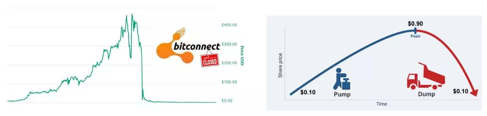

確かに、この種の市場操作で一時的に利益を得る参加者もいるかもしれないが、その成功はたいてい運と完璧なタイミングに基づくものでしかない。長期的に見れば、こうしたスキームは持続可能なものではない。常にハイリスクな取引に参加し、詐欺的な仕掛けに繰り返し参加する必要があり、必然的に破綻する。

さらに悪いことに、これらは危険な錯覚に陥っている。つまり、金融システムの実際の仕組みを理解しなくても、手っ取り早く簡単にお金を稼ぐことが可能だという思い込みだ。このような考え方は、個人を危険にさらすだけでなく、暗号通貨のエコシステム全体の信頼性を損なうことになる。

金融教育、ファンダメンタルズに対する確かな理解、そして長期的な視点に基づいた投資である。

忍耐強く知識を蓄えることで、感情的な操作や非現実的な約束に惑わされにくくなる。

#### 寄付、抽選、偽プレゼント詐欺

この種の詐欺は、あなたが最初に少額のお金を送ることで、BitcoinやExchangeの他の報酬を無料で提供することを約束します。覚えておくことが重要です。合法的な個人や組織が、見返りに多くの暗号通貨を送るという約束で、暗号通貨を先に送るように要求することはありません。

詐欺師はしばしば、有名な公人（イーロン・マスクやその他の有名人など）になりすまし、ソーシャルメディアを通じて被害者を誘います。アカウントやウェブサイトを利用する前に、その正当性を常に再確認するようにしましょう。また、過剰に気前が良いと思われるオファーや、良すぎるオファーは決して信用しないようにしましょう。

このような詐欺は「前払い金」詐欺として現れることがある。賞金や報酬（金銭、製品、サービス）を約束されながら、送料、税金、取引費用などを賄うためと思われる手数料の支払いを最初に要求される。支払いが完了すると、詐欺師は姿を消し、約束の報酬は届かない。

#### 提供されるクソコインと暗号通貨

中央集権的な暗号通貨プロジェクトは、ユーザーを引き付けるために無料のトークン（「*airdrops*」）を提供することがあります。これらのトークンは通常、実際の価値をほとんど持たず、主に人気の錯覚を起こしたり、投機を煽ったりするために使用されます。この種のプロモーション・オファーには細心の注意を払うこと。本物のチャンスというよりは、マーケティングの罠であることが多い。

#### 個人情報の盗難とフィッシング

攻撃者はしばしば、偽のウェブサイト、ソーシャルメディア・アカウント、または偽の電子メールを使って、あなたの資金を盗み出そうとします。このような詐欺は、電子メール、ソーシャルネットワーク、電話、あるいは従来の郵便など、あらゆるコミュニケーション・チャネルを通じて行われる可能性があります。

リンクをクリックしたり何らかの行動を起こしたりする前に、必ず送信者の身元を再確認してください。疑わしい場合は、提供されたリンクを使用するのではなく、手動でウェブサイトにアクセスしてください。最も重要なことは、プライベート・キーやパスワードを誰とも共有しないことです。

#### Bitcoin ハードフォーク

長年にわたり、Bitcoinはいくつかの*Hardフォーク*を経験し、オリジナルの暗号通貨の代替バージョンが作成されました。簡単に言えば、Hard Fork*は、2つの別々のブロックチェーンにつながるネットワークの分裂であり、分裂の瞬間まで、どちらも同じ歴史を共有しています。このようなフォークは通常、開発者コミュニティやより広範なBitcoinエコシステムの一部が、元のプロトコルに大きな変更を導入したいが、広くコンセンサスを得ることができない場合に起こります。彼らは自分たちのアイデアを放棄する代わりに、Bitcoinの新バージョン（ルールを変更したもの）を立ち上げることを決定し、ユーザーや採掘者が代わりに彼らのForkに従うことを選択することを期待する。

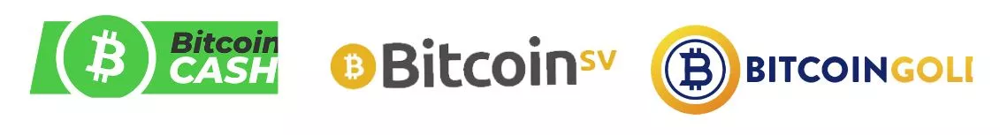

コミュニティ内の技術的あるいはイデオロギー的な意見の相違から生じるものもあるため、すべての*Hardフォーク*が不正というわけではない。しかし、商業的利益や不正な動機によって引き起こされるものもある。これらのハードワークの最も有名な例は、**Bitcoin Cash (BCH)**と**Bitcoin Satoshi Vision (BSV)**である。それぞれ2017年と2018年に開始されたこれらの代替通貨は、しばしばオリジナルのBitcoinの「より良いバージョン」であると主張している。これらの通貨は、取引手数料の低下やブロックサイズの増加による取引の高速化などの利点を宣伝している。しかし、このような技術的な変更は、セキュリティ、分散化、堅牢性の面で大きなトレードオフを伴うものであり、Bitcoinの基本原則と相反する可能性がある。

技術的な違いだけでなく、これらの代替通貨は、無知な投資家を惹きつけるために、しばしば混乱に乗じている。本物のBitcoin(BTC)を購入していると信じている初心者を意図的に惑わすようなマーケティング戦術を採用している場合もある。

この罠にはまらないためには、購入する通貨を常に確認することです。オリジナルのBitcoinはティッカー**BTC**を使用していますが、Bitcoinキャッシュとその派生物はBCHやBSVのような明確な略語を使用しています。

#### 不誠実なインフルエンサーと偽の教祖

暗号通貨が主流の注目を集めるにつれ、ソーシャルメディアではインフルエンサーや自称専門家、いわゆる「*暗号の達人*」が急増している。これらの人々は通常、個人的な金銭的利益に動機づけられており、特定のトークンやプラットフォームを宣伝することで、直接的または間接的な報酬を受け取っていることが多い。

これらのインフルエンサーは、初心者を惹きつけるために実績のある戦術に頼ることが多い。印象的な財務結果（多くの場合、それは偽物か検証不可能なものである）を紹介し、成功の証拠と思われる豪華なライフスタイルを誇示し、「奇跡の」投資戦略を宣伝する。その目的は、FOMO（Fear of missing out：取り逃がす恐怖）を引き起こし、視聴者を衝動的な決断や無謀な投資に駆り立てることだ。

こうした人物からの「無料」アドバイスのほとんどは、決して本当の無料ではないことを理解することが重要だ。気前がいいという見せかけの裏には、疑わしい資産を購入するよう人々を誘導する、計算された戦略が隠されていることが多い。また、仮に一部のインフルエンサーが正直であったとしても、彼らの結果を再現することはほぼ不可能だろう。彼らの成功は、多くの場合、特定のタイミング、インサイダー知識、または単にあなたがアクセスできないユニークな状況に左右されるからだ。

インフルエンサーの中には、独占的な取引シグナルや、迅速で簡単な利益を約束するインサイダー・ヒントを共有すると主張する、私的な有料グループに参加するよう誘う者もいる。実際には、こうしたグループは主に主催者自身の利益となる。彼らはしばしば流動性の源としてフォロワーを利用し、本質的に個人的な利益のために資産を売却する。購読者は通常、取引を指揮するインサイダーほど素早く反応できないため、損失を被ることになる（パンプ・アンド・ダンプ・スキームのセクションを参照）。

この現実を踏まえ、不誠実なインフルエンサーが仕掛ける罠にはまらないために、取り入れるべき良い習慣をいくつか紹介しよう：

- 暗号投資の推奨には慎重を期すこと。

信頼できる知識豊富な人であれば、まず自分で調べてみることを勧めずに、暗号通貨の購入を迫るようなことは決してしない。

- 有料のトレーディング・コースや投資コースが必ずしも質の高いものであるとは限らない。

これらのコースの多くは、危険な戦略や単純すぎる戦略を宣伝している。

- 誰かのトレードをコピーして同じ結果が得られる保証などないのだ。

どの投資戦略も、個人の状況、タイミング、知識、その他の要因に左右され、正確に再現することはできない。

- 特に、聞こえが良すぎるアドバイスには要注意だ**。

非現実的な約束や保証された利益は、ほとんどの場合、操作の兆候である。誰かが自信たっぷりに何かを言ったからといって、それが真実であるとは限りません。

Bitcoinや広範な暗号エコシステムで遭遇するすべての人が、個人的な意図を持っていることを常に覚えておいてください。純粋に中立な情報など存在しないのだ。このBTC102というコースでさえ、「Bitcoinの理解を深める」という明確な目標があります。

だからこそ、あなたが消費するすべてのコンテンツの背後にある本当の動機を意識し続けることが不可欠なのだ。そして、インターネットの黄金律を決して忘れてはならない：

*商品やサービスが無料に見えるなら、それはあなたが商品である可能性が高い。

結局のところ、最善の防御策は、個人的な教育、健全な懐疑心、そして最も重要なのは、自分で事実を確かめる習慣である。

### 詐欺を避けるには

**オンライン、特に暗号の世界で安全に過ごすには、以下の重要な原則を念頭に置いてください。

- 盲目的に信用してはならない；
- 保証されたリターンや異常に高いリターンには懐疑的になること；
- 秘密鍵は決して誰にも教えないでください；
- 知らないアドレスにBitcoin（あるいは暗号）を送らないこと；
- 迷ったら、一時停止する。行動を起こす前に一歩下がって考えよう。FOMOは最大の敵だ；
- 非現実的な約束をする有料取引グループやコミュニティは避ける；
- ネット上のほとんどの景品や「無料」宝くじは、詐欺か激しく不正なものです；
- 長期的には、ギャンブルよりも学んだほうが必ず得をする。

詐欺から身を守ることは、資産を守るための重要な第一歩ですが、それだけでは不十分です。しかし、それだけでは十分ではありません。強力なデジタル衛生状態を維持することも同様に重要です。そこで次の章では、オンライン・セキュリティを強化する方法と、デジタルの世界で身を守るために採用すべきベスト・プラクティスを探ります。

## オンライン・セキュリティ

<chapterId>f0873bf2-6a6f-5485-bb7a-d84be14f404d</chapterId>

Bitcoinに参加し始めるとすぐに、基本的なサイバーセキュリティはオプションではなく、必須であることに気づくだろう。詐欺や不正行為は氷山の一角です。偶発的なデータ損失、マルウェア、漏洩したパスワードは、特にあなた自身の鍵を管理している場合、同じように壊滅的な打撃を与える可能性があります。

この章では、デジタル・ハイジーンをレベルアップし、スペースで自分自身を守るための、シンプルで実践的なステップを紹介する。

より深く学びたい場合は、Plan ₿ NetworkのSEC101コースがBitcoinユーザー向けに特別にデザインされたサイバーセキュリティ戦略の包括的な内訳を提供している。

https://planb.network/courses/99c46148-7080-4915-a7e0-9df0e145cd47

### サイバーセキュリティが重要な理由

Bitcoinは、仲介者を介さず、直接（銀行を介さず）お金を保有する力を与えてくれる。しかし、このような金融主権には重大な責任が伴う。セキュリティの不備でBTCが盗まれた場合、取引を取り消す方法はない。伝統的な銀行取引とは異なり、ヘルプデスクも、不正請求も、あなたを救済する保険もない。

その上、Bitcoinは金銭的価値が高いため、標的にされやすい。あなたのWalletを危険にさらしたハッカーは、あなたの資金を即座に彼らがコントロールするAddressに移動させることができる（問答無用、取り戻すこともできない）。

### クリーンで最新のコンピューター

個人のセキュリティで最も見落とされていることのひとつは、オペレーティング・システムやソフトウェアを常に最新の状態に保つことだ。多くのアップデートは、攻撃者に悪用される可能性のある既知の脆弱性にパッチを当てるものだ。パフォーマンスの問題を恐れてアップデートを避ける人もいるが、本当のリスクは、ハッカーがすでに破る方法を知っている古いソフトウェアを実行することにある。

また、信頼できるアンチウイルスを使用することを強くお勧めする。Windowsの場合、ほとんどのユーザーは内蔵のWindows Defenderで十分です。追加機能や安心感を求めるなら、Kasperskyのような商用オプションも利用できる。macOSでは、マルウェアの脅威は歴史的に少なくなっている**が、存在しないわけではないので**、用心するに越したことはない。

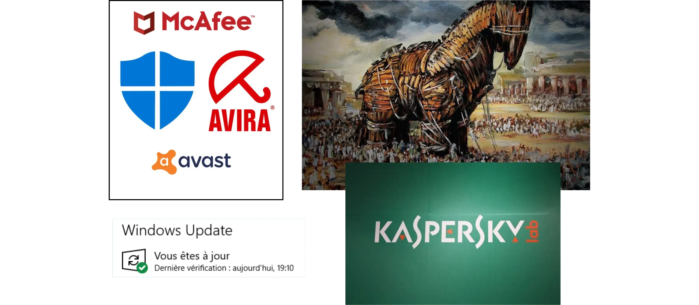

システムアップデートやウイルス対策だけでなく、怪しいウェブサイトやいわゆる「ユニバーサル」ダウンロードポータルからのソフトウェアのダウンロードにも細心の注意を払いましょう。ツールやアプリケーションが必要な場合は、常に公式ソースに直行しましょう。こうすることで、正規のソフトウェアを装ったマルウェアをインストールするリスクを大幅に減らすことができます。

もう1つの賢い習慣は、マシンにインストールする前にソフトウェアの信頼性と完全性を確認することです。その方法がわからないという方は、専用のチュートリアルをご用意していますのでご安心ください：

https://planb.network/tutorials/computer-security/data/integrity-authenticity-21d0420a-be02-4663-94a3-8d487f23becc

最後に、重要なデータのバックアップを定期的に取りましょう。外付けのHardドライブやSSDは、突然の故障やハッキング、不慮の削除に備えて、ファイルの複製を保存しておくのに最適です。後で自分に感謝することになるだろう。

クラウド・ソリューションをお望みなら、プロトン・ドライブのような安全なサービスの利用をご検討ください。ただし、どのようなオプションを選択するにしても、プライバシーを尊重し、強力な暗号化を提供していることを確認してください。

https://planb.network/tutorials/computer-security/data/proton-drive-03cbe49f-6ddc-491f-8786-bc20d98ebb16

広く推奨されているバックアップ戦略に "3-2-1ルール "がある。これは、偶発的な紛失、サイバー攻撃、あるいは自然災害からデータを保護するためのものです。

アイデアは単純だ：

- 重要なデータは少なくとも3部コピーしておくこと、
- 少なくとも2種類のメディア**（例：外付けHardドライブとクラウドストレージ）に保存する、
- そして、これらのコピーのうち**1つは、オフサイト**（メインの場所から物理的に離れた場所）に保存されていることを確認してください。

このアプローチは強力な耐障害性を提供し、何か重大な問題が発生した場合でもデータが確実に存続するよう支援する。

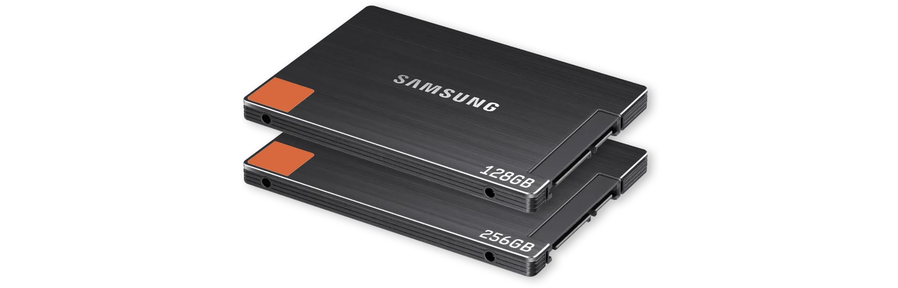

### IDの悪夢の解決策

ハッキングされる最大の原因のひとつは、脆弱なパスワードの使用だ。複数のアカウントで同じパスワードを使いまわしたり、推測されやすいバリエーションを選んだりしているユーザーがまだ大勢いる。パスワード・マネージャーは、この問題を解決する完璧なソリューションだ。

パスワード・マネージャーを使えば

- すべてのパスワードを暗号化された保管庫に安全に保管**。
- generate 各アカウントに、長く複雑でユニークなパスワード**を自動的に設定します。
- 1つのマスターパスワード**を使用するだけで、すべてに安全にアクセスできます。

パスワード・マネージャーを使えば、「パスワードを忘れました」をクリックする必要も、使い回しの脆弱な認証情報に頼る必要もなくなります。さらに、ほとんどのパスワード・マネージャーは、あなたのデバイス（デスクトップ、電話、タブレット）間でシームレスに同期し、ログイン・フォームを自動入力することもできるので、安全なアクセスを簡単かつ効率的に行うことができます。

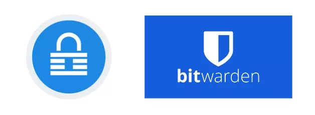

世の中には多くのパスワード・マネージャーがあるが、私はあなたのニーズに応じて2つの堅実な選択肢を推薦できる。複数のデバイスでシームレスに同期でき、使いやすいものを探しているなら、Bitwardenが最適だ：

https://planb.network/tutorials/computer-security/authentication/bitwarden-0532f569-fb00-4fad-acba-2fcb1bf05de9

すべてを自分のデバイスにローカルに保存したいのであれば、KeePassは素晴らしい選択肢だ：

https://planb.network/tutorials/computer-security/authentication/keepass-f8073bb7-5b4a-4664-9246-228e307be246

### 2FA：二重の保護

Bitcoinでは、あなたはあなた自身の銀行です。つまり、あなた自身がセキュリティ・チームでもあるのです。強力なパスワードを使っても、リスクがゼロになることはありません。だからこそ、二要素認証（2FA）を有効にすることが不可欠なのです。

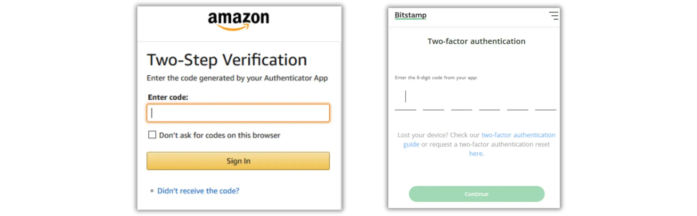

2FAは、Google AuthenticatorやAuthyのようなアプリによって生成された時間ベースのワンタイムコード（通常は6桁）を要求することにより、保護の第二のLayerを追加します。そのため、誰かがあなたのパスワードを入手できたとしても、あなたの携帯電話に物理的にアクセスできなければ、あなたのアカウントにアクセスすることはできない。

https://planb.network/tutorials/computer-security/authentication/authy-a76ab26b-71b0-473c-aa7c-c49153705eb7

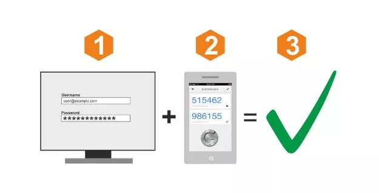

2FAを有効にしたら、アプリのリカバリーキーを安全な場所に保存してください。これにより、携帯電話を紛失したり機種変更したりした場合に、コードを復元することができます。SMSやEメールベースの2FAは、何もしないよりはましだが、安全性ははるかに低い。誰かがあなたの電話番号を管理するSIMスワップ攻撃は、この種の保護を簡単にバイパスすることができます。

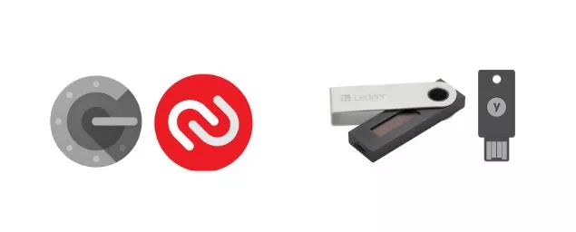

さらに一歩進んだセキュリティを求める人には、YubiKeyのような物理キーがさらに高いレベルの保護を提供する。

https://planb.network/tutorials/computer-security/authentication/security-key-61438267-74db-4f1a-87e4-97c8e673533e

### プライバシーの保護

プライバシーとサイバーセキュリティは密接に結びついている。自由にアクセスできる情報を残せば残すほど、標的になる可能性は高くなる。

VPN** (**Virtual Private Network**)は、あなたのIP Addressをマスクし、あなたのインターネットトラフィックを暗号化するシンプルで効果的なステップです。完全に見えなくなるわけではありませんが（VPNプロバイダーはまだあなたの活動を見ることができるため）、あなたをスパイしようとしたり、あなたのブラウジングの習慣を追跡しようとしたりする人にとってはかなり難しくなります。

重要なのは、信頼できるVPNプロバイダーを選ぶことです：

- 個人情報を必要としない
- BTCでの支払いが可能
- ログを残さない厳格なポリシー

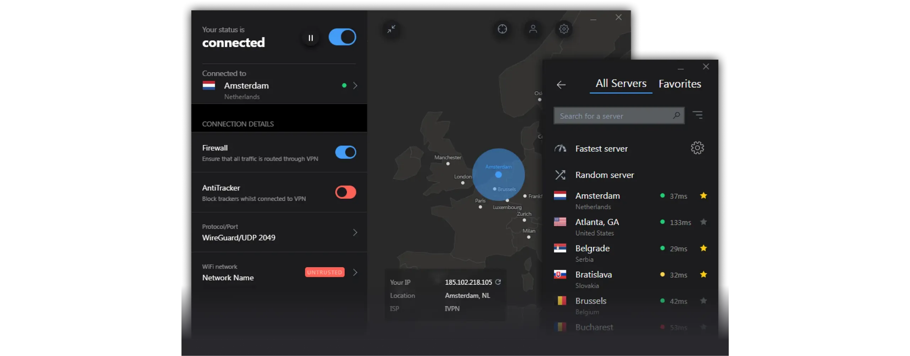

Plan ₿ Networkには、VPNを簡単に設定できるチュートリアルがいくつか用意されています。特にIVPNかMullvadをお勧めします：

https://planb.network/tutorials/computer-security/communication/ivpn-5a0cd5df-29f1-4382-a817-975a96646e68

https://planb.network/tutorials/computer-security/communication/mullvad-968ec5f5-b3f0-4d23-a9e0-c07a3e85aaa8

オンラインでプライバシーを保護するために不可欠な手順には、次のようなものもあります：

- Signal、SimpleX、Sessionなどの**暗号化メッセージングプラットフォーム**を使用する；
- Firefox、Brave、Tor（匿名性を高める）などのプライバシー重視のブラウザを使用する；

https://planb.network/tutorials/computer-security/communication/tor-browser-a847e83c-31ef-4439-9eac-742b255129bb

- ProtonMailのような**安全なメールボックス**を使用すること；

https://planb.network/tutorials/computer-security/communication/proton-mail-c3b010ce-254d-4546-b382-19ab9261c6a2

- Bitlocker（Windows用）やVeraCrypt（マルチプラットフォームで利用可能）などのツールでファイルを暗号化**する。

https://planb.network/tutorials/computer-security/data/veracrypt-d5ed4c83-7c1c-4181-95ea-963fdf2d83c5

### ステップ・バイ・ステップ

サイバーセキュリティは大規模な事業のように見えることがあり、初心者は圧倒され、複雑すぎるように思えてあきらめてしまいがちだ。コツは、一歩ずつアプローチすることだ。パスワード・マネージャーをインストールするなど、簡単なことから始めよう。数週間かけて慣れ親しんだら、次のステップ、例えばアカウントの1つで2FAを有効にするなどのステップに進む。

これらのツールを使いこなす自信がつけば、セカンダリーメールの使用、ProtonMailへの切り替え、VPNの設定、必要に応じてTorを使ったブラウジングなど、より高度な方法を追加できるようになるだろう。

Bitcoinの世界に深く潜っていくと、Walletの価値が上がるにつれてリスクも大きくなっていくことに気づくでしょう。しっかりとしたセキュリティの習慣を身につけ、プライバシーを守り、適切なツールを設定することは、安心感を与えるだけでなく、Bitcoinの主権を強化することにもつながります。

要するに、サイバーセキュリティを過小評価せず、時間をかけて基本的なことを設定し、一貫性が重要であることを忘れないでください。デジタル・ハイジーン（衛生管理）がしっかりしていなければ、どんなに優れたツールもあまり役に立ちません。

また、Plan ₿ Networkの[コンピュータ・セキュリティ・チュートリアル](https://planb.network/tutorials/computer-security)もぜひご覧ください。

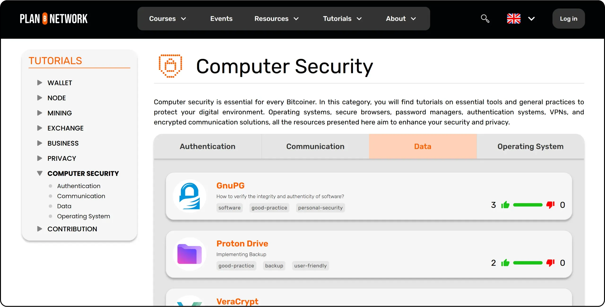

次の章では、Bitcoinの旅を自信を持って始めるためのヒントをいくつか紹介しよう。

## 初めての方へのアドバイス

<chapterId>33134b3f-92c1-5185-afb6-88599e47e801</chapterId>

Bitcoinに参加することはエキサイティングなことですが、それなりのリスクも伴います。乱高下する価格、馴染みのない技術、単純なミスや投資の選択ミスによって永久に資金を失う可能性など、暗号の世界は他とは異なります。

この章では、最初の一歩を踏み出そうとしている人、特に初めて買い物をする人、より広い金融投資の世界を探求している人に向けて、実践的なアドバイスと一般的なガイダンスを紹介しよう。

以下は、これから一緒に見ていく重要なポイントである：

- Shitcoins**やその他の役に立たない暗号通貨に注意；
- 投資するのは、**失ってもいいお金**だけにしてください；
- トレーディング**と投資**の違いを知る；
- 投資の**税金**への影響に注意すること；
- 回復フレーズ**を大切に守ってください；
- 謙虚であり続け、**控えめに**（慎重さは警備の一部である）；
- 長期的**に考え、ズームアウトし、忍耐強く（スプリントではなくマラソンと考える）。

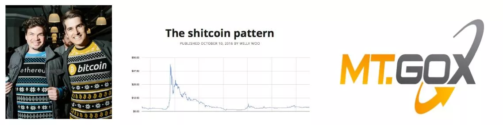

### 避けるべき一般的な間違い

Bitcoinは誰にでも開かれているが、だからといって準備不足のまま飛び込むのは危険だ。ここでは、初心者が犯しがちな典型的な間違いをいくつか紹介しよう：

*技術的なミス：***

- seed フレーズの紛失:** Wallet に万一のことがあった場合、リカバリーフレーズ（通常 12 語または 24 語）が Bitcoin にアクセスする唯一の方法です。これを失うと、資金は永久に失われてしまいます；
- サードパーティプラットフォームにビットコインを保管する：** 中央集権的なプラットフォーム上にコインを保管する場合、あなたはコインを実際に所有しているわけではありません。ハッキングやプラットフォームの障害、あるいは資金の差し押さえといったリスクにさらされることになります；
- プライバシーの軽視：*** プライバシーの保護は、資産を守るための核心部分である。どれだけのBitcoinを保有しているかを公にすることは、あなたを標的にする可能性がある；
- 不十分なオンライン・セキュリティ：*** 基本的な保護（アップデート、強力なパスワード、2FAなど）を怠っていると、攻撃者に狙われやすくなり、すべてを失うことになりかねません。

**財務上のミス

- 損してもいい額以上の投資をすること**：借金をしたり、家賃をBitcoinにつぎ込んだりしないこと。あなたの基本的な経済的安定が常に第一であるべきです。

- トレーディングと投資の違いを知らない**：トレーディングには時間と技術、そして真剣な感情的鍛錬が必要だ。長期投資の方がはるかに初心者にやさしい。

- 税金のことは忘れてください**：どの国にも暗号に対する独自の税制がある。それを無視すると、後で手痛いサプライズにつながる可能性がある。

- FOMO**に陥る：買い逃すことを恐れて衝動的に買うと、たいていの場合、タイミングを誤り、判断を誤ることになる。忍耐は最大の味方だ。

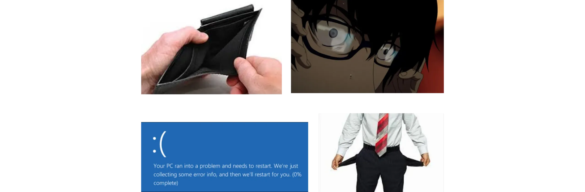

### 投資戦略の定義

最初のSatoshiを購入する前に、なぜBitcoinに投資するのか、そしてどのように投資するのかを理解することが極めて重要です。これは、あなたの個人的な状況と長期的な目標に合わせた明確なファイナンシャル・プランを持つことを意味する。

予算**を正確に定めることから始めよう。適当な数字を選ぶのはやめましょう。時間をかけて月収を計算し、固定費（家賃、ローン、税金、光熱費など）、日々の生活費（食費、交通費、レジャー費など）を差し引く。残ったものがあなたの貯蓄余力となり、この部分から初めて投資を検討すべきなのです。

このようにアプローチすることで、特に市場が低迷した場合に、経済的な豊かさをリスクにさらすことがない。思慮深い戦略は、長期的な回復力の基盤である。

予算が決まったら、投資方法を考えましょう。最も初心者にやさしく、広く推奨されている方法のひとつは、一定の間隔（毎週、毎月など）で一定量のBitcoinを購入するドルコスト平均法（DCA）です。この戦略は、平均エントリー価格を長期にわたって平準化し、価格変動による感情的な影響を軽減するのに役立ちます。これは、ほとんどの人、特に初心者にとって賢い方法です。

そして自問する：私の時間軸は？

市場に素早く出入りすることをお考えですか（トレーディング）？それとも、Bitcoinを数年にわたって保有する長期的な考え方（ホドラー）に近いですか？もしあなたがホドラーなら、日々の価格変動はあまり気にせず、長期的な安全性と自己管理に重点を置くだろう。もしあなたがトレーディングをしているなら、短期的なマーケット・ノイズにさらされ、リスクが高くなり、迅速な意思決定に伴うストレスにさらされることが多いだろう。万能の答えはないが、自分自身のアプローチを知ることは、決断の指針になる。

最も重要なことは、感情や恐怖に基づいて投資判断をしないことだ。事前に戦略を立て、それを書き留め、それを貫くことだ。

まだ自信がないのなら、**学ぶことから始めよう。

Bitcoinを数時間かけて探索し、Plan ₿ Networkの無料リソースをチェックし、本を2、3冊読み、試しに5ユーロを投入し、オンラインで良質なコンテンツを視聴する。好奇心を持ち続けること。慣れれば慣れるほど、戦略を見直し、アプローチを微調整し、自信を持って前進することが容易になる。

### BTCのボラティリティを理解する

Bitcoinは価格変動が激しいことで知られている。わずか数日の間に10％、20％、あるいは50％の変動は珍しいことではありません。新規参入者にとって、このようなボラティリティは混乱を招く可能性があります。強気相場では誇大広告に振り回され、弱気相場ではパニックに陥りがちです。

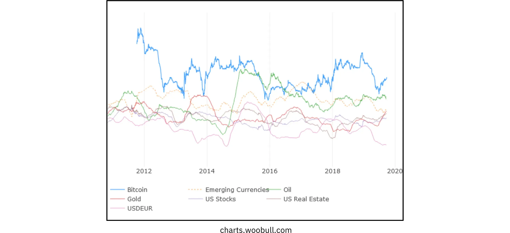

だからこそ、投資する前にBitcoinのボラティリティ**を理解し、受け入れることが重要なのです。これらの価格変動はバグではなく、まだ成熟していない資産の特徴なのだ。突然の上下動に夜も眠れず、感情的な決断を迫られるようなら、リスクを許容できる範囲を超えて投資している可能性がある。その場合は、一歩下がって自分の戦略とリスク許容度を見直そう。もっと安心できるようになるまで、ポジションを縮小することをためらわないでほしい。

何よりも、自分が失ってもいい額以上の投資は決してしないこと。Bitcoinを買うために借金するのは避けよう（まだ基礎を学んでいる最中ならなおさらだ）。堅実な基礎は、無謀な賭けではなく、慎重なステップから始まる。

### Bitcoin Walletの管理とセキュリティ

Bitcoinの最も強力な（そして過小評価されがちな）特徴のひとつは、**セルフカストディ**です。セルフ・ホストのWalletでは、資金を管理するのはあなた一人です。これらのウォレットは通常、**回復フレーズ**（seedフレーズとしても知られています）から生成されます。このフレーズを紛失した場合（または他の誰かが手に入れた場合）、あなたのビットコインは永久になくなります。 **カスタマーサポートはありません。リセットボタンなし。

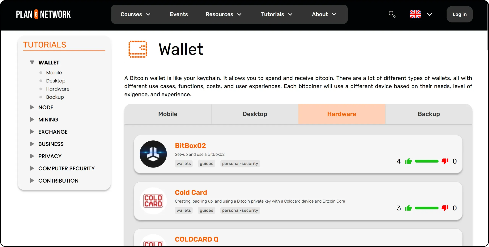

だからBitcoinの黄金律はこうなのだ：

"***あなたの鍵ではなく、あなたのコインでもない***"。もしあなたが個人的に秘密鍵を管理していないのであれば、あなたはBitcoinを本当の意味で所有していないことになる。取引所は便利なものですが（特に始めたばかりの頃は）、あなたのために鍵を保管しています。つまり、プラットフォームがハッキングされたり、アカウントが凍結されたり、倒産したりすると、あなたの資金は危険にさらされることになります。

このリスクを避けるために、自分だけがリカバリーフレーズにアクセスできる**独自のWallet**を設定することを強くお勧めします。このフレーズは常に手で書き留め、安全な場所に**オフライン**で保存してください。ユーザーによっては、セキュリティを強化するために、**地理的に離れた場所に保存された複数のバックアップ**を保持する人もいます。

**リカバリーフレーズをインターネットに接続されたデバイスやクラウド**には絶対に保存しないでください。

**たった一度のハッキングやデータ漏洩が、取り返しのつかない損失につながる可能性がある。

BitcoinのOwnershipに備え、リカバリ・フレーズの安全性を確保するためのベスト・プラクティスをさらに深めたいなら、ぜひこの記事をチェックすることをお勧めする：

https://planb.network/tutorials/wallet/backup/backup-mnemonic-22c0ddfa-fb9f-4e3a-96f9-46e2a7954270

### 守秘義務と慎重さ

今日のデジタルの世界では、**慎重さは見過ごされがち**ですが、特にBitcoinに関しては、安全な生活を送る上で極めて重要な要素です。特にBitcoinに関しては、自分の所有物についてオープンに話せば話すほど、詐欺師やサイバー犯罪者、あるいは恐喝や脅迫のような伝統的な脅威の標的になる可能性が高くなります。

多額のBTCを保有していることが知られている個人が誘拐されたり、襲撃されたりする事件は世界中で数多く起きている。

**Bitcoin Stash**の自慢話は避けましょう。ソーシャルメディア上であれ、何気ない会話であれ。機密性の高い財務情報を明かすことにプラス面はなく、リスクは現実のものとなる。

また、オンライン活動を**区分けすることも賢明です。例えば

- Bitcoinに関連するものには、個人用や仕事用のアカウントとは別のメールAddressを使用してください。
- フィッシングの試み、疑わしいリンク、信頼できるプラットフォームを模倣した偽のウェブサイトに注意すること。
- 警戒を怠らないこと！慎重さと用心深さは、しばしば最善の防御策となる。

Bitcoinプライバシーのトピックをより深く掘り下げたい方は、Year2プライバシー・コースに進むことをお勧めします。ここでは、あなたのアイデンティティと活動を安全に保つための、より高度なテクニックを学ぶことができます：

https://planb.network/courses/65c138b0-4161-4958-bbe3-c12916bc959c

### 税金への影響

分散型通貨であるにもかかわらず、**Bitcoinはあなたの国の税法および規制**から免除されません。暗号通貨から得られる利益がどのように課税されるかについては、すべての司法管轄区が独自のアプローチを持っています。

売却時にキャピタルゲインとして課税されるところもある。また、取引ごとに申告が必要なところもあり、富裕税や社会負担金など、あまり一般的でない規則を適用しているところもある。

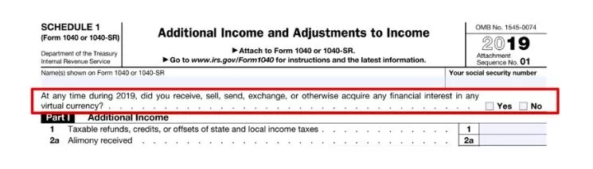

重要な取引を行う前に、税務の専門家に相談するか、政府の公式ガイダンスを確認することを強くお勧めします。特に大規模な売却やポートフォリオの再配分を計画している場合は、事前に時間をかけて納税義務を理解しておくことで、後で予期せぬ問題（罰金、監査、罰則など）を避けることができる。

### トレーディング、投資、ホールドの違い

Bitcoinは、しばしば一般的な誤解に囲まれている。最も一般的な誤解のひとつは、トレーディングを通じて金持ちになるための早道だという考えだ。しかし、トレーディング、投資、ホールドの明確な違いを理解することが重要である。それぞれのアプローチには、独自の考え方、スキルセット、リスクのレベルが伴うからだ。

- 取引 :**

正直に言おう：**トレードはしない方がいいだろう。

トレーディングは、Bitcoinの価格変動から利益を得ることを目的とした短期的な投機（レバレッジをかけることもある）である。魅力的に聞こえるかもしれないが、トレーディングを成功させるには、高度な技術的知識（チャート分析やリスク管理など）、感情的な規律、そしてマーケットへの絶え間ない注意が必要だ。Hardの真実は、**ほとんどの初心者がお金を失う**ということである。

ウォーレン・バフェットの有名な言葉だ：

"**株を10年持つ気がないなら、10分持つことすら考えるな**"

Bitcoinは一攫千金を狙ったものではない。

- 投資

投資家は中長期的な視点で、Bitcoinの価値が時間とともに（数ヶ月、数年、あるいは数十年）成長すると信じて購入する。もちろん、Bitcoinの価格は大きく変動する可能性があるため、リスクはあります。しかし、このアプローチは一般的に落ち着いており、多くの人々、特に毎日チャートに何時間も釘付けになりたくない人々にとってはるかに現実的である。

- ホールディング(HODL) :**。

"HODL "は "hold "のタイプミスから始まり、すぐにBitcoin文化の一部となった。現在では名誉のバッジとなっている。

Bitcoinを安全に保管し、ただ待つ。彼らはBitcoinを安全に保管し、Bitcoinの長期的なポテンシャルに対する強い確信に突き動かされて、ただ待っている。日々の価格変動や弱気相場にも動じない。彼らの考え方はシンプルである：蓄積し、確保し、じっと待つ。

|          | Trading | Investment | Holding |
| ---------------------- | ----------- | -------------- | --------------- |
| Leverage | Yes  | No | No |
| Timeframe | Short-term | Medium-term | Very long-term |
| Asset Type | Contracts | Actual BTC | Actual BTC |
| Risk Level | Very high | High | High |
| Difficulty | Very Hard | Hard | Hard |
| learning curve | Long learning curve | Long learning curve | Long learning curve |
| Potential Loss | UnLimited | Limited | Limited |
| Best For | A few experienced users | Most People | Long-term Believers |

### 学び続ける

お金や投資、金融システムの本当の仕組みについて学び始めるのに、早すぎる（遅すぎる）ということはありません。専門家になったり、技術的な細部にまで踏み込んだりする必要はない。しっかりとした大局的な理解を持つだけで、十分な情報を得た上で意思決定を行い、（銀行やアドバイザーが宣伝することが多い）自分の利益にならない金融商品に惑わされないようにするのに十分だ。

その出発点として最適なのが、ロバート・T・キヨサキ著『金持ち父さん、貧乏父さん』だ。資産と負債の違いを理解することや、金融教育が長期的な自立の鍵である理由など、親しみやすいスタイルと基礎的な教訓で広く知られている。

もっと深く知りたければ、*The Investors Podcast*のようなポッドキャストが、投資、市場、経済原則に関する洞察に満ちた議論を提供している。彼らは時折Bitcoinも取り上げるので、Bitcoinがより広い金融情勢の中でどのように位置づけられるかを理解することに興味がある人にとっては、確かな次のステップになるだろう。

### 心に留めておくべき黄金律

最後に、すべてのビットコイナー（特に初心者）が心に留めておくべき不朽の原則をいくつか紹介しよう：

- ルールno.1**：決して損失が出る以上の投資はしないこと。Bitcoinは不安定な資産です。利益を追い求め、経済的安定を危険にさらさないでください。あなたの本質的なニーズと心の平穏を常に優先してください。
- ルールその2**：誇大広告に盲従したり、奇跡的なアドバイスを信じたりしないこと。流行や派手な約束は無視すること。それよりも、十分な情報に基づいた合理的な決断をすることに集中する。迷ったときは眠り、信頼できる人とよく話し合うこと。慌てて大きな失敗をするよりも、ゆっくり考えて行動したほうがいい。
- ルール n°3**：計画を立て、長期的なビジョンにこだわる。

一貫性、忍耐、規律は、短期的な興奮よりもあなたを遠くに連れて行く。ムーンショットを目指すのではなく、持続可能な成長を目指す。致命的なミスを避け、時間をかけて小さな成功を積み重ねる。

これらの原則に従うことで、Bitcoin投資をより明確かつ安心して行うことができる。確かにBitcoinは変動が激しく、最初は怖気づくかもしれない。しかし、注意深く、忍耐強く、地に足をつけた考え方で取り組めば、紛れもない可能性を秘めている。時間をかけて知識を蓄え、必要に応じて戦略を見直し、そして何よりも、恐怖や焦りから急ぐよりも、ゆっくりと着実に前進する方が常に有益であることを覚えておいてほしい。

# 何をしようとしているのかを理解する

<partId>a42355a3-9dd8-57ed-b590-32a333fe09ea</partId>

## 5分でわかるBitcoin

<chapterId>ae122ad9-9b4d-5229-9038-e1b99d5cfc83</chapterId>

このコースでは、最初のビットコインの取得と確保をガイドすることを第一の目的としています。しかし、実践的なステップ（BTCの買い方、どのウォレットを使うか、など）に入る前に、一歩引いてBitcoinとは何かを理解することが重要です。Bitcoinの本質を理解することで、なぜ何百万人もの人々がこのテクノロジーに注目しているのか、そしてなぜこのような新しく不安定な資産に貯蓄をつぎ込む前に基本的なことを理解することが重要なのかがわかるでしょう。

長年にわたり、Bitcoinはグローバルな通貨ネットワークとして認知されてきた。デジタル・ゴールド」、「トラスト・プロトコル」、さらには「パラレル金融システム」とも呼ばれている。しかし、これらの用語の本当の意味は何だろうか？その答えとして、Bitcoinの核心部分、つまりその起源、技術的基盤、通貨的特性、そして個人だけでなく世界金融システム全体への潜在的影響について詳しく見ていくことにしよう。

### 原点：長年の探求から生まれたプロジェクト

#### サイファーパンクと銀行の制御を超えたシステムの発明

Bitcoinは一夜にして生まれたわけではない。暗号技術、コンピューター科学、貨幣理論における数十年にわたる研究と実験の結果なのだ。2009年にBitcoinがスタートする前、いくつかのプロジェクト（eCash、b-money、Bit Gold、RPOWなど）がデジタル通貨を作ろうとしていた。中央当局に頼ることなく、分散型のシステムで二重支出を防ぐにはどうすればいいかという問題である。

2008年末、Satoshiナカモトという名前の人物がBitcoinのホワイトペーパーを発表するまで、この課題は未解決のままだった。数ヵ月後、Bitcoinのオープン・ソース・ソフトウェアの最初のバージョンが公開され、銀行や政府から独立して運営できるシステムがスタートした。

このプロジェクトは、Cypherpunkの理念に大きな影響を受けている。オンライン上で個人の自由を守るために暗号を使うことを信条とする開発者や思想家のコミュニティである。彼らにとって、プライバシーと分散化は技術的な好みではなく、イデオロギー的に必要なものだった。Bitcoinは、その理想を最も成功裏に具現化したものとして登場した。誰もが利用でき、誰も管理できず、誰もが検証できるピアツーピアの通貨ネットワークである。

Cypherpunksは、オンライン上の個人の自由を守るために暗号の使用を提唱する個人の非公式な国際的コミュニティです。特に、政府による監視と企業によるデータ搾取によってますます形作られていく世界において、個人のプライバシーに対する権利を強く信じています。

Cypherpunk運動のルーツは、暗号技術者、プログラマー、リバタリアンのグループがシリコンバレーでのミートアップで暗号の政治的意味を探求し始めた1990年代初頭に遡る。このコミュニティで最も著名な人物の一人がティム・メイであり、彼は1988年に「暗号アナーキスト宣言」を執筆した。この宣言は、暗号化が政府や中央集権的な統制の及ばないところで活動する力を個人に与える世界のビジョンを概説した、基礎となる文章である。

この運動の大きな節目となったのは、1992年にCypherpunksメーリングリストが設立されたことでした。このメーリングリストは、プライバシーと暗号技術に関するアイデアやプロジェクト、政治的な議論が活発に行われるフォーラムでした。そして1993年、エリック・ヒューズがCypherpunk's Manifestoを発表しました。これは、コミュニティの使命と信念を明確に表現した、短いながらも力強い宣言でした。

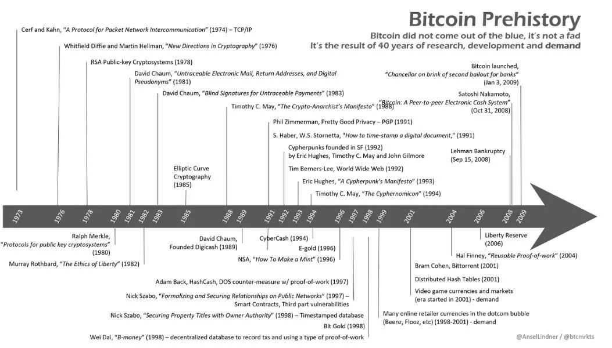

Bitcoinのような）中央当局から独立して運営されるデジタル通貨というアイデアは、Cypherpunkの哲学に深く根ざしている。

#### 金融危機後の瞬間

Bitcoinは突然現れたわけではない。2008年の世界的な金融危機の直後という、極めて特殊なタイミングで誕生したのだ。米国の住宅市場の崩壊とサブプライムローン問題は、大手銀行の破綻を引き起こし、金融システム全体に対する人々の信頼を揺るがした。

Bitcoinが誕生したのは、このような恐怖と不確実性の環境においてであった。Satoshiナカモトとして知られる作成者は、Genesisブロックとして知られるBitcoin Blockchainの最初のブロックに、非常に象徴的なメッセージを盛り込んだ。そのメッセージとは

> **2009年1月3日付『タイムズ』紙 首相、銀行に対する2度目の救済措置の瀬戸際に」**。

これは単なる日付や技術的なメモではなく、静かだが力強い抗議だった。Bitcoinが、銀行や救済措置や政府の決定に依存しない金融システムという、根本的に異なるものを目指して設計されたことを示したのだ。

中央銀行や政府による不明瞭な決定ではなく、明確なルールによって管理され、仲介者を必要としない価値の移転方法を提供する。

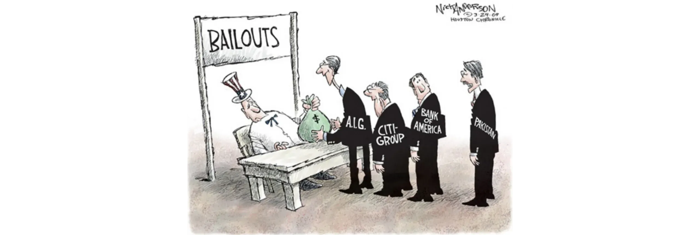

Bitcoinの起源に関する知識を深めていただくために、私たちはこのテーマに関する包括的で十分に文書化された無料のトレーニングコースを提供しています：

https://planb.network/courses/a51c7ceb-e079-4ac3-bf69-6700b985a082

### 価値を移転する分散型ネットワーク

#### ピアツーピアで中央機関を持たない

Bitcoinは "ピアツーピア電子キャッシュシステム "と定義されている。これは、誰もが適切なソフトウェア（Bitcoinノード）を使用してネットワークに接続し、中央のサーバーに依存することなく、他のユーザーと直接対話できることを意味します。この分散化の目的は、いかなる単一団体（銀行、政府、大企業など）によるシステムの制御、検閲、停止を防ぐことである。Bitcoinは、24時間365日、世界中で運営されており、誰でも無条件でアクセスすることができます。

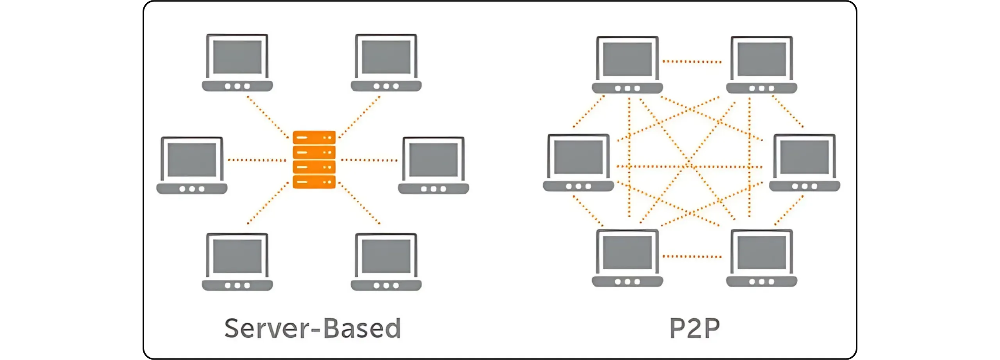

簡単に言うと、Bitcoinネットワークの参加者（「ノード」と呼ばれる）はすべて、Blockchainとして知られるトランザクションLedgerの完全なコピーを持っている。新しい取引が発生すると、ネットワークにブロードキャストされる。その後、マイナーはこれらのトランザクションをブロックにまとめ、チェーンの末尾に追加することで確認する（これが「Blockchain」という名前の由来である）。

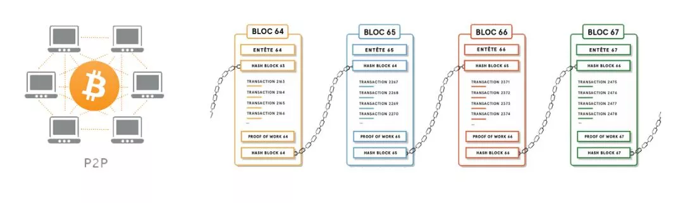

#### Blockchain：会計 Ledger

Blockchainを巨大な会計用Ledgerと考えてほしい。従来の銀行システムでは、データベースは銀行のサーバーに保存され、銀行はいつでも好きなときに変更を加えることができる。一方、Bitcoinでは、**すべての変更はネットワーク全体で検証される**：一度Blockchainに新しい取引ブロックが追加されると、後でそれを変更することはほぼ不可能である。この非中央集権的な検証により、BitcoinのLedgerは安全で透明なものとなっている。

### 鉱山労働者とProof-of-Workの役割

#### ブロックはどのように作られるかMining

Miningは、コンピュータ（または大規模なMiningファーム）がBitcoinの取引履歴を保護し、新しいブロックを作成するために**計算能力**を提供するプロセスである。マイナーは数学的パズルを解くために競い合う-具体的には、Hashの部分的な衝突を見つけることである。このプロセスには多大なエネルギーと資源が必要である。Minerが有効な解を見つけると、彼らはそのブロックをネットワークにブロードキャストし、ネットワークはそれを検証して有効なものとして受け入れる。

報酬として、Minerはそのブロックに含まれるすべての取引からの取引手数料とともに、新しく作られたビットコイン（ブロック補助金と呼ばれる）を受け取る。

#### Halving：ブロック補助金の減少

Bitcoinの希少性を確保するため、ブロック補助金は21万ブロックごと、つまりおよそ4年ごとに半減するようプログラムされている。このイベントは "Halving "として知られている。Bitcoinの開始時、マイナーは1ブロックにつき50BTCを獲得した。2025年、この報酬は3.125BTCに減少し、今後も減少し続けるだろう。

最終的に、2140年頃には補助金はゼロになり、BitcoinのSupplyの合計は2100万コインに達する。この予測可能な発行曲線は、金のような現物商品の希少性を模倣している。Bitcoinがしばしば**デジタル・ゴールド**と呼ばれる理由のひとつである。

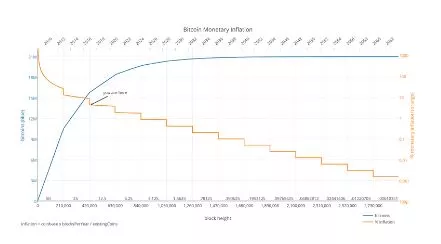

### Bitcoin 金銭的特性

#### 希少性と固定通貨政策

Bitcoinの最も強力な特徴の一つは、*予測可能で変更不可能な金融政策*です。伝統的な不換紙幣（ドル、ユーロ、円のような）とは異なり、中央銀行によって自由に印刷することができる（しばしばインフレや経済の歪みにつながる）。

ビットコインは2100万枚しか存在せず、新しいコインが発行される割合は、ネットワーク内の全員が事前に知っている。

いかなる政府、機関、個人も、このSupplyの上限や分配ルールを一方的に変更することはできない。これらのパラメーターを変更する唯一の方法は、Bitcoinのプロトコルを変更することであり、それにはネットワークの経済参加者の過半数のコンセンサスが必要である。

この希少性は、予測不可能な金融政策から逃れたい人々や、インフレによる購買力の漸減を避けたい人々にとって大きな魅力である。やがては、Bitcoinのようなデフレ資産で貯蓄することが、インフレになりやすい従来の通貨に頼るよりも魅力的になるという、金融の考え方の転換を意味するかもしれない。

#### 分割可能性とアクセシビリティ

Bitcoinの最も過小評価されている強みの一つは、その分割性である。Bitcoinは、サトシ（略してSats）と呼ばれる1億単位に分割することができる。つまり、Bitcoinを始めるために何万ユーロも何ドルも使う必要はなく、数ユーロ分のBitcoinを端数まで買うことができるのだ。

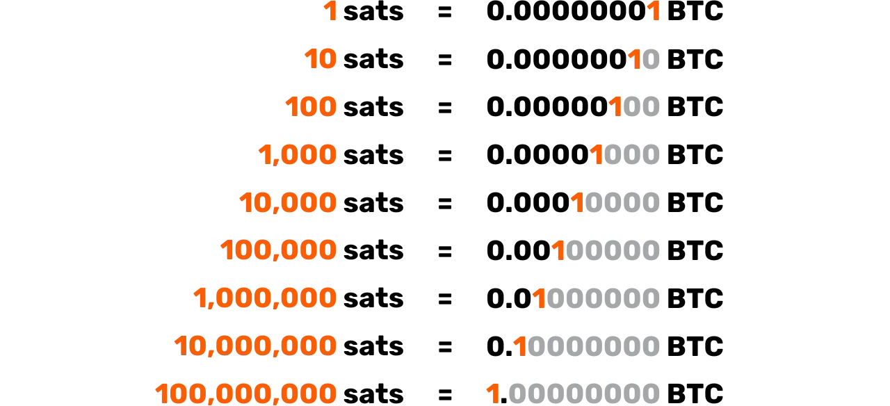

### 開放性と透明性

#### すべての人が検証可能な公開プロトコル

Bitcoinは公開された**オープンソース**プロトコル(特に[Bitcoin Core](https://github.com/Bitcoin/Bitcoin))で動いています。これは、Bitcoinのコードが誰でも自由に閲覧、監査、改良できることを意味する。隠されたメカニズムやクローズドなシステムは存在せず、Bitcoinがどのように機能するかについてのすべてがオープンにされている。

このレベルの透明性により、バックドアを導入したり、秘密の変更を加えたりすることが驚くほど難しくなる。技術的なスキルがあれば誰でもノードを運営し、開発に貢献し、互換性のあるツールを構築することができる。Bitcoinでは、中央集権的な管理ではなく、コードとコンセンサスによって信頼が得られる。

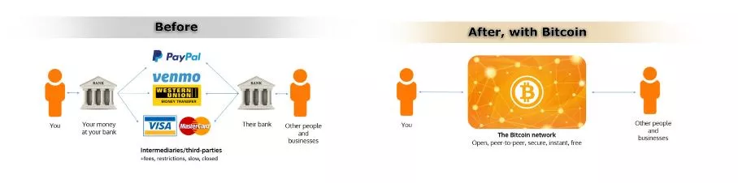

この透明性が、Bitcoinプロトコルが信頼される重要な理由のひとつです。Bitcoinは、シンプルだが強力な原則に基づいて運営されている。提案された変更に同意できない場合は、ソフトウェアをアップデートしない自由がある。提案された変更に同意できない場合は、ソフトウェアをアップデートしない自由がある。しかし、他のケースでは、これはネットワークが2つに分裂し、Bitcoinの新しいバージョンが作成される、Hard Forkとして知られているものにつながる可能性があります。2017年に起きたBitcoin（BTC）とBitcoinキャッシュ（BCH）の分裂がまさにそれだ。

このようなガバナンスは時間がかかり、時には面倒なこともあるが、強みでもある。単一の組織が一方的に支配権を握ることがないため、Bitcoinが安定し、中立的で、中央集権化に対する抵抗力を維持するのに役立っている。

#### 個別検証：ノード

Bitcoinでは、誰でも自分のコンピューターやサーバー上で「ノード」を実行することで、Blockchainの精度をチェックすることができます。これは、Bitcoinコア・ソフトウェア（またはBitcoinプロトコルの別のバージョン）をダウンロードし、2009年以降のすべての取引とブロックを検証することを意味します。ノードがセットアップされ、同期されると、Blockchainの完全なコピーとなり、ネットワークをサポートします。

このアプローチはより技術的ではあるが、最も要求の厳しいユーザーに対して、第三者を信頼することをオプトアウトする能力を提供する。ノードを運営することで、ユーザーはコンセンサス・プロセスに参加することができ、検閲されないままであることが保証され、ネットワークのセキュリティと分散化に直接貢献する。

### 使用例

#### 弾力性のある国境を越えた決済方法

非中央集権的な性質により、Bitcoinは国境や時間帯に影響されることなく、24時間365日稼動している。伝統的な銀行インフラが不足している地域では、Bitcoinは、高価な仲介業者に頼ることなく、資金を送受信するための迅速で低コストのソリューションとしてしばしば利用されています。取引手数料はネットワークの混雑状況によって変動するものの、一般的に銀行が国際送金に課す手数料よりもはるかに低い。さらに、Lightning NetworkのようなLayer-2ソリューションでは、Bitcoinトランザクションをさらに迅速かつ安価に行うことができます。

#### 価値の貯蔵

その希少性（上限2100万BTC）と固有の回復力により、Bitcoinはしばしば長期的な貯蓄の安全策とみなされる。Bitcoinの価格は短期的に変動することがありますが、Bitcoinはその誕生以来、一般的に上昇傾向にあります。投資家の中には、特にインフレや金融危機に直面したときに、BTCが価値の貯蔵庫として機能する可能性があるという信念を持ってBTCを購入する人もいます。

#### 経済的自由とレジリエンスのためのツール

投資の枠を超えて、Bitcoinは金融主権を守る方法を提供する。権威主義体制下にある国や、厳しい通貨規制に直面している国では、Bitcoin Wallet（秘密鍵付き）を持つことは、一種の自由を提供する。保有者が回復フレーズを確保する限り、誰もこれらのBTCをブロックしたり没収したりすることはできない。

この特徴は、検閲や銀行口座の凍結を恐れる人々には特に魅力的だ。また、ベネズエラやジンバブエに見られるように、ハイパーインフレに苦しむ人々の心にも響く。BTCを保有することで、急速に下落する現地通貨を維持するよりも安定していることが証明されたのだ。

### 長い道のり

Bitcoinは "Zero to One"、つまり既存の金融パラダイムとの根本的な決別と見ることができる。歴史上初めて、誰もがアクセス可能なグローバルな通貨ネットワークが、中央当局を介さずに運用され、検閲に強い私的取引が可能になる。

とはいえ、Bitcoinが誕生してから10年以上が経過した今も、Bitcoinは議論と情熱の火付け役であり続けている。Bitcoinの採用は拡大しており、（Lightning Networkのような）セカンドLayerソリューションが登場し、取引速度の向上と手数料の引き下げを実現している。Bitcoinは、今後数十年にわたって、決済システム、さらには私たちがお金を認識する方法に影響を与え続ける可能性が高い。

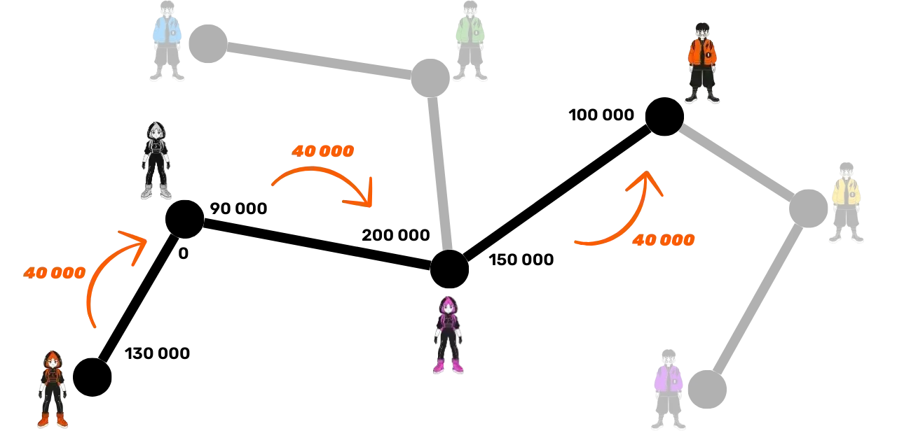

さらに知識を深めたい方は、Plan ₿ Networkに関するBTC101コースを受講すると、Bitcoinの技術的・経済的ファンダメンタルズについてさらに深く掘り下げることができる。

https://planb.network/courses/2b7dc507-81e3-4b70-88e6-41ed44239966

このBitcoin入門（5分よりちょっと長かったかも！）を終えて、あなたはビットコインの購入と安全確保を検討するための準備が整いました。コースの次の章では、Bitcoinの意義、業界の仕組み、様々なレイヤーの開発について深く掘り下げていきます。次の章では、あなた自身の個人的な計画の立て方について説明します。

## なぜBitcoinが重要なのか？

<chapterId>d4327ac4-9ff8-5192-b542-cb78c0bd0aa7</chapterId>

なぜBitcoinがそれほど重要なのか？それがこの講座の中心的な問いである。勉強にせよ、投資戦略にせよ、Bitcoinの意義を明確に理解しなければ、自分の計画から外れてしまう危険性がある。Bitcoinの基本原則を常に念頭に置き、自分の信念に沿った戦略をとることが目標である。

### 世界共通の通貨

バラク・オバマはかつてBitcoinを「ポケットの中のスイス銀行」と呼んだが、それには理由がある。Bitcoinは、誰に対しても同じ機会を提供する。あなたがティーンエイジャーであろうと、大統領であろうと、香港のデモ参加者であろうと、フランスの「黄色いベスト」であろうと、誰もが同じプロトコルとツールに平等にアクセスできる：

- 無料かつ無制限のウォレットを作成する（Bitcoinでは、「アカウント」ではなく「ウォレット」という言い方をする）。
- どこへでも、誰にでも送金できる。
- 本人確認や事務手続きは一切不要。
- 年齢、性別、宗教、国、所得水準に関係なく、すべての人が利用できる。
- プライバシーと透明性をご自由にご利用いただけます。
- 仲介業者や隠れた手数料は一切ありません。
- Bitcoinはインターネットネイティブなので、ウェブアクセスがあれば誰でも使える。

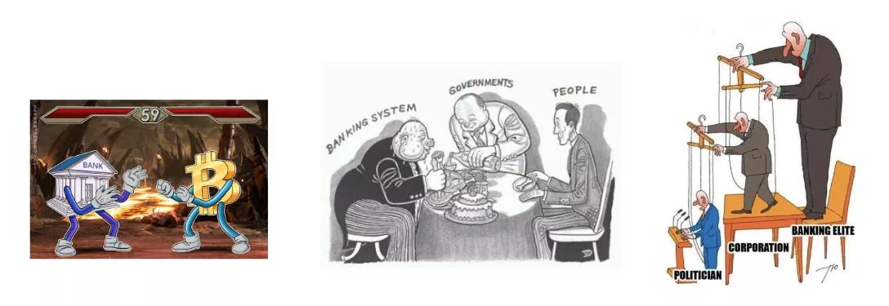

Bitcoinは、中央当局に依存せず、恣意的な決定ではなく不変のルールに基づく代替通貨システムであり、真の「人民の通貨」と見なすことができる。そのオープンでアクセスしやすい性質は、従来の銀行システムから排除されている人々にとっても、より主権的な代替手段を求めている人々にとっても、世界中の何十億もの人々にとって革命的なツールとなりうる。

このことは、Bitcoinの熱狂的なファンを大きく2つの世界観に分ける、ほとんど哲学的ともいえる根本的な疑問に私たちを導く。一方は、Bitcoinを金融包摂を促進するソリューションと見なし、何十億という銀行口座を持たない個人が最終的にグローバルな通貨インフラにアクセスできるようにする。もう一方は、Bitcoinを、すでに銀行システムに組み込まれているが、銀行システム依存から解放され、自分のお金を完全にコントロールできるようになりたいと願う何十億もの人々に出口を提供することを目的とした金融解放ツールであると考える人々である。この考察は注目に値する。

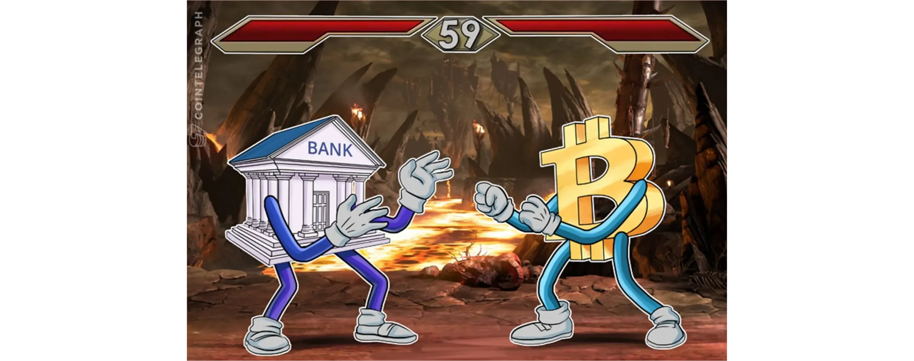

### 通貨危機からの保護

何世紀もの間、世界は人々に壊滅的な影響を与える金融危機を経験してきた。Supplyや金利の操作がシステミックな不均衡を生み出しているのだ。こうした危機は、単なるランダムな出来事ではなく、介入と貨幣と時間価値の操作の上に構築されたシステムの結果なのだ。

このような危機は様々な形で起こりうる。例えばハイパーインフレは、ジンバブエやベネズエラに見られるように、人々の購買力を徐々に破壊することによって通貨を一掃する。一方、厳格な通貨管理は、ギリシャやレバノンの銀行規制のように、資金へのアクセスを制限し、個人の経済的自由を奪う可能性がある。

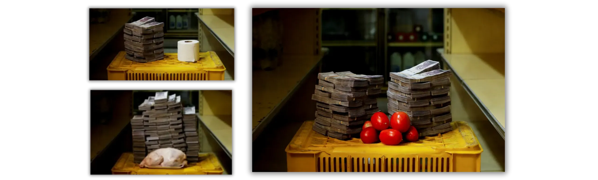

そして最後に、政府が自国通貨を切り下げると、人々の貯蓄は徐々に目減りしていく。多くの意味で、これは隠れた税のようなものだ。金融政策が中央集権的な当局の手にある限り、こうしたサイクルは繰り返される運命にある。

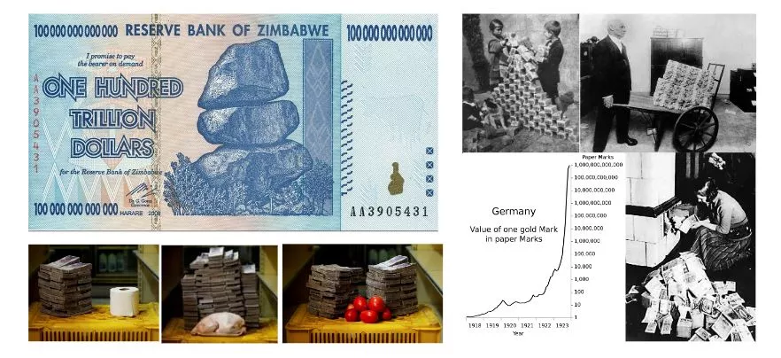

Bitcoinは、この慢性的な通貨不安のサイクルに対する大胆な代替案を提示する。国家が発行する通貨とは異なり、政府や中央銀行ではなく、コンセンサスによって施行される数学に基づいた変更不可能なルールに基づいて構築されている。コインの発行は予測可能で、約2100万枚を上限としているため、長期にわたって価値を維持するように設計された健全な貨幣の一形態となっている。検閲に抵抗するため、誰でも機関に頼ることなく価値を保存し、移転することができる。また、分割可能で持ち運びができるため、アクセスしやすく実用的な、誰でもどこでも使える金融インフラとなっている。

**歴史上、世界中で少なくとも56件のハイパーインフレが記録されている。その多くで、経済全体が崩壊し、貯蓄が一掃され、数百万人が極度の貧困に追い込まれた。1920年代のドイツや1970年代のチリのように、権威主義的な政権が誕生することもあった。

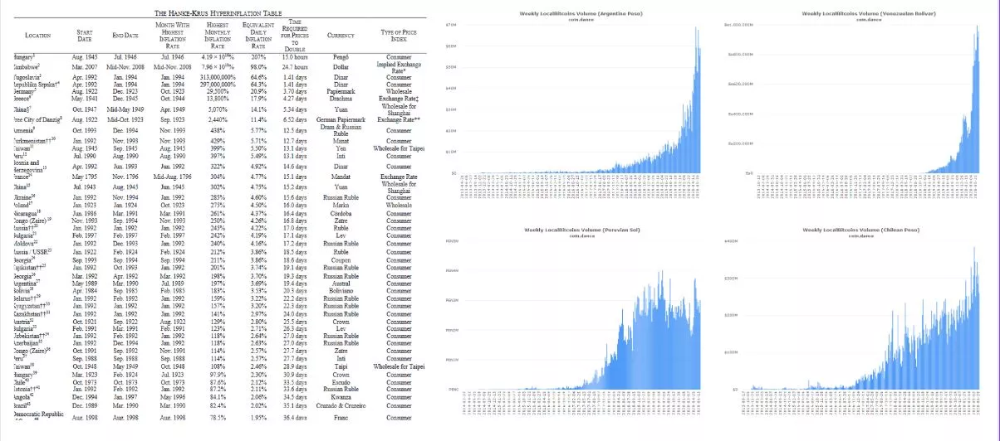

Hanke, S. H., & Krus, N. (2013). *World Hyperinflations*.R. Parker & R. Whaples (Eds.), The Handbook of Major Events in Economic History.Routledge Publishing.https://ssrn.com/abstract=2130109 より引用

不換紙幣の崩壊は歴史的な偶然ではなく、繰り返されるパターンなのだ。今日、Bitcoinは出口を提示している。政府が管理する通貨システムの外であなたの富を守るまたとない機会である。現時点では、次の危機が起こるかどうかではなく、いつ起こるかが問題なのだ。Bitcoinによって、あなたはこのような破壊的なサイクルから抜け出し、透明性、予測可能性、そして個人主権に基づいた通貨システムを選択することができるのです。

### 国家の統制と不正義への対応

世界中で経済的不平等が拡大することは、常に社会不安や政治的過激主義の台頭の肥沃な土壌となってきた。貧富の差が拡大しすぎると、緊張や危機、さらには権威主義的な政権の台頭を招くことが多いことは、歴史が証明している。こうしたリスクに直面したとき、経済的自由を守ることは単なる贅沢ではなく、自律を守り、家族の未来を守りたい人にとって必要不可欠なことなのです。

しかし、国家が資産や取引を完全に管理できる世界では、貯蓄を守るためにどのような選択肢があるのだろうか？

- 銀行口座**は一瞬にして凍結され、政府の簡単な命令によって差し押さえられ、過度の金銭制限によって流出する可能性がある。

- 金**は、何千年もの間、価値の貯蔵庫として機能してきたが、Hardのように分割しにくく、持ち運びが不便で、緊急の危機的状況で使用するには現実的でない。

- 現金**は匿名ではあるが、かさばるし、没収されやすいし、インフレで常に価値が下がる。

しかし、Bitcoinは単なる実用的なツールではない。恣意的な権力、中央集権、制度的不平等に基づく金融システムからの独立宣言でもある。Bitcoinを選択することは、操作、切り下げ、監視を拒否することを意味します。それは、あなたの**主権**を取り戻し、あなたの未来を確保し、あなた自身の富をコントロールする権利を守ることなのです。

そう考えると、Bitcoinは単なるテクノロジーではない。Bitcoinは自然法のツールであり、たとえ国の法律によって権利が否定されたとしても、個人が基本的権利を主張するための方法なのだ。革命によってではなく、掟によって人々に力を取り戻すのだ。

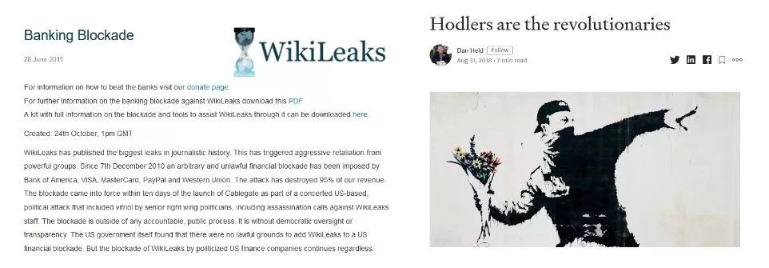

**ご存知ですか？Bitcoinは匿名ではなく仮名です。Bitcoinの利用者は、自分の身元を明かすことなくWalletのアドレスを作成することができ、従来の銀行システムの外で資金を送受信することができます。

しかし、一般に信じられていることとは逆に、Bitcoinは完全な匿名性を提供しません。すべての取引は公開されたLedger（Blockchain）に記録され、誰でもアクセスして確認することができる。Walletのアドレスは名前と結びつけられていないとはいえ、適切なプライバシー慣行が守られていなければ、ユーザーの金融活動は追跡され、分析される可能性がある。

### 金融・銀行腐敗の解決策

中央銀行は、その拡張的な金融政策を通じて、あなたの購買力を常に低下させている。インフレと過剰な貨幣印刷（しばしば量的緩和として偽装される）を通じて、中央銀行は流通している通貨の価値を着実に薄めている。これは目に見えない税金のようなもので、毎年毎年、政府発行のお金で貯蓄している人々の富を目減りさせている。

インフレは自然な経済現象であるという通説に反して、実際は金融統制の手段であり、金融資産を保有する人々を利する一方で、一般大衆を徐々に貧困化させるものである。

もしあなたの富が非貨幣性資産（不動産、債券、株式など）に担保されていなければ、あなたの貯蓄は時間の経過とともに必然的に価値を失う。その一方で、金融商品を利用できる人々は富を増やし続け、経済エリートとそれ以外の人々の間の格差を広げている。

これはシステムの欠陥ではなく、意図的な仕組みなのだ。中央銀行と政府は、人為的に経済成長を刺激し、人々を絶え間ない消費と負債の増加に向かわせるためにこの仕組みを利用している。

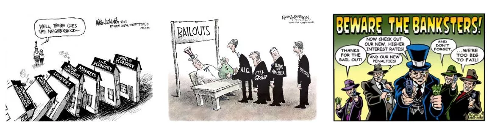

現代の金融システムは借金の連鎖の上に成り立っている。借金が奨励されるだけでなく、事実上避けられないものなのだ。個人はライフスタイルを維持するためにローンを組むが、気がつくと、何もないところからお金を作り出す銀行に利子を返済しなければならない仕組みに陥っている。これは偶発的なものではなく、一般市民を犠牲にして金融機関を利することを意図した構造設計なのだ。

中央銀行の影響力と、通貨Supplyを操作する野放しの権力によって、システムは腐敗している。 **Bitcoinがその代替案である。

不換紙幣とは異なり、Bitcoinはコンセンサスによって施行されるルールによって管理される。Supplyには上限があり、2,100万ビットコインを超えて存在することはない（実際には、発行の仕組み上、若干少ない）。政府、中央銀行、または単一の経済主体は、この上限を変更することはできません。

つまり、Bitcoinは予測可能な貨幣の枠組みのもとで運用される。インフレは透明であるだけでなく、Bitcoinが採掘されると完全に先細りになるように設計されている。

かつては、金は無制限の通貨膨張に対する歯止めの役割を果たしていた。しかし、1971年に金本位制が崩壊して以来、どの国の通貨も（ドルであれ、ユーロであれ、円であれ）有形資産に裏打ちされていない。金本位制が崩壊したことで、中央銀行は無制限に金を刷ることができるようになり、何十年にもわたる積極的な通貨膨張、繰り返される資産バブル、繰り返される金融危機への道が開かれた。

銀行にお金を預けると、それはもはや本当のあなたのものではありません。

銀行口座にあるお金は、厳密にはあなたの財産ではありません。法律上も実際上も、銀行口座にあるお金はあなたの所有物ではなく、あなたが銀行に貸しているものであり、銀行が自らの業務や投資に自由に使えるものなのです。

このシステムは、金融機関に対する国民の盲目的な信頼の上に成り立っているが、深刻なリスクをはらんでいる：

- 預金保険制度があっても、システミックな危機の際には、こうした保証が破綻する可能性があることは歴史が証明している。
- 銀行が資金へのアクセスを制限した場合、自分のお金を引き出したり使ったりすることができなくなる可能性がある**。ギリシャ、レバノン、アルゼンチンでの経済破綻や、カナダでのトラック運転手の抗議デモのような政治的弾圧の中で、このようなことは何度も起こっている。

Bitcoinは、オープンで中立、そして腐敗のない、根本的に異なるモードを提供する。そのルールはコンセンサスによってハードコードされ、すべてのネットワーク参加者に平等に適用される。

ここで核となる原則が登場する：

**鍵でもBitcoinでもない。

もしあなたがビットコインの秘密鍵を管理していないのであれば、それはあなたの真の所有物ではない。銀行における不換紙幣のように。しかし、もしあなたが秘密鍵を所有していれば、あなたの資金を完全にコントロールできるのはあなただけです。いかなる機関も、いかなる政府も、いかなる当局も、あなたのアクセスを凍結、差し押さえ、制限することはできない。

これが、Bitcoinを従来の金融システムの脆弱性と行き過ぎに対する強力な代替案、すなわち通貨主権にしているのである。

### Bitcoin：政治運動？

Bitcoinは、個人と金融機関のパワーバランスを再構築する。Bitcoinは、誰もが自分のお金を完全に管理し、インフレから貯蓄を守り、国家によって課された通貨規制から解放されることを可能にします。オープンでボーダレスなシステムとして、Bitcoinは、社会的地位、国籍、出身に関係なく、すべての人がアクセスできる、より公平な選択肢を提供します。

Bitcoinを受け入れることは、健全な貨幣を選択することである。それは、現在の金融システムにおけるインフレと借金に支配された機械の歯車のひとつであり続けることを拒否することである。それは個人的な主権の行為であり、貨幣の腐敗と富の侵食に対する平和的な抵抗である。

ビットコイナーには様々な立場の人々がいるが、彼らには共通のビジョンがある。その中には次のような人々がいる：

- プライバシーを擁護し、監視に抵抗するサイファーパンク**；
- 抑圧された市民**は、権威主義体制や資本規制からの避難を求めている；
- アナーキスト**は、Bitcoinを国家統制からの解放のための道具と見なしている；
- オーストリアの経済学者**で、健全な貨幣と政府による操作からの自由を提唱している；
- 技術者、金融業者、言論の自由擁護者**は、この新しい通貨パラダイムの社会的意味合いを深く認識している。

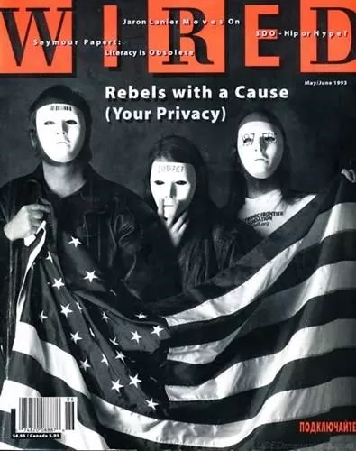

Bitcoinは、その設計上、政治的、イデオロギー的な隔たりを超越している。右でも左でもなく、自由主義でも集団主義でもない。中立的なプロトコルであり、誰にでも平等に適用されるルール（支配者ではない）によって管理される。しかし、Bitcoinが存在するだけで、世界金融の現状に挑戦することになる。Bitcoinが抵抗の象徴となったのは、人々が不換紙幣や中央集権的な金融インフラに代わるものとしてBitcoinを採用したからだ。

Cypherpunkの心にとって、Bitcoinは単なるデジタル資産ではない。現金の消失がしばしば "セキュリティ "という名目で正当化される世界で、プライバシーが着実に侵食されていることに立ち向かうものだ。

Bitcoinは、検閲に強い、ピアツーピアのデジタル取引を可能にする。Satoshiナカモトが思い描いたように、Bitcoinは現金に相当するデジタルを提供する。

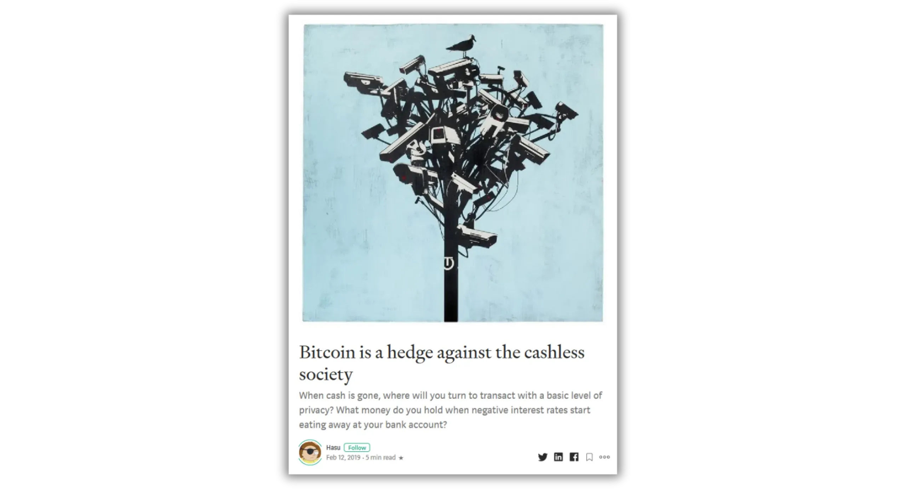

Bitcoinは組織でも政党でもないが、紛れもなく強力な哲学的メッセージを発信している。個人と国家の関係を再定義し、中央銀行による貨幣創造と経済支配の独占に挑戦する。

Bitcoinは、自由の戦士たちによって採用されるにせよ、単に購買力を維持しようとする人々によって採用されるにせよ、新しい時代の始まりを示すものである。

さて、Satoshiナカモトの発明の深遠な意義について探ってきたが、次の章では、このプロトコルを中心に成長した驚異的な産業、つまり金融、テクノロジー、そして社会を再構築するエコシステム全体を紹介する。

## Bitcoin業界を理解する

<chapterId>e106c6f1-d75b-5a62-b245-0ea2e4d02ef8</chapterId>

Bitcoinは、2009年にSatoshiナカモトという偽名によって立ち上げられて以来、まったく新しい産業の勃興の火付け役となった。その比較的短い歴史にもかかわらず、このエコシステムは爆発的な成長を遂げ、過去10年間で指数関数的なペースで進化してきた。毎日、新しいプレーヤー（機関投資家や機敏な新興企業からハイテク大手まで）が、この急拡大するセクターで権益を主張するために多大な資本とリソースを注いでいる。

今日、Bitcoinは重大な閾値に達している。政府、中央銀行、フィンテック企業、そして伝統的な金融機関は、もはやBitcoinを無視することはできない。規制、慎重な採用、あるいは公然の対決を問わず、Bitcoinが世界経済に与える影響は避けられないと認識されている。

### グローバル産業の誕生

Bitcoinは根本的な革新であり、ゼロからイチへの飛躍である。従来の通貨パラダイムからの完全な脱却を意味する。一部の人々にとって、この破壊は脅威であり、自分たちが確立した権力と特権に対する根源的な挑戦である。彼らにとっては、Bitcoinは開けてはならないパンドラの箱であり、それに抵抗するためにあらゆる手段を用いるだろう。

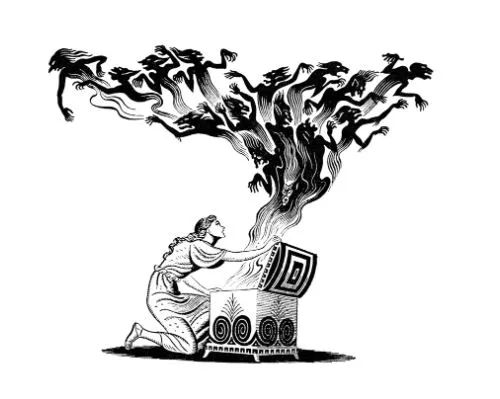

個人の自由のためのツールであり、世界の金融システムを変革する触媒であり、より透明で公平な代替案への道である。Bitcoinは、個人の自由を実現するツールであり、世界の金融システムを変革する触媒であり、より透明で公平な代替策への道筋を示すものなのだ。

**Bitcoin**自体は中立を保っている。それは許可を求めない。承認を求めない。

**単に存在するだけだ。

この章では、Bitcoin業界を前進させる主要プレーヤーを探る。彼らの役割、インセンティブ、相互作用を理解することは、この成長するエコシステムのダイナミクスを把握し、それがもたらすチャンスと課題をよりよくナビゲートするために不可欠である。

### アルトコインの普及

技術的に言えば、新しい暗号通貨を作るのは驚くほど簡単で、ほんの数分しかかからず、実際の技術革新はほとんど必要ない。本当の挑戦は創造ではなく、価値にある。デジタル資産の世界では、価値は純粋に市場、つまりユーザーの信頼と需要によって決定される。

2019年12月、CoinMarketCapは5,000以上のトークンをリストアップした。2025年までには、NFT、分散型金融（DeFi）、その他無数のアプリケーション（合法的なものもあれば、疑わしいものも多い）の台頭により、その数は爆発的に数百万に膨れ上がっている。これらのトークンは、通貨であると主張するものもあれば、証券、プラットフォーム・ユーティリティ、サイドチェーン、デジタル・アートをトークン化したものなど、あらゆる形や形態で存在している。

しかし、はっきりさせておこう： **これらの暗号通貨のほとんどは詐欺に過ぎない。

派手なテクノロジーと巧みなブランディングのベールに隠されたこれらのプロジェクトの多くは、**あなたのBitcoin**を引き出すという一つのことを目的とした積極的なマーケティング戦略によって動いている。投資家の貪欲さと無知を利用し、革命的な技術や保証されたリターンについて魅惑的な物語を紡ぎ出す。

もちろん、このノイズの海の中でも、ほんの一握りのプロジェクトは純粋に限界を押し広げようとしている。その中には、技術的な課題（スケーラビリティ、プライバシー、プログラマビリティ）を解決することに焦点を当て、より広い分野に価値あるアイデアを提供するものもある。時が経てば、これらの実験のいくつかは有用な革新につながるだろう。

しかし、根本的な疑問は残る：

**これらのイノベーションはBitcoinの外で成功するだろうか？

これまでのところ、ひとつの真実が際立っている：Bitcoinは、グローバルなネットワークに支えられ、普及が拡大している、唯一の真に分散化された、検閲に強いデジタルマネーである。アルトコインとは異なり、Bitcoinは中央集権的な企業によって支えられているわけでも、一握りの開発者や初期の投資家によって管理されているわけでもない。Bitcoinは、何千時間にも及ぶ研究、開発、そして絶え間ない改良を重ねた唯一のプロジェクトなのです。

| Feature               | Bitcoin                  | Altcoins (99.9% of them)       |
| ---------------------|--------------------------|--------------------------------|
| **Liquidity**         | High                     | Low                            |
| **Adoption (Real-World)** | Global and growing       | Very limited                   |
| **Team**              | Decentralized and robust | Centralized and opaque         |
| **Reputation**        | Strong and globally recognized        | Varies, often questionable     |
| **Infrastructure**    | Stable and secure        | Unstable and vulnerable        |
| **Decentralization**  | Yes                      | Rarely                         |
| **Scam Risk**             | No                       | Very likely                    |
| **Real utility?**     | Yes                      | Debatable                      |

**のような誤解を招く主張には注意すること。

- 「BlockchainであってBitcoinではない
- "XRPは次のBitcoin"
- 「リブラはBitcoinに取って代わる
- 「私のプロジェクトはBitcoinの改良版だ
- 「中央銀行のデジタル通貨はBitcoinを時代遅れにする

Altcoinに時間やリソースを投資する前に、自分で調べてください。

**我々はBitcoinとBitcoinのみを取材するためにここにいる。

### 主要機関への採用

2017年のICOブームの後、各機関はBlockchainに本格的な関心を示し始めたが、多くの場合、何が真に革命的なのかを把握しないままであった。中央銀行や政府は現在、中央銀行デジタル通貨（CBDC）を模索しており、ユーザーの取引を完全に管理しながら金融インフラを近代化することを望んでいる。スウェーデン、EU、ロシア、中国などではすでにプロジェクトが進行中だ。

テック大手もこの競争に加わっている。フェイスブック（現在はメタ）は、不換紙幣のバスケットに裏打ちされたデジタル通貨を作ろうと、ステーブルコイン構想「Libra」を立ち上げた。しかし、このプロジェクトは規制当局の抵抗に遭い、最終的には頓挫した。

| Feature                    | Bitcoin | Altcoins | Facebook-Coin | FedCoin |
|---------------------------|---------|----------|---------------|---------|
| **Public**                | Yes     | Varies   | No            | No      |
| **Open**                  | Yes     | Varies   | No            | No      |
| **Borderless**            | Yes     | Varies   | No            | No      |
| **Neutral**               | Yes     | Varies   | No            | No      |
| **Censorship-resistant**  | Yes     | Varies   | No            | No      |

大胆なマーケティングにもかかわらず、これらの構想はBitcoinに対抗するものではなく、その中核となる原則を否定しながら、その言葉を模倣している。Bitcoinの言葉を真似る一方で、Bitcoinの基本原則を否定しているのだ。プライバシーを守るためではなく、監視を拡大するために設計されている。支配を分散させるのではなく、支配を定着させるのだ。

フェイスブックのリブラは決して現状に挑戦するものではなく、システムとともに機能するように作られている。対照的に、Bitcoinは完全にシステムの外に存在している。許可を求めない。信頼に頼ることもない。そして、10年以上もの間、リーダーもダウンタイムも中央制御もなく、完璧に動いている。

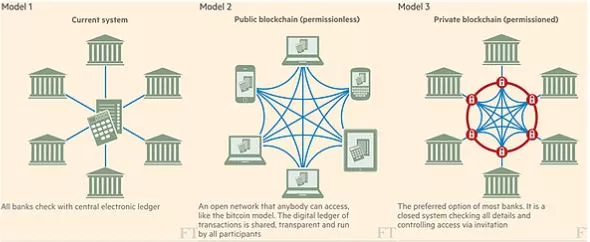

### 規制と政府のアプローチ

Bitcoinは、その性質上、伝統的な枠組みの外で作動する。Bitcoinは中央当局に依存せず、単一の団体によって管理されたり変更されたりすることはない。しかし、Bitcoinは規制の対象にはならないが、Bitcoinを利用する参加者（取引所、企業、利用者）には各国の法律が適用される。

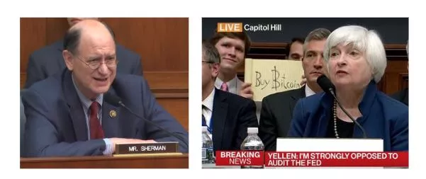

Bitcoinは世界的なネットワークであるため、各国の対応は千差万別だ：

- 中国のように厳しい規制**を課している国もあり、本当に止めることなく利用を抑制しようとしている。

- スイスやカナダなど、Bitcoinを脅威ではなくチャンスと捉え、より歓迎すべき環境**を提供する国もある。

- 大半はまだ決めかねており**、規制を試行錯誤しながら、革新と監視のバランスを取ろうとしている。

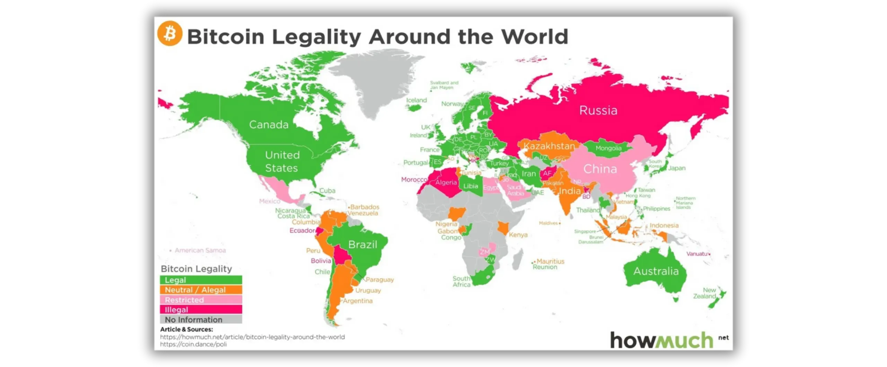

政府や機関は、Bitcoinを正確に分類するのに苦労することが多い（それはお金なのか、財産なのか、それともまったく新しいものなのか）。その結果、規制は反応的で一貫性がなく、常に進化し続ける傾向にある。Bitcoinに関わるのであれば、特に税金、銀行アクセス、コンプライアンス・ルールに関して、現地の状況を常に把握しておくことが不可欠である。

### Bitcoinに対する銀行のスタンス

伝統的な金融システムの要として、銀行はBitcoinを、金融の流れの仲介とコントロールを中心とする彼らの経済モデルに対する直接的な脅威と見なしている。このため、世界中の多くの銀行がBitcoinを利用する企業や個人に制限を課している。中には、マネーロンダリング防止（AML）やテロ資金供与対策（CTF）の懸念を理由に、暗号通貨分野で事業を行う企業の口座を閉鎖したり、サービスへのアクセスを制限したりするところもある。

しかし、Bitcoinが競合とみなされる一方で、同じ銀行の多くはBlockchainの研究開発に積極的に投資しており、Bitcoinのイノベーションを手放さずに活用しようとしている。彼らはBlockchainが大きな可能性を秘めていることを理解しているが、Bitcoinの分散型オープン・モデルを採用するのではなく、既存のインフラにどのように統合するかをコントロールすることを目指している。

### 暗号通貨取引所とBitcoinカストディ

取引所は、Bitcoinのエコシステムにおいて重要な役割を担っており、不換紙幣とBitcoinの架け橋として機能しています。取引所は、ユーザーがBitcoinを他のデジタル資産と売買したり、時には取引したりすることを可能にします。しかし、すべての取引所が同じように作られているわけではなく、リスクを最小限に抑えながら、自分のニーズに合った取引所を選ぶことが重要です。Exchangeを利用する前に考慮すべき主な要素は以下の通りです：

- 安全性には定評がある；
- 価格が極端に変動することなく、迅速な取引を保証するのに十分な流動性；
- 迅速で効率的なカスタマーサービス；
- ユーザーフレンドリーなInterfaceは、取引をナビゲートしやすくする；
- 自動継続購入（ARP）のオプション；
- 個人のWalletへのビットコインの引き出しが簡単で無料。

現地の規制を遵守する取引所は通常、厳格な**"Know Your Customer "**（KYC）プロトコルに従わなければならず、ユーザーはサービスにアクセスする前に本人確認書類を提出する必要がある。このようなプロセスは違法行為を防ぐために設計されていますが、Bitcoinが本来提供するプライバシーを損なう可能性があります。

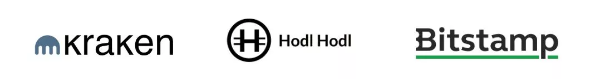

KYCプラットフォームは、セキュリティを装ってあなたの個人情報を収集する。このデータは、政府があなたの金融取引を監視し、特定の業務へのアクセスを制限するために悪用される可能性がある。

しかし、KYCを提出せずにビットコインを取得する方法もある：

- P2P Bisq、Robosat、LNP2PBot、Peach、HODL HODLなどのプラットフォームを購入する；
- 例えば、地元のBitcoinミートアップなどで直接現金で購入する；
- KYCのない規制された購入プラットフォームはまれだが、特定の国では利用できる；
- Bitcoin ATM
- ビットコインのためにExchangeで働く；
- Mining ビットコイン

プラットフォームにはいくつかの種類があり、それぞれが特定の用途に適している：

- ピアツーピアのExchangeプラットフォーム（P2P）***。

これらのプラットフォームでは、中央集権的な仲介者を介さずに、ユーザー同士が直接ビットコインを売買することができる。特にKYCなしで運営されているため、より高いプライバシーが提供される。直接取引を行ったり、様々なオンライン決済方法（SEPA、Revolut、Wiseなど）を利用できる現地の販売者を見つけることができます。

*注意：*** どのような物理的な取引でも、潜在的な詐欺を避けるために、公共の安全な場所を選択します。

https://planb.network/tutorials/exchange/peer-to-peer/bisq-v2-c1c6a702-6c16-4101-8b90-62c424017b80

https://planb.network/tutorials/exchange/peer-to-peer/hodlhodl-d7344cd5-6b18-40f5-8e78-2574a93a3879

https://planb.network/tutorials/exchange/peer-to-peer/lnp2pbot-v2-e6bcb210-610b-487d-970c-7cce85273e3c

https://planb.network/tutorials/exchange/peer-to-peer/peach-c6143241-d900-4047-9b73-1caba5e1f874

https://planb.network/tutorials/exchange/peer-to-peer/robosats-b60e4f7c-533a-4295-9f6d-5368152e8c06

- Bitcoinのみ Exchangeプラットフォーム＊＊＊。

これらのプラットフォームはユーザーフレンドリーなアプローチをとり、シンプルで透明性の高いサービスを提供する。それらはBitcoinのみである。ドルコスト平均法（DCA）を通じてビットコインを購入するソリューションを実装し、個人のWalletへの自動引き出しを提供することがよくあります。特に、進歩的で安全な方法でビットコインを蓄積したい初心者に適しています。例Relai, Bull Bitcoin, StackinSat, Bitstack...

https://planb.network/tutorials/exchange/centralized/bitstack-29fd71be-9570-42c6-8f6f-cd355d62e746

https://planb.network/tutorials/exchange/centralized/bull-bitcoin-europe-0ccf713e-efcd-44ec-8205-211f49ac7d53

https://planb.network/tutorials/exchange/centralized/relai-v2-30a9671d-e407-459d-9203-4c3eae15b30e

https://planb.network/tutorials/exchange/centralized/stackinsat-5af6a380-f3c6-4246-9f81-9957a16ab066

- 汎用またはトレーディング指向のExchangeプラットフォーム**について

これらのプラットフォームは、レバレッジやデリバティブなど、単にBitcoinを購入する以上の高度な機能を提供しています。しかし、私たちは取引しないことを強くお勧めします。その代わりに、Bitcoinを購入し、ご自身のWalletに移すことをお勧めします。取引はハイリスクな活動であり、一般的に長期的な蓄積に重点を置く人には向いていません。トレーディング・ゲームに参加しない方が賢明な場合が多い。

https://planb.network/tutorials/exchange/centralized/bitfinex-dc306d39-bd96-4ab9-a278-a322316716db

https://planb.network/tutorials/exchange/centralized/bitstamp-5a36c896-bff5-46d7-b505-ff069c3ac47c

https://planb.network/tutorials/exchange/centralized/kraken-1ef03e25-9b42-49bd-a47d-249e1a13cfc6

https://planb.network/tutorials/exchange/centralized/paymium-92603f76-b985-49ce-81e5-f4fa0df776e5

**Exchangeプラットフォームは安全なウォレットではありません。Exchangeにビットコインを置いておくことは、かなりのリスクにさらされることになります。いくつかのシナリオにより、あなたの資金が失われる可能性があります：

- ハッキング**：多くのビットコインが危険なプラットフォーム（例：MtGox）から盗まれている；
- 政府による差し押さえ**：政府はプラットフォームを閉鎖し、ユーザーの資金を凍結することができる；
- 倒産または詐欺**：数多くのプラットフォームが顧客の資金を持ち逃げした（例：FTX）。

黄金律はシンプルだ： **秘密鍵を所有していなければ、ビットコインを所有しているとは言えません。資金の完全な主権を確保するため、できるだけ早く個人用のWalletに資金を引き出すようにしてください。

### 財布、Mining、開発：エコシステムの柱

#### Bitcoin 財布

Bitcoin Ownershipの中心には、Walletがあります。Walletは、あなたのビットコインにアクセスし、管理するために必要な秘密鍵を安全に保管する特別なツールです。Walletは、専用のハードウェアデバイス、モバイルまたはデスクトップのアプリ、あるいは鍵が書かれた紙切れなど、さまざまな形態をとることができます。これらのウォレットは、あなたのデジタル資産と現実世界の架け橋となり、Bitcoinを日常生活で使えるようにします。

Walletの各タイプは、それぞれ異なるバランスを提供している：

- プライバシー
- セキュリティ
- 使いやすさ
- コスト

BitcoinWallet業界はいくつかのカテゴリーに分けられ、それぞれが異なるニーズや技術レベルに対応している：

- Hardware Walletメーカー**：これらの企業は、安全な鍵保管のために設計された物理デバイスを開発している。オープンソースのものもあれば、さまざまな機能とセキュリティ・レベルの独自ソリューションを提供しているものもある。Ledger、Trezor、Coinkite、Foundation、Shiftcryptoなどが有名である。
- Software Walletデベロッパー**：モバイル・アプリケーションやデスクトップ・アプリケーションを開発する企業から独立した開発者まで、さまざまな開発者がいる。提供されるものは、ユーザーエクスペリエンス、セキュリティ、機能において様々である。例えば、Sparrow、Wizard Sardine、Galoy、Synonym、Blockstreamなどがある。
- DIY (*Do It Yourself*)ウォレット**:これらのオープンソースソリューションは、完全なコントロールとサードパーティへの依存を最小限にしたい上級ユーザーのために設計されています。独自のWalletを構築することで、信頼依存を減らし、セキュリティ体制を強化することができます。注目すべきDIYオプションには、SeedsignerとSpecter DIYが含まれます。

財布はBitcoinで基本的な役割を果たし、このコースの後半でさらに深く掘り下げられる。

#### Bitcoin Mining

MiningはBitcoinネットワークの中核機能である。システムのセキュリティを確保し、Blockchainの稼働を維持する。マイナーはProof of Workとして知られるエネルギー集約的な計算を実行することで、トランザクションを検証し、ネットワークを保護する。新しく採掘された各ブロックはBlockchainにトランザクションのバッチを追加し、プロトコルの発行スケジュールに従って新しいビットコインを放出する。

Bitcoinの黎明期には、Miningはパーソナル・コンピューターから行うことができた。今日、Miningは、相当な資金力と技術力を持つ企業が支配する、競争の激しい世界的な産業となっている。採掘業者は操業コストと収益性の最適化を目指しており、安価なエネルギー源の探求が重要な焦点となっている。Miningの操業は現在、大規模な産業施設から、家庭やガレージで稼働する小規模なセットアップまで、多岐にわたっている。

Miningのエコシステムは、いくつかの主要プレーヤーで構成されている：

- ハードウェア・メーカー**：ビットメイン社のような企業は、ASIC（特定用途向け集積回路）、つまりMining Bitcoinのためだけに作られた超特殊なチップを設計・製造している。
- Miningプール**:マイナーの集合体であり、報酬を得るチャンスを増やすために計算能力を結集する。Miningの難易度が上がっているため、プールはブロック報酬（新しく採掘されたビットコインと取引手数料）を参加者の貢献度に応じて分配することで、より予測可能な支払いを提供します。例えば、Foundry USA、AntPool、F2Pool、MARA Pool、Braiins Poolなどがあります。
- 採掘者**：Miningのハードウェアとソフトウェアを運用する個人や組織である。一方には、Antminer S9のようなマシンを使用する小規模な採掘者がおり、もう一方には、Mining専用の巨大な施設を管理するGalaxy Digitalのような産業事業者がいる。

Miningは、技術的な課題、経済的なインセンティブ、エネルギーへの配慮など、探求すべき層が多い独自の世界です。Miningをさらに深く探求し、その仕組みを真に理解したいとお考えの方には、MIN201コースが必要な知識をすべて解説します。

https://planb.network/courses/ce272232-0d97-4482-884a-0f77a2ebc036

#### Bitcoinエコシステムにおける開発

Bitcoinの技術的進化の中心には、Bitcoinノードを実行するための最も広く使われているソフトウェアクライアントであるBitcoin Coreがあります。これはオープンソースのプロジェクトで、完全に透明で、GitHubで公開されています：[https://github.com/Bitcoin/Bitcoin](https://github.com/Bitcoin/Bitcoin)。そこで、誰でもコードをレビューし、議論をフォローし、プロトコルがどのように進化するかを見ることができます。アップデートが提案され、議論される一方で、誰もそれを採用することを強制されることはなく、どのバージョンを実行するかはユーザーがコントロールできる。

Bitcoinの開発は、いくつかの明確な貢献者グループを通して理解することができる：

- Bitcoin コア開発者**, 主要なソフトウェアクライアントを保守し、改良する人たちです。このうち、リポジトリ管理の鍵を握るのがメンテナである。2025年には5人いる：Hennadii Stepanov、Michael Ford、Ava Chow、Gloria Zhao、Ryan Ofskyの5人だ。そして、コードの変更、バグ修正、改良を提出する貢献者がいる。これらの提案は、受理される前にピアレビューとコミュニティでの議論を経る。
- レイヤード・プロトコルの開発者**,このグループは、Lightning NetworkやRGBのように、Bitcoinの上に構築される技術に取り組んでおり、Bitcoinのコアを変更することなく、その機能を拡張することを目指している。
- 独立系開発者**は、Mempool.space（取引アクティビティを追跡するための視覚的なInterface）やAlby（ブラウザやアプリでLightning決済を利用するためのツール）など、ユーザーエクスペリエンスを向上させるツールやアプリケーションの開発に注力している。

誰でもBitcoinコアの変更を提案することができますが、そのプロセスは意図的に厳密になっています。新しいアイデアを改良するには何年もかかることが多く、深い技術的理解、幅広いコミュニティの参加、そして何重もの審査が必要です。提案は通常、**Bitcoin改善提案（BIP）**という形で提出されます。

革新は歓迎されるが、それは確かな理由とコミュニティのコンセンサス、そして入念なテストに裏打ちされたものでなければならない。

Bitcoin Coreのメンテナでさえも、Bitcoinを一方的にコントロールすることはできません。彼らの役割はソフトウェアのリポジトリを管理することであり、プロトコルそのものを管理することではありません。

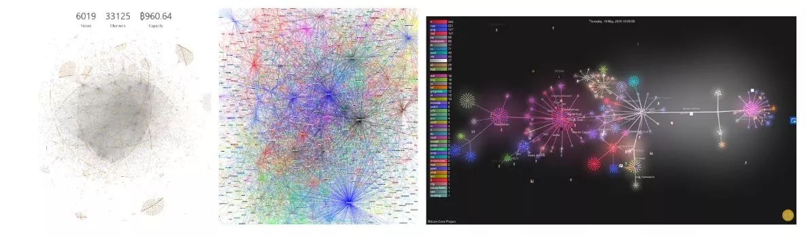

たとえメンテナが論争の的になるような変更を承認したとしても、**ノード（ユーザーによって運営されている）**が実際にそのバージョンを採用して実行しない限り、ネットワークには影響しない。結局のところ、Bitcoinのコードは、人々がそれを実行することを選択する場合にのみ重要なのです。

また、**Bitcoin Coreだけが唯一のクライアント**ではないことも注目に値する。Bitcoin Knotsのような代替クライアントもBitcoinプロトコルを実装しており、ユーザーにより多くの選択肢を与え、システムの分散化を強化しています：

https://planb.network/tutorials/node/bitcoin/bitcoin-knots-e04b2196-4df2-4246-86ef-c02269c29098

## Bitcoinのレイヤード・アーキテクチャー

<chapterId>03017765-53cf-5f14-9682-e99ca02d2241</chapterId>

Bitcoinは、当初からミニマルで堅牢かつ安全であるように設計されたオープンシステムです。その基盤を変えることなく機能を追加するために、一般的に、メインシステムの分散化と弾力性を損なうことなくエコシステムを豊かにする**プロトコルレイヤー**と補完的なアプリケーションを追加することによって進化がなされます。この柔軟性により、多くの企業や独立系開発者がBitcoinを中心としたインフラを構築し、様々なユースケースに適応するイノベーションを追加することが可能になりました。

### レイヤーを追加したBitcoinエクステンション

レイヤーアプローチにより、Bitcoinはコアプロトコルを変更することなく改良され、メインシステムの安定性とセキュリティを保証することができる。この方法はインターネットの仕組みに似ており、複数のプロトコルがスムーズな相互運用性を維持しながら、互いに異なる機能を提供するために構築されている。

Bitcoinのエコシステムを豊かにしている主なオーバーレイシステムには、次のようなものがある：

- Lightning Network**：

2016年にタデウス・ドライヤとジョセフ・プーンによって開発されたLightning Networkは、即時かつ低コストの支払いを可能にするために設計されたセカンドLayerソリューションである。2人のユーザーがプライベート・チャネルを開設し、チャネルの開設時または閉鎖時にのみBlockchain上で残高が更新され、取引を行うことができる。チャネル内の取引はoff-chainで行われるため、Bitcoin Blockchainに個別に記録する必要はない。この構造により、瞬時の取引と最小限の手数料が可能になり、迅速な確認が必要な低額取引に最適である。

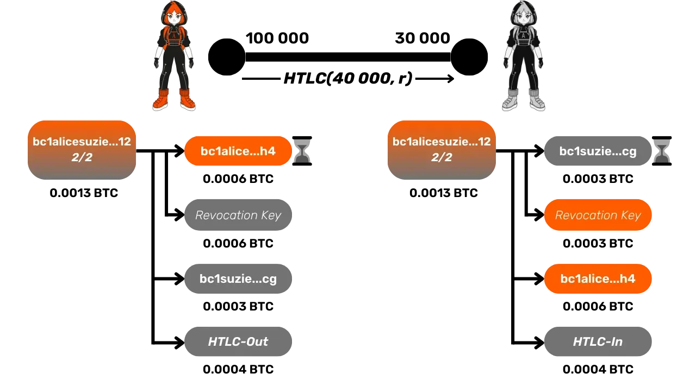

例えば、Layerを使ってBitcoinでコーヒーを買うとします。支払いが確認されるためには（そしてカフェがあなたが実際に支払ったことを確認するためには）、トランザクションがブロックに含まれる必要があります。選択した手数料にもよるが、数分かかることもある。技術的には、加盟店は支払いが最終的なものであると完全に確信するために、6回の確認（約1時間）を待つ必要がある。もちろん、カウンターに立っているときは、そのような待ち時間は通用しない。Lightning Networkを使えば、支払いはわずか数秒で完了する。つまり、コーヒーが冷める前に代金が支払われ、提供されるのだ。

Lightningの仕組みについてもっと知りたいという方には、このトピックに特化した素晴らしい2年生コースが用意されています：

https://planb.network/courses/34bd43ef-6683-4a5c-b239-7cb1e40a4aeb

- サイドチェイン** ：

サイドチェーンとは、BitcoinのメインのBlockchainと並行して動くブロックチェーンです。つまり、Sidechain上のBitcoinはメインチェーン上のBitcoinと同じ価値を持つということです。つまり、Sidechain上のBitcoinは、メインチェーン上のBitcoinと同じ価値がある。各Sidechainは独自のコンセンサスメカニズムを持っており、それはBitcoinとは全く別であったり、部分的に依存していたりする。

サイドチェーンの主な利点は、BitcoinベースのLayerでは利用できない機能を提供できること、あるいは改善された方法で提供できることである。これには、開発者のより柔軟な対応、より高速かつ／またはよりプライベートな取引、より大きな取引スループットなどが含まれる。しかし、これらの利点を提供するために、サイドチェーンはしばしばBitcoinのメインチェーンとは異なるトレードオフを行う。

サイドチェーンの概念は、2014年にAdam Back、Matt Corallo、Luke Dashjr、Mark Friedenbach、Gregory Maxwell、Andrew Miller、Andrew Poelstra、Jorge Timon、Pieter Wuilleによって紹介された。2025年現在、Bitcoinエコシステムで最も有名なサイドチェーンはLiquidとRSK（Rootstock）である。

Liquidをより詳しく研究したい方には、3年生の上級コースが用意されている：

https://planb.network/courses/6d26bcff-51a3-405f-bcdd-9af8297ce727

- RGB** ：

RGBは、BitcoinとLightning Networkの上で動作するように設計された、分散型でプライバシー重視のSmart contractシステムです。従来のSmart contractプラットフォームとは異なり、RGBはClient-side Validationモデル（つまり、完全なContract Stateはoff-chainに保存され、暗号コミットメントのみがBitcoinのBlockchainに公開される）を採用しています。この設計により、スケーラビリティとプライバシーの両方が向上する。RGBを使用すると、ユーザーはトークン、NFT、分散型アイデンティティ、あるいはDeFiアプリケーションを発行するための高度なスマートコントラクトを、BitcoinまたはLightning上で直接作成することができます。

RGBの主な特徴はDouble-spendingに対する保護であり、Single-use Sealsと呼ばれる暗号技術を用いて実現されている。このメカニズムは、Bitcoin の UTXO（Unspent Transaction Outputs）が一度しか使用できないという事実に依存している。トークンの真正性は、Contract の全履歴（作成から現在の状態まで）のユーザー側の検証によって保証される。

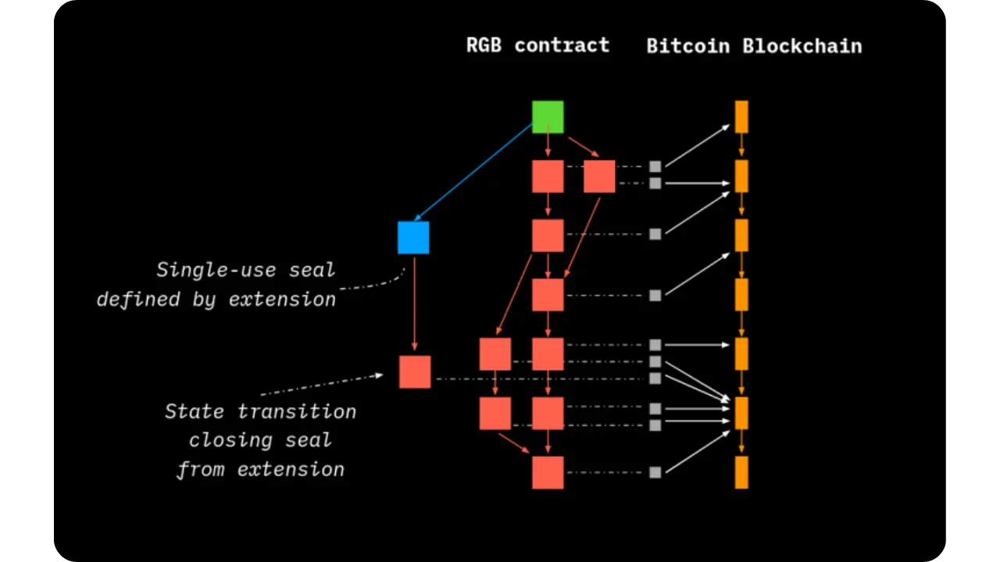

RGBの知識を深めるために、4年次のトレーニングコースを用意しています（高度な技術になりますのでご注意ください）：

https://planb.network/courses/3ce1d37c-05ba-4f54-aa15-7586d37b2bb7

RGBは、Bitcoinの上に構築された多くのプロトコルのひとつに過ぎない。RGBは、Bitcoinの上に構築された数多くのプロトコルのひとつに過ぎない。共通しているのは、Bitcoinの基本プロトコルの完全性と不変性を保ちつつ、それぞれのLayerを特定のタスクのために最適化するという考え方だ。

このレイヤー設計は、多くの機能を単一のプロトコルにバンドルしようとする暗号業界の多くとは対照的です。Bitcoinをシンプルにし、焦点を絞ることで、攻撃対象領域を減らし、より高いセキュリティを実現しています。無駄のないプロトコルは、セキュリティの確保、保守、拡張が容易です。Bitcoinは、健全な分散型マネーを提供するという、一つのことを極めてうまく行うように設計されています。他のすべて（スマートコントラクト、トークン、支払いなど）は、コアを損なうことなくイノベーションを可能にするために、その上に重ねることができます。

**インターネットは一度に構築されたわけではなく、相互運用可能なプロトコルのスタックとして発展してきた。例えば、TCP/IPはネットワーク通信を処理し、HTTPはウェブに力を与え、他の多くのレイヤーは特定の機能を提供します。それぞれのLayerは、その仕事に最適化され、堅牢でモジュール化されたシステムを作り出している。Bitcoinもこれと同じ哲学に従っている。ベースとなるLayerは強固で最小限のものであり、Lightning、Liquid、RGBのようなレイヤードプロトコルによって機能が追加される。

### Bitcoinを受け入れるためのマーチャント・ツール

今日、Bitcoinを決済手段として受け入れたい加盟店のために利用できるツールはたくさんある。簡単なセットアップを求める小規模ビジネスでは、Hot Wallet（またはLightning Wallet）を使用するだけで、直接支払いを受け付けることができます。適切な会計処理とレポーティングを必要とする大企業は、通常、より高度な決済処理システムを好むでしょう。幸いなことに、お客様のニーズに応じていくつかの選択肢があります。

ハンズオフ・ソリューションを好み、不換紙幣を銀行口座に直接受け取りたい場合、OpenNodeのようなカストディアル・サービスは合理的な経験を提供します：

https://planb.network/tutorials/business/point-of-sale/open-node-e69a0c1c-47f7-4932-8494-e6f26c3c9784

BTCPayサーバーは、オープンソースの素晴らしいオプションです。主な欠点は、セットアップとメンテナンスに時間がかかることと、技術的な知識が必要なことです：

https://planb.network/tutorials/business/point-of-sale/btcpay-server-928eb01e-824b-4b57-a3e8-8727633beddc

スイスのBitcoin Payは、使いやすさ、機能性、セキュリティのバランスが取れた、ユーザーフレンドリーでパワフルなソリューションです。小規模な小売店から大企業まで、幅広くご利用いただけます：

https://planb.network/tutorials/business/point-of-sale/swiss-bitcoin-pay-2-a78b057e-ed11-47ac-860c-71019fcb451a

Bitcoinの受け入れはビジネスにいくつかの実用的で財政的な利点をもたらすことができる。現金と同じように、Bitcoinは顧客とマーチャントの間の直接支払いを可能にします（伝統的な銀行は必要ありません）。Bitcoinを通して行われた支払いは即座に確定され、チャージバックのリスクを軽減します。また、加盟店自身がBitcoinを保有（自己保管）することで、より大きな財務的自律性を得ることができる。

また、銀行手数料や従来の決済端末が不要になるため、コスト削減にもつながる。必要なのはスマートフォンやノートパソコンだけということも多い。スマートフォンやラップトップさえあれば、多くの場合、決済処理業者が関与していても、手数料は一般的に銀行が請求する手数料よりも低い。

インフレにより時間の経過とともに価値を失う従来の通貨とは異なり、Bitcoinは2100万コインの固定Supplyを持っています。このため、長期にわたって企業の金庫を保全し、分散させるための貴重な資産となります。

日常業務において、Bitcoinは現物の現金の必要性をなくし、盗難のリスクを減らし、偽札の可能性をなくすことで、支払いを簡素化します。Bitcoinはグローバルな通貨であり、通貨変換の必要がないため、海外の顧客にとって理想的である。オンラインショップでは、Bitcoinは特に安全で効率的です。

その上、Bitcoinを受け入れることは、賢いマーケティングの動きとなり得る。あなたのビジネスが先進的であることを示し、新しい顧客（特にZ世代のような若い世代）を引き付けることができる。Bitcoinは、ローリスクで戦略的な機会であり、コストはほとんど初期設定に限られる。

Bitcoinをどのようにビジネスに組み込むか（支払い方法として、財務資産として、またはその両方として）検討したい場合は、そのニーズに合わせた初心者レベルのコースをご用意しています：

https://planb.network/courses/a804c4b6-9ff5-4a29-a530-7d2f5d04bb7a

BitcoinはExchangeの媒体として、多くの業界で採用が拡大している。Lightning Networkは決済をより迅速かつ安価にし、加盟店にとってのBitcoinの魅力をさらに高めている。

日常生活での使用、ビジネスでの採用、教育への貢献、コードの改善支援、新しいアプリケーションの構築など、Bitcoinのエコシステムには誰でも参加できるところまで来ている。

Bitcoinはもう止められない。

### 私の個人的見解

Bitcoinハイウェイ」という比喩は、エコシステムがどのように進化しているのか、そしてどこに向かっているのかを理解する上で、最も正確で説得力のある方法の一つだと私はいつも思っている。Bitcoinは単なるデジタルマネーではなく、独自の長所と欠点を持つ**成長中の代替金融システム**である。まだ歴史が浅く、課題に直面しているものの、その回復力は否定できない。なくなることはない。それどころか、ブラックホールのように、紛れもない通貨標準になるまで、周囲のすべてを徐々に吸収していくだろう。

Bitcoinを、あなたが走っている道路に例えてみよう。今現在、日常生活に必要なこと（食料品の購入、サービスの支払い、車の修理など）をするためには、この道路を降りなければならないことがある。つまり、一時的に旧金融システムに戻るということだ。Bitcoinのインフラはまだ建設中であり、日常生活の一部はまだ不換紙幣と銀行に依存しているからだ。

しかし、時が経てば、この道路は完全に整備された高速道路になるだろう。しかし、時が経てば、この道路は完全に整備された高速道路になるだろう。

Bitcoinの未来はこうなると私は見ている。Bitcoinは伝統的な金融を完全に置き換えることはできないかもしれないが、主要な分野（効率性、安全性、ユーザーへの普及）では、世界のほとんどの国で標準となるまで、金融を凌駕するだろう。

私の記憶が正しければ、このBitcoinハイウェイの比喩はアンドレアス・アントノプロスによって最初に紹介された。彼のビジョンは今日でも有効であり、一歩一歩前進するごとに、我々はその実現に近づいている。[@aantonop](https://x.com/aantonop)

次は、あなたの個人的な状況や目標に基づいて、ビットコイナー・プロフィールを定義するお手伝いをします。

# プランの設定

<partId>3801faf6-7915-56fa-baf5-ee63ad03b7cf</partId>

## プロフィールを選ぶ

<chapterId>c5d87903-a5f2-5eec-887a-f662734ce49b</chapterId>

Bitcoinの理論的な基礎を学んだところで、次は実践的な側面です。このセクションでは、最初のビットコインの取得方法、安全に保管する方法、そして個人の状況に応じてアプローチを調整する方法を理解するのに役立ちます。ゴールは、あなたがどのようなタイプのユーザーであるかを特定し、あなたのニーズと制約にマッチした戦略を採用できるようにすることです。

Bitcoinは従来の資産とは異なる。Bitcoinを使用するには、熟慮を重ねたアプローチと、技術的および経済的な意味合いの両方をしっかりと理解する必要があります。不換紙幣とは異なり、Bitcoinは個人主権のモデルで運用されます。つまり、資金の管理と安全性については、あなたが全責任を負うことになります。先のセクションで述べたように、この財務的自律性は大きな利点ですが、同時に特定のベストプラクティスも伴います。

このコースでは、Bitcoinをこれから始める方を想定しています。そのため、設定が簡単で、初心者にやさしいソリューションに焦点を当てます。Miningのような間接的なエクスポージャー手法、Bitcoin関連企業の株式購入、複雑な財務戦略などは取り上げません。ここでのゴールは、あなたの状況に合ったWalletを選び、安全に最初のビットコインを取得する手助けをすることです。

### なぜユーザー・プロフィールを定義するのか？

BTCの購入と管理に万能なアプローチはありません。各ユーザーは、それぞれの財務状況、技術的知識、Bitcoinに対する期待によって形成されたユニークなコンテキストを持っています。だからこそ、個人のプロフィールに沿った戦略を選択することが重要なのです。自分自身のアプローチを知ることで、より良い決断を下し、ニーズを見誤ることから生じる一般的な間違いを避けることができます。

ビットコインの購入と保管に最適な方法を検討する際に考慮すべき要素をいくつか紹介します：

- 投資したい金額**：リスクをあまり負わずに、実験と学習のために少額を購入するのか？それとも長期保有を目的とした、より大きな投資を計画していますか？
- あなたの投資頻度**：それとも、ドルコスト平均法(DCA)のようなストラテジーを使って長期的に購入し、価格変動を平準化したいですか？
- ビットコイン**をどうしたいですか？長期的な貯蓄として保有するのか？日々の支払いに使うのか？それともその両方？
- プライバシーに関するあなたのスタンス**：Bitcoinを購入するために個人情報を提供し、中央集権的なプラットフォームを利用することに抵抗はありませんか？それとも、ピアツーピアのKYCなし取引所のようなプライバシーを最優先する方法をご希望ですか？
- お客様の個人的、法的、地理的背景**：お住まいの地域によっては、特定の取引所へのアクセスが制限される場合があります。また、現地の法律や税制が、Bitcoin の保管方法や使用方法に影響することもあります。

これらの要素はそれぞれ、あなたにとって適切な戦略を形成する役割を果たす。規制されたサービスを通じてシンプルさと使いやすさを重視するユーザーもいれば、より自律的でプライバシー重視のアプローチを好むユーザーもいる。

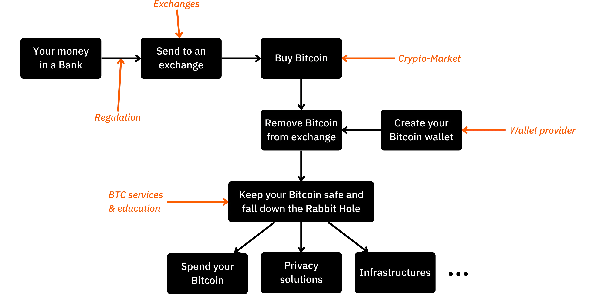

ビットコインを取得し、安全に保管するためのさまざまな方法について、あなたのプロフィールと目標に基づいて、十分な情報を得た上で決定できるようにするためです。

### プロフィール定義の主な基準

ビットコインを取得し確保するための正しい戦略を選択するためには、個人の状況を正直に評価することから始まります。あなたが直面する可能性のあるリスク、あなたのライフスタイル、ビットコインの使用方法など、いくつかの要因がこれらの決定に影響を与えます。

#### 潜在的リスクと脅威

ビットコインを取得し確保するための適切な戦略を選択するためには、個人の状況を正直に評価することから始まります。あなたが直面する可能性のあるリスク、あなたのライフスタイル、ビットコインの使用方法など、いくつかの要因がこれらの決定に影響を与えます：

- サイバー攻撃**：サイバーセキュリティに精通していなかったり、脆弱なデバイスを使用している場合、オンライン攻撃の標的になる可能性があります。その場合、ビットコインをオフラインで保管（Coldストレージ）するのが安全かもしれません。
- 物理的な脅威**：残念ながら、物理的な攻撃は起こります。Bitcoin所持者を狙った侵入、強盗、誘拐事件さえ起きています。このような事件はまだまれであり、そのほとんどが著名な個人に影響を与えるものですが、セキュリティ設定を設計する際には、最初からこのようなことを考慮する価値があります。

- 自然災害**：山火事、洪水、その他の異常気象に見舞われやすい地域にお住まいの場合、秘密鍵を保護する回復力のあるバックアップ・システムを持つことが極めて重要です。

- 政府による没収**：金融規制が厳しい国や不安定な国の場合、Bitcoinの購入や使用が制限される可能性がある。そのような場合は、民間の非拘禁的な解決策をお勧めします。

- メモリ損失またはデータ損失**：秘密鍵の管理には、機密情報の保存と取り出しが必要である。物忘れや健康上の問題が懸念される場合は、強力なバックアップ・システムを導入するのが賢明である。

自社の脆弱性をよりよく理解するために、これらのリスクをそれぞれ0（低い）から10（高い）までの尺度で評価してください。この自己評価は、今後適切な保護に優先順位をつけるのに役立ちます。

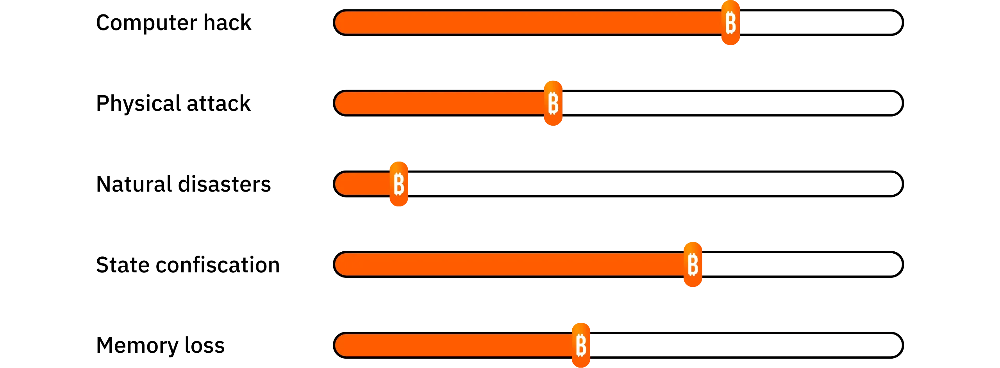

#### ライフスタイルと個人的な習慣

ビットコインをどのように管理するかは、あなたの日々の生活も大きく影響します。あなたのライフスタイルに合った設定を選択することで、物事が簡単になり、不必要な摩擦を避けることができます。

**安全なストレージに自動的に転送されるスケジュール購入のような、シンプルで自動化されたソリューションを選択します。

**より高度なコントロールとセキュリティを提供するMultisigウォレットのようなソリューションを好むかもしれません。

**相続については早めに考えておきましょう。あなたに万が一のことがあっても、ビットコインを安全に受け継がせる方法があります。

**個人情報を必要とする購入方法（KYCプラットフォーム）もあれば、より慎重な購入方法（ピアツーピアやMiningなど）もある。

#### ビットコインの使用

保管・管理戦略は、Bitcoinの使用目的を反映したものでなければなりません。最初からこれを明確にしておくことが、あなたの決断の指針となります。

- 長期的な節約**：Bitcoinを投資として購入し、すぐに使用する予定がない場合。この場合、最大限のセキュリティとアクセス・リスクの最小化が鍵となる。
- 少しずつ積み上げていく**：少額を定期的に購入する。安全なWalletと組み合わせたドルコスト平均法（DCA）のような戦略が効果的。
- 日々の出費**：Bitcoinをお金のように使う。日々の少額の支払いにはモバイルWalletを使い（多分Lightningを使う）、Bitcoinの大部分は安全な場所に保管する。
- 定年退職の準備、または財産を引き継ぎたい方**：Bitcoinを後に誰かに引き継ぎたい。時期が来たら、簡単かつ安全に資金を移転できるツールを利用しましょう。タイムロック付きMultisigや特定の相続プランなどの戦略を導入することで、資金が失われたり、早すぎる時期にアクセスされたりしないようにすることができます。

自分のリスク、ライフスタイル、目標についてよく考えたら、Bitcoinの旅に向けて賢い選択をする準備ができる。

決めるべき4つのポイントがここにある：

- どのWalletを使うか
- Bitcoinの固定方法
- Bitcoinの購入方法
- 取引額

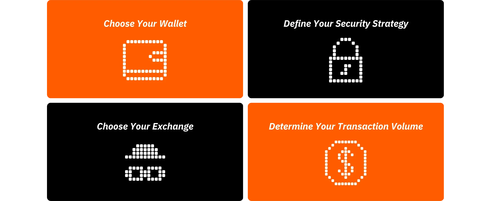

### 財布とセキュリティ戦略

秘密鍵（ビットコインにアクセスするための鍵）を保護することは、Bitcoinを所有し使用する上で最も重要なことです。第三者があなたの資金を管理する伝統的な銀行口座とは異なり、Bitcoinではあなたが完全に管理することができます。しかし、その自由には責任も伴います。鍵を紛失すれば、Bitcoinは永遠になくなってしまいます。ウォレットにはいくつかの種類があります。それぞれ、あなたのニーズと経験レベルに応じて、長所と短所があります。

#### Hot Wallet

Hotウォレットは、インターネットに接続されたアプリまたはソフトウェアです。Hotウォレットはインターネットに接続されたアプリまたはソフトウェアで、あなたの秘密鍵をインストールされたデバイスに保存します。これらのウォレットは普段使いや少量のBitcoinの保管に最適です。

例ブルーWallet、Green Wallet、スズメWallet

Lightning対応：Phoenix、Wallet、Satoshi、BitKit

**利点** ：

- 使いやすく、素早く資金にアクセスできる。
- 少額の支払いや日常使いに最適。
- Lightning Networkをサポートしているところもあり、高速で安価な取引が可能だ。

**デメリット** ：

- 安全性が低い：鍵はインターネットに接続されたデバイス上にあるため、ハッキングのリスクが高まる。
- 大量の長期保存には適さない。

最適初心者の方、残高が少ない方、頻繁に取引をされる方。

#### ハードウェア財布

ハードウェアウォレットは、あなたの秘密鍵を完全にオフラインで保管する物理的なデバイスです。オンライン攻撃のリスクを軽減するため、Hotウォレットよりもはるかに安全です。

例Ledger、Trezor、Coldcard、Jade、BitBox

**利点** ：

- 鍵はオフライン＝ハッカーがアクセスするのはずっと難しい。
- セキュリティに特化した設計。

**デメリット** ：

- デバイスを接続し、トランザクションを物理的に確認する必要がある。
- デバイスを購入する必要があり、それなりの費用がかかる。

最適：長期保有者や、より大きな金額を確保したい人。

#### マルチシグネチャ・ウォレット

Multisig（マルチシグネチャ）ウォレットは、取引を承認するために複数のキーを必要とします。金庫を開けるのに、2つか3つの組み合わせが必要な金庫のようなものだと考えてください。これらのセットアップは、上級ユーザー、ビジネス、または最高レベルのセキュリティを求める人に理想的です。

例Liana、カーサ、スペクター、スパロウ

**利点** ：

- 非常に強力な保護機能で、1つのキーが危険にさらされても資金は安全です。
- 盗難、紛失、強要によるリスクを軽減できる。
- キーを人や場所の間で分配することができます。

**デメリット** ：

- セットアップと管理がより複雑になる。
- 複数の人／機器間の調整が必要な場合がある。
- Multisigの運用を誤った場合の資金損失のリスク；
- 初期取得コストが高く、複数のハードウェアウォレットを購入する必要がある可能性がある。

最適パワーユーザー、家族、企業、セキュリティの高い長期ストレージ。

#### カストディアル・サービスとETF

Bitcoinを取引所、カストディアン、ETFのようなサードパーティ・サービスに保管することを選択する人もいる。これにより、秘密鍵を自分で管理することなくBitcoinにアクセスすることができる。しかし、これには大きなトレードオフが伴う。

例CoinbaseやBinanceのような取引所、BlackRockのBitcoin ETFのような金融商品。

**利点** ：

- 鍵や財布を自分で扱う必要がない。
- Bitcoinを直接使用するのではなく、投資への露出を求める人に役立つ。

**デメリット** ：

- Bitcoinを実際に所有しているのはあなたではなく、カストディアンです。Bitcoinがダウンすれば、あなたの資金もダウンするかもしれません（Mt.GoxやFTXのユーザーに聞いてみてください）。
- 手数料が高くなり、プライバシーが損なわれる可能性がある。
- 信頼できる第三者に依存するということは、Bitcoinの主な利点のひとつである主権を放棄することを意味する；
- Bitcoinのようなプライバシーや金銭的な主権といったメリットは得られない。

**経験則：鍵でもコインでもない。

初心者の方にも預かりサービスはお勧めしません。他人が失敗してすべてを失うリスクを冒すより、時間をかけてBitcoinを適切に保護する方法を学ぶ方がずっと良い。しかし、もしあなたがここでウォレットや鍵管理について読んでいるのであれば、なぜその原則が重要なのかはすでに理解されていることでしょう。

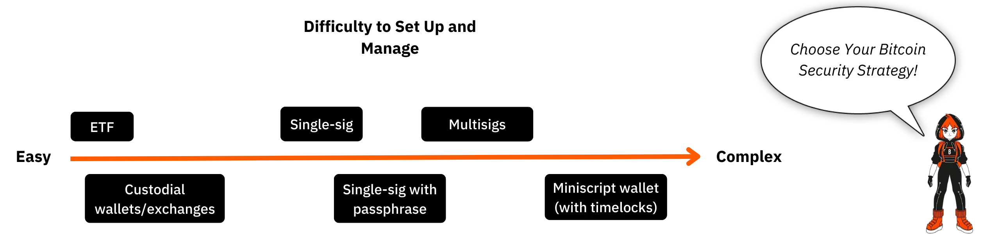

Walletとセキュリティ方法の選択は、保存する量、専門知識のレベル、潜在的なリスクによって異なります。しかし、ハイブリッド・アプローチは賢い選択肢となりうる：

- 日常的な取引には、ウォルトン電話機HotまたはライトニングWalletを使用する；
- 長期的な貯蓄を目的とするビットコインの大半を確保するためにHardware Walletを使用する。

あなたのHot Walletにビットコインがたまりすぎた場合、一部をあなたのColdストレージに移すことができます。一方、日々の支出にビットコインが必要な場合は、Cold Walletから引き出すことができます。

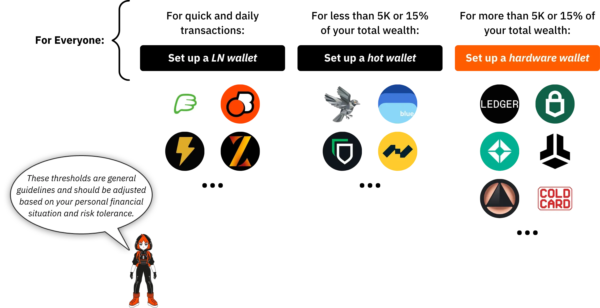

結局のところ、セキュリティはツールの使い方に大きく依存する。Hardware Walletを使っても、Mnemonicのフレーズを紛失したり、暴露したり、危殆化したりすれば、あまり意味がない。注意と規律が、ビットコインを失うことに対する最善の防御策である。これについては、この記事を読むことを強くお勧めする：

https://planb.network/tutorials/wallet/backup/backup-mnemonic-22c0ddfa-fb9f-4e3a-96f9-46e2a7954270

### 取得方法と取引量

ビットコインを取得する方法は様々で、どの程度のプライバシーが必要か、あなたの国の規制、取得したい量によって異なります。主な方法は2つある：

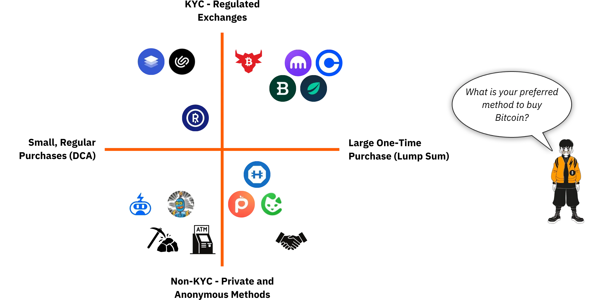

#### 本人確認（KYC）を伴う買収

規制プラットフォームでは通常、Bitcoinを購入する前に本人確認を行う必要があります。つまり、アカウントを作成して売買サービスにアクセスするには、公的書類（パスポート、ID、Addressの証明など）を提出する必要があります。

**利点** ：

- 購入手続きは簡単で、初心者に適していることが多い；
- 一度に大量の購入が可能；
- 追加サービスへのアクセス（DCA、自動変換、簡単なフィアット引き出し）；
- 流動性が高く、売買価格の差が少ない。

**デメリット** ：

- 換金や引き出しの手数料が高い；
- プラットフォームによっては複雑で、高度な取引機能やアルトコインに圧倒されるかもしれません；
- プライバシーの問題

KYC取引所の最大の欠点はプライバシーリスクであり、個人のセキュリティにも影響する可能性があります。KYCによって、取引所はBitcoinの引き出しアドレスにあなたの本当のIDをリンクすることができます。この情報はBlockchain分析の理想的な出発点となります。いったんAddressが特定されると、関連するすべての取引を追跡することが可能になり、On-Chainのプライバシーが損なわれます。特別な保護措置を講じなければ、あなたのBitcoinの活動はすべてあなたにまで遡ることができます。

もうひとつの大きなリスクは、規制対象のプラットフォームのデータベースにアクセスできる政府が、BTCを購入した個人を簡単に特定できることだ。これは現在では無害に思えるかもしれないが、経済的または政治的な規制が課された場合に問題になる可能性がある。さらに、規制対象のプラットフォームは疑わしい取引を報告しなければならないため、公的機関による標的を絞った監視が行われる可能性が高まる。

また、KYCプラットフォームはIDやAddressの証明など、多くの機密データを保存している。このデータは、ID 照合を行うサード・パーティ・プロバイダーに委託されることが多い。プラットフォームがハッキングされたり失敗したりした場合、これらの情報は暴露され、フィッシングや恐喝の試み、あるいは物理的な窃盗に使用される可能性がある。他のデータ漏洩とは異なり、Bitcoin 関連の漏洩は、貴重な資産を所有していることが明らかになる可能性があるため、特に危険である。

ですから、KYCを通過することは単なる些細なステップではなく、**個人の安全保障**に影響することを理解することが重要です。このようなIDチェックを必要とする政府は、あなたの自然権を侵害しているだけでなく、あなたをリスクにさらしているのです。これらのプラットフォームを利用することはBitcoinを始めるのに役立ちますが、それに伴うリスクを認識し、Bitcoinを取得するためにKYC以外の方法を模索することを後で検討する必要があります。

#### 本人確認なしでの取得（No-KYC）

身元を明かさずにBitcoinを購入することは、プライバシーを優先する人のための選択肢である。この方法にはいくつかのアプローチがある：

- 個人間のピアツーピア（P2P）**：信頼できる人（友人、家族、ローカルネットワーク、ミートアップ...）から直接現金で購入することで、公的な取引記録を避け、銀行システムから逃れることができる。Bitcoinの入手や売却にはこの方法が最も適していると思われるが、対面式のExchangeであるため、物理的な暴行のリスクが伴う。
- P2Pプラットフォーム**：Bisq、RoboSats、Peachのようなプラットフォームは、エスクロー・システムを利用して取引を保護し、本人確認を必要とせずに個人間の交換を促進する。これらのプラットフォームでも、相手が協力的でない場合には盗難のリスクはあるが、エスクロー・サービスによってリスクは最小限に抑えられている。
- Bitcoin自動現金預け払い機（ATM）**：一部のATM（キオスク）では、Bitcoinを現金で購入することができますが、手数料が高い傾向があり、大きな取引ではID確認が必要なものもあります。
- KYCフリーのExchangeプラットフォーム**：特にスイスの一部のプラットフォームでは、ID確認を必要とせずに少量のBitcoinを購入することができます。
- Mining**：個人でもBitcoinを採掘できる。古いマシンや小型のマシンでもアクセス可能で、KYCなしでBitcoinを入手する非伝統的な方法を提供します。Mining poolに参加することで、基本的な設備でも定期的な支払いを得ることができます。詳しくは、[Miningのチュートリアルをご覧ください](https://planb.network/tutorials/mining)。
- ビットコイン**での支払い / 給与：ビジネスを経営している場合、Bitcoinを支払いとして受け取ることができます。あなたが雇用されている場合、管轄地域によってはBitcoinでの支払いを求めることができるかもしれません。これらの方法により、KYCなしでBitcoinを取得することができます。

**利点** ：

- 方法によっては、あなたの身元とBitcoinの活動のリンクを制限することにより、あなたのプライバシーを保護するのに役立ちます；
- 検閲、資金凍結、国家による干渉のリスクを軽減。
- 規制の厳しい環境下でもBitcoinへのアクセスを可能にする。

**デメリット** ：

- 通常、KYCプラットフォームよりも複雑である；
- 流動性の低下と取引の減少；
- P2Pの購入には割高感が伴うことが多い；
- 個人間の取引におけるカウンターパーティ・リスクの増大（詐欺、詐欺、暴行など）。

### Bitcoinユーザーの4つのタイプ

これまで述べてきた基準に基づいて、いくつかの典型的なBitcoinユーザー・プロフィールを特定することができる。これらのプロファイルは柔軟性があり、進化する可能性もあるが、それぞれのタイプに適した戦略を明確にし、適切なツールを選択する際の指針となる。

#### 1.ホドラー

ホドラーは、長期的なビジョンを持ってBitcoinを購入し、数年間は手を出さない投資家である。時間をかけて定期的に購入するスタッカーとは異なり、ホドラーは通常、時々大きな買い物をし、Bitcoinを持ち続ける。

望ましい戦略：

- プライバシーのニーズに応じて、KYCまたは非KYCプラットフォーム経由で購入する；
- Hardware Walletに保管するか、マルチシグネチャ・ソリューションを使用してセキュリティを強化する；
- Bitcoinの生態系との相互作用を最小限に抑えながら、希少な取引を行う。

ホドラーはBitcoinを、現物の金に投資するのと同じように、価値の貯蔵品と見なしている。彼らの主な課題は、Bitcoinを安全に保管し、相続人に確実に引き継ぐことである。

#### 2.スタッカー

スタッカーは、より緩やかで一貫性のあるアプローチを取る人です。彼らの目標は、購入価格を長期にわたって分散させ、Bitcoinのボラティリティの影響を軽減することである。

望ましい戦略：

- DCAを提供するKYCプラットフォームによる自動購入を利用する；
- Hardware Walletに資金を定期的に移し、安全に保管する；
- プライバシーにはやや敏感だが、セキュリティと蓄積のしやすさを優先。

スタッカーは、短期的な投機やBitcoinを頻繁に使うことに重点を置いていない。彼らはBitcoinを数年から数十年にわたる長期的な貯蓄計画として捉えている。スタッカーがホドラーと異なるのは、その取得方法と取引量である。

#### 3.アクティブ・ユーザー

アクティブ・ユーザーは、Bitcoinを単なる価値貯蔵ではなく、主にExchangeの手段として捉えている。彼らはBitcoinを取引や支払いに、あるいは循環型経済の一部として定期的に使用している。

望ましい戦略：

- モバイルまたはデスクトップでHot Walletを日々の取引に使用する；
- Lightning Networkを活用し、迅速かつ安価な支払いを実現しよう；
- モバイルWalletを支出に、Hardware Walletを貯蓄に使用するハイブリッド・アプローチを維持する；
- プライバシーの機密性は、特定のニーズによって異なります。

アクティブユーザーは、起業家、フリーランサー、または日常的な支払いにBitcoinを使用することが一般的なBitcoinフレンドリーな環境に住んでいる人かもしれません。彼らの主な優先事項は利便性であり、セキュリティとアクセシビリティのバランスを取ることを目指している。

#### 4.偏執狂

偏執的なユーザーは、プライバシーとセキュリティを優先する先進的な個人です。彼らはBitcoinを個人の自由のためのツールと考え、第三者の信頼や規制にさらされるのを最小限に抑えたいと考えています。

望ましい戦略：

- Bitcoinの取得はKYC以外の方法で行うこと；
- BIP39パスフレーズとマルチシグネチャ設定で強化されたウォレットを使用する；
- Bitcoinを異なる場所にある複数の物理デバイスにまたがって保管する；
- プライバシーを損なう可能性のある中央集権的なサービスは避ける。

このプロフィールは、BTCの所持や使用が制裁を受ける可能性のある、Bitcoinに敵対的な環境に住む人々に特に適している。より複雑なアプローチであり、ある程度の技術的専門知識と、資金へのアクセスを失わないための厳格な規律が必要となる。

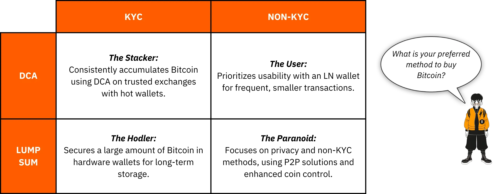

### どのプロフィールがあなたにふさわしいか？

これらのプロフィールは相互に排他的なものではないことに留意してください。あなたは複数のプロファイルを持つかもしれないし、あなたのアプローチは時間とともに進化するかもしれない。例えば、最初はスタッカーとしてスタートし、徐々にアクティブなユーザーへとシフトするかもしれないし、偏執的なセキュリティマインドを採用するかもしれない。日常生活でBitcoinを使いながら、長期的にホドラーになる可能性もある。

**最も重要なのは、戦略を現状と長期的ビジョンに合致させることだ。

次の章では、それぞれのプロフィールを詳しく説明し、どのプロフィールが自分に最も適しているかを把握し、目標に最も適したアプローチを適用できるようにします。また、それぞれのプロファイルに適合するツールについても説明し、独自の獲得・セキュリティ計画を構築するための土台を提供します。

## ホドラー長期投資

<chapterId>baf1adc2-3828-5265-8ee5-130be547585c</chapterId>

Bitcoinのコミュニティでは、長期投資のアプローチを取る人を「ホドラー」と呼ぶ。この言葉は、数年前にBitcoinトークのフォーラムで有名な「ホールド」のタイプミスに由来し、それ以来、Commitmentのシンボルとなっている：短期的な市場変動にストレスを感じることなく、何があってもBitcoinを持ち続けること。

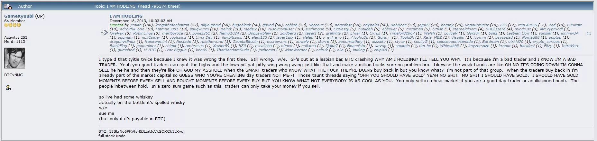

ホドラーはBitcoinの価値提案を信じている。2,100万コインのSupplyを固定し、彼らはBitcoinを長期的な価値の貯蔵（デジタル・ゴールド）と見なしている。

### なぜホドリング戦略を選ぶのか？

歴史的に、ホドリングはほとんどの非プロ投資家にとって最も収益性の高い手法であった。ホドリングは、市場にタイミングを合わせる必要がない。単純に買い持ちすることで、ホドリングは取引のストレスや、感情的な反応に伴う誤った判断を避けることができる。

Bitcoinは周期的に動く傾向があり、大きな強気相場の後に急激な調整があり、その後長い静穏期を迎える。2013年から2025年にかけて、Bitcoinはこのようなサイクルを何度も経験し、弱気相場では最大80％の価値を失うこともあった。このような局面は、ホドラーの忍耐力を試すことになるが、そのような局面に立ち向かった者は、一般的に長期にわたって報われてきた。

こうしたサイクルを理解することは、感情の管理に役立つ。経験豊富なホドラーなら、頂点で売ったり底値で買ったりするのは負け戦だと知っている。その代わり、規律ある長期保有が勝利の戦略であることが証明されている。

### ホドラーの投資計画

ホドラーはシンプルで長期的なアプローチをとっている：Bitcoinを入手し、適切に保管し、そのままにしておく。彼らはコインを取引したり使ったりしない。彼らの目標は、最小限の管理で保有コインを蓄積し、保護することだ。

これがホドラーの堅実なプランだ：

#### 1.Hardware Walletの選択とセットアップ

まずはセキュリティ。Hardware Walletは必須だ。秘密鍵をオフラインで保管し、オンライン攻撃から資金を守ります。

ホドラーに最適な財布のチュートリアルを紹介しよう：

https://planb.network/tutorials/wallet/hardware/coldcard-q-73e86d1a-6fe6-4d8b-bb15-8690298020e3

https://planb.network/tutorials/wallet/hardware/jade-plus-green-873099a4-35ec-4be8-b31a-6e7cd6a41ec0

https://planb.network/tutorials/wallet/hardware/ledger-nano-s-plus-75043cb3-2e8e-43e8-862d-ca243b8215a4

https://planb.network/tutorials/wallet/hardware/ledger-flex-3728773e-74d4-4177-b39f-bd923700c76a

https://planb.network/tutorials/wallet/hardware/passport-74e53858-3fa2-43f9-b866-573297546236

https://planb.network/tutorials/wallet/hardware/bitbox02-6af8940f-e19b-4008-8c83-81017032608c

Walletをセットアップしたら、12語または24語のリカバリーフレーズを耐久性のある物理的媒体にバックアップしてください。フレーズにどのメディアを選択するかについては、このチュートリアルを参照してください：

https://planb.network/tutorials/wallet/backup/backup-mnemonic-22c0ddfa-fb9f-4e3a-96f9-46e2a7954270

さらに安心のために、次のようなプロテクションを追加することができる：

- タイムロック付きのマルチシグネチャーWallet：

https://planb.network/tutorials/wallet/desktop/liana-306ef457-700c-4fdd-b07a-8fb7a8a29f04

- A BIP39 passphrase：

https://planb.network/tutorials/wallet/backup/passphrase-a26a0220-806c-44b4-af14-bafdeb1adce7

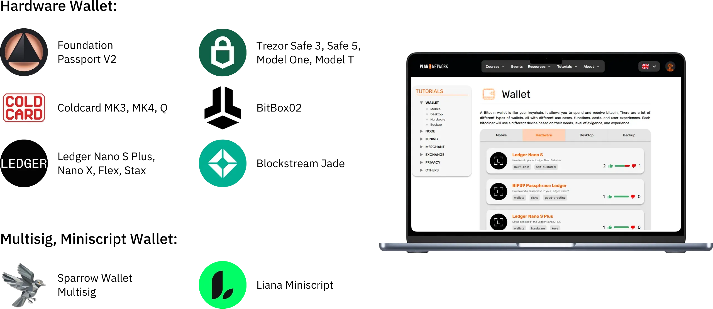

#### 2.Bitcoinの購入と撤退

ホドラーは決してコインを取引所に置いておかない。取引所がハッキングされたり、倒産したり、差し押さえられたりする可能性があるからだ。購入したら、BitcoinをそのままHardware Walletに移動してください。

ホドラーは多額の投資をする傾向があるため、流動性の高い取引所が必要とされる。ここでは、そのような取引所をいくつか紹介しよう：

https://planb.network/tutorials/exchange/centralized/bitfinex-dc306d39-bd96-4ab9-a278-a322316716db

https://planb.network/tutorials/exchange/centralized/kraken-1ef03e25-9b42-49bd-a47d-249e1a13cfc6

https://planb.network/tutorials/exchange/centralized/bitstamp-5a36c896-bff5-46d7-b505-ff069c3ac47c

https://planb.network/tutorials/exchange/centralized/bull-bitcoin-europe-0ccf713e-efcd-44ec-8205-211f49ac7d53

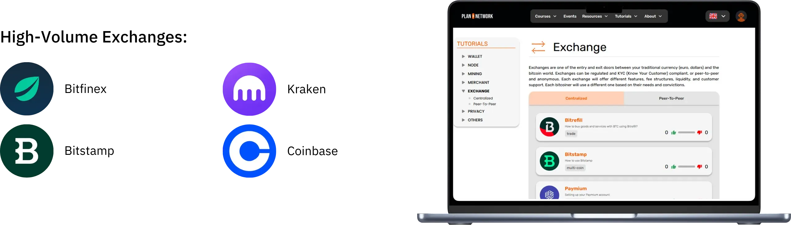

また、DCA（ドルコスト平均法）-少額を定期的に購入し、市場のボラティリティを平準化する-を利用するハイブリッド・アプローチを採用するホドラーもいる。

#### 3.サクセッション・プランの設定

これは見過ごされがちだ。しかし、Bitcoinは容赦がない。秘密鍵を紛失すれば、コインは永遠になくなってしまう。無能力や死亡を想定した計画は極めて重要である。

重要なステップ

- Bitcoinにアクセスできない場合は、アクセス方法を説明する詳細なガイドを書いてください；
- マルチシグネチャーの設定を使って、紛失のリスクを減らしながらアクセスを提供する；
- 重要な情報は信頼できる人と共有する。

相続対策については、このコースの最終セクションで詳しく説明する。

#### 4.サイクルを通じて忍耐強くあり続ける

ホドリングとは、長期戦に挑むことを意味する。価格暴落の時も、陶酔的な強気相場の時も、冷静でいる必要がある。

ベストプラクティスをいくつか紹介しよう：

- Walletを定期的にチェックする。常に監視していると、感情的な判断につながります；
- 市場の下落時にパニック売りをしないこと。訂正はゲームの一部である；
- Bitcoinの動向は常に把握しておくが、特に景気後退期にはメディアの誇大広告は避けること；
- リカバリ・フレーズの完全性を定期的に確認してください。封筒が改ざんされていないか、媒体がまだ読めるかをチェックする。何か問題があるようであれば、Walletから新しいバックアップを取ってください；

秘密鍵を危険にさらすことなく保有資産を監視するには、Watch-only walletの使用を検討すること。Watch-only walletを使用すれば、公開鍵のみを使用して残高と取引を追跡することができる。

https://planb.network/tutorials/wallet/mobile/blockstream-green-watch-only-66c3bc5a-5fa1-40ef-9998-6d6f7f2810fb

ホドラーの戦略はシンプルだが強力だ。本当の課題は技術的なことではなく、心理的なことだ。最も難しいのは、早すぎる売りや値下がり時のパニックへの衝動を抑えることだ。しかし、規律を守り、長期的に考えれば、ホドリングは価値を維持し、長期的に富を築く信頼できる方法であることが証明されている。

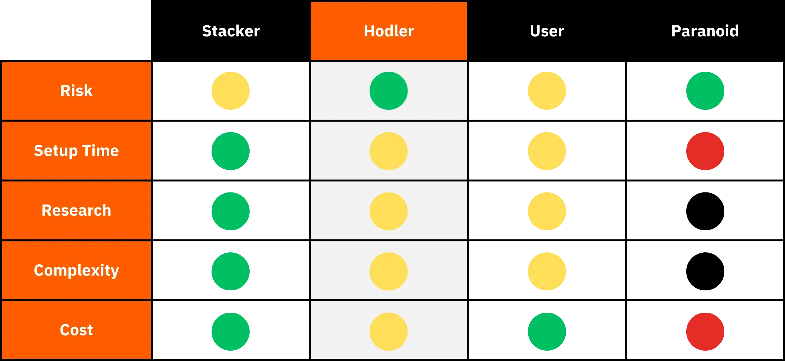

### ホドラーのプロフィールを評価する

これらの性格的特徴に自分が当てはまるなら、あなたはおそらく天性のホドラーだろう：

- 忍耐力**：ホドラーは並外れた忍耐力を示す。彼らは日々の価格変動に惑わされることなく、何年も（時には何十年も）Bitcoinを保有することを厭わない。彼らはBitcoinが周期的に動くことを理解し、価格が暴落しても慌てない。修正はゲームの一部に過ぎない。ホドラーにとって、価値は数ヶ月単位ではなく、長期的に測られる；
- 長期的ビジョン** ：ホドラーは短期的な利益のはるか先を考えている。彼らは、Bitcoinの構造的成長と段階的な世界的普及を信じている。ボラティリティが高いにもかかわらず、彼らは上昇の軌跡を描いている。彼らにとって、Bitcoinは長持ちする資産であり、インフレに対するヘッジであり、より大きな通貨革命の重要な一部である；
- 自己鍛錬**：精神的な鍛錬はホドラーの考え方の核心である。逆説的だが、彼らの最大の課題は行動しないことだ。価格高騰時には売りたい衝動にかられ、暴落時には恐怖に屈しない。彼らは、Bitcoinが多くの残酷な弱気相場を生き延びてきたこと、そして痛みを乗り越えてホールドする者がしばしば最大の利益を得ることを理解している；
- 感情の回復力** ：Bitcoinの価格は数週間のうちに50％以上下落することがあるが、それでもホドラーは落ち着いている。彼らは、ボラティリティがBitcoinのファンダメンタルズを損なうことはないという考えを内面化している。この感情的なタフさが、不確実な状況でも平静を保ち、他人がパニックに陥っても理性的な見通しを維持することを可能にしている；
- 技術への信頼**：ホドラーはBitcoinを単なる投機的資産とは見ていない。彼らはそのテクノロジーと破壊的な可能性を信じている。多くの人にとって、Bitcoinは単なるお金ではなく、自由なのです。Bitcoinは弾力性があり、非政治的な通貨であり、伝統的な銀行取引に代わるものであり、個人により大きな金融主権を与えるものであると考えられています。

ホドリングはシンプルで、効果的で、初心者にもわかりやすい。

次の章では、似たような、しかしよりアクティブなプロフィール、スタッカーについて探ってみよう。

## スタッカーサトシの蓄積

<chapterId>0daf450d-1b91-5d99-9c31-b52ab52a5e21</chapterId>

Bitcoinのエコシステムにおいて、スタッカーとは、Bitcoinの最小単位であるサトシ（または「Sats」）を一貫した長期的なアプローチで積み立てる人のことです。一度に大金を投資するのではなく、スタッカーは市場の状況に関係なく、定期的に少量のBitcoinを購入します。

考え方は単純で、ビットコインは2100万枚程度しか存在せず、その端数はすべて重要である。スタッカーの使命は、できるだけ多くのSatsを着実に貯めることです。

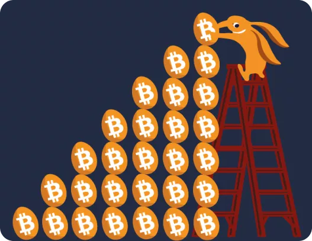

### なぜスタッキング戦略を選ぶのか？

スタッキングは、Bitcoinのポジションを徐々に積み上げながら、市場のボラティリティへのエクスポージャーを減らしたい方にとって、非常に効果的な投資戦略です。一括投資や投機的なマーケット・タイミングとは異なり、スタッカーは通常、ドルコスト平均法(DCA)と呼ばれる手法を用います。つまり、Bitcoinの現在の価格に関係なく、一定額を一定間隔(毎日、毎週、毎月...)で投資します。

スタッキングの利点

- ボラティリティの軽減**：Satsを定期的に購入することで、価格の変動を平準化することができます。価格が低いときにはより多くのSatsを購入し、価格が高いときにはより少ないSatsを購入することで、コスト・ベースを平均化し、精神的ストレスを軽減することができます。
- アクセスのしやすさ**：多額の初期資金は必要ありません。月々10ユーロから始められ、時間の経過とともにDCA額を増やすことができます。
- 規律と自動化** ：スタッカーは感情的な意思決定を避ける。自動化された定期購入は一貫性を確保し、衝動的な動きのリスクを軽減します。
- 長期戦略**：徐々に投資を行うことで、強気相場から利益を得る可能性を高めると同時に、不況時のリスクを軽減する。

この方法は、特に**初心者に適している**。相場のタイミングを計るプレッシャーから解放され、手ぶらでコツコツと積み立てることができる。

### スタッカーの投資計画

目標は、長期にわたってBitcoinを蓄積するための、持続可能で自動化された安全な戦略を構築することです。スタッカー投資計画を実行するための重要なステップは以下の通りです：

#### 1.Walletの正しいタイプの選択

スタッカーには、使いやすさと長期的な安全性のバランスを考慮したWalletのセットアップが必要だ。

- Hot Wallet** ：初心者に最適なモバイルまたはデスクトップウォレットは、簡単にSatsを受け取り、支払いを行うことができます。ただし、少額に最適です。On-Chainウォレットは、UTXOの管理が優れているため、ライトニングウォレットよりもスタッキングに適しています。お勧めのソフトウェアウォレットGreen Wallet、Blue Wallet、Sparrow Wallet、Bitkit、Nunchuk、Aqua、Proton

https://planb.network/tutorials/wallet/mobile/aqua-8e6d7dd3-8c03-45cc-90dd-fe3899a7d125

https://planb.network/tutorials/wallet/mobile/bitkit-wallet-a7224674-85c4-4045-9baf-37018d89550c

https://planb.network/tutorials/wallet/mobile/blockstream-green-e84edaa9-fb65-48c1-a357-8a5f27996143

https://planb.network/tutorials/wallet/desktop/blockstream-green-desktop-c1503adf-1404-4328-b814-aa97fcf0d5da

https://planb.network/tutorials/wallet/mobile/blue-wallet-2f4093da-6d03-4f26-8378-b9351d0dbc90

https://planb.network/tutorials/wallet/mobile/nunchuk-6cbcb406-ec84-478f-afac-bb4da366a6fa

https://planb.network/tutorials/wallet/desktop/proton-wallet-0bee0bba-ab62-4db0-8c63-b2ad698ca178

https://planb.network/tutorials/wallet/desktop/sparrow-c674e2ac-d46f-4c82-92a7-7d1b0e262f5d

- Hardware Wallet**：Bitcoinの保有量が増えるにつれ、Cold Walletで資金を確保することは盗難のリスクを最小限に抑えるために不可欠です。本格的なスタッカーはHot WalletからHardware Walletへ定期的に資金を移動させます。例Bitbox02、Trezor、Ledger、Coldcard、Jade...

https://planb.network/tutorials/wallet/hardware/coldcard-q-73e86d1a-6fe6-4d8b-bb15-8690298020e3

https://planb.network/tutorials/wallet/hardware/jade-plus-green-873099a4-35ec-4be8-b31a-6e7cd6a41ec0

https://planb.network/tutorials/wallet/hardware/ledger-nano-s-plus-75043cb3-2e8e-43e8-862d-ca243b8215a4

https://planb.network/tutorials/wallet/hardware/ledger-flex-3728773e-74d4-4177-b39f-bd923700c76a

https://planb.network/tutorials/wallet/hardware/passport-74e53858-3fa2-43f9-b866-573297546236

https://planb.network/tutorials/wallet/hardware/bitbox02-6af8940f-e19b-4008-8c83-81017032608c

毎日の積み重ねにはHot Walletを、長期保管にはHardware Wallet Coldを、という使い分けが効果的です。Hot Walletは使いやすく便利です。リスクにさらされる可能性のあるプラットフォーム上にビットコインを放置するのではなく、迅速にビットコインを所有することができます。しかし、Hardware Walletと比較すると、Hot Walletはセキュリティがかなり低いです。したがって、スタッカーは、長期的な貯蓄を確保し、Hot Walletに多くの資金を維持することを避けるために、定期的に資金をCold Walletに移動する必要があります。定期的に、スタッカーはColdストレージに移動する際、UTXOを統合する；将来の取引手数料を最適化するために、小さな入力を統合する。

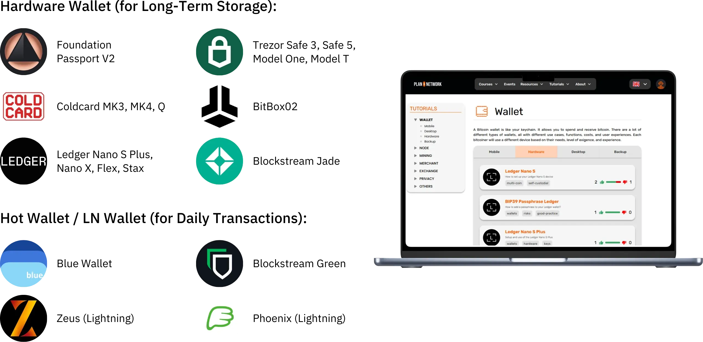

#### 2.DCA購買計画の設定

ドル・コスト平均法（DCA）とは、Bitcoinの価格に関係なく、一定の間隔で少量のBitcoinを購入する投資戦略です。効果的なDCAプランを設定するには、2つの主要なElementsを定義する必要があります：

- 購入頻度**：購入頻度**：毎週、隔週、または毎月。購入頻度が高すぎると、小さなUTXOが多くなり、後で使うのにコストがかかるので避ける。当然ながら、DCA額は財務状況の変化に応じて調整することができる。

次に、DCAを設定するには、自動化するか手動で管理するかの2つの選択肢があります。現在、ほとんどの規制取引プラットフォームは、DCAを自動化するオプションを提供しています。口座に十分な資金があれば、プラットフォームは設定したパラメーターに基づいて自動的に買い注文を執行します。また、DCAの自動化に特化したプラットフォームも増えており、自己保管Walletへの自動引き出しや日々の経費の四捨五入などの追加サービスを提供しています。規制されたプラットフォームを使用しているのであれば、日々の管理をより安心して行うために、DCAを自動化することを強くお勧めします。

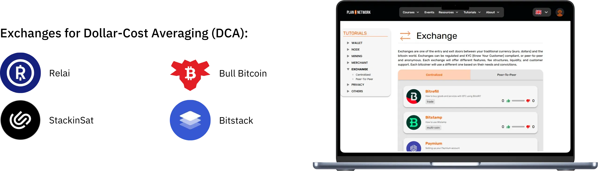

DCAプラットフォームの例：

https://planb.network/tutorials/exchange/centralized/bitstack-29fd71be-9570-42c6-8f6f-cd355d62e746

https://planb.network/tutorials/exchange/centralized/relai-v2-30a9671d-e407-459d-9203-4c3eae15b30e

https://planb.network/tutorials/exchange/centralized/stackinsat-5af6a380-f3c6-4246-9f81-9957a16ab066

DCAをサポートする主流の取引所：

https://planb.network/tutorials/exchange/centralized/bitfinex-dc306d39-bd96-4ab9-a278-a322316716db

https://planb.network/tutorials/exchange/centralized/bitstamp-5a36c896-bff5-46d7-b505-ff069c3ac47c

https://planb.network/tutorials/exchange/centralized/bull-bitcoin-europe-0ccf713e-efcd-44ec-8205-211f49ac7d53

https://planb.network/tutorials/exchange/centralized/kraken-1ef03e25-9b42-49bd-a47d-249e1a13cfc6

https://planb.network/tutorials/exchange/centralized/paymium-92603f76-b985-49ce-81e5-f4fa0df776e5

スタッカーはまた、それが第一の目的ではないとしても、プライバシーを強化したいと思うかもしれない。この場合、彼らは規制されたプラットフォーム以外のP2P取得方法を使用することを検討する必要があります。自動化されたDCA購入とは異なり、これらの方法は手動で購入戦略を管理する必要があるため、規律を守ることが軌道に乗るための鍵となる。

https://planb.network/tutorials/exchange/peer-to-peer/bisq-v2-c1c6a702-6c16-4101-8b90-62c424017b80

https://planb.network/tutorials/exchange/peer-to-peer/hodlhodl-d7344cd5-6b18-40f5-8e78-2574a93a3879

https://planb.network/tutorials/exchange/peer-to-peer/lnp2pbot-v2-e6bcb210-610b-487d-970c-7cce85273e3c

https://planb.network/tutorials/exchange/peer-to-peer/peach-c6143241-d900-4047-9b73-1caba5e1f874

https://planb.network/tutorials/exchange/peer-to-peer/robosats-b60e4f7c-533a-4295-9f6d-5368152e8c06

#### 3.ビットコインの引き出しと確保

購入戦略が整ったら、ExchangeからBitcoinを引き出し、定期的にHardware Walletに移すだけです。これにより、完全な自己保管と長期的な保護が保証されます。

#### 4.数サイクル待機

スタッカーは月単位ではなく年単位で考える。ホドラーのように、彼らは市場暴落時のパニックや強気相場での陶酔に抵抗しなければならない。

主な習慣

- ストレスを避けるため、財布を頻繁にチェックしないこと；
- 景気後退局面では決して売らないこと；
- Bitcoinの技術開発に関する最新情報をお届けします；
- seedのバックアップとHardware Walletのステータスを定期的にチェックしてください：ウォレットがセットアップされたら、定期的なモニタリングを設定することが重要です。定期的に、Mnemonicのフレーズがまだ保管場所にあること、不透明な封筒が開けられていないことを確認してください。このチェックの際、封筒を開けてメディアの状態を調べることもできます。損傷がなく、文が完全に読めることを確認してください。破損の形跡がある場合は、Hardware Walletから新しいコピーを作成するのが最善です。ハードウェア・ウォレットも定期的にチェックしてください。

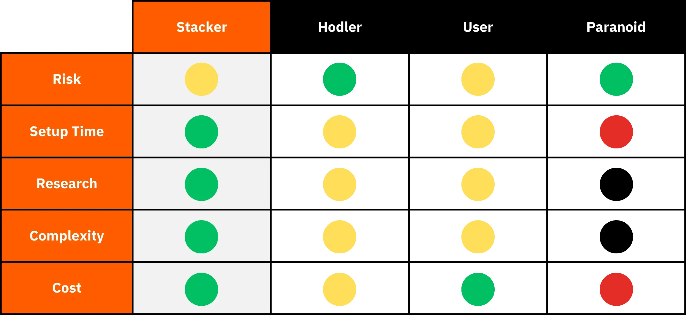

セキュリティに妥協することなく簡単に監視するには、公開鍵を使用して残高を追跡するWatch-only walletを設定します。

https://planb.network/tutorials/wallet/mobile/blockstream-green-watch-only-66c3bc5a-5fa1-40ef-9998-6d6f7f2810fb

### スタッカー・プロファイルの評価

成功するスタッカーはこれらの特徴を示している：

- 組織**：予算を守り、計画を守る。スタッカーは、積み立て計画が数年にわたって実行可能であることを確認しなければならない。
- 規律**：市場のノイズに反応せず、自分のスケジュールに従う。衝動的な調整よりも規則性を優先する。ただし、合理的な調整も可能である。
- 忍耐**：スタッキングの報酬はすぐには得られない。この戦略は長い時間をかけて展開され、目に見える結果が出るまでに何年もかかることもある。成功する人は、短期的な変動に振り回されることなく、忍耐強くいられる人である。
- 金融知識**：DCA、リスク管理、Bitcoin市場のファンダメンタルズに関する確かな理解は、自信をもって投資するのに役立ちます。情報に精通したスタッカーは、疑念に抵抗し、ボラティリティの高い時期に衝動的な決断を下すことを避けることができます。
- 長期的ビジョン**：スタッカーはBitcoinの技術的可能性を強く信じている。彼らの焦点は短期的な価格変動ではなく、何年にもわたって着実に保有株を増やしていくことにある。

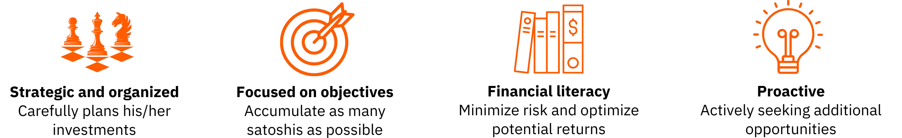

要するに、スタッキングは、チャートに釘付けになることなく、時間をかけてBitcoinのポジションを構築し、ボラティリティ・リスクを軽減し、完全な主権を維持したい人にとって理想的である。

次は、アクティブユーザーという、根本的に異なるビットコイナー・プロフィールを探ります。

## アクティブなBitcoinユーザー：日常生活にBitcoinを取り入れる

<chapterId>e0a022ab-207c-571f-b4ad-c432214a756c</chapterId>

Bitcoinのアクティブ・ユーザーになるということは、長期的な投資戦略を超えることを意味します。BitcoinをExchange**の実質的な媒体として扱う。彼らはそれを商品やサービスの支払いに使い、カウンターエコノミーに積極的に参加する。

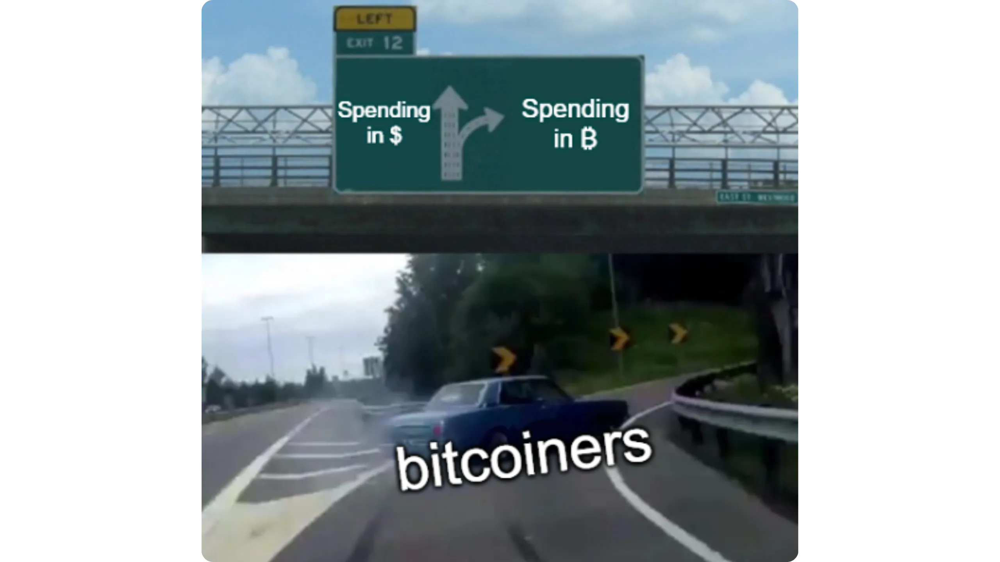

### なぜアクティブ・ユーザー戦略を採用するのか？

Bitcoinを毎日使用することは、個人的にも集団的にもメリットがある：

- 採用を通じてBitcoinのエコシステムをサポートする** ：

各取引は、Bitcoinの通貨としての正当性を強化し、より多くの商人やサービスがBitcoinを受け入れるように促します。Bitcoinを使うことは、その有用性に一票を投じることなのです。貨幣の価値は、物々交換ではなく、貿易を促進する能力から生まれます。物々交換ではなく、交易を促進する能力からその価値が生まれます。その通貨で買える商品やサービスが多ければ多いほど、その通貨の有用性は高まります。Bitcoinでの支払いを選択することで、それを受け入れる商人に価値を向けることになる。これは、彼らの利益を増加させ、時間の経過とともに、それを拒否する競合他社の利益を減少させる可能性があります。コミュニティ全体では、このダイナミックな動きがBitcoinをより広く受け入れ、導入の好循環に貢献することができます。

- Bitcoinのユニークな機能**を活用しよう：

Bitcoinは、Lightning Networkを介した高速取引、検閲、金融監視、シニョリッジからの解放など、いくつかの強力な機能を提供する。Bitcoinの核心的価値は、Supplyに対する政府の支配を排除し、検閲不可能な取引を可能にすることにあります。これらの利点があなたの個人的なニーズや価値観と一致するのであれば、アクティブ・ユーザー・プロファイルがあなたに適していることがわかるかもしれません。

- やって学ぶ** ：

Bitcoinを積極的に使用することで、実社会の経験を積むことができます。Walletの種類、支払いプライバシー、UTXOの管理などに詳しくなります。毎日の使用が実践的な学習環境になります。

課題としては、技術的な複雑さ、価格の変動性、資金の損失を防ぐための適切なセキュリティ衛生の必要性などが挙げられる。

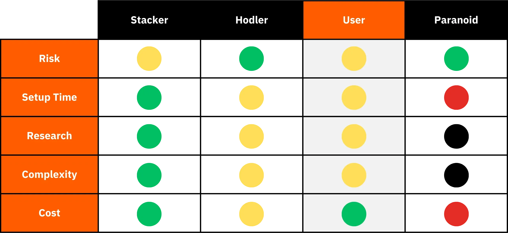

### アクティブ・ユーザーのための投資計画

日常的な支払いにBitcoinを採用するには、思慮深く構造的なアプローチが必要である。ホドラーやスタッカーとは異なり、アクティブ・ユーザーは資金の長期的なセキュリティと日々の取引の利便性の両方を管理しなければならない。Coldの安全な保管と使用資金への容易なアクセスの適切なバランスをとることは、この戦略を効果的に機能させるために不可欠である。

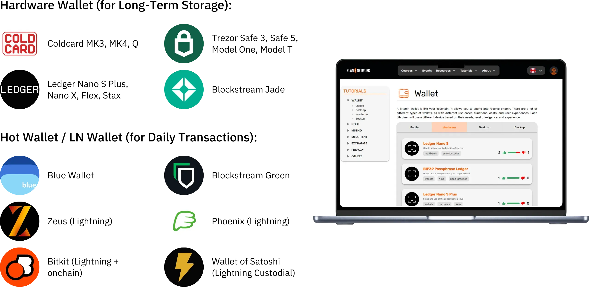

#### 1.財布の明確な区分け

アクティブユーザーは、セキュリティと利便性のバランスを取るために、2種類のウォレットを使い分けるべきである：

- 長期的な貯蓄を確保するためのCold Wallet（Hardware Wallet）。

https://planb.network/tutorials/wallet/hardware/coldcard-q-73e86d1a-6fe6-4d8b-bb15-8690298020e3

https://planb.network/tutorials/wallet/hardware/jade-plus-green-873099a4-35ec-4be8-b31a-6e7cd6a41ec0

https://planb.network/tutorials/wallet/hardware/ledger-nano-s-plus-75043cb3-2e8e-43e8-862d-ca243b8215a4

https://planb.network/tutorials/wallet/hardware/ledger-flex-3728773e-74d4-4177-b39f-bd923700c76a

https://planb.network/tutorials/wallet/hardware/passport-74e53858-3fa2-43f9-b866-573297546236

https://planb.network/tutorials/wallet/hardware/bitbox02-6af8940f-e19b-4008-8c83-81017032608c

https://planb.network/tutorials/wallet/hardware/portal-bd6e83f0-0100-4689-aeb3-513cca944ace

https://planb.network/tutorials/wallet/hardware/satochip-e9bc81d9-d59b-420d-9672-3360212237ba

https://planb.network/tutorials/wallet/hardware/seed-signer-ee2c284a-0e23-49a4-b0ca-4a4702072973

https://planb.network/tutorials/wallet/hardware/tapsigner-ab2bcdf9-9509-4908-9a4a-2f2be1e7d5d2

- 日常的な取引のために、1つまたは複数のモバイルHotウォレット。通常、アクティブなユーザーは On-Chain Hot Wallet とライトニング Wallet の両方を持つ。

https://planb.network/tutorials/wallet/mobile/aqua-8e6d7dd3-8c03-45cc-90dd-fe3899a7d125

https://planb.network/tutorials/wallet/mobile/bitkit-wallet-a7224674-85c4-4045-9baf-37018d89550c

https://planb.network/tutorials/wallet/mobile/blink-7ea5f5a4-e728-4ff9-b3f9-cf20aa6fc2bd

https://planb.network/tutorials/wallet/mobile/blixt-04b319cf-8cbe-4027-b26f-840571f2244f

https://planb.network/tutorials/wallet/mobile/blockstream-green-e84edaa9-fb65-48c1-a357-8a5f27996143

https://planb.network/tutorials/wallet/mobile/blue-wallet-2f4093da-6d03-4f26-8378-b9351d0dbc90

https://planb.network/tutorials/wallet/mobile/breez-46a6867b-c74b-45e7-869c-10a4e0263c06

https://planb.network/tutorials/wallet/mobile/lipa-61019fbd-deb7-4b3c-8cda-0402a4b2e780

https://planb.network/tutorials/wallet/mobile/nunchuk-6cbcb406-ec84-478f-afac-bb4da366a6fa

https://planb.network/tutorials/wallet/mobile/phoenix-0f681345-abff-4bdc-819c-4ae800129cdf

https://planb.network/tutorials/wallet/mobile/wallet-of-satoshi-39149d86-e42b-4e8f-ae9f-7e061e7784f7

https://planb.network/tutorials/wallet/mobile/zeus-3e89603c-501d-439c-8691-d4a0d0de459b

このように資金を分けておくことで、日常的な支払いに使われているWalletが危険にさらされた場合のリスクを減らすことができる。

#### 2.自分のノードを立ち上げる

アクティブ・ユーザーは、個人的な状況に応じて、信頼できるサード・パーティへの依存を減らすことを目的としていることが多い。これを達成する最も効果的な方法の一つは、自分自身のBitcoinノードを実行することである。これにより、トランザクションのプライバシーを強化しながら、独立してネットワークを使用することができます。

https://planb.network/tutorials/node/bitcoin/bitcoin-core-linux-568c13a6-8746-4d63-8e95-f4a61c5ae0ed

https://planb.network/tutorials/node/bitcoin/bitcoin-core-mac-windows-9684ab02-e0af-41c9-8102-86ac7c7727f3

https://planb.network/tutorials/node/bitcoin/bitcoin-knots-e04b2196-4df2-4246-86ef-c02269c29098

https://planb.network/tutorials/node/bitcoin/raspiblitz-d8cdba2e-a682-46cf-9fdc-d8602fbeac02

https://planb.network/tutorials/node/bitcoin/mynode-a481fef3-2fd3-4df3-91c0-112cffa094eb

https://planb.network/tutorials/node/bitcoin/start9-8c8b6827-8423-4929-bcba-89057670ed6a

Lightning Networkを定期的に使用する人にとって、LND、LDK、またはCore-Lightningノードを自分で管理することは、賢明な行動となり得る。特にPhoenixのような自動化されたソリューションや、カストディアル・ライトニング・ウォレットと比較した場合、取引手数料を下げることができる。

https://planb.network/tutorials/node/lightning-network/alby-hub-62e6356c-6a6d-4134-8f22-c3b6afb9882a

#### 3.レギュラー Bitcoin 取得

アクティブ・ユーザーは、長期的な貯蓄と日常的に使用するBitcoinの手元に置いておく量のバランスを取る必要がある。

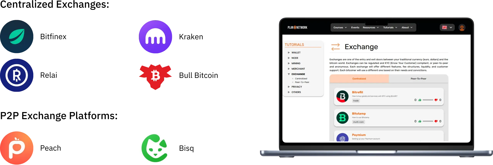

Bitcoinを取得するには、求めるプライバシーのレベルに応じていくつかの方法がある：

- BitfinexやBull Bitcoin(ColdWalletの上乗せに最適)のような規制されたプラットフォーム**を通じた従来の購入；

https://planb.network/tutorials/exchange/centralized/bitfinex-dc306d39-bd96-4ab9-a278-a322316716db

https://planb.network/tutorials/exchange/centralized/bitstack-29fd71be-9570-42c6-8f6f-cd355d62e746

https://planb.network/tutorials/exchange/centralized/bitstamp-5a36c896-bff5-46d7-b505-ff069c3ac47c

https://planb.network/tutorials/exchange/centralized/bull-bitcoin-europe-0ccf713e-efcd-44ec-8205-211f49ac7d53

https://planb.network/tutorials/exchange/centralized/kraken-1ef03e25-9b42-49bd-a47d-249e1a13cfc6

https://planb.network/tutorials/exchange/centralized/paymium-92603f76-b985-49ce-81e5-f4fa0df776e5

https://planb.network/tutorials/exchange/centralized/relai-v2-30a9671d-e407-459d-9203-4c3eae15b30e

https://planb.network/tutorials/exchange/centralized/stackinsat-5af6a380-f3c6-4246-9f81-9957a16ab066

- 非KYC取得** Peach、ロボサット、Bitcoin ATMなどのピアツーピアサービスを通じて、個人情報を明かすことなくWalletに追加できる。

https://planb.network/tutorials/exchange/peer-to-peer/bisq-v2-c1c6a702-6c16-4101-8b90-62c424017b80

https://planb.network/tutorials/exchange/peer-to-peer/hodlhodl-d7344cd5-6b18-40f5-8e78-2574a93a3879

https://planb.network/tutorials/exchange/peer-to-peer/lnp2pbot-v2-e6bcb210-610b-487d-970c-7cce85273e3c

https://planb.network/tutorials/exchange/peer-to-peer/peach-c6143241-d900-4047-9b73-1caba5e1f874

https://planb.network/tutorials/exchange/peer-to-peer/robosats-b60e4f7c-533a-4295-9f6d-5368152e8c06

- Bitcoinで稼ぐ**, アクティブなユーザーであることは、BTCを使うことだけではありません。もしあなたがビジネスを経営しているなら、支払いとしてBitcoinを受け入れることを検討してください。あなたが従業員なら、あなたの雇用主が給与の全部または一部をBTCで受け取るオプションを提供しているかどうかを確認してください。

https://planb.network/tutorials/business/point-of-sale/swiss-bitcoin-pay-2-a78b057e-ed11-47ac-860c-71019fcb451a

https://planb.network/tutorials/business/point-of-sale/open-node-e69a0c1c-47f7-4932-8494-e6f26c3c9784

https://planb.network/tutorials/business/point-of-sale/btcpay-server-928eb01e-824b-4b57-a3e8-8727633beddc

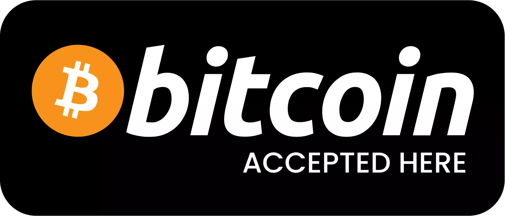

#### 4.積極的な経費管理

ビットコインを使うという選択は、しばしば批判にさらされる。Bitcoinの利用者の中には、ビットコインを使うよりも、質が低いと思われ、それゆえに排除したいと考える不換紙幣を使うことを好む人もいる。しかし、この考え方には2つの重要な欠点がある。1つ目は、決済手段としてのBitcoinの利点（前項参照）を見落としていること、2つ目は、価値が低いと思われる不換紙幣を、なぜ使うために持ち続けるのかという疑問を投げかけていることである。

より論理的な方法は「使って交換する」方法である。これは、先に述べたすべての理由でBitcoinを使い、Bitcoinの貯蓄を縮小させる代わりに、不換紙幣で新しいSatsを購入することで、使ったSatsを置き換えることを意味する。

Bitcoinの利用をより簡単にするために、[BTC Map](https://btcmap.org/)のような利用可能なツールがたくさんあります。これは、Bitcoinを受け入れる世界中の加盟店を表示します。これらの商店の中には、オンラインで注文して商品を配達してくれるところもある。

私たちはまだすべての日常的な商店がBTCを受け入れていない過渡期にいるため、いくつかの簡単で効果的な回避策があります。例えば、Bitcoinでギフトカードを購入することは現実的な解決策であり、Bitrefill、Coinsbee、The Bitcoin Companyのような多くのプロバイダーがこのサービスを提供しています。

https://planb.network/tutorials/exchange/centralized/bitrefill-8c588412-1bfc-465b-9bca-e647a647fbc1

#### 5.技術的認識と柔軟性

Bitcoinプロトコルは、Lightning NetworkのようなLayer-2システムと、これらのエコシステムに関連するアプリケーションLayer全体とともに、急速に進化しています。アクティブ・ユーザーとして

- 日々の採用を容易にする新しいソリューションの最新情報をお届けします；
- 新しいツールやサービスを定期的にテストし、ユーザー体験を向上させる；
- 技術の進歩や市場の変化に応じて戦略を調整する。

### アクティブ・ユーザー・プロフィールを評価する

あなたはBitcoinのアクティブ・ユーザーに向いていますか？このプロフィールを定義する主な特徴は以下の通り：

- プラグマティズムとCommitment:** あなたは、Bitcoinを日常生活に統合し、そのエコシステムの成長に積極的な役割を果たすことに意欲的である。あなたは、Bitcoinの利点とそれに伴う課題の両方を認識しています。
- 技術的熟練度：*** BitcoinウォレットとLightning Networkがどのように機能するかをすでにしっかりと把握しているか、または学ぶことに熱心な方。UTXO管理のような高度なコンセプトのナビゲートに慣れている。
- 柔軟性と適応性:** Bitcoinエコシステムの進化やニーズの変化に合わせて、新しいツールを試したり、ソリューションを切り替えたり、プラクティスを調整したりすることに前向きな方。
- 財務規律:** あなたはBitcoinの支出と貯蓄を注意深く管理します。あなたは、日々の資金と長期的な貯蓄を明確に分けることの重要性を理解しています。

結論として、アクティブ・ユーザーはBitcoinのエコシステムを推進する上で直接的な役割を果たしている。Bitcoinを日々の習慣に取り入れることで、彼らはBitcoinの採用をサポートするだけでなく、自らの専門知識を成長させることができる。

次の章では、Bitcoinの最後の、そしておそらく最も興味をそそられるユーザー像である「偏執的なユーザー」を探ってみよう。

## 偏執的なビットコイナー何よりもプライバシー

<chapterId>5c624acd-662e-5134-ab7a-fb75cde7c3f8</chapterId>

偏執的なビットコイナーにとって、プライバシーはオプションではなく、必要不可欠なものです。ほぼすべての金融取引が追跡される世界において、彼らはBitcoinを利用する上で、自分のIDと取引履歴を保護することは譲れない部分だと考えている。彼らは通常、個人データを公開することに伴うリスク（特にID確認を必要とするKYC準拠の取引所を使用する場合）を強く認識しています。

彼らにとっては、すべての行動が重要なのだ。すべての取引、すべてのWalletの設定、そしてネットワークとの相互作用は慎重に検討される。たった一度の不手際が、彼らのアイデンティティとBitcoinの保有を結びつける機密情報を暴露してしまうかもしれないのだ。彼らの最終目標は？Bitcoinを、彼らの身元、所在地、財務状況を完全に非公開にする方法で使用すること。

### なぜそのような慎重なアプローチを取るのか？

プライバシーを第一に考えるという選択には、いくつかの重要な利点がある：

- 金融自主権：** 銀行、政府、企業のレーダーから逃れることで、監視や不要な干渉から身を守ることができる。
- 資産保護：**経済情勢や政治情勢が不安定になった場合、Bitcoinがあなたの身元とリンクしていなければ、第三者があなたのBitcoinを追跡したり押収したりすることははるかに難しくなります。
- 身の安全の向上：** Bitcoinを大量に所持していることが知られている人は、標的になる可能性があります。身元を隠しておくことで、標的にされるリスクが低くなります。
- 差別からの解放**：サービスや政府によっては、過去の活動やあなたが誰であるかに基づいて取引やアカウントをブロックすることがあります。プライバシーはそのような力を抑制します。
- Bitcoinのルーツに忠実であること:** Bitcoinは、検閲に強く、許可のないお金の形として設計されました。あなたのプライバシーを保護することは、その本来の使命を尊重することの一部です。

これは、今日のデジタルと金融の状況に存在する非常に現実的な脅威に対する、賢明で計算された対応策である。たしかに、このアプローチはより多くの努力を必要とする。時間、技術的知識、そして規律が必要だ。しかし、この道を選ぶ人々にとって、それは単にBitcoinを使うということではなく、お金、アイデンティティ、そして自由のコントロールを取り戻すということなのだ。

彼らは単なる投資家やユーザーではなく、自分のすべてを知ることを要求するシステムからオプトアウトしているのだ。

### 偏執的な投資計画

偏執的なビットコイナーは、匿名性の保持とセキュリティの最大化という2つの核となる目標を中心に構築された厳格な戦略に従っている。このタイプのユーザーは、規制されたプラットフォーム（特にKYCを必要とするプラットフォーム）への露出を避け、取引のトレーサビリティを排除し、監視、没収、その他の外部からの脅威から資金を守ろうとする。

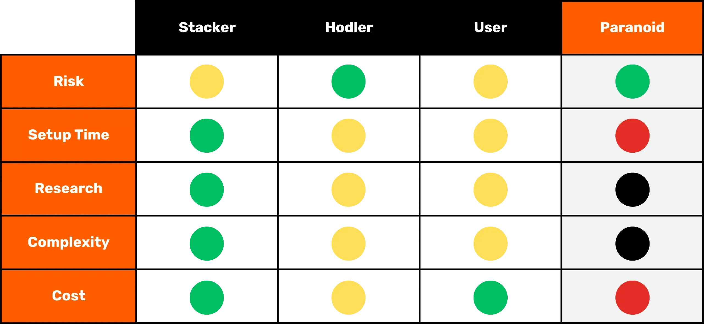

#### 1.ウォレットとノードの設定

偏執的なユーザーは、資金の出所や用途によって資金を混ぜたりはしない。その代わり、複数の専用ウォレットを使い、目的別にBitcoinを区分けする：

- Cold Wallet (エアギャップおよび/またはDIY)** 長期保有分は、高度に安全なエアギャップまたはDIYウォレットに保管されます。これらは通常、オープンソースのデバイスか、Jade、Coldcard、SeedSigner、Portal、Passportなどの検証可能なコードを持つデバイスです。可能な限り、彼らはこれらのデバイスを匿名で入手する。実店舗で現金払いかBitcoinを使うか、あるいは目立たない配送オプションとBTC支払いでオンライン注文する。例えばフランスでは、[Bitcoin Bazar](https://bitcoinbazar.fr/)がそのような店のひとつだ。あなたの地域の同様のプロバイダーを検索することができます。

https://planb.network/tutorials/wallet/hardware/jade-plus-sparrow-938abf16-e10a-4618-860d-cd771373a262

https://planb.network/tutorials/wallet/hardware/coldcard-q-advanced-b8cc3f29-eea9-48fe-a953-b003d5b115e0

https://planb.network/tutorials/wallet/hardware/passport-74e53858-3fa2-43f9-b866-573297546236

https://planb.network/tutorials/wallet/hardware/portal-bd6e83f0-0100-4689-aeb3-513cca944ace

- 日常的な取引にはHot Wallet**、定期的な支出には、プライバシーに重点を置いたウォレット、例えばAshigaru、Wasabi Wallet、Sparrow Walletをお勧めします。これらのウォレットは、ミニCoinJoin、payjoins、潜在的なCoinJoinツール、コイン・コントロール、UTXOタグ付け、Bitcoinノード経由での接続機能などの高度な機能をサポートしています。

https://planb.network/tutorials/wallet/desktop/sparrow-c674e2ac-d46f-4c82-92a7-7d1b0e262f5d

https://planb.network/tutorials/wallet/desktop/wasabi-a0b51540-32d2-4ed2-98aa-801da5d35cf6

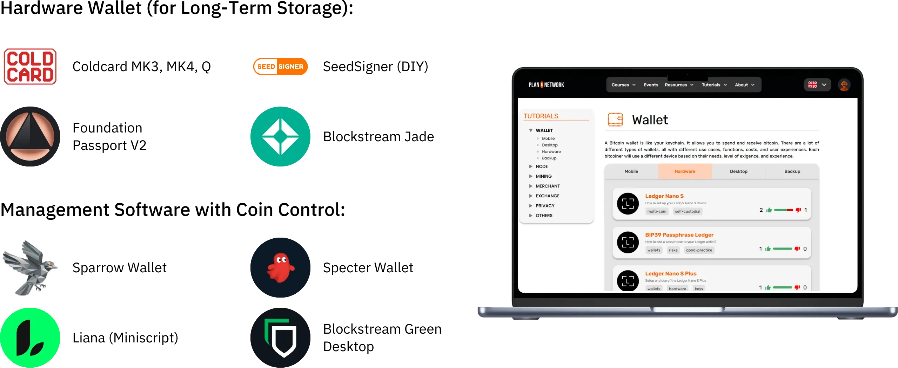

- 独自の**Bitcoinノード**の運用は不可欠である。トランザクションのブロードキャストを完全に制御し、サードパーティのインフラへの依存を避けることができる。また、プライバシーを守り、検閲を防ぎ、Bitcoinプロトコルのルールを独自に検証することができます。Linux、Windows、macOS、あるいはRaspiBlitz、myNode、Start9のようなプラグアンドプレイのセットアップのいずれであっても、偏執的なユーザーは自分のノードを譲れない主権の柱として扱う。

https://planb.network/tutorials/node/bitcoin/bitcoin-core-linux-568c13a6-8746-4d63-8e95-f4a61c5ae0ed

https://planb.network/tutorials/node/bitcoin/bitcoin-core-mac-windows-9684ab02-e0af-41c9-8102-86ac7c7727f3

https://planb.network/tutorials/node/bitcoin/bitcoin-knots-e04b2196-4df2-4246-86ef-c02269c29098

https://planb.network/tutorials/node/bitcoin/raspiblitz-d8cdba2e-a682-46cf-9fdc-d8602fbeac02

https://planb.network/tutorials/node/bitcoin/mynode-a481fef3-2fd3-4df3-91c0-112cffa094eb

https://planb.network/tutorials/node/bitcoin/start9-8c8b6827-8423-4929-bcba-89057670ed6a

- Lightning Network**で取引を行いながら、同じレベルのコントロールと裁量を維持するために、独自のライトニング・ノードも運用している。これにより、チャネルを直接管理し、監視やカストディアンサービスへの依存を最小限に抑える方法で支出することができる。

https://planb.network/tutorials/node/lightning-network/alby-hub-62e6356c-6a6d-4134-8f22-c3b6afb9882a

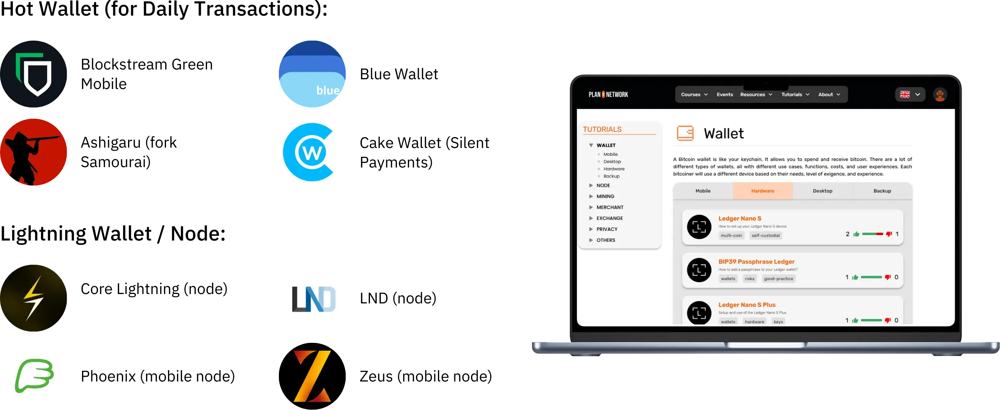

セキュリティはそれだけにとどまらない。seedのフレーズをバックアップするために、偏執的なユーザーは金属製のバックアップと改ざん防止の密封された封筒を使用します。バックアップが損なわれていないことを定期的に確認し、Walletのリカバリ手順をテストし、あらゆる不測の事態に備える。

https://planb.network/tutorials/wallet/backup/backup-mnemonic-22c0ddfa-fb9f-4e3a-96f9-46e2a7954270

https://planb.network/tutorials/wallet/backup/recovery-test-5a75db51-a6a1-4338-a02a-164a8d91b895

貯蓄を確保することに関しては、マルチシグネチャ・ウォレット（タイムロックの有無は問わない）など、より洗練されたセットアップを導入することもある。

https://planb.network/tutorials/wallet/desktop/liana-306ef457-700c-4fdd-b07a-8fb7a8a29f04

これらの設定はリスクを軽減する。seedフレーズにBIP39 passphraseを追加することで、さらにもう1つのLayerの保護が追加され、資金へのアクセスが1つの発見によって危険にさらされることがないようになります。

https://planb.network/tutorials/wallet/backup/passphrase-a26a0220-806c-44b4-af14-bafdeb1adce7

偏執狂的なビットコイナーは、もちろん、自分のビットコインのためのよく考えられた相続計画を持つでしょう。この重要なトピックは、コースの次のパートで詳しく取り上げます。

より広く言えば、このタイプのユーザーは、先進的でプライバシーに配慮したアプローチをコンピューティング全体に適用している。彼らは、デジタルライフのあらゆるLayerにおいて、ユーザーのプライバシーを尊重するオープンソースでセキュアなツールに依存しています：

- 携帯電話とパソコンのオペレーティングシステム**；

https://planb.network/tutorials/computer-security/operating-system/grapheneos-08d43d7a-0b22-4638-a151-578d48d32d88

https://planb.network/tutorials/computer-security/operating-system/linux-mint-da44852e-513f-4004-949a-8fde60c1bca5

https://planb.network/tutorials/computer-security/operating-system/ubuntu-78a3be56-5d51-4ec3-8629-0dd27c352ab5

- 認証ツール** ；

https://planb.network/tutorials/computer-security/authentication/authy-a76ab26b-71b0-473c-aa7c-c49153705eb7

https://planb.network/tutorials/computer-security/authentication/bitwarden-0532f569-fb00-4fad-acba-2fcb1bf05de9

https://planb.network/tutorials/computer-security/authentication/keepass-f8073bb7-5b4a-4664-9246-228e307be246

https://planb.network/tutorials/computer-security/authentication/security-key-61438267-74db-4f1a-87e4-97c8e673533e

- コミュニケーションツール**；

https://planb.network/tutorials/computer-security/communication/ivpn-5a0cd5df-29f1-4382-a817-975a96646e68

https://planb.network/tutorials/computer-security/communication/mullvad-968ec5f5-b3f0-4d23-a9e0-c07a3e85aaa8

https://planb.network/tutorials/computer-security/communication/proton-mail-c3b010ce-254d-4546-b382-19ab9261c6a2

https://planb.network/tutorials/computer-security/communication/tor-browser-a847e83c-31ef-4439-9eac-742b255129bb

- データ管理ツール**。

https://planb.network/tutorials/computer-security/data/integrity-authenticity-21d0420a-be02-4663-94a3-8d487f23becc

https://planb.network/tutorials/computer-security/data/proton-drive-03cbe49f-6ddc-491f-8786-bc20d98ebb16

https://planb.network/tutorials/computer-security/data/veracrypt-d5ed4c83-7c1c-4181-95ea-963fdf2d83c5

ITセキュリティについてさらに詳しく知りたい方には、このテーマに特化した完全な1年次コースをご用意しています：

https://planb.network/courses/99c46148-7080-4915-a7e0-9df0e145cd47

#### 2.匿名でビットコインを購入する

偏執的な投資家にとって核となる原則は、Bitcoinを現実世界のアイデンティティとリンクさせずに取得することである。KYCプラットフォームを回避し、On-Chainのフィンガープリンティングを防ぐために、彼らはいくつかの戦略をとる：

- Bisq、Robosat、LNP2PBot、Peach、HODL HODLなどのP2P購入プラットフォーム**；

https://planb.network/tutorials/exchange/peer-to-peer/bisq-v2-c1c6a702-6c16-4101-8b90-62c424017b80

https://planb.network/tutorials/exchange/peer-to-peer/hodlhodl-d7344cd5-6b18-40f5-8e78-2574a93a3879

https://planb.network/tutorials/exchange/peer-to-peer/lnp2pbot-v2-e6bcb210-610b-487d-970c-7cce85273e3c

https://planb.network/tutorials/exchange/peer-to-peer/peach-c6143241-d900-4047-9b73-1caba5e1f874

https://planb.network/tutorials/exchange/peer-to-peer/robosats-b60e4f7c-533a-4295-9f6d-5368152e8c06

- 対面での現金取引**、例えばBitcoinミートアップなど；

https://planb.network/courses/1c643dc9-a15f-4f9e-93b6-cb3c58b4ee35

- Bitcoin ATM**；
- BitcoinにExchangeの商品やサービスを提供することで、Sats**を獲得する；
- Miningビットコイン**。

https://planb.network/tutorials/mining/hardware/attakai-0d177e6b-e167-4b25-8e38-4ec74213d1fb

https://planb.network/tutorials/mining/hardware/braiin-mini-miner-b4c5cb2c-e7ee-4521-a750-edefb0747db3

https://planb.network/tutorials/mining/hardware/bitaxe-d317e1a7-d775-401d-85df-51f4f2217566

中央集権的な取引所は、プライバシーの面でも、検閲や差し押さえの可能性の面でもリスクがあるため、完全に避けられている。

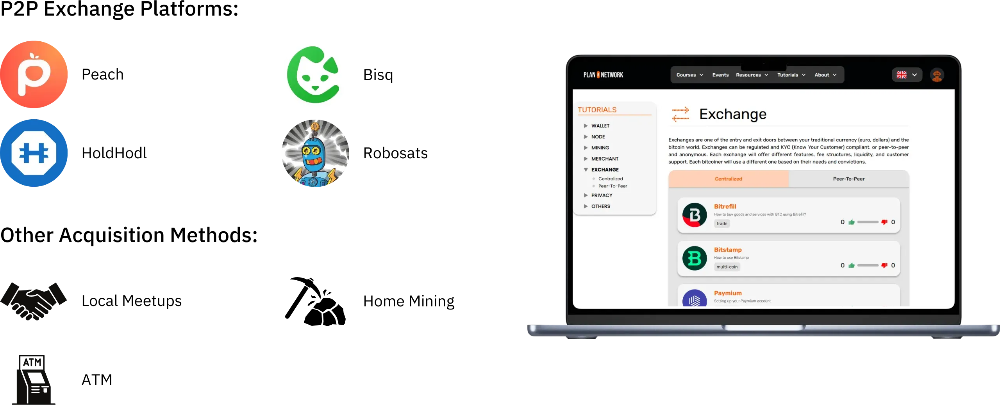

#### 3.オンチェーン・トレースの防止

匿名でコインを取得した後でも、注意深くなければ個人情報On-Chainを漏洩する可能性がある。偏執的なユーザーは、取引レベルでプライバシーを保護するための追加措置を講じる：

- 手動またはサイレント・ペイメントやBIP47 などの高度なツールを使用して、Address の再利用** を回避する；
- UTXOのラベル** ；
- コーナーコントロールの練習
- UTXOの統合回避** ；
- プライバシーを保護するトランザクション構造を使用**：コインジョイン、ペイジョイン、リコシェット、ミニペイメントコインジョイン...

また、Blockchain監視の基本に精通し、企業がどのように活動を追跡しているかも知っている。チェーン分析会社が使用するヒューリスティックやパターンを理解することで、既知の罠にはまらないよう積極的に対策を講じることができる。

On-Chainのプライバシーと監視耐性についてさらに深く学びたい人のために、Bitcoinのプライバシー実践に関する上級2年次研修を用意している：

https://planb.network/courses/65c138b0-4161-4958-bbe3-c12916bc959c

#### 4.警戒を怠らず、戦略を更新する

Bitcoinプロトコル、Lightning Network、そして関連ツールは常に進化しています。偏執的なユーザーは、常に警戒し、適応し続けます：

- 新しいプライバシー・テクニックやセキュリティ・ツールについて常に情報を得る
- 新しいツールやサービスを定期的にテストし、オペレーションのセットアップをシャープに保つ。
- ハードウェアウォレットとノードが最新で正しく機能していることを定期的にチェックする。
- バックアップ（Mnemonicの封書など）が改ざんされていないことを定期的に確認すること。
- 規制の動向を追跡し、リアルタイムで戦略を適応させる

### 妄想的プロフィールを評価する

偏執的な戦略を採用することは、気軽な決断ではありません。  厳しい規律と不断の努力を必要とし、ツールとプライバシーのベストプラクティスをマスターするために多大な時間を投資しなければならない。

このアプローチはあなたに合っているだろうか？

被害妄想的なビットコイナーの主な特徴は以下の通り：

- 用心深く、セキュリティ意識が高い**：あなたは自分のプライバシーを非常に重視しており、個人情報の漏洩を防ぐために特別な予防措置を講じることを厭わない。あなたは金銭的な監視を深刻な脅威とみなし、そこから身を守る方法を積極的に探します。
- 独立**：ビットコインの保管、管理、送金をサードパーティのサービスに依存することを拒否します。BitcoinとLightningノードを独自にホストし、複雑なウォレットを使用し、バックアップと秘密鍵の管理に全責任を負う覚悟がある。
- 不信感を抱いている**：KYCプラットフォームを積極的に避け、たとえ割高であっても匿名のP2P獲得方法を好む。共有された個人データは、いつか自分に不利に働く可能性があることを理解している。
- 知識豊富で規律正しい**:サイバーセキュリティとプライバシーを強化するテクノロジーに情熱を持っている方。利用可能なソリューションの研究、ツールのテスト、ベストプラクティスの教育、リスクを最小限に抑えるための厳格な方法論の適用に時間をかけることができます。
- 現実的で実用的**:完全な匿名性はほぼ不可能であることを理解していますが、プライバシー、セキュリティ、ユーザビリティのバランスを取りながら、可能な限り露出を減らす努力をしています。あなたのアプローチは、新たな脅威や技術開発に応じて継続的に進化しています。

これらの特徴に聞き覚えがあるなら、この戦略はあなたに適している可能性が高い。要求が高く、継続的な努力が必要だが、高いレベルの金融主権と、監視、差し押さえ、資金の追跡可能性からの保護が得られる。

このアプローチは、特にあなたに適している：

- Bitcoinを大量に保有する、
- 権威主義的な政権の下で暮らす、
- 個人的、職業上、またはイデオロギー上の理由から、匿名性を保護する必要があります。

このコースの次のセクションでは、見落とされがちな重要なトピックについて説明します。

# 相続人と財産を守る

<partId>0b8a9528-719b-4a2d-bd50-1e173a896570</partId>

## 相続プランの作成

<chapterId>233c88d3-2e8e-5eba-ac06-efe67a209038</chapterId>

ビットコインの送金を確実にすることは、見過ごされがちだが極めて重要な責任である。Bitcoinが提供する金融主権には、慎重な財産管理の必要性も伴う。これがなければ、相続人はあなたのHardで稼いだ資金にアクセスできなくなる可能性があります。この章では、Bitcoinに適用される遺産計画の基本を探ります。

### なぜBitcoinのサクセッション・プランが必要なのか？

突然の出来事（事故や不測の事態）で、あなたがこの世にいないとします。すでに悲しみに暮れているあなたの家族は、今度はビットコインへのアクセスという新たな課題に直面する。秘密鍵、Mnemonicフレーズ、取引の不可逆性などについてあなたが話しているのを聞いたかもしれないが、これらの概念は彼らにとって不明瞭かもしれない。そのため、彼らは自分で解決しようとする。

その場合、2つの選択肢がある：

- 時間をかけて、あなたの大切な人があなたのビットコインに簡単かつ安全にアクセスできるような、明確で体系的な計画を立てましょう；
- 何もせず、彼らが自分で解決してくれることを願っている。しかし、もし彼らがミスを犯し、Walletにアクセスできなくなったり、誤って間違ったAddressに資金を送ってしまったりすれば、あなたの財産は永遠に失われてしまうかもしれない。

相続対策に15分から1時間費やすだけで、すべてが変わるかもしれない。相続対策は用心深さの問題であるだけでなく、あなたを頼りにしているかもしれない人たちに責任を示す方法でもあるのだ。

### Bitcoinサクセッション・プランの目標

パメラ・モーガンはその著書*[Cryptoasset Inheritance Planning](https://www.amazon.com/gp/product/1947910116/)*の中で、堅実な相続計画のための4つの重要な目標を概説している：

- 相続人が適切なタイミングでビットコインにアクセスできるようにする；
- ビットコインを相続する前に、盗難や危殆化のリスクを最小限に抑える；
- 相続人が望むなら、ビットコインを長期的に確保する方法を知っておくこと；
- 暗号資産を受け継ぐ際、家族の争いを避け、法的な複雑さを抑える。

よく練られた計画は、単に財産を移転するだけでなく、よくある間違いや潜在的な脅威から大切な人を守ることでもある。

この章は、[パメラ・モーガン](https://x.com/pamelawjd)の著作に触発されたものである。[彼女の著書](https://www.amazon.com/gp/product/1947910116/)は、Bitcoin相続プランを作成するための詳細かつ専門家の検証を経た方法を提供していますが、**この内容は法律上の助言**を構成するものではありません。  これは実績のある方法ですが、各自が自分で調査し、個人の状況や管轄区域に合うように推奨事項を適応させる必要があります。

[パメラ・モーガン](https://x.com/pamelawjd)は、このコースのために[彼女の著作](https://www.amazon.com/gp/product/1947910116/)の使用を快く許可してくれた。彼女のアプローチに従って、具体的なBitcoinの継承プランを作成しよう。この章では、彼女の著書の最初の部分に焦点を当てる。

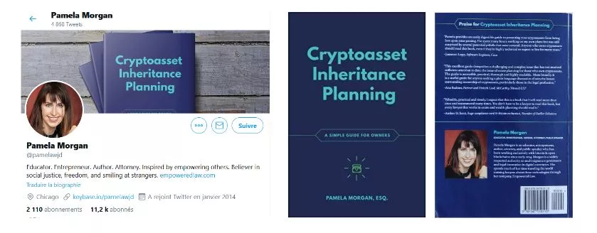

Bitcoinのサクセッション・プランの作り方をよりよく理解するために、典型的なBitcoinユーザーであるセドリックの例を見てみよう。セドリックは、予期せぬことが起こった場合に自分の財産をどのように引き継ぐかを整理する必要がある。

プロフィール

- 頻繁に取引しない長期投資家；
- Hardware Walletとたまに使うモバイルWalletを所有；
- ビットコインの購入にはKYCのExchangeプラットフォームを1つ使用する；
- 従兄弟の紹介でBitcoinへ；
- アルトコインを持たず、Lightning Networkを使用しない。

私たちの目標は、セドリックのプロフィールに合わせたシンプルで効果的なプランを作成することであり、その前に、他のタイプのユーザーを含むより複雑なシナリオに進むことである。

### 始める前に

自分の時間を30分使おう。自分のためではなく、あなたを頼りにしている人たちのために。財産設計は重要な仕事であるにもかかわらず、しばしば先延ばしにされ、軽視され、あるいは無視されがちである。最も慎重な人であっても、手遅れになるまで先延ばしにしてしまう人があまりにも多い。先見の明がなかったために、すでに何千ものビットコインが失われている。このような過ちを犯してはならない！これは、あなたの愛する人のためにBitcoinの富を確保するという、金融主権への旅における**最後のステップ**です。

#### 何が必要ですか？

落ち着いて、気が散らない環境を整え、次にいくつかの道具を集める：

- 白い紙4～5枚
- ペン
- 封筒2枚
- 電話かAddressの本；
- コンピュータ（オプション）。

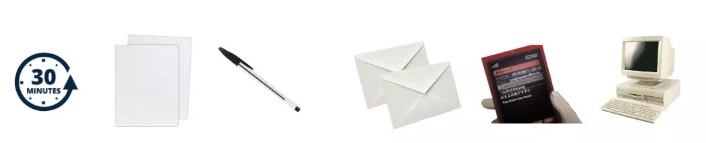

#### 相続対策に関するよくある誤解

多くの人がこのステップを遅らせているのは、誤解が行動を妨げているからである。ここでは、パメラ・モーガンが「暗号資産の相続対策」（18ページ）の中で説明している、よくある俗説を紹介する：

- 「弁護士に依頼する必要があります。法的な問題については弁護士が役に立つかもしれませんが、技術的なBitcoin相続対策は弁護士なしでも設定できます。最も重要なことは、明確でわかりやすい説明書を用意することです；
- "*第三者を信頼する必要がある.**" → **False**.あなたのプランは、複数の関係者に情報を分散させたり、タイムロックの有無にかかわらずマルチシグネチャーのソリューションを使用するなど、信頼の必要性を最小限に抑えるように設計することができます；
- 「よく練られた計画は、盗難の企てから保護すると同時に、相続人が安全に資金を回収できるようにします。しかし、どのような解決策も万全ではないことに注意する必要があります。相続対策は、共有する情報によっては盗難のリスクを高めます。これについては後で詳しく説明する；
- "*私のビットコインの価値は、計画を立てるには小さすぎる.**"** → **False**.前もって計画を立てるのは常に良いことです。あなたの愛する人は、おそらくあなたが所有しているBitcoinの正確な量を知らないでしょう。しかし、もしあなたに何かあったら、たとえ正確な金額が分からなくても、それを取り戻したいと思うのではないでしょうか？Bitcoinの価値は時間の経過とともに大きく上昇する可能性があるため、彼らがあなたの資金にアクセスしやすくし、価値について誤った期待を抱かせたり、存在しないかもしれないものを探させたりしないようにするのが賢明です。
- "*相続人が自分で考えるでしょう。"** → **偽**。Bitcoinは普通の銀行口座とは違います。明確な指示がなければ、あなたの愛する人はあなたの資金にアクセスできないか、その一部しか見つけられないかもしれません。死亡時に金融機関や公証人が家族に連絡する銀行口座とは異なり、Bitcoin Walletを家族に知らせる仲介者はいません。そのため、遺産分割協議に明確に含めるかどうかはあなた次第です；
- "*Smart contractはすべてを管理できる.**" → **False**.タイムロック付きのmulti-sig WalletのようなSmart contractは、ソリューションの一部にはなり得るが、特にBitcoinに不慣れな人々にとっては、十分に構造化されたプランに取って代わることはない。どちらの解決策も補完的なものである。

行動を起こす時です。この30分で相続対策を立てましょう。簡単な一歩ですが、それがあなたの愛する人たちのために大きな違いを生むかもしれません。

### ステップ1：相続人をサポートする適切な人選

Bitcoinで遺産を引き継ぐことになった場合、あなたの愛する人は秘密鍵の管理やウォレットの回収に不慣れである可能性が高い。彼らは、有能で信頼できる人からの外部支援を必要とするでしょう。理想的な方法は、少なくとも2人の異なる人物を選ぶことである：

- 信頼できる親族**で、あなたの計画の円滑な実行を保証してくれる人。必ずしもBitcoinに関する深い知識は必要ないが、相続人が信頼できる人物でなければならない。
- 経験豊富なBitcoinユーザー**で、資金の回収、ウォレットの管理、関連プロセスの理解などの技術サポートを提供できる方。

あなたが選んだ人たちは、あなたの秘密鍵（またはMnemonicフレーズ）に直接アクセスできるべきではありません：

- 相続人が資金を回収し、確保できるように導く；
- Bitcoinウォレット、リカバリーフレーズ、トランザクションの基本を説明する；
- よくあるミスを避けるのに役立つ。

Bitcoinの相続対策となる紙に、候補者の比較表を作成し、信頼度、Bitcoinに関する知識、連絡方法などを評価する。例えば

| Person               | Trust Level     | Bitcoin Knowledge   | Contact Methods         | Notes                                                                                                                   |
|----------------------|-----------------|----------------------|--------------------------|------------------------------------------------------------------------------------------------------------------------|
| My brother Bob       | Very high       | Low                  | Phone & email            | Bob doesn't know Bitcoin well, but he's 100% reliable. He can ensure the process goes smoothly.                        |
| My cousin Nathan     | High            | Medium               | Phone & Instagram        | Has some Bitcoin knowledge and can guide my heirs. Aware of the plan. #1 to talk to in case of need.                   |
| Ricco (Bitcoiner friend) | Medium      | Very high            | Twitter, email & photo   | Very technically skilled, but should never have access to the funds. To be contacted for technical support.            |
| Bitcoin YouTuber     | Low             | High                 | YouTube channel          | Good information source for learning, but cannot intervene directly.                                                   |

信頼できる有能な家族がいない場合は、Bitcoinの相続を専門とする弁護士や、専門の遺産分割協議サービスなどの専門家に依頼することも検討できます。重要なのは、資金の安全性と機密性を保ちながら、相続人が信頼できる技術的な助けを利用できることです。

### ステップ2：簡単な棚卸し

ビットコインの確保や送信を考える前に、Bitcoin資産の明確な目録を作成することが重要です。この目録は、あなたの相続計画を整理する基礎となり、相続人があなたの資産の所在とアクセス方法を理解するのに役立ちます。

ここでの目的は、すぐにセキュリティを向上させることではなく、単に現在の状況をカタログ化することです。あなたのビットコインとそれにアクセスする手段のスナップショットです。この最初の目録が完成すれば、後でセキュリティを調整し、強化することができる。

Bitcoinに関連するビットコインや不換紙幣を持っている場所をすべて考えてみよう。これには以下が含まれる：

- Exchangeプラットフォーム**：  Bitcoinの購入にリンクされたBTCまたはフィアットのアカウント。
- Hotウォレット（モバイルまたはデスクトップ）**：携帯電話にインストールされ、日常的な取引に使用されるアプリ；
- ハードウェアウォレット** ：オフラインで秘密鍵を保管する物理的なデバイス；
- その他のソリューション**：Multisig、ペーパーウォレット、特別に保管された秘密鍵など。

この目録は、表を使って構成する。この書類はオンラインに保存するのではなく、安全な場所に保管するのが理想的です。例えば

| General | Storage type | Assets held | Localization | Mnemonic backup | Password (PIN, passphrase...) | Notes |
| --------------------- | ---------------- | -------------- | --------------------------------- | ------------------------------------------------------------------------ | ----------------------------------------------------------------------------------------------- | --------------------------------------------------------------------------------------------------------------- |
| Bitfinex | BTC & Euros | Accessible online | None (custodial platform) | | Bitwarden & 2FA password manager with Authy app on my phone | I bought my BTC here. Funds must be withdrawn after purchase |
| Physical wallet | Jade Plus | BTC | Personal safe at home | Copy at my Uncle Bob's and in a bank safe at BNP Paribas | passphrase stored at my mother's. PIN code stored on Bitwarden password manager. PIN code stored on Bitwarden password manager. | I use 2 separate wallets: a normal one with only the mnemonic phrase and one with a passphrase. |
| Green Wallet | BTC | On my Iphone 15 | Copy of the seed in my safe at home | PIN code stored on the Bitwarden password manager. | The application is in hidden mode. | The application is in hidden mode |

この段階になると、すぐにでも資金配分を調整したり、セキュリティを強化したり、あるいはビットコインをもっと買ったり売ったりしたいという衝動に駆られるかもしれません。まだ行動してはいけません！ここでの目標は行動を起こすことではなく、現在の状況のスナップショットを確立することです。後で計画を改善することはいつでもできますが、今はできるだけ徹底的に目録を完成させることに集中してください。

この棚卸しが完了すれば、弱点を特定し、安全で効果的な送信プロセスを編成することがはるかに容易になる。

### ステップ3：手紙を書く

#### なぜ手書きの手紙なのか？

相続対策は、明確で、読みやすく、安全であることが極めて重要です。そのために、手紙は紙にインクで手書きし、漏洩する可能性のあるデジタル文書は避けてください。この手紙は遺言でも法的な宣言でもなく、あなたの愛する人がビットコインを安全に回収するための実用的なガイドです。

手紙はシンプルで直接的なもので、以下のElementsに不可欠な内容を含むべきである：

- 回収される資産の性質を説明する序文；
- 回復プロセスにおいて相続人を支援できる信頼できる人々の連絡先；
- 保管方法やアクセスの詳細を含む、資産の明確な目録；
- エラーや詐欺を避けるための具体的なセキュリティー指示；
- 最後のメッセージと、該当する場合は法的な指示。

#### 相続の手紙のサンプル

ここでは、パメラ・モーガンの「暗号資産の相続計画」にヒントを得たモデルを紹介する。もちろん、あなたの個人的な状況に合わせるべきである：

---
*日付: `日付を示す`***。

相続人の名前`様、

もしあなたがこの手紙を読んでいるなら、私はもうここにはいません。まず第一に、私はあなたを愛しており、価値があるかもしれない私のビットコインをあなたが管理するのを助けるために、時間を割いてこの文書を準備したことを知ってください。これは複雑な作業ではありませんが、注意と慎重さが必要です。Bitcoinはピアツーピア・システムです。何か行動を起こす前に、時間をかけてこの手紙を十分にお読みください。

#### 1.信頼できる個人への連絡

私は、Bitcoinを理解し、私の資産を回復するために、あなたを支援する数名の人物を指定しています。彼らは決して資金に直接アクセスすべきではありませんが、プロセスを通じてあなたを導くことができます：

- 弟のボブ：+33 6 00 00 00; bobmybrother@supermail.com。このプロセスでは、ボブを信頼してください。彼はBitcoinについて最も技術的な知識があるわけではありませんが、あなたの成功を安全に保証するために、あらゆることに疑問を持ち、注意を怠らない適切な人物です。
- いとこのネイサン+33 6 00 00 00; nathandelacroix@supermail.com。ネイサンは私にBitcoinを紹介してくれた。彼はコンピューターにとても長けていて、たいていの質問には答えてくれる。彼はBitcoinもいくつか持っていて、技術的にも指導してくれる。家族の集まりで彼に会ったことがあると思いますが、ここに彼の写真を載せておきます。
- Ricco：ツイッターでは@RiccoSuperBitcoiner; ricco425@supermail.com。リッコとは何年も一緒に仕事をしている。彼に会ったことはないでしょうから、"セドリックの犬の名前は？"と聞いて、正しい人物に連絡を取るようにしてください。もし彼が "12 "と答えたら、それは彼です。リッコはとても気さくで腕のいいBitcoinのエキスパートだ。あなたの質問にはすべて答えてくれるし、Bitcoinのセキュリティーに関する彼の判断は信頼できる。彼に連絡することをためらわないでほしい。

奇妙に聞こえるかもしれませんが、すべてに連絡してください。さらに、YouTubeでアンドレアス・アントノプロスの話を聞いたり、パメラ・モーガン著の*暗号資産相続プランニング*という本を買えば、もっと詳しく知ることができる。

重要な決断を下す前に、これらすべての人に連絡を取り、意見を照らし合わせること。 **誰も盲目的に信用してはならない。

#### 2.私のビットコインはどこ？

以下は、私の所有物の詳細な目録とその場所、アクセス方法である。

- 私は携帯電話（サムスン・ギャラクシーS8）を使ってサムライWalletにアクセスしている。このWalletのリカバリーフレーズは2部保存されており、1部は銀行の金庫に、もう1部はボブおじさんに保管されている。私の携帯電話とWalletの両方のロックを解除するのに必要な暗証番号は、私の自宅と祖母に保管されている。
- 私はDell 2018のラップトップからオンラインExchangeプラットフォームBitfinexにアクセスしている。まだビットコインやドルがあるかもしれません。これらの資金を取り戻すには、Bitfinexに直接連絡するか、私の口座にアクセスしてみる必要があります。(**注意してください、これは違法かもしれません-あなたの地域の法律をチェックしてください**)...
- 私はパスワード・マネージャーを使ってオンライン・アカウントへのアクセスを保護している。このマネージャーのバックアップは銀行の金庫に保管されている。私のBitfinexアカウントも2要素認証で保護されており、携帯電話（サムスンのGalaxy S8、Authyアプリ）経由か、自宅に保管してあるバックアップコードを使用してアクセスできる。
- 私はTrezor Model One Hardware Walletを所有しており、Sparrow Walletソフトウェアを使ってPCからアクセスしています。このWalletのリカバリーフレーズは2部保管されている：1部は銀行の金庫に、もう1部はボブおじさんに。このWalletの暗証番号は私の自宅と母に保管されている。デバイス本体は私のオフィスの金庫に保管されているようだ。私はTrezor Model OneでBIP39のpassphraseを使っている。このpassphraseは、デバイス上の資金にアクセスするために重要です。このpassphraseのバックアップは、自宅と母の2箇所に保管されている。

これらの資金を扱う前に、必要なすべての予防措置を講じること。回収フレーズの全容は決して一人に開示せず、絶対に必要な場合にのみ詳細を共有すること。

#### 3.安全上の注意と指示

- 焦ってはいけない**。行動する前に時間をかけて学んでください。Bitcoinは正しく使えば安全です。
- 24ワードの文章は、決して一人の人間**には渡さないこと。フルアクセスを要求されたら、用心すること。
- 私のウォレットを見知らぬコンピューターに接続しないでください**。可能であればオフラインで安全な環境を使用する。
- 詐欺にご注意ください**。Bitcoinをめぐる詐欺が多発しています。この手紙に書かれている人たちだけを信じてください。
- すべての操作を保存**。  メモを取り、重要な手順を記録し、アクセスを保護します。

#### 4.法的情報と最後のメッセージ

私の遺言書のコピーは、私の個人ファイルと公証人にあります。この手紙は正式な遺言書に代わるものではありませんが、私のビットコインを管理する際の指針となります。

あなた方自身を大切にし、私があなた方を愛していることを忘れないでください。私の願いは、これらの財産があなた方の役に立ち、安心して前進する助けとなることです。

手書きのサイン

お名前

日付

---
これは相続の手紙の具体例です。必ず個人の状況に合わせてください。また、回収プロセスについてどこまで詳細に記載するかも重要です。相続人がこの最小限の情報ではビットコインを取り戻すことができないと心配する場合は、そのプロセスを詳しく説明するステップバイステップのチュートリアルを書くことを検討してください。

さらに、この相続対策でどの程度の情報を明らかにするか、バランスを取る必要がある。セキュリティの方法について共有すればするほど、この手紙が悪人の手に渡った場合、生きている間のセキュリティを損なう危険が高まる。たとえば、この手紙を見つけた泥棒は、Walletの重要な情報をどこで探せばいいのかすぐにわかってしまうだろう。一方、共有する情報が少なすぎると、相続人があなたのビットコインにアクセスできなくなるリスクにさらされることになります。したがって、中間点を見つけなければならない。

結局のところ、相続対策のジレンマはセキュリティ戦略を反映している。十分な情報を文書化しないと、相続人がビットコインにアクセスできなくなるリスクが高まる一方、共有しすぎると、今度は盗難のリスクが高まる可能性がある。

### ステップ4：レターの確認と保管

手紙を締めくくる前に、手紙の内容を確認してください：

- 信頼できる個人とその連絡先の明確なリスト
- 資産の詳細な目録とその所在地
- アクセスおよびセキュリティに関する詳細な指示
- 相続人への思いやりのあるメッセージ

個人的な状況に応じて、この手紙を手書きで複数部作成し、安全な場所（金庫、信頼できる人など）に保管する。相続人には、この相続プランが存在することを知らせる。さらに保護するために、この手紙を改ざん防止用の不透明な封筒に入れ、あなたの許可なくアクセスされていないことを確認するとよいでしょう。

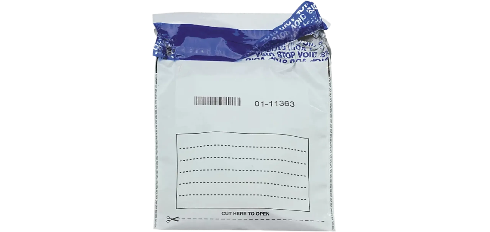

必要であれば、弁護士や公証人に相談し、計画を正式に法的枠組みに統合する。

**おめでとうございます！**あなたはBitcoinの富を確保するための重要なステップを完了しました。これからは、定期的に相続計画を見直し、タイムロックを使ったMultisigのセットアップを減らすなど、より高度な解決策を模索することで、相続計画に磨きをかけることができます：

https://planb.network/tutorials/wallet/desktop/liana-306ef457-700c-4fdd-b07a-8fb7a8a29f04

参考[暗号資産の相続対策、所有者のためのシンプルガイド* - パメラ・モーガン、2018.](https://www.amazon.com/gp/product/1947910116/)

パメラ・モーガン](https://x.com/pamelawjd)に感謝する。

## あなたは今、上位0.1％の最も準備の整ったビットコイナーに含まれる

<chapterId>5f4cfab9-9af1-584b-a1fe-a0769a991f19</chapterId>

ここまで来られたなら、あなたは啓蒙された少数派の一員です！Bitcoinでここまで来た人はほとんどいません。おそらくあなたは、このトレーニング・コースで提供されるチュートリアルのすべてに従ったことでしょう：最初のHardware Walletの設定、回復フレーズの確保、ドルコスト平均法（DCA）プランの作成、KYCの有無によるBitcoinの取得、Bitcoinの相続の計画まで。あなたが踏み出した一歩一歩が、真の金融主権への飛躍なのです。

まだすべてをやり終えていないとしても、近いうちにやり遂げることを誓っているのなら、あなたはすでに一歩先を進んでいるのだ。学び、行動を起こすというその決意こそが、本当に重要なのだ。Bitcoinが、私たち個人と集団の未来にとって、なぜこれほど重要な転換を意味するのか、おわかりいただけただろうか。

Bitcoinの教育を始めて以来、エコシステムも私も大きく進化してきました。このコースは、Bitcoinが今日提供する最高のものを反映するために完全に更新されました。共に歩んできた道のりは長い！

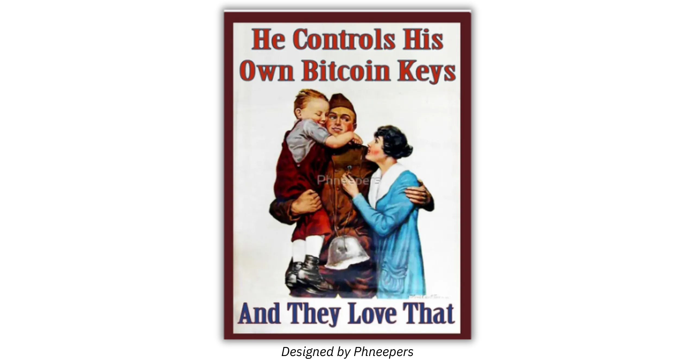

### Bitcoinの次は？

対数価格曲線を見れば、ひとつはっきりすることがある。このコースをお読みの皆さんは、新しい成長段階が始まったところかもしれないし、弱気相場の真っ只中かもしれない。いずれにせよ、サイクルは続き、必然的に目を見張るような高値と、時には残酷な調整によって中断される。

しかし、価格以上にBitcoinの成長は驚くべきものだ。サイファーパンクの間で無名のプロジェクトとして始まったものが、世界的なムーブメントになった。シルクロードから機関投資家の採用まで、Bitcoinは世界の金融情勢にしっかりと定着した。Bitcoinは、もはやフリンジ的な実験ではなく、世界中の機関投資家や何百万人もの個人によって受け入れられている本格的な資産クラスと見なされている。

このような認識の変化は、絶え間ない技術的進歩とともにもたらされた。ウォレットとインフラは常に改善されている。毎年、Bitcoinをより安全で、回復力があり、使いやすくする新しいソリューションが登場しています。今日、Bitcoinはこれまで以上に分散化され、よりアクセスしやすく、より理解されるようになっています。

もちろん、規制、プライバシー、より広範な普及、循環型経済の発展といった課題は残っている。しかし、コミュニティが活発で、好奇心旺盛で、熱心であり続ける限り、Bitcoinは従来の金融システムに代わる強力な選択肢であり続けるだろう。

ひとつ確かなことがある：Bitcoinはこれからも存在し続け、毎日、毎年、飽くことなく、およそ10分ごとに新しいブロックを生成し続けるだろう。ユーザー、ウォレット、取引所、そして規制、技術的なハードル、危機、イノベーションも増えるだろう。

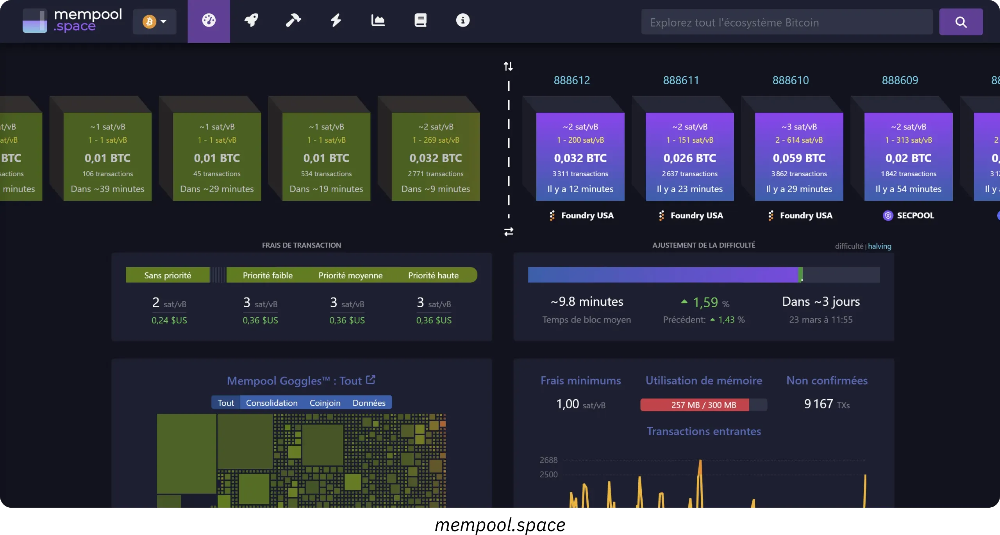

世界的な危機が続き、インフレが不換紙幣の購買力を蝕む中、Bitcoinは、金融の自由と個人の主権を求める人々を自然に引き寄せるだろう。このダイナミズムはBitcoinを強化し続け、そのプロトコル、スケーリング・レイヤー、そしてセキュリティ、プライバシー、ユーティリティといった日常的なユースケースを改善する新しい才能を引き寄せるだろう。

### 次の一手は？

皮肉なことに、最大の変化はBitcoinではなく、あなた自身である。

Bitcoinをどのように使用し、理解し、関わっていくかで、あなたは進化していくだろう。もしかしたら、Bitcoinに対する真の情熱が芽生え、他の人に教え始めたり、コミュニティーに参加したり、あるいは単に長期的に富を維持したりするようになるかもしれない。どのような道を歩むにせよ、Bitcoinはあなたの世界観を変え、自由と経済的責任との関係をも変えるだろう。

次の方向性をいくつか挙げてみよう：

#### 1.勢いを保つ

今の戦略がうまくいっているのなら、そのまま続ければいい。

Satsを定期的に積み重ね、セキュリティのベストプラクティスを維持すること。Bitcoinで貯めた資金を守ることが主な目的であれば、それ以上のことをする必要はありません。

時間をかけてエコシステムの進化を観察し、戦略を練り直し、必要に応じてセットアップを強化する。

#### 2.知識を深める

あなたの旅はここで終わりません。Bitcoinは進化し続ける世界であり、常に多くの発見があります。Bitcoinへの理解を深めるために、いくつかの方向性を探ってみましょう：

- デジタル・セキュリティのレベルアップのために、セキュリティ入門コースから始めましょう：

https://planb.network/courses/99c46148-7080-4915-a7e0-9df0e145cd47

- Bitcoinの経済的、哲学的側面に惹かれるなら、これらの詳細なコースをチェックしてほしい：

https://planb.network/courses/d07b092b-fa9a-4dd7-bf94-0453e479c7df

https://planb.network/courses/caa75343-ac90-4249-bcca-0e2e57c3a0f1

https://planb.network/courses/9d1bde6a-33e5-45dd-b7c0-94da72e45b11

- Bitcoinを企業戦略に組み込むことに関心のある企業経営者は見逃せない：

https://planb.network/courses/a804c4b6-9ff5-4a29-a530-7d2f5d04bb7a

- Bitcoinの誕生秘話やシステム初期の魅力的なストーリーを知るには、このコースを強くお勧めする：

https://planb.network/courses/a51c7ceb-e079-4ac3-bf69-6700b985a082

- 最後に、Bitcoinとそのエコシステムの技術的な側面に興味がある方は、これらのトレーニングコースをご覧ください：

https://planb.network/courses/34bd43ef-6683-4a5c-b239-7cb1e40a4aeb

https://planb.network/courses/46b0ced2-9028-4a61-8fbc-3b005ee8d70f

https://planb.network/courses/65c138b0-4161-4958-bbe3-c12916bc959c

#### 3.Bitcoinエコシステムへの貢献

Bitcoinは単なる金融ツールではありません。あなたのスキルや興味に応じて、貢献できる方法はたくさんあります：

- 教育と意識向上**：あなたの大切な人にBitcoinを理解してもらい、知識を共有し、地域の議論に参加しましょう；
- ツールやアプリケーションの開発**：技術的なスキルがあれば、オープンソースのツールに貢献することはBitcoinに価値をもたらす素晴らしい方法です；
- ローカルコミュニティ**に参加しましょう：イベントやミートアップ、フォーラムに参加して、他のビットコイナーと出会い、最新動向についてExchangeの見解を得る。

Plan ₿ Networkでは、教育活動にご協力いただける方を随時募集しています！私たちの教育コンテンツはすべてオープンソースで、GitHubでホストされています。Exchangeで、Satsで、コンテンツの校正や様々な言語への翻訳を手伝ってくれる貢献者を歓迎します！Bitcoinの旅の途中であろうとなかろうと、Plan ₿ Networkの[貢献者のためのTelegramグループ](https://t.me/PlanBNetwork_ContentBuilder)に招待します。

### 最後の言葉

BTC102コースを受講していただき、ありがとうございました。

Découvre Bitcoinの創始者であり、Plan ₿ Networkの共同創始者でもあるロジーです。Plan ₿ Networkは、私たちの素晴らしい新しいパートナーであるTetherとFulgur Venturesによって実現したプラットフォームであり、Bitcoinについてできるだけ多くの人々に知ってもらうという私たちの共通の使命です。

皆様からのフィードバックは大変貴重です。このコースの最新版についてどう思われたか、お気軽にコメントをお寄せください。皆様のご意見は、私たちのコンテンツの質を向上させ続けるために役立ちます。

40問のテストで理解度を確認し、修了証を授与します。

幸運を祈る！

また近いうちに、Plan ₿ Networkの別のコースでお会いできることを願っています。それが私のコースであれ、コミュニティの他の素晴らしい先生方のコースであれ。そして、もしかしたら、カンファレンスやイベント、Bitcoinミートアップで直接お会いできるかもしれません。

あらためて、よくぞここまでたどり着いた。そして忘れてはならないのは、私の第一目標は常に変わらないということだ：

**Bitcoin.**を通じて、一人でも多くの人が経済的主権を獲得できるよう支援する。

**Bitcoinでの旅の成功を祈る！**。

# 最終節

<partId>a8425389-4a53-4b57-b9b4-36c1cab12de5</partId>

## レビュー＆評価

<chapterId>3f43175a-fb7a-5b1c-a887-7dcf615d7a3a</chapterId>

<isCourseReview>true</isCourseReview>
## 最終試験

<chapterId>f3ff8089-8f89-56a8-be8c-b60296b4d91f</chapterId>

<isCourseExam>true</isCourseExam>
## 結論

<chapterId>b082b8eb-dabc-5d79-94cf-eb8f48fc1968</chapterId>

<isCourseConclusion>true</isCourseConclusion>
