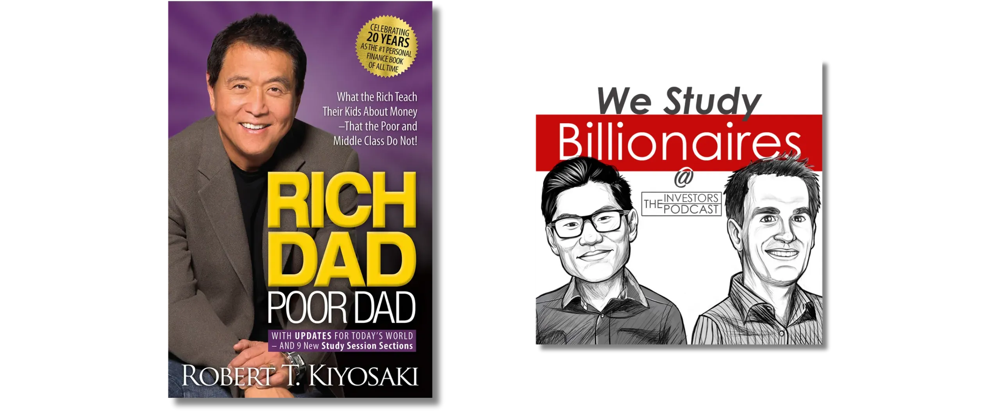
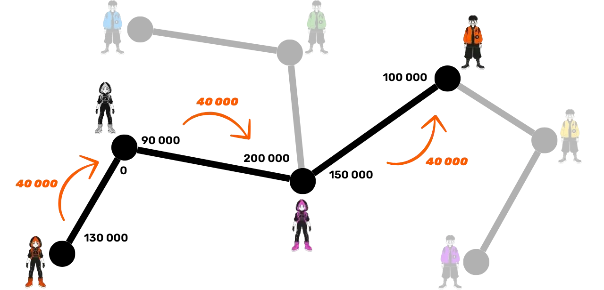
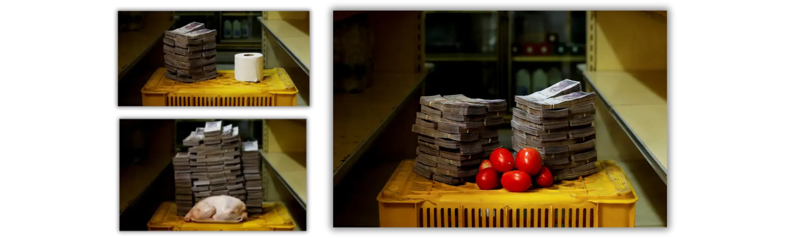
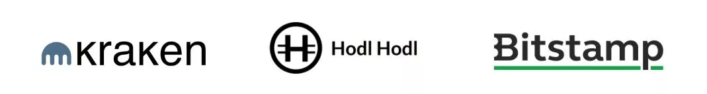
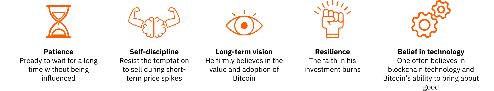
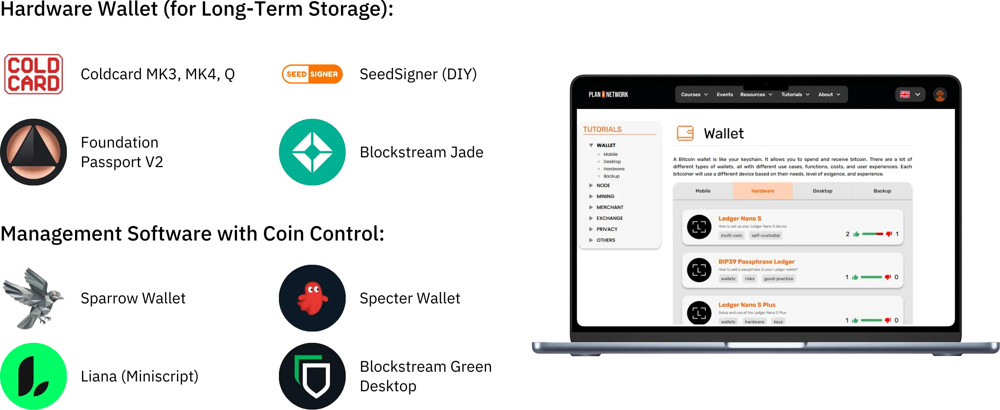

# En reise til dine første bitcoins

Bitcoin-økosystemet opplever en spektakulær og enestående vekst. De teknologiske, økonomiske og sosiale endringene som Satoshi Nakamotos oppfinnelse har ført til, intensiveres dag for dag og åpner gradvis dørene til en ny verden som du nå kan dra full nytte av.

Å dykke ned i Bitcoin-kaninhullet er et spennende intellektuelt eventyr som vil stimulere din kritiske tenkning og utfordre mange av dine overbevisninger. Denne utforskningen vil ikke bare gi deg en dyp forståelse av hvordan Bitcoin fungerer, men også en reell mulighet til å gjenvinne din personlige frihet, beskytte personvernet ditt og oppnå ekte økonomisk suverenitet.

For å veilede deg effektivt gjennom denne reisen har jeg laget dette helt gratis kurset. Her er fokuset utelukkende på Bitcoin. Ingen irrelevante diskusjoner, ingen omtale av andre kryptovalutaer, bare klart, presist og enkelt innhold.

Dette kurset er utformet for å gi deg full kontroll over hvordan du lærer, slik at du kan utforske Bitcoin i ditt eget tempo og følge den veien som passer best til dine interesser og mål.

+++
# Innledning

<partId>008c49b7-5e17-5973-87f2-ba28429b2697</partId>

## Kursoversikt

<chapterId>bfc96999-0ee1-5c41-8297-1b629f50cffc</chapterId>

Velkommen til BTC102! Hvis du allerede har fullført BTC101, har du utforsket de viktigste teoretiske konseptene bak hvorfor Bitcoin er en så revolusjonerende teknologi. Nå, med BTC102, er det på tide å sette denne kunnskapen ut i livet. Dette kurset er designet for å hjelpe deg med å bygge din personlige Bitcoin-plan, trinn for trinn.

I kapitlene som følger, vil vi veilede deg gjennom de praktiske trinnene for å **skaffe dine første bitcoins**, **sikre** dem på riktig måte og ta dine første skritt inn i dette raskt voksende økosystemet.

https://planb.network/courses/2b7dc507-81e3-4b70-88e6-41ed44239966

Selv om Bitcoin har eksistert i over 16 år, er bransjen fortsatt ung, dynamisk og dypt forankret i frihet. Den underliggende protokollen er fullstendig desentralisert og motstandsdyktig mot kontroll fra en sentral myndighet, noe som gjør at økosystemet kan vokse på en naturlig og organisk måte.

Denne friheten fører til en utrolig bølge av innovasjon og muligheter, men den medfører også visse risikoer, blant annet svindel, vanlige feil og fallgruver som ofte skyldes mangel på kunnskap. Hovedmålet med dette kurset er å hjelpe deg med å navigere trygt og sikkert i dette nye økosystemet.

For å oppnå dette er BTC102-kurset delt inn i flere deler, som hver fokuserer på et sentralt aspekt av din reise med Bitcoin:

Den første delen, "Forutsetninger for å forstå Bitcoin", forbereder deg effektivt på veien videre. Du lærer å identifisere de viktigste fallgruvene knyttet til svindel og økonomisk bedrageri som kan finnes i Bitcoin-økosystemet. Deretter går vi gjennom det grunnleggende om sikkerhet på nettet.

Til slutt vil jeg gi deg noen praktiske tips som er spesielt utviklet for nybegynnere, slik at du kan unngå vanlige feil når du jobber med Bitcoin for første gang.

Den andre delen, "Forstå hva du begir deg inn på", vil gi deg en dypere forståelse av Bitcoin. Vi begynner med en gjennomgang for å sikre at du forstår de viktigste konseptene.

Deretter forklarer vi hvorfor Bitcoin er fundamentalt viktig fra et teknologisk, økonomisk og sosialt perspektiv, noe som styrker din tro på verdien av det. Du vil også utforske Bitcoin-bransjen som helhet: dens nøkkelaktører, organisering og utvikling gjennom årene. Til slutt vil vi gå gjennom Bitcoin-økosystemets lagdelte arkitektur, et avgjørende konsept for å forstå hvordan dette systemet fortsetter å innovere uten at det går på bekostning av integriteten til kjerneprotokollen.

Den tredje delen, "Sette opp planen din", fokuserer på din personlige tilnærming til Bitcoin. Vi begynner med å hjelpe deg med å definere brukerprofilen din ut fra fire hovedkategorier:

- hodler*, med fokus på å holde Bitcoin langsiktig ;
- stableren*, som kjøper regelmessig og metodisk;
- brukeren*, som prioriterer å bruke Bitcoin daglig;
- og til slutt *den paranoide*, som ønsker maksimal sikkerhet for å beskytte sine eiendeler og sitt privatliv på en effektiv måte.

Vi veileder deg gjennom implementeringen av en strategi som passer din profil og hjelper deg med å nå dine personlige mål.

Til slutt, i den fjerde delen, "Beskytte dine arvinger og formue", tar vi for oss et viktig tema som ofte blir oversett: hvordan du kan sikre at din Bitcoin blir videreført til dine nærmeste i tilfelle en uventet hendelse. Du lærer hvordan du oppretter og setter opp en Bitcoin-arvplan for å sikre at formuen din bevares utover din levetid.

Etter dette kurset vil du ha alle de praktiske verktøyene du trenger for å navigere trygt i Bitcoin-økosystemet og bli en av de mest avanserte brukerne!

Er du klar til å begynne din reise inn i Bitcoins verden? Da setter vi i gang!

# Forutsetninger for å forstå Bitcoin

<partId>4481fc4b-0f83-489e-ad07-81517c5d6bad</partId>

## Svindel og økonomisk bedrageri

<chapterId>8af2948b-2ab5-54c4-862c-3414b8a285a2</chapterId>

Bitcoin-økosystemet og miljøet rundt er fortsatt relativt ungt og løst regulert, avhengig av land. Denne friheten åpner for enorme muligheter, men den skaper også grobunn for økonomisk svindel, svindelforsøk og ulike former for manipulasjon. Det er derfor det første kapittelet er så viktig: Hvis du forstår de vanligste fallgruvene, kan du unngå dem. Din økonomiske sikkerhet er en prioritet, for en dårlig opplevelse påvirker ikke bare deg, den påvirker hele Bitcoin-samfunnet.

### Bitcoin vs kryptoer: forstå forskjellene

Før vi går videre, er det viktig å skille klart mellom to fundamentalt forskjellige verdener:

- Bitcoin-økosystemet** er sentrert rundt ideen om sunne penger, bygget på sterk desentralisering, langsiktig robusthet, personvern og individuell suverenitet. Siden lanseringen i 2009 har Bitcoin fungert pålitelig og sikkert, støttet av et globalt, engasjert fellesskap av utviklere. Det er ikke en forbigående trend, men en stabil og veletablert protokoll som er utformet for å bevare verdien over tid.

- Kryptovalutaindustrien** er derimot mye større og omfatter titusenvis av ulike prosjekter, hvert med sitt eget token. Denne bransjen er ofte drevet av rask innovasjon, hype og kortsiktig finansiell spekulasjon. Mange av disse prosjektene er sentraliserte, mindre sikre og tilbyr ikke mye reell verdi - til tross for dristige løfter og prangende markedsføring.

Hvis du ønsker å forstå bedre hvor Bitcoin kommer fra og hva som virkelig skiller det fra andre prosjekter, anbefaler jeg at du tar en titt på dette gratis oppfølgingskurset om Bitcoins historie senere:

https://planb.network/courses/a51c7ceb-e079-4ac3-bf69-6700b985a082

Som du vet er Plan ₿ Network-plattformen utelukkende dedikert til Bitcoin. Å forstå skillet med andre kryptovalutaer vil imidlertid hjelpe deg med å unngå fallgruvene forbundet med ubrukelige og noen ganger til og med falske prosjekter.

### De viktigste svindelforsøkene du bør unngå

Her er de vanligste svindelforsøkene du kan støte på under reisen:

#### Pyramidespill og pyramidespill

Dette er noen av de vanligste svindelformene i kryptoverdenen. I et pyramidespill får tidlige deltakere utbetalinger ved hjelp av pengene fra nyere deltakere, ikke fra noen reell investering eller produkt. Det skapes ingen faktiske verdier. Systemet fungerer bare så lenge nye mennesker slutter seg til. Når strømmen av nye deltakere avtar, faller hele opplegget fra hverandre.

Disse svindelforsøkene inneholder vanligvis :

- Urealistiske løfter om garantert avkastning (f.eks. 20 % garantert avkastning);
- Forsinkelser eller vanskeligheter når du prøver å ta ut de investerte midlene dine;
- Sterke insentiver til å rekruttere nye medlemmer for å holde systemet i gang;
- En fullstendig mangel på åpenhet om den virkelige kilden til den lovede avkastningen.

Til syvende og sist er alle pyramide- og pyramidespill dømt til å mislykkes. Deres grunnleggende svakhet ligger i det konstante behovet for å hente inn nye investorer for å betale avkastning til tidligere deltakere. Dette behovet blir matematisk umulig å opprettholde over tid, fordi antallet nye rekrutter som kreves, øker eksponentielt etter hvert som systemet vokser. Når et kritisk punkt er nådd, begynner deltakerne å tvile, tilliten forsvinner, og hele pyramiden kollapser. På dette stadiet mister de siste som blir med, ofte de minst informerte, hele investeringen sin uten mulighet til å få den tilbake, mens arrangørene eller de tidlige investorene vanligvis allerede har trukket ut pengene sine og forlatt systemet.

I kryptovalutaverdenen kan pyramidespill ta mange former, ofte designet for å skjule sin bedragerske natur bak en teknologisk eller finansiell maske. Disse svindlene kan fremstå som nye token-tilbud eller Initial Coin Offerings (ICO-er), som er innsamlingsaksjoner der en ny kryptovaluta selges til publikum. Bak tekniske termer som "Blockchain", "smartkontrakter" eller "staking" skjuler noen prosjekter komplekse pyramidespill. Andre hevder å tilby høy avkastning ved å kombinere tvilsomme kryptoaktiva med kompensasjonssystemer som er helt avhengige av en kontinuerlig tilstrømning av nye investorer.

I den senere tid har pyramidespill også spredt seg til desentralisert finans (DeFi). Selv om DeFi er ment å tilby finansielle tjenester uten mellomledd, bruker noen prosjekter det til å gi en falsk følelse av legitimitet til svindlene sine. Enkelte DeFi-plattformer lover høy, garantert avkastning i Exchange for innskudd av kryptovaluta i automatiserte protokoller. Disse attraktive løftene støttes ofte av ugjennomsiktige og uverifiserbare mekanismer, med tokens som er opprettet spesielt for svindelen. I virkeligheten har disse systemene ingen bærekraftig forretningsmodell - avkastningen betales ganske enkelt fra nye brukeres midler, akkurat som i et tradisjonelt pyramidespill. Når tilliten begynner å forvitre eller tilstrømningen av nye deltakere avtar, kollapser disse systemene uunngåelig, noe som fører til betydelige tap for intetanende investorer.

Vær oppmerksom på at innholdet i dette kurset kun er ment for opplæringsformål og ikke skal tolkes som økonomisk rådgivning. Din økonomiske sikkerhet avhenger av din evne til å være forsiktig, skeptisk og velinformert i alle økonomiske beslutninger du tar.

Den beste beskyttelsen er å alltid stille dette enkle spørsmålet: Hvor kommer den lovede avkastningen egentlig fra? Hvis svaret er uklart, bør du stikke av med en gang.

#### Pumpe og tømme

Denne typen svindel innebærer kunstig oppblåsing av prisen på et aktivum - ofte en kryptovaluta med lav likviditet - gjennom en koordinert markedsføringskampanje, vanligvis ledet av en gruppe investorer. Det typiske Pump & Dump-opplegget følger dette mønsteret:

- En gruppe innsidere eller innflytelsesrike personer samler i det stille opp en stor mengde av den aktuelle eiendelen.
- Deretter lanserer de en aggressiv reklamekampanje for å skape en generate hype og drive opp prisen.
- Publikum, drevet av FOMO (Fear of Missing Out), begynner å kjøpe eiendelen i stort antall, noe som presser prisen enda høyere.
- Når hypen er på topp, selger innsiderne unna beholdningene sine på én gang.
- Prisen krasjer, og de som kommer for sent, sitter igjen med store tap.

Det er viktig å merke seg at Pump & Dump-strategier er ulovlige i mange land og anses som en form for markedsmanipulasjon. Til tross for dette fortsetter slike ordninger å blomstre, spesielt i kryptovalutaområdet, der reguleringen fortsatt er i ferd med å ta igjen det tapte.

Vær spesielt forsiktig med private "signal"-grupper på plattformer som Telegram, Discord eller andre sosiale mediekanaler. Disse drives ofte av influencere eller selvutnevnte eksperter, og noen av dem tar til og med inngangspenger. Selv om disse gruppene hevder å tilby eksklusive investeringsmuligheter, er virkeligheten langt mer ensidig: Bare arrangørene tjener penger, mens de fleste deltakerne ender opp med å tape pengene sine.

Riktignok kan noen aktører midlertidig tjene penger på denne typen markedsmanipulasjon, men suksessen er som regel ikke basert på annet enn flaks og perfekt timing. I det lange løp er ikke slike opplegg bærekraftige. De krever konstant høyrisiko-engasjement og gjentatt deltakelse i svindelopplegg som uunngåelig kollapser.

Enda verre er det at de gir næring til en farlig illusjon: troen på at det er mulig å tjene raske og enkle penger uten å forstå hvordan finansielle systemer faktisk fungerer. Dette tankesettet utsetter ikke bare enkeltpersoner for risiko, men undergraver også troverdigheten til hele økosystemet for kryptovaluta

Av alle disse grunnene er den beste strategien å holde seg til en seriøs og gjennomtenkt tilnærming til investering, en tilnærming som er basert på finansiell utdannelse, en solid forståelse av de grunnleggende prinsippene og et langsiktig perspektiv.

Ved å bygge opp kunnskapen din tålmodig, blir du langt mindre sårbar for følelsesmessig manipulasjon og urealistiske løfter, og mye bedre rustet til å unngå den typen økonomiske feller som kan føre til reelle tap.

#### Svindel med donasjoner, lotterier og falske gaver

Denne typen svindel lover gratis Bitcoin eller andre belønninger i Exchange mot at du sender en liten sum penger først. Det er viktig å huske: Ingen legitim person eller organisasjon vil noensinne be deg om å sende kryptovaluta på forhånd med løfte om å sende deg mer i retur.

Svindlere utgir seg ofte for å være kjente offentlige personer (som Elon Musk eller andre kjendiser) for å lokke ofre gjennom sosiale medier. Dobbeltsjekk alltid legitimiteten til kontoer og nettsteder før du tar kontakt med dem, og stol aldri på tilbud som virker overdrevent sjenerøse eller for gode til å være sanne.

Noen ganger fremstår disse svindlene som "forskuddsgebyr"-svindel. Du blir lovet en premie eller belønning (penger, et produkt eller en tjeneste), men blir først bedt om å betale et gebyr, som angivelig skal dekke ting som frakt, avgifter eller transaksjonskostnader. Når betalingen er utført, forsvinner svindleren, og den lovede belønningen kommer aldri frem.

#### Shitcoins og kryptovalutaer på tilbud

Sentraliserte kryptovaluta-prosjekter tilbyr noen ganger gratis tokens ("*airdrops*") for å tiltrekke seg brukere. Disse tokens har vanligvis liten eller ingen reell verdi og brukes hovedsakelig for å skape en illusjon av popularitet eller for å gi næring til spekulasjon. Vær svært forsiktig med denne typen kampanjetilbud; de er ofte markedsføringsfeller snarere enn ekte muligheter.

#### Identitetstyveri og phishing

Angriperne bruker ofte falske nettsteder, kontoer på sosiale medier eller villedende e-poster for å stjele pengene dine. Disse svindlene kan komme gjennom alle kommunikasjonskanaler: e-post, sosiale nettverk, telefonsamtaler eller til og med tradisjonell post...

Dobbeltsjekk alltid avsenderens identitet før du klikker på en lenke eller utfører en handling. Hvis du er i tvil, bør du besøke nettstedet manuelt i stedet for å bruke en oppgitt lenke. Og viktigst av alt: Del aldri dine private nøkler eller passord med noen.

#### Bitcoin Hardgaffel

I løpet av årene har Bitcoin opplevd flere *Hard-forks*, noe som har resultert i opprettelsen av alternative versjoner av den opprinnelige kryptovalutaen. Enkelt sagt er en *Hard Fork* en splittelse i nettverket som fører til to separate blokkjeder, som begge deler den samme historien frem til splittelsesøyeblikket. Disse splittelsene skjer vanligvis når en del av utviklermiljøet eller det bredere Bitcoin-økosystemet ønsker å innføre store endringer i den opprinnelige protokollen, men ikke kan oppnå bred enighet. I stedet for å forlate ideene sine, bestemmer de seg for å lansere en ny versjon av Bitcoin (med endrede regler) i håp om at brukere og utvinnere vil velge å følge deres Fork i stedet.

Ikke alle *Hard-forker* er uredelige, ettersom noen skyldes tekniske eller ideologiske uenigheter innad i fellesskapet. Andre er imidlertid drevet av kommersielle interesser eller til og med uærlige motiver. De mest kjente eksemplene på slike hardforks er **Bitcoin Cash (BCH)** og **Bitcoin Satoshi Vision (BSV)**. Disse alternative valutaene ble lansert i henholdsvis 2017 og 2018, og de utgir seg ofte for å være "bedre versjoner" av den opprinnelige Bitcoin. De markedsfører antatte fordeler som lavere transaksjonsgebyrer eller raskere transaksjoner på grunn av økte blokkstørrelser. Disse tekniske endringene kommer imidlertid med betydelige kompromisser når det gjelder sikkerhet, desentralisering og robusthet; Elements som kan komme i konflikt med Bitcoins grunnleggende prinsipper.

Utover de tekniske forskjellene utnytter disse alternative valutaene ofte forvirring for å tiltrekke seg uinformerte investorer. De kan benytte seg av markedsføringstaktikker som er utformet for å bevisst villede nykommere som tror de kjøper ekte Bitcoin (BTC).

For å unngå å gå i denne fellen, bør du alltid verifisere valutaen du kjøper. Den originale Bitcoin-valutaen bruker tickeren **BTC**, mens Bitcoin Cash og derivatene bruker forskjellige akronymer, for eksempel BCH eller BSV.

#### Uærlige influencere og falske guruer

I takt med at kryptovalutaer har fått stadig større oppmerksomhet, har sosiale medier sett en økning i antall påvirkere, selvutnevnte eksperter og såkalte "*kryptoguruer*". Mens noen få kan tilby genuin pedagogisk innsikt, utnytter mange andre sin synlighet til å promotere tvilsomme prosjekter eller farlig risikable (og noen ganger direkte bedragerske) handelsstrategier. Disse personene er vanligvis motivert av personlige økonomiske interesser, og mottar ofte direkte eller indirekte kompensasjon for å promotere visse tokens eller plattformer.

Disse influencerne benytter seg ofte av velprøvde taktikker for å tiltrekke seg nybegynnere: De viser frem imponerende økonomiske resultater (som ofte er falske eller uverifiserbare), skilter med en luksuriøs livsstil som antatt bevis på suksessen, og promoterer "mirakuløse" investeringsstrategier. Målet er å utløse FOMO - frykten for å gå glipp av noe - og få publikum til å ta impulsive beslutninger og gjøre uvørne investeringer.

Det er viktig å forstå at de fleste "gratis" råd fra disse personlighetene aldri er helt gratis. Bak fasaden av sjenerøsitet skjuler det seg ofte en kalkulert strategi for å styre folk mot å kjøpe tvilsomme aktiva. Og selv om noen influencere var ærlige, ville det være nesten umulig å gjenskape resultatene deres; suksessen deres avhenger ofte av spesifikk timing, innsidekunnskap eller unike omstendigheter som du rett og slett ikke har tilgang til.

Noen influencere kan invitere deg til å bli med i private, betalte grupper der de hevder å dele eksklusive handelssignaler eller innsidetips som lover rask og enkel fortjeneste. I virkeligheten er disse gruppene hovedsakelig til fordel for arrangørene selv. De bruker ofte følgerne sine som en kilde til likviditet, og selger i hovedsak eiendeler for personlig vinning. Abonnentene ender som regel opp med å tape penger, ettersom de ikke er i stand til å reagere like raskt som innsiderne som orkestrerer handlene (se avsnittet om Pump & Dump-ordninger).

I lys av denne virkeligheten er det noen gode vaner å ta til seg for å unngå å gå i fellene til uærlige påvirkere:

- Vær svært forsiktig med anbefalinger om kryptoinvesteringer**

En pålitelig og kunnskapsrik person vil aldri presse deg til å kjøpe en kryptovaluta uten å oppfordre deg til å gjøre dine egne undersøkelser først.

- Betalte kurs i handel eller investering er ikke alltid et kvalitetsstempel**

Mange av disse kursene fremmer risikofylte eller altfor forenklede strategier; ofte den samme informasjonen som du kan finne gratis på nettet.

- Det finnes ingen garantert måte å kopiere andres handler på og få identiske resultater

Alle investeringsstrategier avhenger av personlig kontekst, timing, kunnskap og andre faktorer som ikke kan dupliseres nøyaktig.

- Vær spesielt på vakt mot råd som høres for gode ut til å være sanne**

Urealistiske løfter eller garantert fortjeneste er nesten alltid tegn på manipulasjon. Husk: Bare fordi noen sier noe med selvtillit, betyr ikke det at det er sant.

Husk alltid at alle du møter i Bitcoin eller det bredere kryptoøkosystemet har en personlig agenda; enten den er uttalt direkte eller skjult mellom linjene. Det finnes ikke noe slikt som rent nøytral informasjon. Selv dette kurset, BTC102, har et klart mål, * å fremme bedre forståelse av Bitcoin.*

Derfor er det viktig å være klar over de virkelige motivene bak alt innholdet du konsumerer. Og glem aldri denne gylne regelen på internett:

*Hvis et produkt eller en tjeneste virker gratis, er sjansen stor for at du er produktet

Til syvende og sist er det beste forsvaret ditt personlig utdannelse, sunn skepsis og, viktigst av alt, en vane med å verifisere fakta selv.

### Slik unngår du svindel

**For å være trygg på nettet, spesielt i kryptoverdenen, må du huske på disse viktige prinsippene:**

- Stol aldri blindt: "*Don't trust, verify*" ;
- Vær skeptisk til garantert eller uvanlig høy avkastning;
- Del aldri de private nøklene dine med noen;
- Ikke send Bitcoin (eller annen krypto) til ukjente adresser;
- Hvis du er i tvil, ta en pause. Ta et skritt tilbake og tenk deg om før du handler. FOMO er din verste fiende;
- Unngå betalte handelsgrupper eller nettsamfunn som gir urealistiske løfter;
- De fleste gaver eller "gratis" lotterier på nettet er svindel eller sterkt rigget;
- På lang sikt vil du alltid tjene mer på å lære enn på å gamble.

Å beskytte deg mot svindel er et viktig første skritt for å sikre verdiene dine, men det er ikke nok. Det er minst like viktig å opprettholde en god digital hygiene. Derfor skal vi i neste kapittel se nærmere på hvordan du kan styrke sikkerheten din på nettet og hvilke rutiner du bør ta i bruk for å beskytte deg selv i den digitale verden.

## Sikkerhet på nett

<chapterId>f0873bf2-6a6f-5485-bb7a-d84be14f404d</chapterId>

Så snart du begynner å jobbe med Bitcoin, vil du raskt innse at grunnleggende cybersikkerhet ikke er valgfritt - det er helt avgjørende. Svindel og bedrageri er bare toppen av isfjellet. Utilsiktet tap av data, skadevare og kompromitterte passord kan være like ødeleggende, spesielt når du administrerer dine egne nøkler.

I dette kapittelet går vi gjennom noen enkle, praktiske trinn for å forbedre den digitale hygienen din og beskytte deg selv på nettet.

Hvis du ønsker å gå dypere, tilbyr Plan ₿ Networks SEC101-kurs en omfattende gjennomgang av cybersikkerhetsstrategier som er spesielt utviklet for Bitcoin-brukere.

https://planb.network/courses/99c46148-7080-4915-a7e0-9df0e145cd47

### Hvorfor cybersikkerhet er viktig

Bitcoin gir deg muligheten til å holde pengene dine direkte (uten banker), uten mellomledd. Men den typen økonomisk suverenitet kommer med et stort ansvar: Hvis BTC-en din blir stjålet på grunn av en sikkerhetsbrist, er det ingen måte å reversere transaksjonen på. I motsetning til tradisjonelle banktjenester finnes det ingen helpdesk, ingen svindelkrav og ingen forsikring som kan redde deg.

I tillegg gjør den økonomiske verdien av Bitcoin den til et verdifullt mål. En hacker som kompromitterer din Wallet, kan umiddelbart flytte pengene dine til en Address de kontrollerer (uten å stille spørsmål, og uten mulighet til å få dem tilbake).

### En ren og oppdatert datamaskin

Et av de mest oversette aspektene ved personlig sikkerhet er å holde operativsystemet og programvaren oppdatert. Mange oppdateringer lapper kjente sårbarheter som ellers kan utnyttes av angripere. Selv om noen unngår oppdateringer av frykt for ytelsesproblemer, ligger den virkelige risikoen i å kjøre utdatert programvare som hackere allerede vet hvordan de skal knekke.

Det anbefales også å bruke et pålitelig antivirusprogram. I Windows er den innebygde Windows Defender vanligvis tilstrekkelig for de fleste brukere. Hvis du foretrekker flere funksjoner eller trygghet, finnes det også kommersielle alternativer som Kaspersky. På macOS er trusler fra skadelig programvare historisk sett mindre vanlig **men ikke ikke-eksisterende**, så det er fortsatt smart å være forsiktig.

Utover systemoppdateringer og antivirusbeskyttelse, bør du være svært forsiktig med å laste ned programvare fra tvilsomme nettsteder eller såkalte "universelle" nedlastingsportaler. Når du trenger et verktøy eller et program, bør du alltid gå rett til den offisielle kilden. Dette reduserer risikoen for å installere skadelig programvare forkledd som legitim programvare.

En annen smart vane er å verifisere ektheten og integriteten til all programvare før du installerer den på datamaskinen din. Hvis du ikke er sikker på hvordan du gjør det, har vi en egen veiledning som hjelper deg gjennom prosessen:

https://planb.network/tutorials/computer-security/data/integrity-authenticity-21d0420a-be02-4663-94a3-8d487f23becc

Til slutt bør du ta regelmessige sikkerhetskopier av viktige data. En ekstern Hard-stasjon eller SSD er et godt alternativ for å ta vare på en kopi av filene dine i tilfelle plutselig feil, hacking eller utilsiktet sletting. Du vil takke deg selv senere.

Hvis du foretrekker skyløsninger, kan du vurdere å bruke en sikker tjeneste som Proton Drive. Bare sørg for at det alternativet du velger, respekterer personvernet ditt og tilbyr sterk kryptering.

https://planb.network/tutorials/computer-security/data/proton-drive-03cbe49f-6ddc-491f-8786-bc20d98ebb16

En mye anbefalt strategi for sikkerhetskopiering er "3-2-1-regelen". Den er utformet for å beskytte dataene dine mot utilsiktet tap, cyberangrep eller til og med naturkatastrofer.

Ideen er enkel:

- Oppbevar **mindst 3 kopier** av viktige data,
- Lagre dem på **mindst to forskjellige typer medier** (f.eks. en ekstern Hard-stasjon og skylagring),
- Og sørg for at **1 av disse kopiene er lagret utenfor stedet** (fysisk adskilt fra hovedlokasjonen).

Denne tilnærmingen gir stor robusthet og bidrar til å sikre at dataene dine overlever selv om noe skulle gå alvorlig galt.

### Løsningen på ID-marerittet

En av de største grunnene til at folk blir hacket, er at de bruker svake passord. Et betydelig antall brukere gjenbruker fortsatt det samme passordet på flere kontoer, eller velger varianter som er lette å gjette. Passordadministratorer er den perfekte løsningen på dette problemet.

En passordbehandler lar deg:

- Lagre alle passordene dine sikkert** i et kryptert hvelv
- generate lange, komplekse og unike passord** automatisk for hver konto
- Bruk bare ett hovedpassord** for å få tilgang til alt på en sikker måte

Med en passordadministrator trenger du aldri mer å klikke på "Glemt passord" eller stole på svak, gjenbrukt legitimasjon. I tillegg synkroniserer de fleste passordbehandlere sømløst på tvers av enhetene dine (datamaskin, telefon, nettbrett) og fyller til og med ut påloggingsskjemaer automatisk, noe som gjør sikker tilgang både enkel og effektiv.

Det finnes mange passordadministratorer der ute, men jeg kan anbefale to solide alternativer avhengig av dine behov. Hvis du er ute etter noe som er enkelt å bruke og som synkroniseres sømløst på tvers av flere enheter, er Bitwarden et utmerket valg:

https://planb.network/tutorials/computer-security/authentication/bitwarden-0532f569-fb00-4fad-acba-2fcb1bf05de9

Hvis du heller vil oppbevare alt lokalt på din egen enhet, er KeePass et godt alternativ:

https://planb.network/tutorials/computer-security/authentication/keepass-f8073bb7-5b4a-4664-9246-228e307be246

### 2FA: dobbel beskyttelse

I Bitcoin er du din egen bank. Det betyr at du også er ditt eget sikkerhetsteam. Selv med et sterkt passord er det ikke noe som heter null risiko - og derfor er det viktig å aktivere tofaktorautentisering (2FA).

2FA legger til en ekstra Layer av beskyttelse ved å kreve en tidsbasert engangskode (vanligvis seks sifre) som genereres av en app som Google Authenticator eller Authy. Så selv om noen klarer å få tak i passordet ditt, kan de likevel ikke få tilgang til kontoen din uten fysisk tilgang til telefonen din.

https://planb.network/tutorials/computer-security/authentication/authy-a76ab26b-71b0-473c-aa7c-c49153705eb7

Når du aktiverer 2FA, må du sørge for å lagre gjenopprettingsnøkkelen for appen din på et trygt sted. Da kan du gjenopprette kodene dine hvis du mister eller bytter telefon. Selv om SMS- eller e-postbasert 2FA er bedre enn ingenting, er det mye mindre sikkert. Et SIM-bytteangrep, der noen tar kontroll over telefonnummeret ditt, kan enkelt omgå denne typen beskyttelse.

For de som ønsker å ta sikkerheten et skritt videre, gir fysiske nøkler som YubiKey et enda høyere beskyttelsesnivå.

https://planb.network/tutorials/computer-security/authentication/security-key-61438267-74db-4f1a-87e4-97c8e673533e

### Beskyttelse av personvernet ditt

Personvern og cybersikkerhet henger tett sammen: Jo mer informasjon du legger åpent tilgjengelig, desto større er sannsynligheten for at du blir et mål.

Et **VPN** (*Virtual Private Network*) er et enkelt, men effektivt tiltak for å maskere din IP Address og kryptere internettrafikken din. Selv om det ikke vil gjøre deg helt usynlig (siden VPN-leverandøren fortsatt kan se aktiviteten din), gjør det det betydelig vanskeligere for alle som prøver å spionere på deg eller spore surfevanene dine.

Nøkkelen er å velge en pålitelig VPN-leverandør som:

- Krever ikke din personlige informasjon
- Tillater betaling via BTC
- Har en streng policy mot loggføring

Vi har flere veiledninger tilgjengelig på Plan ₿ Network som kan veilede deg gjennom å sette opp et VPN på en enkel måte. Jeg anbefaler spesielt IVPN eller Mullvad:

https://planb.network/tutorials/computer-security/communication/ivpn-5a0cd5df-29f1-4382-a817-975a96646e68

https://planb.network/tutorials/computer-security/communication/mullvad-968ec5f5-b3f0-4d23-a9e0-c07a3e85aaa8

Viktige tiltak for å beskytte personvernet ditt på nettet omfatter også

- Bruk av **krypterte meldingsplattformer** som Signal, SimpleX eller Session;
- Bruk av personvernfokuserte nettlesere som Firefox, Brave eller Tor (for økt anonymitet);

https://planb.network/tutorials/computer-security/communication/tor-browser-a847e83c-31ef-4439-9eac-742b255129bb

- Bruk av en **sikker postkasse**, for eksempel ProtonMail;

https://planb.network/tutorials/computer-security/communication/proton-mail-c3b010ce-254d-4546-b382-19ab9261c6a2

- Kryptere** filene dine med verktøy som Bitlocker (for Windows) eller VeraCrypt (tilgjengelig på flere plattformer).

https://planb.network/tutorials/computer-security/data/veracrypt-d5ed4c83-7c1c-4181-95ea-963fdf2d83c5

### Trinnvis progresjon

Cybersikkerhet kan virke som en enorm oppgave, og det er lett for nybegynnere å bli overveldet og gi opp fordi det virker for komplisert. Trikset er å ta det steg for steg. Begynn med noe enkelt, som å installere en passordadministrator. Gi deg selv noen uker til å bli komfortabel med det, og gå deretter videre til neste trinn: som å aktivere 2FA på en av kontoene dine.

Etter hvert som du blir tryggere på disse verktøyene, vil du være klar til å legge til mer avanserte metoder, som å bruke en sekundær e-post, bytte til ProtonMail, sette opp et VPN eller surfe med Tor når det er nødvendig.

Etter hvert som du dykker dypere inn i Bitcoin-verdenen, vil du legge merke til at risikoen øker i takt med at verdien av din Wallet øker. Å bygge solide sikkerhetsvaner, beskytte personvernet ditt og sette opp de riktige verktøyene vil ikke bare gi deg sjelefred, men også styrke suvereniteten Bitcoin handler om.

Kort sagt: Ikke undervurder cybersikkerhet, ta deg tid til å sette opp det grunnleggende, og husk at konsistens er nøkkelen. Uten god digital hygiene vil selv de beste verktøyene ikke hjelpe deg stort.

Ta også en titt på [våre veiledninger om datasikkerhet] (https://planb.network/tutorials/computer-security) på Plan ₿ Network.

I neste kapittel vil jeg dele noen flere tips for å hjelpe deg med å komme trygt i gang med Bitcoin-reisen, og for å styre unna de mange fellene som kan overraske nykommere.

## Tips til nykommere

<chapterId>33134b3f-92c1-5185-afb6-88599e47e801</chapterId>

Det kan være spennende å begynne med Bitcoin, men det kommer også med en god del risiko. Kryptoverdenen er ulik alle andre; ville prissvingninger, ukjent teknologi og den høyst reelle muligheten for å miste pengene dine for godt på grunn av enkle feil eller dårlige investeringsvalg er alle fallgruver som nye brukere bør være oppmerksomme på.

I dette kapittelet vil jeg dele noen praktiske råd og generell veiledning for alle som skal ta sine første skritt, spesielt de som skal gjøre sitt første kjøp eller utforske den bredere verdenen av finansielle investeringer.

Her er de viktigste punktene som vi skal gå gjennom sammen:

- Pass opp for **Shitcoins** og andre ubrukelige kryptovalutaer;
- Invester bare **penger du har råd til å tape**;
- Kjenn forskjellen mellom **handel** og **investering**;
- Vær oppmerksom på **skattekonsekvensene** av investeringene dine;
- Beskytt **gjenopprettingsfrasen** nøye;
- Vær ydmyk og hold en **lav profil** (diskresjon er en del av sikkerheten);
- Tenk langsiktig**, zoom ut og vær tålmodig (tenk på det som et maraton, ikke en sprint).

### Vanlige feil å unngå

Bitcoin er åpent for alle, men det betyr ikke at du skal kaste deg ut i det uforberedt. Her er noen av de klassiske feilene som nykommere gjør:

**Teknologiske feil:**

- Hvis du mister seed-frasen din:** Gjenopprettingsfrasen din (vanligvis 12 eller 24 ord) er den eneste måten å få tilgang til Bitcoin på hvis noe skjer med Wallet. Hvis du mister den, er pengene dine borte for alltid;
- Lagring av bitcoins på en tredjepartsplattform:** Hvis myntene dine er på en sentralisert plattform, eier du dem egentlig ikke. Du er utsatt for risikoer som hacking, plattformsvikt eller til og med beslagleggelse av fond;
- Neglisjering av personvernet:** Beskyttelse av personvernet er en sentral del av det å sikre eiendelene dine. Hvis du offentliggjør hvor mye Bitcoin du har, kan det gjøre deg til et mål;
- Utilstrekkelig sikkerhet på nettet:** Hvis du ikke sikrer enhetene dine med grunnleggende beskyttelse (som oppdateringer, sterke passord eller 2FA), blir du et lett offer for angripere, og det kan koste deg alt.

**Økonomiske feil:**

- Invester mer enn du har råd til å tape**: Aldri sett deg i gjeld eller invester leiepengene dine i Bitcoin. Din grunnleggende økonomiske stabilitet bør alltid komme først.

- Å ikke vite forskjellen mellom trading og investering**: Trading krever tid, dyktighet og seriøs emosjonell disiplin. Langsiktig investering er langt mer nybegynnervennlig.

- Glem skattene**: Hvert land har sine egne skatteregler for krypto. Å ignorere dem kan føre til smertefulle overraskelser på veien.

- Å falle for FOMO**: Impulskjøp på grunn av frykt for å gå glipp av noe fører vanligvis til dårlig timing og dårlige beslutninger. Tålmodighet er din beste allierte.

### Definere en investeringsstrategi

Før du kjøper din første Satoshi, er det avgjørende å forstå hvorfor du investerer i Bitcoin og hvordan. Det betyr at du må ha en klar økonomisk plan som er skreddersydd til din personlige situasjon og dine langsiktige mål.

Begynn med å definere **budsjettet** med presisjon. Ikke bare velg et tilfeldig tall. Ta deg tid til å beregne den månedlige inntekten din, trekk fra de faste utgiftene (som husleie, lån, skatter og avgifter), samt de daglige levekostnadene (mat, transport, fritid osv.). Det som blir igjen, er sparemarginen din, og det er bare av denne delen du bør vurdere å investere.

En slik tilnærming sikrer at du ikke setter den økonomiske velferden din på spill, spesielt i tilfelle en markedsnedgang. En gjennomtenkt strategi er grunnlaget for langsiktig robusthet.

Når budsjettet ditt er definert, kan du tenke på hvordan du vil investere. En av de mest nybegynnervennlige og anbefalte metodene er Dollar Cost Averaging (DCA), der du kjøper en fast mengde Bitcoin med jevne mellomrom (ukentlig, månedlig osv.). Denne strategien bidrar til å jevne ut den gjennomsnittlige inngangsprisen over tid og reduserer den følelsesmessige effekten av prissvingninger. Det er en smart tilnærming for de fleste, spesielt nykommere.

Så spør deg selv: Hva er tidshorisonten min?

Er du ute etter å gjøre raske bevegelser inn og ut av markedet (trading)? Eller er du mer innstilt på å holde Bitcoin over flere år (hodler)? Hvis du er en hodler, er du sannsynligvis mindre opptatt av daglige prissvingninger og mer fokusert på langsiktig sikkerhet og selvoppbevaring. Hvis du handler, vil du være mer utsatt for kortsiktig markedsstøy, høyere risiko og det stresset som ofte følger med raske beslutninger. Det finnes ingen fasit, men hvis du kjenner din egen tilnærming, kan det hjelpe deg med å ta riktige beslutninger.

Det viktigste er at du ikke tar investeringsbeslutninger basert på følelser eller frykt. Legg en strategi på forhånd, skriv den ned, og hold deg til den.

Hvis du fortsatt er usikker, **start med å lære.**

Bruk noen timer på å utforske Bitcoin, sjekk ut gratisressursene på Plan ₿ Network, les et par bøker, kast inn fem euro bare for å prøve det ut, og se litt kvalitetsinnhold på nettet. Hold deg nysgjerrig. Jo mer komfortabel du blir, jo lettere blir det å revurdere strategien din, justere tilnærmingen din og gå videre med selvtillit.

### Forstå BTCs volatilitet

Bitcoin er kjent for sine dramatiske prissvingninger. Det er ikke uvanlig med bevegelser på 10 %, 20 % eller til og med 50 % i løpet av bare noen få dager. For nykommere kan denne typen volatilitet være desorienterende. Det er lett å bli revet med av hypen under oppgangsperioder eller få panikk under nedgangsperioder; begge deler fører ofte til dårlige beslutninger, som å selge med tap.

Derfor er det avgjørende å **forstå og akseptere Bitcoins volatilitet** før du investerer. Disse prissvingningene er ikke en feil, de er en del av et aktivum som fortsatt er under modning. Hvis plutselige opp- og nedturer holder deg våken om natten eller tvinger deg til å ta følelsesmessige beslutninger, er sjansen stor for at du har investert mer enn du er komfortabel med å risikere. I så fall bør du ta et skritt tilbake og revurdere strategien og risikotoleransen din. Ikke nøl med å redusere posisjonen din til du føler deg mer komfortabel.

Fremfor alt, invester aldri mer enn du har råd til å tape. Unngå å låne penger for å kjøpe Bitcoin (spesielt hvis du fortsatt er i ferd med å lære deg det grunnleggende). Et solid fundament starter med målrettede skritt, ikke uvørne veddemål.

### Administrere og sikre din Bitcoin Wallet

En av Bitcoins mest kraftfulle (og ofte undervurderte) funksjoner er **selvforvaring**. Med en selv-hostet Wallet er du alene ansvarlig for midlene dine. Disse lommebøkene genereres vanligvis fra en **gjenopprettingsfrase** (også kjent som en seed-frase), en serie på 12 eller 24 ord som gir full tilgang til BTC-en din. Hvis du mister denne frasen (eller hvis noen andre får tak i den), er bitcoinsene dine borte for godt. **Ingen kundesupport. Ingen tilbakestillingsknapp**

Det er derfor den gylne regelen i Bitcoin er:

"***Ikke dine nøkler, ikke dine mynter***". Hvis du ikke personlig kontrollerer dine private nøkler, eier du ikke virkelig din Bitcoin. Selv om børser kan være praktiske (spesielt i begynnelsen), holder de nøklene dine for deg. Det betyr at pengene dine er i fare hvis plattformen blir hacket, fryser kontoen din eller går konkurs.

For å unngå denne risikoen anbefales det på det sterkeste å sette opp din **egne Wallet**, der bare du har tilgang til gjenopprettingsfrasen. Denne frasen bør alltid skrives ned for hånd og lagres **offline** på et trygt sted. Noen brukere **opprettholder til og med flere sikkerhetskopier**, lagret på separate geografiske steder for ekstra sikkerhet.

**Lagre aldri gjenopprettingsfrasen din på en Internett-tilkoblet enhet eller i skyen**.

**Et enkelt hack eller datainnbrudd kan føre til irreversible tap

Hvis du er klar til å ta Ownership av Bitcoin og ønsker å dykke dypere inn i beste praksis for å sikre gjenopprettingsfrasen din, anbefaler jeg på det sterkeste å sjekke ut denne artikkelen:

https://planb.network/tutorials/wallet/backup/backup-mnemonic-22c0ddfa-fb9f-4e3a-96f9-46e2a7954270

### Konfidensialitet og diskresjon

I dagens digitale verden blir **diskresjon ofte oversett**, men det er en avgjørende del av det å holde seg trygg, spesielt når det gjelder Bitcoin. Jo mer åpent du snakker om beholdningen din, desto mer sannsynlig er det at du blir et mål for svindlere, nettkriminelle eller til og med mer tradisjonelle trusler som utpressing eller utpressing.

Det har vært en rekke tilfeller over hele verden der personer som er kjent for å ha store mengder BTC, har blitt kidnappet eller angrepet.

**Unngå å skryte av din Bitcoin Stash**, enten det er på sosiale medier eller i uformelle samtaler. Det er ingen fordeler med å avsløre sensitiv finansiell informasjon, og risikoen er reell.

Det er også lurt å **dele opp nettaktivitetene**. For eksempel:

- Bruk en egen e-post Address for alt Bitcoin -relatert, adskilt fra dine personlige kontoer eller jobbkontoer.
- Vær på vakt mot forsøk på nettfisking, mistenkelige lenker og falske nettsteder som ser ut som pålitelige plattformer.
- Vær på vakt! Diskresjon og årvåkenhet er ofte det beste forsvaret.

Hvis du er klar til å gå dypere inn i temaet personvern i Bitcoin, anbefaler vi at du fortsetter med vårt Year 2 Privacy Course, der du lærer mer avanserte teknikker for å holde identiteten og aktiviteten din sikker:

https://planb.network/courses/65c138b0-4161-4958-bbe3-c12916bc959c

### Skattemessige konsekvenser

Til tross for at **Bitcoin er en desentralisert valuta, er den ikke fritatt fra skattelover og -bestemmelser** i ditt land. Hver jurisdiksjon har sin egen tilnærming til hvordan gevinster fra kryptovalutaer beskattes.

Noen steder beskattes fortjenesten som kapitalgevinst ved salg. Andre steder må du kanskje oppgi hver eneste handel, og noen steder gjelder mindre vanlige regler, for eksempel formuesskatt eller sosiale avgifter.

Før du foretar større transaksjoner, anbefales det på det sterkeste at du rådfører deg med en skattespesialist eller går gjennom myndighetenes offisielle retningslinjer. Hvis du tar deg tid til å sette deg inn i skatteforpliktelsene dine på forhånd, kan du unngå uventede problemer senere (som bøter, bokettersyn eller straffegebyrer), spesielt hvis du planlegger store salg eller omallokeringer av porteføljen.

### Forskjellen mellom trading, investering og holding

Bitcoin er ofte omgitt av populære misoppfatninger; en av de vanligste er ideen om at det er en rask vei til å bli rik gjennom trading. Men det er viktig å forstå det klare skillet mellom trading, investering og holding, ettersom hver tilnærming kommer med sitt eget tankesett, ferdighetssett og risikonivå.

- Handel :**

La oss være ærlige: Du burde sannsynligvis ikke drive med trading

Trading innebærer kortsiktig spekulasjon (noen ganger med gearing) med sikte på å tjene penger på Bitcoins prissvingninger. Selv om det kan høres tiltalende ut, krever vellykket trading avansert teknisk kunnskap (som kartanalyse og risikostyring), emosjonell disiplin og konstant oppmerksomhet på markedet. Det er mentalt belastende og tidkrevende, og sannheten er at **de fleste nybegynnere taper penger** fordi de undervurderer hvor krevende det egentlig er.

Som Warren Buffett sa:

"**Hvis du ikke er villig til å holde en aksje i ti år, må du ikke engang tenke på å holde den i ti minutter**."

Bitcoin er ikke en plan for å bli rik raskt.

- Investering:**

Investorer har et mellomlangsiktig til langsiktig perspektiv og kjøper Bitcoin i troen på at verdien vil øke over tid (måneder, år eller til og med tiår). Det er selvfølgelig fortsatt en risiko, siden prisen på Bitcoin kan svinge betydelig. Men denne tilnærmingen er generelt roligere og langt mer praktisk for de fleste, spesielt for dem som ikke ønsker å tilbringe timevis klistret til grafene hver dag.

- Holding (HODL) :**

"HODL" startet som en skrivefeil for "hold" og ble raskt en del av Bitcoin-kulturen. I dag er det et hederstegn.

Hodlers er med i det lange spillet; noen ganger ti år eller mer. De lagrer Bitcoin trygt og venter, drevet av en sterk overbevisning om Bitcoins langsiktige potensial. De lar seg ikke affisere av daglige prissvingninger eller nedgangsmarkeder. Tankegangen deres er enkel: akkumulere, sikre og vente.

|          | Trading | Investment | Holding |
| ---------------------- | ----------- | -------------- | --------------- |
| Leverage | Yes  | No | No |
| Timeframe | Short-term | Medium-term | Very long-term |
| Asset Type | Contracts | Actual BTC | Actual BTC |
| Risk Level | Very high | High | High |
| Difficulty | Very Hard | Hard | Hard |
| learning curve | Long learning curve | Long learning curve | Long learning curve |
| Potential Loss | UnLimited | Limited | Limited |
| Best For | A few experienced users | Most People | Long-term Believers |

### Fortsett å lære

Det er aldri for tidlig (eller for sent) å begynne å utdanne deg om penger, investeringer og hvordan det finansielle systemet egentlig fungerer. Du trenger ikke å bli ekspert eller fordype deg i alle tekniske detaljer; det er nok å ha en solid helhetsforståelse for å kunne ta informerte beslutninger og unngå å bli villedet av finansielle produkter som ikke tjener dine interesser (ofte markedsført av banker eller rådgivere).

Et godt utgangspunkt er boken *Rik pappa, fattig pappa* av Robert T. Kiyosaki. Den er viden kjent for sin lettfattelige stil og grunnleggende lærdom, som å forstå forskjellen mellom eiendeler og gjeld, og hvorfor økonomisk utdanning er nøkkelen til langsiktig uavhengighet.

Hvis du er klar til å gå dypere, tilbyr podcaster som *The Investors Podcast* innsiktsfulle diskusjoner om investeringer, markeder og økonomiske prinsipper. De dekker av og til Bitcoin også, noe som gjør det til et solid neste skritt for de som er nysgjerrige på hvordan Bitcoin passer inn i det bredere økonomiske landskapet.

### Gylne regler å huske på

For å oppsummere, her er noen tidløse prinsipper som alle Bitcoiner (spesielt nybegynnere) bør ha i bakhodet:

- Regel nr. 1**: Invester aldri mer enn du har råd til å tape. Bitcoin er en ustabil eiendel. Ikke risikere din finansielle stabilitet i jakten på gevinst. Dine grunnleggende behov og trygghet bør alltid komme først.
- Regel nr. 2**: Ikke følg hypen blindt eller stol på mirakelråd. Ignorer trender og prangende løfter. Fokuser i stedet på å ta velinformerte, rasjonelle beslutninger. Hvis du er i tvil, sov på saken; snakk den gjennom med folk du stoler på. Det er bedre å gå sakte og gjennomtenkt frem enn å forhaste seg og begå kostbare feil.
- Regel nr. 3**: Lag en plan og hold deg til en langsiktig visjon.

Konsistens, tålmodighet og disiplin vil ta deg lenger enn kortsiktig begeistring. Ikke sikt mot måneskyer, men mot bærekraftig vekst. Unngå fatale feil, og la små seire akkumulere seg over tid.

Ved å følge disse prinsippene vil du kunne nærme deg Bitcoin-investeringer med mer klarhet og ro i sinnet. Ja, Bitcoin er volatilt, og det kan være skremmende til å begynne med, men når du nærmer deg det med forsiktighet, tålmodighet og et jordnært tankesett, har det et ubestridelig potensial. Ta deg tid til å bygge opp kunnskapen din, gå gjennom strategien din ved behov, og husk fremfor alt: Langsom og jevn fremgang vil alltid tjene deg bedre enn å forhaste deg på grunn av frykt eller utålmodighet.

# Forstå hva du begir deg inn på

<partId>a42355a3-9dd8-57ed-b590-32a333fe09ea</partId>

## Bitcoin på 5 minutter

<chapterId>ae122ad9-9b4d-5229-9038-e1b99d5cfc83</chapterId>

I dette kurset er det primære målet å veilede deg gjennom anskaffelse og sikring av dine første bitcoins. Men før du dykker ned i de praktiske trinnene (hvordan du kjøper BTC, hvilke lommebøker du skal bruke og så videre), er det viktig å ta et skritt tilbake og forstå hva Bitcoin egentlig er. Ved å forstå den dypere naturen til Bitcoin vil du se hvorfor millioner av mennesker vender seg til denne teknologien, og hvorfor det er avgjørende å forstå det grunnleggende før du setter sparepengene dine i en så ny og ustabil eiendel.

I årenes løp har Bitcoin fått anerkjennelse som et globalt monetært nettverk. Det har blitt kalt "digitalt gull", en "tillitsprotokoll" og til og med et "parallelt finanssystem" Men hva betyr egentlig disse begrepene? For å svare på det skal vi se nærmere på kjernen i Bitcoin: opprinnelseshistorien, det tekniske grunnlaget, de monetære egenskapene og den potensielle innvirkningen - ikke bare på enkeltpersoner, men på det globale finanssystemet som helhet.

### Opprinnelsen: Et prosjekt som springer ut av en mangeårig søken

#### Cypherpunks og oppfinnelsen av et system utenfor bankenes kontroll

Bitcoin ble ikke født over natten. Det er resultatet av flere tiår med forskning og eksperimentering innen kryptografi, informatikk og monetær teori. Før lanseringen i 2009 forsøkte flere prosjekter (som eCash, b-money, Bit Gold og RPOW) å skape digitale valutaer. Alle stod overfor det samme kjerneproblemet: hvordan forhindre dobbeltbruk i et desentralisert system uten å være avhengig av en sentral myndighet.

Denne utfordringen forble uløst frem til slutten av 2008, da en person som brukte navnet Satoshi Nakamoto, publiserte hvitboken Bitcoin. Noen måneder senere ble den første versjonen av Bitcoins programvare med åpen kildekode lansert, og dermed ble et system lansert som kunne operere uavhengig av banker eller myndigheter.

Prosjektet var sterkt påvirket av Cypherpunk-etoset; et fellesskap av utviklere og tenkere som trodde på å bruke kryptografi for å beskytte individuelle friheter på nettet. For dem var personvern og desentralisering ikke tekniske preferanser, men ideologiske nødvendigheter. Bitcoin ble den mest vellykkede legemliggjøringen av disse idealene: et peer-to-peer-pengenettverk som alle kunne bruke, som ingen kunne kontrollere, og som alle kunne verifisere.

Cypherpunks er et uformelt, internasjonalt fellesskap av personer som tar til orde for bruk av kryptografi for å forsvare den personlige friheten på nettet. De har sterk tro på individets rett til personvern, spesielt i en verden som i økende grad preges av statlig overvåking og bedrifters utnyttelse av data.

Røttene til Cypherpunk-bevegelsen går tilbake til begynnelsen av 1990-tallet, da grupper av kryptografer, programmerere og libertarianere begynte å utforske de politiske implikasjonene av kryptografi under møteplasser i Silicon Valley. En av de mest fremtredende stemmene i miljøet var Tim May, som forfattet Crypto Anarchist Manifesto i 1988, en grunnleggende tekst som skisserte en visjon for en verden der kryptering ville gi enkeltpersoner mulighet til å operere utenfor myndighetenes og den sentraliserte kontrollens rekkevidde.

En viktig milepæl i bevegelsen kom i 1992 med opprettelsen av e-postlisten Cypherpunks, et forum der ideer, prosjekter og politiske diskusjoner om personvern og kryptografi kunne blomstre. I 1993 publiserte Eric Hughes Cypherpunks manifest, en kort, men kraftfull erklæring som tydelig uttrykte fellesskapets misjon og overbevisninger.

Ideen om en digital valuta som opererer uavhengig av en sentral myndighet (som Bitcoin) er dypt forankret i Cypherpunk-filosofien.

#### Øyeblikket etter finanskrisen

Bitcoin dukket ikke bare opp fra ingensteds. Den ble skapt på et helt bestemt tidspunkt - rett etter den globale finanskrisen i 2008. Kollapsen i det amerikanske boligmarkedet og subprimelånekrisen førte til at store banker gikk over ende, og rokket ved folks tillit til hele finanssystemet.

Det var i dette miljøet preget av frykt og usikkerhet at Bitcoin ble født. Skaperen, kjent som Satoshi Nakamoto, inkluderte et svært symbolsk budskap i den aller første blokken av Bitcoin Blockchain, kjent som Genesis-blokken. Budskapet var

> **"The Times 03/Jan/2009 Chancellor on brink of second bailout for banks"**

Dette var ikke bare en dato eller et teknisk notat; det var en stille, men kraftfull protest. Det viste at Bitcoin var designet for å være noe radikalt annerledes: et finanssystem som ikke er avhengig av banker, redningsaksjoner eller statlige beslutninger.

Mange tolker dette som Bitcoins mål: å tilby en måte å overføre verdier på uten behov for mellommenn, styrt av klare regler i stedet for de ofte uklare beslutningene som tas av sentralbanker eller myndigheter.

For å gi deg mer kunnskap om Bitcoins opprinnelse tilbyr vi et gratis, omfattende og veldokumentert opplæringskurs om emnet:

https://planb.network/courses/a51c7ceb-e079-4ac3-bf69-6700b985a082

### Et desentralisert nettverk for verdioverføring

#### Peer-to-peer og ingen sentral instans

Bitcoin er definert som et "peer-to-peer-system for elektroniske kontanter" Det betyr at hvem som helst kan koble seg til nettverket ved hjelp av riktig programvare (en Bitcoin-node) og samhandle direkte med andre brukere, uten å være avhengig av en sentral server. Målet med denne desentraliseringen er å forhindre at en enkelt enhet (for eksempel en bank, en myndighet eller et stort selskap) kan kontrollere, sensurere eller stoppe systemet. Bitcoin er i drift døgnet rundt, globalt, og er tilgjengelig for alle uten noen betingelser.

Enkelt sagt har hver deltaker i Bitcoin-nettverket (kalt en "node") en fullstendig kopi av transaksjonen Ledger, kjent som Blockchain. Når en ny transaksjon skjer, sendes den ut til nettverket. Utvinnere bekrefter deretter disse transaksjonene ved å gruppere dem i blokker som deretter legges til i enden av kjeden (derav navnet "Blockchain").

#### Blockchain: et regnskap Ledger

Tenk på Blockchain som en gigantisk regnskaps-Ledger, der hver linje representerer en transaksjon. I et tradisjonelt banksystem er databasen lagret på en banks servere, som kan gjøre endringer når de vil. I Bitcoin derimot **valideres alle endringer i hele nettverket**: Når en ny transaksjonsblokk først er lagt til i Blockchain, er det nesten umulig å endre den senere. Denne desentraliserte valideringen gjør Bitcoins Ledger sikker og transparent.

### Gruvearbeidernes rolle og Proof-of-Work

#### Hvordan blokker opprettes: Mining

Mining er prosessen der datamaskiner (eller store Mining-farmer) bidrar med **beregningskraft** for å sikre Bitcoins transaksjonshistorikk og skape nye blokker. Utvinnere konkurrerer om å løse et matematisk puslespill - nærmere bestemt å finne en delvis Hash-kollisjon. Denne prosessen krever betydelig energi og ressurser. Når en Miner finner en gyldig løsning, sender de blokken til nettverket, som verifiserer og aksepterer den som gyldig.

Som belønning mottar Miner nyopprettede bitcoins (kalt blokksubsidiet) sammen med transaksjonsgebyrene fra alle transaksjoner som inngår i den aktuelle blokken.

#### Halving: Redusert blokktilskudd

For å sikre at Bitcoin blir en knapphetsfaktor, er blokksubsidien programmert til å halveres hvert 210 000. kvartal, altså omtrent hvert fjerde år. Denne hendelsen er kjent som "Halving" Da Bitcoin ble lansert, tjente utvinnere 50 BTC per blokk. I 2025 har denne belønningen sunket til 3,125 BTC, og den vil fortsette å synke over tid.

Til slutt, rundt år 2140, vil subsidien nå null, ettersom Bitcoins totale Supply vil nå et tak på 21 millioner mynter. Denne forutsigbare utstedelseskurven etterligner knappheten på fysiske råvarer som gull; en av grunnene til at Bitcoin ofte omtales som **digitalt gull**.

### Bitcoin Monetære egenskaper

#### Knapphet og en fast pengepolitikk

En av Bitcoins kraftigste egenskaper er dens *forutsigbare og uforanderlige pengepolitikk*. I motsetning til tradisjonelle fiat-valutaer (som dollar, euro eller yen), som kan trykkes etter eget ønske av sentralbanker (noe som ofte fører til inflasjon eller økonomiske forvrengninger), opererer Bitcoin under et transparent sett med regler som er innebygd i koden.

Det vil alltid bare finnes 21 millioner bitcoins, og alle i nettverket vet på forhånd i hvilken takt nye mynter blir utstedt.

Ingen myndigheter, institusjoner eller enkeltpersoner kan ensidig endre dette Supply-taket eller distribusjonsreglene. Den eneste måten å endre disse parameterne på ville være å endre Bitcoins protokoll, og selv det ville kreve konsensus fra et flertall av nettverkets økonomiske deltakere.

Denne innebygde knappheten er et stort trekkplaster for dem som ønsker å velge bort uforutsigbar pengepolitikk eller unngå en gradvis uthuling av kjøpekraften på grunn av inflasjon. Over tid kan dette representere et skifte i finansiell tenkning, der sparing i en deflatorisk eiendel som Bitcoin blir mer attraktivt enn å stole på tradisjonelle, inflasjonsutsatte valutaer.

#### Delbarhet og tilgjengelighet

En av Bitcoins mest undervurderte styrker er dens delbarhet. Hver Bitcoin kan deles opp i 100 millioner enheter, kjent som satoshier (eller forkortet Sats). Dette betyr at du ikke trenger å bruke titusenvis av euro eller dollar for å komme i gang; du kan kjøpe Bitcoin for bare noen få euro, helt ned til bittesmå brøkdeler.

### Åpenhet og gjennomsiktighet

#### En offentlig protokoll, verifiserbar av alle

Bitcoin kjører på en offentlig protokoll med **åpen kildekode** (særlig gjennom [Bitcoin Core] (https://github.com/Bitcoin/Bitcoin)). Dette betyr at koden er fritt tilgjengelig for alle som ønsker å inspisere, revidere og forbedre den. Det finnes ingen skjulte mekanismer eller lukkede systemer; alt om hvordan Bitcoin fungerer er åpent tilgjengelig.

Denne åpenheten gjør det utrolig vanskelig å innføre bakdører eller gjøre hemmelige endringer. Alle med teknisk kompetanse kan drive en node, bidra til utviklingen eller bygge kompatible verktøy. I Bitcoin oppnås tillit gjennom kode og konsensus, ikke gjennom sentralisert kontroll.

Denne åpenheten er en av de viktigste grunnene til at folk stoler på Bitcoin-protokollen; den hindrer en liten gruppe utviklere i å manipulere nettverket for egen vinnings skyld. Bitcoin bygger på et enkelt, men kraftfullt prinsipp: Hvis du er uenig i foreslåtte endringer, står du fritt til å la være å oppdatere programvaren. I noen tilfeller vil dette ikke føre til noen forstyrrelser; du vil fortsatt være synkronisert med resten av nettverket. Men i andre tilfeller kan dette føre til det som kalles en Hard Fork, der nettverket splittes i to, og en ny versjon av Bitcoin blir opprettet. Det var akkurat det som skjedde i 2017 med splittelsen mellom Bitcoin (BTC) og Bitcoin Cash (BCH).

Selv om denne typen styring kan være treg og noen ganger rotete, er det også en styrke; den sikrer at ingen enkelt enhet ensidig kan ta kontroll, noe som bidrar til at Bitcoin forblir stabil, nøytral og motstandsdyktig mot sentralisering.

#### Individuell validering: noder

Bitcoin gjør det mulig for alle å sjekke nøyaktigheten til Blockchain ved å kjøre en "node" på datamaskinen eller serveren sin. Dette innebærer å laste ned Bitcoin Core-programvaren (eller en annen versjon av Bitcoin-protokollen) og verifisere alle transaksjoner og blokker siden 2009. Når noden din er satt opp og synkronisert, blir den en fullstendig kopi av Blockchain og bidrar til å støtte nettverket.

Selv om denne tilnærmingen er mer teknisk, gir den de mest krevende brukerne muligheten til å velge bort tredjeparter. Ved å drive en node sikrer man at brukerne kan delta i konsensusprosessen uten å kunne sensureres, noe som bidrar direkte til sikkerheten og desentraliseringen av nettverket.

### Brukssaker

#### En motstandsdyktig betalingsmetode på tvers av landegrensene

På grunn av sin desentraliserte natur fungerer Bitcoin døgnet rundt, uavhengig av landegrenser eller tidssoner. I regioner der tradisjonell bankinfrastruktur mangler, brukes Bitcoin ofte som en rask og rimelig løsning for å sende eller motta penger uten å være avhengig av dyre mellomledd. Selv om transaksjonsgebyrene kan variere avhengig av overbelastning i nettverket, er de generelt mye lavere enn gebyrene bankene tar for internasjonale overføringer. I tillegg gir Layer-2-løsninger som Lightning Network mulighet for enda raskere og billigere Bitcoin-transaksjoner.

#### Et verdioppbevaringsmiddel

På grunn av sin knapphet (begrenset til 21 millioner BTC) og iboende motstandsdyktighet, blir Bitcoin ofte sett på som en langsiktig sparegaranti. Selv om prisen kan være volatil på kort sikt, har Bitcoin generelt fulgt en oppadgående trend i løpet av årene siden starten. Noen investorer kjøper BTC i den tro at det kan fungere som en verdioppbevaring, særlig i møte med inflasjon eller finanskriser.

#### Et verktøy for økonomisk frihet og motstandsdyktighet

Utover investeringer tilbyr Bitcoin en måte å beskytte økonomisk suverenitet på. I land med autoritære regimer eller tunge monetære restriksjoner gir det en form for frihet å ha en Bitcoin Wallet (med private nøkler). Ingen kan blokkere eller konfiskere disse BTC-ene, så lenge innehaveren sikrer utvinningsfrasen.

Denne egenskapen er spesielt tiltalende for dem som frykter sensur eller frysing av bankkontoer. Det er også populært blant befolkninger som lider av hyperinflasjon, som i Venezuela og Zimbabwe, der det å ha BTC viste seg å være mer stabilt enn å ha den lokale valutaen, som svekket seg raskt.

### En lang vei å gå

Bitcoin kan ses på som en "Zero to One": et radikalt brudd med etablerte finansielle paradigmer. For første gang i historien finnes det et globalt monetært nettverk som er tilgjengelig for alle, og som opererer uten en sentral myndighet, noe som muliggjør sensurresistente og private transaksjoner.

Likevel, etter mer enn ti års eksistens, fortsetter Bitcoin å vekke debatt og lidenskap. Den blir stadig mer utbredt, andre Layer-løsninger (som Lightning Network) dukker opp for å øke transaksjonshastigheten og senke gebyrene, og bedrifter over hele verden eksperimenterer med nye bruksområder. Det er sannsynlig at Bitcoin vil fortsette å påvirke betalingssystemer og til og med måten vi oppfatter penger på i flere tiår fremover.

Hvis du ønsker å utvide kunnskapen din ytterligere, kan du ta BTC101-kurset om Plan ₿ Network, som tilbyr en mer dyptgående utforskning av Bitcoins tekniske og økonomiske grunnlag.

https://planb.network/courses/2b7dc507-81e3-4b70-88e6-41ed44239966

Etter denne introduksjonen til Bitcoin (som kanskje tok litt lenger tid enn 5 minutter!), er du nå bedre rustet til å vurdere å kjøpe og sikre bitcoins. I de følgende kapitlene i kurset vil vi dykke dypere inn i betydningen av Bitcoin, hvordan bransjen fungerer og utviklingen av de ulike lagene. Deretter, i den kommende delen, vil vi diskutere hvordan du kan sette opp din egen personlige plan.

## Hvorfor er Bitcoin viktig?

<chapterId>d4327ac4-9ff8-5192-b542-cb78c0bd0aa7</chapterId>

Hvorfor er Bitcoin så viktig? Det er det sentrale spørsmålet i dette kurset. Enten det gjelder studiene eller investeringsstrategien din, risikerer du å avvike fra planen din uten en klar forståelse av Bitcoins betydning. Målet er å alltid ha de grunnleggende prinsippene i Bitcoin i bakhodet for å sikre at strategien din forblir i tråd med det du tror på.

### En universell valuta

Barack Obama omtalte en gang Bitcoin som en "sveitsisk bank i lommen", og det med god grunn. Bitcoin tilbyr de samme mulighetene til alle, uansett hvem de er. Enten du er tenåring, president, demonstrant i Hongkong eller en "gul vest" i Frankrike, har alle lik tilgang til de samme protokollene og verktøyene:

- Opprett gratis og ubegrensede lommebøker (med Bitcoin snakker vi egentlig ikke om "kontoer", men heller "lommebøker").
- Send penger hvor som helst, til hvem som helst.
- Ingen behov for identifikasjon eller administrative prosedyrer.
- Tilgjengelig for alle, uavhengig av alder, kjønn, religion, land eller inntektsnivå.
- Personvern og åpenhet er tilgjengelig etter eget ønske.
- Ingen mellomledd eller skjulte avgifter.
- Bitcoin er integrert på Internett, noe som betyr at alle med nettilgang kan bruke den.

Bitcoin kan ses på som den sanne "folkets valuta", et alternativt pengesystem som ikke er avhengig av noen sentral myndighet og som er basert på uforanderlige regler i stedet for vilkårlige beslutninger. Dens åpne og tilgjengelige natur gjør den til et potensielt revolusjonerende verktøy for milliarder av mennesker verden over, enten de er ekskludert fra det tradisjonelle banksystemet eller bare søker et mer suverent alternativ.

Dette fører oss til et grunnleggende, nærmest filosofisk spørsmål som deler Bitcoin-entusiastene i to hovedretninger. På den ene siden ser noen på Bitcoin som en løsning for å fremme finansiell inkludering, slik at milliarder av personer uten bankforbindelse endelig får tilgang til en global monetær infrastruktur. På den andre siden ser noen på Bitcoin som et finansielt frigjøringsverktøy som skal tilby en vei ut for de milliardene av mennesker som allerede er integrert i banksystemet, men som ønsker å frigjøre seg fra avhengigheten av det og gjenvinne full kontroll over pengene sine. Denne refleksjonen fortjener vår oppmerksomhet, og vi kommer tilbake til den i mer detalj senere.

### Beskyttelse mot valutakriser

I århundrer har verden opplevd monetære kriser som har hatt ødeleggende effekter på befolkninger. Milliarder av mennesker lider fortsatt under konsekvensene av en dårlig styrt pengepolitikk, der manipulering av pengemengde og renter skaper systemiske ubalanser. Disse krisene er ikke bare tilfeldige hendelser - de er resultatet av et system som er bygget på intervensjon og manipulering av penger og tidsverdier.

Slike kriser kan ta mange ulike former. Hyperinflasjon, for eksempel, utraderer en valuta ved gradvis å ødelegge folks kjøpekraft, slik man har sett i land som Zimbabwe og Venezuela. På den annen side kan streng monetær kontroll begrense tilgangen til midler og frata enkeltpersoner deres økonomiske frihet, slik det skjedde med bankrestriksjoner i Hellas og Libanon.

Og til slutt, når myndighetene devaluerer sine nasjonale valutaer, fører det til en gradvis uthuling av folks oppsparte midler - et usynlig, men konstant tap av formue. På mange måter fungerer det som en skjult skatt. Så lenge pengepolitikken forblir i hendene på sentraliserte myndigheter, er disse syklusene dømt til å gjenta seg.

Bitcoin presenterer et dristig alternativ til denne syklusen av kronisk monetær ustabilitet. I motsetning til statsutstedte valutaer bygger den på uforanderlige, mattebaserte regler som håndheves ved konsensus, ikke av regjeringer eller sentralbanker. Utstedelsen er forutsigbar og begrenset til rundt 21 millioner mynter, noe som gjør den til en form for sunne penger som er designet for å holde verdien over tid. Fordi den motstår sensur, kan hvem som helst lagre og overføre verdier uten å være avhengig av en institusjon. Og takket være delbarheten og portabiliteten er den både tilgjengelig og praktisk; en finansiell infrastruktur for hvem som helst, hvor som helst.

**Visste du at det opp gjennom historien har vært minst 56 dokumenterte tilfeller av hyperinflasjon verden over? I mange av disse tilfellene har hele økonomier kollapset, livsoppsparinger har blitt utslettet og millioner av mennesker har havnet i ekstrem fattigdom. Enda verre var det at disse monetære sammenbruddene ofte fungerte som et springbrett for politiske omveltninger, som noen ganger førte til autoritære regimer, slik det skjedde i Tyskland på 1920-tallet og Chile på 1970-tallet.

Hanke, S. H., & Krus, N. (2013). *Hyperinflasjoner i verden*. I R. Parker & R. Whaples (red.), The Handbook of Major Events in Economic History. Routledge Publishing. Hentet fra https://ssrn.com/abstract=2130109

Fiat-valutaenes kollaps er ikke en historisk tilfeldighet; det er et mønster som gjentar seg. I dag tilbyr Bitcoin en utvei: en unik mulighet til å beskytte formuen din utenfor statskontrollerte pengesystemer. På dette tidspunktet er ikke spørsmålet om en ny krise vil inntreffe, men når. Med Bitcoin har du nå muligheten til å velge deg ut av disse destruktive syklusene og velge et pengesystem som bygger på åpenhet, forutsigbarhet og individuell suverenitet.

### Et svar på statlig kontroll og urettferdighet

Økende økonomisk ulikhet rundt om i verden har alltid vært grobunn for sosial uro og fremvekst av politisk ekstremisme. Historien viser at når gapet mellom fattig og rik blir for stort, fører det ofte til spenninger, kriser og til og med fremveksten av autoritære regimer. I møte med disse risikoene er det ikke bare en luksus å beskytte sin økonomiske frihet, det er en nødvendighet for alle som ønsker å bevare sin selvstendighet og sikre familiens fremtid.

Men i en verden der staten kan utøve full kontroll over eiendeler og transaksjoner, hvilke reelle muligheter finnes det da for å beskytte sparepengene dine?

- Bankkontoer** kan fryses på et øyeblikk, beslaglegges ved et enkelt myndighetsbeslutt eller tømmes gjennom overdrevne pengebegrensninger.

- Selv om gull** har fungert som et verdioppbevaringsmiddel i årtusener, er det Hard vanskelig å dele opp, upraktisk å transportere og upraktisk å bruke i akutte krisesituasjoner.

- Kontanter** er anonyme, men de er uhåndterlige, lette å konfiskere og mister stadig verdi på grunn av inflasjon.

Men Bitcoin er mer enn bare et praktisk verktøy. Det er også **en fredelig form for protest**; en erklæring om uavhengighet fra et finanssystem basert på vilkårlig makt, sentralisering og systemisk ulikhet. Å velge Bitcoin betyr å avvise manipulasjon, devaluering og overvåkning. Det handler om å gjenvinne din **suverenitet**, sikre din fremtid og forsvare din rett til å kontrollere din egen rikdom.

I dette lyset er Bitcoin mer enn teknologi. Det er et naturrettslig verktøy, en måte for enkeltpersoner å hevde sine grunnleggende rettigheter på, selv når disse rettighetene nektes av landets lover. Det gir makten tilbake til folket, ikke gjennom revolusjon, men gjennom kodeks.

**Visste du det? Bitcoin er pseudonymt, ikke anonymt. Brukere kan opprette Wallet-adresser uten å avsløre sin virkelige identitet, slik at de kan sende og motta penger utenfor det tradisjonelle banksystemet.

Men i motsetning til hva mange tror, tilbyr ikke Bitcoin full anonymitet. Hver transaksjon registreres på en offentlig Ledger (Blockchain) som alle kan få tilgang til og verifisere. Selv om Wallet-adresser ikke er knyttet til navn, kan en brukers økonomiske aktivitet fortsatt spores og analyseres hvis ikke riktig personvernpraksis følges.

### En løsning på penge- og bankkorrupsjon

Sentralbankene fører en ekspansiv pengepolitikk som stadig uthuler kjøpekraften din. Gjennom inflasjon og overdreven pengetrykking (ofte forkledd som kvantitative lettelser) utvanner de stadig verdien av valutaen som er i omløp. Dette fungerer som en usynlig skatt som år etter år reduserer formuen til dem som sparer i statlig utstedte penger.

I motsetning til den vanlige oppfatningen om at inflasjon er et naturlig økonomisk fenomen, er inflasjon i virkeligheten et monetært styringsverktøy som langsomt utarmer befolkningen generelt, mens de som sitter på finansielle verdier, nyter godt av det.

Hvis formuen din ikke er sikret i ikke-monetære eiendeler (som eiendom, obligasjoner eller aksjer), vil sparepengene dine uunngåelig miste verdi over tid. I mellomtiden fortsetter de som har tilgang til finansielle instrumenter, å øke sin formue, noe som øker gapet mellom den økonomiske eliten og resten av samfunnet.

Dette er ikke en feil i systemet; det er en bevisst mekanisme. Sentralbanker og regjeringer bruker den for å stimulere den økonomiske veksten på kunstig vis og for å presse folk til konstant forbruk og økende gjeld.

Vårt moderne finanssystem er bygget på en gjeldssyklus der det ikke bare oppmuntres til å ta opp lån, det er praktisk talt uunngåelig. Enkeltpersoner tar opp lån for å opprettholde livsstilen sin, for så å bli fanget i et system der de må betale tilbake renter til banker som skaper penger ut av løse luften. Dette er ikke tilfeldig; det er et strukturelt design som er ment å være til fordel for finansinstitusjonene på bekostning av vanlige borgere.

Systemet er korrumpert av sentralbankenes innflytelse og deres ukontrollerte makt til å manipulere den monetære Supply. **Bitcoin er alternativet

I motsetning til fiat-valutaer styres Bitcoin av regler som håndheves ved konsensus. Det vil aldri finnes mer enn 21 millioner bitcoins (faktisk litt færre på grunn av hvordan utstedelsen er strukturert). Ingen regjering, sentralbank eller økonomisk aktør kan endre denne grensen.

Dette betyr at Bitcoin opererer under et forutsigbart monetært rammeverk, der inflasjonen ikke bare er gjennomsiktig, men også er designet for å avta fullstendig når den siste Bitcoin er utvunnet.

Tidligere fungerte gull som en kontroll mot ukontrollert monetær ekspansjon. Men etter at gullstandarden kollapset i 1971, har ingen nasjonal valuta (det være seg dollar, euro eller yen) blitt støttet av et håndgripelig aktivum. Denne løsrivelsen ga sentralbankene frie tøyler til å trykke penger uten begrensninger, noe som banet vei for flere tiår med aggressiv monetær ekspansjon, gjentatte aktivabobler og tilbakevendende finanskriser.

Når du setter inn penger i en bank, er de ikke lenger dine.

De fleste er ikke klar over dette: Pengene du har på en bankkonto, er teknisk sett ikke din eiendom. Juridisk og praktisk sett er det et lån du gir til banken din, et lån som banken står fritt til å bruke til egen drift og investeringer.

Dette systemet bygger på blind tillit til finansinstitusjonene, men det er forbundet med alvorlige risikoer:

- Hvis banken din kollapser, kan pengene dine forsvinne.** Selv med innskuddsforsikringsordninger har historien vist at disse garantiene kan svikte under systemkriser.
- Hvis banken din begrenser tilgangen til pengene dine, kan det hende at du ikke kan ta ut eller bruke dine egne penger**. Dette har skjedd mange ganger, for eksempel under økonomiske sammenbrudd i Hellas, Libanon og Argentina, eller i forbindelse med politiske innstramminger som truckerprotestene i Canada.

Bitcoin tilbyr en radikalt annerledes modus; åpen, nøytral og ubestikkelig. Reglene er kodet ved konsensus og gjelder likt for alle nettverksdeltakere.

Det er her kjerneprinsippet kommer inn i bildet:

**"Ikke nøklene dine, ikke Bitcoin."

Hvis du ikke kontrollerer de private nøklene til bitcoinsene dine, eier du dem ikke. De er i hendene på en tredjepart, akkurat som fiat i en bank. Men hvis du har de private nøklene dine, har du og du alene full kontroll over midlene dine. Ingen institusjon, ingen regjering, ingen myndighet kan fryse, beslaglegge eller begrense tilgangen din.

Det er dette som gjør Bitcoin til et kraftfullt alternativ til det tradisjonelle finanssystemets sårbarheter og overstyring: monetær suverenitet.

### Bitcoin: En politisk bevegelse?

Bitcoin endrer maktbalansen mellom enkeltpersoner og finansinstitusjoner. Det gir alle mulighet til å ta full kontroll over pengene sine, beskytte sparepengene sine mot inflasjon og frigjøre seg fra de monetære restriksjonene som er pålagt av stater. Som et åpent og grenseløst system tilbyr Bitcoin et mer rettferdig alternativ som er tilgjengelig for alle, uavhengig av sosial status, nasjonalitet eller opprinnelse.

Å omfavne Bitcoin er å velge sunne penger. Det er å nekte å forbli bare enda et tannhjul i det inflatoriske, gjeldsdrevne maskineriet i det nåværende finanssystemet. Det er en handling av personlig suverenitet og en fredelig motstand mot monetær korrupsjon og uthuling av velstand.

Bitcoinere kommer fra alle samfunnslag, men de deler en felles visjon: en verden der den monetære suvereniteten ligger i hendene på enkeltpersoner, ikke institusjoner. Blant dem er:

- Cypherpunks**, som kjemper for personvern og mot overvåkning;
- Undertrykte borgere** som søker tilflukt fra autoritære regimer og kapitalkontroll;
- Anarkister**, som ser på Bitcoin som et verktøy for frigjøring fra statlig kontroll;
- Østerrikske økonomer**, som går inn for sunne penger og frihet fra statlig manipulasjon;
- Ingeniører, finansfolk og ytringsfrihetsforkjempere**, som innser de dyptgripende samfunnsmessige konsekvensene av dette nye pengeparadigmet.

Bitcoin overskrider politiske og ideologiske skillelinjer. Den er ikke venstre- eller høyreorientert, liberalistisk eller kollektivistisk. Det er en nøytral protokoll, styrt av regler (ikke hersker) som gjelder likt for alle. Likevel utfordrer dens blotte eksistens den globale finansielle status quo. Bitcoin har blitt et symbol på motstand fordi folk har tatt den i bruk som et alternativ til fiat-valutaer og sentralisert finansiell infrastruktur; systemer som i økende grad blir sett på som urettferdige, manipulerbare og ekskluderende.

For Cypherpunk er Bitcoin mer enn en digital eiendel. Den står mot den stadige svekkelsen av personvernet i en verden der forsvinningen av kontanter ofte rettferdiggjøres under dekke av "sikkerhet"

Bitcoin muliggjør sensurresistente, digitale transaksjoner mellom likemenn, uten mellomledd eller portvakter. Slik Satoshi Nakamoto så for seg, tilbyr det den digitale ekvivalenten til kontanter: en måte å Exchange dele verdier fritt, uten å trenge tillatelse.

Bitcoin er ikke en organisasjon eller et politisk parti, men den har unektelig et kraftfullt filosofisk budskap. Den redefinerer forholdet mellom individet og staten, og utfordrer sentralbankenes monopol på pengeskaping og økonomisk kontroll.

Enten det er frihetskjempere eller de som bare ønsker å bevare kjøpekraften sin, markerer Bitcoin begynnelsen på en ny æra; en æra der økonomisk suverenitet blir en grunnleggende menneskerettighet som er tilgjengelig for alle.

Nå som vi har utforsket den dyptgripende betydningen av Satoshi Nakamotos oppfinnelse, vil neste kapittel ta oss med inn i den ekstraordinære industrien som har vokst frem rundt denne protokollen; et helt økosystem som omformer finans, teknologi og samfunn.

## Forståelse av Bitcoin-bransjen

<chapterId>e106c6f1-d75b-5a62-b245-0ea2e4d02ef8</chapterId>

Siden lanseringen i 2009 av den pseudonyme skaperen Satoshi Nakamoto, har Bitcoin utløst fremveksten av en helt ny industri, som nå er verdsatt til hundrevis av milliarder dollar. Til tross for sin relativt korte historie har dette økosystemet opplevd en eksplosiv vekst og utviklet seg i eksponentielt tempo det siste tiåret. Hver dag investerer nye aktører (alt fra institusjonelle investorer og smidige oppstartsbedrifter til teknologigiganter) betydelig kapital og ressurser i å hevde seg i denne raskt voksende sektoren.

I dag har Bitcoin nådd en kritisk terskel; et punkt der det ikke lenger er noen vei tilbake. Regjeringer, sentralbanker, fintech-selskaper og tradisjonelle finansinstitusjoner har ikke lenger råd til å ignorere det. Enten det skjer gjennom regulering, forsiktig adopsjon eller åpen konfrontasjon, erkjenner de nå Bitcoins uunngåelige innvirkning på den globale økonomien.

### Fremveksten av en global industri

Bitcoin er en radikal innovasjon, et sprang fra null til én. Det representerer et totalt brudd med det tradisjonelle monetære paradigmet. For noen er dette bruddet en trussel; en eksistensiell utfordring for deres etablerte makt og privilegier. For dem er Bitcoin en Pandoras eske som aldri burde ha blitt åpnet, og de vil bruke alle midler de har til rådighet for å motsette seg den.

Andre ser imidlertid Bitcoin som en mulighet som bare finnes én gang i en generasjon: et verktøy for individuell frihet, en katalysator for å endre det globale finanssystemet og en vei mot et mer transparent og rettferdig alternativ. Dette er de som bygger, tar i bruk og bidrar (de som former fremtiden).

**Bitcoin** selv forblir nøytral. Den ber ikke om tillatelse. Den ber ikke om godkjenning.

**Det eksisterer rett og slett

I dette kapittelet skal vi se nærmere på de viktigste aktørene som driver Bitcoin-bransjen fremover. Å forstå deres roller, insentiver og samspill er avgjørende for å forstå dynamikken i dette voksende økosystemet og for å kunne navigere bedre i de mulighetene og utfordringene det byr på.

### Utbredelsen av altcoins

Teknisk sett er det utrolig enkelt å skape en ny kryptovaluta; det kan ta bare noen få minutter og krever lite eller ingen faktisk innovasjon. Den virkelige utfordringen ligger ikke i opprettelsen, men i verdien. Og verdien, i en verden av digitale aktiva, bestemmes utelukkende av markedet; av tilliten og etterspørselen fra brukerne.

Tilbake i desember 2019 listet CoinMarketCap over 5000 tokens. I 2025 har antallet eksplodert til flere millioner, takket være fremveksten av NFT-er, desentralisert finans (DeFi) og utallige andre applikasjoner (noen legitime, mange tvilsomme). Disse tokens kommer i alle former og fasonger: Noen hevder å være valutaer, mens andre fungerer som verdipapirer, plattformverktøy, sidekjeder eller tokeniserte representasjoner av digital kunst.

Men la oss være tydelige: **de fleste av disse kryptovalutaene er lite mer enn svindel.

Bak sløret av prangende teknologi og glitrende merkevarebygging er mange av disse prosjektene drevet av aggressive markedsføringsstrategier som er utformet for å gjøre én ting: **trekke ut din Bitcoin**. De spiller på investorenes grådighet og uvitenhet, og spinner forførende fortellinger om revolusjonerende teknologi eller garantert avkastning; påstander som sjelden holder mål når de blir gransket.

I dette havet av støy finnes det selvfølgelig en liten håndfull prosjekter som virkelig forsøker å flytte grensene. Noen fokuserer på å løse reelle tekniske utfordringer (skalerbarhet, personvern, programmerbarhet) og kan bidra med verdifulle ideer til det bredere feltet. Det er sannsynlig at noen få av disse eksperimentene over tid vil føre til nyttige innovasjoner

Men det grunnleggende spørsmålet gjenstår:

**Kan disse innovasjonene trives utenfor Bitcoin?

Så langt er det én sannhet som skiller seg ut: Bitcoin er fortsatt de eneste virkelig desentraliserte, sensurresistente digitale pengene, støttet av et globalt nettverk og økende adopsjon. I motsetning til altcoins er Bitcoin ikke støttet av sentraliserte selskaper eller styrt av en håndfull utviklere og tidlige investorer. Det er det eneste prosjektet som har tjent på tusenvis av timer med forskning, utvikling og ubarmhjertig forfining.

| Feature               | Bitcoin                  | Altcoins (99.9% of them)       |
| ---------------------|--------------------------|--------------------------------|
| **Liquidity**         | High                     | Low                            |
| **Adoption (Real-World)** | Global and growing       | Very limited                   |
| **Team**              | Decentralized and robust | Centralized and opaque         |
| **Reputation**        | Strong and globally recognized        | Varies, often questionable     |
| **Infrastructure**    | Stable and secure        | Unstable and vulnerable        |
| **Decentralization**  | Yes                      | Rarely                         |
| **Scam Risk**             | No                       | Very likely                    |
| **Real utility?**     | Yes                      | Debatable                      |

**Vær på vakt mot villedende påstander som:**

- "Blockchain, ikke Bitcoin"
- "XRP er den neste Bitcoin"
- "Libra vil erstatte Bitcoin
- "Mitt prosjekt er en bedre versjon av Bitcoin"
- "Digitale sentralbankvalutaer vil gjøre Bitcoin overflødig"

Før du investerer tid eller ressurser i Altcoin, bør du gjøre dine egne undersøkelser, da det ikke er det vi er her for å dekke.

**Vi er her for å dekke Bitcoin og kun Bitcoin

### Adopsjon av større institusjoner

Etter ICO-boomen i 2017 begynte institusjoner å vise seriøs interesse for Blockchain, men ofte uten å forstå hva som virkelig gjør den revolusjonerende. Sentralbanker og regjeringer utforsker nå digitale sentralbankvalutaer (CBDC), i håp om å modernisere den finansielle infrastrukturen og samtidig opprettholde full kontroll over brukernes transaksjoner. Prosjekter er allerede i gang i land som Sverige, EU, Russland og Kina.

Teknologigiganter har også meldt seg på i kappløpet. Facebook (nå Meta) lanserte sitt stablecoin-initiativ, Libra, med sikte på å skape en digital valuta støttet av en kurv med fiat-valutaer. Men prosjektet møtte rask motstand fra myndighetene og ble til slutt skrinlagt.

| Feature                    | Bitcoin | Altcoins | Facebook-Coin | FedCoin |
|---------------------------|---------|----------|---------------|---------|
| **Public**                | Yes     | Varies   | No            | No      |
| **Open**                  | Yes     | Varies   | No            | No      |
| **Borderless**            | Yes     | Varies   | No            | No      |
| **Neutral**               | Yes     | Varies   | No            | No      |
| **Censorship-resistant**  | Yes     | Varies   | No            | No      |

Til tross for dristig markedsføring konkurrerer ikke disse initiativene med Bitcoin. De imiterer språket i Bitcoin, men avviser dens kjerneprinsipper. De er bygget for etterlevelse, ikke frihet. De er utformet for å utvide overvåkingen, ikke for å beskytte personvernet. De befester kontroll i stedet for å distribuere den.

Facebooks Libra var aldri ment å utfordre status quo; den ble bygget for å fungere med systemet. Bitcoin eksisterer derimot helt utenfor systemet. Den ber ikke om tillatelse. Den er ikke avhengig av tillit. Og den har fungert feilfritt (uten ledere, nedetid eller sentral kontroll) i over ti år.

### Regulering og myndighetstilnærminger

Bitcoin opererer i sin natur utenfor tradisjonelle rammer. Den er ikke avhengig av en sentral myndighet og kan ikke kontrolleres eller endres av noen enkelt enhet. Men selv om selve protokollen er immun mot regulering, er deltakerne som samhandler med den (børser, bedrifter og brukere), fortsatt underlagt nasjonale lover.

Siden Bitcoin er et globalt nettverk, har landene respondert på vidt forskjellige måter:

- Noen innfører kraftige restriksjoner**, som Kina, og forsøker å begrense bruken uten å stoppe den helt.

- Noen andre land, som Sveits og Canada, er mer imøtekommende** og ser Bitcoin som en mulighet snarere enn en trussel.

- De fleste er fortsatt usikre**, og eksperimenterer med reguleringer samtidig som de prøver å balansere innovasjon med tilsyn.

Myndigheter og institusjoner sliter ofte med å klassifisere Bitcoin nøyaktig (er det penger, eiendom eller noe helt nytt?). Som et resultat av dette har regelverket en tendens til å være reaktivt, inkonsekvent og i stadig utvikling. Hvis du er involvert i Bitcoin, er det viktig å holde deg informert om det lokale landskapet, spesielt når det gjelder skatter, banktilgang og regler for etterlevelse.

### Bankenes holdning til Bitcoin

Som hjørnesteiner i det tradisjonelle finanssystemet ser bankene Bitcoin som en direkte trussel mot deres økonomiske modell, som er sentrert rundt formidling og kontroll av finansielle strømmer. Dette forklarer hvorfor mange banker over hele verden har innført restriksjoner for bedrifter og enkeltpersoner som bruker Bitcoin. Noen går så langt som å stenge kontoer eller begrense tilgangen til tjenester for selskaper som opererer i kryptovaluta-sektoren, ofte med henvisning til bekymringer knyttet til hvitvasking av penger (AML) og bekjempelse av terrorfinansiering (CTF).

Samtidig som Bitcoin blir sett på som en konkurrent, investerer mange av de samme bankene aktivt i forskning og utvikling av Blockchain, og prøver å utnytte Bitcoins innovasjoner uten å gi fra seg kontrollen. De forstår at Blockchain har et betydelig potensial, men de ønsker å kontrollere hvordan det integreres i deres eksisterende infrastruktur, i stedet for å omfavne Bitcoins desentraliserte, åpne modell.

### Kryptovaluta-børser og Bitcoin-depot

Børsene spiller en viktig rolle i Bitcoin-økosystemet, og fungerer som broer mellom fiat-valutaer og Bitcoin. De lar brukerne kjøpe, selge og noen ganger bytte Bitcoin mot andre digitale aktiva. Men ikke alle børser er likeverdige, og det er viktig å velge den som passer til dine behov og samtidig minimerer risikoen. Her er viktige faktorer du bør vurdere før du bruker en Exchange:

- et solid rykte for å være sikker ;
- tilstrekkelig likviditet til å sikre rask handel uten ekstreme kurssvingninger;
- responsiv og effektiv kundeservice;
- En brukervennlig Interface som gjør det enklere å navigere i transaksjoner;
- et alternativ for automatisk tilbakevendende kjøp (ARP);
- enkelt, gratis uttak av bitcoins til en personlig Wallet.

Børsene som overholder lokale forskrifter, må vanligvis følge strenge **"Know Your Customer"** (KYC)-protokoller, som krever at brukerne fremlegger identifikasjonsdokumenter før de får tilgang til tjenestene. Selv om disse prosessene er utformet for å forhindre ulovlig aktivitet, kan de gå på bekostning av personvernet som Bitcoin i seg selv tilbyr.

KYC-plattformer samler inn personopplysningene dine under dekke av sikkerhet. Disse opplysningene kan utnyttes av myndighetene til å overvåke dine finansielle transaksjoner og begrense din tilgang til visse operasjoner.

Det finnes imidlertid alternativer for å anskaffe bitcoins uten å underkaste seg KYC:

- P2P kjøpe plattformer som Bisq, Robosat, LNP2PBot, Peach, HODL HODL, etc. ;
- Direkte kontantkjøp, for eksempel på lokale Bitcoin-møter;
- Regulerte kjøpsplattformer uten KYC, som er sjeldne, men tilgjengelige i visse land;
- Bitcoin minibanker;
- Jobber i Exchange for bitcoins;
- Mining bitcoins.

Det finnes flere typer plattformer, og hver av dem egner seg for spesifikke bruksområder:

- Peer-to-peer Exchange-plattformer (P2P)**

Disse plattformene lar brukerne kjøpe og selge bitcoins direkte med hverandre, uten et sentralisert mellomledd. De tilbyr større personvern, spesielt fordi de opererer uten KYC. Du kan finne lokale selgere som du kan gjennomføre personlige transaksjoner med, eller bruke ulike betalingsmetoder på nettet (SEPA, Revolut, Wise osv.).

**Forsiktig: ** Ved fysiske transaksjoner bør du velge et offentlig og sikkert sted for å unngå potensielle svindelforsøk.

https://planb.network/tutorials/exchange/peer-to-peer/bisq-v2-c1c6a702-6c16-4101-8b90-62c424017b80

https://planb.network/tutorials/exchange/peer-to-peer/hodlhodl-d7344cd5-6b18-40f5-8e78-2574a93a3879

https://planb.network/tutorials/exchange/peer-to-peer/lnp2pbot-v2-e6bcb210-610b-487d-970c-7cce85273e3c

https://planb.network/tutorials/exchange/peer-to-peer/peach-c6143241-d900-4047-9b73-1caba5e1f874

https://planb.network/tutorials/exchange/peer-to-peer/robosats-b60e4f7c-533a-4295-9f6d-5368152e8c06

- Kun Bitcoin Exchange-plattformer**

Disse plattformene har en brukervennlig tilnærming og tilbyr en enkel og transparent tjeneste. De er kun Bitcoin. De implementerer ofte løsninger for kjøp av bitcoins gjennom Dollar-Cost Averaging (DCA) og tilbyr automatiske uttak til en personlig Wallet. De er spesielt egnet for nybegynnere som ønsker å akkumulere bitcoins på en progressiv og sikker måte. Eksempler: Relai, Bull Bitcoin, StackinSat, Bitstack...

https://planb.network/tutorials/exchange/centralized/bitstack-29fd71be-9570-42c6-8f6f-cd355d62e746

https://planb.network/tutorials/exchange/centralized/bull-bitcoin-europe-0ccf713e-efcd-44ec-8205-211f49ac7d53

https://planb.network/tutorials/exchange/centralized/relai-v2-30a9671d-e407-459d-9203-4c3eae15b30e

https://planb.network/tutorials/exchange/centralized/stackinsat-5af6a380-f3c6-4246-9f81-9957a16ab066

- Exchange-plattformer for generelle formål eller handelsorienterte plattformer**

Disse plattformene tilbyr avanserte funksjoner utover bare å kjøpe Bitcoin, inkludert gearing og derivater. Vi fraråder imidlertid handel på det sterkeste. I stedet anbefaler vi å kjøpe Bitcoin og flytte det til din egen Wallet. Trading er en høyrisikoaktivitet og egner seg generelt ikke for de som fokuserer på langsiktig akkumulering. Det er ofte smartere å holde seg utenfor trading.

https://planb.network/tutorials/exchange/centralized/bitfinex-dc306d39-bd96-4ab9-a278-a322316716db

https://planb.network/tutorials/exchange/centralized/bitstamp-5a36c896-bff5-46d7-b505-ff069c3ac47c

https://planb.network/tutorials/exchange/centralized/kraken-1ef03e25-9b42-49bd-a47d-249e1a13cfc6

https://planb.network/tutorials/exchange/centralized/paymium-92603f76-b985-49ce-81e5-f4fa0df776e5

**Exchange-plattformer er ikke sikre lommebøker**. Hvis du etterlater bitcoinsene dine på en Exchange, utsetter du deg for betydelig risiko. Flere scenarier kan føre til tap av pengene dine:

- Hacking**: Mange bitcoins har blitt stjålet fra kompromitterte plattformer (f.eks. MtGox);
- Myndighetsbeslag**: Myndighetene kan stenge en plattform og fryse brukernes midler;
- Konkurs eller svindel**: Mange plattformer har forsvunnet med kundenes penger (f.eks. FTX).

Den gylne regelen er enkel: **Hvis du ikke eier de private nøklene dine, eier du heller ikke bitcoinsene dine**. Ta alltid ut pengene dine til en personlig Wallet så snart som mulig for å sikre fullstendig suverenitet over pengene dine.

### Lommebøker, Mining og utvikling: pilarene i økosystemet

#### Bitcoin lommebøker

I hjertet av Bitcoin Ownership ligger Wallet - et spesialisert verktøy som sikkert lagrer de private nøklene som trengs for å få tilgang til og administrere bitcoinsene dine. En Wallet kan ha mange former: en dedikert maskinvareenhet, en mobil- eller PC-app, eller til og med et stykke papir med en nøkkel skrevet på. Disse lommebøkene bygger bro mellom din digitale rikdom og den virkelige verden, og gjør Bitcoin anvendelig i hverdagen.

Hver type Wallet tilbyr en annen balanse mellom:

- Personvern
- Sikkerhet
- Brukervennlighet
- Kostnader

Bitcoin Wallet-bransjen er delt inn i flere kategorier, som hver for seg dekker ulike behov og nivåer av teknisk ekspertise:

- Produsenter av Hardware Wallet**: Disse selskapene utvikler fysiske enheter for sikker lagring av nøkler. Noen har åpen kildekode, mens andre tilbyr proprietære løsninger med varierende funksjoner og sikkerhetsnivåer. Blant kjente navn finner vi Ledger, Trezor, Coinkite, Foundation og Shiftcrypto.
- Software Wallet Utviklere**: Dette er alt fra selskaper til uavhengige utviklere som lager mobil- og skrivebordsapplikasjoner. Tilbudene deres varierer når det gjelder brukeropplevelse, sikkerhet og funksjoner. Eksempler inkluderer Sparrow, Wizard Sardine, Galoy, Synonym og Blockstream.
- DIY-lommebøker (*Do It Yourself*)**: Disse åpen kildekode-løsningene er utviklet for avanserte brukere som ønsker full kontroll og minimal avhengighet av tredjeparter. Ved å bygge din egen Wallet reduserer du avhengigheten av tredjeparter og kan øke sikkerheten din. Blant de mest kjente alternativene er Seedsigner og Specter DIY.

Lommebøker spiller en grunnleggende rolle i Bitcoin og vil bli utforsket mer inngående senere i dette kurset.

#### Bitcoin Mining

Mining er en kjernefunksjon i Bitcoin-nettverket. Den sørger for systemets sikkerhet og holder Blockchain i drift. Utvinnere validerer transaksjoner og sikrer nettverket ved å utføre energikrevende beregninger, kjent som Proof of Work. Hver ny utvunnet blokk legger til en gruppe transaksjoner i Blockchain og frigjør nye bitcoins i henhold til protokollens utstedelsesplan.

I Bitcoins tidlige dager kunne Mining gjøres fra en PC. I dag er det en konkurranseutsatt, global industri som domineres av selskaper med betydelige økonomiske og tekniske ressurser. Jakten på billige energikilder har blitt et hovedfokus, og utvinnerne har som mål å optimalisere driftskostnader og lønnsomhet. Mining-driften spenner nå fra massive industrianlegg til småskalaanlegg som drives hjemme eller i garasjen.

Mining-økosystemet består av flere store aktører:

- Maskinvareprodusenter**: Selskaper som Bitmain designer og produserer ASIC-er (Application-Specific Integrated Circuits), ultraspesialiserte brikker som er laget utelukkende for Mining Bitcoin.
- Mining-pooler**: Dette er kollektiver av utvinnere som kombinerer datakraften sin for å forbedre sjansene for å tjene belønninger. Med tanke på den økende vanskelighetsgraden til Mining, tilbyr bassenger mer forutsigbare utbetalinger ved å fordele blokkbelønninger (nylig utvunnede bitcoins og transaksjonsgebyrer) blant deltakerne basert på deres bidrag. Eksempler på dette er Foundry USA, AntPool, F2Pool, MARA Pool og Braiins Pool.
- Utvinnere**: Dette er enkeltpersoner eller organisasjoner som driver Mining-maskinvaren og -programvaren. På den ene siden finnes det småskalautvinnere som bruker maskiner som Antminer S9, og på den andre siden industrivirksomheter som Galaxy Digital, som driver enorme anlegg dedikert til Mining.

Mining er en verden for seg selv, med mange lag å utforske; tekniske utfordringer, økonomiske insentiver og energihensyn spiller alle inn. For de som er interessert i å utforske dette området nærmere og virkelig forstå hvordan det fungerer, tar MIN201-kurset vårt deg gjennom alt du trenger å vite.

https://planb.network/courses/ce272232-0d97-4482-884a-0f77a2ebc036

#### Utviklingen i økosystemet Bitcoin

I hjertet av Bitcoins tekniske utvikling ligger Bitcoin Core, den mest brukte programvareklienten for å kjøre en Bitcoin-node. Det er et åpen kildekode-prosjekt, helt transparent og offentlig tilgjengelig på GitHub: [https://github.com/Bitcoin/Bitcoin](https://github.com/Bitcoin/Bitcoin). Her kan hvem som helst gå gjennom koden, følge diskusjoner og se hvordan protokollen utvikler seg. Selv om oppdateringer foreslås og diskuteres, er ingen tvunget til å ta dem i bruk, og brukerne har fortsatt kontroll over hvilken versjon de kjører.

Utviklingen av Bitcoin kan forstås gjennom noen få, distinkte grupper av bidragsytere:

- Bitcoin Kjerneutviklere**, Dette er de personene som vedlikeholder og forbedrer hovedprogramvareklienten. Blant disse er vedlikeholderne, som sitter med nøklene til å administrere repositoriet. I 2025 er det fem av dem: Hennadii Stepanov, Michael Ford, Ava Chow, Gloria Zhao og Ryan Ofsky. Så er det bidragsyterne som sender inn kodeendringer, feilrettinger eller forbedringer. Disse forslagene går gjennom fagfellevurdering og diskusjon i fellesskapet før de blir akseptert.
- Utviklere av lagdelte protokoller**, Denne gruppen arbeider med teknologier som bygger på Bitcoin, som Lightning Network eller RGB, med mål om å utvide Bitcoins funksjoner uten å endre kjernen.
- Uavhengige utviklere**, Disse utviklerne fokuserer på å lage verktøy og applikasjoner for å forbedre brukeropplevelsen, for eksempel Mempool.space (en visuell Interface for sporing av transaksjonsaktivitet) eller Alby (verktøy for bruk av Lightning-betalinger i nettlesere og apper).

Hvem som helst kan foreslå endringer i Bitcoin Core, men prosessen er med hensikt streng. Det tar ofte flere år å finpusse nye ideer, og de krever dyp teknisk forståelse, bredt samfunnsengasjement og flere lag med gjennomgang. Forslag sendes vanligvis inn i form av **Bitcoin Improvement Proposals (BIPs)**, hvorav noen aldri kommer inn i protokollen.

Innovasjon er velkomment, men bare når det er støttet av solid argumentasjon, konsensus i samfunnet og nøye testing.

Til tross for hva noen kanskje tror, er det ingen som har ensidig kontroll over Bitcoin, ikke engang de som vedlikeholder Bitcoin Core. Deres rolle er å administrere programvarelageret, ikke selve protokollen.

Selv om en vedlikeholder godkjente en kontroversiell endring, ville det ikke påvirke nettverket med mindre **noder (drevet av brukere)** faktisk tar i bruk og kjører den versjonen. Til syvende og sist betyr Bitcoins kode bare noe hvis folk velger å kjøre den.

Det er også verdt å merke seg at **Bitcoin Core ikke er den eneste klienten**. Alternativer som Bitcoin Knots implementerer også Bitcoin-protokollen, noe som gir brukerne flere valgmuligheter og forsterker systemets desentralisering:

https://planb.network/tutorials/node/bitcoin/bitcoin-knots-e04b2196-4df2-4246-86ef-c02269c29098

## Den lagdelte arkitekturen til Bitcoin

<chapterId>03017765-53cf-5f14-9682-e99ca02d2241</chapterId>

Bitcoin er et åpent system som er designet for å være minimalistisk, robust og sikkert fra starten av. For å legge til funksjonalitet uten å endre grunnlaget, skjer utviklingen vanligvis ved å legge til **protokolllag** og supplerende applikasjoner som beriker økosystemet uten at det går på bekostning av desentraliseringen og robustheten til hovedsystemet. Denne fleksibiliteten har gjort det mulig for en rekke selskaper og uavhengige utviklere å bygge en infrastruktur rundt Bitcoin, og legge til innovasjoner tilpasset ulike bruksområder.

### Bitcoin-utvidelse med flere lag

Den lagdelte tilnærmingen gjør det mulig å forbedre Bitcoin uten å endre kjerneprotokollen, noe som garanterer stabilitet og sikkerhet i hovedsystemet. Denne metoden ligner på hvordan Internett fungerer, der flere protokoller bygger på hverandre for å tilby forskjellige funksjoner samtidig som interoperabiliteten opprettholdes.

Blant de viktigste overleggssystemene som beriker Bitcoin-økosystemet, er

- Lightning Network**:

Lightning Network, som ble utviklet av Thaddeus Dryja og Joseph Poon i 2016, er en sekundær Layer-løsning som er designet for å muliggjøre umiddelbare og rimelige betalinger. To brukere kan åpne en privat kanal der de kan gjøre transaksjoner, og saldoen oppdateres bare på Blockchain når kanalen åpnes eller lukkes. Transaksjoner innenfor kanalen skjer off-chain, noe som betyr at de ikke trenger å registreres individuelt på Bitcoin Blockchain. Denne strukturen muliggjør umiddelbare transaksjoner og minimale gebyrer, noe som gjør den ideell for transaksjoner med lav verdi som krever rask bekreftelse.

La oss si at du kjøper en kaffe med Bitcoin ved hjelp av basen Layer. For at betalingen skal bli bekreftet (og for at kafeen skal være sikker på at du faktisk har betalt), må transaksjonen inkluderes i en blokk. Det kan ta flere minutter, avhengig av hvilken avgift du har valgt. Teknisk sett bør forhandleren vente på seks bekreftelser (omtrent en time) for å være helt sikker på at betalingen er endelig. Det er klart at en slik ventetid ikke fungerer når du står ved skranken. Med Lightning Network går betalingen gjennom på bare noen få sekunder, slik at kaffen er betalt og servert før den har rukket å bli kald.

Hvis du er interessert i å lære mer om hvordan Lightning fungerer, tilbyr vi et utmerket kurs på andre året som er dedikert til dette temaet:

https://planb.network/courses/34bd43ef-6683-4a5c-b239-7cb1e40a4aeb

- Sidekjeder** :

Sidekjeder er blokkjeder som kjører parallelt med Bitcoins hoved Blockchain. De er koblet sammen via en toveis peg, som sikrer at aktiva som flyttes mellom kjedene beholder samme verdi, noe som betyr at en Bitcoin på Sidechain fortsatt er verdt en Bitcoin på hovedkjeden. Hver Sidechain har sin egen konsensusmekanisme, som kan være helt separat eller delvis avhengig av Bitcoins.

Den største fordelen med sidekjeder er at de kan tilby funksjoner som ikke er tilgjengelige på Bitcoin-basen Layer, eller tilby dem på forbedrede måter. Dette inkluderer mer fleksibilitet for utviklere, raskere og/eller mer private transaksjoner og større transaksjonsgjennomstrømning. For å oppnå disse fordelene må sidekjedene imidlertid ofte gjøre andre avveininger sammenlignet med Bitcoins hovedkjede.

Konseptet med sidekjeder ble introdusert i 2014 av Adam Back, Matt Corallo, Luke Dashjr, Mark Friedenbach, Gregory Maxwell, Andrew Miller, Andrew Poelstra, Jorge Timon og Pieter Wuille. Fra og med 2025 er de mest kjente sidekjedene i Bitcoin-økosystemet Liquid og RSK (Rootstock).

Hvis du ønsker å utforske Liquid mer i detalj, tilbyr vi et avansert tredjeårskurs om emnet:

https://planb.network/courses/6d26bcff-51a3-405f-bcdd-9af8297ce727

- RGB** :

RGB er et desentralisert og personvernfokusert Smart contract-system som er utformet for å fungere på toppen av Bitcoin og Lightning Network. I motsetning til tradisjonelle Smart contract-plattformer bruker RGB en Client-side Validation-modell (noe som betyr at hele Contract State er lagret off-chain, og at bare kryptografiske forpliktelser publiseres til Bitcoin Blockchain). Denne utformingen forbedrer både skalerbarheten og personvernet. Med RGB kan brukere opprette avanserte smartkontrakter for utstedelse av tokens, NFT-er, desentraliserte identiteter eller til og med DeFi-applikasjoner, direkte på Bitcoin eller Lightning.

En viktig egenskap ved RGB er beskyttelsen mot Double-spending, som oppnås ved hjelp av en kryptografisk teknikk kalt Single-use Seals. Denne mekanismen baserer seg på det faktum at Bitcoins UTXO-er (Unspent Transaction Outputs) bare kan brukes én gang. Tokenenes autentisitet sikres ved at hele Contracts historikk (fra opprettelsen til den nåværende tilstanden) valideres på brukersiden.

For å utdype kunnskapen din om RGB tilbyr vi et fjerdeårskurs (vær oppmerksom på at det er svært teknisk):

https://planb.network/courses/3ce1d37c-05ba-4f54-aa15-7586d37b2bb7

RGB er bare én av mange protokoller som bygger på Bitcoin. Noen er mer utbredt enn andre, men det dukker stadig opp nye. Den røde tråden er ideen om å optimalisere hver Layer for en spesifikk oppgave, samtidig som integriteten og uforanderligheten til Bitcoins basisprotokoll bevares.

Denne lagdelte designen står i kontrast til mye av den bredere kryptobransjen, som ofte forsøker å samle mange funksjoner i én enkelt protokoll. Ved å holde Bitcoin enkel og snevert fokusert, reduserer vi angrepsflaten, noe som betyr større sikkerhet. En slank protokoll er enklere å sikre, vedlikeholde og skalere. Bitcoin er designet for å gjøre én ting ekstremt bra: å tilby solide, desentraliserte penger. Alt annet (smartkontrakter, tokens, betalinger og mer) kan legges på toppen, noe som tillater innovasjon uten at det går på bekostning av kjernen.

**Internett ble ikke bygget på én gang, men utviklet seg som en stabel av interoperable protokoller. TCP/IP håndterer for eksempel nettverkskommunikasjon, HTTP driver nettet, og mange andre lag tjener spesifikke funksjoner. Hver Layer er optimalisert for sin jobb, noe som skaper et robust og modulært system. Bitcoin følger den samme filosofien. Basen Layer er sterk og minimal, og ytterligere funksjonalitet legges til gjennom lagdelte protokoller som Lightning, Liquid eller RGB; hver av dem fokuserer på å løse ulike brukerbehov samtidig som fundamentet holdes intakt.

### Verktøy for bruk av Bitcoin hos forhandlere

I dag finnes det mange verktøy tilgjengelig for selgere som ønsker å akseptere Bitcoin som betalingsform. For små bedrifter som ønsker et enkelt oppsett, er det ofte nok å bruke en Hot Wallet (eller til og med en Lightning Wallet) for å begynne å ta imot betalinger direkte. Større bedrifter som krever skikkelig regnskap og rapportering, vil vanligvis foretrekke mer avanserte systemer for betalingsbehandling. Heldigvis finnes det flere alternativer, avhengig av dine behov.

Hvis du foretrekker en "hands-off"-løsning og ønsker å motta fiat-valuta direkte til bankkontoen din, kan depottjenester som OpenNode tilby en strømlinjeformet opplevelse:

https://planb.network/tutorials/business/point-of-sale/open-node-e69a0c1c-47f7-4932-8494-e6f26c3c9784

For selgere som er mer teknisk interesserte og ønsker full kontroll over prosessen, er BTCPay Server et fantastisk alternativ med åpen kildekode. Den største ulempen er at det krever tid å sette opp og vedlikeholde, sammen med litt teknisk kunnskap:

https://planb.network/tutorials/business/point-of-sale/btcpay-server-928eb01e-824b-4b57-a3e8-8727633beddc

Et sted midt imellom finner du Swiss Bitcoin Pay, en brukervennlig, men likevel kraftig løsning som har en god balanse mellom brukervennlighet, funksjonalitet og sikkerhet. Den fungerer godt for både små forhandlere og større bedrifter:

https://planb.network/tutorials/business/point-of-sale/swiss-bitcoin-pay-2-a78b057e-ed11-47ac-860c-71019fcb451a

Å akseptere Bitcoin kan gi flere praktiske og økonomiske fordeler for en bedrift. På samme måte som kontanter gir Bitcoin mulighet for direkte betaling mellom kunden og forhandleren (uten behov for en tradisjonell bank). Betalinger som gjøres via Lightning Network er umiddelbare og endelige, noe som reduserer risikoen for tilbakeføringer. Og når kjøpmennene har sin egen Bitcoin (selvforvaring), får de større økonomisk selvstendighet.

Det kan også bidra til å redusere kostnadene ved å eliminere bankgebyrer og behovet for tradisjonelle betalingsterminaler; en smarttelefon eller bærbar PC er ofte alt du trenger. Selv med betalingsbehandlere involvert er gebyrene generelt lavere enn de bankene krever.

I motsetning til tradisjonelle valutaer som mister verdi over tid på grunn av inflasjon, har Bitcoin en fast Supply på 21 millioner mynter. Dette gjør den til en verdifull ressurs for å bevare og diversifisere virksomhetens likviditet på lang sikt.

I den daglige driften forenkler Bitcoin betalinger ved å fjerne behovet for fysiske kontanter, redusere risikoen for tyveri og eliminere muligheten for falske penger. Det er en global valuta, noe som gjør den ideell for internasjonale kunder, siden det ikke er behov for valutaomregning. For nettbutikker er Bitcoin spesielt sikker og effektiv.

I tillegg kan det være et smart markedsføringsgrep å akseptere Bitcoin. Det viser at bedriften din er fremtidsrettet og kan tiltrekke seg nye kunder (spesielt blant yngre generasjoner som generasjon Z). Det er en strategisk mulighet med lav risiko og minimale kostnader, som for det meste er begrenset til det første oppsettet, som nå er enklere enn noensinne med de riktige verktøyene.

Hvis du ønsker å utforske hvordan Bitcoin kan integreres i virksomheten din (enten som en betalingsmetode, en finansressurs eller begge deler), tilbyr vi et kurs på nybegynnernivå som er skreddersydd for dette behovet:

https://planb.network/courses/a804c4b6-9ff5-4a29-a530-7d2f5d04bb7a

Bitcoin vinner terreng som et medium for Exchange, med økende bruk i mange bransjer. Lightning Network har gjort betalinger raskere og billigere, noe som ytterligere øker Bitcoins appell for selgere.

Vi har nådd et punkt der hvem som helst kan engasjere seg i Bitcoin-økosystemet, enten det er ved å bruke det i hverdagen, ta det i bruk i virksomheten, bidra til utdanning, hjelpe til med å forbedre koden eller bygge nye applikasjoner.

Bitcoin er nå ustoppelig.

### Mitt personlige perspektiv

Jeg har alltid ment at metaforen "Bitcoin-motorveien" er en av de mest nøyaktige og overbevisende måtene å forstå hvordan økosystemet utvikler seg på, og hvor det er på vei. Bitcoin er ikke bare digitale penger; det er **et voksende alternativt finansielt system**, med sine egne styrker og svakheter. Selv om det fortsatt er ungt og står overfor utfordringer, er det ubestridelig robust. Det kommer ikke til å forsvinne. Tvert imot, som et svart hull vil det gradvis absorbere alt rundt seg til det blir en ubestridelig monetær standard.

Se for deg Bitcoin som en vei du kjører på. Akkurat nå må du noen ganger kjøre av denne veien for å gjøre dagligdagse ting (kjøpe dagligvarer, betale for tjenester eller få bilen din reparert), noe som betyr at du midlertidig må tilbake til det gamle finanssystemet. Det er fordi Bitcoin-infrastrukturen fortsatt er under oppbygging, og noen deler av dagliglivet er fortsatt avhengig av fiat-valuta og banker.

Men med tiden vil denne veien bli en fullt utbygd motorvei. Men over tid vil denne veien bli en fullt utbygd motorvei.

Det er slik jeg ser for meg Bitcoins fremtid. Den vil kanskje ikke erstatte tradisjonell finans helt, men den vil utkonkurrere den på viktige områder (effektivitet, sikkerhet og brukeradopsjon) helt til den blir standard for det meste av verden.

Hvis jeg ikke husker feil, ble denne metaforen om Bitcoin-motorveien først introdusert av Andreas Antonopoulos. Hans visjon gjelder fortsatt i dag, og for hvert skritt vi tar fremover, kommer vi nærmere en realisering av den.[@aantonop](https://x.com/aantonop)

Neste steg i kurset: Vi går over til det praktiske og hjelper deg med å definere din bitcoinerprofil basert på din personlige situasjon og dine mål.

# Sette opp planen din

<partId>3801faf6-7915-56fa-baf5-ee63ad03b7cf</partId>

## Velg din profil

<chapterId>c5d87903-a5f2-5eec-887a-f662734ce49b</chapterId>

Nå som du har lært det teoretiske grunnlaget for Bitcoin, er det på tide å gå over til den praktiske siden. Denne delen vil hjelpe deg å forstå hvordan du skaffer deg dine første bitcoins, hvordan du lagrer dem på en sikker måte, og hvordan du kan skreddersy din tilnærming basert på din personlige situasjon. Målet er å hjelpe deg med å identifisere hvilken type bruker du er, slik at du kan velge en strategi som samsvarer med dine behov og begrensninger.

Bitcoin er ikke som tradisjonelle eiendeler. Det krever en gjennomtenkt tilnærming og en solid forståelse av både de tekniske og økonomiske implikasjonene av å bruke det. I motsetning til fiat-valutaer opererer Bitcoin etter en modell med individuell suverenitet, noe som betyr at du er fullt ut ansvarlig for forvaltningen og sikkerheten til midlene dine. Som vi har diskutert i tidligere avsnitt, er denne økonomiske autonomien en stor fordel, men den kommer også med spesifikke beste praksiser, som vi skal se nærmere på i de neste kapitlene.

Dette kurset tar utgangspunkt i at du nettopp har begynt å bruke Bitcoin. Derfor vil vi fokusere på enkle, nybegynnervennlige løsninger som er lette å sette opp. Vi kommer ikke til å ta for oss indirekte eksponeringsmetoder som Mining, kjøp av aksjer i Bitcoin-relaterte selskaper eller komplekse finansielle strategier. Målet her er å hjelpe deg med å velge en Wallet som passer din situasjon og skaffe deg dine første bitcoins på en trygg måte.

### Hvorfor definere brukerprofilen din?

Det finnes ingen universaltilnærming til kjøp og forvaltning av BTC. Hver bruker har en unik kontekst, formet av deres økonomiske situasjon, tekniske kunnskap og forventninger rundt Bitcoin. Derfor er det viktig å velge en strategi som er i tråd med din personlige profil. Når du kjenner din egen tilnærming, kan du ta bedre beslutninger og unngå vanlige feil som skyldes at du feilvurderer dine behov.

Her er noen av faktorene du bør vurdere når du skal finne den beste måten å kjøpe og lagre bitcoins på:

- Beløpet du ønsker å investere**: Skal du kjøpe et lite beløp bare for å eksperimentere og lære uten å ta for stor risiko? Eller planlegger du en større investering som skal holdes på lang sikt?
- Din investeringsfrekvens**: Ønsker du å gjøre et engangskjøp og sikre pengene dine med en gang, eller vil du heller spre kjøpene dine over tid ved hjelp av en strategi som Dollar-Cost Averaging (DCA) for å jevne ut prisvolatiliteten?
- Hva du vil gjøre med bitcoinsene dine**: Har du dem kun som langsiktig sparing? Bruker du dem til daglige betalinger? Eller kanskje litt av begge deler?
- Din holdning til personvern**: Er du komfortabel med å oppgi personlig informasjon og bruke sentraliserte plattformer for å kjøpe Bitcoin? Eller foretrekker du metoder som tar hensyn til personvernet, som peer-to-peer-børser uten KYC?
- Din personlige, juridiske og geografiske kontekst**: Avhengig av hvor du bor, kan tilgangen til visse børser være begrenset. Lokale lover og skatteregler kan også påvirke hvordan du oppbevarer og bruker Bitcoin.

Hver av disse faktorene spiller en rolle i utformingen av den riktige strategien for deg. Noen brukere vil sette pris på enkelhet og brukervennlighet gjennom regulerte tjenester, mens andre vil foretrekke en mer autonom og personvernfokusert tilnærming.

Det er det vi skal se nærmere på nå: de ulike måtene å anskaffe og sikre bitcoins på, slik at du kan ta informerte beslutninger basert på din profil og dine mål.

### De viktigste kriteriene for å definere profilen din

Å velge riktig strategi for å anskaffe og sikre dine bitcoins starter med en ærlig vurdering av din personlige situasjon. Flere faktorer påvirker disse beslutningene, inkludert risikoen du kan stå overfor, livsstilen din og hvordan du planlegger å bruke bitcoinsene dine.

#### Potensielle risikoer og trusler

Å velge riktig strategi for å anskaffe og sikre dine bitcoins starter med en ærlig vurdering av din personlige situasjon. Flere faktorer påvirker disse beslutningene, inkludert risikoen du kan stå overfor, livsstilen din og hvordan du planlegger å bruke bitcoinsene dine:

- Cyberangrep**: Hvis du ikke er godt kjent med cybersikkerhet eller bruker sårbare enheter, kan du bli et mål for nettangrep. I så fall kan det være tryggere å lagre bitcoins offline (Cold-lagring).
- Fysiske trusler**: Fysiske angrep forekommer dessverre; innbrudd, ran og til og med kidnappinger har vært rettet mot innehavere av Bitcoin. Selv om disse hendelsene fortsatt er sjeldne og for det meste rammer høyt profilerte personer, er det verdt å ta hensyn til dem fra starten av når du utformer sikkerhetsoppsettet ditt.

- Naturkatastrofer**: Hvis du bor i et område som er utsatt for skogbranner, oversvømmelser eller andre ekstreme værhendelser, er det avgjørende å ha et robust backupsystem som beskytter de private nøklene dine.

- Konfiskering fra myndighetene**: Hvis landet ditt har restriktive eller ustabile finansreguleringer, kan du møte begrensninger på kjøp eller bruk av Bitcoin. I slike tilfeller bør du velge private, ikke-frihetsberøvende løsninger.

- Minnetap eller tap av data**: Håndtering av private nøkler krever at du lagrer og henter frem sensitiv informasjon. Hvis du er bekymret for glemsomhet eller potensielle helseproblemer, er det lurt å implementere sterke backup-systemer, eller til og med involvere en betrodd person i sikkerhetsplanen din.

For å få en bedre forståelse av sårbarhetene dine kan du rangere hver av disse risikoene på en skala fra 0 (lav) til 10 (høy). Denne egenvurderingen vil hjelpe deg med å prioritere de riktige beskyttelsestiltakene fremover.

#### Livsstil og personlige vaner

Hverdagen din spiller også en stor rolle i hvordan du håndterer bitcoinsene dine. Hvis du velger et oppsett som passer til din livsstil, vil det gjøre ting enklere og hjelpe deg med å unngå unødvendig friksjon.

**Velg enkle, automatiserte løsninger, for eksempel planlagte kjøp som automatisk overføres til sikker lagring.

**Du foretrekker kanskje mer avanserte løsninger som Multisig-lommebøker, som gir større kontroll og sikkerhet.

**Invester for dine kjære eller fremtidige generasjoner. Det finnes måter å sørge for at bitcoinsene dine kan videreføres på en sikker måte hvis noe skjer med deg.

**Noen kjøpsmetoder krever personlig informasjon (KYC-plattformer), mens andre (som peer-to-peer eller Mining) tilbyr mer diskresjon.

#### Bruke dine bitcoins

Lagrings- og administrasjonsstrategien bør gjenspeile hvordan du har tenkt å bruke Bitcoin. Hvis du er tydelig på dette fra begynnelsen av, vil det være retningsgivende for beslutningene dine.

- Langsiktige besparelser**: Du kjøper Bitcoin som en investering og planlegger ikke å bruke den med det første. I dette tilfellet er maksimal sikkerhet og minimert tilgangsrisiko nøkkelen.
- Gradvis akkumulering**: Du kjøper små beløp regelmessig. En strategi som Dollar Cost Averaging (DCA), kombinert med en sikker Wallet, fungerer godt.
- Daglige utgifter**: eller bruk Bitcoin som penger. Bruk en mobil Wallet til små daglige betalinger (kanskje med Lightning), og oppbevar mesteparten av Bitcoin på et tryggere sted.
- Forbereder du deg på pensjonisttilværelsen eller å gi formuen din videre**: Du ønsker å gi Bitcoin videre til noen senere. Bruk verktøy som gjør det enkelt og trygt å overføre midler når tiden er inne. Strategier som Multisig med tidslås eller spesifikke arveplaner kan settes på plass for å sikre at midlene dine verken går tapt eller blir tilgjengelig for tidlig.

Når du har tenkt gjennom risikoen, livsstilen og målene dine, er du klar til å ta smarte valg for din Bitcoin-reise.

Her er de fire viktigste tingene du må ta stilling til:

- Hvilken Wallet du skal bruke
- Slik sikrer du Bitcoin
- Hvordan du kjøper Bitcoin
- Hvor mye du kommer til å omsette

### Lommebøker og sikkerhetsstrategier

Å sikre dine private nøkler (de som gir tilgang til bitcoinsene dine) er den viktigste delen av å eie og bruke Bitcoin. I motsetning til en tradisjonell bankkonto, der en tredjepart forvalter midlene dine, gir Bitcoin deg full kontroll. Men med denne friheten følger det også et ansvar: Hvis du mister nøklene dine, er Bitcoin borte for alltid. Det finnes flere typer lommebøker du kan bruke. Hver av dem har sine egne fordeler og ulemper, avhengig av dine behov og ditt erfaringsnivå.

#### Hot Wallet

Hot-lommebøker er apper eller programvare som er koblet til internett. De lagrer de private nøklene dine på samme enhet som de er installert på. Disse lommebøkene er ypperlige for hverdagsbruk eller lagring av små mengder Bitcoin.

Eksempler: Blå Wallet, Green Wallet, Spurv Wallet

Med Lightning-støtte: Phoenix, Wallet av Satoshi, BitKit

**Fordeler** :

- Enkel å bruke og rask tilgang til pengene dine.
- Perfekt for små betalinger og daglig bruk.
- Noen støtter Lightning Network for raske og billige transaksjoner.

**Ulemper** :

- Mindre sikkert: Nøklene dine ligger på en enhet som er koblet til Internett, noe som øker risikoen for hacking.
- Ikke egnet for lagring av store mengder over lengre tid.

Best for: Nybegynnere, små saldoer og hyppige transaksjoner.

#### Hardware lommebøker

Maskinvare-lommebøker er fysiske enheter som lagrer de private nøklene dine helt offline. De er mye sikrere enn Hot-lommebøker fordi de reduserer risikoen for angrep på nettet.

Eksempler: Ledger, Trezor, Coldcard, Jade, BitBox

**Fordeler** :

- Nøkler er offline = mye vanskeligere for hackere å få tilgang til.
- Designet spesielt for sikkerhet.

**Ulemper** :

- Tregere i bruk; du må koble til enheten og fysisk bekrefte transaksjoner.
- Du må kjøpe enheten, noe som kan koste deg en god del penger.

Best for: Langsiktige innehavere og alle som sikrer større beløp.

#### Lommebøker med flere signaturer

Multisig-lommebøker (multisignatur) krever mer enn én nøkkel for å godkjenne en transaksjon. Tenk på det som et hvelv som trenger to eller tre kombinasjoner for å åpnes. Disse oppsettene er ideelle for avanserte brukere, bedrifter eller alle som er ute etter sikkerhet på toppnivå.

Eksempler: Liana, Casa, Specter, Sparrow

**Fordeler** :

- Svært sterk beskyttelse; hvis én nøkkel blir kompromittert, er pengene dine fortsatt trygge.
- Kan redusere risikoen for tyveri, tap eller tvang.
- Du kan distribuere nøkler mellom personer eller steder.

**Ulemper** :

- Mer komplisert å sette opp og administrere.
- Kan kreve koordinering mellom flere personer/enheter.
- Risiko for tap av midler hvis Multisig forvaltes feil ;
- Høyere anskaffelseskostnad, noe som potensielt krever kjøp av flere maskinvarelommebøker.

Best for: Power-brukere, familier, bedrifter og langtidslagring med høy sikkerhet.

#### Depotmottak og ETF-er

Noen velger å lagre Bitcoin hos tredjepartstjenester som børser, depotmottakere eller ETF-er. På denne måten får du eksponering mot Bitcoin uten å administrere private nøkler selv. Men det kommer med store kompromisser.

Eksempler på dette: Børs som Coinbase eller Binance, finansielle produkter som BlackRocks Bitcoin ETF.

**Fordeler** :

- Enkel å bruke; du trenger ikke å håndtere nøkler eller lommebøker selv.
- Nyttig for folk som bare ønsker investeringseksponering, ikke å bruke Bitcoin direkte.

**Ulemper** :

- Du eier faktisk ikke Bitcoin, det gjør depotmottakeren. Hvis de går ned, kan midlene dine også gå ned (bare spør Mt. Gox- eller FTX-brukere).
- Potensielt høyere avgifter og mindre personvern.
- Avhengigheten av en betrodd tredjepart, noe som innebærer å gi fra seg suverenitet, en av Bitcoins viktigste fordeler;
- Du får ikke alle fordelene med Bitcoin når det gjelder personvern og økonomisk suverenitet.

**Tommelfingerregel: Ikke nøklene dine, ikke myntene dine**

Vi anbefaler ikke depottjenester, selv ikke for nybegynnere. Det er mye bedre å ta seg tid til å lære seg å sikre Bitcoin på riktig måte enn å risikere å miste alt fordi noen andre har feilet. Men hvis du er her og leser om lommebøker og nøkkeladministrasjon, har du sannsynligvis allerede forstått hvorfor dette prinsippet er viktig.

Valget av Wallet og sikkerhetsmetode avhenger av hvor mye du skal lagre, hvilket kompetansenivå du har og hvilke potensielle risikoer du ser. En hybridtilnærming kan imidlertid være et smart alternativ:

- Bruk en Hot Walleton-telefon eller en Lightning Wallet til daglige transaksjoner;
- Bruk en Hardware Wallet for å sikre mesteparten av bitcoinsene dine, som er ment for langsiktig sparing.

Hvis Hot Wallet samler for mange bitcoins, kan du overføre noen til Cold-lageret ditt. På den annen side, hvis du trenger flere bitcoins til daglige utgifter, kan du ta ut fra din Cold Wallet.

Til syvende og sist avhenger sikkerheten i stor grad av hvordan du bruker verktøyene. En Hardware Wallet hjelper deg ikke mye hvis du mister, avslører eller kompromitterer Mnemonic-frasen. Forsiktighet og disiplin er din beste beskyttelse mot å miste bitcoins. For mer informasjon om dette, anbefaler jeg å lese denne artikkelen:

https://planb.network/tutorials/wallet/backup/backup-mnemonic-22c0ddfa-fb9f-4e3a-96f9-46e2a7954270

### Anskaffelsesmetoder og transaksjonsvolum

Det finnes ulike måter å anskaffe bitcoins på, avhengig av hvor mye personvern du trenger, regelverket i landet ditt og hvor mye du ønsker å anskaffe. Det finnes to hovedmetoder:

#### Anskaffelse med identitetsbekreftelse (KYC)

Regulerte plattformer krever vanligvis at du verifiserer identiteten din før du kjøper Bitcoin. Dette betyr at du må fremlegge offisielle dokumenter (pass, ID, bevis på Address osv.) for å opprette en konto og få tilgang til kjøps- og salgstjenester.

**Fordeler** :

- Enkel kjøpsprosess, ofte egnet for nybegynnere;
- Mulighet for å kjøpe store mengder på en gang;
- Tilgang til tilleggstjenester (DCA, automatisk konvertering, enkelt fiat-uttak) ;
- Høy likviditet med liten forskjell mellom kjøps- og salgskurs.

**Ulemper** :

- Høye gebyrer for konverteringer og uttak;
- Noen plattformer er kompliserte og kan overvelde deg med avanserte handelsfunksjoner eller altcoins;
- Store personvernproblemer.

Den største ulempen med KYC-børser er personvernrisikoen, som også kan påvirke din personlige sikkerhet. KYC gjør det mulig for børser å koble din virkelige identitet til dine Bitcoin uttaksadresser. Denne informasjonen blir et ideelt utgangspunkt for Blockchain-analyse. Når en Address er identifisert, er det mulig å spore alle tilknyttede transaksjoner, noe som går på bekostning av personvernet ditt On-Chain. Uten ekstra beskyttelsestiltak kan all Bitcoin-aktiviteten din spores tilbake til deg.

En annen stor risiko er at myndighetene, med tilgang til regulerte plattformers databaser, enkelt kan identifisere personer som har kjøpt BTC. Selv om dette kan virke ufarlig i dag, kan det bli et problem hvis det innføres økonomiske eller politiske restriksjoner. Dessuten må regulerte plattformer rapportere alle mistenkelige transaksjoner, noe som øker sjansene for målrettet overvåking fra offentlige myndigheter.

KYC-plattformer lagrer også mange sensitive data, inkludert ID og bevis på Address. Disse dataene settes ofte ut til tredjepartsleverandører som håndterer identitetsverifisering. Hvis en plattform blir hacket eller svikter, kan denne informasjonen bli eksponert og brukt til phishing, utpressingsforsøk eller til og med fysisk tyveri. I motsetning til andre datainnbrudd er Bitcoin-relaterte lekkasjer spesielt risikable fordi de kan avsløre at du eier verdifulle eiendeler.

Det er derfor viktig å forstå at det å gå gjennom KYC ikke bare er et mindre skritt; **det påvirker din personlige sikkerhet**. Myndigheter som krever disse identitetskontrollene, krenker ikke bare dine naturlige rettigheter, men utsetter deg også for risiko. Selv om bruk av disse plattformene kan hjelpe deg med å komme i gang med Bitcoin, bør du være klar over risikoen som er involvert og vurdere å utforske ikke-KYC metoder for å skaffe deg Bitcoin senere.

#### Anskaffelse uten identitetsbekreftelse (No-KYC)

Å kjøpe Bitcoin uten å avsløre identiteten din er et alternativ for de som prioriterer personvern. Denne metoden kan innebære flere tilnærminger:

- Peer-to-peer (P2P) mellom privatpersoner**: Ved å kjøpe direkte i kontanter fra en person du stoler på (venner, familie, lokale nettverk, møter...) unngår du offisielle transaksjonsregistre og holder deg utenfor banksystemet. Selv om dette sannsynligvis er den beste måten å kjøpe eller selge Bitcoin på, innebærer det en risiko for fysisk overfall siden det er en Exchange ansikt til ansikt.
- P2P-plattformer**: Plattformer som Bisq, RoboSats og Peach legger til rette for utveksling mellom privatpersoner uten behov for identitetsverifisering, og bruker escrow-systemer for å sikre transaksjoner. Disse plattformene innebærer fortsatt en risiko for tyveri hvis den andre parten ikke samarbeider, men risikoen minimeres ved hjelp av escrow-tjenester.
- Bitcoin i minibanker (Automated Teller Machines) **: Noen minibanker (kiosker) lar deg kjøpe Bitcoin med kontanter, men gebyrene har en tendens til å være høye, og noen krever ID-verifisering for større transaksjoner.
- KYC-frie Exchange-plattformer**: Noen plattformer, særlig i Sveits, lar deg kjøpe små mengder Bitcoin uten å kreve ID-verifisering.
- Mining**: Privatpersoner kan utvinne Bitcoin. Eldre eller mindre maskiner er tilgjengelige, noe som gir en utradisjonell måte å anskaffe Bitcoin på uten KYC. Ved å bli med i en Mining pool kan du tjene regelmessige utbetalinger, selv med grunnleggende utstyr. For mer informasjon, [sjekk ut våre Mining-veiledninger] (https://planb.network/tutorials/mining).
- Betalinger / Lønn i bitcoins**: Hvis du driver en bedrift, kan du akseptere Bitcoin som betaling. Hvis du er ansatt, kan du, avhengig av jurisdiksjonen din, be om å få betalt i Bitcoin. Disse metodene lar deg anskaffe Bitcoin uten KYC.

**Fordeler** :

- Avhengig av metoden bidrar den til å bevare personvernet ditt ved å begrense koblinger mellom identiteten din og Bitcoin-aktiviteten din;
- Reduserer risikoen for sensur, frysing av midler eller statlig innblanding.
- Gir tilgang til Bitcoin selv i svært regulerte miljøer.

**Ulemper** :

- Vanligvis mer komplisert enn KYC-plattformer;
- Lavere likviditet og færre transaksjoner;
- P2P kjøp kommer ofte med en premie;
- Større motpartsrisiko ved handel mellom privatpersoner (svindel, bedrageri, overfall osv.).

### De 4 typene Bitcoin-brukere

Basert på kriteriene vi har diskutert, kan vi identifisere flere typiske Bitcoin-brukerprofiler. Disse profilene er fleksible og kan utvikle seg, men de bidrar til å tydeliggjøre strategiene som passer for hver type, og veileder deg i valg av riktige verktøy.

#### 1. Hodler

Hodleren er en investor som kjøper Bitcoin med en langsiktig visjon og ikke planlegger å røre den på flere år. I motsetning til Stackeren, som kjøper regelmessig over tid, gjør Hodleren vanligvis større, sporadiske kjøp og beholder deretter Bitcoin.

Foretrukket strategi :

- Kjøp via en KYC eller ikke-KYC-plattform, avhengig av personvernbehovene deres;
- Lagring på en Hardware Wallet eller bruk av en multisignaturløsning for ekstra sikkerhet;
- sjeldne transaksjoner, noe som minimerer interaksjonen med Bitcoin-økosystemet.

Hodler ser på Bitcoin som en verdioppbevaring, på samme måte som en investor i fysisk gull. Hovedutfordringen deres er å oppbevare Bitcoin på en sikker måte og sørge for at de kan gi det videre til arvingene sine.

#### 2. Stableren

Stackeren er en person som tar en mer gradvis, konsekvent tilnærming. De kjøper Bitcoin regelmessig, ofte gjennom en DCA-strategi (Dollar-Cost Averaging), og målet er å spre kjøpsprisen over tid og redusere virkningen av Bitcoins volatilitet.

Foretrukket strategi :

- Bruk automatiserte innkjøp gjennom en KYC-plattform som tilbyr DCA;
- Regelmessig overføring av midler til en Hardware Wallet for sikker oppbevaring ;
- Moderat opptatt av personvern, men prioriterer sikkerhet og enkel akkumulering.

Stacker fokuserer ikke på kortsiktig spekulasjon eller hyppig bruk av Bitcoin. De ser på Bitcoin som en langsiktig spareplan, som strekker seg over år eller til og med tiår. Det som skiller Stacker fra Hodler, er deres anskaffelsesmetode og transaksjonsvolum.

#### 3. Den aktive brukeren

Den aktive brukeren ser på Bitcoin hovedsakelig som et middel til Exchange snarere enn bare et verdioppbevaringsmiddel. De bruker det regelmessig til transaksjoner, betalinger eller som en del av en sirkulær økonomi.

Foretrukket strategi :

- Bruk en Hot Wallet på mobil eller PC for daglige transaksjoner;
- Bruk Lightning Network for raske og billige betalinger;
- Oppretthold en hybridtilnærming ved å bruke en mobil Wallet for utgifter og en Hardware Wallet for sparing;
- Personvernfølsomheten varierer avhengig av spesifikke behov.

Den aktive brukeren kan være en gründer, frilanser eller en person som bor i et Bitcoin-vennlig miljø der det er vanlig å bruke Bitcoin til daglige betalinger. Deres hovedprioritet er bekvemmelighet, og de ønsker å finne en balanse mellom sikkerhet og tilgjengelighet.

#### 4. Den paranoide

Den paranoide brukeren er en avansert person som prioriterer personvern og sikkerhet. De ser på Bitcoin som et verktøy for personlig frihet og ønsker å minimere eksponeringen for tredjeparts tillit og regulering.

Foretrukket strategi :

- Anskaff Bitcoin kun gjennom kanaler som ikke er basert på kundeskjema;
- Bruk lommebøker som er forbedret med BIP39-passordfraser og oppsett med flere signaturer;
- Lagre Bitcoin på flere fysiske enheter på forskjellige steder;
- Unngå sentraliserte tjenester som kan gå på bekostning av personvernet.

Denne profilen er spesielt egnet for personer som bor i miljøer som er fiendtlig innstilt til Bitcoin, der besittelse eller bruk av BTC kan føre til sanksjoner. Det er en mer kompleks tilnærming, som krever en viss grad av teknisk ekspertise og streng disiplin for å unngå tap av tilgang til midler.

### Hvilken profil passer for deg?

Husk at disse profilene ikke utelukker hverandre. Du kan identifisere deg med mer enn én av dem, og tilnærmingen din kan utvikle seg over tid. Du kan for eksempel begynne som en stacker og gradvis gå over til å bli en mer aktiv bruker eller til og med innta en paranoid sikkerhetstankegang. Du kan være en langsiktig hodler, samtidig som du fortsatt bruker Bitcoin i det daglige.

**Det viktigste er å tilpasse strategien til den nåværende situasjonen og den langsiktige visjonen

I de neste kapitlene går vi nærmere inn på hver av disse profilene, slik at du kan finne ut hvilken som passer best for deg, og velge den tilnærmingen som gir mest mening for dine mål. Vi går også gjennom verktøyene som passer til hver profil, slik at du får et godt grunnlag for å lage din egen anskaffelses- og sikkerhetsplan.

## Hodler: Investering på lang sikt

<chapterId>baf1adc2-3828-5265-8ee5-130be547585c</chapterId>

I Bitcoin-fellesskapet refererer begrepet "hodler" til noen som har en langsiktig investeringstilnærming. Ordet stammer fra en berømt skrivefeil av "hold" på Bitcoin Talk-forumet for mange år siden, og har siden blitt et symbol på Commitment: hold fast på Bitcoin uansett hva som skjer, uten å stresse over kortsiktige markedssvingninger.

Hodlers tror på Bitcoins verdiforslag. Med en fast Supply på 21 millioner mynter, ser de på Bitcoin som en langsiktig verdioppbevaring (digitalt gull).

### Hvorfor velge en Hodling-strategi?

Historisk sett har hodling vært den mest lønnsomme tilnærmingen for de fleste ikke-profesjonelle investorer. Det fjerner behovet for å time markedet, noe som er notorisk vanskelig og emosjonelt slitsomt. Ved å kjøpe og holde, unngår hodlere stresset ved handel og de dårlige beslutningene som ofte følger med følelsesmessige reaksjoner.

Bitcoin har en tendens til å bevege seg i sykluser; store oppgangsperioder etterfulgt av kraftige korreksjoner, og deretter lange rolige perioder. Mellom 2013 og 2025 opplevde Bitcoin flere slike sykluser, og noen ganger tapte den opptil 80 % av verdien i nedgangsperioder. Disse fasene kan sette tålmodigheten på prøve, men de som holder kursen, har som regel blitt belønnet over tid.

Å forstå disse syklusene gjør det lettere å håndtere følelser. Erfarne hodlere vet at det er et tapende spill å prøve å selge på toppen eller kjøpe på bunnen. I stedet har disiplinert, langsiktig beholdning vist seg å være en vinnende strategi.

### Investeringsplan for en Hodler

Hodlers har en enkel, langsiktig tilnærming: de kjøper Bitcoin, sikrer den ordentlig og lar den være i fred. De verken handler eller bruker myntene sine. Målet deres er å akkumulere og beskytte beholdningen med minimal forvaltning.

Her er en solid plan for en hodler:

#### 1. Velg og sett opp en Hardware Wallet

Det viktigste først: sikkerhet. En Hardware Wallet er et must. Den lagrer de private nøklene dine offline, og beskytter pengene dine mot angrep på nettet.

Her er noen veiledninger for lommebøker som er gode for hodlere:

https://planb.network/tutorials/wallet/hardware/coldcard-q-73e86d1a-6fe6-4d8b-bb15-8690298020e3

https://planb.network/tutorials/wallet/hardware/jade-plus-green-873099a4-35ec-4be8-b31a-6e7cd6a41ec0

https://planb.network/tutorials/wallet/hardware/ledger-nano-s-plus-75043cb3-2e8e-43e8-862d-ca243b8215a4

https://planb.network/tutorials/wallet/hardware/ledger-flex-3728773e-74d4-4177-b39f-bd923700c76a

https://planb.network/tutorials/wallet/hardware/passport-74e53858-3fa2-43f9-b866-573297546236

https://planb.network/tutorials/wallet/hardware/bitbox02-6af8940f-e19b-4008-8c83-81017032608c

Når Wallet er konfigurert, må du sørge for å sikkerhetskopiere gjenopprettingsfrasen på 12 eller 24 ord på et varig fysisk medium. Følg denne veiledningen for å finne ut mer om hvilket medium du skal velge for frasen din:

https://planb.network/tutorials/wallet/backup/backup-mnemonic-22c0ddfa-fb9f-4e3a-96f9-46e2a7954270

For ekstra trygghet kan du legge til flere lag med beskyttelse, for eksempel

- En multisignatur Wallet med tidslås:

https://planb.network/tutorials/wallet/desktop/liana-306ef457-700c-4fdd-b07a-8fb7a8a29f04

- A BIP39 passphrase:

https://planb.network/tutorials/wallet/backup/passphrase-a26a0220-806c-44b4-af14-bafdeb1adce7

#### 2. Kjøp Bitcoin og trekk det tilbake

Hodlere lar aldri myntene sine ligge på børser. Plattformer kan bli hacket, gå konkurs eller bli beslaglagt. Når du har kjøpt, flytter du Bitcoin rett til Hardware Wallet.

Fordi hodlere har en tendens til å investere større beløp, trenger de børser med sterk likviditet. Her er noen få som passer til dette:

https://planb.network/tutorials/exchange/centralized/bitfinex-dc306d39-bd96-4ab9-a278-a322316716db

https://planb.network/tutorials/exchange/centralized/kraken-1ef03e25-9b42-49bd-a47d-249e1a13cfc6

https://planb.network/tutorials/exchange/centralized/bitstamp-5a36c896-bff5-46d7-b505-ff069c3ac47c

https://planb.network/tutorials/exchange/centralized/bull-bitcoin-europe-0ccf713e-efcd-44ec-8205-211f49ac7d53

Noen hodlere bruker også en hybridtilnærming ved å bruke DCA (Dollar Cost Averaging) - å kjøpe små beløp regelmessig for å jevne ut markedsvolatiliteten.

#### 3. Sette opp en etterfølgerplan

Dette blir ofte oversett. Men Bitcoin er uforsonlig; hvis de private nøklene dine går tapt, er myntene dine borte for alltid. Det er avgjørende å planlegge for uførhet eller død.

Viktige trinn:

- Skriv en detaljert veiledning som forklarer hvordan du får tilgang til Bitcoin hvis du ikke klarer det;
- Bruk et oppsett med flere signaturer for å gi tilgang og samtidig redusere risikoen for tap;
- Del viktig informasjon med noen du stoler på.

Vi går dypere inn på arveplanlegging i den siste delen av dette kurset.

#### 4. Vær tålmodig gjennom syklusene

Hodling betyr å spille det lange spillet. Du må beholde roen både under kursfall og euforiske bullmarkeder.

Noen beste fremgangsmåter:

- Sjekk Wallet med jevne mellomrom, men ikke for ofte. Konstant overvåking fører til følelsesmessige beslutninger;
- Ikke selg i panikk når markedet synker. Korreksjoner er en del av spillet;
- Hold deg informert om utviklingen i Bitcoin, men unngå medieoppslag, spesielt i nedgangstider;
- Kontroller med jevne mellomrom at gjenopprettingsfrasen er intakt. Kontroller at konvolutten ikke har blitt tuklet med, og at mediet fortsatt er leselig. Hvis noe ser feil ut, generate en ny sikkerhetskopi fra Wallet;

Hvis du vil overvåke beholdningen din uten å kompromittere de private nøklene dine, bør du vurdere å bruke en Watch-only wallet. Med den kan du spore saldoer og transaksjoner kun ved hjelp av de offentlige nøklene dine.

https://planb.network/tutorials/wallet/mobile/blockstream-green-watch-only-66c3bc5a-5fa1-40ef-9998-6d6f7f2810fb

Hodlerens strategi er enkel, men effektiv: kjøp, sikre og glem. Den virkelige utfordringen er ikke teknisk; den er psykologisk. Det vanskeligste er å motstå trangen til å selge for tidlig eller få panikk under kursfall. Men hvis du er disiplinert og tenker langsiktig, har hodling vist seg å være en pålitelig måte å bevare verdi og bygge formue på over tid.

### Evaluer Hodler-profilen din

Hvis du kjenner deg igjen i disse personlighetstrekkene, er du sannsynligvis en naturlig Hodler:

- Tålmodighet**: En hodler viser eksepsjonell tålmodighet. De er villige til å holde Bitcoin i årevis (noen ganger tiår) uten å bli rystet av daglige prissvingninger. De forstår at Bitcoin beveger seg i sykluser og får ikke panikk når prisen krasjer. Korreksjoner er bare en del av spillet. For hodlere måles ikke verdien i måneder, men på lang sikt..;
- Langsiktig visjon** : Hodler tenker langt utover kortsiktig fortjeneste. De tror på Bitcoins strukturelle vekst og gradvise globale adopsjon. Til tross for volatiliteten ser de en oppadgående bane; en ekspansjon etterfulgt av konsolidering. For dem er Bitcoin et varig aktivum, en sikring mot inflasjon og en viktig del av en større monetær revolusjon;
- Selvdisiplin**: Mental disiplin er kjernen i hodlerens tankesett. Paradoksalt nok er deres største utfordring å ikke handle. De motstår trangen til å selge under kursstigninger og gir ikke etter for frykten under krakk. De forstår at Bitcoin har overlevd mange brutale bear-markeder, og at de som holder ut gjennom smerten, ofte er de som tjener mest på det;
- Følelsesmessig motstandskraft** : Bitcoins pris kan falle 50 % eller mer i løpet av noen uker, og likevel forblir hodleren rolig. De har internalisert ideen om at volatilitet ikke undergraver Bitcoins fundamentale verdier. Denne emosjonelle robustheten gjør at de kan holde hodet kaldt under usikkerhet og opprettholde et rasjonelt syn når andre får panikk;
- Tro på teknologi**: Hodlers ser ikke på Bitcoin som bare en spekulativ eiendel. De tror på teknologien og dens disruptive potensial. For mange handler det ikke bare om penger, det handler om frihet. Bitcoin blir sett på som en motstandsdyktig, apolitisk valuta og et reelt alternativ til tradisjonell bankvirksomhet, noe som gir enkeltpersoner større økonomisk suverenitet.

Hodling er enkelt, effektivt og tilgjengelig, selv for nybegynnere.

I neste kapittel skal vi se nærmere på en lignende, men mer aktiv profil: stableren.

## Stableren: Akkumulering av Satoshier

<chapterId>0daf450d-1b91-5d99-9c31-b52ab52a5e21</chapterId>

I Bitcoin-økosystemet er en stacker en person som har en konsekvent, langsiktig tilnærming til å akkumulere satoshier (eller "Sats"), den minste enheten av Bitcoin. I stedet for å investere en stor sum på én gang, kjøper en stacker regelmessig små mengder Bitcoin, uavhengig av markedsforholdene.

Tanken er enkel: Det vil alltid bare finnes rundt 21 millioner bitcoins, og hver brøkdel teller. Stackerens oppgave er å samle så mange Sats som mulig.

### Hvorfor velge en stablingsstrategi?

Stacking er en svært effektiv investeringsstrategi for dem som ønsker å redusere eksponeringen mot markedsvolatilitet samtidig som de gradvis bygger opp en Bitcoin-posisjon. I motsetning til engangsinvesteringer eller spekulativ markedstiming, bruker stackere vanligvis en teknikk som kalles Dollar-Cost Averaging (DCA); de investerer et fast beløp med jevne mellomrom (daglig, ukentlig, månedlig...), uavhengig av den nåværende prisen på Bitcoin.

Fordelene med stabling :

- Redusert volatilitet**: Regelmessige kjøp bidrar til å jevne ut prissvingninger, ettersom du kjøper flere Sats når prisene er lave og færre når de er høye, noe som gir deg en gjennomsnittlig kostpris og reduserer følelsesmessig stress.
- Tilgjengelighet**: Du trenger ikke en stor startkapital. Du kan starte med så lite som 100 kr per måned og øke DCA-beløpet ditt over tid.
- Disiplin og automatisering** : Stackere unngår emosjonell beslutningstaking. Automatiserte, gjentatte kjøp sikrer konsistens og reduserer risikoen for impulsive trekk.
- Langsiktig strategi**: Gradvis investering øker sjansene for å dra nytte av oppgangskonjunkturer, samtidig som risikoen reduseres i nedgangstider.

Denne metoden er spesielt godt egnet for nybegynnere**; den fjerner presset om å time markedet og gir mulighet for en jevn, praktisk akkumulering.

### Stackerens investeringsplan

Målet er å bygge en bærekraftig, automatisert og sikker strategi for å akkumulere Bitcoin over en lang tidsperiode. Her er de viktigste trinnene for å implementere investeringsplanen for stableren din:

#### 1. Velge riktig type Wallet

En stabler trenger et Wallet-oppsett som balanserer brukervennlighet med langsiktig sikkerhet.

- Hot Wallet** : Ideell for nybegynnere, mobile eller stasjonære lommebøker lar deg enkelt motta Sats og foreta betalinger. De egner seg imidlertid best for små beløp. On-Chain-lommebøker foretrekkes for stabling fremfor Lightning-lommebøker på grunn av bedre UTXO-håndtering. Anbefalte programvarelommebøker: Green Wallet, Blue Wallet, Sparrow Wallet, Bitkit, Nunchuk, Aqua, Proton

https://planb.network/tutorials/wallet/mobile/aqua-8e6d7dd3-8c03-45cc-90dd-fe3899a7d125

https://planb.network/tutorials/wallet/mobile/bitkit-wallet-a7224674-85c4-4045-9baf-37018d89550c

https://planb.network/tutorials/wallet/mobile/blockstream-green-e84edaa9-fb65-48c1-a357-8a5f27996143

https://planb.network/tutorials/wallet/desktop/blockstream-green-desktop-c1503adf-1404-4328-b814-aa97fcf0d5da

https://planb.network/tutorials/wallet/mobile/blue-wallet-2f4093da-6d03-4f26-8378-b9351d0dbc90

https://planb.network/tutorials/wallet/mobile/nunchuk-6cbcb406-ec84-478f-afac-bb4da366a6fa

https://planb.network/tutorials/wallet/desktop/proton-wallet-0bee0bba-ab62-4db0-8c63-b2ad698ca178

https://planb.network/tutorials/wallet/desktop/sparrow-c674e2ac-d46f-4c82-92a7-7d1b0e262f5d

- Hardware Wallet**: Etter hvert som Bitcoin-beholdningen din vokser, er det viktig å sikre midlene dine med en Cold Wallet for å minimere risikoen for tyveri. En seriøs stabler flytter regelmessig midler fra Hot Wallet til en Hardware Wallet. Eksempler på dette: Bitbox02, Trezor, Ledger, Coldcard, Jade...

https://planb.network/tutorials/wallet/hardware/coldcard-q-73e86d1a-6fe6-4d8b-bb15-8690298020e3

https://planb.network/tutorials/wallet/hardware/jade-plus-green-873099a4-35ec-4be8-b31a-6e7cd6a41ec0

https://planb.network/tutorials/wallet/hardware/ledger-nano-s-plus-75043cb3-2e8e-43e8-862d-ca243b8215a4

https://planb.network/tutorials/wallet/hardware/ledger-flex-3728773e-74d4-4177-b39f-bd923700c76a

https://planb.network/tutorials/wallet/hardware/passport-74e53858-3fa2-43f9-b866-573297546236

https://planb.network/tutorials/wallet/hardware/bitbox02-6af8940f-e19b-4008-8c83-81017032608c

Den mest effektive tilnærmingen er å bruke begge: en Hot Wallet for daglig stabling og en Hardware Wallet for langtidslagring Cold. Hot Wallet er enkel og praktisk å bruke. Den lar deg raskt ta bitcoinsene dine i besittelse, i stedet for å la dem ligge på plattformen der de kan være utsatt for risiko. Sammenlignet med en Hardware Wallet tilbyr Hot Wallet imidlertid mye mindre sikkerhet. Stackeren må derfor regelmessig overføre midlene sine til sin Cold Wallet for å sikre sine langsiktige besparelser og unngå å ha for mange midler i Hot Wallet. Med jevne mellomrom konsoliderer stableren UTXO-er ved overføring til Cold-lageret, og slår sammen små innganger for å optimalisere fremtidige transaksjonsgebyrer.

#### 2. Sett opp en DCA-innkjøpsplan

Dollar-Cost Averaging (DCA) er en investeringsstrategi der du kjøper små mengder Bitcoin med jevne mellomrom, uavhengig av prisen. For å sette opp en effektiv DCA-plan må du definere to viktige Elements:

- Kjøpsfrekvens**: Ukentlig, annenhver uke eller månedlig; velg basert på inntekt og mål. Unngå for hyppige kjøp hvis det resulterer i mange små UTXO-er som er kostbare å bruke senere. baser dette på budsjettet og risikotoleransen din. konsistens er viktigere enn størrelse; det er bedre å stable beskjedne beløp i årevis enn å forplikte seg for mye og falle ut. DCA-beløpet kan naturligvis justeres etter hvert som den økonomiske situasjonen din utvikler seg.

Deretter har du to alternativer for å sette opp DCA: automatisere det eller administrere det manuelt. De fleste regulerte handelsplattformer tilbyr nå muligheten til å automatisere DCA. Med nok fiat på kontoen din, vil plattformen automatisk utføre kjøpsordrene dine basert på parametrene du har angitt. Det finnes også et økende antall plattformer som er dedikert til DCA-automatisering, og som tilbyr tilleggstjenester som automatiske uttak til din egenbeholdning Wallet eller avrunding av de daglige utgiftene dine. Hvis du bruker en regulert plattform, anbefaler jeg på det sterkeste at du automatiserer DCA for å få større trygghet i den daglige forvaltningen.

Eksempler på DCA-plattformer:

https://planb.network/tutorials/exchange/centralized/bitstack-29fd71be-9570-42c6-8f6f-cd355d62e746

https://planb.network/tutorials/exchange/centralized/relai-v2-30a9671d-e407-459d-9203-4c3eae15b30e

https://planb.network/tutorials/exchange/centralized/stackinsat-5af6a380-f3c6-4246-9f81-9957a16ab066

Vanlige børser som støtter DCA:

https://planb.network/tutorials/exchange/centralized/bitfinex-dc306d39-bd96-4ab9-a278-a322316716db

https://planb.network/tutorials/exchange/centralized/bitstamp-5a36c896-bff5-46d7-b505-ff069c3ac47c

https://planb.network/tutorials/exchange/centralized/bull-bitcoin-europe-0ccf713e-efcd-44ec-8205-211f49ac7d53

https://planb.network/tutorials/exchange/centralized/kraken-1ef03e25-9b42-49bd-a47d-249e1a13cfc6

https://planb.network/tutorials/exchange/centralized/paymium-92603f76-b985-49ce-81e5-f4fa0df776e5

Stackere kan også ønske å forbedre personvernet sitt, selv om det ikke er deres primære mål. I dette tilfellet bør de vurdere å bruke en P2P anskaffelsesmetode, utenfor regulerte plattformer. I motsetning til automatiserte DCA-kjøp krever disse metodene at du administrerer kjøpsstrategien din manuelt, så disiplin er nøkkelen til å holde deg på sporet.

https://planb.network/tutorials/exchange/peer-to-peer/bisq-v2-c1c6a702-6c16-4101-8b90-62c424017b80

https://planb.network/tutorials/exchange/peer-to-peer/hodlhodl-d7344cd5-6b18-40f5-8e78-2574a93a3879

https://planb.network/tutorials/exchange/peer-to-peer/lnp2pbot-v2-e6bcb210-610b-487d-970c-7cce85273e3c

https://planb.network/tutorials/exchange/peer-to-peer/peach-c6143241-d900-4047-9b73-1caba5e1f874

https://planb.network/tutorials/exchange/peer-to-peer/robosats-b60e4f7c-533a-4295-9f6d-5368152e8c06

#### 3. Uttak og sikring av bitcoins

Når innkjøpsstrategien er på plass, er det bare å ta ut Bitcoin fra Exchange og overføre den til Hardware Wallet med jevne mellomrom. Dette sikrer full selvoppbevaring og langsiktig beskyttelse.

#### 4. Venter i flere sykluser

Stackere tenker i år, ikke måneder. I likhet med hodlere må de motstå panikk under markedskrasj eller eufori under oppgangstider.

Nøkkelvaner:

- Ikke sjekk lommeboken for ofte for å unngå stress;
- Selg aldri i nedgangstider; korreksjoner er normale;
- Hold deg informert om den teknologiske utviklingen i Bitcoin;
- Sjekk seed-sikkerhetskopiene og Hardware Wallet-statusen med jevne mellomrom: Nå som lommebøkene dine er satt opp, er det viktig å sette opp regelmessig overvåking. Kontroller med jevne mellomrom at Mnemonic-frasen fortsatt er på lagringsstedet, og at den ugjennomsiktige konvolutten ikke har blitt åpnet. Under disse kontrollene kan du også åpne konvolutten for å undersøke mediets tilstand. Kontroller at den er uskadet og at setningen fortsatt er fullt leselig. Hvis det er tegn på skade, er det best å lage en ny kopi fra Hardware Wallet. Du kan også sjekke maskinvareporteføljene dine regelmessig.

For enkel overvåking uten at det går på bekostning av sikkerheten, kan du sette opp en Watch-only wallet for å spore saldoer ved hjelp av en offentlig nøkkel.

https://planb.network/tutorials/wallet/mobile/blockstream-green-watch-only-66c3bc5a-5fa1-40ef-9998-6d6f7f2810fb

### Evaluer stablerprofilen din

Vellykkede stablere har disse egenskapene:

- Organisering**: Hold deg til budsjettet og planen. Stackere må sørge for at akkumuleringsplanen deres er levedyktig over flere år.
- Disiplin**: Følg tidsplanen din uten å reagere på markedsstøy. Regelmessighet går foran impulsive justeringer. Det er likevel mulig å gjøre rimelige justeringer.
- Tålmodighet**: Belønningen ved å stable er ikke umiddelbar. Denne strategien utfolder seg over lange perioder, noen ganger over flere år, før den gir konkrete resultater. De som lykkes, er de som er tålmodige og ikke lar seg påvirke av kortsiktige svingninger.
- Finansiell kunnskap**: En solid forståelse av DCA, risikostyring og Bitcoin-markedets grunnleggende prinsipper hjelper deg å investere med selvtillit. En velinformert stacker er bedre rustet til å motstå tvil og unngå å ta impulsive beslutninger i perioder med høy volatilitet.
- Langsiktig visjon**: En stacker har stor tro på det teknologiske potensialet i Bitcoin. De fokuserer ikke på kortsiktige prissvingninger, men på å øke beholdningen jevnt og trutt over flere år.

Kort sagt er stabling ideelt for dem som ønsker å bygge en Bitcoin-posisjon over tid, redusere volatilitetsrisikoen og opprettholde full suverenitet; uten å være limt til diagrammer.

Nå skal vi utforske en radikalt annerledes bitcoinerprofil: den aktive brukeren.

## Den aktive Bitcoin-brukeren: Integrering av Bitcoin i hverdagen

<chapterId>e0a022ab-207c-571f-b4ad-c432214a756c</chapterId>

Å bli en aktiv Bitcoin-bruker betyr å gå utover langsiktige investeringsstrategier. I motsetning til hodleren eller stableren, som først og fremst sparer uten å bruke penger, behandler den aktive brukeren Bitcoin som et reelt medium for Exchange**. De bruker det til å betale for varer og tjenester og deltar aktivt i motøkonomien.

### Hvorfor velge en aktiv brukerstrategi?

Daglig bruk av Bitcoin gir både individuelle og kollektive fordeler:

- Støtt Bitcoin-økosystemet gjennom adopsjon** :

Hver transaksjon styrker Bitcoins legitimitet som valuta og oppmuntrer flere kjøpmenn og tjenester til å akseptere den. Å bruke Bitcoin er å stemme for dens nytteverdi. Penger får sin verdi fra sin evne til å legge til rette for handel, ikke byttehandel. Hvis ingen kjøpmenn aksepterer en valuta, har den ingen objektiv verdi. Jo flere varer og tjenester du kan kjøpe med den, desto mer nyttig blir den. Ved å velge å betale med Bitcoin, retter du verdien mot kjøpmenn som aksepterer den. Dette øker fortjenesten deres og kan over tid redusere fortjenesten til konkurrenter som avviser det. Denne dynamikken kan føre til en bredere aksept av Bitcoin i hele samfunnet og bidra til en god sirkel av adopsjon.

- Dra nytte av Bitcoins unike funksjoner** :

Bitcoin tilbyr flere kraftige funksjoner, for eksempel raske transaksjoner gjennom Lightning Network og frihet fra sensur, finansiell overvåkning og seigniorage. Kjerneverdien ligger i å fjerne myndighetenes kontroll over pengene Supply og muliggjøre transaksjoner som ikke kan sensureres. Hvis disse fordelene samsvarer med dine personlige behov og verdier, kan det hende at Active User-profilen passer deg godt.

- Lær ved å gjøre** :

Aktiv bruk av Bitcoin hjelper deg med å utvikle erfaring fra den virkelige verden. Du blir kjent med Wallet-typer, personvern i forbindelse med betaling og UTXO-administrasjon. Daglig bruk blir et praktisk læringsmiljø.

Utfordringene omfatter teknisk kompleksitet, prisvolatilitet og behovet for god sikkerhetshygiene for å forhindre tap av midler.

### Investeringsplan for en aktiv bruker

Å ta i bruk Bitcoin for daglige betalinger krever en gjennomtenkt og strukturert tilnærming. I motsetning til en Hodler eller en Stacker må den aktive brukeren håndtere både den langsiktige sikkerheten til midlene sine og bekvemmeligheten ved daglige transaksjoner. For at denne strategien skal fungere effektivt, er det viktig å finne den rette balansen mellom sikker lagring av Cold og enkel tilgang til forbruksmidler.

#### 1. Tydelig separasjon av lommebøker

Aktive brukere bør bruke to ulike typer lommebøker for å balansere sikkerhet og brukervennlighet:

- A Cold Wallet (Hardware Wallet) for å sikre langsiktige besparelser.

https://planb.network/tutorials/wallet/hardware/coldcard-q-73e86d1a-6fe6-4d8b-bb15-8690298020e3

https://planb.network/tutorials/wallet/hardware/jade-plus-green-873099a4-35ec-4be8-b31a-6e7cd6a41ec0

https://planb.network/tutorials/wallet/hardware/ledger-nano-s-plus-75043cb3-2e8e-43e8-862d-ca243b8215a4

https://planb.network/tutorials/wallet/hardware/ledger-flex-3728773e-74d4-4177-b39f-bd923700c76a

https://planb.network/tutorials/wallet/hardware/passport-74e53858-3fa2-43f9-b866-573297546236

https://planb.network/tutorials/wallet/hardware/bitbox02-6af8940f-e19b-4008-8c83-81017032608c

https://planb.network/tutorials/wallet/hardware/portal-bd6e83f0-0100-4689-aeb3-513cca944ace

https://planb.network/tutorials/wallet/hardware/satochip-e9bc81d9-d59b-420d-9672-3360212237ba

https://planb.network/tutorials/wallet/hardware/seed-signer-ee2c284a-0e23-49a4-b0ca-4a4702072973

https://planb.network/tutorials/wallet/hardware/tapsigner-ab2bcdf9-9509-4908-9a4a-2f2be1e7d5d2

- En eller flere mobile Hot-lommebøker for daglige transaksjoner. Vanligvis vil en aktiv bruker ha både en On-Chain Hot Wallet og en Lightning Wallet.

https://planb.network/tutorials/wallet/mobile/aqua-8e6d7dd3-8c03-45cc-90dd-fe3899a7d125

https://planb.network/tutorials/wallet/mobile/bitkit-wallet-a7224674-85c4-4045-9baf-37018d89550c

https://planb.network/tutorials/wallet/mobile/blink-7ea5f5a4-e728-4ff9-b3f9-cf20aa6fc2bd

https://planb.network/tutorials/wallet/mobile/blixt-04b319cf-8cbe-4027-b26f-840571f2244f

https://planb.network/tutorials/wallet/mobile/blockstream-green-e84edaa9-fb65-48c1-a357-8a5f27996143

https://planb.network/tutorials/wallet/mobile/blue-wallet-2f4093da-6d03-4f26-8378-b9351d0dbc90

https://planb.network/tutorials/wallet/mobile/breez-46a6867b-c74b-45e7-869c-10a4e0263c06

https://planb.network/tutorials/wallet/mobile/lipa-61019fbd-deb7-4b3c-8cda-0402a4b2e780

https://planb.network/tutorials/wallet/mobile/nunchuk-6cbcb406-ec84-478f-afac-bb4da366a6fa

https://planb.network/tutorials/wallet/mobile/phoenix-0f681345-abff-4bdc-819c-4ae800129cdf

https://planb.network/tutorials/wallet/mobile/wallet-of-satoshi-39149d86-e42b-4e8f-ae9f-7e061e7784f7

https://planb.network/tutorials/wallet/mobile/zeus-3e89603c-501d-439c-8691-d4a0d0de459b

Ved å skille midlene dine på denne måten reduserer du risikoen i tilfelle Wallet som brukes til daglige betalinger, blir kompromittert.

#### 2. Sett opp din egen node

Aktive brukere har ofte som mål å redusere avhengigheten av betrodde tredjeparter, avhengig av deres personlige omstendigheter. En av de mest effektive måtene å oppnå dette på er ved å drive sin egen Bitcoin-node. På den måten kan de bruke nettverket på egen hånd, samtidig som personvernet i forbindelse med transaksjonene forbedres.

https://planb.network/tutorials/node/bitcoin/bitcoin-core-linux-568c13a6-8746-4d63-8e95-f4a61c5ae0ed

https://planb.network/tutorials/node/bitcoin/bitcoin-core-mac-windows-9684ab02-e0af-41c9-8102-86ac7c7727f3

https://planb.network/tutorials/node/bitcoin/bitcoin-knots-e04b2196-4df2-4246-86ef-c02269c29098

https://planb.network/tutorials/node/bitcoin/raspiblitz-d8cdba2e-a682-46cf-9fdc-d8602fbeac02

https://planb.network/tutorials/node/bitcoin/mynode-a481fef3-2fd3-4df3-91c0-112cffa094eb

https://planb.network/tutorials/node/bitcoin/start9-8c8b6827-8423-4929-bcba-89057670ed6a

For de som regelmessig bruker Lightning Network, kan det være et smart trekk å administrere sin egen LND, LDK eller Core-Lightning-node. Det gir dem full kontroll over åpning og lukking av kanaler, øker selvsuvereniteten og kan til og med bidra til lavere transaksjonsgebyrer; spesielt sammenlignet med automatiserte løsninger som Phoenix, eller enda verre, depotbaserte Lightning-lommebøker.

https://planb.network/tutorials/node/lightning-network/alby-hub-62e6356c-6a6d-4134-8f22-c3b6afb9882a

#### 3. Vanlig anskaffelse av Bitcoin

Aktive brukere må finne en balanse mellom langsiktig sparing og hvor mye Bitcoin de har tilgjengelig til daglig bruk.

Det finnes flere måter å anskaffe Bitcoin på, avhengig av hvilket nivå av personvern du er ute etter:

- Tradisjonelt kjøp gjennom regulerte plattformer** som Bitfinex eller Bull Bitcoin (ideelt for å fylle på Cold Wallet);

https://planb.network/tutorials/exchange/centralized/bitfinex-dc306d39-bd96-4ab9-a278-a322316716db

https://planb.network/tutorials/exchange/centralized/bitstack-29fd71be-9570-42c6-8f6f-cd355d62e746

https://planb.network/tutorials/exchange/centralized/bitstamp-5a36c896-bff5-46d7-b505-ff069c3ac47c

https://planb.network/tutorials/exchange/centralized/bull-bitcoin-europe-0ccf713e-efcd-44ec-8205-211f49ac7d53

https://planb.network/tutorials/exchange/centralized/kraken-1ef03e25-9b42-49bd-a47d-249e1a13cfc6

https://planb.network/tutorials/exchange/centralized/paymium-92603f76-b985-49ce-81e5-f4fa0df776e5

https://planb.network/tutorials/exchange/centralized/relai-v2-30a9671d-e407-459d-9203-4c3eae15b30e

https://planb.network/tutorials/exchange/centralized/stackinsat-5af6a380-f3c6-4246-9f81-9957a16ab066

- Anskaffelse uten kjennskap til kunden** via peer-to-peer-tjenester som Peach, Robosats eller Bitcoin-minibanker, slik at du kan legge til Wallet uten å oppgi personlig informasjon.

https://planb.network/tutorials/exchange/peer-to-peer/bisq-v2-c1c6a702-6c16-4101-8b90-62c424017b80

https://planb.network/tutorials/exchange/peer-to-peer/hodlhodl-d7344cd5-6b18-40f5-8e78-2574a93a3879

https://planb.network/tutorials/exchange/peer-to-peer/lnp2pbot-v2-e6bcb210-610b-487d-970c-7cce85273e3c

https://planb.network/tutorials/exchange/peer-to-peer/peach-c6143241-d900-4047-9b73-1caba5e1f874

https://planb.network/tutorials/exchange/peer-to-peer/robosats-b60e4f7c-533a-4295-9f6d-5368152e8c06

- Å tjene i Bitcoin**, Å være en aktiv bruker handler ikke bare om å bruke BTC; det handler også om å tjene det. Hvis du driver en bedrift, bør du vurdere å godta Bitcoin som betaling. Hvis du er ansatt, kan du se om arbeidsgiveren din tilbyr muligheten til å motta hele eller deler av lønnen din i BTC.

https://planb.network/tutorials/business/point-of-sale/swiss-bitcoin-pay-2-a78b057e-ed11-47ac-860c-71019fcb451a

https://planb.network/tutorials/business/point-of-sale/open-node-e69a0c1c-47f7-4932-8494-e6f26c3c9784

https://planb.network/tutorials/business/point-of-sale/btcpay-server-928eb01e-824b-4b57-a3e8-8727633beddc

#### 4. Aktiv utgiftshåndtering

Valget av å bruke bitcoins er ofte gjenstand for kritikk. Noen Bitcoin-brukere foretrekker å bruke fiat-valutaer, som de anser som av dårligere kvalitet og derfor ønsker å eliminere, i stedet for å bruke bitcoins, men denne tankegangen har to viktige feil: for det første overser den fordelene med Bitcoin som betalingsmiddel (se forrige avsnitt), og for det andre reiser den spørsmålet: hvorfor holde på fiat-valuta, som anses som mindre verdifull, for å bruke den?

En mer logisk tilnærming er "Bruk og erstatt"-metoden. Dette betyr at du bruker Bitcoin av alle de grunnene som er nevnt tidligere, og i stedet for å la sparepengene dine krympe, erstatter du de brukte Sats ved å kjøpe nye Sats med fiat-valuta.

For å gjøre det enklere å bruke Bitcoin finnes det mange tilgjengelige verktøy, for eksempel [BTC Map] (https://btcmap.org/), som viser deg kjøpmenn over hele verden som godtar Bitcoin. Noen av disse forhandlerne lar deg til og med bestille på nettet og få produktene levert.

Siden vi fortsatt er i en overgangsfase der ikke alle dagligvarebutikker godtar BTC, finnes det noen enkle, men effektive løsninger. For eksempel er det en praktisk løsning å kjøpe gavekort med Bitcoin, og mange leverandører som Bitrefill, Coinsbee eller The Bitcoin Company tilbyr denne tjenesten.

https://planb.network/tutorials/exchange/centralized/bitrefill-8c588412-1bfc-465b-9bca-e647a647fbc1

#### 5. Teknologisk bevissthet og fleksibilitet

Bitcoin-protokollen, sammen med Layer-2-systemer som Lightning Network og hele applikasjonen Layer knyttet til disse økosystemene, er i rask utvikling. Som aktiv bruker bør du gjøre det:

- Hold deg oppdatert på nye løsninger som gjør det enklere å ta i bruk i hverdagen;
- Test jevnlig nye verktøy og tjenester for å forbedre brukeropplevelsen;
- Juster strategien din basert på teknologiske fremskritt og endringer i markedet.

### Evaluer den aktive brukerprofilen din

Er du skapt for å være en aktiv Bitcoin-bruker? Her er de viktigste egenskapene som definerer denne profilen:

- Pragmatisme og Commitment:** Du er motivert for å integrere Bitcoin i hverdagen din og spille en aktiv rolle i veksten av økosystemet. Du anerkjenner både fordelene og utfordringene som følger med.
- Tekniske ferdigheter:** Du har enten allerede en solid forståelse av hvordan Bitcoin-lommebøker og Lightning Network fungerer, eller så er du ivrig etter å lære. Du er komfortabel med å navigere i avanserte konsepter som UTXO-administrasjon.
- Fleksibilitet og tilpasningsevne:** Du er åpen for å prøve nye verktøy, bytte mellom løsninger og justere praksisen din etter hvert som Bitcoin-økosystemet utvikler seg og behovene dine endres.
- Økonomisk disiplin:** Du er nøye med å forvalte dine Bitcoin-utgifter og sparepenger. Du forstår viktigheten av å skille tydelig mellom daglige midler og langsiktig sparing.

Konklusjonen er at den aktive brukeren spiller en direkte rolle i å drive Bitcoins økosystem fremover. Ved å innlemme Bitcoin i sine daglige vaner, støtter de ikke bare adopsjonen, men øker også sin egen ekspertise.

I neste kapittel skal vi se nærmere på den siste og kanskje mest spennende Bitcoin-brukerprofilen: den paranoide brukeren.

## Den paranoide bitcoiner: Personvern fremfor alt

<chapterId>5c624acd-662e-5134-ab7a-fb75cde7c3f8</chapterId>

For den paranoide Bitcoiner er personvern ikke valgfritt; det er essensielt. I en verden der nesten alle økonomiske bevegelser spores, ser de på det å beskytte identiteten sin og transaksjonshistorikken sin som en ikke-forhandlingsbar del av det å bruke Bitcoin. De er vanligvis veldig klar over risikoen som er involvert i å eksponere personopplysninger (spesielt når de bruker KYC-kompatible børser som krever ID-verifisering).

For dem er hver eneste handling viktig. Hver transaksjon, hvert Wallet-oppsett og hver interaksjon med nettverket blir nøye vurdert. En eneste tabbe kan avsløre sensitiv informasjon som knytter identiteten deres til Bitcoin-beholdningen deres. Deres endelige mål? Å bruke Bitcoin på en måte som holder identiteten, plasseringen og den økonomiske situasjonen deres helt privat.

### Hvorfor ha en så forsiktig tilnærming?

Å velge en personverntankegang gir flere viktige fordeler:

- Økonomisk uavhengighet:** Ved å holde deg unna radaren til banker, myndigheter og selskaper beskytter du deg mot overvåking og uønsket innblanding.
- Beskyttelse av eiendeler:** Hvis de økonomiske eller politiske forholdene blir ustabile, er det mye vanskeligere for tredjeparter å spore eller beslaglegge Bitcoin hvis den ikke er knyttet til identiteten din.
- Forbedret personlig sikkerhet:** Personer som er kjent for å ha store mengder Bitcoin, kan bli målskiver. Ved å holde identiteten din skjult, reduserer du risikoen for å bli et mål.
- Frihet fra diskriminering**: Noen tjenester eller myndigheter kan blokkere transaksjoner eller kontoer basert på tidligere aktivitet eller hvem du er. Personvernet holder denne makten i sjakk.
- Vi er tro mot Bitcoins røtter:** Bitcoin ble designet som en sensurresistent og tillatelsesfri form for penger. Å beskytte personvernet ditt er en del av det opprinnelige oppdraget.

Det er et smart og kalkulert svar på de høyst reelle truslene som finnes i dagens digitale og finansielle landskap. Ja, denne tilnærmingen krever mer innsats. Det krever tid, teknisk kunnskap og disiplin. Men for de som velger denne veien, handler det ikke bare om å bruke Bitcoin; det handler om å gjenvinne kontrollen over pengene sine, identiteten sin og friheten sin.

De er ikke bare investorer eller brukere; de velger bort et system som krever å få vite alt om dem.

### Paranoid investeringsplan

Den paranoide bitcoineren følger en streng strategi bygget rundt to hovedmål: å bevare anonymitet og maksimere sikkerhet. Denne typen brukere ønsker å unngå å bli eksponert for regulerte plattformer (spesielt de som krever KYC), eliminere sporbarhet av transaksjoner og forsvare midlene sine mot overvåkning, konfiskering og andre eksterne trusler.

#### 1. Sette opp lommebøker og noder

Den paranoide brukeren blander aldri midler basert på opprinnelse eller bruk. I stedet deler de opp Bitcoin etter formål, og bruker flere spesialiserte lommebøker:

- En Cold Wallet (luftgapet og/eller DIY)** Langsiktige beholdninger lagres i svært sikre, luftgapede eller DIY-lommebøker. Dette er vanligvis åpen kildekode-enheter eller enheter med verifiserbar kode, for eksempel Jade, Coldcard, SeedSigner, Portal eller Passport... Når det er mulig, skaffer de seg disse enhetene anonymt; enten ved å betale kontant eller bruke Bitcoin i en fysisk butikk, eller ved å bestille på nettet med diskrete fraktalternativer og BTC-betalinger. I Frankrike er for eksempel [Bitcoin Bazar] (https://bitcoinbazar.fr/) en slik butikk. Du kan søke etter lignende leverandører i din region.

https://planb.network/tutorials/wallet/hardware/jade-plus-sparrow-938abf16-e10a-4618-860d-cd771373a262

https://planb.network/tutorials/wallet/hardware/coldcard-q-advanced-b8cc3f29-eea9-48fe-a953-b003d5b115e0

https://planb.network/tutorials/wallet/hardware/passport-74e53858-3fa2-43f9-b866-573297546236

https://planb.network/tutorials/wallet/hardware/portal-bd6e83f0-0100-4689-aeb3-513cca944ace

- En Hot Wallet for hverdagstransaksjoner**, For vanlige utgifter velger paranoide brukere personvernfokuserte lommebøker som Ashigaru, Wasabi Wallet eller Sparrow Wallet. Disse lommebøkene støtter avanserte funksjoner som: mini-CoinJoin-forbrukstransaksjoner, payjoins, potensielt CoinJoin-verktøy, myntkontroll, UTXO-tagging eller muligheten til å koble til via din egen Bitcoin-node.

https://planb.network/tutorials/wallet/desktop/sparrow-c674e2ac-d46f-4c82-92a7-7d1b0e262f5d

https://planb.network/tutorials/wallet/desktop/wasabi-a0b51540-32d2-4ed2-98aa-801da5d35cf6

- Det er avgjørende å kjøre sin egen **Bitcoin-node**. Det sikrer full kontroll over transaksjonssendingen og gjør at de unngår å være avhengige av tredjeparts infrastruktur. Det beskytter også personvernet, forhindrer sensur og lar dem uavhengig verifisere reglene i Bitcoin-protokollen. Enten det er på Linux, Windows, macOS eller via plug-and-play-oppsett som RaspiBlitz, myNode eller Start9, behandler den paranoide brukeren noden sin som en ikke-forhandlingsbar søyle av suverenitet.

https://planb.network/tutorials/node/bitcoin/bitcoin-core-linux-568c13a6-8746-4d63-8e95-f4a61c5ae0ed

https://planb.network/tutorials/node/bitcoin/bitcoin-core-mac-windows-9684ab02-e0af-41c9-8102-86ac7c7727f3

https://planb.network/tutorials/node/bitcoin/bitcoin-knots-e04b2196-4df2-4246-86ef-c02269c29098

https://planb.network/tutorials/node/bitcoin/raspiblitz-d8cdba2e-a682-46cf-9fdc-d8602fbeac02

https://planb.network/tutorials/node/bitcoin/mynode-a481fef3-2fd3-4df3-91c0-112cffa094eb

https://planb.network/tutorials/node/bitcoin/start9-8c8b6827-8423-4929-bcba-89057670ed6a

- For å kunne gjennomføre transaksjoner over **Lightning Network** og samtidig beholde samme grad av kontroll og diskresjon, driver de også sin egen Lightning-node. Dette gjør at de kan administrere kanaler direkte og bruke penger på en måte som minimerer overvåking eller avhengighet av depottjenester.

https://planb.network/tutorials/node/lightning-network/alby-hub-62e6356c-6a6d-4134-8f22-c3b6afb9882a

Sikkerheten stopper ikke der. For sikkerhetskopiering av seed-fraser bruker den paranoide brukeren sikkerhetskopier i metall kombinert med forseglede konvolutter med sabotasjesikkerhet. De kontrollerer jevnlig at sikkerhetskopiene ikke er kompromittert, og tester Wallet-gjenopprettingsprosedyrer for å være forberedt på alle eventualiteter.

https://planb.network/tutorials/wallet/backup/backup-mnemonic-22c0ddfa-fb9f-4e3a-96f9-46e2a7954270

https://planb.network/tutorials/wallet/backup/recovery-test-5a75db51-a6a1-4338-a02a-164a8d91b895

Når det gjelder å sikre sparepengene, kan de implementere mer sofistikerte oppsett, for eksempel lommebøker med flere signaturer (med eller uten tidslås).

https://planb.network/tutorials/wallet/desktop/liana-306ef457-700c-4fdd-b07a-8fb7a8a29f04

Disse konfigurasjonene reduserer risikoen. Ved å legge til en BIP39 passphrase i seed-setningen får man enda en Layer med beskyttelse og sikrer at tilgangen til midlene ikke kan kompromitteres av en enkelt oppdagelse.

https://planb.network/tutorials/wallet/backup/passphrase-a26a0220-806c-44b4-af14-bafdeb1adce7

En paranoid Bitcoiner vil selvfølgelig ha en gjennomtenkt arveplan for sine bitcoins. Dette viktige temaet vil bli dekket i detalj i neste del av kurset.

Mer generelt har denne typen brukere en avansert, personvernbevisst tilnærming til databehandling som helhet. De er avhengige av sikre verktøy med åpen kildekode som respekterer brukernes personvern i alle Layer av deres digitale liv:

- Operativsystemer**, både på telefonen og datamaskinen;

https://planb.network/tutorials/computer-security/operating-system/grapheneos-08d43d7a-0b22-4638-a151-578d48d32d88

https://planb.network/tutorials/computer-security/operating-system/linux-mint-da44852e-513f-4004-949a-8fde60c1bca5

https://planb.network/tutorials/computer-security/operating-system/ubuntu-78a3be56-5d51-4ec3-8629-0dd27c352ab5

- Autentiseringsverktøy** ;

https://planb.network/tutorials/computer-security/authentication/authy-a76ab26b-71b0-473c-aa7c-c49153705eb7

https://planb.network/tutorials/computer-security/authentication/bitwarden-0532f569-fb00-4fad-acba-2fcb1bf05de9

https://planb.network/tutorials/computer-security/authentication/keepass-f8073bb7-5b4a-4664-9246-228e307be246

https://planb.network/tutorials/computer-security/authentication/security-key-61438267-74db-4f1a-87e4-97c8e673533e

- Kommunikasjonsverktøy**;

https://planb.network/tutorials/computer-security/communication/ivpn-5a0cd5df-29f1-4382-a817-975a96646e68

https://planb.network/tutorials/computer-security/communication/mullvad-968ec5f5-b3f0-4d23-a9e0-c07a3e85aaa8

https://planb.network/tutorials/computer-security/communication/proton-mail-c3b010ce-254d-4546-b382-19ab9261c6a2

https://planb.network/tutorials/computer-security/communication/tor-browser-a847e83c-31ef-4439-9eac-742b255129bb

- Verktøy for datahåndtering**.

https://planb.network/tutorials/computer-security/data/integrity-authenticity-21d0420a-be02-4663-94a3-8d487f23becc

https://planb.network/tutorials/computer-security/data/proton-drive-03cbe49f-6ddc-491f-8786-bc20d98ebb16

https://planb.network/tutorials/computer-security/data/veracrypt-d5ed4c83-7c1c-4181-95ea-963fdf2d83c5

Hvis du ønsker å lære mer om IT-sikkerhet, tilbyr vi et komplett førsteårskurs som er dedikert til dette temaet:

https://planb.network/courses/99c46148-7080-4915-a7e0-9df0e145cd47

#### 2. Kjøpe bitcoins anonymt

Et kjerneprinsipp for den paranoide investoren er å skaffe seg Bitcoin uten å knytte det til sin virkelige identitet. For å unngå KYC-plattformer og forhindre On-Chain-fingeravtrykk, benytter de seg av flere strategier:

- P2P kjøper plattformer** som Bisq, Robosat, LNP2PBot, Peach, HODL HODL, etc. ;

https://planb.network/tutorials/exchange/peer-to-peer/bisq-v2-c1c6a702-6c16-4101-8b90-62c424017b80

https://planb.network/tutorials/exchange/peer-to-peer/hodlhodl-d7344cd5-6b18-40f5-8e78-2574a93a3879

https://planb.network/tutorials/exchange/peer-to-peer/lnp2pbot-v2-e6bcb210-610b-487d-970c-7cce85273e3c

https://planb.network/tutorials/exchange/peer-to-peer/peach-c6143241-d900-4047-9b73-1caba5e1f874

https://planb.network/tutorials/exchange/peer-to-peer/robosats-b60e4f7c-533a-4295-9f6d-5368152e8c06

- Personlige kontanthandler**, for eksempel på lokale Bitcoin-møter;

https://planb.network/courses/1c643dc9-a15f-4f9e-93b6-cb3c58b4ee35

- Bitcoin minibanker**;
- Tjene Sats** ved å tilby varer eller tjenester i Exchange for Bitcoin;
- Mining bitcoins**.

https://planb.network/tutorials/mining/hardware/attakai-0d177e6b-e167-4b25-8e38-4ec74213d1fb

https://planb.network/tutorials/mining/hardware/braiin-mini-miner-b4c5cb2c-e7ee-4521-a750-edefb0747db3

https://planb.network/tutorials/mining/hardware/bitaxe-d317e1a7-d775-401d-85df-51f4f2217566

Sentraliserte børser unngås helt på grunn av risikoen de utgjør, både for personvernet og for potensiell sensur eller beslagleggelse.

#### 3. Forhindrer sporing i kjeden

Selv etter å ha anskaffet mynter anonymt, er det fortsatt mulig å lekke personopplysninger On-Chain hvis du ikke er forsiktig. Den paranoide brukeren tar ytterligere skritt for å beskytte personvernet på transaksjonsnivå:

- Unngå gjenbruk av Address**, enten manuelt eller ved hjelp av avanserte verktøy som Silent Payments eller BIP47 ;
- Merking av UTXO-er** ;
- Øve på hjørnekontroll når du bruker penger** ;
- Unngå konsolidering av UTXOer** ;
- Bruk av transaksjonsstrukturer som beskytter personvernet**: coinjoins, payjoins, ricochets og mini-payment coinjoins...

De er også kjent med det grunnleggende i Blockchain-overvåking og vet hvordan selskaper sporer aktivitet. Ved å forstå heuristikken og mønstrene som brukes av kjedeanalyseselskaper, kan de ta aktive skritt for å unngå å gå i kjente feller.

For de som ønsker å gå dypere inn i On-Chain Personvern og overvåkningsmotstand, tilbyr vi en avansert andreårsopplæring i Bitcoin Personvernpraksis:

https://planb.network/courses/65c138b0-4161-4958-bbe3-c12916bc959c

#### 4. Være årvåken og oppdatere strategien sin

Bitcoin-protokollen, Lightning Network og relaterte verktøy er i stadig utvikling. En paranoid bruker må være våken og tilpasningsdyktig:

- Holde deg oppdatert om nye personvernteknikker og sikkerhetsverktøy
- Regelmessig testing av nye verktøy og tjenester for å holde driftsoppsettet skarpt
- Rutinemessig kontroll av at maskinvarelommebøker og noder er oppdaterte og fungerer som de skal
- Regelmessig verifisering av at sikkerhetskopier (f.eks. forseglede Mnemonic-konvolutter) ikke har blitt tuklet med
- Følge utviklingen i regelverket for å tilpasse strategien i sanntid

### Vurdering av din paranoide profil

Å innføre en paranoid strategi er ikke en tilfeldig beslutning.  Det krever streng disiplin, konstant aktsomhet og en betydelig investering av tid for å mestre verktøyene og beste praksis for personvern.

Er denne tilnærmingen riktig for deg?

Her er de viktigste trekkene ved en paranoid bitcoiner:

- Årvåken og sikkerhetsbevisst**: Du setter stor pris på personvernet ditt og er villig til å ta ekstra forholdsregler for å forhindre lekkasjer av personlig informasjon. Du ser på økonomisk overvåkning som en alvorlig trussel og søker aktivt etter måter å beskytte deg mot dette på.
- Uavhengig**: Du nekter å stole på noen tredjepartstjeneste for å lagre, administrere eller overføre bitcoinsene dine. Du er forberedt på å være vert for dine egne Bitcoin- og Lightning-noder, bruke komplekse lommebøker og ta fullt ansvar for å administrere sikkerhetskopiene og de private nøklene dine.
- Mistillit**: Du unngår aktivt KYC-plattformer og foretrekker anonyme P2P-innhentingsmetoder, selv om det betyr at du må betale en premie for dem. Du forstår at alle personopplysninger som deles, en dag kan bli brukt mot deg.
- Kunnskapsrik og disiplinert**: Du har en lidenskap for cybersikkerhet og personvernfremmende teknologier. Du tar deg tid til å studere tilgjengelige løsninger, teste verktøy, utdanne deg i beste praksis og bruke strenge metoder for å minimere risiko.
- Pragmatisk og realistisk**: Du forstår at fullstendig anonymitet er nesten umulig, men du streber etter å redusere eksponeringen din så mye som mulig, samtidig som du balanserer personvern, sikkerhet og brukervennlighet. Tilnærmingen din utvikler seg kontinuerlig som svar på nye trusler og teknologisk utvikling.

Hvis du kjenner deg igjen i disse trekkene, passer denne strategien sannsynligvis godt for deg. Den er krevende og krever vedvarende innsats, men den gir en høy grad av økonomisk suverenitet og beskyttelse mot overvåking, beslag eller sporing av midlene dine.

Denne tilnærmingen er spesielt relevant hvis du:

- Har betydelige mengder Bitcoin,
- Leve under et autoritært regime,
- har behov for å beskytte din anonymitet av personlige, profesjonelle eller ideologiske grunner.

I neste del av kurset diskuterer vi et viktig tema som ofte blir oversett: hvordan du kan gi bitcoinsene dine videre i en nødssituasjon.

# Beskytte arvingene og formuen din

<partId>0b8a9528-719b-4a2d-bd50-1e173a896570</partId>

## Utarbeidelse av en arveplan

<chapterId>233c88d3-2e8e-5eba-ac06-efe67a209038</chapterId>

Å sikre overføringen av bitcoins er et ansvar som ofte blir oversett, men som er avgjørende. Den økonomiske suvereniteten som Bitcoin tilbyr, kommer også med behovet for nøye boforvaltning. Uten dette kan arvingene dine bli ute av stand til å få tilgang til dine Hard-opptjente midler. I dette kapittelet skal vi se nærmere på de grunnleggende prinsippene for arveplanlegging når det gjelder Bitcoin.

### Hvorfor er det nødvendig å utarbeide en Bitcoin etterfølgerplan?

Forestill deg en plutselig hendelse (en ulykke eller uforutsette omstendigheter), og du er ikke lenger her. Familien din, som allerede sørger, står nå overfor en ny utfordring: å få tilgang til bitcoinsene dine. De har kanskje hørt deg snakke om private nøkler, Mnemonic-fraser og transaksjoners irreversibilitet, men disse konseptene kan være uklare for dem. De må prøve å finne ut av det på egen hånd.

Du har da to alternativer:

- Ta deg tid til å sette opp en tydelig, strukturert plan som gjør at dine nærmeste enkelt og sikkert kan få tilgang til bitcoinsene dine;
- Du gjør ingenting og håper at de finner ut av det selv. Men hvis de gjør en feil, mister tilgangen til en Wallet eller ved et uhell sender pengene til feil Address, kan formuen din være tapt for alltid.

Å bruke bare 15 minutter til en time på en arveplan kan utgjøre hele forskjellen. Det handler ikke bare om å være forsiktig, men også om å vise ansvar overfor dem som er avhengige av deg.

### Målene med en Bitcoin-etterfølgerplan

Pamela Morgan skisserer i sin bok *[Cryptoasset Inheritance Planning] (https://www.amazon.com/gp/product/1947910116/)* fire viktige mål for en solid arveplan:

- Sørg for at arvingene dine får tilgang til bitcoinsene dine til rett tid (men ikke før);
- Minimere risikoen for tyveri eller kompromittering før de arver bitcoinsene;
- Sørg for at arvingene dine vet hvordan de kan sikre bitcoinsene på lang sikt hvis de ønsker det;
- Unngå familietvister og begrens juridiske komplikasjoner når kryptoaktiva går i arv.

En gjennomtenkt plan handler ikke bare om å overføre formue, men også om å beskytte dine nærmeste mot vanlige feil og potensielle trusler.

Dette kapittelet er inspirert av arbeidet til [Pamela Morgan] (https://x.com/pamelawjd). [Hennes bok](https://www.amazon.com/gp/product/1947910116/), og selv om boken hennes tilbyr en detaljert og ekspertvalidert metode for å lage en Bitcoin-arvplan, **utgjør ikke dette innholdet juridisk rådgivning**.  Det er en velprøvd tilnærming, men hver person bør gjøre sine egne undersøkelser og tilpasse anbefalingene til sin personlige situasjon og jurisdiksjon.

[Pamela Morgan](https://x.com/pamelawjd) har generøst autorisert bruken av [hennes arbeid](https://www.amazon.com/gp/product/1947910116/) til dette kurset, og vi vil følge hennes tilnærming for å lage en konkret Bitcoin-arvplan. I dette kapittelet fokuserer vi på den første delen av boken hennes.

For å bedre forstå hvordan man lager en Bitcoin-etterfølgerplan, skal vi se på eksemplet med Cédric, en typisk Bitcoin-bruker som trenger å organisere hvordan formuen hans skal videreføres hvis noe uventet skjer.

Hans profil:

- Langsiktig investor som ikke handler ofte;
- Eier en Hardware Wallet og en mobil Wallet for sporadisk bruk;
- Bruker en enkelt KYC Exchange-plattform for å kjøpe bitcoins;
- Bitcoin ble introdusert til Bitcoin av sin fetter ;
- Har ikke altcoins eller bruker Lightning Network.

Målet vårt er å lage en enkel og effektiv plan som er skreddersydd for Cédrics profil, før vi går videre til mer komplekse scenarier som involverer andre typer brukere.

### Før du begynner

Ta 30 minutter av tiden din. Ikke for deg selv, men for dem som er avhengige av deg. Arveplanlegging er en viktig oppgave, men det er en oppgave som ofte blir utsatt, forsømt eller til og med ignorert. Altfor mange, selv de mest forsiktige, utsetter det ... helt til det er for sent. Tusenvis av bitcoins har allerede gått tapt på grunn av manglende fremsyn. Ikke gjør denne feilen! Dette er **det SISTE TRINN** i din reise mot økonomisk suverenitet: å sikre din Bitcoin-formue for dine nærmeste.

#### Hva trenger du?

Sørg for at du har et rolig, distraksjonsfritt miljø, og samle deretter disse få verktøyene:

- 4 til 5 ark hvitt papir ;
- Pennen;
- 2 konvolutter ;
- En telefon eller en Address-bok;
- En datamaskin (valgfritt).

#### Vanlige misoppfatninger om arveplanlegging

Mange utsetter dette trinnet på grunn av misoppfatninger som hindrer dem i å ta grep. Her er noen vanlige myter, beskrevet av Pamela Morgan i _Cryptoasset Inheritance Planning_ (side 18):

- "*Jeg må engasjere en advokat*"** → **Sann**. Selv om en advokat kan være nyttig i juridiske spørsmål, kan en teknisk Bitcoin arveplan settes opp uten en advokat. Det viktigste er å ha klare og tilgjengelige instruksjoner;
- "*Jeg må stole på en tredjepart*"** → **Svak**. Planen din kan utformes på en måte som minimerer behovet for tillit, for eksempel ved å distribuere informasjon til flere parter eller bruke løsninger med flere signaturer, med eller uten tidslås;
- "*Planlegging vil gjøre eiendelene mine lette å stjele*"** → **Sann** En gjennomtenkt plan beskytter mot tyveriforsøk, samtidig som den sikrer at arvingene dine kan få tilbake midlene dine på en trygg måte. Det er imidlertid viktig å merke seg at ingen løsning er idiotsikker: En arveplan øker risikoen for tyveri, avhengig av hvilken informasjon som deles. Vi kommer tilbake til dette senere;
- "*Værdien av bitcoinsene mine er for liten til å planlegge*"** → **Sann**. det er alltid bedre å planlegge fremover. Dine nærmeste vet sannsynligvis ikke nøyaktig hvor mye Bitcoin du eier, og det er bra. Men hvis noe skjer med deg, vil de ikke ønske å få det tilbake, selv om de ikke vet det nøyaktige beløpet? Verdien av Bitcoin kan vokse betydelig over tid, så det er lurt å gjøre det enklere for dem å få tilgang til midlene dine, og å unngå å gi dem falske forhåpninger om verdien eller la dem lete etter noe som kanskje ikke eksisterer.
- "*Arvingene mine vil finne ut av det på egen hånd*"** → **Sanner**. Bitcoin er ikke som en vanlig bankkonto. Uten klare instruksjoner kan det hende at dine nærmeste aldri får tilgang til midlene dine, eller bare finner deler av dem. I motsetning til bankkontoer, der finansinstitusjoner eller notarius publicus kontakter familiemedlemmer ved dødsfall, er det ingen mellommann som informerer familien din om din Bitcoin Wallet. Derfor er det opp til deg å eksplisitt inkludere den i arveplanen din;
- "*En Smart contract kan håndtere alt*"** → **Sann**. En Smart contract, for eksempel en multi-sig Wallet med tidslås, kan være en del av løsningen, men den vil aldri erstatte en godt strukturert plan, spesielt ikke for personer som ikke er kjent med Bitcoin. Begge løsningene utfyller hverandre.

Det er på tide å handle. Bruk disse 30 minuttene på å sette opp en arveplan. Det er et enkelt skritt, men det kan utgjøre en stor forskjell for dine nærmeste.

### Trinn 1: Velg de rette personene til å bistå arvingene dine

Når det gjelder å videreføre en arv i Bitcoin, vil dine nærmeste sannsynligvis ikke være kjent med å håndtere private nøkler eller gjenopprette lommebøker. De vil trenge ekstern hjelp fra kompetente og pålitelige personer. Den ideelle tilnærmingen er å velge minst to forskjellige personer:

- En betrodd slektning**, som sørger for at planen din blir gjennomført på en smidig måte. De trenger ikke nødvendigvis å ha inngående kunnskap om Bitcoin, men de må være noen arvingene dine kan stole på.
- En erfaren Bitcoin-bruker**, som kan gi teknisk støtte for å gjenopprette midlene, administrere lommebøker og forstå prosessene som er involvert.

Personene du velger, bør aldri ha direkte tilgang til de private nøklene dine (eller Mnemonic-frasen din), men de må ha mulighet til det:

- Veilede arvingene dine i å inndrive og sikre midlene;
- Forklar det grunnleggende om Bitcoin-lommebøker, gjenopprettingsfraser og transaksjoner;
- Hjelp til å unngå vanlige feil.

På papiret som skal bli din Bitcoin-arvplan, lager du en sammenligningstabell over potensielle kandidater, der du evaluerer deres tillitsnivå, deres kunnskap om Bitcoin og hvordan du kan kontakte dem. For eksempel

| Person               | Trust Level     | Bitcoin Knowledge   | Contact Methods         | Notes                                                                                                                   |
|----------------------|-----------------|----------------------|--------------------------|------------------------------------------------------------------------------------------------------------------------|
| My brother Bob       | Very high       | Low                  | Phone & email            | Bob doesn't know Bitcoin well, but he's 100% reliable. He can ensure the process goes smoothly.                        |
| My cousin Nathan     | High            | Medium               | Phone & Instagram        | Has some Bitcoin knowledge and can guide my heirs. Aware of the plan. #1 to talk to in case of need.                   |
| Ricco (Bitcoiner friend) | Medium      | Very high            | Twitter, email & photo   | Very technically skilled, but should never have access to the funds. To be contacted for technical support.            |
| Bitcoin YouTuber     | Low             | High                 | YouTube channel          | Good information source for learning, but cannot intervene directly.                                                   |

Hvis du ikke har et pålitelig eller kompetent familiemedlem, kan du også vurdere å engasjere en profesjonell, for eksempel en advokat som spesialiserer seg på Bitcoin-arv, eller en spesialisert eiendomsplanleggingstjeneste. Det viktigste er at arvingene dine får tilgang til pålitelig teknisk hjelp, samtidig som sikkerheten og konfidensialiteten til midlene dine ivaretas.

### Trinn 2: Lag en rask og enkel oversikt

Før du tenker på å sikre eller overføre bitcoins, er det viktig å lage en oversikt over dine Bitcoin-eiendeler. Denne oversikten vil tjene som grunnlag for å organisere arveplanen din og vil hjelpe arvingene dine med å forstå hvor eiendelene dine befinner seg og hvordan du får tilgang til dem.

Målet her er ikke å umiddelbart forbedre sikkerheten din, men ganske enkelt å katalogisere din nåværende situasjon. Det er et øyeblikksbilde av bitcoinsene dine og hvordan du får tilgang til dem. Du kan justere og styrke sikkerheten senere, når denne første kartleggingen er fullført.

Tenk på alle stedene der du har bitcoins eller fiat-valuta knyttet til Bitcoin. Dette kan inkludere:

- Exchange-plattformer**:  Kontoer med BTC eller fiat knyttet til Bitcoin-kjøpene dine.
- Hot lommebøker (mobil eller stasjonær)**: Apper som er installert på telefonen din, og som brukes til daglige transaksjoner;
- Maskinvare-lommebøker** : Fysiske enheter som lagrer de private nøklene dine offline;
- Andre løsninger**: Multisig, papirlommebøker, spesiallagrede private nøkler osv.

Bruk en tabell for å strukturere denne oversikten. Tanken er ikke å lagre dette dokumentet på nettet, men å oppbevare det på et sikkert sted, helst på papir. For eksempel

| General | Storage type | Assets held | Localization | Mnemonic backup | Password (PIN, passphrase...) | Notes |
| --------------------- | ---------------- | -------------- | --------------------------------- | ------------------------------------------------------------------------ | ----------------------------------------------------------------------------------------------- | --------------------------------------------------------------------------------------------------------------- |
| Bitfinex | BTC & Euros | Accessible online | None (custodial platform) | | Bitwarden & 2FA password manager with Authy app on my phone | I bought my BTC here. Funds must be withdrawn after purchase |
| Physical wallet | Jade Plus | BTC | Personal safe at home | Copy at my Uncle Bob's and in a bank safe at BNP Paribas | passphrase stored at my mother's. PIN code stored on Bitwarden password manager. PIN code stored on Bitwarden password manager. | I use 2 separate wallets: a normal one with only the mnemonic phrase and one with a passphrase. |
| Green Wallet | BTC | On my Iphone 15 | Copy of the seed in my safe at home | PIN code stored on the Bitwarden password manager. | The application is in hidden mode. | The application is in hidden mode |

På dette stadiet kan du føle trang til å umiddelbart justere fondsfordelingen din, forbedre sikkerheten din eller til og med kjøpe eller selge flere bitcoins. Ikke gjør noe ennå! Målet her er ikke å handle, men å etablere et øyeblikksbilde av din nåværende situasjon. Du kan alltid forbedre planen din senere, men inntil videre bør du fokusere på å fullføre inventaret så grundig som mulig.

Når denne kartleggingen er gjort, blir det mye enklere å identifisere svake punkter og organisere en sikker og effektiv overføringsprosess.

### Trinn 3: Skriv brevet

#### Hvorfor et håndskrevet brev?

Det er viktig at arveplanen din er tydelig, lesbar og sikker. For å oppnå dette bør du skrive brevet for hånd med blekk på papir, og unngå digitale dokumenter som kan bli kompromittert. Dette brevet er ikke et testament eller en juridisk erklæring, men en praktisk veiledning for å hjelpe dine nærmeste med å få tilbake bitcoinsene dine på en trygg måte.

Brevet skal være enkelt, direkte og inneholde følgende viktige Elements:

- En innledning som forklarer hva slags eiendeler som skal inndrives;
- Kontakter til betrodde personer som kan hjelpe arvingene dine i gjenopprettingsprosessen;
- En tydelig oversikt over eiendeler, inkludert lagringsmetoder og tilgangsdetaljer;
- Spesifikke sikkerhetsinstruksjoner for å unngå feil eller svindel;
- En avsluttende melding, sammen med eventuelle juridiske instruksjoner.

#### Eksempel på arvebrev

Her er en modell inspirert av Pamela Morgans Cryptoasset Inheritance Planning. Du bør selvfølgelig tilpasse den til din personlige situasjon:

---
**Dato: "Angi dato

Kjære `Navn på arvinger`,

Hvis du leser dette brevet, er jeg ikke lenger her. Først og fremst skal du vite at jeg er glad i deg og har tatt meg tid til å utarbeide dette dokumentet for å hjelpe deg med å forvalte bitcoinsene mine, som kan ha verdi. Dette er ikke en komplisert oppgave, men det krever omsorg og forsiktighet. Bitcoin er et peer-to-peer-system: det er ingen regress hvis det gjøres en feil. Vennligst ta deg tid til å lese dette brevet fullt ut før du foretar deg noe.

#### 1. Kontakt betrodde personer

Jeg har utpekt flere personer til å hjelpe deg med å forstå Bitcoin og få tilbake eiendelene mine. De skal aldri ha direkte tilgang til midlene, men kan veilede deg gjennom prosessen:

- Min bror Bob: +33 6 00 00 00 00 00; bobmybrother@supermail.com. Du kan stole på at Bob vil hjelpe deg i denne prosessen. Selv om han ikke er den som har mest teknisk kunnskap om Bitcoin, er han den rette personen til å stille spørsmål ved alt og sørge for forsiktighet for å garantere at du lykkes på en trygg måte.
- Min fetter Nathan: +33 6 00 00 00 00 00; nathandelacroix@supermail.com. Nathan introduserte meg for Bitcoin. Han er veldig dyktig innen databehandling og kan svare på de fleste spørsmålene dine. Han eier også noen Bitcoin og kan gi deg teknisk veiledning. Du har møtt ham på familiesammenkomster, og jeg har tatt med et bilde av ham her.
- Ricco: @RiccoSuperBitcoiner på Twitter; ricco425@supermail.com. Jeg har jobbet tett med Ricco i mange år. Du har aldri møtt ham, så sørg for at du kontakter riktig person ved å spørre ham: "Hva heter hunden til Cédric?" Hvis han svarer "12", er det ham. Ricco er en svært vennlig og dyktig Bitcoin-ekspert. Han vil svare på alle spørsmålene dine, og du kan stole på hans vurdering av Bitcoin-sikkerheten. Ikke nøl med å kontakte ham, men gi ham aldri direkte tilgang til midlene.

Det høres kanskje rart ut, men kontakt dem alle. I tillegg kan du lære mer ved å lytte til Andreas Antonopoulos på YouTube og ved å kjøpe boken *Cryptoasset Inheritance Planning* av Pamela Morgan.

Kontakt alle disse personene, og kryssjekk meningene deres før du tar viktige beslutninger. **Ikke stol blindt på noen

#### 2. Hvor er bitcoinsene mine?

Her er en detaljert oversikt over samlingene mine, hvor de befinner seg, og hvordan du får tilgang til dem.

- Jeg bruker telefonen min (Samsung Galaxy S8) for å få tilgang til min Samourai Wallet. Gjenopprettingsfrasen for denne Wallet er lagret i to eksemplarer: den ene er lagret i bankhvelvet, den andre hos onkel Bob. PIN-koden som trengs for å låse opp både telefonen min og Wallet, oppbevares hjemme hos meg og hos bestemoren min.
- Jeg får tilgang til den nettbaserte Exchange-plattformen Bitfinex via min bærbare Dell 2018-laptop. Det kan fortsatt være bitcoins eller dollar der. For å få tilbake disse midlene må du enten kontakte Bitfinex direkte eller prøve å få tilgang til kontoen min. (**Vær forsiktig, dette kan være ulovlig - sjekk lokale lover**).
- Jeg har sikret tilgangen til nettkontoene mine ved hjelp av en passordadministrator. En sikkerhetskopi av denne passordbehandleren er lagret i bankhvelvet. Bitfinex-kontoen min er også beskyttet med tofaktorautentisering, som jeg får tilgang til enten via telefonen min (Samsung Galaxy S8, Authy-appen) eller ved å bruke sikkerhetskopikoden jeg har hjemme.
- Jeg eier en Trezor Model One Hardware Wallet, som jeg får tilgang til via PC-en min ved hjelp av Sparrow Wallet-programvaren. Gjenopprettingsfrasen for denne Wallet er lagret i to eksemplarer: ett i bankhvelvet, det andre hos onkel Bob. PIN-koden til denne Wallet-enheten er lagret hjemme hos meg og hos min mor. Selve enheten er sannsynligvis lagret i en safe på kontoret mitt. Jeg bruker en BIP39 passphrase på min Trezor Model One. Denne passphrase er avgjørende for å få tilgang til midlene på enheten. En sikkerhetskopi av denne passphrase oppbevares på to steder: hjemme hos meg og hos moren min.

Ta alle nødvendige forholdsregler før du håndterer disse midlene. Oppgi aldri hele gjenvinningsfrasen til én person, og del disse opplysningene bare hvis det er absolutt nødvendig.

#### 3. Sikkerhetstiltak og instruksjoner

- Ikke forhast deg**. Ta deg tid til å lære før du handler. Bitcoin er trygt når det brukes riktig.
- Gi aldri 24 ords setningen til bare én person**. Hvis noen ber deg om full tilgang, bør du være på vakt.
- Ikke koble lommebøkene mine til en ukjent datamaskin**. Bruk et sikkert miljø, offline hvis mulig.
- Se opp for svindel**. Det finnes mange svindelforsøk rundt Bitcoin. Stol kun på de personene som er nevnt i dette brevet.
- Lagre alt du gjør**.  Ta notater, registrer viktige trinn og beskytt tilgangen.

#### 4. Juridisk informasjon og sluttmelding

Du finner en kopi av testamentet mitt i min personlige mappe og hos notaren min. Dette brevet erstatter ikke et offisielt testament, men det vil veilede deg i forvaltningen av bitcoinsene mine.

Ta vare på dere selv og husk at jeg er glad i dere. Mitt ønske er at disse verdiene skal være nyttige for dere og hjelpe dere til å komme videre med ro i sinnet.

Håndskrevet signatur

Ditt navn

Dato

---
Dette er et konkret eksempel på et arvebrev. Sørg for å tilpasse det til din personlige situasjon. Det er også viktig å bestemme hvor mye detaljer som skal inkluderes i gjenopprettingsprosessen. Hvis du frykter at arvingene dine ikke vil være i stand til å få tilbake bitcoinsene dine med denne minimale informasjonen, kan du vurdere å skrive en trinnvis veiledning som forklarer prosessen i detalj.

Dessuten må du balansere hvor mye informasjon du avslører i denne arveplanen. Jo mer du forteller om sikkerhetsmetodene dine, desto mer risikerer du å kompromittere sikkerheten din mens du lever hvis dette brevet kommer i gale hender. En innbruddstyv som finner dette brevet, vil for eksempel umiddelbart vite hvor han eller hun skal lete etter kritisk Wallet-informasjon. På den annen side, hvis du deler for lite, risikerer du at arvingene dine ikke får tilgang til bitcoinsene dine. Derfor må du finne en mellomting.

Til syvende og sist speiler arveplanens dilemma sikkerhetsstrategiene: Det handler alltid om å balansere risikoen for tap med risikoen for tyveri. Hvis du ikke dokumenterer nok informasjon, øker risikoen for at arvingene dine mister tilgangen til bitcoinsene, mens hvis du deler for mye, kan det øke risikoen for tyveri nå.

### Trinn 4: Gjennomgå og lagre brevet ditt

Før du avslutter, må du sørge for at brevet ditt inneholder:

- En oversiktlig liste over betrodde personer med kontaktinformasjon
- En detaljert oversikt over eiendelene dine og hvor du finner dem
- Nøyaktige instruksjoner om tilgang og sikkerhet
- Et omtenksomt og medfølende budskap til arvingene dine

Avhengig av din personlige situasjon kan du lage flere håndskrevne kopier av dette brevet og oppbevare dem på et sikkert sted (i en safe, hos en betrodd person osv.). Informer arvingene dine om at denne arveplanen eksisterer, uten at du nødvendigvis avslører innholdet med en gang. For ekstra beskyttelse kan det være lurt å legge brevet i en ugjennomsiktig konvolutt for å sikre at ingen har fått tilgang til det uten din tillatelse.

Ved behov kan du rådføre deg med en advokat eller notarius publicus for å integrere planen formelt i et juridisk rammeverk.

**Gratulerer! Du har fullført et viktig steg i å sikre din Bitcoin formue. Du kan nå forbedre arveplanen din ved å gå gjennom den med jevne mellomrom og utforske mer avanserte løsninger som å redusere Multisig-oppsett med tidslås:

https://planb.network/tutorials/wallet/desktop/liana-306ef457-700c-4fdd-b07a-8fb7a8a29f04

Referanse: [*Planlegging av arv etter kryptoaktiva, en enkel veiledning for eiere* - Pamela Morgan, 2018] (https://www.amazon.com/gp/product/1947910116/)

En spesiell takk til [Pamela Morgan] (https://x.com/pamelawjd) for hennes arbeid og for å ha tillatt at dette innholdet ble tilpasset.

## Du er nå blant de 0,1 % mest forberedte Bitcoin-brukerne

<chapterId>5f4cfab9-9af1-584b-a1fe-a0769a991f19</chapterId>

Hvis du har kommet så langt, er du nå en del av en opplyst minoritet! Det er svært få som kommer så langt med Bitcoin, og du kan være stolt av hvor langt du har kommet. Kanskje har du fulgt alle veiledningene i dette opplæringskurset: Satt opp din første Hardware Wallet, sikret deg gjenvinningsfrasen, laget en DCA-plan (dollar-cost averaging), anskaffet Bitcoin med og uten KYC, og til og med planlagt arven etter Bitcoin. Hvert skritt du har tatt er et sprang mot ekte økonomisk suverenitet.

Selv om du ikke har gjort alt ennå, men er fast bestemt på å gjøre det snart, ligger du allerede foran i løypa. Det er viljen til å lære og handle som virkelig betyr noe. Du forstår nå hvorfor Bitcoin representerer et så viktig skifte for vår individuelle og kollektive fremtid.

Siden jeg begynte å lære folk om Bitcoin, har både økosystemet og jeg utviklet oss betydelig. Dette kurset har blitt fullstendig oppdatert for å gjenspeile det beste av det Bitcoin har å tilby i dag. Det har vært litt av en reise sammen!

### Hva blir det neste for Bitcoin?

Hvis vi ser på den logaritmiske priskurven, er det én ting som blir tydelig: Vi vet aldri nøyaktig hvor vi befinner oss i syklusene. Kanskje leser du dette kurset akkurat når en ny vekstfase begynner, eller kanskje befinner du deg midt i et bear-marked. Uansett fortsetter syklusene, uunngåelig avbrutt av spektakulære høyder og noen ganger brutale korreksjoner.

Men utover prisen er Bitcoins vekst forbløffende. Det som startet som et obskurt prosjekt blant cypherpunks, har blitt en global bevegelse. Fra Silk Road til institusjonell adopsjon har Bitcoin etablert seg i det globale finanslandskapet. Det blir ikke lenger sett på som et marginalt eksperiment, men som en seriøs aktivaklasse som omfavnes av institusjoner og millioner av enkeltpersoner over hele verden.

Denne endrede oppfatningen har skjedd parallelt med en kontinuerlig teknisk utvikling. Lommebøker og infrastruktur blir stadig bedre. Hvert år dukker det opp nye løsninger som gjør Bitcoin sikrere, mer motstandsdyktig og mer brukervennlig. I dag er Bitcoin mer desentralisert, mer tilgjengelig og bedre forstått enn noen gang før.

Selvfølgelig gjenstår det fortsatt utfordringer: regulering, personvern, bredere adopsjon og utvikling av en sirkulær økonomi. Men så lenge samfunnet forblir aktivt, nysgjerrig og engasjert, vil Bitcoin fortsatt være et kraftfullt alternativ til det tradisjonelle finanssystemet.

Én ting er sikkert: Bitcoin vil fortsette å eksistere og produsere en ny blokk omtrent hvert 10. minutt, utrettelig, dag etter dag, år etter år. Vi vil se flere brukere, lommebøker, børser, og også flere reguleringer, tekniske hindringer, kriser og innovasjoner.

Etter hvert som de globale krisene fortsetter og inflasjonen svekker kjøpekraften til fiat-valutaer, vil Bitcoin naturlig nok trekke til seg flere mennesker som søker økonomisk frihet og individuell suverenitet. Denne dynamikken vil fortsette å styrke Bitcoin og tiltrekke seg nye talenter for å forbedre protokollen, skaleringslagene og de daglige brukstilfellene når det gjelder sikkerhet, personvern og nytteverdi.

### hva er ditt neste trekk?

Ironisk nok er det ikke Bitcoin som kommer til å stå for den største forandringen, men du.

Du vil utvikle deg i hvordan du bruker, forstår og forholder deg til Bitcoin. Kanskje vil du utvikle en ekte lidenskap for det, nok til å begynne å undervise andre, engasjere deg i samfunnet, eller rett og slett bevare formuen din på lang sikt. Uansett hvilken vei du går, vil Bitcoin ha endret ditt verdensbilde, og sannsynligvis også ditt forhold til frihet og økonomisk ansvar.

Her er noen retninger du kan ta videre:

#### 1. Hold farten oppe

Hvis den nåværende strategien fungerer for deg, er det bare å fortsette.

Fortsett å stable Sats regelmessig og opprettholde beste praksis for sikkerhet. Du har allerede bygget et sterkt fundament, og det er ingen grunn til å gå lenger hvis hovedmålet ditt bare er å beskytte Bitcoin-sparingen din.

Ta deg tid til å observere utviklingen i økosystemet, finpusse strategien og styrke oppsettet etter behov.

#### 2. Utdyp kunnskapen din

Reisen din slutter ikke her. Bitcoin er en verden i stadig utvikling, og det er alltid mer å oppdage. Her er noen retninger du kanskje vil utforske for å få en dypere forståelse av Bitcoin:

- For å forbedre den digitale sikkerheten din kan du starte med vårt introduksjonskurs i sikkerhet:

https://planb.network/courses/99c46148-7080-4915-a7e0-9df0e145cd47

- Hvis du er tiltrukket av den økonomiske og filosofiske siden av Bitcoin, kan du ta en titt på disse fordypningskursene:

https://planb.network/courses/d07b092b-fa9a-4dd7-bf94-0453e479c7df

https://planb.network/courses/caa75343-ac90-4249-bcca-0e2e57c3a0f1

https://planb.network/courses/9d1bde6a-33e5-45dd-b7c0-94da72e45b11

- Bedriftseiere som er interessert i å integrere Bitcoin i sin bedriftsstrategi, bør ikke gå glipp av::

https://planb.network/courses/a804c4b6-9ff5-4a29-a530-7d2f5d04bb7a

- Hvis du vil lære mer om den fascinerende historien bak etableringen av Bitcoin og systemets tidlige år, anbefaler jeg dette kurset på det varmeste:

https://planb.network/courses/a51c7ceb-e079-4ac3-bf69-6700b985a082

- Hvis du er nysgjerrig på de tekniske aspektene ved Bitcoin og økosystemet, kan du utforske disse opplæringskursene:

https://planb.network/courses/34bd43ef-6683-4a5c-b239-7cb1e40a4aeb

https://planb.network/courses/46b0ced2-9028-4a61-8fbc-3b005ee8d70f

https://planb.network/courses/65c138b0-4161-4958-bbe3-c12916bc959c

#### 3. Bidra til Bitcoin-økosystemet

Bitcoin er mer enn bare et økonomisk verktøy; det er en bevegelse. Avhengig av dine ferdigheter og interesser er det mange måter du kan bidra på:

- Opplyse og øke bevisstheten**: Hjelp dine nærmeste med å forstå Bitcoin, del din kunnskap og delta i lokale diskusjoner;
- Utvikle verktøy og applikasjoner**: Hvis du har tekniske ferdigheter, er det å bidra til verktøy med åpen kildekode en fin måte å tilføre verdi til Bitcoin ;
- Bli med i et lokalt fellesskap**: Delta i arrangementer, møter og fora for å møte andre bitcoinere og Exchange synspunkter på den siste utviklingen.

Hvis du vil bidra til å utdanne andre, er Plan ₿ Network alltid på utkikk etter bidragsytere! Alt vårt pedagogiske innhold er åpen kildekode og ligger på GitHub. Vi ønsker bidragsytere velkommen til å hjelpe oss med å korrekturlese og oversette innhold til ulike språk; i Exchange for noen få Sats! Enten det er nå eller senere i din Bitcoin-reise, er du invitert til å bli med i [vår Telegram-gruppe for bidragsytere] (https://t.me/PlanBNetwork_ContentBuilder) i Plan ₿ Network.

### Siste ord

Tusen takk for at du tok BTC102-kurset.

Mitt navn er Rogzy, grunnlegger av Découvre Bitcoin og medgrunnlegger av Plan ₿ Network; en plattform som er muliggjort av våre utrolige nye partnere, Tether og Fulgur Ventures, og av vårt felles oppdrag om å utdanne så mange mennesker som mulig om Bitcoin.

Tilbakemeldingene dine er utrolig verdifulle. Legg gjerne igjen kommentarer på plattformen og fortell oss hva du synes om denne oppdaterte versjonen av kurset. Dine forslag hjelper oss med å forbedre kvaliteten på innholdet vårt.

Du er nå klar til å ta den avsluttende eksamenen, en test med 40 spørsmål som bekrefter din forståelse og gir deg sertifikatet ditt.

Lykke til!

Jeg håper å se deg igjen snart i et annet kurs på Plan ₿ Network; enten det er et av mine eller et fra en annen fantastisk lærer i samfunnet. Og hvem vet, kanskje vi til og med møtes personlig på en konferanse, et arrangement eller et Bitcoin-møte.

Nok en gang, gratulerer med hvor langt du har kommet. Og husk; mitt primære mål vil alltid forbli det samme:

**Å hjelpe så mange mennesker som mulig til å oppnå økonomisk suverenitet gjennom Bitcoin.**

**Ønsker deg alt godt på din reise med Bitcoin!

# Siste del

<partId>a8425389-4a53-4b57-b9b4-36c1cab12de5</partId>

## Anmeldelser og rangeringer

<chapterId>3f43175a-fb7a-5b1c-a887-7dcf615d7a3a</chapterId>

<isCourseReview>true</isCourseReview>
## Avsluttende eksamen

<chapterId>f3ff8089-8f89-56a8-be8c-b60296b4d91f</chapterId>

<isCourseExam>true</isCourseExam>
## Konklusjon

<chapterId>b082b8eb-dabc-5d79-94cf-eb8f48fc1968</chapterId>

<isCourseConclusion>true</isCourseConclusion>
