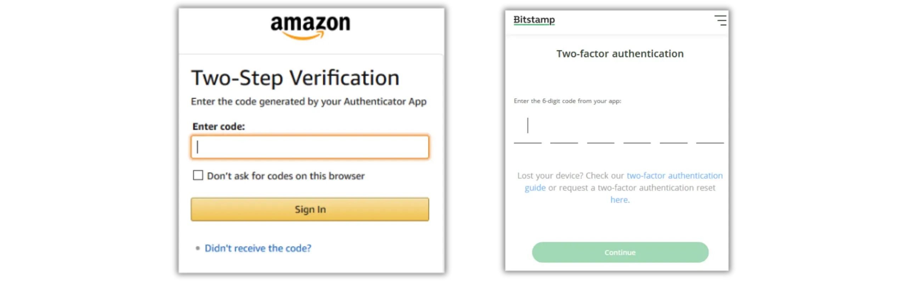
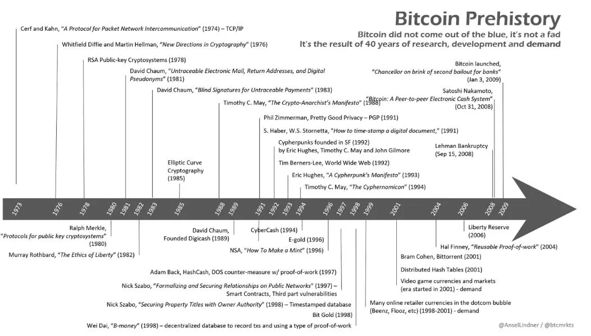
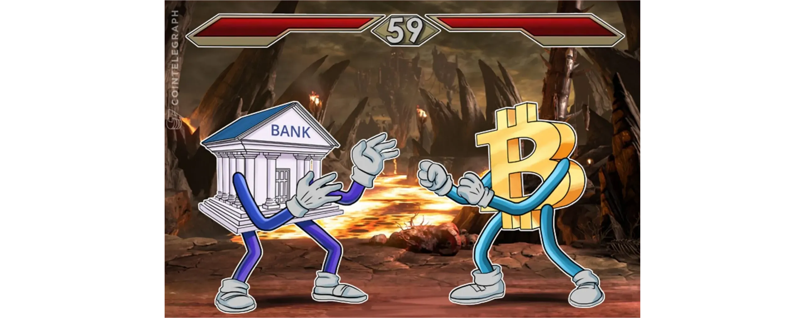
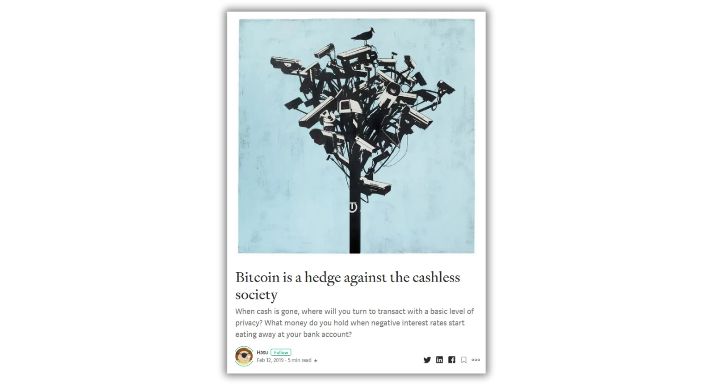
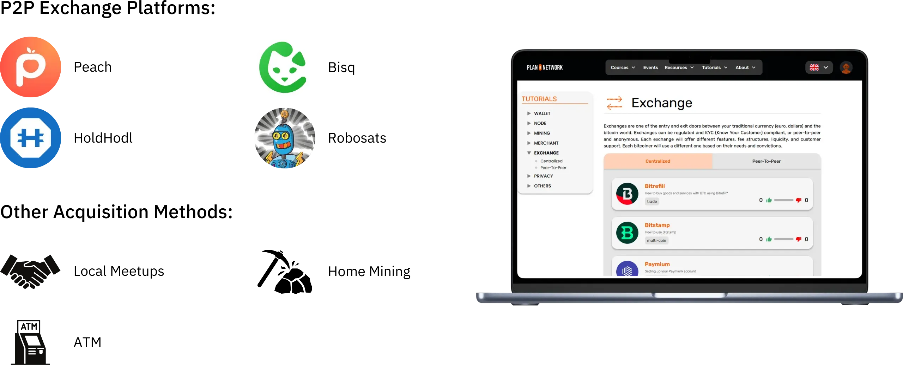

# Podróż do pierwszych bitcoinów

Ekosystem Bitcoin doświadcza spektakularnego i bezprecedensowego wzrostu. Transformacje technologiczne, gospodarcze i społeczne napędzane wynalazkiem Satoshi Nakamoto nasilają się z dnia na dzień i stopniowo otwierają drzwi do nowego świata, z którego możesz teraz w pełni skorzystać.

Zanurzenie się w króliczą norę Bitcoin to ekscytująca intelektualna przygoda, która pobudzi twoje krytyczne myślenie i podważy wiele twoich przekonań. Ta eksploracja nie tylko pozwoli ci dogłębnie zrozumieć, jak działa Bitcoin, ale także będzie prawdziwą okazją do odzyskania wolności osobistej, ochrony prywatności i osiągnięcia prawdziwej suwerenności finansowej.

Aby skutecznie poprowadzić Cię przez tę podróż, stworzyłem ten całkowicie darmowy kurs. Skupia się on wyłącznie na Bitcoin. Żadnych nieistotnych dyskusji, żadnych wzmianek o innych kryptowalutach, tylko jasne, precyzyjne i proste treści.

Ten kurs został zaprojektowany tak, aby dać ci pełną kontrolę nad tym, jak się uczysz, pozwalając ci odkrywać Bitcoin we własnym tempie, podążając ścieżką, która najlepiej pasuje do twoich zainteresowań i celów.

+++
# Wprowadzenie

<partId>008c49b7-5e17-5973-87f2-ba28429b2697</partId>

## Przegląd kursu

<chapterId>bfc96999-0ee1-5c41-8297-1b629f50cffc</chapterId>

Witamy w BTC102! Jeśli ukończyłeś już BTC101, poznałeś kluczowe koncepcje teoretyczne stojące za tym, dlaczego Bitcoin jest tak rewolucyjną technologią. Teraz, dzięki BTC102, nadszedł czas, aby wykorzystać tę wiedzę w praktyce. Ten kurs został zaprojektowany, aby pomóc ci zbudować osobisty plan Bitcoin, krok po kroku.

W kolejnych rozdziałach przeprowadzimy cię przez praktyczne kroki, aby **zdobyć swoje pierwsze bitcoiny**, **odpowiednio je zabezpieczyć** i pewnie postawić pierwsze kroki w tym szybko rozwijającym się ekosystemie.

https://planb.network/courses/2b7dc507-81e3-4b70-88e6-41ed44239966

Chociaż Bitcoin istnieje od ponad 16 lat, branża ta jest wciąż młoda, dynamiczna i głęboko zakorzeniona w wolności. Jej podstawowy protokół jest w pełni zdecentralizowany i odporny na kontrolę ze strony jakiegokolwiek organu centralnego, co pozwala ekosystemowi rozwijać się w naturalny i organiczny sposób.

Chociaż ta wolność napędza niesamowitą falę innowacji i możliwości, wiąże się również z pewnym ryzykiem, w tym oszustwami, typowymi błędami i pułapkami, które często wynikają z braku wiedzy. Głównym celem tego kursu jest pomoc w poruszaniu się po tym nowym ekosystemie z pewnością siebie i bezpieczeństwem.

Aby to osiągnąć, kurs BTC102 jest podzielony na kilka sekcji, z których każda koncentruje się na kluczowym aspekcie podróży z Bitcoin:

Pierwsza sekcja, "Warunki wstępne do zrozumienia Bitcoin", skutecznie przygotowuje do dalszej drogi. Nauczysz się identyfikować główne pułapki związane z oszustwami i oszustwami finansowymi, które mogą istnieć w ekosystemie Bitcoin. Następnie omówimy niezbędne podstawy bezpieczeństwa online.

Na koniec przedstawię kilka praktycznych wskazówek zaprojektowanych specjalnie dla początkujących, które pomogą uniknąć typowych błędów podczas pierwszej pracy z Bitcoin.

Druga sekcja, "Zrozumienie, w co się pakujesz", pogłębi ogólne zrozumienie Bitcoin. Zaczniemy od przeglądu, aby upewnić się, że w pełni rozumiesz podstawowe pojęcia.

Następnie wyjaśnimy, dlaczego Bitcoin jest fundamentalnie ważny z technologicznego, ekonomicznego i społecznego punktu widzenia, wzmacniając twoje przekonanie o jego wartości. Zapoznasz się również z branżą Bitcoin jako całością: jej kluczowymi graczami, organizacją i ewolucją na przestrzeni lat. Wreszcie, omówimy warstwową architekturę ekosystemu Bitcoin, kluczową koncepcję dla zrozumienia, w jaki sposób ten system nadal wprowadza innowacje bez narażania integralności swojego podstawowego protokołu.

Trzecia sekcja, "Konfigurowanie planu", koncentruje się na osobistym podejściu do Bitcoin. Zaczniemy od pomocy w zdefiniowaniu profilu użytkownika z czterech głównych kategorii:

- hodler*, skoncentrowany na długoterminowym utrzymaniu Bitcoin;
- układacz*, który kupuje regularnie i metodycznie;
- użytkownik*, który priorytetowo traktuje codzienne korzystanie z Bitcoin;
- i wreszcie *paranoik*, który chce maksymalnego bezpieczeństwa, aby skutecznie chronić swoje aktywa i prywatność.

Poprowadzimy Cię przez wdrożenie strategii, która pasuje do Twojego profilu i pomoże Ci osiągnąć Twoje osobiste cele.

Wreszcie, czwarta sekcja, "Ochrona spadkobierców i majątku", obejmuje kluczowy temat, który jest często pomijany: jak zapewnić przekazanie Bitcoin swoim bliskim w przypadku nieoczekiwanego zdarzenia. Dowiesz się, jak utworzyć i skonfigurować plan dziedziczenia Bitcoin, zapewniając zachowanie swojego majątku po zakończeniu swojego życia.

Pod koniec tego kursu będziesz mieć wszystkie praktyczne narzędzia, których potrzebujesz, aby pewnie poruszać się po ekosystemie Bitcoin i stać się jednym z jego najbardziej zaawansowanych użytkowników!

Gotowy na rozpoczęcie podróży do świata Bitcoin? Do dzieła!

# Wymagania wstępne dla zrozumienia Bitcoin

<partId>4481fc4b-0f83-489e-ad07-81517c5d6bad</partId>

## Oszustwa i oszustwa finansowe

<chapterId>8af2948b-2ab5-54c4-862c-3414b8a285a2</chapterId>

Ekosystem Bitcoin i otaczające go środowisko są wciąż stosunkowo młode i luźno regulowane, w zależności od kraju. Chociaż ta wolność otwiera ogromne możliwości, tworzy również podatny grunt dla oszustw finansowych, oszustw i różnych form manipulacji. Właśnie dlatego pierwszy rozdział jest tak ważny: zrozumienie typowych pułapek pomoże ci ich uniknąć. Twoje bezpieczeństwo finansowe jest priorytetem, ponieważ złe doświadczenia nie wpływają tylko na ciebie, ale na całą społeczność Bitcoin.

### Bitcoin a kryptowaluty: zrozumienie różnic

Zanim przejdziemy dalej, ważne jest, aby wyraźnie rozróżnić dwa zasadniczo różne światy:

- Ekosystem Bitcoin** koncentruje się wokół idei zdrowego pieniądza, zbudowanego na silnej decentralizacji, długoterminowej odporności, prywatności i indywidualnej suwerenności. Od momentu uruchomienia w 2009 r. Bitcoin działa niezawodnie i bezpiecznie, wspierany przez globalną, zaangażowaną społeczność deweloperów. Nie jest to przelotny trend, ale stabilny i ugruntowany protokół zaprojektowany w celu zachowania wartości w czasie.

- Z drugiej strony branża kryptowalut** jest znacznie większa i obejmuje dziesiątki tysięcy różnych projektów, z których każdy ma własny token. Przestrzeń ta jest często napędzana przez szybkie innowacje, szum i krótkoterminowe spekulacje finansowe. Wiele z tych projektów jest scentralizowanych, mniej bezpiecznych i nie oferuje dużej realnej wartości - pomimo śmiałych obietnic i krzykliwego marketingu.

Jeśli chcesz lepiej zrozumieć, skąd pochodzi Bitcoin i co naprawdę odróżnia go od innych projektów, polecam zapoznać się z tym bezpłatnym kursem uzupełniającym na temat historii Bitcoin:

https://planb.network/courses/a51c7ceb-e079-4ac3-bf69-6700b985a082

Jak wiadomo, platforma Plan ₿ Network jest przeznaczona wyłącznie dla Bitcoin. Jednak zrozumienie różnicy w stosunku do innych kryptowalut pomoże uniknąć pułapek związanych z bezużytecznymi, a czasem nawet oszukańczymi projektami.

### Główne oszustwa, których należy unikać

Oto najczęstsze oszustwa, na które możesz natknąć się podczas swojej podróży:

#### Piramidy finansowe i schematy Ponziego

Są to jedne z najczęstszych oszustw w świecie kryptowalut. W schemacie Ponziego pierwsi uczestnicy otrzymują wypłaty przy użyciu pieniędzy od nowszych; nie z żadnej prawdziwej inwestycji lub produktu. Nie jest tworzona żadna rzeczywista wartość. System działa tylko tak długo, jak długo dołączają do niego nowe osoby. Gdy napływ nowych uczestników zwalnia, cały schemat się rozpada.

Oszustwa te zazwyczaj obejmują :

- Nierealistyczne obietnice gwarantowanych zwrotów (np. 20% gwarantowanego zwrotu);
- Opóźnienia lub trudności przy próbie wypłaty zainwestowanych środków;
- Silne zachęty do rekrutowania nowych członków w celu utrzymania systemu;
- Całkowity brak przejrzystości co do prawdziwego źródła obiecanych zwrotów.

Ostatecznie wszystkie piramidy finansowe i programy Ponziego są skazane na porażkę. Ich podstawową słabością jest ciągła potrzeba pozyskiwania nowych inwestorów w celu wypłacania zysków wcześniejszym uczestnikom. Potrzeba ta z czasem staje się matematycznie niemożliwa do utrzymania, ponieważ liczba wymaganych nowych rekrutów rośnie wykładniczo wraz z rozwojem systemu. Po osiągnięciu punktu krytycznego uczestnicy zaczynają wątpić, zaufanie znika, a cała piramida upada. Na tym etapie ostatnie osoby, które dołączyły, często najmniej poinformowane, tracą całą swoją inwestycję bez możliwości jej odzyskania, podczas gdy organizatorzy lub pierwsi inwestorzy zazwyczaj już wycofali swoje fundusze i opuścili system.

W świecie kryptowalut schematy Ponziego mogą przybierać różne formy, często mające na celu ukrycie ich oszukańczego charakteru za technologiczną lub finansową maską. Oszustwa te mogą pojawiać się jako nowe oferty tokenów lub Initial Coin Offerings (ICO), które są operacjami pozyskiwania funduszy, w ramach których nowa kryptowaluta jest sprzedawana publicznie. Za terminami technicznymi, takimi jak "Blockchain", "inteligentne kontrakty" lub "staking", niektóre projekty ukrywają w rzeczywistości złożone piramidy finansowe. Inne twierdzą, że oferują wysokie zyski, łącząc wątpliwe aktywa kryptograficzne z systemami wynagrodzeń, które w całości opierają się na ciągłym napływie nowych inwestorów.

Niedawno schematy Ponziego rozprzestrzeniły się również w świecie zdecentralizowanych finansów (DeFi). Chociaż DeFi ma na celu świadczenie usług finansowych bez pośredników, niektóre projekty wykorzystują je do nadania fałszywego poczucia legalności swoim oszustwom. Niektóre platformy DeFi obiecują wysokie, gwarantowane zwroty w Exchange za depozyty kryptowalut w zautomatyzowanych protokołach. Te atrakcyjne obietnice są często poparte nieprzejrzystymi i nieweryfikowalnymi mechanizmami, z tokenami stworzonymi specjalnie na potrzeby oszustwa. W rzeczywistości systemy te nie mają zrównoważonego modelu biznesowego - zwroty są po prostu wypłacane ze środków nowych użytkowników, podobnie jak w tradycyjnym schemacie Ponziego. Kiedy zaufanie zaczyna erodować lub napływ nowych uczestników spowalnia, systemy te nieuchronnie upadają, prowadząc do znacznych strat dla niczego niepodejrzewających inwestorów.

Należy pamiętać, że treść tego kursu służy wyłącznie celom edukacyjnym i nie powinna być interpretowana jako porada finansowa. Twoje bezpieczeństwo finansowe zależy od tego, czy będziesz ostrożny, sceptyczny i dobrze poinformowany przy podejmowaniu każdej decyzji finansowej.

Najlepszą ochroną jest zawsze zadawanie tego prostego pytania: Skąd tak naprawdę pochodzi obiecany zwrot? Jeśli odpowiedź jest niejasna, należy natychmiast uciekać.

#### Pump & Dump

Ten rodzaj oszustwa polega na sztucznym zawyżaniu ceny aktywów - często tokenów kryptowalutowych o niskiej płynności - poprzez skoordynowaną kampanię marketingową, zwykle prowadzoną przez grupę inwestorów. Typowy schemat Pump & Dump jest następujący:

- Grupa osób wtajemniczonych lub wpływowych po cichu gromadzi dużą ilość docelowych aktywów.
- Następnie uruchamiają agresywną kampanię promocyjną, aby wywołać szum generate i podnieść cenę.
- Opinia publiczna, napędzana przez FOMO (Fear of Missing Out), zaczyna kupować aktywa w dużych ilościach, podnosząc cenę jeszcze wyżej.
- W szczytowym momencie szumu, insiderzy wyprzedają swoje udziały na raz.
- Cena spada, pozostawiając spóźnialskich z dużymi stratami.

Należy zauważyć, że strategie Pump & Dump są nielegalne w wielu krajach i są uważane za formę manipulacji rynkiem. Pomimo tego, takie schematy nadal kwitną, zwłaszcza w przestrzeni kryptowalut, gdzie regulacje wciąż nadrabiają zaległości.

Zachowaj szczególną ostrożność w przypadku prywatnych grup "sygnałowych" na platformach takich jak Telegram, Discord lub innych kanałach mediów społecznościowych. Są one często prowadzone przez influencerów lub samozwańczych ekspertów, z których niektórzy pobierają nawet opłaty za wstęp. Podczas gdy grupy te twierdzą, że oferują ekskluzywne możliwości inwestycyjne, rzeczywistość jest znacznie bardziej jednostronna: tylko organizatorzy czerpią zyski, podczas gdy większość uczestników traci swoje pieniądze.

Prawdą jest, że niektórzy uczestnicy mogą tymczasowo czerpać zyski z tego rodzaju manipulacji rynkowych, ale ich sukces zazwyczaj opiera się wyłącznie na szczęściu i doskonałym wyczuciu czasu. Na dłuższą metę takie schematy nie są zrównoważone. Wymagają one ciągłego zaangażowania wysokiego ryzyka i wielokrotnego uczestnictwa w oszukańczych konfiguracjach, które nieuchronnie upadają.

Co gorsza, podsycają one niebezpieczną iluzję: przekonanie, że możliwe jest szybkie i łatwe zarabianie pieniędzy bez zrozumienia, jak faktycznie działają systemy finansowe. Taki sposób myślenia nie tylko naraża jednostki na ryzyko, ale także podważa wiarygodność całego ekosystemu kryptowalutowego

Z tych wszystkich powodów najlepszą strategią jest trzymanie się poważnego, przemyślanego podejścia do inwestowania, opartego na edukacji finansowej, solidnym zrozumieniu podstaw i długoterminowej perspektywie.

Cierpliwie budując swoją wiedzę, będziesz znacznie mniej podatny na manipulacje emocjonalne i nierealistyczne obietnice; i znacznie lepiej przygotowany do unikania pułapek finansowych, które mogą prowadzić do prawdziwych strat.

#### Oszustwa związane z darowiznami, loteriami i fałszywymi gratisami

Ten rodzaj oszustwa obiecuje darmowe Bitcoin lub inne nagrody w Exchange za wysłanie najpierw niewielkiej kwoty pieniędzy. Ważne jest, aby pamiętać: żadna legalna osoba lub organizacja nigdy nie poprosi cię o wysłanie kryptowaluty z góry z obietnicą wysłania ci więcej w zamian.

Oszuści często podszywają się pod znane osoby publiczne (takie jak Elon Musk lub inni celebryci), aby zwabić ofiary za pośrednictwem mediów społecznościowych. Zawsze dokładnie sprawdzaj legalność kont i stron internetowych przed nawiązaniem z nimi kontaktu i nigdy nie ufaj ofertom, które wydają się zbyt hojne lub zbyt piękne, aby mogły być prawdziwe.

Czasami oszustwa te pojawiają się jako oszustwa typu "opłata z góry". Obiecuje się nagrodę (pieniądze, produkt lub usługę), ale najpierw prosi się o uiszczenie opłaty, rzekomo na pokrycie kosztów wysyłki, podatków lub transakcji. Po dokonaniu płatności oszust znika, a obiecana nagroda nigdy nie dociera.

#### Shitcoiny i kryptowaluty w ofercie

Scentralizowane projekty kryptowalutowe czasami oferują darmowe tokeny ("*airdrops*"), aby przyciągnąć użytkowników. Tokeny te zazwyczaj mają niewielką lub żadną rzeczywistą wartość i są wykorzystywane głównie do tworzenia iluzji popularności lub do napędzania spekulacji. Zachowaj szczególną ostrożność w przypadku tego rodzaju ofert promocyjnych; często są to pułapki marketingowe, a nie prawdziwe możliwości.

#### Kradzież tożsamości i phishing

Atakujący często wykorzystują fałszywe strony internetowe, konta w mediach społecznościowych lub zwodnicze wiadomości e-mail, aby spróbować ukraść środki. Oszustwa te mogą odbywać się za pośrednictwem dowolnego kanału komunikacji: poczty elektronicznej, sieci społecznościowych, połączeń telefonicznych, a nawet tradycyjnej poczty...

Przed kliknięciem łącza lub podjęciem jakichkolwiek działań należy zawsze dokładnie sprawdzić tożsamość nadawcy. W razie wątpliwości odwiedź stronę ręcznie zamiast korzystać z podanego linku. Co najważniejsze, nigdy nie udostępniaj nikomu swoich prywatnych kluczy ani haseł.

#### Bitcoin Hardforks

Na przestrzeni lat Bitcoin doświadczyła kilku *Hard forków*, które doprowadziły do powstania alternatywnych wersji oryginalnej kryptowaluty. Mówiąc prościej, *Hard Fork* to podział sieci, który prowadzi do dwóch oddzielnych łańcuchów bloków, z których oba mają tę samą historię aż do momentu podziału. Forki te zwykle mają miejsce, gdy część społeczności programistów lub szerszego ekosystemu Bitcoin chce wprowadzić poważne zmiany w oryginalnym protokole, ale nie może osiągnąć powszechnego konsensusu. Zamiast porzucić swoje pomysły, decydują się na uruchomienie nowej wersji Bitcoin (ze zmienionymi zasadami), mając nadzieję, że użytkownicy i górnicy zdecydują się zamiast tego podążać za Fork.

Nie wszystkie forki *Hard* są nieuczciwe, ponieważ niektóre wynikają z technicznych lub ideologicznych nieporozumień w społeczności. Jednak inne są napędzane przez interesy handlowe lub nawet nieuczciwe motywy. Najbardziej znanymi przykładami takich hard forków są **Bitcoin Cash (BCH)** i **Bitcoin Satoshi Vision (BSV)**. Te alternatywne waluty, wprowadzone na rynek odpowiednio w 2017 i 2018 roku, często twierdzą, że są "lepszymi wersjami" oryginalnego Bitcoin. Promują one rzekome korzyści, takie jak niższe opłaty transakcyjne lub szybsze transakcje ze względu na zwiększone rozmiary bloków. Jednak te zmiany techniczne wiążą się ze znacznymi kompromisami w zakresie bezpieczeństwa, decentralizacji i solidności; Elements, które mogą być sprzeczne z podstawowymi zasadami Bitcoin.

Oprócz różnic technicznych, te alternatywne waluty często wykorzystują zamieszanie, aby przyciągnąć niedoinformowanych inwestorów. Mogą one stosować taktyki marketingowe mające na celu celowe wprowadzanie w błąd nowicjuszy, którzy wierzą, że kupują prawdziwe Bitcoin (BTC).

Aby uniknąć wpadnięcia w tę pułapkę, należy zawsze weryfikować kupowaną walutę. Oryginalny Bitcoin używa tickera **BTC**, podczas gdy Bitcoin Cash i jego pochodne używają odrębnych akronimów, takich jak BCH lub BSV.

#### Nieuczciwi influencerzy i fałszywi guru

W miarę jak kryptowaluty zyskują na popularności, media społecznościowe odnotowały wzrost liczby influencerów, samozwańczych ekspertów i tak zwanych "*guru kryptowalut*". Podczas gdy niektórzy z nich mogą oferować autentyczne spostrzeżenia edukacyjne, wielu innych wykorzystuje swoją widoczność do promowania wątpliwych projektów lub niebezpiecznie ryzykownych (a czasem wręcz oszukańczych) strategii handlowych. Osoby te są zwykle motywowane osobistymi interesami finansowymi, często otrzymując bezpośrednie lub pośrednie wynagrodzenie za promowanie niektórych tokenów lub platform.

Ci influencerzy często polegają na sprawdzonych taktykach, aby przyciągnąć początkujących: prezentują imponujące wyniki finansowe (które często są fałszywe lub niemożliwe do zweryfikowania), obnoszą się z luksusowym stylem życia jako rzekomym dowodem ich sukcesu i promują "cudowne" strategie inwestycyjne. Celem jest wywołanie FOMO - strachu przed przegapieniem - i popchnięcie odbiorców do impulsywnych decyzji i lekkomyślnych inwestycji.

Ważne jest, aby zrozumieć, że większość "darmowych" porad od tych osobistości nigdy nie jest tak naprawdę darmowa. Za fasadą hojności często kryje się skalkulowana strategia mająca na celu nakłonienie ludzi do zakupu wątpliwych aktywów. A nawet jeśli niektórzy influencerzy byliby szczerzy, powtórzenie ich wyników byłoby prawie niemożliwe; ich sukces często zależy od określonego czasu, wiedzy poufnej lub wyjątkowych okoliczności, do których po prostu nie masz dostępu.

Niektórzy influencerzy mogą zapraszać do dołączenia do prywatnych, płatnych grup, w których twierdzą, że dzielą się ekskluzywnymi sygnałami handlowymi lub poufnymi wskazówkami, które obiecują szybkie i łatwe zyski. W rzeczywistości grupy te przynoszą korzyści głównie samym organizatorom. Często wykorzystują oni swoich zwolenników jako źródło płynności, zasadniczo odciążając aktywa dla osobistych korzyści. Subskrybenci zazwyczaj tracą pieniądze, ponieważ nie są w stanie zareagować tak szybko, jak insiderzy, którzy organizują transakcje (patrz sekcja dotycząca schematów Pump & Dump).

W świetle tej rzeczywistości, oto kilka dobrych nawyków, które należy przyjąć, aby uniknąć wpadnięcia w pułapki zastawione przez nieuczciwych influencerów:

- Zachowaj ostrożność w przypadku wszelkich zaleceń dotyczących inwestycji w kryptowaluty

Godna zaufania i kompetentna osoba nigdy nie będzie naciskać na zakup kryptowaluty bez zachęcania do przeprowadzenia własnych badań.

- Płatne kursy handlowe lub inwestycyjne nie zawsze są wyznacznikiem jakości**

Wiele z tych kursów promuje ryzykowne lub zbyt uproszczone strategie; często są to te same informacje, które można znaleźć w Internecie za darmo.

- Nie ma czegoś takiego jak gwarantowany sposób kopiowania czyichś transakcji i uzyskiwania identycznych wyników**

Każda strategia inwestycyjna zależy od osobistego kontekstu, czasu, wiedzy i innych czynników, których nie da się dokładnie powielić.

- Zachowaj szczególną ostrożność w przypadku porad, które brzmią zbyt dobrze, by mogły być prawdziwe**

Nierealistyczne obietnice lub gwarantowane zyski są prawie zawsze oznakami manipulacji. Pamiętaj: to, że ktoś mówi coś z przekonaniem, nie czyni tego prawdą.

Zawsze pamiętaj, że każdy, kogo spotkasz w Bitcoin lub szerszym ekosystemie kryptowalut, ma osobisty program; niezależnie od tego, czy jest to powiedziane wprost, czy ukryte między wierszami. Nie ma czegoś takiego jak czysto neutralne informacje. Nawet ten kurs, BTC102, ma jasny cel, *promowanie lepszego zrozumienia Bitcoin*

Dlatego tak ważne jest, aby być świadomym prawdziwych motywacji stojących za każdą treścią, którą konsumujesz. I nigdy nie zapominaj o tej złotej zasadzie internetu:

*Jeśli produkt lub usługa wydają się darmowe, istnieje duże prawdopodobieństwo, że to ty jesteś tym produktem*

Ostatecznie najlepszą obroną jest edukacja osobista, zdrowy sceptycyzm i, co najważniejsze, nawyk samodzielnego weryfikowania faktów.

### Jak uniknąć oszustw

**Aby zachować bezpieczeństwo w Internecie, zwłaszcza w świecie kryptowalut, należy pamiętać o następujących kluczowych zasadach:**

- Nigdy nie ufaj ślepo: "*Nie ufaj, weryfikuj*";
- Bądź sceptyczny wobec gwarantowanych lub niezwykle wysokich zwrotów;
- Nigdy nie udostępniaj nikomu swoich kluczy prywatnych;
- Nie wysyłaj Bitcoin (ani żadnych kryptowalut) na nieznane adresy;
- Jeśli masz wątpliwości, zatrzymaj się. Cofnij się i zastanów, zanim podejmiesz działanie. FOMO to twój najgorszy wróg;
- Unikaj płatnych grup handlowych lub społeczności, które składają nierealistyczne obietnice;
- Większość rozdań lub "darmowych" loterii online to oszustwa lub są one mocno sfałszowane;
- Na dłuższą metę zawsze więcej zyskasz ucząc się niż grając.

Ochrona przed oszustwami jest kluczowym pierwszym krokiem w zabezpieczaniu swoich aktywów; ale to nie wystarczy. Utrzymanie silnej higieny cyfrowej jest równie ważne. Dlatego w następnym rozdziale zbadamy, jak wzmocnić swoje bezpieczeństwo online i najlepsze praktyki, które należy przyjąć, aby chronić się w cyfrowym świecie.

## Bezpieczeństwo online

<chapterId>f0873bf2-6a6f-5485-bb7a-d84be14f404d</chapterId>

Gdy tylko zaczniesz korzystać z Bitcoin, szybko zdasz sobie sprawę, że podstawowe cyberbezpieczeństwo nie jest opcjonalne - jest niezbędne. Oszustwa i wyłudzenia to tylko wierzchołek góry lodowej. Przypadkowa utrata danych, złośliwe oprogramowanie i przejęte hasła mogą być równie niszczycielskie, zwłaszcza gdy zarządzasz własnymi kluczami.

W tym rozdziale omówiono kilka prostych, praktycznych kroków, które pozwolą ci zwiększyć poziom higieny cyfrowej i chronić się w tej przestrzeni.

Jeśli chcesz zagłębić się w temat, kurs SEC101 Plan ₿ Network oferuje kompleksowe zestawienie strategii cyberbezpieczeństwa zaprojektowanych specjalnie dla użytkowników Bitcoin.

https://planb.network/courses/99c46148-7080-4915-a7e0-9df0e145cd47

### Dlaczego cyberbezpieczeństwo ma znaczenie

Bitcoin daje ci możliwość bezpośredniego przechowywania pieniędzy (bez banków), bez pośredników. Ale ten rodzaj suwerenności finansowej wiąże się z poważną odpowiedzialnością: jeśli twoje BTC zostaną skradzione z powodu luki w zabezpieczeniach, nie ma sposobu na odwrócenie transakcji. W przeciwieństwie do tradycyjnej bankowości, nie ma pomocy technicznej, nie ma roszczenia o oszustwo ani ubezpieczenia, które mogłoby cię uratować.

Co więcej, wartość finansowa Bitcoin sprawia, że jest on bardzo cennym celem. Haker, który włamie się na twój Wallet, może natychmiast przenieść twoje środki na kontrolowany przez siebie Address (bez zadawania pytań, bez możliwości ich odzyskania).

### Czysty, aktualny komputer

Jednym z najczęściej pomijanych aspektów bezpieczeństwa osobistego jest aktualizowanie systemu operacyjnego i oprogramowania. Wiele aktualizacji usuwa znane luki w zabezpieczeniach, które w przeciwnym razie mogłyby zostać wykorzystane przez atakujących. Podczas gdy niektórzy ludzie unikają aktualizacji, obawiając się problemów z wydajnością, prawdziwe ryzyko polega na uruchamianiu przestarzałego oprogramowania, które hakerzy już wiedzą, jak złamać.

Zaleca się również korzystanie z niezawodnego programu antywirusowego. W systemie Windows wbudowany program Windows Defender jest zazwyczaj wystarczający dla większości użytkowników. Jeśli wolisz dodatkowe funkcje lub spokój ducha, dostępne są również opcje komercyjne, takie jak Kaspersky. Na macOS zagrożenia złośliwym oprogramowaniem są historycznie mniej powszechne **ale nie nieistniejące**, więc nadal warto zachować ostrożność.

Oprócz aktualizacji systemu i ochrony antywirusowej, należy bardzo uważać na pobieranie oprogramowania z podejrzanych stron internetowych lub tak zwanych "uniwersalnych" portali pobierania. Gdy potrzebujesz narzędzia lub aplikacji, zawsze udawaj się bezpośrednio do oficjalnego źródła; To drastycznie zmniejsza ryzyko zainstalowania złośliwego oprogramowania podszywającego się pod legalne oprogramowanie.

Innym mądrym nawykiem jest weryfikowanie autentyczności i integralności dowolnego oprogramowania przed zainstalowaniem go na komputerze. Jeśli nie wiesz, jak to zrobić, nie martw się, przygotowaliśmy specjalny samouczek, który przeprowadzi Cię przez ten proces:

https://planb.network/tutorials/computer-security/data/integrity-authenticity-21d0420a-be02-4663-94a3-8d487f23becc

Wreszcie, regularnie twórz kopie zapasowe ważnych danych. Zewnętrzny dysk Hard lub SSD to solidna opcja do przechowywania duplikatów plików na wypadek nagłej awarii, włamania lub przypadkowego usunięcia. Podziękujesz sobie później.

Jeśli wolisz rozwiązania w chmurze, rozważ skorzystanie z bezpiecznej usługi, takiej jak Proton Drive. Upewnij się tylko, że wybrana opcja szanuje twoją prywatność i oferuje silne szyfrowanie.

https://planb.network/tutorials/computer-security/data/proton-drive-03cbe49f-6ddc-491f-8786-bc20d98ebb16

Powszechnie zalecaną strategią tworzenia kopii zapasowych jest "zasada 3-2-1". Ma ona na celu ochronę danych przed przypadkową utratą, cyberatakami, a nawet klęskami żywiołowymi.

Pomysł jest prosty:

- Przechowuj **co najmniej 3 kopie** ważnych danych,
- Przechowuj je na **co najmniej 2 różnych typach nośników** (np. na zewnętrznym dysku Hard i w chmurze),
- I upewnij się, że **1 z tych kopii jest przechowywana poza siedzibą firmy** (fizycznie oddzielona od głównej lokalizacji).

Takie podejście zapewnia dużą odporność i pomaga zapewnić przetrwanie danych, nawet jeśli coś pójdzie nie tak.

### Rozwiązanie koszmaru identyfikacji

Jedną z największych przyczyn włamań jest używanie słabych haseł. Znaczna liczba użytkowników nadal używa tego samego hasła na wielu kontach lub wybiera warianty, które są łatwe do odgadnięcia. Menedżery haseł są idealnym rozwiązaniem tego problemu.

Menedżer haseł umożliwia

- Bezpieczne przechowywanie wszystkich haseł** w zaszyfrowanym sejfie
- generate długie, złożone i unikalne hasła** automatycznie dla każdego konta
- Użyj tylko jednego hasła głównego**, aby uzyskać bezpieczny dostęp do wszystkiego

Dzięki menedżerowi haseł nigdy więcej nie będziesz musiał klikać "zapomniałem hasła" ani polegać na słabych, ponownie używanych danych uwierzytelniających. Ponadto większość menedżerów haseł synchronizuje się płynnie na różnych urządzeniach (komputer, telefon, tablet), a nawet automatycznie wypełnia formularze logowania, dzięki czemu bezpieczny dostęp jest zarówno łatwy, jak i wydajny.

Istnieje wiele menedżerów haseł, ale w zależności od potrzeb mogę polecić dwie solidne opcje. Jeśli szukasz czegoś łatwego w użyciu, co płynnie synchronizuje się na wielu urządzeniach, Bitwarden jest doskonałym wyborem:

https://planb.network/tutorials/computer-security/authentication/bitwarden-0532f569-fb00-4fad-acba-2fcb1bf05de9

Jeśli wolisz przechowywać wszystko lokalnie na własnym urządzeniu, KeePass jest świetną opcją:

https://planb.network/tutorials/computer-security/authentication/keepass-f8073bb7-5b4a-4664-9246-228e307be246

### 2FA: podwójna ochrona

W Bitcoin jesteś swoim własnym bankiem. Oznacza to, że jesteś również swoim własnym zespołem ds. bezpieczeństwa. Nawet przy silnym haśle nie ma czegoś takiego jak zerowe ryzyko - dlatego włączenie uwierzytelniania dwuskładnikowego (2FA) jest niezbędne.

2FA dodaje drugi Layer ochrony, wymagając jednorazowego kodu czasowego (zwykle 6 cyfr) generowanego przez aplikację taką jak Google Authenticator lub Authy. Więc nawet jeśli komuś uda się zdobyć twoje hasło, nadal nie będzie mógł uzyskać dostępu do twojego konta bez fizycznego dostępu do twojego telefonu.

https://planb.network/tutorials/computer-security/authentication/authy-a76ab26b-71b0-473c-aa7c-c49153705eb7

Po włączeniu 2FA należy zapisać klucz odzyskiwania aplikacji w bezpiecznym miejscu. Pozwoli to przywrócić kody w przypadku utraty lub zmiany telefonu. Chociaż 2FA oparte na SMS-ach lub e-mailach jest lepsze niż nic, jest znacznie mniej bezpieczne. Atak polegający na wymianie karty SIM, w którym ktoś przejmuje kontrolę nad numerem telefonu, może z łatwością ominąć tego rodzaju ochronę.

Dla tych, którzy chcą pójść o krok dalej, klucze fizyczne, takie jak YubiKey, zapewniają jeszcze wyższy poziom ochrony.

https://planb.network/tutorials/computer-security/authentication/security-key-61438267-74db-4f1a-87e4-97c8e673533e

### Ochrona prywatności

Prywatność i cyberbezpieczeństwo są ze sobą ściśle powiązane: im więcej informacji pozostawiasz swobodnie dostępnych, tym większe prawdopodobieństwo, że staniesz się celem ataku.

**VPN** (*Wirtualna sieć prywatna*) to prosty, ale skuteczny krok do maskowania adresu IP Address i szyfrowania ruchu internetowego. Chociaż nie sprawi, że będziesz całkowicie niewidzialny (ponieważ dostawca VPN nadal może zobaczyć twoją aktywność), znacznie utrudni to każdemu, kto próbuje cię szpiegować lub śledzić twoje nawyki przeglądania.

Kluczem jest wybór godnego zaufania dostawcy VPN:

- Nie wymaga podawania danych osobowych
- Umożliwia płatności za pośrednictwem BTC
- Ma ścisłą politykę braku logów

Na Plan ₿ Network dostępnych jest kilka samouczków, które z łatwością przeprowadzą Cię przez konfigurację VPN. Szczególnie polecam IVPN lub Mullvad:

https://planb.network/tutorials/computer-security/communication/ivpn-5a0cd5df-29f1-4382-a817-975a96646e68

https://planb.network/tutorials/computer-security/communication/mullvad-968ec5f5-b3f0-4d23-a9e0-c07a3e85aaa8

Niezbędne kroki w celu ochrony prywatności w Internecie również obejmują:

- Korzystanie z **szyfrowanych platform komunikacyjnych**, takich jak Signal, SimpleX lub Session;
- Korzystanie z przeglądarek zapewniających prywatność, takich jak Firefox, Brave lub Tor (w celu zwiększenia anonimowości);

https://planb.network/tutorials/computer-security/communication/tor-browser-a847e83c-31ef-4439-9eac-742b255129bb

- Korzystanie z **bezpiecznej skrzynki pocztowej**, takiej jak ProtonMail;

https://planb.network/tutorials/computer-security/communication/proton-mail-c3b010ce-254d-4546-b382-19ab9261c6a2

- Szyfrowanie** plików za pomocą narzędzi takich jak Bitlocker (dla Windows) lub VeraCrypt (dostępne na wielu platformach).

https://planb.network/tutorials/computer-security/data/veracrypt-d5ed4c83-7c1c-4181-95ea-963fdf2d83c5

### Postęp krok po kroku

Cyberbezpieczeństwo może wydawać się ogromnym przedsięwzięciem, a początkującym łatwo jest się przytłoczyć i zrezygnować, ponieważ wydaje się to zbyt skomplikowane. Sztuczka polega na tym, aby podejść do tego krok po kroku. Zacznij od czegoś prostego, jak instalacja menedżera haseł. Daj sobie kilka tygodni na oswojenie się z nim, a następnie przejdź do następnego kroku: na przykład włączenia 2FA na jednym z kont.

Gdy nabierzesz pewności w korzystaniu z tych narzędzi, będziesz gotowy, aby dodać bardziej zaawansowane praktyki, takie jak korzystanie z dodatkowej poczty e-mail, przejście na ProtonMail, skonfigurowanie VPN lub przeglądanie za pomocą Tora, gdy zajdzie taka potrzeba.

W miarę zagłębiania się w świat Bitcoin zauważysz, że ryzyko rośnie wraz ze wzrostem wartości Wallet. Budowanie solidnych nawyków bezpieczeństwa, ochrona prywatności i konfigurowanie odpowiednich narzędzi nie tylko zapewni ci spokój ducha, ale także wzmocni suwerenność, o którą chodzi w Bitcoin.

Krótko mówiąc: nie lekceważ cyberbezpieczeństwa, poświęć czas na skonfigurowanie podstaw i pamiętaj, że kluczem jest konsekwencja. Bez odpowiedniej higieny cyfrowej, nawet najlepsze narzędzia nie zdadzą się na wiele.

Zapoznaj się również z [naszymi samouczkami dotyczącymi bezpieczeństwa komputerowego] (https://planb.network/tutorials/computer-security) na Plan ₿ Network.

W następnym rozdziale podzielę się kilkoma dodatkowymi wskazówkami, które pomogą ci pewnie rozpocząć podróż Bitcoin i uniknąć wielu pułapek, które mogą zaskoczyć nowicjuszy.

## Wskazówki dla początkujących

<chapterId>33134b3f-92c1-5185-afb6-88599e47e801</chapterId>

Wejście w Bitcoin może być ekscytujące, ale wiąże się również z pewnym ryzykiem. Świat kryptowalut nie jest podobny do żadnego innego; dzikie wahania cen, nieznana technologia i bardzo realna możliwość utraty środków na dobre z powodu prostych błędów lub złych wyborów inwestycyjnych to pułapki, których nowi użytkownicy powinni być świadomi.

W tym rozdziale podzielę się kilkoma praktycznymi poradami i ogólnymi wskazówkami dla każdego, kto stawia pierwsze kroki, zwłaszcza tych, którzy dokonują pierwszego zakupu lub odkrywają szerszy świat inwestycji finansowych.

Oto kluczowe punkty, które omówimy razem:

- Uważaj na **Shitcoiny** i inne bezużyteczne kryptowaluty;
- Inwestuj tylko **pieniądze, które możesz stracić**;
- Poznaj różnicę między **handlem** a **inwestowaniem**;
- Bądź świadomy **implikacji podatkowych** swoich inwestycji;
- Starannie chroń swoją **frazę odzyskiwania**;
- Zachowaj pokorę i utrzymuj **niski profil** (dyskrecja jest częścią bezpieczeństwa);
- Myśl długoterminowo**, powiększaj i bądź cierpliwy (myśl o tym jak o maratonie, a nie sprincie).

### Typowe błędy, których należy unikać

Bitcoin jest otwarty dla każdego, ale to nie znaczy, że powinieneś nurkować nieprzygotowany. Oto kilka klasycznych błędów popełnianych przez nowicjuszy:

**Błędy technologiczne:**

- Utrata frazy seed:** Fraza odzyskiwania (zwykle 12 lub 24 słowa) to jedyny sposób na uzyskanie dostępu do Bitcoin, jeśli coś stanie się z Wallet. Jeśli ją utracisz, Twoje środki przepadną na stałe;
- Przechowywanie bitcoinów na platformie zewnętrznej:** Jeśli twoje monety znajdują się na scentralizowanej platformie, tak naprawdę nie jesteś ich właścicielem. Jesteś narażony na ryzyko, takie jak włamania, awarie platformy, a nawet przejęcie środków;
- Zaniedbywanie prywatności:** Ochrona prywatności jest kluczowym elementem zabezpieczania swoich aktywów. Publiczne ujawnienie ilości posiadanych Bitcoin może sprawić, że staniesz się celem;
- Niewystarczające zabezpieczenia online:** Niezabezpieczenie urządzeń za pomocą podstawowych zabezpieczeń (takich jak aktualizacje, silne hasła lub 2FA) sprawia, że jesteś łatwym celem dla atakujących; i może kosztować cię wszystko.

**Błędy finansowe:**

- Inwestowanie więcej niż możesz stracić**: Nigdy nie zadłużaj się ani nie wkładaj pieniędzy z czynszu w Bitcoin. Podstawowa stabilność finansowa powinna być zawsze na pierwszym miejscu.

- Nieznajomość różnicy między handlem a inwestowaniem**: Handel wymaga czasu, umiejętności i poważnej dyscypliny emocjonalnej. Inwestowanie długoterminowe jest znacznie bardziej przyjazne dla początkujących.

- Zapominając o podatkach**: Każdy kraj ma własne przepisy podatkowe dotyczące kryptowalut. Ignorowanie ich może prowadzić do bolesnych niespodzianek w przyszłości.

- Uleganie FOMO**: Kupowanie impulsywnie ze strachu przed przegapieniem zazwyczaj prowadzi do złego wyczucia czasu i złych decyzji. Cierpliwość jest najlepszym sprzymierzeńcem.

### Definiowanie strategii inwestycyjnej

Przed zakupem pierwszego Satoshi ważne jest, aby zrozumieć, dlaczego inwestujesz w Bitcoin i w jaki sposób. Oznacza to posiadanie jasnego planu finansowego dostosowanego do osobistej sytuacji i długoterminowych celów.

Zacznij od precyzyjnego określenia swojego **budżetu**. Nie wybieraj przypadkowej liczby. Poświęć trochę czasu na obliczenie miesięcznego dochodu, odejmij stałe wydatki (takie jak czynsz, pożyczki, podatki, media), a także codzienne koszty utrzymania (żywność, transport, rozrywka itp.). To, co pozostanie, to margines oszczędności i tylko z tej części powinieneś rozważyć inwestowanie.

Podejście w ten sposób gwarantuje, że nie narażasz swojego dobrobytu finansowego na ryzyko, zwłaszcza w przypadku pogorszenia koniunktury rynkowej. Przemyślana strategia jest podstawą długoterminowej odporności.

Po określeniu budżetu zastanów się, w jaki sposób chcesz inwestować. Jedną z najbardziej przyjaznych dla początkujących i powszechnie zalecanych metod jest Dollar Cost Averaging (DCA), kupowanie stałej ilości Bitcoin w regularnych odstępach czasu (co tydzień, co miesiąc itp.). Strategia ta pomaga wygładzić średnią cenę wejścia w czasie i zmniejsza emocjonalny wpływ wahań cen. Jest to mądre podejście dla większości ludzi, zwłaszcza nowicjuszy.

Następnie zadaj sobie pytanie: Jaki jest mój horyzont czasowy?

Czy chcesz szybko wchodzić i wychodzić z rynku (trading)? A może bardziej odpowiada Ci długoterminowy sposób myślenia polegający na posiadaniu Bitcoin przez kilka lat (hodler)? Jeśli jesteś hodowcą, prawdopodobnie mniej interesują Cię codzienne wahania cen, a bardziej koncentrujesz się na długoterminowym bezpieczeństwie i samokontroli. Jeśli handlujesz, będziesz bardziej narażony na krótkoterminowy szum rynkowy, wyższe ryzyko i stres, który często wiąże się z szybkim podejmowaniem decyzji. Nie ma jednej uniwersalnej odpowiedzi, ale znajomość własnego podejścia pomoże w podejmowaniu decyzji.

Co najważniejsze, nie podejmuj decyzji inwestycyjnych w oparciu o emocje lub strach. Ustal strategię z wyprzedzeniem, zapisz ją i trzymaj się jej.

Jeśli nadal nie jesteś pewien, **zacznij od nauki**

Poświęć kilka godzin na eksplorację Bitcoin, sprawdź darmowe zasoby na Plan ₿ Network, przeczytaj kilka książek, dorzuć pięć euro na wypróbowanie i obejrzyj wysokiej jakości treści online. Bądź ciekawy. Im bardziej będziesz się czuł komfortowo, tym łatwiej będzie ci zrewidować swoją strategię, dostosować podejście i iść naprzód z pewnością siebie.

### Zrozumienie zmienności BTC

Bitcoin znany jest z gwałtownych wahań cen. Ruchy rzędu 10%, 20%, a nawet 50% w ciągu zaledwie kilku dni nie są niczym niezwykłym. Dla nowicjuszy ten rodzaj zmienności może być dezorientujący. Łatwo jest dać się porwać szumowi podczas hossy lub wpaść w panikę podczas spadków; oba te zjawiska często prowadzą do złych decyzji, takich jak sprzedaż ze stratą.

Dlatego tak ważne jest, aby **zrozumieć i zaakceptować zmienność Bitcoin** przed dokonaniem inwestycji. Te wahania cen nie są błędem, ale cechą wciąż dojrzewającego aktywa. Jeśli nagłe wzrosty i spadki nie dają ci spać w nocy lub popychają cię do podejmowania emocjonalnych decyzji, prawdopodobnie zainwestowałeś więcej, niż czujesz się komfortowo ryzykując. W takim przypadku cofnij się o krok i ponownie oceń swoją strategię i tolerancję ryzyka. Nie wahaj się zmniejszyć swojej pozycji, dopóki nie poczujesz się swobodniej.

Przede wszystkim nigdy nie inwestuj więcej, niż możesz stracić. Unikaj pożyczania pieniędzy na zakup Bitcoin (zwłaszcza jeśli wciąż uczysz się podstaw). Solidny fundament zaczyna się od wyważonych kroków, a nie lekkomyślnych zakładów.

### Zarządzanie i zabezpieczanie Bitcoin Wallet

Jedną z najpotężniejszych (i często niedocenianych) funkcji Bitcoin jest **samodzielna opieka**. Z samodzielnie hostowanym Wallet, tylko ty jesteś odpowiedzialny za swoje fundusze. Portfele te są zazwyczaj generowane na podstawie **frazy odzyskiwania** (znanej również jako fraza seed), serii 12 lub 24 słów, które zapewniają pełny dostęp do BTC. Jeśli zgubisz tę frazę (lub jeśli ktoś inny ją zdobędzie), twoje bitcoiny przepadną na dobre. **Brak obsługi klienta. Brak przycisku resetowania

Dlatego właśnie złotą zasadą w Bitcoin jest:

"***Nie twoje klucze, nie twoje monety***". Jeśli nie kontrolujesz osobiście swoich kluczy prywatnych, nie jesteś prawdziwym właścicielem Bitcoin. Chociaż giełdy mogą być wygodne (szczególnie na początku), przechowują one klucze dla ciebie. Oznacza to, że Twoje środki są zagrożone, jeśli platforma zostanie zhakowana, zamrozi Twoje konto lub zbankrutuje.

Aby uniknąć tego ryzyka, zdecydowanie zaleca się skonfigurowanie **własnego Wallet**, w którym tylko ty masz dostęp do frazy odzyskiwania. Fraza ta powinna być zawsze zapisywana ręcznie i przechowywana **offline** w bezpiecznym miejscu. Niektórzy użytkownicy nawet **utrzymują wiele kopii zapasowych**, przechowywanych w oddzielnych lokalizacjach geograficznych w celu zwiększenia bezpieczeństwa.

**Nigdy nie przechowuj frazy odzyskiwania na urządzeniu podłączonym do Internetu lub w chmurze**.

**Pojedyncze włamanie lub naruszenie danych może prowadzić do nieodwracalnych strat

Jeśli jesteś gotowy, aby wziąć Ownership z Bitcoin i chcesz zagłębić się w najlepsze praktyki dotyczące zabezpieczania frazy odzyskiwania, gorąco polecam zapoznanie się z tym artykułem:

https://planb.network/tutorials/wallet/backup/backup-mnemonic-22c0ddfa-fb9f-4e3a-96f9-46e2a7954270

### Poufność i dyskrecja

W dzisiejszym cyfrowym świecie **dyskrecja jest często pomijana**; jest to jednak kluczowy element zachowania bezpieczeństwa, zwłaszcza jeśli chodzi o Bitcoin. Im bardziej otwarcie mówisz o swoich zasobach, tym bardziej prawdopodobne jest, że staniesz się celem oszustów, cyberprzestępców, a nawet bardziej tradycyjnych zagrożeń, takich jak wymuszenia lub szantaż.

Na całym świecie miało miejsce wiele przypadków, w których osoby znane z posiadania dużych ilości BTC zostały porwane lub zaatakowane.

**Unikaj chwalenia się swoim Bitcoin Stash**; czy to w mediach społecznościowych, czy nawet w swobodnych rozmowach. Ujawnianie poufnych informacji finansowych nie ma żadnych zalet, a ryzyko jest realne.

Mądrze jest również **podzielić swoją aktywność online**. Na przykład:

- Używaj osobnego adresu e-mail Address do wszystkiego, co jest związane z Bitcoin, niezależnie od kont osobistych lub służbowych.
- Uważaj na próby phishingu, podejrzane linki i fałszywe strony internetowe, które naśladują zaufane platformy.
- Zachowaj czujność! Dyskrecja i czujność są często najlepszą obroną.

Jeśli chcesz bardziej zagłębić się w temat prywatności Bitcoin, zalecamy kontynuowanie naszego kursu Prywatność Rok 2, w którym poznasz bardziej zaawansowane techniki zabezpieczania swojej tożsamości i aktywności:

https://planb.network/courses/65c138b0-4161-4958-bbe3-c12916bc959c

### Konsekwencje podatkowe

Pomimo tego, że jest to waluta zdecentralizowana, **Bitcoin nie jest zwolniona z przepisów podatkowych** obowiązujących w danym kraju. Każda jurysdykcja ma własne podejście do sposobu opodatkowania zysków z kryptowalut.

W niektórych miejscach zyski są opodatkowane jako zyski kapitałowe przy sprzedaży. Inne mogą wymagać zadeklarowania każdej transakcji, a niektóre stosują mniej powszechne zasady, takie jak podatki majątkowe lub składki na ubezpieczenie społeczne.

Przed dokonaniem jakichkolwiek znaczących transakcji zdecydowanie zalecamy skonsultowanie się ze specjalistą podatkowym lub zapoznanie się z oficjalnymi wytycznymi rządowymi. Poświęcenie czasu na zrozumienie swoich obowiązków podatkowych z wyprzedzeniem może uchronić Cię przed nieoczekiwanymi problemami później (takimi jak grzywny, audyty lub kary), zwłaszcza jeśli planujesz dużą sprzedaż lub realokację portfela.

### Różnica między handlem, inwestowaniem i utrzymywaniem pozycji

Bitcoin jest często otoczony popularnymi nieporozumieniami; jednym z najczęstszych jest pomysł, że jest to szybka ścieżka do wzbogacenia się poprzez handel. Ważne jest jednak, aby zrozumieć wyraźne rozróżnienie między handlem, inwestowaniem i posiadaniem, ponieważ każde podejście wiąże się z własnym nastawieniem, zestawem umiejętności i poziomem ryzyka.

- Handel :**

Bądźmy szczerzy: **prawdopodobnie nie powinieneś handlować**

Handel obejmuje krótkoterminowe spekulacje (czasami z wykorzystaniem dźwigni finansowej) mające na celu czerpanie zysków z wahań cen Bitcoin. Choć może to brzmieć atrakcyjnie, udany handel wymaga zaawansowanej wiedzy technicznej (takiej jak analiza wykresów i zarządzanie ryzykiem), dyscypliny emocjonalnej i stałej uwagi na rynku. Jest to psychicznie obciążające i czasochłonne, a prawda Hard jest taka, że **większość początkujących traci pieniądze**, ponieważ nie doceniają, jak bardzo jest to wymagające.

Jak powiedział Warren Buffett:

"**Jeśli nie chcesz trzymać akcji przez dziesięć lat, nie myśl nawet o trzymaniu ich przez dziesięć minut**"

Bitcoin nie jest sposobem na szybkie wzbogacenie się.

- Inwestycja:**

Inwestorzy przyjmują perspektywę średnio- lub długoterminową, kupując Bitcoin z przekonaniem, że jego wartość będzie rosła w czasie (miesiące, lata, a nawet dekady). Oczywiście nadal istnieje ryzyko, ponieważ cena Bitcoin może ulegać znacznym wahaniom. Ale takie podejście jest ogólnie spokojniejsze i znacznie bardziej praktyczne dla większości ludzi, zwłaszcza tych, którzy nie chcą spędzać godzin przyklejonych do wykresów każdego dnia.

- Holding (HODL) :**

"HODL" zaczęło się jako literówka dla "hold" i szybko stało się częścią kultury Bitcoin. Dziś jest to odznaka honorowa.

Hodlerzy są zaangażowani w bardzo długą grę; czasami dziesięć lat lub dłużej. Bezpiecznie przechowują swój Bitcoin i po prostu czekają, kierując się silnym przekonaniem o długoterminowym potencjale Bitcoin. Nie przejmują się codziennymi wahaniami cen ani bessą. Ich sposób myślenia jest prosty: gromadzić, zabezpieczać i siedzieć cicho.

|          | Trading | Investment | Holding |
| ---------------------- | ----------- | -------------- | --------------- |
| Leverage | Yes  | No | No |
| Timeframe | Short-term | Medium-term | Very long-term |
| Asset Type | Contracts | Actual BTC | Actual BTC |
| Risk Level | Very high | High | High |
| Difficulty | Very Hard | Hard | Hard |
| learning curve | Long learning curve | Long learning curve | Long learning curve |
| Potential Loss | UnLimited | Limited | Limited |
| Best For | A few experienced users | Most People | Long-term Believers |

### Nie przestawaj się uczyć

Nigdy nie jest za wcześnie (ani za późno), aby rozpocząć edukację na temat pieniędzy, inwestowania i tego, jak naprawdę działa system finansowy. Nie musisz stać się ekspertem ani zagłębiać się w każdy szczegół techniczny; solidne, szerokie zrozumienie wystarczy, aby podejmować świadome decyzje i uniknąć wprowadzenia w błąd przez produkty finansowe, które nie służą Twoim interesom (często promowane przez banki lub doradców).

Świetnym punktem wyjścia jest książka *Rich Dad, Poor Dad* autorstwa Roberta T. Kiyosaki. Jest ona powszechnie znana ze swojego przystępnego stylu i podstawowych lekcji, takich jak zrozumienie różnicy między aktywami i pasywami oraz dlaczego edukacja finansowa jest kluczem do długoterminowej niezależności.

Jeśli chcesz zagłębić się w temat, podcasty takie jak *The Investors Podcast* oferują wnikliwe dyskusje na temat inwestowania, rynków i zasad ekonomicznych. Od czasu do czasu omawiają również Bitcoin, co czyni go solidnym kolejnym krokiem dla tych, którzy chcą zrozumieć, w jaki sposób Bitcoin pasuje do szerszego krajobrazu finansowego.

### Złote zasady, o których należy pamiętać

Podsumowując, oto kilka ponadczasowych zasad, o których powinien pamiętać każdy Bitcoiner (zwłaszcza początkujący):

- Zasada nr 1**: Nigdy nie inwestuj więcej niż możesz stracić. Bitcoin jest aktywem niestabilnym. Nie ryzykuj swojej stabilności finansowej w pogoni za zyskami. Twoje podstawowe potrzeby i spokój ducha powinny być zawsze na pierwszym miejscu.
- Zasada nr 2**: Nie podążaj ślepo za modą i nie ufaj cudownym radom. Ignoruj trendy i krzykliwe obietnice. Zamiast tego skup się na podejmowaniu świadomych, racjonalnych decyzji. Jeśli masz wątpliwości, prześpij się z tym; porozmawiaj o tym z zaufanymi osobami. Lepiej działać powoli i rozważnie, niż popełniać kosztowne błędy w pośpiechu.
- Zasada nr 3**: Zbuduj plan i trzymaj się długoterminowej wizji.

Konsekwencja, cierpliwość i dyscyplina zaprowadzą Cię dalej niż krótkoterminowa ekscytacja. Nie dążyć do księżycowych osiągnięć; dążyć do zrównoważonego wzrostu. Unikaj fatalnych błędów i pozwól, aby małe zwycięstwa z czasem się kumulowały.

Przestrzegając tych zasad, będziesz w stanie podejść do inwestowania w Bitcoin z większą jasnością i spokojem. Tak, Bitcoin jest zmienny i na początku może onieśmielać; ale gdy podchodzi się do niego z ostrożnością, cierpliwością i ugruntowanym nastawieniem, ma niezaprzeczalny potencjał. Poświęć trochę czasu na budowanie swojej wiedzy, w razie potrzeby zrewiduj swoją strategię, a przede wszystkim pamiętaj: powolny i stały postęp zawsze będzie ci służył lepiej niż pośpiech wynikający ze strachu lub niecierpliwości.

# Zrozumienie, w co się pakujesz

<partId>a42355a3-9dd8-57ed-b590-32a333fe09ea</partId>

## Bitcoin w 5 minut

<chapterId>ae122ad9-9b4d-5229-9038-e1b99d5cfc83</chapterId>

Głównym celem tego kursu jest przeprowadzenie użytkownika przez proces pozyskiwania i zabezpieczania pierwszych bitcoinów. Zanim jednak przejdziemy do praktycznych kroków (jak kupić BTC, jakich portfeli użyć itd.), ważne jest, aby cofnąć się o krok i zrozumieć, czym naprawdę jest Bitcoin. Zrozumienie głębszej natury Bitcoin pomoże ci zrozumieć, dlaczego miliony ludzi zwracają się ku tej technologii i dlaczego ważne jest, aby zrozumieć podstawy przed zainwestowaniem oszczędności w tak nowe i niestabilne aktywa.

Z biegiem lat Bitcoin zyskał uznanie jako globalna sieć monetarna. Nazywano ją "cyfrowym złotem", "protokołem zaufania", a nawet "równoległym systemem finansowym" Ale co tak naprawdę oznaczają te terminy? Aby odpowiedzieć na to pytanie, przyjrzymy się bliżej rdzeniowi Bitcoin: jego historii powstania, podstawom technicznym, właściwościom monetarnym i potencjalnemu wpływowi; nie tylko na osoby fizyczne, ale na globalny system finansowy jako całość.

### Początki: Projekt zrodzony z wieloletnich poszukiwań

#### Cypherpunks i wynalezienie systemu poza kontrolą bankową

Bitcoin nie powstał z dnia na dzień. Jest wynikiem dziesięcioleci badań i eksperymentów w dziedzinie kryptografii, informatyki i teorii monetarnej. Przed uruchomieniem Bitcoin w 2009 roku, kilka projektów (takich jak eCash, b-money, Bit Gold i RPOW) próbowało stworzyć waluty cyfrowe. Wszystkie miały ten sam podstawowy problem: jak zapobiec podwójnym wydatkom w zdecentralizowanym systemie bez polegania na centralnym organie.

Wyzwanie to pozostawało nierozwiązane do końca 2008 roku, kiedy to osoba posługująca się nazwą Satoshi Nakamoto opublikowała białą księgę Bitcoin. Kilka miesięcy później uruchomiono pierwszą wersję oprogramowania open-source Bitcoin, uruchamiając system, który mógł działać niezależnie od banków czy rządów.

Projekt był pod silnym wpływem etosu Cypherpunk; społeczności programistów i myślicieli, którzy wierzyli w wykorzystanie kryptografii do ochrony wolności osobistych w Internecie. Dla nich prywatność i decentralizacja nie były preferencjami technicznymi, ale ideologicznymi koniecznościami. Bitcoin stał się najbardziej udanym ucieleśnieniem tych ideałów: siecią monetarną peer-to-peer, z której każdy mógł korzystać, której nikt nie mógł kontrolować i którą każdy mógł zweryfikować.

Cypherpunks to nieformalna, międzynarodowa społeczność osób, które opowiadają się za wykorzystaniem kryptografii do obrony wolności osobistych w Internecie. Mocno wierzą w prawo jednostki do prywatności; zwłaszcza w świecie coraz bardziej kształtowanym przez rządowy nadzór i wykorzystywanie danych korporacyjnych.

Korzenie ruchu Cypherpunk sięgają wczesnych lat 90-tych, kiedy to grupy kryptografów, programistów i libertarian zaczęły badać polityczne implikacje kryptografii podczas spotkań w Dolinie Krzemowej. Jednym z najwybitniejszych głosów w tej społeczności był Tim May, który w 1988 roku napisał Crypto Anarchist Manifesto - fundamentalny tekst przedstawiający wizję świata, w którym szyfrowanie umożliwiłoby jednostkom działanie poza zasięgiem rządów i scentralizowanej kontroli.

Ważnym kamieniem milowym w ruchu było utworzenie w 1992 roku listy mailingowej Cypherpunks, forum, na którym mogły rozwijać się pomysły, projekty i dyskusje polityczne na temat prywatności i kryptografii. Następnie, w 1993 roku, Eric Hughes opublikował Manifest Cypherpunk, krótką, ale mocną deklarację, która jasno wyrażała misję i przekonania społeczności.

Idea cyfrowej waluty, która działa niezależnie od jakiegokolwiek organu centralnego (jak Bitcoin) jest głęboko zakorzeniona w filozofii Cypherpunk.

#### Moment po kryzysie finansowym

Bitcoin nie pojawił się znikąd. Powstał w bardzo konkretnym momencie - tuż po globalnym kryzysie finansowym z 2008 roku. Załamanie na amerykańskim rynku mieszkaniowym i kryzys kredytów subprime spowodowały upadek największych banków i zachwiały zaufaniem ludzi do całego systemu finansowego.

To właśnie w tym środowisku strachu i niepewności narodził się Bitcoin. Twórca, znany jako Satoshi Nakamoto, zawarł bardzo symboliczną wiadomość w pierwszym bloku Bitcoin Blockchain, znanym jako blok Genesis. Wiadomość brzmiała następująco:

> **"The Times 03/Jan/2009 Kanclerz na krawędzi drugiego ratunku dla banków "**

Nie była to tylko data czy notatka techniczna; był to cichy, ale potężny protest. Pokazał on, że Bitcoin został zaprojektowany jako coś radykalnie innego: system finansowy, który nie zależy od banków, dofinansowań czy decyzji rządowych.

Wielu interpretuje to jako cel Bitcoin: zaoferowanie sposobu na transfer wartości bez pośredników, kontrolowanego przez jasne zasady zamiast często niejasnych decyzji podejmowanych przez banki centralne lub rządy.

Aby pogłębić wiedzę na temat pochodzenia Bitcoin, oferujemy bezpłatny, kompleksowy i dobrze udokumentowany kurs szkoleniowy na ten temat:

https://planb.network/courses/a51c7ceb-e079-4ac3-bf69-6700b985a082

### Zdecentralizowana sieć do transferu wartości

#### Peer-to-peer i brak centralnego organu

Bitcoin jest zdefiniowany jako "elektroniczny system gotówkowy peer-to-peer" Oznacza to, że każdy może połączyć się z siecią za pomocą odpowiedniego oprogramowania (węzła Bitcoin) i wchodzić w interakcje bezpośrednio z innymi użytkownikami, bez polegania na centralnym serwerze. Celem tej decentralizacji jest uniemożliwienie jakiemukolwiek pojedynczemu podmiotowi (takiemu jak bank, rząd lub duża korporacja) kontrolowania, cenzurowania lub zatrzymywania systemu. Bitcoin działa 24 godziny na dobę, 7 dni w tygodniu, na całym świecie i jest dostępny dla każdego bez żadnych warunków.

Mówiąc prościej, każdy uczestnik sieci Bitcoin (zwany "węzłem") ma pełną kopię transakcji Ledger, znaną jako Blockchain. Kiedy pojawia się nowa transakcja, jest ona transmitowana do sieci. Następnie górnicy potwierdzają te transakcje, grupując je w bloki, które są następnie dodawane na końcu łańcucha (stąd nazwa "Blockchain").

#### Blockchain: księgowość Ledger

Potraktuj Blockchain jako gigantyczną księgową Ledger, gdzie każda linia reprezentuje transakcję. W tradycyjnym systemie bankowym baza danych jest przechowywana na serwerach banku, który może wprowadzać zmiany, kiedy tylko chce. Z drugiej strony, w Bitcoin, **wszystkie zmiany są zatwierdzane w całej sieci**: po dodaniu nowego bloku transakcji do Blockchain, późniejsza zmiana jest prawie niemożliwa. Ta zdecentralizowana walidacja sprawia, że Bitcoin jest bezpieczny i przejrzysty.

### Rola górników i Proof-of-Work

#### Jak tworzone są bloki: Mining

Mining to proces, w którym komputery (lub duże farmy Mining) zapewniają **moc obliczeniową** w celu zabezpieczenia historii transakcji Bitcoin i tworzenia nowych bloków. Górnicy rywalizują o rozwiązanie matematycznej łamigłówki - konkretnie o znalezienie częściowej kolizji Hash. Proces ten wymaga znacznej ilości energii i zasobów. Gdy Miner znajdzie prawidłowe rozwiązanie, transmituje blok do sieci, która weryfikuje i akceptuje go jako prawidłowy.

W nagrodę Miner otrzymuje nowo utworzone bitcoiny (zwane dotacją blokową) wraz z opłatami transakcyjnymi ze wszystkich transakcji zawartych w tym bloku.

#### Halving: Zmniejszająca się dotacja blokowa

Aby zapewnić niedobór Bitcoin, dotacja blokowa jest zaprogramowana tak, aby zmniejszać się o połowę co 210 000 bloków; mniej więcej co cztery lata. Wydarzenie to znane jest jako "Halving" Kiedy uruchomiono Bitcoin, górnicy zarabiali 50 BTC za blok. W 2025 r. nagroda ta spadła do 3,125 BTC i będzie nadal spadać w miarę upływu czasu.

Ostatecznie, około roku 2140, dotacja osiągnie zero, ponieważ całkowita Bitcoin Supply osiągnie pułap 21 milionów monet. Ta przewidywalna krzywa emisji naśladuje niedobór fizycznych towarów, takich jak złoto; jeden z powodów, dla których Bitcoin jest często określany jako **cyfrowe złoto**.

### Bitcoin Właściwości pieniężne

#### Niedobór i stała polityka pieniężna

Jedną z najpotężniejszych cech Bitcoin jest jego *przewidywalna i niezmienna polityka monetarna*. W przeciwieństwie do tradycyjnych walut fiducjarnych (takich jak dolar, euro czy jen), które mogą być drukowane do woli przez banki centralne (często prowadząc do inflacji lub zakłóceń gospodarczych) Bitcoin działa zgodnie z przejrzystym zestawem reguł osadzonych w jego kodzie.

Będzie tylko 21 milionów bitcoinów, a tempo, w jakim nowe monety są emitowane, jest znane z góry przez wszystkich w sieci.

Żaden rząd, instytucja ani osoba fizyczna nie może jednostronnie zmienić limitu Supply ani zasad dystrybucji. Jedynym sposobem na zmianę tych parametrów byłaby zmiana protokołu Bitcoin; a nawet to wymagałoby konsensusu większości uczestników ekonomicznych sieci.

Ten wbudowany niedobór jest główną atrakcją dla tych, którzy chcą zrezygnować z nieprzewidywalnej polityki pieniężnej lub uniknąć stopniowej erozji ich siły nabywczej w wyniku inflacji. Z czasem może to oznaczać zmianę w myśleniu finansowym, w którym oszczędzanie w deflacyjnych aktywach, takich jak Bitcoin, staje się bardziej atrakcyjne niż poleganie na tradycyjnych, podatnych na inflację walutach.

#### Podzielność i dostępność

Jedną z najbardziej niedocenianych zalet Bitcoin jest jego podzielność. Każdy Bitcoin można podzielić na 100 milionów jednostek, zwanych satoshi (lub w skrócie Sats). Oznacza to, że nie musisz wydawać dziesiątek tysięcy euro lub dolarów, aby zacząć; możesz kupić Bitcoin o wartości zaledwie kilku euro, aż do drobnych ułamków.

### Otwartość i przejrzystość

#### Protokół publiczny, weryfikowalny przez wszystkich

Bitcoin działa na publicznym, **open-source** protokole (przede wszystkim poprzez [Bitcoin Core](https://github.com/Bitcoin/Bitcoin)). Oznacza to, że jego kod jest swobodnie dostępny dla każdego, kto może go kontrolować, audytować i ulepszać. Nie ma żadnych ukrytych mechanizmów ani zamkniętych systemów; wszystko o tym, jak działa Bitcoin, jest jawne.

Ten poziom przejrzystości sprawia, że niezwykle trudno jest wprowadzić backdoory lub tajne zmiany. Każdy, kto posiada umiejętności techniczne, może uruchomić węzeł, przyczynić się do rozwoju lub zbudować kompatybilne narzędzia. W Bitcoin zaufanie zdobywa się poprzez kod i konsensus, a nie poprzez scentralizowaną kontrolę.

Ta przejrzystość jest jednym z kluczowych powodów, dla których ludzie ufają protokołowi Bitcoin; zapobiega ona manipulowaniu siecią przez niewielką grupę deweloperów dla własnych korzyści. Bitcoin działa na prostej, ale potężnej zasadzie: jeśli nie zgadzasz się z proponowanymi zmianami, możesz nie aktualizować swojego oprogramowania. W niektórych przypadkach nie spowoduje to żadnych zakłóceń; nadal będziesz zsynchronizowany z resztą sieci. Ale w innych przypadkach może to prowadzić do tak zwanego Hard Fork, w którym sieć dzieli się na dwie części i powstaje nowa wersja Bitcoin. Dokładnie tak stało się w 2017 r. z podziałem na Bitcoin (BTC) i Bitcoin Cash (BCH).

Chociaż ten rodzaj zarządzania może być powolny i czasami nieuporządkowany, jest to również jego mocna strona; zapewnia, że żaden pojedynczy podmiot nie może jednostronnie przejąć kontroli, pomagając Bitcoin pozostać stabilnym, neutralnym i odpornym na centralizację.

#### Walidacja indywidualna: węzły

Bitcoin umożliwia każdemu sprawdzenie dokładności Blockchain poprzez uruchomienie "węzła" na swoim komputerze lub serwerze. Oznacza to pobranie oprogramowania Bitcoin Core (lub innej wersji protokołu Bitcoin) i zweryfikowanie wszystkich transakcji i bloków od 2009 roku. Po skonfigurowaniu i zsynchronizowaniu węzła staje się on pełną kopią Blockchain i pomaga wspierać sieć.

Chociaż podejście to jest bardziej techniczne, oferuje najbardziej wymagającym użytkownikom możliwość rezygnacji z zaufania stronom trzecim. Uruchomienie węzła zapewnia, że użytkownicy mogą uczestniczyć w procesie konsensusu i pozostają nieocenzurowani, przyczyniając się bezpośrednio do bezpieczeństwa i decentralizacji sieci.

### Przypadki użycia

#### Odporna, transgraniczna metoda płatności

Ze względu na swój zdecentralizowany charakter, Bitcoin działa 24 godziny na dobę, 7 dni w tygodniu, bez względu na granice czy strefy czasowe. W regionach, w których brakuje tradycyjnej infrastruktury bankowej, Bitcoin jest często wykorzystywany jako szybkie, tanie rozwiązanie do wysyłania lub odbierania środków bez polegania na drogich pośrednikach. Chociaż opłaty transakcyjne mogą się różnić w zależności od przeciążenia sieci, są one generalnie znacznie niższe niż opłaty pobierane przez banki za przelewy międzynarodowe. Ponadto rozwiązania Layer-2, takie jak Lightning Network, pozwalają na jeszcze szybsze i tańsze transakcje Bitcoin.

#### Magazyn wartości

Ze względu na jego niedobór (ograniczony do 21 milionów BTC) i nieodłączną odporność, Bitcoin jest często postrzegany jako długoterminowe zabezpieczenie oszczędności. Chociaż jego cena może być zmienna w krótkim okresie, Bitcoin generalnie podążał za trendem wzrostowym przez lata od jego powstania. Niektórzy inwestorzy kupują BTC z przekonaniem, że może on służyć jako magazyn wartości, szczególnie w obliczu inflacji lub kryzysów finansowych.

#### Narzędzie zapewniające wolność finansową i odporność

Poza inwestycjami, Bitcoin oferuje sposób na ochronę suwerenności finansowej. W krajach rządzonych przez autorytarne reżimy lub borykających się z poważnymi ograniczeniami monetarnymi, posiadanie Bitcoin Wallet (z kluczami prywatnymi) zapewnia pewną formę wolności. Nikt nie może zablokować ani skonfiskować tych BTC, o ile posiadacz zabezpieczy swoją frazę odzyskiwania.

Ta cecha jest szczególnie atrakcyjna dla tych, którzy obawiają się cenzury lub zamrożenia kont bankowych. Jest to również korzystne dla ludności cierpiącej z powodu hiperinflacji, jak miało to miejsce w Wenezueli czy Zimbabwe, gdzie posiadanie BTC okazało się bardziej stabilne niż trzymanie lokalnej waluty, która szybko traciła na wartości.

### Przed nami długa droga

Bitcoin można postrzegać jako "Zero to One": radykalne zerwanie z ustalonymi paradygmatami finansowymi. Po raz pierwszy w historii globalna sieć monetarna, dostępna dla wszystkich, działa bez centralnego organu, umożliwiając odporne na cenzurę i prywatne transakcje.

Niemniej jednak, po ponad dekadzie istnienia Bitcoin nadal wywołuje debaty i pasje. Jego przyjęcie rośnie, pojawiają się drugie rozwiązania Layer (takie jak Lightning Network) w celu poprawy szybkości transakcji i obniżenia opłat, a firmy na całym świecie eksperymentują z nowymi przypadkami użycia. Jest prawdopodobne, że Bitcoin będzie nadal wpływać na systemy płatności, a nawet na sposób, w jaki postrzegamy pieniądze w nadchodzących dziesięcioleciach.

Jeśli chcesz poszerzyć swoją wiedzę, możesz wziąć udział w kursie BTC101 na temat Plan ₿ Network, który oferuje bardziej dogłębną analizę technicznych i ekonomicznych podstaw Bitcoin.

https://planb.network/courses/2b7dc507-81e3-4b70-88e6-41ed44239966

Po tym wprowadzeniu do Bitcoin (które mogło zająć nieco więcej niż 5 minut!), jesteś teraz lepiej przygotowany do rozważenia zakupu i zabezpieczenia bitcoinów. W kolejnych rozdziałach kursu zagłębimy się w znaczenie Bitcoin, funkcjonowanie branży i rozwój jej różnych warstw. Następnie, w nadchodzącej sekcji, omówimy, jak skonfigurować swój własny plan.

## Dlaczego Bitcoin jest ważny?

<chapterId>d4327ac4-9ff8-5192-b542-cb78c0bd0aa7</chapterId>

Dlaczego Bitcoin jest tak ważny? To główne pytanie tego kursu. Niezależnie od tego, czy dotyczy to studiów, czy strategii inwestycyjnej, bez jasnego zrozumienia znaczenia Bitcoin istnieje ryzyko odejścia od planu. Celem jest, aby zawsze pamiętać o podstawowych zasadach Bitcoin, aby upewnić się, że twoja strategia pozostaje zgodna z twoimi przekonaniami.

### Uniwersalna waluta

Barack Obama określił kiedyś Bitcoin mianem "szwajcarskiego banku w kieszeni" i nie bez powodu. Bitcoin oferuje takie same możliwości każdemu, bez względu na to, kim jest. Niezależnie od tego, czy jesteś nastolatkiem, prezydentem, protestującym w Hongkongu, czy "żółtą kamizelką" we Francji, każdy ma równy dostęp do tego samego protokołu i narzędzi:

- Twórz darmowe i nieograniczone portfele (w przypadku Bitcoin nie mówimy o "kontach", ale raczej o "portfelach").
- Wysyłaj pieniądze gdziekolwiek i do kogokolwiek.
- Nie ma potrzeby identyfikacji ani żadnych procedur administracyjnych.
- Dostępne dla wszystkich, bez względu na wiek, płeć, religię, kraj czy poziom dochodów.
- Prywatność i przejrzystość dostępne według własnego uznania.
- Brak pośredników i ukrytych opłat.
- Bitcoin jest natywny dla Internetu, co oznacza, że każdy, kto ma dostęp do sieci, może z niego korzystać.

Bitcoin można postrzegać jako prawdziwą "walutę ludu", alternatywny system monetarny, który nie opiera się na żadnym organie centralnym i opiera się na niezmiennych zasadach, a nie na arbitralnych decyzjach. Jego otwarty i dostępny charakter czyni go potencjalnie rewolucyjnym narzędziem dla miliardów ludzi na całym świecie, niezależnie od tego, czy są wykluczeni z tradycyjnego systemu bankowego, czy po prostu szukają bardziej suwerennej alternatywy.

Prowadzi nas to do fundamentalnego, niemal filozoficznego pytania, które dzieli entuzjastów Bitcoin na dwa główne światopoglądy. Z jednej strony, niektórzy postrzegają Bitcoin jako rozwiązanie promujące integrację finansową, umożliwiające miliardom nieubankowionych osób ostateczny dostęp do globalnej infrastruktury monetarnej. Z drugiej strony, niektórzy postrzegają Bitcoin jako narzędzie wyzwolenia finansowego, mające na celu zaoferowanie wyjścia miliardom ludzi już zintegrowanych z systemem bankowym, ale którzy chcą uwolnić się od jego zależności i odzyskać pełną kontrolę nad swoimi pieniędzmi. Refleksja ta zasługuje na naszą uwagę i powrócimy do niej bardziej szczegółowo w dalszej części.

### Ochrona przed kryzysami walutowymi

Przez stulecia świat doświadczał kryzysów monetarnych, które miały niszczycielski wpływ na populacje. Miliardy ludzi wciąż cierpią z powodu konsekwencji źle zarządzanej polityki monetarnej, w której manipulowanie pieniądzem Supply i stopami procentowymi tworzy systemową nierównowagę. Kryzysy te nie są tylko przypadkowymi zdarzeniami - są wynikiem systemu zbudowanego na interwencji i manipulacji pieniędzmi i wartościami czasowymi.

Kryzysy te mogą przybierać różne formy. Hiperinflacja, na przykład, wymazuje walutę poprzez stopniowe niszczenie siły nabywczej ludzi; jak widać w krajach takich jak Zimbabwe i Wenezuela. Z drugiej strony, ścisła kontrola monetarna może ograniczyć dostęp do funduszy i pozbawić jednostki wolności gospodarczej, jak to miało miejsce w przypadku ograniczeń bankowych w Grecji i Libanie.

Wreszcie, gdy rządy dewaluują swoje waluty krajowe, stopniowo zmniejsza to oszczędności ludzi; jest to niewidzialny, ale stały drenaż ich bogactwa. Pod wieloma względami działa to jak ukryty podatek. Dopóki polityka pieniężna pozostaje w rękach scentralizowanych władz, cykle te będą się powtarzać.

Bitcoin stanowi odważną alternatywę dla tego cyklu chronicznej niestabilności monetarnej. W przeciwieństwie do walut emitowanych przez państwo, opiera się ona na niezmiennych, opartych na matematyce zasadach egzekwowanych w drodze konsensusu, a nie przez rządy czy banki centralne. Jego emisja jest przewidywalna i ograniczona do około 21 milionów monet, co czyni go formą zdrowego pieniądza zaprojektowanego tak, aby utrzymać swoją wartość w czasie. Ponieważ jest odporna na cenzurę, każdy może przechowywać i przenosić wartość bez polegania na instytucji. A dzięki swojej podzielności i przenośności jest zarówno dostępna, jak i praktyczna; infrastruktura finansowa dla każdego, w dowolnym miejscu.

**Czy wiesz, że w historii na całym świecie odnotowano co najmniej 56 udokumentowanych przypadków hiperinflacji? W wielu z tych przypadków załamały się całe gospodarki, oszczędności całego życia zostały zniszczone, a miliony ludzi popadły w skrajne ubóstwo. Co gorsza, te awarie monetarne często działały jako trampolina do przewrotów politycznych; czasami prowadząc do autorytarnych reżimów, jak miało to miejsce w Niemczech w latach dwudziestych XX wieku i Chile w latach siedemdziesiątych XX wieku.

Hanke, S. H., & Krus, N. (2013). *World Hyperinflations*. In R. Parker & R. Whaples (Eds.), The Handbook of Major Events in Economic History. Routledge Publishing. Retrieved from https://ssrn.com/abstract=2130109

Upadek walut fiducjarnych nie jest jakimś historycznym fuksem; to wzorzec, który się powtarza. Dziś Bitcoin oferuje wyjście: wyjątkową okazję do ochrony swojego bogactwa poza kontrolowanymi przez rząd systemami monetarnymi. W tym momencie pytanie nie brzmi, czy dojdzie do kolejnego kryzysu, ale kiedy. Dzięki Bitcoin masz teraz możliwość rezygnacji z tych destrukcyjnych cykli i wybrania systemu monetarnego zbudowanego na przejrzystości, przewidywalności i indywidualnej suwerenności.

### Odpowiedź na kontrolę państwa i niesprawiedliwość

Rosnące nierówności ekonomiczne na całym świecie zawsze stanowiły podatny grunt dla niepokojów społecznych i wzrostu ekstremizmu politycznego. Historia pokazuje, że gdy przepaść między bogatymi a biednymi staje się zbyt duża, często prowadzi to do napięć, kryzysów, a nawet powstania autorytarnych reżimów. W obliczu tych zagrożeń ochrona wolności finansowej nie jest tylko luksusem; jest to konieczność dla każdego, kto chce zachować swoją autonomię i zabezpieczyć przyszłość swojej rodziny.

Ale w świecie, w którym państwo może sprawować pełną kontrolę nad aktywami i transakcjami, jakie są realne opcje ochrony oszczędności?

- Konta bankowe** mogą zostać zamrożone w jednej chwili, zajęte na mocy zwykłego nakazu rządowego lub opróżnione z powodu nadmiernych ograniczeń pieniężnych.

- Złoto**, choć służyło jako środek przechowywania wartości przez tysiąclecia, jest Hard do podziału, niewygodne w transporcie i niepraktyczne do użycia w nagłych sytuacjach kryzysowych.

- Gotówka**, choć anonimowa, jest nieporęczna, łatwa do skonfiskowania i stale traci na wartości z powodu inflacji.

Ale Bitcoin to coś więcej niż tylko praktyczne narzędzie. To także **pokojowa forma protestu**; deklaracja niezależności od systemu finansowego opartego na arbitralnej władzy, centralizacji i systemowej nierówności. Wybór Bitcoin oznacza odrzucenie manipulacji, dewaluacji i nadzoru. Chodzi o odzyskanie **suwerenności**, zabezpieczenie swojej przyszłości i obronę prawa do kontrolowania własnego bogactwa.

W tym świetle Bitcoin to coś więcej niż technologia. Jest to narzędzie prawa naturalnego, sposób, w jaki jednostki mogą dochodzić swoich podstawowych praw, nawet jeśli prawa te są negowane przez prawo krajowe. Oddaje władzę ludziom, nie poprzez rewolucję, ale poprzez kod.

**Czy wiesz**? Bitcoin jest pseudonimowy, a nie anonimowy. Użytkownicy mogą tworzyć adresy Wallet bez ujawniania swojej prawdziwej tożsamości, co pozwala im wysyłać i odbierać środki poza tradycyjnym systemem bankowym.

Jednak wbrew powszechnemu przekonaniu Bitcoin nie zapewnia pełnej anonimowości. Każda transakcja jest rejestrowana na publicznym Ledger (Blockchain), do którego każdy może uzyskać dostęp i zweryfikować. Chociaż adresy Wallet nie są powiązane z nazwiskami, aktywność finansowa użytkownika może być nadal śledzona i analizowana, jeśli nie są przestrzegane odpowiednie praktyki w zakresie prywatności.

### Rozwiązanie problemu korupcji monetarnej i bankowej

Banki centralne, poprzez swoją ekspansywną politykę pieniężną, stale zmniejszają siłę nabywczą. Poprzez inflację i nadmierne drukowanie pieniędzy (często pod przykrywką luzowania ilościowego) stale obniżają wartość waluty w obiegu. Działa to jak niewidzialny podatek, który z roku na rok zmniejsza bogactwo tych, którzy oszczędzają w pieniądzach emitowanych przez rząd.

W przeciwieństwie do powszechnego przekonania, że inflacja jest naturalnym zjawiskiem gospodarczym, w rzeczywistości jest ona narzędziem kontroli monetarnej; takim, które powoli zubaża ogół populacji, jednocześnie przynosząc korzyści tym, którzy posiadają aktywa finansowe.

Jeśli twój majątek nie jest zabezpieczony aktywami niepieniężnymi (takimi jak nieruchomości, obligacje lub akcje), twoje oszczędności nieuchronnie stracą na wartości w miarę upływu czasu. Tymczasem ci, którzy mają dostęp do instrumentów finansowych, nadal powiększają swoje bogactwo, pogłębiając przepaść między elitą ekonomiczną a resztą społeczeństwa.

Nie jest to wada systemu; to celowy mechanizm. Banki centralne i rządy wykorzystują go do sztucznego stymulowania wzrostu gospodarczego i popychania ludzi w kierunku ciągłej konsumpcji i rosnącego zadłużenia.

Nasz współczesny system finansowy opiera się na cyklu zadłużenia; takim, w którym zaciąganie pożyczek jest nie tylko zachęcane, ale praktycznie nieuniknione. Osoby fizyczne zaciągają pożyczki, aby utrzymać swój styl życia, tylko po to, by znaleźć się w pułapce systemu, w którym muszą spłacać odsetki bankom, które tworzą pieniądze z powietrza. Nie jest to przypadkowe; jest to projekt strukturalny mający na celu przyniesienie korzyści instytucjom finansowym kosztem zwykłych obywateli.

System jest skorumpowany przez wpływy banków centralnych i ich niekontrolowaną władzę do manipulowania monetarnym Supply. **Bitcoin jest alternatywą

W przeciwieństwie do walut fiducjarnych, Bitcoin podlega zasadom egzekwowanym w drodze konsensusu. Jego Supply jest ograniczony; nigdy nie będzie istnieć więcej niż 21 milionów bitcoinów (w rzeczywistości nieco mniej ze względu na strukturę emisji). Żaden rząd, bank centralny ani pojedynczy podmiot gospodarczy nie może zmienić tego limitu.

Oznacza to, że Bitcoin działa w przewidywalnych ramach monetarnych; takich, w których inflacja jest nie tylko przejrzysta, ale zaprojektowana tak, aby całkowicie spadła po wydobyciu ostatniego Bitcoin.

W przeszłości złoto służyło jako zabezpieczenie przed niekontrolowaną ekspansją monetarną. Jednak od czasu upadku standardu złota w 1971 r. żadna waluta krajowa (czy to dolar, euro czy jen) nie jest zabezpieczona materialnym aktywem. To oderwanie dało bankom centralnym wolną rękę do drukowania pieniędzy bez ograniczeń, torując drogę przez dziesięciolecia agresywnej ekspansji monetarnej, powtarzających się baniek aktywów i powtarzających się kryzysów finansowych.

Pieniądze zdeponowane w banku nie należą już do ciebie.

Większość ludzi nie zdaje sobie z tego sprawy: pieniądze przechowywane na koncie bankowym nie są technicznie Twoją własnością. Z prawnego i praktycznego punktu widzenia jest to pożyczka udzielona bankowi, którą bank może wykorzystać na własne operacje i inwestycje.

System ten opiera się na ślepym zaufaniu publicznym do instytucji finansowych, ale niesie ze sobą poważne ryzyko:

- Nawet w przypadku systemów ubezpieczenia depozytów, historia pokazała, że gwarancje te mogą zawieść podczas kryzysów systemowych.
- Jeśli Twój bank ograniczy dostęp do Twoich środków, możesz nie być w stanie wypłacić lub wykorzystać własnych pieniędzy**. Zdarzało się to wielokrotnie; podczas krachów gospodarczych w Grecji, Libanie i Argentynie lub podczas represji politycznych, takich jak protesty kierowców ciężarówek w Kanadzie.

Bitcoin oferuje radykalnie inny tryb; otwarty, neutralny i nieprzekupny. Jego zasady są zakodowane na stałe w drodze konsensusu i mają jednakowe zastosowanie do wszystkich uczestników sieci.

W tym miejscu pojawia się podstawowa zasada:

**"Nie klucze, nie Bitcoin"

Jeśli nie kontrolujesz kluczy prywatnych do swoich bitcoinów, to tak naprawdę nie jesteś ich właścicielem. Znajdują się one w rękach strony trzeciej; tak jak fiat w banku. Ale jeśli posiadasz klucze prywatne, to ty i tylko ty masz pełną kontrolę nad swoimi środkami. Żadna instytucja, żaden rząd, żadna władza nie może zamrozić, przejąć lub ograniczyć dostępu.

To właśnie sprawia, że Bitcoin jest potężną alternatywą dla podatności na zagrożenia i przesady tradycyjnego systemu finansowego: suwerenności monetarnej.

### Bitcoin: Ruch polityczny?

Bitcoin zmienia równowagę sił między jednostkami a instytucjami finansowymi. Umożliwia każdemu przejęcie pełnej kontroli nad swoimi pieniędzmi, ochronę oszczędności przed inflacją i uwolnienie się od ograniczeń monetarnych nakładanych przez państwa. Jako otwarty i pozbawiony granic system, Bitcoin oferuje bardziej sprawiedliwą alternatywę; dostępną dla wszystkich, niezależnie od statusu społecznego, narodowości czy pochodzenia.

Przyjęcie Bitcoin oznacza wybór zdrowego pieniądza. To odmowa pozostania tylko kolejnym trybikiem w inflacyjnej, napędzanej długiem machinie obecnego systemu finansowego. To akt osobistej suwerenności i pokojowego oporu przeciwko korupcji monetarnej i erozji bogactwa.

Bitcoiners pochodzą z różnych środowisk, ale łączy ich wspólna wizja: świat, w którym suwerenność monetarna leży w rękach jednostek, a nie instytucji. Wśród nich są:

- Cypherpunks**, którzy bronią prywatności i opierają się inwigilacji;
- Uciskani obywatele**, szukający schronienia przed autorytarnymi reżimami i kontrolą kapitału;
- Anarchiści**, którzy postrzegają Bitcoin jako narzędzie wyzwolenia spod kontroli państwa;
- Austriaccy ekonomiści**, opowiadający się za zdrowym pieniądzem i wolnością od rządowych manipulacji;
- Inżynierowie, finansiści i zwolennicy wolności słowa**, którzy dostrzegają głębokie społeczne implikacje tego nowego paradygmatu monetarnego.

Bitcoin z założenia wykracza poza podziały polityczne i ideologiczne. Nie jest lewicowy ani prawicowy, libertariański ani kolektywistyczny. Jest to neutralny protokół, zarządzany przez zasady (nie władcę) stosowane jednakowo do wszystkich. Jednak samo jego istnienie stanowi wyzwanie dla globalnego finansowego status quo. Bitcoin stał się symbolem oporu, ponieważ ludzie przyjęli go jako alternatywę dla walut fiducjarnych i scentralizowanej infrastruktury finansowej; systemów coraz częściej postrzeganych jako niesprawiedliwe, podatne na manipulacje i wykluczające.

Dla Cypherpunk, Bitcoin jest czymś więcej niż zasobem cyfrowym. Przeciwstawia się on ciągłej erozji prywatności w świecie, w którym znikanie gotówki jest często usprawiedliwiane pod pozorem "bezpieczeństwa"

Bitcoin umożliwia odporne na cenzurę transakcje cyfrowe peer-to-peer, wolne od pośredników i strażników. Zgodnie z wizją Satoshi Nakamoto, oferuje ona cyfrowy odpowiednik gotówki: sposób na swobodne nadawanie wartości Exchange, bez konieczności uzyskania pozwolenia.

Bitcoin nie jest organizacją ani partią polityczną, ale niezaprzeczalnie niesie ze sobą potężne przesłanie filozoficzne. Na nowo definiuje relacje między jednostką a państwem, kwestionując monopol banków centralnych na kreację pieniądza i kontrolę gospodarczą.

Niezależnie od tego, czy Bitcoin zostanie przyjęty przez bojowników o wolność, czy przez tych, którzy po prostu chcą zachować swoją siłę nabywczą, oznacza początek nowej ery; takiej, w której suwerenność finansowa staje się podstawowym prawem człowieka, dostępnym dla wszystkich.

Teraz, gdy zbadaliśmy głębokie znaczenie wynalazku Satoshi Nakamoto, następny rozdział zabierze nas do niezwykłej branży, która rozwinęła się wokół tego protokołu; cały ekosystem zmieniający finanse, technologię i społeczeństwo.

## Zrozumienie branży Bitcoin

<chapterId>e106c6f1-d75b-5a62-b245-0ea2e4d02ef8</chapterId>

Od czasu uruchomienia w 2009 r. przez pseudonimowego twórcę Satoshi Nakamoto, Bitcoin zapoczątkował powstanie zupełnie nowej branży; obecnie wyceniany jest w setkach miliardów dolarów. Pomimo stosunkowo krótkiej historii, ekosystem ten doświadczył gwałtownego wzrostu, ewoluując w tempie wykładniczym w ciągu ostatniej dekady. Każdego dnia nowi gracze (od inwestorów instytucjonalnych i zwinnych startupów po gigantów technologicznych) przeznaczają znaczny kapitał i zasoby na zdobycie pozycji w tym szybko rozwijającym się sektorze.

Dziś Bitcoin osiągnął próg krytyczny; punkt bez powrotu. Rządy, banki centralne, korporacje fintech i tradycyjne instytucje finansowe nie mogą już sobie pozwolić na jego ignorowanie. Czy to poprzez regulacje, ostrożne przyjęcie, czy otwartą konfrontację, uznają teraz nieunikniony wpływ Bitcoin na globalną gospodarkę.

### Narodziny globalnego przemysłu

Bitcoin to radykalna innowacja, skok od zera do jednego. Stanowi całkowite zerwanie z tradycyjnym paradygmatem monetarnym. Dla niektórych to zakłócenie jest zagrożeniem; egzystencjalnym wyzwaniem dla ich ugruntowanej władzy i przywilejów. Dla nich Bitcoin to puszka Pandory, która nigdy nie powinna zostać otwarta, i wykorzystają wszelkie dostępne im środki, aby się jej oprzeć.

Inni jednak postrzegają Bitcoin jako szansę jedyną w swoim rodzaju: narzędzie indywidualnej wolności, katalizator transformacji globalnego systemu finansowego oraz ścieżkę w kierunku bardziej przejrzystej i sprawiedliwej alternatywy. Są to budowniczowie, adoptujący i współtworzący (ci, którzy kształtują przyszłość).

**Bitcoin** sam w sobie pozostaje neutralny. Nie prosi o pozwolenie. Nie prosi o zatwierdzenie.

**Po prostu istnieje

W tym rozdziale zbadamy kluczowych graczy napędzających rozwój branży Bitcoin. Zrozumienie ich ról, zachęt i interakcji jest niezbędne do zrozumienia dynamiki tego rozwijającego się ekosystemu i lepszego poruszania się po możliwościach i wyzwaniach, jakie on stwarza.

### Rozprzestrzenianie się altcoinów

Z technicznego punktu widzenia stworzenie nowej kryptowaluty jest niezwykle proste; może to zająć zaledwie kilka minut i nie wymaga żadnych innowacji. Prawdziwym wyzwaniem nie jest stworzenie kryptowaluty, ale jej wartość. A wartość, w świecie aktywów cyfrowych, jest określana wyłącznie przez rynek; przez zaufanie i popyt użytkowników.

W grudniu 2019 r. CoinMarketCap wymienił ponad 5000 tokenów. Do 2025 r. liczba ta wzrosła do milionów, dzięki rozwojowi NFT, zdecentralizowanym finansom (DeFi) i niezliczonym innym aplikacjom (niektóre legalne, wiele wątpliwych). Tokeny te mają różne kształty i formy: niektóre twierdzą, że są walutami, inne funkcjonują jako papiery wartościowe, narzędzia platformowe, łańcuchy boczne lub tokenizowane reprezentacje sztuki cyfrowej.

Ale postawmy sprawę jasno: **większość tych kryptowalut to niewiele więcej niż oszustwa**.

Za zasłoną krzykliwej technologii i zgrabnego brandingu, wiele z tych projektów jest napędzanych agresywnymi strategiami marketingowymi mającymi na celu jedno - **wydobycie Bitcoin**. Wykorzystują one chciwość i ignorancję inwestorów, snując uwodzicielskie narracje o rewolucyjnej technologii lub gwarantowanych zwrotach; twierdzenia, które rzadko wytrzymują kontrolę.

Oczywiście w tym morzu szumu niewielka garstka projektów naprawdę stara się przekraczać granice. Niektóre z nich koncentrują się na rozwiązywaniu rzeczywistych wyzwań technicznych (skalowalność, prywatność, programowalność) i mogą wnieść cenne pomysły do szerszej przestrzeni. Jest prawdopodobne, że z czasem kilka z tych eksperymentów doprowadzi do przydatnych innowacji

Ale fundamentalne pytanie pozostaje:

**Czy te innowacje mogą się rozwijać poza Bitcoin?

Jak dotąd wyróżnia się jedna prawda: Bitcoin pozostaje jedynym prawdziwie zdecentralizowanym, odpornym na cenzurę pieniądzem cyfrowym, wspieranym przez globalną sieć i rosnącą popularność. W przeciwieństwie do altcoinów, Bitcoin nie jest wspierany przez scentralizowane firmy ani zarządzany przez garstkę deweloperów i wczesnych inwestorów. Jest to jedyny projekt, na który złożyły się tysiące godzin badań, rozwoju i nieustannego udoskonalania.

| Feature               | Bitcoin                  | Altcoins (99.9% of them)       |
| ---------------------|--------------------------|--------------------------------|
| **Liquidity**         | High                     | Low                            |
| **Adoption (Real-World)** | Global and growing       | Very limited                   |
| **Team**              | Decentralized and robust | Centralized and opaque         |
| **Reputation**        | Strong and globally recognized        | Varies, often questionable     |
| **Infrastructure**    | Stable and secure        | Unstable and vulnerable        |
| **Decentralization**  | Yes                      | Rarely                         |
| **Scam Risk**             | No                       | Very likely                    |
| **Real utility?**     | Yes                      | Debatable                      |

**Należy uważać na wprowadzające w błąd stwierdzenia, takie jak:**

- "Blockchain, nie Bitcoin"
- "XRP jest kolejnym Bitcoin"
- "Libra zastąpi Bitcoin
- "Mój projekt jest lepszą wersją Bitcoin"
- "Cyfrowe waluty banków centralnych sprawią, że Bitcoin stanie się przestarzały"

Zanim zainwestujesz swój czas lub zasoby w Altcoin, przeprowadź własne badania, ponieważ nie jesteśmy tutaj, aby to omówić.

**Jesteśmy tutaj, aby pokryć Bitcoin i tylko Bitcoin

### Przyjęcie przez główne instytucje

Po boomie na ICO w 2017 r. instytucje zaczęły wykazywać poważne zainteresowanie Blockchain; ale często bez zrozumienia, co naprawdę czyni go rewolucyjnym. Banki centralne i rządy badają obecnie waluty cyfrowe banków centralnych (CBDC), mając nadzieję na modernizację infrastruktury finansowej przy jednoczesnym zachowaniu pełnej kontroli nad transakcjami użytkowników. Projekty są już realizowane w krajach takich jak Szwecja, UE, Rosja i Chiny.

Giganci technologiczni również dołączyli do wyścigu. Facebook (obecnie Meta) uruchomił swoją inicjatywę stablecoin, Libra, mającą na celu stworzenie cyfrowej waluty wspieranej przez koszyk walut fiducjarnych. Projekt spotkał się jednak z szybkim oporem regulacyjnym i ostatecznie został porzucony.

| Feature                    | Bitcoin | Altcoins | Facebook-Coin | FedCoin |
|---------------------------|---------|----------|---------------|---------|
| **Public**                | Yes     | Varies   | No            | No      |
| **Open**                  | Yes     | Varies   | No            | No      |
| **Borderless**            | Yes     | Varies   | No            | No      |
| **Neutral**               | Yes     | Varies   | No            | No      |
| **Censorship-resistant**  | Yes     | Varies   | No            | No      |

Pomimo śmiałego marketingu, inicjatywy te nie konkurują z Bitcoin; naśladują jego język, odrzucając jednocześnie jego podstawowe zasady. Zostały stworzone z myślą o zgodności, a nie wolności. Zostały zaprojektowane w celu rozszerzenia nadzoru, a nie ochrony prywatności. Umacniają kontrolę, zamiast ją rozpowszechniać.

Libra Facebooka nigdy nie miała na celu podważenia status quo; została zbudowana do pracy z systemem. Natomiast Bitcoin istnieje całkowicie poza tym systemem. Nie prosi o pozwolenie. Nie polega na zaufaniu. I działa bezbłędnie (bez liderów, przestojów i centralnej kontroli) od ponad dekady.

### Regulacje i podejścia rządowe

Bitcoin, ze względu na swój charakter, działa poza tradycyjnymi ramami. Nie opiera się na centralnym organie i nie może być kontrolowany ani zmieniany przez żaden pojedynczy podmiot. Ale chociaż sam protokół jest odporny na regulacje, uczestnicy, którzy z nim współdziałają (giełdy, firmy i użytkownicy) nadal podlegają przepisom krajowym.

Ponieważ Bitcoin jest siecią globalną, kraje zareagowały na nią w bardzo różny sposób:

- Niektóre nakładają surowe ograniczenia**, jak Chiny, próbując ograniczyć korzystanie z nich bez ich faktycznego zatrzymania.

- Niektóre inne oferują bardziej przyjazne środowiska**, takie jak Szwajcaria czy Kanada, postrzegając Bitcoin jako szansę, a nie zagrożenie.

- Większość z nich jest wciąż niezdecydowana**, eksperymentując z przepisami i próbując zrównoważyć innowacyjność z nadzorem.

Rządy i instytucje często mają trudności z dokładną klasyfikacją Bitcoin (czy są to pieniądze, własność, czy coś zupełnie nowego?). W rezultacie przepisy mają tendencję do reagowania, są niespójne i stale ewoluują. Jeśli jesteś zaangażowany w Bitcoin, ważne jest, aby być na bieżąco z lokalnym krajobrazem; zwłaszcza jeśli chodzi o podatki, dostęp do bankowości i zasady zgodności.

### Stanowisko banków w sprawie Bitcoin

Jako fundamenty tradycyjnego systemu finansowego, banki postrzegają Bitcoin jako bezpośrednie zagrożenie dla ich modelu gospodarczego, który koncentruje się na pośrednictwie i kontroli przepływów finansowych. Wyjaśnia to, dlaczego wiele banków na całym świecie nałożyło ograniczenia na firmy i osoby fizyczne korzystające z Bitcoin. Niektóre z nich posuwają się nawet do zamykania rachunków lub ograniczania dostępu do usług dla firm działających w sektorze kryptowalut, często powołując się na obawy związane z przeciwdziałaniem praniu pieniędzy (AML) i finansowaniu terroryzmu (CTF).

Jednakże, podczas gdy Bitcoin jest postrzegany jako konkurent, wiele z tych samych banków aktywnie inwestuje w badania i rozwój Blockchain, próbując wykorzystać innowacje Bitcoin bez zrzekania się kontroli. Rozumieją, że Blockchain oferuje znaczny potencjał, ale starają się kontrolować sposób jego integracji z istniejącą infrastrukturą, zamiast przyjmować zdecentralizowany, otwarty model Bitcoin.

### Giełdy kryptowalut i przechowywanie Bitcoin

Giełdy odgrywają kluczową rolę w ekosystemie Bitcoin, działając jako pomosty między walutami fiducjarnymi a Bitcoin. Pozwalają one użytkownikom kupować, sprzedawać, a czasem wymieniać Bitcoin na inne aktywa cyfrowe. Jednak nie wszystkie giełdy są sobie równe i ważne jest, aby wybrać taką, która odpowiada Twoim potrzebom, jednocześnie minimalizując ryzyko. Oto kluczowe czynniki, które należy wziąć pod uwagę przed skorzystaniem z Exchange:

- solidna reputacja w zakresie bezpieczeństwa;
- wystarczająca płynność, aby zapewnić szybki handel bez ekstremalnych wahań cen;
- szybka i sprawna obsługa klienta;
- Przyjazny dla użytkownika Interface, który ułatwia nawigację po transakcjach;
- opcja automatycznych zakupów cyklicznych (ARP);
- łatwa, bezpłatna wypłata bitcoinów na osobisty Wallet.

Giełdy, które są zgodne z lokalnymi przepisami, zazwyczaj muszą przestrzegać ścisłych protokołów **"Poznaj swojego klienta "** (KYC), wymagających od użytkowników dostarczenia dokumentów tożsamości przed uzyskaniem dostępu do usług. Chociaż procesy te mają na celu zapobieganie nielegalnej działalności, mogą one zagrozić prywatności, którą z natury oferuje Bitcoin.

Platformy KYC gromadzą dane osobowe pod pozorem bezpieczeństwa. Dane te mogą być wykorzystywane przez rządy do monitorowania transakcji finansowych i ograniczania dostępu do niektórych operacji.

Istnieją jednak alternatywy dla nabywania bitcoinów bez poddawania się KYC:

- P2P kupuje platformy takie jak Bisq, Robosat, LNP2PBot, Peach, HODL HODL itp;
- Bezpośrednie zakupy gotówkowe, na przykład na lokalnych spotkaniach Bitcoin;
- Regulowane platformy zakupowe bez KYC, które są rzadkie, ale dostępne w niektórych krajach;
- Bankomaty Bitcoin;
- Praca w Exchange za bitcoiny;
- Mining bitcoinów.

Istnieje kilka rodzajów platform, z których każda nadaje się do określonych zastosowań:

- Platformy peer-to-peer Exchange (P2P)**

Platformy te pozwalają użytkownikom kupować i sprzedawać bitcoiny bezpośrednio między sobą, bez scentralizowanego pośrednika. Oferują one większą prywatność, zwłaszcza że działają bez KYC. Możesz znaleźć lokalnych sprzedawców, z którymi możesz przeprowadzać transakcje osobiste lub korzystać z różnych metod płatności online (SEPA, Revolut, Wise itp.).

**Uwaga:** W przypadku każdej fizycznej transakcji należy wybrać publiczną i bezpieczną lokalizację, aby uniknąć potencjalnych oszustw.

https://planb.network/tutorials/exchange/peer-to-peer/bisq-v2-c1c6a702-6c16-4101-8b90-62c424017b80

https://planb.network/tutorials/exchange/peer-to-peer/hodlhodl-d7344cd5-6b18-40f5-8e78-2574a93a3879

https://planb.network/tutorials/exchange/peer-to-peer/lnp2pbot-v2-e6bcb210-610b-487d-970c-7cce85273e3c

https://planb.network/tutorials/exchange/peer-to-peer/peach-c6143241-d900-4047-9b73-1caba5e1f874

https://planb.network/tutorials/exchange/peer-to-peer/robosats-b60e4f7c-533a-4295-9f6d-5368152e8c06

- Tylko Bitcoin Platformy Exchange**

Platformy te są przyjazne dla użytkownika i oferują prostą, przejrzystą usługę. Obsługują one wyłącznie Bitcoin. Często wdrażają rozwiązania do zakupu bitcoinów za pomocą Dollar-Cost Averaging (DCA) i oferują automatyczne wypłaty na osobisty Wallet. Są one szczególnie odpowiednie dla początkujących, którzy chcą gromadzić bitcoiny w progresywny i bezpieczny sposób. Przykłady: Relai, Bull Bitcoin, StackinSat, Bitstack...

https://planb.network/tutorials/exchange/centralized/bitstack-29fd71be-9570-42c6-8f6f-cd355d62e746

https://planb.network/tutorials/exchange/centralized/bull-bitcoin-europe-0ccf713e-efcd-44ec-8205-211f49ac7d53

https://planb.network/tutorials/exchange/centralized/relai-v2-30a9671d-e407-459d-9203-4c3eae15b30e

https://planb.network/tutorials/exchange/centralized/stackinsat-5af6a380-f3c6-4246-9f81-9957a16ab066

- Platformy Exchange ogólnego przeznaczenia lub zorientowane na handel**

Platformy te oferują zaawansowane funkcje wykraczające poza zwykły zakup Bitcoin, w tym dźwignię finansową i instrumenty pochodne. Zdecydowanie odradzamy jednak handel na nich. Zamiast tego zalecamy zakup Bitcoin i przeniesienie go do własnego Wallet. Handel wiąże się z wysokim ryzykiem i generalnie nie jest odpowiedni dla osób skoncentrowanych na długoterminowej akumulacji. Pozostawanie poza grą handlową jest często mądrzejszą ścieżką.

https://planb.network/tutorials/exchange/centralized/bitfinex-dc306d39-bd96-4ab9-a278-a322316716db

https://planb.network/tutorials/exchange/centralized/bitstamp-5a36c896-bff5-46d7-b505-ff069c3ac47c

https://planb.network/tutorials/exchange/centralized/kraken-1ef03e25-9b42-49bd-a47d-249e1a13cfc6

https://planb.network/tutorials/exchange/centralized/paymium-92603f76-b985-49ce-81e5-f4fa0df776e5

**Platformy Exchange nie są bezpiecznymi portfelami**. Pozostawienie bitcoinów na Exchange naraża użytkownika na znaczne ryzyko. Kilka scenariuszy może spowodować utratę środków:

- Hacking**: Wiele bitcoinów zostało skradzionych z zagrożonych platform (np. MtGox);
- Zajęcie przez rząd**: Rząd może zamknąć platformę i zamrozić środki jej użytkowników;
- Bankructwo lub oszustwo**: Liczne platformy zniknęły wraz z pieniędzmi swoich klientów (np. FTX).

Złota zasada jest prosta: **Jeśli nie jesteś właścicielem swoich kluczy prywatnych, nie jesteś prawdziwym właścicielem swoich bitcoinów**. Zawsze wypłacaj swoje środki na osobisty Wallet tak szybko, jak to możliwe, aby zapewnić sobie pełną suwerenność nad swoimi pieniędzmi.

### Portfele, Mining i rozwój: filary ekosystemu

#### Portfele Bitcoin

Sercem Bitcoin Ownership jest Wallet - wyspecjalizowane narzędzie, które bezpiecznie przechowuje klucze prywatne potrzebne do uzyskania dostępu do bitcoinów i zarządzania nimi. Wallet może przybierać różne formy: dedykowanego urządzenia sprzętowego, aplikacji mobilnej lub stacjonarnej, a nawet kartki papieru z zapisanym kluczem. Portfele te łączą cyfrowe bogactwo ze światem rzeczywistym, sprawiając, że Bitcoin jest użyteczny w codziennym życiu.

Każdy typ Wallet oferuje inną równowagę:

- Prywatność
- Bezpieczeństwo
- Łatwość użytkowania
- Koszt

Branża Bitcoin Wallet jest podzielona na kilka kategorii, z których każda zaspokaja różne potrzeby i poziomy wiedzy technicznej:

- Producenci Hardware Wallet**: Firmy te opracowują fizyczne urządzenia przeznaczone do bezpiecznego przechowywania kluczy. Niektóre z nich są typu open-source, podczas gdy inne oferują własne rozwiązania o różnych funkcjach i poziomach bezpieczeństwa. Godne uwagi nazwy to Ledger, Trezor, Coinkite, Foundation i Shiftcrypto.
- Deweloperzy Software Wallet**: Są to zarówno firmy, jak i niezależni deweloperzy tworzący aplikacje mobilne i desktopowe. Ich oferty różnią się pod względem doświadczenia użytkownika, bezpieczeństwa i funkcji. Przykłady obejmują Sparrow, Wizard Sardine, Galoy, Synonym i Blockstream.
- Portfele DIY (*Do It Yourself*)**:Te rozwiązania open-source są przeznaczone dla zaawansowanych użytkowników, którzy chcą mieć pełną kontrolę i minimalną zależność od stron trzecich. Zbudowanie własnego Wallet zmniejsza zależność od zaufania i może zwiększyć poziom bezpieczeństwa. Godne uwagi opcje DIY obejmują Seedsigner i Specter DIY.

Portfele odgrywają fundamentalną rolę w Bitcoin i zostaną omówione bardziej szczegółowo w dalszej części tego kursu.

#### Bitcoin Mining

Mining jest podstawową funkcją sieci Bitcoin. Zapewnia bezpieczeństwo systemu i utrzymuje działanie Blockchain. Górnicy weryfikują transakcje i zabezpieczają sieć, wykonując energochłonne obliczenia znane jako Proof of Work. Każdy nowo wydobyty blok dodaje partię transakcji do Blockchain i uwalnia nowe bitcoiny zgodnie z harmonogramem emisji protokołu.

We wczesnych dniach Bitcoin, Mining można było wykonać z komputera osobistego. Dziś jest to konkurencyjna, globalna branża zdominowana przez firmy dysponujące znacznymi zasobami finansowymi i technicznymi. Poszukiwanie tanich źródeł energii stało się kluczowym celem, ponieważ górnicy dążą do optymalizacji kosztów operacyjnych i rentowności. Operacje Mining obejmują obecnie zarówno ogromne obiekty przemysłowe, jak i małe instalacje działające w domach lub garażach.

Ekosystem Mining składa się z kilku głównych graczy:

- Producenci sprzętu**: Firmy takie jak Bitmain projektują i produkują układy ASIC (Application-Specific Integrated Circuits), ultra-specjalistyczne chipy stworzone wyłącznie dla Mining Bitcoin.
- Pule Mining**:Są to kolektywy górników, którzy łączą swoją moc obliczeniową, aby zwiększyć swoje szanse na zdobycie nagród. Biorąc pod uwagę rosnącą trudność Mining, poole oferują bardziej przewidywalne wypłaty, rozdzielając nagrody za bloki (nowo wydobyte bitcoiny i opłaty transakcyjne) między uczestników na podstawie ich wkładu. Przykłady obejmują Foundry USA, AntPool, F2Pool, MARA Pool i Braiins Pool.
- Górnicy**: Są to osoby lub organizacje obsługujące sprzęt i oprogramowanie Mining. Z jednej strony są to drobni górnicy korzystający z maszyn takich jak Antminer S9, a z drugiej operacje przemysłowe, takie jak Galaxy Digital, które zarządzają ogromnymi obiektami dedykowanymi Mining.

Mining to odrębny świat z wieloma warstwami do zbadania; w grę wchodzą wyzwania techniczne, zachęty ekonomiczne i względy energetyczne. Dla tych, którzy chcą zgłębić ten obszar i naprawdę zrozumieć, jak to działa, nasz kurs MIN201 zawiera wszystko, co musisz wiedzieć.

https://planb.network/courses/ce272232-0d97-4482-884a-0f77a2ebc036

#### Rozwój w ekosystemie Bitcoin

Sercem technicznej ewolucji Bitcoin jest Bitcoin Core, najczęściej używany klient oprogramowania do uruchamiania węzła Bitcoin. Jest to projekt open-source, w pełni przejrzysty i publicznie dostępny na GitHub: [https://github.com/Bitcoin/Bitcoin](https://github.com/Bitcoin/Bitcoin), gdzie każdy może przejrzeć kod, śledzić dyskusje i zobaczyć, jak ewoluuje protokół. Podczas gdy aktualizacje są proponowane i dyskutowane, nikt nie jest zmuszany do ich przyjęcia, a użytkownicy zachowują kontrolę nad wersją, którą uruchamiają.

Rozwój Bitcoin można zrozumieć za pomocą kilku różnych grup współpracowników:

- Bitcoin Główni programiści**, Są to osoby, które utrzymują i ulepszają głównego klienta oprogramowania. Wśród nich są opiekunowie, którzy posiadają klucze do zarządzania repozytorium. W 2025 roku jest ich pięciu: Hennadii Stepanov, Michael Ford, Ava Chow, Gloria Zhao i Ryan Ofsky. Następnie są współpracownicy, którzy przesyłają zmiany kodu, poprawki błędów lub ulepszenia. Propozycje te przechodzą wzajemną weryfikację i dyskusję społeczności, zanim zostaną zaakceptowane.
- Twórcy protokołów warstwowych**, Ta grupa pracuje nad technologiami, które opierają się na Bitcoin, takimi jak Lightning Network lub RGB, mając na celu rozszerzenie możliwości Bitcoin bez zmiany jego rdzenia.
- Niezależni deweloperzy**, Deweloperzy ci koncentrują się na tworzeniu narzędzi i aplikacji poprawiających komfort użytkowania, takich jak Mempool.space (wizualny Interface do śledzenia aktywności transakcyjnej) lub Alby (narzędzia do korzystania z płatności Lightning w przeglądarkach i aplikacjach).

Każdy może zaproponować zmiany w Bitcoin Core, ale proces ten jest celowo rygorystyczny. Dopracowanie nowych pomysłów często zajmuje lata i wymaga głębokiego zrozumienia technicznego, szerokiego zaangażowania społeczności i wielu warstw recenzji. Propozycje są zazwyczaj składane w formie **propozycji ulepszeń Bitcoin (BIP)**; niektóre z nich nigdy nie trafiają do protokołu.

Innowacje są mile widziane, ale tylko wtedy, gdy są poparte solidnym uzasadnieniem, konsensusem społeczności i starannymi testami.

Wbrew temu, co niektórzy mogą sądzić, nikt nie ma jednostronnej kontroli nad Bitcoin; nawet opiekunowie Bitcoin Core. Ich rolą jest zarządzanie repozytorium oprogramowania, a nie samym protokołem.

Nawet gdyby opiekun zatwierdził kontrowersyjną zmianę, nie wpłynęłoby to na sieć, chyba że **węzły (obsługiwane przez użytkowników)** faktycznie przyjęłyby i uruchomiły tę wersję. Ostatecznie kod Bitcoin ma znaczenie tylko wtedy, gdy ludzie zdecydują się go uruchomić.

Warto również zauważyć, że **Bitcoin Core nie jest jedynym klientem**. Alternatywy takie jak Bitcoin Knots również implementują protokół Bitcoin, dając użytkownikom większy wybór i wzmacniając decentralizację systemu:

https://planb.network/tutorials/node/bitcoin/bitcoin-knots-e04b2196-4df2-4246-86ef-c02269c29098

## Warstwowa architektura Bitcoin

<chapterId>03017765-53cf-5f14-9682-e99ca02d2241</chapterId>

Bitcoin to otwarty system zaprojektowany tak, aby był minimalistyczny, solidny i bezpieczny od samego początku. Aby dodać funkcjonalność bez zmiany jego fundamentów, ewolucje są zwykle dokonywane poprzez dodawanie **warstw protokołów** i aplikacji uzupełniających, które wzbogacają ekosystem bez uszczerbku dla decentralizacji i odporności głównego systemu. Ta elastyczność umożliwiła wielu firmom i niezależnym deweloperom zbudowanie infrastruktury wokół Bitcoin, dodając innowacje dostosowane do różnych przypadków użycia.

### Rozszerzenie Bitcoin z dodatkowymi warstwami

Podejście warstwowe umożliwia ulepszanie Bitcoin bez zmiany jego podstawowego protokołu, gwarantując stabilność i bezpieczeństwo głównego systemu. Metoda ta jest podobna do działania Internetu, gdzie wiele protokołów opiera się na sobie, oferując różne funkcje przy jednoczesnym zachowaniu płynnej interoperacyjności.

Do głównych systemów nakładkowych wzbogacających ekosystem Bitcoin należą:

- Lightning Network**:

Lightning Network, stworzony przez Thaddeusa Dryję i Josepha Poona w 2016 roku, jest drugim rozwiązaniem Layer zaprojektowanym w celu umożliwienia natychmiastowych i tanich płatności. Dwóch użytkowników może otworzyć prywatny kanał, w którym mogą dokonywać transakcji, a saldo jest aktualizowane na Blockchain tylko wtedy, gdy kanał jest otwierany lub zamykany. Transakcje w ramach kanału odbywają się na off-chain, co oznacza, że nie muszą być rejestrowane indywidualnie na Bitcoin Blockchain. Ta struktura umożliwia natychmiastowe transakcje i minimalne opłaty, dzięki czemu idealnie nadaje się do transakcji o niskiej wartości, które wymagają szybkiego potwierdzenia.

Załóżmy, że kupujesz kawę za pomocą Bitcoin przy użyciu bazy Layer. Aby płatność została potwierdzona (i aby kawiarnia miała pewność, że faktycznie zapłaciłeś), transakcja musi zostać uwzględniona w bloku. Może to zająć kilka minut, w zależności od wybranej opłaty. Technicznie rzecz biorąc, sprzedawca powinien poczekać na sześć potwierdzeń (około godziny), aby mieć całkowitą pewność, że płatność została sfinalizowana. Oczywiście taki czas oczekiwania nie działa, gdy stoisz przy kasie. Dzięki Lightning Network płatność przechodzi w ciągu zaledwie kilku sekund; więc kawa jest opłacona i podana, zanim jeszcze zdąży ostygnąć.

Jeśli chcesz dowiedzieć się więcej o tym, jak działa Lightning, oferujemy doskonały kurs drugiego roku poświęcony temu tematowi:

https://planb.network/courses/34bd43ef-6683-4a5c-b239-7cb1e40a4aeb

- Łańcuchy boczne** :

Łańcuchy boczne to łańcuchy bloków, które działają równolegle z głównym Bitcoin Blockchain. Są one połączone za pomocą dwukierunkowego pega, który zapewnia, że aktywa poruszające się między łańcuchami zachowują tę samą wartość; co oznacza, że Bitcoin na Sidechain jest nadal wart jeden Bitcoin w głównym łańcuchu. Każdy Sidechain ma swój własny mechanizm konsensusu, który może być całkowicie oddzielny lub częściowo zależny od Bitcoin.

Główną zaletą łańcuchów bocznych jest to, że mogą one oferować funkcje niedostępne w Bitcoin bazowym Layer; lub oferować je w ulepszony sposób. Obejmuje to większą elastyczność dla programistów, szybsze i/lub bardziej prywatne transakcje oraz większą przepustowość transakcji. Aby jednak zapewnić te korzyści, łańcuchy boczne często dokonują różnych kompromisów w porównaniu z głównym łańcuchem Bitcoin.

Koncepcja łańcuchów bocznych została wprowadzona w 2014 roku przez Adama Backa, Matta Corallo, Luke'a Dashjra, Marka Friedenbacha, Gregory'ego Maxwella, Andrew Millera, Andrew Poelstrę, Jorge Timona i Pietera Wuille'a. Od 2025 r. najbardziej znanymi łańcuchami bocznymi w ekosystemie Bitcoin są Liquid i RSK (Rootstock).

Jeśli chcesz poznać Liquid bardziej szczegółowo, oferujemy zaawansowany kurs trzeciego roku na ten temat:

https://planb.network/courses/6d26bcff-51a3-405f-bcdd-9af8297ce727

- RGB** :

RGB to zdecentralizowany i skoncentrowany na prywatności system Smart contract zaprojektowany do pracy na Bitcoin i Lightning Network. W przeciwieństwie do tradycyjnych platform Smart contract, RGB wykorzystuje model Client-side Validation (co oznacza, że pełny Contract State jest przechowywany na off-chain, a tylko zobowiązania kryptograficzne są publikowane na Bitcoin Blockchain). Taka konstrukcja poprawia zarówno skalowalność, jak i prywatność. Dzięki RGB użytkownicy mogą tworzyć zaawansowane inteligentne kontrakty do wydawania tokenów, NFT, zdecentralizowanych tożsamości, a nawet aplikacji DeFi, bezpośrednio na Bitcoin lub Lightning.

Kluczową cechą RGB jest jego ochrona przed Double-spending, osiągnięta przy użyciu techniki kryptograficznej zwanej Single-use Seals. Mechanizm ten opiera się na fakcie, że UTXO (Unspent Transaction Outputs) Bitcoin mogą być wydane tylko raz. Autentyczność tokenów jest zapewniona przez walidację po stronie użytkownika całej historii Contract (od jego utworzenia do bieżącego stanu).

Aby pogłębić wiedzę na temat RGB, oferujemy kurs szkoleniowy czwartego roku (należy pamiętać, że jest on wysoce techniczny):

https://planb.network/courses/3ce1d37c-05ba-4f54-aa15-7586d37b2bb7

RGB to tylko jeden z wielu protokołów zbudowanych na bazie Bitcoin. Podczas gdy niektóre z nich są szerzej stosowane niż inne, wciąż pojawiają się nowe. Wspólnym wątkiem jest idea optymalizacji każdego Layer pod kątem określonego zadania, przy jednoczesnym zachowaniu integralności i niezmienności podstawowego protokołu Bitcoin.

Ten warstwowy projekt kontrastuje z większością szerszej branży kryptograficznej, która często stara się połączyć wiele funkcji w jednym protokole. Utrzymując Bitcoin prostym i wąsko ukierunkowanym, zmniejszamy jego powierzchnię ataku; co oznacza większe bezpieczeństwo. Szczupły protokół jest łatwiejszy do zabezpieczenia, utrzymania i skalowania. Bitcoin został zaprojektowany do robienia jednej rzeczy wyjątkowo dobrze: dostarczania solidnych, zdecentralizowanych pieniędzy. Wszystko inne (inteligentne kontrakty, tokeny, płatności i inne) można nałożyć na wierzch, umożliwiając innowacje bez uszczerbku dla rdzenia.

**Internet nie został zbudowany od razu; ewoluował jako stos interoperacyjnych protokołów. Na przykład TCP/IP obsługuje komunikację sieciową, HTTP zasila sieć, a wiele innych warstw pełni określone funkcje. Każdy Layer jest zoptymalizowany pod kątem swojego zadania, tworząc solidny i modułowy system. Bitcoin podąża za tą samą filozofią. Jego podstawa Layer jest mocna i minimalna, a dodatkowa funkcjonalność jest dodawana za pomocą protokołów warstwowych, takich jak Lightning, Liquid lub RGB; każdy z nich koncentruje się na rozwiązywaniu różnych potrzeb użytkowników, zachowując nienaruszone podstawy.

### Narzędzia sprzedawcy do akceptowania Bitcoin

Obecnie dostępnych jest wiele narzędzi dla sprzedawców, którzy chcą akceptować Bitcoin jako formę płatności. Dla małych firm szukających prostej konfiguracji, użycie Hot Wallet (lub nawet Lightning Wallet) jest często wystarczające do rozpoczęcia przyjmowania płatności bezpośrednio. Większe firmy, które wymagają odpowiedniej księgowości i raportowania, zazwyczaj preferują bardziej zaawansowane systemy przetwarzania płatności. Na szczęście dostępnych jest kilka opcji w zależności od potrzeb.

Jeśli wolisz rozwiązanie typu hands-off i chcesz otrzymywać walutę fiducjarną bezpośrednio na swoje konto bankowe, usługi powiernicze, takie jak OpenNode, oferują usprawnione doświadczenie:

https://planb.network/tutorials/business/point-of-sale/open-node-e69a0c1c-47f7-4932-8494-e6f26c3c9784

Dla sprzedawców, którzy są bardziej zaawansowani technicznie i chcą mieć pełną kontrolę nad procesem, BTCPay Server jest fantastyczną opcją open-source. Główną wadą jest to, że wymaga czasu na konfigurację i utrzymanie, a także pewnej wiedzy technicznej:

https://planb.network/tutorials/business/point-of-sale/btcpay-server-928eb01e-824b-4b57-a3e8-8727633beddc

Gdzieś pośrodku znajduje się Swiss Bitcoin Pay, przyjazne dla użytkownika, ale potężne rozwiązanie, które zachowuje równowagę między łatwością obsługi, funkcjonalnością i bezpieczeństwem. Działa dobrze zarówno dla małych sprzedawców detalicznych, jak i większych firm:

https://planb.network/tutorials/business/point-of-sale/swiss-bitcoin-pay-2-a78b057e-ed11-47ac-860c-71019fcb451a

Akceptacja Bitcoin może przynieść firmie szereg praktycznych i finansowych korzyści. Podobnie jak gotówka, Bitcoin umożliwia bezpośrednie płatności między klientem a sprzedawcą (bez potrzeby korzystania z tradycyjnego banku). Płatności dokonywane za pośrednictwem Lightning Network są natychmiastowe i ostateczne, co zmniejsza ryzyko obciążeń zwrotnych. A gdy sprzedawcy posiadają własne Bitcoin (self-custody), zyskują większą autonomię finansową.

Może również pomóc obniżyć koszty, eliminując opłaty bankowe i potrzebę korzystania z tradycyjnych terminali płatniczych; często wystarczy smartfon lub laptop. Nawet przy zaangażowaniu procesorów płatności, opłaty są generalnie niższe niż te pobierane przez banki.

W przeciwieństwie do tradycyjnych walut, które z czasem tracą na wartości z powodu inflacji, Bitcoin ma stałą wartość Supply wynoszącą 21 milionów monet. To sprawia, że jest to cenny zasób do ochrony i dywersyfikacji skarbca biznesowego w perspektywie długoterminowej.

W codziennych operacjach Bitcoin upraszcza płatności, eliminując potrzebę posiadania fizycznej gotówki, zmniejszając ryzyko kradzieży i eliminując możliwość fałszowania pieniędzy. Jest to waluta globalna, dzięki czemu jest idealna dla klientów międzynarodowych, ponieważ nie ma potrzeby przeliczania walut. W przypadku sklepów internetowych Bitcoin jest szczególnie bezpieczna i wydajna.

Co więcej, akceptacja Bitcoin może być sprytnym posunięciem marketingowym. Pokazuje, że Twoja firma myśli przyszłościowo i może przyciągnąć nowych klientów (zwłaszcza wśród młodszych pokoleń, takich jak pokolenie Z). Jest to strategiczna okazja o niskim ryzyku i minimalnych kosztach, ograniczonych głównie do początkowej konfiguracji, która jest teraz łatwiejsza niż kiedykolwiek dzięki odpowiednim narzędziom.

Jeśli chcesz dowiedzieć się, w jaki sposób Bitcoin może zostać zintegrowany z Twoją firmą (jako metoda płatności, zasób skarbowy lub jedno i drugie), oferujemy kurs dla początkujących dostosowany do tych potrzeb:

https://planb.network/courses/a804c4b6-9ff5-4a29-a530-7d2f5d04bb7a

Bitcoin zyskuje na popularności jako medium Exchange, z rosnącą popularnością w wielu branżach. Lightning Network sprawił, że płatności stały się szybsze i tańsze, co dodatkowo zwiększa atrakcyjność Bitcoin dla sprzedawców.

Osiągnęliśmy punkt, w którym każdy może zaangażować się w ekosystem Bitcoin; czy to poprzez używanie go w życiu codziennym, przyjmowanie go w biznesie, przyczynianie się do edukacji, pomaganie w ulepszaniu kodu, czy tworzenie nowych aplikacji.

Bitcoin jest teraz nie do zatrzymania.

### Moja osobista perspektywa

Zawsze uważałem, że metafora "autostrady Bitcoin" jest jednym z najdokładniejszych i najbardziej przekonujących sposobów zrozumienia, w jaki sposób ekosystem ewoluuje; i dokąd zmierza. Bitcoin to nie tylko pieniądz cyfrowy; to **rozwijający się alternatywny system finansowy**, z własnymi mocnymi i wadami. Choć wciąż młody i stojący w obliczu wyzwań, jego odporność jest niezaprzeczalna. Nie zniknie. Wręcz przeciwnie, niczym czarna dziura, będzie stopniowo pochłaniać wszystko wokół siebie, aż stanie się niezaprzeczalnym standardem monetarnym.

Wyobraź sobie Bitcoin jako drogę, po której jedziesz. Obecnie, aby załatwić codzienne sprawy (kupić artykuły spożywcze, zapłacić za usługi lub naprawić samochód), czasami trzeba zjechać z tej drogi, co oznacza tymczasowy powrót do starego systemu finansowego. Dzieje się tak, ponieważ infrastruktura Bitcoin jest nadal w budowie, a niektóre elementy codziennego życia nadal opierają się na walucie fiducjarnej i bankach.

Ale z czasem ta droga stanie się w pełni zabudowaną autostradą. Ale z czasem ta droga stanie się w pełni zabudowaną autostradą.

Tak właśnie widzę przyszłość Bitcoin. Może nie zastąpi całkowicie tradycyjnych finansów, ale przewyższy je w kluczowych obszarach (wydajność, bezpieczeństwo i przyjęcie przez użytkowników), aż stanie się standardem dla większości świata.

Jeśli dobrze pamiętam, metafora autostrady Bitcoin została po raz pierwszy przedstawiona przez Andreasa Antonopoulosa. Jego wizja jest wciąż aktualna, a z każdym krokiem naprzód jesteśmy coraz bliżej jej realizacji.[@aantonop](https://x.com/aantonop)

W następnej części kursu: przejdziemy do praktyki i pomożemy ci zdefiniować twój profil bitcoinera w oparciu o twoją osobistą sytuację i cele.

# Konfiguracja planu

<partId>3801faf6-7915-56fa-baf5-ee63ad03b7cf</partId>

## Wybierz swój profil

<chapterId>c5d87903-a5f2-5eec-887a-f662734ce49b</chapterId>

Teraz, gdy poznałeś już teoretyczne podstawy Bitcoin, nadszedł czas, aby przejść do praktycznej strony. Ta sekcja pomoże ci zrozumieć, jak zdobyć pierwsze bitcoiny, jak bezpiecznie je przechowywać i jak dostosować swoje podejście do osobistej sytuacji. Celem jest pomoc w określeniu, jakim typem użytkownika jesteś, abyś mógł przyjąć strategię odpowiadającą twoim potrzebom i ograniczeniom.

Bitcoin nie przypomina tradycyjnych aktywów. Wymaga przemyślanego podejścia i solidnego zrozumienia zarówno technicznych, jak i ekonomicznych implikacji korzystania z niego. W przeciwieństwie do walut fiducjarnych, Bitcoin działa w oparciu o model indywidualnej suwerenności; co oznacza, że jesteś w pełni odpowiedzialny za zarządzanie i bezpieczeństwo swoich środków. Jak omówiliśmy we wcześniejszych sekcjach, ta autonomia finansowa jest główną zaletą, ale wiąże się również z określonymi najlepszymi praktykami, które omówimy w kilku następnych rozdziałach.

Ten kurs zakłada, że dopiero zaczynasz pracę z Bitcoin. Skupimy się więc na prostych, przyjaznych dla początkujących rozwiązaniach, które są łatwe do skonfigurowania. Nie będziemy omawiać pośrednich metod ekspozycji, takich jak Mining, kupowanie akcji spółek powiązanych z Bitcoin ani złożonych strategii finansowych. Naszym celem jest pomóc ci wybrać Wallet, który pasuje do twojej sytuacji i bezpiecznie zdobyć pierwsze bitcoiny.

### Po co definiować profil użytkownika?

Nie ma jednego uniwersalnego podejścia do kupowania i zarządzania BTC. Każdy użytkownik ma unikalny kontekst, ukształtowany przez jego sytuację finansową, wiedzę techniczną i oczekiwania związane z Bitcoin. Dlatego ważne jest, aby wybrać strategię zgodną z osobistym profilem. Znajomość własnego podejścia pomaga podejmować lepsze decyzje i unikać typowych błędów wynikających z błędnej oceny własnych potrzeb.

Oto kilka czynników, które należy wziąć pod uwagę przy wyborze najlepszego sposobu zakupu i przechowywania bitcoinów:

- Kwota, którą chcesz zainwestować**: Czy kupujesz niewielką kwotę, aby eksperymentować i uczyć się bez podejmowania dużego ryzyka? A może planujesz bardziej znaczącą inwestycję, która ma być długoterminowa?
- Częstotliwość inwestycji**: Czy chcesz dokonać jednorazowego zakupu i od razu zabezpieczyć swoje środki, czy wolisz rozłożyć zakupy w czasie, korzystając ze strategii takiej jak Dollar-Cost Averaging (DCA), aby złagodzić zmienność cen?
- Co chcesz zrobić ze swoimi bitcoinami**: Czy trzymasz je wyłącznie jako długoterminowe oszczędności? Używasz ich do codziennych płatności? A może jedno i drugie?
- Twój stosunek do prywatności**: Czy nie masz nic przeciwko podawaniu danych osobowych i korzystaniu ze scentralizowanych platform w celu zakupu Bitcoin? A może wolisz metody stawiające na prywatność, takie jak wymiana peer-to-peer bez KYC?
- Kontekst osobisty, prawny i geograficzny**: W zależności od miejsca zamieszkania dostęp do niektórych giełd może być ograniczony. Lokalne przepisy i zasady podatkowe mogą również wpływać na sposób przechowywania i korzystania z Bitcoin.

Każdy z tych czynników odgrywa rolę w kształtowaniu właściwej strategii. Niektórzy użytkownicy będą cenić prostotę i łatwość użytkowania za pośrednictwem usług regulowanych, podczas gdy inni będą preferować bardziej autonomiczne i skoncentrowane na prywatności podejście.

Właśnie to zamierzamy zbadać w następnej kolejności: różne sposoby pozyskiwania i zabezpieczania bitcoinów, abyś mógł podejmować świadome decyzje w oparciu o swój profil i cele.

### Główne kryteria definiowania profilu

Wybór właściwej strategii pozyskiwania i zabezpieczania bitcoinów rozpoczyna się od uczciwej oceny osobistej sytuacji. Na decyzje te wpływa kilka czynników, w tym ryzyko, na jakie możesz być narażony, styl życia i sposób, w jaki planujesz używać swoich bitcoinów.

#### Potencjalne ryzyko i zagrożenia

Wybór właściwej strategii pozyskiwania i zabezpieczania bitcoinów rozpoczyna się od uczciwej oceny osobistej sytuacji. Na decyzje te wpływa kilka czynników, w tym ryzyko, na jakie możesz być narażony, styl życia i sposób, w jaki planujesz używać swoich bitcoinów:

- Cyberataki**: Jeśli nie jesteś dobrze zaznajomiony z cyberbezpieczeństwem lub korzystasz z podatnych na ataki urządzeń, możesz stać się celem ataków online. W takim przypadku bezpieczniejszą opcją może być przechowywanie bitcoinów offline (magazyn Cold).
- Zagrożenia fizyczne**: Niestety, zdarzają się ataki fizyczne; włamania, rabunki, a nawet porwania były celem posiadaczy Bitcoin. Chociaż incydenty te są nadal rzadkie i dotyczą głównie znanych osób, warto wziąć je pod uwagę od samego początku podczas projektowania konfiguracji zabezpieczeń.

- Klęski żywiołowe**: Jeśli mieszkasz na obszarze podatnym na pożary, powodzie lub inne ekstremalne zjawiska pogodowe, ważne jest, aby mieć odporny system kopii zapasowych, który chroni twoje klucze prywatne.

- Konfiskata rządowa**: Jeśli w twoim kraju obowiązują restrykcyjne lub niestabilne przepisy finansowe, możesz napotkać ograniczenia w zakupie lub korzystaniu z Bitcoin. W takich przypadkach warto skorzystać z prywatnych rozwiązań, które nie podlegają konfiskacie.

- Utrata pamięci lub danych**: Zarządzanie kluczami prywatnymi wymaga przechowywania i odzyskiwania poufnych informacji. Jeśli obawiasz się zapominalstwa lub potencjalnych problemów zdrowotnych, rozsądnie jest wdrożyć silne systemy tworzenia kopii zapasowych; lub nawet zaangażować zaufaną osobę w swój plan bezpieczeństwa.

Aby lepiej zrozumieć swoje słabe punkty, oceń każde z tych zagrożeń w skali od 0 (niskie) do 10 (wysokie). Ta samoocena pomoże ci ustalić priorytety odpowiednich zabezpieczeń.

#### Styl życia i nawyki osobiste

Twoje codzienne życie również odgrywa dużą rolę w sposobie zarządzania bitcoinami. Wybór konfiguracji, która jest zgodna z Twoim stylem życia, ułatwi pracę i pomoże uniknąć niepotrzebnych tarć.

**Wybierz proste, zautomatyzowane rozwiązania, takie jak zaplanowane zakupy, które automatycznie przenoszą się do bezpiecznego magazynu.

**Być może wolisz bardziej zaawansowane rozwiązania, takie jak portfele Multisig, które oferują większą kontrolę i bezpieczeństwo.

**Inwestowanie dla bliskich lub przyszłych pokoleń ** Pomyśl wcześnie o dziedziczeniu. Istnieją sposoby, aby upewnić się, że twoje bitcoiny mogą zostać bezpiecznie przekazane, jeśli coś ci się stanie.

**Niektóre metody zakupu wymagają podania danych osobowych (platformy KYC), podczas gdy inne (takie jak peer-to-peer lub Mining) oferują większą dyskrecję.

#### Korzystanie z bitcoinów

Strategia przechowywania i zarządzania powinna odzwierciedlać sposób, w jaki zamierzasz korzystać z Bitcoin. Jasne określenie tej kwestii od samego początku pomoże w podejmowaniu decyzji.

- Długoterminowe oszczędności**: Kupujesz Bitcoin jako inwestycję i nie planujesz używać go w najbliższym czasie. W tym przypadku kluczowe jest maksymalne bezpieczeństwo i zminimalizowanie ryzyka dostępu.
- Stopniowa akumulacja**: Regularnie kupujesz niewielkie kwoty. Strategia taka jak Dollar Cost Averaging (DCA), w połączeniu z bezpiecznym Wallet, działa dobrze.
- Codzienne wydatki**: używaj Bitcoin jak pieniędzy. Używaj mobilnego Wallet do małych codziennych płatności (może za pomocą Lightning), a większość Bitcoin trzymaj w bezpieczniejszym miejscu.
- Przygotowujesz się do przejścia na emeryturę lub przekazania majątku**: Chcesz przekazać swój Bitcoin komuś później. Skorzystaj z narzędzi, które ułatwiają i zabezpieczają transfer środków w odpowiednim momencie. Strategie takie jak Multisig z blokadą czasową lub konkretne plany spadkowe mogą być wdrożone w celu zapewnienia, że Twoje środki nie zostaną utracone ani udostępnione zbyt wcześnie.

Po przeanalizowaniu ryzyka, stylu życia i celów, będziesz gotowy do podejmowania mądrych decyzji dotyczących podróży Bitcoin.

Oto cztery kluczowe rzeczy, o których należy zdecydować:

- Którego Wallet użyć
- Jak zabezpieczyć Bitcoin
- Jak kupić Bitcoin
- Kwota transakcji

### Portfele i strategie bezpieczeństwa

Zabezpieczenie kluczy prywatnych (dających dostęp do bitcoinów) jest najważniejszą częścią posiadania i korzystania z Bitcoin. W przeciwieństwie do tradycyjnego konta bankowego, gdzie strona trzecia zarządza Twoimi środkami, Bitcoin daje Ci pełną kontrolę. Ale z tą wolnością wiąże się odpowiedzialność: jeśli zgubisz klucze, Bitcoin przepadnie na zawsze. Istnieje kilka rodzajów portfeli, z których można korzystać. Każdy z nich ma swoje wady i zalety, w zależności od potrzeb i poziomu doświadczenia użytkownika.

#### Hot Wallet

Portfele Hot to aplikacje lub oprogramowanie połączone z Internetem. Przechowują one klucze prywatne na tym samym urządzeniu, na którym są zainstalowane. Portfele te świetnie nadają się do codziennego użytku lub przechowywania niewielkich ilości Bitcoin.

Przykłady: Blue Wallet, Green Wallet, Sparrow Wallet

Z obsługą Lightning: Phoenix, Wallet z Satoshi, BitKit

**Zalety** :

- Łatwy w użyciu i szybki dostęp do środków.
- Doskonały do małych płatności i codziennego użytku.
- Niektóre obsługują Lightning Network dla szybkich i tanich transakcji.

**Wady** :

- Mniejsze bezpieczeństwo: klucze znajdują się na urządzeniu podłączonym do Internetu, co zwiększa ryzyko włamania.
- Nie nadaje się do przechowywania dużych ilości przez dłuższy czas.

Najlepsze dla: Początkujący, małe salda i częste transakcje.

#### Portfele sprzętowe

Portfele sprzętowe to fizyczne urządzenia, które przechowują klucze prywatne całkowicie offline. Są one znacznie bezpieczniejsze niż portfele Hot, ponieważ zmniejszają ryzyko ataków online.

Przykłady: Ledger, Trezor, Coldcard, Jade, BitBox

**Zalety** :

- Klucze są offline = znacznie trudniejszy dostęp dla hakerów.
- Zaprojektowany specjalnie z myślą o bezpieczeństwie.

**Wady** :

- Wolniejsze w użyciu; trzeba podłączyć urządzenie i fizycznie potwierdzić transakcje.
- Będziesz musiał kupić urządzenie, co może kosztować sporo pieniędzy.

Najlepsze dla: Posiadacze długoterminowi i wszyscy zabezpieczający większe kwoty.

#### Portfele z wieloma podpisami

Portfele Multisig (z wieloma podpisami) wymagają więcej niż jednego klucza do zatwierdzenia transakcji. Można to porównać do sejfu, który wymaga dwóch lub trzech kombinacji do otwarcia. Konfiguracje te są idealne dla zaawansowanych użytkowników, firm lub każdego, kto szuka najwyższego poziomu bezpieczeństwa.

Przykłady: Liana, Casa, Specter, Sparrow

**Zalety** :

- Bardzo silna ochrona; jeśli jeden klucz zostanie naruszony, Twoje środki są nadal bezpieczne.
- Może zmniejszyć ryzyko kradzieży, utraty lub przymusu.
- Klucze można rozdzielać między osoby lub lokalizacje.

**Wady** :

- Bardziej złożona konfiguracja i zarządzanie.
- Może wymagać koordynacji między wieloma osobami/urządzeniami.
- Ryzyko utraty środków w przypadku niewłaściwego zarządzania Multisig;
- Wyższy początkowy koszt nabycia, potencjalnie wymagający zakupu kilku portfeli sprzętowych.

Najlepsze dla: Zaawansowani użytkownicy, rodziny, firmy i długoterminowe przechowywanie z wysokim poziomem bezpieczeństwa.

#### Usługi powiernicze i fundusze ETF

Niektóre osoby decydują się na przechowywanie Bitcoin w usługach stron trzecich, takich jak giełdy, powiernicy lub fundusze ETF. Pozwala to uzyskać ekspozycję na Bitcoin bez samodzielnego zarządzania kluczami prywatnymi. Wiąże się to jednak z poważnymi kompromisami.

Przykłady: Giełdy takie jak Coinbase czy Binance, produkty finansowe takie jak ETF Bitcoin firmy BlackRock.

**Zalety** :

- Łatwy w użyciu; nie ma potrzeby samodzielnego przenoszenia kluczy lub portfeli.
- Przydatne dla osób, które chcą tylko ekspozycji inwestycyjnej, a nie bezpośrednio korzystać z Bitcoin.

**Wady** :

- W rzeczywistości nie jesteś właścicielem Bitcoin; robi to powiernik. Jeśli on upadnie, mogą upaść również twoje fundusze (wystarczy zapytać użytkowników Mt. Gox lub FTX).
- Potencjalnie wyższe opłaty i mniej prywatności.
- Zależność od zaufanej strony trzeciej, co oznacza rezygnację z suwerenności, jednej z głównych zalet Bitcoin;
- Nie otrzymujesz wszystkich korzyści Bitcoin w zakresie prywatności i suwerenności finansowej.

**Zasada kciuka: Nie klucze, nie monety**

Nie polecamy usług powierniczych nawet początkującym. O wiele lepiej jest poświęcić czas na nauczenie się, jak prawidłowo zabezpieczyć Bitcoin, niż ryzykować utratę wszystkiego, ponieważ ktoś inny zawiódł. Ale jeśli jesteś tutaj, czytając o portfelach i zarządzaniu kluczami, prawdopodobnie już zrozumiałeś, dlaczego ta zasada ma znaczenie.

Wybór Wallet i metody zabezpieczeń zależy od ilości przechowywanych danych, poziomu wiedzy specjalistycznej i potencjalnych zagrożeń. Inteligentną opcją może być jednak podejście hybrydowe:

- Do codziennych transakcji należy używać telefonu Walleton Hot lub Lightning Wallet;
- Użyj Hardware Wallet do zabezpieczenia większości swoich bitcoinów, które są przeznaczone do długoterminowego oszczędzania.

Jeśli Hot Wallet zgromadzi zbyt wiele bitcoinów, możesz przenieść część do magazynu Cold. Z drugiej strony, jeśli potrzebujesz więcej bitcoinów do codziennych wydatków, możesz wypłacić je z Cold Wallet.

Ostatecznie bezpieczeństwo w dużej mierze zależy od sposobu korzystania z narzędzi. Hardware Wallet na niewiele się zda, jeśli zgubisz, ujawnisz lub skompromitujesz frazę Mnemonic. Ostrożność i dyscyplina to najlepsza ochrona przed utratą bitcoinów. Więcej informacji na ten temat można znaleźć w tym artykule:

https://planb.network/tutorials/wallet/backup/backup-mnemonic-22c0ddfa-fb9f-4e3a-96f9-46e2a7954270

### Metody pozyskiwania i wolumeny transakcji

Istnieją różne sposoby nabywania bitcoinów, w zależności od tego, ile prywatności potrzebujesz, przepisów w twoim kraju i kwoty, którą chcesz nabyć. Istnieją dwa główne podejścia:

#### Przejęcie z weryfikacją tożsamości (KYC)

Regulowane platformy zazwyczaj wymagają weryfikacji tożsamości przed zakupem Bitcoin. Oznacza to, że musisz dostarczyć oficjalne dokumenty (paszport, dowód osobisty, dowód Address itp.), aby utworzyć konto i uzyskać dostęp do usług kupna i sprzedaży.

**Zalety** :

- Prosty proces zakupu, często odpowiedni dla początkujących;
- Możliwość zakupu dużych ilości na raz;
- Dostęp do dodatkowych usług (DCA, automatyczna konwersja, łatwa wypłata fiat);
- Wysoka płynność przy niewielkiej różnicy między cenami kupna i sprzedaży.

**Wady** :

- Wysokie opłaty za konwersje i wypłaty;
- Niektóre platformy są skomplikowane i mogą przytłaczać zaawansowanymi funkcjami handlowymi lub altcoinami;
- Poważne kwestie związane z prywatnością.

Największą wadą wymiany KYC jest ryzyko związane z prywatnością, które może również wpływać na bezpieczeństwo osobiste. KYC umożliwia giełdom powiązanie prawdziwej tożsamości z adresami wypłat Bitcoin. Informacje te stają się idealnym punktem wyjścia do analizy Blockchain. Po zidentyfikowaniu Address możliwe jest śledzenie wszystkich powiązanych transakcji, co narusza prywatność On-Chain. Bez dodatkowych środków ochronnych, cała Twoja aktywność Bitcoin może zostać prześledzona z powrotem do Ciebie.

Innym dużym ryzykiem jest to, że rząd, mając dostęp do baz danych regulowanych platform, może łatwo zidentyfikować osoby, które kupiły BTC. Chociaż dziś może się to wydawać nieszkodliwe, może stać się problemem w przypadku nałożenia ograniczeń gospodarczych lub politycznych. Co więcej, regulowane platformy muszą zgłaszać wszelkie podejrzane transakcje, zwiększając szanse na ukierunkowany nadzór ze strony władz publicznych.

Ponadto platformy KYC przechowują wiele wrażliwych danych, w tym dokumenty tożsamości i dowód Address. Dane te są często przekazywane zewnętrznym dostawcom, którzy zajmują się weryfikacją tożsamości. Jeśli platforma zostanie zhakowana lub zawiedzie, informacje te mogą zostać ujawnione i wykorzystane do phishingu, prób wyłudzenia, a nawet fizycznej kradzieży. W przeciwieństwie do innych naruszeń danych, wycieki związane z Bitcoin są szczególnie ryzykowne, ponieważ mogą ujawnić, że jesteś właścicielem cennych aktywów.

Dlatego ważne jest, aby zrozumieć, że przejście przez KYC nie jest tylko drobnym krokiem; **wpływa na twoje osobiste bezpieczeństwo**. Rządy wymagające tych kontroli tożsamości nie tylko naruszają twoje prawa naturalne, ale także narażają cię na ryzyko. Chociaż korzystanie z tych platform może pomóc w rozpoczęciu korzystania z Bitcoin, należy być świadomym związanego z tym ryzyka i rozważyć zbadanie metod innych niż KYC w celu późniejszego nabycia Bitcoin.

#### Nabycie bez weryfikacji tożsamości (No-KYC)

Zakup Bitcoin bez ujawniania swojej tożsamości jest opcją dla tych, którzy priorytetowo traktują prywatność. Metoda ta może obejmować kilka podejść:

- Peer-to-peer (P2P) między osobami prywatnymi**: Kupowanie bezpośrednio za gotówkę od zaufanej osoby (przyjaciele, rodzina, lokalna sieć, spotkania...) pozwala uniknąć oficjalnych rejestrów transakcji i trzyma cię z dala od systemu bankowego. Chociaż jest to prawdopodobnie najlepszy sposób na nabycie lub sprzedaż Bitcoin, wiąże się to z ryzykiem fizycznej napaści, ponieważ jest to Exchange twarzą w twarz.
- Platformy P2P**: Platformy takie jak Bisq, RoboSats i Peach ułatwiają wymianę między osobami prywatnymi bez konieczności weryfikacji tożsamości, wykorzystując systemy escrow do zabezpieczania transakcji. Platformy te nadal niosą ze sobą ryzyko kradzieży, jeśli druga strona nie współpracuje, ale ryzyko jest zminimalizowane dzięki usługom escrow.
- Bankomaty Bitcoin **: Niektóre bankomaty (kioski) umożliwiają zakup Bitcoin za gotówkę, choć opłaty są zwykle wysokie, a niektóre wymagają weryfikacji tożsamości w przypadku większych transakcji.
- Platformy Exchange bez KYC**: Niektóre platformy, szczególnie w Szwajcarii, umożliwiają zakup niewielkich ilości Bitcoin bez konieczności weryfikacji tożsamości.
- Mining**: Osoby fizyczne mogą wydobywać Bitcoin. Starsze lub mniejsze maszyny są dostępne, zapewniając nietradycyjny sposób na zdobycie Bitcoin bez KYC. Dołączając do Mining pool, możesz otrzymywać regularne wypłaty, nawet z podstawowym sprzętem. Aby uzyskać więcej informacji, [sprawdź nasze samouczki Mining](https://planb.network/tutorials/mining).
- Płatności / Wynagrodzenie w bitcoinach**: Jeśli prowadzisz firmę, możesz zaakceptować Bitcoin jako płatność. Jeśli jesteś zatrudniony, w zależności od jurysdykcji, możesz poprosić o wypłatę w Bitcoin. Metody te pozwalają na pozyskanie Bitcoin bez KYC.

**Zalety** :

- W zależności od metody, pomaga to zachować prywatność użytkownika, ograniczając powiązania między jego tożsamością a aktywnością Bitcoin;
- Zmniejsza ryzyko cenzury, zamrożenia funduszy lub ingerencji państwa.
- Umożliwia dostęp do Bitcoin nawet w ściśle regulowanych środowiskach.

**Wady** :

- Zwykle bardziej skomplikowane niż platformy KYC;
- Niższa płynność i mniej transakcji;
- Zakup P2P często wiąże się z dopłatą;
- Większe ryzyko kontrahenta w wymianach między osobami prywatnymi (oszustwa, wyłudzenia, napaści itp.).

### 4 typy użytkowników Bitcoin

W oparciu o kryteria, które omówiliśmy, możemy zidentyfikować kilka typowych profili użytkowników Bitcoin. Profile te są elastyczne i mogą ewoluować, ale pomagają wyjaśnić strategie odpowiednie dla każdego typu i pomóc w wyborze odpowiednich narzędzi.

#### 1. Hodler

Hodler to inwestor, który kupuje Bitcoin z długoterminową wizją i nie planuje dotykać go przez kilka lat. W przeciwieństwie do Stackera, który kupuje regularnie w miarę upływu czasu, Hodler zazwyczaj dokonuje większych, okazjonalnych zakupów, a następnie po prostu trzyma Bitcoin.

Preferowana strategia :

- Zakup za pośrednictwem platformy KYC lub innej niż KYC, w zależności od ich potrzeb w zakresie prywatności;
- Przechowywanie na Hardware Wallet lub korzystanie z rozwiązania wielopodpisowego dla dodatkowego bezpieczeństwa;
- rzadkich transakcji, minimalizując interakcję z ekosystemem Bitcoin.

Hodler postrzega Bitcoin jako środek przechowywania wartości, podobny do inwestowania w fizyczne złoto. Ich głównym wyzwaniem jest bezpieczne przechowywanie Bitcoin i zapewnienie, że będą mogli przekazać go spadkobiercom.

#### 2. Układarka

Stacker to ktoś, kto przyjmuje bardziej stopniowe, konsekwentne podejście. Regularnie kupują Bitcoin, często stosując strategię uśredniania kosztów w dolarach (DCA). Ich celem jest rozłożenie ceny zakupu w czasie i zmniejszenie wpływu zmienności Bitcoin.

Preferowana strategia :

- Korzystaj z automatycznych zakupów za pośrednictwem platformy KYC oferującej DCA;
- Regularny transfer środków do Hardware Wallet w celu bezpiecznego przechowywania;
- Umiarkowanie wrażliwy na prywatność, ale priorytetowo traktuje bezpieczeństwo i łatwość gromadzenia danych.

The Stacker nie koncentruje się na krótkoterminowych spekulacjach lub częstym korzystaniu z Bitcoin. Postrzegają Bitcoin jako długoterminowy plan oszczędnościowy, obejmujący lata, a nawet dziesięciolecia. To, co odróżnia Stackera od Hodlera, to ich metoda nabywania i wolumen transakcji.

#### 3. Aktywny użytkownik

Aktywny użytkownik postrzega Bitcoin głównie jako środek Exchange, a nie tylko magazyn wartości. Używają go regularnie do transakcji, płatności lub jako część gospodarki o obiegu zamkniętym.

Preferowana strategia :

- Używaj Hot Wallet na telefonie komórkowym lub komputerze stacjonarnym do codziennych transakcji;
- Wykorzystaj Lightning Network do szybkich i tanich płatności;
- Utrzymanie podejścia hybrydowego, wykorzystującego mobilny Wallet do wydatków i Hardware Wallet do oszczędności;
- Wrażliwość na kwestie prywatności różni się w zależności od konkretnych potrzeb.

Aktywnym użytkownikiem może być przedsiębiorca, freelancer lub osoba żyjąca w środowisku przyjaznym dla Bitcoin, w którym korzystanie z Bitcoin do codziennych płatności jest powszechne. Ich głównym priorytetem jest wygoda, mająca na celu znalezienie równowagi między bezpieczeństwem a dostępnością.

#### 4. Paranoik

Użytkownik paranoiczny to zaawansowana osoba, dla której priorytetem jest prywatność i bezpieczeństwo. Postrzegają Bitcoin jako narzędzie wolności osobistej i chcą zminimalizować narażenie na zaufanie i regulacje stron trzecich.

Preferowana strategia :

- Uzyskaj Bitcoin tylko za pośrednictwem kanałów innych niż KYC;
- Używaj portfeli wzbogaconych o frazy BIP39 i konfiguracje wielopodpisowe;
- Przechowuj Bitcoin na wielu fizycznych urządzeniach w różnych lokalizacjach;
- Unikaj scentralizowanych usług, które mogą naruszać prywatność.

Ten profil jest szczególnie odpowiedni dla osób żyjących w środowiskach wrogich Bitcoin, gdzie posiadanie lub używanie BTC może skutkować sankcjami. Jest to bardziej złożone podejście, wymagające pewnego stopnia wiedzy technicznej i ścisłej dyscypliny, aby uniknąć utraty dostępu do funduszy.

### Który profil jest odpowiedni dla Ciebie?

Należy pamiętać, że profile te nie wykluczają się wzajemnie. Możesz identyfikować się z więcej niż jednym z nich, a twoje podejście może z czasem ewoluować. Na przykład, możesz zacząć jako stacker i stopniowo stać się bardziej aktywnym użytkownikiem lub nawet przyjąć paranoiczny sposób myślenia o bezpieczeństwie. Możesz być długoterminowym hodlerem, nadal używając Bitcoin w codziennym życiu.

**Najważniejsze jest dostosowanie strategii do bieżącej sytuacji i długoterminowej wizji

W następnych rozdziałach szczegółowo zbadamy każdy z tych profili, abyś mógł dowiedzieć się, który z nich najlepiej do Ciebie pasuje; i zastosuj podejście, które ma największy sens dla twoich celów. Omówimy również narzędzia pasujące do każdego profilu, dając ci podstawy do zbudowania własnego planu pozyskiwania i bezpieczeństwa.

## Hodler: Inwestowanie długoterminowe

<chapterId>baf1adc2-3828-5265-8ee5-130be547585c</chapterId>

W społeczności Bitcoin termin "hodler" odnosi się do kogoś, kto przyjmuje długoterminowe podejście inwestycyjne. Słowo to pochodzi od słynnej literówki "hold" na forum Bitcoin Talk lata temu i od tego czasu stało się symbolem Commitment: trzymaj się swojego Bitcoin bez względu na wszystko, nie stresując się krótkoterminowymi wahaniami rynku.

Hodlersi wierzą w wartość Bitcoin. Z ustalonym Supply w wysokości 21 milionów monet, postrzegają Bitcoin jako długoterminowy magazyn wartości (cyfrowe złoto).

### Dlaczego warto wybrać strategię Hodling?

Historycznie rzecz biorąc, hodling był najbardziej dochodowym podejściem dla większości nieprofesjonalnych inwestorów. Eliminuje ono potrzebę synchronizacji z rynkiem, co jest niezwykle trudne i wyczerpujące emocjonalnie. Po prostu kupując i trzymając, hodowcy unikają stresu związanego z handlem i złymi decyzjami, które często wiążą się z reakcjami emocjonalnymi.

Bitcoin ma tendencję do poruszania się w cyklach; po dużych hossach następują ostre korekty, a następnie długie okresy spokoju. W latach 2013-2025 Bitcoin doświadczył wielu takich cykli, czasami tracąc do 80% swojej wartości podczas bessy. Fazy te mogą wystawiać na próbę cierpliwość inwestorów, ale ci, którzy utrzymują kurs, są z czasem wynagradzani.

Zrozumienie tych cykli pomaga zarządzać emocjami. Doświadczeni hodowcy wiedzą, że próba sprzedaży na szczycie lub kupna na dnie to przegrana gra. Zamiast tego, zdyscyplinowane długoterminowe utrzymywanie pozycji okazało się zwycięską strategią.

### Plan inwestycyjny dla Hodlera

Hodlerzy stosują proste, długoterminowe podejście: nabywają Bitcoin, odpowiednio je zabezpieczają i zostawiają w spokoju. Nie handlują ani nie wydają swoich monet. Ich celem jest gromadzenie i ochrona swoich zasobów przy minimalnym zarządzaniu.

Oto solidny plan dla hodlera:

#### 1. Wybór i konfiguracja Hardware Wallet

Po pierwsze: bezpieczeństwo. Hardware Wallet jest koniecznością. Przechowuje klucze prywatne w trybie offline, chroniąc środki przed atakami online.

Oto kilka samouczków dotyczących portfeli, które są świetne dla hodowców:

https://planb.network/tutorials/wallet/hardware/coldcard-q-73e86d1a-6fe6-4d8b-bb15-8690298020e3

https://planb.network/tutorials/wallet/hardware/jade-plus-green-873099a4-35ec-4be8-b31a-6e7cd6a41ec0

https://planb.network/tutorials/wallet/hardware/ledger-nano-s-plus-75043cb3-2e8e-43e8-862d-ca243b8215a4

https://planb.network/tutorials/wallet/hardware/ledger-flex-3728773e-74d4-4177-b39f-bd923700c76a

https://planb.network/tutorials/wallet/hardware/passport-74e53858-3fa2-43f9-b866-573297546236

https://planb.network/tutorials/wallet/hardware/bitbox02-6af8940f-e19b-4008-8c83-81017032608c

Po skonfigurowaniu Wallet należy wykonać kopię zapasową 12- lub 24-wyrazowej frazy odzyskiwania na trwałym nośniku fizycznym. Aby dowiedzieć się więcej o tym, jaki nośnik wybrać dla swojej frazy, postępuj zgodnie z tym samouczkiem:

https://planb.network/tutorials/wallet/backup/backup-mnemonic-22c0ddfa-fb9f-4e3a-96f9-46e2a7954270

Aby zapewnić sobie dodatkowy spokój ducha, możesz dodać warstwy ochrony, takie jak:

- Wielopodpisowy Wallet z blokadą czasową:

https://planb.network/tutorials/wallet/desktop/liana-306ef457-700c-4fdd-b07a-8fb7a8a29f04

- A BIP39 passphrase:

https://planb.network/tutorials/wallet/backup/passphrase-a26a0220-806c-44b4-af14-bafdeb1adce7

#### 2. Kup Bitcoin i wycofaj go

Hodlerzy nigdy nie zostawiają swoich monet na giełdach. Platformy mogą zostać zhakowane, zbankrutować lub zostać przejęte. Po zakupie należy przenieść Bitcoin bezpośrednio do Hardware Wallet.

Ponieważ hodowcy mają tendencję do inwestowania większych kwot, potrzebują giełd o dużej płynności. Oto kilka z nich, które spełniają te wymagania:

https://planb.network/tutorials/exchange/centralized/bitfinex-dc306d39-bd96-4ab9-a278-a322316716db

https://planb.network/tutorials/exchange/centralized/kraken-1ef03e25-9b42-49bd-a47d-249e1a13cfc6

https://planb.network/tutorials/exchange/centralized/bitstamp-5a36c896-bff5-46d7-b505-ff069c3ac47c

https://planb.network/tutorials/exchange/centralized/bull-bitcoin-europe-0ccf713e-efcd-44ec-8205-211f49ac7d53

Niektórzy hodowcy przyjmują również podejście hybrydowe, stosując DCA (Dollar Cost Averaging) - regularnie kupując niewielkie kwoty w celu złagodzenia zmienności rynku.

#### 3. Tworzenie planu sukcesji

Jest to często pomijane. Ale Bitcoin jest bezlitosny; jeśli klucze prywatne zostaną utracone, monety przepadną na zawsze. Planowanie na wypadek niezdolności do pracy lub śmierci ma kluczowe znaczenie.

Kluczowe kroki:

- Napisz szczegółowy przewodnik wyjaśniający, jak uzyskać dostęp do Bitcoin, jeśli nie możesz;
- Użyj konfiguracji z wieloma podpisami, aby zapewnić dostęp, jednocześnie zmniejszając ryzyko utraty;
- Udostępniaj kluczowe informacje zaufanej osobie.

Zagłębimy się w planowanie spadkowe w ostatniej części tego kursu.

#### 4. Zachowaj cierpliwość przez cały cykl

Hodling oznacza grę długoterminową. Musisz zachować spokój zarówno podczas krachów cenowych, jak i euforycznych rynków byka.

Kilka najlepszych praktyk:

- Sprawdzaj Wallet okresowo, ale nie za często. Ciągłe monitorowanie prowadzi do emocjonalnych decyzji;
- Nie panikuj i nie sprzedawaj podczas spadków na rynku. Korekty są częścią gry;
- Bądź na bieżąco z wydarzeniami związanymi z Bitcoin, ale unikaj szumu medialnego, zwłaszcza w okresach spowolnienia gospodarczego;
- Okresowo weryfikuj integralność frazy odzyskiwania. Sprawdź, czy koperta nie została naruszona i czy nośnik jest nadal czytelny. Jeśli coś wygląda nie tak, generate wykonaj nową kopię zapasową z Wallet;

Aby monitorować swoje zasoby bez narażania kluczy prywatnych, warto rozważyć użycie Watch-only wallet. Umożliwia on śledzenie sald i transakcji wyłącznie przy użyciu kluczy publicznych.

https://planb.network/tutorials/wallet/mobile/blockstream-green-watch-only-66c3bc5a-5fa1-40ef-9998-6d6f7f2810fb

Strategia hodlera jest prosta, ale potężna: kup, zabezpiecz i zapomnij. Prawdziwym wyzwaniem nie są kwestie techniczne, lecz psychologiczne. Najtrudniej jest oprzeć się chęci sprzedaży zbyt wcześnie lub paniki podczas spadków cen. Jeśli jednak zachowasz dyscyplinę i myślisz długoterminowo, hodling okazał się niezawodnym sposobem na zachowanie wartości i budowanie bogactwa w czasie.

### Oceń swój profil Hodlera

Jeśli rozpoznajesz w sobie te cechy osobowości, prawdopodobnie jesteś naturalnym Hodlerem:

- Cierpliwość**: Hodler wykazuje się wyjątkową cierpliwością. Są skłonni trzymać Bitcoin przez lata (czasem dekady), nie denerwując się codziennymi wahaniami cen. Rozumieją, że Bitcoin porusza się w cyklach i nie wpadają w panikę, gdy cena spada. Korekty są po prostu częścią gry. Dla hodlerów wartość mierzy się nie w miesiącach, ale w perspektywie długoterminowej;
- Długoterminowa wizja** : Hodler myśli daleko poza krótkoterminowymi zyskami. Wierzą w strukturalny wzrost Bitcoin i stopniową globalną adopcję. Pomimo zmienności, widzą trajektorię wzrostową; jedną z ekspansji, po której następuje konsolidacja. Dla nich Bitcoin jest długotrwałym aktywem, zabezpieczeniem przed inflacją i kluczową częścią większej rewolucji monetarnej;
- Samodyscyplina**: Dyscyplina umysłowa jest podstawą sposobu myślenia hodlerów. Paradoksalnie, ich największym wyzwaniem jest powstrzymanie się od działania. Opierają się chęci sprzedaży podczas skoków cen i nie poddają się strachowi podczas krachów. Rozumieją, że Bitcoin przetrwał wiele brutalnych rynków niedźwiedzia; i że ci, którzy wytrzymują ból, często odnoszą największe korzyści;
- Odporność emocjonalna** : Cena Bitcoin może spaść o 50% lub więcej w ciągu kilku tygodni; a jednak hodowca pozostaje spokojny. Zinternalizowali oni ideę, że zmienność nie podważa fundamentów Bitcoin. Ta emocjonalna wytrzymałość pozwala im zachować zdrowy rozsądek podczas niepewności i zachować racjonalne spojrzenie, gdy inni panikują;
- Wiara w technologię**: Hodlersi nie postrzegają Bitcoin jedynie jako aktywa spekulacyjnego. Wierzą w tę technologię i jej przełomowy potencjał. Dla wielu z nich nie chodzi tylko o pieniądze; chodzi o wolność. Bitcoin jest postrzegany jako odporna, apolityczna waluta i prawdziwa alternatywa dla tradycyjnej bankowości, dająca jednostkom większą suwerenność finansową.

Hodling jest prosty, skuteczny i przystępny; nawet dla początkujących.

W następnym rozdziale zbadamy podobny, ale bardziej aktywny profil: układacz.

## Układarka: Gromadzenie Satoshis

<chapterId>0daf450d-1b91-5d99-9c31-b52ab52a5e21</chapterId>

W ekosystemie Bitcoin stacker to ktoś, kto przyjmuje konsekwentne, długoterminowe podejście do gromadzenia satoshi (lub "Sats"), najmniejszej jednostki Bitcoin. Zamiast inwestować dużą sumę na raz, stacker regularnie kupuje małe ilości Bitcoin, niezależnie od warunków rynkowych.

Idea jest prosta: kiedykolwiek będzie tylko około 21 milionów bitcoinów, a każdy ułamek się liczy. Misją stackera jest zgromadzenie jak największej liczby Sats.

### Dlaczego warto wybrać strategię stackowania?

Stacking to wysoce skuteczna strategia inwestycyjna dla tych, którzy chcą zmniejszyć swoją ekspozycję na zmienność rynku, jednocześnie stopniowo budując pozycję Bitcoin. W przeciwieństwie do inwestowania ryczałtowego lub spekulacyjnego market timingu, stackerzy zazwyczaj stosują technikę zwaną Dollar-Cost Averaging (DCA); inwestując stałą kwotę w regularnych odstępach czasu (codziennie, co tydzień, co miesiąc...), niezależnie od aktualnej ceny Bitcoin.

Zalety układania w stos:

- Zmniejszona zmienność**: Regularne zakupy pomagają złagodzić wahania cen, ponieważ kupujesz więcej Sats, gdy ceny są niskie, a mniej, gdy są wysokie; uśredniając podstawę kosztową i zmniejszając stres emocjonalny.
- Dostępność**: Nie potrzebujesz dużego kapitału początkowego. Możesz zacząć od zaledwie 10 euro miesięcznie i z czasem zwiększać kwotę DCA.
- Dyscyplina i automatyzacja** : Stackerzy unikają emocjonalnego podejmowania decyzji. Zautomatyzowane, powtarzające się zakupy zapewniają spójność i zmniejszają ryzyko impulsywnych ruchów.
- Strategia długoterminowa**: Stopniowe inwestowanie zwiększa szanse na czerpanie korzyści z hossy, jednocześnie ograniczając ryzyko podczas spadków.

Metoda ta jest szczególnie **odpowiednia dla początkujących**; usuwa presję związaną z synchronizacją rynku i pozwala na stabilną akumulację bez użycia rąk.

### Plan inwestycyjny układacza

Celem jest zbudowanie zrównoważonej, zautomatyzowanej i bezpiecznej strategii gromadzenia Bitcoin przez długi okres czasu. Oto kluczowe kroki do wdrożenia planu inwestycyjnego:

#### 1. Wybór odpowiedniego typu Wallet

Układarka wymaga konfiguracji Wallet, która równoważy łatwość użytkowania z długoterminowym bezpieczeństwem.

- Hot Wallet** : Idealne dla początkujących, portfele mobilne lub stacjonarne umożliwiają łatwe odbieranie Sats i dokonywanie płatności. Jednak najlepiej nadają się do małych kwot. Portfele On-Chain są preferowane do układania w stosy niż portfele Lightning ze względu na lepsze zarządzanie UTXO. Zalecane portfele programowe: Green Wallet, Blue Wallet, Sparrow Wallet, Bitkit, Nunchuk, Aqua, Proton

https://planb.network/tutorials/wallet/mobile/aqua-8e6d7dd3-8c03-45cc-90dd-fe3899a7d125

https://planb.network/tutorials/wallet/mobile/bitkit-wallet-a7224674-85c4-4045-9baf-37018d89550c

https://planb.network/tutorials/wallet/mobile/blockstream-green-e84edaa9-fb65-48c1-a357-8a5f27996143

https://planb.network/tutorials/wallet/desktop/blockstream-green-desktop-c1503adf-1404-4328-b814-aa97fcf0d5da

https://planb.network/tutorials/wallet/mobile/blue-wallet-2f4093da-6d03-4f26-8378-b9351d0dbc90

https://planb.network/tutorials/wallet/mobile/nunchuk-6cbcb406-ec84-478f-afac-bb4da366a6fa

https://planb.network/tutorials/wallet/desktop/proton-wallet-0bee0bba-ab62-4db0-8c63-b2ad698ca178

https://planb.network/tutorials/wallet/desktop/sparrow-c674e2ac-d46f-4c82-92a7-7d1b0e262f5d

- Hardware Wallet**: Wraz ze wzrostem zasobów Bitcoin, zabezpieczenie środków za pomocą Cold Wallet jest niezbędne, aby zminimalizować ryzyko kradzieży. Poważni gracze regularnie przenoszą środki z Hot Wallet do Hardware Wallet. Przykłady: Bitbox02, Trezor, Ledger, Coldcard, Jade...

https://planb.network/tutorials/wallet/hardware/coldcard-q-73e86d1a-6fe6-4d8b-bb15-8690298020e3

https://planb.network/tutorials/wallet/hardware/jade-plus-green-873099a4-35ec-4be8-b31a-6e7cd6a41ec0

https://planb.network/tutorials/wallet/hardware/ledger-nano-s-plus-75043cb3-2e8e-43e8-862d-ca243b8215a4

https://planb.network/tutorials/wallet/hardware/ledger-flex-3728773e-74d4-4177-b39f-bd923700c76a

https://planb.network/tutorials/wallet/hardware/passport-74e53858-3fa2-43f9-b866-573297546236

https://planb.network/tutorials/wallet/hardware/bitbox02-6af8940f-e19b-4008-8c83-81017032608c

Najbardziej efektywnym podejściem jest użycie obu: Hot Wallet do codziennego układania w stosy i Hardware Wallet do długoterminowego przechowywania Cold. Hot Wallet jest łatwy i wygodny w użyciu. Umożliwia szybkie przejęcie bitcoinów w posiadanie, zamiast pozostawiania ich na platformie, gdzie mogą być narażone na ryzyko. Jednak w porównaniu do Hardware Wallet, Hot Wallet oferuje znacznie mniejsze bezpieczeństwo. Użytkownik musi zatem regularnie przenosić swoje środki do Cold Wallet, aby zabezpieczyć swoje długoterminowe oszczędności i uniknąć przechowywania zbyt wielu środków w Hot Wallet. Okresowo układacz konsoliduje UTXO podczas przenoszenia do magazynu Cold; łącząc małe wejścia w celu optymalizacji przyszłych opłat transakcyjnych.

#### 2. Konfiguracja planu zakupów DCA

Dollar-Cost Averaging (DCA) to strategia inwestycyjna polegająca na zakupie niewielkich ilości Bitcoin w regularnych odstępach czasu, niezależnie od jego ceny. Aby skonfigurować skuteczny plan DCA, należy zdefiniować dwa kluczowe Elements:

- Częstotliwość zakupów**: Co tydzień, co dwa tygodnie lub co miesiąc; wybierz w oparciu o swoje dochody i cele. Unikaj zbyt częstych zakupów, jeśli skutkuje to wieloma małymi UTXO, które są kosztowne do późniejszego wydania. Oprzyj to na swoim budżecie i tolerancji ryzyka. Konsekwencja jest ważniejsza niż wielkość; lepiej jest gromadzić skromne kwoty przez lata, niż przesadzić i zrezygnować. Oczywiście kwota DCA może być dostosowywana w miarę rozwoju sytuacji finansowej.

Następnie masz dwie opcje konfiguracji DCA: zautomatyzowanie go lub zarządzanie nim ręcznie. Większość regulowanych platform transakcyjnych oferuje obecnie opcję automatyzacji DCA. Przy wystarczającej ilości środków fiat na koncie, platforma automatycznie wykona zlecenia kupna w oparciu o ustawione parametry. Istnieje również rosnąca liczba platform dedykowanych automatyzacji DCA, oferujących dodatkowe usługi, takie jak automatyczne wypłaty na rachunek powierniczy Wallet lub zaokrąglanie dziennych wydatków. Jeśli korzystasz z regulowanej platformy, zdecydowanie zalecam automatyzację DCA, aby zapewnić sobie większy spokój w codziennym zarządzaniu.

Przykłady platform DCA:

https://planb.network/tutorials/exchange/centralized/bitstack-29fd71be-9570-42c6-8f6f-cd355d62e746

https://planb.network/tutorials/exchange/centralized/relai-v2-30a9671d-e407-459d-9203-4c3eae15b30e

https://planb.network/tutorials/exchange/centralized/stackinsat-5af6a380-f3c6-4246-9f81-9957a16ab066

Giełdy głównego nurtu wspierające DCA:

https://planb.network/tutorials/exchange/centralized/bitfinex-dc306d39-bd96-4ab9-a278-a322316716db

https://planb.network/tutorials/exchange/centralized/bitstamp-5a36c896-bff5-46d7-b505-ff069c3ac47c

https://planb.network/tutorials/exchange/centralized/bull-bitcoin-europe-0ccf713e-efcd-44ec-8205-211f49ac7d53

https://planb.network/tutorials/exchange/centralized/kraken-1ef03e25-9b42-49bd-a47d-249e1a13cfc6

https://planb.network/tutorials/exchange/centralized/paymium-92603f76-b985-49ce-81e5-f4fa0df776e5

Stackerzy mogą również chcieć zwiększyć swoją prywatność, nawet jeśli nie jest to ich głównym celem. W takim przypadku powinni rozważyć skorzystanie z metody nabycia P2P poza platformami regulowanymi. W przeciwieństwie do zautomatyzowanych zakupów DCA, metody te wymagają ręcznego zarządzania strategią zakupową, więc dyscyplina jest kluczem do pozostania na dobrej drodze.

https://planb.network/tutorials/exchange/peer-to-peer/bisq-v2-c1c6a702-6c16-4101-8b90-62c424017b80

https://planb.network/tutorials/exchange/peer-to-peer/hodlhodl-d7344cd5-6b18-40f5-8e78-2574a93a3879

https://planb.network/tutorials/exchange/peer-to-peer/lnp2pbot-v2-e6bcb210-610b-487d-970c-7cce85273e3c

https://planb.network/tutorials/exchange/peer-to-peer/peach-c6143241-d900-4047-9b73-1caba5e1f874

https://planb.network/tutorials/exchange/peer-to-peer/robosats-b60e4f7c-533a-4295-9f6d-5368152e8c06

#### 3. Wypłacanie i zabezpieczanie bitcoinów

Po wdrożeniu strategii zakupu wystarczy wyjąć Bitcoin z Exchange i regularnie przenosić go do Hardware Wallet. Zapewnia to pełną samoobsługę i długoterminową ochronę.

#### 4. Oczekiwanie na kilka cykli

Stackerzy myślą w kategoriach lat, a nie miesięcy. Podobnie jak hodlerzy, muszą opierać się panice podczas krachów rynkowych lub euforii podczas hossy.

Kluczowe nawyki:

- Nie sprawdzaj portfela zbyt często, aby uniknąć stresu;
- Nigdy nie sprzedawaj w okresie spowolnienia; korekty są czymś normalnym;
- Bądź na bieżąco z rozwojem technologii Bitcoin;
- Okresowo sprawdzaj kopie zapasowe seed i status Hardware Wallet: Teraz, gdy portfele są skonfigurowane, ważne jest, aby skonfigurować regularne monitorowanie. Okresowo sprawdzaj, czy fraza Mnemonic jest nadal obecna w miejscu przechowywania i czy jej nieprzezroczysta koperta nie została otwarta. Podczas tych kontroli można również otworzyć kopertę, aby sprawdzić stan nośnika. Upewnij się, że nie jest on uszkodzony, a zdanie jest nadal doskonale czytelne. Jeśli widoczne są jakiekolwiek oznaki uszkodzenia, najlepiej utworzyć nową kopię z Hardware Wallet. Można również regularnie sprawdzać portfele sprzętowe.

Aby ułatwić monitorowanie bez narażania bezpieczeństwa, skonfiguruj Watch-only wallet do śledzenia sald przy użyciu klucza publicznego.

https://planb.network/tutorials/wallet/mobile/blockstream-green-watch-only-66c3bc5a-5fa1-40ef-9998-6d6f7f2810fb

### Ocena profilu układarki

Skuteczni stackerzy wykazują te cechy:

- Organizacja**: Trzymaj się budżetu, trzymaj się planu. Stackerzy muszą upewnić się, że ich plan akumulacji jest wykonalny przez kilka lat.
- Dyscyplina**: Postępuj zgodnie z harmonogramem, nie reagując na szum rynkowy. Regularność ma pierwszeństwo przed impulsywnymi korektami. Nadal jednak możliwe jest dokonywanie rozsądnych korekt.
- Cierpliwość**: Korzyści ze stackingu nie są natychmiastowe. Strategia ta rozwija się w długich okresach, czasami trwając latami, zanim przyniesie wymierne rezultaty. Sukces odnoszą ci, którzy potrafią zachować cierpliwość, nie ulegając krótkoterminowym wahaniom.
- Wiedza finansowa**: Solidne zrozumienie DCA, zarządzania ryzykiem i podstaw rynku Bitcoin pomaga inwestować z pewnością siebie. Poinformowany inwestor jest lepiej przygotowany do opierania się wątpliwościom i unikania podejmowania impulsywnych decyzji w okresach dużej zmienności.
- Długoterminowa wizja**: Stacker mocno wierzy w potencjał technologiczny Bitcoin. Nie koncentrują się na krótkoterminowych wahaniach cen, ale na stałym zwiększaniu swoich zasobów przez lata.

Krótko mówiąc, stackowanie jest idealne dla tych, którzy chcą budować pozycję Bitcoin w czasie, zmniejszać ryzyko zmienności i zachować pełną suwerenność; bez przyklejania się do wykresów.

Następnie zbadamy radykalnie inny profil bitcoinera; aktywny użytkownik.

## Aktywny użytkownik Bitcoin: integracja Bitcoin z codziennym życiem

<chapterId>e0a022ab-207c-571f-b4ad-c432214a756c</chapterId>

Stanie się aktywnym użytkownikiem Bitcoin oznacza wyjście poza długoterminowe strategie inwestycyjne. W przeciwieństwie do hodlera lub układacza, którzy przede wszystkim oszczędzają bez wydawania, aktywny użytkownik traktuje Bitcoin jako prawdziwy nośnik Exchange**. Używają go do płacenia za towary i usługi i aktywnie uczestniczą w kontrekonomii.

### Dlaczego warto przyjąć strategię aktywnego użytkownika?

Codzienne korzystanie z Bitcoin oferuje zarówno indywidualne, jak i zbiorowe korzyści:

- Wspieranie ekosystemu Bitcoin poprzez adopcję**:

Każda transakcja wzmacnia legalność Bitcoin jako waluty i zachęca więcej sprzedawców i usług do jej akceptowania. Korzystanie z Bitcoin jest głosowaniem za jego użytecznością. Pieniądze czerpią swoją wartość ze zdolności do ułatwiania handlu, a nie barteru. Jeśli żaden kupiec nie akceptuje waluty, nie ma ona obiektywnej wartości. Im więcej towarów i usług można za nią kupić, tym bardziej staje się użyteczna. Wybierając płatność w Bitcoin, kierujesz wartość do akceptujących ją kupców. Zwiększa to ich zyski i może z czasem zmniejszyć zyski konkurentów, którzy ją odrzucają. W całej społeczności ta dynamika może prowadzić do szerszej akceptacji Bitcoin i przyczynić się do pozytywnego cyklu adopcji.

- Skorzystaj z unikalnych funkcji Bitcoin**:

Bitcoin oferuje kilka potężnych funkcji, takich jak szybkie transakcje za pośrednictwem Lightning Network oraz wolność od cenzury, nadzoru finansowego i seigniorage. Jego podstawową wartością jest usunięcie rządowej kontroli nad pieniędzmi Supply i umożliwienie transakcji bez cenzury. Jeśli te zalety są zgodne z Twoimi osobistymi potrzebami i wartościami, może się okazać, że profil Aktywnego Użytkownika będzie Ci odpowiadał.

- Nauka przez działanie** :

Aktywne korzystanie z Bitcoin pomaga zdobyć doświadczenie w świecie rzeczywistym. Zapoznasz się z typami Wallet, prywatnością płatności i zarządzaniem UTXO. Codzienne użytkowanie staje się praktycznym środowiskiem nauki.

Wyzwania obejmują złożoność techniczną, zmienność cen i potrzebę dobrej higieny bezpieczeństwa, aby zapobiec utracie środków.

### Plan inwestycyjny dla aktywnego użytkownika

Przyjęcie Bitcoin do codziennych płatności wymaga przemyślanego i ustrukturyzowanego podejścia. W przeciwieństwie do Hodlera lub Stackera, Aktywny Użytkownik musi zarządzać zarówno długoterminowym bezpieczeństwem swoich środków, jak i wygodą codziennych transakcji. Osiągnięcie właściwej równowagi między bezpiecznym przechowywaniem Cold a łatwym dostępem do wydawanych środków jest niezbędne, aby ta strategia działała skutecznie.

#### 1. Wyraźne oddzielenie portfeli

Aktywni użytkownicy powinni korzystać z dwóch różnych rodzajów portfeli, aby zrównoważyć bezpieczeństwo i wygodę:

- Cold Wallet (Hardware Wallet) w celu zapewnienia długoterminowych oszczędności.

https://planb.network/tutorials/wallet/hardware/coldcard-q-73e86d1a-6fe6-4d8b-bb15-8690298020e3

https://planb.network/tutorials/wallet/hardware/jade-plus-green-873099a4-35ec-4be8-b31a-6e7cd6a41ec0

https://planb.network/tutorials/wallet/hardware/ledger-nano-s-plus-75043cb3-2e8e-43e8-862d-ca243b8215a4

https://planb.network/tutorials/wallet/hardware/ledger-flex-3728773e-74d4-4177-b39f-bd923700c76a

https://planb.network/tutorials/wallet/hardware/passport-74e53858-3fa2-43f9-b866-573297546236

https://planb.network/tutorials/wallet/hardware/bitbox02-6af8940f-e19b-4008-8c83-81017032608c

https://planb.network/tutorials/wallet/hardware/portal-bd6e83f0-0100-4689-aeb3-513cca944ace

https://planb.network/tutorials/wallet/hardware/satochip-e9bc81d9-d59b-420d-9672-3360212237ba

https://planb.network/tutorials/wallet/hardware/seed-signer-ee2c284a-0e23-49a4-b0ca-4a4702072973

https://planb.network/tutorials/wallet/hardware/tapsigner-ab2bcdf9-9509-4908-9a4a-2f2be1e7d5d2

- Jeden lub więcej mobilnych portfeli Hot do codziennych transakcji. Zazwyczaj aktywny użytkownik posiada zarówno On-Chain Hot Wallet, jak i Lightning Wallet.

https://planb.network/tutorials/wallet/mobile/aqua-8e6d7dd3-8c03-45cc-90dd-fe3899a7d125

https://planb.network/tutorials/wallet/mobile/bitkit-wallet-a7224674-85c4-4045-9baf-37018d89550c

https://planb.network/tutorials/wallet/mobile/blink-7ea5f5a4-e728-4ff9-b3f9-cf20aa6fc2bd

https://planb.network/tutorials/wallet/mobile/blixt-04b319cf-8cbe-4027-b26f-840571f2244f

https://planb.network/tutorials/wallet/mobile/blockstream-green-e84edaa9-fb65-48c1-a357-8a5f27996143

https://planb.network/tutorials/wallet/mobile/blue-wallet-2f4093da-6d03-4f26-8378-b9351d0dbc90

https://planb.network/tutorials/wallet/mobile/breez-46a6867b-c74b-45e7-869c-10a4e0263c06

https://planb.network/tutorials/wallet/mobile/lipa-61019fbd-deb7-4b3c-8cda-0402a4b2e780

https://planb.network/tutorials/wallet/mobile/nunchuk-6cbcb406-ec84-478f-afac-bb4da366a6fa

https://planb.network/tutorials/wallet/mobile/phoenix-0f681345-abff-4bdc-819c-4ae800129cdf

https://planb.network/tutorials/wallet/mobile/wallet-of-satoshi-39149d86-e42b-4e8f-ae9f-7e061e7784f7

https://planb.network/tutorials/wallet/mobile/zeus-3e89603c-501d-439c-8691-d4a0d0de459b

Oddzielenie środków w ten sposób pomaga zmniejszyć ryzyko w przypadku naruszenia Wallet używanego do codziennych płatności.

#### 2. Konfiguracja własnego węzła

Aktywni użytkownicy często dążą do zmniejszenia zależności od zaufanych stron trzecich, w zależności od ich osobistych okoliczności. Jednym z najskuteczniejszych sposobów na osiągnięcie tego celu jest uruchomienie własnego węzła Bitcoin. Pozwala im to na niezależne korzystanie z sieci przy jednoczesnym zwiększeniu prywatności ich transakcji.

https://planb.network/tutorials/node/bitcoin/bitcoin-core-linux-568c13a6-8746-4d63-8e95-f4a61c5ae0ed

https://planb.network/tutorials/node/bitcoin/bitcoin-core-mac-windows-9684ab02-e0af-41c9-8102-86ac7c7727f3

https://planb.network/tutorials/node/bitcoin/bitcoin-knots-e04b2196-4df2-4246-86ef-c02269c29098

https://planb.network/tutorials/node/bitcoin/raspiblitz-d8cdba2e-a682-46cf-9fdc-d8602fbeac02

https://planb.network/tutorials/node/bitcoin/mynode-a481fef3-2fd3-4df3-91c0-112cffa094eb

https://planb.network/tutorials/node/bitcoin/start9-8c8b6827-8423-4929-bcba-89057670ed6a

Dla tych, którzy regularnie korzystają z Lightning Network, zarządzanie własnym węzłem LND, LDK lub Core-Lightning może być mądrym posunięciem. Daje im to pełną kontrolę nad otwieraniem i zamykaniem kanałów, zwiększa niezależność, a nawet może pomóc obniżyć opłaty transakcyjne; zwłaszcza w porównaniu do zautomatyzowanych rozwiązań, takich jak Phoenix, lub, co gorsza, portfeli Lightning.

https://planb.network/tutorials/node/lightning-network/alby-hub-62e6356c-6a6d-4134-8f22-c3b6afb9882a

#### 3. Regularny zakup Bitcoin

Aktywni użytkownicy muszą znaleźć równowagę między długoterminowymi oszczędnościami a ilością Bitcoin trzymaną pod ręką do codziennego użytku.

Istnieje kilka sposobów nabycia Bitcoin, w zależności od poziomu prywatności, którego szukasz:

- Tradycyjny zakup za pośrednictwem regulowanych platform**, takich jak Bitfinex lub Bull Bitcoin (idealny do doładowania Cold Wallet);

https://planb.network/tutorials/exchange/centralized/bitfinex-dc306d39-bd96-4ab9-a278-a322316716db

https://planb.network/tutorials/exchange/centralized/bitstack-29fd71be-9570-42c6-8f6f-cd355d62e746

https://planb.network/tutorials/exchange/centralized/bitstamp-5a36c896-bff5-46d7-b505-ff069c3ac47c

https://planb.network/tutorials/exchange/centralized/bull-bitcoin-europe-0ccf713e-efcd-44ec-8205-211f49ac7d53

https://planb.network/tutorials/exchange/centralized/kraken-1ef03e25-9b42-49bd-a47d-249e1a13cfc6

https://planb.network/tutorials/exchange/centralized/paymium-92603f76-b985-49ce-81e5-f4fa0df776e5

https://planb.network/tutorials/exchange/centralized/relai-v2-30a9671d-e407-459d-9203-4c3eae15b30e

https://planb.network/tutorials/exchange/centralized/stackinsat-5af6a380-f3c6-4246-9f81-9957a16ab066

- Pozyskiwanie bez KYC** za pośrednictwem usług peer-to-peer, takich jak Peach, Robosats lub bankomaty Bitcoin; umożliwiając dodanie do Wallet bez ujawniania danych osobowych.

https://planb.network/tutorials/exchange/peer-to-peer/bisq-v2-c1c6a702-6c16-4101-8b90-62c424017b80

https://planb.network/tutorials/exchange/peer-to-peer/hodlhodl-d7344cd5-6b18-40f5-8e78-2574a93a3879

https://planb.network/tutorials/exchange/peer-to-peer/lnp2pbot-v2-e6bcb210-610b-487d-970c-7cce85273e3c

https://planb.network/tutorials/exchange/peer-to-peer/peach-c6143241-d900-4047-9b73-1caba5e1f874

https://planb.network/tutorials/exchange/peer-to-peer/robosats-b60e4f7c-533a-4295-9f6d-5368152e8c06

- Zarabianie w Bitcoin**, Bycie aktywnym użytkownikiem to nie tylko wydawanie BTC; to także zarabianie. Jeśli prowadzisz firmę, rozważ akceptowanie Bitcoin jako płatności. Jeśli jesteś pracownikiem, sprawdź, czy twój pracodawca oferuje opcję otrzymywania całości lub części wynagrodzenia w BTC.

https://planb.network/tutorials/business/point-of-sale/swiss-bitcoin-pay-2-a78b057e-ed11-47ac-860c-71019fcb451a

https://planb.network/tutorials/business/point-of-sale/open-node-e69a0c1c-47f7-4932-8494-e6f26c3c9784

https://planb.network/tutorials/business/point-of-sale/btcpay-server-928eb01e-824b-4b57-a3e8-8727633beddc

#### 4. Aktywne zarządzanie wydatkami

Wybór wydawania bitcoinów jest często przedmiotem krytyki. Niektórzy użytkownicy Bitcoin wolą wydawać waluty fiducjarne, które uważają za gorszej jakości i dlatego chcą je wyeliminować, niż wydawać bitcoiny, ale ten sposób myślenia ma dwie kluczowe wady: po pierwsze, pomija zalety Bitcoin jako środka płatniczego (patrz poprzednia sekcja), a po drugie, rodzi pytanie: po co trzymać się waluty fiducjarnej, która jest postrzegana jako mniej wartościowa, do wydawania?

Bardziej logicznym podejściem jest metoda "Wydaj i zastąp". Oznacza to wydawanie Bitcoin ze wszystkich powodów wymienionych wcześniej, a następnie, zamiast pozwolić swoim oszczędnościom Bitcoin kurczyć się, zastępujesz wydane Sats kupując nowe za walutę fiducjarną.

Aby ułatwić wydawanie Bitcoin, dostępnych jest wiele narzędzi, takich jak [BTC Map](https://btcmap.org/), która pokazuje sprzedawców na całym świecie, którzy akceptują Bitcoin. Niektórzy z tych sprzedawców umożliwiają nawet składanie zamówień online i dostawę produktów.

Ponieważ wciąż znajdujemy się w fazie przejściowej, w której nie wszyscy codzienni sprzedawcy akceptują BTC, istnieje kilka prostych, ale skutecznych obejść. Na przykład kupowanie kart podarunkowych za pomocą Bitcoin jest praktycznym rozwiązaniem, a wielu dostawców, takich jak Bitrefill, Coinsbee lub The Bitcoin Company, oferuje tę usługę.

https://planb.network/tutorials/exchange/centralized/bitrefill-8c588412-1bfc-465b-9bca-e647a647fbc1

#### 5. Świadomość technologiczna i elastyczność

Protokół Bitcoin, wraz z systemami Layer-2, takimi jak Lightning Network i całą aplikacją Layer związaną z tymi ekosystemami, szybko się rozwija. Jako aktywny użytkownik powinieneś:

- Bądź na bieżąco z nowymi rozwiązaniami, które ułatwiają codzienną adopcję;
- Regularne testowanie nowych narzędzi i usług w celu poprawy komfortu użytkowania;
- Dostosuj swoją strategię w oparciu o postęp technologiczny i zmiany rynkowe.

### Ocena profilu aktywnego użytkownika

Czy jesteś stworzony do bycia aktywnym użytkownikiem Bitcoin? Oto kluczowe cechy, które definiują ten profil:

- Pragmatyzm i Commitment:** Jesteś zmotywowany do włączenia Bitcoin do swojego codziennego życia i odgrywania aktywnej roli w rozwoju jego ekosystemu. Dostrzegasz zarówno korzyści, jak i wyzwania, które się z tym wiążą.
- Biegłość techniczna:** Albo masz już solidną wiedzę na temat działania portfeli Bitcoin i Lightning Network; albo chcesz się uczyć. Czujesz się komfortowo poruszając się po zaawansowanych koncepcjach, takich jak zarządzanie UTXO.
- Elastyczność i zdolność adaptacji:** Jesteś otwarty na wypróbowywanie nowych narzędzi, przełączanie się między rozwiązaniami i dostosowywanie swoich praktyk w miarę ewolucji ekosystemu Bitcoin i zmiany potrzeb.
- Dyscyplina finansowa:** Ostrożnie zarządzasz wydatkami i oszczędnościami w Bitcoin. Rozumiesz, jak ważne jest wyraźne oddzielenie codziennych środków od długoterminowych oszczędności.

Podsumowując, aktywny użytkownik odgrywa bezpośrednią rolę w napędzaniu ekosystemu Bitcoin. Włączając Bitcoin do swoich codziennych nawyków, nie tylko wspierają jego przyjęcie, ale także rozwijają własną wiedzę.

W następnym rozdziale zbadamy ostatni i być może najbardziej intrygujący profil użytkownika Bitcoin: użytkownika paranoicznego.

## Paranoiczny Bitcoiner: Prywatność ponad wszystko

<chapterId>5c624acd-662e-5134-ab7a-fb75cde7c3f8</chapterId>

Dla paranoicznego Bitcoinera prywatność nie jest opcjonalna; jest niezbędna. W świecie, w którym prawie każdy ruch finansowy jest śledzony, postrzegają oni ochronę swojej tożsamości i historii transakcji jako niezbywalną część korzystania z Bitcoin. Zazwyczaj są oni bardzo świadomi ryzyka związanego z ujawnianiem danych osobowych (zwłaszcza w przypadku korzystania z giełd zgodnych z KYC, które wymagają weryfikacji tożsamości).

Dla nich każde działanie ma znaczenie. Każda transakcja, każda konfiguracja Wallet i każda interakcja z siecią jest dokładnie rozważana. Pojedyncza wpadka może ujawnić poufne informacje, które łączą ich tożsamość z ich zasobami Bitcoin. Ich ostateczny cel? Korzystanie z Bitcoin w sposób zapewniający całkowitą prywatność ich tożsamości, lokalizacji i sytuacji finansowej.

### Dlaczego tak ostrożne podejście?

Wybór nastawienia na prywatność oferuje kilka kluczowych korzyści:

- Niezależność finansowa:** Pozostając poza radarem banków, rządów i korporacji, chronisz się przed inwigilacją i niechcianą ingerencją.
- Ochrona aktywów:** Jeśli warunki ekonomiczne lub polityczne staną się niestabilne, stronom trzecim znacznie trudniej będzie wyśledzić lub przejąć Bitcoin, jeśli nie jest on powiązany z tożsamością użytkownika.
- Zwiększone bezpieczeństwo osobiste:** Osoby znane z posiadania dużych ilości Bitcoin mogą stać się celem ataku. Ukrywanie swojej tożsamości zmniejsza ryzyko bycia celem ataku.
- Wolność od dyskryminacji**: Niektóre usługi lub rządy mogą blokować transakcje lub konta na podstawie Twojej wcześniejszej aktywności lub tego, kim jesteś. Prywatność pozwala kontrolować te uprawnienia.
- Pozostając wiernym korzeniom Bitcoin:** Bitcoin został zaprojektowany jako odporna na cenzurę i niewymagająca pozwolenia forma pieniądza. Ochrona prywatności jest częścią uhonorowania tej pierwotnej misji.

Jest to inteligentna, skalkulowana odpowiedź na bardzo realne zagrożenia, które istnieją w dzisiejszym cyfrowym i finansowym krajobrazie. Tak, to podejście wymaga więcej wysiłku. Wymaga czasu, wiedzy technicznej i dyscypliny. Ale dla tych, którzy wybiorą tę ścieżkę, nie chodzi tylko o korzystanie z Bitcoin; chodzi o odzyskanie kontroli nad swoimi pieniędzmi, tożsamością i wolnością.

Nie są po prostu inwestorami lub użytkownikami; rezygnują z systemu, który chce wiedzieć o nich wszystko.

### Paranoiczny plan inwestycyjny

Paranoiczny Bitcoiner stosuje ścisłą strategię zbudowaną wokół dwóch podstawowych celów: zachowania anonimowości i maksymalizacji bezpieczeństwa. Ten typ użytkownika stara się unikać ekspozycji na regulowane platformy (zwłaszcza te wymagające KYC), wyeliminować identyfikowalność transakcji i bronić swoich środków przed inwigilacją, konfiskatą i innymi zagrożeniami zewnętrznymi.

#### 1. Konfiguracja portfeli i węzłów

Paranoiczny użytkownik nigdy nie miesza środków w zależności od ich pochodzenia lub przeznaczenia. Zamiast tego dzieli swoje Bitcoin według celu, używając wielu wyspecjalizowanych portfeli:

- Cold Wallet (z hermetyzacją i/lub DIY)** Długoterminowe zasoby są przechowywane w wysoce bezpiecznych portfelach z hermetyzacją lub DIY. Są to zazwyczaj urządzenia open-source lub te z weryfikowalnym kodem, takie jak Jade, Coldcard, SeedSigner, Portal lub Passport.... O ile to możliwe, nabywają te urządzenia anonimowo; płacąc gotówką lub używając Bitcoin w sklepie fizycznym lub zamawiając online z dyskretnymi opcjami wysyłki i płatnościami BTC. Na przykład we Francji jednym z takich sklepów jest [Bitcoin Bazar](https://bitcoinbazar.fr/). Możesz wyszukać podobnych dostawców w swoim regionie.

https://planb.network/tutorials/wallet/hardware/jade-plus-sparrow-938abf16-e10a-4618-860d-cd771373a262

https://planb.network/tutorials/wallet/hardware/coldcard-q-advanced-b8cc3f29-eea9-48fe-a953-b003d5b115e0

https://planb.network/tutorials/wallet/hardware/passport-74e53858-3fa2-43f9-b866-573297546236

https://planb.network/tutorials/wallet/hardware/portal-bd6e83f0-0100-4689-aeb3-513cca944ace

- Hot Wallet do codziennych transakcji**, W przypadku regularnych wydatków paranoiczni użytkownicy wybierają portfele skoncentrowane na prywatności, takie jak Ashigaru, Wasabi Wallet lub Sparrow Wallet. Portfele te obsługują zaawansowane funkcje, takie jak: transakcje wydatków mini-CoinJoin, payjoiny, potencjalnie narzędzia CoinJoin, kontrola monet, tagowanie UTXO lub możliwość łączenia się za pośrednictwem własnego węzła Bitcoin.

https://planb.network/tutorials/wallet/desktop/sparrow-c674e2ac-d46f-4c82-92a7-7d1b0e262f5d

https://planb.network/tutorials/wallet/desktop/wasabi-a0b51540-32d2-4ed2-98aa-801da5d35cf6

- Uruchomienie własnego węzła **Bitcoin** jest niezbędne. Zapewnia to pełną kontrolę nad transmisją transakcji i pozwala uniknąć polegania na infrastrukturze stron trzecich. Chroni również prywatność, zapobiega cenzurze i pozwala im niezależnie weryfikować zasady protokołu Bitcoin. Niezależnie od tego, czy chodzi o system Linux, Windows, macOS, czy też konfiguracje plug-and-play, takie jak RaspiBlitz, myNode lub Start9, paranoiczny użytkownik traktuje swój węzeł jako niezbywalny filar suwerenności.

https://planb.network/tutorials/node/bitcoin/bitcoin-core-linux-568c13a6-8746-4d63-8e95-f4a61c5ae0ed

https://planb.network/tutorials/node/bitcoin/bitcoin-core-mac-windows-9684ab02-e0af-41c9-8102-86ac7c7727f3

https://planb.network/tutorials/node/bitcoin/bitcoin-knots-e04b2196-4df2-4246-86ef-c02269c29098

https://planb.network/tutorials/node/bitcoin/raspiblitz-d8cdba2e-a682-46cf-9fdc-d8602fbeac02

https://planb.network/tutorials/node/bitcoin/mynode-a481fef3-2fd3-4df3-91c0-112cffa094eb

https://planb.network/tutorials/node/bitcoin/start9-8c8b6827-8423-4929-bcba-89057670ed6a

- Aby dokonywać transakcji za pośrednictwem **Lightning Network**, zachowując ten sam poziom kontroli i dyskrecji, obsługują również własny węzeł Lightning. Pozwala im to na bezpośrednie zarządzanie kanałami i wydawanie środków w sposób, który minimalizuje nadzór lub zależność od usług powierniczych.

https://planb.network/tutorials/node/lightning-network/alby-hub-62e6356c-6a6d-4134-8f22-c3b6afb9882a

Bezpieczeństwo na tym się nie kończy. Do tworzenia kopii zapasowych fraz seed paranoiczny użytkownik używa metalowych kopii zapasowych połączonych z zapieczętowanymi kopertami zabezpieczonymi przed manipulacją. Regularnie sprawdzają, czy kopie zapasowe pozostają nienaruszone i testują procedury odzyskiwania Wallet, aby być gotowym na każdą ewentualność.

https://planb.network/tutorials/wallet/backup/backup-mnemonic-22c0ddfa-fb9f-4e3a-96f9-46e2a7954270

https://planb.network/tutorials/wallet/backup/recovery-test-5a75db51-a6a1-4338-a02a-164a8d91b895

Jeśli chodzi o zabezpieczenie oszczędności, mogą wdrożyć bardziej wyrafinowane konfiguracje, takie jak portfele z wieloma podpisami (z lub bez blokad czasowych).

https://planb.network/tutorials/wallet/desktop/liana-306ef457-700c-4fdd-b07a-8fb7a8a29f04

Te konfiguracje zmniejszają ryzyko. Dodanie BIP39 passphrase do frazy seed dodaje kolejny Layer ochrony i zapewnia, że dostęp do ich funduszy nie może być zagrożony przez pojedyncze odkrycie.

https://planb.network/tutorials/wallet/backup/passphrase-a26a0220-806c-44b4-af14-bafdeb1adce7

Paranoiczny Bitcoiner będzie oczywiście miał dobrze przemyślany plan dziedziczenia swoich bitcoinów. Ten ważny temat zostanie szczegółowo omówiony w następnej części kursu.

Mówiąc szerzej, ten typ użytkownika stosuje zaawansowane, świadome prywatności podejście do przetwarzania danych jako całości. Polegają oni na bezpiecznych narzędziach o otwartym kodzie źródłowym, które szanują prywatność użytkownika w każdym Layer ich cyfrowego życia:

- Systemy operacyjne**, zarówno na telefonie, jak i komputerze;

https://planb.network/tutorials/computer-security/operating-system/grapheneos-08d43d7a-0b22-4638-a151-578d48d32d88

https://planb.network/tutorials/computer-security/operating-system/linux-mint-da44852e-513f-4004-949a-8fde60c1bca5

https://planb.network/tutorials/computer-security/operating-system/ubuntu-78a3be56-5d51-4ec3-8629-0dd27c352ab5

- Narzędzia uwierzytelniające** ;

https://planb.network/tutorials/computer-security/authentication/authy-a76ab26b-71b0-473c-aa7c-c49153705eb7

https://planb.network/tutorials/computer-security/authentication/bitwarden-0532f569-fb00-4fad-acba-2fcb1bf05de9

https://planb.network/tutorials/computer-security/authentication/keepass-f8073bb7-5b4a-4664-9246-228e307be246

https://planb.network/tutorials/computer-security/authentication/security-key-61438267-74db-4f1a-87e4-97c8e673533e

- Narzędzia komunikacji**;

https://planb.network/tutorials/computer-security/communication/ivpn-5a0cd5df-29f1-4382-a817-975a96646e68

https://planb.network/tutorials/computer-security/communication/mullvad-968ec5f5-b3f0-4d23-a9e0-c07a3e85aaa8

https://planb.network/tutorials/computer-security/communication/proton-mail-c3b010ce-254d-4546-b382-19ab9261c6a2

https://planb.network/tutorials/computer-security/communication/tor-browser-a847e83c-31ef-4439-9eac-742b255129bb

- Narzędzia do zarządzania danymi**.

https://planb.network/tutorials/computer-security/data/integrity-authenticity-21d0420a-be02-4663-94a3-8d487f23becc

https://planb.network/tutorials/computer-security/data/proton-drive-03cbe49f-6ddc-491f-8786-bc20d98ebb16

https://planb.network/tutorials/computer-security/data/veracrypt-d5ed4c83-7c1c-4181-95ea-963fdf2d83c5

Jeśli chcesz dowiedzieć się więcej na temat bezpieczeństwa IT, oferujemy kompletny kurs pierwszego roku poświęcony temu tematowi:

https://planb.network/courses/99c46148-7080-4915-a7e0-9df0e145cd47

#### 2. Anonimowe kupowanie bitcoinów

Podstawową zasadą paranoicznego inwestora jest nabycie Bitcoin bez łączenia go z rzeczywistą tożsamością. Aby uniknąć platform KYC i zapobiec pobieraniu odcisków palców On-Chain, inwestorzy stosują kilka strategii:

- P2P kupuje platformy** takie jak Bisq, Robosat, LNP2PBot, Peach, HODL HODL itp;

https://planb.network/tutorials/exchange/peer-to-peer/bisq-v2-c1c6a702-6c16-4101-8b90-62c424017b80

https://planb.network/tutorials/exchange/peer-to-peer/hodlhodl-d7344cd5-6b18-40f5-8e78-2574a93a3879

https://planb.network/tutorials/exchange/peer-to-peer/lnp2pbot-v2-e6bcb210-610b-487d-970c-7cce85273e3c

https://planb.network/tutorials/exchange/peer-to-peer/peach-c6143241-d900-4047-9b73-1caba5e1f874

https://planb.network/tutorials/exchange/peer-to-peer/robosats-b60e4f7c-533a-4295-9f6d-5368152e8c06

- Osobiste transakcje gotówkowe**, na przykład podczas lokalnych spotkań Bitcoin;

https://planb.network/courses/1c643dc9-a15f-4f9e-93b6-cb3c58b4ee35

- Bankomaty Bitcoin**;
- Zarabianie Sats** poprzez dostarczanie towarów lub usług w Exchange dla Bitcoin;
- Mining bitcoinów**.

https://planb.network/tutorials/mining/hardware/attakai-0d177e6b-e167-4b25-8e38-4ec74213d1fb

https://planb.network/tutorials/mining/hardware/braiin-mini-miner-b4c5cb2c-e7ee-4521-a750-edefb0747db3

https://planb.network/tutorials/mining/hardware/bitaxe-d317e1a7-d775-401d-85df-51f4f2217566

Scentralizowane giełdy są całkowicie unikane ze względu na ryzyko, jakie stwarzają; zarówno dla prywatności, jak i potencjalnej cenzury lub przejęcia.

#### 3. Zapobieganie śledzeniu onchain

Nawet po nabyciu monet anonimowo, nadal istnieje możliwość wycieku danych osobowych On-Chain, jeśli nie jesteś ostrożny. Paranoiczny użytkownik podejmuje dodatkowe kroki w celu ochrony prywatności na poziomie transakcji:

- Unikanie ponownego użycia Address**, ręcznie lub przy użyciu zaawansowanych narzędzi, takich jak Silent Payments lub BIP47 ;
- Etykietowanie UTXO** ;
- Ćwiczenie kontroli narożników podczas wydawania** ;
- Unikanie konsolidacji UTXO** ;
- Korzystanie ze struktur transakcji, które chronią prywatność**: coinjoins, payjoins, ricochets i mini-payment coinjoins...

Są również zaznajomieni z podstawami nadzoru Blockchain i wiedzą, w jaki sposób firmy śledzą aktywność. Rozumiejąc heurystykę i wzorce stosowane przez firmy zajmujące się analizą łańcucha, mogą podjąć aktywne kroki, aby uniknąć wpadnięcia w znane pułapki.

Dla tych, którzy chcą zagłębić się w prywatność i odporność na inwigilację On-Chain, oferujemy zaawansowane szkolenie drugiego roku w zakresie praktyk prywatności Bitcoin:

https://planb.network/courses/65c138b0-4161-4958-bbe3-c12916bc959c

#### 4. Zachowanie czujności i aktualizowanie strategii

Protokół Bitcoin, Lightning Network i powiązane narzędzia stale ewoluują. Paranoiczny użytkownik pozostaje czujny i potrafi się dostosować:

- Bycie na bieżąco z nowymi technikami ochrony prywatności i narzędziami bezpieczeństwa
- Regularne testowanie nowych narzędzi i usług w celu utrzymania optymalnej konfiguracji operacyjnej
- Rutynowe sprawdzanie, czy portfele sprzętowe i węzły są aktualne i działają poprawnie
- Okresowe sprawdzanie, czy kopie zapasowe (np. zapieczętowane koperty Mnemonic) nie zostały naruszone
- Śledzenie zmian regulacyjnych w celu dostosowania strategii w czasie rzeczywistym

### Ocena profilu paranoika

Przyjęcie paranoicznej strategii nie jest przypadkową decyzją.  Wymaga ścisłej dyscypliny, ciągłej staranności i znacznej inwestycji czasu w opanowanie narzędzi i najlepszych praktyk w zakresie prywatności.

Czy to podejście jest dla Ciebie odpowiednie?

Oto kluczowe cechy paranoicznego bitcoinera:

- Czujny i świadomy bezpieczeństwa**: Przywiązujesz ogromną wagę do swojej prywatności i jesteś gotów podjąć dodatkowe środki ostrożności, aby zapobiec wyciekom danych osobowych. Postrzegasz nadzór finansowy jako poważne zagrożenie i aktywnie szukasz sposobów, by się przed nim chronić.
- Niezależny**: Odmawiasz polegania na jakichkolwiek usługach stron trzecich w zakresie przechowywania, zarządzania lub przesyłania swoich bitcoinów. Jesteś przygotowany do hostowania własnych węzłów Bitcoin i Lightning, korzystania ze złożonych portfeli i wzięcia pełnej odpowiedzialności za zarządzanie kopiami zapasowymi i kluczami prywatnymi.
- Nieufny**: Aktywnie unikasz platform KYC i preferujesz anonimowe metody pozyskiwania P2P, nawet jeśli oznacza to płacenie za nie premii. Rozumiesz, że wszelkie udostępnione dane osobowe mogą pewnego dnia zostać wykorzystane przeciwko tobie.
- Wiedza i dyscyplina**:Pasjonujesz się cyberbezpieczeństwem i technologiami zwiększającymi prywatność. Poświęcasz czas na studiowanie dostępnych rozwiązań, testowanie narzędzi, kształcenie się w zakresie najlepszych praktyk i stosowanie ścisłych metodologii w celu zminimalizowania ryzyka.
- Pragmatyczny i realistyczny**:Rozumiesz, że całkowita anonimowość jest prawie niemożliwa, ale starasz się jak najbardziej ograniczyć swoją ekspozycję, zachowując równowagę między prywatnością, bezpieczeństwem i użytecznością. Twoje podejście stale ewoluuje w odpowiedzi na nowe zagrożenia i rozwój technologiczny.

Jeśli te cechy brzmią znajomo, strategia ta jest prawdopodobnie odpowiednia dla Ciebie. Jest wymagająca i wymaga konsekwentnego wysiłku, ale zapewnia wysoki poziom suwerenności finansowej i ochrony przed inwigilacją, zajęciem lub możliwością śledzenia środków.

Podejście to jest szczególnie istotne, jeśli

- Posiadają znaczne ilości Bitcoin,
- Żyć pod autorytarnym reżimem,
- potrzebę ochrony swojej anonimowości z powodów osobistych, zawodowych lub ideologicznych.

W następnej części kursu omówimy kluczowy temat, który jest często pomijany: jak przekazać swoje bitcoiny w nagłych wypadkach.

# Ochrona spadkobierców i majątku

<partId>0b8a9528-719b-4a2d-bd50-1e173a896570</partId>

## Tworzenie planu spadkowego

<chapterId>233c88d3-2e8e-5eba-ac06-efe67a209038</chapterId>

Zapewnienie transmisji bitcoinów jest obowiązkiem, który jest często pomijany, ale ma kluczowe znaczenie. Suwerenność finansowa oferowana przez Bitcoin wiąże się również z potrzebą starannego zarządzania majątkiem. Bez tego spadkobiercy mogą nie mieć dostępu do środków zarobionych za pomocą Hard. W tym rozdziale omówimy podstawy planowania spadkowego w odniesieniu do Bitcoin.

### Dlaczego należy przygotować plan sukcesji Bitcoin?

Wyobraź sobie nagłe zdarzenie (wypadek lub nieprzewidziane okoliczności) i nie ma Cię już tutaj. Twoja rodzina, już pogrążona w żałobie, staje teraz przed kolejnym wyzwaniem: dostępem do twoich bitcoinów. Być może słyszeli, jak mówisz o kluczach prywatnych, frazach Mnemonic i nieodwracalności transakcji, ale te pojęcia mogą być dla nich niejasne. Pozostaje im więc próba samodzielnego ich rozgryzienia.

Masz wtedy dwie możliwości:

- Poświęcenie czasu na stworzenie jasnego, ustrukturyzowanego planu, który pozwoli Twoim bliskim na łatwy i bezpieczny dostęp do Twoich bitcoinów;
- Nie robić nic, mając nadzieję, że sami sobie poradzą. Ale jeśli popełnią błąd, stracą dostęp do Wallet lub przypadkowo wyślą środki do niewłaściwego Address, Twój majątek może zostać utracony na zawsze.

Poświęcenie zaledwie 15 minut do godziny na przygotowanie planu spadkowego może mieć ogromne znaczenie. To nie tylko kwestia ostrożności, ale także sposób na okazanie odpowiedzialności tym, którzy mogą na tobie polegać.

### Cele planu sukcesji Bitcoin

Pamela Morgan w swojej książce *[Cryptoasset Inheritance Planning](https://www.amazon.com/gp/product/1947910116/)* przedstawia cztery kluczowe cele solidnego planu spadkowego:

- Upewnij się, że twoi spadkobiercy będą mieli dostęp do twoich bitcoinów we właściwym czasie (ale nie wcześniej);
- Zminimalizuj ryzyko kradzieży lub kompromitacji, zanim odziedziczą bitcoiny;
- Upewnij się, że twoi spadkobiercy wiedzą, jak zabezpieczyć bitcoiny długoterminowo, jeśli sobie tego życzą;
- Unikaj sporów rodzinnych i ograniczaj komplikacje prawne podczas przekazywania aktywów kryptograficznych.

Dobrze przemyślany plan to nie tylko przekazanie majątku; to także ochrona bliskich przed typowymi błędami i potencjalnymi zagrożeniami.

Niniejszy rozdział został zainspirowany pracą [Pameli Morgan](https://x.com/pamelawjd). [Jej książka](https://www.amazon.com/gp/product/1947910116/) i chociaż jej książka oferuje szczegółową i zatwierdzoną przez ekspertów metodę tworzenia planu spadkowego Bitcoin, **treść ta nie stanowi porady prawnej**.  Jest to sprawdzone podejście, ale każda osoba powinna przeprowadzić własne badania i dostosować zalecenia do swojej osobistej sytuacji i jurysdykcji.

[Pamela Morgan](https://x.com/pamelawjd) hojnie zezwoliła na wykorzystanie [jej pracy](https://www.amazon.com/gp/product/1947910116/) w tym kursie, a my będziemy podążać za jej podejściem do stworzenia konkretnego planu dziedziczenia Bitcoin. W tym rozdziale skupimy się na pierwszej części jej książki.

Aby lepiej zrozumieć, jak stworzyć plan sukcesji Bitcoin, przyjrzymy się przykładowi Cédrica, typowego użytkownika Bitcoin, który musi zorganizować sposób przekazania swojego majątku, jeśli wydarzy się coś nieoczekiwanego.

Jego profil:

- Inwestor długoterminowy, który nie handluje często;
- Posiada Hardware Wallet i mobilny Wallet do okazjonalnego użytku;
- Używa pojedynczej platformy KYC Exchange do kupowania swoich bitcoinów;
- Wprowadzony do Bitcoin przez swojego kuzyna;
- Nie posiada altcoinów ani nie używa Lightning Network.

Naszym celem jest stworzenie prostego, skutecznego planu dostosowanego do profilu Cédrica, zanim przejdziemy do bardziej złożonych scenariuszy obejmujących inne typy użytkowników.

### Przed rozpoczęciem

Poświęć 30 minut swojego czasu. Nie dla siebie, ale dla tych, którzy na Tobie polegają. Planowanie spadkowe to ważne zadanie, ale często odkładane na później, zaniedbywane lub nawet ignorowane. Zbyt wiele osób, nawet tych najbardziej ostrożnych, odkłada to na później... dopóki nie jest za późno. Tysiące bitcoinów zostało już utraconych przez brak przezorności. Nie popełnij tego błędu! To jest **KOŃCOWY KROK** w twojej podróży do suwerenności finansowej: zabezpieczenie twojego bogactwa Bitcoin dla twoich bliskich.

#### Czego potrzebujesz?

Upewnij się, że masz spokojne, wolne od rozpraszaczy środowisko, a następnie zbierz te kilka narzędzi:

- 4 do 5 arkuszy białego papieru;
- Pióro;
- 2 koperty ;
- Telefon lub książka Address;
- Komputer (opcjonalnie).

#### Powszechne nieporozumienia dotyczące planowania spadkowego

Wiele osób opóźnia ten krok z powodu błędnych przekonań, które powstrzymują ich przed podjęciem działań. Oto kilka powszechnych mitów przedstawionych przez Pamelę Morgan w artykule _Cryptoasset Inheritance Planning_ (strona 18):

- "*Muszę zatrudnić prawnika*"** → **Fałsz**. Podczas gdy prawnik może być pomocny w kwestiach prawnych, techniczny plan spadkowy Bitcoin można skonfigurować bez niego. Najważniejszą rzeczą jest posiadanie jasnych i przystępnych instrukcji;
- "*Muszę zaufać stronie trzeciej. "** → **Fałsz**. Plan można zaprojektować w taki sposób, aby zminimalizować potrzebę zaufania, na przykład poprzez dystrybucję informacji między wieloma stronami lub korzystanie z rozwiązań z wieloma podpisami, z blokadą czasową lub bez niej;
- "*Planowanie sprawi, że moje aktywa będą łatwe do kradzieży. "** → **Fałsz**. Dobrze przemyślany plan chroni przed próbami kradzieży, zapewniając jednocześnie, że spadkobiercy mogą bezpiecznie odzyskać środki. Należy jednak pamiętać, że żadne rozwiązanie nie jest niezawodne: plan spadkowy zwiększa ryzyko kradzieży, w zależności od tego, jakie informacje są udostępniane. Omówimy to bardziej szczegółowo później;
- "*Wartość moich bitcoinów jest zbyt mała, aby ją zaplanować. "** → **Fałsz**. zawsze lepiej jest planować z wyprzedzeniem. Twoi bliscy prawdopodobnie nie znają dokładnej ilości posiadanych przez ciebie Bitcoin i to dobrze. Ale jeśli coś ci się stanie, czy nie chcieliby go odzyskać, nawet jeśli nie znają dokładnej kwoty? Wartość Bitcoin może z czasem znacznie wzrosnąć, więc rozsądnie jest ułatwić im dostęp do twoich funduszy i unikać dawania im fałszywej nadziei co do wartości lub pozostawiania ich w poszukiwaniu czegoś, co może nie istnieć.
- "*Moi spadkobiercy poradzą sobie sami. "** → **Fałsz**. Bitcoin nie jest jak zwykłe konto bankowe. Bez jasnych instrukcji Twoi bliscy mogą nigdy nie uzyskać dostępu do Twoich środków lub znaleźć tylko ich część. W przeciwieństwie do kont bankowych, gdzie instytucje finansowe lub notariusze kontaktują się z członkami rodziny po śmierci, nie ma pośrednika, który poinformuje rodzinę o Bitcoin Wallet. Dlatego to od Ciebie zależy, czy wyraźnie uwzględnisz go w swoim planie spadkowym;
- "*Smart contract może zarządzać wszystkim. "** → **Fałsz**. Smart contract, taki jak multi-sig Wallet z blokadą czasową, może być częścią rozwiązania, ale nigdy nie zastąpi dobrze skonstruowanego planu, zwłaszcza dla osób niezaznajomionych z Bitcoin. Oba rozwiązania są komplementarne.

Czas zacząć działać. Poświęć te 30 minut na przygotowanie planu spadkowego. To prosty krok, ale może mieć ogromne znaczenie dla Twoich bliskich.

### Krok 1: Wybór odpowiednich osób do pomocy spadkobiercom

Jeśli chodzi o przekazanie spadku w Bitcoin, twoi bliscy prawdopodobnie nie będą zaznajomieni z zarządzaniem kluczami prywatnymi lub odzyskiwaniem portfeli. Będą potrzebować pomocy z zewnątrz od kompetentnych i godnych zaufania osób. Idealnym podejściem jest wybranie co najmniej dwóch różnych osób:

- Zaufany krewny**, który zapewni sprawną realizację planu. Nie musi on posiadać dogłębnej wiedzy na temat Bitcoin, ale musi być osobą, na której spadkobiercy mogą polegać.
- Doświadczony użytkownik Bitcoin**, który może zapewnić wsparcie techniczne w zakresie odzyskiwania środków, zarządzania portfelami i zrozumienia związanych z tym procesów.

Wybrane osoby nigdy nie powinny mieć bezpośredniego dostępu do kluczy prywatnych (lub frazy Mnemonic), ale muszą mieć taką możliwość:

- Poprowadzenie spadkobierców w odzyskaniu i zabezpieczeniu środków;
- Wyjaśnij podstawy portfeli Bitcoin, zwrotów odzyskiwania i transakcji;
- Pomagają uniknąć typowych błędów.

Na papierze, który stanie się Twoim planem spadkowym Bitcoin, utwórz tabelę porównawczą potencjalnych kandydatów, oceniając ich poziom zaufania, ich wiedzę na temat Bitcoin i sposób skontaktowania się z nimi. Na przykład:

| Person               | Trust Level     | Bitcoin Knowledge   | Contact Methods         | Notes                                                                                                                   |
|----------------------|-----------------|----------------------|--------------------------|------------------------------------------------------------------------------------------------------------------------|
| My brother Bob       | Very high       | Low                  | Phone & email            | Bob doesn't know Bitcoin well, but he's 100% reliable. He can ensure the process goes smoothly.                        |
| My cousin Nathan     | High            | Medium               | Phone & Instagram        | Has some Bitcoin knowledge and can guide my heirs. Aware of the plan. #1 to talk to in case of need.                   |
| Ricco (Bitcoiner friend) | Medium      | Very high            | Twitter, email & photo   | Very technically skilled, but should never have access to the funds. To be contacted for technical support.            |
| Bitcoin YouTuber     | Low             | High                 | YouTube channel          | Good information source for learning, but cannot intervene directly.                                                   |

Jeśli nie masz wiarygodnego lub kompetentnego członka rodziny, możesz również rozważyć zatrudnienie profesjonalisty, takiego jak prawnik specjalizujący się w spadkach Bitcoin lub wyspecjalizowana usługa planowania spadkowego. Kluczem jest zapewnienie spadkobiercom dostępu do niezawodnej pomocy technicznej przy jednoczesnym zachowaniu bezpieczeństwa i poufności środków.

### Krok 2: Stwórz szybką i łatwą inwentaryzację

Zanim zaczniesz myśleć o zabezpieczeniu lub przekazaniu swoich bitcoinów, ważne jest, aby sporządzić przejrzystą inwentaryzację swoich aktywów Bitcoin. Spis ten posłuży jako podstawa do zorganizowania planu spadkowego i pomoże spadkobiercom zrozumieć, gdzie znajdują się aktywa i jak uzyskać do nich dostęp.

Celem nie jest natychmiastowa poprawa bezpieczeństwa, ale po prostu skatalogowanie obecnej sytuacji. Jest to migawka twoich bitcoinów i środków dostępu do nich. Możesz dostosować i wzmocnić bezpieczeństwo później, po zakończeniu tej pierwszej inwentaryzacji.

Rozważ wszystkie miejsca, w których posiadasz bitcoiny lub walutę fiducjarną powiązaną z Bitcoin. Może to obejmować:

- Platformy Exchange**:  Konta z BTC lub fiat powiązane z zakupami Bitcoin.
- Portfele Hot (mobilne lub stacjonarne)**: Aplikacje zainstalowane na telefonie, używane do codziennych transakcji;
- Portfele sprzętowe** : Fizyczne urządzenia przechowujące klucze prywatne w trybie offline;
- Inne rozwiązania**: Multisig, papierowe portfele, specjalnie przechowywane klucze prywatne itp.

Użyj tabeli, aby uporządkować ten spis. Nie chodzi o przechowywanie tego dokumentu online, ale o przechowywanie go w bezpiecznym miejscu, najlepiej na papierze. Na przykład:

| General | Storage type | Assets held | Localization | Mnemonic backup | Password (PIN, passphrase...) | Notes |
| --------------------- | ---------------- | -------------- | --------------------------------- | ------------------------------------------------------------------------ | ----------------------------------------------------------------------------------------------- | --------------------------------------------------------------------------------------------------------------- |
| Bitfinex | BTC & Euros | Accessible online | None (custodial platform) | | Bitwarden & 2FA password manager with Authy app on my phone | I bought my BTC here. Funds must be withdrawn after purchase |
| Physical wallet | Jade Plus | BTC | Personal safe at home | Copy at my Uncle Bob's and in a bank safe at BNP Paribas | passphrase stored at my mother's. PIN code stored on Bitwarden password manager. PIN code stored on Bitwarden password manager. | I use 2 separate wallets: a normal one with only the mnemonic phrase and one with a passphrase. |
| Green Wallet | BTC | On my Iphone 15 | Copy of the seed in my safe at home | PIN code stored on the Bitwarden password manager. | The application is in hidden mode. | The application is in hidden mode |

Na tym etapie możesz poczuć potrzebę natychmiastowego dostosowania dystrybucji środków, poprawy bezpieczeństwa, a nawet zakupu lub sprzedaży większej ilości bitcoinów. Nie działaj jeszcze! Celem nie jest tutaj podejmowanie działań, ale ustalenie migawki swojej obecnej sytuacji. Zawsze możesz ulepszyć swój plan później, ale na razie skup się na jak najdokładniejszym wykonaniu inwentaryzacji.

Po przeprowadzeniu inwentaryzacji znacznie łatwiej będzie zidentyfikować słabe punkty i zorganizować bezpieczny i skuteczny proces transmisji.

### Krok 3: Napisz list

#### Dlaczego list odręczny?

Ważne jest, aby plan spadkowy był jasny, czytelny i bezpieczny. Aby to osiągnąć, napisz list odręcznie atramentem na papierze i unikaj dokumentów cyfrowych, które mogłyby zostać naruszone. Ten list nie jest testamentem ani deklaracją prawną, ale praktycznym przewodnikiem, który pomoże Twoim bliskim bezpiecznie odzyskać Twoje bitcoiny.

List powinien być prosty, bezpośredni i zawierać następujące istotne Elements:

- Wprowadzenie wyjaśniające charakter aktywów, które mają zostać odzyskane;
- Kontakty zaufanych osób, które mogą pomóc spadkobiercom w procesie odzyskiwania;
- Przejrzysty spis zasobów, w tym metody przechowywania i szczegóły dostępu;
- Szczegółowe instrukcje dotyczące bezpieczeństwa w celu uniknięcia błędów lub oszustw;
- Wiadomość końcowa wraz z ewentualnymi instrukcjami prawnymi.

#### Przykładowy list spadkowy

Oto model zainspirowany przez Pamelę Morgan w Cryptoasset Inheritance Planning. Powinieneś oczywiście dostosować go do swojej osobistej sytuacji:

---
**Data: `Wskaż datę`**

Drogi `Nazwy spadkobierców`,

Jeśli czytasz ten list, już mnie tu nie ma. Przede wszystkim wiedz, że Cię kocham i poświęciłem czas na przygotowanie tego dokumentu, aby pomóc Ci zarządzać moimi bitcoinami, które mogą mieć wartość. Nie jest to skomplikowane zadanie, ale wymaga ostrożności i rozwagi. Bitcoin to system peer-to-peer: nie ma możliwości odwołania się w przypadku popełnienia błędu. Prosimy o poświęcenie czasu na przeczytanie tego listu przed podjęciem jakichkolwiek działań.

#### 1. Kontakt z zaufanymi osobami

Wyznaczyłem kilka osób do pomocy w zrozumieniu Bitcoin i odzyskaniu moich aktywów. Osoby te nigdy nie powinny mieć bezpośredniego dostępu do środków, ale mogą przeprowadzić Cię przez cały proces:

- Mój brat Bob: +33 6 00 00 00; bobmybrother@supermail.com. Możesz zaufać Bobowi, że pomoże Ci w tym procesie. Choć nie ma on największej wiedzy technicznej na temat Bitcoin, jest właściwą osobą, która może zakwestionować wszystko i zapewnić ostrożność, aby zagwarantować bezpieczny sukces.
- Mój kuzyn Nathan: +33 6 00 00 00; nathandelacroix@supermail.com. Nathan wprowadził mnie do Bitcoin. Jest bardzo doświadczonym informatykiem i potrafi odpowiedzieć na większość pytań. Jest również właścicielem Bitcoin i może udzielić wskazówek technicznych. Można go spotkać na spotkaniach rodzinnych, a jego zdjęcie zamieściłem tutaj.
- Ricco: @RiccoSuperBitcoiner na Twitterze; ricco425@supermail.com. Od lat blisko współpracuję z Ricco. Nigdy go nie spotkałeś, więc upewnij się, że kontaktujesz się z właściwą osobą, pytając go "Jak ma na imię pies Cédrica?" Jeśli odpowie "12", to będzie on. Ricco jest bardzo przyjaznym i wykwalifikowanym ekspertem Bitcoin. Odpowie na wszystkie twoje pytania i możesz zaufać jego osądowi na temat bezpieczeństwa Bitcoin. Nie wahaj się z nim skontaktować, ale nigdy nie dawaj mu bezpośredniego dostępu do funduszy.

Może to zabrzmieć dziwnie, ale skontaktuj się z nimi wszystkimi. Ponadto możesz dowiedzieć się więcej, słuchając Andreasa Antonopoulosa na YouTube i kupując książkę *Cryptoasset Inheritance Planning* autorstwa Pameli Morgan.

Skontaktuj się ze wszystkimi tymi osobami i sprawdź ich opinie przed podjęciem ważnych decyzji. **Nie ufaj nikomu ślepo

#### 2. Gdzie są moje Bitcoiny?

Poniżej znajduje się szczegółowy spis moich zasobów, ich lokalizacja i sposób dostępu do nich.

- Używam mojego telefonu (Samsung Galaxy S8), aby uzyskać dostęp do mojego Samourai Wallet. Fraza odzyskiwania dla tego Wallet jest zapisana w dwóch kopiach: jedna jest przechowywana w skarbcu banku, druga u wujka Boba. PIN potrzebny do odblokowania zarówno mojego telefonu, jak i Wallet jest przechowywany w moim domu i u mojej babci.
- Uzyskuję dostęp do internetowej platformy Exchange Bitfinex za pośrednictwem mojego laptopa Dell 2018. Mogą tam nadal znajdować się bitcoiny lub dolary. Aby odzyskać te środki, należy skontaktować się bezpośrednio z Bitfinex lub spróbować uzyskać dostęp do mojego konta. (**Uważaj, to może być nielegalne - sprawdź lokalne przepisy**)....
- Zabezpieczyłem dostęp do moich kont online za pomocą menedżera haseł. Kopia zapasowa tego menedżera jest przechowywana w skarbcu bankowym. Moje konto Bitfinex jest również chronione przez uwierzytelnianie dwuskładnikowe, do którego można uzyskać dostęp za pośrednictwem telefonu (Samsung Galaxy S8, aplikacja Authy) lub za pomocą kodu zapasowego, który przechowuję w domu.
- Posiadam Trezor Model One Hardware Wallet, do którego dostęp uzyskuję za pośrednictwem komputera przy użyciu oprogramowania Sparrow Wallet. Fraza odzyskiwania dla tego Wallet jest przechowywana w dwóch kopiach: jedna w skarbcu banku, druga u wujka Boba. PIN do Wallet jest przechowywany w moim domu i u mojej matki. Samo urządzenie jest prawdopodobnie przechowywane w sejfie w moim biurze. Używam BIP39 passphrase na moim Trezor Model One. Ten passphrase ma kluczowe znaczenie dla dostępu do środków na urządzeniu. Kopia zapasowa passphrase jest przechowywana w dwóch miejscach: w moim domu i u mojej matki.

Przed przystąpieniem do obsługi tych środków należy podjąć wszelkie niezbędne środki ostrożności. Nigdy nie ujawniaj pełnej frazy odzyskiwania jednej osobie i udostępniaj te szczegóły tylko wtedy, gdy jest to absolutnie konieczne.

#### 3. Środki ostrożności i instrukcje

- Nie spiesz się**. Poświęć trochę czasu na naukę, zanim zaczniesz działać. Bitcoin jest bezpieczny, jeśli jest używany prawidłowo.
- Nigdy nie przekazuj 24-wyrazowego zdania tylko jednej osobie**. Jeśli ktoś prosi Cię o pełny dostęp, zachowaj ostrożność.
- Nie podłączaj moich portfeli do nieznanego komputera**. Jeśli to możliwe, używaj bezpiecznego środowiska offline.
- Uwaga na oszustwa**. Istnieje wiele oszustw związanych z Bitcoin. Należy ufać wyłącznie osobom wymienionym w tym liście.
- Zapisuj wszystko, co robisz**.  Rób notatki, zapisuj ważne kroki i chroń dostęp.

#### 4. Informacje prawne i wiadomość końcowa

Kopia mojego testamentu znajduje się w moich aktach osobowych i u notariusza. Ten list nie zastępuje oficjalnego testamentu, ale pomoże ci w zarządzaniu moimi bitcoinami.

Dbajcie o siebie i pamiętajcie, że was kocham. Chciałbym, aby te zasoby były dla was przydatne i pomogły wam iść naprzód ze spokojem.

Odręczny podpis

Imię i nazwisko

Data

---
Jest to konkretny przykład listu spadkowego. Pamiętaj, aby dostosować go do swojej osobistej sytuacji. Ważne jest również, aby zdecydować, ile szczegółów należy uwzględnić w procesie odzyskiwania. Jeśli obawiasz się, że twoi spadkobiercy nie będą w stanie odzyskać twoich bitcoinów przy tak minimalnych informacjach, rozważ napisanie samouczka krok po kroku wyjaśniającego szczegółowo ten proces.

Co więcej, będziesz musiał wyważyć, ile informacji ujawnisz w tym planie spadkowym. Im więcej informacji o swoich metodach zabezpieczeń udostępnisz, tym bardziej ryzykujesz narażenie swojego bezpieczeństwa za życia, jeśli ten list wpadnie w niepowołane ręce. Na przykład włamywacz, który znajdzie ten list, od razu będzie wiedział, gdzie szukać krytycznych informacji Wallet. Z drugiej strony, jeśli udostępnisz zbyt mało, narazisz swoich spadkobierców na ryzyko braku dostępu do swoich bitcoinów. Dlatego należy znaleźć kompromis.

Ostatecznie, dylemat planu spadkowego odzwierciedla strategie bezpieczeństwa: zawsze chodzi o zrównoważenie ryzyka utraty z ryzykiem kradzieży. Nieudokumentowanie wystarczającej ilości informacji zwiększa ryzyko utraty dostępu do bitcoinów przez spadkobierców, podczas gdy udostępnienie zbyt dużej ich ilości może zwiększyć ryzyko kradzieży.

### Krok 4: Przejrzenie i przechowywanie listu

Przed zakończeniem upewnij się, że Twój list zawiera:

- Przejrzysta lista zaufanych osób wraz z ich danymi kontaktowymi
- Szczegółowa inwentaryzacja posiadanych zasobów i miejsc, w których można je znaleźć
- Dokładne instrukcje dotyczące dostępu i bezpieczeństwa
- Przemyślana i pełna współczucia wiadomość dla spadkobierców

W zależności od osobistej sytuacji, utwórz kilka odręcznych kopii tego listu i przechowuj je w bezpiecznych miejscach (sejf, u zaufanej osoby itp.). Poinformuj swoich spadkobierców o istnieniu tego planu spadkowego, niekoniecznie od razu ujawniając jego treść. Dla dodatkowej ochrony możesz umieścić list w nieprzezroczystej kopercie, aby upewnić się, że nie uzyskano do niego dostępu bez Twojej zgody.

W razie potrzeby skonsultuj się z prawnikiem lub notariuszem, aby formalnie zintegrować swój plan z ramami prawnymi.

**Gratulacje! Ukończyłeś kluczowy krok w zabezpieczaniu swojego majątku Bitcoin. Możesz teraz udoskonalić swój plan spadkowy, okresowo go weryfikując i badając bardziej zaawansowane rozwiązania, takie jak zmniejszające się konfiguracje Multisig z zegarami czasowymi:

https://planb.network/tutorials/wallet/desktop/liana-306ef457-700c-4fdd-b07a-8fb7a8a29f04

Odniesienie: [*Cryptoasset Inheritance Planning, A Simple Guide for Owners* - Pamela Morgan, 2018](https://www.amazon.com/gp/product/1947910116/)

Specjalne podziękowania dla [Pameli Morgan](https://x.com/pamelawjd) za jej pracę i zgodę na adaptację tej treści.

## Jesteś teraz wśród 0,1% najlepiej przygotowanych Bitcoinerów

<chapterId>5f4cfab9-9af1-584b-a1fe-a0769a991f19</chapterId>

Jeśli dotarłeś tak daleko, jesteś teraz częścią oświeconej mniejszości! Bardzo niewiele osób dotarło tak daleko z Bitcoin i możesz być dumny z tego, jak daleko zaszedłeś. Być może wykonałeś wszystkie samouczki oferowane w tym szkoleniu: Skonfigurowałeś swój pierwszy Hardware Wallet, zabezpieczyłeś swoją frazę odzyskiwania, stworzyłeś plan uśredniania kosztów w dolarach (DCA), nabyłeś Bitcoin z i bez KYC, a nawet zaplanowałeś dziedziczenie Bitcoin. Każdy krok, który wykonałeś, jest skokiem w kierunku prawdziwej suwerenności finansowej.

Nawet jeśli nie zrobiłeś jeszcze wszystkiego, ale jesteś zdecydowany zrobić to wkrótce, już jesteś przed konkurencją. Ta determinacja do nauki i podejmowania działań jest tym, co naprawdę ma znaczenie. Teraz rozumiesz, dlaczego Bitcoin stanowi tak ważną zmianę dla naszej indywidualnej i zbiorowej przyszłości.

Odkąd zacząłem edukować ludzi na temat Bitcoin, zarówno ekosystem, jak i ja znacząco ewoluowaliśmy. Ten kurs został całkowicie zaktualizowany, aby odzwierciedlić to, co Bitcoin ma dziś do zaoferowania. To była niezła wspólna podróż!

### Co dalej z Bitcoin?

Jeśli spojrzymy na logarytmiczną krzywą cen, jedna rzecz stanie się jasna: nigdy nie wiemy dokładnie, w którym miejscu cyklu się znajdujemy. Być może czytasz ten kurs w momencie, gdy rozpoczyna się nowa faza wzrostu, a może jesteś w środku bessy. Niezależnie od przypadku, cykle trwają, nieuchronnie przerywane spektakularnymi wzlotami, a czasem brutalnymi korektami.

Ale poza ceną, wzrost Bitcoin jest zdumiewający. To, co zaczęło się jako niejasny projekt wśród cypherpunków, stało się globalnym ruchem. Od Silk Road po adopcję instytucjonalną, Bitcoin mocno ugruntował swoją pozycję w globalnym krajobrazie finansowym. Nie jest już postrzegany jako eksperyment na marginesie, ale jako poważna klasa aktywów obejmowana przez instytucje i miliony osób na całym świecie.

Ta zmiana w postrzeganiu idzie w parze z ciągłym postępem technicznym. Portfele i infrastruktura są stale ulepszane. Każdego roku pojawiają się nowe rozwiązania, które sprawiają, że Bitcoin jest bezpieczniejszy, bardziej odporny i przyjazny dla użytkownika. Obecnie Bitcoin jest bardziej zdecentralizowany, dostępny i zrozumiały niż kiedykolwiek wcześniej.

Oczywiście pozostają wyzwania: regulacje, prywatność, szersza adopcja i rozwój gospodarki o obiegu zamkniętym. Ale tak długo, jak społeczność pozostanie aktywna, ciekawa i zaangażowana, Bitcoin pozostanie potężną alternatywą dla tradycyjnego systemu finansowego.

Jedno jest pewne: Bitcoin będzie nadal istnieć; produkując nowy blok mniej więcej co 10 minut, niestrudzenie, dzień po dniu, rok po roku. Zobaczymy więcej użytkowników, portfeli, giełd, a także więcej regulacji, przeszkód technicznych, kryzysów i innowacji.

Ponieważ globalne kryzysy trwają, a inflacja zmniejsza siłę nabywczą walut fiducjarnych, Bitcoin w naturalny sposób przyciągnie więcej osób poszukujących wolności finansowej i indywidualnej suwerenności. Ta dynamika będzie nadal wzmacniać Bitcoin i przyciągać nowe talenty, aby ulepszyć jego protokół, warstwy skalowania i codzienne przypadki użycia pod względem bezpieczeństwa, prywatności i użyteczności.

### jaki jest twój następny ruch?

Jak na ironię, największą zmianą nie będzie Bitcoin; to będziesz ty.

Będziesz ewoluować w sposobie korzystania, rozumienia i odnoszenia się do Bitcoin. Być może rozwiniesz w sobie prawdziwą pasję, która wystarczy, by zacząć uczyć innych, zaangażować się w społeczność lub po prostu zachować swój majątek na dłuższą metę. Niezależnie od obranej ścieżki, Bitcoin zmieni twój światopogląd i prawdopodobnie twój stosunek do wolności i odpowiedzialności finansowej.

Oto kilka kierunków, które możesz obrać:

#### 1. Utrzymać tempo

Jeśli twoja obecna strategia działa, po prostu kontynuuj.

Regularnie stosuj Sats i utrzymuj najlepsze praktyki w zakresie bezpieczeństwa. Zbudowałeś już solidne podstawy i nie ma potrzeby iść dalej, jeśli Twoim głównym celem jest po prostu ochrona oszczędności Bitcoin.

Poświęć trochę czasu na obserwację ewolucji ekosystemu, dopracuj swoją strategię i wzmocnij swoją konfigurację w razie potrzeby.

#### 2. Pogłęb swoją wiedzę

Twoja podróż nie kończy się tutaj. Bitcoin to stale ewoluujący świat, w którym zawsze jest coś do odkrycia. Oto kilka kierunków, które możesz chcieć zbadać, aby pogłębić swoją wiedzę na temat Bitcoin:

- Aby podnieść poziom bezpieczeństwa cyfrowego, zacznij od naszego kursu wprowadzającego:

https://planb.network/courses/99c46148-7080-4915-a7e0-9df0e145cd47

- Jeśli interesuje Cię ekonomiczna i filozoficzna strona Bitcoin, sprawdź te szczegółowe kursy:

https://planb.network/courses/d07b092b-fa9a-4dd7-bf94-0453e479c7df

https://planb.network/courses/caa75343-ac90-4249-bcca-0e2e57c3a0f1

https://planb.network/courses/9d1bde6a-33e5-45dd-b7c0-94da72e45b11

- Właściciele firm zainteresowani włączeniem Bitcoin do strategii swojej firmy nie powinni przegapić::

https://planb.network/courses/a804c4b6-9ff5-4a29-a530-7d2f5d04bb7a

- Aby poznać fascynującą historię powstania Bitcoin i wczesnych lat systemu, gorąco polecam ten kurs:

https://planb.network/courses/a51c7ceb-e079-4ac3-bf69-6700b985a082

- Wreszcie, jeśli jesteś ciekawy technicznych aspektów Bitcoin i jego ekosystemu, zapoznaj się z tymi szkoleniami:

https://planb.network/courses/34bd43ef-6683-4a5c-b239-7cb1e40a4aeb

https://planb.network/courses/46b0ced2-9028-4a61-8fbc-3b005ee8d70f

https://planb.network/courses/65c138b0-4161-4958-bbe3-c12916bc959c

#### 3. Wkład w ekosystem Bitcoin

Bitcoin to coś więcej niż tylko narzędzie finansowe; to ruch. W zależności od umiejętności i zainteresowań, istnieje wiele sposobów na wniesienie swojego wkładu:

- Edukacja i podnoszenie świadomości**: Pomóż swoim bliskim zrozumieć Bitcoin, podziel się swoją wiedzą i weź udział w lokalnych dyskusjach;
- Tworzenie narzędzi i aplikacji**: Jeśli posiadasz umiejętności techniczne, współtworzenie narzędzi open-source jest świetnym sposobem na wniesienie wartości do Bitcoin ;
- Dołącz do lokalnej społeczności**: Weź udział w wydarzeniach, spotkaniach i forach, aby poznać innych bitcoinerów i Exchange opinie na temat najnowszych wydarzeń.

Jeśli chcesz pomóc edukować innych, Plan ₿ Network zawsze poszukuje współpracowników! Wszystkie nasze treści edukacyjne są open-source i hostowane na GitHub. Zapraszamy współpracowników do pomocy w korekcie i tłumaczeniu treści na różne języki; w Exchange dla kilku Sats! Niezależnie od tego, czy teraz, czy później w swojej podróży Bitcoin, zapraszamy do dołączenia do [naszej grupy Telegram dla współpracowników](https://t.me/PlanBNetwork_ContentBuilder) Plan ₿ Network.

### Ostatnie słowa

Dziękuję bardzo za wzięcie udziału w kursie BTC102.

Nazywam się Rogzy, jestem założycielem Découvre Bitcoin i współzałożycielem Plan ₿ Network; platformy, która jest możliwa dzięki naszym niesamowitym nowym partnerom, Tether i Fulgur Ventures, oraz dzięki naszej wspólnej misji edukowania jak największej liczby osób na temat Bitcoin.

Twoja opinia jest niezwykle cenna. Zachęcamy do pozostawienia komentarzy na platformie i poinformowania nas, co sądzisz o tej zaktualizowanej wersji kursu. Twoje sugestie pomogą nam poprawić jakość naszych treści.

Teraz możesz przystąpić do egzaminu końcowego; 40-pytaniowego testu, który potwierdzi twoje zrozumienie i przyzna ci certyfikat.

Powodzenia!

Mam nadzieję, że wkrótce zobaczymy się ponownie na innym kursie Plan ₿ Network; czy to moim, czy innego niesamowitego nauczyciela w społeczności. A kto wie, może nawet spotkamy się osobiście na konferencji, wydarzeniu lub spotkaniu Bitcoin.

Jeszcze raz gratuluję tego, jak daleko zaszedłeś. I pamiętaj: mój główny cel zawsze pozostanie taki sam:

**Aby pomóc jak największej liczbie osób osiągnąć suwerenność finansową poprzez Bitcoin.**

**Życzymy wszystkiego najlepszego podczas podróży z Bitcoin!

# Sekcja końcowa

<partId>a8425389-4a53-4b57-b9b4-36c1cab12de5</partId>

## Recenzje i oceny

<chapterId>3f43175a-fb7a-5b1c-a887-7dcf615d7a3a</chapterId>

<isCourseReview>true</isCourseReview>
## Egzamin końcowy

<chapterId>f3ff8089-8f89-56a8-be8c-b60296b4d91f</chapterId>

<isCourseExam>true</isCourseExam>
## Wnioski

<chapterId>b082b8eb-dabc-5d79-94cf-eb8f48fc1968</chapterId>

<isCourseConclusion>true</isCourseConclusion>
