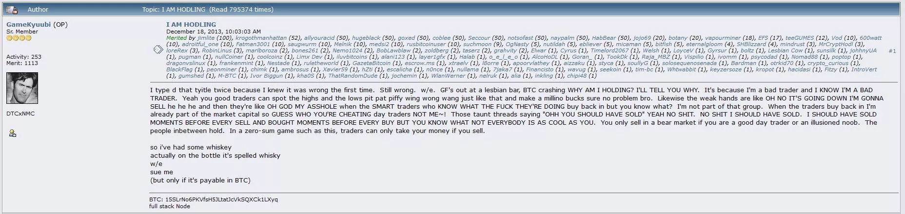
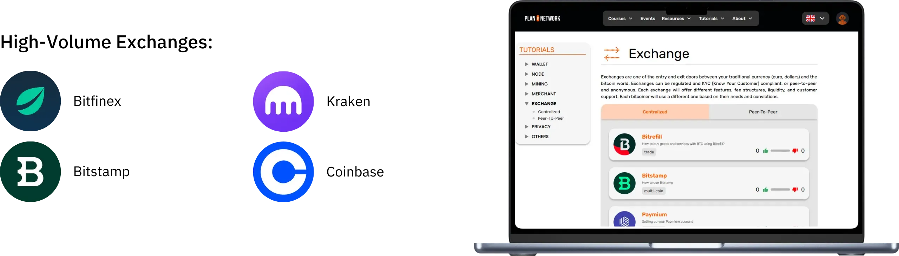
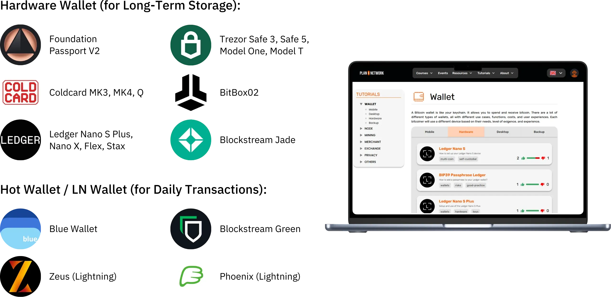

# Uma viagem até aos seus primeiros bitcoins

O ecossistema Bitcoin está a experimentar um crescimento espetacular e sem precedentes. As transformações tecnológicas, económicas e sociais impulsionadas pela invenção de Satoshi Nakamoto intensificam-se dia após dia e abrem gradualmente as portas a um novo mundo, do qual pode agora tirar o máximo partido.

Mergulhar na "Rabbit Hole" do Bitcoin é uma aventura intelectual emocionante que irá estimular o seu pensamento crítico e desafiar muitas das suas convicções. Esta exploração não só lhe dará uma compreensão profunda de como funciona o Bitcoin, mas também uma oportunidade real para recuperar a sua liberdade pessoal, proteger a sua privacidade e alcançar a verdadeira soberania financeira.

Para o guiar eficazmente nesta viagem, criei este curso totalmente gratuito. Aqui, o foco é exclusivamente no Bitcoin. Sem discussões irrelevantes, sem menção a outras criptomoedas, apenas conteúdo claro, preciso e direto.

Este curso foi concebido para lhe dar controlo total sobre a forma como aprende, permitindo-lhe explorar o Bitcoin ao seu próprio ritmo, seguindo o caminho que melhor se adapta aos seus interesses e objectivos.

+++
# Introdução

<partId>008c49b7-5e17-5973-87f2-ba28429b2697</partId>

## Descrição geral do curso

<chapterId>bfc96999-0ee1-5c41-8297-1b629f50cffc</chapterId>

Bem-vindo ao BTC102! Se já completou o BTC101, explorou os principais conceitos teóricos por detrás da razão pela qual o Bitcoin é uma tecnologia tão revolucionária. Agora, com o BTC102, é hora de colocar esse conhecimento em ação. Este curso foi concebido para o ajudar a construir o seu plano pessoal Bitcoin, passo a passo.

Nos próximos capítulos, guiá-lo-emos através dos passos práticos para **obter as suas primeiras bitcoins**, **segurá-las** corretamente e dar os primeiros passos com confiança neste ecossistema em rápido crescimento.

https://planb.network/courses/2b7dc507-81e3-4b70-88e6-41ed44239966

Embora o Bitcoin exista há mais de 16 anos, a indústria ainda é jovem, dinâmica e profundamente enraizada na liberdade. O seu protocolo subjacente é totalmente descentralizado e resistente ao controlo de qualquer autoridade central, permitindo que o ecossistema cresça de uma forma natural e orgânica.

Embora esta liberdade alimente uma incrível onda de inovação e oportunidade, também acarreta alguns riscos, incluindo fraudes, erros comuns e armadilhas que muitas vezes resultam de uma falta de conhecimento. O principal objetivo deste curso é ajudá-lo a navegar neste novo ecossistema com confiança e segurança.

Para tal, o curso BTC102 está dividido em várias secções, cada uma centrada num aspeto-chave da sua viagem com o Bitcoin:

A primeira secção, "Pré-requisitos para compreender o Bitcoin", prepara-o eficazmente para o caminho a seguir. Aprenderá a identificar as principais armadilhas relacionadas com esquemas e fraudes financeiras que podem existir no ecossistema Bitcoin. De seguida, abordaremos as bases essenciais da segurança online.

Por fim, darei algumas dicas práticas especialmente concebidas para principiantes, para o ajudar a evitar erros comuns quando trabalha com o Bitcoin pela primeira vez.

A segunda secção, "Compreender no que se está a meter", aprofundará a sua compreensão geral do Bitcoin. Começaremos com uma revisão para garantir que compreende totalmente os conceitos essenciais.

Depois, explicaremos porque é que o Bitcoin é fundamentalmente importante do ponto de vista tecnológico, económico e social, reforçando a sua convicção no seu valor. Exploraremos também o sector do Bitcoin como um todo: os seus principais intervenientes, a sua organização e a sua evolução ao longo dos anos. Finalmente, abordaremos a arquitetura em camadas do ecossistema Bitcoin, um conceito crucial para compreender como este sistema continua a inovar sem comprometer a integridade do seu protocolo principal.

A terceira secção, "Configurar o seu plano", centra-se na sua abordagem pessoal ao Bitcoin. Começaremos por ajudá-lo a definir o seu perfil de utilizador a partir de quatro categorias principais:

- o hodler*, centrado na manutenção do Bitcoin a longo prazo ;
- o empilhador*, que compra de forma regular e metódica;
- o utilizador*, que dá prioridade à utilização diária do Bitcoin;
- e, finalmente, *o paranoico*, que pretende segurança máxima para proteger eficazmente os seus bens e a sua privacidade.

Acompanhamo-lo na implementação de uma estratégia adequada ao seu perfil e que o ajude a atingir os seus objectivos pessoais.

Por fim, a quarta secção, "Proteger os seus herdeiros e o seu património", aborda um tópico crucial que é frequentemente negligenciado: como garantir que o seu Bitcoin é transmitido aos seus entes queridos em caso de um acontecimento inesperado. Aprenderá a criar e a estabelecer um plano de herança do Bitcoin, assegurando a preservação do seu património para além da sua vida.

No final deste curso, terá todas as ferramentas práticas necessárias para navegar com confiança no ecossistema Bitcoin e tornar-se um dos seus utilizadores mais avançados!

Pronto para começar a sua viagem ao mundo da Bitcoin? Vamos lá!

# Pré-requisitos para compreender o Bitcoin

<partId>4481fc4b-0f83-489e-ad07-81517c5d6bad</partId>

## Burlas e fraudes financeiras

<chapterId>8af2948b-2ab5-54c4-862c-3414b8a285a2</chapterId>

O ecossistema Bitcoin e o seu ambiente envolvente são ainda relativamente jovens e pouco regulamentados, dependendo do país. Embora esta liberdade abra vastas oportunidades, também cria um terreno fértil para fraudes financeiras, burlas e várias formas de manipulação. É por isso que o primeiro capítulo é tão crucial: compreender as armadilhas comuns ajudá-lo-á a evitá-las. A sua segurança financeira é uma prioridade, porque uma má experiência não o afecta apenas a si, mas a toda a comunidade Bitcoin.

### Bitcoin vs cryptos: compreender as diferenças

Antes de prosseguir, é importante distinguir claramente dois mundos fundamentalmente diferentes:

- O ecossistema Bitcoin** está centrado na ideia de dinheiro sólido, construído com base numa forte descentralização, resiliência a longo prazo, privacidade e soberania individual. Desde o seu lançamento em 2009, o Bitcoin tem funcionado de forma fiável e segura, apoiado por uma comunidade global e empenhada de programadores. Não se trata de uma tendência passageira, mas de um protocolo estável e bem estabelecido, concebido para preservar o valor ao longo do tempo.

- A indústria das criptomoedas**, por outro lado, é muito maior e inclui dezenas de milhares de projectos diferentes, cada um com o seu próprio token. Este espaço é muitas vezes impulsionado pela inovação rápida, pelo entusiasmo e pela especulação financeira a curto prazo. Muitos destes projectos são centralizados, menos seguros e não oferecem muito valor real - apesar das promessas arrojadas e do marketing vistoso.

Se quiser compreender melhor a origem do Bitcoin e o que o torna verdadeiramente diferente de outros projectos, recomendo que consulte mais tarde este curso gratuito de acompanhamento sobre a história do Bitcoin:

https://planb.network/courses/a51c7ceb-e079-4ac3-bf69-6700b985a082

Como sabe, a plataforma Plan ₿ Network é exclusivamente dedicada ao Bitcoin. No entanto, compreender a distinção com outras criptomoedas ajudá-lo-á a evitar as armadilhas associadas a projectos inúteis e, por vezes, até fraudulentos.

### As principais fraudes a evitar

Eis as fraudes mais comuns com que se pode deparar durante a sua viagem:

#### Esquemas em pirâmide e esquemas Ponzi

Estas são algumas das burlas mais comuns no mundo das criptomoedas. Num esquema Ponzi, os primeiros participantes recebem pagamentos usando o dinheiro dos mais recentes; não de qualquer investimento ou produto real. Não há nenhum valor real a ser criado. O sistema só funciona enquanto novas pessoas continuarem a aderir. Quando o fluxo de novos participantes abranda, todo o esquema se desmorona.

Estas burlas apresentam normalmente :

- Promessas irrealistas de rendimentos garantidos (por exemplo, 20% de rendimento garantido);
- Atrasos ou dificuldades ao tentar levantar os seus fundos investidos;
- Fortes incentivos ao recrutamento de novos membros para manter o sistema a funcionar;
- Uma total falta de transparência sobre a verdadeira fonte dos rendimentos prometidos.

Em última análise, todos os esquemas de pirâmide e Ponzi estão condenados ao fracasso. A sua fraqueza fundamental reside na necessidade constante de atrair novos investidores para pagar os rendimentos aos participantes anteriores. Esta necessidade torna-se matematicamente impossível de manter ao longo do tempo, porque o número de novos recrutas necessários aumenta exponencialmente à medida que o sistema cresce. Quando se atinge um ponto crítico, os participantes começam a duvidar, a confiança desaparece e toda a pirâmide entra em colapso. Nesta fase, as últimas pessoas a aderir, muitas vezes as menos informadas, perdem todo o seu investimento sem qualquer forma de o recuperar, enquanto os organizadores ou os primeiros investidores já retiraram os seus fundos e abandonaram o sistema.

No mundo das criptomoedas, os esquemas Ponzi podem assumir muitas formas, muitas vezes concebidas para ocultar a sua natureza fraudulenta por detrás de uma máscara tecnológica ou financeira. Estas fraudes podem aparecer como novas ofertas de fichas ou ofertas iniciais de moedas (ICO), que são operações de angariação de fundos em que uma nova moeda criptográfica é vendida ao público. Por detrás de termos técnicos como "Blockchain", "contratos inteligentes" ou "staking", alguns projectos escondem, na realidade, complexos esquemas em pirâmide. Outros afirmam oferecer rendimentos elevados, combinando cripto-activos questionáveis com sistemas de compensação que dependem inteiramente do fluxo contínuo de novos investidores.

Mais recentemente, os esquemas Ponzi também se espalharam pelo mundo das Finanças Descentralizadas (DeFi). Embora a DeFi se destine a fornecer serviços financeiros sem intermediários, alguns projectos utilizam-na para dar uma falsa sensação de legitimidade aos seus esquemas. Certas plataformas DeFi prometem retornos altos e garantidos em Exchange para depósitos de criptomoedas em protocolos automatizados. Estas promessas atractivas são frequentemente apoiadas por mecanismos opacos e não verificáveis, com tokens criados especificamente para o esquema. Na realidade, estes sistemas não têm um modelo de negócio sustentável - os retornos são simplesmente pagos com os fundos dos novos utilizadores, tal como um esquema Ponzi tradicional. Quando a confiança começa a desgastar-se ou o afluxo de novos participantes abranda, estes sistemas entram inevitavelmente em colapso, levando a perdas significativas para os investidores desprevenidos.

O conteúdo deste curso destina-se apenas a fins educativos e não deve ser interpretado como aconselhamento financeiro. A sua segurança financeira depende da sua capacidade de se manter cauteloso, cético e bem informado em todas as decisões financeiras que toma.

A melhor proteção é fazer sempre esta simples pergunta: De onde vem efetivamente o rendimento prometido? Se a resposta não for clara, fuja imediatamente.

#### Bomba e despejo

Este tipo de fraude envolve inflacionar artificialmente o preço de um ativo - frequentemente um token de criptomoeda de baixa liquidez - através de uma campanha de marketing coordenada, normalmente liderada por um grupo de investidores. O esquema típico de Pump & Dump segue este padrão:

- Um grupo de iniciados ou figuras influentes acumula discretamente uma grande quantidade do ativo visado.
- De seguida, lançam uma campanha promocional agressiva para aumentar o volume de vendas e fazer subir o preço.
- O público em geral, movido pelo FOMO (Fear of Missing Out), começa a comprar o ativo em grande número, fazendo subir ainda mais o preço.
- No auge da excitação, os iniciados vendem as suas participações de uma só vez.
- O preço cai, deixando os retardatários com grandes perdas.

É importante notar que as estratégias Pump & Dump são ilegais em muitos países e são consideradas uma forma de manipulação do mercado. Apesar disso, esses esquemas continuam a florescer, especialmente no espaço das criptomoedas, onde a regulamentação ainda está a ser actualizada.

Tenha especial cuidado com os grupos privados de "sinais" em plataformas como o Telegram, o Discord ou outros canais de redes sociais. Estes grupos são muitas vezes geridos por influenciadores ou autoproclamados especialistas, alguns dos quais até cobram taxas de entrada. Embora estes grupos afirmem oferecer oportunidades de investimento exclusivas, a realidade é muito mais unilateral: apenas os organizadores lucram, enquanto a maioria dos participantes acaba por perder o seu dinheiro.

É verdade que alguns participantes podem lucrar temporariamente com este tipo de manipulações de mercado, mas o seu sucesso baseia-se geralmente em nada mais do que sorte e num timing perfeito. A longo prazo, estes esquemas não são sustentáveis. Requerem um envolvimento constante de alto risco e uma participação repetida em esquemas fraudulentos que inevitavelmente se desmoronam.

Pior ainda, alimentam uma ilusão perigosa: a crença de que é possível ganhar dinheiro rápido e fácil sem compreender como funcionam os sistemas financeiros. Esta mentalidade não só coloca as pessoas em risco, como também mina a credibilidade de todo o ecossistema das criptomoedas

Por todas estas razões, a melhor estratégia é manter uma abordagem séria e ponderada ao investimento, baseada na educação financeira, numa sólida compreensão dos fundamentos e numa perspetiva de longo prazo.

Ao desenvolver pacientemente os seus conhecimentos, será muito menos vulnerável à manipulação emocional e a promessas irrealistas; e estará muito melhor equipado para evitar o tipo de armadilhas financeiras que podem conduzir a perdas reais.

#### Esquemas de donativos, lotarias e falsos brindes

Este tipo de esquema promete Bitcoin grátis ou outras recompensas em Exchange se enviar primeiro uma pequena quantia de dinheiro. É importante lembrar: nenhum indivíduo ou organização legítima jamais pedirá que você envie criptomoedas antecipadamente com a promessa de enviar mais em troca.

Os burlões fazem-se muitas vezes passar por figuras públicas conhecidas (como Elon Musk ou outras celebridades) para atrair as vítimas através das redes sociais. Verifique sempre a legitimidade das contas e dos sítios Web antes de se envolver com eles e nunca confie em ofertas que pareçam demasiado generosas ou demasiado boas para serem verdadeiras.

Por vezes, estas burlas surgem como fraudes do tipo "taxa antecipada". É-lhe prometido um prémio ou recompensa (dinheiro, um produto ou um serviço), mas primeiro é-lhe pedido que pague uma taxa, supostamente para cobrir custos de envio, impostos ou transação. Uma vez efectuado o pagamento, o burlão desaparece e a recompensa prometida nunca chega.

#### Shitcoins e criptomoedas em oferta

Os projectos centralizados de criptomoeda oferecem por vezes tokens gratuitos ("*airdrops*") para atrair utilizadores. Estes tokens têm normalmente pouco ou nenhum valor real e são utilizados principalmente para criar a ilusão de popularidade ou para alimentar a especulação. É preciso ter muito cuidado com este tipo de ofertas promocionais; trata-se muitas vezes de armadilhas de marketing e não de oportunidades genuínas.

#### Roubo de identidade e phishing

Os atacantes utilizam frequentemente sítios Web falsos, contas de redes sociais ou mensagens de correio eletrónico enganosas para tentar roubar os seus fundos. Estas burlas podem surgir através de qualquer canal de comunicação: correio eletrónico, redes sociais, chamadas telefónicas ou mesmo correio tradicional...

Antes de clicar numa hiperligação ou de realizar qualquer ação, verifique sempre a identidade do remetente. Em caso de dúvida, visite o sítio Web manualmente em vez de utilizar uma ligação fornecida. Mais importante ainda, nunca partilhe as suas chaves privadas ou palavras-passe com ninguém.

#### Forquilhas Bitcoin

Ao longo dos anos, o Bitcoin passou por várias *Hard forks*, que resultaram na criação de versões alternativas da criptomoeda original. Em termos simples, um *Hard Fork* é uma divisão na rede que leva a duas blockchains separadas, ambas partilhando a mesma história até ao momento da divisão. Esses forks geralmente acontecem quando parte da comunidade de desenvolvedores ou do ecossistema Bitcoin mais amplo quer introduzir grandes mudanças no protocolo original, mas não consegue chegar a um consenso generalizado. Em vez de abandonarem as suas ideias, decidem lançar uma nova versão do Bitcoin (com regras alteradas) na esperança de que os utilizadores e os mineiros optem por seguir o seu Fork.

Nem todos os forks do *Hard* são fraudulentos, pois alguns surgem de desacordos técnicos ou ideológicos dentro da comunidade. No entanto, outros são motivados por interesses comerciais ou mesmo por motivos desonestos. Os exemplos mais conhecidos destes hardforks são o **Bitcoin Cash (BCH)** e o **Bitcoin Satoshi Vision (BSV)**. Lançadas em 2017 e 2018, respetivamente, estas moedas alternativas afirmam frequentemente ser "melhores versões" da Bitcoin original. Promovem supostas vantagens, como taxas de transação mais baixas ou transacções mais rápidas devido ao aumento do tamanho dos blocos. No entanto, estas alterações técnicas implicam compromissos significativos em termos de segurança, descentralização e robustez; Elements que podem entrar em conflito com os princípios fundamentais da Bitcoin.

Para além das diferenças técnicas, estas moedas alternativas aproveitam frequentemente a confusão para atrair investidores desinformados. Podem empregar tácticas de marketing concebidas para enganar deliberadamente os recém-chegados que acreditam estar a comprar Bitcoin (BTC) genuíno.

Para evitar cair nesta armadilha, verifique sempre a moeda que está a comprar. O Bitcoin original utiliza o ticker **BTC**, enquanto o Bitcoin Cash e os seus derivados utilizam acrónimos distintos, como BCH ou BSV.

#### Influenciadores desonestos e falsos gurus

À medida que as criptomoedas ganham atenção, as redes sociais têm assistido a um aumento de influenciadores, especialistas autoproclamados e os chamados "*gurus das criptomoedas*". Estes indivíduos são geralmente motivados por interesses financeiros pessoais, recebendo frequentemente uma compensação direta ou indireta pela promoção de determinados tokens ou plataformas.

Estes influenciadores recorrem frequentemente a tácticas comprovadas para atrair principiantes: apresentam resultados financeiros impressionantes (que são frequentemente falsos ou não verificáveis), exibem um estilo de vida luxuoso como suposta prova do seu sucesso e promovem estratégias de investimento "milagrosas". O objetivo é desencadear o FOMO - o medo de perder - e empurrar o seu público para decisões impulsivas e investimentos imprudentes.

É importante compreender que a maior parte dos conselhos "gratuitos" destas personalidades nunca são verdadeiramente gratuitos. Por detrás da fachada de generosidade encontra-se frequentemente uma estratégia calculada para levar as pessoas a comprar activos questionáveis. E mesmo que alguns influenciadores estivessem a ser honestos, replicar os seus resultados seria quase impossível; o seu sucesso depende muitas vezes de um momento específico, de conhecimentos privilegiados ou de circunstâncias únicas a que simplesmente não tem acesso.

Alguns influenciadores podem convidá-lo a aderir a grupos privados e pagos onde afirmam partilhar sinais de negociação exclusivos ou dicas privilegiadas que prometem lucros rápidos e fáceis. Na realidade, estes grupos beneficiam sobretudo os próprios organizadores. Muitas vezes utilizam os seus seguidores como fonte de liquidez, essencialmente descarregando activos para ganho pessoal. Os subscritores acabam normalmente por perder dinheiro, uma vez que não conseguem reagir tão rapidamente como os informadores que orquestram as transacções (ver a secção sobre esquemas Pump & Dump).

Tendo em conta esta realidade, eis alguns bons hábitos a adotar para evitar cair nas armadilhas dos influenciadores desonestos:

- Seja muito cauteloso com quaisquer recomendações de investimento em criptomoedas

Uma pessoa de confiança e com conhecimentos nunca o pressionará a comprar uma moeda criptográfica sem o encorajar a fazer primeiro a sua própria investigação.

- Os cursos pagos de negociação ou de investimento nem sempre são um sinal de qualidade

Muitos destes cursos promovem estratégias arriscadas ou demasiado simplistas; muitas vezes a mesma informação que pode encontrar online gratuitamente.

- Não existe uma forma garantida de copiar as transacções de alguém e obter resultados idênticos

Cada estratégia de investimento depende do contexto pessoal, do momento, dos conhecimentos e de outros factores que não podem ser reproduzidos exatamente.

- Tenha especial cuidado com os conselhos que parecem demasiado bons para serem verdade

Promessas irrealistas ou lucros garantidos são quase sempre sinais de manipulação. Lembre-se: o facto de alguém dizer algo com confiança não significa que seja verdade.

Lembre-se sempre, todos que você encontra no Bitcoin ou no ecossistema criptográfico mais amplo têm uma agenda pessoal; se é declarado abertamente ou escondido nas entrelinhas. Não existe tal coisa como informação puramente neutra. Mesmo este curso, BTC102, tem um objetivo claro, *promover uma melhor compreensão do Bitcoin*

É por isso que é essencial estar ciente das verdadeiras motivações por detrás de cada conteúdo que consome. E nunca se esqueça desta regra de ouro da Internet:

*Se um produto ou serviço parece ser gratuito, é provável que seja o produto

Em última análise, a sua melhor defesa é a educação pessoal, o ceticismo saudável e, mais importante ainda, o hábito de verificar os factos por si próprio.

### Como evitar fraudes

**Para se manter seguro online, especialmente no mundo das criptomoedas, tenha em mente estes princípios fundamentais

- Nunca confie cegamente: "*Não confie, verifique*" ;
- Seja cético em relação a rendimentos garantidos ou invulgarmente elevados;
- Nunca partilhe as suas chaves privadas com ninguém;
- Não envie Bitcoin (ou qualquer criptografia) para endereços desconhecidos;
- Em caso de dúvida, faça uma pausa. Dê um passo atrás e pense antes de agir. O FOMO é o seu pior inimigo;
- Evite grupos de negociação pagos ou comunidades que façam promessas irrealistas;
- A maior parte dos brindes ou lotarias "gratuitas" online são fraudes ou muito manipuladas;
- A longo prazo, ganhará sempre mais com a aprendizagem do que com o jogo.

Proteger-se contra as burlas é um primeiro passo crucial para salvaguardar os seus bens, mas não é suficiente. Manter uma forte higiene digital é igualmente importante. É por isso que, no próximo capítulo, vamos explorar a forma de reforçar a sua segurança online e as melhores práticas que deve adotar para se proteger no mundo digital.

## Segurança em linha

<chapterId>f0873bf2-6a6f-5485-bb7a-d84be14f404d</chapterId>

Assim que começar a entrar no Bitcoin, aperceber-se-á rapidamente de que a cibersegurança básica não é opcional - é essencial. As burlas e fraudes são apenas a ponta do icebergue. A perda acidental de dados, malware e palavras-passe comprometidas podem ser igualmente devastadoras, especialmente quando está a gerir as suas próprias chaves.

Este capítulo apresenta-lhe alguns passos simples e práticos para melhorar a sua higiene digital e proteger-se no espaço.

Se quiser ir mais longe, o curso SEC101 do Plan ₿ Network oferece uma análise exaustiva das estratégias de cibersegurança especificamente concebidas para os utilizadores do Bitcoin.

https://planb.network/courses/99c46148-7080-4915-a7e0-9df0e145cd47

### Porque é que a cibersegurança é importante

O Bitcoin dá-lhe o poder de guardar o seu dinheiro diretamente (sem bancos), sem intermediários. Mas esse tipo de soberania financeira vem com sérias responsabilidades: se o seu BTC for roubado devido a um lapso de segurança, não há como reverter a transação. Ao contrário dos bancos tradicionais, não existe um serviço de apoio, uma queixa de fraude e um seguro para o salvar.

Para além disso, o valor financeiro do Bitcoin torna-o um alvo de alto valor. Um hacker que comprometa o seu Wallet pode transferir instantaneamente os seus fundos para um Address que controla (sem perguntas e sem forma de os recuperar).

### Um computador limpo e atualizado

Um dos aspectos mais negligenciados da segurança pessoal é manter o sistema operativo e o software actualizados. Muitas actualizações corrigem vulnerabilidades conhecidas que, de outra forma, poderiam ser exploradas por atacantes. Embora algumas pessoas evitem as actualizações por receio de problemas de desempenho, o verdadeiro risco reside na utilização de software desatualizado que os piratas informáticos já sabem como violar.

É também altamente recomendada a utilização de um antivírus fiável. No Windows, o Windows Defender incorporado é geralmente suficiente para a maioria dos utilizadores. Se preferir funcionalidades adicionais ou paz de espírito, estão disponíveis opções comerciais como o Kaspersky. No macOS, as ameaças de malware são historicamente menos comuns **mas não inexistentes**, pelo que é inteligente manter-se cauteloso.

Para além das actualizações do sistema e da proteção antivírus, tenha muito cuidado com o descarregamento de software a partir de sites duvidosos ou dos chamados portais de descarregamento "universais". Quando precisar de uma ferramenta ou aplicação, vá sempre diretamente à fonte oficial; isto reduz drasticamente o risco de instalar malware disfarçado de software legítimo.

Outro hábito inteligente é verificar a autenticidade e a integridade de qualquer software antes de o instalar no seu computador. Se não tem a certeza de como o fazer, não se preocupe, temos um tutorial dedicado para o guiar através do processo:

https://planb.network/tutorials/computer-security/data/integrity-authenticity-21d0420a-be02-4663-94a3-8d487f23becc

Por fim, faça backups regulares dos seus dados importantes. Uma unidade externa Hard ou SSD é uma opção sólida para manter uma cópia dos seus ficheiros em caso de falha súbita, pirataria informática ou eliminação acidental. Irá agradecer a si próprio mais tarde.

Se preferir soluções na nuvem, considere a utilização de um serviço seguro como o Proton Drive. Certifique-se apenas de que a opção que escolher respeita a sua privacidade e oferece uma encriptação forte.

https://planb.network/tutorials/computer-security/data/proton-drive-03cbe49f-6ddc-491f-8786-bc20d98ebb16

Uma estratégia de cópia de segurança amplamente recomendada é a "regra 3-2-1". Foi concebida para proteger os seus dados contra perdas acidentais, ciberataques ou mesmo catástrofes naturais.

A ideia é simples:

- Mantenha **pelo menos 3 cópias** dos seus dados importantes,
- Armazene-os em **pelo menos 2 tipos diferentes de suportes** (por exemplo, uma unidade externa Hard e armazenamento na nuvem),
- E certifique-se de que **uma dessas cópias é armazenada fora do local** (fisicamente separada da sua localização principal).

Esta abordagem oferece uma forte resiliência e ajuda a garantir a sobrevivência dos seus dados, mesmo que algo corra seriamente mal.

### A solução para o pesadelo da identificação

Uma das principais razões pelas quais as pessoas são pirateadas é a utilização de palavras-passe fracas. Um número significativo de utilizadores continua a reutilizar a mesma palavra-passe em várias contas ou escolhe variações que são fáceis de adivinhar. Os gestores de palavras-passe são a solução perfeita para este problema.

Um gestor de palavras-passe permite-lhe:

- Guarde todas as suas palavras-passe de forma segura** num cofre encriptado
- generate palavras-passe longas, complexas e únicas** automaticamente para cada conta
- Utilize apenas uma palavra-passe mestra**, para aceder a tudo em segurança

Com um gestor de palavras-passe, nunca mais terá de clicar em "Esqueci-me da palavra-passe" ou confiar em credenciais fracas e reutilizadas. Além disso, a maioria dos gestores de palavras-passe sincroniza-se perfeitamente entre os seus dispositivos (computador, telemóvel, tablet) e até preenche automaticamente formulários de início de sessão, tornando o acesso seguro fácil e eficiente.

Existem muitos gestores de palavras-passe no mercado, mas posso recomendar duas opções sólidas, dependendo das suas necessidades. Se estiver à procura de algo fácil de utilizar e que sincronize perfeitamente em vários dispositivos, o Bitwarden é uma excelente escolha:

https://planb.network/tutorials/computer-security/authentication/bitwarden-0532f569-fb00-4fad-acba-2fcb1bf05de9

Se preferir manter tudo localmente no seu próprio dispositivo, o KeePass é uma óptima opção:

https://planb.network/tutorials/computer-security/authentication/keepass-f8073bb7-5b4a-4664-9246-228e307be246

### 2FA: dupla proteção

No Bitcoin, o utilizador é o seu próprio banco. Isso significa que também é a sua própria equipa de segurança. Mesmo com uma palavra-passe forte, não existe risco zero - e é por isso que é essencial ativar a autenticação de dois factores (2FA).

a 2FA acrescenta um segundo Layer de proteção, exigindo um código único baseado no tempo (normalmente 6 dígitos) gerado por uma aplicação como o Google Authenticator ou o Authy. Assim, mesmo que alguém consiga obter a sua palavra-passe, não conseguirá aceder à sua conta sem acesso físico ao seu telemóvel.

https://planb.network/tutorials/computer-security/authentication/authy-a76ab26b-71b0-473c-aa7c-c49153705eb7

Quando ativar a 2FA, certifique-se de que guarda a chave de recuperação da sua aplicação num local seguro. Isto permitir-lhe-á restaurar os seus códigos se perder ou mudar de telemóvel. Embora a 2FA baseada em SMS ou correio eletrónico seja melhor do que nada, é muito menos segura. Um ataque de troca de SIM, em que alguém assume o controlo do seu número de telefone, pode facilmente contornar este tipo de proteção.

Para quem pretende levar a segurança um passo mais além, as chaves físicas como a YubiKey proporcionam um nível de proteção ainda mais elevado.

https://planb.network/tutorials/computer-security/authentication/security-key-61438267-74db-4f1a-87e4-97c8e673533e

### Proteger a sua privacidade

A privacidade e a cibersegurança estão intimamente ligadas: quanto mais informação deixarmos livremente acessível, maior é a probabilidade de nos tornarmos um alvo.

Uma **VPN** (*Virtual Private Network*) é um passo simples mas eficaz para mascarar o seu IP Address e encriptar o seu tráfego de Internet. Embora não o torne completamente invisível (uma vez que o fornecedor de VPN ainda pode ver a sua atividade), dificulta significativamente a tarefa de quem tenta espiá-lo ou seguir os seus hábitos de navegação.

A chave é escolher um fornecedor de VPN fiável que:

- Não requer as suas informações pessoais
- Permite o pagamento através de BTC
- Tem uma política rigorosa de não registo (no-logs)

Temos vários tutoriais disponíveis no Plan ₿ Network que o podem guiar através da configuração de uma VPN facilmente. Recomendo particularmente o IVPN ou o Mullvad:

https://planb.network/tutorials/computer-security/communication/ivpn-5a0cd5df-29f1-4382-a817-975a96646e68

https://planb.network/tutorials/computer-security/communication/mullvad-968ec5f5-b3f0-4d23-a9e0-c07a3e85aaa8

Os passos essenciais para proteger a sua privacidade em linha também incluem:

- Utilizar **plataformas de mensagens encriptadas** como Signal, SimpleX ou Session;
- Utilizar navegadores centrados na privacidade, como o Firefox, o Brave ou o Tor (para melhorar o anonimato);

https://planb.network/tutorials/computer-security/communication/tor-browser-a847e83c-31ef-4439-9eac-742b255129bb

- Utilizar uma **caixa de correio segura** como o ProtonMail;

https://planb.network/tutorials/computer-security/communication/proton-mail-c3b010ce-254d-4546-b382-19ab9261c6a2

- Encriptar** os seus ficheiros com ferramentas como o Bitlocker (para Windows) ou o VeraCrypt (disponível em várias plataformas).

https://planb.network/tutorials/computer-security/data/veracrypt-d5ed4c83-7c1c-4181-95ea-963fdf2d83c5

### Progressão passo a passo

A cibersegurança pode parecer uma tarefa gigantesca, e é fácil para os principiantes ficarem sobrecarregados e desistirem por parecer demasiado complexa. O truque é abordar o assunto passo a passo. Comece com algo simples, como instalar um gestor de palavras-passe. Dê a si próprio algumas semanas para se sentir confortável com ele e, em seguida, avance para o passo seguinte: como ativar a 2FA numa das suas contas.

À medida que se torna mais confiante com estas ferramentas, estará pronto para adicionar práticas mais avançadas, como a utilização de um e-mail secundário, a mudança para o ProtonMail, a configuração de uma VPN ou a navegação com o Tor, quando necessário.

À medida que se aprofunda no mundo do Bitcoin, notará que os riscos crescem à medida que o valor do seu Wallet aumenta. Criar hábitos de segurança sólidos, proteger a sua privacidade e configurar as ferramentas certas não só lhe dará paz de espírito como também reforçará a soberania do Bitcoin.

Resumindo: não subestime a cibersegurança, dedique algum tempo a configurar o básico e lembre-se de que a consistência é fundamental. Sem uma boa higiene digital, mesmo as melhores ferramentas não farão muito por si.

Não se esqueça também de consultar [os nossos tutoriais sobre segurança informática] (https://planb.network/tutorials/computer-security) no Plan ₿ Network.

No próximo capítulo, partilharei mais algumas dicas para o ajudar a iniciar a sua viagem Bitcoin com confiança e a evitar as muitas armadilhas que podem apanhar os recém-chegados desprevenidos.

## Conselhos para os recém-chegados

<chapterId>33134b3f-92c1-5185-afb6-88599e47e801</chapterId>

Entrar no Bitcoin pode ser emocionante; mas também vem com a sua quota-parte de riscos. O mundo das criptomoedas é diferente de qualquer outro; oscilações de preços selvagens, tecnologia desconhecida e a possibilidade muito real de perder os seus fundos para sempre devido a erros simples ou más escolhas de investimento são todas armadilhas de que os novos utilizadores devem estar cientes.

Neste capítulo, partilharei alguns conselhos práticos e orientações gerais para quem está a dar os primeiros passos, especialmente para quem está a fazer a sua primeira compra ou a explorar o mundo mais vasto do investimento financeiro.

Eis os pontos-chave que iremos analisar em conjunto:

- Cuidado com as **Shitcoins** e outras criptomoedas inúteis;
- Investir apenas **dinheiro que se pode dar ao luxo de perder**;
- Saber a diferença entre **negociação** e **investimento**;
- Estar ciente das **implicações fiscais** dos seus investimentos;
- Proteja cuidadosamente a sua **frase de recuperação**;
- Manter-se humilde e manter um **perfil baixo** (a discrição faz parte da segurança);
- Pense a longo prazo**, faça zoom out e seja paciente (pense nisto como uma maratona, não como um sprint).

### Erros comuns a evitar

O Bitcoin está aberto a toda a gente, mas isso não significa que se deva mergulhar sem preparação. Aqui estão alguns dos erros clássicos cometidos pelos recém-chegados:

**Erros tecnológicos

- Perder a frase do seed:** A sua frase de recuperação (normalmente 12 ou 24 palavras) é a única forma de aceder ao seu Bitcoin se algo acontecer ao seu Wallet. Se a perder, os seus fundos desaparecem permanentemente;
- Armazenar os seus bitcoins numa plataforma de terceiros:** Se as suas moedas estiverem numa plataforma centralizada, não é realmente dono delas. Está exposto a riscos como hacks, falhas de plataforma ou até mesmo apreensões de fundos;
- Negligenciar a privacidade:** Proteger a sua privacidade é uma parte essencial da segurança dos seus bens. Revelar publicamente a quantidade de Bitcoin que possui pode fazer de si um alvo;
- Segurança online insuficiente:** Não proteger os seus dispositivos com protecções básicas (como actualizações, palavras-passe fortes ou 2FA) torna-o um alvo fácil para os atacantes e pode custar-lhe tudo.

**Erros financeiros

- Investir mais do que se pode dar ao luxo de perder**: Nunca te endivides nem ponhas o dinheiro da tua renda no Bitcoin. A tua estabilidade financeira básica deve estar sempre em primeiro lugar.

- Não saber a diferença entre negociar e investir**: Negociar requer tempo, habilidade e uma disciplina emocional séria. O investimento a longo prazo é muito mais fácil para os principiantes.

- Esquecer os impostos**: Cada país tem as suas próprias regras fiscais para as criptomoedas. Ignorá-las pode levar a surpresas dolorosas no futuro.

- Cair no FOMO**: Comprar impulsivamente por medo de ficar de fora leva geralmente a uma má altura e a más decisões. A paciência é o seu melhor aliado.

### Definição de uma estratégia de investimento

Antes de comprar o seu primeiro Satoshi, é crucial compreender por que razão está a investir no Bitcoin e como. Isto significa ter um plano financeiro claro, adaptado à sua situação pessoal e aos seus objectivos a longo prazo.

Comece por definir o seu **orçamento** com precisão. Não se limite a escolher um número ao acaso. Dedique algum tempo a calcular o seu rendimento mensal, subtraia as suas despesas fixas (como renda, empréstimos, impostos, serviços públicos), bem como as despesas do dia a dia (alimentação, transportes, lazer, etc.). O que sobrar é a sua margem de poupança e é apenas a partir desta parte que deve pensar em investir.

Abordar a questão desta forma garante que não está a colocar em risco o seu bem-estar financeiro, especialmente no caso de uma queda do mercado. Uma estratégia bem pensada é a base da resiliência a longo prazo.

Quando o seu orçamento estiver definido, pense na forma como quer investir. Um dos métodos mais fáceis para principiantes e amplamente recomendado é o Dollar Cost Averaging (DCA), comprando uma quantidade fixa de Bitcoin em intervalos regulares (semanais, mensais, etc.). Esta estratégia ajuda a suavizar o seu preço médio de entrada ao longo do tempo e reduz o impacto emocional das oscilações de preços. É uma abordagem inteligente para a maioria das pessoas, especialmente para os principiantes.

Depois, pergunte a si próprio: Qual é o meu horizonte temporal?

Está à procura de movimentos rápidos para entrar e sair do mercado (negociação)? Ou está mais alinhado com a mentalidade de longo prazo de manter o Bitcoin durante vários anos (hodler)? Se é um hodler, provavelmente está menos preocupado com as oscilações diárias dos preços e mais concentrado na segurança a longo prazo e na auto-custódia. Se estiver a negociar, estará mais exposto ao ruído do mercado a curto prazo, a um risco mais elevado e ao stress que muitas vezes acompanha a tomada rápida de decisões. Não existe uma resposta única para todos, mas o conhecimento da sua própria abordagem ajudará a orientar as suas decisões.

Mais importante ainda, não tome decisões de investimento com base na emoção ou no medo. Defina uma estratégia com antecedência, escreva-a e mantenha-se fiel a ela.

Se ainda não tem a certeza, **comece por aprender**

Passe algumas horas a explorar o Bitcoin, consulte os recursos gratuitos do Plan ₿ Network, leia alguns livros, invista cinco euros só para experimentar e veja alguns conteúdos de qualidade em linha. Mantenha-se curioso. Quanto mais confortável estiver, mais fácil será rever a sua estratégia, ajustar a sua abordagem e avançar com confiança.

### Compreender a volatilidade do BTC

O Bitcoin é conhecido pelas suas oscilações dramáticas de preços. Movimentos de 10%, 20%, ou mesmo 50% em apenas alguns dias não são invulgares. Para os recém-chegados, este tipo de volatilidade pode ser desorientador. É fácil deixar-se levar pelo entusiasmo durante as corridas de touros ou entrar em pânico durante as descidas; ambas as situações conduzem frequentemente a más decisões, como vender com prejuízo.

É por isso que é crucial **compreender e aceitar a volatilidade do Bitcoin** antes de investir. Estas oscilações de preços não são um problema, são uma caraterística de um ativo ainda em amadurecimento. Se as subidas e descidas repentinas o mantêm acordado durante a noite ou o levam a tomar decisões emocionais, é provável que tenha investido mais do que aquilo que se sente à vontade para arriscar. Nesse caso, dê um passo atrás e reavalie a sua estratégia e tolerância ao risco. Não hesite em reduzir a sua posição até se sentir mais à vontade.

Acima de tudo, nunca invista mais do que pode perder. Evite pedir dinheiro emprestado para comprar Bitcoin (especialmente se ainda estiver a aprender os fundamentos). Uma base sólida começa com passos medidos, não com apostas imprudentes.

### Gerir e proteger o Bitcoin Wallet

Uma das caraterísticas mais poderosas (e muitas vezes subestimadas) do Bitcoin é a **auto-custódia**. Com um Wallet auto-hospedado, só o utilizador é responsável pelos seus fundos. Estas carteiras são tipicamente geradas a partir de uma **frase de recuperação** (também conhecida como frase seed), uma série de 12 ou 24 palavras que concede acesso total ao seu BTC. Se perder esta frase (ou se outra pessoa a conseguir obter) os seus bitcoins desaparecem para sempre. **Não há apoio ao cliente. Sem botão de reset

É por isso que a regra de ouro do Bitcoin é:

"***Não são as vossas chaves, não são as vossas moedas***". Se não controla pessoalmente as suas chaves privadas, não é verdadeiramente dono do seu Bitcoin. Embora as trocas possam ser convenientes (especialmente quando se está a começar), elas guardam as suas chaves por si. Isso significa que seus fundos estão em risco se a plataforma for invadida, congelar sua conta ou falir.

Para evitar este risco, recomenda-se vivamente que configure o seu **próprio Wallet**, onde só você tem acesso à frase de recuperação. Esta frase deve ser sempre escrita à mão e guardada **offline** num local seguro. Alguns utilizadores chegam mesmo a **manter várias cópias de segurança**, armazenadas em localizações geográficas separadas para maior segurança.

**Nunca guarde a sua frase de recuperação num dispositivo ligado à Internet ou na nuvem**.

**Um único hack ou violação de dados pode levar a perdas irreversíveis

Se estiver pronto para tirar o Ownership do seu Bitcoin e quiser aprofundar as práticas recomendadas para proteger a sua frase de recuperação, recomendo vivamente que consulte este artigo:

https://planb.network/tutorials/wallet/backup/backup-mnemonic-22c0ddfa-fb9f-4e3a-96f9-46e2a7954270

### Confidencialidade e discrição

No mundo digital de hoje, a **discrição é muitas vezes negligenciada**; no entanto, é uma parte crucial para se manter seguro, especialmente quando se trata de Bitcoin. Quanto mais abertamente falar sobre os seus bens, maior será a probabilidade de se tornar um alvo de burlões, cibercriminosos ou mesmo de ameaças mais tradicionais como a extorsão ou a chantagem.

Registaram-se numerosos casos em todo o mundo em que indivíduos conhecidos por deterem grandes quantidades de BTC foram raptados ou atacados.

**Evite gabar-se do seu Bitcoin Stash**; seja nas redes sociais ou mesmo em conversas casuais. Não há nenhuma vantagem em revelar informações financeiras sensíveis e os riscos são reais.

Também é aconselhável **compartimentar a sua atividade em linha**. Por exemplo:

- Utilize um correio eletrónico Address separado para tudo o que estiver relacionado com o Bitcoin, distinto das suas contas pessoais ou de trabalho.
- Tenha cuidado com tentativas de phishing, ligações suspeitas e sítios Web falsos que imitam plataformas de confiança.
- A discrição e a vigilância são muitas vezes a sua melhor defesa.

Se estiver pronto para aprofundar o tema da privacidade do Bitcoin, recomendamos que continue com o nosso Curso de Privacidade do Ano 2, onde aprenderá técnicas mais avançadas para manter a sua identidade e atividade seguras:

https://planb.network/courses/65c138b0-4161-4958-bbe3-c12916bc959c

### Implicações fiscais

Apesar de ser uma moeda descentralizada, a **Bitcoin não está isenta das leis e regulamentos fiscais** do seu país. Cada jurisdição tem a sua própria abordagem à forma como os ganhos das criptomoedas são tributados.

Em alguns países, os lucros são tributados como mais-valias aquando da venda. Outros podem exigir a declaração de todas as transacções e alguns aplicam regras menos comuns, como o imposto sobre o património ou as contribuições sociais.

Antes de efetuar quaisquer transacções significativas, recomenda-se vivamente que consulte um profissional da área fiscal ou que analise as orientações oficiais do seu governo. Se dedicar algum tempo a compreender antecipadamente as suas obrigações fiscais, pode evitar problemas inesperados mais tarde (como multas, auditorias ou penalizações), especialmente se estiver a planear grandes vendas ou reafectações de carteiras.

### A diferença entre negociar, investir e manter

O Bitcoin está frequentemente rodeado de equívocos populares; um dos mais comuns é a ideia de que é um caminho rápido para enriquecer através do comércio. Mas é importante compreender a distinção clara entre negociar, investir e manter, uma vez que cada abordagem tem a sua própria mentalidade, conjunto de competências e nível de risco.

- Negociação :**

Sejamos honestos: provavelmente não deveria estar a negociar

A negociação envolve especulação a curto prazo (por vezes com alavancagem) com o objetivo de lucrar com as oscilações de preços do Bitcoin. Embora possa parecer apelativo, uma negociação bem sucedida requer conhecimentos técnicos avançados (como análise de gráficos e gestão de riscos), disciplina emocional e atenção constante ao mercado. É mentalmente desgastante e demorado, e a verdade é que **a maioria dos principiantes perde dinheiro** porque subestima o seu grau de exigência.

Como disse Warren Buffett:

"**Se não está disposto a manter uma ação durante dez anos, nem sequer pense em mantê-la durante dez minutos**."

O Bitcoin não é um esquema de enriquecimento rápido.

- Investimento

Os investidores adoptam uma perspetiva de médio a longo prazo, comprando Bitcoin com a convicção de que o seu valor aumentará com o tempo (meses, anos ou mesmo décadas). É claro que ainda há risco, já que o preço do Bitcoin pode flutuar significativamente. Mas esta abordagem é geralmente mais calma e muito mais prática para a maioria das pessoas, especialmente aquelas que não querem passar horas coladas aos gráficos todos os dias.

- Suporte (HODL) :**

"HODL" começou como uma gralha para "hold" e rapidamente se tornou parte da cultura Bitcoin. Atualmente, é um distintivo de honra.

Os Hodlers estão a jogar a muito longo prazo, por vezes dez anos ou mais. Eles armazenam seu Bitcoin com segurança e simplesmente esperam, movidos por uma forte convicção no potencial de longo prazo do Bitcoin. Não se deixam perturbar pelas oscilações diárias de preços ou pelos mercados em baixa. A sua mentalidade é simples: acumular, proteger e esperar.

|          | Trading | Investment | Holding |
| ---------------------- | ----------- | -------------- | --------------- |
| Leverage | Yes  | No | No |
| Timeframe | Short-term | Medium-term | Very long-term |
| Asset Type | Contracts | Actual BTC | Actual BTC |
| Risk Level | Very high | High | High |
| Difficulty | Very Hard | Hard | Hard |
| learning curve | Long learning curve | Long learning curve | Long learning curve |
| Potential Loss | UnLimited | Limited | Limited |
| Best For | A few experienced users | Most People | Long-term Believers |

### Continuar a aprender

Nunca é demasiado cedo (ou demasiado tarde) para começar a informar-se sobre o dinheiro, o investimento e a forma como o sistema financeiro realmente funciona. Não precisa de se tornar um especialista ou de se aprofundar em todos os pormenores técnicos; ter um conhecimento sólido e abrangente é suficiente para tomar decisões informadas e evitar ser enganado por produtos financeiros que não servem os seus interesses (muitas vezes promovidos por bancos ou consultores).

Um ótimo ponto de partida é o livro "Pai Rico, Pai Pobre" de Robert T. Kiyosaki. É amplamente conhecido pelo seu estilo acessível e pelas lições fundamentais, como a compreensão da diferença entre activos e passivos e a razão pela qual a educação financeira é fundamental para a independência a longo prazo.

Se estiver pronto para ir mais fundo, podcasts como *The Investors Podcast* oferecem discussões perspicazes sobre investimentos, mercados e princípios económicos. Ocasionalmente, também abordam o Bitcoin, o que o torna um próximo passo sólido para os curiosos em compreender como o Bitcoin se enquadra no panorama financeiro mais alargado.

### Regras de ouro a ter em conta

Para finalizar, aqui estão alguns princípios intemporais que todos os Bitcoiners (especialmente os principiantes) devem ter em mente:

- Regra n°1**: Nunca investir mais do que se pode dar ao luxo de perder. O Bitcoin é um ativo volátil. Não arrisque a sua estabilidade financeira em busca de ganhos. As suas necessidades essenciais e a sua paz de espírito devem estar sempre em primeiro lugar.
- Regra n°2**: Não siga cegamente a moda ou confie em conselhos milagrosos. Ignore as tendências e as promessas vistosas. Em vez disso, concentre-se em tomar decisões bem informadas e racionais. Em caso de dúvida, durma sobre o assunto; fale sobre ele com pessoas em quem confia. É melhor agir devagar e com ponderação do que precipitar-se em erros dispendiosos.
- Regra n°3**: Construir um plano e manter uma visão a longo prazo.

A consistência, a paciência e a disciplina levam-no mais longe do que o entusiasmo a curto prazo. Não tenha como objetivo a realização de grandes feitos, mas sim o crescimento sustentável. Evite erros fatais e deixe que as pequenas vitórias se acumulem ao longo do tempo.

Seguindo estes princípios, será capaz de abordar o investimento no Bitcoin com mais clareza e paz de espírito. Sim, o Bitcoin é volátil e pode ser intimidante no início; mas quando abordado com cautela, paciência e uma mentalidade fundamentada, tem um potencial inegável. Dedique algum tempo a desenvolver os seus conhecimentos, reveja a sua estratégia sempre que necessário e, acima de tudo, lembre-se: um progresso lento e constante será sempre melhor do que uma precipitação por medo ou impaciência.

# Compreender no que se está a meter

<partId>a42355a3-9dd8-57ed-b590-32a333fe09ea</partId>

## Bitcoin em 5 minutos

<chapterId>ae122ad9-9b4d-5229-9038-e1b99d5cfc83</chapterId>

Neste curso, o objetivo principal é guiá-lo através da aquisição e segurança dos seus primeiros bitcoins. Mas antes de mergulhar nos passos práticos (como comprar BTC, que carteiras utilizar, etc.) é importante dar um passo atrás e compreender o que é realmente o Bitcoin. Compreender a natureza mais profunda do Bitcoin ajudá-lo-á a perceber porque é que milhões de pessoas estão a voltar-se para esta tecnologia e porque é crucial compreender os fundamentos antes de colocar as suas poupanças num ativo tão novo e volátil.

Ao longo dos anos, o Bitcoin ganhou reconhecimento como uma rede monetária global. Tem sido chamado de "ouro digital", um "protocolo de confiança" e até mesmo um "sistema financeiro paralelo" Mas o que é que estes termos significam realmente? Para responder a isso, vamos analisar mais de perto o núcleo do Bitcoin: a sua história de origem, fundamentos técnicos, propriedades monetárias e o seu potencial impacto; não apenas nos indivíduos, mas no sistema financeiro global como um todo.

### As origens: Um projeto nascido de uma longa busca

#### Cypherpunks e a invenção de um sistema fora do controlo bancário

O Bitcoin não nasceu da noite para o dia. É o resultado de décadas de pesquisa e experimentação em criptografia, ciência da computação e teoria monetária. Antes do seu lançamento em 2009, vários projectos (como eCash, b-money, Bit Gold, e RPOW) tentaram criar moedas digitais. Todos enfrentaram o mesmo problema central: como evitar gastos duplos num sistema descentralizado sem depender de uma autoridade central.

Esse desafio permaneceu sem solução até o final de 2008, quando alguém usando o nome Satoshi Nakamoto publicou o white paper Bitcoin. Poucos meses depois, a primeira versão do software de código aberto do Bitcoin foi lançada, lançando um sistema que poderia funcionar independentemente de bancos ou governos.

O projeto foi fortemente influenciado pelo ethos do Cypherpunk; uma comunidade de programadores e pensadores que acreditavam na utilização da criptografia para proteger as liberdades individuais online. Para eles, a privacidade e a descentralização não eram preferências técnicas, mas necessidades ideológicas. O Bitcoin surgiu como a personificação mais bem sucedida desses ideais: uma rede monetária peer-to-peer que qualquer pessoa podia usar, ninguém podia controlar e todos podiam verificar.

Os Cypherpunks são uma comunidade informal e internacional de indivíduos que defendem a utilização da criptografia para defender as liberdades pessoais online. Acreditam firmemente no direito do indivíduo à privacidade, especialmente num mundo cada vez mais moldado pela vigilância governamental e pela exploração de dados corporativos.

As raízes do movimento Cypherpunk remontam ao início dos anos 90, quando grupos de criptógrafos, programadores e libertários começaram a explorar as implicações políticas da criptografia durante encontros em Silicon Valley. Uma das vozes mais proeminentes da comunidade foi Tim May, autor do Manifesto Anarquista Criptográfico em 1988; um texto fundamental que delineia uma visão de um mundo onde a encriptação daria aos indivíduos o poder de operar fora do alcance dos governos e do controlo centralizado.

Um marco importante no movimento surgiu em 1992 com a criação da lista de correio Cypherpunks, um fórum onde podiam florescer ideias, projectos e discussões políticas sobre privacidade e criptografia. Depois, em 1993, Eric Hughes publicou o Manifesto do Cypherpunk, uma declaração breve mas poderosa que expressava claramente a missão e as crenças da comunidade.

A ideia de uma moeda digital que funciona independentemente de qualquer autoridade central (como a Bitcoin) está profundamente enraizada na filosofia da Cypherpunk.

#### Momento pós-crise financeira

O Bitcoin não surgiu do nada. Foi criado num momento muito específico - logo após a crise financeira global de 2008. O colapso do mercado imobiliário dos EUA e a crise dos empréstimos subprime provocaram a falência de grandes bancos e abalaram a confiança das pessoas em todo o sistema financeiro.

Foi neste ambiente de medo e incerteza que nasceu o Bitcoin. O criador, conhecido como Satoshi Nakamoto, incluiu uma mensagem muito simbólica no primeiro bloco do Bitcoin Blockchain, conhecido como o bloco Genesis. A mensagem era:

> **"The Times 03/Jan/2009 Chanceler à beira do segundo resgate aos bancos "**

Não se tratava apenas de uma data ou de uma nota técnica; era um protesto silencioso mas poderoso. Mostrou que o Bitcoin foi concebido para ser algo radicalmente diferente: um sistema financeiro que não depende de bancos, resgates ou decisões governamentais.

Muitos interpretam isto como o objetivo do Bitcoin: oferecer uma forma de transferir valor sem necessidade de intermediários, controlada por regras claras em vez das decisões frequentemente pouco claras tomadas pelos bancos centrais ou pelos governos.

Para aprofundar os seus conhecimentos sobre as origens do Bitcoin, oferecemos um curso de formação gratuito, completo e bem documentado sobre o assunto:

https://planb.network/courses/a51c7ceb-e079-4ac3-bf69-6700b985a082

### Uma rede descentralizada para transferir valor

#### Peer-to-peer e sem organismo central

O Bitcoin é definido como um "sistema de dinheiro eletrónico ponto a ponto" Isto significa que qualquer pessoa pode ligar-se à rede usando o software apropriado (um nó Bitcoin) e interagir diretamente com outros utilizadores, sem depender de um servidor central. O objetivo desta descentralização é impedir que uma única entidade (como um banco, um governo ou uma grande empresa) controle, censure ou interrompa o sistema. O Bitcoin funciona 24 horas por dia, 7 dias por semana, globalmente, e é acessível a todos sem quaisquer condições.

Em termos simples, cada participante na rede Bitcoin (chamado "nó") tem uma cópia completa da transação Ledger, conhecida como Blockchain. Quando ocorre uma nova transação, esta é transmitida para a rede. Os mineiros confirmam então estas transacções agrupando-as em blocos que são depois adicionados ao fim da cadeia (daí o nome "Blockchain").

#### Blockchain: uma contabilidade Ledger

Pense no Blockchain como um Ledger contabilístico gigante, em que cada linha representa uma transação. Num sistema bancário tradicional, a base de dados é armazenada nos servidores de um banco, que pode fazer alterações sempre que quiser. Por outro lado, no Bitcoin, **todas as alterações são validadas em toda a rede**: uma vez que um novo bloco de transacções é adicionado ao Blockchain, é quase impossível alterá-lo mais tarde. Esta validação descentralizada torna o Ledger do Bitcoin seguro e transparente.

### O papel dos mineiros e do Proof-of-Work

#### Como são criados os blocos: Mining

O Mining é o processo através do qual os computadores (ou grandes fazendas de Mining) contribuem com **poder computacional** para proteger o histórico de transacções do Bitcoin e criar novos blocos. Os mineiros competem para resolver um puzzle matemático - especificamente, encontrar uma colisão parcial de Hash. Este processo requer energia e recursos significativos. Quando um Miner encontra uma solução válida, transmite o bloco para a rede, que o verifica e aceita como válido.

Como recompensa, o Miner recebe bitcoins recém-criados (chamados de subsídio de bloco) juntamente com as taxas de transação de todas as transacções incluídas nesse bloco.

#### O Halving: Diminuição do subsídio por bloco

Para garantir a escassez do Bitcoin, o subsídio por bloco está programado para diminuir para metade a cada 210.000 blocos; aproximadamente a cada quatro anos. Este evento é conhecido como o "Halving" Quando o Bitcoin foi lançado, os mineiros ganhavam 50 BTC por bloco. Em 2025, essa recompensa caiu para 3,125 BTC e continuará a diminuir ao longo do tempo.

Eventualmente, por volta do ano 2140, o subsídio chegará a zero, uma vez que o total de Bitcoin do Supply atingirá o limite de 21 milhões de moedas. Esta curva de emissão previsível imita a escassez de bens físicos como o ouro; uma das razões pelas quais o Bitcoin é frequentemente referido como **ouro digital**.

### Bitcoin Propriedades monetárias

#### Escassez e uma política monetária fixa

Uma das caraterísticas mais poderosas do Bitcoin é a sua *política monetária previsível e imutável*. Ao contrário das moedas fiduciárias tradicionais (como o dólar, o euro ou o iene), que podem ser impressas à vontade pelos bancos centrais (muitas vezes levando à inflação ou a distorções económicas), o Bitcoin opera sob um conjunto transparente de regras incorporadas no seu código.

Só existirão 21 milhões de bitcoins e a taxa de emissão de novas moedas é conhecida antecipadamente por todos na rede.

Nenhum governo, instituição ou indivíduo pode alterar unilateralmente este limite do Supply ou as regras de distribuição. A única forma de alterar estes parâmetros seria alterar o protocolo do Bitcoin; e mesmo isso exigiria o consenso de uma maioria dos participantes económicos da rede.

Esta escassez intrínseca é um grande atrativo para aqueles que pretendem evitar políticas monetárias imprevisíveis ou evitar a erosão gradual do seu poder de compra através da inflação. Com o tempo, isto pode representar uma mudança no pensamento financeiro, em que poupar num ativo deflacionário como o Bitcoin se torna mais atrativo do que confiar em moedas tradicionais, propensas à inflação.

#### Divisibilidade e acessibilidade

Um dos pontos fortes mais subestimados do Bitcoin é a sua divisibilidade. Cada Bitcoin pode ser dividido em 100 milhões de unidades, conhecidas como satoshis (ou Sats para abreviar). Isto significa que não é necessário gastar dezenas de milhares de euros ou dólares para começar; pode comprar apenas alguns euros de Bitcoin, em fracções minúsculas.

### Abertura e transparência

#### Um protocolo público, verificável por todos

O Bitcoin é executado num protocolo público, **open-source** (principalmente através do [Bitcoin Core](https://github.com/Bitcoin/Bitcoin)). Isto significa que o seu código está livremente disponível para qualquer pessoa inspecionar, auditar e melhorar. Não existem mecanismos ocultos ou sistemas fechados; tudo sobre o funcionamento do Bitcoin está à vista de todos.

Este nível de transparência faz com que seja incrivelmente difícil introduzir backdoors ou fazer alterações secretas. Qualquer pessoa com as habilidades técnicas pode executar um nó, contribuir para o desenvolvimento ou construir ferramentas compatíveis. No Bitcoin, a confiança é conquistada através do código e do consenso, não através de um controlo centralizado.

Essa transparência é uma das principais razões pelas quais as pessoas confiam no protocolo Bitcoin; ela impede que um pequeno grupo de desenvolvedores manipule a rede para seu próprio benefício. O Bitcoin funciona com base num princípio simples mas poderoso: se não concordar com as alterações propostas, é livre de não atualizar o seu software. Nalguns casos, isto não causará qualquer perturbação; continuará a estar em sincronia com o resto da rede. Mas noutros casos, isto pode levar ao que é conhecido como um Hard Fork, em que a rede se divide em duas e é criada uma nova versão do Bitcoin. Foi exatamente isso que aconteceu em 2017 com a divisão entre o Bitcoin (BTC) e o Bitcoin Cash (BCH).

Embora este tipo de governação possa ser lento e, por vezes, confuso, é também um ponto forte; assegura que nenhuma entidade pode assumir unilateralmente o controlo, ajudando a Bitcoin a manter-se estável, neutra e resistente à centralização.

#### Validação individual: nós

O Bitcoin permite a qualquer pessoa verificar a exatidão do Blockchain executando um "nó" no seu computador ou servidor. Isto significa descarregar o software Bitcoin Core (ou outra versão do protocolo Bitcoin) e verificar todas as transacções e blocos desde 2009. Uma vez que seu nó esteja configurado e sincronizado, ele se torna uma cópia completa do Blockchain e ajuda a suportar a rede.

Embora esta abordagem seja mais técnica, oferece aos utilizadores mais exigentes a possibilidade de optarem por não confiar em terceiros. A execução de um nó garante que os utilizadores podem participar no processo de consenso e permanecer sem censura, contribuindo diretamente para a segurança e descentralização da rede.

### Casos de utilização

#### Um método de pagamento transfronteiriço resiliente

Devido à sua natureza descentralizada, o Bitcoin funciona 24 horas por dia, 7 dias por semana, sem ser afetado por fronteiras ou fusos horários. Em regiões onde a infraestrutura bancária tradicional é inexistente, o Bitcoin é frequentemente usado como uma solução rápida e de baixo custo para enviar ou receber fundos sem depender de intermediários caros. Embora as taxas de transação possam variar com base no congestionamento da rede, são geralmente muito mais baixas do que as taxas cobradas pelos bancos para transferências internacionais. Além disso, as soluções Layer-2, como o Lightning Network, permitem transacções Bitcoin ainda mais rápidas e baratas.

#### Uma reserva de valor

Devido à sua escassez (limitada a 21 milhões de BTC) e resiliência inerente, o Bitcoin é frequentemente visto como uma salvaguarda de poupança a longo prazo. Embora o seu preço possa ser volátil a curto prazo, o Bitcoin tem geralmente seguido uma tendência ascendente ao longo dos anos desde a sua criação. Alguns investidores compram BTC com a convicção de que pode servir como reserva de valor, particularmente face à inflação ou a crises financeiras.

#### Uma ferramenta para a liberdade financeira e a resiliência

Para além do investimento, o Bitcoin oferece uma forma de proteger a soberania financeira. Em países sob regimes autoritários ou que enfrentam fortes restrições monetárias, ter um Bitcoin Wallet (com chaves privadas) proporciona uma forma de liberdade. Ninguém pode bloquear ou confiscar estes BTC, desde que o detentor assegure a sua frase de recuperação.

Esta caraterística é especialmente atractiva para quem teme a censura ou o congelamento de contas bancárias. Também se aplica a populações que sofrem de hiperinflação, como na Venezuela ou no Zimbabué, onde a posse de BTC se revelou mais estável do que a de moeda local, que se desvalorizava rapidamente.

### Um longo caminho a percorrer

O Bitcoin pode ser visto como um "Zero to One": uma rutura radical com os paradigmas financeiros estabelecidos. Pela primeira vez na história, uma rede monetária global, acessível a todos, funciona sem uma autoridade central, permitindo transacções privadas e resistentes à censura.

No entanto, após mais de uma década de existência, o Bitcoin continua a suscitar debates e paixões. A sua adoção está a crescer, estão a surgir soluções de segundo Layer (como o Lightning Network) para melhorar a velocidade das transacções e reduzir as taxas, e as empresas de todo o mundo estão a experimentar novos casos de utilização. É provável que o Bitcoin continue a influenciar os sistemas de pagamento e até mesmo a forma como percebemos o dinheiro durante as próximas décadas.

Se quiser aprofundar os seus conhecimentos, pode fazer o curso BTC101 sobre o Plan ₿ Network, que oferece uma exploração mais aprofundada dos fundamentos técnicos e económicos do Bitcoin.

https://planb.network/courses/2b7dc507-81e3-4b70-88e6-41ed44239966

Após esta introdução ao Bitcoin (que pode ter demorado um pouco mais de 5 minutos!), está agora melhor equipado para considerar a compra e a segurança de bitcoins. Nos capítulos seguintes do curso, iremos aprofundar o significado do Bitcoin, o funcionamento da sua indústria e o desenvolvimento das suas várias camadas. Em seguida, na próxima secção, discutiremos como criar o seu próprio plano pessoal.

## Porque é que o Bitcoin é importante?

<chapterId>d4327ac4-9ff8-5192-b542-cb78c0bd0aa7</chapterId>

Porque é que o Bitcoin é tão importante? Esta é a questão central deste curso. Quer esteja relacionado com os seus estudos ou com a sua estratégia de investimento, sem uma compreensão clara do significado do Bitcoin, existe o risco de se desviar do seu plano. O objetivo é ter sempre em mente os princípios fundamentais do Bitcoin para garantir que a sua estratégia se mantém alinhada com as suas convicções.

### Uma moeda universal

Barack Obama referiu-se uma vez ao Bitcoin como um "banco suíço no seu bolso", e por uma boa razão. O Bitcoin oferece as mesmas oportunidades a toda a gente, independentemente de quem seja. Quer se trate de um adolescente, de um presidente, de um manifestante em Hong Kong ou de um "colete amarelo" em França, todos têm igual acesso ao mesmo protocolo e às mesmas ferramentas:

- Criar carteiras gratuitas e ilimitadas (com o Bitcoin, não falamos realmente de "contas", mas sim de "carteiras").
- Envie dinheiro para qualquer lugar, para qualquer pessoa.
- Não há necessidade de identificação ou de quaisquer procedimentos administrativos.
- Acessível a todos, independentemente da idade, género, religião, país ou nível de rendimento.
- Privacidade e transparência ao seu critério.
- Sem intermediários ou taxas ocultas.
- O Bitcoin é nativo da Internet, o que significa que qualquer pessoa com acesso à Web pode utilizá-lo.

O Bitcoin pode ser visto como a verdadeira "moeda do povo", um sistema monetário alternativo que não depende de nenhuma autoridade central e se baseia em regras imutáveis e não em decisões arbitrárias. A sua natureza aberta e acessível torna-a uma ferramenta potencialmente revolucionária para milhares de milhões de pessoas em todo o mundo, quer estejam excluídas do sistema bancário tradicional, quer estejam simplesmente à procura de uma alternativa mais soberana.

Isso nos leva a uma questão fundamental, quase filosófica, que divide os entusiastas do Bitcoin em duas visões de mundo principais. Por um lado, alguns vêem o Bitcoin como uma solução para promover a inclusão financeira, permitindo que os milhares de milhões de indivíduos sem conta bancária tenham finalmente acesso a uma infraestrutura monetária global. Por outro lado, há quem veja o Bitcoin como uma ferramenta de libertação financeira destinada a oferecer uma saída aos milhares de milhões de pessoas já integradas no sistema bancário, mas que desejam libertar-se da sua dependência e recuperar o controlo total sobre o seu dinheiro. Esta reflexão merece a nossa atenção e voltaremos a ela com mais pormenor mais adiante.

### Proteção contra crises cambiais

Durante séculos, o mundo viveu crises monetárias que tiveram efeitos devastadores nas populações. Milhares de milhões de pessoas continuam a sofrer as consequências de políticas monetárias mal geridas, em que a manipulação da moeda e das taxas de juro gera desequilíbrios sistémicos. Estas crises não são apenas acontecimentos aleatórios - são o resultado de um sistema construído sobre a intervenção e a manipulação do dinheiro e dos valores do tempo.

Estas crises podem assumir muitas formas diferentes. A hiperinflação, por exemplo, aniquila uma moeda, destruindo gradualmente o poder de compra das pessoas, como se viu em países como o Zimbabué e a Venezuela. Por outro lado, controlos monetários rigorosos podem limitar o acesso aos fundos e privar os indivíduos da sua liberdade económica, como aconteceu com as restrições bancárias na Grécia e no Líbano.

E, por último, quando os governos desvalorizam as suas moedas nacionais, isso corrói gradualmente as poupanças das pessoas; um dreno invisível mas constante da sua riqueza. Em muitos aspectos, actua como um imposto oculto. Enquanto a política monetária estiver nas mãos de autoridades centralizadas, estes ciclos estão destinados a repetir-se.

O Bitcoin apresenta uma alternativa ousada a este ciclo de instabilidade monetária crónica. Ao contrário das moedas emitidas pelo Estado, assenta em regras imutáveis e baseadas na matemática, aplicadas por consenso e não por governos ou bancos centrais. A sua emissão é previsível e limitada a cerca de 21 milhões de moedas, o que a torna uma forma de dinheiro sólido concebido para manter o seu valor ao longo do tempo. Como resiste à censura, qualquer pessoa pode armazenar e transferir valor sem depender de uma instituição. E graças à sua divisibilidade e portabilidade, é acessível e prática; uma infraestrutura financeira para qualquer pessoa, em qualquer lugar.

**Sabia que, ao longo da história, houve pelo menos 56 casos documentados de hiperinflação em todo o mundo? Em muitos desses casos, economias inteiras entraram em colapso, as poupanças de uma vida foram aniquiladas e milhões de pessoas foram empurradas para a pobreza extrema. Pior ainda, estes fracassos monetários serviram muitas vezes de trampolim para convulsões políticas, conduzindo por vezes a regimes autoritários, como aconteceu na Alemanha na década de 1920 e no Chile na década de 1970.

Hanke, S. H., & Krus, N. (2013). *Hiperinflações mundiais *. Em R. Parker & R. Whaples (Eds.), The Handbook of Major Events in Economic History. Routledge Publishing. Recuperado de https://ssrn.com/abstract=2130109

O colapso das moedas fiduciárias não é um acaso histórico; é um padrão que se repete. Atualmente, o Bitcoin oferece uma saída: uma oportunidade única de proteger o seu património fora dos sistemas monetários controlados pelo governo. Nesta altura, a questão não é se outra crise vai acontecer, mas quando. Com o Bitcoin, tem agora a opção de sair destes ciclos destrutivos e escolher um sistema monetário baseado na transparência, previsibilidade e soberania individual.

### Uma resposta ao controlo e à injustiça do Estado

A crescente desigualdade económica em todo o mundo sempre foi um terreno fértil para a agitação social e a ascensão do extremismo político. A história mostra que, quando o fosso entre ricos e pobres se torna demasiado grande, conduz frequentemente a tensões, crises e até à ascensão de regimes autoritários. Perante estes riscos, proteger a sua liberdade financeira não é apenas um luxo, é uma necessidade para quem quer preservar a sua autonomia e salvaguardar o futuro da sua família.

Mas num mundo em que o Estado pode exercer um controlo total sobre os bens e as transacções, que opções reais existem para proteger as suas poupanças?

- As contas bancárias** podem ser congeladas num instante, apreendidas por uma simples ordem do governo ou esvaziadas através de restrições monetárias excessivas.

- O ouro**, embora tenha servido como reserva de valor durante milénios, é Hard para dividir, inconveniente para transportar e impraticável para utilização em situações de crise urgentes.

- O dinheiro**, embora anónimo, é volumoso, fácil de confiscar e está constantemente a perder valor devido à inflação.

Mas o Bitcoin é mais do que apenas uma ferramenta prática. É também **uma forma pacífica de protesto**; uma declaração de independência de um sistema financeiro baseado no poder arbitrário, na centralização e na desigualdade sistémica. Escolher o Bitcoin significa rejeitar a manipulação, a desvalorização e a vigilância. Trata-se de recuperar a sua **soberania**, assegurar o seu futuro e defender o seu direito de controlar a sua própria riqueza.

Nesta perspetiva, o Bitcoin é mais do que tecnologia. É uma ferramenta da lei natural, uma forma de os indivíduos fazerem valer os seus direitos fundamentais, mesmo quando esses direitos são negados pelas leis do país. Devolve o poder ao povo, não através da revolução, mas através do código.

**Sabia que? O Bitcoin é pseudónimo, não anónimo. Os utilizadores podem criar endereços Wallet sem revelar a sua verdadeira identidade, permitindo-lhes enviar e receber fundos fora do sistema bancário tradicional.

No entanto, contrariamente à crença popular, o Bitcoin não oferece total anonimato. Cada transação é registada num Ledger público (o Blockchain) a que qualquer pessoa pode aceder e verificar. Embora os endereços Wallet não estejam associados a nomes, a atividade financeira de um utilizador pode ainda ser rastreada e analisada se não forem seguidas as práticas de privacidade adequadas.

### Uma solução para a corrupção monetária e bancária

Os bancos centrais, através das suas políticas monetárias expansionistas, estão constantemente a corroer o seu poder de compra. Através da inflação e da impressão excessiva de dinheiro (muitas vezes disfarçada de Quantitative Easing), diluem constantemente o valor da moeda em circulação. Isto actua como um imposto invisível que, ano após ano, diminui a riqueza daqueles que poupam em dinheiro emitido pelo governo.

Contrariamente à crença comum de que a inflação é um fenómeno económico natural, trata-se, na realidade, de um instrumento de controlo monetário, que empobrece lentamente a população em geral e beneficia os detentores de activos financeiros.

Se a sua riqueza não estiver garantida em activos não monetários (como imóveis, obrigações ou acções), as suas poupanças perderão inevitavelmente valor ao longo do tempo. Entretanto, aqueles que têm acesso a instrumentos financeiros continuam a aumentar a sua riqueza, alargando o fosso entre a elite económica e o resto da sociedade.

Não se trata de uma falha do sistema; é um mecanismo deliberado. Os bancos centrais e os governos utilizam-no para estimular artificialmente o crescimento económico e empurrar as pessoas para o consumo constante e para o aumento da dívida.

O nosso sistema financeiro moderno assenta num ciclo de endividamento; um ciclo em que o empréstimo não é apenas encorajado, é praticamente inevitável. Os indivíduos contraem empréstimos para manterem o seu estilo de vida, apenas para se verem presos num sistema em que têm de pagar juros aos bancos que criam dinheiro do nada. Esta situação não é acidental, é uma estrutura concebida para beneficiar as instituições financeiras em detrimento dos cidadãos comuns.

O sistema está corrompido pela influência dos bancos centrais e pelo seu poder sem controlo para manipular o Supply monetário. **O Bitcoin é a alternativa

Ao contrário das moedas fiduciárias, o Bitcoin é regido por regras aplicadas por consenso. O seu Supply está limitado; nunca existirão mais de 21 milhões de bitcoins (de facto, um pouco menos devido à forma como a emissão está estruturada). Nenhum governo, banco central ou agente económico pode alterar este limite.

Isto significa que o Bitcoin funciona sob um quadro monetário previsível; um quadro em que a inflação não só é transparente, mas também concebida para diminuir completamente quando o Bitcoin final for extraído.

No passado, o ouro servia de controlo contra a expansão monetária descontrolada. Mas desde o colapso do padrão-ouro em 1971, nenhuma moeda nacional (seja o dólar, o euro ou o iene) é apoiada por um ativo tangível. Este distanciamento deu rédea solta aos bancos centrais para imprimirem dinheiro sem restrições, abrindo caminho a décadas de expansão monetária agressiva, repetidas bolhas de activos e crises financeiras recorrentes.

Quando se deposita dinheiro num banco, ele deixa de ser verdadeiramente seu.

A maioria das pessoas não se apercebe disto: o dinheiro que tem numa conta bancária não é, tecnicamente, propriedade sua. Em termos jurídicos e práticos, trata-se de um empréstimo que está a conceder ao seu banco; um empréstimo que o banco é livre de utilizar para as suas próprias operações e investimentos.

Este sistema assenta na confiança cega do público nas instituições financeiras, mas comporta sérios riscos:

- Se o seu banco entrar em colapso, o seu dinheiro pode desaparecer.** Mesmo com sistemas de seguro de depósitos, a história tem mostrado que estas garantias podem falhar durante crises sistémicas.
- Se o seu banco restringir o acesso aos seus fundos, poderá não conseguir levantar ou utilizar o seu próprio dinheiro**. Isto já aconteceu muitas vezes: durante os colapsos económicos na Grécia, no Líbano e na Argentina, ou no meio de repressões políticas como os protestos dos camionistas no Canadá.

O Bitcoin oferece um modo radicalmente diferente; aberto, neutro e incorruptível. As suas regras são codificadas por consenso e aplicam-se igualmente a todos os participantes na rede.

É aqui que entra o princípio fundamental:

**"Nem as vossas chaves, nem o vosso Bitcoin."

Se não controlas as chaves privadas dos teus bitcoins, então não és verdadeiramente dono deles. Elas estão nas mãos de terceiros, tal como a moeda fiduciária num banco. Mas se detiveres as tuas chaves privadas, tu e só tu tens controlo total sobre os teus fundos. Nenhuma instituição, nenhum governo, nenhuma autoridade pode congelar, apreender ou restringir o seu acesso.

É isto que faz do Bitcoin uma alternativa poderosa às vulnerabilidades e aos excessos do sistema financeiro tradicional: a soberania monetária.

### Bitcoin: Um movimento político?

O Bitcoin reformula o equilíbrio de poder entre os indivíduos e as instituições financeiras. Permite a qualquer pessoa assumir o controlo total do seu dinheiro, proteger as suas poupanças da inflação e libertar-se das restrições monetárias impostas pelos Estados. Como um sistema aberto e sem fronteiras, o Bitcoin oferece uma alternativa mais justa; acessível a todos, independentemente do estatuto social, nacionalidade ou origem.

Adotar o Bitcoin é escolher uma moeda sólida. É uma recusa em continuar a ser apenas mais uma engrenagem na maquinaria inflacionária e endividada do atual sistema financeiro. É um ato de soberania pessoal e uma resistência pacífica contra a corrupção monetária e a erosão da riqueza.

Os bitcoiners vêm de todos os sectores da vida, mas partilham uma visão comum: um mundo onde a soberania monetária está nas mãos dos indivíduos e não das instituições. Entre eles estão:

- Cypherpunks**, que defendem a privacidade e resistem à vigilância;
- Cidadãos oprimidos**, que procuram refúgio de regimes autoritários e de controlos de capitais;
- Anarquistas**, que vêem a Bitcoin como um instrumento de libertação do controlo estatal;
- Economistas austríacos**, que defendem uma moeda sólida e a ausência de manipulação governamental;
- Engenheiros, financeiros e defensores da liberdade de expressão**, que reconhecem as profundas implicações sociais deste novo paradigma monetário.

O Bitcoin, por conceção, transcende as divisões políticas e ideológicas. Não é de esquerda ou de direita, libertário ou coletivista. É um protocolo neutro, regido por regras (e não por uma régua) aplicadas igualmente a todos. No entanto, a sua mera existência desafia o status quo financeiro global. O Bitcoin tornou-se um símbolo de resistência porque as pessoas o adoptaram como uma alternativa às moedas fiduciárias e à infraestrutura financeira centralizada; sistemas cada vez mais vistos como injustos, manipuláveis e excludentes.

Para o espírito do Cypherpunk, o Bitcoin é mais do que um ativo digital. É contra a erosão constante da privacidade num mundo onde o desaparecimento de dinheiro é frequentemente justificado sob o pretexto da "segurança"

O Bitcoin permite transacções digitais peer-to-peer resistentes à censura, livres de intermediários ou guardiões. Tal como Satoshi Nakamoto imaginou, oferece o equivalente digital do dinheiro: uma forma de Exchange valorizar livremente, sem precisar de permissão.

O Bitcoin não é uma organização ou um partido político, mas é inegavelmente portador de uma poderosa mensagem filosófica. Redefine a relação entre o indivíduo e o Estado, desafiando o monopólio dos bancos centrais na criação de dinheiro e no controlo económico.

Quer seja adotado pelos combatentes da liberdade ou por aqueles que procuram simplesmente preservar o seu poder de compra, o Bitcoin marca o início de uma nova era; uma era em que a soberania financeira se torna um direito humano básico, acessível a todos.

Agora que explorámos o profundo significado da invenção de Satoshi Nakamoto, o próximo capítulo levar-nos-á à extraordinária indústria que cresceu em torno deste protocolo; todo um ecossistema que está a remodelar as finanças, a tecnologia e a sociedade.

## Compreender a indústria do Bitcoin

<chapterId>e106c6f1-d75b-5a62-b245-0ea2e4d02ef8</chapterId>

Desde o seu lançamento em 2009 pelo criador pseudónimo Satoshi Nakamoto, o Bitcoin desencadeou o surgimento de uma indústria inteiramente nova, atualmente avaliada em centenas de milhares de milhões de dólares. Apesar da sua história relativamente curta, este ecossistema registou um crescimento explosivo, evoluindo a um ritmo exponencial ao longo da última década. Todos os dias, novos intervenientes (desde investidores institucionais e startups ágeis a gigantes da tecnologia) investem capital e recursos significativos para se afirmarem neste sector em rápida expansão.

Atualmente, o Bitcoin atingiu um limiar crítico; um ponto de não retorno. Governos, bancos centrais, empresas de fintech e instituições financeiras tradicionais não podem mais se dar ao luxo de ignorá-lo. Seja por meio de regulamentação, adoção cautelosa ou confronto aberto, eles agora reconhecem o impacto inevitável do Bitcoin na economia global.

### O nascimento de uma indústria global

O Bitcoin é uma inovação radical, um salto de zero para um. Representa uma rutura total com o paradigma monetário tradicional. Para alguns, esta rutura é uma ameaça; um desafio existencial ao seu poder e privilégios estabelecidos. Para eles, o Bitcoin é uma caixa de Pandora que nunca deveria ter sido aberta, e utilizarão todos os meios à sua disposição para lhe resistir.

Outros, no entanto, vêem a Bitcoin como uma oportunidade única numa geração: uma ferramenta para a liberdade individual, um catalisador para transformar o sistema financeiro global e um caminho para uma alternativa mais transparente e equitativa. Estes são os construtores, os adoptantes e os contribuintes (os que moldam o futuro).

*o próprio *Bitcoin** permanece neutro. Não pede autorização. Não pede aprovação.

**Simplesmente existe

Neste capítulo, vamos explorar os principais intervenientes que fazem avançar a indústria do Bitcoin. Compreender os seus papéis, incentivos e interações é essencial para compreender a dinâmica deste ecossistema em crescimento e para navegar melhor pelas oportunidades e desafios que apresenta.

### A proliferação de altcoins

Tecnicamente falando, criar uma nova criptomoeda é incrivelmente fácil; pode levar apenas alguns minutos e requer pouca ou nenhuma inovação real. O verdadeiro desafio não está na criação, mas no valor. E o valor, no mundo dos activos digitais, é puramente determinado pelo mercado; pela confiança e procura dos seus utilizadores.

Em dezembro de 2019, o CoinMarketCap listou mais de 5,000 tokens. Em 2025, esse número explodiu para milhões, graças ao surgimento de NFTs, finanças descentralizadas (DeFi) e inúmeros outros aplicativos (alguns legítimos, muitos questionáveis). Esses tokens vêm em todas as formas e formatos: alguns afirmam ser moedas, outros funcionam como títulos, utilitários de plataforma, sidechains ou representações tokenizadas de arte digital.

Mas sejamos claros: **A maioria destas criptomoedas são pouco mais do que fraudes.

Por detrás do véu de uma tecnologia vistosa e de uma marca elegante, muitos destes projectos são alimentados por estratégias de marketing agressivas concebidas para fazer uma coisa: **extrair o seu Bitcoin**. Jogam com a ganância e a ignorância dos investidores, criando narrativas sedutoras sobre tecnologia revolucionária ou retornos garantidos; afirmações que raramente se sustentam sob escrutínio.

É claro que, neste mar de ruído, há um pequeno punhado de projectos que tentam genuinamente ultrapassar os limites. Alguns concentram-se em resolver desafios técnicos reais (escalabilidade, privacidade, programabilidade) e podem contribuir com ideias valiosas para o espaço mais alargado. É provável que, com o tempo, algumas destas experiências conduzam a inovações úteis

Mas a questão fundamental mantém-se:

**Poderão estas inovações prosperar fora do Bitcoin?

Até agora, uma verdade se destaca: O Bitcoin continua a ser o único dinheiro digital verdadeiramente descentralizado e resistente à censura, apoiado por uma rede global e uma adoção crescente. Ao contrário das altcoins, o Bitcoin não é sustentado por empresas centralizadas ou governado por um punhado de desenvolvedores e investidores iniciais. É o único projeto que ganhou o peso de milhares de horas de pesquisa, desenvolvimento e refinamento implacável.

| Feature               | Bitcoin                  | Altcoins (99.9% of them)       |
| ---------------------|--------------------------|--------------------------------|
| **Liquidity**         | High                     | Low                            |
| **Adoption (Real-World)** | Global and growing       | Very limited                   |
| **Team**              | Decentralized and robust | Centralized and opaque         |
| **Reputation**        | Strong and globally recognized        | Varies, often questionable     |
| **Infrastructure**    | Stable and secure        | Unstable and vulnerable        |
| **Decentralization**  | Yes                      | Rarely                         |
| **Scam Risk**             | No                       | Very likely                    |
| **Real utility?**     | Yes                      | Debatable                      |

**Desconfie de afirmações enganosas como

- "Blockchain, não Bitcoin"
- "XRP é o próximo Bitcoin"
- "A Libra substituirá o Bitcoin
- "O meu projeto é uma versão melhorada do Bitcoin"
- "As moedas digitais dos bancos centrais tornarão o Bitcoin obsoleto"

Antes de investir o seu tempo ou recursos em qualquer Altcoin, faça a sua própria investigação, pois não é esse o nosso objetivo.

**Estamos aqui para cobrir o Bitcoin e apenas o Bitcoin

### Adoção pelas principais instituições

Após o boom da ICO de 2017, as instituições começaram a mostrar grande interesse no Blockchain; mas muitas vezes sem entender o que realmente o torna revolucionário. Os bancos centrais e os governos estão agora a explorar as Moedas Digitais do Banco Central (CBDC), na esperança de modernizar a infraestrutura financeira, mantendo o controlo total sobre as transacções dos utilizadores. Já existem projectos em curso em países como a Suécia, a UE, a Rússia e a China.

Os gigantes da tecnologia também se juntaram à corrida. O Facebook (agora Meta) lançou a sua iniciativa de moeda estável, Libra, com o objetivo de criar uma moeda digital apoiada por um cabaz de moedas fiduciárias. Mas o projeto deparou-se com uma forte resistência regulamentar e acabou por ser abandonado.

| Feature                    | Bitcoin | Altcoins | Facebook-Coin | FedCoin |
|---------------------------|---------|----------|---------------|---------|
| **Public**                | Yes     | Varies   | No            | No      |
| **Open**                  | Yes     | Varies   | No            | No      |
| **Borderless**            | Yes     | Varies   | No            | No      |
| **Neutral**               | Yes     | Varies   | No            | No      |
| **Censorship-resistant**  | Yes     | Varies   | No            | No      |

Apesar do marketing arrojado, estas iniciativas não competem com a Bitcoin; imitam a sua linguagem, mas rejeitam os seus princípios fundamentais. Foram concebidas para o cumprimento da lei, não para a liberdade. Foram concebidas para alargar a vigilância e não para proteger a privacidade. Reforçam o controlo em vez de o distribuírem.

A Libra do Facebook nunca teve como objetivo desafiar o status quo; foi construída para funcionar com o sistema. Em contraste, o Bitcoin existe inteiramente fora desse sistema. Não pede permissão. Não depende de confiança. E tem funcionado sem falhas (sem líderes, tempo de inatividade, ou controlo central) durante mais de uma década.

### Regulamentação e abordagens governamentais

O Bitcoin, pela sua própria natureza, funciona fora das estruturas tradicionais. Não depende de uma autoridade central e não pode ser controlado ou alterado por uma única entidade. Mas embora o protocolo em si seja imune à regulamentação, os participantes que interagem com ele (bolsas, empresas e utilizadores) continuam a estar sujeitos às leis nacionais.

Uma vez que a Bitcoin é uma rede global, os países responderam de formas muito diferentes:

- Alguns impõem restrições pesadas**, como a China, tentando limitar a utilização sem nunca a parar verdadeiramente.

- Outros oferecem ambientes mais acolhedores**, como a Suíça ou o Canadá, que vêem o Bitcoin como uma oportunidade e não como uma ameaça.

- A maioria ainda está indecisa**, fazendo experiências com regulamentos enquanto tenta equilibrar a inovação com a supervisão.

Os governos e as instituições têm muitas vezes dificuldade em classificar corretamente o Bitcoin (é dinheiro, propriedade ou algo completamente novo?). Como resultado, os regulamentos tendem a ser reactivos, inconsistentes e em constante evolução. Se estiver envolvido no Bitcoin, é essencial manter-se informado sobre o panorama local, especialmente no que diz respeito a impostos, acesso bancário e regras de conformidade.

### A posição dos bancos sobre a Bitcoin

Como pedras angulares do sistema financeiro tradicional, os bancos vêem a Bitcoin como uma ameaça direta ao seu modelo económico, que se centra na intermediação e no controlo dos fluxos financeiros. Isto explica o facto de muitos bancos em todo o mundo terem imposto restrições às empresas e aos indivíduos que utilizam a Bitcoin. Alguns chegam ao ponto de encerrar contas ou limitar o acesso aos serviços das empresas que operam no sector das criptomoedas, invocando frequentemente preocupações com o combate ao branqueamento de capitais (AML) e ao financiamento do terrorismo (CTF).

No entanto, embora o Bitcoin seja visto como um concorrente, muitos desses mesmos bancos estão a investir ativamente na investigação e desenvolvimento do Blockchain, tentando aproveitar as inovações do Bitcoin sem renunciar ao seu controlo. Compreendem que o Blockchain oferece um potencial significativo, mas pretendem controlar a forma como é integrado na sua infraestrutura existente, em vez de adoptarem o modelo descentralizado e aberto do Bitcoin.

### Bolsas de criptomoedas e custódia Bitcoin

As trocas desempenham um papel crítico no ecossistema do Bitcoin, atuando como pontes entre as moedas fiduciárias e o Bitcoin. Eles permitem que os usuários comprem, vendam e às vezes troquem Bitcoin por outros ativos digitais. No entanto, nem todas as trocas são criadas iguais, e é essencial escolher aquela que se alinha às suas necessidades, minimizando os riscos. Aqui estão os principais fatores a serem considerados antes de usar um Exchange:

- uma sólida reputação de segurança ;
- liquidez suficiente para assegurar uma negociação rápida sem flutuações extremas de preços;
- um serviço de apoio ao cliente reativo e eficiente;
- Um Interface de fácil utilização que torna as transacções mais fáceis de navegar;
- uma opção para compras recorrentes automáticas (ARP);
- levantamento fácil e gratuito de bitcoins para um Wallet pessoal.

As bolsas que cumprem os regulamentos locais têm normalmente de seguir protocolos rigorosos **"Know Your Customer "** (KYC), exigindo que os utilizadores forneçam documentos de identificação antes de acederem aos serviços. Embora estes processos sejam concebidos para evitar actividades ilegais, podem comprometer a privacidade que o Bitcoin oferece inerentemente.

As plataformas KYC recolhem as suas informações pessoais sob o pretexto de segurança. Estes dados podem ser explorados pelos governos para controlar as suas transacções financeiras e restringir o seu acesso a determinadas operações.

No entanto, existem alternativas para adquirir bitcoins sem ter de se submeter ao KYC:

- P2P plataformas de compra como Bisq, Robosat, LNP2PBot, Peach, HODL HODL, etc. ;
- Compras diretas em dinheiro, por exemplo, em encontros locais do Bitcoin;
- Plataformas de compra regulamentadas sem KYC, que são raras mas estão disponíveis em alguns países..;
- Bitcoin ATMs;
- Trabalhar no Exchange para obter bitcoins;
- Mining bitcoins.

Existem vários tipos de plataformas, cada uma delas adequada a utilizações específicas:

- Plataformas peer-to-peer Exchange (P2P)**

Estas plataformas permitem aos utilizadores comprar e vender bitcoins diretamente entre si, sem um intermediário centralizado. Oferecem uma maior privacidade, especialmente porque funcionam sem KYC. Pode encontrar vendedores locais com os quais pode efetuar transacções presenciais ou utilizar vários métodos de pagamento online (SEPA, Revolut, Wise, etc.).

**Atenção:** Para qualquer transação física, escolha um local público e seguro para evitar potenciais burlas.

https://planb.network/tutorials/exchange/peer-to-peer/bisq-v2-c1c6a702-6c16-4101-8b90-62c424017b80

https://planb.network/tutorials/exchange/peer-to-peer/hodlhodl-d7344cd5-6b18-40f5-8e78-2574a93a3879

https://planb.network/tutorials/exchange/peer-to-peer/lnp2pbot-v2-e6bcb210-610b-487d-970c-7cce85273e3c

https://planb.network/tutorials/exchange/peer-to-peer/peach-c6143241-d900-4047-9b73-1caba5e1f874

https://planb.network/tutorials/exchange/peer-to-peer/robosats-b60e4f7c-533a-4295-9f6d-5368152e8c06

- Apenas Bitcoin Plataformas Exchange**

Estas plataformas têm uma abordagem convivial, oferecendo um serviço simples e transparente. São apenas Bitcoin. Implementam frequentemente soluções de compra de bitcoins através do Dollar-Cost Averaging (DCA) e oferecem levantamentos automáticos para um Wallet pessoal. São particularmente indicadas para os principiantes que procuram acumular bitcoins de forma progressiva e segura. Exemplos: Relai, Bull Bitcoin, StackinSat, Bitstack...

https://planb.network/tutorials/exchange/centralized/bitstack-29fd71be-9570-42c6-8f6f-cd355d62e746

https://planb.network/tutorials/exchange/centralized/bull-bitcoin-europe-0ccf713e-efcd-44ec-8205-211f49ac7d53

https://planb.network/tutorials/exchange/centralized/relai-v2-30a9671d-e407-459d-9203-4c3eae15b30e

https://planb.network/tutorials/exchange/centralized/stackinsat-5af6a380-f3c6-4246-9f81-9957a16ab066

- Plataformas Exchange de uso geral ou orientadas para a negociação**

Estas plataformas oferecem funcionalidades avançadas para além da simples compra de Bitcoin, incluindo alavancagem e derivados. No entanto, desaconselhamos vivamente a negociação. Em vez disso, recomendamos a compra do Bitcoin e a sua transferência para o seu próprio Wallet. A negociação é uma atividade de alto risco e geralmente não é adequada para aqueles que se concentram na acumulação a longo prazo. Ficar fora do jogo de negociação é muitas vezes o caminho mais inteligente.

https://planb.network/tutorials/exchange/centralized/bitfinex-dc306d39-bd96-4ab9-a278-a322316716db

https://planb.network/tutorials/exchange/centralized/bitstamp-5a36c896-bff5-46d7-b505-ff069c3ac47c

https://planb.network/tutorials/exchange/centralized/kraken-1ef03e25-9b42-49bd-a47d-249e1a13cfc6

https://planb.network/tutorials/exchange/centralized/paymium-92603f76-b985-49ce-81e5-f4fa0df776e5

**As plataformas Exchange não são carteiras seguras**. Deixar os seus bitcoins numa Exchange expõe-no a um risco considerável. Vários cenários podem resultar na perda dos seus fundos:

- Hacking**: Muitos bitcoins foram roubados de plataformas comprometidas (por exemplo, MtGox);
- Apreensão pelo governo**: Um governo pode encerrar uma plataforma e congelar os fundos dos seus utilizadores;
- Falência ou fraude**: Numerosas plataformas desapareceram com o dinheiro dos seus clientes (por exemplo, FTX).

A regra de ouro é simples: **Se não é dono das suas chaves privadas, não é verdadeiramente dono dos seus bitcoins**. Retire sempre os seus fundos para um Wallet pessoal o mais rapidamente possível para garantir a soberania total sobre o seu dinheiro.

### Carteiras, Mining e desenvolvimento: os pilares do ecossistema

#### Carteiras Bitcoin

No coração do Bitcoin Ownership está o Wallet - uma ferramenta especializada que armazena de forma segura as chaves privadas necessárias para aceder e gerir os seus bitcoins. Um Wallet pode assumir muitas formas: um dispositivo de hardware dedicado, uma aplicação móvel ou de ambiente de trabalho, ou mesmo um pedaço de papel com uma chave escrita nele. Estas carteiras fazem a ponte entre a sua riqueza digital e o mundo real, tornando o Bitcoin utilizável na vida quotidiana.

Cada tipo de Wallet oferece um equilíbrio diferente de:

- Privacidade
- Segurança
- Facilidade de utilização
- Custo

A indústria Bitcoin Wallet está dividida em várias categorias, cada uma das quais responde a diferentes necessidades e níveis de especialização técnica:

- Fabricantes de Hardware Wallet**: Estas empresas desenvolvem dispositivos físicos concebidos para o armazenamento seguro de chaves. Algumas são de código aberto, enquanto outras oferecem soluções proprietárias com diferentes caraterísticas e níveis de segurança. Nomes notáveis incluem Ledger, Trezor, Coinkite, Foundation e Shiftcrypto.
- Programadores Software Wallet**: Estes vão desde empresas a programadores independentes que criam aplicações móveis e de ambiente de trabalho. As suas ofertas variam em termos de experiência do utilizador, segurança e funcionalidades. Os exemplos incluem Sparrow, Wizard Sardine, Galoy, Synonym e Blockstream.
- Carteiras DIY (*Do It Yourself*)**:Estas soluções de código aberto foram concebidas para utilizadores avançados que pretendem um controlo total e uma dependência mínima de terceiros. Construir a sua própria Wallet reduz as dependências de confiança e pode aumentar a sua postura de segurança. As opções DIY notáveis incluem Seedsigner e Specter DIY.

As carteiras desempenham um papel fundamental no Bitcoin e serão exploradas em maior profundidade mais tarde neste curso.

#### Bitcoin Mining

O Mining é uma função central da rede Bitcoin. Garante a segurança do sistema e mantém o Blockchain operacional. Os mineiros validam as transacções e protegem a rede realizando cálculos que consomem muita energia, conhecidos como Proof of Work. Cada bloco recém-minerado adiciona um lote de transacções ao Blockchain e liberta novos bitcoins de acordo com o calendário de emissão do protocolo.

Nos primeiros tempos do Bitcoin, o Mining podia ser feito a partir de um computador pessoal. Atualmente, é uma indústria competitiva e global dominada por empresas com recursos financeiros e técnicos substanciais. A procura de fontes de energia baratas tornou-se um ponto fulcral, uma vez que os mineiros procuram otimizar os custos operacionais e a rentabilidade. Atualmente, as operações de Mining vão desde grandes instalações industriais a pequenas instalações que funcionam em casas ou garagens...

O ecossistema do Mining é composto por vários intervenientes importantes:

- Fabricantes de hardware**:Empresas como a Bitmain desenham e produzem ASICs (Application-Specific Integrated Circuits), chips ultra-especializados criados exclusivamente para o Mining Bitcoin.
- Mining pools**:São colectivos de mineiros que combinam o seu poder de computação para melhorar as suas hipóteses de ganhar recompensas. Dada a crescente dificuldade do Mining, os pools oferecem pagamentos mais previsíveis, distribuindo recompensas de bloco (bitcoins recém-minerados e taxas de transação) entre os participantes com base na sua contribuição. Exemplos incluem Foundry USA, AntPool, F2Pool, MARA Pool e Braiins Pool.
- Mineiros**: São os indivíduos ou organizações que gerem o hardware e o software do Mining. Por um lado, há mineiros de pequena escala que utilizam máquinas como a Antminer S9 e, por outro, operações industriais como a Galaxy Digital, que gerem enormes instalações dedicadas ao Mining.

O Mining é um mundo à parte, com muitas camadas para explorar; desafios técnicos, incentivos económicos e considerações energéticas entram todos em jogo. Para os interessados em explorar mais esta área e compreender verdadeiramente o seu funcionamento, o nosso curso MIN201 dá-lhe a conhecer tudo o que precisa de saber.

https://planb.network/courses/ce272232-0d97-4482-884a-0f77a2ebc036

#### Desenvolvimento no ecossistema Bitcoin

No coração da evolução técnica do Bitcoin está o Bitcoin Core, o cliente de software mais utilizado para executar um nó Bitcoin. É um projeto de código aberto, totalmente transparente e disponível publicamente no GitHub: [https://github.com/Bitcoin/Bitcoin](https://github.com/Bitcoin/Bitcoin). onde qualquer pessoa pode rever o código, seguir discussões e ver como o protocolo evolui. Embora as actualizações sejam propostas e debatidas, ninguém é obrigado a adoptá-las e os utilizadores continuam a ter o controlo da versão que executam.

O desenvolvimento do Bitcoin pode ser entendido através de alguns grupos distintos de contribuintes:

- Bitcoin Programadores principais**, São as pessoas que mantêm e melhoram o principal cliente de software. Entre eles estão os mantenedores, que detêm as chaves para a gestão do repositório. Em 2025, há cinco deles: Hennadii Stepanov, Michael Ford, Ava Chow, Gloria Zhao e Ryan Ofsky. Depois, há os colaboradores que apresentam alterações ao código, correcções de erros ou melhorias. Estas propostas passam por uma revisão pelos pares e por um debate na comunidade antes de serem aceites.
- Desenvolvedores de protocolos em camadas**, Este grupo trabalha em tecnologias que se baseiam no Bitcoin, como o Lightning Network ou o RGB, com o objetivo de alargar as capacidades do Bitcoin sem alterar o seu núcleo.
- Programadores independentes**, Estes programadores concentram-se na criação de ferramentas e aplicações para melhorar a experiência do utilizador, como o Mempool.space (um Interface visual para acompanhar a atividade das transacções) ou o Alby (ferramentas para utilizar pagamentos Lightning em navegadores e aplicações).

Qualquer pessoa pode propor alterações ao Bitcoin Core, mas o processo é intencionalmente rigoroso. As novas ideias levam muitas vezes anos a aperfeiçoar e requerem uma compreensão técnica profunda, um amplo envolvimento da comunidade e várias camadas de revisão. As propostas são normalmente apresentadas sob a forma de **Propostas de melhoria do Bitcoin (BIPs)**; algumas das quais nunca chegam a ser incluídas no protocolo.

A inovação é bem-vinda, mas apenas quando é apoiada por um raciocínio sólido, consenso da comunidade e testes cuidadosos.

Apesar do que alguns possam acreditar, ninguém tem controlo unilateral sobre o Bitcoin; nem mesmo os mantenedores do Bitcoin Core. O seu papel é gerir o repositório de software, não o protocolo em si.

Mesmo que um mantenedor aprove uma mudança controversa, ela não afetaria a rede a menos que **nós (executados por usuários)** realmente adotem e executem essa versão. No final, o código do Bitcoin só importa se as pessoas escolherem executá-lo.

Também vale a pena notar que **Bitcoin Core não é o único cliente**. Alternativas como o Bitcoin Knots também implementam o protocolo Bitcoin, dando aos utilizadores mais escolha e reforçando a descentralização do sistema:

https://planb.network/tutorials/node/bitcoin/bitcoin-knots-e04b2196-4df2-4246-86ef-c02269c29098

## A arquitetura em camadas do Bitcoin

<chapterId>03017765-53cf-5f14-9682-e99ca02d2241</chapterId>

O Bitcoin é um sistema aberto concebido para ser minimalista, robusto e seguro desde o início. Para acrescentar funcionalidades sem alterar os seus fundamentos, as evoluções são geralmente efectuadas através da adição de **camadas de protocolo** e de aplicações complementares que enriquecem o ecossistema sem comprometer a descentralização e a resiliência do sistema principal. Esta flexibilidade permitiu a numerosas empresas e programadores independentes construir uma infraestrutura em torno do Bitcoin, acrescentando inovações adaptadas a diferentes casos de utilização.

### Extensão Bitcoin com camadas adicionais

A abordagem em camadas permite que o Bitcoin seja melhorado sem alterar o seu protocolo principal, garantindo a estabilidade e a segurança do sistema principal. Este método é semelhante ao funcionamento da Internet, em que vários protocolos se baseiam uns nos outros para oferecer funcionalidades distintas, mantendo uma interoperabilidade sem problemas.

Entre os principais sistemas de sobreposição que enriquecem o ecossistema Bitcoin contam-se:

- Lightning Network**:

O Lightning Network, criado por Thaddeus Dryja e Joseph Poon em 2016, é uma solução de segundo Layer concebida para permitir pagamentos instantâneos e de baixo custo. Dois utilizadores podem abrir um canal privado onde podem efetuar transacções, sendo o saldo atualizado no Blockchain apenas quando o canal é aberto ou fechado. As transacções dentro do canal ocorrem off-chain, o que significa que não precisam de ser registadas individualmente no Bitcoin Blockchain. Esta estrutura permite transacções instantâneas e taxas mínimas, tornando-a ideal para transacções de baixo valor que requerem confirmação rápida.

Digamos que está a comprar um café com o Bitcoin utilizando a base Layer. Para que o pagamento seja confirmado (e para que o café tenha a certeza de que pagou efetivamente), a transação tem de ser incluída num bloco. Isso pode demorar vários minutos, dependendo da taxa escolhida. Tecnicamente, o comerciante deve aguardar seis confirmações (cerca de uma hora) para ter a certeza de que o pagamento é final. Obviamente, esse tipo de espera não funciona quando se está ao balcão. Com o Lightning Network, o pagamento é efectuado em apenas alguns segundos; assim, o seu café é pago e servido antes mesmo de ter tempo para arrefecer.

Se estiver interessado em saber mais sobre o funcionamento do Lightning, oferecemos um excelente curso de segundo ano dedicado a este tópico:

https://planb.network/courses/34bd43ef-6683-4a5c-b239-7cb1e40a4aeb

- Cadeias laterais** :

As Sidechains são blockchains que correm em paralelo com a Bitcoin principal da Blockchain. Estão ligadas através de uma ligação bidirecional, que garante que o ativo que se move entre as cadeias mantém o mesmo valor; o que significa que um Bitcoin no Sidechain continua a valer um Bitcoin na cadeia principal. Cada Sidechain tem o seu próprio mecanismo de consenso, que pode ser totalmente separado ou parcialmente dependente do Bitcoin.

A principal vantagem das sidechains é o facto de poderem oferecer funcionalidades não disponíveis na base Bitcoin Layer; ou oferecê-las de formas melhoradas. Isto inclui mais flexibilidade para os programadores, transacções mais rápidas e/ou mais privadas, e maior taxa de transferência de transacções. No entanto, para proporcionar estes benefícios, as sidechains fazem muitas vezes compromissos diferentes em comparação com a cadeia principal do Bitcoin.

O conceito de sidechains foi introduzido em 2014 por Adam Back, Matt Corallo, Luke Dashjr, Mark Friedenbach, Gregory Maxwell, Andrew Miller, Andrew Poelstra, Jorge Timon e Pieter Wuille. A partir de 2025, as sidechains mais conhecidas no ecossistema Bitcoin são Liquid e RSK (Rootstock).

Se quiser explorar o Liquid com mais pormenor, oferecemos um curso avançado de terceiro ano sobre o tema:

https://planb.network/courses/6d26bcff-51a3-405f-bcdd-9af8297ce727

- RGB** :

O RGB é um sistema Smart contract descentralizado e focado na privacidade, projetado para trabalhar em cima do Bitcoin e do Lightning Network. Ao contrário das plataformas Smart contract tradicionais, o RGB usa um modelo Client-side Validation (o que significa que o Contract State completo é armazenado no off-chain, e apenas os compromissos criptográficos são publicados no Bitcoin Blockchain). Este design melhora tanto a escalabilidade como a privacidade. Com o RGB, os usuários podem criar contratos inteligentes avançados para emitir tokens, NFTs, identidades descentralizadas ou até mesmo aplicativos DeFi, diretamente no Bitcoin ou Lightning.

Uma caraterística fundamental do RGB é a sua proteção contra o Double-spending, conseguida através de uma técnica criptográfica denominada Single-use Seals. Este mecanismo baseia-se no facto de os UTXOs (Unspent Transaction Outputs) do Bitcoin só poderem ser gastos uma vez. A autenticidade dos tokens é garantida pela validação do lado do utilizador de todo o histórico do Contract (desde a sua criação até ao seu estado atual).

Para aprofundar os seus conhecimentos sobre o RGB, propomos um curso de formação do quarto ano (note-se que é muito técnico):

https://planb.network/courses/3ce1d37c-05ba-4f54-aa15-7586d37b2bb7

O RGB é apenas um dos muitos protocolos criados com base no Bitcoin. Embora alguns sejam mais amplamente adoptados do que outros, continuam a surgir novos protocolos. A linha comum é a ideia de otimizar cada Layer para uma tarefa específica, preservando a integridade e a imutabilidade do protocolo de base do Bitcoin.

Este design em camadas contrasta com grande parte da indústria de criptografia em geral, que muitas vezes procura agrupar muitos recursos num único protocolo. Ao manter o Bitcoin simples e focado, reduzimos a sua superfície de ataque, o que significa maior segurança. Um protocolo enxuto é mais fácil de proteger, manter e escalar. O Bitcoin foi concebido para fazer uma coisa extremamente bem: fornecer dinheiro sólido e descentralizado. Tudo o resto (contratos inteligentes, tokens, pagamentos e muito mais) pode ser colocado em camadas por cima, permitindo a inovação sem comprometer o núcleo.

**Sabia que**? A Internet não foi construída de uma só vez; evoluiu como uma pilha de protocolos interoperáveis. Por exemplo, o TCP/IP lida com a comunicação em rede, o HTTP alimenta a web e muitas outras camadas servem funções específicas. Cada Layer é optimizado para a sua função, criando um sistema robusto e modular. O Bitcoin segue esta mesma filosofia. A sua base Layer é forte e mínima, e a funcionalidade adicional é adicionada através de protocolos em camadas como o Lightning, Liquid ou RGB; cada um focado na resolução de diferentes necessidades do utilizador, mantendo a base intacta.

### Ferramentas do comerciante para aceitar o Bitcoin

Atualmente, existem muitas ferramentas disponíveis para os comerciantes que pretendem aceitar o Bitcoin como forma de pagamento. Para as pequenas empresas que procuram uma configuração simples, a utilização de um Hot Wallet (ou mesmo de um Lightning Wallet) é muitas vezes suficiente para começar a aceitar pagamentos diretamente. As empresas de maior dimensão que necessitam de contabilidade e relatórios adequados preferem normalmente sistemas de processamento de pagamentos mais avançados. Felizmente, existem várias opções disponíveis, consoante as suas necessidades.

Se preferir uma solução sem intervenção e quiser receber moeda fiduciária diretamente na sua conta bancária, os serviços de custódia como o OpenNode oferecem uma experiência simplificada:

https://planb.network/tutorials/business/point-of-sale/open-node-e69a0c1c-47f7-4932-8494-e6f26c3c9784

Para os comerciantes que têm mais aptidões técnicas e querem ter controlo total sobre o processo, o BTCPay Server é uma opção fantástica de código aberto. A principal desvantagem é que requer tempo para ser configurado e mantido, além de algum conhecimento técnico:

https://planb.network/tutorials/business/point-of-sale/btcpay-server-928eb01e-824b-4b57-a3e8-8727633beddc

Algures no meio, encontrará o Swiss Bitcoin Pay, uma solução fácil de utilizar, mas poderosa, que consegue um bom equilíbrio entre facilidade de utilização, funcionalidade e segurança. Funciona bem tanto para pequenos retalhistas como para grandes empresas:

https://planb.network/tutorials/business/point-of-sale/swiss-bitcoin-pay-2-a78b057e-ed11-47ac-860c-71019fcb451a

A aceitação do Bitcoin pode trazer vários benefícios práticos e financeiros para uma empresa. Tal como o dinheiro, o Bitcoin permite pagamentos diretos entre o cliente e o comerciante (sem necessidade de um banco tradicional). Os pagamentos efectuados através do Lightning Network são instantâneos e finais, reduzindo o risco de estornos. E quando os comerciantes detêm o seu próprio Bitcoin (auto-custódia), ganham maior autonomia financeira.

Também pode ajudar a reduzir os custos, eliminando as comissões bancárias e a necessidade de terminais de pagamento tradicionais; muitas vezes, basta um smartphone ou um computador portátil. Mesmo com os processadores de pagamentos envolvidos, as taxas são geralmente mais baixas do que as cobradas pelos bancos.

Ao contrário das moedas tradicionais que perdem valor ao longo do tempo devido à inflação, o Bitcoin tem um valor fixo de 21 milhões de moedas. Isto torna-o um ativo valioso para preservar e diversificar a tesouraria das empresas a longo prazo.

Nas operações do dia a dia, o Bitcoin simplifica os pagamentos, eliminando a necessidade de dinheiro físico, reduzindo os riscos de roubo e eliminando a possibilidade de dinheiro falso. É uma moeda global, o que a torna ideal para clientes internacionais, uma vez que não há necessidade de conversão de moeda. Para as lojas online, o Bitcoin é especialmente seguro e eficiente.

Para além disso, aceitar o Bitcoin pode ser uma jogada de marketing inteligente. Mostra que a sua empresa tem uma visão de futuro e pode atrair novos clientes (especialmente entre as gerações mais jovens, como a Geração Z). É uma oportunidade estratégica de baixo risco com custos mínimos, limitados maioritariamente à configuração inicial, que é agora mais fácil do que nunca com as ferramentas certas.

Se quiser explorar a forma como o Bitcoin pode ser integrado na sua empresa (quer como método de pagamento, quer como ativo de tesouraria, ou ambos), oferecemos um curso de iniciação adaptado a essa necessidade:

https://planb.network/courses/a804c4b6-9ff5-4a29-a530-7d2f5d04bb7a

O Bitcoin está a ganhar terreno como um meio do Exchange, com uma adoção crescente em muitas indústrias. O Lightning Network tornou os pagamentos mais rápidos e mais baratos, aumentando ainda mais o atrativo do Bitcoin para os comerciantes.

Chegámos a um ponto em que qualquer pessoa pode envolver-se no ecossistema do Bitcoin, seja utilizando-o no dia a dia, adoptando-o nas empresas, contribuindo para a educação, ajudando a melhorar o código ou criando novas aplicações.

O Bitcoin é agora imparável.

### A minha perspetiva pessoal

Sempre achei que a metáfora da "autoestrada Bitcoin" é uma das formas mais precisas e convincentes de compreender como o ecossistema está a evoluir e para onde se dirige. O Bitcoin não é apenas dinheiro digital; é **um sistema financeiro alternativo em crescimento**, com os seus próprios pontos fortes e defeitos. Embora ainda seja jovem e enfrente desafios, a sua resiliência é inegável. Não está a desaparecer. Pelo contrário, como um buraco negro, irá gradualmente absorver tudo à sua volta até se tornar um padrão monetário inegável.

Imagine a Bitcoin como uma estrada em que está a conduzir. Neste momento, para tratar de assuntos essenciais do dia a dia (comprar mercearias, pagar serviços ou arranjar o carro), por vezes tem de sair desta estrada, o que significa que regressa temporariamente ao antigo sistema financeiro. Isto porque a infraestrutura do Bitcoin ainda está em construção e algumas partes da vida quotidiana ainda dependem da moeda fiduciária e dos bancos.

Mas, com o tempo, esta estrada tornar-se-á uma autoestrada totalmente construída. Mas, com o tempo, esta estrada tornar-se-á uma autoestrada totalmente construída.

É assim que eu vejo o futuro do Bitcoin. Poderá não substituir completamente as finanças tradicionais, mas irá ultrapassá-las em áreas-chave (eficiência, segurança e adoção pelos utilizadores) até se tornar a norma para a maior parte do mundo.

Se bem me lembro, esta metáfora da autoestrada Bitcoin foi introduzida pela primeira vez por Andreas Antonopoulos. A sua visão ainda hoje se mantém e, a cada passo em frente, estamos mais perto de a viver.[@aantonop](https://x.com/aantonop)

A seguir no curso: vamos ser práticos e ajudá-lo a definir o seu perfil de bitcoiner com base na sua situação e objectivos pessoais.

# Definir o seu plano

<partId>3801faf6-7915-56fa-baf5-ee63ad03b7cf</partId>

## Escolha o seu perfil

<chapterId>c5d87903-a5f2-5eec-887a-f662734ce49b</chapterId>

Agora que já aprendeu os fundamentos teóricos do Bitcoin, está na altura de passar para o lado prático. Esta secção irá ajudá-lo a compreender como adquirir as suas primeiras bitcoins, como armazená-las de forma segura e como adaptar a sua abordagem com base na sua situação pessoal. O objetivo é ajudá-lo a identificar o seu tipo de utilizador para que possa adotar uma estratégia que corresponda às suas necessidades e limitações.

O Bitcoin não é como os activos tradicionais. Requer uma abordagem cuidadosa e uma sólida compreensão das implicações técnicas e económicas da sua utilização. Ao contrário das moedas fiduciárias, o Bitcoin opera num modelo de soberania individual; o que significa que é totalmente responsável pela gestão e segurança dos seus fundos. Como discutimos em secções anteriores, esta autonomia financeira é uma grande vantagem, mas também vem com melhores práticas específicas, que iremos explorar nos próximos capítulos.

Este curso pressupõe que está a começar a utilizar o Bitcoin. Por isso, centrar-nos-emos em soluções simples e fáceis de configurar para principiantes. Não abordaremos métodos de exposição indireta como o Mining, a compra de acções de empresas relacionadas com o Bitcoin ou estratégias financeiras complexas. O objetivo aqui é ajudá-lo a escolher um Wallet que se adeqúe à sua situação e adquirir com segurança os seus primeiros bitcoins.

### Porquê definir o seu perfil de utilizador?

Não existe uma abordagem única para comprar e gerir BTC. Cada utilizador tem um contexto único, moldado pela sua situação financeira, conhecimentos técnicos e expectativas em relação ao Bitcoin. É por isso que é importante escolher uma estratégia que se alinhe com o seu perfil pessoal. Conhecer a sua própria abordagem ajuda-o a tomar melhores decisões e a evitar erros comuns que resultam de uma avaliação errada das suas necessidades.

Eis alguns dos factores a ter em conta para descobrir a melhor forma de comprar e armazenar as suas bitcoins:

- O montante que pretende investir**: Está a comprar uma pequena quantidade apenas para experimentar e aprender sem correr grandes riscos? Ou está a planear um investimento mais substancial destinado a ser mantido a longo prazo?
- A sua frequência de investimento**: Pretende efetuar uma compra única e garantir os seus fundos de imediato, ou prefere distribuir as suas compras ao longo do tempo utilizando uma estratégia como o Dollar-Cost Averaging (DCA) para atenuar a volatilidade dos preços?
- O que pretende fazer com os seus bitcoins**: Está a guardá-las estritamente como poupança a longo prazo? Está a utilizá-las para pagamentos diários? Ou talvez um pouco de ambos?
- A sua posição relativamente à privacidade**: Sente-se confortável em fornecer informações pessoais e usar plataformas centralizadas para comprar o Bitcoin? Ou prefere métodos que priorizam a privacidade, como trocas peer-to-peer, sem KYC?
- O seu contexto pessoal, jurídico e geográfico**: Dependendo do local onde vive, o acesso a determinadas bolsas pode ser restringido. A legislação local e as regras fiscais também podem influenciar a forma como guarda e utiliza o seu Bitcoin.

Cada um destes factores desempenha um papel na definição da estratégia certa para si. Alguns utilizadores valorizarão a simplicidade e a facilidade de utilização através de serviços regulamentados, enquanto outros preferirão uma abordagem mais autónoma e centrada na privacidade.

É isso que vamos explorar a seguir: as diferentes formas de adquirir e proteger os seus bitcoins, para que possa tomar decisões informadas com base no seu perfil e nos seus objectivos.

### Os principais critérios para definir o seu perfil

A escolha da estratégia correta para adquirir e proteger os seus bitcoins começa com uma avaliação honesta da sua situação pessoal. Vários factores influenciam estas decisões, incluindo os riscos que pode enfrentar, o seu estilo de vida e a forma como planeia utilizar os seus bitcoins.

#### Riscos e ameaças potenciais

A escolha da estratégia correta para adquirir e proteger os seus bitcoins começa com uma avaliação honesta da sua situação pessoal. Vários factores influenciam estas decisões, incluindo os riscos que pode enfrentar, o seu estilo de vida e a forma como planeia utilizar os seus bitcoins:

- Ataques cibernéticos**: Se não estiver bem versado em cibersegurança ou se estiver a utilizar dispositivos vulneráveis, pode tornar-se um alvo de ataques online. Nesse caso, armazenar os seus bitcoins offline (armazenamento Cold) pode ser uma opção mais segura.
- Ameaças físicas**: Infelizmente, os ataques físicos acontecem; arrombamentos, roubos e até mesmo raptos têm como alvo os portadores do Bitcoin. Embora estes incidentes ainda sejam raros e afectem principalmente indivíduos de alto perfil, vale a pena considerá-los desde o início ao conceber a sua configuração de segurança.

- Desastres naturais**: Se vive numa área propensa a incêndios florestais, inundações ou outros eventos climáticos extremos, é crucial ter um sistema de backup resiliente que proteja as suas chaves privadas.

- Confisco governamental**: Se o seu país tiver regulamentações financeiras restritivas ou instáveis, pode deparar-se com limites na compra ou utilização do Bitcoin. Nesses casos, é preferível optar por soluções privadas e não privativas de liberdade.

- Perda de memória ou perda de dados**: A gestão de chaves privadas requer o armazenamento e a recuperação de informações sensíveis. Se estiver preocupado com esquecimentos ou potenciais problemas de saúde, é aconselhável implementar sistemas de cópia de segurança sólidos ou mesmo envolver uma pessoa de confiança no seu plano de segurança.

Para compreender melhor as suas vulnerabilidades, classifique cada um destes riscos numa escala de 0 (baixo) a 10 (elevado). Esta autoavaliação ajudá-lo-á a dar prioridade às protecções corretas no futuro.

#### Estilo de vida e hábitos pessoais

A sua vida quotidiana também desempenha um papel importante na forma como gere os seus bitcoins. A escolha de uma configuração que se alinhe com o seu estilo de vida facilitará as coisas e ajudá-lo-á a evitar fricções desnecessárias.

**Optar por soluções simples e automatizadas, como compras programadas que são automaticamente transferidas para um armazenamento seguro.

**Pode preferir soluções mais avançadas, como as carteiras Multisig, que oferecem maior controlo e segurança.

**Investir para os seus entes queridos ou para as gerações futuras... Pense desde cedo na herança. Existem formas de garantir que os seus bitcoins podem ser transmitidos de forma segura se algo lhe acontecer.

**Alguns métodos de compra exigem informações pessoais (plataformas KYC), enquanto outros (como o peer-to-peer ou o Mining) oferecem mais discrição.

#### Utilizar os seus bitcoins

A sua estratégia de armazenamento e gestão deve refletir a forma como pretende utilizar o seu Bitcoin. Ser claro sobre isto desde o início guiará as suas decisões.

- Poupança a longo prazo**: Está a comprar o Bitcoin como um investimento e não planeia utilizá-lo tão cedo. Neste caso, a segurança máxima e o risco de acesso minimizado são fundamentais.
- Acumulação gradual**: Está a comprar pequenas quantidades regularmente. Uma estratégia como a Dollar Cost Averaging (DCA), associada a um Wallet seguro, funciona bem.
- Despesas quotidianas**: utiliza o Bitcoin como se fosse dinheiro. Utilize um Wallet móvel para pequenos pagamentos diários (talvez com o Lightning) e guarde a maior parte do seu Bitcoin num local mais seguro.
- Está a preparar a reforma ou a transmitir o seu património**: Pretende passar o seu Bitcoin a alguém mais tarde. Utilize ferramentas que tornem fácil e segura a transferência de fundos na altura certa. Estratégias como o Multisig com timelock ou planos de herança específicos podem ser implementadas para garantir que os seus fundos não se perdem nem são acedidos demasiado cedo.

Depois de ter refletido sobre os seus riscos, estilo de vida e objectivos, estará pronto para fazer escolhas inteligentes para a sua viagem Bitcoin.

Eis os quatro aspectos fundamentais a decidir:

- Qual o Wallet a utilizar
- Como proteger o seu Bitcoin
- Como comprar o Bitcoin
- Quanto é que vai transacionar

### Carteiras e estratégias de segurança

Proteger as suas chaves privadas (as que dão acesso aos seus bitcoins) é a parte mais importante de possuir e usar o Bitcoin. Ao contrário de uma conta bancária tradicional, onde uma terceira parte gere os seus fundos, o Bitcoin coloca-o no controlo total. Mas com essa liberdade vem a responsabilidade: se perder as suas chaves, o seu Bitcoin desaparece para sempre. Existem vários tipos de carteiras que pode utilizar. Cada uma tem as suas próprias vantagens e desvantagens, dependendo das suas necessidades e nível de experiência.

#### Hot Wallet

As carteiras Hot são aplicações ou software ligados à Internet. Armazenam as suas chaves privadas no mesmo dispositivo onde estão instaladas. Estas carteiras são óptimas para o uso diário ou para armazenar pequenas quantidades de Bitcoin.

Exemplos: Blue Wallet, Green Wallet, Sparrow Wallet

Com suporte Lightning: Phoenix, Wallet de Satoshi, BitKit

**Vantagens** :

- Fácil de utilizar e acesso rápido aos seus fundos.
- Ótimo para pequenos pagamentos e utilização diária.
- Alguns apoiam o Lightning Network para transacções rápidas e baratas.

**Desvantagens** :

- Menos seguro: as suas chaves estão num dispositivo ligado à Internet, o que aumenta o risco de pirataria informática.
- Não é adequado para armazenar grandes quantidades a longo prazo.

Ideal para: Iniciantes, pequenos saldos e transacções frequentes.

#### Carteiras de hardware

As carteiras de hardware são dispositivos físicos que armazenam as suas chaves privadas completamente offline. São muito mais seguras do que as carteiras Hot porque reduzem o risco de ataques online.

Exemplos: Ledger, Trezor, Coldcard, Jade, BitBox

**Vantagens** :

- As chaves estão offline = muito mais difícil para os hackers acederem.
- Concebido especificamente para a segurança.

**Desvantagens** :

- Utilização mais lenta; é necessário ligar o dispositivo e confirmar fisicamente as transacções.
- Terá de comprar o dispositivo, o que pode custar-lhe uma boa quantia de dinheiro.

Ideal para: Titulares a longo prazo e qualquer pessoa que garanta montantes mais elevados.

#### Carteiras com várias assinaturas

As carteiras Multisig (Multi-assinatura) requerem mais do que uma chave para aprovar uma transação. Pense nisso como um cofre que precisa de duas ou três combinações para abrir. Estas configurações são ideais para utilizadores avançados, empresas ou qualquer pessoa que procure uma segurança de alto nível.

Exemplos: Liana, Casa, Specter, Sparrow

**Vantagens** :

- Proteção muito forte; se uma chave for comprometida, os seus fundos continuam a estar seguros.
- Pode reduzir os riscos de roubo, perda ou coação.
- Pode distribuir chaves entre pessoas ou localizações.

**Desvantagens** :

- Mais complexo de configurar e gerir.
- Pode exigir a coordenação entre várias pessoas/dispositivos.
- Risco de perda de fundos se o Multisig for mal gerido ;
- Custo de aquisição inicial mais elevado, exigindo potencialmente a compra de várias carteiras de hardware.

Ideal para: Utilizadores avançados, famílias, empresas e armazenamento a longo prazo com elevada segurança.

#### Serviços de custódia e ETFs

Algumas pessoas optam por armazenar o Bitcoin em serviços de terceiros, como bolsas, custodiantes ou ETFs. Isto permite-lhe ganhar exposição ao Bitcoin sem ter de gerir as suas próprias chaves privadas. Mas isso implica grandes compensações.

Exemplos: Bolsas como a Coinbase ou a Binance, produtos financeiros como o ETF Bitcoin da BlackRock.

**Vantagens** :

- Fácil de utilizar; não é necessário manusear chaves ou carteiras.
- Útil para pessoas que apenas pretendem exposição ao investimento, não para utilizar diretamente o Bitcoin.

**Desvantagens** :

- Na verdade, não é o utilizador que detém o seu Bitcoin, mas sim o depositário. Se ele cair, o mesmo acontece com os seus fundos (basta perguntar aos utilizadores do Mt. Gox ou do FTX).
- Taxas potencialmente mais elevadas e menos privacidade.
- Dependência de um terceiro de confiança, o que significa renunciar à soberania, uma das principais vantagens do Bitcoin;
- Não obtém todos os benefícios do Bitcoin em termos de privacidade e soberania financeira.

**Regra de ouro: Nem as chaves, nem as moedas

Não recomendamos serviços de custódia, nem mesmo para principiantes. É muito melhor dedicar algum tempo a aprender como proteger corretamente o seu Bitcoin do que arriscar perder tudo porque alguém falhou. Mas se está aqui, a ler sobre carteiras e gestão de chaves, provavelmente já percebeu porque é que este princípio é importante.

A escolha do Wallet e do método de segurança depende da quantidade de dados que está a armazenar, do seu nível de experiência e dos potenciais riscos que considera. No entanto, uma abordagem híbrida pode ser uma opção inteligente:

- Utilize um telefone Walleton Hot ou um Lightning Wallet para as transacções diárias;
- Utilize um Hardware Wallet para proteger a maioria dos seus bitcoins, que se destinam a poupanças a longo prazo.

Se o seu Hot Wallet acumular demasiados bitcoins, pode transferir alguns para o seu armazenamento Cold. Por outro lado, se precisar de mais bitcoins para as despesas diárias, pode retirar do seu Cold Wallet.

No final, a segurança depende em grande parte da forma como se utilizam as ferramentas. Um Hardware Wallet não lhe servirá de muito se perder, expor ou comprometer a frase Mnemonic. Cautela e disciplina são a sua melhor proteção contra a perda de bitcoins. Para mais informações sobre este assunto, recomendo vivamente a leitura deste artigo:

https://planb.network/tutorials/wallet/backup/backup-mnemonic-22c0ddfa-fb9f-4e3a-96f9-46e2a7954270

### Métodos de aquisição e volumes de transação

Existem várias formas de adquirir bitcoins, dependendo da privacidade de que necessita, dos regulamentos do seu país e da quantidade que pretende adquirir. Existem duas abordagens principais:

#### Aquisição com verificação de identidade (KYC)

As plataformas regulamentadas normalmente exigem que você verifique sua identidade antes de comprar Bitcoin. Isto significa que terá de fornecer documentos oficiais (passaporte, BI, prova de Address, etc.) para criar uma conta e aceder aos serviços de compra e venda.

**Vantagens** :

- Processo de compra simples, frequentemente adequado para principiantes;
- Possibilidade de comprar grandes quantidades de uma só vez;
- Acesso a serviços adicionais (DCA, conversão automática, levantamento fácil de moeda fiduciária) ;
- Elevada liquidez com uma pequena diferença entre os preços de compra e venda.

**Desvantagens** :

- Taxas elevadas para conversões e levantamentos;
- Algumas plataformas são complicadas e podem sobrecarregá-lo com funcionalidades de negociação avançadas ou altcoins;
- Grandes problemas de privacidade.

A maior desvantagem das trocas KYC é o risco de privacidade, que também pode afetar a sua segurança pessoal. O KYC permite que as bolsas associem a sua identidade real aos seus endereços de levantamento Bitcoin. Esta informação torna-se um ponto de partida ideal para a análise do Blockchain. Uma vez que um Address é identificado, é possível rastrear todas as transacções associadas, o que compromete a sua privacidade On-Chain. Sem medidas de proteção adicionais, toda a sua atividade Bitcoin pode ser rastreada até si.

Outro grande risco é o facto de o governo, com acesso às bases de dados das plataformas regulamentadas, poder identificar facilmente os indivíduos que compraram BTC. Embora isto possa parecer inofensivo atualmente, pode tornar-se um problema se forem impostas restrições económicas ou políticas. Além disso, as plataformas regulamentadas têm de comunicar quaisquer transacções suspeitas, aumentando as possibilidades de vigilância específica por parte das autoridades públicas.

Além disso, as plataformas KYC armazenam muitos dados sensíveis, incluindo documentos de identificação e comprovativos de Address. Estes dados são frequentemente subcontratados a fornecedores terceiros que tratam da verificação da identidade. Se uma plataforma for pirateada ou falhar, esta informação pode ser exposta e utilizada para phishing, tentativas de extorsão ou mesmo roubo físico. Ao contrário de outras violações de dados, as fugas relacionadas com o Bitcoin são especialmente arriscadas porque podem revelar que possui bens valiosos.

Por isso, é importante compreender que passar pelo KYC não é apenas um passo menor; **afecta a sua segurança pessoal**. Os governos que exigem estas verificações de identidade não estão apenas a violar os seus direitos naturais, mas também a expô-lo a riscos. Embora a utilização destas plataformas possa ajudá-lo a começar a utilizar o Bitcoin, deve estar ciente dos riscos envolvidos e considerar a possibilidade de explorar métodos não-KYC para adquirir o Bitcoin mais tarde.

#### Aquisição sem verificação de identidade (No-KYC)

Comprar o Bitcoin sem revelar a sua identidade é uma opção para aqueles que dão prioridade à privacidade. Este método pode envolver várias abordagens:

- Peer-to-peer (P2P) entre particulares**: Comprar diretamente em dinheiro a uma pessoa em quem confia (amigos, família, rede local, encontros...) evita quaisquer registos oficiais de transacções e mantém-no fora do sistema bancário. Embora esta seja provavelmente a melhor forma de adquirir ou vender Bitcoin, existe o risco de agressão física, uma vez que se trata de um Exchange cara a cara.
- Plataformas P2P**: Plataformas como a Bisq, RoboSats e Peach facilitam as trocas entre indivíduos privados sem necessidade de verificação de identidade, utilizando sistemas de caução para garantir as transacções. Estas plataformas continuam a comportar o risco de roubo se a outra parte não cooperar, mas o risco é minimizado pelos serviços de caução.
- Bitcoin nas caixas automáticas (ATMs)**: Algumas caixas automáticas (quiosques) permitem comprar Bitcoin com dinheiro, embora as taxas tendam a ser elevadas e algumas exijam a verificação da identidade para transacções maiores.
- Plataformas Exchange sem KYC**: Algumas plataformas, especialmente na Suíça, permitem-lhe comprar pequenas quantidades de Bitcoin sem exigir a verificação da sua identidade.
- Mining**: Os indivíduos podem minerar Bitcoin. Máquinas mais antigas ou mais pequenas são acessíveis, proporcionando uma forma não tradicional de adquirir Bitcoin sem KYC. Ao juntar-se a um Mining pool, pode ganhar pagamentos regulares, mesmo com equipamento básico. Para mais informações, [consulte os nossos tutoriais sobre Mining] (https://planb.network/tutorials/mining).
- Pagamentos / Salário em bitcoins**: Se tens um negócio, podes aceitar Bitcoin como pagamento. Se estiveres empregado, dependendo da tua jurisdição, podes pedir para ser pago em Bitcoin. Estes métodos permitem-lhe adquirir Bitcoin sem KYC.

**Vantagens** :

- Dependendo do método, ajuda a preservar a sua privacidade, limitando as ligações entre a sua identidade e a sua atividade no Bitcoin;
- Reduz o risco de censura, congelamento de fundos ou interferência do Estado.
- Permite o acesso ao Bitcoin mesmo em ambientes altamente regulamentados.

**Desvantagens** :

- Normalmente mais complicadas do que as plataformas KYC;
- Menor liquidez e menos transacções;
- A compra do P2P tem muitas vezes um preço elevado;
- Maior risco de contraparte nas trocas entre particulares (burlas, fraudes, assaltos, etc.).

### Os 4 tipos de utilizadores do Bitcoin

Com base nos critérios que discutimos, podemos identificar vários perfis típicos de utilizadores do Bitcoin. Estes perfis são flexíveis e podem evoluir, mas ajudam a clarificar as estratégias adequadas a cada tipo e orientam-no na escolha das ferramentas corretas.

#### 1. O Hodler

O hodler é um investidor que compra o Bitcoin com uma visão a longo prazo e não planeia tocar-lhe durante vários anos. Ao contrário do Stacker, que compra regularmente ao longo do tempo, o Hodler faz normalmente compras maiores e ocasionais e depois simplesmente mantém o seu Bitcoin.

Estratégia preferida :

- Comprar através de uma plataforma KYC ou não KYC, consoante as suas necessidades de privacidade;
- Armazenamento num Hardware Wallet ou utilização de uma solução com várias assinaturas para segurança adicional;
- transacções raras, minimizando a interação com o ecossistema Bitcoin.

Os Hodler vêem o Bitcoin como uma reserva de valor, semelhante a um investidor em ouro físico. O seu principal desafio é armazenar o Bitcoin de forma segura e garantir a sua transmissão aos herdeiros.

#### 2. O empilhador

O Stacker é alguém que adopta uma abordagem mais gradual e consistente. O seu objetivo é distribuir o seu preço de compra ao longo do tempo e reduzir o impacto da volatilidade do Bitcoin.

Estratégia preferida :

- Utilizar compras automatizadas através de uma plataforma KYC que ofereça DCA;
- Transferência regular de fundos para um Hardware Wallet para armazenamento seguro ;
- Moderadamente sensível à privacidade, mas dá prioridade à segurança e à facilidade de acumulação.

O Stacker não se concentra na especulação a curto prazo ou na utilização frequente do seu Bitcoin. Vêem o Bitcoin como um plano de poupança a longo prazo, que abrange anos ou mesmo décadas. O que distingue o Stacker do Hodler é o seu método de aquisição e o volume de transacções.

#### 3. O utilizador ativo

O Utilizador Ativo encara o Bitcoin principalmente como um meio de Exchange e não apenas como uma reserva de valor. Utilizam-no regularmente para transacções, pagamentos ou como parte de uma economia circular.

Estratégia preferida :

- Utilize um Hot Wallet no telemóvel ou no computador para as transacções diárias;
- Utilize o Lightning Network para pagamentos rápidos e económicos;
- Manter uma abordagem híbrida, utilizando um Wallet móvel para as despesas e um Hardware Wallet para as poupanças;
- A sensibilidade da privacidade varia consoante as necessidades específicas.

O utilizador ativo pode ser um empresário, um freelancer ou alguém que vive num ambiente favorável ao Bitcoin, onde a utilização do Bitcoin para pagamentos diários é comum. A sua principal prioridade é a conveniência, com o objetivo de encontrar um equilíbrio entre segurança e acessibilidade.

#### 4. O paranoico

O Utilizador Paranoico é um indivíduo avançado que dá prioridade à privacidade e à segurança. Vêem o Bitcoin como uma ferramenta para a liberdade pessoal e querem minimizar a exposição à confiança e regulamentação de terceiros.

Estratégia preferida :

- Adquirir o Bitcoin apenas através de canais não-KYC;
- Utilizar carteiras melhoradas com frases-passe BIP39 e configurações de várias assinaturas;
- Armazene o Bitcoin em vários dispositivos físicos em diferentes localizações;
- Evite serviços centralizados que possam comprometer a privacidade.

Este perfil é particularmente adequado para pessoas que vivem em ambientes hostis ao Bitcoin, onde a posse ou utilização de BTC pode resultar em sanções. Trata-se de uma abordagem mais complexa, que exige um certo grau de especialização técnica e uma disciplina rigorosa para evitar qualquer perda de acesso aos fundos.

### Qual é o perfil mais adequado para si?

Não se esqueça de que estes perfis não são mutuamente exclusivos. Pode identificar-se com mais do que um e a sua abordagem pode evoluir ao longo do tempo. Por exemplo, pode começar por ser um stacker e passar gradualmente a ser um utilizador mais ativo ou mesmo adotar uma mentalidade de segurança paranoica. Pode ser um hodler a longo prazo e continuar a utilizar o Bitcoin no seu dia a dia.

**O mais importante é alinhar a sua estratégia com a sua situação atual e a sua visão a longo prazo

Nos próximos capítulos, exploraremos cada um destes perfis em pormenor, para que possa descobrir qual deles se adequa melhor a si e aplicar a abordagem que faz mais sentido para os seus objectivos. Também abordaremos as ferramentas que correspondem a cada perfil, dando-lhe as bases para criar o seu próprio plano de aquisição e segurança.

## O Hodler: Investir a longo prazo

<chapterId>baf1adc2-3828-5265-8ee5-130be547585c</chapterId>

Na comunidade Bitcoin, o termo "hodler" refere-se a alguém que adopta uma abordagem de investimento a longo prazo. A palavra teve origem num famoso erro de digitação de "hold" no fórum de discussão do Bitcoin há alguns anos e, desde então, tornou-se um símbolo do Commitment: manter o seu Bitcoin, aconteça o que acontecer, sem stressar com as oscilações do mercado a curto prazo.

Os Hodlers acreditam na proposta de valor do Bitcoin. Com um Supply fixo de 21 milhões de moedas, vêem o Bitcoin como uma reserva de valor a longo prazo (ouro digital).

### Porquê escolher uma estratégia de Hodling?

Historicamente, o hodling tem sido a abordagem mais rentável para a maioria dos investidores não profissionais. Elimina a necessidade de cronometrar o mercado, o que é notoriamente difícil e emocionalmente desgastante. Ao comprar e manter as acções, os investidores evitam o stress da negociação e as más decisões que muitas vezes resultam de reacções emocionais.

O Bitcoin tende a mover-se em ciclos; grandes corridas de touros seguidas de correcções acentuadas e, em seguida, longos períodos de silêncio. Entre 2013 e 2025, o Bitcoin passou por vários destes ciclos, perdendo por vezes até 80% do seu valor durante os mercados em baixa. Estas fases podem pôr à prova a paciência de um investidor, mas aqueles que mantêm o rumo são geralmente recompensados ao longo do tempo.

Compreender estes ciclos ajuda a gerir as emoções. Os investidores experientes sabem que é um jogo perdido tentar vender no topo ou comprar no fundo. Em vez disso, a manutenção disciplinada a longo prazo provou ser uma estratégia vencedora.

### Plano de investimento para um Hodler

Os Hodlers adoptam uma abordagem simples e a longo prazo: adquirem Bitcoin, protegem-no adequadamente e deixam-no em paz. Não negoceiam nem gastam as suas moedas. O seu objetivo é acumular e proteger as suas participações com uma gestão mínima.

Aqui está um plano sólido para um hodler:

#### 1. Escolher e configurar um Hardware Wallet

Em primeiro lugar, a segurança. Um Hardware Wallet é obrigatório. Este armazena as suas chaves privadas offline, protegendo os seus fundos de ataques online.

Aqui estão alguns tutoriais para carteiras que são óptimas para hodlers:

https://planb.network/tutorials/wallet/hardware/coldcard-q-73e86d1a-6fe6-4d8b-bb15-8690298020e3

https://planb.network/tutorials/wallet/hardware/jade-plus-green-873099a4-35ec-4be8-b31a-6e7cd6a41ec0

https://planb.network/tutorials/wallet/hardware/ledger-nano-s-plus-75043cb3-2e8e-43e8-862d-ca243b8215a4

https://planb.network/tutorials/wallet/hardware/ledger-flex-3728773e-74d4-4177-b39f-bd923700c76a

https://planb.network/tutorials/wallet/hardware/passport-74e53858-3fa2-43f9-b866-573297546236

https://planb.network/tutorials/wallet/hardware/bitbox02-6af8940f-e19b-4008-8c83-81017032608c

Assim que o Wallet estiver configurado, certifique-se de que faz uma cópia de segurança da sua frase de recuperação de 12 ou 24 palavras num suporte físico duradouro. Para saber mais sobre o meio a escolher para a sua frase, siga este tutorial:

https://planb.network/tutorials/wallet/backup/backup-mnemonic-22c0ddfa-fb9f-4e3a-96f9-46e2a7954270

Para maior tranquilidade, pode adicionar camadas de proteção como:

- Um Wallet com várias assinaturas e com um fecho de segurança:

https://planb.network/tutorials/wallet/desktop/liana-306ef457-700c-4fdd-b07a-8fb7a8a29f04

- A BIP39 passphrase:

https://planb.network/tutorials/wallet/backup/passphrase-a26a0220-806c-44b4-af14-bafdeb1adce7

#### 2. Comprar Bitcoin e retirá-lo

Os Hodlers nunca deixam as suas moedas nas bolsas. As plataformas podem ser pirateadas, ir à falência ou ser apreendidas. Depois de comprar, transfira o seu Bitcoin diretamente para o seu Hardware Wallet.

Como os hodlers tendem a investir montantes mais elevados, precisam de bolsas com grande liquidez. Eis algumas que se enquadram neste perfil:

https://planb.network/tutorials/exchange/centralized/bitfinex-dc306d39-bd96-4ab9-a278-a322316716db

https://planb.network/tutorials/exchange/centralized/kraken-1ef03e25-9b42-49bd-a47d-249e1a13cfc6

https://planb.network/tutorials/exchange/centralized/bitstamp-5a36c896-bff5-46d7-b505-ff069c3ac47c

https://planb.network/tutorials/exchange/centralized/bull-bitcoin-europe-0ccf713e-efcd-44ec-8205-211f49ac7d53

Alguns hodlers também adoptam uma abordagem híbrida, utilizando a DCA (Dollar Cost Averaging) - comprando pequenas quantidades regularmente para suavizar a volatilidade do mercado.

#### 3. Estabelecer um plano de sucessão

Isto é frequentemente ignorado. Mas o Bitcoin não perdoa; se as suas chaves privadas se perderem, as suas moedas desaparecem para sempre. Planear a incapacidade ou a morte é crucial.

Principais etapas:

- Escreva um guia detalhado explicando como aceder ao seu Bitcoin se não conseguir;
- Utilize uma configuração com várias assinaturas para fornecer acesso e reduzir o risco de perda;
- Partilhar informações importantes com alguém de confiança.

Aprofundaremos o planeamento da herança na secção final deste curso.

#### 4. Manter-se paciente durante os ciclos

Hodling significa jogar o jogo longo. Terá de manter a calma durante as quedas de preços e as euforias dos mercados em alta.

Algumas boas práticas:

- Verifique o seu Wallet periodicamente, mas não com demasiada frequência. A monitorização constante leva a decisões emocionais;
- Não entre em pânico ao vender durante as quedas do mercado. As correcções fazem parte do jogo;
- Mantenha-se informado sobre os desenvolvimentos do Bitcoin, mas evite os exageros dos meios de comunicação social, especialmente em períodos de recessão;
- Verifique periodicamente a integridade da sua frase de recuperação. Verifique se o envelope não foi adulterado e se o suporte ainda está legível. Se algo parecer estranho, faça um novo backup do seu Wallet;

Para monitorizar as suas participações sem comprometer as suas chaves privadas, considere a utilização de um Watch-only wallet. Permite-lhe acompanhar os saldos e as transacções utilizando apenas as suas chaves públicas.

https://planb.network/tutorials/wallet/mobile/blockstream-green-watch-only-66c3bc5a-5fa1-40ef-9998-6d6f7f2810fb

A estratégia do hodler é simples mas poderosa: comprar, proteger e esquecer. O verdadeiro desafio não é técnico; é psicológico. A parte mais difícil é resistir ao impulso de vender demasiado cedo ou entrar em pânico durante as quedas de preços. Mas se se mantiver a disciplina e pensar a longo prazo, o hodling provou ser uma forma fiável de preservar o valor e construir riqueza ao longo do tempo.

### Avaliar o seu perfil Hodler

Se se reconhece nestes traços de personalidade, é provavelmente um Hodler nato:

- Paciência**: Um hodler demonstra uma paciência excecional. Estão dispostos a manter o Bitcoin durante anos (por vezes décadas) sem se deixarem abalar pelas oscilações diárias dos preços. Compreendem que o Bitcoin se move em ciclos e não entram em pânico quando o preço cai. As correcções são apenas parte do jogo. Para os hodlers, o valor não se mede em meses, mas a longo prazo..;
- Visão a longo prazo** : A hodler pensa muito para além dos lucros a curto prazo. Acreditam no crescimento estrutural do Bitcoin e na sua adoção gradual a nível mundial. Apesar da volatilidade, vêem uma trajetória ascendente; uma trajetória de expansão seguida de consolidação. Para eles, o Bitcoin é um ativo duradouro, uma proteção contra a inflação e uma parte fundamental de uma revolução monetária maior;
- Auto-disciplina**: A disciplina mental é fundamental para a mentalidade hodler. Paradoxalmente, o seu maior desafio é não agir. Resistem ao impulso de vender durante os aumentos de preços e não cedem ao medo durante as quedas. Compreendem que o Bitcoin sobreviveu a muitos mercados em baixa brutais; e que aqueles que aguentam a dor são frequentemente os que mais beneficiam;
- Resiliência emocional** : O preço do Bitcoin pode cair 50% ou mais numa questão de semanas; e, no entanto, o hodler permanece calmo. Ele interiorizou a ideia de que a volatilidade não prejudica os fundamentos do Bitcoin. Esta resistência emocional permite-lhes manter a cabeça fria durante a incerteza e manter uma perspetiva racional quando os outros entram em pânico;
- Crença na tecnologia**: Os Hodlers não vêem o Bitcoin como um mero ativo especulativo. Acreditam na sua tecnologia e no seu potencial disruptivo. Para muitos, não se trata apenas de dinheiro; trata-se de liberdade. O Bitcoin é visto como uma moeda resiliente, apolítica e uma alternativa real à banca tradicional, capacitando os indivíduos com uma maior soberania financeira.

O Hodling é simples, eficaz e acessível, mesmo para principiantes.

No próximo capítulo, exploraremos um perfil semelhante, mas mais ativo: o empilhador.

## O empilhador: Acumulação de Satoshis

<chapterId>0daf450d-1b91-5d99-9c31-b52ab52a5e21</chapterId>

No ecossistema do Bitcoin, um stacker é alguém que adopta uma abordagem consistente e de longo prazo para acumular satoshis (ou "Sats"), a unidade mais pequena do Bitcoin. Em vez de investir uma grande soma de uma só vez, um stacker compra regularmente pequenas quantidades de Bitcoin, independentemente das condições do mercado.

A ideia é simples: só existirão cerca de 21 milhões de bitcoins, e cada fração conta. A missão do stacker é acumular o maior número possível de Sats.

### Porquê escolher uma estratégia de empilhamento?

O empilhamento é uma estratégia de investimento altamente eficaz para aqueles que procuram reduzir a sua exposição à volatilidade do mercado enquanto constroem gradualmente uma posição Bitcoin. Ao contrário do investimento de montante fixo ou do timing especulativo do mercado, os stackers normalmente usam uma técnica chamada Dollar-Cost Averaging (DCA); investindo um montante fixo em intervalos regulares (diariamente, semanalmente, mensalmente...), independentemente do preço atual do Bitcoin.

As vantagens do empilhamento :

- Volatilidade reduzida**: As compras regulares ajudam a suavizar as flutuações de preços, uma vez que compra mais Sats quando os preços estão baixos e menos quando estão altos; fazendo a média da sua base de custos e reduzindo o stress emocional.
- Acessibilidade**: Não precisa de um grande capital inicial. Pode começar com apenas 10 euros por mês e aumentar o seu montante de DCA ao longo do tempo.
- Disciplina e automatização** : Os empilhadores evitam a tomada de decisões emocionais. As compras recorrentes automatizadas garantem a consistência e reduzem o risco de movimentos impulsivos.
- Estratégia a longo prazo**: O investimento gradual aumenta as hipóteses de beneficiar dos mercados em alta, ao mesmo tempo que reduz o risco durante as recessões.

Este método é especialmente **bem adequado para principiantes**; elimina a pressão de cronometrar o mercado e permite uma acumulação estável e sem intervenção.

### O plano de investimento do empilhador

O objetivo é construir uma estratégia sustentável, automatizada e segura para acumular Bitcoin durante um longo período de tempo. Aqui estão os principais passos para implementar o seu plano de investimento em stacker:

#### 1. Escolher o tipo correto de Wallet

Um empilhador precisa de uma configuração Wallet que equilibre a facilidade de utilização com a segurança a longo prazo.

- Hot Wallet** : Ideal para principiantes, as carteiras móveis ou de secretária permitem-lhe receber facilmente Sats e efetuar pagamentos. No entanto, elas são mais adequadas para pequenas quantias. As carteiras On-Chain são preferidas para empilhamento em relação às carteiras Lightning devido a uma melhor gestão UTXO. Carteiras de software recomendadas: Green Wallet, Blue Wallet, Sparrow Wallet, Bitkit, Nunchuk, Aqua, Proton

https://planb.network/tutorials/wallet/mobile/aqua-8e6d7dd3-8c03-45cc-90dd-fe3899a7d125

https://planb.network/tutorials/wallet/mobile/bitkit-wallet-a7224674-85c4-4045-9baf-37018d89550c

https://planb.network/tutorials/wallet/mobile/blockstream-green-e84edaa9-fb65-48c1-a357-8a5f27996143

https://planb.network/tutorials/wallet/desktop/blockstream-green-desktop-c1503adf-1404-4328-b814-aa97fcf0d5da

https://planb.network/tutorials/wallet/mobile/blue-wallet-2f4093da-6d03-4f26-8378-b9351d0dbc90

https://planb.network/tutorials/wallet/mobile/nunchuk-6cbcb406-ec84-478f-afac-bb4da366a6fa

https://planb.network/tutorials/wallet/desktop/proton-wallet-0bee0bba-ab62-4db0-8c63-b2ad698ca178

https://planb.network/tutorials/wallet/desktop/sparrow-c674e2ac-d46f-4c82-92a7-7d1b0e262f5d

- Hardware Wallet**: À medida que os seus activos Bitcoin aumentam, é essencial proteger os seus fundos com um Cold Wallet para minimizar o risco de roubo. Um empilhador sério transfere regularmente fundos do seu Hot Wallet para um Hardware Wallet. Exemplos: Bitbox02, Trezor, Ledger, Coldcard, Jade...

https://planb.network/tutorials/wallet/hardware/coldcard-q-73e86d1a-6fe6-4d8b-bb15-8690298020e3

https://planb.network/tutorials/wallet/hardware/jade-plus-green-873099a4-35ec-4be8-b31a-6e7cd6a41ec0

https://planb.network/tutorials/wallet/hardware/ledger-nano-s-plus-75043cb3-2e8e-43e8-862d-ca243b8215a4

https://planb.network/tutorials/wallet/hardware/ledger-flex-3728773e-74d4-4177-b39f-bd923700c76a

https://planb.network/tutorials/wallet/hardware/passport-74e53858-3fa2-43f9-b866-573297546236

https://planb.network/tutorials/wallet/hardware/bitbox02-6af8940f-e19b-4008-8c83-81017032608c

A abordagem mais eficaz é utilizar ambos: um Hot Wallet para empilhamento diário e um Hardware Wallet para armazenamento a longo prazo Cold. O Hot Wallet é fácil e conveniente de usar. Permite-lhe tomar posse rapidamente dos seus bitcoins, em vez de os deixar na plataforma onde podem estar expostos a riscos. No entanto, em comparação com um Hardware Wallet, o Hot Wallet oferece muito menos segurança. O stacker deve, portanto, transferir regularmente os seus fundos para o seu Cold Wallet para garantir as suas poupanças a longo prazo e evitar manter demasiados fundos no Hot Wallet. Periodicamente, o empilhador consolida UTXOs quando transfere para o armazenamento Cold; juntando pequenas entradas para otimizar as taxas de transação futuras.

#### 2. Criar um plano de compras DCA

O Dollar-Cost Averaging (DCA) é uma estratégia de investimento em que se compram pequenas quantidades de Bitcoin em intervalos regulares, independentemente do seu preço. Para estabelecer um plano DCA eficaz, é necessário definir dois Elements:

- Frequência de compra**: Semanalmente, quinzenalmente ou mensalmente; escolha com base nos seus rendimentos e objectivos. A consistência é mais importante do que o tamanho; é melhor acumular quantias modestas durante anos do que comprometer-se demasiado e desistir. Naturalmente, o montante do seu DCA pode ser ajustado à medida que a sua situação financeira evolui.

De seguida, tem duas opções para configurar a sua DCA: automatizá-la ou geri-la manualmente. A maioria das plataformas de negociação regulamentadas oferece agora a opção de automatizar o seu DCA. Com fiat suficiente na sua conta, a plataforma executará automaticamente as suas ordens de compra com base nos parâmetros que definiu. Há também um número crescente de plataformas dedicadas à automação de DCA, oferecendo serviços adicionais como retiradas automáticas para seu Wallet de autocustódia ou arredondamento de suas despesas diárias. Se estiver a utilizar uma plataforma regulamentada, recomendo vivamente a automatização da sua DCA para uma maior tranquilidade na sua gestão diária.

Exemplos de plataformas DCA:

https://planb.network/tutorials/exchange/centralized/bitstack-29fd71be-9570-42c6-8f6f-cd355d62e746

https://planb.network/tutorials/exchange/centralized/relai-v2-30a9671d-e407-459d-9203-4c3eae15b30e

https://planb.network/tutorials/exchange/centralized/stackinsat-5af6a380-f3c6-4246-9f81-9957a16ab066

Trocas comerciais principais que apoiam o DCA:

https://planb.network/tutorials/exchange/centralized/bitfinex-dc306d39-bd96-4ab9-a278-a322316716db

https://planb.network/tutorials/exchange/centralized/bitstamp-5a36c896-bff5-46d7-b505-ff069c3ac47c

https://planb.network/tutorials/exchange/centralized/bull-bitcoin-europe-0ccf713e-efcd-44ec-8205-211f49ac7d53

https://planb.network/tutorials/exchange/centralized/kraken-1ef03e25-9b42-49bd-a47d-249e1a13cfc6

https://planb.network/tutorials/exchange/centralized/paymium-92603f76-b985-49ce-81e5-f4fa0df776e5

Os stackers também podem querer aumentar a sua privacidade, mesmo que não seja o seu objetivo principal. Neste caso, devem considerar a utilização de um método de aquisição P2P, fora das plataformas regulamentadas. Ao contrário das compras automatizadas de DCA, esses métodos exigem que você gerencie sua estratégia de compra manualmente, portanto, a disciplina é a chave para se manter no caminho certo.

https://planb.network/tutorials/exchange/peer-to-peer/bisq-v2-c1c6a702-6c16-4101-8b90-62c424017b80

https://planb.network/tutorials/exchange/peer-to-peer/hodlhodl-d7344cd5-6b18-40f5-8e78-2574a93a3879

https://planb.network/tutorials/exchange/peer-to-peer/lnp2pbot-v2-e6bcb210-610b-487d-970c-7cce85273e3c

https://planb.network/tutorials/exchange/peer-to-peer/peach-c6143241-d900-4047-9b73-1caba5e1f874

https://planb.network/tutorials/exchange/peer-to-peer/robosats-b60e4f7c-533a-4295-9f6d-5368152e8c06

#### 3. Levantamento e segurança de bitcoins

Uma vez implementada a sua estratégia de compra, basta retirar o seu Bitcoin do Exchange e transferi-lo regularmente para o seu Hardware Wallet. Isto garante uma total auto-custódia e proteção a longo prazo.

#### 4. Espera de vários ciclos

Os stackers pensam em anos, não em meses. Tal como os hodlers, devem resistir ao pânico durante as quedas do mercado ou à euforia durante as corridas de touros.

Hábitos-chave:

- Para evitar o stress, não verifique as suas carteiras com demasiada frequência;
- Nunca vender numa fase de recessão; as correcções são normais;
- Mantenha-se informado sobre os desenvolvimentos tecnológicos do Bitcoin;
- Verifique periodicamente os backups do seed e o estado do Hardware Wallet: Agora que as suas carteiras estão configuradas, é importante estabelecer uma monitorização regular. Periodicamente, verifique se a sua frase Mnemonic ainda está presente no seu local de armazenamento e se o seu envelope opaco não foi aberto. Durante estas verificações, pode também abrir o envelope para examinar o estado do suporte de dados. Certifique-se de que não está danificado e de que a frase ainda é perfeitamente legível. Se houver sinais de danos, é melhor criar uma nova cópia do seu Hardware Wallet. Também pode verificar regularmente as suas carteiras de hardware.

Para uma monitorização fácil sem comprometer a segurança, configure um Watch-only wallet para controlar os saldos utilizando a chave pública.

https://planb.network/tutorials/wallet/mobile/blockstream-green-watch-only-66c3bc5a-5fa1-40ef-9998-6d6f7f2810fb

### Avaliar o perfil do empilhador

Os empilhadores de sucesso demonstram estas caraterísticas:

- Organização**: Cumprir o orçamento, manter o plano. Os empilhadores devem garantir que o seu plano de acumulação é viável ao longo de vários anos.
- Disciplina**: Siga o seu plano sem reagir ao ruído do mercado. A regularidade tem precedência sobre os ajustamentos impulsivos. No entanto, ainda é possível efetuar ajustamentos razoáveis.
- Paciência**: As recompensas do empilhamento não são imediatas. Esta estratégia desenvolve-se durante longos períodos, por vezes durante anos, antes de produzir resultados tangíveis. Os que têm sucesso são aqueles que conseguem manter a paciência, sem se deixarem influenciar pela volatilidade a curto prazo.
- Conhecimentos financeiros**: Uma sólida compreensão da DCA, da gestão de riscos e dos fundamentos do mercado Bitcoin ajuda-o a investir com confiança. Um empilhador informado está mais bem equipado para resistir a dúvidas e evitar tomar decisões impulsivas durante períodos de elevada volatilidade.
- Visão a longo prazo**: Um empilhador acredita firmemente no potencial tecnológico do Bitcoin. A sua atenção não está centrada nas oscilações de preços a curto prazo, mas sim no crescimento constante das suas participações ao longo dos anos.

Em suma, o empilhamento é ideal para quem quer construir uma posição Bitcoin ao longo do tempo, reduzir os riscos de volatilidade e manter a soberania total; sem estar colado aos gráficos.

A seguir: vamos explorar um perfil de bitcoiner radicalmente diferente; o utilizador ativo.

## O utilizador ativo do Bitcoin: Integrar o Bitcoin na vida quotidiana

<chapterId>e0a022ab-207c-571f-b4ad-c432214a756c</chapterId>

Tornar-se um utilizador ativo do Bitcoin significa ir além das estratégias de investimento a longo prazo. Ao contrário do "hodler" ou do "stacker", que poupam principalmente sem gastar, o utilizador ativo trata o Bitcoin como um verdadeiro meio de Exchange**. Utiliza-o para pagar bens e serviços e participa ativamente na contra-economia.

### Porquê adotar uma estratégia de utilizador ativo?

A utilização diária do Bitcoin oferece vantagens individuais e colectivas:

- Apoiar o ecossistema Bitcoin através da adoção** :

Cada transação reforça a legitimidade do Bitcoin como moeda e incentiva mais comerciantes e serviços a aceitá-lo. Usar o Bitcoin é votar pela sua utilidade. A moeda deriva o seu valor da sua capacidade de facilitar o comércio; não a troca direta. Se nenhum comerciante aceitar uma moeda, ela não tem valor objetivo. Quanto mais bens e serviços se puderem comprar com ela, mais útil ela se torna. Ao escolher pagar em Bitcoin, está a direcionar o valor para os comerciantes que a aceitam. Isto aumenta os seus lucros e pode, com o tempo, reduzir os lucros dos concorrentes que o rejeitam. Numa comunidade, esta dinâmica pode levar a uma maior aceitação do Bitcoin e contribuir para um ciclo virtuoso de adoção.

- Tire partido das caraterísticas únicas do Bitcoin** :

O Bitcoin oferece várias caraterísticas poderosas, tais como transacções rápidas através do Lightning Network e liberdade de censura, vigilância financeira e senhoriagem. O seu valor central reside na remoção do controlo governamental sobre o dinheiro Supply e na possibilidade de transacções não censuráveis. Se estas vantagens se alinham com as suas necessidades e valores pessoais, poderá achar que o perfil de Utilizador Ativo lhe convém.

- Aprender fazendo** :

A utilização ativa do Bitcoin ajuda-o a desenvolver experiência no mundo real. Familiarizar-se-á com os tipos de Wallet, a privacidade dos pagamentos e a gestão do UTXO. A utilização diária torna-se um ambiente de aprendizagem prático.

Os desafios incluem a complexidade técnica, a volatilidade dos preços e a necessidade de uma boa higiene de segurança para evitar a perda de fundos.

### Plano de investimento para um utilizador ativo

A adoção do Bitcoin para pagamentos diários requer uma abordagem ponderada e estruturada. Ao contrário de um Hodler ou de um Stacker, o Utilizador Ativo tem de gerir tanto a segurança a longo prazo dos seus fundos como a conveniência das transacções diárias. É essencial encontrar o equilíbrio certo entre o armazenamento seguro do Cold e o fácil acesso aos fundos de despesa para que esta estratégia funcione eficazmente.

#### 1. Separação clara das carteiras

Os utilizadores activos devem utilizar dois tipos diferentes de carteiras para equilibrar a segurança e a conveniência:

- A Cold Wallet (Hardware Wallet) para garantir uma poupança a longo prazo.

https://planb.network/tutorials/wallet/hardware/coldcard-q-73e86d1a-6fe6-4d8b-bb15-8690298020e3

https://planb.network/tutorials/wallet/hardware/jade-plus-green-873099a4-35ec-4be8-b31a-6e7cd6a41ec0

https://planb.network/tutorials/wallet/hardware/ledger-nano-s-plus-75043cb3-2e8e-43e8-862d-ca243b8215a4

https://planb.network/tutorials/wallet/hardware/ledger-flex-3728773e-74d4-4177-b39f-bd923700c76a

https://planb.network/tutorials/wallet/hardware/passport-74e53858-3fa2-43f9-b866-573297546236

https://planb.network/tutorials/wallet/hardware/bitbox02-6af8940f-e19b-4008-8c83-81017032608c

https://planb.network/tutorials/wallet/hardware/portal-bd6e83f0-0100-4689-aeb3-513cca944ace

https://planb.network/tutorials/wallet/hardware/satochip-e9bc81d9-d59b-420d-9672-3360212237ba

https://planb.network/tutorials/wallet/hardware/seed-signer-ee2c284a-0e23-49a4-b0ca-4a4702072973

https://planb.network/tutorials/wallet/hardware/tapsigner-ab2bcdf9-9509-4908-9a4a-2f2be1e7d5d2

- Uma ou mais carteiras móveis Hot para transacções diárias. Normalmente, um utilizador ativo terá uma On-Chain Hot Wallet e uma Lightning Wallet.

https://planb.network/tutorials/wallet/mobile/aqua-8e6d7dd3-8c03-45cc-90dd-fe3899a7d125

https://planb.network/tutorials/wallet/mobile/bitkit-wallet-a7224674-85c4-4045-9baf-37018d89550c

https://planb.network/tutorials/wallet/mobile/blink-7ea5f5a4-e728-4ff9-b3f9-cf20aa6fc2bd

https://planb.network/tutorials/wallet/mobile/blixt-04b319cf-8cbe-4027-b26f-840571f2244f

https://planb.network/tutorials/wallet/mobile/blockstream-green-e84edaa9-fb65-48c1-a357-8a5f27996143

https://planb.network/tutorials/wallet/mobile/blue-wallet-2f4093da-6d03-4f26-8378-b9351d0dbc90

https://planb.network/tutorials/wallet/mobile/breez-46a6867b-c74b-45e7-869c-10a4e0263c06

https://planb.network/tutorials/wallet/mobile/lipa-61019fbd-deb7-4b3c-8cda-0402a4b2e780

https://planb.network/tutorials/wallet/mobile/nunchuk-6cbcb406-ec84-478f-afac-bb4da366a6fa

https://planb.network/tutorials/wallet/mobile/phoenix-0f681345-abff-4bdc-819c-4ae800129cdf

https://planb.network/tutorials/wallet/mobile/wallet-of-satoshi-39149d86-e42b-4e8f-ae9f-7e061e7784f7

https://planb.network/tutorials/wallet/mobile/zeus-3e89603c-501d-439c-8691-d4a0d0de459b

Separar os seus fundos desta forma ajuda a reduzir o risco no caso de o Wallet utilizado para os pagamentos quotidianos ser comprometido.

#### 2. Configurar o seu próprio nó

Os utilizadores activos pretendem frequentemente reduzir a sua dependência de terceiros de confiança, dependendo das suas circunstâncias pessoais. Uma das formas mais eficazes de o conseguir é através da gestão do seu próprio nó Bitcoin. Isto permite-lhes utilizar a rede de forma independente, reforçando simultaneamente a privacidade das suas transacções.

https://planb.network/tutorials/node/bitcoin/bitcoin-core-linux-568c13a6-8746-4d63-8e95-f4a61c5ae0ed

https://planb.network/tutorials/node/bitcoin/bitcoin-core-mac-windows-9684ab02-e0af-41c9-8102-86ac7c7727f3

https://planb.network/tutorials/node/bitcoin/bitcoin-knots-e04b2196-4df2-4246-86ef-c02269c29098

https://planb.network/tutorials/node/bitcoin/raspiblitz-d8cdba2e-a682-46cf-9fdc-d8602fbeac02

https://planb.network/tutorials/node/bitcoin/mynode-a481fef3-2fd3-4df3-91c0-112cffa094eb

https://planb.network/tutorials/node/bitcoin/start9-8c8b6827-8423-4929-bcba-89057670ed6a

Para aqueles que usam regularmente o Lightning Network, gerenciar seu próprio nó LND, LDK ou Core-Lightning pode ser uma jogada inteligente. Isso lhes dá controle total sobre a abertura e fechamento de canais, aumenta a auto-soberania e pode até ajudar a reduzir as taxas de transação; especialmente quando comparado a soluções automatizadas como Phoenix, ou pior, carteiras Lightning de custódia.

https://planb.network/tutorials/node/lightning-network/alby-hub-62e6356c-6a6d-4134-8f22-c3b6afb9882a

#### 3. Aquisição regular de Bitcoin

Os utilizadores activos têm de encontrar um equilíbrio entre as suas poupanças a longo prazo e a quantidade de Bitcoin que têm à mão para utilização diária.

Existem várias formas de adquirir o Bitcoin, dependendo do nível de privacidade que procura:

- Compra tradicional através de plataformas regulamentadas** como Bitfinex ou Bull Bitcoin (ideal para completar o seu Cold Wallet);

https://planb.network/tutorials/exchange/centralized/bitfinex-dc306d39-bd96-4ab9-a278-a322316716db

https://planb.network/tutorials/exchange/centralized/bitstack-29fd71be-9570-42c6-8f6f-cd355d62e746

https://planb.network/tutorials/exchange/centralized/bitstamp-5a36c896-bff5-46d7-b505-ff069c3ac47c

https://planb.network/tutorials/exchange/centralized/bull-bitcoin-europe-0ccf713e-efcd-44ec-8205-211f49ac7d53

https://planb.network/tutorials/exchange/centralized/kraken-1ef03e25-9b42-49bd-a47d-249e1a13cfc6

https://planb.network/tutorials/exchange/centralized/paymium-92603f76-b985-49ce-81e5-f4fa0df776e5

https://planb.network/tutorials/exchange/centralized/relai-v2-30a9671d-e407-459d-9203-4c3eae15b30e

https://planb.network/tutorials/exchange/centralized/stackinsat-5af6a380-f3c6-4246-9f81-9957a16ab066

- Aquisição sem KYC** através de serviços peer-to-peer, tais como Peach, Robosats ou ATMs Bitcoin; permitindo-lhe adicionar ao seu Wallet sem revelar informações pessoais.

https://planb.network/tutorials/exchange/peer-to-peer/bisq-v2-c1c6a702-6c16-4101-8b90-62c424017b80

https://planb.network/tutorials/exchange/peer-to-peer/hodlhodl-d7344cd5-6b18-40f5-8e78-2574a93a3879

https://planb.network/tutorials/exchange/peer-to-peer/lnp2pbot-v2-e6bcb210-610b-487d-970c-7cce85273e3c

https://planb.network/tutorials/exchange/peer-to-peer/peach-c6143241-d900-4047-9b73-1caba5e1f874

https://planb.network/tutorials/exchange/peer-to-peer/robosats-b60e4f7c-533a-4295-9f6d-5368152e8c06

- Ganhar em Bitcoin**, Ser um utilizador ativo não é apenas gastar BTC; é também ganhá-lo. Se tens um negócio, considera aceitar Bitcoin como pagamento. Se é um empregado, veja se o seu empregador oferece a opção de receber todo ou parte do seu salário em BTC.

https://planb.network/tutorials/business/point-of-sale/swiss-bitcoin-pay-2-a78b057e-ed11-47ac-860c-71019fcb451a

https://planb.network/tutorials/business/point-of-sale/open-node-e69a0c1c-47f7-4932-8494-e6f26c3c9784

https://planb.network/tutorials/business/point-of-sale/btcpay-server-928eb01e-824b-4b57-a3e8-8727633beddc

#### 4. Gestão ativa das despesas

A escolha de gastar bitcoins é frequentemente objeto de críticas. Alguns utilizadores do Bitcoin preferem gastar moedas fiduciárias, que consideram de menor qualidade e que, por isso, querem eliminar, em vez de gastar bitcoins. Mas esta mentalidade tem duas falhas fundamentais: em primeiro lugar, ignora as vantagens do Bitcoin como meio de pagamento (ver secção anterior) e, em segundo lugar, levanta a questão: porquê guardar moeda fiduciária, que é considerada menos valiosa, para gastar?

Uma abordagem mais lógica é o método "Gastar e Substituir". Isto significa gastar Bitcoin por todas as razões mencionadas anteriormente e, em seguida, em vez de deixar as suas poupanças de Bitcoin diminuir, substitui os Sats gastos comprando novos Sats com moeda fiduciária.

Para facilitar os gastos com Bitcoin, existem muitas ferramentas disponíveis, como o [BTC Map] (https://btcmap.org/), que mostra os comerciantes de todo o mundo que aceitam Bitcoin. Alguns destes comerciantes até permitem encomendar online e receber os produtos em casa.

Uma vez que ainda estamos numa fase de transição em que nem todos os comerciantes diários aceitam BTC, existem algumas soluções simples mas eficazes. Por exemplo, comprar cartões de oferta com Bitcoin é uma solução prática, e muitos fornecedores como Bitrefill, Coinsbee, ou The Bitcoin Company oferecem este serviço.

https://planb.network/tutorials/exchange/centralized/bitrefill-8c588412-1bfc-465b-9bca-e647a647fbc1

#### 5. Consciência tecnológica e flexibilidade

O protocolo Bitcoin, juntamente com os sistemas Layer-2 como o Lightning Network e toda a aplicação Layer relacionada com estes ecossistemas, está a evoluir rapidamente. Como utilizador ativo, deve:

- Mantenha-se atualizado sobre as novas soluções que facilitam a adoção diária;
- Testar regularmente novas ferramentas e serviços para melhorar a experiência do utilizador;
- Ajustar a sua estratégia com base nos avanços tecnológicos e nas alterações do mercado.

### Avaliar o seu perfil de utilizador ativo

Está preparado para ser um utilizador ativo do Bitcoin? Eis as principais caraterísticas que definem este perfil:

- Pragmatismo e Commitment:** Está motivado para integrar o Bitcoin na sua vida quotidiana e desempenhar um papel ativo no crescimento do seu ecossistema. Reconhece os benefícios e os desafios que lhe são inerentes.
- Proficiência técnica:** Já tem uma sólida compreensão do funcionamento das carteiras Bitcoin e do Lightning Network ou está ansioso por aprender. Sente-se confortável a navegar em conceitos avançados como a gestão do UTXO.
- Flexibilidade e adaptabilidade:** Está disposto a experimentar novas ferramentas, a alternar entre soluções e a ajustar as suas práticas à medida que o ecossistema Bitcoin evolui e as suas necessidades mudam.
- Disciplina financeira:** Gere as suas despesas e poupanças do Bitcoin com cuidado. Compreende a importância de separar claramente os seus fundos do dia a dia das suas poupanças a longo prazo.

Em conclusão, o utilizador ativo desempenha um papel direto no desenvolvimento do ecossistema do Bitcoin. Ao incorporar o Bitcoin nos seus hábitos diários, não só apoiam a sua adoção como também aumentam os seus próprios conhecimentos.

No próximo capítulo, vamos explorar o último e talvez mais intrigante perfil de utilizador do Bitcoin: o utilizador paranoico.

## O paranoico Bitcoiner: A privacidade acima de tudo

<chapterId>5c624acd-662e-5134-ab7a-fb75cde7c3f8</chapterId>

Para o paranoico Bitcoiner, a privacidade não é opcional; é essencial. Num mundo em que quase todos os movimentos financeiros são rastreados, eles vêem a proteção da sua identidade e histórico de transacções como uma parte não negociável da utilização do Bitcoin. Eles geralmente estão muito conscientes dos riscos envolvidos na exposição de dados pessoais (especialmente quando usam trocas compatíveis com KYC que exigem verificação de identidade).

Para eles, cada ação é importante. Cada transação, cada configuração Wallet e cada interação com a rede é cuidadosamente considerada. Um único deslize pode revelar informações sensíveis que ligam a sua identidade às suas participações no Bitcoin. O seu objetivo final? Utilizar o Bitcoin de forma a manter a sua identidade, localização e situação financeira completamente privadas.

### Porquê uma abordagem tão cautelosa?

A escolha de uma mentalidade que privilegia a privacidade oferece várias vantagens importantes:

- Autonomia financeira:** Ao manter-se fora do radar dos bancos, governos e empresas, protege-se da vigilância e de interferências indesejadas.
- Proteção de bens:** Se as condições económicas ou políticas se tornarem instáveis, é muito mais difícil para terceiros localizarem ou confiscarem o seu Bitcoin se este não estiver associado à sua identidade.
- Segurança pessoal melhorada:** As pessoas conhecidas por possuírem grandes quantidades de Bitcoin podem tornar-se alvos. Manter a sua identidade oculta reduz o risco de ser alvo.
- Livre de discriminação**: Alguns serviços ou governos podem bloquear transacções ou contas com base na sua atividade anterior ou na sua identidade. A privacidade mantém esse poder sob controlo.
- Mantendo-se fiel às raízes do Bitcoin:** O Bitcoin foi concebido como uma forma de dinheiro resistente à censura e sem permissão. A proteção da sua privacidade faz parte do cumprimento dessa missão original.

Trata-se de uma resposta inteligente e calculada às ameaças muito reais que existem no atual panorama digital e financeiro. Sim, esta abordagem exige mais esforço. Exige tempo, conhecimentos técnicos e disciplina. Mas para aqueles que escolhem este caminho, não se trata apenas de utilizar o Bitcoin; trata-se de recuperar o controlo sobre o seu dinheiro, a sua identidade e a sua liberdade.

Não são simples investidores ou utilizadores; estão a optar por sair de um sistema que exige saber tudo sobre eles.

### Plano de investimento paranoico

O Bitcoiner paranoico segue uma estratégia rigorosa construída em torno de dois objectivos principais: preservar o anonimato e maximizar a segurança. Este tipo de utilizador procura evitar a exposição a plataformas regulamentadas (especialmente as que exigem KYC), eliminar a rastreabilidade das transacções e defender os seus fundos contra vigilância, confisco e outras ameaças externas.

#### 1. Configurar carteiras e nós

O utilizador paranoico nunca mistura fundos com base na origem ou utilização. Em vez disso, compartimenta o seu Bitcoin por objetivo, utilizando várias carteiras especializadas:

- A Cold Wallet (air-gapped e/ou DIY)** As participações a longo prazo são armazenadas em carteiras altamente seguras, air-gapped ou DIY. Estas são normalmente dispositivos de código aberto ou com código verificável, como Jade, Coldcard, SeedSigner, Portal ou Passport... Sempre que possível, adquirem estes dispositivos de forma anónima; quer pagando em dinheiro ou utilizando o Bitcoin numa loja física, quer encomendando online com opções de envio discretas e pagamentos em BTC. Em França, por exemplo, a [Bitcoin Bazar](https://bitcoinbazar.fr/) é uma dessas lojas. Pode procurar fornecedores semelhantes na sua região.

https://planb.network/tutorials/wallet/hardware/jade-plus-sparrow-938abf16-e10a-4618-860d-cd771373a262

https://planb.network/tutorials/wallet/hardware/coldcard-q-advanced-b8cc3f29-eea9-48fe-a953-b003d5b115e0

https://planb.network/tutorials/wallet/hardware/passport-74e53858-3fa2-43f9-b866-573297546236

https://planb.network/tutorials/wallet/hardware/portal-bd6e83f0-0100-4689-aeb3-513cca944ace

- Um Hot Wallet para transacções diárias**, Para gastos regulares, os utilizadores paranóicos optam por carteiras focadas na privacidade, tais como Ashigaru, Wasabi Wallet ou Sparrow Wallet. Estas carteiras suportam caraterísticas avançadas tais como: transacções de gastos mini-CoinJoin, payjoins, potencialmente ferramentas CoinJoin, controlo de moedas, etiquetagem UTXO, ou a capacidade de se ligar através do seu próprio nó Bitcoin.

https://planb.network/tutorials/wallet/desktop/sparrow-c674e2ac-d46f-4c82-92a7-7d1b0e262f5d

https://planb.network/tutorials/wallet/desktop/wasabi-a0b51540-32d2-4ed2-98aa-801da5d35cf6

- É essencial ter o seu próprio nó **Bitcoin**. Garante o controlo total sobre a difusão de transacções e evita a dependência de infra-estruturas de terceiros. Também protege a privacidade, evita a censura e permite-lhes verificar de forma independente as regras do protocolo Bitcoin. Quer seja em Linux, Windows, macOS, ou através de configurações plug-and-play como RaspiBlitz, myNode, ou Start9, o utilizador paranoico trata o seu nó como um pilar não negociável de soberania.

https://planb.network/tutorials/node/bitcoin/bitcoin-core-linux-568c13a6-8746-4d63-8e95-f4a61c5ae0ed

https://planb.network/tutorials/node/bitcoin/bitcoin-core-mac-windows-9684ab02-e0af-41c9-8102-86ac7c7727f3

https://planb.network/tutorials/node/bitcoin/bitcoin-knots-e04b2196-4df2-4246-86ef-c02269c29098

https://planb.network/tutorials/node/bitcoin/raspiblitz-d8cdba2e-a682-46cf-9fdc-d8602fbeac02

https://planb.network/tutorials/node/bitcoin/mynode-a481fef3-2fd3-4df3-91c0-112cffa094eb

https://planb.network/tutorials/node/bitcoin/start9-8c8b6827-8423-4929-bcba-89057670ed6a

- Para efetuar transacções através do **Lightning Network** mantendo o mesmo nível de controlo e discrição, operam também o seu próprio nó Lightning. Isto permite-lhes gerir diretamente os canais e gastar de uma forma que minimiza a vigilância ou a dependência dos serviços de custódia.

https://planb.network/tutorials/node/lightning-network/alby-hub-62e6356c-6a6d-4134-8f22-c3b6afb9882a

A segurança não se fica por aqui. Para fazer cópias de segurança das frases seed, o utilizador paranoico utiliza cópias de segurança metálicas combinadas com envelopes selados invioláveis. Verifica regularmente se as cópias de segurança não foram comprometidas e testa os procedimentos de recuperação Wallet para estar preparado para qualquer contingência.

https://planb.network/tutorials/wallet/backup/backup-mnemonic-22c0ddfa-fb9f-4e3a-96f9-46e2a7954270

https://planb.network/tutorials/wallet/backup/recovery-test-5a75db51-a6a1-4338-a02a-164a8d91b895

Quando se trata de garantir as poupanças, podem implementar configurações mais sofisticadas, tais como carteiras com várias assinaturas (com ou sem relógio).

https://planb.network/tutorials/wallet/desktop/liana-306ef457-700c-4fdd-b07a-8fb7a8a29f04

Estas configurações reduzem os riscos. A adição de um BIP39 passphrase à frase seed acrescenta mais um Layer de proteção e garante que o acesso aos seus fundos não pode ser comprometido por uma única descoberta.

https://planb.network/tutorials/wallet/backup/passphrase-a26a0220-806c-44b4-af14-bafdeb1adce7

Um Bitcoiner paranoico terá, naturalmente, um plano de herança bem pensado para os seus bitcoins. Este importante tópico será abordado em pormenor na próxima parte do curso.

Em termos mais gerais, este tipo de utilizador aplica uma abordagem avançada e consciente da privacidade à informática como um todo. Confiam em ferramentas seguras e de código aberto que respeitam a privacidade do utilizador em todos os Layer da sua vida digital:

- Sistemas operativos**, tanto no telemóvel como no computador;

https://planb.network/tutorials/computer-security/operating-system/grapheneos-08d43d7a-0b22-4638-a151-578d48d32d88

https://planb.network/tutorials/computer-security/operating-system/linux-mint-da44852e-513f-4004-949a-8fde60c1bca5

https://planb.network/tutorials/computer-security/operating-system/ubuntu-78a3be56-5d51-4ec3-8629-0dd27c352ab5

- Ferramentas de autenticação** ;

https://planb.network/tutorials/computer-security/authentication/authy-a76ab26b-71b0-473c-aa7c-c49153705eb7

https://planb.network/tutorials/computer-security/authentication/bitwarden-0532f569-fb00-4fad-acba-2fcb1bf05de9

https://planb.network/tutorials/computer-security/authentication/keepass-f8073bb7-5b4a-4664-9246-228e307be246

https://planb.network/tutorials/computer-security/authentication/security-key-61438267-74db-4f1a-87e4-97c8e673533e

- Ferramentas de comunicação**;

https://planb.network/tutorials/computer-security/communication/ivpn-5a0cd5df-29f1-4382-a817-975a96646e68

https://planb.network/tutorials/computer-security/communication/mullvad-968ec5f5-b3f0-4d23-a9e0-c07a3e85aaa8

https://planb.network/tutorials/computer-security/communication/proton-mail-c3b010ce-254d-4546-b382-19ab9261c6a2

https://planb.network/tutorials/computer-security/communication/tor-browser-a847e83c-31ef-4439-9eac-742b255129bb

- Ferramentas de gestão de dados**.

https://planb.network/tutorials/computer-security/data/integrity-authenticity-21d0420a-be02-4663-94a3-8d487f23becc

https://planb.network/tutorials/computer-security/data/proton-drive-03cbe49f-6ddc-491f-8786-bc20d98ebb16

https://planb.network/tutorials/computer-security/data/veracrypt-d5ed4c83-7c1c-4181-95ea-963fdf2d83c5

Se quiser saber mais sobre o tema da segurança informática, oferecemos um curso completo de primeiro ano dedicado a este tema:

https://planb.network/courses/99c46148-7080-4915-a7e0-9df0e145cd47

#### 2. Comprar bitcoins anonimamente

Um princípio fundamental para o investidor paranoico é adquirir o Bitcoin sem o associar à sua identidade no mundo real. Para evitar as plataformas KYC e impedir a recolha de impressões digitais do On-Chain, recorrem a várias estratégias:

- Plataformas de compra de P2P** tais como Bisq, Robosat, LNP2PBot, Peach, HODL HODL, etc. ;

https://planb.network/tutorials/exchange/peer-to-peer/bisq-v2-c1c6a702-6c16-4101-8b90-62c424017b80

https://planb.network/tutorials/exchange/peer-to-peer/hodlhodl-d7344cd5-6b18-40f5-8e78-2574a93a3879

https://planb.network/tutorials/exchange/peer-to-peer/lnp2pbot-v2-e6bcb210-610b-487d-970c-7cce85273e3c

https://planb.network/tutorials/exchange/peer-to-peer/peach-c6143241-d900-4047-9b73-1caba5e1f874

https://planb.network/tutorials/exchange/peer-to-peer/robosats-b60e4f7c-533a-4295-9f6d-5368152e8c06

- Trocas presenciais de dinheiro**, por exemplo, em encontros locais do Bitcoin;

https://planb.network/courses/1c643dc9-a15f-4f9e-93b6-cb3c58b4ee35

- Bitcoin ATMs**;
- Ganhar Sats** fornecendo bens ou serviços em Exchange para Bitcoin;
- Mining bitcoins**.

https://planb.network/tutorials/mining/hardware/attakai-0d177e6b-e167-4b25-8e38-4ec74213d1fb

https://planb.network/tutorials/mining/hardware/braiin-mini-miner-b4c5cb2c-e7ee-4521-a750-edefb0747db3

https://planb.network/tutorials/mining/hardware/bitaxe-d317e1a7-d775-401d-85df-51f4f2217566

As trocas centralizadas são totalmente evitadas devido aos riscos que representam; tanto para a privacidade como para a potencial censura ou apreensão.

#### 3. Impedir o rastreio onchain

Mesmo depois de adquirir moedas anonimamente, continua a ser possível divulgar dados pessoais On-Chain se não se tiver cuidado. O utilizador paranoico toma medidas adicionais para proteger a privacidade ao nível da transação:

- Evitar a reutilização do Address**, quer manualmente quer utilizando ferramentas avançadas como os pagamentos silenciosos ou o BIP47 ;
- Etiquetagem dos UTXOs** ;
- Praticar o controlo dos cantos ao gastar** ;
- Evitar a consolidação de UTXOs** ;
- Utilização de estruturas de transação que protegem a privacidade**: coinjoins, payjoins, ricochetes e mini-payment coinjoins...

Também estão familiarizados com os princípios básicos da vigilância Blockchain e sabem como as empresas rastreiam a atividade. Ao compreenderem a heurística e os padrões utilizados pelas empresas de análise de cadeias, podem tomar medidas activas para evitar cair em armadilhas conhecidas.

Para os que pretendem aprofundar a questão da privacidade e da resistência à vigilância On-Chain, oferecemos uma formação avançada de segundo ano sobre práticas de privacidade Bitcoin:

https://planb.network/courses/65c138b0-4161-4958-bbe3-c12916bc959c

#### 4. Manter-se vigilante e atualizar a sua estratégia

O protocolo Bitcoin, o Lightning Network e as ferramentas relacionadas estão em constante evolução. Um utilizador paranoico mantém-se alerta e adaptável:

- Manter-se informado sobre novas técnicas de privacidade e ferramentas de segurança
- Testar regularmente novas ferramentas e serviços para manter a sua configuração operacional actualizada
- Verificar regularmente se as carteiras e os nós de hardware estão actualizados e a funcionar corretamente
- Verificar periodicamente se as cópias de segurança (por exemplo, envelopes Mnemonic selados) não foram adulteradas
- Acompanhar a evolução da regulamentação para adaptar a sua estratégia em tempo real

### Avaliar o seu perfil paranoico

A adoção de uma estratégia paranoica não é uma decisão casual.  Requer uma disciplina rigorosa, diligência constante e um investimento significativo de tempo para dominar as ferramentas e as melhores práticas de privacidade.

Esta abordagem é adequada para si?

Aqui estão as principais caraterísticas de um bitcoiner paranoico:

- Vigilante e preocupado com a segurança**: Dá imenso valor à sua privacidade e está disposto a tomar precauções extra para evitar fugas de informação pessoal. Vê a vigilância financeira como uma ameaça séria e procura ativamente formas de se proteger dela.
- Independente**: Recusa-se a depender de qualquer serviço de terceiros para armazenar, gerir ou transferir os seus bitcoins. Está preparado para alojar os seus próprios nós Bitcoin e Lightning, utilizar carteiras complexas e assumir total responsabilidade pela gestão das suas cópias de segurança e chaves privadas.
- Desconfiado**: Evita ativamente as plataformas KYC e prefere métodos de aquisição P2P anónimos, mesmo que isso implique pagar um prémio por eles. Compreende que qualquer dado pessoal partilhado pode um dia ser utilizado contra si.
- Conhecedor e disciplinado**:Tem uma paixão pela cibersegurança e pelas tecnologias de melhoria da privacidade. Dedica tempo a estudar as soluções disponíveis, a testar ferramentas, a informar-se sobre as melhores práticas e a aplicar metodologias rigorosas para minimizar os riscos.
- Pragmático e realista**:Compreende que o anonimato completo é quase impossível, mas esforça-se por reduzir a sua exposição tanto quanto possível, equilibrando a privacidade, a segurança e a facilidade de utilização. A sua abordagem evolui continuamente em resposta a novas ameaças e desenvolvimentos tecnológicos.

Se estas caraterísticas lhe soam familiares, é provável que esta estratégia seja adequada para si. É exigente e requer um esforço constante, mas proporciona um elevado nível de soberania financeira e proteção contra vigilância, apreensão ou rastreabilidade dos seus fundos.

Esta abordagem é especialmente relevante se:

- Contém quantidades significativas de Bitcoin,
- Viver sob um regime autoritário,
- necessidade de proteger o seu anonimato por razões pessoais, profissionais ou ideológicas.

Na próxima secção do curso, discutiremos um tópico crucial frequentemente ignorado: como passar os seus bitcoins em caso de emergência.

# Proteger os seus herdeiros e o seu património

<partId>0b8a9528-719b-4a2d-bd50-1e173a896570</partId>

## Criar um plano sucessório

<chapterId>233c88d3-2e8e-5eba-ac06-efe67a209038</chapterId>

Assegurar a transmissão dos seus bitcoins é uma responsabilidade muitas vezes negligenciada, mas é crucial. A soberania financeira que o Bitcoin oferece também vem com a necessidade de uma gestão cuidadosa do património. Sem isso, os seus herdeiros podem ver-se incapazes de aceder aos seus fundos ganhos com o Hard. Neste capítulo, iremos explorar os fundamentos do planeamento do património no que se refere ao Bitcoin.

### Porque é que é necessário preparar um plano de sucessão Bitcoin?

Imagine um acontecimento súbito (um acidente ou uma circunstância imprevista) e já não está cá. A sua família, já de luto, vê-se agora confrontada com outro desafio: aceder aos seus bitcoins. Eles podem tê-lo ouvido falar sobre chaves privadas, frases Mnemonic e a irreversibilidade das transacções, mas estes conceitos podem não ser claros para eles. Eles ficam a tentar perceber tudo sozinhos.

Tem então duas opções:

- Dedicar algum tempo a estabelecer um plano claro e estruturado que permita aos seus entes queridos aceder às suas bitcoins de forma fácil e segura;
- Não fazer nada, esperando que eles resolvam o problema sozinhos. Mas se cometerem um erro, perderem o acesso a um Wallet ou enviarem acidentalmente os fundos para o Address errado, o seu património pode perder-se para sempre.

Gastar apenas 15 minutos a uma hora num plano de herança pode fazer toda a diferença. Não se trata apenas de uma questão de precaução, mas também de uma forma de mostrar responsabilidade para com aqueles que podem depender de si.

### Os objectivos de um plano de sucessão Bitcoin

Pamela Morgan, no seu livro *[Cryptoasset Inheritance Planning] (https://www.amazon.com/gp/product/1947910116/)*, descreve quatro objectivos fundamentais para um plano de herança sólido:

- Assegure-se de que os seus herdeiros podem aceder aos seus bitcoins no momento certo (mas não antes);
- Minimizar o risco de roubo ou comprometimento antes de herdarem os bitcoins;
- Certifique-se de que os seus herdeiros sabem como proteger os bitcoins a longo prazo, se assim o desejarem;
- Evitar litígios familiares e limitar as complicações legais ao transmitir criptoactivos.

Um plano bem pensado não tem apenas a ver com a transferência de património; tem também a ver com a proteção dos seus entes queridos contra erros comuns e potenciais ameaças.

Este capítulo é inspirado no trabalho de [Pamela Morgan](https://x.com/pamelawjd). [O seu livro](https://www.amazon.com/gp/product/1947910116/) oferece um método detalhado e validado por especialistas para criar um plano de herança Bitcoin, mas **este conteúdo não constitui aconselhamento jurídico**.  Trata-se de uma abordagem comprovada, mas cada pessoa deve fazer a sua própria investigação e adaptar as recomendações à sua situação pessoal e à sua jurisdição.

[Pamela Morgan](https://x.com/pamelawjd) generosamente autorizou o uso de [seu trabalho](https://www.amazon.com/gp/product/1947910116/) para este curso, e nós seguiremos sua abordagem para criar um plano concreto de herança Bitcoin. Neste capítulo, concentrar-nos-emos na primeira parte do seu livro.

Para compreender melhor como criar um plano de sucessão do Bitcoin, veremos o exemplo de Cédric, um utilizador típico do Bitcoin que precisa de organizar a transmissão do seu património em caso de imprevisto.

O seu perfil:

- Investidor a longo prazo que não negoceia frequentemente;
- Possui um Hardware Wallet e um Wallet móvel para utilização ocasional;
- Utiliza uma única plataforma KYC Exchange para comprar os seus bitcoins;
- Introduzido no Bitcoin pelo seu primo ;
- Não tem altcoins nem utiliza o Lightning Network.

O nosso objetivo é criar um plano simples e eficaz, adaptado ao perfil do Cédric, antes de passarmos a cenários mais complexos que envolvam outros tipos de utilizadores.

### Antes de começar

Reserve 30 minutos do seu tempo. Não para si, mas para aqueles que dependem de si. O planeamento sucessório é uma tarefa importante, mas que é frequentemente adiada, negligenciada ou mesmo ignorada. Demasiadas pessoas, mesmo as mais cautelosas, adiam-na... até ser demasiado tarde. Milhares de bitcoins já se perderam por falta de previsão. Não cometas este erro! Este é o **PASSO FINAL** na sua jornada para a soberania financeira: assegurar a sua riqueza Bitcoin para os seus entes queridos.

#### O que é que precisa?

Certifique-se de que tem um ambiente calmo e sem distracções e, em seguida, reúna estas ferramentas:

- 4 a 5 folhas de papel branco ;
- Caneta;
- 2 envelopes ;
- Um telemóvel ou uma agenda Address;
- Um computador (opcional).

#### Equívocos comuns sobre o planeamento sucessório

Muitas pessoas adiam este passo devido a ideias erradas que as impedem de agir. Eis alguns mitos comuns, descritos por Pamela Morgan em _Cryptoasset Inheritance Planning_ (página 18):

- "Preciso de contratar um advogado. "** → **Falso**. Embora um advogado possa ser útil para questões jurídicas, um plano de herança Bitcoin técnico pode ser elaborado sem ele. O mais importante é ter instruções claras e acessíveis;
- "*Preciso de confiar numa terceira pessoa*"** → **Falso**. O seu plano pode ser concebido de forma a minimizar a necessidade de confiança, como a distribuição de informações por várias partes ou a utilização de soluções com várias assinaturas, com ou sem um bloqueio de tempo;
- "Um plano bem concebido protege contra tentativas de roubo e garante que os seus herdeiros podem recuperar os seus fundos em segurança. No entanto, é importante notar que nenhuma solução é infalível: um plano de herança aumenta o risco de roubo, dependendo da informação que é partilhada. Mais adiante, falaremos mais pormenorizadamente sobre este assunto;
- "*O valor dos meus bitcoins é demasiado pequeno para planear.*"** → **Falso**. é sempre melhor planear com antecedência. É provável que os seus entes queridos não saibam a quantidade exacta de Bitcoin que possui, e isso é bom. Mas se algo lhe acontecer, não quererão recuperá-lo, mesmo que não saibam a quantidade exacta? O valor do Bitcoin pode aumentar significativamente ao longo do tempo, pelo que é aconselhável facilitar o acesso aos seus fundos e evitar dar-lhes falsas esperanças sobre o valor ou deixá-los à procura de algo que pode não existir.
- "*Os meus herdeiros resolverão tudo sozinhos. "** → **Falso**. O Bitcoin não é como uma conta bancária normal. Sem instruções claras, os seus entes queridos podem nunca conseguir aceder aos seus fundos, ou apenas encontrar parte deles. Ao contrário das contas bancárias, em que as instituições financeiras ou os notários contactam os familiares após a morte, não existe um intermediário que informe a sua família sobre o seu Bitcoin Wallet. Por conseguinte, cabe-lhe a si incluí-lo explicitamente no seu plano sucessório;
- "*Um Smart contract pode gerir tudo*"** → **Falso**. Um Smart contract, tal como um multi-sig Wallet com um timelock, pode ser parte da solução, mas nunca substituirá um plano bem estruturado, especialmente para pessoas não familiarizadas com o Bitcoin. Ambas as soluções são complementares.

Está na altura de agir. Gaste estes 30 minutos a preparar o seu plano de herança. É um passo simples, mas que pode fazer toda a diferença para os seus entes queridos.

### Passo 1: Selecionar as pessoas certas para ajudar os seus herdeiros

Quando se trata de transmitir uma herança em Bitcoin, é provável que os seus entes queridos não estejam familiarizados com a gestão de chaves privadas ou com a recuperação de carteiras. Precisarão de ajuda externa de pessoas competentes e fiáveis. A abordagem ideal é selecionar pelo menos duas pessoas distintas:

- Um familiar de confiança**, que assegurará a boa execução do seu plano. Não precisa necessariamente de ter um conhecimento profundo do Bitcoin, mas deve ser alguém em quem os seus herdeiros possam confiar.
- Um utilizador experiente do Bitcoin**, que possa fornecer apoio técnico para recuperar os fundos, gerir carteiras e compreender os processos envolvidos.

As pessoas que escolher nunca devem ter acesso direto às suas chaves privadas (ou à sua frase Mnemonic), mas devem poder fazê-lo:

- Orientar os seus herdeiros na recuperação e segurança dos fundos;
- Explicar os conceitos básicos das carteiras Bitcoin, frases de recuperação e transacções;
- Ajudar a evitar erros comuns.

No papel que se tornará o seu plano de herança do Bitcoin, crie uma tabela de comparação de potenciais candidatos, avaliando o seu nível de confiança, o seu conhecimento do Bitcoin e a forma de os contactar. Por exemplo:

| Person               | Trust Level     | Bitcoin Knowledge   | Contact Methods         | Notes                                                                                                                   |
|----------------------|-----------------|----------------------|--------------------------|------------------------------------------------------------------------------------------------------------------------|
| My brother Bob       | Very high       | Low                  | Phone & email            | Bob doesn't know Bitcoin well, but he's 100% reliable. He can ensure the process goes smoothly.                        |
| My cousin Nathan     | High            | Medium               | Phone & Instagram        | Has some Bitcoin knowledge and can guide my heirs. Aware of the plan. #1 to talk to in case of need.                   |
| Ricco (Bitcoiner friend) | Medium      | Very high            | Twitter, email & photo   | Very technically skilled, but should never have access to the funds. To be contacted for technical support.            |
| Bitcoin YouTuber     | Low             | High                 | YouTube channel          | Good information source for learning, but cannot intervene directly.                                                   |

Se não tiver um familiar de confiança ou competente, pode também considerar a possibilidade de contratar um profissional, como um advogado especializado em heranças Bitcoin ou um serviço especializado de planeamento patrimonial. O importante é que os seus herdeiros tenham acesso a uma ajuda técnica fiável, mantendo a segurança e a confidencialidade dos seus fundos.

### Passo 2: Criar um inventário rápido e fácil

Antes de pensar em proteger ou transmitir os seus bitcoins, é importante fazer um inventário claro dos seus activos Bitcoin. Este inventário servirá de base para organizar o seu plano de herança e ajudará os seus herdeiros a compreender onde se encontram os seus bens e como aceder a eles.

O objetivo aqui não é melhorar imediatamente a sua segurança, mas simplesmente catalogar a sua situação atual. É um instantâneo dos seus bitcoins e dos meios para aceder a eles. Pode ajustar e reforçar a segurança mais tarde, quando este primeiro inventário estiver concluído.

Considere todos os locais onde tem bitcoins ou moeda fiduciária associados ao Bitcoin. Isto pode incluir:

- Plataformas Exchange**:  Contas com BTC ou fiat ligadas às suas compras Bitcoin.
- Carteiras Hot (móveis ou de secretária)**: Aplicações instaladas no seu telemóvel, utilizadas para transacções diárias;
- Carteiras de hardware** : Dispositivos físicos que armazenam as suas chaves privadas offline;
- Outras soluções**: Multisig, carteiras de papel, chaves privadas especialmente armazenadas, etc.

Utilize uma tabela para estruturar este inventário. A ideia não é armazenar este documento em linha, mas sim guardá-lo num local seguro, idealmente em papel. Por exemplo:

| General | Storage type | Assets held | Localization | Mnemonic backup | Password (PIN, passphrase...) | Notes |
| --------------------- | ---------------- | -------------- | --------------------------------- | ------------------------------------------------------------------------ | ----------------------------------------------------------------------------------------------- | --------------------------------------------------------------------------------------------------------------- |
| Bitfinex | BTC & Euros | Accessible online | None (custodial platform) | | Bitwarden & 2FA password manager with Authy app on my phone | I bought my BTC here. Funds must be withdrawn after purchase |
| Physical wallet | Jade Plus | BTC | Personal safe at home | Copy at my Uncle Bob's and in a bank safe at BNP Paribas | passphrase stored at my mother's. PIN code stored on Bitwarden password manager. PIN code stored on Bitwarden password manager. | I use 2 separate wallets: a normal one with only the mnemonic phrase and one with a passphrase. |
| Green Wallet | BTC | On my Iphone 15 | Copy of the seed in my safe at home | PIN code stored on the Bitwarden password manager. | The application is in hidden mode. | The application is in hidden mode |

Nesta fase, pode sentir a necessidade de ajustar imediatamente a distribuição dos seus fundos, melhorar a sua segurança ou mesmo comprar ou vender mais bitcoins. Não aja ainda! O objetivo aqui não é tomar medidas, mas sim estabelecer um retrato da sua situação atual. Pode sempre melhorar o seu plano mais tarde, mas, por agora, concentre-se em completar o inventário da forma mais completa possível.

Uma vez efectuado este inventário, será muito mais fácil identificar os pontos fracos e organizar um processo de transmissão seguro e eficaz.

### Passo 3: Escrever a carta

#### Porquê uma carta escrita à mão?

É fundamental que o seu plano sucessório seja claro, legível e seguro. Para o conseguir, escreva a carta à mão, a tinta, em papel, e evite documentos digitais que possam ser comprometidos. Esta carta não é um testamento ou uma declaração legal, mas um guia prático para ajudar os seus entes queridos a recuperar os seus bitcoins em segurança.

A carta deve ser simples, direta e conter os seguintes elementos essenciais Elements:

- Uma introdução que explique a natureza dos activos a recuperar;
- Contactos de pessoas de confiança que podem ajudar os seus herdeiros no processo de recuperação;
- Um inventário claro dos activos, incluindo os métodos de armazenamento e os detalhes de acesso;
- Instruções de segurança específicas para evitar erros ou burlas;
- Uma mensagem final, acompanhada de eventuais instruções legais, se for caso disso.

#### Modelo de carta de herança

Eis um modelo inspirado no "Cryptoasset Inheritance Planning" de Pamela Morgan. É evidente que deve adaptá-lo à sua situação pessoal:

---
**Data: `Indica a data`**

Caro `Nomes dos herdeiros`,

Se estás a ler esta carta, é porque já não estou aqui. Antes de mais, saibam que gosto muito de vocês e que dediquei algum tempo a preparar este documento para vos ajudar a gerir as minhas bitcoins, que podem ter valor. Esta não é uma tarefa complicada, mas requer cuidado e precaução. O Bitcoin é um sistema peer-to-peer: não há recurso se for cometido um erro. Por favor, leia atentamente esta carta antes de tomar qualquer ação.

#### 1. Contactar pessoas de confiança

Designei várias pessoas para o ajudarem a compreender o Bitcoin e a recuperar os meus bens. Estas pessoas nunca devem ter acesso direto aos fundos, mas podem orientá-lo ao longo do processo:

- O meu irmão Bob: +33 6 00 00 00 00; bobmybrother@supermail.com. Pode confiar no Bob para o ajudar neste processo. Embora ele não seja o maior conhecedor técnico do Bitcoin, é a pessoa certa para questionar tudo e garantir cautela para garantir o seu sucesso em segurança.
- O meu primo Nathan: +33 6 00 00 00 00; nathandelacroix@supermail.com. O Nathan apresentou-me o Bitcoin. Ele é muito competente em informática e pode responder à maioria das suas perguntas. Ele também possui alguns Bitcoin e pode orientá-lo tecnicamente. Já o encontrou em reuniões de família e incluí uma fotografia dele aqui.
- Ricco: @RiccoSuperBitcoiner no Twitter; ricco425@supermail.com. Trabalhei de perto com o Ricco durante anos. Nunca o conheceram, por isso certifiquem-se de que contactam a pessoa certa perguntando-lhe "Qual é o nome do cão do Cédric?" Se ele responder "12", é ele. Ricco é um especialista em Bitcoin muito simpático e competente. Ele responderá a todas as suas perguntas e pode confiar na sua opinião sobre a segurança do Bitcoin. Não hesite em contactá-lo, mas nunca lhe dê acesso direto aos fundos.

Pode parecer estranho, mas contacte-os a todos. Além disso, pode aprender mais ouvindo Andreas Antonopoulos no YouTube e comprando o livro *Cryptoasset Inheritance Planning* de Pamela Morgan.

Contactar todas estas pessoas e verificar as suas opiniões antes de tomar decisões importantes. **Não confie cegamente em ninguém

#### 2. Onde estão os meus Bitcoins?

Aqui está um inventário detalhado das minhas colecções, a sua localização e como aceder a elas.

- Utilizo o meu telemóvel (Samsung Galaxy S8) para aceder ao meu Samourai Wallet. A frase de recuperação para este Wallet está guardada em duas cópias: uma está guardada no cofre do banco, a outra com o tio Bob. O PIN necessário para desbloquear tanto o meu telemóvel como o Wallet está guardado em minha casa e com a minha avó.
- Acedo à plataforma online Exchange Bitfinex através do meu portátil Dell 2018. Ainda pode haver bitcoins ou dólares. Para recuperar estes fundos, terá de contactar diretamente a Bitfinex ou tentar aceder à minha conta. (**Tenha cuidado, isto pode ser ilegal - verifique as leis locais**)...
- Protegi o acesso às minhas contas online utilizando um gestor de palavras-passe. Uma cópia de segurança deste gestor é guardada no cofre do banco. A minha conta Bitfinex também está protegida por uma autenticação de dois factores, que pode ser acedida através do meu telemóvel (Samsung Galaxy S8, aplicação Authy) ou utilizando o código de segurança que guardo em casa.
- Tenho um Trezor Model One Hardware Wallet, ao qual acedo através do meu PC com o software Sparrow Wallet. A frase de recuperação para este Wallet está guardada em duas cópias: uma no cofre do banco, a outra com o tio Bob. O PIN para este Wallet está guardado em minha casa e com a minha mãe. O dispositivo em si está provavelmente guardado num cofre no meu escritório. Utilizo um BIP39 passphrase no meu Trezor Model One. Este passphrase é crucial para aceder aos fundos do dispositivo. Uma cópia de segurança deste passphrase está guardada em dois locais: em minha casa e com a minha mãe.

Tomar todas as precauções necessárias antes de manusear estes fundos. Nunca revele a frase de recuperação completa a uma pessoa e só partilhe esses pormenores se for absolutamente necessário.

#### 3. Precauções e instruções de segurança

- Não se apresse**. Tire algum tempo para aprender antes de atuar. O Bitcoin é seguro quando utilizado corretamente.
- Nunca dê a frase de 24 palavras apenas a uma pessoa**. Se alguém lhe pedir acesso total, tenha cuidado.
- Não ligar as minhas carteiras a um computador desconhecido**. Utilizar um ambiente seguro, se possível offline.
- Cuidado com as burlas**. Existem muitas burlas em torno do Bitcoin. Confie apenas nas pessoas mencionadas nesta carta.
- Guarde tudo o que faz**.  Tome notas, registe passos importantes e proteja o acesso.

#### 4. Informação jurídica e mensagem final

Encontrará uma cópia do meu testamento no meu ficheiro pessoal e no meu notário. Esta carta não substitui um testamento oficial, mas servir-lhe-á de guia na gestão das minhas bitcoins.

Tomem conta de vós e lembrem-se que vos amo. O meu desejo é que estes bens vos sejam úteis e vos ajudem a seguir em frente com tranquilidade.

Assinatura manuscrita

O seu nome

Data

---
Este é um exemplo concreto de uma carta de herança. Não se esqueça de o adaptar à sua situação pessoal. Também é importante decidir a quantidade de pormenores a incluir no processo de recuperação. Se receia que os seus herdeiros não consigam recuperar os seus bitcoins com esta informação mínima, considere escrever um tutorial passo-a-passo que explique o processo em pormenor.

Além disso, terá de ponderar a quantidade de informação que revela neste plano de herança. Quanto mais partilhar sobre os seus métodos de segurança, mais se arrisca a comprometer a sua segurança enquanto está vivo, se esta carta cair nas mãos erradas. Por exemplo, um ladrão que encontrasse esta carta saberia imediatamente onde procurar informações críticas sobre o Wallet. Por outro lado, se partilhar muito pouco, expõe os seus herdeiros ao risco de não poderem aceder aos seus bitcoins. Portanto, é preciso encontrar um meio termo.

Em última análise, o dilema do plano de herança reflecte as estratégias de segurança: trata-se sempre de equilibrar o risco de perda com o risco de roubo. Não documentar informação suficiente aumenta o risco de os herdeiros perderem o acesso às bitcoins, enquanto que partilhar demasiada informação pode aumentar o risco de roubo.

### Passo 4: Rever e armazenar a sua carta

Antes de terminar, certifique-se de que a sua carta inclui:

- Uma lista clara de pessoas de confiança com as respectivas informações de contacto
- Um inventário detalhado dos seus bens e onde encontrá-los
- Instruções precisas sobre o acesso e a segurança
- Uma mensagem atenciosa e compassiva para os seus herdeiros

Dependendo da sua situação pessoal, crie várias cópias manuscritas desta carta e guarde-as em locais seguros (num cofre, com uma pessoa de confiança, etc.). Informe os seus herdeiros da existência deste plano de herança, sem necessariamente revelar o seu conteúdo de imediato. Para maior proteção, poderá colocar a carta num envelope opaco e inviolável para garantir que não foi acedida sem a sua autorização.

Se necessário, consulte um advogado ou notário para integrar formalmente o seu plano num quadro jurídico.

**Parabéns! Completou um passo fundamental para garantir a sua riqueza Bitcoin. Agora pode aperfeiçoar o seu plano de herança revendo-o periodicamente e explorando soluções mais avançadas como a diminuição das configurações Multisig com relógios de ponto:

https://planb.network/tutorials/wallet/desktop/liana-306ef457-700c-4fdd-b07a-8fb7a8a29f04

Referência: [*Cryptoasset Inheritance Planning, A Simple Guide for Owners* - Pamela Morgan, 2018.](https://www.amazon.com/gp/product/1947910116/)

Agradecimentos especiais a [Pamela Morgan](https://x.com/pamelawjd) pelo seu trabalho e por permitir a adaptação deste conteúdo.

## Está agora entre os 0,1% de Bitcoiners mais preparados

<chapterId>5f4cfab9-9af1-584b-a1fe-a0769a991f19</chapterId>

Se chegou até aqui, faz parte de uma minoria esclarecida! Muito poucas pessoas vão tão longe com o Bitcoin, e pode orgulhar-se do caminho percorrido. Talvez tenha seguido todos os tutoriais oferecidos neste curso de formação: Configure seu primeiro Hardware Wallet, garantiu sua frase de recuperação, criou um plano de média de custo em dólar (DCA), adquiriu Bitcoin com e sem KYC, até planejou sua herança Bitcoin. Cada passo que você deu é um salto em direção à verdadeira soberania financeira.

Mesmo que ainda não tenha feito tudo, mas esteja empenhado em fazê-lo em breve, já está à frente da curva. Essa determinação em aprender e agir é o que realmente importa. Compreende agora porque é que o Bitcoin representa uma mudança tão importante para o nosso futuro individual e coletivo.

Desde que comecei a educar as pessoas sobre o Bitcoin, tanto o ecossistema como eu evoluímos significativamente. Este curso foi completamente atualizado para refletir o que de melhor o Bitcoin tem para oferecer hoje em dia. Tem sido uma grande jornada juntos!

### O que se segue para o Bitcoin?

Se olharmos para a curva logarítmica dos preços, uma coisa fica clara: nunca sabemos exatamente onde estamos nos ciclos. Talvez esteja a ler este curso no momento em que se inicia uma nova fase de crescimento, ou talvez esteja no meio de um mercado em baixa. Seja qual for o caso, os ciclos continuam, inevitavelmente pontuados por máximos espectaculares e, por vezes, por correcções brutais.

Mas para além do preço, o crescimento do Bitcoin é espantoso. O que começou como um projeto obscuro entre cypherpunks tornou-se um movimento global. Da Silk Road à adoção institucional, o Bitcoin estabeleceu-se firmemente no panorama financeiro global. Já não é visto como uma experiência marginal, mas como uma classe de activos séria adoptada por instituições e milhões de indivíduos em todo o mundo.

Esta mudança de perceção foi acompanhada por um progresso técnico contínuo. As carteiras e as infra-estruturas estão constantemente a melhorar. Todos os anos, surgem novas soluções que tornam o Bitcoin mais seguro, resiliente e fácil de usar. Hoje, o Bitcoin está mais descentralizado, mais acessível e mais bem compreendido do que nunca.

É claro que os desafios permanecem: regulamentação, privacidade, adoção mais ampla e desenvolvimento de uma economia circular. Mas enquanto a comunidade se mantiver ativa, curiosa e empenhada, o Bitcoin continuará a ser uma alternativa poderosa ao sistema financeiro tradicional.

Uma coisa é certa: O Bitcoin continuará a existir; produzindo um novo bloco aproximadamente a cada 10 minutos, incansavelmente, dia após dia, ano após ano. Veremos mais utilizadores, carteiras, trocas, e também mais regulamentos, obstáculos técnicos, crises e inovações.

À medida que as crises globais continuam e a inflação corrói o poder de compra das moedas fiduciárias, o Bitcoin naturalmente atrairá mais pessoas, aquelas que buscam liberdade financeira e soberania individual. Esta dinâmica continuará a fortalecer o Bitcoin e a atrair novos talentos para melhorar o seu protocolo, as suas camadas de escalonamento e os seus casos de utilização quotidiana em termos de segurança, privacidade e utilidade.

### qual é o teu próximo passo?

Ironicamente, a maior mudança não será o Bitcoin; será você.

Irá evoluir na forma como utiliza, compreende e se relaciona com o Bitcoin. Talvez desenvolva uma verdadeira paixão por ele, o suficiente para começar a ensinar os outros, envolver-se na comunidade, ou simplesmente preservar a sua riqueza a longo prazo. Seja qual for o seu caminho, o Bitcoin terá mudado a sua visão do mundo; e provavelmente a sua relação com a liberdade e a responsabilidade financeira.

Eis algumas direcções que pode seguir:

#### 1. Manter o ritmo

Se a sua estratégia atual está a funcionar, continue.

Continue a empilhar Sats regularmente e a manter as melhores práticas de segurança. Já construiu uma base sólida e não há necessidade de ir mais longe se o seu principal objetivo for simplesmente salvaguardar as suas poupanças com o Bitcoin.

Reserve algum tempo para observar a evolução do ecossistema, aperfeiçoar a sua estratégia e reforçar a sua configuração conforme necessário.

#### 2. Aprofundar os seus conhecimentos

A sua viagem não termina aqui. O Bitcoin é um mundo em constante evolução e há sempre mais para descobrir. Aqui estão algumas direcções que pode querer explorar para aprofundar a sua compreensão da Bitcoin:

- Para aumentar o nível da sua segurança digital, comece pelo nosso curso de introdução à segurança:

https://planb.network/courses/99c46148-7080-4915-a7e0-9df0e145cd47

- Se é atraído pela vertente económica e filosófica do Bitcoin, consulte estes cursos aprofundados:

https://planb.network/courses/d07b092b-fa9a-4dd7-bf94-0453e479c7df

https://planb.network/courses/caa75343-ac90-4249-bcca-0e2e57c3a0f1

https://planb.network/courses/9d1bde6a-33e5-45dd-b7c0-94da72e45b11

- Os empresários interessados em integrar o Bitcoin na estratégia da sua empresa não devem perder::

https://planb.network/courses/a804c4b6-9ff5-4a29-a530-7d2f5d04bb7a

- Para descobrir a fascinante história por detrás da criação do Bitcoin e os primeiros anos do sistema, recomendo vivamente este curso:

https://planb.network/courses/a51c7ceb-e079-4ac3-bf69-6700b985a082

- Por último, se tiver curiosidade sobre os aspectos técnicos do Bitcoin e do seu ecossistema, explore estes cursos de formação:

https://planb.network/courses/34bd43ef-6683-4a5c-b239-7cb1e40a4aeb

https://planb.network/courses/46b0ced2-9028-4a61-8fbc-3b005ee8d70f

https://planb.network/courses/65c138b0-4161-4958-bbe3-c12916bc959c

#### 3. Contribuir para o ecossistema do Bitcoin

O Bitcoin é mais do que uma ferramenta financeira; é um movimento. Dependendo das suas competências e interesses, há muitas formas de contribuir:

- Educar e sensibilizar**: Ajude os seus entes queridos a compreender o Bitcoin, partilhe os seus conhecimentos e participe em debates locais;
- Desenvolver ferramentas e aplicações**: Se tem competências técnicas, contribuir para ferramentas de código aberto é uma óptima forma de trazer valor para o Bitcoin ;
- Junte-se a uma comunidade local**: Participe em eventos, encontros e fóruns para conhecer outros utilizadores de bitcoin e para saber mais sobre os últimos desenvolvimentos.

Se quiser ajudar a educar os outros, o Plan ₿ Network está sempre à procura de colaboradores! Todo o nosso conteúdo educativo é de código aberto e está alojado no GitHub. Convidamos os colaboradores a ajudar a rever e a traduzir os conteúdos para várias línguas; em Exchange para alguns Sats! Quer seja agora ou mais tarde na sua jornada Bitcoin, está convidado a juntar-se ao [nosso grupo de Telegrama para colaboradores] (https://t.me/PlanBNetwork_ContentBuilder) do Plan ₿ Network.

### Palavras finais

Muito obrigado por ter feito o curso BTC102.

O meu nome é Rogzy, fundador do Découvre Bitcoin e cofundador do Plan ₿ Network; uma plataforma tornada possível pelos nossos incríveis novos parceiros, Tether e Fulgur Ventures, e pela nossa missão comum de educar o maior número possível de pessoas sobre o Bitcoin.

O seu feedback é extremamente valioso. Não hesite em deixar comentários na plataforma e diga-nos o que achou desta versão actualizada do curso. As suas sugestões ajudam-nos a continuar a melhorar a qualidade dos nossos conteúdos.

Está agora pronto para fazer o exame final; um teste de 40 perguntas que validará a sua compreensão e lhe concederá o seu certificado.

Boa sorte!

Espero voltar a ver-vos em breve noutro curso sobre o Plan ₿ Network; quer seja um dos meus ou de outro professor fantástico da comunidade. E quem sabe, talvez até nos encontremos pessoalmente numa conferência, num evento ou num encontro sobre o Bitcoin.

Mais uma vez, parabéns pelo caminho percorrido. E lembrem-se: o meu principal objetivo continuará a ser sempre o mesmo:

**Ajudar o maior número possível de pessoas a alcançar a soberania financeira através do Bitcoin.**

**Desejo-vos tudo de bom na vossa viagem com o Bitcoin!

# Secção final

<partId>a8425389-4a53-4b57-b9b4-36c1cab12de5</partId>

## Comentários e classificações

<chapterId>3f43175a-fb7a-5b1c-a887-7dcf615d7a3a</chapterId>

<isCourseReview>true</isCourseReview>
## Exame final

<chapterId>f3ff8089-8f89-56a8-be8c-b60296b4d91f</chapterId>

<isCourseExam>true</isCourseExam>
## Conclusão

<chapterId>b082b8eb-dabc-5d79-94cf-eb8f48fc1968</chapterId>

<isCourseConclusion>true</isCourseConclusion>
