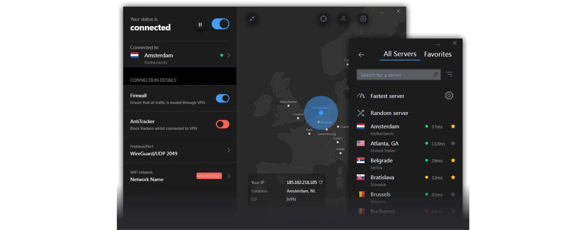
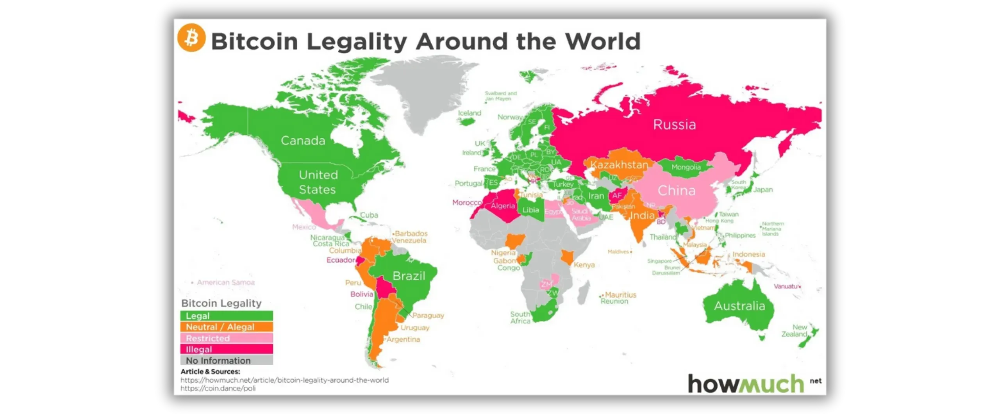
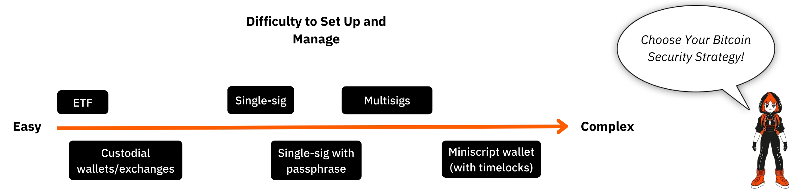

# Путешествие к вашим первым биткоинам

Экосистема Bitcoin переживает впечатляющий и беспрецедентный рост. Технологические, экономические и социальные преобразования, вызванные изобретением Satoshi Накамото, усиливаются с каждым днем и постепенно открывают двери в новый мир, которым вы можете воспользоваться в полной мере.

Погружение в кроличью нору Bitcoin - это захватывающее интеллектуальное приключение, которое будет стимулировать ваше критическое мышление и поставит под сомнение многие из ваших убеждений. Это исследование не только даст вам глубокое понимание того, как работает Bitcoin, но и реальную возможность вернуть себе личную свободу, защитить свою частную жизнь и достичь настоящего финансового суверенитета.

Чтобы эффективно провести вас по этому пути, я создал этот совершенно бесплатный курс. Здесь внимание сосредоточено исключительно на Bitcoin. Никаких не относящихся к делу дискуссий, никаких упоминаний о других криптовалютах, только ясный, четкий и понятный контент.

Этот курс разработан таким образом, чтобы предоставить вам полный контроль над процессом обучения, позволяя вам изучать Bitcoin в своем собственном темпе, следуя по пути, который лучше всего соответствует вашим интересам и целям.

+++
# Введение

<partId>008c49b7-5e17-5973-87f2-ba28429b2697</partId>

## Обзор курса

<chapterId>bfc96999-0ee1-5c41-8297-1b629f50cffc</chapterId>

Добро пожаловать в BTC102! Если вы уже прошли курс BTC101, вы изучили ключевые теоретические концепции, объясняющие, почему Bitcoin является такой революционной технологией. Теперь, в курсе BTC102, пришло время применить эти знания на практике. Этот курс призван помочь вам шаг за шагом построить свой личный план использования Bitcoin.

В следующих главах мы расскажем вам о том, как **получить свои первые биткоины**, **защитить** их должным образом и уверенно сделать первые шаги в этой быстрорастущей экосистеме.

https://planb.network/courses/2b7dc507-81e3-4b70-88e6-41ed44239966

Хотя Bitcoin существует уже более 16 лет, эта индустрия все еще молода, динамична и глубоко укоренена в свободе. Лежащий в ее основе протокол полностью децентрализован и не поддается контролю со стороны центральных органов власти, что позволяет экосистеме развиваться естественным и органичным образом.

Хотя эта свобода подпитывает невероятную волну инноваций и возможностей, она также связана с определенными рисками, включая мошенничество, распространенные ошибки и подводные камни, которые часто возникают из-за недостатка знаний. Главная цель этого курса - помочь вам уверенно и безопасно ориентироваться в этой новой экосистеме.

Для этого курс BTC102 разделен на несколько разделов, каждый из которых посвящен одному из ключевых аспектов вашего путешествия с Bitcoin:

Первый раздел, "Предпосылки понимания Bitcoin", эффективно подготовит вас к предстоящему пути. Вы научитесь определять основные подводные камни, связанные с мошенничеством и финансовыми махинациями, которые могут существовать в экосистеме Bitcoin. Затем мы расскажем об основных принципах онлайн-безопасности.

Наконец, я дам вам несколько практических советов, специально разработанных для новичков, которые помогут вам избежать распространенных ошибок при первой работе с Bitcoin.

Второй раздел, "Понимание того, во что вы ввязываетесь", углубит ваше общее понимание Bitcoin. Мы начнем с обзора, чтобы убедиться, что вы полностью поняли основные концепции.

Затем мы объясним, почему Bitcoin имеет фундаментальное значение с технологической, экономической и социальной точек зрения, и укрепим ваши убеждения в его ценности. Вы также изучите индустрию Bitcoin в целом: ее ключевых игроков, ее организацию и ее эволюцию на протяжении многих лет. Наконец, мы рассмотрим многоуровневую архитектуру экосистемы Bitcoin - важнейшую концепцию для понимания того, как эта система продолжает внедрять инновации, не нарушая целостности своего основного протокола.

Третий раздел, "Настройка вашего плана", посвящен вашему личному подходу к Bitcoin. Мы начнем с того, что поможем вам определить свой пользовательский профиль из четырех основных категорий:

- ходлер*, ориентированный на долгосрочное удержание Bitcoin;
- укладчик*, который покупает регулярно и методично;
- пользователь*, для которого приоритетным является ежедневное использование Bitcoin;
- и, наконец, *параноик*, который хочет обеспечить максимальную безопасность для эффективной защиты своих активов и частной жизни.

Мы подскажем вам, как реализовать стратегию, которая соответствует вашему профилю и поможет достичь ваших личных целей.

Наконец, четвертый раздел, "Защита наследников и богатства", посвящен важнейшей теме, которую часто упускают из виду: как обеспечить передачу Bitcoin вашим близким в случае непредвиденных обстоятельств. Вы узнаете, как создать и настроить план наследования Bitcoin, гарантирующий сохранение вашего богатства после окончания жизни.

К концу этого курса вы получите все необходимые практические инструменты, чтобы уверенно ориентироваться в экосистеме Bitcoin и стать одним из самых продвинутых ее пользователей!

Готовы начать свое путешествие в мир Bitcoin? Вперед!

# Необходимые условия для понимания Bitcoin

<partId>4481fc4b-0f83-489e-ad07-81517c5d6bad</partId>

## Аферы и финансовое мошенничество

<chapterId>8af2948b-2ab5-54c4-862c-3414b8a285a2</chapterId>

Экосистема Bitcoin и окружающая ее среда все еще относительно молоды и слабо регулируются в зависимости от страны. Такая свобода открывает широкие возможности, но в то же время создает благодатную почву для финансовых махинаций, мошенничества и различных форм манипулирования. Именно поэтому первая глава так важна: понимание распространенных подводных камней поможет вам их избежать. Ваша финансовая безопасность является приоритетом, потому что неудачный опыт влияет не только на вас, но и на все сообщество Bitcoin.

### Bitcoin против криптовалют: понимание различий

Прежде чем продолжить, необходимо четко разграничить два принципиально разных мира:

- В основе экосистемы Bitcoin** лежит идея разумных денег, построенных на сильной децентрализации, долгосрочной устойчивости, конфиденциальности и индивидуальном суверенитете. С момента своего запуска в 2009 году Bitcoin работает надежно и безопасно, поддерживаемая глобальным сообществом разработчиков. Это не мимолетная тенденция, а стабильный и устоявшийся протокол, призванный сохранять свою ценность на протяжении долгого времени.

- Криптовалютная индустрия**, с другой стороны, намного больше и включает в себя десятки тысяч различных проектов, каждый из которых имеет свой токен. Это пространство часто движимо быстрыми инновациями, шумихой и краткосрочными финансовыми спекуляциями. Многие из этих проектов централизованы, менее безопасны и не предлагают большой реальной ценности, несмотря на смелые обещания и яркий маркетинг.

Если вы хотите лучше понять, откуда взялась Bitcoin и что действительно отличает ее от других проектов, рекомендую ознакомиться с этим бесплатным курсом по истории Bitcoin:

https://planb.network/courses/a51c7ceb-e079-4ac3-bf69-6700b985a082

Как вы знаете, платформа Plan ₿ Network посвящена исключительно Bitcoin. Однако понимание различий с другими криптовалютами поможет вам избежать подводных камней, связанных с бесполезными, а иногда и мошенническими проектами.

### Основные виды мошенничества, которых следует избегать

Вот самые распространенные виды мошенничества, с которыми вы можете столкнуться в своем путешествии:

#### Схемы пирамид и схемы Понци

Это одни из самых распространенных мошенничеств в мире криптовалют. В схеме Понци ранние участники получают выплаты за счет денег новых участников, а не за счет каких-либо реальных инвестиций или продуктов. Не создается никакой реальной ценности. Система работает только до тех пор, пока в нее продолжают вливаться новые люди. Как только приток новых участников замедляется, вся схема разваливается.

Как правило, эти мошенничества включают в себя :

- Нереалистичные обещания гарантированного дохода (например, гарантированный доход в 20%);
- Задержки или трудности при попытке снять вложенные средства;
- Сильные стимулы для привлечения новых членов, чтобы поддерживать систему в рабочем состоянии;
- Полное отсутствие прозрачности в отношении истинного источника обещанных доходов.

В конечном итоге все финансовые пирамиды и схемы Понци обречены на провал. Их фундаментальная слабость заключается в постоянной необходимости привлекать новых инвесторов, чтобы выплатить доход предыдущим участникам. Со временем эта потребность становится математически невыполнимой, поскольку количество требуемых новых рекрутов увеличивается в геометрической прогрессии по мере роста системы. По достижении критической точки участники начинают сомневаться, доверие исчезает, и вся пирамида рушится. На этом этапе последние присоединившиеся, часто наименее информированные, теряют все свои инвестиции, не имея возможности их вернуть, а организаторы или ранние инвесторы, как правило, уже вывели свои средства и покинули систему.

В криптовалютном мире схемы Понци могут принимать различные формы, зачастую призванные скрыть свою мошенническую сущность за технологической или финансовой маской. Эти аферы могут выглядеть как новые предложения токенов или первичные предложения монет (ICO) - операции по сбору средств, в ходе которых новая криптовалюта продается публике. За такими техническими терминами, как "Blockchain", "смарт-контракты" или "стейкинг", в некоторых проектах скрываются сложные финансовые пирамиды. Другие утверждают, что предлагают высокие доходы, сочетая сомнительные криптоактивы с системами вознаграждения, которые полностью зависят от постоянного притока новых инвесторов.

Совсем недавно схемы Понци распространились и в мире децентрализованных финансов (DeFi). Хотя DeFi предназначен для предоставления финансовых услуг без посредников, некоторые проекты используют его для придания ложного ощущения легитимности своим аферам. Некоторые платформы DeFi обещают высокую, гарантированную прибыль в Exchange за депозиты криптовалюты в автоматические протоколы. Эти заманчивые обещания часто подкрепляются непрозрачными и непроверяемыми механизмами, а токены создаются специально для этой аферы. На самом деле у таких систем нет устойчивой бизнес-модели - прибыль просто выплачивается из средств новых пользователей, как в традиционной схеме Понци. Когда доверие начинает ослабевать или приток новых участников замедляется, такие системы неизбежно разрушаются, что приводит к значительным потерям для ничего не подозревающих инвесторов.

Обратите внимание, что содержание этого курса предназначено исключительно для образовательных целей и не должно рассматриваться как финансовый совет. Ваша финансовая безопасность зависит от вашей способности оставаться осторожным, скептичным и хорошо информированным при принятии каждого финансового решения.

Лучшая защита - всегда задавать этот простой вопрос: Откуда на самом деле берется обещанный доход? Если ответ неясен, немедленно бегите.

#### Насос и самосвал

Этот вид мошенничества предполагает искусственное завышение цены актива - часто низколиквидного криптовалютного токена - с помощью скоординированной маркетинговой кампании, обычно возглавляемой группой инвесторов. Типичная схема Pump & Dump выглядит следующим образом:

- Группа инсайдеров или влиятельных фигур незаметно накапливает большое количество целевого актива.
- Затем они запускают агрессивную рекламную кампанию, чтобы вызвать ажиотаж и поднять цену на generate.
- Широкая публика, движимая FOMO (Fear of Missing Out), начинает массово скупать актив, подталкивая цену еще выше.
- На пике ажиотажа инсайдеры разом распродают свои пакеты акций.
- Цена рушится, и опоздавшие несут большие потери.

Важно отметить, что стратегии Pump & Dump запрещены во многих странах и считаются одной из форм манипулирования рынком. Несмотря на это, подобные схемы продолжают процветать, особенно в криптовалютном пространстве, где регулирование все еще находится на подъеме.

Особенно осторожно относитесь к закрытым "сигнальным" группам на таких платформах, как Telegram, Discord или других каналах социальных сетей. Их часто ведут влиятельные люди или самопровозглашенные эксперты, некоторые из которых даже взимают плату за участие. Хотя эти группы утверждают, что предлагают эксклюзивные инвестиционные возможности, реальность гораздо более односторонняя: прибыль получают только организаторы, а большинство участников в итоге теряют свои деньги.

Правда, некоторые участники могут временно получать прибыль от подобных рыночных манипуляций, но их успех обычно основан не более чем на удаче и идеальном выборе времени. В долгосрочной перспективе такие схемы нежизнеспособны. Они требуют постоянного участия в рискованных операциях и неоднократного участия в мошеннических схемах, которые неизбежно рушатся.

Хуже того, они подпитывают опасную иллюзию: веру в то, что можно быстро и легко заработать деньги, не понимая, как на самом деле работают финансовые системы. Такое мышление не только подвергает риску отдельных людей, но и подрывает доверие ко всей криптовалютной экосистеме

По всем этим причинам лучшей стратегией является серьезный, вдумчивый подход к инвестированию, основанный на финансовом образовании, глубоком понимании фундаментальных основ и долгосрочной перспективе.

Терпеливо наращивая свои знания, вы будете гораздо менее уязвимы к эмоциональным манипуляциям и нереальным обещаниям, а также будете гораздо лучше подготовлены к тому, чтобы избежать финансовых ловушек, которые могут привести к реальным потерям.

#### Мошенничество с пожертвованиями, лотереями и фальшивыми подарками

Этот тип мошенничества обещает бесплатные Bitcoin или другие вознаграждения в Exchange за то, что вы сначала отправите небольшую сумму денег. Важно помнить: ни один законный человек или организация никогда не попросят вас отправить криптовалюту вперед с обещанием прислать вам больше денег взамен.

Мошенники часто выдают себя за известных общественных деятелей (например, Элона Маска или других знаменитостей), чтобы заманить жертву через социальные сети. Всегда проверяйте легитимность аккаунтов и сайтов, прежде чем вступать с ними в контакт, и никогда не доверяйте предложениям, которые кажутся слишком щедрыми или слишком хорошими, чтобы быть правдой.

Иногда эти аферы выглядят как мошенничество с "предварительной оплатой". Вам обещают приз или вознаграждение (деньги, товар или услугу), но сначала просят заплатить комиссию, якобы для покрытия расходов на доставку, налоги или транзакционные издержки. Как только оплата произведена, мошенник исчезает, а обещанное вознаграждение так и не поступает.

#### Предлагаются шиткоины и криптовалюты

Централизованные криптовалютные проекты иногда предлагают бесплатные токены ("*airdrops*") для привлечения пользователей. Эти токены, как правило, не имеют реальной ценности и используются в основном для создания иллюзии популярности или для разжигания спекуляций. Будьте крайне осторожны с подобными рекламными предложениями: зачастую это маркетинговые ловушки, а не реальные возможности.

#### Кража личных данных и фишинг

Злоумышленники часто используют поддельные веб-сайты, аккаунты в социальных сетях или обманчивые электронные письма, чтобы попытаться похитить ваши средства. Эти мошенники могут действовать через любой канал связи: электронную почту, социальные сети, телефонные звонки или даже традиционную почту...

Прежде чем нажимать на ссылку или предпринимать какие-либо действия, всегда перепроверяйте личность отправителя. Если вы сомневаетесь, перейдите на сайт вручную, а не по предоставленной ссылке. И самое главное - никогда и никому не сообщайте свои личные ключи и пароли.

#### Bitcoin Hardforks

За годы существования Bitcoin произошло несколько *Hard форков*, которые привели к созданию альтернативных версий оригинальной криптовалюты. Проще говоря, *Hard Fork* - это раскол в сети, который приводит к появлению двух отдельных блокчейнов, имеющих одну и ту же историю до момента раскола. Такие форки обычно происходят, когда часть сообщества разработчиков или более широкой экосистемы Bitcoin хочет внести серьезные изменения в оригинальный протокол, но не может достичь всеобщего консенсуса. Вместо того чтобы отказаться от своих идей, они решают запустить новую версию Bitcoin (с измененными правилами), надеясь, что пользователи и майнеры предпочтут следовать их Fork.

Не все форки *Hard* являются мошенническими, так как некоторые из них возникают из-за технических или идеологических разногласий в сообществе. Однако другие вызваны коммерческими интересами или даже нечестными побуждениями. Наиболее известными примерами таких хардфорков являются **Bitcoin Cash (BCH)** и **Bitcoin Satoshi Vision (BSV)**. Запущенные в 2017 и 2018 годах соответственно, эти альтернативные валюты часто заявляют, что являются "улучшенными версиями" оригинальной Bitcoin. Они рекламируют такие предполагаемые преимущества, как более низкие комиссии за транзакции или более быстрые транзакции за счет увеличения размера блока. Однако эти технические изменения влекут за собой значительные компромиссы с точки зрения безопасности, децентрализации и надежности; Elements может противоречить основополагающим принципам Bitcoin.

Помимо технических различий, эти альтернативные валюты часто используют путаницу для привлечения неосведомленных инвесторов. Они могут использовать маркетинговые тактики, направленные на то, чтобы намеренно ввести в заблуждение новичков, которые считают, что покупают настоящие Bitcoin (BTC).

Чтобы не попасть в эту ловушку, всегда проверяйте, какую валюту вы покупаете. Оригинальная Bitcoin использует тикер **BTC**, в то время как Bitcoin Cash и ее производные используют отдельные аббревиатуры, такие как BCH или BSV.

#### Недобросовестные авторитеты и фальшивые гуру

По мере того как криптовалюты завоевывают всеобщее внимание, в социальных сетях наблюдается всплеск активности влиятельных лиц, самопровозглашенных экспертов и так называемых "криптогуру". В то время как некоторые из них могут предложить действительно познавательные идеи, многие другие пользуются своей известностью для продвижения сомнительных проектов или опасных рискованных (а иногда и откровенно мошеннических) торговых стратегий. Эти люди обычно руководствуются личными финансовыми интересами, часто получая прямую или косвенную компенсацию за продвижение определенных токенов или платформ.

Для привлечения новичков эти авторитеты часто используют проверенные тактики: демонстрируют впечатляющие финансовые результаты (которые часто оказываются фальшивыми или непроверенными), щеголяют роскошным образом жизни как якобы доказательством своего успеха и продвигают "чудодейственные" инвестиционные стратегии. Их цель - вызвать FOMO (страх упустить что-то) и подтолкнуть свою аудиторию к импульсивным решениям и необдуманным инвестициям.

Важно понимать, что большинство "бесплатных" советов от таких деятелей никогда не бывают по-настоящему бесплатными. За фасадом щедрости часто скрывается просчитанная стратегия, направленная на то, чтобы склонить людей к покупке сомнительных активов. И даже если бы некоторые авторитеты были честны, повторить их результаты было бы практически невозможно: их успех часто зависит от конкретного времени, инсайдерских знаний или уникальных обстоятельств, к которым вы просто не имеете доступа.

Некоторые авторитеты могут пригласить вас вступить в частные платные группы, где они утверждают, что делятся эксклюзивными торговыми сигналами или инсайдерскими советами, которые обещают быструю и легкую прибыль. На самом деле такие группы выгодны в основном самим организаторам. Они часто используют своих подписчиков в качестве источника ликвидности, по сути, разгружая активы ради личной выгоды. В итоге подписчики обычно теряют деньги, поскольку не могут реагировать так же быстро, как инсайдеры, организующие сделки (см. раздел "Схемы Pump & Dump").

В свете этой реальности вот несколько хороших привычек, которые стоит взять на вооружение, чтобы не попасть в ловушки, расставленные недобросовестными авторитетами:

- Будьте очень осторожны с любыми рекомендациями по инвестированию в криптовалюты**

Заслуживающий доверия и знающий человек никогда не будет давить на вас, чтобы вы купили криптовалюту, не побуждая вас сначала провести собственное исследование.

- Платные курсы по трейдингу или инвестированию не всегда являются показателем качества**

Многие из этих курсов пропагандируют рискованные или слишком упрощенные стратегии; зачастую ту же информацию вы можете найти в Интернете бесплатно.

- Не существует гарантированного способа скопировать чьи-то сделки и получить идентичные результаты**

Каждая инвестиционная стратегия зависит от личного контекста, времени, знаний и других факторов, которые невозможно в точности повторить.

- Особенно осторожно относитесь к советам, которые звучат слишком хорошо, чтобы быть правдой**

Нереалистичные обещания или гарантированная прибыль - это почти всегда признаки манипуляции. Помните: если кто-то говорит что-то уверенно, это еще не значит, что это правда.

Всегда помните, что у каждого, с кем вы сталкиваетесь в Bitcoin или более широкой криптоэкосистеме, есть своя личная повестка дня, независимо от того, заявлена ли она прямо или скрыта между строк. Не существует чисто нейтральной информации. Даже у этого курса, BTC102, есть четкая цель - *содействовать лучшему пониманию Bitcoin*

Вот почему так важно не забывать о реальных мотивах, стоящих за каждым потребляемым вами контентом. И никогда не забывайте это золотое правило интернета:

*Если товар или услуга кажутся бесплатными, скорее всего, вы и есть этот товар.*

В конечном счете, лучшая защита - это личное образование, здоровый скептицизм и, самое главное, привычка проверять факты самостоятельно.

### Как избежать мошенничества

**Чтобы оставаться в безопасности в Интернете, особенно в мире криптовалют, помните об этих ключевых принципах:**

- Никогда не доверяйте слепо: "*Не доверяй, проверяй*";
- Скептически относитесь к гарантированным или необычно высоким доходам;
- Никогда и никому не передавайте свои закрытые ключи;
- Не отправляйте Bitcoin (или любую другую криптовалюту) на неизвестные адреса;
- Если вы сомневаетесь, сделайте паузу. Отойдите и подумайте, прежде чем действовать. FOMO - ваш злейший враг;
- Избегайте платных торговых групп или сообществ, которые дают нереальные обещания;
- Большинство раздач или "бесплатных" лотерей в интернете - это мошенничество или сильная подтасовка;
- В долгосрочной перспективе вы всегда получите больше пользы от обучения, чем от игры.

Защита от мошенников - это первый важный шаг к сохранению ваших активов, но этого недостаточно. Не менее важно соблюдать строгую цифровую гигиену. Поэтому в следующей главе мы рассмотрим, как укрепить свою онлайн-безопасность и какие лучшие практики следует применять, чтобы защитить себя в цифровом мире.

## Безопасность в Интернете

<chapterId>f0873bf2-6a6f-5485-bb7a-d84be14f404d</chapterId>

Как только вы начнете работать в Bitcoin, вы быстро поймете, что основы кибербезопасности не являются чем-то необязательным - они необходимы. Аферы и мошенничество - это только верхушка айсберга. Случайная потеря данных, вредоносное ПО и взломанные пароли могут быть не менее разрушительными, особенно если вы сами управляете своими ключами.

В этой главе мы рассмотрим несколько простых и практичных шагов, которые помогут вам повысить уровень цифровой гигиены и защитить себя в этом пространстве.

Если вы хотите углубиться, курс SEC101 в Plan ₿ Network предлагает всестороннее описание стратегий кибербезопасности, специально разработанных для пользователей Bitcoin.

https://planb.network/courses/99c46148-7080-4915-a7e0-9df0e145cd47

### Почему кибербезопасность имеет значение

Bitcoin дает вам возможность хранить свои деньги напрямую (без банков), без посредников. Но такой финансовый суверенитет влечет за собой серьезную ответственность: если ваши BTC будут украдены из-за нарушения правил безопасности, вы не сможете отменить транзакцию. В отличие от традиционных банков, здесь нет ни службы поддержки, ни заявления о мошенничестве, ни страховки, которая могла бы вас выручить.

Кроме того, финансовая ценность Bitcoin делает его очень важной целью. Хакер, скомпрометировавший ваш Wallet, может мгновенно перевести ваши средства на контролируемый им Address (без лишних вопросов и без возможности вернуть их обратно).

### Чистый, современный компьютер

Одним из самых забываемых аспектов личной безопасности является обновление операционной системы и программного обеспечения. Многие обновления устраняют известные уязвимости, которые в противном случае могут быть использованы злоумышленниками. Хотя некоторые люди избегают обновлений, опасаясь проблем с производительностью, реальный риск заключается в использовании устаревшего программного обеспечения, которое хакеры уже знают, как взломать.

Также настоятельно рекомендуется использовать надежный антивирус. В Windows для большинства пользователей достаточно встроенного Windows Defender. Если вы предпочитаете дополнительные функции или спокойствие, можно воспользоваться коммерческими вариантами, например Kaspersky. В macOS вредоносные программы исторически встречаются реже **но не исчезают**, поэтому все же стоит проявлять осторожность.

Помимо обновлений системы и антивирусной защиты, остерегайтесь загружать программное обеспечение с недобросовестных веб-сайтов или так называемых "универсальных" порталов загрузки. Если вам нужна утилита или приложение, всегда обращайтесь к официальному источнику; это значительно снижает риск установки вредоносного ПО, замаскированного под легитимное.

Еще одна полезная привычка - проверять подлинность и целостность любого программного обеспечения перед его установкой на компьютер. Если вы не знаете, как это сделать, не волнуйтесь, у нас есть специальное руководство, которое поможет вам разобраться с этим процессом:

https://planb.network/tutorials/computer-security/data/integrity-authenticity-21d0420a-be02-4663-94a3-8d487f23becc

Наконец, регулярно создавайте резервные копии важных данных. Внешний накопитель Hard или SSD - это надежный вариант для хранения дубликатов файлов на случай внезапного сбоя, взлома или случайного удаления. Вы еще скажете себе спасибо.

Если вы предпочитаете облачные решения, воспользуйтесь безопасным сервисом, например Proton Drive. Убедитесь, что выбранный вами вариант уважает вашу конфиденциальность и предлагает надежное шифрование.

https://planb.network/tutorials/computer-security/data/proton-drive-03cbe49f-6ddc-491f-8786-bc20d98ebb16

Широко рекомендуемая стратегия резервного копирования - это "правило 3-2-1". Оно призвано защитить ваши данные от случайной потери, кибератак и даже стихийных бедствий.

Идея проста:

- Сохраните **как минимум 3 копии** важных данных,
- Храните их на **как минимум 2 разных типах носителей** (например, на внешнем диске Hard и в облачном хранилище),
- И убедитесь, что **1 из этих копий хранится вне офиса** (физически отделена от основного местоположения).

Такой подход обеспечивает высокую устойчивость к внешним воздействиям и помогает сохранить ваши данные, даже если что-то пойдет не так.

### Решение кошмара с идентификацией личности

Одна из главных причин взлома - использование слабых паролей. Значительное число пользователей по-прежнему используют один и тот же пароль для нескольких учетных записей или выбирают варианты, которые легко угадать. Менеджеры паролей - идеальное решение этой проблемы.

Менеджер паролей позволяет вам:

- Надежно храните все свои пароли** в зашифрованном хранилище
- generate длинные, сложные и уникальные пароли** автоматически для каждой учетной записи
- Используйте только один мастер-пароль**, чтобы получить безопасный доступ ко всему

С менеджером паролей вам больше не придется нажимать кнопку "Забыли пароль" или полагаться на слабые, повторно используемые учетные данные. Кроме того, большинство менеджеров паролей легко синхронизируются с вашими устройствами (настольными компьютерами, телефонами, планшетами) и даже автоматически заполняют формы входа, делая безопасный доступ простым и эффективным.

Существует множество менеджеров паролей, но я могу порекомендовать два надежных варианта в зависимости от ваших потребностей. Если вы ищете что-то простое в использовании и легко синхронизируемое с несколькими устройствами, Bitwarden - отличный выбор:

https://planb.network/tutorials/computer-security/authentication/bitwarden-0532f569-fb00-4fad-acba-2fcb1bf05de9

Если вы предпочитаете хранить все локально на своем устройстве, KeePass - отличный вариант:

https://planb.network/tutorials/computer-security/authentication/keepass-f8073bb7-5b4a-4664-9246-228e307be246

### 2FA: двойная защита

В Bitcoin вы сами себе банк. Это означает, что вы также являетесь собственной командой безопасности. Даже при наличии надежного пароля не существует понятия "нулевой риск", поэтому очень важно включить двухфакторную аутентификацию (2FA).

2FA добавляет второй уровень защиты Layer, требуя ввода одноразового кода (обычно 6 цифр), сгенерированного приложением вроде Google Authenticator или Authy. Таким образом, даже если кому-то удастся узнать ваш пароль, он все равно не сможет получить доступ к вашему аккаунту без физического доступа к вашему телефону.

https://planb.network/tutorials/computer-security/authentication/authy-a76ab26b-71b0-473c-aa7c-c49153705eb7

При включении 2FA не забудьте сохранить ключ восстановления для приложения в надежном месте. Это позволит вам восстановить коды, если вы потеряете или смените телефон. Хотя 2FA на основе SMS или электронной почты - это лучше, чем ничего, он гораздо менее безопасен. Атака с подменой SIM-карты, когда кто-то получает контроль над номером вашего телефона, может легко обойти этот вид защиты.

Для тех, кто хочет сделать еще один шаг к безопасности, физические ключи, такие как YubiKey, обеспечивают еще более высокий уровень защиты.

https://planb.network/tutorials/computer-security/authentication/security-key-61438267-74db-4f1a-87e4-97c8e673533e

### Защита конфиденциальности

Конфиденциальность и кибербезопасность тесно связаны: чем больше информации вы оставляете в свободном доступе, тем больше вероятность того, что вы станете мишенью.

VPN** (*Virtual Private Network*) - это простой, но эффективный способ маскировки вашего IP Address и шифрования интернет-трафика. Хотя это и не сделает вас полностью невидимым (поскольку провайдер VPN все равно может видеть вашу активность), но значительно усложнит задачу тем, кто пытается шпионить за вами или отслеживать ваши привычки просмотра веб-страниц.

Главное - выбрать надежного VPN-провайдера, который:

- Не требует ваших личных данных
- Позволяет производить оплату через BTC
- Строгая политика отсутствия логов

На Plan ₿ Network есть несколько руководств, которые помогут вам легко настроить VPN. Я особенно рекомендую IVPN или Mullvad:

https://planb.network/tutorials/computer-security/communication/ivpn-5a0cd5df-29f1-4382-a817-975a96646e68

https://planb.network/tutorials/computer-security/communication/mullvad-968ec5f5-b3f0-4d23-a9e0-c07a3e85aaa8

К основным мерам по защите конфиденциальности в Интернете также относятся:

- Использование **платформ для обмена зашифрованными сообщениями**, таких как Signal, SimpleX или Session;
- Использование браузеров, ориентированных на конфиденциальность, таких как Firefox, Brave или Tor (для повышения анонимности);

https://planb.network/tutorials/computer-security/communication/tor-browser-a847e83c-31ef-4439-9eac-742b255129bb

- Использование **защищенного почтового ящика**, такого как ProtonMail;

https://planb.network/tutorials/computer-security/communication/proton-mail-c3b010ce-254d-4546-b382-19ab9261c6a2

- Зашифруйте** свои файлы с помощью таких инструментов, как Bitlocker (для Windows) или VeraCrypt (доступен для всех платформ).

https://planb.network/tutorials/computer-security/data/veracrypt-d5ed4c83-7c1c-4181-95ea-963fdf2d83c5

### Пошаговое продвижение

Кибербезопасность может показаться масштабной задачей, и новичкам легко перегрузиться и сдаться, потому что она кажется слишком сложной. Хитрость заключается в том, чтобы подходить к делу шаг за шагом. Начните с чего-то простого, например, установите менеджер паролей. Дайте себе несколько недель, чтобы освоиться с ним, а затем переходите к следующему шагу: например, включите 2FA на одной из ваших учетных записей.

По мере того как вы будете увереннее работать с этими инструментами, вы будете готовы добавить более продвинутые методы, такие как использование вторичной электронной почты, переход на ProtonMail, настройка VPN или просмотр страниц через Tor, когда это необходимо.

Погружаясь в мир Bitcoin, вы заметите, что риски растут по мере увеличения стоимости вашего Wallet. Выработка надежных привычек безопасности, защита конфиденциальности и настройка правильных инструментов не только обеспечат вам душевное спокойствие, но и укрепят суверенитет, которым обладает Bitcoin.

Одним словом, не стоит недооценивать кибербезопасность, потратьте время на создание базовых систем и помните, что последовательность - это главное. Без хорошей цифровой гигиены даже самые лучшие инструменты не помогут вам.

Также обязательно ознакомьтесь с [нашими учебниками по компьютерной безопасности](https://planb.network/tutorials/computer-security) на Plan ₿ Network.

В следующей главе я расскажу еще о нескольких советах, которые помогут вам уверенно начать путешествие по Bitcoin и избежать многочисленных ловушек, которые могут застать новичков врасплох.

## Советы новичкам

<chapterId>33134b3f-92c1-5185-afb6-88599e47e801</chapterId>

Работа с Bitcoin может быть захватывающей, но она также связана с изрядной долей риска. Мир криптовалют не похож ни на один другой: дикие колебания цен, незнакомые технологии и вполне реальная возможность навсегда потерять свои средства из-за простых ошибок или неудачного выбора инвестиций - все это подводные камни, о которых должны знать новые пользователи.

В этой главе я поделюсь некоторыми практическими советами и общими рекомендациями для тех, кто делает первые шаги, особенно для тех, кто совершает свою первую покупку или изучает более широкий мир финансовых инвестиций.

Вот основные моменты, которые мы рассмотрим вместе:

- Остерегайтесь **Shitcoins** и других бесполезных криптовалют;
- Инвестируйте только **деньги, которые вы можете позволить себе потерять**;
- Знайте разницу между **торговлей** и **инвестированием**;
- Помните о **налоговых последствиях** ваших инвестиций;
- Тщательно защищайте свою **восстановительную фразу**;
- Оставайтесь скромными и держитесь в тени** (осторожность - часть безопасности);
- Думайте о долгосрочной перспективе**, увеличивайте масштаб и будьте терпеливы (считайте, что это марафон, а не спринт).

### Распространенные ошибки, которых следует избегать

Bitcoin открыта для всех, но это не значит, что вы должны погружаться в игру неподготовленными. Вот несколько классических ошибок, которые совершают новички:

**Технологические ошибки:**

- Потеря фразы seed:** Ваша фраза восстановления (обычно 12 или 24 слова) - единственный способ получить доступ к вашему Bitcoin, если что-то случится с вашим Wallet. Если вы потеряете ее, ваши средства исчезнут навсегда;
- Хранение биткоинов на сторонней платформе:** Если ваши монеты находятся на централизованной платформе, вы не являетесь их владельцем. Вы подвержены таким рискам, как взломы, сбои в работе платформы или даже конфискация средств;
- Пренебрежение конфиденциальностью:** Защита конфиденциальности - одна из основных составляющих обеспечения безопасности ваших активов. Публичное раскрытие информации о том, сколько Bitcoin вы храните, может сделать вас мишенью;
- Недостаточная безопасность в Интернете:** Если вы не обеспечите безопасность своих устройств с помощью базовых средств защиты (таких как обновления, надежные пароли или 2FA), вы станете легкой добычей для злоумышленников, и это может стоить вам всего.

**Финансовые ошибки:**

- Инвестируйте больше, чем можете позволить себе потерять**: Никогда не влезайте в долги и не вкладывайте в Bitcoin деньги, полученные за аренду жилья. Ваша финансовая стабильность всегда должна быть на первом месте.

- Не понимать разницы между трейдингом и инвестированием**: Торговля требует времени, навыков и серьезной эмоциональной дисциплины. Долгосрочное инвестирование гораздо более удобно для новичков.

- Забудьте о налогах**: В каждой стране существуют свои налоговые правила для криптовалют. Их игнорирование может привести к болезненным сюрпризам в будущем.

- Попасть под влияние FOMO**: Импульсивные покупки из страха упустить что-то новое обычно приводят к неудачному выбору времени и неверным решениям. Терпение - ваш лучший союзник.

### Определение инвестиционной стратегии

Прежде чем купить свой первый Satoshi, важно понять, почему вы инвестируете в Bitcoin и каким образом. Это означает наличие четкого финансового плана, составленного с учетом вашей личной ситуации и долгосрочных целей.

Начните с точного определения вашего **бюджета**. Не просто выберите случайное число. Потратьте время на то, чтобы рассчитать свой ежемесячный доход, вычесть из него постоянные расходы (аренда, кредиты, налоги, коммунальные услуги), а также повседневные расходы на жизнь (питание, транспорт, отдых и т. д.). Оставшаяся сумма - это ваш запас сбережений, и только с этой части вы должны рассматривать возможность инвестирования.

Такой подход гарантирует, что вы не подвергаете свое финансовое благополучие риску, особенно в случае рыночного спада. Продуманная стратегия - основа долгосрочной устойчивости.

После того как ваш бюджет определен, подумайте, как вы хотите инвестировать. Один из наиболее удобных для новичков и широко рекомендуемых методов - это Dollar Cost Averaging (DCA), когда вы покупаете фиксированное количество Bitcoin через регулярные промежутки времени (еженедельно, ежемесячно и т. д.). Эта стратегия помогает сгладить среднюю цену входа с течением времени и уменьшить эмоциональное воздействие ценовых колебаний. Это разумный подход для большинства людей, особенно для новичков.

Затем спросите себя: Каков мой временной горизонт?

Вы стремитесь к быстрым движениям на рынке и вне его (трейдинг)? Или вы больше ориентируетесь на долгосрочную перспективу и держите Bitcoin в течение нескольких лет (hodler)? Если вы ходлер, вас, вероятно, меньше волнуют ежедневные колебания цен и вы больше сосредоточены на долгосрочной безопасности и самосохранении. Если вы занимаетесь трейдингом, вы будете больше подвержены краткосрочному рыночному шуму, повышенному риску и стрессу, который часто возникает при быстром принятии решений. Универсального ответа не существует, но знание собственного подхода поможет вам ориентироваться в принятии решений.

Самое главное - не принимайте инвестиционных решений на основе эмоций или страха. Заранее определите стратегию, запишите ее и придерживайтесь ее.

Если вы все еще не уверены, **начните с обучения.**

Потратьте несколько часов на изучение Bitcoin, ознакомьтесь с бесплатными ресурсами на Plan ₿ Network, прочитайте пару книг, выложите пять евро, чтобы попробовать, и посмотрите качественный контент в Интернете. Оставайтесь любопытными. Чем комфортнее вы будете чувствовать себя, тем проще будет пересмотреть стратегию, скорректировать подход и уверенно двигаться вперед.

### Понимание волатильности BTC

Bitcoin известен своими резкими колебаниями цен. Нередки колебания на 10%, 20% и даже 50% в течение всего нескольких дней. Новичков такая волатильность может дезориентировать. Легко увлечься шумихой во время "бычьих" скачков или запаниковать во время спада; и то, и другое часто приводит к принятию неверных решений, например, к продаже в убыток.

Именно поэтому очень важно **понять и принять волатильность Bitcoin**, прежде чем инвестировать. Эти колебания цен - не ошибка, а особенность еще не созревшего актива. Если внезапные взлеты и падения не дают вам спать по ночам или толкают на эмоциональные решения, скорее всего, вы вложили больше, чем готовы рискнуть. В таком случае сделайте шаг назад и пересмотрите свою стратегию и допустимый риск. Не стесняйтесь уменьшать свои позиции, пока не почувствуете себя спокойнее.

Прежде всего, никогда не вкладывайте больше, чем вы можете позволить себе потерять. Избегайте заимствования денег для покупки Bitcoin (особенно если вы все еще изучаете основы). Прочный фундамент начинается с размеренных шагов, а не с необдуманных ставок.

### Управление и обеспечение безопасности Bitcoin Wallet

Одна из самых мощных (и часто недооцениваемых) функций Bitcoin - это **самостоятельная опека**. При самостоятельном хостинге Wallet только вы несете ответственность за свои средства. Эти кошельки обычно создаются на основе **фразы восстановления** (также известной как фраза seed) - серии из 12 или 24 слов, которая предоставляет полный доступ к вашим BTC. Если вы потеряете эту фразу (или если кто-то другой завладеет ею), ваши биткоины пропадут навсегда. **Нет поддержки клиентов. Нет кнопки сброса.**

Вот почему золотое правило Bitcoin гласит:

"***Не ваши ключи, не ваши монеты***". Если вы лично не контролируете свои приватные ключи, вы не являетесь настоящим владельцем Bitcoin. Хотя биржи могут быть удобны (особенно в начале пути), они хранят ваши ключи за вас. Это означает, что ваши средства находятся под угрозой, если платформу взломают, заморозят ваш счет или она обанкротится.

Чтобы избежать этого риска, настоятельно рекомендуется настроить **собственный Wallet**, где только вы имеете доступ к фразе восстановления. Эта фраза всегда должна быть записана от руки и храниться **оффлайн** в безопасном месте. Некоторые пользователи даже **создают несколько резервных копий**, хранящихся в разных географических точках для дополнительной безопасности.

**Никогда не храните фразу восстановления на подключенных к Интернету устройствах или в "облаке "**.

**Один взлом или утечка данных может привести к необратимым потерям

Если вы готовы взять Ownership из Bitcoin и хотите глубже погрузиться в лучшие практики защиты фразы восстановления, я настоятельно рекомендую ознакомиться с этой статьей:

https://planb.network/tutorials/wallet/backup/backup-mnemonic-22c0ddfa-fb9f-4e3a-96f9-46e2a7954270

### Конфиденциальность и осмотрительность

В современном цифровом мире **осмотрительность часто игнорируется**, однако она является важнейшей составляющей безопасности, особенно когда речь идет о Bitcoin. Чем более открыто вы говорите о своих владениях, тем больше вероятность того, что вы станете мишенью для мошенников, киберпреступников или даже более традиционных угроз, таких как вымогательство или шантаж.

В мире было множество случаев похищения или нападения на людей, известных как владельцы крупных сумм BTC.

**Не хвастайтесь своим Bitcoin Stash** ни в социальных сетях, ни даже в случайных разговорах. В раскрытии конфиденциальной финансовой информации нет ничего положительного, а риски реальны.

Также стоит **разделить свою деятельность в Интернете**. Например:

- Используйте отдельную электронную почту Address для всего, что связано с Bitcoin, отличную от ваших личных или рабочих аккаунтов.
- Остерегайтесь попыток фишинга, подозрительных ссылок и поддельных сайтов, которые имитируют надежные платформы.
- Не теряйте бдительности! Осмотрительность и бдительность часто являются вашей лучшей защитой.

Если вы готовы углубиться в тему конфиденциальности Bitcoin, мы рекомендуем вам продолжить наш курс "Конфиденциальность 2", где вы узнаете более продвинутые методы обеспечения безопасности вашей личности и деятельности:

https://planb.network/courses/65c138b0-4161-4958-bbe3-c12916bc959c

### Налоговые последствия

Несмотря на то, что **Bitcoin является децентрализованной валютой, она не освобождена от действия налоговых законов и правил** вашей страны. У каждой юрисдикции свой подход к тому, как облагается налогом прибыль от криптовалют.

В некоторых странах прибыль при продаже облагается налогом как прирост капитала. Другие могут потребовать от вас декларировать каждую сделку, а некоторые применяют менее распространенные правила, такие как налог на богатство или социальные взносы.

Прежде чем совершать какие-либо значительные операции, настоятельно рекомендуется проконсультироваться с налоговым специалистом или ознакомиться с официальным руководством правительства вашей страны. Заблаговременное понимание своих налоговых обязательств может избавить вас от неожиданных проблем в дальнейшем (например, штрафов, проверок или пеней), особенно если вы планируете крупные продажи или перераспределение портфеля.

### Разница между трейдингом, инвестированием и холдингом

Bitcoin часто окружен популярными заблуждениями; одно из самых распространенных - идея о том, что это быстрый путь к богатству через торговлю. Однако важно понимать четкое различие между трейдингом, инвестированием и владением акциями, поскольку каждый подход имеет свой собственный образ мышления, набор навыков и уровень риска.

- Торговля :**

Будем откровенны: **Вам, вероятно, не стоит заниматься торговлей.**

Торговля предполагает краткосрочные спекуляции (иногда с использованием кредитного плеча) с целью получения прибыли от колебаний цены Bitcoin. Хотя это может показаться привлекательным, успешная торговля требует продвинутых технических знаний (таких как анализ графиков и управление рисками), эмоциональной дисциплины и постоянного внимания к рынку. Это требует больших умственных затрат и времени, и правда Hard заключается в том, что **большинство новичков теряют деньги**, потому что недооценивают, насколько это сложная работа.

Как знаменито сказал Уоррен Баффет:

"**Если вы не готовы держать акции десять лет, даже не думайте о том, чтобы держать их десять минут**"

Bitcoin - это не схема обогащения.

- Инвестиции:**

Инвесторы придерживаются средне- и долгосрочной перспективы, покупая Bitcoin с верой в то, что его стоимость будет расти с течением времени (месяцев, лет или даже десятилетий). Конечно, риск остается, поскольку цена Bitcoin может сильно колебаться. Но этот подход в целом более спокойный и практичный для большинства людей, особенно для тех, кто не хочет проводить часы, приклеившись к графикам каждый день.

- Холдинг (HODL) :**

"HODL" началось как опечатка в слове "hold" и быстро стало частью культуры Bitcoin. Сегодня это почетный знак.

Компания Hodlers ведет очень долгую игру, иногда на протяжении десяти и более лет. Они надежно хранят свой Bitcoin и просто ждут, руководствуясь твердой уверенностью в долгосрочном потенциале Bitcoin. Их не беспокоят ни ежедневные колебания цен, ни медвежьи рынки. Их образ мышления прост: накапливать, обеспечивать безопасность и сидеть тихо.

|          | Trading | Investment | Holding |
| ---------------------- | ----------- | -------------- | --------------- |
| Leverage | Yes  | No | No |
| Timeframe | Short-term | Medium-term | Very long-term |
| Asset Type | Contracts | Actual BTC | Actual BTC |
| Risk Level | Very high | High | High |
| Difficulty | Very Hard | Hard | Hard |
| learning curve | Long learning curve | Long learning curve | Long learning curve |
| Potential Loss | UnLimited | Limited | Limited |
| Best For | A few experienced users | Most People | Long-term Believers |

### Продолжайте учиться

Никогда не рано (и никогда не поздно) начать узнавать о деньгах, инвестировании и о том, как на самом деле работает финансовая система. Вам не нужно становиться экспертом или погружаться в каждую техническую деталь; достаточно иметь прочное понимание общей картины, чтобы принимать взвешенные решения и не быть введенным в заблуждение финансовыми продуктами, которые не отвечают вашим интересам (часто продвигаются банками или консультантами).

Отличной отправной точкой станет книга *Бывший папа, бедный папа* Роберта Т. Кийосаки. Она широко известна своим доступным стилем и основополагающими уроками, такими как понимание разницы между активами и пассивами и того, почему финансовое образование является ключом к долгосрочной независимости.

Если вы готовы углубиться, подкасты вроде *The Investors Podcast* предлагают глубокие дискуссии об инвестировании, рынках и экономических принципах. Они также иногда рассказывают о Bitcoin, что делает их надежным следующим шагом для тех, кому интересно понять, как Bitcoin вписывается в более широкий финансовый ландшафт.

### Золотые правила, о которых следует помнить

В заключение приведем несколько вечных принципов, о которых должен помнить каждый биткойнер (особенно начинающий):

- Правило n°1**: Никогда не вкладывайте больше, чем вы можете позволить себе потерять. Bitcoin - это волатильный актив. Не рискуйте своей финансовой стабильностью в погоне за выгодой. Ваши основные потребности и душевное спокойствие всегда должны быть на первом месте.
- Правило № 2**: Не следуйте слепо за шумихой и не доверяйте чудодейственным советам. Не обращайте внимания на тренды и броские обещания. Вместо этого сосредоточьтесь на принятии обоснованных, рациональных решений. Если сомневаетесь, поспите, обсудите все с людьми, которым вы доверяете. Лучше двигаться медленно и обдуманно, чем поспешно совершать дорогостоящие ошибки.
- Правило №3**: Постройте план и придерживайтесь долгосрочного видения.

Последовательность, терпение и дисциплина приведут вас дальше, чем краткосрочный азарт. Не стремитесь к луне, а стремитесь к устойчивому росту. Избегайте фатальных ошибок и позволяйте маленьким победам накапливаться со временем.

Следуя этим принципам, вы сможете подходить к инвестированию в Bitcoin с большей ясностью и спокойствием. Да, Bitcoin нестабилен, и поначалу он может пугать, но если подходить к нему с осторожностью, терпением и здравым смыслом, он обладает неоспоримым потенциалом. Потратьте время на накопление знаний, пересмотрите свою стратегию, когда это необходимо, и, прежде всего, помните: медленное и неуклонное продвижение вперед всегда будет лучше, чем поспешные действия, вызванные страхом или нетерпением.

# Поймите, во что вы ввязываетесь

<partId>a42355a3-9dd8-57ed-b590-32a333fe09ea</partId>

## Bitcoin за 5 минут

<chapterId>ae122ad9-9b4d-5229-9038-e1b99d5cfc83</chapterId>

Основная цель этого курса - провести вас через приобретение и обеспечение безопасности ваших первых биткоинов. Но прежде чем перейти к практическим шагам (как купить BTC, какие кошельки использовать и так далее), важно сделать шаг назад и понять, что же на самом деле представляет собой Bitcoin. Понимание глубинной природы Bitcoin поможет вам понять, почему миллионы людей обращаются к этой технологии и почему крайне важно понять основы, прежде чем вкладывать свои сбережения в такой новый и волатильный актив.

За годы своего существования Bitcoin получила признание как глобальная денежная сеть. Ее называли "цифровым золотом", "протоколом доверия" и даже "параллельной финансовой системой" Но что на самом деле означают эти термины? Чтобы ответить на этот вопрос, мы подробнее рассмотрим суть Bitcoin: историю ее возникновения, технические основы, монетарные свойства и потенциальное влияние не только на отдельных людей, но и на мировую финансовую систему в целом.

### Истоки: Проект, рожденный в результате давних поисков

#### Киберпанки и изобретение системы, неподвластной банковскому контролю

Bitcoin не родился в одночасье. Это результат десятилетий исследований и экспериментов в области криптографии, информатики и монетарной теории. До ее запуска в 2009 году несколько проектов (например, eCash, b-money, Bit Gold и RPOW) пытались создать цифровые валюты. Все они сталкивались с одной и той же основной проблемой: как предотвратить двойные траты в децентрализованной системе, не полагаясь на центральный орган.

Эта проблема оставалась нерешенной до конца 2008 года, когда человек под ником Satoshi Nakamoto опубликовал технический документ Bitcoin. Спустя несколько месяцев появилась первая версия программного обеспечения Bitcoin с открытым исходным кодом, запустив систему, которая могла бы работать независимо от банков и правительств.

На проект сильно повлияла этика Cypherpunk - сообщества разработчиков и мыслителей, которые верили в использование криптографии для защиты индивидуальных свобод в Интернете. Для них приватность и децентрализация были не техническими предпочтениями, а идеологической необходимостью. Bitcoin стала наиболее успешным воплощением этих идеалов: одноранговая денежная сеть, которую мог использовать каждый, никто не мог контролировать, и каждый мог проверить.

Cypherpunks - это неформальное международное сообщество людей, выступающих за использование криптографии для защиты личных свобод в Интернете. Они твердо верят в право человека на неприкосновенность частной жизни, особенно в мире, который все больше формируется правительственной слежкой и корпоративной эксплуатацией данных.

Корни движения Cypherpunk уходят в начало 1990-х годов, когда группы криптографов, программистов и либертарианцев начали изучать политические последствия криптографии на встречах в Кремниевой долине. Одним из самых известных представителей сообщества был Тим Мэй, автор "Манифеста криптоанархиста" в 1988 году, основополагающего текста, в котором излагалось видение мира, в котором шифрование даст возможность отдельным людям действовать вне досягаемости правительств и централизованного контроля.

Важной вехой в развитии движения стало создание в 1992 году списка рассылки Cypherpunks - форума, на котором процветали идеи, проекты и политические дискуссии о приватности и криптографии. Затем, в 1993 году, Эрик Хьюз опубликовал "Манифест Cypherpunk", краткую, но мощную декларацию, в которой четко выражались миссия и убеждения сообщества.

Идея цифровой валюты, которая работает независимо от центральных органов власти (как Bitcoin), глубоко укоренилась в философии Cypherpunk.

#### Момент после финансового кризиса

Bitcoin не появился из ниоткуда. Он был создан в совершенно определенный момент - сразу после мирового финансового кризиса 2008 года. Крах американского рынка жилья и кризис субстандартного кредитования привели к краху крупнейших банков и подорвали доверие людей ко всей финансовой системе.

Именно в такой обстановке страха и неопределенности родилась Bitcoin. Создатель, известный как Satoshi Накамото, включил очень символичное сообщение в самый первый блок Bitcoin Blockchain, известный как блок Genesis. Послание гласило:

> **"The Times 03/Jan/2009 Канцлер на грани второго спасения банков "**

Это была не просто дата или техническая заметка, это был тихий, но мощный протест. Он показал, что Bitcoin была задумана как нечто радикально иное: финансовая система, которая не зависит от банков, спасения или решений правительства.

Многие интерпретируют это как цель Bitcoin: предложить способ передачи стоимости без посредников, контролируемый четкими правилами вместо зачастую неясных решений, принимаемых центральными банками или правительствами.

Чтобы углубить ваши знания о происхождении Bitcoin, мы предлагаем бесплатный, всеобъемлющий и хорошо документированный учебный курс по этой теме:

https://planb.network/courses/a51c7ceb-e079-4ac3-bf69-6700b985a082

### Децентрализованная сеть для передачи ценностей

#### Одноранговые и без центрального органа

Bitcoin определяется как "одноранговая система электронных денег" Это означает, что любой человек может подключиться к сети с помощью соответствующего программного обеспечения (узла Bitcoin) и напрямую взаимодействовать с другими пользователями, не полагаясь на центральный сервер. Цель такой децентрализации - предотвратить контроль, цензуру или остановку системы со стороны какого-либо отдельного субъекта (например, банка, правительства или крупной корпорации). Bitcoin работает круглосуточно, по всему миру и доступна каждому без каких-либо условий.

Проще говоря, каждый участник сети Bitcoin (называемый "узлом") имеет полную копию транзакции Ledger, известной как Blockchain. Когда происходит новая транзакция, она транслируется в сеть. Затем майнеры подтверждают эти транзакции, группируя их в блоки, которые затем добавляются в конец цепочки (отсюда и название "Blockchain").

#### Blockchain: бухгалтерский учет Ledger

Представьте Blockchain как гигантский бухгалтерский Ledger, где каждая строка представляет собой транзакцию. В традиционной банковской системе база данных хранится на серверах банка, который может вносить в нее изменения, когда захочет. С другой стороны, в Bitcoin **все изменения проверяются по всей сети**: как только новый блок транзакций добавляется в Blockchain, изменить его в дальнейшем практически невозможно. Такая децентрализованная валидация делает Bitcoin безопасной и прозрачной для Ledger.

### Роль шахтеров и Proof-of-Work

#### Как создаются блоки: Mining

Mining - это процесс, в котором компьютеры (или крупные фермы Mining) используют **вычислительную мощность** для защиты истории транзакций Bitcoin и создания новых блоков. Майнеры соревнуются в решении математической головоломки - в частности, в поиске частичной коллизии Hash. Этот процесс требует значительных затрат энергии и ресурсов. Как только Miner находит правильное решение, он передает блок в сеть, которая проверяет и принимает его как действительный.

В качестве вознаграждения Miner получает вновь созданные биткоины (так называемую субсидию блока), а также комиссионные за транзакции от всех транзакций, включенных в этот блок.

#### Halving: снижение субсидирования блока

Чтобы обеспечить нехватку Bitcoin, субсидия на блок запрограммирована на уменьшение вдвое каждые 210 000 блоков; примерно раз в четыре года. Это событие известно как "Halving" Когда Bitcoin была запущена, майнеры зарабатывали 50 BTC за блок. В 2025 году это вознаграждение снизилось до 3,125 BTC и будет продолжать снижаться с течением времени.

В конце концов, примерно в 2140 году, субсидия достигнет нуля, а общее количество Bitcoin достигнет 21 миллиона монет. Эта предсказуемая кривая эмиссии имитирует дефицит физических товаров, таких как золото; по одной из причин Bitcoin часто называют **цифровым золотом**.

### Bitcoin Денежные свойства

#### Дефицит и фиксированная денежная политика

Одной из самых мощных особенностей Bitcoin является ее *предсказуемая и неизменная монетарная политика*. В отличие от традиционных фиатных валют (таких как доллар, евро или иена), которые центральные банки могут печатать по своему усмотрению (что часто приводит к инфляции или экономическим искажениям), Bitcoin действует в соответствии с прозрачным набором правил, заложенных в его коде.

В мире существует всего 21 миллион биткоинов, и скорость выпуска новых монет заранее известна всем участникам сети.

Ни одно правительство, учреждение или частное лицо не может в одностороннем порядке изменить лимит Supply или правила распределения. Единственным способом изменить эти параметры было бы изменение протокола Bitcoin, но даже для этого потребуется консенсус большинства экономических участников сети.

Эта встроенная нехватка является важным фактором для тех, кто хочет отказаться от непредсказуемой монетарной политики или избежать постепенного снижения покупательной способности за счет инфляции. Со временем это может привести к изменению финансового мышления, когда сбережения в таком дефляционном активе, как Bitcoin, станут более привлекательными, чем в традиционных валютах, подверженных инфляции.

#### Разделяемость и доступность

Одно из самых недооцененных достоинств Bitcoin - его делимость. Каждый Bitcoin может быть разбит на 100 миллионов единиц, известных как сатоши (или сокращенно Sats). Это означает, что вам не нужно тратить десятки тысяч евро или долларов, чтобы начать работу; вы можете купить Bitcoin всего за несколько евро, вплоть до крошечных фракций.

### Открытость и прозрачность

#### Публичный протокол, проверяемый всеми

Bitcoin работает по публичному протоколу с открытым исходным кодом** (в основном через [Bitcoin Core](https://github.com/Bitcoin/Bitcoin)). Это означает, что его код находится в свободном доступе, и любой желающий может проверять, аудировать и улучшать его. Здесь нет никаких скрытых механизмов или закрытых систем; все, что касается работы Bitcoin, находится в открытом доступе.

Такой уровень прозрачности делает невероятно сложным внедрение бэкдоров или внесение секретных изменений. Любой человек, обладающий техническими навыками, может запустить узел, внести свой вклад в разработку или создать совместимые инструменты. В Bitcoin доверие зарабатывается через код и консенсус, а не через централизованный контроль.

Эта прозрачность - одна из ключевых причин доверия людей к протоколу Bitcoin; она не позволяет небольшой группе разработчиков манипулировать сетью в своих корыстных целях. Bitcoin работает по простому, но действенному принципу: если вы не согласны с предлагаемыми изменениями, вы можете не обновлять свое программное обеспечение. В некоторых случаях это не вызовет никаких сбоев: вы по-прежнему будете синхронизированы с остальной сетью. Но в других случаях это может привести к так называемому Hard Fork, когда сеть раскалывается на две части и создается новая версия Bitcoin. Именно это произошло в 2017 году с расколом между Bitcoin (BTC) и Bitcoin Cash (BCH).

Хотя такое управление может быть медленным и иногда беспорядочным, оно также является сильной стороной; оно гарантирует, что ни один субъект не сможет в одностороннем порядке захватить контроль, что помогает Bitcoin оставаться стабильной, нейтральной и устойчивой к централизации.

#### Индивидуальная проверка: узлы

Bitcoin позволяет любому желающему проверить точность Blockchain, запустив "узел" на своем компьютере или сервере. Это означает загрузку программного обеспечения Bitcoin Core (или другой версии протокола Bitcoin) и проверку всех транзакций и блоков с 2009 года. Как только ваш узел настроен и синхронизирован, он становится полной копией Blockchain и помогает поддерживать сеть.

Хотя этот подход является более техническим, он предоставляет наиболее требовательным пользователям возможность отказаться от доверия третьим лицам. Запуск узла гарантирует, что пользователи смогут участвовать в процессе консенсуса и оставаться нецензурными, внося непосредственный вклад в безопасность и децентрализацию сети.

### Примеры использования

#### Надежный способ трансграничных платежей

Благодаря своей децентрализованной природе Bitcoin работает круглосуточно, не завися от границ и часовых поясов. В регионах, где отсутствует традиционная банковская инфраструктура, Bitcoin часто используется как быстрое и недорогое решение для отправки или получения средств, не прибегая к услугам дорогостоящих посредников. Хотя плата за транзакции может варьироваться в зависимости от загруженности сети, в целом она гораздо ниже, чем комиссии, взимаемые банками за международные переводы. Кроме того, решения Layer-2, такие как Lightning Network, позволяют проводить транзакции по Bitcoin еще быстрее и дешевле.

#### Хранилище ценностей

Из-за своей дефицитности (ограничение на 21 миллион BTC) и врожденной устойчивости Bitcoin часто рассматривается как средство долгосрочного сохранения сбережений. Хотя в краткосрочной перспективе цена на Bitcoin может быть нестабильной, в целом за годы существования Bitcoin наблюдалась тенденция к росту. Некоторые инвесторы приобретают BTC, полагая, что он может служить хранилищем ценностей, особенно в условиях инфляции или финансовых кризисов.

#### Инструмент для финансовой свободы и устойчивости

Помимо инвестиций, Bitcoin предлагает способ защиты финансового суверенитета. В странах с авторитарными режимами или с жесткими денежными ограничениями наличие Bitcoin Wallet (с приватными ключами) обеспечивает определенную свободу. Никто не может заблокировать или конфисковать эти BTC, пока владелец обеспечивает их восстановление.

Эта характеристика особенно привлекательна для тех, кто боится цензуры или замораживания банковских счетов. Она также находит отклик у населения, страдающего от гиперинфляции, как это было в Венесуэле или Зимбабве, где хранение BTC оказалось более стабильным, чем хранение местной валюты, которая быстро обесценивалась.

### Долгий путь

Bitcoin можно рассматривать как "Ноль к одному": радикальный разрыв с устоявшимися финансовыми парадигмами. Впервые в истории глобальная денежная сеть, доступная для всех, работает без центрального органа власти, обеспечивая цензуроустойчивые и частные транзакции.

Тем не менее, после более чем десятилетнего существования Bitcoin продолжает вызывать споры и страсти. Ее распространение растет, появляются решения второго поколения Layer (например, Lightning Network), позволяющие повысить скорость транзакций и снизить комиссии, а предприятия по всему миру экспериментируют с новыми вариантами использования. Вполне вероятно, что Bitcoin будет продолжать оказывать влияние на платежные системы и даже на наше восприятие денег еще несколько десятилетий.

Если вы хотите расширить свои знания, вы можете пройти курс BTC101 по Plan ₿ Network, который предлагает более глубокое изучение технических и экономических основ Bitcoin.

https://planb.network/courses/2b7dc507-81e3-4b70-88e6-41ed44239966

После этого введения в Bitcoin (которое, возможно, заняло чуть больше 5 минут!) вы теперь лучше подготовлены к покупке и защите биткоинов. В следующих главах курса мы более подробно рассмотрим значение Bitcoin, работу его индустрии и развитие различных слоев. Далее, в следующем разделе, мы обсудим, как создать свой личный план.

## Почему Bitcoin важен?

<chapterId>d4327ac4-9ff8-5192-b542-cb78c0bd0aa7</chapterId>

Почему Bitcoin так важен? Это главный вопрос данного курса. Независимо от того, связано ли это с вашей учебой или инвестиционной стратегией, без четкого понимания значения Bitcoin есть риск отклониться от своего плана. Цель состоит в том, чтобы всегда помнить о фундаментальных принципах Bitcoin, чтобы ваша стратегия оставалась в соответствии с вашими убеждениями.

### Универсальная валюта

Барак Обама однажды назвал Bitcoin "швейцарским банком в вашем кармане", и не зря. Bitcoin предлагает одинаковые возможности всем, независимо от того, кто они. Будь вы подростком, президентом, протестующим в Гонконге или "желтым жилетом" во Франции - все имеют равный доступ к одним и тем же протоколам и инструментам:

- Создавайте бесплатные и неограниченные кошельки (в Bitcoin мы говорим не об "аккаунтах", а о "кошельках").
- Отправляйте деньги куда угодно и кому угодно.
- Не требуется идентификация или какие-либо административные процедуры.
- Доступность для всех, независимо от возраста, пола, религии, страны или уровня дохода.
- Конфиденциальность и прозрачность по вашему усмотрению.
- Никаких посредников и скрытых платежей.
- Bitcoin работает через интернет, то есть любой человек, имеющий доступ к сети, может использовать его.

Bitcoin можно рассматривать как настоящую "валюту народа", альтернативную денежную систему, которая не зависит от центральных властей и основана на неизменных правилах, а не на произвольных решениях. Открытая и доступная природа Bitcoin делает ее потенциально революционным инструментом для миллиардов людей по всему миру, независимо от того, исключены ли они из традиционной банковской системы или просто ищут более суверенную альтернативу.

Это подводит нас к фундаментальному, почти философскому вопросу, который разделяет энтузиастов Bitcoin на два основных мировоззрения. С одной стороны, одни видят в Bitcoin решение для продвижения финансовой инклюзивности, позволяющее миллиардам людей, не имеющих банковских счетов, наконец-то получить доступ к глобальной денежной инфраструктуре. С другой стороны, некоторые рассматривают Bitcoin как инструмент финансового освобождения, призванный предложить выход для миллиардов людей, уже интегрированных в банковскую систему, но желающих освободиться от ее зависимости и вернуть себе полный контроль над своими деньгами. Эти размышления заслуживают нашего внимания, и позже мы вернемся к ним более подробно.

### Защита от валютных кризисов

На протяжении столетий мир переживал денежные кризисы, которые оказывали разрушительное воздействие на население. Миллиарды людей до сих пор страдают от последствий плохо управляемой монетарной политики, когда манипуляции с деньгами Supply и процентными ставками приводят к системным дисбалансам. Эти кризисы не просто случайные события - они являются результатом системы, построенной на вмешательстве и манипулировании деньгами и временными ценностями.

Эти кризисы могут принимать различные формы. Например, гиперинфляция уничтожает валюту, постепенно снижая покупательную способность населения, как это было в Зимбабве и Венесуэле. С другой стороны, жесткий денежный контроль может ограничить доступ к средствам и лишить людей экономической свободы, как это произошло с банковскими ограничениями в Греции и Ливане.

И наконец, когда правительства обесценивают национальную валюту, это постепенно уничтожает сбережения людей; это невидимая, но постоянная утечка их богатства. Во многих отношениях это похоже на скрытый налог. Пока денежно-кредитная политика остается в руках централизованных властей, эти циклы обречены на повторение.

Bitcoin представляет собой смелую альтернативу этому циклу хронической денежной нестабильности. В отличие от государственных валют, она построена на неизменных, основанных на математике правилах, обеспечиваемых консенсусом, а не правительствами или центральными банками. Ее эмиссия предсказуема и ограничена 21 миллионом монет, что делает ее формой надежных денег, способных сохранять свою ценность в течение долгого времени. Поскольку она не поддается цензуре, каждый может хранить и передавать ценности, не полагаясь на институты. А благодаря делимости и портативности она доступна и практична: финансовая инфраструктура для любого человека и в любом месте.

**Знаете ли вы? ** За всю историю человечества было зафиксировано не менее 56 случаев гиперинфляции. Во многих из этих случаев рушились целые экономики, уничтожались сбережения, а миллионы людей оказывались в крайней нищете. Что еще хуже, эти денежные крахи часто служили плацдармом для политических потрясений, иногда приводя к установлению авторитарных режимов, как это произошло в Германии в 1920-х и Чили в 1970-х годах.

Ханке, С. Х., и Крусс, Н. (2013). *Мировые гиперинфляции*. В книге Р. Паркера и Р. Уэйплса (ред.) "Справочник по крупным событиям в экономической истории". Routledge Publishing. Retrieved from https://ssrn.com/abstract=2130109

Крах фиатных валют - это не какая-то историческая случайность, а повторяющаяся закономерность. Сегодня Bitcoin предлагает выход: уникальную возможность защитить свое состояние вне контролируемой государством денежной системы. На данный момент вопрос заключается не в том, случится ли очередной кризис, а в том, когда. С Bitcoin у вас есть возможность отказаться от этих разрушительных циклов и выбрать денежную систему, построенную на прозрачности, предсказуемости и индивидуальном суверенитете.

### Ответ на государственный контроль и несправедливость

Растущее экономическое неравенство во всем мире всегда было благодатной почвой для социальных волнений и роста политического экстремизма. История показывает, что когда разрыв между богатыми и бедными становится слишком большим, это часто приводит к напряженности, кризисам и даже к установлению авторитарных режимов. Перед лицом этих рисков защита своей финансовой свободы - не просто роскошь, а необходимость для каждого, кто хочет сохранить свою независимость и обеспечить будущее своей семьи.

Но в мире, где государство может осуществлять полный контроль над активами и сделками, какие существуют реальные возможности защитить свои сбережения?

- Банковские счета** могут быть заморожены в одно мгновение, арестованы по простому распоряжению правительства или опустошены в результате чрезмерных денежных ограничений.

- Золото**, хотя и служило хранилищем ценностей на протяжении тысячелетий, Hard сложно разделить, неудобно транспортировать и непрактично для использования в экстренных кризисных ситуациях.

- Наличные**, хотя и анонимны, но громоздки, их легко конфисковать, и они постоянно теряют в цене из-за инфляции.

Но Bitcoin - это больше, чем просто практический инструмент. Это также **мирная форма протеста**; декларация независимости от финансовой системы, основанной на произволе, централизации и системном неравенстве. Выбор Bitcoin означает отказ от манипуляций, обесценивания и слежки. Речь идет о том, чтобы вернуть себе **суверенитет**, обеспечить свое будущее и отстоять свое право распоряжаться собственным богатством.

С этой точки зрения Bitcoin - нечто большее, чем просто технология. Это инструмент естественного права, способ для людей отстаивать свои фундаментальные права, даже если эти права отрицаются законами страны. Он возвращает власть народу, но не через революцию, а через кодекс.

**Знаете ли вы? Bitcoin - это псевдоним, а не анонимность. Пользователи могут создавать адреса Wallet, не раскрывая своей реальной личности, что позволяет им отправлять и получать средства вне традиционной банковской системы.

Однако, вопреки распространенному мнению, Bitcoin не обеспечивает полной анонимности. Каждая транзакция записывается на публичный Ledger (Blockchain), к которому любой может получить доступ и проверить. Хотя адреса Wallet не привязаны к именам, финансовая деятельность пользователя все равно может быть отслежена и проанализирована, если не соблюдать правила конфиденциальности.

### Решение проблемы денежной и банковской коррупции

Центральные банки, проводя экспансионистскую монетарную политику, постоянно снижают вашу покупательную способность. Посредством инфляции и чрезмерного печатания денег (часто замаскированного под Количественное смягчение) они неуклонно размывают стоимость валюты, находящейся в обращении. Это действует как невидимый налог, который год за годом уменьшает богатство тех, кто делает сбережения в выпущенных государством деньгах.

Вопреки распространенному мнению о том, что инфляция - это естественное экономическое явление, на самом деле она является инструментом монетарного контроля, который постепенно приводит к обнищанию населения и одновременно приносит выгоду тем, кто владеет финансовыми активами.

Если ваше богатство не обеспечено неденежными активами (например, недвижимостью, облигациями или акциями), ваши сбережения неизбежно потеряют в цене с течением времени. Тем временем те, кто имеет доступ к финансовым инструментам, продолжают приумножать свое богатство, увеличивая разрыв между экономической элитой и остальным обществом.

Это не изъян системы, а целенаправленный механизм. Центральные банки и правительства используют его, чтобы искусственно стимулировать экономический рост и подталкивать людей к постоянному потреблению и увеличению долга.

Наша современная финансовая система построена на цикле долгов, в котором заимствования не просто поощряются, а практически неизбежны. Люди берут кредиты, чтобы поддерживать свой образ жизни, и оказываются в ловушке системы, в которой они должны выплачивать проценты банкам, создающим деньги из воздуха. Это не случайность, это структурная конструкция, призванная приносить пользу финансовым институтам за счет обычных граждан.

Система коррумпирована влиянием центральных банков и их бесконтрольной властью манипулировать денежной системой Supply. **Альтернатива - Bitcoin

В отличие от фиатных валют, Bitcoin управляется правилами, обеспечиваемыми консенсусом. Количество Supply ограничено; никогда не будет существовать более 21 миллиона биткоинов (на самом деле их немного меньше из-за того, как структурирована эмиссия). Ни правительство, ни центральный банк, ни отдельный экономический субъект не могут изменить этот лимит.

Это означает, что Bitcoin работает в предсказуемой денежной системе, в которой инфляция не только прозрачна, но и рассчитана на полное снижение после того, как будет добыт последний Bitcoin.

В прошлом золото служило защитой от бесконтрольной денежной экспансии. Но после краха золотого стандарта в 1971 году ни одна национальная валюта (будь то доллар, евро или иена) не обеспечена материальным активом. Это отчуждение дало центральным банкам возможность печатать деньги без ограничений, что привело к десятилетиям агрессивной денежной экспансии, постоянным "пузырям" активов и повторяющимся финансовым кризисам.

Когда вы кладете деньги в банк, они уже не принадлежат вам.

Большинство людей не осознают этого: деньги, которые вы держите на банковском счете, технически не являются вашей собственностью. С юридической и практической точки зрения, это кредит, который вы предоставляете своему банку, и который банк может свободно использовать для своих операций и инвестиций.

Эта система построена на слепом доверии населения к финансовым институтам, но она несет в себе серьезные риски:

- Если ваш банк рухнет, ваши деньги могут исчезнуть.** Даже при наличии систем страхования вкладов, как показывает история, эти гарантии могут не сработать во время системных кризисов.
- Если ваш банк ограничит доступ к вашим средствам, вы не сможете снять или использовать свои собственные деньги**. Такое случалось много раз: во время экономического краха в Греции, Ливане и Аргентине или во время политических репрессий, таких как протесты дальнобойщиков в Канаде.

Bitcoin предлагает радикально иной режим: открытый, нейтральный и неподкупный. Его правила жестко закодированы на основе консенсуса и одинаково применимы ко всем участникам сети.

Именно здесь и проявляется основной принцип:

**"Ни ключей, ни Bitcoin"

Если вы не контролируете приватные ключи от своих биткоинов, значит, они вам не принадлежат. Они находятся в руках третьей стороны, как фиатные деньги в банке. Но если вы владеете своими закрытыми ключами, вы и только вы имеете полный контроль над своими средствами. Ни одно учреждение, ни одно правительство, ни один орган власти не может заморозить, изъять или ограничить ваш доступ.

Именно это делает Bitcoin мощной альтернативой уязвимости и чрезмерному влиянию традиционной финансовой системы: денежный суверенитет.

### Bitcoin: Политическое движение?

Bitcoin меняет баланс сил между отдельными людьми и финансовыми институтами. Она позволяет любому человеку получить полный контроль над своими деньгами, защитить свои сбережения от инфляции и освободиться от денежных ограничений, наложенных государствами. Будучи открытой и безграничной системой, Bitcoin предлагает более справедливую альтернативу, доступную для всех, независимо от социального статуса, национальности или происхождения.

Принять Bitcoin - значит выбрать разумные деньги. Это отказ оставаться еще одним винтиком в инфляционном, долговом механизме нынешней финансовой системы. Это акт личного суверенитета и мирное сопротивление денежной коррупции и эрозии богатства.

Биткойнеры - представители самых разных слоев общества, но их объединяет общее видение: мир, в котором денежный суверенитет находится в руках отдельных людей, а не учреждений. Среди них:

- Киберпанки**, которые выступают за неприкосновенность частной жизни и против слежки;
- Угнетенные граждане**, ищущие убежища от авторитарных режимов и контроля над движением капитала;
- Анархисты**, которые рассматривают Bitcoin как инструмент для освобождения от государственного контроля;
- Австрийские экономисты**, выступающие за надежные деньги и свободу от государственных манипуляций;
- Инженеры, финансисты и защитники свободы слова**, которые осознают глубокие общественные последствия этой новой денежной парадигмы.

По своему замыслу Bitcoin преодолевает политические и идеологические разногласия. Она не левая и не правая, не либертарианская и не коллективистская. Это нейтральный протокол, управляемый правилами (а не правителем), применяемыми одинаково ко всем. Однако само его существование бросает вызов глобальному финансовому статус-кво. Bitcoin стала символом сопротивления, потому что люди приняли ее как альтернативу фиатным валютам и централизованной финансовой инфраструктуре; системы, которые все чаще рассматриваются как несправедливые, манипулируемые и исключающие друг друга.

Для людей с Cypherpunk Bitcoin - это не просто цифровой актив. Он противостоит неуклонному разрушению частной жизни в мире, где исчезновение денег часто оправдывают под предлогом "безопасности"

Bitcoin позволяет осуществлять цифровые транзакции, не подверженные цензуре, без посредников и привратников. Как и предполагал Satoshi Накамото, она предлагает цифровой эквивалент наличных денег: способ свободно обмениваться ценностями Exchange, не нуждаясь в разрешении.

Bitcoin - это не организация и не политическая партия, но она, несомненно, несет в себе мощный философский посыл. Она пересматривает отношения между человеком и государством, бросая вызов монополии центральных банков на создание денег и экономический контроль.

Будь то борцы за свободу или те, кто просто хочет сохранить свою покупательную способность, Bitcoin знаменует собой начало новой эры, когда финансовый суверенитет станет основным правом человека, доступным для всех.

Теперь, когда мы изучили глубокое значение изобретения Satoshi Nakamoto, в следующей главе мы узнаем о необычной индустрии, которая выросла вокруг этого протокола; это целая экосистема, меняющая финансы, технологии и общество.

## Понимание индустрии Bitcoin

<chapterId>e106c6f1-d75b-5a62-b245-0ea2e4d02ef8</chapterId>

С момента своего запуска в 2009 году псевдонимным создателем Satoshi Накамото, Bitcoin вызвал подъем совершенно новой индустрии, которая сегодня оценивается в сотни миллиардов долларов. Несмотря на относительно короткую историю, эта экосистема пережила взрывной рост, развиваясь экспоненциальными темпами в течение последнего десятилетия. Каждый день новые игроки (от институциональных инвесторов и проворных стартапов до технологических гигантов) вкладывают значительные средства и ресурсы, чтобы заявить о себе в этом стремительно развивающемся секторе.

Сегодня Bitcoin достигла критического порога, точки невозврата. Правительства, центральные банки, финтех-корпорации и традиционные финансовые институты больше не могут позволить себе игнорировать его. Будь то регулирование, осторожное принятие или открытая конфронтация, теперь они признают неизбежное влияние Bitcoin на мировую экономику.

### Рождение глобальной индустрии

Bitcoin - это радикальная инновация, скачок от нуля к единице. Он представляет собой полный разрыв с традиционной денежной парадигмой. Для некоторых это нарушение является угрозой, экзистенциальным вызовом их устоявшейся власти и привилегиям. Для них Bitcoin - это ящик Пандоры, который никогда не должен был быть открыт, и они будут использовать все имеющиеся в их распоряжении средства, чтобы противостоять ему.

Однако другие видят в Bitcoin возможность, которая выпадает раз в поколение: инструмент для индивидуальной свободы, катализатор для преобразования глобальной финансовой системы и путь к более прозрачной и справедливой альтернативе. Это те, кто строит, принимает и вносит свой вклад (те, кто формирует будущее).

*сам *Bitcoin** остается нейтральным. Он не спрашивает разрешения. Он не просит одобрения.

**Он просто существует

В этой главе мы рассмотрим ключевых игроков, движущих индустрию Bitcoin вперед. Понимание их ролей, стимулов и взаимодействия необходимо для понимания динамики этой растущей экосистемы и лучшей навигации по возможностям и проблемам, которые она представляет.

### Распространение альткоинов

С технической точки зрения, создать новую криптовалюту невероятно просто: это может занять всего несколько минут и не требует практически никаких инноваций. Настоящая проблема заключается не в создании, а в стоимости. А ценность в мире цифровых активов определяется исключительно рынком, доверием и спросом пользователей.

В декабре 2019 года на CoinMarketCap было зарегистрировано более 5 000 токенов. К 2025 году это число перевалит за миллионы, благодаря росту NFT, децентрализованных финансов (DeFi) и бесчисленных других приложений (некоторые законные, многие сомнительные). Эти токены существуют во всех формах и видах: некоторые претендуют на роль валюты, другие функционируют как ценные бумаги, утилиты платформы, сайдчейн или токенизированные изображения цифрового искусства.

Но давайте проясним ситуацию: **большинство этих криптовалют - не более чем мошенничество*.

За завесой броских технологий и хитроумного брендинга многие из этих проектов работают на агрессивных маркетинговых стратегиях, направленных на одно - **извлечь ваши Bitcoin**. Они играют на жадности и невежестве инвесторов, рассказывая соблазнительные истории о революционных технологиях или гарантированной прибыли; заявления, которые редко выдерживают тщательную проверку.

Конечно, в этом море шума небольшая горстка проектов действительно пытается расширить границы. Некоторые из них направлены на решение реальных технических проблем (масштабируемость, конфиденциальность, программируемость) и могут внести ценные идеи в более широкое пространство. Вполне вероятно, что со временем некоторые из этих экспериментов приведут к полезным инновациям

Но основной вопрос остается открытым:

**Смогут ли эти инновации процветать за пределами Bitcoin?

На данный момент можно выделить одну истину: Bitcoin остается единственными по-настоящему децентрализованными, устойчивыми к цензуре цифровыми деньгами, опирающимися на глобальную сеть и растущее число пользователей. В отличие от альткоинов, Bitcoin не поддерживается централизованными компаниями и не управляется горсткой разработчиков и ранних инвесторов. Это единственный проект, который заслужил вес тысяч часов исследований, разработок и неустанных доработок.

| Feature               | Bitcoin                  | Altcoins (99.9% of them)       |
| ---------------------|--------------------------|--------------------------------|
| **Liquidity**         | High                     | Low                            |
| **Adoption (Real-World)** | Global and growing       | Very limited                   |
| **Team**              | Decentralized and robust | Centralized and opaque         |
| **Reputation**        | Strong and globally recognized        | Varies, often questionable     |
| **Infrastructure**    | Stable and secure        | Unstable and vulnerable        |
| **Decentralization**  | Yes                      | Rarely                         |
| **Scam Risk**             | No                       | Very likely                    |
| **Real utility?**     | Yes                      | Debatable                      |

**Остерегайтесь таких вводящих в заблуждение заявлений, как:**

- "Blockchain, а не Bitcoin"
- "XRP - это следующий Bitcoin"
- "Либра" заменит Bitcoin
- "Мой проект - это улучшенная версия Bitcoin"
- "Цифровые валюты центральных банков сделают Bitcoin устаревшими"

Прежде чем инвестировать свое время или ресурсы в какой-либо Altcoin, проведите собственное исследование, ведь мы здесь не для этого.

**Мы здесь, чтобы покрыть Bitcoin и только Bitcoin*

### Принятие крупными учреждениями

После бума ICO в 2017 году учреждения начали проявлять серьезный интерес к Blockchain, но зачастую не понимая, что именно делает ее революционной. Центральные банки и правительства сейчас изучают цифровые валюты центральных банков (CBDC), надеясь модернизировать финансовую инфраструктуру, сохраняя при этом полный контроль над транзакциями пользователей. Проекты уже реализуются в таких странах, как Швеция, ЕС, Россия и Китай.

Технологические гиганты тоже присоединились к гонке. Facebook (теперь Meta) запустила свою инициативу по созданию стабильных монет Libra, целью которой было создание цифровой валюты, обеспеченной корзиной фиатных валют. Но проект встретил быстрое сопротивление со стороны регулирующих органов и в итоге был заброшен.

| Feature                    | Bitcoin | Altcoins | Facebook-Coin | FedCoin |
|---------------------------|---------|----------|---------------|---------|
| **Public**                | Yes     | Varies   | No            | No      |
| **Open**                  | Yes     | Varies   | No            | No      |
| **Borderless**            | Yes     | Varies   | No            | No      |
| **Neutral**               | Yes     | Varies   | No            | No      |
| **Censorship-resistant**  | Yes     | Varies   | No            | No      |

Несмотря на смелый маркетинг, эти инициативы не конкурируют с Bitcoin; они имитируют его язык, отвергая при этом его основные принципы. Они созданы для соблюдения правил, а не для свободы. Они направлены на расширение наблюдения, а не на защиту частной жизни. Они укрепляют контроль, а не распространяют его.

Libra от Facebook никогда не была призвана бросить вызов статус-кво; она была создана для работы с системой. В отличие от нее, Bitcoin существует совершенно вне этой системы. Она не спрашивает разрешения. Он не полагается на доверие. И она безупречно работает (без лидеров, простоев или центрального контроля) уже более десяти лет.

### Регулирование и государственные подходы

По своей природе Bitcoin действует вне традиционных рамок. Он не зависит от центрального органа власти и не может контролироваться или изменяться какой-либо одной организацией. Но если сам протокол не подлежит регулированию, то участники, которые с ним взаимодействуют (биржи, предприятия и пользователи), по-прежнему подчиняются национальным законам.

Поскольку Bitcoin - это глобальная сеть, страны отреагировали на нее совершенно по-разному:

- Некоторые вводят жесткие ограничения**, как, например, Китай, пытаясь ограничить использование, но не прекращая его по-настоящему.

- Некоторые другие страны, такие как Швейцария или Канада, предлагают более благоприятную среду**, рассматривая Bitcoin как возможность, а не угрозу.

- Большинство еще не определились**, экспериментируя с правилами и пытаясь найти баланс между инновациями и надзором.

Правительствам и учреждениям часто трудно точно классифицировать Bitcoin (это деньги, имущество или что-то совершенно новое?). В результате нормативные акты, как правило, носят реактивный, непоследовательный и постоянно меняющийся характер. Если вы работаете с Bitcoin, важно быть в курсе местных условий, особенно когда речь идет о налогах, доступе к банковским услугам и правилах соответствия.

### Позиция банков в отношении Bitcoin

Являясь краеугольным камнем традиционной финансовой системы, банки видят в Bitcoin прямую угрозу своей экономической модели, в основе которой лежит посредничество и контроль над финансовыми потоками. Это объясняет, почему многие банки по всему миру ввели ограничения для предприятий и частных лиц, использующих Bitcoin. Некоторые из них доходят до закрытия счетов или ограничения доступа к услугам для компаний, работающих в криптовалютном секторе, часто ссылаясь на проблемы борьбы с отмыванием денег (AML) и финансированием терроризма (CTF).

Однако, хотя Bitcoin рассматривается как конкурент, многие из этих же банков активно инвестируют в исследования и разработки Blockchain, пытаясь использовать инновации Bitcoin, не отказываясь от своего контроля. Они понимают, что Blockchain обладает значительным потенциалом, но стремятся контролировать его интеграцию в существующую инфраструктуру, вместо того чтобы принять децентрализованную, открытую модель Bitcoin.

### Криптовалютные биржи и хранилища Bitcoin

Биржи играют важную роль в экосистеме Bitcoin, выступая в качестве связующего звена между фиатными валютами и Bitcoin. Они позволяют пользователям покупать, продавать, а иногда и обменивать Bitcoin на другие цифровые активы. Однако не все биржи созданы равными, и очень важно выбрать ту, которая соответствует вашим потребностям и при этом минимизирует риски. Вот ключевые факторы, которые следует учитывать перед использованием Exchange:

- надежная репутация;
- достаточная ликвидность для обеспечения быстрой торговли без резких колебаний цен;
- отзывчивое и эффективное обслуживание клиентов;
- Удобный Interface, облегчающий навигацию по сделкам;
- опция автоматических повторяющихся покупок (ARP);
- легкий, бесплатный вывод биткоинов на персональный Wallet.

Биржи, соответствующие местному законодательству, обычно должны следовать строгим протоколам **"Знай своего клиента "** (KYC), требующим от пользователей предоставления документов, удостоверяющих личность, перед получением доступа к услугам. Хотя эти процессы призваны предотвратить незаконную деятельность, они могут поставить под угрозу конфиденциальность, которую по своей сути предлагает Bitcoin.

Платформы KYC собирают вашу личную информацию под видом безопасности. Эти данные могут быть использованы правительствами для отслеживания ваших финансовых операций и ограничения вашего доступа к определенным операциям.

Однако существуют альтернативные варианты приобретения биткоинов без прохождения процедуры KYC:

- P2P закупает такие платформы, как Bisq, Robosat, LNP2PBot, Peach, HODL HODL и т.д. ;
- Прямые покупки за наличные, например, на местных встречах Bitcoin;
- Регулируемые платформы для покупки без KYC, которые встречаются редко, но доступны в некоторых странах;
- Банкоматы Bitcoin;
- Работа в Exchange за биткоины;
- Mining биткоинов.

Существует несколько типов платформ, каждая из которых подходит для определенных целей:

- Одноранговые платформы Exchange (P2P)**

Эти платформы позволяют пользователям покупать и продавать биткоины напрямую друг с другом, без централизованного посредника. Они обеспечивают большую конфиденциальность, особенно потому, что работают без KYC. Вы можете найти местных продавцов, с которыми можно проводить личные сделки или использовать различные способы онлайн-платежей (SEPA, Revolut, Wise и т. д.).

**Осторожно:** При совершении любой физической операции выбирайте общественное и безопасное место, чтобы избежать возможных мошеннических действий.

https://planb.network/tutorials/exchange/peer-to-peer/bisq-v2-c1c6a702-6c16-4101-8b90-62c424017b80

https://planb.network/tutorials/exchange/peer-to-peer/hodlhodl-d7344cd5-6b18-40f5-8e78-2574a93a3879

https://planb.network/tutorials/exchange/peer-to-peer/lnp2pbot-v2-e6bcb210-610b-487d-970c-7cce85273e3c

https://planb.network/tutorials/exchange/peer-to-peer/peach-c6143241-d900-4047-9b73-1caba5e1f874

https://planb.network/tutorials/exchange/peer-to-peer/robosats-b60e4f7c-533a-4295-9f6d-5368152e8c06

- Только платформы Bitcoin Только платформы Exchange**

Эти платформы отличаются удобным подходом, предлагая простой и прозрачный сервис. Они предназначены только для Bitcoin. Они часто реализуют решения для покупки биткоинов с помощью усреднения долларовой стоимости (DCA) и предлагают автоматический вывод средств на личный Wallet. Они особенно подходят для новичков, желающих накапливать биткоины постепенным и безопасным способом. Примеры: Relai, Bull Bitcoin, StackinSat, Bitstack...

https://planb.network/tutorials/exchange/centralized/bitstack-29fd71be-9570-42c6-8f6f-cd355d62e746

https://planb.network/tutorials/exchange/centralized/bull-bitcoin-europe-0ccf713e-efcd-44ec-8205-211f49ac7d53

https://planb.network/tutorials/exchange/centralized/relai-v2-30a9671d-e407-459d-9203-4c3eae15b30e

https://planb.network/tutorials/exchange/centralized/stackinsat-5af6a380-f3c6-4246-9f81-9957a16ab066

- Платформы общего назначения или ориентированные на торговлю Exchange**

Эти платформы предлагают расширенные возможности, помимо простой покупки Bitcoin, включая кредитное плечо и деривативы. Однако мы настоятельно рекомендуем не заниматься трейдингом. Вместо этого мы рекомендуем приобрести Bitcoin и перевести его в свой собственный Wallet. Торговля - это занятие с высоким уровнем риска и, как правило, не подходит для тех, кто нацелен на долгосрочное накопление. Зачастую разумнее не ввязываться в торговые операции.

https://planb.network/tutorials/exchange/centralized/bitfinex-dc306d39-bd96-4ab9-a278-a322316716db

https://planb.network/tutorials/exchange/centralized/bitstamp-5a36c896-bff5-46d7-b505-ff069c3ac47c

https://planb.network/tutorials/exchange/centralized/kraken-1ef03e25-9b42-49bd-a47d-249e1a13cfc6

https://planb.network/tutorials/exchange/centralized/paymium-92603f76-b985-49ce-81e5-f4fa0df776e5

*платформы *Exchange не являются безопасными кошельками**. Оставляя свои биткоины на Exchange, вы подвергаете себя значительному риску. Несколько сценариев могут привести к потере ваших средств:

- Взлом**: Многие биткоины были украдены со взломанных платформ (например, MtGox);
- Правительственный арест**: Правительство может закрыть платформу и заморозить средства ее пользователей;
- Банкротство или мошенничество**: Многие платформы исчезли вместе с деньгами своих клиентов (например, FTX).

Золотое правило просто: **Если вы не владеете своими приватными ключами, вы не владеете своими биткоинами**. Всегда выводите свои средства на личный Wallet как можно скорее, чтобы обеспечить полный суверенитет над своими деньгами.

### Кошельки, Mining и развитие: столпы экосистемы

#### Кошельки Bitcoin

В основе Bitcoin Ownership лежит Wallet - специализированный инструмент, который надежно хранит приватные ключи, необходимые для доступа и управления вашими биткоинами. Wallet может принимать различные формы: специальное аппаратное устройство, мобильное или настольное приложение или даже лист бумаги с написанным на нем ключом. Эти кошельки соединяют ваше цифровое богатство с реальным миром, делая Bitcoin пригодным для использования в повседневной жизни.

Каждый тип Wallet предлагает различный баланс:

- Конфиденциальность
- Безопасность
- Простота использования
- Стоимость

Индустрия Bitcoin Wallet делится на несколько категорий, каждая из которых отвечает различным потребностям и уровню технических знаний:

- Производители Hardware Wallet**: Эти компании разрабатывают физические устройства, предназначенные для безопасного хранения ключей. Некоторые из них имеют открытый исходный код, в то время как другие предлагают собственные решения с различными функциями и уровнями безопасности. Среди них можно отметить Ledger, Trezor, Coinkite, Foundation и Shiftcrypto.
- Разработчики Software Wallet**: От компаний до независимых разработчиков, создающих мобильные и настольные приложения. Их предложения отличаются по удобству использования, безопасности и возможностям. В качестве примера можно привести Sparrow, Wizard Sardine, Galoy, Synonym и Blockstream.
- DIY (*Do It Yourself*) кошельки**:Эти решения с открытым исходным кодом предназначены для опытных пользователей, которые хотят получить полный контроль и минимальную зависимость от третьих лиц. Создание собственного Wallet снижает зависимость от доверия и может повысить уровень безопасности. Известные варианты DIY включают Seedsigner и Specter DIY.

Кошельки играют фундаментальную роль в Bitcoin и будут более подробно рассмотрены позже в этом курсе.

#### Bitcoin Mining

Mining является основной функцией сети Bitcoin. Она обеспечивает безопасность системы и поддерживает работоспособность Blockchain. Майнеры подтверждают транзакции и обеспечивают безопасность сети, выполняя энергоемкие вычисления, известные как Proof of Work. Каждый новый добытый блок добавляет партию транзакций в Blockchain и выпускает новые биткоины в соответствии с графиком эмиссии протокола.

На заре Bitcoin, Mining можно было сделать с помощью персонального компьютера. Сегодня это конкурентная, глобальная отрасль, в которой доминируют компании, обладающие значительными финансовыми и техническими ресурсами. Поиск дешевых источников энергии стал ключевым направлением, поскольку добытчики стремятся оптимизировать операционные расходы и повысить рентабельность. В настоящее время добыча Mining ведется на самых разных объектах - от огромных промышленных предприятий до небольших установок, работающих в домах или гаражах.

Экосистема Mining состоит из нескольких крупных игроков:

- Производители оборудования**:Такие компании, как Bitmain, разрабатывают и производят ASIC (Application-Specific Integrated Circuits) - сверхспециализированные чипы, созданные исключительно для Mining Bitcoin.
- Пулы Mining**: это коллективные майнеры, которые объединяют свои вычислительные мощности, чтобы повысить шансы на получение вознаграждения. Учитывая растущую сложность Mining, пулы предлагают более предсказуемые выплаты, распределяя вознаграждение за блок (новые добытые биткоины и транзакционные сборы) между участниками в зависимости от их вклада. В качестве примера можно привести Foundry USA, AntPool, F2Pool, MARA Pool и Braiins Pool.
- Майнеры**:Это люди или организации, использующие аппаратное и программное обеспечение Mining. С одной стороны, это мелкие майнеры, использующие такие машины, как Antminer S9, а с другой - промышленные предприятия, такие как Galaxy Digital, которые управляют огромными мощностями, предназначенными для Mining.

Mining - это целый мир с множеством слоев, которые необходимо изучить: технические проблемы, экономические стимулы и энергетические соображения. Для тех, кто хочет глубже изучить эту область и понять, как она работает, наш курс MIN201 расскажет обо всем, что вам нужно знать.

https://planb.network/courses/ce272232-0d97-4482-884a-0f77a2ebc036

#### Развитие в экосистеме Bitcoin

В основе технической эволюции Bitcoin лежит Bitcoin Core, наиболее широко используемый программный клиент для запуска узла Bitcoin. Это проект с открытым исходным кодом, полностью прозрачный и публично доступный на GitHub: [https://github.com/Bitcoin/Bitcoin](https://github.com/Bitcoin/Bitcoin), где любой желающий может ознакомиться с кодом, следить за обсуждениями и наблюдать за развитием протокола. Хотя обновления предлагаются и обсуждаются, никого не заставляют их принимать, и пользователи по-прежнему контролируют, какую версию они запускают.

Разработка Bitcoin может быть понята через несколько различных групп участников:

- Bitcoin Основные разработчики**, Это люди, которые поддерживают и улучшают основной клиент программного обеспечения. Среди них есть сопровождающие, которые владеют ключами к управлению репозиторием. В 2025 году их будет пять: Геннадий Степанов, Майкл Форд, Эва Чоу, Глория Чжао и Райан Офски. Кроме того, есть контрибьюторы, которые вносят изменения в код, исправляют ошибки или вносят улучшения. Прежде чем эти предложения будут приняты, они проходят экспертную оценку и обсуждение в сообществе.
- Разработчики многослойных протоколов**, Эта группа работает над технологиями, которые строятся поверх Bitcoin, такими как Lightning Network или RGB, стремясь расширить возможности Bitcoin без изменения его ядра.
- Независимые разработчики**, Эти разработчики занимаются созданием инструментов и приложений для улучшения пользовательского опыта, таких как Mempool.space (визуальный Interface для отслеживания активности транзакций) или Alby (инструменты для использования платежей Lightning в браузерах и приложениях).

Любой желающий может предложить изменения в Bitcoin Core, но процесс намеренно строгий. На доработку новых идей часто уходят годы, они требуют глубокого технического понимания, широкого вовлечения сообщества и многоуровневой проверки. Предложения обычно подаются в форме **Bitcoin Improvement Proposals (BIPs)**; некоторые из них никогда не попадают в протокол.

Инновации приветствуются, но только если они подкреплены вескими доводами, консенсусом сообщества и тщательным тестированием.

Несмотря на то, что некоторые считают, никто не имеет одностороннего контроля над Bitcoin; даже сопровождающие Bitcoin Core. Их роль заключается в управлении репозиторием программного обеспечения, а не самим протоколом.

Даже если сопровождающий одобрит спорное изменение, оно не повлияет на сеть, пока **узлы (управляемые пользователями)** не примут и не запустят эту версию. В конце концов, код Bitcoin имеет значение только в том случае, если люди предпочитают его использовать.

Стоит также отметить, что **Bitcoin Core - не единственный клиент**. Альтернативные варианты, такие как Bitcoin Knots, также реализуют протокол Bitcoin, предоставляя пользователям больше выбора и усиливая децентрализацию системы:

https://planb.network/tutorials/node/bitcoin/bitcoin-knots-e04b2196-4df2-4246-86ef-c02269c29098

## Многослойная архитектура Bitcoin

<chapterId>03017765-53cf-5f14-9682-e99ca02d2241</chapterId>

Bitcoin - это открытая система, разработанная с самого начала как минималистичная, надежная и безопасная. Для расширения функциональности без изменения ее основ, эволюция обычно происходит путем добавления **протокольных слоев** и дополнительных приложений, которые обогащают экосистему, не нарушая децентрализации и устойчивости основной системы. Такая гибкость позволила многочисленным компаниям и независимым разработчикам построить инфраструктуру вокруг Bitcoin, добавляя инновации, адаптированные к различным случаям использования.

### Расширение Bitcoin с дополнительными слоями

Многоуровневый подход позволяет совершенствовать Bitcoin без изменения основного протокола, гарантируя стабильность и безопасность основной системы. Этот метод похож на работу Интернета, в котором множество протоколов основываются друг на друге, предлагая различные функциональные возможности и сохраняя при этом плавную совместимость.

Среди основных оверлейных систем, обогащающих экосистему Bitcoin, можно назвать следующие:

- Lightning Network**:

Lightning Network, созданный Таддеусом Дриджа и Джозефом Пуном в 2016 году, представляет собой решение второго поколения Layer, предназначенное для осуществления мгновенных и недорогих платежей. Два пользователя могут открыть частный канал, где они могут совершать транзакции, при этом баланс обновляется на Blockchain только при открытии или закрытии канала. Транзакции внутри канала происходят off-chain, что означает, что их не нужно регистрировать по отдельности на Bitcoin Blockchain. Такая структура обеспечивает мгновенные транзакции и минимальные комиссии, что делает ее идеальной для операций небольшой стоимости, требующих быстрого подтверждения.

Допустим, вы покупаете кофе с помощью Bitcoin, используя базу Layer. Чтобы платеж был подтвержден (а кафе было уверено, что вы действительно заплатили), транзакция должна быть включена в блок. Это может занять несколько минут, в зависимости от выбранной вами комиссии. Технически торговец должен дождаться шести подтверждений (около часа), чтобы быть полностью уверенным в том, что платеж завершен. Очевидно, что такое ожидание не подходит, когда вы стоите у кассы. С Lightning Network платеж проходит всего за несколько секунд, так что ваш кофе будет оплачен и подан еще до того, как успеет остыть.

Если вам интересно узнать больше о том, как работает Lightning, мы предлагаем отличный курс для второго курса, посвященный этой теме:

https://planb.network/courses/34bd43ef-6683-4a5c-b239-7cb1e40a4aeb

- Сайдчейны** :

Сайдчейны - это блокчейны, работающие параллельно с основным Blockchain. Они связаны двусторонней привязкой, которая гарантирует, что актив, перемещающийся между цепями, сохраняет ту же стоимость; то есть Bitcoin на Sidechain по-прежнему стоит один Bitcoin на основной цепи. Каждая Sidechain имеет свой собственный механизм консенсуса, который может быть полностью отдельным или частично зависеть от механизма Bitcoin.

Главное преимущество сайдчейнов в том, что они могут предложить функции, недоступные на базе Bitcoin, Layer; или предложить их в улучшенном виде. Это включает в себя большую гибкость для разработчиков, более быстрые и/или более приватные транзакции и большую пропускную способность транзакций. Однако, чтобы обеспечить эти преимущества, побочные цепочки часто идут на различные компромиссы по сравнению с основной цепочкой Bitcoin.

Концепция сайдчейнов была представлена в 2014 году Адамом Бэком, Мэттом Коралло, Люком Дашжром, Марком Фриденбахом, Грегори Максвеллом, Эндрю Миллером, Эндрю Поэлстрой, Хорхе Тимоном и Питером Вуйлом. По состоянию на 2025 год наиболее известными сайдчейнами в экосистеме Bitcoin являются Liquid и RSK (Rootstock).

Если вы хотите изучить Liquid более подробно, мы предлагаем продвинутый курс третьего года обучения по этой теме:

https://planb.network/courses/6d26bcff-51a3-405f-bcdd-9af8297ce727

- RGB** :

RGB - это децентрализованная система Smart contract, ориентированная на конфиденциальность и предназначенная для работы поверх Bitcoin и Lightning Network. В отличие от традиционных платформ Smart contract, RGB использует модель Client-side Validation (то есть полный Contract State хранится в off-chain, и только криптографические обязательства публикуются в Bitcoin Blockchain). Такая конструкция улучшает как масштабируемость, так и конфиденциальность. С помощью RGB пользователи могут создавать продвинутые смарт-контракты для выпуска токенов, NFT, децентрализованных идентификаторов или даже DeFi приложений непосредственно на Bitcoin или Lightning.

Ключевой особенностью RGB является его защита от Double-spending, достигаемая с помощью криптографической техники под названием Single-use Seals. Этот механизм основан на том, что UTXO (Unspent Transaction Outputs) Bitcoin могут быть потрачены только один раз. Подлинность токенов обеспечивается проверкой всей истории Contract (от его создания до текущего состояния) на стороне пользователя.

Чтобы углубить ваши знания о RGB, мы предлагаем четвертый курс обучения (обратите внимание, что он носит сугубо технический характер):

https://planb.network/courses/3ce1d37c-05ba-4f54-aa15-7586d37b2bb7

RGB - это лишь один из многих протоколов, созданных на основе Bitcoin. Хотя некоторые из них получили более широкое распространение, чем другие, новые продолжают появляться. Общей чертой является идея оптимизации каждого Layer под конкретную задачу, сохраняя при этом целостность и неизменяемость базового протокола Bitcoin.

Такая многоуровневая конструкция контрастирует с большей частью криптоиндустрии, которая часто стремится объединить множество функций в одном протоколе. Сохраняя простоту и узкую направленность Bitcoin, мы уменьшаем поверхность атаки, что означает большую безопасность. Экономный протокол легче защищать, поддерживать и масштабировать. Bitcoin разработан для того, чтобы делать одну вещь чрезвычайно хорошо: обеспечивать надежные, децентрализованные деньги. Все остальное (смарт-контракты, токены, платежи и прочее) может быть добавлено сверху, что позволяет внедрять инновации без ущерба для сути.

**Интернет не был создан сразу, он развивался как стек взаимодействующих протоколов. Например, TCP/IP управляет сетевой связью, HTTP обеспечивает работу Интернета, а многие другие уровни выполняют определенные функции. Каждый Layer оптимизирован для своей работы, создавая надежную и модульную систему. Bitcoin следует той же философии. Его основа Layer сильна и минимальна, а дополнительная функциональность добавляется с помощью многоуровневых протоколов, таких как Lightning, Liquid или RGB; каждый из них ориентирован на решение различных потребностей пользователей при сохранении основы.

### Инструменты для торговцев, принимающих Bitcoin

Сегодня существует множество инструментов для продавцов, которые хотят принимать Bitcoin в качестве формы оплаты. Для небольших предприятий, которым требуется простая настройка, часто достаточно использовать Hot Wallet (или даже Lightning Wallet), чтобы начать принимать платежи напрямую. Более крупные компании, которым требуется надлежащий учет и отчетность, обычно предпочитают более продвинутые системы обработки платежей. К счастью, существует несколько вариантов в зависимости от ваших потребностей.

Если вы предпочитаете решение "без рук" и хотите получать фиатную валюту непосредственно на свой банковский счет, кастодиальные услуги, такие как OpenNode, предлагают упрощенный опыт:

https://planb.network/tutorials/business/point-of-sale/open-node-e69a0c1c-47f7-4932-8494-e6f26c3c9784

Для торговцев, которые более технически подкованы и хотят полностью контролировать процесс, BTCPay Server - это фантастический вариант с открытым исходным кодом. Основным недостатком является то, что он требует времени на настройку и обслуживание, а также некоторых технических знаний:

https://planb.network/tutorials/business/point-of-sale/btcpay-server-928eb01e-824b-4b57-a3e8-8727633beddc

Где-то между ними находится Swiss Bitcoin Pay - удобное, но мощное решение, в котором соблюден баланс между простотой использования, функциональностью и безопасностью. Оно хорошо подходит как для небольших розничных магазинов, так и для крупных предприятий:

https://planb.network/tutorials/business/point-of-sale/swiss-bitcoin-pay-2-a78b057e-ed11-47ac-860c-71019fcb451a

Прием Bitcoin может принести бизнесу ряд практических и финансовых выгод. Как и наличные, Bitcoin позволяет осуществлять прямые платежи между клиентом и продавцом (нет необходимости в традиционном банке). Платежи, осуществляемые через Lightning Network, являются мгновенными и окончательными, что снижает риск возврата платежей. А когда торговцы держат свои собственные Bitcoin (самоохрана), они получают большую финансовую автономию.

Это также поможет сократить расходы за счет отсутствия банковских комиссий и необходимости в традиционных платежных терминалах; зачастую для этого достаточно смартфона или ноутбука. Даже при участии платежных процессоров комиссии обычно ниже, чем в банках.

В отличие от традиционных валют, которые со временем теряют ценность из-за инфляции, Bitcoin имеет фиксированный Supply в 21 миллион монет. Это делает ее ценным активом для сохранения и диверсификации казначейства в долгосрочной перспективе.

В повседневной работе Bitcoin упрощает платежи, устраняя необходимость в физических наличных, снижая риски кражи и исключая возможность подделки денег. Это глобальная валюта, что делает ее идеальной для международных клиентов, поскольку нет необходимости в конвертации валют. Для интернет-магазинов Bitcoin особенно безопасна и эффективна.

Кроме того, принятие Bitcoin может стать умным маркетинговым ходом. Это показывает, что ваш бизнес дальновиден и может привлечь новых клиентов (особенно среди молодого поколения, например, поколения Z). Это стратегическая возможность с низким риском и минимальными затратами, которые в основном сводятся к первоначальной настройке, что сейчас проще, чем когда-либо, при наличии соответствующих инструментов.

Если вы хотите узнать, как Bitcoin может быть интегрирована в ваш бизнес (будь то способ оплаты, казначейский актив или и то, и другое), мы предлагаем курс для начинающих, специально разработанный для этих целей:

https://planb.network/courses/a804c4b6-9ff5-4a29-a530-7d2f5d04bb7a

Bitcoin становится все более популярным носителем Exchange и находит все большее применение во многих отраслях. Благодаря Lightning Network платежи стали быстрее и дешевле, что еще больше повысило привлекательность Bitcoin для торговцев.

Мы достигли того момента, когда каждый может принять участие в экосистеме Bitcoin: использовать ее в повседневной жизни, внедрять в бизнес, вносить вклад в образование, помогать в улучшении кода или создавать новые приложения.

Теперь Bitcoin невозможно остановить.

### Моя личная точка зрения

Я всегда считал метафору "шоссе Bitcoin" одним из самых точных и убедительных способов понять, как развивается экосистема и куда она движется. Bitcoin - это не просто цифровые деньги; это **растущая альтернативная финансовая система**, со своими достоинствами и недостатками. Хотя она еще молода и сталкивается с проблемами, ее устойчивость неоспорима. Она не исчезает. Напротив, подобно черной дыре, она будет постепенно поглощать все вокруг себя, пока не станет неоспоримым денежным стандартом.

Представьте Bitcoin как дорогу, по которой вы едете. Сейчас, чтобы позаботиться о повседневных делах (купить продукты, оплатить услуги или починить машину), вам иногда приходится съезжать с этой дороги; это означает, что вы временно возвращаетесь к старой финансовой системе. Это связано с тем, что инфраструктура Bitcoin все еще находится в стадии строительства, и некоторые аспекты повседневной жизни все еще зависят от фиатной валюты и банков.

Но со временем эта дорога превратится в полностью застроенную магистраль. Но со временем эта дорога превратится в полностью застроенную магистраль.

Именно таким я вижу будущее Bitcoin. Возможно, она не заменит полностью традиционные финансы, но будет превосходить их в ключевых областях (эффективность, безопасность и принятие пользователями), пока не станет стандартом для большей части мира.

Если я правильно помню, метафора шоссе Bitcoin была впервые представлена Андреасом Антонопулосом. Его видение остается актуальным и сегодня, и с каждым шагом вперед мы все ближе к его воплощению.[@aantonop](https://x.com/aantonop)

Далее в курсе мы перейдем к практическим занятиям и поможем вам определить свой профиль биткойнера, исходя из вашей личной ситуации и целей.

# Составление плана

<partId>3801faf6-7915-56fa-baf5-ee63ad03b7cf</partId>

## Выберите свой профиль

<chapterId>c5d87903-a5f2-5eec-887a-f662734ce49b</chapterId>

Теперь, когда вы изучили теоретические основы Bitcoin, пришло время перейти к практической части. Этот раздел поможет вам понять, как добыть свои первые биткоины, как безопасно их хранить и как адаптировать свой подход в зависимости от вашей личной ситуации. Цель состоит в том, чтобы помочь вам определить, к какому типу пользователей вы относитесь, чтобы вы могли принять стратегию, соответствующую вашим потребностям и ограничениям.

Bitcoin не похож на традиционные активы. Он требует вдумчивого подхода и глубокого понимания как технических, так и экономических последствий его использования. В отличие от фиатных валют, Bitcoin работает по модели индивидуального суверенитета; это означает, что вы несете полную ответственность за управление и безопасность своих средств. Как мы уже говорили в предыдущих разделах, такая финансовая автономия является большим преимуществом, но она также связана с определенными лучшими практиками, которые мы рассмотрим в следующих главах.

Этот курс предполагает, что вы только начинаете работать с Bitcoin. Поэтому мы сосредоточимся на простых, удобных для новичков решениях, которые легко настроить. Мы не будем рассматривать косвенные методы воздействия, такие как Mining, покупку акций компаний, связанных с Bitcoin, или сложные финансовые стратегии. Наша цель - помочь вам выбрать Wallet, подходящий для вашей ситуации, и безопасно приобрести свои первые биткоины.

### Зачем определять свой профиль пользователя?

Не существует универсального подхода к покупке и управлению BTC. У каждого пользователя свой уникальный контекст, определяемый его финансовым положением, техническими знаниями и ожиданиями от Bitcoin. Именно поэтому важно выбрать стратегию, которая соответствует вашему личному профилю. Знание своего подхода поможет вам принимать более правильные решения и избегать распространенных ошибок, которые возникают из-за неправильной оценки своих потребностей.

Вот некоторые факторы, которые следует учитывать при выборе лучшего способа покупки и хранения биткоинов:

- Сумма, которую вы хотите инвестировать**: Вы покупаете небольшую сумму, чтобы просто поэкспериментировать и поучиться, не принимая на себя большого риска? Или вы планируете более значительные инвестиции, рассчитанные на долгосрочное хранение?
- Частота ваших инвестиций**: Хотите ли вы сделать единовременную покупку и сразу же обезопасить свои средства или предпочитаете распределить покупки во времени, используя такую стратегию, как Dollar-Cost Averaging (DCA), чтобы сгладить волатильность цен?
- Что вы хотите делать со своими биткоинами**: Вы держите их строго в качестве долгосрочных сбережений? Используете их для ежедневных платежей? Или, может быть, и то, и другое?
- Ваша позиция в отношении конфиденциальности**: Удобно ли вам предоставлять личную информацию и использовать централизованные платформы для покупки Bitcoin? Или вы предпочитаете методы, ориентированные на конфиденциальность, такие как одноранговые биржи, не требующие KYC?
- Ваш личный, юридический и географический контекст**: В зависимости от места вашего проживания доступ к некоторым биржам может быть ограничен. Местные законы и налоговые правила также могут повлиять на то, как вы храните и используете свой Bitcoin.

Каждый из этих факторов играет определенную роль в формировании правильной стратегии для вас. Некоторые пользователи ценят простоту и удобство использования регулируемых сервисов, в то время как другие предпочитают более автономный подход, ориентированный на конфиденциальность.

Именно это мы и рассмотрим далее: различные способы приобретения и защиты биткоинов, чтобы вы могли принять обоснованное решение, исходя из вашего профиля и ваших целей.

### Основные критерии для определения вашего профиля

Выбор правильной стратегии приобретения и защиты биткоинов начинается с честной оценки вашей личной ситуации. На эти решения влияют несколько факторов, включая риски, с которыми вы можете столкнуться, ваш образ жизни и то, как вы планируете использовать свои биткоины.

#### Потенциальные риски и угрозы

Выбор правильной стратегии приобретения и защиты биткоинов начинается с честной оценки вашей личной ситуации. На эти решения влияют несколько факторов, включая риски, с которыми вы можете столкнуться, ваш образ жизни и то, как вы планируете использовать свои биткоины:

- Кибератаки**: Если вы не разбираетесь в вопросах кибербезопасности или используете уязвимые устройства, вы можете стать мишенью для онлайн-атак. В этом случае более безопасным вариантом может стать хранение биткоинов в офлайне (хранилище Cold).
- Физические угрозы**: К сожалению, физические нападения случаются: взломы, ограбления и даже похищения становятся жертвами владельцев Bitcoin. Хотя такие инциденты все еще редки и в основном затрагивают высокопоставленных лиц, их стоит учитывать с самого начала при разработке системы безопасности.

- Стихийные бедствия**: Если вы живете в районе, подверженном лесным пожарам, наводнениям или другим экстремальным погодным явлениям, очень важно иметь надежную систему резервного копирования, которая защитит ваши личные ключи.

- Государственная конфискация**: Если в вашей стране действуют ограничительные или нестабильные финансовые правила, вы можете столкнуться с ограничениями на покупку или использование Bitcoin. В таких случаях лучше отдать предпочтение частным решениям, не связанным с конфискацией.

- Потеря памяти или данных**: Управление закрытыми ключами требует хранения и извлечения конфиденциальной информации. Если вас беспокоит забывчивость или возможные проблемы со здоровьем, целесообразно внедрить надежные системы резервного копирования или привлечь к разработке плана безопасности доверенное лицо.

Чтобы лучше понять свои уязвимости, оцените каждый из этих рисков по шкале от 0 (низкий) до 10 (высокий). Эта самооценка поможет вам правильно расставить приоритеты при принятии мер защиты.

#### Образ жизни и личные привычки

Ваша повседневная жизнь также играет большую роль в том, как вы будете управлять своими биткоинами. Выбор системы, которая соответствует вашему образу жизни, упростит работу и поможет избежать ненужных трений.

**Ограниченное время или проценты?** Выбирайте простые, автоматизированные решения, например, покупки по расписанию, которые автоматически переходят в безопасное хранилище.

**Вы можете предпочесть более продвинутые решения, такие как кошельки Multisig, которые обеспечивают больший контроль и безопасность.

**Инвестиции для близких или будущих поколений?** Заранее подумайте о наследстве. Есть способы обеспечить безопасную передачу ваших биткоинов, если с вами что-то случится.

**Некоторые способы покупки требуют предоставления личной информации (платформы KYC), в то время как другие (например, peer-to-peer или Mining) предлагают большую свободу действий.

#### Использование ваших биткоинов

Ваша стратегия хранения и управления должна отражать то, как вы собираетесь использовать Bitcoin. Четкое понимание этого с самого начала поможет вам определиться с выбором.

- Долгосрочная экономия**: Вы покупаете Bitcoin в качестве инвестиции и не планируете использовать его в ближайшее время. В этом случае максимальная безопасность и минимальный риск доступа являются ключевыми факторами.
- Постепенное накопление**: Вы регулярно покупаете небольшие суммы. Такая стратегия, как Dollar Cost Averaging (DCA), в паре с надежным Wallet, отлично работает.
- Повседневные расходы**: используйте Bitcoin как деньги. Используйте мобильный Wallet для небольших ежедневных платежей (возможно, с помощью Lightning), а большую часть Bitcoin храните в более безопасном месте.
- Готовитесь к выходу на пенсию или передаче своего состояния**: Вы хотите передать свой Bitcoin кому-то в будущем. Используйте инструменты, позволяющие легко и безопасно перевести средства в нужный момент. Такие стратегии, как Multisig с временной блокировкой или специальные планы наследования, помогут вам не потерять ваши средства и не получить к ним доступ слишком рано.

Обдумав свои риски, образ жизни и цели, вы будете готовы сделать разумный выбор для своего путешествия по Bitcoin.

Вот четыре ключевых момента, которые необходимо решить:

- Какой Wallet использовать
- Как защитить Bitcoin
- Как вы будете покупать Bitcoin
- На какую сумму вы будете совершать сделки

### Кошельки и стратегии безопасности

Защита ваших приватных ключей (тех, что дают доступ к вашим биткоинам) - самая важная часть владения и использования Bitcoin. В отличие от традиционного банковского счета, где третья сторона управляет вашими средствами, Bitcoin предоставляет вам полный контроль. Но вместе с этой свободой приходит и ответственность: если вы потеряете ключи, Bitcoin пропадет навсегда. Существует несколько типов кошельков, которые вы можете использовать. У каждого из них есть свои плюсы и минусы в зависимости от ваших потребностей и уровня опыта.

#### Hot Wallet

Кошельки Hot - это приложения или программное обеспечение, подключенное к интернету. Они хранят ваши приватные ключи на том же устройстве, где они установлены. Эти кошельки отлично подходят для повседневного использования или хранения небольшого количества Bitcoin.

Примеры: Голубой Wallet, Green Wallet, Воробей Wallet

С поддержкой Lightning: Phoenix, Wallet из Satoshi, BitKit

**Преимущества** :

- Простота использования и быстрый доступ к вашим средствам.
- Отлично подходит для небольших платежей и ежедневного использования.
- Некоторые поддерживают Lightning Network для быстрых и дешевых операций.

**Недостатки** :

- Менее безопасно: ваши ключи находятся на устройстве, подключенном к Интернету, что повышает риск взлома.
- Не подходит для длительного хранения больших объемов.

Лучшее для: Новичкам, небольшим балансам и частым операциям.

#### Кошельки для аппаратуры

Аппаратные кошельки - это физические устройства, которые хранят ваши приватные ключи полностью в автономном режиме. Они гораздо более безопасны, чем кошельки Hot, поскольку снижают риск онлайн-атак.

Примеры: Ledger, Trezor, Coldcard, Jade, BitBox

**Преимущества** :

- Ключи находятся в автономном режиме, что значительно затрудняет доступ хакеров.
- Разработано специально для обеспечения безопасности.

**Недостатки** :

- Медленнее в использовании; необходимо подключать устройство и физически подтверждать транзакции.
- Вам придется купить устройство, что может обойтись вам в кругленькую сумму.

Лучший вариант для: Долгосрочным держателям и тем, кто берет большие суммы.

#### Кошельки с мультиподписью

Кошельки Multisig (Multi-signature) требуют более одного ключа для одобрения транзакции. Подумайте об этом, как о хранилище, для открытия которого требуется две или три комбинации. Такие кошельки идеально подходят для опытных пользователей, предприятий и всех, кому нужна безопасность высшего уровня.

Примеры: Liana, Casa, Specter, Sparrow

**Преимущества** :

- Очень надежная защита; если один ключ будет скомпрометирован, ваши средства останутся в безопасности.
- Может снизить риски, связанные с кражей, потерей или принуждением.
- Вы можете распределять ключи между людьми или местами.

**Недостатки** :

- Более сложная настройка и управление.
- Может потребоваться координация действий нескольких человек/устройств.
- Риск потери средств при неправильном управлении Multisig;
- Более высокая первоначальная стоимость приобретения, потенциально требующая покупки нескольких аппаратных кошельков.

Лучший вариант для: Опытные пользователи, семьи, компании и долговременное хранение данных с высоким уровнем безопасности.

#### Кастодиальные услуги и ETF

Некоторые предпочитают хранить Bitcoin на сторонних сервисах, таких как биржи, кастодианы или ETF. Это позволяет получить доступ к Bitcoin, не управляя приватными ключами самостоятельно. Но это связано с серьезными компромиссами.

Примеры: Биржи, такие как Coinbase или Binance, финансовые продукты, такие как Bitcoin ETF от BlackRock.

**Преимущества** :

- Простота использования: не нужно самостоятельно разбираться с ключами или кошельками.
- Полезно для людей, которые просто хотят инвестировать, а не использовать Bitcoin напрямую.

**Недостатки** :

- На самом деле вы не являетесь владельцем Bitcoin, это делает кастодиан. Если он падает, то падают и ваши средства (просто спросите пользователей Mt. Gox или FTX).
- Потенциально более высокая плата и меньшая конфиденциальность.
- Зависимость от доверенной третьей стороны означает отказ от суверенитета - одного из главных преимуществ Bitcoin;
- Вы не получите всех преимуществ Bitcoin в плане конфиденциальности и финансового суверенитета.

**Правило большого пальца: Не ключи, не монеты.**

Мы не рекомендуем пользоваться услугами хранителей даже новичкам. Гораздо лучше потратить время на то, чтобы научиться правильно защищать свой Bitcoin, чем рисковать потерять все из-за того, что кто-то другой не справился. Но если вы здесь, читаете о кошельках и управлении ключами, вы, вероятно, уже поняли, почему этот принцип имеет значение.

Выбор Wallet и метода защиты зависит от объема хранимых данных, уровня вашей квалификации и потенциальных рисков. Однако разумным вариантом может стать гибридный подход:

- Для ежедневных операций используйте телефон Walleton Hot или Lightning Wallet;
- Используйте Hardware Wallet для хранения большей части ваших биткоинов, которые предназначены для долгосрочного хранения.

Если в вашем Hot Wallet накопится слишком много биткоинов, вы можете перевести часть из них в хранилище Cold. С другой стороны, если вам нужно больше биткоинов для ежедневных трат, вы можете снять их со своего Cold Wallet.

В конечном итоге безопасность во многом зависит от того, как вы используете инструменты. Hardware Wallet не принесет вам особой пользы, если вы потеряете, раскроете или скомпрометируете фразу Mnemonic. Осторожность и дисциплина - ваша лучшая защита от потери биткоинов. Чтобы узнать больше об этом, я настоятельно рекомендую прочитать эту статью:

https://planb.network/tutorials/wallet/backup/backup-mnemonic-22c0ddfa-fb9f-4e3a-96f9-46e2a7954270

### Методы приобретения и объемы сделок

Существуют различные способы приобретения биткоинов, в зависимости от того, насколько вам нужна конфиденциальность, каковы правила в вашей стране и какую сумму вы хотите приобрести. Существует два основных подхода:

#### Приобретение с проверкой личности (KYC)

Регулируемые платформы, как правило, требуют подтверждения вашей личности перед покупкой Bitcoin. Это означает, что вам потребуется предоставить официальные документы (паспорт, удостоверение личности, подтверждение Address и т. д.), чтобы создать учетную запись и получить доступ к услугам покупки и продажи.

**Преимущества** :

- Простой процесс покупки, часто подходит для новичков;
- Возможность приобретения сразу большого количества товара;
- Доступ к дополнительным услугам (DCA, автоматическая конвертация, простое снятие фиатных средств);
- Высокая ликвидность с небольшой разницей между ценами покупки и продажи.

**Недостатки** :

- Высокие комиссии за конвертацию и снятие средств;
- Некоторые платформы сложны и могут перегрузить вас расширенными торговыми функциями или альткоинами;
- Серьезные проблемы с конфиденциальностью.

Самым большим недостатком KYC-обменов является риск конфиденциальности, который также может повлиять на вашу личную безопасность. KYC позволяет биржам связать вашу реальную личность с адресами вывода средств Bitcoin. Эта информация становится идеальной отправной точкой для анализа Blockchain. Как только Address идентифицирован, можно отслеживать все связанные с ним транзакции, что ставит под угрозу вашу конфиденциальность On-Chain. Без дополнительных мер защиты вся ваша активность в Bitcoin может быть отслежена до вас.

Другой большой риск заключается в том, что правительство, имея доступ к базам данных регулируемых платформ, может легко идентифицировать лиц, купивших BTC. Хотя сегодня это может показаться безобидным, это может стать проблемой в случае введения экономических или политических ограничений. Кроме того, регулируемые платформы должны сообщать о любых подозрительных транзакциях, что повышает вероятность целенаправленной слежки со стороны государственных органов.

Кроме того, платформы KYC хранят большое количество конфиденциальных данных, включая удостоверения личности и доказательства Address. Эти данные часто передаются сторонним провайдерам, которые занимаются проверкой личности. Если платформа будет взломана или выйдет из строя, эта информация может быть раскрыта и использована для фишинга, вымогательства или даже физической кражи. В отличие от других утечек данных, утечки, связанные с Bitcoin, особенно рискованны, поскольку они могут показать, что вы владеете ценным имуществом.

Поэтому важно понимать, что прохождение KYC - это не просто незначительный шаг; **это влияет на вашу личную безопасность**. Правительства, требующие проверки личности, не только нарушают ваши естественные права, но и подвергают вас риску. Хотя использование этих платформ может помочь вам начать работу с Bitcoin, вы должны осознавать связанные с этим риски и рассмотреть возможность использования методов, не связанных с KYC, для приобретения Bitcoin в дальнейшем.

#### Приобретение без проверки личности (No-KYC)

Купить Bitcoin, не раскрывая своей личности, - вариант для тех, кто ставит во главу угла конфиденциальность. Этот способ может включать в себя несколько подходов:

- Пиринговый обмен (P2P) между частными лицами**: Покупка напрямую за наличные у человека, которому вы доверяете (друзья, семья, местная сеть, встречи...), позволяет избежать официальных записей о транзакциях и ограждает вас от банковской системы. Хотя это, вероятно, лучший способ приобрести или продать Bitcoin, он сопряжен с риском физического нападения, поскольку речь идет о Exchange лицом к лицу.
- Платформы P2P**: Платформы, такие как Bisq, RoboSats и Peach, способствуют обмену между частными лицами без необходимости проверки личности, используя системы условного депонирования для обеспечения безопасности транзакций. Эти платформы по-прежнему несут в себе риск кражи, если другая сторона не будет сотрудничать, но этот риск сводится к минимуму благодаря услугам эскроу.
- Автоматические кассовые аппараты (банкоматы)**: Некоторые банкоматы (киоски) позволяют купить Bitcoin за наличные, хотя комиссии, как правило, высоки, а некоторые требуют подтверждения личности для крупных транзакций.
- Платформы Exchange без KYC**: Некоторые платформы, особенно в Швейцарии, позволяют покупать небольшие суммы Bitcoin, не требуя подтверждения личности.
- Mining**: Частные лица могут добывать Bitcoin. Доступны более старые или небольшие машины, что обеспечивает нетрадиционный способ получения Bitcoin без KYC. Присоединившись к Mining pool, вы сможете получать регулярные выплаты даже с базовым оборудованием. Для получения дополнительной информации [ознакомьтесь с нашими руководствами по Mining] (https://planb.network/tutorials/mining).
- Оплата / Зарплата в биткоинах**: Если вы занимаетесь бизнесом, вы можете принимать Bitcoin в качестве оплаты. Если вы работаете по найму, в зависимости от юрисдикции вы можете попросить, чтобы вам платили в Bitcoin. Эти способы позволят вам получить Bitcoin без KYC.

**Преимущества** :

- В зависимости от метода, он помогает сохранить вашу конфиденциальность, ограничивая связь между вашей личностью и вашей деятельностью в Bitcoin;
- Снижает риск цензуры, замораживания средств или вмешательства государства.
- Позволяет получить доступ к Bitcoin даже в строго регламентированных условиях.

**Недостатки** :

- Обычно сложнее, чем платформы KYC;
- Более низкая ликвидность и меньшее количество сделок;
- Купить P2P часто бывает выгодно;
- Повышенный риск контрагента при обмене между частными лицами (аферы, мошенничество, нападения и т. д.).

### 4 типа пользователей Bitcoin

Исходя из рассмотренных критериев, можно выделить несколько типичных профилей пользователей Bitcoin. Эти профили гибкие и могут меняться, но они помогают прояснить стратегии, подходящие для каждого типа, и сориентировать вас в выборе правильных инструментов.

#### 1. Ходлер

Ходлер - это инвестор, который покупает Bitcoin с долгосрочной перспективой и не планирует притрагиваться к нему в течение нескольких лет. В отличие от стакера, который покупает регулярно в течение долгого времени, ходлер обычно делает крупные, эпизодические покупки, а затем просто держит свой Bitcoin.

Предпочтительная стратегия :

- Покупка через платформу с KYC или без KYC в зависимости от их потребностей в конфиденциальности;
- Хранение на Hardware Wallet или использование решения с несколькими подписями для дополнительной защиты;
- редкие сделки, минимизирующие взаимодействие с экосистемой Bitcoin.

Ходлеры рассматривают Bitcoin как хранилище ценностей, подобно инвесторам в физическое золото. Их главная задача - надежно хранить Bitcoin и гарантировать, что они смогут передать его наследникам.

#### 2. Укладчик

Штабелер - это тот, кто использует более постепенный, последовательный подход. Они покупают Bitcoin регулярно, часто используя стратегию усреднения стоимости в долларах (DCA). Их цель - распределить цену покупки во времени и уменьшить влияние волатильности Bitcoin.

Предпочтительная стратегия :

- Используйте автоматизированные покупки через платформу KYC, предлагающую DCA;
- Регулярный перевод средств в Hardware Wallet для безопасного хранения;
- Умеренно чувствителен к конфиденциальности, но для него приоритетны безопасность и простота накопления данных.

Стакеры не ориентируются на краткосрочные спекуляции или частое использование Bitcoin. Они рассматривают Bitcoin как долгосрочный план сбережений, рассчитанный на годы или даже десятилетия. От Ходлера стакеров отличает метод приобретения и объем сделок.

#### 3. Активный пользователь

Активный пользователь рассматривает Bitcoin в основном как средство Exchange, а не просто как хранилище ценностей. Они регулярно используют его для транзакций, платежей или в рамках циркулярной экономики.

Предпочтительная стратегия :

- Используйте Hot Wallet на мобильном или настольном компьютере для ежедневных операций;
- Используйте Lightning Network для быстрых и дешевых платежей;
- Поддерживайте гибридный подход, используя мобильный Wallet для трат и Hardware Wallet для сбережений;
- Чувствительность к конфиденциальности варьируется в зависимости от конкретных потребностей.

Активный пользователь может быть предпринимателем, фрилансером или человеком, живущим в дружественной Bitcoin среде, где использование Bitcoin для повседневных платежей является обычным делом. Их главный приоритет - удобство, они стремятся найти баланс между безопасностью и доступностью.

#### 4. Параноик

Пользователь-параноик - это продвинутый человек, для которого приоритетом является конфиденциальность и безопасность. Они рассматривают Bitcoin как инструмент для личной свободы и хотят свести к минимуму подверженность доверию и регулированию со стороны третьих лиц.

Предпочтительная стратегия :

- Приобретайте Bitcoin только через каналы, не связанные с KYC;
- Используйте кошельки с парольной фразой BIP39 и мультиподписью;
- Храните Bitcoin на нескольких физических устройствах в разных местах;
- Избегайте централизованных служб, которые могут нарушить конфиденциальность.

Этот профиль особенно подходит для людей, живущих в условиях, неблагоприятных для Bitcoin, где владение или использование BTC может привести к санкциям. Это более сложный подход, требующий определенных технических знаний и строгой дисциплины, чтобы избежать потери доступа к средствам.

### Какой профиль подходит вам?

Имейте в виду, что эти профили не являются взаимоисключающими. Вы можете относиться к нескольким из них, и ваш подход может меняться со временем. Например, вы можете начать как стакер и постепенно стать более активным пользователем или даже принять параноидальный образ мышления, связанный с безопасностью. Вы можете быть долговременным хадлером и при этом использовать Bitcoin в повседневной жизни.

**Самое главное - согласовать стратегию с текущей ситуацией и долгосрочным видением

В следующих главах мы подробно рассмотрим каждый из этих профилей, чтобы вы могли понять, какой из них подходит вам больше всего, и применить тот подход, который имеет наибольший смысл для достижения ваших целей. Мы также расскажем об инструментах, соответствующих каждому профилю, что даст вам основу для создания собственного плана приобретения и обеспечения безопасности.

## Ходлер: Долгосрочное инвестирование

<chapterId>baf1adc2-3828-5265-8ee5-130be547585c</chapterId>

В сообществе Bitcoin термин "hodler" означает человека, придерживающегося долгосрочного инвестиционного подхода. Слово возникло из знаменитой опечатки "hold" на форуме Bitcoin Talk много лет назад и с тех пор стало символом Commitment: держитесь за свой Bitcoin несмотря ни на что, не напрягаясь из-за краткосрочных колебаний рынка.

Ходлеры верят в ценностное предложение Bitcoin. С фиксированной суммой Supply в 21 миллион монет, они рассматривают Bitcoin как долгосрочное хранилище ценности (цифровое золото).

### Почему стоит выбрать стратегию ходлинга?

Исторически сложилось так, что ходлинг является наиболее прибыльным подходом для большинства непрофессиональных инвесторов. Он избавляет от необходимости следить за рынком, что, как известно, трудно и эмоционально истощает. Просто покупая и удерживая, ходлеры избегают стресса, связанного с торговлей, и неверных решений, которые часто приходят в результате эмоциональных реакций.

Bitcoin имеет тенденцию к циклическим движениям: за крупными бычьими скачками следуют резкие коррекции, а затем длительные периоды затишья. В период с 2013 по 2025 год Bitcoin пережил несколько таких циклов, иногда теряя до 80 % своей стоимости во время медвежьих рынков. Эти фазы могут испытывать терпение хоудлера, но те, кто придерживается курса, как правило, со временем вознаграждаются.

Понимание этих циклов помогает управлять эмоциями. Опытные хоулдеры знают, что пытаться продать на вершине или купить на дне - проигрышная игра. Напротив, дисциплинированное долгосрочное держание доказало, что это выигрышная стратегия.

### Инвестиционный план для компании Hodler

Ходлеры придерживаются простого и долгосрочного подхода: приобретают Bitcoin, обеспечивают его надлежащую сохранность и оставляют в покое. Они не торгуют и не тратят свои монеты. Их цель - накопить и защитить свои активы при минимальном управлении.

Вот надежный план для ходлера:

#### 1. Выбор и настройка Hardware Wallet

Прежде всего: безопасность. Hardware Wallet - обязательное условие. Он хранит ваши закрытые ключи в автономном режиме, защищая ваши средства от атак из сети.

Вот несколько уроков по изготовлению кошельков, которые отлично подойдут для хоудлеров:

https://planb.network/tutorials/wallet/hardware/coldcard-q-73e86d1a-6fe6-4d8b-bb15-8690298020e3

https://planb.network/tutorials/wallet/hardware/jade-plus-green-873099a4-35ec-4be8-b31a-6e7cd6a41ec0

https://planb.network/tutorials/wallet/hardware/ledger-nano-s-plus-75043cb3-2e8e-43e8-862d-ca243b8215a4

https://planb.network/tutorials/wallet/hardware/ledger-flex-3728773e-74d4-4177-b39f-bd923700c76a

https://planb.network/tutorials/wallet/hardware/passport-74e53858-3fa2-43f9-b866-573297546236

https://planb.network/tutorials/wallet/hardware/bitbox02-6af8940f-e19b-4008-8c83-81017032608c

После настройки Wallet обязательно создайте резервную копию фразы восстановления из 12 или 24 слов на надежном физическом носителе. Чтобы узнать больше о том, какой носитель выбрать для фразы, следуйте этому руководству:

https://planb.network/tutorials/wallet/backup/backup-mnemonic-22c0ddfa-fb9f-4e3a-96f9-46e2a7954270

Для дополнительного спокойствия вы можете добавить такие уровни защиты, как:

- Мультиподпись Wallet с таймером:

https://planb.network/tutorials/wallet/desktop/liana-306ef457-700c-4fdd-b07a-8fb7a8a29f04

- BIP39 passphrase:

https://planb.network/tutorials/wallet/backup/passphrase-a26a0220-806c-44b4-af14-bafdeb1adce7

#### 2. Купить Bitcoin и вывести его из организма

Ходлеры никогда не оставляют свои монеты на биржах. Платформы могут быть взломаны, обанкротиться или быть конфискованы. После покупки переведите Bitcoin сразу в Hardware Wallet.

Поскольку ходлеры обычно инвестируют большие суммы, им нужны биржи с высокой ликвидностью. Вот несколько бирж, которые подходят для этого:

https://planb.network/tutorials/exchange/centralized/bitfinex-dc306d39-bd96-4ab9-a278-a322316716db

https://planb.network/tutorials/exchange/centralized/kraken-1ef03e25-9b42-49bd-a47d-249e1a13cfc6

https://planb.network/tutorials/exchange/centralized/bitstamp-5a36c896-bff5-46d7-b505-ff069c3ac47c

https://planb.network/tutorials/exchange/centralized/bull-bitcoin-europe-0ccf713e-efcd-44ec-8205-211f49ac7d53

Некоторые хоулеры также применяют гибридный подход, используя DCA (Dollar Cost Averaging) - регулярно покупая небольшие суммы, чтобы сгладить волатильность рынка.

#### 3. Разработка плана преемственности

Об этом часто забывают. Но Bitcoin неумолим: если ваши закрытые ключи будут утеряны, ваши монеты пропадут навсегда. Планирование на случай потери трудоспособности или смерти имеет решающее значение.

Ключевые шаги:

- Напишите подробное руководство, объясняющее, как получить доступ к Bitcoin, если вы не можете этого сделать;
- Используйте систему мультиподписей, чтобы обеспечить доступ и одновременно снизить риск потери;
- Поделитесь ключевой информацией с человеком, которому вы доверяете.

Мы углубимся в планирование наследства в заключительном разделе этого курса.

#### 4. Сохраняйте терпение на протяжении всех циклов

Ходлинговать - значит играть в долгую игру. Вам нужно будет сохранять спокойствие и во время обвала цен, и во время эйфории на бычьих рынках.

Несколько лучших практик:

- Периодически проверяйте свой Wallet, но не слишком часто. Постоянный контроль приводит к принятию эмоциональных решений;
- Не продавайте в панике во время падения рынка. Коррекции - это часть игры;
- Будьте в курсе событий, связанных с Bitcoin, но избегайте шумихи в СМИ, особенно во время экономического спада;
- Периодически проверяйте целостность фразы восстановления. Убедитесь, что конверт не был подделан и что носитель по-прежнему читаем. Если что-то выглядит не так, сделайте новую резервную копию generate с вашего Wallet;

Чтобы следить за состоянием своих активов, не подвергая риску свои закрытые ключи, воспользуйтесь Watch-only wallet. Он позволяет отслеживать баланс и транзакции только с помощью открытых ключей.

https://planb.network/tutorials/wallet/mobile/blockstream-green-watch-only-66c3bc5a-5fa1-40ef-9998-6d6f7f2810fb

Стратегия Ходлера проста, но эффективна: купить, закрепить и забыть. Настоящая проблема не техническая, а психологическая. Самое сложное - не поддаться желанию продать слишком рано или запаниковать во время падения цен. Но если вы сохраняете дисциплину и думаете о долгосрочной перспективе, ходлинг оказывается надежным способом сохранения стоимости и наращивания богатства с течением времени.

### Оцените свой профиль Ходлера

Если вы узнаете себя в этих чертах характера, то, скорее всего, вы прирожденный Ходлер:

- Терпение**: Ходлер проявляет исключительное терпение. Они готовы держать Bitcoin годами (иногда десятилетиями), не беспокоясь о ежедневных колебаниях цен. Они понимают, что Bitcoin движется циклично, и не паникуют, когда цена падает. Коррекции - это просто часть игры. Для ходлеров ценность измеряется не в месяцах, а в долгосрочной перспективе;
- Долгосрочное видение**: Компания hodler мыслит гораздо шире, чем краткосрочная прибыль. Они верят в структурный рост Bitcoin и постепенное глобальное внедрение. Несмотря на волатильность, они видят восходящую траекторию: расширение, за которым последует консолидация. Для них Bitcoin - это долгосрочный актив, хедж от инфляции и ключевая часть более масштабной денежной революции;
- Самодисциплина**: Ментальная дисциплина - основа менталитета ходлеров. Как ни парадоксально, их главная задача - не действовать. Они не поддаются желанию продавать во время скачков цен и не поддаются страху во время обвалов. Они понимают, что Bitcoin пережил множество жестоких медвежьих рынков, и что те, кто выдерживает боль, часто получают наибольшую выгоду;
- Эмоциональная устойчивость**: Цена Bitcoin может упасть на 50 % и более в течение нескольких недель, и все же хоудлер сохраняет спокойствие. Они усвоили идею о том, что волатильность не подрывает фундаментальные основы Bitcoin. Эта эмоциональная стойкость позволяет им сохранять спокойствие во время неопределенности и сохранять рациональный взгляд на вещи, когда другие паникуют;
- Вера в технологию**: Hodlers не рассматривают Bitcoin как просто спекулятивный актив. Они верят в его технологию и разрушительный потенциал. Для многих это не просто деньги, это свобода. Bitcoin рассматривается как устойчивая, аполитичная валюта и реальная альтернатива традиционным банковским операциям, дающая людям больше финансового суверенитета.

Ходлинг прост, эффективен и доступен даже для новичков.

В следующей главе мы рассмотрим похожий, но более активный профиль: штабелер.

## Укладчик: Накопление сатоши

<chapterId>0daf450d-1b91-5d99-9c31-b52ab52a5e21</chapterId>

В экосистеме Bitcoin стакер - это тот, кто использует последовательный, долгосрочный подход к накоплению сатоши (или "Sats"), наименьшей единицы Bitcoin. Вместо того чтобы вкладывать сразу большую сумму, стакеры регулярно покупают небольшие количества Bitcoin, независимо от ситуации на рынке.

Идея проста: в мире существует всего около 21 миллиона биткоинов, и каждая фракция имеет значение. Задача стакера - неуклонно накапливать как можно больше Sats.

### Почему стоит выбрать стратегию штабелирования?

Стэкинг - это высокоэффективная инвестиционная стратегия для тех, кто стремится снизить свою подверженность волатильности рынка, постепенно наращивая позицию Bitcoin. В отличие от единовременного инвестирования или спекулятивного рыночного тайминга, стакеры обычно используют технику, называемую усреднением по долларовой стоимости (DCA); инвестирование фиксированной суммы через регулярные промежутки времени (ежедневно, еженедельно, ежемесячно...), независимо от текущей цены Bitcoin.

Преимущества штабелирования :

- Снижение волатильности**: Регулярные покупки помогают сгладить колебания цен, поскольку вы покупаете больше Sats, когда цены низкие, и меньше, когда они высокие; усреднение стоимости и снижение эмоционального стресса.
- Доступность**: Вам не нужен большой начальный капитал. Вы можете начать всего с 10 евро в месяц и со временем увеличивать сумму DCA.
- Дисциплина и автоматизм**: Стакеры избегают эмоционального принятия решений. Автоматизированные повторяющиеся покупки обеспечивают постоянство и снижают риск импульсивных действий.
- Долгосрочная стратегия**: Постепенное инвестирование повышает шансы получить выгоду от "бычьих" рынков и одновременно снижает риск во время спадов.

Этот метод особенно **хорошо подходит для новичков**; он избавляет от необходимости следить за рынком и позволяет накапливать деньги без лишних усилий.

### Инвестиционный план штабелера

Цель - создать устойчивую, автоматизированную и надежную стратегию накопления Bitcoin на длительный период времени. Вот ключевые шаги по реализации инвестиционного плана по накоплению:

#### 1. Выбор правильного типа Wallet

Штабелеру нужна установка Wallet, которая сочетает в себе простоту использования и долгосрочную безопасность.

- Hot Wallet** : Идеальные для новичков, мобильные или настольные кошельки позволяют легко получать Sats и совершать платежи. Однако они лучше всего подходят для небольших сумм. Кошельки On-Chain предпочтительнее для стэкинга, чем кошельки Lightning, из-за лучшего управления UTXO. Рекомендуемые программные кошельки: Green Wallet, Blue Wallet, Sparrow Wallet, Bitkit, Nunchuk, Aqua, Proton

https://planb.network/tutorials/wallet/mobile/aqua-8e6d7dd3-8c03-45cc-90dd-fe3899a7d125

https://planb.network/tutorials/wallet/mobile/bitkit-wallet-a7224674-85c4-4045-9baf-37018d89550c

https://planb.network/tutorials/wallet/mobile/blockstream-green-e84edaa9-fb65-48c1-a357-8a5f27996143

https://planb.network/tutorials/wallet/desktop/blockstream-green-desktop-c1503adf-1404-4328-b814-aa97fcf0d5da

https://planb.network/tutorials/wallet/mobile/blue-wallet-2f4093da-6d03-4f26-8378-b9351d0dbc90

https://planb.network/tutorials/wallet/mobile/nunchuk-6cbcb406-ec84-478f-afac-bb4da366a6fa

https://planb.network/tutorials/wallet/desktop/proton-wallet-0bee0bba-ab62-4db0-8c63-b2ad698ca178

https://planb.network/tutorials/wallet/desktop/sparrow-c674e2ac-d46f-4c82-92a7-7d1b0e262f5d

- Hardware Wallet**: По мере того как ваши запасы Bitcoin растут, защита средств с помощью Cold Wallet становится необходимой для минимизации риска кражи. Серьезные стакеры регулярно перемещают средства из своих Hot Wallet в Hardware Wallet. Примеры: Bitbox02, Trezor, Ledger, Coldcard, Jade...

https://planb.network/tutorials/wallet/hardware/coldcard-q-73e86d1a-6fe6-4d8b-bb15-8690298020e3

https://planb.network/tutorials/wallet/hardware/jade-plus-green-873099a4-35ec-4be8-b31a-6e7cd6a41ec0

https://planb.network/tutorials/wallet/hardware/ledger-nano-s-plus-75043cb3-2e8e-43e8-862d-ca243b8215a4

https://planb.network/tutorials/wallet/hardware/ledger-flex-3728773e-74d4-4177-b39f-bd923700c76a

https://planb.network/tutorials/wallet/hardware/passport-74e53858-3fa2-43f9-b866-573297546236

https://planb.network/tutorials/wallet/hardware/bitbox02-6af8940f-e19b-4008-8c83-81017032608c

Наиболее эффективный подход - использовать оба: Hot Wallet для ежедневного штабелирования и Hardware Wallet для длительного хранения Cold. Hot Wallet прост и удобен в использовании. Он позволяет быстро завладеть вашими биткоинами, а не оставлять их на платформе, где они могут подвергнуться риску. Однако, по сравнению с Hardware Wallet, Hot Wallet обеспечивает гораздо меньшую безопасность. Поэтому стакер должен регулярно переводить свои средства на Cold Wallet, чтобы обезопасить свои долгосрочные сбережения и избежать хранения слишком большого количества средств на Hot Wallet. Периодически штабелер консолидирует UTXO при переводе в хранилище Cold, объединяя небольшие входы, чтобы оптимизировать будущие комиссии за транзакции.

#### 2. Составьте план закупок DCA

Dollar-Cost Averaging (DCA) - это инвестиционная стратегия, при которой вы покупаете небольшие объемы Bitcoin через регулярные промежутки времени, независимо от их цены. Чтобы разработать эффективный план DCA, вам необходимо определить два ключевых Elements:

- Периодичность покупки**: Еженедельно, раз в две недели или ежемесячно; выбирайте в зависимости от ваших доходов и целей. Избегайте слишком частых покупок, если это приведет к появлению множества мелких UTXO, которые потом будет дорого тратить. Исходите из своего бюджета и допустимого риска. Последовательность важнее, чем размер; лучше годами накапливать скромные суммы, чем переборщить и бросить. Естественно, сумма DCA может быть скорректирована по мере развития вашей финансовой ситуации.

Далее у вас есть два варианта настройки DCA: автоматизировать его или управлять им вручную. Большинство регулируемых торговых платформ сегодня предлагают возможность автоматизировать DCA. При наличии достаточного количества фиатных средств на вашем счете платформа будет автоматически исполнять ваши ордера на покупку, основываясь на заданных вами параметрах. Также растет число платформ, предназначенных для автоматизации DCA и предлагающих дополнительные услуги, такие как автоматическое снятие средств на ваш самоокупаемый Wallet или округление ваших ежедневных расходов. Если вы используете регулируемую платформу, я настоятельно рекомендую автоматизировать DCA для большего спокойствия при ежедневном управлении.

Примеры платформ DCA:

https://planb.network/tutorials/exchange/centralized/bitstack-29fd71be-9570-42c6-8f6f-cd355d62e746

https://planb.network/tutorials/exchange/centralized/relai-v2-30a9671d-e407-459d-9203-4c3eae15b30e

https://planb.network/tutorials/exchange/centralized/stackinsat-5af6a380-f3c6-4246-9f81-9957a16ab066

Основные биржи, поддерживающие DCA:

https://planb.network/tutorials/exchange/centralized/bitfinex-dc306d39-bd96-4ab9-a278-a322316716db

https://planb.network/tutorials/exchange/centralized/bitstamp-5a36c896-bff5-46d7-b505-ff069c3ac47c

https://planb.network/tutorials/exchange/centralized/bull-bitcoin-europe-0ccf713e-efcd-44ec-8205-211f49ac7d53

https://planb.network/tutorials/exchange/centralized/kraken-1ef03e25-9b42-49bd-a47d-249e1a13cfc6

https://planb.network/tutorials/exchange/centralized/paymium-92603f76-b985-49ce-81e5-f4fa0df776e5

Участники стейблкоина также могут захотеть повысить свою конфиденциальность, даже если это не является их основной целью. В этом случае им следует рассмотреть возможность использования метода приобретения P2P, не связанного с регулируемыми платформами. В отличие от автоматических покупок DCA, эти методы требуют ручного управления стратегией покупки, поэтому дисциплина является ключевым фактором для того, чтобы не сбиться с пути.

https://planb.network/tutorials/exchange/peer-to-peer/bisq-v2-c1c6a702-6c16-4101-8b90-62c424017b80

https://planb.network/tutorials/exchange/peer-to-peer/hodlhodl-d7344cd5-6b18-40f5-8e78-2574a93a3879

https://planb.network/tutorials/exchange/peer-to-peer/lnp2pbot-v2-e6bcb210-610b-487d-970c-7cce85273e3c

https://planb.network/tutorials/exchange/peer-to-peer/peach-c6143241-d900-4047-9b73-1caba5e1f874

https://planb.network/tutorials/exchange/peer-to-peer/robosats-b60e4f7c-533a-4295-9f6d-5368152e8c06

#### 3. Вывод и защита биткоинов

Как только стратегия покупки будет разработана, просто извлеките Bitcoin из Exchange и регулярно переносите его в Hardware Wallet. Это обеспечивает полную самоокупаемость и долгосрочную защиту.

#### 4. Ожидание в течение нескольких циклов

Стакеры мыслят годами, а не месяцами. Как и ходлеры, они не должны поддаваться панике во время обвалов рынка или эйфории во время "бычьих бегов".

Ключевые привычки:

- Не проверяйте свои кошельки слишком часто, чтобы избежать стресса;
- Никогда не продавайте в период спада; коррекции - это нормальное явление;
- Оставайтесь в курсе технологических разработок Bitcoin;
- Периодически проверяйте резервные копии seed и состояние Hardware Wallet: Теперь, когда ваши кошельки настроены, важно наладить регулярный мониторинг. Периодически проверяйте, что ваша фраза Mnemonic все еще находится в месте хранения и что ее непрозрачный конверт не был вскрыт. Во время таких проверок вы также можете открыть конверт, чтобы осмотреть состояние носителя. Убедитесь, что он не поврежден и что фраза по-прежнему хорошо читается. Если есть признаки повреждения, лучше создать новую копию с Hardware Wallet. Вы также можете регулярно проверять свои аппаратные кошельки.

Для удобства мониторинга без ущерба для безопасности настройте Watch-only wallet на отслеживание баланса с помощью открытого ключа.

https://planb.network/tutorials/wallet/mobile/blockstream-green-watch-only-66c3bc5a-5fa1-40ef-9998-6d6f7f2810fb

### Оцените профиль вашего штабелера

Успешные штабелеры демонстрируют эти черты:

- Организация**: Не выходите за рамки бюджета, придерживайтесь своего плана. Штабелеры должны убедиться, что их план накопления средств жизнеспособен в течение нескольких лет.
- Дисциплина**: Следуйте своему графику, не реагируя на рыночный шум. Регулярность превалирует над импульсивными корректировками. Однако разумные корректировки все же возможны.
- Терпение**: Вознаграждение от суммирования начисляется не сразу. Эта стратегия развивается в течение длительного времени, иногда годами, прежде чем принесет ощутимые результаты. Успеха добиваются те, кто сохраняет терпение и не поддается влиянию краткосрочной волатильности.
- Финансовые знания**: Твердое понимание DCA, управления рисками и основ рынка Bitcoin поможет вам инвестировать с уверенностью. Осведомленный стейблкоинвестор лучше подготовлен к тому, чтобы не сомневаться и не принимать импульсивных решений в периоды высокой волатильности.
- Долгосрочное видение**: Стакеры твердо верят в технологический потенциал Bitcoin. Их внимание сосредоточено не на краткосрочных колебаниях цен, а на постоянном росте их запасов в течение многих лет.

Одним словом, стекирование идеально подходит для тех, кто хочет со временем создать позицию Bitcoin, снизить риски волатильности и сохранить полный суверенитет, не привязываясь к графикам.

Далее мы рассмотрим принципиально иной профиль биткойнера - активного пользователя.

## Активный пользователь Bitcoin: интеграция Bitcoin в повседневную жизнь

<chapterId>e0a022ab-207c-571f-b4ad-c432214a756c</chapterId>

Стать активным пользователем Bitcoin - значит выйти за рамки долгосрочных инвестиционных стратегий. В отличие от ходлера или стакера, которые в основном копят и не тратят, активный пользователь относится к Bitcoin как к реальному средству Exchange**. Они используют его для оплаты товаров и услуг и активно участвуют в контрэкономике.

### Зачем нужна стратегия активного пользователя?

Ежедневное использование Bitcoin дает как индивидуальные, так и коллективные преимущества:

- Поддержите экосистему Bitcoin путем внедрения**:

Каждая транзакция укрепляет легитимность Bitcoin как валюты и побуждает все больше продавцов и сервисов принимать ее. Использование Bitcoin - это голосование за его полезность. Ценность денег обусловлена их способностью облегчать торговлю, а не бартер. Если ни один торговец не принимает валюту, она не имеет объективной ценности. Чем больше товаров и услуг вы можете на нее купить, тем более полезной она становится. Выбирая оплату в Bitcoin, вы направляете ценность к торговцам, которые ее принимают. Это увеличивает их прибыль и со временем может привести к снижению прибыли конкурентов, которые его не принимают. В масштабах всего сообщества такая динамика может способствовать более широкому принятию Bitcoin и добродетельному циклу внедрения.

- Воспользуйтесь уникальными возможностями Bitcoin** :

Bitcoin предлагает несколько мощных возможностей, таких как быстрые транзакции через Lightning Network, а также свободу от цензуры, финансового надзора и сеньоража. Его основная ценность заключается в устранении государственного контроля над деньгами Supply и обеспечении бесцензурных транзакций. Если эти преимущества совпадают с вашими личными потребностями и ценностями, вы можете обнаружить, что профиль активного пользователя вам вполне подходит.

- Учитесь на практике**:

Активное использование Bitcoin поможет вам приобрести реальный опыт. Вы познакомитесь с типами Wallet, конфиденциальностью платежей и управлением UTXO. Ежедневное использование превращается в практическую среду обучения.

Среди проблем - техническая сложность, нестабильность цен и необходимость соблюдения правил безопасности для предотвращения потери средств.

### Инвестиционный план для активного пользователя

Использование Bitcoin для повседневных платежей требует продуманного и структурированного подхода. В отличие от ходлера или стакера, активный пользователь должен заботиться как о долгосрочной безопасности своих средств, так и об удобстве ежедневных транзакций. Чтобы эта стратегия работала эффективно, необходимо найти правильный баланс между безопасным хранением Cold и легким доступом к расходуемым средствам.

#### 1. Четкое разделение кошельков

Активные пользователи должны использовать два разных типа кошельков, чтобы сбалансировать безопасность и удобство:

- A Cold Wallet (Hardware Wallet) для обеспечения долгосрочной экономии.

https://planb.network/tutorials/wallet/hardware/coldcard-q-73e86d1a-6fe6-4d8b-bb15-8690298020e3

https://planb.network/tutorials/wallet/hardware/jade-plus-green-873099a4-35ec-4be8-b31a-6e7cd6a41ec0

https://planb.network/tutorials/wallet/hardware/ledger-nano-s-plus-75043cb3-2e8e-43e8-862d-ca243b8215a4

https://planb.network/tutorials/wallet/hardware/ledger-flex-3728773e-74d4-4177-b39f-bd923700c76a

https://planb.network/tutorials/wallet/hardware/passport-74e53858-3fa2-43f9-b866-573297546236

https://planb.network/tutorials/wallet/hardware/bitbox02-6af8940f-e19b-4008-8c83-81017032608c

https://planb.network/tutorials/wallet/hardware/portal-bd6e83f0-0100-4689-aeb3-513cca944ace

https://planb.network/tutorials/wallet/hardware/satochip-e9bc81d9-d59b-420d-9672-3360212237ba

https://planb.network/tutorials/wallet/hardware/seed-signer-ee2c284a-0e23-49a4-b0ca-4a4702072973

https://planb.network/tutorials/wallet/hardware/tapsigner-ab2bcdf9-9509-4908-9a4a-2f2be1e7d5d2

- Один или несколько мобильных кошельков Hot для ежедневных транзакций. Как правило, у активного пользователя есть как On-Chain Hot Wallet, так и Lightning Wallet.

https://planb.network/tutorials/wallet/mobile/aqua-8e6d7dd3-8c03-45cc-90dd-fe3899a7d125

https://planb.network/tutorials/wallet/mobile/bitkit-wallet-a7224674-85c4-4045-9baf-37018d89550c

https://planb.network/tutorials/wallet/mobile/blink-7ea5f5a4-e728-4ff9-b3f9-cf20aa6fc2bd

https://planb.network/tutorials/wallet/mobile/blixt-04b319cf-8cbe-4027-b26f-840571f2244f

https://planb.network/tutorials/wallet/mobile/blockstream-green-e84edaa9-fb65-48c1-a357-8a5f27996143

https://planb.network/tutorials/wallet/mobile/blue-wallet-2f4093da-6d03-4f26-8378-b9351d0dbc90

https://planb.network/tutorials/wallet/mobile/breez-46a6867b-c74b-45e7-869c-10a4e0263c06

https://planb.network/tutorials/wallet/mobile/lipa-61019fbd-deb7-4b3c-8cda-0402a4b2e780

https://planb.network/tutorials/wallet/mobile/nunchuk-6cbcb406-ec84-478f-afac-bb4da366a6fa

https://planb.network/tutorials/wallet/mobile/phoenix-0f681345-abff-4bdc-819c-4ae800129cdf

https://planb.network/tutorials/wallet/mobile/wallet-of-satoshi-39149d86-e42b-4e8f-ae9f-7e061e7784f7

https://planb.network/tutorials/wallet/mobile/zeus-3e89603c-501d-439c-8691-d4a0d0de459b

Такое разделение средств позволяет снизить риск в случае взлома Wallet, используемого для повседневных платежей.

#### 2. Создайте свой собственный узел

Активные пользователи часто стремятся уменьшить зависимость от доверенных третьих лиц, в зависимости от личных обстоятельств. Один из наиболее эффективных способов добиться этого - запустить собственный узел Bitcoin. Это позволяет им использовать сеть независимо, повышая при этом конфиденциальность своих транзакций.

https://planb.network/tutorials/node/bitcoin/bitcoin-core-linux-568c13a6-8746-4d63-8e95-f4a61c5ae0ed

https://planb.network/tutorials/node/bitcoin/bitcoin-core-mac-windows-9684ab02-e0af-41c9-8102-86ac7c7727f3

https://planb.network/tutorials/node/bitcoin/bitcoin-knots-e04b2196-4df2-4246-86ef-c02269c29098

https://planb.network/tutorials/node/bitcoin/raspiblitz-d8cdba2e-a682-46cf-9fdc-d8602fbeac02

https://planb.network/tutorials/node/bitcoin/mynode-a481fef3-2fd3-4df3-91c0-112cffa094eb

https://planb.network/tutorials/node/bitcoin/start9-8c8b6827-8423-4929-bcba-89057670ed6a

Для тех, кто регулярно использует Lightning Network, управление собственным узлом LND, LDK или Core-Lightning может быть разумным шагом. Это дает им полный контроль над открытием и закрытием каналов, повышает суверенитет и даже может помочь снизить комиссию за транзакции, особенно по сравнению с автоматизированными решениями вроде Phoenix или, что еще хуже, кастодиальными кошельками Lightning.

https://planb.network/tutorials/node/lightning-network/alby-hub-62e6356c-6a6d-4134-8f22-c3b6afb9882a

#### 3. Регулярное приобретение Bitcoin

Активным пользователям необходимо найти баланс между долгосрочными сбережениями и количеством Bitcoin для ежедневного использования.

Существует несколько способов приобрести Bitcoin, в зависимости от уровня конфиденциальности, который вы ищете:

- Традиционная покупка через регулируемые платформы**, такие как Bitfinex или Bull Bitcoin (идеально подходит для пополнения баланса Cold Wallet);

https://planb.network/tutorials/exchange/centralized/bitfinex-dc306d39-bd96-4ab9-a278-a322316716db

https://planb.network/tutorials/exchange/centralized/bitstack-29fd71be-9570-42c6-8f6f-cd355d62e746

https://planb.network/tutorials/exchange/centralized/bitstamp-5a36c896-bff5-46d7-b505-ff069c3ac47c

https://planb.network/tutorials/exchange/centralized/bull-bitcoin-europe-0ccf713e-efcd-44ec-8205-211f49ac7d53

https://planb.network/tutorials/exchange/centralized/kraken-1ef03e25-9b42-49bd-a47d-249e1a13cfc6

https://planb.network/tutorials/exchange/centralized/paymium-92603f76-b985-49ce-81e5-f4fa0df776e5

https://planb.network/tutorials/exchange/centralized/relai-v2-30a9671d-e407-459d-9203-4c3eae15b30e

https://planb.network/tutorials/exchange/centralized/stackinsat-5af6a380-f3c6-4246-9f81-9957a16ab066

- Приобретение без KYC** через одноранговые сервисы, такие как Peach, Robosats или банкоматы Bitcoin; позволяет пополнить счет Wallet без раскрытия личной информации.

https://planb.network/tutorials/exchange/peer-to-peer/bisq-v2-c1c6a702-6c16-4101-8b90-62c424017b80

https://planb.network/tutorials/exchange/peer-to-peer/hodlhodl-d7344cd5-6b18-40f5-8e78-2574a93a3879

https://planb.network/tutorials/exchange/peer-to-peer/lnp2pbot-v2-e6bcb210-610b-487d-970c-7cce85273e3c

https://planb.network/tutorials/exchange/peer-to-peer/peach-c6143241-d900-4047-9b73-1caba5e1f874

https://planb.network/tutorials/exchange/peer-to-peer/robosats-b60e4f7c-533a-4295-9f6d-5368152e8c06

- Заработок в Bitcoin**, Быть активным пользователем - это не только тратить BTC, но и зарабатывать их. Если вы занимаетесь бизнесом, подумайте о том, чтобы принимать Bitcoin в качестве оплаты. Если вы наемный работник, узнайте, предлагает ли ваш работодатель возможность получать всю или часть зарплаты в BTC.

https://planb.network/tutorials/business/point-of-sale/swiss-bitcoin-pay-2-a78b057e-ed11-47ac-860c-71019fcb451a

https://planb.network/tutorials/business/point-of-sale/open-node-e69a0c1c-47f7-4932-8494-e6f26c3c9784

https://planb.network/tutorials/business/point-of-sale/btcpay-server-928eb01e-824b-4b57-a3e8-8727633beddc

#### 4. Активное управление расходами

Выбор траты биткоинов часто подвергается критике. Некоторые пользователи Bitcoin предпочитают тратить фиатные валюты, которые они считают менее качественными и поэтому хотят от них избавиться, а не тратить биткоины. Но у такого мышления есть два ключевых недостатка: во-первых, оно упускает из виду преимущества Bitcoin как средства платежа (см. предыдущий раздел), а во-вторых, возникает вопрос: зачем держать фиатную валюту, которая считается менее ценной, для трат?

Более логичным подходом является метод "Потратить и заменить". Это означает, что вы тратите Bitcoin по всем вышеупомянутым причинам, а затем, вместо того чтобы позволить своим сбережениям Bitcoin уменьшиться, вы заменяете потраченные Sats, покупая новые за фиатную валюту.

Чтобы облегчить траты Bitcoin, существует множество инструментов, таких как [BTC Map](https://btcmap.org/), который показывает торговцев по всему миру, принимающих Bitcoin. Некоторые из этих продавцов даже позволяют делать заказы онлайн и получать товары с доставкой.

Поскольку мы все еще находимся на переходном этапе, когда не все торговцы ежедневно принимают BTC, есть несколько простых, но эффективных обходных путей. Например, практичным решением является покупка подарочных карт с помощью Bitcoin, и многие провайдеры, такие как Bitrefill, Coinsbee или The Bitcoin Company, предлагают такую услугу.

https://planb.network/tutorials/exchange/centralized/bitrefill-8c588412-1bfc-465b-9bca-e647a647fbc1

#### 5. Технологическая осведомленность и гибкость

Протокол Bitcoin, а также системы Layer-2, такие как Lightning Network, и все приложения Layer, связанные с этими экосистемами, быстро развиваются. Как активный пользователь, вы должны:

- Будьте в курсе новых решений, которые облегчают повседневную работу;
- Регулярно тестируйте новые инструменты и сервисы, чтобы улучшить пользовательский опыт;
- Корректируйте свою стратегию в соответствии с технологическим прогрессом и изменениями на рынке.

### Оцените профиль активного пользователя

Подходите ли вы на роль активного пользователя Bitcoin? Вот ключевые черты, которые определяют этот профиль:

- Прагматизм и Commitment:** Вы мотивированы интегрировать Bitcoin в свою повседневную жизнь и играть активную роль в развитии ее экосистемы. Вы осознаете как преимущества, так и проблемы, которые с этим связаны.
- Технические навыки:** Вы либо уже хорошо знаете, как работают кошельки Bitcoin и Lightning Network, либо хотите научиться. Вам удобно ориентироваться в таких продвинутых концепциях, как управление UTXO.
- Гибкость и адаптивность:** Вы готовы пробовать новые инструменты, переключаться между решениями и корректировать свою практику по мере развития экосистемы Bitcoin и изменения ваших потребностей.
- Финансовая дисциплина:** Вы тщательно управляете своими расходами и сбережениями в Bitcoin. Вы понимаете, как важно четко отделять повседневные средства от долгосрочных сбережений.

В заключение следует отметить, что активный пользователь играет непосредственную роль в развитии экосистемы Bitcoin. Внедряя Bitcoin в свои повседневные привычки, они не только поддерживают его внедрение, но и развивают свой собственный опыт.

В следующей главе мы рассмотрим последний и, возможно, самый интригующий профиль пользователя Bitcoin: пользователя-параноика.

## Параноидальный биткойнер: Конфиденциальность превыше всего

<chapterId>5c624acd-662e-5134-ab7a-fb75cde7c3f8</chapterId>

Для параноидальных биткойнеров конфиденциальность не является чем-то необязательным, она необходима. В мире, где отслеживается почти каждый финансовый шаг, защита своей личности и истории транзакций является неотъемлемой частью использования Bitcoin. Как правило, они прекрасно понимают риски, связанные с раскрытием персональных данных (особенно при использовании бирж, соответствующих требованиям KYC и требующих подтверждения личности).

Для них важно каждое действие. Каждая транзакция, каждая настройка Wallet и каждое взаимодействие с сетью тщательно продумываются. Один промах может раскрыть секретную информацию, которая свяжет их личность с их запасами Bitcoin. Их конечная цель? Использовать Bitcoin таким образом, чтобы сохранить свою личность, местоположение и финансовое положение в полной тайне.

### Почему такой осторожный подход?

Выбор подхода, ориентированного на конфиденциальность, дает несколько ключевых преимуществ:

- Финансовая автономия:** Оставаясь вне поля зрения банков, правительств и корпораций, вы защищаете себя от слежки и нежелательного вмешательства.
- Защита активов:** Если экономические или политические условия станут нестабильными, третьим лицам будет гораздо сложнее отследить или арестовать ваш Bitcoin, если он не связан с вашей личностью.
- Повышение личной безопасности:** Люди, у которых хранится большое количество Bitcoin, могут стать мишенью. Сохранение вашей личности в тайне снижает риск стать мишенью.
- Свобода от дискриминации**: Некоторые службы или правительства могут блокировать транзакции или счета на основании вашей прошлой деятельности или того, кем вы являетесь. Конфиденциальность позволяет держать эту власть под контролем.
- Сохраняя верность корням Bitcoin:** Bitcoin была разработана как цензуроустойчивая и не требующая разрешения форма денег. Защита вашей конфиденциальности является частью соблюдения этой первоначальной миссии.

Это разумный, просчитанный ответ на вполне реальные угрозы, которые существуют в современном цифровом и финансовом ландшафте. Да, такой подход требует больше усилий. Он требует времени, технических знаний и дисциплины. Но для тех, кто выбирает этот путь, речь идет не просто об использовании Bitcoin, а о возвращении контроля над своими деньгами, своей личностью и свободой.

Они не просто инвесторы или пользователи, они отказываются от системы, которая требует знать о них все.

### Параноидальный инвестиционный план

Параноидальный биткойнер придерживается строгой стратегии, построенной на двух основных целях: сохранение анонимности и максимальная безопасность. Этот тип пользователей стремится избежать контакта с регулируемыми платформами (особенно с теми, которые требуют KYC), исключить возможность отслеживания транзакций и защитить свои средства от слежки, конфискации и других внешних угроз.

#### 1. Настройка кошельков и узлов

Параноидальный пользователь никогда не смешивает средства по их происхождению или использованию. Вместо этого они разделяют свои Bitcoin по назначению, используя несколько специализированных кошельков:

- Cold Wallet (эфириум и/или DIY)** Долгосрочные активы хранятся в высокозащищенных эфириумных или DIY-кошельках. Как правило, это устройства с открытым исходным кодом или с проверяемым кодом, такие как Jade, Coldcard, SeedSigner, Portal или Passport... По возможности они приобретают эти устройства анонимно, либо расплачиваясь наличными или используя Bitcoin в физическом магазине, либо заказывая через интернет с возможностью скрытой доставки и оплаты BTC. Во Франции, например, одним из таких магазинов является [Bitcoin Bazar](https://bitcoinbazar.fr/). Вы можете поискать подобных поставщиков в своем регионе.

https://planb.network/tutorials/wallet/hardware/jade-plus-sparrow-938abf16-e10a-4618-860d-cd771373a262

https://planb.network/tutorials/wallet/hardware/coldcard-q-advanced-b8cc3f29-eea9-48fe-a953-b003d5b115e0

https://planb.network/tutorials/wallet/hardware/passport-74e53858-3fa2-43f9-b866-573297546236

https://planb.network/tutorials/wallet/hardware/portal-bd6e83f0-0100-4689-aeb3-513cca944ace

- Hot Wallet для повседневных транзакций**, Для регулярных трат параноидальные пользователи выбирают кошельки, ориентированные на приватность, такие как Ashigaru, Wasabi Wallet или Sparrow Wallet. Эти кошельки поддерживают такие расширенные функции, как: транзакции по мини-CoinJoin, payjoins, потенциально возможные инструменты CoinJoin, контроль монет, метки UTXO или возможность подключения через собственную ноду Bitcoin.

https://planb.network/tutorials/wallet/desktop/sparrow-c674e2ac-d46f-4c82-92a7-7d1b0e262f5d

https://planb.network/tutorials/wallet/desktop/wasabi-a0b51540-32d2-4ed2-98aa-801da5d35cf6

- Наличие собственного узла **Bitcoin** крайне важно. Это обеспечивает полный контроль над трансляцией транзакций и позволяет не зависеть от сторонней инфраструктуры. Это также защищает конфиденциальность, предотвращает цензуру и позволяет независимо проверять правила протокола Bitcoin. Будь то Linux, Windows, macOS или подключаемые устройства типа RaspiBlitz, myNode или Start9, параноидальный пользователь относится к своему узлу как к неоспоримому столпу суверенитета.

https://planb.network/tutorials/node/bitcoin/bitcoin-core-linux-568c13a6-8746-4d63-8e95-f4a61c5ae0ed

https://planb.network/tutorials/node/bitcoin/bitcoin-core-mac-windows-9684ab02-e0af-41c9-8102-86ac7c7727f3

https://planb.network/tutorials/node/bitcoin/bitcoin-knots-e04b2196-4df2-4246-86ef-c02269c29098

https://planb.network/tutorials/node/bitcoin/raspiblitz-d8cdba2e-a682-46cf-9fdc-d8602fbeac02

https://planb.network/tutorials/node/bitcoin/mynode-a481fef3-2fd3-4df3-91c0-112cffa094eb

https://planb.network/tutorials/node/bitcoin/start9-8c8b6827-8423-4929-bcba-89057670ed6a

- Чтобы совершать транзакции через **Lightning Network**, сохраняя тот же уровень контроля и свободы действий, они также управляют собственным узлом Lightning. Это позволяет им напрямую управлять каналами и расходовать средства таким образом, чтобы свести к минимуму наблюдение или зависимость от кастодиальных служб.

https://planb.network/tutorials/node/lightning-network/alby-hub-62e6356c-6a6d-4134-8f22-c3b6afb9882a

На этом безопасность не заканчивается. Для резервного копирования фраз seed параноидальные пользователи используют металлические резервные копии в сочетании с запечатанными конвертами с защитой от несанкционированного доступа. Они регулярно проверяют сохранность резервных копий и тестируют процедуры восстановления Wallet, чтобы быть готовыми к любым непредвиденным ситуациям.

https://planb.network/tutorials/wallet/backup/backup-mnemonic-22c0ddfa-fb9f-4e3a-96f9-46e2a7954270

https://planb.network/tutorials/wallet/backup/recovery-test-5a75db51-a6a1-4338-a02a-164a8d91b895

Когда речь идет о защите сбережений, они могут использовать более сложные системы, такие как кошельки с несколькими подписями (с таймером или без).

https://planb.network/tutorials/wallet/desktop/liana-306ef457-700c-4fdd-b07a-8fb7a8a29f04

Эти конфигурации снижают риски. Добавление BIP39 passphrase к фразе seed добавляет еще один Layer защиты и гарантирует, что доступ к их средствам не может быть скомпрометирован одним обнаружением.

https://planb.network/tutorials/wallet/backup/passphrase-a26a0220-806c-44b4-af14-bafdeb1adce7

Параноидальный биткойнер, конечно же, будет иметь хорошо продуманный план наследования своих биткойнов. Эта важная тема будет подробно рассмотрена в следующей части курса.

В более широком смысле этот тип пользователей применяет передовой, учитывающий конфиденциальность подход к компьютеру в целом. Они полагаются на безопасные инструменты с открытым исходным кодом, которые уважают конфиденциальность пользователя во всех Layer своей цифровой жизни:

- Операционные системы**, как на телефоне, так и на компьютере;

https://planb.network/tutorials/computer-security/operating-system/grapheneos-08d43d7a-0b22-4638-a151-578d48d32d88

https://planb.network/tutorials/computer-security/operating-system/linux-mint-da44852e-513f-4004-949a-8fde60c1bca5

https://planb.network/tutorials/computer-security/operating-system/ubuntu-78a3be56-5d51-4ec3-8629-0dd27c352ab5

- Средства аутентификации** ;

https://planb.network/tutorials/computer-security/authentication/authy-a76ab26b-71b0-473c-aa7c-c49153705eb7

https://planb.network/tutorials/computer-security/authentication/bitwarden-0532f569-fb00-4fad-acba-2fcb1bf05de9

https://planb.network/tutorials/computer-security/authentication/keepass-f8073bb7-5b4a-4664-9246-228e307be246

https://planb.network/tutorials/computer-security/authentication/security-key-61438267-74db-4f1a-87e4-97c8e673533e

- Средства коммуникации**;

https://planb.network/tutorials/computer-security/communication/ivpn-5a0cd5df-29f1-4382-a817-975a96646e68

https://planb.network/tutorials/computer-security/communication/mullvad-968ec5f5-b3f0-4d23-a9e0-c07a3e85aaa8

https://planb.network/tutorials/computer-security/communication/proton-mail-c3b010ce-254d-4546-b382-19ab9261c6a2

https://planb.network/tutorials/computer-security/communication/tor-browser-a847e83c-31ef-4439-9eac-742b255129bb

- Инструменты управления данными**.

https://planb.network/tutorials/computer-security/data/integrity-authenticity-21d0420a-be02-4663-94a3-8d487f23becc

https://planb.network/tutorials/computer-security/data/proton-drive-03cbe49f-6ddc-491f-8786-bc20d98ebb16

https://planb.network/tutorials/computer-security/data/veracrypt-d5ed4c83-7c1c-4181-95ea-963fdf2d83c5

Если вы хотите узнать больше об IT-безопасности, мы предлагаем полный курс первого года обучения, посвященный этой теме:

https://planb.network/courses/99c46148-7080-4915-a7e0-9df0e145cd47

#### 2. Покупка биткоинов анонимно

Основной принцип параноидального инвестора - приобрести Bitcoin, не связывая его с реальной личностью. Чтобы избежать KYC-платформ и предотвратить отпечатки пальцев On-Chain, они прибегают к нескольким стратегиям:

- P2P покупает платформы**, такие как Bisq, Robosat, LNP2PBot, Peach, HODL HODL, и т.д. ;

https://planb.network/tutorials/exchange/peer-to-peer/bisq-v2-c1c6a702-6c16-4101-8b90-62c424017b80

https://planb.network/tutorials/exchange/peer-to-peer/hodlhodl-d7344cd5-6b18-40f5-8e78-2574a93a3879

https://planb.network/tutorials/exchange/peer-to-peer/lnp2pbot-v2-e6bcb210-610b-487d-970c-7cce85273e3c

https://planb.network/tutorials/exchange/peer-to-peer/peach-c6143241-d900-4047-9b73-1caba5e1f874

https://planb.network/tutorials/exchange/peer-to-peer/robosats-b60e4f7c-533a-4295-9f6d-5368152e8c06

- Очные денежные сделки**, например, на местных встречах Bitcoin;

https://planb.network/courses/1c643dc9-a15f-4f9e-93b6-cb3c58b4ee35

- Банкоматы Bitcoin**;
- Заработок Sats** путем предоставления товаров или услуг в Exchange за Bitcoin;
- Mining биткоинов**.

https://planb.network/tutorials/mining/hardware/attakai-0d177e6b-e167-4b25-8e38-4ec74213d1fb

https://planb.network/tutorials/mining/hardware/braiin-mini-miner-b4c5cb2c-e7ee-4521-a750-edefb0747db3

https://planb.network/tutorials/mining/hardware/bitaxe-d317e1a7-d775-401d-85df-51f4f2217566

Централизованные биржи полностью исключены из-за рисков, которые они представляют: как для конфиденциальности, так и для потенциальной цензуры или конфискации.

#### 3. Предотвращение отслеживания цепочки

Даже приобретая монеты анонимно, вы все равно можете слить личные данные On-Chain, если не будете осторожны. Параноидальный пользователь предпринимает дополнительные шаги для защиты конфиденциальности на уровне транзакций:

- Избегайте повторного использования Address**, как вручную, так и с помощью современных инструментов, таких как Silent Payments или BIP47 ;
- Маркировка ваших UTXO** ;
- Практикуйте контроль углов при трате**;
- Избежать консолидации UTXOs** ;
- Использование структур транзакций, защищающих конфиденциальность**: coinjoins, payjoins, ricochets и mini-payment coinjoins...

Они также знакомы с основами наблюдения Blockchain и знают, как компании отслеживают активность. Понимая эвристику и закономерности, используемые фирмами, занимающимися анализом цепочек, они могут предпринять активные шаги, чтобы не попасть в известные ловушки.

Для тех, кто хочет углубиться в вопросы конфиденциальности и слежки, мы предлагаем продвинутый курс второго года обучения On-Chain по практике конфиденциальности Bitcoin:

https://planb.network/courses/65c138b0-4161-4958-bbe3-c12916bc959c

#### 4. Сохранять бдительность и обновлять свою стратегию

Протокол Bitcoin, Lightning Network и связанные с ними инструменты постоянно развиваются. Параноидальный пользователь должен оставаться бдительным и адаптируемым:

- Быть в курсе новых методов обеспечения конфиденциальности и средств безопасности
- Регулярное тестирование новых инструментов и сервисов для поддержания операционной системы на должном уровне
- Регулярная проверка актуальности и корректности работы аппаратных кошельков и узлов
- Периодически проверяйте, не были ли подделаны резервные копии (например, запечатанные конверты Mnemonic)
- Отслеживание изменений в законодательстве для адаптации своей стратегии в режиме реального времени

### Оценка вашего параноидального профиля

Принятие параноидальной стратегии - это не случайное решение.  Она требует строгой дисциплины, постоянного усердия и значительных затрат времени на освоение инструментов и передовых методов обеспечения конфиденциальности.

Подходит ли вам такой подход?

Вот основные черты параноидального биткойнера:

- Бдительный и заботящийся о безопасности**: Вы придаете огромное значение своей частной жизни и готовы принять дополнительные меры предосторожности, чтобы предотвратить утечку личной информации. Вы считаете финансовую слежку серьезной угрозой и активно ищете способы защиты от нее.
- Независимость**: Вы отказываетесь полагаться на сторонние сервисы для хранения, управления или передачи ваших биткоинов. Вы готовы самостоятельно размещать узлы Bitcoin и Lightning, использовать сложные кошельки и нести полную ответственность за управление своими резервными копиями и приватными ключами.
- Недоверчивый**: Вы активно избегаете KYC-платформ и предпочитаете анонимные методы получения P2P, даже если за них приходится платить дорого. Вы понимаете, что любые предоставленные личные данные однажды могут быть использованы против вас.
- Знания и дисциплина**:Вы увлечены кибербезопасностью и технологиями, повышающими конфиденциальность. Вы уделяете время изучению доступных решений, тестированию инструментов, изучению передового опыта и применению строгих методик для минимизации рисков.
- Прагматик и реалист**:Вы понимаете, что полная анонимность практически невозможна, но стремитесь максимально снизить свою уязвимость, соблюдая баланс между конфиденциальностью, безопасностью и удобством использования. Ваш подход постоянно совершенствуется в ответ на новые угрозы и технологические разработки.

Если эти черты вам знакомы, то, скорее всего, эта стратегия вам подходит. Она требует постоянных усилий, но обеспечивает высокий уровень финансового суверенитета и защиту от слежки, ареста или отслеживания ваших средств.

Этот подход особенно актуален, если вы:

- Содержит значительное количество Bitcoin,
- Жить в условиях авторитарного режима,
- необходимость защитить свою анонимность по личным, профессиональным или идеологическим причинам.

В следующем разделе курса мы обсудим важнейшую тему, которую часто упускают из виду: как передать свои биткоины в случае чрезвычайной ситуации.

# Защита ваших наследников и вашего состояния

<partId>0b8a9528-719b-4a2d-bd50-1e173a896570</partId>

## Создание плана наследования

<chapterId>233c88d3-2e8e-5eba-ac06-efe67a209038</chapterId>

Обеспечение передачи ваших биткоинов - обязанность, о которой часто забывают, но которая крайне важна. Финансовый суверенитет, который предлагает Bitcoin, также связан с необходимостью тщательного управления наследством. Без этого ваши наследники могут оказаться не в состоянии получить доступ к заработанным на Hard средствам. В этой главе мы рассмотрим основы планирования наследства применительно к Bitcoin.

### Почему необходимо составлять план преемственности Bitcoin?

Представьте, что произошло неожиданное событие (несчастный случай или непредвиденные обстоятельства), и вас больше нет. Ваша семья, и без того убитая горем, теперь столкнулась с еще одной проблемой: необходимо получить доступ к вашим биткоинам. Возможно, они слышали, как вы рассказывали о закрытых ключах, фразах Mnemonic и необратимости транзакций, но эти понятия могут быть для них непонятны. Им остается пытаться разобраться во всем самостоятельно.

У вас есть два варианта:

- Потратьте время на создание четкого, структурированного плана, который позволит вашим близким легко и безопасно получить доступ к вашим биткоинам;
- Ничего не делать, надеясь, что они разберутся сами. Но если они допустят ошибку, потеряют доступ к Wallet или случайно отправят средства не на тот Address, ваше богатство может быть потеряно навсегда.

Если вы потратите от 15 минут до часа на составление плана наследования, это может иметь огромное значение. Это не только вопрос осторожности, но и способ проявить ответственность перед теми, кто может на вас положиться.

### Цели плана преемственности Bitcoin

Памела Морган в своей книге *[Cryptoasset Inheritance Planning](https://www.amazon.com/gp/product/1947910116/)* описывает четыре ключевые цели для надежного плана наследования:

- Убедитесь, что ваши наследники смогут получить доступ к вашим биткоинам в нужное время (но не раньше);
- Минимизируйте риск кражи или компрометации до того, как они унаследуют биткоины;
- Убедитесь, что ваши наследники знают, как защитить биткоины на длительный срок, если они того пожелают;
- Избежать семейных споров и ограничить юридические сложности при передаче криптоактивов.

Хорошо продуманный план - это не только передача богатства, но и защита ваших близких от распространенных ошибок и потенциальных угроз.

Эта глава написана под впечатлением от работы [Памелы Морган](https://x.com/pamelawjd). [Ее книга](https://www.amazon.com/gp/product/1947910116/), и хотя ее книга предлагает подробный и проверенный экспертами метод создания плана наследования Bitcoin, **это содержание не является юридической консультацией**.  Это проверенный подход, но каждый человек должен провести собственное исследование и адаптировать рекомендации в соответствии со своей личной ситуацией и юрисдикцией.

[Памела Морган](https://x.com/pamelawjd) великодушно разрешила использовать [ее работы](https://www.amazon.com/gp/product/1947910116/) для этого курса, и мы будем следовать ее подходу к созданию конкретного плана наследования Bitcoin. В этой главе мы сосредоточимся на первой части ее книги.

Чтобы лучше понять, как создать план преемственности Bitcoin, мы рассмотрим пример Седрика, типичного пользователя Bitcoin, которому необходимо организовать передачу своего состояния, если случится что-то непредвиденное.

Его профиль:

- Долгосрочный инвестор, который не часто торгует;
- Владеет Hardware Wallet и мобильным Wallet для периодического использования;
- Использует единую платформу KYC Exchange для покупки своих биткоинов;
- Представлен в Bitcoin своим двоюродным братом;
- Не имеет альткоинов и не использует Lightning Network.

Наша цель - создать простой и эффективный план, учитывающий особенности Седрика, прежде чем мы перейдем к более сложным сценариям с участием других типов пользователей.

### Прежде чем начать

Выделите 30 минут своего времени. Не для себя, а для тех, кто от вас зависит. Планирование наследства - важная задача, но ее часто откладывают, пренебрегают ею или даже игнорируют. Слишком много людей, даже самых осторожных, откладывают его... пока не становится слишком поздно. Тысячи биткоинов уже были потеряны из-за недостатка предусмотрительности. Не совершайте эту ошибку! Это **окончательный шаг** на пути к финансовому суверенитету: обеспечение богатства Bitcoin для ваших близких.

#### Что вам нужно?

Убедитесь, что вы находитесь в спокойной, не отвлекающей обстановке, а затем соберите эти несколько инструментов:

- 4-5 листов белой бумаги;
- Ручка;
- 2 конверта ;
- Телефон или книга Address;
- Компьютер (необязательно).

#### Распространенные заблуждения о планировании наследства

Многие люди откладывают этот шаг из-за заблуждений, которые мешают им действовать. Вот несколько распространенных мифов, изложенных Памелой Морган в книге _Cryptoasset Inheritance Planning_ (стр. 18):

- "*Мне нужно нанять адвоката*"** → **Ложь**. Хотя юрист может быть полезен в юридических вопросах, технический план наследования Bitcoin можно составить и без него. Самое главное - иметь четкие и доступные инструкции;
- "*Мне нужно доверять третьей стороне*"** → **Ложь**. Ваш план может быть разработан таким образом, чтобы свести к минимуму необходимость в доверии, например, распределить информацию между несколькими сторонами или использовать решения с несколькими подписями, с временным замком или без него;
- "Продуманный план защищает от попыток кражи и гарантирует, что ваши наследники смогут вернуть средства в целости и сохранности. Однако важно отметить, что ни одно решение не является безотказным: план наследования повышает риск кражи, в зависимости от того, какой информацией вы делитесь. Мы обсудим это более подробно позже;
- "*Стоимость моих биткоинов слишком мала для планирования*"** → **Ложь**. всегда лучше планировать заранее. Ваши близкие, скорее всего, не знают точную сумму Bitcoin, которой вы владеете, и это хорошо. Но если с вами что-то случится, разве они не захотят вернуть деньги, даже если не знают точной суммы? Стоимость Bitcoin может значительно вырасти со временем, поэтому разумно облегчить им доступ к вашим средствам, а также не давать им ложных надежд относительно стоимости и не заставлять их искать то, чего, возможно, не существует.
- "*Мои наследники разберутся с этим сами*"** → **Ложь**. Bitcoin не похож на обычный банковский счет. Без четких инструкций ваши близкие могут никогда не получить доступ к вашим средствам или найти только их часть. В отличие от банковских счетов, где финансовые учреждения или нотариусы связываются с членами семьи после смерти, здесь нет посредника, который сообщил бы вашей семье о вашем Bitcoin Wallet. Поэтому именно вы должны четко указать его в своем плане наследства;
- "* Smart contract может управлять всем*"** → **Ложь**. Smart contract, например multi-sig Wallet с таймером, может быть частью решения, но он никогда не заменит хорошо структурированный план, особенно для людей, незнакомых с Bitcoin. Оба решения дополняют друг друга.

Пришло время действовать. Потратьте эти 30 минут на составление плана наследования. Это простой шаг, но он может стать решающим для ваших близких.

### Шаг 1: Выберите правильных людей, которые будут помогать вашим наследникам

Когда дело дойдет до передачи наследства в Bitcoin, ваши близкие, скорее всего, не будут знакомы с управлением приватными ключами или восстановлением кошельков. Им потребуется сторонняя помощь компетентных и надежных людей. Идеальный вариант - выбрать как минимум двух разных людей:

- Доверенный родственник**, который обеспечит бесперебойное выполнение вашего плана. Им не обязательно обладать глубокими знаниями о Bitcoin, но они должны быть теми, на кого ваши наследники смогут положиться.
- Опытный пользователь Bitcoin**, который может оказать техническую поддержку по восстановлению средств, управлению кошельками и пониманию происходящих процессов.

Люди, которых вы выбираете, никогда не должны иметь прямого доступа к вашим закрытым ключам (или фразе Mnemonic), но они должны иметь такую возможность:

- Помощь вашим наследникам в получении и сохранении средств;
- Объясните основы работы с кошельками Bitcoin, фразами восстановления и транзакциями;
- Помогите избежать распространенных ошибок.

На бумаге, которая станет вашим планом наследования Bitcoin, составьте сравнительную таблицу потенциальных кандидатов, оценив их уровень доверия, знания о Bitcoin и способы связи с ними. Например:

| Person               | Trust Level     | Bitcoin Knowledge   | Contact Methods         | Notes                                                                                                                   |
|----------------------|-----------------|----------------------|--------------------------|------------------------------------------------------------------------------------------------------------------------|
| My brother Bob       | Very high       | Low                  | Phone & email            | Bob doesn't know Bitcoin well, but he's 100% reliable. He can ensure the process goes smoothly.                        |
| My cousin Nathan     | High            | Medium               | Phone & Instagram        | Has some Bitcoin knowledge and can guide my heirs. Aware of the plan. #1 to talk to in case of need.                   |
| Ricco (Bitcoiner friend) | Medium      | Very high            | Twitter, email & photo   | Very technically skilled, but should never have access to the funds. To be contacted for technical support.            |
| Bitcoin YouTuber     | Low             | High                 | YouTube channel          | Good information source for learning, but cannot intervene directly.                                                   |

Если у вас нет надежного или компетентного члена семьи, вы можете также рассмотреть возможность найма профессионала, например юриста, специализирующегося на вопросах наследования Bitcoin, или специализированной службы планирования наследства. Главное, чтобы ваши наследники имели доступ к надежной технической помощи, сохраняя при этом безопасность и конфиденциальность ваших средств.

### Шаг 2: Создайте быструю и простую инвентаризацию

Прежде чем думать о защите или передаче биткоинов, важно составить четкую опись ваших активов Bitcoin. Эта опись послужит основой для организации плана наследования и поможет вашим наследникам понять, где находятся ваши активы и как к ним получить доступ.

Цель здесь не в том, чтобы немедленно улучшить вашу безопасность, а в том, чтобы просто составить каталог текущей ситуации. Это моментальный снимок ваших биткоинов и средств доступа к ним. Вы сможете скорректировать и укрепить безопасность позже, когда эта первая инвентаризация будет завершена.

Рассмотрите все места, где у вас есть биткоины или фиатная валюта, связанная с Bitcoin. К ним могут относиться:

- Платформы Exchange**:  Счета с BTC или фиатом, привязанные к вашим покупкам на Bitcoin.
- Кошельки Hot (мобильные или настольные)**: Приложения, установленные на вашем телефоне и используемые для повседневных операций;
- Аппаратные кошельки**: Физические устройства, которые хранят ваши приватные ключи в автономном режиме;
- Другие решения**: Multisig, бумажные кошельки, специально хранимые закрытые ключи и т. д.

Используйте таблицу для структурирования этой описи. Идея состоит в том, чтобы не хранить этот документ в Интернете, а держать его в надежном месте, в идеале на бумаге. Например:

| General | Storage type | Assets held | Localization | Mnemonic backup | Password (PIN, passphrase...) | Notes |
| --------------------- | ---------------- | -------------- | --------------------------------- | ------------------------------------------------------------------------ | ----------------------------------------------------------------------------------------------- | --------------------------------------------------------------------------------------------------------------- |
| Bitfinex | BTC & Euros | Accessible online | None (custodial platform) | | Bitwarden & 2FA password manager with Authy app on my phone | I bought my BTC here. Funds must be withdrawn after purchase |
| Physical wallet | Jade Plus | BTC | Personal safe at home | Copy at my Uncle Bob's and in a bank safe at BNP Paribas | passphrase stored at my mother's. PIN code stored on Bitwarden password manager. PIN code stored on Bitwarden password manager. | I use 2 separate wallets: a normal one with only the mnemonic phrase and one with a passphrase. |
| Green Wallet | BTC | On my Iphone 15 | Copy of the seed in my safe at home | PIN code stored on the Bitwarden password manager. | The application is in hidden mode. | The application is in hidden mode |

На этом этапе у вас может возникнуть желание немедленно скорректировать распределение средств, повысить уровень безопасности или даже купить или продать больше биткоинов. Пока не действуйте! Цель состоит не в том, чтобы предпринять какие-то действия, а в том, чтобы получить представление о текущей ситуации. Вы всегда сможете улучшить свой план позже, а пока сосредоточьтесь на том, чтобы как можно тщательнее завершить инвентаризацию.

После проведения инвентаризации будет гораздо проще выявить слабые места и организовать безопасный и эффективный процесс передачи данных.

### Шаг 3: Напишите письмо

#### Почему именно рукописное письмо?

Очень важно, чтобы ваш план наследования был четким, читаемым и безопасным. Для этого напишите письмо от руки чернилами на бумаге и избегайте цифровых документов, которые могут быть скомпрометированы. Это письмо - не завещание и не юридическая декларация, а практическое руководство, которое поможет вашим близким безопасно вернуть ваши биткоины.

Письмо должно быть простым, прямым и содержать следующие важные пункты Elements:

- Введение, объясняющее природу активов, подлежащих возврату;
- Контакты доверенных лиц, которые могут помочь вашим наследникам в процессе восстановления;
- Четкая инвентаризация активов, включая способы хранения и сведения о доступе;
- Особые инструкции по безопасности, чтобы избежать ошибок или мошенничества;
- Заключительное сообщение, а также любые юридические инструкции, если они применимы.

#### Образец письма о наследовании

Вот модель, вдохновленная книгой Памелы Морган "Планирование наследования криптоактивов". Разумеется, вы должны адаптировать ее к своей личной ситуации:

---
**Дата: `Укажите дату`**

Уважаемые `Имена наследников`,

Если вы читаете это письмо, значит, меня здесь больше нет. Прежде всего знайте, что я люблю вас и потратил время на подготовку этого документа, чтобы помочь вам управлять моими биткоинами, которые могут иметь ценность. Это несложная задача, но она требует внимательности и осторожности. Bitcoin - это одноранговая система: в случае ошибки у вас не будет права на возмещение. Пожалуйста, найдите время, чтобы полностью прочитать это письмо, прежде чем предпринимать какие-либо действия.

#### 1. Свяжитесь с доверенными лицами

Я назначил несколько человек, которые помогут вам разобраться в Bitcoin и вернуть мои активы. Они не должны иметь прямого доступа к средствам, но могут направлять вас в процессе:

- Мой брат Боб: +33 6 00 00 00 00; bobmybrother@supermail.com. Вы можете довериться Бобу, чтобы он помог вам в этом процессе. Хотя он и не самый технически грамотный специалист по Bitcoin, он именно тот человек, который может задать все вопросы и обеспечить осторожность, чтобы гарантировать вам безопасный успех.
- Мой двоюродный брат Натан: +33 6 00 00 00 00; nathandelacroix@supermail.com. Натан познакомил меня с Bitcoin. Он очень хорошо разбирается в компьютерах и может ответить на большинство ваших вопросов. У него также есть несколько Bitcoin, и он может помочь вам в техническом плане. Вы можете встретить его на семейных собраниях, и я включил его фотографию сюда.
- Рикко: @RiccoSuperBitcoiner в Twitter; ricco425@supermail.com. Я тесно сотрудничаю с Рикко уже много лет. Вы с ним никогда не встречались, поэтому убедитесь, что вы связались с нужным человеком, спросив его: "Как зовут собаку Седрика?" Если он ответит "12", то это он. Рикко - очень дружелюбный и опытный эксперт по Bitcoin. Он ответит на все ваши вопросы, и вы можете доверять его суждениям о безопасности Bitcoin. Не стесняйтесь обращаться к нему, но никогда не давайте ему прямой доступ к средствам.

Это может показаться странным, но свяжитесь с ними со всеми. Кроме того, вы можете узнать больше, послушав Андреаса Антонопулоса на YouTube и купив книгу *Cryptoasset Inheritance Planning* Памелы Морган.

Свяжитесь со всеми этими людьми и перепроверьте их мнения, прежде чем принимать важные решения. **Не доверяйте никому слепо

#### 2. Где мои биткойны?

Вот подробный перечень моих фондов, их местонахождение и способы доступа к ним.

- Я использую свой телефон (Samsung Galaxy S8) для доступа к моему Samourai Wallet. Фраза восстановления для этого Wallet сохранена в двух экземплярах: один хранится в банковском хранилище, другой - у дяди Боба. PIN-код, необходимый для разблокировки телефона и Wallet, хранится у меня дома и у моей бабушки.
- Я получаю доступ к онлайн-платформе Exchange Bitfinex через свой ноутбук Dell 2018 года. Там могут остаться биткоины или доллары. Чтобы вернуть эти средства, вам нужно либо связаться с Bitfinex напрямую, либо попытаться получить доступ к моему счету. (**Осторожно, это может быть незаконно - проверьте местные законы**).
- Я защитил доступ к своим учетным записям в Интернете с помощью менеджера паролей. Резервная копия этого менеджера хранится в банковском хранилище. Мой счет на Bitfinex также защищен двухфакторной аутентификацией, доступ к которой можно получить либо через мой телефон (Samsung Galaxy S8, приложение Authy), либо с помощью резервного кода, который я храню дома.
- У меня есть Trezor Model One Hardware Wallet, доступ к которому осуществляется через ПК с помощью программы Sparrow Wallet. Фраза восстановления для этого Wallet хранится в двух экземплярах: один в банковском хранилище, другой у дяди Боба. PIN-код для этого Wallet хранится у меня дома и у моей матери. Само устройство, скорее всего, хранится в сейфе в моем офисе. Я использую BIP39 passphrase на своем Trezor Model One. Этот passphrase очень важен для доступа к средствам на устройстве. Резервная копия этого passphrase хранится в двух местах: у меня дома и у моей матери.

Примите все необходимые меры предосторожности, прежде чем работать с этими средствами. Никогда не раскрывайте полную фразу о взыскании одному человеку и делитесь этими деталями только в случае крайней необходимости.

#### 3. Меры предосторожности и инструкции

- Не торопитесь**. Потратьте время на изучение, прежде чем действовать. Bitcoin безопасен при правильном использовании.
- Никогда не давайте предложение из 24 слов только одному человеку**. Если кто-то просит у вас полный доступ, будьте настороже.
- Не подключайте мои кошельки к неизвестному компьютеру**. Используйте безопасную среду, по возможности в автономном режиме.
- Остерегайтесь мошенничества**. Вокруг Bitcoin существует множество мошенничеств. Доверяйте только людям, упомянутым в этом письме.
- Сохраняйте все, что вы делаете**.  Делайте заметки, записывайте важные шаги и защищайте доступ.

#### 4. Юридическая информация и заключительное сообщение

Копию моего завещания вы найдете в моем личном деле и у моего нотариуса. Это письмо не заменяет официального завещания, но оно поможет вам в управлении моими биткоинами.

Берегите себя и помните, что я вас люблю. Я желаю, чтобы эти средства были вам полезны и помогали двигаться вперед с душевным спокойствием.

Собственноручная подпись

Ваше имя

Дата

---
Это конкретный пример письма о наследстве. Обязательно адаптируйте его к вашей личной ситуации. Также важно решить, насколько подробно следует описать процесс восстановления. Если вы боитесь, что ваши наследники не смогут вернуть ваши биткоины при таком минимуме информации, подумайте о том, чтобы написать пошаговое руководство, подробно объясняющее этот процесс.

Кроме того, вам нужно будет взвесить, сколько информации вы откроете в этом плане наследования. Чем больше вы расскажете о своих методах защиты, тем больше вы рискуете поставить под угрозу свою безопасность еще при жизни, если это письмо попадет в чужие руки. Например, грабитель, обнаружив это письмо, сразу же поймет, где искать важную информацию о Wallet. С другой стороны, если вы поделитесь слишком малым, то подвергнете своих наследников риску того, что они не смогут получить доступ к вашим биткоинам. Поэтому необходимо найти золотую середину.

В конечном итоге дилемма с планом наследования повторяет стратегию безопасности: всегда нужно балансировать между риском потери и риском кражи. Недостаточное документирование информации повышает риск того, что ваши наследники потеряют доступ к биткоинам, в то время как слишком подробное информирование может повысить риск кражи.

### Шаг 4: Просмотрите и сохраните письмо

Прежде чем завершить письмо, убедитесь, что оно содержит:

- Четкий список доверенных лиц с их контактной информацией
- Подробная опись вашего имущества и указание, где его искать
- Точные инструкции по доступу и безопасности
- Вдумчивое и сострадательное послание вашим наследникам

В зависимости от вашей личной ситуации создайте несколько рукописных копий этого письма и храните их в надежных местах (в сейфе, у доверенного лица и т. д.). Сообщите своим наследникам о существовании этого плана наследования, не обязательно сразу раскрывая его содержание. Для дополнительной защиты вы можете поместить письмо в непрозрачный конверт с защитой от вскрытия, чтобы убедиться, что к нему не было доступа без вашего разрешения.

При необходимости проконсультируйтесь с юристом или нотариусом, чтобы официально включить ваш план в правовую базу.

**Поздравляем! ** Вы завершили важный этап в обеспечении своего богатства Bitcoin. Теперь вы можете усовершенствовать свой план наследования, периодически пересматривая его и изучая более продвинутые решения, такие как уменьшение количества установок Multisig с таймерами:

https://planb.network/tutorials/wallet/desktop/liana-306ef457-700c-4fdd-b07a-8fb7a8a29f04

Ссылка: [*Cryptoasset Inheritance Planning, A Simple Guide for Owners* - Pamela Morgan, 2018.](https://www.amazon.com/gp/product/1947910116/)

Особая благодарность [Памеле Морган](https://x.com/pamelawjd) за ее работу и за разрешение адаптировать это содержание.

## Вы вошли в 0,1% самых подготовленных биткойнеров

<chapterId>5f4cfab9-9af1-584b-a1fe-a0769a991f19</chapterId>

Если вы дошли до этого момента, значит, вы принадлежите к просвещенному меньшинству! Очень немногие заходят так далеко с Bitcoin, и вы можете гордиться тем, как далеко вы продвинулись. Возможно, вы следовали всем инструкциям, предлагаемым в этом учебном курсе: Создали свой первый Hardware Wallet, Обеспечили фразу восстановления, Создали план усреднения затрат в долларах (DCA), Приобрели Bitcoin с KYC и без него, Даже спланировали свое наследство Bitcoin. Каждый ваш шаг - это скачок к истинному финансовому суверенитету.

Даже если вы еще не сделали всего этого, но твердо намерены сделать это в ближайшее время, вы уже опережаете события. Эта решимость учиться и действовать - вот что действительно важно. Теперь вы понимаете, почему Bitcoin представляет собой такой важный сдвиг для нашего индивидуального и коллективного будущего.

С тех пор как я начал обучать людей Bitcoin, и экосистема, и я значительно изменились. Этот курс был полностью обновлен, чтобы отразить лучшее из того, что Bitcoin может предложить сегодня. Это было очень интересное совместное путешествие!

### Что дальше с Bitcoin?

Если мы посмотрим на логарифмическую кривую цен, станет ясно одно: мы никогда не знаем точно, в какой точке цикла находимся. Возможно, вы читаете этот курс как раз в тот момент, когда начинается новая фаза роста, а может быть, вы находитесь в середине медвежьего рынка. Как бы то ни было, циклы продолжаются, неизбежно прерываясь впечатляющими максимумами и иногда жестокими коррекциями.

Но помимо цены, рост Bitcoin поражает воображение. То, что начиналось как малоизвестный проект среди шифропанков, превратилось в глобальное движение. От Шелкового пути до институционального принятия, Bitcoin прочно занял свое место в мировом финансовом ландшафте. Теперь это не просто эксперимент на грани, а серьезный класс активов, принятый учреждениями и миллионами частных лиц по всему миру.

Этот сдвиг в восприятии произошел на фоне постоянного технического прогресса. Кошельки и инфраструктура постоянно совершенствуются. Каждый год появляются новые решения, которые делают Bitcoin более безопасным, устойчивым и удобным для пользователей. Сегодня Bitcoin более децентрализован, более доступен и более понятен, чем когда-либо прежде.

Конечно, проблемы остаются: регулирование, конфиденциальность, более широкое внедрение и развитие циркулярной экономики. Но пока сообщество остается активным, любопытным и вовлеченным, Bitcoin будет оставаться мощной альтернативой традиционной финансовой системе.

Одно можно сказать наверняка: Bitcoin будет продолжать существовать, производя новый блок примерно каждые 10 минут, неустанно, день за днем, год за годом. Мы увидим больше пользователей, кошельков, бирж, а также больше правил, технических препятствий, кризисов и инноваций.

По мере того как глобальные кризисы продолжаются, а инфляция подрывает покупательную способность фиатных валют, Bitcoin будет естественным образом привлекать все больше людей, стремящихся к финансовой свободе и индивидуальному суверенитету. Эта динамика будет продолжать укреплять Bitcoin и привлекать новые таланты для совершенствования его протокола, уровней масштабирования и повседневного использования с точки зрения безопасности, конфиденциальности и полезности.

### каков ваш следующий шаг?

Как ни странно, наибольшие изменения произойдут не с Bitcoin, а с вами.

Вы будете развиваться в том, как вы используете, понимаете и относитесь к Bitcoin. Возможно, вы проникнетесь к нему настоящей страстью, чтобы начать обучать других, участвовать в жизни общества или просто сохранять свое богатство в долгосрочной перспективе. Каким бы ни был ваш путь, Bitcoin изменит ваше мировоззрение и, вероятно, ваше отношение к свободе и финансовой ответственности.

Вот несколько направлений, по которым вы можете двигаться дальше:

#### 1. Не останавливайтесь на достигнутом

Если ваша текущая стратегия работает, продолжайте в том же духе.

Продолжайте регулярно складывать Sats и соблюдать передовые методы обеспечения безопасности. Вы уже заложили прочный фундамент, и нет необходимости идти дальше, если ваша главная цель - просто сохранить свои сбережения в Bitcoin.

Уделите время наблюдению за развитием экосистемы, уточните свою стратегию и при необходимости укрепите настройки.

#### 2. Углубите свои знания

Ваше путешествие на этом не закончится. Bitcoin - это постоянно развивающийся мир, и в нем всегда есть что открыть для себя. Вот несколько направлений, которые вы, возможно, захотите изучить, чтобы углубить свое понимание Bitcoin:

- Чтобы повысить уровень своей цифровой безопасности, начните с нашего вводного курса по безопасности:

https://planb.network/courses/99c46148-7080-4915-a7e0-9df0e145cd47

- Если вас привлекает экономическая и философская сторона Bitcoin, ознакомьтесь с этими углубленными курсами:

https://planb.network/courses/d07b092b-fa9a-4dd7-bf94-0453e479c7df

https://planb.network/courses/caa75343-ac90-4249-bcca-0e2e57c3a0f1

https://planb.network/courses/9d1bde6a-33e5-45dd-b7c0-94da72e45b11

- Владельцы бизнеса, заинтересованные в интеграции Bitcoin в стратегию своей компании, не должны пропустить::

https://planb.network/courses/a804c4b6-9ff5-4a29-a530-7d2f5d04bb7a

- Чтобы узнать увлекательную историю создания Bitcoin и первых лет существования системы, я настоятельно рекомендую этот курс:

https://planb.network/courses/a51c7ceb-e079-4ac3-bf69-6700b985a082

- Наконец, если вам интересны технические аспекты Bitcoin и его экосистемы, изучите эти учебные курсы:

https://planb.network/courses/34bd43ef-6683-4a5c-b239-7cb1e40a4aeb

https://planb.network/courses/46b0ced2-9028-4a61-8fbc-3b005ee8d70f

https://planb.network/courses/65c138b0-4161-4958-bbe3-c12916bc959c

#### 3. Внесите свой вклад в экосистему Bitcoin

Bitcoin - это не просто финансовый инструмент, это целое движение. В зависимости от ваших навыков и интересов, есть много способов внести свой вклад:

- Просвещение и повышение осведомленности**: Помогите своим близким понять Bitcoin, поделитесь своими знаниями и примите участие в местных обсуждениях;
- Разработка инструментов и приложений**: Если у вас есть технические навыки, участие в разработке инструментов с открытым исходным кодом - отличный способ принести пользу Bitcoin;
- Присоединяйтесь к местному сообществу**: Участвуйте в мероприятиях, встречах и форумах, чтобы познакомиться с другими биткойнерами и узнать мнение Exchange о последних событиях.

Если вы хотите помочь в обучении других, Plan ₿ Network всегда ищет соавторов! Весь наш образовательный контент имеет открытый исходный код и размещен на GitHub. Мы приглашаем соавторов для помощи в корректуре и переводе контента на различные языки; в Exchange для нескольких Sats! Приглашаем вас присоединиться к [нашей Telegram-группе для контрибьюторов](https://t.me/PlanBNetwork_ContentBuilder) Plan ₿ Network, будь то сейчас или позже, на вашем пути Bitcoin.

### Заключительные слова

Большое спасибо за прохождение курса BTC102.

Меня зовут Рогзи, я основатель Découvre Bitcoin и соучредитель Plan ₿ Network; платформа стала возможной благодаря нашим новым невероятным партнерам, Tether и Fulgur Ventures, и нашей общей миссии - рассказать как можно большему количеству людей о Bitcoin.

Ваши отзывы невероятно ценны. Не стесняйтесь оставлять комментарии на платформе и дайте нам знать, что вы думаете об этой обновленной версии курса. Ваши предложения помогут нам и дальше улучшать качество нашего контента.

Теперь вы готовы к сдаче финального экзамена - теста из 40 вопросов, который подтвердит ваше понимание и выдаст вам сертификат.

Удачи!

Я надеюсь, что скоро мы снова увидимся с вами на очередном курсе по Plan ₿ Network, будь то мой или другого замечательного преподавателя из нашего сообщества. И кто знает, может быть, мы даже встретимся лично на какой-нибудь конференции, мероприятии или встрече Bitcoin.

Еще раз поздравляю вас с тем, как далеко вы продвинулись. И помните: моя главная цель всегда останется неизменной:

**Помочь как можно большему числу людей достичь финансового суверенитета с помощью Bitcoin.**

**Желаю вам всего наилучшего в вашем путешествии с Bitcoin!

# Заключительный раздел

<partId>a8425389-4a53-4b57-b9b4-36c1cab12de5</partId>

## Отзывы и рейтинги

<chapterId>3f43175a-fb7a-5b1c-a887-7dcf615d7a3a</chapterId>

<isCourseReview>true</isCourseReview>
## Итоговый экзамен

<chapterId>f3ff8089-8f89-56a8-be8c-b60296b4d91f</chapterId>

<isCourseExam>true</isCourseExam>
## Заключение

<chapterId>b082b8eb-dabc-5d79-94cf-eb8f48fc1968</chapterId>

<isCourseConclusion>true</isCourseConclusion>
