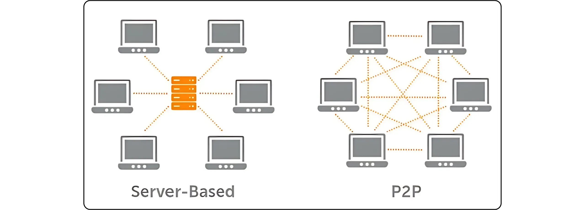
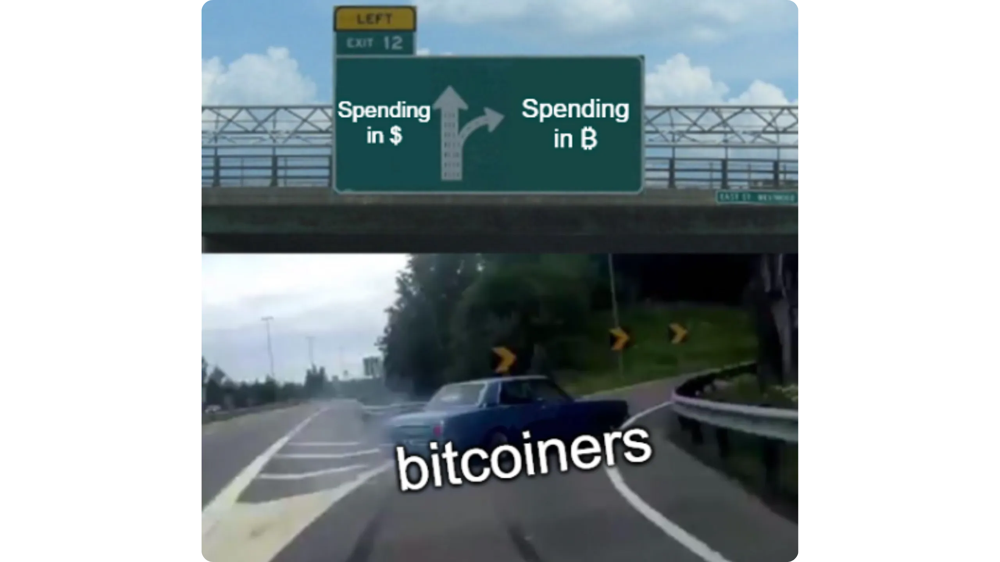
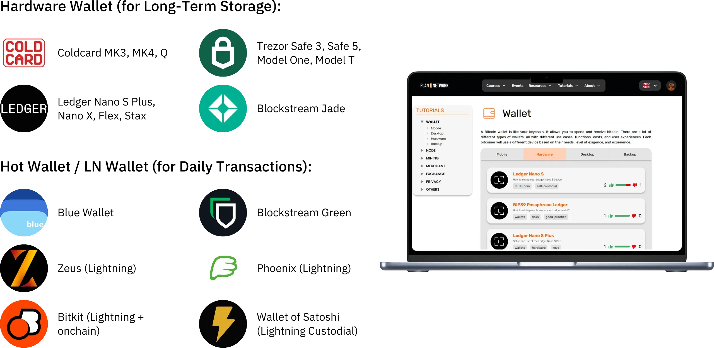
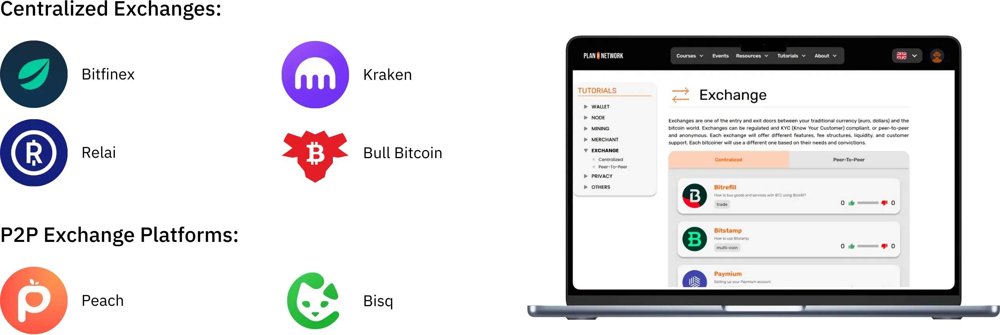
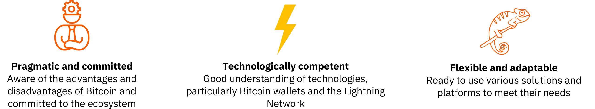
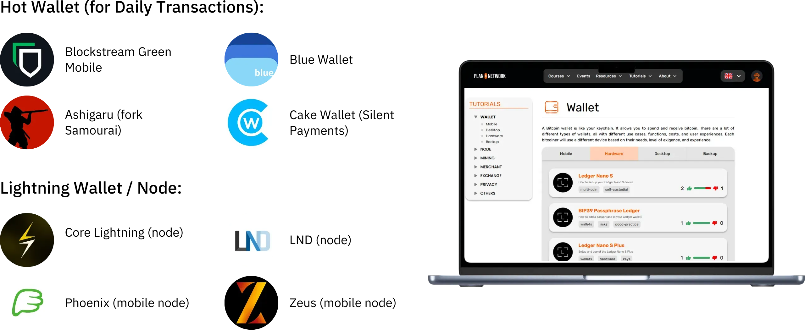

# 通往第一个比特币的旅程

Bitcoin 生态系统正在经历前所未有的壮观发展。由 Satoshi 中本聪的发明所推动的技术、经济和社会变革与日俱增，并逐渐打开了通往新世界的大门，您现在可以充分利用这一优势。

潜入 Bitcoin 兔子洞是一次令人兴奋的智力探险，它将激发你的批判性思维，挑战你的许多信念。这次探索不仅会让你深入了解 Bitcoin 的工作原理，还会给你提供一个真正的机会，让你重获个人自由，保护个人隐私，实现真正的财务主权。

为了有效地指导您走过这段旅程，我开设了这门完全免费的课程。在这里，我们只关注 Bitcoin。没有无关紧要的讨论，没有提及其他加密货币，只有清晰、准确、直接的内容。

本课程旨在让您完全掌控自己的学习方式，让您按照自己的节奏探索 Bitcoin，走最适合自己兴趣和目标的道路。

+++
# 导言

<partId>008c49b7-5e17-5973-87f2-ba28429b2697</partId>

## 课程概述

<chapterId>bfc96999-0ee1-5c41-8297-1b629f50cffc</chapterId>

欢迎来到 BTC102！如果您已经完成了 BTC101，那么您已经探索了 Bitcoin 为何是一项革命性技术背后的关键理论概念。现在，通过 BTC102，是时候将这些知识付诸行动了。本课程旨在帮助您逐步制定个人 Bitcoin 计划。

在接下来的章节中，我们将指导你采取切实可行的步骤，**获取你的第一批比特币**，**妥善保护它们，并自信地迈出你进入这个快速发展的生态系统的第一步。

https://planb.network/courses/2b7dc507-81e3-4b70-88e6-41ed44239966

虽然 Bitcoin 已经存在超过 16 年，但这个行业仍然年轻、充满活力，并深深植根于自由之中。其底层协议完全去中心化，不受任何中央机构的控制，使生态系统能够以自然、有机的方式成长。

虽然这种自由助长了令人难以置信的创新浪潮和机遇，但也伴随着一定的风险，包括诈骗、常见错误和陷阱，而这些往往源于知识的匮乏。本课程的主要目标是帮助您自信、安全地驾驭这个新的生态系统。

为了实现这一目标，BTC102 课程分为几个部分，每个部分都侧重于 Bitcoin 之旅的一个关键方面：

第一部分 "了解 Bitcoin 的先决条件 "有效地帮助您为今后的道路做好准备。您将学会识别 Bitcoin 生态系统中可能存在的与诈骗和金融欺诈有关的主要陷阱。然后，我们将介绍网络安全的基本要素。

最后，我将向您介绍一些专为初学者设计的实用技巧，以帮助您在初次使用 Bitcoin 时避免常见错误。

第二部分 "了解你正在做什么 "将加深你对 Bitcoin 的全面了解。我们将从回顾开始，确保您充分理解基本概念。

然后，我们将从技术、经济和社会角度解释为什么 Bitcoin 具有根本性的重要意义，从而增强您对其价值的信念。您还将探索 Bitcoin 产业的整体情况：其主要参与者、组织结构以及多年来的演变。最后，我们将介绍 Bitcoin 生态系统的分层架构，这是理解该系统如何在不损害其核心协议完整性的情况下不断创新的一个重要概念。

第三部分 "制定您的计划 "主要介绍您个人的 Bitcoin 方法。首先，我们将帮助您从四个主要类别中定义您的用户配置文件：

- "霍德勒 "*，重点是长期持有 Bitcoin ；
- 堆垛机*，他定期、有条不紊地进行采购；
- 用户*，每天优先使用 Bitcoin；
- 最后是 "偏执狂"，他们希望最大限度地提高安全性，以有效保护自己的资产和隐私。

我们将指导您实施适合您的战略，帮助您实现个人目标。

最后，第四部分 "保护您的继承人和财富 "涵盖了一个经常被忽视的重要主题：如何确保您的 Bitcoin 在发生意外情况时能够传给您的亲人。您将学习如何创建和制定 Bitcoin 继承计划，确保您的财富在有生之年得以保全。

课程结束后，您将掌握所有实用工具，自信地驾驭 Bitcoin 生态系统，成为其最先进的用户之一！

准备好开始您的 Bitcoin 世界之旅了吗？开始吧

# 了解 Bitcoin 的先决条件

<partId>4481fc4b-0f83-489e-ad07-81517c5d6bad</partId>

## 诈骗和金融欺诈

<chapterId>8af2948b-2ab5-54c4-862c-3414b8a285a2</chapterId>

Bitcoin 生态系统及其周边环境仍相对年轻，监管松散，具体取决于国家。虽然这种自由度带来了巨大的机遇，但也为金融欺诈、骗局和各种形式的操纵行为提供了肥沃的土壤。这就是为什么第一章如此重要：了解常见的陷阱将帮助你避免它们。您的财务安全是重中之重，因为糟糕的经历不仅会影响您自己，还会影响整个 Bitcoin 社区。

### Bitcoin 与加密货币：了解两者的区别

在进一步讨论之前，有必要明确区分两个根本不同的世界：

- Bitcoin 生态系统**以健全货币的理念为中心，建立在强大的去中心化、长期弹性、隐私和个人主权的基础之上。自 2009 年推出以来，Bitcoin 一直在全球开发者社区的支持下可靠、安全地运行。它并非一时兴起，而是一个稳定、成熟的协议，旨在长期保持价值。

- 另一方面，加密货币行业**规模更大，包括数以万计的不同项目，每个项目都有自己的代币。这一领域往往受到快速创新、炒作和短期金融投机的驱动。其中许多项目都是中心化的，安全性较低，尽管有大胆的承诺和华丽的营销，但并不能提供多少实际价值。

如果您想更好地了解 Bitcoin 的由来以及它与其他项目的真正不同之处，我建议您稍后查看有关 Bitcoin 历史的免费后续课程：

https://planb.network/courses/a51c7ceb-e079-4ac3-bf69-6700b985a082

众所周知，Plan ₿ Network 平台专门用于 Bitcoin。然而，了解与其他加密货币的区别将有助于您避免与无用的、有时甚至是欺诈性项目相关的陷阱。

### 应避免的主要骗局

以下是您在旅途中可能遇到的最常见骗局：

#### 金字塔骗局和庞氏骗局

这些都是加密世界中最常见的骗局。在庞氏骗局中，早期参与者用新参与者的钱获得报酬，而不是从任何真正的投资或产品中获得报酬。没有创造实际价值。只有不断有新人加入，这个系统才会运转。一旦新参与者的流动放缓，整个计划就会崩溃。

这些骗局通常以 ：

- 不切实际的保证收益承诺（如 20%的保证收益）；
- 提取投资资金时出现延误或困难；
- 大力鼓励招募新成员，以维持系统的运行；
- 承诺回报的真实来源完全不透明。

归根结底，所有金字塔和庞氏骗局都注定要失败。它们的根本弱点在于不断需要引入新的投资者来向早期参与者支付回报。随着时间的推移，这种需求在数学上是不可能持续的，因为随着系统的发展，所需的新招募者的数量会呈指数增长。一旦达到临界点，参与者开始怀疑，信任消失，整个金字塔就会崩溃。在这个阶段，最后加入的人往往是最不了解情况的人，他们会失去全部投资，而且无法收回，而组织者或早期投资者通常已经撤出资金，离开了这个系统。

在加密货币世界中，庞氏骗局有多种形式，通常是为了在技术或金融面具下掩盖其欺诈性质。这些骗局可能以新代币发行或首次代币发行（ICO）的形式出现，即向公众出售一种新的加密货币的筹款活动。在 "Blockchain"、"智能合约 "或 "定金 "等技术术语的背后，一些项目实际上隐藏着复杂的金字塔骗局。还有一些项目声称能提供高回报，它们将可疑的加密资产与完全依赖新投资者不断涌入的补偿系统结合在一起。

最近，庞氏骗局也蔓延到了去中心化金融（DeFi）领域。虽然 DeFi 的目的是在没有中介的情况下提供金融服务，但一些项目却利用 DeFi 为其骗局披上虚假的合法外衣。某些 DeFi 平台承诺在 Exchange 中为存入自动协议的加密货币提供高额、有保证的回报。这些诱人的承诺往往有不透明、不可验证的机制作为支撑，并有专门为骗局创造的代币。实际上，这些系统没有可持续的商业模式--回报只是从新用户的资金中支付，就像传统的庞氏骗局一样。当信任开始削弱或新参与者的涌入速度放缓时，这些系统就会不可避免地崩溃，导致毫无戒心的投资者蒙受巨大损失。

请注意，本课程的内容仅用于教育目的，不应被解释为财务建议。您的财务安全取决于您是否有能力对所做的每一个财务决定保持谨慎、怀疑和充分知情。

最好的保护措施就是经常问这个简单的问题：承诺的回报究竟从何而来？如果答案不明确，请立即逃离。

#### 泵与倾卸

这种类型的骗局涉及通过协调的营销活动（通常由一群投资者主导）人为抬高资产价格，这种资产通常是流动性较低的加密货币代币。典型的 Pump & Dump 骗局就是这种模式：

- 一群内部人员或有影响力的人物悄悄积累了大量目标资产。
- 然后，他们发起一场声势浩大的促销活动，在 generate 上大肆炒作，抬高价格。
- 在 FOMO（"害怕错过"）的驱使下，普通大众开始大量购买该资产，从而将价格推得更高。
- 在炒作的高峰期，内部人士会立即抛售手中的股票。
- 价格暴跌，让后来者损失惨重。

值得注意的是，在许多国家，Pump & Dump 策略都是非法的，被认为是一种市场操纵行为。尽管如此，此类计划仍在蓬勃发展，尤其是在监管仍在跟进的加密货币领域。

对 Telegram、Discord 或其他社交媒体渠道等平台上的私人 "信号 "群组尤其要谨慎。这些群组通常由有影响力的人或自封的专家管理，其中有些甚至收取入会费。虽然这些群组声称提供独家投资机会，但实际情况却更加片面：只有组织者获利，而大多数参与者最终血本无归。

诚然，一些参与者可能会从这类市场操纵中暂时获利，但他们的成功通常靠的只是运气和天时。从长远来看，这些阴谋是不可持续的。它们需要持续的高风险参与，需要反复参与欺诈性的圈套，而这些圈套不可避免地会崩溃。

更糟糕的是，它们助长了一种危险的幻觉：人们相信，在不了解金融系统实际运作方式的情况下，可以快速、轻松地赚钱。这种心态不仅会给个人带来风险，还会破坏整个加密货币生态系统的信誉

鉴于上述原因，最好的策略是坚持严肃认真、深思熟虑的投资方法，这种方法以金融教育、对基本面的扎实了解和长远眼光为基础。

通过耐心地积累知识，你就不会那么容易受到情绪操纵和不切实际的承诺的影响，也能更好地避免可能导致实际损失的财务陷阱。

#### 捐赠、彩票和虚假赠品骗局

这类骗局承诺，如果您先发送少量资金，就可以免费获得 Bitcoin 或其他 Exchange 奖励。请务必记住：任何合法的个人或组织都不会要求您先发送加密货币，并承诺会给您发送更多的回报。

骗子经常冒充知名公众人物（如埃隆-马斯克或其他名人）通过社交媒体引诱受害者。在与账户和网站联系之前，一定要仔细检查其合法性，切勿相信那些看似过于慷慨或好得不真实的提议。

有时，这些骗局以 "预付费 "欺诈的形式出现。他们承诺给你奖品或奖励（金钱、产品或服务），但首先要求你支付一笔费用，据说是用来支付运费、税费或交易成本等。一旦支付了费用，骗子就消失了，而承诺的奖励却永远不会到手。

#### 提供垃圾币和加密货币

集中式加密货币项目有时会提供免费代币（"*空投*"）来吸引用户。这些代币通常几乎没有实际价值，主要用于制造受欢迎的假象或助长投机行为。对于这类促销活动要格外谨慎；它们往往是营销陷阱，而不是真正的机会。

#### 身份盗窃和网络钓鱼

攻击者经常使用虚假网站、社交媒体账户或欺骗性电子邮件来试图窃取您的资金。这些诈骗可以通过任何通信渠道进行：电子邮件、社交网络、电话甚至传统邮件...

在点击链接或采取任何行动之前，一定要仔细检查发件人的身份。如有疑问，请手动访问网站，而不是使用提供的链接。最重要的是，切勿与任何人共享您的私人密钥或密码。

#### Bitcoin 硬叉

多年来，Bitcoin 经历了数次 *Hard 分叉*，从而产生了原始加密货币的替代版本。简单地说，*Hard Fork*是网络的分裂，导致两个独立的区块链，在分裂之前，两个区块链共享相同的历史。这些分叉通常发生在部分开发者社区或更广泛的 Bitcoin 生态系统想要对原始协议进行重大修改，但无法达成广泛共识的情况下。他们不会放弃自己的想法，而是决定推出一个新版本的 Bitcoin（规则有所改变），希望用户和矿工会选择遵循他们的 Fork。

并非所有的*Hard 分叉*都是欺诈行为，因为有些分叉源于社区内部的技术或意识形态分歧。但也有一些分叉是出于商业利益甚至不诚实的动机。这些硬分叉中最著名的例子是**Bitcoin Cash（BCH）**和**Bitcoin Satoshi Vision（BSV）**。这些替代货币分别于2017年和2018年推出，通常声称是原始Bitcoin的 "更好版本"。它们宣传所谓的优势，如交易费用更低或因区块大小增大而交易更快。然而，这些技术变化在安全性、去中心化和稳健性方面带来了重大权衡；Elements 可能与 Bitcoin 的基本原则相冲突。

除了技术上的差异，这些替代货币还经常利用混淆来吸引不明真相的投资者。它们可能会采用营销策略，故意误导新来者，让他们以为自己购买的是真正的 Bitcoin (BTC)。

为了避免掉入这个陷阱，请务必核实您购买的货币。原始的 Bitcoin 使用代码 **BTC**，而 Bitcoin Cash 及其衍生产品则使用不同的缩写，如 BCH 或 BSV。

#### 不诚实的影响者和虚假大师

随着加密货币获得主流关注，社交媒体上出现了大量有影响力的人、自封的专家和所谓的 "*加密大师*"。虽然少数人可能会提供真正有教育意义的见解，但也有很多人利用自己的知名度来推广可疑的项目或危险的交易策略（有时甚至是彻头彻尾的欺诈）。

这些有影响力的人往往依靠行之有效的策略来吸引初学者：他们展示令人印象深刻的财务业绩（这些业绩往往是虚假的或无法证实的），炫耀奢华的生活方式作为所谓的成功证明，并宣传 "神奇 "的投资策略。其目的是引发 FOMO（害怕错过），促使受众做出冲动的决定和不计后果的投资。

重要的是要明白，这些人提供的大多数 "免费 "建议都不是真正的免费。在慷慨的外表下，往往隐藏着精心策划的策略，引导人们购买有问题的资产。即使一些有影响力的人是诚实的，要复制他们的成果也几乎是不可能的；他们的成功往往取决于特定的时机、内幕消息或独特的环境，而这些是你根本无法接触到的。

一些有影响力的人可能会邀请你加入付费的私人群组，他们声称在群组中分享独家交易信号或内幕消息，承诺快速、轻松地获利。实际上，这些群组主要让组织者自己受益。他们往往利用追随者作为流动资金的来源，实质上是为了个人利益而转移资产。用户通常最终会亏损，因为他们无法像策划交易的内部人员那样迅速做出反应（参见 "抽水与抛售计划 "部分）。

有鉴于此，我们可以养成一些良好习惯，以避免落入不诚实的影响者设置的陷阱：

- 对任何加密货币投资建议都要非常谨慎**。

一个值得信赖、知识渊博的人绝不会在不鼓励你自己先做研究的情况下，向你施压让你购买加密货币。

- 付费的交易或投资课程并不总是质量的标志**。

这些课程中有许多都在宣传高风险或过于简单化的策略，而这些信息往往可以在网上免费找到。

- 没有什么方法可以保证复制别人的交易并获得完全相同的结果**。

每种投资策略都取决于个人背景、时机、知识和其他因素，无法完全复制。

- 尤其要警惕那些听起来好得不像真的建议**。

不切实际的承诺或保证利润几乎都是操纵的迹象。请记住：别人自信满满地说的话并不代表就是真的。

请永远记住，您在 Bitcoin 或更广泛的加密生态系统中遇到的每个人都有自己的个人目的；不管是直言不讳还是隐藏在字里行间。没有纯粹中立的信息。即使是 BTC102 这门课程，也有一个明确的目标：*促进人们更好地了解 Bitcoin。

因此，了解您所浏览的每篇内容背后的真实动机至关重要。永远不要忘记互联网的这一黄金法则：

*如果产品或服务看起来是免费的，那么你很可能就是产品*。

归根结底，个人教育、健康的怀疑精神，以及最重要的自己核实事实的习惯，才是最好的防御方法。

### 如何避免诈骗

**为了保证上网安全，尤其是在加密世界中，请牢记以下关键原则：**

- 切勿盲目信任："*不要相信，要核实*" ；
- 对保证收益或异常高的收益持怀疑态度；
- 切勿与任何人共享您的私人密钥；
- 不要向未知地址发送 Bitcoin（或任何密码）；
- 如有疑问，请暂停。退后一步，思考后再行动。FOMO 是你最大的敌人；
- 避免付费交易群组或社区做出不切实际的承诺；
- 网上的大多数赠品或 "免费 "彩票都是骗局或严重操纵；
- 从长远来看，学习永远比赌博收获更多。

保护自己免受诈骗是保护资产的关键第一步，但这还不够。保持良好的数字卫生同样重要。因此，在下一章中，我们将探讨如何加强在线安全，以及在数字世界中保护自己应采取的最佳做法。

## 在线安全

<chapterId>f0873bf2-6a6f-5485-bb7a-d84be14f404d</chapterId>

一旦开始接触 Bitcoin，您就会很快意识到，基本的网络安全并非可有可无，而是必不可少。诈骗和欺诈只是冰山一角。意外数据丢失、恶意软件和密码泄露同样会造成严重后果，尤其是在您管理自己的密钥时。

本章将向你介绍一些简单实用的步骤，以提高你的数字卫生水平，并在空间中保护自己。

如果您想深入了解，Plan ₿ Network 的 SEC101 课程提供了专为 Bitcoin 用户设计的网络安全策略综合细分。

https://planb.network/courses/99c46148-7080-4915-a7e0-9df0e145cd47

### 网络安全为何重要

Bitcoin 赋予您直接（不通过银行）持有资金的权力，无需中介。但是，这种金融主权伴随着严重的责任：如果您的 BTC 因安全漏洞而被盗，您将无法逆转交易。与传统的银行业务不同，这里没有服务台，没有欺诈索赔，也没有保险为您解围。

此外，Bitcoin 的经济价值使其成为高价值目标。黑客如果入侵了你的 Wallet，就可以立即将你的资金转移到他们控制的 Address（不问原因，也无法取回）。

### 一台干净、最新的电脑

个人安全最容易被忽视的方面之一就是保持操作系统和软件的更新。许多更新会修补已知的漏洞，否则就会被攻击者利用。虽然有些人担心性能问题而避免更新，但真正的风险在于运行黑客已经知道如何破解的过时软件。

此外，强烈建议使用可靠的杀毒软件。在 Windows 系统中，内置的 Windows Defender 一般足以满足大多数用户的需求。如果你更喜欢其他功能或更放心，也可以选择卡巴斯基等商业软件。在 macOS 上，恶意软件威胁历来不太常见**，但并非不存在**，因此保持谨慎仍是明智之举。

除了系统更新和防病毒保护外，还要特别警惕从不法网站或所谓的 "通用 "下载门户网站下载软件。需要工具或应用程序时，一定要直接从官方来源下载；这样可以大大降低伪装成合法软件安装恶意软件的风险。

另一个聪明的习惯是，在机器上安装任何软件之前，都要验证其真实性和完整性。如果你不知道如何做到这一点，别担心，我们有专门的教程指导你完成这一过程：

https://planb.network/tutorials/computer-security/data/integrity-authenticity-21d0420a-be02-4663-94a3-8d487f23becc

最后，定期备份重要数据。外置 Hard 硬盘或固态硬盘是保存文件副本的可靠选择，以防突然故障、黑客攻击或意外删除。你以后会感谢自己的。

如果您喜欢云解决方案，可以考虑使用 Proton Drive 这样的安全服务。无论您选择哪种方案，都要确保尊重您的隐私并提供强大的加密功能。

https://planb.network/tutorials/computer-security/data/proton-drive-03cbe49f-6ddc-491f-8786-bc20d98ebb16

一种广为推荐的备份策略是 "3-2-1 规则"。它旨在保护您的数据免受意外丢失、网络攻击甚至自然灾害的影响。

想法很简单：

- 至少保存 3 份**重要数据的副本、
- 将它们存储在 ** 至少 2 种不同类型的介质**（如外置 Hard 驱动器和云存储）上、
- 并确保其中 ** 份副本存放在异地**（与主要地点实际分开）。

这种方法具有很强的复原能力，即使出现严重问题，也能确保您的数据得以保存。

### 身份证噩梦的解决方案

人们被黑客攻击的最大原因之一就是使用了弱密码。相当多的用户仍然在多个账户中重复使用相同的密码，或者选择容易猜到的变体密码。密码管理器是解决这一问题的完美方案。

密码管理器可让您

- 将所有密码安全地**存储在加密保险库中
- 为每个账户自动设置 generate 长、复杂和唯一的密码**
- 只需使用一个主密码**，即可安全访问所有内容

有了密码管理器，你就再也不用点击 "忘记密码 "或依赖薄弱、重复使用的凭证了。此外，大多数密码管理器都能在设备（台式机、手机、平板电脑）间无缝同步，甚至还能自动填写登录表单，让安全访问变得轻松高效。

现在有很多密码管理器，但我可以根据你的需求推荐两个可靠的选择。如果你正在寻找一款简单易用、能在多台设备上无缝同步的密码管理器，Bitwarden 是一个很好的选择：

https://planb.network/tutorials/computer-security/authentication/bitwarden-0532f569-fb00-4fad-acba-2fcb1bf05de9

如果您希望在自己的设备上保存所有内容，KeePass 是一个不错的选择：

https://planb.network/tutorials/computer-security/authentication/keepass-f8073bb7-5b4a-4664-9246-228e307be246

### 2FA：双重保护

在 Bitcoin 中，您就是自己的银行。这意味着您也是自己的安全团队。即使有一个强大的密码，也不可能做到零风险，这就是为什么启用双因素身份验证（2FA）至关重要的原因。

2FA 要求使用 Google Authenticator 或 Authy 等应用程序生成基于时间的一次性密码（通常为 6 位数），从而增加了第二重保护。因此，即使有人设法获取了您的密码，如果无法实际访问您的手机，他们仍然无法访问您的账户。

https://planb.network/tutorials/computer-security/authentication/authy-a76ab26b-71b0-473c-aa7c-c49153705eb7

启用 2FA 后，请确保将应用程序的恢复密钥保存在安全的地方。这样，当您丢失或更换手机时，就可以恢复密码。虽然基于短信或电子邮件的 2FA 聊胜于无，但其安全性要低得多。SIM 卡互换攻击，即有人控制了你的手机号码，可以轻易绕过这种保护。

对于那些希望进一步提高安全性的用户，YubiKey 等实体钥匙可以提供更高级别的保护。

https://planb.network/tutorials/computer-security/authentication/security-key-61438267-74db-4f1a-87e4-97c8e673533e

### 保护您的隐私

隐私和网络安全密切相关：你随意提供的信息越多，你就越有可能成为攻击目标。

**VPN**（*虚拟专用网络*）是掩盖你的 IP Address 和加密你的互联网流量的一个简单而有效的步骤。虽然它不会让你完全隐身（因为 VPN 提供商仍然可以看到你的活动），但它确实大大增加了任何人监视你或跟踪你浏览习惯的难度。

关键是要选择一家值得信赖的 VPN 提供商：

- 不需要您提供个人信息
- 允许通过 BTC 付款
- 拥有严格的无日志政策

我们在 Plan ₿ Network 上提供了多个教程，可以指导您轻松设置 VPN。我特别推荐 IVPN 或 Mullvad：

https://planb.network/tutorials/computer-security/communication/ivpn-5a0cd5df-29f1-4382-a817-975a96646e68

https://planb.network/tutorials/computer-security/communication/mullvad-968ec5f5-b3f0-4d23-a9e0-c07a3e85aaa8

保护网络隐私的基本步骤还包括

- 使用**加密信息平台**，如 Signal、SimpleX 或 Session；
- 使用注重隐私的浏览器，如 Firefox、Brave 或 Tor（增强匿名性）；

https://planb.network/tutorials/computer-security/communication/tor-browser-a847e83c-31ef-4439-9eac-742b255129bb

- 使用**安全邮箱**，如 ProtonMail；

https://planb.network/tutorials/computer-security/communication/proton-mail-c3b010ce-254d-4546-b382-19ab9261c6a2

- 使用 Bitlocker（适用于 Windows）或 VeraCrypt（适用于多平台）等工具加密**文件。

https://planb.network/tutorials/computer-security/data/veracrypt-d5ed4c83-7c1c-4181-95ea-963fdf2d83c5

### 循序渐进

网络安全似乎是一项艰巨的任务，初学者很容易因其过于复杂而不知所措并放弃。诀窍在于循序渐进。从简单的事情做起，比如安装密码管理器。给自己几周时间适应，然后进入下一步：比如在某个账户上启用 2FA。

当你对这些工具越来越有信心时，你就可以增加更多的高级做法，比如使用辅助电子邮件、改用 ProtonMail、设置 VPN 或在必要时使用 Tor 浏览。

随着您对 Bitcoin 世界的深入了解，您会发现随着 Wallet 价值的增加，风险也在增加。建立稳固的安全习惯、保护您的隐私和设置正确的工具不仅能让您高枕无忧，还能加强 Bitcoin 的主权。

总之：不要低估网络安全，花时间建立基础，并记住一致性是关键。没有良好的数字卫生习惯，再好的工具也无济于事。

此外，请务必查看 Plan ₿ Network 上的 [我们的计算机安全教程](https://planb.network/tutorials/computer-security)。

在下一章中，我将与大家分享更多技巧，帮助大家满怀信心地开始 Bitcoin 之旅，并避开许多会让新手措手不及的陷阱。

## 给新手的提示

<chapterId>33134b3f-92c1-5185-afb6-88599e47e801</chapterId>

进入 Bitcoin 可能会令人兴奋，但也伴随着一定的风险。加密货币的世界不同于其他任何世界；价格的剧烈波动、不熟悉的技术，以及由于简单的错误或投资选择不当而导致资金永久损失的可能性，都是新用户应该注意的陷阱。

在本章中，我将与大家分享一些实用的建议和一般性指导，以帮助任何迈出第一步的人，尤其是首次购房或探索更广阔的金融投资世界的人。

以下是我们将一起讨论的要点：

- 警惕**屎币**和其他无用的加密货币；
- 只投资**你输得起的钱**；
- 了解**交易**和**投资**之间的区别；
- 了解投资的**税务影响；
- 小心保护您的**恢复短语**；
- 保持谦虚，保持**低调**（谨慎是安全的一部分）；
- 从长远考虑**，放大并保持耐心（把它当作一场马拉松，而不是短跑）。

### 应避免的常见错误

Bitcoin 向所有人开放，但这并不意味着您应该在毫无准备的情况下贸然加入。以下是一些新手常犯的错误：

**技术错误：**

- 丢失您的 seed 短语：** 您的恢复短语（通常为 12 或 24 个字）是在您的 Wallet 发生意外时访问您的 Bitcoin 的唯一途径。如果丢失，您的资金将永久消失；
- 将比特币存放在第三方平台上：** 如果你的比特币存放在一个中心化平台上，你并不真正拥有它们。你会面临黑客攻击、平台故障甚至资金被扣押等风险；
- 忽视隐私：** 保护隐私是确保资产安全的核心部分。公开透露您持有多少 Bitcoin 可能会让您成为众矢之的；
- 在线安全性不足：** 未能通过基本的保护措施（如更新、强密码或 2FA）确保设备安全，使您很容易成为攻击者的目标；这可能会让您倾家荡产。

**财务错误：**

- 投资超过你能承受的损失**：切勿负债或将房租投入 Bitcoin。您的基本财务稳定应始终放在第一位。

- 不知道交易和投资之间的区别**：交易需要时间、技巧和严肃的情感纪律。长期投资更适合初学者。

- 忘记税收**：每个国家都有自己的加密货币税收规则。忽视这些规定可能会在日后带来痛苦的意外。

- 陷入 FOMO**：因害怕错过而冲动购买，通常会导致时机不对和决策失误。耐心是你最好的盟友。

### 确定投资战略

在购买第一套 Satoshi 之前，了解为什么要投资 Bitcoin 以及如何投资至关重要。这意味着要根据您的个人情况和长期目标制定明确的财务计划。

首先要准确定义你的**预算。不要随意选择一个数字。花点时间计算一下您的月收入，减去固定开支（如房租、贷款、税费、水电费）以及日常生活费用（食品、交通、娱乐等）。剩下的部分就是您的储蓄差额，只有从这部分中才能考虑投资。

这样做可以确保您不会将自己的财务状况置于风险之中，尤其是在市场下滑的情况下。深思熟虑的策略是长期抗风险能力的基础。

预算确定后，请考虑如何投资。最适合初学者且广为推荐的方法之一是美元成本平均法（DCA），即定期（每周、每月等）购买固定数量的 Bitcoin。这种策略有助于使您的平均入市价格随着时间的推移趋于平稳，并减少价格波动对情绪的影响。对于大多数人，尤其是新手来说，这是一种明智的方法。

然后，问问自己我的时间跨度是多少？

您是想快速进出市场（交易）？还是您更倾向于长期持有 Bitcoin 数年（hodler）？如果您是一名投资者，您可能不太关心每天的价格波动，而更注重长期安全性和自我保管。如果你是交易者，你将更容易受到短期市场噪音、高风险以及快速决策带来的压力的影响。没有放之四海而皆准的答案，但了解自己的方法有助于指导自己的决策。

最重要的是，不要基于情绪或恐惧做出投资决定。提前制定策略，写下来并坚持下去。

如果你还不确定，**从学习开始**。

花几个小时探索 Bitcoin，查看 Plan ₿ Network 上的免费资源，读几本书，花 5 欧元试一试，并在线观看一些高质量的内容。保持好奇心。你越适应，就越容易重新审视你的策略，调整你的方法，并充满信心地向前迈进。

### 了解 BTC 的波动性

Bitcoin 以其剧烈的价格波动而闻名。在短短几天内，10%、20% 甚至 50% 的波动并不罕见。对于新手来说，这种波动会让人迷失方向。在牛市时很容易被炒作所迷惑，在跌市时也很容易产生恐慌；这两种情况往往会导致错误的决策，比如亏损卖出。

因此，在投资前**了解并接受 Bitcoin 的波动性**至关重要。这些价格波动不是问题，而是一种仍在成熟期的资产的特征。如果突如其来的大起大落让你彻夜难眠，或迫使你做出情绪化的决定，那么很可能你投入的资金已经超过了你所能承受的风险。在这种情况下，请退一步，重新评估您的策略和风险承受能力。毫不犹豫地降低仓位，直到你感觉更安心为止。

最重要的是，永远不要投资超过你能承受的损失。避免借钱购买 Bitcoin（尤其是当你还在学习基础知识时）。坚实的基础始于稳健的步伐，而不是鲁莽的下注。

### 管理和保护您的 Bitcoin Wallet

Bitcoin 最强大（但往往被低估）的功能之一是**自我托管**。使用自我托管的 Wallet，您只需对您的资金负责。这些钱包通常由**恢复短语**（也称为 seed 短语）生成，该短语由 12 或 24 个单词组成，可以完全访问您的 BTC。如果您丢失了这个短语（或被他人获取），您的比特币将永远消失。 **没有客户支持。没有重置按钮。

这就是为什么 Bitcoin 的黄金法则是：

"***不是你的钥匙，也不是你的硬币***"。如果你不能亲自控制你的私钥，你就不能真正拥有你的 Bitcoin。虽然交易所很方便（尤其是在刚开始的时候），但它们会替您保管密钥。这意味着如果平台被黑客攻击、冻结账户或破产，您的资金将面临风险。

为避免这种风险，强烈建议设置**自己的 Wallet**，只有自己才能访问恢复短语。应始终手写该短语，并将其**离线**存储在安全位置。有些用户甚至**维护多个备份**，分别存储在不同的地理位置，以提高安全性。

**切勿将恢复短语存储在联网设备或云端**。

**一次黑客攻击或数据泄露就可能导致不可挽回的损失。

如果您已准备好使用 Ownership 的 Bitcoin，并想深入了解保护恢复短语的最佳实践，我强烈建议您查看这篇文章：

https://planb.network/tutorials/wallet/backup/backup-mnemonic-22c0ddfa-fb9f-4e3a-96f9-46e2a7954270

### 保密和谨慎

在当今的数字世界中，**谨慎常常被忽视**；然而，它却是保持安全的关键部分，尤其是在涉及到全球财富管理88必发官方手机登录时。你越是公开谈论自己的资产，就越有可能成为骗子、网络罪犯，甚至是勒索或敲诈等传统威胁的目标。

世界各地发生了多起已知持有大量 BTC 的个人被绑架或袭击的案件。

**无论是在社交媒体上，还是在闲聊中，都要避免吹嘘自己的 Bitcoin Stash**。泄露敏感的财务信息没有任何好处，而且风险是真实存在的。

将你的网上活动**分门别类也是明智之举。例如

- 使用单独的 Address 电子邮件处理与 Bitcoin 相关的任何事情，与个人或工作账户区分开来。
- 谨防网络钓鱼企图、可疑链接和模仿可信平台的虚假网站。
- 保持警惕！谨慎和警惕往往是你最好的防御。

如果您准备深入探讨 Bitcoin 隐私主题，我们建议您继续学习我们的第二年隐私课程，在这里您将学习到更多高级技术来保护您的身份和活动安全：

https://planb.network/courses/65c138b0-4161-4958-bbe3-c12916bc959c

### 税务影响

尽管**Bitcoin 是一种去中心化的货币，但它不能免于贵国的税收法律和法规**。每个司法管辖区都有自己的加密货币收益征税办法。

在一些地方，利润在出售时作为资本收益征税。还有一些地方可能要求您申报每笔交易，还有一些地方适用不太常见的规则，如财富税或社会贡献税。

在进行任何重大交易之前，强烈建议咨询税务专业人士或查阅政府的官方指南。花时间提前了解您的纳税义务，可以避免日后出现意想不到的问题（如罚款、审计或罚金），尤其是当您计划进行大额销售或投资组合重新分配时。

### 交易、投资和持有的区别

Bitcoin经常被一些流行的误解所包围；其中最常见的一种误解是，它是通过交易致富的捷径。但重要的是要明白交易、投资和持有之间的明显区别，因为每种方法都有自己的思维方式、技能组合和风险水平。

- 交易：**

老实说：**你可能不应该进行交易。

交易涉及短期投机（有时使用杠杆），目的是从 Bitcoin 的价格波动中获利。虽然听起来很吸引人，但成功的交易需要高级技术知识（如图表分析和风险管理）、情感纪律和对市场的持续关注。这是一项耗费心力和时间的工作，而 Hard 事实是，**大多数初学者都会赔钱**，因为他们低估了这项工作的真正要求。

巴菲特有句名言

"**如果你不愿意持有一只股票十年，那就别想持有它十分钟**"。

Bitcoin 并不是一个快速致富的计划。

- 投资：**

投资者采取中长期观点，购买 Bitcoin，相信其价值会随着时间（数月、数年甚至数十年）的推移而增长。当然，风险仍然存在，因为 Bitcoin 的价格可能会大幅波动。但对于大多数人来说，尤其是那些不想每天花几个小时盯着图表的人来说，这种方法通常更冷静、更实用。

- 保持 (HODL) :**

"HODL "最初是 "hold "的错别字，后来迅速成为 Bitcoin 文化的一部分。如今，它已成为一种荣誉徽章。

霍德勒公司的目标非常长远，有时长达十年甚至更久。他们安全地储存 Bitcoin，只是等待，因为他们坚信 Bitcoin 的长期潜力。他们不会被每日的价格波动或熊市所吓倒。他们的心态很简单：积累、安全、稳健。

|          | Trading | Investment | Holding |
| ---------------------- | ----------- | -------------- | --------------- |
| Leverage | Yes  | No | No |
| Timeframe | Short-term | Medium-term | Very long-term |
| Asset Type | Contracts | Actual BTC | Actual BTC |
| Risk Level | Very high | High | High |
| Difficulty | Very Hard | Hard | Hard |
| learning curve | Long learning curve | Long learning curve | Long learning curve |
| Potential Loss | UnLimited | Limited | Limited |
| Best For | A few experienced users | Most People | Long-term Believers |

### 不断学习

开始学习有关金钱、投资和金融体系如何真正运作的知识永远不会太早（或太晚）。您不需要成为专家，也不需要深入了解每个技术细节；有了扎实的大局观认识，就足以做出明智的决定，避免被不符合您利益的金融产品（通常由银行或顾问推销）误导。

罗伯特-清崎（Robert T. Kiyosaki）的《富爸爸，穷爸爸》（*Rich Dad, Poor Dad*）一书是一个很好的起点。这本书以其平易近人的风格和基础课程而广为人知，比如了解资产和负债的区别，以及为什么财务教育是长期独立的关键。

如果您准备深入了解，《投资者播客》（*The Investors Podcast* ）等播客会就投资、市场和经济原理进行深入讨论。他们偶尔也会报道 Bitcoin，对于那些想了解 Bitcoin 如何融入更广泛的金融领域的人来说，这是一个坚实的下一步。

### 谨记的黄金法则

总而言之，每个比特币玩家（尤其是初学者）都应该牢记一些永恒的原则：

- 规则 1**：切勿投资超过您能承受的损失。Bitcoin 是一种不稳定的资产。不要冒着财务稳定的风险去追逐收益。您的基本需求和安宁应始终放在首位。
- 规则 2**：不要盲目跟风或相信神乎其神的建议。无视潮流和华而不实的承诺。相反，要专注于做出明智、理性的决定。如果有疑问，就睡一觉，与你信任的人一起讨论。与其急于犯代价高昂的错误，不如慢慢地、深思熟虑地行事。
- 规则 3**：制定计划，坚持长期愿景。

坚持不懈、耐心和纪律会让你比短期的兴奋走得更远。不要以 "登月 "为目标，而要以可持续增长为目标。避免犯致命的错误，让小的胜利随着时间的推移不断累积。

遵循这些原则，您就能以更清晰、更平和的心态对待 Bitcoin 投资。是的，Bitcoin 很不稳定，一开始可能会让人望而生畏；但只要谨慎、耐心、脚踏实地地去做，它就会蕴藏着不可否认的潜力。花时间积累知识，在必要时重新审视自己的策略，最重要的是，请记住：缓慢而稳步的进展永远比因恐惧或急躁而仓促行事更有益于你。

# 了解您的需求

<partId>a42355a3-9dd8-57ed-b590-32a333fe09ea</partId>

## Bitcoin 5 分钟

<chapterId>ae122ad9-9b4d-5229-9038-e1b99d5cfc83</chapterId>

在本课程中，主要目标是指导你获取和保护你的第一个比特币。但在深入学习实际步骤（如何购买 BTC、使用哪种钱包等）之前，重要的是退一步了解 Bitcoin 究竟是什么。掌握 Bitcoin 的深层本质将有助于你理解为什么数百万人转向这项技术，以及为什么在将积蓄投入这样一种新的、不稳定的资产之前，了解其基本原理至关重要。

多年来，Bitcoin 已被公认为全球货币网络。它被称为 "数字黄金"、"信任协议"，甚至是 "平行金融系统"。但这些术语的真正含义是什么呢？为了回答这个问题，我们将仔细研究 Bitcoin 的核心：它的起源故事、技术基础、货币属性及其潜在影响；不仅对个人，而且对整个全球金融体系。

### 起源：源于长期探索的项目

#### 赛弗朋克和银行无法控制的系统的发明

Bitcoin 的诞生并非一蹴而就。它是几十年来密码学、计算机科学和货币理论研究与实验的成果。在 Bitcoin 于 2009 年推出之前，已有多个项目（如 eCash、b-money、Bit Gold 和 RPOW）尝试创建数字货币。所有这些项目都面临着同样的核心问题：如何在不依赖中央机构的情况下防止分散系统中的重复消费。

直到 2008 年末，有人用中本聪（Satoshi Nakamoto）的名字发表了 Bitcoin 白皮书，这一难题才得以解决。几个月后，Bitcoin 的第一版开源软件上线，推出了一个可以独立于银行或政府运行的系统。

该项目深受 Cypherpunk 精神的影响；Cypherpunk 是一个由开发人员和思想家组成的社区，他们相信利用密码学来保护个人的网络自由。对他们来说，隐私和去中心化不是技术上的偏好，而是意识形态上的必需。Bitcoin 是这些理想最成功的体现：一个任何人都可以使用、任何人都无法控制、所有人都可以验证的点对点货币网络。

赛弗尔朋克是一个非正式的国际团体，他们倡导使用密码学来捍卫网上个人自由。他们坚信个人的隐私权，尤其是在政府监控和企业数据开发日益盛行的今天。

Cypherpunk 运动的起源可以追溯到 20 世纪 90 年代初，当时一群密码学家、程序员和自由主义者开始在硅谷的聚会上探讨密码学的政治含义。蒂姆-梅（Tim May）是这一群体中最著名的人物之一，他于 1988 年撰写了《加密无政府主义宣言》；该宣言是一篇奠基性文章，概述了加密技术将使个人有能力在政府和中央控制范围之外运作的世界愿景。

1992 年，"赛弗朋克 "邮件列表（Cypherpunks mailing list）的创建是这场运动的一个重要里程碑，在这个论坛上，有关隐私和密码学的想法、项目和政治讨论蓬勃发展。1993 年，埃里克-休斯（Eric Hughes）发表了《Cypherpunk 宣言》，这是一份简短而有力的宣言，明确表达了该社区的使命和信念。

独立于任何中央机构运作的数字货币（如 Bitcoin）的理念深深植根于 Cypherpunk 的哲学中。

#### 后金融危机时刻

Bitcoin 并不是凭空出现的。它诞生于一个非常特殊的时刻--2008 年全球金融危机之后。美国房地产市场的崩溃和次级贷款危机导致各大银行倒闭，动摇了人们对整个金融体系的信任。

正是在这种充满恐惧和不确定性的环境中，Bitcoin 应运而生。创造者中本聪（Satoshi Nakamoto）在 Bitcoin Blockchain 的第一个区块（即 Genesis 区块）中包含了一条极具象征意义的信息。这条信息是

> **泰晤士报》2009 年 1 月 3 日 英国首相濒临第二次救助银行 "**

这不仅仅是一个日期或一份技术说明，而是一次悄无声息但却声势浩大的抗议。它表明，Bitcoin 的设计目标与众不同：一个不依赖银行、救助或政府决策的金融体系。

许多人将此理解为 Bitcoin 的目标：提供一种无需中间商的价值转移方式，由明确的规则控制，而不是由中央银行或政府做出往往不明确的决定。

为了加深您对 Bitcoin 起源的了解，我们提供了有关该主题的免费、全面且有据可查的培训课程：

https://planb.network/courses/a51c7ceb-e079-4ac3-bf69-6700b985a082

### 去中心化的价值转移网络

#### 点对点，没有中央机构

Bitcoin 被定义为 "点对点电子现金系统"。这意味着任何人都可以使用相应的软件（Bitcoin 节点）连接到网络，直接与其他用户互动，而无需依赖中央服务器。这种去中心化的目标是防止任何单一实体（如银行、政府或大公司）控制、审查或停止该系统。Bitcoin 在全球范围内全天候运行，每个人都可以无条件访问。

简单地说，Bitcoin 网络中的每个参与者（称为 "节点"）都有一份完整的 Ledger 交易副本，即 Blockchain。当有新的交易发生时，就会向网络广播。矿工们会将这些交易组合成区块，然后添加到链的末端，以此来确认这些交易（因此被称为 "Blockchain"）。

#### Blockchain：核算 Ledger

把 Blockchain 想象成一个巨大的会计 Ledger，每一行都代表一笔交易。在传统的银行系统中，数据库存储在银行的服务器上，银行可以随时进行更改。另一方面，在Bitcoin中，***所有更改都会在整个网络中得到验证：一旦在Blockchain中添加了新的交易块，以后几乎不可能再更改。这种分散式验证使 Bitcoin 的 Ledger 安全透明。

### 矿工和 Proof-of-Work 的作用

#### 积木是如何形成的？Mining

Mining 是计算机（或大型 Mining 场）贡献**计算能力**以确保 Bitcoin 交易历史安全并创建新区块的过程。矿工们竞相解决一个数学难题--具体来说，就是找到部分 Hash 碰撞。这一过程需要大量能源和资源。一旦 Miner 找到有效的解决方案，他们就会向网络广播区块，网络会验证并接受其为有效。

作为奖励，Miner 会收到新创建的比特币（称为区块补贴）以及该区块中所有交易的交易费。

#### Halving：减少整笔补贴

为确保 Bitcoin 的稀缺性，区块补贴计划每 21 万个区块减半，大约每四年减半一次。这一事件被称为 "Halving"。Bitcoin 推出时，矿工每个区块可获得 50 BTC。2025 年，该奖励降至 3.125 BTC，并将随着时间的推移继续减少。

最终，在2140年左右，补贴将达到零，因为Bitcoin的Supply总量将达到2100万枚金币的上限。这种可预测的发行曲线模仿了黄金等实物商品的稀缺性；这也是 Bitcoin 经常被称为**数字黄金**的原因之一。

### Bitcoin 货币属性

#### 稀缺性与固定货币政策

Bitcoin 最强大的功能之一是其*可预测且不可改变的货币政策*。与传统的法定货币（如美元、欧元或日元）不同，中央银行可以随意印制货币（通常会导致通货膨胀或经济扭曲）。

比特币的数量永远只有 2,100 万个，网络中的每个人都事先知道新币的发行速度。

任何政府、机构或个人都不能单方面改变 Supply 的上限或分配规则。改变这些参数的唯一途径是改变 Bitcoin 的协议；即使这样，也需要网络中大多数经济参与者达成共识。

这种内在的稀缺性对那些希望摆脱不可预测的货币政策或避免购买力因通胀而逐渐减弱的人来说，具有很大的吸引力。随着时间的推移，这可能代表着一种金融思维的转变，即储蓄在像 Bitcoin 这样的通货紧缩资产上比依赖于传统的、易受通货膨胀影响的货币更具吸引力。

#### 可分性和无障碍性

Bitcoin 最被低估的优势之一就是它的可分性。每个 Bitcoin 都可以分解成 1 亿个单位，即卫星（简称 Sats）。这意味着您不需要花费数万欧元或美元来入门；您只需购买价值几欧元的 Bitcoin，小到几分之一。

### 公开性和透明度

#### 公共协议，可由所有人验证

Bitcoin 采用公共、**开源**协议（主要通过 [Bitcoin Core](https://github.com/Bitcoin/Bitcoin) 实现）。这意味着其代码可供任何人自由检查、审核和改进。Bitcoin 没有隐藏的机制或封闭的系统；有关 Bitcoin 工作原理的一切都是公开的。

这种透明度使得引入后门或进行秘密修改变得异常困难。任何有技术能力的人都可以运行节点、参与开发或构建兼容工具。在 Bitcoin 中，信任是通过代码和共识赢得的，而不是通过集中控制。

这种透明度是人们信任 Bitcoin 协议的重要原因之一；它防止了一小部分开发者为一己私利操纵网络。Bitcoin 遵循一个简单而有力的原则：如果你不同意建议的修改，你可以不更新你的软件。在某些情况下，这不会造成任何干扰；你仍然可以与网络的其他部分保持同步。但在其他情况下，这可能会导致所谓的 Hard Fork，即网络一分为二，形成新版本的 Bitcoin。这正是 2017 年 Bitcoin（BTC）和 Bitcoin Cash（BCH）分裂时发生的情况。

虽然这种管理方式可能会比较缓慢，有时也会比较混乱，但它也是一种优势；它确保没有任何一个实体可以单方面控制，从而帮助 Bitcoin 保持稳定、中立和抵制集权。

#### 个别验证：节点

Bitcoin 允许任何人通过在自己的计算机或服务器上运行一个 "节点 "来检查 Blockchain 的准确性。这意味着下载 Bitcoin 核心软件（或 Bitcoin 协议的其他版本）并验证 2009 年以来的所有交易和区块。一旦您的节点建立并同步，它就成为 Blockchain 的完整副本，并帮助支持网络。

虽然这种方法技术性更强，但它为要求最苛刻的用户提供了选择不信任第三方的能力。运行节点可确保用户参与共识过程，并保持不可审查性，从而直接促进网络的安全性和去中心化。

### 使用案例

#### 一种灵活的跨境支付方式

由于其分散性，Bitcoin 可全天候运行，不受国界或时区的影响。在缺乏传统银行基础设施的地区，Bitcoin 通常被用作发送或接收资金的快速、低成本解决方案，而无需依赖昂贵的中介机构。虽然交易费用会因网络拥堵情况而不同，但通常比银行收取的国际转账费用低得多。此外，Layer-2 解决方案（如 Lightning Network）可实现更快、更便宜的 Bitcoin 交易。

#### 价值存储

由于其稀缺性（上限为 2,100 万 BTC）和固有的弹性，Bitcoin 通常被视为一种长期储蓄保障。虽然 Bitcoin 的价格在短期内可能会出现波动，但自其诞生以来，Bitcoin 的价格总体上呈上升趋势。一些投资者购买 BTC 的信念是，它可以作为一种价值储存手段，尤其是在面临通货膨胀或金融危机时。

#### 实现财务自由和复原力的工具

除了投资，Bitcoin 还提供了一种保护金融主权的方式。在独裁政权统治下的国家或面临严格货币限制的国家，拥有 Bitcoin Wallet（带私人密钥）可以获得一种自由。只要持有者确保其恢复短语的安全，任何人都无法阻止或没收这些 BTC。

对于那些害怕审查或银行账户被冻结的人来说，这一特性尤其具有吸引力。在委内瑞拉或津巴布韦，持有 BTC 比持有迅速贬值的当地货币更稳定。

### 任重道远

Bitcoin 可被视为 "从零到一"：彻底打破既有的金融模式。这是有史以来第一次，一个所有人都能使用的全球货币网络在没有中央权威机构的情况下运行，实现了不受审查的私人交易。

尽管如此，Bitcoin 在诞生十多年后，仍继续引发争论和激情。Bitcoin 的采用率越来越高，第二代 Layer 解决方案（如 Lightning Network）也在不断涌现，以提高交易速度和降低费用，全球企业也在尝试新的使用案例。在未来的几十年里，Bitcoin 很可能会继续影响支付系统，甚至影响我们对金钱的认知方式。

如果您想进一步拓展知识面，可以参加有关 Plan ₿ Network 的 BTC101 课程，该课程对 Bitcoin 的技术和经济基础进行了更深入的探讨。

https://planb.network/courses/2b7dc507-81e3-4b70-88e6-41ed44239966

在介绍完 Bitcoin 之后（可能比 5 分钟花的时间还长！），你现在可以更好地考虑购买和保护比特币了。在课程的后续章节中，我们将深入探讨 Bitcoin 的意义、行业运作以及各层次的发展。接下来，我们将讨论如何制定自己的个人计划。

## Bitcoin 为何重要？

<chapterId>d4327ac4-9ff8-5192-b542-cb78c0bd0aa7</chapterId>

为什么 Bitcoin 如此重要？这是本课程的核心问题。无论是学习还是投资策略，如果不清楚 Bitcoin 的意义，就有可能偏离计划。我们的目标是始终牢记 Bitcoin 的基本原则，确保您的策略与您的信念保持一致。

### 通用货币

奥巴马曾把 Bitcoin 称作 "你口袋里的瑞士银行"，这是有道理的。Bitcoin 为每个人提供同样的机会，无论他们是谁。无论你是青少年、总统、香港的抗议者，还是法国的 "黄背心"，每个人都可以平等地使用相同的协议和工具：

- 创建免费且无限量的钱包（对于 Bitcoin，我们谈论的不是 "账户"，而是 "钱包"）。
- 随时随地给任何人汇款
- 无需身份证明或任何行政手续。
- 不分年龄、性别、宗教、国家或收入水平，人人皆可参与。
- 隐私和透明度由您自行决定。
- 无中介或隐性收费。
- Bitcoin 可在互联网上运行，这意味着任何可以上网的人都可以使用它。

Bitcoin 可以被视为真正的 "人民的货币"，是一种不依赖任何中央机构、基于不变规则而非任意决定的替代货币体系。它的开放性和可获取性使其成为全球数十亿人的潜在革命性工具，无论他们是被排除在传统银行体系之外，还是仅仅在寻求一种更有主权的替代选择。

这就引出了一个基本的、近乎哲学的问题，它将 Bitcoin 的爱好者分为两大世界观。一方面，一些人将 Bitcoin 视为促进金融包容性的解决方案，使数十亿没有银行账户的个人最终能够使用全球货币基础设施。另一方面，一些人认为 Bitcoin 是一种金融解放工具，旨在为数十亿已经融入银行系统、但希望摆脱对银行系统的依赖并重新完全控制自己的资金的人们提供一条出路。这种思考值得我们关注，我们稍后将详细讨论。

### 防范货币危机

几个世纪以来，世界经历了多次货币危机，对人民造成了毁灭性的影响。数十亿人仍在承受着管理不善的货币政策带来的后果，操纵货币Supply和利率造成了系统性失衡。这些危机并非偶然事件--它们是建立在干预、操纵货币和时间价值基础上的系统的结果。

这些危机可以有许多不同的形式。例如，恶性通货膨胀会逐渐摧毁人们的购买力，从而消灭一种货币；津巴布韦和委内瑞拉等国的情况就是如此。另一方面，严格的货币控制会限制人们获得资金，剥夺个人的经济自由，希腊和黎巴嫩的银行业限制就是一例。

最后，当政府让本国货币贬值时，会逐渐侵蚀人们的储蓄；这是一种无形但持续的财富流失。在许多方面，这就像一种隐性税收。只要货币政策仍然掌握在中央政府手中，这些循环就注定会重演。

Bitcoin 为这种长期货币不稳定的循环提供了一个大胆的替代方案。与国家发行的货币不同，Bitcoin 建立在不可改变、基于数学的规则之上，这些规则由共识执行，而不是由政府或中央银行执行。它的发行量是可预测的，上限约为 2100 万枚，是一种旨在长期保持其价值的稳健货币。由于它不受审查，任何人都可以存储和转移价值，而无需依赖机构。由于其可分割性和便携性，它既方便又实用；是任何人在任何地方都可以使用的金融基础设施。

**你知道吗？** 纵观历史，全世界至少发生过56次有记录的恶性通货膨胀。在许多案例中，整个经济体崩溃，毕生积蓄化为乌有，数百万人陷入赤贫。更糟糕的是，这些货币失灵往往成为政治动荡的跳板；有时会导致专制政权的建立，如20世纪20年代的德国和20世纪70年代的智利。

Hanke, S. H., & Krus, N. (2013). *World Hyperinflations*.In R. Parker & R. Whaples (Eds.), The Handbook of Major Events in Economic History.Routledge Publishing.取自 https://ssrn.com/abstract=2130109

法定货币的崩溃并非历史的侥幸，而是一种模式的重复。如今，Bitcoin 提供了一条出路：一个在政府控制的货币体系之外保护您的财富的独特机会。在这一点上，问题不在于是否会发生另一场危机，而在于何时发生。有了 Bitcoin，您现在可以选择退出这些破坏性的循环，选择一个建立在透明度、可预测性和个人主权基础上的货币体系。

### 对国家控制和不公正的回应

世界各地日益加剧的经济不平等一直是社会动荡和政治极端主义兴起的沃土。历史表明，当贫富差距过大时，往往会导致紧张局势、危机，甚至专制政权的崛起。面对这些风险，保护自己的财务自由不仅仅是一种奢望，对于任何想要维护自己的自主权和保障家庭未来的人来说，这都是必需的。

但是，在一个国家可以完全控制资产和交易的世界里，有什么真正的选择来保护你的储蓄呢？

- 银行账户**可以在瞬间被冻结，也可以通过简单的政府命令被查封，或通过过度的货币限制被耗尽。

- 黄金**虽然千百年来一直是一种价值储存手段，但它的Hard分量大，运输不便，在紧急危机情况下使用也不切实际。

- 现金**虽然匿名，但体积庞大，容易被没收，而且会因通货膨胀而不断贬值。

但 Bitcoin 不仅仅是一种实用工具。它也是**一种和平的抗议形式**；是对建立在专断权力、中央集权和系统性不平等基础上的金融体系的独立宣言。选择Bitcoin意味着拒绝操纵、贬值和监视。它是关于夺回你的**主权，保障你的未来，捍卫你控制自己财富的权利。

因此，Bitcoin 不仅仅是一项技术。它是自然法的一种工具，是个人维护其基本权利的一种方式，即使这些权利被国家法律所剥夺。它将权力交还给人民，不是通过革命，而是通过代码。

**你知道**吗？Bitcoin 是假名，不是匿名。用户可以创建 Wallet 地址，而不暴露真实身份，从而可以在传统银行系统之外收发资金。

然而，与普遍的看法相反，Bitcoin 并不提供完全的匿名性。每笔交易都记录在公开的 Ledger（Blockchain）上，任何人都可以访问和验证。虽然 Wallet 地址不与姓名绑定，但如果不遵守适当的隐私保护措施，用户的金融活动仍然可以被追踪和分析。

### 货币和银行腐败的解决方案

中央银行通过其扩张性货币政策，不断削弱你的购买力。通过通货膨胀和过度印钞（通常伪装成量化宽松政策），它们不断稀释流通货币的价值。这就像一种无形的税收，年复一年地减少那些用政府发行的货币进行储蓄的人的财富。

人们普遍认为通货膨胀是一种自然的经济现象，与此相反，通货膨胀实际上是一种货币控制工具；它使普通民众慢慢陷入贫困，而持有金融资产的人却从中受益。

如果你的财富不是以非货币资产（如房地产、债券或股票）作为抵押，那么随着时间的推移，你的储蓄将不可避免地贬值。与此同时，那些能够利用金融工具的人的财富却在不断增长，从而拉大了经济精英与社会其他阶层之间的差距。

这不是制度的缺陷，而是一种蓄意的机制。中央银行和政府利用它来人为地刺激经济增长，推动人们不断消费和增加债务。

我们的现代金融体系建立在债务循环的基础上；在这个体系中，借贷不仅受到鼓励，而且几乎不可避免。个人通过贷款来维持自己的生活方式，却发现自己被困在一个必须向凭空创造货币的银行偿还利息的系统中。这不是偶然的；这是一种结构设计，目的是让金融机构受益，而牺牲普通公民的利益。

中央银行的影响及其操纵货币 Supply 的不受约束的权力腐蚀了这一系统。 **Bitcoin是替代方案。

与法定货币不同，Bitcoin 受协商一致执行的规则管辖。它的 Supply 是有上限的；现存的比特币永远不会超过 2100 万个（事实上，由于发行结构的原因，比特币的数量会略微少一些）。任何政府、中央银行或单一经济行为体都不能改变这一上限。

这意味着 Bitcoin 是在一个可预测的货币框架下运行的；在这个框架下，通货膨胀不仅是透明的，而且一旦最终的 Bitcoin 被开采出来，通货膨胀就会完全减弱。

过去，黄金是防止货币无节制扩张的制衡工具。但自 1971 年金本位制崩溃以来，任何国家的货币（无论是美元、欧元还是日元）都没有有形资产作为支撑。这种脱离给了中央银行不受约束地印制钞票的自由，为数十年来激进的货币扩张、反复的资产泡沫和不断发生的金融危机铺平了道路。

当你把钱存入银行时，它就不再真正属于你了。

大多数人都没有意识到：从技术上讲，你存在银行账户里的钱并不是你的财产。从法律和实际角度来说，这是你借给银行的一笔贷款；银行可以自由地将这笔钱用于自己的经营和投资。

这一体系建立在公众对金融机构的盲目信任之上，但也存在着严重的风险：

- 如果你的银行倒闭，你的钱可能会化为乌有。** 即使有存款保险计划，历史也表明，在系统性危机期间，这些担保可能会失效。
- 如果您的银行限制您存取资金，您可能无法提取或使用自己的资金**。这种情况曾多次发生；在希腊、黎巴嫩和阿根廷的经济崩溃期间，或在加拿大卡车司机抗议等政治镇压期间。

Bitcoin 提供了一种截然不同的模式：开放、中立、廉洁。其规则由共识硬编码，平等地适用于所有网络参与者。

这就是核心原则的作用所在：

**"不是你的钥匙，也不是你的Bitcoin"**

如果你不能控制比特币的私钥，那么你就不能真正拥有它们。它们掌握在第三方手中，就像银行里的法币一样。但如果你持有自己的私钥，那么只有你自己才能完全控制你的资金。没有任何机构、政府或当局可以冻结、扣押或限制你的使用权。

这就是 Bitcoin 能够有力替代传统金融体系的脆弱性和过度扩张的原因：货币主权。

### Bitcoin：一场政治运动？

Bitcoin 重塑了个人与金融机构之间的权力平衡。它使任何人都有能力完全控制自己的资金，保护自己的储蓄不受通货膨胀的影响，并摆脱国家强加的货币限制。作为一个开放和无国界的系统，Bitcoin 提供了一个更公平的选择；所有人，无论社会地位、国籍或出身，都可以使用。

接受 Bitcoin 就是选择稳健的货币。这是拒绝继续成为当前金融体系中通货膨胀、债务驱动的机器中的另一个齿轮。这是一种个人主权行为，是对货币腐败和财富侵蚀的和平抵抗。

比特币使用者来自各行各业，但他们有一个共同的愿景：一个货币主权掌握在个人而非机构手中的世界。他们当中有

- 赛弗尔朋克**，他们捍卫隐私，抵制监控；
- 受压迫的公民**，为躲避专制政权和资本管制而寻求庇护；
- 无政府主义者**，他们认为 Bitcoin 是摆脱国家控制的工具；
- 奥地利经济学家**，主张健全的货币和不受政府操纵的自由；
- 工程师、金融家和言论自由倡导者**，他们认识到这种新货币范式的深远社会影响。

Bitcoin 的设计超越了政治和意识形态的分歧。它不是左派或右派，也不是自由主义或集体主义。它是一个中立的协议，受规则（而非统治者）的支配，平等地适用于每个人。然而，它的存在本身就是对全球金融现状的挑战。Bitcoin 已成为抵抗的象征，因为人们已将其作为法定货币和集中式金融基础设施的替代品；这些系统越来越被视为不公正、可操控和排斥性的。

在 Cypherpunk 看来，Bitcoin 不仅仅是一种数字资产。在这个世界上，现金的消失往往以 "安全 "为幌子，而隐私权却不断受到侵蚀。

Bitcoin 可实现抗审查、点对点的数字交易，不受中介或看门人的限制。正如 Satoshi 中本聪所设想的那样，它提供了现金的数字等价物：一种无需许可即可自由获取 Exchange 价值的方式。

Bitcoin 不是一个组织，也不是一个政党，但不可否认的是，它传递着强大的哲学信息。它重新定义了个人与国家之间的关系，挑战了中央银行对货币创造和经济控制的垄断。

无论是自由战士，还是那些只想保住购买力的人，Bitcoin 都标志着一个新时代的开始；在这个时代，金融主权成为一项基本人权，人人都能享有。

既然我们已经探讨了中本聪 Satoshi 发明的深远意义，下一章将带我们了解围绕这一协议发展起来的非凡产业；一个重塑金融、技术和社会的完整生态系统。

## 了解 Bitcoin 产业

<chapterId>e106c6f1-d75b-5a62-b245-0ea2e4d02ef8</chapterId>

自 2009 年由假名创建者 Satoshi Nakamoto 推出以来，Bitcoin 已引发了一个全新行业的崛起；目前估值已达数千亿美元。尽管历史相对较短，但这个生态系统经历了爆炸式的增长，在过去十年中以指数级的速度发展。每天都有新的参与者（从机构投资者、灵活的初创企业到科技巨头）投入大量的资金和资源，在这个快速扩张的行业中占据一席之地。

如今，Bitcoin 已经达到了一个临界点；一个不归点。各国政府、中央银行、金融科技公司和传统金融机构再也不能置之不理。无论是通过监管、谨慎采用还是公开对抗，他们现在都认识到 Bitcoin 对全球经济不可避免的影响。

### 全球工业的诞生

Bitcoin 是一项彻底的创新，是从零到一的飞跃。它代表着与传统货币模式的彻底决裂。对某些人来说，这种颠覆是一种威胁；是对其既有权力和特权的生存挑战。对他们来说，Bitcoin 是一个本不该被打开的潘多拉魔盒，他们会用尽一切手段来抵制它。

然而，另一些人则将 Bitcoin 视为千载难逢的机遇：个人自由的工具、全球金融体系变革的催化剂，以及通往更透明、更公平的替代选择的道路。这些人是建设者、采用者和贡献者（塑造未来的人）。

**Bitcoin** 本身保持中立。它不寻求许可。它不请求批准。

**它只是存在而已。

在本章中，我们将探讨推动 Bitcoin 产业发展的主要参与者。了解他们的角色、激励措施和相互作用，对于把握这个不断发展的生态系统的动态以及更好地驾驭它所带来的机遇和挑战至关重要。

### 替代币的激增

从技术上讲，创建一种新的加密货币非常容易；只需几分钟，几乎不需要任何实际创新。真正的挑战不在于创造，而在于价值。在数字资产的世界里，价值完全由市场决定，由用户的信心和需求决定。

早在 2019 年 12 月，CoinMarketCap 就列出了 5000 多种代币。到 2025 年，由于 NFT、去中心化金融（DeFi）和无数其他应用（有些合法，有些可疑）的兴起，这一数字已激增到数百万。这些代币形态各异：有些声称是货币，有些则具有证券、平台工具、侧链或数字艺术代币化的功能。

但我们要明确一点： **这些加密货币中的**几乎都是骗局。

在华而不实的技术和华而不实的品牌背后，许多项目都采用了激进的营销策略，目的只有一个，那就是**提取你的Bitcoin**。它们利用投资者的贪婪和无知，编造革命性技术或保证回报的诱人故事；这些说法很少经得起推敲。

当然，在这片嘈杂的海洋中，也有一小部分项目真正试图突破界限。有些项目专注于解决真正的技术难题（可扩展性、隐私、可编程性），并可能为更广泛的领域贡献有价值的想法。随着时间的推移，其中一些实验很可能会带来有益的创新

但根本问题依然存在：

**这些创新能否在Bitcoin之外蓬勃发展？

到目前为止，有一个事实非常突出：Bitcoin仍是唯一真正去中心化、可抵制审查的数字货币，拥有全球网络支持，采用率不断提高。与另类币不同，Bitcoin 没有中心化公司的支撑，也不受少数开发者和早期投资者的控制。它是唯一一个经过数千小时的研究、开发和不懈改进的项目。

| Feature               | Bitcoin                  | Altcoins (99.9% of them)       |
| ---------------------|--------------------------|--------------------------------|
| **Liquidity**         | High                     | Low                            |
| **Adoption (Real-World)** | Global and growing       | Very limited                   |
| **Team**              | Decentralized and robust | Centralized and opaque         |
| **Reputation**        | Strong and globally recognized        | Varies, often questionable     |
| **Infrastructure**    | Stable and secure        | Unstable and vulnerable        |
| **Decentralization**  | Yes                      | Rarely                         |
| **Scam Risk**             | No                       | Very likely                    |
| **Real utility?**     | Yes                      | Debatable                      |

**警惕以下误导性说法：**

- "Blockchain，不是 Bitcoin"。
- "XRP是下一个Bitcoin"
- "天秤座将取代 Bitcoin
- "我的项目是更好的 Bitcoin 版本"
- "中央银行数字货币将使 Bitcoin 过时"

在把时间或资源投入到任何 Altcoin 之前，请自行研究，因为这不是我们要讨论的内容。

**我们在这里报道Bitcoin，只报道Bitcoin。

### 主要机构采用

在 2017 年的 ICO 热潮之后，各机构开始对 Blockchain 表现出浓厚的兴趣；但往往没有掌握其真正的革命性之处。各国央行和政府目前正在探索央行数字货币（CBDC），希望在保持对用户交易完全控制的同时，实现金融基础设施的现代化。瑞典、欧盟、俄罗斯和中国等国已经开始实施相关项目。

科技巨头也加入了这场竞赛。Facebook （现为 Meta）推出了稳定币计划 Libra，旨在创建一种由一篮子法定货币支持的数字货币。但该项目迅速遭到监管部门的抵制，最终被放弃。

| Feature                    | Bitcoin | Altcoins | Facebook-Coin | FedCoin |
|---------------------------|---------|----------|---------------|---------|
| **Public**                | Yes     | Varies   | No            | No      |
| **Open**                  | Yes     | Varies   | No            | No      |
| **Borderless**            | Yes     | Varies   | No            | No      |
| **Neutral**               | Yes     | Varies   | No            | No      |
| **Censorship-resistant**  | Yes     | Varies   | No            | No      |

尽管进行了大胆的营销，但这些举措并没有与 Bitcoin 竞争；它们模仿 Bitcoin 的语言，却拒绝接受其核心原则。它们是为了遵守规定，而不是为了自由。它们旨在扩大监控范围，而非保护隐私。它们加强控制，而不是分散控制。

Facebook 的 "天秤座"（Libra）从来都不是用来挑战现状的，它是为了与系统协同工作而建立的。相比之下，Bitcoin 完全存在于系统之外。它不需要征得许可。它不依赖信任。十多年来，它一直在完美无瑕地运行（没有领导、没有停机、没有中央控制）。

### 监管和政府方法

Bitcoin 就其本质而言，是在传统框架之外运作的。它不依赖于中央机构，任何单一实体都无法控制或改变它。虽然协议本身不受监管，但与之互动的参与者（交易所、企业和用户）仍受国家法律的约束。

由于 Bitcoin 是一个全球网络，各国的应对方式大相径庭：

- 有些国家实施了严格的限制**，如中国，试图遏制使用，但从未真正停止使用。

- 瑞士或加拿大等其他一些国家提供了更受欢迎的环境**，将 Bitcoin 视为机遇而非威胁。

- 大多数国家仍未做出决定**，在尝试监管的同时，也在努力平衡创新与监督。

政府和机构往往难以准确地对 Bitcoin 进行分类（是金钱、财产，还是全新的东西？）因此，法规往往是被动的、不一致的、不断变化的。如果您参与了 Bitcoin 项目，就必须随时了解当地的情况，尤其是涉及税收、银行准入和合规规则时。

### 银行对 Bitcoin 的立场

作为传统金融体系的基石，银行将 Bitcoin 视为对其经济模式的直接威胁，而这种经济模式的核心是中介和对资金流的控制。这就是为什么全球许多银行对使用 Bitcoin 的企业和个人实施限制。有些银行甚至以反洗钱（AML）和反恐融资（CTF）为由，关闭在加密货币领域运营的公司的账户或限制其获得服务。

然而，在 Bitcoin 被视为竞争对手的同时，许多银行也在积极投资 Blockchain 的研发，试图在不放弃控制权的情况下利用 Bitcoin 的创新。他们知道 Blockchain 具有巨大的潜力，但他们的目标是控制如何将其整合到现有的基础设施中，而不是接受 Bitcoin 的分散、开放模式。

### 加密货币交易所和 Bitcoin 托管

交易所在 Bitcoin 生态系统中扮演着重要角色，是连接法定货币和 Bitcoin 的桥梁。它们允许用户购买、出售，有时甚至用 Bitcoin 交换其他数字资产。然而，并不是所有的交易所都是一样的，选择一个既能满足您的需求，又能将风险降到最低的交易所至关重要。以下是使用 Exchange 之前需要考虑的关键因素：

- 安全可靠的良好声誉
- 足够的流动性，确保快速交易而不会出现剧烈的价格波动；
- 反应迅速、高效的客户服务；
- 用户友好型 Interface，使交易更容易浏览；
- 自动循环采购 (ARP) 选项；
- 向个人 Wallet 免费提取比特币。

符合当地法规的交易所通常必须遵守严格的**"了解你的客户 "**（KYC）协议，要求用户在使用服务前提供身份证件。虽然这些程序旨在防止非法活动，但它们可能会损害 Bitcoin 本身提供的隐私。

KYC 平台打着安全的幌子收集你的个人信息。政府可以利用这些数据监控您的金融交易，并限制您使用某些业务。

不过，也有其他无需提交 KYC 即可获取比特币的方法：

- P2P 购买平台，如 Bisq、Robosat、LNP2PBot、Peach、HODL HODL 等；
- 直接现金购买，例如在当地的 Bitcoin 聚会上；
- 没有 KYC 的受监管购买平台，这种平台很少见，但在某些国家可以使用；
- Bitcoin 自动取款机；
- 为比特币在 Exchange 工作；
- Mining 比特币

平台有几种类型，每种类型都适合特定用途：

- 点对点 Exchange 平台 (P2P)**

这些平台允许用户之间直接买卖比特币，而无需中央中介。这些平台提供更高的隐私性，尤其是因为它们的运作不需要 KYC。你可以找到当地的卖家，与他们进行当面交易或使用各种在线支付方式（SEPA、Revolut、Wise 等）。

**注意：** 任何实物交易都要选择公共和安全的地点，以避免潜在的诈骗。

https://planb.network/tutorials/exchange/peer-to-peer/bisq-v2-c1c6a702-6c16-4101-8b90-62c424017b80

https://planb.network/tutorials/exchange/peer-to-peer/hodlhodl-d7344cd5-6b18-40f5-8e78-2574a93a3879

https://planb.network/tutorials/exchange/peer-to-peer/lnp2pbot-v2-e6bcb210-610b-487d-970c-7cce85273e3c

https://planb.network/tutorials/exchange/peer-to-peer/peach-c6143241-d900-4047-9b73-1caba5e1f874

https://planb.network/tutorials/exchange/peer-to-peer/robosats-b60e4f7c-533a-4295-9f6d-5368152e8c06

- 仅 Bitcoin Exchange 平台**

这些平台采用用户友好型方法，提供简单、透明的服务。它们只提供 Bitcoin 服务。它们通常通过美元平均成本法（DCA）实施购买比特币的解决方案，并提供自动提取到个人 Wallet 的服务。它们特别适合希望以循序渐进和安全的方式积累比特币的初学者。例如Relai, Bull Bitcoin, StackinSat, Bitstack...

https://planb.network/tutorials/exchange/centralized/bitstack-29fd71be-9570-42c6-8f6f-cd355d62e746

https://planb.network/tutorials/exchange/centralized/bull-bitcoin-europe-0ccf713e-efcd-44ec-8205-211f49ac7d53

https://planb.network/tutorials/exchange/centralized/relai-v2-30a9671d-e407-459d-9203-4c3eae15b30e

https://planb.network/tutorials/exchange/centralized/stackinsat-5af6a380-f3c6-4246-9f81-9957a16ab066

- 通用或面向交易的 Exchange 平台**

这些平台提供的高级功能不仅限于购买 Bitcoin，还包括杠杆和衍生工具。但是，我们强烈建议不要进行交易。相反，我们建议购买 Bitcoin 并将其转移到自己的 Wallet 中。交易是一种高风险活动，一般不适合那些注重长期积累的人。不参与交易往往是更明智的选择。

https://planb.network/tutorials/exchange/centralized/bitfinex-dc306d39-bd96-4ab9-a278-a322316716db

https://planb.network/tutorials/exchange/centralized/bitstamp-5a36c896-bff5-46d7-b505-ff069c3ac47c

https://planb.network/tutorials/exchange/centralized/kraken-1ef03e25-9b42-49bd-a47d-249e1a13cfc6

https://planb.network/tutorials/exchange/centralized/paymium-92603f76-b985-49ce-81e5-f4fa0df776e5

**Exchange 平台不是安全钱包**。将您的比特币留在 Exchange 上会使您面临相当大的风险。有几种情况可能导致您的资金损失：

- 黑客**：许多比特币都是从被入侵的平台（如 MtGox）上盗取的；
- 政府扣押**：政府可以关闭平台并冻结其用户的资金；
- 破产或欺诈**：许多平台携客户资金消失（如 FTX）。

黄金法则很简单： **如果你不拥有自己的私钥，你就不真正拥有自己的比特币**。一定要尽快将资金提现到个人 Wallet 账户，以确保对自己的资金拥有完全主权。

### 钱包、Mining 和发展：生态系统的支柱

#### Bitcoin 钱包

Bitcoin Ownership 的核心是 Wallet--一种安全存储访问和管理比特币所需私人密钥的专用工具。Wallet 可以有多种形式：专用硬件设备、移动或桌面应用程序，甚至是一张写有密钥的纸。这些钱包将您的数字财富与现实世界连接起来，使 Bitcoin 可以在日常生活中使用。

每种类型的 Wallet 都能提供不同的平衡：

- 隐私权
- 安全
- 易于使用
- 费用

Bitcoin Wallet 行业分为几个类别，每个类别满足不同的需求和技术专长水平：

- Hardware Wallet 制造商**：这些公司开发用于安全存储密钥的物理设备。有些是开源的，有些则提供具有不同功能和安全级别的专有解决方案。著名的公司包括 Ledger、Trezor、Coinkite、Foundation 和 Shiftcrypto。
- Software Wallet 开发人员**：这些开发者包括创建移动和桌面应用程序的公司和独立开发者。他们提供的产品在用户体验、安全性和功能方面各不相同。例如 Sparrow、Wizard Sardine、Galoy、Synonym 和 Blockstream。
- DIY (*Do It Yourself*) 钱包**：这些开源解决方案专为希望完全控制并尽量少依赖第三方的高级用户设计。构建自己的 Wallet 可减少信任依赖，并可提高安全性。著名的 DIY 选项包括 Seedsigner 和 Specter DIY。

钱包在 Bitcoin 中扮演着重要角色，本课程稍后将对其进行深入探讨。

#### Bitcoin Mining

Mining 是 Bitcoin 网络的核心功能。它确保系统的安全性，并维持 Blockchain 的运行。矿工通过执行被称为 Proof of Work 的高能耗计算来验证交易并确保网络安全。每个新挖出的区块都会向 Blockchain 添加一批交易，并根据协议的发行时间表释放新的比特币。

在 Bitcoin 的早期，Mining 可以通过个人电脑完成。如今，这是一个竞争激烈的全球性行业，由拥有大量资金和技术资源的公司主导。寻求廉价能源已成为关键重点，因为采矿者的目标是优化运营成本和盈利能力。现在，Mining 的运营范围从大型工业设施到在家庭或车库中运行的小型装置。

Mining 生态系统由几个主要参与者组成：

- 硬件制造商**：Bitmain 等公司设计并生产 ASIC（专用集成电路），即专门为 Mining Bitcoin 设计的超专用芯片。
- Mining矿池**：这是矿工的集体，他们将自己的计算能力结合起来，以提高获得奖励的机会。鉴于 Mining 的难度不断增加，矿池根据参与者的贡献在他们之间分配区块奖励（新挖出的比特币和交易费用），从而提供更可预测的回报。这方面的例子包括 Foundry USA、AntPool、F2Pool、MARA Pool 和 Braiins Pool。
- 矿工**：这些是运行 Mining 硬件和软件的个人或组织。一端是使用 Antminer S9 等机器的小规模矿工，另一端是银河数码等工业企业，它们管理着专门用于 Mining 的巨大设施。

Mining 是一个自成体系的世界，有许多层面需要探索；技术挑战、经济激励和能源考虑因素都会发挥作用。对于那些有兴趣进一步探索这一领域并真正了解其工作原理的人，我们的 MIN201 课程将为您介绍您需要了解的一切。

https://planb.network/courses/ce272232-0d97-4482-884a-0f77a2ebc036

#### Bitcoin 生态系统的发展

Bitcoin 技术发展的核心是 Bitcoin Core，它是运行 Bitcoin 节点最广泛使用的软件客户端。它是一个开源项目，完全透明，可在 GitHub 上公开获取：[https://github.com/Bitcoin/Bitcoin](https://github.com/Bitcoin/Bitcoin)。任何人都可以查看代码，关注讨论，并了解协议的发展。虽然更新会被提出和讨论，但没有人会被强制采用，用户仍然可以控制他们运行的版本。

可以通过几组不同的贡献者来了解 Bitcoin 的发展：

- Bitcoin 核心开发人员**，这些人负责维护和改进主软件客户端。其中，维护者掌握着管理资源库的钥匙。2025 年，共有五名核心开发人员：Hennadii Stepanov、Michael Ford、Ava Chow、Gloria Zhao 和 Ryan Ofsky。然后是提交代码修改、错误修复或改进的贡献者。这些建议在被接受之前都要经过同行评审和社区讨论。
- 分层协议开发人员**,该小组致力于开发建立在 Bitcoin 基础上的技术，如 Lightning Network 或 RGB，目的是在不改变 Bitcoin 核心的情况下扩展其功能。
- 独立开发人员**，这些开发人员专注于创建工具和应用程序，以改善用户体验，例如 Mempool.space（用于跟踪交易活动的可视化 Interface）或 Alby（在浏览器和应用程序中使用闪电支付的工具）。

任何人都可以对 Bitcoin 核心提出修改建议，但这一过程是刻意严格的。新想法往往需要数年时间才能完善，并且需要深入的技术理解、广泛的社区参与和多层审查。提案通常以**Bitcoin 改进提案（BIP）**的形式提交；其中一些提案从未进入协议。

我们欢迎创新，但创新必须有可靠的理由、社区共识和仔细的测试作为支撑。

尽管有些人可能会认为，没有人可以单方面控制 Bitcoin，甚至 Bitcoin Core 的维护者也不例外。他们的职责是管理软件库，而不是协议本身。

即使维护者批准了有争议的改动，也不会影响网络，除非**节点（由用户运行）**实际采用并运行该版本。归根结底，Bitcoin 的代码只有在人们选择运行它时才会起作用。

值得注意的是，**Bitcoin Core 并非唯一的客户端**。Bitcoin Knots 等替代方案也执行 Bitcoin 协议，为用户提供了更多选择，并加强了系统的去中心化：

https://planb.network/tutorials/node/bitcoin/bitcoin-knots-e04b2196-4df2-4246-86ef-c02269c29098

## Bitcoin 的分层结构

<chapterId>03017765-53cf-5f14-9682-e99ca02d2241</chapterId>

Bitcoin 是一个开放式系统，设计之初就力求简约、稳健和安全。为了在不改变其基础的情况下增加功能，通常通过增加**协议层**和补充应用程序来实现发展，从而在不影响主系统的分散性和弹性的情况下丰富生态系统。这种灵活性使众多公司和独立开发商能够围绕 Bitcoin 构建基础设施，并根据不同的使用情况进行创新。

### 带有附加层的 Bitcoin 扩展

分层方法允许在不改变核心协议的情况下改进 Bitcoin，保证了主系统的稳定性和安全性。这种方法类似于互联网的工作原理，即多个协议相互依存，在提供不同功能的同时保持顺畅的互操作性。

丰富 Bitcoin 生态系统的主要叠加系统包括

- Lightning Network**：

Lightning Network 由 Thaddeus Dryja 和 Joseph Poon 于 2016 年创建，是第二代 Layer 解决方案，旨在实现即时、低成本支付。两个用户可以打开一个私人通道进行交易，只有在通道打开或关闭时，Blockchain 上才会更新余额。通道内的交易在 off-chain 上进行，这意味着无需在 Bitcoin Blockchain 上单独记录。这种结构实现了即时交易和最低费用，非常适合需要快速确认的低额交易。

假设您用 Bitcoin 购买一杯咖啡，使用的是基础 Layer。为了确认付款（也为了让咖啡馆确定您确实付过款），交易需要包含在一个区块中。这可能需要几分钟时间，取决于您选择的费用。从技术上讲，商家应等待六次确认（约一小时），才能完全确定付款最终完成。显然，这种等待在柜台前是行不通的。有了 Lightning Network，只需几秒钟就能完成支付；这样，您的咖啡还没来得及冷却，就已经付好款并端上桌了。

如果您有兴趣进一步了解 "闪电 "的工作原理，我们将为您开设一门出色的二年级课程：

https://planb.network/courses/34bd43ef-6683-4a5c-b239-7cb1e40a4aeb

- 侧链** ：

侧链是与 Bitcoin 的主链 Blockchain 并行运行的区块链。它们通过双向挂钩连接，确保在链间移动的资产保持相同的价值；这意味着 Sidechain 上的一个 Bitcoin 仍然值主链上的一个 Bitcoin。每个 Sidechain 都有自己的共识机制，可能完全独立，也可能部分依赖于 Bitcoin 的共识机制。

侧链的主要优势在于它们可以提供 Bitcoin base Layer 所不具备的功能，或者以改进的方式提供这些功能。这包括为开发者提供更大的灵活性、更快和/或更私密的交易，以及更大的交易吞吐量。然而，与 Bitcoin 主链相比，为了提供这些优势，侧链往往需要做出不同的权衡。

侧链的概念由 Adam Back、Matt Corallo、Luke Dashjr、Mark Friedenbach、Gregory Maxwell、Andrew Miller、Andrew Poelstra、Jorge Timon 和 Pieter Wuille 于 2014 年提出。截至 2025 年，Bitcoin 生态系统中最知名的侧链是 Liquid 和 RSK（Rootstock）。

如果您想更详细地了解 Liquid，我们将提供有关该主题的三年级高级课程：

https://planb.network/courses/6d26bcff-51a3-405f-bcdd-9af8297ce727

- RGB** ：

RGB 是一个去中心化、注重隐私的 Smart contract 系统，设计用于在 Bitcoin 和 Lightning Network 的基础上运行。与传统的 Smart contract 平台不同，RGB 采用的是 Client-side Validation 模型（即完整的 Contract State 存储在 off-chain 中，只有加密承诺发布到 Bitcoin Blockchain）。这种设计提高了可扩展性和隐私性。有了 RGB，用户可以直接在 Bitcoin 或 Lightning 上创建高级智能合约，用于发行代币、NFT、去中心化身份甚至 DeFi 应用程序。

RGB 的一个主要特点是通过一种名为 "一次性封印 "的加密技术，实现对 Double-spending 的保护。这种机制依赖于 Bitcoin 的 UTXO（未用交易输出）只能使用一次这一事实。用户端对 Contract 的整个历史（从创建到当前状态）进行验证，以确保令牌的真实性。

为了加深您对 RGB 的了解，我们开设了四年级培训课程（请注意，该课程技术性很强）：

https://planb.network/courses/3ce1d37c-05ba-4f54-aa15-7586d37b2bb7

RGB 只是建立在 Bitcoin 基础上的众多协议之一。虽然有些协议被更广泛地采用，但新的协议仍在不断涌现。它们的共同点是针对特定任务优化每个 Layer 协议，同时保持 Bitcoin 基本协议的完整性和不变性。

这种分层设计与更广泛的加密行业形成鲜明对比，后者往往试图将许多功能捆绑到一个协议中。通过保持 Bitcoin 的简单性和专注性，我们减少了它的攻击面；这意味着更高的安全性。精简的协议更容易确保安全、维护和扩展。Bitcoin 的设计只为做好一件事：提供健全的去中心化货币。其他一切（智能合约、代币、支付等）都可以在其基础上进行分层，从而在不损害核心的情况下实现创新。

**你知道吗**？互联网并不是一下子就建成的，它是由一系列可互操作的协议堆叠而成的。例如，TCP/IP 处理网络通信，HTTP 为网络提供动力，还有许多其他层为特定功能服务。每个 Layer 都针对其工作进行了优化，从而创建了一个强大的模块化系统。Bitcoin 也遵循同样的理念。其基础 Layer 强大而简约，通过分层协议（如 Lightning、Liquid 或 RGB）增加额外功能；每个协议都专注于解决不同的用户需求，同时保持基础不变。

### 接受 Bitcoin 的商家工具

如今，有很多工具可供希望接受 Bitcoin 支付方式的商家使用。对于希望进行简单设置的小型企业来说，使用 Hot Wallet（甚至是 Lightning Wallet）就足以直接开始接受付款。需要适当会计和报告的大型企业通常会选择更先进的支付处理系统。幸运的是，根据您的需求，有多种选择可供选择。

如果您更喜欢 "放手 "解决方案，并希望将法币直接存入银行账户，OpenNode 等托管服务可为您提供简化的体验：

https://planb.network/tutorials/business/point-of-sale/open-node-e69a0c1c-47f7-4932-8494-e6f26c3c9784

对于技术能力较强并希望完全控制流程的商家来说，BTCPay 服务器是一个绝佳的开源选择。它的主要缺点是需要时间来设置和维护，并需要一定的技术知识：

https://planb.network/tutorials/business/point-of-sale/btcpay-server-928eb01e-824b-4b57-a3e8-8727633beddc

Swiss Bitcoin Pay 介于两者之间，是一款用户友好但功能强大的解决方案，在易用性、功能性和安全性之间取得了良好的平衡。它既适用于小型零售商，也适用于大型企业：

https://planb.network/tutorials/business/point-of-sale/swiss-bitcoin-pay-2-a78b057e-ed11-47ac-860c-71019fcb451a

接受 Bitcoin 可以为企业带来多种实际和经济利益。与现金一样，Bitcoin 允许客户和商家直接付款（无需传统银行）。通过 Lightning Network 进行的支付是即时和最终的，从而降低了扣款风险。当商家持有自己的 Bitcoin（自我保管）时，他们将获得更大的财务自主权。

它还可以省去银行手续费和传统的支付终端，从而有助于降低成本；通常只需要一部智能手机或笔记本电脑。即使涉及支付处理器，费用通常也低于银行收费。

传统货币会随着时间的推移因通货膨胀而贬值，而 Bitcoin 则不同，它拥有固定的 2,100 万枚 Supply 硬币。这使其成为长期保存和分散企业财务的宝贵资产。

在日常运营中，Bitcoin 无需使用实物现金，降低了盗窃风险，并消除了伪造货币的可能性，从而简化了支付流程。它是一种全球通用货币，无需进行货币兑换，是国际客户的理想选择。对于网上商店，Bitcoin 尤其安全高效。

此外，接受 Bitcoin 也是一种明智的营销举措。它表明您的企业具有前瞻性思维，可以吸引新客户（尤其是 Z 世代等年轻一代）。这是一个低风险的战略机遇，成本极低，主要限于初始设置；现在有了正确的工具，设置比以往任何时候都要简单。

如果您想了解如何将 Bitcoin 集成到您的业务中（无论是作为一种支付方式，还是作为一种财务资产，或者两者兼而有之），我们将根据您的需要提供初级课程：

https://planb.network/courses/a804c4b6-9ff5-4a29-a530-7d2f5d04bb7a

Bitcoin 作为 Exchange 的媒介，在许多行业的应用日益广泛。Lightning Network 使支付变得更快、更便宜，进一步增强了 Bitcoin 对商家的吸引力。

我们已经达到了任何人都可以参与 Bitcoin 生态系统的程度；无论是在日常生活中使用它，还是在业务中采用它，无论是为教育做出贡献，还是帮助改进代码，抑或是构建新的应用程序。

Bitcoin 现在势不可挡。

### 我的个人观点

我一直认为，"Bitcoin 高速公路 "的比喻是理解生态系统如何演变以及其走向的最准确、最有说服力的方法之一。Bitcoin 不仅仅是数字货币，它还是**个不断发展的替代金融体系，有其自身的优势和缺陷。虽然Bitcoin还很年轻并面临挑战，但它的生命力是不可否认的。它不会消失。相反，就像一个黑洞，它将逐渐吸收周围的一切，直到成为一个不可否认的货币标准。

将 Bitcoin 想象成您正在行驶的道路。现在，为了处理日常必需品（购买日用品、支付服务或修车），你有时不得不离开这条路；这意味着你暂时回到了旧的金融体系。这是因为 Bitcoin 基础设施仍在建设中，日常生活的某些部分仍依赖于法定货币和银行。

但随着时间的推移，这条道路将成为一条全面建成的高速公路。不過，經過㆒段時間後，這條道路便會變成㆒條全面興建的公路。

这就是我眼中 Bitcoin 的未来。它可能不会完全取代传统金融，但会在关键领域（效率、安全性和用户采用率）超越传统金融，直至成为世界上大多数国家的标准。

如果我没记错的话，安德烈亚斯-安东纳普洛斯（Andreas Antonopoulos）最早提出了 Bitcoin 高速公路的比喻。他的愿景至今依然有效，而且每前进一步，我们就离实现它更近一步。[@aantonop](https://x.com/aantonop)

接下来的课程：我们将根据你的个人情况和目标，帮助你定义你的比特币用户配置文件。

# 制定计划

<partId>3801faf6-7915-56fa-baf5-ee63ad03b7cf</partId>

## 选择您的个人资料

<chapterId>c5d87903-a5f2-5eec-887a-f662734ce49b</chapterId>

现在你已经了解了 Bitcoin 的理论基础，是时候进入实际操作阶段了。本节将帮助你了解如何获取你的第一枚比特币，如何安全地存储它们，以及如何根据你的个人情况定制你的方法。我们的目标是帮助你确定自己是哪种类型的用户，从而采取符合你的需求和限制的策略。

Bitcoin 与传统资产不同。使用 Bitcoin 需要深思熟虑，并对其技术和经济影响有扎实的了解。与法定货币不同，Bitcoin 采用的是个人主权模式；这意味着您要对自己资金的管理和安全负全责。正如我们在前面章节中所讨论的，这种财务自主权是一大优势，但它也伴随着特定的最佳实践，我们将在接下来的几章中进行探讨。

本课程假定您刚刚开始使用 Bitcoin。因此，我们将专注于简单、初学者易于设置的解决方案。我们不会介绍 Mining 等间接接触方法、购买 Bitcoin 相关公司的股票或复杂的财务策略。我们的目标是帮助您选择适合您情况的 Wallet 并安全地获得您的第一枚比特币。

### 为什么要定义用户配置文件？

购买和管理 BTC 没有放之四海而皆准的方法。每个用户都有自己独特的情况，这取决于他们的财务状况、技术知识以及对 Bitcoin 的期望。因此，选择符合您个人情况的策略非常重要。了解自己的方法有助于您做出更好的决策，避免因误判自己的需求而导致的常见错误。

在确定购买和存储比特币的最佳方式时，以下是一些需要考虑的因素：

- 您想投资的金额**：您是在不承担太大风险的情况下购买少量产品进行试验和学习？还是打算进行长期持有的大额投资？
- 您的投资频率**：您是想一次性购买并立即获得资金，还是想使用美元成本平均法（DCA）等策略在一段时间内分散购买，以平滑价格波动？
- 您想如何处置您的比特币**？您是严格将其作为长期储蓄？还是用于日常支付？或者两者兼而有之？
- 您对隐私的态度**：您是否愿意提供个人信息并使用集中式平台购买 Bitcoin？或者您更喜欢隐私至上的方式，如点对点、无 KYC 的交易所？
- 您的个人、法律和地理环境**：根据您的居住地，访问某些交易所可能会受到限制。当地法律和税务规定也会影响您如何存储和使用 Bitcoin。

这些因素中的每一个都会对您制定正确的战略产生影响。有些用户看重受监管服务的简单性和易用性，而有些用户则更喜欢更自主和注重隐私的方式。

这就是我们接下来要探讨的：获取和保护比特币的不同方法，这样你就可以根据自己的情况和目标做出明智的决定。

### 定义个人资料的主要标准

选择正确的策略获取和保护比特币，首先要对个人情况进行诚实的评估。有几个因素会影响这些决定，包括您可能面临的风险、您的生活方式以及您计划如何使用比特币。

#### 潜在风险和威胁

选择正确的策略获取和保护比特币，首先要对个人情况进行诚实的评估。有几个因素会影响这些决定，包括您可能面临的风险、您的生活方式以及您计划如何使用比特币：

- 网络攻击**：如果您不精通网络安全或正在使用易受攻击的设备，您可能会成为网络攻击的目标。在这种情况下，离线存储比特币（Cold 存储）可能是更安全的选择。
- 人身威胁**：不幸的是，人身攻击确实时有发生；破门而入、抢劫甚至绑架都曾以 Bitcoin 持有者为目标。虽然这些事件仍然很少发生，而且大多影响的是知名人士，但在设计安全设置时还是应该从一开始就考虑到这些问题。

- 自然灾害**：如果您居住的地区容易发生野火、洪水或其他极端天气事件，那么拥有一个能保护您的私人密钥的弹性备份系统至关重要。

- 政府没收**：如果您所在的国家有限制性或不稳定的金融法规，您可能会面临购买或使用 Bitcoin 的限制。在这种情况下，您最好选择私人的、非监禁性的解决方案。

- 内存丢失或数据丢失**：管理私钥需要存储和检索敏感信息。如果您担心健忘或潜在的健康问题，最好实施强大的备份系统；甚至让可信赖的人参与您的安全计划。

为了更好地了解您的漏洞，请按照从 0（低）到 10（高）的等级对每项风险进行评分。这项自我评估将帮助您优先采取正确的保护措施。

#### 生活方式和个人习惯

您的日常生活对您如何管理比特币也有很大影响。选择一个符合你生活方式的设置会让事情变得更简单，并帮助你避免不必要的摩擦。

**选择简单、自动化的解决方案，如自动转入安全存储的计划购买。

**精通技术还是动手能力强？** 您可能更喜欢更先进的解决方案，如 Multisig 钱包，它能提供更强的控制力和安全性。

**为亲人或后代投资？** 尽早考虑继承问题。有一些方法可以确保在你发生意外时，你的比特币可以安全地传承下去。

*** 有些购买方式需要提供个人信息（KYC 平台），而其他方式（如点对点或 Mining）则提供更多的自由裁量权。

#### 使用比特币

您的存储和管理策略应反映出您打算如何使用 Bitcoin。从一开始就明确这一点将为您的决策提供指导。

- 长期储蓄**：您购买 Bitcoin 是为了投资，并不打算在短期内使用。在这种情况下，最大程度的安全和最小程度的访问风险是关键。
- 逐步积累**：定期少量购买。美元成本平均法（DCA）等策略与安全的 Wallet 搭配使用，效果很好。
- 日常开支**：我们把 Bitcoin 当钱一样使用。使用移动 Wallet 进行小额日常支付（也许可以使用 "闪电"），并将大部分 Bitcoin 放在更安全的地方。
- 准备退休或传承财富**：您希望将您的 Bitcoin 转交给以后的某个人。在时机成熟时，利用各种工具轻松安全地转移资金。可以实施带有时间锁定或特定继承计划的 Multisig 等策略，以确保您的资金既不会丢失，也不会过早动用。

一旦考虑清楚自己的风险、生活方式和目标，您就可以为自己的 Bitcoin 之旅做出明智的选择。

以下是需要决定的四个关键事项：

- 使用哪种 Wallet
- 如何保护 Bitcoin
- 如何购买 Bitcoin
- 您的交易额

### 钱包和安全策略

拥有和使用 Bitcoin 的最重要部分就是保护您的私人密钥（可以访问您的比特币的密钥）。传统的银行账户由第三方管理您的资金，而 Bitcoin 则完全由您自己控制。但这种自由也带来了责任：如果您丢失了钥匙，您的 Bitcoin 将永远消失。您可以使用多种类型的钱包。根据您的需求和经验水平，每种钱包都有自己的优缺点。

#### Hot Wallet

Hot 钱包是连接到互联网的应用程序或软件。它们将您的私钥存储在安装它们的同一设备上。这些钱包非常适合日常使用或存储少量 Bitcoin。

例如蓝色 Wallet、Green Wallet、麻雀 Wallet

支持 "闪电 "功能：Phoenix、Wallet of Satoshi、BitKit

**优点** ：

- 使用方便，快速获取资金。
- 非常适合小额支付和日常使用。
- 有的支持 Lightning Network，以实现快速、廉价的交易。

**缺点** ：

- 安全性较低：你的钥匙在一个与互联网连接的设备上，这增加了黑客攻击的风险。
- 不适合长期大量储存。

最适合新手、小额余额和频繁交易。

#### 硬件钱包

硬件钱包是完全离线存储私钥的物理设备。它们比 Hot 钱包更安全，因为它们降低了在线攻击的风险。

例如：Ledger、Trezor、Coldcard、Jade、BitBox：Ledger、Trezor、Coldcard、Jade、BitBox

**优点** ：

- 密钥离线 = 黑客更难获取。
- 专为安全而设计。

**缺点** ：

- 使用速度较慢；需要连接设备并实际确认交易。
- 您需要购买该设备，这可能会花费您一笔不小的费用。

最适合长期持有者和担保金额较大的人。

#### 多签名钱包

Multisig（多重签名）钱包需要一个以上的密钥才能批准交易。把它想象成一个需要两到三种组合才能打开的保险库。这些设置是高级用户、企业或任何寻求顶级安全性的人的理想选择。

例如Liana、Casa、Specter、Sparrow

**优点** ：

- 非常强大的保护功能；即使一个密钥被破坏，您的资金依然安全。
- 可降低盗窃、丢失或胁迫的风险。
- 您可以在人员或地点之间分配密钥。

**缺点** ：

- 设置和管理更加复杂。
- 可能需要多人/设备之间的协调。
- 如果 Multisig 管理不善，有资金损失的风险 ；
- 初始购置成本较高，可能需要购买多个硬件钱包。

最适合超级用户、家庭、公司和需要高度安全的长期存储。

#### 托管服务和 ETF

有些人选择将 Bitcoin 存放在交易所、托管人或 ETF 等第三方服务机构。这样，您就可以接触到 Bitcoin，而无需自己管理私钥。但这样做有很大的权衡。

例如Coinbase 或 Binance 等交易所，贝莱德的 Bitcoin ETF 等金融产品。

**优点** ：

- 使用方便；无需亲自处理钥匙或钱包。
- 对于只想接触投资而不想直接使用 Bitcoin 的人来说，这很有用。

**缺点** ：

- 您实际上并不拥有自己的 Bitcoin，而是拥有托管人。如果他们倒闭了，你的资金也可能会倒闭（问问 Mt.Gox 或 FTX 用户就知道了）。
- 费用可能更高，隐私更少。
- 依赖可信赖的第三方，这意味着放弃主权，而这正是 Bitcoin 的主要优势之一；
- 在隐私和金融主权方面，你无法获得 Bitcoin 的所有好处。

**经验法则：不是你的钥匙，也不是你的硬币。

即使是初学者，我们也不推荐托管服务。花时间学习如何妥善保管自己的 Bitcoin 要比冒着因为别人失败而失去一切的风险要好得多。但是，如果你在这里阅读关于钱包和密钥管理的文章，你可能已经明白了这一原则的重要性。

Wallet 和安全方法的选择取决于您的存储量、您的专业水平以及您认为的潜在风险。不过，混合方法不失为一种明智的选择：

- 使用 Hot Walleton 电话或 Lightning Wallet 进行日常交易；
- 使用 Hardware Wallet 保护你的大部分比特币，这些比特币用于长期储蓄。

如果您的 Hot Wallet 积累了太多比特币，您可以将部分比特币转移到 Cold 存储空间。另一方面，如果您需要更多比特币用于日常消费，您可以从 Cold Wallet 中提取。

归根结底，安全性在很大程度上取决于你如何使用这些工具。如果你丢失、暴露或破坏了 Mnemonic 短语，Hardware Wallet 对你也没有什么用处。谨慎和自律是防止丢失比特币的最佳保护措施。关于这方面的更多信息，我强烈推荐阅读这篇文章：

https://planb.network/tutorials/wallet/backup/backup-mnemonic-22c0ddfa-fb9f-4e3a-96f9-46e2a7954270

### 获取方法和交易量

获取比特币的方法有很多种，这取决于你需要多少隐私、你所在国家的法规以及你想要获取的数量。主要有两种方法：

#### 通过身份验证（KYC）进行收购

受监管的平台通常要求您在购买 Bitcoin 之前验证身份。这意味着您需要提供官方文件（护照、身份证、Address 证明等）才能创建账户和使用买卖服务。

**优点** ：

- 购买过程简单，通常适合初学者；
- 可一次性购买大量产品；
- 使用附加服务（DCA、自动转换、方便的法币提款） ；
- 流动性高，买卖价格差异小。

**缺点** ：

- 转换和提款费用高；
- 有些平台比较复杂，高级交易功能或替代币可能会让您不知所措；
- 重大隐私问题。

KYC 交易所的最大弊端是隐私风险，这也会影响您的个人安全。KYC 允许交易所将您的真实身份与您的 Bitcoin 取款地址联系起来。这些信息成为分析 Blockchain 的理想起点。一旦识别出 Address，就有可能跟踪所有相关交易，这将损害您的 On-Chain 隐私。如果没有额外的保护措施，您的所有 Bitcoin 活动都可以追溯到您本人。

另一大风险是，政府通过访问受监管平台的数据库，可以轻松识别购买 BTC 的个人。虽然这在今天看来似乎无害，但如果实施经济或政治限制，这可能会成为一个问题。此外，受监管的平台必须报告任何可疑交易，这就增加了公共当局进行有针对性监控的可能性。

此外，KYC 平台存储了大量敏感数据，包括身份证和 Address 证明。这些数据通常外包给负责身份验证的第三方供应商。如果平台被黑客攻击或出现故障，这些信息就会暴露出来，并被用于网络钓鱼、敲诈勒索甚至人身盗窃。与其他数据泄露不同，与 Bitcoin 相关的泄露尤其具有风险性，因为它们可能会暴露您拥有的宝贵资产。

因此，重要的是要明白，通过 KYC 不仅仅是一个小步骤，**还会影响您的个人安全**。政府要求进行这些身份检查，不仅侵犯了您的自然权利，还让您面临风险。虽然使用这些平台可以帮助您开始购买Bitcoin，但您应该意识到其中的风险，并考虑以后探索非KYC方式购买Bitcoin。

#### 无需身份验证的收购（No-KYC）

对于注重隐私的人来说，在不透露身份的情况下购买 Bitcoin 是一种选择。这种方法可能涉及几种方法：

- 私人之间的点对点（P2P）**：直接从您信任的人（朋友、家人、本地网络、聚会......）处购买现金，可避免任何官方交易记录，并使您远离银行系统。虽然这可能是获取或出售 Bitcoin 的最佳方式，但由于是面对面的 Exchange，因此存在人身攻击的风险。
- P2P 平台**：Bisq、RoboSats 和 Peach 等平台利用托管系统确保交易安全，为私人之间的交换提供便利，无需验证身份。如果对方不合作，这些平台仍有被盗的风险，但托管服务可将风险降至最低。
- Bitcoin 自动取款机（ATM）**：有些自动取款机（自助服务机）允许您用现金购买 Bitcoin，但手续费往往很高，有些自动取款机还要求对大额交易进行身份验证。
- 无 KYC 的 Exchange 平台**：有些平台，尤其是瑞士的平台，允许您购买少量 Bitcoin 而无需验证身份。
- Mining**：个人可以开采 Bitcoin。可以使用较旧或较小的机器，提供了一种无需 KYC 即可获得 Bitcoin 的非传统方式。加入 Mining pool，即使只有基本设备，也能定期赚取报酬。更多信息，[请查看我们的 Mining 教程](https://planb.network/tutorials/mining)。
- 用比特币支付/工资**：如果你经营一家公司，你可以接受 Bitcoin 作为付款方式。如果您是雇员，根据您所在的司法管辖区，您可以要求用 Bitcoin 支付工资。这些方法可以让您在没有 KYC 的情况下获得 Bitcoin。

**优点** ：

- 根据不同的方法，它可以通过限制您的身份与 Bitcoin 活动之间的联系来保护您的隐私；
- 降低审查、资金冻结或国家干预的风险。
- 即使在高度管制的环境中，也能访问 Bitcoin。

**缺点** ：

- 通常比 KYC 平台更复杂；
- 流动性降低，交易减少；
- 购买 P2P 往往需要支付一定的费用；
- 私人之间交换的交易对手风险更大（诈骗、欺诈、攻击等）。

### Bitcoin 的 4 类用户

根据我们讨论过的标准，我们可以确定几种典型的 Bitcoin 用户特征。这些特征是灵活的，可以不断变化，但它们有助于明确适合每种类型的策略，并指导您选择正确的工具。

#### 1.霍德勒

Hodler 是一种以长远眼光购买 Bitcoin 的投资者，几年内都不打算碰它。与长期定期购买 Bitcoin 的 Stacker 不同，Hodler 通常是偶尔大量购买，然后简单地持有 Bitcoin。

首选战略 ：

- 根据隐私需求，通过 KYC 或非 KYC 平台购买；
- 存储在 Hardware Wallet 上或使用多重签名解决方案，以提高安全性；
- 稀有交易，尽量减少与 Bitcoin 生态系统的互动。

霍德勒把 Bitcoin 看作是一种价值储存，类似于实物黄金投资者。他们面临的主要挑战是如何安全地存储 Bitcoin 并确保能够传给继承人。

#### 2.堆垛机

堆叠者采取的是一种更渐进、更一致的方法。他们定期购买 Bitcoin，通常采用美元成本平均法（DCA）策略。他们的目标是在一段时间内分散购买价格，减少 Bitcoin 波动的影响。

首选战略 ：

- 通过提供 DCA 的 KYC 平台进行自动购买；
- 定期将资金转入 Hardware Wallet 安全存储 ；
- 对隐私适度敏感，但优先考虑安全和易于积累。

Stacker 不注重短期投机或频繁使用 Bitcoin。他们将 Bitcoin 视为一项长期储蓄计划，时间跨度长达数年甚至数十年。Stacker 与 Hodler 的不同之处在于他们的收购方式和交易量。

#### 3.活跃用户

活跃用户主要将 Bitcoin 视为 Exchange 的一种手段，而不仅仅是一种价值存储。他们经常将其用于交易、支付或作为循环经济的一部分。

首选战略 ：

- 在手机或台式机上使用 Hot Wallet 进行日常交易；
- 使用 Lightning Network 可以实现快速、低成本的支付；
- 保持混合方法，使用移动 Wallet 进行支出，使用 Hardware Wallet 进行储蓄；
- 隐私敏感度因具体需求而异。

活跃用户可能是企业家、自由职业者或生活在 Bitcoin 友好环境中的人，在这种环境中，使用 Bitcoin 进行日常支付很常见。他们的首要任务是方便，目的是在安全性和可访问性之间取得平衡。

#### 4.偏执狂

偏执型用户是将隐私和安全放在首位的高级用户。他们将 Bitcoin 视为实现个人自由的工具，并希望尽量减少受到第三方信任和监管的影响。

首选战略 ：

- 只能通过非 KYC 渠道获取 Bitcoin；
- 使用带有 BIP39 密码和多重签名设置的钱包；
- 在不同地点的多个物理设备上存储 Bitcoin；
- 避免可能危及隐私的集中式服务。

这种方式特别适合生活在对 Bitcoin 充满敌意的环境中的人，因为在这种环境中拥有或使用 BTC 可能会受到制裁。这是一种更为复杂的方法，需要一定程度的专业技术知识和严格的纪律，以避免任何资金损失。

### 哪种配置文件适合您？

请记住，这些特征并不相互排斥。你可能会认同不止一种，而且你的方法可能会随着时间的推移而演变。例如，你可能一开始是一个堆叠者，然后逐渐转变为一个更活跃的用户，甚至采用一种偏执的安全心态。你可能长期使用 Bitcoin，但在日常生活中仍在使用。

**最重要的是使你的战略符合你的现状和长期愿景。

在接下来的章节中，我们将详细探讨每种情况，以便您找出最适合您的情况，并采用最符合您目标的方法。我们还将介绍与每种情况相匹配的工具，为您制定自己的获取和安全计划奠定基础。

## 霍德勒长期投资

<chapterId>baf1adc2-3828-5265-8ee5-130be547585c</chapterId>

在 Bitcoin 社区，"hodler "一词指的是采取长期投资方法的人。这个词起源于多年前 Bitcoin Talk 论坛上一个著名的 "hold "错别字，后来成为 Commitment 的象征：无论如何都要坚持自己的 Bitcoin，不要为短期市场波动而紧张。

Hodlers 相信 Bitcoin 的价值主张。由于 Supply 的固定值为 2,100 万枚金币，他们将 Bitcoin 视为一种长期的价值存储（数字黄金）。

### 为什么选择霍特林战略？

从历史上看，对于大多数非专业投资者来说，套期保值是最有利可图的方法。这种方法无需把握市场时机，而把握市场时机是出了名的困难，而且会消耗投资者的情绪。通过简单地买入并持有，套期保值者避免了交易的压力，也避免了因情绪反应而做出的错误决定。

Bitcoin 的走势往往呈周期性；大牛市之后是急剧修正，然后是漫长的平静期。2013 年至 2025 年间，Bitcoin 经历了多次这样的周期，有时在熊市中损失高达 80% 的价值。这些阶段可能会考验投资者的耐心，但那些坚持到底的投资者通常都会随着时间的推移获得回报。

了解这些周期有助于管理情绪。经验丰富的投资者知道，试图在顶部卖出或在底部买入都是一场失败的游戏。相反，有纪律的长期持有已被证明是一种制胜策略。

### 霍德勒投资计划

霍德勒人采取一种简单而长期的方法：购买 Bitcoin，妥善保管，然后置之不理。他们不交易或花费他们的钱币。他们的目标是用最少的管理来积累和保护他们持有的金币。

这是一个可靠的霍德勒计划：

#### 1.选择和设置 Hardware Wallet

首先是安全问题。Hardware Wallet 是必须的。它可以离线存储私钥，保护您的资金免受在线攻击。

这里有一些非常适合背包客的钱包教程：

https://planb.network/tutorials/wallet/hardware/coldcard-q-73e86d1a-6fe6-4d8b-bb15-8690298020e3

https://planb.network/tutorials/wallet/hardware/jade-plus-green-873099a4-35ec-4be8-b31a-6e7cd6a41ec0

https://planb.network/tutorials/wallet/hardware/ledger-nano-s-plus-75043cb3-2e8e-43e8-862d-ca243b8215a4

https://planb.network/tutorials/wallet/hardware/ledger-flex-3728773e-74d4-4177-b39f-bd923700c76a

https://planb.network/tutorials/wallet/hardware/passport-74e53858-3fa2-43f9-b866-573297546236

https://planb.network/tutorials/wallet/hardware/bitbox02-6af8940f-e19b-4008-8c83-81017032608c

设置好 Wallet 后，请务必将 12 或 24 个字符的恢复短语备份到耐用的物理介质上。要了解有关为短语选择何种介质的更多信息，请参阅本教程：

https://planb.network/tutorials/wallet/backup/backup-mnemonic-22c0ddfa-fb9f-4e3a-96f9-46e2a7954270

为了更加放心，您还可以增加保护层，例如

- 带有定时锁的多重签名 Wallet：

https://planb.network/tutorials/wallet/desktop/liana-306ef457-700c-4fdd-b07a-8fb7a8a29f04

- A BIP39 passphrase：

https://planb.network/tutorials/wallet/backup/passphrase-a26a0220-806c-44b4-af14-bafdeb1adce7

#### 2.购买 Bitcoin 并提取它

霍德人从不把他们的钱币留在交易所。平台可能被黑客攻击、破产或被查封。一旦购买，请将 Bitcoin 直接转入 Hardware Wallet。

由于散户往往投资金额较大，他们需要流动性强的交易所。以下是几家符合要求的交易所：

https://planb.network/tutorials/exchange/centralized/bitfinex-dc306d39-bd96-4ab9-a278-a322316716db

https://planb.network/tutorials/exchange/centralized/kraken-1ef03e25-9b42-49bd-a47d-249e1a13cfc6

https://planb.network/tutorials/exchange/centralized/bitstamp-5a36c896-bff5-46d7-b505-ff069c3ac47c

https://planb.network/tutorials/exchange/centralized/bull-bitcoin-europe-0ccf713e-efcd-44ec-8205-211f49ac7d53

一些套利者还采用了一种混合方法，即使用 DCA（美元成本平均法）--定期少量买入，以平滑市场波动。

#### 3.制定继任计划

这一点经常被忽视。但是，Bitcoin 是无情的；如果您的私人密钥丢失，您的钱币就会永远消失。为丧失工作能力或死亡做好准备至关重要。

关键步骤

- 如果您无法访问 Bitcoin，请撰写详细指南，说明如何访问 Bitcoin；
- 使用多重签名设置提供访问权限，同时降低丢失风险；
- 与您信任的人分享关键信息。

我们将在本课程的最后一节深入探讨继承规划。

#### 4.在周期中保持耐心

Hodling 意味着玩长期游戏。无论是价格暴跌还是牛市飙升，您都需要保持冷静。

一些最佳做法：

- 定期检查 Wallet，但不要过于频繁。持续监控会导致做出情绪化的决定；
- 不要在市场下跌时恐慌性抛售。修正是游戏的一部分；
- 随时了解 Bitcoin 的发展动态，但避免媒体炒作，尤其是在经济低迷时期；
- 定期验证恢复短语的完整性。检查信封是否被篡改，介质是否仍然清晰可辨。如果有任何不对劲的地方，请从 Wallet 重新备份；

要在不泄露私人密钥的情况下监控所持资产，可以考虑使用 Watch-only wallet。它可以让您只使用公钥跟踪余额和交易。

https://planb.network/tutorials/wallet/mobile/blockstream-green-watch-only-66c3bc5a-5fa1-40ef-9998-6d6f7f2810fb

霍德勒的策略简单而有力：购买、安全和遗忘。真正的挑战不在于技术，而在于心理。最难的部分是克制过早卖出或在价格下跌时恐慌的冲动。但是，如果你保持纪律性并从长远考虑，事实证明，"套期保值 "是一种可靠的保值方式，并能随着时间的推移积累财富。

### 评估您的霍德勒概况

如果你能从这些性格特征中认识到自己，那么你很可能就是一个天生的霍德人：

- 耐心**：囤积者表现出非凡的耐心。他们愿意持有 Bitcoin 数年（有时甚至数十年），而不会被每天的价格波动所吓倒。他们了解 Bitcoin 的周期性波动，不会在价格暴跌时惊慌失措。修正只是游戏的一部分。对于霍德勒人来说，价值不是以月来衡量的，而是以长期来衡量的；
- 长期愿景** ：hodler 的考虑远远超出了短期利润。他们相信 Bitcoin 的结构性增长和全球的逐步采用。尽管有波动，但他们看到了上升的轨迹；一个扩张后巩固的轨迹。对他们来说，Bitcoin 是一种长期资产，是对冲通胀的工具，也是更大规模货币革命的关键部分；
- 自律**：精神自律是霍德勒人心态的核心。矛盾的是，他们最大的挑战是不行动。在价格暴涨时，他们会忍住卖出的冲动，在价格暴跌时，他们也不会屈服于恐惧。他们明白，Bitcoin 经历了许多残酷的熊市；而那些在痛苦中坚持的人往往获益最多；
- 情绪恢复能力** ：Bitcoin 的价格可能在几周内下跌 50%，甚至更多。他们已将波动不会破坏 Bitcoin 基本面的理念内化于心。这种情感上的坚韧使他们能够在不确定的情况下保持冷静的头脑，并在其他人恐慌时保持理性的观点；
- 相信技术**：Hodlers 不认为 Bitcoin 只是一种投机资产。他们相信其技术及其颠覆性的潜力。对许多人来说，这不仅仅是钱的问题，更是自由的问题。Bitcoin 被视为一种有弹性、非政治性的货币，是传统银行业务的真正替代品，赋予个人更大的金融主权。

Hodling 简单、有效、易学，即使是初学者也能轻松掌握。

下一章，我们将探讨一种类似但更活跃的模式：堆垛机。

## 堆垛机积累里数

<chapterId>0daf450d-1b91-5d99-9c31-b52ab52a5e21</chapterId>

在 Bitcoin 生态系统中，"堆栈者 "是指长期持续积累卫星（或 "Sats"）（Bitcoin 的最小单位）的人。无论市场行情如何，堆积者都会定期购买少量 Bitcoin，而不是一次性投入大笔资金。

这个游戏的理念很简单：比特币的数量永远只有 2100 万左右，每一个零头都很重要。堆叠者的任务就是稳定地积累尽可能多的 Sats。

### 为什么选择堆叠策略？

对于那些希望降低市场波动风险，同时逐步建立 Bitcoin 仓位的人来说，叠加是一种非常有效的投资策略。与一次性投资或投机性市场时机不同，堆叠者通常使用一种称为 "美元成本平均法"（DCA）的技术；无论 Bitcoin 的当前价格如何，都定期（每天、每周、每月......）投资固定金额。

堆叠的优势

- 减少波动**：定期购买有助于平滑价格波动，因为您可以在价格低时购买更多的 Sats，在价格高时购买更少的 Sats；平均您的成本基础，减少情绪压力。
- 方便**：您不需要大量的初始资金。您可以从每月 10 欧元起步，然后逐步增加您的 DCA 金额。
- 纪律和自动化** ：叠加者避免情绪化决策。自动重复购买可确保一致性，并降低冲动行事的风险。
- 长期战略**：循序渐进的投资增加了从牛市中获益的机会，同时降低了低迷时期的风险。

这种方法尤其**适合初学者**；它消除了把握市场时机的压力，可以稳健地、放手地积累。

### 堆垛机投资计划

我们的目标是建立一个可持续、自动化和安全的策略，长期积累 Bitcoin。以下是实施堆垛机投资计划的关键步骤：

#### 1.选择合适的 Wallet 型号

堆垛机需要一个兼顾易用性和长期安全性的 Wallet 设置。

- Hot Wallet** ：手机或桌面钱包是初学者的理想选择，可让您轻松接收 Sats 和进行支付。不过，它们最适合小额支付。On-Chain 钱包比 Lightning 钱包更适合堆叠，因为 UTXO 有更好的管理。推荐软件钱包：Green Wallet、Blue Wallet、Sparrow Wallet、Bitkit、Nunchuk、Aqua、Proton

https://planb.network/tutorials/wallet/mobile/aqua-8e6d7dd3-8c03-45cc-90dd-fe3899a7d125

https://planb.network/tutorials/wallet/mobile/bitkit-wallet-a7224674-85c4-4045-9baf-37018d89550c

https://planb.network/tutorials/wallet/mobile/blockstream-green-e84edaa9-fb65-48c1-a357-8a5f27996143

https://planb.network/tutorials/wallet/desktop/blockstream-green-desktop-c1503adf-1404-4328-b814-aa97fcf0d5da

https://planb.network/tutorials/wallet/mobile/blue-wallet-2f4093da-6d03-4f26-8378-b9351d0dbc90

https://planb.network/tutorials/wallet/mobile/nunchuk-6cbcb406-ec84-478f-afac-bb4da366a6fa

https://planb.network/tutorials/wallet/desktop/proton-wallet-0bee0bba-ab62-4db0-8c63-b2ad698ca178

https://planb.network/tutorials/wallet/desktop/sparrow-c674e2ac-d46f-4c82-92a7-7d1b0e262f5d

- Hardware Wallet**：随着您持有的 Bitcoin 越来越多，使用 Cold Wallet 来保护您的资金，对于最大限度地降低盗窃风险至关重要。认真的堆存者会定期将资金从 Hot Wallet 转移到 Hardware Wallet。例如Bitbox02, Trezor, Ledger, Coldcard, Jade...

https://planb.network/tutorials/wallet/hardware/coldcard-q-73e86d1a-6fe6-4d8b-bb15-8690298020e3

https://planb.network/tutorials/wallet/hardware/jade-plus-green-873099a4-35ec-4be8-b31a-6e7cd6a41ec0

https://planb.network/tutorials/wallet/hardware/ledger-nano-s-plus-75043cb3-2e8e-43e8-862d-ca243b8215a4

https://planb.network/tutorials/wallet/hardware/ledger-flex-3728773e-74d4-4177-b39f-bd923700c76a

https://planb.network/tutorials/wallet/hardware/passport-74e53858-3fa2-43f9-b866-573297546236

https://planb.network/tutorials/wallet/hardware/bitbox02-6af8940f-e19b-4008-8c83-81017032608c

最有效的方法是两者兼用：Hot Wallet 用于日常堆放，Hardware Wallet 用于长期 Cold 存储。Hot Wallet 使用起来简单方便。它可以让你快速拥有比特币，而不是把它们留在平台上，让它们面临风险。不过，与 Hardware Wallet 相比，Hot Wallet 的安全性要低得多。因此，堆叠者必须定期将资金转移到 Cold Wallet 中，以确保其长期储蓄的安全，并避免在 Hot Wallet 中保留过多资金。在转入 Cold 存储库时，堆垛机定期合并UTXO；合并小额投入，以优化未来的交易费用。

#### 2.制定 DCA 采购计划

美元成本平均法（DCA）是一种投资策略，即无论 Bitcoin 的价格如何，您都会定期购买少量 Bitcoin。要制定有效的 DCA 计划，您需要定义两个关键的 Elements：

- 购买频率**：每周、每两周或每月；根据自己的收入和目标选择。根据您的预算和风险承受能力来决定。稳定比规模更重要；与其过度投入并退出，不如将适量的资金累积数年。当然，您的 DCA 数额可以根据您的财务状况进行调整。

接下来，您有两种设置 DCA 的选择：自动或手动管理。现在，大多数受监管的交易平台都提供自动化 DCA 的选项。只要您的账户中有足够的法币，平台就会根据您设置的参数自动执行您的买单。此外，还有越来越多的平台致力于 DCA 自动化，提供额外的服务，如自动提款到您的自我托管 Wallet 或四舍五入您的日常开支。如果您使用的是受监管的平台，我强烈建议您将 DCA 自动化，以便更放心地进行日常管理。

DCA 平台实例：

https://planb.network/tutorials/exchange/centralized/bitstack-29fd71be-9570-42c6-8f6f-cd355d62e746

https://planb.network/tutorials/exchange/centralized/relai-v2-30a9671d-e407-459d-9203-4c3eae15b30e

https://planb.network/tutorials/exchange/centralized/stackinsat-5af6a380-f3c6-4246-9f81-9957a16ab066

支持 DCA 的主流交易所：

https://planb.network/tutorials/exchange/centralized/bitfinex-dc306d39-bd96-4ab9-a278-a322316716db

https://planb.network/tutorials/exchange/centralized/bitstamp-5a36c896-bff5-46d7-b505-ff069c3ac47c

https://planb.network/tutorials/exchange/centralized/bull-bitcoin-europe-0ccf713e-efcd-44ec-8205-211f49ac7d53

https://planb.network/tutorials/exchange/centralized/kraken-1ef03e25-9b42-49bd-a47d-249e1a13cfc6

https://planb.network/tutorials/exchange/centralized/paymium-92603f76-b985-49ce-81e5-f4fa0df776e5

即使这不是他们的主要目标，但堆叠者也可能希望提高自己的隐私。在这种情况下，他们应该考虑在受监管的平台之外使用 P2P 购买方法。与自动 DCA 购买不同，这些方法需要您手动管理购买策略，因此纪律是保持正确方向的关键。

https://planb.network/tutorials/exchange/peer-to-peer/bisq-v2-c1c6a702-6c16-4101-8b90-62c424017b80

https://planb.network/tutorials/exchange/peer-to-peer/hodlhodl-d7344cd5-6b18-40f5-8e78-2574a93a3879

https://planb.network/tutorials/exchange/peer-to-peer/lnp2pbot-v2-e6bcb210-610b-487d-970c-7cce85273e3c

https://planb.network/tutorials/exchange/peer-to-peer/peach-c6143241-d900-4047-9b73-1caba5e1f874

https://planb.network/tutorials/exchange/peer-to-peer/robosats-b60e4f7c-533a-4295-9f6d-5368152e8c06

#### 3.提取比特币并确保其安全

一旦制定了购买策略，只需将 Bitcoin 从 Exchange 中取出，并定期转移到 Hardware Wallet 中即可。这样就能确保完全的自我保管和长期保护。

#### 4.等待几个周期

叠加者的思维以年为单位，而不是以月为单位。与堆垛工一样，他们必须抵制市场崩溃时的恐慌或牛市运行时的兴奋。

关键习惯

- 不要频繁查看钱包，以免造成压力；
- 千万不要在经济低迷时卖出，调整是正常的；
- 随时了解 Bitcoin 的技术发展；
- 定期检查 seed 备份和 Hardware Wallet 状态：现在您的钱包已经安装好了，因此必须进行定期监控。定期检查 Mnemonic 短语是否仍在其存储位置，其不透明封套是否被打开。在这些检查过程中，您也可以打开信封检查介质的状况。确保介质未损坏，句子仍然清晰可辨。如果有任何损坏迹象，最好从 Hardware Wallet 创建一个新的副本。您也可以定期检查硬件钱包。

为了在不影响安全的情况下方便监控，可设置 Watch-only wallet 使用公开密钥跟踪余额。

https://planb.network/tutorials/wallet/mobile/blockstream-green-watch-only-66c3bc5a-5fa1-40ef-9998-6d6f7f2810fb

### 评估堆垛机配置文件

成功的堆垛机都具备这些特征：

- 组织**：遵守预算，坚持计划。堆垛机必须确保其积累计划在几年内都是可行的。
- 纪律**：按照计划行事，不对市场噪音做出反应。规律优先于冲动的调整。不过，仍有可能做出合理的调整。
- 耐心**：叠加的回报不是立竿见影的。这一策略需要长期执行，有时甚至需要数年时间才能产生实际效果。那些能够保持耐心，不为短期波动所左右的人才能取得成功。
- 金融知识**：对 DCA、风险管理和 Bitcoin 市场基本面的扎实了解有助于您充满信心地进行投资。了解情况的投资者更有能力抵御疑虑，避免在剧烈波动期间做出冲动的决定。
- 长期愿景**：叠加者坚信 Bitcoin 的技术潜力。他们关注的不是短期的价格波动，而是多年来稳步增长的持股量。

简而言之，对于那些希望长期建立 Bitcoin 仓位、降低波动风险并保持完全主权的人来说，堆叠是理想之选，而不必拘泥于图表。

下一步：我们将探索一种截然不同的比特币用户特征：活跃用户。

## 活跃的 Bitcoin 用户：将 Bitcoin 融入日常生活

<chapterId>e0a022ab-207c-571f-b4ad-c432214a756c</chapterId>

成为 Bitcoin 的积极用户意味着超越长期投资策略。与只储蓄不消费的储蓄者或堆放者不同，积极用户将 Bitcoin 视为 Exchange** 的真正媒介。他们用 Bitcoin 支付商品和服务，积极参与反经济活动。

### 为什么要采用活跃用户策略？

每天使用 Bitcoin 既有个人优势，也有集体优势：

- 通过采用** 支持 Bitcoin 生态系统：

每一笔交易都会加强Bitcoin作为一种货币的合法性，并鼓励更多的商家和服务接受它。使用 Bitcoin 就等于为它的实用性投了一票。货币的价值来自其促进贸易的能力，而不是以物易物。如果没有商人接受一种货币，它就没有客观价值。你能用它购买的商品和服务越多，它就越有用。选择用 Bitcoin 支付，您就把价值导向了接受它的商人。这增加了他们的利润，而且随着时间的推移，可能会降低拒绝接受 Bitcoin 的竞争对手的利润。在整个社区，这种动态可以推动更广泛地接受 Bitcoin，并促进采用的良性循环。

- 利用 Bitcoin 的独特功能** ：

Bitcoin 具有几个强大的功能，如通过 Lightning Network 进行快速交易，免受审查、金融监控和抵押。其核心价值在于消除政府对货币 Supply 的控制，实现无审查交易。如果这些优势与您的个人需求和价值观一致，您可能会发现活跃用户配置文件非常适合您。

- 在实践中学习** ：

积极使用 Bitcoin 可以帮助您积累实际经验。您将熟悉 Wallet 类型、支付隐私和 UTXO 管理。日常使用成为一个实用的学习环境。

面临的挑战包括技术复杂性、价格波动以及需要良好的安全卫生以防止资金损失。

### 活跃用户的投资计划

在日常支付中采用 Bitcoin 需要深思熟虑和结构化的方法。与 Hodler 或 Stacker 不同，活跃用户必须同时管理其资金的长期安全性和日常交易的便利性。在安全存储 Cold 和方便使用消费资金之间取得适当的平衡，是使这一战略有效运作的关键。

#### 1.钱包明确分开

活跃用户应使用两种不同类型的钱包，以兼顾安全性和便利性：

- A Cold Wallet (Hardware Wallet)，以确保长期储蓄。

https://planb.network/tutorials/wallet/hardware/coldcard-q-73e86d1a-6fe6-4d8b-bb15-8690298020e3

https://planb.network/tutorials/wallet/hardware/jade-plus-green-873099a4-35ec-4be8-b31a-6e7cd6a41ec0

https://planb.network/tutorials/wallet/hardware/ledger-nano-s-plus-75043cb3-2e8e-43e8-862d-ca243b8215a4

https://planb.network/tutorials/wallet/hardware/ledger-flex-3728773e-74d4-4177-b39f-bd923700c76a

https://planb.network/tutorials/wallet/hardware/passport-74e53858-3fa2-43f9-b866-573297546236

https://planb.network/tutorials/wallet/hardware/bitbox02-6af8940f-e19b-4008-8c83-81017032608c

https://planb.network/tutorials/wallet/hardware/portal-bd6e83f0-0100-4689-aeb3-513cca944ace

https://planb.network/tutorials/wallet/hardware/satochip-e9bc81d9-d59b-420d-9672-3360212237ba

https://planb.network/tutorials/wallet/hardware/seed-signer-ee2c284a-0e23-49a4-b0ca-4a4702072973

https://planb.network/tutorials/wallet/hardware/tapsigner-ab2bcdf9-9509-4908-9a4a-2f2be1e7d5d2

- 一个或多个用于日常交易的移动 Hot 钱包。通常情况下，一个活跃用户会同时拥有一个 On-Chain Hot Wallet 和一个 Lightning Wallet。

https://planb.network/tutorials/wallet/mobile/aqua-8e6d7dd3-8c03-45cc-90dd-fe3899a7d125

https://planb.network/tutorials/wallet/mobile/bitkit-wallet-a7224674-85c4-4045-9baf-37018d89550c

https://planb.network/tutorials/wallet/mobile/blink-7ea5f5a4-e728-4ff9-b3f9-cf20aa6fc2bd

https://planb.network/tutorials/wallet/mobile/blixt-04b319cf-8cbe-4027-b26f-840571f2244f

https://planb.network/tutorials/wallet/mobile/blockstream-green-e84edaa9-fb65-48c1-a357-8a5f27996143

https://planb.network/tutorials/wallet/mobile/blue-wallet-2f4093da-6d03-4f26-8378-b9351d0dbc90

https://planb.network/tutorials/wallet/mobile/breez-46a6867b-c74b-45e7-869c-10a4e0263c06

https://planb.network/tutorials/wallet/mobile/lipa-61019fbd-deb7-4b3c-8cda-0402a4b2e780

https://planb.network/tutorials/wallet/mobile/nunchuk-6cbcb406-ec84-478f-afac-bb4da366a6fa

https://planb.network/tutorials/wallet/mobile/phoenix-0f681345-abff-4bdc-819c-4ae800129cdf

https://planb.network/tutorials/wallet/mobile/wallet-of-satoshi-39149d86-e42b-4e8f-ae9f-7e061e7784f7

https://planb.network/tutorials/wallet/mobile/zeus-3e89603c-501d-439c-8691-d4a0d0de459b

如果用于日常支付的 Wallet 遭到入侵，这样将资金分开有助于降低风险。

#### 2.建立自己的节点

活跃用户通常会根据个人情况减少对可信第三方的依赖。实现这一目标的最有效方法之一就是运行自己的 Bitcoin 节点。这使他们能够独立使用网络，同时提高交易的私密性。

https://planb.network/tutorials/node/bitcoin/bitcoin-core-linux-568c13a6-8746-4d63-8e95-f4a61c5ae0ed

https://planb.network/tutorials/node/bitcoin/bitcoin-core-mac-windows-9684ab02-e0af-41c9-8102-86ac7c7727f3

https://planb.network/tutorials/node/bitcoin/bitcoin-knots-e04b2196-4df2-4246-86ef-c02269c29098

https://planb.network/tutorials/node/bitcoin/raspiblitz-d8cdba2e-a682-46cf-9fdc-d8602fbeac02

https://planb.network/tutorials/node/bitcoin/mynode-a481fef3-2fd3-4df3-91c0-112cffa094eb

https://planb.network/tutorials/node/bitcoin/start9-8c8b6827-8423-4929-bcba-89057670ed6a

对于那些经常使用 Lightning Network 的人来说，管理自己的 LND、LDK 或 Core-Lightning 节点是一个明智之举。这使他们能够完全控制通道的打开和关闭，增强了自我主权，甚至有助于降低交易费用；尤其是与凤凰（Phoenix）等自动化解决方案或更糟糕的托管闪电钱包相比。

https://planb.network/tutorials/node/lightning-network/alby-hub-62e6356c-6a6d-4134-8f22-c3b6afb9882a

#### 3.常规 Bitcoin 获取

活跃用户需要在长期储蓄和日常使用的 Bitcoin 数量之间取得平衡。

获取 Bitcoin 的方法有几种，具体取决于您所追求的隐私级别：

- 通过 Bitfinex 或 Bull Bitcoin（为 Cold Wallet 充值的理想选择）等受监管平台**进行传统购买；

https://planb.network/tutorials/exchange/centralized/bitfinex-dc306d39-bd96-4ab9-a278-a322316716db

https://planb.network/tutorials/exchange/centralized/bitstack-29fd71be-9570-42c6-8f6f-cd355d62e746

https://planb.network/tutorials/exchange/centralized/bitstamp-5a36c896-bff5-46d7-b505-ff069c3ac47c

https://planb.network/tutorials/exchange/centralized/bull-bitcoin-europe-0ccf713e-efcd-44ec-8205-211f49ac7d53

https://planb.network/tutorials/exchange/centralized/kraken-1ef03e25-9b42-49bd-a47d-249e1a13cfc6

https://planb.network/tutorials/exchange/centralized/paymium-92603f76-b985-49ce-81e5-f4fa0df776e5

https://planb.network/tutorials/exchange/centralized/relai-v2-30a9671d-e407-459d-9203-4c3eae15b30e

https://planb.network/tutorials/exchange/centralized/stackinsat-5af6a380-f3c6-4246-9f81-9957a16ab066

- 通过 Peach、Robosats 或 Bitcoin ATM 等点对点服务进行非 KYC 获取**；允许您在不透露个人信息的情况下添加到您的 Wallet 中。

https://planb.network/tutorials/exchange/peer-to-peer/bisq-v2-c1c6a702-6c16-4101-8b90-62c424017b80

https://planb.network/tutorials/exchange/peer-to-peer/hodlhodl-d7344cd5-6b18-40f5-8e78-2574a93a3879

https://planb.network/tutorials/exchange/peer-to-peer/lnp2pbot-v2-e6bcb210-610b-487d-970c-7cce85273e3c

https://planb.network/tutorials/exchange/peer-to-peer/peach-c6143241-d900-4047-9b73-1caba5e1f874

https://planb.network/tutorials/exchange/peer-to-peer/robosats-b60e4f7c-533a-4295-9f6d-5368152e8c06

- 赚取 Bitcoin**，成为活跃用户不仅仅是为了消费 BTC，也是为了赚取 BTC。如果您经营一家企业，请考虑接受 Bitcoin 作为付款方式。如果您是一名员工，看看您的雇主是否提供以 BTC 收取全部或部分工资的选项。

https://planb.network/tutorials/business/point-of-sale/swiss-bitcoin-pay-2-a78b057e-ed11-47ac-860c-71019fcb451a

https://planb.network/tutorials/business/point-of-sale/open-node-e69a0c1c-47f7-4932-8494-e6f26c3c9784

https://planb.network/tutorials/business/point-of-sale/btcpay-server-928eb01e-824b-4b57-a3e8-8727633beddc

#### 4.积极的支出管理

比特币的消费选择经常受到批评。一些 Bitcoin 用户宁愿花法定货币，因为他们认为法定货币质量较差，因此希望淘汰，而不是花比特币。但这种心态有两个关键缺陷：首先，它忽视了 Bitcoin 作为支付手段的优势（见上一节）；其次，它提出了一个问题：为什么要持有被认为价值较低的法定货币来消费？

更合理的方法是 "消费和替换 "法。这意味着出于前面提到的所有原因花费 Bitcoin，然后，你不会让 Bitcoin 存款缩水，而是用法定货币购买新的 Sats 来替换花掉的 Sats。

为了让 Bitcoin 消费变得更容易，有很多工具可供使用，例如 [BTC Map](https://btcmap.org/)，它可以显示世界各地接受 Bitcoin 的商家。其中一些商家甚至允许您在线下单并送货上门。

由于我们仍处于过渡阶段，并非所有的日常商户都接受 BTC，因此有一些简单而有效的变通方法。例如，用 Bitcoin 购买礼品卡就是一种实用的解决方案，许多供应商，如 Bitrefill、Coinsbee 或 The Bitcoin Company 都提供这种服务。

https://planb.network/tutorials/exchange/centralized/bitrefill-8c588412-1bfc-465b-9bca-e647a647fbc1

#### 5.技术意识和灵活性

Bitcoin 协议、Layer-2 系统（如 Lightning Network）以及与这些生态系统相关的整个 Layer 应用程序正在迅速发展。作为一名活跃用户，您应该

- 随时了解新解决方案的最新信息，让日常采用更轻松；
- 定期测试新工具和服务，改善用户体验；
- 根据技术进步和市场变化调整战略。

### 评估您的活跃用户配置文件

您适合成为 Bitcoin 的活跃用户吗？以下是定义这一特征的关键特征：

- 实用主义和 Commitment：** 您有动力将 Bitcoin 融入日常生活，并在其生态系统的发展中发挥积极作用。您既认识到它带来的好处，也认识到它带来的挑战。
- 技术熟练程度：** 您要么已经牢固掌握 Bitcoin 钱包和 Lightning Network 的工作原理，要么渴望学习。您可以轻松驾驭 UTXO 管理等高级概念。
- 灵活性和适应性：** 随着 Bitcoin 生态系统的发展和需求的变化，您愿意尝试新的工具，在不同的解决方案之间切换，并调整自己的做法。
- 财务纪律：** 你用心管理 Bitcoin 的支出和储蓄。您了解将日常资金与长期储蓄明确分开的重要性。

总之，活跃用户在推动 Bitcoin 生态系统发展方面发挥着直接作用。通过将 Bitcoin 纳入他们的日常习惯，他们不仅支持了 Bitcoin 的应用，还增长了自己的专业知识。

下一章，我们将探讨最后一种或许也是最有趣的 Bitcoin 用户特征：偏执型用户。

## 偏执的比特币玩家隐私至上

<chapterId>5c624acd-662e-5134-ab7a-fb75cde7c3f8</chapterId>

对于偏执的比特币玩家来说，隐私不是可有可无的，而是必不可少的。在一个几乎所有金融活动都会被追踪的世界里，他们认为保护自己的身份和交易历史是使用 Bitcoin 必不可少的一部分。他们通常非常清楚暴露个人数据所涉及的风险（尤其是在使用需要验证身份的 KYC 合规交易所时）。

对他们来说，每一个行动都很重要。每一笔交易、每一次 Wallet 设置以及每一次与网络的互动都要经过深思熟虑。一个疏忽就可能泄露将他们的身份与其持有的 Bitcoin 联系起来的敏感信息。他们的最终目标是什么？在使用 Bitcoin 时完全保密他们的身份、位置和财务状况。

### 为什么要采取如此谨慎的态度？

选择 "隐私第一 "的思维方式有几个主要好处：

- 财务自主：** 远离银行、政府和公司的视线，保护自己免受监视和不必要的干扰。
- 资产保护：** 如果经济或政治局势不稳定，如果您的 Bitcoin 与您的身份无关，第三方就很难追查或扣押您的 Bitcoin。
- 提高人身安全：** 持有大量 Bitcoin 的人可能成为目标。隐藏身份可降低成为目标的风险。
- 不受歧视**：某些服务或政府可能会根据您过去的活动或您的身份阻止交易或账户。隐私权可以遏制这种权力。
- 坚守 Bitcoin 的初衷：** Bitcoin 的设计初衷是为了抵制审查，实现无许可的货币形式。保护您的隐私是履行最初使命的一部分。

这是对当今数字和金融环境中存在的真实威胁做出的明智、经过深思熟虑的回应。是的，这种方法需要付出更多努力。它需要时间、技术知识和纪律。但对于选择这条道路的人来说，这不仅仅是使用 Bitcoin 的问题，而是重新获得对金钱、身份和自由的控制权的问题。

他们不仅仅是投资者或用户；他们选择退出一个要求了解他们一切的系统。

### 偏执的投资计划

偏执的比特币使用者遵循严格的策略，围绕两个核心目标：保持匿名性和最大化安全性。这类用户寻求避免暴露于受监管的平台（尤其是那些要求 KYC 的平台），消除交易的可追溯性，并保护自己的资金免受监视、没收和其他外部威胁。

#### 1.设置钱包和节点

偏执的用户从不根据资金来源或用途混合使用资金。相反，他们使用多个专门的钱包，按用途将 Bitcoin 分门别类：

- A Cold Wallet (air-gapped and/or DIY)** 长期持有的资产存储在高度安全的 air-gapped 或 DIY 钱包中。这些设备通常是开源设备或具有可验证代码的设备，如 Jade、Coldcard、SeedSigner、Portal 或 Passport...只要有可能，他们就会匿名购买这些设备；要么在实体店支付现金或使用 Bitcoin，要么在网上订购，并选择隐蔽的运输方式和 BTC 支付。例如，在法国，[Bitcoin Bazar](https://bitcoinbazar.fr/) 就是这样一家商店。您可以搜索您所在地区的类似供应商。

https://planb.network/tutorials/wallet/hardware/jade-plus-sparrow-938abf16-e10a-4618-860d-cd771373a262

https://planb.network/tutorials/wallet/hardware/coldcard-q-advanced-b8cc3f29-eea9-48fe-a953-b003d5b115e0

https://planb.network/tutorials/wallet/hardware/passport-74e53858-3fa2-43f9-b866-573297546236

https://planb.network/tutorials/wallet/hardware/portal-bd6e83f0-0100-4689-aeb3-513cca944ace

- 用于日常交易的 Hot Wallet**，对于常规消费，偏执的用户会选择注重隐私的钱包，如 Ashigaru、Wasabi Wallet 或 Sparrow Wallet。这些钱包支持高级功能，如：迷你 CoinJoin 消费交易、payjoins、潜在 CoinJoin 工具、硬币控制、UTXO 标记或通过自己的 Bitcoin 节点连接的能力。

https://planb.network/tutorials/wallet/desktop/sparrow-c674e2ac-d46f-4c82-92a7-7d1b0e262f5d

https://planb.network/tutorials/wallet/desktop/wasabi-a0b51540-32d2-4ed2-98aa-801da5d35cf6

- 运行自己的**Bitcoin 节点**至关重要。它可以确保对交易广播的完全控制，避免依赖第三方基础设施。它还能保护隐私、防止审查，并让他们独立验证 Bitcoin 协议的规则。无论是在 Linux、Windows、macOS 系统上，还是通过 RaspiBlitz、myNode 或 Start9 等即插即用设置，偏执狂用户都会将自己的节点视为不容商量的主权支柱。

https://planb.network/tutorials/node/bitcoin/bitcoin-core-linux-568c13a6-8746-4d63-8e95-f4a61c5ae0ed

https://planb.network/tutorials/node/bitcoin/bitcoin-core-mac-windows-9684ab02-e0af-41c9-8102-86ac7c7727f3

https://planb.network/tutorials/node/bitcoin/bitcoin-knots-e04b2196-4df2-4246-86ef-c02269c29098

https://planb.network/tutorials/node/bitcoin/raspiblitz-d8cdba2e-a682-46cf-9fdc-d8602fbeac02

https://planb.network/tutorials/node/bitcoin/mynode-a481fef3-2fd3-4df3-91c0-112cffa094eb

https://planb.network/tutorials/node/bitcoin/start9-8c8b6827-8423-4929-bcba-89057670ed6a

- 为了在**Lightning Network**上进行交易，同时保持相同水平的控制和自由裁量权，他们还运营自己的 "闪电 "节点。这使他们能够直接管理渠道和支出，最大限度地减少对托管服务的监控或依赖。

https://planb.network/tutorials/node/lightning-network/alby-hub-62e6356c-6a6d-4134-8f22-c3b6afb9882a

安全还不止于此。在备份 seed 短语时，偏执的用户会使用金属备份和防篡改密封信封。他们定期验证备份是否未受破坏，并测试 Wallet 恢复程序，为任何突发事件做好准备。

https://planb.network/tutorials/wallet/backup/backup-mnemonic-22c0ddfa-fb9f-4e3a-96f9-46e2a7954270

https://planb.network/tutorials/wallet/backup/recovery-test-5a75db51-a6a1-4338-a02a-164a8d91b895

在确保储蓄安全方面，他们可能会采用更复杂的设置，如多重签名钱包（带或不带时间锁）。

https://planb.network/tutorials/wallet/desktop/liana-306ef457-700c-4fdd-b07a-8fb7a8a29f04

这些配置降低了风险。将 BIP39 passphrase 添加到 seed 短语中，又增加了一个 Layer 保护，确保他们的资金访问不会因一次发现而受到影响。

https://planb.network/tutorials/wallet/backup/passphrase-a26a0220-806c-44b4-af14-bafdeb1adce7

当然，偏执的比特币持有者会为自己的比特币制定周密的继承计划。本课程的下一部分将详细介绍这一重要主题。

从更广泛的意义上讲，这类用户对整个计算采用先进的、注重隐私的方法。他们依赖开源、安全的工具，在数字生活的每一个 Layer 都尊重用户隐私：

- 手机和电脑的操作系统**；

https://planb.network/tutorials/computer-security/operating-system/grapheneos-08d43d7a-0b22-4638-a151-578d48d32d88

https://planb.network/tutorials/computer-security/operating-system/linux-mint-da44852e-513f-4004-949a-8fde60c1bca5

https://planb.network/tutorials/computer-security/operating-system/ubuntu-78a3be56-5d51-4ec3-8629-0dd27c352ab5

- 身份验证工具** ；

https://planb.network/tutorials/computer-security/authentication/authy-a76ab26b-71b0-473c-aa7c-c49153705eb7

https://planb.network/tutorials/computer-security/authentication/bitwarden-0532f569-fb00-4fad-acba-2fcb1bf05de9

https://planb.network/tutorials/computer-security/authentication/keepass-f8073bb7-5b4a-4664-9246-228e307be246

https://planb.network/tutorials/computer-security/authentication/security-key-61438267-74db-4f1a-87e4-97c8e673533e

- 交流工具**；

https://planb.network/tutorials/computer-security/communication/ivpn-5a0cd5df-29f1-4382-a817-975a96646e68

https://planb.network/tutorials/computer-security/communication/mullvad-968ec5f5-b3f0-4d23-a9e0-c07a3e85aaa8

https://planb.network/tutorials/computer-security/communication/proton-mail-c3b010ce-254d-4546-b382-19ab9261c6a2

https://planb.network/tutorials/computer-security/communication/tor-browser-a847e83c-31ef-4439-9eac-742b255129bb

- 数据管理工具**。

https://planb.network/tutorials/computer-security/data/integrity-authenticity-21d0420a-be02-4663-94a3-8d487f23becc

https://planb.network/tutorials/computer-security/data/proton-drive-03cbe49f-6ddc-491f-8786-bc20d98ebb16

https://planb.network/tutorials/computer-security/data/veracrypt-d5ed4c83-7c1c-4181-95ea-963fdf2d83c5

如果您想了解更多有关 IT 安全的信息，我们将为您提供完整的一年级课程：

https://planb.network/courses/99c46148-7080-4915-a7e0-9df0e145cd47

#### 2.匿名购买比特币

偏执狂投资者的核心原则是获取 Bitcoin 而不将其与真实身份联系起来。为了避开 KYC 平台，防止 On-Chain 被指纹识别，他们采取了几种策略：

- P2P 购买平台**，如 Bisq、Robosat、LNP2PBot、Peach、HODL HODL 等；

https://planb.network/tutorials/exchange/peer-to-peer/bisq-v2-c1c6a702-6c16-4101-8b90-62c424017b80

https://planb.network/tutorials/exchange/peer-to-peer/hodlhodl-d7344cd5-6b18-40f5-8e78-2574a93a3879

https://planb.network/tutorials/exchange/peer-to-peer/lnp2pbot-v2-e6bcb210-610b-487d-970c-7cce85273e3c

https://planb.network/tutorials/exchange/peer-to-peer/peach-c6143241-d900-4047-9b73-1caba5e1f874

https://planb.network/tutorials/exchange/peer-to-peer/robosats-b60e4f7c-533a-4295-9f6d-5368152e8c06

- 当面现金交易**，例如在当地的 Bitcoin 聚会上；

https://planb.network/courses/1c643dc9-a15f-4f9e-93b6-cb3c58b4ee35

- Bitcoin 自动取款机**；
- 通过在 Exchange 中为 Bitcoin 提供商品或服务，获得 Sats** ；
- Mining 比特币**。

https://planb.network/tutorials/mining/hardware/attakai-0d177e6b-e167-4b25-8e38-4ec74213d1fb

https://planb.network/tutorials/mining/hardware/braiin-mini-miner-b4c5cb2c-e7ee-4521-a750-edefb0747db3

https://planb.network/tutorials/mining/hardware/bitaxe-d317e1a7-d775-401d-85df-51f4f2217566

由于集中式交易所带来的风险，无论是对隐私还是潜在的审查或扣押，都是完全可以避免的。

#### 3.防止链上追踪

即使是匿名获取硬币，一不小心还是有可能泄露个人数据 On-Chain。偏执的用户会在交易层面采取额外措施保护隐私：

- 避免 Address 重复使用**，可手动或使用静默支付或 BIP47 等先进工具；
- 标记您的UTXO** ；
- 在消费时练习控制角** ；
- 避免合并UTXO** ；
- 使用保护隐私的交易结构**：硬币连接、支付连接、跳转和迷你支付硬币连接...

他们还熟悉 Blockchain 监控的基本知识，知道公司如何追踪活动。通过了解连锁分析公司使用的启发式方法和模式，他们可以采取积极措施，避免落入已知陷阱。

对于那些希望深入了解 On-Chain 隐私和监控阻力的学员，我们提供 Bitcoin 隐私实践的二年级高级培训：

https://planb.network/courses/65c138b0-4161-4958-bbe3-c12916bc959c

#### 4.保持警惕，更新战略

Bitcoin 协议、Lightning Network 和相关工具都在不断发展。偏执的用户应保持警惕和适应能力：

- 随时了解新的隐私技术和安全工具
- 定期测试新工具和服务，以保持其运行设置的敏锐性
- 例行检查硬件钱包和节点是否为最新版本并正常运行
- 定期核查备份（如密封的 Mnemonic 信封）是否被篡改
- 跟踪监管动态，实时调整战略

### 评估你的偏执特征

采取偏执策略不是一个随意的决定。  它需要严格的纪律、持续的努力和大量的时间来掌握工具和隐私最佳实践。

这种方法适合你吗？

以下是偏执狂比特币玩家的主要特征：

- 警惕性和安全意识**：你非常重视自己的隐私，愿意采取额外的预防措施来防止个人信息泄露。你认为金融监控是一个严重的威胁，并积极寻求保护自己的方法。
- 独立**：您拒绝依赖任何第三方服务来存储、管理或转移您的比特币。您准备托管自己的 Bitcoin 和闪电节点，使用复杂的钱包，并承担管理备份和私钥的全部责任。
- 不信任**：您主动避开 KYC 平台，喜欢匿名的 P2P 获取方式，即使为此支付高昂的费用也在所不惜。您知道，任何共享的个人数据都有可能被用来对付您。
- 知识渊博、纪律严明**:您对网络安全和隐私增强技术充满热情。您会花时间研究可用的解决方案、测试工具、了解最佳实践，并采用严格的方法将风险降至最低。
- 务实和现实**:您知道完全匿名几乎是不可能的，但您会努力在兼顾隐私、安全和可用性的同时，尽可能减少您的曝光率。您的方法会根据新的威胁和技术发展不断演变。

如果这些特征听起来很熟悉，那么这种策略很可能适合你。它要求很高，需要坚持不懈的努力，但它提供了高度的金融主权和保护，使您的资金不会被监视、扣押或追踪。

这种方法尤其适用于以下情况

- 持有大量 Bitcoin、
- 生活在专制制度下
- 因个人、职业或意识形态原因需要保护您的匿名性。

在课程的下一部分，我们将讨论一个经常被忽视的重要话题：如何在紧急情况下传递比特币。

# 保护您的继承人和财富

<partId>0b8a9528-719b-4a2d-bd50-1e173a896570</partId>

## 制定继承计划

<chapterId>233c88d3-2e8e-5eba-ac06-efe67a209038</chapterId>

确保比特币的传输是一项经常被忽视但却至关重要的责任。Bitcoin 所提供的金融主权也需要谨慎的遗产管理。否则，你的继承人可能会发现自己无法使用你的 Hard 所赚取的资金。在本章中，我们将探讨适用于 Bitcoin 的遗产规划的基本原理。

### 为什么有必要制定 Bitcoin 继任计划？

想象一下，突然发生了一件事（意外或不可预见的情况），你不在了。你的家人本已悲痛欲绝，现在又面临另一个挑战：获取你的比特币。他们可能听你说过私钥、Mnemonic 短语和交易的不可逆转性，但这些概念他们可能并不清楚。他们只能自己想办法解决。

然后，您有两个选择：

- 花时间制定一个清晰、有条理的计划，让你的亲人能够轻松、安全地获取你的比特币；
- 什么都不做，希望他们能自己想办法。但是，如果他们出了差错，无法访问 Wallet 或不小心将资金发送到错误的 Address，您的财富就可能永远消失。

只需花上 15 分钟到一个小时来制定遗产继承计划，就能让一切变得不同。这不仅是一个谨慎的问题，也是对可能依赖你的人表示负责的一种方式。

### Bitcoin 继任计划的目标

帕梅拉-摩根在她的*[加密资产继承规划](https://www.amazon.com/gp/product/1947910116/)*一书中，概述了稳固继承计划的四个关键目标：

- 确保你的继承人能在正确的时间（但不是之前）使用你的比特币；
- 在他们继承比特币之前，将被盗或泄露的风险降到最低；
- 确保您的继承人知道如何在他们愿意的情况下长期保护比特币；
- 在传承加密资产时避免家庭纠纷，减少法律纠纷。

一个深思熟虑的计划不仅是为了转移财富，也是为了保护你的亲人免受常见错误和潜在威胁的伤害。

本章受 [Pamela Morgan](https://x.com/pamelawjd) 的著作启发。[她的书](https://www.amazon.com/gp/product/1947910116/)，虽然她的书为制定Bitcoin继承计划提供了详细的、经过专家验证的方法，但**本内容并不构成法律建议**。  这是一种行之有效的方法，但每个人都应自行研究，并根据个人情况和司法管辖区调整建议。

[帕梅拉-摩根](https://x.com/pamelawjd) 慷慨地授权本课程使用[她的作品](https://www.amazon.com/gp/product/1947910116/)，我们将按照她的方法创建一个具体的 Bitcoin 继承计划。在本章中，我们将重点讨论她书中的第一部分。

为了更好地理解如何制定 Bitcoin 继承计划，我们将以 Cédric 为例，他是一位典型的 Bitcoin 用户，需要安排在发生意外情况时如何传承自己的财富。

他的简介

- 不经常交易的长期投资者；
- 拥有一台 Hardware Wallet 和一台偶尔使用的移动式 Wallet；
- 使用单一的 KYC Exchange 平台购买比特币；
- 由他的堂兄介绍加入 Bitcoin ；
- 没有替代币或使用 Lightning Network。

我们的目标是根据塞德里克的情况制定一个简单有效的计划，然后再考虑涉及其他类型用户的更复杂情况。

### 开始之前

抽出 30 分钟时间。不是为了你自己，而是为了那些依赖你的人。遗产规划是一项重要的任务，但却常常被推迟、忽视甚至忽略。太多人，即使是最谨慎的人，也会将其推迟......直到为时已晚。由于缺乏远见，成千上万的比特币已经丢失。不要犯这个错误！这是你实现金融主权的***最后一步：为你所爱的人保护你的Bitcoin财富。

#### 您需要什么？

确保有一个平静、无干扰的环境，然后收集以下几种工具：

- 4 至 5 张白纸 ；
- 钢笔
- 2 个信封 ；
- 电话或 Address 电子书；
- 一台电脑（可选）。

#### 关于遗产规划的常见误解

许多人由于误解而推迟了这一步骤，导致他们无法采取行动。以下是帕梅拉-摩根（Pamela Morgan）在_加密资产继承规划_（第18页）中概述的一些常见误区：

- "*我需要聘请律师。*"** → **错**。虽然律师可能对法律事务有帮助，但没有律师也可以制定技术性的 Bitcoin 继承计划。最重要的是要有清晰易懂的说明；
- "*我需要信任第三方。*"** → **假**。在设计计划时，可以尽量减少信任的必要性，例如在多方之间分发信息或使用多重签名解决方案，无论是否有时间锁；
- "*计划会使我的资产容易被盗。*"** → **错***.一个深思熟虑的计划可以防止盗窃企图，同时确保您的继承人可以安全地收回您的资金。不过，需要注意的是，没有一种解决方案是万无一失的：继承计划确实会增加被盗的风险，这取决于共享了哪些信息。稍后我们将对此进行更详细的讨论；
- "*我的比特币价值太小，无法计划。*"** → **错**。未雨绸缪总是好的。你的亲人可能不知道你所拥有的 Bitcoin 的确切数量，这是件好事。但如果您出了什么事，即使他们不知道确切的数额，难道他们不想收回吗？随着时间的推移，Bitcoin 的价值可能会大幅增长，因此明智的做法是让他们更容易获得您的资金，避免给他们关于价值的错误希望，或让他们寻找可能不存在的东西。
- "*我的继承人会自己想办法。*"** → **假**。Bitcoin 并不像普通的银行账户。如果没有明确的指示，你的亲人可能永远无法动用你的资金，或者只能找到其中的一部分。与银行账户不同的是，金融机构或公证人会在您去世后联系您的家人，但没有中间人会将您的 Bitcoin Wallet 通知您的家人。因此，这取决于您是否将其明确纳入您的遗产计划；
- "*一个 Smart contract 可以管理一切。*"** → **假**。Smart contract 可以是解决方案的一部分，如带有时间锁的 multi-sig Wallet，但它永远无法取代结构合理的计划，尤其是对于不熟悉 Bitcoin 的人来说。这两种解决方案是相辅相成的。

是时候采取行动了。用这 30 分钟来制定您的遗产继承计划。这只是一个简单的步骤，但却能为您的亲人带来巨大的改变。

### 步骤 1：选择合适的人协助您的继承人

在 Bitcoin 中继承遗产时，您的亲人很可能不熟悉如何管理私钥或找回钱包。他们需要有能力和值得信赖的人提供外部帮助。理想的方法是至少选择两个不同的人：

- 一位值得信赖的亲属**，他将确保您的计划顺利实施。他们不一定需要对 Bitcoin 有很深的了解，但必须是您的继承人可以信赖的人。
- 经验丰富的 Bitcoin 用户**，可提供恢复资金、管理钱包和了解相关流程方面的技术支持。

您选择的人绝不能直接访问您的私人密钥（或您的 Mnemonic 短语），但他们必须能够访问您的私人密钥：

- 指导您的继承人收回资金并确保资金安全；
- 解释 Bitcoin 钱包、恢复短语和交易的基础知识；
- 帮助避免常见错误。

在将成为您的 Bitcoin 继承计划的纸上，创建一个潜在候选人对照表，评估他们的信任度、对 Bitcoin 的了解程度以及如何与他们联系。例如

| Person               | Trust Level     | Bitcoin Knowledge   | Contact Methods         | Notes                                                                                                                   |
|----------------------|-----------------|----------------------|--------------------------|------------------------------------------------------------------------------------------------------------------------|
| My brother Bob       | Very high       | Low                  | Phone & email            | Bob doesn't know Bitcoin well, but he's 100% reliable. He can ensure the process goes smoothly.                        |
| My cousin Nathan     | High            | Medium               | Phone & Instagram        | Has some Bitcoin knowledge and can guide my heirs. Aware of the plan. #1 to talk to in case of need.                   |
| Ricco (Bitcoiner friend) | Medium      | Very high            | Twitter, email & photo   | Very technically skilled, but should never have access to the funds. To be contacted for technical support.            |
| Bitcoin YouTuber     | Low             | High                 | YouTube channel          | Good information source for learning, but cannot intervene directly.                                                   |

如果您没有可靠或称职的家庭成员，也可以考虑聘请专业人士，如专门从事 Bitcoin 遗产继承的律师或专门的遗产规划服务机构。关键在于，您的继承人可以获得可靠的技术帮助，同时维护您资金的安全性和保密性。

### 第 2 步：创建快速简便的清单

在考虑保护或传输您的比特币之前，重要的是要清楚地列出您的 Bitcoin 资产清单。这份清单将作为组织您的继承计划的基础，帮助您的继承人了解您的资产在哪里以及如何获取它们。

这样做的目的并不是为了立即提高安全性，而只是将你目前的情况编成目录。这是您的比特币和存取手段的快照。完成第一次清点后，您可以稍后调整并加强安全性。

考虑所有与 Bitcoin 相关联的比特币或法定货币的地方。这可能包括

- Exchange 平台**：  与您的 Bitcoin 购买链接的 BTC 或法币账户。
- Hot 钱包（手机或桌面）**：安装在手机上的应用程序，用于日常交易；
- 硬件钱包** ：用于离线存储私钥的物理设备；
- 其他解决方案**：Multisig、纸质钱包、专门存储的私人密钥等。

使用表格来编制清单。我们的想法是不要将此文件存储在网上，而是将其保存在一个安全的地方，最好是纸质的。例如

| General | Storage type | Assets held | Localization | Mnemonic backup | Password (PIN, passphrase...) | Notes |
| --------------------- | ---------------- | -------------- | --------------------------------- | ------------------------------------------------------------------------ | ----------------------------------------------------------------------------------------------- | --------------------------------------------------------------------------------------------------------------- |
| Bitfinex | BTC & Euros | Accessible online | None (custodial platform) | | Bitwarden & 2FA password manager with Authy app on my phone | I bought my BTC here. Funds must be withdrawn after purchase |
| Physical wallet | Jade Plus | BTC | Personal safe at home | Copy at my Uncle Bob's and in a bank safe at BNP Paribas | passphrase stored at my mother's. PIN code stored on Bitwarden password manager. PIN code stored on Bitwarden password manager. | I use 2 separate wallets: a normal one with only the mnemonic phrase and one with a passphrase. |
| Green Wallet | BTC | On my Iphone 15 | Copy of the seed in my safe at home | PIN code stored on the Bitwarden password manager. | The application is in hidden mode. | The application is in hidden mode |

在这个阶段，你可能会有一种冲动，想立即调整你的资金分配，提高你的安全性，甚至购买或出售更多的比特币。先不要行动！这里的目标不是采取行动，而是对你的现状做一个简单的描述。你可以在以后改进你的计划，但现在，要专注于尽可能彻底地完成盘点。

清点完毕后，就更容易找出薄弱点，并组织安全有效的传输过程。

### 步骤 3：写信

#### 为什么是手写信件？

您的继承计划必须清晰、易读且安全。为此，请在纸上用墨水手写这封信，避免使用可能被泄露的数字文件。这封信不是遗嘱或法律声明，而是帮助您的亲人安全收回比特币的实用指南。

信函应简单、直接，并包含以下基本 Elements：

- 介绍拟收回资产的性质；
- 可以在恢复过程中帮助您的继承人的值得信赖的人的联系方式；
- 清晰的资产清单，包括存储方法和访问细节；
- 具体的安全说明，以避免错误或诈骗；
- 最后的信息，以及任何适用的法律指示。

#### 继承书样本

以下是受帕梅拉-摩根（Pamela Morgan）的《加密资产继承规划》（Cryptoasset Inheritance Planning）启发而设计的一个模型。当然，您应该根据个人情况进行调整：

---
**日期：`指明日期`**

亲爱的 "继承人姓名

如果你正在读这封信，我已经不在了。首先，请知道我爱你，并花时间准备了这份文件来帮助你管理我的比特币，它们可能有价值。这不是一项复杂的任务，但需要小心谨慎。Bitcoin 是一个点对点系统：如果出现错误，将无法追索。在采取任何行动之前，请花时间完整阅读此信。

#### 1.联系受信任的个人

我已指定几个人协助您了解 Bitcoin 和收回我的资产。他们绝不能直接接触资金，但可以指导您完成整个过程：

- 我的兄弟鲍勃+33 6 00 00 00; bobmybrother@supermail.com.在这个过程中，你可以相信鲍勃会帮助你。虽然他不是最懂 Bitcoin 技术的人，但他是最合适的人，他可以质疑一切，确保小心谨慎，保证您安全成功。
- 我的表弟内森+33 6 00 00 00; nathandelacroix@supermail.com。内森向我介绍了 Bitcoin。他精通计算机，可以回答你的大部分问题。他还拥有一些 Bitcoin，可以在技术上指导你。您在家庭聚会上见过他，我在这里附上了他的照片。
- Ricco：Twitter 上的 @RiccoSuperBitcoiner；ricco425@supermail.com。我与 Ricco 密切合作多年。你从未见过他，所以请确保你联系对了人，问他 "塞德里克的狗叫什么名字？"如果他回答 "12"，那就是他了。Ricco 是一位非常友好、技术娴熟的 Bitcoin 专家。他会回答您的所有问题，您可以相信他对 Bitcoin 安全性的判断。不要犹豫与他联系，但千万不要让他直接接触资金。

听起来可能很奇怪，但请与他们联系。此外，您还可以在 YouTube 上收听安德烈亚斯-安东纳普洛斯（Andreas Antonopoulos）的节目，或购买帕梅拉-摩根（Pamela Morgan）撰写的《加密资产继承规划》（*Cryptoasset Inheritance Planning）一书，了解更多信息。

在做出重要决定之前，与所有这些人联系并核对他们的意见。 **不要盲目相信任何人。

#### 2.我的比特币在哪里？

以下是我所拥有的物品的详细清单、它们的位置以及如何获取它们。

- 我用手机（三星 Galaxy S8）访问我的 Samourai Wallet。这台 Wallet 的恢复短语保存了两份：一份存放在银行保险库，另一份存放在鲍勃叔叔那里。解锁我的手机和 Wallet 所需的 PIN 码保存在我家和我奶奶那里。
- 我通过我的戴尔 2018 笔记本电脑访问在线 Exchange 平台 Bitfinex。可能还有比特币或美元。要找回这些资金，您需要直接联系 Bitfinex 或尝试访问我的账户。(小心，这可能是非法的--请查看您当地的法律**）。
- 我使用密码管理器确保在线账户的安全访问。密码管理器的备份保存在银行保险库中。我的 Bitfinex 账户还受到双因素身份验证的保护，可以通过手机（三星 Galaxy S8，Authy 应用程序）或我保存在家里的备份密码访问。
- 我拥有一台 Trezor Model One Hardware Wallet，通过电脑使用 Sparrow Wallet 软件进行访问。这台 Wallet 的恢复短语存储在两份拷贝中：一份在银行保险库，另一份在鲍勃叔叔那里。Wallet 的 PIN 码保存在我家和我母亲那里。设备本身可能存放在我办公室的保险柜里。我在 Trezor Model One 上使用 BIP39 passphrase。这个 passphrase 对于访问设备上的资金至关重要。passphrase 的备份存储在两个地方：我的家中和我母亲处。

在处理这些资金之前，采取一切必要的预防措施。永远不要向一个人透露全部的追偿条款，只有在绝对必要的情况下才分享这些细节。

#### 3.安全预防措施和说明

- 不要操之过急**。行动前要花时间学习。正确使用 Bitcoin 是安全的。
- 永远不要把 24 个字的句子只给一个人**。如果有人向你索要全部权限，请提高警惕。
- 不要将我的钱包连接到未知电脑**。尽可能使用安全的离线环境。
- 谨防诈骗**。围绕 Bitcoin 有许多骗局。只相信信中提到的人。
- 保存您所做的一切**。  记笔记、记录重要步骤并保护访问权限。

#### 4.法律信息和最后致辞

你可以在我的个人档案和公证处找到我的遗嘱副本。这封信不能代替正式遗嘱，但它将指导你管理我的比特币。

照顾好自己，记住我爱你。我希望这些资产对你们有用，帮助你们安心前行。

手写签名

您的姓名

日期

---
这是一封继承信的具体示例。请务必根据您的个人情况进行调整。同样重要的是，要决定在恢复过程中包含多少细节。如果你担心你的继承人无法通过这些最基本的信息找回你的比特币，可以考虑写一份分步教程，详细解释找回过程。

此外，你需要平衡在这份继承计划中透露多少信息。你分享的安全方法越多，如果这封信落入坏人之手，你在世时的安全就越有可能受到威胁。例如，窃贼发现这封信后，就会立即知道去哪里找关键的 Wallet 信息。另一方面，如果你分享得太少，你就会让你的继承人面临无法访问你的比特币的风险。因此，你必须找到一个中间点。

归根结底，继承计划的两难境地与安全策略如出一辙：始终要在丢失风险与被盗风险之间取得平衡。如果没有记录足够的信息，就会增加继承人失去比特币的风险，而分享太多信息又会增加现在被盗的风险。

### 步骤 4：审核并保存信件

在结束之前，请确保您的信件包括以下内容：

- 附有联系信息的可信人员明确名单
- 一份详细的资产清单，以及在哪里可以找到这些资产
- 有关访问和安全的精确说明
- 给继承人的体贴入微的信息

根据您的个人情况，手写多份此信，并将其存放在安全的地方（保险箱、信任的人等）。告知您的继承人有这份遗产继承计划，但不一定要立即透露其内容。为了加强保护，您可能需要将这封信放在一个防伪的不透明信封中，以确保未经您的许可，这封信不会被擅自查阅。

如有必要，可咨询律师或公证人，将您的计划正式纳入法律框架。

**恭喜！** 您已经完成了确保 Bitcoin 财富的关键一步。现在，您可以定期审查继承计划，并探索更先进的解决方案，如减少带有计时器的 Multisig 设置，从而完善您的继承计划：

https://planb.network/tutorials/wallet/desktop/liana-306ef457-700c-4fdd-b07a-8fb7a8a29f04

参考资料：[*Cryptoasset Inheritance Planning, A Simple Guide for Owners* - Pamela Morgan, 2018.](https://www.amazon.com/gp/product/1947910116/)

特别感谢 [Pamela Morgan](https://x.com/pamelawjd)所做的工作并允许对本内容进行改编。

## 你现在是最有准备的 0.1%比特币持有者之一了

<chapterId>5f4cfab9-9af1-584b-a1fe-a0769a991f19</chapterId>

如果您已经走到了这一步，那么您现在已经是开明的少数派中的一员了！很少有人能在 Bitcoin 上走这么远，您可以为自己的成就感到自豪。也许您已经学习了本培训课程中的所有教程：设置您的第一个 Hardware Wallet、确保您的恢复短语、创建美元平均成本 (DCA) 计划、使用或不使用 KYC 获取 Bitcoin、甚至计划您的 Bitcoin 继承。您迈出的每一步都是向真正的金融主权的飞跃。

即使你还没有做到这一切，但你承诺很快就会做到，那么你就已经走在了前面。这种学习和行动的决心才是真正重要的。你现在明白了为什么 Bitcoin 代表着我们个人和集体未来的重要转变。

自从我开始向人们传授 Bitcoin 的知识以来，生态系统和我本人都有了长足的发展。本课程已全面更新，以反映 Bitcoin 目前所能提供的最佳内容。我们一起走过了一段不平凡的旅程！

### Bitcoin 的下一步是什么？

如果我们看一下对数价格曲线，就会明白一件事：我们永远不知道自己在周期中所处的确切位置。也许您在阅读本课程时，正值一个新的增长阶段开始，也许您正处于熊市之中。无论如何，周期仍在继续，不可避免地会出现壮观的高点，有时也会出现残酷的修正。

但除了价格，Bitcoin 的发展也令人吃惊。Bitcoin 最初只是网络朋克中一个不起眼的项目，如今已成为一场全球性运动。从 "丝绸之路 "到机构采用，Bitcoin 已经在全球金融领域站稳了脚跟。它不再被视为边缘实验，而是被全球机构和数百万个人所接受的严肃资产类别。

在观念转变的同时，技术也在不断进步。钱包和基础设施在不断改进。每年都会出现新的解决方案，使 Bitcoin 更安全、更有弹性、更方便用户使用。如今，Bitcoin 比以往任何时候都更分散、更易访问、更易理解。

当然，挑战依然存在：监管、隐私、更广泛的应用以及发展循环经济。但只要社区保持活跃、好奇和参与，Bitcoin 仍将是传统金融体系的有力替代品。

有一点是肯定的：Bitcoin 将继续存在；大约每 10 分钟产生一个新区块，日复一日，年复一年，不知疲倦。我们将看到更多的用户、钱包、交易所，以及更多的法规、技术障碍、危机和创新。

随着全球危机的持续和通货膨胀对法定货币购买力的侵蚀，Bitcoin 自然会吸引更多追求财务自由和个人主权的人加入。这种态势将不断强化 Bitcoin，并吸引新的人才来改进其协议、扩展层以及在安全、隐私和实用性方面的日常使用案例。

### 你的下一步是什么？

具有讽刺意味的是，最大的变化不是 Bitcoin，而是你自己。

您将在如何使用、理解 Bitcoin 以及与 Bitcoin 的关系方面不断发展。也许你会对它产生真正的热情，足以开始教导他人、参与社区活动，或者仅仅是为了长期保存你的财富。无论你选择哪条道路，Bitcoin 都将改变你的世界观，并可能改变你与自由和财务责任的关系。

接下来，您可以从以下几个方面着手：

#### 1.保持势头

如果目前的策略对你有效，就继续坚持下去。

继续定期堆叠 Sats，并保持最佳的安全实践。您已经打下了坚实的基础，如果您的主要目标只是保护您的 Bitcoin 存款，就没有必要再进一步了。

花时间观察生态系统的演变，完善您的战略，并根据需要加强您的设置。

#### 2.深化知识

您的旅程不会就此结束。Bitcoin 是一个不断发展的世界，总有更多的东西等待您去发现。以下是您为加深对 Bitcoin 的了解而可能需要探索的几个方向：

- 要提升您的数字安全水平，请从我们的安全入门课程开始：

https://planb.network/courses/99c46148-7080-4915-a7e0-9df0e145cd47

- 如果您对 Bitcoin 的经济和哲学方面感兴趣，请查看这些深入课程：

https://planb.network/courses/d07b092b-fa9a-4dd7-bf94-0453e479c7df

https://planb.network/courses/caa75343-ac90-4249-bcca-0e2e57c3a0f1

https://planb.network/courses/9d1bde6a-33e5-45dd-b7c0-94da72e45b11

- 有兴趣将 Bitcoin 纳入公司战略的企业主不容错过：：

https://planb.network/courses/a804c4b6-9ff5-4a29-a530-7d2f5d04bb7a

- 如果您想了解 Bitcoin 诞生背后的精彩故事以及该系统早期的发展历程，我强烈推荐您参加本课程：

https://planb.network/courses/a51c7ceb-e079-4ac3-bf69-6700b985a082

- 最后，如果您对 Bitcoin 及其生态系统的技术方面感到好奇，请浏览这些培训课程：

https://planb.network/courses/34bd43ef-6683-4a5c-b239-7cb1e40a4aeb

https://planb.network/courses/46b0ced2-9028-4a61-8fbc-3b005ee8d70f

https://planb.network/courses/65c138b0-4161-4958-bbe3-c12916bc959c

#### 3.为 Bitcoin 生态系统做贡献

Bitcoin 不仅仅是一种金融工具，更是一场运动。根据您的技能和兴趣，您可以通过多种方式做出贡献：

- 教育和提高认识**：帮助您的亲人了解 Bitcoin，分享您的知识并参与当地讨论；
- 开发工具和应用程序**：如果您拥有技术技能，为开源工具做出贡献是为 Bitcoin 带来价值的绝佳方式；
- 加入本地社区**：参加各种活动、聚会和论坛，结识其他比特币爱好者，了解 Exchange 的最新动态。

如果您想帮助教育他人，Plan ₿ Network 一直在寻找贡献者！我们所有的教育内容都是开源的，并托管在 GitHub 上。我们欢迎撰稿人帮助校对内容并将其翻译成各种语言；在 Exchange 中也有一些 Sats 的内容！无论是现在还是以后的 Bitcoin 之旅，我们都邀请您加入 Plan ₿ Network 的 [我们的贡献者 Telegram 群组](https://t.me/PlanBNetwork_ContentBuilder)。

### 最后的话

非常感谢您参加 BTC102 课程。

我叫罗格兹，是 Découvre Bitcoin 的创始人，也是 Plan ₿ Network 的联合创始人；我们令人难以置信的新合作伙伴 Tether 和 Fulgur Ventures，以及我们让尽可能多的人了解 Bitcoin 的共同使命，让这个平台成为可能。

您的反馈非常宝贵。欢迎在平台上留言，让我们了解您对这一更新版课程的看法。您的建议有助于我们不断提高内容质量。

现在，您已经准备好参加期末考试；40 道题的考试将验证您的理解并颁发证书。

祝你好运

我希望很快能在 Plan ₿ Network 的另一门课程中再次见到你们；无论是我的课程，还是社区中其他优秀教师的课程。谁知道呢，也许我们还会在会议、活动或 Bitcoin 聚会上见面。

再次祝贺你们一路走来。请记住，我的首要目标始终不变：

**通过Bitcoin.**帮助尽可能多的人实现财政主权。

**祝您在使用 Bitcoin 的过程中一切顺利！ **

# 最后部分

<partId>a8425389-4a53-4b57-b9b4-36c1cab12de5</partId>

## 评论与评级

<chapterId>3f43175a-fb7a-5b1c-a887-7dcf615d7a3a</chapterId>

<isCourseReview>true</isCourseReview>
## 期末考试

<chapterId>f3ff8089-8f89-56a8-be8c-b60296b4d91f</chapterId>

<isCourseExam>true</isCourseExam>
## 结论

<chapterId>b082b8eb-dabc-5d79-94cf-eb8f48fc1968</chapterId>

<isCourseConclusion>true</isCourseConclusion>
