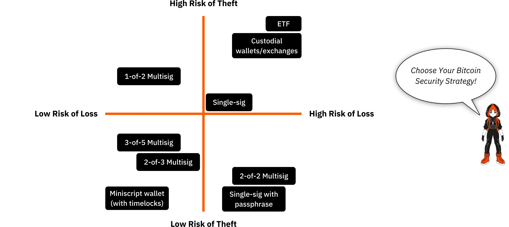
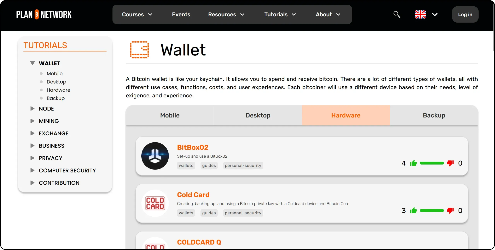
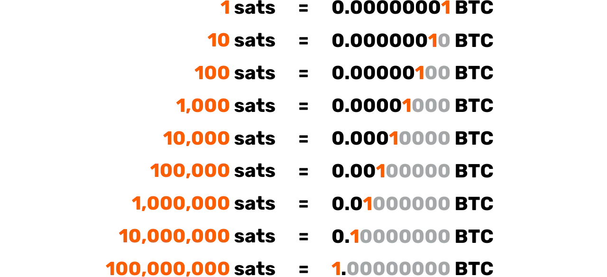
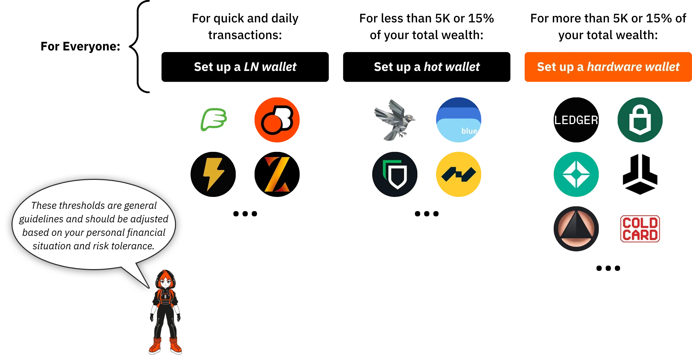

# 邁向第一枚比特幣之旅

Bitcoin 生態系統正在經歷前所未有的壯觀發展。由 Satoshi Nakamoto 的發明所帶動的技術、經濟和社會變革正在與日俱增，並逐漸打開通往新世界的大門，您現在可以充分利用這一優勢。

潛入 Bitcoin 兔子洞是一次令人興奮的智力冒險，它會激發您的批判性思考，並挑戰您的許多信念。這個探索不僅能讓您深入瞭解 Bitcoin 的運作原理，還能讓您有真正的機會奪回您的個人自由、保護您的隱私，並實現真正的財務主權。

為了有效地引導您完成這個旅程，我創造了這個完全免費的課程。在這裡，重點完全放在 Bitcoin。沒有不相干的討論，也沒有提及其他加密貨幣，只有清楚、精確、直接的內容。

本課程的設計可讓您完全掌控學習方式，讓您以自己的步調探索 Bitcoin，遵循最符合您興趣和目標的路徑。

+++
# 簡介

<partId>008c49b7-5e17-5973-87f2-ba28429b2697</partId>

## 課程總覽

<chapterId>bfc96999-0ee1-5c41-8297-1b629f50cffc</chapterId>

歡迎來到 BTC102！如果您已經完成了 BTC101，您已經探索了 Bitcoin 這項革命性技術背後的關鍵理論概念。現在，透過 BTC102，是時候將知識付諸於行動了。本課程旨在幫助您逐步建立個人的 Bitcoin 計劃。

在接下來的章節中，我們將引導您完成實際步驟，**獲得您的第一枚 bitcoins**，**妥善保護它們，並自信地踏出您進入這個快速成長的生態系統的第一步。

https://planb.network/courses/2b7dc507-81e3-4b70-88e6-41ed44239966

雖然 Bitcoin 已經存在超過 16 年，但這個產業仍然年輕、充滿活力，並且深深植根於自由之中。它的底層通訊協定是完全分散的，不受任何中央機關的控制，讓生態系統以自然有機的方式成長。

雖然這種自由助長了令人難以置信的創新與機會浪潮，但同時也帶來了某些風險，包括詐騙、常見錯誤和陷阱，而這些往往都是由於知識不足所造成的。本課程的主要目標是幫助您自信、安全地瀏覽這個新的生態系統。

為了達到這個目標，BTC102 課程分為幾個部分，每個部分都著重於您與 Bitcoin 之旅的一個關鍵方面：

第一部分 「瞭解 Bitcoin 的先決條件 」有效地讓您為未來的道路做好準備。您將學習識別 Bitcoin 生態系統中可能存在的與詐騙和財務欺詐相關的主要陷阱。接著我們將介紹線上安全的基本知識。

最後，我會給您一些專為初學者設計的實用貼士，幫助您避免初次使用 Bitcoin 時常見的錯誤。

第二部分 「瞭解您將面臨的問題 」將加深您對 Bitcoin 的整體瞭解。我們首先會進行回顧，以確保您完全瞭解基本概念。

接著，我們將從技術、經濟和社會角度解釋 Bitcoin 為何具有根本性的重要性，強化您對其價值的信念。您也將探索 Bitcoin 產業的整體：其主要參與者、組織以及多年來的演變。最後，我們將介紹 Bitcoin 生態系統的分層架構，這是了解此系統如何在不影響其核心協定完整性的情況下持續創新的重要概念。

第三部分「設定您的計畫」，著重於您個人對 Bitcoin 的做法。我們會從四個主要類別開始幫助您定義您的使用者設定檔：

- hodler*，專注於長期持有 Bitcoin ；
- 堆疊者*，他會有規律、有條理地購買；
- 使用者*，每天優先使用 Bitcoin；
- 最後，*妄想狂*想要最高的安全性，以有效保護他的資產和隱私。

我們將指導您實施符合您個人特徵的策略，並協助您實現個人目標。

最後，第四部分「保護您的繼承人和財富」涵蓋了一個經常被忽視的重要主題：如何確保您的 Bitcoin 在發生意外情況時能傳遞給您所愛的人。您將學習如何建立和設定 Bitcoin 繼承計畫，確保您的財富在有生之年仍能得以保存。

本課程結束時，您將掌握所有實用工具，自信地瀏覽 Bitcoin 生態系統，並成為最進階的使用者之一！

準備好開始您的 Bitcoin 世界之旅了嗎？開始吧

# 瞭解 Bitcoin 的先決條件

<partId>4481fc4b-0f83-489e-ad07-81517c5d6bad</partId>

## 詐騙和財務欺詐

<chapterId>8af2948b-2ab5-54c4-862c-3414b8a285a2</chapterId>

Bitcoin 的生態系統及其周圍環境仍相對較新，而且依國家而定，監管鬆散。雖然這種自由度帶來了廣大的機會，但也為金融詐騙、騙局和各種形式的操縱創造了肥沃的土壤。這就是第一章如此重要的原因：了解常見的陷阱將幫助您避免這些陷阱。您的財務安全是重中之重，因為糟糕的經驗不僅會影響您，還會影響整個 Bitcoin 社群。

### Bitcoin vs Cryptos：了解差異

在進一步討論之前，我們必須清楚區分兩個根本不同的世界：

- Bitcoin 生態系統**以健全貨幣的理念為中心，建立在強大的分散性、長期彈性、隱私權和個人主權之上。自 2009 年推出以來，Bitcoin 一直在全球致力於開發的社群支持下，可靠且安全地運作。這並不是曇花一現的趨勢，而是一個穩定且完善的協定，旨在長期保值。

- 另一方面，加密貨幣產業**的規模要大得多，包括數以萬計的不同專案，每個專案都有自己的代幣。這個領域通常是由快速創新、炒作和短期金融投機所驅動。儘管有大膽的承諾和華麗的行銷，但許多這些專案都是集中式的、不太安全，而且無法提供太多真正的價值。

如果您想更好地瞭解 Bitcoin 從何而來，以及 Bitcoin 與其他專案的真正不同之處，我建議您稍後查閱關於 Bitcoin 歷史的免費後續課程：

https://planb.network/courses/a51c7ceb-e079-4ac3-bf69-6700b985a082

如您所知，Plan ₿ Network 平台專門用於 Bitcoin。然而，了解與其他加密貨幣的區別將有助於您避免與無用的，有時甚至是欺詐的項目相關的陷阱。

### 應避免的主要詐騙

以下是您在旅途中可能會遇到的最常見詐騙：

#### 金字塔計劃和龐氏計劃

這些都是加密世界中最常見的騙局。在龐氏騙局中，早期參與者使用新參與者的資金獲得報酬，而不是從任何真正的投資或產品中獲得報酬。沒有任何實際價值被創造出來。只有不斷有新的人加入，這個系統才能運作。一旦新參與者的流量減緩，整個計劃就會崩潰。

這些騙局通常以 ：

- 不切實際的保證回報承諾（例如 20% 的保證回報）；
- 嘗試提取您的投資資金時出現延誤或困難；
- 招募新會員以保持系統運作的強大誘因；
- 承諾回報的真正來源完全缺乏透明度。

最終，所有的金字塔和龐氏騙局都注定會失敗。它們的根本弱點在於不斷需要引入新的投資者來支付回報給早期的參與者。隨著時間的推移，這種需求在數學上是不可能持續的，因為隨著系統的成長，所需的新參與者數量會呈指數級增加。一旦達到臨界點，參與者開始懷疑，信任消失，整個金字塔就會崩塌。在這個階段，最後加入的人通常是資訊最不發達的人，他們會失去全部的投資，而且無法收回，而組織者或早期投資者通常已經撤出資金，離開這個系統。

在加密貨幣世界中，龐氏騙局有許多形式，通常是為了在技術或金融面具下掩蓋其欺詐性質。這些騙局可能以新代幣發售或首次代幣發售 (ICO) 的形式出現，即向公眾出售新加密貨幣的集資活動。在「Blockchain」、「智慧合約」或「staking」等技術名詞的背後，有些專案其實隱藏著複雜的金字塔計畫。其他項目則聲稱可提供高回報，方法是將有問題的加密資產與完全依賴新投資者不斷湧入的補償系統結合。

最近，龐氏騙局也蔓延到分散式金融 (DeFi) 的世界。雖然 DeFi 的目的是在沒有中介的情況下提供金融服務，但有些專案卻利用 DeFi 為其騙局披上虛假的合法外衣。某些 DeFi 平台承諾，只要將加密貨幣存入自動化協議，就能獲得 Exchange 的高額保證回報。這些吸引人的承諾通常有不透明且無法驗證的機制作為後盾，並有專門為騙局製造的代幣。實際上，這些系統沒有可持續的商業模式 - 回報只是從新使用者的資金中支付，就像傳統的龐氏騙局一樣。當信任開始流失或新參與者湧入速度減緩時，這些系統就會不可避免地崩潰，導致毫無戒心的投資者蒙受重大損失。

請注意，本課程的內容僅供教育之用，不應被詮釋為財務建議。您的財務安全取決於您能否對自己所做的每個財務決定保持謹慎、懷疑和充分知情。

最好的保護方法就是經常問這個簡單的問題：承諾的回報究竟從何而來？如果答案不清楚，請立即離開。

#### 抽水與傾倒

這類騙局涉及透過協調的行銷活動（通常由一群投資者主導），人為地抬高某項資產（通常是低流動性的加密代幣）的價格。典型的 Pump & Dump 計劃遵循這種模式：

- 一群內部人士或有影響力的人物悄悄地累積大量目標資產。
- 然後，他們推出積極的促銷活動來炒作 generate 並提高價格。
- 一般大眾在 FOMO（害怕錯過）的驅動下，開始大量購買該資產，將價格推得更高。
- 在炒作的高峰期，內幕人士會一下子拋售他們所持有的股票。
- 價格崩盤，讓後來者損失慘重。

值得注意的是，Pump & Dump 策略在許多國家都是非法的，被認為是一種市場操縱。儘管如此，這類計劃仍持續蓬勃發展，尤其是在監管仍在跟上的加密貨幣領域。

對於 Telegram、Discord 或其他社交媒體頻道等平台上的私人「訊號」群組，請格外小心。這些群組通常是由有影響力的人或自稱的專家所經營，其中有些人甚至收取入會費。雖然這些群組宣稱提供獨家投資機會，但實際情況卻是一面倒：只有組織者獲利，而大多數參與者最終都血本無歸。

誠然，有些參與者可能會從這類操縱市場的行為中暫時獲利，但他們的成功通常只靠運氣和完美的時機。長期而言，這些騙局是無法持續的。它們需要持續的高風險參與、重複參與騙人的圈套，而這些圈套最終難免崩潰。

更糟糕的是，它們助長了一種危險的錯覺：認為不了解金融系統的實際運作方式，就可以輕鬆快速地賺錢。這種心態不僅讓個人面臨風險，也損害了整個加密貨幣生態系統的可信度。

基於所有這些原因，最好的策略是堅持認真、深思熟慮的投資方式，這種方式以財務教育、對基本面的扎實瞭解以及長期眼光為基礎。

透過耐心地建立您的知識，您就不會那麼容易受到情緒操控和不切實際的承諾所影響，也能更好地避免可能導致實際損失的財務陷阱。

#### 捐款、彩票和虛假贈品詐騙

這類型的騙局承諾，只要您先寄一小筆錢，就可以免費獲得 Bitcoin 或 Exchange 的其他獎勵。請務必記住：任何合法的個人或組織都不會要求您先寄加密貨幣，並承諾會寄給您更多的回報。

詐騙者經常假冒知名公眾人物（如 Elon Musk 或其他名人）透過社交媒體引誘受害者。在與帳戶和網站接觸之前，請務必仔細檢查其合法性，而且切勿相信看起來過於慷慨或好得不像真的優惠。

有時，這些騙局以 「預付費用 」的形式出現。騙徒承諾會給您獎品或獎勵（金錢、產品或服務），但會先要求您支付費用，據說是用來支付運費、稅金或交易成本等。一旦支付了費用，騙子就消失了，而承諾的獎品從未到達。

#### 提供糞幣和加密貨幣

集中式加密貨幣專案有時會提供免費代幣（"*airdrops*"）來吸引使用者。這些代幣通常幾乎沒有實際價值，主要用來製造受歡迎的假象或助長投機。對於這類促銷優惠要格外謹慎；它們通常是行銷陷阱，而非真正的機會。

#### 身份盜用和網路釣魚

攻擊者通常使用虛假網站、社交媒體帳戶或欺騙性電子郵件試圖竊取您的資金。這些騙局可能透過任何通訊管道：電子郵件、社交網路、電話，甚至是傳統郵件...

在按一下連結或採取任何行動之前，請務必仔細檢查寄件者的身份。如有疑問，請手動造訪網站，而不要使用提供的連結。最重要的是，切勿與任何人分享您的私人密碼匙或密碼。

#### Bitcoin 硬叉

多年來，Bitcoin 經歷了數次 *Hard 分叉*，導致原始加密貨幣的替代版本產生。簡單來說，*Hard Fork* 是網路的分裂，導致兩個獨立的區塊鏈，兩者在分裂之前共享相同的歷史。當部分開發者社群或更廣泛的 Bitcoin 生態系統想要對原始通訊協定進行重大變更，但無法達成廣泛共識時，通常會發生這些分叉。他們不會放棄自己的想法，而是決定推出一個新版本的 Bitcoin（改變規則），希望使用者和礦工選擇跟隨他們的 Fork。

並非所有的 *Hard fork* 都是詐欺，有些是因為社群內的技術或意識形態分歧所造成的。然而，有些則是受到商業利益或甚至不誠實的動機所驅使。這些硬分叉最著名的例子是 **Bitcoin Cash (BCH)** 和 **Bitcoin Satoshi Vision (BSV)**。這些替代貨幣分別於 2017 年和 2018 年推出，通常聲稱是原始 Bitcoin 的「更好版本」。它們宣揚的假定優勢包括交易費用更低，或因區塊大小增加而交易速度更快。然而，這些技術上的改變在安全性、去中心化和穩健性方面帶來了顯著的取捨；Elements 可能與 Bitcoin 的基本原則相衝突。

除了技術上的差異之外，這些另類貨幣經常利用混淆來吸引不知情的投資者。它們可能會使用行銷策略，故意誤導新手，讓他們以為自己購買的是真正的 Bitcoin (BTC)。

為了避免掉入這個陷阱，請務必確認您所購買的貨幣。原始 Bitcoin 使用縮寫 **BTC**，而 Bitcoin Cash 及其衍生產品則使用不同的縮寫，例如 BCH 或 BSV。

#### 不誠實的有影響力人士和虛假的大師

隨著加密貨幣獲得主流關注，社交媒體上出現了大量有影響力的人士、自稱專家的人以及所謂的「*加密大師*」。雖然少數人可能提供真正的教育性見解，但許多人卻利用他們的知名度來推廣可疑的專案或危險的風險（有時甚至是徹頭徹尾的欺詐）交易策略。這些人的動機通常是基於個人財務利益，通常會因為推廣某些代幣或平台而直接或間接收取報酬。

這些有影響力的人通常依賴行之有效的策略來吸引初學者：他們展示令人印象深刻的財務業績 (通常是虛假或無法驗證的)、炫耀奢華的生活方式作為他們成功的證明，並推廣「奇蹟」的投資策略。他們的目標是引發 FOMO（錯過的恐懼），促使觀眾做出衝動的決定和不顧一切的投資。

重要的是要瞭解，這些人士提供的大多數「免費」建議絕非真正的免費。在慷慨的表象背後，往往隱藏著精心策劃的策略，引導人們購買有問題的資產。即使有些有影響力的人是誠實的，要複製他們的結果也幾乎是不可能的；他們的成功往往取決於特定的時機、內幕知識或獨特的情況，而這些是您無法獲得的。

有些有影響力的人可能會邀請您加入付費的私人群組，他們聲稱在群組中會分享獨家交易信號或內幕提示，承諾快速輕鬆獲利。實際上，這些群組主要讓組織者自己受益。他們通常利用追隨者作為流動資金的來源，實質上是為了個人利益而卸載資產。訂閱者通常最後會損失金錢，因為他們無法像策劃交易的內幕人士一樣迅速作出反應（請參閱 Pump & Dump 計劃的章節）。

鑑於這個現實，以下是一些可以避免掉入不誠實的影響者所設定陷阱的好習慣：

- 對於任何加密貨幣投資建議都要非常謹慎。

一個值得信賴、知識豐富的人絕對不會在不鼓勵您自己先做研究的情況下，向您施壓讓您購買加密貨幣。

- 付費的交易或投資課程並不總是品質的指標。

許多這些課程都在宣傳高風險或過度簡單化的策略；通常這些資訊您都可以在網路上免費找到。

- 沒有一種方法可以保證複製某人的交易並獲得相同的結果**。

每種投資策略都取決於個人背景、時機、知識以及其他無法完全複製的因素。

- 尤其要提防那些聽起來好得不像真的建議**。

不切實際的承諾或保證利潤幾乎總是操縱的跡象。請記住：僅僅因為某人自信滿滿地說了某句話，並不代表它是真實的。

請永遠記住，您在 Bitcoin 或更廣泛的加密生態系統中遇到的每個人都有其個人目的；無論是直接說明還是隱藏在字裡行間。沒有純粹中立的資訊。即使是 BTC102 這門課程，也有一個明確的目標：*促進對 Bitcoin 的更好理解。

這就是為什麼保持對您所消費的每篇內容背後真正動機的瞭解是非常重要的。永遠不要忘記網際網路的金科玉律：

*如果產品或服務看似免費，您很可能就是產品*。

歸根結柢，您最好的防禦方法就是個人教育、健康的懷疑態度，以及最重要的，自己驗證事實的習慣。

### 如何避免詐騙

**為了確保線上安全，尤其是在加密世界中，請牢記以下重要原則：**

- 切勿盲目信任：「*不要信任，請驗證*」 ；
- 對保證或異常高的回報持懷疑態度；
- 切勿與任何人分享您的私人密碼匙；
- 請勿傳送 Bitcoin (或任何密碼) 到未知的位址；
- 如果有疑問，請暫停。在採取行動之前，請先退後思考。FOMO 是您最大的敵人；
- 避免付費交易團體或社群做出不切實際的承諾；
- 大多數的贈品或線上的「免費」抽獎都是騙局或被嚴重操縱的；
- 長期來說，學習總比賭博獲益更多。

保護自己免受詐騙是保護您資產的關鍵第一步，但這還不夠。維持良好的數位衛生同樣重要。因此，在下一章中，我們將探討如何加強您的線上安全性，以及在數位世界中保護自己所應採取的最佳作法。

## 線上安全

<chapterId>f0873bf2-6a6f-5485-bb7a-d84be14f404d</chapterId>

當您開始使用 Bitcoin 時，您會很快意識到基本的網路安全並非可有可无，而是不可或缺。詐騙和欺詐只是冰山一角。意外的資料遺失、惡意軟體和外洩的密碼也可能造成同樣的破壞，尤其是當您要管理自己的鑰匙時。

本章將介紹一些簡單實用的步驟，以提升您的數位衛生，並在空間中保護自己。

如果您想要深入瞭解，Plan ₿ Network 的 SEC101 課程提供專為 Bitcoin 使用者設計的網路安全策略的全面細分。

https://planb.network/courses/99c46148-7080-4915-a7e0-9df0e145cd47

### 網路安全的重要性

Bitcoin 賦予您直接持有資金的權力（無需銀行），無需中介。但這種金融主權也帶來了嚴重的責任：如果您的 BTC 因安全漏洞而被盜，就沒有辦法逆轉交易。不像傳統的銀行，沒有服務台、沒有詐騙賠償，也沒有保險可以保釋您。

除此之外，Bitcoin 的財務價值使其成為高價值目標。黑客若入侵您的 Wallet，可立即將您的資金轉移到他們控制的 Address（無問題，也無法取回）。

### 乾淨、最新的電腦

個人安全中最容易被忽略的一環就是保持作業系統和軟體的更新。許多更新會修補已知的漏洞，否則這些漏洞可能會被攻擊者利用。雖然有些人擔心效能問題而避免更新，但真正的風險在於執行駭客已經知道如何破解的過時軟體。

此外，強烈建議使用可靠的防毒軟體。在 Windows 上，內建的 Windows Defender 一般就足以滿足大多數使用者的需求。如果您偏好額外的功能或安心，也可以選擇 Kaspersky 等商用選項。在 macOS 上，惡意軟體威脅歷來較不常見**，但並非不存在**，因此保持謹慎仍是明智之舉。

除了系統更新和防毒保護之外，還要格外警惕從不良網站或所謂「通用」下載門戶下載軟體。當您需要工具或應用程式時，請務必直接前往官方來源；這可大幅降低安裝偽裝為合法軟體的惡意軟體的風險。

另一個明智的習慣是，在您的電腦上安裝任何軟體之前，先驗證其真實性和完整性。如果您不確定如何進行驗證，別擔心，我們有專門的教學教導您：

https://planb.network/tutorials/computer-security/data/integrity-authenticity-21d0420a-be02-4663-94a3-8d487f23becc

最後，定期備份重要資料。外接式 Hard 硬碟機或 SSD 是備份檔案的可靠選擇，以防突然故障、駭客入侵或意外刪除。您稍後會感謝自己。

如果您偏好雲端解決方案，請考慮使用 Proton Drive 之類的安全服務。只要確保您選擇的任何選項都尊重您的隱私權，並提供強大的加密功能即可。

https://planb.network/tutorials/computer-security/data/proton-drive-03cbe49f-6ddc-491f-8786-bc20d98ebb16

廣泛推薦的備份策略是「3-2-1 法則」。其目的是保護您的資料免於意外遺失、網路攻擊甚至自然災害。

想法很簡單：

- 保存 ** 至少 3 份**您的重要資料、
- 儲存於 ** 至少 2 種不同類型的媒體**（例如，外接式 Hard 硬碟機和雲端儲存）、
- 並確保 ** 其中一份儲存於異地**（與您的主要位置實體分離）。

此方法提供強大的彈性，即使發生嚴重問題，也能確保您的資料存活。

### ID 噩夢的解決方案

人們被駭客入侵的最大原因之一就是使用弱密碼。許多使用者仍然在多個帳號中重複使用相同的密碼，或是選擇容易被猜中的變體。密碼管理器是這個問題的完美解決方案。

密碼管理器可讓您

- 將您所有的密碼安全地儲存**在加密的儲存庫中
- generate 會自動為每個帳號設定長、複雜且獨特的密碼**
- 只需使用一個主密碼**，即可安全存取所有內容

有了密碼管理器，您再也不必點選「忘記密碼」或依賴薄弱、重複使用的憑證。此外，大多數密碼管理器都能在您的裝置（桌上型電腦、手機、平板電腦）間無縫同步，甚至還能自動填寫登入表格，讓安全存取變得輕鬆又有效率。

市面上有許多密碼管理器，但我可以根據您的需求推薦兩個可靠的選擇。如果您正在尋找易於使用、可在多種裝置間無縫同步的產品，Bitwarden 是一個絕佳的選擇：

https://planb.network/tutorials/computer-security/authentication/bitwarden-0532f569-fb00-4fad-acba-2fcb1bf05de9

如果您寧願將所有內容保存在自己的本機裝置上，KeePass 是個不錯的選擇：

https://planb.network/tutorials/computer-security/authentication/keepass-f8073bb7-5b4a-4664-9246-228e307be246

### 2FA: 雙重保護

在 Bitcoin，您就是自己的銀行。這表示您也是自己的安全團隊。即使擁有強大的密碼，也不可能做到零風險，因此啟用雙重因素驗證 (2FA) 是非常重要的。

2FA 要求使用 Google Authenticator 或 Authy 等應用程式生成基於時間的一次性代碼（通常為 6 位數），從而增加了第二重保護。因此，即使有人成功取得您的密碼，但如果無法實體存取您的手機，他們仍然無法存取您的帳戶。

https://planb.network/tutorials/computer-security/authentication/authy-a76ab26b-71b0-473c-aa7c-c49153705eb7

當您啟用 2FA 時，請務必將應用程式的復原密碼保存在安全的地方。如果您遺失或更換手機，這可讓您恢復密碼。雖然以 SMS 或電子郵件為基礎的 2FA 聊勝於無，但其安全性卻低得多。SIM 對換攻擊（即有人控制您的電話號碼）可以輕易繞過這種保護。

對於想要更進一步提升安全性的人，YubiKey 等實體鑰匙可提供更高層級的保護。

https://planb.network/tutorials/computer-security/authentication/security-key-61438267-74db-4f1a-87e4-97c8e673533e

### 保護您的隱私

隱私權與網路安全息息相關：您可隨意存取的資訊越多，您就越有可能成為目標。

**VPN**（*虛擬私人網路*）是一個簡單而有效的步驟，可以遮蔽您的 IP Address，並加密您的網路流量。雖然它不會讓您完全隱形（因為 VPN 供應商仍可看到您的活動），但它確實會讓任何試圖監視您或追蹤您瀏覽習慣的人更難下手。

關鍵在於選擇一個值得信賴的 VPN 供應商：

- 不需要您的個人資訊
- 允許透過 BTC 付款
- 擁有嚴格的無記錄政策

我們在 Plan ₿ Network 上有幾個教學，可以引導您輕鬆設定 VPN。我特別推薦 IVPN 或 Mullvad：

https://planb.network/tutorials/computer-security/communication/ivpn-5a0cd5df-29f1-4382-a817-975a96646e68

https://planb.network/tutorials/computer-security/communication/mullvad-968ec5f5-b3f0-4d23-a9e0-c07a3e85aaa8

保護您線上隱私的基本步驟還包括

- 使用**加密訊息平台**，例如 Signal、SimpleX 或 Session；
- 使用注重隱私的瀏覽器，如 Firefox、Brave 或 Tor（用於增強匿名性）；

https://planb.network/tutorials/computer-security/communication/tor-browser-a847e83c-31ef-4439-9eac-742b255129bb

- 使用**安全信箱**，例如 ProtonMail；

https://planb.network/tutorials/computer-security/communication/proton-mail-c3b010ce-254d-4546-b382-19ab9261c6a2

- 使用 Bitlocker (Windows) 或 VeraCrypt (適用於多平台) 等工具加密**您的檔案。

https://planb.network/tutorials/computer-security/data/veracrypt-d5ed4c83-7c1c-4181-95ea-963fdf2d83c5

### 循序漸進

網路安全看起來是一項龐大的工程，初學者很容易因為它看起來太複雜而不知所措並放棄。訣竅在於循序漸進。從簡單的事情開始，例如安裝密碼管理器。給自己幾個星期的時間去適應它，然後再進入下一步：例如在您的一個帳戶上啟用 2FA。

當您對這些工具越來越有信心時，您就可以加入更進階的作法，例如使用第二個電子郵件、改用 ProtonMail、設定 VPN 或在必要時使用 Tor 瀏覽。

當您深入探索 Bitcoin 的世界時，您會發現風險會隨著 Wallet 價值的增加而增加。建立穩固的安全習慣、保護您的隱私、設定正確的工具，不僅能讓您安心，也能強化 Bitcoin 所代表的主權。

簡而言之：不要低估網路安全，花些時間建立基本防護，並記得一致性是關鍵。如果沒有良好的數位衛生，即使是最好的工具也幫不了您什麼。

此外，請務必在 Plan ₿ Network 上查看 [我們的電腦安全教學](https://planb.network/tutorials/computer-security)。

在下一章中，我將分享更多的技巧，幫助您信心十足地開始 Bitcoin 之旅；並避開許多可能讓新手措手不及的陷阱。

## 給新人的提示

<chapterId>33134b3f-92c1-5185-afb6-88599e47e801</chapterId>

進入 Bitcoin 可能會令人興奮，但同時也有相當的風險。加密貨幣的世界不同於其他任何世界；價格大幅波動、不熟悉的技術，以及因簡單錯誤或投資選擇不當而永久損失資金的可能性，都是新使用者應該注意的陷阱。

在本章中，我將與大家分享一些實用的建議和一般指導，適合任何正在邁出第一步的人，尤其是首次購買或探索更廣闊的金融投資世界的人。

以下是我們將一併討論的重點：

- 提防**屎幣**和其他無用的加密貨幣；
- 只投資您能承受損失的**金錢；
- 瞭解**交易**與**投資**之間的差異；
- 注意投資的**稅務影響；
- 小心保護您的**恢復詞組**；
- 保持謙虛，並保持**低調**（謹慎是安全的一部分）；
- 長期考量**、放大範圍並耐心等待（把它當成一場馬拉松，而不是短跑）。

### 應避免的常見錯誤

Bitcoin 對每個人都開放，但這並不表示您應該在毫無準備的情況下貿然加入。以下是一些新手常犯的錯誤：

**技術錯誤：**

- 遺失您的 seed 短語：** 您的恢復短語（通常為 12 或 24 個字）是在您的 Wallet 發生事故時存取您的 Bitcoin 的唯一方法。如果遺失，您的資金將永久消失；
- 將您的比特幣存放在第三方平台上：** 如果您的比特幣存放在集中式平台上，您並不真正擁有它們。您會面臨黑客入侵、平台故障甚至資金被凍結等風險；
- 忽視隱私權：** 保護您的隱私權是確保資產安全的核心部分。公開透露您持有多少 Bitcoin 可能會讓您成為眾矢之的；
- 線上安全性不足：** 未能透過基本的保護措施 (例如更新、強大的密碼或 2FA)來保護您的裝置，讓您很容易成為攻擊者的目標；這可能會讓您付出一切代價。

**財務錯誤：**

- 投資超過您能承受的損失**：切勿負債或將您的房租錢投入 Bitcoin。您的基本財務穩定應永遠放在第一位。

- 不知道交易與投資的差異**：交易需要時間、技巧和嚴謹的情緒紀律。長期投資則更適合初學者。

- 忘記稅務**：每個國家對於加密貨幣都有自己的稅務規定。忽視這些規定可能會在日後帶來痛苦的意外。

- 陷入 FOMO**：因為害怕錯過而衝動地購買，通常會導致錯誤的時機和錯誤的決定。耐心是您最好的盟友。

### 定義投資策略

在購買您的第一個 Satoshi 之前，了解為什麼要投資 Bitcoin 以及如何投資是至關重要的。這意味著要根據您的個人情況和長期目標制定明確的財務計劃。

首先要精確地定義您的**預算。不要隨便選一個數字。花時間計算您的每月收入，減去固定支出（如房租、貸款、稅金、水電費），以及您的日常生活费用（食物、交通、休閒等）。剩下來的就是您的儲蓄差額，您應該從這部分開始考慮投資。

以這種方式處理，可確保您不會將自己的財務狀況置於風險之中，尤其是在市場不景氣的情況下。深思熟慮的策略是長期抗風險能力的基礎。

一旦您的預算定義好，請考慮您想要的投資方式。其中一種最適合初學者且被廣泛推薦的方法是美元成本平均法 (DCA)，即定期（每週、每月等）買入固定數量的 Bitcoin。此策略有助於隨著時間的推移平滑您的平均入市價格，並減少價格波動對您情緒的影響。對大多數人來說，這是一種明智的方法，尤其是新手。

然後問自己我的時間範圍是多久？

您是否希望快速進出市場（交易）？還是您更傾向於長期持有 Bitcoin 數年（囤貨者）？如果您是倉儲者，您可能不太關心每日的價格波動，而更注重長期的安全性和自我保管。如果您是交易者，您會更容易受到短期市場噪音、較高風險，以及快速決策所帶來的壓力的影響。沒有放諸四海皆準的答案，但了解您自己的方法將有助於引導您的決策。

最重要的是，不要基於情緒或恐懼做出投資決定。事先設定策略，寫下來並堅持執行。

如果您仍不確定，**從學習開始。

花幾個小時探索 Bitcoin、查看 Plan ₿ Network 上的免費資源、閱讀幾本書、投進五歐元只是為了嘗試一下，並在網路上觀看一些高品質的內容。保持好奇心。您越是感到自在，就越容易重新檢視您的策略、調整您的方法，並自信地向前邁進。

### 瞭解 BTC 的波動性

Bitcoin 以價格大幅波動而聞名。在短短幾天內，10%、20% 甚至 50% 的波動並不稀奇。對於新手來說，這種波動可能會令人迷失方向。在牛市時很容易被炒作，在跌市時也很容易感到恐慌；這兩種情況通常都會導致錯誤的決定，例如虧本賣出。

這就是為什麼在您投資之前，必須**了解並接受 Bitcoin 的波動性**。這些價格波動並非錯誤，而是仍在成長中的資產的特徵。如果突然的上漲和下挫讓您夜不能寐，或迫使您做出情緒化的決定，那麼很有可能您已經投入了超出您可承受風險範圍的資金。在這種情況下，請退一步，重新評估您的策略和風險承受能力。不要猶豫縮小您的倉位，直到您感到更安心為止。

最重要的是，切勿投資超過您能承受的損失。避免借錢購買 Bitcoin（特別是當您還在學習基礎知識時）。穩固的基礎始於有節制的步驟，而非魯莽的賭注。

### 管理和保護您的 Bitcoin Wallet

Bitcoin 最強大（但往往被低估）的功能之一是**自我託管**。使用自我託管的 Wallet，您只需對您的資金負責。這些錢包通常由 ** 復原詞組**（也稱為 seed 詞組）產生，一連 12 或 24 個詞組賦予您對 BTC 的完全存取權。如果您丟失了這個詞組（或者被其他人拿到了），您的比特幣就永遠消失了。 **沒有客戶支援。沒有重設按鈕。

這就是為什麼 Bitcoin 的金科玉律是：

「***不是您的鑰匙，也不是您的硬幣***」。如果您不能親自控制您的私人金鑰，您就不能真正擁有您的 Bitcoin。雖然交易所很方便（特別是在剛開始交易時），但它們會替您保管您的金鑰。這意味著如果平台被黑客入侵、凍結您的帳戶或破產，您的資金就會有風險。

為避免此風險，強烈建議設定您自己的 Wallet**，只有您才能存取復原碼。此語句應永遠以手寫方式記下，並儲存在**離線**的安全位置。有些使用者甚至**維護多個備份**，並儲存在不同的地理位置，以增加安全性。

**切勿將您的復原短語儲存於與網際網路連線的裝置或雲端**。

**一次黑客入侵或資料外洩可能導致無法逆轉的損失。

如果您已準備好使用 Ownership 的 Bitcoin，並想要深入瞭解保護復原短語的最佳作法，我強烈建議您查看這篇文章：

https://planb.network/tutorials/wallet/backup/backup-mnemonic-22c0ddfa-fb9f-4e3a-96f9-46e2a7954270

### 保密性和謹慎性

在現今的數位世界中，**謹慎常被忽視**；但這卻是保持安全的重要一環，尤其是在涉及 Bitcoin 時。您越是公開談論自己的財產，就越有可能成為騙子、網路罪犯，甚至更傳統的威脅（如勒索或敲詐）的目標。

世界各地發生了許多已知持有大量 BTC 的個人遭到綁架或襲擊的案件。

**避免吹噓您的 Bitcoin Stash**；無論是在社交媒體上，甚至是在隨意的談話中。洩露敏感的財務資訊沒有任何好處，而且風險確實存在。

將您的線上活動**分門別類也是明智之舉。舉例來說

- 使用獨立的電子郵件 Address 來處理任何與 Bitcoin 相關的事情，並與您的個人或工作帳戶區分開來。
- 小心釣魚嘗試、可疑連結和模仿可信平台的虛假網站。
- 保持警覺！謹慎和警覺往往是您最好的防禦。

如果您已準備好深入探討 Bitcoin 隱私權的主題，我們建議您繼續學習我們的第二年隱私權課程，在這裡您將學到更多進階技術來保護您的身份和活動安全：

https://planb.network/courses/65c138b0-4161-4958-bbe3-c12916bc959c

### 稅務影響

儘管是去中心化的貨幣，**Bitcoin 並不免除您所在國家的稅務法律和法規**。每個司法管轄區對於如何對加密貨幣的收益徵稅都有自己的方法。

在某些地方，利潤在出售時會被當作資本收益徵稅。其他地方可能會要求您申報每筆交易，有些地方則採用較不常見的規則，例如財富稅或社會貢獻。

在進行任何重大交易之前，強烈建議您諮詢稅務專業人士或查看政府的官方指南。預先花時間瞭解您的稅務義務，可以避免日後發生意想不到的問題（如罰款、審計或罰金），尤其是當您計劃進行大額銷售或投資組合重新分配時。

### 交易、投資與持有的差異

Bitcoin 常常被流行的錯誤觀念所包圍；其中最常見的一種觀念是它是透過交易快速致富的捷徑。但重要的是要了解交易、投資和持有之間的明顯差異，因為每種方法都有其本身的思維、技能和風險程度。

- 交易 :**

老實說，**您可能不該進行交易。

交易涉及短期投機（有時使用槓桿），目的是從 Bitcoin 的價格波動中獲利。雖然聽起來很吸引人，但成功的交易需要先進的技術知識（如圖表分析和風險管理）、情緒紀律以及對市場的持續關注。這是一項耗費心力和時間的工作，而 Hard 的事實是，**多數初學者都會因為低估了它的要求而虧損**。

正如沃倫巴菲特的名言：

「**如果你不願意持有一隻股票十年，那就別想持有它十分鐘**」。

Bitcoin 並不是一個快速致富的計劃。

- 投資：**

投資者從中長期的角度來看，購買 Bitcoin，相信其價值會隨著時間（幾個月、幾年甚至幾十年）的推移而增長。當然，風險仍然存在，因為 Bitcoin 的價格可能會大幅波動。但對大多數人（尤其是那些不想每天花數小時盯著圖表的人）來說，這種方法通常比較平靜，也比較實際。

- 保持 (HODL) :**

"HODL 「最初是 」hold "的錯字，後來迅速成為 Bitcoin 文化的一部分。如今，它已成為一種榮譽徽章。

Hodlers 從長計議，有時甚至長達十年以上。他們安全地儲存 Bitcoin 並靜心等待，因為他們對 Bitcoin 的長期潛力深信不疑。他們不會被每日的價格波動或熊市所嚇倒。他們的心態很簡單：累積、保值，然後靜觀其變。

|          | Trading | Investment | Holding |
| ---------------------- | ----------- | -------------- | --------------- |
| Leverage | Yes  | No | No |
| Timeframe | Short-term | Medium-term | Very long-term |
| Asset Type | Contracts | Actual BTC | Actual BTC |
| Risk Level | Very high | High | High |
| Difficulty | Very Hard | Hard | Hard |
| learning curve | Long learning curve | Long learning curve | Long learning curve |
| Potential Loss | UnLimited | Limited | Limited |
| Best For | A few experienced users | Most People | Long-term Believers |

### 持續學習

開始教育自己有關金錢、投資以及金融體系如何真正運作的知識，永遠都不會太早（或太晚）。您不需要成為專家或深入瞭解每個技術細節；擁有穩固、大局觀的瞭解就足以做出明智的決策，並避免被不符合您利益的金融產品誤導（通常由銀行或顧問推銷）。

Robert T. Kiyosaki 所著的《富爸爸，窮爸爸》（*Rich Dad, Poor Dad*）是一個很好的開始。這本書以其平易近人的風格和基礎課程而廣為人知，例如瞭解資產和負債之間的區別，以及為什麼財務教育是長期獨立的關鍵。

如果您已準備好深入瞭解，*The Investors Podcast* 等播客提供有關投資、市場和經濟原理的精闢討論。他們偶爾也會報導 Bitcoin，對於想了解 Bitcoin 如何融入更廣泛的金融環境的人來說，這是一個很好的下一步。

### 請牢記的黃金規則

總結來說，這裡有幾個永恆的原則，每個比特币玩家（尤其是初學者）都應該記住：

- 規則 n°1**：切勿投資超過您能承受的損失。Bitcoin 是一種不穩定的資產。不要冒著財務穩定的風險追逐收益。您的基本需求和安心應永遠放在第一位。
- 規則 n°2**：不要盲目跟隨炒作或相信神乎其神的建議。忽略趨勢和華麗的承諾。反之，請專注於做出明智、理性的決定。有疑問時，就先睡一覺；與您信任的人一起討論。與其倉促犯下代價高昂的錯誤，不如深思熟慮地慢慢前進。
- 規則 n°3**：制定計劃並堅持長期願景。

一致性、耐心和紀律會比短期的興奮帶領您走得更遠。不要以 「登月 」為目標，而要以可持續成長為目標。避免致命錯誤，讓小贏家隨著時間複合。

遵循這些原則，您將能夠更清晰、更安心地進行 Bitcoin 投資。是的，Bitcoin 不穩定，一開始可能會讓人害怕；但如果以謹慎、耐心和腳踏實地的心態來對待，它的潛力是無庸置疑的。花些時間建立您的知識，在需要時重新檢視您的策略，最重要的是，請記住：緩慢而穩定的進展永遠比因害怕或不耐煩而倉促行事來得好。

# 瞭解您的需求

<partId>a42355a3-9dd8-57ed-b590-32a333fe09ea</partId>

## 5 分鐘內完成 Bitcoin

<chapterId>ae122ad9-9b4d-5229-9038-e1b99d5cfc83</chapterId>

在本課程中，主要目標是引導您獲取和保護您的第一枚比特幣。但在進入實際步驟之前（如何購買 BTC、使用哪種錢包等等），重要的是退一步瞭解 Bitcoin 究竟是什麼。掌握 Bitcoin 的深層本質將幫助您瞭解為什麼數百萬人轉向這項技術，以及為什麼在將您的積蓄投入這種新的不穩定資產之前，瞭解其基本原理至關重要。

多年來，Bitcoin 已獲得全球貨幣網路的認可。它被稱為 「數位黃金」、「信任協定」，甚至是 「平行金融系統」。但這些名詞的真正意義是什麼？為了回答這個問題，我們將進一步了解 Bitcoin 的核心：它的起源故事、技術基礎、貨幣特性，以及它的潛在影響；不僅是對個人，而是對整個全球金融體系。

### 起源：源自長期探索的計畫

#### Cypherpunks 與銀行無法控制系統的發明

Bitcoin 並非一夜之間誕生。它是密碼學、電腦科學和貨幣理論數十年研究和實驗的成果。在 Bitcoin 於 2009 年推出之前，已有數個計畫（如 eCash、b-money、Bit Gold 和 RPOW）試圖創造數位貨幣。所有計畫都面臨相同的核心問題：如何在分散式系統中防止雙重花費，而不依賴中央機構。

這項挑戰直到 2008 年底仍未解決，當時有人以 Satoshi Nakamoto 的名義發表了 Bitcoin 白皮書。幾個月後，Bitcoin 的第一版開放原始碼軟體正式上線，推出了一個可以獨立於銀行或政府運作的系統。

該專案深受 Cypherpunk 精神的影響；這個由開發者和思想家組成的社群相信使用加密技術來保護個人線上自由。對他們來說，隱私和分散化不是技術上的偏好，而是意識形態上的必要。Bitcoin 是這些理想最成功的體現：一個任何人都可以使用、任何人都無法控制、所有人都可以驗證的點對點貨幣網路。

Cypherpunks 是一個由個人組成的非正式國際社群，他們主張使用密碼學來捍衛個人線上自由。他們堅信個人的隱私權，尤其是在政府監控和企業資料剝削日益嚴重的世界。

Cypherpunk 運動的根源可追溯至 1990 年代早期，當時一群密碼學家、程式設計師和自由主義者在矽谷的聚會中開始探索密碼學的政治意義。Tim May 是這個社群中最著名的人物之一，他在 1988 年撰寫了《加密無政府主義宣言》；這篇奠基性的文章概述了一個世界的願景，在這個世界中，加密將賦予個人權力，讓他們可以在政府和中央控制範圍之外運作。

1992 年，隨著 Cypherpunks 郵件論壇的成立，這項運動的一個重要里程碑也隨之誕生，在這個論壇上，有關隱私權和密碼學的想法、計畫和政治討論得以蓬勃發展。之後，在 1993 年，Eric Hughes 發表了 Cypherpunk 的宣言，一份簡短但有力的宣言清楚地表達了社群的使命與信念。

獨立於任何中央機關運作的數位貨幣 (如 Bitcoin)，其理念深深植根於 Cypherpunk 哲學。

#### 後金融危機時刻

Bitcoin 並非憑空出現。它是在一個非常特殊的時刻創造出來的 - 就在 2008 年全球金融危機之後。美國房市崩盤和次貸危機導致各大銀行倒閉，動搖了人們對整個金融體系的信任。

正是在這種充滿恐懼和不確定性的環境中，Bitcoin 誕生了。被稱為 Satoshi Nakamoto 的創造者在 Bitcoin Blockchain 的第一個區塊（即 Genesis 區塊）中包含了一個非常象徵性的信息。該訊息是：

> **"The Times 03/Jan/2009 Chancellor on brink of second bailout for banks "** 《泰晤士報》2009 年 1 月 3 日

這不僅僅是一個日期或技術說明；它是一個沉默但強烈的抗議。它顯示出 Bitcoin 的設計是完全不同的：一個不依存於銀行、救助或政府決策的金融體系。

許多人將此解讀為 Bitcoin 的目標：提供一種不需要中間人的價值轉移方式，並由明確的規則所控制，而非由中央銀行或政府所做的不明確決定。

為了加深您對 Bitcoin 淵源的認識，我們提供免費、全面且資料齊全的相關訓練課程：

https://planb.network/courses/a51c7ceb-e079-4ac3-bf69-6700b985a082

### 轉移價值的分散式網路

#### 點對點，沒有中央機構

Bitcoin 被定義為 「點對點電子現金系統」。這意味著任何人都可以使用適當的軟體（Bitcoin 節點）連接至網路，並直接與其他使用者互動，而無需依賴中央伺服器。這種去中心化的目標是防止任何單一實體（如銀行、政府或大型企業）控制、審查或停止系統。Bitcoin 在全球範圍內全天候運作，每個人都可以無條件使用。

簡單來說，Bitcoin 網路中的每個參與者（稱為「節點」）都有一份完整的交易 Ledger 副本，稱為 Blockchain。當有新的交易發生時，就會廣播到網路中。礦工隨後會確認這些交易，將它們組合成區塊，然後加到鏈的末端（因此稱為「Blockchain」）。

#### Blockchain：會計 Ledger

將 Blockchain 想像成巨型會計 Ledger，每一行都代表一筆交易。在傳統的銀行系統中，資料庫儲存在銀行的伺服器上，銀行可以隨時進行變更。另一方面，在 Bitcoin 中，***所有的變更都會在整個網路中進行驗證：一旦有新的交易區塊加入 Blockchain，之後幾乎不可能再更改。這種分散式驗證讓 Bitcoin 的 Ledger 變得安全且透明。

### 礦工和 Proof-of-Work 的作用

#### 塊是如何產生的：Mining

Mining 是電腦（或大型 Mining 場）貢獻**計算力**以保護 Bitcoin 交易歷史並創建新區塊的過程。礦工競爭解決數學謎題，具體而言，就是尋找部分 Hash 碰撞。這個過程需要大量的能源和資源。一旦 Miner 找到有效的解決方案，他們就會將區塊廣播給網路，網路會核實並接受該區塊為有效。

作為獎勵，Miner 會收到新創建的比特幣（稱為區塊補助）以及該區塊中包含的所有交易的交易費。

#### Halving：減少整體資助

為了確保 Bitcoin 的稀缺性，區塊補貼被設定為每 210,000 個區塊減半一次，大約每四年一次。這個事件被稱為 "Halving"。Bitcoin 推出時，礦工每個區塊賺取 50 BTC。在 2025 年，該獎勵已降至 3.125 BTC，並會隨著時間持續減少。

最終，大約在 2140 年左右，補貼將達到零，因為 Bitcoin 的 Supply 總量將達到 2,100 萬枚硬幣的上限。這種可預測的發行曲線模仿了黃金等實體商品的稀缺性；這也是 Bitcoin 常被稱為 **數位黃金的原因之一。

### Bitcoin 貨幣特性

#### 稀缺性與固定貨幣政策

Bitcoin 最強大的功能之一是其*可預測且不可變更的貨幣政策*。不像傳統的法定貨幣（如美元、歐元或日圓），中央銀行可以隨意印鈔（通常會導致通貨膨脹或經濟扭曲）。

比特幣永遠只有 2,100 萬個，而發行新比特幣的速度是網絡中每個人都預先知道的。

任何政府、機構或個人都不能單方面改變 Supply 上限或分配規則。要改變這些參數的唯一方法就是變更 Bitcoin 的協定；即使如此，也需要網路中大多數的經濟參與者達成共識。

這種內在的稀缺性，對於那些希望選擇避開不可預測的貨幣政策，或避免因通貨膨脹而逐漸削弱購買力的人來說，是一大吸引力。隨著時間的推移，這可能代表了金融思維的轉變，儲蓄在像 Bitcoin 這樣的通縮性資產中，會比依賴傳統的通脹性貨幣更具吸引力。

#### 可分割性和可及性

Bitcoin 最被低估的優點之一就是它的可分割性。每個 Bitcoin 可以分解成一億個單位，稱為 Satoshis（或簡稱 Sats）。這表示您不需要花費數萬歐元或美元就能入門；您只需購買數歐元的 Bitcoin，就能買到很小的零頭。

### 開放性與透明度

#### 所有人均可驗證的公開通訊協定

Bitcoin 以公開、**開放源碼**協定 (主要透過 [Bitcoin Core](https://github.com/Bitcoin/Bitcoin)) 執行。這表示其程式碼可供任何人自由檢查、稽核及改善。沒有隱藏的機制或封閉的系統；Bitcoin 運作的一切都是公開的。

這種程度的透明度讓引入後門或進行秘密變更變得難以置信。任何具備技術能力的人都可以執行節點、貢獻開發或建立相容的工具。在 Bitcoin 中，信任是透過程式碼和共識而非中央控制來贏得的。

這種透明度是人們信任 Bitcoin 通訊協定的主要原因之一；它可防止一小撮開發人員為了一己之利而操控網路。Bitcoin 的運作原則簡單但強大：如果您不同意建議的變更，您可以不更新您的軟體。在某些情況下，這不會造成任何干擾；您仍能與網路的其他部分保持同步。但在其他情況下，這可能會導致所謂的 Hard Fork，即網路一分為二，並產生新版本的 Bitcoin。這正是 Bitcoin (BTC) 和 Bitcoin Cash (BCH) 在 2017 年分裂的情況。

雖然這種治理方式可能會很緩慢，有時也會很混亂，但它也是一種優勢；它確保沒有單一實體能單方面取得控制權，幫助 Bitcoin 保持穩定、中立，並抵抗集權。

#### 個別驗證：節點

Bitcoin 允許任何人透過在自己的電腦或伺服器上執行「節點」來檢查 Blockchain 的準確性。這意味著下載 Bitcoin 核心軟體（或其他版本的 Bitcoin 協定），並驗證 2009 年以來的所有交易和區塊。一旦您的節點建立並同步，它就會成為 Blockchain 的完整複本，並協助支援網路。

儘管這種方式技術性較高，但它為要求最嚴格的使用者提供了選擇不信任第三方的能力。運行節點可確保使用者能參與共識過程，並保持不被監控的狀態，直接有助於網路的安全性與分散性。

### 使用個案

#### 彈性的跨境支付方式

由於其分散性，Bitcoin 全天候運作，不受國界或時區的影響。在缺乏傳統銀行基礎設施的地區，Bitcoin 常常被用來作為快速、低成本的收發資金解決方案，而無需依賴昂貴的中介。雖然交易費用會因網路壅塞情況而有所不同，但通常遠低於銀行收取的國際轉帳費用。此外，Lightning Network 等 Layer-2 解決方案可讓 Bitcoin 交易更快速、更便宜。

#### 價值儲存

由於其稀缺性（上限為 2,100 萬 BTC）和固有的彈性，Bitcoin 通常被視為一種長期儲蓄保障。雖然其價格在短期內會有波動，但 Bitcoin 自誕生以來，多年來一直呈現上升趨勢。一些投資者購買 BTC 的信念是，它可以作為一種價值儲存，尤其是在面臨通貨膨脹或金融危機時。

#### 財務自由與適應力的工具

除了投資之外，Bitcoin 也提供了一種保護金融主權的方式。在專制政權下的國家或面臨嚴苛貨幣限制的國家，擁有 Bitcoin Wallet（帶有私人鑰匙）提供了一種自由。只要持有者確保其復原短語，就沒有人可以阻止或沒收這些 BTC。

對於那些害怕審查或銀行帳戶被凍結的人來說，這種特性尤其具有吸引力。它也能引起飽受惡性通貨膨脹之苦的人民的共鳴，就像在委內瑞拉或辛巴威所見，持有 BTC 證實比持有快速貶值的當地貨幣更穩定。

### 任重道遠

Bitcoin 可被視為「從零到一」： 徹底打破既有的金融模式。有史以來第一次，所有人都能使用的全球貨幣網路，在沒有中央機關的情況下運作，實現抗檢查的私人交易。

儘管如此，Bitcoin 在存在十多年後，仍持續引發爭論與熱情。它的採用率越來越高，第二代 Layer 解決方案 (如 Lightning Network)也逐漸湧現，以提高交易速度並降低費用，全球各地的企業也在嘗試新的使用案例。Bitcoin 很可能會繼續影響支付系統，甚至影響我們未來數十年對金錢的看法。

如果您想進一步擴展您的知識，您可以參加有關 Plan ₿ Network 的 BTC101 課程，該課程對 Bitcoin 的技術和經濟基本面進行了更深入的探討。

https://planb.network/courses/2b7dc507-81e3-4b70-88e6-41ed44239966

在介紹完 Bitcoin 之後 (可能比 5 分鐘還要久一點！)，您現在可以更好地考慮購買和保護比特幣了。在接下來的課程章節中，我們會深入探討 Bitcoin 的意義、其產業運作，以及各層次的發展。接下來，在接下來的章節中，我們將討論如何設定您的個人計畫。

## Bitcoin 為何重要？

<chapterId>d4327ac4-9ff8-5192-b542-cb78c0bd0aa7</chapterId>

為什麼 Bitcoin 如此重要？這是本課程的核心問題。無論是與您的學習或投資策略有關，如果不清楚瞭解 Bitcoin 的意義，就有可能偏離您的計劃。我們的目標是始終牢記 Bitcoin 的基本原則，以確保您的策略與您的信念保持一致。

### 通用貨幣

巴拉克‧奧巴馬曾將 Bitcoin 稱為「您口袋裡的瑞士銀行」，這是有充分理由的。Bitcoin 為每個人提供相同的機會，不論他們是誰。無論您是青少年、總統、香港的抗議者，或是法國的「黃背心」，每個人都可以平等地使用相同的協議和工具：

- 建立免費且無限制的錢包（對於 Bitcoin，我們說的不是「帳戶」，而是「錢包」）。
- 隨時隨地寄錢給任何人。
- 無需身份證明或任何行政程序。
- 不論年齡、性別、宗教、國家或收入水平，人人皆可使用。
- 隱私和透明度可由您自行決定。
- 無中介或隱藏費用。
- Bitcoin 原生於網際網路，這表示任何能存取網路的人都能使用它。

Bitcoin 可被視為真正的「人民的貨幣」，是一種不依賴任何中央權威的替代貨幣系統，其基礎是永恆不變的規則而非任意的決定。它的開放性和可及性使其成為全球數十億人的潛在革命性工具，無論他們是被排除在傳統銀行體系之外，還是只是在尋找一個更具主權性的替代方案。

這帶給我們一個基本的、幾乎是哲學性的問題，將 Bitcoin 的愛好者分為兩種主要的世界觀。一邊，有些人將 Bitcoin 視為促進金融包容性的解決方案，讓數十億沒有銀行服務的個人終於能夠使用全球貨幣基礎建設。另一方面，有些人將 Bitcoin 視為一種金融解放工具，目的是為數十億已融入銀行體系，但希望擺脫對銀行體系的依賴，重新完全掌控自己的金錢的人們提供一條出路。這種思考值得我們注意，我們稍後會再詳細討論。

### 防止貨幣危機

幾個世紀以來，全世界都經歷過對人民造成毀滅性影響的貨幣危機。數十億人仍在承受管理不善的貨幣政策所帶來的後果，操控貨幣 Supply 和利率造成了系統性的失衡。這些危機並不是隨機事件，而是建立在干預及操縱貨幣與時間價值上的系統所造成的結果。

這些危機可以有許多不同的形式。例如，惡性通貨膨脹會逐漸摧毀人們的購買力，從而使貨幣貶值；這種情況在津巴布韋和委內瑞拉等國家都有發生。另一方面，嚴格的貨幣管制會限制資金的取得，剝奪個人的經濟自由，就像希臘和黎巴嫩的銀行限制一樣。

最後，當政府將其國家貨幣貶值時，就會逐漸侵蝕人們的儲蓄；對他們的財富造成無形但持續的損失。從許多方面來看，它就像是一種隱藏的稅收。只要貨幣政策仍然掌握在中央政府手中，這些循環就注定會重演。

Bitcoin 為這種長期貨幣不穩定的循環提出了大膽的替代方案。與國家發行的貨幣不同，Bitcoin 建立在無法改變、以數學為基礎的規則之上，這些規則由共識執行，而非由政府或中央銀行執行。它的發行量是可預測的，上限約為 2100 萬個硬幣，使其成為一種穩健的貨幣形式，可長期保持其價值。由於它可以抵制審查，任何人都可以儲存和轉移價值，而無需依賴機構。由於其可分割性和可攜性，它既方便又實用，是任何人在任何地方都可以使用的金融基礎設施。

**您知道嗎？** 在歷史上，全世界至少有 56 個有記錄的惡性通貨膨脹案例。在許多案例中，整個經濟體系崩潰，畢生積蓄化為烏有，數百萬人陷入赤貧。更糟糕的是，這些貨幣失效往往成為政治動亂的跳板；有時會導致專制政體，就像1920年代的德國和1970年代的智利一樣。

Hanke, S. H., & Krus, N. (2013)。 *世界超級膨脹*。In R. Parker & R. Whaples (Eds.), The Handbook of Major Events in Economic History.Routledge Publishing。取自 https://ssrn.com/abstract=2130109

法定貨幣的崩潰並非歷史的偶然，而是一種模式的重演。今天，Bitcoin 提供了一條出路：一個在政府控制的貨幣體系之外保護您財富的獨特機會。目前，問題不在於是否會發生另一次危機，而在於何時。有了 Bitcoin，您現在可以選擇脫離這些破壞性循環並選擇一個建立在透明度、可預測性和個人主權上的貨幣體系。

### 對於國家控制和不公義的回應

世界各地日益嚴重的經濟不平等一直是社會動盪和政治極端主義興起的沃土。歷史顯示，當貧富差距過大時，往往會導致緊張、危機，甚至是專制政權的崛起。面對這些風險，保護您的財務自由不僅是一種奢侈；對於任何想要維護自己的自主權和保障家庭未來的人而言，它都是一種必需品。

但在國家可以完全控制資產和交易的世界裡，有什麼真正的選擇可以保護您的儲蓄？

- 銀行帳戶**可能會在瞬間被凍結、被一項簡單的政府命令查封，或因過度的金錢限制而被榨乾。

- 黃金**儘管已經作為儲值工具使用了上千年，但它的分離方式為 Hard，不便於運輸，也不適合在緊急危機情況下使用。

- 現金**雖然匿名，但體積龐大、容易充公，而且會因為通貨膨脹而不斷貶值。

但 Bitcoin 不只是一個實用的工具。它也是**一種和平的抗議方式**；一種宣示獨立於以專制權力、集權和系統性不平等為基礎的金融體系的宣言。選擇 Bitcoin 代表拒絕操縱、貶值和監視。這是關於奪回您的**主權、保障您的未來，以及捍衛您控制自己財富的權利。

從這個角度來看，Bitcoin 不只是一項技術。它是自然法的工具，是個人維護其基本權利的方式，即使這些權利被國家法律所剝奪。它不是透過革命，而是透過法規，將權力交還給人民。

**你知道**嗎？Bitcoin 是假名，而非匿名。使用者可以建立 Wallet 位址而不透露真實身份，讓他們可以在傳統銀行系統之外收發資金。

然而，與普遍的看法相反，Bitcoin 並不能提供完全的匿名性。每筆交易都會記錄在公開的 Ledger（即 Blockchain）上，任何人都可以存取並驗證。雖然 Wallet 位址不與姓名綁定，但如果沒有遵循適當的隱私權實務，使用者的財務活動仍然可以被追蹤和分析。

### 貨幣與銀行腐敗的解決方案

中央銀行透過其擴張性貨幣政策，不斷侵蝕您的購買力。透過通貨膨脹和過度印鈔（通常被掩飾為量化寬鬆政策），他們不斷稀釋流通貨幣的價值。這就像一種無形的稅收，年復一年地減少那些以政府發行的貨幣儲蓄的人的財富。

一般人認為通貨膨脹是一種自然的經濟現象，但事實上，通貨膨脹是一種貨幣控制工具；一種讓一般民眾慢慢變得貧窮，卻讓持有金融資產的人受惠的工具。

如果您的財富不是以非貨幣性資產（如房地產、債券或股票）作為保證，您的儲蓄將不可避免地隨著時間而貶值。與此同時，那些有機會使用金融工具的人，他們的財富會持續增長，擴大經濟精英與社會其他階層之間的差距。

這不是制度上的缺陷，而是一種刻意的機制。中央銀行和政府利用它來人為地刺激經濟成長，並推動人們不斷消費和增加債務。

我們的現代金融體系建立在債務循環的基礎上；在這個體系中，借貸不僅受到鼓勵，而且幾乎無法避免。個人借貸以維持自己的生活方式，卻發現自己被困在一個系統中，他們必須向憑空製造錢的銀行償還利息。這並非偶然；這是一種結構設計，目的是讓金融機構受惠，而犧牲一般民眾的利益。

這個系統受到中央銀行的影響而腐敗，他們不受控制地操縱貨幣 Supply。 **Bitcoin是替代方案。**

與法定貨幣不同，Bitcoin 由共識執行的規則所規範。它的 Supply 是有上限的；現存的比特幣永遠不會超過 2,100 萬個 (事實上，由於發行結構的關係，數量會略少)。任何政府、中央銀行或單一的經濟行動者都無法改變這個上限。

這意味著 Bitcoin 是在可預測的貨幣框架下運作；在這個框架下，通貨膨脹不僅是透明的，而且一旦最終的 Bitcoin 開採完成，通貨膨脹就會完全縮減。

在過去，黃金是防止貨幣無節制擴張的制衡工具。但自 1971 年金本位制崩潰以來，沒有任何國家的貨幣（無論是美元、歐元或日圓）是由有形資產支持的。這種脫離讓中央銀行可以肆無忌憚地印鈔票，為數十年的激進貨幣擴張、一而再再而三的資產泡沫和一而再再而三的金融危機鋪路。

當您把錢存入銀行時，它就不再真正屬於您了。

大多數人都沒有意識到：您在銀行帳戶中持有的資金在技術上並非您的財產。從法律和實際的角度來看，這是您借給銀行的貸款；銀行可以自由地將其用於自己的營運和投資。

這個系統是建立在大眾對金融機構的盲目信任上，但卻存在著嚴重的風險：

- 如果您的銀行倒閉，您的錢就可能化為烏有。** 即使有存款保險計劃，歷史也顯示這些保證可能會在系統性危 機中失效。
- 如果您的銀行限制您存取資金，您可能無法提款或使用自己的資金**。這種情況已發生過很多次；在希臘、黎巴嫩和阿根廷的經濟崩潰期間，或是在加拿大卡車司機抗議等政治鎮壓期間。

Bitcoin 提供完全不同的模式；開放、中立、無腐敗。其規則以共識方式硬體編碼，並同等適用於所有網路參與者。

這就是核心原則的來源：

**「不是你的鑰匙，也不是你的GW -201」 **

如果您不能控制比特幣的私人密碼匙，那麼您就不能真正擁有它們。它們掌握在第三方手中，就像銀行中的法幣一樣。但如果您持有您的私人密碼匙，您就可以完全控制您的資金。任何機構、政府、權力機關都不能凍結、扣押或限制您的使用權。

這就是 Bitcoin 能夠有力地取代傳統金融體系的弱點和過度擴張的原因：貨幣主權。

### Bitcoin: 政治運動？

Bitcoin 重塑了個人與金融機構之間的權力平衡。它讓任何人都能完全掌控自己的錢，保護自己的儲蓄不受通貨膨脹的影響，並擺脫國家強加的貨幣限制。作為一個開放且無國界的系統，Bitcoin 提供了一個更公平的選擇；不論社會地位、國籍或出身，所有人都可以使用。

擁抱 Bitcoin 就是選擇健全的貨幣。這是拒絕繼續成為當前金融體系通貨膨脹、債務驅動機器中的另一個齒輪。這是個人主權的行為，也是對貨幣腐敗和財富侵蝕的和平抵抗。

Bitcoiners 來自各行各業，但他們有一個共同的願景：一個貨幣主權掌握在個人而非機構手中的世界。其中包括

- Cypherpunks**，擁護隱私權並反對監控；
- 受壓迫的公民**，為躲避專制政權和資本管制而尋求庇護；
- 無政府主義者**，他們將 Bitcoin 視為從國家控制中解放出來的工具；
- 奧地利經濟學家**，主張健全的貨幣和不受政府操縱的自由；
- 工程師、金融家和自由言論倡導者**，他們認識到這種新貨幣模式的深遠社會影響。

Bitcoin 的設計超越政治和意識形態的分歧。它不分左派或右派、自由主義或集體主義。它是一個中立的協定，由適用於每個人的平等規則（而非統治者）所規範。然而，它的存在就是對全球金融現狀的挑戰。Bitcoin 已經成為抗爭的象徵，因為人們已經將其作為法定貨幣和集中式金融基礎設施的替代方案；這些系統越來越被視為不公正、可操纵且具有排他性。

對 Cypherpunk 來說，Bitcoin 不只是數位資產。在這個世界上，現金的消失經常以「安全」為藉口，而隱私權卻不斷受到侵蝕。

Bitcoin 可實現抗檢查、點對點的數位交易；無需中介或看門人。正如 Satoshi Nakamoto 所預想的，它提供了等同於現金的數位方式：一種無需許可、自由運用 Exchange 價值的方式。

Bitcoin 不是一個組織或政黨，但無可否認，它帶有強大的哲學訊息。它重新定義了個人與國家之間的關係，挑戰中央銀行對貨幣創造與經濟控制的壟斷。

無論是自由鬥士或只是想維持購買力的人，Bitcoin 都標誌著一個新時代的開始；一個金融主權成為基本人權，人人皆可享有的時代。

現在我們已經探討了 Satoshi Nakamoto 發明的深遠意義，下一章將帶我們進入圍繞此通訊協定而成長的非凡產業；一個重塑金融、科技和社會的完整生態系統。

## 瞭解 Bitcoin 產業

<chapterId>e106c6f1-d75b-5a62-b245-0ea2e4d02ef8</chapterId>

自 2009 年由假名創造者 Satoshi Nakamoto 推出以來，Bitcoin 已經引發了一個全新產業的崛起；現在估值已高達數千億美元。儘管歷史相對較短，這個生態系統卻經歷了爆炸性的成長，在過去十年中以指數級的速度發展。每天都有新的參與者（從機構投資者、靈活的創業公司到科技巨頭）投入大量資金和資源，在這個快速擴張的產業中爭取自己的地位。

今天，Bitcoin 已經到了一個關鍵的臨界點；一個不歸點。政府、中央銀行、金融科技公司和傳統金融機構再也不能忽視它。無論是透過監管、謹慎採用或公開對抗，他們現在都意識到 Bitcoin 對全球經濟不可避免的影響。

### 全球產業的誕生

Bitcoin 是一項徹底的創新，是從零到一的飛躍。它完全打破了傳統的貨幣模式。對某些人來說，這種破壞是一種威脅；是對他們既有權力和特權的挑戰。對他們來說，Bitcoin 是一個不該打開的潘多拉盒子，他們會使用一切可以使用的手段來抵制它。

然而，其他人則將 Bitcoin 視為千載難逢的機會：個人自由的工具、全球金融體系轉型的催化劑，以及邁向更透明、更公平替代方案的道路。這些人是建設者、採用者和貢獻者（塑造未來的人）。

**Bitcoin** 本身保持中立。它不尋求許可。它不要求批准。

**它根本就是存在的

在本章中，我們將探討推動 Bitcoin 產業前進的主要參與者。了解他們的角色、激勵因素和互動關係，對於掌握這個成長中的生態系統的動態，以及更好地掌握它所帶來的機遇和挑戰，是非常重要的。

### 另類代幣的激增

從技術上來說，創造一種新的加密貨幣是非常容易的；只需要幾分鐘的時間，幾乎不需要實際的創新。真正的挑戰不在於創造，而在於價值。在數位資產的世界裡，價值完全由市場決定；由使用者的信心和需求決定。

早在 2019 年 12 月，CoinMarketCap 就列出了 5,000 多種代幣。到 2025 年，由於 NFT、去中心化金融 (DeFi) 和無數其他應用程式（有些合法，有些有問題）的興起，這個數字已經躍升到數百萬。這些代幣形形色色：有些聲稱是貨幣，有些則是證券、平台公用程式、側鏈或數位藝術的代幣化代表。

但我們要清楚一點： *** 這些加密貨幣大多數只不過是騙局而已。

在華麗的技術和光滑的品牌面紗背後，許多這些專案都是由激進的行銷策略所推動，目的只有一個，就是**提取您的 Bitcoin**。他們利用投資人的貪婪和無知，煽動敘述革命性的技術或保證回報；這些聲稱在審查下很少站得住腳。

當然，在這片嘈雜的海洋中，也有少數專案真正試圖突破界限。有些專案著重於解決真正的技術挑戰 (可擴充性、隱私權、可程式化)，並可能為更廣泛的領域貢獻有價值的想法。隨著時間的推移，其中一些實驗很可能會帶來有用的創新。

但根本問題仍然存在：

*** 這些創新能否在 Bitcoin 以外茁壯成長？

到目前為止，有一個事實很突出：Bitcoin 仍是唯一真正去中心化、可抵制審查的數位貨幣，擁有全球網路的支持，且採用率不斷增加。與其他代幣不同的是，Bitcoin 並非由中心化的公司所支持，也不是由少數開發者和早期投資者所管理。Bitcoin 是唯一經過數千小時的研究、開發和不斷改良的專案。

| Feature               | Bitcoin                  | Altcoins (99.9% of them)       |
| ---------------------|--------------------------|--------------------------------|
| **Liquidity**         | High                     | Low                            |
| **Adoption (Real-World)** | Global and growing       | Very limited                   |
| **Team**              | Decentralized and robust | Centralized and opaque         |
| **Reputation**        | Strong and globally recognized        | Varies, often questionable     |
| **Infrastructure**    | Stable and secure        | Unstable and vulnerable        |
| **Decentralization**  | Yes                      | Rarely                         |
| **Scam Risk**             | No                       | Very likely                    |
| **Real utility?**     | Yes                      | Debatable                      |

**提防誤導性的聲稱，例如：**

- 「Blockchain，不是Bitcoin」
- 「XRP是下一個Bitcoin」
- 「天秤座 」將取代 Bitcoin
- 「我的專案是 Bitcoin 的更好版本」
- 「中央銀行數位貨幣將使 Bitcoin 過時」

在將您的時間或資源投入任何 Altcoin 之前，請先自行研究，因為這並不是我們要涵蓋的內容。

**We're here to cover GW -234 and GW -234 only. **

### 主要機構採用

在 2017 年的 ICO 熱潮之後，各機構開始對 Blockchain 表現出濃厚的興趣；但往往沒有掌握其真正的革命性之處。中央銀行和政府現在正在探索中央銀行數位貨幣 (CBDC)，希望在保持對使用者交易完全控制的同時，使金融基礎設施現代化。瑞典、歐盟、俄羅斯和中國等國家已經開始進行計畫。

科技巨頭也加入了這場競賽。Facebook (現在的 Meta) 發起了其穩定幣計畫 Libra，旨在創造一種由一籃子法定貨幣支持的數位貨幣。但該專案迅速遇到了監管機構的阻力，最終被放棄。

| Feature                    | Bitcoin | Altcoins | Facebook-Coin | FedCoin |
|---------------------------|---------|----------|---------------|---------|
| **Public**                | Yes     | Varies   | No            | No      |
| **Open**                  | Yes     | Varies   | No            | No      |
| **Borderless**            | Yes     | Varies   | No            | No      |
| **Neutral**               | Yes     | Varies   | No            | No      |
| **Censorship-resistant**  | Yes     | Varies   | No            | No      |

儘管有大膽的行銷行為，這些計畫並未與 Bitcoin 競爭；它們模仿 Bitcoin 的語言，卻摒棄其核心原則。它們是為了遵從而建立，而不是為了自由。它們旨在擴大監控範圍，而非保護隱私。它們鞏固控制，而非分散控制。

Facebook 的 Libra 從來就不是為了挑戰現狀，而是為了配合系統而建立。相比之下，Bitcoin 完全存在於該系統之外。它不需要徵求許可。它不依靠信任。而且它已經完美地運行了十多年（沒有領導者、停機或中央控制）。

### 法規與政府方法

Bitcoin 就其本質而言，是在傳統框架之外運作的。它不依賴中央機構，也不受任何單一實體的控制或改變。雖然協定本身不受管制，但與協定互動的參與者（交易所、企業和使用者）仍須遵守國家法律。

由於 Bitcoin 是一個全球性的網路，因此各國的回應方式大不相同：

- 有些國家會施加嚴厲的限制**，例如中國，試圖抑制使用，但卻沒有真正停止使用。

- 瑞士或加拿大等其他國家提供較為友善的環境**，將 Bitcoin 視為機會而非威脅。

- 大多數人仍未決定**，在試圖平衡創新與監督的同時，也在嘗試各種規範。

政府和機構往往難以準確分類 Bitcoin（它是金錢、財產，還是全新的東西？）因此，法規往往是被動、不一致且不斷演變的。如果您涉及 Bitcoin，就必須隨時瞭解當地的情況，尤其是在稅務、銀行存取和合規規則方面。

### 銀行對 Bitcoin 的立場

作為傳統金融體系的基石，銀行將 Bitcoin 視為對其經濟模式的直接威脅，而其經濟模式的核心是中介和對資金流的控制。這也解釋了為什麼全球許多銀行對使用 Bitcoin 的企業和個人施加限制。有些銀行甚至關閉在加密貨幣領域運營的公司的帳戶或限制其使用服務，通常是以反洗錢 (AML) 和反恐融資 (CTF) 為由。

然而，雖然 Bitcoin 被視為競爭對手，但許多相同的銀行卻積極投資於 Blockchain 的研發，試圖在不放棄控制權的情況下利用 Bitcoin 的創新。他們了解 Blockchain 具備巨大的潛力，但他們的目標是控制如何將 Blockchain 整合至現有的基礎架構，而非接受 Bitcoin 的分散、開放模式。

### 加密貨幣交易所和 Bitcoin 託管

交易所在 Bitcoin 生態系統中扮演著重要角色，是法定貨幣和 Bitcoin 之間的橋梁。它們允許用戶購買、出售，有時甚至用 Bitcoin 換取其他數位資產。然而，並不是所有的交易所都是一樣的，選擇一個既符合您的需求，又能將風險降到最低的交易所是非常重要的。以下是使用 Exchange 之前需要考慮的關鍵因素：

- 穩固的安全聲譽 ；
- 足夠的流動性，以確保快速交易而不會出現劇烈的價格波動；
- 反應迅速且有效率的客戶服務；
- 人性化的 Interface，讓交易更容易操作；
- 自動循環購買 (ARP) 選項；
- 輕鬆、免費提取比特幣至個人 Wallet。

符合當地法規的交易所通常必須遵循嚴格的 **「認識您的客戶」** (KYC) 規範，要求使用者在存取服務前提供身份證明文件。雖然這些程序是為了防止非法活動而設計，但卻可能會損害 Bitcoin 本身提供的隱私權。

KYC 平台打著安全的幌子收集您的個人資訊。這些資料可能會被政府利用來監控您的金融交易，並限制您使用某些作業。

不過，也有其他方法可以在不提交 KYC 的情況下取得比特幣：

- P2P 購買平台，例如 Bisq、Robosat、LNP2PBot、Peach、HODL HODL 等；
- 直接以現金購買，例如在當地的 Bitcoin 聚會；
- 沒有 KYC 的受監管購買平台，這種平台很少見，但在某些國家可以使用；
- Bitcoin ATM；
- 為比特幣在 Exchange 工作；
- Mining 比特幣。

有幾種類型的平台，每種都適合特定用途：

- 點對點 Exchange 平台 (P2P)**

這些平台允許使用者彼此直接買賣比特幣，而無需中央中介。它們提供更大的隱私性，特別是因為它們的運作不需要 KYC。您可以找到當地的賣家，與他們進行當面交易或使用各種線上付款方式（SEPA、Revolut、Wise 等）。

**注意事項：** 任何實體交易，請選擇公共且安全的地點，以避免潛在詐騙。

https://planb.network/tutorials/exchange/peer-to-peer/bisq-v2-c1c6a702-6c16-4101-8b90-62c424017b80

https://planb.network/tutorials/exchange/peer-to-peer/hodlhodl-d7344cd5-6b18-40f5-8e78-2574a93a3879

https://planb.network/tutorials/exchange/peer-to-peer/lnp2pbot-v2-e6bcb210-610b-487d-970c-7cce85273e3c

https://planb.network/tutorials/exchange/peer-to-peer/peach-c6143241-d900-4047-9b73-1caba5e1f874

https://planb.network/tutorials/exchange/peer-to-peer/robosats-b60e4f7c-533a-4295-9f6d-5368152e8c06

- 僅 Bitcoin Exchange 平台**

這些平台採用方便使用者的方式，提供簡單、透明的服務。它們僅限 Bitcoin。它們通常通過美元成本平均法 (DCA) 實施購買比特幣的解決方案，並提供自動提款到個人 Wallet 的服務。它們特別適合希望以漸進和安全的方式累積比特幣的初學者。例如：Relai, Bull Bitcoin, StackinSat, Bitstack...

https://planb.network/tutorials/exchange/centralized/bitstack-29fd71be-9570-42c6-8f6f-cd355d62e746

https://planb.network/tutorials/exchange/centralized/bull-bitcoin-europe-0ccf713e-efcd-44ec-8205-211f49ac7d53

https://planb.network/tutorials/exchange/centralized/relai-v2-30a9671d-e407-459d-9203-4c3eae15b30e

https://planb.network/tutorials/exchange/centralized/stackinsat-5af6a380-f3c6-4246-9f81-9957a16ab066

- 通用或面向交易的 Exchange 平台**

這些平台提供的先進功能不僅僅是購買 Bitcoin，還包括槓桿和衍生工具。但是，我們強烈建議不要進行交易。相反，我們建議購買 Bitcoin 並將其轉移到您自己的 Wallet。交易是一種高風險的活動，通常不適合那些專注於長期累積的人。置身於交易遊戲之外往往是更明智的做法。

https://planb.network/tutorials/exchange/centralized/bitfinex-dc306d39-bd96-4ab9-a278-a322316716db

https://planb.network/tutorials/exchange/centralized/bitstamp-5a36c896-bff5-46d7-b505-ff069c3ac47c

https://planb.network/tutorials/exchange/centralized/kraken-1ef03e25-9b42-49bd-a47d-249e1a13cfc6

https://planb.network/tutorials/exchange/centralized/paymium-92603f76-b985-49ce-81e5-f4fa0df776e5

**Exchange 平台不是安全的錢包**。將您的比特幣留在 Exchange 上會讓您面臨相當大的風險。有幾種情況可能會導致您的資金損失：

- 黑客**：許多比特幣都是從被入侵的平台 (例如 MtGox) 盜取的；
- 政府查封**：政府可以關閉平台並凍結使用者的資金；
- 破產或欺詐**：無數平台帶著客戶的錢消失了（例如 FTX）。

金科玉律很簡單： **如果您不擁有您的私人金鑰，您就沒有真正擁有您的比特幣**。請務必儘快將您的資金提取到個人 Wallet 以確保對您的資金擁有完全的主權。

### 錢包、Mining 與發展：生態系統的支柱

#### Bitcoin 皮夾

Bitcoin Ownership 的核心是 Wallet - 一種專門的工具，可安全地儲存存取和管理比特幣所需的私人密碼匙。Wallet 可以有多種形式：專用硬體裝置、手機或桌面應用程式，甚至是一張寫有金鑰的紙片。這些錢包為您的數位財富與現實世界架起橋樑，讓 Bitcoin 可以在日常生活中使用。

每種類型的 Wallet 提供不同的平衡：

- 隱私權
- 安全性
- 易用性
- 成本

Bitcoin Wallet 產業分為幾個類別，每個類別都迎合不同的需求和技術專業水準：

- Hardware Wallet 製造商**：這些公司開發設計用於安全金鑰儲存的實體裝置。有些是開放原始碼，有些則提供具有不同功能和安全層級的專屬解決方案。著名的公司包括 Ledger、Trezor、Coinkite、Foundation 和 Shiftcrypto。
- Software Wallet 開發人員**：從公司到獨立開發者，他們都在開發行動和桌上型應用程式。他們提供的產品在使用者體驗、安全性和功能方面各有不同。例如 Sparrow、Wizard Sardine、Galoy、Synonym 和 Blockstream。
- DIY (*Do It Yourself*) 錢包**:這些開放原始碼解決方案專為想要完全控制並盡量減少對第三方依賴的進階使用者所設計。建立您自己的 Wallet 可減少信任依賴，並可增加您的安全姿勢。著名的 DIY 選項包括 Seedsigner 和 Specter DIY。

錢包在 Bitcoin 中扮演基本角色，本課程稍後將深入探討。

#### Bitcoin Mining

Mining 是 Bitcoin 網路的核心功能。它可確保系統的安全性，並維持 Blockchain 的運作。礦工通過執行稱為 Proof of Work 的能源密集型計算來驗證交易並保護網路安全。每個新挖出的區塊都會在 Blockchain 中加入一批交易，並根據協定的發行時間表釋放新的比特幣。

在 Bitcoin 的早期，Mining 可以在個人電腦上完成。如今，這是一個競爭激烈的全球性產業，由擁有大量財力和技術資源的公司主導。尋求廉價能源已成為重點，礦業者旨在優化營運成本和利潤。目前，Mining 的運營範圍從大型工業設施到在家庭或車庫中運行的小型裝置。

Mining 生態系統由幾個主要廠商組成：

- 硬體製造商**：Bitmain 等公司設計並製造 ASIC（特定應用程式整合電路），這是專為 Mining Bitcoin 所製造的超專業晶片。
- Mining 礦池**：這些礦工集體結合了他們的計算能力，以提高賺取獎勵的機會。由於 Mining 的難度越來越高，池會根據參與者的貢獻在他們之間分配區塊獎勵 (新挖出的比特幣和交易費用)，從而提供更可預測的報酬。例子包括 Foundry USA、AntPool、F2Pool、MARA Pool 和 Braiins Pool。
- 礦工**：這些是運行 Mining 硬體和軟體的個人或組織。一端是使用 Antminer S9 等機器的小規模礦工，另一端是像 Galaxy Digital 這樣的工業營運機構，他們管理著專用於 Mining 的龐大設施。

Mining 是一個獨特的世界，有許多層次需要探索；技術挑戰、經濟獎勵和能源考量都會出現。對於有興趣進一步探索這個領域並真正瞭解其運作方式的人，我們的 MIN201 課程會為您介紹您需要知道的一切。

https://planb.network/courses/ce272232-0d97-4482-884a-0f77a2ebc036

#### Bitcoin 生態系統的發展

Bitcoin 技術演進的核心在於 Bitcoin Core，它是運行 Bitcoin 節點最廣泛使用的軟體用戶端。它是一個開放原始碼的專案，完全透明且可在 GitHub 上公開取得：[https://github.com/Bitcoin/Bitcoin](https://github.com/Bitcoin/Bitcoin)。任何人都可以檢閱程式碼、跟進討論，並瞭解協定如何演進。雖然更新會被提出並進行討論，但沒有人會被強迫採用，使用者仍然可以控制他們所執行的版本。

Bitcoin 的發展可以透過幾組不同的貢獻者來了解：

- Bitcoin 核心開發人員**，這些人負責維護和改進主要軟體用戶端。其中維護者掌握著管理儲存庫的鑰匙。在 2025 年，共有五位：Hennadii Stepanov、Michael Ford、Ava Chow、Gloria Zhao 和 Ryan Ofsky。接著是提交程式碼變更、錯誤修正或改進的貢獻者。這些提案在被接受之前，都會經過同儕審查和社群討論。
- 分層通訊協定的開發者**,這個小組致力於建立在 Bitcoin 之上的技術，例如 Lightning Network 或 RGB，目的是在不改變 Bitcoin 核心的情況下，擴展 Bitcoin 的功能。
- 獨立開發人員**，這些開發人員專注於創建工具和應用程式，以改善用戶體驗，例如 Mempool.space（用於追蹤交易活動的可視化 Interface）或 Alby（在瀏覽器和應用程式中使用 Lightning 付款的工具）。

任何人都可以對 Bitcoin Core 提出變更建議，但過程是刻意嚴謹的。新的構想通常需要數年時間才能完善，並需要深入的技術瞭解、廣泛的社群參與以及多層的審核。提案通常以 **Bitcoin 改善提案 (BIP) ** 的形式提交；其中有些提案從未納入規程。

我們歡迎創新，但前提是必須有充分的理由、社群共識和仔細的測試作為後盾。

儘管有些人可能相信，但沒有人能單方面控制 Bitcoin；甚至 Bitcoin Core 的維護者也不能。他們的角色是管理軟體儲存庫，而非通訊協定本身。

即使維護者批准了一個有爭議的變更，除非**節點 (由使用者執行)**實際採用並運行該版本，否則它不會影響網路。最後，Bitcoin 的程式碼只有在人們選擇執行它時才會重要。

值得注意的是，**Bitcoin Core 並非唯一的用戶端**。替代方案如 Bitcoin Knots 也實作 Bitcoin 通訊協定，讓使用者有更多選擇，並加強系統的分散性：

https://planb.network/tutorials/node/bitcoin/bitcoin-knots-e04b2196-4df2-4246-86ef-c02269c29098

## Bitcoin 的分層架構

<chapterId>03017765-53cf-5f14-9682-e99ca02d2241</chapterId>

Bitcoin 是一個開放式系統，從一開始就設計為簡約、穩健和安全。為了在不改變其基礎的情況下增加功能，一般會透過增加**協定層**和補充應用程式來進行演進，以豐富生態系統，同時不影響主系統的分散性和彈性。這種彈性讓許多公司和獨立開發人員得以在 Bitcoin 周圍建立基礎架構，並針對不同的使用個案增加創新功能。

### Bitcoin 延伸附加層

分層方式可讓 Bitcoin 在不改變其核心通訊協定的情況下進行改進，確保主系統的穩定性和安全性。這種方法類似於網際網路的運作方式，多種通訊協定互相建構，提供不同的功能，同時維持順暢的互通性。

豐富 Bitcoin 生態系統的主要覆蓋系統有

- Lightning Network**：

Lightning Network 由 Thaddeus Dryja 和 Joseph Poon 於 2016 年創造，是第二個 Layer 解決方案，旨在實現即時且低成本的支付。兩位使用者可以開啟私人頻道進行交易，只有在頻道開啟或關閉時，Blockchain 才會更新餘額。通道內的交易發生在 off-chain，這表示它們不需要在 Bitcoin Blockchain 上個別記錄。此結構可實現即時交易，且費用最低，非常適合需要快速確認的低額交易。

假設您使用 Layer 購買咖啡。為了確認付款（也為了讓咖啡廳確定您確實已付款），交易需要包含在區塊中。這可能需要幾分鐘，視您選擇的費用而定。技術上來說，商家應該等待六次確認（約一小時），才能完全確定付款已經完成。很明顯，當您站在櫃檯時，這種等待是行不通的。有了 Lightning Network，只要幾秒鐘就能完成付款；因此您的咖啡還沒來得及冷卻，就已經付好款、端上桌了。

如果您有興趣進一步瞭解 Lightning 的運作方式，我們提供優秀的二年級課程，專門教授此主題：

https://planb.network/courses/34bd43ef-6683-4a5c-b239-7cb1e40a4aeb

- 側鏈** ：

側鏈是與 Bitcoin 的主鏈 Blockchain 並行運行的區塊鏈。它們透過雙向掛鉤連接，可確保在鏈間移動的資產保持相同價值；這意味著 Sidechain 上的一個 Bitcoin 仍值主鏈上的一個 Bitcoin。每個 Sidechain 都有自己的共識機制，可能完全獨立，也可能部分依賴 Bitcoin 的共識機制。

側鏈的主要優勢在於可以提供 Bitcoin 基礎 Layer 所沒有的功能；或以改進的方式提供這些功能。這包括為開發人員提供更多的彈性、更快和/或更私密的交易，以及更大的交易吞吐量。然而，與 Bitcoin 的主鏈相比，為了提供這些優點，側鏈通常會做出不同的取捨。

側鏈的概念於 2014 年由 Adam Back、Matt Corallo、Luke Dashjr、Mark Friedenbach、Gregory Maxwell、Andrew Miller、Andrew Poelstra、Jorge Timon 和 Pieter Wuille 提出。截至 2025 年，Bitcoin 生態系統中最知名的側鏈是 Liquid 和 RSK (Rootstock)。

如果您想更詳細地探討 Liquid，我們會提供有關此主題的三年級進階課程：

https://planb.network/courses/6d26bcff-51a3-405f-bcdd-9af8297ce727

- RGB** ：

RGB 是一個分散且注重隱私的 Smart contract 系統，設計用於 Bitcoin 和 Lightning Network 之上。與傳統的 Smart contract 平台不同，RGB 使用 Client-side Validation 模型（意指完整的 Contract State 儲存於 off-chain，只有加密承諾才會發佈到 Bitcoin Blockchain）。此設計可改善可擴充性和隱私性。透過 RGB，使用者可以直接在 Bitcoin 或 Lightning 上建立進階的智慧契約，以發行代幣、NFT、分散式身分，甚至 DeFi 應用程式。

RGB 的主要特點是使用稱為「單次使用封印」的加密技術來保護 Double-spending。此機制依賴於 Bitcoin 的 UTXOs (Unspent Transaction Outputs) 只能使用一次的事實。代幣的真實性由使用者端驗證 Contract 的整個歷史（從創建到目前狀態）來確保。

為了加深您對 RGB 的認識，我們提供第四年的訓練課程 (請注意，此課程具有高度技術性)：

https://planb.network/courses/3ce1d37c-05ba-4f54-aa15-7586d37b2bb7

RGB 只是建立在 Bitcoin 之上的眾多通訊協定之一。雖然有些協定比其他協定獲得更廣泛的採用，但新的協定仍不斷出現。其共同點是針對特定任務優化每個 Layer 的想法，同時保留 Bitcoin 基本通訊協定的完整性和不可變性。

這種分層設計與廣泛的加密產業形成強烈對比，後者往往試圖將許多功能捆綁在單一協定中。透過保持 Bitcoin 的簡單性及狹隘性，我們減少了其攻擊面；這意味著更高的安全性。精簡的通訊協定更容易保護、維護和擴充。Bitcoin 的設計只為了做好一件事：提供健全的分散式貨幣。其他一切（智慧契約、代幣、付款等）都可以分層在上面，允許創新而不影響核心。

**網際網路並不是一下子就建立起來的；它是由一疊可互通的通訊協定演進而成。例如，TCP/IP 可處理網路通訊，HTTP 為網路提供動力，而許多其他層級則提供特定功能。每個 Layer 都針對其工作進行最佳化，創造出強固的模組化系統。Bitcoin 也遵循相同的理念。其基本 Layer 功能強大且極簡，其他功能則透過分層通訊協定（如 Lightning、Liquid 或 RGB）來增加；每個協定都專注於解決不同的使用者需求，同時保持基礎不變。

### 接受 Bitcoin 的商家工具

如今，有許多工具可供想要接受 Bitcoin 作為付款方式的商家使用。對於尋求簡單設定的小型企業而言，使用 Hot Wallet（甚至是 Lightning Wallet）通常就足以直接開始接受付款。需要適當會計和報告的大型企業通常會選擇更先進的付款處理系統。幸運的是，根據您的需求，有多種選項可供選擇。

如果您偏好不需動手的解決方案，並希望將法定貨幣直接存入您的銀行帳戶，則 OpenNode 等託管服務可提供簡化的體驗：

https://planb.network/tutorials/business/point-of-sale/open-node-e69a0c1c-47f7-4932-8494-e6f26c3c9784

對於技術傾向較高且希望完全控制過程的商家而言，BTCPay Server 是一個很棒的開放源碼選擇。它的主要缺點是需要時間來設定和維護，以及一些技術知識：

https://planb.network/tutorials/business/point-of-sale/btcpay-server-928eb01e-824b-4b57-a3e8-8727633beddc

瑞士 Bitcoin Pay 介於兩者之間，是一款易於使用但功能強大的解決方案，在易用性、功能性和安全性之間取得了良好的平衡。它對小型零售商和大型企業都非常適用：

https://planb.network/tutorials/business/point-of-sale/swiss-bitcoin-pay-2-a78b057e-ed11-47ac-860c-71019fcb451a

接受 Bitcoin 可為企業帶來多項實際和財務效益。就像現金一樣，Bitcoin 允許客戶和商家之間直接付款（不需要傳統銀行）。透過 Lightning Network 進行的付款是即時和最終的，可降低扣款的風險。當商家持有自己的 Bitcoin (自我託管)，就能獲得更大的財務自主權。

它還可以省去銀行費用和對傳統支付終端機的需求，有助於降低成本；通常只需要一部智慧型手機或筆記型電腦即可。即使涉及支付處理商，費用通常也比銀行收取的低。

不像傳統貨幣會隨著時間因通貨膨脹而貶值，Bitcoin 的固定 Supply 為 2,100 萬枚硬幣。這使其成為長期保存和分散企業金庫的寶貴資產。

在日常作業中，Bitcoin 不需要使用實體現金，降低了盜竊風險，並消除了偽造貨幣的可能性，從而簡化了付款過程。Bitcoin 是全球通用的貨幣，無需進行貨幣兌換，因此非常適合國際客戶。對於線上商店，Bitcoin 尤其安全有效。

除此之外，接受 Bitcoin 也是明智的行銷策略。這顯示您的企業具有前瞻性，可以吸引新客戶（尤其是像 Z 世代這樣的年輕人）。這是一個低風險、策略性的機會，成本極低，主要限於初始設定；現在有了適當的工具，設定比以往任何時候都容易。

如果您想探索如何將 Bitcoin 整合到您的業務中（無論是作為付款方式、庫務資產或兩者皆是），我們會針對您的需求提供初級課程：

https://planb.network/courses/a804c4b6-9ff5-4a29-a530-7d2f5d04bb7a

Bitcoin 作為 Exchange 的媒介，在各行各業的採用率越來越高。Lightning Network 讓付款更快速、更便宜，進一步增加 Bitcoin 對商家的吸引力。

我們已達到任何人都能參與 Bitcoin 生態系統的地步；無論是在日常生活中使用、在業務中採用、貢獻教育、協助改善程式碼，或是建立新的應用程式。

Bitcoin 現在已經勢不可擋。

### 我的個人觀點

我一直認為「Bitcoin 高速公路」的比喻是了解生態系統如何演進，以及其走向的最準確、最有說服力的方式之一。Bitcoin 不只是數位貨幣；它是一個成長中的另類金融體系**，有自己的優點和缺點。雖然 Bitcoin 仍然年輕且面臨挑戰，但其復原能力是無庸置疑的。它不會消失。相反，就像一個黑洞一樣，它會逐漸吸收周圍的一切，直到成為一個不可否認的貨幣標準。

將 Bitcoin 想像成您正在駕駛的道路。現在，為了處理日常必需品（購買雜貨、支付服務費用或修車），您有時必須離開這條道路；這表示您暫時回到舊有的金融體系。這是因為 Bitcoin 基礎設施仍在建置中，日常生活的某些部分仍依賴法定貨幣和銀行。

但隨著時間的推移，這條道路將成為全面建成的高速公路。但隨著時間的推移，這條道路將成為一條完全建成的高速公路。

這就是我所看到的 Bitcoin 的未來發展。它可能不會完全取代傳統金融，但它會在關鍵領域（效率、安全性和使用者採用率）超越傳統金融，直到它成為世界上大多數人的標準。

如果我沒記錯的話，這個 Bitcoin 高速公路的隱喻是由 Andreas Antonopoulos 首次提出的。他的願景到今天仍然成立，而且每前進一步，我們就更接近實現它。[@aantonop](https://x.com/aantonop)

接下來的課程：我們將從實際出發，幫助您根據個人情況和目標來定義您的 bitcoiner 檔案。

# 設定您的計劃

<partId>3801faf6-7915-56fa-baf5-ee63ad03b7cf</partId>

## 選擇您的個人資料

<chapterId>c5d87903-a5f2-5eec-887a-f662734ce49b</chapterId>

現在您已經了解了 Bitcoin 的理論基礎，是時候進入實務方面了。本節將幫助您瞭解如何獲取您的第一枚比特幣、如何安全地儲存它們，以及如何根據您的個人情況量身定制您的方法。目標是幫助您辨識自己是哪一種使用者，以便採取符合您的需求與限制的策略。

Bitcoin 與傳統資產不同。它需要深思熟慮的方法，以及對使用它的技術和經濟影響的扎實瞭解。與法定貨幣不同，Bitcoin 以個人主權模式運作；這意味著您完全負責您資金的管理和安全。正如我們在前面的章節中所討論的，這種財務自主性是一大優勢，但它也伴隨著特定的最佳實踐，我們將在接下來的幾章中探討。

本課程假設您剛開始使用 Bitcoin。因此，我們將專注於簡單、初學者易於設定的解決方案。我們不會涉及間接接觸方法，如 Mining、購買 Bitcoin 相關公司的股票，或複雜的財務策略。這裡的目標是幫助您挑選適合您情況的 Wallet，並安全地獲得您的第一枚比特幣。

### 為何要定義使用者個人資料？

購買和管理 BTC 沒有放諸四海皆準的方法。每個使用者都有其獨特的背景，由其財務狀況、技術知識以及對 Bitcoin 的期望所決定。這就是為什麼選擇一個符合您個人情況的策略非常重要。了解您自己的方法可以幫助您做出更好的決策，並避免因錯誤判斷自己的需求而導致的常見錯誤。

在找出購買和儲存比特幣的最佳方式時，以下是一些需要考慮的因素：

- 您想要投資的金額**：您購買少量的產品，只是為了在不承擔太大風險的情況下進行實驗和學習？還是您打算長期持有較大量的投資？
- 您的投資頻率**：您是想一次性購入並馬上獲得資金，還是想使用美元成本平均法 (DCA) 等策略將購買分散到不同時間，以平滑價格波動？
- 您想如何處理您的 bitcoins**：您是嚴格持有作為長期儲蓄？用於日常支付？或者兩者兼而有之？
- 您對隱私權的立場**：您是否願意提供個人資訊並使用集中式平台購買 Bitcoin？還是您偏好隱私至上的方式，例如點對點、無 KYC 交換？
- 您的個人、法律和地理環境**：根據您居住的地區，存取某些交易所可能會受到限制。當地法律和稅務規定也可能影響您儲存和使用 Bitcoin 的方式。

這些因素都會影響您的正確策略。有些使用者會重視透過規範的服務來達到簡單易用的目的，而有些使用者則會偏好更自主且注重隱私權的方式。

這就是我們接下來要探討的：獲取和保護比特幣的不同方式，讓您可以根據您的個人資料和目標做出明智的決定。

### 定義個人資料的主要標準

選擇正確的策略來獲取和保護您的比特幣，首先要對您的個人情況進行誠實的評估。有幾個因素會影響這些決定，包括您可能面臨的風險、您的生活方式，以及您計劃如何使用您的比特幣。

#### 潛在風險與威脅

選擇正確的策略來獲取和保護您的比特幣，首先要對您的個人情況進行誠實的評估。有幾個因素會影響這些決定，包括您可能面臨的風險、您的生活方式，以及您計劃如何使用您的比特幣：

- 網路攻擊**：如果您不精通網路安全或正在使用易受攻擊的設備，您可能會成為網路攻擊的目標。在這種情況下，離線儲存比特幣 (Cold 儲存空間) 可能是更安全的選擇。
- 人身威脅**：不幸的是，人身攻擊確實發生了；破門入屋、搶劫、甚至綁架都曾是 Bitcoin 持有者的目標。雖然這些事件仍屬罕見，而且大多數影響的都是知名人士，但在設計您的安全設定時，還是值得從一開始就考慮到這些問題。

- 自然災害**：如果您住在容易發生野火、水災或其他極端天氣事件的地區，擁有一個能保護私人密碼匙的彈性備份系統是非常重要的。

- 政府沒收**：如果您的國家有限制性或不穩定的金融法規，您可能會面臨購買或使用 Bitcoin 的限制。在這種情況下，您會偏好私人、非監禁性的解決方案。

- 記憶體遺失或資料遺失**：管理私人密碼匙需要您儲存和擷取敏感資訊。如果您擔心健忘或潛在的健康問題，實施強大的備份系統是明智之選；甚至讓值得信任的人參與您的安全計畫。

為了更瞭解您的弱點，請以 0 (低) 到 10 (高) 的等級對這些風險逐一評分。這項自我評估將有助於您優先採取正確的保護措施。

#### 生活方式與個人習慣

您的日常生活對於您如何管理比特幣也有很大的影響。選擇一個符合您生活方式的設定會讓事情變得更簡單，並幫助您避免不必要的摩擦。

*** 選擇簡單、自動化的解決方案；例如排程購買，自動轉移到安全的儲存空間。

*** 您可能會喜歡更先進的解決方案，例如 Multisig 錢包，它提供更強大的控制力和安全性。

**為親人或後代投資？**及早考慮繼承的問題。有一些方法可以確保您的比特幣在您發生事故時可以安全地傳遞下去。

**Privacy-conscious? ** 有些購買方式需要個人資訊 (KYC 平台)，而其他方式 (如點對點或 Mining)則提供更多的自由裁量權。

#### 使用您的比特幣

您的儲存和管理策略應該反映出您打算如何使用 Bitcoin。從一開始就清楚這一點，將可引導您的決策。

- 長期儲蓄**：您將購買 Bitcoin 作為一項投資，而且不打算在短期內使用。在這種情況下，最大的安全性和最小的存取風險是關鍵。
- 逐步累積**：您定期少量購買。Dollar Cost Averaging (DCA) 等策略搭配安全的 Wallet 效果很好。
- 日常開支**：您可以像使用金錢一樣使用 Bitcoin。使用行動版 Wallet 進行日常小額付款（也許可以使用 Lightning），並將您的大部分 Bitcoin 放在較安全的地方。
- 準備退休或傳承您的財富**：您希望日後將 Bitcoin 轉移給他人。在適當的時候，使用可讓您輕鬆安全轉移資金的工具。可制定具備時間鎖定功能的 Multisig 或特定繼承計劃等策略，以確保您的資金既不會遺失，也不會過早存取。

一旦您考慮過您的風險、生活方式和目標，您就可以為您的 Bitcoin 之旅做出明智的選擇。

以下是需要決定的四個關鍵事項：

- 使用哪種 Wallet
- 如何保護您的 Bitcoin
- 如何購買 Bitcoin
- 您的交易金額

### 錢包與安全策略

擁有和使用 Bitcoin 最重要的部分是保護您的私人密碼匙 (可讓您存取比特幣的密碼匙)。不像傳統的銀行帳戶，由第三方管理您的資金，Bitcoin 讓您完全掌控。但這種自由也帶來了責任：如果您遺失了鑰匙，您的 Bitcoin 將永遠消失。您可以使用幾種類型的錢包。每種都有自己的優點和缺點，這取決於您的需求和經驗水平。

#### Hot Wallet

Hot 錢包是連接至網際網路的應用程式或軟體。它們會將您的私密金鑰儲存在安裝它們的同一台裝置上。這些錢包非常適合日常使用或儲存少量 Bitcoin。

範例：藍色 Wallet、Green Wallet、麻雀 Wallet

具備 Lightning 支援：Phoenix、Satoshi 的 Wallet、BitKit

**優點** ：

- 使用方便，可快速存取您的資金。
- 非常適合小額付款和日常使用。
- 有些支援 Lightning Network 以進行快速且便宜的交易。

**缺點** ：

- 安全性較低：您的鑰匙儲存在連線至網際網路的裝置上，會增加黑客入侵的風險。
- 不適合長期大量儲存。

最適合新手、餘額小、交易頻繁。

#### 硬體錢包

硬體錢包是完全離線儲存私人金鑰的實體裝置。它們比 Hot 錢包更安全，因為它們降低了線上攻擊的風險。

範例：Ledger、Trezor、Coldcard、Jade、BitBox

**優點** ：

- 鑰匙離線 = 黑客更難存取。
- 專為安全設計。

**缺點** ：

- 使用速度較慢；您需要連接裝置並實際確認交易。
- 您需要購買裝置，這可能會花費您相當多的金錢。

最適合長期持有者及保證較大金額的人。

#### 多重簽名錢包

Multisig（多重簽名）錢包需要一個以上的鑰匙來批准交易。就像保險庫需要兩到三個組合才能打開一樣。這些設定非常適合進階使用者、企業或任何尋求頂級安全性的人。

範例：Liana、Casa、Specter、Sparrow

**優點** ：

- 非常強大的保護功能；如果其中一個金鑰受到損害，您的資金仍然是安全的。
- 可降低盜竊、遺失或強迫的風險。
- 您可以在人員或地點之間分配鑰匙。

**缺點** ：

- 設定和管理較為複雜。
- 可能需要多人/設備之間的協調。
- 如果 Multisig 管理不善，會有資金損失的風險 ；
- 初始購買成本較高，可能需要購買多個硬體錢包。

最適合強大使用者、家庭、公司，以及需要高度安全性的長期儲存。

#### 託管服務和 ETF

有些人選擇將 Bitcoin 儲存於第三方服務，例如交易所、保管人或 ETF。這讓您無需自己管理私人金鑰，就能接觸到 Bitcoin。但這也有很大的取捨。

例如：Coinbase 或 Binance 等交易所、BlackRock 的 Bitcoin ETF 等金融產品。

**優點** ：

- 使用方便；無需親自處理鑰匙或錢包。
- 對於只想要投資曝光，而不想直接使用 Bitcoin 的人來說很有用。

**缺點** ：

- 您實際上並不擁有您的 Bitcoin；保管人才擁有。如果他們倒閉了，您的資金也可能會倒閉（只要問問 Mt.）
- 潛在的高費用和較少的隱私。
- 依賴可信賴的第三方，也就是放棄主權，這是 Bitcoin 的主要優點之一；
- 在隱私權和財務主權方面，您無法獲得 Bitcoin 的所有好處。

**經驗法则：不是你的鑰匙，也不是你的硬幣。

即使是初學者，我們也不推薦託管服務。花時間學習如何正確保護您的 Bitcoin 要比冒著因為別人失敗而失去一切的風險好得多。但如果您在這裡閱讀關於錢包和金鑰管理的文章，您可能已經了解為什麼這個原則很重要。

Wallet 和安全方法的選擇取決於您的儲存量、專業水準，以及您認為的潛在風險。不過，混合方式可能是明智的選擇：

- 使用 Hot Walleton 電話或 Lightning Wallet 進行日常交易；
- 使用 Hardware Wallet 保護您大部分的比特幣，這些比特幣是用來長期儲存的。

如果您的 Hot Wallet 累積了太多的 bitcoins，您可以轉移一些到您的 Cold 儲存空間。另一方面，如果您需要更多的 bitcoins 用於日常消費，您可以從您的 Cold Wallet 提取。

歸根結柢，安全性主要取決於您如何使用這些工具。如果您遺失、暴露或洩露 Mnemonic 短語，Hardware Wallet 對您沒有多大用處。謹慎和紀律是您避免丟失 bitcoins 的最佳保障。關於這方面的更多資訊，我強烈建議您閱讀這篇文章：

https://planb.network/tutorials/wallet/backup/backup-mnemonic-22c0ddfa-fb9f-4e3a-96f9-46e2a7954270

### 取得方法與交易量

獲取比特幣的方式有多種，這取決於您需要多少隱私、您所在國家的法規以及您想要獲取的金額。主要有兩種方法：

#### 取得身份驗證 (KYC)

受監管的平台通常要求您在購買 Bitcoin 前驗證身份。這意味著您需要提供官方文件（護照、身份證、Address 證明等）來創建帳戶和使用買賣服務。

**優點** ：

- 購買程序簡單，通常適合初學者；
- 可一次購買大量貨品；
- 使用附加服務（DCA、自動兌換、簡易法幣提款） ；
- 流動性高，買入和賣出價差異小。

**缺點** ：

- 兌換和提款費用高昂；
- 有些平台很複雜，可能會讓您對先進的交易功能或altcoins應接不暇；
- 主要隱私權問題。

KYC 交易所最大的弊端是隱私風險，這也會影響您的個人安全。KYC 允許交易所將您的真實身份與您的 Bitcoin 提款地址聯繫起來。這些資訊成為 Blockchain 分析的理想起點。一旦 Address 被識別，就有可能追蹤所有相關交易，這會損害您的 On-Chain 隱私。如果沒有額外的保護措施，您所有的 Bitcoin 活動都可以追溯到您本人。

另一個很大的風險是，政府在進入受監管平台的資料庫後，可以輕易識別出購買 BTC 的個人。雖然這在今天看起來似乎無害，但如果實施經濟或政治限制，這可能會成為一個問題。此外，受監管的平台必須報告任何可疑的交易，這就增加了公共機關進行有針對性監控的機會。

此外，KYC 平台會儲存大量敏感資料，包括 ID 和 Address 的證明。這些資料通常會外包給處理身分驗證的第三方供應商。如果平台遭到駭客入侵或失敗，這些資訊就會曝光，並被用於網路釣魚、勒索企圖，甚至是實體竊取。與其他資料外洩不同，與 Bitcoin 相關的資料外洩風險特別高，因為可能會揭露您擁有寶貴的資產。

因此，我們必須了解，通過 KYC 並非只是一個小步驟；**它會影響您的個人安全**。要求進行這些身份檢查的政府不僅侵犯了您的自然權利，還使您面臨風險。雖然使用這些平台可以幫助您開始購買 Bitcoin，但您應該了解其中的風險，並考慮日後探討非 KYC 方式來購買 Bitcoin。

#### 無需身份驗證的收購 (No-KYC)

對於重視隱私的人來說，在不透露身份的情況下購買 Bitcoin 是一種選擇。此方法可涉及幾種方式：

- 私人之間的點對點 (P2P)**：直接以現金向您信任的人（朋友、家人、當地網路、聚會......）購買，可避免任何官方交易記錄，並使您遠離銀行系統。雖然這可能是取得或出售 Bitcoin 的最佳方式，但由於這是面對面的 Exchange，因此有遭受人身攻擊的風險。
- P2P 平台**：Bisq、RoboSats 和 Peach 等平台使用託管系統確保交易安全，無需身份驗證即可促進私人之間的交換。如果對方不合作，這些平台仍有被盜的風險，但託管服務可將風險降至最低。
- Bitcoin 自動櫃員機 (ATM) **：有些自動櫃員機（自助服務站）允許您使用現金購買 Bitcoin，但費用往往較高，有些自動櫃員機（自助服務站）還要求對較大額的交易進行身份驗證。
- 免 KYC 的 Exchange 平台**：有些平台（特別是瑞士的平台）可讓您購買少量 Bitcoin 而無需身份驗證。
- Mining**：個人可以開採 Bitcoin。可以使用較舊或較小型的機器，提供了一種不需 KYC 即可取得 Bitcoin 的非傳統方式。加入 Mining pool，即使只有基本設備，也能賺取定期報酬。如需更多資訊，[請查看我們的 Mining 教學](https://planb.network/tutorials/mining)。
- 以 bitcoins 付款 / 薪資**：如果您是做生意的，您可以接受 Bitcoin 作為付款方式。如果您受雇於人，根據您的司法管轄區，您可以要求以 Bitcoin 支付。這些方法可以讓您在沒有 KYC 的情況下取得 Bitcoin。

**優點** ：

- 根據不同的方法，它可以限制您的身份和您的 Bitcoin 活動之間的聯繫，從而幫助保護您的隱私；
- 降低審查、資金凍結或國家干預的風險。
- 即使在高度管制的環境中，也可存取 Bitcoin。

**缺點** ：

- 通常比 KYC 平台複雜；
- 流動性較低，交易較少；
- P2P 購買時往往需要支付溢價；
- 私人之間交易的對手風險更大（詐騙、欺騙、攻擊等）。

### Bitcoin 使用者的四種類型

根據我們討論過的標準，我們可以找出幾種典型的 Bitcoin 使用者型態。這些型態很有彈性，而且可以演變，但有助於釐清適合每種類型的策略，並指導您選擇正確的工具。

#### 1.霍德勒

Hodler 是以長期眼光購買 Bitcoin 的投資者，數年內都不打算碰它。與長期定期購買的 Stacker 不同，Hodler 通常會不定期地購買較大量的 Bitcoin，然後直接持有。

首選策略 ：

- 透過 KYC 或非 KYC 平台購買，視其隱私需求而定；
- 儲存在 Hardware Wallet 上，或使用多重簽章解決方案以增加安全性；
- 罕見的交易，盡量減少與 Bitcoin 生態系統的互動。

Hodler 將 Bitcoin 視為一種價值儲存，類似於實體黃金的投資者。他們面臨的主要挑戰是安全地儲存 Bitcoin，並確保能傳給繼承人。

#### 2.堆疊機

Stacker 是指採取更循序漸進、更一致方法的人。他們定期買入 Bitcoin，通常採用美元成本平均法 (DCA) 策略。他們的目標是在一段時間內分散買入價格，減少 Bitcoin 波動的影響。

首選策略 ：

- 透過提供 DCA 的 KYC 平台進行自動採購；
- 定期將資金轉移至 Hardware Wallet 安全儲存 ；
- 對隱私適度敏感，但優先重視安全性和累積的便利性。

Stacker 不注重短期投機或頻繁使用他們的 Bitcoin。他們將 Bitcoin 視為長期儲蓄計劃，跨越數年甚至數十年。Stacker 與 Hodler 的不同之處在於他們的獲取方式和交易量。

#### 3.活躍使用者

活躍使用者主要將 Bitcoin 視為 Exchange 的一種手段，而不僅僅是一種價值儲存。他們經常將其用於交易、支付或作為循環經濟的一部分。

首選策略 ：

- 在行動或桌上型電腦上使用 Hot Wallet 進行日常交易；
- 利用 Lightning Network 進行快速且便宜的付款；
- 維持混合方式，使用行動 Wallet 用於消費，使用 Hardware Wallet 用於儲蓄；
- 隱私權敏感度依特定需求而異。

活躍用戶可能是企業家、自由工作者，或是生活在 Bitcoin 友好型環境中的人，在這種環境中，使用 Bitcoin 進行日常支付很常見。他們的主要優先考量是便利性，目標是在安全性與可得性之間取得平衡。

#### 4.偏執狂

偏執型使用者是以隱私和安全為優先的進階個人。他們將 Bitcoin 視為個人自由的工具，並希望盡量減少受到第三方信任和監管的影響。

首選策略 ：

- 只能透過非 KYC 渠道取得 Bitcoin；
- 使用具有 BIP39 密鑰和多重簽章設定的增強型錢包；
- 在不同地點的多個實體裝置上儲存 Bitcoin；
- 避免可能危害隱私權的集中式服務。

這種型態特別適合生活在敵對 Bitcoin 的環境中的人，因為擁有或使用 BTC 可能會受到制裁。這是一種較為複雜的方式，需要一定程度的技術專業知識和嚴格的紀律，以避免任何資金存取的損失。

### 哪一種設定檔適合您？

請記住，這些特徵並非互相排斥。您可能會認同多於一種，而且您的方法可能會隨著時間演變。舉例來說，您可能一開始是堆疊使用者，然後逐漸轉變為更活躍的使用者，甚至採取偏執的安全思維。您可能是長期的堆疊者，但仍在日常生活中使用 Bitcoin。

**最重要的是讓您的策略符合您的現況與長期願景。

在接下來的章節中，我們將詳細探討每種類型，以便您找出最適合您的類型，並應用最符合您目標的方法。我們也將介紹符合每種型態的工具，為您建立自己的獲取與安全計畫打好基礎。

## 霍德勒長期投資

<chapterId>baf1adc2-3828-5265-8ee5-130be547585c</chapterId>

在 Bitcoin 社群中，「hodler」一詞是指採取長期投資方式的人。這個詞源於多年前 Bitcoin Talk 論壇上一個著名的「hold」錯誤，自此成為 Commitment 的象徵：無論如何堅持您的 Bitcoin，不為短期市場波動而緊張。

Hodlers 相信 Bitcoin 的價值主張。Supply 的固定金額為 2,100 萬枚硬幣，他們將 Bitcoin 視為長期的儲值工具（數位黃金）。

### 為何選擇 Hodling 策略？

從歷史上看，對大多數非专业投資者而言，套利是最有利可圖的方法。它消除了把握市場時機的需要，而把握市場時機是出了名的困難，而且會消耗投資者的情緒。透過簡單的買入和持有，套期保值者避免了交易的壓力，也避免了因情緒反應而做出的錯誤決定。

Bitcoin 趨向於週期性移動；主要的牛市運行之後是急劇的修正，然後是長時間的平靜期。在 2013 年至 2025 年間，Bitcoin 經歷了多次這樣的週期，有時在熊市中損失高達 80% 的價值。這些階段可能會考驗投資者的耐心，但那些堅持不變的投資者通常都會隨著時間的推移而獲得回報。

瞭解這些週期有助於管理情緒。經驗豐富的炒家知道，嘗試在頂部賣出或底部買入都是虧本的遊戲。相反，有紀律的長期持有已被證明是一種勝利策略。

### Hodler 的投資計劃

Hodlers 採取簡單、長期的方式：購買 Bitcoin，妥善保管，然後就不管它了。他們不交易或花費他們的錢幣。他們的目標是以最少的管理來累積和保護他們所持有的硬幣。

這是一個可靠的 hodler 計劃：

#### 1.選擇和設定 Hardware Wallet

第一件事：安全性。Hardware Wallet 是必備的。它可以離線儲存您的私人金鑰，保護您的資金免受線上攻擊。

以下是一些非常適合 Hodlers 的錢包教學：

https://planb.network/tutorials/wallet/hardware/coldcard-q-73e86d1a-6fe6-4d8b-bb15-8690298020e3

https://planb.network/tutorials/wallet/hardware/jade-plus-green-873099a4-35ec-4be8-b31a-6e7cd6a41ec0

https://planb.network/tutorials/wallet/hardware/ledger-nano-s-plus-75043cb3-2e8e-43e8-862d-ca243b8215a4

https://planb.network/tutorials/wallet/hardware/ledger-flex-3728773e-74d4-4177-b39f-bd923700c76a

https://planb.network/tutorials/wallet/hardware/passport-74e53858-3fa2-43f9-b866-573297546236

https://planb.network/tutorials/wallet/hardware/bitbox02-6af8940f-e19b-4008-8c83-81017032608c

一旦設定好 Wallet，請務必將 12 或 24 個字的復原短語備份在耐用的實體媒體上。若要瞭解更多關於為您的短語選擇何種媒體的資訊，請參閱本教學：

https://planb.network/tutorials/wallet/backup/backup-mnemonic-22c0ddfa-fb9f-4e3a-96f9-46e2a7954270

為了讓您更安心，您可以增加保護層，例如：

- 具有時間鎖的多重簽章 Wallet：

https://planb.network/tutorials/wallet/desktop/liana-306ef457-700c-4fdd-b07a-8fb7a8a29f04

- A BIP39 passphrase：

https://planb.network/tutorials/wallet/backup/passphrase-a26a0220-806c-44b4-af14-bafdeb1adce7

#### 2.購買 Bitcoin 並提取它

Hodlers 永遠不會把他們的錢幣留在交易所。平台可能會被黑客入侵、破產或被查封。一旦您購買，請將您的 Bitcoin 直接轉移到您的 Hardware Wallet。

由於散戶傾向於投資較大的金額，因此他們需要流動性強大的交易所。以下是幾家符合條件的交易所：

https://planb.network/tutorials/exchange/centralized/bitfinex-dc306d39-bd96-4ab9-a278-a322316716db

https://planb.network/tutorials/exchange/centralized/kraken-1ef03e25-9b42-49bd-a47d-249e1a13cfc6

https://planb.network/tutorials/exchange/centralized/bitstamp-5a36c896-bff5-46d7-b505-ff069c3ac47c

https://planb.network/tutorials/exchange/centralized/bull-bitcoin-europe-0ccf713e-efcd-44ec-8205-211f49ac7d53

有些好手還採用混合方法，使用 DCA（美元成本平均法）- 定期小額買入，以平滑市場波動。

#### 3.建立繼任計劃

這一點經常被忽視。但 Bitcoin 是無情的，如果您的私人密碼匙遺失，您的硬幣就會永遠消失。為喪失工作能力或死亡進行規劃至關重要。

關鍵步驟：

- 若無法存取您的 Bitcoin，請撰寫詳細指南說明如何存取；
- 使用多重簽章設定來提供存取權，同時降低遺失的風險；
- 與您信任的人分享關鍵資訊。

我們會在本課程的最後一部分深入探討遺產規劃。

#### 4.在週期中保持耐心

Hodling 意味著玩長線遊戲。無論是在價格暴跌還是欣欣向榮的牛市中，您都需要保持冷靜。

一些最佳做法：

- 定期檢查您的 Wallet；但不要太頻繁。持續監控會導致情緒化的決定；
- 不要在市場下跌時恐慌性賣出。修正是遊戲的一部分；
- 隨時掌握 Bitcoin 的發展動態，但避免媒體炒作，尤其是在經濟不景氣時；
- 定期驗證您的復原短語的完整性。檢查信封是否被篡改，介質是否仍清晰可辨。如果有任何看起來不對勁的地方，請從您的 Wallet 進行 generate 新備份；

若要在不損害私人金鑰的情況下監控您的持有量，請考慮使用 Watch-only wallet。它可以讓您只使用公開金鑰追蹤餘額和交易。

https://planb.network/tutorials/wallet/mobile/blockstream-green-watch-only-66c3bc5a-5fa1-40ef-9998-6d6f7f2810fb

hodler 的策略簡單但強大：購買、安全、忘記。真正的挑戰不是技術上的，而是心理上的。最難的部分是要克制過早賣出或在價格下跌時恐慌的衝動。但是，如果您能保持紀律，並從長遠角度考慮，囤積已被證明是一種可靠的保值方式，並可長期累積財富。

### 評估您的霍德勒檔案

如果您能從這些個性特徵中認出自己，您可能是天生的 Hodler：

- 耐心**：有耐心的人會表現出非凡的耐心。他們願意持有 Bitcoin 數年（有時甚至數十年），而不會被每日的價格波動嚇到。他們了解 Bitcoin 的移動週期，當價格崩盤時也不會恐慌。修正只是遊戲的一部分。對於囤貨者來說，價值並非以月來衡量，而是以長期來衡量；
- 長期願景** ：hodler 的想法遠遠超越短期利潤。他們相信 Bitcoin 的結構性成長，並逐步在全球採用。儘管會出現波動，但他們看到了上升的軌跡；一個先擴張後鞏固的軌跡。對他們來說，Bitcoin 是一種長期資產，是對沖通貨膨脹的工具，也是更大的貨幣革命的關鍵部分；
- 自律**：心靈自律是霍德人心態的核心。自相矛盾的是，他們最大的挑戰就是不採取行動。他們在價格暴漲時會忍住賣出的衝動，在價格暴跌時也不會屈服於恐懼。他們瞭解 Bitcoin 經歷過許多殘酷的熊市，而那些在痛苦中堅持的人往往獲益最大；
- 情緒適應力** ：Bitcoin 的價格可能在幾週內下跌 50%，甚至更多；然而，囤貨者仍能保持冷靜。他們已經內化成這樣的想法：波動不會損害 Bitcoin 的基本面。這種情感上的堅韌讓他們在不確定時保持平和的頭腦，並在其他人恐慌時維持理性的觀點；
- 相信技術**：Hodlers 不僅將 Bitcoin 視為投機資產。他們相信其技術及其顛覆性的潛力。對許多人而言，這不僅關乎金錢，更關乎自由。Bitcoin 被視為一種有彈性、非政治性的貨幣，也是傳統銀行業的真正替代方案，能賦予個人更大的金融主權。

Hodling 簡單、有效且容易上手，即使是初學者也能輕鬆上手。

在下一章中，我們將探討類似但更活躍的輪廓：堆疊器。

## 堆疊器：累積 Satoshis

<chapterId>0daf450d-1b91-5d99-9c31-b52ab52a5e21</chapterId>

在 Bitcoin 生態系統中，堆疊者是指以持續、長期的方式累積 Satoshis（或稱「Sats」）（Bitcoin 的最小單位）的人。與其一次性投資一大筆錢，堆疊者會定期購買少量的 Bitcoin，不論市場狀況如何。

這個想法很簡單：比特幣只有約 2100 萬個，而每個零頭都很重要。堆疊者的任務就是穩定地累積盡可能多的 Sats。

### 為何選擇堆疊策略？

對於希望降低市場波動風險，同時逐步建立 Bitcoin 持倉的人而言，堆疊是一種非常有效的投資策略。與一次性投資或投機性的市場時機不同，堆疊投資者通常使用一種稱為美元成本平均法（DCA）的技術；無論Bitcoin的當前價格如何，每隔一段時間（每天、每週、每月......）投資固定金額。

堆疊的優勢 ：

- 減少波動**：定期購買有助於平滑價格波動，因為您會在價格低時買入更多 Sats，而在價格高時買入更少；平均您的成本基礎，並減少情緒壓力。
- 無障礙**：您不需要大量的初始資本。您可以從每月 10 歐元開始，然後隨時間增加您的 DCA 金額。
- 紀律和自動化** ：堆疊者避免情緒化的決策。自動循環購買可確保一致性，並降低衝動性行動的風險。
- 長期策略**：漸進式投資可增加從牛市中獲益的機會，同時在股市低迷時降低風險。

這種方法特別**適合初學者**；它消除了把握市場時機的壓力，讓您可以穩健地進行不需動手的累積。

### 堆高機的投資計劃

目標是建立一個可持續、自動化且安全的策略，長期累積 Bitcoin。以下是實施堆疊式投資計劃的關鍵步驟：

#### 1.選擇正確的 Wallet 類型

堆高機需要 Wallet 設定，以平衡易用性與長期安全性。

- Hot Wallet** ：手機或桌上型電腦錢包是初學者的理想選擇，可讓您輕鬆接收 Sats 並進行付款。然而，它們最適合小額交易。On-Chain 錢包比 Lightning 錢包更適合堆疊使用，因為 UTXO 的管理更好。推薦軟體錢包：Green Wallet、Blue Wallet、Sparrow Wallet、Bitkit、Nunchuk、Aqua、Proton

https://planb.network/tutorials/wallet/mobile/aqua-8e6d7dd3-8c03-45cc-90dd-fe3899a7d125

https://planb.network/tutorials/wallet/mobile/bitkit-wallet-a7224674-85c4-4045-9baf-37018d89550c

https://planb.network/tutorials/wallet/mobile/blockstream-green-e84edaa9-fb65-48c1-a357-8a5f27996143

https://planb.network/tutorials/wallet/desktop/blockstream-green-desktop-c1503adf-1404-4328-b814-aa97fcf0d5da

https://planb.network/tutorials/wallet/mobile/blue-wallet-2f4093da-6d03-4f26-8378-b9351d0dbc90

https://planb.network/tutorials/wallet/mobile/nunchuk-6cbcb406-ec84-478f-afac-bb4da366a6fa

https://planb.network/tutorials/wallet/desktop/proton-wallet-0bee0bba-ab62-4db0-8c63-b2ad698ca178

https://planb.network/tutorials/wallet/desktop/sparrow-c674e2ac-d46f-4c82-92a7-7d1b0e262f5d

- Hardware Wallet**：當您持有的 Bitcoin 越多時，使用 Cold Wallet 保護您的資金，對於降低盜竊風險是非常重要的。嚴謹的堆疊者會定期將資金從 Hot Wallet 移至 Hardware Wallet。例如Bitbox02, Trezor, Ledger, Coldcard, Jade...

https://planb.network/tutorials/wallet/hardware/coldcard-q-73e86d1a-6fe6-4d8b-bb15-8690298020e3

https://planb.network/tutorials/wallet/hardware/jade-plus-green-873099a4-35ec-4be8-b31a-6e7cd6a41ec0

https://planb.network/tutorials/wallet/hardware/ledger-nano-s-plus-75043cb3-2e8e-43e8-862d-ca243b8215a4

https://planb.network/tutorials/wallet/hardware/ledger-flex-3728773e-74d4-4177-b39f-bd923700c76a

https://planb.network/tutorials/wallet/hardware/passport-74e53858-3fa2-43f9-b866-573297546236

https://planb.network/tutorials/wallet/hardware/bitbox02-6af8940f-e19b-4008-8c83-81017032608c

最有效的方法是兩者並用：Hot Wallet 用於日常堆疊，Hardware Wallet 用於長期 Cold 儲存。Hot Wallet 使用起來簡單方便。它可以讓您快速擁有您的比特幣，而不是把它們留在平台上，讓它們暴露在風險中。但是，與 Hardware Wallet 相比，Hot Wallet 的安全性要低得多。因此，堆疊者必須定期將資金轉移到他的 Cold Wallet 上，以確保長期儲蓄的安全，並避免在 Hot Wallet 上保留太多資金。堆高機在轉移到 Cold 儲存庫時，會定期將 UTXO 合併；合併小量的投入，以優化未來的交易費用。

#### 2.建立 DCA 採購計劃

美元成本平均法 (Dollar-Cost Averaging，DCA) 是一種投資策略，您可以定期購買少量的 Bitcoin，無論其價格如何。要建立有效的 DCA 計劃，您需要定義兩個關鍵 Elements：

- 購買頻率**：每週、每兩週或每月；根據您的收入和目標選擇。避免太頻繁的購買，如果這會導致許多微小的 UTXOs，日後花費昂貴。根據您的預算和風險承受能力來決定。一致性比規模更重要；與其過度承諾並退出，不如將溫和的金額累積數年。當然，您的 DCA 金額可以隨著財務狀況的變化而調整。

接下來，您有兩個選項來設定您的 DCA：自動化或手動管理。大多數受監管的交易平台現在都提供自動化 DCA 的選項。只要您的帳戶中有足夠的法幣，平台就會根據您設定的參數自動執行您的買入訂單。也有越來越多的平台專門用於 DCA 自動化，提供額外的服務，例如自動提款到您的自我保管 Wallet 或四捨五入您的日常支出。如果您使用的是受監管的平台，我強烈建議您將 DCA 自動化，以便更安心地進行日常管理。

DCA 平台的範例：

https://planb.network/tutorials/exchange/centralized/bitstack-29fd71be-9570-42c6-8f6f-cd355d62e746

https://planb.network/tutorials/exchange/centralized/relai-v2-30a9671d-e407-459d-9203-4c3eae15b30e

https://planb.network/tutorials/exchange/centralized/stackinsat-5af6a380-f3c6-4246-9f81-9957a16ab066

支持 DCA 的主流交易所：

https://planb.network/tutorials/exchange/centralized/bitfinex-dc306d39-bd96-4ab9-a278-a322316716db

https://planb.network/tutorials/exchange/centralized/bitstamp-5a36c896-bff5-46d7-b505-ff069c3ac47c

https://planb.network/tutorials/exchange/centralized/bull-bitcoin-europe-0ccf713e-efcd-44ec-8205-211f49ac7d53

https://planb.network/tutorials/exchange/centralized/kraken-1ef03e25-9b42-49bd-a47d-249e1a13cfc6

https://planb.network/tutorials/exchange/centralized/paymium-92603f76-b985-49ce-81e5-f4fa0df776e5

堆疊者也可能想要加強隱私權，即使這不是他們的主要目標。在這種情況下，他們應該考慮在受監管的平台之外，使用 P2P 購買方法。與自動化的 DCA 購買不同，這些方法需要您手動管理購買策略，因此紀律是保持正軌的關鍵。

https://planb.network/tutorials/exchange/peer-to-peer/bisq-v2-c1c6a702-6c16-4101-8b90-62c424017b80

https://planb.network/tutorials/exchange/peer-to-peer/hodlhodl-d7344cd5-6b18-40f5-8e78-2574a93a3879

https://planb.network/tutorials/exchange/peer-to-peer/lnp2pbot-v2-e6bcb210-610b-487d-970c-7cce85273e3c

https://planb.network/tutorials/exchange/peer-to-peer/peach-c6143241-d900-4047-9b73-1caba5e1f874

https://planb.network/tutorials/exchange/peer-to-peer/robosats-b60e4f7c-533a-4295-9f6d-5368152e8c06

#### 3.提取和保護比特幣

一旦您的購買策略就緒，只需將 Bitcoin 從 Exchange 中取出，並定期轉移到您的 Hardware Wallet。這可確保完全自我保管和長期保護。

#### 4.等待數個週期

堆疊者以年為單位思考，而非以月為單位。與堆高機者一樣，他們必須在市場崩盤時避免恐慌，或在牛市運行時避免興奮。

關鍵習慣：

- 不要經常檢查您的錢包，以免造成壓力；
- 切勿在經濟低迷時出售，修正是正常的；
- 隨時掌握 Bitcoin 的技術發展；
- 定期檢查您的 seed 備份和 Hardware Wallet 狀態：既然您的錢包已經安裝好了，那麼設定定期監控就很重要了。定期檢查您的 Mnemonic 詞組是否仍在其儲存位置，以及其不透明封套是否未被打開。在這些檢查過程中，您也可以打開封套來檢查媒體的狀況。請確定它沒有損壞，而且詞句仍然清晰可辨。如果有任何損壞的跡象，最好從 Hardware Wallet 建立新的副本。您也可以定期檢查硬體錢包。

為了方便監控而不影響安全性，請設定 Watch-only wallet 使用公開金鑰追蹤餘額。

https://planb.network/tutorials/wallet/mobile/blockstream-green-watch-only-66c3bc5a-5fa1-40ef-9998-6d6f7f2810fb

### 評估您的堆高機配置文件

成功的堆高機擁有這些特質：

- 組織**：遵守預算，堅持計劃。堆疊者必須確保他們的累積計劃在幾年內都是可行的。
- 紀律**：遵循您的時間表，不對市場噪音做出反應。規律優先於衝動的調整。不過，仍有可能做出合理的調整。
- 耐心**：堆疊的回報不是立竿見影的。這項策略需要長時間的發展，有時甚至需要數年的時間，才能產生實質的成果。那些能夠保持耐心，不為短期波動所動搖的人，才是成功者。
- 金融知識**：對 DCA、風險管理和 Bitcoin 市場基本面的紮實了解有助於您自信地進行投資。知情的堆疊者更有能力抵抗疑慮，避免在高波動期間做出衝動的決定。
- 長遠的願景**：堆疊者深信 Bitcoin 的技術潛力。他們的重點不在於短期的價格波動，而在於多年來穩健的持股成長。

簡而言之，堆疊對於想要長期建立 Bitcoin 持倉、降低波動風險、維持完全主權的人來說是理想的選擇；而無需緊貼圖表。

接下來：我們將探討一種截然不同的比特币使用者特徵；活躍使用者。

## 活躍的 Bitcoin 使用者：將 Bitcoin 融入日常生活中

<chapterId>e0a022ab-207c-571f-b4ad-c432214a756c</chapterId>

成為 Bitcoin 的活躍使用者意味著超越長期投資策略。有別於以儲蓄為主而不花費的倉儲者或堆疊者，活躍使用者將 Bitcoin 視為 Exchange** 的真正媒介。他們使用 Bitcoin 支付商品和服務，並積極參與反經濟活動。

### 為什麼要採用主動使用者策略？

每天使用 Bitcoin 具有個人和集體的優點：

- 透過採用**來支援 Bitcoin 生態系統：

每筆交易都會加強 Bitcoin 作為貨幣的合法性，並鼓勵更多商家和服務接受它。使用 Bitcoin 就等於為其效用投下一票。貨幣的價值來自於其促進貿易的能力，而不是以物易物。如果沒有商人接受某種貨幣，它就沒有客觀價值。您能用它購買的商品和服務越多，它就越有用。選擇以 Bitcoin 支付，您就把價值導向接受它的商家。這會增加他們的利潤，而且隨著時間的推移，可能會降低拒絕接受 Bitcoin 的競爭者的利潤。在整個社群中，這種動態可以推動更廣泛地接受 Bitcoin，並促進採用的良性循環。

- 利用 Bitcoin 的獨特功能** ：

Bitcoin 提供多項強大的功能，例如透過 Lightning Network 進行快速交易，以及不受審查、金融監控和seigniorage 的限制。其核心價值在於消除政府對貨幣 Supply 的控制，並實現不可審查的交易。如果這些優點與您的個人需求和價值觀一致，您可能會發現活躍用戶配置文件非常適合您。

- 從實踐中學習** ：

積極使用 Bitcoin 有助於您開發實際經驗。您將熟悉 Wallet 類型、付款隱私權和 UTXO 管理。日常使用成為實際的學習環境。

挑戰包括技術複雜性、價格波動性，以及需要良好的安全衛生以防止資金流失。

### 活躍使用者的投資計劃

將 Bitcoin 用於日常支付需要深思熟慮且有系統的方法。與 Hodler 或 Stacker 不同，Active User 必須同時管理其資金的長期安全性與日常交易的便利性。在安全的 Cold 儲存與方便的消費資金存取之間取得適當的平衡，是使此策略有效運作的必要條件。

#### 1.清楚分隔錢包

活躍使用者應使用兩種不同類型的錢包，以平衡安全性和便利性：

- A Cold Wallet (Hardware Wallet) 以確保長期儲蓄。

https://planb.network/tutorials/wallet/hardware/coldcard-q-73e86d1a-6fe6-4d8b-bb15-8690298020e3

https://planb.network/tutorials/wallet/hardware/jade-plus-green-873099a4-35ec-4be8-b31a-6e7cd6a41ec0

https://planb.network/tutorials/wallet/hardware/ledger-nano-s-plus-75043cb3-2e8e-43e8-862d-ca243b8215a4

https://planb.network/tutorials/wallet/hardware/ledger-flex-3728773e-74d4-4177-b39f-bd923700c76a

https://planb.network/tutorials/wallet/hardware/passport-74e53858-3fa2-43f9-b866-573297546236

https://planb.network/tutorials/wallet/hardware/bitbox02-6af8940f-e19b-4008-8c83-81017032608c

https://planb.network/tutorials/wallet/hardware/portal-bd6e83f0-0100-4689-aeb3-513cca944ace

https://planb.network/tutorials/wallet/hardware/satochip-e9bc81d9-d59b-420d-9672-3360212237ba

https://planb.network/tutorials/wallet/hardware/seed-signer-ee2c284a-0e23-49a4-b0ca-4a4702072973

https://planb.network/tutorials/wallet/hardware/tapsigner-ab2bcdf9-9509-4908-9a4a-2f2be1e7d5d2

- 一個或多個行動 Hot 錢包，用於日常交易。一般而言，活躍使用者會同時擁有一個 On-Chain Hot Wallet 和一個 Lightning Wallet。

https://planb.network/tutorials/wallet/mobile/aqua-8e6d7dd3-8c03-45cc-90dd-fe3899a7d125

https://planb.network/tutorials/wallet/mobile/bitkit-wallet-a7224674-85c4-4045-9baf-37018d89550c

https://planb.network/tutorials/wallet/mobile/blink-7ea5f5a4-e728-4ff9-b3f9-cf20aa6fc2bd

https://planb.network/tutorials/wallet/mobile/blixt-04b319cf-8cbe-4027-b26f-840571f2244f

https://planb.network/tutorials/wallet/mobile/blockstream-green-e84edaa9-fb65-48c1-a357-8a5f27996143

https://planb.network/tutorials/wallet/mobile/blue-wallet-2f4093da-6d03-4f26-8378-b9351d0dbc90

https://planb.network/tutorials/wallet/mobile/breez-46a6867b-c74b-45e7-869c-10a4e0263c06

https://planb.network/tutorials/wallet/mobile/lipa-61019fbd-deb7-4b3c-8cda-0402a4b2e780

https://planb.network/tutorials/wallet/mobile/nunchuk-6cbcb406-ec84-478f-afac-bb4da366a6fa

https://planb.network/tutorials/wallet/mobile/phoenix-0f681345-abff-4bdc-819c-4ae800129cdf

https://planb.network/tutorials/wallet/mobile/wallet-of-satoshi-39149d86-e42b-4e8f-ae9f-7e061e7784f7

https://planb.network/tutorials/wallet/mobile/zeus-3e89603c-501d-439c-8691-d4a0d0de459b

這樣分開您的資金有助於降低風險，以防用於日常支付的 Wallet 遭到洩密。

#### 2.建立您自己的節點

活躍使用者通常會依據個人情況，以減少對可信第三方的依賴為目標。其中一個最有效的方法就是運行自己的 Bitcoin 節點。這可讓他們獨立使用網路，同時提高交易隱私。

https://planb.network/tutorials/node/bitcoin/bitcoin-core-linux-568c13a6-8746-4d63-8e95-f4a61c5ae0ed

https://planb.network/tutorials/node/bitcoin/bitcoin-core-mac-windows-9684ab02-e0af-41c9-8102-86ac7c7727f3

https://planb.network/tutorials/node/bitcoin/bitcoin-knots-e04b2196-4df2-4246-86ef-c02269c29098

https://planb.network/tutorials/node/bitcoin/raspiblitz-d8cdba2e-a682-46cf-9fdc-d8602fbeac02

https://planb.network/tutorials/node/bitcoin/mynode-a481fef3-2fd3-4df3-91c0-112cffa094eb

https://planb.network/tutorials/node/bitcoin/start9-8c8b6827-8423-4929-bcba-89057670ed6a

對於那些經常使用 Lightning Network 的人來說，管理他們自己的 LND、LDK 或 Core-Lightning 節點可能是明智之舉。這能讓他們完全控制開啟和關閉通道，增加自我主權，甚至有助於降低交易費用；尤其是與 Phoenix 等自動化解決方案或更糟糕的託管式 Lightning wallets 相比。

https://planb.network/tutorials/node/lightning-network/alby-hub-62e6356c-6a6d-4134-8f22-c3b6afb9882a

#### 3.定期 Bitcoin 收購

活躍使用者需要在長期儲蓄與手邊供日常使用的 Bitcoin 量之間取得平衡。

有幾種方式可以取得 Bitcoin，這取決於您想要的隱私等級：

- 透過 Bitfinex 或 Bull Bitcoin 等受監管平台**進行傳統購買（最適合為您的 Cold Wallet 充值）；

https://planb.network/tutorials/exchange/centralized/bitfinex-dc306d39-bd96-4ab9-a278-a322316716db

https://planb.network/tutorials/exchange/centralized/bitstack-29fd71be-9570-42c6-8f6f-cd355d62e746

https://planb.network/tutorials/exchange/centralized/bitstamp-5a36c896-bff5-46d7-b505-ff069c3ac47c

https://planb.network/tutorials/exchange/centralized/bull-bitcoin-europe-0ccf713e-efcd-44ec-8205-211f49ac7d53

https://planb.network/tutorials/exchange/centralized/kraken-1ef03e25-9b42-49bd-a47d-249e1a13cfc6

https://planb.network/tutorials/exchange/centralized/paymium-92603f76-b985-49ce-81e5-f4fa0df776e5

https://planb.network/tutorials/exchange/centralized/relai-v2-30a9671d-e407-459d-9203-4c3eae15b30e

https://planb.network/tutorials/exchange/centralized/stackinsat-5af6a380-f3c6-4246-9f81-9957a16ab066

- 透過 Peach、Robosats 或 Bitcoin ATM 等點對點服務進行非 KYC 收購**；讓您可以在不透露個人資訊的情況下新增 Wallet。

https://planb.network/tutorials/exchange/peer-to-peer/bisq-v2-c1c6a702-6c16-4101-8b90-62c424017b80

https://planb.network/tutorials/exchange/peer-to-peer/hodlhodl-d7344cd5-6b18-40f5-8e78-2574a93a3879

https://planb.network/tutorials/exchange/peer-to-peer/lnp2pbot-v2-e6bcb210-610b-487d-970c-7cce85273e3c

https://planb.network/tutorials/exchange/peer-to-peer/peach-c6143241-d900-4047-9b73-1caba5e1f874

https://planb.network/tutorials/exchange/peer-to-peer/robosats-b60e4f7c-533a-4295-9f6d-5368152e8c06

- 在 Bitcoin 賺錢**，成為活躍用戶不只是花 BTC，還要賺錢。如果您經營企業，請考慮接受 Bitcoin 作為付款方式。如果您是一名員工，看看您的雇主是否提供以 BTC 領取全部或部分薪水的選項。

https://planb.network/tutorials/business/point-of-sale/swiss-bitcoin-pay-2-a78b057e-ed11-47ac-860c-71019fcb451a

https://planb.network/tutorials/business/point-of-sale/open-node-e69a0c1c-47f7-4932-8494-e6f26c3c9784

https://planb.network/tutorials/business/point-of-sale/btcpay-server-928eb01e-824b-4b57-a3e8-8727633beddc

#### 4.主動開支管理

選擇花費比特幣經常受到批評。有些 Bitcoin 使用者寧願花費法定貨幣，他們認為法定貨幣的品質較差，因此希望淘汰，而不是花費比特幣。但這種心態有兩個主要缺點：首先，它忽略了 Bitcoin 作為支付手段的優勢（見上一節）；其次，它提出了一個問題：為什麼要持有被視為價值較低的法定貨幣來花費呢？

更合理的方法是「花掉並取代」法。這表示為了前面提到的所有原因而花費 Bitcoin，然後並不是讓您的 Bitcoin 儲蓄縮水，而是用法定貨幣購買新的 Sats 來取代花掉的 Sats。

為了讓 Bitcoin 的消費更加容易，有很多工具可供使用，例如 [BTC Map](https://btcmap.org/)，它可以向您顯示世界各地接受 Bitcoin 的商家。其中一些商家甚至允許您線上訂購，並將產品送達。

由於我們仍處於過渡階段，並非所有日常商戶都接受 BTC，因此有一些簡單但有效的變通方法。例如，使用 Bitcoin 購買禮物卡就是一個實用的解決方案，許多供應商如 Bitrefill、Coinsbee 或 The Bitcoin Company 都提供這項服務。

https://planb.network/tutorials/exchange/centralized/bitrefill-8c588412-1bfc-465b-9bca-e647a647fbc1

#### 5.技術意識與彈性

Bitcoin 通訊協定以及 Layer-2 系統（如 Lightning Network）和與這些生態系統相關的整個應用 Layer 發展迅速。身為活躍使用者，您應該

- 隨時更新新解決方案，讓日常採用更輕鬆；
- 定期測試新工具和服務，以改善使用者體驗；
- 根據技術進步和市場變化調整您的策略。

### 評估您的活躍使用者資料

您是 Bitcoin 的活躍使用者嗎？以下是界定此類型的主要特徵：

- 務實主義與 Commitment：** 您積極將 Bitcoin 融入日常生活，並在其生態系統的成長中扮演積極的角色。您同時認知到它所帶來的好處與挑戰。
- 技術熟練度：** 您或已確實掌握 Bitcoin 錢包和 Lightning Network 的運作方式；或渴望學習。您可以自如地瀏覽 UTXO 管理等進階概念。
- 彈性與適應性：** 您樂於嘗試新工具、在解決方案之間切換，並隨著 Bitcoin 生態系統的演進和您需求的改變而調整您的作法。
- 財務紀律：** 您用心管理您的 Bitcoin 開銷和儲蓄。您瞭解清楚區分日常資金與長期儲蓄的重要性。

總之，活躍使用者在推動 Bitcoin 的生態系統向前發展中扮演著直接的角色。透過將 Bitcoin 融入他們的日常習慣，他們不僅能支持 Bitcoin 的採用，還能增長自己的專業知識。

在下一章中，我們將探討最後也可能是最有趣的 Bitcoin 使用者特徵：偏執型使用者。

## 偏執狂 Bitcoiner：隱私至上

<chapterId>5c624acd-662e-5134-ab7a-fb75cde7c3f8</chapterId>

對於偏執狂 Bitcoiner 來說，隱私不是可有可无的，而是不可或缺的。在一個幾乎所有財務行動都會被追蹤的世界裡，他們認為保護自己的身份和交易歷史是使用 Bitcoin 的一個不容商量的部分。他們通常非常瞭解暴露個人資料所涉及的風險（尤其是在使用需要身份驗證的 KYC 相容交易所時）。

對他們來說，每個動作都很重要。每筆交易、每項 Wallet 設定，以及與網路的每次互動，都經過仔細考量。一個疏忽就可能揭露將他們的身份與所持有的 Bitcoin 連結起來的敏感資訊。他們的最終目標？以完全保密的方式使用 Bitcoin，不洩露他們的身份、位置和財務狀況。

### 為何要採取如此謹慎的態度？

選擇隱私權第一的思維提供了幾個主要的好處：

- 財務自主權：** 脫離銀行、政府和企業的監控，您可以保護自己不受監控和不必要的干擾。
- 資產保護：** 如果經濟或政治狀況不穩定，如果您的 Bitcoin 與您的身份無關，第三方就很難追蹤或扣押您的 Bitcoin。
- 改善個人安全：** 持有大量 Bitcoin 的人可能會成為目標。隱藏身份可降低您成為目標的風險。
- 免於歧視**：某些服務或政府可能會基於您過去的活動或您的身分而封鎖交易或帳戶。隱私權可限制這種權力。
- 忠於 Bitcoin 的本源：** Bitcoin 被設計為一種可抵制審查、不受允許的金錢形式。保護您的隱私權是履行這項原始使命的一部分。

這是針對現今數位與金融環境中存在的真實威脅所採取的明智且經過深思熟慮的回應。是的，這種方法需要更多的努力。它需要時間、技術知識和紀律。但對於選擇這條路的人來說，這不僅僅是使用 Bitcoin，而是重新掌控自己的金錢、身份和自由。

他們不只是投資人或使用者；他們選擇退出要求瞭解他們一切的系統。

### 偏執的投資計劃

偏執狂比特币使用者遵循嚴格的策略，圍繞兩個核心目標：保持匿名性和最大化安全性。這類使用者希望避免暴露於受監管的平台 (尤其是那些需要 KYC 的平台)，消除交易的可追蹤性，並保護他們的資金免受監控、沒收和其他外部威脅。

#### 1.設定錢包和節點

偏執的使用者從不根據資金來源或用途來混合資金。相反，他們會使用多個專門的錢包，將 Bitcoin 依用途分門別類：

- A Cold Wallet (air-gapped 和/或 DIY)** 長期持有的錢包儲存於高度安全的 air-gapped 或 DIY 錢包中。這些通常是開源裝置或具有可驗證程式碼的裝置，例如 Jade、Coldcard、SeedSigner、Portal 或 Passport...只要有可能，他們就會匿名取得這些裝置；或是在實體商店支付現金或使用 Bitcoin，或是在線上訂購，並選擇謹慎的運送方式和 BTC 付款。例如，在法國，[Bitcoin Bazar](https://bitcoinbazar.fr/) 就是這樣的一家商店。您可以搜尋您所在區域的類似供應商。

https://planb.network/tutorials/wallet/hardware/jade-plus-sparrow-938abf16-e10a-4618-860d-cd771373a262

https://planb.network/tutorials/wallet/hardware/coldcard-q-advanced-b8cc3f29-eea9-48fe-a953-b003d5b115e0

https://planb.network/tutorials/wallet/hardware/passport-74e53858-3fa2-43f9-b866-573297546236

https://planb.network/tutorials/wallet/hardware/portal-bd6e83f0-0100-4689-aeb3-513cca944ace

- 用於日常交易的 Hot Wallet **，對於定期消費，偏執的用戶選擇注重隱私的錢包，如 Ashigaru、Wasabi Wallet 或 Sparrow Wallet。這些錢包支援進階功能，例如：迷你 CoinJoin 支出交易、payjoins、潛在 CoinJoin 工具、硬幣控制、UTXO 標籤或透過您自己的 Bitcoin 節點連接的能力。

https://planb.network/tutorials/wallet/desktop/sparrow-c674e2ac-d46f-4c82-92a7-7d1b0e262f5d

https://planb.network/tutorials/wallet/desktop/wasabi-a0b51540-32d2-4ed2-98aa-801da5d35cf6

- 運行自己的 **Bitcoin 節點**是必要的。這可確保完全控制交易廣播，避免依賴第三方基礎架構。這也能保護隱私、防止審查，並讓他們獨立驗證 Bitcoin 通訊協定的規則。無論是在 Linux、Windows、macOS 上，或是透過 RaspiBlitz、myNode 或 Start9 等隨插即用的設定，偏執狂使用者都會將他們的節點視為不可妥協的主權支柱。

https://planb.network/tutorials/node/bitcoin/bitcoin-core-linux-568c13a6-8746-4d63-8e95-f4a61c5ae0ed

https://planb.network/tutorials/node/bitcoin/bitcoin-core-mac-windows-9684ab02-e0af-41c9-8102-86ac7c7727f3

https://planb.network/tutorials/node/bitcoin/bitcoin-knots-e04b2196-4df2-4246-86ef-c02269c29098

https://planb.network/tutorials/node/bitcoin/raspiblitz-d8cdba2e-a682-46cf-9fdc-d8602fbeac02

https://planb.network/tutorials/node/bitcoin/mynode-a481fef3-2fd3-4df3-91c0-112cffa094eb

https://planb.network/tutorials/node/bitcoin/start9-8c8b6827-8423-4929-bcba-89057670ed6a

- 為了在**Lightning Network**上進行交易，同時保持相同程度的控制和自由裁量權，他們也操作自己的 Lightning 節點。這可讓他們直接管理通路，並以最小化監控或依賴託管服務的方式進行消費。

https://planb.network/tutorials/node/lightning-network/alby-hub-62e6356c-6a6d-4134-8f22-c3b6afb9882a

安全性並不止於此。在備份 seed 語句時，偏執的使用者會使用金屬備份與防篡改密封信封。他們會定期驗證備份是否未受損害，並測試 Wallet 復原程序，為任何緊急情況做好準備。

https://planb.network/tutorials/wallet/backup/backup-mnemonic-22c0ddfa-fb9f-4e3a-96f9-46e2a7954270

https://planb.network/tutorials/wallet/backup/recovery-test-5a75db51-a6a1-4338-a02a-164a8d91b895

當要確保儲蓄安全時，他們可能會使用更複雜的設定，例如多重簽名錢包（有或沒有時間鎖）。

https://planb.network/tutorials/wallet/desktop/liana-306ef457-700c-4fdd-b07a-8fb7a8a29f04

這些配置可降低風險。在 seed 詞組中加入 BIP39 passphrase，又增加了一個 Layer 的保護，確保他們的資金存取不會因為單一的發現而受到危害。

https://planb.network/tutorials/wallet/backup/passphrase-a26a0220-806c-44b4-af14-bafdeb1adce7

一個偏執的比特幣持有者當然會為他們的比特幣有一個深思熟慮的繼承計劃。這個重要的課題將在課程的下一部分詳細講解。

更廣泛來說，這類使用者在整體運算上採用先進、注重隱私權的方式。他們仰賴開放原始碼的安全工具，在數位生活的每個環節都尊重使用者隱私：

- 作業系統**，包括手機和電腦；

https://planb.network/tutorials/computer-security/operating-system/grapheneos-08d43d7a-0b22-4638-a151-578d48d32d88

https://planb.network/tutorials/computer-security/operating-system/linux-mint-da44852e-513f-4004-949a-8fde60c1bca5

https://planb.network/tutorials/computer-security/operating-system/ubuntu-78a3be56-5d51-4ec3-8629-0dd27c352ab5

- 驗證工具** ；

https://planb.network/tutorials/computer-security/authentication/authy-a76ab26b-71b0-473c-aa7c-c49153705eb7

https://planb.network/tutorials/computer-security/authentication/bitwarden-0532f569-fb00-4fad-acba-2fcb1bf05de9

https://planb.network/tutorials/computer-security/authentication/keepass-f8073bb7-5b4a-4664-9246-228e307be246

https://planb.network/tutorials/computer-security/authentication/security-key-61438267-74db-4f1a-87e4-97c8e673533e

- 溝通工具**；

https://planb.network/tutorials/computer-security/communication/ivpn-5a0cd5df-29f1-4382-a817-975a96646e68

https://planb.network/tutorials/computer-security/communication/mullvad-968ec5f5-b3f0-4d23-a9e0-c07a3e85aaa8

https://planb.network/tutorials/computer-security/communication/proton-mail-c3b010ce-254d-4546-b382-19ab9261c6a2

https://planb.network/tutorials/computer-security/communication/tor-browser-a847e83c-31ef-4439-9eac-742b255129bb

- 資料管理工具**。

https://planb.network/tutorials/computer-security/data/integrity-authenticity-21d0420a-be02-4663-94a3-8d487f23becc

https://planb.network/tutorials/computer-security/data/proton-drive-03cbe49f-6ddc-491f-8786-bc20d98ebb16

https://planb.network/tutorials/computer-security/data/veracrypt-d5ed4c83-7c1c-4181-95ea-963fdf2d83c5

如果您想瞭解更多關於 IT 安全的主題，我們提供完整的第一年課程，專門針對此主題：

https://planb.network/courses/99c46148-7080-4915-a7e0-9df0e145cd47

#### 2.匿名購買比特幣

偏執狂投資人的核心原則是取得 Bitcoin，而不將其與真實世界的身分連結。為了避開 KYC 平台並防止 On-Chain 指紋識別，他們會求助於幾種策略：

- P2P 購買平台**，如 Bisq、Robosat、LNP2PBot、Peach、HODL HODL 等；

https://planb.network/tutorials/exchange/peer-to-peer/bisq-v2-c1c6a702-6c16-4101-8b90-62c424017b80

https://planb.network/tutorials/exchange/peer-to-peer/hodlhodl-d7344cd5-6b18-40f5-8e78-2574a93a3879

https://planb.network/tutorials/exchange/peer-to-peer/lnp2pbot-v2-e6bcb210-610b-487d-970c-7cce85273e3c

https://planb.network/tutorials/exchange/peer-to-peer/peach-c6143241-d900-4047-9b73-1caba5e1f874

https://planb.network/tutorials/exchange/peer-to-peer/robosats-b60e4f7c-533a-4295-9f6d-5368152e8c06

- 當面現金交易**，例如在當地的 Bitcoin 聚會；

https://planb.network/courses/1c643dc9-a15f-4f9e-93b6-cb3c58b4ee35

- Bitcoin ATM**；
- 透過在 Exchange 中為 Bitcoin 提供商品或服務賺取 Sats**；
- Mining 比特幣**。

https://planb.network/tutorials/mining/hardware/attakai-0d177e6b-e167-4b25-8e38-4ec74213d1fb

https://planb.network/tutorials/mining/hardware/braiin-mini-miner-b4c5cb2c-e7ee-4521-a750-edefb0747db3

https://planb.network/tutorials/mining/hardware/bitaxe-d317e1a7-d775-401d-85df-51f4f2217566

由於集中式交換所會造成隱私權、潛在審查或扣押的風險，因此我們完全避免使用集中式交換所。

#### 3.預防鏈上追蹤

即使匿名取得硬幣後，一不小心仍有可能洩露個人資料 On-Chain。偏執狂使用者會在交易層級採取額外措施保護隱私：

- 避免 Address 重複使用**，可以手動或使用 Silent Payments 或 BIP 等先進工具47 ；
- 標示您的 UTXO** ；
- 花費時練習角落控制** ；
- 避免 UTXOs 合併** ；
- 使用可保護隱私的交易結構**：coinjoins、payjoins、ricochets 和 mini-payment coinjoins...

他們也熟悉 Blockchain 監控的基本原理，知道公司如何追蹤活動。透過瞭解連鎖分析公司所使用的啟發式方法和模式，他們可以採取積極的措施，避免掉入已知的陷阱。

對於想要深入瞭解 On-Chain 隱私權與監控抗性的人，我們提供 Bitcoin 隱私權實務的第二年進階訓練：

https://planb.network/courses/65c138b0-4161-4958-bbe3-c12916bc959c

#### 4.保持警覺，更新策略

Bitcoin 通訊協定、Lightning Network 及相關工具不斷演進。偏執的使用者必須保持警覺和適應能力：

- 隨時瞭解新的隱私技術和安全工具
- 定期測試新工具和服務，以保持其運作設定的敏銳度
- 例行檢查硬體錢包和節點是否為最新且運作正常
- 定期驗證備份（例如密封的 Mnemonic 信封）沒有被竄改過
- 追蹤法規發展，即時調整策略

### 評估您的偏執性格

採用偏執型策略不是隨便的決定。  它需要嚴格的紀律、持續的勤勉，以及投入大量的時間來掌握工具和隱私權最佳實務。

這種方法適合您嗎？

以下是偏執狂比特币玩家的主要特徵：

- 警覺性和安全意識**：您非常重視自己的隱私，並願意採取額外的預防措施來防止個人資訊外洩。您將金融監控視為嚴重的威脅，並積極尋求方法來保護自己。
- 獨立**：您拒絕依賴任何第三方服務來儲存、管理或轉移您的比特幣。您準備托管自己的 Bitcoin 和 Lightning 節點，使用複雜的錢包，並負起管理備份和私密金鑰的全部責任。
- 不信任**：您主動避開 KYC 平台，並偏好匿名的 P2P 獲取方式，即使這意味著要為此支付高價。您了解任何分享的個人資料有一天都可能會被用來對付您。
- 知識淵博、紀律嚴謹**:您對網路安全和加強隱私權的技術充滿熱情。您會花時間研究可用的解決方案、測試工具、進行最佳實務教育，並應用嚴格的方法將風險降至最低。
- 務實與現實**:您了解完全匿名幾乎是不可能的，但您會努力在平衡隱私、安全性與可用性的同時，盡可能降低您的曝光率。您的方法會因應新的威脅和技術發展而不斷演進。

如果這些特徵聽起來很熟悉，這個策略很可能很適合您。它的要求很高，需要持續努力，但它提供了高度的財務主權和保護，使您的資金不被監控、扣押或追蹤。

如果您有以下情況，此方法尤其適用：

- 持有大量 Bitcoin、
- 生活在專制政權之下、
- 由於個人、專業或意識形態的原因，需要保護您的匿名性。

在課程的下一節，我們將討論一個經常被忽視的關鍵主題：如何在緊急情況下傳遞您的比特幣。

# 保護您的繼承人和您的財富

<partId>0b8a9528-719b-4a2d-bd50-1e173a896570</partId>

## 建立繼承計畫

<chapterId>233c88d3-2e8e-5eba-ac06-efe67a209038</chapterId>

確保您的比特幣的傳輸是一個經常被忽視的責任，但卻是至關重要的。Bitcoin 所提供的財務主權也需要謹慎的遺產管理。如果沒有這一點，您的繼承人可能會發現他們無法獲得您的 Hard 所賺取的資金。在本章中，我們將探討適用於 Bitcoin 的遺產規劃基本原則。

### 為什麼需要準備 Bitcoin 繼承計畫？

想像一下，一個突然的事件（意外或不可預見的情況）讓您不在了。您的家人已經很悲痛了，現在又要面對另一個挑戰：存取您的比特幣。他們可能聽過您談論私密金鑰、Mnemonic 詞組以及交易的不可逆轉性，但這些概念對他們來說可能並不清楚。他們只能嘗試自己找出答案。

接下來您有兩個選擇：

- 花時間建立一個清晰、有條理的計畫，讓您的親人可以輕鬆、安全地存取您的比特幣；
- 什麼都不做，希望他們自己想辦法。但如果他們出錯，無法存取 Wallet 或不小心將資金送錯 Address，您的財富可能會永遠流失。

只需花費 15 分鐘到一小時的時間來制定遺產繼承計劃，就能讓一切變得不同。這不僅僅是一個謹慎的問題，也是對可能依賴您的人表現責任感的一種方式。

### Bitcoin 繼任計劃的目標

Pamela Morgan 在她的*[Cryptoasset Inheritance Planning](https://www.amazon.com/gp/product/1947910116/)*一書中，概述了穩固繼承計劃的四個關鍵目標：

- 確保您的繼承人可以在適當的時間（但不是之前）存取您的 bitcoins；
- 在他們繼承比特幣之前，將盜竊或洩露的風險降到最低；
- 確保您的繼承人知道如何長期保護比特幣，如果他們願意的話；
- 在傳承加密資產時，可避免家庭糾紛並減少法律上的複雜性。

一份深思熟慮的計劃不僅僅是為了轉移財富；它也是為了保護您的摯愛免於常見的錯誤和潛在的威脅。

本章的靈感來自 [Pamela Morgan](https://x.com/pamelawjd) 的著作。[她的書](https://www.amazon.com/gp/product/1947910116/)，雖然她的書提供了一個詳細且經過專家驗證的方法來建立Bitcoin繼承計畫，但**本內容並不構成法律建議**。  這是一個行之有效的方法，但每個人都應該進行自己的研究，並根據個人情況和司法管轄區調整建議。

[Pamela Morgan](https://x.com/pamelawjd) 慷慨地授權本課程使用 [她的著作](https://www.amazon.com/gp/product/1947910116/)，我們將依照她的方法來建立具體的 Bitcoin 繼承計畫。在本章中，我們將著重於她著作的第一部分。

為了更好地瞭解如何建立 Bitcoin 繼承計畫，我們將以 Cédric 為例，他是一位典型的 Bitcoin 使用者，需要安排在發生意外情況時如何傳承他的財富。

他的個人資料：

- 不經常交易的長期投資者；
- 擁有一台 Hardware Wallet 和一台移動式 Wallet 偶爾使用；
- 使用單一 KYC Exchange 平台購買他的 bitcoins；
- 由他的表弟介紹到 Bitcoin ；
- 不擁有替代幣或使用 Lightning Network。

我們的目標是先針對 Cédric 的個人資料建立簡單有效的計劃，然後再處理涉及其他類型使用者的複雜情況。

### 開始之前

抽出 30 分鐘的時間。不是為了您自己，而是為了那些依靠您的人。遺產規劃是一項重要的任務，但卻經常被推遲、忽視甚至忽略。太多人，即使是最謹慎的人，也會推遲......直到為時已晚。成千上萬的 bitcoins 已經因為缺乏遠見而遺失了。不要犯這個錯誤！這是您邁向金融主權的***最後一步：為您所愛的人保護您的 Bitcoin 財富。

#### 您需要什麼？

確保您有一個平靜、無干擾的環境，然後收集這幾種工具：

- 4 至 5 張白紙 ；
- 筆；
- 2 個信封 ；
- 電話或 Address 手冊；
- 一台電腦（選購）。

#### 關於遺產規劃的常見誤解

許多人因為誤解而延遲這一步驟，使他們無法採取行動。以下是 Pamela Morgan 在_Cryptoasset Inheritance Planning_（第 18 頁）中概述的一些常見誤解：

- 「*我需要聘請律師。*」** → **假**。雖然律師可能對法律事務有幫助，但技術性的 Bitcoin 繼承計畫可以在沒有律師的情況下設定。最重要的是要有清楚易懂的指示；
- 「*我需要信任第三方。*」** → **假**。您的計劃可以設計成可將信任需求降至最低的方式，例如將資訊分發給多方或使用多重簽章解決方案，無論有沒有時間鎖都可以；
- 「*計劃會使我的資產容易被盜。*」** → **假**.一個深思熟慮的計劃可以防止盜竊企圖，同時確保您的繼承人可以安全地收回您的資金。然而，必須注意的是，沒有任何解決方案是萬無一失的：遺產繼承計劃確實會增加盜竊風險，這取決於共享了哪些資訊。我們稍後會詳細討論這一點；
- 「*我的比特币价值太小，无法计划。*」** → **假**。未雨绸缪总是好的。您的親人很可能不知道您擁有的 Bitcoin 的確切數量，這是件好事。但如果您發生什麼意外，即使他們不知道確切的金額，難道他們不想追回嗎？Bitcoin 的價值可能會隨著時間大幅成長，因此明智的做法是讓他們更容易取得您的資金，並避免讓他們對價值抱有錯誤的希望，或讓他們去尋找可能不存在的東西。
- "*My heirs will figure it out on their own.*"** → **假**。Bitcoin 並不像一般的銀行帳戶。如果沒有清楚的指示，您的親人可能永遠無法取得您的資金，或只能找到其中的一部分。與銀行帳戶不同的是，銀行帳戶的金融機構或公證人會在您死亡時聯絡您的家人，而 Bitcoin Wallet 沒有中介人會通知您的家人。因此，是否將其明確納入遺產計畫，取決於您自己；
- 「*A Smart contract 可以管理一切。*」** → **假**。Smart contract （例如具有時間鎖的 multi-sig Wallet）可以是解決方案的一部分，但它絕對無法取代結構完善的計劃，尤其是對於不熟悉 Bitcoin 的人而言。這兩種解決方案是相輔相成的。

是時候採取行動了。花這 30 分鐘來設定您的遺產繼承計劃。這只是一個簡單的步驟，但卻能為您的摯愛帶來重大的改變。

### 步驟 1：選擇合適的人協助您的繼承人

在 Bitcoin 繼承遺產時，您的親人可能不熟悉管理私人密碼匙或找回錢包。他們需要有能力且值得信賴的人提供外部協助。理想的方法是至少選擇兩個不同的人：

- 一位值得信賴的親戚**，他將確保您的計劃順利執行。他們不一定需要對 Bitcoin 有很深的認識，但必須是您的繼承人可以信賴的人。
- 經驗豐富的 Bitcoin 使用者**，可提供技術支援以恢復資金、管理錢包以及瞭解相關流程。

您選擇的人絕對不能直接取得您的私人金鑰 (或您的 Mnemonic 詞組)，但他們需要能夠取得：

- 指導您的繼承人取回並確保資金安全；
- 解釋 Bitcoin 錢包、復原短語和交易的基本知識；
- 幫助避免常見錯誤。

在將成為您的 Bitcoin 繼承計劃的紙張上，建立潛在候選人的比較表，評估他們的信任度、對 Bitcoin 的認識，以及如何與他們聯絡。舉例來說

| Person               | Trust Level     | Bitcoin Knowledge   | Contact Methods         | Notes                                                                                                                   |
|----------------------|-----------------|----------------------|--------------------------|------------------------------------------------------------------------------------------------------------------------|
| My brother Bob       | Very high       | Low                  | Phone & email            | Bob doesn't know Bitcoin well, but he's 100% reliable. He can ensure the process goes smoothly.                        |
| My cousin Nathan     | High            | Medium               | Phone & Instagram        | Has some Bitcoin knowledge and can guide my heirs. Aware of the plan. #1 to talk to in case of need.                   |
| Ricco (Bitcoiner friend) | Medium      | Very high            | Twitter, email & photo   | Very technically skilled, but should never have access to the funds. To be contacted for technical support.            |
| Bitcoin YouTuber     | Low             | High                 | YouTube channel          | Good information source for learning, but cannot intervene directly.                                                   |

如果您沒有可靠或稱職的家人，也可以考慮聘請專業人士，例如專門處理 Bitcoin 繼承事宜的律師，或專門的遺產規劃服務。關鍵是您的繼承人可以獲得可靠的技術幫助，同時又能保持資金的安全性和保密性。

### 步驟 2：建立快速簡便的清單

在考慮保護或傳輸您的比特幣之前，對您的 Bitcoin 資產做一個清晰的清單是很重要的。此清單將作為組織您的繼承計畫的基礎，並幫助您的繼承人瞭解您的資產所在位置以及如何存取這些資產。

這裡的目標不是立即改善您的安全性，而只是將您目前的狀況編成目錄。這是您的比特幣及存取方式的快照。一旦第一份清單完成，您可以稍後再調整並加強安全性。

考慮所有您擁有與 Bitcoin 相關的比特幣或法定貨幣的地方。這可能包括

- Exchange 平台**：  與您 Bitcoin 購物連結的 BTC 或法幣帳戶。
- Hot 錢包（手機或桌上型電腦）**：安裝在手機上的應用程式，用於日常交易；
- 硬體錢包** ：可離線儲存私人密碼匙的實體裝置；
- 其他解決方案**：Multisig、紙錢包、特別儲存的私人金鑰等。

使用表格來建立此清單的結構。我們的想法不是將此文件儲存於線上，而是將其保存在安全的地方，最好是紙本。例如

| General | Storage type | Assets held | Localization | Mnemonic backup | Password (PIN, passphrase...) | Notes |
| --------------------- | ---------------- | -------------- | --------------------------------- | ------------------------------------------------------------------------ | ----------------------------------------------------------------------------------------------- | --------------------------------------------------------------------------------------------------------------- |
| Bitfinex | BTC & Euros | Accessible online | None (custodial platform) | | Bitwarden & 2FA password manager with Authy app on my phone | I bought my BTC here. Funds must be withdrawn after purchase |
| Physical wallet | Jade Plus | BTC | Personal safe at home | Copy at my Uncle Bob's and in a bank safe at BNP Paribas | passphrase stored at my mother's. PIN code stored on Bitwarden password manager. PIN code stored on Bitwarden password manager. | I use 2 separate wallets: a normal one with only the mnemonic phrase and one with a passphrase. |
| Green Wallet | BTC | On my Iphone 15 | Copy of the seed in my safe at home | PIN code stored on the Bitwarden password manager. | The application is in hidden mode. | The application is in hidden mode |

在這個階段，您可能會有立即調整您的資金分配、改善您的安全性，甚至買進或賣出更多比特幣的衝動。先不要採取行動！這裡的目標不是採取行動，而是建立您目前狀況的快照。您總是可以在之後改善您的計劃，但現在，請專注於盡可能徹底地完成清單。

一旦完成這項清查工作，就能更容易找出弱點，並組織安全有效的傳輸程序。

### 步驟 3：寫信

#### 為什麼是手寫信件？

您的繼承計劃必須清晰、易讀且安全，這一點至關重要。為了達到這個目的，請在紙上用墨水手寫這封信，並避免可能被洩露的數位文件。這封信不是遺囑或法律聲明，而是幫助你的親人安全找回你的比特幣的實用指南。

信件應簡單、直接，並包含下列必要的 Elements：

- 解釋要收回資產性質的介紹；
- 可以在復原過程中協助您的繼承人的可信賴的人的聯絡方式；
- 清晰的資產清單，包括儲存方式和存取細節；
- 特定的安全指示，以避免錯誤或詐欺；
- 最後的訊息，以及任何適用的法律指示。

#### 繼承信函樣本

這裡有一個受 Pamela Morgan 的 Cryptoasset 繼承規劃啟發的模型。當然，您應該根據您的個人情況進行調整：

---
**Date: `指示日期`**

親愛的「繼承人姓名」、

如果你正在讀這封信，我已經不在了。首先，請知道我愛您，並花時間準備了這份文件來幫助您管理我的比特幣，這些比特幣可能有價值。這並不是一項複雜的任務，但需要小心謹慎。Bitcoin 是一個點對點的系統：如果出錯，是無法追索的。在採取任何行動之前，請花時間完整閱讀這封信。

#### 1.聯絡可信賴的個人

我已指定幾個人協助您瞭解 Bitcoin 和追回我的資產。他們絕對不能直接取得資金，但可以引導您完成整個過程：

- 我的兄弟 Bob+33 6 00 00 00; bobmybrother@supermail.com。在這個過程中，您可以信賴 Bob 來幫助您。雖然他不是對 Bitcoin 最有技術知識的人，但他是最合適的人，可以質疑一切，確保小心謹慎，保證您安全成功。
- 我的表弟 Nathan：+33 6 00 00 00; nathandelacroix@supermail.com。Nathan 介紹我使用 Bitcoin。他在電腦方面非常熟練，可以回答您大部分的問題。他也擁有一些 Bitcoin，可以在技術上指導您。您在家庭聚會中見過他，我在此附上他的照片。
- Ricco：Twitter 上的 @RiccoSuperBitcoiner；ricco425@supermail.com。我與 Ricco 密切合作多年。你從未見過他，所以請確保你聯絡對了人，問他 「Cédric 的狗叫什麼名字？」如果他回答 "12"，那就是他了。Ricco 是一位非常友善且熟練的 Bitcoin 專家。他會回答您所有的問題，您可以相信他對 Bitcoin 安全性的判斷。不要猶豫聯繫他，但千萬不要讓他直接接觸資金。

這聽起來可能很奇怪，但請與他們全部聯絡。此外，您可以透過在 YouTube 上收聽 Andreas Antonopoulos 的節目，以及購買 Pamela Morgan 所著的 *Cryptoasset Inheritance Planning* 一書，瞭解更多資訊。

在做出重要決定之前，請聯絡所有這些人，並交叉檢查他們的意見。 **不要盲目相信任何人。

#### 2.我的比特幣在哪裡？

以下是我持有的詳細清單、位置以及存取方式。

- 我用我的手機 (Samsung Galaxy S8) 來存取我的 Samourai Wallet。這台 Wallet 的復原短語儲存了兩份：一份存放在銀行金庫，另一份則存放在 Bob 叔叔那裡。解鎖我的手機和 Wallet 所需的 PIN 碼都存放在我家和我奶奶那裡。
- 我透過 Dell 2018 筆記型電腦存取線上 Exchange 平台 Bitfinex。可能還有比特幣或美元。要找回這些資金，您需要直接聯繫 Bitfinex 或嘗試訪問我的帳戶。(**小心，這可能是非法的-請檢查您當地的法律**).
- 我使用密碼管理器保護我線上帳戶的存取權。這個密碼管理器的備份存放在銀行保險庫裡。我的 Bitfinex 帳戶也受到雙因素認證的保護，可透過我的手機（Samsung Galaxy S8、Authy 應用程式）或我存放在家中的備份密碼存取。
- 我擁有一台 Trezor Model One Hardware Wallet，透過個人電腦使用 Sparrow Wallet 軟體存取。這台 Wallet 的復原碼分為兩份：一份存放在銀行金庫，另一份存放在 Bob 叔叔處。這台 Wallet 的 PIN 碼儲存在我家和我母親那裡。裝置本身可能存放在我辦公室的保險箱內。我在 Trezor Model One 上使用 BIP39 passphrase。這個 passphrase 對於存取裝置上的資金非常重要。這個 passphrase 的備份存放在兩個地方：我的家和我母親家。

在處理這些資金之前，請採取所有必要的預防措施。切勿向一個人透露全部的追討金額，只有在絕對必要的情況下才可分享這些詳細資訊。

#### 3.安全預防措施和說明

- 不要急於**。先花時間學習，再採取行動。正確使用 Bitcoin 是安全的。
- 永遠不要只將 24 個字的句子給一個人**。如果有人要求您提供完整的存取權限，請務必提高警覺。
- 不要將我的錢包連接到未知的電腦**。使用安全的環境，可能的話離線使用。
- 提防詐騙**。圍繞 Bitcoin 有許多騙局。請僅信任本信中提到的人。
- 儲存您所做的一切**。  記筆記、記錄重要步驟，並保護存取權限。

#### 4.法律資訊和最後訊息

您可以在我的個人檔案和公證人那裡找到我的遺囑副本。這封信不會取代正式遺囑，但它會引導您管理我的 bitcoins。

請保重，並記得我愛您們。我希望這些資產對您有用，並幫助您安心前進。

手寫簽名

您的姓名

日期

---
這是一封繼承信的具體範例。請務必根據您的個人情況進行調整。決定在恢復過程中包含多少細節也很重要。如果您擔心您的繼承人無法用這麼少的資訊來追回您的比特幣，可以考慮寫一份分步教程，詳細解釋追回過程。

此外，您需要平衡在這份繼承計劃中透露多少資訊。您分享的安全方法越多，如果這封信落入歹徒手中，您在世時就越有可能危及您的安全。舉例來說，竊賊發現這封信後，會立刻知道要到哪裡尋找關鍵的 Wallet 資訊。另一方面，如果您分享得太少，就會讓您的繼承人面臨無法存取您的比特幣的風險。因此，您必須找到一個中間點。

最後，繼承計劃的困境反映了安全策略：它總是要平衡遺失風險和盜竊風險。沒有記錄足夠的資訊會增加您的繼承人失去比特幣存取權的風險，而分享太多的資訊可能會提升現在被盜的風險。

### 步驟 4：檢閱並儲存您的信件

在結束之前，請確保您的信件包含以下內容：

- 可信任人士的明確清單及其聯絡資訊
- 詳細的資產清單，以及在哪裡可以找到這些資產
- 有關存取和安全性的精確指示
- 給您繼承人的貼心體恤訊息

根據您的個人情況，將這封信件手寫多份，並存放在安全的地方（保險箱、信任的人等）。通知您的繼承人這份繼承計劃的存在，但不一定要立即透露其內容。為了加強保護，您可能需要將這封信件放在一個防偽的不透明信封中，以確保在未經您許可的情況下，信件未被取用。

如有需要，請諮詢律師或公證人，將您的計劃正式整合到法律框架中。

**恭喜！** 您已完成保障 Bitcoin 財富的關鍵一步。現在您可以定期檢閱繼承計畫，並探索更先進的解決方案，例如減少 Multisig 設定的時間鎖來完善您的繼承計畫：

https://planb.network/tutorials/wallet/desktop/liana-306ef457-700c-4fdd-b07a-8fb7a8a29f04

參考資料：[*Cryptoasset Inheritance Planning, A Simple Guide for Owners* - Pamela Morgan, 2018.](https://www.amazon.com/gp/product/1947910116/)

特別感謝 [Pamela Morgan](https://x.com/pamelawjd)的工作，並允許改編本內容。

## 你現在是前 0.1%最有準備的比特幣玩家了

<chapterId>5f4cfab9-9af1-584b-a1fe-a0769a991f19</chapterId>

如果您能走到這一步，您已經成為開明的少數人之一！很少有人能在 Bitcoin 上走這麼遠，您可以為自己的成就感到驕傲。也許您已經按照本訓練課程中提供的所有教程進行了操作：設定您的第一個 Hardware Wallet、確保您的復原短語、創建一美元成本平均法 (DCA) 計畫、使用或不使用 KYC 取得 Bitcoin、甚至規劃您的 Bitcoin 繼承。您所採取的每一步都是邁向真正財務主權的飛躍。

即使您還沒有做到這一切，但您已下定決心要盡快做到，那您就已經走在了前面。這種學習和採取行動的決心才是真正重要的。您現在明白為什麼 Bitcoin 代表著我們個人和集體未來如此重要的轉變了。

自從我開始教導人們有關 Bitcoin 的知識以來，我和這個生態系統都有了顯著的進步。本課程已完全更新，以反映 Bitcoin 目前所提供的最佳內容。我們一起走過了一段艱辛的旅程！

### Bitcoin 的下一步是什麼？

如果我們看對數價格曲線，有一件事就會很清楚：我們永遠不知道自己在週期中的確切位置。也許您在閱讀本課程時，正值新的成長階段開始，也許您正處於熊市之中。無論如何，週期仍在繼續，不可避免地會出現壯觀的高點，有時也會出現殘酷的修正。

但除了價格之外，Bitcoin 的成長速度也令人驚訝。Bitcoin 一開始只是 cypherpunks 中一個不起眼的專案，現在已經成為全球運動。從絲綢之路到機構採用，Bitcoin 已在全球金融版圖中牢牢佔據一席之地。它不再被視為一個邊緣實驗，而是一個受到全球機構和數百萬個人擁戴的嚴肅資產類別。

這種觀念上的轉變是與持續的技術進步同時發生的。錢包和基礎設施不斷改進。每年都有新的解決方案出現，讓 Bitcoin 更安全、更有彈性、更方便使用。今天，Bitcoin 比以往任何時候都更分散、更容易存取、更容易理解。

當然，挑戰仍然存在：法規、隱私、更廣泛的採用，以及發展循環經濟。但只要社群持續活躍、好奇並參與其中，Bitcoin 仍會是傳統金融體系的強大替代方案。

有一點是肯定的：Bitcoin 將繼續存在；約每 10 分鐘產生一個新區塊，日復一日，年復一年，不知疲倦。我們會看到更多的使用者、錢包、交易所，以及更多的法規、技術障礙、危機和創新。

隨著全球危機持續，通貨膨脹侵蝕法定貨幣的購買力，Bitcoin 自然會吸引更多人加入，那些追求財務自由和個人主權的人。這種動力將不斷強化 Bitcoin，並吸引新的人才來改善其規約、擴充層以及在安全性、隱私性和實用性方面的日常使用案例。

### 下一步怎麼辦？

諷刺的是，最大的改變不是 Bitcoin，而是您自己。

您將發展如何使用、理解 Bitcoin，以及與 Bitcoin 的關係。也許您會對 Bitcoin 產生真正的熱情，進而開始教導他人、參與社區活動，或只是為了長期保存您的財富。無論您選擇哪條道路，Bitcoin 都會改變您的世界觀；也可能改變您與自由和財務責任的關係。

以下是您接下來可以採取的幾個方向：

#### 1.保持動力

如果您目前的策略對您有效，就繼續下去。

持續定期堆疊 Sats，並維持安全的最佳作法。您已經建立了堅實的基礎，如果您的主要目標只是保障 Bitcoin 的儲蓄，就沒有必要更進一步。

花些時間觀察生態系統的演變、精進您的策略，並視需要強化您的設定。

#### 2.深化您的知識

您的旅程不會就此結束。Bitcoin 是一個不斷進化的世界，總是有更多的發現。以下是您可能想要探索的幾個方向，以加深您對 Bitcoin 的了解：

- 若要提升您的數位安全性，請從我們的入門安全課程開始：

https://planb.network/courses/99c46148-7080-4915-a7e0-9df0e145cd47

- 如果您被 Bitcoin 的經濟和哲學方面所吸引，請查看這些深入的課程：

https://planb.network/courses/d07b092b-fa9a-4dd7-bf94-0453e479c7df

https://planb.network/courses/caa75343-ac90-4249-bcca-0e2e57c3a0f1

https://planb.network/courses/9d1bde6a-33e5-45dd-b7c0-94da72e45b11

- 有意將 Bitcoin 整合到公司策略中的企業主，絕對不能錯過：：

https://planb.network/courses/a804c4b6-9ff5-4a29-a530-7d2f5d04bb7a

- 若要探索 Bitcoin 創造背後的精彩故事，以及該系統早期的發展歷程，我強烈推薦此課程：

https://planb.network/courses/a51c7ceb-e079-4ac3-bf69-6700b985a082

- 最後，如果您對 Bitcoin 及其生態系統的技術方面感到好奇，請探索這些訓練課程：

https://planb.network/courses/34bd43ef-6683-4a5c-b239-7cb1e40a4aeb

https://planb.network/courses/46b0ced2-9028-4a61-8fbc-3b005ee8d70f

https://planb.network/courses/65c138b0-4161-4958-bbe3-c12916bc959c

#### 3.貢獻 Bitcoin 生態系統

Bitcoin 不只是一個財務工具，更是一個運動。根據您的技能和興趣，您可以透過多種方式做出貢獻：

- 教育並提高意識**：幫助您的親人瞭解 Bitcoin、分享您的知識並參與當地的討論；
- 開發工具和應用程式**：如果您擁有技術技能，為開放原始碼工具做出貢獻是為 Bitcoin 帶來價值的好方法；
- 加入當地社區**：參加活動、聚會和論壇，認識其他比特幣玩家，並聽取 Exchange 對最新發展的意見。

如果您想協助教育他人，Plan ₿ Network 一直在尋找貢獻者！我們所有的教育內容都是開放原始碼，並託管在 GitHub 上。我們歡迎貢獻者協助校對、將內容翻譯成各種語言；在 Exchange 為數不多的 Sats！無論是現在或是之後的 Bitcoin 旅途中，我們都歡迎您加入 Plan ₿ Network 的 [我們的撰稿人 Telegram 群組](https://t.me/PlanBNetwork_ContentBuilder)。

### 最後的話

非常感謝您參加 BTC102 課程。

我叫 Rogzy，是 Découvre Bitcoin 的創辦人，也是 Plan ₿ Network;的共同創辦人，這個平台是由我們令人難以置信的新合作夥伴 Tether 和 Fulgur Ventures，以及我們共同的使命--教育盡可能多的人認識 Bitcoin;所促成的。

您的反饋意見非常寶貴。歡迎在平台上留言，讓我們知道您對這個更新版課程的看法。您的建議有助於我們持續改善內容品質。

現在您已準備好參加最後的考試；一個有 40 個問題的考試，將驗證您的理解能力並頒發證書。

祝您好運！

我希望很快能在 Plan ₿ Network 的另一門課程中再見到您；無論是我的課程還是社群中其他出色老師的課程。誰知道呢，也許我們還會在會議、活動或 Bitcoin 聚會中見面。

再次祝賀您走了這麼遠。請記住，我的首要目標始終如一：

*** 透過 Bitcoin.** 協助盡可能多的人實現財務主權。

**祝您在 Bitcoin 的旅程中一切順利！ **

# 最後部分

<partId>a8425389-4a53-4b57-b9b4-36c1cab12de5</partId>

## 評論與評分

<chapterId>3f43175a-fb7a-5b1c-a887-7dcf615d7a3a</chapterId>

<isCourseReview>true</isCourseReview>
## 期末考試

<chapterId>f3ff8089-8f89-56a8-be8c-b60296b4d91f</chapterId>

<isCourseExam>true</isCourseExam>
## 總結

<chapterId>b082b8eb-dabc-5d79-94cf-eb8f48fc1968</chapterId>

<isCourseConclusion>true</isCourseConclusion>
