# از حریم خصوصی خود در Bitcoin محافظت کنید


در دنیایی که محرمانگی تراکنش‌های مالی به تدریج به یک تجمل تبدیل می‌شود، درک و تسلط بر اصول حفاظت از حریم خصوصی هنگام استفاده از Bitcoin ضروری است. این دوره آموزشی تمام کلیدهای نظری و عملی را برای دستیابی به این هدف به صورت مستقل به شما ارائه می‌دهد.


امروز، در Bitcoin، شرکت‌ها در تحلیل Blockchain تخصص دارند. کسب‌وکار اصلی آن‌ها دقیقاً شامل نفوذ به حریم خصوصی شما است تا محرمانگی تراکنش‌های شما را به خطر بیندازند. در واقعیت، چیزی به نام "حق حریم خصوصی" در Bitcoin وجود ندارد. بنابراین این به عهده شما، کاربر، است که حقوق طبیعی خود را اعمال کرده و محرمانگی تراکنش‌های خود را حفظ کنید، زیرا هیچ‌کس دیگری این کار را برای شما انجام نخواهد داد.


این دوره به گونه‌ای طراحی شده است که جامع و کلی باشد. هر مفهوم فنی به‌طور دقیق پوشش داده شده و با نمودارهای توضیحی پشتیبانی می‌شود. هدف این است که دانش برای همه قابل دسترسی باشد. بنابراین، BTC204 برای مبتدیان و کاربران متوسط مقرون‌به‌صرفه است. این دوره همچنین برای بیت‌کوینرهای با تجربه‌تر ارزش افزوده‌ای ارائه می‌دهد، زیرا ما به بررسی عمیق‌تر برخی مفاهیم فنی که اغلب به اشتباه درک می‌شوند، می‌پردازیم.


به ما بپیوندید تا استفاده خود از Bitcoin را متحول کنید و به یک کاربر آگاه تبدیل شوید که قادر به درک مسائل مربوط به محرمانگی و حفاظت از حریم خصوصی خود است.


+++
# مقدمه


<partId>e17474a8-8899-4bdb-a7f8-bc52ddb01440</partId>


## بررسی کلی دوره


<chapterId>08ba1933-f393-4fb5-8279-777d874caedb</chapterId>


به دوره BTC204 خوش آمدید!


در دنیایی که محرمانه بودن تراکنش‌های مالی به تدریج به یک تجمل تبدیل می‌شود، درک و تسلط بر اصول حفاظت از حریم خصوصی هنگام استفاده از Bitcoin ضروری است. این دوره آموزشی تمام کلیدهای نظری و عملی را برای دستیابی به این هدف به صورت مستقل به شما ارائه می‌دهد.


امروز، در Bitcoin، شرکت‌ها در تحلیل Blockchain تخصص دارند. کسب‌وکار اصلی آن‌ها دقیقاً شامل نفوذ به حریم خصوصی شما است تا محرمانگی تراکنش‌های شما را به خطر بیندازند. در واقعیت، چیزی به نام "حق حریم خصوصی" در Bitcoin وجود ندارد. بنابراین این به عهده شما، کاربر، است که حقوق طبیعی خود را اعلام کرده و محرمانگی تراکنش‌های خود را حفظ کنید، زیرا هیچ‌کس دیگری این کار را برای شما انجام نخواهد داد.


Bitcoin فقط درباره "افزایش عدد" و حفظ ارزش پس‌اندازها نیست. با ویژگی‌ها و تاریخچه منحصربه‌فردش، در درجه اول ابزار اقتصاد متقابل است. به لطف این اختراع شگفت‌انگیز، شما می‌توانید آزادانه پول خود را خرج کنید، آن را خرج کنید و انباشته کنید، بدون اینکه کسی بتواند جلوی شما را بگیرد.


Bitcoin یک فرار آرام از یوغ دولت ارائه می‌دهد و به شما اجازه می‌دهد تا به طور کامل از حقوق طبیعی خود لذت ببرید، حقوقی که نمی‌توان توسط قوانین موجود به چالش کشیده شوند. به لطف اختراع Satoshi ناکاموتو، شما قدرت دارید تا احترام به مالکیت خصوصی خود را اعمال کنید و آزادی برای Contract را بازپس گیرید.


با این حال، Bitcoin به طور پیش‌فرض ناشناس نیست، که می‌تواند برای افرادی که در اقتصاد متقابل فعالیت می‌کنند، به ویژه در مناطقی تحت حکومت استبدادی، خطرناک باشد. اما این تنها خطر نیست. از آنجا که Bitcoin یک دارایی ارزشمند و غیرقابل سانسور است، می‌تواند هدفی برای سارقان باشد. بنابراین حفاظت از حریم خصوصی شما به یک مسئله امنیتی نیز تبدیل می‌شود: این می‌تواند به شما کمک کند تا از هک و حملات فیزیکی جلوگیری کنید.


همان‌طور که خواهیم دید، اگرچه پروتکل به‌خودی‌خود محافظت‌هایی از حریم خصوصی ارائه می‌دهد، اما استفاده از ابزارهای اضافی برای بهینه‌سازی و دفاع از این حریم خصوصی بسیار مهم است.


این دوره آموزشی به منظور ارائه یک مرور کلی و جامع از مسائل مربوط به محرمانگی Bitcoin طراحی شده است. هر مفهوم فنی به طور دقیق پوشش داده شده و با نمودارهای توضیحی پشتیبانی می‌شود. هدف این است که این دانش برای همه، حتی مبتدیان و کاربران متوسط، قابل دسترسی باشد. برای بیت‌کوینرهای با تجربه‌تر، ما همچنین مفاهیم بسیار فنی و گاهی ناشناخته را در طول دوره پوشش می‌دهیم تا درک هر موضوع را عمیق‌تر کنیم.


هدف این دوره آموزشی این نیست که شما را در استفاده از Bitcoin کاملاً ناشناس کند، بلکه هدف آن ارائه ابزارهای ضروری برای محافظت از محرمانگی شما بر اساس اهداف شخصی‌تان است. شما آزادی خواهید داشت تا از مفاهیم و ابزارهای ارائه شده انتخاب کنید و استراتژی‌های خود را متناسب با اهداف و نیازهای خاص خود توسعه دهید.


**بخش 1: تعاریف و مفاهیم کلیدی**


برای شروع، ما قصد داریم اصول بنیادی حاکم بر عملکرد Bitcoin را بررسی کنیم، تا بتوانیم به آرامی به مفاهیم مربوط به محرمانگی بپردازیم. ضروری است که چند مفهوم پایه‌ای مانند UTXO، آدرس‌های دریافت و اسکریپت‌نویسی را بیاموزید، قبل از اینکه بتوانید به طور کامل مفاهیمی که در بخش‌های بعدی پوشش خواهیم داد را درک کنید. ما همچنین مدل کلی محرمانگی Bitcoin را که توسط Satoshi Nakamoto تصور شده است، معرفی خواهیم کرد، که به ما امکان می‌دهد تا سهام و ریسک‌های مرتبط را درک کنیم.


**بخش ۲: درک و محافظت در برابر تحلیل زنجیره‌ای**


در بخش دوم، به بررسی تکنیک‌هایی که شرکت‌های تحلیل Blockchain برای ردیابی فعالیت شما در Bitcoin استفاده می‌کنند، می‌پردازیم. درک این روش‌ها برای تقویت حفاظت از حریم خصوصی شما بسیار مهم است. هدف این بخش بررسی استراتژی‌های مهاجمان است تا بهتر بتوانیم خطرات را درک کرده و زمینه را برای تکنیک‌هایی که در بخش‌های بعدی مطالعه خواهیم کرد، آماده کنیم. ما الگوهای تراکنش، هورستیک‌های داخلی و خارجی و تفسیرهای احتمالی این الگوها را تحلیل خواهیم کرد. علاوه بر تئوری، یاد خواهیم گرفت که چگونه از یک Block explorer برای تحلیل زنجیره استفاده کنیم، از طریق مثال‌ها و تمرین‌های عملی.


**بخش ۳: تسلط بر بهترین روش‌ها برای حفاظت از حریم خصوصی شما**


در بخش سوم دوره آموزشی ما، به جزئیات می‌پردازیم: تمرین! هدف این است که تمامی بهترین روش‌های ضروری که باید به واکنش‌های طبیعی برای هر کاربر Bitcoin تبدیل شوند را تسلط یابیم. ما به بررسی استفاده از آدرس‌های خالی، برچسب‌گذاری، تجمیع، استفاده از نودهای کامل، و همچنین روش‌های KYC و کسب خواهیم پرداخت. هدف این است که یک نمای کلی جامع از مشکلاتی که باید از آنها اجتناب کرد ارائه دهیم تا پایه‌ای محکم در تلاش ما برای حفاظت از حریم خصوصی ایجاد کنیم. برای برخی از این روش‌ها، شما به یک آموزش خاص در مورد نحوه اجرای آنها هدایت خواهید شد.


**بخش ۴: درک تراکنش‌های CoinJoin**


چگونه می‌توانیم درباره حریم خصوصی در Bitcoin صحبت کنیم بدون اینکه به کوین‌جوین‌ها اشاره کنیم؟ در بخش 4، تمام اطلاعاتی که درباره این روش ترکیب نیاز دارید را خواهید یافت. شما خواهید آموخت که کوین‌جوین‌ها چه هستند، تاریخچه و اهداف آن‌ها، و همچنین انواع مختلف CoinJoin که وجود دارند. در نهایت، برای کاربران با تجربه‌تر، نگاهی خواهیم داشت به اینکه آنون‌ست‌ها و آنتروپی چه هستند و چگونه می‌توان آن‌ها را محاسبه کرد.


**بخش ۵: درک چالش‌های تکنیک‌های پیشرفته محرمانگی دیگر**


در بخش پنجم، به بررسی تمام تکنیک‌های دیگری که برای حفاظت از حریم خصوصی شما در Bitcoin موجود است، به جز CoinJoin، خواهیم پرداخت. در طول سال‌ها، توسعه‌دهندگان خلاقیت چشمگیری در طراحی ابزارهای اختصاصی برای حریم خصوصی نشان داده‌اند. ما به بررسی تمام این روش‌ها، مانند PayJoin، تراکنش‌های مشارکتی، Coin Swap و Atomic Swap خواهیم پرداخت و نحوه کارکرد، اهداف و هرگونه نقاط ضعف آن‌ها را به تفصیل بررسی خواهیم کرد.


ما همچنین به حریم خصوصی در سطح شبکه گره‌ها و انتشار تراکنش‌ها خواهیم پرداخت. همچنین پروتکل‌های مختلفی که در طول سال‌ها برای افزایش حریم خصوصی کاربران در Bitcoin پیشنهاد شده‌اند، از جمله پروتکل‌های ثابت Address را مورد بحث قرار خواهیم داد.


آماده‌اید تا به پیچیدگی‌های حریم خصوصی در Bitcoin بپردازیم؟ بزن بریم!


# تعاریف و مفاهیم کلیدی


<partId>b9bbbde3-34c0-4851-83e8-e2ffb029cf31</partId>


## مدل UTXO از Bitcoin


<chapterId>8d6b50c5-bf74-44f4-922b-25204991cb75</chapterId>


Bitcoin در درجه اول یک ارز است، اما آیا واقعاً می‌دانید که BTC در پروتکل چگونه نمایش داده می‌شود؟


### UTXOs در Bitcoin: آنها چه هستند؟


پروتکل Bitcoin بر اساس مدل UTXO است که مخفف "خروجی تراکنش خرج‌نشده" می‌باشد.


این مدل به طور عمیقی با سیستم‌های بانکی سنتی متفاوت است، که برای پیگیری جریان‌های مالی به مکانیزم حساب‌ها و ترازها متکی هستند. در واقع، در سیستم بانکی، ترازهای فردی در حساب‌هایی که به یک هویت متصل هستند، نگهداری می‌شوند. به عنوان مثال، وقتی که شما یک باگت از یک نانوا می‌خرید، بانک شما به سادگی مبلغ خرید را از حساب شما کسر می‌کند و تراز شما را کاهش می‌دهد، در حالی که حساب نانوا با همان مبلغ اعتبار می‌گیرد و تراز آن افزایش می‌یابد. در این سیستم، هیچ مفهومی از ارتباط بین پولی که وارد حساب شما می‌شود و پولی که از آن خارج می‌شود وجود ندارد، به جز سوابق تراکنش‌ها.


Bitcoin به شکل متفاوتی عمل می‌کند. مفهوم حساب وجود ندارد و واحدهای پولی از طریق موجودی‌ها مدیریت نمی‌شوند، بلکه از طریق UTXOها مدیریت می‌شوند. یک UTXO نمایانگر مقدار مشخصی از بیت‌کوین است که هنوز خرج نشده است، بنابراین یک "قطعه از Bitcoin" را تشکیل می‌دهد که می‌تواند بزرگ یا کوچک باشد. به عنوان مثال، یک UTXO می‌تواند به ارزش `500 BTC` یا به سادگی `700 Sats` باشد.


**> Satoshi، که اغلب به sat خلاصه می‌شود، کوچک‌ترین واحد Bitcoin است و با سنتیم در ارزهای فیات قابل مقایسه است.


```plaintext
1 BTC = 100 000 000 SATS
```


به‌طور نظری، یک UTXO می‌تواند هر مقداری در بیت‌کوین‌ها را نمایندگی کند، از یک سات تا حداکثر نظری حدود ۲۱ میلیون BTC. با این حال، به‌طور منطقی غیرممکن است که همه ۲۱ میلیون بیت‌کوین را مالک باشید و یک آستانه اقتصادی پایین‌تر به نام "Dust" وجود دارد که زیر آن، یک UTXO از نظر اقتصادی غیرسودآور برای خرج کردن در نظر گرفته می‌شود.


**> بزرگترین UTXO که تاکنون بر روی Bitcoin ایجاد شده بود، ارزشی برابر با `500,000 BTC` داشت. این توسط پلتفرم MtGox در طی یک عملیات تجمیع در نوامبر 2011 ایجاد شد: [29a3efd3ef04f9153d47a990bd7b048a4b2d213daaa5fb8ed670fb85f13bdbcf](https://Mempool.space/fr/tx/29a3efd3ef04f9153d47a990bd7b048a4b2d213daaa5fb8ed670fb85f13bdbcf)


### UTXOs و شرایط خرج کردن


UTXOs ابزارهای Exchange بر روی Bitcoin هستند. هر تراکنش منجر به مصرف UTXOها به عنوان ورودی و ایجاد UTXOهای جدید به عنوان خروجی می‌شود. هنگامی که یک تراکنش تکمیل می‌شود، UTXOهایی که به عنوان ورودی استفاده شده‌اند به عنوان "مصرف‌شده" در نظر گرفته می‌شوند و UTXOهای جدید تولید و به گیرندگان مشخص شده در خروجی‌های تراکنش تخصیص داده می‌شوند. بنابراین، یک UTXO به سادگی نمایانگر یک خروجی تراکنش مصرف‌نشده است و بنابراین مقداری بیت‌کوین متعلق به یک کاربر در یک زمان معین است.


همه UTXOها توسط اسکریپت‌هایی محافظت می‌شوند که شرایطی را تعریف می‌کنند که تحت آن‌ها می‌توانند خرج شوند. برای مصرف یک UTXO، کاربر باید به شبکه نشان دهد که شرایط تعیین‌شده توسط اسکریپت محافظت‌کننده آن UTXO را برآورده می‌کند. معمولاً، UTXOها توسط یک کلید عمومی (یا یک Address دریافت‌کننده که نماینده این کلید عمومی است) محافظت می‌شوند. برای خرج کردن یک UTXO مرتبط با این کلید عمومی، کاربر باید ثابت کند که کلید خصوصی مربوطه را در اختیار دارد، با ارائه یک امضای دیجیتال که با این کلید ساخته شده است. به همین دلیل است که می‌گوییم Bitcoin Wallet شما در واقع حاوی بیت‌کوین نیست، بلکه کلیدهای خصوصی شما را ذخیره می‌کند که به نوبه خود به شما دسترسی به UTXOهای شما و به‌تبع آن، به بیت‌کوین‌هایی که نمایندگی می‌کنند، می‌دهد.


از آنجایی که در Bitcoin مفهومی به نام حساب وجود ندارد، موجودی Wallet به سادگی مجموع مقادیر تمام UTXOهایی است که می‌تواند خرج کند. به عنوان مثال، اگر Bitcoin Wallet شما بتواند ۴ UTXO زیر را خرج کند:


```plaintext
- 2 BTC
- 8 BTC
- 5 BTC
- 2 BTC
```


موجودی کل پرتفوی شما `17 BTC` خواهد بود.


## ساختار تراکنش‌های Bitcoin


<chapterId>29d3aaab-de2e-4746-ab40-c9748898850c</chapterId>


### ورودی‌ها و خروجی‌های تراکنش


تراکنش Bitcoin عملیاتی است که در Blockchain ثبت شده و Ownership بیت‌کوین را از یک شخص به شخص دیگر منتقل می‌کند. به طور دقیق‌تر، از آنجا که ما در مدل UTXO هستیم و حسابی وجود ندارد، تراکنش شرایط خرج کردن که یک یا چند UTXO را ایمن کرده بود، برآورده می‌کند، آنها را مصرف کرده و معادل آن UTXOهای جدیدی با شرایط خرج کردن جدید ایجاد می‌کند. به طور خلاصه، یک تراکنش بیت‌کوین‌ها را از یک اسکریپت برآورده شده به یک اسکریپت جدید طراحی شده برای ایمن‌سازی آنها منتقل می‌کند.


بنابراین هر تراکنش Bitcoin شامل یک یا چند ورودی و یک یا چند خروجی است. ورودی‌ها UTXOهایی هستند که توسط تراکنش برای خروجی‌های generate مصرف می‌شوند. خروجی‌ها UTXOهای جدیدی هستند که می‌توانند به عنوان ورودی برای تراکنش‌های آینده استفاده شوند.


**> از نظر تئوری، یک تراکنش Bitcoin می‌تواند تعداد بی‌نهایتی ورودی و خروجی داشته باشد. تنها محدودیت، حداکثر اندازه بلوک است.


هر ورودی در یک تراکنش Bitcoin به یک UTXO خرج‌نشده قبلی اشاره دارد. برای استفاده از یک UTXO به عنوان ورودی، دارنده آن باید ثابت کند که او مالک قانونی است با اعتبارسنجی اسکریپت مرتبط، یعنی با برآورده کردن شرط خرجی که اعمال شده است. به طور کلی، این به معنای ارائه یک امضای دیجیتال است که با کلید خصوصی تولید شده و با کلید عمومی که در ابتدا این UTXO را امن کرده بود، مطابقت دارد. بنابراین، اسکریپت شامل تأیید این است که امضا با کلید عمومی استفاده‌شده هنگام دریافت وجوه مطابقت دارد.


هر خروجی به نوبه خود مقدار بیت‌کوین‌هایی که باید منتقل شوند و همچنین گیرنده را مشخص می‌کند. دومی توسط یک اسکریپت جدید تعریف می‌شود که معمولاً UTXO تازه ایجاد شده را با یک Address دریافت‌کننده یا یک کلید عمومی جدید مسدود می‌کند.


برای اینکه یک تراکنش بر اساس قوانین اجماع معتبر تلقی شود، مجموع خروجی‌ها باید کمتر یا مساوی مجموع ورودی‌ها باشد. به عبارت دیگر، مجموع UTXOهای جدیدی که توسط تراکنش ایجاد می‌شوند نباید از مجموع UTXOهایی که به عنوان ورودی مصرف می‌شوند بیشتر باشد. این اصل منطقی است: اگر شما فقط `500,000 Sats` دارید، نمی‌توانید خریدی به مبلغ `700,000 Sats` انجام دهید.


### Exchange و ادغام در یک تراکنش Bitcoin


عمل یک تراکنش Bitcoin بر روی UTXO را می‌توان به بازریزی یک سکه طلا تشبیه کرد. در واقع، یک UTXO قابل تقسیم نیست، بلکه فقط قابل ذوب شدن است. این بدان معناست که کاربر نمی‌تواند به سادگی یک UTXO که نمایانگر مقدار معینی از بیت‌کوین‌ها است را به چندین UTXO کوچکتر تقسیم کند. او باید آن را به طور کامل در یک تراکنش مصرف کند تا یک یا چند UTXO جدید با مقادیر دلخواه در خروجی‌ها ایجاد کند که باید کمتر یا مساوی با مقدار اولیه باشند.


این مکانیزم مشابه مکانیزم یک سکه طلا است. فرض کنید شما یک سکه ۲ اونسی دارید و می‌خواهید پرداختی به اندازه ۱ اونس انجام دهید، به شرطی که فروشنده نتواند به شما بقیه پول را بدهد. شما باید سکه خود را ذوب کرده و ۲ سکه جدید به وزن ۱ اونس بسازید.


Bitcoin به روشی مشابه عمل می‌کند. بیایید تصور کنیم که Alice دارای یک UTXO به ارزش `10,000 Sats` است و می‌خواهد یک باگت به قیمت `4,000 Sats` بخرد. Alice یک تراکنش با 1 UTXO به ارزش `10,000 Sats` به عنوان ورودی انجام می‌دهد که به طور کامل مصرف خواهد شد و 2 UTXO به ارزش `4,000 Sats` و `6,000 Sats` به عنوان خروجی خواهد داشت. UTXO به ارزش `4,000 Sats` به نانوا به عنوان پرداخت برای باگت ارسال می‌شود، در حالی که UTXO به ارزش `6,000 Sats` به صورت باقی‌مانده به Alice بازمی‌گردد. این UTXO که به صادرکننده اصلی تراکنش بازمی‌گردد، در اصطلاح Bitcoin به عنوان "Exchange" شناخته می‌شود.


حالا بیایید تصور کنیم که Alice یک UTXO منفرد از `10,000 Sats` ندارد، بلکه دو UTXO از `3,000 Sats` هر کدام دارد. در این وضعیت، هیچ‌کدام از UTXOها به‌تنهایی برای تنظیم چوب‌دستی `4,000 Sats` کافی نیستند. بنابراین، Alice باید به‌طور همزمان از 2 UTXO از `3,000 Sats` به‌عنوان ورودی‌های تراکنش خود استفاده کند. به این ترتیب، مجموع مقدار ورودی‌ها به `6,000 Sats` می‌رسد و او را قادر می‌سازد تا پرداخت `4,000 Sats` به نانوا را انجام دهد. این روش که در آن چندین UTXO به‌عنوان ورودی‌های یک تراکنش با هم ترکیب می‌شوند، اغلب به‌عنوان "ادغام" شناخته می‌شود.


### هزینه‌های تراکنش


به طور شهودی، ممکن است فکر کنید که هزینه‌های تراکنش نیز نمایانگر خروجی یک تراکنش هستند. اما در واقعیت، این‌گونه نیست. هزینه‌های تراکنش تفاوت بین کل ورودی‌ها و کل خروجی‌ها را نشان می‌دهند. این بدان معناست که پس از استفاده از بخشی از ارزش ورودی‌ها برای پوشش خروجی‌های مورد نظر در یک تراکنش، مقداری از ورودی‌ها بدون استفاده باقی می‌ماند. این مقدار باقی‌مانده هزینه‌های تراکنش را تشکیل می‌دهد.


```plaintext
Frais = total inputs - total outputs
```


بیایید مثال Alice را در نظر بگیریم، که دارای UTXO به مقدار `10,000 Sats` است و می‌خواهد یک باگت به قیمت `4,000 Sats` بخرد. Alice یک تراکنش با UTXO خود به مقدار `10,000 Sats` به عنوان ورودی ایجاد می‌کند. سپس یک خروجی به مقدار `4,000 Sats` برای نانوا تولید می‌کند تا هزینه باگت را بپردازد. برای تشویق ماینرها به ادغام تراکنش او در یک بلوک، Alice مبلغ `200 Sats` را به عنوان کارمزد تخصیص می‌دهد. سپس یک خروجی دوم، Exchange، ایجاد می‌کند که به او بازگردانده می‌شود و به مقدار `5,800 Sats` است.


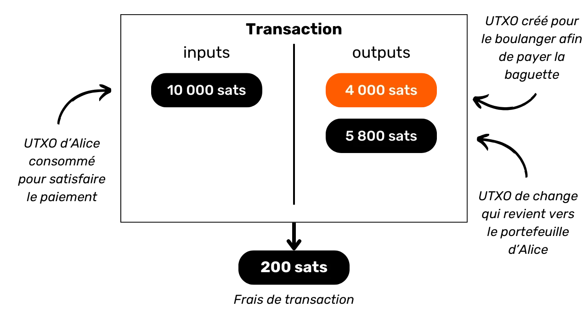


با اعمال فرمول هزینه، می‌بینیم که واقعاً `200 Sats` برای افراد زیر سن قانونی باقی مانده است:


```plaintext
Frais = total inputs - total outputs
Frais = 10 000 - (4 000 + 5 800)
Frais = 10 000 - 9 800
Frais = 200
```


وقتی یک Miner در اعتبارسنجی یک بلاک موفق می‌شود، او مجاز است که این کارمزدها را برای تمام تراکنش‌های موجود در بلاک خود، از طریق تراکنش موسوم به "coinbase" جمع‌آوری کند.


### ایجاد UTXOها بر روی Bitcoin


اگر پاراگراف‌های قبلی را با دقت دنبال کرده باشید، اکنون می‌دانید که UTXOها تنها با مصرف سایر UTXOهای موجود ایجاد می‌شوند. به این ترتیب، سکه‌های Bitcoin یک زنجیره پیوسته تشکیل می‌دهند. با این حال، ممکن است از خود بپرسید که اولین UTXOها در این زنجیره چگونه به وجود آمدند. این مسئله مشکلی مشابه مسئله مرغ و تخم‌مرغ را مطرح می‌کند: این UTXOهای اصلی از کجا آمده‌اند؟


پاسخ در **coinbase تراکنش** است.


کوین‌بیس نوع خاصی از تراکنش Bitcoin است که برای هر بلوک منحصربه‌فرد بوده و همیشه اولین مورد از این‌هاست. این امکان را به Miner می‌دهد که با یافتن یک Proof of Work معتبر، Block reward خود را دریافت کند. این پاداش از دو Elements تشکیل شده است: **کمک‌هزینه بلوک** و **کارمزد تراکنش** که در بخش قبلی مورد بحث قرار گرفت.


Coinbase Transaction منحصر به فرد است زیرا تنها دستگاهی است که قادر به ایجاد بیت‌کوین‌ها از هیچ است، بدون نیاز به مصرف ورودی‌ها برای خروجی‌های generate. این بیت‌کوین‌های تازه ایجاد شده چیزی است که ما ممکن است آن‌ها را "UTXOهای اصلی" بنامیم.


بیت‌کوین‌های یارانه‌ای بلاک، BTC جدیدی هستند که از ابتدا طبق یک برنامه انتشار از پیش تعیین‌شده در قوانین اجماع ایجاد می‌شوند. یارانه بلاک هر ۲۱۰,۰۰۰ بلاک، یعنی تقریباً هر چهار سال، در فرآیندی که به عنوان "Halving" شناخته می‌شود، نصف می‌شود. در ابتدا، با هر یارانه ۵۰ بیت‌کوین ایجاد می‌شد، اما این مقدار به تدریج کاهش یافته است؛ در حال حاضر، این مقدار ۳.۱۲۵ بیت‌کوین به ازای هر بلاک است.


در مورد کارمزدهای تراکنش، اگرچه آنها نیز نمایانگر BTC تازه ایجاد شده هستند، اما نباید از تفاوت بین کل ورودی‌ها و خروجی‌های تمام تراکنش‌ها در یک بلوک تجاوز کنند. قبلاً دیدیم که این کارمزدها نمایانگر بخشی از ورودی‌ها هستند که در خروجی‌های تراکنش استفاده نمی‌شود. این بخش به‌طور فنی در طول تراکنش "از دست رفته" محسوب می‌شود و Miner حق دارد این مقدار را به صورت یک یا چند UTXO جدید بازآفرینی کند. این یک انتقال ارزش بین صادرکننده تراکنش و Miner است که آن را به Blockchain اضافه می‌کند.


**> بیت‌کوین‌های تولید شده توسط Coinbase Transaction تحت یک دوره بلوغ 100 بلوکی قرار دارند که در طی آن نمی‌توانند توسط Miner خرج شوند. این قانون به منظور جلوگیری از مشکلات مرتبط با استفاده از بیت‌کوین‌های تازه ایجاد شده در زنجیره‌ای که ممکن است بعداً منسوخ شود، طراحی شده است.


### پیامدهای مدل UTXO


اول از همه، مدل UTXO به طور مستقیم بر هزینه‌های تراکنش Bitcoin تأثیر می‌گذارد. از آنجا که ظرفیت هر بلوک محدود است، ماینرها تراکنش‌هایی را ترجیح می‌دهند که بهترین هزینه‌ها را نسبت به فضایی که در بلوک اشغال خواهند کرد، ارائه دهند. در واقع، هرچه تعداد UTXOهای بیشتری در ورودی‌ها و خروجی‌های یک تراکنش وجود داشته باشد، تراکنش سنگین‌تر است و بنابراین نیاز به هزینه‌های بالاتری دارد. این یکی از دلایلی است که ما اغلب سعی می‌کنیم تعداد UTXOها را در پورتفولیوی خود کاهش دهیم، که می‌تواند بر محرمانگی نیز تأثیر بگذارد، موضوعی که در بخش سوم این دوره به تفصیل به آن خواهیم پرداخت.


ثانیاً، همان‌طور که در بخش‌های قبلی ذکر شد، سکه‌های Bitcoin اساساً زنجیره‌ای از UTXOها هستند. هر تراکنش به این ترتیب پیوندی بین یک UTXO گذشته و یک UTXO آینده ایجاد می‌کند. بنابراین UTXOها امکان دنبال کردن صریح مسیر بیت‌کوین‌ها از زمان ایجاد تا هزینه فعلی آن‌ها را فراهم می‌کنند. این شفافیت می‌تواند به صورت مثبت دیده شود، زیرا به هر کاربر اجازه می‌دهد تا اصالت بیت‌کوین‌های دریافتی را تأیید کند. با این حال، این اصل ردیابی و حسابرسی است که تحلیل Blockchain بر آن استوار است، یک عملی که برای به خطر انداختن محرمانگی شما طراحی شده است. ما در بخش دوم دوره به طور عمیق به این عمل خواهیم پرداخت.


## مدل حریم خصوصی Bitcoin


<chapterId>769d8963-3ed5-4094-b21d-9203c7d9e465</chapterId>


### پول: اصالت، یکپارچگی و دوبار خرج کردن


یکی از وظایف پول حل مشکل تطابق دوگانه نیازها است. در یک سیستم مبتنی بر مبادله کالا، تکمیل یک Exchange نه تنها نیازمند یافتن فردی است که کالایی مطابق با نیاز من ارائه می‌دهد، بلکه باید به او کالایی با ارزش معادل که نیاز او را برآورده کند نیز ارائه شود. ایجاد این تعادل یک موضوع پیچیده است.


به همین دلیل ما از پول برای انتقال ارزش در فضا و زمان استفاده می‌کنیم.


برای حل این مشکل با استفاده از سکه، ضروری است که طرف ارائه‌دهنده کالا یا خدمات به توانایی خود برای خرج کردن آن مبلغ در تاریخ بعدی متقاعد شود. بنابراین، هر فرد منطقی که مایل به پذیرش یک سکه، چه دیجیتال و چه فیزیکی باشد، اطمینان حاصل خواهد کرد که آن سکه دو معیار اساسی را برآورده می‌کند:


- قطعه باید یکپارچگی و اصالت داشته باشد؛**
- و نباید دوبار خرج شود.**


اگر از ارز فیزیکی استفاده می‌کنید، اولین ویژگی پیچیده‌ترین مورد برای اثبات است. در دوره‌های مختلف تاریخی، یکپارچگی سکه‌های فلزی اغلب تحت تأثیر اقداماتی مانند تراشیدن یا سوراخ کردن قرار گرفته است. به عنوان مثال، در روم باستان، تراشیدن لبه‌های سکه‌های طلا توسط شهروندان برای جمع‌آوری مقدار کمی فلز گران‌بها، در حالی که آن‌ها را برای معاملات آینده نگه می‌داشتند، یک عمل رایج بود. ارزش ذاتی سکه به این ترتیب کاهش می‌یافت، اما ارزش اسمی آن ثابت می‌ماند. این یکی از دلایلی است که لبه سکه بعدها شیار‌دار شد.


اصالت همچنین یک ویژگی دشوار برای تأیید در یک رسانه پولی فیزیکی است. تکنیک‌های امروزی برای مقابله با ارز جعلی به طور فزاینده‌ای پیچیده هستند و خرده‌فروشان را مجبور به سرمایه‌گذاری در سیستم‌های تأیید پرهزینه می‌کنند.


از سوی دیگر، به دلیل ماهیتشان، دوبار خرج کردن برای ارزهای فیزیکی مشکلی ایجاد نمی‌کند. اگر من یک اسکناس ۱۰ یورویی به شما بدهم، به طور غیرقابل برگشتی از مالکیت من خارج شده و وارد مالکیت شما می‌شود، که به طور طبیعی هرگونه امکان خرج کردن چندباره واحدهای پولی که در بر دارد را منتفی می‌کند. به طور خلاصه، من قادر نخواهم بود این اسکناس ۱۰ یورویی را دوباره خرج کنم.


برای ارز دیجیتال، دشواری متفاوت است. اطمینان از اصالت و یکپارچگی یک سکه اغلب ساده‌تر است. همان‌طور که در بخش قبلی دیدیم، مدل UTXO از Bitcoin امکان ردیابی یک سکه به منبع آن را فراهم می‌کند و بنابراین تأیید می‌کند که واقعاً توسط یک Miner مطابق با قوانین اجماع ایجاد شده است.


از سوی دیگر، اطمینان از عدم وجود Double-spending پیچیده‌تر است، زیرا تمام کالاهای دیجیتال در اصل اطلاعات هستند. برخلاف کالاهای فیزیکی، اطلاعات هنگام تبادل تقسیم نمی‌شوند، بلکه با تکثیر گسترش می‌یابند. به عنوان مثال، اگر من یک سند را از طریق ایمیل برای شما ارسال کنم، آن سند تکثیر خواهد شد. شما نمی‌توانید مطمئن باشید که من سند اصلی را حذف کرده‌ام.


### جلوگیری از دوبار خرج کردن در Bitcoin


تنها راه برای جلوگیری از تکرار یک دارایی دیجیتال این است که از تمام مبادلات در سیستم آگاه باشیم. به این ترتیب، می‌توانیم بدانیم چه کسی چه چیزی را مالک است و دارایی هر فرد را بر اساس تراکنش‌های انجام شده به‌روزرسانی کنیم. این همان چیزی است که به عنوان مثال، با پول اسنادی در سیستم بانکی اتفاق می‌افتد. وقتی با کارت اعتباری به یک تاجر ۱۰ یورو پرداخت می‌کنید، بانک Exchange را ثبت کرده و دفتر حساب را به‌روزرسانی می‌کند.


در Bitcoin، Double-spending به همان روش جلوگیری می‌شود. ما به دنبال تأیید عدم وجود تراکنشی هستیم که قبلاً سکه‌های مورد نظر را خرج کرده باشد. اگر سکه‌ها هرگز استفاده نشده باشند، می‌توانیم مطمئن باشیم که هیچ خرج مضاعفی رخ نخواهد داد. این اصل توسط Satoshi ناکاموتو در وایت پیپر با عبارت معروف توصیف شده است:


**تنها راه تأیید عدم وجود یک تراکنش، آگاهی از تمام تراکنش‌ها است**


اما برخلاف مدل بانکی، ما نمی‌خواهیم به یک نهاد مرکزی در Bitcoin اعتماد کنیم. بنابراین همه کاربران باید بتوانند عدم وجود دوبار خرج کردن را تأیید کنند، بدون اینکه به یک شخص ثالث متکی باشند. بنابراین همه باید از تمام تراکنش‌های Bitcoin آگاه باشند. به همین دلیل است که تراکنش‌های Bitcoin به‌صورت عمومی در تمام نودهای شبکه پخش می‌شوند و به‌صورت متن واضح در Blockchain ثبت می‌شوند.


دقیقاً این انتشار عمومی اطلاعات است که حفاظت از حریم خصوصی در Bitcoin را پیچیده می‌کند. در سیستم بانکی سنتی، به‌طور نظری، تنها مؤسسه مالی از تراکنش‌های انجام‌شده آگاه است. اما در Bitcoin، همه کاربران از طریق نودهای مربوطه خود از تمامی تراکنش‌ها مطلع می‌شوند.


### مدل محرمانگی: سیستم بانکی در مقابل Bitcoin


در سیستم سنتی، حساب بانکی شما به هویت شما متصل است. بانکدار می‌تواند بداند کدام حساب بانکی متعلق به کدام مشتری است و کدام تراکنش‌ها با آن مرتبط هستند. با این حال، این جریان اطلاعات بین بانک و حوزه عمومی قطع می‌شود. به عبارت دیگر، دانستن موجودی و تراکنش‌های یک حساب بانکی متعلق به فرد دیگر غیرممکن است. تنها بانک به این اطلاعات دسترسی دارد.


به عنوان مثال، بانکدار شما می‌داند که شما هر صبح باگت خود را از نانوای محلی می‌خرید، اما همسایه شما از این معامله اطلاعی ندارد. به این ترتیب، جریان اطلاعات برای طرف‌های ذی‌نفع، به ویژه بانک، قابل دسترسی است، اما برای افراد خارجی غیرقابل دسترسی باقی می‌ماند.


به دلیل محدودیت انتشار عمومی تراکنش‌ها که در بخش قبلی مشاهده کردیم، مدل محرمانگی Bitcoin نمی‌تواند از مدل سیستم بانکی پیروی کند. در مورد Bitcoin، از آنجا که جریان اطلاعات نمی‌تواند بین تراکنش‌ها و حوزه عمومی قطع شود، **مدل حریم خصوصی به جدایی بین هویت کاربر و خود تراکنش‌ها متکی است**.


به عنوان مثال، اگر یک باگت از نانوا بخرید و با BTC پرداخت کنید، همسایه‌تان که نود کامل خود را دارد، می‌تواند تراکنش شما را مشاهده کند، همان‌طور که می‌تواند تمام تراکنش‌های دیگر در سیستم را ببیند. با این حال، اگر اصول محرمانگی رعایت شود، او نباید بتواند این تراکنش خاص را به هویت شما مرتبط کند.


اما از آنجا که تراکنش‌های Bitcoin به صورت عمومی منتشر می‌شوند، همچنان امکان برقراری ارتباط بین آنها برای استنتاج اطلاعات درباره طرف‌های درگیر وجود دارد. این فعالیت حتی به عنوان یک تخصص مستقل شناخته می‌شود که به آن "تحلیل Blockchain" می‌گویند. در بخش بعدی دوره، از شما دعوت می‌کنم تا اصول تحلیل Blockchain را بررسی کنید، تا بتوانید بفهمید چگونه بیت‌کوین‌های شما ردیابی می‌شوند و بهتر از خود در برابر آنها دفاع کنید.


# درک و محافظت در برابر تحلیل زنجیره‌ای


<partId>4739371e-9fef-45b0-bcaa-b7a4df6b4470</partId>


## تجزیه و تحلیل زنجیره Bitcoin چیست؟


<chapterId>7d198ba6-4af2-4f24-86cb-3c79cb25627e</chapterId>


### تعریف و عملیات


تجزیه و تحلیل Blockchain به معنای ردیابی جریان بیت‌کوین‌ها در Blockchain است. به طور کلی، تجزیه و تحلیل زنجیره‌ای بر اساس مشاهده ویژگی‌ها در نمونه‌هایی از تراکنش‌های قبلی استوار است. سپس شامل شناسایی همین ویژگی‌ها در تراکنشی است که قصد تحلیل آن را داریم و استنتاج تفسیرهای محتمل از آن‌ها. این روش حل مسئله که بر اساس یک رویکرد عملی برای یافتن یک راه‌حل به اندازه کافی خوب است، به عنوان "هیوریستیک" شناخته می‌شود.


به زبان ساده، سه مرحله اصلی در تحلیل زنجیره وجود دارد:


1. **مشاهده Blockchain ؛**


2. **شناسایی ویژگی‌های شناخته شده ؛**


۳. **کسر مفروضات**


تجزیه و تحلیل Blockchain می‌تواند توسط هر کسی انجام شود. تنها چیزی که نیاز دارید دسترسی به اطلاعات عمومی Blockchain از طریق یک نود کامل است تا حرکات تراکنش‌ها را مشاهده کرده و فرضیه‌سازی کنید. همچنین ابزارهای رایگانی وجود دارند که این تجزیه و تحلیل را تسهیل می‌کنند، مانند [OXT.me](https://oxt.me/) که در دو فصل آخر این بخش به تفصیل بررسی خواهیم کرد. با این حال، خطر اصلی برای محرمانگی از شرکت‌هایی ناشی می‌شود که در تحلیل زنجیره تخصص دارند. این شرکت‌ها تجزیه و تحلیل Blockchain را به مقیاس صنعتی رسانده و خدمات خود را به مؤسسات مالی و دولت‌ها می‌فروشند. در میان این شرکت‌ها، Chainalysis بدون شک شناخته‌شده‌ترین است.


### اهداف تحلیل زنجیره


یکی از اهداف تحلیل Blockchain این است که فعالیت‌های مختلف روی Bitcoin را گروه‌بندی کند تا یگانگی کاربری که آن‌ها را انجام داده است تعیین شود. در ادامه، امکان تلاش برای ارتباط این خوشه فعالیت‌ها با یک هویت واقعی وجود خواهد داشت.


به فصل قبلی فکر کنید. توضیح دادم که چرا مدل حریم خصوصی Bitcoin در ابتدا بر اساس جداسازی هویت کاربر از تراکنش‌ها بود. بنابراین ممکن است وسوسه‌انگیز باشد که فکر کنیم تحلیل Blockchain بی‌فایده است، زیرا حتی اگر بتوانیم فعالیت‌های زنجیره‌ای را تجمیع کنیم، نمی‌توانیم آن‌ها را با یک هویت واقعی مرتبط کنیم.


به‌طور نظری، این بیانیه صحیح است. در بخش اول این دوره، دیدیم که جفت کلیدهای رمزنگاری برای ایجاد شرایط بر روی UTXO استفاده می‌شوند. در اصل، این جفت کلیدها هیچ اطلاعاتی درباره هویت دارندگان خود فاش نمی‌کنند. بنابراین، حتی اگر بتوانیم فعالیت‌های مرتبط با جفت کلیدهای مختلف را گروه‌بندی کنیم، این به ما چیزی درباره موجودیت پشت این فعالیت‌ها نمی‌گوید.


با این حال، واقعیت عملی بسیار پیچیده‌تر است. رفتارهای متعددی وجود دارند که می‌توانند یک هویت واقعی را به فعالیت‌های زنجیره‌ای مرتبط کنند. در تحلیل، این به عنوان یک نقطه ورود شناخته می‌شود و تعداد زیادی از آنها وجود دارد.


رایج‌ترین آن KYC (*شناخت مشتری*) است. اگر بیت‌کوین‌های خود را از یک پلتفرم تنظیم‌شده به یکی از آدرس‌های دریافت شخصی خود برداشت کنید، برخی افراد می‌توانند هویت شما را به آن Address پیوند دهند. به طور کلی‌تر، نقطه ورود می‌تواند هر نوع تعامل بین زندگی واقعی شما و یک تراکنش Bitcoin باشد. به عنوان مثال، اگر یک Address دریافت را در شبکه‌های اجتماعی خود منتشر کنید، این می‌تواند نقطه ورود برای تحلیل باشد. اگر به نانوای خود با بیت‌کوین پرداخت کنید، او می‌تواند چهره شما (بخشی از هویت شما) را با یک Bitcoin Address مرتبط کند.


این نقاط ورود هنگام استفاده از Bitcoin تقریباً غیرقابل اجتناب هستند. اگرچه ممکن است بخواهیم دامنه آن‌ها را محدود کنیم، اما همیشه حضور خواهند داشت. به همین دلیل است که ترکیب روش‌هایی که به حفظ حریم خصوصی شما می‌پردازند، بسیار مهم است. در حالی که حفظ جدایی بین هویت واقعی شما و تراکنش‌هایتان یک رویکرد جالب است، اما امروزه ناکافی باقی می‌ماند. در واقع، اگر تمام فعالیت‌های شما در زنجیره قابل گروه‌بندی باشد، حتی کوچک‌ترین نقطه ورود نیز احتمالاً Layer واحدی از محرمانگی که ایجاد کرده‌اید را به خطر می‌اندازد.


### دفاع از خود در برابر تحلیل زنجیره‌ای


بنابراین ما همچنین باید بتوانیم با تحلیل Blockchain در استفاده از Bitcoin کنار بیاییم. با انجام این کار، می‌توانیم تجمع فعالیت‌های خود را به حداقل برسانیم و تأثیر یک نقطه ورود بر حریم خصوصی خود را محدود کنیم.


چه راهی بهتر برای مقابله با تحلیل Blockchain از یادگیری روش‌های استفاده شده در آن وجود دارد؟ اگر می‌خواهید بدانید چگونه حریم خصوصی خود را در Bitcoin بهبود بخشید، باید این روش‌ها را درک کنید. این به شما درک بهتری از تکنیک‌هایی مانند CoinJoin یا PayJoin (تکنیک‌هایی که در بخش‌های پایانی دوره به آن‌ها خواهیم پرداخت) می‌دهد و اشتباهاتی که ممکن است مرتکب شوید را کاهش می‌دهد.


https://planb.network/tutorials/privacy/on-chain/coinjoin-samourai-wallet-e566803d-ab3f-4d98-9136-5462009262ef

https://planb.network/tutorials/privacy/on-chain/payjoin-848b6a23-deb2-4c5f-a27e-93e2f842140f

در این مورد، می‌توانیم یک قیاس با رمزنگاری و رمزگشایی ترسیم کنیم. یک رمزنگار خوب در درجه اول یک رمزگشا خوب است. برای ابداع یک الگوریتم رمزنگاری جدید، باید بدانید که با چه حملاتی مواجه خواهد شد و همچنین مطالعه کنید که چرا الگوریتم‌های قبلی شکسته شده‌اند. همین اصل در مورد حریم خصوصی Bitcoin صدق می‌کند. درک روش‌های تحلیل Blockchain کلید محافظت در برابر آنهاست. به همین دلیل من یک بخش کامل از تحلیل on chain را در این دوره آموزشی گنجانده‌ام.


### روش‌های تحلیل زنجیره‌ای


مهم است که درک کنیم تحلیل رشته یک علم دقیق نیست. این تحلیل به اکتشافات تجربی که از مشاهدات قبلی یا تفسیرهای منطقی به دست آمده‌اند، متکی است. این قواعد به ما اجازه می‌دهند تا نتایج نسبتاً قابل اعتمادی به دست آوریم، اما هرگز با دقت مطلق. به عبارت دیگر، **تحلیل زنجیره همیشه شامل یک بُعد احتمالی در نتایج به دست آمده است**. به عنوان مثال، ممکن است بتوان با درجات مختلفی از اطمینان تخمین زد که دو آدرس به یک نهاد واحد تعلق دارند، اما اطمینان کامل همیشه دست‌نیافتنی خواهد بود.


کل هدف تحلیل زنجیره‌ای دقیقاً در تجمیع انواع مختلفی از روش‌های اکتشافی برای به حداقل رساندن خطر خطا نهفته است. به نوعی، این یک انباشت شواهد است که ما را به واقعیت نزدیک‌تر می‌کند.


این اکتشافات معروف را می‌توان به دسته‌های مختلفی گروه‌بندی کرد که در زیر به‌طور مفصل توضیح خواهیم داد:


- الگوهای تراکنش ;**
- هیوریستیک‌های داخلی تراکنش ;**
- هیوریستیک‌های خارجی به تراکنش.**


### Satoshi ناکاموتو و تحلیل زنجیره‌ای


اولین دو روش تحلیل زنجیره‌ای توسط خود Satoshi ناکاموتو کشف شدند. او در بخش 10 از وایت پیپر Bitcoin درباره آن‌ها صحبت می‌کند. آن‌ها عبارتند از:


- cIOH (*ورودی مشترک Ownership اکتشافی*);
- و استفاده مجدد از Address.


منبع: S. Nakamoto, "Bitcoin: A Peer-to-Peer Electronic Cash System", https://Bitcoin.org/Bitcoin.pdf, 2009.


خواهیم دید که آنها در فصل‌های بعدی چه هستند، اما جالب است که توجه کنیم این دو روش اکتشافی هنوز هم در تحلیل زنجیره‌ای امروز جایگاه برجسته‌ای دارند.


## الگوهای تراکنش


<chapterId>d365a101-2d37-46a5-bfb9-3c51e37bf96b</chapterId>


الگوی تراکنش به سادگی یک مدل یا ساختار کلی از یک تراکنش معمولی است که می‌توان آن را در Blockchain یافت و تفسیر احتمالی آن شناخته شده است. هنگام مطالعه الگوها، ما بر روی یک تراکنش واحد تمرکز کرده و آن را در سطح بالا تحلیل می‌کنیم.


به عبارت دیگر، ما فقط به تعداد UTXO در ورودی‌ها و تعداد UTXO در خروجی‌ها نگاه خواهیم کرد، بدون اینکه به جزئیات خاص‌تر یا محیط تراکنش بپردازیم. بر اساس الگوی مشاهده شده، می‌توانیم ماهیت تراکنش را تفسیر کنیم. سپس به دنبال ویژگی‌های ساختاری آن خواهیم بود و تفسیری را استنتاج خواهیم کرد.


در این بخش، ما با هم به مدل‌های اصلی تراکنش که در تحلیل زنجیره‌ای با آن‌ها مواجه می‌شویم، نگاه خواهیم کرد و برای هر مدل، تفسیر احتمالی این ساختار را به شما ارائه می‌دهم، همچنین یک مثال ملموس.


### یک محموله (یا یک پرداخت)


بیایید با یک الگوی بسیار رایج شروع کنیم، زیرا این الگویی است که در اکثر پرداخت‌های Bitcoin ظاهر می‌شود. مدل پرداخت ساده با مصرف یک یا چند UTXO به عنوان ورودی و تولید 2 UTXO به عنوان خروجی مشخص می‌شود. بنابراین این مدل به این شکل است:


وقتی این ساختار تراکنش را در Blockchain مشاهده می‌کنیم، می‌توانیم تفسیری ارائه دهیم. همان‌طور که از نام آن پیداست، این مدل نشان می‌دهد که ما در حضور یک تراکنش ارسال یا پرداخت هستیم. کاربر از UTXO خود در ورودی‌ها استفاده کرده است تا در خروجی‌ها یک پرداخت UTXO و یک Exchange UTXO (پولی که به همان کاربر بازگردانده می‌شود) را برآورده کند.


بنابراین می‌دانیم که کاربر مشاهده‌شده احتمالاً دیگر یکی از دو خروجی UTXO (پرداخت UTXO) را در اختیار ندارد، اما همچنان دیگری UTXO (Exchange UTXO) را در اختیار دارد.


در حال حاضر، نمی‌توانیم مشخص کنیم که کدام خروجی نمایانگر کدام UTXO است، زیرا این هدف مطالعه الگو نیست. ما با تکیه بر روش‌های اکتشافی که در بخش‌های بعدی مطالعه خواهیم کرد، به آنجا خواهیم رسید. در این مرحله، هدف ما محدود به شناسایی ماهیت تراکنش مورد نظر است که در این مورد یک ارسال ساده است.


به عنوان مثال، در اینجا یک تراکنش Bitcoin وجود دارد که الگوی ارسال ساده را اتخاذ می‌کند:


```plaintext
b6cc79f45fd2d7669ff94db5cb14c45f1f879ea0ba4c6e3d16ad53a18c34b769
```


منبع: [Mempool.space](https://Mempool.space/fr/tx/b6cc79f45fd2d7669ff94db5cb14c45f1f879ea0ba4c6e3d16ad53a18c34b769)


پس از این مثال اول، باید درک بهتری از معنای مطالعه یک "مدل تراکنش" داشته باشید. ما یک تراکنش را با تمرکز صرفاً بر ساختار آن بررسی می‌کنیم، بدون در نظر گرفتن محیط یا جزئیات خاص تراکنش. در این گام اول، ما فقط به تصویر کلی نگاه می‌کنیم.


حالا که متوجه شدید الگو چیست، بیایید به مدل‌های موجود دیگر بپردازیم.


### جارو کردن


این مدل دوم با مصرف یک UTXO به عنوان ورودی و تولید یک UTXO به عنوان خروجی مشخص می‌شود.


تفسیر این مدل این است که ما با یک انتقال به خود مواجه هستیم. کاربر بیت‌کوین‌های خود را به خودش، به یک Address دیگر که متعلق به اوست، منتقل کرده است. از آنجا که در این تراکنش هیچ Exchange وجود ندارد، بسیار بعید است که با یک پرداخت مواجه باشیم. در واقع، زمانی که یک پرداخت انجام می‌شود، تقریباً غیرممکن است که پرداخت‌کننده یک UTXO دقیقاً معادل مبلغ مورد نیاز فروشنده به علاوه کارمزد تراکنش داشته باشد. به طور کلی، پرداخت‌کننده مجبور است یک خروجی Exchange تولید کند.


سپس می‌دانیم که کاربر مشاهده‌شده احتمالاً هنوز مالک این UTXO است. در زمینه تحلیل زنجیره‌ای، اگر بدانیم که UTXO استفاده‌شده به عنوان ورودی تراکنش متعلق به Alice است، می‌توانیم فرض کنیم که UTXO استفاده‌شده به عنوان خروجی نیز به او تعلق دارد. چیزی که بعداً جالب خواهد شد، یافتن روش‌های تراکنش داخلی است که می‌تواند این فرض را تقویت کند (این روش‌ها را در فصل 3.3 بررسی خواهیم کرد).


به عنوان مثال، در اینجا یک تراکنش Bitcoin وجود دارد که الگوی جارو را اتخاذ می‌کند:


```plaintext
35f1072a0fda5ae106efb4fda871ab40e1f8023c6c47f396441ad4b995ea693d
```


منبع: [Mempool.space](https://Mempool.space/fr/tx/35f1072a0fda5ae106efb4fda871ab40e1f8023c6c47f396441ad4b995ea693d)


با این حال، توجه داشته باشید که این نوع الگو می‌تواند انتقال به حساب یک پلتفرم ارز دیجیتال Exchange را نیز نشان دهد. این مطالعه آدرس‌های شناخته شده و زمینه تراکنش است که به ما می‌گوید آیا این یک انتقال به خود-نگهداری Wallet است یا یک برداشت به یک پلتفرم. در واقع، آدرس‌های پلتفرم‌های Exchange اغلب به راحتی قابل شناسایی هستند.


بیایید دوباره به مثال Alice بپردازیم: اگر اسکن به یک Address که برای یک پلتفرم (مانند بایننس، به عنوان مثال) شناخته شده است منجر شود، این ممکن است به این معنا باشد که بیت‌کوین‌ها از مالکیت مستقیم Alice منتقل شده‌اند، احتمالاً با قصد فروش یا ذخیره‌سازی آن‌ها در این پلتفرم. از سوی دیگر، اگر مقصد Address ناشناخته باشد، منطقی است که فرض کنیم که این به سادگی یک Wallet دیگر است که هنوز به Alice تعلق دارد. اما این نوع مطالعه بیشتر در دسته‌بندی هیوریستیک‌ها قرار می‌گیرد تا الگوها.


### تثبیت


این مدل با مصرف چندین UTXO در ورودی و تولید یک UTXO در خروجی مشخص می‌شود.


تفسیر این الگو این است که ما در حضور یک دوره تثبیت هستیم. این یک عمل رایج در میان کاربران Bitcoin است که با هدف ادغام چندین UTXO در انتظار افزایش احتمالی در کارمزدهای تراکنش انجام می‌شود. با انجام این عملیات در دوره‌ای که کارمزدها پایین است، می‌توان در کارمزدهای آینده صرفه‌جویی کرد. در فصل 4.3 بیشتر در مورد این عمل صحبت خواهیم کرد.


ما می‌توانیم نتیجه بگیریم که کاربر پشت این مدل تراکنش احتمالاً مالک تمام UTXOها در ورودی بوده و همچنان مالک UTXO در خروجی است. بنابراین احتمالاً یک انتقال خودکار است.


مانند الگوی جارو، این نوع الگو نیز می‌تواند انتقال به حساب یک پلتفرم Exchange را نشان دهد. مطالعه آدرس‌های شناخته شده و زمینه تراکنش به ما خواهد گفت که آیا این یک تجمیع به یک پورتفوی خود-نگهداری است یا یک برداشت به یک پلتفرم.


به عنوان مثال، در اینجا یک تراکنش Bitcoin وجود دارد که الگوی تجمیع را اتخاذ می‌کند:


```plaintext
77c16914211e237a9bd51a7ce0b1a7368631caed515fe51b081d220590589e94
```


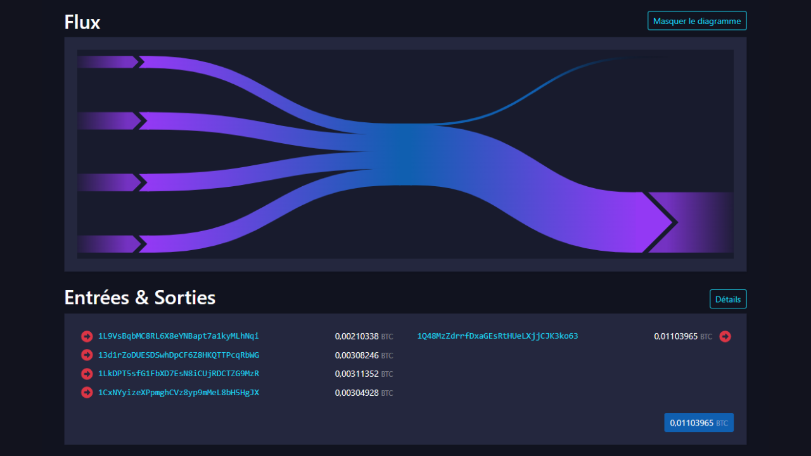


منبع: [Mempool.space](https://Mempool.space/fr/tx/77c16914211e237a9bd51a7ce0b1a7368631caed515fe51b081d220590589e94)


در یک تحلیل زنجیره‌ای، این مدل می‌تواند اطلاعات زیادی را فاش کند. به عنوان مثال، اگر بدانیم که یکی از ورودی‌ها متعلق به Alice است، می‌توانیم فرض کنیم که تمام ورودی‌های دیگر و خروجی این تراکنش نیز به او تعلق دارند. این فرض سپس امکان بازگشت به زنجیره تراکنش‌های قبلی را فراهم می‌کند تا تراکنش‌های دیگری که احتمالاً با Alice مرتبط هستند، کشف و تحلیل شوند.


### هزینه‌های گروه‌بندی‌شده


این مدل با مصرف چند UTXO به عنوان ورودی (اغلب فقط یک) و تولید بسیاری از UTXO به عنوان خروجی مشخص می‌شود.


تفسیر این مدل این است که ما در حضور هزینه‌های گروه‌بندی شده هستیم. این یک عملی است که احتمالاً فعالیت اقتصادی بسیار بزرگی را نشان می‌دهد، مانند یک پلتفرم Exchange. هزینه‌های گروه‌بندی شده به این نهادها امکان می‌دهد تا با ترکیب هزینه‌های خود در یک تراکنش، هزینه‌ها را کاهش دهند.


ما می‌توانیم از این مدل نتیجه بگیریم که UTXO در ورودی از شرکتی با سطح بالای فعالیت اقتصادی می‌آید و UTXOها در خروجی پراکنده خواهند شد. بسیاری از آنها متعلق به مشتریان شرکت خواهند بود که بیت‌کوین‌ها را از پلتفرم برداشت کرده‌اند. برخی دیگر ممکن است به شرکت‌های شریک بروند. در نهایت، قطعاً یک یا چند مبادله به شرکت صادرکننده بازخواهد گشت.


به عنوان مثال، اینجا یک تراکنش Bitcoin وجود دارد که الگوی خرج دسته‌بندی شده را اتخاذ می‌کند (احتمالاً، این یک تراکنش صادر شده توسط پلتفرم Bybit است):


```plaintext
8a7288758b6e5d550897beedd13c70bcbaba8709af01a7dbcc1f574b89176b43
```


منبع: [Mempool.space](https://Mempool.space/fr/tx/8a7288758b6e5d550897beedd13c70bcbaba8709af01a7dbcc1f574b89176b43)


### تراکنش‌های خاص پروتکل


در میان الگوهای تراکنش، ما می‌توانیم آن‌هایی را که استفاده از یک پروتکل خاص را نشان می‌دهند نیز شناسایی کنیم. به عنوان مثال، کوین‌جوین‌های Whirlpool (که در بخش ۵ مورد بحث قرار گرفته‌اند) دارای ساختاری به راحتی قابل شناسایی خواهند بود که آن‌ها را از سایر تراکنش‌های متداول‌تر متمایز می‌کند.


تحلیل این الگو نشان می‌دهد که احتمالاً در حضور یک تراکنش مشارکتی هستیم. همچنین ممکن است یک CoinJoin مشاهده شود. اگر این فرضیه دوم درست باشد، آنگاه تعداد خروجی‌ها می‌تواند تخمینی تقریبی از تعداد شرکت‌کنندگان در CoinJoin به ما ارائه دهد.


به عنوان مثال، در اینجا یک تراکنش Bitcoin وجود دارد که الگوی تراکنش همکاری CoinJoin را اتخاذ می‌کند:


```plaintext
00601af905bede31086d9b1b79ee8399bd60c97e9c5bba197bdebeee028b9bea
```


منبع: [Mempool.space](https://Mempool.space/fr/tx/00601af905bede31086d9b1b79ee8399bd60c97e9c5bba197bdebeee028b9bea)


پروتکل‌های بسیاری با ساختارهای خاص خود وجود دارند. به عنوان مثال، تراکنش‌های Wabisabi، تراکنش‌های Stamps و تراکنش‌های Runes وجود دارند.


با تشکر از این الگوهای تراکنش، ما می‌توانیم از قبل مقدار معینی از اطلاعات درباره یک تراکنش خاص را تفسیر کنیم. اما ساختار تراکنش تنها منبع اطلاعات برای تحلیل نیست. ما همچنین می‌توانیم جزئیات آن را مطالعه کنیم. این جزئیات داخلی چیزی است که من دوست دارم آن را "هیوریستیک‌های داخلی" بنامم، و ما در فصل بعدی به بررسی آن‌ها خواهیم پرداخت.


## هیوریستیک‌های داخلی


<chapterId>c54b5abe-872f-40f4-a0d0-c59faff228ba</chapterId>


یک روش اکتشافی داخلی یک ویژگی خاص است که ما درون یک تراکنش شناسایی می‌کنیم، بدون نیاز به بررسی محیط آن، و که به ما امکان می‌دهد استنتاج‌هایی انجام دهیم. برخلاف الگوها، که بر ساختار کلی تراکنش در سطح بالا تمرکز دارند، روش‌های اکتشافی داخلی بر اساس مجموعه‌ای از داده‌های قابل استخراج هستند. این شامل:


- مقادیر UTXOهای مختلف ورودی و خروجی؛
- همه چیز درباره اسکریپت‌ها: آدرس‌های دریافت، نسخه‌بندی، زمان‌های قفل..


به طور کلی، این نوع از اکتشافی به ما این امکان را می‌دهد که Exchange را در یک تراکنش خاص شناسایی کنیم. با انجام این کار، می‌توانیم ردیابی یک نهاد را در چندین تراکنش مختلف ادامه دهیم. در واقع، اگر یک UTXO متعلق به کاربری که می‌خواهیم ردیابی کنیم شناسایی کنیم، تعیین این که وقتی او یک تراکنش انجام می‌دهد، کدام خروجی به کاربر دیگری منتقل شده و کدام خروجی نمایانگر Exchange است که در نتیجه در اختیار او باقی می‌ماند، بسیار مهم است.


بار دیگر، اجازه دهید به شما یادآوری کنم که این اکتشافات به طور مطلق دقیق نیستند. به صورت فردی، آنها فقط به ما امکان می‌دهند تا سناریوهای محتمل را شناسایی کنیم. این تجمع چندین اکتشاف است که به کاهش عدم قطعیت کمک می‌کند، بدون اینکه هرگز بتواند آن را به طور کامل از بین ببرد.


### شباهت‌های داخلی


این روش اکتشافی شامل مطالعه شباهت‌ها بین ورودی‌ها و خروجی‌های یک تراکنش مشابه است. اگر همان ویژگی در ورودی‌ها و فقط در یکی از خروجی‌های تراکنش مشاهده شود، احتمالاً این خروجی Exchange را تشکیل می‌دهد.


مشخص‌ترین ویژگی، استفاده مجدد از Address دریافت‌کننده در همان تراکنش است.


این روش ابهام کمی باقی می‌گذارد. مگر اینکه کلید خصوصی او هک شده باشد، همان دریافت‌کننده Address لزوماً فعالیت یک کاربر واحد را نشان می‌دهد. تفسیر حاصل این است که تراکنش Exchange خروجی با همان Address به عنوان ورودی است. سپس می‌توانیم به ردیابی فرد از این Exchange ادامه دهیم.


به عنوان مثال، در اینجا یک تراکنش وجود دارد که احتمالاً می‌توان این روش اکتشافی را بر روی آن اعمال کرد:


```plaintext
54364146665bfc453a55eae4bfb8fdf7c721d02cb96aadc480c8b16bdeb8d6d0
```


منبع : [Mempool.space](https://Mempool.space/tx/54364146665bfc453a55eae4bfb8fdf7c721d02cb96aadc480c8b16bdeb8d6d0)


این شباهت‌ها بین ورودی‌ها و خروجی‌ها به استفاده مجدد از Address محدود نمی‌شوند. هرگونه شباهت در استفاده از اسکریپت‌ها می‌تواند برای اعمال یک روش اکتشافی استفاده شود. به عنوان مثال، گاهی اوقات می‌توانیم همان نسخه‌بندی را بین ورودی و یکی از خروجی‌های تراکنش مشاهده کنیم.


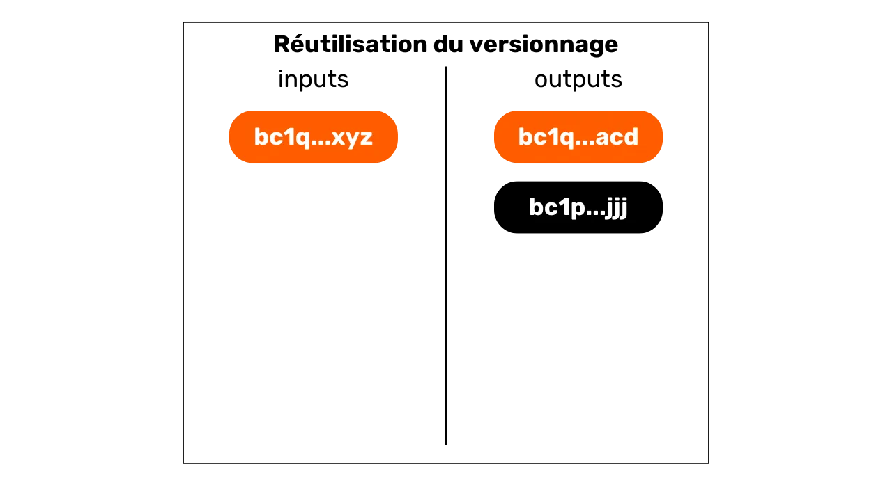


در این نمودار، می‌توانیم ببینیم که ورودی شماره 0 یک اسکریپت P2WPKH را باز می‌کند (SegWit V0 که با `bc1q` شروع می‌شود). خروجی شماره 0 از همان نوع اسکریپت استفاده می‌کند. از سوی دیگر، خروجی شماره 1 از یک اسکریپت P2TR استفاده می‌کند (SegWit V1 که با `bc1p` شروع می‌شود). تفسیر این ویژگی این است که احتمالاً Address با همان نسخه‌بندی به عنوان ورودی، همان Exchange Address است. بنابراین همیشه به همان کاربر تعلق خواهد داشت.


در اینجا یک تراکنش وجود دارد که احتمالاً می‌توان این اکتشافی را بر روی آن اعمال کرد:


```plaintext
db07516288771ce5d0a06b275962ec4af1b74500739f168e5800cbcb0e9dd578
```


منبع: [Mempool.space](https://Mempool.space/tx/db07516288771ce5d0a06b275962ec4af1b74500739f168e5800cbcb0e9dd578)


در مورد دومی، می‌توانیم ببینیم که ورودی شماره 0 و خروجی شماره 1 از اسکریپت‌های P2WPKH (SegWit V0) استفاده می‌کنند، در حالی که خروجی شماره 0 از یک اسکریپت P2PKH متفاوت (Legacy) استفاده می‌کند.


در اوایل دهه ۲۰۱۰، این روش اکتشافی مبتنی بر نسخه‌بندی اسکریپت به دلیل انواع محدود اسکریپت‌های موجود نسبتاً بی‌فایده بود. با این حال، با گذشت زمان و با به‌روزرسانی‌های متوالی Bitcoin، تنوع فزاینده‌ای از انواع اسکریپت‌ها معرفی شد. بنابراین، این روش اکتشافی به طور فزاینده‌ای مرتبط می‌شود، زیرا با طیف گسترده‌تری از انواع اسکریپت‌ها، کاربران به گروه‌های کوچکتری تقسیم می‌شوند و در نتیجه شانس استفاده از این روش اکتشافی بازاستفاده نسخه‌بندی داخلی افزایش می‌یابد. به همین دلیل، فقط از دیدگاه محرمانگی، توصیه می‌شود که نوع اسکریپت رایج‌تر را انتخاب کنید. به عنوان مثال، در زمان نوشتن این خطوط، اسکریپت‌های Taproot (`bc1p`) کمتر از اسکریپت‌های SegWit V0 (`bc1q`) استفاده می‌شوند. اگرچه اولی در برخی زمینه‌های خاص مزایای اقتصادی و محرمانگی ارائه می‌دهد، اما برای استفاده‌های سنتی‌تر تک‌امضایی، ممکن است منطقی باشد که به یک استاندارد قدیمی‌تر برای دلایل محرمانگی پایبند باشید، تا زمانی که استاندارد جدید به طور گسترده‌تری پذیرفته شود.


### پرداخت‌های با اعداد رند


یک روش اکتشافی داخلی دیگر که می‌تواند به ما در شناسایی Exchange کمک کند، روش اکتشافی عدد گرد است. به طور کلی، زمانی که با یک الگوی پرداخت ساده (1 ورودی و 2 خروجی) مواجه می‌شویم، اگر یکی از خروجی‌ها مبلغ گردی را خرج کند، این مبلغ نمایانگر پرداخت است.


با حذف گزینه‌ها، اگر یک خروجی نشان‌دهنده پرداخت باشد، خروجی دیگر نشان‌دهنده Exchange است. بنابراین می‌توان این‌گونه تفسیر کرد که احتمالاً کاربر ورودی همیشه دارای خروجی شناسایی‌شده به‌عنوان Exchange است.


باید تأکید کرد که این روش همواره قابل اجرا نیست، زیرا اکثر پرداخت‌ها هنوز در واحدهای حسابداری اعتباری انجام می‌شود. در واقع، زمانی که یک خرده‌فروش در فرانسه Bitcoin را می‌پذیرد، معمولاً قیمت‌های ثابتی را در Sats نمایش نخواهد داد. در عوض، او ترجیح می‌دهد که بین قیمت به یورو و مبلغی که باید به بیت‌کوین پرداخت شود، تبدیل انجام دهد. بنابراین نباید در پایان تراکنش اعداد گرد وجود داشته باشد.


با این حال، یک تحلیلگر می‌تواند سعی کند این تبدیل را با در نظر گرفتن نرخ Exchange که در زمان پخش تراکنش در شبکه اعمال می‌شد، انجام دهد. بیایید مثالی از یک تراکنش با ورودی `97,552 Sats` و دو خروجی، یکی به مقدار `31,085 Sats` و دیگری به مقدار `64,152 Sats` را بررسی کنیم. در نگاه اول، این تراکنش به نظر نمی‌رسد که شامل مقادیر گرد شده باشد. با این حال، با اعمال نرخ Exchange به مقدار €64,339 در زمان تراکنش، تبدیل به یورو به صورت زیر به دست می‌آید:


- ورودی €62.76؛
- خروجی €20؛
- خروجی €41.27.


پس از تبدیل به ارز فیات، این تراکنش می‌تواند برای اعمال روش پرداخت مبلغ گرد استفاده شود. خروجی €20 احتمالاً به یک تاجر رفته است، یا حداقل Ownership تغییر کرده است. با استنتاج، خروجی €41.27 احتمالاً در اختیار کاربر اصلی باقی مانده است.


اگر روزی Bitcoin به واحد حساب ترجیحی در مبادلات ما تبدیل شود، این روش اکتشافی می‌تواند برای تحلیل حتی مفیدتر شود.


به عنوان مثال، در اینجا یک تراکنش وجود دارد که احتمالاً می‌توان این روش اکتشافی را بر روی آن اعمال کرد:


```plaintext
2bcb42fab7fba17ac1b176060e7d7d7730a7b807d470815f5034d52e96d2828a
```


منبع : [Mempool.space](https://Mempool.space/tx/2bcb42fab7fba17ac1b176060e7d7d7730a7b807d470815f5034d52e96d2828a)


### بزرگترین خروجی


وقتی که یک فاصله به اندازه کافی بزرگ بین 2 خروجی تراکنش در یک مدل پرداخت ساده شناسایی می‌کنیم، می‌توانیم تخمین بزنیم که بزرگترین خروجی احتمالاً Exchange خارجی است.


این بزرگترین خروجی هیوریستیک بدون شک نادقیق‌ترین از همه است. به تنهایی، نسبتاً ضعیف است. با این حال، این ویژگی می‌تواند با سایر هیوریستیک‌ها ترکیب شود تا عدم قطعیت تفسیر ما را کاهش دهد.


به عنوان مثال، اگر به یک تراکنش با یک پرداخت گرد و یک پرداخت بزرگتر نگاه کنیم، اعمال روش پرداخت گرد و روش پرداخت بزرگتر به طور همزمان سطح عدم قطعیت ما را کاهش می‌دهد.


به عنوان مثال، در اینجا یک تراکنش وجود دارد که احتمالاً می‌توان این ایده را بر روی آن اعمال کرد:


```plaintext
b79d8f8e4756d34bbb26c659ab88314c220834c7a8b781c047a3916b56d14dcf
```


منبع: [Mempool.space](https://Mempool.space/tx/b79d8f8e4756d34bbb26c659ab88314c220834c7a8b781c047a3916b56d14dcf)


## هیوریستیک‌های خارجی


<chapterId>4a170e3b-200d-431a-8285-18a23ff617ba</chapterId>


مطالعه هیوریستیک‌های خارجی به معنای تحلیل شباهت‌ها، الگوها و ویژگی‌های خاص Elements است که به خود تراکنش مربوط نمی‌شوند. به عبارت دیگر، در حالی که قبلاً خود را به بهره‌برداری از Elements ذاتی تراکنش با هیوریستیک‌های داخلی محدود کرده بودیم، اکنون به لطف هیوریستیک‌های خارجی، میدان تحلیل خود را برای شامل کردن محیط تراکنش گسترش می‌دهیم.


### استفاده مجدد Address


این یکی از شناخته‌شده‌ترین هورستیک‌های بیت‌کوینرها است. استفاده مجدد از Address امکان برقراری ارتباط بین تراکنش‌های مختلف و UTXOهای مختلف را فراهم می‌کند. این زمانی رخ می‌دهد که یک Bitcoin دریافت‌کننده Address چندین بار استفاده شود.


بنابراین، امکان بهره‌برداری از استفاده مجدد Address در همان تراکنش به عنوان یک روش اکتشافی داخلی برای شناسایی Exchange وجود دارد (همان‌طور که در فصل قبلی دیدیم). اما استفاده مجدد از Address می‌تواند به عنوان یک روش اکتشافی خارجی برای شناسایی یکتایی یک موجودیت در پشت چندین تراکنش نیز استفاده شود.


تفسیر استفاده مجدد از یک Address این است که تمام UTXOهایی که بر روی آن Address مسدود شده‌اند، به یک نهاد واحد تعلق دارند (یا تعلق داشته‌اند). این روش تحلیلی فضای کمی برای عدم قطعیت باقی می‌گذارد. پس از شناسایی، تفسیر حاصل احتمالاً با واقعیت مطابقت دارد. بنابراین، این امکان را فراهم می‌کند که فعالیت‌های مختلف زنجیره‌ای گروه‌بندی شوند.


همان‌طور که در مقدمه بخش ۳ توضیح داده شد، این روش اکتشافی توسط خود Satoshi ناکاموتو کشف شد. در وایت پیپر، او به راه‌حلی اشاره می‌کند که به کاربران کمک می‌کند از تولید آن اجتناب کنند، که به سادگی استفاده از یک Address خالی برای هر تراکنش جدید است:


"_به عنوان یک دیوار آتش اضافی، می‌توان از یک جفت کلید جدید برای هر تراکنش استفاده کرد تا آنها را به یک مالک مشترک مرتبط نکند._"


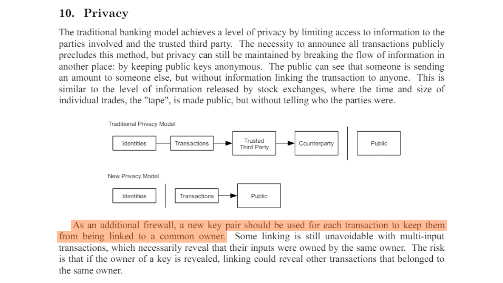


منبع: S. Nakamoto, "Bitcoin: A Peer-to-Peer Electronic Cash System", https://Bitcoin.org/Bitcoin.pdf, 2009.


به عنوان مثال، اینجا یک Address است که در چندین تراکنش استفاده مجدد شده است:


```plaintext
bc1qqtmeu0eyvem9a85l3sghuhral8tk0ar7m4a0a0
```


منبع: [Mempool.space](https://Mempool.space/Address/bc1qqtmeu0eyvem9a85l3sghuhral8tk0ar7m4a0a0)


### شباهت اسکریپت و اثرات Wallet


علاوه بر استفاده مجدد از Address، بسیاری از روش‌های اکتشافی دیگر وجود دارند که به شما اجازه می‌دهند تا اقدامات را به همان پورتفولیو یا خوشه Address متصل کنید.


اولاً، یک تحلیل‌گر می‌تواند به دنبال شباهت‌ها در استفاده از اسکریپت باشد. برای مثال، برخی اسکریپت‌های اقلیتی مانند Multisig ممکن است راحت‌تر از اسکریپت‌های SegWit V0 قابل تشخیص باشند. هرچه گروهی که در آن پنهان می‌شویم بزرگ‌تر باشد، تشخیص ما سخت‌تر است. این یکی از دلایلی است که در پروتکل‌های خوب CoinJoin، همه شرکت‌کنندگان دقیقاً از همان نوع اسکریپت استفاده می‌کنند.


به طور کلی‌تر، یک تحلیلگر می‌تواند بر روی اثر انگشت‌های خاص یک پورتفولیو نیز تمرکز کند. این‌ها فرآیندهای خاص استفاده هستند که می‌توان با هدف بهره‌برداری از آن‌ها به عنوان اکتشافات ردیابی شناسایی کرد. به عبارت دیگر، اگر ما تجمعی از همان ویژگی‌های داخلی را در تراکنش‌های منتسب به نهاد ردیابی شده مشاهده کنیم، می‌توانیم تلاش کنیم تا همین ویژگی‌ها را در تراکنش‌های دیگر شناسایی کنیم.


به عنوان مثال، ما قادر خواهیم بود تشخیص دهیم که کاربر ردیابی‌شده به‌طور سیستماتیک تغییرات خود را به آدرس‌های P2TR (`bc1p...`) ارسال می‌کند. اگر این فرآیند تکرار شود، می‌توانیم از آن به عنوان یک روش اکتشافی برای بقیه تحلیل خود استفاده کنیم. همچنین می‌توانیم از اثر انگشت‌های دیگر، مانند ترتیب UTXOها، محل تغییر در خروجی‌ها، سیگنال‌دهی RBF (Replace-by-fee)، یا شماره نسخه، فیلد `nSequence` و فیلد `nLockTime` استفاده کنیم.


همان‌طور که [@LaurentMT](https://twitter.com/LaurentMT) در [Space Kek #19](https://podcasters.spotify.com/pod/show/decouvrebitcoin/episodes/SpaceKek-19---Analyse-de-chane--anonsets-et-entropie-e1vfuji) (یک پادکست به زبان فرانسوی) اشاره می‌کند، کاربرد اثر انگشت‌های پورتفولیو در تحلیل زنجیره به‌طور قابل‌توجهی در حال افزایش است. در واقع، افزایش تعداد انواع اسکریپت و استقرار تدریجی این ویژگی‌های جدید توسط نرم‌افزارهای پورتفولیو تفاوت‌ها را برجسته‌تر می‌کند. در برخی موارد، حتی ممکن است نرم‌افزار دقیق مورد استفاده توسط نهاد مورد ردیابی را شناسایی کرد. بنابراین، مهم است که درک کنیم مطالعه اثرات پورتفولیو به‌ویژه برای تراکنش‌های اخیر مرتبط است، نه آن‌هایی که در اوایل دهه ۲۰۱۰ آغاز شده‌اند.


به طور خلاصه، یک اثر می‌تواند هر عمل خاصی باشد که به صورت خودکار توسط Wallet یا به صورت دستی توسط کاربر انجام می‌شود و ما می‌توانیم آن را در تراکنش‌های دیگر پیدا کنیم تا به ما در تحلیل‌مان کمک کند.


### ورودی مشترک Ownership اکتشافی (CIOH)


هیوریستیک ورودی مشترک Ownership (CIOH) هیوریستیکی است که بیان می‌کند وقتی یک تراکنش دارای ورودی‌های متعدد است، احتمالاً همه آن‌ها از یک نهاد واحد نشأت می‌گیرند. در نتیجه، Ownership آن‌ها مشترک است.


برای اعمال CIOH، ابتدا یک تراکنش با چندین ورودی را مشاهده می‌کنیم. این می‌تواند 2 ورودی یا 30 ورودی باشد. پس از شناسایی این ویژگی، بررسی می‌کنیم که آیا تراکنش در یک مدل تراکنش شناخته‌شده قرار می‌گیرد یا خیر. به عنوان مثال، اگر 5 ورودی با مقدار تقریباً یکسان و 5 خروجی با مقدار دقیقاً یکسان وجود داشته باشد، می‌دانیم که این ساختار یک CoinJoin است. ما قادر به اعمال CIOH نخواهیم بود.


از سوی دیگر، اگر تراکنش در هیچ مدل تراکنش مشارکتی شناخته‌شده‌ای جای نگیرد، می‌توانیم تفسیر کنیم که احتمالاً همه ورودی‌ها از یک نهاد واحد می‌آیند. این می‌تواند برای گسترش یک خوشه از پیش شناخته‌شده یا ادامه یک ردیابی بسیار مفید باشد.


CIOH توسط Satoshi Nakamoto کشف شد. او در بخش 10 از وایت پیپر درباره آن صحبت می‌کند:


"_[...] پیوند زدن در تراکنش‌های چند ورودی اجتناب‌ناپذیر است، که لزوماً نشان می‌دهد که ورودی‌های آن‌ها توسط یک مالک نگهداری شده‌اند. خطر این است که اگر مالک یک کلید فاش شود، پیوندها ممکن است تراکنش‌های دیگری را که متعلق به همان مالک بوده‌اند، فاش کنند._"


جالب است که توجه کنیم که Satoshi ناکاموتو، حتی قبل از راه‌اندازی رسمی Bitcoin، دو آسیب‌پذیری اصلی حریم خصوصی برای کاربران، یعنی CIOH و استفاده مجدد از Address را شناسایی کرده بود. چنین دوراندیشی بسیار قابل توجه است، زیرا این دو روش تحلیلی همچنان، حتی امروز، مفیدترین در تحلیل Blockchain باقی مانده‌اند.


برای ارائه یک مثال، در اینجا یک تراکنش وجود دارد که احتمالاً می‌توانیم CIOH را بر روی آن اعمال کنیم:


```plaintext
20618e63b6eed056263fa52a2282c8897ab2ee71604c7faccfe748e1a202d712
```


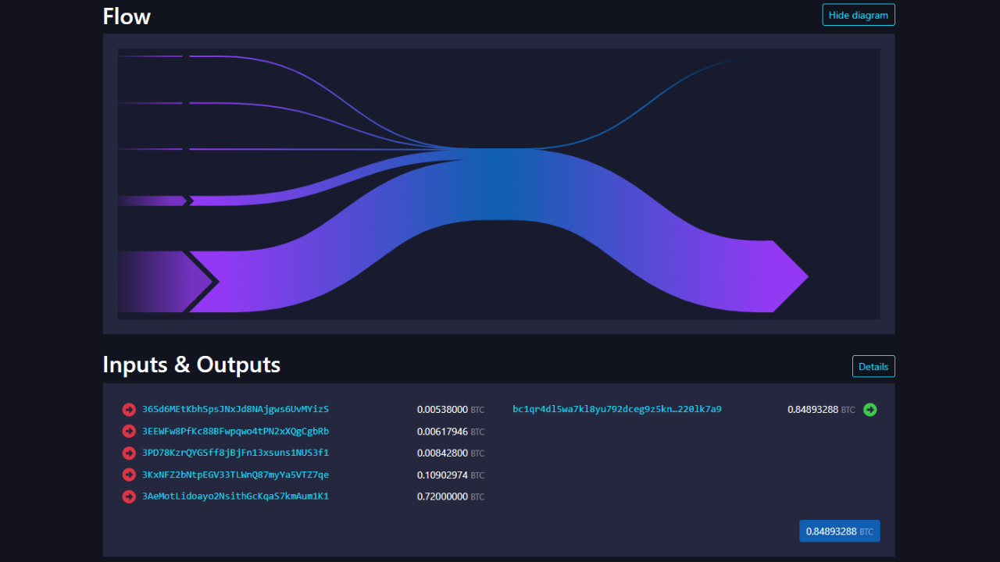


منبع: [Mempool.space](https://Mempool.space/tx/20618e63b6eed056263fa52a2282c8897ab2ee71604c7faccfe748e1a202d712)


### داده‌های off-chain


البته، تحلیل زنجیره‌ای به داده‌های آنچین محدود نمی‌شود. هر داده‌ای از تحلیل‌های قبلی یا موجود در اینترنت نیز می‌تواند برای بهبود تحلیل استفاده شود.


به عنوان مثال، اگر مشاهده کنیم که تراکنش‌های ردیابی شده به صورت سیستماتیک از همان گره Bitcoin پخش می‌شوند و موفق به شناسایی IP آن Address شویم، ممکن است بتوانیم تراکنش‌های دیگری از همان نهاد را شناسایی کنیم و همچنین بخشی از هویت صادرکننده را تعیین کنیم. اگرچه این عمل به راحتی قابل دستیابی نیست، زیرا نیاز به عملیات تعداد زیادی گره دارد، اما ممکن است توسط برخی شرکت‌های متخصص در تحلیل Blockchain به کار گرفته شود.


تحلیلگر همچنین این گزینه را دارد که به تحلیل‌های قبلاً منبع‌باز شده یا به تحلیل‌های قبلی خود تکیه کند. شاید بتوانیم خروجی‌ای پیدا کنیم که به خوشه‌ای از آدرس‌هایی که قبلاً شناسایی کرده‌ایم اشاره کند. گاهی اوقات، همچنین ممکن است به خروجی‌هایی تکیه کنیم که به یک پلتفرم Exchange اشاره دارند، زیرا آدرس‌های این شرکت‌ها عموماً شناخته شده هستند.


به همان روش، می‌توانید تحلیلی با حذف انجام دهید. به عنوان مثال، اگر هنگام تحلیل یک تراکنش با دو خروجی، یکی از آن‌ها به یک خوشه Address که قبلاً شناخته شده است اما متفاوت از موجودیتی که در حال ردیابی آن هستیم مربوط باشد، می‌توانیم تفسیر کنیم که خروجی دیگر احتمالاً نمایانگر Exchange است.


تجزیه و تحلیل کانال همچنین شامل یک مؤلفه OSINT (*اطلاعات منبع باز*) کمی عمومی‌تر است که شامل جستجوهای اینترنتی می‌شود. به همین دلیل است که ما توصیه می‌کنیم از انتشار مستقیم آدرس‌ها در شبکه‌های اجتماعی یا در یک وب‌سایت، چه به صورت مستعار و چه غیر آن، خودداری کنید.


### مدل‌های زمانی


ما کمتر به آن فکر می‌کنیم، اما برخی رفتارهای انسانی در زنجیره قابل شناسایی هستند. شاید مفیدترین مورد در یک تحلیل، الگوی خواب شما باشد! بله، وقتی می‌خوابید، تراکنش‌های Bitcoin را پخش نمی‌کنید. اما معمولاً تقریباً در همان زمان می‌خوابید. به همین دلیل است که استفاده از تحلیل زمانی در تحلیل Blockchain رایج است. به سادگی، این یک سرشماری از زمان‌هایی است که تراکنش‌های یک نهاد خاص به شبکه Bitcoin پخش می‌شود. با تحلیل این الگوهای زمانی، می‌توانیم به اطلاعات زیادی دست یابیم.


اول از همه، یک تحلیل زمانی می‌تواند گاهی اوقات ماهیت موجودیت ردیابی شده را شناسایی کند. اگر مشاهده کنیم که تراکنش‌ها به طور مداوم در طول ۲۴ ساعت پخش می‌شوند، این نشان‌دهنده سطح بالایی از فعالیت اقتصادی خواهد بود. موجودیت پشت این تراکنش‌ها احتمالاً یک شرکت است، که ممکن است بین‌المللی باشد و شاید دارای رویه‌های خودکار داخلی باشد.


به عنوان مثال، [من این الگو را چند ماه پیش تشخیص دادم](https://twitter.com/Loic_Pandul/status/1701127409712452072) وقتی که [تراکنشی که به اشتباه ۱۹ بیت‌کوین به عنوان کارمزد تخصیص داده بود](https://Mempool.space/tx/d5392d474b4c436e1c9d1f4ff4be5f5f9bb0eb2e26b61d2781751474b7e870fd) را تحلیل می‌کردم. یک تحلیل زمانی ساده به من اجازه داد تا فرض کنم که با یک سرویس خودکار سروکار داریم و بنابراین احتمالاً با یک نهاد بزرگ مانند یک پلتفرم Exchange مواجه هستیم.


در واقع، چند روز بعد مشخص شد که این وجوه متعلق به PayPal است، از طریق پلتفرم Paxos Exchange.


برعکس، اگر ببینیم که الگوی زمانی در 16 ساعت خاص پخش شده است، می‌توانیم تخمین بزنیم که با یک کاربر فردی یا شاید یک شرکت محلی بسته به حجم‌های مبادله شده سروکار داریم.


فراتر از ماهیت موجودیت مشاهده‌شده، الگوی زمانی نیز می‌تواند تقریباً به ما بگوید که کاربر در کجا قرار دارد، به لطف مناطق زمانی. به این ترتیب، می‌توانیم تراکنش‌های دیگر را مطابقت دهیم و از زمان‌سنجی آن‌ها به عنوان یک روش اکتشافی اضافی که می‌تواند به تحلیل ما اضافه شود، استفاده کنیم.


به عنوان مثال، در مورد Address که قبلاً ذکر کردم، می‌توانیم ببینیم که تراکنش‌ها، چه ورودی و چه خروجی، در یک بازه زمانی ۱۳ ساعته متمرکز شده‌اند.


```plaintext
bc1qqtmeu0eyvem9a85l3sghuhral8tk0ar7m4a0a0
```


منبع: OXT.me


این محدوده احتمالاً با اروپا، آفریقا یا خاورمیانه مطابقت دارد. بنابراین می‌توانیم فرض کنیم که کاربر پشت این تراکنش‌ها در این مناطق زندگی می‌کند.


در یک زمینه متفاوت، تحلیل زمانی از این نوع نیز به فرضیه‌ای منجر شد که Satoshi ناکاموتو از ژاپن فعالیت نمی‌کرده، بلکه از ایالات متحده آمریکا: [*مناطق زمانی Satoshi ناکاموتو*](https://medium.com/@insearchofsatoshi/the-time-zones-of-Satoshi-nakamoto-aa40f035178f)


## قرار دادن آن در عمل با یک Block explorer


<chapterId>6493cf2f-225c-405f-9375-c4304f1087ed</chapterId>


در این فصل نهایی، قصد داریم مفاهیمی که تا کنون مطالعه کرده‌ایم را به کار ببریم. من به شما مثال‌هایی از تراکنش‌های واقعی Bitcoin نشان خواهم داد و شما باید اطلاعاتی که از شما می‌خواهم را استخراج کنید.


به‌طور ایده‌آل، برای انجام این تمرین‌ها، استفاده از یک ابزار تحلیل زنجیره‌ای حرفه‌ای ترجیح داده می‌شود. با این حال، از زمان دستگیری سازندگان Samourai Wallet، تنها ابزار تحلیل رایگان OXT.me دیگر در دسترس نیست. بنابراین، برای این تمرین‌ها از یک Block explorer کلاسیک استفاده خواهیم کرد. من توصیه می‌کنم از [Mempool.space](https://Mempool.space/) به دلیل ویژگی‌های متعدد و دامنه ابزارهای تحلیل زنجیره‌ای آن استفاده کنید، اما می‌توانید از یک کاوشگر دیگر مانند [Bitcoin Explorer](https://bitcoinexplorer.org/) نیز استفاده کنید.


برای شروع، شما را با تمرین‌ها آشنا می‌کنم. از Block explorer خود برای تکمیل آن‌ها استفاده کنید و پاسخ‌های خود را روی یک برگ کاغذ بنویسید. سپس، در پایان این فصل، پاسخ‌ها را در اختیار شما قرار می‌دهم تا بتوانید نتایج خود را بررسی و تصحیح کنید.


*تراکنش‌های انتخاب‌شده برای این تمرین‌ها صرفاً به دلیل ویژگی‌هایشان به‌صورت نسبتاً تصادفی انتخاب شده‌اند. این فصل صرفاً برای اهداف آموزشی و اطلاعاتی است. مایلم به‌وضوح بیان کنم که من نه از استفاده از این ابزارها برای مقاصد مخرب حمایت می‌کنم و نه آن را تشویق می‌کنم. هدف این است که به شما بیاموزیم چگونه در برابر تحلیل رشته‌ای از خود محافظت کنید، نه اینکه تحلیل‌هایی برای افشای اطلاعات خصوصی دیگران انجام دهید.*


### تمرین 1


شناسه تراکنشی که باید تحلیل شود :


```plaintext
3769d3b124e47ef4ffb5b52d11df64b0a3f0b82bb10fd6b98c0fd5111789bef7
```


نام مدل این تراکنش چیست و با بررسی فقط مدل آن، یعنی ساختار تراکنش، چه تفسیرهای معقولی می‌توان انجام داد؟


### تمرین 2


شناسه تراکنشی که باید تحلیل شود:


```plaintext
baa228f6859ca63e6b8eea24ffad7e871713749d693ebd85343859173b8d5c20
```


نام مدل این تراکنش چیست و با بررسی تنها مدل آن، یعنی ساختار تراکنش، چه تفسیرهای محتملی می‌توان ارائه داد؟


### تمرین 3


شناسه تراکنشی که باید تحلیل شود:


```plaintext
3a9eb9ccc3517cc25d1860924c66109262a4b68f4ed2d847f079b084da0cd32b
```


مدل این تراکنش چیست؟


با شناسایی مدل آن، با استفاده از روش‌های اکتشافی داخلی تراکنش، خروجی Exchange احتمالاً چه چیزی را نشان می‌دهد؟


### تمرین 4


شناسه تراکنشی که باید تحلیل شود:


```plaintext
35f0b31c05503ebfdf7311df47f68a048e992e5cf4c97ec34aa2833cc0122a12
```


مدل این تراکنش چیست؟


با شناسایی مدل آن، با استفاده از روش‌های داخلی تراکنش، خروجی Exchange احتمالاً چه چیزی را نشان می‌دهد؟


### تمرین 5


بیایید تصور کنیم که لوئیک یکی از آدرس‌های دریافت Bitcoin خود را در شبکه اجتماعی توییتر منتشر کرده است:


```plaintext
bc1qja0hycrv7g9ww00jcqanhfpqmzx7luqalum3vu
```


بر اساس این اطلاعات و با استفاده از **فقط روش اکتشافی استفاده مجدد Address**، کدام تراکنش‌های Bitcoin می‌توانند به هویت لوئیک مرتبط شوند؟


*بدیهی است که من مالک واقعی این پذیرش Address نیستم و آن را در شبکه‌های اجتماعی منتشر نکرده‌ام. این یک Address است که به‌طور تصادفی از Blockchain برداشته‌ام*


### تمرین 6


با دنبال کردن تمرین 5 و به لطف روش استفاده مجدد Address، شما توانستید چندین تراکنش Bitcoin را شناسایی کنید که به نظر می‌رسد لوئیک در آن‌ها دخیل است. معمولاً، در میان تراکنش‌های شناسایی‌شده، باید این یکی را تشخیص داده باشید:


```plaintext
2d9575553c99578268ffba49a1b2adc3b85a29926728bd0280703a04d051eace
```


این تراکنش اولین تراکنشی است که وجوه را به Address لوئیک ارسال می‌کند. به نظر شما بیت‌کوین‌هایی که لوئیک از طریق این تراکنش دریافت کرده است، از کجا آمده‌اند؟


### تمرین 7


با دنبال کردن تمرین ۵ و به لطف روش اکتشافی استفاده مجدد Address، شما توانسته‌اید چندین تراکنش Bitcoin را شناسایی کنید که به نظر می‌رسد لوئیک در آن‌ها دخیل است. اکنون می‌خواهید بفهمید لوئیک از کجا آمده است. بر اساس تراکنش‌های یافت شده، یک تحلیل زمانی انجام دهید تا منطقه زمانی که به احتمال زیاد توسط لوئیک استفاده می‌شود را پیدا کنید. از این منطقه زمانی، مکانی را تعیین کنید که به نظر می‌رسد لوئیک در آن زندگی می‌کند (کشور، ایالت/منطقه، شهر...).


### تمرین 8


در اینجا تراکنش Bitcoin برای مطالعه آمده است:


```plaintext
bb346dae645d09d32ed6eca1391d2ee97c57e11b4c31ae4325bcffdec40afd4f
```


با نگاه کردن به این تراکنش به تنهایی، چه اطلاعاتی می‌توانیم تفسیر کنیم؟


### راه‌حل‌های تمرینات


***تمرین 1:***


مدل این تراکنش مدل پرداخت ساده است. اگر فقط ساختار آن را بررسی کنیم، می‌توانیم تفسیر کنیم که یک خروجی نمایانگر Exchange و خروجی دیگر نمایانگر یک پرداخت واقعی است. بنابراین می‌دانیم که کاربر مشاهده شده احتمالاً دیگر یکی از دو UTXO در خروجی (آن مربوط به پرداخت) را در اختیار ندارد، اما همچنان دیگری UTXO (آن مربوط به Exchange) را در اختیار دارد.


***تمرین ۲:***


مدل این تراکنش به صورت هزینه‌های گروه‌بندی شده است. این مدل احتمالاً فعالیت اقتصادی در مقیاس بزرگ را نشان می‌دهد، مانند یک پلتفرم Exchange. می‌توانیم نتیجه بگیریم که ورودی UTXO از یک شرکت با سطح بالای فعالیت اقتصادی می‌آید و خروجی‌های UTXO پراکنده خواهند شد. برخی از آن‌ها متعلق به مشتریان شرکتی خواهند بود که بیت‌کوین‌های خود را به کیف‌پول‌های خود نگهداری منتقل کرده‌اند. برخی دیگر ممکن است به شرکت‌های شریک بروند. در نهایت، بدون شک برخی Exchange به شرکت صادرکننده باز خواهند گشت.


***تمرین 3:***


مدل این تراکنش پرداخت ساده است. بنابراین می‌توانیم از روش‌های داخلی برای تراکنش استفاده کنیم تا سعی کنیم Exchange را شناسایی کنیم.


من شخصاً حداقل دو روش اکتشافی داخلی را شناسایی کرده‌ام که از همان فرضیه پشتیبانی می‌کنند:


- استفاده مجدد از همان نوع اسکریپت؛
- بزرگترین خروجی.


آشکارترین روش اکتشافی استفاده مجدد از همان نوع اسکریپت است. در واقع، خروجی `0` یک `P2SH` است که با دریافت Address که با `3` شروع می‌شود، قابل شناسایی است:


```plaintext
3Lcdauq6eqCWwQ3UzgNb4cu9bs88sz3mKD
```


در حالی که خروجی `1` یک `P2WPKH` است که با Address شروع می‌شود `bc1q` :


```plaintext
bc1qya6sw6sta0mfr698n9jpd3j3nrkltdtwvelywa
```


UTXO مورد استفاده به عنوان ورودی برای این تراکنش همچنین از یک اسکریپت `P2WPKH` استفاده می‌کند:


```plaintext
bc1qyfuytw8pcvg5vx37kkgwjspg73rpt56l5mx89k
```


بنابراین، می‌توانیم فرض کنیم که خروجی `0` مربوط به یک پرداخت است و خروجی `1` تراکنش Exchange است، که به این معنی است که کاربر ورودی همیشه مالک خروجی `1` است.


برای حمایت یا رد این فرضیه، می‌توانیم به دنبال سایر اکتشافات باشیم که یا تفکر ما را تأیید کنند، یا احتمال درستی فرضیه ما را کاهش دهند.


من حداقل یک روش اکتشافی دیگر را شناسایی کرده‌ام. این روش اکتشافی بزرگ‌ترین خروجی است. خروجی `0` اندازه‌گیری می‌کند `123,689 Sats`، در حالی که خروجی `1` اندازه‌گیری می‌کند `505,839 Sats`. بنابراین تفاوت قابل توجهی بین این دو خروجی وجود دارد. روش اکتشافی بزرگ‌ترین خروجی نشان می‌دهد که بزرگ‌ترین خروجی احتمالاً Exchange خارجی است. این روش اکتشافی فرضیه اولیه ما را بیشتر تقویت می‌کند.


به نظر می‌رسد که کاربری که UTXO را به عنوان ورودی ارائه کرده است، همچنان خروجی `1` را در اختیار دارد که به نظر می‌رسد تراکنش Exchange را تجسم می‌کند.


***تمرین ۴:***


مدل این تراکنش پرداخت ساده است. بنابراین می‌توانیم از روش‌های داخلی برای تراکنش استفاده کنیم تا سعی کنیم Exchange را شناسایی کنیم.


من شخصاً حداقل دو روش اکتشافی داخلی را شناسایی کرده‌ام که از همان فرضیه پشتیبانی می‌کنند:


- استفاده مجدد از همان نوع اسکریپت؛
- خروجی پست گرد.


آشکارترین روش اکتشافی استفاده مجدد از همان نوع اسکریپت است. در واقع، خروجی `0` یک `P2SH` است که با دریافت آن Address که با `3` شروع می‌شود، قابل شناسایی است:


```plaintext
3FSH5Mnq6S5FyQoKR9Yjakk3X4KCGxeaD4
```


در حالی که خروجی `1` یک `P2WPKH` است، که با Address شروع می‌شود با `bc1q` :


```plaintext
bc1qvdywdcfsyavt4v8uxmmrdt6meu4vgeg439n7sg
```


UTXO که به عنوان ورودی برای این تراکنش استفاده می‌شود، همچنین از یک اسکریپت `P2WPKH` استفاده می‌کند:


```plaintext
bc1qku3f2y294h3ks5eusv63dslcua2xnlzxx0k6kp
```


بنابراین، می‌توانیم فرض کنیم که خروجی `0` مربوط به یک پرداخت است و خروجی `1` تراکنش Exchange است، که به این معنی است که کاربر ورودی همیشه مالک خروجی `1` است.


برای حمایت یا رد این فرضیه، می‌توانیم به دنبال سایر اکتشافات باشیم که یا تفکر ما را تأیید کنند یا احتمال درستی فرضیه‌مان را کاهش دهند.


حداقل یک اکتشاف دیگر را شناسایی کرده‌ام. این خروجی مقدار گرد است. خروجی `0` اندازه‌گیری می‌کند `70,000 Sats`، در حالی که خروجی `1` اندازه‌گیری می‌کند `22,962 Sats`. بنابراین ما یک خروجی کاملاً گرد در واحد حساب BTC داریم. روش اکتشافی خروجی گرد نشان می‌دهد که UTXO با مقدار گرد به احتمال زیاد مربوط به پرداخت است و با حذف، دیگری نمایانگر Exchange است. این روش اکتشافی فرضیه اولیه ما را بیشتر تقویت می‌کند.


با این حال، در این مثال، یک روش اکتشافی دیگر می‌تواند فرضیه اولیه ما را به چالش بکشد. در واقع، خروجی `0` بزرگتر از خروجی `1` است. بر اساس روش اکتشافی که بزرگترین خروجی به طور کلی Exchange خارجی است، می‌توانیم نتیجه بگیریم که خروجی `0` Exchange خارجی است. با این حال، این فرضیه متقابل به نظر غیرمحتمل می‌رسد، زیرا دو روش اکتشافی دیگر به طور قابل توجهی قانع‌کننده‌تر از روش اکتشافی بزرگترین خروجی به نظر می‌رسند. در نتیجه، به نظر می‌رسد که منطقی است که فرضیه اولیه خود را حفظ کنیم، علیرغم این تناقض ظاهری.


به نظر می‌رسد که کاربری که UTXO را به عنوان ورودی ارائه داده است، همچنان خروجی `1` را در اختیار دارد که به نظر می‌رسد تجسمی از تراکنش Exchange باشد.


***تمرین 5:***


ما می‌توانیم ببینیم که ۸ تراکنش می‌تواند با هویت لوئیک مرتبط باشد. از این تعداد، ۴ مورد شامل دریافت بیت‌کوین است:


```plaintext
2d9575553c99578268ffba49a1b2adc3b85a29926728bd0280703a04d051eace
8b70bd322e6118b8a002dbdb731d16b59c4a729c2379af376ae230cf8cdde0dd
d5864ea93e7a8db9d3fb113651d2131567e284e868021e114a67c3f5fb616ac4
bc4dcf2200c88ac1f976b8c9018ce70f9007e949435841fc5681fd33308dd762
```


4 مورد دیگر مربوط به محموله‌های Bitcoin:


```plaintext
8b52fe3c2cf8bef60828399d1c776c0e9e99e7aaeeff721fff70f4b68145d540
c12499e9a865b9e920012e39b4b9867ea821e44c047d022ebb5c9113f2910ed6
a6dbebebca119af3d05c0196b76f80fdbf78f20368ebef1b7fd3476d0814517d
3aeb7ce02c35eaecccc0a97a771d92c3e65e86bedff42a8185edd12ce89d89cc
```


***تمرین 6:***


اگر به مدل این تراکنش نگاه کنیم، واضح است که این یک هزینه بسته‌بندی شده است. در واقع، تراکنش دارای یک ورودی و ۵۱ خروجی است که نشان‌دهنده سطح بالایی از فعالیت اقتصادی است. بنابراین می‌توانیم فرض کنیم که لوئیک بیت‌کوین‌ها را از یک پلتفرم Exchange برداشت کرده است.


عوامل متعددی این فرضیه را تقویت می‌کنند. اولاً، نوع اسکریپتی که برای ایمن‌سازی ورودی UTXO استفاده شده است، یک اسکریپت P2SH 2/3 Multisig است که نشان‌دهنده سطح پیشرفته‌ای از امنیت است که معمولاً در پلتفرم‌های Exchange دیده می‌شود:


```plaintext
OP_PUSHNUM_2
OP_PUSHBYTES_33 03eae02975918af86577e1d8a257773118fd6ceaf43f1a543a4a04a410e9af4a59
OP_PUSHBYTES_33 03ba37b6c04aaf7099edc389e22eeb5eae643ce0ab89ac5afa4fb934f575f24b4e
OP_PUSHBYTES_33 03d95ef2dc0749859929f3ed4aa5668c7a95baa47133d3abec25896411321d2d2d
OP_PUSHNUM_3
OP_CHECKMULTISIG
```


علاوه بر این، Address که `3PUv9tQMSDCEPSMsYSopA5wDW86pwRFbNF` را مطالعه کرده است، در بیش از 220,000 تراکنش مختلف استفاده شده است، که اغلب ویژگی پلتفرم‌های Exchange است که معمولاً نگران محرمانگی خود نیستند.


روش اکتشافی زمانی اعمال‌شده به این Address همچنین نشان‌دهنده پخش منظم تراکنش‌ها تقریباً به‌صورت روزانه در یک دوره ۳ ماهه است، با ساعات طولانی‌تر بیش از ۲۴ ساعت، که فعالیت مداوم یک پلتفرم Exchange را نشان می‌دهد.


در نهایت، حجم‌هایی که توسط این نهاد مدیریت می‌شوند، بسیار عظیم هستند. Address در 222,262 تراکنش بین دسامبر 2022 و مارس 2023، 44 BTC دریافت و ارسال کرده است. این حجم‌های بزرگ بیشتر ماهیت احتمالی فعالیت یک پلتفرم Exchange را تأیید می‌کنند.


***تمرین ۷:***


با تجزیه و تحلیل زمان‌های تأیید تراکنش، زمان‌های زیر به وقت UTC قابل شناسایی هستند:


```plaintext
05:43
20:51
18:12
17:16
04:28
23:38
07:45
21:55
```


تجزیه و تحلیل این برنامه‌ها نشان می‌دهد که UTC-7 و UTC-8 با دامنه‌ای از فعالیت‌های انسانی فعلی (بین 08:00 و 23:00) برای اکثر برنامه‌ها سازگار هستند:


```plaintext
05:43 UTC > 22:43 UTC-7
20:51 UTC > 13:51 UTC-7
18:12 UTC > 11:12 UTC-7
17:16 UTC > 10:16 UTC-7
04:28 UTC > 21:28 UTC-7
23:38 UTC > 16:38 UTC-7
07:45 UTC > 00:45 UTC-7
21:55 UTC > 14:55 UTC-7
05:43 UTC > 21:43 UTC-8
20:51 UTC > 12:51 UTC-8
18:12 UTC > 10:12 UTC-8
17:16 UTC > 09:16 UTC-8
04:28 UTC > 20:28 UTC-8
23:38 UTC > 15:38 UTC-8
07:45 UTC > 23:45 UTC-8
21:55 UTC > 13:55 UTC-8
```


منطقه زمانی UTC-7 به‌ویژه در تابستان اهمیت دارد، زیرا شامل ایالت‌ها و مناطقی مانند:


- کالیفرنیا (با شهرهایی مانند لس آنجلس، سان فرانسیسکو و سن دیگو)؛
- نوادا (با لاس وگاس) ;
- اورگن (با پورتلند) ؛
- واشنگتن (با سیاتل) ;
- منطقه کانادایی بریتیش کلمبیا (با شهرهایی مانند ونکوور و ویکتوریا).


این اطلاعات نشان می‌دهد که لوئیک احتمالاً در سواحل غربی ایالات متحده یا کانادا اقامت دارد.


***تمرین ۸:***


تجزیه و تحلیل این تراکنش نشان می‌دهد که ۵ ورودی و یک خروجی وجود دارد که نشان‌دهنده‌ی تجمیع است. با استفاده از روش CIOH، می‌توان فرض کرد که تمام UTXOهای ورودی متعلق به یک نهاد واحد هستند و خروجی UTXO نیز به این نهاد تعلق دارد. به نظر می‌رسد که کاربر تصمیم گرفته است چندین UTXO که در اختیار داشت را با هم ترکیب کند تا یک UTXO واحد در خروجی تشکیل دهد، با هدف تجمیع بخش‌های خود. این اقدام احتمالاً به دلیل تمایل به بهره‌برداری از هزینه‌های پایین تراکنش در آن زمان، به منظور کاهش هزینه‌های آینده انجام شده است.


___


*برای نوشتن این بخش از تحلیل on chain قسمت 3، از منابع زیر استفاده کردم:*


- مجموعه‌ای از چهار مقاله با عنوان: [Understanding Bitcoin Privacy with OXT](https://medium.com/oxt-research/understanding-Bitcoin-privacy-with-oxt-part-1-4-8177a40a5923)، تولید شده توسط Samourai Wallet در سال 2021 ;*
- گزارش‌های مختلف از [OXT Research](https://medium.com/oxt-research)، و همچنین ابزار تحلیل رایگان Blockchain آن‌ها (که در حال حاضر پس از دستگیری بنیان‌گذاران Samourai Wallet دیگر در دسترس نیست)؛*
- به طور کلی، دانش من از توییت‌ها و محتوای مختلف از [@LaurentMT](https://twitter.com/LaurentMT) و [@ErgoBTC](https://twitter.com/ErgoBTC) می‌آید؛*
- [Space Kek #19](https://podcasters.spotify.com/pod/show/decouvrebitcoin/episodes/SpaceKek-19---Analyse-de-chane--anonsets-et-entropie-e1vfuji) که در آن به همراه [@louneskmt](https://twitter.com/louneskmt)، [@TheoPantamis](https://twitter.com/TheoPantamis)، [@Sosthene___](https://twitter.com/Sosthene___) و [@LaurentMT](https://twitter.com/LaurentMT) شرکت کردم.*


*مایلم از نویسندگان، توسعه‌دهندگان و تهیه‌کنندگان آن‌ها تشکر کنم. همچنین از ویراستارانی که مقاله‌ای را که این بخش ۳ بر اساس آن است، با دقت تصحیح کردند و مشاوره تخصصی خود را به من ارائه دادند، تشکر می‌کنم:*


- [Gilles Cadignan](https://twitter.com/gillesCadignan) ;*
- [Ludovic Lars](https://viresinnumeris.fr/)


# تسلط بر بهترین روش‌ها برای حفاظت از حریم خصوصی خود


<partId>9bd04b63-f1af-4e50-9061-6bc90009df68</partId>


## استفاده مجدد Address


<chapterId>f3e97645-3df3-41bc-a4ed-d2c740113d96</chapterId>


با مطالعه تکنیک‌هایی که می‌توانند محرمانگی شما را در Bitcoin بشکنند، در این بخش سوم اکنون به بررسی بهترین روش‌هایی که باید برای محافظت از خود اتخاذ کنید، خواهیم پرداخت. هدف این بخش بررسی روش‌های بهبود محرمانگی نیست، موضوعی که بعداً به آن پرداخته خواهد شد، بلکه درک چگونگی تعامل صحیح با Bitcoin برای حفظ محرمانگی‌ای است که به طور طبیعی ارائه می‌دهد، بدون نیاز به استفاده از تکنیک‌های اضافی.


بدیهی است که برای شروع این بخش سوم، قصد داریم درباره استفاده مجدد از Address صحبت کنیم. این پدیده تهدید اصلی برای محرمانگی کاربران است. این فصل بدون شک مهم‌ترین بخش از کل دوره است.


### Address دریافت‌کننده چیست؟


دریافت Bitcoin از Address یک رشته یا شناسه است که برای دریافت بیت‌کوین‌ها بر روی Wallet استفاده می‌شود.


از نظر فنی، یک Bitcoin که Address را دریافت می‌کند، به معنای واقعی کلمه بیت‌کوین‌ها را "دریافت" نمی‌کند، بلکه شرایطی را تعریف می‌کند که تحت آن بیت‌کوین‌ها می‌توانند خرج شوند. به طور مشخص، زمانی که یک پرداخت به شما ارسال می‌شود، تراکنش فرستنده یک UTXO جدید برای شما به عنوان خروجی از UTXOهایی که به عنوان ورودی مصرف کرده است، ایجاد می‌کند. بر روی این خروجی، یک اسکریپت قرار می‌دهد که تعریف می‌کند چگونه این UTXO می‌تواند در تاریخ بعدی خرج شود. این اسکریپت به عنوان "*ScriptPubKey*" یا "*Locking Script*" شناخته می‌شود. Address دریافت‌کننده شما، یا به طور دقیق‌تر محموله آن، در این اسکریپت ادغام می‌شود. به زبان ساده، این اسکریپت اساساً بیان می‌کند:


> "*برای خرج کردن این UTXO جدید، باید با استفاده از کلید خصوصی مرتبط با این Address دریافت‌کننده، یک امضای دیجیتال ارائه دهید.*"


آدرس‌های Bitcoin در انواع مختلفی ارائه می‌شوند، بسته به مدل اسکریپت‌نویسی استفاده شده. اولین مدل‌ها، که به عنوان "Legacy*" شناخته می‌شوند، شامل آدرس‌های `P2PKH` (*Pay-to-PubKey-Hash*) و `P2SH` (*Pay-to-Script-Hash*) هستند. آدرس‌های P2PKH همیشه با `1` شروع می‌شوند و P2SH با `3`. اگرچه هنوز امن هستند، این فرمت‌ها اکنون منسوخ شده‌اند، زیرا هزینه‌های تراکنش بالاتری دارند و نسبت به استانداردهای جدید، محرمانگی کمتری ارائه می‌دهند.


SegWit V0 (`P2WPKH` و `P2WSH`) و Taproot / SegWit V1 (`P2TR`) آدرس‌ها نمایانگر فرمت‌های مدرن هستند. آدرس‌های SegWit با `bc1q` شروع می‌شوند و آدرس‌های Taproot که در سال 2021 معرفی شدند، با `bc1p` شروع می‌شوند.


به عنوان مثال، در اینجا یک پذیرش Taproot Address آمده است:


```text
bc1ps5gd2ys8kllz9alpmcwxqegn7kl3elrpnnlegwkm3xpq2h8da07spxwtf5
```


نحوه ساخت ScriptPubKey به استانداردی که استفاده می‌کنید بستگی دارد:


| ScriptPubKey | Script template
| ---------------- | ----------------------------------------------------------- |
| P2PKH | OP_DUP OP_HASH160 `<pubKeyHash>` OP_EQUALVERIFY OP_CHECKSIG |
| P2SH | OP_HASH160 `<scriptHash>` OP_EQUAL |
| P2WPKH | 0 `<pubKeyHash>` |
| P2WSH | 0 `<witnessScriptHash>` |
| P2SH - P2WPKH | OP_HASH160 `<redeemScriptHash>` OP_EQUAL |
| P2SH - P2WSH | OP_HASH160 `<redeemScriptHash>` OP_EQUAL |
| P2TR | 1 `<pubKey>` |

ساخت آدرس‌های پذیرش نیز به مدل اسکریپت انتخاب‌شده بستگی دارد:


- برای آدرس‌های `P2PKH` و `P2WPKH`، محموله، یعنی هسته‌ی Address، نمایانگر Hash کلید عمومی است؛
- برای آدرس‌های `P2SH` و `P2WSH`، محموله نشان‌دهنده Hash یک ;
- در مورد آدرس‌های `P2TR`، محموله یک کلید عمومی تغییر یافته است. خروجی‌های P2TR جنبه‌هایی از _Pay-to-PubKey_ و _Pay-to-Script_ را ترکیب می‌کنند. کلید عمومی تغییر یافته نتیجه افزودن یک کلید عمومی خرج کلاسیک با یک "تغییر" است که از Merkle Root مجموعه‌ای از اسکریپت‌ها مشتق شده که می‌توانند برای خرج کردن بیت‌کوین‌ها نیز استفاده شوند.


آدرس‌هایی که در نرم‌افزار پورتفولیوی شما نمایش داده می‌شوند، همچنین شامل یک HRP (*بخش قابل خواندن توسط انسان*) هستند، که معمولاً `bc` برای آدرس‌های پس از SegWit، یک جداکننده `1` و یک شماره نسخه `q` برای SegWit V0 و `p` برای Taproot/SegWit V1 می‌باشد. یک چکسام نیز اضافه می‌شود تا یکپارچگی و اعتبار Address در حین انتقال تضمین شود.


در نهایت، آدرس‌ها به یک قالب استاندارد تبدیل می‌شوند:


- Base58check برای آدرس‌های قدیمی Legacy ;
- Bech32 برای آدرس‌های SegWit ;
- بچ۳۲م برای آدرس‌های Taproot.


در اینجا ماتریس جمع برای فرمت‌های bech32 و bech32m (SegWit و Taproot) از مبنای 10 آمده است:


| + | 0 | 1 | 2 | 3 | 4 | 5 | 6 | 7 |
| --- | --- | --- | --- | --- | --- | --- | --- | --- |
| 0 | q | p | z | r | y | 9 | x | 8 |
| 8 | g | f | 2 | t | v | d | w | 0 |
| 16 | s | 3 | j | n | 5 | 4 | k | h |
| 24 | c | e | 6 | m | u | a | 7 | l |

### استفاده مجدد از Address چیست؟


استفاده مجدد از Address به معنای استفاده از همان Address دریافت‌کننده برای مسدود کردن چندین UTXO مختلف است.


همانطور که در بخش قبلی دیدیم، هر UTXO دارای ScriptPubKey خاص خود است که آن را قفل می‌کند و باید برای مصرف UTXO به عنوان ورودی در یک تراکنش جدید برآورده شود. در همین ScriptPubKey است که آدرس‌های payload یکپارچه می‌شوند.


وقتی ScriptPubKeys مختلف حاوی Address دریافت‌کننده یکسانی باشند، به این حالت استفاده مجدد از Address گفته می‌شود. در عمل، این بدان معناست که یک کاربر به طور مکرر همان Address را به فرستندگان ارائه داده است تا بیت‌کوین‌ها را از طریق پرداخت‌های متعدد دریافت کند. و دقیقاً همین عمل است که برای حریم خصوصی شما فاجعه‌بار است.


### چرا استفاده مجدد از Address مشکل‌ساز است؟


از آنجا که Blockchain عمومی است، به راحتی می‌توان دید که کدام آدرس‌ها کدام UTXO را قفل می‌کنند و چه تعداد بیت‌کوین دارند. اگر از همان Address برای چندین تراکنش استفاده شود، امکان استنباط این که تمام بیت‌کوین‌های مرتبط با آن Address به یک شخص تعلق دارند، فراهم می‌شود. این عمل حریم خصوصی کاربر را با ایجاد پیوندهای قطعی بین تراکنش‌های مختلف و ردیابی بیت‌کوین‌ها در Blockchain به خطر می‌اندازد. خود Satoshi ناکاموتو قبلاً این مشکل را در وایت‌پیپر Bitcoin برجسته کرده است:


> *به عنوان یک دیوار آتش اضافی، می‌توان از یک جفت کلید جدید برای هر تراکنش استفاده کرد تا آنها را به یک مالک مشترک مرتبط نکند*


منبع: S. Nakamoto, "Bitcoin: A Peer-to-Peer Electronic Cash System", https://Bitcoin.org/Bitcoin.pdf, 2009.


قصد Satoshi در این جمله ایجاد یک فایروال اضافی در صورت ارتباط بین هویت کاربر و یک جفت کلید در Bitcoin بود تا از ارتباط عمومی کل فعالیت او با هویتش جلوگیری کند. امروزه، با گسترش شرکت‌های تحلیل Blockchain و مقررات KYC، استفاده از آدرس‌های منحصر به فرد دیگر یک "فایروال اضافی" نیست، بلکه یک عمل ضروری برای هر کسی است که می‌خواهد حداقل حریم خصوصی را حفظ کند.


هنگامی که از یک Address مجدداً استفاده می‌کنید، یک ارتباط تقریباً غیرقابل انکار بین تمام تراکنش‌های مرتبط با آن Address ایجاد می‌کنید. اگرچه این به طور مستقیم وجوه شما را به خطر نمی‌اندازد، زیرا رمزنگاری منحنی بیضوی امنیت کلیدهای خصوصی شما را تضمین می‌کند، اما نظارت بر فعالیت‌های شما را آسان‌تر می‌کند. در واقع، هر کسی که یک نود داشته باشد می‌تواند تراکنش‌ها و موجودی‌های آدرس‌ها را مشاهده کند و به طور کامل ناشناس بودن شما را به خطر بیندازد.


برای روشن کردن این موضوع، بیایید به مثال Bob بپردازیم، کاربری که به طور منظم بیت‌کوین‌ها را به مقدار کم در DCA خریداری می‌کند و همیشه آن‌ها را به همان Address ارسال می‌کند. پس از دو سال، این Address حاوی مقدار قابل توجهی بیت‌کوین می‌شود. اگر Bob از این Address برای پرداخت به یک تاجر محلی استفاده کند، تاجر قادر خواهد بود تمام وجوه مرتبط را ببیند و ثروت Bob را استنباط کند. این می‌تواند به خطرات امنیتی شخصی منجر شود، مانند تلاش برای سرقت یا اخاذی. اگر Bob از یک Address خالی برای دریافت هر خرید دوره‌ای استفاده کرده بود، اطلاعات بسیار کمتری را به تاجر خود فاش می‌کرد.


در تحلیل رشته، 2 نوع استفاده مجدد از Address وجود دارد:


- استفاده مجدد خارجی ;
- استفاده مجدد داخلی در یک تراکنش.


اولین مورد زمانی است که یک Address در چندین تراکنش مختلف Bitcoin استفاده مجدد می‌شود. این همان چیزی است که قبلاً در مورد آن صحبت کردیم: این روش استنتاج می‌کند که تمام UTXOهایی که از این Address عبور کرده‌اند به یک نهاد واحد تعلق دارند.


استفاده مجدد از Address داخلی زمانی رخ نمی‌دهد که استفاده مجدد در چندین تراکنش اتفاق بیفتد، بلکه زمانی رخ می‌دهد که در یک تراکنش واحد اتفاق بیفتد. در واقع، اگر همان Address که برای قفل کردن یک ورودی استفاده شده به عنوان خروجی یک تراکنش استفاده شود، می‌توانیم نتیجه بگیریم که این خروجی هنوز به همان کاربر (Exchange) تعلق دارد و خروجی دوم نشان‌دهنده پرداخت واقعی است. این روش اکتشافی دیگر امکان پیگیری وجوه را در چندین تراکنش فراهم می‌کند.


استفاده مجدد از Address یک بلای واقعی بر روی Bitcoin است. طبق وب‌سایت OXT.me (که در حال حاضر غیرقابل دسترسی است)، نرخ کلی استفاده مجدد از Address بر روی Bitcoin در سال 2022 حدود 52% بود:


این نرخ بسیار زیاد است، اما عمدتاً از پلتفرم‌های Exchange می‌آید تا کاربران فردی.


### چگونه از استفاده مجدد Address جلوگیری کنیم؟


اجتناب از استفاده مجدد از Address بسیار ساده است: **به سادگی از یک Address جدید و خالی برای تمامی پرداخت‌های جدید به Wallet خود استفاده کنید**.


با تشکر از BIP32، پرتفوی‌های مدرن اکنون تعیین‌پذیر و سلسله‌مراتبی هستند. این بدان معناست که یک کاربر می‌تواند تعداد زیادی آدرس را از یک قطعه اطلاعات اولیه ایجاد کند: seed. با ذخیره این قطعه اطلاعات، امکان بازیابی تمام کلیدهای خصوصی در پرتفوی وجود دارد و دسترسی به وجوهی که توسط آدرس‌های مربوطه محافظت می‌شوند، فراهم می‌شود.


به همین دلیل، هنگامی که دکمه "*دریافت*" را در نرم‌افزار Wallet خود فشار می‌دهید، هر بار یک Address دریافت‌کننده استفاده‌نشده پیشنهاد می‌شود. پس از دریافت بیت‌کوین‌ها در این Address، نرم‌افزار به‌طور خودکار یک مورد جدید را پیشنهاد می‌دهد.


> *توجه: اخیراً، برخی از برنامه‌های نرم‌افزاری Wallet اعلام کرده‌اند که قصد دارند تولید آدرس‌های خالی را متوقف کنند، زیرا می‌ترسند که این اقدام به عنوان نوعی پول‌شویی توسط مقامات تلقی شود. اگر نرم‌افزار شما یکی از این‌هاست، به شدت توصیه می‌کنم که فوراً آن را جایگزین کنید، زیرا این برای کاربر قابل قبول نیست.*
اگر به یک شناسه ثابت برای دریافت پرداخت‌ها، مانند کمک‌های مالی، نیاز دارید، توصیه نمی‌شود که از Bitcoin Address کلاسیک استفاده کنید به دلیل خطر استفاده مجدد. در عوض، از یک Address Lightning استفاده کنید، یا یک شناسه پرداخت ثابت در زنجیره، مانند BIP47 یا Silent Payments را انتخاب کنید. این پروتکل‌ها به طور مفصل در بخش 6 این دوره آموزشی توضیح داده شده‌اند.


## برچسب‌گذاری و بررسی قطعات


<chapterId>fbdb07cd-c025-48f2-97b0-bd1bc21c68a8</chapterId>


همانطور که در بخش تحلیل رشته کشف کردیم، تعداد زیادی از اکتشافات و الگوها وجود دارد که می‌توانند برای استنتاج اطلاعات درباره یک تراکنش استفاده شوند. به عنوان یک کاربر، مهم است که از این تکنیک‌ها آگاه باشید تا بتوانید بهتر از خود در برابر آنها محافظت کنید.


این شامل مدیریت دقیق Wallet شما در نگهداری شخصی است، به این معنی که باید از منشاء UTXOهای خود آگاه باشید و همچنین با دقت انتخاب کنید که کدام UTXOها را هنگام انجام پرداخت‌ها مصرف کنید. این مدیریت کارآمد Wallet به دو ویژگی مهم کیف‌پول‌های خوب Bitcoin متکی است: برچسب‌گذاری و کنترل سکه.


در این فصل، به این ویژگی‌ها نگاهی خواهیم انداخت و خواهیم دید که چگونه می‌توانید با استفاده هوشمندانه از آن‌ها، بدون افزودن بار کاری زیاد، حریم خصوصی خود را در Bitcoin به طور چشمگیری بهینه کنید.


### برچسب‌گذاری چیست؟


برچسب‌گذاری، عمل اختصاص دادن یک حاشیه‌نویسی یا برچسب به یک UTXO خاص در یک Bitcoin Wallet است. این حاشیه‌نویسی‌ها به صورت محلی توسط نرم‌افزار Wallet ذخیره می‌شوند و هرگز از طریق شبکه Bitcoin منتقل نمی‌شوند. بنابراین، برچسب‌گذاری یک ابزار مدیریت شخصی است.


به عنوان مثال، اگر من یک UTXO از خرید P2P در Bisq با چارلز داشته باشم، می‌توانم آن را "`Non-KYC Bisq Charles`" برچسب‌گذاری کنم.


برچسب‌گذاری یک روش خوب است که به یادآوری منبع یا مقصد مورد نظر یک UTXO کمک می‌کند، که بنابراین مدیریت وجوه و بهینه‌سازی حریم خصوصی را تسهیل می‌کند. در واقع، Bitcoin Wallet شما مطمئناً چندین UTXO را ایمن می‌کند. اگر منابع این UTXOها متفاوت باشند، ممکن است نخواهید این UTXOها را در آینده ادغام کنید، در غیر این صورت ممکن است Ownership مشترک آنها را فاش کنید. با برچسب‌گذاری صحیح تمام بخش‌های خود، می‌توانید مطمئن باشید که وقتی نیاز به استفاده از آنها دارید، حتی اگر سال‌ها بعد باشد، به یاد خواهید آورد که از کجا آمده‌اند.


### کنترل گوشه چیست؟


استفاده فعال از برچسب‌گذاری زمانی که با گزینه کنترل سکه در نرم‌افزار پورتفولیو شما ترکیب شود، حتی جالب‌تر می‌شود.


کنترل سکه یک ویژگی است که در نرم‌افزارهای خوب Bitcoin و Wallet یافت می‌شود و به شما امکان می‌دهد تا به صورت دستی UTXOهای خاصی را برای استفاده به عنوان ورودی‌ها جهت تکمیل یک تراکنش انتخاب کنید. در واقع، برای برآورده کردن یک پرداخت خروجی، نیاز دارید که در ازای آن یک ورودی UTXO مصرف کنید. به دلایل مختلفی که بعداً به آن‌ها خواهیم پرداخت، ممکن است بخواهید دقیقاً انتخاب کنید که کدام بخش‌ها را به عنوان ورودی برای برآورده کردن یک پرداخت خاص مصرف کنید. این دقیقاً همان چیزی است که کنترل سکه به شما اجازه می‌دهد انجام دهید. برای ارائه یک قیاس، این ویژگی شبیه به انتخاب یک سکه خاص از Wallet شما هنگام پرداخت برای باگت شما است.


استفاده از نرم‌افزار پورتفولیو با کنترل سکه، همراه با برچسب‌گذاری UTXO، به کاربران این امکان را می‌دهد که هم UTXOها را تشخیص دهند و هم به‌طور دقیق برای تراکنش‌های خود انتخاب کنند.


### چگونه UTXOهای خود را برچسب‌گذاری می‌کنید؟


هیچ روش یکسانی برای برچسب‌گذاری UTXOها وجود ندارد. این به شما بستگی دارد که سیستمی برای برچسب‌گذاری تعریف کنید که برای پورتفولیوی شما به راحتی قابل درک باشد. در هر صورت، به خاطر داشته باشید که برچسب‌گذاری خوب، برچسب‌گذاری‌ای است که وقتی به آن نیاز دارید، بتوانید آن را درک کنید. اگر Bitcoin Wallet شما عمدتاً برای پس‌انداز در نظر گرفته شده است، ممکن است برچسب‌ها برای شما تا دهه‌ها مفید نباشند. بنابراین مطمئن شوید که آن‌ها واضح، دقیق و جامع هستند.


مهم است که عزیزان شما بتوانند به راحتی منبع وجوه را شناسایی کنند، اگر روزی به پرتفوی شما دسترسی پیدا کنند. این به آن‌ها هم از نظر محرمانگی و هم از نظر قانونی کمک می‌کند، در صورتی که نیاز باشد منبع وجوه را به یک مرجع توجیه کنند.


مهم‌ترین نکته‌ای که باید روی برچسب توجه کنید، منبع UTXO است. شما باید به سادگی نشان دهید که چگونه سکه در Wallet شما به وجود آمده است. آیا نتیجه خرید در یک پلتفرم Exchange است؟ یک پرداخت Invoice از یک مشتری؟ یک Exchange همتا به همتا؟ یا نمایانگر Exchange یک هزینه است؟ به عنوان مثال، می‌توانید مشخص کنید:


- Exchange.com را حذف کنید.
- پرداخت مشتری دیوید` ;
- خرید P2P چارلز` ;
- `تغییر خرید مبل`


برای تنظیم دقیق مدیریت UTXO و احترام به استراتژی‌های تفکیک بودجه در پرتفوی خود، می‌توانید برچسب‌های خود را با یک شاخص اضافی که این تفکیک‌ها را منعکس می‌کند، غنی کنید. اگر پرتفوی شما شامل دو دسته از UTXO است که نمی‌خواهید با هم مخلوط شوند، می‌توانید یک نشانگر به برچسب‌های خود اضافه کنید تا این گروه‌ها را به وضوح متمایز کنید. این نشانگرهای تفکیک به معیارهای خود شما بستگی خواهند داشت، مانند تمایز بین UTXOهایی که از یک فرآیند خرید که شامل KYC است، یا بین بودجه‌های حرفه‌ای و شخصی ناشی می‌شوند. با توجه به مثال‌های برچسبی که در بالا ذکر شد، این می‌تواند به این صورت ترجمه شود:


- `KYC - برداشت Exchange.com` ;
- `KYC - پرداخت مشتری دیوید` ;
- `بدون احراز هویت - خرید P2P چارلز` ;
- `بدون احراز هویت - تغییر خرید مبل`


همچنین توصیه می‌شود که برچسب‌گذاری یک بخش را در طول معاملات حفظ کنید. به عنوان مثال، هنگام تجمیع UTXO بدون KYC، مطمئن شوید که نتیجه‌ی UTXO را نه تنها به عنوان `تجمیع`، بلکه به طور خاص به عنوان `تجمیع بدون KYC` علامت‌گذاری کنید تا سابقه‌ی روشنی از منبع سکه‌ها داشته باشید.


در نهایت، قرار دادن تاریخ بر روی برچسب اجباری نیست. بیشتر نرم‌افزارهای Wallet تاریخ تراکنش را نمایش می‌دهند و همیشه می‌توان این اطلاعات را بر روی Block explorer به لطف txid پیدا کرد.


### چگونه قطعات مناسب را انتخاب کنیم؟


وقتی یک تراکنش انجام می‌دهید، کنترل سکه به شما اجازه می‌دهد تا به‌طور خاص انتخاب کنید که کدام UTXOها را به عنوان ورودی‌ها برای برآورده کردن خروجی پرداخت مصرف کنید. دو جنبه برای این انتخاب وجود دارد:


- امکان اینکه گیرنده پرداخت بتواند بخشی از هویت شما را به UTXOهای استفاده شده در ورودی‌ها مرتبط کند؛
- توانایی یک ناظر خارجی برای ایجاد ارتباط بین تمام UTXOهایی که به عنوان ورودی مصرف شده‌اند.


برای توضیح نکته اول، بیایید یک مثال عینی بزنیم. فرض کنید شما یک باگت را با بیت‌کوین از نانوا خریداری می‌کنید. شما از یک یا چند UTXO که در اختیار دارید به عنوان ورودی استفاده می‌کنید تا حداقل قیمت باگت را در خروجی‌ها، به همراه کارمزدهای تراکنش، پوشش دهید. نانوا شما سپس می‌تواند چهره شما یا هر بخش دیگری از هویت شما که می‌شناسد را با سکه‌های استفاده شده به عنوان ورودی مرتبط کند. با دانستن وجود این ارتباط، ممکن است ترجیح دهید هنگام پرداخت، یک UTXO خاص را به جای دیگری انتخاب کنید.


به عنوان مثال، اگر یکی از UTXOهای شما از یک پلتفرم Exchange باشد و شما ترجیح دهید که نانوا از حساب شما در آن پلتفرم مطلع نشود، از استفاده از آن UTXO برای پرداخت خودداری خواهید کرد. اگر یک UTXO با ارزش بالا دارید که مقدار قابل توجهی بیت‌کوین را نشان می‌دهد، ممکن است تصمیم بگیرید از آن استفاده نکنید تا نانوا از ثروت BTC شما آگاه نشود.


انتخاب اینکه کدام UTXOها را برای این نقطه اول استفاده کنید، بنابراین یک تصمیم شخصی است که تحت تأثیر آنچه که مایل به افشا کردن یا نکردن آن هستید، قرار می‌گیرد. برچسب‌هایی که به UTXOهای خود هنگام دریافت آن‌ها اختصاص می‌دهید، به شما کمک می‌کند تا آن‌هایی را انتخاب کنید که پس از خرج شدن، فقط اطلاعاتی را که مایل به افشای آن به گیرنده هستید، آشکار می‌کنند.


فراتر از اطلاعاتی که ممکن است به گیرنده فاش شود، انتخاب ورودی‌ها نیز بر آنچه به تمام ناظران Blockchain فاش می‌کنید تأثیر می‌گذارد. در واقع، با استفاده از چندین UTXO به عنوان ورودی‌های تراکنش خود، نشان می‌دهید که آن‌ها متعلق به یک نهاد هستند، طبق روش CIOH (_روش اکتشافی ورودی مشترک Ownership_).


هنگام انتخاب قطعات خود، بنابراین، باید آگاه باشید که تراکنشی که قصد دارید پخش کنید، پیوندی بین تمام UTXOهای استفاده شده ایجاد خواهد کرد. این پیوند می‌تواند برای حریم خصوصی شخصی شما مشکل‌ساز باشد، به‌ویژه اگر UTXOها از منابع مختلفی آمده باشند.


بیایید مثالی از UTXO بدون KYC من از Bisq بزنیم؛ من می‌خواهم از ترکیب آن با یک UTXO از یک پلتفرم Exchange تنظیم‌شده که هویت من را می‌داند، اجتناب کنم. در واقع، اگر من این ۲ UTXO را به عنوان ورودی‌های یک تراکنش واحد استفاده کنم، پلتفرم تنظیم‌شده قادر خواهد بود هویت من را با UTXO که در Bisq خریده‌ام و قبلاً به هویت من مرتبط نشده بود، مرتبط کند.


در نهایت، هنگام انتخاب UTXOهایی که به عنوان ورودی‌های یک تراکنش استفاده می‌شوند، مهم‌ترین چیز این است که از استفاده از چندین UTXO اجتناب کنید. در صورت امکان، یک سکه‌ی بزرگ را انتخاب کنید که برای پرداخت شما کافی باشد. به این ترتیب، به طور کامل از ریسک‌های مرتبط با CIOH اجتناب می‌کنید. با این حال، اگر هیچ UTXO تکی برای پرداخت کافی نیست و نیاز به مصرف چندین دارید، مطمئن شوید که آن‌ها از منابع مشابهی می‌آیند تا ریسک پیوندهای ناخواسته را به حداقل برسانید. همچنین به خاطر داشته باشید که گیرنده می‌تواند اطلاعاتی که درباره شما دارد را با تاریخچه سکه‌های استفاده شده در ورودی‌ها مرتبط کند.


### درک انتخاب خودکار قطعات


در بخش‌های قبلی، انتخاب دستی UTXOها برای استفاده در یک تراکنش را مورد بحث قرار دادیم. اما چه اتفاقی می‌افتد زمانی که نرم‌افزار Wallet این انتخاب را به‌صورت خودکار انجام می‌دهد؟ چندین روش برای تعیین اینکه کدام سکه‌ها مصرف شوند وجود دارد و انتخاب UTXOها یک حوزه تحقیقاتی واقعی در Bitcoin محسوب می‌شود. هدف اصلی این فرآیند خودکار اغلب به حداقل رساندن هزینه‌های تراکنش برای کاربر است.


روش‌های انتخاب UTXO مانند FIFO (*First In First Out*) و LIFO (*Last In First Out*) از ساده‌ترین‌ها هستند، اما همچنین کم‌بازده‌ترین‌ها نیز محسوب می‌شوند. در FIFO، قدیمی‌ترین قطعات در پورتفولیو ابتدا استفاده می‌شوند. این رویکرد به طور کلی هم برای کاهش هزینه‌های تراکنش و هم برای حفظ محرمانگی ناکارآمد است، مگر در مواردی که از قفل‌های زمانی نسبی استفاده می‌شود و نیاز به تجدید منظم دارند. برعکس، LIFO اولویت را به استفاده از جدیدترین UTXOها می‌دهد. هر دو روش، اگرچه ساده هستند، اغلب ناکارآمد ثابت می‌شوند.


یک روش پیشرفته‌تر *Knapsack Solver* است. این روش تا نسخه 0.17 بر روی Bitcoin Core Wallet استفاده می‌شد. این روش شامل انتخاب تصادفی و تکراری UTXOها از Wallet، جمع‌آوری آن‌ها در زیرمجموعه‌ها و نگه‌داشتن راه‌حلی است که وزن تراکنش را تا حد ممکن کاهش می‌دهد، به منظور کاهش هزینه برای کاربر.


الگوریتم *Branch-and-Bound* (BNB)، که اغلب به نام "الگوریتم مِرچ" به افتخار مخترع آن شناخته می‌شود، از نسخه 0.17 جایگزین *Knapsack Solver* در Bitcoin Core شده است. این روش پیشرفته‌تر به دنبال یافتن مجموعه‌ای از UTXOها است که دقیقاً با مقدار مورد نیاز برای برآورده کردن خروجی‌های یک تراکنش مطابقت دارد. هدف BNB به حداقل رساندن مقدار Exchange و همچنین کارمزدها است، با کاهش معیار به اصطلاح هدررفت، که هم هزینه‌های فوری و هم هزینه‌های آینده مورد انتظار Exchange را در نظر می‌گیرد. این روش از مفهوم اصلی *Branch-and-Bound*، که در سال 1960 توسط آیلزا لند و آلیسون هارکورت ابداع شد، مشتق شده و بهینه‌سازی دقیق‌تری از کارمزدها نسبت به *Knapsack Solver* ارائه می‌دهد.


همه این روش‌های انتخاب خودکار UTXO ممکن است در کاهش هزینه‌های تراکنش مؤثر باشند، اما اغلب در حفظ محرمانگی کاربر ناکارآمد هستند. در واقع، این الگوریتم‌ها می‌توانند چندین UTXO را به ورودی‌ها ادغام کنند و به این ترتیب به دلیل CIOH یک ویژگی مشترک از این UTXOها را فاش کنند. بدیهی است که این روش‌ها نمی‌توانند برچسب‌های الصاق شده به UTXOها را در نظر بگیرند، که با این حال برای انتخاب آگاهانه بخش‌هایی که باید به گیرنده تراکنش فاش شوند، حیاتی هستند. در حال حاضر، تنها راه بهینه‌سازی محرمانگی هنگام انتخاب سکه‌ها این است که این کار به صورت دستی انجام شود.


### آموزش برچسب‌گذاری UTXO


اگر می‌خواهید بدانید چگونه UTXOهای خود را برچسب‌گذاری کنید، ما یک آموزش جامع در مورد نرم‌افزار اصلی Bitcoin Wallet موجود انجام داده‌ایم:


https://planb.network/tutorials/privacy/on-chain/utxo-labelling-d997f80f-8a96-45b5-8a4e-a3e1b7788c52

## KYC و شناسایی کلید


<chapterId>cec6b9d9-0eed-4f85-bc4e-1e9aa59ca605</chapterId>


KYC مخفف "مشتری خود را بشناسید" است. این یک رویه نظارتی است که توسط برخی شرکت‌های فعال در بخش Bitcoin اجرا می‌شود. هدف از این رویه تأیید و ثبت هویت مشتریان آن‌ها با هدف اعلام شده مبارزه با پول‌شویی و تأمین مالی تروریسم است.


از نظر عملی، KYC شامل جمع‌آوری داده‌های شخصی مختلف از مشتری است که ممکن است بسته به حوزه قضایی متفاوت باشد، اما به طور کلی شامل شناسه، عکس و اثبات Address می‌شود. سپس این اطلاعات تأیید و برای استفاده‌های آینده ذخیره می‌شود.


این رویه برای تمامی پلتفرم‌های Exchange تحت نظارت در اکثر کشورهای غربی اجباری شده است. این بدان معناست که هر کسی که بخواهد ارزهای دولتی Exchange را از طریق این پلتفرم‌ها به Bitcoin تبدیل کند، باید با الزامات KYC مطابقت داشته باشد.


این روش بدون خطر برای حریم خصوصی و امنیت کاربران نیست. در این فصل، ما این خطرات را به‌طور دقیق بررسی خواهیم کرد و تأثیرات خاص فرآیندهای KYC و شناسایی بر حریم خصوصی کاربران Bitcoin را تحلیل خواهیم نمود.


### تسهیل ردیابی در زنجیره


اولین ریسک مرتبط با KYC این است که یک نقطه ورود ممتاز برای تحلیل Blockchain ارائه می‌دهد. همانطور که در بخش قبلی دیدیم، تحلیلگران می‌توانند فعالیت‌ها را بر روی Blockchain با استفاده از الگوهای تراکنش و روش‌های اکتشافی خوشه‌بندی و ردیابی کنند. هنگامی که آنها موفق به خوشه‌بندی فعالیت‌های زنجیره‌ای یک کاربر شدند، تنها کاری که باید انجام دهند این است که یک نقطه ورود واحد در میان تمام تراکنش‌ها و کلیدهای او پیدا کنند تا به طور کامل محرمانگی او را به خطر بیندازند.


هنگامی که یک KYC انجام می‌دهید، یک نقطه ورود با کیفیت بالا برای تحلیل Blockchain فراهم می‌کنید، زیرا آدرس‌های دریافت‌کننده‌ای که هنگام برداشت بیت‌کوین‌های خود از یک پلتفرم Exchange استفاده می‌کنید را با هویت کامل و تأیید شده خود مرتبط می‌کنید. در تئوری، این اطلاعات فقط برای شرکتی که آن را ارائه داده‌اید شناخته شده است، اما همانطور که در زیر خواهیم دید، خطر نشت داده‌ها واقعی است. علاوه بر این، صرف این واقعیت که یک شرکت این اطلاعات را نگه می‌دارد می‌تواند مشکل‌ساز باشد، حتی اگر آن را به اشتراک نگذارند.


بنابراین، اگر اقدامات دیگری برای محدود کردن تجمیع فعالیت‌های خود در Blockchain انجام ندهید، هر کسی که از این نقطه ورود KYC آگاه باشد، می‌تواند به طور بالقوه تمام فعالیت‌های شما در Bitcoin را به هویت شما مرتبط کند. از دیدگاه آن شرکت، استفاده شما از Bitcoin تمام محرمانگی خود را از دست می‌دهد.


برای توضیح این موضوع با یک مقایسه، این‌گونه است که گویی بانکدار شما در *بانک X* نه تنها به تمام تراکنش‌های شما با *بانک X* دسترسی داشت، بلکه می‌توانست تراکنش‌های شما با *بانک Y* و تمام تراکنش‌های نقدی شما را نیز مشاهده کند.


به یاد داشته باشید از بخش اول این دوره آموزشی: مدل محرمانگی Bitcoin، همانطور که توسط Satoshi ناکاموتو طراحی شده است، بر اساس جداسازی بین هویت کاربر و جفت کلیدهای او است. اگرچه این Layer از محرمانگی دیگر امروزه کافی نیست، اما همچنان احتیاط است که تخریب آن را تا حد ممکن محدود کنیم.


### در معرض نظارت دولتی قرار گرفتن


مشکل عمده دوم با KYC این است که به دولت نشان می‌دهد که شما در مقطعی از زمان مالک Bitcoin بوده‌اید. وقتی بیت‌کوین‌ها را از طریق یک عامل تنظیم‌شده خریداری می‌کنید، این امکان برای دولت فراهم می‌شود که از این مالکیت مطلع شود. در حال حاضر، این ممکن است بی‌اهمیت به نظر برسد، اما مهم است که به یاد داشته باشید که آینده سیاسی و اقتصادی کشور شما در دستان شما نیست.


اولاً، دولت می‌تواند به سرعت موضعی استبدادی اتخاذ کند. تاریخ پر از مثال‌هایی است که در آن سیاست‌ها به طور ناگهانی تغییر کرده‌اند. امروز، در اروپا، بیت‌کوینرها می‌توانند مقالاتی درباره Bitcoin بنویسند، در کنفرانس‌ها شرکت کنند و کیف پول‌های خود را به صورت خودگردان مدیریت کنند. اما چه کسی می‌تواند بگوید فردا چه چیزی در پیش است؟ اگر Bitcoin ناگهان به دشمن عمومی شماره یک تبدیل شود، ارتباط با آن در پرونده‌های دولتی می‌تواند مشکل‌ساز شود.


سپس، در مواجهه با بحران‌های شدید اقتصادی، ممکن است دولت به مصادره بیت‌کوین‌های نگهداری شده توسط شهروندان فکر کند. شاید فردا، بیت‌کوین‌داران به عنوان سودجویان بحران تلقی شوند و در مواجهه با کاهش ارزش ارز فیات، مالیات‌های سنگینی بر سود سرمایه‌ای آن‌ها اعمال شود.


ممکن است فکر کنید این مشکلی نیست، زیرا بیت‌کوین‌های شما مخلوط شده و بنابراین غیرقابل ردیابی هستند. با این حال، ردیابی مسئله اینجا نیست. مسئله واقعی این است که دولت می‌داند شما Bitcoin را داشته‌اید. همین اطلاعات به تنهایی می‌تواند برای متهم کردن شما یا پاسخگو نگه داشتن شما کافی باشد. می‌توانید سعی کنید ادعا کنید که بیت‌کوین‌های خود را خرج کرده‌اید، اما این باید در اظهارنامه مالیاتی شما منعکس شود و شما گرفتار خواهید شد. همچنین می‌توانید بگویید که کلیدهای خود را در یک حادثه قایقرانی گم کرده‌اید، اما فراتر از شوخی توییتری، آیا واقعاً فکر می‌کنید که این برای تبرئه شما کافی خواهد بود؟


بنابراین مهم است که ریسک آگاهی دولت از مالکیت شما بر BTC را در نظر بگیرید، هرچند که این ریسک امروز بسیار دور از ذهن به نظر برسد.


مشکل دیگری که KYC از نظر نظارت دولتی ایجاد می‌کند، گزارش‌دهی اجباری توسط پلتفرم‌های تحت نظارت است. اگرچه با مقررات در حوزه‌های قضایی دیگر آشنا نیستم، در فرانسه، *Prestataires de Services sur Actifs Numériques* (PSAN) موظف هستند هرگونه حرکت وجوهی را که مشکوک می‌دانند به مقامات نظارتی مالی گزارش دهند.


در فرانسه در سال ۲۰۲۳، ۱,۴۴۹ عمل مشکوک توسط PSANها گزارش شد. در حال حاضر، اکثر این اعمال به جرایم مرتبط هستند. با این حال، مقامات از پلتفرم‌های تنظیم‌شده نیز می‌خواهند که هر گونه تراکنش مشکوک Bitcoin را صرفاً بر اساس ساختار آن گزارش دهند. اگر شما یک تراکنش مشارکتی انجام دهید، یا حتی فقط یک تراکنش با الگوی کمی غیرمعمول، و این تراکنش نه چندان دور از برداشت بیت‌کوین‌های شما از این پلتفرم‌ها رخ دهد، ممکن است به مقامات گزارش شوید. حتی در غیاب سوءاستفاده و در اجرای قانونی حقوق خود، چنین گزارشی می‌تواند به افزایش بررسی‌ها و نظارت‌ها منجر شود، مشکلاتی که بدون KYC از آن‌ها اجتناب می‌کردید.


### خطر نشت اطلاعات شخصی


مشکل دیگر با KYC این است که نیاز دارد تمام داده‌های شخصی شما بر روی سرورهای یک شرکت خصوصی ذخیره شود.


رویدادهای اخیر به ما یادآوری کرده‌اند که هیچ‌کس از شکست‌های مالی یا فناوری اطلاعات مصون نیست. در سال ۲۰۲۲، مشتریان Celsius عواقب آن را متحمل شدند. پس از ورشکستگی شرکت، نام‌های طلبکاران و میزان دارایی‌های آن‌ها توسط دادگاه‌های آمریکایی در جریان رسیدگی‌های اداری علنی شد.


بیش از دو سال پیش، این یک پرچمدار در امنیت سایبری ارزهای دیجیتال بود که داده‌های شخصی مشتریانش به سرقت رفت. اگرچه این حادثه به طور مستقیم با خرید بیت‌کوین‌ها مرتبط نبود، اما چنین خطری نیز برای پلتفرم‌های Exchange باقی می‌ماند. بنابراین، یک خطر قطعی مرتبط با داده‌های شخصی وجود دارد.


درست است که ما قبلاً بسیاری از داده‌های شخصی خود را به شرکت‌های خصوصی می‌سپاریم. با این حال، خطر در اینجا دوگانه است، زیرا این داده‌ها نه تنها شما را شناسایی می‌کنند، بلکه به فعالیت در Bitcoin نیز مرتبط هستند. در واقع، زمانی که یک هکر به داده‌های مشتری یک پلتفرم Exchange دسترسی پیدا می‌کند، می‌تواند به‌طور منطقی فرض کند که این مشتریان بیت‌کوین دارند. این خطر با این واقعیت که Bitcoin، مانند هر دارایی ارزشمند دیگری، توجه دزدان را به خود جلب می‌کند، افزایش می‌یابد.


در صورت نشت داده، در بهترین حالت ممکن است هدف تلاش‌های فیشینگ هدفمند قرار بگیرید. در بدترین حالت، ممکن است خود را در مرکز تهدیدات فیزیکی به خانه‌تان بیابید.


علاوه بر خطرات خاص مرتبط با Bitcoin، خطرات مربوط به انتقال اسناد هویتی نیز وجود دارد. در واقع، در صورت نشت داده‌ها، ممکن است قربانی سرقت هویت شوید. بنابراین، مسائل فقط به حفاظت از محرمانگی تراکنش‌ها محدود نمی‌شود، بلکه امنیت شخصی هر فرد را نیز شامل می‌شود.


### برخی ایده‌های پیش‌فرض درباره KYC


مهم است که برخی از ایده‌های پیش‌فرض درباره KYC را که اغلب در توییتر یا در تبادلات بین بیت‌کوینرها با آن‌ها مواجه می‌شویم، تجزیه و تحلیل کنیم.


اول از همه، این نادرست است که فکر کنیم حفاظت از حریم خصوصی برای بیت‌کوین‌هایی که از طریق KYC به دست آمده‌اند بی‌فایده است. ابزارها و روش‌های حریم خصوصی در Bitcoin متنوع هستند و اهداف مختلفی را دنبال می‌کنند. استفاده از تراکنش‌های CoinJoin بر روی بیت‌کوین‌هایی که از طریق KYC به دست آمده‌اند، به عنوان مثال، ایده بدی نیست. البته، باید با پلتفرم‌های تنظیم‌شده Exchange محتاط باشید تا از مسدود یا ممنوع شدن حساب خود جلوگیری کنید، اما از نظر فنی صرف، این روش‌ها ناسازگار نیستند. CoinJoin اثر شکستن تاریخچه یک سکه را دارد و به این ترتیب به شما کمک می‌کند تا برخی از ریسک‌های تحلیل زنجیره‌ای مرتبط با KYC را خنثی کنید. اگرچه همه ریسک‌ها را از بین نمی‌برد، اما نمایانگر یک مزیت قابل توجه است.


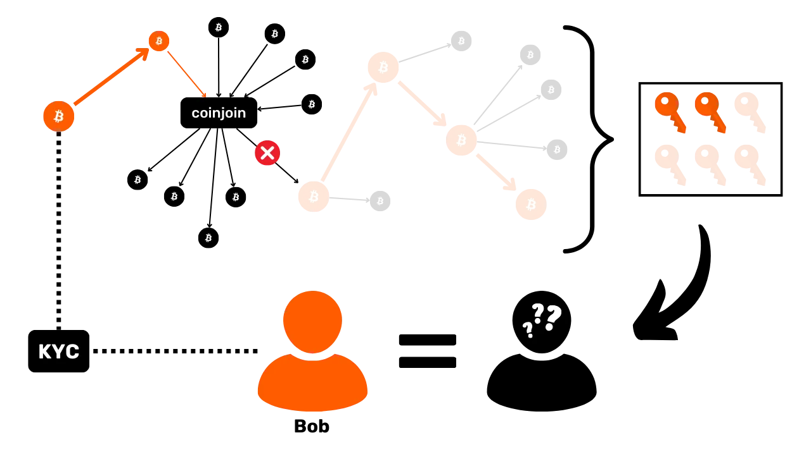


محرمانگی در Bitcoin نباید به صورت دوتایی دیده شود، به عنوان تمایزی بین بیت‌کوین‌های "ناشناس" و دیگرانی که اینگونه نیستند. داشتن بیت‌کوین‌هایی که از طریق KYC به دست آمده‌اند به معنای از دست رفتن همه چیز نیست؛ برعکس، استفاده از ابزارهای محرمانگی می‌تواند حتی مفیدتر باشد.


در مقابل، به‌دست‌آوردن Bitcoin از طریق روشی بدون KYC تضمین‌کننده‌ی محرمانگی کامل نیست و شما را از نیاز به اتخاذ سایر اقدامات حفاظتی معاف نمی‌کند. اگر Bitcoin بدون KYC دارید اما آدرس‌های دریافت را چندین بار استفاده می‌کنید، تراکنش‌های شما ممکن است ردیابی و تجمیع شوند. کوچک‌ترین ارتباط با دنیای خارج از Bitcoin می‌تواند تنها Layer محرمانگی شما را به خطر بیندازد. بنابراین مهم است که تمام ابزارها و روش‌های افزایش حریم خصوصی در Bitcoin را به‌عنوان مکمل در نظر بگیرید. هر تکنیک به یک ریسک خاص می‌پردازد و می‌تواند یک Layer اضافی از حفاظت را اضافه کند. بنابراین داشتن Bitcoin بدون KYC به این معنا نیست که نیازی به اتخاذ سایر احتیاط‌ها ندارید.


### آیا می‌توان KYC را لغو کرد؟


گاهی از من پرسیده می‌شود که آیا پس از انجام KYC امکان "بازگشت" وجود دارد یا خیر، و همان‌طور که می‌توانید از پاراگراف‌های قبلی تصور کنید، پاسخ پیچیده است. ساده‌ترین راه برای اجتناب از ریسک‌های مرتبط با KYC این است که هنگام خرید بیت‌کوین از آن استفاده نکنید. ما در فصل بعدی به این موضوع با جزئیات بیشتری خواهیم پرداخت. با این حال، اگر KYC قبلاً انجام شده و بیت‌کوین خریداری شده است، آیا راه‌هایی برای کاهش ریسک‌های مربوطه وجود دارد؟


وقتی صحبت از ریسک ردیابی تراکنش‌های شما می‌شود، استفاده از CoinJoin یک راه‌حل است. ما در ادامه دوره به‌طور مفصل به این روش خواهیم پرداخت، اما باید بدانید که CoinJoin به شما امکان می‌دهد تاریخچه یک سکه را بشکنید و از ردیابی آن در گذشته-حال و حال-گذشته جلوگیری کنید. حتی برای BTC که از طریق یک پلتفرم تنظیم‌شده به‌دست آمده، این تکنیک می‌تواند از ردیابی آن‌ها جلوگیری کند.


با این حال، CoinJoin خطر دوم مرتبط با KYC را از بین نمی‌برد: این واقعیت که ممکن است دولت از مالکیت شما بر بیت‌کوین‌ها مطلع شود. در واقع، حتی اگر سکه‌های شما دیگر قابل ردیابی نباشند، دولت، بسته به حوزه قضایی، ممکن است به اظهارنامه‌های انتقال دارایی‌های رمزنگاری شما دسترسی داشته باشد. از آنجا که این خطر فنی نیست، بلکه اداری است، هیچ راه‌حل خاص Bitcoin برای از بین بردن آن وجود ندارد، به جز اینکه از ابتدا خود را در معرض KYC قرار ندهید. تنها رویکرد قانونی برای کاهش این خطر این است که بیت‌کوین‌های خود را که از طریق پلتفرم‌های تنظیم‌شده به دست آورده‌اید، در پلتفرم‌های تنظیم‌شده بفروشید و سپس آنها را از طریق روش‌های بدون KYC دوباره خریداری کنید. با فروش و اعلام انتقال، مقامات باید ببینند که شما دیگر مالک آنها نیستید.


در مورد خطر نشت داده‌های شخصی و اسناد هویتی شما، این یک خطر خارجی برای Bitcoin است و هیچ راه‌حل فنی برای جلوگیری از آن وجود ندارد. هنگامی که داده‌های شما فاش شد، بازگرداندن عملیات دشوار است. می‌توانید سعی کنید حساب خود را در پلتفرم ببندید، اما این تضمینی برای حذف داده‌های KYC شما نیست، به‌ویژه زمانی که تأیید هویت برون‌سپاری شده است. تأیید حذف کامل اطلاعات شما غیرممکن است. بنابراین هیچ راه‌حلی برای جلوگیری کامل از این خطر و اطمینان از عدم وجود آن وجود ندارد.


### تفاوت بین KYC و شناسایی کلید


گاهی اوقات، برخی از بیت‌کوینرها تمایل دارند که اصطلاح "KYC" را به هر BTC Exchange که شامل انتقال وجه یا پرداخت با کارت اعتباری است، تعمیم دهند، زیرا این روش‌ها نیز می‌توانند منبع پرداخت را همانند KYC فاش کنند. با این حال، KYC نباید با شناسایی کلید اشتباه گرفته شود. به صورت شخصی، باید اعتراف کنم که درک من از این موضوع با گذشت زمان تغییر کرده است.


KYC به یک رویه نظارتی خاص اشاره دارد که توسط برخی شرکت‌ها برای تأیید و ثبت هویت مشتریانشان اجرا می‌شود. این یک موضوع دوگانه است: هنگام خرید بیت‌کوین‌های خود، یا KYC را انجام می‌دهید یا نمی‌دهید. با این حال، شناسایی کلید که به ارتباط بین جنبه‌ای از هویت کاربر و فعالیت‌های زنجیره‌ای مربوط می‌شود، به این صورت دوگانه نیست، بلکه یک پیوستار را نشان می‌دهد. در واقع، در زمینه خرید یا انتقال Bitcoin، چنین شناسایی همیشه به درجات مختلف ممکن است.


به عنوان مثال، اگر شما بیت‌کوین‌ها را در یک پلتفرم تنظیم‌شده در سوئیس خریداری کنید، KYC لازم نیست. با این حال، ممکن است کلیدهای شما شناسایی شوند، زیرا خرید از طریق حساب بانکی شما انجام شده است. اینجاست که دو ریسک اول مرتبط با KYC - تسهیل ردیابی در زنجیره و قرار گرفتن در معرض نظارت دولتی - می‌توانند در یک Exchange بدون KYC نیز خود را نشان دهند. اگر نهاد سوئیسی تراکنش‌های مشکوک را به مقامات کشور شما گزارش دهد، آنها می‌توانند به سادگی حساب بانکی مورد استفاده برای خرید را بررسی کنند تا هویت شما را کشف کنند. بنابراین، خرید بدون KYC در پلتفرم‌های تنظیم‌شده در مقیاس ریسک برای شناسایی کلیدها نسبتاً بالا است.


با این حال، اجتناب از پلتفرم‌های تنظیم‌شده و انتخاب روش‌های کسب P2P به‌طور کامل خطر شناسایی کلیدی را از بین نمی‌برد، بلکه فقط آن را کاهش می‌دهد. بیایید مثالی از خرید در Bisq یا یک پلتفرم دیگر P2P بزنیم. برای پرداخت به طرف مقابل خود، احتمالاً از حساب بانکی خود استفاده خواهید کرد. اگر مقامات از شخصی که با او معامله کرده‌اید سوال کنند و نام شما را بخواهند، دوباره به خطرات ۱ و ۲ برمی‌گردیم. اگرچه این خطرات بسیار کمتر از زمانی است که در یک پلتفرم بدون KYC خرید می‌کنید، و حتی کمتر از زمانی که با KYC خرید می‌کنید، اما همچنان به میزان کمتری وجود دارند.


در نهایت، حتی اگر بیت‌کوین‌های خود را از طریق یک Exchange فیزیکی با پول نقد به دست آورید، کاملاً ناشناس نیستید. شخصی که با او مبادله کرده‌اید چهره شما را دیده است که بخشی از هویت شماست. اگرچه در این مثال حداقل است، اما همچنان امکان شناسایی کلیدی وجود دارد.


در نتیجه، زمانی که بیت‌کوین‌ها با دارایی‌های دیگر مبادله می‌شوند، چه خرید با ارز دولتی باشد یا فروش در برابر یک کالای واقعی، همیشه نوعی شناسایی کلید وجود دارد. بسته به روش Exchange انتخاب شده، این شناسایی ممکن است از نظر شدت متفاوت باشد. مهم است که این شناسایی را با KYC اشتباه نگیرید، که یک فرآیند نظارتی به‌خوبی تعریف‌شده است. با این حال، بین KYC و طیف شناسایی ارتباط وجود دارد، زیرا KYC در انتهای بالای طیف قرار دارد، زیرا به‌طور سیستماتیک شناسایی کلیدهای کاربر توسط مقامات را تسهیل می‌کند.


## روش‌های فروش و خرید


<chapterId>756598af-95aa-4c77-ac48-243c7ad89530</chapterId>


پس از خواندن فصل قبلی، ممکن است از خود بپرسید که چگونه می‌توانید Bitcoin را بخرید یا بفروشید بدون اینکه مجبور به انجام یک فرآیند تأیید هویت شوید، تا از خطرات مرتبط با KYC اجتناب کنید. چندین روش برای معامله Bitcoin وجود دارد.


### P2P مبادلات نقدی


همان‌طور که دیده‌ایم، بهترین روش از نظر محرمانگی همچنان P2P (شخص به شخص) Exchange با تسویه نقدی است. این روش به شما اجازه می‌دهد تا حداقل ردپا را به جا بگذارید و احتمال شناسایی کلید را به‌طور قابل‌توجهی کاهش می‌دهد، چه در حال خرید باشید و چه فروش.


با این حال، خطراتی برای امنیت شخصی وجود دارد. خطر اصلی در این واقعیت نهفته است که در طول Exchange، طرف مقابل می‌داند که شما مبلغ زیادی پول، چه به صورت نقدی و چه به صورت بیت‌کوین، در اختیار دارید. این اطلاعات می‌تواند توجه افراد مخرب را جلب کند. در واقع، به طور کلی توصیه می‌شود که درباره دارایی‌های Bitcoin خود محتاط باشید. این توصیه می‌تواند به پول نقد نیز اعمال شود. با این حال، هنگام مبادله حضوری، اجتناب‌ناپذیر است که فاش کنید بیت‌کوین دارید و این ممکن است توجه ناخواسته‌ای را جلب کند.


برای محدود کردن این ریسک، به شما توصیه می‌کنم که معاملات نقدی را با افراد مورد اعتماد، مانند اعضای خانواده یا دوستان نزدیک، ترجیح دهید. به‌طور جایگزین، می‌توانید به معامله در [ملاقات‌های محلی Bitcoin](https://btcmap.org/communities/map) فکر کنید، پس از اینکه چند بار شرکت کردید. این به شما اجازه می‌دهد تا با دیگر شرکت‌کنندگان بهتر آشنا شوید و هنگام تبادل فیزیکی تنها نباشید. با این حال، مهم است که تشخیص دهید مبادلات نقدی P2P ذاتاً خطراتی برای امنیت شخصی شما دارند که هنگام خرید از طریق یک پلتفرم تنظیم‌شده و حساب بانکی شما وجود ندارند.


علاوه بر این، بسته به جایی که زندگی می‌کنید، حمل و نگهداری مبالغ زیادی پول می‌تواند خطرناک باشد، چه Bitcoin باشد و چه پول نقد.


مبادله نقدی همچنین می‌تواند در صورت بررسی‌های پلیس یا سایر بازرسی‌ها خطرات قانونی به همراه داشته باشد. اگرچه در بیشتر کشورها محدودیتی برای میزان نقدی که می‌توانید با خود حمل کنید وجود ندارد، اما مقادیر زیاد می‌تواند باعث ایجاد سوءظن شود. بنابراین مراقب باشید، به ویژه اگر مجبورید مسافت‌های طولانی را طی کنید، و از انجام تعداد زیادی تراکنش بزرگ به طور همزمان خودداری کنید تا مجبور به توجیه داشتن مبالغ زیاد نشوید.


در نهایت، یکی دیگر از معایب خریدهای P2P این است که قیمت اغلب بالاتر از پلتفرم‌های تنظیم‌شده است. فروشندگان معمولاً یک افزایش قیمت از 1% تا گاهی بیش از 10% اعمال می‌کنند. دلایل متعددی برای این تفاوت قیمت وجود دارد. اولاً، این یک عمل رایج در میان فروشندگان P2P است که با گذشت زمان تثبیت شده است. ثانیاً، فروشندگان هزینه‌هایی مرتبط با تراکنش برای ارسال وجوه به خریدار دارند. همچنین در مقایسه با تراکنش‌های پلتفرمی، خطر سرقت در فروش‌های P2P افزایش یافته است که جبران ریسک گرفته شده را توجیه می‌کند. در نهایت، هزینه اضافی ممکن است به تقاضا و کیفیت Exchange از نظر محرمانگی مرتبط باشد. به عنوان یک خریدار، افزایش محرمانگی قیمتی دارد که در افزایش قیمت اعمال شده توسط فروشنده منعکس می‌شود. برخی از بیت‌کوینرها نیز معتقدند که قیمت افزایش‌یافته BTC خریداری‌شده در P2P قیمت واقعی آن را منعکس می‌کند و استدلال می‌کنند که قیمت‌های پایین‌تر در پلتفرم‌های تنظیم‌شده نتیجه سازش بر سر محرمانگی داده‌های شخصی شما است.


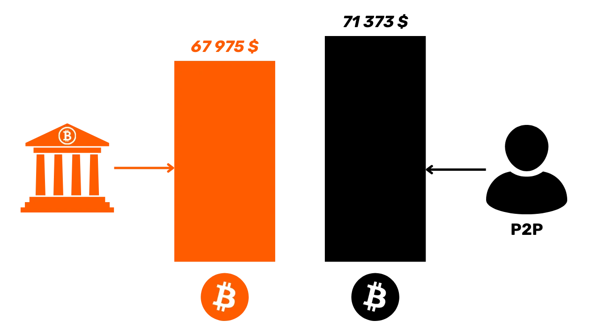


### P2P از طریق یک پلتفرم همسان‌سازی مبادله می‌کند.


یک جایگزین کم‌خطرتر از نظر امنیت شخصی این است که مبادلات P2P را به‌صورت انحصاری آنلاین و از طریق روش‌های پرداخت الکترونیکی مانند PayPal، انتقال بانکی یا Revolut انجام دهید.


این رویکرد بسیاری از ریسک‌های مرتبط با تراکنش‌های نقدی را اجتناب می‌کند. با این حال، ریسک نکول طرف مقابل در یک Exchange آنلاین بیشتر است. در واقع، در یک Exchange فیزیکی، اگر پول را به فروشنده‌ای بدهید که در عوض بیت‌کوین‌ها را برای شما ارسال نمی‌کند، می‌توانید فوراً او را مورد بازخواست قرار دهید، زیرا او در مقابل شما ایستاده است. از سوی دیگر، به صورت آنلاین، اغلب غیرممکن است که کسی را که از شما دزدی کرده است، ردیابی کنید.


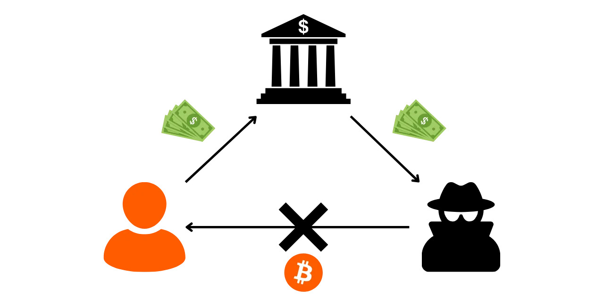


برای کاهش این ریسک، می‌توان از پلتفرم‌های تخصصی برای تبادلات P2P استفاده کرد. این پلتفرم‌ها از مکانیزم‌های حل اختلاف برای حفاظت از کاربران متضرر استفاده می‌کنند. معمولاً، آن‌ها یک سیستم امانی ارائه می‌دهند، جایی که بیت‌کوین‌ها نگه داشته می‌شوند تا زمانی که پرداخت به ارز فیات توسط فروشنده تأیید شود.


از نظر امنیت شخصی، این روش خرید به‌طور قابل‌توجهی امن‌تر از یک Exchange نقدی فیزیکی است. با این حال، همان‌طور که در بالا ذکر شد، مبادلات آنلاین P2P نسبت به یک Exchange فیزیکی ردپای بیشتری به جا می‌گذارند که می‌تواند برای حریم خصوصی در Bitcoin مضر باشد. با استفاده از یک روش پرداخت فیات آنلاین مانند بانک، اطلاعات بیشتری را فاش می‌کنید که می‌تواند شناسایی کلیدی را تسهیل کند.


بار دیگر، توصیه نمی‌کنم که تعداد زیادی معاملات بزرگ را در یک تراکنش واحد در این پلتفرم‌ها انجام دهید. با تقسیم معاملات خود، ریسک سرقت از سوی طرف مقابل را پخش می‌کنید.


بار دیگر، یکی دیگر از معایب خریدهای P2P این است که قیمت اغلب بالاتر از آنچه در پلتفرم‌های تنظیم‌شده مشاهده می‌شود، است. فروشندگان اغلب یک افزایش قیمت از 1% تا گاهی بیش از 10% اعمال می‌کنند. دلایل متعددی برای این تفاوت قیمت وجود دارد. اولاً، این یک عمل رایج در میان فروشندگان P2P است که با گذشت زمان تثبیت شده است. ثانیاً، فروشندگان هزینه‌هایی مرتبط با تراکنش برای ارسال وجوه به خریدار دارند. همچنین خطر سرقت در فروش‌های P2P در مقایسه با تراکنش‌های پلتفرمی بیشتر است که جبران ریسک گرفته شده را توجیه می‌کند. در نهایت، هزینه اضافی ممکن است به تقاضا و کیفیت Exchange از نظر محرمانگی مرتبط باشد. به عنوان یک خریدار، افزایش محرمانگی قیمتی دارد که در افزایش قیمت اعمال شده توسط فروشنده منعکس می‌شود. برخی از بیت‌کوینرها نیز معتقدند که قیمت افزایش‌یافته BTC خریداری‌شده در P2P قیمت واقعی آن را منعکس می‌کند و استدلال می‌کنند که قیمت‌های پایین‌تر در پلتفرم‌های تنظیم‌شده نتیجه یک سازش در محرمانگی داده‌های شخصی شما است.


تا جایی که به راه‌حل‌ها مربوط می‌شود، من شخصاً همیشه از [Bisq](https://bisq.network/) استفاده کرده‌ام و بسیار راضی هستم. سیستم آن‌ها آزمایش شده و به نظر می‌رسد قابل اعتماد باشد. با این حال، Bisq فقط بر روی PC در دسترس است و Interface آن ممکن است برای مبتدیان بیش از حد پیچیده باشد. یکی دیگر از معایب این است که Bisq فقط با تراکنش‌های زنجیره‌ای کار می‌کند، که می‌تواند در دوره‌های هزینه‌های بالای تراکنش Bitcoin گران شود.


-> آموزش Bisq ما را ببینید.


https://planb.network/tutorials/exchange/peer-to-peer/bisq-fe244bfa-dcc4-4522-8ec7-92223373ed04

برای یک گزینه ساده‌تر، می‌توانید [Peach](https://peachbitcoin.com/) را امتحان کنید، یک اپلیکیشن موبایل که خریداران و فروشندگان را با یک سیستم حل اختلاف داخلی متصل می‌کند. این فرآیند نسبت به Bisq شهودی‌تر است.


-> آموزش هلو ما را ببینید.


https://planb.network/tutorials/exchange/peer-to-peer/peach-c6143241-d900-4047-9b73-1caba5e1f874

گزینه آنلاین دیگر [HodlHodl](https://hodlhodl.com/) است، یک پلتفرم معتبر که نقدینگی خوبی ارائه می‌دهد، اگرچه من شخصاً آن را آزمایش نکرده‌ام.


-> آموزش HodlHodl ما را ببینید.


https://planb.network/tutorials/exchange/peer-to-peer/hodlhodl-d7344cd5-6b18-40f5-8e78-2574a93a3879

برای راه‌حل‌های مبتنی بر Lightning Network، [RoboSats](https://learn.robosats.com/) و [LNP2PBot](https://lnp2pbot.com/) را امتحان کنید. RoboSats از طریق یک وب‌سایت قابل دسترسی است و استفاده از آن نسبتاً ساده است. LNP2PBot غیرمعمول‌تر است، زیرا از طریق یک سیستم Exchange در برنامه پیام‌رسان تلگرام کار می‌کند.


-> آموزش RoboSats ما را ببینید.


-> آموزش LNP2PBot ما را ببینید.


https://planb.network/tutorials/exchange/peer-to-peer/robosats-b60e4f7c-533a-4295-9f6d-5368152e8c06

https://planb.network/tutorials/exchange/peer-to-peer/lnp2pbot-v2-e6bcb210-610b-487d-970c-7cce85273e3c


### پلتفرم‌های تنظیم‌شده بدون KYC


بسته به کشوری که در آن زندگی می‌کنید، ممکن است به پلتفرم‌های تنظیم‌شده‌ای دسترسی داشته باشید که برای خرید یا فروش بیت‌کوین نیازی به رویه‌های KYC ندارند. به عنوان مثال، در سوئیس می‌توانید از پلتفرم‌هایی مانند [Relai](https://relai.app/) و [MtPelerin](https://www.mtpelerin.com/) استفاده کنید.


-> آموزش ما در مورد Relai را ببینید.


https://planb.network/tutorials/exchange/centralized/relai-v2-30a9671d-e407-459d-9203-4c3eae15b30e

همانطور که در فصل قبل دیدیم، این نوع پلتفرم شما را از خطرات مرتبط با رویه‌های KYC نجات می‌دهد، اما سطح بالاتری از خطر برای شناسایی کلید ارائه می‌دهند. از نظر محرمانگی Bitcoin، این پلتفرم‌ها حفاظت بهتری نسبت به روش‌های خرید با KYC ارائه می‌دهند، اما همچنان کمتر از مبادلات P2P جذاب هستند.


با این حال، از نظر امنیت شخصی، استفاده از این پلتفرم‌ها بسیار کم‌خطرتر از مبادلات P2P است. همچنین اغلب استفاده از آن‌ها ساده‌تر از پلتفرم‌های P2P است.


### دستگاه‌های خودپرداز


گزینه دیگری برای خرید یا فروش بیت‌کوین بدون KYC، دستگاه‌های خودپرداز ارز دیجیتال هستند. شخصاً، من هرگز فرصت آزمایش این راه‌حل را نداشته‌ام، زیرا در کشور من هیچ‌کدام وجود ندارد. اما این روش می‌تواند بسیار جالب باشد، بسته به اینکه کجا زندگی می‌کنید.


مشکل دستگاه‌های خودپرداز این است که در برخی کشورها ممنوع هستند یا در کشورهای دیگر به شدت تحت نظارت قرار دارند. اگر یک دستگاه خودپرداز نیاز به یک فرآیند تأیید هویت داشته باشد، در معرض همان خطراتی قرار می‌گیرد که در پلتفرم‌های تحت نظارت KYC وجود دارد. از سوی دیگر، اگر دستگاه خودپرداز اجازه انجام تراکنش‌ها بدون تأیید هویت برای مبالغ کم را بدهد، استفاده از آن می‌تواند سطحی از محرمانگی را ارائه دهد که با P2P نقدی Exchange قابل مقایسه است، در حالی که از بیشتر خطرات مرتبط با این نوع Exchange اجتناب می‌کند.


عیب اصلی دستگاه‌های خودپرداز، کارمزدهای بالای Exchange آن‌ها است که معمولاً از چند درصد تا گاهی اوقات ۱۵٪ از مبلغ مبادله شده متغیر است.


### کارت‌های هدیه


در نهایت، من همچنین می‌خواستم شما را با راه‌حلی آشنا کنم که برای کسانی که می‌خواهند بیت‌کوین‌های خود را به صورت روزانه برای خرید استفاده کنند، به جای اینکه آن‌ها را در برابر ارزهای فیات بفروشند، به خوبی کار می‌کند.


بهترین راه برای خرج کردن BTC، البته، استفاده از Bitcoin یا Lightning Network به‌طور مستقیم برای خرید کالا یا خدمات است. با این حال، در بسیاری از کشورها، تعداد فروشندگانی که Bitcoin را می‌پذیرند هنوز محدود است. یک جایگزین عملی استفاده از کارت‌های هدیه است.


چندین پلتفرم که نیازی به مراحل KYC ندارند، امکان مبادله بیت‌کوین با کارت‌های هدیه‌ای که می‌توان در خرده‌فروشی‌های بزرگ استفاده کرد را ارائه می‌دهند. این پلتفرم‌ها شامل [CoinsBee](https://www.coinsbee.com/)، [The Bitcoin Company](https://thebitcoincompany.com/) و [Bitrefill](https://www.bitrefill.com/) هستند. این پلتفرم‌ها استفاده روزانه از بیت‌کوین‌هایتان را بسیار آسان‌تر می‌کنند و به شما امکان دسترسی به طیف گسترده‌ای از محصولات و خدمات را بدون نیاز به تبدیل آن‌ها به ارز فیات می‌دهند.


https://planb.network/tutorials/exchange/centralized/bitrefill-8c588412-1bfc-465b-9bca-e647a647fbc1


### سایر روش‌های اکتساب


راه‌های دیگر برای به‌دست‌آوردن بیت‌کوین‌ها در حالی که حریم خصوصی خود را حفظ می‌کنید، شامل Mining می‌شود. برای شروع Mining Sats، نیازی به افشای هویت خود ندارید؛ کافی است یک Proof of Work معتبر پیدا کرده و آن را به شبکه ارسال کنید. اگر گزینه استخر Mining را انتخاب کنید، برخی از استخرها نیاز به نوعی شناسایی، مانند KYC، دارند، در حالی که برخی دیگر این نیاز را ندارند.


روش دیگر کار در Exchange برای بیت‌کوین‌ها است. این روش کسب می‌تواند جالب باشد، اما میزان شناسایی مورد نیاز بسته به شرایط به طور قابل توجهی متفاوت است.


*برای نوشتن این فصل، از دوره آموزشی BTC205 که توسط [@pivi___](https://x.com/pivi___) در Plan ₿ Network ارائه شده است (در حال حاضر فقط به زبان فرانسوی موجود است) استفاده کردم.


## تثبیت، مدیریت UTXO و CIOH


<chapterId>d0486c8f-332d-402b-ae2e-949416752b9c</chapterId>


یکی از پیچیده‌ترین جنبه‌های مدیریت یک پورتفولیو با نگهداری شخصی، تجمیع است. آیا باید تجمیع کنید؟ هدف چیست؟ چه اندازه‌ای از UTXO باید رعایت شود؟ مصالحه‌ها در زمینه محرمانگی چیست؟ این‌ها مواردی هستند که در این بخش به آن‌ها خواهیم پرداخت.


### ادغام چیست؟


Bitcoin مانند یک بازار حراج عمل می‌کند، به طوری که ماینرها به تراکنش‌هایی که کمترین کارمزد را ارائه می‌دهند، اولویت می‌دهند. با این حال، هر بلاک دارای حداکثر وزن است که تعداد تراکنش‌هایی که می‌توانند در آن گنجانده شوند را محدود می‌کند. از آنجا که به طور متوسط هر ۱۰ دقیقه یک بلاک تولید می‌شود، فضای موجود در هر بلاک یک منبع کمیاب است.


معدنچیان، که فعالیت‌هایشان generate هزینه‌های قابل توجهی از نظر برق، دارایی‌های ثابت و نگهداری دارد، به طور طبیعی به دنبال حداکثر کردن سودآوری خود هستند. بنابراین، آن‌ها تمایل دارند معاملاتی را ترجیح دهند که generate بالاترین کارمزدها را نسبت به وزن خود داشته باشند.


همه تراکنش‌های Bitcoin وزن یکسانی ندارند. تراکنش‌هایی که ورودی‌ها و خروجی‌های بیشتری دارند، وزن بیشتری خواهند داشت. برای مثال، بیایید دو تراکنش را تصور کنیم:


- تراکنش A شامل 1 ورودی و 1 خروجی است. این تراکنش 1,994 Sats کارمزد تخصیص می‌دهد و وزنی برابر با 141 vB دارد؛
- تراکنش B، یک تراکنش پیچیده‌تر با 2 ورودی و 2 خروجی، 2,640 Sats را به عنوان کارمزد برای وزنی معادل 220 vB تخصیص می‌دهد.


در این مثال، اگرچه تراکنش B کارمزد کل بیشتری ارائه می‌دهد، اما ماینرها تراکنش A را ترجیح می‌دهند، زیرا نسبت بهتری بین کارمزد و وزن ارائه می‌دهد. در اینجا محاسبه برای هر تراکنش، به صورت Sats به ازای هر بایت مجازی (sat/vB) بیان شده است:


```text
TXA : 1994 / 141 = 14 sats/vB
TXB : 2640 / 220 = 12 sats / vB
```


این بدان معناست که برای هر واحد وزن، تراکنش A هزینه‌های بیشتری نسبت به تراکنش B ارائه می‌دهد، حتی اگر تراکنش B در مقیاس مطلق هزینه‌های بیشتری ارائه دهد.


بنابراین همیشه برای کاربر جالب‌تر است که در معاملات خود تا حد ممکن ورودی کمتری مصرف کند. با این حال، شما نیاز دارید که مقادیر کافی مصرف کنید تا بتوانید پرداخت خروجی را برآورده کنید. هنگام مدیریت پرتفوی خود، باید UTXOهای به اندازه کافی بزرگ داشته باشید.


اصل تثبیت دقیقاً به این منظور است که در دوره‌هایی که کارمزدها در Bitcoin پایین است، از این فرصت استفاده کرده و UTXOهای کوچکتر را به یک UTXO بزرگتر ادغام کند. به این ترتیب، زمانی که کارمزدها در Bitcoin افزایش می‌یابد، قادر خواهید بود با حداقل ورودی‌ها تراکنش انجام دهید و بنابراین در مجموع کارمزد کمتری بپردازید. هدف این است که تراکنش‌های اجباری را که باید در دوره‌های کارمزد بالا انجام شوند، پیش‌بینی کنید.


علاوه بر صرفه‌جویی در هزینه‌های تراکنش، تجمیع UTXOها به جلوگیری از تشکیل "Dust" کمک می‌کند. "Dust" به UTXOهایی اشاره دارد که ارزش آن‌ها در Sats آنقدر پایین است که برای پوشش هزینه‌های تراکنش مورد نیاز برای خرج کردن آن‌ها کافی نیست. این امر باعث می‌شود که استفاده از این UTXOها از نظر اقتصادی غیرمنطقی باشد تا زمانی که هزینه‌های تراکنش بالا باقی بماند. با تجمیع فعالانه UTXOهای خود، از تبدیل آن‌ها به Dust جلوگیری می‌کنید و اطمینان حاصل می‌کنید که تمام وجوه شما قابل استفاده باقی می‌ماند.


### حداقل اندازه برای UTXOهای شما چقدر است؟


گاهی از من پرسیده می‌شود که حداقل مقدار توصیه‌شده برای یک UTXO چیست. متأسفانه، پاسخ جهانی وجود ندارد، زیرا این موضوع به ترجیحات شما و شرایط بازار هزینه بستگی دارد. با این حال، در اینجا یک فرمول وجود دارد که ممکن است به شما در تعیین یک آستانه مناسب برای نیازهایتان کمک کند:


$$
\frac {P \times F}T = M
$$


کجا:


- p$ وزن تراکنش است؛
- $F$ نشان‌دهنده حداکثر نرخ شارژ به ساتوشی بر vbyte (Sats/vB) است که در برابر آن پوشش ریسک می‌دهید؛
- t$ درصد کارمزد تراکنشی است که مایلید نسبت به ارزش کل UTXO بپردازید؛
- m$ حداقل مقدار به ساتوشی برای هر UTXO است.


بیایید فرض کنیم که شما قصد دارید هزینه‌های یک تراکنش استاندارد SegWit با 1 ورودی و 2 خروجی، با وزن 141 vB را پوشش دهید. اگر تا 800 Sats/vB را پوشش می‌دهید و حداکثر مایلید تا 12% از ارزش UTXO را در هزینه‌ها صرف کنید، محاسبه به صورت زیر خواهد بود:


$$
\frac{141 \times 800}{0.12} = 940\ 000
$$


در این مثال، بنابراین عاقلانه است که حداقل مقدار 940,000 Sats را برای UTXOها در پرتفوی خود نگه دارید.


### ادغام و CIOH


یکی از پرکاربردترین روش‌های اکتشافی در تحلیل Blockchain، CIOH (*روش اکتشافی ورودی مشترک Ownership*) است که فرض می‌کند تمام ورودی‌های یک تراکنش Bitcoin به یک نهاد تعلق دارند. اصل اساسی تجمیع این است که چندین UTXO به عنوان ورودی مصرف شوند و یک UTXO به عنوان خروجی ایجاد شود. بنابراین، تجمیع امکان اعمال ICOH را فراهم می‌کند.


در عمل، این بدان معناست که یک ناظر خارجی می‌تواند نتیجه بگیرد که تمام UTXOهای تجمیع‌شده احتمالاً به یک شخص تعلق دارند و خروجی منحصربه‌فرد تولید شده نیز به او تعلق دارد. این وضعیت می‌تواند با مرتبط کردن تاریخچه‌های تراکنش مختلف، محرمانگی شما را به خطر بیندازد. به عنوان مثال، فرض کنید من ۳ UTXO که از طریق P2P به دست آمده‌اند را با یک UTXO که از طریق یک پلتفرم نیازمند KYC به دست آمده، تجمیع کنم:


با انجام این کار، هر نهادی که به داده‌های پلتفرم Exchange دسترسی داشته باشد، که ممکن است شامل سازمان‌های دولتی نیز باشد، قادر خواهد بود تشخیص دهد که من مقادیر دیگری از BTC را دارم. قبلاً این UTXOها به طور مستقیم به هویت من مرتبط نبودند؛ اکنون هستند. علاوه بر این، به تمامی منابع نشان می‌دهد که من مالک مقدار معینی بیت‌کوین هستم.


وقتی صحبت از مدیریت UTXOها می‌شود، ملاحظات اقتصادی که باعث تجمیع برای کاهش هزینه‌ها می‌شوند، با تمرینات خوب حریم خصوصی که توصیه می‌کنند هرگز UTXOها را ادغام نکنید، در تضاد هستند. بنابراین انتخاب بین اقتصاد و محرمانگی به اولویت‌های هر کاربر بستگی دارد.


اگر بتوانید از تجمیع اجتناب کنید و در عین حال UTXOهای قابل توجهی را حفظ کنید، این ایده‌آل است. برای انجام این کار، روش‌های کسب خود را بهینه کنید. اگر بیت‌کوین‌های خود را به صورت DCA خریداری می‌کنید، سعی کنید خریدهای یکباره خود را تا حد امکان فاصله دهید تا ارزش را بر روی UTXOهای کمتری تجمیع کنید. مدیریت یک خرید یکباره به مبلغ ۱۰۰۰ یورو هر ۲ ماه آسان‌تر خواهد بود تا خرید ۱۲۰ یورو هر هفته. این کار تعداد UTXOهای تولید شده را به حداقل می‌رساند و مدیریت پورتفولیوی شما را ساده‌تر می‌کند و در عین حال محرمانگی شما را حفظ می‌کند.


اگر نیاز به تجمیع بیت‌کوین‌های خود پیدا کردید، ابتدا به تجمیع UTXOها از یک منبع واحد اولویت دهید. به عنوان مثال، ادغام ۱۰ UTXO از یک پلتفرم واحد کمتر از ترکیب ۵ UTXO از پلتفرم A با ۵ UTXO از پلتفرم B بر محرمانگی شما تأثیر می‌گذارد. اگر تجمیع از منابع مختلف اجتناب‌ناپذیر است، سعی کنید آن‌ها را بر اساس ویژگی‌هایشان جدا کنید. به عنوان مثال، UTXOهایی که از طریق KYC به دست آمده‌اند را در یک تراکنش و آن‌هایی که از طریق P2P به دست آمده‌اند را در تراکنش دیگری گروه‌بندی کنید.


در هر صورت، فراموش نکنید که هر گونه تجمیع به طور اجتناب‌ناپذیری شامل از دست دادن محرمانگی است. بنابراین نیاز به این عملیات و تأثیر بالقوه آن بر حریم خصوصی خود را با در نظر گرفتن CIOH به دقت ارزیابی کنید.


## سایر بهترین روش‌ها


<chapterId>b5216965-7d13-4ea1-9b7c-e292966a487b</chapterId>


بیایید نگاهی به چند روش برتر دیگر برای بهینه‌سازی حریم خصوصی شما در Bitcoin بیندازیم.


### گره کامل


داشتن بیت‌کوین‌های خود در نگهداری شخصی عالی است، اما استفاده از نود کامل خودتان حتی بهتر است! در اینجا دلیل اینکه داشتن نود خودتان برای استفاده کاملاً مستقل از Bitcoin حیاتی است، آمده است:


- مقاومت در برابر سانسور**: تراکنش‌های شما نمی‌توانند توسط هیچ‌کس مسدود شوند؛
- استقلال از اشخاص ثالث**: شما دیگر به هیچ سرویس خارجی برای تأیید داده‌های Blockchain وابسته نیستید؛
- مشارکت فعال**: شما می‌توانید قوانین اعتبارسنجی خود را تعریف کرده و به‌طور مستقیم در اجماع شرکت کنید؛
- مشارکت در شبکه**: با اجرای یک نود، شما به تقویت و توزیع شبکه Bitcoin کمک می‌کنید؛
- آموزش فنی**: مدیریت یک نود کامل راهی عالی برای تعمیق دانش فنی شما از Bitcoin است.


علاوه بر این مزایا، استفاده از یک نود کامل همچنین محرمانگی شما را هنگام پخش تراکنش‌هایتان بهبود می‌بخشد. هنگامی که یک تراکنش صادر می‌کنید، ابتدا از طریق Wallet شما ایجاد و امضا می‌شود. برای پخش آن در شبکه Bitcoin، باید حداقل توسط یک نود شناخته شود. با استفاده از نود خودتان، کنترل مستقیم بر این توزیع دارید و بدین ترتیب محرمانگی خود را تقویت کرده و خطر نشت داده‌ها را محدود می‌کنید.


اگر شما نود Bitcoin خود را ندارید، مجبور خواهید بود از یک نود شخص ثالث استفاده کنید، مانند نودی که توسط ارائه‌دهنده نرم‌افزار Wallet شما ارائه می‌شود. علاوه بر پخش تراکنش‌ها، Wallet شما نیاز به دسترسی به اطلاعات مختلفی مانند تراکنش‌های در حال انتظار، موجودی‌های مرتبط با آدرس‌های شما و تعداد تأییدیه‌ها برای تراکنش‌های شما دارد. برای دسترسی به تمام این داده‌ها، نیاز دارید که یک نود را پرس‌وجو کنید.


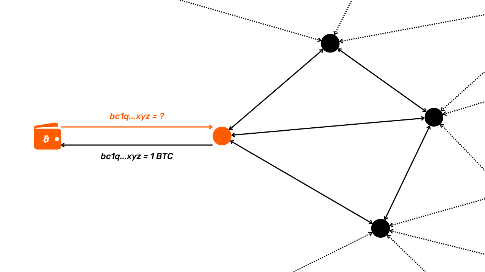


خطر اصلی زمانی که از نود Bitcoin خود استفاده نمی‌کنید این است که اپراتور نود شخص ثالث می‌تواند فعالیت‌های شما را در Blockchain مشاهده کند یا حتی این اطلاعات را با نهادهای دیگر به اشتراک بگذارد. برای محدود کردن این خطر، یک راه‌حل میانی استفاده از نرم‌افزار Wallet است که اتصالات شما را از طریق تور پنهان می‌کند. این می‌تواند میزان افشای داده‌های شما را کاهش دهد. با این حال، راه‌حل بهینه این است که نود Bitcoin خود را داشته باشید و از آن برای پخش تراکنش‌های خود استفاده کنید. البته، باید مراقب باشید که از طریق نود خود اطلاعاتی را نشت ندهید، اما این موضوع دیگری است که در بخش‌های بعدی به آن خواهیم پرداخت.


فراتر از مزیت آشکار برای حریم خصوصی شما، داشتن نود کامل خودتان همچنین صحت داده‌ها بر روی Blockchain را تضمین می‌کند، شما را در برابر سانسور محافظت می‌کند و به شما اجازه می‌دهد به طور فعال در حاکمیت Bitcoin شرکت کنید. با استفاده از نود خودتان، وزن اقتصادی خود را به زنجیره‌ای که انتخاب می‌کنید اضافه می‌کنید، که این امر در زمان درگیری‌های درون جامعه، مانند جنگ اندازه بلوک از ۲۰۱۵ تا ۲۰۱۷، مهم است. در صورت وقوع یک Fork، استفاده از نود شخص ثالث می‌تواند شما را به حمایت از زنجیره‌ای که نمی‌خواهید ترجیح دهید، سوق دهد، زیرا اپراتور نود این انتخاب را برای شما انجام می‌دهد.


همان‌طور که می‌بینید، به‌منظور حفظ محرمانگی و حاکمیت فردی، ضروری است که نود کامل خود را اجرا و استفاده کنید!


### فریب دادن تحلیل‌های اکتشافی


به طور کلی، مهم است که برای بهتر اجتناب یا فریب دادن آن‌ها، اکتشافات مورد بحث در بخش قبلی را درک کنیم. اتخاذ مجموعه‌ای از بهترین روش‌ها می‌تواند مفید باشد، حتی اگر ضروری نباشند. آن‌ها یک لایه اضافی از حفاظت Layer ارائه می‌دهند که می‌تواند در حفظ محرمانگی هنگام استفاده از Bitcoin مهم باشد.


اولین توصیه‌ای که می‌توانم بدهم این است که با متراکم‌ترین جمعیت ترکیب شوید. در Bitcoin، این به معنای استفاده از قالب‌های اسکریپت به‌طور گسترده پذیرفته شده است. به عنوان مثال، اسکریپت‌های P2WSH که اغلب برای پیکربندی‌های SegWit V0 Multisig استفاده می‌شوند، بسیار نادر هستند. آن‌ها به شما اجازه نمی‌دهند که در یک مجموعه ناشناس بزرگ پنهان شوید. همین امر برای مدل‌های قدیمی‌تر مانند P2PKH یا P2SH نیز صدق می‌کند. اگرچه آن‌ها به‌طور گسترده در مجموعه UTXO حضور دارند، اما برای تراکنش‌های جدید کمتر و کمتر استفاده می‌شوند.


به طور کلی، عاقلانه‌تر است که استاندارد اسکریپت‌نویسی جدیدتر را انتخاب کنید، به شرطی که به اندازه کافی پذیرفته شده باشد. بنابراین، اگر در سال ۲۰۲۲ بود، توصیه می‌کردم از استفاده از P2TR (Taproot) به دلیل پذیرش کم آن خودداری کنید، اما در سال ۲۰۲۴، توصیه می‌کنم به جای آن از این نوع اسکریپت استفاده کنید، یا در غیر این صورت، از اسکریپت SegWit V0 استفاده کنید، زیرا تعداد تراکنش‌هایی که از P2TR استفاده می‌کنند شروع به نمایندگی یک نسبت بسیار قابل توجه کرده است.


منبع: [txstats.com](https://txstats.com/d/000000054/UTXO-set-repartition-by-output-type)


نکته دیگری برای حفظ محرمانگی شما این است که سعی کنید از روش‌های اکتشافی تراکنش‌های داخلی عبور کنید. به عنوان مثال، هنگام انجام پرداخت، می‌توانید سعی کنید از ایجاد خروجی با مبلغ گرد جلوگیری کنید، زیرا این می‌تواند نشان دهد که خروجی دیگر نمایانگر Exchange خارجی است. اگر نیاز دارید 100 k Sats به دوستی ارسال کنید، در نظر بگیرید که مبلغی کمی بیشتر منتقل کنید تا از این روش اکتشافی فرار کنید. به همین ترتیب، سعی کنید خروجی‌های Exchange خارجی ایجاد نکنید که به طور نامتناسبی در مقایسه با پرداخت انجام شده بالا باشند، زیرا این نیز می‌تواند نشان دهد که کدام یک از خروجی‌ها نمایانگر Exchange خارجی است.


در نهایت، اگر به‌طور منظم تراکنش‌های Bitcoin را انجام می‌دهید، مطمئن شوید که همیشه آن‌ها را در زمان‌های یکسان پخش نمی‌کنید. با پخش تراکنش‌های خود در طول روز و هفته، از دادن فرصت به ناظران خارجی برای شناسایی الگوی زمانی مبتنی بر منطقه زمانی که می‌تواند تحلیل آن‌ها را تقویت کند، جلوگیری می‌کنید.


علاوه بر تمام این روش‌های خوب که باید به صورت روزانه اتخاذ شوند، روش‌های حتی مؤثرتری برای به‌طور کامل قطع کردن قابلیت ردیابی بیت‌کوین‌های شما وجود دارد. این‌ها شامل تراکنش‌های CoinJoin می‌شوند که در بخش بعدی به‌طور عمیق به آن‌ها خواهیم پرداخت.


# درک تراکنش‌های CoinJoin


<partId>6d0bbf16-3714-4db1-9897-2d45019f6bdc</partId>


## تراکنش CoinJoin چیست؟


<chapterId>0862bc6b-1c48-4aa4-b76d-4f547b469008</chapterId>


با مطالعه اصول حفاظت از حریم خصوصی، اکنون قصد داریم به تکنیک‌های پیچیده‌تری بپردازیم که هدفشان دفاع فعال از محرمانگی شماست، به‌ویژه با جدا کردن تاریخچه Bitcoin شما. در بخش بعدی، به مجموعه‌ای از تکنیک‌های کوچک خواهیم پرداخت، اما ابتدا می‌خواهم درباره CoinJoin به شما بگویم.


CoinJoin اغلباً به عنوان مؤثرترین روش برای حفاظت از حریم خصوصی کاربران Bitcoin در نظر گرفته می‌شود. اما دقیقاً یک تراکنش CoinJoin چیست؟ بیایید متوجه شویم.


### اصول پایه CoinJoin


CoinJoin تکنیکی برای شکستن ردیابی Bitcoin بر روی Blockchain است. این تکنیک بر اساس یک تراکنش مشترک با ساختاری خاص به همین نام است: تراکنش CoinJoin.


همان‌طور که در بخش‌های اول این دوره دیدیم، تراکنش‌های Bitcoin از طریق نود به همه کاربران شناخته شده‌اند. بنابراین بررسی زنجیره امضای الکترونیکی هر سکه و مشاهده تاریخچه آن آسان است. این بدان معناست که همه کاربران می‌توانند سعی کنند تراکنش‌های سایر کاربران را تحلیل کنند. در نتیجه، ناشناس بودن در سطح تراکنش غیرممکن است. با این حال، ناشناس بودن در سطح شناسایی فردی حفظ می‌شود. برخلاف سیستم بانکی سنتی که هر حساب به یک هویت شخصی مرتبط است، در Bitcoin، وجوه با جفت کلیدهای رمزنگاری (یا اسکریپت‌ها) مرتبط هستند و به کاربران شکلی از نام مستعار پشت شناسه‌های رمزنگاری ارائه می‌دهند.


محرمانگی Bitcoin زمانی تضعیف می‌شود که ناظران خارجی قادر به ارتباط UTXOهای خاص با کاربران شناسایی‌شده باشند. هنگامی که این ارتباط برقرار شود، امکان ردیابی تراکنش‌های آن‌ها و تحلیل تاریخچه Bitcoin آن‌ها فراهم می‌شود. CoinJoin دقیقاً یک تکنیک توسعه‌یافته برای شکستن قابلیت ردیابی UTXOها است، به منظور ارائه سطحی از محرمانگی Layer به کاربران Bitcoin در سطح تراکنش.


کوین‌جوین‌ها محرمانگی کاربران Bitcoin را با پیچیده‌تر کردن تحلیل زنجیره برای ناظران خارجی تقویت می‌کنند. ساختار آن‌ها اجازه می‌دهد که چندین سکه از کاربران مختلف در یک تراکنش واحد ادغام شوند، خطوط را محو کرده و تعیین ارتباطات بین آدرس‌های ورودی و خروجی را دشوار می‌سازد.


مهم است که درک کنیم هدف از یک تراکنش CoinJoin شکستن تاریخچه یک سکه است. این تکنیک برخلاف آنچه ممکن است فکر کنید، ناشناس بودن دائمی را فراهم نمی‌کند یا به طور قطعی ردیابی Bitcoin را مسدود نمی‌کند. CoinJoin تنها هدفش شکستن تاریخچه در نقطه‌ای است که تراکنش CoinJoin انجام می‌شود. با این حال، قبل و بعد از این عملیات، سکه همچنان در معرض همان خطرات از نظر محرمانگی باقی می‌ماند.


### کوین‌جوین‌ها چگونه کار می‌کنند؟


اصل CoinJoin بر اساس یک رویکرد همکاری است: چندین کاربر که مایل به مخلوط کردن بیت‌کوین‌های خود هستند، مقادیر یکسانی را به عنوان ورودی به همان تراکنش واریز می‌کنند. سپس این مقادیر به صورت خروجی‌های با ارزش برابر به هر کاربر بازتوزیع می‌شوند.


در پایان تراکنش، غیرممکن می‌شود که یک خروجی خاص را با کاربری که به عنوان ورودی شناخته می‌شود، مرتبط کرد. هیچ پیوند مستقیمی بین ورودی‌ها و خروجی‌ها وجود ندارد، که ارتباط بین کاربران و UTXOهای آن‌ها، و همچنین تاریخچه هر بخش را قطع می‌کند.


بیایید به مثال Alice بپردازیم. او می‌خواهد حدود 100,000 Sats را برای تولد خواهرش ایو بفرستد. با این حال، Alice نمی‌خواهد ایو بتواند تاریخچه تراکنش‌های او را ردیابی کند، زیرا نمی‌خواهد فاش کند که چند بیت‌کوین دارد یا چگونه آن‌ها را به دست آورده است. به این منظور، Alice تصمیم می‌گیرد تاریخچه UTXO خود را با یک تراکنش CoinJoin بشکند. او با Bob، چارلز، دیوید و فرانک هماهنگ می‌کند تا یک تراکنش مشترک انجام دهند:


- Alice، Bob، چارلز، دیوید و فرانک هر کدام یک UTXO به مبلغ 105,000 Sats (با 5,000 Sats برای هزینه‌های Mining) به عنوان ورودی‌های تراکنش متعهد می‌شوند:


- در ازای مصرف این ورودی‌ها، هر کدام یک Address خالی تولید می‌کند تا پنج خروجی یکسان از هر کدام 100,000 Sats ایجاد کند. هر کدام یک خروجی را بازیابی می‌کند:


- Alice خود را با UTXO به مبلغ 100,000 Sats می‌یابد که تاریخچه‌اش درهم‌ریخته است. او از این UTXO در یک تراکنش جدید استفاده می‌کند تا مبلغ را برای تولد ایو ارسال کند:


- اگر حوا سعی کند این تراکنش را برای استخراج اطلاعات تحلیل کند، با تراکنش CoinJoin که شامل Alice، Bob، چارلز، دیوید و فرانک است، مواجه خواهد شد. به دلیل یکنواختی مبالغ، حوا نمی‌تواند تشخیص دهد که کدام ورودی متعلق به چه کسی است و نمی‌تواند تاریخچه UTXO مربوط به Alice را ردیابی کند، و نه می‌تواند تعیین کند که خواهرش چند بیت‌کوین دارد یا چگونه آن‌ها را به دست آورده است:


در این مورد، Alice از تکنیک CoinJoin برای افزایش محرمانگی در ارتباط با تحلیل گذشته‌نگر استفاده کرده است. در واقع، Alice در حال محافظت از خود در برابر یک تحلیل احتمالی توسط ایو است، که از یک تراکنش خاص شروع کرده و به صورت معکوس از طریق تاریخچه UTXO کار می‌کند. این حفاظت در برابر تحلیل از حال به گذشته به عنوان ناشناس‌سازی گذشته‌نگر شناخته می‌شود. ما به بررسی دقیق‌تر این مفهوم در فصل‌های پایانی این بخش خواهیم پرداخت.


با این حال، CoinJoin همچنین امکان تقویت محرمانگی در مواجهه با تحلیلی از گذشته به حال، که به عنوان ناشناس‌سازی آینده‌نگر شناخته می‌شود، را فراهم می‌کند. بیایید به مثال خود برگردیم که در آن Alice به مناسبت تولد ایو 98,000 Sats ارسال کرد، اما با نقش‌های معکوس. حالا تصور کنیم که این ایو است که نگران حریم خصوصی خود است. در واقع، Alice ممکن است وسوسه شود که سکه‌ای را که به ایو ارسال کرده است ردیابی کند تا اطلاعاتی از آن استخراج کند. ایو می‌تواند این UTXO که به تازگی دریافت کرده است را با تمام UTXOهای دیگر خود ادغام کند، که می‌تواند به Alice مقدار بیت‌کوین‌هایی که او در Wallet خود دارد را نشان دهد. برای جلوگیری از این، ایو می‌تواند تاریخچه سکه‌ای که به تازگی دریافت کرده است را نیز بشکند:


- ایو، گریس، مالوری، اسکار و ویکتور هر کدام یک UTXO از 98,000 Sats را به عنوان ورودی به یک تراکنش Bitcoin وارد کردند:


- در ازای مصرف این ورودی‌ها، هر کاربر یک Address خالی ارائه می‌دهد تا برای ایجاد 5 خروجی از 97,500 Sats کاملاً مساوی استفاده شود. هر کاربر یک خروجی دریافت می‌کند:


- اکنون ایو دارای UTXO به مقدار 97,500 Sats است که تاریخچه آن شکسته شده است. او می‌تواند بدون ترس از آن برای انجام معاملات آینده استفاده کند. در واقع، اگر Alice سعی کند بیت‌کوین‌هایی را که به ایو ارسال کرده است ردیابی کند، با یک تراکنش CoinJoin مواجه خواهد شد. او قادر نخواهد بود تعیین کند کدام خروجی UTXO متعلق به ایو است. تحلیل غیرممکن می‌شود:


در مثال اول، دیدیم که چگونه CoinJoin می‌تواند حریم خصوصی یک اتاق را در رابطه با گذشته‌اش حفظ کند، و در مثال دوم، چگونه می‌تواند تاریخچه یک اتاق را در رابطه با آینده‌اش نیز ایمن کند. به همین دلیل اشاره کردم که CoinJoin باید به عنوان یک رویداد منحصر به فرد دیده شود که بخشی از تاریخ را در هر دو جهت تقسیم می‌کند:


### میکسر، CoinJoin، میکسر... تفاوت چیست؟


کوین‌جوین‌ها گاهی به عنوان "میکسرها" توصیف می‌شوند، اصطلاحی که برخی از بیت‌کوینرها آن را رد می‌کنند، زیرا نگرانند که ممکن است با میکسرهای حضانتی اشتباه گرفته شود. با این حال، من معتقدم که این نگرانی بی‌اساس است، زیرا در یک زمینه ریاضی، CoinJoin دقیقاً مفهوم مخلوط کردن را تجسم می‌کند.


در زمینه کلی ریاضیات، اختلاط به خاصیت یک سیستم دینامیکی اشاره دارد که در آن، پس از گذشت یک دوره زمانی معین، تمام بخش‌های فضای اولیه می‌توانند به طور نظری با هر بخش دیگری مخلوط شوند. اختلاط به این معناست که موقعیت یک ذره یا حالت یک سیستم به گونه‌ای تکامل می‌یابد که توزیع آینده آن مستقل از توزیع اولیه‌اش باشد و در نتیجه به حالتی برسد که ویژگی‌های حالت اولیه به طور یکنواخت در فضای سیستم توزیع شده باشند. این دقیقاً همان چیزی است که در یک CoinJoin با بیت‌کوین‌ها اتفاق می‌افتد. بنابراین، به نظر من، CoinJoin واقعاً یک روش اختلاط سکه است.


از سوی دیگر، مهم است که CoinJoin را از شافلرها متمایز کنیم. شافلر سرویسی است که در آن کاربران بیت‌کوین‌های خود را برای شافل کردن ارسال می‌کنند. این خدمات در طول دهه ۲۰۱۰ محبوب بودند، اما استفاده از آن‌ها به دلیل دو اشکال عمده در مقایسه با CoinJoin کاهش یافته است:


- آن‌ها از کاربران می‌خواهند که در طول فرآیند ترکیب، حضانت وجوه خود را واگذار کنند، که این امر آن‌ها را در معرض خطر سرقت قرار می‌دهد؛
- هیچ تضمینی وجود ندارد که میکسر جزئیات تراکنش را ضبط نکند یا حتی این اطلاعات را به شرکت‌های تحلیل زنجیره‌ای نفروشد.


امروزه کاربران ترجیح می‌دهند از CoinJoin استفاده کنند، زیرا این امکان را به آن‌ها می‌دهد که در طول فرآیند کنترل کامل بر وجوه خود داشته باشند. شرکت‌کنندگان CoinJoin هیچ خطری از بابت سرقت بیت‌کوین‌هایشان توسط سایر طرف‌های درگیر ندارند. بیایید در فصل بعدی نگاهی بیندازیم به اینکه چگونه همه این‌ها ممکن است.


## Zerolink و chaumian coinjoins


<chapterId>326c9654-b359-4906-b23d-d6518dd5dc3e</chapterId>


حریم خصوصی ارائه شده توسط یک CoinJoin به اندازه گروهی که قطعه ما در آن پنهان شده است، به دست می‌آید. این به معنای یافتن هر چه بیشتر شرکت‌کنندگان است. ایجاد یک CoinJoin به صورت دستی، با کاربرانی که خودمان پیدا کرده‌ایم، کاملاً ممکن است، اما این یک فرآیند پیچیده است و برای شما هیچ مجموعه ناشناس بزرگی به ارمغان نخواهد آورد.


به همین دلیل هماهنگ‌کنندگان CoinJoin بر روی Bitcoin توسعه یافته‌اند. نقش آن‌ها این است که کاربران مختلف را با یکدیگر در تماس قرار دهند و اطلاعات لازم برای تکمیل تراکنش همکاری را منتقل کنند.


اما چگونه می‌توانیم اطمینان حاصل کنیم که هماهنگ‌کننده هرگز به بیت‌کوین‌های کاربران دسترسی ندارد، و با وجود اینکه او شخصی است که تراکنش CoinJoin را می‌سازد، چگونه می‌توانیم اطمینان حاصل کنیم که او نمی‌تواند ورودی‌ها و خروجی‌های کاربران را به هم مرتبط کند، که می‌تواند به معنای نشت محرمانگی باشد؟


### امضاهای کور چام


پیاده‌سازی‌های مدرن CoinJoin از امضاهای کور دیوید چام برای جلوگیری از نشت اطلاعات استفاده می‌کنند. بیایید نگاهی سریع به نحوه کار این امضاهای کور بیندازیم.


امضاهای کور چام نوعی امضای دیجیتال هستند که در آن صادرکننده امضا از محتوای پیامی که امضا می‌کند، اطلاعی ندارد. اما امضا می‌تواند در برابر پیام اصلی تأیید شود. این تکنیک توسط رمزنگار دیوید چام در سال ۱۹۸۳ توسعه یافت.


بیایید مثالی از یک شرکت را در نظر بگیریم که می‌خواهد یک سند محرمانه، مانند Contract، را بدون افشای محتوای آن تأیید کند. شرکت یک فرآیند ماسکینگ را اعمال می‌کند که به‌طور رمزنگاری، سند اصلی را به‌صورت قابل بازگشت تغییر می‌دهد. این سند تغییر یافته به یک مرجع صدور گواهی ارسال می‌شود که بدون دانستن محتوای زیرین، یک امضای کور را الصاق می‌کند. پس از دریافت سند امضا شده، شرکت امضا را از حالت ماسک خارج می‌کند. نتیجه، یک سند اصلی است که با امضای مرجع تأیید شده است، بدون اینکه مرجع هرگز محتوای اصلی را دیده باشد.


امضاهای کور Chaum می‌توانند اصالت یک سند را بدون دانستن محتوای آن تأیید کنند و بدین ترتیب هم محرمانگی داده‌های کاربر و هم یکپارچگی سند امضا شده را تضمین کنند.


### کوین‌جوین‌های چومیان


به اصطلاح "کوین‌جوین‌های چومی" از ترکیب استفاده از تور و امضاهای کور دیوید چوم برای اطمینان از اینکه هماهنگ‌کننده نمی‌تواند بداند کدام خروجی متعلق به کدام کاربر است، استفاده می‌کنند.


فرآیند ساخت تراکنش CoinJoin شامل 3 مرحله اصلی است: ثبت ورودی، ثبت خروجی و امضای تراکنش. بیایید این فرآیند را از طریق مثال Alice، یکی از شرکت‌کنندگان CoinJoin، بررسی کنیم. تمامی شرکت‌کنندگان دیگر نیز همان مراحل را مانند Alice، هر کدام به صورت جداگانه، دنبال می‌کنند.


**مرحله 1: ورود اطلاعات ثبت‌نام**


- Alice به هماهنگ‌کننده UTXO را که می‌خواهد به عنوان ورودی برای تراکنش استفاده کند، منتقل می‌کند، همچنین Address دریافت ماسک‌شده‌ای که می‌خواهد به عنوان خروجی برای دریافت بیت‌کوین‌هایش استفاده کند. بنابراین هماهنگ‌کننده هیچ راهی برای دانستن Address از Alice ندارد. تنها نسخه ماسک‌شده او را می‌بیند:


- هماهنگ‌کننده اعتبار ورودی‌ها را بررسی می‌کند، سپس Address ماسک‌شده توسط Alice را با کلید خصوصی خود امضا می‌کند. او امضای کور را به Alice بازمی‌گرداند:


**مرحله 2: ثبت خروجی‌ها**


- Alice می‌تواند Address خود را که اکنون با کلید خصوصی هماهنگ‌کننده امضا شده است، آشکار کند. او یک اتصال جدید تحت یک هویت متفاوت در تور برقرار خواهد کرد. هماهنگ‌کننده نمی‌تواند تشخیص دهد که این Alice است که تحت این هویت جدید متصل می‌شود:


- Alice نسخه بدون ماسک Address و امضا را به هماهنگ‌کننده ارسال می‌کند (که هنوز نمی‌داند این Alice است):


**مرحله 3: امضای تراکنش**


- به همین ترتیب، هماهنگ‌کننده خروجی‌های بدون ماسک را از همه شرکت‌کنندگان بازیابی می‌کند. به لطف امضاهای مرتبط، او می‌تواند بررسی کند که هر خروجی ارسال شده به صورت ناشناس قبلاً توسط کلید خصوصی او امضا شده است، بنابراین مشروعیت آنها را تضمین می‌کند. سپس او آماده است تا تراکنش CoinJoin را بسازد و آن را برای امضا به شرکت‌کنندگان ارسال کند:


- Alice، مانند سایر شرکت‌کنندگان، بررسی می‌کند که ورودی و خروجی او به‌درستی در تراکنشی که توسط هماهنگ‌کننده ساخته شده است، گنجانده شده باشد. اگر همه چیز رضایت‌بخش باشد، امضایی که اسکریپت ورودی او را باز می‌کند به هماهنگ‌کننده ارسال می‌کند:


- پس از جمع‌آوری امضاها از تمامی شرکت‌کنندگان CoinJoin، هماهنگ‌کننده می‌تواند تراکنش را در شبکه Bitcoin پخش کند تا به یک بلوک اضافه شود.


در این سیستم، هماهنگ‌کننده نمی‌تواند یک ورودی را به یک خروجی خاص متصل کند. علاوه بر این، او نمی‌تواند وجوه شرکت‌کنندگان را تصاحب کند، زیرا هرگز به کلیدهای خصوصی مورد نیاز برای باز کردن UTXOهای آن‌ها دسترسی ندارد. در طول فرآیند، تا پایان مرحله ۳، او همچنین به امضاها دسترسی ندارد. زمانی که Alice و دیگر شرکت‌کنندگان تراکنش جهانی را امضا می‌کنند، پس از بررسی اینکه همه چیز درست است، هماهنگ‌کننده دیگر نمی‌تواند تراکنش، از جمله خروجی‌ها را، بدون باطل کردن آن، تغییر دهد. این امر از سرقت بیت‌کوین‌ها توسط هماهنگ‌کننده جلوگیری می‌کند.


در نهایت، هنگام ثبت خروجی خود در تراکنش، کاربر CoinJoin مایل است تضمین‌هایی مشابه با یک شهروند رأی‌دهنده در انتخابات داشته باشد. در این اقدامات، دوگانگی بین جنبه‌های عمومی و خصوصی وجود دارد. از یک سو، چیزی است که می‌خواهید خصوصی نگه دارید: برای رأی‌دهنده، او نمی‌خواهد برگه رأی او به هویتش مرتبط شود؛ برای کاربر CoinJoin، او نمی‌خواهد خروجی‌اش با ورودی‌اش مرتبط شود. در واقع، اگر هماهنگ‌کننده یا هر طرف دیگری بتواند ارتباطی بین یک ورودی و یک خروجی برقرار کند، CoinJoin تمام جذابیت خود را از دست می‌دهد. همان‌طور که در بالا توضیح داده شد، CoinJoin باید به عنوان یک وقفه در تاریخچه یک سکه عمل کند. این توقف دقیقاً به دلیل عدم امکان ارتباط یک ورودی خاص با یک خروجی خاص در تراکنش CoinJoin (مجموعه ناشناس آینده‌نگر) و بالعکس (مجموعه ناشناس گذشته‌نگر) رخ می‌دهد.


از سوی دیگر، جنبه عمومی وجود دارد: رأی‌دهنده می‌خواهد مطمئن شود که برگه رأی او در صندوق رأی قرار گرفته است؛ به‌طور مشابه، کاربر CoinJoin می‌خواهد مطمئن شود که خروجی او در تراکنش CoinJoin گنجانده شده است. در واقع، شرکت‌کنندگان CoinJoin باید بتوانند حضور خروجی خود را قبل از امضای تراکنش تأیید کنند، در غیر این صورت هماهنگ‌کننده می‌تواند وجوه را سرقت کند.


دقیقاً این دو جنبه عمومی و خصوصی، که با استفاده از امضاهای کور دیوید چام فعال شده‌اند، به شرکت‌کنندگان در کوین‌جوین‌های چامی اطمینان می‌دهند که بیت‌کوین‌هایشان دزدیده نخواهد شد و وجوهشان قابل ردیابی نخواهد بود.


### چه کسی مفهوم CoinJoin را اختراع کرد؟


مشخص نیست که چه کسی برای اولین بار ایده CoinJoin را به Bitcoin معرفی کرد و چه کسی ایده استفاده از امضاهای کور دیوید چام را در این زمینه مطرح کرد. اغلب تصور می‌شود که این گریگوری ماکسول بود که برای اولین بار در [پیامی در BitcoinTalk در سال 2013](https://bitcointalk.org/index.php?topic=279249.0) به آن اشاره کرد:


> *"استفاده از امضاهای کور Chaum: کاربران وارد سیستم می‌شوند و ورودی‌ها (و آدرس‌های Exchange) و همچنین نسخه رمزنگاری شده blinded از Address که می‌خواهند بخش‌های خصوصی خود را به آن ارسال کنند، ارائه می‌دهند؛ سرور توکن‌ها را امضا کرده و آن‌ها را بازمی‌گرداند. کاربران به صورت ناشناس دوباره متصل می‌شوند، آدرس‌های خروجی خود را آشکار می‌کنند و آن‌ها را به سرور ارسال می‌کنند. سرور می‌تواند ببیند که همه خروجی‌ها توسط آن امضا شده‌اند و در نتیجه، همه خروجی‌ها از شرکت‌کنندگان معتبر هستند. بعداً، افراد دوباره متصل می‌شوند و وارد سیستم می‌شوند.
ماکسول، جی. (2013، 22 اوت). *CoinJoin: Bitcoin حریم خصوصی برای دنیای واقعی*. انجمن BitcoinTalk. https://bitcointalk.org/index.php?topic=279249.0


با این حال، اشاره‌های قبلی دیگری نیز وجود دارد، هم برای امضاهای Chaum به عنوان بخشی از میکسینگ و هم برای کوین‌جوین‌ها. [در ژوئن ۲۰۱۱، دانکن تاونسند در BitcoinTalk ارائه‌ای داشت](https://bitcointalk.org/index.php?topic=12751.0) درباره یک میکسر که از امضاهای Chaum به روشی بسیار مشابه با کوین‌جوین‌های مدرن Chaumian استفاده می‌کند.


در همان موضوع، می‌توانیم [پیامی از hashcoin در پاسخ به Duncan Townsend](https://bitcointalk.org/index.php?topic=12751.msg315793#msg315793) برای بهبود میکسر او پیدا کنیم. فرآیند توصیف شده در این پیام دقیقاً همان چیزی است که coinjoins درباره آن است. اشاره به یک سیستم مشابه را می‌توان در [پیامی از Alex Mizrahi در سال ۲۰۱۲](https://gist.github.com/killerstorm/6f843e1d3ffc38191aebca67d483bd88#file-laundry) یافت، زمانی که او به سازندگان Tenebrix، یکی از اولین آلت‌کوین‌هایی که به عنوان پایه‌ای برای ایجاد Litecoin بعدی خدمت کرد، مشاوره می‌داد. حتی گفته می‌شود که خود اصطلاح "CoinJoin" توسط Greg Maxwell ابداع نشده است، بلکه از ایده‌ای توسط Peter Todd آمده است.


### زرولینک


Zerolink یک پروتکل ترکیبی جامع است که شامل کوین‌جوین‌های Chaumian و استراتژی‌های مختلفی برای حفاظت از ناشناس بودن کاربران در برابر چندین شکل از تحلیل زنجیره‌ای می‌باشد، به‌ویژه با به حداقل رساندن خطاهای مرتبط با مدیریت پورتفولیو. این پروتکل [توسط nopara73 و TDevD در سال ۲۰۱۷ معرفی شد](https://github.com/nopara73/ZeroLink/blob/master/README.md).


همان‌طور که از نامش پیداست، اصل پشت Zerolink ایجاد تراکنش‌های CoinJoin است که اطمینان حاصل می‌کند که ارتباط بین ورودی‌ها و خروجی‌ها قابل ردیابی نیست. این امر با اطمینان از اینکه همه خروجی‌ها دارای مقادیر کاملاً یکسان هستند، محقق می‌شود.


یک اقدام پیشگیرانه مهم که توسط Zerolink اتخاذ شده است، جدا نگه داشتن UTXOهای مخلوط نشده از UTXOهای مخلوط شده با استفاده از مجموعه کلیدهای رمزنگاری جداگانه یا حتی پورتفولیوهای جداگانه است. این کار "*پیش‌میکس*" Wallet، که برای بخش‌های قبل از مخلوط‌سازی در نظر گرفته شده است، را از "*پس‌میکس*" Wallet، که برای بخش‌هایی که مخلوط شده‌اند، متمایز می‌کند.


این جداسازی دقیق UTXOها در درجه اول برای جلوگیری از ارتباطات تصادفی بین UTXO مخلوط شده و UTXO مخلوط نشده است. در واقع، اگر چنین ارتباطاتی رخ دهد، اثربخشی CoinJoin بر روی UTXO مخلوط شده بدون آگاهی کاربر لغو می‌شود و در نتیجه محرمانگی UTXO که کاربر فکر می‌کرد تاریخچه آن را شکسته است، به خطر می‌افتد. این ارتباطات می‌توانند یا از طریق استفاده مجدد از Address در تأمین امنیت UTXO مخلوط شده با یک UTXO مخلوط نشده، یا از طریق کاربرد CIOH (_Heuristic-Common-Input-Ownership_) رخ دهند، اگر کاربر UTXOهای مخلوط و مخلوط نشده را به عنوان ورودی‌های یک تراکنش واحد مصرف کند. با جدا کردن پورتفولیوهای قبل و بعد از مخلوط، از چنین ارتباطات تصادفی جلوگیری می‌کنیم و کاربر را در برابر خطاهای ناخواسته محافظت می‌کنیم.


این جداسازی همچنین امکان اعمال قوانین متمایز بین پرتفوی‌های پیش‌میکس و پس‌میکس را در سطح نرم‌افزار پرتفوی فراهم می‌کند. به عنوان مثال، در پرتفوی پس‌میکس، نرم‌افزار می‌تواند ادغام UTXOها به ورودی‌ها را ممنوع کند تا از اعمال CIOH جلوگیری کند، که ناشناس بودن کاربر را به خطر می‌اندازد. همچنین می‌توان استفاده از اسکریپت‌ها و گزینه‌های تراکنش (مانند گزارش‌دهی RBF، به عنوان مثال) را استاندارد کرد تا از شناسایی توسط اثر انگشت Wallet جلوگیری شود.


در حال حاضر، Whirlpool تنها پیاده‌سازی CoinJoin است که به‌طور دقیق پروتکل Zerolink را اعمال می‌کند. در فصل بعد، نگاهی به پیاده‌سازی‌های مختلف CoinJoin که وجود دارند خواهیم انداخت و مزایا و معایب هر یک را بررسی خواهیم کرد.


## پیاده‌سازی‌های CoinJoin


<chapterId>e37ed073-9498-4e4f-820b-30951e829596</chapterId>


*در سال 2024، ما شاهد تغییرات عمده‌ای در ابزارهای موجود برای کاربرانی هستیم که می‌خواهند کوین‌جوین‌ها را بر روی Bitcoin انجام دهند. ما در حال حاضر در یک نقطه عطف قرار داریم و بازار CoinJoin در حال بازسازی عمده است. این فصل مطمئناً با گذشت زمان به‌روزرسانی خواهد شد.*


در حال حاضر، به طور عمده 3 پیاده‌سازی مختلف CoinJoin بر روی Bitcoin وجود دارد:


- Whirlpool;
- وابی‌سابی؛
- JoinMarket.


هر یک از این پیاده‌سازی‌ها هدفشان شکستن تاریخچه UTXOها از طریق تراکنش‌های CoinJoin است. با این حال، مکانیسم‌های آن‌ها به طور قابل توجهی متفاوت است. بنابراین، ضروری است که بفهمید هر کدام چگونه کار می‌کند تا بتوانید گزینه‌ای را انتخاب کنید که به بهترین وجه با نیازهای شما سازگار است.


### JoinMarket


JoinMarket، که در سال ۲۰۱۵ توسط آدام گیبسون و کریس بلچر تأسیس شد، به دلیل مدل منحصر به فرد خود برای اتصال کاربران، به وضوح از سایر پیاده‌سازی‌های CoinJoin متمایز است. این سیستم بر اساس یک بازار P2P Exchange است که در آن برخی کاربران، "سازندگان"، بیت‌کوین‌های خود را برای مخلوط کردن در دسترس قرار می‌دهند، در حالی که دیگران، "گیرندگان"، از این پول نقد برای انجام کوین‌جوین‌ها در ازای کارمزد استفاده می‌کنند.


در این مدل، "سازندگان" بیت‌کوین‌های خود را در اختیار "گیرندگان" قرار می‌دهند و در ازای خدمات خود کارمزدی دریافت می‌کنند. گیرندگان به نوبه خود برای استفاده از بیت‌کوین‌های سازندگان جهت انجام معاملات CoinJoin خود هزینه می‌پردازند. کارمزدهای خدمات بسته به نقشی که اشغال شده متفاوت است: "سازندگان" برای ارائه نقدینگی کارمزد جمع‌آوری می‌کنند، در حالی که "گیرندگان" کارمزدها را پرداخت می‌کنند. بازار به صورت آزاد عمل می‌کند و هیچ شرایط استفاده‌ای وجود ندارد.


یکی از اصلی‌ترین معایب JoinMarket پیچیدگی استفاده از آن است که برای استفاده مؤثر نیاز به درجه‌ای از راحتی با ترمینال‌ها دارد. در حالی که این پیچیدگی برای کاربران با تجربه مانعی نیست، ممکن است دسترسی عموم را محدود کند. با این حال، معرفی اخیر یک وب Interface به نام JAM استفاده از آن را کمی آسان‌تر کرده است.


منبع: [JAM](https://github.com/joinmarket-webui/jam/blob/devel/docs/assets/screenshot-dark.webp)


با این حال، مانع فنی همچنان یک مانع عمده باقی می‌ماند. در اکوسیستم CoinJoin، جایی که محرمانگی با تعداد شرکت‌کنندگان تقویت می‌شود، هر محدودیتی که دسترسی را کاهش دهد مستقیماً بر نقدینگی موجود تأثیر می‌گذارد، که یک عامل حیاتی در کارایی ترکیب است. Bitcoin، که در حال حاضر یک بخش خاص در معاملات مالی است، استفاده از کوین‌جوین‌ها را به عنوان یک زیرمجموعه می‌بیند و JoinMarket نمایانگر بخشی حتی تخصصی‌تر از آن است، که بنابراین پتانسیل آن برای افزایش ناشناس‌سازی کاربرانش را محدود می‌کند.


با وجود مدل پیونددهی نوآورانه P2P برای کوین‌جوینرها، JoinMarket دارای برخی معایب قابل توجه است، به‌ویژه از نظر ساختار تراکنشی. برخلاف سایر پیاده‌سازی‌ها مانند Whirlpool، JoinMarket تضمینی برای برابری کامل بین خروجی‌ها نمی‌دهد و امکان ردیابی لینک‌های قطعی بین ورودی‌ها و خروجی‌ها وجود دارد. علاوه بر این، هیچ ابزاری برای جلوگیری از مخلوط شدن مجدد بخش‌هایی که قبلاً با هم مخلوط شده‌اند ندارد، که می‌تواند محرمانگی مورد نظر کاربران را به خطر بیندازد.


در نهایت، در حالی که مفهوم JoinMarket جالب است، به ویژه برای کسانی که به یک بازار نقدینگی پویا علاقه‌مند هستند، ضعف‌های ساختاری و پیچیدگی فنی آن، به نظر من، آن را برای تازه‌کاران و کارشناسانی که به دنبال پیاده‌سازی CoinJoin هستند، کمتر جالب می‌کند.


### وابیسابی


Wabisabi پیاده‌سازی دیگری از CoinJoin است که با رویکردی که هماهنگی تراکنش را متمرکز می‌کند. این مدل توسط Ádám Ficsór (nopara73)، Yuval Kogman، Lucas Ontivero و István András Seres در سال 2021 طراحی شد و در سال بعد در نرم‌افزار Wasabi 2.0 ادغام شد. Wabisabi دقیقاً یک تکامل از مدل نرم‌افزار Wasabi CoinJoin است که در سال 2018 راه‌اندازی شد.


در اواخر دهه ۲۰۱۰، واسابی ساختار تراکنش CoinJoin را به طور رادیکالی متفاوت از Whirlpool اتخاذ کرد. واسابی از تراکنش‌های بسیار بزرگ CoinJoin با ده‌ها شرکت‌کننده استفاده کرد تا ناشناسی شرکت‌کنندگان خود را افزایش دهد. در مقابل، Whirlpool گزینه تراکنش‌های کوچک متعدد را انتخاب کرد که به ناشناسی اجازه می‌داد با هر چرخه به صورت نمایی رشد کند.


روش‌های مدیریت Exchange همچنین دو پیاده‌سازی را متمایز کردند. با Whirlpool، Exchange خارجی از UTXOها قبل از چرخه‌های CoinJoin به لطف TX0 حذف و جدا شد، مفهومی که در فصل بعدی بیشتر توضیح خواهم داد. از سوی دیگر، با Wasabi، Exchange خارجی یکی از خروجی‌های تراکنش CoinJoin را تشکیل داد و پیوندهای قطعی بین ورودی‌ها و خروجی‌های خاص را حفظ کرد.


با وابیسابی، نسخه 2.0 واسابی رویکرد خود به کوین‌جوین‌ها را برای تطابق با Whirlpool تطبیق داده است. اگرچه تراکنش‌های CoinJoin همچنان بسیار بزرگ هستند، اکنون امکان زنجیره‌سازی چندین چرخه متوالی، با پیروی از مدل Whirlpool وجود دارد. توجه ویژه‌ای نیز به مدیریت نرخ Exchange شده است: برخلاف واسابی 1.0، که در آن نرخ Exchange به طور مستقیم به ورودی‌های کاربر مرتبط بود، وابیسابی تلاش می‌کند تا نرخ Exchange را به چندین مبلغ کوچک تقسیم کند، که به صورت مقادیر مساوی برای همه شرکت‌کنندگان تقسیم می‌شود.


بیایید این را با یک مثال ساده شامل فقط 2 کاربر توضیح دهیم: Alice می‌خواهد 115,000 Sats و Bob، 210,000 Sats را ترکیب کند. با نادیده گرفتن هزینه‌ها، با Wasabi 1.0، یک تراکنش CoinJoin سه خروجی از 100,000 Sats تولید می‌کرد، به علاوه 1 Exchange از 15,000 Sats برای Alice و 1 Exchange از 10,000 Sats برای Bob. خروجی‌های Exchange همچنان به ورودی‌ها متصل می‌ماندند:


تحت Wabisabi، همان تراکنش 3 خروجی از 100,000 Sats و 5 خروجی از 5,000 Sats تولید می‌کرد، بنابراین Exchange را به گونه‌ای پراکنده می‌کرد که نتوان آن را مستقیماً به یک ورودی خاص مرتبط کرد:


شخصاً، من معتقدم که مدیریت Exchange خارجی Wabisabi چندین ریسک را ارائه می‌دهد که می‌تواند اثربخشی آن را از نظر محرمانگی به خطر بیندازد:


- وقتی یک کاربر یک UTXO که به طور قابل توجهی بزرگتر از آن‌هایی است که سایر شرکت‌کنندگان ارائه می‌دهند، مشارکت می‌کند، او به ناچار با یک مقدار Exchange مواجه می‌شود که به ورودی او مرتبط خواهد شد. این برخلاف هدف اصلی پروتکل است که حذف تمام تبادلات قابل شناسایی می‌باشد؛
- تکثیر فرقه‌ها با هدف تکه‌تکه کردن Exchange می‌تواند به‌طور متناقضی به کارایی اختلاط آسیب برساند. این فرآیند می‌تواند منجر به کاهش ناشناسی برای برخی خروجی‌ها شود، زیرا آنها به‌راحتی قابل شناسایی می‌شوند؛
- این روش همچنین UTXOهای کم‌ارزش تولید می‌کند که برای کاربر مشکل مدیریتی ایجاد می‌کنند. این UTXOهای کوچک، اگر هزینه خرج کردن آن‌ها نسبت به ارزششان بیش از حد شود، می‌توانند به "Dust" تبدیل شوند. این پدیده کاربر را وادار می‌کند تا چندین UTXO را به ورودی‌هایی برای تراکنش‌های آینده ترکیب کند یا آن‌ها را یکپارچه سازد. در هر دو حالت، به دلیل CIOH، این می‌تواند یا مجموعه‌های ناشناس به‌دست‌آمده را کاهش دهد یا به‌طور کامل مزایای محرمانگی به‌دست‌آمده توسط CoinJoin اولیه را لغو کند.


برخلاف Whirlpool، که پروتکل ZeroLink را پیاده‌سازی می‌کند و جداسازی دقیق بین UTXOهای قبل و بعد از میکس را تضمین می‌کند، Wabisabi این جداسازی سختگیرانه را حفظ نمی‌کند. همچنین مشکلاتی از بازاستفاده Address توسط برخی از مشتریان Wasabi وجود داشته است که به وضوح برای کاربر بسیار زیان‌آور است.


در نسخه 2.0 Wasabi، سیاست جدید هزینه CoinJoin اجرا شده است. از این پس، هزینه‌های هماهنگ‌کننده برای UTXOهای بالای 0.01 Bitcoin به میزان 0.3% تعیین شده است، در حالی که برای UTXOهای کوچکتر، این هزینه‌ها به طور کامل ارائه می‌شوند. علاوه بر این، ریمیکس‌ها برای این UTXOهای کوچکتر رایگان هستند، اگرچه هزینه‌های Mining برای تمامی تراکنش‌ها، از جمله ریمیکس‌ها، همچنان توسط کاربر پرداخت می‌شود.


این در تضاد با سیاست Whirlpool است، جایی که هزینه‌ها ثابت می‌مانند، بدون توجه به اندازه anonsets به‌دست‌آمده. با Wasabi 2.0، اگرچه هزینه‌های هماهنگ‌کننده برای UTXOهای کوچک معاف می‌شوند، کاربر همچنان باید هزینه‌های Mining را برای تمام تراکنش‌ها، از جمله ریمیکس‌ها، بپردازد.


همان‌طور که این خطوط را می‌نویسم، استفاده از Wabisabi به دلیل رویدادهای اخیر به‌طور قابل‌توجهی پیچیده‌تر شده است. پس از دستگیری بنیان‌گذاران Samourai Wallet، شرکت zkSNACKs که توسعه Wasabi را تأمین مالی و مدیریت می‌کند، اعلام کرد که سرویس هماهنگ‌کننده CoinJoin خود را در تاریخ ۱ ژوئن ۲۰۲۴ متوقف خواهد کرد. این هماهنگ‌کننده که به‌طور پیش‌فرض در Wasabi تنظیم شده بود، مسئول بخش عمده‌ای از نقدینگی بود.


با توقف این هماهنگ‌کننده اصلی، کاربران اکنون باید به هماهنگ‌کننده‌های جدید و مستقل متصل شوند. این تغییر نگرانی‌های متعددی را به وجود می‌آورد: از یک سو، هماهنگ‌کننده‌های جدید ممکن است نقدینگی کافی نداشته باشند که این امر اثربخشی کوین‌جوین‌ها را از نظر محرمانگی کاهش می‌دهد. از سوی دیگر، خطر مواجهه با یک هماهنگ‌کننده مخرب وجود دارد. این وضعیت ریسک‌های جدید و قابل‌توجهی را برای کسانی که به دنبال استفاده از Wabisabi هستند، اضافه می‌کند.


فراتر از مسائل فنی، تصمیم شرکت zkSNACKs، که پشت Wasabi قرار دارد، برای استفاده از خدمات یک شرکت تحلیل رشته‌ای به منظور فیلتر کردن شرکت‌کنندگان CoinJoin، سوالات جدی اخلاقی و استراتژیک را مطرح می‌کند. ایده اولیه جلوگیری از استفاده مجرمان از کوین‌جوین‌ها در Wasabi بود، حرکتی که ممکن است مشروع به نظر برسد. با این حال، این یک پارادوکس را ایجاد می‌کند: پرداخت هزینه به یک هماهنگ‌کننده که مأموریت اصلی‌اش تقویت محرمانگی کاربران است، تنها برای تأمین مالی شرکتی که هدفش به خطر انداختن همان محرمانگی است.


حتی نگران‌کننده‌تر اصل فیلترینگ است که به‌طور رادیکال با فلسفه Bitcoin در ارائه یک سیستم مالی باز و بدون سانسور در تضاد است. در حالی که ممکن است به نظر برسد که تمایل به حذف فعالیت‌های مجرمانه توجیه‌پذیر است، این فیلترینگ می‌تواند بر افرادی نیز تأثیر بگذارد که اقداماتشان، اگرچه در برخی زمینه‌ها غیرقانونی طبقه‌بندی می‌شود، می‌تواند از نظر اخلاقی قابل توجیه یا از نظر اجتماعی مفید باشد. مثال ادوارد اسنودن به‌خوبی این دوگانگی را نشان می‌دهد: او توسط برخی دولت‌ها به‌خاطر افشاگری‌هایش مجرم شناخته می‌شود، در حالی که دیگران او را به‌عنوان افشاگر اطلاعات می‌بینند که به نفع عموم عمل کرده است. این پیچیدگی خطر بالقوه فیلترینگ را برجسته می‌کند که، اگرچه با نیت خوب انجام می‌شود، می‌تواند در نهایت حقوق و امنیت کاربران مشروع را تضعیف کند. همچنین می‌توانستم به فعالان و روزنامه‌نگارانی اشاره کنم که تحت برخی رژیم‌های استبدادی مورد آزار و اذیت قرار می‌گیرند.


همان‌طور که تا الان متوجه شده‌اید، ترجیح من قطعاً مدل Whirlpool برای کوین‌جوین‌ها روی Bitcoin است. این سیستم به دلیل دقت خود برجسته است و تضمین‌های برتری از محرمانگی ارائه می‌دهد. همچنین تنها سیستمی است که ترکیبی را ارائه می‌دهد که در یک زمینه ریاضی کامل در نظر گرفته می‌شود. به نظر من، این مدل نمایانگر آینده کوین‌جوین‌ها روی Bitcoin است. از شما دعوت می‌کنم تا این مدل را در فصل بعدی به‌طور عمیق‌تری بررسی کنید.


## نحوه عملکرد Whirlpool


<chapterId>bdbd7109-e36d-4b4f-a3c6-928df4e9bfda</chapterId>


آنچه که Whirlpool را از سایر روش‌های CoinJoin متمایز می‌کند، استفاده از تراکنش‌های "_ZeroLink_" است که تضمین می‌کند هیچ ارتباط فنی ممکن بین تمام ورودی‌ها و خروجی‌ها وجود ندارد. این ترکیب کامل از طریق ساختاری به دست می‌آید که در آن هر شرکت‌کننده مقدار ورودی یکسانی را مشارکت می‌کند (به استثنای کارمزدهای Mining)، و خروجی‌هایی با مقادیر کاملاً برابر تولید می‌کند.


این رویکرد محدودکننده به ورودی‌ها به تراکنش‌های CoinJoin در Whirlpool ویژگی منحصربه‌فردی می‌دهد: عدم وجود کامل پیوندهای قطعی بین ورودی‌ها و خروجی‌ها. به عبارت دیگر، هر خروجی احتمال برابری دارد که به هر شرکت‌کننده‌ای نسبت داده شود، نسبت به تمام خروجی‌های دیگر در تراکنش.


### نحوه عملکرد Whirlpool


در ابتدا، تعداد شرکت‌کنندگان در هر Whirlpool و CoinJoin به 5 نفر محدود بود، با 2 شرکت‌کننده جدید و 3 ریمیکسر (این مفاهیم را بعداً توضیح خواهیم داد). با این حال، افزایش هزینه‌های تراکنش On-Chain که در سال 2023 مشاهده شد، تیم‌های Samourai را وادار کرد تا مدل خود را برای بهبود محرمانگی و کاهش هزینه‌ها بازنگری کنند. بنابراین، با در نظر گرفتن وضعیت بازار هزینه‌ها و تعداد شرکت‌کنندگان، هماهنگ‌کننده اکنون می‌تواند کوین‌جوین‌هایی با 6، 7 یا 8 شرکت‌کننده سازماندهی کند. این جلسات پیشرفته به عنوان "چرخه‌های افزایش" شناخته می‌شوند. مهم است که توجه داشته باشید، صرف نظر از پیکربندی، همیشه فقط 2 شرکت‌کننده جدید در کوین‌جوین‌های Whirlpool وجود دارد.


بنابراین، تراکنش‌های Whirlpool با تعداد ورودی‌ها و خروجی‌های یکسان مشخص می‌شوند، که می‌تواند:


- 5 ورودی و 5 خروجی ;


- 6 ورودی و 6 خروجی ;


- 7 ورودی و 7 خروجی ;


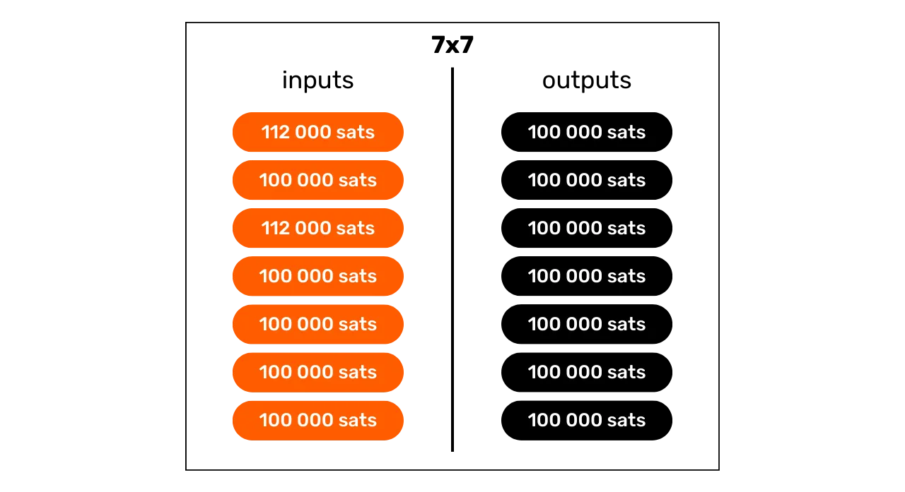


- ۸ ورودی و ۸ خروجی.


مدل Whirlpool بر اساس تراکنش‌های کوچک CoinJoin است. برخلاف Wabisabi و JoinMarket، که استحکام مجموعه‌های ناشناس بر اساس حجم شرکت‌کنندگان در یک چرخه واحد (یا چند چرخه) است، Whirlpool به توالی چندین چرخه کوچک متکی است.


در این مدل، کاربران تنها زمانی که برای اولین بار به یک استخر می‌پیوندند، هزینه‌ها را پرداخت می‌کنند و این امکان را به آن‌ها می‌دهد که بدون هزینه اضافی در تعداد زیادی از ریمیکس‌ها شرکت کنند. تازه‌واردان هزینه‌های Mining را برای ریمیکسرها پرداخت می‌کنند.


با هر CoinJoin اضافی که یک قطعه در آن شرکت می‌کند، و همچنین همتایان آن که در گذشته با آن‌ها مواجه شده‌اند، مجموعه‌های ناشناس به صورت نمایی رشد خواهند کرد. هدف این است که از این ریمیکس‌های رایگان بهره‌برداری شود، که هر بار که رخ می‌دهند، به تقویت تراکم مجموعه‌های ناشناس مرتبط با هر قطعه مخلوط شده کمک می‌کنند.


Whirlpool با در نظر گرفتن دو نیاز مهم طراحی شده است:


- دسترسی‌پذیری اجرای آن بر روی دستگاه‌های همراه، با توجه به اینکه Samourai Wallet در درجه اول یک برنامه کاربردی برای گوشی‌های هوشمند است؛
- چرخه‌های سریع ریمیکس برای ترویج افزایش قابل توجه در ناشناس‌ها.


این الزامات انتخاب‌هایی را که توسعه‌دهندگان Samourai Wallet در طراحی Whirlpool انجام دادند، هدایت کردند و آنها را به محدود کردن تعداد شرکت‌کنندگان در هر چرخه سوق دادند. تعداد کم باعث کاهش کارایی CoinJoin می‌شد و به طور چشمگیری تعداد ناشناس‌های تولید شده در هر چرخه را کاهش می‌داد، در حالی که تعداد زیاد مشکلات مدیریتی در برنامه‌های موبایل ایجاد می‌کرد و جریان چرخه را مختل می‌کرد.


در نهایت، نیازی به داشتن تعداد زیادی شرکت‌کننده برای هر CoinJoin روی Whirlpool نیست، زیرا مجموعه‌های ناشناس بر اساس تجمع چندین چرخه CoinJoin ساخته می‌شوند. مهم‌ترین اصل در اینجا همگنی UTXOهای همه شرکت‌کنندگان است، زیرا این امر اختلاط کامل را تضمین می‌کند و بنابراین از چرخه‌های اختلاط و بازاختلاط به طور کامل بهره‌مند می‌شود.


### CoinJoin استخرها و هزینه‌ها


برای افزایش ناشناس‌سازی بخش‌های ترکیبی در این چرخه‌های متعدد، یک چارچوب خاص لازم است تا مقدار UTXOهای استفاده‌شده را محدود کند. Whirlpool استخرهای مختلفی را تعریف می‌کند.


یک استخر نمایانگر گروهی از کاربران است که مایل به ترکیب با یکدیگر هستند و بر مقدار UTXOها برای بهینه‌سازی فرآیند CoinJoin توافق دارند، در حالی که همگنی کامل قطعات را حفظ می‌کنند. هر استخر مقدار ثابتی از UTXO را مشخص می‌کند که کاربر باید برای شرکت در آن رعایت کند. بنابراین، برای انجام کوین‌جوین‌ها با Whirlpool، باید یک استخر را انتخاب کنید. استخرهای زیر در حال حاضر در دسترس هستند:


- ۰.۵ بیت‌کوین ;
- ۰٫۰۵ Bitcoin ؛
- 0.01 Bitcoin ;
- ۰٫۰۰۱ Bitcoin (= ۱۰۰,۰۰۰ Sats).


وقتی با بیت‌کوین‌های خود وارد یک استخر می‌شوید، آن‌ها به UTXOهای generate تقسیم می‌شوند که کاملاً همگن با UTXOهای سایر شرکت‌کنندگان در استخر هستند. هر استخر یک حد حداکثر دارد، بنابراین برای مقادیر بیش از این حد، یا باید دو ورود جداگانه به همان استخر داشته باشید، یا به استخری با مقدار بالاتر منتقل شوید:


| Pool (bitcoin) | Maximum amount per entry (bitcoin) |
|----------------|--------------------------------------|
| 0,5 | 35 |
| 0,05 | 3,5 |
| 0,01 | 0,7 |
| 0,001 | 0,025 |

یک UTXO زمانی به یک استخر تعلق دارد که آماده ادغام در یک CoinJoin باشد. با این حال، این به معنای از دست دادن مالکیت کاربر نیست. همان‌طور که در فصل‌های اول این بخش دیدیم، از طریق چرخه‌های مختلف ترکیب، شما کنترل کامل بر کلیدهای خود و در نتیجه بر بیت‌کوین‌های خود دارید. این چیزی است که تکنیک CoinJoin را از سایر تکنیک‌های ترکیب متمرکز متمایز می‌کند.


برای پیوستن به یک استخر CoinJoin، شما نیاز به پرداخت یک هزینه خدمات و یک هزینه Mining دارید. هزینه‌های خدمات برای هر استخر ثابت هستند و به منظور جبران تیم‌های مسئول توسعه و نگهداری Whirlpool در نظر گرفته شده‌اند.


هزینه خدمات برای استفاده از Whirlpool فقط یک بار در زمان پیوستن به استخر قابل پرداخت است. پس از پیوستن، می‌توانید بدون هزینه اضافی در تعداد نامحدودی از ریمیکس‌ها شرکت کنید. در اینجا هزینه‌های ثابت فعلی برای هر استخر آمده است:


| Pool (bitcoin) | Entry fee (bitcoin) |
|----------------|---------------------------------|
| 0,5 | 0,0175 |
| 0,05 | 0,00175 |
| 0.01 | 0.0005 (50,000 sats) |
| 0.001 | 0.00005 (5,000 sats) |

این هزینه‌ها اساساً به عنوان بلیط ورودی به استخر انتخابی عمل می‌کنند، بدون توجه به مقداری که در CoinJoin وارد می‌کنید. بنابراین، چه با 0.01 BTC دقیقاً وارد استخر 0.01 شوید یا با 0.5 BTC، هزینه‌ها به صورت مطلق ثابت خواهند ماند.


قبل از ادامه با کوین‌جوین‌های Whirlpool، کاربر می‌تواند بین ۲ استراتژی انتخاب کند:


- انتخاب یک استخر کوچکتر برای به حداقل رساندن هزینه‌های خدمات، با علم به اینکه او در عوض چندین UTXO کوچکتر دریافت خواهد کرد؛
- یا یک استخر بزرگ‌تر را انتخاب کنید، حاضر به پرداخت هزینه‌های بالاتر شوید، و در نهایت با تعداد کمتری از UTXOهای با ارزش بالاتر مواجه شوید.


به طور کلی توصیه نمی‌شود که چندین UTXO مختلط را پس از چرخه‌های CoinJoin ادغام کنید، زیرا این کار می‌تواند محرمانگی به‌دست‌آمده را به خطر بیندازد، به‌ویژه به دلیل روش اکتشافی ورودی مشترک Ownership (CIOH: *Common-Input-Ownership-Heuristic*). بنابراین، ممکن است منطقی باشد که یک استخر بزرگ‌تر را انتخاب کنید، حتی اگر این به معنای پرداخت بیشتر باشد، تا از داشتن تعداد زیادی UTXO با ارزش کم در خروجی جلوگیری کنید. کاربر باید این مبادلات را ارزیابی کند تا استخر مورد نظر خود را انتخاب کند.


علاوه بر هزینه خدمات، هزینه Mining که به هر تراکنش Bitcoin خاص تعلق می‌گیرد نیز باید در نظر گرفته شود. به عنوان یک کاربر Whirlpool، شما ملزم به پرداخت هزینه Mining برای تراکنش آماده‌سازی (`Tx0`) و همچنین برای اولین CoinJoin خواهید بود. تمامی ریمیکس‌های بعدی به لطف مدل Whirlpool که بر اساس پرداخت به تازه‌واردان است، رایگان خواهند بود.


در واقع، در هر Whirlpool CoinJoin، 2 کاربر از میان ورودی‌ها تازه‌وارد هستند. ورودی‌های دیگر از ریمیکسرها می‌آیند. در نتیجه، هزینه‌های Mining برای همه شرکت‌کنندگان در تراکنش توسط این 2 تازه‌وارد تحمل می‌شود، که سپس می‌توانند از ریمیکس‌های رایگان نیز بهره‌مند شوند:


با تشکر از این سیستم هزینه، Whirlpool واقعاً از دیگر پیاده‌سازی‌های CoinJoin متمایز است، زیرا مجموعه‌های ناشناس UTXOها متناسب با قیمتی که کاربر پرداخت می‌کند نیستند. در نتیجه، می‌توان با پرداخت تنها هزینه ورود به استخر و هزینه Mining برای 2 تراکنش (یعنی `Tx0` و ترکیب اولیه) به سطوح ناشناسیت بسیار بالاتری دست یافت.


توجه به این نکته مهم است که کاربر همچنین باید برای برداشت UTXOهای خود از استخر پس از تکمیل چندین کوین‌جوین، هزینه‌های Mining را پرداخت کند، مگر اینکه گزینه `mix to` را انتخاب کرده باشد، که یک Address خارجی فراهم می‌کند که وجوه را مستقیماً از CoinJoin دریافت می‌کند، بدون هیچ تراکنش اضافی.


### حساب‌های پرتفوی HD


برای ایجاد یک CoinJoin از طریق Whirlpool، باید Wallet چندین حساب جداگانه را generate کند. این اصل پشت پروتکل ZeroLink است. یک حساب، در زمینه یک پورتفولیو HD (*Hierarchical Deterministic*)، بخشی است که به طور کامل از دیگران جدا شده است، این جداسازی در سطح سوم عمق سلسله مراتب پورتفولیو، یعنی در سطح `xpub` رخ می‌دهد.


یک HD Wallet می‌تواند به‌طور نظری تا `2^(31)` حساب مختلف را استخراج کند. حساب اولیه که به‌طور پیش‌فرض در تمام کیف‌پول‌های Bitcoin استفاده می‌شود، با شاخص `0'` مطابقت دارد.


برای پرتفولیوهایی که به Whirlpool تطبیق داده شده‌اند، از ۴ حساب برای برآورده کردن نیازهای فرآیند ZeroLink استفاده می‌شود:


- حساب **سپرده**، شناسایی شده توسط شاخص `0'` ;
- حساب **بانک بد** (یا "تغییر داکسیک")، که با شاخص `2,147,483,644'` شناسایی شده است؛
- حساب **premix**، که با شاخص `2 147 483 645'` شناسایی شده است؛
- حساب **postmix**، شناسایی شده توسط شاخص `2 147 483 646'`.


هر یک از این حساب‌ها یک عملکرد خاص در فرآیند CoinJoin را انجام می‌دهند که در بخش‌های بعدی به بررسی آن‌ها خواهیم پرداخت.


همه این حساب‌ها به یک seed متصل هستند و به کاربر این امکان را می‌دهند که با استفاده از عبارت بازیابی خود و در صورت لزوم، passphrase خود، به تمام بیت‌کوین‌هایش دسترسی مجدد پیدا کند. با این حال، در طول عملیات بازیابی، نرم‌افزار باید از شاخص‌های مختلف حساب‌های استفاده شده مطلع شود.


بیایید نگاهی به مراحل مختلف یک Whirlpool CoinJoin در این حساب‌ها بیندازیم.


### TX0


نقطه شروع هر Whirlpool CoinJoin حساب **سپرده** است. این حسابی است که به‌طور خودکار هنگام ایجاد یک Bitcoin Wallet جدید از آن استفاده می‌کنید. این حساب باید با بیت‌کوین‌هایی که می‌خواهید مخلوط کنید، اعتبار داده شود.


Tx0" اولین مرحله در فرآیند مخلوط‌سازی Whirlpool است. هدف آن آماده‌سازی و همسان‌سازی UTXOها برای CoinJoin است، به طوری که آنها را به واحدهایی مطابق با مقدار استخر انتخابی تقسیم کند تا مخلوط‌سازی همگن تضمین شود. UTXOهایی که به این ترتیب همسان‌سازی شده‌اند، سپس به حساب **پیش‌مخلوط** ارسال می‌شوند. در مورد تفاوتی که نمی‌تواند وارد استخر شود، به یک حساب خاص جدا می‌شود: **بانک بد** (یا "تغییر داکسیک").


این تراکنش اولیه `Tx0` همچنین برای پرداخت هزینه خدمات به هماهنگ‌کننده CoinJoin استفاده می‌شود. برخلاف مراحل بعدی، این تراکنش مشارکتی نیست، بنابراین کاربر باید هزینه کامل Mining را بپردازد:


در این مثال از تراکنش `Tx0`، یک ورودی به مقدار `372,000 Sats` از حساب **سپرده** ما به چندین خروجی UTXO تقسیم می‌شود که به شرح زیر است:


- مبلغ `5,000 Sats` برای هماهنگ‌کننده بابت هزینه‌های خدمات، مربوط به ورود به استخر `100,000 Sats`;
- ۳ UTXO آماده برای میکس، به حساب **پریمیکس** ما هدایت شده و با هماهنگ‌کننده ثبت شده‌اند. این UTXOها به مقدار `108,000 Sats` هر کدام برابر شده‌اند تا هزینه‌های Mining برای میکس اولیه آینده آن‌ها را پوشش دهند؛
- مازاد، که نمی‌تواند وارد استخر شود زیرا بسیار کوچک است، به عنوان Exchange خارجی سمی در نظر گرفته می‌شود. این به حساب خاص خود ارسال می‌شود. در اینجا، این Exchange به مقدار `40,000 Sats` است؛
- در نهایت، `3,000 Sats` باقی مانده است که خروجی را تشکیل نمی‌دهند، بلکه هزینه‌های Mining هستند که برای تأیید `Tx0` لازم است.


به عنوان مثال، اینجا یک Whirlpool Tx0 واقعی است (مال من نیست): [edef60744f539483d868caff49d4848e5cc6e805d6cdc8d0f9bdbbaedcb5fc46](https://Mempool.space/fr/tx/edef60744f539483d868caff49d4848e5cc6e805d6cdc8d0f9bdbbaedcb5fc46)


### تغییرات داکسیک


مازاد که نمی‌توانست در استخر ادغام شود، در اینجا معادل `40,000 Sats`، به حساب **بانک بد**، که به عنوان "doxxic Exchange" نیز شناخته می‌شود، هدایت می‌شود تا جداسازی دقیق از سایر UTXOها در پرتفوی تضمین شود.


این UTXO برای محرمانگی کاربر خطرناک است، زیرا نه تنها هنوز به گذشته خود و بنابراین احتمالاً به هویت مالک خود متصل است، بلکه به عنوان متعلق به کاربری که یک CoinJoin ساخته است نیز شناخته می‌شود.


اگر این UTXO با خروجی‌های مختلط ادغام شود، دومی تمام محرمانگی به‌دست‌آمده در طول چرخه‌های CoinJoin را از دست خواهد داد، به‌ویژه به دلیل CIOH (*Common-Input-Ownership-Heuristic*). اگر با تغییرات داکسیک دیگر ادغام شود، کاربر خطر از دست دادن محرمانگی را دارد، زیرا این امر ورودی‌های مختلف چرخه CoinJoin را به هم پیوند می‌دهد. بنابراین باید با احتیاط با آن برخورد شود. ما در بخش آخر این فصل به جزئیات بیشتری در مورد مدیریت این UTXOهای داکسیک خواهیم پرداخت.


### مخلوط اولیه


پس از `Tx0`، UTXOهای همسان‌سازی‌شده به حساب **پیش‌میکس** پرتفوی ما ارسال می‌شوند و آماده ورود به اولین چرخه CoinJoin خود، که به عنوان "میکس اولیه" شناخته می‌شود، هستند. اگر، همان‌طور که در مثال ما، `Tx0` چندین UTXO برای میکس تولید کند، هر یک از آن‌ها در یک میکس اولیه جداگانه ادغام خواهند شد.


در پایان این اولین میکس‌ها، حساب **پریمیکس** خالی خواهد بود، در حالی که سکه‌های ما، پس از پرداخت هزینه‌های Mining برای این اولین CoinJoin، دقیقاً به مقدار تعریف‌شده توسط استخر انتخابی تنظیم خواهند شد. در مثال ما، UTXOهای اولیه ما از `108,000 Sats` به طور دقیق به `100,000 Sats` کاهش یافته‌اند.


### ریمیکس‌ها


پس از ترکیب اولیه، UTXOها به حساب **postmix** منتقل می‌شوند. این حساب UTXOهایی که قبلاً ترکیب شده‌اند و آن‌هایی که در انتظار ترکیب مجدد هستند را جمع‌آوری می‌کند. هنگامی که مشتری Whirlpool فعال است، UTXOهای موجود در حساب **postmix** به‌طور خودکار برای ترکیب‌های مجدد در دسترس هستند و به‌صورت تصادفی برای شرکت در این چرخه‌های جدید انتخاب خواهند شد.


به عنوان یک یادآوری، ریمیکس‌ها ۱۰۰٪ رایگان هستند: هیچ هزینه خدمات اضافی یا هزینه‌های Mining لازم نیست. نگه داشتن UTXOها در حساب **postmix** بنابراین ارزش آن‌ها را دست نخورده نگه می‌دارد و همزمان ناشناس بودن آن‌ها را بهبود می‌بخشد. به همین دلیل مهم است که به این سکه‌ها اجازه دهید در چندین چرخه CoinJoin شرکت کنند. این کار برای شما هیچ هزینه‌ای ندارد و سطح ناشناس بودن آن‌ها را افزایش می‌دهد.


وقتی تصمیم می‌گیرید UTXOهای مخلوط را خرج کنید، می‌توانید این کار را مستقیماً از این حساب **پست‌میکس** انجام دهید. ما توصیه می‌کنیم UTXOهای مخلوط را در این حساب نگه دارید تا از ریمیکس‌های رایگان بهره‌مند شوید و از خروج آن‌ها از مدار Whirlpool جلوگیری کنید، که می‌تواند محرمانگی آن‌ها را کاهش دهد.


### چگونه پست‌میکس‌های خود را مدیریت می‌کنید؟


پس از اجرای چرخه‌های CoinJoin، بهترین استراتژی این است که UTXOهای خود را در حساب **postmix** نگه دارید و منتظر استفاده‌های آینده باشید. حتی توصیه می‌شود که آن‌ها را به طور نامحدود بازترکیب کنید تا زمانی که نیاز به خرج کردن آن‌ها داشته باشید.


برخی کاربران ممکن است انتقال بیت‌کوین‌های ترکیبی خود را به یک Wallet که توسط یک Hardware Wallet ایمن شده است، در نظر بگیرند. این امکان‌پذیر است، اما مهم است که توصیه‌های سامورایی Wallet را به دقت دنبال کنید تا محرمانگی به‌دست‌آمده به خطر نیفتد.


ادغام UTXOها رایج‌ترین اشتباه است. برای اجتناب از CIOH (*Common-Input-Ownership-Heuristic*)، باید از ترکیب UTXOهای مخلوط شده با UTXOهای مخلوط نشده در یک تراکنش خودداری کنید. این امر نیازمند مدیریت دقیق UTXOهای شما در پرتفوی‌تان است، به‌ویژه از نظر برچسب‌گذاری.


هنگام تجمیع UTXOهای مختلط نیز باید احتیاط کرد. تجمیع متوسط ممکن است اگر UTXOهای مختلط شما دارای مجموعه‌های ناشناس قابل توجهی باشند، اما این امر به ناچار محرمانگی بخش‌های شما را کاهش می‌دهد. اطمینان حاصل کنید که تجمیع‌ها نه بیش از حد گسترده باشند و نه پس از تعداد ناکافی از ریمیکس‌ها انجام شوند، زیرا خطر ایجاد پیوندهای قابل استنتاج بین UTXOهای شما قبل و بعد از چرخه‌های CoinJoin وجود دارد. در صورت تردید در مورد این دستکاری‌ها، بهترین روش این است که UTXOهای پسامیکس را تجمیع نکنید، بلکه آنها را یکی یکی به Hardware Wallet خود منتقل کنید و هر بار یک Address جدید خالی ایجاد کنید. بار دیگر، به یاد داشته باشید که هر UTXO که دریافت می‌کنید را برچسب‌گذاری کنید.


همچنین توصیه نمی‌شود که پست‌میکس UTXOهای خود را با استفاده از اسکریپت‌هایی که به طور گسترده استفاده نمی‌شوند به یک Wallet منتقل کنید. به عنوان مثال، اگر از یک Multisig به Whirlpool وارد شوید و از اسکریپت‌های `P2WSH` استفاده کنید، احتمال کمی وجود دارد که با کاربران دیگری که در ابتدا همان نوع Wallet را داشتند، مخلوط شوید. اگر پست‌میکس‌های خود را به همین Multisig Wallet دوباره مخلوط کنید، سطح محرمانگی بیت‌کوین‌های مخلوط‌شده شما به شدت کاهش می‌یابد. فراتر از اسکریپت‌ها، بسیاری از اثر انگشت‌های دیگر Wallet وجود دارند که می‌توانند شما را به دردسر بیندازند.


همانند هر تراکنش Bitcoin، مهم است که از Address دریافت‌کننده مجدداً استفاده نشود. هر تراکنش جدید باید بر روی یک Address جدید و خالی دریافت شود.


ساده‌ترین و امن‌ترین راه‌حل این است که UTXOهای ترکیبی خود را در حساب **postmix** خود به حال خود رها کنید، بگذارید دوباره ترکیب شوند و فقط برای خرج کردن به آن‌ها دست بزنید. کیف‌پول‌های Samurai و Sparrow دارای محافظت‌های اضافی در برابر تمام این خطرات تحلیل زنجیره‌ای هستند. این محافظت‌ها به شما کمک می‌کنند تا از اشتباهات جلوگیری کنید.


### چگونه با تبادلات سمی برخورد می‌کنید؟


سپس، باید در مدیریت Exchange داکسیک خود دقت کنید، Exchange که وارد مجموعه CoinJoin نشد. این UTXOهای سمی که از استفاده از Whirlpool ناشی می‌شوند، به دلیل ایجاد ارتباط بین شما و کاربر CoinJoin، برای حریم خصوصی شما خطرناک هستند. بنابراین، مدیریت آن‌ها با دقت و عدم ترکیب آن‌ها با سایر UTXOها، به ویژه UTXOهای مخلوط، ضروری است.


در اینجا چند استراتژی برای استفاده از آن‌ها آورده شده است:


- آن‌ها را به استخرهای کوچکتر ترکیب کنید:** اگر UTXO سمی شما به اندازه‌ای بزرگ است که به تنهایی در یک استخر کوچکتر جا شود، ترکیب کردن آن را در نظر بگیرید. این اغلب بهترین گزینه است. با این حال، توصیه نمی‌شود که چندین UTXO سمی را برای دسترسی به یک استخر ادغام کنید، زیرا این کار می‌تواند ورودی‌های مختلف شما را به هم مرتبط کند؛
- آن‌ها را به عنوان "غیرقابل‌مصرف" علامت‌گذاری کنید:** یک روش دیگر این است که استفاده از آن‌ها را متوقف کنید، آن‌ها را در حساب اختصاصی‌شان به عنوان "غیرقابل‌مصرف" علامت‌گذاری کنید و فقط HODL. این کار تضمین می‌کند که به طور تصادفی آن‌ها را خرج نکنید. اگر ارزش Bitcoin افزایش یابد، ممکن است استخرهای جدیدی که برای UTXOهای سمی شما مناسب‌تر هستند، ظاهر شوند؛
- اهدا کنید:** در نظر داشته باشید که اهداهایی، هرچند کوچک، به توسعه‌دهندگانی که روی Bitcoin و نرم‌افزارهای مرتبط کار می‌کنند، انجام دهید. همچنین می‌توانید به انجمن‌هایی که BTC می‌پذیرند، اهدا کنید. اگر مدیریت UTXOهای سمی شما بیش از حد پیچیده به نظر می‌رسد، می‌توانید به سادگی از شر آن‌ها خلاص شوید و یک اهدا انجام دهید؛
- خرید کارت‌های هدیه:** پلتفرم‌هایی مانند [Bitrefill](https://www.bitrefill.com/) به شما اجازه می‌دهند تا بیت‌کوین‌های Exchange خود را برای کارت‌های هدیه‌ای که می‌توانند در فروشگاه‌های مختلف استفاده شوند، مبادله کنید. این می‌تواند راهی برای خلاص شدن از UTXOهای سمی شما بدون از دست دادن ارزش مرتبط باشد؛
- آن‌ها را روی مونرو تجمیع کنید:** Samourai Wallet یک سرویس مبادله اتمی بین BTC و XMR ارائه می‌دهد. این برای مدیریت UTXOهای سمی با تجمیع آن‌ها روی مونرو، بدون به خطر انداختن محرمانگی شما از طریق CIOH، قبل از ارسال مجدد به Bitcoin ایده‌آل است. با این حال، این گزینه می‌تواند از نظر هزینه‌های Mining و حق بیمه به دلیل محدودیت‌های نقدینگی پرهزینه باشد؛
- آن‌ها را به Lightning Network ارسال کنید:** انتقال این UTXOها به Lightning Network برای بهره‌مندی از کارمزدهای تراکنش کمتر می‌تواند گزینه‌ای جذاب باشد. با این حال، این روش ممکن است بسته به نحوه استفاده شما از Lightning، اطلاعات خاصی را فاش کند و بنابراین باید با احتیاط استفاده شود.


### چگونه از Whirlpool استفاده کنم؟


پس از دستگیری بنیان‌گذاران Samourai Wallet و توقیف سرورهای آن‌ها در ۲۴ آوریل ۲۰۲۴، ابزار Whirlpool دیگر کار نمی‌کند، حتی برای کسانی که دوجوی خود را دارند. قبلاً این ابزار در Samourai Wallet و Sparrow wallet در دسترس بود.


با این حال، این امکان وجود دارد که این ابزار در هفته‌های آینده، بسته به نتیجه آزمایش‌ها، دوباره فعال شود یا به روش دیگری راه‌اندازی شود. در هر صورت، فکر نمی‌کنم بازار Bitcoin CoinJoin برای مدت طولانی بدون Supply بماند، زیرا تقاضا وجود دارد. علاوه بر این، از آنجا که مدل Whirlpool پیشرفته‌ترین مدل از نظر محرمانگی است، مطمئناً مدل انتخابی برای سایر پیاده‌سازی‌ها در آینده خواهد بود.


ما با دقت این پرونده و تحولات ابزارهای مرتبط را زیر نظر داریم. مطمئن باشید که با در دسترس قرار گرفتن اطلاعات جدید، این دوره آموزشی را به‌روزرسانی خواهیم کرد.


در فصل بعدی، خواهیم فهمید که "anonsets" چیستند، این شاخص‌ها چگونه محاسبه می‌شوند، و چگونه می‌توانند به ما در تخمین کارایی چرخه‌های CoinJoin کمک کنند.


https://planb.network/tutorials/privacy/on-chain/coinjoin-sparrow-wallet-84def86d-faf5-4589-807a-83be60720c8b

https://planb.network/tutorials/privacy/on-chain/coinjoin-samourai-wallet-e566803d-ab3f-4d98-9136-5462009262ef

https://planb.network/tutorials/privacy/on-chain/coinjoin-dojo-c4b20263-5b30-4c74-ae59-dc8d0f8715c2

## مجموعه‌های ناشناس‌سازی


<chapterId>be1093dc-1a74-40e5-9545-2b97a7d7d431</chapterId>


مطالعه کرده‌ایم که کوین‌جوین‌ها چگونه کار می‌کنند و مسائل مربوط به مخلوط‌سازی مؤثر چیستند، اکنون می‌خواهیم بفهمیم چگونه می‌توان اثربخشی آن‌ها را اندازه‌گیری کرد. چگونه می‌توانیم تعیین کنیم که آیا یک فرآیند کوین‌جوین مؤثر بوده است و چه میزان ناشناس بودن به دست آمده است؟ این همان چیزی است که در این فصل با مجموعه‌های ناشناس یا "anonsets" خواهیم فهمید.


### یادآوری از مفید بودن CoinJoin


مفید بودن CoinJoin در توانایی آن برای ایجاد انکارپذیری قابل قبول نهفته است، با قرار دادن بخش شما در میان گروهی از بخش‌های غیرقابل تشخیص. هدف از این اقدام شکستن پیوندهای ردیابی، هم از گذشته به حال و هم از حال به گذشته است.


به عبارت دیگر، یک تحلیل‌گر که تراکنش اولیه شما (`Tx0`) را در ورودی چرخه‌های CoinJoin می‌داند، نباید بتواند با اطمینان UTXO شما را در خروجی چرخه‌های ریمیکس شناسایی کند (تحلیل از ورود چرخه تا خروج چرخه).


برعکس، یک تحلیل‌گر که UTXO شما را در خروجی چرخه‌های CoinJoin می‌شناسد، نباید قادر به تعیین تراکنش اصلی در ورودی چرخه‌ها باشد (تحلیل خروجی چرخه به ورودی چرخه).


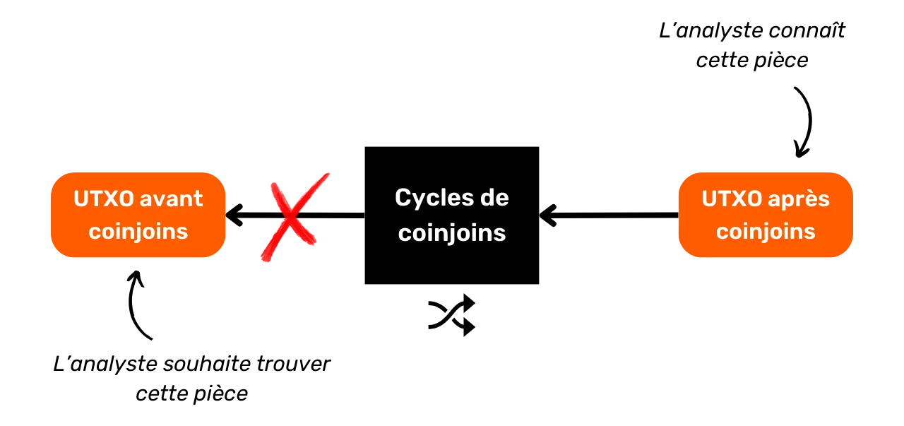


برای ارزیابی اینکه چقدر برای یک تحلیل‌گر دشوار است که گذشته را به حال و بالعکس مرتبط کند، باید اندازه گروه‌های بخش‌های همگن را که در آن بخش شما پنهان شده است، کمی کنیم. این اندازه‌گیری به ما می‌گوید که چند تحلیل دارای احتمال یکسان هستند. بنابراین، اگر تحلیل صحیح در میان ۳ تحلیل دیگر با احتمال برابر غرق شده باشد، سطح پنهان‌کاری شما بسیار پایین است. از سوی دیگر، اگر تحلیل صحیح در مجموعه‌ای از ۲۰,۰۰۰ تحلیل با احتمال برابر یافت شود، بخش شما بسیار خوب پنهان شده است. اندازه این گروه‌ها نشانگرهایی به نام "anonsets" را نشان می‌دهد.


### درک anonsets


Anonsets به عنوان شاخص‌هایی برای ارزیابی درجه محرمانگی یک UTXO خاص استفاده می‌شوند. به طور مشخص‌تر، آن‌ها تعداد UTXOهای غیرقابل تشخیص در مجموعه‌ای که شامل بخش مورد مطالعه است را اندازه‌گیری می‌کنند. نیاز به یک مجموعه همگن از UTXOها به این معناست که anonsets معمولاً بر روی چرخه‌های CoinJoin محاسبه می‌شوند. استفاده از این شاخص‌ها به ویژه برای coinjointهای Whirlpool به دلیل یکنواختی آن‌ها بسیار مرتبط است.


در صورت لزوم، می‌توان از مجموعه‌های ناشناس برای ارزیابی کیفیت کوین‌جوین‌ها استفاده کرد. یک مجموعه ناشناس بزرگ به معنای سطح بالایی از ناشناس بودن است، زیرا تشخیص یک UTXO خاص در مجموعه همگن دشوار می‌شود.


2 نوع مجموعه ناشناس وجود دارد:


- چشم‌انداز ناشناس ;**
- بازنگری ناشناس.**


### Anonset آینده


شاخص آینده‌نگر نشان‌دهنده اندازه گروهی است که در آن UTXO در پایان چرخه پنهان شده است، با توجه به UTXO در ابتدا، یعنی تعداد بخش‌های غیرقابل تشخیص موجود در این گروه. نام این شاخص "معیارهای آینده‌نگر" است.


این شاخص مقاومت محرمانگی اتاق را در برابر تحلیل گذشته به حال (ورودی به خروجی) اندازه‌گیری می‌کند.


این معیار برای برآورد میزان محافظت UTXO شما در برابر تلاش‌ها برای بازسازی تاریخچه آن از نقطه ورود تا نقطه خروج در فرآیند CoinJoin استفاده می‌شود.


به عنوان مثال، اگر تراکنش شما در اولین چرخه CoinJoin شرکت کرده و دو چرخه نزولی دیگر تکمیل شده باشد، ناشناس‌سازی احتمالی سکه شما `13` خواهد بود:


به عنوان مثال، بیایید تصور کنیم که سکه ما در ابتدای چرخه CoinJoin دارای یک ناشناس‌سازی احتمالی به مقدار `86,871` است. به زبان عملی، این به این معناست که این سکه در میان `86,871` بخش غیرقابل تشخیص پنهان شده است. برای یک ناظر خارجی که این سکه را در ابتدای چرخه‌های CoinJoin می‌شناسد و سعی در ردیابی خروج آن دارد، او با `86,871` UTXO ممکن مواجه خواهد شد که هر کدام با احتمال یکسانی می‌توانند سکه‌ای باشند که او به دنبال آن است.


### گذشته‌نگر ناشناس


بازنگری ناشناس‌سازی نشان‌دهنده تعداد منابع ممکن برای یک بخش خاص است، با دانستن UTXO در پایان چرخه. این شاخص مقاومت محرمانگی بخش را در برابر تحلیل از حال به گذشته (خروجی به ورودی) اندازه‌گیری می‌کند، یعنی چقدر برای یک تحلیل‌گر دشوار است که بخش شما را به منبع آن قبل از چرخه‌های CoinJoin ردیابی کند. نام این شاخص "بازنگری ناشناس‌سازی" یا "معیارهای نگاه به گذشته" است.


با دانستن UTXO خود در خروجی چرخه‌ها، ناشناس‌سازی گذشته تعداد تراکنش‌های احتمالی Tx0 را که می‌توانستند ورود شما به چرخه‌های CoinJoin را تشکیل دهند، تعیین می‌کند. در نمودار زیر، این به مجموع تمام حباب‌های نارنجی مربوط می‌شود.


به عنوان مثال، بیایید تصور کنیم که قطعه CoinJoin ما دارای یک ناشناس‌سازی بازگشتی به مقدار `42,185` است. به زبان عملی، این بدان معناست که `42,185` منبع بالقوه برای این UTXO وجود دارد. اگر یک ناظر خارجی این سکه را در پایان چرخه‌ها شناسایی کند و بخواهد منبع آن را ردیابی کند، با `42,185` منبع ممکن مواجه خواهد شد که همگی با احتمال برابر منبع مورد نظر هستند.


### چگونه anonsets را محاسبه می‌کنید؟


محاسبه anonsets به صورت دستی با استفاده از Block explorer برای گروه‌های کوچک امکان‌پذیر است. با این حال، برای anonsets بزرگ‌تر، استفاده از یک ابزار تخصصی ضروری می‌شود. تا جایی که من می‌دانم، تنها نرم‌افزاری که قادر به انجام این کار است، *Whirlpool Stats Tool* است، یک ابزار پایتون که توسط تیم‌های Samourai و OXT توسعه یافته است. متأسفانه، این ابزار در حال حاضر پس از دستگیری بنیان‌گذاران Samourai و توقف OXT، که برای استخراج داده‌ها از Blockchain استفاده می‌شد، از سرویس خارج شده است.


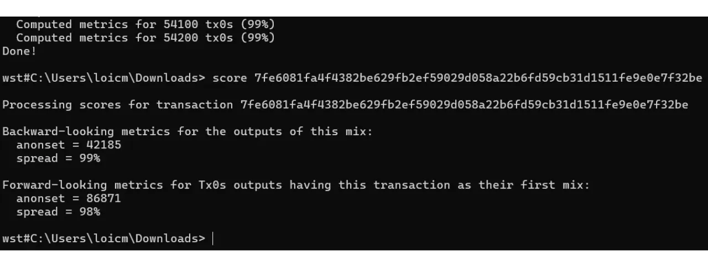


همانطور که در این فصل مشاهده کردیم، ناشناس‌ها تنها در صورتی قابل محاسبه هستند که همگنی خاصی در ساختار CoinJoin وجود داشته باشد. در فصل بعدی، خواهیم دید که چگونه می‌توان این همگنی را در یک تراکنش Bitcoin، چه CoinJoin باشد و چه یک تراکنش سنتی‌تر، کمی‌سازی کرد.


https://planb.network/tutorials/privacy/analysis/wst-anonsets-0354b793-c301-48af-af75-f87569756375

## آنتروپی


<chapterId>e4fe289d-618b-49a2-84c9-68c562e708b4</chapterId>


همان‌طور که در این بخش درباره کوین‌جوین‌ها مشاهده کردیم، همگنی UTXOها در ورودی و خروجی نقش مهمی در بهبود محرمانگی یک تراکنش Bitcoin ایفا می‌کند. این پارامتر در برابر تحلیل Blockchain یک انکارپذیری قابل قبول ایجاد می‌کند. چندین روش برای اندازه‌گیری این همگنی وجود دارد، اما به نظر من یکی از مؤثرترین آن‌ها استفاده از شاخص‌هایی است که توسط ابزار *Boltzmann* ارائه شده‌اند، که توسط تیم‌های OXT و Samourai Wallet توسعه یافته‌اند، و به‌ویژه آنتروپی تراکنش. این همان چیزی است که در این فصل به‌طور دقیق بررسی خواهیم کرد.


برخلاف مجموعه‌های ناشناس، که بر اساس مجموعه‌ای از تراکنش‌ها محاسبه می‌شوند، شاخص‌های ارائه شده در اینجا بر روی یک تراکنش واحد تمرکز دارند، خواه یک CoinJoin باشد یا یک تراکنش سنتی‌تر.


### تعداد تفاسیر


اولین شاخصی که می‌توان در یک تراکنش Bitcoin مشاهده کرد، تعداد کل تفاسیر ممکن است که یک ناظر خارجی با آن مواجه می‌شود. با در نظر گرفتن مقادیر UTXOهای درگیر در تراکنش، این شاخص نشان‌دهنده تعداد راه‌هایی است که ورودی‌ها می‌توانند با خروجی‌ها مرتبط شوند. به عبارت دیگر، این شاخص تعداد تفاسیر ممکن را که یک تراکنش می‌تواند در جریان‌های Bitcoin از دیدگاه یک ناظر خارجی تحلیل‌گر ایجاد کند، تعیین می‌کند.


به عنوان مثال، یک تراکنش پرداخت ساده با 1 ورودی و 2 خروجی تنها یک تفسیر خواهد داشت، یعنی اینکه ورودی #0 خروجی #0 و خروجی #1 را تأمین مالی کرده است. هیچ تفسیر دیگری ممکن نیست:


از سوی دیگر، یک گوشه Whirlpool 5x5 دارای $1\,496$ ترکیب ممکن است:


یک چرخه طغیان Whirlpool 8x8 CoinJoin دارای $9\,934\,563$ تفسیر ممکن است:


### آنتروپی


از تعداد تفسیرهای یک تراکنش Bitcoin، می‌توانیم آنتروپی آن را محاسبه کنیم.


در زمینه کلی رمزنگاری و اطلاعات، آنتروپی یک معیار کمی از عدم قطعیت یا غیرقابل پیش‌بینی بودن مرتبط با یک منبع داده یا فرآیند تصادفی است. به عبارت دیگر، آنتروپی روشی برای اندازه‌گیری میزان دشواری پیش‌بینی یا حدس زدن یک قطعه اطلاعات است.


در زمینه خاص تحلیل Blockchain، آنتروپی همچنین نام یک شاخص است که از آنتروپی شانون مشتق شده و [توسط LaurentMT ابداع شده است](https://gist.github.com/LaurentMT/e758767ca4038ac40aaf)، که می‌تواند بر روی یک تراکنش Bitcoin محاسبه شود.


هنگامی که یک تراکنش تعداد زیادی از تفسیرهای ممکن را ارائه می‌دهد، اغلب ارجاع به آنتروپی آن مرتبط‌تر است. این شاخص میزان کمبود دانش تحلیل‌گران درباره پیکربندی دقیق تراکنش را اندازه‌گیری می‌کند. به عبارت دیگر، هرچه آنتروپی بالاتر باشد، شناسایی جریان بیت‌کوین‌ها بین ورودی‌ها و خروجی‌ها برای تحلیل‌گران دشوارتر می‌شود.


در عمل، آنتروپی نشان می‌دهد که آیا از دیدگاه یک ناظر خارجی، یک تراکنش بر اساس مقادیر ورودی و خروجی، بدون در نظر گرفتن الگوها و روش‌های دیگر خارجی یا داخلی، تفاسیر متعددی ارائه می‌دهد یا خیر. بنابراین، آنتروپی بالا مترادف با محرمانگی بیشتر برای تراکنش است.


آنتروپی به عنوان لگاریتم دودویی تعداد ترکیب‌های ممکن تعریف می‌شود. در اینجا فرمولی که استفاده می‌شود با $E$ به عنوان آنتروپی تراکنش و $C$ به عنوان تعداد تفسیرهای ممکن آمده است:


$$
E = \log_2(C)
$$


در ریاضیات، لگاریتم دودویی (لگاریتم پایه ۲) عمل معکوس توان‌رسانی ۲ است. به عبارت دیگر، لگاریتم دودویی $x$ نمایی است که باید ۲ به آن توان برسد تا $x$ به دست آید. این شاخص بنابراین به صورت بیت بیان می‌شود.


بیایید مثال محاسبه آنتروپی برای یک تراکنش CoinJoin را بررسی کنیم که بر اساس مدل 5x5 Whirlpool ساختار یافته است، که همان‌طور که در بخش قبلی ذکر شد، دارای تعداد تفاسیر ممکن $1\,496$ است:


$$
\begin{align*}
C &= 1\,496 \\
E &= \log_2(1\,496) \\
E &= 10.5469 \text{ bits}
\end{align*}
$$


بنابراین، این تراکنش CoinJoin دارای آنتروپی $10.5469$ بیت است که بسیار رضایت‌بخش تلقی می‌شود. هرچه این مقدار بالاتر باشد، تراکنش تفسیرهای متفاوت‌تری را می‌پذیرد و در نتیجه سطح محرمانگی آن تقویت می‌شود.


برای یک تراکنش CoinJoin 8x8 با $9\,934\,563$ تفسیر، آنتروپی خواهد بود:


$$
\begin{align*}
C &= 9\,934\,563 \\
E &= \log_2(9\,934\,563) \\
E &= 23.244 \text{ bits}
\end{align*}
$$


بیایید یک مثال دیگر با یک تراکنش پرداخت کلاسیک، با 1 ورودی و 2 خروجی بزنیم: [1b1b0c3f0883a99f1161c64da19471841ed12a1f78e77fab128c69a5f578ccce](https://Mempool.space/tx/1b1b0c3f0883a99f1161c64da19471841ed12a1f78e77fab128c69a5f578ccce)


در مورد این تراکنش، تنها تفسیر ممکن این است: `(In.0) > (Out.0 ; Out.1)`. در نتیجه، آنتروپی آن $0$ است:


$$
\begin{align*}
C &= 1 \\
E &= \log_2(1) \\
E &= 0 \text{ bits}
\end{align*}
$$


### بهره‌وری


بر اساس آنتروپی تراکنش، می‌توانیم کارایی آن را از نظر محرمانگی نیز محاسبه کنیم. این شاخص کارایی تراکنش را با مقایسه آن با تراکنش بهینه‌ای که می‌توان در یک پیکربندی مشابه تصور کرد، ارزیابی می‌کند.


این ما را به مفهوم حداکثر آنتروپی می‌رساند، که معادل با بالاترین آنتروپی است که یک ساختار تراکنش خاص به‌طور نظری می‌تواند به آن دست یابد. سپس کارایی تراکنش با مقایسه این حداکثر آنتروپی با آنتروپی واقعی تراکنش تحت تحلیل محاسبه می‌شود.


فرمول استفاده شده به شرح زیر است با:


- e_R$: آنتروپی واقعی تراکنش که به صورت بیت بیان شده است؛
- e_M$: حداکثر آنتروپی ممکن برای یک ساختار تراکنش، که به صورت بیت نیز بیان می‌شود؛
- $Ef$: کارایی تراکنش به بیت :


$$
Ef = E_R - E_M
$$


به عنوان مثال، برای یک ساختار Whirlpool 5x5 CoinJoin، حداکثر آنتروپی برابر است با $10.5469$ :


$$
\begin{align*}
E_R &= 10.5469 \\
E_M &= 10.5469 \\
Ef &= E_R - E_M \\
Ef &= 10.5469 - 10.5469 \\
Ef &= 0 \text{ bits}
\end{align*}
$$


این شاخص نیز به صورت درصد بیان می‌شود. فرمول استفاده شده به شرح زیر است:


- c_R$ : تعداد تفسیرهای واقعی ممکن ؛
- c_M$: حداکثر تعداد تفسیرهای ممکن از یک ساختار مشابه؛
- $Ef$: بازدهی به صورت درصد بیان شده:


$$
\begin{align*}
E_f &= \frac{C_R}{C_M} \\
E_f &= \frac{1\,496}{1\,496} \\
E_f &= 100 \%
\end{align*}
$$


بازدهی $100$ نشان می‌دهد که تراکنش به بهترین نحو از پتانسیل محرمانگی خود استفاده می‌کند، بسته به ساختار آن.


### چگالی آنتروپی


آنتروپی یک شاخص خوب برای اندازه‌گیری محرمانگی یک تراکنش است، اما تا حدی به تعداد ورودی‌ها و خروجی‌های تراکنش بستگی دارد. برای مقایسه آنتروپی ۲ تراکنش مختلف با تعداد ورودی‌ها و خروجی‌های متفاوت، می‌توانیم چگالی آنتروپی را محاسبه کنیم. این شاخص دیدگاهی نسبت به آنتروپی در مقایسه با هر ورودی یا خروجی تراکنش ارائه می‌دهد. چگالی برای ارزیابی و مقایسه کارایی تراکنش‌های با اندازه‌های مختلف مفید است.


برای محاسبه آن، به سادگی کل آنتروپی تراکنش را بر تعداد کل ورودی‌ها و خروجی‌های درگیر در تراکنش تقسیم می‌کنیم:


- e_D$: چگالی آنتروپی بیان شده به صورت بیت؛
- e$: آنتروپی تراکنش که به صورت بیت بیان شده است؛
- t$: تعداد کل ورودی‌ها و خروجی‌ها در تراکنش:


$$
E_D = \frac{E}{T}
$$


بیایید مثال Whirlpool 5x5 CoinJoin را بررسی کنیم:


$$
\begin{align*}
T &= 5 + 5 = 10 \\
E &= 10.5469 \\
E_D &= \frac{E}{T} \\
E_D &= \frac{10.5469}{10} \\
E_D &= 1.054 \text{ bits}
\end{align*}
$$


بیایید همچنین چگالی آنتروپی یک 8x8 Whirlpool CoinJoin را محاسبه کنیم:


$$
\begin{align*}
T &= 8 + 8 = 16 \\
E &= 23.244 \\
E_D &= \frac{E}{T} \\
E_D &= \frac{23.244}{16} \\
E_D &= 1.453 \text{ bits}
\end{align*}
$$


با تحلیل چگالی آنتروپی این دو نوع CoinJoin، مشخص می‌شود که حتی با نرمال‌سازی آنتروپی بر اساس تعداد Elements، "چرخه افزایش 8x8" CoinJoin عدم قطعیت بیشتری برای تحلیل ایجاد می‌کند.


### امتیاز بولتزمن


قطعه دیگری از اطلاعات که در یک تراکنش تحلیل می‌شود، امتیاز بولتزمن هر عنصر نسبت به دیگری است. این جدول احتمالات تطابق بین ورودی‌ها و خروجی‌ها است. این جدول از طریق امتیاز بولتزمن، احتمال شرطی را نشان می‌دهد که یک ورودی خاص به یک خروجی معین مرتبط است. بنابراین، این یک اندازه‌گیری کمی از احتمال شرطی است که یک ارتباط بین یک ورودی و یک خروجی در یک تراکنش رخ دهد، بر اساس نسبت تعداد وقوعات مطلوب این رویداد به کل تعداد وقوعات ممکن، در یک مجموعه از تفسیرها.


با استفاده از مثال Whirlpool CoinJoin، جدول احتمال شرطی شانس ارتباط بین هر ورودی و خروجی را نشان می‌دهد و یک معیار کمی از ابهام ارتباطات در تراکنش ارائه می‌دهد:


| % | Output 0 | Output 1 | Output 2 | Output 3 | Output 4 |
| ------- | -------- | -------- | -------- | -------- | -------- |
| Input 0 | 34% | 34% | 34% | 34% | 34% |
| Input 1 | 34% | 34% | 34% | 34% | 34% | 34% | Input 1
| Input 2 | 34% | 34% | 34% | 34% | 34% | 34% | 34% | 34% | 34% | 34% | 34% | 34% | 34% | 34% | 34
| Input 3 | 34% | 34% | 34% | 34% | 34% | 34% | Input 3
| Input 4 | 34% | 34% | 34% | 34% | 34% | 34% | 34% | 34% | 34% | 34% | 34% | 34% | 34% | 34% | 34

به وضوح، هر ورودی شانس برابری برای ارتباط با هر خروجی دارد، که محرمانگی تراکنش را تقویت می‌کند.


امتیاز بولتزمن با تقسیم تعداد تفاسیر که در آن یک رویداد خاص رخ می‌دهد بر تعداد کل تفاسیر موجود محاسبه می‌شود. بنابراین، برای تعیین امتیاز مرتبط با ورودی #0 و خروجی #3 (رویداد موجود در $512$ تفسیر)، به صورت زیر عمل می‌کنیم:


$$
\begin{align*}
\text{Interpretations (IN.0 > OUT.3)} &= 512 \\
\text{Interpretations totales} &= 1496 \\
\text{Score} &= \frac{512}{1496} \\
\text{Score} &= 34 \%
\end{align*}
$$


اگر ما مثال Whirlpool 8x8 Surge Cycle CoinJoin را در نظر بگیریم، جدول بولتزمن به این صورت خواهد بود:


| OUT.0 | OUT.1 | OUT.2 | OUT.3 | OUT.4 | OUT.5 | OUT.6 | OUT.7 |
|-------|-------|-------|-------|-------|-------|-------|-------|-------|
| IN.0 | 23% | 23% | 23% | 23% | 23% | 23% | 23% | 23% |
| IN.1 | 23% | 23% | 23% | 23% | 23% | 23% | 23% | 23% |
| IN.2 | 23% | 23% | 23% | 23% | 23% | 23% | 23% | 23% |
| IN.3 | 23% | 23% | 23% | 23% | 23% | 23% | 23% | 23% |
| IN.4 | 23% | 23% | 23% | 23% | 23% | 23% | 23% | 23% |
| IN.5 | 23% | 23% | 23% | 23% | 23% | 23% | 23% | 23% |
| IN.6 | 23% | 23% | 23% | 23% | 23% | 23% | 23% | 23% |
| IN.7 | 23% | 23% | 23% | 23% | 23% | 23% | 23% | 23% |

با این حال، در مورد یک تراکنش ساده با یک ورودی و ۲ خروجی، وضعیت متفاوت است:


| Output 0 | Output 1 |
|---------|----------|----------|
| Input 0 | 100% | 100% |

در اینجا، می‌بینیم که احتمال اینکه هر خروجی از ورودی شماره 0 منشأ گرفته باشد، 100٪ است. بنابراین، احتمال کمتر نشان‌دهنده محرمانگی بیشتر است و پیوندهای مستقیم بین ورودی‌ها و خروجی‌ها را کاهش می‌دهد.


### پیوندهای قطعی


ما همچنین می‌توانیم تعداد لینک‌های قطعی در یک تراکنش را محاسبه کنیم. این شاخص نشان می‌دهد که چند تا از ارتباطات بین ورودی‌ها و خروجی‌ها در تراکنش تحلیل‌شده بدون شک و با احتمال ۱۰۰٪ هستند. سپس می‌توان این شاخص را با محاسبه نسبت لینک‌های قطعی تکمیل کرد. این نسبت دیدگاهی در مورد وزن این لینک‌های قطعی در میان کل لینک‌های تراکنش ارائه می‌دهد.


به عنوان مثال، یک تراکنش Whirlpool CoinJoin هیچ پیوند قطعی بین ورودی‌ها و خروجی‌ها ندارد و بنابراین نشانگر 0 پیوند و نسبت 0% را نمایش می‌دهد. برعکس، در دومین تراکنش پرداخت ساده‌ای که بررسی کردیم (با یک ورودی و 2 خروجی)، نشانگر به ما می‌گوید که 2 پیوند قطعی وجود دارد و نسبت به 100% می‌رسد. به عبارت دیگر، یک نشانگر صفر نشان‌دهنده محرمانگی عالی است، به لطف عدم وجود پیوندهای مستقیم و غیرقابل انکار بین ورودی‌ها و خروجی‌ها.


### چگونه این شاخص‌ها را محاسبه می‌کنید؟


محاسبه این شاخص‌ها به صورت دستی با استفاده از معادلاتی که ارائه کرده‌ام نسبتاً ساده است. دشواری عمدتاً در تعیین تعداد تفاسیر ممکن از یک تراکنش نهفته است. برای یک تراکنش کلاسیک، این محاسبه را می‌توان به صورت دستی انجام داد. اما برای یک CoinJoin، این کار بسیار پیچیده‌تر است.


قبلاً، یک ابزار پایتون به نام _Boltzmann Calculator_ وجود داشت که توسط تیم‌های OXT و Samourai توسعه یافته بود و به‌طور خودکار تمام این شاخص‌ها را برای یک تراکنش Bitcoin محاسبه می‌کرد:


همچنین امکان استفاده از وب‌سایت KYCP.org برای این تحلیل‌ها وجود داشت:


متأسفانه، پس از دستگیری بنیان‌گذاران سامورایی، این ابزارها دیگر عملیاتی نیستند.


اکنون که کوین‌جوین‌ها را به‌طور مفصل بررسی کرده‌ایم، در بخش نهایی دوره خود به سایر تکنیک‌های حفظ حریم خصوصی موجود در Bitcoin خواهیم پرداخت. ما به بررسی پی‌جوین‌ها، انواع خاصی از تراکنش‌های شبه-CoinJoin، پروتکل‌های ثابت Address، و همچنین اقداماتی برای تقویت محرمانگی نه در سطح خود تراکنش‌ها، بلکه در سطح شبکه گره‌ها خواهیم پرداخت.


https://planb.network/tutorials/privacy/analysis/boltzmann-entropy-738e45af-18a6-4ce6-af1a-1bf58e15f1fe

# درک چالش‌های تکنیک‌های پیشرفته محرمانگی دیگر


<partId>19989ae6-d608-4acf-b698-2cf1e7e5e6ae</partId>


## تراکنش‌های PayJoin


<chapterId>c1e90b95-f709-4574-837b-2ec26b11286f</chapterId>


CoinJoin در حال حاضر مؤثرترین روش برای معرفی عدم قطعیت در ردیابی قطعات در تحلیل زنجیره‌ای است. همان‌طور که در فصل‌های قبلی دیده‌ایم، برای به دست آوردن یک ترکیب با عملکرد بالا، ورودی‌ها و خروجی‌ها باید تا حد ممکن همگن باشند. علاوه بر این، مهم است که قطعات در یک گروه بزرگ‌تر ادغام شوند تا ناشناسی به حداکثر برسد. بنابراین، برای اینکه کوین‌جوین‌ها مؤثر باشند، باید شامل تعداد زیادی از قطعات یکنواخت باشند. این تعداد زیاد از الزامات به این معنی است که تراکنش‌های CoinJoin دارای ساختاری بسیار سختگیرانه هستند: مقادیر از پیش تعیین شده‌اند و همه شرکت‌کنندگان باید به آن‌ها پایبند باشند تا یکنواختی فرآیند تضمین شود. علاوه بر این، کوین‌جوین‌ها نیاز به هماهنگی بین همه شرکت‌کنندگان و هماهنگ‌کننده در طول ساخت تراکنش دارند.


این الزامات باعث می‌شود که CoinJoin برای پرداخت‌های مستقیم نامناسب باشد. به عنوان مثال، اگر شما یک سکه 1M Sats در یک استخر CoinJoin داشته باشید، استفاده مستقیم از آن به عنوان پرداخت پیچیده خواهد بود. این کار نیاز به هماهنگی با سایر شرکت‌کنندگان و هماهنگ‌کننده برای ساخت تراکنش مشترک دقیقاً در لحظه‌ای که نیاز به پرداخت دارید، دارد و مبلغ خرید باید دقیقاً با ارزش سکه شما مطابقت داشته باشد که عملاً غیرممکن است. بنابراین، تراکنش CoinJoin به‌طور ذاتی یک تراکنش جمعی است، یعنی معمولاً همان صاحبان ورودی‌ها را در خروجی‌ها می‌یابیم.


با این حال، جالب خواهد بود که ساختارهای تراکنشی داشته باشیم که امکان پرداخت‌ها را به صورت عملی فراهم کنند، در حالی که همزمان شک و تردید را در تحلیل زنجیره‌ای وارد کنند. این دقیقاً همان چیزی است که در این فصل و فصل بعدی به آن خواهیم پرداخت.


### تراکنش PayJoin چیست؟


PayJoin یک ساختار تراکنش خاص Bitcoin است که با همکاری با دریافت‌کننده پرداخت، حریم خصوصی کاربر را هنگام خرج کردن بهبود می‌بخشد.


در سال ۲۰۱۵ بود که LaurentMT برای اولین بار این روش را تحت عنوان "*تراکنش‌های استگانوگرافیک*" مورد بحث قرار داد، طبق سندی که [اینجا](https://gist.githubusercontent.com/LaurentMT/e758767ca4038ac40aaf/raw/c8125f6a3c3d0e90246dc96d3b603690ab6f1dcc/gistfile1.txt) در دسترس است. این تکنیک بعدها توسط Samourai Wallet پذیرفته شد که در سال ۲۰۱۸ به اولین مشتری تبدیل شد که آن را با استفاده از ابزار Stowaway پیاده‌سازی کرد. مفهوم PayJoin همچنین در [BIP79](https://github.com/Bitcoin/bips/blob/master/bip-0079.mediawiki)، [BIP78](https://github.com/Bitcoin/bips/blob/master/bip-0078.mediawiki)، و [BIP77](https://PayJoin.org/docs/how-it-works/PayJoin-v2-bip-77/) یافت می‌شود. بنابراین چندین اصطلاح برای اشاره به یک PayJoin استفاده می‌شود:


- PayJoin ;
- مسافر قاچاق؛
- P2EP (*پرداخت-به-نقطه-پایان*) ;
- تراکنش استگانوگرافیک.


ویژگی خاص PayJoin در توانایی آن برای generate یک تراکنش نهفته است که در نگاه اول عادی به نظر می‌رسد، اما در واقع یک CoinJoin کوچک بین دو نفر است. برای دستیابی به این هدف، ساختار تراکنش شامل گیرنده پرداخت در ورودی‌ها به همراه فرستنده واقعی است. بنابراین گیرنده، پرداختی به خود را در وسط تراکنش قرار می‌دهد که خود این امر به او امکان می‌دهد تا پرداخت شود.


بیایید مثالی بزنیم تا این فرآیند را بهتر درک کنیم. Alice یک باگت به قیمت 4,000 Sats می‌خرد و از یک UTXO به ارزش 10,000 Sats استفاده می‌کند و یک PayJoin را انتخاب می‌کند. نانوا، Bob، یک UTXO به ارزش 15,000 Sats که متعلق به اوست را به عنوان ورودی اضافه می‌کند، که آن را به طور کامل به عنوان خروجی بازیابی می‌کند، علاوه بر 4,000 Sats متعلق به Alice.


در این مثال، Bob نانوا 15,000 Sats به عنوان ورودی وارد می‌کند و با 19,000 Sats خارج می‌شود، که تفاوت دقیقاً 4,000 Sats است، یعنی قیمت باگت. در سمت Alice، او 10,000 Sats وارد می‌کند و با 6,000 Sats به عنوان خروجی به پایان می‌رسد، که نشان‌دهنده تراز -4,000 Sats است، یعنی قیمت باگت. برای ساده‌سازی مثال، من عمداً هزینه‌های Mining را در این تراکنش حذف کرده‌ام.


### PayJoin برای چه چیزی است؟


تراکنش PayJoin دو هدف را برآورده می‌کند و به کاربران امکان می‌دهد محرمانگی پرداخت خود را افزایش دهند.


اولاً، PayJoin هدف دارد تا با ایجاد یک طعمه در تحلیل زنجیره، یک ناظر خارجی را گمراه کند. این امر با استفاده از روش اکتشافی CIOH (*روش اکتشافی ورودی مشترک Ownership*) ممکن می‌شود. همان‌طور که در بخش ۳ دیدیم، معمولاً وقتی یک تراکنش در Blockchain چندین ورودی دارد، فرض بر این است که همه این ورودی‌ها به یک نهاد یا کاربر واحد تعلق دارند.


بنابراین، وقتی یک تحلیل‌گر یک تراکنش PayJoin را بررسی می‌کند، به این باور می‌رسد که تمام ورودی‌ها از یک شخص می‌آیند. با این حال، این تصور اشتباه است، زیرا دریافت‌کننده نیز به همراه پرداخت‌کننده واقعی به ورودی‌ها کمک می‌کند. بنابراین، تحلیل زنجیره به سمت تفسیری منحرف می‌شود که در نهایت اشتباه است.


بیایید مثال خود را از یک تراکنش PayJoin برای پرداخت یک باگت بررسی کنیم:


مشاهده این تراکنش در Blockchain، یک ناظر خارجی که از روش‌های معمول تحلیل Blockchain پیروی می‌کند، تفسیر زیر را ارائه می‌دهد: "*Alice دو UTXO را به عنوان ورودی‌های تراکنش ادغام کرد تا 19,000 Sats به Bob پرداخت کند*".


این تفسیر به وضوح نادرست است، زیرا همان‌طور که می‌دانید، دو UTXO در ورودی‌ها به یک نفر تعلق ندارند. یکی از Alice، خریدار باگت، و دیگری از Bob، نانوا می‌آید.


به این ترتیب، تحلیل ناظر خارجی به سمت یک نتیجه نادرست هدایت می‌شود و اطمینان حاصل می‌شود که محرمانگی ذینفعان حفظ می‌شود.


### تراکنش استگانوگرافیک


هدف دوم PayJoin این است که یک ناظر خارجی را در مورد مبلغ واقعی پرداخت انجام‌شده گمراه کند. با بررسی ساختار تراکنش، تحلیلگر ممکن است باور کند که پرداخت معادل مبلغ یکی از خروجی‌ها است.


اگر به مثال خرید یک باگت برگردیم، تحلیلگر فکر خواهد کرد که مبلغ پرداختی یا معادل UTXO به ارزش 6,000 Sats است، یا معادل UTXO به ارزش 19,000 Sats. در این حالت، تحلیلگر بیشتر به این فکر خواهد کرد که مبلغ پرداختی 19,000 Sats است، زیرا در خروجی‌ها 2 UTXO وجود دارد که حداقل یکی از آنها بیشتر از 6,000 Sats است (هیچ دلیل منطقی برای استفاده از 2 UTXO برای پرداخت 6,000 Sats وجود ندارد وقتی که یک UTXO به تنهایی برای انجام این پرداخت کافی بود).


اما در واقعیت، این تحلیل دارای نقص است. مبلغ پرداختی با هیچ‌یک از خروجی‌ها مطابقت ندارد. در واقع، این تفاوت بین UTXO گیرنده در خروجی و UTXO گیرنده در ورودی است.


در این خصوص، تراکنش PayJoin در حوزه استگانوگرافی قرار می‌گیرد. این امکان را فراهم می‌کند که مقدار واقعی یک تراکنش درون یک تراکنش جعلی که به عنوان طعمه عمل می‌کند، پنهان شود.


استگانوگرافی تکنیکی برای پنهان‌سازی اطلاعات درون داده‌ها یا اشیاء دیگر است، به‌طوری‌که حضور اطلاعات مخفی قابل درک نباشد. به‌عنوان مثال، یک پیام مخفی می‌تواند درون یک نقطه در متنی نامرتبط پنهان شود و آن را برای چشم غیرمسلح غیرقابل تشخیص کند (این تکنیک [میکرودات](https://fr.wikipedia.org/wiki/Micropoint) است).


برخلاف رمزنگاری که اطلاعات را بدون کلید رمزگشایی غیرقابل فهم می‌کند، استگانوگرافی اطلاعات را تغییر نمی‌دهد. اطلاعات به صورت متن واضح باقی می‌ماند. هدف آن پنهان کردن وجود پیام مخفی است، در حالی که رمزنگاری به وضوح حضور اطلاعات مخفی را نشان می‌دهد، هرچند بدون کلید غیرقابل دسترسی است. به همین دلیل نام اصلی PayJoin "تراکنش‌های استگانوگرافیک" بود.


می‌توان بین رمزنگاری و CoinJoin و بین نهان‌نگاری و PayJoin یک قیاس برقرار کرد. CoinJoin ویژگی‌های مشابهی با رمزگذاری دارد: روش قابل شناسایی است، اما اطلاعات غیرقابل فهم است. برعکس، PayJoin شبیه به نهان‌نگاری است: اطلاعات به‌طور نظری قابل دسترسی است، اما از آنجا که روش پنهان‌سازی قابل شناسایی نیست، دسترسی به آن غیرممکن می‌شود.


### چگونه از PayJoin استفاده کنم؟


برنامه‌های نرم‌افزاری معروفی که از PayJoin پشتیبانی می‌کنند شامل Sparrow wallet، Wasabi Wallet، Mutiny، BitMask، BlueWallet و JoinMarket، و همچنین پردازشگر پرداخت BTCPay هستند.


پیشرفته‌ترین پیاده‌سازی PayJoin تنها Stowaway بر روی Samourai Wallet بود. با این حال، از زمان دستگیری بنیان‌گذاران نرم‌افزار، این ابزار اکنون تنها به صورت جزئی کار می‌کند. مزیت Stowaway این است که یک پروتکل جامع و آسان برای استفاده است که از دریافت و ارسال payjoin‌ها پشتیبانی می‌کند. تراکنش‌های نیمه‌امضا شده می‌توانند به صورت دستی با اسکن چندین کد QR مبادله شوند، یا به صورت خودکار از طریق Tor توسط Soroban. گزینه ارتباطی دوم در حال حاضر از کار افتاده است.


استفاده از PayJoin به دلیل وابستگی به مشارکت فروشنده دشوار است. به عنوان یک مشتری، نمی‌توانید از PayJoin استفاده کنید اگر فروشنده از آن پشتیبانی نکند. این موضوع به فرآیند خرید پیچیدگی بیشتری می‌افزاید: نه تنها پیدا کردن فروشندگانی که Bitcoin را قبول می‌کنند دشوار است، بلکه اگر به دنبال کسانی باشید که از payjoins نیز پشتیبانی می‌کنند، این کار حتی پیچیده‌تر می‌شود.


یک راه‌حل این است که از ساختارهای تراکنش استفاده کنیم که ابهام را در تحلیل زنجیره وارد می‌کنند بدون اینکه نیاز به همکاری گیرنده باشد. این به ما امکان می‌دهد تا محرمانگی پرداخت‌های خود را بهبود بخشیم بدون اینکه به مشارکت فعال فروشندگان متکی باشیم. این دقیقاً همان چیزی است که در فصل بعدی به آن خواهیم پرداخت.


https://planb.network/tutorials/privacy/on-chain/payjoin-sparrow-wallet-087a0e49-61cd-41f5-8440-ac7b157bdd62

https://planb.network/tutorials/privacy/on-chain/payjoin-samourai-wallet-48a5c711-ee3d-44db-b812-c55913080eab

## پرداخت mini-CoinJoin


<chapterId>300777ee-30ae-43d7-ab00-479dac3522c1</chapterId>


وقتی می‌خواهید یک تراکنش پرداخت را انجام دهید و در عین حال درجه‌ای از محرمانگی را حفظ کنید، PayJoin گزینه خوبی است. اما همان‌طور که دیدیم، PayJoin نیاز به مشارکت گیرنده دارد. پس اگر گیرنده از مشارکت در PayJoin امتناع کند یا اگر شما به سادگی ترجیح می‌دهید که آن‌ها را درگیر نکنید، چه کاری انجام می‌دهید؟ یک جایگزین استفاده از تراکنش Stonewall یا Stonewall x2 است. بیایید نگاهی دقیق‌تر به این دو نوع تراکنش بیندازیم.


### معامله استون‌وال


استون‌وال یک شکل خاص از تراکنش Bitcoin است که برای افزایش محرمانگی کاربر هنگام خرج کردن طراحی شده است، با تقلید از یک شبه-CoinJoin بین دو نفر، بدون اینکه واقعاً یکی باشد. در واقع، این تراکنش همکاری‌محور نیست. یک کاربر می‌تواند آن را به تنهایی بسازد، با استفاده از تنها UTXOهایی که او مالک آن‌هاست به عنوان ورودی. بنابراین شما می‌توانید یک تراکنش استون‌وال را برای هر موقعیتی ایجاد کنید، بدون نیاز به هماهنگی با کاربر دیگر یا گیرنده.


تراکنش Stonewall به صورت زیر عمل می‌کند: به عنوان ورودی تراکنش، صادرکننده از 2 UTXO که متعلق به اوست استفاده می‌کند. در خروجی، تراکنش 4 UTXO تولید می‌کند که 2 تای آن‌ها دقیقاً به همان مقدار هستند. 2 UTXO دیگر، Exchange خارجی را تشکیل خواهند داد. از 2 خروجی با مقدار یکسان، تنها یکی واقعاً به گیرنده پرداخت خواهد شد.


بنابراین تنها ۲ نقش در یک تراکنش Stonewall وجود دارد:


- صادرکننده، که پرداخت را انجام می‌دهد؛
- گیرنده، که ممکن است از ماهیت خاص تراکنش بی‌اطلاع باشد و صرفاً انتظار دریافت پرداخت از فرستنده را داشته باشد.


بیایید مثالی بزنیم تا این ساختار تراکنش را درک کنیم. Alice به Bob نانوا می‌رود تا باگت او را بخرد که 4,000 Sats هزینه دارد. او می‌خواهد با بیت‌کوین پرداخت کند، در حالی که می‌خواهد نوعی محرمانگی در مورد پرداخت خود حفظ کند. بنابراین او تصمیم می‌گیرد یک تراکنش Stonewall برای پرداخت بسازد.


با تحلیل این تراکنش، می‌توانیم ببینیم که Bob نانوا در واقع ۴,۰۰۰ Sats به عنوان پرداخت برای باگت دریافت کرده است. Alice از ۲ UTXO به عنوان ورودی استفاده کرده است: یکی برای ۱۰,۰۰۰ Sats و یکی برای ۱۵,۰۰۰ Sats. در خروجی‌ها، او ۳ UTXO بازیابی کرده است: یکی برای ۴,۰۰۰ Sats، یکی برای ۶,۰۰۰ Sats و یکی برای ۱۱,۰۰۰ Sats. بنابراین، Alice دارای تراز خالص -۴,۰۰۰ Sats در این تراکنش است که معادل قیمت باگت می‌باشد.


در این مثال، من به‌طور عمدی هزینه‌های Mining را نادیده گرفته‌ام تا فهم آن آسان‌تر شود. در واقعیت، هزینه‌های تراکنش به‌طور کامل توسط صادرکننده تحمل می‌شود.


### اهداف یک معامله Stonewall چیست؟


ساختار Stonewall مقدار زیادی آنتروپی به تراکنش اضافه می‌کند و خطوط تحلیل زنجیره را محو می‌کند. از بیرون که نگاه شود، چنین تراکنشی ممکن است به عنوان یک mini-CoinJoin بین دو نفر تفسیر شود. اما در واقعیت، این یک پرداخت است. بنابراین این روش عدم قطعیت‌هایی در تحلیل زنجیره ایجاد می‌کند یا حتی به سرنخ‌های نادرست منجر می‌شود.


بیایید مثال Alice در نانوایی Bob را بررسی کنیم. تراکنش در Blockchain به این صورت خواهد بود:


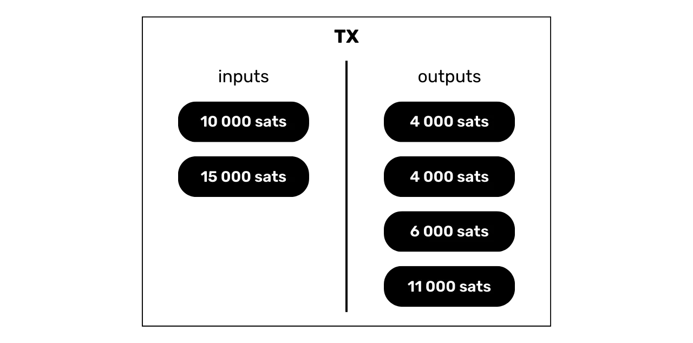


یک ناظر خارجی که به اکتشافات زنجیره‌ای معمولی تکیه می‌کند ممکن است به اشتباه نتیجه بگیرد که "*دو نفر یک CoinJoin کوچک ساخته‌اند، با یک UTXO در ورودی و دو UTXO در خروجی برای هر کدام*". تحلیل این تراکنش از بیرون منجر به کاربرد CIOH نمی‌شود، زیرا حضور دو خروجی با مقدار یکسان الگوی CoinJoin را نشان می‌دهد. از دیدگاه خارجی، CIOH در این مورد خاص قابل اعمال نیست.


این تفسیر نادرست است، زیرا همان‌طور که می‌دانید، یک UTXO به Bob نانوا ارسال شد، 2 ورودی UTXO از Alice آمدند، و او 3 خروجی Exchange را بازیابی کرد.


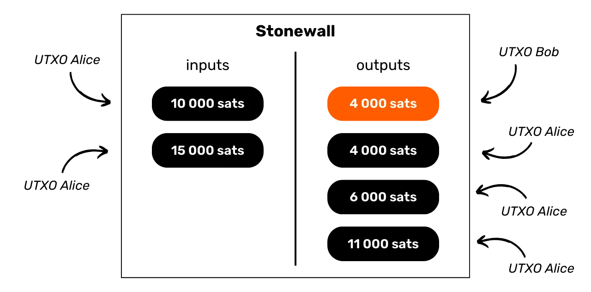


و چیزی که به‌ویژه در مورد ساختار تراکنش استون‌وال جالب است این است که از دید یک ناظر خارجی، به هر لحاظ شبیه به یک تراکنش استون‌وال x2 است.


### معامله استون‌وال x2


Stonewall x2 شکل خاص دیگری از تراکنش Bitcoin است که همچنین هدف آن افزایش محرمانگی کاربر هنگام خرج کردن است، اما این بار با همکاری با شخص سومی که در آن خرج دخیل نیست. این روش مانند یک شبه-CoinJoin بین دو شرکت‌کننده عمل می‌کند، در حالی که به طور همزمان به شخص سومی پرداخت انجام می‌دهد.


عملیات تراکنش Stonewall x2 نسبتاً ساده است: ما از یک UTXO که در اختیار داریم برای انجام پرداخت استفاده می‌کنیم و از کمک یک شخص ثالث که او نیز با یک UTXO متعلق به خود مشارکت می‌کند، بهره می‌بریم. تراکنش با چهار خروجی به پایان می‌رسد: دو خروجی با مقادیر مساوی، یکی به مقصد Address گیرنده و دیگری به Address متعلق به همکار. یک UTXO سوم به Address دیگری که متعلق به همکار است بازگردانده می‌شود و به او امکان بازیابی مبلغ اولیه را می‌دهد (یک اقدام خنثی برای او، با در نظر گرفتن هزینه‌های Mining)، و یک UTXO نهایی به Address متعلق به ما بازمی‌گردد که پرداخت Exchange را تشکیل می‌دهد.


در تراکنش‌های Stonewall x2 سه نقش مختلف به این صورت تعریف شده‌اند:


- صادرکننده، که پرداخت واقعی را انجام می‌دهد؛
- گیرنده، که ممکن است از ماهیت خاص تراکنش بی‌اطلاع باشد و صرفاً انتظار دریافت پرداخت از فرستنده را داشته باشد؛
- همکار، که بیت‌کوین‌ها را در دسترس قرار می‌دهد تا در تحلیل تراکنش شک و تردید ایجاد کند، در حالی که در پایان وجوه خود را به طور کامل بازیابی می‌کند (یک اقدام خنثی برای او، با در نظر گرفتن هزینه‌های Mining).


بیایید به مثال خود با Alice برگردیم، که در نانوایی Bob برای خرید باگت خود است که 4,000 Sats هزینه دارد. او می‌خواهد با بیت‌کوین پرداخت کند، در حالی که سطحی از محرمانگی را در مورد پرداخت خود حفظ کند. بنابراین او از دوستش چارلز کمک می‌گیرد تا در این فرآیند به او کمک کند.


با تحلیل این تراکنش، می‌توانیم ببینیم که Bob نانوا در واقع ۴,۰۰۰ Sats به عنوان پرداخت برای باگت دریافت کرده است. Alice از ۱۰,۰۰۰ Sats به عنوان ورودی استفاده کرده و ۶,۰۰۰ Sats به عنوان خروجی بازیابی کرده است، یعنی یک تراز خالص -۴,۰۰۰ Sats که معادل قیمت باگت است. در مورد چارلز، او ۱۵,۰۰۰ Sats به عنوان ورودی ارائه داده و دو خروجی دریافت کرده است: یکی ۴,۰۰۰ Sats و دیگری ۱۱,۰۰۰ Sats، که تراز آن ۰ می‌شود.


در این مثال، من عمداً هزینه‌ها را حذف کرده‌ام تا فهم آن آسان‌تر شود. در واقعیت، هزینه‌های Mining معمولاً به‌طور مساوی بین صادرکننده پرداخت و مشارکت‌کننده تقسیم می‌شود.


### اهداف یک تراکنش Stonewall x2 چیست؟


مانند ساختار استون‌وال، ساختار استون‌وال x2 نیز مقدار زیادی آنتروپی به تراکنش اضافه می‌کند و تحلیل زنجیره را گیج می‌کند. از بیرون، چنین تراکنشی می‌تواند به عنوان یک CoinJoin کوچک بین دو نفر تفسیر شود. اما در واقعیت، این یک پرداخت است. بنابراین این روش عدم قطعیت‌هایی در تحلیل زنجیره ایجاد می‌کند یا حتی به سرنخ‌های نادرست منجر می‌شود.


بیایید مثال Alice، Bob بیکر و چارلز را بررسی کنیم. تراکنش در Blockchain به این صورت خواهد بود:


یک ناظر خارجی که به اکتشافات زنجیره‌ای معمولی تکیه می‌کند ممکن است به اشتباه نتیجه بگیرد که "*Alice و چارلز یک CoinJoin کوچک انجام داده‌اند، با یک UTXO در ورودی و دو UTXO در خروجی برای هر کدام*". باز هم، تحلیل این تراکنش از بیرون منجر به کاربرد ICOH نمی‌شود، زیرا حضور دو خروجی با مقدار یکسان الگوی CoinJoin را نشان می‌دهد. از دیدگاه خارجی، CIOH در این مورد خاص قابل اعمال نیست.


این تفسیر نادرست است، زیرا همان‌طور که می‌دانید، یک UTXO به Bob نانوا ارسال شده است، Alice تنها یک خروجی Exchange دارد، و چارلز دو خروجی دارد.


و بار دیگر، چیزی که به‌ویژه در مورد ساختار تراکنش Stonewall x2 جالب است این است که از دید یک ناظر خارجی، از هر نظر شبیه به یک تراکنش Stonewall است.


### تفاوت بین Stonewall و Stonewall x2 چیست؟


یک تراکنش StonewallX2 دقیقاً مانند یک تراکنش Stonewall عمل می‌کند، با این تفاوت که اولی مشارکتی است، در حالی که دومی این‌گونه نیست. همان‌طور که دیده‌ایم، یک تراکنش Stonewall x2 شامل مشارکت یک شخص ثالث (چارلز) است که خارج از پرداخت است و بیت‌کوین‌های خود را برای افزایش محرمانگی تراکنش در دسترس قرار می‌دهد. در یک تراکنش کلاسیک Stonewall، نقش همکار توسط فرستنده انجام می‌شود.


از دیدگاه خارجی، الگوی تراکنش دقیقاً یکسان است.


این واقعیت که این دو ساختار تراکنش دقیقاً الگوی یکسانی دارند به این معناست که حتی اگر یک ناظر خارجی موفق به شناسایی الگوی "Stonewall(x2)" شود، او تمام اطلاعات را نخواهد داشت. او قادر نخواهد بود تعیین کند که کدام یک از دو UTXO با مقادیر یکسان به پرداخت مربوط می‌شود. علاوه بر این، او قادر نخواهد بود تعیین کند که آیا دو UTXO با ورودی‌ها از دو فرد مختلف می‌آیند (Stonewall x2) یا اینکه به یک فرد واحد تعلق دارند که آن‌ها را ادغام کرده است (Stonewall).


این نکته آخر به این دلیل است که تراکنش‌های Stonewall x2 دقیقاً از همان الگوی تراکنش‌های Stonewall پیروی می‌کنند. از بیرون و بدون اطلاعات زمینه‌ای اضافی، تشخیص یک تراکنش Stonewall از یک تراکنش Stonewall x2 غیرممکن است. اولی تراکنش‌های مشارکتی نیستند، در حالی که دومی هستند. این امر به تحلیل یکی از این تراکنش‌ها حتی بیشتر شک و تردید اضافه می‌کند.


### چه زمانی باید از تراکنش‌های Stonewall و Stonewall x2 استفاده شود؟


منطق باید به صورت زیر باشد وقتی می‌خواهید از یک ابزار محرمانگی برای یک هزینه استفاده کنید:


- به عنوان یک اولویت، می‌توانیم انتخاب کنیم که یک PayJoin بسازیم؛
- اگر فروشنده از پرداخت‌های مشترک پشتیبانی نکند، می‌توان با استفاده از ساختار Stonewall x2 یک تراکنش مشترک با فرد دیگری خارج از پرداخت انجام داد؛
- اگر نمی‌توانید کسی را برای انجام تراکنش Stonewall x2 پیدا کنید، می‌توانید یک تراکنش فقط Stonewall انجام دهید که رفتار یک تراکنش Stonewall x2 را تقلید خواهد کرد.


### چگونه از تراکنش‌های Stonewall و Stonewall x2 استفاده کنم؟


تراکنش‌های Stonewall و Stonewall x2 در هر دو برنامه Samourai Wallet و نرم‌افزار Sparrow wallet در دسترس هستند.


با این حال، همانند payjoins، پس از دستگیری بنیان‌گذاران Samourai، تراکنش‌های Stonewall x2 اکنون تنها با تبادل دستی PSBTها بین طرف‌های مربوطه کار می‌کنند. متأسفانه، Exchange خودکار از طریق Soroban دیگر در دسترس نیست.


همچنین امکان انجام این نوع تراکنش به صورت دستی از هر نرم‌افزار Bitcoin Wallet وجود دارد.


در فصل بعدی، به بررسی تکنیک محرمانگی دیگری خواهیم پرداخت که نسبتاً ناشناخته است، اما به عنوان مکملی برای آنچه که تاکنون مطالعه کرده‌ایم، بسیار مفید است.


https://planb.network/tutorials/privacy/on-chain/stonewall-033daa45-d42c-40e1-9511-cea89751c3d4

https://planb.network/tutorials/privacy/on-chain/stonewall-x2-05120280-f6f9-4e14-9fb8-c9e603f73e5b

## ریشکه‌ها


<chapterId>db9a20ac-a149-443d-884b-ea6c03f28499</chapterId>


استفاده از ساختارهای تراکنش Bitcoin که ابهام را به تحلیل زنجیره اضافه می‌کنند، مانند CoinJoin، به‌ویژه برای حفاظت از حریم خصوصی مفید است. با این حال، همان‌طور که در فصل مربوط به پرداخت‌های مشترک بحث کردیم، تراکنش‌های CoinJoin به‌طور طبیعی در زنجیره قابل شناسایی هستند. به یاد داشته باشید که تشبیهی بین رمزگذاری و پرداخت‌های مشترک کشیدیم: وقتی یک فایل رمزگذاری می‌شود، یک شخص ثالث که فایل رمزگذاری‌شده را کشف می‌کند نمی‌تواند به محتوای آن دسترسی پیدا کند، اما می‌تواند به‌وضوح تشخیص دهد که فایل برای پنهان کردن محتوای آن تغییر یافته است. همین امر در مورد CoinJoin صدق می‌کند: وقتی یک تحلیل‌گر یک تراکنش CoinJoin را بررسی می‌کند، اگرچه نمی‌تواند ارتباطات مستقیمی بین ورودی‌ها و خروجی‌ها (و بالعکس) برقرار کند، اما با این حال می‌تواند تشخیص دهد که تراکنش مشاهده‌شده یک CoinJoin است.


بسته به اینکه چگونه قصد دارید از قطعه خود پس از چرخه‌های CoinJoin استفاده کنید، این واقعیت که این فرآیند را طی کرده است می‌تواند مشکل‌ساز باشد. به عنوان مثال، اگر قصد دارید سکه خود را در یک پلتفرم تنظیم‌شده Exchange بفروشید، اما اخیراً یک CoinJoin را طی کرده است، ابزار تحلیل زنجیره‌ای پلتفرم این واقعیت را تشخیص خواهد داد. سپس ممکن است پلتفرم از پذیرش UTXO شما که به صورت کوین‌جوین شده است، خودداری کند یا حتی از شما توضیح بخواهد، با خطر تعلیق حساب یا مسدود شدن وجوه شما. در برخی موارد، پلتفرم ممکن است رفتار شما را به مقامات دولتی گزارش دهد (این همان چیزی است که TRACFIN از PSANها در فرانسه می‌خواهد).


آنچه ما برای جلوگیری از این نیاز داریم، ابزاری است که قادر به محو کردن ردپای گذشته یک سکه Bitcoin باشد تا به نوعی قابلیت تعویض‌پذیری را بازگرداند. این دقیقاً هدف ریکوشه است.


### ریکوشه چیست؟


ریکوشه یک تکنیک است که شامل انجام چندین تراکنش ساختگی به سمت خود (جارو) برای شبیه‌سازی انتقال Bitcoin Ownership می‌شود. این ابزار با سایر ساختارهای تراکنش که قبلاً بحث کرده‌ایم متفاوت است، زیرا به جای کسب ناشناسی آینده‌نگر، نوعی ناشناسی گذشته‌نگر را فراهم می‌کند. در واقع، ریکوشه ویژگی‌هایی را که می‌تواند قابلیت تعویض یک سکه Bitcoin را به دلیل گذشته‌اش به خطر بیندازد، محو می‌کند.


برای هموار کردن اثر باقی‌مانده از یک رویداد گذشته بر روی یک سکه، مانند چرخه‌های CoinJoin، ریکوشه چهار تراکنش متوالی را اجرا می‌کند که در آن کاربر وجوه را به آدرس‌های مختلف خود منتقل می‌کند.


پس از این توالی تراکنش‌ها، ابزار ریکوشه در نهایت بیت‌کوین‌ها را به مقصد نهایی خود، مانند یک پلتفرم Exchange، هدایت می‌کند.


هدف این است که فاصله‌ای ایجاد شود که بر قابلیت تعویض‌پذیری سکه تأثیر بگذارد، مانند یک تراکنش CoinJoin، و عمل نهایی هزینه‌کرد، که ممکن است این سکه را به دلیل گذشته‌اش رد کند. بنابراین، ابزارهای تحلیل زنجیره ممکن است نتیجه بگیرند که احتمالاً پس از رویداد، تغییری در Ownership رخ داده است و این سکه را قابل تعویض در نظر بگیرند. در مورد یک CoinJoin، ابزارهای تحلیل Blockchain می‌توانند فرض کنند که این همان شخصی نبوده که بیت‌کوین‌ها را ارسال کرده و CoinJoin را انجام داده است، و بنابراین دلیلی برای اقدام علیه فرستنده وجود ندارد.


### چرا کار می‌کند؟


در مواجهه با این روش ریکوشه، ممکن است تصور شود که نرم‌افزار تحلیل زنجیره‌ای بررسی خود را به بیش از چهار پرش گسترش دهد. با این حال، این پلتفرم‌ها با یک معضل در بهینه‌سازی آستانه تشخیص مواجه هستند. آنها باید محدودیتی برای تعداد پرش‌ها تعیین کنند که پس از آن بپذیرند احتمالاً تغییری در مالکیت رخ داده است و اینکه ارتباط با یک رویداد قبلی (مانند CoinJoin) باید نادیده گرفته شود.


با این حال، تعیین این آستانه خطرناک است: هر افزایشی در تعداد جهش‌های مشاهده‌شده به‌طور نمایی حجم مثبت‌های کاذب را افزایش می‌دهد، یعنی افرادی که به اشتباه به‌عنوان شرکت‌کنندگان در یک رویداد علامت‌گذاری می‌شوند، در حالی که در واقع عملیات توسط شخص دیگری انجام شده است. این سناریو برای این شرکت‌ها خطر بزرگی به همراه دارد، زیرا مثبت‌های کاذب منجر به نارضایتی می‌شوند که می‌تواند مشتریان متأثر را به سمت رقبا سوق دهد. در بلندمدت، آستانه تشخیص بیش از حد بالا باعث می‌شود یک پلتفرم مشتریان بیشتری نسبت به رقبای خود از دست بدهد، که می‌تواند بقای آن را تهدید کند. بنابراین برای این پلتفرم‌ها پیچیده است که تعداد جهش‌های مشاهده‌شده را افزایش دهند و ۴ اغلب تعداد کافی برای مقابله با تحلیل‌های آن‌ها است.


پدیده‌ای که در اینجا مشاهده می‌شود تا حدی مشابه نظریه شش درجه جدایی است.


نظریه شش درجه جدایی پیشنهاد می‌کند که هر فرد روی زمین با هر فرد دیگری از طریق زنجیره‌ای از روابط که حداکثر شامل شش واسطه است، متصل می‌شود. بنابراین، کافی است از طریق مجموعه‌ای از شش نفر که هر کدام شخصاً نفر بعدی را می‌شناسند، عبور کنیم تا به هر فردی در جهان برسیم.


در مورد تراکنش‌های Bitcoin، ما با پدیده‌ای مشابه مواجه می‌شویم. با ردیابی تعداد کافی از تراکنش‌های Bitcoin، به ناچار به یک CoinJoin برمی‌خوریم. روش ریکوشه از این اصل بهره می‌برد و از تعداد بیشتری پرش نسبت به آنچه که پلتفرم‌های Exchange می‌توانند به طور منطقی ردیابی کنند، استفاده می‌کند. اگر پلتفرم‌ها تصمیم بگیرند تراکنش‌های بیشتری را ردیابی کنند، در این صورت می‌توان به سادگی یک پرش اضافی اضافه کرد تا این اقدام را دور بزنند.


### چه زمانی و چگونه از ریکوشه استفاده کنیم؟


رایج‌ترین مورد استفاده از ریکوشه زمانی است که لازم است مشارکت قبلی در یک CoinJoin را در یک UTXO که مالک آن هستید پنهان کنید. ایده‌آل این است که از انتقال بیت‌کوین‌هایی که تحت یک CoinJoin قرار گرفته‌اند به نهادهای تنظیم‌شده اجتناب شود. با این حال، در صورتی که خود را بدون گزینه دیگری بیابید، به‌ویژه در نیاز فوری به نقد کردن بیت‌کوین‌ها به ارز دولتی، ریکوشه یک راه‌حل مؤثر ارائه می‌دهد.


این روش نه تنها برای کوین‌جوین‌ها مؤثر است، بلکه برای هر علامت دیگری که می‌تواند قابلیت تعویض‌پذیری یک بخش را به خطر بیندازد نیز مؤثر است.


ایده این روش ریکوشه در اصل از تیم‌های Samourai Wallet آمده است که آن را در برنامه خود برای خودکارسازی فرآیند ادغام کردند. این سرویس در Samourai رایگان نیست، زیرا یک ریکوشه شامل هزینه خدمات 100,000 Sats به علاوه هزینه‌های Mining است. بنابراین استفاده از آن برای انتقال مبالغ قابل توجه توصیه می‌شود.


برنامه Samurai دو نوع ری‌کوشه ارائه می‌دهد:


- ریکوشه تقویت‌شده، یا "تحویل مرحله‌ای"، که مزیت پخش هزینه خدمات سامورایی را در پنج تراکنش متوالی ارائه می‌دهد. این گزینه همچنین تضمین می‌کند که هر تراکنش در زمان جداگانه‌ای پخش و در بلوک متفاوتی ثبت می‌شود، و رفتار تغییر مالکیت را تا حد ممکن تقلید می‌کند. اگرچه کندتر است، این روش برای کسانی که عجله‌ای ندارند، ترجیح داده می‌شود، زیرا با تقویت مقاومت آن در برابر تحلیل زنجیره‌ای، کارایی ریکوشه را به حداکثر می‌رساند؛


- ریکوشه کلاسیک، که برای اجرای عملیات با سرعت طراحی شده است، تمام تراکنش‌ها را در یک بازه زمانی کاهش‌یافته پخش می‌کند. بنابراین، این روش محرمانگی کمتر و مقاومت کمتری در برابر تحلیل نسبت به روش تقویت‌شده ارائه می‌دهد. این روش باید فقط برای ارسال‌های فوری استفاده شود.


ریکوشه کردن به سادگی به معنای ارسال بیت‌کوین‌ها به خودتان است. این کاملاً ممکن است که بیت‌کوین‌ها را به صورت دستی بر روی هر نرم‌افزار Wallet ریکوشه کنید، بدون استفاده از ابزار تخصصی. تنها کاری که باید انجام دهید این است که همان سکه را به صورت متوالی به خودتان منتقل کنید، هر بار با استفاده از یک Address جدید و خالی.


در فصل بعد، به بررسی تکنیک‌های مختلف برای انتقال‌های مخفی Ownership می‌پردازیم. این روش‌ها هم از نظر عملکرد و هم از نظر نتایج، به طور اساسی با آنچه تاکنون بررسی کرده‌ایم متفاوت هستند.


https://planb.network/tutorials/privacy/on-chain/ricochet-e0bb1afe-becd-44a6-a940-88a463756589

## انتقالات مخفی Ownership


<chapterId>a2067036-849c-4d6b-87d2-44235cfae7a1</chapterId>


یکی دیگر از تکنیک‌های محرمانگی Bitcoin، انتقال مخفی Ownership است. این روش هدف دارد تا Ownership بیت‌کوین‌ها را از یک شخص به شخص دیگر و بالعکس منتقل کند، بدون اینکه تراکنش به‌طور واضح بر روی Blockchain قابل مشاهده باشد. بیایید نگاهی به تکنیک‌های مختلف موجود بیندازیم، همراه با مزایا و معایب آن‌ها.


### کوین‌سواپ


کوین‌واپ بر اساس یک مفهوم نسبتاً ساده بنا شده است: این از قراردادهای هوشمند برای تسهیل انتقال Bitcoin Ownership بین دو کاربر استفاده می‌کند، بدون نیاز به اعتماد و بدون اینکه این انتقال به‌طور صریح بر روی Blockchain قابل مشاهده باشد.


بیایید یک مثال ساده با Alice و Bob تصور کنیم. Alice دارای 1 BTC است که با کلید خصوصی $A$ محافظت می‌شود، و Bob نیز دارای 1 BTC است که با کلید خصوصی $B$ محافظت می‌شود. آن‌ها می‌توانند به‌طور نظری کلیدهای خصوصی خود را از طریق یک کانال ارتباطی خارجی Exchange کنند تا یک انتقال مخفی انجام دهند.


با این حال، این روش ساده ریسک بالایی از نظر اعتماد به همراه دارد. هیچ چیزی مانع از این نمی‌شود که Alice یک نسخه از کلید خصوصی $A$ را پس از Exchange نگه دارد و بعداً از آن برای سرقت بیت‌کوین‌ها استفاده کند، زمانی که کلید در دست Bob است.


علاوه بر این، هیچ تضمینی وجود ندارد که Alice کلید خصوصی $B$ از Bob را دریافت نکند و هرگز کلید خصوصی $A$ خود را در Exchange منتقل نکند. بنابراین این Exchange به اعتماد بیش از حد بین طرفین متکی است و در تضمین انتقال امن و محرمانه Ownership ناکارآمد است.


برای حل این مشکلات و امکان تبادل بین طرف‌هایی که به یکدیگر اعتماد ندارند، ما به جای آن از سیستم‌های Smart contract استفاده خواهیم کرد. یک Smart contract برنامه‌ای است که به‌طور خودکار زمانی که شرایط از پیش تعریف‌شده برآورده می‌شوند، اجرا می‌شود. در مورد ما، این تضمین می‌کند که Exchange مالکیت به‌طور خودکار انجام می‌شود، بدون نیاز به اعتماد متقابل.


این می‌تواند با استفاده از HTLC (*Hash قراردادهای زمان‌قفل‌شده*) یا PTLC (*قراردادهای نقطه زمان‌قفل‌شده*) به دست آید. این دو پروتکل به صورت مشابه عمل می‌کنند و از یک سیستم زمان‌قفل‌کننده استفاده می‌کنند که اطمینان حاصل می‌کند Exchange یا با موفقیت کامل می‌شود یا به طور کامل لغو می‌شود، بنابراین از یکپارچگی وجوه هر دو طرف محافظت می‌کند. تفاوت اصلی بین HTLC و PTLC این است که HTLC از هش‌ها و پیش‌تصاویر برای ایمن‌سازی تراکنش استفاده می‌کند، در حالی که PTLC از امضاهای تطبیقی استفاده می‌کند.


در یک سناریوی تعویض سکه با استفاده از HTLC یا PTLC بین Alice و Bob، Exchange به‌صورت امن انجام می‌شود: یا موفق می‌شود و هر کدام BTC دیگری را دریافت می‌کند، یا شکست می‌خورد و هر کدام BTC خود را نگه می‌دارد. این امر امکان تقلب یا سرقت BTC دیگری را برای هر یک از طرفین غیرممکن می‌سازد.


> *HTLC همچنین مکانیزمی است که برای مسیریابی امن پرداخت‌ها از طریق کانال‌های دوطرفه Lightning Network استفاده می‌شود*
استفاده از امضاهای تطبیقی در این زمینه به‌ویژه جالب است، زیرا امکان کنار گذاشتن اسکریپت‌های سنتی (مکانیسمی که گاهی به عنوان "_اسکریپت‌های بدون اسکریپت_" شناخته می‌شود) را فراهم می‌کند. این ویژگی هزینه‌های مرتبط با Exchange را کاهش می‌دهد. یکی دیگر از مزایای عمده امضاهای تطبیقی این است که نیازی به استفاده از Hash مشترک برای هر دو طرف معامله ندارند، بنابراین از نیاز به افشای یک ارتباط مستقیم بین آن‌ها در انواع خاصی از Exchange جلوگیری می‌کند.


### امضاهای آداپتور


امضاهای آداپتور یک روش رمزنگاری هستند که یک امضای معتبر را با یک امضای اضافی، به نام "_امضای آداپتور_"، ترکیب می‌کنند تا داده‌های محرمانه را فاش کنند. این مکانیزم به گونه‌ای طراحی شده است که دانش ۲ مورد از ۳ مورد زیر Elements: امضای معتبر، امضای آداپتور و راز، به ما اجازه می‌دهد تا عنصر سوم گمشده را استنتاج کنیم. یک ویژگی جالب این روش این است که اگر امضای آداپتور همتای خود و نقطه خاص روی منحنی بیضوی مرتبط با رازی که برای محاسبه آن امضای آداپتور استفاده شده است را بدانیم، می‌توانیم امضای آداپتور خود را که با همان راز سازگار است، بدون اینکه هرگز به طور مستقیم به خود راز دسترسی داشته باشیم، استخراج کنیم.


در یک مبادله سکه، استفاده از امضاهای تطبیقی امکان افشای همزمان دو قطعه اطلاعات حساس بین شرکت‌کنندگان را فراهم می‌کند و بدین ترتیب نیاز به اعتماد متقابل را از بین می‌برد. بیایید مثالی بزنیم تا این فرآیند را با Alice و Bob که می‌خواهند مالکیت 1 BTC را به Exchange منتقل کنند، اما به یکدیگر اعتماد ندارند، توضیح دهیم. آنها از امضاهای تطبیقی برای حذف نیاز به اعتماد به یکدیگر در این Exchange استفاده می‌کنند. در اینجا نحوه انجام این کار آمده است:


- Alice با ایجاد یک تراکنش $m_A$ که 1 BTC به Bob ارسال می‌کند، Exchange را آغاز می‌کند. او با استفاده از کلید خصوصی خود $p_A$ ($P_A = p_A \cdot G$)، یک Nonce $n_A$ ($N_A = n_A \cdot G$) و یک راز $t$ ($T = t \cdot G$)، یک امضا $s_A$ تولید می‌کند که این تراکنش را تأیید می‌کند:


$$s_A = n_A + t + H(N_A + T \parallel P_A \parallel m_A) \cdot p_A$$


- Alice امضای آداپتور $s_A'$ را با کم کردن راز $t$ از امضای واقعی آن $s_A$ محاسبه می‌کند:


$$s_A' = s_A - t$$


- Alice امضاکننده آداپتور $s'_A$، تراکنش امضا نشده $m_A$، نقطه متناظر با راز ($T$)، و نقطه متناظر با Nonce ($N_A$) را به Bob ارسال می‌کند. این Elements چیزی است که به عنوان "آداپتور" شناخته می‌شود. مهم است که توجه داشته باشید که با داشتن تنها این اطلاعات، Bob نمی‌تواند BTC متعلق به Alice را بازیابی کند.
- با این حال، Bob می‌تواند بررسی کند که Alice در حال تلاش برای دزدی از او نیست. برای انجام این کار، او بررسی می‌کند که آیا امضای آداپتور Alice، یعنی $s_A'$، واقعاً با تراکنش پیشنهادی $m_A$ مطابقت دارد یا خیر. اگر معادله زیر صحیح باشد، او می‌تواند مطمئن باشد که امضای آداپتور Alice معتبر است:


$$s_A' \cdot G = N_A + H(N_A + T \parallel P_A \parallel m_A) \cdot P_A$$


- این تأیید به Bob تضمین‌های کافی می‌دهد که می‌تواند با اطمینان کامل به Exchange ادامه دهد. سپس او تراکنش خود $m_B$ را ایجاد می‌کند که قصد دارد 1 BTC به Alice ارسال کند و امضای آداپتور خود $s_B'$ را تولید می‌کند که به همان راز $t$ نیز مرتبط خواهد شد. در این مرحله، تنها Alice از مقدار $t$ آگاه است؛ Bob فقط نقطه متناظر $T$ را می‌داند که Alice به او منتقل کرده است:


$$s_B' = n_B + H(N_B + T \parallel P_B \parallel m_B) \cdot p_B$$


- Bob امضای آداپتور خود $s_B'$، تراکنش امضا نشده خود $m_B$، همچنین نقطه مربوط به راز ($T$) و نقطه مربوط به Nonce ($N_B$) را به Alice ارسال می‌کند. اکنون Alice که راز $t$ را می‌داند، می‌تواند امضای آداپتور Bob $s_B'$ را با این راز ترکیب کند تا یک امضای معتبر $s_B$ برای تراکنش $m_B$ ایجاد کند که BTC متعلق به Bob را به او منتقل کند:


$$s_B = s_B' + t$$


$$(s_B' + t) \cdot G = N_B + T + H(N_B + T \parallel P_B \parallel m_B) \cdot P_B$$


- Alice این تراکنش امضا شده $m_B$ را در Bitcoin Blockchain پخش می‌کند تا BTC وعده داده شده توسط Bob را بازیابی کند. هنگامی که Bob این تراکنش را در Blockchain می‌بیند، می‌تواند امضا $s_B = s_B' + t$ را استخراج کند. با این اطلاعات، Bob سپس قادر است راز معروف $t$ که به آن نیاز داشت را جدا کند:


$$t = (s_B' + t) - s_B' = s_B - s_B'$$


- و این راز $t$ تنها عنصر گمشده برای تبدیل امضای معتبر $s_A$ از امضای تطبیق‌دهنده $s_A'$ از Alice به Bob بود. این امضا تراکنش $m_A$ را تأیید می‌کند، که یک BTC را از Alice به Bob ارسال می‌کند. سپس Bob امضای $s_A$ را محاسبه کرده و تراکنش $m_A$ را در Blockchain پخش می‌کند:


$$s_A = s_A' + t$$


$$(s_A' + t) \cdot G = N_A + T + H(N_A + T \parallel P_A \parallel m_A) \cdot P_A$$


بیایید خلاصه کنیم که امضای آداپتور چگونه در یک کوین‌سواپ کار می‌کند. در ابتدا، Alice یک تراکنش امضا نشده به همراه یک آداپتور به Bob ارسال می‌کند، که به Bob امکان می‌دهد تأیید کند که راز فاش شده بعداً به او دسترسی به بیت‌کوین‌ها را می‌دهد. در مقابل، Bob تراکنش امضا نشده خود و آداپتور را به Alice ارسال می‌کند. سپس Alice می‌تواند تراکنش Bob را نهایی کند و با پخش یک تراکنش معتبر به بیت‌کوین‌ها دست یابد، به لطف راز. وقتی این تراکنش در Blockchain منتشر می‌شود، Bob توانایی استخراج راز و در نتیجه باز کردن تراکنش Alice را دارد. در نتیجه، اگر Alice انتقال Bob از Bitcoin را آغاز کند، Bob می‌تواند به نوبه خود به Bitcoin از Alice دسترسی پیدا کند بدون نیاز به اعتماد متقابل.


توجه داشته باشید که کوین‌سوآپ‌ها برای اولین بار توسط [گرگوری ماکسول در اکتبر ۲۰۱۳ در BitcoinTalk پیشنهاد شدند](https://bitcointalk.org/index.php?topic=321228.0).


### مبادله اتمی


به روشی مشابه با coinswap و با استفاده از همان نوع قراردادهای هوشمند، انجام مبادلات اتمی نیز ممکن است. یک مبادله اتمی امکان Exchange مستقیم ارزهای دیجیتال مختلف، مانند BTC و XMR، بین دو کاربر را بدون نیاز به اعتماد یا دخالت واسطه فراهم می‌کند. این مبادلات "اتمی" نامیده می‌شوند زیرا تنها دو نتیجه ممکن دارند: یا مبادله موفقیت‌آمیز است و هر دو طرف راضی هستند، یا شکست می‌خورد و هر کدام ارزهای دیجیتال اصلی خود را حفظ می‌کنند، که نیاز به اعتماد به طرف دیگر را از بین می‌برد.


مبادله اتمی و کوین‌سواپ روش عملیاتی مشابهی دارند و از نظر محرمانگی، مزایا و معایب یکسانی ارائه می‌دهند. در واقع، از دیدگاه Bitcoin، یک مبادله اتمی قابل مقایسه با یک کوین‌سواپ است که در دو مرحله انجام می‌شود. ابتدا، ما BTC خود را با یک ارز دیجیتال دیگر Exchange می‌کنیم، سپس این ارز دیجیتال می‌تواند با BTC دیگری مبادله شود. در نهایت، ما BTC کاربر دیگری را بازیابی می‌کنیم. به همین دلیل، در تحلیل مسائل محرمانگی، این دو پروتکل را تحت دسته‌بندی مبادلات محرمانه اختصاصی گروه‌بندی می‌کنم.


با این حال، توجه داشته باشید که برخلاف کوین‌سوآپ، اتمیک سوآپ می‌تواند در زمینه نقدینگی موجود، به ویژه در مبادلات BTC/XMR، عدم تعادل داشته باشد. به طور کلی، مبادله بیت‌کوین‌ها با آلت‌کوین‌ها آسان‌تر است، زیرا تقاضای زیادی برای بیت‌کوین‌ها وجود دارد که باعث می‌شود حق بیمه برای این جهت تبدیل پایین بماند. با این حال، مبادله آلت‌کوین‌ها با BTC می‌تواند به دلیل تقاضای کمتر پیچیده‌تر باشد و اغلب منجر به حق بیمه‌های بسیار بالا می‌شود.


در نهایت، زمانی که یک مبادله اتمی شامل بیت‌کوین‌های زنجیره‌ای و بیت‌کوین‌های روی Lightning Network باشد، از "مبادله زیرآبی" صحبت می‌کنیم.


### آیا واقعاً مفید است؟


انتقالات مخفی Ownership، مانند تعویض سکه و تعویض اتمی، این مزیت را دارند که تحلیل‌های زنجیره‌ای را فریب دهند. این روش‌ها می‌توانند نشان دهند که تراکنش‌ها شامل همان کاربر هستند، در حالی که در واقع Ownership واقعی دست به دست شده است. با این حال، اصلی‌ترین نقطه ضعف این روش‌ها این است که بدون استفاده از تکنیک اضافی برای شکستن تاریخچه سکه بسیار پرخطر هستند.


در واقع، زمانی که Alice یک coinswap یا atomic swap با Bob انجام می‌دهد، او مالکیت بیت‌کوین‌های خود را با بیت‌کوین‌های Bob مبادله می‌کند. در مورد یک atomic swap، Exchange شامل یک Altcoin می‌شود، اما اصل موضوع همان باقی می‌ماند. بنابراین، Alice در نهایت سکه $B$ و Bob سکه $A$ را دریافت می‌کند. این موضوع به تحلیل زنجیره‌ای شک و تردید اضافه می‌کند، اما تاریخچه سکه‌ها قابل ردیابی باقی می‌ماند. اگر یک تحلیل‌گر بخش $A$ را بررسی کند، می‌تواند فعالیت‌های قبلی Alice را ردیابی کند و بالعکس برای بخش $B$.


از دیدگاه Alice، خطر این است که تاریخچه سکه $B$ ممکن است توسط برخی نهادها مشکوک تلقی شود. اگر، به عنوان مثال، Bob سکه $B$ را از طریق یک عمل مجرمانه مانند هک کردن به دست آورده باشد، سکه به فعالیت‌های غیرقانونی او مرتبط باقی می‌ماند. سپس Alice ممکن است خود را در موقعیتی بیابد که سکه‌ای در اختیار دارد که نمی‌تواند آن را به پلتفرم‌های تنظیم‌شده Exchange منتقل کند، بدون اینکه خطر مسدود شدن وجوهش یا حتی متهم شدن به جرایم Bob را داشته باشد، حتی اگر او هیچ ارتباطی با آن‌ها نداشته باشد.


ناگزیر، روش‌های محرمانگی مانند کوین‌سوآپ یا اتمیک‌سوآپ توسط مجرمانی که وجوهشان تحت نظارت مقامات است، ترجیح داده می‌شوند. این پروتکل‌ها به آن‌ها امکان می‌دهند بیت‌کوین‌های تحت نظارت خود را در Exchange به بیت‌کوین‌های کاملاً قابل تعویض تبدیل کنند. همچنین به آن‌ها امکان می‌دهد تا با هدایت مقامات به سمت کاربران دیگر، انحراف ایجاد کنند. بنابراین، این افراد دو هدف دارند.


با CoinJoin، حتی اگر سکه شما با بیت‌کوین‌های تحت نظارت مخلوط شود، تاریخچه سکه شکسته می‌شود و شکلی از انکار قابل قبول را فراهم می‌کند که در پروتکل‌های انتقال مخفی Ownership مانند coinswap یا atomic swap وجود ندارد.


اگر Alice بخواهد از هرگونه ریسک اجتناب کند، باید لزوماً از روشی برای شکستن تاریخچه سکه $B$ استفاده کند، مانند عبور آن از طریق کوین‌جوین‌ها. این موضوع سوالی را درباره مفید بودن ترکیب انتقال مخفی Ownership و CoinJoin مطرح می‌کند. CoinJoin با شکستن تاریخچه یک سکه، در حال حاضر سطح کافی از محرمانگی را برای Alice فراهم می‌کند. بنابراین، نظر من این است که اگر Alice به دنبال حفاظت از حریم خصوصی خود است، عاقلانه‌تر است که مستقیماً به یک CoinJoin بپردازد تا اینکه ابتدا یک کوین‌سواپ و سپس یک CoinJoin انجام دهد.


برای اینکه روش‌های انتقال مخفی Ownership واقعاً مؤثر باشند و از خطر ارتباط تاریخچه کاربر $A$ با کاربر $B$ جلوگیری شود، به‌طور متناقضی لازم است که استفاده از آن‌ها به‌طور گسترده‌ای شناخته شود. اگر از coinswap به‌طور گسترده استفاده شود و مقامات از این عمل رایج آگاه باشند، می‌توان شکل قابل قبولی از انکار را ایجاد کرد. با این حال، تا زمانی که استفاده از این انتقال‌ها حاشیه‌ای باقی بماند، فکر می‌کنم این روش‌ها برای کاربران بیش از حد خطرناک خواهند بود.


تا کنون، ما عمدتاً روش‌های محرمانگی را در سطح خود تراکنش‌ها مطالعه کرده‌ایم. در فصل بعدی، به مسائل در سطح شبکه و انتشار تراکنش خواهیم پرداخت.


## حریم خصوصی در شبکه P2P


<chapterId>04a2467b-db84-4076-a9ff-919be5135106</chapterId>


در بخش ۴، اهمیت استفاده از یک نود کامل برای حفاظت از محرمانگی تراکنش‌های شما را مورد بحث قرار دادیم. با این حال، مهم است که درک کنید نود شما ممکن است خود در معرض حملاتی باشد که به دنبال استخراج اطلاعات درباره فعالیت‌های شما هستند. بنابراین، در این فصل، به بررسی اقدامات مختلفی که می‌توانید برای حفاظت از حریم خصوصی خود انجام دهید، خواهیم پرداخت، نه در سطح خود تراکنش‌ها یا جریان‌های Bitcoin، بلکه در سطح شبکه.


### قاصدک


یک راه برای جلوگیری از حملات مختلف رفع ناشناس‌سازی استفاده از پیشنهاد Dandelion است. این پروتکل پخش در BIP156 رسمی شد، اما هرگز بر روی Bitcoin پیاده‌سازی نشده است.


ایده پشت Dandelion بهبود محرمانگی مسیریابی تراکنش در شبکه Bitcoin برای مقابله با اشکال مختلف حمله است. هدف اصلی آن پنهان کردن گره منبعی است که ابتدا یک تراکنش را در شبکه پخش کرده است. افشای این گره می‌تواند امکان پیوند دادن یک تراکنش Bitcoin به یک IP خاص Address را فراهم کند (اگر گره در شبکه عمومی عمل کند)، که می‌تواند نقطه ورود برای تحلیل زنجیره باشد.


این ارتباط بین فعالیت در Bitcoin و یک IP Address نمایانگر یک ریسک قابل توجه برای محرمانگی کاربران است. در واقع، بسیاری از نهادها در موقعیتی هستند که به راحتی می‌توانند یک IP Address را به یک هویت شخصی مرتبط کنند. این شامل دولت‌ها و ارائه‌دهندگان خدمات اینترنت می‌شود. علاوه بر این، این اطلاعات می‌تواند به صورت عمومی قابل دسترسی شود، به عنوان مثال، اگر IP Address و داده‌های شخصی شما زمانی که پایگاه داده یک وب‌سایت هک می‌شود، افشا شوند.


در عملیات کلاسیک Bitcoin، تراکنش‌هایی که توسط کاربر بر روی نرم‌افزار Wallet او ساخته می‌شوند، به گره شخصی او منتقل می‌شوند. این گره بلافاصله تراکنش جدید را به تمام همتایانی که به آن متصل است، پخش خواهد کرد.


سپس این همتایان تراکنش را بررسی می‌کنند تا اطمینان حاصل کنند که با قوانین اجماع و استانداردسازی محلی مطابقت دارد. پس از تأیید، هر همتا به نوبه خود تراکنش را به همتایان خود ارسال می‌کند و به همین ترتیب ادامه می‌یابد.


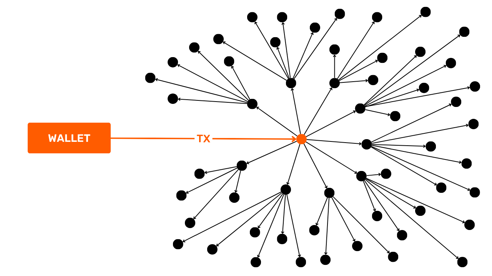


توزیع تراکنش‌هایی که در انتظار ادغام در یک بلوک هستند، به‌طور نسبی متعادل و از نظر آماری قابل پیش‌بینی است. این ضعف می‌تواند توسط نودهای جاسوس همدست که برای نظارت و تحلیل شبکه همکاری می‌کنند، مورد سوءاستفاده قرار گیرد تا اولین نودی که یک تراکنش را پخش کرده شناسایی شود. اگر یک ناظر موفق به یافتن نود منبع شود، می‌تواند فرض کند که تراکنش از اپراتور آن نود نشأت گرفته است. این نوع مشاهده می‌تواند برای پیوند دادن تراکنش‌های معمولاً ناشناس به آدرس‌های IP خاص استفاده شود.


هدف BIP156 این است که این مشکل را Address کند. برای انجام این کار، یک مرحله اضافی در انتشار یک تراکنش جدید معرفی می‌کند تا قبل از انتشار گسترده عمومی، ناشناس بودن حفظ شود. Dandelion ابتدا از یک مرحله "ساقه" استفاده می‌کند که در آن تراکنش از طریق یک مسیر تصادفی از گره‌ها ارسال می‌شود.


تراکنش سپس در طول مرحله "Fluff" به کل شبکه پخش می‌شود.


ساقه و "پف" به رفتار انتشار تراکنش در شبکه اشاره دارند که شبیه به شکل و تکامل یک قاصدک است.


بنابراین، نودهای جاسوسی می‌توانند تراکنش را به نودی که مرحله "Fluff" (پخش گسترده) را آغاز کرده است، ردیابی کنند، اما آن نود اولین نودی نیست که تراکنش را پخش کرده است، زیرا آن را از آخرین نود ساقه دریافت کرده است. اگر نودهای جاسوسی نتوانند ساقه را ردیابی کنند، نمی‌توانند نود منبع را نیز شناسایی کنند.


حتی در حضور گره‌های جاسوس در طول مرحله ساقه، همیشه شکی باقی می‌ماند، زیرا به محض اینکه آنها با یک گره صادق در نمودار انتشار مواجه می‌شوند، جاسوس‌ها نمی‌توانند تعیین کنند که آیا این گره منبع اصلی است یا صرفاً یک واسطه.


این روش مسیریابی، ردپای منتهی به گره منبع را محو می‌کند و ردیابی یک تراکنش به شبکه و منبع آن را دشوار می‌سازد. به این ترتیب، Dandelion با محدود کردن توانایی دشمنان در ناشناس‌زدایی از شبکه، محرمانگی را بهبود می‌بخشد. این روش زمانی که در مرحله "ساقه‌زنی"، تراکنش از گره‌ای عبور می‌کند که ارتباطات شبکه‌ای خود را رمزگذاری می‌کند، مانند Tor یا P2P Transport V2، مؤثرتر است.


BIP156 هنوز در Bitcoin Core ادغام نشده و در حال حاضر به عنوان "رد شده" طبقه‌بندی شده است. یکی از نگرانی‌های اصلی با این پروتکل این است که در طول مرحله ساقه، تراکنش‌ها باید از طریق گره‌های واسطه منتقل شوند قبل از اینکه تأیید شوند. همان‌طور که دیده‌ایم، در مدل معمولی Bitcoin، هر گره ابتدا تراکنش را تأیید می‌کند قبل از اینکه آن را به همتایان خود پخش کند. اگر یک تراکنش با قوانین اجماع گره یا قوانین استانداردسازی محلی مطابقت نداشته باشد، گره آن را نادیده می‌گیرد و توزیع نمی‌کند. این فرآیند برای مقابله با حملات DoS مهم است، زیرا تنها تراکنش‌های معتبر به کل شبکه پخش می‌شوند. تراکنش‌های نامعتبر که ممکن است به صورت انبوه برای بارگذاری بیش از حد شبکه تولید شوند، در اولین گره‌ای که با آن مواجه می‌شوند متوقف شده و منتشر نمی‌شوند. خطر اصلی با Dandelion این است که این پروتکل جدید می‌تواند بردارهای جدیدی برای حملات DoS معرفی کند با اجازه دادن به پخش تراکنش‌های نامعتبر در بخشی از شبکه.


### P2P حمل و نقل V2


P2P transport V2 پروتکل شبکه دیگری است که در BIP324 ارائه شده است. این نسخه جدیدی از پروتکل انتقال Bitcoin P2P است که رمزگذاری فرصت‌طلبانه را برای بهبود محرمانگی و امنیت ارتباطات بین گره‌ها به کار می‌گیرد.


این بهبود برای حل چندین مشکل در نسخه پایه پروتکل P2P طراحی شده است. از یک سو، داده‌های مبادله شده را برای یک ناظر غیرفعال از سایر انواع داده‌های در حال گردش در اینترنت غیرقابل تشخیص می‌کند. هدف اصلی جلوگیری از نظارت گسترده دولت‌ها، ارائه‌دهندگان خدمات اینترنت و ارائه‌دهندگان VPN بر کاربران Bitcoin است. این همچنین تعیین اینکه آیا یک کاربر اینترنت نیز کاربر Bitcoin است، یعنی آیا او یک نود کامل را اجرا می‌کند، برای این نهادها دشوارتر می‌سازد.


P2P V2 همچنین به کاهش خطر سانسور و حملات با شناسایی الگوهای خاص در بسته‌های داده کمک می‌کند. این امر اجرای انواع مختلف حملات Sybil را در سطح شبکه پیچیده‌تر و پرهزینه‌تر می‌کند. حمله Sybil زمانی رخ می‌دهد که یک بازیگر چندین هویت جعلی ایجاد می‌کند تا به یک مزیت ناعادلانه دست یابد. در زمینه شبکه Bitcoin، این اغلب به صورت یک بازیگر که تعداد زیادی از گره‌های کامل را کنترل می‌کند و به طور تهاجمی از آنها برای چند برابر کردن اتصالات استفاده می‌کند، ظاهر می‌شود. حملات Sybil می‌توانند غیرفعال باشند، برای جمع‌آوری اطلاعات و به خطر انداختن محرمانگی کاربر، یا فعال، به شکل حملات Eclipse. دومی یک گره خاص را از بقیه شبکه جدا می‌کند، یا کاربر را سانسور می‌کند یا داده‌هایی که دریافت می‌کند را تغییر می‌دهد. در نهایت، P2P V2 همچنین حملات *Man-In-The-Middle* (MITM) را پرهزینه‌تر و شناسایی آنها را آسان‌تر می‌کند.


رمزگذاری پیاده‌سازی شده توسط P2P V2 شامل احراز هویت نمی‌شود تا پیچیدگی غیرضروری اضافه نشود یا این واقعیت که اتصال به شبکه بدون نیاز به مجوز باقی می‌ماند، به خطر نیفتد. با این حال، این پروتکل حمل و نقل جدید P2P امنیت بهتری در برابر حملات غیرفعال ارائه می‌دهد و حملات فعال را به‌طور قابل‌توجهی پرهزینه‌تر و قابل‌تشخیص‌تر می‌کند. معرفی یک جریان داده شبه‌تصادفی در پیام‌های شبکه، سانسور یا دستکاری ارتباطات را برای مهاجمان دشوارتر می‌سازد.


انتقال P2P V2 به عنوان یک گزینه (به طور پیش‌فرض غیرفعال) در نسخه هسته Bitcoin نسخه 26.0 که در دسامبر 2023 منتشر شد، گنجانده شد. سپس به طور پیش‌فرض در نسخه 27.0 آوریل 2024 فعال شد. می‌توان آن را با گزینه `v2transport=` در فایل پیکربندی تغییر داد.


### تور


راه‌حل ساده دیگری برای جلوگیری از خطر از دست دادن محرمانگی برای یک گره شبکه، اجرای کامل آن تحت تور است.


تور یک شبکه از سرورهای رله (گره‌ها) است که مبدأ اتصالات TCP در اینترنت را ناشناس می‌کند. این کار با محصور کردن داده‌ها در چندین لایه رمزگذاری انجام می‌شود. هر گره رله یک Layer را حذف می‌کند تا Address گره بعدی را آشکار کند، تا زمانی که به مقصد نهایی برسد. شبکه تور با جلوگیری از آگاهی گره‌های واسط از مبدأ و مقصد داده‌ها، ناشناس بودن را تضمین می‌کند و ردیابی فعالیت کاربر را برای ناظر بسیار دشوار می‌سازد.


تور نه تنها داده‌ها را رمزگذاری می‌کند، بلکه مبدأ و مقصد ارتباطات را نیز پنهان می‌کند. با استفاده از تور برای ارتباطات از نود شخصی خود، محرمانگی تراکنش‌های خود را تقویت می‌کنید: ارائه‌دهنده خدمات اینترنتی شما نمی‌تواند ارتباطات را رمزگشایی کند و سایر نودها در شبکه Bitcoin نمی‌توانند آدرس IP نود مبدأ Address را شناسایی کنند. علاوه بر این، تور استفاده شما از Bitcoin را نیز از ارائه‌دهنده خدمات اینترنتی شما پنهان می‌کند.


خطر اصلی این روش این است که تور یک پروتکل مستقل از Bitcoin است. اگر یک نود Bitcoin دارید که تحت تور اجرا می‌شود و تور از کار بیفتد، نود Bitcoin شما دیگر قادر به برقراری ارتباط نخواهد بود.


همچنین، مهم است که توجه داشته باشید ارتباطات در تور کندتر هستند. این تأخیر به‌ویژه در زمان راه‌اندازی اولیه یک نود آزاردهنده است، زیرا IBD (*دانلود اولیه بلاک*) نیاز به ارتباطات زیادی دارد. در نتیجه، همگام‌سازی اولیه شما با شبکه Bitcoin می‌تواند با استفاده از تور به‌طور قابل‌توجهی طولانی‌تر شود. همچنین می‌توانید IBD را در شبکه عمومی انجام دهید و سپس تور را به عنوان یک مرحله دوم فعال کنید. اگرچه این روش وجود نود Bitcoin شما را به ارائه‌دهنده خدمات اینترنتی‌تان افشا می‌کند، اما اطلاعات تراکنش شخصی شما را پس از سوئیچ به تور محافظت می‌کند.


با بررسی روش‌های مختلف محرمانگی در سطح شبکه، در چند فصل بعدی می‌خواهم دو راه‌حل زیبا برای جلوگیری از استفاده مجدد از Address را نیز به شما معرفی کنم: BIP47 و Silent Payments.


## BIP47 و کدهای پرداخت قابل استفاده مجدد


<chapterId>ad88e076-a04b-4aec-b3b2-7b4760175504</chapterId>


همانطور که در بخش 3 دیدیم، استفاده مجدد از Address مانعی جدی برای محرمانگی کاربر در پروتکل Bitcoin است. برای کاهش این خطرات، به شدت توصیه می‌شود که برای هر پرداخت جدیدی که در یک Wallet دریافت می‌شود، یک Address دریافت‌کننده خالی generate شود. اگرچه تولید یک Address جدید اکنون با استفاده از نرم‌افزارهای مدرن و کیف‌پول‌های سلسله مراتبی تعیین‌کننده ساده شده است، این عمل ممکن است برخلاف انتظار به نظر برسد.


در سیستم بانکی سنتی، به عنوان مثال، ما به اشتراک‌گذاری IBAN خود عادت داریم که همیشه ثابت می‌ماند. وقتی آن را به کسی می‌دهیم، می‌تواند بدون نیاز به تعامل مجدد با ما، چندین پرداخت ارسال کند. نئو بانک‌ها نیز امکانات مدرن‌تری ارائه می‌دهند، مانند استفاده از آدرس‌های ایمیل منحصر به فرد در PayPal یا RevTags در Revolut. حتی خارج از حوزه مالی، شناسه‌های روزمره ما مانند کد پستی Address، شماره تلفن و ایمیل Address نیز منحصر به فرد و دائمی هستند. نیازی به تجدید آن‌ها برای هر تعامل جدید نداریم.


با این حال، Bitcoin به طور متفاوتی عمل می‌کند: یک Address جدید باید برای هر تراکنش ورودی تولید شود. این مصالحه بین سهولت استفاده و محرمانگی به ریشه‌های اولیه وایت پیپر Bitcoin بازمی‌گردد. از زمان انتشار اولین نسخه سند او در اواخر سال 2008، Satoshi ناکاموتو قبلاً ما را به این خطر هشدار داده بود:


**به عنوان یک دیوار آتش اضافی، می‌توان از یک جفت کلید جدید برای هر تراکنش استفاده کرد تا آنها را به یک مالک مشترک مرتبط نکند.**


راه‌های زیادی برای دریافت چندین پرداخت بر روی یک شناسه واحد وجود دارد بدون اینکه نیاز به استفاده مجدد از Address باشد. هر کدام از این روش‌ها دارای مزایا و معایب خاص خود هستند. یکی از این روش‌ها BIP47 است، پیشنهادی که توسط جاستوس رانویه توسعه یافته و در سال ۲۰۱۵ منتشر شده است. این پیشنهاد به دنبال ایجاد کدهای پرداخت قابل استفاده مجدد است که امکان انجام چندین تراکنش با یک شخص را فراهم می‌کند، در حالی که از استفاده مجدد از Address جلوگیری می‌کند. به طور خلاصه، BIP47 به دنبال ارائه یک سیستم پرداخت به سادگی یک شناسه منحصر به فرد است، در حالی که محرمانگی تراکنش‌ها را حفظ می‌کند.


BIP47 به طور مستقیم محرمانگی کاربر را بهبود نمی‌بخشد، زیرا یک پرداخت BIP47 همان سطح محرمانگی را به عنوان یک تراکنش کلاسیک Bitcoin با استفاده از آدرس‌های خالی ارائه می‌دهد. با این حال، استفاده از Bitcoin را راحت‌تر و شهودی‌تر می‌کند، راحتی‌ای که معمولاً محرمانگی را به خطر می‌اندازد. به لطف BIP47، این سهولت استفاده به همان سطح محرمانگی یک تراکنش کلاسیک دست می‌یابد. به همین دلیل است که BIP47 ابزاری بسیار ارزشمند برای حفظ حریم خصوصی است.


در ابتدا، BIP47 برای ادغام در Bitcoin Core پیشنهاد شد، اما هرگز به‌طور واقعی پیاده‌سازی نشد. با این حال، برخی از نرم‌افزارها تصمیم گرفتند که آن را به‌طور مستقل پیاده‌سازی کنند. به عنوان مثال، تیم‌های Samourai Wallet پیاده‌سازی خود از BIP47 را با نام "PayNym" توسعه داده‌اند.


### اصل کلی BIP47 و PayNym


هدف BIP47 این است که دریافت تعداد زیادی پرداخت را بدون استفاده مجدد از آدرس‌ها ممکن سازد. این بر اساس استفاده از یک کد پرداخت قابل استفاده مجدد است که به صادرکنندگان مختلف اجازه می‌دهد چندین پرداخت را به یک کد متعلق به کاربر دیگر ارسال کنند. در نتیجه، گیرنده نیازی به ارائه یک Address جدید و خالی برای هر تراکنش ندارد که این امر تبادلات را به طور قابل توجهی تسهیل می‌کند و در عین حال محرمانگی را حفظ می‌کند.


بنابراین، یک کاربر می‌تواند کد پرداخت خود را با آزادی کامل به اشتراک بگذارد، چه در شبکه‌های اجتماعی و چه در وب‌سایت خود، بدون اینکه خطر از دست دادن محرمانگی وجود داشته باشد، برخلاف گیرنده معمولی Address یا کلید عمومی.


برای انجام یک تراکنش، هر دو طرف نیاز به Bitcoin Wallet با پیاده‌سازی BIP47 دارند، مانند PayNym در Samurai Wallet یا Sparrow wallet. استفاده مشترک از کدهای پرداخت آن‌ها یک کانال مخفی بین آن‌ها ایجاد می‌کند. برای ایجاد مؤثر این کانال، صادرکننده باید یک تراکنش خاص را در Bitcoin Blockchain انجام دهد که به عنوان "تراکنش اطلاع‌رسانی" شناخته می‌شود (بیشتر در این مورد بعداً).


ترکیب کدهای پرداخت دو کاربر، اسرار مشترکی ایجاد می‌کند که به نوبه خود تعداد زیادی آدرس دریافت Bitcoin منحصر به فرد ایجاد می‌کند (دقیقاً 2^32، یا حدود 4 میلیارد). به این ترتیب، پرداخت‌هایی که از طریق BIP47 انجام می‌شوند، در واقع به کد پرداخت خود ارسال نمی‌شوند، بلکه به آدرس‌های دریافت کلاسیکی ارسال می‌شوند که از کدهای پرداخت کاربران درگیر مشتق شده‌اند.


کد پرداخت به عنوان یک شناسه مجازی که از پرتفوی seed استخراج شده است، عمل می‌کند. در ساختار مشتق سلسله مراتبی پرتفوی، کد پرداخت در سطح ۳، یعنی در سطح حساب قرار دارد.


هدف مشتق برای BIP47 با شاخص `47'` (`0x8000002F`) شناسایی می‌شود که به BIP47 اشاره دارد. یک مثال از مسیر مشتق برای یک کد پرداخت قابل استفاده مجدد به صورت زیر خواهد بود:


```plaintext
m/47'/0'/0'/
```


برای اینکه به شما ایده‌ای از ظاهر یک کد پرداخت بدهم، این کد من است:


```plaintext
PM8TJSBiQmNQDwTogMAbyqJe2PE2kQXjtgh88MRTxsrnHC8zpEtJ8j7Aj628oUFk8X6P5rJ7P5qDudE4Hwq9JXSRzGcZJbdJAjM9oVQ1UKU5j2nr7VR5
```


این کد همچنین می‌تواند به عنوان یک کد QR رمزگذاری شود تا ارتباط را آسان‌تر کند، درست مانند یک پذیرش معمولی Address.


در مورد ربات‌های PayNym، ربات‌هایی که گاهی در توییتر دیده می‌شوند، این‌ها نمایش‌های بصری کد پرداخت هستند که توسط Samourai Wallet ایجاد شده‌اند. آن‌ها با استفاده از یک تابع Hash تولید می‌شوند و تقریباً منحصر به فرد هستند. آن‌ها به شکل یک رشته کوچک از کاراکترها که با `+` شروع می‌شود، ظاهر می‌شوند:


```plaintext
+throbbingpond8B1
+twilightresonance487
+billowingfire340
```


این آواتارها می‌توانند به صورت تصاویر نیز نمایش داده شوند:


اگرچه این ربات‌ها هیچ عملکرد فنی خاصی در چارچوب BIP47 ندارند، اما با ارائه یک هویت بصری قابل شناسایی، نقشی در تسهیل تعامل کاربر ایفا می‌کنند.


---
*در بخش‌های زیر از این فصل که به BIP47 اختصاص دارد، به‌طور مفصل به نحوه کارکرد آن خواهیم پرداخت، با تأکید ویژه بر روش‌های رمزنگاری استفاده‌شده. برای درک کامل این توضیحات نسبتاً فنی، ابتدا باید ساختار کیف‌پول‌های HD، روش‌های استخراج کلید و اصول رمزنگاری منحنی بیضوی را بفهمید. اگر مایلید به این مفاهیم عمیق‌تر بپردازید، دوره آموزشی رایگان دیگری در Plan ₿ Network موجود است:*


https://planb.network/courses/46b0ced2-9028-4a61-8fbc-3b005ee8d70f

*من هنوز به شما توصیه می‌کنم که آن‌ها را دنبال کنید، زیرا درک عملکرد فنی BIP47 باعث می‌شود که درک سایر پیشنهادات مشابه که در فصل‌های بعدی مورد بحث قرار خواهیم داد، برای شما بسیار آسان‌تر شود.*


---
### کد پرداخت قابل استفاده مجدد


همان‌طور که قبلاً ذکر شد، کد پرداخت قابل استفاده مجدد در عمق 3 از HD Wallet قرار دارد و آن را از نظر موقعیت در ساختار Wallet و نقش آن، قابل مقایسه با `xpub` می‌سازد.


کد پرداخت 80 بایتی به صورت زیر تقسیم می‌شود:


- بایت `0`: نسخه**. برای اولین نسخه از BIP47، این بایت به `0x01` تنظیم شده است؛
- بایت `1`: فیلد بیت**. این فضا برای ادغام نشانه‌های اضافی برای استفاده‌های خاص رزرو شده است. برای استفاده کلاسیک PayNym، این بایت به `0x00` تنظیم می‌شود؛
- بایت `2`: توازن `y`**. این بایت `0x02` یا `0x03` است که نشان می‌دهد آیا عرض عمومی کلید زوج است یا فرد، زیرا از یک کلید عمومی فشرده استفاده می‌شود؛
- از بایت `3` تا بایت `34`: مقدار `x`**. این بایت‌ها عرض از مبدأ کلید عمومی را نشان می‌دهند. ترکیب `x` و زوجیت `y` کلید عمومی فشرده کامل را تشکیل می‌دهد؛
- از بایت `35` تا بایت `66`: کد رشته**. این فضا حاوی کد رشته مرتبط با کلید عمومی است؛
- از بایت `67` تا بایت `79`: پدینگ**. این فضا برای تحولات احتمالی آینده در نظر گرفته شده است. برای نسخه فعلی، ما به سادگی در اینجا صفرها را قرار می‌دهیم تا به اندازه 80 بایت مورد نیاز برای خروجی `OP_RETURN` برسیم.


در اینجا نمایش هگزادسیمال کد پرداخت قابل استفاده مجدد من که قبلاً در بخش قبلی ارائه شده است:


```plaintext
0x010002a0716529bae6b36c5c9aa518a52f9c828b46ad8d907747f0d09dcd4d9a39e97c3c5f37c470c390d842f364086362f6122f412e2b0c7e7fc6e32287e364a7a36a00000000000000000000000000
```


سپس، بایت پیشوند `P` باید در ابتدا اضافه شود تا به وضوح نشان دهد که این یک کد پرداخت است. این بایت با `0x47` نشان داده می‌شود:


```plaintext
0x47010002a0716529bae6b36c5c9aa518a52f9c828b46ad8d907747f0d09dcd4d9a39e97c3c5f37c470c390d842f364086362f6122f412e2b0c7e7fc6e32287e364a7a36a00000000000000000000000000
```


در نهایت، برای اطمینان از صحت کد پرداخت، یک محاسبه چکسام با استفاده از `HASH256` انجام می‌شود که شامل یک Hash دوبل با استفاده از تابع `SHA256` است. سپس چهار بایت اول این Hash در انتهای کد پرداخت الحاق می‌شود:


```plaintext
0x47010002a0716529bae6b36c5c9aa518a52f9c828b46ad8d907747f0d09dcd4d9a39e97c3c5f37c470c390d842f364086362f6122f412e2b0c7e7fc6e32287e364a7a36a00000000000000000000000000567080c4
```


پس از تکمیل این مراحل، کد پرداخت آماده است. تنها کاری که باقی می‌ماند تبدیل آن به مبنای ۵۸ برای به‌دست‌آوردن نسخه نهایی است:


```plaintext
PM8TJSBiQmNQDwTogMAbyqJe2PE2kQXjtgh88MRTxsrnHC8zpEtJ8j7Aj628oUFk8X6P5rJ7P5qDudE4Hwq9JXSRzGcZJbdJAjM9oVQ1UKU5j2nr7VR5
```


در فرآیند ایجاد کد پرداخت، از یک کلید عمومی فشرده و یک کد رشته‌ای استفاده می‌کنیم. هر دو به صورت قطعی و سلسله مراتبی از Wallet seed مشتق می‌شوند. مسیر مشتق‌گیری که برای دستیابی به این استفاده می‌شود عبارت است از:


```plaintext
m/47'/0'/0'/
```


به طور مشخص، برای generate کلید عمومی فشرده و کد رشته‌ای مرتبط با کد پرداخت قابل استفاده مجدد، ابتدا با محاسبه کلید خصوصی اصلی از Wallet seed شروع می‌کنیم. سپس به استخراج یک جفت کلید فرعی با استفاده از شاخص `47 + 2^31` (استخراج تقویت‌شده) می‌پردازیم. این کار با دو استخراج متوالی دیگر از جفت‌های فرعی ادامه می‌یابد که هر کدام با استفاده از شاخص `2^31` (استخراج تقویت‌شده) انجام می‌شود.


### کلید دیفی-هلمن Exchange بر روی منحنی‌های بیضوی (ECDH)


پروتکل رمزنگاری که در قلب BIP47 قرار دارد با نام اختصاری ECDH شناخته می‌شود، که مخفف *Elliptic-Curve Diffie-Hellman* است. این روش یک نوع از کلید اصلی Diffie-Hellman به نام Exchange است.


معرفی شده در سال 1976، Diffie-Hellman یک پروتکل توافق کلید است که به دو طرف، هر کدام مجهز به یک جفت کلید (عمومی و خصوصی)، اجازه می‌دهد تا بر روی یک راز مشترک توافق کنند، حتی زمانی که تنها از طریق یک کانال عمومی و ناامن ارتباط برقرار می‌کنند.


این راز مشترک (در این مورد، کلید آبی) سپس می‌تواند برای عملیات‌های دیگر استفاده شود. به طور معمول، این راز مشترک می‌تواند برای رمزگذاری و رمزگشایی یک ارتباط در یک شبکه ناامن استفاده شود:


برای دستیابی به این هدف، دیفی-هلمن از حساب مدولار برای محاسبه راز مشترک استفاده می‌کند. در اینجا نحوه کار آن به زبان ساده آمده است:


- Alice و Bob بر روی یک رنگ مشترک توافق می‌کنند، در این مورد زرد، که داده‌های عمومی است (حمله‌کنندگان این رنگ را می‌دانند)؛
- Alice یک رنگ مخفی انتخاب می‌کند، در این مورد قرمز، و آن دو را مخلوط می‌کند تا نارنجی به دست آورد؛
- Bob همچنین یک رنگ مخفی انتخاب می‌کند، در این مورد آبی، و آن را با زرد مخلوط می‌کند تا Green به دست آید؛
- سپس آنها Exchange رنگ‌های حاصل، نارنجی و Green را انجام می‌دهند. این Exchange می‌تواند در یک شبکه ناامن صورت گیرد و توسط مهاجمان مشاهده شود؛
- با مخلوط کردن Bob با Green و رنگ مخفی خود، Alice رنگ قهوه‌ای تولید می‌کند؛
- Bob، با انجام همان کار با نارنجی و آبی مخفی Alice، نیز قهوه‌ای به دست می‌آورد.


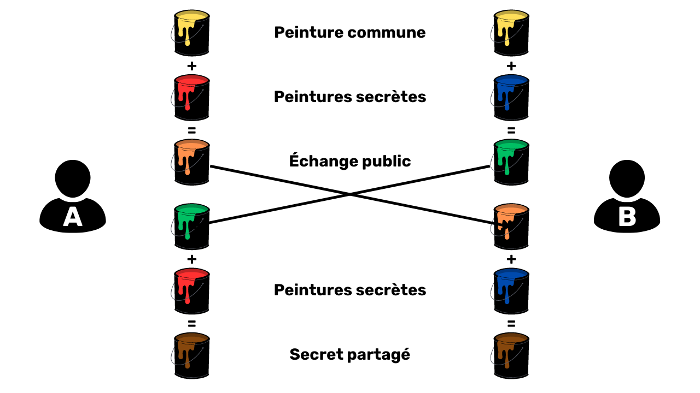


در این محبوب‌سازی، رنگ قهوه‌ای نشان‌دهنده راز مشترک بین Alice و Bob است. تصور کنید که در واقعیت، برای مهاجم جدا کردن رنگ‌های نارنجی و Green به منظور یافتن رنگ‌های مخفی Alice یا Bob غیرممکن است.


حالا بیایید نگاهی بیندازیم به اینکه این پروتکل واقعاً چگونه کار می‌کند، نه با تشبیهات رنگی، بلکه با استفاده از اعداد واقعی و حساب مدولار!


قبل از اینکه به مکانیزم‌های دیفی-هلمن بپردازیم، اجازه دهید به‌طور مختصر دو مفهوم ریاضی اساسی که به آن‌ها نیاز خواهیم داشت را به شما یادآوری کنم:


- **عدد اول** عددی طبیعی است که فقط دو مقسوم‌علیه دارد: $1$ و خودش. به عنوان مثال، $7$ یک عدد اول است زیرا فقط می‌تواند بر $1$ و $7$ تقسیم شود. از طرف دیگر، $8$ عدد اول نیست، زیرا بر $1$، $2$، $4$ و $8$ بخش‌پذیر است. بنابراین به جای دو مقسوم‌علیه صحیح مثبت، چهار مقسوم‌علیه دارد؛
- **مدولو** (که با $mod$ یا $\%$ نشان داده می‌شود) یک عملیات ریاضی است که بین دو عدد صحیح، باقیمانده تقسیم اقلیدسی عدد اول بر عدد دوم را برمی‌گرداند. برای مثال، $16\bmod 5 = $1$.


**کلید دیفی-هلمن Exchange بین Alice و Bob به صورت زیر انجام می‌شود:**


- Alice و Bob بر روی دو عدد مشترک توافق دارند: $p$ و $g$. $p$ یک عدد اول است و هرچه این عدد بزرگتر باشد، Diffie-Hellman امن‌تر خواهد بود. $g$ یک ریشه اولیه از $p$ است. این دو عدد می‌توانند به صورت آشکار در یک شبکه ناامن منتقل شوند. آن‌ها معادل **رنگ زرد** در محبوب‌سازی قبلی هستند. بنابراین مهم است که Alice و Bob دقیقا از مقادیر یکسان برای $p$ و $g$ استفاده کنند.
- به محض تعریف این پارامترها، Alice و Bob هر کدام یک عدد تصادفی مخفی انتخاب می‌کنند. Alice عدد تصادفی مخفی خود را $a$ می‌نامد (معادل **رنگ قرمز**) و Bob عدد خود را $b$ می‌نامد (معادل **رنگ آبی**). این اعداد باید مخفی بمانند.
- به جای مبادله مستقیم اعداد $a$ و $b$، هر طرف $A$ و $B$ را به صورت زیر محاسبه می‌کند:


$A$ برابر است با $g$ به توان $a$ به پیمانه $p$ :


$$
A = g^a \bmod p
$$


$B$ برابر است با $g$ به توان $b$ به پیمانه $p$ :


$$
B = g^b \bmod p
$$


- مقادیر $A$ (معادل با **رنگ نارنجی**) و $B$ (معادل با **رنگ Green**) بین دو طرف مبادله می‌شوند. این Exchange می‌تواند به صورت متن واضح در یک شبکه ناامن انجام شود؛
- Alice، با دریافت $B$، مقدار $z$ را به صورت زیر محاسبه می‌کند:


\( z \) برابر است با \( B \) به توان \( a \) به پیمانه \( p \) :


$$
z = B^a \bmod p
$$


یادآوری:


$$
B = g^b \bmod p
$$


نتیجه این است:


$$
z = B^a \bmod p
$$


$$
z = (g^b)^a \bmod p
$$


با اعمال قوانین توان :


$$
(x^n)^m = x^{nm}
$$


نتیجه این است :


$$
z = g^{ba} \bmod p
$$


- برای قسمت خود، Bob، پس از دریافت $A$، مقدار $z$ را به صورت زیر محاسبه می‌کند:


\( z \) برابر است با \( A \) به توان \( b \) به پیمانه \( p \) :


$$
z = A^b \bmod p
$$


نتیجه این است:


$$
z = (g^a)^b \bmod p
$$


$$
z = g^{ab} \bmod p
$$


$$
z = g^{ba} \bmod p
$$


با تشکر از خاصیت توزیع‌پذیری عملگر مد، Alice و Bob دقیقاً به همان مقدار $z$ دست می‌یابند. این عدد نشان‌دهنده راز مشترک آن‌ها است که معادل **رنگ قهوه‌ای** در محبوب‌سازی قبلی با قوطی‌های رنگ است. آن‌ها اکنون می‌توانند از این راز مشترک برای رمزگذاری متقارن ارتباطات خود در یک شبکه ناامن استفاده کنند.


یک مهاجم، حتی در صورت داشتن $p$، $g$، $A$ و $B$ (مقادیر عمومی)، قادر به محاسبه $a$، $b$ یا $z$ (مقادیر خصوصی) نخواهد بود. برای دستیابی به این هدف، باید توان‌رسانی معکوس شود، عملیاتی که بدون امتحان کردن تمام احتمالات یکی یکی غیرممکن است، زیرا این به معنای محاسبه لگاریتم گسسته، یعنی معکوس نمایی در یک گروه چرخه‌ای متناهی است.


بنابراین، تا زمانی که مقادیر $a$، $b$ و $p$ به اندازه کافی بزرگ باشند، پروتکل دیفی-هلمن امن است. معمولاً با پارامترهایی به اندازه 2048 بیت (یک عدد اعشاری 600 رقمی)، آزمایش تمام احتمالات برای $a$ و $b$ غیرعملی خواهد بود. تا به امروز، با چنین اعدادی، این الگوریتم امن در نظر گرفته می‌شود.


در اینجا نقطه ضعف اصلی پروتکل دیفی-هلمن نهفته است. برای امن بودن، الگوریتم باید از اعداد بزرگ استفاده کند. به همین دلیل، امروزه ترجیح می‌دهیم از الگوریتم ECDH (*Elliptic Curve Diffie-Hellman*) استفاده کنیم، که یک نسخه از دیفی-هلمن بر اساس یک منحنی جبری، به‌طور دقیق‌تر یک منحنی بیضوی است. این رویکرد امکان کار با اعداد بسیار کوچکتر را فراهم می‌کند در حالی که امنیت معادل را حفظ می‌کند و در نتیجه منابع مورد نیاز برای محاسبه و ذخیره‌سازی را کاهش می‌دهد.


اصل کلی الگوریتم به همان صورت باقی می‌ماند. با این حال، به جای استفاده از یک عدد تصادفی $a$ و عدد $A$ که از $a$ با توان‌گیری مدولار محاسبه شده است، از یک جفت کلید که بر روی یک منحنی بیضوی برقرار شده‌اند استفاده می‌کنیم. به جای تکیه بر توزیع‌پذیری عملگر مدولار، از قانون گروه بر روی منحنی‌های بیضوی استفاده می‌کنیم و به طور دقیق‌تر از خاصیت شرکت‌پذیری این قانون بهره می‌بریم.


برای توضیح مختصر اصل رمزنگاری بر روی منحنی‌های بیضوی، یک کلید خصوصی با یک عدد تصادفی بین $1$ و $n-1$ نمایش داده می‌شود، که در اینجا $n$ نشان‌دهنده مرتبه منحنی است. از طرف دیگر، کلید عمومی یک نقطه خاص بر روی این منحنی است که از کلید خصوصی با افزودن و دو برابر کردن نقاط از نقطه مولد، طبق معادله به دست می‌آید:


$$
K = k \cdot G
$$


در این فرمول، $K$ کلید عمومی، $k$ کلید خصوصی، و $G$ نقطه مولد را نشان می‌دهد.


یک ویژگی اساسی این کلیدها سهولتی است که با آن می‌توان $K$ را از $k$ و $G$ محاسبه کرد، در حالی که یافتن $k$ از $K$ و $G$ عملاً غیرممکن است. این عدم تقارن یک تابع یک‌طرفه ایجاد می‌کند. به عبارت دیگر، اگر کلید خصوصی را بدانید، محاسبه کلید عمومی آسان است، اما بازیابی کلید خصوصی از کلید عمومی غیرممکن است. این امنیت با دشواری محاسباتی لگاریتم گسسته بیشتر تقویت می‌شود.


ما از این ویژگی برای تطبیق الگوریتم دیفی-هلمن خود استفاده خواهیم کرد. **اصل عملکرد ECDH به شرح زیر است:**


- Alice و Bob بر روی یک منحنی بیضوی رمزنگاری امن و پارامترهای آن توافق می‌کنند. این اطلاعات عمومی است؛
- Alice یک عدد تصادفی $ka$ تولید می‌کند که کلید خصوصی او خواهد بود. این کلید خصوصی باید مخفی بماند. او کلید عمومی خود $Ka$ را با افزودن و دو برابر کردن نقاط روی منحنی بیضوی انتخاب شده تعیین می‌کند:


$$
K_a = k_a \cdot G
$$


- Bob همچنین یک عدد تصادفی $kb$ تولید می‌کند، که کلید خصوصی او خواهد بود. او کلید عمومی مرتبط $Kb$ را محاسبه می‌کند:


$$
K_b = k_b \cdot G
$$


- Alice و Bob Exchange کلیدهای عمومی خود $Ka$ و $Kb$ را در یک شبکه عمومی ناامن به اشتراک می‌گذارند.
- Alice نقطه‌ای $(x,y)$ روی منحنی را با اعمال کلید خصوصی خود $ka$ به کلید عمومی Bob $Kb$ محاسبه می‌کند:


$$
(x,y) = k_a \cdot K_b
$$


- Bob نقطه‌ای $(x,y)$ روی منحنی را با اعمال کلید خصوصی خود $kb$ به کلید عمومی Alice $Ka$ محاسبه می‌کند:


$$
(x,y) = k_b \cdot K_a
$$


- Alice و Bob همان نقطه را روی منحنی بیضوی به دست می‌آورند. راز مشترک، طول $x$ این نقطه خواهد بود.


آن‌ها به همان راز مشترک دست می‌یابند زیرا:


$$
(x,y) = k_a \cdot K_b = k_a \cdot (k_b \cdot G) = (k_a \cdot k_b) \cdot G = (k_b \cdot k_a) \cdot G = k_b \cdot (k_a \cdot G) = k_b \cdot K_a
$$


یک مهاجم احتمالی که شبکه عمومی غیرامن را مشاهده می‌کند، تنها قادر خواهد بود کلیدهای عمومی هر فرد و پارامترهای منحنی بیضوی انتخاب‌شده را به دست آورد. همان‌طور که در بالا توضیح داده شد، این اطلاعات به‌تنهایی برای تعیین کلیدهای خصوصی کافی نیست. در نتیجه، مهاجم نمی‌تواند راز مشترک بین Alice و Bob را پیدا کند.


بنابراین ECDH یک الگوریتم کلیدی Exchange است. این الگوریتم اغلب به همراه روش‌های رمزنگاری دیگر برای ایجاد یک پروتکل کامل استفاده می‌شود. به عنوان مثال، ECDH در قلب TLS (*Transport Layer Security*) قرار دارد، که یک پروتکل رمزنگاری و احراز هویت برای انتقال اینترنتی Layer است. TLS از ECDHE برای کلید Exchange استفاده می‌کند، که یک نوع از ECDH است که در آن کلیدها موقتی هستند، تا محرمانگی پایدار را فراهم کند. علاوه بر این، TLS از الگوریتم‌های احراز هویت مانند ECDSA، الگوریتم‌های رمزنگاری مانند AES، و توابع Hash مانند SHA256 استفاده می‌کند.


TLS مسئول `s` در `https` و قفل در نوار Address مرورگر شما است - نمادهای ارتباطات رمزگذاری‌شده. با گذراندن این دوره، از ECDH استفاده خواهید کرد و به احتمال زیاد روزانه بدون اینکه حتی متوجه شوید از آن استفاده می‌کنید.


### تراکنش اعلان


همان‌طور که در بخش قبلی دیدیم، ECDH یک نوع از Diffie-Hellman Exchange است که از جفت کلیدهایی که بر روی یک منحنی بیضوی ایجاد شده‌اند، استفاده می‌کند. خوشبختانه ما در کیف‌پول‌های Bitcoin خود، جفت کلیدهای زیادی داریم که این استاندارد را رعایت می‌کنند! ایده BIP47 این است که از جفت کلیدهای کیف‌پول‌های سلسله مراتبی و تعیین‌کننده Bitcoin هر دو طرف برای ایجاد اسرار مشترک و موقت بین آن‌ها استفاده کند. BIP47 به جای آن از ECDHE (*Elliptic Curve Diffie-Hellman **Ephemeral***) استفاده می‌کند.


ECDHE اولین بار در BIP47 برای انتقال کد پرداخت از فرستنده به گیرنده استفاده شد. این همان **تراکنش اعلان** معروف است. این مرحله ضروری است، زیرا برای اینکه BIP47 به طور مؤثر کار کند، هر دو طرف درگیر (فرستنده و گیرنده) باید کدهای پرداخت یکدیگر را بدانند. این دانش امکان استخراج کلیدهای عمومی موقت و در نتیجه آدرس‌های دریافت خالی مرتبط را فراهم می‌کند.


پیش از این Exchange، فرستنده به‌طور منطقی از کد پرداخت گیرنده آگاه است، زیرا آن را off-chain، به‌عنوان مثال از وب‌سایت او یا شبکه‌های اجتماعی Invoice بازیابی کرده است. با این حال، گیرنده لزوماً از کد پرداخت فرستنده آگاه نیست. با این حال، کد باید به او منتقل شود؛ در غیر این صورت، او قادر نخواهد بود کلیدهای موقتی مورد نیاز برای شناسایی آدرس‌هایی که بیت‌کوین‌هایش در آن ذخیره شده‌اند را استخراج کند یا به وجوه خود دسترسی پیدا کند. اگرچه این انتقال کد فرستنده از نظر فنی می‌تواند off-chain از طریق سایر وسایل ارتباطی انجام شود، اما این موضوع مشکلی ایجاد می‌کند اگر Wallet فقط از seed بازیابی شود.


این به این دلیل است که برخلاف آدرس‌های معمولی، آدرس‌های BIP47 مستقیماً از seed گیرنده مشتق نمی‌شوند - استفاده از `xpub` در این مورد ساده‌تر خواهد بود - بلکه نتیجه محاسبه‌ای هستند که دو کد پرداخت را ترکیب می‌کند: کد پرداخت فرستنده و کد پرداخت گیرنده. بنابراین، اگر گیرنده Wallet خود را از دست بدهد و سعی کند آن را از seed خود بازیابی کند، کد پرداخت خود را که مستقیماً از seed او مشتق شده است، بازیابی خواهد کرد. با این حال، برای بازیابی آدرس‌های موقت، او همچنین به کدهای پرداخت همه کسانی که از طریق BIP47 برای او بیت‌کوین ارسال کرده‌اند نیاز خواهد داشت. از این رو اهمیت تراکنش اعلان، که این اطلاعات را بر روی Bitcoin Blockchain ذخیره می‌کند، در حالی که همچنان می‌توان آن را به‌راحتی پیدا کرد بدون اینکه نیاز به جستجو در میان میلیاردها تراکنش انجام‌شده از زمان راه‌اندازی آن در سال 2009 باشد.


بنابراین، امکان پیاده‌سازی BIP47 بدون استفاده از تراکنش اطلاع‌رسانی وجود دارد، به شرطی که هر کاربر یک نسخه پشتیبان از کدهای پرداخت همتایان خود نگه دارد. با این حال، این روش تا زمانی که یک راه‌حل ساده، قوی و کارآمد برای ایجاد، ذخیره و به‌روزرسانی این نسخه‌های پشتیبان توسعه نیابد، پیچیده برای مدیریت است. در وضعیت فعلی، تراکنش اطلاع‌رسانی تقریباً اجتناب‌ناپذیر است.


در فصل‌های بعدی، با این حال، به پروتکل‌های دیگری با اهداف مشابه BIP47 خواهیم پرداخت، اما که نیازی به تراکنش اطلاع‌رسانی ندارند. با این حال، این جایگزین‌ها مبادلات خاص خود را معرفی می‌کنند.


علاوه بر نقش خود در ذخیره کدهای پرداخت، تراکنش اعلان نیز دارای یک عملکرد اعلان برای گیرنده است، همانطور که از نام آن پیداست. این به مشتری گیرنده اطلاع می‌دهد که یک تونل پرداخت جدید ایجاد شده است و پیشنهاد می‌کند که او به آدرس‌های زودگذر حاصل توجه کند.


### مدل محرمانگی BIP47


قبل از توضیح عملکرد فنی تراکنش اعلان، مهم است که مدل محرمانگی مرتبط با BIP47 را که توجیه‌کننده برخی اقدامات انجام‌شده هنگام ایجاد این تراکنش اولیه است، مورد بحث قرار دهیم.


کد پرداخت به خودی خود خطر مستقیمی برای محرمانگی ندارد. برخلاف مدل سنتی Bitcoin، که هدف آن قطع ارتباط بین هویت کاربر و تراکنش‌های او (که عمومی هستند) با حفظ ناشناس بودن کلیدها و آدرس‌ها است، کد پرداخت می‌تواند به‌طور آشکار با یک هویت مرتبط شود بدون اینکه تهدیدی ایجاد کند.


این به این دلیل است که کد پرداخت برای استخراج مستقیم آدرس‌هایی که پرداخت‌های BIP47 را دریافت می‌کنند، استفاده نمی‌شود. در عوض، این آدرس‌ها از طریق کاربرد ECDH بین کلیدهایی که از کدهای پرداخت دو طرف درگیر استخراج شده‌اند، تولید می‌شوند.


بنابراین، یک کد پرداخت به خودی خود مستقیماً منجر به از دست رفتن محرمانگی نمی‌شود، زیرا تنها اعلان Address از آن مشتق می‌شود. اگرچه این Address می‌تواند اطلاعات خاصی را فاش کند، اما معمولاً طرف‌هایی که با آن‌ها معامله می‌کنید را فاش نمی‌کند، مگر اینکه یک تحلیل زنجیره‌ای کامل انجام شود. در واقع، اگر فرستنده از UTXOهایی که می‌توانند به هویت او مرتبط شوند برای انجام تراکنش اعلان استفاده کند، آنگاه ممکن است بتوان نتیجه گرفت که هویت او احتمالاً به پرداخت‌های BIP47 به کد پرداخت شما مرتبط است. این امر تراکنش‌های زیربنایی را فاش نخواهد کرد، اما وجود احتمالی آن‌ها را نشان می‌دهد.


بنابراین حفظ این جداسازی دقیق بین کدهای پرداخت کاربران ضروری است. با در نظر گرفتن این موضوع، ارتباط اولیه کد یک لحظه بحرانی برای محرمانگی پرداخت است، اما برای عملکرد صحیح پروتکل ضروری است. اگر یکی از کدهای پرداخت به صورت عمومی (مانند یک وب‌سایت) قابل دسترسی باشد، کد دوم، یعنی کد فرستنده، تحت هیچ شرایطی نباید به کد اول مرتبط شود.


بیایید یک مثال مشخص بزنیم: من می‌خواهم از طریق BIP47 به یک جنبش سیاسی کمک مالی کنم:


- سازمان کد پرداخت خود را در وب‌سایت یا از طریق شبکه‌های اجتماعی خود عمومی کرده است؛
- این کد بنابراین به جنبش سیاسی مرتبط است؛
- این کد پرداخت را دریافت می‌کنم؛
- قبل از ارسال، باید مطمئن شوم که آن‌ها کد پرداخت من را می‌دانند، که به هویت من نیز مرتبط است زیرا از آن برای دریافت تراکنش‌ها در شبکه‌های اجتماعی‌ام استفاده می‌کنم.


چگونه می‌توانم کد خود را بدون ریسک منتقل کنم؟ استفاده از روش‌های متداول ارتباطی می‌تواند منجر به نشت اطلاعات شود و در نتیجه من را با این جنبش سیاسی مرتبط کند. تراکنش اطلاع‌رسانی یک راه‌حل ارائه می‌دهد، به لطف رمزگذاری Layer که از چنین ارتباطی بین دو کد جلوگیری می‌کند. اگرچه این تنها روش انتقال مخفیانه کد پرداخت فرستنده نیست، اما روشی بسیار مؤثر است.


در نمودار زیر، خطوط نارنجی نقاطی را نشان می‌دهند که جریان اطلاعات باید قطع شود، و پیکان‌های سیاه اتصالاتی را نشان می‌دهند که ممکن است توسط اشخاص ثالث قابل مشاهده باشند:


در واقع، در مدل سنتی محرمانگی Bitcoin، اغلب پیچیده است که جریان اطلاعات بین جفت کلید و کاربر را به طور کامل جدا کرد، به ویژه در تراکنش‌های از راه دور. به عنوان مثال، در زمینه یک کمپین اهدایی، گیرنده ناچار است یک Address یا کلید عمومی را از طریق وب‌سایت یا شبکه‌های اجتماعی خود افشا کند. استفاده صحیح از BIP47، به ویژه با تراکنش اطلاع‌رسانی، امکان دور زدن این مشکل را با استفاده از ECDHE و رمزنگاری Layer که بعداً به آن خواهیم پرداخت، فراهم می‌کند.


البته، مدل محرمانگی کلاسیک Bitcoin همچنان برای کلیدهای عمومی موقت که از ترکیب دو کد پرداخت به دست می‌آیند، اعمال می‌شود. در واقع، این دو مدل مکمل یکدیگر هستند. آنچه می‌خواهم در اینجا تأکید کنم این است که برخلاف استفاده معمول از یک کلید عمومی برای دریافت بیت‌کوین‌ها، کد پرداخت می‌تواند به یک هویت خاص مرتبط شود، زیرا اطلاعات "_آلیس در حال معامله با باب است_" در مرحله دیگری شکسته می‌شود. کد پرداخت برای آدرس‌های پرداخت generate استفاده می‌شود، اما بر اساس مشاهده صرف Blockchain، غیرممکن است که یک تراکنش پرداخت BIP47 را به کدهای پرداختی که برای اجرای آن استفاده شده‌اند، مرتبط کرد، مگر اینکه UTXOهای درگیر قبلاً به یک هویت مرتبط شده باشند و کاربران کدهای پرداخت خود را با هویت‌های مربوطه‌شان مرتبط کرده باشند.


به طور خلاصه، مدل محرمانگی ارائه شده توسط پرداخت‌های BIP47 می‌تواند نسبت به مدل پایه Bitcoin برتر در نظر گرفته شود، اگرچه این به معنای جادویی بودن آن نیست.


### ایجاد تراکنش اعلان


حالا بیایید ببینیم این تراکنش اعلان چگونه کار می‌کند. فرض کنیم که Alice می‌خواهد با استفاده از BIP47 وجوهی را به Bob ارسال کند. در مثال من، Alice به عنوان فرستنده و Bob به عنوان گیرنده عمل می‌کند. Bob کد پرداخت خود را در وب‌سایتش منتشر کرده است. بنابراین، Alice از قبل کد پرداخت Bob را می‌داند.


**1- Alice یک راز مشترک با ECDH محاسبه می‌کند :**


- او یک جفت کلید از HD Wallet خود را در شاخه‌ای متفاوت از کد پرداخت خود انتخاب می‌کند. توجه داشته باشید که این جفت نباید به راحتی با اعلان Address مربوط به Alice یا با هویت Alice مرتبط باشد (به بخش قبلی مراجعه کنید)؛
- Alice کلید خصوصی را برای این جفت انتخاب می‌کند. ما آن را $a$ (حروف کوچک) می‌نامیم؛


$$
a
$$


- Alice کلید عمومی مرتبط با اعلان Address از Bob را بازیابی می‌کند. این کلید اولین فرزند مشتق شده از کد پرداخت Bob (شاخص $/0$) است. ما این کلید عمومی را $B$ (حروف بزرگ) می‌نامیم. کلید خصوصی مرتبط با این کلید عمومی $b$ (حروف کوچک) نامیده می‌شود. $B$ با افزودن و دو برابر کردن نقاط روی منحنی بیضوی از $G$ (نقطه تولید) با $b$ (کلید خصوصی) تعیین می‌شود:


$$ B = b \cdot G $$


- Alice نقطه مخفی $S$ (حروف بزرگ) را بر روی منحنی بیضوی با جمع و دو برابر کردن نقاط محاسبه می‌کند و کلید خصوصی خود $a$ را از کلید عمومی $B$ متعلق به Bob اعمال می‌کند.


$$ S = a \cdot B $$


- Alice عامل کورکننده $f$ را محاسبه می‌کند که برای رمزگذاری کد پرداخت او استفاده خواهد شد. برای انجام این کار، او از تابع HMAC-SHA512 برای تعیین یک عدد شبه‌تصادفی استفاده می‌کند. ورودی دوم این تابع مقداری است که تنها Bob قادر به یافتن آن خواهد بود: $x$، که همان عرض از مبدأ نقطه مخفی محاسبه‌شده در بالا است. ورودی اول $o$ است، که همان UTXO مصرف‌شده به عنوان ورودی این تراکنش (نقطه خروجی) است.


$$ f = \text{HMAC-SHA512}(o, x) $$


**2 - Alice کد پرداخت شخصی خود را به مبنای 2 (باینری) تبدیل می‌کند **


**3- از این فاکتور کورکننده به عنوان کلیدی برای انجام رمزگذاری متقارن بر روی محتوای کد پرداخت خود استفاده می‌کند.** الگوریتم رمزگذاری استفاده شده به سادگی یک `XOR` است. عملیاتی که انجام می‌شود قابل مقایسه با رمز ورنام، که به عنوان "پد یک‌بار مصرف" نیز شناخته می‌شود، است.


- Alice ابتدا عامل کورکننده خود را به دو قسمت تقسیم می‌کند: ۳۲ بایت اول $f1$ نامیده می‌شود و ۳۲ بایت آخر $f2$ نامیده می‌شود. این به ما می‌دهد:


$$ f = f1 || f2 $$


- Alice رمز $x'$ از طول کلید عمومی $x$ از کد پرداخت خود و رمز $c'$ از کد رشته‌ای $c$ را به صورت جداگانه محاسبه می‌کند. $f1$ و $f2$ به ترتیب به عنوان کلیدهای رمز عمل می‌کنند. عملیاتی که استفاده می‌شود `XOR` (یا انحصاری) است.


$$ x' = x \oplus f1 $$


$$ c' = c \oplus f2 $$


- Alice مقادیر واقعی طول کلید عمومی $x$ و کد رشته $c$ را در کد پرداخت خود با مقادیر رمزگذاری شده $x'$ و $c'$ جایگزین می‌کند.


**4-** بنابراین Alice در حال حاضر کد پرداخت خود را با یک محموله رمزگذاری شده دارد. او یک تراکنش شامل کلید عمومی خود $A$ به عنوان ورودی، یک خروجی به اطلاعیه Bob یعنی Address، و یک خروجی `OP_RETURN` که شامل کد پرداخت او با محموله رمزگذاری شده است، ایجاد و پخش خواهد کرد. **این تراکنش، تراکنش اطلاع‌رسانی است**.


`OP_RETURN` یک کد عملیاتی است که خروجی یک تراکنش Bitcoin را به عنوان نامعتبر علامت‌گذاری می‌کند. امروزه، برای پخش یا اطلاعات Anchor بر روی Bitcoin Blockchain استفاده می‌شود. این می‌تواند تا 80 بایت داده را ذخیره کند که سپس به زنجیره نوشته شده و برای همه کاربران دیگر قابل مشاهده است.


همانطور که در بخش‌های قبلی دیده‌ایم، ECDH برای generate یک راز مشترک بین دو کاربر که از طریق یک شبکه ناامن ارتباط برقرار می‌کنند و ممکن است توسط مهاجمان مشاهده شود، استفاده می‌شود. در BIP47، ECDH برای ارتباط در شبکه Bitcoin استفاده می‌شود که به‌طور ذاتی یک شبکه ارتباطی شفاف است و توسط بسیاری از مهاجمان مشاهده می‌شود. راز مشترکی که از طریق کلید ECDH Exchange محاسبه می‌شود، سپس برای رمزگذاری اطلاعات محرمانه‌ای که باید منتقل شود، استفاده می‌شود: کد پرداخت فرستنده (Alice).


مراحل انجام یک تراکنش اطلاع‌رسانی که به‌تازگی با هم مشاهده کردیم را خلاصه می‌کنم:


- Alice کد پرداخت Bob و اعلان Address را بازیابی می‌کند؛
- Alice یک UTXO را از پورتفولیوی HD خود با جفت کلید مربوطه انتخاب می‌کند؛
- این یک نقطه مخفی روی منحنی بیضوی با استفاده از ECDH محاسبه می‌کند؛
- از این نقطه مخفی برای محاسبه یک HMAC استفاده می‌کند، که همان عامل کورکننده است؛
- او از این عامل کورکننده برای رمزگذاری محموله کد پرداخت شخصی خود استفاده می‌کند؛
- از خروجی تراکنش `OP_RETURN` برای انتقال کد پرداخت مخفی به Bob استفاده می‌کند.


### اعلان تراکنش: یک مطالعه عملی


برای درک بهتر نحوه عملکرد آن و به‌ویژه استفاده از `OP_RETURN`، بیایید نگاهی به یک تراکنش واقعی اعلان بیندازیم. من چنین تراکنشی را بر روی Testnet انجام دادم که می‌توانید [با کلیک اینجا](https://Mempool.space/fr/Testnet/tx/0e2e4695a3c49272ef631426a9fd2dae6ec3a469e3a39a3db51aa476cd09de2e) پیدا کنید.


با نگاه به این تراکنش، می‌توانیم ببینیم که یک ورودی و ۴ خروجی دارد:


- اولین خروجی `OP_RETURN` است که حاوی کد پرداخت مخفی من است؛
- خروجی دوم 546 Sats به اعلان گیرنده من Address اشاره دارد؛
- خروجی سوم 15,000 Sats نشان‌دهنده هزینه خدمات است، زیرا من از Samourai Wallet برای ساخت این تراکنش استفاده کردم؛
- خروجی چهارم از ۲ میلیون Sats نشان‌دهنده نرخ Exchange است، یعنی تفاوت باقی‌مانده در ورودی من که به Address دیگری که متعلق به من است بازمی‌گردد.


جالب‌ترین مورد برای مطالعه، بدون شک خروجی 0 با استفاده از `OP_RETURN` است. بیایید نگاهی دقیق‌تر به محتوای آن بیندازیم. در اینجا `scriptPubKey` به صورت هگزادسیمال آمده است:


```text
6a4c50010002b13b2911719409d704ecc69f74fa315a6cb20fdd6ee39bc9874667703d67b164927b0e88f89f3f8b963549eab2533b5d7ed481a3bea7e953b546b4e91b6f50d800000000000000000000000000
```


چندین بخش در این اسکریپت وجود دارد. اولاً، :


```text
6a4c
```


در میان اپکدها، می‌توانیم `0x6a` را که `OP_RETURN` را تعیین می‌کند و `0x4c` را که `OP_PUSHDATA1` را تعیین می‌کند، شناسایی کنیم.


بایتی که پس از این آخرین opcode می‌آید، اندازه‌ی payload بعدی را نشان می‌دهد. این مقدار `0x50` یا ۸۰ بایت را نشان می‌دهد:


```text
6a4c50
```


سپس، ما فراداده کد پرداخت من را به صورت متن واضح داریم:


```text
010002
```


عرض عمومی کلید پرداخت من:


```text
b13b2911719409d704ecc69f74fa315a6cb20fdd6ee39bc9874667703d67b164
```


کد رشته رمزگذاری شده کد پرداخت من :


```text
927b0e88f89f3f8b963549eab2533b5d7ed481a3bea7e953b546b4e91b6f50d8
```


و در نهایت، پر کردن تا ۸۰ بایت، اندازه استاندارد یک `OP_RETURN` :


```text
00000000000000000000000000
```


برای کمک به درک شما، در اینجا کد پرداخت من به صورت متن ساده در مبنای ۵۸ آمده است:


```text
PM8TJQCyt6ovbozreUCBrfKqmSVmTzJ5vjqse58LnBzKFFZTwny3KfCDdwTqAEYVasn11tTMPc2FJsFygFd3YzsHvwNXLEQNADgxeGnMK8Ugmin62TZU
```


و در مبنای ۱۶ :


```text
4701000277507c9c17a89cfca2d3af554745d6c2db0e7f6b2721a3941a504933103cc42add94881210d6e752a9abc8a9fa0070e85184993c4f643f1121dd807dd556d1dc000000000000000000000000008604e4db
```


اگر کد پرداخت متنی من را با `OP_RETURN` مقایسه کنیم، می‌بینیم که HRP (`0x47`) و چکسام (`0x8604e4db`) منتقل نمی‌شوند. این طبیعی است، زیرا این اطلاعات برای انسان‌ها در نظر گرفته شده است.


سپس، می‌توانیم نسخه (`0x01`)، فیلد بیت (`0x00`) و توازن کلید عمومی (`0x02`) را تشخیص دهیم. و در انتهای کد پرداخت، بایت‌های خالی (`0x000000000000000000000000000000`) که اجازه می‌دهند تا به مجموع 80 بایت برسند. تمام این متادیتا به صورت رمزنگاری نشده منتقل می‌شود.


در نهایت، می‌توانیم مشاهده کنیم که طول کلید عمومی (`0x77507c9c17a89cfca2d3af554745d6c2db0e7f6b2721a3941a504933103cc42a`) و کد رشته (`0xdd94881210d6e752a9abc8a9fa0070e85184993c4f643f1121dd807dd556d1dc`) رمزگذاری شده‌اند. این محتوای کد پرداخت است.


### XOR چیست؟


ما در بخش‌های قبلی دیده‌ایم که کد پرداخت با استفاده از عملیات XOR به صورت رمزگذاری شده منتقل می‌شود. بیایید نگاهی دقیق‌تر به نحوه کار این عملگر بیندازیم، زیرا در رمزنگاری به طور گسترده‌ای استفاده می‌شود.


XOR یک عملگر منطقی بیتی است که بر اساس جبر بولی عمل می‌کند. با توجه به دو عملوند در بیت‌ها، اگر بیت‌های هم‌رتبه متفاوت باشند، `1` برمی‌گرداند و اگر بیت‌های هم‌رتبه برابر باشند، `0` برمی‌گرداند. در اینجا جدول درستی XOR بر اساس مقادیر عملوندهای `D` و `E` آمده است:


| D | E | D XOR E |
| --- | --- | ------- |
| 0 | 0 | 0 |
| 0 | 1 | 1 |
| 1 | 0 | 1 |
| 1 | 1 | 0 |

برای مثال:


$$
0110 \oplus 1110 = 1000
$$


یا:


$$
010011 \oplus 110110 = 100101
$$


با ECDH، استفاده از XOR به عنوان یک رمزنگاری Layer به‌طور خاص سازگار است. اولاً، به لطف این عملگر، رمزنگاری متقارن است. این بدان معناست که گیرنده می‌تواند کد پرداخت را با همان کلیدی که برای رمزنگاری استفاده شده است، رمزگشایی کند. کلیدهای رمزنگاری و رمزگشایی از راز مشترک با استفاده از ECDH محاسبه می‌شوند. این تقارن به دلیل خواص جابجایی و شرکت‌پذیری عملگر XOR ممکن شده است:


- سایر ویژگی‌ها :


$$
D \oplus D = 0
$$


$$
D \oplus 0 = D
$$


- جابجایی :


$$
D \oplus E = E \oplus D
$$


- وابستگی :


$$
D \oplus (E \oplus Z) = (D \oplus E) \oplus Z = D \oplus E \oplus Z
$$


اگر :


$$
D \oplus E = L
$$


سپس :


$$
D \oplus L = D \oplus (D \oplus E) = D \oplus D \oplus E = 0 \oplus E = E \\
\therefore D \oplus L = E
$$


ثانیاً، این روش رمزنگاری بسیار شبیه به رمز Vernam (One-Time Pad) است، تنها الگوریتم رمزنگاری که تا به امروز شناخته شده و دارای امنیت بی‌قید و شرط (یا مطلق) است. برای اینکه رمز Vernam این ویژگی را داشته باشد، کلید رمزنگاری باید کاملاً تصادفی، هم‌اندازه با پیام و فقط یک بار استفاده شود. در روش رمزنگاری که اینجا برای BIP47 استفاده شده، کلید واقعاً هم‌اندازه با پیام است و عامل کورکننده دقیقاً هم‌اندازه با الحاق عرض از مبدأ کلید عمومی با کد رشته‌ای کد پرداخت است. این کلید رمزنگاری فقط یک بار استفاده می‌شود. از سوی دیگر، این کلید از تصادف کامل به دست نمی‌آید، زیرا یک HMAC است. بلکه، شبه‌تصادفی است. بنابراین، این یک رمز Vernam نیست، اما روش به آن نزدیک است.


### دریافت اعلان تراکنش


اکنون که Alice تراکنش اعلان را به Bob ارسال کرده است، بیایید ببینیم Bob چگونه آن را تفسیر می‌کند. به عنوان یادآوری، Bob باید به کد پرداخت Alice دسترسی داشته باشد. بدون این اطلاعات، همان‌طور که در بخش بعدی خواهیم دید، او قادر نخواهد بود جفت کلیدهایی که توسط Alice ایجاد شده‌اند را استخراج کند و بنابراین نمی‌تواند به بیت‌کوین‌های دریافتی خود از طریق BIP47 دسترسی پیدا کند. در حال حاضر، محموله کد پرداخت Alice رمزگذاری شده است. بیایید ببینیم Bob چگونه آن را رمزگشایی می‌کند.


**1-** Bob تراکنش‌هایی را که خروجی‌هایی با اعلان او Address ایجاد می‌کنند، نظارت می‌کند.


**2-** هنگامی که یک تراکنش خروجی در اعلان خود Address دارد، Bob آن را تحلیل می‌کند تا ببیند آیا حاوی خروجی OP_RETURN است که با استاندارد BIP47 مطابقت دارد یا خیر.


**3-** اگر اولین بایت از بار OP_RETURN `0x01` باشد، Bob جستجوی خود را برای یک راز احتمالی که با ECDH به اشتراک گذاشته شده است، آغاز می‌کند:


- Bob کلید عمومی ورودی را برای تراکنش انتخاب می‌کند. یعنی، کلید عمومی Alice به نام $A$ با :


$$ A = a \cdot G $$


- Bob کلید خصوصی $b$ مرتبط با اعلان شخصی خود Address را انتخاب می‌کند:


$$ b $$


- Bob نقطه مخفی $S$ (راز مشترک ECDH) را بر روی منحنی بیضوی با جمع و دو برابر کردن نقاط محاسبه می‌کند، با استفاده از کلید خصوصی خود $b$ بر روی کلید عمومی Alice یعنی $A$ :


$$ S = b \cdot A $$


- Bob عامل کورکننده $f$ را تعیین می‌کند که امکان رمزگشایی محموله کد پرداخت Alice را فراهم می‌کند. به همان روشی که Alice قبلاً آن را محاسبه کرده بود، Bob $f$ را با اعمال HMAC-SHA512 به $x$، مقدار طولی نقطه مخفی $S$، و به $o$، که UTXO به عنوان ورودی برای این تراکنش اعلان مصرف شده است، پیدا خواهد کرد:


$$ f = \text{HMAC-SHA512}(o, x) $$


**4-** Bob داده‌های OP_RETURN را در تراکنش اعلان به عنوان یک کد پرداخت تفسیر می‌کند. او به سادگی بار محموله این کد پرداخت بالقوه را با استفاده از عامل کورکننده $f$ رمزگشایی خواهد کرد:


- Bob عامل کورکننده $f$ را به 2 قسمت تقسیم می‌کند: 32 بایت اول $f$ به عنوان $f1$ و 32 بایت آخر به عنوان $f2$ خواهد بود؛
- Bob مقدار عرض رمزگذاری شده $x'$ را از کلید عمومی کد پرداخت Alice رمزگشایی می‌کند:


$$ x = x' \oplus f1 $$


- Bob مقدار کد رشته رمزگذاری شده $c'$ را از کد پرداخت Alice رمزگشایی می‌کند:


$$ c = c' \oplus f2 $$


**5-** Bob بررسی می‌کند که آیا مقدار کلید عمومی کد پرداخت Alice بخشی از گروه secp256k1 است یا خیر. اگر چنین باشد، آن را به عنوان یک کد پرداخت معتبر تفسیر می‌کند. در غیر این صورت، تراکنش را نادیده می‌گیرد.


اکنون که Bob کد پرداخت Alice را می‌داند، Alice می‌تواند تا `2^32` پرداخت به او ارسال کند، بدون اینکه نیازی به تکرار تراکنش اطلاع‌رسانی از این نوع داشته باشد.


چرا کار می‌کند؟ چگونه Bob می‌تواند همان عامل کورکننده را به‌عنوان Alice تعیین کند و در نتیجه کد پرداخت او را رمزگشایی کند؟ بیایید نگاهی دقیق‌تر به عملکرد ECDH در آنچه که به‌تازگی توصیف کردیم بیندازیم.


اول از همه، ما با رمزنگاری متقارن سروکار داریم. این بدان معناست که کلید رمزگذاری و کلید رمزگشایی یک مقدار هستند. این کلید در تراکنش اعلان، عامل کورکننده است:


$$ f = f1 || f2 $$


بنابراین Alice و Bob باید بدون انتقال مستقیم، همان مقدار $f$ را به دست آورند، زیرا یک مهاجم می‌تواند آن را سرقت کرده و اطلاعات محرمانه را رمزگشایی کند. این فاکتور کورکننده با اعمال HMAC-SHA512 بر روی 2 مقدار به دست می‌آید:


- عرض از مبدأ یک نقطه مخفی ؛
- و UTXO در ورودی تراکنش مصرف شد.


بنابراین Bob به هر دو این اطلاعات نیاز دارد تا بتواند محتوای کد پرداخت Alice را رمزگشایی کند. برای ورودی UTXO، Bob می‌تواند به سادگی با مشاهده تراکنش اعلان آن را بازیابی کند. برای نقطه مخفی، Bob نیاز به استفاده از ECDH دارد. همان‌طور که در بخش قبلی درباره دیفی-هلمن دیده شد، تنها با تبادل کلیدهای عمومی مربوطه و به‌طور مخفیانه اعمال کلیدهای خصوصی خود بر روی کلید عمومی یکدیگر، Alice و Bob می‌توانند یک نقطه مخفی دقیق بر روی منحنی بیضوی پیدا کنند. تراکنش اعلان بر اساس این مکانیزم است:


- جفت کلیدهای Bob :


$$ B = b \cdot G $$


- کلید جفت Alice:


$$ A = a \cdot G $$


- برای یک راز $S (x, y)$ :


$$ S = a \cdot B = a \cdot (b \cdot G) = (b \cdot a) \cdot G = b \cdot A $$


اکنون که Bob کد پرداخت Alice را می‌داند، او قادر خواهد بود پرداخت‌های BIP47 او را شناسایی کند و قادر خواهد بود کلیدهای خصوصی مسدودکننده بیت‌کوین‌های دریافت‌شده را استخراج کند.


مراحل را که به‌تازگی با هم مشاهده کردیم برای دریافت و تفسیر یک تراکنش اعلان خلاصه می‌کنم:


- ‏Bob خروجی تراکنش را به اعلان خود Address نظارت می‌کند؛
- هنگامی که یکی را تشخیص می‌دهد، اطلاعات موجود در OP_RETURN را بازیابی می‌کند؛
- Bob کلید عمومی را به عنوان ورودی انتخاب می‌کند و یک نقطه مخفی با استفاده از ECDH محاسبه می‌کند؛
- از این نقطه مخفی برای محاسبه یک HMAC استفاده می‌کند که عامل کورکننده است؛
- از این عامل کورکننده برای رمزگشایی محموله کد پرداخت Alice که در OP_RETURN قرار دارد، استفاده می‌کند.


### تراکنش پرداخت BIP47


بیایید نگاهی به فرآیند پرداخت با BIP47 بیندازیم. برای یادآوری وضعیت فعلی:


- Alice کد پرداخت Bob را می‌داند، که او به‌سادگی از وب‌سایتش بازیابی کرده است؛
- Bob کد پرداخت Alice را از تراکنش اعلان می‌داند؛
- Alice اولین پرداخت خود را به Bob انجام خواهد داد. او می‌تواند به همین روش پرداخت‌های بیشتری انجام دهد.


قبل از توضیح این فرآیند، فکر می‌کنم مهم است که به یاد داشته باشیم روی کدام شاخص‌ها در حال کار هستیم. مسیر مشتق برای یک کد پرداخت به صورت زیر توصیف می‌شود: `m/47'/0'/0'`. عمق زیر به صورت زیر شاخص‌ها را تقسیم می‌کند:


- اولین جفت دختر معمولی (غیر تقویت‌شده) همان است که برای generate اعلان Address که در بخش قبلی مورد بحث قرار گرفت، استفاده می‌شود: `m/47'/0'/0'/0` ;
- جفت کلیدهای دختر معمولی در ECDH برای آدرس‌های دریافت پرداخت generate BIP47 استفاده می‌شوند، همانطور که در این بخش خواهیم دید: از `m/47'/0'/0'/0` تا `m/47'/0'/0'/2,147,483,647` ;
- جفت کلیدهای تقویت‌شده دختر، کدهای پرداخت موقتی هستند: از `m/47'/0'/0'/0'` تا `m/47'/0'/0'/2,147,483,647'`.


هر بار که Alice می‌خواهد پرداختی به Bob ارسال کند، او یک Address جدید، منحصربه‌فرد و خالی را بار دیگر با استفاده از پروتکل ECDH استخراج می‌کند:


- Alice اولین کلید خصوصی مشتق شده از کد پرداخت قابل استفاده مجدد شخصی خود را انتخاب می‌کند:


$$ a $$


- Alice اولین کلید عمومی استفاده نشده مشتق شده از کد پرداخت Bob را انتخاب می‌کند. ما این کلید عمومی را $B$ می‌نامیم. این کلید با کلید خصوصی $b$ مرتبط است که فقط برای Bob شناخته شده است:


$$ B = b \cdot G $$


- Alice نقطه مخفی $S$ را بر روی منحنی بیضوی با جمع و دو برابر کردن نقاط با استفاده از کلید خصوصی خود $a$ از کلید عمومی Bob $B$ محاسبه می‌کند:


$$ S = a \cdot B $$


- از این نقطه مخفی، Alice راز مشترک $s$ (حروف کوچک) را محاسبه می‌کند. برای انجام این کار، او طول افقی نقطه مخفی $S$ به نام $Sx$ را انتخاب کرده و این مقدار را به تابع SHA256 Hash منتقل می‌کند:


$$ S = (Sx, Sy) $$


$$ s = \text{SHA256}(Sx) $$


- Alice از این راز مشترک $s$ برای محاسبه دریافت پرداخت Bitcoin استفاده می‌کند. ابتدا، او بررسی می‌کند که $s$ در ترتیب منحنی secp256k1 قرار دارد. اگر اینطور نباشد، او شاخص کلید عمومی Bob را افزایش می‌دهد تا یک راز مشترک دیگر را استخراج کند؛
- در مرحله دوم، او یک کلید عمومی $K0$ را با اضافه کردن نقاط $B$ و $s-G$ بر روی منحنی بیضوی محاسبه می‌کند. به عبارت دیگر، Alice کلید عمومی مشتق شده از کد پرداخت Bob یعنی $B$ را به نقطه دیگری که بر روی منحنی بیضوی با اضافه کردن و دو برابر کردن نقاط با استفاده از راز مشترک $s$ از نقطه مولد منحنی secp256k1 یعنی $G$ محاسبه شده است، اضافه می‌کند. این نقطه جدید نمایانگر یک کلید عمومی است و ما آن را $K0$ می‌نامیم:


$$ K0 = B + s \cdot G $$


- با این کلید عمومی $K0$، Alice می‌تواند به روش استاندارد یک دریافت خالی Address را استخراج کند (مثلاً SegWit V0 در bech32).


هنگامی که Alice، $K0$ مربوط به Bob را دریافت کرد و Address را دریافت کرد، می‌تواند یک تراکنش Bitcoin را به روش استاندارد انجام دهد. برای انجام این کار، او یک UTXO که مالک آن است را انتخاب می‌کند، که توسط یک جفت کلید از شاخه‌ای متفاوت از HD Wallet او ایمن شده است، و آن را مصرف می‌کند تا یک خروجی به $K0$ Address مربوط به Bob را برآورده کند. مهم است که توجه داشته باشید که این پرداخت، پس از استخراج Address، یک فرآیند کلاسیک را دنبال می‌کند و دیگر به کلیدهای مرتبط با BIP47 وابسته نیست.


مراحل ارسال یک پرداخت BIP47 که به تازگی با هم مشاهده کردیم را خلاصه می‌کنم:


- Alice اولین کلید خصوصی دختر را که از کد پرداخت شخصی او مشتق شده است، انتخاب می‌کند؛
- این یک نقطه مخفی روی منحنی بیضوی را با استفاده از ECDH از اولین کلید عمومی فرعی استفاده نشده مشتق شده از کد پرداخت Bob محاسبه می‌کند؛
- از این نقطه مخفی برای محاسبه یک راز مشترک با SHA256 استفاده می‌کند؛
- او از این راز مشترک برای محاسبه یک نقطه مخفی جدید بر روی منحنی بیضوی استفاده می‌کند؛
- او این نقطه مخفی جدید را به کلید عمومی Bob اضافه می‌کند؛
- او یک کلید عمومی زودگذر جدید دریافت می‌کند که تنها Bob کلید خصوصی مرتبط با آن را دارد؛
- Alice می‌تواند یک تراکنش کلاسیک به Bob با دریافت موقت مشتق شده Address انجام دهد.


اگر Alice بخواهد پرداخت دوم را انجام دهد، همان مراحل قبلی را دنبال خواهد کرد، با این تفاوت که این بار کلید عمومی دوم مشتق شده از کد پرداخت Bob را انتخاب خواهد کرد. به طور خاص، او از کلید استفاده نشده بعدی استفاده خواهد کرد. بنابراین، او یک Address دریافت‌کننده جدید متعلق به Bob به دست خواهد آورد که به عنوان $K1$ تعیین شده است:


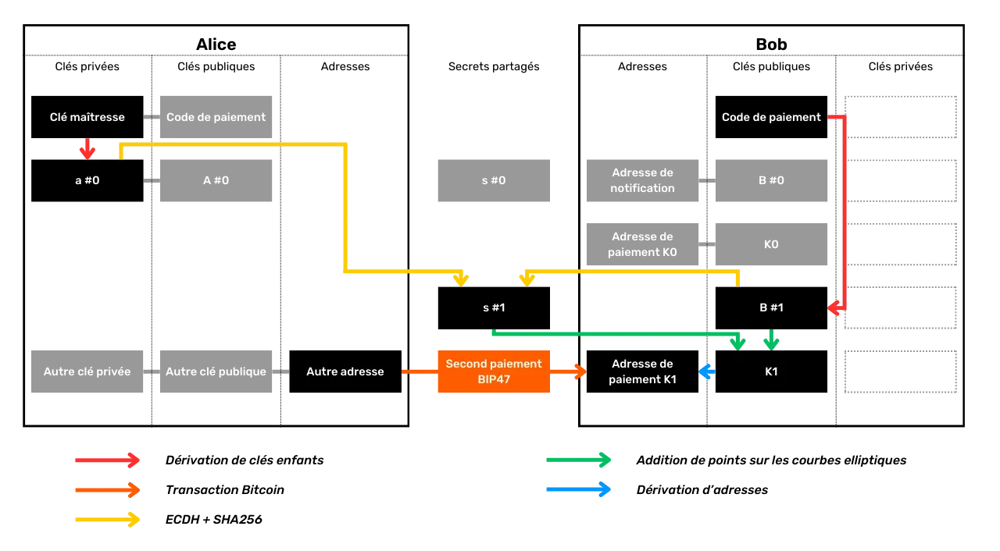


می‌تواند به این روش ادامه دهد و تا `2^32` آدرس خالی متعلق به Bob استخراج کند.


از دیدگاه بیرونی، نگاه کردن به Blockchain، به‌طور نظری غیرممکن است که یک پرداخت BIP47 را از یک پرداخت معمولی تشخیص داد. در اینجا یک مثال از تراکنش پرداخت BIP47 بر روی Testnet آمده است:


```text
94b2e59510f2e1fa78411634c98a77bbb638e28fb2da00c9f359cd5fc8f87254
```


به نظر می‌رسد یک تراکنش کلاسیک با یک ورودی مصرف‌شده، یک خروجی پرداخت و نرخ Exchange است:


### دریافت پرداخت BIP47 و استخراج کلید خصوصی


Alice به‌تازگی اولین پرداخت خود را به یک BIP47 خالی Address که متعلق به Bob است انجام داده است. حالا بیایید ببینیم چگونه Bob این پرداخت را دریافت می‌کند. همچنین خواهیم دید چرا Alice به کلید خصوصی Address که خودش به‌تازگی تولید کرده دسترسی ندارد و چگونه Bob این کلید را پیدا می‌کند تا بیت‌کوین‌هایی که به‌تازگی دریافت کرده را خرج کند.


به محض اینکه Bob اعلان تراکنش را از Alice دریافت می‌کند، کلید عمومی BIP47 $K0$ را حتی قبل از اینکه همتای او پرداختی ارسال کند، استخراج می‌کند. بنابراین، او هر پرداختی به Address مرتبط را مشاهده می‌کند. در واقع، او بلافاصله چندین آدرس را که مشاهده می‌کند استخراج می‌کند ($K0$, $K1$, $K2$, $K3$...). در اینجا نحوه استخراج این کلید عمومی $K0$ آمده است:


- Bob اولین کلید خصوصی دختر را که از کد پرداخت او مشتق شده است، انتخاب می‌کند. این کلید خصوصی $b$ نامیده می‌شود. این کلید با کلید عمومی $B$ مرتبط است که Alice محاسبات خود را در مرحله قبلی با آن انجام داده است:


$$ b $$


- Bob اولین کلید عمومی مشتق شده از کد پرداخت Alice را انتخاب می‌کند. این کلید $A$ نامیده می‌شود. این کلید با کلید خصوصی $a$ مرتبط است که Alice با آن محاسبات خود را انجام داده و تنها برای Alice شناخته شده است. Bob می‌تواند این فرآیند را انجام دهد، زیرا او کد پرداخت Alice را می‌داند که با تراکنش اطلاع‌رسانی برای او ارسال شده است:


$$ A = a \cdot G $$


- Bob نقطه مخفی $S$ را با جمع و دو برابر کردن نقاط روی منحنی بیضوی محاسبه می‌کند، با اعمال کلید خصوصی خود $b$ به کلید عمومی Alice یعنی $A$. در اینجا نیز، ECDH برای تضمین اینکه این نقطه $S$ برای هر دو Bob و Alice یکسان خواهد بود، استفاده می‌شود:


$$ S = b \cdot A $$


- به همان روشی که Alice عمل می‌کند، Bob نیز عرض از مبدأ این نقطه $S$ را جدا می‌کند. ما این مقدار را $Sx$ نام‌گذاری کرده‌ایم. او این مقدار را به تابع SHA256 می‌فرستد تا راز مشترک $s$ (با حروف کوچک) را پیدا کند:


$$ s = \text{SHA256}(Sx) $$


- به همان روشی که Alice عمل می‌کند، Bob نقطه $s-G$ را بر روی منحنی بیضوی محاسبه می‌کند. سپس این نقطه مخفی را به کلید عمومی خود $B$ اضافه می‌کند. او سپس یک نقطه جدید بر روی منحنی بیضوی به دست می‌آورد که آن را به عنوان کلید عمومی $K0$ تفسیر می‌کند:


$$ K0 = B + s \cdot G $$


هنگامی که Bob این کلید عمومی $K0$ را دارد، می‌تواند کلید خصوصی مرتبط را برای خرج کردن بیت‌کوین‌های خود استخراج کند. فقط او می‌تواند generate این کلید خصوصی را:


- Bob کلید خصوصی دخترش $b$ را که از کد پرداخت شخصی او استخراج شده است، جمع می‌کند. فقط او می‌تواند مقدار $b$ را به دست آورد. سپس $b$ را به راز مشترک $s$ اضافه می‌کند تا $k0$، کلید خصوصی $K0$ را به دست آورد:


$$ k0 = b + s $$


با تشکر از قانون گروه منحنی بیضوی، Bob دقیقاً کلید خصوصی مربوط به کلید عمومی استفاده شده توسط Alice را به دست می‌آورد. بنابراین داریم:


$$ K0 = k0 \cdot G $$


مراحل دریافت پرداخت BIP47 و محاسبه کلید خصوصی مربوطه را که به تازگی با هم مشاهده کردیم، خلاصه می‌کنم:


- Bob اولین کلید خصوصی دختر را که از کد پرداخت شخصی او مشتق شده است انتخاب می‌کند؛
- این یک نقطه مخفی روی منحنی بیضوی را با استفاده از ECDH از کلید عمومی اولین دختر که از کد رشته‌ای Alice مشتق شده است، محاسبه می‌کند؛
- از این نقطه مخفی برای محاسبه یک راز مشترک با SHA256 استفاده می‌کند؛
- او از این راز مشترک برای محاسبه یک نقطه مخفی جدید روی منحنی بیضوی استفاده می‌کند؛
- او این نقطه مخفی جدید را به کلید عمومی شخصی خود اضافه می‌کند؛
- او یک کلید عمومی جدید و زودگذر دریافت می‌کند، همان کلیدی که Alice اولین پرداخت خود را به آن ارسال خواهد کرد؛
- Bob کلید خصوصی مرتبط با این کلید عمومی موقت را با اضافه کردن کلید خصوصی دخترش که از کد پرداخت او و راز مشترک به دست آمده است، محاسبه می‌کند.


از آنجا که Alice نمی‌تواند $b$ (کلید خصوصی Bob) را به دست آورد، او قادر به تعیین $k0$ (کلید خصوصی مرتبط با دریافت BIP47 Bob در Address) نیست. به صورت شماتیک، می‌توانیم محاسبه راز مشترک $S$ را به صورت زیر نشان دهیم:


هنگامی که راز مشترک با ECDH پیدا شد، Alice و Bob کلید عمومی پرداخت BIP47 $K0$ را محاسبه می‌کنند و Bob همچنین کلید خصوصی مرتبط $k0$ را محاسبه می‌کند:


### بازپرداخت پرداخت BIP47


از آنجا که Bob کد پرداخت قابل استفاده مجدد Alice را می‌داند، او قبلاً تمام اطلاعات لازم برای ارسال بازپرداخت به او را دارد. او نیازی به تماس مجدد با Alice برای درخواست اطلاعات ندارد. او تنها باید با یک تراکنش اطلاع‌رسانی به او اطلاع دهد، تا او بتواند آدرس‌های BIP47 خود را با seed بازیابی کند، و سپس او می‌تواند تا `2^32` پرداخت به او ارسال کند.


ویژگی بازپرداخت به طور خاص به BIP47 مربوط می‌شود و یکی از مزایای آن نسبت به روش‌های دیگر مانند پرداخت‌های بی‌صدا است که در فصل‌های بعدی به آن‌ها خواهیم پرداخت.


سپس Bob می‌تواند به همان روشی که Alice برای او پرداخت‌ها را ارسال کرده بود، به او بازپرداخت کند. نقش‌ها معکوس شده‌اند:


*تشکر فراوان از [Fanis Michalakis](https://x.com/FanisMichalakis) برای ویرایش و مشاوره تخصصی‌اش در مقاله‌ای که الهام‌بخش نوشتن این فصل بود!


https://planb.network/tutorials/privacy/on-chain/paynym-bip47-a492a70b-50eb-4f95-a766-bae2c5535093

## پرداخت‌های خاموش


<chapterId>2871d594-414e-4598-a830-91c9eb84dfb8</chapterId>


BIP47 به دلیل ناکارآمدی در زنجیره به شدت مورد انتقاد قرار گرفته است. همانطور که در فصل قبل توضیح داده شد، برای هر گیرنده جدید نیاز به انجام یک تراکنش اطلاع‌رسانی دارد. این محدودیت در صورتی که قصد داشته باشیم یک کانال پرداخت پایدار با این گیرنده برقرار کنیم، ناچیز می‌شود. در واقع، یک تراکنش اطلاع‌رسانی واحد راه را برای تعداد تقریباً نامحدودی از پرداخت‌های BIP47 بعدی هموار می‌کند.


با این حال، در برخی شرایط، تراکنش اعلان می‌تواند برای کاربر مانعی ایجاد کند. بیایید مثالی از یک کمک مالی یک‌باره به یک گیرنده را در نظر بگیریم: با یک Bitcoin Address کلاسیک، یک تراکنش برای تکمیل کمک مالی کافی است. اما با BIP47، دو تراکنش مورد نیاز است: یکی برای اعلان و دیگری برای پرداخت واقعی. زمانی که تقاضا برای فضای بلاک کم است و کارمزد تراکنش‌ها پایین است، این مرحله اضافی معمولاً مشکلی ایجاد نمی‌کند. اما در زمان‌های ازدحام، کارمزد تراکنش‌ها می‌تواند برای یک پرداخت واحد بسیار بالا شود و هزینه را برای کاربر نسبت به یک تراکنش استاندارد Bitcoin دو برابر کند، که ممکن است برای کاربر غیرقابل قبول باشد.


برای موقعیت‌هایی که کاربر قصد دارد تنها چند پرداخت به یک شناسه ثابت انجام دهد، راه‌حل‌های دیگری توسعه یافته‌اند. این‌ها شامل پرداخت‌های خاموش هستند که در [BIP352](https://github.com/Bitcoin/bips/blob/master/bip-0352.mediawiki) توصیف شده‌اند. این پروتکل امکان استفاده از یک شناسه ثابت برای دریافت پرداخت‌ها را بدون ایجاد استفاده مجدد از Address و بدون نیاز به استفاده از تراکنش‌های اطلاع‌رسانی فراهم می‌کند. بیایید نگاهی به نحوه کار این پروتکل بیندازیم.


---
*برای درک کامل این فصل، ضروری است که با کارکردهای ECDH (الگوریتم دیفی-هلمن منحنی بیضوی) و استخراج کلید رمزنگاری در HD Wallet آشنا شوید. این مفاهیم به‌طور مفصل در فصل قبلی درباره BIP47 پوشش داده شده‌اند. من اینجا آن‌ها را تکرار نمی‌کنم. اگر هنوز با این مفاهیم آشنا نیستید، توصیه می‌کنم قبل از ادامه این فصل، به فصل قبلی مراجعه کنید. من به خطرات مرتبط با استفاده مجدد از آدرس‌های دریافت‌کننده و اهمیت داشتن یک شناسه منحصربه‌فرد برای دریافت پرداخت‌ها نمی‌پردازم.* فقط به چند نکته اشاره می‌کنم که می‌خواهم اینجا مطرح کنم.


---
### چرا اعلان را جابجا نکنیم؟


همان‌طور که در فصل BIP47 بحث شد، تراکنش اعلان دو عملکرد اصلی دارد:


- گیرنده را مطلع می‌کند ؛
- این کد پرداخت فرستنده را منتقل می‌کند.


ممکن است کسی به سادگی فکر کند که این فرآیند اطلاع‌رسانی می‌تواند با off-chain انجام شود. در تئوری، این کاملاً امکان‌پذیر است: تنها کاری که گیرنده باید انجام دهد این است که یک وسیله ارتباطی برای دریافت کدهای پرداخت BIP47 از فرستندگان مشخص کند. با این حال، دو مشکل عمده در این رویکرد وجود دارد:


- اولاً، این کار فرآیند انتقال کد را به پروتکل ارتباطی دیگری منتقل می‌کند. مشکلات مربوط به هزینه و محرمانگی Exchange باقی می‌مانند، اما به سادگی به این پروتکل جدید منتقل می‌شوند. از نظر محرمانگی، این می‌تواند پیوندی بین هویت کاربر و فعالیت‌های زنجیره‌ای ایجاد کند، که ما به دنبال اجتناب از آن با انجام اعلان به طور مستقیم بر روی Blockchain هستیم. علاوه بر این، انجام اعلان خارج از Blockchain خطرات سانسور (مانند مسدود کردن وجوه) را معرفی می‌کند که در Bitcoin وجود ندارند؛
- ثانیاً، این موضوع یک مشکل بازیابی ایجاد می‌کند. با BIP47، گیرنده باید کدهای پرداخت فرستندگان را بداند تا به وجوه دسترسی پیدا کند. این موضوع در زمان دریافت درست است، اما همچنین در صورت بازیابی وجوه از طریق seed اگر Wallet گم شود، نیز صدق می‌کند. با اعلان‌های زنجیره‌ای، این ریسک اجتناب می‌شود، زیرا کاربر می‌تواند تراکنش‌های اعلان را تنها با دانستن seed خود بازیابی و رمزگشایی کند. با این حال، اگر اعلان خارج از Blockchain انجام شود، کاربر باید یک نسخه پشتیبان پویا از تمام کدهای پرداخت دریافتی نگه دارد که برای کاربر معمولی غیرعملی است.


همه این محدودیت‌ها استفاده از اعلان‌های زنجیره‌ای را برای BIP47 ضروری می‌سازد. با این حال، Silent Payments به دنبال اجتناب از این مرحله اعلان زنجیره‌ای به دلیل هزینه آن است. بنابراین، راه‌حل اتخاذ شده این است که اعلان را جابجا نکنیم، بلکه آن را به‌طور کامل حذف کنیم. برای دستیابی به این هدف، باید یک سازش پذیرفته شود: اسکن کردن. برخلاف BIP47، که در آن کاربر دقیقاً می‌داند که به لطف تراکنش‌های اعلان کجا می‌تواند وجوه خود را پیدا کند، با Silent Payments، کاربر باید تمام تراکنش‌های موجود Bitcoin را بررسی کند تا هرگونه پرداختی که برای او در نظر گرفته شده را شناسایی کند. برای کاهش این بار عملیاتی، جستجوی Silent Payments فقط به تراکنش‌هایی محدود می‌شود که احتمالاً حاوی چنین پرداخت‌هایی هستند، یعنی آن‌هایی که حداقل یک خروجی Taproot P2TR دارند. اسکن همچنین به‌طور انحصاری بر روی تراکنش‌هایی از تاریخ ایجاد Wallet متمرکز است (نیازی به اسکن تراکنش‌هایی که به سال 2009 برمی‌گردند نیست اگر Wallet در سال 2024 ایجاد شده باشد).


بنابراین می‌توانید ببینید چرا BIP47 و Silent Payments، اگرچه هدف مشابهی دارند، شامل مصالحه‌های متفاوتی می‌شوند و بنابراین **در واقع نیازهای استفاده متمایزی را برآورده می‌کنند**. برای پرداخت‌های یک‌باره، مانند کمک‌های مالی یک‌باره، Silent Payments به دلیل هزینه کمتر مناسب‌تر هستند. از سوی دیگر، برای تراکنش‌های منظم به همان گیرنده، مانند در مورد پلتفرم‌های Exchange یا استخرهای Mining، ممکن است BIP47 ترجیح داده شود.


بیایید نگاهی به عملکرد فنی Silent Payments بیندازیم تا بهتر بفهمیم چه چیزی در خطر است. برای این کار، پیشنهاد می‌کنم همان رویکرد سند توضیحی BIP352 را اتخاذ کنیم. ما به تدریج محاسباتی که باید انجام شود را عنصر به عنصر تجزیه خواهیم کرد و هر افزودنی جدید را توجیه خواهیم کرد.


### چند مفهوم برای درک


قبل از شروع، مهم است که اشاره کنیم Silent Payments به‌طور انحصاری به استفاده از انواع اسکریپت P2TR (*Pay to Taproot*) متکی هستند. برخلاف BIP47، نیازی به استخراج آدرس‌های دریافت از کلیدهای عمومی فرزند با استفاده از هش نیست. در استاندارد P2TR، کلید عمومی تغییر یافته به‌طور مستقیم و بدون رمزگذاری در Address استفاده می‌شود. بنابراین، یک دریافت Taproot در Address اساساً یک کلید عمومی با مقداری فراداده است. این کلید عمومی تغییر یافته، تجمیعی از دو کلید عمومی دیگر است: یکی که امکان خرج مستقیم و سنتی را از طریق یک امضای ساده فراهم می‌کند، و دیگری که نمایانگر Merkle Root از MAST است، که خرج کردن را منوط به برآورده شدن یکی از شرایطی که ممکن است در Merkle Tree درج شده باشد، مجاز می‌سازد.


دو دلیل اصلی برای تصمیم به محدود کردن Silent Payments به طور انحصاری به Taproot وجود دارد:


- اولاً، این امر به طور قابل توجهی اجرای نرم‌افزار پرتفوی و ارتقاء‌های آینده را تسهیل می‌کند، زیرا تنها یک استاندارد نیاز به رعایت دارد؛
- ثانیاً، این رویکرد به بهبود ناشناس‌بودن کاربران کمک می‌کند با تشویق آن‌ها به عدم تقسیم خود بین انواع مختلف اسکریپت‌ها، که اثر انگشت‌های متمایز generate در تحلیل زنجیره‌ای را ایجاد می‌کند (برای اطلاعات بیشتر در مورد این مفهوم، لطفاً به فصل ۴ از بخش ۲ مراجعه کنید).


### اشتقاق ساده یک کلید عمومی پرداخت‌های خاموش


بیایید با یک مثال ساده شروع کنیم تا به اصل نحوه کار SPها (پرداخت‌های خاموش) برسیم. بیایید Alice و Bob را در نظر بگیریم، دو کاربر Bitcoin. Alice می‌خواهد بیت‌کوین‌ها را به Bob بر روی یک Address دریافت‌کننده خالی ارسال کند. سه هدف در این فرآیند وجود دارد:


- Alice باید بتواند یک Address خالی را generate کند؛
- Bob باید بتواند یک پرداخت ارسال شده به این Address خاص را شناسایی کند؛
- Bob باید بتواند کلید خصوصی مرتبط با این Address را به دست آورد تا بتواند وجوه خود را خرج کند.


Alice دارای یک UTXO در Bitcoin Wallet امن خود با جفت کلید زیر است:


- $a$: کلید خصوصی ؛
- $A$: کلید عمومی ($A = a \cdot G$)


Bob دارای یک SP Address است که آن را در اینترنت منتشر کرده است با:


- $b$: کلید خصوصی ؛
- $B$: کلید عمومی ($B = b \cdot G$)


با بازیابی Bob's Address، Alice قادر است یک Address جدید خالی که متعلق به Bob است را با استفاده از ECDH محاسبه کند. بیایید این Address را $P$ بنامیم:


$$ P = B + \text{Hash}(a \cdot B) \cdot G $$


در این معادله، Alice به سادگی حاصل‌ضرب اسکالر کلید خصوصی خود $a$ و کلید عمومی Bob $B$ را محاسبه کرده است. او این نتیجه را به یک تابع Hash که برای همه شناخته شده است، وارد کرده است. مقدار حاصل سپس به صورت اسکالر با نقطه تولید $G$ از منحنی بیضوی `secp256k1` ضرب می‌شود. در نهایت، Alice نقطه حاصل را به کلید عمومی Bob $B$ اضافه می‌کند. زمانی که Alice این Address $P$ را دارد، از آن به عنوان خروجی در یک تراکنش استفاده می‌کند، به عبارت دیگر، او بیت‌کوین‌ها را به آن ارسال می‌کند.


> *در زمینه پرداخت‌های بی‌صدا، تابع "Hash" به تابع SHA256 Hash اشاره دارد که به‌طور خاص با `BIP0352/SharedSecret` برچسب‌گذاری شده است. این امر تضمین می‌کند که هش‌های تولید شده منحصراً برای این پروتکل هستند و نمی‌توانند در زمینه‌های دیگر استفاده مجدد شوند، در حالی که حفاظت اضافی در برابر استفاده مجدد از نانس‌ها در امضاها ارائه می‌دهد. این استاندارد مطابق با [مشخص شده در BIP340 برای امضاهای اشنور](https://github.com/Bitcoin/bips/blob/master/bip-0340.mediawiki) بر روی `secp256k1` است.*
با تشکر از ویژگی‌های منحنی بیضوی که ECDH بر آن استوار است، می‌دانیم که:


$$ a \cdot B = b \cdot A $$


بنابراین Bob قادر خواهد بود تا Address دریافت‌کننده‌ای را که Alice بیت‌کوین‌ها را به آن ارسال کرده است، محاسبه کند. برای انجام این کار، او تمامی تراکنش‌های Bitcoin را که معیارهای Silent Payments را برآورده می‌کنند، نظارت کرده و محاسبه زیر را به هر یک از آن‌ها اعمال می‌کند تا ببیند آیا پرداخت به او اختصاص داده شده است یا خیر (*اسکن*):


$$ P' = B + \text{Hash}(b \cdot A) \cdot G $$


وقتی او تراکنش Alice را اسکن می‌کند، متوجه می‌شود که $P'$ برابر با $P$ است. بنابراین می‌داند که پرداخت به او اختصاص داده شده است:


$$ P' = B + \text{Hash}(b \cdot A) \cdot G = B + \text{Hash}(a \cdot B) \cdot G = P $$


از اینجا، Bob قادر خواهد بود کلید خصوصی $p$ را محاسبه کند که اجازه می‌دهد Address $P$ خرج شود:


$$ p = (b + \text{Hash}(b \cdot A)) \bmod n $$


همانطور که می‌بینید، برای محاسبه این کلید خصوصی $p$، باید کلید خصوصی $b$ را داشته باشید. تنها Bob این کلید خصوصی $b$ را دارد. بنابراین، او تنها کسی خواهد بود که قادر به خرج کردن بیت‌کوین‌هایی است که به Silent Payments او Address ارسال شده‌اند.


*افسانه:*


- $B$ : کلید عمومی/ثابت Address منتشر شده توسط Bob
- $b$ : کلید خصوصی Bob
- $A$ : کلید عمومی UTXO از Alice به عنوان ورودی تراکنش استفاده شده است
- $a$ : کلید خصوصی Alice
- $G$ : نقطه تولیدی منحنی بیضوی `secp256k1`
- $\text{SHA256}$ : تابع SHA256 Hash با برچسب `BIP0352/SharedSecret`
- $s$ : راز مشترک ECDH
- $P$ : کلید عمومی/منحصر به فرد Address برای پرداخت به Bob


در اینجا یک رویکرد اولیه و ساده برای استفاده از Bob's static Address، که با $B$ نشان داده شده است، برای استخراج یک Address منحصر به فرد $P$ برای ارسال بیت‌کوین‌ها به آن ارائه شده است. با این حال، این روش بسیار ساده‌انگارانه است و دارای چندین نقص است که باید اصلاح شوند. اولین مشکل این است که در این طرح، Alice نمی‌تواند چندین خروجی به Bob در یک تراکنش ایجاد کند.


### چگونه چندین خروجی ایجاد کنم؟


در مثال بخش قبلی، Alice یک خروجی واحد ایجاد می‌کند که به Bob در Address منحصر به فرد او $P$ خواهد رفت. با انتخاب همان ورودی، برای Alice غیرممکن است که دو آدرس خالی جداگانه برای Bob ایجاد کند، زیرا روش استفاده شده همیشه به همان نتیجه برای $P$ منجر می‌شود، یعنی همان Address. با این حال، ممکن است بسیاری از موقعیت‌ها وجود داشته باشد که Alice بخواهد پرداخت خود به Bob را به چندین مقدار کوچکتر تقسیم کند و در نتیجه چندین UTXO ایجاد کند. بنابراین لازم است روشی برای دستیابی به این هدف پیدا شود.


برای دستیابی به این هدف، ما قصد داریم محاسبه‌ای که Alice برای استخراج $P$ انجام می‌دهد را کمی تغییر دهیم، به طوری که او بتواند generate دو آدرس متمایز برای Bob، یعنی $P_0$ و $P_1$ را انجام دهد.


برای تغییر محاسبه و به‌دست‌آوردن ۲ آدرس مختلف، به‌سادگی یک عدد صحیح اضافه کنید که نتیجه را تغییر دهد. بنابراین، Alice عدد $0$ را به محاسبه خود اضافه می‌کند تا Address $P_0$ را به‌دست‌آورد و $1$ را اضافه می‌کند تا Address $P_1$ را به‌دست‌آورد. بیایید این عدد صحیح را $i$ بنامیم:


$$ P_i = B + \text{Hash}(a \cdot B \text{ ‖ } i) \cdot G $$


فرآیند محاسبه نسبت به روش قبلی بدون تغییر باقی می‌ماند، به جز اینکه این بار Alice قبل از ادامه با Hash، $a \cdot B$ را با $i$ الحاق می‌کند. سپس به سادگی $i$ را تغییر می‌دهید تا یک Address جدید متعلق به Bob به دست آورید. برای مثال:


$$ P_0 = B + \text{Hash}(a \cdot B \text{ ‖ } 0) \cdot G $$


$$ P_1 = B + \text{Hash}(a \cdot B \text{ ‖ } 1) \cdot G $$


هنگامی که Bob برای پرداخت‌های خاموشی که برای او در نظر گرفته شده‌اند، Blockchain را اسکن می‌کند، ابتدا با استفاده از $i = 0$ برای Address $P_0$ شروع می‌کند. اگر هیچ پرداختی در $P_0$ پیدا نکند، نتیجه می‌گیرد که این تراکنش حاوی هیچ پرداخت خاموشی برای او نیست و اسکن را رها می‌کند. با این حال، اگر $P_0$ معتبر باشد و حاوی پرداختی برای او باشد، با $P_1$ در همان تراکنش ادامه می‌دهد تا بررسی کند که آیا Alice پرداخت دومی انجام داده است یا خیر. اگر $P_1$ نامعتبر باشد، جستجو برای این تراکنش را متوقف می‌کند؛ در غیر این صورت، به آزمایش مقادیر متوالی $i$ ادامه می‌دهد:


$$ P_0 = B + \text{Hash}(b \cdot A \text{ ‖ } 0) \cdot G $$


$$ P_1 = B + \text{Hash}(b \cdot A \text{ ‖ } 1) \cdot G $$


از آنجا که Bob بلافاصله در $i = 0$ متوقف می‌شود اگر $P_0$ کار نکند، استفاده از این عدد صحیح تقریباً هیچ بار عملیاتی اضافی بر روی Bob برای مرحله اسکن تراکنش اضافه نمی‌کند.


سپس Bob می‌تواند کلیدهای خصوصی را به همان روش محاسبه کند:


$$
p_0 = (b + \text{hash}(b \cdot A \text{ ‖ } 0)) \bmod n
$$


$$
p_1 = (b + \text{hash}(b \cdot A \text{ ‖ } 1)) \bmod n
$$


*افسانه:*


- $B$ : کلید عمومی/ثابت Address منتشر شده توسط Bob
- $b$ : کلید خصوصی Bob
- $A$ : کلید عمومی Alice's UTXO استفاده شده به عنوان ورودی تراکنش
- $a$ : کلید خصوصی Alice
- $G$ : نقطه تولید منحنی بیضوی `secp256k1`
- $\text{SHA256}$ : تابع SHA256 Hash با برچسب `BIP0352/SharedSecret`
- $s_0$ : اولین راز مشترک ECDH
- $s_1$ : دومین رمز مشترک ECDH
- $P_0$ : اولین کلید عمومی / Address منحصر به فرد برای پرداخت به Bob
- $P_1$ : کلید عمومی دوم / Address منحصر به فرد برای پرداخت به Bob


با این روش، ما در حال شروع به دستیابی به یک پروتکل خوب هستیم، اما هنوز چند چالش برای غلبه بر آنها وجود دارد، از جمله جلوگیری از استفاده مجدد از Address.


### چگونه از استفاده مجدد Address جلوگیری کنیم؟


همان‌طور که در بخش‌های قبلی دیدیم، Alice از جفت کلیدی استفاده می‌کند که UTXO او را ایمن می‌کند، که او برای محاسبه راز مشترک ECDH با Bob خرج خواهد کرد. این راز به او امکان می‌دهد تا Address منحصر به فرد $P_0$ را استخراج کند. با این حال، جفت کلید ($a$, $A$) که توسط Alice استفاده می‌شود می‌تواند چندین UTXO را ایمن کند اگر او این Address را چندین بار استفاده کرده باشد. در صورتی که Alice دو پرداخت به Bob با استفاده از Address ثابت $B$ و دو UTXO که با همان کلید $A$ ایمن شده‌اند انجام دهد، این منجر به استفاده مجدد از Address برای Bob خواهد شد.


> *استفاده مجدد از Address از نظر محرمانگی کاربر یک عمل بسیار بد است. برای فهمیدن دلیل آن، به شما توصیه می‌کنم بخش‌های اول این دوره آموزشی را مرور کنید.*
در واقع، از آنجا که Address $P_0$ منحصر به فرد از $A$ و $B$ مشتق شده است، اگر Alice یک Address دوم برای پرداخت دوم به $B$ با همان کلید $A$ مشتق کند، او دقیقاً به همان Address $P_0$ خواهد رسید. برای جلوگیری از این ریسک و جلوگیری از استفاده مجدد از Address در پرداخت‌های خاموش، باید محاسبات خود را کمی تغییر دهیم.


آنچه ما می‌خواهیم این است که هر UTXO که به عنوان ورودی توسط Alice مصرف می‌شود، یک Address منحصر به فرد در سمت Bob ارائه دهد، حتی اگر چندین UTXO توسط همان جفت کلید ایمن شده باشند. بنابراین تنها کاری که باید انجام دهیم این است که هنگام محاسبه Address منحصر به فرد $P_0$، یک مرجع به UTXO اضافه کنیم. این مرجع به سادگی Hash از UTXO مصرف شده به عنوان ورودی خواهد بود:


$$ \text{inputHash} = \text{Hash}(\text{outpoint} \text{ ‖ } A) $$


و Alice این مرجع را به ورودی محاسبه خود از $P_0$ منحصر به فرد Address اضافه خواهد کرد:


$$ P_0 = B + \text{Hash}(\text{inputHash} \cdot a \cdot B \text{ ‖ } 0) \cdot G $$


هنگام اسکن، Bob می‌تواند $\text{inputHash}$ را نیز اضافه کند، زیرا تنها کاری که باید انجام دهد مشاهده تراکنش برای استنتاج $\text{outpoint}$ است:


$$ P_0 = B + \text{Hash}(\text{inputHash} \cdot b \cdot A \text{ ‖ } 0) \cdot G $$


وقتی یک $P_0$ معتبر پیدا می‌کند، می‌تواند کلید خصوصی $p_0$ متناظر را محاسبه کند:


$$
p_0 = (b + \text{hash}(\text{inputHash} \cdot b \cdot A \text{ ‖ } 0)) \bmod n
$$


*افسانه:*


- $B$ : کلید عمومی/ثابت Address منتشر شده توسط Bob
- $b$ : کلید خصوصی Bob
- $A$ : کلید عمومی UTXO از Alice به عنوان ورودی تراکنش استفاده شده است
- $a$ : کلید خصوصی Alice
- $H$ : UTXO Hash به عنوان ورودی استفاده شد
- $G$ : نقطه تولید منحنی بیضوی `secp256k1`
- $\text{SHA256}$ : تابع SHA256 Hash با برچسب `BIP0352/SharedSecret`
- $s_0$ : اولین راز مشترک ECDH
- $P_0$ : اولین کلید عمومی / Address منحصر به فرد برای پرداخت به Bob


در حال حاضر، محاسبات ما فرض می‌کنند که Alice از یک ورودی برای تراکنش خود استفاده می‌کند. با این حال، او باید قادر باشد از چندین ورودی استفاده کند. بنابراین، در سمت Bob، برای هر تراکنشی که شامل چندین ورودی است، او به‌طور نظری باید ECDH را برای هر ورودی محاسبه کند تا تعیین کند آیا پرداختی برای او در نظر گرفته شده است یا خیر. این روش رضایت‌بخش نیست، بنابراین باید راه‌حلی پیدا کنیم تا حجم کار را کاهش دهیم!


### تغییر کلیدهای عمومی به ورودی‌ها


برای حل این مشکل، به جای استفاده از جفت کلید محافظ یک ورودی خاص در سمت Alice، از مجموع تمام جفت کلیدهای استفاده شده در ورودی‌های تراکنش استفاده خواهیم کرد. سپس این مجموع به عنوان یک جفت کلید جدید در نظر گرفته می‌شود. این تکنیک به عنوان "تغییر" شناخته می‌شود.


به عنوان مثال، بیایید تصور کنیم که تراکنش Alice دارای 3 ورودی است که هر کدام با یک جفت کلید متفاوت ایمن شده‌اند:


- $a_0$ برای ایمن‌سازی ورودی #0 استفاده می‌شود؛
- $a_1$ برای ایمن‌سازی ورودی شماره ۱ استفاده می‌شود؛
- $a_2$ ورودی شماره #2 را ایمن می‌کند.


با پیروی از روشی که قبلاً توضیح داده شد، Alice باید یک جفت کلید از میان $a_0$، $a_1$ و $a_2$ انتخاب کند تا راز ECDH را محاسبه کند و generate پرداخت واحد Address $P$ را از Bob's static Address $B$ انجام دهد. با این حال، این روش نیاز دارد که Bob هر امکان را به صورت متوالی آزمایش کند، از $a_0$ شروع کرده و سپس $a_1$ و به همین ترتیب ادامه دهد، تا زمانی که جفتی را شناسایی کند که یک $P$ Address معتبر تولید کند. این فرآیند نیاز دارد که Bob محاسبه ECDH را بر روی تمام ورودی‌های تمام تراکنش‌ها اجرا کند، که بار عملیاتی اسکن را به طور قابل توجهی افزایش می‌دهد.


برای جلوگیری از این، از Alice خواهیم خواست تا $P$ را با استفاده از مجموع تمام کلیدهای ورودی محاسبه کند. با استفاده از مثال ما، کلید خصوصی تغییر یافته $a$ به صورت زیر محاسبه می‌شود:


$$ a = a_0 + a_1 + a_2 $$


به همین ترتیب، Alice و Bob می‌توانند کلید عمومی تغییر یافته را محاسبه کنند:


$$ A = A_0 + A_1 + A_2 $$


با این روش، Bob تنها نیاز دارد که مجموع کلیدهای عمومی تراکنش را محاسبه کند، سپس تنها از $A$ برای محاسبه راز ECDH استفاده کند، که به طور قابل توجهی تعداد محاسبات مورد نیاز برای مرحله اسکن را کاهش می‌دهد.


با این حال، بخش قبلی را به خاطر بسپارید. ما $\text{inputHash}$ Hash را به محاسبات خود اضافه کرده بودیم، که به عنوان Nonce استفاده می‌شود تا از استفاده مجدد Address جلوگیری شود:


$$ \text{inputHash} = \text{Hash}(\text{outpoint} \text{ ‖ } A) $$


اما اگر چندین ورودی در یک تراکنش داشته باشید، باید بتوانید تعیین کنید که کدام $\text{outpoint}$ در این محاسبه انتخاب شده است. طبق BIP352، معیار انتخاب $\text{outpoint}$ این است که کوچک‌ترین به ترتیب لغت‌نامه‌ای انتخاب شود، به این معنی که UTXO که ابتدا در ترتیب الفبایی ظاهر می‌شود، انتخاب شود. این روش استاندارد می‌کند که UTXO در هر تراکنش انتخاب شود. به عنوان مثال، اگر این کوچک‌ترین $\text{outpoint}$ به ترتیب لغت‌نامه‌ای $\text{outpoint}_L$ باشد، محاسبه $\text{inputHash}$ به صورت زیر خواهد بود:


$$ \text{inputHash} = \text{Hash}(\text{outpoint}_L \text{ ‖ } A) $$


محاسبات سپس مشابه آنچه در بخش قبلی ارائه شد باقی می‌مانند، به جز اینکه کلید خصوصی $a$ و کلید عمومی متناظر آن $A$ دیگر یک جفت برای ایمن‌سازی یک ورودی واحد نیستند، بلکه اکنون نمایانگر تغییر برای تمام جفت‌های کلید در ورودی‌ها هستند.


### کلیدهای هزینه و اسکن را جدا کنید


در حال حاضر، ما به کلید عمومی منحصر به فرد Silent Payment static Address $B$ اشاره کرده‌ایم. به یاد داشته باشید، این کلید عمومی $B$ است که Alice برای ایجاد راز مشترک ECDH استفاده می‌کند، که به نوبه خود پرداخت منحصر به فرد Address $P$ را محاسبه می‌کند. Bob از این کلید عمومی $B$ و کلید خصوصی مربوطه $b$ برای مرحله اسکن استفاده می‌کند. اما او همچنین از کلید خصوصی $b$ برای محاسبه کلید خصوصی $p$ که امکان خرج کردن از Address $P$ را فراهم می‌کند، استفاده خواهد کرد.


عیب این روش این است که کلید خصوصی $b$، که برای محاسبه تمام کلیدهای خصوصی آدرس‌هایی که پرداخت‌های بی‌صدا دریافت کرده‌اند استفاده می‌شود، همچنین توسط Bob برای اسکن تراکنش‌ها استفاده می‌شود. این مرحله نیاز دارد که کلید $b$ در نرم‌افزار Wallet متصل به اینترنت در دسترس باشد، که آن را بیشتر در معرض خطر سرقت قرار می‌دهد تا نگه‌داشتن آن روی Cold Wallet. ایده‌آل این است که بتوان از پرداخت‌های بی‌صدا بهره‌مند شد در حالی که کلید خصوصی $b$، که دسترسی به تمام کلیدهای خصوصی دیگر را کنترل می‌کند، به صورت امن روی Hardware Wallet نگه داشته شود. خوشبختانه، پروتکل به گونه‌ای تطبیق داده شده است که این امکان را فراهم می‌کند.


برای انجام این کار، BIP352 نیاز دارد که گیرنده از ۲ جفت کلید مختلف استفاده کند:


- \(b_{\text{spend}}\): برای محاسبه کلیدهای خصوصی آدرس‌های پرداخت منحصربه‌فرد؛
- b_{\text{scan}}$: برای یافتن آدرس‌های پرداخت منحصربه‌فرد.


به این ترتیب، Bob می‌تواند کلید خصوصی $b_{\text{spend}}$ را روی یک Hardware Wallet نگه دارد و از کلید خصوصی $b_{\text{scan}}$ روی نرم‌افزار آنلاین برای پیدا کردن پرداخت‌های خاموش خود استفاده کند، بدون اینکه $b_{\text{spend}}$ را فاش کند. از سوی دیگر، کلیدهای عمومی $B_{\text{scan}}$ و $B_{\text{spend}}$ هر دو به صورت عمومی فاش می‌شوند، زیرا در Address ثابت Bob $B$ قرار دارند:


$$ B = B_{\text{scan}} \text{ ‖ } B_{\text{spend}} $$


برای محاسبه پرداخت منحصر به فرد Address $P_0$ که به Bob تعلق دارد، Alice اکنون محاسبه زیر را انجام خواهد داد:


$$ P_0 = B_{\text{spend}} + \text{Hash}(\text{inputHash} \cdot a \cdot B_{\text{scan}} \text{ ‖ } 0) \cdot G $$


برای یافتن پرداخت‌هایی که به او اختصاص داده شده است، Bob محاسبه زیر را انجام خواهد داد:


$$ P_0 = B_{\text{spend}} + \text{Hash}(\text{inputHash} \cdot b_{\text{scan}} \cdot A \text{ ‖ } 0) \cdot G $$


همان‌طور که می‌بینید، تا کنون Bob نیازی به استفاده از $b_{\text{spend}}$ نداشته است، که بر روی Hardware Wallet او قرار دارد. وقتی او می‌خواهد $P_0$ را خرج کند، می‌تواند محاسبه زیر را برای یافتن کلید خصوصی $p_0$ انجام دهد:


$$ p_0 = (b_{\text{spend}} + \text{Hash}(\text{inputHash} \cdot b_{\text{scan}} \cdot A \text{ ‖ } 0)) \bmod n $$


*افسانه:*


- $B_{\text{scan}}$: کلید اسکن عمومی Bob (Address ثابت)
- $b_{\text{scan}}$ : کلید اسکن خصوصی Bob
- $B_{\text{spend}}$ : کلید هزینه عمومی Bob (ثابت Address)
- $b_{\text{spend}}$ : کلید هزینه خصوصی Bob
- $A$ : مجموع ورودی‌های کلید عمومی (تغییر)
- $a$ : کلید خصوصی مربوط به کلید عمومی تغییر یافته
- $H$ : کوچکترین UTXO (به ترتیب لغوی) که به عنوان ورودی استفاده شده است Hash
- $G$ : نقطه تولید منحنی بیضوی `secp256k1`
- $\text{SHA256}$ : تابع SHA256 Hash با برچسب `BIP0352/SharedSecret`
- $s_0$ : اولین راز مشترک ECDH
- $P_0$ : اولین کلید عمومی / Address منحصر به فرد برای پرداخت به Bob


### استفاده از آدرس‌های SP با یک برچسب


بنابراین Bob دارای یک Address $B$ ثابت برای پرداخت‌های بی‌صدا مانند:


$$ B = B_{\text{scan}} \text{ ‖ } B_{\text{spend}} $$


مشکل این روش این است که به شما اجازه نمی‌دهد پرداخت‌های مختلف ارسال شده به این Address را تفکیک کنید. به عنوان مثال، اگر Bob دو مشتری مختلف برای کسب‌وکار خود داشته باشد و بخواهد پرداخت‌ها به هر یک را متمایز کند، به دو آدرس استاتیک مختلف نیاز خواهد داشت. یک راه‌حل ساده‌لوحانه با رویکرد فعلی این است که Bob دو کیف پول جداگانه ایجاد کند، هر کدام با Address استاتیک خود، یا حتی دو آدرس استاتیک مختلف در همان Wallet ایجاد کند. با این حال، این راه‌حل نیازمند اسکن کل Blockchain دو بار (یک بار برای هر Address) است تا پرداخت‌های مقصد هر Address به طور جداگانه شناسایی شود. این اسکن دوگانه به طور غیرمنطقی بار عملیاتی Bob را افزایش می‌دهد.


برای حل این مشکل، BIP352 از یک سیستم برچسب‌گذاری استفاده می‌کند که امکان آدرس‌های استاتیک مختلف را فراهم می‌کند، بدون اینکه به طور غیرمنطقی بار کاری یافتن پرداخت‌های خاموش بر روی Blockchain را افزایش دهد. برای انجام این کار، یک عدد صحیح $m$ به کلید خرج عمومی $B_{\text{spend}}$ اضافه می‌کنیم. این عدد صحیح می‌تواند برای اولین Address استاتیک مقدار $1$ را بگیرد، سپس برای دومین مقدار $2$ و به همین ترتیب. کلیدهای خرج $B_{\text{spend}}$ اکنون $B_m$ نامیده می‌شوند و به این صورت ساخته خواهند شد:


$$ B_m = B_{\text{spend}} + \text{Hash}(b_{\text{scan}} \text{ ‖ } m) \cdot G $$


به عنوان مثال، برای کلید هزینه اول با برچسب $1$ :


$$ B_1 = B_{\text{spend}} + \text{Hash}(b_{\text{scan}} \text{ ‖ } 1) \cdot G $$


استاتیک Address منتشر شده توسط Bob اکنون شامل $B_{\text{scan}}$ و $B_m$ خواهد بود. به عنوان مثال، اولین استاتیک Address با برچسب $1$ خواهد بود :


$$ B = B_{\text{scan}} \text{ ‖ } B_1 $$


> *ما فقط از برچسب ۱ شروع می‌کنیم زیرا برچسب ۰ برای تغییر رزرو شده است.*
Alice، به نوبه خود، پرداخت یکباره Address $P$ را به همان شیوه قبلی محاسبه خواهد کرد، اما با استفاده از $B_1$ جدید به جای $B_{\text{spend}}$ :


$$ P_0 = B_1 + \text{Hash}(\text{inputHash} \cdot a \cdot B_{\text{scan}} \text{ ‖ } 0) \cdot G $$


در واقع، Alice حتی لزوماً نمی‌داند که Bob دارای برچسب Address است، زیرا او به سادگی از قسمت دوم Address ثابت که او ارائه داده استفاده می‌کند، و در این مورد، این مقدار $B_1$ است نه $B_{text{spend}}$.


برای اسکن پرداخت‌ها، Bob همیشه از مقدار اولیه استاتیک Address خود با $B_{\text{spend}}$ به این صورت استفاده خواهد کرد:


$$ P_0 = B_{\text{spend}} + \text{Hash}(\text{inputHash} \cdot b_{\text{scan}} \cdot A \text{ ‖ } 0) \cdot G $$


سپس، او به سادگی مقداری که برای $P_0$ پیدا کرده است را یکی یکی از هر خروجی کم می‌کند. سپس بررسی می‌کند که آیا یکی از نتایج این تفریق‌ها با مقدار یکی از برچسب‌هایی که در پورتفولیوی خود استفاده می‌کند مطابقت دارد یا خیر. اگر، به عنوان مثال، خروجی شماره ۴ با برچسب $1$ مطابقت داشته باشد، این به این معنی است که این خروجی یک پرداخت خاموش مرتبط با برچسب ثابت Address $B_1$ است:


$$ Out_4 - P_0 = \text{Hash}(b_{\text{scan}} \text{ ‖ } 1) \cdot G $$


این کار می‌کند زیرا :


$$ B_1 = B_{\text{spend}} + \text{Hash}(b_{\text{scan}} \text{ ‖ } 1) \cdot G $$


با تشکر از این روش، Bob می‌تواند از تعداد زیادی آدرس ثابت ($B_1$, $B_2$, $B_3$...) که همگی از آدرس ثابت پایه‌ای او Address ($B = B_{\text{scan}} \text{ ‖ } B_{\text{spend}}$) مشتق شده‌اند، استفاده کند تا استفاده را جدا نگه دارد.


لطفاً توجه داشته باشید که این جداسازی آدرس‌های استاتیک تنها از دیدگاه مدیریت پرتفوی شخصی معتبر است و هویت‌ها را جدا نمی‌کند. از آنجا که همه آن‌ها دارای $B_{\text{scan}}$ یکسانی هستند، بسیار آسان است که تمام آدرس‌های استاتیک را با هم مرتبط کرده و نتیجه‌گیری کنیم که آن‌ها به یک نهاد واحد تعلق دارند.


*افسانه:*


- $B_{\text{scan}}$: کلید اسکن عمومی Bob (ثابت Address)
- $b_{\text{scan}}$ : کلید اسکن خصوصی Bob
- $B_{\text{spend}}$ : کلید هزینه عمومی Bob (اولیه Address)
- $B_m$ : کلید هزینه عمومی Bob برچسب‌گذاری شده (ثابت Address)
- $b_m$: کلید هزینه خصوصی Bob برچسب‌گذاری شده است
- $A$ : مجموع ورودی‌های کلید عمومی (تغییر)
- $a$ : کلید خصوصی مربوط به کلید عمومی تغییر یافته
- $H$ : کوچکترین UTXO (به ترتیب لغوی) از Hash که به عنوان ورودی استفاده شده است
- $G$ : نقطه تولید منحنی بیضوی `secp256k1`
- $\text{SHA256}$ : تابع SHA256 Hash با برچسب `BIP0352/SharedSecret`
- $s_0$ : اولین راز مشترک ECDH
- $P_0$ : اولین کلید عمومی / Address منحصر به فرد برای پرداخت به Bob
- $p_0$ : کلید خصوصی اولین پرداخت منحصر به فرد Address به Bob
- $X$ : کلید خصوصی اسکن Hash با برچسب


### چگونه یک Silent Payments Address بسازم؟


برای ساخت یک Address اختصاص داده شده به Silent Payments، ابتدا باید 2 جفت کلید از Bitcoin HD Wallet خود استخراج کنید:


- جفت $b_{\text{scan}}$، $B_{\text{scan}}$ برای جستجوی پرداخت‌هایی که به ما اختصاص داده شده‌اند؛
- جفت $b_{\text{spend}}$، $B_{\text{spend}}$ برای فکر کردن به بیت‌کوین‌هایی که دریافت کرده‌ایم.


این جفت‌ها با استفاده از مسیرهای زیر به دست آمده‌اند (*Bitcoin Mainnet*):


```text
scan : m / 352' / 0' / 0' / 1' / 0
spend : m / 352' / 0' / 0' / 0' / 0
```


به محض اینکه این ۲ جفت کلید را داشته باشیم، به سادگی آن‌ها را به هم متصل می‌کنیم (پایان به پایان) تا بار استاتیک Address را ایجاد کنیم:


$$ B = B_{\text{scan}} \text{ ‖ } B_{\text{spend}} $$


اگر بخواهیم از برچسب‌ها استفاده کنیم، $B_{\text{spend}}$ را با $B_m$ جایگزین خواهیم کرد:


$$ B = B_{\text{scan}} \text{ ‖ } B_m $$


با برچسب $m$ :


$$ B_m = B_{\text{spend}} + \text{Hash}(b_{\text{scan}} \text{ ‖ } m) \cdot G $$


هنگامی که این payload را داریم، بخش HRP (*Human-Readable Part*) `sp` و نسخه `q` (= نسخه 0) را اضافه می‌کنیم. همچنین یک چکسام اضافه می‌کنیم و Address را به صورت bech32m فرمت می‌کنیم.


به عنوان مثال، اینجا پرداخت‌های بی‌صدای من با کد ثابت Address است:


```text
sp1qqvhjvsq2vz8zwrw372vuzle7472zup2ql3pz64yn5cpkw5ngv2n6jq4nl8cgm6zmu48yk3eq33ryc7aam6jrvrg0d0uuyzecfhx2wgsumcurv77e
```


نکته مهمی که در مورد آدرس‌های استاتیک وجود دارد و ممکن است در بخش‌های قبلی متوجه آن شده باشید، این است که این آدرس‌ها در تراکنش‌های Bitcoin قابل مشاهده نیستند. تنها آدرس‌های پرداخت $P$ که در خروجی‌ها استفاده می‌شوند، در Blockchain به فرمت استاندارد Taproot ظاهر می‌شوند. بنابراین، از بیرون، تشخیص یک تراکنش شامل Silent Payment از یک تراکنش عادی که از خروجی‌های P2TR استفاده می‌کند، غیرممکن است.


همانند BIP47، برقراری ارتباط بین یک Address ثابت $B$ و یک پرداخت Address $P$ که از $B$ مشتق شده است، غیرممکن است. در واقع، حتی اگر ایو، یک مهاجم بالقوه، تلاش کند تا Blockchain را با $B$ ثابت Bob اسکن کند، قادر به انجام محاسبات لازم برای تعیین $P$ نخواهد بود. برای انجام این کار، او به کلید خصوصی Bob $b_{\text{scan}}$ یا کلیدهای خصوصی فرستنده $a$ نیاز دارد، اما هر دو البته خصوصی هستند. بنابراین، امکان پیوند صریح Address ثابت فرد با نوعی هویت شخصی وجود دارد.


### چگونه از پرداخت‌های بی‌صدا استفاده کنم؟


پیشنهاد Silent Payments نسبتاً جدید است و در حال حاضر تنها توسط تعداد بسیار محدودی از کیف پول‌ها پیاده‌سازی شده است. تا جایی که من می‌دانم، تنها ۳ محصول نرم‌افزاری از آن‌ها پشتیبانی می‌کنند:


- [CakeWallet](https://cakewallet.com/)
- [Silentium](https://app.silentium.dev/)
- [DonationWallet](https://github.com/Sosthene00/donationwallet)


ما به زودی یک آموزش دقیق در مورد نحوه راه‌اندازی Silent Payments static Address خودتان به شما ارائه خواهیم داد.


از آنجا که این ویژگی جدید است، توصیه می‌کنیم احتیاط کنید و از Silent Payments برای مبالغ بزرگ در Mainnet استفاده نکنید.


*برای ایجاد این فصل درباره پرداخت‌های بی‌صدا، از [سایت توضیحات پرداخت‌های بی‌صدا](https://silentpayments.xyz/) و [سند توضیحات BIP352](https://github.com/Bitcoin/bips/blob/master/bip-0352.mediawiki) استفاده کردم.*


# بخش نهایی


<partId>2aee56c0-b285-4799-b4f7-373a552ee2b2</partId>


## بررسی‌ها و رتبه‌بندی‌ها


<chapterId>195d149f-80fa-5816-8b46-995a9226d082</chapterId>


<isCourseReview>true</isCourseReview>

## امتحان نهایی


<chapterId>e803d394-e3c1-5816-a6b4-a69a2472019c</chapterId>


<isCourseExam>true</isCourseExam>

## نتیجه‌گیری


<chapterId>cd8e5c67-50e4-4dcd-8e04-88ba5ec95305</chapterId>


<isCourseConclusion>true</isCourseConclusion>