# Bitcoin पर अपनी प्राइवेसी को सुरक्षित रखें

एक ऐसी दुनिया में जहां वित्तीय लेनदेन की गोपनीयता धीरे-धीरे एक लक्ज़री बनती जा रही है, Bitcoin का उपयोग करते समय गोपनीयता सुरक्षा के सिद्धांतों को समझना और महारत हासिल करना आवश्यक है। यह प्रशिक्षण पाठ्यक्रम आपको स्वायत्तता से इसे प्राप्त करने के लिए सभी सैद्धांतिक और व्यावहारिक ज्ञान प्रदान करता है।

आज, Bitcoin पर, कंपनियाँ Blockchain के विश्लेषण में माहिर हैं। उनका मुख्य काम सीधे-सीधे आपके निजी क्षेत्र में घुसपैठ करना है, ताकि आपके लेन-देन की गोपनीयता को खतरे में डाला जा सके। असल में, Bitcoin में "प्राइवेसी का अधिकार" जैसी कोई चीज़ होती ही नहीं। इसलिए यह आप पर, यूज़र पर निर्भर करता है कि आप अपने प्राकृतिक अधिकारों को स्थापित करें और अपने लेन-देन की गोपनीयता की रक्षा करें, क्योंकि यह काम कोई और आपके लिए नहीं करने वाला।

कोर्स को व्यापक और सामान्य बनाने के लिए डिज़ाइन किया गया है। हर तकनीकी अवधारणा को विस्तार से समझाया गया है और स्पष्ट करने वाले डायग्राम से सपोर्ट किया गया है। हमारा मकसद है कि यह ज्ञान सभी के लिए आसानी से समझने योग्य हो। BTC204 इसलिए शुरुआती और मध्यम स्तर के उपयोगकर्ताओं के लिए किफायती है। कोर्स में अनुभवी बिटकॉइनर्स के लिए भी अतिरिक्त जानकारी है, क्योंकि हम कुछ तकनीकी अवधारणाओं को गहराई से समझाते हैं जिन्हें अक्सर गलत समझा जाता है।

हमारे साथ जुड़ें और Bitcoin का बेहतर इस्तेमाल करना सीखें, ताकि आप जानकार बन सकें और गोपनीयता से जुड़े मुद्दों को समझकर अपनी प्राइवेसी की सुरक्षा कर सकें।

+++
# परिचय

<partId>e17474a8-8899-4bdb-a7f8-bc52ddb01440</partId>

## प्रशिक्षण का परिचय

<chapterId>08ba1933-f393-4fb5-8279-777d874caedb</chapterId>

एक ऐसी दुनिया में जहाँ वित्तीय लेनदेन की गोपनीयता धीरे-धीरे एक विलासिता बनती जा रही है, Bitcoin का उपयोग करते समय गोपनीयता सुरक्षा के सिद्धांतों को समझना और महारत हासिल करना आवश्यक है। यह प्रशिक्षण पाठ्यक्रम आपको स्वायत्तता से इसे प्राप्त करने के लिए सभी सैद्धांतिक और व्यावहारिक कुंजियाँ प्रदान करता है।

आज, Bitcoin पर, कंपनियाँ Blockchain के विश्लेषण में माहिर हैं। उनका मुख्य काम सीधे-सीधे आपके निजी क्षेत्र में घुसपैठ करना है, ताकि आपके लेन-देन की गोपनीयता को खतरे में डाला जा सके। असलियत में, Bitcoin में "प्राइवेसी का अधिकार" जैसी कोई चीज़ नहीं है। इसलिए यह आप पर, यूज़र पर निर्भर करता है कि आप अपने प्राकृतिक अधिकारों को स्थापित करें और अपने लेन-देन की गोपनीयता की रक्षा करें, क्योंकि यह काम कोई और आपके लिए नहीं करने वाला।

Bitcoin सिर्फ "नंबर बढ़ाने" और बचत की कीमत बचाने के बारे में नहीं है। अपने खास गुणों और इतिहास के साथ, यह सबसे पहले काउंटर-इकॉनमी का एक ज़बरदस्त हथियार है। इस जबरदस्त खोज की वजह से, तुम आज़ादी से अपने पैसे का इस्तेमाल कर सकते हो, खर्च कर सकते हो और जमा कर सकते हो, बिना किसी के रोक पाने के।

Bitcoin राज्य के नियंत्रण से मुक्ति का एक शांतिपूर्ण रास्ता प्रदान करता है, जिससे आप अपने प्राकृतिक अधिकारों का पूरा आनंद ले सकते हैं, जिन्हें किसी भी स्थापित कानून द्वारा चुनौती नहीं दी जा सकती। Satoshi नाकामोतो के आविष्कार की बदौलत, आपके पास अपनी निजी संपत्ति के सम्मान को सुनिश्चित करने और Contract की स्वतंत्रता को वापस पाने की शक्ति है।

लेकिन, Bitcoin डिफ़ॉल्ट रूप से गुमनाम नहीं है, जो कि विशेष रूप से तानाशाही शासन वाले क्षेत्रों में काउंटर-इकॉनमी में शामिल लोगों के लिए खतरा पैदा कर सकता है। पर यही एकमात्र खतरा नहीं है। चूंकि Bitcoin एक बहुमूल्य और अभेद्य संपत्ति है, यह चोरों का निशाना बन सकता है। इसलिए आपकी गोपनीयता की सुरक्षा अब सुरक्षा का मामला भी बन जाती है: यह आपको हैकिंग और शारीरिक हमले से बचने में मदद कर सकती है।

जैसा कि हम देखेंगे, हालांकि यह प्रोटोकॉल अपने आप में कुछ गोपनीयता सुरक्षा प्रदान करता है, लेकिन इस गोपनीयता को बेहतर बनाने और बचाव के लिए अतिरिक्त टूल्स का उपयोग करना बेहद ज़रूरी है।

यह ट्रेनिंग कोर्स Bitcoin कॉन्फिडेंशियैलिटी से जुड़े मुद्दों का एक व्यापक, सामान्य जानकारी देने के लिए बनाया गया है। हर तकनीकी कॉन्सेप्ट को विस्तार से समझाया गया है, जिसमें समझाने वाले डायग्राम भी शामिल हैं। इसका मकसद यह ज्ञान हर किसी के लिए आसान बनाना है, चाहे वो शुरुआती हों या फिर थोड़ा जानकार। जो एक्सपीरियंस्ड बिटकॉइनर्स हैं, उनके लिए भी कोर्स में काफी टेक्निकल और कभी-कभी कम जाने-माने कॉन्सेप्ट्स को भी कवर किया गया है, ताकि हर टॉपिक की समझ और गहरी हो सके।

इस ट्रेनिंग कोर्स का मकसद ये नहीं है कि आप Bitcoin का इस्तेमाल करते वक्त पूरी तरह गुमनाम हो जाएँ, बल्कि ये है कि आपको अपने निजी मकसद के हिसाब से अपनी गोपनीयता बचाने के ज़रूरी टूल्स दिए जाएँ। आपके पास ये आज़ादी होगी कि जो कॉन्सेप्ट्स और टूल्स बताए गए हैं, उनमें से चुनकर अपने खास मकसद और ज़रूरतों के मुताबिक अपनी खुद की स्ट्रैटेजी बना सकें।

### धारा 1: परिभाषाएँ और मुख्य अवधारणाएँ

शुरुआत करते हैं, हम Bitcoin के संचालन के मूल सिद्धांतों की समीक्षा करने वाले हैं, ताकि हम फिर आराम से गोपनीयता से जुड़ी अवधारणाओं पर बात कर सकें। कुछ बेसिक कॉन्सेप्ट्स जैसे UTXO, रिसीविंग एड्रेसेस और स्क्रिप्टिंग को समझना बेहद जरूरी है, इससे पहले कि आप आगे के सेक्शन्स में पढ़ने वाले कॉन्सेप्ट्स को पूरी तरह समझ पाएं। हम Bitcoin के जनरल कॉन्फिडेंशियलिटी मॉडल को भी समझाएंगे, जिसे Satoshi नाकामोटो ने कल्पना की थी, जिससे हम इससे जुड़े दांव-पेंच और जोखिमों को समझ पाएंगे।


### धारा 2: चेन विश्लेषण को समझना और उससे सुरक्षा करना

दूसरे सेक्शन में, हम Blockchain एनालिसिस कंपनियों द्वारा Bitcoin पर आपकी एक्टिविटी ट्रैक करने के लिए इस्तेमाल की जाने वाली तकनीकों पर नज़र डालेंगे। इन तरीकों को समझना आपकी प्राइवेसी सुरक्षा को मजबूत करने के लिए बेहद ज़रूरी है। इस सेक्शन का मकसद हमलावरों की रणनीतियों की जांच करना है, ताकि जोखिमों को बेहतर ढंग से समझा जा सके और आगे के सेक्शन्स में पढ़ने वाली तकनीकों की बुनियाद तैयार की जा सके। हम ट्रांजैक्शन पैटर्न, आंतरिक और बाहरी ह्यूरिस्टिक्स, और इन पैटर्न्स के संभावित मतलबों का विश्लेषण करेंगे। सिद्धांत के अलावा, हम प्रैक्टिकल उदाहरणों और एक्सरसाइज के ज़रिए सीखेंगे कि चेन एनालिसिस के लिए Block explorer का उपयोग कैसे करें।


### धारा 3: अपनी गोपनीयता की सुरक्षा के लिए सर्वोत्तम तरीकों में महारत हासिल करें

हमारे ट्रेनिंग कोर्स के तीसरे सेक्शन में, हम असली मजेदार हिस्से पर आते हैं: प्रैक्टिस! इसका मकसद है सभी जरूरी बेस्ट प्रैक्टिसेज पर मास्टरी हासिल करना जो किसी भी Bitcoin यूजर के लिए स्वाभाविक आदत बन जाए। हम ब्लैंक एड्रेसेस का इस्तेमाल, टैगिंग, कंसॉलिडेशन, कंप्लीट नोड्स का यूज, और साथ ही KYC और अधिग्रहण (एक्विजिशन) के तरीकों पर चर्चा करेंगे। हमारा लक्ष्य है आपको एक व्यापक समझ देना कि किन गलतियों से बचना है ताकि प्राइवेसी की सुरक्षा के हमारे मिशन में एक मजबूत बुनियाद रखी जा सके। इनमें से कुछ प्रैक्टिसेज के लिए, आपको उन्हें लागू करने का तरीका बताने वाले खास ट्यूटोरियल की ओर निर्देशित किया जाएगा।

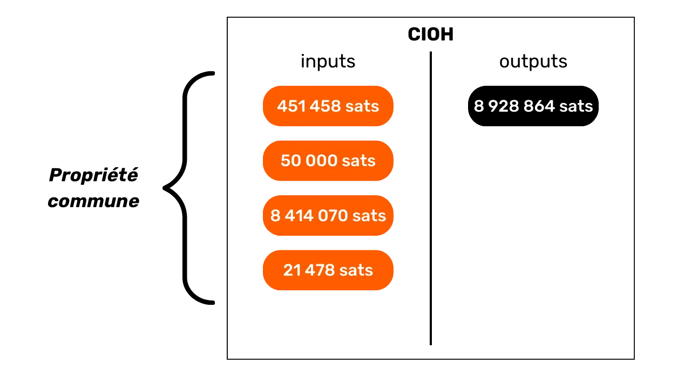

### सेक्शन 4: जीडब्ल्यू-26 लेनदेन को समझना

Bitcoin पर प्राइवेसी की बात करें और सिक्कों को मिलाने (coinjoins) का ज़िक्र न हो, ऐसा कैसे हो सकता है? सेक्शन 4 में आपको इस मिक्सिंग तरीके के बारे में सारी जानकारी मिलेगी। आप जानेंगे कि coinjoins क्या होते हैं, उनका इतिहास और मकसद, साथ ही CoinJoin के अलग-अलग प्रकार कौन-कौन से हैं। आखिर में, जो लोग थोड़े एक्सपीरियंस्ड हैं, उनके लिए हम anonsets और entropy को समझेंगे और ये भी कि उन्हें कैसे कैलकुलेट किया जाता है।

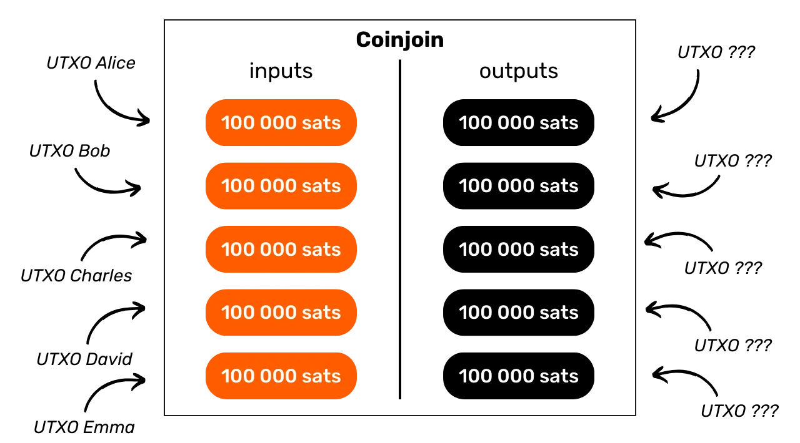

### धारा 5: अन्य उन्नत गोपनीयता तकनीकों की चुनौतियों को समझना

पांचवे सेक्शन में, हम CoinJoin के अलावा Bitcoin पर अपनी प्राइवेसी को सुरक्षित रखने के लिए उपलब्ध सभी दूसरी तकनीकों पर नज़र डालेंगे। सालों से, डेवलपर्स ने प्राइवेसी के लिए बनाए गए टूल्स को डिज़ाइन करने में काफी क्रिएटिविटी दिखाई है। हम इन सभी तरीकों को देखेंगे, जैसे कि PayJoin, कोलैबोरेटिव ट्रांजैक्शन्स, कॉइन स्वैप और एटॉमिक स्वैप, और डिटेल में समझेंगे कि ये कैसे काम करते हैं, इनके उद्देश्य क्या हैं और इनमें कोई कमज़ोरियाँ हैं या नहीं।

हम नोड्स के नेटवर्क और लेन-देन के प्रसार के स्तर पर भी प्राइवेसी पर विचार करेंगे। हम Bitcoin पर उपयोगकर्ता गोपनीयता बढ़ाने के लिए सालों में प्रस्तावित विभिन्न प्रोटोकॉल्स पर भी चर्चा करेंगे, जिसमें स्थिर Address प्रोटोकॉल्स भी शामिल हैं।


# परिभाषाएँ और मुख्य अवधारणाएँ

<partId>b9bbbde3-34c0-4851-83e8-e2ffb029cf31</partId>

## जीडब्ल्यू-34 का जीडब्ल्यू-35 मॉडल

<chapterId>8d6b50c5-bf74-44f4-922b-25204991cb75</chapterId>

जीडब्ल्यू-36 सबसे पहले एक करेंसी है, लेकिन क्या आपको पता है कि बीटीसी को प्रोटोकॉल पर कैसे दिखाया जाता है?

### Bitcoin पर UTXOs: ये क्या हैं?

Bitcoin प्रोटोकॉल UTXO मॉडल पर आधारित है, जो "Unspent Transaction Output" (अनस्पेंट ट्रांजैक्शन आउटपुट) के लिए खड़ा है।

यह मॉडल पारंपरिक बैंकिंग सिस्टम से बिल्कुल अलग है, जहाँ फाइनेंशियल फ्लो को ट्रैक करने के लिए अकाउंट्स और बैलेंस का मैकेनिज्म इस्तेमाल होता है। दरअसल, बैंकिंग सिस्टम में, आपके अकाउंट से जुड़ी आईडेंटिटी के आधार पर इंडिविजुअल बैलेंस मेन्टेन किया जाता है। मिसाल के तौर पर, जब आप एक बेकर से बैगुएट खरीदते हैं, तो आपका बैंक सीधे आपके अकाउंट से खरीद की रकम काट लेता है, जिससे आपका बैलेंस कम हो जाता है, वहीं बेकर के अकाउंट में उतनी ही रकम जमा कर दी जाती है, जिससे उसका बैलेंस बढ़ जाता है। इस सिस्टम में, ट्रांजैक्शन रिकॉर्ड्स के अलावा, आपके अकाउंट में आने वाले और निकलने वाले पैसे के बीच कोई लिंक नहीं होता।


Bitcoin अलग तरीके से काम करता है। इसमें खाते (account) का कोई कॉन्सेप्ट नहीं होता, और पैसे की यूनिट्स को बैलेंस के जरिए नहीं, बल्कि UTXOs (Unspent Transaction Outputs) के जरिए मैनेज किया जाता है। एक UTXO बिटकॉइन की एक खास मात्रा को दर्शाता है जिसे अभी तक खर्च नहीं किया गया है, इस तरह यह "Bitcoin का एक टुकड़ा" बनाता है, जो बड़ा या छोटा हो सकता है। उदाहरण के लिए, एक UTXO `500 BTC` के बराबर हो सकता है या फिर सिर्फ `700 Sats` के बराबर।

**> जीडब्ल्यू-44, जिसे अक्सर 'सैट' (sat) के नाम से छोटा किया जाता है, जीडब्ल्यू-43 की सबसे छोटी इकाई है, जो फिएट करेंसी में सेंटाइम (centime) के बराबर है।**

```plaintext
1 BTC = 100 000 000 SATS
```

थ्योरेटिकली, एक UTXO बिटकॉइन में किसी भी वैल्यू को रिप्रेजेंट कर सकता है, एक सतोशी से लेकर थ्योरेटिकली करीब 21 मिलियन BTC तक। हालांकि, लॉजिकली 21 मिलियन बिटकॉइन का मालिक होना नामुमकिन है, और एक लोअर इकोनॉमिक थ्रेशोल्ड होता है जिसे "Dust" कहते हैं, जिसके नीचे एक UTXO को खर्च करना इकोनॉमिकली फायदेमंद नहीं माना जाता।

**> Bitcoin पर बनाया गया अब तक का सबसे बड़ा UTXO, जिसकी कीमत `500,000 BTC` थी, MtGox प्लेटफॉर्म द्वारा नवंबर 2011 में एक समेकन ऑपरेशन के दौरान बनाया गया था: [29a3efd3ef04f9153d47a990bd7b048a4b2d213daaa5fb8ed670fb85f13bdbcf](https://Mempool.space/fr/tx/29a3efd3ef04f9153d47a990bd7b048a4b2d213daaa5fb8ed670fb85f13bdbcf)

### यूटीएक्सओ और खर्च करने की शर्तें

UTXOs, Exchange के Bitcoin पर उपकरण हैं। हर लेन-देन में इनपुट के रूप में UTXOs का उपयोग होता है और आउटपुट के रूप में नए UTXOs बनते हैं। जब कोई लेन-देन पूरा हो जाता है, तो इनपुट के रूप में इस्तेमाल किए गए UTXOs को "खर्च किया हुआ" माना जाता है, और नए UTXOs बनाए जाते हैं जो लेन-देन के आउटपुट में दिए गए प्राप्तकर्ताओं को आवंटित किए जाते हैं। इस तरह, UTXO बस एक अखर्चित लेन-देन आउटपुट को दर्शाता है, और इसलिए किसी समय पर किसी उपयोगकर्ता के पास मौजूद बिटकॉइन की मात्रा को।


सभी UTXO स्क्रिप्ट्स द्वारा सुरक्षित होते हैं जो यह तय करते हैं कि उन्हें किन शर्तों पर खर्च किया जा सकता है। UTXO को खर्च करने के लिए, एक उपयोगकर्ता को नेटवर्क को यह साबित करना होगा कि वह उस स्क्रिप्ट द्वारा निर्धारित शर्तों को पूरा करता है जो उस UTXO को सुरक्षित करती है। आमतौर पर, UTXO एक पब्लिक की (या एक प्राप्त करने वाला Address जो इस पब्लिक की को दर्शाता है) द्वारा सुरक्षित होते हैं। इस पब्लिक की से जुड़े UTXO को खर्च करने के लिए, उपयोगकर्ता को यह साबित करना होगा कि उसके पास संबंधित प्राइवेट की है, और इस की से बने डिजिटल सिग्नेचर को प्रदान करना होगा। इसीलिए हम कहते हैं कि आपका Bitcoin Wallet वास्तव में बिटकॉइन्स नहीं रखता, बल्कि आपकी प्राइवेट कीज़ को स्टोर करता है, जो आपको आपके UTXO तक पहुंच देती हैं और इस तरह, उन बिटकॉइन्स तक भी जिन्हें वे दर्शाते हैं।


चूंकि Bitcoin में खाते (account) की कोई अवधारणा नहीं है, इसलिए Wallet का बैलेंस बस उन सभी UTXOs के मूल्यों का जोड़ होता है जिन्हें वह खर्च कर सकता है। उदाहरण के लिए, अगर आपका Bitcoin Wallet निम्नलिखित 4 UTXOs खर्च कर सकता है:

```plaintext
- 2 BTC
- 8 BTC
- 5 BTC
- 2 BTC
```

आपके पोर्टफोलियो का कुल बैलेंस होगा `17 BTC`।


## जीडब्ल्यू-59 लेनदेन की संरचना

<chapterId>29d3aaab-de2e-4746-ab40-c9748898850c</chapterId>

### लेन-देन के इनपुट और आउटपुट

Bitcoin ट्रांजेक्शन एक ऑपरेशन है जो Blockchain पर रिकॉर्ड किया जाता है और Ownership बिटकॉइन एक व्यक्ति से दूसरे को ट्रांसफर करता है। असल में, क्योंकि हम UTXO मॉडल पर हैं और कोई अकाउंट्स नहीं हैं, यह ट्रांजेक्शन खर्च करने की शर्तों को पूरा करता है जो एक या ज्यादा UTXOs को सुरक्षित करती हैं, उन्हें खर्च करता है और बराबर में नए UTXOs बनाता है जिनकी नई खर्च करने की शर्तें होती हैं। संक्षेप में, एक ट्रांजेक्शन बिटकॉइन को एक पूरी हुई स्क्रिप्ट से एक नई स्क्रिप्ट में ले जाता है जो उन्हें सुरक्षित करने के लिए डिज़ाइन की गई होती है।


हर Bitcoin ट्रांजैक्शन में एक या ज़्यादा इनपुट और एक या ज़्यादा आउटपुट होते हैं। इनपुट वो UTXO होते हैं जो इस ट्रांजैक्शन में खर्च किए जाते हैं और generate आउटपुट में बदल जाते हैं। आउटपुट नए UTXO होते हैं जिन्हें आगे की ट्रांजैक्शन्स के इनपुट के तौर पर इस्तेमाल किया जा सकता है।


**> सिद्धांत रूप में, एक Bitcoin लेनदेन में इनपुट और आउटपुट की संख्या अनंत हो सकती है। एकमात्र सीमा अधिकतम ब्लॉक आकार है।**

Bitcoin लेन-देन में हर इनपुट पिछले एक अनस्पेंट UTXO को रेफर करता है। UTXO को इनपुट के तौर पर इस्तेमाल करने के लिए, होल्डर को यह साबित करना होगा कि वह असली मालिक है - यानी उससे जुड़े स्क्रिप्ट को वैलिडेट करके (यानी जो खर्च करने की शर्त लगाई गई थी, उसे पूरा करके)। आमतौर पर, इसका मतलब है कि उस पब्लिक की से मेल खाते प्राइवेट की से डिजिटल सिग्नेचर देना जिससे यह UTXO सुरक्षित था। तो स्क्रिप्ट में यह वेरिफाई किया जाता है कि सिग्नेचर उसी पब्लिक की से मेल खाता है जो फंड मिलने के वक्त इस्तेमाल हुआ था।


हर आउटपुट में बिटकॉइन की ट्रांसफर होने वाली रकम और प्राप्तकर्ता का विवरण होता है। प्राप्तकर्ता को एक नए स्क्रिप्ट से परिभाषित किया जाता है, जो आमतौर पर नए बनाए गए UTXO को प्राप्त करने वाले Address या किसी नए पब्लिक की से लॉक कर देता है।

एक लेन-देन को सहमति नियमों के अनुसार वैध माना जाने के लिए, कुल आउटपुट, कुल इनपुट से कम या बराबर होने चाहिए। दूसरे शब्दों में, लेन-देन द्वारा बनाए गए नए UTXO का योग, इनपुट के रूप में खर्च किए गए UTXO के योग से अधिक नहीं होना चाहिए। यह सिद्धांत तार्किक है: अगर आपके पास सिर्फ `500,000 Sats` है, तो आप `700,000 Sats` की खरीदारी नहीं कर सकते।

### जीडब्ल्यू-72 और जीडब्ल्यू-73 लेनदेन में विलय हो रहा है

Bitcoin ट्रांजैक्शन का UTXO पर एक्शन को सोने के सिक्के को दोबारा ढालने से तुलना की जा सकती है। दरअसल, UTXO विभाज्य नहीं है, बल्कि केवल पिघलाने योग्य है। इसका मतलब यह है कि एक यूजर बिटकॉइन की एक निश्चित रकम को दर्शाने वाले UTXO को कई छोटे UTXOs में बांट नहीं सकता। उसे एक या एक से ज्यादा नए UTXOs बनाने के लिए, जिनकी वैल्यू आउटपुट में मनमर्जी हो सकती है, पूरे UTXO को ट्रांजैक्शन में खर्च करना होगा। हालांकि, ये नई वैल्यूज शुरुआती वैल्यू से कम या उसके बराबर ही होनी चाहिए।

यह तंत्र एक सोने के सिक्के जैसा ही है। मान लो तुम्हारे पास 2 तोले का सिक्का है और तुम्हें 1 तोले का भुगतान करना है, यह मानते हुए कि विक्रेता तुम्हें खुले पैसे नहीं दे सकता। तुम्हें अपना सिक्का पिघलाकर 1-1 तोले के 2 नए सिक्के ढालने होंगे।

Bitcoin भी इसी तरह काम करता है। चलिए कल्पना करते हैं कि Alice के पास `10,000 Sats` का एक UTXO है और वह `4,000 Sats` की एक बैगूएट खरीदना चाहती है। Alice एक ट्रांजैक्शन करेगी जिसमें इनपुट के रूप में `10,000 Sats` का 1 UTXO होगा, जिसे वह पूरी तरह खर्च कर देगी, और आउटपुट के रूप में `4,000 Sats` और `6,000 Sats` के 2 UTXO होंगे। `4,000 Sats` का UTXO बेकर को बैगूएट के भुगतान में भेजा जाएगा, जबकि `6,000 Sats` का UTXO बदले के रूप में Alice को वापस मिलेगा। यह UTXO, जो ट्रांजैक्शन के मूल भेजने वाले को वापस मिलता है, Bitcoin की भाषा में "Exchange" कहलाता है।


अब मान लीजिए कि ऐलिस के पास `10,000 Sats` का एक UTXO नहीं है, बल्कि `3,000 Sats` के दो UTXO हैं। इस स्थिति में, कोई भी UTXO अकेले वैंड की `4,000 Sats` सेटिंग के लिए पर्याप्त नहीं है। इसलिए, ऐलिस को अपने लेन-देन में इनपुट के रूप में एक साथ `3,000 Sats` के दोनों UTXO का उपयोग करना होगा। इस तरह, इनपुट की कुल राशि `6,000 Sats` तक पहुंच जाएगी, जिससे वह बेकर को `4,000 Sats` का भुगतान कर पाएगी। इस विधि को, जहां कई UTXO को एक लेन-देन के इनपुट के रूप में एक साथ जोड़ा जाता है, अक्सर "मर्जिंग" कहा जाता है।


### लेन-देन शुल्क

सीधे-सादे तरीके से सोचें तो, कोई यह मान सकता है कि लेन-देन की लागत (transaction costs) भी एक लेन-देन का आउटपुट होती है। लेकिन असलियत में ऐसा नहीं है। लेन-देन की लागत कुल इनपुट और कुल आउटपुट के बीच का अंतर होती है। इसका मतलब यह है कि, किसी लेन-देन में इनपुट के मूल्य का एक हिस्सा वांछित आउटपुट को पूरा करने में खर्च करने के बाद, इनपुट की एक निश्चित राशि बिना इस्तेमाल की रह जाती है। यह बची हुई राशि ही लेन-देन की लागत बनती है।

```plaintext
Frais = total inputs - total outputs
```

चलो Alice का उदाहरण लेते हैं, जिसके पास `10,000 Sats` का UTXO है और वह `4,000 Sats` में एक बैगूएट खरीदना चाहती है। Alice अपने `10,000 Sats` के UTXO को इनपुट के रूप में लेकर एक ट्रांजैक्शन बनाती है। फिर वह बैकर को बैगूएट के भुगतान के लिए `4,000 Sats` का आउटपुट जनरेट करती है। माइनर्स को प्रोत्साहित करने के लिए कि वे उसकी ट्रांजैक्शन को ब्लॉक में शामिल करें, Alice `200 Sats` का फीस आवंटित करती है। इसके बाद वह एक दूसरा आउटपुट, Exchange, बनाती है, जो उसे वापस मिलेगा, जिसकी राशि `5,800 Sats` होगी।


फीस फॉर्मूला लगाने पर, हम देखते हैं कि नाबालिगों के लिए वास्तव में `200 Sats` बचा है:

```plaintext
Frais = total inputs - total outputs
Frais = 10 000 - (4 000 + 5 800)
Frais = 10 000 - 9 800
Frais = 200
```

जब एक Miner ब्लॉक को वैलिडेट करने में सफल होता है, तो उसे अपने ब्लॉक में शामिल सभी ट्रांजैक्शन के लिए फीस इकट्ठा करने का अधिकार मिलता है, जो "कॉइनबेस" ट्रांजैक्शन के जरिए होता है।

### Bitcoin पर UTXO बनाना

अगर आपने पिछले पैराग्राफ को ध्यान से पढ़ा होगा, तो आपको अब पता चल गया होगा कि UTXOs को सिर्फ दूसरे मौजूदा UTXOs का इस्तेमाल करके ही बनाया जा सकता है। इस तरह, Bitcoin के सिक्के एक लगातार चलने वाली चेन बनाते हैं। लेकिन, आपके मन में यह सवाल आ सकता है कि इस चेन के सबसे पहले UTXOs कैसे बने? यह मुर्गी और अंडे वाली पहेली जैसी समस्या खड़ी करता है: ये शुरुआती UTXOs आए कहाँ से?

जवाब **ट्रांजैक्शन कॉइनबेस** में है।

कोइनबेस एक खास तरह का Bitcoin ट्रांजैक्शन है, जो हर ब्लॉक के लिए यूनिक होता है और हमेशा इनमें सबसे पहले आता है। यह Miner (जिसने वैलिड Proof of Work ढूंढ़ा है) को अपना Block reward पाने की अनुमति देता है। यह रिवॉर्ड दो Elements से मिलकर बना होता है: **ब्लॉक ग्रांट** और **ट्रांजैक्शन फी**, जिसकी चर्चा पिछले सेक्शन में की गई है।

Coinbase Transaction इस मामले में अनोखा है क्योंकि यह एकमात्र ऐसा है जो बिना generate आउटपुट्स के इनपुट खपत किए, बिटकॉइन्स को "एक्स निहिलो" (शून्य से) बना सकता है। ये नव-निर्मित बिटकॉइन्स वही हैं जिन्हें हम "मूल UTXOs" कह सकते हैं।


ब्लॉक-सब्सिडी वाले बिटकॉइन नए बीटीसी होते हैं जो कंसेंसस नियमों में पहले से तय इश्यूएंस शेड्यूल के मुताबिक बनाए जाते हैं। ब्लॉक ग्रांट हर 210,000 ब्लॉक्स (यानी लगभग हर चार साल) में आधी हो जाती है, इस प्रक्रिया को "Halving" कहा जाता है। शुरुआत में हर सब्सिडी के साथ 50 बिटकॉइन बनते थे, लेकिन यह मात्रा धीरे-धीरे कम होती गई; अभी हर ब्लॉक पर 3.125 बिटकॉइन बनते हैं।

लेन-देन शुल्क (transaction fees) के बारे में बात करें, तो हालांकि ये भी नए बनाए गए BTC का प्रतिनिधित्व करते हैं, लेकिन इन्हें एक ब्लॉक में सभी लेन-देन के कुल इनपुट और आउटपुट के अंतर से अधिक नहीं होना चाहिए। हमने पहले देखा कि ये शुल्क इनपुट्स के उस हिस्से को दर्शाते हैं जो लेन-देन के आउटपुट में इस्तेमाल नहीं होता। तकनीकी तौर पर, ये हिस्सा लेन-देन के दौरान "खोया" हुआ माना जाता है, और Miner को इस मूल्य को एक या अधिक नए UTXOs के रूप में दोबारा बनाने का अधिकार है। यह लेन-देन जारी करने वाले और Miner के बीच मूल्य का हस्तांतरण है, जो इसे Blockchain में जोड़ता है।

**> Coinbase Transaction द्वारा जनरेट किए गए बिटकॉइन्स पर 100 ब्लॉक्स की मैच्योरिटी अवधि लागू होती है, जिस दौरान Miner द्वारा उन्हें खर्च नहीं किया जा सकता। यह नियम नए बनाए गए बिटकॉइन्स का उपयोग करने से जुड़ी उलझनों से बचने के लिए बनाया गया है, क्योंकि हो सकता है कि बाद में वह चेन अप्रचलित हो जाए।**

### जीडब्ल्यू-101 मॉडल के निहितार्थ

सबसे पहले, UTXO मॉडल सीधे Bitcoin के लेन-देन शुल्क को प्रभावित करता है। चूंकि हर ब्लॉक की क्षमता सीमित होती है, माइनर्स उन लेन-देन को प्राथमिकता देते हैं जो ब्लॉक में जगह के हिसाब से सबसे अच्छा शुल्क देते हैं। दरअसल, जितने ज्यादा UTXO किसी लेन-देन के इनपुट और आउटपुट में शामिल होते हैं, वह उतना ही भारी होता है, और इसलिए उसके लिए ज्यादा शुल्क चुकाने पड़ते हैं। यही एक वजह है कि हम अक्सर अपने पोर्टफोलियो में UTXO की संख्या कम करने की कोशिश करते हैं, जिससे गोपनीयता भी प्रभावित हो सकती है - इस विषय पर हम इस कोर्स के तीसरे भाग में विस्तार से चर्चा करेंगे।

दूसरा, जैसा कि पिछले सेक्शन्स में बताया गया है, Bitcoin कॉइन्स असल में UTXOs की एक चेन होती हैं। हर ट्रांजैक्शन इस तरह से एक पुराने UTXO और एक नए UTXO के बीच एक लिंक बनाती है। इसलिए UTXOs की मदद से बिटकॉइन्स के रास्ते को उनके बनने से लेकर अभी के खर्च होने तक साफ-साफ फॉलो किया जा सकता है। यह पारदर्शिता एक अच्छी बात मानी जा सकती है, क्योंकि इससे हर यूज़र यह पक्का कर सकता है कि उसे मिले बिटकॉइन असली हैं। हालांकि, यही ट्रेस करने और ऑडिट करने का सिद्धांत Blockchain एनालिसिस की बुनियाद भी है, जो आपकी प्राइवेसी को नुकसान पहुंचाने के लिए डिज़ाइन की गई एक प्रैक्टिस है। हम कोर्स के दूसरे हिस्से में इस प्रैक्टिस पर गहराई से चर्चा करेंगे।

## जीडब्ल्यू-107 की प्राइवेसी मॉडल

<chapterId>769d8963-3ed5-4094-b21d-9203c7d9e465</chapterId>

### पैसा: प्रामाणिकता, ईमानदारी और डबल खर्च

पैसे का एक काम है ज़रूरतों के डबल कोइन्सिडेंस की समस्या को हल करना। बार्टर सिस्टम में, किसी Exchange को पूरा करने के लिए सिर्फ़ ऐसे व्यक्ति को ढूँढना ही काफ़ी नहीं होता जो मेरी ज़रूरत की चीज़ दे रहा हो, बल्कि उसे उसकी अपनी ज़रूरत को पूरा करने वाली बराबर कीमत की चीज़ देना भी ज़रूरी होता है। ये संतुलन बनाना एक पेचीदा मामला है।


इसीलिए हम पैसे का इस्तेमाल करते हैं ताकि वैल्यू को जगह और वक्त दोनों में मूव कर सकें।


इस समस्या को हल करने के लिए सिक्के (मुद्रा) के बारे में, यह ज़रूरी है कि जो पार्टी कोई सामान या सेवा दे रही है, वह इस बात से यकीन हो कि वह बाद में उस रकम को खर्च कर सकेगी। इसलिए, कोई भी समझदार इंसान जो कोई सिक्का स्वीकार करना चाहता है, चाहे वह डिजिटल हो या फिजिकल, वह यह सुनिश्चित करेगा कि वह दो बुनियादी मापदंडों पर खरा उतरता हो:


- टुकड़े में ईमानदारी और असलीपन होना चाहिए ;**
- और डबल-स्पेंड नहीं किया जाना चाहिए।**

अगर आप नकदी (सिक्के) का इस्तेमाल कर रहे हैं, तो सबसे पहली और जटिल बात यही साबित करना होता है कि वह असली है। इतिहास के अलग-अलग दौर में, सिक्कों की शुद्धता पर अक्सर छेड़छाड़ की जाती थी, जैसे किनारों को काटना या छेद बनाना। मिसाल के तौर पर, प्राचीन रोम में लोग सोने के सिक्कों के किनारों को खुरचकर थोड़ी कीमती धातु इकट्ठा कर लेते थे, जबकि सिक्के को भविष्य के लेन-देन के लिए बचाकर रखते थे। इस तरह सिक्के की असली कीमत तो कम हो जाती थी, लेकिन उस पर छपी कीमत वही रहती थी। यही एक वजह है कि बाद में सिक्कों के किनारों पर धारियां बनाने की प्रथा शुरू हुई।

असलीपन की पहचान करना भी एक मुश्किल बात है, खासकर जब बात नकदी की हो। आजकल नकली नोटों से निपटने के तरीके बहुत पेचीदा हो गए हैं, जिसकी वजह से दुकानदारों को महंगे सत्यापन सिस्टम में पैसा लगाना पड़ रहा है।

वहीं दूसरी तरफ, अपने स्वभाव के कारण, फिजिकल करेंसी में डबल स्पेंडिंग की समस्या नहीं होती। अगर मैं तुम्हें 10 यूरो का नोट दे देता हूँ, तो वह मेरे कब्ज़े से निकलकर सीधे तुम्हारे पास चला जाता है - इससे उस पैसे को दोबारा खर्च करने का कोई चांस ही नहीं रह जाता। सीधे शब्दों में कहें तो, मैं इस 10 यूरो के नोट को दोबारा खर्च नहीं कर पाऊँगा।


डिजिटल करेंसी के मामले में, मुश्किल अलग होती है। एक सिक्के की असलीयत और सच्चाई सुनिश्चित करना अक्सर आसान होता है। जैसा कि हमने पिछले सेक्शन में देखा, Bitcoin का UTXO मॉडल एक सिक्के को उसकी शुरुआत तक ट्रैक करने में सक्षम बनाता है, और इस तरह यह पुष्टि करता है कि यह वास्तव में Miner द्वारा सहमति नियमों के अनुसार बनाया गया था।

दूसरी तरफ, यह सुनिश्चित करना कि Double-spending न हो, यह ज्यादा मुश्किल है क्योंकि सारे डिजिटल सामान असल में जानकारी ही होते हैं। फिजिकल सामानों से अलग, जानकारी बाँटने पर बँटती नहीं, बल्कि गुणा होकर फैलती है। जैसे, अगर मैं तुम्हें ईमेल से एक डॉक्यूमेंट भेजूँ, तो वह डुप्लीकेट हो जाएगा। तुम्हें यकीन नहीं हो सकता कि मैंने असली डॉक्यूमेंट डिलीट कर दिया है।


### Bitcoin पर डबल स्पेंडिंग को रोकना

डिजिटल एसेट की इस डुप्लीकेशन से बचने का एकमात्र तरीका सिस्टम पर होने वाले सभी एक्सचेंजेस के बारे में जागरूक होना है। इस तरह, हम जान सकते हैं कि किसके पास क्या है और किए गए ट्रांजैक्शन्स के अनुसार हर व्यक्ति की होल्डिंग्स को अपडेट कर सकते हैं। उदाहरण के लिए, बैंकिंग सिस्टम में स्क्रिप्चरल मनी के साथ यही होता है। जब आप क्रेडिट कार्ड से किसी मर्चेंट को €10 पे करते हैं, तो बैंक Exchange को रिकॉर्ड करता है और अकाउंट बुक को अपडेट कर देता है।


Bitcoin पर, Double-spending को उसी तरह रोका जाता है। हम उस लेन-देन की अनुपस्थिति की पुष्टि करना चाहते हैं जिसने संबंधित सिक्कों को पहले ही खर्च कर दिया है। अगर सिक्कों का कभी इस्तेमाल नहीं हुआ है, तो हम यह सुनिश्चित कर सकते हैं कि डबल स्पेंडिंग नहीं होगी। इस सिद्धांत को Satoshi नाकामोटो ने व्हाइट पेपर में प्रसिद्ध वाक्य के साथ समझाया था:

**लेन-देन की अनुपस्थिति की पुष्टि करने का एकमात्र तरीका सभी लेन-देन के बारे में जागरूक होना है**

लेकिन बैंकिंग मॉडल के विपरीत, हम Bitcoin पर किसी केंद्रीय संस्था पर भरोसा नहीं करना चाहते। इसलिए सभी उपयोगकर्ताओं को डबल-स्पेंडिंग की अनुपस्थिति की पुष्टि करने में सक्षम होना चाहिए, बिना किसी तीसरे पक्ष पर निर्भर हुए। इसलिए हर किसी को Bitcoin के सभी लेन-देन के बारे में पता होना चाहिए। यही कारण है कि Bitcoin लेन-देन सार्वजनिक रूप से सभी नेटवर्क नोड्स पर प्रसारित किए जाते हैं और Blockchain पर स्पष्ट पाठ में दर्ज किए जाते हैं।

यही सार्वजनिक जानकारी का प्रसार Bitcoin में गोपनीयता की सुरक्षा को जटिल बना देता है। पारंपरिक बैंकिंग प्रणाली में, सिद्धांत रूप में, केवल वित्तीय संस्थान ही किए गए लेन-देन के बारे में जानता है। वहीं Bitcoin में, सभी उपयोगकर्ताओं को उनके संबंधित नोड्स के माध्यम से सभी लेन-देन की जानकारी दी जाती है।

### गोपनीयता मॉडल: बैंकिंग सिस्टम बनाम Bitcoin

पारंपरिक सिस्टम में, आपका बैंक खाता आपकी पहचान से जुड़ा होता है। बैंकर यह जान सकता है कि कौन सा बैंक खाता किस ग्राहक का है, और उससे कौन से लेन-देन जुड़े हुए हैं। हालांकि, यह जानकारी का प्रवाह बैंक और सार्वजनिक डोमेन के बीच कट जाता है। दूसरे शब्दों में, किसी दूसरे व्यक्ति के बैंक खाते का बैलेंस और लेन-देन जानना असंभव है। केवल बैंक के पास ही इस जानकारी तक पहुंच होती है।


उदाहरण के लिए, आपका बैंकर जानता है कि आप हर सुबह अपनी बैगुएट (फ्रेंच ब्रेड) स्थानीय बेकर से खरीदते हैं, लेकिन आपके पड़ोसी को इस लेन-देन की कोई जानकारी नहीं होती। इस तरह, जानकारी का प्रवाह संबंधित पक्षों, खासकर बैंक के लिए सुलभ होता है, लेकिन बाहरी लोगों के लिए दुर्गम रहता है।


पिछले सेक्शन में हमने लेन-देन के सार्वजनिक प्रसार की जो बाधा देखी थी, उसके कारण Bitcoin का गोपनीयता मॉडल बैंकिंग सिस्टम के मॉडल को फॉलो नहीं कर सकता। Bitcoin के मामले में, चूंकि जानकारी का प्रवाह लेन-देन और सार्वजनिक डोमेन के बीच टूट नहीं सकता, **प्राइवेसी मॉडल यूजर की पहचान और लेन-देन के बीच अलगाव पर निर्भर करता है**।


उदाहरण के लिए, अगर आप बेकर से बैगुएट खरीदते हैं और बिटकॉइन (BTC) में भुगतान करते हैं, तो आपका पड़ोसी, जिसके पास उसका खुद का पूरा नोड है, आपका लेन-देन होते हुए देख सकता है, जैसे वह सिस्टम के सभी दूसरे लेन-देन देख सकता है। हालाँकि, अगर गोपनीयता के सिद्धांतों का पालन किया जाता है, तो उसे इस खास लेन-देन को आपकी पहचान से जोड़ने में सक्षम नहीं होना चाहिए।


लेकिन चूंकि Bitcoin लेन-देन सार्वजनिक रूप से दर्ज होते हैं, इसलिए इनके बीच कनेक्शन ढूंढकर संबंधित पार्टियों के बारे में जानकारी निकाली जा सकती है। यह प्रक्रिया तो अपने आप में एक विशेषज्ञता बन चुकी है, जिसे "Blockchain एनालिसिस" कहा जाता है। कोर्स के अगले हिस्से में, मैं आपको Blockchain एनालिसिस की बुनियादी बातें समझने के लिए आमंत्रित करता हूँ, ताकि आप जान सकें कि आपके बिटकॉइन्स का पता कैसे लगाया जाता है और उनसे बचाव कैसे किया जा सकता है।

# चेन एनालिसिस को समझना और उससे बचाव करना

<partId>4739371e-9fef-45b0-bcaa-b7a4df6b4470</partId>

## Bitcoin चेन एनालिसिस क्या है?

<chapterId>7d198ba6-4af2-4f24-86cb-3c79cb25627e</chapterId>

### परिभाषा और संचालन

Blockchain विश्लेषण, Blockchain पर बिटकॉइन के प्रवाह को ट्रैक करने की प्रथा है। आम तौर पर, चेन विश्लेषण पिछले लेन-देन के नमूनों में विशेषताओं के अवलोकन पर आधारित होता है। फिर इसमें उन्हीं विशेषताओं को उस लेन-देन पर पहचानना शामिल होता है जिसे हम विश्लेषित करना चाहते हैं, और उनसे संभावित व्याख्याएं निकालना। समस्या-समाधान की यह विधि, जो एक पर्याप्त समाधान खोजने के व्यावहारिक दृष्टिकोण पर आधारित है, "ह्यूरिस्टिक" के रूप में जानी जाती है।

साधारण भाषा में, चेन एनालिसिस में तीन मुख्य चरण होते हैं:

1. **Blockchain का निरीक्षण करना ;**  

(Note: The original text "Blockchain" appears to be a code or identifier, so it has been retained as-is in the translation. The semicolon ";" has also been preserved as per the instruction.)

2. **ज्ञात विशेषताओं की पहचान ;**

3. **धारणाओं का कटौती**  

(Note: "Deduction" can also be translated as "निगमन" in a logical context, but "कटौती" is more colloquial for general use. If the context is formal/logical, consider using **धारणाओं का निगमन** instead.)

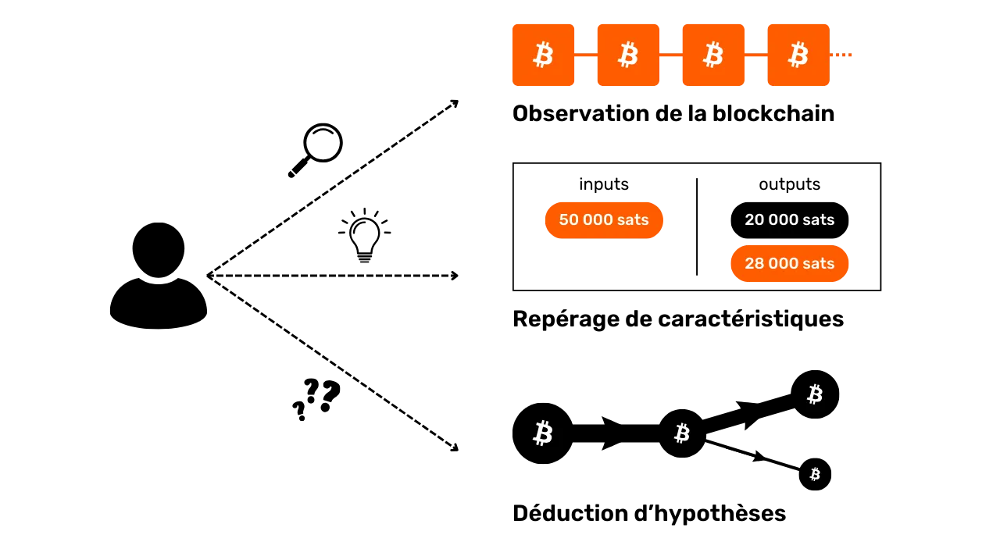

Blockchain का विश्लेषण कोई भी कर सकता है। आपको बस Blockchain की सार्वजनिक जानकारी तक पहुंच की ज़रूरत है, जो एक पूर्ण नोड के ज़रिए ट्रांज़ैक्शन की गतिविधियों को देखने और परिकल्पनाएं बनाने के लिए काफी है। इस विश्लेषण को आसान बनाने वाले कुछ मुफ्त टूल्स भी उपलब्ध हैं, जैसे कि [OXT.me](https://oxt.me/), जिसे हम इस सेक्शन के आखिरी दो अध्यायों में विस्तार से समझेंगे। हालांकि, गोपनीयता के लिए मुख्य ख़तरा स्ट्रिंग विश्लेषण में माहिर कंपनियों से आता है। ये कंपनियां Blockchain विश्लेषण को औद्योगिक स्तर पर ले गई हैं और अपनी सेवाएं वित्तीय संस्थानों और सरकारों को बेचती हैं। इन कंपनियों में से Chainalysis निश्चित रूप से सबसे ज़्यादा जानी-मानी है।

### चेन विश्लेषण के उद्देश्य

Blockchain विश्लेषण का एक उद्देश्य Bitcoin पर विभिन्न गतिविधियों को समूहित करना है, ताकि उन्हें करने वाले उपयोगकर्ता की विशिष्टता निर्धारित की जा सके। इसके बाद, इस गतिविधि समूह को किसी वास्तविक पहचान से जोड़ने का प्रयास किया जा सकता है।


पिछले अध्याय के बारे में सोचो। मैंने समझाया था कि Bitcoin का प्राइवेसी मॉडल मूल रूप से यूजर आइडेंटिटी को ट्रांजैक्शन्स से अलग रखने पर आधारित क्यों था। इसलिए यह सोचना आसान होगा कि Blockchain का एनालिसिस बेकार है, क्योंकि अगर हम ऑनचेन एक्टिविटीज को जोड़ भी लें, तो भी हम उन्हें किसी असली आइडेंटिटी से नहीं जोड़ सकते।

सैद्धांतिक रूप से, यह कथन सही है। इस कोर्स के पहले भाग में, हमने देखा कि क्रिप्टोग्राफिक की-पेयर्स का उपयोग UTXO पर शर्तें स्थापित करने के लिए किया जाता है। मूल रूप से, ये की-पेयर्स अपने धारकों की पहचान के बारे में कोई जानकारी नहीं देते हैं। इसलिए, भले ही हम विभिन्न की-पेयर्स से जुड़ी गतिविधियों को एक साथ समूहित करने में सफल हो जाएं, यह हमें इन गतिविधियों के पीछे के इकाई के बारे में कुछ नहीं बताता।


लेकिन, असलियत में यह बात कहीं ज्यादा पेचीदा है। ऐसे कई तरीके हैं जिनसे किसी असली पहचान को ऑनचेन गतिविधि से जोड़ा जा सकता है। विश्लेषण में इसे एंट्री पॉइंट कहा जाता है, और ऐसे कई एंट्री पॉइंट मौजूद हैं।

सबसे आम है KYC (*Know Your Customer* यानी अपने ग्राहक को जानें)। अगर आप अपने बिटकॉइन्स को एक रेगुलेटेड प्लेटफॉर्म से अपने किसी पर्सनल रिसीविंग एड्रेस (Address) पर ट्रांसफर करते हैं, तो कुछ लोग आपकी पहचान को उस Address से जोड़ सकते हैं। व्यापक तौर पर, एंट्री पॉइंट आपकी असली ज़िंदगी और Bitcoin ट्रांजैक्शन के बीच किसी भी तरह की इंटरैक्शन हो सकती है। जैसे, अगर आप अपने सोशल नेटवर्क्स पर कोई रिसीविंग Address पोस्ट करते हैं, तो यह एनालिसिस के लिए एक एंट्री पॉइंट बन सकता है। अगर आप अपने बेकर को बिटकॉइन में पेमेंट करते हैं, तो वह आपके चेहरे (आपकी पहचान का एक हिस्सा) को एक Bitcoin Address से जोड़ पाएगा।

Bitcoin का उपयोग करते समय ये एंट्री पॉइंट्स लगभग अपरिहार्य हैं। हालांकि हम इनके दायरे को सीमित करने की कोशिश कर सकते हैं, लेकिन ये हमेशा मौजूद रहेंगे। इसीलिए अपनी प्राइवेसी को बचाने के लिए अलग-अलग तरीकों को मिलाकर इस्तेमाल करना बेहद जरूरी है। अपने असली पहचान और लेन-देन के बीच अलगाव बनाए रखना एक दिलचस्प तरीका जरूर है, लेकिन आज के समय में यह पर्याप्त नहीं है। दरअसल, अगर आपकी सारी ऑनचेन गतिविधियों को एक साथ जोड़कर देखा जा सकता है, तो सबसे छोटा एंट्री पॉइंट भी आपके द्वारा स्थापित Layer कॉन्फिडेंशियलिटी के एकमात्र स्तर को खतरे में डाल सकता है।


### चेन एनालिसिस (सिलसिलेवार विश्लेषण) से खुद को बचाने के लिए यहां कुछ तरीके दिए गए हैं:

1. **प्राइवेसी टूल्स का इस्तेमाल**: VPN, TOR ब्राउज़र, या प्रॉक्सी सर्वर का उपयोग करके अपनी ऑनलाइन गतिविधियों को छुपाएं।  
2. **डेटा मिनिमाइज़ेशन**: जितना कम डेटा शेयर करें, उतना बेहतर। अनावश्यक जानकारी या मेटाडेटा न दें।  
3. **अलग-अलग आइडेंटिटीज़**: अलग-अलग एकाउंट्स, डिवाइस या नेटवर्क का इस्तेमाल करके अपनी गतिविधियों को अलग रखें।  
4. **स्ट्रॉन्ग एन्क्रिप्शन**: एंड-टू-एंड एन्क्रिप्टेड मैसेजिंग ऐप्स (जैसे Signal) का उपयोग करें।  
5. **फ़िज़िकल सेपरेशन**: संवेदनशील जानकारी को ऑफ़लाइन या अलग डिवाइस पर रखें।  
6. **ब्लॉकचेन एनालिसिस से बचाव**: क्रिप्टो लेनदेन में मिक्सिंग सर्विसेज़ या कॉइनजॉइन जैसे टूल्स का उपयोग करें।  

ध्यान रखें, कोई भी तरीका 100% सुरक्षित नहीं है, लेकिन इन तकनीकों से जोखिम कम किया जा सकता है।

तो हमें Bitcoin के इस्तेमाल में Blockchain के एनालिसिस से भी निपटने की ज़रूरत है। ऐसा करके हम अपनी एक्टिविटीज के जमाव को कम कर सकते हैं और एंट्री पॉइंट के हमारी प्राइवेसी पर पड़ने वाले असर को सीमित कर सकते हैं।


Blockchain के विश्लेषण का मुकाबला करने का इससे बेहतर तरीका क्या हो सकता है कि आप इसमें इस्तेमाल होने वाले तरीकों के बारे में जानें? अगर आप Bitcoin पर अपनी प्राइवेसी को बेहतर बनाने के तरीके जानना चाहते हैं, तो आपको इन तरीकों को समझना होगा। इससे आपको CoinJoin या PayJoin जैसी तकनीकों (जिन्हें हम कोर्स के आखिरी हिस्सों में देखेंगे) की बेहतर समझ मिलेगी, और आपसे होने वाली गलतियाँ कम होंगी।

https://planb.network/tutorials/privacy/on-chain/coinjoin-samourai-wallet-e566803d-ab3f-4d98-9136-5462009262ef
https://planb.network/tutorials/privacy/on-chain/payjoin-848b6a23-deb2-4c5f-a27e-93e2f842140f
इसमें, हम क्रिप्टोग्राफी और क्रिप्टएनालिसिस के साथ एक समानता बना सकते हैं। एक अच्छा क्रिप्टोग्राफर सबसे पहले एक अच्छा क्रिप्टएनालिस्ट होता है। एक नया एन्क्रिप्शन एल्गोरिदम बनाने के लिए, आपको यह जानना होगा कि इस पर किस तरह के हमले होंगे, और पुराने एल्गोरिदम कैसे तोड़े गए थे यह भी पढ़ना होगा। यही सिद्धांत Bitcoin प्राइवेसी पर भी लागू होता है। Blockchain एनालिसिस मेथड्स को समझना ही उनसे बचाव की कुंजी है। इसीलिए मैंने इस ट्रेनिंग कोर्स में on chain एनालिसिस का एक पूरा सेक्शन शामिल किया है।

### चेन विश्लेषण विधियाँ

यह समझना ज़रूरी है कि स्ट्रिंग विश्लेषण कोई एकदम सटीक विज्ञान नहीं है। यह पिछले अवलोकनों या तार्किक व्याख्याओं से प्राप्त ह्यूरिस्टिक्स पर निर्भर करता है। ये नियम हमें काफी भरोसेमंद परिणाम देते हैं, लेकिन कभी भी पूर्ण सटीकता के साथ नहीं। दूसरे शब्दों में, **चेन विश्लेषण में हमेशा निष्कर्षों में एक संभाव्यता का पहलू शामिल होता है**। उदाहरण के लिए, यह अलग-अलग स्तर की निश्चितता के साथ अनुमान लगाना संभव हो सकता है कि दो पते एक ही इकाई के हैं, लेकिन पूरी तरह से निश्चितता हमेशा पहुंच से बाहर रहेगी।

चेन एनालिसिस का पूरा मतलब ही यही है कि अलग-अलग ह्यूरिस्टिक्स को जोड़कर गलती का खतरा कम किया जाए। एक तरह से, यह सबूतों का इकट्ठा होना है जो हमें हकीकत के करीब ले जाता है।

ये मशहूर ह्यूरिस्टिक्स को अलग-अलग श्रेणियों में बाँटा जा सकता है, जिनके बारे में हम नीचे विस्तार से बताएँगे:


- लेन-देन के पैटर्न ;**
- लेन-देन-आंतरिक अनुमान ;**
- **लेन-देन के बाहर के अनुमानी नियम।**  

(Note: "Heuristics" is translated as "अनुमानी नियम" which refers to practical problem-solving approaches, and "external to the transaction" is translated as "लेन-देन के बाहर" to maintain contextual accuracy in colloquial Hindi.)

### जीडब्ल्यू-147 नाकामोटो और चेन विश्लेषण

पहले दो चेन एनालिसिस ह्यूरिस्टिक्स Satoshi नाकामोतो ने खुद खोजे थे। वह Bitcoin के व्हाइट पेपर के भाग 10 में इनके बारे में बात करता है। वे हैं:


- cIOH (*कॉमन इनपुट Ownership ह्यूरिस्टिक*);
- और जीडब्ल्यू-151 का दोबारा इस्तेमाल।


स्रोत: एस. नाकामोटो, "जीडब्ल्यू-152: एक पीयर-टू-पीयर इलेक्ट्रॉनिक कैश सिस्टम", https://Bitcoin.org/Bitcoin.pdf, 2009.

हम अगले अध्यायों में देखेंगे कि ये क्या हैं, लेकिन यह पहले से ही दिलचस्प है कि आज भी चेन एनालिसिस में ये दोनों ह्यूरिस्टिक्स (अनुमानात्मक नियम) प्रमुखता बनाए हुए हैं।

## लेन-देन के पैटर्न

<chapterId>d365a101-2d37-46a5-bfb9-3c51e37bf96b</chapterId>

एक ट्रांजैक्शन पैटर्न बस एक टाइपिकल ट्रांजैक्शन का ओवरऑल मॉडल या स्ट्रक्चर होता है, जो Blockchain पर मिल सकता है, और जिसका संभावित इंटरप्रिटेशन ज्ञात होता है। पैटर्न्स का अध्ययन करते समय, हम एक सिंगल ट्रांजैक्शन पर फोकस करते हैं और उसे हाई लेवल पर एनालाइज करते हैं।

दूसरे शब्दों में, हम सिर्फ इनपुट में UTXO की संख्या और आउटपुट में UTXO की संख्या पर नज़र डालेंगे, लेन-देन के ज्यादा विस्तृत विवरण या माहौल पर ध्यान दिए बिना। देखे गए पैटर्न के आधार पर, हम लेन-देन की प्रकृति की व्याख्या कर सकते हैं। फिर हम इसकी संरचना की खासियतों को देखेंगे और एक निष्कर्ष निकालेंगे।


इस सेक्शन में, हम साथ-साथ चेन एनालिसिस में मिलने वाले मुख्य ट्रांजैक्शन मॉडल्स को देखेंगे, और हर मॉडल के लिए, मैं आपको इस स्ट्रक्चर की संभावित व्याख्या दूंगा, साथ ही एक ठोस उदाहरण भी दूंगा।

### एकल शिपमेंट (या एकल भुगतान)

चलो एक बहुत ही आम पैटर्न से शुरू करते हैं, क्योंकि यही ज्यादातर Bitcoin पेमेंट्स में दिखता है। यह सिंपल पेमेंट मॉडल एक या ज्यादा UTXOs को इनपुट के तौर पर इस्तेमाल करता है और 2 UTXOs को आउटपुट के रूप में बनाता है। तो यह मॉडल कुछ इस तरह दिखता है:


जब हम Blockchain पर इस ट्रांजैक्शन स्ट्रक्चर को देखते हैं, तो हम पहले से ही एक व्याख्या कर सकते हैं। जैसा कि नाम से पता चलता है, यह मॉडल दर्शाता है कि हम एक भुगतान या पेमेंट ट्रांजैक्शन के सामने हैं। यूजर ने आउटपुट में एक पेमेंट UTXO और एक Exchange UTXO (यूजर को वापस मिला पैसा) को पूरा करने के लिए इनपुट में अपना खुद का UTXO खर्च किया है।

इसलिए हम जानते हैं कि जिस यूजर को हम देख रहे हैं, उसके पास शायद अब दो आउटपुट UTXOs में से एक (भुगतान UTXO) नहीं है, लेकिन दूसरा UTXO (Exchange UTXO) अभी भी उसके पास है।

फिलहाल, हम यह नहीं बता सकते कि कौन सा आउटपुट किस UTXO को दर्शाता है, क्योंकि यह पैटर्न अध्ययन का उद्देश्य नहीं है। हम आगे के सेक्शन्स में ह्यूरिस्टिक्स (अनुमान-आधारित तरीकों) का अध्ययन करके इस तक पहुँचेंगे। इस स्टेज पर, हमारा उद्देश्य सिर्फ़ इस लेन-देन की प्रकृति को पहचानना है, जो इस मामले में एक साधारण भेजने (send) का ट्रांजैक्शन है।

उदाहरण के लिए, यहाँ एक Bitcoin लेन-देन है जो सरल भेजने के पैटर्न को अपनाता है:

```plaintext
b6cc79f45fd2d7669ff94db5cb14c45f1f879ea0ba4c6e3d16ad53a18c34b769
```


स्रोत : [Mempool.space](https://Mempool.space/fr/tx/b6cc79f45fd2d7669ff94db5cb14c45f1f879ea0ba4c6e3d16ad53a18c34b769)

इस पहले उदाहरण के बाद, आपको "ट्रांजैक्शन मॉडल" का अध्ययन करने का मतलब बेहतर तरीके से समझ में आया होगा। हम एक ट्रांजैक्शन को सिर्फ उसकी संरचना पर ध्यान देकर जांचते हैं, बिना उसके पर्यावरण या ट्रांजैक्शन के खास विवरणों को ध्यान में रखे। इस पहले कदम में, हम सिर्फ बड़ी तस्वीर देख रहे हैं।

अब जब आप समझ गए हैं कि पैटर्न क्या होता है, तो चलिए अब बाकी के मौजूदा मॉडल्स पर चलते हैं।

### झझाड़ू लगाना

यह दूसरा मॉडल एक ही UTXO को इनपुट के रूप में लेता है और एक ही UTXO को आउटपुट के रूप में देता है।


इस मॉडल की व्याख्या यह है कि हम एक स्व-ट्रांसफर के सामने हैं। यूज़र ने अपने बिटकॉइन खुद को ट्रांसफर किए हैं, यानी अपने ही दूसरे Address में। चूंकि लेन-देन में कोई Exchange नहीं है, इसलिए यह बहुत कम संभावना है कि हम किसी भुगतान के सामने हैं। दरअसल, जब भुगतान किया जाता है, तो यह लगभग असंभव है कि भुगतानकर्ता के पास UTXO हो जो बिल्कुल विक्रेता द्वारा आवश्यक राशि के बराबर हो, प्लस ट्रांजैक्शन फीस। आम तौर पर, इसलिए भुगतानकर्ता को Exchange आउटपुट बनाना पड़ता है।

फिर हमें पता चलता है कि जिस यूज़र को हम देख रहे हैं, उसके पास शायद अभी भी यह UTXO है। चेन एनालिसिस के संदर्भ में, अगर हमें पता है कि ट्रांजैक्शन के इनपुट में इस्तेमाल किया गया UTXO ऐलिस का है, तो हम यह मान सकते हैं कि आउटपुट में इस्तेमाल हुआ UTXO भी उसी का है। बाद में दिलचस्प बात यह होगी कि हम ऐसे ट्रांजैक्शन-इंटरनल ह्यूरिस्टिक्स ढूंढें जो इस धारणा को और मजबूत कर सकें (हम इन ह्यूरिस्टिक्स को चैप्टर 3.3 में देखेंगे)।

उदाहरण के लिए, यहाँ एक Bitcoin लेन-देन है जो स्वीप पैटर्न को अपनाता है:

```plaintext
35f1072a0fda5ae106efb4fda871ab40e1f8023c6c47f396441ad4b995ea693d
```


स्रोत: [Mempool.space](https://Mempool.space/fr/tx/35f1072a0fda5ae106efb4fda871ab40e1f8023c6c47f396441ad4b995ea693d)

हालांकि, सावधान रहें कि इस तरह का पैटर्न क्रिप्टोकरेंसी Exchange प्लेटफॉर्म के अकाउंट में सेल्फ-ट्रांसफर भी दिखा सकता है। ज्ञात पतों और लेन-देन के संदर्भ का अध्ययन ही हमें बताएगा कि यह सेल्फ-कस्टडी Wallet में स्वाइप है या प्लेटफॉर्म पर वापसी। दरअसल, Exchange प्लेटफॉर्म के पते अक्सर आसानी से पहचाने जा सकते हैं।

चलो फिर से ऐलिस का उदाहरण लेते हैं: अगर स्कैन से एक Address पता चलता है जो किसी प्लेटफॉर्म (जैसे कि Binance) को ज्ञात है, तो इसका मतलब यह हो सकता है कि बिटकॉइन्स ऐलिस के सीधे कब्ज़े से बाहर ट्रांसफर हो गए हैं, शायद उन्हें बेचने या इस प्लेटफॉर्म पर स्टोर करने के इरादे से। दूसरी ओर, अगर गंतव्य Address अज्ञात है, तो यह मानना उचित है कि यह बस एक और Wallet है जो अभी भी ऐलिस के पास है। लेकिन इस तरह का अध्ययन पैटर्न्स की बजाय ह्यूरिस्टिक्स की श्रेणी में ज़्यादा आता है।

### समेकन

यह मॉडल इनपुट में कई UTXOs के उपयोग और आउटपुट पर एक UTXO के उत्पादन की विशेषता रखता है।


इस पैटर्न की व्याख्या यह है कि हम समेकन (consolidation) के दौर में हैं। यह Bitcoin उपयोगकर्ताओं के बीच एक आम प्रथा है, जिसका उद्देश्य लेन-देन शुल्क (transaction fees) में संभावित वृद्धि की आशंका में कई UTXOs को मर्ज करना है। जब शुल्क कम होते हैं, उस दौरान यह ऑपरेशन करके भविष्य के शुल्कों में बचत की जा सकती है। हम इस प्रथा के बारे में अध्याय 4.3 में और विस्तार से चर्चा करेंगे।

हम यह अनुमान लगा सकते हैं कि इस लेन-देन मॉडल के पीछे जो उपयोगकर्ता है, वह शायद इनपुट में सभी UTXOs का मालिक था और आउटपुट में UTXO अभी भी उसके पास है। तो यह शायद एक स्वतः-ट्रांसफर है।

स्वीप की तरह, यह पैटर्न भी Exchange प्लेटफॉर्म के अकाउंट में सेल्फ-ट्रांसफर को दिखा सकता है। ज्ञात पतों का अध्ययन और लेन-देन का संदर्भ ही हमें बताएगा कि यह सेल्फ-कस्टडी पोर्टफोलियो में समेकन है या प्लेटफॉर्म पर निकासी।

उदाहरण के लिए, यहाँ एक Bitcoin लेन-देन है जो समेकन पैटर्न को अपनाता है:

```plaintext
77c16914211e237a9bd51a7ce0b1a7368631caed515fe51b081d220590589e94
```


स्रोत : [Mempool.space](https://Mempool.space/fr/tx/77c16914211e237a9bd51a7ce0b1a7368631caed515fe51b081d220590589e94)

चेन एनालिसिस में, यह मॉडल काफी जानकारी उजागर कर सकता है। मिसाल के तौर पर, अगर हमें पता है कि इनपुट्स में से एक ऐलिस का है, तो हम यह मान सकते हैं कि इस ट्रांजैक्शन के बाकी इनपुट्स और आउटपुट भी उसी के हैं। इस धारणा से पिछले ट्रांजैक्शन्स की चेन में वापस जाकर ऐसे दूसरे ट्रांजैक्शन्स को खोजना और एनालाइज़ करना मुमकिन हो जाता है जो ऐलिस से जुड़े हो सकते हैं।


### समूहित व्यय

यह मॉडल कुछ UTXOs को इनपुट के रूप में इस्तेमाल करने (अक्सर सिर्फ एक) और कई UTXOs को आउटपुट के रूप में बनाने की विशेषता रखता है।


इस मॉडल की व्याख्या यह है कि हम समूहित खर्च के सामने हैं। यह एक ऐसी प्रथा है जो संभवतः एक बहुत बड़ी आर्थिक गतिविधि को दर्शाती है, जैसे कि Exchange प्लेटफॉर्म। समूहित खर्च इन संस्थाओं को अपने खर्चों को एक ही लेन-देन में जोड़कर लागत बचाने में सक्षम बनाता है।

इस मॉडल से हम यह निष्कर्ष निकाल सकते हैं कि इनपुट में UTXO एक ऐसी कंपनी से आता है जिसकी आर्थिक गतिविधि का स्तर काफी ऊंचा है, और आउटपुट में UTXO बिखर जाएंगे। इनमें से कई UTXO उस कंपनी के ग्राहकों के होंगे जिन्होंने प्लेटफॉर्म से बिटकॉइन निकाले हैं। कुछ UTXO पार्टनर कंपनियों के पास जा सकते हैं। और अंत में, एक या एक से अधिक एक्सचेंज जरूर होंगे जो इश्यू करने वाली कंपनी के पास वापस जाएंगे।

उदाहरण के लिए, यहाँ एक Bitcoin ट्रांजैक्शन है जो बंडल्ड स्पेंड पैटर्न को अपनाता है (मुमकिन है, यह Bybit प्लेटफॉर्म द्वारा जारी किया गया ट्रांजैक्शन है):

```plaintext
8a7288758b6e5d550897beedd13c70bcbaba8709af01a7dbcc1f574b89176b43
```


स्रोत : [Mempool.space](https://Mempool.space/fr/tx/8a7288758b6e5d550897beedd13c70bcbaba8709af01a7dbcc1f574b89176b43)

### प्रोटोकॉल-विशिष्ट लेन-देन

लेन-देन के पैटर्न में, हम उन्हें भी पहचान सकते हैं जो किसी खास प्रोटोकॉल के इस्तेमाल को दिखाते हैं। उदाहरण के लिए, Whirlpool कॉइनजॉइन्स (जिसकी चर्चा हिस्सा 5 में की गई है) की एक आसानी से पहचानी जाने वाली संरचना होगी जो उन्हें दूसरे, ज़्यादा पारंपरिक लेन-देन से अलग करती है।


इस पैटर्न के विश्लेषण से पता चलता है कि हम शायद एक सहयोगी लेन-देन के सामने हैं। एक CoinJoin को भी देखना संभव है। अगर यह दूसरा अनुमान सही साबित होता है, तो निकासियों की संख्या हमें CoinJoin में शामिल प्रतिभागियों की अनुमानित संख्या दे सकती है।

उदाहरण के लिए, यहाँ एक Bitcoin लेन-देन है जो CoinJoin सहयोगी लेन-देन पैटर्न को अपनाता है:

```plaintext
00601af905bede31086d9b1b79ee8399bd60c97e9c5bba197bdebeee028b9bea
```


स्रोत: [Mempool.space](https://Mempool.space/fr/tx/00601af905bede31086d9b1b79ee8399bd60c97e9c5bba197bdebeee028b9bea)

और भी कई प्रोटोकॉल हैं जिनकी अपनी खास संरचनाएँ होती हैं। जैसे कि वाबीसाबी ट्रांजैक्शन्स, स्टैम्प्स ट्रांजैक्शन्स और रून्स ट्रांजैक्शन्स।

इन लेन-देन के पैटर्न की वजह से, हम पहले से ही किसी दिए गए लेन-देन के बारे में कुछ जानकारी समझ सकते हैं। लेकिन लेन-देन की संरचना ही विश्लेषण का एकमात्र स्रोत नहीं है। हम इसके विवरणों का भी अध्ययन कर सकते हैं। ये आंतरिक विवरण वो हैं जिन्हें मैं "आंतरिक ह्यूरिस्टिक्स" कहना पसंद करता हूँ, और हम इन्हें अगले अध्याय में देखेंगे।

## आंतरिक ह्यूरिस्टिक्स

<chapterId>c54b5abe-872f-40f4-a0d0-c59faff228ba</chapterId>

एक आंतरिक ह्यूरिस्टिक एक खास विशेषता है जिसे हम लेन-देन के भीतर ही पहचानते हैं, बिना इसके पर्यावरण को जांचे, और जो हमें निष्कर्ष निकालने में सक्षम बनाती है। पैटर्न्स के विपरीत, जो लेन-देन की समग्र संरचना पर उच्च स्तर पर ध्यान केंद्रित करते हैं, आंतरिक ह्यूरिस्टिक्स निकाले जाने योग्य डेटा के सेट पर आधारित होते हैं। इसमें शामिल है:


- विभिन्न UTXOs की राशियाँ आने और जाने में;
- स्क्रिप्ट से जुड़ी सारी चीज़ें: रिसेप्शन एड्रेसेस, वर्जनिंग, लॉकटाइम्स...

आम तौर पर बोलें तो, इस तरह की ह्यूरिस्टिक (सूझ-बूझ) हमें किसी खास लेन-देन में Exchange को पहचानने में मदद करेगी। ऐसा करके, हम किसी एक इकाई का पता कई अलग-अलग लेन-देनों में लगातार लगा सकते हैं। दरअसल, अगर हमें किसी UTXO का पता चलता है जो उस यूजर का है जिसे हम ट्रैक करना चाहते हैं, तो जब वह कोई लेन-देन करता है, तो यह जानना बेहद ज़रूरी होता है कि कौन सा आउटपुट किसी दूसरे यूजर को ट्रांसफर हुआ है और कौन सा आउटपुट Exchange का है, जो इस तरह उसके पास ही रह जाता है।


फिर से, मैं आपको याद दिला दूं कि ये अनुमान लगाने के तरीके बिल्कुल सटीक नहीं हैं। अगर इन्हें अलग-अलग देखा जाए, तो ये सिर्फ संभावित परिस्थितियों को पहचानने में मदद करते हैं। कई तरीकों को एक साथ मिलाकर देखने से ही अनिश्चितता कम होती है, हालांकि इसे पूरी तरह से खत्म नहीं किया जा सकता।

### आंतरिक समानताएँ

यह ह्यूरिस्टिक एक ही ट्रांजैक्शन के इनपुट्स और आउटपुट्स के बीच समानताओं के अध्ययन से जुड़ा है। अगर इनपुट्स पर और ट्रांजैक्शन के सिर्फ एक आउटपुट पर एक ही खासियत देखने को मिलती है, तो संभावना है कि यह आउटपुट Exchange को दर्शाता है।

सबसे स्पष्ट खासियत यह है कि एक ही लेन-देन में Address रिसीवर को दोबारा इस्तेमाल किया गया है।


यह ह्यूरिस्टिक थोड़ी शक की गुंजाइश छोड़ती है। जब तक उसकी प्राइवेट की हैक नहीं हुई है, तब तक एक ही रिसीविंग Address जरूर एक ही यूजर की गतिविधि दिखाता है। इसका मतलब यह निकलता है कि ट्रांजैक्शन Exchange आउटपुट है जिसमें इनपुट के तौर पर वही Address है। फिर हम इस Exchange से उस व्यक्ति का पता लगाना जारी रख सकते हैं।

उदाहरण के लिए, यहाँ एक लेन-देन है जिस पर यह अनुमानी तरीका शायद लागू किया जा सकता है:

```plaintext
54364146665bfc453a55eae4bfb8fdf7c721d02cb96aadc480c8b16bdeb8d6d0
```

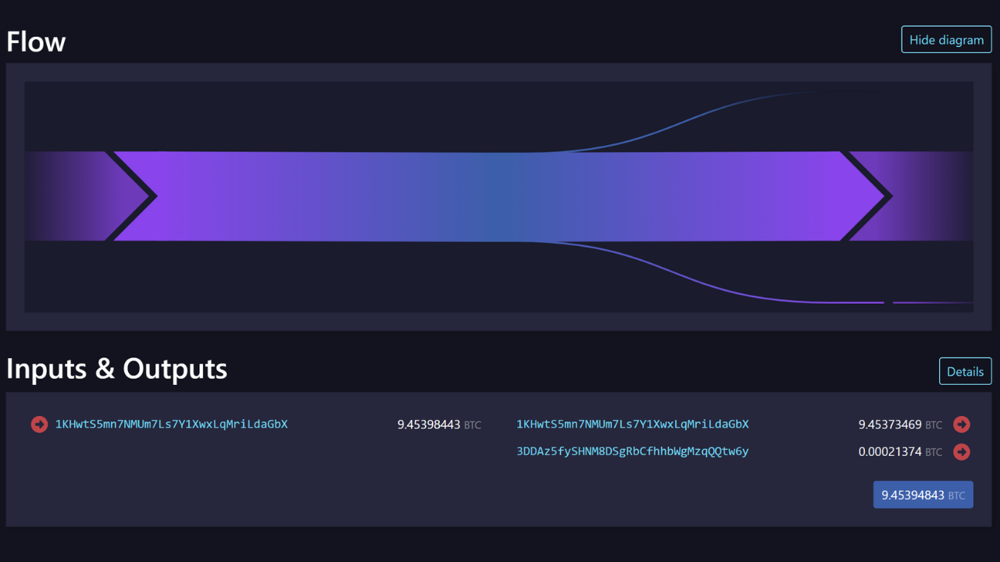

स्रोत: [Mempool.space](https://Mempool.space/tx/54364146665bfc453a55eae4bfb8fdf7c721d02cb96aadc480c8b16bdeb8d6d0)

ये समानताएं सिर्फ Address के पुन:उपयोग तक ही सीमित नहीं हैं। स्क्रिप्ट्स के इस्तेमाल में कोई भी समानता ह्यूरिस्टिक लागू करने के लिए इस्तेमाल की जा सकती है। उदाहरण के लिए, हम कभी-कभी इनपुट और ट्रांजैक्शन आउटपुट में वर्जनिंग का एक ही पैटर्न देख सकते हैं।


इस डायग्राम पर, हम देख सकते हैं कि इनपुट नंबर 0 एक P2WPKH स्क्रिप्ट (SegWit V0 जो `bc1q` से शुरू होता है) को अनलॉक करता है। आउटपुट नंबर 0 भी उसी तरह की स्क्रिप्ट का इस्तेमाल करता है। वहीं दूसरी तरफ, आउटपुट नंबर 1 एक P2TR स्क्रिप्ट (SegWit V1 जो `bc1p` से शुरू होता है) का इस्तेमाल करता है। इस फीचर की व्याख्या यह है कि संभावना है कि Address जिसका वर्जनिंग इनपुट के समान है, वह Exchange Address है। इसलिए यह हमेशा एक ही यूजर का होगा।

यहाँ एक लेन-देन है जिस पर यह अनुमानी (ह्यूरिस्टिक) शायद लागू किया जा सकता है:

```plaintext
db07516288771ce5d0a06b275962ec4af1b74500739f168e5800cbcb0e9dd578
```

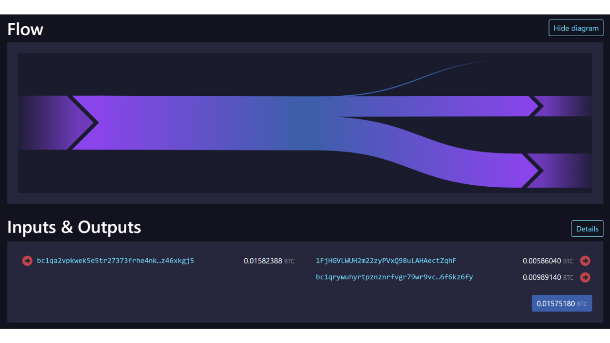

स्रोत : [Mempool.space](https://Mempool.space/tx/db07516288771ce5d0a06b275962ec4af1b74500739f168e5800cbcb0e9dd578)  

(नोट: लिंक और टेक्स्ट फॉर्मेटिंग को ठीक उसी तरह रखा गया है जैसा सोर्स में था। सिर्फ "Source" शब्द का हिंदी अनुवाद "स्रोत" किया गया है।)

इस पर हम देख सकते हैं कि इनपुट नंबर 0 और आउटपुट नंबर 1 P2WPKH स्क्रिप्ट्स (SegWit V0) का उपयोग करते हैं, जबकि आउटपुट नंबर 0 एक अलग P2PKH स्क्रिप्ट (लेगेसी) का उपयोग करता है।

2010 के शुरुआती दशक में, स्क्रिप्ट वर्जनिंग पर आधारित यह ह्यूरिस्टिक काफी कम उपयोगी था क्योंकि उपलब्ध स्क्रिप्ट के प्रकार सीमित थे। लेकिन समय के साथ और Bitcoin के लगातार अपडेट्स के बाद, स्क्रिप्ट के विभिन्न प्रकारों में बढ़ोतरी हुई है। इसलिए यह ह्यूरिस्टिक अब ज़्यादा प्रासंगिक होता जा रहा है, क्योंकि स्क्रिप्ट के ज़्यादा प्रकारों के साथ, यूज़र्स छोटे-छोटे ग्रुप्स में बंट जाते हैं, जिससे इस इंटरनल वर्जनिंग रीयूज़ ह्यूरिस्टिक को अप्लाई करने के चांस बढ़ जाते हैं। इसी वजह से, सिर्फ कन्फिडेंशियलिटी के नज़रिए से, सबसे कॉमन प्रकार की स्क्रिप्ट चुनना ही समझदारी है। मिसाल के तौर पर, जैसे मैं ये लाइन्स लिख रहा हूँ, Taproot स्क्रिप्ट्स (`bc1p`) का इस्तेमाल SegWit V0 स्क्रिप्ट्स (`bc1q`) के मुकाबले कम होता है। हालांकि पहले वाले कुछ खास मामलों में इकोनॉमिक और कन्फिडेंशियलिटी के फायदे देते हैं, लेकिन पारंपरिक सिंगल-सिग्नेचर यूज़ के लिए, नए स्टैंडर्ड के ज़्यादा व्यापक रूप से अपनाए जाने तक, कन्फिडेंशियलिटी की वजह से पुराने स्टैंडर्ड पर ही बने रहना समझदारी हो सकती है।

### गोल-मोल भुगतान

एक और अंदरूनी ह्यूरिस्टिक जो हमें Exchange को पहचानने में मदद कर सकता है, वह है राउंड नंबर ह्यूरिस्टिक। आम तौर पर, एक साधारण भुगतान पैटर्न (1 इनपुट और 2 आउटपुट) के सामने आने पर, अगर आउटपुट में से एक राउंड अमाउंट खर्च करता है, तो यह भुगतान को दर्शाता है।


खत्म करके, अगर एक आउटपुट पेमेंट को दिखाता है, तो दूसरा Exchange को दिखाता है। इसलिए यह माना जा सकता है कि इनपुट यूजर हमेशा Exchange के रूप में पहचाने गए आउटपुट के कब्ज़े में होता है।

यह बात ज़ोर देकर कहनी चाहिए कि यह अनुमानी नियम हमेशा लागू नहीं होता, क्योंकि ज़्यादातर भुगतान अभी भी भरोसेमंद लेखा इकाइयों में किए जाते हैं। असल में, जब फ्रांस का कोई रिटेलर Bitcoin स्वीकार करता है, तो वह आमतौर पर Sats में स्थिर कीमतें नहीं दिखाएगा। बल्कि, वह यूरो में कीमत और बिटकॉइन में भुगतान की जाने वाली रकम के बीच रूपांतरण का विकल्प चुनेगा। इसलिए लेन-देन के अंत में कोई पूर्ण संख्या नहीं होनी चाहिए।

फिर भी, एक विश्लेषक इस रूपांतरण को करने की कोशिश कर सकता है, नेटवर्क पर लेन-देन प्रसारित होने के समय प्रभावी Exchange दर को ध्यान में रखते हुए। चलिए एक उदाहरण लेते हैं: `97,552 Sats` के इनपुट वाला एक लेन-देन और दो आउटपुट, एक `31,085 Sats` का और दूसरा `64,152 Sats` का। पहली नज़र में, यह लेन-देन गोल रकम वाला नहीं लगता। हालाँकि, लेन-देन के समय Exchange की दर €64,339 लगाकर, हमें यूरो में रूपांतरण इस प्रकार मिलता है:


- €62.76 का इनपुट;
- 20 यूरो का आउटपुट;
- ₹41.27 का आउटपुट।

फिएट करेंसी में बदलने के बाद, इस लेन-देन को राउंड अमाउंट पेमेंट ह्यूरिस्टिक लागू करने के लिए इस्तेमाल किया जा सकता है। €20 का आउटपुट शायद किसी मर्चेंट के पास गया, या कम से कम Ownership बदल गया। अनुमान से, €41.27 का आउटपुट मूल यूजर के पास ही रहा होगा।


अगर, किसी दिन, Bitcoin हमारे लेन-देन में मुख्य हिसाब की इकाई बन जाए, तो यह ह्यूरिस्टिक विश्लेषण के लिए और भी ज़्यादा काम का हो सकता है।

उदाहरण के तौर पर, यहाँ एक लेन-देन है जिस पर यह अनुमान लगाया जा सकता है:

```plaintext
2bcb42fab7fba17ac1b176060e7d7d7730a7b807d470815f5034d52e96d2828a
```


सोर्स : [Mempool.space](https://Mempool.space/tx/2bcb42fab7fba17ac1b176060e7d7d7730a7b807d470815f5034d52e96d2828a)

### सबसे बड़ा आउटपुट

जब हम एक साधारण भुगतान मॉडल पर 2 लेन-देन आउटपुट्स के बीच काफी बड़ा अंतर पाते हैं, तो हम अनुमान लगा सकते हैं कि सबसे बड़ा आउटपुट संभवतः विदेशी Exchange होगा।


यह सबसे बड़ा आउटपुट ह्यूरिस्टिक निश्चित रूप से सबसे अधिक अशुद्ध है। अकेले में, यह काफी कमजोर है। हालांकि, इस फीचर को दूसरे ह्यूरिस्टिक्स के साथ मिलाकर हमारे इंटरप्रिटेशन की अनिश्चितता को कम किया जा सकता है।

उदाहरण के लिए, अगर हम एक लेन-देन देख रहे हैं जिसमें एक पूर्ण भुगतान और एक बड़ा भुगतान है, तो पूर्ण भुगतान ह्यूरिस्टिक और बड़े भुगतान ह्यूरिस्टिक को एक साथ लागू करने से हमारी अनिश्चितता का स्तर कम हो जाता है।

उदाहरण के लिए, यहाँ एक लेन-देन है जिस पर यह अनुमान लगाया जा सकता है:

```plaintext
b79d8f8e4756d34bbb26c659ab88314c220834c7a8b781c047a3916b56d14dcf
```

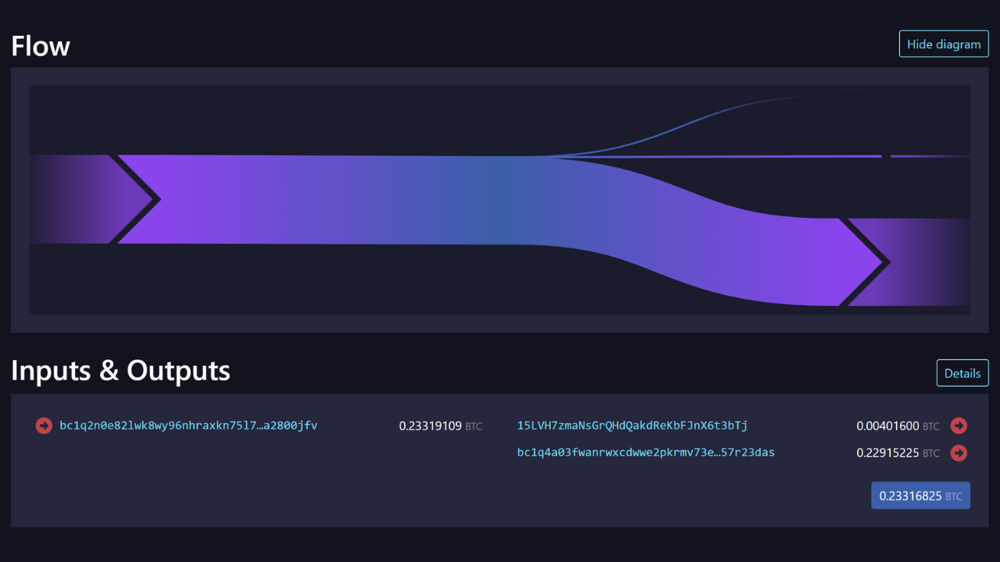

सोर्स : [Mempool.space](https://Mempool.space/tx/b79d8f8e4756d34bbb26c659ab88314c220834c7a8b781c047a3916b56d14dcf)

## बाहरी अनुमान (External heuristics)

<chapterId>4a170e3b-200d-431a-8285-18a23ff617ba</chapterId>

बाहरी ह्यूरिस्टिक्स (external heuristics) का अध्ययन करने का मतलब है कुछ Elements की समानताओं, पैटर्न्स और खासियतों का विश्लेषण करना जो खुद लेन-देन से सीधे जुड़े नहीं होते। यानी, जहां पहले हम सिर्फ लेन-देन के भीतर मौजूद Elements को इंटरनल ह्यूरिस्टिक्स (internal heuristics) से समझने तक सीमित थे, वहीं अब बाहरी ह्यूरिस्टिक्स की मदद से हम अपने विश्लेषण के दायरे को लेन-देन के माहौल तक बढ़ा रहे हैं।

### जीडब्ल्यू-221 का पुन: उपयोग

यह बिटकॉइनर्स का सबसे मशहूर ह्यूरिस्टिक्स में से एक है। Address का दोबारा इस्तेमाल करने से अलग-अलग ट्रांजेक्शन्स और अलग-अलग UTXOs के बीच कनेक्शन स्थापित करना संभव हो जाता है। ऐसा तब होता है जब Bitcoin जो Address रिसीव करता है, उसे कई बार इस्तेमाल किया जाता है।

इस तरह, Address के पुन:उपयोग को एक ही लेन-देन के भीतर एक आंतरिक ह्यूरिस्टिक (अनुमानी नियम) के रूप में इस्तेमाल करके Exchange की पहचान की जा सकती है (जैसा कि हमने पिछले अध्याय में देखा)। लेकिन Address के पुन:उपयोग को एक बाहरी ह्यूरिस्टिक के तौर पर भी इस्तेमाल किया जा सकता है ताकि कई लेन-देनों के पीछे मौजूद एक इकाई की विशिष्टता को पहचाना जा सके।

Address के पुन: उपयोग की व्याख्या यह है कि उस Address पर ब्लॉक किए गए सभी UTXO एक ही इकाई के हैं (या रहे हैं)। यह अनुमान लगाने की विधि अनिश्चितता के लिए बहुत कम गुंजाइश छोड़ती है। एक बार पहचान लेने पर, इसके परिणामस्वरूप मिलने वाली व्याख्या संभवतः वास्तविकता से मेल खाती है। इसलिए यह विभिन्न ऑनचेन गतिविधियों को समूहित करने में सक्षम बनाता है।


जैसा कि भाग 3 की भूमिका में बताया गया है, यह ह्यूरिस्टिक Satoshi नाकामोतो ने खुद खोजा था। व्हाइट पेपर में, वह उपयोगकर्ताओं को इसे जनरेट करने से बचने में मदद के लिए एक समाधान का उल्लेख करते हैं, जो बस हर नए लेन-देन के लिए एक खाली Address का उपयोग करना है:

"एक अतिरिक्त सुरक्षा के तौर पर, हर लेन-देन के लिए एक नया की-पेयर इस्तेमाल किया जा सकता है ताकि उन्हें एक ही मालिक से जोड़कर न देखा जा सके।"


स्रोत: एस. नाकामोटो, "जीडब्ल्यू-229: एक पीयर-टू-पीयर इलेक्ट्रॉनिक कैश सिस्टम", https://Bitcoin.org/Bitcoin.pdf, 2009.

उदाहरण के लिए, यहाँ एक Address है जिसे कई लेन-देन में दोबारा इस्तेमाल किया गया है:

```plaintext
bc1qqtmeu0eyvem9a85l3sghuhral8tk0ar7m4a0a0
```


स्रोत: [Mempool.space](https://Mempool.space/Address/bc1qqtmeu0eyvem9a85l3sghuhral8tk0ar7m4a0a0)

### स्क्रिप्ट समानता और जीडब्ल्यू-233 के निशान

Address के पुन: उपयोग के अलावा, कई और अनुमानी तरीके हैं जो आपको एक ही पोर्टफोलियो या Address क्लस्टर से क्रियाओं को जोड़ने की अनुमति देते हैं।

सबसे पहले, एक विश्लेषक स्क्रिप्ट के इस्तेमाल में समानताएं ढूंढ सकता है। उदाहरण के लिए, Multisig जैसी कुछ अल्पसंख्यक स्क्रिप्ट्स को SegWit V0 स्क्रिप्ट्स की तुलना में पहचानना आसान हो सकता है। जितने बड़े समूह में हम छिपे होते हैं, उतना ही हमें पकड़ना मुश्किल होता है। यही एक वजह है कि अच्छे CoinJoin प्रोटोकॉल्स पर सभी प्रतिभागी बिल्कुल एक जैसी स्क्रिप्ट का इस्तेमाल करते हैं।

वैसे, एक विश्लेषक पोर्टफोलियो के खास फिंगरप्रिंट्स पर भी ध्यान दे सकता है। ये ऐसे यूज़-स्पेसिफिक प्रोसेस होते हैं जिन्हें पहचाना जा सकता है ताकि उन्हें ट्रेसिंग ह्यूरिस्टिक्स के तौर पर इस्तेमाल किया जा सके। मतलब, अगर हम ट्रेस की गई इकाई से जुड़े लेन-देन में एक ही तरह के इंटरनल कैरेक्टरिस्टिक्स का जमावड़ा देखते हैं, तो हम दूसरे लेन-देन में भी इन्हीं कैरेक्टरिस्टिक्स को पहचानने की कोशिश कर सकते हैं।

उदाहरण के लिए, हम पता लगा पाएंगे कि ट्रेस किया गया यूज़र अपना चेंज P2TR एड्रेसेस को (`bc1p...`) सिस्टमैटिकली भेजता है। अगर यह प्रक्रिया दोहराई जाती है, तो हम इसे अपने बाकी के एनालिसिस के लिए एक ह्यूरिस्टिक के तौर पर इस्तेमाल कर सकते हैं। हम दूसरे फिंगरप्रिंट्स का भी इस्तेमाल कर सकते हैं, जैसे कि UTXOs का ऑर्डर, आउटपुट्स में चेंज की जगह, RBF (Replace-by-fee) सिग्नलिंग, या वर्जन नंबर, `nSequence` फील्ड और `nLockTime` फील्ड।


जैसा कि [@LaurentMT](https://twitter.com/LaurentMT) ने [Space Kek #19](https://podcasters.spotify.com/pod/show/decouvrebitcoin/episodes/SpaceKek-19---Analyse-de-chane--anonsets-et-entropie-e1vfuji) (एक फ्रेंच भाषा का पॉडकास्ट) में बताया है, चेन एनालिसिस में पोर्टफोलियो फिंगरप्रिंट्स की उपयोगिता समय के साथ काफी बढ़ रही है। दरअसल, स्क्रिप्ट प्रकारों की बढ़ती संख्या और पोर्टफोलियो सॉफ्टवेयर द्वारा इन नई सुविधाओं का धीरे-धीरे हो रहा डिप्लॉयमेंट अंतरों को और बढ़ा देता है। कुछ मामलों में, ट्रैक किए जा रहे इकाई द्वारा इस्तेमाल किए जा रहे सॉफ्टवेयर को सटीक रूप से पहचानना भी संभव हो जाता है। इसलिए यह समझना ज़रूरी है कि पोर्टफोलियो फुटप्रिंट्स का अध्ययन हाल के ट्रांजैक्शन्स के लिए खासतौर पर प्रासंगिक है, न कि 2010s की शुरुआत में किए गए ट्रांजैक्शन्स के लिए।

संक्षेप में, फुटप्रिंट कोई भी खास प्रैक्टिस हो सकती है, जो Wallet द्वारा अपने आप या यूजर द्वारा मैन्युअली की गई हो, जिसे हम दूसरे ट्रांजैक्शन्स में ढूंढ़ सकते हैं ताकि हमारे एनालिसिस में मदद मिल सके।

### कॉमन इनपुट Ownership ह्यूरिस्टिक (CIOH)

कॉमन इनपुट Ownership ह्यूरिस्टिक (CIOH) एक ऐसा ह्यूरिस्टिक है जो बताता है कि जब किसी ट्रांजैक्शन में मल्टीपल इनपुट्स होते हैं, तो वे सभी एक ही स्रोत से आने की संभावना रखते हैं। इसलिए, उनका Ownership कॉमन होता है।


CIOH को लागू करने के लिए, हम पहले कई इनपुट्स वाले एक ट्रांजैक्शन को ऑब्जर्व करते हैं। यह 2 इनपुट्स हो सकते हैं, या 30 इनपुट्स भी। एक बार इस कैरेक्टरिस्टिक की पहचान हो जाने के बाद, हम चेक करते हैं कि क्या यह ट्रांजैक्शन किसी ज्ञात ट्रांजैक्शन मॉडल में फिट बैठता है। उदाहरण के लिए, अगर 5 इनपुट्स लगभग एक जैसी अमाउंट के साथ हैं और 5 आउटपुट्स बिल्कुल एक जैसी अमाउंट के साथ हैं, तो हम जान जाएंगे कि यह CoinJoin का स्ट्रक्चर है। हम CIOH को लागू नहीं कर पाएंगे।


दूसरी तरफ, अगर लेन-देन किसी भी ज्ञात सहयोगी लेन-देन मॉडल में फिट नहीं बैठता, तो हम यह समझ सकते हैं कि सभी इनपुट संभवतः एक ही इकाई से आ रहे हैं। यह पहले से ज्ञात क्लस्टर को बढ़ाने या ट्रेस को जारी रखने के लिए बहुत उपयोगी हो सकता है।


CIOH की खोज Satoshi नाकामोटो ने की थी। वे इसके बारे में व्हाइट पेपर के भाग 10 में बात करते हैं:

"[...] मल्टी-एंट्री ट्रांजैक्शन्स के साथ लिंकिंग अनिवार्य है, जो ज़रूर बताती हैं कि उनकी एंट्रीज़ एक ही मालिक के पास थीं। खतरा यह है कि अगर किसी की (कुंजी) का मालिक पता चल जाए, तो ये लिंक्स उसी मालिक से जुड़े दूसरे ट्रांजैक्शन्स भी उजागर कर सकते हैं।_"


यह बात खास तौर पर दिलचस्प है कि Satoshi नाकामोटो ने, Bitcoin के आधिकारिक लॉन्च से पहले ही, यूजर्स के लिए दो मुख्य प्राइवेसी कमजोरियों को पहचान लिया था, जो हैं CIOH और Address का दोबारा इस्तेमाल। ऐसी दूरदर्शिता काफी उल्लेखनीय है, क्योंकि यह दोनों ह्यूरिस्टिक्स आज भी Blockchain के विश्लेषण में सबसे उपयोगी बने हुए हैं।

उदाहरण के तौर पर, यहाँ एक लेन-देन है जिस पर हम शायद CIOH लागू कर सकते हैं:

```plaintext
20618e63b6eed056263fa52a2282c8897ab2ee71604c7faccfe748e1a202d712
```


स्रोत : [Mempool.space](https://Mempool.space/tx/20618e63b6eed056263fa52a2282c8897ab2ee71604c7faccfe748e1a202d712)

### जीडब्ल्यू-251 डेटा

बिल्कुल, चेन एनालिसिस सिर्फ़ ऑनचेन डेटा तक ही सीमित नहीं है। पिछले एनालिसिस का कोई भी डेटा या इंटरनेट पर उपलब्ध कोई भी जानकारी भी एनालिसिस को बेहतर बनाने के लिए इस्तेमाल की जा सकती है।

उदाहरण के तौर पर, अगर हम देखते हैं कि ट्रेस किए गए लेन-देन एक ही Bitcoin नोड से सिस्टमैटिकली ब्रॉडकास्ट हो रहे हैं, और हम उसका IP Address पहचानने में कामयाब हो जाते हैं, तो हम उसी इकाई के दूसरे लेन-देन को भी पहचान सकते हैं, साथ ही इश्यूअर की पहचान का कुछ हिस्सा भी जान सकते हैं। हालांकि यह प्रैक्टिस आसानी से हासिल नहीं होती, क्योंकि इसमें बहुत सारे नोड्स के ऑपरेशन की जरूरत होती है, लेकिन कुछ कंपनियाँ जो Blockchain एनालिसिस में स्पेशलाइज़्ड हैं, यह तरीका अपना सकती हैं।

विश्लेषक के पास यह विकल्प भी होता है कि वह पहले से ओपन-सोर्स किए गए विश्लेषणों पर भरोसा करे, या फिर अपने पुराने विश्लेषणों का इस्तेमाल करे। शायद हमें कोई आउटपुट मिल जाए जो उन पतेों के समूह की ओर इशारा करता हो जिन्हें हम पहले ही पहचान चुके हैं। कभी-कभी, उन आउटपुट्स पर भरोसा करना भी संभव होता है जो Exchange प्लेटफॉर्म की ओर इशारा करते हैं, क्योंकि इन कंपनियों के पते आमतौर पर ज्ञात होते हैं।

ठीक उसी तरह, आप ख़ारिज करके विश्लेषण कर सकते हैं। मिसाल के तौर पर, अगर दो आउटपुट वाले लेन-देन का विश्लेषण करते समय, उनमें से एक पहले से ज्ञात Address क्लस्टर से जुड़ा है, लेकिन जिस संस्था को हम ट्रैक कर रहे हैं उससे अलग है, तो हम यह समझ सकते हैं कि दूसरा आउटपुट संभवतः Exchange को दर्शाता है।

चैनल विश्लेषण में OSINT (*ओपन सोर्स इंटेलिजेंस*) का थोड़ा और व्यापक हिस्सा भी शामिल होता है, जिसमें इंटरनेट सर्च शामिल हैं। इसी वजह से हम सलाह देते हैं कि सोशल नेटवर्क्स या वेबसाइट पर सीधे पते ना डालें, चाहे वो छद्म नाम से हों या नहीं।


### समय-संबंधी मॉडल

हम इसके बारे में कम सोचते हैं, लेकिन कुछ मानवीय व्यवहार ऑनचेन में पहचाने जा सकते हैं। शायद विश्लेषण में सबसे उपयोगी आपकी नींद का पैटर्न है! हाँ, जब आप सोते हैं, तो आप Bitcoin लेन-देन प्रसारित नहीं करते। लेकिन आप आमतौर पर लगभग एक ही समय पर सोते हैं। यही कारण है कि Blockchain विश्लेषण में समय-संबंधी विश्लेषण का उपयोग करना आम बात है। बहुत सरलता से, यह उन समयों की एक गणना है जब किसी दिए गए इकाई के लेन-देन Bitcoin नेटवर्क पर प्रसारित किए जाते हैं। इन समय-संबंधी पैटर्नों का विश्लेषण करके, हम जानकारी का एक खजाना निकाल सकते हैं।

सबसे पहले, एक समय-सापेक्ष विश्लेषण कभी-कभी ट्रैस किए गए इकाई की प्रकृति की पहचान कर सकता है। अगर हम देखते हैं कि लेन-देन 24 घंटे लगातार प्रसारित हो रहे हैं, तो यह आर्थिक गतिविधि के उच्च स्तर को दर्शाता है। इन लेन-देन के पीछे की इकाई संभवतः एक कंपनी है, जो अंतरराष्ट्रीय हो सकती है और शायद स्वचालित आंतरिक प्रक्रियाओं वाली हो।

उदाहरण के लिए, [मैंने यह पैटर्न कुछ महीने पहले पहचाना था](https://twitter.com/Loic_Pandul/status/1701127409712452072) जब [उस लेन-देन का विश्लेषण कर रहा था जिसमें गलती से 19 बिटकॉइन फीस के रूप में आवंटित कर दिए गए थे](https://Mempool.space/tx/d5392d474b4c436e1c9d1f4ff4be5f5f9bb0eb2e26b61d2781751474b7e870fd)। एक साधारण समय-संबंधी विश्लेषण से मुझे यह अनुमान लगाने में मदद मिली कि हम एक स्वचालित सेवा के साथ काम कर रहे हैं, और इसलिए संभवतः एक बड़ी संस्था जैसे कि Exchange प्लेटफॉर्म के साथ।

बिल्कुल, कुछ दिनों बाद पता चला कि फंड्स पेपैल के थे, पैक्सोस Exchange प्लेटफॉर्म के जरिए।

इसके विपरीत, अगर हम देख सकते हैं कि समय का पैटर्न 16 विशिष्ट घंटों में फैला हुआ है, तो हम अनुमान लगा सकते हैं कि हम किसी व्यक्तिगत उपयोगकर्ता या शायद एक स्थानीय कंपनी के साथ काम कर रहे हैं, जो कि आदान-प्रदान की गई मात्रा पर निर्भर करता है।

जिस चीज़ को देखा जा रहा है उसके स्वभाव से परे, समय के पैटर्न से हमें यूज़र का लोकेशन भी पता चल सकता है, क्योंकि टाइम ज़ोन के हिसाब से। इस तरह, हम दूसरे ट्रांज़ैक्शन्स से मिलान कर सकते हैं, और उनके टाइमस्टैम्प्स को अपने एनालिसिस में एक और सहायक जानकारी के तौर पर इस्तेमाल कर सकते हैं।

उदाहरण के लिए, जिस मल्टी-यूज़्ड Address का मैंने पहले ज़िक्र किया था, उसमें हम देख सकते हैं कि लेन-देन, चाहे आने वाले हों या जाने वाले, 13 घंटे के अंतराल पर केंद्रित हैं।

```plaintext
bc1qqtmeu0eyvem9a85l3sghuhral8tk0ar7m4a0a0
```


टारगेट : OXT.me

यह रेंज शायद यूरोप, अफ्रीका या मध्य पूर्व से मेल खाती है। इसलिए हम यह मान सकते हैं कि इन लेन-देन के पीछे जो यूजर है, वह इन्हीं इलाकों में रहता होगा।

एक और नज़रिए से, इस तरह के समय विश्लेषण से यह अनुमान भी लगाया गया कि Satoshi नाकामोतो जापान से नहीं, बल्कि अमेरिका से काम कर रहे थे: [*Satoshi नाकामोतो के टाइम ज़ोन*](https://medium.com/@insearchofsatoshi/the-time-zones-of-Satoshi-nakamoto-aa40f035178f)

## इसे Block explorer के साथ प्रैक्टिस में लाना

<chapterId>6493cf2f-225c-405f-9375-c4304f1087ed</chapterId>

इस आखिरी अध्याय में, हम अब तक पढ़े गए सिद्धांतों को व्यवहार में लाएंगे। मैं आपको असली Bitcoin लेन-देन के उदाहरण दिखाऊंगा, और आपको मेरे द्वारा पूछी गई जानकारी निकालनी होगी।

आदर्श रूप से, इन एक्सरसाइज़ को करने के लिए एक प्रोफेशनल चेन एनालिसिस टूल का इस्तेमाल बेहतर होगा। हालाँकि, Samourai Wallet के निर्माताओं की गिरफ्तारी के बाद, एकमात्र फ्री एनालिसिस टूल OXT.me अब उपलब्ध नहीं है। इसलिए हम इन एक्सरसाइज़ के लिए एक क्लासिक Block explorer का विकल्प चुनेंगे। मैं [Mempool.space](https://Mempool.space/) का इस्तेमाल करने की सलाह देता हूँ, क्योंकि इसमें कई फीचर्स और चेन एनालिसिस टूल्स की रेंज है, लेकिन आप [Bitcoin Explorer](https://bitcoinexplorer.org/) जैसे किसी दूसरे एक्सप्लोरर को भी चुन सकते हैं।

शुरुआत करते हैं, मैं तुम्हें एक्सरसाइज के बारे में बताता हूँ। इन्हें पूरा करने के लिए अपना Block explorer इस्तेमाल करो, और जवाब एक कागज़ पर लिख लो। फिर, इस चैप्टर के आखिर में, मैं तुम्हें जवाब दूँगा ताकि तुम अपने नतीजों को चेक और सही कर सको।

*इन अभ्यासों के लिए चुने गए लेन-देन को पूरी तरह से उनकी विशेषताओं के आधार पर कुछ हद तक यादृच्छिक तरीके से चुना गया है। यह अध्याय केवल शैक्षिक और जानकारीपूर्ण उद्देश्यों के लिए है। मैं स्पष्ट करना चाहता हूँ कि मैं न तो इन उपकरणों के दुर्भावनापूर्ण उपयोग का समर्थन करता हूँ और न ही प्रोत्साहित करता हूँ। इसका उद्देश्य आपको स्ट्रिंग विश्लेषण के खिलाफ खुद को कैसे सुरक्षित रखना है यह सिखाना है, न कि दूसरों की निजी जानकारी को उजागर करने के लिए विश्लेषण करना।*

### अभ्यास 1

विश्लेषण किए जाने वाले लेन-देन की पहचानकर्ता :

```plaintext
3769d3b124e47ef4ffb5b52d11df64b0a3f0b82bb10fd6b98c0fd5111789bef7
```

इस लेन-देन के मॉडल का नाम क्या है, और सिर्फ इसके मॉडल यानी लेन-देन की संरचना को देखकर क्या संभावित व्याख्याएँ निकाली जा सकती हैं?

### अभ्यास 2

विश्लेषण किए जाने वाले लेन-देन की पहचानकर्ता :

```plaintext
baa228f6859ca63e6b8eea24ffad7e871713749d693ebd85343859173b8d5c20
```

इस ट्रांजैक्शन के मॉडल का नाम क्या है, और सिर्फ इसके मॉडल यानी ट्रांजैक्शन की संरचना को देखकर क्या संभावित व्याख्याएँ निकाली जा सकती हैं?

### अभ्यास 3

विश्लेषण किए जाने वाले लेन-देन की पहचानकर्ता :

```plaintext
3a9eb9ccc3517cc25d1860924c66109262a4b68f4ed2d847f079b084da0cd32b
```

इस ट्रांजैक्शन का मॉडल क्या है?

अपने मॉडल को पहचानने के बाद, ट्रांजैक्शन की आंतरिक ह्यूरिस्टिक्स का इस्तेमाल करते हुए, Exchange किस आउटपुट को दर्शाने की संभावना रखता है?

### अभ्यास 4

विश्लेषण किए जाने वाले लेन-देन का पहचानकर्ता :

```plaintext
35f0b31c05503ebfdf7311df47f68a048e992e5cf4c97ec34aa2833cc0122a12
```

इस ट्रांजैक्शन का मॉडल क्या है?

अपने मॉडल को पहचानने के बाद, ट्रांजैक्शन की आंतरिक ह्यूरिस्टिक्स का उपयोग करते हुए, Exchange किस आउटपुट को दर्शाने की संभावना रखता है?

### अभ्यास 5

चलो मान लेते हैं कि लोइक ने ट्विटर सोशल नेटवर्क पर अपना एक Bitcoin रिसीविंग एड्रेस पोस्ट किया है:


```plaintext
bc1qja0hycrv7g9ww00jcqanhfpqmzx7luqalum3vu
```

इस जानकारी के आधार पर और **सिर्फ Address रीयूज़ ह्यूरिस्टिक** का इस्तेमाल करते हुए, कौन से Bitcoin ट्रांज़ैक्शन्स को लोईक की पहचान से जोड़ा जा सकता है?

*ज़ाहिर है, मैं इस रिसेप्शन Address का असली मालिक नहीं हूँ और मैंने इसे सोशल नेटवर्क्स पर पोस्ट भी नहीं किया है। ये तो एक Address है जो मैंने Blockchain से बिना सोचे-समझे उठा लिया था।*

### अभ्यास 6

एक्सरसाइज 5 के बाद, Address रीयूज़ ह्यूरिस्टिक की मदद से, आप Bitcoin के कई ट्रांजैक्शन्स पहचान पाए जिनमें लोइक शामिल लगता है। आमतौर पर, पहचाने गए ट्रांजैक्शन्स में से आपको यह वाला भी दिख जाना चाहिए था:

```plaintext
2d9575553c99578268ffba49a1b2adc3b85a29926728bd0280703a04d051eace
```

यह लेन-देन सबसे पहला है जिसमें Loïc के Address को फंड भेजा गया। तुम्हें क्या लगता है कि इस लेन-देन के जरिए Loïc को मिले बिटकॉइन कहाँ से आए थे?

### अभ्यास 7

एक्सरसाइज 5 के बाद, Address रीयूज़ ह्यूरिस्टिक की मदद से, आपने कई Bitcoin ट्रांजैक्शन्स पहचान लिए हैं जिनमें लोइक शामिल लगता है। अब आप यह जानना चाहते हैं कि लोइक कहाँ से आया है। मिले ट्रांजैक्शन्स के आधार पर, एक टाइम एनालिसिस करके वह टाइम ज़ोन पता करें जिसका लोइक ने सबसे ज़्यादा इस्तेमाल किया हो। इस टाइम ज़ोन से, एक लोकेशन ढूँढ़ें जहाँ लोइक रहता हो (देश, राज्य/प्रदेश, शहर...)।


### अभ्यास 8

यहाँ Bitcoin लेन-देन का अध्ययन करने के लिए है:

```plaintext
bb346dae645d09d32ed6eca1391d2ee97c57e11b4c31ae4325bcffdec40afd4f
```

इस ट्रांजैक्शन को अकेले देखते हुए, हम क्या जानकारी निकाल सकते हैं?

### कसरत के हल

***अभ्यास 1:***

इस लेन-देन का मॉडल सरल भुगतान मॉडल है। अगर हम सिर्फ इसकी संरचना का अध्ययन करें, तो हम यह समझ सकते हैं कि एक आउटपुट Exchange को दर्शाता है और दूसरा आउटपुट एक वास्तविक भुगतान को दर्शाता है। इसलिए हम जानते हैं कि देखे गए उपयोगकर्ता के पास संभवतः आउटपुट में दो UTXOs में से एक (भुगतान वाला) अब नहीं है, लेकिन दूसरा UTXO (Exchange वाला) अभी भी उसके पास है।

***अभ्यास 2:***

इस लेन-देन का मॉडल ग्रुप्ड स्पेंडिंग (समूहित खर्च) का है। यह मॉडल संभवतः बड़े पैमाने की आर्थिक गतिविधि को दर्शाता है, जैसे कि Exchange प्लेटफॉर्म। हम यह अनुमान लगा सकते हैं कि इनपुट UTXO एक ऐसी कंपनी से आता है जिसकी आर्थिक गतिविधि का स्तर काफी ऊंचा है, और आउटपुट UTXOs बिखरे हुए होंगे। कुछ UTXOs कंपनी के ग्राहकों के होंगे जिन्होंने अपने बिटकॉइन्स को सेल्फ-कस्टडी वॉलेट्स में निकाल लिया है। कुछ पार्टनर कंपनियों को जा सकते हैं। और अंत में, निश्चित रूप से कुछ Exchange वापस जारी करने वाली कंपनी को भी जाएंगे।

***अभ्यास 3:***

इस लेन-देन का मॉडल साधारण भुगतान है। इसलिए, हम Exchange की पहचान करने के लिए लेन-देन पर आंतरिक ह्यूरिस्टिक्स लागू कर सकते हैं।

मैंने खुद ही कम से कम दो अंदरूनी ह्यूरिस्टिक्स पहचाने हैं जो एक ही हाइपोथिसिस को सपोर्ट करते हैं:


- एक ही तरह के स्क्रिप्ट का दोबारा इस्तेमाल ;
- सबसे बड़ा आउटपुट।

सबसे स्पष्ट ह्यूरिस्टिक यह है कि एक ही तरह के स्क्रिप्ट का दोबारा इस्तेमाल किया जाए। वास्तव में, आउटपुट `0` एक `P2SH` है, जिसे इसके रिसेप्शन Address से पहचाना जा सकता है जो `3` से शुरू होता है :

```plaintext
3Lcdauq6eqCWwQ3UzgNb4cu9bs88sz3mKD
```

जबकि आउटपुट `1` एक `P2WPKH` है, जिसे इसके `bc1q` से शुरू होने वाले Address से पहचाना जा सकता है :

```plaintext
bc1qya6sw6sta0mfr698n9jpd3j3nrkltdtwvelywa
```

इस ट्रांजैक्शन के लिए इनपुट के रूप में इस्तेमाल किया गया UTXO भी एक `P2WPKH` स्क्रिप्ट का उपयोग करता है:

```plaintext
bc1qyfuytw8pcvg5vx37kkgwjspg73rpt56l5mx89k
```

इसलिए, हम यह मान सकते हैं कि आउटपुट `0` एक भुगतान से मेल खाता है और आउटपुट `1` लेन-देन Exchange है, जिसका मतलब होगा कि इनपुट यूज़र हमेशा आउटपुट `1` का मालिक होता है।

इस परिकल्पना का समर्थन या खंडन करने के लिए, हम अन्य अनुमानी तकनीकों को देख सकते हैं जो या तो हमारी सोच की पुष्टि करती हैं, या हमारी परिकल्पना के सही होने की संभावना को कम करती हैं।

मैंने कम से कम एक और ह्यूरिस्टिक पहचाना है। यह सबसे बड़े आउटपुट वाला ह्यूरिस्टिक है। आउटपुट `0` का माप `123,689 Sats` है, जबकि आउटपुट `1` का माप `505,839 Sats` है। इसलिए इन दोनों आउटपुट्स में काफी अंतर है। सबसे बड़े आउटपुट वाला ह्यूरिस्टिक बताता है कि सबसे बड़ा आउटपुट संभवतः विदेशी Exchange होगा। यह ह्यूरिस्टिक हमारे शुरुआती अनुमान को और मजबूत करता है।

इसलिए ऐसा लगता है कि जिस यूज़र ने UTXO को इनपुट के रूप में दिया था, उसके पास अभी भी `1` आउटपुट है, जो लेन-देन Exchange को दर्शाता प्रतीत होता है।

***अभ्यास 4:***

इस लेन-देन का मॉडल साधारण भुगतान है। इसलिए, हम Exchange को पहचानने के लिए लेन-देन पर आंतरिक ह्यूरिस्टिक्स लागू कर सकते हैं।

मैंने खुद ही कम से कम दो अंदरूनी ह्यूरिस्टिक्स पहचाने हैं जो एक ही हाइपोथीसिस को सपोर्ट करते हैं:


- एक ही तरह के स्क्रिप्ट का दोबारा इस्तेमाल ;
- गोल पोस्ट आउटपुट।

सबसे स्पष्ट ह्यूरिस्टिक यह है कि एक ही तरह के स्क्रिप्ट को दोबारा इस्तेमाल किया जाए। वास्तव में, आउटपुट `0` एक `P2SH` है, जिसे इसके रिसेप्शन Address से पहचाना जा सकता है जो `3` से शुरू होता है :

```plaintext
3FSH5Mnq6S5FyQoKR9Yjakk3X4KCGxeaD4
```

आउटपुट `1` एक `P2WPKH` है, जिसे Address से पहचाना जा सकता है जो `bc1q` से शुरू होता है :

```plaintext
bc1qvdywdcfsyavt4v8uxmmrdt6meu4vgeg439n7sg
```

इस ट्रांजैक्शन के लिए इनपुट के रूप में इस्तेमाल किया गया UTXO एक `P2WPKH` स्क्रिप्ट भी इस्तेमाल करता है:

```plaintext
bc1qku3f2y294h3ks5eusv63dslcua2xnlzxx0k6kp
```

इसलिए, हम यह मान सकते हैं कि आउटपुट `0` एक भुगतान को दर्शाता है और आउटपुट `1` लेन-देन Exchange है, जिसका मतलब होगा कि इनपुट यूज़र हमेशा आउटपुट `1` का मालिक होता है।

इस परिकल्पना (हाइपोथीसिस) को सही या गलत साबित करने के लिए, हम दूसरे ह्यूरिस्टिक्स (अनुमान लगाने के तरीके) देख सकते हैं जो या तो हमारे विचारों की पुष्टि करते हैं, या फिर हमारी परिकल्पना के सही होने की संभावना को कम करते हैं।

मैंने कम से कम एक और ह्यूरिस्टिक (सरल नियम) पहचाना है। वह है राउंड अमाउंट आउटपुट। आउटपुट `0` का माप `70,000 Sats` है, जबकि आउटपुट `1` का माप `22,962 Sats` है। इस तरह हमें BTC यूनिट में एक बिल्कुल राउंड आउटपुट मिलता है।  

राउंड आउटपुट ह्यूरिस्टिक से पता चलता है कि राउंड अमाउंट वाला UTXO सबसे अधिक संभावना भुगतान का हिस्सा है, और निष्कर्ष के तौर पर, दूसरा Exchange को दर्शाता है। यह ह्यूरिस्टिक हमारे शुरुआती अनुमान को और मजबूत करता है।

हालांकि, इस उदाहरण में, एक और अनुमान हमारे शुरुआती परिकल्पना को चुनौती दे सकता है। वास्तव में, आउटपुट `0` आउटपुट `1` से बड़ा है। इस अनुमान के आधार पर कि सबसे बड़ा आउटपुट आमतौर पर विदेशी Exchange होता है, हम यह निष्कर्ष निकाल सकते हैं कि आउटपुट `0` विदेशी Exchange है। लेकिन, यह प्रतिकूल परिकल्पना अविश्वसनीय लगती है, क्योंकि बाकी दोनों अनुमान सबसे बड़े आउटपुट वाले अनुमान से कहीं ज़्यादा विश्वसनीय लगते हैं। इसलिए, इस स्पष्ट विरोधाभास के बावजूद हमारी शुरुआती परिकल्पना पर कायम रहना उचित लगता है।

इसलिए ऐसा लगता है कि जिस यूज़र ने UTXO को इनपुट के रूप में दिया था, उसके पास अभी भी `1` आउटपुट मौजूद है, जो लेन-देन के Exchange को दर्शाता प्रतीत होता है।

***अभ्यास 5:***

हम देख सकते हैं कि 8 लेन-देन Loïc की पहचान से जुड़े हो सकते हैं। इनमें से 4 में बिटकॉइन प्राप्त करना शामिल है:

```plaintext
2d9575553c99578268ffba49a1b2adc3b85a29926728bd0280703a04d051eace
8b70bd322e6118b8a002dbdb731d16b59c4a729c2379af376ae230cf8cdde0dd
d5864ea93e7a8db9d3fb113651d2131567e284e868021e114a67c3f5fb616ac4
bc4dcf2200c88ac1f976b8c9018ce70f9007e949435841fc5681fd33308dd762
```

बाकी के 4 Bitcoin शिपमेंट्स को लेकर चिंता है:

```plaintext
8b52fe3c2cf8bef60828399d1c776c0e9e99e7aaeeff721fff70f4b68145d540
c12499e9a865b9e920012e39b4b9867ea821e44c047d022ebb5c9113f2910ed6
a6dbebebca119af3d05c0196b76f80fdbf78f20368ebef1b7fd3476d0814517d
3aeb7ce02c35eaecccc0a97a771d92c3e65e86bedff42a8185edd12ce89d89cc
```

***अभ्यास 6:***

अगर हम इस लेन-देन के मॉडल को देखें, तो यह साफ़ है कि यह एक बंडल खर्च है। दरअसल, इस लेन-देन में एक इनपुट और 51 आउटपुट हैं, जो आर्थिक गतिविधि के उच्च स्तर को दर्शाता है। इसलिए हम यह अनुमान लगा सकते हैं कि लोइक ने एक Exchange प्लेटफॉर्म से बिटकॉइन निकाले हैं।

इस परिकल्पना को कई कारण मजबूत करते हैं। पहला, UTXO इनपुट को सुरक्षित करने के लिए इस्तेमाल किया गया स्क्रिप्ट P2SH 2/3 Multisig स्क्रिप्ट है, जो Exchange प्लेटफॉर्म्स की तरह उन्नत स्तर की सुरक्षा दिखाता है:

```plaintext
OP_PUSHNUM_2
OP_PUSHBYTES_33 03eae02975918af86577e1d8a257773118fd6ceaf43f1a543a4a04a410e9af4a59
OP_PUSHBYTES_33 03ba37b6c04aaf7099edc389e22eeb5eae643ce0ab89ac5afa4fb934f575f24b4e
OP_PUSHBYTES_33 03d95ef2dc0749859929f3ed4aa5668c7a95baa47133d3abec25896411321d2d2d
OP_PUSHNUM_3
OP_CHECKMULTISIG
```

इसके अलावा, Address में अध्ययन किया गया `3PUv9tQMSDCEPSMsYSopA5wDW86pwRFbNF` 220,000 से अधिक अलग-अलग लेन-देन में दोबारा इस्तेमाल किया गया है, जो अक्सर Exchange प्लेटफॉर्म्स की खासियत होती है, जो आमतौर पर अपनी गोपनीयता को लेकर चिंतित नहीं होते।

इस Address पर लगाया गया टेम्पोरल ह्यूरिस्टिक यह भी दिखाता है कि लगभग रोज़ 3 महीने की अवधि में ट्रांजैक्शन्स का नियमित प्रसारण होता है, जो 24 घंटे से भी ज़्यादा समय तक चलता है। यह Exchange प्लेटफॉर्म की लगातार चलने वाली गतिविधि को दर्शाता है।

आखिरकार, इस संस्था द्वारा संभाले गए वॉल्यूम बहुत बड़े हैं। Address ने दिसंबर 2022 से मार्च 2023 के बीच 222,262 लेन-देन में 44 BTC प्राप्त किए और भेजे। ये बड़े वॉल्यूम Exchange प्लेटफॉर्म की गतिविधि की संभावित प्रकृति की पुष्टि करते हैं।

***अभ्यास 7:***

लेन-देन की पुष्टि के समय का विश्लेषण करके, निम्नलिखित UTC समय पहचाने जा सकते हैं:

```plaintext
05:43
20:51
18:12
17:16
04:28
23:38
07:45
21:55
```

इन शेड्यूल का विश्लेषण करने से पता चलता है कि UTC-7 और UTC-8 ज़्यादातर शेड्यूल के लिए मौजूदा मानव गतिविधियों (08:00 से 23:00 के बीच) की सीमा के साथ मेल खाते हैं:

```plaintext
05:43 UTC > 22:43 UTC-7
20:51 UTC > 13:51 UTC-7
18:12 UTC > 11:12 UTC-7
17:16 UTC > 10:16 UTC-7
04:28 UTC > 21:28 UTC-7
23:38 UTC > 16:38 UTC-7
07:45 UTC > 00:45 UTC-7
21:55 UTC > 14:55 UTC-7
05:43 UTC > 21:43 UTC-8
20:51 UTC > 12:51 UTC-8
18:12 UTC > 10:12 UTC-8
17:16 UTC > 09:16 UTC-8
04:28 UTC > 20:28 UTC-8
23:38 UTC > 15:38 UTC-8
07:45 UTC > 23:45 UTC-8
21:55 UTC > 13:55 UTC-8
```


UTC-7 टाइम ज़ोन गर्मियों में खास तौर पर अहम होता है, क्योंकि इसमें निम्नलिखित राज्य और क्षेत्र शामिल हैं जैसे कि :


- कैलिफ़ोर्निया (जिसमें लॉस एंजेलिस, सैन फ्रांसिस्को, और सैन डिएगो जैसे शहर शामिल हैं);
- नेवादा (लास वेगास के साथ) ;
- ओरेगॉन (पोर्टलैंड के साथ) ;
- वाशिंगटन (सिएटल के साथ) ;
- कनाडाई क्षेत्र ब्रिटिश कोलंबिया (जिसमें वैंकूवर और विक्टोरिया जैसे शहर शामिल हैं)।

इस जानकारी से पता चलता है कि लोइक संभवतः अमेरिका या कनाडा के पश्चिमी तट पर रहता है।

***अभ्यास 8:***

इस लेन-देन का विश्लेषण करने पर 5 इनपुट और एक आउटपुट दिखता है, जिससे पता चलता है कि यह समेकन (consolidation) है। CIOH ह्यूरिस्टिक लगाने पर हम मान सकते हैं कि सारे इनपुट UTXOs एक ही इकाई के हैं, और आउटपुट UTXO भी उसी इकाई का है। ऐसा लगता है कि यूजर ने अपने कई UTXOs को एक साथ जोड़कर एक ही आउटपुट UTXO बनाया है, ताकि उसके हिस्सों को समेट सके। यह कदम शायद उस समय के कम लेन-देन लागत का फायदा उठाने के लिए उठाया गया था, ताकि भविष्य में लागत कम हो सके।

___

*इस भाग 3 on chain विश्लेषण को लिखने के लिए, मैंने निम्नलिखित संसाधनों का उपयोग किया:*


- चार लेखों की श्रृंखला जिसका शीर्षक है: [OXT के साथ Bitcoin प्राइवेसी को समझना](https://medium.com/oxt-research/understanding-Bitcoin-privacy-with-oxt-part-1-4-8177a40a5923), जिसे 2021 में सामुराई Wallet द्वारा तैयार किया गया था ;*
- [OXT Research](https://medium.com/oxt-research) की विभिन्न रिपोर्ट्स, साथ ही उनका मुफ्त Blockchain एनालिसिस टूल (Samourai Wallet के संस्थापकों की गिरफ्तारी के बाद फिलहाल उपलब्ध नहीं है);*
- विस्तार से कहूं तो, मेरी जानकारी [@LaurentMT](https://twitter.com/LaurentMT) और [@ErgoBTC](https://twitter.com/ErgoBTC) के ट्वीट्स और कंटेंट से आती है ;*
- [स्पेस केक #19](https://podcasters.spotify.com/pod/show/decouvrebitcoin/episodes/SpaceKek-19---Analyse-de-chane--anonsets-et-entropie-e1vfuji) जिसमें मैंने [@louneskmt](https://twitter.com/louneskmt), [@TheoPantamis](https://twitter.com/TheoPantamis), [@Sosthene___](https://twitter.com/Sosthene___) और [@LaurentMT](https://twitter.com/LaurentMT) के साथ हिस्सा लिया।*

*मैं उनके लेखकों, डेवलपर्स और निर्माताओं को धन्यवाद देना चाहूंगा। उन प्रूफरीडर्स को भी धन्यवाद जिन्होंने बारीकी से इस आर्टिकल को सही किया जिस पर यह भाग 3 आधारित है, और मुझे उनका विशेषज्ञ सलाह दिया :*


- [गिल्स कैडिग्नन](https://twitter.com/gillesCadignan) ;*
- [लुडोविक लार्स](https://viresinnumeris.fr/)

# अपनी गोपनीयता की सुरक्षा के लिए सर्वोत्तम तरीकों में महारत हासिल करें

<partId>9bd04b63-f1af-4e50-9061-6bc90009df68</partId>

## जीडब्ल्यू-333 का पुन: उपयोग

<chapterId>f3e97645-3df3-41bc-a4ed-d2c740113d96</chapterId>

Bitcoin पर आपकी गोपनीयता को तोड़ सकने वाली तकनीकों का अध्ययन करने के बाद, इस तीसरे भाग में हम अब खुद को सुरक्षित रखने के लिए अपनाने वाली सर्वोत्तम प्रथाओं पर नज़र डालेंगे। इस भाग का उद्देश्य गोपनीयता को बेहतर बनाने के तरीकों की खोज करना नहीं है (यह विषय बाद में कवर किया जाएगा), बल्कि Bitcoin के साथ सही तरीके से कैसे इंटरैक्ट करें यह समझना है ताकि इसके द्वारा प्रदान की जाने वाली प्राकृतिक गोपनीयता बनी रहे, बिना किसी अतिरिक्त तकनीक का सहारा लिए।

ज़ाहिर है, इस तीसरे हिस्से की शुरुआत करने के लिए, हम Address के पुन: उपयोग के बारे में बात करने वाले हैं। यह घटना उपयोगकर्ता की गोपनीयता के लिए मुख्य खतरा है। यह अध्याय पूरे कोर्स का सबसे महत्वपूर्ण हिस्सा ज़रूर है।

### "एक रिसीविंग Address क्या है?"

Bitcoin द्वारा Address प्राप्त करना एक स्ट्रिंग या पहचानकर्ता है जिसका उपयोग Wallet पर बिटकॉइन प्राप्त करने के लिए किया जाता है।

तकनीकी तौर पर, Bitcoin को Address मिलना असल में बिटकॉइन "प्राप्त" करने जैसा नहीं है, बल्कि यह उन शर्तों को तय करता है जिनके तहत बिटकॉइन खर्च किए जा सकते हैं। सीधे शब्दों में कहें तो, जब आपको कोई भुगतान भेजा जाता है, तो भेजने वाले के ट्रांजैक्शन में आपके लिए एक नया UTXO आउटपुट बनता है, जो UTXOs के इनपुट्स से मिलकर बना होता है। इस आउटपुट पर एक स्क्रिप्ट लगी होती है जो यह तय करती है कि भविष्य में इस UTXO को कैसे खर्च किया जा सकता है। इस स्क्रिप्ट को "*स्क्रिप्टपबकी*" या "*लॉकिंग स्क्रिप्ट*" कहा जाता है। आपका रिसीविंग Address, या बल्कि उसका पेलोड, इसी स्क्रिप्ट में शामिल होता है। आम भाषा में कहें तो, यह स्क्रिप्ट मूल रूप से यह कहती है:

> "*इस नए UTXO को खर्च करने के लिए, आपको इस प्राप्त Address से जुड़े प्राइवेट की का उपयोग करके एक डिजिटल सिग्नेचर देना होगा।*"
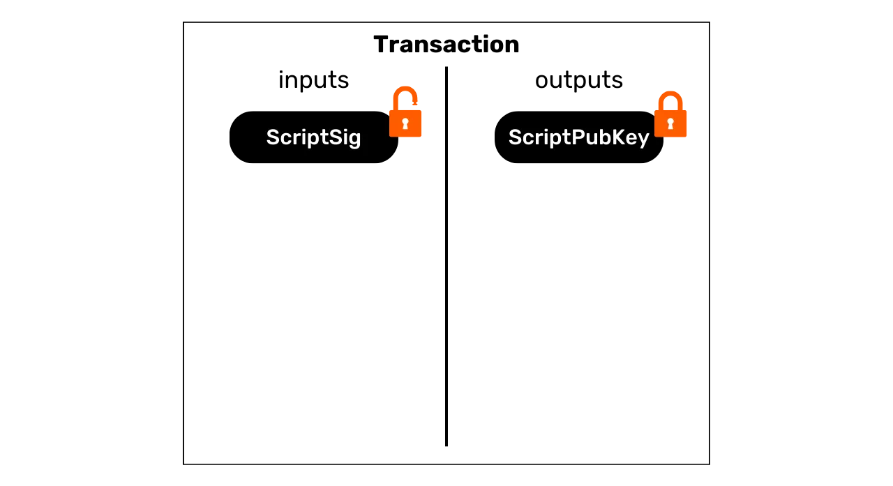

Bitcoin एड्रेस अलग-अलग प्रकार के होते हैं, जो इस्तेमाल किए गए स्क्रिप्टिंग मॉडल पर निर्भर करते हैं। पहले मॉडल्स, जिन्हें "लेगेसी*" कहा जाता है, में `P2PKH` (*पे-टू-पबकी-Hash*) और `P2SH` (*Pay-to-Script-Hash*) एड्रेस शामिल हैं। P2PKH एड्रेस हमेशा `1` से शुरू होते हैं, और P2SH `3` से शुरू होते हैं। हालांकि ये फॉर्मेट अभी भी सुरक्षित हैं, लेकिन अब ये पुराने हो चुके हैं, क्योंकि इनमें ट्रांजैक्शन की लागत ज्यादा होती है और नए स्टैंडर्ड्स के मुकाबले इनमें गोपनीयता भी कम होती है।

जीडब्ल्यू-351 वी0 (`जीडब्ल्यू-350` और `पी2डब्ल्यूएसएच`) और जीडब्ल्यू-349 / जीडब्ल्यू-351 वी1 (`जीडब्ल्यू-352`) एड्रेस आधुनिक फॉर्मेट को दर्शाते हैं। जीडब्ल्यू-351 एड्रेस `बीसी1क्यू` से शुरू होते हैं और जीडब्ल्यू-349 एड्रेस, जो 2021 में पेश किए गए थे, `बीसी1पी` से शुरू होते हैं।

उदाहरण के लिए, यहाँ एक Taproot रिसेप्शन Address है:

```text
bc1ps5gd2ys8kllz9alpmcwxqegn7kl3elrpnnlegwkm3xpq2h8da07spxwtf5
```

स्क्रिप्टपब्की कैसे बनाई जाती है यह इस बात पर निर्भर करेगा कि आप किस स्टैंडर्ड का इस्तेमाल कर रहे हैं:

| स्क्रिप्टपबकी | स्क्रिप्ट टेम्पलेट |

| ---------------- | ----------------------------------------------------------- |

| P2PKH | OP_DUP OP_HASH160 `<pubKeyHash>` OP_EQUALVERIFY OP_CHECKSIG |

| P2SH | OP_HASH160 `<scriptHash>` OP_EQUAL |

| P2WPKH | 0 `<pubKeyHash>` |

| P2WSH | 0 `<विटनेसस्क्रिप्टहैश>` |

| P2SH - P2WPKH | OP_HASH160 `<redeemScriptHash>` OP_EQUAL |

| P2SH - P2WSH | OP_HASH160 `<redeemScriptHash>` OP_EQUAL |  

(हिंदी अनुवाद:  
P2SH - P2WSH | OP_HASH160 `<रिडीम स्क्रिप्ट हैश>` OP_EQUAL |  

नोट: टेक्निकल टर्म्स जैसे OP_HASH160, P2WSH, redeemScriptHash आदि को उनके मूल रूप में ही रखा गया है क्योंकि ये बिटकॉइन स्क्रिप्टिंग के स्टैंडर्ड टर्म्स हैं।)

| P2TR | 1 `<पबकी>` |

रिसेप्शन एड्रेस का निर्माण चुने गए स्क्रिप्ट मॉडल पर भी निर्भर करता है:


- `P2PKH` और `P2WPKH` एड्रेस के लिए, पेलोड, यानी Address का कोर, पब्लिक की का Hash रिप्रेजेंट करता है;
- `P2SH` और `P2WSH` पतों के लिए, पेलोड एक `Hash` का प्रतिनिधित्व करता है ;
- `P2TR` पते के बारे में बात करें तो, पेलोड एक ट्वीक्ड पब्लिक की है। P2TR आउटपुट _Pay-to-PubKey_ और _Pay-to-Script_ के पहलुओं को मिलाता है। यह ट्वीक्ड पब्लिक की एक क्लासिक स्पेंडिंग पब्लिक की को एक "ट्वीक" के साथ जोड़ने का नतीजा होती है, जो कि Merkle Root से लिया गया होता है - यह स्क्रिप्ट्स के एक सेट से निकाला जाता है जिनका इस्तेमाल बिटकॉइन खर्च करने के लिए भी किया जा सकता है।


आपके पोर्टफोलियो सॉफ्टवेयर पर दिखाए गए पते में एक HRP (*ह्यूमन-रीडेबल पार्ट*) भी शामिल होता है, जो आमतौर पर पोस्ट-SegWit पतों के लिए `bc` होता है, एक सेपरेटर `1` होता है, और एक वर्जन नंबर होता है - SegWit V0 के लिए `q` और Taproot/SegWit V1 के लिए `p`। ट्रांसमिशन के दौरान Address की इंटीग्रिटी और वैधता सुनिश्चित करने के लिए एक चेकसम भी जोड़ा जाता है।

अंत में, पतों को एक मानक प्रारूप में डाला जाता है:


- पुराने लीगेसी पतों के लिए बेस58चेक ;
- SegWit पतों के लिए Bech32 ;
- बीच-32एम (Bech32m) जीडब्ल्यू-372 (Taproot) एड्रेसेस के लिए।

यहाँ बेच32 और बेच32m फॉर्मेट्स (SegWit और Taproot) के लिए बेस 10 से जोड़ मैट्रिक्स है:

| + | 0 | 1 | 2 | 3 | 4 | 5 | 6 | 7 |

| --- | --- | --- | --- | --- | --- | --- | --- | --- |

| ० | क् | प् | ज़ | र् | य् | ९ | क्ष् | ८ |

| 8 | जी | एफ | 2 | टी | वी | डी | डब्ल्यू | 0 |

| 16 | s | 3 | j | n | 5 | 4 | k | h |

| 24 | सी | ई | 6 | एम | यू | ए | 7 | एल |

### Address का पुन: उपयोग क्या है?

Address का पुन: उपयोग (reuse) एक ही प्राप्त करने वाले Address का उपयोग करके कई अलग-अलग UTXOs को ब्लॉक करने की प्रक्रिया है।

जैसा कि हमने पिछले सेक्शन में देखा, हर UTXO का अपना ScriptPubKey होता है, जो उसे लॉक करता है और नए ट्रांजैक्शन में इनपुट के तौर पर इस्तेमाल होने के लिए इसकी शर्तें पूरी होनी चाहिए। यहीं पर पेलोड एड्रेसेस इंटीग्रेट किए जाते हैं।

जब अलग-अलग स्क्रिप्टपबकी में एक ही रिसीविंग Address होता है, तो इसे Address का दोबारा इस्तेमाल (रियूज) कहा जाता है। असल में, इसका मतलब यह है कि एक यूजर ने एक ही Address को बार-बार अलग-अलग भेजने वालों को दिया है ताकि वह कई पेमेंट्स के जरिए बिटकॉइन प्राप्त कर सके। और यही आदत आपकी प्राइवेसी के लिए बेहद खतरनाक साबित होती है।

### Address के दोबारा इस्तेमाल में क्या दिक्कत है?

चूंकि Blockchain सार्वजनिक है, इसलिए यह देखना आसान है कि कौन से पते किस UTXO को लॉक करते हैं और कितने बिटकॉइन। अगर एक ही Address कई लेन-देन के लिए इस्तेमाल किया जाता है, तो यह पता लगाना संभव हो जाता है कि उस Address से जुड़े सारे बिटकॉइन एक ही व्यक्ति के हैं। यह प्रथा यूजर की प्राइवेसी को खतरे में डालती है क्योंकि इससे अलग-अलग लेन-देन के बीच निश्चित कड़ियाँ बनाना और Blockchain पर बिटकॉइन का पता लगाना संभव हो जाता है। Satoshi नाकामोटो ने खुद ही इस समस्या को Bitcoin की व्हाइट पेपर में उजागर किया था:

> *एक अतिरिक्त सुरक्षा के तौर पर, हर लेन-देन के लिए नए कुंजियों (keys) का इस्तेमाल किया जा सकता है ताकि उन्हें एक ही मालिक से जोड़कर न देखा जा सके*


स्रोत: एस. नाकामोटो, "जीडब्ल्यू-385: एक पीयर-टू-पीयर इलेक्ट्रॉनिक कैश सिस्टम", https://Bitcoin.org/Bitcoin.pdf, 2009.

Satoshi का इरादा इस वाक्य में यूजर की पहचान और Bitcoin पर एक की-पेयर के बीच संबंध होने की स्थिति में एक अतिरिक्त फ़ायरवॉल बनाने का था, ताकि उसकी पूरी गतिविधि सार्वजनिक रूप से उसकी पहचान से न जुड़ पाए। आज, Blockchain एनालिसिस कंपनियों के बढ़ते प्रसार और KYC नियमों के चलते, यूनिक एड्रेस का इस्तेमाल अब कोई "अतिरिक्त फ़ायरवॉल" नहीं रहा, बल्कि यह उन सभी के लिए एक ज़रूरी प्रैक्टिस बन चुका है जो न्यूनतम प्राइवेसी बचाना चाहते हैं।

जब आप एक Address को दोबारा इस्तेमाल करते हैं, तो आप उस Address से जुड़े सभी लेन-देन के बीच लगभग नकारा नहीं जा सकने वाला कड़ी बना देते हैं। हालांकि यह सीधे तौर पर आपके फंड को खतरे में नहीं डालता, क्योंकि एलिप्टिक कर्व क्रिप्टोग्राफी आपके प्राइवेट कीज़ की सुरक्षा की गारंटी देती है, लेकिन यह आपकी गतिविधियों पर नज़र रखना आसान बना देता है। वास्तव में, कोई भी व्यक्ति जिसके पास नोड है, वह एड्रेस के लेन-देन और बैलेंस को देख सकता है, जिससे आपकी गुमनामी पूरी तरह से खत्म हो जाती है।


इस बात को समझाने के लिए, बॉब का उदाहरण लेते हैं, जो छोटी-छोटी रकम में बिटकॉइन DCA (डॉलर-कॉस्ट एवरेजिंग) में खरीदता है और हमेशा उन्हें एक ही Address पर भेज देता है। दो साल बाद, इस Address में काफी मात्रा में बिटकॉइन जमा हो जाते हैं। अगर बॉब इसी Address का इस्तेमाल किसी स्थानीय दुकानदार को भुगतान करने के लिए करता है, तो दुकानदार सारे जुड़े हुए फंड्स देख सकता है और बॉब की संपत्ति का अंदाजा लगा सकता है। इससे उसकी निजी सुरक्षा को खतरा हो सकता है, जैसे चोरी या ब्लैकमेल करने की कोशिश। अगर बॉब हर बार नए Address का इस्तेमाल करता, तो वह दुकानदार को अपने बारे में बहुत कम जानकारी देता।

स्ट्रिंग विश्लेषण में, Address के पुन:उपयोग के 2 प्रकार होते हैं:


- बाहरी पुन: उपयोग ;
- एक लेन-देन के भीतर आंतरिक पुन: उपयोग।

पहला मामला तब होता है जब एक Address को कई अलग-अलग Bitcoin लेनदेन में दोबारा इस्तेमाल किया जाता है। यह वही बात है जिसके बारे में हमने पहले चर्चा की थी: यह ह्यूरिस्टिक यह अनुमान लगाता है कि इस Address से गुजरने वाले सभी UTXO एक ही इकाई के हैं।

आंतरिक Address का पुन:उपयोग तब नहीं होता जब पुन:उपयोग कई लेन-देन में होता है, बल्कि तब होता है जब यह एक ही लेन-देन के भीतर होता है। दरअसल, अगर इनपुट को लॉक करने के लिए इस्तेमाल किया गया वही Address किसी लेन-देन के आउटपुट के रूप में इस्तेमाल होता है, तो हम यह निष्कर्ष निकाल सकते हैं कि यह आउटपुट अभी भी उसी उपयोगकर्ता (Exchange) का है, और दूसरा आउटपुट असल में भुगतान को दर्शाता है। यह दूसरा अनुमानित नियम कई लेन-देन पर धन के ट्रैक को बनाए रखने में सक्षम बनाता है।


Address का दोबारा इस्तेमाल Bitcoin पर एक सच्ची मुसीबत है। OXT.me वेबसाइट (जो फिलहाल पहुंच से बाहर है) के मुताबिक, 2022 में Bitcoin पर Address के दोबारा इस्तेमाल की कुल दर लगभग 52% थी:


ये रेट बहुत ज़्यादा है, लेकिन ये ज़्यादातर Exchange प्लेटफॉर्म्स से आ रहा है, न कि अलग-अलग यूज़र्स से।

### Address के दोबारा इस्तेमाल से कैसे बचें?

Address का दोबारा इस्तेमाल न करना बहुत आसान है: **बस अपने Wallet को सभी नए भुगतानों के लिए एक नया, खाली Address इस्तेमाल करें**।

BIP32 की वजह से, आधुनिक पोर्टफोलियो अब डिटरमिनिस्टिक और हायरार्किकल हो गए हैं। इसका मतलब है कि एक यूजर generate की मदद से सिर्फ एक शुरुआती जानकारी (seed) से बड़ी संख्या में एड्रेसेस जनरेट कर सकता है। इस एक जानकारी को सेव करके, पोर्टफोलियो के सभी प्राइवेट कीज़ को रिस्टोर किया जा सकता है, जिससे संबंधित एड्रेसेस द्वारा सुरक्षित फंड्स तक पहुंच मिल जाती है।


यही वजह है कि जब आप अपने Wallet सॉफ़्टवेयर में "*receive*" बटन दबाते हैं, तो हर बार एक अनइस्तेमाल Address रिसीविंग एड्रेस सुझाया जाता है। इस Address पर बिटकॉइन मिलने के बाद, सॉफ़्टवेयर अपने आप एक नया एड्रेस सुझाता है।

> *P.S.: हाल ही में, कुछ Wallet सॉफ़्टवेयर प्रोग्राम्स ने खाली पतों (ब्लैंक एड्रेसेस) जनरेट करना बंद करने की घोषणा की है, क्योंकि उन्हें डर है कि अथॉरिटीज़ इसे मनी लॉन्ड्रिंग का एक तरीका समझ सकती हैं। अगर आपका सॉफ़्टवेयर भी ऐसा ही है, तो मेरी सलाह है कि आप तुरंत इसे बदल दें, क्योंकि यूज़र्स के लिए यह मान्य नहीं है।*
अगर आपको पेमेंट या डोनेशन लेने के लिए एक स्थिर (static) आइडेंटिफायर चाहिए, तो क्लासिक Bitcoin या Address का इस्तेमाल करना सही नहीं है, क्योंकि इन्हें दोबारा इस्तेमाल करने का रिस्क होता है। इसकी जगह, आप Lightning Address का इस्तेमाल कर सकते हैं, या फिर BIP47 या Silent Payments जैसे स्थिर ऑनचेन पेमेंट आइडेंटिफायर चुन सकते हैं। इन प्रोटोकॉल्स के बारे में विस्तार से इस ट्रेनिंग कोर्स के भाग 6 में बताया गया है।

## पार्ट्स को लेबल करना और जांचना

<chapterId>fbdb07cd-c025-48f2-97b0-bd1bc21c68a8</chapterId>

जैसा कि हमने स्ट्रिंग एनालिसिस वाले सेक्शन में देखा, ट्रांजैक्शन के बारे में जानकारी निकालने के लिए कई ह्यूरिस्टिक्स और पैटर्न्स होते हैं। एक यूजर के तौर पर, इन तकनीकों के बारे में जागरूक होना ज़रूरी है ताकि आप खुद को इनसे बेहतर तरीके से बचा सकें।

इसमें आपके Wallet को सेल्फ-कस्टडी में सख्ती से मैनेज करना शामिल है, यानी आपके UTXOs का सोर्स जानना, साथ ही पेमेंट करते समय कौन सा UTXO इस्तेमाल करना है, इसका ध्यान से चुनाव करना। Wallet की यह कारगर मैनेजमेंट अच्छे Bitcoin वॉलेट्स की दो खास विशेषताओं पर निर्भर करती है: टैगिंग और कॉइन कंट्रोल।

इस अध्याय में, हम इन खासियतों पर नज़र डालेंगे और देखेंगे कि आप Bitcoin पर अपनी प्राइवेसी को बेहतर बनाने के लिए इन्हें कैसे समझदारी से इस्तेमाल कर सकते हैं, बिना ज़्यादा काम का बोझ बढ़ाए।

### लेबलिंग क्या है?

लेबलिंग एक ऐसी प्रथा है जिसमें किसी विशेष UTXO को Bitcoin Wallet में एक एनोटेशन या लेबल दिया जाता है। ये एनोटेशन Wallet सॉफ़्टवेयर द्वारा स्थानीय रूप से संग्रहीत किए जाते हैं और कभी भी Bitcoin नेटवर्क पर प्रसारित नहीं किए जाते। इसलिए, लेबलिंग एक व्यक्तिगत प्रबंधन उपकरण है।

उदाहरण के लिए, अगर मेरे पास बिस्क पर चार्ल्स से P2P की खरीदारी से UTXO है, तो मैं इसे "`नॉन-केवाईसी बिस्क चार्ल्स`" लेबल कर सकता हूँ।

टैगिंग एक अच्छी आदत है जो UTXO के मूल या इच्छित गंतव्य को याद रखने में मदद करती है, जिससे फंड प्रबंधन और गोपनीयता का अनुकूलन आसान हो जाता है। वास्तव में, आपका Bitcoin और Wallet निश्चित रूप से कई UTXOs को सुरक्षित करता है। अगर इन UTXOs के स्रोत अलग-अलग हैं, तो हो सकता है कि आप भविष्य में इन UTXOs को मर्ज न करना चाहें, नहीं तो आप उनके साझा Ownership को उजागर कर सकते हैं। अपने सभी हिस्सों को सही तरीके से लेबल करके, आप यह सुनिश्चित कर सकते हैं कि जब भी आपको उनका उपयोग करने की आवश्यकता होगी, तो आपको याद रहेगा कि वे कहां से आए थे, चाहे वह कितने भी साल बाद क्यों न हो।

### कोना कंट्रोल क्या है?

पोर्टफोलियो सॉफ्टवेयर पर सिक्का नियंत्रण (coin control) विकल्प के साथ लेबलिंग का सक्रिय उपयोग और भी दिलचस्प हो जाता है।

कॉइन कंट्रोल एक फीचर है जो अच्छे Bitcoin Wallet सॉफ्टवेयर में मिलता है, जो आपको ट्रांजैक्शन पूरा करने के लिए इनपुट के रूप में यूज़ होने वाले खास UTXOs को मैन्युअली चुनने की सुविधा देता है। असल में, किसी आउटपुट पेमेंट को पूरा करने के लिए, आपको बदले में एक इनपुट UTXO खर्च करना पड़ता है। कई वजहों से, जिन पर हम बाद में गौर करेंगे, आप चाह सकते हैं कि किसी दिए गए पेमेंट को पूरा करने के लिए इनपुट के तौर पर किन हिस्सों को खर्च किया जाए। यही वह चीज़ है जो कॉइन कंट्रोल आपको करने देता है। आसान भाषा में समझाएं तो, यह फीचर उसी तरह है जैसे आप अपने Wallet से बैगूएट के पेमेंट के लिए कोई खास सिक्का चुनते हैं।


पोर्टफोलियो सॉफ्टवेयर का इस्तेमाल जब सिक्का नियंत्रण (कॉइन कंट्रोल) के साथ किया जाता है, और UTXO लेबलिंग भी होती है, तो यूजर्स अपने लेन-देन के लिए UTXOs को अलग पहचान सकते हैं और सटीक तरीके से चुन सकते हैं।

### आप अपने UTXOs को कैसे लेबल करते हैं?

UTXO को लेबल करने का कोई एक तरीका नहीं है जो सभी के लिए सही हो। यह आप पर निर्भर है कि आप अपने पोर्टफोलियो के लिए एक ऐसी लेबलिंग प्रणाली बनाएं जो समझने में आसान हो। किसी भी स्थिति में, यह याद रखें कि अच्छी लेबलिंग वह है जिसे आप जरूरत पड़ने पर समझ सकें। अगर आपका Bitcoin Wallet मुख्य रूप से बचत के लिए है, तो हो सकता है कि ये लेबल आने वाले दशकों तक आपके काम के न हों। इसलिए यह सुनिश्चित करें कि वे स्पष्ट, सटीक और व्यापक हों।

यह ज़रूरी है कि अगर कभी आपके प्रियजनों को आपके पोर्टफोलियो तक पहुंचने की ज़रूरत पड़े, तो वे आसानी से फंड्स के स्रोत को पहचान सकें। यह उनके लिए गोपनीयता के साथ-साथ कानूनी मकसदों के लिए भी मददगार होगा, खासकर अगर उन्हें किसी अधिकारी के सामने फंड्स के स्रोत को साबित करने की ज़रूरत पड़े।

लेबल पर सबसे महत्वपूर्ण बात UTXO का स्रोत है। आपको बस यह बताना है कि सिक्का आपके Wallet में कैसे आया। क्या यह Exchange प्लेटफॉर्म पर खरीद का नतीजा है? किसी ग्राहक से Invoice भुगतान? पीयर-टू-पीयर Exchange? या फिर यह किसी खर्चे का Exchange दर्शाता है? मिसाल के तौर पर, आप यह बता सकते हैं:


- `Exchange.com को हटा दो` ;
- ग्राहक भुगतान डेविड` ;
- "P2P Charles` खरीदो"
- `सोफ़ा खरीदने में बदलाव करें`


अपने UTXO प्रबंधन को बेहतर बनाने और अपने पोर्टफोलियो में फंड अलगाव रणनीतियों का सम्मान करने के लिए, आप अपने लेबल्स को एक अतिरिक्त संकेतक से समृद्ध कर सकते हैं जो इन अलगावों को दर्शाता है। यदि आपके पोर्टफोलियो में UTXO की दो श्रेणियाँ हैं जिन्हें आप मिलाना नहीं चाहते, तो आप इन समूहों को स्पष्ट रूप से अलग करने के लिए अपने लेबल्स में एक मार्कर शामिल कर सकते हैं। ये अलगाव मार्कर आपके अपने मानदंडों पर निर्भर करेंगे, जैसे कि KYC से जुड़ी अधिग्रहण प्रक्रिया से प्राप्त UTXOs के बीच अंतर करना, या पेशेवर और निजी फंड्स के बीच अंतर करना। ऊपर उल्लिखित लेबल उदाहरणों को ध्यान में रखते हुए, इसे इस तरह व्यक्त किया जा सकता है:


- `KYC - निकासी Exchange.com`
- `KYC - ग्राहक भुगतान डेविड`
- `कोई केवाईसी नहीं - P2P चार्ल्स खरीदें`
- `कोई KYC नहीं - सोफा खरीद बदलें`


यह भी सलाह दी जाती है कि लेन-देन के दौरान किसी हिस्से को लेबल करना जारी रखा जाए। उदाहरण के लिए, जब आप UTXO no-KYC को मिला रहे हों, तो परिणामी UTXO को सिर्फ `consolidation` के रूप में नहीं, बल्कि विशेष रूप से `consolidation no-KYC` के रूप में चिह्नित करना सुनिश्चित करें ताकि यह स्पष्ट रिकॉर्ड रहे कि सिक्के कहां से आए हैं।

आखिरकार, लेबल पर तारीख डालना जरूरी नहीं है। ज्यादातर Wallet सॉफ्टवेयर में लेन-देन की तारीख पहले से ही दिखाई देती है, और Block explorer पर इसकी txid की मदद से यह जानकारी हमेशा मिल सकती है।

### सही पार्ट्स कैसे चुनें?

जब आप कोई लेन-देन करते हैं, तो कॉइन कंट्रोल आपको विशेष रूप से चुनने देता है कि किन UTXOs को इनपुट के रूप में खर्च करना है ताकि भुगतान आउटपुट को पूरा किया जा सके। इस चुनाव के दो पहलू हैं:


- भुगतान प्राप्तकर्ता के लिए आपकी पहचान के एक हिस्से को इनपुट में इस्तेमाल किए गए UTXOs से जोड़ने की संभावना;
- एक्सटर्नल ऑब्ज़र्वर की क्षमता कि वो सभी UTXOs के बीच लिंक्स स्थापित कर सके जिन्हें इनपुट के तौर पर इस्तेमाल किया गया हो।

पहले पॉइंट को समझाने के लिए, एक ठोस उदाहरण लेते हैं। मान लीजिए आप अपने बेकर से बिटकॉइन में एक बैगूएट खरीदते हैं। आप अपने पास मौजूद एक या एक से ज़्यादा UTXOs को इनपुट के तौर पर इस्तेमाल करते हैं ताकि आउटपुट में कम से कम बैगूएट की कीमत और ट्रांजैक्शन फीस पूरी हो सके। आपका बेकर फिर संभावित रूप से आपके चेहरे, या आपकी पहचान के किसी और हिस्से को, जो वो जानता है, इनपुट के तौर पर इस्तेमाल किए गए कॉइन्स के साथ जोड़ सकता है। इस लिंक के अस्तित्व को जानकर, आप भुगतान करते समय एक खास UTXO को दूसरे के मुकाबले चुनना पसंद कर सकते हैं।


उदाहरण के लिए, अगर आपके UTXOs में से एक Exchange प्लेटफॉर्म से आया है और आप नहीं चाहते कि बेकर को उस प्लेटफॉर्म पर आपके अकाउंट के बारे में पता चले, तो आप उस UTXO को पेमेंट के लिए इस्तेमाल करने से बचेंगे। अगर आपके पास एक हाई-वैल्यू UTXO है जो बड़ी मात्रा में बिटकॉइन्स का पता देता है, तो आप उसे इस्तेमाल न करने का भी चुनाव कर सकते हैं ताकि बेकर को आपके BTC फॉर्च्यून के बारे में पता न चले।

इस पहले बिंदु के लिए कौन-से UTXO का इस्तेमाल करना है, यह एक निजी फैसला है, जो इस बात पर निर्भर करता है कि आप क्या खुलासा करना चाहते हैं या नहीं। जब आप UTXO प्राप्त करते हैं, तो आप उन्हें जो लेबल देते हैं, वे आपको उन्हें चुनने में मदद करेंगे जिन्हें खर्च करने के बाद केवल वही जानकारी सामने आएगी जिसे आप प्राप्तकर्ता को बताने में सहज हैं।

रिसीवर को पता चल सकने वाली जानकारी से परे, इनपुट्स का चुनाव Blockchain के सभी निरीक्षकों के सामने आप क्या उजागर करते हैं, उसे भी प्रभावित करता है। दरअसल, अपने लेन-देन के इनपुट के रूप में कई UTXOs का उपयोग करके, आप यह संकेत देते हैं कि वे एक ही इकाई के स्वामित्व में हैं, CIOH ह्यूरिस्टिक (_कॉमन इनपुट Ownership ह्यूरिस्टिक_) के अनुसार।


इसलिए, जब आप अपने पार्ट्स चुन रहे हों, तो आपको यह जानना ज़रूरी है कि जो ट्रांजैक्शन आप ब्रॉडकास्ट करने वाले हैं, वो इस्तेमाल किए गए सभी UTXOs के बीच एक लिंक बना देगा। यह लिंक आपकी निजी गोपनीयता के लिए दिक्कत पैदा कर सकता है, खासकर अगर UTXOs अलग-अलग स्रोतों से आए हों।


चलो मेरे बिना-KYC वाले UTXO का उदाहरण लेते हैं जो मैंने Bisq से खरीदा था; मैं इसे किसी UTXO के साथ मिलाने से बचना चाहता हूँ जो किसी रेगुलेटेड Exchange प्लेटफॉर्म से आया हो जो मेरी पहचान जानता है। असल में, अगर मैं कभी इन 2 UTXOs को एक ही ट्रांजैक्शन के इनपुट के रूप में इस्तेमाल करता हूँ, तो रेगुलेटेड प्लेटफॉर्म मेरी पहचान को उस UTXO से जोड़ पाएगा जो मैंने Bisq पर खरीदा था, जो पहले मेरी पहचान से लिंक नहीं था।


आखिर में, जब ट्रांजैक्शन के इनपुट के लिए UTXOs चुन रहे हों, तो सबसे ज़रूरी बात यह है कि कई UTXOs का इस्तेमाल करने से बचें। जब भी मुमकिन हो, अपने पेमेंट को पूरा करने के लिए एक ही बड़े सिक्के (कॉइन) को चुनें। इस तरह, आप CIOH से जुड़े सारे खतरों से बच जाएंगे। हालाँकि, अगर कोई एक UTXO पेमेंट के लिए काफी नहीं है और आपको कई सिक्के खर्च करने पड़ें, तो यह सुनिश्चित करें कि वे एक जैसे स्रोतों से आए हों ताकि अनचाहे लिंक्स का खतरा कम से कम हो। साथ ही यह भी याद रखें कि जिसे आप पैसे भेज रहे हैं, वह आपके बारे में अपने पास मौजूद जानकारी को इनपुट में इस्तेमाल किए गए सिक्कों के इतिहास से जोड़ सकता है।

### ऑटोमैटिक पार्ट सिलेक्शन को समझना

पिछले सेक्शन्स में, हमने ट्रांज़ैक्शन के लिए यूटीएक्सओ (UTXOs) के मैन्युअल सिलेक्शन पर चर्चा की थी। लेकिन जब जीडब्ल्यू-449 (Wallet) सॉफ्टवेयर यह सिलेक्शन अपने आप करता है, तो क्या होता है? कौन से सिक्के (coins) इस्तेमाल करने हैं, यह तय करने के लिए कई तरीके मौजूद हैं, और यूटीएक्सओ का चुनाव जीडब्ल्यू-448 (Bitcoin) पर रिसर्च का एक अहम क्षेत्र है। इस ऑटोमैटिक प्रोसेस का मुख्य मकसद अक्सर यूज़र के लिए ट्रांज़ैक्शन कॉस्ट को कम से कम करना होता है।

UTXO चयन विधियाँ जैसे FIFO (*पहले आए पहले जाए*) और LIFO (*आखिरी आए पहले जाए*) सबसे सरल हैं, लेकिन साथ ही सबसे कम कारगर भी। FIFO में, पोर्टफोलियो के सबसे पुराने हिस्सों को पहले इस्तेमाल किया जाता है। यह तरीका आमतौर पर लेन-देन लागत को कम करने और गोपनीयता बनाए रखने दोनों के लिए अक्षम होता है, सिवाय उन मामलों में जहां रिलेटिव टाइमलॉक्स का उपयोग होता है और उन्हें नियमित रूप से नवीनीकृत करने की आवश्यकता होती है। इसके विपरीत, LIFO सबसे हाल के UTXOs के उपयोग को प्राथमिकता देता है। ये दोनों तरीके, हालांकि सरल हैं, अक्सर अप्रभावी साबित होते हैं।

एक और एडवांस्ड तरीका है *Knapsack Solver* का। यह Bitcoin Core Wallet में वर्जन 0.17 तक इस्तेमाल किया जाता था। इसमें Wallet से UTXOs को बारी-बारी और रैंडमली चुनकर उन्हें सबसेट में जोड़ा जाता है, और जो सॉल्यूशन ट्रांजैक्शन वेट को यूजर के लिए कॉस्ट कम करने के लिए जितना हो सके कम कर दे, उसे रखा जाता है।

*ब्रांच-एंड-बाउंड* (BNB), जिसे अक्सर इसके आविष्कारक के नाम पर "मर्च एल्गोरिदम" कहा जाता है, ने Bitcoin कोर के वर्जन 0.17 से *नैपसैक सॉल्वर* की जगह ले ली है। यह अधिक उन्नत तरीका UTXOs का एक ऐसा सेट ढूंढने का लक्ष्य रखता है जो लेन-देन के आउटपुट को पूरा करने के लिए जरूरी रकम के बराबर हो। BNB का मकसद Exchange की मात्रा और फीसों को कम करना है, जिसके लिए यह "वेस्ट क्राइटेरियन" (बर्बादी मापदंड) को घटाता है। यह मापदंड तात्कालिक लागत और Exchange की भविष्य में होने वाली संभावित लागत दोनों को ध्यान में रखता है। यह तरीका *ब्रांच-एंड-बाउंड* के मूल सिद्धांत से लिया गया है, जिसे 1960 में ऐलिसा लैंड और एलिसन हार्कोर्ट ने बनाया था, और यह *नैपसैक सॉल्वर* की तुलना में फीसों का ज्यादा सटीक ऑप्टिमाइजेशन करता है।

ये सारे ऑटोमैटिक UTXO चयन तरीके लेन-देन की लागत को कम करने में तो कारगर हो सकते हैं, लेकिन यूजर की गोपनीयता बनाए रखने में अक्सर नाकाम रहते हैं। असल में, ये एल्गोरिदम कई UTXOs को इनपुट्स में मिला देते हैं, जिससे CIOH की वजह से इन UTXOs की एक साझा पहचान सामने आ जाती है। जाहिर है, ये तरीके UTXOs पर लगे लेबल्स को ध्यान में नहीं रख पाते, जबकि ये लेबल्स इस बात के लिए बेहद अहम होते हैं कि लेन-देन प्राप्तकर्ता को कौन सी जानकारी जानबूझकर दिखानी है। फिलहाल, सिक्कों के चयन में गोपनीयता को बेहतर बनाने का एकमात्र तरीका मैन्युअल तरीके से करना ही है।

### जीडब्ल्यू-456 लेबलिंग पर ट्यूटोरियल

अगर आप अपने UTXOs को टैग करने का तरीका जानना चाहते हैं, तो हमने मुख्य Bitcoin Wallet सॉफ्टवेयर पर एक विस्तृत ट्यूटोरियल बनाया है:

https://planb.network/tutorials/privacy/on-chain/utxo-labelling-d997f80f-8a96-45b5-8a4e-a3e1b7788c52
## KYC और मुख्य पहचान

<chapterId>cec6b9d9-0eed-4f85-bc4e-1e9aa59ca605</chapterId>

KYC का मतलब है "अपने ग्राहक को जानें" (Know Your Customer)। यह Bitcoin सेक्टर में काम करने वाली कुछ कंपनियों द्वारा लागू की गई एक नियामक प्रक्रिया है। इस प्रक्रिया का उद्देश्य अपने ग्राहकों की पहचान को सत्यापित और पंजीकृत करना है, जिसका घोषित लक्ष्य मनी लॉन्ड्रिंग और आतंकवाद के वित्तपोषण से निपटना है।

व्यावहारिक रूप से, KYC में ग्राहक से विभिन्न व्यक्तिगत डेटा एकत्र करना शामिल है, जो अधिकार क्षेत्र के अनुसार अलग-अलग हो सकता है, लेकिन आमतौर पर इसमें आईडी, फोटोग्राफ और Address का प्रमाण शामिल होता है। इस जानकारी को फिर सत्यापित किया जाता है और भविष्य में उपयोग के लिए संग्रहीत किया जाता है।

यह प्रक्रिया अब ज्यादातर पश्चिमी देशों में सभी नियमित Exchange प्लेटफॉर्म्स के लिए अनिवार्य हो गई है। इसका मतलब है कि जो कोई भी इन प्लेटफॉर्म्स के जरिए Exchange राज्य मुद्राओं को Bitcoin में बदलना चाहता है, उसे KYC आवश्यकताओं का पालन करना होगा।

यह प्रक्रिया यूजर्स की प्राइवेसी और सुरक्षा के लिए बिना जोखिम के नहीं है। इस अध्याय में, हम इन जोखिमों को विस्तार से जाँचेंगे और KYC तथा पहचान प्रक्रियाओं के Bitcoin यूजर्स की प्राइवेसी पर विशेष प्रभावों का विश्लेषण करेंगे।

### चेन पर ट्रेसिंग को सुगम बनाना

KYC से जुड़ा पहला जोखिम यह है कि यह Blockchain विश्लेषण के लिए एक विशेष प्रवेश बिंदु प्रदान करता है। जैसा कि हमने पिछले भाग में देखा, विश्लेषक Blockchain पर लेन-देन के पैटर्न और ह्यूरिस्टिक्स का उपयोग करके गतिविधियों को समूहित और ट्रैक कर सकते हैं। एक बार जब वे किसी उपयोगकर्ता की ऑनचेन गतिविधियों को समूहित करने में सफल हो जाते हैं, तो उसकी गोपनीयता को पूरी तरह से समझौता करने के लिए उन्हें बस उसके सभी लेन-देन और कुंजियों में से एक प्रवेश बिंदु ढूंढ़ने की आवश्यकता होती है।


जब आप KYC करवाते हैं, तो आप Blockchain विश्लेषण के लिए एक उच्च-गुणवत्ता वाला एंट्री पॉइंट प्रदान करते हैं, क्योंकि आप Exchange प्लेटफॉर्म से बिटकॉइन निकालते समय इस्तेमाल किए गए अपने रिसीविंग पतों को अपनी पूरी, सत्यापित पहचान से जोड़ देते हैं। सिद्धांत रूप में, यह जानकारी सिर्फ उस कंपनी को पता होती है जिसे आपने यह दी है, लेकिन जैसा कि हम नीचे देखेंगे, डेटा लीक का खतरा असल में मौजूद है। इसके अलावा, सिर्फ यह तथ्य कि कोई कंपनी इस जानकारी को रखती है, समस्याग्रस्त हो सकता है, भले ही वे इसे शेयर न करें।

तो, अगर तुम Blockchain पर अपनी गतिविधियों के जमावड़े को रोकने के लिए और कोई कदम नहीं उठाते, तो इस KYC एंट्री पॉइंट के बारे में जानने वाला कोई भी तुम्हारी Bitcoin पर की गई सारी एक्टिविटी को तुम्हारी पहचान से जोड़ सकता है। उस कंपनी के नज़रिए से, तुम्हारा Bitcoin का इस्तेमाल करना पूरी तरह से गोपनीयता खो देता है।


इसे एक उदाहरण से समझाएं, तो यह ऐसा है जैसे *Bank X* में आपका बैंकर न केवल *Bank X* के साथ आपके सभी लेन-देन को देख सकता है, बल्कि *Bank Y* के साथ आपके लेन-देन और आपके सभी नकद लेन-देन को भी देख सकता है।

इस ट्रेनिंग कोर्स के पहले हिस्से से याद रखें: Bitcoin की गोपनीयता मॉडल, जिसे Satoshi नाकामोटो ने बनाया था, यूजर की पहचान और उसके की पेयर्स के बीच अलगाव पर आधारित है। हालांकि आज के समय में Layer गोपनीयता का यह तरीका अब पर्याप्त नहीं है, फिर भी इसके क्षरण को जितना हो सके सीमित रखना समझदारी है।

### राज्य निगरानी के संपर्क में आना

KYC का दूसरा बड़ा नकली दिक्कत यह है कि यह सरकार को बता देता है कि आपने कभी Bitcoin रखा था। जब आप किसी रेगुलेटेड प्लेटफॉर्म से बिटकॉइन खरीदते हैं, तो सरकार के लिए यह जानना संभव हो जाता है कि आपके पास यह था। अभी यह छोटी सी बात लग सकती है, लेकिन याद रखना ज़रूरी है कि आपके देश का राजनीतिक और आर्थिक भविष्य आपके हाथ में नहीं है।

सबसे पहले, राज्य तेजी से एक सत्तावादी रुख अपना सकता है। इतिहास ऐसे उदाहरणों से भरा पड़ा है जहाँ नीतियाँ अचानक बदल गई हैं। आज, यूरोप में, बिटकॉइनर्स Bitcoin के बारे में लेख लिख सकते हैं, सम्मेलनों में भाग ले सकते हैं, और अपने वॉलेट्स को स्व-संरक्षण में प्रबंधित कर सकते हैं। लेकिन कौन कह सकता है कि कल क्या होगा? अगर Bitcoin अचानक सार्वजनिक दुश्मन नंबर एक बन जाता है, तो सरकारी फाइलों में इससे जुड़ा होना समस्याग्रस्त साबित हो सकता है।

फिर, गंभीर आर्थिक संकट के सामने, सरकार नागरिकों के बिटकॉइन ज़ब्त करने पर विचार कर सकती है। शायद कल, बिटकॉइन रखने वालों को संकट का फायदा उठाने वाले समझा जाएगा, और फिएट करेंसी के अवमूल्यन के सामने उनके कैपिटल गेन पर ज़रूरत से ज़्यादा टैक्स लगाया जाएगा।

तुम सोच सकते हो कि यह कोई समस्या नहीं है, क्योंकि तुम्हारे बिटकॉइन मिक्स्ड हैं और इसलिए ट्रेस नहीं किए जा सकते। लेकिन, यहाँ ट्रेसिंग मुद्दा नहीं है। असली मुद्दा यह है कि सरकार को पता है कि तुमने Bitcoin का मालिकाना हक रखा है। यह जानकारी अकेले ही तुम्हें दोषी ठहराने या जवाबदेह ठहराने के लिए काफी हो सकती है। तुम यह दावा कर सकते हो कि तुमने अपने बिटकॉइन खर्च कर दिए हैं, लेकिन यह तुम्हारे टैक्स रिटर्न में दिखना चाहिए, और तुम पकड़े जाओगे। तुम यह भी कह सकते हो कि तुमने अपनी कुंजियाँ नाव दुर्घटना में खो दी हैं, लेकिन ट्विटर के मजाक से परे, क्या तुम्हें सच में लगता है कि यह तुम्हें बरी करने के लिए काफी होगा?

तो ये ज़रूरी है कि आप इस बात का ख़्याल रखें कि सरकार को पता चल सकता है कि आपके पास BTC था, चाहे आज ये ख़तरा कितना भी कम क्यों न लगे।

KYC से जुड़ी एक और समस्या जो सरकारी निगरानी में आती है, वह है नियमित प्लेटफॉर्म्स द्वारा अनिवार्य रिपोर्टिंग। हालांकि मैं अन्य देशों के नियमों से वाकिफ नहीं हूं, लेकिन फ्रांस में *Prestataires de Services sur Actifs Numériques* (PSAN) को वित्तीय नियामक प्राधिकरणों को किसी भी संदिग्ध धन हस्तांतरण की रिपोर्ट करना अनिवार्य होता है।

2023 में फ्रांस में, PSANs द्वारा 1,449 संदिग्ध कार्यों की रिपोर्ट की गई। फिलहाल, इनमें से अधिकांश कार्य अपराध-संबंधित हैं। हालांकि, अधिकारी विनियमित प्लेटफॉर्म्स से यह भी अनुरोध कर रहे हैं कि वे किसी भी संदिग्ध Bitcoin लेन-देन को सिर्फ़ उसकी संरचना के आधार पर रिपोर्ट करें। अगर आप कोई सहयोगात्मक लेन-देन करते हैं, या फिर थोड़ा असामान्य पैटर्न वाला लेन-देन भी करते हैं, और यह लेन-देन आपके बिटकॉइन्स को इन प्लेटफॉर्म्स से निकालने के कुछ ही समय बाद होता है, तो आपकी शिकायत अधिकारियों तक पहुँच सकती है। भले ही कोई गलत काम ना हुआ हो और आप अपने अधिकारों का वैध उपयोग कर रहे हों, ऐसी रिपोर्टिंग से जाँच और निगरानी बढ़ सकती है, जिससे आपको परेशानी हो सकती है जो KYC के बिना आप टाल सकते थे।

### व्यक्तिगत डेटा लीक होने का खतरा

KYC का एक और दिक्कत यह है कि इसमें आपके सारे निजी डेटा को किसी प्राइवेट कंपनी के सर्वर पर स्टोर करना पड़ता है।

हाल की घटनाओं ने हमें याद दिला दिया है कि कोई भी वित्तीय या आईटी विफलताओं से अछूता नहीं है। 2022 में, सेल्सियस के ग्राहकों को इसके नतीजे भुगतने पड़े। कंपनी के दिवालिया होने के बाद, अमेरिकी अदालतों ने प्रशासनिक कार्यवाही के दौरान लेनदारों के नाम और उनकी संपत्ति की राशि सार्वजनिक कर दी।

ठीक दो साल पहले, क्रिप्टोकरेंसी साइबर सुरक्षा में एक बड़ी कंपनी के ग्राहकों का निजी डेटा चोरी हो गया था। हालांकि यह घटना सीधे बिटकॉइन खरीदने से जुड़ी नहीं थी, लेकिन Exchange जैसे प्लेटफॉर्म्स के लिए भी ऐसा खतरा बना हुआ है। इसलिए निजी डेटा से जुड़ा एक स्पष्ट जोखिम मौजूद है।

यह सच है कि हम पहले से ही अपने बहुत से निजी डेटा को प्राइवेट कंपनियों के हवाले कर देते हैं। लेकिन, यहाँ खतरा दोगुना है, क्योंकि यह डेटा न सिर्फ आपकी पहचान बताता है, बल्कि Bitcoin पर की गई गतिविधियों से भी जुड़ा होता है। दरअसल, जब कोई हैकर Exchange प्लेटफॉर्म के कस्टमर डेटा तक पहुँच हासिल कर लेता है, तो वह यह मान सकता है कि ये कस्टमर बिटकॉइन रखते हैं। यह खतरा इस वजह से और बढ़ जाता है कि Bitcoin, किसी भी दूसरी कीमती संपत्ति की तरह, चोरों का ध्यान खींचता है।

डेटा लीक होने की स्थिति में, सबसे अच्छे मामले में आप टार्गेटेड फ़िशिंग के शिकार हो सकते हैं। सबसे खराब स्थिति में, आपको अपने घर पर शारीरिक खतरों का सामना करना पड़ सकता है।

Bitcoin से जुड़े ख़ास खतरों के अलावा, पहचान दस्तावेज़ों के ट्रांसमिशन से जुड़े खतरे भी हैं। असल में, अगर डेटा लीक हो जाता है, तो आइडेंटिटी थेफ्ट का शिकार होना संभव है। इसलिए दांव सिर्फ लेन-देन की गोपनीयता की सुरक्षा तक सीमित नहीं है, बल्कि यह हर व्यक्ति की निजी सुरक्षा से भी जुड़ा हुआ है।

### KYC के बारे में कुछ पहले से बनी हुई धारणाएँ

ट्विटर पर या बिटकॉइनर्स के बीच होने वाली बातचीत में अक्सर KYC के बारे में जो पहले से बनी हुई धारणाएं मिलती हैं, उन्हें समझना और तोड़ना ज़रूरी है।

सबसे पहले, यह सोचना ग़लत है कि KYC के ज़रिए हासिल किए गए बिटकॉइन की प्राइवेसी को सुरक्षित रखने का कोई फ़ायदा नहीं है। Bitcoin पर प्राइवेसी टूल्स और तरीके कई तरह के होते हैं और अलग-अलग मकसद के लिए इस्तेमाल किए जाते हैं। उदाहरण के लिए, KYC से प्राप्त बिटकॉइन पर CoinJoin ट्रांजैक्शन का इस्तेमाल करना कोई बुरा आइडिया नहीं है। बेशक, आपको रेगुलेटेड Exchange प्लेटफॉर्म्स के साथ सावधानी बरतनी चाहिए ताकि आपका अकाउंट फ्रीज़ या बैन न हो, लेकिन टेक्निकल नज़रिए से ये प्रैक्टिसेस असंगत नहीं हैं। CoinJoin का असर यह होता है कि यह कॉइन के इतिहास को तोड़ देता है, जिससे KYC से जुड़े कुछ चेन एनालिसिस रिस्क्स से बचने में मदद मिलती है। हालांकि यह सारे रिस्क्स ख़त्म नहीं करता, लेकिन यह एक बड़ा फ़ायदा ज़रूर देता है।


Bitcoin पर गोपनीयता को बाइनरी तरीके से नहीं देखा जाना चाहिए, जैसे कि "अनामिक" बिटकॉइन और दूसरों के बीच फर्क करना। KYC के जरिए हासिल किए गए बिटकॉइन रखने का मतलब यह नहीं है कि सब कुछ खत्म हो गया है; बल्कि, गोपनीयता टूल्स का इस्तेमाल और भी फायदेमंद साबित हो सकता है।

वहीं दूसरी तरफ, नॉन-केवाईसी तरीके से Bitcoin हासिल करने से पूरी गोपनीयता की गारंटी नहीं मिलती, न ही यह दूसरे सुरक्षा उपायों की जरूरत से आपको छूट देता है। अगर आपके पास नॉन-केवाईसी Bitcoin है लेकिन आप रिसीविंग एड्रेस को बार-बार इस्तेमाल करते हैं, तो आपके लेन-देन का पता लगाकर उन्हें जोड़ा जा सकता है। Bitcoin के बाहर की दुनिया से जुड़ी थोड़ी सी भी कड़ी आपकी एकमात्र Layer गोपनीयता को खतरे में डाल सकती है। इसलिए Bitcoin पर उपलब्ध सभी प्राइवेसी बढ़ाने वाले टूल्स और तरीकों को पूरक के तौर पर देखना जरूरी है। हर तकनीक एक खास खतरे को संभालती है और सुरक्षा की एक अतिरिक्त Layer परत जोड़ सकती है। तो नॉन-केवाईसी Bitcoin का मालिक होने का मतलब यह नहीं कि आपको दूसरी सावधानियां बरतने की जरूरत नहीं है।

### क्या KYC को कैंसिल किया जा सकता है?

मुझसे कभी-कभी पूछा जाता है कि क्या KYC करवाने के बाद "वापस जाना" संभव है, और जैसा कि आप पिछले पैराग्राफ से समझ सकते हैं, इसका जवाब थोड़ा पेचीदा है। KYC से जुड़े जोखिमों से बचने का सबसे आसान तरीका है बिटकॉइन खरीदते समय इसका इस्तेमाल न करना। हम इस विषय पर अगले अध्याय में और गहराई से चर्चा करेंगे। हालांकि, अगर KYC पहले ही हो चुका है और बिटकॉइन खरीद लिए गए हैं, तो क्या इन जोखिमों को कम करने के कोई तरीके हैं?

जब आपके लेन-देन के पता लगाने के खतरे की बात आती है, तो CoinJoin का इस्तेमाल एक समाधान है। हम इस तरीके को कोर्स में आगे विस्तार से देखेंगे, लेकिन आपको यह जान लेना चाहिए कि CoinJoin आपको कॉइन के इतिहास को तोड़ने और उसके पिछले-वर्तमान और वर्तमान-अतीत के ट्रैस होने से रोकने में सक्षम बनाता है। यहां तक कि रेगुलेटेड प्लेटफॉर्म से प्राप्त BTC के लिए भी, यह तकनीक उनकी ट्रेस करने की क्षमता को रोक सकती है।

हालांकि, CoinJoin KYC से जुड़े दूसरे खतरे को खत्म नहीं करता: यह तथ्य कि सरकार को आपके पास बिटकॉइन होने की जानकारी मिल सकती है। भले ही आपके सिक्के अब ट्रैस न किए जा सकें, फिर भी अधिकार क्षेत्र के आधार पर राज्य को आपके क्रिप्टो-एसेट ट्रांसफर डिक्लेरेशन तक पहुंच हो सकती है। चूंकि यह जोखिम तकनीकी नहीं, बल्कि प्रशासनिक है, इसलिए Bitcoin-विशिष्ट कोई समाधान नहीं है जो इसे खत्म कर सके, सिवाय इसके कि आप शुरू से ही KYC के संपर्क में न आएं। इस जोखिम को कम करने का एकमात्र कानूनी तरीका यह है कि आप रेगुलेटेड प्लेटफॉर्म्स से प्राप्त अपने बिटकॉइन्स को वहीं बेच दें, फिर उन्हें KYC-मुक्त तरीकों से दोबारा खरीद लें। ट्रांसफर की घोषणा करके और बेचकर, अधिकारियों को यह पता चलना चाहिए कि अब वे आपके पास नहीं हैं।

जहां तक आपके निजी डेटा और पहचान दस्तावेज़ों के लीक होने का खतरा है, यह Bitcoin से बाहरी खतरा है, और इसे टेक्निकली रोकने का कोई तरीका नहीं है। एक बार आपका डेटा लीक हो जाए, तो इसे वापस लेना मुश्किल है। आप प्लेटफॉर्म पर अपना अकाउंट बंद करने की कोशिश कर सकते हैं, लेकिन इससे आपके KYC डेटा के डिलीट होने की गारंटी नहीं है, खासकर जब पहचान वेरिफिकेशन किसी और के पास आउटसोर्स हो। आपके डेटा के पूरी तरह डिलीट होने की पुष्टि करना नामुमकिन है। इसलिए इस खतरे को पूरी तरह रोकने और इसे खत्म करने का कोई समाधान नहीं है।

### KYC और की पहचान में अंतर

कभी-कभी, कुछ बिटकॉइनर्स "KYC" शब्द को किसी भी BTC Exchange से जोड़ देते हैं जिसमें वायर ट्रांसफर या क्रेडिट कार्ड पेमेंट शामिल हो, क्योंकि ये तरीके भी पेमेंट की उत्पत्ति का पता लगा सकते हैं, बिल्कुल KYC की तरह। हालांकि, KYC को की पहचान के साथ नहीं मिलाना चाहिए। व्यक्तिगत रूप से, मुझे यह स्वीकार करना होगा कि समय के साथ इस विषय पर मेरी समझ बदल गई है।

KYC का मतलब है कुछ कंपनियों द्वारा अपने ग्राहकों की पहचान सत्यापित करने और रजिस्टर करने के लिए लागू की गई एक नियामक प्रक्रिया। यह एक बाइनरी चीज है: जब आप बिटकॉइन खरीदते हैं, या तो आप KYC करते हैं, या नहीं करते। हालांकि, की पहचान, जो किसी उपयोगकर्ता की पहचान के एक पहलू और ऑनचेन गतिविधि के बीच संबंध से संबंधित है, उतनी बाइनरी नहीं है, बल्कि यह एक सातत्य का प्रतिनिधित्व करती है। वास्तव में, Bitcoin की खरीद या ट्रांसफर के संदर्भ में, ऐसी पहचान हमेशा अलग-अलग डिग्री तक संभव है।

उदाहरण के लिए, अगर आप स्विट्ज़रलैंड के एक रेगुलेटेड प्लेटफॉर्म पर बिटकॉइन खरीदते हैं, तो KYC की जरूरत नहीं होती। हालांकि, आपकी keys की पहचान हो सकती है, क्योंकि खरीदारी आपके बैंक अकाउंट के जरिए की गई थी। यहीं पर KYC से जुड़े पहले दो जोखिम - ऑनचेन ट्रेसिंग को आसान बनाना और सरकारी निगरानी के संपर्क में आना - एक Exchange में भी बिना KYC के खुद को दिखा सकते हैं। अगर स्विस संस्था आपके देश के अधिकारियों को संदिग्ध लेन-देन की रिपोर्ट करती है, तो वे खरीदारी के लिए इस्तेमाल किए गए बैंक अकाउंट को चेक करके आसानी से आपकी पहचान का पता लगा सकते हैं। इसलिए, रेगुलेटेड प्लेटफॉर्म्स पर बिना KYC के खरीदारी करना key पहचान के लिए जोखिम पैमाने पर काफी ऊंचा है।


हालांकि, रेगुलेटेड प्लेटफॉर्म से बचकर P2P हासिल करने के तरीके अपनाने से पहचान का खतरा पूरी तरह खत्म नहीं होता, बस थोड़ा कम हो जाता है। चलो Bisq या किसी दूसरे P2P प्लेटफॉर्म पर खरीदारी का उदाहरण लेते हैं। अपने काउंटरपार्टी को पेमेंट करने के लिए, आप शायद अपने बैंक अकाउंट का इस्तेमाल करेंगे। अगर अथॉरिटीज़ आपके साथ ट्रेड करने वाले व्यक्ति से पूछताछ करें और आपका नाम पूछें, तो हम फिर से रिस्क 1 और 2 पर वापस आ जाते हैं। हालांकि ये रिस्क KYC वाले प्लेटफॉर्म पर खरीदारी करने के मुकाबले काफी कम हैं, और KYC के साथ खरीदारी करने से तो और भी कम, फिर भी ये थोड़े बहुत बाकी रहते हैं।


आखिरकार, अगर आपने अपने बिटकॉइन कैश के बदले फिजिकल Exchange से हासिल किए हैं, तो भी आप पूरी तरह से गुमनाम नहीं हैं। जिस व्यक्ति के साथ आपने एक्सचेंज किया है, उसने आपका चेहरा देखा है, जो आपकी पहचान का एक हिस्सा है। हालांकि इस उदाहरण में यह बहुत कम है, लेकिन फिर भी की पहचान होने की संभावना बनी रहती है।


अंत में, जब बिटकॉइन को दूसरी संपत्तियों के बदले बदला जाता है, चाहे वह राज्य मुद्रा में खरीद हो या किसी वास्तविक सामान के बदले बिक्री, हमेशा कुछ न कुछ पहचान की प्रक्रिया होती है। चुनी गई Exchange पद्धति के आधार पर, यह पहचान कम या ज़्यादा सख्त हो सकती है। इस पहचान को KYC के साथ नहीं मिलाना चाहिए, क्योंकि KYC एक स्पष्ट नियामक प्रक्रिया है। हालाँकि, KYC और पहचान के स्पेक्ट्रम के बीच एक संबंध है, क्योंकि KYC इस स्पेक्ट्रम के उच्च स्तर पर है, क्योंकि यह अधिकारियों द्वारा यूज़र की कुंजियों की पहचान को व्यवस्थित रूप से सुगम बनाता है।

## बिक्री और अधिग्रहण के तरीके

<chapterId>756598af-95aa-4c77-ac48-243c7ad89530</chapterId>

पिछला अध्याय पढ़ने के बाद, आप सोच रहे होंगे कि KYC से जुड़े जोखिमों से बचने के लिए Bitcoin को बिना पहचान सत्यापन प्रक्रिया के कैसे खरीदा या बेचा जा सकता है। Bitcoin का व्यापार करने के कई तरीके हैं।

### जीडब्ल्यू-497 नकदी लेनदेन

जैसा कि हमने देखा है, गोपनीयता के मामले में सबसे अच्छा तरीका P2P (आमने-सामने) और नकद निपटान के साथ Exchange है। यह तरीका आपके पीछे छोड़े गए निशान को कम से कम करने में मदद करता है, और चाहे आप खरीद रहे हों या बेच रहे हों, मुख्य पहचान की संभावना को काफी कम कर देता है।


फिर भी, आपकी निजी सुरक्षा को लेकर कुछ खतरे हैं। सबसे बड़ा खतरा यह है कि Exchange के दौरान, आपका सामने वाला व्यक्ति (काउंटरपार्टी) को पता चल जाएगा कि आपके पास बड़ी रकम है - चाहे वो नकदी हो या बिटकॉइन। यह जानकारी बुरे इरादे वाले लोगों का ध्यान खींच सकती है। असल में, आमतौर पर यही सलाह दी जाती है कि अपने Bitcoin होल्डिंग्स के बारे में ज्यादा चर्चा न करें। यह सलाह नकदी के लिए भी लागू होती है। हालांकि, जब आप सामने से लेन-देन करते हैं, तो यह बताना अनिवार्य हो जाता है कि आपके पास बिटकॉइन हैं, और इससे अवांछित ध्यान आपकी तरफ खिंच सकता है।


इस जोखिम को कम करने के लिए, मैं आपको सलाह दूंगा कि भरोसेमंद लोगों, जैसे परिवार के सदस्यों या करीबी दोस्तों के साथ नकद लेनदेन को प्राथमिकता दें। वैकल्पिक रूप से, आप [लोकल Bitcoin मीटअप्स](https://btcmap.org/communities/map) में कुछ बार जाने के बाद वहां ट्रेडिंग भी कर सकते हैं। इससे आप अन्य प्रतिभागियों को बेहतर तरीके से जान पाएंगे और शारीरिक रूप से एक्सचेंज करते समय अकेले नहीं रहेंगे। हालांकि, यह समझना ज़रूरी है कि P2P नकद एक्सचेंज में आपकी व्यक्तिगत सुरक्षा के जोखिम स्वाभाविक रूप से होते हैं, जो कि एक विनियमित प्लेटफॉर्म और अपने बैंक खाते के माध्यम से खरीदारी करते समय नहीं होते।

इसके अलावा, आप कहाँ रहते हैं उसके हिसाब से, बड़ी रकम को ले जाना और स्टोर करना खतरनाक हो सकता है, चाहे वो Bitcoin हो या नकदी।

नकदी का लेन-देन करने से पुलिस या अन्य जाँच के दौरान कानूनी जोखिम भी हो सकते हैं। हालांकि ज़्यादातर देशों में आपके पास रखी जाने वाली नकदी की कोई सीमा नहीं होती, लेकिन ज़रूरत से ज़्यादा रकम संदेह पैदा कर सकती है। इसलिए खासकर लंबी दूरी की यात्रा करते समय सावधान रहें, और एक साथ बड़े लेन-देन से बचें, ताकि बड़ी रकम रखने का कारण न बताना पड़े।

आखिरकार, P2P से खरीदारी का एक और नुकसान यह है कि यहाँ की कीमत अक्सर नियमित प्लेटफॉर्म्स से ज़्यादा होती है। विक्रेता आमतौर पर 1% से लेकर कभी-कभी 10% से भी अधिक का अतिरिक्त चार्ज लगाते हैं। इस कीमत के अंतर के कई कारण हैं। पहला, यह P2P विक्रेताओं के बीच एक आम प्रथा है जो समय के साथ स्थापित हो गई है। दूसरा, विक्रेताओं को खरीदार को फंड भेजने के लिए लेन-देन से जुड़े शुल्क भी उठाने पड़ते हैं। साथ ही, प्लेटफॉर्म लेन-देन की तुलना में P2P की बिक्री में चोरी का जोखिम भी बढ़ जाता है, जो इस जोखिम के लिए मुआवज़े को सही ठहराता है। अंत में, यह अतिरिक्त लागत Exchange की गोपनीयता के मामले में मांग और गुणवत्ता से जुड़ी हो सकती है। एक खरीदार के रूप में, गोपनीयता में मिलने वाला फायदा एक कीमत पर आता है, जो विक्रेता द्वारा लगाए गए अतिरिक्त शुल्क में दिखाई देता है। कुछ बिटकॉइनर्स का यह भी मानना है कि P2P पर खरीदे गए BTC का अधिक मूल्य उसकी असली कीमत को दर्शाता है, और उनका तर्क है कि नियमित प्लेटफॉर्म्स पर कम कीमत आपके निजी डेटा की गोपनीयता से समझौता करने का नतीजा है।


### जीडब्ल्यू-507 एक मैचमेकिंग प्लेटफॉर्म के जरिए एक्सचेंज करता है

एक कम जोखिम वाला विकल्प, जो व्यक्तिगत सुरक्षा के मामले में बेहतर है, वह है P2P एक्सचेंज को सिर्फ ऑनलाइन करना, जैसे कि PayPal, बैंक ट्रांसफर या Revolut जैसे इलेक्ट्रॉनिक पेमेंट तरीकों से।


यह तरीका नकद लेन-देन से जुड़े कई जोखिमों से बचाता है। हालांकि, ऑनलाइन Exchange में सामने वाले के डिफॉल्ट करने का खतरा ज़्यादा होता है। असल में, फिजिकल Exchange में अगर आप पैसे बेचने वाले को देते हैं और वह बदले में आपको बिटकॉइन नहीं भेजता, तो आप तुरंत उससे सवाल कर सकते हैं क्योंकि वह आपके सामने खड़ा होता है। वहीं ऑनलाइन, अगर कोई आपको ठग लेता है तो उसे ट्रैक करना अक्सर नामुमकिन होता है।


इस जोखिम को कम करने के लिए, P2P एक्सचेंज के लिए विशेष प्लेटफॉर्म का उपयोग किया जा सकता है। ये प्लेटफॉर्म प्रभावित उपयोगकर्ताओं की सुरक्षा के लिए विवाद समाधान तंत्र का उपयोग करते हैं। आमतौर पर, ये एक एस्क्रो सिस्टम प्रदान करते हैं, जहां बिटकॉइन को तब तक रोककर रखा जाता है जब तक कि विक्रेता द्वारा फिएट करेंसी में भुगतान की पुष्टि नहीं हो जाती।


व्यक्तिगत सुरक्षा के मामले में, खरीदारी का यह तरीका नकद Exchange की तुलना में काफी सुरक्षित है। हालाँकि, जैसा कि ऊपर बताया गया है, ऑनलाइन P2P एक्सचेंज Exchange की तुलना में ज्यादा निशान छोड़ते हैं, जो Bitcoin पर प्राइवेसी के लिए नुकसानदायक हो सकता है। बैंक जैसे ऑनलाइन फिएट पेमेंट मेथड का इस्तेमाल करके, आप ऐसी जानकारी उजागर करते हैं जो की आपकी पहचान का पता लगाने में मदद कर सकती है।


फिर से, मैं यही सलाह दूंगा कि इन प्लेटफॉर्म्स पर एक ही लेन-देन में बड़े-बड़े ट्रेड न करें। अपने लेन-देन को छोटे-छोटे हिस्सों में बांटकर करने से आप काउंटरपार्टी चोरी के रिस्क को कम कर देते हैं।

एक बार फिर, P2P पर खरीदारी का एक और नुकसान यह है कि यहाँ की कीमत अक्सर नियमित प्लेटफॉर्म्स पर देखी गई कीमत से ज़्यादा होती है। विक्रेता अक्सर 1% से लेकर कभी-कभी 10% से भी अधिक का मार्क-अप चार्ज करते हैं। इस कीमत के अंतर के कई कारण हैं।  

पहला, यह P2P विक्रेताओं के बीच एक आम प्रथा है जो समय के साथ स्थापित हो गई है। दूसरा, विक्रेताओं को लेन-देन से जुड़े शुल्क भुगतने पड़ते हैं ताकि वे खरीदार को फंड ट्रांसफर कर सकें। साथ ही, प्लेटफॉर्म ट्रांजैक्शन्स की तुलना में P2P सेल्स में चोरी का जोखिम भी बढ़ जाता है, जिसके लिए विक्रेता जोखिम के बदले में अतिरिक्त शुल्क लेते हैं।  

अंत में, यह अतिरिक्त लागत Exchange की गोपनीयता के मामले में मांग और गुणवत्ता से जुड़ी हो सकती है। एक खरीदार के रूप में, गोपनीयता का फायदा उठाने की कीमत चुकानी पड़ती है, जो विक्रेता द्वारा लगाए गए मार्क-अप में दिखाई देती है।  

कुछ बिटकॉइनर्स का यह भी मानना है कि P2P पर खरीदे गए BTC का मार्क-अप प्राइस उसकी असली कीमत को दर्शाता है, और उनका तर्क है कि नियमित प्लेटफॉर्म्स पर कम कीमत आपके निजी डेटा की गोपनीयता से समझौता करने का नतीजा है।


जहाँ तक समाधान की बात है, मैंने हमेशा [Bisq](https://bisq.network/) का इस्तेमाल किया है और मैं इससे बहुत खुश हूँ। उनकी प्रणाली परखी और परीक्षित है और भरोसेमंद लगती है। हालाँकि, Bisq सिर्फ PC पर उपलब्ध है और इसका Interface शुरुआती लोगों के लिए थोड़ा जटिल हो सकता है। एक और कमी यह है कि Bisq सिर्फ ऑनचेन लेन-देन के साथ काम करता है, जो Bitcoin ट्रांजैक्शन फीस के ऊँचे समय में महंगा पड़ सकता है।

-> हमारा Bisq ट्यूटोरियल देखें।

https://planb.network/tutorials/exchange/peer-to-peer/bisq-fe244bfa-dcc4-4522-8ec7-92223373ed04
एक आसान विकल्प के लिए, आप [Peach](https://peachbitcoin.com/) ट्राई कर सकते हैं - यह एक मोबाइल ऐप है जो खरीदारों और विक्रेताओं को बिल्ट-इन विवाद समाधान सिस्टम के साथ जोड़ता है। यह प्रक्रिया Bisq के मुकाबले ज्यादा सहज है।

-> हमारा पीच ट्यूटोरियल देखें।

https://planb.network/tutorials/exchange/peer-to-peer/peach-c6143241-d900-4047-9b73-1caba5e1f874
एक और ऑनलाइन विकल्प है [HodlHodl](https://hodlhodl.com/), जो एक अच्छी तरह से स्थापित प्लेटफॉर्म है और अच्छी लिक्विडिटी ऑफर करता है, हालांकि मैंने इसे खुद टेस्ट नहीं किया है।

-> हमारा HodlHodl ट्यूटोरियल देखें।

https://planb.network/tutorials/exchange/peer-to-peer/hodlhodl-d7344cd5-6b18-40f5-8e78-2574a93a3879
Lightning Network आधारित समाधानों के लिए, [RoboSats](https://learn.robosats.com/) और [LNP2PBot](https://lnp2pbot.com/) आज़माएँ। RoboSats एक वेबसाइट के जरिए उपलब्ध है और इस्तेमाल करने में काफी आसान है। वहीं, LNP2PBot थोड़ा अलग है क्योंकि यह Telegram मैसेजिंग ऐप पर Exchange सिस्टम के जरिए काम करता है।

-> हमारा RoboSats ट्यूटोरियल देखें।

-> हमारा LNP2PBot ट्यूटोरियल देखें।

https://planb.network/tutorials/exchange/peer-to-peer/robosats-b60e4f7c-533a-4295-9f6d-5368152e8c06
https://planb.network/tutorials/exchange/peer-to-peer/lnp2pbot-v2-e6bcb210-610b-487d-970c-7cce85273e3c


### केवाईसी के बिना विनियमित प्लेटफॉर्म

जिस देश में आप रहते हैं, उसके हिसाब से आपको ऐसे नियमित प्लेटफॉर्म मिल सकते हैं जहां बिटकॉइन खरीदने या बेचने के लिए KYC प्रक्रिया की जरूरत नहीं होती। उदाहरण के लिए, स्विट्ज़रलैंड में आप [Relai](https://relai.app/) और [MtPelerin](https://www.mtpelerin.com/) जैसे प्लेटफॉर्म इस्तेमाल कर सकते हैं।

-> रिलाई पर हमारा ट्यूटोरियल देखें।

https://planb.network/tutorials/exchange/centralized/relai-v2-30a9671d-e407-459d-9203-4c3eae15b30e
जैसा कि हमने पिछले अध्याय में देखा, इस तरह का प्लेटफॉर्म आपको KYC प्रक्रियाओं से जुड़े जोखिमों से बचाता है, लेकिन ये की पहचान (key identification) के मामले में ज्यादा जोखिम पेश करते हैं। Bitcoin गोपनीयता के मामले में, ये प्लेटफॉर्म KYC वाली खरीद विधियों से बेहतर सुरक्षा देते हैं, लेकिन फिर भी P2P एक्सचेंजों के मुकाबले कम आकर्षक रहते हैं।

हालांकि, व्यक्तिगत सुरक्षा के मामले में, इन प्लेटफॉर्म्स का इस्तेमाल करना P2P एक्सचेंजेस के मुकाबले कहीं कम रिस्की है। ये P2P प्लेटफॉर्म्स की तुलना में इस्तेमाल करने में अक्सर ज्यादा आसान भी होते हैं।

### एटीएम (ATM)

बिना KYC के बिटकॉइन खरीदने या बेचने का एक और विकल्प क्रिप्टोकरेंसी ATM हैं। व्यक्तिगत तौर पर, मुझे इस विकल्प को आजमाने का मौका नहीं मिला है, क्योंकि मेरे देश में ये उपलब्ध नहीं हैं। लेकिन आपके रहने की जगह के हिसाब से यह तरीका काफी दिलचस्प हो सकता है।


एटीएम की समस्या यह है कि वे कुछ देशों में प्रतिबंधित हैं, या अन्य देशों में अत्यधिक नियंत्रित हैं। अगर किसी एटीएम को पहचान सत्यापन प्रक्रिया की आवश्यकता होती है, तो यह उन्हीं जोखिमों के संपर्क में आता है जो केवाईसी-नियंत्रित प्लेटफॉर्म में निहित होते हैं। दूसरी ओर, अगर एटीएम छोटी रकम के लिए बिना पहचान सत्यापन के लेन-देन की अनुमति देता है, तो इसका उपयोग P2P नकद Exchange के बराबर गोपनीयता का स्तर प्रदान कर सकता है, साथ ही इस प्रकार के Exchange से जुड़े अधिकांश जोखिमों से बचा जा सकता है।

एटीएम का मुख्य नुकसान यह है कि उनमें अक्सर Exchange फीस बहुत ज्यादा होती है, जो कभी-कभी एक्सचेंज की गई रकम का कुछ प्रतिशत से लेकर 15% तक हो सकती है।

### गिफ्ट कार्ड्स

आखिरकार, मैं आपको एक ऐसा समाधान भी बताना चाहता हूँ जो उन लोगों के लिए बहुत अच्छा काम करता है जो अपने बिटकॉइन्स को फिएट करेंसी के बदले बेचने की बजाय रोज़मर्रा की खरीदारी के लिए इस्तेमाल करना चाहते हैं।

बीटीसी खर्च करने का सबसे अच्छा तरीका तो यही है कि Bitcoin या सीधे Lightning Network का इस्तेमाल करके कोई सामान या सेवा खरीद ली जाए। लेकिन, कई देशों में Bitcoin स्वीकार करने वाले व्यापारियों की संख्या अभी भी सीमित है। इसका एक व्यावहारिक विकल्प गिफ्ट कार्ड का उपयोग करना है।

कुछ ऐसे प्लेटफॉर्म्स हैं जहां KYC प्रक्रिया की जरूरत नहीं होती और आप बिटकॉइन को गिफ्ट कार्ड्स में बदल सकते हैं, जिन्हें बड़े रिटेलर्स पर इस्तेमाल किया जा सकता है। इनमें [CoinsBee](https://www.coinsbee.com/), [The Bitcoin Company](https://thebitcoincompany.com/) और [Bitrefill](https://www.bitrefill.com/) शामिल हैं। ये प्लेटफॉर्म आपके बिटकॉइन को रोजमर्रा की जिंदगी में इस्तेमाल करना आसान बना देते हैं, जिससे आप फिएट करेंसी में बदले बिना ही कई तरह के प्रोडक्ट्स और सर्विसेज का लाभ उठा सकते हैं।

https://planb.network/tutorials/exchange/centralized/bitrefill-8c588412-1bfc-465b-9bca-e647a647fbc1


### अन्य अधिग्रहण विधियाँ

बिटकॉइन हासिल करने के और तरीके जो आपकी प्राइवेसी बचाते हैं, उनमें Mining भी शामिल है। Mining Sats शुरू करने के लिए, आपको अपनी पहचान बताने की ज़रूरत नहीं है; बस एक वैध Proof of Work ढूंढें और इसे नेटवर्क पर सबमिट कर दें। अगर आप पूल Mining चुनते हैं, तो कुछ पूल्स कुछ पहचान की मांग करते हैं, जैसे KYC, जबकि कुछ नहीं करते।

एक और तरीका है बिटकॉइन के लिए Exchange में काम करना। यह तरीका दिलचस्प हो सकता है, लेकिन पहचान की ज़रूरत का स्तर हालात के मुताबिक काफी अलग-अलग होता है।

*इस अध्याय को लिखने के लिए, मैंने [@pivi___](https://x.com/pivi___) द्वारा दिए गए BTC205 ट्रेनिंग कोर्स का इस्तेमाल किया, जो Plan ₿ Network पर उपलब्ध है (फिलहाल सिर्फ फ्रेंच में ही मौजूद है)*

## कंसॉलिडेशन, जीडब्ल्यू-534 मैनेजमेंट और सीआईओएच

<chapterId>d0486c8f-332d-402b-ae2e-949416752b9c</chapterId>

सेल्फ़-कस्टडी पोर्टफोलियो चलाने का सबसे पेचीदा पहलू है कंसोलिडेशन। क्या आपको कंसोलिडेट करना चाहिए? इसका क्या फायदा है? UTXO का कितना साइज़ रेस्पेक्ट करना चाहिए? कॉन्फिडेंशियैलिटी के मामले में क्या समझौते करने पड़ते हैं? यही हम इस सेक्शन में देखने वाले हैं।

### कंसॉलिडेशन क्या है?

जीडब्ल्यू-536 एक नीलामी बाजार की तरह काम करता है, जहां माइनर्स सबसे कम फीस वाले ट्रांजैक्शन को प्राथमिकता देते हैं। हालांकि, हर ब्लॉक का एक अधिकतम वजन होता है, जो इसमें शामिल किए जा सकने वाले ट्रांजैक्शन की संख्या को सीमित कर देता है। चूंकि औसतन हर 10 मिनट में एक ब्लॉक बनता है, इसलिए हर ब्लॉक में उपलब्ध जगह एक दुर्लभ संसाधन होती है।

खनिक, जिनकी गतिविधियों में generate बिजली, स्थायी संपत्ति और रखरखाव के मामले में काफी लागत आती है, स्वाभाविक रूप से अपनी लाभप्रदता को अधिकतम करना चाहते हैं। इसलिए वे उन लेन-देन को प्राथमिकता देते हैं जो generate उनके वजन के अनुपात में सबसे अधिक शुल्क प्रदान करते हैं।

सभी Bitcoin लेन-देन का वज़न एक जैसा नहीं होता। जिनमें ज़्यादा इनपुट और आउटपुट होंगे, उनका वज़न भी ज़्यादा होगा। मिसाल के तौर पर, 2 लेन-देन की कल्पना करें:


- ट्रांजैक्शन A में 1 इनपुट और 1 आउटपुट है। यह 1,994 Sats फीस आवंटित करता है और इसका वजन 141 vB है।
- ट्रांजैक्शन B, जो 2 इनपुट और 2 आउटपुट वाला एक ज़्यादा जटिल ट्रांजैक्शन है, 220 vB के वजन के लिए 2,640 Sats फीस आवंटित करता है।


इस उदाहरण में, हालांकि लेन-देन B ज्यादा कुल फीस देता है, माइनर्स लेन-देन A को प्राथमिकता देंगे, क्योंकि यह फीस और वजन के बीच बेहतर अनुपात प्रदान करता है। यहाँ हर लेन-देन का हिसाब है, जिसे Sats प्रति वर्चुअल बाइट (sat/vB) में दिखाया गया है:

```text
TXA : 1994 / 141 = 14 sats/vB
TXB : 2640 / 220 = 12 sats / vB
```

इसका मतलब है कि वजन की हर एक इकाई के लिए, लेन-देन A, लेन-देन B की तुलना में ज़्यादा खर्च देता है, हालाँकि लेन-देन B पूर्ण रूप से ज़्यादा खर्च देता है।


इसलिए यूजर के लिए यह हमेशा ज़्यादा दिलचस्प होता है कि वह अपने लेन-देन में जितना हो सके उतना कम इनपुट खर्च करे। हालाँकि, आउटपुट पेमेंट को पूरा करने के लिए आपको पर्याप्त मात्रा में इनपुट खर्च करना होगा। अपने पोर्टफोलियो को मैनेज करते समय, आपके पास काफी बड़े UTXOs होने चाहिए।

कंसोलिडेशन का सिद्धांत यही है कि Bitcoin पर जब फीस कम हो, तब उसके छोटे-छोटे UTXOs को मिलाकर एक बड़ा UTXO बना लिया जाए। इस तरह, जब Bitcoin पर फीस बढ़ जाएगी, तो आप कम इनपुट्स के साथ ट्रांजैक्शन कर पाएंगे और इस तरह पूरी फीस कम देनी पड़ेगी। मकसद यह है कि जब फीस ज्यादा होगी, तब जो ट्रांजैक्शन करने होंगे, उनके लिए पहले से तैयारी कर ली जाए।

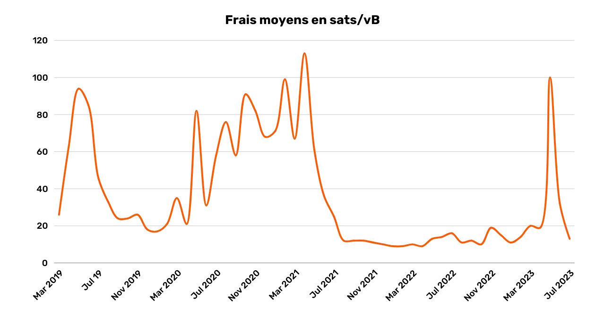

लेन-देन लागत में बचत के अलावा, UTXOs को मिलाने से "Dust" के बनने से रोका जा सकता है। "Dust" उन UTXOs को कहते हैं जिनकी Sats में वैल्यू इतनी कम होती है कि उन्हें खर्च करने के लिए ज़रूरी लेन-देन लागत भी पूरी नहीं हो पाती। जब तक लेन-देन लागत ज़्यादा रहती है, तब तक इन UTXOs का इस्तेमाल करना आर्थिक रूप से बेकार हो जाता है। अपने UTXOs को पहले से ही जोड़कर रखने से आप उन्हें Dust में बदलने से रोकते हैं, जिससे आपके सारे फंड इस्तेमाल करने लायक बने रहते हैं।

### आपके UTXOs का न्यूनतम आकार क्या है?

मुझसे कभी-कभी पूछा जाता है कि UTXO के लिए सुझाया गया न्यूनतम मूल्य क्या होना चाहिए। दुर्भाग्य से, इसका कोई एक जवाब नहीं है, क्योंकि यह आपकी पसंद और फी मार्केट की स्थितियों पर निर्भर करता है। हालांकि, यहां एक फॉर्मूला है जो आपकी जरूरतों के अनुसार एक थ्रेशोल्ड तय करने में मदद कर सकता है:

$$
\frac {P \times F}T = M
$$

कहाँ:


- p$ लेन-देन का वजन है;
- $F$ अधिकतम चार्ज दर को दर्शाता है सैटोशी प्रति वीबाइट (Sats/vB) में, जिसके खिलाफ आप हेज करते हैं;
- t$ वह प्रतिशत है जो आप UTXO की कुल कीमत के संबंध में लेन-देन शुल्क के रूप में देने को तैयार हैं।
- m$ हर UTXO के लिए सतोशी में न्यूनतम रकम है।

मान लीजिए कि आप 1 इनपुट और 2 आउटपुट वाले स्टैंडर्ड SegWit ट्रांजैक्शन की फीस कवर करने की योजना बना रहे हैं, जिसका वजन 141 vB है। अगर आप 800 Sats/vB तक हेजिंग कर रहे हैं, और आप फीस में अधिकतम UTXO वैल्यू का 12% खर्च करने को तैयार हैं, तो गणना इस प्रकार होगी:

$$
\frac{141 \times 800}{0.12} = 940\ 000
$$

इस उदाहरण में, इसलिए आपके पोर्टफोलियो में UTXOs के लिए 940,000 Sats की न्यूनतम राशि रखना समझदारी होगी।

### कंसॉलिडेशन और सीआईओएच

Blockchain विश्लेषण में सबसे ज़्यादा इस्तेमाल होने वाली ह्यूरिस्टिक्स में से एक है CIOH (*कॉमन इनपुट Ownership ह्यूरिस्टिक*), जो मानती है कि Bitcoin ट्रांजैक्शन के सभी इनपुट एक ही इकाई के होते हैं। कंसोलिडेशन का मूल सिद्धांत है कई UTXOs को इनपुट के रूप में इस्तेमाल करके एक ही UTXO को आउटपुट के रूप में बनाना। इस तरह कंसोलिडेशन ICOH को लागू करने में सक्षम बनाता है।


व्यवहार में, इसका मतलब है कि कोई बाहरी पर्यवेक्षक यह अनुमान लगा सकता है कि सभी समेकित UTXOs संभवतः एक ही व्यक्ति के हैं, और उत्पन्न हुआ अद्वितीय आउटपुट भी उसी का है। यह स्थिति विभिन्न लेन-देन इतिहास को जोड़कर आपकी गोपनीयता को खतरे में डाल सकती है। उदाहरण के लिए, मान लीजिए मैं P2P के माध्यम से प्राप्त 3 UTXOs को UTXO के साथ समेकित करता हूँ, जो KYC वाले प्लेटफॉर्म से प्राप्त हुआ है:


ऐसा करने से, Exchange प्लेटफॉर्म के डेटा तक पहुंच रखने वाली कोई भी संस्था, जिसमें सरकारी एजेंसियां भी शामिल हो सकती हैं, यह पहचान पाएगी कि मेरे पास BTC की अन्य रकमें भी हैं। पहले, ये UTXOs सीधे मेरी पहचान से जुड़े नहीं थे; अब वे जुड़ गए हैं। इससे भी बड़ी बात यह है कि यह सभी स्रोतों को यह जानकारी देता है कि मेरे पास एक निश्चित मात्रा में बिटकॉइन्स हैं।

जब UTXOs को मैनेज करने की बात आती है, तो आर्थिक पहलू (जो खर्च कम करने के लिए UTXOs को मर्ज करने की सलाह देते हैं) और प्राइवेसी के बेस्ट प्रैक्टिस (जो UTXOs को कभी न मिलाने की सलाह देते हैं) के बीच टकराव होता है। इसलिए, बचत और गोपनीयता के बीच चुनाव हर यूजर की प्राथमिकताओं पर निर्भर करता है।

अगर आप बड़े UTXO (Unspent Transaction Output) बनाए रखते हुए कंसोलिडेशन (एकत्रीकरण) से बच सकते हैं, तो यह बिल्कुल सही रहेगा। ऐसा करने के लिए, अपने बिटकॉइन खरीदने के तरीकों को बेहतर बनाएं। अगर आप DCA (Dollar Cost Averaging) से बिटकॉइन खरीदते हैं, तो एक बार में खरीदारी को जितना हो सके फैलाकर करें, ताकि कम UTXO पर ज्यादा वैल्यू इकट्ठा हो सके।  

मिसाल के तौर पर, हर 2 महीने में एक बार ₹1,00,000 की खरीदारी करना, हफ्ते में ₹12,000 खरीदने से ज्यादा आसान होगा। इससे UTXO की संख्या कम रहेगी, आपका पोर्टफोलियो मैनेज करना आसान होगा, और आपकी प्राइवेसी भी बनी रहेगी।

अगर आपको अपने बिटकॉइन्स को एक साथ मिलाना पड़े, तो पहले एक ही स्रोत से आए UTXOs को मिलाने को प्राथमिकता दें। जैसे, किसी एक प्लेटफॉर्म से 10 UTXOs को मिलाने से आपकी गोपनीयता पर कम असर पड़ेगा, बजाय इसके कि प्लेटफॉर्म A के 5 UTXOs को प्लेटफॉर्म B के 5 UTXOs के साथ मिलाया जाए। अगर अलग-अलग स्रोतों को मिलाना ही पड़े, तो उन्हें उनकी खासियत के हिसाब से अलग-अलग करने की कोशिश करें। मिसाल के तौर पर, KYC से हासिल किए गए UTXOs को एक ट्रांजैक्शन में और P2P से प्राप्त UTXOs को दूसरी ट्रांजैक्शन में अलग-अलग समूहित करें।

किसी भी हालत में, यह मत भूलना कि किसी भी समेकन (consolidation) में गोपनीयता का नुकसान तो होता ही है। इसलिए CIOH को ध्यान में रखते हुए, इस ऑपरेशन की जरूरत और आपकी प्राइवेसी पर इसके संभावित प्रभाव का सावधानी से आकलन करें।

## अन्य सर्वोत्तम प्रथाएं

<chapterId>b5216965-7d13-4ea1-9b7c-e292966a487b</chapterId>

चलो, Bitcoin पर अपनी प्राइवेसी को और बेहतर बनाने के कुछ और बेस्ट प्रैक्टिसेज़ पर एक नज़र डालते हैं।

### पूरा गाँठ

अपने बिटकॉइन्स को खुद के कस्टडी में रखना बढ़िया है, लेकिन अपना खुद का कंप्लीट नोड इस्तेमाल करना और भी बेहतर है! यहाँ बताते हैं कि Bitcoin के पूरी तरह से सॉवरेन इस्तेमाल के लिए अपना नोड होना क्यों जरूरी है:


- **सेंसरशिप का विरोध**: आपके लेन-देन को कोई भी रोक नहीं सकता;
- **तीसरे पक्षों से आज़ादी**: अब आपको Blockchain डेटा को वेरिफाई करने के लिए किसी बाहरी सेवा पर निर्भर नहीं रहना पड़ेगा;
- **सक्रिय भागीदारी**: आप अपने खुद के सत्यापन नियम बना सकते हैं और सीधे सहमति (कंसेंसस) प्रक्रिया में हिस्सा ले सकते हैं;
- नेटवर्क योगदान**: नोड चलाकर, आप Bitcoin नेटवर्क को मजबूत और वितरित करने में मदद करते हैं;
- तकनीकी शिक्षा**: एक पूर्ण नोड को मैनेज करना Bitcoin के बारे में आपके तकनीकी ज्ञान को गहरा करने का एक शानदार तरीका है।

इनके अलावा, एक पूर्ण नोड (complete node) का उपयोग करने से आपके लेन-देन (transactions) को प्रसारित (broadcast) करते समय आपकी गोपनीयता (confidentiality) भी बढ़ती है। जब आप कोई लेन-देन करते हैं, तो यह पहले आपके Wallet पर बनाया और साइन (signed) किया जाता है। Bitcoin नेटवर्क पर इसे प्रसारित करने के लिए, यह कम से कम एक नोड को पता होना चाहिए। अपने खुद के नोड का उपयोग करके, आप इस वितरण (distribution) पर सीधा नियंत्रण रखते हैं, जिससे आपकी गोपनीयता मजबूत होती है और डेटा लीक (data leakage) का जोखिम कम होता है।


अगर आपके पास अपना खुद का Bitcoin नोड नहीं है, तो आपको किसी तीसरे पक्ष के नोड का इस्तेमाल करना पड़ेगा, जैसे कि आपके Wallet सॉफ्टवेयर प्रदाता द्वारा दिया गया नोड। ट्रांजैक्शन्स को ब्रॉडकास्ट करने के अलावा, आपके Wallet को विभिन्न जानकारियों तक पहुंच की ज़रूरत होती है, जैसे कि पेंडिंग ट्रांजैक्शन्स, आपके एड्रेस से जुड़े बैलेंस और आपके ट्रांजैक्शन्स की कन्फर्मेशन की संख्या। इस सारे डेटा तक पहुंचने के लिए, आपको एक नोड को क्वेरी करनी होगी।


जब आप अपना खुद का Bitcoin नोड इस्तेमाल नहीं कर रहे होते हैं, तो सबसे बड़ा खतरा यह है कि तीसरे पक्ष के नोड का ऑपरेटर आपकी Blockchain पर की गई गतिविधियों को देख सकता है, यहाँ तक कि इस जानकारी को दूसरे संस्थाओं के साथ भी साझा कर सकता है। इस खतरे को कम करने के लिए, एक बीच का हल है Wallet सॉफ्टवेयर का इस्तेमाल करना जो Tor के जरिए आपके कनेक्शन को छुपाता है। इससे आपके डेटा का एक्सपोजर कम हो सकता है। हालाँकि, सबसे बेहतर हल यह है कि आप अपना खुद का Bitcoin नोड रखें और उसका इस्तेमाल करके अपने लेन-देन को प्रसारित करें। बेशक, आपको यह भी ध्यान रखना होगा कि अपने नोड के जरिए कोई जानकारी लीक न हो, लेकिन यह एक अलग विषय है जिसे हम आगे के सेक्शन में देखेंगे।

आपकी प्राइवेसी के स्पष्ट फायदे के अलावा, अपना खुद का पूरा नोड होने से आप Blockchain पर डेटा की सच्चाई का भरोसा पाते हैं, सेंसरशिप से बचाव होता है और आप Bitcoin के गवर्नेंस में सक्रिय भागीदारी कर सकते हैं। अपने नोड का इस्तेमाल करके, आप अपनी पसंद की चेन में अपनी आर्थिक ताकत का योगदान देते हैं, जो कम्युनिटी के भीतर टकराव के दौरान महत्वपूर्ण होता है, जैसे कि 2015 से 2017 के ब्लॉकसाइज़ वॉर के दौरान हुआ था। अगर Fork जैसी स्थिति आती है, तो किसी तीसरे पक्ष के नोड का इस्तेमाल करने से आप उस चेन को सपोर्ट कर सकते हैं जिसे आप प्राथमिकता नहीं देना चाहते, क्योंकि नोड ऑपरेटर आपकी तरफ से चुनाव करता है।

जैसा कि आप देख सकते हैं, गोपनीयता और व्यक्तिगत संप्रभुता के हित में, यह ज़रूरी है कि आप अपना खुद का पूरा नोड चलाएं और इस्तेमाल करें!

### धोखेबाज़ विश्लेषण ह्यूरिस्टिक्स

व्यापक तौर पर, पिछले सेक्शन में हमने जिन ह्यूरिस्टिक्स के बारे में बात की थी, उन्हें समझना ज़रूरी है ताकि हम उनसे बेहतर तरीके से बच सकें या उन्हें धोखा दे सकें। कुछ बेस्ट प्रैक्टिसेज़ को अपनाना फायदेमंद हो सकता है, भले ही वे बिल्कुल ज़रूरी न हों। ये एक अतिरिक्त Layer सुरक्षा प्रदान करते हैं जो Bitcoin का इस्तेमाल करते समय गोपनीयता बनाए रखने में अहम हो सकता है।

मैं जो पहला सलाह दूंगा वो यह है कि सबसे घनी भीड़ में घुल-मिल जाइए। Bitcoin पर, इसका मतलब है सबसे ज्यादा अपनाए गए स्क्रिप्ट टेम्प्लेट्स का इस्तेमाल करना। उदाहरण के लिए, P2WSH स्क्रिप्ट्स, जो अक्सर SegWit V0 Multisig कॉन्फिगरेशन्स में इस्तेमाल होते हैं, बहुत कम देखने को मिलते हैं। वे आपको बड़े अनामिता सेट में छिपने नहीं देते। यही बात पुराने मॉडल्स जैसे P2PKH या P2SH पर भी लागू होती है। हालांकि वे UTXO सेट में खूब मौजूद हैं, लेकिन नए ट्रांजैक्शन्स के लिए उनका इस्तेमाल कम होता जा रहा है।

आम तौर पर बोलें तो, सबसे नए स्क्रिप्टिंग स्टैंडर्ड को चुनना ज़्यादा समझदारी है, बशर्ते कि उसे काफी अपनाया जा चुका हो। तो अगर 2022 में मैं P2TR (Taproot) इस्तेमाल करने से मना करता क्योंकि उसका इस्तेमाल कम था, तो 2024 में मैं इस तरह की स्क्रिप्ट चुनने की सलाह दूँगा, या फिर SegWit V0 स्क्रिप्ट ले लो, क्योंकि P2TR का इस्तेमाल करने वाले ट्रांजैक्शन्स की संख्या अब काफी बड़ी होने लगी है।

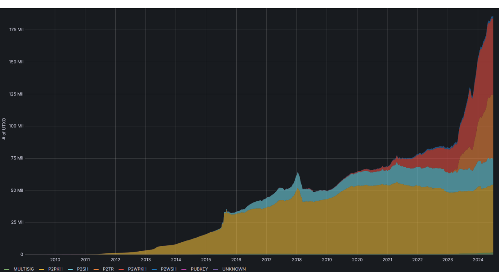

स्रोत: [txstats.com](https://txstats.com/d/000000054/UTXO-set-repartition-by-output-type)

अपनी गोपनीयता बनाए रखने का एक और तरीका है आंतरिक लेन-देन के ह्यूरिस्टिक्स (अनुमान-आधारित नियमों) से बचने की कोशिश करना। मिसाल के तौर पर, जब आप भुगतान कर रहे हों, तो गोल-मोल रकम वाला आउटपुट बनाने से बचें, क्योंकि इससे संकेत मिल सकता है कि दूसरा आउटपुट विदेशी Exchange को दर्शाता है। अगर आपको किसी दोस्त को 100 k Sats भेजने हों, तो इस ह्यूरिस्टिक से बचने के लिए थोड़ी ज्यादा रकम ट्रांसफर करने पर विचार करें। इसी तरह, विदेशी Exchange आउटपुट ऐसे न बनाएं जो किए गए भुगतान के मुकाबले बहुत ज्यादा हों, क्योंकि इससे भी पता चल सकता है कि कौन सा आउटपुट विदेशी Exchange को दर्शाता है।


आखिर में, अगर आप नियमित रूप से Bitcoin लेनदेन करते हैं, तो यह सुनिश्चित करें कि आप हमेशा उन्हें एक ही समय पर प्रसारित न करें। अपने लेनदेन को दिन भर और हफ्ते में अलग-अलग समय पर प्रसारित करके, आप बाहरी पर्यवेक्षकों को समय-क्षेत्र आधारित पैटर्न का पता लगाने का मौका नहीं देते, जो उनके विश्लेषण को मजबूत कर सकता है।

इन सभी अच्छी आदतों के अलावा जिन्हें रोज़ाना अपनाना चाहिए, आपके बिटकॉइन की ट्रेस करने की क्षमता को पूरी तरह से तोड़ने के लिए और भी ज़्यादा असरदार तरीके हैं। इनमें शामिल है, बिल्कुल, जीडब्ल्यू-590 लेन-देन, जिसे हम अगले भाग में गहराई से देखेंगे।

# CoinJoin लेन-देन को समझना

<partId>6d0bbf16-3714-4db1-9897-2d45019f6bdc</partId>

## "CoinJoin transaction" क्या होता है?

<chapterId>0862bc6b-1c48-4aa4-b76d-4f547b469008</chapterId>

गोपनीयता सुरक्षा की बुनियादी बातें पढ़ने के बाद, अब हम आपकी गोपनीयता की सक्रिय रूप से रक्षा करने वाली और अधिक उन्नत तकनीकों पर नज़र डालेंगे, खासकर आपके Bitcoin इतिहास को अलग-अलग करके। अगले हिस्से में, हम कई छोटी-छोटी तकनीकों को देखेंगे, लेकिन सबसे पहले, मैं आपको CoinJoin के बारे में बताना चाहूँगा।

जीडब्ल्यू-595 को अक्सर जीडब्ल्यू-596 यूजर्स की प्राइवेसी को सुरक्षित रखने का सबसे कारगर तरीका माना जाता है। लेकिन आखिर जीडब्ल्यू-595 ट्रांजैक्शन होता क्या है? चलिए जानते हैं।

### CoinJoin के बुनियादी सिद्धांत

जीडब्ल्यू-599, जीडब्ल्यू-598 पर जीडब्ल्यू-600 ट्रैकिंग को तोड़ने की एक तकनीक है। यह एक सहयोगी लेन-देन पर आधारित है जिसका एक विशिष्ट ढांचा है और उसी नाम का है: जीडब्ल्यू-599 लेन-देन।

जैसा कि हमने कोर्स के पहले हिस्सों में देखा, Bitcoin लेन-देन सभी यूज़र्स को उनके नोड के ज़रिए पता चलते हैं। इसलिए, हर सिक्के की इलेक्ट्रॉनिक सिग्नेचर चेन को चेक करना और उसका इतिहास देखना आसान है। इसका मतलब है कि सभी यूज़र्स दूसरे यूज़र्स के लेन-देन का विश्लेषण करने की कोशिश कर सकते हैं। नतीजतन, लेन-देन के स्तर पर गुमनामी नामुमकिन है। हालाँकि, व्यक्तिगत पहचान के स्तर पर गुमनामी बरकरार रहती है। पारंपरिक बैंकिंग सिस्टम के उलट, जहाँ हर अकाउंट किसी व्यक्तिगत पहचान से जुड़ा होता है, Bitcoin पर फंड क्रिप्टोग्राफ़िक की-पेयर्स (या स्क्रिप्ट्स) से जुड़े होते हैं, जो यूज़र्स को क्रिप्टोग्राफ़िक आइडेंटिफ़ायर्स के पीछे एक तरह की छद्मनामिता (pseudonymity) देते हैं।


Bitcoin की गोपनीयता तब कमजोर हो जाती है जब बाहरी पर्यवेक्षक विशिष्ट UTXOs को पहचाने गए उपयोगकर्ताओं से जोड़ पाते हैं। एक बार यह संबंध स्थापित हो जाने के बाद, उनके लेन-देन को ट्रैक करना और उनका Bitcoin इतिहास विश्लेषण करना संभव हो जाता है। CoinJoin वास्तव में UTXOs की ट्रेस करने की क्षमता को तोड़ने के लिए विकसित की गई एक तकनीक है, ताकि Bitcoin उपयोगकर्ताओं को लेन-देन स्तर पर Layer की एक निश्चित मात्रा में गोपनीयता प्रदान की जा सके।

कॉइनजॉइन्स, Bitcoin यूज़र्स की गोपनीयता को मज़बूत करते हैं क्योंकि ये बाहरी नज़र रखने वालों के लिए चेन एनालिसिस को और जटिल बना देते हैं। इनकी बनावट ऐसी होती है कि अलग-अलग यूज़र्स के कॉइन्स एक ही ट्रांज़ैक्शन में मिल जाते हैं, जिससे पता लगाना मुश्किल हो जाता है कि कौन सा इनपुट किस आउटपुट एड्रेस से जुड़ा है।

यह समझना ज़रूरी है कि CoinJoin ट्रांज़ैक्शन का मकसद सिक्के के इतिहास को तोड़ना होता है। जैसा कि आप सोच सकते हैं, यह तकनीक स्थायी गुमनामी नहीं देती या Bitcoin ट्रैकिंग को पूरी तरह ब्लॉक नहीं करती। CoinJoin सिर्फ़ उस पॉइंट पर इतिहास तोड़ने का लक्ष्य रखता है जहाँ यह ट्रांज़ैक्शन किया जाता है। हालाँकि, इस ऑपरेशन से पहले और बाद में, सिक्का गोपनीयता के मामले में उन्हीं जोखिमों के अधीन रहता है।


### सिक्के जोड़ (CoinJoin) कैसे काम करते हैं?  

CoinJoin एक तकनीक है जिसका इस्तेमाल क्रिप्टोकरेंसी लेनदेन की प्राइवेसी बढ़ाने के लिए किया जाता है। इसमें कई लोग अपने ट्रांजैक्शन को एक साथ मिलाकर एक ही ट्रांजैक्शन बना देते हैं। ऐसा करने से यह पता लगाना मुश्किल हो जाता है कि किसने किसको पैसे भेजे हैं।  

### काम करने का तरीका:  
1. **मल्टीपल यूजर्स:** कई लोग अपने अलग-अलग इनपुट (पैसे) और आउटपुट (रिसीवर) को एक साथ जोड़ते हैं।  
2. **मिक्सिंग:** सभी ट्रांजैक्शन एक साथ मिलकर एक नया, बड़ा ट्रांजैक्शन बनाते हैं।  
3. **डिस्ट्रीब्यूशन:** फिर पैसे को नए एड्रेस पर भेज दिया जाता है, जिससे ट्रैक करना मुश्किल हो जाता है।  

इस तरह, CoinJoin यूजर्स की पहचान छुपाकर उनकी प्राइवेसी को बचाता है। Bitcoin जैसी क्रिप्टोकरेंसी में यह तकनीक काफी पॉपुलर है।

CoinJoin सिद्धांत एक सहयोगी तरीके पर आधारित है: कई यूज़र्स जो अपने बिटकॉइन्स को मिलाना चाहते हैं, वे एक ही ट्रांजैक्शन में इनपुट के रूप में बराबर रकम जमा करते हैं। फिर ये रकम हर यूज़र को बराबर वैल्यू के आउटपुट्स में बाँट दी जाती है।


लेन-देन के अंत में, किसी विशिष्ट आउटपुट को इनपुट के रूप में ज्ञात उपयोगकर्ता से जोड़ना असंभव हो जाता है। इनपुट्स और आउटपुट्स के बीच कोई सीधा लिंक नहीं होता, जिससे उपयोगकर्ताओं और उनके UTXOs के बीच संबंध टूट जाता है, साथ ही प्रत्येक भाग का इतिहास भी अलग हो जाता है।


चलो Alice का उदाहरण लेते हैं। वह अपनी बहन Eve को उसके जन्मदिन पर लगभग 100,000 Sats भेजना चाहती है। हालांकि, Alice नहीं चाहती कि Eve उसके लेन-देन का इतिहास ट्रैक कर पाए, क्योंकि वह नहीं चाहती कि यह पता चले कि उसके पास कितने बिटकॉइन हैं या उसे कैसे मिले। इसके लिए, Alice ने अपना UTXO इतिहास CoinJoin लेन-देन से तोड़ने का फैसला किया। वह Bob, Charles, David और Frank के साथ मिलकर एक सहयोगी लेन-देन करने की योजना बनाती है:


- ऐलिस, बॉब, चार्ल्स, डेविड और फ्रैंक - हर कोई इस ट्रांजैक्शन में 105,000 Sats (जिसमें से 5,000 Sats Mining फीस के लिए है) का UTXO कमिट करता है:


- इनपुट को खपाने के बदले में, हर एक 100,000 Sats के पांच एक जैसे आउटपुट बनाने के लिए एक खाली Address जनरेट करता है। हर एक एक आउटपुट निकालता है:


- ऐलिस के पास 100,000 Sats का UTXO है जिसका इतिहास उलझा हुआ है। वह इस UTXO को एक नए लेन-देन में इस्तेमाल करती है और यह रकम ईव को उसके जन्मदिन के लिए भेज देती है:


- अगर ईव इस लेन-देन का विश्लेषण करके जानकारी निकालने की कोशिश करती है, तो उसे ग्वे-619 लेन-देन का सामना करना पड़ेगा जिसमें ऐलिस, बॉब, चार्ल्स, डेविड और फ्रैंक शामिल हैं। रकम की एकरूपता के कारण कौन सा इनपुट किसका है, यह पहचानने में असमर्थ होने के कारण, ईव ऐलिस के ग्वे-620 इतिहास का पता नहीं लगा सकती, न ही यह जान सकती है कि उसकी बहन के पास कितने बिटकॉइन हैं या उसने उन्हें कैसे हासिल किया:


इस मामले में, ऐलिस ने रेट्रोस्पेक्टिव विश्लेषण के संबंध में गोपनीयता बढ़ाने के लिए CoinJoin तकनीक का उपयोग किया है। असल में, ऐलिस खुद को ईव के संभावित विश्लेषण से बचा रही है, जो एक विशिष्ट लेन-देन से शुरू होकर UTXO के इतिहास के माध्यम से पीछे की ओर काम करेगी। वर्तमान से अतीत की ओर विश्लेषण के खिलाफ यह सुरक्षा रेट्रोस्पेक्टिव एनॉनसेट के रूप में जानी जाती है। हम इस अवधारणा को इस खंड के अंतिम अध्यायों में विस्तार से देखेंगे।

हालांकि, CoinJoin भविष्य में होने वाले विश्लेषण (जिसे प्रॉस्पेक्टिव अनॉनसेट कहा जाता है) के खिलाफ गोपनीयता को मजबूत करने की संभावना भी प्रदान करता है। चलिए हमारे उदाहरण पर वापस जाते हैं जहां ऐलिस ने ईव को उसके जन्मदिन पर 98,000 Sats भेजे थे, लेकिन अब भूमिकाएं बदल दें। अब कल्पना करें कि ईव को अपनी प्राइवेसी की चिंता है। दरअसल, ऐलिस उस कॉइन को ट्रैक करने के लिए प्रलोभित हो सकती है जो उसने ईव को भेजा था, ताकि उससे जानकारी निकाल सके। ईव इस हाल ही में प्राप्त UTXO को अपने अन्य सभी UTXOs के साथ मिला सकती है, जिससे ऐलिस को पता चल सकता है कि उसके पास Wallet में कितने बिटकॉइन हैं। इससे बचने के लिए, ईव उस कॉइन के इतिहास को भी तोड़ सकती है जो उसे अभी मिला है:


- ईव, ग्रेस, मैलरी, ऑस्कर और विक्टर ने प्रत्येक ने Bitcoin लेनदेन में इनपुट के रूप में 98,000 Sats का UTXO डाला:


- इनपुट्स को इस्तेमाल करने के बदले में, हर यूज़र एक खाली Address देता है, जिससे 97,500 बराबर Sats के 5 आउटपुट बनाए जाते हैं। हर यूज़र को एक आउटपुट मिलता है:

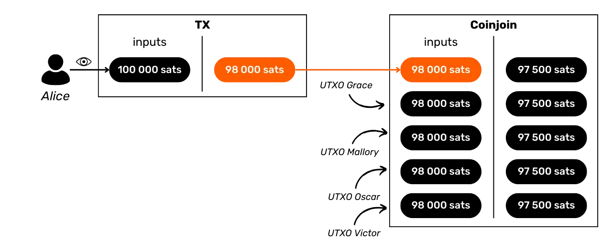


- अब ईव के पास 97,500 Sats का एक UTXO है जिसका इतिहास टूट चुका है। वह भविष्य के लेन-देन करने के लिए बिना किसी डर के इसका उपयोग कर सकती है। वास्तव में, अगर ऐलिस उन बिटकॉइन्स को ट्रैक करने की कोशिश करती है जो उसने ईव को भेजे हैं, तो उसे एक CoinJoin लेन-देन का सामना करना पड़ेगा। वह यह निर्धारित करने में असमर्थ होगी कि आउटगोइंग UTXO में से कौन सा ईव का है। विश्लेषण असंभव हो जाता है:

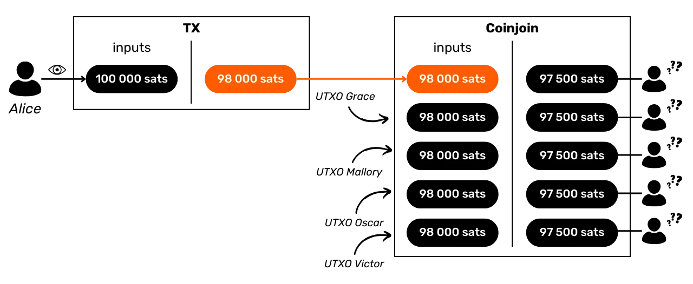

पहले उदाहरण में, हमने देखा कि CoinJoin किसी कमरे की प्राइवेसी को उसके अतीत के संदर्भ में कैसे सुरक्षित रख सकता है, और दूसरे उदाहरण में, यह किसी कमरे के इतिहास को उसके भविष्य के संदर्भ में भी सुरक्षित कर सकता है। इसीलिए मैंने कहा था कि CoinJoin को एक ऐसी एकमुश्त घटना के रूप में देखा जाना चाहिए जो इतिहास के एक हिस्से को दोनों दिशाओं में विभाजित कर देती है।


### मिक्सर, जीडब्ल्यू-636, मिक्सर... फर्क क्या है?

कॉइनजॉइन को कभी-कभी "मिक्सर" कहा जाता है, एक ऐसा शब्द जिसे कुछ बिटकॉइनर्स नापसंद करते हैं, क्योंकि उन्हें डर है कि इसे कस्टोडियल मिक्सर के साथ मिलाया जा सकता है। हालाँकि, मेरा मानना है कि यह डर बेबुनियाद है, क्योंकि गणितीय संदर्भ में CoinJoin सही मायने में मिक्सिंग की अवधारणा को दर्शाता है।

गणित के सामान्य क्षेत्र में, मिक्सिंग (mixing) एक डायनामिकल सिस्टम के उस गुण को कहते हैं जहाँ कुछ समय बाद, शुरुआती स्पेस के सभी हिस्से सैद्धांतिक रूप से किसी भी दूसरे हिस्से के साथ मिल सकते हैं। मिक्सिंग का मतलब है कि किसी कण की स्थिति या सिस्टम की अवस्था इस तरह विकसित होती है कि उसका भविष्य का वितरण (distribution) उसके शुरुआती वितरण से स्वतंत्र हो जाता है, और इस तरह एक ऐसी अवस्था में पहुँच जाता है जहाँ शुरुआती अवस्था की विशेषताएँ पूरे सिस्टम के स्पेस में एकसमान रूप से वितरित हो जाती हैं। यही वही चीज़ है जो CoinJoin में बिटकॉइन के साथ होती है। इसलिए, मेरी राय में, CoinJoin सच में एक कॉइन मिक्सिंग (coin mixing) तरीका है।


दूसरी तरफ, CoinJoin को शफलर्स से अलग समझना ज़रूरी है। शफलर एक ऐसी सेवा है जहां यूज़र्स अपने बिटकॉइन मिक्स करवाने के लिए भेजते हैं। ये सेवाएं 2010 के दशक में काफी पॉपुलर थीं, लेकिन CoinJoin के मुकाबले इनके दो बड़े नुकसानों की वजह से अब इनका इस्तेमाल कम हो गया है:


- वे यूजर्स को ब्लेंडिंग प्रक्रिया के दौरान अपने फंड्स की कस्टडी छोड़ने के लिए कहते हैं, जिससे उन्हें चोरी का खतरा होता है;
- यह कोई गारंटी नहीं है कि मिक्सर लेन-देन का विवरण रिकॉर्ड नहीं करेगा, यहां तक कि इस जानकारी को चेन एनालिसिस कंपनियों को बेच भी सकता है।


आज के यूज़र्स इसलिए CoinJoin को पसंद करते हैं, क्योंकि यह उन्हें पूरी प्रक्रिया में अपने फंड्स पर पूरा कंट्रोल रखने की सुविधा देता है। CoinJoin में शामिल लोगों को दूसरे पक्षों द्वारा अपने बिटकॉइन चोरी होने का कोई खतरा नहीं होता। आइए अगले चैप्टर में देखते हैं कि यह सब कैसे संभव है।

## ज़ीरोलिंक और चौमियन कॉइनजॉइन्स

<chapterId>326c9654-b359-4906-b23d-d6518dd5dc3e</chapterId>

CoinJoin द्वारा दी गई प्राइवेसी उस ग्रुप के आकार से मिलती है जिसमें हमारा पीस छुपा होता है। इसका मतलब है कि जितने ज्यादा लोग भाग लें, उतना बेहतर। हम खुद से ढूंढे गए यूजर्स के साथ मैन्युअली CoinJoin बनाना पूरी तरह संभव है, लेकिन यह प्रक्रिया काफी जटिल है और इसमें बड़े एनॉनसेट्स नहीं मिलेंगे।

यही वजह है कि CoinJoin कोऑर्डिनेटर्स ने Bitcoin पर विकास किया है। उनकी भूमिका विभिन्न यूजर्स को एक-दूसरे से जोड़ने और सहयोगात्मक लेन-देन को पूरा करने के लिए जरूरी जानकारी पहुंचाने की है।


लेकिन हम कैसे सुनिश्चित कर सकते हैं कि कोऑर्डिनेटर के हाथ में यूजर्स के बिटकॉइन कभी न आएं, और इस तथ्य के बावजूद कि वह CoinJoin ट्रांजैक्शन बना रहा है, हम कैसे गारंटी दे सकते हैं कि वह यूजर्स के इनपुट्स और आउटपुट्स को लिंक नहीं कर सकता, जिससे कंफिडेंशियलिटी लीक हो सकती है?

### चौम के ब्लाइंड सिग्नेचर्स

आधुनिक CoinJoin इम्प्लीमेंटेशन्स डेविड चॉम के ब्लाइंड सिग्नेचर्स का इस्तेमाल करते हैं ताकि जानकारी लीक न हो। चलो जल्दी से देखते हैं कि ये ब्लाइंड सिग्नेचर्स कैसे काम करते हैं।

चौम के ब्लाइंड सिग्नेचर एक डिजिटल सिग्नेचर का प्रकार है जिसमें सिग्नेचर जारी करने वाला व्यक्ति उस संदेश की सामग्री नहीं जानता जिस पर वह हस्ताक्षर कर रहा है। लेकिन बाद में इस सिग्नेचर को मूल संदेश के साथ वेरिफाई किया जा सकता है। यह तकनीक क्रिप्टोग्राफर डेविड चौम द्वारा 1983 में विकसित की गई थी।


चलो एक कंपनी का उदाहरण लेते हैं जो एक गोपनीय दस्तावेज़, जैसे कि Contract, को प्रमाणित करना चाहती है, बिना उसकी सामग्री को प्रकट किए। कंपनी एक मास्किंग प्रक्रिया लागू करती है जो मूल दस्तावेज़ को क्रिप्टोग्राफ़िक तरीके से बदल देती है, परंतु इसे वापस पलटा जा सकता है। यह संशोधित दस्तावेज़ एक प्रमाणन प्राधिकरण को भेजा जाता है, जो अंतर्निहित सामग्री को जाने बिना एक ब्लाइंड सिग्नेचर लगा देता है। साइन किए गए दस्तावेज़ को प्राप्त करने के बाद, कंपनी सिग्नेचर को अनमास्क कर देती है। नतीजा यह होता है कि मूल दस्तावेज़ प्राधिकरण के सिग्नेचर द्वारा प्रमाणित हो जाता है, बिना प्राधिकरण ने कभी मूल सामग्री देखी हो।

चौम के ब्लाइंड सिग्नेचर्स इस तरह से किसी डॉक्यूमेंट की प्रामाणिकता को सत्यापित कर सकते हैं बिना उसकी सामग्री को जाने, जिससे यूजर के डेटा की गोपनीयता और साइन किए गए डॉक्यूमेंट की अखंडता दोनों सुनिश्चित होती है।

### चौमियाँ कॉइनजॉइन्स

तथाकथित "चौमियन" कॉइनजॉइन्स, टॉर और डेविड चौम के ब्लाइंड सिग्नेचर्स का इस्तेमाल मिलाकर यह सुनिश्चित करते हैं कि कोऑर्डिनेटर यह नहीं जान सकता कि कौन सा आउटपुट किस यूजर का है।

CoinJoin लेन-देन निर्माण प्रक्रिया में 3 मुख्य चरण होते हैं: इनपुट पंजीकरण, आउटपुट पंजीकरण और लेन-देन हस्ताक्षर। आइए इस प्रक्रिया को एलिस, एक CoinJoin प्रतिभागी के उदाहरण के माध्यम से समझते हैं। अन्य सभी प्रतिभागी भी एलिस के समान ही चरणों का पालन करते हैं, हर कोई अपने स्तर पर।

**चरण 1: पंजीकरण इनपुट**


- ऐलिस कोऑर्डिनेटर को UTXO भेजती है जिसे वह ट्रांजैक्शन के इनपुट के रूप में इस्तेमाल करना चाहती है, साथ ही मास्क्ड रिसीव Address भी भेजती है जिसे वह आउटपुट के रूप में अपने बिटकॉइन प्राप्त करने के लिए इस्तेमाल करना चाहती है। इस तरह कोऑर्डिनेटर को ऐलिस का असली Address पता नहीं चल पाता। उसे सिर्फ उसका मास्क्ड वर्जन दिखाई देता है:


- कोऑर्डिनेटर इनपुट्स की वैधता जाँचता है, फिर एलिस के मास्क्ड Address को अपने प्राइवेट की से साइन करता है। वह ब्लाइंड सिग्नेचर एलिस को वापस भेज देता है:


**चरण 2: आउटपुट पंजीकरण**


- ऐलिस अब अपना Address अनमास्क कर सकती है, जो अब कोऑर्डिनेटर के प्राइवेट की से साइन हो चुका है। वह एक अलग टॉर आइडेंटिटी के तहत नया कनेक्शन स्थापित करेगी। कोऑर्डिनेटर यह पहचान नहीं कर सकता कि यह ऐलिस ही है जो इस नई आइडेंटिटी के तहत कनेक्ट हो रही है:


- ऐलिस ने अनमास्क्ड Address और सिग्नेचर को कोऑर्डिनेटर को भेज दिया (जिसे अभी भी नहीं पता कि यह ऐलिस है):


**चरण 3: लेन-देन पर हस्ताक्षर करना**


- ठीक उसी तरह, कोऑर्डिनेटर सभी प्रतिभागियों से अनमास्क्ड आउटपुट प्राप्त करता है। संबंधित सिग्नेचर्स की बदौलत, वह यह जांच सकता है कि हर गुमनामी में जमा किया गया आउटपुट पहले से ही उसके प्राइवेट की से साइन किया गया है, जिससे उनकी वैधता सुनिश्चित होती है। फिर वह CoinJoin ट्रांजैक्शन तैयार करने के लिए तैयार हो जाता है और इसे सिग्नेचर के लिए प्रतिभागियों को भेजता है:


- ऐलिस, बाकी सभी भागीदारों की तरह, यह जाँचती है कि कोऑर्डिनेटर द्वारा बनाए गए लेन-देन में उसका इनपुट और आउटपुट सही तरीके से शामिल है। अगर सब कुछ ठीक लगता है, तो वह कोऑर्डिनेटर को अपने इनपुट स्क्रिप्ट को अनलॉक करने वाला सिग्नेचर भेज देती है:


- CoinJoin के सभी प्रतिभागियों के हस्ताक्षर इकट्ठा करने के बाद, समन्वयक Bitcoin नेटवर्क पर लेन-देन को प्रसारित कर सकता है, ताकि इसे एक ब्लॉक में जोड़ा जा सके।

इस सिस्टम में, कोऑर्डिनेटर किसी इनपुट को किसी खास आउटपुट से लिंक नहीं कर पाता। इसके अलावा, वह पार्टिसिपेंट्स के फंड्स पर कब्ज़ा भी नहीं कर सकता, क्योंकि उनके UTXOs को अनलॉक करने के लिए ज़रूरी प्राइवेट कीज़ तक उसकी कभी पहुँच ही नहीं होती। पूरी प्रक्रिया के दौरान, स्टेप 3 के अंत तक, उसके पास सिग्नेचर्स तक भी कोई एक्सेस नहीं होता। जब ऐलिस और बाकी पार्टिसिपेंट्स ग्लोबल ट्रांजैक्शन पर साइन करते हैं, और सब कुछ सही चेक कर लेने के बाद, कोऑर्डिनेटर ट्रांजैक्शन को मॉडिफाई नहीं कर सकता—चाहे वह आउटपुट्स ही क्यों न हों—बिना उसे इनवैलिडेट किए। इस तरह कोऑर्डिनेटर बिटकॉइन्स चोरी करने से रोका जाता है।

आखिरकार, जब CoinJoin यूज़र अपना आउटपुट ट्रांजैक्शन में रजिस्टर करता है, तो वह चुनाव में वोट डालने वाले नागरिक की तरह ही गारंटी चाहता है। इन कार्यों के सार्वजनिक और निजी पहलुओं के बीच एक द्वैतता है। एक तरफ, वह चीज़ें हैं जिन्हें आप निजी रखना चाहते हैं: मतदाता के लिए, वह नहीं चाहता कि उसका वोट उसकी पहचान से जुड़ा हो; CoinJoin यूज़र के लिए, वह नहीं चाहता कि उसका आउटपुट उसके इनपुट से जुड़ा हो। वास्तव में, अगर कोऑर्डिनेटर या कोई अन्य पक्ष किसी इनपुट और आउटपुट के बीच कड़ी जोड़ने में कामयाब हो जाता है, तो CoinJoin का सारा मकसद खत्म हो जाता है। जैसा कि ऊपर बताया गया है, CoinJoin को सिक्के के इतिहास में एक ब्रेक की तरह काम करना चाहिए। यह रुकावट ठीक इसलिए होती है क्योंकि CoinJoin ट्रांजैक्शन में किसी खास इनपुट को किसी खास आउटपुट से जोड़ना असंभव होता है (प्रॉस्पेक्टिव एनॉनसेट) और इसका उल्टा भी (रेट्रोस्पेक्टिव एनॉनसेट)।

दूसरी तरफ, सार्वजनिक पहलू भी है: मतदाता यह सुनिश्चित करना चाहता है कि उसका वोट बैलेट बॉक्स में शामिल हो; इसी तरह, CoinJoin उपयोगकर्ता यह सुनिश्चित करना चाहता है कि उसका आउटपुट CoinJoin लेनदेन में शामिल हो। वास्तव में, CoinJoin प्रतिभागियों को लेनदेन पर हस्ताक्षर करने से पहले अपने आउटपुट की उपस्थिति को सत्यापित करने में सक्षम होना चाहिए, नहीं तो समन्वयक धन चुरा सकता है।

ये ठीक यही 2 सार्वजनिक और निजी पहलू हैं, जो डेविड चॉम के ब्लाइंड सिग्नेचर्स के इस्तेमाल से संभव होते हैं, जो चॉमियन कॉइनजॉइन्स में भाग लेने वालों को गारंटी देते हैं कि उनके बिटकॉइन चोरी नहीं होंगे, और उनके फंड्स का पता नहीं लगाया जा सकता।

### CoinJoin कॉन्सेप्ट किसने इजाद किया था?

Hard यह निश्चित रूप से कहना मुश्किल है कि CoinJoin का आइडिया सबसे पहले Bitcoin को किसने दिया, और डेविड चॉम के ब्लाइंड सिग्नेचर्स का इस संदर्भ में उपयोग करने का विचार किसके दिमाग में आया। अक्सर यह माना जाता है कि ग्रेगरी मैक्सवेल ने सबसे पहले [2013 में बिटकॉइनटॉक पर एक संदेश में](https://bitcointalk.org/index.php?topic=279249.0) इसका जिक्र किया था:

> *"चौम के ब्लाइंड सिग्नेचर का उपयोग करते हुए: यूजर्स लॉग इन करते हैं और इनपुट्स (और Exchange एड्रेसेस) के साथ-साथ Address का एक क्रिप्टोग्राफिक blinded वर्जन प्रदान करते हैं, जिसे वे अपने प्राइवेट पार्ट्स भेजना चाहते हैं; सर्वर टोकन्स पर साइन करता है और उन्हें वापस भेज देता है। यूजर्स बेनामी तरीके से दोबारा कनेक्ट होते हैं, अपने आउटपुट एड्रेसेस को अनमास्क करते हैं और उन्हें सर्वर को वापस भेज देते हैं। सर्वर देख सकता है कि सभी आउटपुट्स पर उसके द्वारा साइन किया गया है और इसलिए, सभी आउटपुट्स वैध प्रतिभागियों से आते हैं। बाद में, लोग दोबारा कनेक्ट होते हैं और साइन इन करते हैं।"*
मैक्सवेल, जी. (2013, अगस्त 22). *CoinJoin: Bitcoin प्राइवेसी फॉर द रियल वर्ल्ड*. बिटकॉइनटॉक फोरम. https://bitcointalk.org/index.php?topic=279249.0


हालांकि, पहले के भी कुछ जिक्र मिलते हैं, जो मिक्सिंग के हिस्से के रूप में चॉम सिग्नेचर के लिए हैं, साथ ही सिक्कों को मिलाने (कॉइनजॉइन) के लिए भी। [जून 2011 में, डंकन टाउनसेंड ने BitcoinTalk पर](https://bitcointalk.org/index.php?topic=12751.0) एक मिक्सर पेश किया था जो चॉम सिग्नेचर का इस्तेमाल आधुनिक चॉमियन कॉइनजॉइन्स की तरह ही करता था।

उसी थ्रेड में, हम [Duncan Townsend के जवाब में hashcoin का एक मैसेज](https://bitcointalk.org/index.php?topic=12751.msg315793#msg315793) देख सकते हैं जिसमें वो अपने मिक्सर को बेहतर बनाने की बात कर रहा है। इस मैसेज में बताया गया प्रोसेस बिल्कुल वही है जो कॉइनजॉइन्स का मूल सिद्धांत है। इसी तरह का एक सिस्टम [2012 में Alex Mizrahi के एक मैसेज](https://gist.github.com/killerstorm/6f843e1d3ffc38191aebca67d483bd88#file-laundry) में भी देखने को मिलता है, जब वो Tenebrix के क्रिएटर्स को सलाह दे रहे थे - ये उन पहले ऑल्टकॉइन्स में से एक था जिसे बाद में लाइटकॉइन बनाने के लिए बेस के तौर पर इस्तेमाल किया गया। यहाँ तक कि "CoinJoin" टर्म भी Greg Maxwell द्वारा नहीं बल्कि Peter Todd के एक आइडिया से आया हुआ बताया जाता है।


### ज़ीरोलिंक

ज़ीरोलिंक एक व्यापक मिक्सिंग प्रोटोकॉल है जो चॉमियन कॉइनजॉइन्स और विभिन्न रणनीतियों को शामिल करता है, ताकि यूज़र्स की गुमनामी को चेन एनालिसिस के कई तरीकों से बचाया जा सके, खासकर पोर्टफोलियो मैनेजमेंट से जुड़ी गलतियों को कम करके। यह प्रोटोकॉल [2017 में नोपारा73 और टीडेवीडी द्वारा पेश किया गया था](https://github.com/nopara73/ZeroLink/blob/master/README.md)।


जैसा कि नाम से पता चलता है, Zerolink का सिद्धांत CoinJoin लेन-देन बनाना है जो यह सुनिश्चित करते हैं कि इनपुट और आउटपुट के बीच के लिंक्स का पता नहीं लगाया जा सकता। यह सभी आउटपुट्स में बिल्कुल समान रकम सुनिश्चित करके हासिल किया जाता है।


ज़ीरोलिंक द्वारा उठाया गया एक महत्वपूर्ण निवारक उपाय यह है कि अमिश्रित UTXOs को मिश्रित UTXOs से पूरी तरह अलग रखा जाता है, अलग क्रिप्टोग्राफ़िक कुंजी सेट या अलग पोर्टफोलियो का उपयोग करके। यह "*प्री-मिक्स*" Wallet को, जो मिक्सिंग से पहले के भागों के लिए होता है, "*पोस्ट-मिक्स*" Wallet से अलग करता है, जो केवल मिश्रित भागों के लिए आरक्षित होता है।

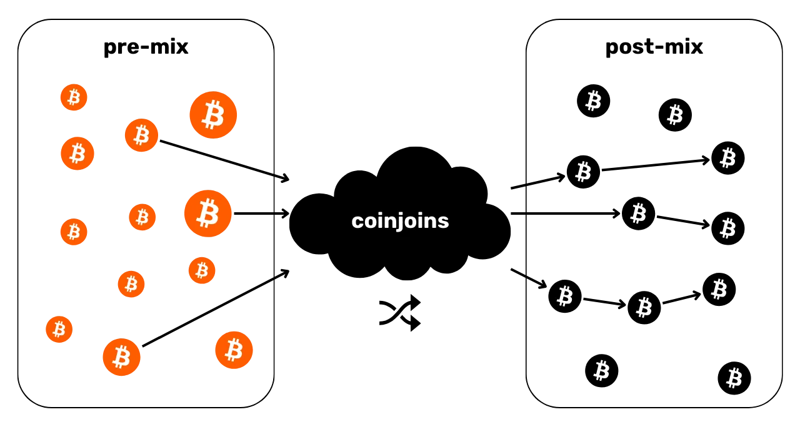

यूटीएक्सओ का यह सख्त अलगाव सबसे ऊपर मिक्स्ड UTXO और अनमिक्स्ड UTXO के बीच गलती से होने वाले संबंधों को रोकने के लिए है। अगर ऐसे लिंक बन जाते हैं, तो मिक्स्ड UTXO पर CoinJoin की प्रभावशीलता खत्म हो जाती है, और यूजर को इसका पता भी नहीं चलता। इससे UTXO की गोपनीयता खतरे में पड़ जाती है, जिसका इतिहास तोड़ने का यूजर को भरोसा होता है। ये लिंक या तो मिक्स्ड और अनमिक्स्ड UTXO को सुरक्षित करते समय Address के दोबारा इस्तेमाल से हो सकते हैं, या फिर CIOH (_कॉमन-इनपुट-Ownership ह्यूरिस्टिक_) के इस्तेमाल से, अगर यूजर एक ही ट्रांजैक्शन में मिक्स्ड और अनमिक्स्ड यूटीएक्सओ को इनपुट के तौर पर इस्तेमाल करता है। प्री-मिक्स और पोस्ट-मिक्स पोर्टफोलियो को अलग रखकर, हम ऐसे गलती से होने वाले संबंधों से बचते हैं और यूजर को अनजाने में होने वाली गलतियों से बचाते हैं।


यह अलगाव पोर्टफोलियो सॉफ्टवेयर स्तर पर प्री-मिक्स और पोर्ट-मिक्स पोर्टफोलियो के बीच अलग-अलग नियम लागू करने की संभावना भी प्रदान करता है। उदाहरण के लिए, पोस्ट-मिक्सिंग पोर्टफोलियो में, सॉफ्टवेयर UTXOs को इनपुट्स में मर्ज करने पर रोक लगा सकता है ताकि CIOH के इस्तेमाल को रोका जा सके, जो यूजर के एनॉनसेट को कमजोर कर देगा। स्क्रिप्ट्स और ट्रांजैक्शन ऑप्शन्स (जैसे कि RBF रिपोर्टिंग) के इस्तेमाल को मानकीकृत करना भी संभव है ताकि Wallet फिंगरप्रिंट्स द्वारा पहचान को रोका जा सके।

फिलहाल, Whirlpool ही एकमात्र CoinJoin इम्प्लीमेंटेशन है जो Zerolink प्रोटोकॉल को सख्ती से लागू करता है। अगले अध्याय में, हम मौजूदा विभिन्न CoinJoin इम्प्लीमेंटेशन्स और उनके फायदे-नुकसान पर नज़र डालेंगे।

## जीडब्ल्यू-678 के इम्प्लीमेंटेशन्स

<chapterId>e37ed073-9498-4e4f-820b-30951e829596</chapterId>

*2024 में, हम Bitcoin पर कॉइनजॉइन करने की इच्छा रखने वाले यूज़र्स के लिए उपलब्ध टूल्स में बड़े बदलाव देख रहे हैं। फिलहाल हम एक अहम मोड़ पर हैं, और CoinJoin का बाज़ार बड़े पैमाने पर पुनर्गठन से गुज़र रहा है। यह अध्याय समय के साथ ज़रूर अपडेट होगा*  

(नोट: Bitcoin और CoinJoin जैसे टेक्निकल टर्म्स को हिंदी में भी वैसे ही रखा गया है, क्योंकि यह प्रोडक्ट/सिस्टम के नाम हैं। "कॉइनजॉइन" जैसी बिटकॉइन टर्मिनोलॉजी भी अंग्रेज़ी में ही प्रयोग की गई है, क्योंकि यह हिंदी में आमतौर पर इसी नाम से जानी जाती है।)

फिलहाल Bitcoin पर मुख्य रूप से CoinJoin के 3 अलग-अलग इम्प्लीमेंटेशन हैं:


- जीडब्ल्यू-६८३;
- वाबी-साबी;
- जॉइनमार्केट।

ये सभी इम्प्लीमेंटेशन्स CoinJoin ट्रांजैक्शन्स के ज़रिए UTXOs के इतिहास को तोड़ने का लक्ष्य रखते हैं। हालाँकि, इनके मैकेनिज़म में काफ़ी अंतर है। इसलिए यह समझना ज़रूरी है कि हर एक कैसे काम करता है, ताकि आप अपनी ज़रूरतों के हिसाब से सबसे सही विकल्प चुन सकें।

### जॉइनमार्केट

JoinMarket, जिसे 2015 में Adam Gibson और Chris Belcher ने शुरू किया था, अपने यूजर्स को जोड़ने के अनोखे तरीके की वजह से दूसरे CoinJoin इम्प्लीमेंटेशन्स से अलग दिखता है। यह सिस्टम एक P2P Exchange मार्केट पर आधारित है, जहां कुछ यूजर्स, जिन्हें "मेकर्स" कहा जाता है, अपने बिटकॉइन्स को मिक्सिंग के लिए उपलब्ध कराते हैं, जबकि दूसरे यूजर्स, जिन्हें "टेकर्स" कहते हैं, फीस के बदले में कॉइनजॉइन करने के लिए इस कैश का इस्तेमाल करते हैं।


इस मॉडल में, "मेकर्स" अपने बिटकॉइन्स को "टेकर्स" के लिए उपलब्ध कराते हैं और इस सेवा के बदले फीस प्राप्त करते हैं। टेकर्स, बदले में, अपने CoinJoin लेनदेन को पूरा करने के लिए मेकर्स के बिटकॉइन्स का उपयोग करने के लिए भुगतान करते हैं। सेवा शुल्क भूमिका के अनुसार अलग-अलग होते हैं: "मेकर्स" तरलता प्रदान करने के लिए फीस जमा करते हैं, जबकि "टेकर्स" फीस का भुगतान करते हैं। यह बाजार स्वतंत्र रूप से संचालित होता है, जिसमें उपयोग की कोई शर्तें नहीं होतीं।

JoinMarket का एक मुख्य नुकसान है इसका इस्तेमाल करने की जटिलता, जिसके लिए इसे प्रभावी ढंग से चलाने के लिए टर्मिनल्स के साथ कुछ हद तक सहजता की जरूरत होती है। हालांकि यह जटिलता अनुभवी उपयोगकर्ताओं के लिए कोई बाधा नहीं है, लेकिन यह आम जनता की पहुंच को सीमित कर सकती है। पर हाल ही में JAM नाम के एक वेब Interface की शुरुआत ने इसके इस्तेमाल को थोड़ा आसान बना दिया है।


स्रोत : [JAM](https://github.com/joinmarket-webui/jam/blob/devel/docs/assets/screenshot-dark.webp)

हालांकि, तकनीकी बाधा एक बड़ी रुकावट बनी हुई है। CoinJoin इकोसिस्टम में, जहां गोपनीयता प्रतिभागियों की संख्या से मजबूत होती है, पहुंच को कम करने वाली कोई भी सीमा उपलब्ध लिक्विडिटी को सीधे प्रभावित करती है, जो मिक्स की कुशलता में एक महत्वपूर्ण कारक है। Bitcoin, जो पहले से ही वित्तीय लेनदेन में एक विशेष क्षेत्र है, अपने कॉइनजॉइन्स के उपयोग को एक उप-विशेष क्षेत्र के रूप में देखता है, और जॉइनमार्केट इसका और भी विशेषज्ञता वाला हिस्सा है, जिससे इसके उपयोगकर्ताओं के एनॉनसेट्स बढ़ाने की संभावना सीमित हो जाती है।

JoinMarket का P2P लिंकिंग मॉडल कॉइनजॉइनर्स के लिए इनोवेटिव होने के बावजूद, इसमें कुछ बड़ी कमियाँ हैं, खासकर लेन-देन की संरचना के मामले में। Whirlpool जैसे अन्य इम्प्लीमेंटेशन्स के विपरीत, JoinMarket आउटपुट्स के बीच पूर्ण समानता की गारंटी नहीं देता, और इनपुट्स और आउटपुट्स के बीच निश्चित लिंक्स का पता लगाना संभव है। इसके अलावा, इसमें ऐसे टूल्स नहीं हैं जो पहले से मिक्स हुए हिस्सों को दोबारा मिक्स होने से रोक सकें, जिससे यूजर्स द्वारा चाही गई गोपनीयता खतरे में पड़ सकती है।

आखिरकार, जबकि JoinMarket का कॉन्सेप्ट दिलचस्प है, खासकर उनके लिए जो डायनामिक लिक्विडिटी मार्केट में दिलचस्पी रखते हैं, इसकी संरचनात्मक कमजोरियाँ और तकनीकी जटिलता इसे, मेरी राय में, नौसिखियों और एक्सपर्ट्स दोनों के लिए कम दिलचस्प बनाती हैं जो CoinJoin इम्प्लीमेंटेशन ढूंढ रहे हैं।

### वाबी-साबी

वाबीसाबी ग्व-695 का एक और संस्करण है, जो लेन-देन के समन्वय को केंद्रीकृत करने के तरीके पर काम करता है। इस मॉडल को 2021 में आदाम फिक्सोर (नोपारा73), युवाल कोगमैन, लुकास ओंटिवेरो और इस्तवान आंद्रास सेरेस ने बनाया था, और अगले साल इसे वासाबी 2.0 सॉफ्टवेयर में शामिल कर दिया गया। वाबीसाबी असल में 2018 में लॉन्च किए गए वासाबी सॉफ्टवेयर के ग्व-695 मॉडल का ही एक उन्नत रूप है।


2010 के दशक के अंत में, वसाबी ने Whirlpool की तुलना में CoinJoin के लिए एक बिल्कुल अलग लेन-देन संरचना अपनाई। वसाबी ने दर्जनों प्रतिभागियों वाले बहुत बड़े CoinJoin लेन-देन का इस्तेमाल किया ताकि इसके प्रतिभागियों की अनॉनसेट्स बढ़ सके। इसके विपरीत, Whirlpool ने कई छोटे लेन-देन चुने, जिससे हर चक्र के साथ अनॉनसेट्स का तेजी से विस्तार हो सका।

Exchange के प्रबंधन तरीकों ने भी दोनों कार्यान्वयनों को अलग किया। Whirlpool के साथ, विदेशी Exchange को TX0 की वजह से CoinJoin चक्रों से पहले UTXOs से बाहर रखा गया और अलग किया गया - यह एक ऐसी अवधारणा है जिसे मैं अगले अध्याय में और समझाऊँगा। वहीं दूसरी ओर, वसाबी के मामले में, विदेशी Exchange CoinJoin लेन-देन के आउटपुट्स में से एक बना रहा, जिससे कुछ इनपुट्स और आउटपुट्स के बीच निर्धारित संबंध बने रहे।


वाबीसाबी के साथ, वसाबी वर्जन 2.0 ने अपने कॉइनजॉइन के तरीके को Whirlpool के मॉडल के अनुसार ढाल लिया है। हालांकि CoinJoin ट्रांजैक्शन अभी भी काफी बड़े होते हैं, लेकिन अब Whirlpool मॉडल के अनुसार कई सीक्वेंशियल साइकिल्स को चेन करना संभव हो गया है। Exchange रेट मैनेजमेंट पर भी खास ध्यान दिया गया है: वसाबी 1.0 के विपरीत, जहां Exchange रेट सीधे यूजर इनपुट्स से जुड़ा था, वहीं वाबीसाबी Exchange रेट को कई छोटी रकमों में बांटने की कोशिश करता है, जिसे सभी पार्टिसिपेंट्स के लिए बराबर डिनॉमिनेशन में बांटा जाता है।

चलिए इसे एक सरल उदाहरण से समझते हैं जिसमें सिर्फ 2 यूज़र्स हैं: ऐलिस 115,000 Sats मिक्स करना चाहती है और बॉब, 210,000 Sats। फीस को नज़रअंदाज़ करते हुए, वसाबी 1.0 के साथ, एक CoinJoin ट्रांजैक्शन से 100,000 Sats के 3 आउटपुट जेनरेट होते, साथ ही ऐलिस के लिए 15,000 Sats का 1 Exchange और बॉब के लिए 10,000 Sats का 1 Exchange। Exchange आउटपुट अभी भी इनपुट से जुड़े रहते:


वाबिसाबी के तहत, एक ही लेन-देन से 100,000 Sats के 3 आउटपुट और 5,000 Sats के 5 आउटपुट बनते, जिससे Exchange इतना बिखर जाता कि उसे किसी खास इनपुट से सीधे जोड़ा नहीं जा सकता था:


मेरे ख़याल से, वाबिसाबी का विदेशी Exchange प्रबंधन कई खतरे पेश करता है जो गोपनीयता के मामले में इसकी प्रभावशीलता को खतरे में डाल सकते हैं:


- जब कोई यूज़र दूसरे प्रतिभागियों के मुकाबले काफी बड़ा UTXO कंट्रीब्यूट करता है, तो उसके हिस्से में Exchange की मात्रा आती है जो सीधे उसके इनपुट से जुड़ी होगी। यह प्रोटोकॉल के मूल उद्देश्य के खिलाफ है, जो कि सभी पहचाने जा सकने वाले एक्सचेंजों को खत्म करना है।
- Exchange को बांटने के मकसद से अलग-अलग नामों की बढ़ोतरी विडंबना यह है कि मिलाने की कार्यक्षमता को नुकसान पहुंचा सकती है। इस प्रक्रिया से कुछ आउटपुट्स के लिए एनॉनसेट्स में कमी आ सकती है, क्योंकि वे आसानी से पहचाने जाने लगते हैं;
- यह तरीका कम वैल्यू वाले UTXO भी बनाता है जो यूजर के लिए मैनेजमेंट की समस्या पैदा करते हैं। ये छोटे UTXO, अगर इन्हें खर्च करने की लागत इनकी वैल्यू के मुकाबले बहुत ज्यादा हो जाए, तो "Dust" बन सकते हैं। यह घटना यूजर को कई UTXO को मिलाकर भविष्य के ट्रांजैक्शन के लिए इनपुट बनाने या उन्हें कंसोलिडेट करने पर मजबूर कर देती है। दोनों ही मामलों में, CIOH की वजह से, इससे या तो मिले हुए एनॉनसेट कम हो सकते हैं, या शुरुआती CoinJoin से मिले कंफिडेंशियलिटी के फायदे पूरी तरह खत्म हो सकते हैं।

Whirlpool के विपरीत, जो ZeroLink प्रोटोकॉल को लागू करता है और pre-mix तथा post-mix UTXOs के बीच सख्त अलगाव सुनिश्चित करता है, वासाबी इस सख्त अलगाव को बनाए नहीं रखता। कुछ वासाबी ग्राहकों द्वारा Address के पुन: उपयोग की समस्याएं भी सामने आई हैं, जो स्पष्ट रूप से उपयोगकर्ता के लिए बहुत हानिकारक हैं।

वसाबी वर्ज़न 2.0 में, एक नई CoinJoin फीस पॉलिसी लागू की गई है। अब से, 0.01 Bitcoin से बड़े UTXOs के लिए कोऑर्डिनेटर फीस 0.3% निर्धारित की गई है, जबकि छोटे UTXOs के लिए ये फीस पूरी तरह से माफ की गई है। इसके अलावा, इन छोटे UTXOs के लिए रीमिक्स बिल्कुल फ्री हैं, हालांकि Mining फीस यूज़र को सभी ट्रांजैक्शन्स के लिए देनी होगी, जिसमें रीमिक्स भी शामिल हैं।

यह Whirlpool की नीति के विपरीत है, जहां फीस निश्चित रहती है, चाहे प्राप्त एनॉनसेट्स का आकार कुछ भी हो। वसाबी 2.0 के साथ, हालांकि छोटे UTXOs के लिए कोऑर्डिनेटर फीस माफ़ की जाती है, लेकिन यूज़र को अभी भी सभी ट्रांजैक्शन्स पर Mining फीस देनी पड़ती है, जिसमें रीमिक्स भी शामिल हैं।

जैसे ही मैं ये लाइनें लिख रहा हूँ, Wabisabi का इस्तेमाल हाल की घटनाओं की वजह से काफी ज्यादा पेचीदा हो गया है। Samourai Wallet के संस्थापकों की गिरफ्तारी के बाद, zkSNACKs - जो कि Wasabi के डेवलपमेंट को फंड और मैनेज करती है - ने घोषणा की कि उसका CoinJoin कोऑर्डिनेटर सर्विस 1 जून, 2024 को बंद हो जाएगा। ये कोऑर्डिनेटर, जो कि Wasabi पर डिफॉल्ट रूप से सेट था, लिक्विडिटी का बड़ा हिस्सा मैनेज करता था।

इस मुख्य कोऑर्डिनेटर के बंद होने के साथ, अब यूज़र्स को नए, स्वतंत्र कोऑर्डिनेटर्स से कनेक्ट करना होगा। यह बदलाव कई चिंताएँ पैदा करता है: एक तरफ, नए कोऑर्डिनेटर्स के पास पर्याप्त लिक्विडिटी नहीं हो सकती, जिससे कॉइनजॉइन की गोपनीयता कम हो सकती है। दूसरी तरफ, एक दुर्भावनापूर्ण कोऑर्डिनेटर के चंगुल में फंसने का खतरा भी है। यह स्थिति वाबिसाबी का उपयोग करने वालों के लिए नए और बड़े जोखिम लेकर आती है।

ज़ीकेएसएनएक्स (zkSNACKs), जो वसाबी (Wasabi) के पीछे की कंपनी है, ने CoinJoin प्रतिभागियों को फ़िल्टर करने के लिए एक स्ट्रिंग एनालिसिस कंपनी की सेवाओं का उपयोग करने का फैसला किया है। यह तकनीकी मुद्दों से परे जाकर गंभीर नैतिक और रणनीतिक सवाल खड़े करता है। शुरुआती विचार यह था कि वसाबी पर अपराधियों द्वारा कॉइनजॉइन (coinjoins) के उपयोग को रोका जाए, जो एक वैध कदम लग सकता है। लेकिन यह एक विरोधाभास पैदा करता है: एक कोऑर्डिनेटर को फीस देना, जिसका मुख्य मिशन उपयोगकर्ताओं की गोपनीयता को मजबूत करना है, और फिर उसी कोऑर्डिनेटर द्वारा एक ऐसी कंपनी को फंड देना जिसका उद्देश्य उसी गोपनीयता को कमजोर करना है।

और भी चिंताजनक बात है फिल्टरिंग का सिद्धांत, जो Bitcoin के खुले, अनसेंसर्ड वित्तीय सिस्टम के दर्शन के बिल्कुल उलट है। हालांकि अपराधिक गतिविधियों को रोकने की मंशा जायज़ लग सकती है, लेकिन यह फिल्टरिंग उन लोगों को भी प्रभावित कर सकती है जिनके कार्य, भले ही कुछ संदर्भों में अवैध माने जाते हों, नैतिक रूप से उचित या सामाजिक रूप से फायदेमंद हो सकते हैं। एडवर्ड स्नोडेन का उदाहरण इस द्वंद्व को पूरी तरह से दिखाता है: कुछ सरकारों द्वारा उनकी खुलासों के लिए अपराधी माने जाने के बावजूद, दूसरे उन्हें जनहित में काम करने वाले एक विस्फोटक (whistleblower) के रूप में देखते हैं। यह जटिलता फिल्टरिंग के संभावित खतरे को रेखांकित करती है, जो भले ही अच्छे इरादों से की गई हो, अंततः वैध उपयोगकर्ताओं के अधिकारों और सुरक्षा को कमज़ोर कर सकती है। मैं उन कार्यकर्ताओं और पत्रकारों का भी ज़िक्र कर सकता था जिन्हें कुछ अधिनायकवादी शासनों के तहत सताया जाता है।

जैसा कि आपने अब तक समझ लिया होगा, मेरी पसंद निश्चित रूप से Bitcoin पर कॉइनजॉइन के लिए Whirlpool मॉडल है। यह सिस्टम अपनी सख्ती के लिए बेहतरीन है और गोपनीयता की बेहतर गारंटी देता है। यह गणितीय संदर्भ में एकमात्र ऐसा मॉडल है जो परफेक्ट मिक्स माना जाता है। मेरी राय में, यह मॉडल Bitcoin पर कॉइनजॉइन का भविष्य है। मैं आपको अगले अध्याय में इस मॉडल को और गहराई से समझने के लिए आमंत्रित करता हूँ।

## Whirlpool कैसे काम करता है

<chapterId>bdbd7109-e36d-4b4f-a3c6-928df4e9bfda</chapterId>

Whirlpool को अन्य CoinJoin तरीकों से अलग बनाने वाली चीज़ है "_ज़ीरोलिंक_" लेन-देन का इस्तेमाल, जो यह सुनिश्चित करता है कि सभी इनपुट्स और आउटपुट्स के बीच तकनीकी रूप से कोई संबंध बिल्कुल नहीं हो सकता। यह बिल्कुल सटीक मिश्रण एक ऐसी संरचना के ज़रिए हासिल किया जाता है जिसमें हर भागीदार एक समान मात्रा में इनपुट देता है (Mining फीसों को छोड़कर), जिससे बिल्कुल बराबर मात्रा में आउटपुट जनरेट होते हैं।

Whirlpool के CoinJoin लेन-देन में इनपुट्स के प्रति यह सीमित दृष्टिकोण एक अनोखी विशेषता देता है: इनपुट्स और आउटपुट्स के बीच निर्धारित संबंधों का पूर्ण अभाव। दूसरे शब्दों में, लेन-देन में मौजूद अन्य सभी आउटपुट्स के सापेक्ष, किसी भी आउटपुट को किसी भी प्रतिभागी से जोड़े जाने की संभावना बराबर होती है।


### Whirlpool कैसे काम करता है

शुरुआत में, हर Whirlpool और CoinJoin में भाग लेने वालों की संख्या सिर्फ 5 तक सीमित थी – जिसमें 2 नए लोग और 3 रीमिक्सर शामिल होते थे (हम इन शब्दों के बारे में बाद में समझाएँगे)। लेकिन 2023 में On-Chain ट्रांजैक्शन फीस में हुई बढ़ोतरी ने सामुराई की टीम को अपने मॉडल पर फिर से सोचने पर मजबूर कर दिया, ताकि गोपनीयता बेहतर हो और लागत भी कम हो। इसलिए, फीस मार्केट की स्थिति और भाग लेने वालों की संख्या को ध्यान में रखते हुए, अब कोऑर्डिनेटर 6, 7 या 8 लोगों वाले कॉइनजॉइन भी आयोजित कर सकता है। इन बेहतर सत्रों को "सर्ज साइकिल्स" कहा जाता है। ध्यान रहे, चाहे कॉन्फ़िगरेशन कोई भी हो, Whirlpool कॉइनजॉइन में हमेशा सिर्फ 2 नए लोग ही शामिल होते हैं।

इस तरह, Whirlpool लेन-देन में इनपुट और आउटपुट की संख्या एक जैसी होती है, जो कि हो सकती है:


- 5 इनपुट और 5 आउटपुट ;


- 6 इनपुट और 6 आउटपुट ;


- 7 इनपुट और 7 आउटपुट ;


- 8 इनपुट और 8 आउटपुट।


Whirlpool का मॉडल छोटे CoinJoin लेनदेन पर आधारित है। Wabisabi और JoinMarket के विपरीत, जहां anonset की मजबूती एक ही चक्र (या कुछ चक्रों) में भाग लेने वालों की संख्या पर निर्भर करती है, Whirlpool कई छोटे चक्रों के क्रम पर निर्भर करता है।

इस मॉडल में, यूजर्स सिर्फ तभी फीस भरते हैं जब वे पहली बार किसी पूल में शामिल होते हैं, जिससे उन्हें बिना किसी अतिरिक्त खर्च के कई रीमिक्स में हिस्सा लेने का मौका मिलता है। नए सदस्य रीमिक्स करने वालों के लिए Mining फीस चुकाते हैं।

हर एक अतिरिक्त CoinJoin में जिसमें कोई टुकड़ा भाग लेता है, साथ ही अतीत में मिले उसके साथियों के साथ, एनॉनसेट्स (anonsets) घातांकीय रूप से बढ़ेंगे। लक्ष्य इन मुफ्त रीमिक्स का फायदा उठाना है, जो हर बार होने पर, मिक्स किए गए हर टुकड़े से जुड़े एनॉनसेट्स (anonsets) की घनत्व को मजबूत करने में योगदान देते हैं।


Whirlpool को दो महत्वपूर्ण जरूरतों को ध्यान में रखकर डिज़ाइन किया गया है:


- मोबाइल डिवाइसेज़ पर इम्प्लीमेंटेशन की पहुंच, क्योंकि सामुराई Wallet सबसे पहले और मुख्य रूप से एक स्मार्टफोन एप्लिकेशन है;
- तेज़ रीमिक्सिंग साइकिल्स से एनॉनसेट्स में बड़ा इज़ाफा होगा।

ये आदेश सामुराई Wallet के डेवलपर्स द्वारा Whirlpool को डिज़ाइन करते समय लिए गए फैसलों का मार्गदर्शन करते थे, जिससे उन्होंने प्रत्येक चक्र में भाग लेने वालों की संख्या को सीमित कर दिया। बहुत कम संख्या होने से CoinJoin की कार्यक्षमता पर असर पड़ता, जिससे प्रति चक्र उत्पन्न होने वाले एनॉनसेट्स में भारी कमी आ जाती, वहीं बहुत अधिक संख्या होने से मोबाइल एप्लिकेशन्स पर प्रबंधन की समस्याएँ आतीं और चक्र का प्रवाह बाधित होता।

अंत में, Whirlpool पर हर CoinJoin के लिए ज्यादा प्रतिभागियों की जरूरत नहीं है, क्योंकि anonset कई CoinJoin साइकिल्स के जमा होने से बनते हैं। यहाँ सबसे महत्वपूर्ण सिद्धांत सभी प्रतिभागियों के UTXOs की एकरूपता है, क्योंकि इससे परफेक्ट मिक्सिंग सुनिश्चित होती है, और इस तरह मिक्सिंग और रीमिक्सिंग साइकिल्स का पूरा फायदा मिलता है।

### जीडब्ल्यू-750 पूल और फीस

इन कई चक्रों के लिए मिश्रित भागों के एनॉनसेट्स को बढ़ाने के लिए, UTXOs की मात्रा को सीमित करने के लिए एक निश्चित ढांचे की आवश्यकता होती है। Whirlpool अलग-अलग पूल्स को परिभाषित करता है।

एक पूल उन यूजर्स के ग्रुप को दर्शाता है जो एक साथ मिक्स होना चाहते हैं और UTXOs की मात्रा पर सहमत होते हैं ताकि CoinJoin प्रक्रिया को ऑप्टिमाइज़ किया जा सके, साथ ही पूर्ण पार्ट होमोजीनिटी बनी रहे। हर पूल एक फिक्स्ड UTXO अमाउंट तय करता है, जिसका पालन यूजर को पार्टिसिपेट करने के लिए करना होता है। तो, Whirlpool के साथ कॉइनजॉइन करने के लिए, आपको एक पूल चुनना होगा। निम्नलिखित पूल फिलहाल उपलब्ध हैं:


- ०.५ बिटकॉइन्स ;
- ०.०५ जीडब्ल्यू-७५५ ;
- ०.०१ जीडब्ल्यू-७५६ ;
- 0.001 Bitcoin (= 1,00,000 Sats).  

(Note: In Hindi numbering system, commas are placed differently. For example, 100,000 is written as 1,00,000.)

जब आप अपने बिटकॉइन्स के साथ एक पूल में एंटर करते हैं, तो उन्हें generate UTXOs में बाँट दिया जाएगा जो पूल के दूसरे पार्टिसिपेंट्स के UTXOs के साथ बिल्कुल एक जैसे होंगे। हर पूल की एक मैक्सिमम लिमिट होती है, तो अगर आपकी रकम इस लिमिट से ज्यादा है, तो आपको या तो उसी पूल में दो अलग-अलग एंट्री करनी होगी, या फिर ज्यादा रकम वाले किसी दूसरे पूल में जाना होगा:

| पूल (Bitcoin) | प्रति एंट्री अधिकतम राशि (Bitcoin) |

|----------------|--------------------------------------|

| ०.५ | ३५ |

| ०.०५ | ३.५ |

| ०.०१ | ०.७ |

| ०.००१ | ०.०२५ |

UTXO को एक पूल से संबंधित माना जाता है जब वह CoinJoin में इंटीग्रेट होने के लिए तैयार होता है। हालांकि, इसका मतलब यह नहीं है कि उपयोगकर्ता इस पर अपना कब्जा खो देता है। जैसा कि हमने इस सेक्शन के पहले अध्यायों में देखा, विभिन्न मिक्सिंग साइकल के माध्यम से, आप अपनी कुंजियों पर पूर्ण नियंत्रण रखते हैं और परिणामस्वरूप, अपने बिटकॉइन्स पर भी। यही चीज CoinJoin तकनीक को अन्य केंद्रीकृत मिक्सिंग तकनीकों से अलग करती है।

CoinJoin पूल में शामिल होने के लिए, आपको एक सर्विस फीस और Mining फीस देनी होगी। सर्विस फीस हर पूल के लिए तय होती है और इसका मकसद Whirlpool के डेवलपमेंट और मेंटेनेंस की जिम्मेदार टीमों को पैसे देना होता है।

Whirlpool का इस्तेमाल करने के लिए सर्विस फी सिर्फ एक बार देनी होती है, जब आप पूल में ज्वाइन करते हैं। एक बार ज्वाइन करने के बाद, आप बिना किसी अतिरिक्त चार्ज के अनलिमिटेड रीमिक्स में हिस्सा ले सकते हैं। यहां हर पूल के लिए करंट फिक्स्ड फीस हैं:

| पूल (Bitcoin) | प्रवेश शुल्क (Bitcoin) |

|----------------|---------------------------------|

| 0.5 | 0.0175 |

| ०.०५ | ०.००१७५ |

| 0.01 | 0.0005 (50,000 जीडब्ल्यू-768) |

| 0.001 | 0.00005 (5,000 Sats) |

ये फीस मूल रूप से चुने हुए पूल में एंट्री टिकट की तरह काम करती है, चाहे आप CoinJoin में कितनी भी रकम डालें। तो, चाहे आप 0.01 पूल में ठीक 0.01 BTC के साथ एंटर करें या 0.5 BTC के साथ, फीस एब्सोल्यूट टर्म्स में एक जैसी ही रहेगी।

Whirlpool कॉइनजॉइन्स आगे बढ़ने से पहले, यूज़र 2 स्ट्रैटेजीज़ में से चुन सकता है:


- छोटे पूल का चुनाव करें ताकि सर्विस की लागत कम हो, यह जानते हुए कि उसे कई छोटे UTXO वापस मिलेंगे;
- या फिर एक बड़े पूल का चयन करें, जिसमें आप अधिक फीस देने को तैयार हों, लेकिन अंत में आपके पास कम संख्या में उच्च-मूल्य वाले UTXO ही रह जाएँ।

आमतौर पर CoinJoin साइकल्स के बाद कई मिले-जुले UTXOs को मर्ज करना सलाह नहीं दिया जाता, क्योंकि इससे हासिल की गई गोपनीयता खतरे में पड़ सकती है, खासकर कॉमन इनपुट Ownership ह्यूरिस्टिक (CIOH: *कॉमन-इनपुट-Ownership-ह्यूरिस्टिक*) की वजह से। इसलिए, आउटपुट में बहुत सारे छोटे-मूल्य वाले UTXOs से बचने के लिए एक बड़े पूल का चुनाव करना समझदारी हो सकती है, भले ही इसका मतलब ज्यादा भुगतान करना पड़े। यूजर को इन ट्रेड-ऑफ्स का मूल्यांकन करके अपनी पसंद का पूल चुनना चाहिए।

सर्विस फीस के अलावा, किसी भी Bitcoin ट्रांजैक्शन से जुड़ी Mining फीस को भी ध्यान में रखना होगा। एक Whirlpool यूज़र के तौर पर, आपको प्रिपरेशन ट्रांजैक्शन (`Tx0`) और पहले CoinJoin के लिए Mining फीस देनी होगी। बाकी सभी रीमिक्स बिल्कुल फ्री होंगे, क्योंकि Whirlpool का मॉडल नए यूज़र्स से पेमेंट लेकर चलता है।

दरअसल, हर Whirlpool और CoinJoin में, इनपुट्स में से 2 यूज़र्स नए एंट्रेंट होते हैं। बाकी इनपुट्स रीमिक्सर्स से आते हैं। नतीजतन, ट्रांजैक्शन में शामिल सभी पार्टिसिपेंट्स के Mining खर्चे इन 2 नए एंट्रेंट्स द्वारा वहन किए जाते हैं, जो बाद में फ्री रीमिक्सेस का फायदा भी उठा सकते हैं।


इस फीस सिस्टम की वजह से, Whirlpool दूसरे CoinJoin इम्प्लीमेंटेशन्स से काफी अलग नजर आता है, क्योंकि UTXOs का एनॉनसेट यूजर द्वारा चुकाई गई कीमत के अनुपात में नहीं होता। नतीजतन, सिर्फ पूल एंट्री फीस और 2 ट्रांजेक्शन्स (जैसे `Tx0` और इनिशियल मिक्स) के लिए Mining फीस चुकाकर काफी ज्यादा एनॉनिमिटी लेवल हासिल किया जा सकता है।

यह ध्यान रखना ज़रूरी है कि यूज़र को अपने मल्टीपल कॉइनजॉइन पूरे करने के बाद पूल से अपने UTXOs निकालने के लिए Mining फीस भी देनी होगी, सिवाय इसके कि उसने 'मिक्स टू' ऑप्शन चुना हो, जो एक एक्सटर्नल Address प्रदान करता है जो फंड्स को सीधे CoinJoin से बिना किसी अतिरिक्त ट्रांजैक्शन के प्राप्त करेगा।

### एचडी पोर्टफोलियो खाते

CoinJoin को Whirlpool के जरिए बनाने के लिए, Wallet को कई अलग-अलग खातों (accounts) को generate करना होगा। यही जीरोलिंक प्रोटोकॉल (ZeroLink protocol) का बुनियादी सिद्धांत है।  

एक HD (*Hierarchical Deterministic*) पोर्टफोलियो के संदर्भ में, एक खाता (account) एक ऐसा हिस्सा होता है जो बाकी सभी से पूरी तरह अलग होता है। यह अलगाव पोर्टफोलियो की हायरार्की (hierarchy) की तीसरी गहराई (depth) पर होता है, यानी `xpub` लेवल पर।


एक HD Wallet सैद्धांतिक रूप से `2^(31)` तक अलग-अलग खाते निकाल सकता है। शुरुआती खाता, जो सभी Bitcoin वॉलेट्स पर डिफ़ॉल्ट रूप से इस्तेमाल होता है, `0'` इंडेक्स से मेल खाता है।

Whirlpool के अनुकूलित पोर्टफोलियो के लिए, ZeroLink प्रक्रिया की जरूरतों को पूरा करने के लिए 4 खातों का उपयोग किया जाता है:


- **जमा** खाता, जिसे इंडेक्स `0'` से पहचाना जाता है ;
- **बैड बैंक** (या "डॉक्सिक चेंज") अकाउंट, जिसका इंडेक्स `2,147,483,644'` है ;
- **प्रीमिक्स** अकाउंट, जिसे इंडेक्स `2 147 483 645'` से पहचाना जाता है ;
- **पोस्टमिक्स** अकाउंट, जिसे इंडेक्स `2 147 483 646'` से पहचाना जाता है।

इनमें से हर एक अकाउंट CoinJoin प्रक्रिया में एक खास काम करता है, जिसे हम आगे के सेक्शन्स में समझेंगे।

ये सारे अकाउंट्स एक ही seed से जुड़े हुए हैं, जिससे यूज़र अपने रिकवरी फ्रेज़ और जहाँ लागू हो, अपने passphrase का इस्तेमाल करके अपने सारे बिटकॉइन्स तक फिर से पहुँच पाएगा। हालाँकि, रिकवरी ऑपरेशन के दौरान सॉफ़्टवेयर को अलग-अलग अकाउंट इंडेक्सेस के बारे में बताना ज़रूरी होगा।

आइए इन खातों के भीतर Whirlpool CoinJoin के विभिन्न चरणों पर एक नज़र डालें।

### टीएक्स0

किसी भी Whirlpool CoinJoin की शुरुआत **डिपॉजिट** अकाउंट से होती है। यह वह अकाउंट है जिसे आप अपने नए Bitcoin Wallet बनाते समय अपने-आप इस्तेमाल करते हैं। इस अकाउंट में आपको उन बिटकॉइन्स को जमा करना होगा जिन्हें आप मिक्स करना चाहते हैं।

Tx0" Whirlpool के मिक्सिंग प्रोसेस का पहला कदम है। इसका मकसद UTXOs को CoinJoin के लिए तैयार और बराबर करना है, उन्हें चुने हुए पूल के अनुरूप यूनिट्स में बाँटना, ताकि होमोजीनियस मिक्सिंग सुनिश्चित हो सके। इस तरह बराबर किए गए UTXOs को फिर **प्रीमिक्स** अकाउंट में भेजा जाता है। और जो अंतर पूल में नहीं जा सकता, उसे एक खास अकाउंट में अलग कर दिया जाता है: **बैड बैंक** (या "डॉक्सिक चेंज")।

यह शुरुआती `Tx0` लेन-देन CoinJoin कोऑर्डिनेटर को सर्विस फीस चुकाने के लिए भी इस्तेमाल होता है। बाकी चरणों के उलट, यह लेन-देन सहयोगात्मक नहीं है, इसलिए यूजर को Mining की पूरी कीमत खुद उठानी पड़ती है।

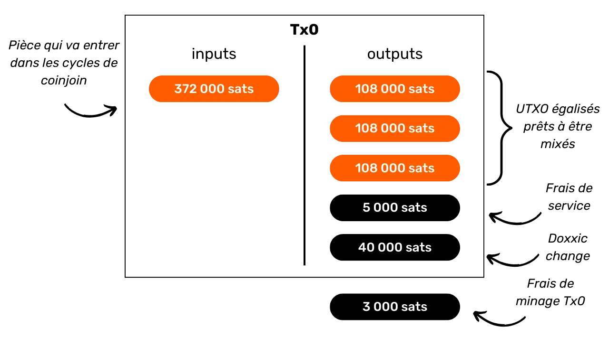

इस `Tx0` ट्रांजैक्शन के उदाहरण में, हमारे **डिपॉजिट** अकाउंट से `372,000 Sats` का इनपुट कई आउटपुट UTXOs में बंट जाता है, जो इस प्रकार हैं:


- कोऑर्डिनेटर के लिए सेवा शुल्क के रूप में `5,000 Sats` की राशि, जो `100,000 Sats` के पूल एंट्री के अनुरूप है;
- 3 UTXOs मिक्सिंग के लिए तैयार किए गए, हमारे **प्रीमिक्स** अकाउंट में रीडायरेक्ट किए गए और कोऑर्डिनेटर के साथ रजिस्टर किए गए। ये UTXOs `108,000 Sats` प्रत्येक पर बराबर किए गए हैं, ताकि उनके भविष्य के इनिशियल मिक्स के लिए Mining की लागत को कवर किया जा सके।
- सरप्लस, जो पूल में नहीं जा सकता क्योंकि वह बहुत छोटा है, उसे विषैला विदेशी Exchange माना जाता है। इसे इसके विशिष्ट खाते में भेज दिया जाता है। यहाँ, यह Exchange `40,000 Sats` के बराबर है।
- आखिरकार, `3,000 Sats` बचे हैं, जो किसी आउटपुट का हिस्सा नहीं हैं, बल्कि `Tx0` को कन्फर्म करने के लिए जरूरी Mining खर्च हैं।

उदाहरण के तौर पर, यह एक असली Whirlpool Tx0 है (मेरा नहीं): [edef60744f539483d868caff49d4848e5cc6e805d6cdc8d0f9bdbbaedcb5fc46](https://Mempool.space/fr/tx/edef60744f539483d868caff49d4848e5cc6e805d6cdc8d0f9bdbbaedcb5fc46)


### डॉक्सिक बदलाव

जो सरप्लस पूल में शामिल नहीं किया जा सका, जो यहाँ `40,000 Sats` के बराबर है, उसे **बैड बैंक** अकाउंट में रीडायरेक्ट कर दिया जाता है, जिसे "डॉक्सिक Exchange" भी कहा जाता है, ताकि पोर्टफोलियो के अन्य UTXOs से सख्त अलगाव सुनिश्चित किया जा सके।

यह UTXO यूज़र की गोपनीयता के लिए खतरनाक है, क्योंकि न सिर्फ यह अपने पुराने कनेक्शन से अभी भी जुड़ा हुआ है (और इसलिए संभवतः इसके मालिक की पहचान से भी), बल्कि यह एक ऐसे यूज़र से संबंधित है जिसने CoinJoin बनाया था।


अगर ये UTXO मिक्स्ड आउटपुट्स के साथ मर्ज हो जाता है, तो CoinJoin साइकल्स के दौरान मिली कंफिडेंशियैलिटी पूरी तरह खत्म हो जाएगी, खासकर CIOH (*कॉमन-इनपुट-Ownership-ह्यूरिस्टिक*) की वजह से। अगर इसे दूसरे डॉक्सिक चेंजेस के साथ मिलाया गया, तो यूज़र की कंफिडेंशियैलिटी खतरे में पड़ सकती है, क्योंकि इससे अलग-अलग CoinJoin साइकल एंट्रीज जुड़ जाएंगी। इसलिए इसे सावधानी से हैंडल करना चाहिए। हम इन UTXOs के डॉक्सिक मैनेजमेंट के बारे में इस चैप्टर के आखिरी सेक्शन में डिटेल में बात करेंगे।

### शुरुआती मिश्रण

`Tx0` के बाद, समान किए गए UTXOs हमारे पोर्टफोलियो के **प्रीमिक्स** अकाउंट में भेज दिए जाते हैं, जो उनके पहले CoinJoin साइकल में शामिल होने के लिए तैयार होते हैं, जिसे "इनिशियल मिक्स" भी कहा जाता है। अगर, हमारे उदाहरण की तरह, `Tx0` कई मिक्सिंग के लिए UTXOs जनरेट करता है, तो उनमें से हर एक को अलग-अलग इनिशियल मिक्स में शामिल किया जाएगा।

इन पहले मिक्स के अंत में, **प्रीमिक्स** अकाउंट खाली हो जाएगा, जबकि हमारे सिक्के, जिन्होंने इस पहले CoinJoin के लिए Mining फीस चुकाई है, को चुने हुए पूल द्वारा निर्धारित राशि के बराबर ठीक से एडजस्ट कर दिया जाएगा। हमारे उदाहरण में, हमारे शुरुआती UTXOs जो `108,000 Sats` थे, वे घटकर ठीक `100,000 Sats` हो जाएंगे।


### रिमिक्स

शुरुआती मिक्स के बाद, UTXOs को **पोस्टमिक्स** अकाउंट में ट्रांसफर कर दिया जाता है। यह अकाउंट पहले से मिक्स किए गए UTXOs और फिर से मिक्सिंग के इंतज़ार में लगे UTXOs को इकट्ठा करता है। जब Whirlpool कस्टमर एक्टिव होता है, तो **पोस्टमिक्स** अकाउंट में मौजूद UTXOs ऑटोमैटिकली रीमिक्स के लिए उपलब्ध हो जाते हैं और इन्हें नए साइकल्स में रैंडमली चुना जाएगा।

याद रखें, रीमिक्स पूरी तरह से फ्री हैं: कोई अतिरिक्त सर्विस चार्ज या Mining फीस नहीं लगेगी। इसलिए, UTXOs को **पोस्टमिक्स** अकाउंट में रखने से उनकी वैल्यू पूरी तरह सुरक्षित रहती है, और साथ ही उनका एनॉनसेट भी बेहतर होता है। इसीलिए यह ज़रूरी है कि इन सिक्कों को कई CoinJoin साइकिल्स में हिस्सा लेने दिया जाए। इससे आपको बिल्कुल भी खर्च नहीं होगा, और उनकी अनामिता (anonymity) का लेवल भी बढ़ जाएगा।

जब आप मिश्रित UTXOs खर्च करने का फैसला करते हैं, तो आप इसे सीधे इस **पोस्टमिक्स** खाते से कर सकते हैं। हम आपको सलाह देते हैं कि मिश्रित UTXOs को इस खाते में रखें ताकि आप मुफ्त रीमिक्स का फायदा उठा सकें और उन्हें Whirlpool सर्किट से बाहर जाने से रोक सकें, जिससे उनकी गोपनीयता कम हो सकती है।

### आप अपने पोस्टमिक्स को कैसे मैनेज करते हैं?

CoinJoin साइकिल चलाने के बाद, सबसे अच्छी रणनीति है कि आप अपने UTXOs को **पोस्टमिक्स** अकाउंट में रखें, भविष्य में इस्तेमाल के लिए। यहाँ तक कि यह सलाह दी जाती है कि जब तक आपको उन्हें खर्च करने की जरूरत न हो, तब तक उन्हें अनिश्चित काल तक रीमिक्स होने दें।

कुछ यूज़र अपने मिक्स्ड बिटकॉइन्स को Hardware Wallet द्वारा सुरक्षित Wallet में ट्रांसफर करने पर विचार कर सकते हैं। यह संभव है, लेकिन हासिल की गई गोपनीयता को ख़राब न करने के लिए सामुराई Wallet की सिफारिशों का सख्ती से पालन करना ज़रूरी है।

UTXOs को मर्ज करना सबसे आम गलती है। CIOH (*कॉमन-इनपुट-Ownership-ह्यूरिस्टिक*) से बचने के लिए, आपको मिक्स्ड और अनमिक्स्ड UTXOs को एक ही ट्रांजेक्शन में मिलाने से बचना होगा। इसके लिए आपको अपने पोर्टफोलियो में UTXOs का सावधानी से मैनेजमेंट करना होगा, खासकर लेबलिंग के मामले में।


मिश्रित UTXOs को एक साथ जोड़ते समय भी सावधानी बरतनी चाहिए। अगर आपके मिश्रित UTXOs में पर्याप्त anonset है, तो थोड़ा-बहुत जोड़ना संभव है, लेकिन इससे आपके हिस्सों की गोपनीयता कम हो जाएगी। यह सुनिश्चित करें कि जोड़ना न तो ज़्यादा हो, न ही पर्याप्त remixes के बिना किया जाए, वरना CoinJoin चक्रों से पहले और बाद के UTXOs के बीच संबंध पता लगाया जा सकता है। अगर इन प्रक्रियाओं को लेकर संदेह हो, तो सबसे अच्छा तरीका यह है कि postmix UTXOs को जोड़ें नहीं, बल्कि एक-एक करके अपने Hardware Wallet में ट्रांसफर करें, हर बार एक नया खाली Address जनरेट करते हुए। एक बार फिर याद रखें, हर प्राप्त UTXO को लेबल कर दें।

यह भी सलाह नहीं दी जाती कि आप अपने पोस्टमिक्स UTXOs को Wallet में ट्रांसफर करें ऐसे स्क्रिप्ट्स का इस्तेमाल करके जो ज्यादा प्रचलित नहीं हैं। मिसाल के तौर पर, अगर आप Whirlpool में Multisig या Wallet से `P2WSH` स्क्रिप्ट्स का इस्तेमाल करके एंटर करते हैं, तो संभावना बहुत कम है कि आप दूसरे यूजर्स के साथ मिक्स हो पाएंगे जिनके पास शुरुआत में इसी तरह का Wallet था। अगर आप अपने पोस्टमिक्स को इसी Multisig या Wallet में दोबारा मिक्स करते हैं, तो आपके मिक्स किए गए बिटकॉइन्स की गोपनीयता का स्तर काफी कम हो जाएगा। स्क्रिप्ट्स के अलावा, और भी कई Wallet फिंगरप्रिंट्स हैं जो आपके साथ छेड़छाड़ कर सकते हैं।

जैसा कि किसी भी Bitcoin लेन-देन के साथ होता है, यह भी महत्वपूर्ण है कि प्राप्त करने वाले Address को दोबारा इस्तेमाल न किया जाए। हर नए लेन-देन के लिए एक नए, खाली Address पर ही प्राप्त किया जाना चाहिए।

सबसे आसान और सुरक्षित तरीका यह है कि आप अपने मिश्रित UTXOs को उनके **पोस्टमिक्स** खाते में ही छोड़ दें, उन्हें रीमिक्स होने दें और सिर्फ खर्च करने के लिए ही उन्हें छुएं। सामुराई और स्पैरो वॉलेट्स में इन सभी चेन एनालिसिस जोखिमों के खिलाफ अतिरिक्त सुरक्षा सुविधाएँ होती हैं। ये सुरक्षाएँ आपको गलतियाँ करने से बचाने में मदद करती हैं।

### टॉक्सिक बहस या बुरे व्यवहार को कैसे हैंडल करते हो?

अगला, तुम्हें Exchange के डॉक्सिक मैनेजमेंट का ध्यान रखना होगा, वो Exchange जो CoinJoin पूल में नहीं आया। ये टॉक्सिक UTXOs, जो Whirlpool के इस्तेमाल से बने हैं, तुम्हारी प्राइवेसी के लिए खतरा हैं, क्योंकि ये तुम्हारे और CoinJoin यूजर के बीच एक कनेक्शन बना देते हैं। इसलिए जरूरी है कि तुम इन्हें सावधानी से मैनेज करो और दूसरे UTXOs के साथ मिक्स न करो, खासकर मिक्स्ड UTXOs के साथ।

यहां उन्हें इस्तेमाल करने के कुछ तरीके दिए गए हैं:


- उन्हें छोटे पूल में मिलाएं:** अगर आपका ज़हरीला UTXO इतना बड़ा है कि वह अपने आप में एक छोटे पूल में फिट हो सकता है, तो उसे मिलाने पर विचार करें। यह अक्सर सबसे अच्छा विकल्प होता है। हालाँकि, पूल तक पहुँचने के लिए कई ज़हरीले UTXOs को मिलाने की सलाह नहीं दी जाती, क्योंकि इससे आपके अलग-अलग एंट्रीज़ जुड़ सकते हैं;
- उन्हें "नॉन-स्पेंडेबल" मार्क कर दें:** एक और तरीका यह है कि आप उन्हें इस्तेमाल करना बंद कर दें, उन्हें उनके डेडिकेटेड अकाउंट में "नॉन-स्पेंडेबल" मार्क कर दें, और बस HODL पर रहें। इससे यह सुनिश्चित होगा कि आप गलती से उन्हें खर्च न कर दें। अगर Bitcoin का वैल्यू बढ़ता है, तो आपके टॉक्सिक UTXOs के लिए नए पूल बन सकते हैं;
- दान करें:** Bitcoin और संबंधित सॉफ्टवेयर पर काम करने वाले डेवलपर्स को दान देने पर विचार करें, चाहे वह कितना भी छोटा क्यों न हो। आप BTC स्वीकार करने वाले संघों को भी दान दे सकते हैं। अगर आपके टॉक्सिक UTXOs को मैनेज करना मुश्किल लग रहा है, तो आप बस उनसे छुटकारा पाकर दान कर सकते हैं;
- गिफ्ट कार्ड खरीदें:** [Bitrefill](https://www.bitrefill.com/) जैसे प्लेटफॉर्म पर आप Exchange बिटकॉइन्स का इस्तेमाल करके विभिन्न दुकानों पर इस्तेमाल होने वाले गिफ्ट कार्ड्स खरीद सकते हैं। यह आपके टॉक्सिक UTXOs से छुटकारा पाने का एक तरीका हो सकता है, बिना उनकी वैल्यू खोए।
- **उन्हें Monero पर मिलाएं:** Samourai Wallet BTC और XMR के बीच atomic swap की सुविधा देता है। यह toxic UTXOs को Monero पर मिलाकर संभालने के लिए बिल्कुल सही है, CIOH के जरिए अपनी गोपनीयता को खतरे में डाले बिना, फिर उन्हें Bitcoin पर वापस भेजने से पहले। हालांकि, liquidity की कमी की वजह से Mining फीस और प्रीमियम के मामले में यह विकल्प महंगा पड़ सकता है;
- उन्हें Lightning Network पर भेजें:** इन UTXOs को Lightning Network पर ट्रांसफर करने से लेन-देन शुल्क कम हो सकता है, जो एक आकर्षक विकल्प हो सकता है। हालाँकि, यह तरीका कुछ जानकारी उजागर कर सकता है, खासकर अगर आप लाइटनिंग का उपयोग कैसे करते हैं, इस पर निर्भर करता है। इसलिए इसे सावधानी से इस्तेमाल करना चाहिए।

### Whirlpool का इस्तेमाल कैसे करूँ?

24 अप्रैल, 2024 को सामुराई Wallet के संस्थापकों की गिरफ्तारी और उनके सर्वरों की जब्ती के बाद, Whirlpool टूल अब काम नहीं करता, यहां तक कि अपने खुद के डोजो वालों के लिए भी नहीं। पहले यह सामुराई Wallet और स्पैरो Wallet पर उपलब्ध था।


हालांकि, यह संभावना बनी हुई है कि इस टूल को ट्रायल के नतीजों के आधार पर आने वाले हफ्तों में फिर से एक्टिवेट किया जा सकता है, या फिर किसी अलग तरीके से दोबारा लॉन्च किया जा सकता है। किसी भी स्थिति में, मुझे नहीं लगता कि Bitcoin CoinJoin का मार्केट Supply के बिना ज्यादा देर तक रहेगा, क्योंकि डिमांड तो है ही। इसके अलावा, Whirlpool का मॉडल कॉन्फिडेंशियलिटी के मामले में सबसे एडवांस्ड है, तो भविष्य में दूसरे इम्प्लीमेंटेशन के लिए यही पसंदीदा मॉडल होगा।

हम इस मामले और संबंधित टूल्स में हो रहे विकास पर बारीक नज़र रख रहे हैं। आप निश्चिंत रहें, जैसे ही नई जानकारी उपलब्ध होगी, हम इस ट्रेनिंग कोर्स को अपडेट कर देंगे।

अगले अध्याय में, हम जानेंगे कि "एनॉनसेट्स" क्या होते हैं, ये संकेतक कैसे गिने जाते हैं, और ये CoinJoin साइकिल्स की कार्यक्षमता का अनुमान लगाने में हमारी मदद कैसे कर सकते हैं।

https://planb.network/tutorials/privacy/on-chain/coinjoin-sparrow-wallet-84def86d-faf5-4589-807a-83be60720c8b
https://planb.network/tutorials/privacy/on-chain/coinjoin-samourai-wallet-e566803d-ab3f-4d98-9136-5462009262ef
https://planb.network/tutorials/privacy/on-chain/coinjoin-dojo-c4b20263-5b30-4c74-ae59-dc8d0f8715c2
## गुमनामी समूह

<chapterId>be1093dc-1a74-40e5-9545-2b97a7d7d431</chapterId>

सिक्कों के मिलान (coinjoins) के काम करने के तरीके और प्रभावी मिश्रण में शामिल मुद्दों का अध्ययन करने के बाद, अब हम यह पता लगाने जा रहे हैं कि उनकी प्रभावशीलता को कैसे मापा जाए। हम कैसे निर्धारित कर सकते हैं कि कोई सिक्का मिलान प्रक्रिया प्रभावी रही है, और किसी हिस्से ने कितनी गुमनामी हासिल की है? यही हम इस अध्याय में गुमनामी समूहों या "एनॉनसेट्स" (anonsets) के साथ जानेंगे।

### CoinJoin की उपयोगिता की याद दिलाते हुए।

CoinJoin की उपयोगिता इसकी संभावित इनकार-योग्यता पैदा करने की क्षमता में है, जो आपके हिस्से को एक समूह में अविभाज्य हिस्सों के बीच छुपा देती है। इस कार्रवाई का उद्देश्य ट्रेस करने की कड़ियों को तोड़ना है, चाहे वह अतीत से वर्तमान की ओर हो या वर्तमान से अतीत की ओर।

दूसरे शब्दों में, एक विश्लेषक जो CoinJoin साइकिल के प्रवेश पर आपके शुरुआती लेन-देन (`Tx0`) को जानता है, वह रीमिक्स साइकिल के निकास पर आपके UTXO को निश्चितता के साथ पहचानने में सक्षम नहीं होना चाहिए (साइकिल प्रवेश से साइकिल निकास विश्लेषण)।


वहीं दूसरी ओर, एक विश्लेषक जो आपके UTXO को CoinJoin चक्रों के निकास पर जानता है, उसे चक्रों के प्रवेश पर मूल लेन-देन का पता लगाने में असमर्थ होना चाहिए (चक्र निकास से चक्र प्रवेश विश्लेषण)।


यह जानने के लिए कि एक विश्लेषक के लिए अतीत को वर्तमान से जोड़ना और इसके विपरीत कितना मुश्किल है, हमें उन समरूप भागों के समूहों के आकार को मापना होगा जिनमें आपका भाग छिपा हुआ है। यह माप हमें बताता है कि कितने विश्लेषणों की संभावना समान है। तो, अगर सही विश्लेषण 3 अन्य समान संभावना वाले विश्लेषणों में डूबा हुआ है, तो आपका छिपाव स्तर बहुत कम है। दूसरी ओर, अगर सही विश्लेषण 20,000 समान संभावना वाले विश्लेषणों के सेट में मिलता है, तो आपका भाग बहुत अच्छी तरह से छिपा हुआ है। इन समूहों के आकार को "एनॉनसेट्स" (anonsets) के रूप में जाना जाता है।

### "अनॉनसेट्स" को समझना

अनॉनसेट्स का इस्तेमाल किसी खास UTXO की गोपनीयता के स्तर को आंकने के लिए संकेतक के तौर पर किया जाता है। खास तौर पर, ये उस सेट में अलग न किए जा सकने वाले UTXOs की संख्या को मापते हैं जिसमें अध्ययन के तहत भाग शामिल होता है। UTXOs के एक समरूप सेट की जरूरत का मतलब है कि अनॉनसेट्स की गणना आमतौर पर CoinJoin साइकिल्स पर की जाती है। इन संकेतकों का इस्तेमाल खासकर Whirlpool कॉइनजॉइंट्स के लिए ज्यादा प्रासंगिक है, क्योंकि वे एकसमान होते हैं।

अगर जरूरी हो, तो एनॉनसेट्स (anonsets) का इस्तेमाल कॉइनजॉइन्स (coinjoins) की गुणवत्ता को आंकने के लिए किया जा सकता है। एक बड़ा एनॉनसेट (anonset) उच्च स्तर की गुमनामी (anonymity) को दर्शाता है, क्योंकि एक विशिष्ट UTXO को समरूप सेट (homogeneous set) में पहचानना मुश्किल हो जाता है।

2 तरह के अनॉनसेट्स होते हैं:


- भविष्य में गुमनाम होने वाला ;**
- रेट्रोस्पेक्टिव अनॉनसेट।

### आने वाला अनसेट

आगे देखने वाला एनॉनसेट (anonset) उस समूह का आकार दिखाता है जिसमें चक्र के अंत में अध्ययन किया गया UTXO छिपा हुआ है, दिए गए UTXO को शुरुआत में मानते हुए, यानी इस समूह के भीतर मौजूद अविभाज्य भागों की संख्या। इस सूचक का नाम "फॉरवर्ड-लुकिंग मेट्रिक्स" (forward-looking metrics) है।

यह संकेतक कमरे की गोपनीयता के प्रतिरोध को अतीत से वर्तमान (इनपुट से आउटपुट) विश्लेषण के लिए मापता है।


ये मेट्रिक ये आंकने के लिए इस्तेमाल होता है कि आपका UTXO कितना सुरक्षित है, CoinJoin प्रक्रिया में एंट्री पॉइंट से एक्जिट पॉइंट तक इसके इतिहास को दोबारा बनाने की कोशिशों के खिलाफ।

उदाहरण के लिए, अगर आपका लेन-देन अपने पहले CoinJoin चक्र में शामिल हुआ है और दो और अवरोही चक्र पूरे हो चुके हैं, तो आपके सिक्के का संभावित अनॉनसेट `13` होगा :


उदाहरण के तौर पर, मान लीजिए कि CoinJoin चक्र की शुरुआत में हमारे सिक्के का संभावित एनॉनसेट `86,871` है। सरल शब्दों में, इसका मतलब है कि यह `86,871` अभेद्य हिस्सों के बीच छिपा हुआ है। कोई बाहरी पर्यवेक्षक जो CoinJoin चक्र की शुरुआत में इस सिक्के को जानता है और इसके निकास का पता लगाने की कोशिश करता है, उसे `86,871` संभावित UTXO (अनस्पेंट ट्रांजैक्शन आउटपुट) का सामना करना पड़ेगा, जिनमें से हर एक के उस सिक्के होने की संभावना बराबर होगी जिसे वह ढूंढ रहा है।


### पीछे मुड़कर देखने वाला अंजानपन

रिट्रोस्पेक्टिव अनॉनसेट यह दर्शाता है कि किसी दिए गए पार्ट के लिए संभावित स्रोतों की संख्या क्या है, जब साइकल के अंत में UTXO का पता हो। यह इंडिकेटर पार्ट की कॉन्फिडेंशियैलिटी के प्रतिरोध को मापता है, वर्तमान से अतीत (आउटपुट से इनपुट) के विश्लेषण के संदर्भ में, यानी किसी विश्लेषक के लिए आपके पार्ट को उसके मूल तक वापस ट्रेस करना कितना मुश्किल होगा, CoinJoin साइकल से पहले। इस इंडिकेटर का नाम है "बैकवर्ड अनॉनसेट", या "पीछे देखने वाले मेट्रिक्स"।

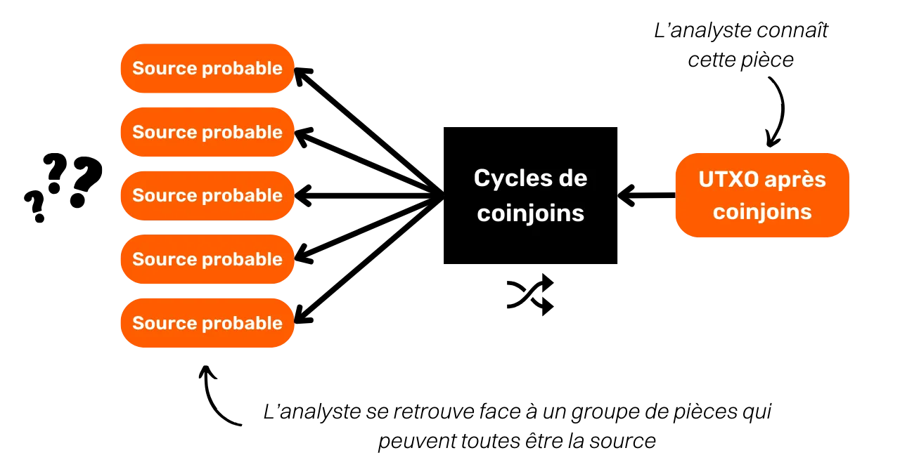

अपने UTXO को साइकिलों के एग्जिट पर जानकर, रेट्रोस्पेक्टिव अनॉनसेट यह निर्धारित करता है कि कितने संभावित Tx0 ट्रांजैक्शन आपके CoinJoin साइकिल में एंट्री बना सकते थे। नीचे दिए गए डायग्राम में, यह सभी नारंगी बबल्स के जोड़ के बराबर है।


उदाहरण के तौर पर, मान लीजिए कि हमारे CoinJoin पार्ट का रेट्रोस्पेक्टिव anonset `42,185` है। प्रैक्टिकल तरीके से देखें तो इसका मतलब है कि इस UTXO के लिए `42,185` संभावित स्रोत मौजूद हैं। अगर कोई बाहरी पर्यवेक्षक साइकल के अंत में इस सिक्के को पहचानता है और इसके मूल की तलाश करता है, तो उसे `42,185` संभावित स्रोतों का सामना करना पड़ेगा, जिनमें से हर एक के मूल होने की संभावना बराबर होगी।

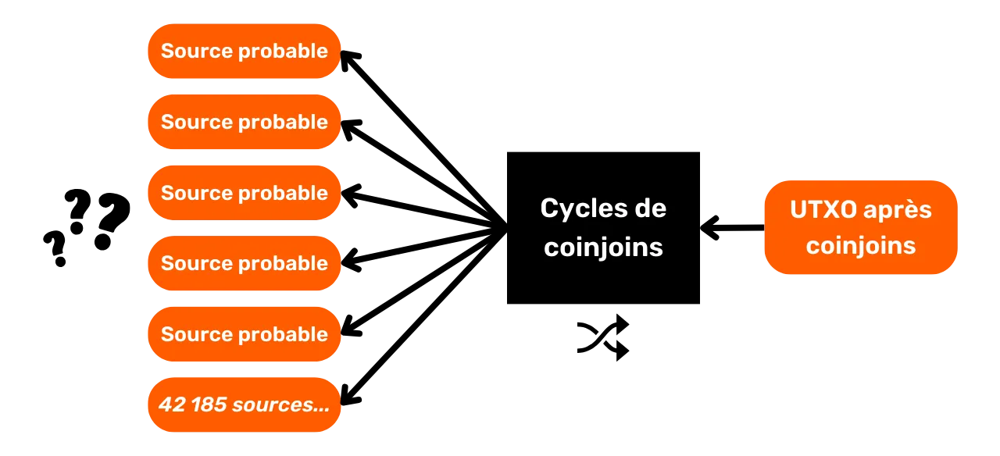

### अनॉनसेट्स की गणना कैसे करते हैं?

छोटे समूहों के लिए Block explorer का इस्तेमाल करके मैन्युअली anonsets की गणना करना संभव है। हालाँकि, बड़े anonsets के लिए एक विशेष उपकरण का उपयोग करना ज़रूरी हो जाता है। जहाँ तक मुझे पता है, इस काम को करने में सक्षम एकमात्र सॉफ़्टवेयर *Whirlpool स्टैट्स टूल* है, जो कि पायथन टूल है और इसे सामुराई और OXT टीमों ने विकसित किया था। दुर्भाग्य से, सामुराई के संस्थापकों की गिरफ़्तारी और Blockchain से डेटा निकालने के लिए इस्तेमाल होने वाले OXT के बंद होने के बाद यह टूल फिलहाल सेवा से बाहर है।


जैसा कि हमने इस अध्याय में देखा, एनॉनसेट्स (anonsets) की गणना तभी की जा सकती है जब जीडब्ल्यू-889 (CoinJoin) संरचना में एक खास समरूपता (homogeneity) हो। अगले अध्याय में, हम यह जानेंगे कि कैसे इस समरूपता को जीडब्ल्यू-890 (Bitcoin) लेन-देन पर मापा जा सकता है, चाहे वह जीडब्ल्यू-889 हो या कोई और पारंपरिक लेन-देन।

https://planb.network/tutorials/privacy/analysis/wst-anonsets-0354b793-c301-48af-af75-f87569756375
## एंट्रॉपी

<chapterId>e4fe289d-618b-49a2-84c9-68c562e708b4</chapterId>

जैसा कि हमने इस सेक्शन में कॉइनजॉइन्स के बारे में देखा, इनपुट और आउटपुट में UTXOs की होमोजीनिटी (समरूपता) Bitcoin ट्रांजैक्शन की कॉन्फिडेंशियैलिटी (गोपनीयता) बढ़ाने में अहम भूमिका निभाती है। यह पैरामीटर Blockchain एनालिसिस के सामने एक प्रशंसनीय इनकार (प्लॉज़िबल डिनायबिलिटी) पैदा करता है। इस समरूपता को मापने के लिए कई तरीके इस्तेमाल किए जा सकते हैं, लेकिन मेरी राय में सबसे कारगर तरीकों में से एक है *बोल्ट्ज़मैन* टूल द्वारा दिए गए इंडिकेटर्स का उपयोग, जिसे OXT और समुराई Wallet टीमों ने डेवलप किया है, खासतौर पर ट्रांजैक्शन की एन्ट्रॉपी (अनिश्चितता का माप)। इसी पर हम इस चैप्टर में विस्तार से चर्चा करेंगे।

अनॉनसेट्स के विपरीत, जिनकी गणना लेन-देन के एक सेट पर की जाती है, यहां प्रस्तुत संकेतक एक ही लेन-देन पर केंद्रित होते हैं, चाहे वह CoinJoin हो या कोई और पारंपरिक लेन-देन।

### व्याख्याओं की संख्या

Bitcoin लेन-देन पर देखा जा सकने वाला पहला संकेतक है बाहरी पर्यवेक्षक के विश्लेषण के सामने आने वाले संभावित व्याख्याओं की कुल संख्या। इसमें शामिल UTXOs के मूल्यों को ध्यान में रखते हुए, यह संकेतक दर्शाता है कि इनपुट्स को आउटपुट्स के साथ कितने तरीकों से जोड़ा जा सकता है। दूसरे शब्दों में, यह उन संभावित व्याख्याओं की संख्या निर्धारित करता है जो एक Bitcoin प्रवाह में लेन-देन को देखने वाले बाहरी पर्यवेक्षक के नजरिए से उत्पन्न हो सकती हैं।

उदाहरण के लिए, 1 इनपुट और 2 आउटपुट वाला एक साधारण भुगतान लेनदेन का केवल एक ही अर्थ होगा, वह यह कि इनपुट #0 ने आउटपुट #0 और आउटपुट #1 को फंड दिया। कोई अन्य संभावित व्याख्या नहीं है:


दूसरी तरफ, Whirlpool 5x5 कोने के $1\,496$ संभावित कॉम्बिनेशन होते हैं:


एक Whirlpool सर्ज साइकिल 8x8 CoinJoin के $9\,934\,563$ संभावित व्याख्याएँ हैं:


### एंट्रॉपी

Bitcoin ट्रांजैक्शन की व्याख्याओं की संख्या से, हम इसकी एन्ट्रॉपी की गणना कर सकते हैं।

क्रिप्टोग्राफी और सूचना के सामान्य संदर्भ में, एन्ट्रॉपी (entropy) डेटा स्रोत या रैंडम प्रक्रिया से जुड़ी अनिश्चितता या अप्रत्याशितता का एक मात्रात्मक माप है। दूसरे शब्दों में, एन्ट्रॉपी यह मापने का एक तरीका है कि किसी जानकारी को भविष्यवाणी करना या अनुमान लगाना कितना मुश्किल है।

Blockchain विश्लेषण के विशेष संदर्भ में, एन्ट्रॉपी एक संकेतक का नाम भी है, जो शैनन की एन्ट्रॉपी से लिया गया है और [लॉरेंट एमटी द्वारा आविष्कार किया गया](https://gist.github.com/LaurentMT/e758767ca4038ac40aaf), जिसे Bitcoin लेनदेन पर गणना की जा सकती है।

जब किसी लेन-देन के कई संभावित मतलब निकलते हैं, तो अक्सर इसकी एन्ट्रॉपी (entropy) को देखना ज़्यादा मायने रखता है। यह संकेतक बताता है कि एनालिस्ट्स को इस लेन-देन की सही जानकारी कितनी कम है। यानी, जितनी ज़्यादा एन्ट्रॉपी होगी, एनालिस्ट्स के लिए इनपुट और आउटपुट के बीच बिटकॉइन के फ्लो को पहचानना उतना ही मुश्किल हो जाएगा।

व्यवहार में, एन्ट्रॉपी यह दिखाती है कि क्या, एक बाहरी पर्यवेक्षक के नज़रिए से, एक लेन-देन के कई संभावित मतलब हो सकते हैं, सिर्फ इनपुट और आउटपुट रकम के आधार पर, बिना किसी बाहरी या आंतरिक पैटर्न और ह्यूरिस्टिक्स को ध्यान में रखे। इसलिए, उच्च एन्ट्रॉपी लेन-देन के लिए ज़्यादा गोपनीयता का पर्याय है।

एन्ट्रॉपी को संभावित संयोजनों की संख्या के बाइनरी लघुगणक के रूप में परिभाषित किया गया है। यहाँ फॉर्मूला दिया गया है, जहाँ $E$ लेन-देन की एन्ट्रॉपी है और $C$ संभावित व्याख्याओं की संख्या है:

$$
E = \log_2(C)
$$

गणित में, बाइनरी लॉगरिथम (बेस-2 लॉगरिथम) 2 के घातांक का उल्टा ऑपरेशन होता है। दूसरे शब्दों में, $x$ का बाइनरी लॉगरिथम वह घातांक है जिस पर $2$ को बढ़ाया जाए तो $x$ प्राप्त हो। इसलिए, यह सूचक बिट्स में व्यक्त किया जाता है।

चलो CoinJoin लेनदेन के लिए एन्ट्रॉपी गणना का उदाहरण लेते हैं, जो Whirlpool 5x5 मॉडल के अनुसार संरचित है, जैसा कि पिछले भाग में बताया गया था, इसकी संभावित व्याख्याओं की संख्या $1\,496$ है:

$$
\begin{align*}
C &= 1\,496 \\
E &= \log_2(1\,496) \\
E &= 10.5469 \text{ bits}
\end{align*}
$$

इस तरह, इस CoinJoin लेन-देन की एन्ट्रॉपी $10.5469$ बिट्स है, जिसे बहुत संतोषजनक माना जाता है। यह मान जितना अधिक होगा, लेन-देन के उतने ही अधिक अलग-अलग व्याख्याएँ हो सकती हैं, जिससे इसकी गोपनीयता का स्तर और मजबूत होता है।

CoinJoin 8x8 लेनदेन के लिए $9\,934\,563$ व्याख्याओं के साथ, एन्ट्रॉपी होगी:

$$
\begin{align*}
C &= 9\,934\,563 \\
E &= \log_2(9\,934\,563) \\
E &= 23.244 \text{ bits}
\end{align*}
$$

चलो एक और उदाहरण लेते हैं, एक क्लासिक पेमेंट ट्रांजैक्शन के साथ, जिसमें 1 इनपुट और 2 आउटपुट हैं: [1b1b0c3f0883a99f1161c64da19471841ed12a1f78e77fab128c69a5f578ccce](https://Mempool.space/tx/1b1b0c3f0883a99f1161c64da19471841ed12a1f78e77fab128c69a5f578ccce)


इस लेन-देन के मामले में, एकमात्र संभावित व्याख्या यह है: `(In.0) > (Out.0 ; Out.1)`। नतीजतन, इसकी एन्ट्रॉपी $0$ है :

$$
\begin{align*}
C &= 1 \\
E &= \log_2(1) \\
E &= 0 \text{ bits}
\end{align*}
$$

### कार्यक्षमता

लेन-देन के एन्ट्रॉपी के आधार पर, हम उसकी गोपनीयता के मामले में दक्षता भी कैलकुलेट कर सकते हैं। यह इंडिकेटर लेन-देन की दक्षता का आकलन करता है, उसे एक समान कॉन्फ़िगरेशन में कल्पना किए जा सकने वाले ऑप्टिमल लेन-देन से तुलना करके।

यह हमें अधिकतम एन्ट्रॉपी की अवधारणा पर ले आता है, जो किसी विशिष्ट लेन-देन संरचना द्वारा सैद्धांतिक रूप से प्राप्त की जा सकने वाली सर्वोच्च एन्ट्रॉपी से मेल खाती है। फिर लेन-देन दक्षता की गणना इस अधिकतम एन्ट्रॉपी की तुलना में विश्लेषणाधीन लेन-देन की वास्तविक एन्ट्रॉपी से करके की जाती है।

इस्तेमाल किया गया फॉर्मूला निम्नलिखित है :


- e_R$: लेन-देन की वास्तविक एन्ट्रॉपी जिसे बिट्स में व्यक्त किया गया है;
- e_M$: एक लेन-देन संरचना के लिए अधिकतम संभव एन्ट्रॉपी, जिसे बिट्स में भी व्यक्त किया जाता है;
- $Ef$: लेन-देन की कार्यक्षमता बिट्स में :

$$
Ef = E_R - E_M
$$

उदाहरण के लिए, Whirlpool 5x5 CoinJoin संरचना के लिए, अधिकतम एन्ट्रॉपी $10.5469$ है:

$$
\begin{align*}
E_R &= 10.5469 \\
E_M &= 10.5469 \\
Ef &= E_R - E_M \\
Ef &= 10.5469 - 10.5469 \\
Ef &= 0 \text{ bits}
\end{align*}
$$

यह संकेतक भी प्रतिशत के रूप में व्यक्त किया जाता है। प्रयुक्त सूत्र इस प्रकार है: :


- c_R$ : संभावित वास्तविक व्याख्याओं की संख्या ;
- c_M$: एक ही संरचना की अधिकतम संभावित व्याख्याओं की संख्या;
- $Ef$: दक्षता जिसे प्रतिशत में दर्शाया गया है:

$$
\begin{align*}
E_f &= \frac{C_R}{C_M} \\
E_f &= \frac{1\,496}{1\,496} \\
E_f &= 100 \%
\end{align*}
$$

100% की दक्षता का मतलब है कि लेन-देन अपनी गोपनीयता की पूरी संभावना का इस्तेमाल कर रहा है, यह उसकी संरचना पर निर्भर करता है।

### एन्ट्रॉपी घनत्व

एन्ट्रॉपी लेन-देन की गोपनीयता को मापने के लिए एक अच्छा संकेतक है, लेकिन यह कुछ हद तक लेन-देन में इनपुट और आउटपुट की संख्या पर निर्भर करता है। अलग-अलग इनपुट और आउटपुट वाले 2 अलग-अलग लेन-देन की एन्ट्रॉपी की तुलना करने के लिए, हम एन्ट्रॉपी घनत्व की गणना कर सकते हैं। यह संकेतक लेन-देन के प्रत्येक इनपुट या आउटपुट के सापेक्ष एन्ट्रॉपी का एक दृष्टिकोण प्रदान करता है। घनत्व अलग-अलग आकार के लेन-देन की दक्षता का मूल्यांकन और तुलना करने के लिए उपयोगी है।

इसे कैलकुलेट करने के लिए, हम सीधे ट्रांजैक्शन की कुल एन्ट्रॉपी को इसमें शामिल इनपुट्स और आउटपुट्स की कुल संख्या से भाग देते हैं:


- e_D$: एन्ट्रॉपी घनत्व, बिट्स में व्यक्त किया गया;
- e$: लेन-देन की एन्ट्रॉपी, जिसे बिट्स में व्यक्त किया गया है;
- t$: लेन-देन में इनपुट और आउटपुट की कुल संख्या:

$$
E_D = \frac{E}{T}
$$

चलो एक Whirlpool 5x5 CoinJoin का उदाहरण लेते हैं:

$$
\begin{align*}
T &= 5 + 5 = 10 \\
E &= 10.5469 \\
E_D &= \frac{E}{T} \\
E_D &= \frac{10.5469}{10} \\
E_D &= 1.054 \text{ bits}
\end{align*}
$$

चलो 8x8 Whirlpool CoinJoin की एन्ट्रॉपी घनत्व की भी गणना करें:

$$
\begin{align*}
T &= 8 + 8 = 16 \\
E &= 23.244 \\
E_D &= \frac{E}{T} \\
E_D &= \frac{23.244}{16} \\
E_D &= 1.453 \text{ bits}
\end{align*}
$$

इन दो प्रकार के CoinJoin के एन्ट्रॉपी घनत्व का विश्लेषण करने से यह स्पष्ट हो जाता है कि, Elements की संख्या से एन्ट्रॉपी को नॉर्मलाइज़ करने पर भी, "सर्ज साइकिल 8x8" CoinJoin विश्लेषण के लिए अधिक अनिश्चितता पैदा करता है।

### बोल्ट्ज़मैन स्कोर

एक लेन-देन में विश्लेषण की गई एक और जानकारी है, बोल्ट्ज़मैन स्कोर, जो हर एक एलिमेंट का दूसरे के मुकाबले होता है। यह इनपुट और आउटपुट के बीच मेल खाने की संभावनाओं की एक टेबल है। यह टेबल बोल्ट्ज़मैन स्कोर के ज़रिए यह दिखाती है कि किसी खास इनपुट का दिए गए आउटपुट से जुड़ने की कंडीशनल प्रोबेबिलिटी क्या है। यानी, यह एक क्वांटिटेटिव माप है जो बताती है कि किसी लेन-देन में इनपुट और आउटपुट के बीच एक एसोसिएशन होने की कंडीशनल प्रोबेबिलिटी कितनी है। यह माप इस आधार पर बनती है कि किसी इवेंट के फेवरेबल ऑकरेंसेज़ की संख्या और टोटल पॉसिबल ऑकरेंसेज़ की संख्या का अनुपात क्या है, जो कि इंटरप्रिटेशन्स के एक सेट में देखा जाता है।

Whirlpool और CoinJoin के उदाहरण का उपयोग करते हुए, सशर्त संभाव्यता तालिका प्रत्येक इनपुट और आउटपुट के बीच संबंध की संभावनाओं को उजागर करेगी, जो लेन-देन में संबंधों की अस्पष्टता का एक मात्रात्मक माप प्रदान करती है:

| % | आउटपुट 0 | आउटपुट 1 | आउटपुट 2 | आउटपुट 3 | आउटपुट 4 |

| ------- | -------- | -------- | -------- | -------- | -------- |

| इनपुट 0 | 34% | 34% | 34% | 34% | 34% |

| इनपुट 1 | 34% | 34% | 34% | 34% | 34% | 34% | इनपुट 1 |

| इनपुट 2 | 34% | 34% | 34% | 34% | 34% | 34% | 34% | 34% | 34% | 34% | 34% | 34% | 34% | 34% | 34% |

| इनपुट 3 | 34% | 34% | 34% | 34% | 34% | 34% | इनपुट 3 |

| इनपुट 4 | 34% | 34% | 34% | 34% | 34% | 34% | 34% | 34% | 34% | 34% | 34% | 34% | 34% | 34% | 34% |

साफ़ है, हर इनपुट का किसी भी आउटपुट से जुड़ने का बराबर मौका होता है, जो लेन-देन की गोपनीयता को और मजबूत करता है।

बोल्ट्ज़मैन स्कोर की गणना किसी खास घटना के होने वाले व्याख्याओं की संख्या को उपलब्ध कुल व्याख्याओं की संख्या से भाग देकर की जाती है। इसलिए, इनपुट #0 को आउटपुट #3 से जोड़ने वाले स्कोर (जो $512$ व्याख्याओं में मौजूद है) को निर्धारित करने के लिए, हम निम्नलिखित तरीके से आगे बढ़ते हैं:

$$
\begin{align*}
\text{Interpretations (IN.0 > OUT.3)} &= 512 \\
\text{Interpretations totales} &= 1496 \\
\text{Score} &= \frac{512}{1496} \\
\text{Score} &= 34 \%
\end{align*}
$$

अगर हम Whirlpool 8x8 सर्ज साइकिल CoinJoin का उदाहरण लें, तो बोल्ट्ज़मैन टेबल कुछ इस तरह दिखेगा:

| आउट.0 | आउट.1 | आउट.2 | आउट.3 | आउट.4 | आउट.5 | आउट.6 | आउट.7 |

|-------|-------|-------|-------|-------|-------|-------|-------|-------|

| IN.0 | 23% | 23% | 23% | 23% | 23% | 23% | 23% | 23% |

| IN.1 | 23% | 23% | 23% | 23% | 23% | 23% | 23% | 23% |

| IN.2 | 23% | 23% | 23% | 23% | 23% | 23% | 23% | 23% |

| IN.3 | 23% | 23% | 23% | 23% | 23% | 23% | 23% | 23% |

| IN.4 | 23% | 23% | 23% | 23% | 23% | 23% | 23% | 23% |

| IN.5 | 23% | 23% | 23% | 23% | 23% | 23% | 23% | 23% |

| IN.6 | 23% | 23% | 23% | 23% | 23% | 23% | 23% | 23% |

| IN.7 | 23% | 23% | 23% | 23% | 23% | 23% | 23% | 23% |

हालांकि, अगर सिर्फ एक इनपुट और 2 आउटपुट वाले साधारण लेन-देन की बात करें, तो स्थिति अलग है:

| आउटपुट 0 | आउटपुट 1 |

|---------|----------|----------|

| इनपुट 0 | 100% | 100% |

यहाँ, हम देखते हैं कि हर एक आउटपुट के इनपुट #0 से आने की संभावना 100% है। इसलिए, कम संभावना ज़्यादा गोपनीयता दिखाती है, क्योंकि यह इनपुट और आउटपुट के बीच सीधे संबंध को कमज़ोर कर देती है।

### निश्चितात्मक कड़ियाँ

हम एक लेन-देन में निश्चित (डिटरमिनिस्टिक) लिंक्स की संख्या भी गणना कर सकते हैं। यह संकेतक दर्शाता है कि विश्लेषित लेन-देन में इनपुट्स और आउटपुट्स के बीच कितने कनेक्शन 100% प्रायिकता के साथ निर्विवाद हैं। इसके बाद, निश्चित लिंक्स के अनुपात की गणना करके इस संकेतक को पूरा किया जा सकता है। यह अनुपात लेन-देन के कुल लिंक्स के भीतर इन निश्चित लिंक्स के महत्व पर एक दृष्टिकोण प्रदान करता है।

उदाहरण के लिए, Whirlpool CoinJoin लेनदेन में इनपुट और आउटपुट के बीच कोई निश्चित लिंक नहीं होता, और इसलिए यह 0 लिंक और 0% का अनुपात दिखाता है। वहीं, हमारे दूसरे सरल भुगतान लेनदेन (जिसमें एक इनपुट और 2 आउटपुट हैं) में, इंडिकेटर बताता है कि इसमें 2 निश्चित लिंक हैं, और अनुपात 100% तक पहुँच जाता है। दूसरे शब्दों में, शून्य इंडिकेटर उत्कृष्ट गोपनीयता को दर्शाता है, क्योंकि इनपुट और आउटपुट के बीच कोई सीधा और निर्विवाद संबंध नहीं होता।

### ये संकेतक कैसे कैलकुलेट करते हैं?

आपने दिए गए समीकरणों का इस्तेमाल करके इन संकेतकों को मैन्युअली कैलकुलेट करना काफी सीधा-सादा काम है। असली मुश्किल तो एक लेन-देन के संभावित व्याख्याओं की संख्या निर्धारित करने में आती है। क्लासिक लेन-देन के मामले में, यह गणना हाथ से की जा सकती है। लेकिन CoinJoin के लिए, यह काम कहीं ज्यादा पेचीदा हो जाता है।

पहले, OXT और Samourai टीमों द्वारा विकसित एक पायथन टूल था जिसका नाम _बोल्ट्ज़मैन कैलकुलेटर_ था, जो Bitcoin ट्रांजैक्शन के लिए इन सभी संकेतकों को अपने आप कैलकुलेट कर देता था:


इन विश्लेषणों के लिए KYCP.org वेबसाइट का उपयोग करना भी संभव था:


दुर्भाग्य से, सामुराई के संस्थापकों की गिरफ्तारी के बाद, ये टूल अब काम नहीं कर रहे हैं।

अब जब हमने कॉइनजॉइन्स के बारे में विस्तार से समझ लिया है, तो हम अपने कोर्स के आखिरी सेक्शन में Bitcoin पर उपलब्ध दूसरी प्राइवेसी टेक्नीक्स पर नज़र डालेंगे। हम पेजॉइन्स, खास स्यूडो-CoinJoin ट्रांजैक्शन टाइप्स, स्टैटिक Address प्रोटोकॉल्स के साथ-साथ उन उपायों को भी देखेंगे जो ट्रांजैक्शन्स के लेवल पर नहीं बल्कि नोड्स के नेटवर्क लेवल पर कॉन्फिडेंशियैलिटी को मजबूत करते हैं।

https://planb.network/tutorials/privacy/analysis/boltzmann-entropy-738e45af-18a6-4ce6-af1a-1bf58e15f1fe
# दूसरे उन्नत गोपनीयता तकनीकों की चुनौतियों को समझना

<partId>19989ae6-d608-4acf-b698-2cf1e7e5e6ae</partId>

## जीडब्ल्यू-926 लेनदेन

<chapterId>c1e90b95-f709-4574-837b-2ec26b11286f</chapterId>

CoinJoin फिलहाल चेन एनालिसिस में पार्ट्स की ट्रेसिंग में अनिश्चितता लाने का सबसे कारगर तरीका है। जैसा कि हमने पिछले चैप्टर्स में देखा, हाई-परफॉरमेंस मिक्स पाने के लिए इनपुट्स और आउटपुट्स जितना हो सके एक जैसे होने चाहिए। साथ ही, यह भी जरूरी है कि पार्ट्स को जितना बड़े ग्रुप में शामिल किया जाए, एनॉनसेट्स को मैक्सिमाइज़ करने के लिए। तो, कॉइनजॉइन्स के प्रभावी होने के लिए, उनमें बड़ी संख्या में एकसमान पार्ट्स शामिल होने चाहिए। इन बहुत सारी जरूरतों का मतलब है कि CoinJoin ट्रांजैक्शन्स की स्ट्रक्चर बहुत ही कड़ी होती है: अमाउंट्स पहले से फिक्स्ड होते हैं, और सभी पार्टिसिपेंट्स को प्रोसेस की एकरूपता सुनिश्चित करने के लिए उनका पालन करना होता है। इसके अलावा, कॉइनजॉइन्स के लिए ट्रांजैक्शन कंस्ट्रक्शन के दौरान सभी पार्टिसिपेंट्स और कोऑर्डिनेटर के बीच सिंक्रोनाइज़ेशन की जरूरत होती है।

ये शर्तें CoinJoin को सीधे भुगतान के लिए अनुपयुक्त बनाती हैं। उदाहरण के लिए, अगर आपके पास CoinJoin पूल में 1M Sats का सिक्का है, तो इसे सीधे भुगतान के रूप में इस्तेमाल करना जटिल होगा। इसके लिए दूसरे प्रतिभागियों और कोऑर्डिनेटर के साथ तालमेल बिठाना होगा ताकि ठीक उसी वक्त सहयोगी लेन-देन तैयार किया जा सके जब आपको भुगतान करना हो, और खरीद की रकम आपके सिक्के की कीमत के बराबर ही होनी चाहिए, जो व्यावहारिक रूप से असंभव है। इसलिए CoinJoin लेन-देन अपने स्वभाव से ही एक सहयोगी स्वीप ट्रांजैक्शन है, यानी आमतौर पर इनपुट्स के मालिक और आउटपुट्स में मिलने वाले मालिक एक ही होते हैं।

हालांकि, यह दिलचस्प होगा अगर लेन-देन की ऐसी संरचनाएँ हों जो भुगतान को व्यावहारिक तरीके से करने की अनुमति दें, साथ ही चेन विश्लेषण में संदेह पैदा करें। यही हम इस अध्याय और अगले अध्याय में देखेंगे।

### एक PayJoin ट्रांजैक्शन क्या है?

PayJoin एक खास Bitcoin लेन-देन संरचना है जो भुगतान प्राप्तकर्ता के साथ मिलकर काम करके उपयोगकर्ता की गोपनीयता को बढ़ाती है, खासकर खर्च करते समय।

2015 में, LaurentMT ने पहली बार इस विधि को "*steganographic transactions*" के रूप में वर्णित किया था, जैसा कि [यहाँ](https://gist.githubusercontent.com/LaurentMT/e758767ca4038ac40aaf/raw/c8125f6a3c3d0e90246dc96d3b603690ab6f1dcc/gistfile1.txt) उपलब्ध दस्तावेज़ में बताया गया है। बाद में इस तकनीक को Samourai Wallet ने अपनाया, जो 2018 में इसे Stowaway उपकरण के साथ लागू करने वाला पहला क्लाइंट बना। payjoin की अवधारणा [BIP79](https://github.com/bitcoin/bips/blob/master/bip-0079.mediawiki), [BIP78](https://github.com/bitcoin/bips/blob/master/bip-0078.mediawiki) और [BIP77](https://payjoin.org/docs/how-it-works/payjoin-v2-bip-77/) में भी मिलती है। payjoin को संदर्भित करने के लिए कई शब्दों का उपयोग किया जाता है:

- जीडब्ल्यू-936 ;
- छिपकर सफर करने वाला;
- P2EP (*पे-टू-एंड-पॉइंट*) ;
- स्टेगनोग्राफ़िक लेन-देन।

PayJoin की खास बात यह है कि यह generate को संभव बनाता है - एक ऐसा लेन-देन जो पहली नज़र में सामान्य लगता है, लेकिन असल में दो लोगों के बीच एक छोटा सा CoinJoin होता है। इसे पूरा करने के लिए, लेन-देन की संरचना में भुगतान प्राप्तकर्ता को वास्तविक भेजने वाले के साथ इनपुट्स में शामिल किया जाता है। इस तरह प्राप्तकर्ता लेन-देन के बीच में खुद को एक भुगतान शामिल करता है, जो उसे भुगतान प्राप्त करने में सक्षम बनाता है।

चलिए इस प्रक्रिया को बेहतर समझने के लिए एक उदाहरण लेते हैं। ऐलिस 10,000 Sats का एक UTXO इस्तेमाल करके 4,000 Sats में एक बैगुएट खरीदती है और PayJoin चुनती है। उसका बेकर, बॉब, इनपुट के रूप में अपना 15,000 Sats का एक UTXO जोड़ता है, जिसे वह आउटपुट में पूरा वापस पा लेता है, साथ ही ऐलिस के 4,000 Sats भी मिलते हैं।


इस उदाहरण में, बेकर बॉब इनपुट में 15,000 Sats डालता है और आउटपुट में 19,000 Sats के साथ बाहर निकलता है, जिसका अंतर ठीक 4,000 Sats है, यानी बैगुएट की कीमत। ऐलिस की तरफ, वह 10,000 Sats डालती है और आउटपुट में 6,000 Sats के साथ समाप्त होती है, जो -4,000 Sats का शेष दर्शाता है, यानी बैगुएट की कीमत। उदाहरण को सरल बनाने के लिए, मैंने जानबूझकर इस लेन-देन में Mining की लागत को छोड़ दिया है।

### PayJoin किस लिए है?

जीडब्ल्यू-946 लेनदेन से दो मकसद पूरे होते हैं, जिससे यूजर्स अपने भुगतान की गोपनीयता बढ़ा सकते हैं।

सबसे पहले, PayJoin का मकसद चेन एनालिसिस में एक चारा बनाकर बाहरी निरीक्षक को गुमराह करना है। यह CIOH ह्यूरिस्टिक (*कॉमन इनपुट Ownership ह्यूरिस्टिक*) की मदद से संभव हो पाता है। जैसा कि हमने भाग 3 में देखा, आमतौर पर जब Blockchain पर एक ट्रांजैक्शन के कई इनपुट होते हैं, तो यह मान लिया जाता है कि ये सभी इनपुट एक ही इकाई या यूजर के हैं।

तो, जब कोई विश्लेषक PayJoin लेन-देन की जांच करता है, तो उसे यही लगता है कि सारे इनपुट एक ही व्यक्ति से आए हैं। लेकिन यह धारणा गलत है, क्योंकि भुगतान प्राप्तकर्ता भी असली भुगतानकर्ता के साथ मिलकर इनपुट में योगदान देता है। इसलिए चेन विश्लेषण एक गलत व्याख्या की ओर मोड़ दिया जाता है जो बाद में गलत साबित होती है।

चलो हमारा PayJoin लेन-देन का उदाहरण लेते हैं, जो एक बैगेट की खरीद के लिए भुगतान से संबंधित है:


Blockchain पर इस ट्रांजैक्शन को देखकर, एक बाहरी पर्यवेक्षक जो Blockchain के सामान्य विश्लेषण के नियमों को फॉलो करता है, इसका अर्थ ऐसे निकालेगा: "*ऐलिस ने बॉब को 19,000 Sats भुगतान करने के लिए इस ट्रांजैक्शन में 2 UTXOs को इनपुट के रूप में मर्ज किया*"।


यह व्याख्या साफ़ ग़लत है, क्योंकि जैसा कि आप जानते ही हैं, इनपुट में दोनों UTXO एक ही व्यक्ति के नहीं हैं। एक एलिस का है, जो बैगेट खरीदने वाली है, और दूसरा बॉब का है, जो बेकर है।


इस तरह, बाहरी पर्यवेक्षक का विश्लेषण एक गलत निष्कर्ष की ओर मोड़ दिया जाता है, जिससे हितधारकों की गोपनीयता बनी रहती है।

### स्टेग्नोग्राफ़िक लेन-देन

PayJoin का दूसरा मकसद है बाहरी निगरानी करने वाले को भुगतान की असली रकम के बारे में गुमराह करना। लेन-देन की बनावट को जांचकर, विश्लेषक यह मान सकता है कि भुगतान आउटपुट में से किसी एक रकम के बराबर है।

अगर हम बैगुएट खरीदने के अपने उदाहरण पर वापस जाएं, तो विश्लेषक यह सोचेगा कि भुगतान राशि या तो 6,000 Sats के UTXO से मेल खाती है, या फिर 19,000 Sats के UTXO से। इस मामले में, विश्लेषक यही सोचेगा कि भुगतान राशि 19,000 Sats है, क्योंकि आउटपुट्स में 2 UTXOs हैं, जिनमें से कम से कम एक 6,000 Sats से बड़ा है (जब एक ही UTXO इस भुगतान को पूरा करने के लिए काफी होता, तो 6,000 Sats का भुगतान करने के लिए 2 UTXOs का उपयोग करने का कोई तार्किक कारण नहीं है)।


लेकिन असल में, यह विश्लेषण गलत है। भुगतान की रकम किसी भी आउटपुट से मेल नहीं खाती। दरअसल, यह आउटपुट में प्राप्तकर्ता के UTXO और इनपुट में प्राप्तकर्ता के UTXO के बीच का अंतर है।


इस मामले में, PayJoin लेन-देन स्टेग्नोग्राफी (छुपी हुई जानकारी) के दायरे में आता है। यह असली लेन-देन की रकम को एक नकली लेन-देन के अंदर छुपाने की अनुमति देता है, जो एक भ्रम पैदा करने वाला झांसा होता है।

स्टेग्नोग्राफ़ी एक ऐसी तकनीक है जिसमें किसी जानकारी को दूसरे डेटा या चीज़ों के अंदर छुपाया जाता है, ताकि छुपी हुई जानकारी का पता न चल सके। मिसाल के तौर पर, किसी गुप्त संदेश को बेमतलब के टेक्स्ट में एक डॉट के अंदर छुपाया जा सकता है, जिससे वह नंगी आँखों से नज़र नहीं आता (यह [माइक्रोडॉट](https://fr.wikipedia.org/wiki/Micropoint) तकनीक है)।

एन्क्रिप्शन के विपरीत, जो डिक्रिप्शन की (बिना चाबी के) जानकारी को समझ से बाहर कर देता है, स्टेगनोग्राफी जानकारी को बदलती नहीं है। यह साफ-साफ टेक्स्ट में दिखाई देती है। बल्कि, इसका मकसद तो गुप्त संदेश के अस्तित्व को छिपाना होता है, जबकि एन्क्रिप्शन छुपी हुई जानकारी की मौजूदगी को साफ-साफ दिखाता है (हालांकि चाबी के बिना उस तक पहुँच नहीं मिलती)। यही वजह है कि PayJoin का मूल नाम "स्टेगनोग्राफिक ट्रांजैक्शन्स" था।

क्रिप्टोग्राफी और CoinJoin के बीच, और स्टेग्नोग्राफी और PayJoin के बीच एक समानता देखी जा सकती है। CoinJoin में एन्क्रिप्शन जैसे गुण हैं: तरीका पहचाना जा सकता है, लेकिन जानकारी समझ से बाहर है। वहीं, PayJoin स्टेग्नोग्राफी की तरह है: जानकारी सैद्धांतिक रूप से उपलब्ध है, लेकिन चूंकि छुपाने का तरीका पहचान में नहीं आता, यह दुर्गम हो जाती है।

### PayJoin का उपयोग कैसे करें?

PayJoin को सपोर्ट करने वाले प्रसिद्ध सॉफ्टवेयर प्रोग्राम्स में Sparrow Wallet, Wasabi Wallet, Mutiny, BitMask, BlueWallet और JoinMarket शामिल हैं, साथ ही पेमेंट प्रोसेसर BTCPay भी।


सबसे एडवांस्ड PayJoin इम्प्लीमेंटेशन सिर्फ सैमुराई Wallet पर स्टोअवे था। हालांकि, सॉफ्टवेयर के फाउंडर्स की गिरफ्तारी के बाद, यह टूल अब सिर्फ आंशिक रूप से काम करता है। स्टोअवे का फायदा यह है कि यह एक व्यापक, यूजर-फ्रेंडली प्रोटोकॉल है, जो पेजॉइन रिसीव और सेंड दोनों सपोर्ट करता है। पार्शियली साइन्ड ट्रांजैक्शन को मैन्युअली कई QR कोड स्कैन करके एक्सचेंज किया जा सकता है, या फिर Tor के जरिए सोरोबन द्वारा ऑटोमैटिकली। वह कम्युनिकेशन ऑप्शन अभी के लिए बंद है।


PayJoin का इस्तेमाल करने में मुश्किल यह है कि यह दुकानदार के सहयोग पर निर्भर करता है। ग्राहक के तौर पर, अगर दुकानदार PayJoin को सपोर्ट नहीं करता, तो आप इसका इस्तेमाल नहीं कर सकते। यह खरीदारी की प्रक्रिया में एक और मुश्किल जोड़ देता है: न सिर्फ Bitcoin स्वीकार करने वाले दुकानदार ढूंढना मुश्किल है, बल्कि अगर आप payjoins को सपोर्ट करने वालों की भी तलाश करें, तो यह और भी पेचीदा हो जाता है।

एक समाधान यह हो सकता है कि हम ऐसे लेन-देन के ढांचे का इस्तेमाल करें जो चेन विश्लेषण में अस्पष्टता पैदा करे, बिना प्राप्तकर्ता के सहयोग की जरूरत के। इससे हम व्यापारियों के सक्रिय सहयोग पर निर्भर हुए बिना अपने भुगतानों की गोपनीयता को बेहतर बना सकेंगे। यही हम अगले अध्याय में देखने वाले हैं।

https://planb.network/tutorials/privacy/on-chain/payjoin-sparrow-wallet-087a0e49-61cd-41f5-8440-ac7b157bdd62
https://planb.network/tutorials/privacy/on-chain/payjoin-samourai-wallet-48a5c711-ee3d-44db-b812-c55913080eab
## भुगतान मिनी-जीडब्ल्यू-969

<chapterId>300777ee-30ae-43d7-ab00-479dac3522c1</chapterId>

जब आप एक भुगतान लेनदेन करना चाहते हैं और साथ ही कुछ गोपनीयता बनाए रखना चाहते हैं, तो PayJoin एक अच्छा विकल्प है। लेकिन जैसा कि हमने अभी देखा, PayJoin में प्राप्तकर्ता की भागीदारी जरूरी होती है। तो अगर प्राप्तकर्ता PayJoin में शामिल होने से मना कर दे, या फिर आप उन्हें शामिल ही न करना चाहें, तो क्या करें? एक विकल्प है स्टोनवॉल या स्टोनवॉल x2 लेनदेन का इस्तेमाल करना। आइए इन दो तरह के लेनदेन पर करीब से नज़र डालें।

### स्टोनवॉल डील

स्टोनवॉल एक खास तरह का Bitcoin ट्रांजैक्शन है जिसे यूजर की गोपनीयता बढ़ाने के लिए डिज़ाइन किया गया है। यह दो लोगों के बीच एक नकली CoinJoin जैसा दिखता है, लेकिन असल में वो होता नहीं। दरअसल, यह ट्रांजैक्शन किसी के साथ मिलकर नहीं किया जाता। एक यूजर इसे खुद ही बना सकता है, सिर्फ अपने खुद के UTXOs को इनपुट के तौर पर इस्तेमाल करके। यानी आप किसी भी मौके पर स्टोनवॉल ट्रांजैक्शन बना सकते हैं, बिना किसी दूसरे यूजर या रिसिपिएंट के साथ तालमेल बिठाने की ज़रूरत के।

स्टोनवॉल ट्रांजैक्शन इस तरह काम करता है: ट्रांजैक्शन के इनपुट के रूप में, इश्यूअर अपने 2 UTXOs का इस्तेमाल करता है। आउटपुट पर, ट्रांजैक्शन 4 UTXOs बनाता है, जिनमें से 2 बिल्कुल समान राशि के होते हैं। बाकी 2 UTXOs विदेशी Exchange का हिस्सा होंगे। समान राशि वाले 2 आउटपुट्स में से, सिर्फ एक ही वास्तव में भुगतानकर्ता को जाएगा।

तो स्टोनवॉल ट्रांजैक्शन में सिर्फ 2 रोल होते हैं:


- भुगतान करने वाला जारीकर्ता ;
- प्राप्तकर्ता, जिसे शायद लेन-देन की खास जानकारी न हो और वह सिर्फ भेजने वाले से भुगतान की उम्मीद कर रहा हो।

चलिए इस लेन-देन की संरचना को समझने के लिए एक उदाहरण लेते हैं। ऐलिस बेकर बॉब के पास अपनी बैगुएट खरीदने जाती है, जिसकी कीमत 4,000 Sats है। वह बिटकॉइन में भुगतान करना चाहती है, साथ ही अपने भुगतान की गोपनीयता बनाए रखना चाहती है। इसलिए वह भुगतान के लिए एक स्टोनवॉल लेन-देन बनाने का फैसला करती है।


इस लेन-देन का विश्लेषण करके, हम देख सकते हैं कि बेकर बॉब को बैगुएट के भुगतान में वास्तव में 4,000 Sats मिले। ऐलिस ने इनपुट के रूप में 2 UTXOs का उपयोग किया: एक 10,000 Sats का और एक 15,000 Sats का। आउटपुट में, उसने 3 UTXOs वापस प्राप्त किए हैं: एक 4,000 Sats का, एक 6,000 Sats का और एक 11,000 Sats का। इसलिए, इस लेन-देन पर ऐलिस का नेट बैलेंस -4,000 Sats है, जो बैगुएट की कीमत के बराबर है।

इस उदाहरण में, मैंने जानबूझकर Mining फीस को नज़रअंदाज़ किया है ताकि समझने में आसानी हो। असलियत में, लेन-देन की लागत पूरी तरह से जारीकर्ता द्वारा वहन की जाती है।

### एक स्टोनवॉल ट्रांजैक्शन के मकसद क्या हैं?

स्टोनवॉल स्ट्रक्चर ट्रांजैक्शन में बहुत ज्यादा एन्ट्रॉपी ऐड कर देता है, जिससे चेन एनालिसिस की लाइन्स ब्लर हो जाती हैं। बाहर से देखने पर, ऐसा ट्रांजैक्शन दो लोगों के बीच एक मिनी-जीडब्ल्यू-977 की तरह लग सकता है। लेकिन असल में, यह एक पेमेंट होता है। इस तरह, यह मेथड चेन एनालिसिस में अनिश्चितताएँ पैदा कर देता है, या फिर गलत क्लूज़ की तरफ ले जाता है।

चलो बेकर बॉब के पास ऐलिस का उदाहरण लेते हैं। Blockchain पर लेन-देन कुछ इस तरह दिखेगा:


एक बाहरी पर्यवेक्षक जो सामान्य चेन विश्लेषण ह्यूरिस्टिक्स पर भरोसा करता है, वह गलत निष्कर्ष निकाल सकता है कि "*दो लोगों ने एक छोटा CoinJoin बनाया है, जिसमें इनपुट में एक-एक UTXO और आउटपुट में दो-दो UTXO हैं*"। बाहर से इस ट्रांजैक्शन का विश्लेषण करने पर CIOH लागू नहीं होता, क्योंकि एक ही राशि के दो आउटपुट CoinJoin पैटर्न की ओर इशारा करते हैं। बाहरी नजरिए से, इस खास मामले में CIOH लागू नहीं होता।


यह व्याख्या गलत है, क्योंकि जैसा कि आप जानते हैं, एक UTXO बॉब द बेकर को भेजा गया था, 2 UTXO इनपुट ऐलिस से आए थे, और उसने 3 Exchange आउटपुट रिकवर किए थे।


और स्टोनवॉल ट्रांजैक्शन की संरचना में खास दिलचस्प बात यह है कि, एक बाहरी नज़रिए से देखें तो यह हर तरह से स्टोनवॉल x2 ट्रांजैक्शन जैसी लगती है।

### स्टोनवॉल डील x2

स्टोनवॉल x2, Bitcoin लेनदेन का एक और खास तरीका है जो खर्च करते वक्त यूजर की गोपनीयता बढ़ाने का काम करता है, लेकिन इस बार उस खर्च से जुड़े किसी तीसरे व्यक्ति के साथ मिलकर। यह तरीका दो लोगों के बीच एक छद्म-CoinJoin की तरह काम करता है, जबकि साथ ही साथ किसी तीसरे व्यक्ति को भुगतान भी किया जाता है।

स्टोनवॉल x2 लेनदेन का संचालन अपेक्षाकृत सरल है: हम अपने पास मौजूद एक UTXO का उपयोग भुगतान करने के लिए करते हैं, और एक तीसरे पक्ष की मदद लेते हैं जो अपने स्वयं के UTXO के साथ योगदान देता है। इस लेनदेन के परिणामस्वरूप चार आउटपुट होते हैं: उनमें से दो बराबर राशि में, एक प्राप्तकर्ता के Address के लिए निर्धारित होता है, दूसरा सहयोगी के Address के लिए। एक तीसरा UTXO सहयोगी के दूसरे Address को वापस लौटता है, जिससे वह प्रारंभिक राशि वापस प्राप्त कर सकता है (उसके लिए एक तटस्थ कार्रवाई, Mining की लागत को छोड़कर), और अंतिम UTXO हमारे Address को वापस आता है, जो भुगतान Exchange का गठन करता है।

इस प्रकार, स्टोनवॉल x2 लेन-देन में तीन अलग-अलग भूमिकाएँ परिभाषित की गई हैं:


- इश्यू करने वाला, जो वास्तविक भुगतान करता है;
- प्राप्तकर्ता, जिसे शायद लेन-देन की विशेष प्रकृति के बारे में पता न हो और वह सिर्फ भेजने वाले से भुगतान की उम्मीद कर रहा हो;
- साथी, जो लेन-देन के विश्लेषण पर संदेह पैदा करने के लिए बिटकॉइन उपलब्ध कराता है, जबकि अंत में अपने फंड को पूरी तरह से वापस ले लेता है (उसके लिए एक तटस्थ कार्रवाई, Mining लागत को छोड़कर)।

चलो वापस चलते हैं अपने उदाहरण की ओर, जहाँ ऐलिस बेकर बॉब के पास अपनी बैगुएट खरीदने गई है, जिसकी कीमत है 4,000 Sats। वह बिटकॉइन में भुगतान करना चाहती है, साथ ही अपने भुगतान की गोपनीयता भी बनाए रखना चाहती है। इसलिए वह अपने दोस्त चार्ल्स को बुलाती है, जो इस प्रक्रिया में उसकी मदद करेगा।


इस लेन-देन का विश्लेषण करते हुए, हम देख सकते हैं कि बेकर बॉब को बैगुएट के भुगतान में वास्तव में 4,000 Sats मिले। ऐलिस ने इनपुट में 10,000 Sats का उपयोग किया और आउटपुट में 6,000 Sats वापस पाए, यानी नेट बैलेंस -4,000 Sats का हुआ, जो बैगुएट की कीमत के बराबर है। चार्ल्स के मामले में, उसने इनपुट में 15,000 Sats दिया और दो आउटपुट प्राप्त किए: एक 4,000 Sats का और दूसरा 11,000 Sats का, जिससे उसका बैलेंस 0 रहा।

इस उदाहरण में, मैंने समझने में आसानी के लिए जानबूझकर फीस को छोड़ दिया है। असलियत में, Mining की फीस आमतौर पर भुगतान जारी करने वाले और योगदानकर्ता के बीच बराबर बाँट दी जाती है।

### एक स्टोनवॉल x2 ट्रांजैक्शन के मकसद क्या हैं?

स्टोनवॉल स्ट्रक्चर की तरह, स्टोनवॉल x2 स्ट्रक्चर भी ट्रांजैक्शन में काफी एंट्रॉपी जोड़ देता है और चेन एनालिसिस को कन्फ्यूज कर देता है। बाहर से देखने पर, ऐसा ट्रांजैक्शन दो लोगों के बीच एक छोटा सा CoinJoin लग सकता है। लेकिन असल में यह एक पेमेंट होता है। इस तरह, यह तरीका चेन एनालिसिस में अनिश्चितता पैदा करता है, यहाँ तक कि गलत दिशा में भी ले जा सकता है।

चलो, Alice, Bob the Baker और Charles का उदाहरण लेते हैं। Blockchain पर लेन-देन कुछ इस तरह दिखेगा:


एक बाहरी नज़रिया रखने वाला पर्यवेक्षक, जो सामान्य चेन विश्लेषण के नियमों पर भरोसा करता है, ग़लती से यह निष्कर्ष निकाल सकता है कि "*ऐलिस और चार्ल्स ने एक छोटा सा CoinJoin किया है, जिसमें इनपुट में एक-एक UTXO और आउटपुट में दो-दो UTXO हैं*"। फिर से, इस लेन-देन को बाहर से देखने पर ICOH लागू नहीं होता, क्योंकि एक ही रकम के दो आउटपुट होने से CoinJoin पैटर्न का संकेत मिलता है। बाहरी दृष्टिकोण से, इस खास मामले में CIOH लागू नहीं होता।


यह व्याख्या गलत है, क्योंकि जैसा कि आप जानते हैं, एक UTXO बॉब द बेकर को भेजा गया है, ऐलिस के पास सिर्फ एक Exchange आउटपुट है, और चार्ल्स के पास दो हैं।


और एक बार फिर, स्टोनवॉल x2 लेनदेन की संरचना के बारे में जो खास तौर पर दिलचस्प है, वो यह है कि एक बाहरी नज़रिए से देखने पर, यह हर तरह से एक स्टोनवॉल लेनदेन जैसा ही दिखता है।

### "Stonewall" और "Stonewall x2" में क्या अंतर है?

एक स्टोनवॉलX2 लेन-देन बिल्कुल स्टोनवॉल लेन-देन की तरह काम करता है, बस फर्क यह है कि पहला सहयोगात्मक होता है, जबकि दूसरा नहीं। जैसा कि हमने देखा, स्टोनवॉल X2 लेन-देन में एक तीसरे पक्ष (चार्ल्स) की भागीदारी शामिल होती है, जो भुगतान से बाहर होता है, और जो लेन-देन की गोपनीयता बढ़ाने के लिए अपने बिटकॉइन उपलब्ध कराएगा। क्लासिक स्टोनवॉल लेन-देन में, सहयोगी की भूमिका भुगतानकर्ता द्वारा निभाई जाती है।


बाहरी नज़र से देखें तो लेन-देन का तरीका बिल्कुल वही है।


यह तथ्य कि ये दो लेन-देन संरचनाएं बिल्कुल एक ही पैटर्न साझा करती हैं, इसका मतलब है कि अगर कोई बाहरी पर्यवेक्षक "स्टोनवॉल(x2)" पैटर्न की पहचान भी कर लेता है, तो भी उसके पास सारी जानकारी नहीं होगी। वह यह निर्धारित नहीं कर पाएगा कि समान राशि वाले दो UTXOs में से कौन सा भुगतान से मेल खाता है। इसके अलावा, वह यह भी नहीं बता पाएगा कि इनपुट वाले दो UTXOs दो अलग-अलग लोगों (स्टोनवॉल x2) से हैं या फिर वे एक ही व्यक्ति के हैं जिसने उन्हें मर्ज कर दिया है (स्टोनवॉल)।

यह आखिरी बात इसलिए है क्योंकि स्टोनवॉल x2 लेनदेन बिल्कुल स्टोनवॉल लेनदेन जैसा ही पैटर्न फॉलो करते हैं। बाहर से देखने पर, और बिना किसी अतिरिक्त जानकारी के, स्टोनवॉल लेनदेन और स्टोनवॉल x2 लेनदेन में फर्क कर पाना नामुमकिन है। पहले वाले सहयोगात्मक लेनदेन नहीं होते, जबकि दूसरे वाले होते हैं। इससे इनमें से किसी भी लेनदेन के विश्लेषण में और भी ज्यादा शक पैदा हो जाता है।

### स्टोनवॉल और स्टोनवॉल x2 ट्रांजैक्शन का इस्तेमाल कब करना चाहिए?

जब आप किसी खर्चे के लिए गोपनीयता टूल का उपयोग करना चाहते हैं, तो तर्क इस प्रकार होना चाहिए:


- प्राथमिकता के तौर पर, हम PayJoin बनाने का विकल्प चुन सकते हैं;
- अगर व्यापारी पेजॉइन को सपोर्ट नहीं करता है, तो स्टोनवॉल x2 स्ट्रक्चर का इस्तेमाल करके भुगतान के बाहर किसी और व्यक्ति के साथ मिलकर एक सहयोगी लेन-देन किया जा सकता है;
- अगर तुम्हें Stonewall x2 ट्रांजैक्शन के लिए कोई नहीं मिल रहा, तो तुम सिर्फ़ Stonewall ट्रांजैक्शन भी कर सकते हो - यह Stonewall x2 जैसा ही काम करेगा।

### स्टोनवॉल और स्टोनवॉल x2 ट्रांजैक्शन का इस्तेमाल कैसे करूँ?

स्टोनवॉल और स्टोनवॉल x2 लेनदेन सामुराई Wallet एप्लिकेशन और स्पैरो Wallet सॉफ्टवेयर दोनों पर उपलब्ध हैं।


हालांकि, पेजॉइन्स की तरह ही, सामुराई के संस्थापकों की गिरफ्तारी के बाद, स्टोनवॉल x2 लेन-देन अब केवल संबंधित पक्षों के बीच मैन्युअली PSBTs का आदान-प्रदान करके ही काम करते हैं। दुर्भाग्य से, सोरोबन के जरिए ऑटोमैटिक Exchange अब उपलब्ध नहीं है।

यह ट्रांजैक्शन आप किसी भी Bitcoin या Wallet सॉफ्टवेयर से मैन्युअली भी कर सकते हैं।

अगले अध्याय में, हम एक और गोपनीयता तकनीक पर नज़र डालेंगे जो अपेक्षाकृत कम जानी जाती है, लेकिन जो हमने अब तक पढ़ा है उसके पूरक के रूप में बहुत उपयोगी है।

https://planb.network/tutorials/privacy/on-chain/stonewall-033daa45-d42c-40e1-9511-cea89751c3d4
https://planb.network/tutorials/privacy/on-chain/stonewall-x2-05120280-f6f9-4e14-9fb8-c9e603f73e5b
## रिकोशे

<chapterId>db9a20ac-a149-443d-884b-ea6c03f28499</chapterId>

Bitcoin ट्रांजैक्शन स्ट्रक्चर्स का इस्तेमाल, जैसे कि CoinJoin, जो चेन एनालिसिस में अस्पष्टता बढ़ाते हैं, प्राइवेसी प्रोटेक्शन के लिए खासतौर पर फायदेमंद होते हैं। हालांकि, जैसा कि हमने पेजॉइन्स वाले चैप्टर में चर्चा की थी, CoinJoin ट्रांजैक्शन्स चेन पर स्वाभाविक रूप से पहचाने जा सकते हैं। एन्क्रिप्शन और कॉइनजॉइन्स के बीच हमने जो उदाहरण दिया था, उसे याद कीजिए: जब कोई फाइल एन्क्रिप्ट की जाती है, तो कोई तीसरा पक्ष जो एन्क्रिप्टेड फाइल को देखता है, उसकी सामग्री तक नहीं पहुंच सकता, लेकिन यह साफ पहचान सकता है कि फाइल को उसकी सामग्री छिपाने के लिए बदला गया है। यही बात CoinJoin पर भी लागू होती है: जब कोई एनालिस्ट CoinJoin ट्रांजैक्शन की जांच करता है, तो भले ही वह इनपुट्स और आउटपुट्स के बीच सीधे कनेक्शन नहीं बना पाता (और इसका उल्टा भी), फिर भी वह पहचान सकता है कि देखा गया ट्रांजैक्शन एक CoinJoin है।

अगर आप CoinJoin साइकिल के बाद अपने पार्ट का इस्तेमाल कैसे करना चाहते हैं, इस पर निर्भर करता है कि यह प्रक्रिया हो चुकी है, यह आपके लिए दिक्कत पैदा कर सकता है। मिसाल के तौर पर, अगर आप अपने सिक्के को किसी रेगुलेटेड Exchange प्लेटफॉर्म पर बेचने की सोच रहे हैं, लेकिन हाल ही में उस पर CoinJoin की प्रक्रिया हुई है, तो प्लेटफॉर्म का चेन एनालिसिस टूल इस बात को पकड़ लेगा। ऐसे में प्लेटफॉर्म आपके कॉइनजॉइन्ड UTXO को स्वीकार करने से इनकार कर सकता है, या फिर आपसे सफाई मांग सकता है, और इस बात का खतरा है कि आपका अकाउंट सस्पेंड हो जाए या फंड फ्रीज कर दिए जाएं। कुछ मामलों में, प्लेटफॉर्म आपके व्यवहार की सूचना स्टेट अथॉरिटीज़ को भी दे सकता है (जैसे कि फ्रांस में TRACFIN, PSANs से यही मांग करता है)।


इससे बचने के लिए हमें एक ऐसे टूल की जरूरत है जो Bitcoin सिक्के के पुराने ट्रैक को धुंधला कर सके, ताकि कुछ हद तक उसकी विनिमेयता (fungibility) बहाल हो सके। यही रिकोशे (ricochet) का मकसद है।


### एक रिकोशे (ricochet) क्या होता है?

रिकोशे एक तकनीक है जिसमें कई काल्पनिक लेन-देन (स्वीप) खुद की तरफ किए जाते हैं ताकि Bitcoin से Ownership का ट्रांसफर होने का भ्रम पैदा किया जा सके। यह तरीका हमारी चर्चा की गई अन्य लेन-देन संरचनाओं से इस मायने में अलग है कि इसमें भविष्य की गुमनामी हासिल नहीं होती, बल्कि एक तरह की पिछली गुमनामी मिलती है। असल में, रिकोशे उन खासियतों को धुंधला कर देता है जो Bitcoin सिक्के की विनिमेयता को उसके अतीत के कारण खतरे में डाल सकती हैं।

किसी सिक्के पर पिछली घटना का निशान मिटाने के लिए, जैसे CoinJoin चक्र, रिकोशेट चार लगातार लेन-देन करता है जिसमें यूज़र अलग-अलग पतों पर खुद को फंड ट्रांसफर करता है।


इस लेन-देन के सिलसिले के बाद, रिकोशे टूल आखिरकार बिटकॉइन को उनके अंतिम गंतव्य तक पहुँचाता है, जैसे कि एक Exchange प्लेटफॉर्म।


लक्ष्य सिक्के की विनिमेयता को प्रभावित करने वाली दूरी बनाना है, जैसे कि CoinJoin लेन-देन, और अंतिम व्यय की क्रिया, जो इस सिक्के को उसके अतीत के कारण अस्वीकार कर सकती है। इस प्रकार, चेन विश्लेषण उपकरण यह निष्कर्ष निकाल सकते हैं कि घटना के बाद Ownership में संभवतः परिवर्तन हुआ था, और इस सिक्के को विनिमेय मान सकते हैं। CoinJoin के मामले में, Blockchain विश्लेषण उपकरण फिर यह मान सकते हैं कि बिटकॉइन भेजने वाला और CoinJoin करने वाला एक ही व्यक्ति नहीं था, और इसलिए भेजने वाले के खिलाफ कार्रवाई करने का कोई मतलब नहीं है।


### ये काम क्यों करता है?

इस रिकोशेट मेथड के सामने आते हुए, कोई सोच सकता है कि चेन एनालिसिस सॉफ्टवेयर चार बाउंसेस से आगे भी अपनी जांच को गहरा करेगा। हालांकि, ये प्लेटफॉर्म डिटेक्शन थ्रेशोल्ड को ऑप्टिमाइज़ करने में एक दुविधा का सामना करते हैं। उन्हें हॉप्स की संख्या पर एक सीमा तय करनी पड़ती है, जिसके बाद वे मान लेते हैं कि संपत्ति में बदलाव हो चुका है, और पिछली घटना (जैसे कि CoinJoin) के साथ लिंक को नज़रअंदाज़ कर देना चाहिए।


हालांकि, इस सीमा को तय करना जोखिम भरा है: देखे गए उछालों की संख्या में हर बढ़ोतरी झूठे पॉजिटिव्स (false positives) की संख्या को घातांकीय रूप से बढ़ा देती है, यानी ऐसे लोग जिन्हें गलती से किसी घटना में शामिल बता दिया जाता है, जबकि असल में वह काम किसी और ने किया होता है। यह स्थिति इन कंपनियों के लिए एक बड़ा खतरा पैदा करती है, क्योंकि झूठे पॉजिटिव्स से ग्राहकों में नाराजगी फैलती है, जिससे प्रभावित ग्राहक प्रतिस्पर्धियों के पास चले जाते हैं। लंबे समय में, पहचान की सीमा बहुत ऊंची होने से एक प्लेटफॉर्म अपने प्रतिस्पर्धियों की तुलना में ज्यादा ग्राहक खो सकता है, जिससे उसके अस्तित्व को खतरा हो सकता है। इसलिए इन प्लेटफॉर्म्स के लिए देखे गए उछालों की संख्या बढ़ाना मुश्किल होता है, और अक्सर उनके विश्लेषण को रोकने के लिए 4 उछाल ही काफी होते हैं।

यहां देखी गई घटना कुछ-कुछ "सिक्स डिग्रीज़ ऑफ सेपरेशन" (छह डिग्री का अलगाव) के सिद्धांत जैसी है।

छह डिग्री अलगाव का सिद्धांत कहता है कि धरती पर हर इंसान किसी भी दूसरे इंसान से अधिकतम छह लोगों के जरिए जुड़ा हुआ है। यानी अगर आप छह लोगों की एक सीरीज़ से गुजरें, जहां हर एक अगले को व्यक्तिगत तौर पर जानता हो, तो आप दुनिया के किसी भी इंसान तक पहुंच सकते हैं।

Bitcoin लेन-देन के मामले में, हमें एक ऐसी ही घटना दिखाई देती है। पर्याप्त संख्या में Bitcoin लेन-देनों को ट्रैक करने पर, हमारा सामना अंततः एक CoinJoin से होता ही है। रिकोशेट विधि इसी सिद्धांत का फायदा उठाती है - यह Exchange प्लेटफॉर्म्स द्वारा ट्रैक किए जा सकने वाले लेन-देनों से कहीं अधिक "हॉप्स" (कूदने की संख्या) का इस्तेमाल करती है। अगर प्लेटफॉर्म्स ज्यादा लेन-देन ट्रैक करने का फैसला करते भी हैं, तो बस एक अतिरिक्त हॉप जोड़कर इस उपाय को आसानी से चकमा दिया जा सकता है।

### "Ricochet" का इस्तेमाल कब और कैसे करें?  

**कब इस्तेमाल करें:**  
- जब कोई चीज़ (जैसे गोली, पत्थर) किसी सख़्त सतह से टकराकर वापस उछले।  
- मेटाफ़ोरिक तौर पर, जब कोई बात/क्रिया एक जगह से दूसरी जगह असर डाले (जैसे: "उसकी टिप्पणी ने सोशल मीडिया पर रिकोशे किया")।  

**कैसे इस्तेमाल करें:**  
1. **शाब्दिक अर्थ:** "The bullet ricocheted off the wall." → "गोली दीवार से टकराकर उछल गई।"  
2. **अमूर्त अर्थ:** "Her joke ricocheted across the room, making everyone laugh." → "उसका मज़ाक पूरे कमरे में फैल गया, सबको हंसा दिया।"  

⚠️ **ध्यान रखें:**  
- यह शब्द ज़्यादातर हिंसा/तेज़ गति वाले संदर्भों में आता है, इसलिए टोन समझकर इस्तेमाल करें।  
- "Bounce" या "Rebound" से थोड़ा अलग है (Ricochet में ज़ोर और अनियंत्रित उछाल का भाव होता है)।  

उदाहरण:  
- "पानी की बूंदें खिड़की से रिकोशे होकर छत पर गिरीं।"  
- "उसका गुस्सा मेरी तरफ़ रिकोशे हुआ।"

रिकोशे का सबसे आम इस्तेमाल तब होता है जब आपको अपने UTXO पर CoinJoin में पहले की भागीदारी को छुपाने की ज़रूरत हो। बेहतर तो यही है कि CoinJoin से गुज़रे बिटकॉइन्स को रेगुलेटेड संस्थाओं को ट्रांसफर ही न करें। लेकिन अगर आपके पास कोई और चारा न बचे, खासकर जब बिटकॉइन्स को स्टेट करेंसी में जल्दी से लिक्विडेट करने की ज़रूरत हो, तो रिकोशेट एक कारगर हल पेश करता है।

यह तरीका सिर्फ कॉइनजॉइन्स के लिए ही नहीं, बल्कि किसी भी ऐसे निशान के लिए भी कारगर है जो किसी हिस्से की फंजिबिलिटी (विनिमेयता) को ख़राब कर सकता है।

इस रिकोशे मेथड का आइडिया मूल रूप से सामुराई Wallet टीम से आया था, जिन्होंने इसे अपने एप्लिकेशन में ऑटोमेट करने के लिए इंटीग्रेट किया। सामुराई पर यह सर्विस फ्री नहीं है, क्योंकि रिकोशे में 100,000 Sats का सर्विस चार्ज लगता है, साथ ही Mining का खर्च भी होता है। इसलिए इसे बड़ी रकम के ट्रांसफर के लिए ही इस्तेमाल करने की सलाह दी जाती है।


समुराई ऐप्लिकेशन दो रिकोशे वेरिएंट ऑफर करता है:


- मजबूत रिकोशे, या "स्टैगर्ड डिलीवरी", जो पांच लगातार लेन-देन में समुराई सेवा शुल्क को फैलाने का फायदा देता है। यह विकल्प यह भी सुनिश्चित करता है कि हर लेन-देन अलग-अलग समय पर प्रसारित हो और अलग-अलग ब्लॉक में दर्ज हो, जिससे मालिक बदलने के व्यवहार की नकल जितना हो सके उतनी करी जाती है। हालांकि यह तरीका धीमा है, लेकिन जिन्हें जल्दी नहीं है उनके लिए यह बेहतर है, क्योंकि यह चेन एनालिसिस के प्रति प्रतिरोध को मजबूत करके रिकोशे की दक्षता को अधिकतम करता है।


- क्लासिक रिकोशे, जिसे तेजी से ऑपरेशन को अंजाम देने के लिए डिज़ाइन किया गया है, सभी लेन-देन को कम समय अंतराल में प्रसारित करता है। इसलिए, यह तरीका रीइन्फोर्स्ड मेथड की तुलना में कम गोपनीयता और विश्लेषण के प्रति कम प्रतिरोध प्रदान करता है। इसका उपयोग केवल जरूरी शिपमेंट के लिए किया जाना चाहिए।


रिकोशेटिंग का मतलब सिर्फ अपने आप को बिटकॉइन भेजना है। किसी भी Wallet सॉफ्टवेयर पर बिना खास टूल के मैन्युअली बिटकॉइन रिकोशेट करना बिल्कुल संभव है। बस आपको हर बार एक नया, खाली Address इस्तेमाल करके उसी सिक्के को बार-बार अपने आप को ट्रांसफर करना होगा।

अगले अध्याय में, हम Ownership को गुप्त तरीके से ट्रांसफर करने के अलग-अलग तरीकों पर नज़र डालेंगे। ये तरीके ऑपरेशन और नतीजों दोनों ही मामलों में, अब तक जिन्हें हमने देखा है, उनसे बिल्कुल अलग हैं।

https://planb.network/tutorials/privacy/on-chain/ricochet-e0bb1afe-becd-44a6-a940-88a463756589
## Ownership का गुप्त स्थानांतरण

<chapterId>a2067036-849c-4d6b-87d2-44235cfae7a1</chapterId>

Bitcoin की गोपनीयता तकनीकों में से एक और तरीका है Ownership का गुप्त स्थानांतरण। यह विधि बिटकॉइन के Ownership को एक व्यक्ति से दूसरे व्यक्ति को, और इसके विपरीत, ट्रांजैक्शन को Blockchain पर स्पष्ट रूप से दिखाई दिए बिना ट्रांसफर करने का लक्ष्य रखती है। आइए उपलब्ध विभिन्न तकनीकों पर एक नज़र डालें, साथ ही उनके फायदे और नुकसान के बारे में भी जानें।

### सिक्का बदलाव

कॉइनवॉप एक अपेक्षाकृत साधारण कॉन्सेप्ट पर आधारित है: यह स्मार्ट कॉन्ट्रैक्ट्स का इस्तेमाल करके दो यूजर्स के बीच Bitcoin से Ownership की ट्रांसफर को आसान बनाता है, बिना किसी भरोसे की जरूरत के और बिना इस ट्रांसफर को Blockchain पर साफ-साफ दिखाए।


चलो एक सीधा-सादा उदाहरण लेते हैं - ऐलिस और बॉब का। ऐलिस के पास 1 BTC है जो प्राइवेट की $A$ से सुरक्षित है, और बॉब के पास भी 1 BTC है जो प्राइवेट की $B$ से सुरक्षित है। वे थ्योरिटिकली Exchange तरीके से अपनी प्राइवेट कीज़ को किसी बाहरी कम्युनिकेशन चैनल के जरिए शेयर करके एक गुप्त ट्रांसफर कर सकते थे।


लेकिन, यह सीधा-सादा तरीका भरोसे के मामले में बड़ा खतरा पैदा करता है। ऐलिस के पास Exchange के बाद भी $A प्राइवेट की की एक कॉपी रखने से कोई नहीं रोक सकता, और बाद में बिटकॉइन चुराने के लिए उसका इस्तेमाल कर सकता है, जब की बॉब के हाथों में होगी।


इसके अलावा, कोई गारंटी नहीं है कि ऐलिस बॉब की प्राइवेट की $B$ नहीं प्राप्त करेगी और अपनी प्राइवेट की $A$ Exchange में कभी पास नहीं करेगी। इसलिए, यह Exchange पार्टियों के बीच अत्यधिक भरोसे पर निर्भर करता है, और Ownership के सुरक्षित गुप्त ट्रांसफर को सुनिश्चित करने में अप्रभावी है।


इन समस्याओं को हल करने और एक-दूसरे पर भरोसा न करने वाले पक्षों के बीच लेन-देन को संभव बनाने के लिए, हम Smart contract सिस्टम का उपयोग करने जा रहे हैं। Smart contract एक ऐसा प्रोग्राम है जो अपने आप चलता है जब पहले से तय शर्तें पूरी हो जाती हैं। हमारे मामले में, यह सुनिश्चित करता है कि संपत्ति का Exchange अपने आप हो जाए, बिना किसी आपसी भरोसे की जरूरत के।

यह HTLC (*Hash टाइम-लॉक्ड कॉन्ट्रैक्ट्स*) या PTLC (*पॉइंट टाइम-लॉक्ड कॉन्ट्रैक्ट्स*) का इस्तेमाल करके हासिल किया जा सकता है। ये दोनों प्रोटोकॉल एक जैसे तरीके से काम करते हैं, जिसमें टाइम-लॉकिंग सिस्टम का इस्तेमाल होता है जो यह सुनिश्चित करता है कि Exchange या तो सफलतापूर्वक पूरा हो जाए या पूरी तरह से कैंसिल हो जाए, जिससे दोनों पक्षों के फंड्स की सुरक्षा बनी रहती है। HTLC और PTLC में मुख्य अंतर यह है कि HTLC ट्रांजैक्शन को सुरक्षित करने के लिए हैशेज़ और प्रीइमेजेज़ का इस्तेमाल करता है, जबकि PTLC एडाप्टर सिग्नेचर्स का उपयोग करता है।

एलिस और बॉब के बीच HTLC या PTLC का इस्तेमाल करते हुए एक कॉइनस्वैप परिदृश्य में, Exchange सुरक्षित रूप से होता है: या तो यह सफल होता है और हर कोई दूसरे का BTC प्राप्त करता है, या यह विफल होता है और हर कोई अपना BTC रखता है। इससे किसी भी पक्ष के लिए धोखा देना या दूसरे का BTC चुराना असंभव हो जाता है।

> *HTLC भुगतानों को सुरक्षित रूप से Lightning Network के द्वि-दिशात्मक चैनलों के माध्यम से रूट करने के लिए उपयोग किया जाने वाला तंत्र भी है*
इस संदर्भ में एडाप्टर सिग्नेचर्स का उपयोग खास तौर पर दिलचस्प है, क्योंकि यह पारंपरिक स्क्रिप्ट्स (एक तंत्र जिसे कभी-कभी "_स्क्रिप्टलेस स्क्रिप्ट्स_" कहा जाता है) से छुटकारा दिलाता है। यह सुविधा Exchange से जुड़ी लागत को कम करती है। एडाप्टर सिग्नेचर्स का एक और बड़ा फायदा यह है कि इन्हें लेन-देन करने वाले दोनों पक्षों के लिए एक सामान्य Hash के उपयोग की जरूरत नहीं होती, जिससे कुछ प्रकार के Exchange में उनके बीच सीधा लिंक प्रकट करने की आवश्यकता से बचा जा सकता है।

### एडाप्टर सिग्नेचर्स

एडाप्टर सिग्नेचर एक क्रिप्टोग्राफिक तरीका है जो एक वैध सिग्नेचर को एक अतिरिक्त सिग्नेचर के साथ जोड़ता है, जिसे "_एडाप्टर सिग्नेचर_" कहा जाता है, ताकि गुप्त डेटा को उजागर किया जा सके। यह मैकेनिज्म इस तरह से डिज़ाइन किया गया है कि निम्नलिखित 3 में से 2 चीज़ों Elements का ज्ञान: वैध सिग्नेचर, एडाप्टर सिग्नेचर और गुप्त डेटा, हमें तीसरी गुम हुई चीज़ को निकालने की अनुमति देता है। इस तरीके की एक दिलचस्प खासियत यह है कि, अगर हमें अपने पीयर का एडाप्टर सिग्नेचर और एलिप्टिक कर्व पर वह स्पेसिफिक पॉइंट पता है जो उस गुप्त डेटा से जुड़ा हुआ है जिसका इस्तेमाल एडाप्टर सिग्नेचर कैलकुलेट करने के लिए किया गया था, तो हम अपना खुद का एडाप्टर सिग्नेचर डेरिव कर सकते हैं जो उसी गुप्त डेटा के साथ कंपैटिबल होगा, बिना कभी उस गुप्त डेटा तक सीधी पहुंच के।

एक कॉइनस्वैप में, एडाप्टर सिग्नेचर का उपयोग करके दो संवेदनशील जानकारियों को एक साथ प्रकट किया जा सकता है, जिससे प्रतिभागियों को एक-दूसरे पर भरोसा करने की ज़रूरत नहीं पड़ती। आइए एलिस और बॉब का उदाहरण लेते हैं, जो Exchange के तहत 1-1 BTC का कब्ज़ा बदलना चाहते हैं, लेकिन एक-दूसरे पर भरोसा नहीं करते। वे इस Exchange में एडाप्टर सिग्नेचर का इस्तेमाल करके एक-दूसरे पर भरोसा न करने की स्थिति में भी यह काम कर पाते हैं। यहां बताया गया है कि वे यह कैसे करते हैं:


- ऐलिस Exchange को शुरू करती है $m_A$ ट्रांजैक्शन बनाकर जो 1 BTC बॉब को भेजती है। वह एक सिग्नेचर $s_A$ जनरेट करती है, जो इस ट्रांजैक्शन को वैलिडेट करता है, अपनी प्राइवेट की $p_A$ ($P_A = p_A \cdot G$), एक Nonce $n_A$ ($N_A = n_A \cdot G$) और एक सीक्रेट $t$ ($T = t \cdot G$) का इस्तेमाल करके:

$$s_A = n_A + t + H(N_A + T \parallel P_A \parallel m_A) \cdot p_A$$  

(Note: Since this is a mathematical equation with symbols and variables, it remains the same in Hindi as well. However, if you'd like an explanation in colloquial Hindi, here it is:)  

यहाँ,  
- \( s_A \) नतीजा है,  
- \( n_A \) एक रैंडम नंबर है,  
- \( t \) टाइमस्टैम्प है,  
- \( H \) हैश फंक्शन है,  
- \( N_A \) और \( P_A \) पब्लिक की हैं,  
- \( m_A \) मैसेज है,  
- \( p_A \) प्राइवेट की है।  

समीकरण कहता है कि \( s_A \) को \( n_A \), \( t \), और हैश वैल्यू को \( p_A \) से गुणा करके जोड़कर बनाया गया है।


- ऐलिस अपने असली सिग्नेचर $s_A$ से सीक्रेट $t$ को घटाकर अडैप्टर सिग्नेचर $s_A'$ की गणना करती है:

$$s_A' = s_A - t$$


- ऐलिस बॉब को अपना सिग्नेचर एडाप्टर $s'_A$, अपना अनसाइंड ट्रांजैक्शन $m_A$, सीक्रेट से मेल खाता पॉइंट ($T$), और Nonce से मेल खाता पॉइंट ($N_A$) भेजती है। ये Elements मिलकर एक "एडाप्टर" बनाते हैं। ध्यान रखें कि सिर्फ इस जानकारी से बॉब ऐलिस का BTC रिकवर नहीं कर सकता।
- लेकिन, बॉब यह चेक कर सकता है कि ऐलिस उससे चोरी करने की कोशिश तो नहीं कर रही। ऐसा करने के लिए, वह यह देखता है कि क्या ऐलिस का एडाप्टर सिग्नेचर $s_A'$ वास्तव में प्रस्तावित ट्रांजैक्शन $m_A$ से मेल खाता है। अगर नीचे दिया गया समीकरण सही है, तो वह यकीन कर सकता है कि ऐलिस का सिग्नेचर एडाप्टर वैध है:

$$s_A' \cdot G = N_A + H(N_A + T \parallel P_A \parallel m_A) \cdot P_A$$


- यह सत्यापन बॉब को पर्याप्त गारंटी देता है कि वह पूरे विश्वास के साथ Exchange जारी रख सकता है। फिर वह अपना खुद का लेन-देन $m_B$ बनाता है, जिसमें 1 BTC ऐलिस को भेजने का इरादा होता है, और अपना एडाप्टर सिग्नेचर $s_B'$ जनरेट करता है, जो उसी सीक्रेट $t$ से लिंक होगा। इस स्टेज पर, सिर्फ ऐलिस ही $t$ की वैल्यू जानती है; बॉब को सिर्फ संबंधित पॉइंट $T$ पता है जो ऐलिस ने उसे ट्रांसमिट किया है:

$$s_B' = n_B + H(N_B + T \parallel P_B \parallel m_B) \cdot p_B$$


- बॉब ऐलिस को अपना एडाप्टर सिग्नेचर $s_B'$, अपना अनसाइंड ट्रांजैक्शन $m_B$, साथ ही सीक्रेट ($T$) से मेल खाने वाला पॉइंट और Nonce ($N_B$) से मेल खाने वाला पॉइंट भेजता है। ऐलिस, जो सीक्रेट $t$ जानती है, अब बॉब के एडाप्टर सिग्नेचर $s_B'$ को इस सीक्रेट के साथ मिलाकर generate कर सकती है और ट्रांजैक्शन $m_B$ के लिए एक वैध सिग्नेचर $s_B$ बना सकती है जो बॉब के BTC को उसके पास ट्रांसफर कर देगा:

$$s_B = s_B' + t$$

$$(s_B' + t) \cdot G = N_B + T + H(N_B + T \parallel P_B \parallel m_B) \cdot P_B$$  

(Note: Since this is a mathematical equation with symbols and variables, the translation remains the same in Hindi as it is a universal representation. However, if you'd like an explanation in colloquial Hindi, here it is:  

"यहाँ पर एक गणितीय समीकरण दिया गया है जहाँ \( s_B' + t \) को \( G \) से गुणा करने पर वह \( N_B + T \) के साथ-साथ \( H(N_B + T \parallel P_B \parallel m_B) \cdot P_B \) के योग के बराबर होता है।"  

But the original equation remains unchanged.)


- ऐलिस ने बॉब द्वारा वादा किए गए BTC को वापस पाने के लिए इस साइन किए गए $m_B$ ट्रांजैक्शन को Bitcoin Blockchain पर ब्रॉडकास्ट किया। जब बॉब इस ट्रांजैक्शन को Blockchain पर देखता है, तो वह सिग्नेचर $s_B = s_B' + t$ निकाल सकता है। इस जानकारी के साथ, बॉब फिर उस मशहूर सीक्रेट $t$ को अलग कर पाता है जिसकी उसे जरूरत थी:

$$t = (s_B' + t) - s_B' = s_B - s_B'$$  

(ट्रांसलेशन: यहाँ गणितीय समीकरण को उसके मूल रूप में ही रखा गया है, क्योंकि गणितीय नोटेशन और सूत्र सभी भाषाओं में समान रहते हैं। हालाँकि, अगर आप चाहें तो इसे हिंदी में समझाने के लिए कह सकते हैं:  

"समय (t) बराबर है (s_B' जमा t) घटा s_B', जो कि s_B घटा s_B' के बराबर होता है।")


- और यही गुप्त $t$ वह आखिरी चीज़ थी जो बॉब के पास generate के लिए नहीं थी, जिससे वह ऐलिस के एडाप्टर सिग्नेचर $s_A'$ से वैध सिग्नेचर $s_A$ बना सके। यह सिग्नेचर $m_A$ ट्रांजैक्शन को वैलिडेट करता है, जो ऐलिस से बॉब को एक BTC भेजता है। फिर बॉब $s_A$ की गणना करता है और $m_A$ ट्रांजैक्शन को Blockchain पर ब्रॉडकास्ट कर देता है।

$$s_A = s_A' + t$$

$$(s_A' + t) \cdot G = N_A + T + H(N_A + T \parallel P_A \parallel m_A) \cdot P_A$$  

(इसे हिंदी में समझाने के लिए:  
यहाँ एक एलिप्टिक कर्व क्रिप्टोग्राफी का समीकरण है, जहाँ:  
- \( s_A' + t \) एक स्केलर है,  
- \( G \) जनरेटर पॉइंट है,  
- \( N_A \) और \( T \) पब्लिक पॉइंट्स हैं,  
- \( H \) एक हैश फंक्शन है,  
- \( P_A \) पब्लिक की है,  
- \( m_A \) मैसेज है।  

समीकरण का मतलब है कि बाएँ तरफ़ का पॉइंट, दाएँ तरफ़ के पॉइंट्स के योग के बराबर है।)

आइए समझते हैं कि एक coinswap में Adaptor Signature कैसे काम करता है। शुरुआत में, Alice बिना हस्ताक्षर वाला लेन-देन (transaction) और एक adaptor Bob को भेजती है, जिससे Bob यह पुष्टि कर सके कि बाद में खुलासा होने वाला रहस्य (secret) उसे bitcoins तक पहुंच देगा। बदले में, Bob Alice को अपना बिना हस्ताक्षर वाला लेन-देन और adaptor भेजता है। Alice फिर Bob के लेन-देन को अंतिम रूप दे सकती है और secret की मदद से एक वैध लेन-देन प्रसारित (broadcast) करके bitcoins प्राप्त कर सकती है। जब यह लेन-देन Blockchain पर प्रकाशित होता है, तो Bob secret निकालने की क्षमता रखता है और इस तरह Alice के लेन-देन को अनलॉक कर सकता है। नतीजतन, अगर Alice Bob के Bitcoin को ट्रांसफर करना शुरू करती है, तो Bob बदले में Alice के Bitcoin तक बिना किसी आपसी भरोसे (mutual trust) के पहुंच सकता है।

ध्यान दें कि सिक्कों की अदला-बदली (coinswaps) का पहली बार सुझाव [ग्रेगरी मैक्सवेल ने अक्टूबर 2013 में BitcoinTalk पर दिया था](https://bitcointalk.org/index.php?topic=321228.0)।

### परमाणु अदला-बदली

सिक्कों की अदला-बदली (coinswap) की तरह ही, और उसी तरह के स्मार्ट कॉन्ट्रैक्ट्स का इस्तेमाल करके, एटॉमिक स्वैप भी किया जा सकता है। एटॉमिक स्वैप दो यूज़र्स के बीच बिना किसी भरोसे या बिचौलिए के, अलग-अलग क्रिप्टोकरेंसीज़ जैसे BTC और XMR का सीधा Exchange करने में सक्षम बनाता है। इन एक्सचेंजों को "एटॉमिक" कहा जाता है क्योंकि इनके केवल दो ही संभावित नतीजे होते हैं: या तो स्वैप सफल होता है और दोनों पक्ष संतुष्ट होते हैं, या फिर यह विफल हो जाता है और हर कोई अपनी मूल क्रिप्टोकरेंसी वापस पा लेता है, जिससे दूसरे पक्ष पर भरोसा करने की ज़रूरत ही नहीं रह जाती।


एटॉमिक स्वैप और कॉइनस्वैप ऑपरेशन का एक समान तरीका साझा करते हैं और गोपनीयता के मामले में एक जैसे फायदे और नुकसान प्रदान करते हैं। दरअसल, Bitcoin के नजरिए से, एक एटॉमिक स्वैप दो चरणों में किए गए कॉइनस्वैप के बराबर है। पहले, हम Exchange अपने BTC को किसी दूसरी क्रिप्टोकरेंसी के लिए स्वैप करते हैं, फिर इस क्रिप्टोकरेंसी को दूसरे BTC के लिए एक्सचेंज किया जा सकता है। अंत में, हम किसी दूसरे यूजर के BTC को प्राप्त कर लेते हैं। इसीलिए, गोपनीयता के मुद्दों के विश्लेषण में, मैं इन दोनों प्रोटोकॉल को प्रोप्राइटरी सीक्रेट एक्सचेंज की श्रेणी में रखता हूँ।


हालांकि, सावधान रहें, कॉइनस्वैप के विपरीत, एटॉमिक स्वैप में उपलब्ध लिक्विडिटी के मामले में असंतुलन हो सकता है, खासकर BTC/XMR एक्सचेंज में। आमतौर पर बिटकॉइन को ऑल्टकॉइन में बदलना आसान होता है, क्योंकि बिटकॉइन की मांग ज्यादा होती है, जिससे इस कन्वर्जन दिशा में प्रीमियम कम रहता है। लेकिन ऑल्टकॉइन को BTC में बदलना ज्यादा मुश्किल हो सकता है क्योंकि मांग कम होती है, और अक्सर इसकी वजह से प्रीमियम बहुत ज्यादा हो जाता है।

आखिरकार, जब एक एटॉमिक स्वैप में ऑनचेन बिटकॉइन और Lightning Network पर बिटकॉइन शामिल होते हैं, तो हम इसे "सबमरीन स्वैप" कहते हैं।

### क्या यह सच में काम का है?

Ownership के गुप्त ट्रांसफर, जैसे कि कॉइनस्वैप और एटॉमिक स्वैप, का फायदा यह है कि ये चेन एनालिसिस ह्यूरिस्टिक्स को बेवकूफ बना देते हैं। ये तरीके यह सुझाव दे सकते हैं कि लेन-देन एक ही यूजर से जुड़े हैं, जबकि असल में Ownership का मालिक बदल चुका होता है। हालांकि, इन तरीकों का मुख्य नुकसान यह है कि सिक्के के इतिहास को तोड़ने के लिए अतिरिक्त तकनीक के बिना ये बहुत जोखिम भरे होते हैं।

बिल्कुल, जब ऐलिस बॉब के साथ कोई कॉइनस्वैप या एटॉमिक स्वैप करती है, तो वह अपने बिटकॉइन्स की मालिकाना हक बॉब के बिटकॉइन्स के साथ बदल लेती है। एटॉमिक स्वैप के मामले में, Exchange में Altcoin शामिल होता है, लेकिन सिद्धांत वही रहता है। इस तरह, ऐलिस के पास $B$ कॉइन आ जाता है और बॉब के पास $A$ कॉइन। इससे चेन एनालिसिस में शक पैदा होता है, लेकिन कॉइन्स का इतिहास फिर भी ट्रेस किया जा सकता है। अगर कोई एनालिस्ट $A$ भाग की जांच करे, तो वह ऐलिस की पिछली गतिविधियों को ट्रेस कर सकता है, और इसी तरह $B$ भाग के लिए भी।


ऐलिस के नज़रिए से, जोखिम यह है कि $B सिक्के का इतिहास कुछ संस्थाओं को संदिग्ध लग सकता है। अगर, मान लो, बॉब ने $B सिक्का हैकिंग जैसे अपराधिक कार्य से हासिल किया हो, तो यह सिक्का उसके गैरकानूनी कामों से जुड़ा रहेगा। ऐसे में, ऐलिस के पास वह सिक्का हो सकता है जिसे वह नियमित Exchange प्लेटफॉर्म्स पर ट्रांसफर नहीं कर पाएगी, क्योंकि उसके फंड फ्रीज़ होने का खतरा होगा, या फिर उसे बॉब के अपराधों का आरोपी भी ठहराया जा सकता है, भले ही उसका उनसे कोई लेना-देना न हो।


अनिवार्य रूप से, सिक्केस्वैप या एटॉमिक स्वैप जैसी गोपनीयता की विधियाँ अपराधियों द्वारा पसंद की जाती हैं, जिनके फंड अधिकारियों द्वारा निगरानी में होते हैं। ये प्रोटोकॉल उन्हें Exchange में निगरानी वाले बिटकॉइन्स को पूरी तरह विनिमेय बिटकॉइन्स के बदले में निपटाने में सक्षम बनाते हैं। यह उन्हें एक ध्यान भटकाने वाली चाल चलने में भी मदद करता है, अधिकारियों का ध्यान अन्य उपयोगकर्ताओं की ओर मोड़कर। तो इन लोगों के लिए यह दोहरा उद्देश्य पूरा करता है।

CoinJoin के साथ, अगर आपका सिक्का मॉनिटर किए गए बिटकॉइन के साथ मिला हुआ भी हो, तो सिक्के का इतिहास टूट जाता है। यह एक तरह का "प्लॉज़िबल डिनायबिलिटी" (संभावित इनकार) प्रदान करता है, जो कि Ownership जैसे गुप्त ट्रांसफर प्रोटोकॉल (जैसे कॉइनस्वैप या एटॉमिक स्वैप) में बिल्कुल नहीं होता।


अगर ऐलिस को किसी भी जोखिम से बचना है, तो उसे $B सिक्के के इतिहास को तोड़ने के लिए एक तरीका ज़रूर अपनाना होगा, जैसे कि उसे कॉइनजॉइन्स से गुज़ारना। इससे Ownership के गुप्त ट्रांसफर और CoinJoin को मिलाने की उपयोगिता पर सवाल उठता है। CoinJoin, सिक्के के इतिहास को तोड़कर, ऐलिस के लिए पर्याप्त गोपनीयता पहले ही प्रदान कर देता है। इसलिए, मेरी राय है कि अगर ऐलिस अपनी प्राइवेसी की सुरक्षा चाहती है, तो उसके लिए सीधे CoinJoin पर जाना ज़्यादा समझदारी होगी बजाय कॉइनस्वैप करने के बाद CoinJoin का इस्तेमाल करने के।

गुप्त Ownership ट्रांसफर मेथड्स को वास्तव में प्रभावी बनाने के लिए, और $A$ यूजर के इतिहास को $B$ यूजर से जोड़ने के रिस्क से बचने के लिए, विडंबना यह है कि इनके इस्तेमाल को व्यापक रूप से जाना जाना चाहिए। अगर कॉइनस्वैप का बड़े पैमाने पर इस्तेमाल किया जाए और अथॉरिटीज़ को इस आम प्रैक्टिस के बारे में पता हो, तो एक विश्वसनीय इनकार (डिनायल) का रूप स्थापित किया जा सकता है। हालांकि, जब तक इन ट्रांसफर का इस्तेमाल सीमित रहेगा, मेरे ख्याल से ये मेथड्स यूजर्स के लिए बहुत रिस्की बने रहेंगे।

अब तक, हमने मुख्य रूप से लेन-देन के स्तर पर गोपनीयता के तरीकों का अध्ययन किया है। अगले अध्याय में, हम नेटवर्क स्तर और लेन-देन के प्रसार से जुड़े मुद्दों पर नज़र डालेंगे।

## P2P नेटवर्क पर प्राइवेसी

<chapterId>04a2467b-db84-4076-a9ff-919be5135106</chapterId>

भाग 4 में, हमने आपके लेन-देन की गोपनीयता की सुरक्षा के लिए एक पूर्ण नोड (complete node) के उपयोग के महत्व पर चर्चा की थी। हालाँकि, यह समझना महत्वपूर्ण है कि आपका नोड स्वयं हमलों का शिकार हो सकता है जो आपकी गतिविधियों के बारे में जानकारी निकालने की कोशिश करते हैं। इसलिए, इस अध्याय में, हम उन विभिन्न उपायों पर नज़र डालेंगे जो आप अपनी गोपनीयता की सुरक्षा के लिए कर सकते हैं, न कि स्वयं लेन-देन या Bitcoin प्रवाहों के स्तर पर, बल्कि नेटवर्क के स्तर पर।

### डैंडेलायन (सिंहपर्णी)

डी-एनोनिमाइज़ेशन हमलों से बचने का एक तरीका डैंडेलायन प्रस्ताव का उपयोग करना है। यह ब्रॉडकास्ट प्रोटोकॉल BIP156 में फॉर्मलाइज़ किया गया था, लेकिन Bitcoin पर इसे कभी लागू नहीं किया गया।

डैंडेलायन का मकसद Bitcoin नेटवर्क में ट्रांजैक्शन रूटिंग की गोपनीयता बढ़ाकर अलग-अलग तरह के हमलों से बचाना है। इसका मुख्य उद्देश्य उस सोर्स नोड को छिपाना है जिसने सबसे पहले नेटवर्क पर ट्रांजैक्शन ब्रॉडकास्ट किया था। अगर यह नोड क्लीयरनेट पर चल रहा हो, तो इस नोड का पता चलने से Bitcoin ट्रांजैक्शन को किसी खास IP Address से जोड़ा जा सकता है, जो चेन एनालिसिस के लिए एक एंट्री पॉइंट बन सकता है।

Bitcoin पर गतिविधि और IP Address के बीच यह संबंध यूजर की गोपनीयता के लिए एक बड़ा खतरा पैदा करता है। दरअसल, कई संस्थाएं आसानी से IP Address को किसी व्यक्ति की पहचान से जोड़ सकती हैं। इनमें सरकारें और इंटरनेट सेवा प्रदाता शामिल हैं। इसके अलावा, यह जानकारी सार्वजनिक रूप से उपलब्ध हो सकती है, उदाहरण के लिए, अगर किसी वेबसाइट के डेटाबेस हैक होने पर आपका IP Address और निजी डेटा लीक हो जाता है।

क्लासिक Bitcoin ऑपरेशन में, एक यूजर द्वारा अपने Wallet सॉफ्टवेयर पर बनाए गए ट्रांजैक्शन उसके पर्सनल नोड पर भेजे जाते हैं। यह नोड तुरंत नए ट्रांजैक्शन को उन सभी पीयर्स को ब्रॉडकास्ट कर देगा जिनसे वह कनेक्टेड है।


ये पीयर फिर ट्रांजैक्शन को चेक करते हैं ताकि यह कंसेंसस और लोकल स्टैंडर्डाइज़ेशन नियमों का पालन करे। एक बार वैलिडेट हो जाने के बाद, हर पीयर बारी-बारी से ट्रांजैक्शन को अपने पीयर्स को आगे फॉरवर्ड करता है, और इसी तरह आगे भी।


ब्लॉक में शामिल होने का इंतज़ार कर रहे लेन-देन का यह वितरण काफी संतुलित और सांख्यिकीय रूप से अनुमानित है। इस कमजोरी का फायदा मिलीभगत वाले जासूस नोड्स उठा सकते हैं, जो नेटवर्क पर नजर रखने और विश्लेषण करने के लिए साथ मिलकर काम करते हैं, ताकि सबसे पहले लेन-देन प्रसारित करने वाले नोड की पहचान की जा सके। अगर कोई पर्यवेक्षक स्रोत नोड का पता लगाने में सफल हो जाता है, तो वह यह मान सकता है कि लेन-देन उसी नोड के ऑपरेटर से शुरू हुआ था। इस प्रकार की निगरानी का उपयोग सामान्यतः गुमनाम लेन-देन को विशिष्ट आईपी पतों से जोड़ने के लिए किया जा सकता है।


BIP156 का लक्ष्य इस समस्या को Address करना है। इसे हासिल करने के लिए, यह एक नए लेन-देन के प्रसार में एक अतिरिक्त चरण जोड़ता है ताकि व्यापक सार्वजनिक प्रसार से पहले गुमनामी बनी रहे। डैंडीलायन पहले एक "स्टेम" चरण का उपयोग करता है जहां लेन-देन को नोड्स के एक यादृच्छिक पथ के माध्यम से भेजा जाता है।


इसके बाद लेन-देन को "Fluff" चरण के दौरान पूरे नेटवर्क में प्रसारित किया जाता है।


तना और "Fluff" नेटवर्क में लेन-देन के प्रसार के व्यवहार को दर्शाते हैं, जो एक डंडेलियन ("Dandelion") के आकार और विकास के समान होता है।

इस प्रकार, जासूस नोड संभावित रूप से उस नोड तक लेन-देन को ट्रेस कर सकते हैं जिसने "Fluff" चरण (सार्वजनिक प्रसारण) शुरू किया था, लेकिन वह नोड वह नहीं होता जिसने लेन-देन सबसे पहले प्रसारित किया, क्योंकि उसने उसे तने के अंतिम नोड से प्राप्त किया था। यदि जासूस नोड तने को ट्रेस नहीं कर पाते, तो वे स्रोत नोड की पहचान भी नहीं कर सकते।


स्टेम फेज के दौरान जासूस नोड्स के होने पर भी, एक शक हमेशा बना रहता है, क्योंकि जैसे ही वे डिफ्यूजन ग्राफ में किसी ईमानदार नोड से मिलते हैं, जासूस यह तय नहीं कर पाते कि यह नोड असली सोर्स है या बस एक बिचौलिया।


यह रूटिंग तरीका सोर्स नोड तक वापस जाने वाले ट्रेल को धुंधला कर देता है, जिससे नेटवर्क के जरिए ट्रांजैक्शन को उसके मूल तक ट्रेस करना मुश्किल हो जाता है। इस तरह डैंडेलियन विरोधियों की नेटवर्क को डी-एनोनिमाइज करने की क्षमता को सीमित करके कॉन्फिडेंशियैलिटी को बेहतर बनाता है। यह तरीका और भी ज्यादा प्रभावी होता है जब "स्टेमिंग" फेज के दौरान ट्रांजैक्शन एक ऐसे नोड से गुजरता है जो अपने नेटवर्क कम्युनिकेशन को एन्क्रिप्ट करता है, जैसे कि Tor या P2P ट्रांसपोर्ट V2 के साथ।

BIP156 को Bitcoin Core में इंटीग्रेट नहीं किया गया है और फिलहाल इसे "रिजेक्टेड" की कैटेगरी में रखा गया है। इस प्रोटोकॉल के साथ एक बड़ी चिंता यह है कि, स्टेम फेज के दौरान, ट्रांजैक्शन्स को वेरिफाई करने से पहले इंटरमीडिएट नोड्स के जरिए रिले किया जाना होता है। जैसा कि हमने देखा है, नॉर्मल Bitcoin मॉडल में हर नोड पहले ट्रांजैक्शन को वेरिफाई करता है और फिर अपने पीयर्स को ब्रॉडकास्ट करता है। अगर कोई ट्रांजैक्शन नोड के कॉन्सेंसस रूल्स या लोकल स्टैंडर्डाइजेशन रूल्स के अनुसार नहीं होता है, तो नोड उसे इग्नोर कर देता है और डिस्ट्रीब्यूट नहीं करता। यह प्रोसेस DoS अटैक्स को काउंटर करने के लिए अहम है, क्योंकि सिर्फ वैलिड ट्रांजैक्शन्स ही पूरे नेटवर्क में ब्रॉडकास्ट होते हैं। इनवैलिड ट्रांजैक्शन्स, जो नेटवर्क को ओवरलोड करने के लिए बड़ी मात्रा में जेनरेट किए जा सकते हैं, पहले नोड पर ही रोक दिए जाते हैं और आगे नहीं फैलते। डैंडीलायन के साथ मुख्य रिस्क यह है कि यह नया प्रोटोकॉल DoS अटैक्स के लिए नए वेक्टर्स पेश कर सकता है, क्योंकि यह इनवैलिड ट्रांजैक्शन्स को नेटवर्क के एक हिस्से में ब्रॉडकास्ट करने की अनुमति देता है।

### जीडब्ल्यू-1092 ट्रांसपोर्ट वी2

P2P ट्रांसपोर्ट V2, BIP324 में पेश किया गया एक और नेटवर्क प्रोटोकॉल है। यह Bitcoin P2P ट्रांसपोर्ट प्रोटोकॉल का नया वर्जन है जिसमें नोड्स के बीच कम्युनिकेशन की कॉन्फिडेंशियलिटी और सिक्योरिटी बेहतर करने के लिए ऑपरच्यूनिस्टिक एन्क्रिप्शन को शामिल किया गया है।

यह सुधार P2P प्रोटोकॉल के बेसिक वर्जन की कई समस्याओं को हल करने के लिए डिज़ाइन किया गया है। एक तरफ, यह इंटरनेट पर घूमने वाले दूसरे डेटा टाइप्स के मुकाबले एक्सचेंज किए गए डेटा को पैसिव ऑब्ज़र्वर के लिए अलग से पहचानने लायक नहीं छोड़ता। मुख्य मकसद सरकारों, इंटरनेट सर्विस प्रोवाइडर्स और VPN प्रोवाइडर्स को Bitcoin यूज़र्स की मास मॉनिटरिंग से रोकना है। इससे यह भी मुश्किल हो जाता है कि ये संस्थाएं यह तय कर पाएं कि कोई इंटरनेट यूज़र Bitcoin यूज़र भी है या नहीं, यानी कि वह पूरा नोड ऑपरेट कर रहा है या नहीं।

P2P V2 सेंसरशिप और हमलों के खतरे को कम करने में भी मदद करता है, डेटा पैकेट्स में खास पैटर्न्स को पहचानकर। यह नेटवर्क स्तर पर विभिन्न प्रकार के साइबिल हमलों (Sybil attacks) को अंजाम देना मुश्किल और महंगा बना देता है। साइबिल हमला तब होता है जब कोई एक्टर अनुचित फायदा उठाने के लिए कई नकली पहचानें बनाता है। Bitcoin नेटवर्क के संदर्भ में, यह अक्सर तब दिखाई देता है जब कोई एक्टर बड़ी संख्या में कंप्लीट नोड्स को कंट्रोल करता है और उन्हें कनेक्शन्स बढ़ाने के लिए आक्रामक तरीके से इस्तेमाल करता है।  

साइबिल हमले पैसिव (passive) हो सकते हैं, जैसे जानकारी इकट्ठा करके यूजर की प्राइवेसी को नुकसान पहुँचाना, या एक्टिव (active), जैसे इक्लिप्स हमले (Eclipse attacks)। इक्लिप्स हमले में एक खास नोड को बाकी नेटवर्क से अलग कर दिया जाता है, या तो यूजर को सेंसर करके या उसे मिलने वाले डेटा में बदलाव करके।  

आखिर में, P2P V2 *मैन-इन-द-मिडिल* (MITM) हमलों को भी ज्यादा महंगा और पकड़ने में आसान बना देता है।

P2P V2 द्वारा लागू की गई एन्क्रिप्शन में प्रमाणीकरण (authentication) शामिल नहीं है, ताकि अनावश्यक जटिलता न बढ़े या नेटवर्क से कनेक्शन की अनुमतिहीन (permissionless) प्रकृति प्रभावित न हो। फिर भी, यह नया P2P ट्रांसपोर्ट प्रोटोकॉल पैसिव अटैक्स (passive attacks) के खिलाफ बेहतर सुरक्षा प्रदान करता है और एक्टिव अटैक्स (active attacks) को काफी महंगा और पकड़ने योग्य बना देता है। नेटवर्क संदेशों में छद्म-यादृच्छिक (pseudo-random) डेटा स्ट्रीम की शुरुआत से हमलावरों के लिए संचार को सेंसर या मैनिपुलेट करना और भी मुश्किल हो जाता है।

P2P V2 ट्रांसपोर्ट को Bitcoin कोर वर्जन 26.0 (दिसंबर 2023 में डिप्लॉय किया गया) में एक ऑप्शन के रूप में शामिल किया गया था, जो डिफ़ॉल्ट रूप से डिसेबल था। फिर इसे अप्रैल 2024 के वर्जन 27.0 में डिफ़ॉल्ट रूप से एनेबल कर दिया गया। कॉन्फ़िगरेशन फाइल में `v2transport=` ऑप्शन से इसे मॉडिफ़ाई किया जा सकता है।

### टॉर

नेटवर्क नोड की गोपनीयता खोने के जोखिम से बचने का एक और सरल तरीका है कि इसे पूरी तरह से टॉर के तहत चलाया जाए।

टॉर एक रिले सर्वर (नोड्स) का नेटवर्क है जो इंटरनेट पर टीसीपी कनेक्शन के मूल को अनाम बनाता है। यह डेटा को एन्क्रिप्शन की कई परतों में पैक करके काम करता है। हर रिले नोड एक Layer को हटाकर अगले नोड का Address दिखाता है, जब तक कि अंतिम गंतव्य तक नहीं पहुँच जाता। टॉर नेटवर्क डेटा के मूल और गंतव्य दोनों को बीच के नोड्स से छुपाकर गुमनामी सुनिश्चित करता है, जिससे किसी भी निरीक्षक के लिए यूजर की गतिविधि का पता लगाना बहुत मुश्किल हो जाता है।


टॉर न केवल डेटा को एन्क्रिप्ट करता है, बल्कि संचार के स्रोत और गंतव्य को भी छुपाता है। अपने निजी नोड से टॉर का उपयोग करके आप अपने लेन-देन की गोपनीयता को मजबूत करते हैं: आपका ISP संचार को डिक्रिप्ट नहीं कर सकता, और Bitcoin नेटवर्क के अन्य नोड्स स्रोत नोड के IP Address की पहचान नहीं कर सकते। इसके अलावा, टॉर आपके ISP से Bitcoin के उपयोग को भी छुपाता है।

इस मेथड का मुख्य रिस्क यह है कि Tor एक प्रोटोकॉल है जो Bitcoin से स्वतंत्र है। अगर आपका Bitcoin नोड Tor के तहत चल रहा है और Tor काम करना बंद कर देता है, तो आपका Bitcoin नोड अब कम्यूनिकेट नहीं कर पाएगा।

साथ ही, यह ध्यान रखना ज़रूरी है कि Tor पर कम्युनिकेशन धीमी होती है। यह देरी खासकर नोड के शुरुआती लॉन्च के दौरान बहुत परेशान करने वाली हो सकती है, क्योंकि IBD (*इनिशियल ब्लॉक डाउनलोड*) में बहुत सारे कम्युनिकेशन की ज़रूरत होती है। इस वजह से, Bitcoin नेटवर्क के साथ आपका शुरुआती सिंक्रोनाइज़ेशन Tor इस्तेमाल करने पर काफी ज़्यादा समय ले सकता है।  

एक और तरीका यह है कि आप पहले क्लीयरनेट पर IBD कर लें, और फिर दूसरे चरण में Tor को एक्टिवेट करें। हालांकि, इस तरीके से आपके ISP को आपके Bitcoin नोड के होने का पता चल सकता है, लेकिन एक बार Tor पर स्विच करने के बाद आपके पर्सनल ट्रांजेक्शन की जानकारी सुरक्षित रहती है।

नेटवर्क स्तर पर गोपनीयता के विभिन्न तरीकों को जानने के बाद, अगले कुछ अध्यायों में मैं आपको Address के पुन: उपयोग से बचने के दो सुंदर समाधानों से भी परिचित कराना चाहूंगा: BIP47 और साइलेंट पेमेंट्स।

## BIP47 और पुन: प्रयोज्य भुगतान कोड

<chapterId>ad88e076-a04b-4aec-b3b2-7b4760175504</chapterId>

जैसा कि हमने पार्ट 3 में देखा, Address का दोबारा इस्तेमाल Bitcoin प्रोटोकॉल पर यूज़र की गोपनीयता के लिए एक गंभीर रुकावट है। इन खतरों को कम करने के लिए, हर नए Wallet में मिलने वाले भुगतान के लिए एक खाली Address को generate करने की सख्त सलाह दी जाती है। हालांकि आधुनिक सॉफ्टवेयर और हायरार्किकल डिटरमिनिस्टिक वॉलेट्स की मदद से नया Address जनरेट करना अब आसान हो गया है, लेकिन यह प्रैक्टिस थोड़ी अटपटी लग सकती है।


पारंपरिक बैंकिंग सिस्टम में, उदाहरण के लिए, हम अपना आईबैन शेयर करने के आदी हैं, जो हमेशा एक जैसा ही रहता है। एक बार हमने इसे किसी को दे दिया, तो वे हमें बार-बार हमसे संपर्क किए बिना कई भुगतान भेज सकते हैं। नियो-बैंक्स और भी आधुनिक सुविधाएँ प्रदान करते हैं, जैसे पेपैल पर यूनिक ईमेल एड्रेस का इस्तेमाल या रेवोल्यूट पर रेवटैग्स। वित्तीय क्षेत्र से बाहर भी, हमारे रोज़मर्रा के पहचानकर्ता जैसे हमारा पोस्टल कोड Address, फ़ोन नंबर और ईमेल Address भी यूनिक और स्थायी होते हैं। हमें हर नए इंटरैक्शन के लिए इन्हें नवीनीकृत करने की ज़रूरत नहीं होती।


हालांकि, Bitcoin अलग तरीके से काम करता है: हर आने वाले लेन-देन के लिए एक नया प्राप्त करने वाला Address जेनरेट करना होगा। उपयोग में आसानी और गोपनीयता के बीच यह समझौता Bitcoin के व्हाइट पेपर की शुरुआत से ही चला आ रहा है। 2008 के अंत में अपने दस्तावेज़ के पहले संस्करण के प्रकाशन के समय ही, Satoshi नाकामोटो हमें इस खतरे के प्रति आगाह कर चुके थे:

**एक अतिरिक्त सुरक्षा दीवार के रूप में, हर लेन-देन के लिए एक नया की-पेयर इस्तेमाल किया जा सकता है ताकि उन्हें एक ही मालिक से जोड़कर न देखा जा सके।**

एक ही आइडेंटिफायर पर कई भुगतान प्राप्त करने के कई तरीके हैं, बिना Address को दोबारा इस्तेमाल किए। हर तरीके के अपने फायदे और नुकसान हैं। इनमें से एक है BIP47, जिसे जस्टस रैनवियर ने विकसित किया और 2015 में प्रकाशित किया। यह प्रस्ताव पुन: प्रयोग करने योग्य भुगतान कोड बनाने का लक्ष्य रखता है, जिससे एक ही व्यक्ति के खिलाफ कई लेन-देन किए जा सकें, और Address का दोबारा उपयोग न हो। संक्षेप में, BIP47 एक अनूठे आइडेंटिफायर की तरह सहज भुगतान प्रणाली प्रदान करना चाहता है, साथ ही लेन-देन की गोपनीयता बनाए रखता है।


BIP47 सीधे तौर पर यूज़र की कॉन्फिडेंशियलिटी (गोपनीयता) को इम्प्रूव नहीं करता, क्योंकि BIP47 पेमेंट Bitcoin के ब्लैंक एड्रेस का इस्तेमाल करके की गई क्लासिक ट्रांजैक्शन जितनी ही कॉन्फिडेंशियलिटी ऑफर करता है। हालांकि, यह Bitcoin को इस्तेमाल करना ज़्यादा कन्वीनिएंट और इंट्यूटिव बना देता है, एक ऐसी आसानी जो आमतौर पर कॉन्फिडेंशियलिटी को कमज़ोर कर देती। BIP47 की वजह से, यह यूज़र-फ्रेंडली सुविधा क्लासिक ट्रांजैक्शन जितनी ही गोपनीयता हासिल कर लेती है। इसीलिए BIP47 प्राइवेसी को बचाने के लिए इतना कीमती टूल है।

शुरुआत में, BIP47 को Bitcoin Core में इंटीग्रेट करने का प्रस्ताव दिया गया था, लेकिन इसे वास्तव में लागू नहीं किया गया। हालांकि, कुछ सॉफ्टवेयर एप्लिकेशन्स ने इसे अपने स्तर पर लागू करने का फैसला किया। उदाहरण के तौर पर, सामुराई Wallet टीम ने BIP47 का अपना खुद का इम्प्लीमेंटेशन विकसित किया है जिसे "PayNym" कहा जाता है।

### BIP47 और PayNym का सामान्य सिद्धांत

BIP47 का मकसद यह है कि बिना एड्रेस को दोबारा इस्तेमाल किए, बड़ी संख्या में भुगतान प्राप्त करना संभव हो सके। यह एक पुन: प्रयोज्य भुगतान कोड के इस्तेमाल पर आधारित है, जो अलग-अलग भुगतानकर्ताओं को किसी दूसरे यूजर के एक ही कोड पर कई भुगतान भेजने की सुविधा देता है। इस तरह, प्राप्तकर्ता को हर लेन-देन के लिए एक नया, खाली Address देने की जरूरत नहीं पड़ती, जिससे लेन-देन आसान हो जाता है और गोपनीयता भी बनी रहती है।


इसलिए, एक यूज़र अपना पेमेंट कोड बिना किसी गोपनीयता के नुकसान के डर के पूरी आज़ादी से शेयर कर सकता है, चाहे वो सोशल नेटवर्क्स पर हो या अपनी वेबसाइट पर, जबकि एक पारंपरिक प्राप्तकर्ता Address या पब्लिक की के साथ ऐसा नहीं होता।

एक लेन-देन करने के लिए, दोनों पक्षों को BIP47 इम्प्लीमेंटेशन वाला Bitcoin Wallet चाहिए, जैसे कि Samurai Wallet या Sparrow Wallet पर PayNym। उनके पेमेंट कोड का संयुक्त उपयोग उनके बीच एक गुप्त चैनल बनाता है। इस चैनल को प्रभावी ढंग से स्थापित करने के लिए, जारीकर्ता को Bitcoin Blockchain पर एक विशेष लेन-देन करना होता है, जिसे "नोटिफिकेशन ट्रांजैक्शन" कहा जाता है (इसके बारे में बाद में और जानकारी दी जाएगी)।

दोनों यूज़र्स के पेमेंट कोड्स को मिलाने से शेयर्ड सीक्रेट्स बनते हैं, जो बाद में बड़ी संख्या में यूनिक Bitcoin रिसीविंग एड्रेसेस जनरेट करते हैं (बिल्कुल 2^32, यानी लगभग 4 अरब)। इस तरह, BIP47 के जरिए किए गए पेमेंट्स असल में पेमेंट कोड पर नहीं, बल्कि इनवॉल्व्ड यूज़र्स के पेमेंट कोड्स से डेरिव की गई क्लासिक रिसीप्ट एड्रेसेस पर भेजे जाते हैं।

भुगतान कोड इस तरह पोर्टफोलियो seed से निकला एक वर्चुअल पहचानकर्ता है। पोर्टफोलियो की श्रेणीबद्ध व्युत्पत्ति संरचना में, भुगतान कोड स्तर 3 पर स्थित है, यानी खाता स्तर पर।


BIP47 के लिए डेरिवेशन टार्गेट को इंडेक्स `47'` (`0x8000002F`) से पहचाना जाता है, जो BIP47 को रेफर करता है। एक रीयूजेबल पेमेंट कोड के लिए डेरिवेशन पाथ का उदाहरण इस प्रकार होगा:

```plaintext
m/47'/0'/0'/
```

तुम्हें यह समझाने के लिए कि पेमेंट कोड कैसा दिखता है, यह रहा मेरा:

```plaintext
PM8TJSBiQmNQDwTogMAbyqJe2PE2kQXjtgh88MRTxsrnHC8zpEtJ8j7Aj628oUFk8X6P5rJ7P5qDudE4Hwq9JXSRzGcZJbdJAjM9oVQ1UKU5j2nr7VR5
```

यह कोड QR कोड के रूप में भी एन्कोड किया जा सकता है, ताकि इसे संप्रेषित करना आसान हो जाए, बिल्कुल पारंपरिक रिसेप्शन Address की तरह।

पे-निम बॉट्स के बारे में, जो कभी-कभी ट्विटर पर दिखते हैं, ये भुगतान कोड के दृश्य प्रतिनिधित्व हैं, जो सामुराई Wallet द्वारा बनाए गए हैं। ये Hash फंक्शन का उपयोग करके जनरेट किए जाते हैं, जिससे इन्हें लगभग अद्वितीय बनाया जाता है। ये `+` से शुरू होने वाले कैरेक्टर्स की एक छोटी स्ट्रिंग के रूप में होते हैं :

```plaintext
+throbbingpond8B1
+twilightresonance487
+billowingfire340
```

ये अवतार चित्रों के रूप में भी दिखाए जा सकते हैं:


हालांकि BIP47 फ्रेमवर्क के अंदर इन रोबोट्स की कोई खास तकनीकी कार्यक्षमता नहीं है, लेकिन यूजर इंटरैक्शन को आसान बनाने में इनकी एक भूमिका जरूर है - ये एक आसानी से पहचाने जाने वाली विजुअल पहचान देते हैं।

---
*इस अध्याय के आगे के भागों में, जो BIP47 के लिए समर्पित हैं, हम विस्तार से देखेंगे कि यह कैसे काम करता है, खासकर इस्तेमाल की गई क्रिप्टोग्राफिक विधियों पर ज़ोर देते हुए। इन थोड़े तकनीकी विवरणों को पूरी तरह समझने के लिए, पहले HD वॉलेट्स की संरचना, कुंजी व्युत्पत्ति प्रक्रियाएँ और अंडाकार वक्र क्रिप्टोग्राफी की मूल बातें समझना ज़रूरी है। अगर आप इन अवधारणाओं को और गहराई से समझना चाहते हैं, तो Plan ₿ Network पर एक और मुफ्त प्रशिक्षण कोर्स उपलब्ध है:*

https://planb.network/courses/46b0ced2-9028-4a61-8fbc-3b005ee8d70f
*मैं फिर भी आपको सलाह दूंगा कि उन्हें फॉलो करें, क्योंकि BIP47 के टेक्निकल ऑपरेशन को समझने से आपके लिए दूसरे, इसी तरह के प्रस्तावों को समझना काफी आसान हो जाएगा, जिन पर हम अगले चैप्टर्स में चर्चा करेंगे*

---
### पुन: प्रयोग करने योग्य भुगतान कोड

जैसा पहले बताया गया है, रीयूज़ेबल पेमेंट कोड HD Wallet की डेप्थ 3 पर मौजूद है, जो इसे `xpub` के बराबर बनाता है - यह समानता Wallet स्ट्रक्चर में इसकी पोजीशन और इसके रोल दोनों ही पहलुओं में है।

80-बाइट भुगतान कोड इस प्रकार विभाजित होता है:


- बाइट `0`: वर्जन**। BIP47 के पहले वर्जन के लिए, यह बाइट `0x01` सेट की जाती है ;
- बाइट `1`: बिट फील्ड**। यह स्पेस खास इस्तेमाल के लिए अतिरिक्त संकेतों को जोड़ने के लिए रिज़र्व किया गया है। क्लासिक PayNym के इस्तेमाल में, इस बाइट को `0x00` पर सेट किया जाता है।
- `2` बाइट: `y` की पैरिटी**। यह बाइट `0x02` या `0x03` होती है, जो यह दर्शाती है कि पब्लिक की का ऑर्डिनेट (y-निर्देशांक) सम है या विषम, क्योंकि एक कंप्रेस्ड पब्लिक की का उपयोग किया गया है;
- बाइट `3` से बाइट `34` तक: `x` का मान**। ये बाइट्स पब्लिक की का एब्सिसा (x-निर्देशांक) दर्शाते हैं। `x` और `y` के पैरिटी को जोड़ने पर कंप्रेस्ड पब्लिक की पूरी तरह से बन जाती है;
- बाइट `35` से बाइट `66` तक: स्ट्रिंग कोड**। यह स्थान पब्लिक की से जुड़े स्ट्रिंग कोड को रखता है;
- बाइट `67` से बाइट `79` तक: पैडिंग**। यह जगह भविष्य में संभावित बदलावों के लिए है। वर्तमान वर्जन के लिए, हम `OP_RETURN` आउटपुट के लिए आवश्यक 80-बाइट साइज़ तक पहुँचने के लिए यहाँ सिर्फ शून्य (zeros) डालते हैं।

यहाँ मेरा पुन: प्रयोज्य भुगतान कोड का हेक्साडेसिमल प्रतिनिधित्व है जो पिछले सेक्शन में पहले ही दिखाया जा चुका है:

```plaintext
0x010002a0716529bae6b36c5c9aa518a52f9c828b46ad8d907747f0d09dcd4d9a39e97c3c5f37c470c390d842f364086362f6122f412e2b0c7e7fc6e32287e364a7a36a00000000000000000000000000
```


अगला, `P` प्रीफिक्स बाइट को शुरुआत में जोड़ना होगा ताकि साफ़ पता चले कि यह एक पेमेंट कोड है। यह बाइट `0x47` द्वारा दर्शायी जाती है:

```plaintext
0x47010002a0716529bae6b36c5c9aa518a52f9c828b46ad8d907747f0d09dcd4d9a39e97c3c5f37c470c390d842f364086362f6122f412e2b0c7e7fc6e32287e364a7a36a00000000000000000000000000
```

आखिरकार, भुगतान कोड की सत्यता सुनिश्चित करने के लिए, `HASH256` का उपयोग करके एक चेकसम गणना की जाती है, जिसमें `SHA256` फंक्शन का उपयोग करके डबल Hash शामिल होता है। इस Hash के पहले चार बाइट्स को फिर भुगतान कोड के अंत में जोड़ दिया जाता है:

```plaintext
0x47010002a0716529bae6b36c5c9aa518a52f9c828b46ad8d907747f0d09dcd4d9a39e97c3c5f37c470c390d842f364086362f6122f412e2b0c7e7fc6e32287e364a7a36a00000000000000000000000000567080c4
```


एक बार ये सारे कदम पूरे हो जाएँ, तो पेमेंट कोड तैयार हो जाता है। बस इसे बेस 58 में कन्वर्ट करके फाइनल वर्जन पाना बाकी रह जाता है:

```plaintext
PM8TJSBiQmNQDwTogMAbyqJe2PE2kQXjtgh88MRTxsrnHC8zpEtJ8j7Aj628oUFk8X6P5rJ7P5qDudE4Hwq9JXSRzGcZJbdJAjM9oVQ1UKU5j2nr7VR5
```

भुगतान कोड बनाने की प्रक्रिया में, हम एक संपीड़ित सार्वजनिक कुंजी और एक स्ट्रिंग कोड का उपयोग करते हैं। दोनों ही Wallet और seed से निर्धारित और पदानुक्रमित रूप से प्राप्त किए जाते हैं। इसे प्राप्त करने के लिए उपयोग की जाने वाली व्युत्पत्ति पथ है:

```plaintext
m/47'/0'/0'/
```

ठीक-ठीक बताएं तो, generate को कंप्रेस्ड पब्लिक की और स्ट्रिंग कोड जो रीयूज़ेबल पेमेंट कोड से जुड़ा है, हम पहले Wallet और seed से मास्टर प्राइवेट की कैलकुलेट करते हैं। फिर हम `47 + 2^31` (स्ट्रेंथेंड डेरिवेशन) इंडेक्स का इस्तेमाल करके एक जोड़ी डॉटर की डेराइव करते हैं। इसके बाद हम दो और लगातार डॉटर पेयर्स डेराइव करते हैं, हर बार `2^31` (स्ट्रेंथेंड डेरिवेशन) इंडेक्स का इस्तेमाल करते हुए।


### Diffie-Hellman की गुप्त कुंजी Exchange अण्डाकार वक्रों पर (ECDH)

BIP47 के केंद्र में मौजूद क्रिप्टोग्राफिक प्रोटोकॉल को ECDH के नाम से जाना जाता है, जो *Elliptic-Curve Diffie-Hellman* का संक्षिप्त रूप है। यह तरीका मूल Diffie-Hellman की Exchange का एक प्रकार है।

1976 में पेश किया गया, डिफी-हैलमैन एक की एग्रीमेंट प्रोटोकॉल है जो दो पार्टियों को, जिनके पास एक-एक की पेयर (पब्लिक और प्राइवेट) होता है, एक कॉमन सीक्रेट पर सहमत होने में सक्षम बनाता है, भले ही वे सिर्फ एक पब्लिक, अनसिक्योर्ड चैनल के जरिए कम्यूनिकेट कर रहे हों।


यह साझा रहस्य (इस मामले में, नीली चाबी) को फिर अन्य कार्यों के लिए इस्तेमाल किया जा सकता है। आमतौर पर, इस साझा रहस्य का उपयोग असुरक्षित नेटवर्क पर संचार को एन्क्रिप्ट और डिक्रिप्ट करने के लिए किया जा सकता है:


इसे हासिल करने के लिए, डिफी-हैलमैन मॉड्यूलर अंकगणित का इस्तेमाल करता है ताकि साझा रहस्य की गणना की जा सके। आसान भाषा में समझें तो यह काम कैसे करता है:


- ऐलिस और बॉब एक आम रंग पर सहमत होते हैं, इस मामले में पीला, जो सार्वजनिक डेटा है (हमलावरों को यह रंग पता है);
- ऐलिस ने एक गुप्त रंग चुना, इस मामले में लाल, और दोनों को मिलाकर नारंगी बना लिया;
- बॉब भी एक गुप्त रंग चुनता है, इस मामले में नीला, और उसे पीले के साथ मिलाकर Green प्राप्त करता है;
- फिर वे Exchange करते हैं नतीजे में मिले रंगों को, नारंगी और Green। यह Exchange हो सकता है एक असुरक्षित नेटवर्क पर और देखा जा सकता है हमलावरों द्वारा;
- बॉब के Green को अपने खास रंग के साथ मिलाकर, ऐलिस भूरा रंग बनाती है;
- बॉब, ऐलिस के नारंगी और गुप्त नीले के साथ भी ऐसा ही करता है, और भूरा रंग प्राप्त करता है।


इस पॉपुलराइज़ेशन में, ब्राउन रंग ऐलिस और बॉब द्वारा शेयर किए गए सीक्रेट को रिप्रेज़ेंट करता है। कल्पना करो कि, असल में, अटैकर के लिए ऑरेंज और Green को अलग करके ऐलिस या बॉब के सीक्रेट कलर्स को ढूंढना नामुमकिन है।

अब आइए देखें कि यह प्रोटोकॉल वास्तव में कैसे काम करता है, रंगों के उदाहरणों से नहीं, बल्कि असली नंबर्स और मॉड्यूलर अरिथमेटिक का इस्तेमाल करके!

डिफी-हेलमैन मैकेनिज्म पर आने से पहले, मैं आपको दो जरूरी गणितीय कॉन्सेप्ट्स याद दिला दूँ जो हमें चाहिए होंगे:


- एक **अभाज्य संख्या** एक प्राकृतिक संख्या होती है जिसके केवल दो ही भाजक होते हैं: $1$ और खुद वह संख्या। उदाहरण के लिए, $7$ एक अभाज्य संख्या है क्योंकि इसे केवल $1$ और $7$ से ही विभाजित किया जा सकता है। वहीं, $8$ एक अभाज्य संख्या नहीं है, क्योंकि यह $1$, $2$, $4$ और $8$ से विभाजित हो सकती है। इसलिए इसके दो के बजाय चार धनात्मक पूर्णांक भाजक हैं;
- **मोड्यूलो** (जिसे $mod$ या $\%$ से दर्शाया जाता है) एक गणितीय ऑपरेशन है जो दो पूर्णांकों के बीच, पहले को दूसरे से यूक्लिडियन डिवीजन (भाग) करने पर शेषफल (remainder) देता है। उदाहरण के लिए, $16\bmod 5 = 1$।

**ऐलिस और बॉब के बीच डिफी-हैलमैन की Exchange कुंजी इस प्रकार होती है:**


- ऐलिस और बॉब दो आम नंबर्स पर सहमत होते हैं: $p$ और $g$। $p$ एक प्राइम नंबर है, और जितना बड़ा नंबर होगा, डिफी-हेलमैन उतना ही सुरक्षित होगा। $g$, $p$ का एक प्रिमिटिव रूट है। ये दोनों नंबर्स एक असुरक्षित नेटवर्क पर खुलेआम कम्यूनिकेट किए जा सकते हैं। ये पिछले पॉप्युलराइजेशन में **पीले रंग** के समकक्ष हैं। इसलिए यह जरूरी है कि ऐलिस और बॉब $p$ और $g$ के लिए बिल्कुल वही वैल्यूज इस्तेमाल करें।
- एक बार ये पैरामीटर्स डिफाइन हो जाने के बाद, ऐलिस और बॉब दोनों एक गुप्त रैंडम नंबर चुनते हैं। ऐलिस अपने गुप्त रैंडम नंबर को $a$ नाम देती है (जो **लाल रंग** के बराबर है) और बॉब अपने नंबर को $b$ नाम देता है (जो **नीला रंग** के बराबर है)। ये नंबर्स गुप्त ही रहने चाहिए।
- $A$ और $B$ की सीधी अदला-बदली करने के बजाय, प्रत्येक पक्ष $A$ और $B$ की गणना इस प्रकार करता है:

$A$, $g$ की घात $a$ modulo $p$ के बराबर है:

$$
A = g^a \bmod p
$$

$B$ बराबर है $g$ की घात $b$ modulo $p$ :

$$
B = g^b \bmod p
$$


- मान $A$ (**नारंगी रंग** के बराबर) और $B$ (**रंग Green** के बराबर) दोनों पक्षों के बीच आदान-प्रदान किए जाते हैं। यह Exchange एक असुरक्षित नेटवर्क पर साफ़-साफ़ (क्लियर टेक्स्ट में) हो सकता है;
- ऐलिस, जिसने $B$ डॉलर प्राप्त किए, $z$ का मूल्य इस प्रकार गणना करती है:

$z$ बराबर है $B$ की घात $a$ मॉड्यूलो $p$ :

$$
z = B^a \bmod p
$$

एक याद दिलाना:

$$
B = g^b \bmod p
$$

नतीजा यह है :

$$
z = B^a \bmod p
$$

$$
z = (g^b)^a \bmod p
$$

पावर नियमों को लागू करके:

$$
(x^n)^m = x^{nm}
$$

नतीजा यह है :

$$
z = g^{ba} \bmod p
$$


- वहीं बॉब, जिसे $A$ मिला है, वह भी $z$ का मान इस तरह निकालता है:

$z$ बराबर है $A$ की घात $b$ मॉड्यूलो $p$ :

$$
z = A^b \bmod p
$$

नतीजा यह है :

$$
z = (g^a)^b \bmod p
$$

$$
z = g^{ab} \bmod p
$$

$$
z = g^{ba} \bmod p
$$

मॉड्यूलो ऑपरेटर के वितरण गुणधर्म (distributivity) के कारण, ऐलिस और बॉब दोनों को बिल्कुल एक ही मूल्य $z$ मिलता है। यह संख्या उनका साझा रहस्य (common secret) होती है, जो पेंट के डिब्बों वाली पिछली लोकप्रिय व्याख्या में **भूरे रंग** के बराबर है। अब वे इस साझा रहस्य का इस्तेमाल करके असुरक्षित नेटवर्क पर अपने संचार को सममित रूप से एन्क्रिप्ट (symmetrically encrypt) कर सकते हैं।


एक हमलावर, चाहे उसके पास $p$, $g$, $A$ और $B$ (सार्वजनिक मान) हों, वह $a$, $b$ या $z$ (निजी मान) की गणना नहीं कर पाएगा। ऐसा करने के लिए, घातांक को उल्टा करना होगा, जो कि बिना सभी संभावनाओं को एक-एक करके आज़माए असंभव है, क्योंकि यह असतत लघुगणक की गणना करने जैसा है, यानी एक सीमित चक्रीय समूह में घातांक का व्युत्क्रम निकालना।

तो, जब तक $a$, $b$ और $p$ के मान काफी बड़े होते हैं, डिफी-हेलमैन प्रोटोकॉल सुरक्षित माना जाता है। आमतौर पर, 2048 बिट्स (एक 600-अंकीय दशमलव संख्या) के पैरामीटर्स के साथ, $a$ और $b$ के सभी संभावित मानों को टेस्ट करना व्यावहारिक नहीं होता। अब तक, ऐसी बड़ी संख्याओं के साथ, इस एल्गोरिथम को सुरक्षित माना जाता है।

यहीं पर डिफी-हेलमैन प्रोटोकॉल की मुख्य कमी छिपी है। सुरक्षित रहने के लिए, इस एल्गोरिदम को बड़ी संख्याओं का उपयोग करना होता है। इसीलिए आजकल हम ECDH (*एलिप्टिक कर्व डिफी-हेलमैन*) एल्गोरिदम का उपयोग करना पसंद करते हैं, जो डिफी-हेलमैन का एक संस्करण है और बीजगणितीय वक्र, विशेष रूप से एक अण्डाकार वक्र (elliptic curve) पर आधारित है। यह दृष्टिकोण समतुल्य सुरक्षा बनाए रखते हुए बहुत छोटी संख्याओं के साथ काम करने की अनुमति देता है, जिससे गणना और भंडारण के लिए आवश्यक संसाधनों में कमी आती है।

एल्गोरिदम का सामान्य सिद्धांत वही रहता है। हालांकि, एक रैंडम नंबर $a$ और $a$ से मॉड्यूलर एक्सपोनेंशिएशन द्वारा कैलकुलेट किए गए नंबर $A$ का इस्तेमाल करने के बजाय, हम एक एलिप्टिक कर्व पर स्थापित की गई की-पेयर का उपयोग करते हैं। मॉड्यूलो ऑपरेटर की डिस्ट्रीब्यूटिविटी पर भरोसा करने के बजाय, हम एलिप्टिक कर्व्स पर ग्रुप लॉ का इस्तेमाल करते हैं, और खास तौर पर इस लॉ की एसोसिएटिविटी का।

अंडाकार वक्रों (elliptic curves) पर क्रिप्टोग्राफी के सिद्धांत को संक्षेप में समझाएं तो, प्राइवेट की (private key) को $1$ से $n-1$ के बीच एक रैंडम नंबर से दर्शाया जाता है, जहां $n$ वक्र के ऑर्डर (order) को दिखाता है। वहीं पब्लिक की (public key) इस वक्र पर एक खास बिंदु होता है, जो प्राइवेट की से जनरेटिंग पॉइंट (generating point) को बार-बार जोड़ने और डबल करने (adding and doubling points) के नियम के अनुसार प्राप्त किया जाता है, जैसा कि समीकरण में दिखाया गया है :

$$
K = k \cdot G
$$

इस फॉर्मूले में, $K$ पब्लिक की को दर्शाता है, $k$ प्राइवेट की को, और $G$ जनरेटर पॉइंट को।

इन कुंजियों की एक अहम खासियत यह है कि $K$ को $k$ और $G$ से आसानी से निकाला जा सकता है, लेकिन $K$ और $G$ से $k$ को पता करना लगभग नामुमकिन है। यह असमानता एक वन-वे फंक्शन बनाती है। यानी, अगर आपके पास प्राइवेट कुंजी है तो पब्लिक कुंजी निकालना आसान है, लेकिन पब्लिक कुंजी से प्राइवेट कुंजी वापस पाना असंभव है। यह सुरक्षा डिस्क्रीट लॉगरिथम की कम्प्यूटेशनल कठिनाई से और मजबूत होती है।

हम इस गुणधर्म का उपयोग अपने डिफी-हेलमैन एल्गोरिदम को अनुकूलित करने के लिए करेंगे। **ECDH का संचालन सिद्धांत इस प्रकार है:**


- ऐलिस और बॉब एक क्रिप्टोग्राफिकली सिक्योर एलिप्टिक कर्व और उसके पैरामीटर्स पर सहमत होते हैं। यह जानकारी पब्लिक है;
- ऐलिस एक रैंडम नंबर $ka$ जनरेट करती है जो उसकी प्राइवेट की होगी। यह प्राइवेट की गोपनीय रहनी चाहिए। वह अपनी पब्लिक की $Ka$ को चुने गए एलिप्टिक कर्व पर पॉइंट्स को जोड़कर और डबल करके निर्धारित करती है:

$$
K_a = k_a \cdot G
$$


- बॉब भी एक यादृच्छिक संख्या $kb$ बनाता है, जो उसकी निजी कुंजी होगी। वह संबंधित सार्वजनिक कुंजी $Kb$ की गणना करता है:

$$
K_b = k_b \cdot G
$$


- ऐलिस और बॉब ने अपने पब्लिक कीज़ $Ka$ और $Kb$ को एक असुरक्षित पब्लिक नेटवर्क पर Exchange किया।
- ऐलिस बॉब के पब्लिक की $Kb$ पर अपनी प्राइवेट की $ka$ लगाकर कर्व पर एक पॉइंट $(x,y)$ कैलकुलेट करती है:

$$
(x,y) = k_a \cdot K_b
$$


- बॉब अपने प्राइवेट की $kb$ को ऐलिस की पब्लिक की $Ka$ पर लागू करके कर्व पर एक पॉइंट $(x,y)$ की गणना करता है:

$$
(x,y) = k_b \cdot K_a
$$


- ऐलिस और बॉब दोनों को एक ही बिंदु मिलता है अण्डाकार वक्र (elliptic curve) पर। यह साझा रहस्य (shared secret) इस बिंदु के भुज (abscissa) $x$ के रूप में होगा।

वे एक ही साझा रहस्य प्राप्त करते हैं क्योंकि :

$$
(x,y) = k_a \cdot K_b = k_a \cdot (k_b \cdot G) = (k_a \cdot k_b) \cdot G = (k_b \cdot k_a) \cdot G = k_b \cdot (k_a \cdot G) = k_b \cdot K_a
$$

एक संभावित हमलावर जो असुरक्षित पब्लिक नेटवर्क को देख रहा है, वह सिर्फ हर व्यक्ति की पब्लिक कुंजियाँ और चुने गए अंडाकार वक्र (elliptic curve) के पैरामीटर्स ही प्राप्त कर पाएगा। जैसा कि ऊपर बताया गया है, सिर्फ यह जानकारी प्राइवेट कुंजियों को पता करने के लिए काफी नहीं है। इसलिए, हमलावर ऐलिस और बॉब के बीच साझा किए गए रहस्य को नहीं खोज पाएगा।

इसलिए, ECDH एक महत्वपूर्ण Exchange एल्गोरिदम है। यह अक्सर अन्य क्रिप्टोग्राफ़िक तरीकों के साथ मिलकर एक पूर्ण प्रोटोकॉल स्थापित करने के लिए उपयोग किया जाता है। उदाहरण के लिए, ECDH, TLS (*ट्रांसपोर्ट Layer सुरक्षा*) का मूल है, जो इंटरनेट ट्रांसपोर्ट Layer के लिए उपयोग किया जाने वाला एक एन्क्रिप्शन और प्रमाणीकरण प्रोटोकॉल है। TLS, कुंजी Exchange के लिए ECDHE का उपयोग करता है, जो ECDH का एक प्रकार है जहां कुंजियां क्षणिक होती हैं, ताकि सतत गोपनीयता प्रदान की जा सके। इसके अलावा, TLS, ECDSA जैसे प्रमाणीकरण एल्गोरिदम, AES जैसे एन्क्रिप्शन एल्गोरिदम, और SHA256 जैसे Hash फ़ंक्शन्स का उपयोग करता है।

TLS `https` में `s` और आपके ब्राउज़र के Address बार में ताला (padlock) के लिए ज़िम्मेदार है - यह एन्क्रिप्टेड कम्युनिकेशन के प्रतीक हैं। इस कोर्स को लेकर, आप ECDH का उपयोग करेंगे, और बहुत संभावना है कि आप इसे रोज़ाना इस्तेमाल करेंगे बिना यह जाने भी।

### अधिसूचना लेनदेन

जैसा कि हमने पिछले सेक्शन में देखा, ECDH डिफी-हेलमैन Exchange का एक वेरिएंट है जो अण्डाकार वक्र (elliptic curve) पर स्थापित की गई कुंजी जोड़ियों का उपयोग करता है। अच्छी बात यह है कि हमारे Bitcoin वॉलेट्स में पहले से ही इस स्टैंडर्ड का पालन करने वाली कई कुंजी जोड़ियां मौजूद हैं! BIP47 का आइडिया यह है कि दोनों पक्षों के हायरार्किकल डिटरमिनिस्टिक Bitcoin वॉलेट्स की कुंजी जोड़ियों का उपयोग करके उनके बीच शेयर्ड, इफेमरल (क्षणिक) सीक्रेट्स स्थापित किए जाएं। BIP47 इसके बजाय ECDHE (*Elliptic Curve Diffie-Hellman **Ephemeral***) का उपयोग करता है।


ECDHE का इस्तेमाल सबसे पहले BIP47 में भुगतान कोड को भेजने वाले से प्राप्तकर्ता तक पहुंचाने के लिए किया जाता है। यही वह मशहूर **नोटिफिकेशन ट्रांजैक्शन** है। यह कदम बेहद जरूरी है, क्योंकि BIP47 के सही तरीके से काम करने के लिए, इसमें शामिल दोनों पक्षों (भेजने वाला और प्राप्त करने वाला) को एक-दूसरे के भुगतान कोड के बारे में पता होना चाहिए। इस जानकारी की मदद से ही अस्थायी पब्लिक कीज़ और उनसे जुड़े खाली प्राप्ति पते बनाए जा सकते हैं।

इस Exchange से पहले, भेजने वाला तार्किक रूप से प्राप्तकर्ता के भुगतान कोड से पहले से ही परिचित होता है, क्योंकि वह इसे off-chain के माध्यम से प्राप्त कर चुका होता है, उदाहरण के लिए उसकी वेबसाइट Invoice या सोशल नेटवर्क्स से। हालाँकि, प्राप्तकर्ता जरूरी नहीं कि भेजने वाले के भुगतान कोड से परिचित हो। लेकिन, कोड उसे भेजा जाना चाहिए; नहीं तो, वह उन क्षणिक कुंजियों को प्राप्त करने में असमर्थ रहेगा जो उन पतों की पहचान करने के लिए आवश्यक हैं जहाँ उसके बिटकॉइन्स संग्रहीत हैं, या अपने फंड्स तक पहुँचने में। हालांकि भेजने वाले के कोड का यह संचार तकनीकी रूप से off-chain द्वारा अन्य संचार माध्यमों से किया जा सकता है, यह एक समस्या पैदा करता है अगर Wallet को केवल seed से ही प्राप्त किया जाना है।

यह इसलिए है क्योंकि, पारंपरिक पतों के विपरीत, BIP47 पते सीधे प्राप्तकर्ता के seed से नहीं बनते - इस मामले में `xpub` का इस्तेमाल करना ज़्यादा आसान होता - बल्कि ये दो भुगतान कोड्स (सेंडर और रिसीवर के) को मिलाकर किए गए कैलकुलेशन का नतीजा होते हैं। तो अगर प्राप्तकर्ता अपना Wallet खो देता है और seed से इसे रिस्टोर करने की कोशिश करता है, तो उसे अपना खुद का भुगतान कोड मिलेगा जो सीधे उसके seed से बना होता है। लेकिन एफेमरल (कुछ समय के लिए वैध) पतों को रिकवर करने के लिए, उसे उन सभी लोगों के भुगतान कोड्स की भी ज़रूरत पड़ेगी जिन्होंने BIP47 के ज़रिए उसे बिटकॉइन भेजे हैं। इसीलिए नोटिफिकेशन ट्रांजैक्शन का महत्व है, जो इस जानकारी को Bitcoin Blockchain पर सेव करने में सक्षम बनाता है, साथ ही इसे 2009 से अब तक हुए अरबों ट्रांजैक्शन्स में ढूंढे बिना आसानी से खोज पाना भी संभव करता है।


इसलिए, BIP47 को नोटिफिकेशन ट्रांजैक्शन का इस्तेमाल किए बिना भी लागू किया जा सकता है, बशर्ते कि हर यूज़र अपने पीयर्स के पेमेंट कोड्स का बैकअप रखे। हालांकि, जब तक इन बैकअप्स को बनाने, स्टोर करने और अपडेट करने के लिए एक सरल, मजबूत और कारगर समाधान विकसित नहीं हो जाता, तब तक यह तरीका मैनेज करने में काफी पेचीदा साबित होता है। फिलहाल, नोटिफिकेशन ट्रांजैक्शन लगभग अनिवार्य सा हो गया है।

हालांकि, अगले अध्यायों में हम BIP47 के समान उद्देश्य वाले अन्य प्रोटोकॉल्स पर नज़र डालेंगे, जिन्हें नोटिफिकेशन ट्रांजैक्शन की आवश्यकता नहीं होती। परंतु ये विकल्प अपने स्वयं के समायोजन (ट्रेड-ऑफ़) लेकर आते हैं।

भुगतान कोड को सेव करने के अलावा, नोटिफिकेशन ट्रांजैक्शन का एक और काम है - जैसा कि नाम से पता चलता है, यह प्राप्तकर्ता को नोटिफाई भी करता है। यह प्राप्तकर्ता के ग्राहक को सूचित करता है कि एक नया भुगतान रास्ता बनाया गया है, और सुझाव देता है कि वह इससे जुड़े अस्थायी पतों पर नज़र रखे।

### BIP47 गोपनीयता मॉडल

BIP47 से जुड़े गोपनीयता मॉडल पर चर्चा करना ज़रूरी है, इससे पहले कि हम नोटिफिकेशन ट्रांजैक्शन के टेक्निकल ऑपरेशन के बारे में विस्तार से बताएं। यह मॉडल उन खास कदमों को सही ठहराता है जो इस शुरुआती ट्रांजैक्शन को बनाते समय उठाए गए थे।

भुगतान कोड अपने आप में गोपनीयता के लिए कोई सीधा खतरा पेश नहीं करता है। पारंपरिक Bitcoin मॉडल के विपरीत, जो कीज़ और पतों की गुमनामी बनाए रखकर उपयोगकर्ता की पहचान और उसके लेन-देन (जो सार्वजनिक होते हैं) के बीच की कड़ी को तोड़ने का लक्ष्य रखता है, भुगतान कोड खुले तौर पर किसी पहचान से जोड़ा जा सकता है बिना किसी खतरे के।

यह इसलिए क्योंकि भुगतान कोड का इस्तेमाल सीधे BIP47 भुगतान प्राप्त करने वाले पतों को निकालने के लिए नहीं किया जाता। बल्कि, यह पते दोनों पक्षों के भुगतान कोड से निकाले गए कुंजियों के बीच ECDH एप्लिकेशन के माध्यम से जनरेट किए जाते हैं।

इस तरह, एक पेमेंट कोड अपने आप में सीधे गोपनीयता के नुकसान का कारण नहीं बनता, क्योंकि इससे सिर्फ नोटिफिकेशन Address ही प्राप्त होता है। हालांकि यह Address कुछ जानकारी उजागर कर सकता है, लेकिन आमतौर पर यह उन पक्षों को नहीं दिखाता जिनके साथ आप लेन-देन कर रहे हैं, जब तक कि पूरी तरह से चेन विश्लेषण न किया जाए। वास्तव में, अगर भेजने वाला अपनी पहचान से जुड़े UTXOs का इस्तेमाल नोटिफिकेशन ट्रांजैक्शन करने के लिए करता है, तो यह अनुमान लगाना संभव हो जाता है कि उसकी पहचान आपके पेमेंट कोड पर BIP47 पेमेंट्स से जुड़ी हो सकती है। इससे अंदरूनी लेन-देन तो नहीं पता चलेंगे, लेकिन उनके होने की संभावना जरूर पता चल जाएगी।

इसलिए, यूजर्स के पेमेंट कोड्स के बीच इस सख्त अलगाव को बनाए रखना बेहद जरूरी है। इस बात को ध्यान में रखते हुए, कोड की शुरुआती कम्युनिकेशन पेमेंट कॉन्फिडेंशियलिटी के लिए एक अहम पल होता है, लेकिन यह प्रोटोकॉल के सही तरीके से काम करने के लिए जरूरी भी है। अगर पेमेंट कोड्स में से एक को पब्लिकली हासिल किया जा सकता है (जैसे किसी वेबसाइट पर), तो दूसरा कोड, यानी सेंडर वाला, किसी भी हालत में पहले कोड से लिंक नहीं होना चाहिए।

चलो एक ठोस उदाहरण लेते हैं: मैं BIP47 के जरिए एक राजनीतिक आंदोलन को दान देना चाहता हूँ :


- संगठन ने अपना भुगतान कोड अपनी वेबसाइट या सोशल नेटवर्क्स के जरिए सार्वजनिक कर दिया है;
- यह कोड इसलिए राजनीतिक आंदोलन से जुड़ा हुआ है;
- मुझे यह पेमेंट कोड मिला है ;
- भेजने से पहले, मुझे यह सुनिश्चित करना होगा कि उन्हें मेरा खुद का पेमेंट कोड पता हो, जो मेरी पहचान से भी जुड़ा हुआ है क्योंकि मैं इसे अपने सोशल नेटवर्क्स पर लेन-देन प्राप्त करने के लिए इस्तेमाल करता हूँ।

मैं अपना कोड बिना किसी जोखिम के कैसे पास कर सकता हूँ? पारंपरिक संचार के माध्यमों का उपयोग करने से सूचना लीक हो सकती है, और इस तरह मुझे इस राजनीतिक आंदोलन से जोड़ा जा सकता है। नोटिफिकेशन ट्रांजैक्शन एक समाधान प्रदान करता है, जो Layer एन्क्रिप्शन की मदद से ऐसे ही दो कोड्स के बीच संबंध को रोकता है। हालांकि यह भेजने वाले के पेमेंट कोड को गुप्त रूप से ट्रांसमिट करने का एकमात्र तरीका नहीं है, लेकिन यह बहुत प्रभावी है।

नीचे दिए गए चित्र में, नारंगी रेखाएँ उन बिंदुओं को दर्शाती हैं जहाँ सूचना का प्रवाह बाधित होना चाहिए, और काले तीर तीसरे पक्षों द्वारा संभावित रूप से देखे जा सकने वाले कनेक्शन दिखाते हैं:


असल में, Bitcoin के पारंपरिक गोपनीयता मॉडल में, की-पेयर और यूज़र के बीच जानकारी के प्रवाह को पूरी तरह अलग करना अक्सर जटिल होता है, खासकर दूरस्थ लेनदेन में। उदाहरण के लिए, एक दान अभियान के संदर्भ में, प्राप्तकर्ता को अनिवार्य रूप से अपनी वेबसाइट या सोशल नेटवर्क के जरिए Address या पब्लिक की ज़ाहिर करनी पड़ती है। BIP47 का सही इस्तेमाल, खासतौर पर नोटिफिकेशन ट्रांजैक्शन के साथ, इस समस्या से निपटने में मदद करता है - ECDHE और Layer एन्क्रिप्शन की बदौलत, जिस पर हम आगे चर्चा करेंगे।

बिल्कुल, Bitcoin का क्लासिक कंफिडेंशियलिटी मॉडल अभी भी एफेमरल पब्लिक कीज़ पर लागू होता है, जो दो पेमेंट कोड्स के कॉम्बिनेशन से डेरिव होते हैं। दोनों मॉडल असल में एक-दूसरे के कॉम्प्लीमेंटरी हैं। मैं यहाँ जोर देना चाहता हूँ कि, बिटकॉइन रिसीव करने के लिए पब्लिक की के सामान्य इस्तेमाल के उलट, पेमेंट कोड को किसी खास आइडेंटिटी से लिंक किया जा सकता है, क्योंकि "_ऐलिस बॉब के साथ ट्रांजैक्शन कर रही है_" यह जानकारी दूसरे स्टेज पर ब्रेक हो जाती है। पेमेंट कोड का इस्तेमाल generate पेमेंट एड्रेसेस के लिए होता है, लेकिन सिर्फ Blockchain के ऑब्जर्वेशन के आधार पर, किसी BIP47 पेमेंट ट्रांजैक्शन को उसमें इस्तेमाल हुए पेमेंट कोड्स से लिंक करना नामुमकिन है, जब तक कि शामिल UTXO पहले से ही किसी आइडेंटिटी से लिंक्ड न हों और यूज़र्स ने अपने पेमेंट कोड्स को अपनी संबंधित आइडेंटिटीज़ के साथ असोसिएट न किया हो।

संक्षेप में, BIP47 पेमेंट्स द्वारा दिया गया कॉन्फिडेंशियलिटी मॉडल Bitcoin के बेसिक मॉडल से बेहतर माना जा सकता है, हालांकि इसका मतलब यह नहीं कि यह जादू है।

### नोटिफिकेशन ट्रांजैक्शन बनाना

अब देखते हैं कि यह नोटिफिकेशन ट्रांजैक्शन कैसे काम करता है। मान लीजिए कि ऐलिस BIP47 का इस्तेमाल करके बॉब को फंड भेजना चाहती है। मेरे उदाहरण में, ऐलिस भेजने वाली है और बॉब प्राप्त करने वाला। बॉब ने अपना पेमेंट कोड अपनी वेबसाइट पर पब्लिश कर दिया है। इसलिए ऐलिस को पहले से ही बॉब का पेमेंट कोड पता है।

**1- ऐलिस ने ECDH के साथ एक साझा रहस्य की गणना की:**


- वह अपने पेमेंट कोड से अलग ब्रांच पर अपने HD Wallet से एक की पेयर चुनती है। ध्यान रहे कि यह पेयर ऐलिस के नोटिफिकेशन Address से आसानी से जुड़ा न हो, न ही ऐलिस की पहचान से (पिछले सेक्शन देखें);
- ऐलिस ने इस जोड़ी के लिए प्राइवेट की चुनी। हम इसे $a$ (छोटा अक्षर) कहते हैं;

$$
a
$$


- ऐलिस बॉब के नोटिफिकेशन Address से जुड़ी पब्लिक की को निकालती है। यह की बॉब के पेमेंट कोड (इंडेक्स $/0$) से निकाली गई पहली चाइल्ड की होती है। हम इस पब्लिक की को $B$ (बड़े अक्षर में) कहते हैं। इस पब्लिक की से जुड़ी प्राइवेट की को $b$ (छोटे अक्षर में) नाम दिया जाता है। $B$ को एलिप्टिक कर्व पर पॉइंट्स को जोड़कर और डबल करके $G$ (जनरेटिंग पॉइंट) और $b$ (प्राइवेट की) से निर्धारित किया जाता है:

$$ B = b \cdot G $$  

(यहाँ, \( B \) पब्लिक की है, \( b \) प्राइवेट की है, और \( G \) जनरेटर पॉइंट है।)


- ऐलिस बॉब के पब्लिक की (public key) $B$ से अपनी प्राइवेट की (private key) $a$ का इस्तेमाल करके एलिप्टिक कर्व (elliptic curve) पर एक गुप्त बिंदु $S$ (कैपिटल एस) कैलकुलेट करती है, जिसमें वह पॉइंट्स को जोड़ती (adding) और डबल करती (doubling) है।

$$ S = a \cdot B $$  

(हिंदी में: "एस बराबर ए गुणा बी")


- ऐलिस ब्लाइंडिंग फैक्टर $f$ की गणना करती है जो उसके पेमेंट कोड को एन्क्रिप्ट करने के लिए इस्तेमाल किया जाएगा। यह करने के लिए, वह HMAC-SHA512 फंक्शन का उपयोग करके एक छद्म-यादृच्छिक संख्या निर्धारित करती है। इस फंक्शन का दूसरा इनपुट एक ऐसा वैल्यू है जो केवल बॉब ही ढूंढ पाएगा: $x$, जो कि ऊपर कैलकुलेट किए गए सीक्रेट पॉइंट का एब्सिस्सा (x-निर्देशांक) है। पहला इनपुट $o$ है, जो कि इस ट्रांजैक्शन में इनपुट के रूप में खपत हुआ UTXO (आउटपॉइंट) है।

$$ f = \text{HMAC-SHA512}(o, x) $$  

(ट्रांसलेशन: यहाँ HMAC-SHA512 फंक्शन का इस्तेमाल हो रहा है, जहाँ 'o' और 'x' इनपुट हैं और 'f' आउटपुट है। टेक्निकल टर्म्स को हिंदी में ट्रांसलेट नहीं किया गया क्योंकि यह मैथमेटिकल/क्रिप्टोग्राफिक नोटेशन है।)

**2 - ऐलिस अपने पर्सनल पेमेंट कोड को बेस 2 (बाइनरी) में बदलती है**

**3- यह अपने पेमेंट कोड के पेलोड पर सिमेट्रिकल एन्क्रिप्शन करने के लिए इस ब्लाइंडिंग फैक्टर को की के रूप में इस्तेमाल करता है।** इस्तेमाल किया गया एन्क्रिप्शन अल्गोरिदम बस एक `XOR` है। यह ऑपरेशन वर्नम साइफर जैसा है, जिसे "वन-टाइम पैड" भी कहा जाता है।


- ऐलिस पहले अपने ब्लाइंडिंग फैक्टर को दो हिस्सों में बाँटती है: पहले 32 बाइट्स को $f1$ नाम दिया जाता है और आखिरी 32 बाइट्स को $f2$ नाम दिया जाता है। इससे हमें मिलता है :

$$ f = f1 \| f2 $$


- ऐलिस अपने पेमेंट कोड के पब्लिक की (x) के एब्सिस्सा (x') का साइफर और अपने स्ट्रिंग कोड (c) के साइफर (c') को अलग-अलग कैलकुलेट करती है। f1 और f2 क्रमशः साइफर कीज़ की तरह काम करते हैं। इस्तेमाल किया गया ऑपरेशन `XOR` (या एक्सक्लूसिव OR) है।

$$ x' = x \oplus f1 $$  

(हिंदी में: $$ x' = x \oplus f1 $$)  

*नोट:* गणितीय एक्सप्रेशन और प्रतीकों (जैसे ⊕) को उनके मूल रूप में ही रखा गया है, क्योंकि ये सार्वभौमिक हैं। अगर आपको इसकी व्याख्या या सरल हिंदी में समझाने की आवश्यकता हो, तो बताएं!*

$$ c' = c \oplus f2 $$  

(यहाँ, \( c' \) \( c \) और \( f2 \) का XOR ऑपरेशन है।)


- ऐलिस ने अपने पेमेंट कोड में पब्लिक की के एब्सिस्सा $x$ और स्ट्रिंग कोड $c$ की असली वैल्यूज़ को एन्क्रिप्टेड वैल्यूज़ $x'$ और $c'$ से रिप्लेस कर दिया।

**4-** ऐलिस के पास अभी उसका पेमेंट कोड है जिसमें एक एन्क्रिप्टेड पेलोड है। वह एक ट्रांजैक्शन बनाएगी और ब्रॉडकास्ट करेगी जिसमें उसकी पब्लिक की $A$ इनपुट के रूप में होगी, बॉब के नोटिफिकेशन Address को एक आउटपुट होगा, और एक आउटपुट `OP_RETURN` होगा जिसमें उसका पेमेंट कोड एन्क्रिप्टेड पेलोड के साथ होगा। **यह ट्रांजैक्शन नोटिफिकेशन ट्रांजैक्शन है**।

`OP_RETURN` एक ऑपकोड है जो Bitcoin लेनदेन के आउटपुट को अमान्य करने का काम करता है। आजकल, इसका इस्तेमाल Bitcoin Blockchain पर जानकारी प्रसारित करने या Anchor के लिए किया जाता है। यह 80 बाइट्स तक डेटा स्टोर कर सकता है, जिसे बाद में चेन पर लिखा जाता है और अन्य सभी उपयोगकर्ताओं को दिखाई देता है।

जैसा कि हमने पिछले सेक्शन्स में देखा है, ECDH का इस्तेमाल generate एक शेयर्ड सीक्रेट बनाने के लिए किया जाता है, जो दो यूज़र्स के बीच इनसिक्योर नेटवर्क पर कम्यूनिकेट करते वक्त बनता है, और हो सकता है कि अटैकर्स इसे ऑब्ज़र्व कर लें। BIP47 में, ECDH का इस्तेमाल Bitcoin नेटवर्क पर कम्यूनिकेट करने के लिए किया जाता है, जो अपनी नेचर के हिसाब से एक ट्रांसपेरेंट कम्यूनिकेशन नेटवर्क है, और इसे कई अटैकर्स ऑब्ज़र्व करते हैं। ECDH की Exchange की मदद से कैलकुलेट किया गया शेयर्ड सीक्रेट फिर ट्रांसमिट की जाने वाली सीक्रेट इन्फॉर्मेशन को एन्क्रिप्ट करने के लिए यूज़ किया जाता है: यानी सेंडर का पेमेंट कोड (ऐलिस)।

मैं अभी हमने साथ में देखे नोटिफिकेशन ट्रांजैक्शन करने के स्टेप्स को संक्षेप में बताता हूँ:


- ऐलिस ने बॉब का पेमेंट कोड और नोटिफिकेशन Address ले लिया;
- ऐलिस ने अपने एचडी पोर्टफोलियो से UTXO चुना, जिसके साथ उसका मिलान करने वाला की पेयर था;
- यह ईसीडीएच (ECDH) का इस्तेमाल करके अंडाकार वक्र (elliptic curve) पर एक गुप्त बिंदु (secret point) की गणना करता है ;
- यह इस गुप्त बिंदु का उपयोग करके एक HMAC की गणना करता है, जो कि ब्लाइंडिंग फैक्टर है;
- वह इस ब्लाइंडिंग फैक्टर का इस्तेमाल करके अपने पर्सनल पेमेंट कोड के पेलोड को एन्क्रिप्ट करती है;
- यह `OP_RETURN` ट्रांजैक्शन आउटपुट का इस्तेमाल करके बॉब को छुपे हुए पेमेंट कोड के बारे में बताता है।

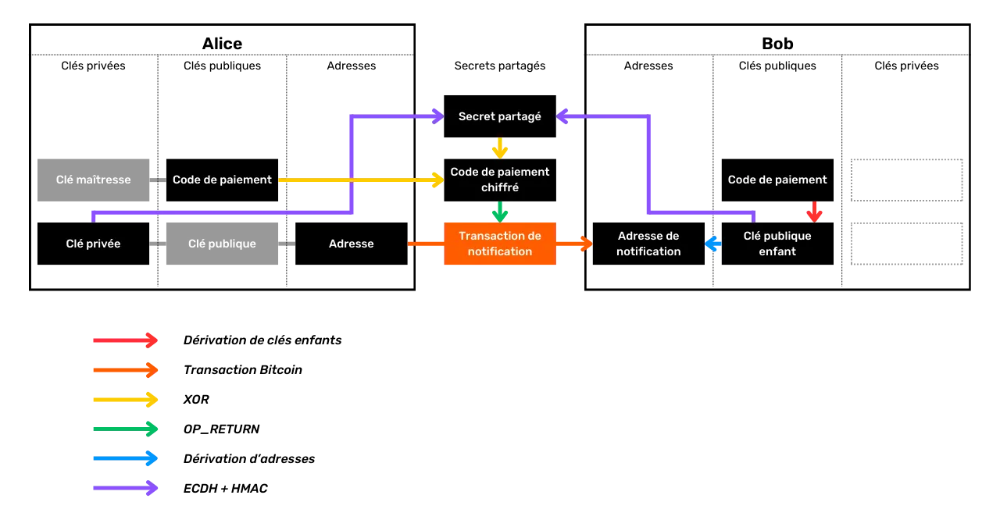

### लेन-देन सूचना: एक व्यावहारिक अध्ययन

यह समझने के लिए कि यह कैसे काम करता है, खासकर `OP_RETURN` के इस्तेमाल को, आइए एक असली नोटिफिकेशन ट्रांजैक्शन देखते हैं। मैंने ऐसा एक ट्रांजैक्शन Testnet पर किया था, जिसे आप [यहाँ क्लिक करके](https://Mempool.space/fr/Testnet/tx/0e2e4695a3c49272ef631426a9fd2dae6ec3a469e3a39a3db51aa476cd09de2e) देख सकते हैं।


इस लेन-देन को देखते हुए, हम पहले से ही देख सकते हैं कि इसमें एक इनपुट और 4 आउटपुट हैं:


- पहला आउटपुट है `OP_RETURN` जिसमें मेरा छुपा हुआ भुगतान कोड है;
- 546 Sats का दूसरा आउटपुट मेरे प्राप्तकर्ता की सूचना Address की ओर इशारा करता है;
- तीसरा आउटपुट 15,000 Sats सर्विस फीस को दर्शाता है, क्योंकि मैंने यह ट्रांजैक्शन बनाने के लिए समुराई Wallet का इस्तेमाल किया था;
- 20 लाख Sats का चौथा आउटपुट Exchange की दर को दर्शाता है, यानी मेरे इनपुट में बचा हुआ अंतर जो मेरे दूसरे Address में वापस चला जाता है।

सबसे दिलचस्प चीज़ पढ़ने के लिए है वो है आउटपुट 0 जो `OP_RETURN` का इस्तेमाल करता है। चलो देखते हैं इसमें क्या है। यह रहा `scriptPubKey` हेक्साडेसिमल में :

```text
6a4c50010002b13b2911719409d704ecc69f74fa315a6cb20fdd6ee39bc9874667703d67b164927b0e88f89f3f8b963549eab2533b5d7ed481a3bea7e953b546b4e91b6f50d800000000000000000000000000
```

इस स्क्रिप्ट के कई हिस्से हैं। पहला, :

```text
6a4c
```

ओपकोड्स में, हम `0x6a` को पहचान सकते हैं जो `OP_RETURN` को दर्शाता है और `0x4c` जो `OP_PUSHDATA1` को दर्शाता है।

इस लास्ट ऑपकोड के बाद वाला बाइट अगले पेलोड का साइज़ बताता है। यह `0x50` यानी 80 बाइट्स दिखा रहा है:

```text
6a4c50
```

अगला, हमारे पास मेरे पेमेंट कोड की मेटाडेटा साफ़ टेक्स्ट में है:

```text
010002
```

मेरे पेमेंट कोड की पब्लिक की का एन्क्रिप्टेड एब्सिस्सा :

```text
b13b2911719409d704ecc69f74fa315a6cb20fdd6ee39bc9874667703d67b164
```

मेरे पेमेंट कोड का एन्क्रिप्टेड स्ट्रिंग कोड :

```text
927b0e88f89f3f8b963549eab2533b5d7ed481a3bea7e953b546b4e91b6f50d8
```

और आखिर में, `OP_RETURN` के मानक आकार 80 बाइट्स तक पैडिंग करते हुए :

```text
00000000000000000000000000
```

आपको समझने में मदद के लिए, यहाँ मेरा भुगतान कोड सादे पाठ में बेस 58 में है:

```text
PM8TJQCyt6ovbozreUCBrfKqmSVmTzJ5vjqse58LnBzKFFZTwny3KfCDdwTqAEYVasn11tTMPc2FJsFygFd3YzsHvwNXLEQNADgxeGnMK8Ugmin62TZU
```

और बेस 16 में :

```text
4701000277507c9c17a89cfca2d3af554745d6c2db0e7f6b2721a3941a504933103cc42add94881210d6e752a9abc8a9fa0070e85184993c4f643f1121dd807dd556d1dc000000000000000000000000008604e4db
```

अगर हम मेरे सादे पाठ वाले पेमेंट कोड की `OP_RETURN` से तुलना करें, तो हम देख सकते हैं कि HRP (`0x47`) और चेकसम (`0x8604e4db`) ट्रांसमिट नहीं होते। यह सामान्य है, क्योंकि यह जानकारी इंसानों के लिए होती है।

अगला, हम वर्ज़न (`0x01`), बिट फील्ड (`0x00`) और पब्लिक की की पैरिटी (`0x02`) को पहचान सकते हैं। और, पेमेंट कोड के अंत में, खाली बाइट्स (`0x000000000000000000000000000000`) हैं जो पैडिंग के लिए होते हैं ताकि कुल 80 बाइट्स तक पहुँच सके। यह सारा मेटाडेटा बिना एन्क्रिप्ट किए ट्रांसमिट किया जाता है।

आखिरकार, हम देख सकते हैं कि पब्लिक की एब्सिस्सा (`0x77507c9c17a89cfca2d3af554745d6c2db0e7f6b2721a3941a504933103cc42a`) और स्ट्रिंग कोड (`0xdd94881210d6e752a9abc8a9fa0070e85184993c4f643f1121dd807dd556d1dc`) एन्क्रिप्ट किए गए हैं। यह पेमेंट कोड का पेलोड है।

### XOR क्या है?

हमने पिछले सेक्शन्स में देखा कि पेमेंट कोड XOR ऑपरेशन का इस्तेमाल करके एन्क्रिप्टेड ट्रांसमिट किया जाता है। आइए अब इस ऑपरेटर को करीब से समझते हैं, क्योंकि क्रिप्टोग्राफी में इसका बहुत ज्यादा इस्तेमाल होता है।

XOR एक बिटवाइज़ लॉजिकल ऑपरेटर है जो बूलियन अलजेब्रा पर आधारित है। दो ऑपरेंड्स को बिट्स में देने पर, यह `1` रिटर्न करता है अगर समान रैंक के बिट्स अलग-अलग हों, और `0` रिटर्न करता है अगर समान रैंक के बिट्स बराबर हों। यहाँ ऑपरेंड्स `D` और `E` के मानों के अनुसार XOR का ट्रूथ टेबल है:

| D | E | D XOR E |

| --- | --- | ------- |

| ० | ० | ० |

| ० | १ | १ |

| १ | ० | १ |

| १ | १ | ० |

उदाहरण के लिए:

$$
0110 \oplus 1110 = 1000
$$

या

$$
010011 \oplus 110110 = 100101
$$

ECDH के साथ, XOR को एन्क्रिप्शन Layer के रूप में इस्तेमाल करना खासतौर पर सुसंगत है। सबसे पहले, इस ऑपरेटर की वजह से, एन्क्रिप्शन सममित होता है। इसका मतलब है कि प्राप्तकर्ता पेमेंट कोड को उसी की से डिक्रिप्ट कर सकता है जिससे एन्क्रिप्ट किया गया था। एन्क्रिप्शन और डिक्रिप्शन कीज़ को ECDH का इस्तेमाल करके शेयर्ड सीक्रेट से कैलकुलेट किया जाता है। यह सममिति XOR ऑपरेटर के कम्यूटेटिविटी और एसोसिएटिविटी प्रॉपर्टीज़ की वजह से संभव होती है:


- अन्य गुण :

$$
D \oplus D = 0
$$

$$
D \oplus 0 = D
$$


- कम्यूटेटिविटी (Commutativity)

$$
D \oplus E = E \oplus D
$$


- साहचर्यता :

$$
D \oplus (E \oplus Z) = (D \oplus E) \oplus Z = D \oplus E \oplus Z
$$

अगर :

$$
D \oplus E = L
$$

फिर :

$$
D \oplus L = D \oplus (D \oplus E) = D \oplus D \oplus E = 0 \oplus E = E \\
\therefore D \oplus L = E
$$

दूसरा, यह एन्क्रिप्शन तरीका वर्नम (वन-टाइम पैड) सिफर से बहुत मिलता-जुलता है, जो अब तक का एकमात्र ज्ञात एन्क्रिप्शन एल्गोरिदम है जिसमें बिना शर्त (या पूर्ण) सुरक्षा होती है। वर्नम सिफर में यह विशेषता पाने के लिए, एन्क्रिप्शन की (key) बिल्कुल रैंडम होनी चाहिए, मैसेज के बराबर साइज़ की होनी चाहिए और सिर्फ एक बार इस्तेमाल की जानी चाहिए। BIP47 के लिए यहां इस्तेमाल किए गए एन्क्रिप्शन तरीके में, की वाकई मैसेज के बराबर साइज़ की है, और ब्लाइंडिंग फैक्टर पब्लिक की के एब्सिस्सा (abscissa) और पेमेंट कोड के स्ट्रिंग कोड के कॉन्कैटीनेशन के बराबर साइज़ का है। यह एन्क्रिप्शन की सिर्फ एक बार इस्तेमाल होती है। दूसरी तरफ, यह की परफेक्ट रैंडमनेस से नहीं बनी है, क्योंकि यह एक HMAC है। बल्कि, यह स्यूडो-रैंडम है। तो यह वर्नम सिफर तो नहीं है, लेकिन तरीका काफी करीब है।

### अधिसूचना लेनदेन की प्राप्ति

अब जब ऐलिस ने बॉब को नोटिफिकेशन ट्रांजैक्शन भेज दिया है, तो देखते हैं कि बॉब इसे कैसे समझता है। याद रखें, बॉब के पास ऐलिस का पेमेंट कोड होना चाहिए। इस जानकारी के बिना, जैसा कि हम अगले सेक्शन में देखेंगे, वह ऐलिस द्वारा बनाए गए की पेयर्स को एक्सेस नहीं कर पाएगा, और इसलिए BIP47 के जरिए मिले अपने बिटकॉइन्स तक नहीं पहुँच पाएगा। फिलहाल, ऐलिस का पेमेंट कोड पेलोड एन्क्रिप्टेड है। आइए देखते हैं कि बॉब इसे कैसे डिक्रिप्ट करता है।

**1-** बॉब अपने नोटिफिकेशन Address के साथ आउटपुट बनाने वाले ट्रांजैक्शन्स पर नज़र रखता है।

**2-** जब किसी लेन-देन (transaction) का नोटिफिकेशन Address पर आउटपुट होता है, तो बॉब (Bob) उसका विश्लेषण करता है कि क्या उसमें OP_RETURN का कोई आउटपुट है जो BIP47 मानक (standard) का पालन करता है।

**3-** अगर OP_RETURN पेलोड का पहला बाइट `0x01` है, तो बॉब ECDH के साथ शेयर किए गए संभावित रहस्य की तलाश शुरू करता है :


- बॉब लेन-देन के लिए इनपुट पब्लिक की का चयन करता है। यानी, ऐलिस की पब्लिक की जिसका नाम $A$ है, के साथ :

$$ A = a \cdot G $$


- बॉब ने अपने निजी नोटिफिकेशन Address से जुड़ी प्राइवेट की $b$ को चुना।

$$ b $$


- बॉब अंडाकार वक्र (elliptic curve) पर गुप्त बिंदु $S$ (ECDH साझा रहस्य) की गणना करता है, जिसमें वह बिंदुओं को जोड़ता और दोगुना करता है, तथा अपनी निजी कुंजी $b$ को ऐलिस की सार्वजनिक कुंजी $A$ पर लागू करता है:

$$ S = b \cdot A $$  

(हिंदी में: "एस बराबर बी गुणा ए")  

*Note: Since the original text is a mathematical equation, it remains the same in Hindi. The Hindi translation is provided in parentheses for context.*


- बॉब उस ब्लाइंडिंग फैक्टर $f$ को निर्धारित करता है जो ऐलिस के पेमेंट कोड के पेलोड को डिक्रिप्ट करने में सक्षम बनाएगा। ठीक उसी तरह जैसे ऐलिस ने पहले इसकी गणना की थी, बॉब $f$ को खोजने के लिए HMAC-SHA512 को $x$ (सीक्रेट पॉइंट $S$ के एब्सिस्सा वैल्यू) और $o$ (इस नोटिफिकेशन ट्रांजैक्शन के इनपुट के रूप में उपयोग किए गए UTXO) पर लागू करेगा:

$$ f = \text{HMAC-SHA512}(o, x) $$  

(हिंदी में: "एफ, ओ और एक्स का HMAC-SHA512 हैश है।")  

(नोट: टेक्निकल फॉर्मूला और फंक्शन नाम (जैसे HMAC-SHA512) को हिंदी में ट्रांसलेट नहीं किया जाता, इसलिए मूल फॉर्मेट में ही छोड़ दिया गया है। स्पष्टता के लिए हिंदी व्याख्या जोड़ी गई है।)

**4-** बॉब नोटिफिकेशन ट्रांजैक्शन में OP_RETURN डेटा को एक पेमेंट कोड के रूप में समझता है। वह इस संभावित पेमेंट कोड के पेलोड को $f$ ब्लाइंडिंग फैक्टर का उपयोग करके डिक्रिप्ट करेगा:


- बॉब ब्लाइंडिंग फैक्टर $f$ को 2 हिस्सों में बाँटता है: $f$ के पहले 32 बाइट्स $f1$ होंगे और आखिरी 32 बाइट्स $f2$ होंगे;
- बॉब, एलिस के भुगतान कोड की सार्वजनिक कुंजी से एन्क्रिप्टेड एब्सिसा $x'$ के मूल्य को डिक्रिप्ट करता है:

$$ x = x' \oplus f1 $$


- बॉब, एलिस के भुगतान कोड से एन्क्रिप्टेड स्ट्रिंग कोड $c'$ का मूल्य डिक्रिप्ट करता है:

$$ c = c' \oplus f2 $$

**5-** बॉब यह जाँचता है कि ऐलिस के पेमेंट कोड का पब्लिक की वैल्यू secp256k1 ग्रुप का हिस्सा है या नहीं। अगर हाँ, तो वह इसे एक वैध पेमेंट कोड मानता है। अगर नहीं, तो वह इस ट्रांजैक्शन को नज़रअंदाज़ कर देता है।

अब जब बॉब को ऐलिस का पेमेंट कोड पता चल गया है, तो ऐलिस उसे `2^32` तक पेमेंट भेज सकती है, बिना कभी इस तरह के नोटिफिकेशन ट्रांजैक्शन को दोहराने की ज़रूरत के।

यह कैसे काम करता है? बॉब, ऐलिस के समान ब्लाइंडिंग फैक्टर का पता कैसे लगा सकता है, और इस तरह उसके पेमेंट कोड को डिकोड कर सकता है? चलिए, हमने अभी जो ECDH की कार्रवाई बताई है, उस पर गहराई से नज़र डालते हैं।

सबसे पहले, हम सममित एन्क्रिप्शन (symmetric encryption) की बात कर रहे हैं। इसका मतलब है कि एन्क्रिप्शन की (encryption key) और डिक्रिप्शन की (decryption key) वैल्यू एक ही होती है। नोटिफिकेशन ट्रांजैक्शन में यह की ब्लाइंडिंग फैक्टर (blinding factor) होता है:

$$ f = f1 \text{ ya } f2 $$

इसलिए ऐलिस और बॉब को $f$ का एक ही मान प्राप्त करना होगा, बिना सीधे इसे ट्रांसमिट किए, क्योंकि एक हमलावर इसे चुराकर गोपनीय जानकारी को डिक्रिप्ट कर सकता है। यह ब्लाइंडिंग फैक्टर HMAC-SHA512 को 2 मानों पर लागू करके प्राप्त किया जाता है:


- एक गुप्त बिंदु का भुज ;
- और UTXO लेन-देन इनपुट पर खर्च हुआ।

बॉब को ऐलिस के पेमेंट कोड पेलोड को डिक्रिप्ट करने के लिए इन दोनों जानकारियों की जरूरत होती है। UTXO इनपुट के लिए, बॉब नोटिफिकेशन ट्रांजैक्शन को देखकर आसानी से इसे प्राप्त कर सकता है। सीक्रेट पॉइंट के लिए, बॉब को ECDH का उपयोग करना होगा। जैसा कि डिफी-हेलमैन पर पिछले सेक्शन में देखा गया था, बस अपने-अपने पब्लिक कीज़ का आदान-प्रदान करके और एक-दूसरे के पब्लिक की पर प्राइवेट की को गुप्त रूप से लगाकर, ऐलिस और बॉब दोनों एलिप्टिक कर्व पर एक सटीक सीक्रेट पॉइंट ढूंढ सकते हैं। नोटिफिकेशन ट्रांजैक्शन इसी मैकेनिज्म पर आधारित है:


- बॉब की चाबियों का जोड़ा

$$ B = b \cdot G $$  

(ट्रांसलेशन: यहाँ कोई टेक्स्ट ट्रांसलेट करने की ज़रूरत नहीं है क्योंकि यह एक मैथमेटिकल फॉर्मूला है, जिसे हिंदी में भी वैसे ही लिखा जाता है।)


- ऐलिस की कुंजी जोड़ी :

$$ A = a \cdot G $$  

(ट्रांसलेशन: यहाँ गणितीय समीकरण है, जिसे हिंदी में भी वैसे ही लिखा जाता है। "A बराबर a गुणा G")  

नोट: गणितीय फॉर्मूलों और समीकरणों को आमतौर पर हिंदी में भी अंग्रेज़ी नोटेशन में ही लिखा जाता है, क्योंकि यह एक यूनिवर्सल मैथमेटिकल एक्सप्रेशन है। लेकिन अगर आप चाहें तो इसे हिंदी में बोलचाल की भाषा में समझाया जा सकता है।


- एक गुप्त $S (x, y)$ के लिए:

$$ S = a \cdot B = a \cdot (b \cdot G) = (b \cdot a) \cdot G = b \cdot A $$  

(ट्रांसलेशन: यह एक मैथमेटिकल एक्सप्रेशन है, जिसमें सिंबल्स और फॉर्मूला को वैसे ही रखा गया है, क्योंकि यह स्टैंडर्ड नोटेशन है। हिंदी में इसे समझाने के लिए कहें तो:  
"एस, ए और बी का गुणनफल है, जहाँ बी खुद बी और जी का गुणनफल है। इसे (बी × ए) × जी के रूप में भी लिखा जा सकता है, जो अंततः बी × ए के बराबर होता है।")


अब जब बॉब को ऐलिस का पेमेंट कोड पता चल गया है, वह उसके BIP47 पेमेंट्स को पहचान पाएगा, और उसे मिले बिटकॉइन्स को ब्लॉक करने वाली प्राइवेट कीज़ भी निकाल पाएगा।

मैं अभी हमने साथ में देखे गए नोटिफिकेशन ट्रांजैक्शन को प्राप्त करने और समझने के चरणों को संक्षेप में बताऊंगा:


- बॉब अपने नोटिफिकेशन Address को ट्रांजैक्शन आउटपुट मॉनिटर करता है;
- जब यह एक का पता लगाता है, तो यह OP_RETURN में मौजूद जानकारी को पुनः प्राप्त करता है;
- बॉब पब्लिक की को इनपुट के तौर पर चुनता है और ECDH का इस्तेमाल करके एक सीक्रेट पॉइंट कैलकुलेट करता है;
- यह एक गुप्त बिंदु का उपयोग करके HMAC की गणना करता है, जो कि ब्लाइंडिंग फैक्टर है;
- यह OP_RETURN में मौजूद ऐलिस के पेमेंट कोड पेलोड को डिक्रिप्ट करने के लिए इस ब्लाइंडिंग फैक्टर का इस्तेमाल करता है।


### बीआईपी47 भुगतान लेनदेन

चलो BIP47 के पेमेंट प्रोसेस पर एक नज़र डालते हैं। आपको मौजूदा स्थिति की याद दिला दें:


- ऐलिस को बॉब का पेमेंट कोड पता है, जो उसने बस उसकी वेबसाइट से ले लिया था;
- बॉब को नोटिफिकेशन ट्रांजैक्शन से ऐलिस का पेमेंट कोड पता चल गया है;
- ऐलिस बॉब को अपना पहला भुगतान करेगी। वह इसी तरह से और भी कई भुगतान कर सकती है।

इस प्रक्रिया को समझाने से पहले, मुझे लगता है कि यह याद रखना ज़रूरी है कि हम फिलहाल किन इंडेक्सेस पर काम कर रहे हैं। पेमेंट कोड के लिए डेरिवेशन पथ इस तरह बताया गया है: `m/47'/0'/0'`। अगली गहराई इंडेक्सेस को इस तरह बांटती है:


- पहला सामान्य (नॉन-रिइन्फोर्स्ड) बेटी जोड़ी वह है जिसका इस्तेमाल generate नोटिफिकेशन Address में किया गया है, जिसकी चर्चा पिछले सेक्शन में हुई थी: `m/47'/0'/0'/0` ;
- सामान्य बेटी की (daughter key) जोड़ियों का इस्तेमाल ECDH से generate BIP47 पेमेंट रसीद पतों में किया जाता है, जैसा कि हम इस सेक्शन में देखेंगे: `m/47'/0'/0'/0` से `m/47'/0'/0'/2,147,483,647` तक ;
- रिइन्फोर्स्ड डॉटर की पेयर्स एफेमरल पेमेंट कोड्स होती हैं: `m/47'/0'/0'/0'` से `m/47'/0'/0'/2,147,483,647'` तक।

हर बार जब ऐलिस बॉब को पेमेंट भेजना चाहती है, वह एक नया, अनोखा, खाली Address डेरिव करती है, फिर से ECDH प्रोटोकॉल का इस्तेमाल करके:


- ऐलिस ने अपने पर्सनल रीयूज़ेबल पेमेंट कोड से प्राप्त पहली प्राइवेट की को चुना :

$$ एक $$


- ऐलिस ने बॉब के पेमेंट कोड से प्राप्त पहले अनइस्तेमाल पब्लिक की को चुना। हम इस पब्लिक की को $B$ कहेंगे। यह प्राइवेट की $b$ से जुड़ा है, जिसे सिर्फ बॉब जानता है:

$$ B = b \cdot G $$


- ऐलिस ने अपने प्राइवेट की $a$ का इस्तेमाल करके बॉब की पब्लिक की $B$ से एलिप्टिक कर्व पर एक गुप्त बिंदु $S$ की गणना की, जिसमें उसने पॉइंट्स को जोड़ा और डबल किया:

$$ S = a \cdot B $$  

(हिंदी में: "एस बराबर ए गुणा बी")


- इस गुप्त बिंदु से, ऐलिस साझा गुप्त $s$ (छोटा अक्षर) की गणना करती है। ऐसा करने के लिए, वह गुप्त बिंदु $S$ के भुज (एब्सिस्सा) को चुनती है जिसे $Sx$ कहा जाता है, और इस मान को SHA256 Hash फ़ंक्शन में पास करती है:

$$ S = (Sx, Sy) $$

$$ s = \text{SHA256}(Sx) $$  

(Note: Since this is a mathematical and cryptographic expression, it remains the same in Hindi as it's a universal formula. However, if you'd like a Hindi explanation, it would be: "s, Sx का SHA256 हैश है।")


- ऐलिस इस शेयर्ड सीक्रेट $s$ का इस्तेमाल Bitcoin पेमेंट रिसेप्शन Address कैलकुलेट करने के लिए करती है। पहले, वह चेक करती है कि $s$ सेकप256k1 कर्व के ऑर्डर में है या नहीं। अगर ऐसा नहीं होता है, तो वह बॉब की पब्लिक की इंडेक्स को इंक्रीमेंट करके एक और शेयर्ड सीक्रेट डेराइव करती है।
- दूसरे चरण में, वह अणुवक्र (elliptic curve) पर बिंदु $B$ और $s-G$ को जोड़कर एक सार्वजनिक कुंजी $K0$ की गणना करती है। दूसरे शब्दों में, ऐलिस बॉब के भुगतान कोड $B$ से प्राप्त सार्वजनिक कुंजी को एक अन्य बिंदु के साथ जोड़ती है, जिसकी गणना अणुवक्र पर साझा गुप्त $s$ और secp256k1 वक्र जनक बिंदु $G$ का उपयोग करके बिंदुओं को जोड़ने और दोगुना करने से की जाती है। यह नया बिंदु एक सार्वजनिक कुंजी का प्रतिनिधित्व करता है, और हम इसे $K0$ कहते हैं:

$$ K0 = B + s \cdot G $$  

(हिंदी में: "के-ज़ीरो बराबर बी प्लस एस डॉट जी")  

नोट: गणितीय समीकरणों और फॉर्मूले को आमतौर पर मूल भाषा (अंग्रेज़ी) में ही रखा जाता है, क्योंकि वे वैश्विक मानक होते हैं। हालाँकि, अगर आप चाहें तो इसे हिंदी में पढ़ने का तरीका ऊपर दिया गया है।


- इस पब्लिक की $K0$ के साथ, ऐलिस स्टैंडर्ड तरीके से एक ब्लैंक रिसीव Address डेरिव कर सकती है (जैसे कि SegWit V0 बेच32 में)।

एक बार ऐलिस ने बॉब का $K0$ Address प्राप्त कर लिया, तो वह मानक तरीके से Bitcoin लेनदेन कर सकती है। इसके लिए, वह एक UTXO चुनती है जो उसके पास है, जो उसके HD Wallet की एक अलग शाखा के की-पेयर द्वारा सुरक्षित है, और इसे बॉब के $K0$ Address के आउटपुट को पूरा करने के लिए उपयोग करती है। ध्यान देने वाली बात यह है कि यह भुगतान, एक बार Address डेरिव हो जाने के बाद, एक क्लासिक प्रक्रिया का पालन करता है और अब BIP47 से जुड़े कीज़ पर निर्भर नहीं करता।

मैं हमारे द्वारा अभी देखे गए BIP47 पेमेंट भेजने के स्टेप्स को संक्षेप में बताता हूँ:


- ऐलिस ने अपने पर्सनल पेमेंट कोड से डेरिव की गई पहली डॉटर प्राइवेट की का चयन किया;
- यह ECDH का इस्तेमाल करके अण्डाकार वक्र (elliptic curve) पर एक गुप्त बिंदु (secret point) की गणना करता है, जो बॉब के भुगतान कोड (payment code) से प्राप्त पहली अनइस्तेमाल बेटी सार्वजनिक कुंजी (first unused daughter public key) से लिया जाता है।
- यह SHA256 के साथ एक साझा रहस्य की गणना करने के लिए इस गुप्त बिंदु का उपयोग करता है ;
- वह इस साझे रहस्य का इस्तेमाल करके अण्डाकार वक्र (elliptic curve) पर एक नया गुप्त बिंदु (secret point) कैलकुलेट करती है;
- वो बॉब की पब्लिक की में यह नया सीक्रेट पॉइंट जोड़ देती है;
- वह एक नया अस्थायी सार्वजनिक कुंजी प्राप्त करती है जिसका संबंधित निजी कुंजी सिर्फ बॉब के पास होता है;
- ऐलिस बॉब को डेराइव्ड एफेमरल रिसीव Address के साथ एक क्लासिक ट्रांजैक्शन कर सकती है।

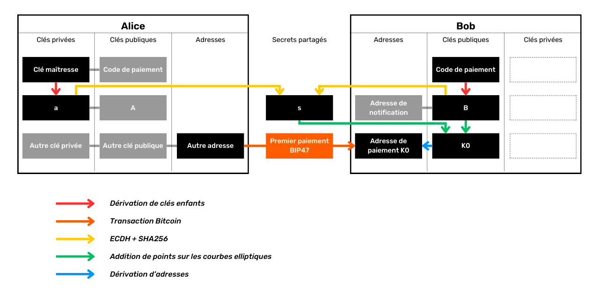

अगर ऐलिस दूसरा भुगतान करना चाहती है, तो वह पहले वाले स्टेप्स को ही फॉलो करेगी, बस इस बार वह बॉब के पेमेंट कोड से मिलने वाली दूसरी पब्लिक की को सेलेक्ट करेगी। खास तौर पर, वह अगली अनइस्तेमाल की को इस्तेमाल करेगी। इस तरह उसे बॉब की एक नई रिसीविंग Address मिलेगी, जिसे $K1$ कहा जाता है।


यह इसी तरह चल सकता है और बॉब से जुड़े `2^32` खाली पते प्राप्त कर सकता है।

बाहरी नज़र से देखें तो, Blockchain पर BIP47 पेमेंट और सामान्य पेमेंट में फर्क करना सैद्धांतिक रूप से नामुमकिन है। यहाँ Testnet पर एक BIP47 पेमेंट ट्रांजैक्शन का उदाहरण है:

```text
94b2e59510f2e1fa78411634c98a77bbb638e28fb2da00c9f359cd5fc8f87254
```

यह एक क्लासिक ट्रांजैक्शन लगता है जिसमें एक खर्च किया गया इनपुट, एक पेमेंट आउटपुट और Exchange रेट है:


### बीआईपी47 भुगतान की प्राप्ति और निजी कुंजी का व्युत्पत्ति

ऐलिस ने अभी बॉब के खाली BIP47 Address को अपनी पहली पेमेंट भेजी है। अब देखते हैं कि बॉब को यह पेमेंट कैसे मिलती है। हम यह भी देखेंगे कि ऐलिस के पास उस Address की प्राइवेट की क्यों नहीं है जो उसने खुद जनरेट की है, और बॉब को यह की कैसे मिलती है ताकि वह मिले बिटकॉइन्स खर्च कर सके।

जैसे ही बॉब को ऐलिस से नोटिफिकेशन ट्रांजैक्शन मिलता है, वह अपने कॉरेस्पॉन्डेंट के पेमेंट भेजने से पहले ही पब्लिक की BIP47 $K0$ डेराइव कर लेता है। इसलिए वह Address से जुड़े किसी भी पेमेंट को ऑब्जर्व करता है। असल में, वह तुरंत कई एड्रेसेज़ डेराइव कर लेता है जिन्हें वह ऑब्जर्व करता है ($K0$, $K1$, $K2$, $K3$...)। यहां बताया गया है कि यह पब्लिक की $K0$ कैसे डेराइव करता है:


- बॉब अपने पेमेंट कोड से प्राप्त पहली डॉटर प्राइवेट की को चुनता है। इस प्राइवेट की को $b$ नाम दिया गया है। यह पब्लिक की $B$ से जुड़ी हुई है, जिसका उपयोग एलिस ने पिछले चरण में अपने कैलकुलेशन के लिए किया था:

$$ b $$


- बॉब ऐलिस के पेमेंट कोड से प्राप्त उसकी पहली पब्लिक की को चुनता है। इस की को $A$ नाम दिया गया है। यह प्राइवेट की $a$ से जुड़ी हुई है, जिसका इस्तेमाल ऐलिस ने अपने कैलकुलेशन्स के लिए किया था, और जो सिर्फ ऐलिस को ही पता है। बॉब यह प्रक्रिया कर सकता है, क्योंकि उसे ऐलिस का पेमेंट कोड पता है, जो उसे नोटिफिकेशन ट्रांजैक्शन के साथ भेजा गया था:

$$ A = a \cdot G $$


- बॉब गुप्त बिंदु $S$ की गणना करता है, एलिप्टिक कर्व पर बिंदुओं को जोड़कर और दोगुना करके, अपनी प्राइवेट की $b$ को ऐलिस की पब्लिक की $A$ पर लागू करता है। यहाँ फिर से, ECDH का उपयोग यह सुनिश्चित करने के लिए किया जाता है कि यह बिंदु $S$ बॉब और ऐलिस दोनों के लिए समान होगा:

$$ S = b \cdot A $$  

(हिंदी में: "एस बराबर बी गुणा ए")


- जिस तरह ऐलिस ने किया, बॉब भी इस बिंदु $S$ के भुज को अलग करता है। हमने इस मान को $Sx$ नाम दिया है। वह इस मान को SHA256 फ़ंक्शन में डालकर साझा रहस्य $s$ (छोटे अक्षर में) ढूंढता है:

$$ s = \text{SHA256}(Sx) $$  

(ट्रांसलेशन: यहाँ कोई वास्तविक ट्रांसलेशन नहीं है क्योंकि यह एक मैथमेटिकल फॉर्मूला और टेक्निकल टर्म है, जिसे हिंदी में भी वैसे ही लिखा जाता है।)


- जिस तरह ऐलिस ने किया, बॉब भी एलिप्टिक कर्व पर $s-G$ पॉइंट कैलकुलेट करता है। फिर वह इस सीक्रेट पॉइंट को अपने पब्लिक की $B$ में जोड़ देता है। इस तरह उसे एलिप्टिक कर्व पर एक नया पॉइंट मिलता है, जिसे वह पब्लिक की $K0$ के रूप में इस्तेमाल करता है:

$$ K0 = B + s \cdot G $$  

(हिंदी में:  
$$ K0 = B + s \cdot G $$  

यहाँ,  
- \( K0 \) एक पब्लिक की है,  
- \( B \) बेस पॉइंट है,  
- \( s \) एक सीक्रेट स्केलर (प्राइवेट की) है,  
- \( G \) जनरेटर पॉइंट है,  
- \( \cdot \) एलिप्टिक कर्व स्केलर मल्टीप्लिकेशन को दर्शाता है।)  

नोट: गणितीय समीकरणों को उनके मूल रूप में छोड़ दिया जाता है, क्योंकि वे सार्वभौमिक हैं। व्याख्या स्पष्टता के लिए हिंदी में दी गई है।

एक बार बॉब के पास यह पब्लिक की $K0$ हो जाती है, तो वह अपने बिटकॉइन खर्च करने के लिए इससे जुड़ी प्राइवेट की डेरिव कर सकता है। सिर्फ वही इस प्राइवेट की को generate कर सकता है:


- बॉब अपनी बेटी की प्राइवेट की $b$ को अपने पर्सनल पेमेंट कोड से जोड़ता है। सिर्फ वही $b$ का मान प्राप्त कर सकता है। फिर वह $b$ को शेयर्ड सीक्रेट $s$ में जोड़कर $k0$ प्राप्त करता है, जो $K0$ की प्राइवेट की है:

$$ k0 = b + s $$

अंडाकार वक्र (elliptic curve) के समूह नियम के कारण, बॉब को ठीक वही निजी कुंजी (private key) मिलती है जो ऐलिस द्वारा इस्तेमाल की गई सार्वजनिक कुंजी (public key) से मेल खाती है। इसलिए हमारे पास है:

$$ K0 = k0 \cdot G $$

मैं हमारे द्वारा अभी देखे गए BIP47 भुगतान प्राप्त करने और संबंधित प्राइवेट की गणना करने के चरणों को संक्षेप में बताऊंगा:


- बॉब अपने पर्सनल पेमेंट कोड से डेरिव की गई पहली डॉटर प्राइवेट की को सेलेक्ट करता है ;
- यह ऍलिप्टिक कर्व पर एक गुप्त बिंदु की गणना करता है, ईसीडीएच का इस्तेमाल करके, ऐलिस के स्ट्रिंग कोड से प्राप्त पहली डॉटर पब्लिक की से।
- यह इस गुप्त बिंदु का इस्तेमाल SHA256 के साथ एक साझा रहस्य की गणना करने के लिए करता है ;
- वह इस साझा रहस्य का इस्तेमाल करके अण्डाकार वक्र (elliptic curve) पर एक नया गुप्त बिंदु निकालता है;
- वो अपने निजी पब्लिक की में ये नया सीक्रेट पॉइंट जोड़ देता है;
- वह एक नया अस्थायी सार्वजनिक कुंजी प्राप्त करता है, जिस पर ऐलिस अपना पहला भुगतान भेजेगी;
- बॉब इस अस्थायी पब्लिक की से जुड़ी प्राइवेट की को कैलकुलेट करता है अपनी डॉटर की प्राइवेट की (जो उसके पेमेंट कोड से डेरिव की गई है) और शेयर्ड सीक्रेट को जोड़कर।

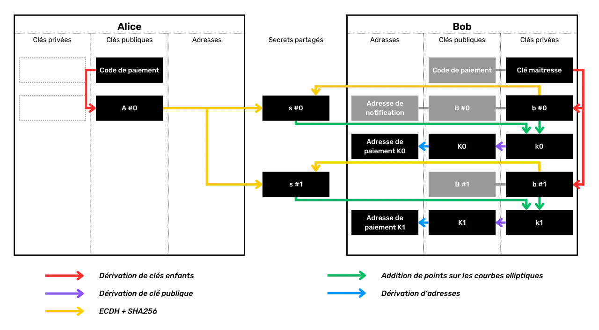

चूंकि ऐलिस $b$ (बॉब की प्राइवेट की) हासिल नहीं कर सकती, वह $k0$ (बॉब के BIP47 रिसेप्शन Address से जुड़ी प्राइवेट की) का पता नहीं लगा सकती। स्कीमैटिकली, हम शेयर्ड सीक्रेट $S$ की गणना को इस तरह दिखा सकते हैं:


एक बार ECDH के साथ साझा रहस्य मिल जाने के बाद, ऐलिस और बॉब BIP47 भुगतान सार्वजनिक कुंजी $K0$ की गणना करते हैं, और बॉब संबंधित निजी कुंजी $k0$ की भी गणना करता है:

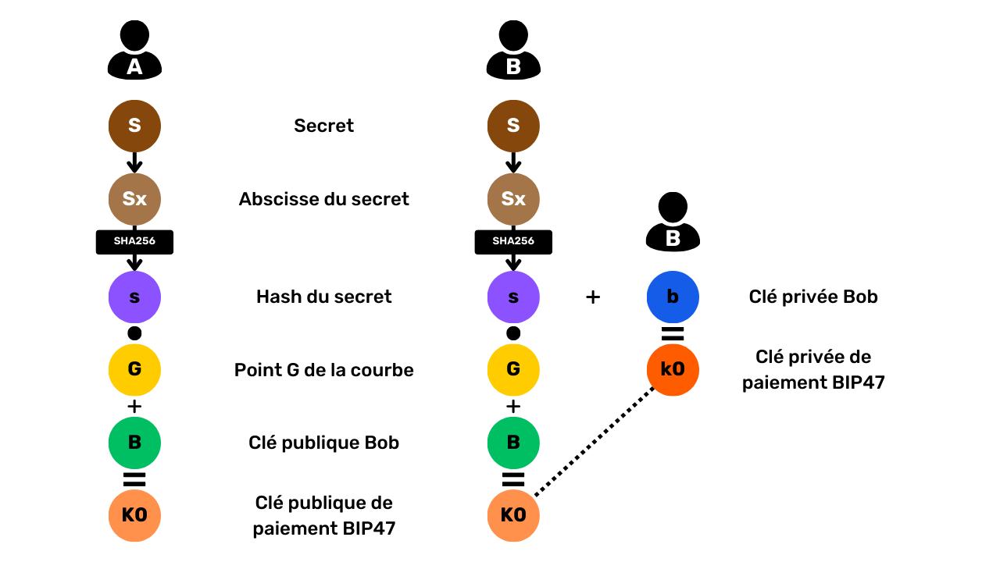

### BIP47 भुगतान की वापसी

चूंकि बॉब को ऐलिस का रीयूज़ेबल पेमेंट कोड पता है, इसलिए उसके पास रिफंड भेजने के लिए पहले से ही सारी ज़रूरी जानकारी है। उसे ऐलिस से कोई और जानकारी माँगने के लिए फिर से संपर्क करने की ज़रूरत नहीं होगी। उसे बस एक नोटिफिकेशन ट्रांजैक्शन के ज़रिए उसे सूचित करना होगा, ताकि ऐलिस अपने seed से अपने BIP47 एड्रेसेस रिट्रीव कर सके, और फिर वह उसे `2^32` तक पेमेंट्स भी भेज सकता है।

रिफंड की सुविधा BIP47 के लिए विशिष्ट है और यह अन्य तरीकों, जैसे कि साइलेंट पेमेंट्स (जिसे हम आगे के अध्यायों में देखेंगे), पर इसका एक फायदा है।

बॉब फिर ऐलिस को उसी तरह पैसे वापस कर सकता है जैसे उसने उसे भुगतान भेजे थे। भूमिकाएँ उलट जाती हैं:

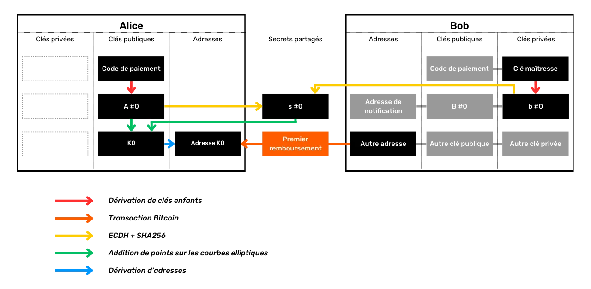

*इस अध्याय को लिखने की प्रेरणा देने वाले लेख पर उनकी समीक्षा और विशेषज्ञ सलाह के लिए [फैनिस मिचालाकिस](https://x.com/FanisMichalakis) को बहुत-बहुत धन्यवाद!*

https://planb.network/tutorials/privacy/on-chain/paynym-bip47-a492a70b-50eb-4f95-a766-bae2c5535093
## चुपके भुगतान

<chapterId>2871d594-414e-4598-a830-91c9eb84dfb8</chapterId>

BIP47 को इसकी ऑनचेन अक्षमता के लिए व्यापक रूप से आलोचना मिली है। जैसा कि पिछले अध्याय में बताया गया है, हर नए प्राप्तकर्ता के लिए एक नोटिफिकेशन ट्रांजैक्शन करना जरूरी होता है। यह बाधा नगण्य हो जाती है अगर हम इस प्राप्तकर्ता के साथ एक स्थायी पेमेंट चैनल स्थापित करने की योजना बनाते हैं। वास्तव में, एक ही नोटिफिकेशन ट्रांजैक्शन के बाद BIP47 पेमेंट्स की लगभग अनंत संख्या में भुगतान किए जा सकते हैं।

हालांकि, कुछ खास स्थितियों में, नोटिफिकेशन ट्रांजैक्शन यूजर के लिए एक रुकावट बन सकता है। चलिए एक बार के दान (वन-ऑफ डोनेशन) का उदाहरण लेते हैं: क्लासिक Bitcoin या Address के साथ, दान पूरा करने के लिए सिर्फ एक ट्रांजैक्शन काफी होता है। लेकिन BIP47 के साथ, दो ट्रांजैक्शन्स की जरूरत पड़ती है—एक नोटिफिकेशन के लिए और दूसरा असली पेमेंट के लिए। जब ब्लॉक स्पेस की डिमांड कम हो और ट्रांजैक्शन फीस कम हो, तो यह एक्स्ट्रा स्टेप आमतौर पर कोई दिक्कत नहीं होती। मगर जब नेटवर्क कंजेशन होता है, तो ट्रांजैक्शन फीस एक ही पेमेंट के लिए बहुत ज्यादा हो सकती है, जिससे यूजर का खर्च स्टैंडर्ड Bitcoin ट्रांजैक्शन के मुकाबले लगभग दोगुना हो सकता है। यह यूजर के लिए नाकाबिल-ए-कबूल हो सकता है।

ऐसी स्थितियों में जहां यूज़र सिर्फ कुछ ही पेमेंट्स एक स्थिर आइडेंटिफायर (static identifier) को करने की योजना बना रहा है, दूसरे समाधान भी विकसित किए गए हैं। इनमें से एक है "साइलेंट पेमेंट्स" (Silent Payments), जिसका वर्णन [BIP352](https://github.com/Bitcoin/bips/blob/master/bip-0352.mediawiki) में किया गया है। यह प्रोटोकॉल एक स्थिर आइडेंटिफायर का उपयोग करके पेमेंट प्राप्त करने की सुविधा देता है, बिना Address के दोबारा उपयोग (reuse) की समस्या पैदा किए, और नोटिफिकेशन ट्रांजैक्शन्स (notification transactions) के इस्तेमाल की ज़रूरत के बिना। आइए देखते हैं कि यह प्रोटोकॉल कैसे काम करता है।

---
*इस अध्याय को पूरी तरह से समझने के लिए, ECDH (एलिप्टिक कर्व डिफी-हैलमैन) और HD Wallet में क्रिप्टोग्राफिक कुंजी व्युत्पत्ति (क्रिप्टोग्राफिक की डेरिवेशन) के कामकाज को मास्टर करना ज़रूरी है। ये कॉन्सेप्ट्स पिछले अध्याय BIP47 में डिटेल में कवर किए गए थे। मैं यहाँ उन्हें दोहराऊँगा नहीं। अगर आप अभी तक इन कॉन्सेप्ट्स से वाकिफ़ नहीं हैं, तो मैं सुझाव दूँगा कि आप इस अध्याय को आगे बढ़ाने से पहले पिछला अध्याय देख लें। मैं यहाँ रिसीविंग एड्रेस के दोबारा इस्तेमाल से जुड़े रिस्क्स या पेमेंट्स प्राप्त करने के लिए यूनिक आइडेंटिफायर की अहमियत पर फिर से नहीं बताऊँगा।* मैं बस कुछ ख़ास बिंदु यहाँ बताना चाहूँगा जो मैं यहाँ रखना चाहता हूँ।*

---
### नोटिफिकेशन को हटा क्यों नहीं देते?

जैसा कि BIP47 अध्याय में चर्चा की गई है, नोटिफिकेशन ट्रांजैक्शन के दो मुख्य काम होते हैं:


- यह प्राप्तकर्ता को सूचित करता है ;
- यह भेजने वाले का भुगतान कोड ट्रांसमिट करता है।

कोई भी सीधे-सादे तरीके से सोच सकता है कि यह सूचना प्रक्रिया off-chain के जरिए की जा सकती है। सिद्धांत रूप में, यह बिल्कुल संभव है: प्राप्तकर्ता को केवल भेजने वालों से BIP47 भुगतान कोड प्राप्त करने के लिए संचार का एक साधन बताना होगा। हालाँकि, इस तरीके में दो बड़ी समस्याएँ हैं:


- सबसे पहले, यह कोड ट्रांसमिशन प्रक्रिया को एक और कम्युनिकेशन प्रोटोकॉल पर शिफ्ट कर देगा। Exchange से जुड़ी लागत और गोपनीयता की समस्याएं बनी रहेंगी, लेकिन बस इस नए प्रोटोकॉल पर ट्रांसफर हो जाएंगी। गोपनीयता के मामले में, यह यूजर की पहचान और ऑनचेन एक्टिविटी के बीच एक लिंक भी बना सकता है, जिससे हम Blockchain पर सीधे नोटिफिकेशन करके बचना चाहते हैं। इसके अलावा, Blockchain के बाहर नोटिफिकेशन करने से सेंसरशिप के रिस्क (जैसे फंड्स को ब्लॉक करना) पैदा हो सकते हैं, जो Bitcoin पर मौजूद नहीं हैं;
- दूसरा, इससे रिकवरी की समस्या पैदा होगी। BIP47 के साथ, फंड तक पहुंचने के लिए रिसिपिएंट को सेंडर्स के पेमेंट कोड्स पता होने चाहिए। यह रिसीप्ट पर तो सही है, लेकिन अगर Wallet खो जाए तो seed के जरिए फंड रिकवर करते समय भी यही सच है। ऑनचेन नोटिफिकेशन के साथ, यह रिस्क नहीं होता, क्योंकि यूजर अपने seed को जानकर ही नोटिफिकेशन ट्रांजेक्शन को रिट्रीव और डिक्रिप्ट कर सकता है। हालांकि, अगर नोटिफिकेशन Blockchain के बाहर किया जाता है, तो यूजर को मिले सभी पेमेंट कोड्स का डायनामिक बैकअप रखना पड़ेगा, जो आम यूजर के लिए प्रैक्टिकल नहीं है।

ये सारी पाबंदियाँ BIP47 के लिए ऑनचेन नोटिफिकेशन के इस्तेमाल को ज़रूरी बना देती हैं। हालाँकि, Silent Payments इसी ऑनचेन नोटिफिकेशन स्टेप से बचना चाहते हैं क्योंकि इसकी लागत होती है। इसलिए अपनाया गया समाधान नोटिफिकेशन को हटाना नहीं, बल्कि पूरी तरह से खत्म करना है। इसे हासिल करने के लिए, एक समझौता करना पड़ता है: स्कैनिंग। BIP47 के विपरीत, जहाँ यूज़र को नोटिफिकेशन ट्रांजैक्शन्स की वजह से पता होता है कि उसके फंड्स कहाँ मिलेंगे, Silent Payments में यूज़र को अपने लिए भेजे गए किसी भी पेमेंट का पता लगाने के लिए सभी मौजूदा Bitcoin ट्रांजैक्शन्स को जाँचना पड़ता है। इस ऑपरेशनल बोझ को कम करने के लिए, Silent Payments की खोज केवल उन्हीं ट्रांजैक्शन्स तक सीमित रखी जाती है जिनमें ऐसे पेमेंट्स हो सकते हैं, यानी कम से कम एक Taproot P2TR आउटपुट वाले ट्रांजैक्शन्स। स्कैन Wallet के क्रिएशन डेट (अगर Wallet 2024 में बना है तो 2009 के पुराने ट्रांजैक्शन्स को स्कैन करने की कोई ज़रूरत नहीं) से ही ट्रांजैक्शन्स पर फोकस करता है।

तो आप समझ सकते हैं कि BIP47 और साइलेंट पेमेंट्स, हालांकि एक समान उद्देश्य को ध्यान में रखकर बनाए गए हैं, लेकिन इनमें अलग-अलग समझौते होते हैं और इसलिए **ये वास्तव में अलग-अलग उपयोग के मामलों को पूरा करते हैं**। एक बार के भुगतानों के लिए, जैसे कि एक बार के दान, साइलेंट पेमेंट्स ज़्यादा उपयुक्त होते हैं क्योंकि इनकी लागत कम होती है। वहीं, एक ही प्राप्तकर्ता को नियमित लेन-देन के लिए, जैसे कि Exchange प्लेटफॉर्म्स या Mining पूल्स के मामले में, BIP47 को प्राथमिकता दी जा सकती है।

चलो, Silent Payments के टेक्निकल ऑपरेशन को समझने के लिए एक नज़र डालते हैं, ताकि हम बेहतर समझ सकें कि इसमें क्या दांव पर लगा है। इसके लिए, मैं सुझाव देता हूँ कि हम BIP352 एक्सप्लेनेटरी डॉक्यूमेंट वाला ही तरीका अपनाएं। हम धीरे-धीरे किए जाने वाले कैलकुलेशन्स को तोड़ेंगे, एक-एक एलिमेंट के हिसाब से, और हर नए एडिशन को जस्टिफाई करेंगे।

### कुछ समझने के लिए अवधारणाएँ

शुरुआत करने से पहले, यह बताना ज़रूरी है कि साइलेंट पेमेंट्स सिर्फ P2TR (*Pay to Taproot*) स्क्रिप्ट टाइप्स का इस्तेमाल करते हैं। BIP47 की तरह, चाइल्ड पब्लिक कीज़ से रिसीविंग एड्रेस डेरिव करने के लिए हैशिंग की ज़रूरत नहीं होती। P2TR स्टैंडर्ड में, ट्वीक्ड पब्लिक की को सीधे और बिना एन्क्रिप्शन के Address में इस्तेमाल किया जाता है। तो एक Taproot रिसीव Address असल में कुछ मेटाडेटा के साथ एक पब्लिक की होती है। यह ट्वीक्ड पब्लिक की दूसरी दो पब्लिक कीज़ का कॉम्बिनेशन होता है: एक जो डायरेक्ट, पारंपरिक स्पेंडिंग को सिंपल सिग्नेचर के ज़रिए एनेबल करती है, और दूसरी जो MAST के Merkle Root को रिप्रेजेंट करती है, जो Merkle Tree में लिखी गई किसी एक कंडीशन को पूरा करने पर स्पेंडिंग को अथॉराइज़ करती है।


इस फैसले के पीछे दो मुख्य वजहें हैं जिसमें साइलेंट पेमेंट्स को सिर्फ Taproot तक ही सीमित रखा गया है:


- सबसे पहले, यह पोर्टफोलियो सॉफ्टवेयर में कार्यान्वयन और भविष्य के अपग्रेड को काफी आसान बना देता है, क्योंकि केवल एक मानक का पालन करना होता है;
- दूसरा, यह तरीका यूजर्स की अनॉनसेट को बेहतर करने में मदद करता है, क्योंकि यह उन्हें अलग-अलग तरह के स्क्रिप्ट्स के बीच खुद को बाँटने से रोकता है, जिससे चेन एनालिसिस में generate अलग पोर्टफोलियो फिंगरप्रिंट्स बनते हैं (इस कॉन्सेप्ट के बारे में ज्यादा जानकारी के लिए पार्ट 2 के चैप्टर 4 देखें)।

### साइलेंट पेमेंट्स पब्लिक की का सरल व्युत्पत्ति

चलो एक साधारण उदाहरण से शुरू करते हैं ताकि हम SPs (साइलेंट पेमेंट्स) के काम करने के तरीके को समझ सकें। एलिस और बॉब, ये दो Bitcoin यूज़र्स हैं। एलिस बॉब को बिटकॉइन भेजना चाहती है एक खाली Address रिसीविंग पर। इस प्रक्रिया के तीन मुख्य उद्देश्य हैं:


- ऐलिस को generate को खाली Address करने में सक्षम होना चाहिए;
- बॉब को इस खास Address को भेजे गए भुगतान की पहचान करनी चाहिए;
- बॉब को अपने पैसे खर्च करने के लिए इस Address से जुड़ी प्राइवेट की प्राप्त करने में सक्षम होना चाहिए।

ऐलिस के पास उसके सुरक्षित Bitcoin Wallet में एक UTXO है, जिसमें निम्नलिखित की-पेयर है:


- $a$: निजी कुंजी ;
- $A$: सार्वजनिक कुंजी ($A = a \cdot G$)

बॉब के पास एक SP Address है जिसे उसने इंटरनेट पर पब्लिश किया है:


- $b$: निजी कुंजी ;
- $B$: सार्वजनिक कुंजी ($B = b \cdot G$)

बॉब का Address पाकर, ऐलिस ECDH का इस्तेमाल करके बॉब का एक नया खाली Address कैलकुलेट कर पाती है। इसे हम Address $P$ कहेंगे:

$$ P = B + \text{Hash}(a \cdot B) \cdot G $$  

(Note: Since this is a mathematical equation with symbols and variables, the translation remains the same in Hindi as it's a universal representation. However, if you'd like an explanation in colloquial Hindi, here it is:)

**हिंदी में समझाएं तो:**  
"P बराबर है B जमा Hash (a गुणा B) गुणा G।"  

(लेकिन गणितीय समीकरण को उसी रूप में छोड़ दिया गया है क्योंकि यह सभी भाषाओं में एक जैसा लिखा जाता है।)

इस समीकरण में, ऐलिस ने बस अपने प्राइवेट की $a$ और बॉब के पब्लिक की $B$ का स्केलर प्रोडक्ट कैलकुलेट किया है। उसने इस रिजल्ट को एक Hash फंक्शन में पास किया जो सभी को पता है। फिर जो वैल्यू मिलती है, उसे एलिप्टिक कर्व `secp256k1` के जनरेटिंग पॉइंट $G$ से स्केलरली मल्टीप्लाई किया जाता है। आखिर में, ऐलिस रिजल्टिंग पॉइंट को बॉब के पब्लिक की $B$ में जोड़ देती है। एक बार ऐलिस के पास यह Address $P$ आ जाता है, तो वह इसे एक ट्रांजैक्शन में आउटपुट के तौर पर यूज़ करती है, यानी वह इस पर बिटकॉइन भेजती है।

> *साइलेंट पेमेंट्स के संदर्भ में, "Hash" फंक्शन एक SHA256 Hash फंक्शन से मेल खाता है, जिसे विशेष रूप से `BIP0352/SharedSecret` के साथ टैग किया गया है। यह सुनिश्चित करता है कि जो हैश जनरेट होते हैं, वे इस प्रोटोकॉल के लिए यूनिक हों और दूसरे संदर्भों में दोबारा इस्तेमाल न किए जा सकें। साथ ही, यह सिग्नेचर्स में नॉन्स के दोबारा इस्तेमाल के खिलाफ अतिरिक्त सुरक्षा भी प्रदान करता है। यह स्टैंडर्ड उस [BIP340 में बताए गए स्पेसिफिकेशन](https://github.com/Bitcoin/bips/blob/master/bip-0340.mediawiki) से मेल खाता है, जो `secp256k1` पर स्क्नोर सिग्नेचर्स के लिए है।*
ECDH के आधार वाले अण्डाकार वक्र (elliptic curve) के गुणों की वजह से, हमें पता है कि :

$$ a \cdot B = b \cdot A $$  

(हिंदी में: "a गुणा B, b गुणा A के बराबर है।")  

(Note: Since the original text is a mathematical equation, the translation retains the formula as-is and provides a Hindi explanation in parentheses.)

बॉब इसलिए उस रिसीविंग Address की गणना कर पाएगा जिसे एलिस ने बिटकॉइन भेजे हैं। ऐसा करने के लिए, वह सभी Bitcoin लेन-देन पर नजर रखता है जो साइलेंट पेमेंट्स के मानदंडों को पूरा करते हैं और यह देखने के लिए कि क्या भुगतान उसके नाम है, वह उनमें से प्रत्येक पर निम्नलिखित गणना लागू करता है (*स्कैनिंग*):

$$ P' = B + \text{Hash}(b \cdot A) \cdot G $$

जब वो ऐलिस के लेन-देन को स्कैन करता है, तो उसे पता चलता है कि $P'$ बराबर है $P$ के। इसलिए वो जान जाता है कि भुगतान उसके लिए है:

$$ P' = B + \text{Hash}(b \cdot A) \cdot G = B + \text{Hash}(a \cdot B) \cdot G = P $$  

(ट्रांसलेशन: यह एक मैथमेटिकल एक्वेशन है, जिसे हिंदी में वैसे ही लिखा जाता है। कोलोक्वियल हिंदी में इसका मतलब होगा: "P प्राइम, B के बराबर है प्लस Hash फंक्शन ऑफ (b गुणा A) गुणा G, जो कि B प्लस Hash ऑफ (a गुणा B) गुणा G के बराबर है, और यह P के बराबर है।")  

नोट: मैथमेटिकल एक्वेशन्स और टेक्निकल टर्म्स को हिंदी में ट्रांसलेट नहीं किया जाता, इसलिए मैंने सिर्फ एक्सप्लेनेशन दिया है।

यहां से, बॉब प्राइवेट की $p$ की गणना कर पाएगा जो Address $P$ को खर्च करने की अनुमति देता है:

$$ p = (b + \text{Hash}(b \cdot A)) \mod n $$  

(हिंदी में:  
$$ p = (b + \text{Hash}(b \cdot A)) \mod n $$)  

*नोट:* गणितीय फ़ॉर्मूला और फंक्शन नाम (जैसे "Hash") को उनके मूल रूप में ही रखा गया है, क्योंकि ये तकनीकी टर्म्स हैं और इनका अनुवाद नहीं किया जाता।*

जैसा कि आप देख सकते हैं, इस प्राइवेट की $p$ को कैलकुलेट करने के लिए, आपके पास प्राइवेट की $b$ होनी चाहिए। यह प्राइवेट की $b$ सिर्फ बॉब के पास है। इसलिए वही एकमात्र व्यक्ति होगा जो अपने साइलेंट पेमेंट्स Address पर भेजे गए बिटकॉइन्स खर्च कर पाएगा।


*किंवदंती:*


- $B$ : बॉब द्वारा प्रकाशित सार्वजनिक कुंजी/स्थिर Address
- $b$ : बॉब की निजी कुंजी
- $A$ : ऐलिस का UTXO पब्लिक की जो ट्रांजैक्शन इनपुट में इस्तेमाल हुआ
- $a$ : ऐलिस की निजी कुंजी
- $G$ : अंडाकार वक्र `secp256k1` का जनरेटिंग पॉइंट
- $\text{SHA256}$ : `BIP0352/SharedSecret` से टैग किया गया SHA256 Hash फंक्शन
- $s$ : ECDH का साझा रहस्य
- $P$ : भुगतान के लिए बॉब की सार्वजनिक कुंजी/अनोखा Address

यहाँ बॉब के स्थिर Address, जिसे $B$ से दर्शाया गया है, का उपयोग करके बिटकॉइन भेजने के लिए एक अनोखा Address $P$ प्राप्त करने का एक बहुत ही सरल शुरुआती तरीका है। हालाँकि, यह तरीका बहुत ही बुनियादी है और इसमें कई कमियाँ हैं जिन्हें ठीक करने की जरूरत है। पहली समस्या यह है कि इस योजना में, ऐलिस एक ही लेन-देन में बॉब को कई आउटपुट नहीं बना सकती।

### कई आउटपुट कैसे बनाऊं?

पिछले सेक्शन के उदाहरण में, ऐलिस एक आउटपुट बनाती है जो बॉब को उसके यूनिक Address $P$ पर मिलेगा। चुने गए समान इनपुट के साथ, ऐलिस के लिए बॉब के लिए दो अलग ब्लैंक एड्रेस बनाना असंभव है, क्योंकि इस्तेमाल की गई मेथड हमेशा $P$ के लिए एक ही नतीजा देगी, यानी वही Address। हालांकि, कई स्थितियाँ हो सकती हैं जहाँ ऐलिस बॉब को अपना भुगतान कई छोटी रकमों में बाँटना चाहती है, इस तरह कई UTXO बना कर। इसलिए, इसे हासिल करने का एक तरीका ढूँढना ज़रूरी है।

इसे हासिल करने के लिए, हम ऐलिस द्वारा $P$ निकालने के लिए की जाने वाली गणना में थोड़ा बदलाव करने जा रहे हैं, ताकि वह बॉब के लिए दो अलग-अलग पतों, यानी $P_0$ और $P_1$, को generate कर सके।

गणना को बदलने और 2 अलग-अलग पते पाने के लिए, बस एक पूर्णांक जोड़ें जो परिणाम को बदल दे। इस तरह, ऐलिस अपनी गणना में $0$ जोड़कर Address $P_0$ और $1$ जोड़कर Address $P_1$ प्राप्त करेगी। आइए इस पूर्णांक को $i$ कहते हैं:

$$ P_i = B + \text{Hash}(a \cdot B \text{ ‖ } i) \cdot G $$  

(नोट: यह एक गणितीय समीकरण है, जिसमें विशेष नोटेशन और फ़ंक्शन शामिल हैं। इसे हिंदी में अनुवाद करने की आवश्यकता नहीं है, क्योंकि गणितीय संकेत और फ़ॉर्मूले सार्वभौमिक हैं।)

गणना प्रक्रिया पिछली विधि से अपरिवर्तित रहती है, सिवाय इसके कि इस बार ऐलिस Hash के साथ आगे बढ़ने से पहले $a \cdot B$ को $i$ के साथ जोड़ देगी। फिर आप बस $i$ को संशोधित करके बॉब से संबंधित एक नया Address प्राप्त करते हैं। उदाहरण के लिए:

$$ P_0 = B + \text{Hash}(a \cdot B \text{ ‖ } 0) \cdot G $$

$$ P_1 = B + \text{Hash}(a \cdot B \text{ ‖ } 1) \cdot G $$  

(Note: Since the given text is a mathematical equation with symbols and functions, it remains the same in Hindi as it is a universal representation. However, if you'd like an explanation in Hindi, here it is:)  

**हिंदी व्याख्या:**  
$$ P_1 $$, $$ B $$ और $$ \text{Hash}(a \cdot B \text{ ‖ } 1) \cdot G $$ का योग है।  
यहाँ,  
- $$ \text{Hash} $$ एक फ़ंक्शन है जो इनपुट $$ (a \cdot B \text{ ‖ } 1) $$ लेता है।  
- $$ \text{‖} $$ कॉन्कैटनेशन (जोड़ने) को दर्शाता है।  
- $$ G $$ एक स्केलर या मैट्रिक्स हो सकता है।  

(मूल समीकरण को गणितीय संकेतों में ही छोड़ा गया है क्योंकि यह सार्वभौमिक है।)

जब बॉब Blockchain को साइलेंट पेमेंट्स के लिए स्कैन करता है जो उसके लिए हैं, तो वह Address $P_0$ के लिए $i = 0$ का इस्तेमाल करके शुरू करता है। अगर उसे $P_0$ पर कोई पेमेंट नहीं मिलता, तो वह नतीजा निकालता है कि इस ट्रांजैक्शन में उसके लिए कोई साइलेंट पेमेंट नहीं है, और स्कैन छोड़ देता है। हालाँकि, अगर $P_0$ वैध है और उसके लिए एक पेमेंट रखता है, तो वह ऐलिस ने दूसरा पेमेंट किया है या नहीं यह जाँचने के लिए उसी ट्रांजैक्शन में $P_1$ के साथ आगे बढ़ता है। अगर $P_1$ अवैध निकलता है, तो वह इस ट्रांजैक्शन के लिए खोज बंद कर देता है; वरना, वह अगले $i$ वैल्यूज़ को टेस्ट करना जारी रखता है:

$$ P_0 = B + \text{Hash}(b \cdot A \text{ ‖ } 0) \cdot G $$  

(नोट: यह एक गणितीय/तकनीकी समीकरण है, इसलिए इसे हिंदी में अनुवादित नहीं किया गया है। मूल प्रारूप और विशेष वर्णों को यथावत रखा गया है।)

$$ P_1 = B + \text{Hash}(b \cdot A \text{ ‖ } 1) \cdot G $$  

(Note: Since this is a mathematical equation with symbols and functions, it remains the same in Hindi as well. However, if you'd like an explanation in colloquial Hindi, here it is:  

"P₁, B के साथ Hash फ़ंक्शन का रिज़ल्ट जोड़कर बनता है, जहाँ Hash का इनपुट 'b गुणा A' को '1' के साथ जोड़कर (‖ द्वारा दर्शाया गया) बनाया जाता है, और फिर उसे G से गुणा किया जाता है।")

चूंकि बॉब $i = 0$ पर तुरंत रुक जाता है अगर $P_0$ काम नहीं करता है, इस पूर्णांक का उपयोग करने से लेन-देन स्कैनिंग चरण में बॉब पर लगभग कोई अतिरिक्त परिचालन भार नहीं पड़ता है।

बॉब फिर प्राइवेट कीज़ को उसी तरह कैलकुलेट कर सकता है:

$$
p_0 = (b + \text{hash}(b \cdot A \text{ ‖ } 0)) \bmod n
$$

$$
p_1 = (b + \text{hash}(b \cdot A \text{ ‖ } 1)) \bmod n
$$


*किंवदंती:*


- $B$ : बॉब द्वारा प्रकाशित सार्वजनिक कुंजी/स्थिर Address
- $b$ : बॉब की निजी कुंजी
- $A$ : ऐलिस का UTXO पब्लिक की जो ट्रांजैक्शन इनपुट में इस्तेमाल हुआ
- $a$ : ऐलिस की निजी कुंजी
- $G$ : अण्डाकार वक्र `secp256k1` का जनरेटिंग पॉइंट
- $\text{SHA256}$ : `BIP0352/SharedSecret` से टैग किया गया SHA256 Hash फंक्शन
- $s_0$ : पहली आम गुप्त ECDH
- $s_1$ : दूसरा ECDH साझा रहस्य
- $P_0$ : पहली सार्वजनिक कुंजी / बॉब को भुगतान के लिए यूनिक Address
- $P_1$ : दूसरी पब्लिक की / यूनीक Address बॉब को पेमेंट के लिए

इस तरीके से, हम एक अच्छा प्रोटोकॉल बनाने लगे हैं, लेकिन अभी भी कुछ चुनौतियाँ बाकी हैं, खासकर Address के दोबारा इस्तेमाल को रोकना।

### Address के दोबारा इस्तेमाल से कैसे बचें?

जैसा कि हमने पिछले सेक्शन्स में देखा, ऐलिस उस की-पेयर का इस्तेमाल करती है जो उसके UTXO को सुरक्षित करता है, जिसे वह बॉब के साथ ECDH शेयर्ड सीक्रेट कैलकुलेट करने में खर्च करेगी। यह सीक्रेट उसे यूनीक Address $P_0$ डेरिव करने में सक्षम बनाता है। हालांकि, ऐलिस द्वारा इस्तेमाल की गई की-पेयर ($a$, $A$) कई UTXOs को सुरक्षित कर सकती है अगर उसने इस Address को कई बार रीयूज़ किया हो। अगर ऐलिस बॉब के स्टैटिक Address $B$ को दो पेमेंट्स करती है जो एक ही की $A$ से सुरक्षित दो UTXOs का इस्तेमाल करते हैं, तो इससे बॉब के लिए Address का रीयूज़ होगा।

> *Address का दोबारा इस्तेमाल करना यूजर की कॉन्फिडेंशियैलिटी के लिहाज से बहुत खराब प्रैक्टिस है। यह जानने के लिए कि ऐसा क्यों है, मैं आपको सलाह दूंगा कि आप इस ट्रेनिंग कोर्स के पहले हिस्से को दोबारा देखें।*
बिल्कुल, क्योंकि यूनिक Address $P_0$ को $A$ और $B$ से निकाला जाता है, तो अगर ऐलिस $B$ को दूसरे पेमेंट के लिए दूसरा Address निकालती है, और वही की $A$ इस्तेमाल करती है, तो वह फिर से वही Address $P_0$ पर पहुँच जाएगी। इस रिस्क से बचने और साइलेंट पेमेंट्स में Address के दोबारा इस्तेमाल को रोकने के लिए, हमें अपने कैलकुलेशन में थोड़ा बदलाव करना होगा।

हम चाहते हैं कि जब भी एलिस किसी भुगतान के इनपुट के रूप में UTXO का उपयोग करे, तो बॉब के पक्ष में एक अद्वितीय Address मिले - भले ही एक ही कुंजी जोड़ी द्वारा कई UTXO सुरक्षित हों। इसलिए हमें बस इतना करना है कि अद्वितीय Address $P_0$ की गणना करते समय UTXO का एक संदर्भ जोड़ दें। यह संदर्ओ केवल इनपुट के रूप में उपभोग किए गए UTXO का Hash होगा:

$$ \text{इनपुटहैश} = \text{Hash}(\text{आउटपॉइंट} \text{ ‖ } A) $$

और ऐलिस इस संदर्भ को अपने Address $P_0$ के यूनिक कैलकुलेशन में जोड़ देगी:

$$ P_0 = B + \text{Hash}(\text{इनपुटहैश} \cdot a \cdot B \text{ ‖ } 0) \cdot G $$

स्कैन करते समय, बॉब $\text{inputHash}$ भी जोड़ सकता है, क्योंकि उसे बस ट्रांजैक्शन को ऑब्ज़र्व करके $\text{outpoint}$ निकालना होता है।

$$ P_0 = B + \text{Hash}(\text{inputHash} \cdot b \cdot A \text{ ‖ } 0) \cdot G $$  

(ट्रांसलेशन: यह एक मैथमेटिकल फॉर्मूला है, जिसमें सभी टर्म्स और नोटेशन को ऐसे ही रखा गया है। हिंदी में इसे वैसे ही लिखा जाता है, क्योंकि यह टेक्निकल नोटेशन है।)


$$
p_0 = (b + \text{hash}(\text{inputHash} \cdot b \cdot A \text{ ‖ } 0)) \bmod n
$$


*किंवदंती:*


- $B$ : बॉब द्वारा प्रकाशित सार्वजनिक कुंजी/स्थिर Address
- $b$ : बॉब की निजी कुंजी
- $A$ : एलिस का UTXO पब्लिक की जो ट्रांजैक्शन इनपुट में इस्तेमाल हुआ
- $a$ : ऐलिस की निजी कुंजी
- $H$ : UTXO Hash को इनपुट के रूप में इस्तेमाल किया गया
- $G$ : अंडाकार वक्र `secp256k1` का जनरेटिंग पॉइंट
- $\text{SHA256}$ : `BIP0352/SharedSecret` से टैग किया गया SHA256 Hash फंक्शन
- $s_0$ : पहली ECDH साझा गुप्त जानकारी
- $P_0$ : पहली सार्वजनिक कुंजी / बॉब को भुगतान के लिए अद्वितीय Address

फिलहाल, हमारे कैलकुलेशन मानते हैं कि ऐलिस अपने ट्रांजैक्शन के लिए सिर्फ एक इनपुट यूज़ करती है। हालाँकि, उसे कई इनपुट्स यूज़ करने में सक्षम होना चाहिए। नतीजतन, बॉब की तरफ से, हर ट्रांजैक्शन जिसमें कई इनपुट्स शामिल हों, उसे थियोरेटिकली हर इनपुट के लिए ECDH कैलकुलेट करना चाहिए ताकि पता चल सके कि पेमेंट उसके लिए है या नहीं। यह तरीका संतोषजनक नहीं है, इसलिए हमें वर्कलोड कम करने का कोई हल ढूंढना होगा!

### पब्लिक कीज़ को इनपुट्स में बदलना

इस समस्या को हल करने के लिए, Alice की तरफ से किसी खास इनपुट को सुरक्षित करने वाले key pair का इस्तेमाल करने की बजाय, हम transaction के सभी inputs में इस्तेमाल हुए key pairs का जोड़ (sum) लेंगे। फिर इस जोड़ को एक नए key pair की तरह माना जाएगा। इस तकनीक को "tweaking" कहा जाता है।

उदाहरण के लिए, मान लीजिए कि ऐलिस के लेन-देन में 3 इनपुट हैं, जिनमें से हर एक अलग-अलग की-पेयर से सुरक्षित है:


- $a_0$ का इस्तेमाल इनपुट #0 को सुरक्षित करने के लिए किया जाता है ;
- $a_1$ का इस्तेमाल इनपुट #1 को सुरक्षित करने के लिए किया जाता है;
- $a_2$ इनपुट #2 को सुरक्षित करता है।


पहले बताए गए तरीके के मुताबिक, ऐलिस को ECDH सीक्रेट और generate की गणना करने के लिए $a_0$, $a_1$, और $a_2$ में से सिर्फ एक की-पेयर चुननी होगी, ताकि बॉब के स्टैटिक Address $B$ से सिंगल पेमेंट Address $P$ मिल सके। मगर, इस तरीके में बॉब को हर संभावना को एक-एक करके टेस्ट करना पड़ेगा—पहले $a_0$, फिर $a_1$, और आगे भी—जब तक कि वह ऐसा पेयर न ढूंढ ले जो वैध $P$ Address जनरेट करता हो। इस प्रक्रिया में बॉब को सभी ट्रांजैक्शन्स के सभी इनपुट्स पर ECDH कैलकुलेशन चलानी पड़ती है, जिससे स्कैनिंग का ऑपरेशनल लोड काफी बढ़ जाता है।

इससे बचने के लिए, हम ऐलिस से सभी इनपुट कीज़ का योग करके $P$ की गणना करने को कहेंगे। हमारे उदाहरण का उपयोग करते हुए, ट्वीक्ड प्राइवेट की $a$ की गणना इस प्रकार की जाएगी:

$$ a = a_0 + a_1 + a_2 $$  

(Note: Since this is a mathematical equation, it remains the same in Hindi as it uses universal symbols. However, if you'd like a spoken version in Hindi, it would be: "a बराबर a_0 जमा a_1 जमा a_2")

उसी तरह, ऐलिस और बॉब ट्वीक्ड पब्लिक की की गणना कर सकते हैं:

$$ A = A_0 + A_1 + A_2 $$  

(ट्रांसलेशन: यह एक मैथमेटिकल एक्सप्रेशन है, जिसे हिंदी में भी वैसे ही लिखा जाता है। कोई बदलाव की जरूरत नहीं।)

इस तरीके से, बॉब को सिर्फ लेन-देन के पब्लिक कीज़ का जोड़ निकालना होता है, फिर सिर्फ $A$ से ECDH सीक्रेट कैलकुलेट करना होता है। इससे स्कैनिंग स्टेज में ज़रूरी कैलकुलेशन की संख्या काफी कम हो जाती है।

लेकिन, पिछले सेक्शन को याद रखना। हमने अपने कैलकुलेशन में $\text{inputHash}$ Hash को जोड़ा था, जिसे Nonce की तरह इस्तेमाल किया जाता है ताकि Address का दोबारा इस्तेमाल न हो:

$$ \text{इनपुटहैश} = \text{Hash}(\text{आउटपॉइंट} \text{ ‖ } A) $$

लेकिन अगर एक ट्रांजैक्शन में आपके पास कई इनपुट्स हैं, तो आपको यह निर्धारित करने की आवश्यकता होगी कि इस कैलकुलेशन में कौन सा $\text{आउटपॉइंट}$ चुना जाता है। BIP352 के अनुसार, $\text{आउटपॉइंट}$ चुनने का मानदंड यह है कि सबसे छोटे लेक्सिकोग्राफिकल ऑर्डर वाले को चुना जाए, जिसका मतलब है कि UTXO में से वह चुना जाए जो अल्फाबेटिकल ऑर्डर में पहले आता है। यह तरीका हर ट्रांजैक्शन में चुने जाने वाले UTXO को स्टैंडर्डाइज़ करता है। उदाहरण के लिए, अगर यह लेक्सिकोग्राफिकली सबसे छोटा $\text{आउटपॉइंट}$ $\text{आउटपॉइंट}_L$ है, तो $\text{इनपुटहैश}$ की कैलकुलेशन इस प्रकार होगी:

$$ \text{इनपुटहैश} = \text{जीडब्ल्यू-1339}(\text{आउटपॉइंट}_एल \text{ ‖ } ए) $$

गणना फिर भी पिछले सेक्शन में दिए गए गणनाओं के समान ही रहती है, बस इतना है कि प्राइवेट की $a$ और उसका संबंधित पब्लिक की $A$ अब किसी एक इनपुट को सुरक्षित करने के लिए इस्तेमाल होने वाली जोड़ी नहीं हैं, बल्कि अब ये सभी इनपुट्स में मौजूद की-पेयर्स के लिए ट्वीक का प्रतिनिधित्व करते हैं।

### अलग खर्च और स्कैन कीज़

फिलहाल, हमने साइलेंट पेमेंट स्टैटिक Address $B$ को एक यूनिक पब्लिक की के रूप में रेफर किया है। याद रखें, यही पब्लिक की $B$ है जिसे एलिस ECDH शेयर्ड सीक्रेट बनाने के लिए यूज़ करती है, जो बाद में यूनिक पेमेंट Address $P$ कैलकुलेट करता है। बॉब स्कैनिंग स्टेज के लिए इस पब्लिक की $B$ और उसके करेस्पॉन्डिंग प्राइवेट की $b$ का इस्तेमाल करता है। लेकिन वह प्राइवेट की $b$ का इस्तेमाल प्राइवेट की $p$ कैलकुलेट करने के लिए भी करेगा, जो Address $P$ से खर्च करने में सक्षम बनाता है।

इस तरीके का नुकसान यह है कि $b$ प्राइवेट की, जिसका इस्तेमाल साइलेंट पेमेंट प्राप्त करने वाले सभी एड्रेस के प्राइवेट कीज़ को कैलकुलेट करने के लिए किया जाता है, बॉब द्वारा ट्रांजैक्शन्स को स्कैन करने के लिए भी इस्तेमाल की जाती है। इस स्टेप के लिए $b$ की को इंटरनेट-कनेक्टेड Wallet सॉफ्टवेयर पर उपलब्ध होना ज़रूरी है, जो इसे Cold Wallet पर रखने की तुलना में चोरी के खतरे में ज़्यादा डालता है। आदर्श रूप से, साइलेंट पेमेंट्स का फायदा उठाने के साथ-साथ $b$ प्राइवेट की, जो अन्य सभी प्राइवेट कीज़ तक पहुँच को नियंत्रित करती है, को Hardware Wallet पर सुरक्षित रखना फायदेमंद होगा। सौभाग्य से, प्रोटोकॉल को इसी अनुकूल बनाया गया है।

इसे करने के लिए, BIP352 को रिसीवर को 2 अलग-अलग जोड़ी कीज़ का उपयोग करने की आवश्यकता होती है:


- $b_{\text{खर्च}}$: अनोखे भुगतान पतों के निजी कुंजियों की गणना करने के लिए;
- $b_{\text{scan}}$: अनोखे भुगतान पते ढूंढने के लिए।

इस तरह, बॉब अपनी प्राइवेट की $b_{\text{spend}}$ को Hardware Wallet पर सुरक्षित रख सकता है और साथ ही ऑनलाइन सॉफ्टवेयर पर प्राइवेट की $b_{\text{scan}}$ का इस्तेमाल करके अपने साइलेंट पेमेंट्स ढूंढ सकता है, बिना $b_{\text{spend}}$ को प्रकट किए। वहीं, पब्लिक कीज़ $B_{\text{scan}}$ और $B_{\text{spend}}$ दोनों सार्वजनिक रूप से दिखाई देती हैं, क्योंकि वे बॉब के स्थिर Address $B$ में मौजूद होती हैं।

$$ B = B_{\text{स्कैन}} \text{ ‖ } B_{\text{खर्च}} $$

बॉब से जुड़े एक अनोखे भुगतान Address $P_0$ की गणना करने के लिए, एलिस अब निम्नलिखित गणना करेगी:

$$ P_0 = B_{\text{खर्च}} + \text{Hash}(\text{इनपुटहैश} \cdot a \cdot B_{\text{स्कैन}} \text{ ‖ } 0) \cdot G $$

बॉब को उसके नाम किए गए भुगतानों को खोजने के लिए निम्नलिखित गणना करनी होगी:

$$ P_0 = B_{\text{खर्च}} + \text{Hash}(\text{इनपुटहैश} \cdot b_{\text{स्कैन}} \cdot A \text{ ‖ } 0) \cdot G $$

जैसा कि आप देख सकते हैं, अब तक बॉब को $b_{\text{spend}}$ का उपयोग करने की आवश्यकता नहीं पड़ी है, जो उसके Hardware Wallet पर है। जब वह $P_0$ खर्च करना चाहता है, तो वह प्राइवेट की $p_0$ को खोजने के लिए निम्नलिखित गणना कर सकता है:

$$ p_0 = (b_{\text{खर्च}} + \text{Hash}(\text{इनपुटहैश} \cdot b_{\text{स्कैन}} \cdot A \text{ ‖ } 0)) \bmod n $$

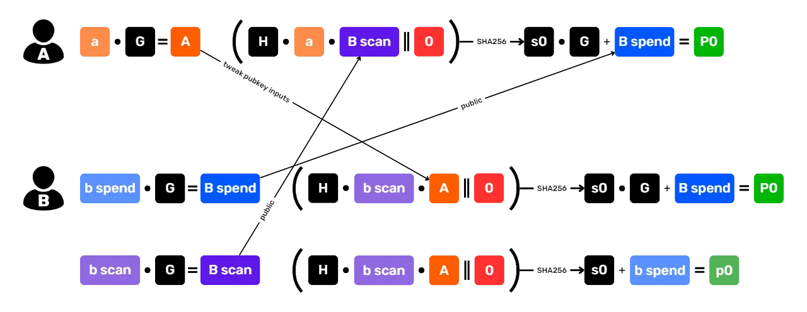

*किंवदंती:*


- $B_{\text{scan}}$: बॉब की पब्लिक स्कैन की (स्थिर Address)
- $b_{\text{scan}}$ : बॉब की निजी स्कैन कुंजी
- $B_{\text{खर्च}}$ : बॉब की पब्लिक खर्च की कुंजी (स्थिर Address)
- $b_{\text{खर्च}}$ : बॉब की निजी खर्च की चाभी
- $A$ : सार्वजनिक कुंजी इनपुट का योग (ट्वीक)
- $a$ : ट्वीक्ड पब्लिक की के संगत प्राइवेट की
- $H$ : सबसे छोटे UTXO (शब्दकोशीय क्रम में) का Hash जिसे इनपुट के रूप में इस्तेमाल किया गया
- $G$ : अण्डाकार वक्र `secp256k1` का जनरेटिंग पॉइंट
- $\text{SHA256}$ : `BIP0352/SharedSecret` से टैग किया गया SHA256 Hash फंक्शन
- $s_0$ : पहली आम गुप्त ECDH
- $P_0$ : पहली पब्लिक की / यूनीक Address बॉब को पेमेंट के लिए

### एसपी पते को लेबल के साथ इस्तेमाल करना

बॉब के पास इसलिए Address $B का एक स्थिर (स्टैटिक) है जैसे कि साइलेंट पेमेंट्स के लिए:

$$ B = B_{\text{स्कैन}} \text{ ‖ } B_{\text{खर्च}} $$

इस तरीके में समस्या यह है कि यह आपको इस Address पर भेजे गए अलग-अलग भुगतानों को अलग करने की अनुमति नहीं देता। उदाहरण के लिए, अगर बॉब के व्यवसाय के 2 अलग-अलग ग्राहक हैं, और वह हर एक के भुगतान को अलग करना चाहता है, तो उसे 2 अलग-अलग स्थिर पते बनाने होंगे। मौजूदा तरीके से एक सीधा-सादा समाधान यह होगा कि बॉब दो अलग-अलग वॉलेट बनाए, हर एक का अपना स्थिर Address हो, या फिर एक ही Wallet के अंदर दो अलग स्थिर पते सेट करे। हालाँकि, इस समाधान के लिए हर Address के लिए भेजे गए भुगतानों को पहचानने के लिए पूरे Blockchain को दो बार स्कैन करना पड़ेगा (हर Address के लिए एक बार)। यह डबल स्कैनिंग बॉब के काम के बोझ को बेवजह बढ़ा देती है।

इस समस्या को हल करने के लिए, BIP352 एक लेबल सिस्टम का उपयोग करता है जो अलग-अलग स्थिर पतों की अनुमति देता है, बिना Blockchain पर साइलेंट पेमेंट्स ढूंढने के काम को अनुचित तरीके से बढ़ाए। ऐसा करने के लिए, हम पब्लिक स्पेंडिंग की $B_{\text{spend}}$ में एक पूर्णांक $m$ जोड़ते हैं। यह पूर्णांक पहले स्थिर Address के लिए $1$ का मान ले सकता है, फिर दूसरे के लिए $2$, और इसी तरह आगे भी। अब स्पेंडिंग की $B_{\text{spend}}$ को $B_m$ कहा जाएगा और इस तरह बनाया जाएगा:

$$ B_m = B_{\text{खर्च}} + \text{Hash}(b_{\text{स्कैन}} \text{ ‖ } m) \cdot G $$

उदाहरण के लिए, पहले खर्च की कुंजी जिसका लेबल $1$ है, के लिए:

$$ B_1 = B_{\text{खर्च}} + \text{Hash}(b_{\text{स्कैन}} \text{ ‖ } 1) \cdot G $$

बॉब द्वारा प्रकाशित स्थिर Address अब $B_{\text{scan}}$ और $B_m$ से मिलकर बनेगा। उदाहरण के लिए, लेबल $1$ वाला पहला स्थिर Address होगा:

$$ B = B_{\text{स्कैन}} \text{ ‖ } B_1 $$

> *हम केवल लेबल 1 से शुरू करते हैं क्योंकि लेबल 0 परिवर्तन के लिए आरक्षित है।*
ऐलिस, अपनी तरफ से, एकल भुगतान Address $P$ को पहले की तरह ही निकालेगी, लेकिन $B_{\text{spend}}$ की जगह नए $B_1$ का इस्तेमाल करके:

$$ P_0 = B_1 + \text{Hash}(\text{इनपुटहैश} \cdot a \cdot B_{\text{स्कैन}} \text{ ‖ } 0) \cdot G $$

असल में, ऐलिस को यह भी जरूरी नहीं पता होता कि बॉब के पास Address लेबल वाली चीज़ है, क्योंकि वह सिर्फ उसके द्वारा दिए गए स्थिर Address के दूसरे हिस्से का इस्तेमाल कर रही है, और इस मामले में यह वैल्यू $B_1$ है न कि $B_{text{spend}}$।

भुगतान स्कैन करने के लिए, बॉब हमेशा अपने शुरुआती स्थिर Address के मूल्य को $B_{\text{spend}}$ के साथ इस तरह इस्तेमाल करेगा:

$$ P_0 = B_{\text{खर्च}} + \text{Hash}(\text{इनपुटहैश} \cdot b_{\text{स्कैन}} \cdot A \text{ ‖ } 0) \cdot G $$

फिर, वह एक-एक करके हर आउटपुट से $P_0$ का मिला हुआ मूल्य घटा देता है। उसके बाद, वह जाँचता है कि क्या इन घटावों के नतीजों में से कोई भी उसके पोर्टफोलियो पर इस्तेमाल किए गए लेबल्स के किसी मूल्य से मेल खाता है। मिसाल के तौर पर, अगर आउटपुट #4, $1$ लेबल से मेल खाता है, तो इसका मतलब है कि यह आउटपुट उसके स्थिर रूप से लेबल किए गए Address $B_1$ से जुड़ा एक साइलेंट पेमेंट है।

$$ Out_4 - P_0 = \text{Hash}(b_{\text{स्कैन}} \text{ ‖ } 1) \cdot G $$

यह काम करता है क्योंकि :

$$ B_1 = B_{\text{खर्च}} + \text{Hash}(b_{\text{स्कैन}} \text{ ‖ } 1) \cdot G $$

इस मेथड की वजह से, बॉब कई सारे स्टैटिक एड्रेसेस ($B_1$, $B_2$, $B_3$...) इस्तेमाल कर सकता है, जो सभी उसके बेसिक स्टैटिक Address ($B = B_{\text{scan}} \text{ ‖ } B_{\text{spend}}$) से बने होते हैं, ताकि इस्तेमाल को अलग रखा जा सके।

कृपया ध्यान दें, हालांकि, स्टैटिक एड्रेसेस का यह अलगाव सिर्फ व्यक्तिगत पोर्टफोलियो प्रबंधन के नज़रिए से ही मान्य है, लेकिन यह पहचानों को अलग नहीं करता। चूंकि इन सभी का एक ही $B_{\text{scan}}$ होता है, इसलिए इन सभी स्टैटिक एड्रेसेस को एक साथ जोड़कर यह आसानी से पता लगाया जा सकता है कि ये एक ही इकाई के हैं।


*किंवदंती:*


- $B_{\text{scan}}$: बॉब की पब्लिक स्कैन की (स्थिर Address)
- $b_{\text{scan}}$ : बॉब की निजी स्कैन कुंजी
- $B_{\text{खर्च}}$ : बॉब की पब्लिक खर्च की कुंजी (शुरुआती Address)
- $B_m$ : बॉब का सार्वजनिक खर्च कुंजी (स्थिर Address)
- $b_m$: बॉब का निजी खर्च कुंजी लेबल किया गया
- $A$ : सार्वजनिक कुंजी इनपुट का योग (ट्वीक)
- $a$ : ट्वीक्ड पब्लिक की के अनुरूप प्राइवेट की
- $H$ : सबसे छोटे UTXO (शब्दकोशीय क्रम में) का इस्तेमाल किया गया Hash इनपुट के रूप में
- $G$ : दीर्घवृत्तीय वक्र `secp256k1` का जनरेटिंग पॉइंट
- $\text{SHA256}$ : `BIP0352/SharedSecret` से टैग की गई SHA256 Hash फंक्शन
- $s_0$ : पहली ECDH साझा गुप्त कुंजी
- $P_0$ : पहली सार्वजनिक कुंजी / बॉब को भुगतान के लिए अद्वितीय Address
- $p_0$ : पहले यूनिक पेमेंट Address की प्राइवेट की जो बॉब को भेजी गई थी
- $X$ : लेबल वाले स्कैन प्राइवेट की का Hash

### Silent Payments Address कैसे बनाएं?

साइलेंट पेमेंट्स के लिए एक Address बनाने के लिए, आपको सबसे पहले अपने Bitcoin HD Wallet से 2 की पेयर्स डेरिव करनी होंगी:


- जोड़ी $b_{\text{scan}}$, $B_{\text{scan}}$ हमारे पते पर भेजे गए भुगतानों को खोजने के लिए;
- जोड़ी $b_{\text{खर्च}}$, $B_{\text{खर्च}}$ हमें मिले बिटकॉइन्स के बारे में सोचने के लिए।

ये जोड़े निम्नलिखित पथों से प्राप्त किए गए हैं (*Bitcoin Mainnet*):

```text
scan : m / 352' / 0' / 0' / 1' / 0
spend : m / 352' / 0' / 0' / 0' / 0
```

एक बार हमारे पास ये 2 जोड़ी कीज़ हो जाएँ, तो हम बस उन्हें आपस में जोड़ देते हैं (एक के बाद एक) और स्टैटिक Address पेलोड बना लेते हैं:

$$ B = B_{\text{स्कैन}} \text{ ‖ } B_{\text{खर्च}} $$

अगर हम लेबल्स का इस्तेमाल करना चाहते हैं, तो हम $B_{\text{spend}}$ को $B_m$ से बदल देंगे:

$$ B = B_{\text{स्कैन}} \text{ ‖ } B_m $$

लेबल $m$ के साथ:

$$ B_m = B_{\text{खर्च}} + \text{Hash}(b_{\text{स्कैन}} \text{ ‖ } m) \cdot G $$

एक बार हमारे पास यह पेलोड हो जाए, तो हम HRP (*ह्यूमन-रीडेबल पार्ट*) `sp` और वर्जन `q` (= वर्जन 0) जोड़ते हैं। साथ ही हम एक चेकसम भी जोड़ते हैं और Address को bech32m फॉर्मेट में कर देते हैं।

उदाहरण के लिए, यहाँ मेरा साइलेंट पेमेंट्स स्टैटिक Address है:

```text
sp1qqvhjvsq2vz8zwrw372vuzle7472zup2ql3pz64yn5cpkw5ngv2n6jq4nl8cgm6zmu48yk3eq33ryc7aam6jrvrg0d0uuyzecfhx2wgsumcurv77e
```

स्टैटिक एड्रेसेस के बारे में एक महत्वपूर्ण बात, जिसे आपने पिछले सेक्शन्स में समझा होगा, वो यह है कि ये एड्रेस Bitcoin ट्रांजैक्शन्स में दिखाई नहीं देते। केवल आउटपुट्स में इस्तेमाल किए गए $P$ पेमेंट एड्रेस ही Blockchain पर स्टैण्डर्ड Taproot फॉर्मेट में दिखते हैं। इसलिए, बाहर से देखने पर साइलेंट पेमेंट वाली ट्रांजैक्शन और सामान्य P2TR आउटपुट्स वाली ट्रांजैक्शन में फर्क कर पाना नामुमकिन है।

BIP47 की तरह, एक स्थिर Address $B$ और उससे प्राप्त भुगतान Address $P$ के बीच कोई संबंध स्थापित करना असंभव है। दरअसल, अगर कोई संभावित हमलावर, जैसे कि Eve, बॉब के स्थिर $B$ Address के साथ Blockchain को स्कैन करने की कोशिश भी करे, तो वह $P$ निर्धारित करने के लिए आवश्यक गणनाएँ नहीं कर पाएगी। ऐसा करने के लिए, उसे या तो बॉब की निजी कुंजी $b_{\text{scan}}$ चाहिए, या फिर भेजने वाले की निजी कुंजियाँ $a$, लेकिन दोनों ही निजी होती हैं। इसलिए, किसी के स्थिर Address को व्यक्तिगत पहचान के एक रूप से स्पष्ट रूप से जोड़ना संभव है।

### Silent Payments का उपयोग कैसे करें?

"साइलेंट पेमेंट्स" प्रस्ताव अपेक्षाकृत हाल ही का है और फिलहाल इसे बहुत कम वॉलेट्स ने ही लागू किया है। मेरी जानकारी के अनुसार, केवल 3 सॉफ्टवेयर उत्पाद ही इसे सपोर्ट करते हैं:


- [केकवॉलेट](https://cakewallet.com/)
- [साइलेंशियम](https://app.silentium.dev/)
- [डोनेशन वॉलेट](https://github.com/Sosthene00/donationwallet)

हम जल्द ही आपको एक विस्तृत ट्यूटोरियल देंगे कि कैसे अपना खुद का साइलेंट पेमेंट्स स्टैटिक Address सेट अप करें।

चूंकि यह फीचर नया है, हम आपको सलाह देते हैं कि सावधानी बरतें और Mainnet पर बड़ी रकम के लिए साइलेंट पेमेंट्स का इस्तेमाल करने से बचें।

*इस साइलेंट पेमेंट्स वाले अध्याय को बनाने के लिए, मैंने [साइलेंट पेमेंट्स की व्याख्या साइट](https://silentpayments.xyz/) और [BIP352 की व्याख्या दस्तावेज़](https://github.com/Bitcoin/bips/blob/master/bip-0352.mediawiki) का इस्तेमाल किया।*

# समापन

<partId>2aee56c0-b285-4799-b4f7-373a552ee2b2</partId>

## समीक्षाएँ और रेटिंग्स

<chapterId>195d149f-80fa-5816-8b46-995a9226d082</chapterId>

<isCourseReview>true</isCourseReview>
## आखिरी परीक्षा

<chapterId>e803d394-e3c1-5816-a6b4-a69a2472019c</chapterId>

<isCourseExam>true</isCourseExam>
## निष्कर्ष

<chapterId>cd8e5c67-50e4-4dcd-8e04-88ba5ec95305</chapterId>

<isCourseConclusion>true</isCourseConclusion>