# Ochrona prywatności w Bitcoin


W świecie, w którym poufność transakcji finansowych stopniowo staje się luksusem, zrozumienie i opanowanie zasad ochrony prywatności podczas korzystania z Bitcoin jest niezbędne. Ten kurs szkoleniowy zapewnia wszystkie klucze, zarówno teoretyczne, jak i praktyczne, aby osiągnąć to samodzielnie.


Dziś, na Bitcoin, firmy specjalizują się w analizie Blockchain. Ich podstawowa działalność polega właśnie na ingerowaniu w sferę prywatną użytkownika w celu naruszenia poufności jego transakcji. W rzeczywistości nie ma czegoś takiego jak "prawo do prywatności" w Bitcoin. Tak więc to użytkownik musi dochodzić swoich naturalnych praw i chronić poufność swoich transakcji, ponieważ nikt inny nie zrobi tego za niego.


Kurs ma być kompleksowy i ogólny. Każda koncepcja techniczna jest szczegółowo omówiona i poparta diagramami objaśniającymi. Celem jest, aby wiedza była dostępna dla wszystkich. BTC204 jest zatem przystępny dla początkujących i średnio zaawansowanych użytkowników. Kurs oferuje również wartość dodaną dla bardziej doświadczonych bitcoinerów, ponieważ zagłębiamy się w pewne koncepcje techniczne, które często są źle rozumiane.


Dołącz do nas, aby zmienić sposób korzystania z Bitcoin i stać się świadomym użytkownikiem, zdolnym do zrozumienia kwestii związanych z poufnością i ochroną prywatności.


+++
# Wprowadzenie


<partId>e17474a8-8899-4bdb-a7f8-bc52ddb01440</partId>


## Przegląd kursu


<chapterId>08ba1933-f393-4fb5-8279-777d874caedb</chapterId>


Witamy w kursie BTC204!


W świecie, w którym poufność transakcji finansowych stopniowo staje się luksusem, zrozumienie i opanowanie zasad ochrony prywatności podczas korzystania z Bitcoin jest niezbędne. Ten kurs szkoleniowy zapewnia wszystkie klucze, zarówno teoretyczne, jak i praktyczne, aby osiągnąć to samodzielnie.


Dziś, na Bitcoin, firmy specjalizują się w analizie Blockchain. Ich podstawowa działalność polega właśnie na ingerowaniu w sferę prywatną użytkownika w celu naruszenia poufności jego transakcji. W rzeczywistości nie ma czegoś takiego jak "prawo do prywatności" w Bitcoin. Tak więc to użytkownik musi dochodzić swoich naturalnych praw i chronić poufność swoich transakcji, ponieważ nikt inny nie zrobi tego za niego.


Bitcoin to nie tylko "Number Go Up" i zachowanie wartości oszczędności. Dzięki swojej unikalnej charakterystyce i historii jest to przede wszystkim narzędzie kontrekonomii. Dzięki temu potężnemu wynalazkowi możesz swobodnie dysponować swoimi pieniędzmi, wydawać je i gromadzić, a nikt nie będzie w stanie cię powstrzymać.


Bitcoin oferuje spokojną ucieczkę spod jarzma państwa, pozwalając ci w pełni cieszyć się swoimi naturalnymi prawami, których nie mogą podważyć ustanowione prawa. Dzięki wynalazkowi Satoshi Nakamoto masz moc egzekwowania poszanowania swojej własności prywatnej i odzyskania wolności do Contract.


Bitcoin nie jest jednak domyślnie anonimowy, co może stanowić ryzyko dla osób zaangażowanych w kontrekonomię, szczególnie w regionach rządzonych przez despotów. Nie jest to jednak jedyne zagrożenie. Ponieważ Bitcoin jest cennym i niewymiernym zasobem, może stanowić cel dla złodziei. Tak więc ochrona prywatności staje się również kwestią bezpieczeństwa: może pomóc w zapobieganiu włamaniom i atakom fizycznym.


Jak zobaczymy, chociaż protokół sam w sobie oferuje pewne zabezpieczenia poufności, kluczowe jest użycie dodatkowych narzędzi do optymalizacji i ochrony tej poufności.


Ten kurs szkoleniowy ma na celu zapewnienie kompleksowego, ogólnego przeglądu zagadnień związanych z poufnością Bitcoin. Każda koncepcja techniczna jest szczegółowo omówiona i poparta diagramami objaśniającymi. Celem jest udostępnienie tej wiedzy każdemu, nawet początkującym i średnio zaawansowanym użytkownikom. Dla bardziej doświadczonych Bitcoinerów, w całym kursie omawiamy również wysoce techniczne i czasami mało znane koncepcje, aby pogłębić zrozumienie każdego tematu.


Celem tego szkolenia nie jest zapewnienie całkowitej anonimowości podczas korzystania z Bitcoin, ale raczej dostarczenie niezbędnych narzędzi, aby wiedzieć, jak chronić swoją poufność zgodnie z osobistymi celami. Będziesz mieć swobodę wyboru spośród przedstawionych koncepcji i narzędzi, aby opracować własne strategie, dostosowane do twoich konkretnych celów i potrzeb.


**Sekcja 1: Definicje i kluczowe pojęcia**


Na początek dokonamy przeglądu podstawowych zasad rządzących działaniem Bitcoin, abyśmy mogli następnie spokojnie zająć się pojęciami związanymi z poufnością. Konieczne jest opanowanie kilku podstawowych pojęć, takich jak UTXO, odbieranie adresów i skryptów, zanim będzie można w pełni zrozumieć koncepcje, które omówimy w kolejnych sekcjach. Przedstawimy również ogólny model poufności Bitcoin, zgodnie z wyobrażeniami Satoshi Nakamoto, co pozwoli nam zrozumieć związane z nim stawki i ryzyko.


**Sekcja 2: Zrozumienie i ochrona przed analizą łańcucha**


W drugiej sekcji przyjrzymy się technikom wykorzystywanym przez firmy analizujące Blockchain do śledzenia aktywności użytkownika na Bitcoin. Zrozumienie tych metod ma kluczowe znaczenie dla wzmocnienia ochrony prywatności. Celem tej sekcji jest zbadanie strategii atakujących, aby lepiej zrozumieć ryzyko i przygotować grunt pod techniki, które będziemy badać w kolejnych sekcjach. Przeanalizujemy wzorce transakcji, heurystykę wewnętrzną i zewnętrzną oraz prawdopodobne interpretacje tych wzorców. Oprócz teorii dowiemy się, jak używać Block explorer do analizy łańcucha, poprzez praktyczne przykłady i ćwiczenia.


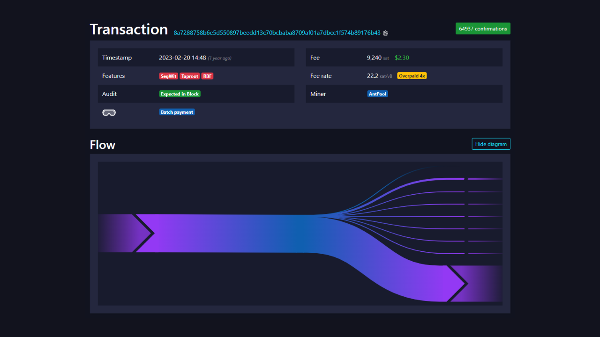


**Sekcja 3: Opanowanie najlepszych praktyk w celu ochrony prywatności**


W trzeciej części naszego szkolenia przechodzimy do sedna: praktyki! Celem jest opanowanie wszystkich niezbędnych najlepszych praktyk, które powinny stać się naturalnymi odruchami dla każdego użytkownika Bitcoin. Omówimy korzystanie z pustych adresów, tagowanie, konsolidację, korzystanie z kompletnych węzłów, a także KYC i metody pozyskiwania. Celem jest zapewnienie kompleksowego przeglądu pułapek, których należy unikać, aby stworzyć solidne podstawy w naszym dążeniu do ochrony prywatności. W przypadku niektórych z tych praktyk zostaniesz poprowadzony do konkretnego samouczka, jak je wdrożyć.


**Sekcja 4: Zrozumienie transakcji CoinJoin**


Jak możemy mówić o prywatności w Bitcoin nie wspominając o coinjoinach? W sekcji 4 dowiesz się wszystkiego, co musisz wiedzieć o tej metodzie mieszania. Dowiesz się, czym są coinjoiny, poznasz ich historię i cele, a także różne rodzaje CoinJoin, które istnieją. Wreszcie, dla bardziej doświadczonych użytkowników, przyjrzymy się, czym są anonsety i entropia oraz jak je obliczyć.


**Sekcja 5: Zrozumienie wyzwań związanych z innymi zaawansowanymi technikami poufności**


W piątej sekcji przyjrzymy się wszystkim innym dostępnym technikom ochrony prywatności w Bitcoin, oprócz CoinJoin. Na przestrzeni lat deweloperzy wykazali się niezwykłą kreatywnością w projektowaniu narzędzi dedykowanych prywatności. Przyjrzymy się wszystkim tym metodom, takim jak PayJoin, transakcje oparte na współpracy, Coin Swap i Atomic Swap, szczegółowo opisując ich działanie, cele i wszelkie słabości.


Przyjrzymy się również prywatności na poziomie sieci węzłów i rozpowszechniania transakcji. Omówimy również różne protokoły, które zostały zaproponowane na przestrzeni lat w celu zwiększenia prywatności użytkowników Bitcoin, w tym statyczne protokoły Address.


Gotowy do poznania zawiłości prywatności w Bitcoin? Do dzieła!


# Definicje i kluczowe pojęcia


<partId>b9bbbde3-34c0-4851-83e8-e2ffb029cf31</partId>


## Model Bitcoin UTXO


<chapterId>8d6b50c5-bf74-44f4-922b-25204991cb75</chapterId>


Bitcoin to przede wszystkim waluta, ale czy wiesz, jak BTC są reprezentowane w protokole?


### UTXO na Bitcoin: czym one są?


Protokół Bitcoin opiera się na modelu UTXO, który oznacza "Unspent Transaction Output".


Model ten znacznie różni się od tradycyjnych systemów bankowych, które opierają się na mechanizmie rachunków i sald w celu śledzenia przepływów finansowych. Rzeczywiście, w systemie bankowym indywidualne salda są utrzymywane na rachunkach powiązanych z tożsamością. Na przykład, gdy kupujesz bagietkę od piekarza, twój bank po prostu obciąża twoje konto kwotą zakupu, zmniejszając twoje saldo, podczas gdy konto piekarza jest zasilane tą samą kwotą, zwiększając jego saldo. W tym systemie nie ma pojęcia powiązania między pieniędzmi wpływającymi na konto a pieniędzmi z niego wychodzącymi, z wyjątkiem zapisów transakcji.


Bitcoin działa inaczej. Koncepcja konta nie istnieje, a jednostki pieniężne nie są zarządzane poprzez salda, ale poprzez UTXO. UTXO reprezentuje określoną ilość bitcoinów, które nie zostały jeszcze wydane, tworząc w ten sposób "kawałek Bitcoin", który może być duży lub mały. Na przykład, jeden UTXO może być wart `500 BTC` lub po prostu `700 Sats`.


**> Satoshi, często skracana do sat, jest najmniejszą jednostką Bitcoin, porównywalną z centymem w walutach fiducjarnych.


```plaintext
1 BTC = 100 000 000 SATS
```


Teoretycznie jeden UTXO może reprezentować dowolną wartość w bitcoinach, od jednego do teoretycznego maksimum wynoszącego około 21 milionów BTC. Jednak logicznie niemożliwe jest posiadanie wszystkich 21 milionów bitcoinów i istnieje niższy próg ekonomiczny zwany "Dust", poniżej którego UTXO jest uważany za ekonomicznie nieopłacalny do wydania.


**> Największy UTXO kiedykolwiek utworzony na Bitcoin miał wartość `500 000 BTC`. Został on utworzony przez platformę MtGox podczas operacji konsolidacji w listopadzie 2011 roku: [29a3efd3ef04f9153d47a990bd7b048a4b2d213daaa5fb8ed670fb85f13bdbcf](https://Mempool.space/fr/tx/29a3efd3ef04f9153d47a990bd7b048a4b2d213daaa5fb8ed670fb85f13bdbcf)


### UTXO i warunki wydatków


UTXO są instrumentami Exchange na Bitcoin. Każda transakcja powoduje zużycie UTXO jako danych wejściowych i utworzenie nowych UTXO jako danych wyjściowych. Gdy transakcja jest zakończona, UTXO używane jako dane wejściowe są uważane za "zużyte", a nowe UTXO są generowane i przydzielane odbiorcom wskazanym w danych wyjściowych transakcji. Tak więc UTXO reprezentuje po prostu niewydane wyniki transakcji, a zatem ilość bitcoinów należących do użytkownika w danym momencie.


Wszystkie UTXO są zabezpieczone skryptami, które definiują warunki, na jakich można je wykorzystać. Aby wykorzystać UTXO, użytkownik musi wykazać sieci, że spełnia warunki określone w skrypcie zabezpieczającym ten UTXO. Zazwyczaj UTXO są chronione kluczem publicznym (lub odbierającym Address, który reprezentuje ten klucz publiczny). Aby wydać UTXO powiązany z tym kluczem publicznym, użytkownik musi udowodnić, że posiada odpowiedni klucz prywatny, dostarczając podpis cyfrowy złożony za pomocą tego klucza. Dlatego mówimy, że Bitcoin Wallet nie zawiera bitcoinów, ale przechowuje klucze prywatne, które z kolei dają dostęp do UTXO, a tym samym do bitcoinów, które reprezentują.


Ponieważ w Bitcoin nie ma pojęcia konta, saldo Wallet jest po prostu sumą wartości wszystkich UTXO, które może wydać. Na przykład, jeśli twój Bitcoin Wallet może wydać następujące 4 UTXO:


```plaintext
- 2 BTC
- 8 BTC
- 5 BTC
- 2 BTC
```


Całkowite saldo portfela wynosiłoby `17 BTC`.


## Struktura transakcji Bitcoin


<chapterId>29d3aaab-de2e-4746-ab40-c9748898850c</chapterId>


### Wejścia i wyjścia transakcji


Transakcja Bitcoin to operacja zarejestrowana na Blockchain, która przenosi Ownership bitcoinów od jednej osoby do drugiej. Mówiąc dokładniej, ponieważ jesteśmy w modelu UTXO i nie ma kont, transakcja spełnia warunki wydatkowania, które zabezpieczyły jedno lub więcej UTXO, zużywa je i równoważnie tworzy nowe UTXO z nowymi warunkami wydatkowania. Krótko mówiąc, transakcja przenosi bitcoiny ze spełnionego skryptu do nowego skryptu zaprojektowanego w celu ich zabezpieczenia.


Każda transakcja Bitcoin składa się z jednego lub więcej wejść i jednego lub więcej wyjść. Wejścia to UTXO zużywane przez transakcję na wyjścia generate. Wyjścia to nowe UTXO, które mogą być używane jako wejścia dla przyszłych transakcji.


**> Teoretycznie transakcja Bitcoin może mieć nieskończoną liczbę wejść i wyjść. Jedynym ograniczeniem jest maksymalny rozmiar bloku.


Każde wejście w transakcji Bitcoin odnosi się do poprzedniego niewydanego UTXO. Aby użyć UTXO jako danych wejściowych, jego posiadacz musi wykazać, że jest jego prawowitym właścicielem poprzez walidację powiązanego skryptu, tj. poprzez spełnienie nałożonego warunku wydatkowania. Ogólnie rzecz biorąc, oznacza to dostarczenie podpisu cyfrowego złożonego za pomocą klucza prywatnego odpowiadającego kluczowi publicznemu, który pierwotnie zabezpieczył ten UTXO. Skrypt polega zatem na sprawdzeniu, czy podpis odpowiada kluczowi publicznemu użytemu w momencie otrzymania środków.


Każde wyjście z kolei określa ilość bitcoinów do przesłania, a także odbiorcę. Ten ostatni jest definiowany przez nowy skrypt, który zwykle blokuje nowo utworzony UTXO za pomocą odbierającego Address lub nowego klucza publicznego.


Aby transakcja została uznana za ważną zgodnie z zasadami konsensusu, łączne wyniki muszą być mniejsze lub równe łącznym wejściom. Innymi słowy, suma nowych UTXO wygenerowanych przez transakcję nie może przekraczać sumy UTXO zużytych jako wkład. Zasada ta jest logiczna: jeśli masz tylko `500 000 Sats`, nie możesz dokonać zakupu `700 000 Sats`.


### Exchange i połączenie w transakcji Bitcoin


Działanie transakcji Bitcoin na UTXO można zatem porównać do przekształcania złotej monety. Rzeczywiście, UTXO nie jest podzielny, a jedynie topliwy. Oznacza to, że użytkownik nie może po prostu podzielić UTXO reprezentującego określoną kwotę w bitcoinach na kilka mniejszych UTXO. Musi zużyć ją w całości w transakcji, aby utworzyć jedno lub więcej nowych UTXO o dowolnej wartości wyjściowej, która musi być mniejsza lub równa wartości początkowej.


Mechanizm ten jest podobny do działania złotej monety. Powiedzmy, że posiadasz monetę o wadze 2 uncji i chcesz dokonać płatności w wysokości 1 uncji, zakładając, że sprzedawca nie może wydać ci reszty. Musiałbyś przetopić swoją monetę i odlać 2 nowe o wadze 1 uncji każda.


Bitcoin działa w podobny sposób. Wyobraźmy sobie, że Alicja ma UTXO o wartości `10 000 Sats` i chce kupić bagietkę kosztującą `4 000 Sats`. Alicja dokona transakcji z 1 UTXO o wartości `10 000 Sats` jako wkładem, który zużyje w całości, i 2 UTXO o wartości `4 000 Sats` i `6 000 Sats` jako wyjściem. UTXO w wysokości `4,000 Sats` zostanie wysłany do piekarza jako zapłata za bagietkę, podczas gdy UTXO w wysokości `6,000 Sats` wróci do Alicji w formie reszty. Ten UTXO, który wraca do pierwotnego emitenta transakcji, jest znany jako "Exchange" w żargonie Bitcoin.


Wyobraźmy sobie teraz, że Alicja nie ma pojedynczego UTXO z `10 000 Sats`, ale raczej dwa UTXO z `3 000 Sats` każdy. W tej sytuacji żadne z UTXO osobno nie wystarczy do ustawienia `4,000 Sats` różdżki. Alicja musi zatem jednocześnie użyć 2 UTXO o wartości `3 000 Sats` jako danych wejściowych do swojej transakcji. W ten sposób łączna kwota wkładów osiągnie `6 000 Sats`, umożliwiając jej zaspokojenie płatności w wysokości `4 000 Sats` na rzecz piekarza. Ta metoda, w której kilka UTXO jest zgrupowanych razem jako wkłady do transakcji, jest często określana jako "łączenie".


### Opłaty transakcyjne


Intuicyjnie można by pomyśleć, że koszty transakcyjne również reprezentują wynik transakcji. W rzeczywistości jednak tak nie jest. Koszty transakcyjne stanowią różnicę między całkowitymi nakładami a całkowitymi wynikami. Oznacza to, że po wykorzystaniu części wartości nakładów na pokrycie pożądanych wyników w transakcji, pewna suma nakładów pozostaje niewykorzystana. Ta pozostała suma stanowi koszty transakcyjne.


```plaintext
Frais = total inputs - total outputs
```


Weźmy przykład Alicji, która ma UTXO w wysokości `10 000 Sats` i chce kupić bagietkę za `4 000 Sats`. Alicja tworzy transakcję z UTXO o wartości `10 000 Sats` jako danymi wejściowymi. Następnie generuje wynik w wysokości `4,000 Sats` dla piekarza, aby zapłacić za bagietkę. Aby zachęcić górników do włączenia jej transakcji do bloku, Alice przydziela `200 Sats` w opłatach. Następnie tworzy drugi wynik, Exchange, który zostanie jej zwrócony w wysokości `5 800 Sats`.


Stosując wzór na opłatę, widzimy, że rzeczywiście pozostało `200 Sats` dla nieletnich:


```plaintext
Frais = total inputs - total outputs
Frais = 10 000 - (4 000 + 5 800)
Frais = 10 000 - 9 800
Frais = 200
```


Gdy Miner uda się zatwierdzić blok, jest on upoważniony do pobierania tych opłat za wszystkie transakcje zawarte w jego bloku, za pośrednictwem tak zwanej transakcji "coinbase".


### Tworzenie UTXO na Bitcoin


Jeśli uważnie prześledziłeś poprzednie akapity, wiesz już, że UTXO mogą być tworzone tylko poprzez konsumpcję innych istniejących UTXO. W ten sposób monety Bitcoin tworzą ciągły łańcuch. Być może zastanawiasz się jednak, jak powstały pierwsze UTXO w tym łańcuchu. Rodzi to problem podobny do tego z kurą i jajkiem: skąd wzięły się te oryginalne UTXO?


Odpowiedź znajduje się w **transakcjach coinbase**.


Coinbase to specyficzny rodzaj transakcji Bitcoin, który jest unikalny dla każdego bloku i zawsze jest pierwszym z nich. Pozwala ona Miner, który znalazł ważny Proof of Work, na otrzymanie swojego Block reward. Nagroda ta składa się z dwóch Elements: **dotacji do bloku** i **opłaty transakcyjnej**, omówionych w poprzedniej sekcji.


Coinbase Transaction jest wyjątkowy, ponieważ jest jedynym zdolnym do tworzenia bitcoinów ex nihilo, bez potrzeby zużywania danych wejściowych do wyjścia generate. Te nowo utworzone bitcoiny są tym, co możemy nazwać "oryginalnymi UTXO".


Bitcoiny subsydiowane blokowo to nowe BTC tworzone od podstaw, zgodnie z wcześniej ustalonym harmonogramem emisji w zasadach konsensusu. Dotacja blokowa jest zmniejszana o połowę co 210 000 bloków, tj. mniej więcej co cztery lata, w procesie znanym jako "Halving". Początkowo z każdą dotacją tworzono 50 bitcoinów, ale ilość ta stopniowo malała; obecnie jest to 3,125 bitcoina na blok.


Jeśli chodzi o opłaty transakcyjne, to chociaż one również reprezentują nowo utworzone BTC, nie mogą one przekraczać różnicy między całkowitymi danymi wejściowymi i wyjściowymi wszystkich transakcji w bloku. Widzieliśmy wcześniej, że opłaty te reprezentują część wejść, która nie jest wykorzystywana w wyjściach transakcji. Ta część jest technicznie "tracona" podczas transakcji, a Miner ma prawo do odtworzenia tej wartości w postaci jednego lub więcej nowych UTXO. Jest to transfer wartości między wystawcą transakcji a Miner, który dodaje ją do Blockchain.


**> Bitcoiny wygenerowane przez Coinbase Transaction podlegają okresowi zapadalności wynoszącemu 100 bloków, podczas którego nie mogą zostać wydane przez Miner. Zasada ta ma na celu uniknięcie komplikacji związanych z wykorzystaniem nowo utworzonych bitcoinów w łańcuchu, który później może stać się przestarzały.


### Implikacje modelu UTXO


Po pierwsze, model UTXO bezpośrednio wpływa na opłaty transakcyjne Bitcoin. Ponieważ pojemność każdego bloku jest ograniczona, górnicy faworyzują transakcje, które oferują najlepsze opłaty w stosunku do miejsca, jakie zajmą w bloku. Rzeczywiście, im więcej UTXO transakcja zawiera w swoich wejściach i wyjściach, tym jest cięższa, a zatem wymaga wyższych opłat. Jest to jeden z powodów, dla których często staramy się zmniejszyć liczbę UTXO w naszym portfelu, co może również wpływać na poufność, którą zajmiemy się szczegółowo w trzeciej części tego kursu.


Po drugie, jak wspomniano w poprzednich sekcjach, monety Bitcoin są zasadniczo łańcuchem UTXO. Każda transakcja tworzy zatem powiązanie między przeszłym UTXO a przyszłym UTXO. UTXO umożliwiają zatem wyraźne śledzenie ścieżki Bitcoinów od ich utworzenia do ich bieżących wydatków. Ta przejrzystość może być postrzegana pozytywnie, ponieważ umożliwia każdemu użytkownikowi sprawdzenie autentyczności otrzymanych bitcoinów. Jednak to również na tej zasadzie identyfikowalności i audytowalności opiera się analiza Blockchain, praktyka mająca na celu naruszenie poufności użytkownika. Przyjrzymy się bliżej tej praktyce w drugiej części kursu.


## Model prywatności Bitcoin


<chapterId>769d8963-3ed5-4094-b21d-9203c7d9e465</chapterId>


### Pieniądze: autentyczność, uczciwość i podwójne wydatki


Jedną z funkcji pieniądza jest rozwiązanie problemu podwójnej zbieżności potrzeb. W systemie opartym na barterze, ukończenie Exchange wymaga nie tylko znalezienia osoby, która oddaje dobro odpowiadające mojej potrzebie, ale także dostarczenia mu dobra o równoważnej wartości, które zaspokaja jego własne potrzeby. Osiągnięcie tej równowagi jest złożoną kwestią.


Dlatego używamy pieniędzy do przenoszenia wartości zarówno w czasie, jak i przestrzeni.


Aby monety mogły rozwiązać ten problem, konieczne jest, aby strona dostarczająca towar lub usługę była przekonana o swojej zdolności do wydania tej kwoty w późniejszym terminie. Tak więc każda racjonalna osoba, która chce zaakceptować monetę, cyfrową lub fizyczną, upewni się, że spełnia ona dwa podstawowe kryteria:


- Utwór musi charakteryzować się integralnością i autentycznością ;**
- i nie mogą być wydawane podwójnie**


Jeśli korzystasz z fizycznej waluty, jest to pierwsza cecha, która jest najbardziej złożona do potwierdzenia. W różnych okresach historii integralność metalowych monet była często naruszana przez praktyki takie jak przycinanie lub przekłuwanie. Na przykład w starożytnym Rzymie powszechną praktyką obywateli było zdrapywanie krawędzi złotych monet w celu zebrania odrobiny cennego metalu, zachowując je na przyszłe transakcje. Wewnętrzna wartość monety została w ten sposób zmniejszona, ale jej wartość nominalna pozostała taka sama. Jest to jeden z powodów, dla których krawędź monety została później karbowana.


Autentyczność jest również trudną cechą do zweryfikowania na fizycznym nośniku monetarnym. Dzisiejsze techniki walki z fałszywą walutą są coraz bardziej złożone, co zmusza sprzedawców detalicznych do inwestowania w kosztowne systemy weryfikacji.


Z drugiej strony, ze względu na swój charakter, podwójne wydawanie nie stanowi problemu dla walut fizycznych. Jeśli dam ci banknot o nominale 10 euro, nieodwołalnie opuszcza on moje posiadanie i wchodzi w twoje, co naturalnie wyklucza możliwość wielokrotnego wydawania jednostek pieniężnych, które ucieleśnia. Krótko mówiąc, nie będę mógł ponownie wydać tego banknotu o nominale 10 euro.


W przypadku waluty cyfrowej trudność jest inna. Zapewnienie autentyczności i integralności monety jest często prostsze. Jak widzieliśmy w poprzedniej sekcji, model Bitcoin UTXO umożliwia prześledzenie monety z powrotem do jej pochodzenia, a tym samym zweryfikowanie, czy rzeczywiście została stworzona przez Miner zgodnie z zasadami konsensusu.


Z drugiej strony, zapewnienie braku Double-spending jest bardziej złożone, ponieważ wszystkie dobra cyfrowe są w istocie informacjami. W przeciwieństwie do dóbr fizycznych, informacje nie są dzielone podczas wymiany, ale rozprzestrzeniają się poprzez powielanie. Na przykład, jeśli wyślę ci dokument e-mailem, zostanie on zduplikowany. Nie możesz mieć pewności, że usunąłem oryginalny dokument.


### Zapobieganie podwójnym wydatkom na Bitcoin


Jedynym sposobem na uniknięcie powielania zasobów cyfrowych jest posiadanie wiedzy o wszystkich giełdach w systemie. W ten sposób możemy wiedzieć, kto jest właścicielem czego i aktualizować stan posiadania każdej osoby zgodnie z przeprowadzonymi transakcjami. Tak dzieje się na przykład z pieniędzmi skryptowymi w systemie bankowym. Kiedy płacisz 10 euro sprzedawcy kartą kredytową, bank rejestruje Exchange i aktualizuje księgę rachunkową.


Na Bitcoin, Double-spending jest uniemożliwiony w ten sam sposób. Staramy się potwierdzić brak transakcji, która już wydała dane monety. Jeśli monety nigdy nie zostały użyte, możemy być pewni, że nie dojdzie do podwójnego wydania. Zasada ta została opisana przez Satoshi Nakamoto w Białej Księdze słynnym zwrotem:


**Jedynym sposobem na potwierdzenie braku transakcji jest bycie świadomym wszystkich transakcji


Ale w przeciwieństwie do modelu bankowego, nie chcemy ufać centralnemu podmiotowi w Bitcoin. Tak więc wszyscy użytkownicy muszą być w stanie potwierdzić brak podwójnych wydatków, bez polegania na stronie trzeciej. Każdy musi więc być świadomy wszystkich transakcji Bitcoin. Właśnie dlatego transakcje Bitcoin są publicznie transmitowane we wszystkich węzłach sieci i rejestrowane w postaci czystego tekstu na Blockchain.


To właśnie to publiczne rozpowszechnianie informacji komplikuje ochronę prywatności w Bitcoin. W tradycyjnym systemie bankowym teoretycznie tylko instytucja finansowa jest świadoma przeprowadzanych transakcji. Z drugiej strony, w Bitcoin wszyscy użytkownicy są informowani o wszystkich transakcjach za pośrednictwem swoich węzłów.


### Model poufności: system bankowy vs. Bitcoin


W tradycyjnym systemie konto bankowe jest powiązane z tożsamością klienta. Bankier może wiedzieć, które konto bankowe należy do którego klienta i jakie transakcje są z nim powiązane. Jednak ten przepływ informacji jest odcięty między bankiem a domeną publiczną. Innymi słowy, niemożliwe jest poznanie salda i transakcji na koncie bankowym należącym do innej osoby. Tylko bank ma dostęp do tych informacji.


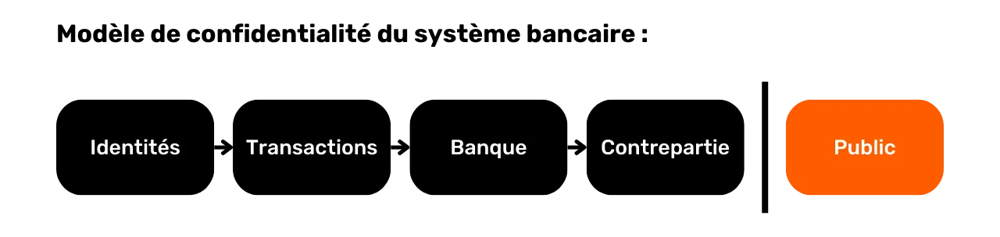


Na przykład bankier wie, że każdego ranka kupujesz bagietkę od lokalnego piekarza, ale twój sąsiad nie ma wiedzy o tej transakcji. W ten sposób przepływ informacji jest dostępny dla zainteresowanych stron, w szczególności dla banku, ale pozostaje niedostępny dla osób z zewnątrz.


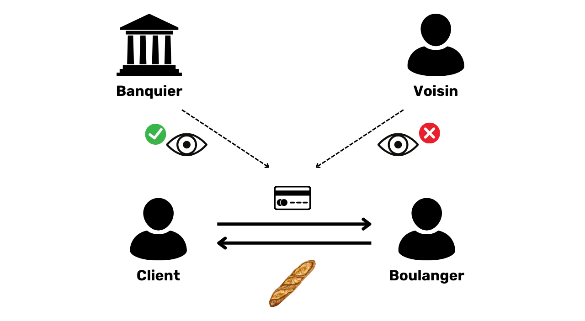


Ze względu na ograniczenie publicznego rozpowszechniania transakcji, które widzieliśmy w poprzedniej sekcji, model poufności Bitcoin nie może być zgodny z modelem systemu bankowego. W przypadku Bitcoin, ponieważ przepływ informacji nie może zostać przerwany między transakcjami a domeną publiczną, **model prywatności opiera się na oddzieleniu tożsamości użytkownika od samych transakcji**.


Na przykład, jeśli kupisz bagietkę od piekarza, płacąc w BTC, twój sąsiad, który ma swój własny kompletny węzeł, może zobaczyć, jak przechodzi twoja transakcja, tak jak widzi wszystkie inne transakcje w systemie. Jeśli jednak przestrzegane są zasady poufności, nie powinien on być w stanie powiązać tej konkretnej transakcji z twoją tożsamością.


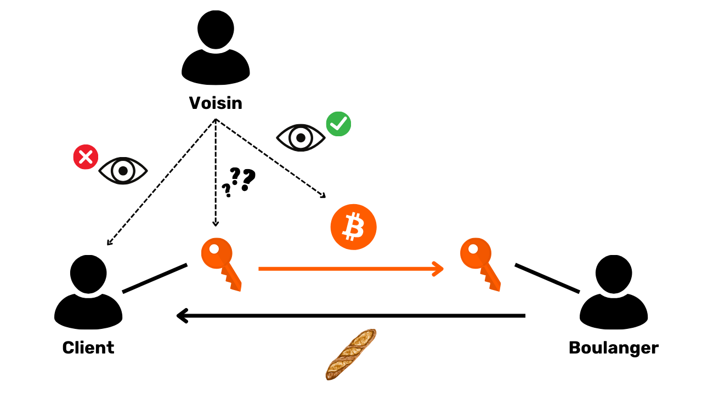


Ale ponieważ transakcje Bitcoin są upubliczniane, nadal możliwe jest ustalenie powiązań między nimi w celu uzyskania informacji o zaangażowanych stronach. Działalność ta stanowi nawet specjalność samą w sobie, znaną jako "analiza Blockchain". W następnej części kursu zapraszam do zapoznania się z podstawami analizy Blockchain, abyś mógł zrozumieć, w jaki sposób Twoje bitcoiny są śledzone i lepiej się przed nimi bronić.


# Zrozumienie i ochrona przed analizą łańcucha


<partId>4739371e-9fef-45b0-bcaa-b7a4df6b4470</partId>


## Czym jest analiza łańcucha Bitcoin?


<chapterId>7d198ba6-4af2-4f24-86cb-3c79cb25627e</chapterId>


### Definicja i działanie


Analiza Blockchain to praktyka śledzenia przepływu bitcoinów na Blockchain. Ogólnie rzecz biorąc, analiza łańcucha opiera się na obserwacji cech charakterystycznych w próbkach poprzednich transakcji. Następnie polega na zidentyfikowaniu tych samych cech w transakcji, którą chcemy przeanalizować, i wydedukowaniu z nich wiarygodnych interpretacji. Ta metoda rozwiązywania problemów, oparta na praktycznym podejściu do znalezienia wystarczająco dobrego rozwiązania, znana jest jako "heurystyka".


Mówiąc prościej, istnieją trzy główne etapy analizy łańcucha:


1. **Obserwacja Blockchain ;**


2. **Identyfikacja znanych cech ;**


3. **Odliczenie założeń **


Analiza Blockchain może być przeprowadzona przez każdego. Wszystko, czego potrzebujesz, to dostęp do publicznych informacji Blockchain za pośrednictwem kompletnego węzła, aby obserwować ruchy transakcji i stawiać hipotezy. Istnieją również bezpłatne narzędzia ułatwiające taką analizę, takie jak [OXT.me](https://oxt.me/), które szczegółowo omówimy w dwóch ostatnich rozdziałach tej sekcji. Jednak główne zagrożenie dla poufności pochodzi od firm specjalizujących się w analizie ciągów znaków. Firmy te przeniosły analizę Blockchain na skalę przemysłową i sprzedają swoje usługi instytucjom finansowym i rządom. Wśród tych firm Chainalysis jest z pewnością najbardziej znana.


### Cele analizy łańcucha


Jednym z celów analizy Blockchain jest zgrupowanie różnych działań na Bitcoin w celu określenia unikalności użytkownika, który je wykonał. Następnie możliwe będzie podjęcie próby powiązania tej grupy działań z rzeczywistą tożsamością.


Wróćmy do poprzedniego rozdziału. Wyjaśniłem, dlaczego model prywatności Bitcoin był pierwotnie oparty na oddzieleniu tożsamości użytkownika od transakcji. Kuszące byłoby zatem myślenie, że analiza Blockchain jest bezużyteczna, ponieważ nawet jeśli uda nam się zagregować działania onchain, nie możemy powiązać ich z prawdziwą tożsamością.


Teoretycznie to stwierdzenie jest poprawne. W pierwszej części tego kursu widzieliśmy, że pary kluczy kryptograficznych są używane do ustalania warunków na UTXO. Zasadniczo te pary kluczy nie ujawniają żadnych informacji o tożsamości ich posiadaczy. Tak więc, nawet jeśli uda nam się pogrupować działania związane z różnymi parami kluczy, nie mówi nam to nic o podmiocie stojącym za tymi działaniami.


Praktyczna rzeczywistość jest jednak znacznie bardziej złożona. Istnieje wiele zachowań, które mogą łączyć prawdziwą tożsamość z aktywnością onchain. W analizie nazywa się to punktem wejścia i jest ich wiele.


Najczęstszym z nich jest KYC (*Know Your Customer*). Jeśli wypłacasz swoje Bitcoiny z regulowanej platformy na jeden ze swoich osobistych adresów odbiorczych, niektórzy ludzie są w stanie powiązać twoją tożsamość z tym Address. Mówiąc szerzej, punktem wejścia może być dowolna forma interakcji między Twoim prawdziwym życiem a transakcją Bitcoin. Na przykład, jeśli opublikujesz otrzymany Address w swoich sieciach społecznościowych, może to być punkt wejścia do analizy. Jeśli dokonasz płatności w Bitcoinach swojemu piekarzowi, będzie on mógł powiązać Twoją twarz (część Twojej tożsamości) z Bitcoin Address.


Te punkty wejścia są praktycznie nieuniknione podczas korzystania z Bitcoin. Chociaż możemy starać się ograniczyć ich zakres, zawsze będą obecne. Dlatego tak ważne jest łączenie metod mających na celu ochronę prywatności. Chociaż utrzymywanie separacji między prawdziwą tożsamością a transakcjami jest interesującym podejściem, obecnie pozostaje niewystarczające. Rzeczywiście, jeśli wszystkie twoje działania onchain mogą być zgrupowane razem, to nawet najmniejszy punkt wejścia może zagrozić pojedynczemu Layer poufności, który ustanowiłeś.


### Obrona przed analizą łańcucha


Musimy więc również być w stanie poradzić sobie z analizą Blockchain w naszym korzystaniu z Bitcoin. W ten sposób możemy zminimalizować agregację naszych działań i ograniczyć wpływ punktu wejścia na naszą prywatność.


Czy jest lepszy sposób na przeciwdziałanie analizie Blockchain niż poznanie metod w niej stosowanych? Jeśli chcesz wiedzieć, jak poprawić swoją prywatność na Bitcoin, musisz zrozumieć te metody. Pozwoli ci to lepiej zrozumieć techniki takie jak CoinJoin lub PayJoin (techniki, którym przyjrzymy się w końcowych częściach kursu) i zmniejszy liczbę błędów, które możesz popełnić.


https://planb.network/tutorials/privacy/on-chain/coinjoin-samourai-wallet-e566803d-ab3f-4d98-9136-5462009262ef

https://planb.network/tutorials/privacy/on-chain/payjoin-848b6a23-deb2-4c5f-a27e-93e2f842140f

W tym przypadku możemy wyciągnąć analogię z kryptografią i kryptoanalizą. Dobry kryptograf jest przede wszystkim dobrym kryptoanalitykiem. Aby opracować nowy algorytm szyfrowania, trzeba wiedzieć, z jakimi atakami będzie musiał się zmierzyć, a także zbadać, dlaczego poprzednie algorytmy zostały złamane. Ta sama zasada dotyczy prywatności Bitcoin. Zrozumienie metod analizy Blockchain jest kluczem do ochrony przed nimi. Właśnie dlatego w tym szkoleniu zawarłem całą sekcję poświęconą analizie on chain.


### Metody analizy łańcuchowej


Ważne jest, aby zrozumieć, że analiza ciągów nie jest nauką ścisłą. Opiera się na heurystykach wywodzących się z wcześniejszych obserwacji lub logicznych interpretacji. Zasady te pozwalają nam uzyskać dość wiarygodne wyniki, ale nigdy z absolutną precyzją. Innymi słowy, **analiza łańcuchowa zawsze wiąże się z pewnym wymiarem prawdopodobieństwa w wyciąganych wnioskach**. Na przykład, możliwe jest oszacowanie z różnym stopniem pewności, że dwa adresy należą do tego samego podmiotu, ale całkowita pewność zawsze będzie poza zasięgiem.


Cały sens analizy łańcuchowej polega właśnie na agregacji różnych heurystyk w celu zminimalizowania ryzyka błędu. W pewnym sensie jest to nagromadzenie dowodów, które przybliżają nas do rzeczywistości.


Te słynne heurystyki można podzielić na różne kategorie, które opiszemy szczegółowo poniżej:


- Wzorce transakcji ;**
- Wewnętrzna heurystyka transakcji ;**
- Heurystyka zewnętrzna w stosunku do transakcji.**


### Satoshi Nakamoto i analiza łańcucha


Pierwsze dwie heurystyki analizy łańcucha zostały odkryte przez samego Satoshi Nakamoto. Mówi o nich w części 10 białej księgi Bitcoin. Są to :


- cIOH (*Common Input Ownership Heuristic*);
- i Address.


Źródło: S. Nakamoto, "Bitcoin: A Peer-to-Peer Electronic Cash System", https://Bitcoin.org/Bitcoin.pdf, 2009.


Zobaczymy, czym one są w kolejnych rozdziałach, ale już teraz warto zauważyć, że te dwie heurystyki nadal utrzymują przewagę w analizie łańcucha.


## Wzorce transakcji


<chapterId>d365a101-2d37-46a5-bfb9-3c51e37bf96b</chapterId>


Wzorzec transakcji to po prostu ogólny model lub struktura typowej transakcji, którą można znaleźć w Blockchain i której prawdopodobna interpretacja jest znana. Podczas badania wzorców skupiamy się na pojedynczej transakcji i analizujemy ją na wysokim poziomie.


Innymi słowy, przyjrzymy się tylko liczbie UTXO na wejściu i liczbie UTXO na wyjściu, bez zagłębiania się w bardziej szczegółowe informacje lub środowisko transakcji. Na podstawie zaobserwowanego wzorca możemy zinterpretować charakter transakcji. Następnie poszukamy cech charakterystycznych jej struktury i wydedukujemy interpretację.


W tej sekcji przyjrzymy się razem głównym modelom transakcji spotykanym w analizie łańcuchowej, a dla każdego modelu podam prawdopodobną interpretację tej struktury, a także konkretny przykład.


### Pojedyncza przesyłka (lub pojedyncza płatność)


Zacznijmy od bardzo powszechnego schematu, ponieważ to on pojawia się w większości płatności Bitcoin. Prosty model płatności charakteryzuje się konsumpcją jednego lub więcej UTXO jako danych wejściowych i produkcją 2 UTXO jako danych wyjściowych. Model ten wygląda zatem następująco:


Kiedy zauważymy tę strukturę transakcji na Blockchain, możemy już narysować interpretację. Jak sama nazwa wskazuje, model ten wskazuje, że mamy do czynienia z transakcją wysyłania lub płatności. Użytkownik zużył swój własny UTXO w wejściach, aby zaspokoić w wyjściach płatność UTXO i Exchange UTXO (pieniądze zwrócone temu samemu użytkownikowi).


Wiemy zatem, że obserwowany użytkownik prawdopodobnie nie jest już w posiadaniu jednego z dwóch wyjściowych UTXO (płatność UTXO), ale nadal jest w posiadaniu drugiego UTXO (Exchange UTXO).


W tej chwili nie możemy określić, które dane wyjściowe reprezentują UTXO, ponieważ nie jest to celem badania wzorca. Dojdziemy do tego, polegając na heurystyce, którą przeanalizujemy w kolejnych sekcjach. Na tym etapie nasz cel ogranicza się do zidentyfikowania charakteru danej transakcji, która w tym przypadku jest prostym wysłaniem.


Na przykład, oto transakcja Bitcoin, która przyjmuje prosty wzorzec wysyłania:


```plaintext
b6cc79f45fd2d7669ff94db5cb14c45f1f879ea0ba4c6e3d16ad53a18c34b769
```


Source : [Mempool.space](https://Mempool.space/fr/tx/b6cc79f45fd2d7669ff94db5cb14c45f1f879ea0ba4c6e3d16ad53a18c34b769)


Po tym pierwszym przykładzie powinieneś lepiej zrozumieć, co oznacza badanie "modelu transakcji". Badamy transakcję, koncentrując się wyłącznie na jej strukturze, bez uwzględniania jej środowiska lub konkretnych szczegółów transakcji. W tym pierwszym kroku patrzymy tylko na duży obraz.


Teraz, gdy już wiesz, czym jest wzorzec, przejdźmy do innych istniejących modeli.


### Zamiatanie


Ten drugi model charakteryzuje się zużyciem pojedynczego UTXO jako wkładu i produkcją pojedynczego UTXO jako wyjścia.


Interpretacja tego modelu jest taka, że mamy do czynienia z autotransferem. Użytkownik przeniósł swoje bitcoiny do siebie, do innego Address należącego do niego. Ponieważ w transakcji nie ma Exchange, jest bardzo mało prawdopodobne, że mamy do czynienia z płatnością. W rzeczywistości, gdy dokonywana jest płatność, prawie niemożliwe jest, aby płatnik posiadał UTXO odpowiadający dokładnie kwocie wymaganej przez sprzedającego, powiększonej o opłatę transakcyjną. Ogólnie rzecz biorąc, płatnik jest zatem zobowiązany do wyprodukowania Exchange.


Wiemy wtedy, że obserwowany użytkownik prawdopodobnie nadal jest w posiadaniu tego UTXO. W kontekście analizy łańcucha, jeśli wiemy, że UTXO użyty jako dane wejściowe do transakcji należy do Alicji, możemy założyć, że UTXO użyty jako dane wyjściowe również należy do niej. To, co stanie się interesujące później, to znalezienie heurystyki wewnętrznej transakcji, która mogłaby wzmocnić to założenie (przyjrzymy się tej heurystyce w rozdziale 3.3).


Na przykład, oto transakcja Bitcoin, która przyjmuje wzór zamiatania:


```plaintext
35f1072a0fda5ae106efb4fda871ab40e1f8023c6c47f396441ad4b995ea693d
```


Source : [Mempool.space](https://Mempool.space/fr/tx/35f1072a0fda5ae106efb4fda871ab40e1f8023c6c47f396441ad4b995ea693d)


Należy jednak pamiętać, że tego typu wzór może również ujawnić samodzielny przelew na konto platformy kryptowalutowej Exchange. To właśnie analiza znanych adresów i kontekstu transakcji powie nam, czy jest to machnięcie na własny rachunek Wallet, czy wypłata na platformę. Rzeczywiście, adresy platform Exchange są często łatwe do zidentyfikowania.


Weźmy ponownie przykład Alice: jeśli skanowanie prowadzi do Address znanego platformie (takiej jak na przykład Binance), może to oznaczać, że bitcoiny zostały przeniesione z bezpośredniego posiadania Alice, prawdopodobnie z zamiarem ich sprzedaży lub przechowywania na tej platformie. Z drugiej strony, jeśli miejsce docelowe Address jest nieznane, rozsądne jest założenie, że jest to po prostu kolejny Wallet nadal należący do Alice. Ale ten rodzaj badania należy bardziej do kategorii heurystyki niż wzorców.


### Konsolidacja


Model ten charakteryzuje się zużyciem kilku UTXO na wejściu i produkcją pojedynczego UTXO na wyjściu.


Interpretacja tego wzorca jest taka, że mamy do czynienia z konsolidacją. Jest to powszechna praktyka wśród użytkowników Bitcoin, mająca na celu połączenie kilku UTXO w oczekiwaniu na możliwy wzrost opłat transakcyjnych. Wykonując tę operację w okresie, gdy opłaty są niskie, można zaoszczędzić na przyszłych opłatach. Więcej o tej praktyce powiemy w rozdziale 4.3.


Możemy wywnioskować, że użytkownik stojący za tym modelem transakcji był prawdopodobnie w posiadaniu wszystkich UTXO na wejściu i nadal jest w posiadaniu UTXO na wyjściu. Jest to więc prawdopodobnie automatyczny transfer.


Podobnie jak w przypadku zamiatania, ten typ wzorca może również ujawnić samodzielny transfer na konto platformy Exchange. Badanie znanych adresów i kontekstu transakcji powie nam, czy jest to konsolidacja portfela własnego, czy wypłata na platformę.


Na przykład, oto transakcja Bitcoin, która przyjmuje wzorzec konsolidacji:


```plaintext
77c16914211e237a9bd51a7ce0b1a7368631caed515fe51b081d220590589e94
```


Source : [Mempool.space](https://Mempool.space/fr/tx/77c16914211e237a9bd51a7ce0b1a7368631caed515fe51b081d220590589e94)


W analizie łańcucha model ten może ujawnić wiele informacji. Na przykład, jeśli wiemy, że jedno z danych wejściowych należy do Alice, możemy założyć, że wszystkie pozostałe dane wejściowe i wyjściowe tej transakcji również należą do niej. To założenie umożliwiłoby następnie cofnięcie się do łańcucha poprzednich transakcji w celu odkrycia i przeanalizowania innych transakcji, które mogą być powiązane z Alice.


### Wydatki pogrupowane


Model ten charakteryzuje się konsumpcją kilku UTXO jako danych wejściowych (często tylko jednego) i produkcją wielu UTXO jako danych wyjściowych.


Interpretacja tego modelu jest taka, że mamy do czynienia ze zgrupowanymi wydatkami. Jest to praktyka, która prawdopodobnie ujawnia bardzo dużą działalność gospodarczą, taką jak platforma Exchange. Zgrupowane wydatki umożliwiają tym podmiotom zaoszczędzenie kosztów poprzez połączenie ich wydatków w jednej transakcji.


Z tego modelu możemy wywnioskować, że UTXO na wejściu pochodzi od firmy o wysokim poziomie aktywności gospodarczej, a UTXO na wyjściu będą rozproszone. Wiele z nich będzie należeć do klientów firmy, którzy wycofali bitcoiny z platformy. Inne mogą trafić do firm partnerskich. Wreszcie, z pewnością będzie jedna lub więcej wymian wracających do firmy emitującej.


Na przykład, oto transakcja Bitcoin, która przyjmuje wzorzec wydatków pakietowych (przypuszczalnie jest to transakcja wydana przez platformę Bybit):


```plaintext
8a7288758b6e5d550897beedd13c70bcbaba8709af01a7dbcc1f574b89176b43
```


Source : [Mempool.space](https://Mempool.space/fr/tx/8a7288758b6e5d550897beedd13c70bcbaba8709af01a7dbcc1f574b89176b43)


### Transakcje specyficzne dla protokołu


Wśród wzorców transakcji możemy również zidentyfikować te, które ujawniają użycie określonego protokołu. Na przykład, coinjoiny Whirlpool (omówione w części 5) będą miały łatwą do zidentyfikowania strukturę, która odróżnia je od innych, bardziej konwencjonalnych transakcji.


Analiza tego wzorca sugeruje, że prawdopodobnie mamy do czynienia z transakcją opartą na współpracy. Możliwe jest również zaobserwowanie CoinJoin. Jeśli ta druga hipoteza okaże się poprawna, wówczas liczba wyjść może dostarczyć nam przybliżonego oszacowania liczby uczestników CoinJoin.


Na przykład, oto transakcja Bitcoin, która przyjmuje wzorzec transakcji współpracy CoinJoin:


```plaintext
00601af905bede31086d9b1b79ee8399bd60c97e9c5bba197bdebeee028b9bea
```


Source : [Mempool.space](https://Mempool.space/fr/tx/00601af905bede31086d9b1b79ee8399bd60c97e9c5bba197bdebeee028b9bea)


Istnieje wiele innych protokołów z własnymi specyficznymi strukturami. Na przykład istnieją transakcje Wabisabi, transakcje Stamps i transakcje Runes.


Dzięki tym wzorcom transakcji możemy już zinterpretować pewną ilość informacji o danej transakcji. Ale struktura transakcji nie jest jedynym źródłem informacji do analizy. Możemy również badać jej szczegóły. Te wewnętrzne szczegóły są tym, co lubię nazywać "wewnętrzną heurystyką" i przyjrzymy się im w następnym rozdziale.


## Wewnętrzna heurystyka


<chapterId>c54b5abe-872f-40f4-a0d0-c59faff228ba</chapterId>


Wewnętrzna heurystyka to specyficzna cecha, którą identyfikujemy w samej transakcji, bez konieczności badania jej otoczenia, i która umożliwia nam dokonywanie dedukcji. W przeciwieństwie do wzorców, które koncentrują się na ogólnej strukturze transakcji na wysokim poziomie, heurystyka wewnętrzna opiera się na zestawie danych, które można wyodrębnić. Obejmuje to:


- Kwoty różnych UTXO wchodzących i wychodzących;
- Wszystko, co ma związek ze skryptami: adresy odbioru, wersjonowanie, blokady....


Ogólnie rzecz biorąc, ten rodzaj heurystyki pozwoli nam zidentyfikować Exchange w konkretnej transakcji. W ten sposób możemy utrwalić śledzenie podmiotu w kilku różnych transakcjach. Rzeczywiście, jeśli zidentyfikujemy UTXO należący do użytkownika, którego chcemy śledzić, kluczowe jest ustalenie, kiedy przeprowadza on transakcję, które dane wyjściowe zostały przekazane innemu użytkownikowi, a które reprezentują Exchange, który w ten sposób pozostaje w jego posiadaniu.


Jeszcze raz przypomnę, że te heurystyki nie są absolutnie precyzyjne. Pojedynczo pozwalają nam jedynie zidentyfikować prawdopodobne scenariusze. Kumulacja kilku heurystyk pomaga zmniejszyć niepewność, ale nigdy nie jest w stanie jej całkowicie wyeliminować.


### Wewnętrzne podobieństwa


Ta heurystyka obejmuje badanie podobieństw między danymi wejściowymi i wyjściowymi tej samej transakcji. Jeśli ta sama cecha jest obserwowana na wejściach i tylko na jednym z wyjść transakcji, to jest prawdopodobne, że to wyjście stanowi Exchange.


Najbardziej oczywistą cechą jest ponowne wykorzystanie otrzymującego Address w tej samej transakcji.


Ta heurystyka pozostawia niewiele miejsca na wątpliwości. O ile nie zhakowano jego klucza prywatnego, ten sam otrzymany Address z konieczności ujawnia aktywność jednego użytkownika. Wynikająca z tego interpretacja jest taka, że transakcja Exchange jest wyjściem z tym samym Address jako wejściem. Następnie możemy kontynuować śledzenie osoby na podstawie tego Exchange.


Na przykład, oto transakcja, do której prawdopodobnie można zastosować tę heurystykę:


```plaintext
54364146665bfc453a55eae4bfb8fdf7c721d02cb96aadc480c8b16bdeb8d6d0
```


Source : [Mempool.space](https://Mempool.space/tx/54364146665bfc453a55eae4bfb8fdf7c721d02cb96aadc480c8b16bdeb8d6d0)


Te podobieństwa między wejściami i wyjściami nie kończą się na ponownym użyciu Address. Każde podobieństwo w użyciu skryptów może być wykorzystane do zastosowania heurystyki. Na przykład czasami możemy zaobserwować to samo wersjonowanie między danymi wejściowymi a jednym z wyjść transakcji.


Na tym diagramie widzimy, że wejście nr 0 odblokowuje skrypt P2WPKH (SegWit V0 zaczynający się od `bc1q`). Wyjście nr 0 używa tego samego typu skryptu. Wyjście nr 1, z drugiej strony, używa skryptu P2TR (SegWit V1 zaczynający się od `bc1p`). Interpretacja tej cechy jest taka, że jest prawdopodobne, że Address z tym samym wersjonowaniem co dane wejściowe jest Exchange Address. Dlatego zawsze należy do tego samego użytkownika.


Oto transakcja, w przypadku której można prawdopodobnie zastosować tę heurystykę:


```plaintext
db07516288771ce5d0a06b275962ec4af1b74500739f168e5800cbcb0e9dd578
```


Source : [Mempool.space](https://Mempool.space/tx/db07516288771ce5d0a06b275962ec4af1b74500739f168e5800cbcb0e9dd578)


Na tym ostatnim widzimy, że wejście nr 0 i wyjście nr 1 wykorzystują skrypty P2WPKH (SegWit V0), podczas gdy wyjście nr 0 wykorzystuje inny skrypt P2PKH (Legacy).


Na początku 2010 roku ta heurystyka oparta na wersjonowaniu skryptów była stosunkowo mało przydatna ze względu na ograniczoną liczbę dostępnych typów skryptów. Jednak wraz z upływem czasu i kolejnymi aktualizacjami Bitcoin wprowadzono coraz większą różnorodność typów skryptów. Ta heurystyka staje się zatem coraz bardziej istotna, ponieważ przy szerszym zakresie typów skryptów użytkownicy dzielą się na mniejsze grupy, zwiększając w ten sposób szanse na zastosowanie tej wewnętrznej heurystyki ponownego użycia wersjonowania. Z tego powodu, wyłącznie z perspektywy poufności, zaleca się wybranie najpopularniejszego typu skryptu. Na przykład, w chwili gdy piszę te słowa, skrypty Taproot (`bc1p`) są rzadziej używane niż skrypty SegWit V0 (`bc1q`). Chociaż te pierwsze oferują korzyści ekonomiczne i poufność w pewnych określonych kontekstach, w przypadku bardziej tradycyjnych zastosowań z pojedynczym podpisem może być sensowne trzymanie się starszego standardu ze względu na poufność, dopóki nowy standard nie zostanie szerzej przyjęty.


### Płatności w zaokrągleniu


Inną wewnętrzną heurystyką, która może pomóc nam zidentyfikować Exchange, jest heurystyka okrągłych liczb. Ogólnie rzecz biorąc, w obliczu prostego wzorca płatności (1 wejście i 2 wyjścia), jeśli jedno z wyjść wydaje okrągłą kwotę, oznacza to płatność.


W drodze eliminacji, jeśli jedno wyjście reprezentuje płatność, drugie reprezentuje Exchange. Można zatem zinterpretować jako prawdopodobne, że użytkownik wejściowy jest zawsze w posiadaniu wyjścia zidentyfikowanego jako Exchange.


Należy podkreślić, że ta heurystyka nie zawsze ma zastosowanie, ponieważ większość płatności jest nadal dokonywana w powierniczych jednostkach rozliczeniowych. Rzeczywiście, gdy sprzedawca detaliczny we Francji akceptuje Bitcoin, zazwyczaj nie wyświetla stabilnych cen w Sats. Zamiast tego zdecyduje się na konwersję między ceną w euro a kwotą w bitcoinach do zapłaty. W związku z tym na końcu transakcji nie powinno być żadnych okrągłych liczb.


Niemniej jednak analityk może spróbować dokonać tej konwersji, biorąc pod uwagę stawkę Exchange obowiązującą w momencie transmisji transakcji w sieci. Weźmy przykład transakcji o wartości wejściowej `97,552 Sats` i dwóch wartościach wyjściowych, jednej `31,085 Sats` i drugiej `64,152 Sats`. Na pierwszy rzut oka transakcja ta nie wydaje się obejmować okrągłych kwot. Jednak stosując kurs Exchange wynoszący 64 339 EUR w momencie transakcji, otrzymujemy następujące przeliczenie na euro:


- Wkład w wysokości 62,76 euro;
- Wydajność na poziomie 20 euro;
- Produkcja w wysokości 41,27 euro.


Po przeliczeniu na walutę fiducjarną transakcja ta może zostać wykorzystana do zastosowania heurystyki płatności zaokrąglonej kwoty. Kwota 20 euro prawdopodobnie trafiła do sprzedawcy lub przynajmniej zmieniła Ownership. Odejmując, kwota 41,27 euro prawdopodobnie pozostała w posiadaniu pierwotnego użytkownika.


Jeśli pewnego dnia Bitcoin stanie się preferowaną jednostką rozliczeniową w naszych giełdach, ta heurystyka może stać się jeszcze bardziej przydatna do analizy.


Na przykład, oto transakcja, do której prawdopodobnie można zastosować tę heurystykę:


```plaintext
2bcb42fab7fba17ac1b176060e7d7d7730a7b807d470815f5034d52e96d2828a
```


Source : [Mempool.space](https://Mempool.space/tx/2bcb42fab7fba17ac1b176060e7d7d7730a7b807d470815f5034d52e96d2828a)


### Największa produkcja


Gdy zidentyfikujemy wystarczająco dużą lukę między 2 wyjściami z transakcji w prostym modelu płatności, możemy oszacować, że największym wyjściem będzie prawdopodobnie zagraniczny Exchange.


Ta heurystyka największej wydajności jest z pewnością najbardziej nieprecyzyjna ze wszystkich. Sama w sobie jest dość słaba. Można ją jednak połączyć z innymi heurystykami, aby zmniejszyć niepewność naszej interpretacji.


Na przykład, jeśli patrzymy na transakcję z okrągłą płatnością i większą płatnością, zastosowanie heurystyki okrągłej płatności i heurystyki większej płatności razem zmniejsza nasz poziom niepewności.


Na przykład, oto transakcja, do której prawdopodobnie można zastosować tę heurystykę:


```plaintext
b79d8f8e4756d34bbb26c659ab88314c220834c7a8b781c047a3916b56d14dcf
```


Source : [Mempool.space](https://Mempool.space/tx/b79d8f8e4756d34bbb26c659ab88314c220834c7a8b781c047a3916b56d14dcf)


## Heurystyka zewnętrzna


<chapterId>4a170e3b-200d-431a-8285-18a23ff617ba</chapterId>


Badanie heurystyki zewnętrznej oznacza analizowanie podobieństw, wzorców i cech niektórych Elements, które nie są specyficzne dla samej transakcji. Innymi słowy, podczas gdy wcześniej ograniczaliśmy się do wykorzystywania Elements nieodłącznie związanych z transakcją za pomocą heurystyki wewnętrznej, teraz poszerzamy nasze pole analizy o środowisko transakcji, dzięki heurystyce zewnętrznej.


### Ponowne użycie Address


Jest to jedna z najbardziej znanych heurystyk bitcoinerów. Ponowne wykorzystanie Address umożliwia ustanowienie powiązania między różnymi transakcjami i różnymi UTXO. Występuje, gdy Bitcoin otrzymujący Address jest używany kilka razy.


W związku z tym możliwe jest wykorzystanie ponownego użycia Address w ramach tej samej transakcji jako wewnętrznej heurystyki do identyfikacji Exchange (jak widzieliśmy w poprzednim rozdziale). Jednak ponowne użycie Address może być również wykorzystane jako zewnętrzna heurystyka do rozpoznania unikalności podmiotu za kilkoma transakcjami.


Interpretacja ponownego użycia Address jest taka, że wszystkie UTXO zablokowane na tym Address należą (lub należały) do tego samego podmiotu. Ta heurystyka pozostawia niewiele miejsca na niepewność. Po zidentyfikowaniu wynikowa interpretacja prawdopodobnie odpowiada rzeczywistości. Umożliwia zatem grupowanie różnych działań onchain.


Jak wyjaśniono we wstępie do części 3, heurystyka ta została odkryta przez samego Satoshi Nakamoto. W Białej Księdze wspomina on o rozwiązaniu, które ma pomóc użytkownikom uniknąć jej generowania, polegającym po prostu na użyciu pustego Address dla każdej nowej transakcji:


"_Jako dodatkowy firewall, dla każdej transakcji można użyć nowej pary kluczy, aby nie były one powiązane ze wspólnym właścicielem."


Źródło: S. Nakamoto, "Bitcoin: A Peer-to-Peer Electronic Cash System", https://Bitcoin.org/Bitcoin.pdf, 2009.


Na przykład, oto Address, który jest ponownie wykorzystywany w kilku transakcjach:


```plaintext
bc1qqtmeu0eyvem9a85l3sghuhral8tk0ar7m4a0a0
```


Źródło: [Mempool.space](https://Mempool.space/Address/bc1qqtmeu0eyvem9a85l3sghuhral8tk0ar7m4a0a0)


### Podobieństwo skryptów i odciski Wallet


Oprócz ponownego wykorzystania Address istnieje wiele innych heurystyk, które umożliwiają powiązanie działań z tym samym portfelem lub klastrem Address.


Po pierwsze, analityk może szukać podobieństw w użyciu skryptów. Na przykład niektóre skrypty mniejszościowe, takie jak Multisig, mogą być łatwiejsze do wykrycia niż skrypty SegWit V0. Im większa grupa, w której się ukrywamy, tym trudniej nas wykryć. Jest to jeden z powodów, dla których na dobrych protokołach CoinJoin wszyscy uczestnicy używają dokładnie tego samego typu skryptu.


Mówiąc bardziej ogólnie, analityk może również skupić się na charakterystycznych odciskach palców portfela. Są to procesy specyficzne dla danego zastosowania, które można zidentyfikować w celu wykorzystania ich jako heurystyki śledzenia. Innymi słowy, jeśli zaobserwujemy nagromadzenie tych samych cech wewnętrznych w transakcjach przypisanych do śledzonego podmiotu, możemy spróbować zidentyfikować te same cechy w innych transakcjach.


Na przykład, będziemy w stanie zidentyfikować, że śledzony użytkownik systematycznie wysyła swoje zmiany na adresy P2TR (`bc1p...`). Jeśli ten proces się powtarza, możemy użyć go jako heurystyki dla reszty naszej analizy. Możemy również użyć innych odcisków palców, takich jak kolejność UTXO, miejsce zmiany w wyjściach, sygnalizacja RBF (Replace-by-fee) lub numer wersji, pole `nSequence` i pole `nLockTime`.


Jak wskazuje [@LaurentMT](https://twitter.com/LaurentMT) w [Space Kek #19](https://podcasters.spotify.com/pod/show/decouvrebitcoin/episodes/SpaceKek-19---Analyse-de-chane--anonsets-et-entropie-e1vfuji) (francuskojęzyczny podcast), przydatność portfelowych odcisków palców w analizie łańcucha znacznie wzrasta z czasem. Rzeczywiście, rosnąca liczba typów skryptów i coraz bardziej progresywne wdrażanie tych nowych funkcji przez oprogramowanie portfelowe podkreślają różnice. W niektórych przypadkach możliwe jest nawet zidentyfikowanie dokładnego oprogramowania używanego przez śledzony podmiot. Dlatego ważne jest, aby zrozumieć, że badanie śladów portfela jest szczególnie istotne w przypadku niedawnych transakcji, a nie tych zainicjowanych na początku 2010 roku.


Podsumowując, śladem może być każda konkretna praktyka, wykonywana automatycznie przez Wallet lub ręcznie przez użytkownika, którą możemy znaleźć w innych transakcjach, aby pomóc nam w naszej analizie.


### Heurystyka wspólnego wejścia Ownership (CIOH)


Common Input Ownership Heuristic (CIOH) to heurystyka, która stwierdza, że gdy transakcja ma wiele danych wejściowych, wszystkie one prawdopodobnie pochodzą od jednego podmiotu. W związku z tym ich Ownership jest wspólny.


Aby zastosować CIOH, najpierw obserwujemy transakcję z kilkoma danymi wejściowymi. Mogą to być 2 wejścia lub 30 wejść. Po zidentyfikowaniu tej cechy sprawdzamy, czy transakcja pasuje do znanego modelu transakcji. Na przykład, jeśli istnieje 5 wejść z mniej więcej taką samą kwotą i 5 wyjść z dokładnie taką samą kwotą, będziemy wiedzieć, że jest to struktura CoinJoin. Nie będziemy w stanie zastosować CIOH.


Z drugiej strony, jeśli transakcja nie pasuje do żadnego znanego modelu transakcji opartej na współpracy, możemy zinterpretować, że wszystkie dane wejściowe prawdopodobnie pochodzą od tego samego podmiotu. Może to być bardzo przydatne do rozszerzenia już znanego klastra lub kontynuowania śledzenia.


CIOH został odkryty przez Satoshi Nakamoto. Mówi o tym w części 10 Białej Księgi:


"_[...] łączenie jest nieuniknione w przypadku transakcji z wieloma wpisami, które z konieczności ujawniają, że ich wpisy należały do tego samego właściciela. Ryzyko polega na tym, że jeśli właściciel klucza zostanie ujawniony, linki mogą ujawnić inne transakcje, które należały do tego samego właściciela."


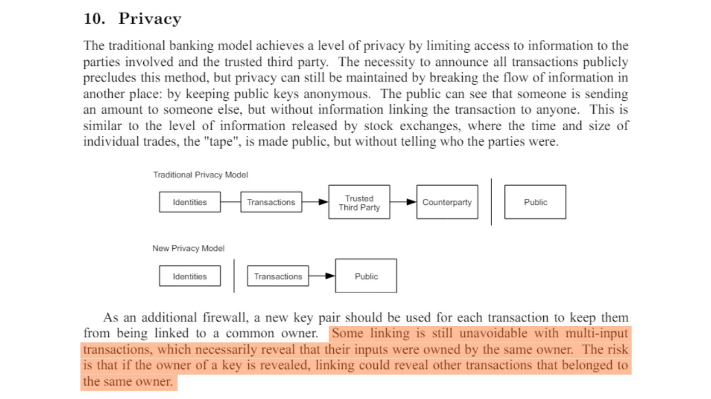


Szczególnie fascynujące jest to, że Satoshi Nakamoto, jeszcze przed oficjalnym uruchomieniem Bitcoin, zidentyfikował już dwie główne luki w prywatności użytkowników, a mianowicie CIOH i ponowne wykorzystanie Address. Taka dalekowzroczność jest dość niezwykła, ponieważ te dwie heurystyki pozostają, nawet dzisiaj, najbardziej przydatne w analizie Blockchain.


Aby dać ci przykład, oto transakcja, do której prawdopodobnie możemy zastosować CIOH:


```plaintext
20618e63b6eed056263fa52a2282c8897ab2ee71604c7faccfe748e1a202d712
```


Source : [Mempool.space](https://Mempool.space/tx/20618e63b6eed056263fa52a2282c8897ab2ee71604c7faccfe748e1a202d712)


### Dane off-chain


Oczywiście analiza łańcucha nie ogranicza się wyłącznie do danych onchain. Wszelkie dane z poprzedniej analizy lub dostępne w Internecie mogą być również wykorzystane do udoskonalenia analizy.


Na przykład, jeśli zaobserwujemy, że śledzone transakcje są systematycznie nadawane z tego samego węzła Bitcoin i uda nam się zidentyfikować jego IP Address, możemy być w stanie zidentyfikować inne transakcje od tego samego podmiotu, a także określić część tożsamości emitenta. Chociaż praktyka ta nie jest łatwa do osiągnięcia, ponieważ wymaga działania wielu węzłów, może być stosowana przez niektóre firmy specjalizujące się w analizie Blockchain.


Analityk ma również możliwość polegania na analizach wcześniej udostępnionych jako open source lub na własnych wcześniejszych analizach. Być może uda nam się znaleźć dane wyjściowe, które wskazują na klaster adresów, które już zidentyfikowaliśmy. Czasami można również polegać na danych wyjściowych, które wskazują na platformę Exchange, ponieważ adresy tych firm są ogólnie znane.


W ten sam sposób można przeprowadzić analizę przez eliminację. Na przykład, jeśli podczas analizy transakcji z dwoma wyjściami, jedno z nich odnosi się do znanego już klastra Address, ale różni się od podmiotu, który śledzimy, wówczas możemy zinterpretować, że drugie wyjście prawdopodobnie reprezentuje Exchange.


Analiza kanałów obejmuje również nieco bardziej ogólny komponent OSINT (*Open Source Intelligence*), obejmujący przeszukiwanie Internetu. Z tego powodu odradzamy publikowanie adresów bezpośrednio w sieciach społecznościowych lub na stronach internetowych, niezależnie od tego, czy są one anonimowe, czy nie.


### Modele czasowe


Mniej o tym myślimy, ale pewne ludzkie zachowania są rozpoznawalne onchain. Być może najbardziej przydatny w analizie jest wzorzec snu! Tak, kiedy śpisz, nie transmitujesz transakcji Bitcoin. Ale zazwyczaj śpisz mniej więcej o tej samej porze. Właśnie dlatego powszechną praktyką jest stosowanie analizy czasowej w analizie Blockchain. Mówiąc prościej, jest to spis czasów, w których transakcje danego podmiotu są transmitowane do sieci Bitcoin. Analizując te wzorce czasowe, możemy uzyskać wiele informacji.


Po pierwsze, analiza czasowa może czasami zidentyfikować charakter śledzonego podmiotu. Jeśli zaobserwujemy, że transakcje są transmitowane konsekwentnie przez 24 godziny, będzie to wskazywać na wysoki poziom aktywności gospodarczej. Podmiotem stojącym za tymi transakcjami może być firma, potencjalnie międzynarodowa i być może posiadająca zautomatyzowane procedury wewnętrzne.


Na przykład [rozpoznałem ten wzorzec kilka miesięcy temu](https://twitter.com/Loic_Pandul/status/1701127409712452072) podczas analizy [transakcji, która omyłkowo przydzieliła 19 bitcoinów w opłatach](https://Mempool.space/tx/d5392d474b4c436e1c9d1f4ff4be5f5f9bb0eb2e26b61d2781751474b7e870fd). Prosta analiza czasowa pozwoliła mi postawić hipotezę, że mamy do czynienia ze zautomatyzowaną usługą, a zatem prawdopodobnie z dużym podmiotem, takim jak platforma Exchange.


Rzeczywiście, kilka dni później odkryto, że środki należały do PayPal, za pośrednictwem platformy Paxos Exchange.


Wręcz przeciwnie, jeśli widzimy, że wzorzec czasowy jest raczej rozłożony na 16 określonych godzin, możemy oszacować, że mamy do czynienia z indywidualnym użytkownikiem lub być może lokalną firmą, w zależności od wymienianych wolumenów.


Oprócz charakteru obserwowanej jednostki, wzorzec czasowy może również powiedzieć nam w przybliżeniu, gdzie znajduje się użytkownik, dzięki strefom czasowym. W ten sposób możemy dopasować inne transakcje i wykorzystać ich znaczniki czasu jako dodatkową heurystykę, którą można dodać do naszej analizy.


Dla przykładu, na wielokrotnie używanym Address, o którym wspomniałem wcześniej, widzimy, że transakcje, zarówno przychodzące, jak i wychodzące, koncentrują się na 13-godzinnym interwale.


```plaintext
bc1qqtmeu0eyvem9a85l3sghuhral8tk0ar7m4a0a0
```


Źródło: OXT.me


Zakres ten prawdopodobnie odpowiada Europie, Afryce lub Bliskiemu Wschodowi. Możemy zatem założyć, że użytkownik stojący za tymi transakcjami mieszka w tych obszarach.


W innym duchu, analiza czasu tego typu również doprowadziła do hipotezy, że Satoshi Nakamoto nie działał z Japonii, ale z USA: [*Strefy czasowe Satoshi Nakamoto*](https://medium.com/@insearchofsatoshi/the-time-zones-of-Satoshi-nakamoto-aa40f035178f)


## Zastosowanie w praktyce z Block explorer


<chapterId>6493cf2f-225c-405f-9375-c4304f1087ed</chapterId>


W tym ostatnim rozdziale zamierzamy zastosować w praktyce koncepcje, które do tej pory studiowaliśmy. Pokażę ci przykłady prawdziwych transakcji Bitcoin, a ty będziesz musiał wyodrębnić informacje, o które cię proszę.


Idealnym rozwiązaniem do wykonania tych ćwiczeń byłoby użycie profesjonalnego narzędzia do analizy łańcucha. Jednak od czasu aresztowania twórców Samourai Wallet, jedyne darmowe narzędzie analityczne OXT.me nie jest już dostępne. Dlatego do tych ćwiczeń wybierzemy klasyczny Block explorer. Zalecam korzystanie z [Mempool.space](https://Mempool.space/) ze względu na jego wiele funkcji i zakres narzędzi do analizy łańcucha, ale można również wybrać inny eksplorator, taki jak [Bitcoin Explorer](https://bitcoinexplorer.org/).


Na początek przedstawię ćwiczenia. Do ich wykonania użyj Block explorer i zapisz odpowiedzi na kartce papieru. Na końcu tego rozdziału podam odpowiedzi, abyś mógł sprawdzić i poprawić swoje wyniki.


*Transakcje wybrane do tych ćwiczeń zostały wybrane wyłącznie ze względu na ich cechy w sposób nieco losowy. Niniejszy rozdział jest przeznaczony wyłącznie do celów edukacyjnych i informacyjnych. Chciałbym wyjaśnić, że nie popieram ani nie zachęcam do korzystania z tych narzędzi w złośliwych celach. Celem jest nauczenie, jak chronić się przed analizą ciągów znaków, a nie przeprowadzanie analizy w celu ujawnienia prywatnych informacji innych osób*


### Ćwiczenie 1


Identyfikator transakcji, która ma zostać przeanalizowana:


```plaintext
3769d3b124e47ef4ffb5b52d11df64b0a3f0b82bb10fd6b98c0fd5111789bef7
```


Jak nazywa się model tej transakcji i jakie prawdopodobne interpretacje można wyciągnąć, badając tylko jej model, tj. strukturę transakcji?


### Ćwiczenie 2


Identyfikator transakcji, która ma zostać przeanalizowana:


```plaintext
baa228f6859ca63e6b8eea24ffad7e871713749d693ebd85343859173b8d5c20
```


Jak nazywa się model tej transakcji i jakie prawdopodobne interpretacje można wyciągnąć, badając tylko jej model, tj. strukturę transakcji?


### Ćwiczenie 3


Identyfikator transakcji, która ma zostać przeanalizowana:


```plaintext
3a9eb9ccc3517cc25d1860924c66109262a4b68f4ed2d847f079b084da0cd32b
```


Jaki jest model tej transakcji?


Po zidentyfikowaniu modelu, przy użyciu wewnętrznej heurystyki transakcji, jakie dane wyjściowe prawdopodobnie reprezentuje Exchange?


### Ćwiczenie 4


Identyfikator transakcji, która ma zostać przeanalizowana:


```plaintext
35f0b31c05503ebfdf7311df47f68a048e992e5cf4c97ec34aa2833cc0122a12
```


Jaki jest model tej transakcji?


Po zidentyfikowaniu modelu, przy użyciu wewnętrznej heurystyki transakcji, jakie dane wyjściowe prawdopodobnie reprezentuje Exchange?


### Ćwiczenie 5


Wyobraźmy sobie, że Loïc opublikował jeden ze swoich adresów odbiorczych Bitcoin na portalu społecznościowym Twitter:


```plaintext
bc1qja0hycrv7g9ww00jcqanhfpqmzx7luqalum3vu
```


Na podstawie tych informacji i przy użyciu **tylko heurystyki ponownego użycia Address**, które transakcje Bitcoin można powiązać z tożsamością Loïca?


*Oczywiście nie jestem prawdziwym właścicielem tego Address i nie opublikowałem go na portalach społecznościowych. Jest to Address, który wziąłem losowo z Blockchain*


### Ćwiczenie 6


Po wykonaniu ćwiczenia 5, dzięki heurystyce ponownego użycia Address, byłeś w stanie zidentyfikować kilka transakcji Bitcoin, w które Loïc wydaje się być zaangażowany. Normalnie, wśród zidentyfikowanych transakcji, powinieneś był zauważyć tę:


```plaintext
2d9575553c99578268ffba49a1b2adc3b85a29926728bd0280703a04d051eace
```


Ta transakcja jest pierwszą, która wysłała środki na Address Loïca. Jak myślisz, skąd pochodzą bitcoiny otrzymane przez Loïca za pośrednictwem tej transakcji?


### Ćwiczenie 7


Po wykonaniu ćwiczenia 5, dzięki heurystyce ponownego użycia Address, udało ci się zidentyfikować kilka transakcji Bitcoin, w które Loïc wydaje się być zaangażowany. Teraz chcesz dowiedzieć się, skąd pochodzi Loïc. Na podstawie znalezionych transakcji przeprowadź analizę czasu, aby znaleźć strefę czasową najprawdopodobniej używaną przez Loïca. Na podstawie tej strefy czasowej określ lokalizację, w której wydaje się mieszkać Loïc (kraj, stan/region, miasto...).


### Ćwiczenie 8


Oto transakcja Bitcoin do przeanalizowania:


```plaintext
bb346dae645d09d32ed6eca1391d2ee97c57e11b4c31ae4325bcffdec40afd4f
```


Patrząc tylko na tę transakcję, jakie informacje możemy zinterpretować?


### Rozwiązania do ćwiczeń


***Ćwiczenie 1:***


Modelem dla tej transakcji jest prosty model płatności. Jeśli przeanalizujemy tylko jego strukturę, możemy zinterpretować, że jedno wyjście reprezentuje Exchange, a drugie wyjście reprezentuje rzeczywistą płatność. Wiemy zatem, że obserwowany użytkownik prawdopodobnie nie jest już w posiadaniu jednego z dwóch UTXO na wyjściu (tego z płatności), ale nadal jest w posiadaniu drugiego UTXO (tego z Exchange).


***Ćwiczenie 2:***


Modelem dla tej transakcji jest model zgrupowanych wydatków. Model ten prawdopodobnie ujawnia działalność gospodarczą na dużą skalę, taką jak platforma Exchange. Możemy wywnioskować, że dane wejściowe UTXO pochodzą od firmy o wysokim poziomie aktywności gospodarczej, a wyjściowe UTXO będą rozproszone. Niektóre będą należeć do klientów firmy, którzy wycofali swoje bitcoiny do portfeli samoobsługowych. Inne mogą trafić do firm partnerskich. Wreszcie, bez wątpienia będzie kilka Exchange, które wrócą do firmy emitującej.


***Ćwiczenie 3:***


Model tej transakcji to zwykła płatność. Możemy zatem zastosować wewnętrzną heurystykę do transakcji, aby spróbować zidentyfikować Exchange.


Osobiście zidentyfikowałem co najmniej dwie wewnętrzne heurystyki, które potwierdzają tę samą hipotezę:


- Ponowne użycie tego samego typu skryptu;
- Największa wydajność.


Najbardziej oczywistą heurystyką jest ponowne użycie tego samego typu skryptu. Rzeczywiście, wyjście `0` jest `P2SH`, rozpoznawalnym przez jego odbiór Address zaczynający się od `3`:


```plaintext
3Lcdauq6eqCWwQ3UzgNb4cu9bs88sz3mKD
```


Podczas gdy wyjście `1` to `P2WPKH`, identyfikowalne przez jego Address zaczynające się od `bc1q`:


```plaintext
bc1qya6sw6sta0mfr698n9jpd3j3nrkltdtwvelywa
```


UTXO użyty jako dane wejściowe dla tej transakcji również wykorzystuje skrypt `P2WPKH`:


```plaintext
bc1qyfuytw8pcvg5vx37kkgwjspg73rpt56l5mx89k
```


Możemy więc założyć, że wyjście `0` odpowiada płatności, a wyjście `1` jest transakcją Exchange, co oznaczałoby, że użytkownik wejściowy zawsze jest właścicielem wyjścia `1`.


Aby poprzeć lub obalić tę hipotezę, możemy poszukać innych heurystyk, które albo potwierdzą nasze myślenie, albo zmniejszą prawdopodobieństwo, że nasza hipoteza jest poprawna.


Zidentyfikowałem co najmniej jedną inną heurystykę. Jest to największa heurystyka wyjściowa. Wyjście `0` mierzy `123,689 Sats`, podczas gdy wyjście `1` mierzy `505,839 Sats`. Istnieje zatem znacząca różnica między tymi dwoma wynikami. Heurystyka największej produkcji sugeruje, że największą produkcją jest prawdopodobnie zagraniczny Exchange. Ta heurystyka dodatkowo wzmacnia naszą początkową hipotezę.


Dlatego wydaje się prawdopodobne, że użytkownik, który dostarczył UTXO jako dane wejściowe, nadal posiada wyjście `1`, które wydaje się ucieleśniać Exchange transakcji.


***Ćwiczenie 4:***


Modelem dla tej transakcji jest zwykła płatność. Możemy zatem zastosować wewnętrzną heurystykę do transakcji, aby spróbować zidentyfikować Exchange.


Osobiście zidentyfikowałem co najmniej dwie wewnętrzne heurystyki, które potwierdzają tę samą hipotezę:


- Ponowne użycie tego samego typu skryptu;
- Wyjście okrągłego słupka.


Najbardziej oczywistą heurystyką jest ponowne użycie tego samego typu skryptu. Rzeczywiście, wyjście `0` jest `P2SH`, rozpoznawalnym przez jego odbiór Address zaczynający się od `3`:


```plaintext
3FSH5Mnq6S5FyQoKR9Yjakk3X4KCGxeaD4
```


Podczas gdy wyjście `1` to `P2WPKH`, identyfikowalne przez jego Address zaczynające się od `bc1q`:


```plaintext
bc1qvdywdcfsyavt4v8uxmmrdt6meu4vgeg439n7sg
```


UTXO używany jako dane wejściowe dla tej transakcji również używa skryptu `P2WPKH`:


```plaintext
bc1qku3f2y294h3ks5eusv63dslcua2xnlzxx0k6kp
```


Możemy więc założyć, że wyjście `0` odpowiada płatności, a wyjście `1` jest transakcją Exchange, co oznaczałoby, że użytkownik wejściowy zawsze jest właścicielem wyjścia `1`.


Aby poprzeć lub obalić tę hipotezę, możemy poszukać innych heurystyk, które albo potwierdzą nasze myślenie, albo zmniejszą prawdopodobieństwo, że nasza hipoteza jest poprawna.


Zidentyfikowałem co najmniej jedną inną heurystykę. Jest to zaokrąglona kwota wyjściowa. Wyjście `0` mierzy `70 000 Sats`, podczas gdy wyjście `1` mierzy `22 962 Sats`. Mamy zatem idealnie okrągłe wyjście w jednostce rozliczeniowej BTC. Okrągła heurystyka wyjściowa sugeruje, że UTXO z okrągłą kwotą jest najprawdopodobniej płatnością, a przez eliminację, drugi reprezentuje Exchange. Ta heurystyka dodatkowo wzmacnia naszą początkową hipotezę.


Jednak w tym przykładzie inna heurystyka może podważyć naszą początkową hipotezę. Rzeczywiście, wyjście `0` jest większe niż wyjście `1`. Opierając się na heurystyce, że największy wynik jest generalnie zagranicznym Exchange, moglibyśmy wywnioskować, że wynik `0` jest zagranicznym Exchange. Jednak ta kontrhipoteza wydaje się nieprawdopodobna, ponieważ pozostałe dwie heurystyki wydają się znacznie bardziej przekonujące niż heurystyka największego wyjścia. W związku z tym rozsądne wydaje się utrzymanie naszej początkowej hipotezy pomimo tej pozornej sprzeczności.


Dlatego wydaje się prawdopodobne, że użytkownik, który dostarczył UTXO jako dane wejściowe, nadal posiada wyjście `1`, które wydaje się ucieleśniać Exchange transakcji.


***Ćwiczenie 5:***


Widzimy, że z tożsamością Loïca można powiązać 8 transakcji. Spośród nich 4 wiążą się z otrzymaniem bitcoinów:


```plaintext
2d9575553c99578268ffba49a1b2adc3b85a29926728bd0280703a04d051eace
8b70bd322e6118b8a002dbdb731d16b59c4a729c2379af376ae230cf8cdde0dd
d5864ea93e7a8db9d3fb113651d2131567e284e868021e114a67c3f5fb616ac4
bc4dcf2200c88ac1f976b8c9018ce70f9007e949435841fc5681fd33308dd762
```


Pozostałe 4 dotyczą przesyłek Bitcoin:


```plaintext
8b52fe3c2cf8bef60828399d1c776c0e9e99e7aaeeff721fff70f4b68145d540
c12499e9a865b9e920012e39b4b9867ea821e44c047d022ebb5c9113f2910ed6
a6dbebebca119af3d05c0196b76f80fdbf78f20368ebef1b7fd3476d0814517d
3aeb7ce02c35eaecccc0a97a771d92c3e65e86bedff42a8185edd12ce89d89cc
```


***Ćwiczenie 6:***


Jeśli spojrzymy na model tej transakcji, jasne jest, że jest to wydatek wiązany. Rzeczywiście, transakcja ma pojedyncze wejście i 51 wyjść, co wskazuje na wysoki poziom aktywności gospodarczej. Możemy zatem postawić hipotezę, że Loïc wycofał bitcoiny z platformy Exchange.


Kilka czynników potwierdza tę hipotezę. Po pierwsze, typ skryptu używanego do zabezpieczenia danych wejściowych UTXO to skrypt P2SH 2/3 Multisig, co wskazuje na zaawansowany poziom bezpieczeństwa typowy dla platform Exchange:


```plaintext
OP_PUSHNUM_2
OP_PUSHBYTES_33 03eae02975918af86577e1d8a257773118fd6ceaf43f1a543a4a04a410e9af4a59
OP_PUSHBYTES_33 03ba37b6c04aaf7099edc389e22eeb5eae643ce0ab89ac5afa4fb934f575f24b4e
OP_PUSHBYTES_33 03d95ef2dc0749859929f3ed4aa5668c7a95baa47133d3abec25896411321d2d2d
OP_PUSHNUM_3
OP_CHECKMULTISIG
```


Co więcej, badany przez Address `3PUv9tQMSDCEPSMsYSopA5wDW86pwRFbNF` jest ponownie wykorzystywany w ponad 220 000 różnych transakcji, co jest często charakterystyczne dla platform Exchange, generalnie nie dbających o ich poufność.


Heurystyka czasowa zastosowana do tego Address pokazuje również regularną transmisję transakcji prawie codziennie przez okres 3 miesięcy, z wydłużonymi godzinami w ciągu 24 godzin, co sugeruje ciągłą aktywność platformy Exchange.


Wreszcie, wolumeny obsługiwane przez ten podmiot są kolosalne. Address otrzymał i wysłał 44 BTC w 222 262 transakcjach między grudniem 2022 a marcem 2023 roku. Te duże wolumeny dodatkowo potwierdzają prawdopodobny charakter działalności platformy Exchange.


***Ćwiczenie 7:***


Analizując czasy potwierdzeń transakcji, można zidentyfikować następujące czasy UTC:


```plaintext
05:43
20:51
18:12
17:16
04:28
23:38
07:45
21:55
```


Analiza tych harmonogramów pokazuje, że UTC-7 i UTC-8 są zgodne z zakresem bieżącej aktywności człowieka (między 08:00 a 23:00) dla większości harmonogramów:


```plaintext
05:43 UTC > 22:43 UTC-7
20:51 UTC > 13:51 UTC-7
18:12 UTC > 11:12 UTC-7
17:16 UTC > 10:16 UTC-7
04:28 UTC > 21:28 UTC-7
23:38 UTC > 16:38 UTC-7
07:45 UTC > 00:45 UTC-7
21:55 UTC > 14:55 UTC-7
05:43 UTC > 21:43 UTC-8
20:51 UTC > 12:51 UTC-8
18:12 UTC > 10:12 UTC-8
17:16 UTC > 09:16 UTC-8
04:28 UTC > 20:28 UTC-8
23:38 UTC > 15:38 UTC-8
07:45 UTC > 23:45 UTC-8
21:55 UTC > 13:55 UTC-8
```


Strefa czasowa UTC-7 jest szczególnie istotna latem, ponieważ obejmuje takie stany i regiony jak :


- Kalifornia (z miastami takimi jak Los Angeles, San Francisco i San Diego);
- Nevada (z Las Vegas) ;
- Oregon (z Portland) ;
- Waszyngton (z Seattle) ;
- Kanadyjski region Kolumbii Brytyjskiej (z miastami takimi jak Vancouver i Victoria).


Informacje te sugerują, że Loïc prawdopodobnie mieszka na zachodnim wybrzeżu Stanów Zjednoczonych lub Kanady.


***Ćwiczenie 8:***


Analiza tej transakcji ujawnia 5 wejść i jedno wyjście, co sugeruje konsolidację. Stosując heurystykę CIOH, możemy założyć, że wszystkie wejściowe UTXO są własnością jednego podmiotu i że wyjściowy UTXO również należy do tego podmiotu. Wygląda na to, że użytkownik zdecydował się zgrupować kilka UTXO, które posiadał, aby utworzyć pojedynczy UTXO na wyjściu, w celu skonsolidowania swoich części. Ruch ten był prawdopodobnie motywowany chęcią skorzystania z niskich kosztów transakcyjnych w tamtym czasie, w celu zmniejszenia przyszłych kosztów.


___


*Aby napisać tę część 3 analizy on chain, oparłem się na następujących źródłach:*


- Seria czterech artykułów zatytułowanych: [Understanding Bitcoin Privacy with OXT](https://medium.com/oxt-research/understanding-Bitcoin-privacy-with-oxt-part-1-4-8177a40a5923), opracowana przez Samourai Wallet w 2021 r. ;*
- Różne raporty z [OXT Research](https://medium.com/oxt-research), a także ich bezpłatne narzędzie do analizy Blockchain (chwilowo niedostępne po aresztowaniu założycieli Samourai Wallet) ;*
- Mówiąc szerzej, moja wiedza pochodzi z różnych tweetów i treści od [@LaurentMT](https://twitter.com/LaurentMT) i [@ErgoBTC](https://twitter.com/ErgoBTC) ;*
- Kosmiczny Kek #19](https://podcasters.spotify.com/pod/show/decouvrebitcoin/episodes/SpaceKek-19---Analyse-de-chane--anonsets-et-entropie-e1vfuji), w którym brałem udział w towarzystwie [@louneskmt](https://twitter.com/louneskmt), [@TheoPantamis](https://twitter.com/TheoPantamis), [@Sosthene___](https://twitter.com/Sosthene___) i [@LaurentMT](https://twitter.com/LaurentMT).*


*Chciałbym podziękować ich autorom, deweloperom i producentom. Dziękuję również korektorom, którzy skrupulatnie poprawili artykuł, na którym opiera się ta część 3, i udzielili mi swoich fachowych porad :*


- [Gilles Cadignan](https://twitter.com/gillesCadignan) ;*
- [Ludovic Lars](https://viresinnumeris.fr/)


# Opanowanie najlepszych praktyk w celu ochrony prywatności


<partId>9bd04b63-f1af-4e50-9061-6bc90009df68</partId>


## Ponowne użycie Address


<chapterId>f3e97645-3df3-41bc-a4ed-d2c740113d96</chapterId>


Po zapoznaniu się z technikami, które mogą złamać poufność Bitcoin, w tej trzeciej części przyjrzymy się teraz najlepszym praktykom, które należy zastosować, aby się chronić. Celem tej części nie jest zbadanie metod poprawy poufności, który to temat zostanie omówiony później, ale raczej zrozumienie, jak prawidłowo współdziałać z Bitcoin, aby zachować poufność, którą naturalnie oferuje, bez uciekania się do dodatkowych technik.


Oczywiście, aby rozpocząć tę trzecią część, porozmawiamy o ponownym użyciu Address. Zjawisko to jest głównym zagrożeniem dla poufności użytkownika. Ten rozdział jest z pewnością najważniejszy w całym kursie.


### Co to jest Address?


Bitcoin odbierający Address to ciąg znaków lub identyfikator używany do odbierania bitcoinów na Wallet.


Technicznie rzecz biorąc, Bitcoin otrzymujący Address nie "otrzymuje" bitcoinów w dosłownym znaczeniu, ale raczej służy do definiowania warunków, w których bitcoiny mogą być wydawane. Mówiąc konkretnie, gdy płatność jest wysyłana do ciebie, transakcja nadawcy tworzy dla ciebie nowy UTXO jako wynik z UTXO, które zużył jako dane wejściowe. Na tym wyjściu umieszcza skrypt określający, w jaki sposób ten UTXO może zostać wydany w późniejszym terminie. Skrypt ten jest znany jako "*ScriptPubKey*" lub "*Locking Script*". Otrzymany Address, a dokładniej jego ładunek, jest zintegrowany z tym skryptem. Mówiąc prościej, skrypt ten stwierdza:


> "*Aby wydać ten nowy UTXO, musisz dostarczyć podpis cyfrowy przy użyciu klucza prywatnego powiązanego z tym odbierającym Address.*"


Adresy Bitcoin występują w różnych typach, w zależności od używanego modelu skryptowego. Pierwsze modele, znane jako "Legacy*", obejmują adresy `P2PKH` (*Pay-to-PubKey-Hash*) i `P2SH` (*Pay-to-Script-Hash*). Adresy P2PKH zawsze zaczynają się od `1`, a P2SH od `3`. Formaty te, choć nadal bezpieczne, są obecnie przestarzałe, ponieważ wiążą się z wyższymi kosztami transakcji i oferują mniejszą poufność niż nowe standardy.


Adresy SegWit V0 (`P2WPKH` i `P2WSH`) i Taproot / SegWit V1 (`P2TR`) reprezentują nowoczesne formaty. Adresy SegWit zaczynają się od `bc1q`, a adresy Taproot, wprowadzone w 2021 roku, zaczynają się od `bc1p`.


Na przykład, tutaj jest Taproot odbiór Address:


```text
bc1ps5gd2ys8kllz9alpmcwxqegn7kl3elrpnnlegwkm3xpq2h8da07spxwtf5
```


Sposób konstruowania klucza ScriptPubKey zależy od używanego standardu:


| ScriptPubKey | Script template
| ---------------- | ----------------------------------------------------------- |
| P2PKH | OP_DUP OP_HASH160 `<pubKeyHash>` OP_EQUALVERIFY OP_CHECKSIG |
| P2SH | OP_HASH160 `<scriptHash>` OP_EQUAL |
| P2WPKH | 0 `<pubKeyHash>` |
| P2WSH | 0 `<witnessScriptHash>` |
| P2SH - P2WPKH | OP_HASH160 `<redeemScriptHash>` OP_EQUAL |
| P2SH - P2WSH | OP_HASH160 `<redeemScriptHash>` OP_EQUAL |
| P2TR | 1 `<pubKey>` |

Konstrukcja adresów odbioru zależy również od wybranego modelu skryptu:


- Dla adresów `P2PKH` i `P2WPKH`, ładunek, tj. rdzeń Address, reprezentuje Hash klucza publicznego;
- Dla adresów `P2SH` i `P2WSH`, ładunek reprezentuje Hash adresu ;
- Jeśli chodzi o adresy `P2TR`, ładunek jest zmodyfikowanym kluczem publicznym. Wyjścia P2TR łączą aspekty _Pay-to-PubKey_ i _Pay-to-Script_. Poprawiony klucz publiczny jest wynikiem dodania klasycznego klucza publicznego do wydawania z "poprawką", pochodzącą z Merkle Root zestawu skryptów, które mogą być również używane do wydawania bitcoinów.


Adresy wyświetlane w oprogramowaniu portfolio zawierają również HRP (*Human-Readable Part*), zazwyczaj `bc` dla adresów po SegWit, separator `1` i numer wersji `q` dla SegWit V0 i `p` dla Taproot/SegWit V1. Suma kontrolna jest również dodawana w celu zagwarantowania integralności i ważności Address podczas transmisji.


Na koniec adresy są umieszczane w standardowym formacie:


- Base58check dla starych adresów Legacy ;
- Bech32 dla adresów SegWit ;
- Bech32m dla adresów Taproot.


Oto macierz dodawania dla formatów bech32 i bech32m (SegWit i Taproot) od podstawy 10:


| + | 0 | 1 | 2 | 3 | 4 | 5 | 6 | 7 |
| --- | --- | --- | --- | --- | --- | --- | --- | --- |
| 0 | q | p | z | r | y | 9 | x | 8 |
| 8 | g | f | 2 | t | v | d | w | 0 |
| 16 | s | 3 | j | n | 5 | 4 | k | h |
| 24 | c | e | 6 | m | u | a | 7 | l |

### Czym jest ponowne użycie Address?


Ponowne użycie Address polega na wykorzystaniu tego samego odbiorczego Address do blokowania kilku różnych UTXO.


Jak widzieliśmy w poprzedniej sekcji, każdy UTXO ma swój własny klucz ScriptPubKey, który blokuje go i musi być spełniony, aby UTXO mógł zostać wykorzystany jako dane wejściowe w nowej transakcji. To właśnie w ramach tego klucza ScriptPubKey zintegrowane są adresy ładunku.


Gdy różne klucze ScriptPubKeys zawierają ten sam odbierający Address, nazywa się to ponownym użyciem Address. W praktyce oznacza to, że użytkownik wielokrotnie przekazywał ten sam Address nadawcom w celu otrzymania bitcoinów za pośrednictwem wielu płatności. I właśnie ta praktyka jest katastrofalna dla prywatności użytkownika.


### Dlaczego ponowne użycie Address stanowi problem?


Ponieważ Blockchain jest publiczny, łatwo jest zobaczyć, które adresy blokują UTXO i ile bitcoinów. Jeśli ten sam Address jest używany w kilku transakcjach, możliwe staje się wywnioskowanie, że wszystkie bitcoiny powiązane z tym Address należą do tej samej osoby. Praktyka ta narusza prywatność użytkowników, umożliwiając tworzenie deterministycznych powiązań między różnymi transakcjami i śledzenie bitcoinów na Blockchain. Sam Satoshi Nakamoto zwrócił już uwagę na ten problem w Białej Księdze Bitcoin:


> *Jako dodatkowy firewall, dla każdej transakcji można użyć nowej pary kluczy, aby nie były one powiązane ze wspólnym właścicielem*


Źródło: S. Nakamoto, "Bitcoin: A Peer-to-Peer Electronic Cash System", https://Bitcoin.org/Bitcoin.pdf, 2009.


Intencją Satoshi w tym zdaniu było stworzenie dodatkowego firewalla w przypadku powiązania tożsamości użytkownika z parą kluczy na Bitcoin, aby zapobiec publicznemu powiązaniu całej jego aktywności z jego tożsamością. Obecnie, wraz z rozprzestrzenianiem się firm analizujących Blockchain i regulacjami KYC, korzystanie z unikalnych adresów nie jest już "dodatkową zaporą ogniową", ale niezbędną praktyką dla każdego, kto chce zachować minimum prywatności.


Gdy ponownie używasz Address, tworzysz niemal niezaprzeczalne powiązanie między wszystkimi transakcjami powiązanymi z tym Address. Chociaż nie zagraża to bezpośrednio twoim funduszom, ponieważ kryptografia krzywej eliptycznej gwarantuje bezpieczeństwo twoich kluczy prywatnych, ułatwia to monitorowanie twoich działań. W rzeczywistości każdy, kto ma węzeł, może obserwować transakcje i salda adresów, całkowicie naruszając anonimowość użytkownika.


Aby zilustrować ten punkt, weźmy przykład Boba, użytkownika, który regularnie kupuje bitcoiny w małych ilościach w DCA i zawsze wysyła je do tego samego Address. Po dwóch latach Address zawiera znaczną ilość bitcoinów. Jeśli Bob użyje tego Address do dokonania płatności na rzecz lokalnego sprzedawcy, ten ostatni będzie w stanie zobaczyć wszystkie powiązane środki i wywnioskować bogactwo Boba. Może to prowadzić do zagrożenia bezpieczeństwa osobistego, takiego jak próba kradzieży lub wymuszenia. Gdyby Bob używał pustego Address do otrzymywania każdego okresowego zakupu, ujawniłby swojemu sprzedawcy nieskończenie mniej informacji.


W analizie ciągów znaków istnieją 2 rodzaje ponownego użycia Address:


- Ponowne użycie zewnętrzne ;
- Wewnętrzne ponowne wykorzystanie w ramach transakcji.


Pierwszy z nich ma miejsce, gdy Address jest ponownie wykorzystywany w kilku różnych transakcjach Bitcoin. To jest to, o czym mówiliśmy wcześniej: ta heurystyka wnioskuje, że wszystkie UTXO przechodzące przez ten Address należą do jednego podmiotu.


Wewnętrzne ponowne użycie Address nie występuje, gdy ponowne użycie występuje w kilku transakcjach, ale gdy występuje w ramach jednej transakcji. Rzeczywiście, jeśli ten sam Address użyty do zablokowania wejścia jest używany jako wyjście transakcji, możemy wywnioskować, że to wyjście nadal należy do tego samego użytkownika (Exchange), a drugie wyjście reprezentuje rzeczywistą płatność. Ta druga heurystyka umożliwia utrwalenie śladu środków w kilku transakcjach.


Ponowne wykorzystanie Address jest prawdziwą plagą na Bitcoin. Według strony internetowej OXT.me (obecnie niedostępnej), ogólny wskaźnik ponownego wykorzystania Address na Bitcoin wyniósł około 52% w 2022 roku:


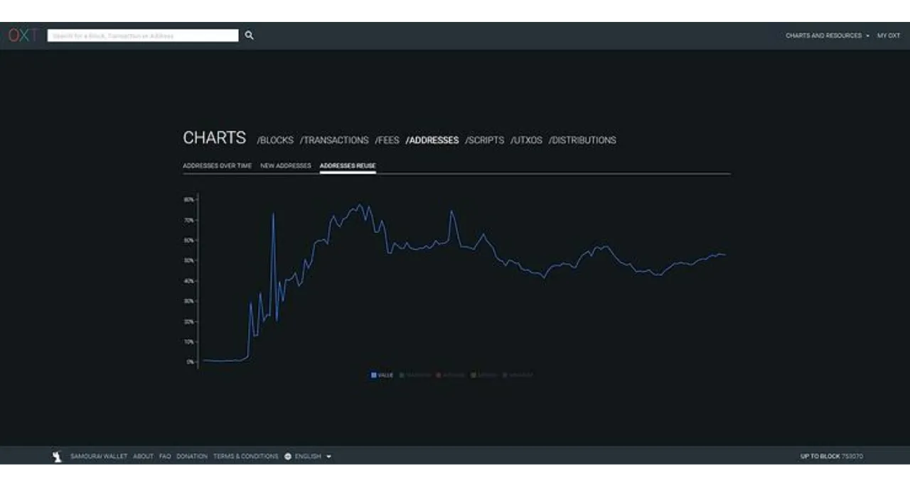


Wskaźnik ten jest ogromny, ale pochodzi głównie z platform Exchange, a nie od indywidualnych użytkowników.


### Jak uniknąć ponownego użycia Address?


Unikanie ponownego użycia Address jest dość proste: **po prostu użyj nowego, pustego Address dla wszystkich nowych płatności do Wallet**.


Dzięki BIP32, nowoczesne portfele są teraz deterministyczne i hierarchiczne. Oznacza to, że użytkownik może generate dużą liczbę adresów z jednej początkowej informacji: seed. Zapisując tę pojedynczą informację, można przywrócić wszystkie klucze prywatne w portfelu, umożliwiając dostęp do funduszy zabezpieczonych odpowiednimi adresami.


Dlatego po naciśnięciu przycisku "*odbierz*" w oprogramowaniu Wallet za każdym razem sugerowany jest nieużywany Address. Po otrzymaniu bitcoinów na tym Address, oprogramowanie automatycznie sugeruje nowy.


> *PS: Ostatnio niektóre programy Wallet ogłosiły zamiar zaprzestania generowania pustych adresów, obawiając się, że będzie to postrzegane przez władze jako forma prania pieniędzy. Jeśli Twoje oprogramowanie jest jednym z nich, zdecydowanie zalecam jego natychmiastową wymianę, ponieważ jest to nie do zaakceptowania dla użytkownika *
Jeśli potrzebujesz statycznego identyfikatora do otrzymywania płatności, takich jak darowizny, nie zaleca się używania klasycznego Bitcoin Address ze względu na ryzyko ponownego użycia. Zamiast tego należy użyć Lightning Address lub zdecydować się na statyczny identyfikator płatności onchain, taki jak BIP47 lub Silent Payments. Protokoły te zostały szczegółowo wyjaśnione w części 6 tego szkolenia.


## Etykietowanie i sprawdzanie części


<chapterId>fbdb07cd-c025-48f2-97b0-bd1bc21c68a8</chapterId>


Jak odkryliśmy w sekcji dotyczącej analizy ciągów znaków, istnieje wiele heurystyk i wzorców, które można wykorzystać do wydedukowania informacji o transakcji. Jako użytkownik ważne jest, aby być świadomym tych technik, aby lepiej się przed nimi chronić.


Wiąże się to z rygorystycznym zarządzaniem Wallet w ramach samodzielnego przechowywania, co oznacza znajomość pochodzenia UTXO, a także staranne wybieranie UTXO do wykorzystania podczas dokonywania płatności. To efektywne zarządzanie Wallet opiera się na dwóch ważnych cechach dobrych portfeli Bitcoin: tagowaniu i kontroli monet.


W tym rozdziale przyjrzymy się tym funkcjom i zobaczymy, jak można ich używać inteligentnie, bez nadmiernego obciążania, aby znacznie zoptymalizować swoją prywatność na Bitcoin.


### Czym jest etykietowanie?


Etykietowanie to praktyka przypisywania adnotacji lub etykiety do określonego UTXO w Bitcoin Wallet. Adnotacje te są przechowywane lokalnie przez oprogramowanie Wallet i nigdy nie są przesyłane przez sieć Bitcoin. Etykietowanie jest zatem osobistym narzędziem do zarządzania.


Na przykład, jeśli mam UTXO z zakupu P2P na Bisq z Charlesem, mogę oznaczyć go jako "`Non-KYC Bisq Charles`".


Tagowanie to dobra praktyka, która pomaga zapamiętać pochodzenie lub zamierzone miejsce docelowe UTXO, co ułatwia zarządzanie funduszami i optymalizację prywatności. Rzeczywiście, Bitcoin Wallet z pewnością zabezpiecza kilka UTXO. Jeśli źródła tych UTXO są różne, możesz nie chcieć łączyć tych UTXO w przyszłości, w przeciwnym razie możesz ujawnić ich wspólny Ownership. Odpowiednio oznaczając wszystkie części, możesz mieć pewność, że będziesz pamiętać, skąd pochodzą, gdy będziesz musiał ich użyć, nawet jeśli będzie to za wiele lat.


### Co to jest kontrola narożników?


Aktywne wykorzystanie etykietowania staje się jeszcze bardziej interesujące w połączeniu z opcją kontroli monet w oprogramowaniu portfela.


Kontrola monet to funkcja, którą można znaleźć w dobrym oprogramowaniu Bitcoin Wallet, dająca możliwość ręcznego wyboru określonych UTXO do wykorzystania jako dane wejściowe w celu ukończenia transakcji. W rzeczywistości, aby zaspokoić płatność wyjściową, należy w zamian wykorzystać płatność wejściową UTXO. Z wielu powodów, które omówimy później, możesz chcieć precyzyjnie wybrać, które części mają zostać wykorzystane jako dane wejściowe, aby zaspokoić daną płatność. Dokładnie to umożliwia kontrola monet. Aby dać ci analogię, ta funkcja jest podobna do wybierania konkretnej monety z Wallet, gdy płacisz za bagietkę.


Korzystanie z oprogramowania portfelowego z kontrolą monet, w połączeniu z etykietowaniem UTXO, umożliwia użytkownikom zarówno rozróżnianie, jak i dokładne wybieranie UTXO do swoich transakcji.


### Jak oznaczasz swoje UTXO?


Nie ma jednej uniwersalnej metody etykietowania UTXO. Do Ciebie należy zdefiniowanie systemu etykietowania, który będzie łatwy do zrozumienia dla Twojego portfela. W każdym razie należy pamiętać, że dobre etykietowanie to etykietowanie, które można zrozumieć, gdy jest potrzebne. Jeśli Bitcoin Wallet jest przeznaczony przede wszystkim do oszczędzania, etykiety mogą nie być przydatne przez kolejne dziesięciolecia. Upewnij się więc, że są jasne, precyzyjne i wyczerpujące.


Ważne jest, aby Twoi bliscy mogli łatwo zidentyfikować pochodzenie środków, jeśli pewnego dnia będą potrzebować dostępu do Twojego portfela. Pomoże im to zarówno ze względu na poufność, jak i ze względów prawnych, jeśli będą musieli uzasadnić pochodzenie środków przed organem.


Najważniejszą rzeczą do odnotowania na etykiecie jest źródło UTXO. Należy po prostu wskazać, w jaki sposób moneta znalazła się w Wallet. Czy jest to wynik zakupu na platformie Exchange? Płatności Invoice od klienta? Exchange peer-to-peer? A może reprezentuje Exchange wydatku? Na przykład można określić:


- remove Exchange.com` ;
- płatność klienta David` ;
- kup P2P Charles`;
- `Zmiana zakupu sofy`


Aby dopracować zarządzanie UTXO i przestrzegać strategii segregacji funduszy w portfelu, można wzbogacić etykiety o dodatkowy wskaźnik, który odzwierciedla te separacje. Jeśli Twój portfel zawiera dwie kategorie UTXO, których nie chcesz mieszać, możesz włączyć znacznik do etykiet, aby wyraźnie odróżnić te grupy. Te znaczniki separacji będą zależeć od własnych kryteriów, takich jak rozróżnienie między UTXO wynikającymi z procesu przejęcia, który obejmuje KYC, lub między funduszami profesjonalnymi i osobistymi. Biorąc pod uwagę przykłady etykiet wspomniane powyżej, może to przełożyć się na:


- `KYC - Wypłata Exchange.com` ;
- `KYC - Płatność klienta David`;
- `NO KYC - Kup P2P Charles` ;
- `NO KYC - Zmień zakup sofy`


Zaleca się również utrwalanie oznaczania części w trakcie transakcji. Na przykład, konsolidując UTXO no-KYC, pamiętaj, aby oznaczyć wynikowy UTXO nie tylko jako "konsolidacja", ale konkretnie jako "konsolidacja no-KYC", aby zachować jasny zapis tego, skąd pochodzą monety.


Wreszcie, umieszczanie daty na etykiecie nie jest obowiązkowe. Większość oprogramowania Wallet wyświetla już datę transakcji i zawsze można znaleźć tę informację na Block explorer dzięki txid.


### Jak wybrać odpowiednie części?


Podczas wykonywania transakcji kontrolka monet pozwala wybrać, które UTXO mają zostać wykorzystane jako dane wejściowe, aby zaspokoić wynik płatności. Wybór ten ma dwa aspekty:


- Możliwość powiązania przez odbiorcę płatności części tożsamości użytkownika z UTXO używanymi w danych wejściowych;
- Zdolność zewnętrznego obserwatora do ustanowienia powiązań między wszystkimi UTXO używanymi jako wejścia.


Aby zilustrować pierwszy punkt, weźmy konkretny przykład. Załóżmy, że kupujesz bagietkę w bitcoinach od swojego piekarza. Używasz jednego lub więcej UTXO, które posiadasz jako dane wejściowe, aby pokryć co najmniej cenę bagietki na wyjściu, a także opłaty transakcyjne. Twój piekarz mógłby wtedy potencjalnie powiązać twoją twarz lub jakąkolwiek inną część twojej tożsamości, którą zna, z monetami używanymi jako dane wejściowe. Wiedząc o istnieniu tego powiązania, możesz preferować wybór konkretnego UTXO zamiast innego podczas płatności.


Na przykład, jeśli jedno z twoich UTXO pochodzi z platformy Exchange i wolałbyś, aby piekarz nie wiedział o twoim koncie na tej platformie, unikniesz używania tego UTXO do płatności. Jeśli masz UTXO o wysokiej wartości, który ujawnia znaczną ilość bitcoinów, możesz również zdecydować się go nie używać, aby uniknąć sytuacji, w której piekarz dowie się o twojej fortunie BTC.


Wybór UTXO do wykorzystania w tym pierwszym punkcie jest zatem osobistą decyzją, na którą wpływa to, co chcesz ujawnić, a czego nie. Etykiety przypisane do UTXO po ich otrzymaniu pomogą ci wybrać te, które po wydaniu ujawniają tylko te informacje, których ujawnienie odbiorcy jest dla ciebie wygodne.


Oprócz informacji potencjalnie ujawnianych odbiorcy, wybór danych wejściowych wpływa również na to, co ujawniasz wszystkim obserwatorom Blockchain. Rzeczywiście, używając kilku UTXO jako danych wejściowych do transakcji, ujawniasz, że są one własnością tego samego podmiotu, zgodnie z heurystyką CIOH (_Common Input Ownership Heuristic_).


Wybierając części, należy zatem mieć świadomość, że transakcja, którą zamierzamy transmitować, utworzy powiązanie między wszystkimi używanymi UTXO. Powiązanie to może być problematyczne dla prywatności użytkownika, zwłaszcza jeśli UTXO pochodzą z różnych źródeł.


Weźmy przykład mojego UTXO no-KYC z Bisq; chcę uniknąć łączenia go z UTXO z, powiedzmy, regulowanej platformy Exchange, która zna moją tożsamość. Rzeczywiście, jeśli kiedykolwiek użyję tych 2 UTXO jako danych wejściowych do tej samej transakcji, regulowana platforma będzie w stanie powiązać moją tożsamość z UTXO, który kupiłem na Bisq, który nie był wcześniej powiązany z moją tożsamością.


Wreszcie, wybierając UTXO do wykorzystania jako dane wejściowe do transakcji, najważniejszą rzeczą jest unikanie używania wielu UTXO. Co najwyżej, jeśli możesz, wybierz jedną monetę wystarczająco dużą, aby zaspokoić swoją płatność. W ten sposób można całkowicie uniknąć ryzyka związanego z CIOH. Jeśli jednak żaden pojedynczy UTXO nie jest wystarczający do dokonania płatności i musisz zużyć kilka, upewnij się, że pochodzą one z podobnych źródeł, aby zminimalizować ryzyko niepożądanych powiązań. Należy również pamiętać, że odbiorca może powiązać posiadane informacje o użytkowniku z historią monet wykorzystanych w transakcjach.


### Zrozumienie automatycznego wyboru części


W poprzednich sekcjach omówiliśmy ręczny wybór UTXO, które mają być używane w transakcji. Ale co się dzieje, gdy oprogramowanie Wallet dokonuje tego wyboru automatycznie? Istnieje kilka metod określania, które monety należy wykorzystać, a wybór UTXO stanowi prawdziwe pole badań nad Bitcoin. Głównym celem tego automatycznego procesu jest często zminimalizowanie kosztów transakcji dla użytkownika.


Metody selekcji UTXO, takie jak FIFO (*First In First Out*) i LIFO (*Last In First Out*) są jednymi z najprostszych, ale także najmniej wydajnych. W przypadku FIFO najstarsze elementy portfela są wykorzystywane w pierwszej kolejności. Podejście to jest generalnie nieefektywne zarówno pod względem minimalizacji kosztów transakcyjnych, jak i zachowania poufności, z wyjątkiem przypadków, w których stosowane są względne blokady czasowe, które muszą być regularnie odnawiane. I odwrotnie, LIFO nadaje priorytet wykorzystaniu najnowszych UTXO. Obie metody, choć proste, często okazują się nieskuteczne.


Bardziej zaawansowaną metodą jest *Knapsack Solver*. Była ona używana na Bitcoin Core Wallet do wersji 0.17. Polega ona na iteracyjnym i losowym wybieraniu UTXO z Wallet, dodawaniu ich w podzbiorach i utrzymywaniu rozwiązania, które zmniejsza wagę transakcji tak bardzo, jak to możliwe, w celu zmniejszenia kosztów dla użytkownika.


*Branch-and-Bound* (BNB), często nazywany "algorytmem Murcha" od nazwiska jego wynalazcy, zastąpił *Knapsack Solver* w Bitcoin Core od wersji 0.17. Ta bardziej zaawansowana metoda ma na celu znalezienie zestawu UTXO, który dokładnie odpowiada kwocie potrzebnej do zaspokojenia wyjść transakcji. Celem BNB jest zminimalizowanie kwoty Exchange, a także opłat, poprzez zmniejszenie tak zwanego kryterium marnotrawstwa, które uwzględnia zarówno natychmiastowe koszty, jak i oczekiwane przyszłe koszty Exchange. Metoda ta wywodzi się z oryginalnej koncepcji *Branch-and-Bound*, opracowanej w 1960 roku przez Ailsę Land i Alison Harcourt, i oferuje bardziej precyzyjną optymalizację opłat niż *Knapsack Solver*.


Wszystkie te automatyczne metody selekcji UTXO mogą być skuteczne w zmniejszaniu kosztów transakcji, ale często są nieskuteczne w zachowaniu poufności użytkownika. W rzeczywistości algorytmy te mogą łączyć kilka UTXO w dane wejściowe, ujawniając w ten sposób wspólną właściwość tych UTXO ze względu na CIOH. Oczywiście metody te nie mogą uwzględniać etykiet umieszczonych na UTXO, które są jednak kluczowe dla świadomego wyboru części do ujawnienia odbiorcy transakcji. Obecnie jedynym sposobem na zoptymalizowanie poufności podczas wybierania monet jest zrobienie tego ręcznie.


### Samouczek dotyczący etykietowania UTXO


Jeśli chcesz dowiedzieć się, jak oznaczyć swoje UTXO, przygotowaliśmy obszerny samouczek na temat głównego oprogramowania Bitcoin Wallet:


https://planb.network/tutorials/privacy/on-chain/utxo-labelling-d997f80f-8a96-45b5-8a4e-a3e1b7788c52

## KYC i identyfikacja kluczy


<chapterId>cec6b9d9-0eed-4f85-bc4e-1e9aa59ca605</chapterId>


KYC to skrót od "Poznaj swojego klienta". Jest to procedura regulacyjna wdrożona przez niektóre firmy działające w sektorze Bitcoin. Celem tej procedury jest weryfikacja i rejestracja tożsamości klientów w celu zwalczania prania pieniędzy i finansowania terroryzmu.


W praktyce KYC obejmuje gromadzenie różnych danych osobowych od klienta, które mogą się różnić w zależności od jurysdykcji, ale generalnie obejmują dowód tożsamości, zdjęcie i dowód Address. Informacje te są następnie weryfikowane i przechowywane do wykorzystania w przyszłości.


Procedura ta stała się obowiązkowa dla wszystkich regulowanych platform Exchange w większości krajów zachodnich. Oznacza to, że każdy, kto chce Exchange walut państwowych za Bitcoin za pośrednictwem tych platform, musi spełniać wymogi KYC.


Procedura ta nie jest pozbawiona zagrożeń dla prywatności i bezpieczeństwa użytkowników. W tym rozdziale szczegółowo zbadamy te zagrożenia i przeanalizujemy konkretny wpływ procesów KYC i identyfikacji na prywatność użytkowników Bitcoin.


### Ułatwienie śledzenia onchain


Pierwsze ryzyko związane z KYC polega na tym, że oferuje on uprzywilejowany punkt wejścia do analizy Blockchain. Jak widzieliśmy w poprzedniej sekcji, analitycy mogą grupować i śledzić aktywność na Blockchain przy użyciu wzorców transakcji i heurystyki. Gdy już uda im się zgrupować aktywność użytkownika w łańcuchu onchain, wszystko, co muszą zrobić, to znaleźć pojedynczy punkt wejścia wśród wszystkich jego transakcji i kluczy, aby w pełni naruszyć jego poufność.


Kiedy wykonujesz KYC, zapewniasz wysokiej jakości punkt wejścia do analizy Blockchain, ponieważ kojarzysz swoje adresy odbiorcze używane podczas wypłacania bitcoinów z platformy Exchange z pełną, zweryfikowaną tożsamością. Teoretycznie informacje te są znane tylko firmie, której je przekazałeś, ale jak zobaczymy poniżej, ryzyko wycieku danych jest realne. Co więcej, sam fakt, że firma posiada te informacje może być problematyczny, nawet jeśli ich nie udostępnia.


Tak więc, jeśli nie podejmiesz innych kroków w celu ograniczenia agregacji swoich działań na Blockchain, każdy, kto zna ten punkt wejścia KYC, może potencjalnie powiązać całą Twoją aktywność na Bitcoin z Twoją tożsamością. Z punktu widzenia tej firmy korzystanie z Bitcoin traci wszelką poufność.


Aby zilustrować to porównaniem, to tak, jakby bankier w *Banku X* nie tylko miał dostęp do wszystkich transakcji z *Bankiem X*, ale także mógł obserwować transakcje z *Bankiem Y* i wszystkie transakcje gotówkowe.


Zapamiętaj z pierwszej części tego szkolenia: Model poufności Bitcoin, zgodnie z koncepcją Satoshi Nakamoto, opiera się na oddzieleniu tożsamości użytkownika od jego par kluczy. Chociaż ten model Layer poufności nie jest już dziś wystarczający, nadal rozsądne jest ograniczenie jego degradacji w jak największym stopniu.


### Narażenie na nadzór państwa


Drugim poważnym problemem związanym z KYC jest to, że ujawnia on państwu, że w pewnym momencie posiadałeś Bitcoin. Kiedy kupujesz bitcoiny za pośrednictwem regulowanego podmiotu, państwo może dowiedzieć się o tym posiadaniu. W tej chwili może się to wydawać trywialne, ale ważne jest, aby pamiętać, że polityczna i gospodarcza przyszłość twojego kraju nie jest w twoich rękach.


Po pierwsze, państwo może szybko przyjąć postawę autorytarną. Historia jest pełna przykładów, w których polityka uległa nagłej zmianie. Dziś w Europie Bitcoinerzy mogą pisać artykuły na temat Bitcoin, brać udział w konferencjach i zarządzać swoimi portfelami pod własnym nadzorem. Ale kto może powiedzieć, co przyniesie jutro? Jeśli Bitcoin nagle stanie się wrogiem publicznym numer jeden, powiązanie z nim w aktach rządowych może okazać się problematyczne.


Następnie, w obliczu poważnych kryzysów gospodarczych, państwo może rozważyć przejęcie bitcoinów posiadanych przez obywateli. Być może jutro użytkownicy bitcoinów będą postrzegani jako osoby czerpiące zyski z kryzysu i zostaną nadmiernie opodatkowani za swoje zyski kapitałowe w obliczu dewaluacji waluty fiducjarnej.


Mogłoby się wydawać, że nie stanowi to problemu, ponieważ bitcoiny są mieszane, a zatem niemożliwe do wyśledzenia. Jednak śledzenie nie jest tutaj problemem. Prawdziwym problemem jest to, że państwo wie, że posiadasz Bitcoin. Sama ta informacja może wystarczyć, by cię obciążyć lub pociągnąć do odpowiedzialności. Możesz próbować twierdzić, że wydałeś swoje bitcoiny, ale musiałoby to znaleźć odzwierciedlenie w zeznaniu podatkowym i zostałbyś przyłapany. Mógłbyś też powiedzieć, że zgubiłeś klucze w wypadku na łodzi, ale czy poza żartem na Twitterze naprawdę myślisz, że to wystarczy, by cię oczyścić z zarzutów?


Dlatego ważne jest, aby wziąć pod uwagę ryzyko, że państwo dowie się, że posiadasz BTC, bez względu na to, jak odległe może się to wydawać dzisiaj.


Kolejnym problemem związanym z KYC w kontekście nadzoru państwowego jest obowiązkowe raportowanie przez regulowane platformy. Chociaż nie znam przepisów obowiązujących w innych jurysdykcjach, we Francji *Prestataires de Services sur Actifs Numériques* (PSAN) są zobowiązani do zgłaszania organom nadzoru finansowego wszelkich przepływów środków, które uznają za podejrzane.


We Francji w 2023 r. PSAN zgłosiły 1449 podejrzanych aktów. Na razie większość tych czynów jest związana z przestępczością. Władze zwracają się jednak również do platform regulowanych o zgłaszanie wszelkich podejrzanych transakcji Bitcoin wyłącznie na podstawie ich struktury. Jeśli przeprowadzisz transakcję opartą na współpracy lub nawet tylko transakcję o nieco nietypowym schemacie, a transakcja ta nastąpi niedaleko od wycofania twoich Bitcoinów z tych platform, możesz zostać zgłoszony władzom. Nawet w przypadku braku nadużyć i zgodnego z prawem wykonywania swoich praw, takie zgłoszenie może prowadzić do wzmożonych kontroli i nadzoru, niedogodności, których można by uniknąć bez KYC.


### Ryzyko wycieku danych osobowych


Innym problemem związanym z KYC jest to, że wymaga on przechowywania wszystkich danych osobowych na serwerach prywatnej firmy.


Ostatnie wydarzenia przypomniały nam, że nikt nie jest odporny na awarie finansowe lub informatyczne. W 2022 roku konsekwencje ponieśli klienci Celsius. Po ogłoszeniu upadłości firmy nazwy wierzycieli i kwoty ich aktywów zostały upublicznione przez amerykańskie sądy w trakcie postępowania administracyjnego.


Nieco ponad dwa lata temu był to okręt flagowy w dziedzinie cyberbezpieczeństwa kryptowalut, który był świadkiem kradzieży danych osobowych swoich klientów. Chociaż incydent ten nie był bezpośrednio związany z zakupem bitcoinów, takie ryzyko pozostaje również dla platform Exchange. Istnieje zatem określone ryzyko związane z danymi osobowymi.


To prawda, że już teraz powierzamy wiele naszych danych osobowych prywatnym firmom. Jednak w tym przypadku ryzyko jest podwójne, ponieważ dane te nie tylko identyfikują użytkownika, ale są również powiązane z aktywnością na Bitcoin. W rzeczywistości, gdy haker uzyskuje dostęp do danych klientów platformy Exchange, może rozsądnie założyć, że klienci ci posiadają Bitcoiny. Ryzyko to zwiększa fakt, że Bitcoin, podobnie jak każdy inny cenny zasób, przyciąga uwagę złodziei.


W przypadku wycieku danych, w najlepszym przypadku możesz stać się celem ukierunkowanych prób phishingu. W najgorszym przypadku możesz znaleźć się w centrum fizycznych zagrożeń dla swojego domu.


Oprócz konkretnych zagrożeń związanych z Bitcoin, istnieją również niebezpieczeństwa związane z przesyłaniem dokumentów tożsamości. W przypadku wycieku danych można bowiem stać się ofiarą kradzieży tożsamości. Tak więc stawka nie ogranicza się tylko do ochrony poufności transakcji, ale dotyczy również bezpieczeństwa osobistego każdej osoby.


### Niektóre z góry przyjęte koncepcje dotyczące KYC


Ważne jest, aby zdekonstruować niektóre z góry przyjęte koncepcje dotyczące KYC, z którymi często spotykamy się na Twitterze lub w naszych wymianach między bitcoinami.


Po pierwsze, myślenie, że ochrona prywatności Bitcoinów nabytych za pośrednictwem KYC jest bezcelowa, jest niedokładne. Narzędzia i metody ochrony prywatności w Bitcoin są zróżnicowane i służą różnym celom. Na przykład korzystanie z transakcji CoinJoin na Bitcoinach nabytych za pośrednictwem KYC nie jest złym pomysłem. Oczywiście należy zachować ostrożność w przypadku regulowanych platform Exchange, aby uniknąć zamrożenia lub zbanowania konta, ale ze ściśle technicznego punktu widzenia praktyki te nie są sprzeczne. CoinJoin skutkuje zerwaniem historii monety, pomagając w ten sposób udaremnić pewne ryzyko analizy łańcucha związane z KYC. Chociaż nie eliminuje to wszystkich zagrożeń, stanowi znaczącą korzyść.


Poufność na Bitcoin nie powinna być postrzegana w sposób binarny, jako rozróżnienie między "anonimowymi" bitcoinami i innymi, które nie są anonimowe. Posiadanie Bitcoinów nabytych za pośrednictwem KYC nie oznacza, że wszystko jest stracone; wręcz przeciwnie, korzystanie z narzędzi poufności może okazać się jeszcze bardziej korzystne.


Z drugiej strony nabycie Bitcoin za pomocą metody innej niż KYC nie gwarantuje doskonałej poufności ani nie zwalnia użytkownika z konieczności podjęcia innych środków ochronnych. Jeśli posiadasz Bitcoin bez KYC, ale wielokrotnie używasz adresów odbiorczych, Twoje transakcje mogą być śledzone i agregowane. Najmniejsze powiązanie ze światem poza Bitcoin może zagrozić jedynej Layer poufności. Dlatego ważne jest, aby traktować wszystkie narzędzia i metody zwiększające prywatność na Bitcoin jako komplementarne. Każda technika odnosi się do określonego ryzyka i może dodać dodatkowy Layer ochrony. Tak więc posiadanie Bitcoin innego niż KYC nie oznacza, że nie trzeba podejmować innych środków ostrożności.


### Czy KYC można anulować?


Czasami jestem pytany, czy możliwe jest "cofnięcie się" po wykonaniu KYC, i jak można sobie wyobrazić z poprzednich akapitów, odpowiedź jest zniuansowana. Najprostszym sposobem na uniknięcie ryzyka związanego z KYC jest nieużywanie go podczas nabywania bitcoinów. Przyjrzymy się temu tematowi bardziej szczegółowo w następnym rozdziale. Jeśli jednak KYC został już przeprowadzony, a bitcoiny zakupione, czy istnieją sposoby na ograniczenie związanego z tym ryzyka?


Jeśli chodzi o ryzyko śledzenia transakcji, rozwiązaniem jest użycie CoinJoin. Przyjrzymy się tej metodzie szczegółowo w dalszej części kursu, ale powinieneś wiedzieć, że CoinJoin umożliwia przerwanie historii monety i uniemożliwienie jej śledzenia przeszłość-teraźniejszość i teraźniejszość-przeszłość. Nawet w przypadku BTC uzyskanych za pośrednictwem regulowanej platformy technika ta może uniemożliwić ich śledzenie.


CoinJoin nie eliminuje jednak drugiego ryzyka związanego z KYC: faktu, że państwo może zostać poinformowane o posiadaniu bitcoinów. Rzeczywiście, nawet jeśli monety nie są już identyfikowalne, państwo, w zależności od jurysdykcji, może mieć dostęp do deklaracji transferu aktywów kryptograficznych. Ponieważ ryzyko to nie ma charakteru technicznego, ale administracyjny, nie ma rozwiązań specyficznych dla Bitcoin, aby je wyeliminować, poza nie narażaniem się na KYC w pierwszej kolejności. Jedynym legalnym podejściem do ograniczenia tego ryzyka jest sprzedaż na regulowanych platformach Bitcoinów nabytych za pośrednictwem regulowanych platform, a następnie odkupienie ich za pomocą środków wolnych od KYC. Sprzedając i deklarując transfer, władze powinny zobaczyć, że nie jesteś już ich właścicielem.


Jeśli chodzi o ryzyko wycieku danych osobowych i dokumentów tożsamości, jest to zagrożenie zewnętrzne w stosunku do Bitcoin i nie ma technicznego rozwiązania, które pozwoliłoby go uniknąć. Po ujawnieniu danych trudno jest cofnąć operację. Możesz spróbować zamknąć swoje konto na platformie, ale nie gwarantuje to usunięcia danych KYC, zwłaszcza gdy weryfikacja tożsamości jest zlecana na zewnątrz. Weryfikacja całkowitego usunięcia informacji jest niemożliwa. Nie ma zatem rozwiązania, które pozwoliłoby całkowicie zapobiec temu ryzyku i zapewnić, że już ono nie istnieje.


### Różnica między KYC a kluczową identyfikacją


Czasami niektórzy bitcoinerzy mają tendencję do rozszerzania terminu "KYC" na każdy BTC Exchange obejmujący przelew bankowy lub płatność kartą kredytową, ponieważ środki te mogą również ujawnić pochodzenie płatności, podobnie jak KYC. Nie należy jednak mylić KYC z kluczową identyfikacją. Osobiście muszę przyznać, że moje postrzeganie tego tematu ewoluowało z czasem.


KYC odnosi się w szczególności do procedury regulacyjnej wdrożonej przez niektóre firmy w celu weryfikacji i rejestracji tożsamości ich klientów. Jest to sprawa binarna: podczas nabywania bitcoinów albo wykonujesz KYC, albo nie. Jednak kluczowa identyfikacja, która dotyczy związku między aspektem tożsamości użytkownika a aktywnością onchain, nie jest tak binarna, ale raczej stanowi kontinuum. Rzeczywiście, w kontekście nabycia lub transferu Bitcoin, taka identyfikacja jest zawsze możliwa w różnym stopniu.


Na przykład, jeśli kupujesz bitcoiny na regulowanej platformie w Szwajcarii, KYC nie jest wymagany. Twoje klucze mogą jednak zostać zidentyfikowane, ponieważ zakupu dokonano za pośrednictwem Twojego konta bankowego. W tym miejscu pierwsze dwa ryzyka związane z KYC - ułatwienie śledzenia onchain i narażenie na nadzór państwa - mogą również przejawiać się w Exchange bez KYC. Jeśli szwajcarski podmiot zgłosi podejrzane transakcje władzom w twoim kraju, mogą one po prostu sprawdzić konto bankowe użyte do zakupu, aby odkryć twoją tożsamość. Tak więc kupowanie bez KYC na regulowanych platformach jest raczej wysoko na skali ryzyka dla kluczowej identyfikacji.


Unikanie platform regulowanych i wybieranie metod pozyskiwania P2P nie eliminuje jednak całkowicie ryzyka identyfikacji klucza, a jedynie je zmniejsza. Weźmy przykład zakupu na Bisq lub innej platformie P2P. Aby zapłacić swojemu kontrahentowi, prawdopodobnie użyjesz swojego konta bankowego. Jeśli władze przesłuchają osobę, z którą handlowałeś i zapytają o Twoje imię i nazwisko, wracamy do ryzyka 1 i 2. Chociaż ryzyko to jest znacznie niższe niż w przypadku zakupów na platformie bez KYC, a nawet niższe niż w przypadku zakupów z KYC, nadal występuje w mniejszym stopniu.


Wreszcie, nawet jeśli nabywasz swoje bitcoiny za pośrednictwem fizycznego Exchange za gotówkę, nie jesteś całkowicie anonimowy. Osoba, z którą dokonałeś wymiany, widziała twoją twarz, która jest częścią twojej tożsamości. Chociaż w tym przykładzie jest to minimalne, nadal istnieje możliwość identyfikacji klucza.


Podsumowując, gdy bitcoiny są wymieniane na inne aktywa, czy to zakup w walucie państwowej, czy sprzedaż za rzeczywisty towar, zawsze istnieje pewna forma identyfikacji klucza. W zależności od wybranej metody Exchange identyfikacja ta może mieć różną intensywność. Ważne jest, aby nie mylić tej identyfikacji z KYC, który jest dobrze zdefiniowanym procesem regulacyjnym. Istnieje jednak związek między KYC a spektrum identyfikacji, ponieważ KYC znajduje się na wyższym końcu spektrum, ponieważ systematycznie ułatwia identyfikację kluczy użytkowników przez władze.


## Metody sprzedaży i pozyskiwania klientów


<chapterId>756598af-95aa-4c77-ac48-243c7ad89530</chapterId>


Po przeczytaniu poprzedniego rozdziału możesz zastanawiać się, w jaki sposób możesz kupić lub sprzedać Bitcoin bez konieczności przechodzenia procedury weryfikacji tożsamości, aby uniknąć ryzyka związanego z KYC. Istnieje kilka sposobów handlu Bitcoin.


### Wymiana gotówki P2P


Jak widzieliśmy, najlepszą metodą pod względem poufności pozostaje P2P (person-to-person) Exchange z rozliczeniem gotówkowym. Metoda ta pozwala zminimalizować pozostawiane ślady i znacznie ogranicza możliwość identyfikacji klucza, niezależnie od tego, czy kupujesz, czy sprzedajesz.


Niemniej jednak istnieje ryzyko dla bezpieczeństwa osobistego. Główne niebezpieczeństwo polega na tym, że podczas Exchange kontrahent będzie wiedział, że posiadasz dużą sumę pieniędzy, zarówno w gotówce, jak i w bitcoinach. Informacja ta może przyciągnąć uwagę złośliwych osób. Rzeczywiście, ogólnie zaleca się zachowanie dyskrecji na temat posiadanych Bitcoin. Ta rada może być również zastosowana do gotówki. Jednak podczas osobistej wymiany nieuniknione jest ujawnienie posiadania bitcoinów, co może przyciągnąć niepożądaną uwagę.


Aby ograniczyć to ryzyko, radziłbym preferować transakcje gotówkowe z zaufanymi osobami, takimi jak członkowie rodziny lub bliscy przyjaciele. Alternatywnie, możesz również rozważyć handel na [lokalnych spotkaniach Bitcoin] (https://btcmap.org/communities/map), po kilkukrotnym uczestnictwie. Pozwoli ci to lepiej poznać innych uczestników i nie będziesz sam podczas fizycznej wymiany. Ważne jest jednak, aby zdawać sobie sprawę, że wymiana gotówkowa P2P z natury wiąże się z ryzykiem dla osobistego bezpieczeństwa, które nie istnieje przy zakupie za pośrednictwem regulowanej platformy i konta bankowego.


Co więcej, w zależności od miejsca zamieszkania, transport i przechowywanie dużych sum pieniędzy może być ryzykowne, niezależnie od tego, czy jest to Bitcoin, czy gotówka.


Wymiana gotówki może również wiązać się z ryzykiem prawnym w przypadku kontroli policyjnej lub innej. Chociaż w większości krajów nie ma ograniczeń co do ilości gotówki, którą można nosić przy sobie, nadmierne kwoty mogą wzbudzić podejrzenia. Zachowaj więc ostrożność, zwłaszcza jeśli musisz podróżować na duże odległości, i unikaj dokonywania zbyt wielu dużych transakcji naraz, aby nie musieć uzasadniać posiadania dużych kwot.


Wreszcie, kolejną wadą zakupów P2P jest to, że cena jest często wyższa niż na platformach regulowanych. Sprzedawcy często pobierają marżę w wysokości od 1% do czasami ponad 10%. Istnieje kilka powodów tej różnicy w cenie. Po pierwsze, jest to powszechna praktyka wśród sprzedawców P2P, która utrwaliła się z czasem. Po drugie, sprzedawcy mają opłaty związane z transakcją, aby wysłać środki do kupującego. Istnieje również zwiększone ryzyko kradzieży w sprzedaży P2P w porównaniu z transakcjami na platformie, co uzasadnia rekompensatę za podjęte ryzyko. Wreszcie, dodatkowy koszt może być związany z popytem i jakością Exchange pod względem poufności. Jako kupujący, zysk z poufności ma swoją cenę, która znajduje odzwierciedlenie w marży stosowanej przez sprzedawcę. Niektórzy bitcoinerzy uważają również, że cena marży BTC zakupionego na P2P odzwierciedla jego prawdziwą cenę i twierdzą, że niższe ceny na platformach regulowanych są wynikiem kompromisu w zakresie poufności danych osobowych.


### Wymiana P2P za pośrednictwem platformy matchmakingowej


Mniej ryzykowną alternatywą pod względem bezpieczeństwa osobistego jest dokonywanie wymiany P2P wyłącznie online, za pośrednictwem elektronicznych metod płatności, takich jak PayPal, przelewy bankowe lub Revolut.


Takie podejście pozwala uniknąć wielu ryzyk związanych z transakcjami gotówkowymi. Ryzyko niewywiązania się przez kontrahenta z Exchange online jest jednak większe. Rzeczywiście, w fizycznym Exchange, jeśli przekażesz pieniądze sprzedawcy, który nie wyśle ci bitcoinów w zamian, możesz natychmiast wezwać go do rozliczenia, ponieważ stoi przed tobą. Z drugiej strony, w Internecie często niemożliwe jest wyśledzenie kogoś, kto cię okradł.


Aby ograniczyć to ryzyko, możliwe jest korzystanie z wyspecjalizowanych platform wymiany P2P. Platformy te wykorzystują mechanizmy rozwiązywania konfliktów w celu ochrony poszkodowanych użytkowników. Zazwyczaj oferują one system escrow, w którym bitcoiny są przechowywane do momentu potwierdzenia płatności w walucie fiducjarnej przez sprzedającego.


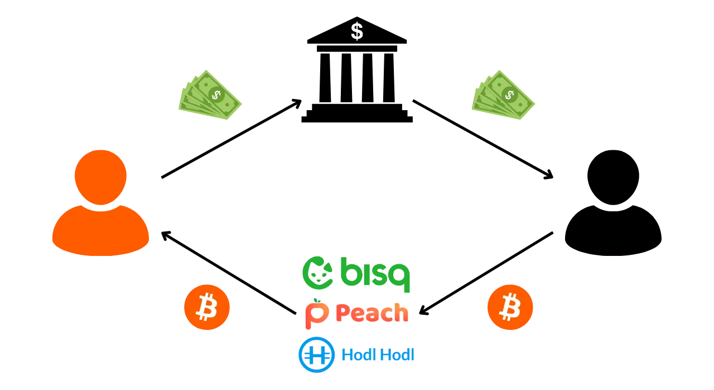


Pod względem bezpieczeństwa osobistego ta metoda zakupu jest znacznie bezpieczniejsza niż fizyczna gotówka Exchange. Jednakże, jak wspomniano powyżej, wymiana P2P online pozostawia więcej śladów niż fizyczny Exchange, co może być szkodliwe dla prywatności na Bitcoin. Korzystając z metody płatności fiat online, takiej jak bank, ujawniasz więcej informacji, które mogą ułatwić identyfikację klucza.


Ponownie, nie zalecałbym dokonywania zbyt wielu dużych transakcji w ramach jednej transakcji na tych platformach. Dzieląc swoje transakcje, rozkładasz ryzyko kradzieży kontrahenta.


Ponownie, kolejną wadą zakupów P2P jest to, że cena jest często wyższa niż ta obserwowana na platformach regulowanych. Sprzedawcy często pobierają marżę w wysokości od 1% do czasami ponad 10%. Istnieje kilka powodów tej różnicy w cenie. Po pierwsze, jest to powszechna praktyka wśród sprzedawców P2P, która utrwaliła się z czasem. Po drugie, sprzedawcy mają opłaty związane z transakcją, aby wysłać środki do kupującego. Istnieje również zwiększone ryzyko kradzieży w przypadku sprzedaży P2P w porównaniu z transakcjami na platformie, co uzasadnia rekompensatę za podjęte ryzyko. Wreszcie, dodatkowy koszt może być związany z popytem i jakością Exchange pod względem poufności. Jako kupujący, zysk z poufności ma swoją cenę, która znajduje odzwierciedlenie w marży stosowanej przez sprzedawcę. Niektórzy bitcoinerzy uważają również, że cena marży BTC zakupionego na P2P odzwierciedla jego prawdziwą cenę i twierdzą, że niższe ceny na platformach regulowanych są wynikiem kompromisu w zakresie poufności danych osobowych.


Jeśli chodzi o rozwiązania, osobiście zawsze korzystałem z [Bisq](https://bisq.network/) i jestem z niego bardzo zadowolony. Ich system jest wypróbowany i przetestowany i wydaje się niezawodny. Jednak Bisq jest dostępny tylko na PC, a jego Interface może być zbyt skomplikowany dla początkujących. Inną wadą jest to, że Bisq działa tylko z transakcjami onchain, co może stać się kosztowne w okresach wysokich opłat transakcyjnych Bitcoin.


-> Zobacz nasz samouczek Bisq.


https://planb.network/tutorials/exchange/peer-to-peer/bisq-fe244bfa-dcc4-4522-8ec7-92223373ed04

Prostszą opcją jest wypróbowanie [Peach](https://peachbitcoin.com/), aplikacji mobilnej, która łączy kupujących i sprzedających z wbudowanym systemem rozwiązywania konfliktów. Proces ten jest bardziej intuicyjny niż w przypadku Bisq.


-> Zobacz nasz samouczek Peach.


https://planb.network/tutorials/exchange/peer-to-peer/peach-c6143241-d900-4047-9b73-1caba5e1f874

Inną opcją online jest [HodlHodl](https://hodlhodl.com/), platforma o ugruntowanej pozycji, która oferuje dobrą płynność, choć osobiście jej nie testowałem.


-> Zobacz nasz samouczek HodlHodl.


https://planb.network/tutorials/exchange/peer-to-peer/hodlhodl-d7344cd5-6b18-40f5-8e78-2574a93a3879

Jeśli chodzi o rozwiązania oparte na Lightning Network, wypróbuj [RoboSats](https://learn.robosats.com/) i [LNP2PBot](https://lnp2pbot.com/). RoboSats jest dostępny za pośrednictwem strony internetowej i jest stosunkowo prosty w użyciu. LNP2PBot jest bardziej nietypowy, ponieważ działa za pośrednictwem systemu Exchange w aplikacji do przesyłania wiadomości Telegram.


-> Zobacz nasz samouczek dotyczący RoboSats.


-> Zobacz nasz samouczek LNP2PBot.


https://planb.network/tutorials/exchange/peer-to-peer/robosats-b60e4f7c-533a-4295-9f6d-5368152e8c06

https://planb.network/tutorials/exchange/peer-to-peer/lnp2pbot-v2-e6bcb210-610b-487d-970c-7cce85273e3c


### Platformy regulowane bez KYC


W zależności od kraju, w którym mieszkasz, możesz mieć dostęp do regulowanych platform, które nie wymagają procedur KYC do kupowania lub sprzedawania bitcoinów. Na przykład w Szwajcarii można korzystać z platform takich jak [Relai](https://relai.app/) i [MtPelerin](https://www.mtpelerin.com/).


-> Zobacz nasz samouczek dotyczący Relai.


https://planb.network/tutorials/exchange/centralized/relai-v2-30a9671d-e407-459d-9203-4c3eae15b30e

Jak widzieliśmy w poprzednim rozdziale, ten rodzaj platformy pozwala uniknąć ryzyka związanego z procedurami KYC, ale wiąże się z wyższym poziomem ryzyka w zakresie identyfikacji kluczy. Pod względem poufności Bitcoin platformy te oferują lepszą ochronę niż metody zakupu z KYC, ale pozostają mniej atrakcyjne niż giełdy P2P.


Jednak pod względem bezpieczeństwa osobistego korzystanie z tych platform jest znacznie mniej ryzykowne niż wymiana P2P. Są one również często prostsze w użyciu niż platformy P2P.


### Bankomaty


Inną opcją zakupu lub sprzedaży bitcoinów bez KYC są bankomaty kryptowalutowe. Osobiście nigdy nie miałem okazji przetestować tego rozwiązania, ponieważ nie ma ich w moim kraju. Ale ta metoda może być bardzo interesująca, w zależności od tego, gdzie mieszkasz.


Problem z bankomatami polega na tym, że są one albo zabronione w niektórych krajach, albo ściśle regulowane w innych. Jeśli bankomat wymaga procedury weryfikacji tożsamości, jest narażony na takie samo ryzyko, jak platformy regulowane przez KYC. Z drugiej strony, jeśli bankomat umożliwia transakcje bez weryfikacji tożsamości na niewielkie kwoty, wówczas jego użycie może zapewnić poziom poufności porównywalny z P2P gotówkowym Exchange, unikając jednocześnie większości zagrożeń związanych z tego typu Exchange.


Główną wadą bankomatów są często wysokie opłaty Exchange, wynoszące od kilku procent do czasami 15% wymienianej kwoty.


### Karty podarunkowe


Na koniec chciałem również przedstawić rozwiązanie, które sprawdza się dobrze dla tych, którzy chcą używać swoich bitcoinów na co dzień do robienia zakupów, zamiast sprzedawać je za waluty fiducjarne.


Najlepszym sposobem na wydanie BTC jest oczywiście użycie Bitcoin lub Lightning Network bezpośrednio do zakupu towaru lub usługi. Jednak w wielu krajach liczba sprzedawców akceptujących Bitcoin jest nadal ograniczona. Praktyczną alternatywą jest użycie kart podarunkowych.


Kilka platform, które nie wymagają procedur KYC, oferuje możliwość wymiany bitcoinów na karty podarunkowe, które można wykorzystać u głównych sprzedawców detalicznych. Należą do nich [CoinsBee](https://www.coinsbee.com/), [The Bitcoin Company](https://thebitcoincompany.com/) i [Bitrefill](https://www.bitrefill.com/). Platformy te znacznie ułatwiają codzienne korzystanie z bitcoinów, dając dostęp do szerokiej gamy produktów i usług bez konieczności przeliczania ich na walutę fiducjarną.


https://planb.network/tutorials/exchange/centralized/bitrefill-8c588412-1bfc-465b-9bca-e647a647fbc1


### Inne metody pozyskiwania


Inne sposoby pozyskiwania bitcoinów przy jednoczesnej ochronie prywatności obejmują oczywiście Mining. Aby rozpocząć Mining Sats, nie musisz ujawniać swojej tożsamości; po prostu znajdź ważny Proof of Work i prześlij go do sieci. Jeśli zdecydujesz się na pulę Mining, niektóre pule wymagają pewnej formy identyfikacji, takiej jak KYC, podczas gdy inne nie.


Inną metodą jest praca w Exchange za bitcoiny. Ta metoda pozyskiwania może być interesująca, ale stopień wymaganej identyfikacji różni się znacznie w zależności od okoliczności.


*Aby napisać ten rozdział, skorzystałem z kursu szkoleniowego BTC205 prowadzonego przez [@pivi___](https://x.com/pivi___) na Plan ₿ Network (na razie dostępnego tylko w języku francuskim)


## Konsolidacja, zarządzanie UTXO i CIOH


<chapterId>d0486c8f-332d-402b-ae2e-949416752b9c</chapterId>


Jednym z najbardziej skomplikowanych aspektów prowadzenia portfela self-custody jest konsolidacja. Czy należy konsolidować? Jaki to ma sens? Jaki rozmiar UTXO powinien być przestrzegany? Jakie są kompromisy w zakresie poufności? Właśnie temu przyjrzymy się w tej sekcji.


### Czym jest konsolidacja?


Bitcoin działa jak rynek aukcyjny, a górnicy preferują transakcje oferujące najniższe opłaty. Każdy blok ma jednak maksymalną wagę, co ogranicza liczbę transakcji, które można w nim zawrzeć. Ponieważ blok jest tworzony średnio co 10 minut, przestrzeń dostępna w każdym bloku jest zasobem deficytowym.


Górnicy, których działalność generate wiąże się ze znacznymi kosztami w zakresie energii elektrycznej, środków trwałych i konserwacji, naturalnie dążą do maksymalizacji swojej rentowności. Dlatego mają tendencję do faworyzowania transakcji, które generate najwyższe opłaty w stosunku do ich wagi.


Nie wszystkie transakcje Bitcoin mają taką samą wagę. Te z większą liczbą wejść i wyjść będą miały większą wagę. Na przykład, wyobraźmy sobie 2 transakcje:


- Transakcja A obejmuje 1 wejście i 1 wyjście. Przydziela ona 1 994 Sats opłat i ma wagę 141 vB ;
- Transakcja B, bardziej złożona transakcja z 2 wejściami i 2 wyjściami, przydziela 2 640 Sats w opłatach za wagę 220 vB.


W tym przykładzie, chociaż transakcja B oferuje wyższą całkowitą opłatę, górnicy będą preferować transakcję A, ponieważ oferuje ona lepszy stosunek opłaty do wagi. Oto obliczenia dla każdej transakcji, wyrażone w Sats na wirtualny bajt (sat/vB):


```text
TXA : 1994 / 141 = 14 sats/vB
TXB : 2640 / 220 = 12 sats / vB
```


Oznacza to, że dla każdej jednostki wagi, transakcja A oferuje więcej kosztów niż transakcja B, nawet jeśli transakcja B oferuje więcej kosztów w wartościach bezwzględnych.


Dlatego też zawsze bardziej interesujące dla użytkownika jest zużywanie jak najmniejszej ilości danych wejściowych w swoich transakcjach. Należy jednak zużywać wystarczające ilości, aby móc zaspokoić płatność wyjściową. Zarządzając swoim portfelem, musisz mieć wystarczająco duże UTXO.


Zasada konsolidacji polega właśnie na wykorzystaniu okresów, w których opłaty na Bitcoin są niskie, aby połączyć mniejsze UTXO w jedno większe. W ten sposób, gdy opłaty na Bitcoin wzrosną, będzie można dokonywać transakcji przy minimalnych nakładach, a tym samym wydawać mniej na opłaty w wartościach bezwzględnych. Celem jest zatem przewidywanie obowiązkowych transakcji, które mają być przeprowadzane w okresach wysokich opłat.


Oprócz oszczędności na kosztach transakcyjnych, konsolidacja UTXO pomaga zapobiegać powstawaniu "Dust". Dust" odnosi się do UTXO, których wartość w Sats jest tak niska, że nie wystarcza na pokrycie kosztów transakcyjnych wymaganych do ich wydania. To sprawia, że te UTXO są ekonomicznie nieracjonalne w użyciu tak długo, jak koszty transakcyjne pozostają wysokie. Poprzez proaktywne łączenie swoich UTXO, zapobiegasz ich przekształceniu w Dust, zapewniając, że wszystkie twoje fundusze pozostaną użyteczne.


### Jaki jest minimalny rozmiar UTXO?


Czasami jestem pytany, jaka jest zalecana minimalna wartość dla UTXO. Niestety, nie ma uniwersalnej odpowiedzi, ponieważ zależy to od preferencji użytkownika i warunków panujących na rynku opłat. Poniżej znajduje się jednak wzór, który może pomóc w określeniu progu dostosowanego do naszych potrzeb:


$$
\frac {P \times F}T = M
$$


Gdzie:


- p$ jest wagą transakcji;
- $F$ reprezentuje maksymalną stawkę opłat w satoshis na vbyte (Sats/vB), przed którą się zabezpieczasz;
- t$ to wartość procentowa opłaty transakcyjnej, którą jesteś skłonny zapłacić w stosunku do całkowitej wartości UTXO;
- m$ to minimalna kwota w satoshis dla każdego UTXO.


Załóżmy, że planujesz pokryć opłaty za standardową transakcję SegWit z 1 wejściem i 2 wyjściami, o wadze 141 vB. Jeśli zabezpieczasz do 800 Sats/vB i jesteś skłonny wydać maksymalnie do 12% wartości UTXO w opłatach, obliczenia będą następujące:


$$
\frac{141 \times 800}{0.12} = 940\ 000
$$


W tym przykładzie rozsądne byłoby zatem utrzymanie minimalnej wartości 940 000 Sats dla UTXO w portfelu.


### Konsolidacja i CIOH


Jedną z najczęściej stosowanych heurystyk w analizie Blockchain jest CIOH (*Common Input Ownership Heuristic*), która zakłada, że wszystkie wejścia do transakcji Bitcoin należą do tego samego podmiotu. Sama zasada konsolidacji polega na wykorzystaniu kilku UTXO jako danych wejściowych i utworzeniu pojedynczego UTXO jako danych wyjściowych. Konsolidacja umożliwia zatem zastosowanie ICOH.


W praktyce oznacza to, że zewnętrzny obserwator może wywnioskować, że wszystkie skonsolidowane UTXO prawdopodobnie należą do tej samej osoby i że wygenerowany unikalny wynik również należy do niej. Taka sytuacja może zagrozić poufności poprzez powiązanie różnych historii transakcji. Załóżmy na przykład, że konsoliduję 3 UTXO pozyskane za pośrednictwem P2P z jednym UTXO pozyskanym za pośrednictwem platformy wymagającej KYC:


W ten sposób każdy podmiot mający dostęp do danych platformy Exchange, w tym potencjalnie agencje rządowe, będzie w stanie zidentyfikować, że posiadam inne ilości BTC. Wcześniej te UTXO nie były bezpośrednio powiązane z moją tożsamością; teraz są. Co więcej, ujawnia to wszystkim źródłom, że jestem w posiadaniu określonej ilości bitcoinów.


Jeśli chodzi o zarządzanie UTXO, względy ekonomiczne, które napędzają konsolidację w celu obniżenia kosztów, wchodzą w konflikt z dobrą praktyką ochrony prywatności, która zalecałaby, aby nigdy nie łączyć UTXO. Wybór między ekonomią a poufnością zależy zatem od priorytetów każdego użytkownika.


Jeśli można uniknąć konsolidacji przy jednoczesnym utrzymaniu znacznych UTXO, jest to idealne rozwiązanie. Aby to zrobić, zoptymalizuj swoje metody akwizycji. Jeśli kupujesz bitcoiny w DCA, staraj się jak najbardziej rozdzielić jednorazowe zakupy, aby skonsolidować wartość na mniejszej liczbie UTXO. Łatwiej będzie zarządzać jednorazowym zakupem 1000 euro co 2 miesiące niż zakupem 120 euro co tydzień. Minimalizuje to liczbę generowanych UTXO i upraszcza zarządzanie portfelem przy jednoczesnym zachowaniu poufności.


Jeśli musisz skonsolidować swoje bitcoiny, preferuj przede wszystkim konsolidację UTXO z tego samego źródła. Na przykład połączenie 10 UTXO z jednej platformy będzie miało mniejszy wpływ na poufność niż zmieszanie 5 UTXO z platformy A z 5 UTXO z platformy B. Jeśli konsolidacja różnych źródeł jest nieunikniona, spróbuj rozdzielić je zgodnie z ich charakterystyką. Na przykład zgrupuj UTXO uzyskane za pośrednictwem KYC w jednej transakcji, a te uzyskane za pośrednictwem P2P w innej.


W każdym razie nie należy zapominać, że każda konsolidacja nieuchronnie wiąże się z utratą poufności. Dlatego należy dokładnie ocenić potrzebę tej operacji i potencjalny wpływ na prywatność, biorąc pod uwagę CIOH.


## Inne najlepsze praktyki


<chapterId>b5216965-7d13-4ea1-9b7c-e292966a487b</chapterId>


Przyjrzyjmy się kilku innym najlepszym praktykom optymalizacji prywatności w Bitcoin.


### Kompletny węzeł


Posiadanie bitcoinów na własnym utrzymaniu jest świetne, ale korzystanie z własnego kompletnego węzła jest jeszcze lepsze! Oto dlaczego posiadanie własnego węzła jest kluczowe dla w pełni suwerennego korzystania z Bitcoin:


- Odporność na cenzurę**: Twoje transakcje nie mogą zostać przez nikogo zablokowane;
- Niezależność od stron trzecich**: Nie jesteś już zależny od żadnej zewnętrznej usługi w celu weryfikacji danych Blockchain;
- Aktywne uczestnictwo**: Użytkownik może zdefiniować własne zasady walidacji i brać bezpośredni udział w konsensusie;
- Wkład w sieć**: Prowadząc węzeł, pomagasz wzmocnić i rozpowszechnić sieć Bitcoin;
- Edukacja techniczna**: Zarządzanie kompletnym węzłem to świetny sposób na pogłębienie wiedzy technicznej na temat Bitcoin.


Oprócz tych korzyści, korzystanie z kompletnego węzła zwiększa również poufność podczas nadawania transakcji. Gdy wystawiasz transakcję, jest ona najpierw tworzona i podpisywana za pośrednictwem Wallet. Aby rozgłosić ją w sieci Bitcoin, musi być ona znana przez co najmniej jeden węzeł. Korzystając z własnego węzła, masz bezpośrednią kontrolę nad tą dystrybucją, wzmacniając w ten sposób swoją poufność i ograniczając ryzyko wycieku danych.


Jeśli nie masz własnego węzła Bitcoin, będziesz zmuszony użyć węzła innej firmy, takiego jak ten oferowany przez dostawcę oprogramowania Wallet. Oprócz nadawania transakcji, Wallet wymaga dostępu do różnych informacji, takich jak oczekujące transakcje, salda powiązane z adresami i liczba potwierdzeń transakcji. Aby uzyskać dostęp do wszystkich tych danych, należy wysłać zapytanie do węzła.


Głównym ryzykiem, gdy nie korzystasz z własnego węzła Bitcoin, jest to, że operator węzła strony trzeciej może obserwować twoje działania na Blockchain, a nawet udostępniać te informacje innym podmiotom. Aby ograniczyć to ryzyko, pośrednim rozwiązaniem jest użycie oprogramowania Wallet, które maskuje połączenia za pośrednictwem sieci Tor. Może to zmniejszyć narażenie danych użytkownika. Optymalnym rozwiązaniem jest jednak posiadanie własnego węzła Bitcoin i używanie go do rozgłaszania swoich transakcji. Oczywiście należy również uważać, aby nie wyciekły żadne informacje za pośrednictwem węzła, ale to kolejny temat, któremu przyjrzymy się w późniejszych sekcjach.


Oprócz oczywistej korzyści dla prywatności, posiadanie własnego kompletnego węzła zapewnia również prawdziwość danych na Blockchain, chroni przed cenzurą i pozwala aktywnie uczestniczyć w zarządzaniu Bitcoin. Korzystając z własnego węzła, wnosisz swój wkład ekonomiczny do wybranego przez siebie łańcucha, co jest ważne podczas konfliktów w społeczności, takich jak na przykład podczas Blocksize War w latach 2015-2017. W przypadku Fork korzystanie z węzła innej firmy może prowadzić do wspierania łańcucha, którego nie chcesz faworyzować, ponieważ operator węzła dokonuje wyboru za Ciebie.


Jak widać, w interesie poufności i indywidualnej suwerenności konieczne jest uruchomienie i używanie własnego kompletnego węzła!


### Zwodnicza heurystyka analizy


Mówiąc szerzej, ważne jest, aby zrozumieć heurystyki, o których mówiliśmy w poprzedniej sekcji, aby lepiej ich unikać lub oszukiwać. Przyjęcie szeregu najlepszych praktyk może być korzystne, nawet jeśli nie są one niezbędne. Oferują one dodatkową Layer ochronę, która może być ważna dla zachowania poufności podczas korzystania z Bitcoin.


Pierwszą radą, jakiej mogę udzielić, jest wtopienie się w najgęstszy tłum. W przypadku Bitcoin oznacza to korzystanie z najbardziej rozpowszechnionych szablonów skryptów. Na przykład skrypty P2WSH, często używane w konfiguracjach SegWit V0 Multisig, są bardzo rzadkie. Nie pozwalają one ukryć się w dużym zestawie anonimowości. To samo dotyczy starszych modeli, takich jak P2PKH lub P2SH. Chociaż są one szeroko obecne w zestawie UTXO, są coraz rzadziej używane w nowych transakcjach.


Ogólnie rzecz biorąc, rozsądniej jest wybrać najnowszy standard skryptowy, pod warunkiem, że został on wystarczająco przyjęty. Tak więc, jeśli w 2022 r. odradzałbym korzystanie z P2TR (Taproot) ze względu na jego niską adopcję, w 2024 r. zaleciłbym zamiast tego wybranie tego typu skryptu lub, w przypadku jego braku, skryptu SegWit V0, ponieważ liczba transakcji wykorzystujących P2TR zaczyna stanowić bardzo znaczący odsetek.


Źródło: [txstats.com](https://txstats.com/d/000000054/UTXO-set-repartition-by-output-type)


Inną wskazówką dotyczącą zachowania poufności jest próba ominięcia wewnętrznej heurystyki transakcji. Na przykład, podczas dokonywania płatności można spróbować uniknąć tworzenia wyjścia z okrągłą kwotą, ponieważ może to sygnalizować, że inne wyjście reprezentuje zagraniczne Exchange. Jeśli chcesz wysłać 100 k Sats do znajomego, rozważ przelanie nieco wyższej kwoty, aby ominąć tę heurystykę. Podobnie, staraj się nie tworzyć wyjść zagranicznych Exchange, które są nieproporcjonalnie wysokie w stosunku do dokonanej płatności, ponieważ może to również ujawnić, które z wyjść reprezentuje zagraniczny Exchange.


Wreszcie, jeśli regularnie przeprowadzasz transakcje Bitcoin, upewnij się, że nie zawsze transmitujesz je w tym samym czasie. Rozkładając transmisję transakcji w ciągu dnia i tygodnia, unikasz dawania zewnętrznym obserwatorom możliwości wykrycia wzorca czasowego opartego na strefie czasowej, który mógłby wzmocnić ich analizę.


Oprócz wszystkich tych dobrych praktyk, które należy stosować na co dzień, istnieją jeszcze bardziej skuteczne metody całkowitego zerwania identyfikowalności bitcoinów. Obejmują one oczywiście transakcje CoinJoin, którym przyjrzymy się dogłębnie w następnej sekcji.


# Zrozumienie transakcji CoinJoin


<partId>6d0bbf16-3714-4db1-9897-2d45019f6bdc</partId>


## Co to jest transakcja CoinJoin?


<chapterId>0862bc6b-1c48-4aa4-b76d-4f547b469008</chapterId>


Po zapoznaniu się z podstawami ochrony prywatności, przyjrzymy się teraz bardziej wyrafinowanym technikom mającym na celu aktywną ochronę poufności, w szczególności poprzez rozdzielenie historii Bitcoin. W następnej części przyjrzymy się całej gamie małych technik, ale najpierw chciałbym opowiedzieć o CoinJoin.


CoinJoin jest często uważany za najskuteczniejszą metodę ochrony prywatności użytkowników Bitcoin. Ale czym dokładnie jest transakcja CoinJoin? Dowiedzmy się.


### Podstawowe zasady działania CoinJoin


CoinJoin to technika przełamywania śledzenia Bitcoin na Blockchain. Opiera się ona na transakcji współpracy o określonej strukturze o tej samej nazwie: transakcji CoinJoin.


Jak widzieliśmy w pierwszych częściach tego kursu, transakcje Bitcoin są znane wszystkim użytkownikom za pośrednictwem ich węzła. Łatwo jest zatem sprawdzić łańcuch podpisów elektronicznych każdej monety i obserwować jej historię. Oznacza to, że wszyscy użytkownicy mogą próbować analizować transakcje innych użytkowników. W rezultacie anonimowość na poziomie transakcji jest niemożliwa. Anonimowość jest jednak zachowana na poziomie indywidualnej identyfikacji. W przeciwieństwie do konwencjonalnego systemu bankowego, w którym każde konto jest powiązane z osobistą tożsamością, w Bitcoin środki są powiązane z parami kluczy kryptograficznych (lub skryptami), oferując użytkownikom formę pseudonimowości za identyfikatorami kryptograficznymi.


Poufność Bitcoin jest podważana, gdy zewnętrzni obserwatorzy są w stanie powiązać określone UTXO ze zidentyfikowanymi użytkownikami. Po ustaleniu tego powiązania możliwe staje się śledzenie ich transakcji i analizowanie ich historii Bitcoin. CoinJoin jest właśnie techniką opracowaną w celu przełamania identyfikowalności UTXO, aby zaoferować użytkownikom Bitcoin pewną Layer poufność na poziomie transakcji.


Coinjoiny wzmacniają poufność użytkowników Bitcoin, czyniąc analizę łańcucha bardziej złożoną dla zewnętrznych obserwatorów. Ich struktura pozwala na łączenie wielu monet od różnych użytkowników w jedną transakcję, zacierając granice i utrudniając określenie powiązań między adresami wejściowymi i wyjściowymi.


Ważne jest, aby zrozumieć, że celem transakcji CoinJoin jest przerwanie historii monety. Technika ta nie zapewnia trwałej anonimowości ani ostatecznie nie blokuje śledzenia Bitcoin, wbrew temu, co mogłoby się wydawać. CoinJoin ma na celu jedynie przerwanie historii w momencie, w którym przeprowadzana jest transakcja CoinJoin. Jednak przed i po tej operacji moneta nadal podlega temu samemu ryzyku pod względem poufności.


### Jak działają coinjoiny?


Zasada CoinJoin opiera się na podejściu opartym na współpracy: kilku użytkowników, którzy chcą wymieszać swoje bitcoiny, wpłaca identyczne kwoty jako dane wejściowe do tej samej transakcji. Kwoty te są następnie redystrybuowane w wyjściach o równej wartości dla każdego użytkownika.


Pod koniec transakcji niemożliwe staje się powiązanie konkretnego wyjścia z użytkownikiem znanym jako wejście. Nie ma bezpośredniego powiązania między wejściami i wyjściami, co zrywa powiązanie między użytkownikami i ich UTXO, a także historią każdej części.


Weźmy przykład Alice. Chce ona wysłać około 100 000 Sats swojej siostrze Ewie na urodziny. Alice nie chce jednak, by Eve była w stanie prześledzić historię jej transakcji, ponieważ nie chce ujawniać, ile bitcoinów posiada ani w jaki sposób je zdobyła. W tym celu Alice postanawia przerwać swoją historię UTXO transakcją CoinJoin. Organizuje się z Bobem, Charlesem, Davidem i Frankiem, aby przeprowadzić wspólną transakcję:


- Alice, Bob, Charles, David i Frank przekazują po 105 000 UTXO Sats (z 5 000 Sats na opłaty Mining) jako wkłady do transakcji:


- W zamian za wykorzystanie tych danych wejściowych, każdy z nich generuje pusty Address, aby utworzyć pięć identycznych danych wyjściowych po 100 000 Sats każdy. Każdy z nich pobiera jedno wyjście:


- Alice otrzymuje UTXO w wysokości 100 000 Sats, których historia jest pomieszana. Używa tego UTXO w nowej transakcji, aby wysłać kwotę Ewie na jej urodziny:


- Jeśli Eve spróbuje przeanalizować tę transakcję w celu wydobycia informacji, zostanie skonfrontowana z transakcją CoinJoin z udziałem Alice, Boba, Charlesa, Davida i Franka. Nie mogąc rozróżnić, które dane wejściowe należą do kogo ze względu na jednolitość kwot, Ewa nie może prześledzić historii UTXO Alicji ani określić, ile bitcoinów posiada jej siostra ani w jaki sposób je nabyła:


W tym przypadku Alicja wykorzystała technikę CoinJoin w celu zwiększenia poufności w odniesieniu do analizy retrospektywnej. W efekcie Alicja chroni się przed ewentualną analizą przeprowadzoną przez Ewę, która rozpoczęłaby od konkretnej transakcji i przeszła wstecz przez historię UTXO. Ta ochrona przed analizą od teraźniejszości do przeszłości jest znana jako anonset retrospektywny. Przyjrzymy się tej koncepcji bardziej szczegółowo w ostatnich rozdziałach tej sekcji.


CoinJoin oferuje jednak również możliwość wzmocnienia poufności w obliczu analizy z przeszłości do teraźniejszości, znanej jako anonset prospektywny. Wróćmy do naszego przykładu, w którym Alicja wysłała Ewie 98 000 Sats na urodziny, ale z odwróconymi rolami. Wyobraźmy sobie teraz, że to Ewa martwi się o swoją prywatność. Rzeczywiście, Alicja może pokusić się o śledzenie monety, którą wysłała Ewie, aby wydobyć z niej informacje. Ewa mogłaby skonsolidować UTXO, który właśnie otrzymała, ze wszystkimi innymi UTXO, co mogłoby ujawnić Alicji ilość bitcoinów, które ma w swoim Wallet. Aby tego uniknąć, Eve może również złamać historię monety, którą właśnie otrzymała:


- Eve, Grace, Mallory, Oscar i Victor złożyli UTXO w wysokości 98 000 Sats jako dane wejściowe do transakcji Bitcoin:


- W zamian za korzystanie z tych danych wejściowych, każdy użytkownik otrzymuje pusty Address, który może zostać użyty do utworzenia 5 wyjść składających się z 97 500 idealnie równych Sats. Każdy użytkownik otrzymuje jeden wynik:


- Eve posiada teraz UTXO o wartości 97 500 Sats, których historia została przerwana. Może go bez obaw używać do przeprowadzania przyszłych transakcji. Rzeczywiście, jeśli Alicja spróbuje śledzić bitcoiny, które wysłała do Ewy, zostanie skonfrontowana z transakcją CoinJoin. Nie będzie w stanie określić, który wychodzący UTXO należy do Ewy. Analiza staje się niemożliwa:


W pierwszym przykładzie widzieliśmy, jak CoinJoin może chronić prywatność pokoju w odniesieniu do jego przeszłości, a w drugim przykładzie, jak może również zabezpieczyć historię pokoju w odniesieniu do jego przyszłości. Dlatego właśnie wspomniałem, że CoinJoin powinien być postrzegany jako jednorazowe wydarzenie, które segmentuje część historii w obu kierunkach:


### Mikser, CoinJoin, mikser... Jaka jest różnica?


Coinjoiny są czasami opisywane jako "miksery", termin, który niektórzy bitcoinowcy odrzucają, obawiając się, że można go pomylić z mikserami powierniczymi. Uważam jednak, że obawy te są nieuzasadnione, ponieważ w kontekście matematycznym CoinJoin ucieleśnia właśnie koncepcję mieszania.


W ogólnej dziedzinie matematyki mieszanie odnosi się do właściwości układu dynamicznego, w którym po pewnym czasie wszystkie części przestrzeni początkowej mogą teoretycznie zostać zmieszane z dowolną inną częścią. Mieszanie oznacza, że położenie cząstki lub stan układu ewoluuje w taki sposób, że jego przyszły rozkład jest niezależny od rozkładu początkowego, osiągając w ten sposób stan, w którym cechy stanu początkowego są równomiernie rozłożone w przestrzeni układu. Dokładnie to dzieje się w CoinJoin z bitcoinami. Tak więc, moim zdaniem, CoinJoin jest naprawdę metodą mieszania monet.


Z drugiej strony ważne jest, aby odróżnić CoinJoin od shufflerów. Shuffler to usługa, w ramach której użytkownicy wysyłają swoje bitcoiny do przetasowania. Usługi te były popularne w 2010 roku, ale ich wykorzystanie spadło z powodu dwóch głównych wad w porównaniu do CoinJoin:


- Wymagają one od użytkowników zrzeczenia się opieki nad swoimi środkami podczas procesu mieszania, co naraża ich na ryzyko kradzieży;
- Nie ma gwarancji, że mikser nie zarejestruje szczegółów transakcji, a nawet nie sprzeda tych informacji firmom zajmującym się analizą łańcucha.


Dzisiejsi użytkownicy preferują zatem CoinJoin, ponieważ pozwala im on zachować całkowitą kontrolę nad swoimi środkami w trakcie całego procesu. Uczestnicy CoinJoin nie są narażeni na ryzyko kradzieży bitcoinów przez inne zaangażowane strony. Przyjrzyjmy się, jak to wszystko jest możliwe w następnym rozdziale.


## Zerolink i chaumian coinjoins


<chapterId>326c9654-b359-4906-b23d-d6518dd5dc3e</chapterId>


Prywatność zapewniana przez CoinJoin zależy od wielkości grupy, w której ukryty jest nasz utwór. Oznacza to znalezienie jak największej liczby uczestników. Całkowicie możliwe jest stworzenie CoinJoin ręcznie, z użytkownikami, których sami znaleźliśmy, ale jest to skomplikowany proces i nie wygra żadnych dużych anonsów.


Dlatego właśnie w CoinJoin opracowano koordynatorów Bitcoin. Ich rolą jest kontaktowanie ze sobą różnych użytkowników i przekazywanie informacji potrzebnych do ukończenia transakcji opartej na współpracy.


Ale w jaki sposób możemy zapewnić, że koordynator nigdy nie położy rąk na bitcoinach użytkowników i pomimo faktu, że jest on osobą budującą transakcję CoinJoin, w jaki sposób możemy zapewnić, że nie może on połączyć wejść i wyjść użytkowników, co mogłoby stanowić wyciek poufności?


### Ślepe podpisy Chauma


Nowoczesne implementacje CoinJoin wykorzystują ślepe podpisy Davida Chauma, aby uniknąć wycieku informacji. Przyjrzyjmy się, jak działają te ślepe podpisy.


Ślepe podpisy Chauma są formą podpisu cyfrowego, w której wystawca podpisu nie zna treści wiadomości, którą podpisuje. Podpis można jednak zweryfikować w odniesieniu do oryginalnej wiadomości. Technika ta została opracowana przez kryptografa Davida Chauma w 1983 roku.


Weźmy przykład firmy, która chce uwierzytelnić poufny dokument, taki jak Contract, bez ujawniania jego treści. Firma stosuje proces maskowania, który kryptograficznie przekształca oryginalny dokument w odwracalny sposób. Tak zmodyfikowany dokument jest wysyłany do urzędu certyfikacji, który składa ślepy podpis, nie znając jego treści. Po otrzymaniu podpisanego dokumentu firma usuwa maskę podpisu. Rezultatem jest oryginalny dokument uwierzytelniony podpisem urzędu, bez jego wglądu w oryginalną treść.


Ślepe podpisy Chauma mogą zatem poświadczać autentyczność dokumentu bez znajomości jego treści, gwarantując w ten sposób zarówno poufność danych użytkownika, jak i integralność podpisanego dokumentu.


### Chaumian coinjoins


Tak zwane "Chaumian" coinjoiny łączą wykorzystanie Tora i ślepych podpisów Davida Chauma, aby zapewnić, że koordynator nie może wiedzieć, które dane wyjściowe należą do którego użytkownika.


Proces tworzenia transakcji CoinJoin obejmuje 3 główne etapy: rejestrację danych wejściowych, rejestrację danych wyjściowych i podpisanie transakcji. Przyjrzyjmy się temu procesowi na przykładzie Alice, jednego z uczestników CoinJoin. Wszyscy pozostali uczestnicy wykonują te same kroki co Alice, każdy na własną rękę.


**Krok 1: Rejestracja danych wejściowych


- Alicja przesyła do koordynatora UTXO, którego chce użyć jako danych wejściowych do transakcji, a także zamaskowany Address, którego chce użyć jako danych wyjściowych do otrzymania swoich bitcoinów. Koordynator nie ma zatem możliwości poznania Address Alice. Widzi tylko jej zamaskowaną wersję:


- Koordynator sprawdza poprawność danych wejściowych, a następnie podpisuje zamaskowany Address Alicji swoim kluczem prywatnym. Ślepy podpis jest zwracany do Alicji:


**Krok 2: Rejestracja wyjść**


- Alice może zdemaskować swój Address, teraz podpisany kluczem prywatnym koordynatora. Nawiąże ona nowe połączenie pod inną tożsamością Tor. Koordynator nie może zidentyfikować, że to Alice łączy się pod tą nową tożsamością:


- Alice wysyła zdemaskowany Address i podpis do koordynatora (który nadal nie wie, że to Alice):


**Krok 3: Podpisanie transakcji**


- W ten sam sposób koordynator pobiera niezamaskowane dane wyjściowe od wszystkich uczestników. Dzięki powiązanym podpisom może sprawdzić, czy każdy anonimowo przesłany wynik został wcześniej podpisany jego kluczem prywatnym, gwarantując w ten sposób ich legalność. Następnie jest gotowy do zbudowania transakcji CoinJoin i wysyła ją do uczestników w celu podpisania:


- Alice, podobnie jak inni uczestnicy, sprawdza, czy jej dane wejściowe i wyjściowe są prawidłowo uwzględnione w transakcji skonstruowanej przez koordynatora. Jeśli wszystko jest w porządku, wysyła podpis, który odblokowuje jej skrypt wejściowy do koordynatora:


- Po zebraniu podpisów od wszystkich uczestników CoinJoin, koordynator może rozgłosić transakcję w sieci Bitcoin, aby można ją było dodać do bloku.


W tym systemie koordynator nie jest w stanie powiązać wejścia z konkretnym wyjściem. Co więcej, nie może on przywłaszczyć środków uczestników, ponieważ nigdy nie ma dostępu do kluczy prywatnych potrzebnych do odblokowania ich UTXO. Przez cały proces, aż do końca kroku 3, nie ma on również dostępu do podpisów. Gdy Alice i inni uczestnicy podpiszą globalną transakcję, po sprawdzeniu, że wszystko jest poprawne, koordynator nie może już modyfikować transakcji, w tym danych wyjściowych, bez jej unieważnienia. Zapobiega to kradzieży bitcoinów przez koordynatora.


Wreszcie, rejestrując swój wynik w transakcji, użytkownik CoinJoin chce mieć gwarancje podobne do tych, jakie ma obywatel głosujący w wyborach. Istnieje dwoistość między publicznymi i prywatnymi aspektami tych działań. Z jednej strony jest to, co chcemy zachować jako prywatne: wyborca nie chce, aby jego karta do głosowania była powiązana z jego tożsamością; użytkownik CoinJoin nie chce, aby jego dane wyjściowe były powiązane z jego danymi wejściowymi. Rzeczywiście, jeśli koordynator lub jakakolwiek inna strona zdoła ustanowić powiązanie między wejściem a wyjściem, CoinJoin traci wszelkie zainteresowanie. Jak wyjaśniono powyżej, CoinJoin musi funkcjonować jako przerwa w historii monety. Przerwanie to następuje właśnie z powodu niemożności powiązania konkretnego wejścia z konkretnym wyjściem w transakcji CoinJoin (anonset prospektywny) i odwrotnie (anonset retrospektywny).


Z drugiej strony istnieje aspekt publiczny: wyborca chce mieć pewność, że jego karta do głosowania znajduje się w urnie; podobnie użytkownik CoinJoin chce mieć pewność, że jego dane wyjściowe są zawarte w transakcji CoinJoin. W rzeczywistości uczestnicy CoinJoin muszą bezwzględnie być w stanie zweryfikować obecność swoich danych wyjściowych przed podpisaniem transakcji, w przeciwnym razie koordynator mógłby ukraść środki.


To właśnie te dwa publiczne i prywatne aspekty, możliwe dzięki wykorzystaniu ślepych podpisów Davida Chauma, gwarantują uczestnikom coinjoinów Chaumian, że ich bitcoiny nie zostaną skradzione, a ich fundusze nie będą mogły być śledzone.


### Kto wymyślił koncepcję CoinJoin?


Hard nie ma pewności, kto pierwszy wprowadził pomysł CoinJoin do Bitcoin i kto wpadł na pomysł wykorzystania ślepych podpisów Davida Chauma w tym kontekście. Często uważa się, że to Gregory Maxwell jako pierwszy wspomniał o tym w [wiadomości na BitcoinTalk w 2013 r.](https://bitcointalk.org/index.php?topic=279249.0) :


> *"Używając ślepych podpisów Chauma: Użytkownicy logują się i dostarczają dane wejściowe (i adresy Exchange), a także kryptograficznie blinded wersję Address, do której chcą wysłać swoje prywatne części; serwer podpisuje tokeny i wysyła je z powrotem. Użytkownicy ponownie łączą się anonimowo, demaskują swoje adresy wyjściowe i wysyłają je z powrotem do serwera. Serwer widzi, że wszystkie dane wyjściowe zostały przez niego podpisane i że w związku z tym wszystkie dane wyjściowe pochodzą od prawidłowych uczestników. Później ludzie łączą się ponownie i logują
Maxwell, G. (2013, 22 sierpnia). *CoinJoin: Bitcoin prywatność dla prawdziwego świata*. BitcoinTalk Forum. https://bitcointalk.org/index.php?topic=279249.0


Istnieją jednak inne wcześniejsze wzmianki, zarówno o sygnaturach Chaum jako części miksowania, ale także o coinjoinach. [W czerwcu 2011 r. Duncan Townsend zaprezentował na BitcoinTalk](https://bitcointalk.org/index.php?topic=12751.0) mikser, który wykorzystuje sygnatury Chaum w sposób dość podobny do współczesnych coinjoinów Chaumian.


W tym samym wątku możemy znaleźć [wiadomość od hashcoina w odpowiedzi do Duncana Townsenda](https://bitcointalk.org/index.php?topic=12751.msg315793#msg315793), aby ulepszyć jego mikser. Proces opisany w tej wiadomości jest dokładnie tym, o co chodzi w coinjoinach. Wzmiankę o podobnym systemie można również znaleźć w [wiadomości od Alexa Mizrahi z 2012 r.](https://gist.github.com/killerstorm/6f843e1d3ffc38191aebca67d483bd88#file-laundry), kiedy doradzał on twórcom Tenebrix, jednego z pierwszych altcoinów, który posłużył jako podstawa do późniejszego stworzenia Litecoina. Mówi się nawet, że sam termin "CoinJoin" nie został wymyślony przez Grega Maxwella, ale pochodzi od pomysłu Petera Todda.


### Zerolink


Zerolink to kompleksowy protokół miksowania, który zawiera Chaumian coinjoins i różne strategie ochrony anonimowości użytkowników przed kilkoma formami analizy łańcucha, w szczególności poprzez minimalizowanie błędów związanych z zarządzaniem portfelem. Protokół ten [został wprowadzony przez nopara73 i TDevD w 2017 r.] (https://github.com/nopara73/ZeroLink/blob/master/README.md).


Jak sama nazwa wskazuje, zasadą Zerolink jest tworzenie transakcji CoinJoin, które zapewniają, że nie można prześledzić powiązań między danymi wejściowymi i wyjściowymi. Osiąga się to poprzez zapewnienie, że wszystkie wyjścia mają idealnie identyczne kwoty.


Ważnym środkiem zapobiegawczym podjętym przez Zerolink jest całkowite oddzielenie niezmieszanych UTXO od zmieszanych UTXO poprzez użycie oddzielnych zestawów kluczy kryptograficznych, a nawet oddzielnych portfeli. To odróżnia "*pre-mix*" Wallet, przeznaczony dla części przed zmieszaniem, od "*post-mix*" Wallet, zarezerwowanego dla części, które zostały zmieszane.


Ta rygorystyczna separacja UTXO służy przede wszystkim zapobieganiu przypadkowym powiązaniom między mieszanym UTXO i niemieszanym UTXO. Rzeczywiście, jeśli takie powiązania wystąpią, skuteczność CoinJoin na mieszanym UTXO zostanie anulowana bez wiedzy użytkownika, narażając w ten sposób poufność UTXO, którego historię myślał, że złamał. Powiązania te mogą wystąpić albo poprzez ponowne użycie Address w celu zabezpieczenia zmieszanego UTXO z niezmieszanym, albo poprzez zastosowanie CIOH (_Common-Input-Ownership Heuristic_), jeśli użytkownik używa zmieszanych i niezmieszanych UTXO jako danych wejściowych do tej samej transakcji. Oddzielając portfele pre-mix i post-mix, unikamy takich przypadkowych skojarzeń i chronimy użytkownika przed niezamierzonymi błędami.


Rozdzielenie to oferuje również możliwość zastosowania odrębnych zasad między portfelami pre-mix i post-mix na poziomie oprogramowania portfela. Na przykład w portfelu post-mix oprogramowanie może zabronić łączenia UTXO z danymi wejściowymi, aby zapobiec zastosowaniu CIOH, co zagroziłoby anonsetowi użytkownika. Możliwe jest również ustandaryzowanie korzystania ze skryptów i opcji transakcji (takich jak na przykład raportowanie RBF), aby zapobiec identyfikacji za pomocą odcisków palców Wallet.


Obecnie Whirlpool jest jedyną implementacją CoinJoin, która rygorystycznie stosuje protokół Zerolink. W następnym rozdziale przyjrzymy się różnym istniejącym implementacjom CoinJoin oraz zaletom i wadom każdej z nich.


## Implementacje CoinJoin


<chapterId>e37ed073-9498-4e4f-820b-30951e829596</chapterId>


*W 2024 roku jesteśmy świadkami poważnych zmian w narzędziach dostępnych dla użytkowników chcących tworzyć coinjoiny na Bitcoin. Obecnie znajdujemy się w punkcie zwrotnym, a rynek CoinJoin przechodzi poważną restrukturyzację. Ten rozdział z pewnością będzie z czasem aktualizowany


Na chwilę obecną istnieją głównie 3 różne implementacje CoinJoin na Bitcoin:


- Whirlpool;
- Wabisabi;
- JoinMarket.


Każda z tych implementacji ma na celu przerwanie historii UTXO poprzez transakcje CoinJoin. Jednak ich mechanizmy znacznie się różnią. Dlatego ważne jest, aby zrozumieć, jak działa każda z nich, aby móc wybrać opcję najlepiej dostosowaną do swoich potrzeb.


### JoinMarket


JoinMarket, założony w 2015 roku przez Adama Gibsona i Chrisa Belchera, wyraźnie wyróżnia się na tle innych implementacji CoinJoin dzięki unikalnemu modelowi łączenia użytkowników. System opiera się na rynku P2P Exchange, na którym niektórzy użytkownicy, "twórcy", udostępniają swoje bitcoiny do mieszania, podczas gdy inni, "biorcy", wykorzystują tę gotówkę do tworzenia coinjoinów w zamian za opłatę.


W tym modelu "twórcy" udostępniają swoje bitcoiny "biorcom" i otrzymują opłatę za swoją usługę. Biorcy z kolei płacą za używanie bitcoinów twórców do przeprowadzania własnych transakcji CoinJoin. Opłaty za usługi różnią się w zależności od pełnionej roli: "twórcy" gromadzą opłaty za oferowanie płynności, podczas gdy "biorcy" uiszczają opłaty. Rynek działa swobodnie, bez żadnych warunków użytkowania.


Jedną z głównych wad JoinMarket jest jego złożoność, która wymaga pewnego stopnia komfortu z terminalami, aby skutecznie go obsługiwać. Chociaż ta złożoność nie jest przeszkodą dla doświadczonego użytkownika, może ograniczać dostęp dla ogółu społeczeństwa. Jednak niedawne wprowadzenie Interface o nazwie JAM sprawiło, że jest on nieco łatwiejszy w użyciu.


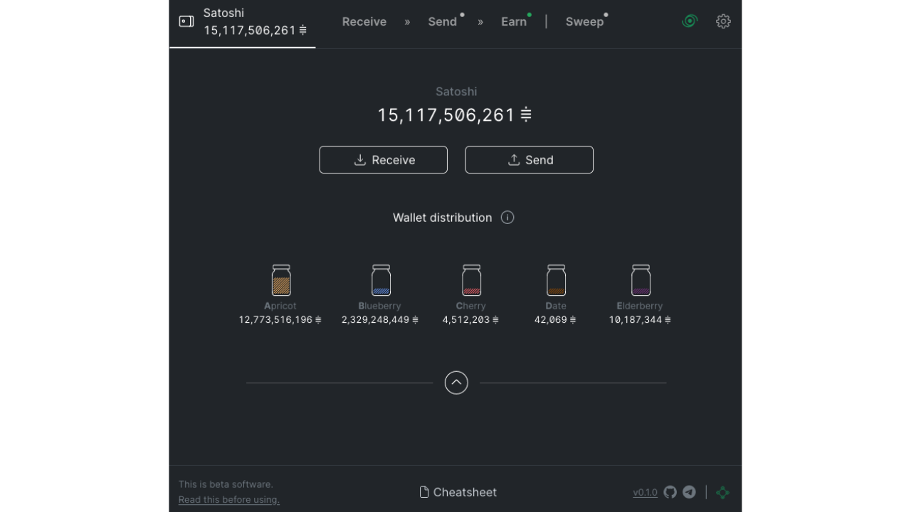


Źródło: [JAM](https://github.com/joinmarket-webui/jam/blob/devel/docs/assets/screenshot-dark.webp)


Bariera techniczna pozostaje jednak główną przeszkodą. W ekosystemie CoinJoin, w którym poufność jest wzmacniana przez liczbę uczestników, wszelkie ograniczenia zmniejszające dostępność bezpośrednio wpływają na dostępną płynność, która jest kluczowym czynnikiem wpływającym na efektywność miksu. Bitcoin, będąc już niszą w transakcjach finansowych, postrzega wykorzystanie coinjoinów jako pod-niszę, a JoinMarket reprezentuje jeszcze bardziej wyspecjalizowaną jej część, co ogranicza jej potencjał do zwiększania anonsów użytkowników.


Pomimo innowacyjnego modelu łączenia P2P dla coinjoinerów, JoinMarket ma pewne znaczące wady, szczególnie pod względem struktury transakcyjnej. W przeciwieństwie do innych implementacji, takich jak Whirlpool, JoinMarket nie gwarantuje idealnej równości między wyjściami i możliwe jest śledzenie deterministycznych powiązań między wejściami i wyjściami. Co więcej, nie ma narzędzi, które zapobiegałyby ponownemu mieszaniu już wymieszanych części, co mogłoby zagrozić poufności wymaganej przez użytkowników.


Wreszcie, chociaż koncepcja JoinMarket jest interesująca, szczególnie dla osób zainteresowanych dynamicznym rynkiem płynności, jej słabości strukturalne i złożoność techniczna sprawiają, że moim zdaniem jest ona mniej interesująca zarówno dla nowicjuszy, jak i ekspertów poszukujących implementacji CoinJoin.


### Wabisabi


Wabisabi to kolejna implementacja CoinJoin z podejściem centralizującym koordynację transakcji. Model ten został wymyślony przez Ádáma Ficsóra (nopara73), Yuvala Kogmana, Lucasa Ontivero i Istvána Andrása Seresa w 2021 roku i został zintegrowany z oprogramowaniem Wasabi 2.0 w następnym roku. Wabisabi jest dokładnie ewolucją oprogramowania Wasabi CoinJoin wprowadzonego na rynek w 2018 roku.


Pod koniec 2010 roku Wasabi przyjęło radykalnie inną strukturę transakcji CoinJoin niż Whirlpool. Wasabi wykorzystało bardzo duże transakcje CoinJoin z udziałem dziesiątek uczestników, aby zwiększyć anonsety swoich uczestników. W przeciwieństwie do tego, Whirlpool zdecydował się na wiele małych transakcji, umożliwiając wykładniczy wzrost anonsetów z każdym cyklem.


Metody zarządzania Exchange również odróżniały te dwie implementacje. W Whirlpool obcy Exchange został wykluczony i odizolowany od UTXO przed cyklami CoinJoin dzięki TX0, koncepcji, którą wyjaśnię dalej w następnym rozdziale. Z drugiej strony, w Wasabi obcy Exchange stanowił jedno z wyjść transakcji CoinJoin, utrzymując deterministyczne powiązania między niektórymi wejściami i wyjściami.


Dzięki Wabisabi, Wasabi w wersji 2.0 dostosowało swoje podejście do coinjoinów do tego z Whirlpool. Chociaż transakcje CoinJoin pozostają bardzo duże, możliwe jest teraz połączenie kilku kolejnych cykli, zgodnie z modelem Whirlpool. Szczególną uwagę zwrócono również na zarządzanie kursem Exchange: w przeciwieństwie do Wasabi 1.0, gdzie kurs Exchange był bezpośrednio powiązany z danymi wejściowymi użytkownika, Wabisabi stara się podzielić kurs Exchange na kilka małych kwot, podzielonych na równe nominały dla wszystkich uczestników.


Zilustrujmy to uproszczonym przykładem obejmującym tylko 2 użytkowników: Alice chce wymieszać 115.000 Sats, a Bob, 210.000 Sats. Ignorując opłaty, z Wasabi 1.0, transakcja CoinJoin wygenerowałaby 3 wyjścia 100.000 Sats, plus 1 Exchange z 15.000 Sats dla Alicji i 1 Exchange z 10.000 Sats dla Boba. Wyjścia Exchange byłyby nadal powiązane z wejściami:


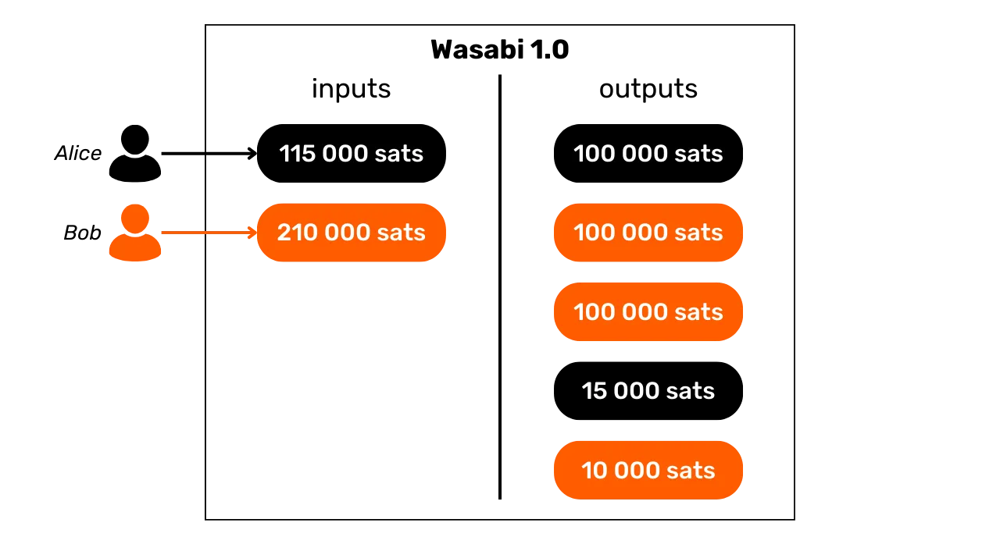


W ramach Wabisabi ta sama transakcja wytworzyłaby 3 wyjścia po 100 000 Sats i 5 wyjść po 5 000 Sats, rozpraszając w ten sposób Exchange tak, że nie można by go bezpośrednio powiązać z konkretnym wkładem:


Osobiście uważam, że zarządzanie zagranicznym Exchange przez Wabisabi wiąże się z kilkoma zagrożeniami, które mogą zagrozić jego skuteczności pod względem poufności:


- Gdy użytkownik wnosi UTXO, który jest znacznie większy niż w przypadku innych uczestników, nieuchronnie kończy z kwotą Exchange, która będzie powiązana z jego wkładem. Jest to sprzeczne z pierwotnym celem protokołu, którym jest wyeliminowanie wszelkich możliwych do zidentyfikowania wymian;
- Mnożenie nominałów w celu rozdrobnienia Exchange może paradoksalnie być szkodliwe dla efektywności mieszania. Proces ten może prowadzić do zmniejszenia liczby anonsów dla niektórych wyników, ponieważ stają się one łatwiejsze do zidentyfikowania;
- Metoda ta generuje również UTXO o niskiej wartości, które stanowią problem w zarządzaniu dla użytkownika. Te małe UTXO, jeśli staną się zbyt kosztowne w stosunku do ich wartości, mogą stać się "Dust". Zjawisko to prowadzi użytkownika do połączenia kilku UTXO w dane wejściowe dla przyszłych transakcji lub do ich konsolidacji. W obu przypadkach, ze względu na CIOH, może to albo zmniejszyć uzyskane anonsety, albo całkowicie anulować korzyści z poufności uzyskane przez początkowy CoinJoin.


W przeciwieństwie do Whirlpool, który implementuje protokół ZeroLink zapewniający rygorystyczną separację pomiędzy UTXO pre-mix i post-mix, Wabisabi nie utrzymuje tej ścisłej segregacji. Wystąpiły również problemy z ponownym użyciem Address przez niektórych klientów Wasabi, co jest oczywiście bardzo szkodliwe dla użytkownika.


W wersji 2.0 Wasabi wdrożono nową politykę opłat CoinJoin. Od teraz opłaty koordynatora są ustawione na 0,3% dla UTXO powyżej 0,01 Bitcoin, podczas gdy dla mniejszych UTXO opłaty te są oferowane w całości. Ponadto remiksy dla tych mniejszych UTXO są bezpłatne, chociaż opłaty Mining pozostają płatne przez użytkownika za wszystkie transakcje, w tym remiksy.


Kontrastuje to z polityką Whirlpool, w której opłaty pozostają stałe, niezależnie od wielkości uzyskanych anonsetów. W Wasabi 2.0, chociaż opłaty koordynatora są zniesione dla małych UTXO, użytkownik nadal musi płacić opłaty Mining za wszystkie transakcje, w tym remiksy.


Gdy piszę te słowa, korzystanie z Wabisabi stało się znacznie bardziej złożone w wyniku ostatnich wydarzeń. Po aresztowaniu założycieli Samourai Wallet, zkSNACKs, firma finansująca i zarządzająca rozwojem Wasabi, ogłosiła, że jej usługa koordynatora CoinJoin zostanie zakończona 1 czerwca 2024 roku. Koordynator ten, który został domyślnie skonfigurowany na Wasabi, był odpowiedzialny za zdecydowaną większość płynności.


Wraz z zaprzestaniem działalności tego głównego koordynatora, użytkownicy muszą teraz łączyć się z nowymi, niezależnymi koordynatorami. Zmiana ta rodzi szereg obaw: z jednej strony, nowi koordynatorzy mogą nie mieć wystarczającej płynności, zmniejszając skuteczność coinjoinów pod względem poufności. Z drugiej strony istnieje ryzyko natknięcia się na złośliwego koordynatora. Sytuacja ta stwarza nowe, znaczące ryzyko dla tych, którzy chcą korzystać z Wabisabi.


Poza kwestiami technicznymi, decyzja zkSNACKs, firmy stojącej za Wasabi, o skorzystaniu z usług firmy zajmującej się analizą ciągów znaków w celu filtrowania uczestników CoinJoin rodzi poważne pytania natury etycznej i strategicznej. Początkowym pomysłem było zapobieganie wykorzystywaniu coinjoinów na Wasabi przez przestępców, co może wydawać się uzasadnione. Rodzi to jednak paradoks: płacenie opłat koordynatorowi, którego główną misją jest wzmocnienie poufności użytkowników, tylko po to, by finansował firmę, której celem jest naruszenie tej samej poufności.


Jeszcze bardziej niepokojąca jest zasada filtrowania, która radykalnie kontrastuje z filozofią Bitcoin polegającą na oferowaniu otwartego, nieocenzurowanego systemu finansowego. Chociaż chęć wykluczenia działalności przestępczej może wydawać się uzasadniona, filtrowanie to może również wpływać na osoby, których działania, choć sklasyfikowane jako nielegalne w pewnych kontekstach, mogą być moralnie uzasadnione lub społecznie korzystne. Przykład Edwarda Snowdena doskonale ilustruje tę dychotomię: przez niektóre rządy uważany za przestępcę za swoje rewelacje, przez inne jest postrzegany jako sygnalista, który działał w interesie publicznym. Ta złożoność podkreśla potencjalne niebezpieczeństwo związane z filtrowaniem, które choć ma dobre intencje, może ostatecznie podważyć prawa i bezpieczeństwo legalnych użytkowników. Mogłem również wspomnieć o aktywistach i dziennikarzach, którzy są prześladowani w niektórych autorytarnych reżimach.


Jak już pewnie zdążyłeś się zorientować, zdecydowanie preferuję model Whirlpool dla coinjoinów na Bitcoin. System ten wyróżnia się rygorystycznością i oferuje doskonałe gwarancje poufności. Jest również jedynym, który oferuje mieszankę uważaną za idealną w kontekście matematycznym. Moim zdaniem model ten reprezentuje przyszłość coinjoinów na Bitcoin. Zapraszam do bardziej szczegółowego zapoznania się z tym modelem w następnym rozdziale.


## Jak działa Whirlpool


<chapterId>bdbd7109-e36d-4b4f-a3c6-928df4e9bfda</chapterId>


To, co odróżnia Whirlpool od innych metod CoinJoin, to wykorzystanie transakcji "_ZeroLink_", które zapewniają, że nie ma ściśle żadnego możliwego technicznego powiązania między wszystkimi danymi wejściowymi i wyjściowymi. Ta idealna mieszanka jest osiągana dzięki strukturze, w której każdy uczestnik wnosi identyczną ilość wkładu (z wyjątkiem opłat Mining), generując wyniki o idealnie równych kwotach.


To restrykcyjne podejście do danych wejściowych nadaje transakcjom Whirlpool CoinJoin unikalną cechę: całkowity brak deterministycznych powiązań między danymi wejściowymi i wyjściowymi. Innymi słowy, każde wyjście ma równe prawdopodobieństwo przypisania do dowolnego uczestnika, w stosunku do wszystkich innych wyjść w transakcji.


### Jak działa Whirlpool


Początkowo liczba uczestników każdego Whirlpool CoinJoin była ograniczona do 5, z 2 nowymi uczestnikami i 3 remikserami (wyjaśnimy te pojęcia później). Jednak wzrost opłat transakcyjnych On-Chain zaobserwowany w 2023 r. skłonił zespoły Samourai do ponownego przemyślenia modelu w celu poprawy poufności przy jednoczesnym obniżeniu kosztów. Tak więc, biorąc pod uwagę sytuację na rynku opłat i liczbę uczestników, koordynator może teraz organizować coinjoiny obejmujące 6, 7 lub 8 uczestników. Te ulepszone sesje znane są jako "Surge Cycles". Ważne jest, aby pamiętać, że niezależnie od konfiguracji, w coinjoinach Whirlpool zawsze biorą udział tylko 2 nowe osoby.


Tak więc transakcje Whirlpool charakteryzują się identyczną liczbą wejść i wyjść, które mogą być :


- 5 wejść i 5 wyjść;


- 6 wejść i 6 wyjść;


- 7 wejść i 7 wyjść;


- 8 wejść i 8 wyjść.


Model Whirlpool opiera się na małych transakcjach CoinJoin. W przeciwieństwie do Wabisabi i JoinMarket, gdzie solidność anonsetów opiera się na liczbie uczestników w pojedynczym cyklu (lub kilku cyklach), Whirlpool opiera się na sekwencji kilku małych cykli.


W tym modelu użytkownicy uiszczają opłaty tylko wtedy, gdy po raz pierwszy dołączają do puli, co pozwala im uczestniczyć w wielu remiksach bez dodatkowych kosztów. Nowi uczestnicy uiszczają opłaty Mining dla remikserów.


Z każdym dodatkowym CoinJoin, w którym uczestniczy utwór, a także jego rówieśnicy napotkani w przeszłości, anonsety będą rosły wykładniczo. Celem jest skorzystanie z tych darmowych remiksów, które za każdym razem, gdy się pojawiają, przyczyniają się do wzmocnienia gęstości anonsetów związanych z każdym zmiksowanym utworem.


Whirlpool został zaprojektowany z myślą o dwóch ważnych wymaganiach:


- Dostępność implementacji na urządzeniach mobilnych, biorąc pod uwagę, że Samourai Wallet jest przede wszystkim aplikacją na smartfony;
- Szybkie cykle remiksowania w celu promowania znacznego wzrostu liczby anonsów.


Te imperatywy kierowały wyborami dokonanymi przez deweloperów Samourai Wallet podczas projektowania Whirlpool, prowadząc ich do ograniczenia liczby uczestników na cykl. Zbyt mała liczba uczestników wpłynęłaby negatywnie na wydajność CoinJoin, drastycznie zmniejszając liczbę anonsów generowanych na cykl, podczas gdy zbyt duża liczba uczestników stanowiłaby problem w zarządzaniu aplikacjami mobilnymi i utrudniałaby przebieg cyklu.


Wreszcie, nie ma potrzeby posiadania dużej liczby uczestników na CoinJoin na Whirlpool, ponieważ anonsety są dokonywane na podstawie kumulacji kilku cykli CoinJoin. Najważniejszą zasadą jest tutaj jednorodność UTXO wszystkich uczestników, ponieważ zapewnia to doskonałe mieszanie, a tym samym pełne korzyści z cykli mieszania i remiksowania.


### Pule i opłaty CoinJoin


Aby te wielokrotne cykle zwiększyły anonsety mieszanych części, potrzebne są pewne ramy ograniczające ilość używanych UTXO. Whirlpool definiuje różne pule.


Pula reprezentuje grupę użytkowników, którzy chcą mieszać razem, którzy zgadzają się na ilość UTXO, która ma być wykorzystana do optymalizacji procesu CoinJoin przy jednoczesnym zachowaniu doskonałej jednorodności części. Każda pula określa stałą ilość UTXO, której użytkownik musi przestrzegać, aby móc w niej uczestniczyć. Tak więc, aby wykonywać coinjoiny z Whirlpool, należy wybrać pulę. Obecnie dostępne są następujące pule:


- 0.5 bitcoinów;
- 0.05 Bitcoin ;
- 0.01 Bitcoin ;
- 0.001 Bitcoin (= 100.000 Sats).


Gdy wejdziesz do puli ze swoimi bitcoinami, zostaną one podzielone na generate UTXO, które są idealnie jednorodne z tymi innych uczestników puli. Każda pula ma maksymalny limit, więc w przypadku kwot przekraczających ten limit będziesz musiał albo dokonać dwóch oddzielnych wpisów do tej samej puli, albo przenieść się do innej puli z wyższą kwotą:


| Pool (bitcoin) | Maximum amount per entry (bitcoin) |
|----------------|--------------------------------------|
| 0,5 | 35 |
| 0,05 | 3,5 |
| 0,01 | 0,7 |
| 0,001 | 0,025 |

UTXO jest uważany za należący do puli, gdy jest gotowy do zintegrowania z CoinJoin. Nie oznacza to jednak, że użytkownik traci nad nim kontrolę. Jak widzieliśmy w pierwszych rozdziałach tej sekcji, poprzez różne cykle mieszania, użytkownik zachowuje pełną kontrolę nad swoimi kluczami, a w konsekwencji nad bitcoinami. To właśnie odróżnia technikę CoinJoin od innych scentralizowanych technik mieszania.


Aby dołączyć do puli CoinJoin, należy uiścić opłatę za usługę i opłatę Mining. Opłaty za usługi są ustalane dla każdej puli i mają na celu wynagrodzenie zespołów odpowiedzialnych za rozwój i utrzymanie Whirlpool.


Opłata za korzystanie z Whirlpool jest płatna tylko raz, w momencie dołączenia do puli. Po dołączeniu można uczestniczyć w nieograniczonej liczbie remiksów bez dodatkowych opłat. Oto aktualne opłaty stałe dla każdej puli:


| Pool (bitcoin) | Entry fee (bitcoin) |
|----------------|---------------------------------|
| 0,5 | 0,0175 |
| 0,05 | 0,00175 |
| 0.01 | 0.0005 (50,000 sats) |
| 0.001 | 0.00005 (5,000 sats) |

Opłaty te zasadniczo funkcjonują jako bilet wstępu do wybranej puli, niezależnie od kwoty wpłaconej w CoinJoin. Tak więc, niezależnie od tego, czy wejdziesz do puli 0,01 z dokładnie 0,01 BTC, czy 0,5 BTC, opłaty pozostaną takie same w wartościach bezwzględnych.


Przed przystąpieniem do Whirlpool coinjoins użytkownik może wybrać jedną z dwóch strategii:


- Wybierz mniejszą pulę, aby zminimalizować koszty obsługi, wiedząc, że w zamian otrzyma kilka mniejszych UTXO;
- Lub zdecydować się na większą pulę, gotową zapłacić wyższe opłaty, tylko po to, by uzyskać mniejszą liczbę UTXO o wyższej wartości.


Ogólnie rzecz biorąc, nie zaleca się łączenia kilku mieszanych UTXO po cyklach CoinJoin, ponieważ może to zagrozić uzyskanej poufności, szczególnie ze względu na heurystykę wspólnego wejścia Ownership (CIOH: *Common-Input-Ownership-Heuristic*). W związku z tym sensowne może być wybranie większej puli, nawet jeśli oznacza to płacenie więcej, aby uniknąć zbyt wielu UTXO o małej wartości na wyjściu. Użytkownik musi ocenić te kompromisy, aby wybrać preferowaną pulę.


Oprócz opłaty za usługę należy również uwzględnić opłatę Mining właściwą dla każdej transakcji Bitcoin. Jako użytkownik Whirlpool będziesz musiał uiścić opłatę Mining za transakcję przygotowawczą (`Tx0`), a także za pierwszą CoinJoin. Wszystkie kolejne remiksy będą bezpłatne, dzięki modelowi Whirlpool opartemu na opłacaniu nowych uczestników.


W rzeczywistości, w każdym Whirlpool CoinJoin, 2 użytkowników wśród wejść to nowi uczestnicy. Pozostałe dane wejściowe pochodzą od remikserów. W rezultacie koszty Mining dla wszystkich uczestników transakcji są ponoszone przez tych 2 nowych uczestników, którzy następnie mogą również korzystać z bezpłatnych remiksów:


Dzięki temu systemowi opłat Whirlpool naprawdę wyróżnia się na tle innych implementacji CoinJoin, ponieważ anonimy UTXO nie są proporcjonalne do ceny płaconej przez użytkownika. W rezultacie możliwe jest osiągnięcie znacznie wyższego poziomu anonimowości, płacąc jedynie opłatę za wejście do puli i opłatę Mining za 2 transakcje (`Tx0` i początkowy mix).


Ważne jest, aby pamiętać, że użytkownik będzie musiał również uiścić opłaty Mining, aby wypłacić swoje UTXO z puli po zakończeniu wielokrotnego łączenia monet, chyba że wybrał opcję `mix to`, która zapewnia zewnętrzny Address, który otrzyma środki bezpośrednio z CoinJoin, bez żadnych dodatkowych transakcji.


### Konta portfela HD


Aby utworzyć CoinJoin przez Whirlpool, Wallet musi generate kilka oddzielnych kont. Jest to zasada stojąca za protokołem ZeroLink. Konto, w kontekście portfela HD (*Hierarchical Deterministic*), stanowi sekcję całkowicie odizolowaną od innych, ta separacja występuje na poziomie trzeciej głębokości hierarchii portfela, tj. na poziomie `xpub`.


HD Wallet może teoretycznie wyprowadzić do `2^(31)` różnych kont. Początkowe konto, używane domyślnie we wszystkich portfelach Bitcoin, odpowiada indeksowi `0`.


W przypadku portfeli dostosowanych do Whirlpool używane są 4 konta, aby spełnić potrzeby procesu ZeroLink:


- Konto **depozytowe**, identyfikowane przez indeks `0`;
- Konto **złego banku** (lub "doxxic change"), oznaczone indeksem `2,147,483,644'`;
- Konto **premix**, oznaczone indeksem `2 147 483 645'`;
- Konto **postmix**, identyfikowane przez indeks `2 147 483 646'`.


Każde z tych kont spełnia określoną funkcję w procesie CoinJoin, którą omówimy w kolejnych sekcjach.


Wszystkie te konta są połączone z pojedynczym seed, umożliwiając użytkownikowi odzyskanie dostępu do wszystkich jego bitcoinów przy użyciu jego frazy odzyskiwania i, w stosownych przypadkach, jego passphrase. Podczas operacji odzyskiwania oprogramowanie musi być jednak informowane o różnych używanych indeksach kont.


Przyjrzyjmy się różnym etapom Whirlpool CoinJoin w ramach tych kont.


### TX0


Punktem startowym każdego Whirlpool CoinJoin jest **konto depozytowe**. Jest to konto używane automatycznie podczas tworzenia nowego Bitcoin Wallet. To konto będzie musiało zostać zasilone bitcoinami, które chcesz wymieszać.


Tx0" to pierwszy krok w procesie mieszania Whirlpool. Jego celem jest przygotowanie i wyrównanie UTXO dla CoinJoin, dzieląc je na jednostki odpowiadające ilości wybranej puli, aby zapewnić jednorodne mieszanie. Tak wyrównane UTXO są następnie wysyłane na konto **premix**. Jeśli chodzi o różnicę, która nie może wejść do puli, jest ona rozdzielana na specjalne konto: **bad bank** (lub "doxxic change").


Ta początkowa transakcja `Tx0` jest również wykorzystywana do uiszczenia opłaty za usługę należnej koordynatorowi CoinJoin. W przeciwieństwie do kolejnych kroków, ta transakcja nie jest oparta na współpracy, więc użytkownik musi ponieść pełny koszt Mining:


W tym przykładzie transakcji `Tx0`, wejściowa kwota `372,000 Sats` z naszego **depozytowego** konta jest dzielona na kilka wyjściowych UTXO, które rozkładają się następująco:


- Kwota `5 000 Sats` dla koordynatora z tytułu opłat za usługi, odpowiadająca wpisowi do puli w wysokości `100 000 Sats`;
- 3 UTXO przygotowane do mieszania, przekierowane na nasze konto **premix** i zarejestrowane u koordynatora. Te UTXO są wyrównane na `108,000 Sats` każdy, aby pokryć koszty Mining dla ich przyszłego początkowego mieszania;
- Nadwyżka, która nie może wejść do puli, ponieważ jest zbyt mała, jest uważana za toksyczny obcy Exchange. Jest on wysyłany na jego konkretne konto. W tym przypadku Exchange wynosi `40 000 Sats`;
- Wreszcie, pozostało `3,000 Sats`, które nie stanowią wyjścia, ale są kosztami Mining wymaganymi do potwierdzenia `Tx0`.


Na przykład, oto prawdziwy Whirlpool Tx0 (nie mój): [edef60744f539483d868caff49d4848e5cc6e805d6cdc8d0f9bdbbaedcb5fc46](https://Mempool.space/fr/tx/edef60744f539483d868caff49d4848e5cc6e805d6cdc8d0f9bdbbaedcb5fc46)


### Zmiany doksyczne


Nadwyżka, która nie mogła zostać włączona do puli, tutaj odpowiadająca `40 000 Sats`, jest przekierowywana na konto **bad bank**, znane również jako "doxxic Exchange", aby zapewnić ścisłe oddzielenie od innych UTXO w portfelu.


Ten UTXO jest niebezpieczny dla poufności użytkownika, ponieważ nie tylko jest nadal powiązany z jego przeszłością, a zatem prawdopodobnie z tożsamością jego właściciela, ale jest również odnotowany jako należący do użytkownika, który wykonał CoinJoin.


Jeśli ten UTXO zostanie połączony z mieszanymi wyjściami, ten ostatni straci całą poufność uzyskaną podczas cykli CoinJoin, zwłaszcza z powodu CIOH (*Common-Input-Ownership-Heuristic*). Jeśli zostanie połączony z innymi zmianami doxxic, użytkownik ryzykuje utratę poufności, ponieważ połączy różne wpisy cyklu CoinJoin. Dlatego należy go traktować ostrożnie. Więcej szczegółów na temat zarządzania UTXO doxxic przedstawimy w ostatniej sekcji tego rozdziału.


### Początkowa mieszanka


Po `Tx0`, wyrównane UTXO są wysyłane do konta **premix** naszego portfolio, gotowe do wprowadzenia do pierwszego cyklu CoinJoin, znanego również jako "początkowy mix". Jeśli, tak jak w naszym przykładzie, `Tx0` generuje kilka UTXO do mieszania, każdy z nich zostanie zintegrowany z oddzielnym początkowym miksem.


Pod koniec tych pierwszych miksów, konto **premix** będzie puste, podczas gdy nasze monety, po uiszczeniu opłat Mining za ten pierwszy CoinJoin, zostaną dostosowane dokładnie do kwoty określonej przez wybraną pulę. W naszym przykładzie, nasze początkowe UTXO w wysokości `108,000 Sats` zostanie zredukowane do dokładnie `100,000 Sats`.


### Remiksy


Po wstępnym zmiksowaniu UTXO są przenoszone na konto **postmix**. To konto gromadzi UTXO już zmiksowane i te oczekujące na remiksowanie. Gdy klient Whirlpool jest aktywny, UTXO znajdujące się na koncie **postmix** są automatycznie dostępne do remiksowania i zostaną losowo wybrane do udziału w tych nowych cyklach.


Przypominamy, że remiksy są wtedy w 100% darmowe: nie są wymagane żadne dodatkowe opłaty za usługi ani opłaty Mining. Utrzymywanie UTXO na koncie **postmix** utrzymuje zatem ich wartość w stanie nienaruszonym, a jednocześnie poprawia ich anonsety. Dlatego ważne jest, aby pozwolić tym monetom uczestniczyć w kilku cyklach CoinJoin. To nic nie kosztuje, a zwiększa ich poziom anonimowości.


Jeśli zdecydujesz się wydać zmiksowane UTXO, możesz to zrobić bezpośrednio z tego konta **postmix**. Zalecamy przechowywanie mieszanych UTXO na tym koncie, aby korzystać z darmowych remiksów i zapobiec opuszczeniu przez nie obwodu Whirlpool, co mogłoby zmniejszyć ich poufność.


### Jak zarządzasz swoimi postmixami?


Po uruchomieniu cykli CoinJoin najlepszą strategią jest przechowywanie UTXO na koncie **postmix** w oczekiwaniu na przyszłe użycie. Zaleca się nawet, by pozwolić im mieszać się w nieskończoność, dopóki nie będzie trzeba ich wydać.


Niektórzy użytkownicy mogą rozważyć przeniesienie swoich mieszanych bitcoinów do Wallet zabezpieczonego przez Hardware Wallet. Jest to możliwe, ale ważne jest, aby skrupulatnie przestrzegać zaleceń Samourai Wallet, aby nie naruszyć uzyskanej poufności.


Łączenie UTXO jest najczęstszym błędem. Aby uniknąć CIOH (*Common-Input-Ownership-Heuristic*), należy unikać łączenia mieszanych UTXO z niemieszanymi UTXO w tej samej transakcji. Wymaga to starannego zarządzania UTXO w ramach portfela, szczególnie pod względem etykietowania.


Należy również zachować ostrożność podczas konsolidacji mieszanych UTXO. Umiarkowana konsolidacja jest możliwa, jeśli mieszane UTXO mają znaczące anonsety, ale nieuchronnie zmniejszy to poufność części. Upewnij się, że konsolidacje nie są zbyt rozległe ani przeprowadzane po niewystarczającej liczbie remiksów, ryzykując ustanowienie możliwych do wywnioskowania powiązań między UTXO przed i po cyklach CoinJoin. W razie wątpliwości co do tych manipulacji, najlepszą praktyką jest nie konsolidowanie UTXO po mieszaniu, ale przenoszenie ich jeden po drugim do Hardware Wallet, generując za każdym razem nowy pusty Address. Ponownie należy pamiętać o oznaczeniu każdego otrzymanego UTXO.


Nie zaleca się również przenoszenia postmix UTXO do Wallet przy użyciu skryptów, które nie są powszechnie używane. Na przykład, jeśli wprowadzisz Whirlpool z Multisig Wallet za pomocą skryptów `P2WSH`, istnieje niewielka szansa, że zostaniesz zmieszany z innymi użytkownikami, którzy pierwotnie mieli ten sam typ Wallet. Jeśli ponownie zmieszasz swoje postmiksy z tym samym Multisig Wallet, poziom poufności zmieszanych bitcoinów zostanie znacznie zmniejszony. Poza skryptami istnieje wiele innych odcisków palców Wallet, które mogą płatać figle.


Podobnie jak w przypadku każdej transakcji Bitcoin, ważne jest, aby nie używać ponownie otrzymanego Address. Każda nowa transakcja musi zostać odebrana na nowym, pustym Address.


Najprostszym i najbezpieczniejszym rozwiązaniem jest pozostawienie mieszanych UTXO w spoczynku na koncie **postmix**, pozwalając im na remiksowanie i dotykanie ich tylko w celu wydania. Portfele Samurai i Sparrow oferują dodatkowe zabezpieczenia przed wszystkimi tymi zagrożeniami związanymi z analizą łańcucha. Zabezpieczenia te pomagają uniknąć błędów.


### Jak zarządzać toksycznymi wymianami?


Następnie należy zachować ostrożność w zarządzaniu doxxic Exchange, Exchange, które nie trafiły do puli CoinJoin. Te toksyczne UTXO, wynikające z użycia Whirlpool, stanowią zagrożenie dla prywatności użytkownika, ponieważ tworzą powiązanie między nim a użytkownikiem CoinJoin. Dlatego konieczne jest ostrożne zarządzanie nimi i nie łączenie ich z innymi UTXO, zwłaszcza mieszanymi UTXO.


Oto kilka strategii korzystania z nich:


- Wymieszaj je w mniejszych basenach:** Jeśli toksyczny UTXO jest wystarczająco duży, aby zmieścić się w mniejszym basenie, rozważ jego wymieszanie. Często jest to najlepsza opcja. Nie zaleca się jednak łączenia kilku toksycznych UTXO w celu uzyskania dostępu do puli, ponieważ może to połączyć różne wpisy;
- Oznacz je jako "niewydawalne":** Innym podejściem jest zaprzestanie ich używania, oznaczenie ich jako "niewydawalnych" na dedykowanym koncie i po prostu HODL. Gwarantuje to, że nie zostaną one przypadkowo wydane. Jeśli wartość Bitcoin wzrośnie, mogą pojawić się nowe pule bardziej odpowiednie dla toksycznych UTXO;
- Przekazywanie darowizn:** Rozważ przekazanie darowizny, choćby skromnej, deweloperom pracującym nad Bitcoin i powiązanym oprogramowaniem. Możesz również przekazać darowiznę stowarzyszeniom, które akceptują BTC. Jeśli zarządzanie toksycznymi UTXO wydaje się zbyt skomplikowane, możesz po prostu się ich pozbyć i przekazać darowiznę;
- Kupowanie kart podarunkowych:** Platformy takie jak [Bitrefill](https://www.bitrefill.com/) pozwalają na Exchange bitcoinów na karty podarunkowe, które można wykorzystać u różnych sprzedawców. Może to być sposób na rozstanie się z toksycznymi UTXO bez utraty związanej z nimi wartości;
- Skonsoliduj je na Monero:** Samourai Wallet oferuje usługę atomic swap pomiędzy BTC i XMR. Jest to idealne rozwiązanie do zarządzania toksycznymi UTXO poprzez konsolidację ich na Monero, bez narażania poufności za pośrednictwem CIOH, przed wysłaniem ich z powrotem do Bitcoin. Opcja ta może być jednak kosztowna pod względem opłat Mining i premii ze względu na ograniczenia płynności;
- Wyślij je do Lightning Network:** Przeniesienie tych UTXO do Lightning Network w celu skorzystania z obniżonych opłat transakcyjnych może być atrakcyjną opcją. Jednak ta metoda może ujawnić pewne informacje w zależności od sposobu korzystania z Lightning, dlatego należy jej używać ostrożnie.


### Jak używać Whirlpool?


Po aresztowaniu założycieli Samourai Wallet i przejęciu ich serwerów 24 kwietnia 2024 r. narzędzie Whirlpool przestało działać, nawet dla osób posiadających własne Dojo. Wcześniej było ono dostępne na Samourai Wallet i Sparrow Wallet.


Nadal jednak możliwe jest, że narzędzie to zostanie reaktywowane w nadchodzących tygodniach, w zależności od wyniku testów, lub ponownie uruchomione w inny sposób. W każdym razie nie sądzę, aby rynek Bitcoin CoinJoin długo pozostawał bez Supply, ponieważ istnieje na niego popyt. Co więcej, ponieważ model Whirlpool jest najbardziej zaawansowany pod względem poufności, z pewnością będzie on wybierany przez inne implementacje w przyszłości.


Uważnie obserwujemy tę sprawę i rozwój związanych z nią narzędzi. Zapewniamy, że będziemy aktualizować ten kurs szkoleniowy w miarę pojawiania się nowych informacji.


W następnym rozdziale dowiemy się, czym są "anonsety", jak obliczane są te wskaźniki i jak mogą one pomóc nam oszacować wydajność cykli CoinJoin.


https://planb.network/tutorials/privacy/on-chain/coinjoin-sparrow-wallet-84def86d-faf5-4589-807a-83be60720c8b

https://planb.network/tutorials/privacy/on-chain/coinjoin-samourai-wallet-e566803d-ab3f-4d98-9136-5462009262ef

https://planb.network/tutorials/privacy/on-chain/coinjoin-dojo-c4b20263-5b30-4c74-ae59-dc8d0f8715c2

## Zestawy anonimowości


<chapterId>be1093dc-1a74-40e5-9545-2b97a7d7d431</chapterId>


Po przeanalizowaniu sposobu działania coinjoinów i kwestii związanych z efektywnym mieszaniem, zamierzamy teraz dowiedzieć się, jak zmierzyć ich skuteczność. Jak możemy określić, czy proces łączenia współbieżnego był skuteczny i jaki stopień anonimowości uzyskała część? Tego właśnie dowiemy się w tym rozdziale za pomocą zestawów anonimowości lub "anonsetów".


### Przypomnienie o przydatności CoinJoin


Użyteczność CoinJoin polega na jego zdolności do tworzenia wiarygodnego zaprzeczenia, poprzez osadzenie swojej części w grupie nierozróżnialnych części. Celem tego działania jest zerwanie powiązań identyfikowalności, zarówno z przeszłości do teraźniejszości, jak i z teraźniejszości do przeszłości.


Innymi słowy, analityk, który zna początkową transakcję (`Tx0`) na wejściu cykli CoinJoin, nie powinien być w stanie z całą pewnością zidentyfikować UTXO na wyjściu cykli remiksowych (analiza od wejścia do wyjścia cyklu).


I odwrotnie, analityk, który zna twój UTXO na wyjściu z cykli CoinJoin, musi nie być w stanie określić oryginalnej transakcji na wejściu do cykli (analiza wyjścia z cyklu do wejścia do cyklu).


Aby ocenić, jak trudno jest analitykowi połączyć przeszłość z teraźniejszością i odwrotnie, musimy określić rozmiar grup jednorodnych części, w których ukryta jest dana część. Ta miara mówi nam, ile analiz ma takie samo prawdopodobieństwo. Tak więc, jeśli poprawna analiza jest utopiona wśród 3 innych analiz o równym prawdopodobieństwie, poziom ukrycia jest bardzo niski. Z drugiej strony, jeśli poprawna analiza zostanie znaleziona w zestawie 20 000 równie prawdopodobnych analiz, twoja część jest bardzo dobrze ukryta. Wielkość tych grup reprezentują wskaźniki znane jako "anonsets".


### Zrozumienie anonsów


Anonsety są używane jako wskaźniki do oceny stopnia poufności konkretnego UTXO. Mówiąc dokładniej, mierzą one liczbę nierozróżnialnych UTXO w zestawie zawierającym badaną część. Wymóg jednorodnego zestawu UTXO oznacza, że anonsety są zwykle obliczane na podstawie cykli CoinJoin. Zastosowanie tych wskaźników jest szczególnie istotne w przypadku koincydencji Whirlpool ze względu na ich jednorodność.


W razie potrzeby anonsety można wykorzystać do oceny jakości coinjoinów. Duży anonset oznacza wysoki poziom anonimowości, ponieważ trudno jest odróżnić konkretny UTXO w jednorodnym zbiorze.


istnieją 2 rodzaje anonsów:


- Potencjalny anonset ;**
- Retrospektywne anonset.**


### Perspektywiczny anonset


Wskaźnik "forward-looking anonset" wskazuje wielkość grupy, wśród której ukryty jest UTXO badany na końcu cyklu, biorąc pod uwagę UTXO na początku, tj. liczbę nierozróżnialnych części obecnych w tej grupie. Nazwa tego wskaźnika to "metryka prognostyczna".


Wskaźnik ten mierzy odporność poufności pomieszczenia na analizę przeszłość-teraźniejszość (wejście-wyjście).


Ta metryka jest używana do oszacowania zakresu, w jakim UTXO jest chroniony przed próbami odtworzenia jego historii od punktu wejścia do punktu wyjścia w procesie CoinJoin.


Na przykład, jeśli twoja transakcja uczestniczyła w pierwszym cyklu CoinJoin i dwa kolejne cykle malejące zostały zakończone, potencjalny anonset twojej monety wynosiłby `13`:


Dla przykładu, wyobraźmy sobie, że nasza moneta na początku cyklu CoinJoin ma anonset wynoszący `86,871`. W praktyce oznacza to, że jest ona ukryta wśród `86,871` nierozróżnialnych części. Dla zewnętrznego obserwatora, który zna tę monetę na początku cyklu CoinJoin i próbuje prześledzić jej wyjście, zostanie skonfrontowany z `86,871` możliwych UTXO, z których każdy ma identyczne prawdopodobieństwo bycia monetą, której szuka.


### Anons retrospektywny


Retrospektywny anonset wskazuje liczbę możliwych źródeł dla danej części, znając UTXO na koniec cyklu. Wskaźnik ten mierzy odporność poufności części na analizę od teraźniejszości do przeszłości (od wyjścia do wejścia), tj. jak trudno jest analitykowi prześledzić część z powrotem do jej pochodzenia, przed cyklami CoinJoin. Nazwa tego wskaźnika to "backward anonset" lub "backward-looking metrics".


Znając swój UTXO na wyjściu z cykli, anonset retrospektywny określa liczbę potencjalnych transakcji Tx0, które mogły stanowić twoje wejście w cykle CoinJoin. Na poniższym wykresie odpowiada to sumie wszystkich pomarańczowych bąbelków.


Na przykład, wyobraźmy sobie, że nasza część CoinJoin ma retrospektywny anonset o wartości `42,185`. W praktyce oznacza to, że istnieje `42 185` potencjalnych źródeł dla tego UTXO. Jeśli zewnętrzny obserwator zidentyfikuje tę monetę na końcu cykli i spróbuje prześledzić jej pochodzenie, będzie miał do czynienia z `42 185` możliwych źródeł, z których wszystkie mają równe prawdopodobieństwo bycia poszukiwanym źródłem.


### Jak obliczyć anonsety?


Możliwe jest ręczne obliczenie anonsetów przy użyciu Block explorer dla małych zespołów. Jednak w przypadku większych anonsetów konieczne staje się użycie specjalistycznego narzędzia. O ile mi wiadomo, jedynym oprogramowaniem zdolnym do wykonania tego zadania jest *Whirlpool Stats Tool*, narzędzie Python opracowane przez zespoły Samourai i OXT. Niestety, narzędzie to jest obecnie niedostępne po aresztowaniu założycieli Samourai i przerwaniu pracy OXT, które było używane do wydobywania danych z Blockchain.


Jak widzieliśmy w tym rozdziale, anonsety można obliczyć tylko wtedy, gdy istnieje pewna jednorodność w strukturze CoinJoin. W następnym rozdziale dowiemy się, jak określić ilościowo tę jednorodność w transakcji Bitcoin, niezależnie od tego, czy jest to CoinJoin, czy bardziej tradycyjna transakcja.


https://planb.network/tutorials/privacy/analysis/wst-anonsets-0354b793-c301-48af-af75-f87569756375

## Entropia


<chapterId>e4fe289d-618b-49a2-84c9-68c562e708b4</chapterId>


Jak widzieliśmy w tej sekcji dotyczącej coinjoinów, jednorodność UTXO na wejściu i wyjściu odgrywa ważną rolę w poprawie poufności transakcji Bitcoin. Parametr ten tworzy wiarygodne zaprzeczenie w obliczu analizy Blockchain. Do pomiaru tej jednorodności można użyć kilku metod, ale moim zdaniem jedną z najskuteczniejszych jest wykorzystanie wskaźników dostarczanych przez narzędzie *Boltzmann*, opracowane przez zespoły OXT i Samourai Wallet, a w szczególności entropii transakcji. To właśnie temu zagadnieniu przyjrzymy się szczegółowo w tym rozdziale.


W przeciwieństwie do anonsetów, które są obliczane na podstawie zestawu transakcji, przedstawione tutaj wskaźniki koncentrują się na pojedynczej transakcji, niezależnie od tego, czy jest to CoinJoin, czy bardziej tradycyjna transakcja.


### Liczba interpretacji


Pierwszym wskaźnikiem, który można zaobserwować na transakcji Bitcoin, jest całkowita liczba możliwych interpretacji w obliczu analizy przeprowadzonej przez zewnętrznego obserwatora. Biorąc pod uwagę wartości UTXO zaangażowanych w transakcję, wskaźnik ten pokazuje liczbę sposobów, w jakie dane wejściowe mogą być powiązane z danymi wyjściowymi. Innymi słowy, określa on liczbę możliwych interpretacji, jakie transakcja może wywołać w przepływach Bitcoin z punktu widzenia analizującego ją zewnętrznego obserwatora.


Na przykład prosta transakcja płatnicza z 1 wejściem i 2 wyjściami będzie miała tylko jedną interpretację, a mianowicie, że wejście #0 sfinansowało wyjście #0 i wyjście #1. Nie ma innej możliwej interpretacji:


Z drugiej strony, narożnik Whirlpool 5x5 ma $1\,496$ możliwych kombinacji:


Whirlpool Surge Cycle 8x8 CoinJoin ma 9 934 563 $ możliwych interpretacji:


### Entropia


Na podstawie liczby interpretacji transakcji Bitcoin możemy obliczyć jej entropię.


W ogólnym kontekście kryptografii i informacji, entropia jest ilościową miarą niepewności lub nieprzewidywalności związanej ze źródłem danych lub losowym procesem. Innymi słowy, entropia jest sposobem pomiaru tego, jak trudno jest przewidzieć lub odgadnąć daną informację.


W konkretnym kontekście analizy Blockchain entropia jest również nazwą wskaźnika, wywodzącego się z entropii Shannona i [wynalezionego przez LaurentMT](https://gist.github.com/LaurentMT/e758767ca4038ac40aaf), który można obliczyć na podstawie transakcji Bitcoin.


Gdy transakcja przedstawia dużą liczbę możliwych interpretacji, często bardziej odpowiednie jest odniesienie się do jej entropii. Wskaźnik ten mierzy brak wiedzy analityków na temat dokładnej konfiguracji transakcji. Innymi słowy, im wyższa entropia, tym trudniej jest analitykom zidentyfikować przepływ bitcoinów między wejściami i wyjściami.


W praktyce entropia ujawnia, czy z punktu widzenia zewnętrznego obserwatora transakcja przedstawia wiele możliwych interpretacji, opartych wyłącznie na kwotach wejściowych i wyjściowych, bez uwzględniania innych zewnętrznych lub wewnętrznych wzorców i heurystyk. Wysoka entropia jest zatem synonimem większej poufności transakcji.


Entropia jest definiowana jako logarytm binarny liczby możliwych kombinacji. Oto wzór używany z $E$ entropią transakcji i $C$ liczbą możliwych interpretacji:


$$
E = \log_2(C)
$$


W matematyce logarytm binarny (logarytm o podstawie 2) jest operacją odwrotną do potęgowania 2. Innymi słowy, logarytm binarny $x$ jest wykładnikiem, do którego należy podnieść $2$, aby otrzymać $x$. Wskaźnik ten jest zatem wyrażany w bitach.


Weźmy przykład obliczania entropii dla transakcji CoinJoin skonstruowanej zgodnie z modelem Whirlpool 5x5, który, jak wspomniano w poprzedniej sekcji, ma liczbę możliwych interpretacji $1\,496$:


$$
\begin{align*}
C &= 1\,496 \\
E &= \log_2(1\,496) \\
E &= 10.5469 \text{ bits}
\end{align*}
$$


Tak więc ta transakcja CoinJoin ma entropię 10,5469 bitów, co jest uważane za bardzo zadowalające. Im wyższa jest ta wartość, tym więcej różnych interpretacji dopuszcza transakcja, wzmacniając tym samym jej poziom poufności.


Dla transakcji CoinJoin 8x8 z interpretacjami $9\,934\,563$ entropia wyniosłaby :


$$
\begin{align*}
C &= 9\,934\,563 \\
E &= \log_2(9\,934\,563) \\
E &= 23.244 \text{ bits}
\end{align*}
$$


Weźmy inny przykład z klasyczną transakcją płatniczą, z 1 wejściem i 2 wyjściami: [1b1b0c3f0883a99f1161c64da19471841ed12a1f78e77fab128c69a5f578ccce](https://Mempool.space/tx/1b1b0c3f0883a99f1161c64da19471841ed12a1f78e77fab128c69a5f578ccce)


W przypadku tej transakcji jedyną możliwą interpretacją jest: `(In.0) > (Out.0 ; Out.1)`. W związku z tym jej entropia wynosi $0$:


$$
\begin{align*}
C &= 1 \\
E &= \log_2(1) \\
E &= 0 \text{ bits}
\end{align*}
$$


### Wydajność


Na podstawie entropii transakcji możemy również obliczyć jej efektywność pod względem poufności. Wskaźnik ten ocenia wydajność transakcji poprzez porównanie jej z optymalną transakcją, którą można przewidzieć w identycznej konfiguracji.


To prowadzi nas do koncepcji maksymalnej entropii, która odpowiada najwyższej entropii, jaką teoretycznie może osiągnąć określona struktura transakcji. Wydajność transakcji jest następnie obliczana poprzez porównanie tej maksymalnej entropii z rzeczywistą entropią analizowanej transakcji.


Zastosowany wzór jest następujący z :


- e_R$: rzeczywista entropia transakcji wyrażona w bitach;
- e_M$: maksymalna możliwa entropia dla struktury transakcji, również wyrażona w bitach;
- $Ef$: wydajność transakcji w bitach :


$$
Ef = E_R - E_M
$$


Na przykład dla struktury Whirlpool 5x5 CoinJoin maksymalna entropia wynosi $10,5469$:


$$
\begin{align*}
E_R &= 10.5469 \\
E_M &= 10.5469 \\
Ef &= E_R - E_M \\
Ef &= 10.5469 - 10.5469 \\
Ef &= 0 \text{ bits}
\end{align*}
$$


Wskaźnik ten jest również wyrażony w procentach. Stosowany wzór jest następujący: :


- c_R$: liczba możliwych interpretacji rzeczywistych;
- c_M$: maksymalna liczba możliwych interpretacji tej samej struktury;
- $Ef$: wydajność wyrażona w procentach:


$$
\begin{align*}
E_f &= \frac{C_R}{C_M} \\
E_f &= \frac{1\,496}{1\,496} \\
E_f &= 100 \%
\end{align*}
$$


Skuteczność na poziomie 100 USD wskazuje, że transakcja w pełni wykorzystuje swój potencjał poufności, w zależności od jej struktury.


### Gęstość entropii


Entropia jest dobrym wskaźnikiem do pomiaru poufności transakcji, ale zależy częściowo od liczby wejść i wyjść w transakcji. Aby porównać entropię 2 różnych transakcji z różną liczbą wejść i wyjść, możemy obliczyć gęstość entropii. Wskaźnik ten zapewnia perspektywę entropii w odniesieniu do każdego wejścia lub wyjścia transakcji. Gęstość jest przydatna do oceny i porównywania wydajności transakcji o różnych rozmiarach.


Aby go obliczyć, po prostu dzielimy całkowitą entropię transakcji przez całkowitą liczbę wejść i wyjść zaangażowanych w transakcję:


- e_D$: gęstość entropii wyrażona w bitach;
- e$: entropia transakcji wyrażona w bitach;
- t$: całkowita liczba wejść i wyjść w transakcji:


$$
E_D = \frac{E}{T}
$$


Weźmy przykład Whirlpool 5x5 CoinJoin:


$$
\begin{align*}
T &= 5 + 5 = 10 \\
E &= 10.5469 \\
E_D &= \frac{E}{T} \\
E_D &= \frac{10.5469}{10} \\
E_D &= 1.054 \text{ bits}
\end{align*}
$$


Obliczmy również gęstość entropii Whirlpool CoinJoin 8x8:


$$
\begin{align*}
T &= 8 + 8 = 16 \\
E &= 23.244 \\
E_D &= \frac{E}{T} \\
E_D &= \frac{23.244}{16} \\
E_D &= 1.453 \text{ bits}
\end{align*}
$$


Analizując gęstość entropii tych dwóch typów CoinJoin, staje się jasne, że nawet przy normalizacji entropii przez liczbę Elements, CoinJoin "Surge Cycle 8x8" generuje większą niepewność analizy.


### Wynik Boltzmanna


Kolejną informacją analizowaną w transakcji jest wynik Boltzmanna każdego elementu względem innego. Jest to tabela prawdopodobieństw dopasowania między wejściami i wyjściami. Tabela ta wskazuje, poprzez wynik Boltzmanna, warunkowe prawdopodobieństwo, że określone wejście jest powiązane z danym wyjściem. Jest to zatem ilościowa miara warunkowego prawdopodobieństwa wystąpienia powiązania między wejściem a wyjściem w transakcji, oparta na stosunku liczby korzystnych wystąpień tego zdarzenia do całkowitej liczby możliwych wystąpień w zbiorze interpretacji.


Korzystając z przykładu Whirlpool CoinJoin, tabela prawdopodobieństwa warunkowego podkreślałaby szanse na powiązanie między każdym wejściem i wyjściem, oferując ilościową miarę niejednoznaczności skojarzeń w transakcji:


| % | Output 0 | Output 1 | Output 2 | Output 3 | Output 4 |
| ------- | -------- | -------- | -------- | -------- | -------- |
| Input 0 | 34% | 34% | 34% | 34% | 34% |
| Input 1 | 34% | 34% | 34% | 34% | 34% | 34% | Input 1
| Input 2 | 34% | 34% | 34% | 34% | 34% | 34% | 34% | 34% | 34% | 34% | 34% | 34% | 34% | 34% | 34
| Input 3 | 34% | 34% | 34% | 34% | 34% | 34% | Input 3
| Input 4 | 34% | 34% | 34% | 34% | 34% | 34% | 34% | 34% | 34% | 34% | 34% | 34% | 34% | 34% | 34

Oczywiście każde wejście ma równe szanse na powiązanie z dowolnym wyjściem, co wzmacnia poufność transakcji.


Wynik Boltzmanna jest obliczany przez podzielenie liczby interpretacji, w których występuje określone zdarzenie, przez całkowitą liczbę dostępnych interpretacji. Tak więc, aby określić wynik kojarzący wejście #0 z wyjściem #3 (zdarzenie obecne w $512$ interpretacjach), postępujemy w następujący sposób:


$$
\begin{align*}
\text{Interpretations (IN.0 > OUT.3)} &= 512 \\
\text{Interpretations totales} &= 1496 \\
\text{Score} &= \frac{512}{1496} \\
\text{Score} &= 34 \%
\end{align*}
$$


Jeśli weźmiemy przykład Whirlpool 8x8 Surge Cycle CoinJoin, tabela Boltzmanna wyglądałaby następująco:


| OUT.0 | OUT.1 | OUT.2 | OUT.3 | OUT.4 | OUT.5 | OUT.6 | OUT.7 |
|-------|-------|-------|-------|-------|-------|-------|-------|-------|
| IN.0 | 23% | 23% | 23% | 23% | 23% | 23% | 23% | 23% |
| IN.1 | 23% | 23% | 23% | 23% | 23% | 23% | 23% | 23% |
| IN.2 | 23% | 23% | 23% | 23% | 23% | 23% | 23% | 23% |
| IN.3 | 23% | 23% | 23% | 23% | 23% | 23% | 23% | 23% |
| IN.4 | 23% | 23% | 23% | 23% | 23% | 23% | 23% | 23% |
| IN.5 | 23% | 23% | 23% | 23% | 23% | 23% | 23% | 23% |
| IN.6 | 23% | 23% | 23% | 23% | 23% | 23% | 23% | 23% |
| IN.7 | 23% | 23% | 23% | 23% | 23% | 23% | 23% | 23% |

Jednak w przypadku prostej transakcji z jednym wejściem i dwoma wyjściami sytuacja wygląda inaczej:


| Output 0 | Output 1 |
|---------|----------|----------|
| Input 0 | 100% | 100% |

Tutaj widzimy, że prawdopodobieństwo każdego wyjścia pochodzącego z wejścia #0 wynosi 100%. Niższe prawdopodobieństwo odzwierciedla zatem większą poufność, osłabiając bezpośrednie powiązania między wejściami i wyjściami.


### Linki deterministyczne


Możemy również obliczyć liczbę deterministycznych powiązań w transakcji. Wskaźnik ten ujawnia, ile połączeń między wejściami i wyjściami w analizowanej transakcji jest niekwestionowanych, z prawdopodobieństwem 100%. Wskaźnik ten można następnie uzupełnić, obliczając stosunek powiązań deterministycznych. Stosunek ten zapewnia perspektywę wagi tych deterministycznych powiązań w ramach wszystkich powiązań transakcji.


Na przykład transakcja Whirlpool CoinJoin nie ma deterministycznych powiązań między wejściami i wyjściami, a zatem wyświetla wskaźnik 0 powiązań i współczynnik 0%. I odwrotnie, w naszej drugiej badanej prostej transakcji płatniczej (z jednym wejściem i 2 wyjściami) wskaźnik mówi nam, że istnieją 2 deterministyczne powiązania, a współczynnik osiąga 100%. Innymi słowy, zerowy wskaźnik wskazuje na doskonałą poufność, dzięki brakowi bezpośrednich i niepodważalnych powiązań między wejściami i wyjściami.


### Jak obliczyć te wskaźniki?


Obliczenie tych wskaźników ręcznie przy użyciu równań, które przedstawiłem, jest stosunkowo proste. Trudność polega głównie na określeniu liczby możliwych interpretacji transakcji. W przypadku klasycznej transakcji obliczenia te można wykonać ręcznie. W przypadku CoinJoin zadanie jest jednak znacznie bardziej złożone.


Wcześniej istniało narzędzie Python o nazwie _Boltzmann Calculator_, opracowane przez zespoły OXT i Samourai, które automatycznie obliczało wszystkie te wskaźniki dla transakcji Bitcoin:


Możliwe było również wykorzystanie strony internetowej KYCP.org do tych analiz:


Niestety, po aresztowaniu założycieli Samourai narzędzia te przestały działać.


Teraz, gdy szczegółowo omówiliśmy coinjoiny, przyjrzymy się innym technikom prywatności dostępnym w Bitcoin w ostatniej części naszego kursu. Przyjrzymy się payjoinom, określonym typom transakcji pseudo-CoinJoin, statycznym protokołom Address, a także środkom wzmacniającym poufność nie na poziomie samych transakcji, ale na poziomie sieci węzłów.


https://planb.network/tutorials/privacy/analysis/boltzmann-entropy-738e45af-18a6-4ce6-af1a-1bf58e15f1fe

# Zrozumienie wyzwań związanych z innymi zaawansowanymi technikami poufności


<partId>19989ae6-d608-4acf-b698-2cf1e7e5e6ae</partId>


## Transakcje PayJoin


<chapterId>c1e90b95-f709-4574-837b-2ec26b11286f</chapterId>


CoinJoin jest obecnie najskuteczniejszą metodą wprowadzania niepewności do śledzenia części w analizie łańcucha. Jak widzieliśmy w poprzednich rozdziałach, aby uzyskać mieszankę o wysokiej wydajności, dane wejściowe i wyjściowe muszą być jak najbardziej jednorodne. Ponadto ważne jest, aby części były zintegrowane w jak największą grupę, aby zmaksymalizować anonsety. Tak więc, aby coinjoiny były skuteczne, muszą obejmować dużą liczbę jednolitych części. Ta mnogość wymagań oznacza, że transakcje CoinJoin mają bardzo sztywną strukturę: kwoty są ustalane z góry, a wszyscy uczestnicy muszą ich przestrzegać, aby zagwarantować jednolitość procesu. Ponadto, coinjoiny wymagają synchronizacji pomiędzy wszystkimi uczestnikami i koordynatorem podczas konstruowania transakcji.


Wymagania te sprawiają, że CoinJoin nie nadaje się do bezpośrednich płatności. Na przykład, jeśli masz monetę Sats o wartości 1 mln w puli CoinJoin, użycie jej bezpośrednio jako płatności byłoby skomplikowane. Wymagałoby to synchronizacji z innymi uczestnikami i koordynatorem, aby zbudować wspólną transakcję dokładnie w momencie, gdy trzeba dokonać płatności, a kwota zakupu musiałaby dokładnie odpowiadać wartości monety, co jest praktycznie niewykonalne. Transakcja CoinJoin jest zatem ze swej natury transakcją typu collaborative sweep, tj. zazwyczaj są to ci sami właściciele danych wejściowych, których znajdujemy w danych wyjściowych.


Interesujące byłoby jednak posiadanie struktur transakcji, które umożliwiają dokonywanie płatności w praktyczny sposób, a jednocześnie wprowadzają wątpliwości do analizy łańcucha. Właśnie temu przyjrzymy się w tym i następnym rozdziale.


### Co to jest transakcja PayJoin?


PayJoin to specyficzna struktura transakcji Bitcoin, która zwiększa prywatność użytkownika podczas dokonywania wydatków poprzez współpracę z odbiorcą płatności.


W 2015 roku LaurentMT po raz pierwszy wspomniał o tej metodzie pod nazwą "*steganographic transactions*", jak opisano w dokumencie dostępnym [tutaj](https://gist.githubusercontent.com/LaurentMT/e758767ca4038ac40aaf/raw/c8125f6a3c3d0e90246dc96d3b603690ab6f1dcc/gistfile1.txt). Technika ta została następnie zaadaptowana przez portfel Samourai Wallet, który w 2018 roku jako pierwszy klient wdrożył ją przy użyciu narzędzia Stowaway. Koncepcja payjoin pojawia się również w [BIP79](https://github.com/bitcoin/bips/blob/master/bip-0079.mediawiki), [BIP78](https://github.com/bitcoin/bips/blob/master/bip-0078.mediawiki) oraz [BIP77](https://payjoin.org/docs/how-it-works/payjoin-v2-bip-77/). Istnieje kilka określeń dla payjoin:

- PayJoin ;
- Pasażer na gapę;
- P2EP (*Pay-to-End-Point*) ;
- Transakcja steganograficzna.


Szczególną cechą PayJoin jest jego zdolność do generate transakcji, która na pierwszy rzut oka wydaje się zwyczajna, ale w rzeczywistości jest mini CoinJoin między dwiema osobami. Aby to osiągnąć, struktura transakcji obejmuje odbiorcę płatności w danych wejściowych obok rzeczywistego nadawcy. W ten sposób odbiorca zawiera płatność dla siebie w środku transakcji, co samo w sobie umożliwia mu otrzymanie zapłaty.


Weźmy przykład, aby lepiej zrozumieć ten proces. Alicja kupuje bagietkę za 4 000 Sats przy użyciu UTXO w wysokości 10 000 Sats i wybiera PayJoin. Jej piekarz, Bob, dodaje należący do niego UTXO w wysokości 15 000 Sats jako wkład, który odzyskuje w całości jako produkcję, oprócz 4 000 Sats Alice.


W tym przykładzie piekarz Bob wprowadza 15 000 Sats na wejściu i wychodzi z 19 000 Sats, różnica wynosi dokładnie 4 000 Sats, czyli cenę bagietki. Po stronie Alicji, wprowadza ona 10,000 Sats i kończy z 6,000 Sats na wyjściu, co stanowi saldo -4,000 Sats, czyli cenę bagietki. Aby uprościć przykład, celowo pominąłem koszty Mining w tej transakcji.


### Do czego służy PayJoin?


Transakcja PayJoin spełnia dwa cele, umożliwiając użytkownikom zwiększenie poufności ich płatności.


Po pierwsze, PayJoin ma na celu wprowadzenie w błąd zewnętrznego obserwatora poprzez stworzenie przynęty w analizie łańcucha. Jest to możliwe dzięki heurystyce CIOH (*Common Input Ownership Heuristic*). Jak widzieliśmy w części 3, zwykle, gdy transakcja na Blockchain ma kilka wejść, zakłada się, że wszystkie te wejścia należą do tego samego podmiotu lub użytkownika.


Tak więc, gdy analityk bada transakcję PayJoin, jest przekonany, że wszystkie dane wejściowe pochodzą od tej samej osoby. Takie postrzeganie jest jednak błędne, ponieważ odbiorca płatności również przyczynia się do wkładu obok faktycznego płatnika. Analiza łańcucha jest zatem ukierunkowana na interpretację, która okazuje się błędna.


Weźmy nasz przykład transakcji PayJoin dotyczącej płatności za bagietkę:


Widząc tę transakcję na Blockchain, zewnętrzny obserwator postępujący zgodnie ze zwykłą heurystyką analizy Blockchain dokonałby następującej interpretacji: "*Alice połączyła 2 UTXO jako dane wejściowe do transakcji, aby zapłacić 19 000 Sats Bobowi*".


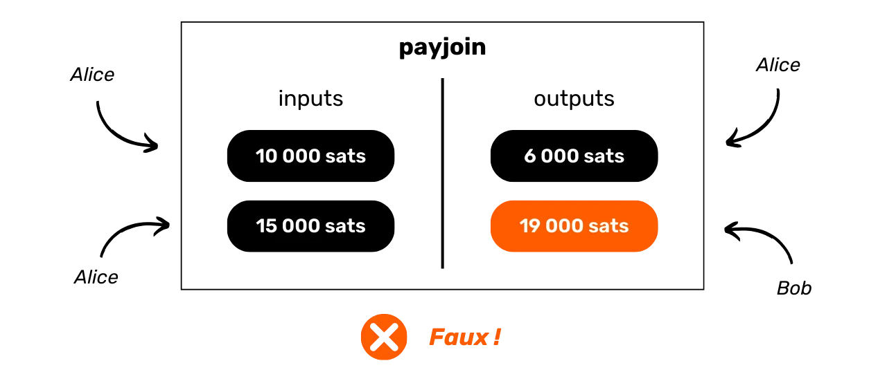


Ta interpretacja jest oczywiście błędna, ponieważ jak już wiesz, dwa UTXO w wejściach nie należą do tej samej osoby. Jeden pochodzi od Alice, kupującej bagietki, a drugi od Boba, piekarza.


W ten sposób analiza zewnętrznego obserwatora jest kierowana w stronę błędnych wniosków, zapewniając zachowanie poufności interesariuszy.


### Transakcja steganograficzna


Drugim celem PayJoin jest wprowadzenie w błąd zewnętrznego obserwatora co do rzeczywistej kwoty dokonanej płatności. Badając strukturę transakcji, analityk może sądzić, że płatność jest równoważna kwocie jednego z wyjść.


Jeśli wrócimy do naszego przykładu zakupu bagietki, analityk pomyśli, że kwota płatności odpowiada albo UTXO w wysokości 6 000 Sats, albo UTXO w wysokości 19 000 Sats. W tym przypadku analityk będzie raczej uważał, że kwota płatności wynosi 19 000 Sats, ponieważ na wyjściu są 2 UTXO, z których co najmniej jeden jest większy niż 6 000 Sats (nie ma logicznego powodu, aby używać 2 UTXO do zapłaty 6 000 Sats, gdy pojedynczy UTXO byłby wystarczający do zaspokojenia tej płatności).


W rzeczywistości jednak analiza ta jest błędna. Kwota płatności nie odpowiada żadnemu z wyników. W rzeczywistości jest to różnica między UTXO odbiorcy w produkcji a UTXO odbiorcy w nakładach.


Pod tym względem transakcja PayJoin wchodzi w zakres steganografii. Pozwala ona ukryć prawdziwą kwotę transakcji w fałszywej transakcji, która działa jak wabik.


Steganografia to technika ukrywania informacji w innych danych lub obiektach, tak aby obecność ukrytych informacji nie była zauważalna. Na przykład, tajna wiadomość może być ukryta w kropce w niepowiązanym tekście, dzięki czemu jest niewykrywalna gołym okiem (jest to technika [microdot](https://fr.wikipedia.org/wiki/Micropoint)).


W przeciwieństwie do szyfrowania, które czyni informacje niezrozumiałymi bez klucza deszyfrującego, steganografia nie modyfikuje informacji. Pozostaje ona wyświetlana w postaci czystego tekstu. Jej celem jest raczej ukrycie samego istnienia tajnej wiadomości, podczas gdy szyfrowanie wyraźnie ujawnia obecność ukrytych informacji, choć niedostępnych bez klucza. Właśnie dlatego pierwotna nazwa PayJoin brzmiała "transakcje steganograficzne".


Można narysować analogię między kryptografią a CoinJoin oraz między steganografią a PayJoin. CoinJoin ma podobne cechy do szyfrowania: metoda jest rozpoznawalna, ale informacje są niemożliwe do odszyfrowania. I odwrotnie, PayJoin jest podobny do steganografii: informacje są teoretycznie dostępne, ale ponieważ metoda ukrywania nie jest rozpoznawalna, staje się niedostępna.


### Jak używać PayJoin?


Znane programy obsługujące PayJoin obejmują Sparrow Wallet, Wasabi Wallet, Mutiny, BitMask, BlueWallet i JoinMarket, a także procesor płatności BTCPay.


Najbardziej zaawansowaną implementacją PayJoin był tylko Stowaway na Samourai Wallet. Jednak od czasu aresztowania twórców oprogramowania, narzędzie to jest obecnie tylko częściowo funkcjonalne. Zaletą Stowaway jest to, że jest to wszechstronny, łatwy w użyciu protokół, który obsługuje zarówno odbieranie, jak i wysyłanie payjoinów. Częściowo podpisane transakcje można wymieniać ręcznie, skanując kilka kodów QR, lub automatycznie przez Tor za pośrednictwem Soroban. Ta ostatnia opcja komunikacji jest obecnie niedostępna.


Trudność w korzystaniu z PayJoin polega na jego zależności od udziału sprzedawcy. Jako klient nie możesz użyć PayJoin, jeśli sprzedawca go nie obsługuje. Dodaje to kolejną trudność do procesu zakupu: nie tylko trudno jest znaleźć sprzedawców, którzy akceptują Bitcoin, ale jeśli szukasz również tych, którzy obsługują payjoins, staje się to jeszcze bardziej skomplikowane.


Jednym z rozwiązań byłoby wykorzystanie struktur transakcji, które wprowadzają niejednoznaczność do analizy łańcucha bez konieczności współpracy odbiorcy. Umożliwiłoby nam to poprawę poufności naszych płatności bez polegania na aktywnym udziale sprzedawców. Właśnie temu zagadnieniu przyjrzymy się w następnym rozdziale.


https://planb.network/tutorials/privacy/on-chain/payjoin-sparrow-wallet-087a0e49-61cd-41f5-8440-ac7b157bdd62

https://planb.network/tutorials/privacy/on-chain/payjoin-samourai-wallet-48a5c711-ee3d-44db-b812-c55913080eab

## Płatność mini-CoinJoin


<chapterId>300777ee-30ae-43d7-ab00-479dac3522c1</chapterId>


Jeśli chcesz przeprowadzić transakcję płatniczą przy jednoczesnym zachowaniu pewnego stopnia poufności, PayJoin jest dobrym rozwiązaniem. Jak jednak właśnie zauważyliśmy, PayJoin wymaga zaangażowania odbiorcy. Co więc zrobić, jeśli odbiorca odmawia udziału w PayJoin lub jeśli po prostu wolisz go nie angażować? Jedną z alternatyw jest skorzystanie z transakcji Stonewall lub Stonewall x2. Przyjrzyjmy się bliżej tym dwóm rodzajom transakcji.


### Transakcja Stonewall


Stonewall to specyficzna forma transakcji Bitcoin zaprojektowana w celu zwiększenia poufności użytkownika podczas wydawania pieniędzy poprzez imitowanie pseudo-CoinJoin między dwiema osobami, bez faktycznego bycia jedną z nich. W rzeczywistości transakcja ta nie jest oparta na współpracy. Użytkownik może zbudować ją samodzielnie, wykorzystując jako dane wejściowe wyłącznie posiadane przez siebie UTXO. Można więc utworzyć transakcję Stonewall na dowolną okazję, bez konieczności synchronizacji z innym użytkownikiem lub odbiorcą.


Transakcja Stonewall działa w następujący sposób: jako dane wejściowe do transakcji emitent wykorzystuje 2 UTXO, które należą do niego. Na wyjściu transakcja generuje 4 UTXO, z których 2 mają dokładnie taką samą wartość. Pozostałe 2 UTXO będą stanowić zagraniczne Exchange. Z 2 transakcji wyjściowych o tej samej kwocie tylko jedna faktycznie trafi do odbiorcy.


W transakcji Stonewall występują więc tylko 2 role:


- Emitent, który dokonuje płatności;
- Odbiorca, który może być nieświadomy szczególnego charakteru transakcji i po prostu oczekuje płatności od nadawcy.


Weźmy przykład, aby zrozumieć tę strukturę transakcji. Alice udaje się do piekarza Boba, aby kupić bagietkę, która kosztuje 4000 Sats. Chce zapłacić w bitcoinach, zachowując jednocześnie pewną formę poufności w odniesieniu do swojej płatności. Postanawia więc utworzyć transakcję Stonewall dla tej płatności.


Analizując tę transakcję, widzimy, że piekarz Bob faktycznie otrzymał 4 000 Sats jako zapłatę za bagietkę. Alice użyła 2 UTXO jako danych wejściowych: jednego za 10 000 Sats i jednego za 15 000 Sats. Na wyjściach odzyskała 3 UTXO: jedno za 4 000 Sats, jedno za 6 000 Sats i jedno za 11 000 Sats. Alice ma zatem saldo netto w wysokości -4 000 Sats na tej transakcji, co odpowiada cenie bagietki.


W tym przykładzie celowo pominąłem opłaty Mining, aby ułatwić jego zrozumienie. W rzeczywistości koszty transakcji są w całości ponoszone przez emitenta.


### Jakie są cele transakcji Stonewall?


Struktura Stonewall dodaje ogromną ilość entropii do transakcji, zacierając linie analizy łańcucha. Patrząc z zewnątrz, taka transakcja może być interpretowana jako mini-CoinJoin między dwiema osobami. W rzeczywistości jest to jednak płatność. Metoda ta powoduje zatem niepewność w analizie łańcucha, a nawet prowadzi do fałszywych tropów.


Weźmy przykład Alicji u Boba piekarza. Transakcja na Blockchain wyglądałaby następująco:


Zewnętrzny obserwator polegający na heurystyce analizy łańcucha może błędnie dojść do wniosku, że "*dwie osoby stworzyły mały CoinJoin, z jednym UTXO na wejściu i dwoma UTXO na wyjściu*". Analiza tej transakcji z zewnątrz nie prowadzi do zastosowania CIOH, ponieważ obecność dwóch wyjść o tej samej wartości sugeruje wzorzec CoinJoin. Z zewnętrznego punktu widzenia CIOH nie ma zatem zastosowania w tym konkretnym przypadku.


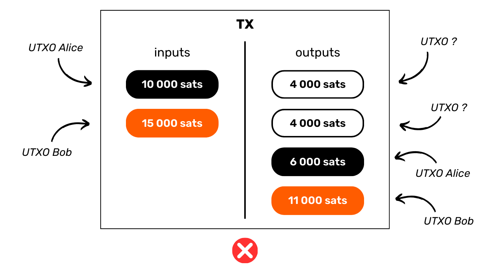


Ta interpretacja jest niedokładna, ponieważ, jak wiadomo, jeden UTXO został wysłany do Boba piekarza, 2 wejścia UTXO pochodziły od Alicji, a ona odzyskała 3 wyjścia Exchange.


Szczególnie interesujące w strukturze transakcji Stonewall jest to, że z punktu widzenia zewnętrznego obserwatora przypomina ona pod każdym względem transakcję Stonewall x2.


### Transakcja Stonewall x2


Stonewall x2 to kolejna specyficzna forma transakcji Bitcoin, która również ma na celu zwiększenie poufności użytkownika podczas dokonywania wydatków, ale tym razem poprzez współpracę z osobą trzecią niezaangażowaną w ten wydatek. Metoda ta działa jak pseudo-CoinJoin między dwoma uczestnikami, jednocześnie dokonując płatności na rzecz trzeciej osoby.


Działanie transakcji Stonewall x2 jest stosunkowo proste: używamy UTXO w naszym posiadaniu, aby dokonać płatności i pozyskujemy pomoc strony trzeciej, która również wpłaca UTXO należący do niej. Transakcja kończy się czterema wyjściami: dwa z nich w równych kwotach, jeden przeznaczony dla Address odbiorcy płatności, drugi dla Address należącego do współpracownika. Trzeci UTXO jest zwracany do innego Address należącego do współpracownika, umożliwiając mu odzyskanie początkowej kwoty (działanie neutralne dla niego, modulo koszty Mining), a ostatni UTXO wraca do Address należącego do nas, co stanowi płatność Exchange.


W ten sposób w transakcjach Stonewall x2 zdefiniowano trzy różne role:


- Emitent, który dokonuje faktycznej płatności;
- Odbiorca, który może być nieświadomy szczególnego charakteru transakcji i po prostu oczekuje płatności od nadawcy;
- Współpracownik, który udostępnia bitcoiny, aby poddać w wątpliwość analizę transakcji, odzyskując na koniec swoje środki w całości (działanie neutralne dla niego, pomijając koszty Mining).


Wróćmy do naszego przykładu z Alice, która jest u Boba piekarza, aby kupić bagietkę, która kosztuje 4000 Sats. Chce zapłacić w bitcoinach, zachowując przy tym pewien poziom poufności w odniesieniu do swojej płatności. Wzywa więc swojego przyjaciela Charlesa, który pomoże jej w tym procesie.


Analizując tę transakcję, widzimy, że piekarz Bob faktycznie otrzymał 4 000 Sats jako zapłatę za bagietkę. Alice wykorzystała 10 000 Sats na wejściu i odzyskała 6 000 Sats na wyjściu, czyli saldo netto wyniosło -4 000 Sats, co odpowiada cenie bagietki. Jeśli chodzi o Charlesa, dostarczył on 15 000 Sats na wejściu i otrzymał dwa wyjścia: jedno w wysokości 4 000 Sats i drugie w wysokości 11 000 Sats, co daje saldo 0.


W tym przykładzie celowo pominąłem opłaty, aby ułatwić zrozumienie. W rzeczywistości opłaty Mining są zazwyczaj dzielone równo między emitenta płatności i wpłacającego.


### Jakie są cele transakcji Stonewall x2?


Podobnie jak struktura Stonewall, struktura Stonewall x2 dodaje dużo entropii do transakcji i myli analizę łańcucha. Patrząc z zewnątrz, taka transakcja może być interpretowana jako mały CoinJoin między dwiema osobami. Ale w rzeczywistości jest to płatność. Metoda ta powoduje zatem niepewność w analizie łańcucha, a nawet prowadzi do fałszywych tropów.


Weźmy przykład Alice, Boba Piekarza i Charlesa. Transakcja na Blockchain wyglądałaby następująco:


Zewnętrzny obserwator opierający się na heurystyce analizy łańcucha może błędnie dojść do wniosku, że "*Alice i Charles wykonali mały CoinJoin, z jednym UTXO na wejściu i dwoma UTXO na wyjściu*". Ponownie, analiza tej transakcji z zewnątrz nie prowadzi do zastosowania ICOH, ponieważ obecność dwóch wyjść o tej samej wartości sugeruje wzorzec CoinJoin. Z zewnętrznego punktu widzenia CIOH nie ma zatem zastosowania w tym konkretnym przypadku.


Ta interpretacja jest nieprawidłowa, ponieważ, jak wiadomo, jeden UTXO został wysłany do Boba piekarza, Alicja ma tylko jedno wyjście Exchange, a Karol ma dwa.


Po raz kolejny szczególnie interesujące w strukturze transakcji Stonewall x2 jest to, że z punktu widzenia zewnętrznego obserwatora pod każdym względem przypomina ona transakcję Stonewall.


### Jaka jest różnica między Stonewall a Stonewall x2?


Transakcja StonewallX2 działa dokładnie tak samo jak transakcja Stonewall, z tą różnicą, że ta pierwsza jest oparta na współpracy, podczas gdy druga nie. Jak widzieliśmy, transakcja Stonewall x2 obejmuje udział strony trzeciej (Charlesa), która jest zewnętrzna w stosunku do płatności i która udostępni swoje bitcoiny w celu zwiększenia poufności transakcji. W klasycznej transakcji Stonewall rolę współpracownika przejmuje nadawca.


Z zewnętrznego punktu widzenia schemat transakcji jest dokładnie taki sam.


Fakt, że te dwie struktury transakcji mają dokładnie ten sam wzorzec oznacza, że nawet jeśli zewnętrzny obserwator zdoła zidentyfikować wzorzec "Stonewall(x2)", nie będzie miał wszystkich informacji. Nie będzie w stanie określić, który z dwóch UTXO o tych samych kwotach odpowiada płatności. Co więcej, nie będzie w stanie określić, czy dwa UTXO z danymi wejściowymi pochodzą od dwóch różnych osób (Stonewall x2), czy też należą do jednej osoby, która je połączyła (Stonewall).


Ten ostatni punkt wynika z faktu, że transakcje Stonewall x2 przebiegają dokładnie według tego samego schematu, co transakcje Stonewall. Patrząc z zewnątrz i bez dodatkowych informacji kontekstowych, niemożliwe jest odróżnienie transakcji Stonewall od transakcji Stonewall x2. Te pierwsze nie są transakcjami opartymi na współpracy, podczas gdy te drugie są. Dodaje to jeszcze więcej wątpliwości do analizy jednej z tych transakcji.


### Kiedy należy używać transakcji Stonewall i Stonewall x2?


Logika powinna być następująca, gdy chcesz użyć narzędzia poufności dla wydatku:


- Jako priorytet możemy wybrać PayJoin;
- Jeśli sprzedawca nie obsługuje payjoins, transakcja kolaboracyjna może zostać dokonana z inną osobą poza płatnością przy użyciu struktury Stonewall x2;
- Jeśli nie możesz znaleźć nikogo, kto dokonałby transakcji Stonewall x2, możesz dokonać transakcji Stonewall only, która będzie naśladować zachowanie transakcji Stonewall x2.


### Jak korzystać z transakcji Stonewall i Stonewall x2?


Transakcje Stonewall i Stonewall x2 są dostępne zarówno w aplikacji Samourai Wallet, jak i oprogramowaniu Sparrow Wallet.


Jednak, podobnie jak w przypadku payjoinów, po aresztowaniu założycieli Samourai, transakcje Stonewall x2 działają teraz tylko poprzez ręczną wymianę PSBT między zainteresowanymi stronami. Niestety, automatyczne Exchange za pośrednictwem Soroban nie jest już dostępne.


Możliwe jest również przeprowadzenie tego typu transakcji ręcznie z dowolnego oprogramowania Bitcoin Wallet.


W następnym rozdziale przyjrzymy się innej technice poufności, która jest stosunkowo mało znana, ale jest bardzo przydatna jako uzupełnienie tego, co już zbadaliśmy.


https://planb.network/tutorials/privacy/on-chain/stonewall-033daa45-d42c-40e1-9511-cea89751c3d4

https://planb.network/tutorials/privacy/on-chain/stonewall-x2-05120280-f6f9-4e14-9fb8-c9e603f73e5b

## Rykoszety


<chapterId>db9a20ac-a149-443d-884b-ea6c03f28499</chapterId>


Wykorzystanie struktur transakcji Bitcoin, które dodają niejednoznaczności do analizy łańcucha, takich jak CoinJoin, jest szczególnie korzystne dla ochrony prywatności. Jednakże, jak omówiliśmy w rozdziale dotyczącym payjoinów, transakcje CoinJoin są naturalnie identyfikowalne w łańcuchu. Pamiętaj o analogii, którą narysowaliśmy między szyfrowaniem a coinjoinami: gdy plik jest zaszyfrowany, strona trzecia, która odkryje zaszyfrowany plik, nie może uzyskać dostępu do jego zawartości, ale może wyraźnie zidentyfikować, że plik został zmodyfikowany w celu ukrycia jego zawartości. To samo dotyczy CoinJoin: gdy analityk bada transakcję CoinJoin, chociaż nie może ustanowić bezpośrednich powiązań między wejściami i wyjściami (i odwrotnie), może jednak rozpoznać, że obserwowana transakcja jest CoinJoin.


W zależności od tego, w jaki sposób zamierzasz wykorzystać swoją część po cyklach CoinJoin, fakt, że została ona poddana temu procesowi może być problematyczny. Na przykład, jeśli planujesz sprzedać swoją monetę na regulowanej platformie Exchange, ale niedawno przeszła ona CoinJoin, narzędzie do analizy łańcucha platformy wykryje ten fakt. Platforma może wówczas odmówić przyjęcia Twojej monety UTXO, a nawet zażądać od Ciebie wyjaśnień, co grozi zawieszeniem Twojego konta lub zamrożeniem środków. W niektórych przypadkach platforma może również zgłosić twoje zachowanie organom państwowym (tego na przykład wymaga TRACFIN od PSAN we Francji).


Aby tego uniknąć, potrzebujemy narzędzia zdolnego do zatarcia śladów przeszłości monety Bitcoin w celu przywrócenia pewnej formy zamienności. Taki jest właśnie cel rykoszetu.


### Co to jest rykoszet?


Rykoszet jest techniką polegającą na wykonaniu kilku fikcyjnych transakcji wobec siebie (sweep) w celu symulacji transferu Bitcoin Ownership. Narzędzie to różni się od innych struktur transakcyjnych, które omówiliśmy, tym, że nie zapewnia anonimowości prospektywnej, ale raczej formę anonimowości retrospektywnej. W efekcie rykoszet zaciera specyfikę, która może zagrozić zamienności monety Bitcoin ze względu na jej przeszłość.


Aby wygładzić odcisk pozostawiony przez przeszłe zdarzenie na monecie, takie jak cykle CoinJoin, rykoszet wykonuje cztery kolejne transakcje, w których użytkownik przelewa sobie środki na różne adresy.


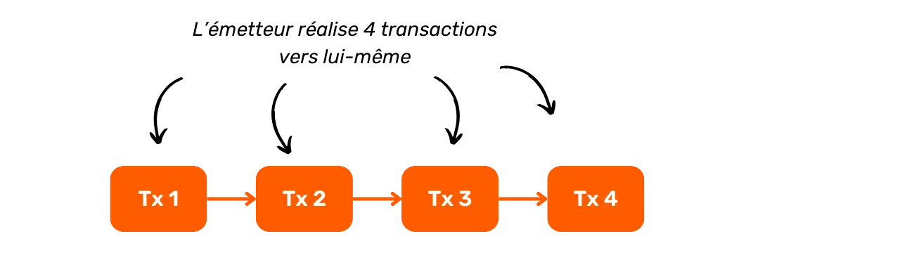


Po tej sekwencji transakcji narzędzie ricochet ostatecznie kieruje bitcoiny do miejsca docelowego, takiego jak platforma Exchange.


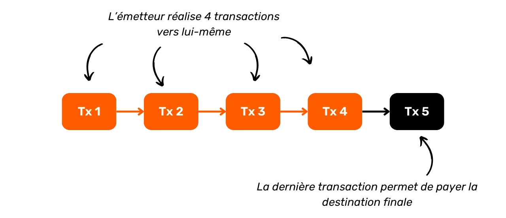


Celem jest stworzenie dystansu wpływającego na zamienność monety, takiego jak transakcja CoinJoin, i ostateczny akt wydatkowania, który mógłby odrzucić tę monetę ze względu na jej przeszłość. W ten sposób narzędzia do analizy łańcucha mogą dojść do wniosku, że prawdopodobnie nastąpiła zmiana Ownership po zdarzeniu i uznać tę monetę za zamienną. W przypadku CoinJoin, narzędzia do analizy Blockchain mogłyby wówczas założyć, że nie była to ta sama osoba, która wysłała bitcoiny i przeprowadziła CoinJoin, a zatem nie ma sensu podejmować działań przeciwko nadawcy.


### Dlaczego to działa?


W obliczu tej metody rykoszetu można by sobie wyobrazić, że oprogramowanie do analizy łańcucha pogłębiłoby badanie powyżej czterech odbić. Platformy te stają jednak przed dylematem optymalizacji progu detekcji. Muszą one ustalić limit liczby przeskoków, po których akceptują, że prawdopodobnie nastąpiła zmiana właściwości, a powiązanie z poprzednim zdarzeniem (takim jak CoinJoin) powinno zostać zignorowane.


Ustalenie tego progu jest jednak ryzykowne: każde zwiększenie liczby obserwowanych skoków wykładniczo zwiększa liczbę wyników fałszywie dodatnich, tj. osób błędnie oznaczonych jako uczestnicy zdarzenia, podczas gdy w rzeczywistości operacja została przeprowadzona przez kogoś innego. Scenariusz ten stanowi poważne ryzyko dla tych firm, ponieważ fałszywe alarmy prowadzą do niezadowolenia, które może doprowadzić do przejścia klientów do konkurencji. W dłuższej perspektywie zbyt wysoki próg wykrywalności prowadzi platformę do utraty większej liczby klientów niż jej konkurenci, co może zagrozić jej rentowności. W związku z tym platformy te mają trudności ze zwiększeniem liczby zaobserwowanych odrzuceń, a 4 to często wystarczająca liczba, aby przeciwdziałać ich analizom.


Zaobserwowane tutaj zjawisko jest nieco analogiczne do teorii sześciu stopni separacji.


Teoria sześciu stopni oddalenia sugeruje, że każda osoba na Ziemi jest połączona z każdą inną poprzez łańcuch relacji obejmujący co najwyżej sześciu pośredników. Wystarczyłoby zatem przejść przez serię sześciu osób, z których każda osobiście znałaby kolejną, aby dotrzeć do dowolnej osoby na świecie.


W przypadku transakcji Bitcoin obserwujemy podobne zjawisko. Śledząc wystarczającą liczbę transakcji Bitcoin, nieuchronnie natrafiamy na CoinJoin. Metoda rykoszetu wykorzystuje tę zasadę, wykorzystując większą liczbę przeskoków niż platformy Exchange mogą rozsądnie śledzić. Jeśli platformy zdecydują się śledzić więcej transakcji, możliwe jest po prostu dodanie dodatkowego przeskoku w celu obejścia tego środka.


### Kiedy i jak używać rykoszetu?


Najczęstszy przypadek użycia rykoszetu występuje, gdy konieczne jest ukrycie wcześniejszego udziału w CoinJoin na posiadanym UTXO. Najlepiej jest unikać transferu bitcoinów, które przeszły CoinJoin do podmiotów regulowanych. Niemniej jednak, w przypadku braku innej opcji, szczególnie w przypadku pilnej potrzeby upłynnienia bitcoinów w walucie państwowej, rykoszet oferuje skuteczne rozwiązanie.


Metoda ta jest skuteczna nie tylko w przypadku coinjoinów, ale także w przypadku wszelkich innych oznaczeń, które mogłyby zagrozić zamienności części.


Pomysł na tę metodę rykoszetu pierwotnie wyszedł od zespołów Samourai Wallet, które zintegrowały ją ze swoją aplikacją, aby zautomatyzować proces. Usługa nie jest darmowa na Samourai, ponieważ rykoszet wiąże się z opłatą za usługę w wysokości 100 000 Sats plus koszty Mining. Korzystanie z niej jest zatem zalecane w przypadku przelewów na znaczne kwoty.


Aplikacja Samurai oferuje dwa warianty rykoszetów:


- Wzmocniony rykoszet lub "dostawa rozłożona w czasie", która oferuje korzyść w postaci rozłożenia opłaty za usługę Samurai na pięć kolejnych transakcji. Opcja ta zapewnia również, że każda transakcja jest nadawana w osobnym czasie i rejestrowana w innym bloku, naśladując jak najdokładniej zachowanie zmiany właściciela. Metoda ta, choć wolniejsza, jest preferowana dla tych, którzy się nie spieszą, ponieważ maksymalizuje wydajność rykoszetu poprzez wzmocnienie jego odporności na analizę łańcucha;


- Klasyczny rykoszet, który ma na celu szybkie wykonanie operacji, transmituje wszystkie transakcje w skróconym przedziale czasowym. Metoda ta oferuje zatem mniejszą poufność i mniejszą odporność na analizę niż metoda wzmocniona. Powinna być stosowana tylko w przypadku pilnych przesyłek.


Rykoszetowanie oznacza po prostu wysyłanie bitcoinów do samego siebie. Ręczne rykoszetowanie bitcoinów jest całkowicie możliwe na dowolnym oprogramowaniu Wallet, bez użycia specjalistycznego narzędzia. Wszystko, co musisz zrobić, to sukcesywnie przesyłać tę samą monetę do siebie, używając za każdym razem nowego, pustego Address.


W następnym rozdziale przyjrzymy się różnym technikom tajnych transferów Ownership. Metody te różnią się radykalnie od tych, które zbadaliśmy do tej pory, zarówno pod względem działania, jak i wyników.


https://planb.network/tutorials/privacy/on-chain/ricochet-e0bb1afe-becd-44a6-a940-88a463756589

## Tajne transfery Ownership


<chapterId>a2067036-849c-4d6b-87d2-44235cfae7a1</chapterId>


Inną z technik poufności Bitcoin jest tajny transfer Ownership. Metoda ta ma na celu przeniesienie Ownership Bitcoinów od jednej osoby do drugiej i odwrotnie, bez wyraźnego uwidocznienia transakcji na Blockchain. Przyjrzyjmy się różnym dostępnym technikom, wraz z ich zaletami i wadami.


### Wymiana monet


Coinwap opiera się na stosunkowo prostej koncepcji: wykorzystuje inteligentne kontrakty, aby ułatwić transfer Bitcoin Ownership między dwoma użytkownikami, bez potrzeby zaufania i bez tego transferu, który jest wyraźnie widoczny na Blockchain.


Wyobraźmy sobie naiwny przykład z Alice i Bobem. Alice posiada 1 BTC zabezpieczony kluczem prywatnym $A$, a Bob również posiada 1 BTC zabezpieczony kluczem prywatnym $B$. Teoretycznie mogliby Exchange swoje klucze prywatne za pośrednictwem zewnętrznego kanału komunikacyjnego w celu przeprowadzenia tajnego transferu.


Ta naiwna metoda wiąże się jednak z wysokim ryzykiem pod względem zaufania. Nic nie stoi na przeszkodzie, by Alicja zachowała kopię klucza prywatnego $A$ po Exchange i wykorzystała ją później do kradzieży bitcoinów, gdy klucz znajdzie się w rękach Boba.


Co więcej, nie ma gwarancji, że Alicja nie otrzyma klucza prywatnego Boba $B$ i nigdy nie przekaże swojego klucza prywatnego $A$ w Exchange. Exchange opiera się zatem na nadmiernym zaufaniu między stronami i jest nieskuteczny w zapewnieniu bezpiecznego tajnego transferu Ownership.


Aby rozwiązać te problemy i umożliwić wymianę między stronami, które sobie nie ufają, zamiast tego będziemy używać systemów Smart contract. Smart contract to program, który wykonuje się automatycznie po spełnieniu wcześniej zdefiniowanych warunków. W naszym przypadku zapewnia to, że Exchange nieruchomości odbywa się automatycznie, bez potrzeby wzajemnego zaufania.


Można to osiągnąć za pomocą HTLC (*Hash Time-Locked Contracts*) lub PTLC (*Point Time-Locked Contracts*). Te dwa protokoły działają w podobny sposób, wykorzystując system blokady czasowej, który zapewnia, że Exchange zostanie pomyślnie zakończony lub całkowicie anulowany, chroniąc w ten sposób integralność funduszy obu stron. Główna różnica między HTLC a PTLC polega na tym, że HTLC wykorzystuje hashe i obrazy wstępne do zabezpieczenia transakcji, podczas gdy PTLC wykorzystuje podpisy adaptera.


W scenariuszu wymiany monet przy użyciu HTLC lub PTLC między Alicją i Bobem, Exchange odbywa się bezpiecznie: albo się powiedzie i każdy otrzyma BTC drugiej strony, albo się nie powiedzie i każdy zachowa własne BTC. Dzięki temu żadna ze stron nie może oszukać ani ukraść BTC drugiej strony.


> *HTLC jest również mechanizmem używanym do bezpiecznego kierowania płatności przez dwukierunkowe kanały Lightning Network*
Wykorzystanie podpisów adaptera jest szczególnie interesujące w tym kontekście, ponieważ umożliwia rezygnację z tradycyjnych skryptów (mechanizm czasami określany jako "skrypty bezskryptowe"). Funkcja ta zmniejsza koszty związane z Exchange. Inną ważną zaletą podpisów adaptacyjnych jest to, że nie wymagają one użycia wspólnego Hash dla obu stron transakcji, co pozwala uniknąć konieczności ujawniania bezpośredniego powiązania między nimi w niektórych typach Exchange.


### Podpisy adapterów


Podpisy adaptacyjne to metoda kryptograficzna, która integruje prawidłowy podpis z dodatkowym podpisem, zwanym "podpisem adaptacyjnym", w celu ujawnienia tajnych danych. Mechanizm ten został zaprojektowany w taki sposób, że znajomość 2 z 3 następujących Elements: poprawnego podpisu, podpisu adaptera i sekretu, pozwala nam wydedukować brakujący trzeci element. Interesującą właściwością tej metody jest to, że jeśli znamy podpis adaptera naszego rówieśnika i konkretny punkt na krzywej eliptycznej powiązany z sekretem użytym do obliczenia tego podpisu adaptera, możemy wyprowadzić własny podpis adaptera, który będzie zgodny z tym samym sekretem, bez bezpośredniego dostępu do samego sekretu.


W przypadku wymiany monet użycie podpisów adaptacyjnych umożliwia jednoczesne ujawnienie dwóch poufnych informacji między uczestnikami, unikając w ten sposób potrzeby wzajemnego zaufania. Weźmy przykład ilustrujący ten proces z Alice i Bobem, którzy chcą Exchange posiadać po 1 BTC, ale nie ufają sobie nawzajem. Używają podpisów adaptacyjnych, aby wyeliminować potrzebę wzajemnego zaufania w tym Exchange. Oto jak to robią:


- Alicja inicjuje Exchange, tworząc transakcję $m_A$, która wysyła 1 BTC do Boba. Generuje podpis $s_A$, który zatwierdza tę transakcję, używając swojego klucza prywatnego $p_A$ ($P_A = p_A \cdot G$), Nonce $n_A$ ($N_A = n_A \cdot G$) i sekretu $t$ ($T = t \cdot G$):


$$s_A = n_A + t + H(N_A + T \parallel P_A \parallel m_A) \cdot p_A$$


- Alicja oblicza sygnaturę adaptera $s_A'$, odejmując sekret $t$ od swojej prawdziwej sygnatury $s_A$:


$$s_A' = s_A - t$$


- Alicja wysyła Bobowi swój adapter podpisu $s'_A$, swoją niepodpisaną transakcję $m_A$, punkt odpowiadający sekretowi ($T$) i punkt odpowiadający Nonce ($N_A$). Te Elements stanowią tak zwany "adapter". Należy zauważyć, że mając tylko te informacje, Bob nie może odzyskać BTC Alicji.
- Bob może jednak sprawdzić, czy Alicja nie próbuje go okraść. Aby to zrobić, sprawdza, czy podpis adaptacyjny $s_A'$ Alicji faktycznie odpowiada proponowanej transakcji $m_A$. Jeśli poniższe równanie jest poprawne, to może być pewien, że adapter podpisu Alicji jest ważny:


$$s_A' \cdot G = N_A + H(N_A + T \parallel P_A \parallel m_A) \cdot P_A$$


- Weryfikacja ta daje Bobowi wystarczające gwarancje, że może kontynuować Exchange z pełnym zaufaniem. Następnie tworzy własną transakcję $m_B$, której celem jest wysłanie 1 BTC do Alicji, i generuje swój podpis adaptacyjny $s_B'$, który również będzie powiązany z tym samym sekretem $t$. Na tym etapie tylko Alicja zna wartość $t$; Bob zna tylko odpowiedni punkt $T$, który Alicja mu przekazała:


$$s_B' = n_B + H(N_B + T \parallel P_B \parallel m_B) \cdot p_B$$


- Bob wysyła Alicji swój podpis adaptera $s_B'$, swoją niepodpisaną transakcję $m_B$, a także punkt odpowiadający sekretowi ($T$) i punkt odpowiadający Nonce ($N_B$). Alicja, która zna sekret $t$, może teraz połączyć podpis adaptera Boba $s_B'$ z tym sekretem, aby generate ważny podpis $s_B$ dla transakcji $m_B$, która przekaże jej BTC Boba:


$$s_B = s_B' + t$$


$$(s_B' + t) \cdot G = N_B + T + H(N_B + T \parallel P_B \parallel m_B) \cdot P_B$$


- Alicja transmituje tę podpisaną transakcję $m_B$ na Bitcoin Blockchain, aby odzyskać BTC obiecane przez Boba. Gdy Bob widzi tę transakcję na Blockchain, może wyodrębnić podpis $s_B = s_B' + t$. Dzięki tym informacjom Bob jest w stanie wyodrębnić słynny sekret $t$, którego potrzebował:


$$t = (s_B' + t) - s_B' = s_B - s_B'$$


- I ten sekret $t$ był jedynym elementem, którego brakowało Bobowi do generate prawidłowego podpisu $s_A$ z podpisu adaptera $s_A'$ Alicji. Podpis ten zatwierdza transakcję $m_A$, która wysyła BTC od Alicji do Boba. Następnie Bob oblicza $s_A$ i transmituje transakcję $m_A$ na Blockchain:


$$s_A = s_A' + t$$


$$(s_A' + t) \cdot G = N_A + T + H(N_A + T \parallel P_A \parallel m_A) \cdot P_A$$


Podsumujmy, jak działa podpis adaptera w wymianie monet. Początkowo Alicja wysyła Bobowi niepodpisaną transakcję wraz z adapterem, umożliwiając Bobowi sprawdzenie, czy ujawniony później sekret da mu dostęp do bitcoinów. W zamian Bob wysyła Alicji własną niepodpisaną transakcję i adapter. Alicja może następnie sfinalizować transakcję Boba i odzyskać bitcoiny, transmitując ważną transakcję dzięki sekretowi. Gdy ta transakcja zostanie opublikowana na Blockchain, Bob ma możliwość wyodrębnienia sekretu, a tym samym odblokowania transakcji Alicji. W rezultacie, jeśli Alicja zainicjuje transfer Bitcoin Boba, Bob może z kolei uzyskać dostęp do Bitcoin Alicji bez potrzeby wzajemnego zaufania.


Należy zauważyć, że coinswapy zostały po raz pierwszy zaproponowane przez [Gregory'ego Maxwella w październiku 2013 r. na BitcoinTalk](https://bitcointalk.org/index.php?topic=321228.0).


### Zamiana atomowa


W podobny sposób jak coinswap i przy użyciu tych samych rodzajów inteligentnych kontraktów, możliwe jest również przeprowadzanie atomowych swapów. Atomic swap umożliwia bezpośrednią Exchange różnych kryptowalut, takich jak BTC i XMR, między dwoma użytkownikami bez potrzeby zaufania lub interwencji pośrednika. Wymiany te są określane jako "atomowe", ponieważ mają tylko dwa możliwe wyniki: albo swap się powiedzie i obie strony będą zadowolone, albo nie powiedzie się i każda z nich zachowa swoje oryginalne kryptowaluty, eliminując potrzebę zaufania drugiej stronie.


Atomic swap i coinswap mają podobną metodę działania i oferują te same zalety i wady pod względem poufności. Rzeczywiście, z punktu widzenia Bitcoin, atomic swap jest porównywalny z coinswapem przeprowadzanym w dwóch etapach. Najpierw Exchange wymienia nasze BTC na inną kryptowalutę, a następnie ta kryptowaluta może zostać wymieniona na inne BTC. Na koniec odzyskujemy BTC innego użytkownika. Dlatego w analizie kwestii poufności grupuję te dwa protokoły w kategorii zastrzeżonych tajnych wymian.


Należy jednak pamiętać, że w przeciwieństwie do coinswap, atomic swap może mieć nierównowagę pod względem dostępnej płynności, szczególnie na giełdach BTC/XMR. Generalnie łatwiej jest wymienić bitcoiny na altcoiny, ponieważ istnieje duży popyt na bitcoiny, co utrzymuje niskie premie za ten kierunek konwersji. Wymiana altcoinów na BTC może być jednak bardziej skomplikowana ze względu na niższy popyt, co często skutkuje bardzo wysokimi premiami.


Wreszcie, gdy swap atomowy obejmuje bitcoiny onchain i bitcoiny na Lightning Network, mówimy o "swapie podwodnym".


### Czy to naprawdę przydatne?


Tajne transfery Ownership, takie jak wymiana monet i wymiana atomowa, mają tę zaletę, że oszukują heurystykę analizy łańcucha. Metody te mogą sugerować, że transakcje dotyczą tego samego użytkownika, podczas gdy rzeczywisty Ownership zmienił właściciela. Jednak główną wadą tych metod jest to, że są one bardzo ryzykowne bez użycia dodatkowej techniki łamania historii monety.


Rzeczywiście, gdy Alicja dokonuje wymiany monet lub wymiany atomowej z Bobem, wymienia posiadanie swoich bitcoinów na te należące do Boba. W przypadku wymiany atomowej Exchange zawiera Altcoin, ale zasada pozostaje ta sama. W ten sposób Alicja kończy z monetą $B$, a Bob z monetą $A$. Dodaje to wątpliwości do analizy łańcucha, ale historia monet pozostaje identyfikowalna. Jeśli analityk zbada część $A$, może prześledzić poprzednie działania Alicji i odwrotnie w przypadku części $B$.


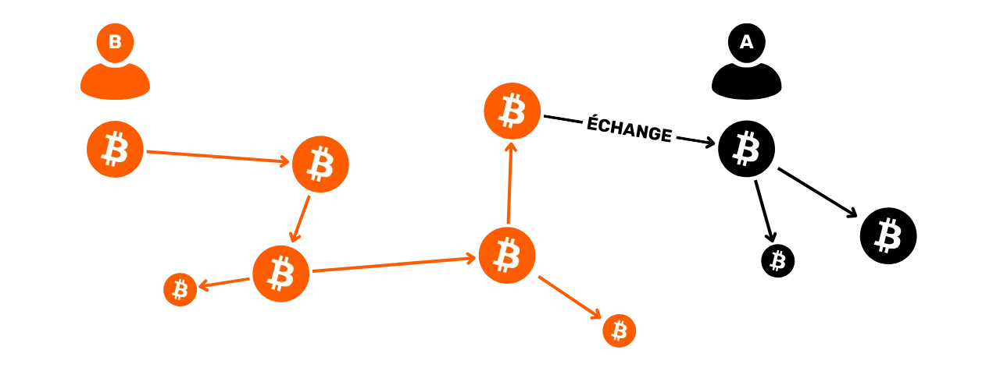


Z punktu widzenia Alicji ryzyko polega na tym, że historia monety $B$ może zostać uznana za podejrzaną przez niektóre podmioty. Jeśli, na przykład, Bob nabył monetę $B$ w wyniku przestępstwa, takiego jak hakowanie, moneta pozostanie powiązana z jego nielegalną działalnością. Alice mogłaby wówczas znaleźć się w posiadaniu monety, której nie mogłaby przenieść na regulowane platformy Exchange bez ryzyka zamrożenia środków, a nawet oskarżenia o przestępstwa Boba, mimo że nie miała z nimi nic wspólnego.


Nieuniknione jest, że metody poufności, takie jak coinswap lub atomic swap, są preferowane przez przestępców, których fundusze są pod nadzorem władz. Protokoły te umożliwiają im pozbycie się swoich bitcoinów pod nadzorem w Exchange za doskonale zamienne bitcoiny. Umożliwia im to również tworzenie dywersji poprzez kierowanie władz do innych użytkowników. Jest to więc podwójny cel dla tych ludzi.


Dzięki CoinJoin, nawet jeśli twoja moneta zostanie zmieszana z monitorowanymi bitcoinami, historia monety zostanie przerwana, zapewniając formę wiarygodnego zaprzeczenia, która nie istnieje w tajnych protokołach transferu Ownership, takich jak coinswap lub atomic swap.


Jeśli Alicja chce uniknąć ryzyka, musi koniecznie użyć metody złamania historii monety $B$, takiej jak przekazanie jej przez coinjoins. Rodzi to pytanie o przydatność połączenia tajnego transferu Ownership i CoinJoin. CoinJoin, łamiąc historię monety, oferuje już wystarczający poziom poufności dla Alicji. Dlatego uważam, że jeśli Alicja chce chronić swoją prywatność, rozsądniej byłoby przejść bezpośrednio do CoinJoin, zamiast angażować się w wymianę monet, a następnie CoinJoin.


Aby tajne metody transferu Ownership były naprawdę skuteczne i unikały ryzyka powiązania historii użytkownika $A$ z użytkownikiem $B$, paradoksalnie konieczne byłoby, aby ich użycie było powszechnie znane. Jeśli coinswap jest używany masowo, a władze są świadome tej powszechnej praktyki, wówczas można ustanowić wiarygodną formę zaprzeczenia. Jednak dopóki korzystanie z tych transferów pozostaje marginalne, uważam, że metody te pozostaną zbyt ryzykowne dla użytkowników.


Do tej pory badaliśmy głównie metody poufności na poziomie samych transakcji. W następnym rozdziale przyjrzymy się kwestiom na poziomie sieci i rozpowszechniania transakcji.


## Prywatność w sieci P2P


<chapterId>04a2467b-db84-4076-a9ff-919be5135106</chapterId>


W części 4 omówiliśmy znaczenie korzystania z kompletnego węzła w celu ochrony poufności transakcji. Ważne jest jednak, aby zrozumieć, że sam węzeł może być przedmiotem ataków mających na celu wyodrębnienie informacji o twoich działaniach. Dlatego w tym rozdziale przyjrzymy się różnym środkom, które można podjąć w celu ochrony prywatności, nie na poziomie samych transakcji lub przepływów Bitcoin, ale na poziomie sieci.


### Mlecz


Jednym ze sposobów uniknięcia różnych ataków deanonimizacyjnych jest skorzystanie z propozycji Dandelion. Ten protokół transmisji został sformalizowany w BIP156, ale nigdy nie został zaimplementowany w Bitcoin.


Ideą Dandelion jest poprawa poufności routingu transakcji w sieci Bitcoin w celu przeciwdziałania różnym formom ataków. Jego głównym celem jest ukrycie węzła źródłowego, który początkowo transmitował transakcję w sieci. Ujawnienie tego węzła mogłoby umożliwić powiązanie transakcji Bitcoin z określonym IP Address (jeśli węzeł działa w sieci clearnet), co mogłoby stanowić punkt wejścia do analizy łańcucha.


To powiązanie między aktywnością na Bitcoin a adresem IP Address stanowi znaczne zagrożenie dla poufności użytkownika. W rzeczywistości wiele podmiotów jest w stanie łatwo powiązać IP Address z tożsamością osobistą. Obejmuje to rządy i dostawców usług internetowych. Co więcej, informacje te mogą stać się publicznie dostępne, na przykład, jeśli IP Address i dane osobowe użytkownika wyciekną, gdy baza danych strony internetowej zostanie zhakowana.


W klasycznej operacji Bitcoin, transakcje tworzone przez użytkownika na jego oprogramowaniu Wallet są przesyłane do jego osobistego węzła. Węzeł ten natychmiast rozgłasza nową transakcję do wszystkich urządzeń równorzędnych, z którymi jest połączony.


Partnerzy ci sprawdzają następnie transakcję, aby upewnić się, że jest ona zgodna z konsensusem i lokalnymi zasadami standaryzacji. Po zatwierdzeniu, każdy peer z kolei przekazuje transakcję do swoich peerów i tak dalej.


Ta dystrybucja transakcji oczekujących na integrację w blok jest dość zrównoważona i statystycznie przewidywalna. Słabość ta może zostać wykorzystana przez węzły szpiegowskie, które współpracują w celu monitorowania i analizowania sieci, aby zidentyfikować pierwszy węzeł, który rozgłosił transakcję. Jeśli obserwatorowi uda się zlokalizować węzeł źródłowy, może założyć, że transakcja pochodzi od operatora tego węzła. Ten rodzaj obserwacji można wykorzystać do powiązania normalnie anonimowych transakcji z określonymi adresami IP.


Celem BIP156 jest Address tego problemu. Aby to zrobić, Dandelion wprowadza dodatkową fazę w rozpowszechnianiu nowej transakcji, aby zachować anonimowość przed szeroką publiczną propagacją. Dandelion najpierw wykorzystuje fazę "macierzystą", w której transakcja jest wysyłana przez losową ścieżkę węzłów.


Transakcja jest następnie rozgłaszana do całej sieci w fazie „Fluff”.


Łodyga i faza „Fluff” odnoszą się do zachowania propagacji transakcji w sieci, które przypomina kształt i rozwój mniszka lekarskiego („Dandelion” po angielsku).


Węzły szpiegowskie mogą zatem potencjalnie prześledzić transakcję do węzła, który zainicjował fazę „Fluff” (masowe rozgłaszanie), ale ten węzeł nie jest tym, który jako pierwszy ją rozgłosił, ponieważ otrzymał ją od ostatniego węzła łodygi. Jeśli węzły szpiegowskie nie mogą prześledzić łodygi, nie mogą również zidentyfikować węzła źródłowego.


Nawet w obecności węzłów szpiegowskich podczas fazy macierzystej zawsze pozostaje wątpliwość, ponieważ gdy tylko napotkają uczciwy węzeł w grafie dyfuzji, szpiedzy nie mogą ustalić, czy ten węzeł jest oryginalnym źródłem, czy po prostu pośrednikiem.


Ta metoda routingu zaciera ścieżkę prowadzącą z powrotem do węzła źródłowego, utrudniając prześledzenie transakcji z powrotem przez sieć do jej źródła. Dandelion poprawia w ten sposób poufność, ograniczając zdolność przeciwników do deanonimizacji sieci. Metoda ta jest tym bardziej skuteczna, gdy podczas fazy "stemming" transakcja przechodzi przez węzeł, który szyfruje swoją komunikację sieciową, jak w przypadku Tor lub P2P Transport V2.


BIP156 nie został zintegrowany z Bitcoin Core i jest obecnie klasyfikowany jako "odrzucony". Jedną z głównych obaw związanych z tym protokołem jest to, że podczas fazy stem transakcje muszą być przekazywane przez węzły pośrednie, zanim zostaną zweryfikowane. Jak widzieliśmy, w normalnym modelu Bitcoin każdy węzeł najpierw weryfikuje transakcję przed rozesłaniem jej do swoich rówieśników. Jeśli transakcja nie jest zgodna z zasadami konsensusu węzła lub lokalnymi zasadami standaryzacji, węzeł ignoruje ją i nie rozpowszechnia. Proces ten jest ważny dla przeciwdziałania atakom DoS, ponieważ tylko prawidłowe transakcje są transmitowane do całej sieci. Nieprawidłowe transakcje, potencjalnie generowane masowo w celu przeciążenia sieci, są zatrzymywane na pierwszym napotkanym węźle i nie rozprzestrzeniają się. Głównym ryzykiem związanym z Dandelion jest to, że ten nowy protokół może wprowadzić nowe wektory ataków DoS, umożliwiając rozgłaszanie nieprawidłowych transakcji w części sieci.


### P2P transport V2


P2P transport V2 to kolejny protokół sieciowy zaprezentowany w BIP324. Jest to nowa wersja protokołu transportowego Bitcoin P2P, która zawiera szyfrowanie oportunistyczne w celu poprawy poufności i bezpieczeństwa komunikacji między węzłami.


Rozszerzenie to ma na celu rozwiązanie kilku problemów związanych z podstawową wersją protokołu P2P. Z jednej strony sprawia, że wymieniane dane są nieodróżnialne od innych typów danych krążących w Internecie dla biernego obserwatora. Głównym celem jest uniemożliwienie rządom, dostawcom usług internetowych i dostawcom VPN masowego monitorowania użytkowników Bitcoin. Utrudnia to również tym podmiotom ustalenie, czy użytkownik Internetu jest również użytkownikiem Bitcoin, tj. czy obsługuje kompletny węzeł.


P2P V2 pomaga również zmniejszyć ryzyko cenzury i ataków poprzez wykrywanie określonych wzorców w pakietach danych. Komplikuje i czyni bardziej kosztownym przeprowadzanie różnego rodzaju ataków Sybil na poziomie sieci. Atak Sybil ma miejsce, gdy aktor tworzy wiele fałszywych tożsamości w celu uzyskania nieuczciwej przewagi. W kontekście sieci Bitcoin często objawia się to tym, że aktor kontroluje dużą liczbę kompletnych węzłów i agresywnie wykorzystuje je do zwielokrotniania połączeń. Ataki Sybil mogą być pasywne, w celu gromadzenia informacji i narażania poufności użytkownika, lub aktywne, w postaci ataków Eclipse. Te ostatnie izolują określony węzeł od reszty sieci, cenzurując użytkownika lub zmieniając otrzymywane przez niego dane. P2P V2 sprawia również, że ataki *Man-In-The-Middle* (MITM) są bardziej kosztowne i łatwiejsze do wykrycia.


Szyfrowanie zaimplementowane w P2P V2 nie obejmuje uwierzytelniania, aby nie dodawać niepotrzebnej złożoności ani nie narażać na szwank faktu, że połączenie z siecią pozostaje bez uprawnień. Niemniej jednak, ten nowy protokół transportowy P2P oferuje lepsze zabezpieczenie przed pasywnymi atakami i sprawia, że aktywne ataki są znacznie bardziej kosztowne i wykrywalne. Wprowadzenie pseudolosowego strumienia danych w wiadomościach sieciowych utrudnia atakującym cenzurowanie lub manipulowanie komunikacją.


Transport P2P V2 został włączony jako opcja (domyślnie wyłączony) w Bitcoin Core w wersji 26.0, wdrożonej w grudniu 2023 roku. Następnie został domyślnie włączony w wersji 27.0 z kwietnia 2024 roku. Można go zmodyfikować za pomocą opcji `v2transport=` w pliku konfiguracyjnym.


### Tor


Innym prostym rozwiązaniem pozwalającym uniknąć ryzyka utraty poufności węzła sieci jest uruchomienie go w całości w sieci Tor.


Tor to sieć serwerów przekaźnikowych (węzłów), która anonimizuje pochodzenie połączeń TCP w Internecie. Działa poprzez hermetyzację danych w kilku warstwach szyfrowania. Każdy węzeł przekaźnikowy usuwa Layer, aby ujawnić Address następnego węzła, aż do osiągnięcia ostatecznego miejsca docelowego. Sieć Tor zapewnia anonimowość, uniemożliwiając węzłom pośredniczącym poznanie zarówno pochodzenia, jak i miejsca docelowego danych, co bardzo utrudnia obserwatorowi śledzenie aktywności użytkownika.


Tor nie tylko szyfruje dane, ale także maskuje pochodzenie i miejsce docelowe komunikacji. Używając Tora do komunikacji z węzłem osobistym, wzmacniasz poufność swoich transakcji: dostawca usług internetowych nie może odszyfrować komunikacji, a inne węzły w sieci Bitcoin nie mogą zidentyfikować adresu IP węzła źródłowego Address. Co więcej, Tor ukrywa również samo korzystanie z Bitcoin przed dostawcą usług internetowych.


Główne ryzyko związane z tą metodą polega na tym, że Tor jest protokołem niezależnym od Bitcoin. Jeśli masz węzeł Bitcoin działający pod Torem, a Tor przestanie działać, to twój węzeł Bitcoin nie będzie już w stanie się komunikować.


Należy również zauważyć, że komunikacja w sieci Tor jest wolniejsza. Opóźnienie to jest szczególnie irytujące podczas początkowego uruchomienia węzła, ponieważ IBD (*Initial Block Download*) wymaga dużej ilości komunikacji. W rezultacie początkowa synchronizacja z siecią Bitcoin może potrwać znacznie dłużej przy użyciu sieci Tor. Możliwe jest również wykonanie IBD w clearnecie, a następnie aktywowanie Tora w drugim kroku. Chociaż ta metoda ujawnia istnienie węzła Bitcoin dostawcy usług internetowych, chroni osobiste informacje o transakcjach po przejściu na Tor.


Po zapoznaniu się z różnymi metodami zachowania poufności na poziomie sieci, w kilku następnych rozdziałach chciałbym również przedstawić dwa eleganckie rozwiązania pozwalające uniknąć ponownego użycia Address: BIP47 i Silent Payments.


## BIP47 i kody płatności wielokrotnego użytku


<chapterId>ad88e076-a04b-4aec-b3b2-7b4760175504</chapterId>


Jak widzieliśmy w części 3, ponowne użycie Address stanowi poważną przeszkodę dla poufności użytkownika w protokole Bitcoin. Aby zminimalizować to ryzyko, zdecydowanie zaleca się, aby generate otrzymywał pusty Address dla każdej nowej płatności otrzymanej w Wallet. Chociaż generowanie nowego Address jest obecnie uproszczone dzięki zastosowaniu nowoczesnego oprogramowania i hierarchicznych deterministycznych portfeli, praktyka ta może wydawać się sprzeczna z intuicją.


Na przykład w tradycyjnym systemie bankowym jesteśmy przyzwyczajeni do udostępniania naszego numeru IBAN, który zawsze pozostaje taki sam. Gdy już go komuś podamy, może on wysłać nam wiele płatności bez konieczności ponownej interakcji z nami. Neobanki oferują również bardziej nowoczesne możliwości, takie jak korzystanie z unikalnych adresów e-mail w systemie PayPal lub RevTags w Revolut. Nawet poza sferą finansową, nasze codzienne identyfikatory, takie jak nasz pocztowy Address, numer telefonu i e-mail Address są również unikalne i trwałe. Nie musimy ich odnawiać przy każdej nowej interakcji.


Bitcoin działa jednak inaczej: dla każdej przychodzącej transakcji musi zostać wygenerowany nowy odbiorczy Address. Ten kompromis między łatwością użytkowania a poufnością sięga samych początków białej księgi Bitcoin. Już w momencie publikacji pierwszej wersji swojego dokumentu pod koniec 2008 r., Satoshi Nakamoto ostrzegał nas przed tym ryzykiem:


**Jako dodatkowy firewall, dla każdej transakcji można użyć nowej pary kluczy, aby nie były one powiązane ze wspólnym właścicielem


Istnieje wiele sposobów otrzymywania wielu płatności na podstawie jednego identyfikatora bez konieczności ponownego korzystania z Address. Każdy z nich ma swoje własne kompromisy i wady. Wśród tych metod jest BIP47, propozycja opracowana przez Justusa Ranviera i opublikowana w 2015 roku. Propozycja ta ma na celu stworzenie kodów płatniczych wielokrotnego użytku, które umożliwiają przeprowadzanie wielu transakcji przeciwko tej samej osobie, przy jednoczesnym uniknięciu ponownego użycia Address. Krótko mówiąc, BIP47 ma na celu zaoferowanie systemu płatności tak intuicyjnego jak unikalny identyfikator, przy jednoczesnym zachowaniu poufności transakcji.


BIP47 nie poprawia bezpośrednio poufności użytkownika, ponieważ płatność BIP47 zapewnia taki sam poziom poufności, jak klasyczna transakcja Bitcoin przy użyciu pustych adresów. Sprawia jednak, że korzystanie z Bitcoin jest wygodniejsze i bardziej intuicyjne, co normalnie zagrażałoby poufności. Dzięki BIP47 ta łatwość użytkowania osiąga ten sam poziom poufności, co klasyczna transakcja. Właśnie dlatego BIP47 jest tak cennym narzędziem do ochrony prywatności.


Początkowo BIP47 został zaproponowany do integracji z Bitcoin Core, ale nigdy nie został faktycznie wdrożony. Jednak niektóre aplikacje zdecydowały się wdrożyć go samodzielnie. Na przykład zespoły Samourai Wallet opracowały własną implementację BIP47 o nazwie "PayNym".


### Ogólna zasada BIP47 i PayNym


Celem BIP47 jest umożliwienie otrzymywania dużej liczby płatności bez ponownego wykorzystywania adresów. Opiera się on na wykorzystaniu kodu płatności wielokrotnego użytku, który umożliwia różnym wydawcom wysyłanie kilku płatności na jeden kod należący do innego użytkownika. W rezultacie odbiorca nie musi dostarczać nowego, pustego Address dla każdej transakcji, co znacznie ułatwia wymianę przy jednoczesnym zachowaniu poufności.


Użytkownik może zatem udostępniać swój kod płatności w całkowicie swobodny sposób, czy to w sieciach społecznościowych, czy na swojej stronie internetowej, bez ryzyka utraty poufności, w przeciwieństwie do konwencjonalnego odbiorcy Address lub klucza publicznego.


Aby przeprowadzić transakcję, obie strony potrzebują Bitcoin Wallet z implementacją BIP47, taką jak PayNym na Samurai Wallet lub Sparrow Wallet. Wspólne korzystanie z kodów płatności tworzy między nimi tajny kanał. Aby skutecznie ustanowić ten kanał, emitent musi przeprowadzić określoną transakcję na Bitcoin Blockchain, znaną jako "transakcja powiadomienia" (więcej na ten temat później).


Połączenie kodów płatności dwóch użytkowników generuje wspólne sekrety, które z kolei tworzą dużą liczbę unikalnych adresów odbiorczych Bitcoin (dokładnie 2^32, czyli około 4 miliardy). W ten sposób płatności dokonywane za pośrednictwem BIP47 nie są w rzeczywistości adresowane do samego kodu płatności, ale raczej do klasycznych adresów odbioru pochodzących z kodów płatności zaangażowanych użytkowników.


Kod płatności służy zatem jako wirtualny identyfikator pochodzący z portfela seed. W hierarchicznej strukturze pochodnej portfela kod płatności znajduje się na poziomie 3, tj. na poziomie konta.


Cel derywacji dla BIP47 jest identyfikowany przez indeks `47` (`0x8000002F`), odnoszący się do BIP47. Przykładowa ścieżka derywacji dla kodu płatności wielokrotnego użytku byłaby następująca:


```plaintext
m/47'/0'/0'/
```


Aby dać ci wyobrażenie o tym, jak wygląda kod płatności, oto mój:


```plaintext
PM8TJSBiQmNQDwTogMAbyqJe2PE2kQXjtgh88MRTxsrnHC8zpEtJ8j7Aj628oUFk8X6P5rJ7P5qDudE4Hwq9JXSRzGcZJbdJAjM9oVQ1UKU5j2nr7VR5
```


Kod ten można również zakodować jako kod QR, aby ułatwić komunikację, podobnie jak konwencjonalny odbiór Address.


Jeśli chodzi o PayNym Bots, czyli roboty widoczne czasem na Twitterze, są to wizualne reprezentacje kodu płatności, stworzone przez Samourai Wallet. Są one generowane przy użyciu funkcji Hash, co zapewnia im niemal niepowtarzalność. Mają postać małego ciągu znaków zaczynającego się od `+`:


```plaintext
+throbbingpond8B1
+twilightresonance487
+billowingfire340
```


Te awatary mogą być również reprezentowane jako obrazy:


Chociaż roboty te nie mają określonej funkcjonalności technicznej w ramach BIP47, odgrywają rolę w ułatwianiu interakcji użytkownika, oferując łatwo rozpoznawalną tożsamość wizualną.


---
*W kolejnych sekcjach tego rozdziału poświęconego BIP47 przyjrzymy się szczegółowo jego działaniu, ze szczególnym naciskiem na stosowane metody kryptograficzne. Aby w pełni zrozumieć te nieco techniczne wyjaśnienia, konieczne jest najpierw zrozumienie struktury portfeli HD, procedur wyprowadzania kluczy i podstaw kryptografii krzywych eliptycznych. Jeśli chcesz zagłębić się w te koncepcje, inny bezpłatny kurs szkoleniowy jest dostępny na Plan ₿ Network :*


https://planb.network/courses/46b0ced2-9028-4a61-8fbc-3b005ee8d70f

*Mimo wszystko radzę się do nich stosować, ponieważ zrozumienie technicznego działania BIP47 znacznie ułatwi zrozumienie innych, podobnych propozycji, które omówimy w kolejnych rozdziałach*


---
### Kod płatności wielokrotnego użytku


Jak wspomniano wcześniej, kod płatności wielokrotnego użytku znajduje się na głębokości 3 HD Wallet, co czyni go porównywalnym do `xpub`, zarówno pod względem jego pozycji w strukturze Wallet, jak i jego roli.


80-bajtowy kod płatności dzieli się w następujący sposób:


- Bajt `0`: Wersja**. Dla pierwszej wersji BIP47 ten bajt jest ustawiony na `0x01`;
- Bajt `1`: Pole bitowe**. Ta przestrzeń jest zarezerwowana do integracji dodatkowych wskazań dla określonych zastosowań. Dla klasycznego użycia PayNym, ten bajt jest ustawiony na `0x00`;
- Bajt `2`: Parzystość `y`**. Ten bajt to `0x02` lub `0x03`, wskazujący, czy rzędna klucza publicznego jest parzysta czy nieparzysta, ponieważ używany jest skompresowany klucz publiczny;
- Od bajtu `3` do bajtu `34`: Wartość `x`**. Te bajty reprezentują odciętą klucza publicznego. Konkatenacja `x` i parzystości `y` tworzy kompletny skompresowany klucz publiczny;
- Od bajtu `35` do bajtu `66`: Kod ciągu**. To miejsce zawiera kod łańcuchowy powiązany z kluczem publicznym;
- Od bajtu `67` do bajtu `79`: Wypełnienie**. To miejsce jest przeznaczone na ewentualne przyszłe ewolucje. W obecnej wersji po prostu umieszczamy tu zera, aby osiągnąć 80-bajtowy rozmiar wymagany dla wyjścia `OP_RETURN`.


Oto szesnastkowa reprezentacja mojego kodu płatności wielokrotnego użytku, który został już przedstawiony w poprzedniej sekcji:


```plaintext
0x010002a0716529bae6b36c5c9aa518a52f9c828b46ad8d907747f0d09dcd4d9a39e97c3c5f37c470c390d842f364086362f6122f412e2b0c7e7fc6e32287e364a7a36a00000000000000000000000000
```


Następnie bajt prefiksu `P` musi zostać dodany na początku, aby wyraźnie wskazać, że jest to kod płatności. Ten bajt jest reprezentowany przez `0x47`:


```plaintext
0x47010002a0716529bae6b36c5c9aa518a52f9c828b46ad8d907747f0d09dcd4d9a39e97c3c5f37c470c390d842f364086362f6122f412e2b0c7e7fc6e32287e364a7a36a00000000000000000000000000
```


Wreszcie, aby zapewnić integralność kodu płatności, wykonywane jest obliczenie sumy kontrolnej przy użyciu `HASH256`, które składa się z podwójnego Hash przy użyciu funkcji `SHA256`. Pierwsze cztery bajty tego Hash są następnie łączone na końcu kodu płatności:


```plaintext
0x47010002a0716529bae6b36c5c9aa518a52f9c828b46ad8d907747f0d09dcd4d9a39e97c3c5f37c470c390d842f364086362f6122f412e2b0c7e7fc6e32287e364a7a36a00000000000000000000000000567080c4
```


Po wykonaniu tych kroków kod płatności jest gotowy. Pozostaje tylko przekonwertować go na bazę 58, aby uzyskać ostateczną wersję:


```plaintext
PM8TJSBiQmNQDwTogMAbyqJe2PE2kQXjtgh88MRTxsrnHC8zpEtJ8j7Aj628oUFk8X6P5rJ7P5qDudE4Hwq9JXSRzGcZJbdJAjM9oVQ1UKU5j2nr7VR5
```


W procesie tworzenia kodu płatności używamy skompresowanego klucza publicznego i kodu łańcuchowego. Oba są wyprowadzane deterministycznie i hierarchicznie z Wallet seed. Ścieżka derywacji używana do osiągnięcia tego celu to :


```plaintext
m/47'/0'/0'/
```


Konkretnie, aby generate skompresowany klucz publiczny i kod łańcuchowy powiązany z kodem płatności wielokrotnego użytku, zaczynamy od obliczenia głównego klucza prywatnego z Wallet seed. Następnie wyprowadzamy parę kluczy potomnych przy użyciu indeksu `47 + 2^31` (wzmocniona derywacja). Po tym następują dwa kolejne wyprowadzenia par kluczy potomnych, każde z wykorzystaniem indeksu `2^31` (wzmocniona derywacja).


### Klucz Diffiego-Hellmana Exchange na krzywych eliptycznych (ECDH)


Protokół kryptograficzny będący sercem BIP47 jest znany pod akronimem ECDH, oznaczającym *Elliptic-Curve Diffie-Hellman*. Metoda ta jest wariantem oryginalnego klucza Diffiego-Hellmana Exchange.


Wprowadzony w 1976 roku Diffie-Hellman to protokół uzgadniania kluczy, który umożliwia dwóm stronom, z których każda wyposażona jest w parę kluczy (publiczny i prywatny), uzgodnienie wspólnego sekretu, nawet jeśli komunikują się tylko za pośrednictwem publicznego, niezabezpieczonego kanału.


Ten wspólny sekret (w tym przypadku niebieski klucz) może być następnie wykorzystany do innych operacji. Zazwyczaj ten wspólny klucz tajny może być używany do szyfrowania i odszyfrowywania komunikacji w niezabezpieczonej sieci:


Aby to osiągnąć, Diffie-Hellman wykorzystuje arytmetykę modularną do obliczania współdzielonego sekretu. Oto jak to działa w kategoriach laika:


- Alice i Bob uzgadniają wspólny kolor, w tym przypadku żółty, który jest danymi publicznymi (atakujący znają ten kolor);
- Alicja wybiera sekretny kolor, w tym przypadku czerwony, i miesza oba, aby uzyskać pomarańczowy;
- Bob również wybiera tajny kolor, w tym przypadku niebieski, i miesza go z żółtym, aby uzyskać Green;
- Następnie Exchange wynikowe kolory, pomarańczowy i Green. Ten Exchange może odbywać się w niezabezpieczonej sieci i być obserwowany przez atakujących;
- Mieszając Green Boba ze swoim własnym tajnym kolorem, Alicja uzyskuje kolor brązowy;
- Bob, robiąc to samo z pomarańczowym i niebieskim sekretem Alicji, również otrzymuje brązowy.


W tej popularyzacji kolor brązowy reprezentuje sekret współdzielony przez Alicję i Boba. Wyobraźmy sobie, że w rzeczywistości atakujący nie jest w stanie rozdzielić kolorów pomarańczowego i Green, aby znaleźć tajne kolory Alicji lub Boba.


Przyjrzyjmy się teraz, jak ten protokół faktycznie działa, nie za pomocą analogii kolorów, ale przy użyciu liczb rzeczywistych i arytmetyki modularnej!


Zanim przejdziemy do mechanizmów Diffiego-Hellmana, pozwolę sobie krótko przypomnieć dwa podstawowe pojęcia matematyczne, których będziemy potrzebować:


- Liczba pierwsza** to liczba naturalna, która ma tylko dwa dzielniki: $1$ i samą siebie. Na przykład, $7$ jest liczbą pierwszą, ponieważ może być podzielna tylko przez $1$ i $7$. Z drugiej strony, 8$ nie jest liczbą pierwszą, ponieważ jest podzielne przez 1$, 2$, 4$ i 8$. Liczba ta ma zatem cztery dzielniki całkowite dodatnie zamiast dwóch;
- **modulo** (znane jako $mod$ lub $%$) to operacja matematyczna, która pomiędzy dwiema liczbami całkowitymi zwraca resztę z euklidesowego dzielenia pierwszej przez drugą. Na przykład, $16\bmod 5 = $1$.


**Klucz Diffiego-Hellmana Exchange pomiędzy Alice i Bobem odbywa się w następujący sposób:**


- Alice i Bob zgadzają się co do dwóch wspólnych liczb: $p$ i $g$. $p$ jest liczbą pierwszą, a im większa liczba, tym bezpieczniejsze będzie szyfrowanie Diffiego-Hellmana. $g$ jest pierwiastkiem pierwotnym z $p$. Te dwie liczby mogą być przekazywane jawnie w niezabezpieczonej sieci. Reprezentują one odpowiednik **koloru żółtego** w poprzedniej popularyzacji. Dlatego ważne jest, aby Alice i Bob używali dokładnie tych samych wartości dla $p$ i $g$.
- Po zdefiniowaniu tych parametrów Alicja i Bob wybierają tajną liczbę losową. Alicja nazywa swoją tajną liczbę losową $a$ (odpowiednik **koloru czerwonego**), a Bob nazywa swoją $b$ (odpowiednik **koloru niebieskiego**). Liczby te muszą pozostać tajne.
- Zamiast bezpośredniej wymiany liczb $a$ i $b$, każda ze stron oblicza $A$ i $B$ w następujący sposób:


$A$ jest równe $g$ podniesionemu do potęgi $a$ modulo $p$ :


$$
A = g^a \bmod p
$$


$B$ jest równe $g$ podniesionemu do potęgi $b$ modulo $p$ :


$$
B = g^b \bmod p
$$


- Wartości $A$ (odpowiednik **koloru pomarańczowego**) i $B$ (odpowiednik **koloru Green**) są wymieniane między dwiema stronami. Ten Exchange może odbywać się czystym tekstem w niezabezpieczonej sieci;
- Alicja, po otrzymaniu $B$, oblicza wartość $z$ w następujący sposób:


$z$ jest równe $B$ podniesionemu do potęgi $a$ modulo $p$ :


$$
z = B^a \bmod p
$$


Przypominamy:


$$
B = g^b \bmod p
$$


Rezultatem jest :


$$
z = B^a \bmod p
$$


$$
z = (g^b)^a \bmod p
$$


Stosując zasady zasilania :


$$
(x^n)^m = x^{nm}
$$


Rezultatem jest :


$$
z = g^{ba} \bmod p
$$


- Ze swojej strony Bob, po otrzymaniu $A$, również oblicza wartość $z$ w następujący sposób:


$z$ jest równe $A$ podniesionemu do potęgi $b$ modulo $p$ :


$$
z = A^b \bmod p
$$


Rezultatem jest :


$$
z = (g^a)^b \bmod p
$$


$$
z = g^{ab} \bmod p
$$


$$
z = g^{ba} \bmod p
$$


Dzięki rozdzielności operatora modulo, Alice i Bob otrzymują dokładnie tę samą wartość $z$. Liczba ta reprezentuje ich wspólny sekret, równoważny **kolorowi brązowemu** w poprzedniej popularyzacji z puszkami farby. Mogą teraz użyć tego wspólnego sekretu do symetrycznego szyfrowania komunikacji w niezabezpieczonej sieci.


Atakujący, nawet posiadając $p$, $g$, $A$ i $B$ (wartości publiczne), nie będzie w stanie obliczyć $a$, $b$ lub $z$ (wartości prywatnych). Aby to osiągnąć, wykładnik musiałby zostać odwrócony, co jest niemożliwe bez wypróbowania wszystkich możliwości po kolei, ponieważ sprowadza się to do obliczenia dyskretnego logarytmu, tj. odwrotności wykładnika w skończonej grupie cyklicznej.


Tak długo, jak wartości $a$, $b$ i $p$ są wystarczająco duże, protokół Diffiego-Hellmana jest bezpieczny. Zazwyczaj przy parametrach 2048 bitów (600-cyfrowa liczba dziesiętna) testowanie wszystkich możliwości dla $a$ i $b$ byłoby niepraktyczne. Do tej pory, przy takich liczbach, algorytm ten jest uważany za bezpieczny.


W tym tkwi główna wada protokołu Diffiego-Hellmana. Aby być bezpiecznym, algorytm musi wykorzystywać duże liczby. Dlatego w dzisiejszych czasach wolimy używać algorytmu ECDH (*Elliptic Curve Diffie-Hellman*), wariantu Diffiego-Hellmana opartego na krzywej algebraicznej, a dokładniej na krzywej eliptycznej. Takie podejście umożliwia pracę ze znacznie mniejszymi liczbami przy zachowaniu równoważnego bezpieczeństwa, zmniejszając w ten sposób zasoby wymagane do obliczeń i przechowywania.


Ogólna zasada działania algorytmu pozostaje taka sama. Zamiast jednak używać losowej liczby $a$ i liczby $A$ obliczonej z $a$ za pomocą modularnego potęgowania, używamy pary kluczy ustalonych na krzywej eliptycznej. Zamiast polegać na dystrybutywności operatora modulo, wykorzystujemy prawo grup na krzywych eliptycznych, a dokładniej asocjatywność tego prawa.


Aby krótko wyjaśnić zasadę kryptografii na krzywych eliptycznych, klucz prywatny jest reprezentowany przez liczbę losową z przedziału od $1$ do $n-1$, gdzie $n$ reprezentuje rząd krzywej. Klucz publiczny, z drugiej strony, jest określonym punktem na tej krzywej, uzyskanym z klucza prywatnego poprzez dodanie i podwojenie punktów z punktu generującego, zgodnie z równaniem :


$$
K = k \cdot G
$$


We wzorze tym $K$ oznacza klucz publiczny, $k$ klucz prywatny, a $G$ punkt generatora.


Istotną cechą tych kluczy jest łatwość, z jaką można obliczyć $K$ z $k$ i $G$, podczas gdy znalezienie $k$ z $K$ i $G$ jest praktycznie niemożliwe. Ta asymetria tworzy funkcję jednokierunkową. Innymi słowy, łatwo jest obliczyć klucz publiczny, jeśli znasz klucz prywatny, ale odzyskanie klucza prywatnego z klucza publicznego jest niemożliwe. Bezpieczeństwo to jest dodatkowo wspierane przez trudność obliczeniową logarytmu dyskretnego.


Wykorzystamy tę właściwość do dostosowania naszego algorytmu Diffie-Hellmana. **Zasada działania ECDH jest następująca:**


- Alice i Bob uzgadniają kryptograficznie bezpieczną krzywą eliptyczną i jej parametry. Informacje te są jawne;
- Alice generuje losową liczbę $ka$, która będzie jej kluczem prywatnym. Klucz prywatny musi pozostać tajny. Określa swój klucz publiczny $Ka$ dodając i podwajając punkty na wybranej krzywej eliptycznej:


$$
K_a = k_a \cdot G
$$


- Bob generuje również losową liczbę $kb$, która będzie jego kluczem prywatnym. Oblicza on powiązany klucz publiczny $Kb$:


$$
K_b = k_b \cdot G
$$


- Alice i Bob Exchange swoje klucze publiczne $Ka$ i $Kb$ w niezabezpieczonej sieci publicznej.
- Alicja oblicza punkt $(x,y)$ na krzywej, stosując swój klucz prywatny $ka$ do klucza publicznego $Kb$ Boba:


$$
(x,y) = k_a \cdot K_b
$$


- Bob oblicza punkt $(x,y)$ na krzywej, stosując swój klucz prywatny $kb$ do klucza publicznego $Ka$ Alicji:


$$
(x,y) = k_b \cdot K_a
$$


- Alicja i Bob uzyskują ten sam punkt na krzywej eliptycznej. Współdzielonym sekretem będzie odcięta $x$ tego punktu.


Otrzymują ten sam wspólny klucz tajny, ponieważ :


$$
(x,y) = k_a \cdot K_b = k_a \cdot (k_b \cdot G) = (k_a \cdot k_b) \cdot G = (k_b \cdot k_a) \cdot G = k_b \cdot (k_a \cdot G) = k_b \cdot K_a
$$


Potencjalny atakujący obserwujący niezabezpieczoną sieć publiczną będzie w stanie uzyskać jedynie klucze publiczne każdej osoby i parametry wybranej krzywej eliptycznej. Jak wyjaśniono powyżej, same te informacje nie wystarczą do określenia kluczy prywatnych. W związku z tym atakujący nie może znaleźć sekretu współdzielonego przez Alicję i Boba.


ECDH jest zatem kluczowym algorytmem Exchange. Jest on często używany w połączeniu z innymi metodami kryptograficznymi w celu ustanowienia kompletnego protokołu. Na przykład ECDH jest sercem TLS (*Transport Layer Security*), protokołu szyfrowania i uwierzytelniania używanego do transportu internetowego Layer. TLS wykorzystuje ECDHE dla klucza Exchange, wariant ECDH, w którym klucze są efemeryczne, w celu zapewnienia trwałej poufności. Ponadto TLS wykorzystuje algorytmy uwierzytelniania, takie jak ECDSA, algorytmy szyfrowania, takie jak AES, oraz funkcje Hash, takie jak SHA256.


TLS jest odpowiedzialny za `s` w `https` i kłódkę na pasku Address przeglądarki - symbole szyfrowanej komunikacji. Biorąc udział w tym kursie, będziesz korzystać z ECDH i jest bardzo prawdopodobne, że będziesz go używać na co dzień, nawet o tym nie wiedząc.


### Transakcja powiadomienia


Jak widzieliśmy w poprzedniej sekcji, ECDH jest wariantem Exchange Diffiego-Hellmana wykorzystującym pary kluczy utworzone na krzywej eliptycznej. Dobrze, że mamy już wiele par kluczy zgodnych z tym standardem w naszych portfelach Bitcoin! Ideą BIP47 jest wykorzystanie par kluczy hierarchicznych deterministycznych portfeli Bitcoin obu stron do ustanowienia współdzielonych, efemerycznych sekretów między nimi. Zamiast tego BIP47 wykorzystuje ECDHE (*Elliptic Curve Diffie-Hellman **Ephemeral***).


ECDHE jest po raz pierwszy używane w BIP47 do przesyłania kodu płatności od nadawcy do odbiorcy. Jest to słynna **transakcja powiadomienia**. Ten krok jest niezbędny, ponieważ aby BIP47 działał skutecznie, obie zaangażowane strony (nadawca i odbiorca) muszą znać nawzajem swoje kody płatności. Wiedza ta umożliwia wyprowadzenie efemerycznych kluczy publicznych, a w konsekwencji powiązanych z nimi pustych adresów odbiorczych.


Przed tym Exchange, nadawca jest już logicznie świadomy kodu płatności odbiorcy, po uzyskaniu go off-chain, na przykład ze swojej strony internetowej, Invoice lub sieci społecznościowych. Jednakże odbiorca niekoniecznie jest świadomy kodu płatności nadawcy. Kod ten musi jednak zostać mu przekazany; w przeciwnym razie nie będzie on w stanie uzyskać efemerycznych kluczy potrzebnych do zidentyfikowania adresów, na których przechowywane są jego bitcoiny, ani uzyskać dostępu do swoich środków. Chociaż ta transmisja kodu nadawcy może być technicznie przeprowadzona off-chain za pomocą innych środków komunikacji, stwarza to problem, jeśli Wallet ma być pobrany tylko z seed.


Dzieje się tak dlatego, że w przeciwieństwie do konwencjonalnych adresów, adresy BIP47 nie są wyprowadzane bezpośrednio z seed odbiorcy - użycie `xpub` byłoby w tym przypadku prostsze - ale wynikają z obliczeń łączących dwa kody płatności: nadawcy i odbiorcy. Tak więc, jeśli odbiorca utraci swój Wallet i spróbuje przywrócić go ze swojego seed, odzyska swój własny kod płatności, który pochodzi bezpośrednio z jego seed. Jednakże, aby odzyskać adresy efemeryczne, będzie również potrzebował kodów płatności wszystkich tych, którzy wysłali mu bitcoiny za pośrednictwem BIP47. Stąd tak ważne jest powiadomienie o transakcji, które umożliwia zapisanie tych informacji na Bitcoin Blockchain, a jednocześnie pozwala na ich łatwe odnalezienie bez konieczności przeszukiwania miliarda transakcji wykonanych od czasu jego uruchomienia w 2009 roku.


Możliwe byłoby zatem wdrożenie BIP47 bez korzystania z transakcji powiadamiania, pod warunkiem, że każdy użytkownik przechowuje kopię zapasową kodów płatności swoich rówieśników. Metoda ta okazuje się jednak skomplikowana w zarządzaniu, dopóki nie zostanie opracowane proste, solidne i wydajne rozwiązanie do tworzenia, przechowywania i aktualizowania tych kopii zapasowych. W obecnej sytuacji transakcja powiadomienia jest prawie nieunikniona.


W kolejnych rozdziałach przyjrzymy się jednak innym protokołom o podobnych celach do BIP47, ale które nie wymagają transakcji powiadamiania. Alternatywy te wprowadzają jednak własne kompromisy.


Oprócz roli zapisywania kodów płatności, transakcja powiadomienia ma również funkcję powiadamiania odbiorcy, jak sugeruje jej nazwa. Powiadamia ona klienta odbiorcy o fakcie ustanowienia nowego tunelu płatności i sugeruje, aby miał oko na powstałe adresy efemeryczne.


### Model poufności BIP47


Przed szczegółowym omówieniem technicznego działania transakcji notyfikacyjnej, ważne jest omówienie modelu poufności związanego z BIP47, który uzasadnia pewne środki podjęte podczas tworzenia tej początkowej transakcji.


Sam kod płatności nie stanowi bezpośredniego zagrożenia dla poufności. W przeciwieństwie do tradycyjnego modelu Bitcoin, który ma na celu zerwanie powiązania między tożsamością użytkownika a jego transakcjami (które są publiczne) poprzez zachowanie anonimowości kluczy i adresów, kod płatności może być otwarcie powiązany z tożsamością bez stwarzania zagrożenia.


Wynika to z faktu, że kod płatności nie jest używany do bezpośredniego wyprowadzania adresów otrzymujących płatności BIP47. Zamiast tego adresy te są generowane za pośrednictwem aplikacji ECDH między kluczami pochodzącymi z kodów płatności dwóch zaangażowanych stron.


Tak więc kod płatności sam w sobie nie prowadzi bezpośrednio do utraty poufności, ponieważ na jego podstawie powstaje jedynie powiadomienie Address. Chociaż ten Address może ujawniać pewne informacje, zwykle nie ujawnia stron, z którymi dokonujesz transakcji, chyba że zostanie przeprowadzona dokładna analiza łańcucha. Rzeczywiście, jeśli nadawca używa UTXO, które można powiązać z jego tożsamością w celu przeprowadzenia transakcji powiadomienia, wówczas można wywnioskować, że jego tożsamość jest prawdopodobnie powiązana z płatnościami BIP47 z kodem płatności. Nie ujawni to podstawowych transakcji, ale wskaże ich prawdopodobne istnienie.


Niezbędne jest zatem utrzymanie ścisłej separacji między kodami płatności użytkowników. Mając to na uwadze, początkowa komunikacja kodu jest krytycznym momentem dla poufności płatności, ale jest niezbędna do prawidłowego funkcjonowania protokołu. Jeśli jeden z kodów płatności można uzyskać publicznie (np. na stronie internetowej), drugi kod, kod nadawcy, w żadnym wypadku nie może być powiązany z pierwszym.


Weźmy konkretny przykład: Chcę przekazać darowiznę na rzecz ruchu politycznego za pośrednictwem BIP47 :


- Organizacja upubliczniła swój kod płatności na swojej stronie internetowej lub za pośrednictwem sieci społecznościowych;
- Kod ten jest zatem powiązany z ruchem politycznym;
- Otrzymuję ten kod płatności;
- Przed wysłaniem muszę upewnić się, że znają mój własny kod płatności, który jest również powiązany z moją tożsamością, ponieważ używam go do otrzymywania transakcji na moich portalach społecznościowych.


Jak mogę przekazać swój kod bez ryzyka? Korzystanie z konwencjonalnych środków komunikacji mogłoby doprowadzić do wycieku informacji, a tym samym powiązać mnie z tym ruchem politycznym. Transakcja powiadomienia oferuje rozwiązanie, dzięki szyfrowaniu Layer, które zapobiega właśnie takiemu powiązaniu między dwoma kodami. Chociaż nie jest to jedyna metoda tajnego przesyłania kodu płatności nadawcy, jest to bardzo skuteczna metoda.


Na poniższym diagramie pomarańczowe linie wskazują punkty, w których przepływ informacji musi zostać przerwany, a czarne strzałki pokazują połączenia potencjalnie obserwowane przez osoby trzecie:


W rzeczywistości, w tradycyjnym modelu poufności Bitcoin, często skomplikowane jest całkowite oddzielenie przepływu informacji między parą kluczy a użytkownikiem, zwłaszcza w transakcjach zdalnych. Na przykład, w kontekście kampanii darowizn, odbiorca musi nieuchronnie ujawnić Address lub klucz publiczny za pośrednictwem swojej strony internetowej lub sieci społecznościowych. Prawidłowe użycie BIP47, szczególnie w przypadku transakcji powiadomienia, umożliwia obejście tego problemu dzięki ECDHE i szyfrowaniu Layer, którym zajmiemy się później.


Oczywiście klasyczny model poufności Bitcoin nadal ma zastosowanie do efemerycznych kluczy publicznych, które pochodzą z kombinacji dwóch kodów płatności. Oba modele są w rzeczywistości komplementarne. Chcę tutaj podkreślić, że w przeciwieństwie do zwykłego użycia klucza publicznego do otrzymywania Bitcoinów, kod płatności może być powiązany z konkretną tożsamością, ponieważ informacja "_Alice is transacting with Bob_" jest łamana na innym etapie. Kod płatności jest używany do adresów płatności generate, ale opierając się wyłącznie na obserwacji Blockchain, niemożliwe jest powiązanie transakcji płatniczej BIP47 z kodami płatności użytymi do jej wykonania, chyba że zaangażowane UTXO były już wcześniej powiązane z tożsamością, a użytkownicy powiązali swoje kody płatności z odpowiednimi tożsamościami.


Podsumowując, model poufności oferowany przez płatności BIP47 można uznać za lepszy od podstawowego modelu Bitcoin, choć nie oznacza to, że jest on magiczny.


### Tworzenie transakcji powiadomienia


Zobaczmy teraz, jak działa ta transakcja powiadomienia. Wyobraźmy sobie, że Alice chce wysłać środki do Boba za pomocą BIP47. W moim przykładzie Alice działa jako nadawca, a Bob jako odbiorca. Bob opublikował swój kod płatności na swojej stronie internetowej. W związku z tym Alicja zna już kod płatności Boba.


**1- Alicja oblicza wspólny sekret z ECDH :**


- Wybiera parę kluczy ze swojego HD Wallet na innej gałęzi niż jej kod płatności. Należy pamiętać, że para ta nie może być łatwo powiązana z powiadomieniem Alicji Address ani z tożsamością Alicji (patrz poprzednia sekcja);
- Alicja wybiera klucz prywatny dla tej pary. Nazywamy go $a$ (małymi literami);


$$
a
$$


- Alicja pobiera klucz publiczny powiązany z powiadomieniem Boba Address. Klucz ten jest pierwszym dzieckiem wywodzącym się z kodu płatności Boba (indeks $/0$). Nazywamy ten klucz publiczny $B$ (z dużej litery). Klucz prywatny powiązany z tym kluczem publicznym nosi nazwę $b$ (małe litery). $B$ jest określany przez dodawanie i podwajanie punktów na krzywej eliptycznej od $G$ (punkt generujący) z $b$ (klucz prywatny):


$$ B = b \cdot G $$


- Alicja oblicza tajny punkt $S$ (wielkimi literami) na krzywej eliptycznej poprzez dodawanie i podwajanie punktów, stosując swój klucz prywatny $a$ z klucza publicznego $B$ Boba.


$$ S = a \cdot B $$


- Alice oblicza współczynnik zaślepienia $f$, który zostanie użyty do zaszyfrowania jej kodu płatności. Aby to zrobić, używa funkcji HMAC-SHA512 do określenia liczby pseudolosowej. Drugim wejściem do tej funkcji jest wartość, którą tylko Bob będzie w stanie znaleźć: $x$, który jest odciętą tajnego punktu obliczonego powyżej. Pierwszym wejściem jest $o$, który jest UTXO zużytym jako wejście do tej transakcji (punkt wyjścia).


$$ f = \text{HMAC-SHA512}(o, x) $$


**2 - Alice konwertuje swój osobisty kod płatności na kod o podstawie 2 (binarny)**


**Używa tego oślepiającego czynnika jako klucza do wykonania symetrycznego szyfrowania na ładunku swojego kodu płatności.** Używany algorytm szyfrowania to po prostu `XOR`. Wykonywana operacja jest porównywalna z szyfrem Vernama, znanym również jako "One-Time Pad".


- Alice najpierw dzieli swój czynnik oślepiający na dwie części: pierwsze 32 bajty noszą nazwę $f1$, a ostatnie 32 bajty noszą nazwę $f2$. To daje nam :


$$ f = f1 || f2 $$


- Alicja oblicza oddzielnie szyfr $x'$ odciętej klucza publicznego $x$ swojego kodu płatniczego oraz szyfr $c'$ swojego kodu łańcuchowego $c$. $f1$ i $f2$ działają odpowiednio jako klucze szyfrujące. Używaną operacją jest `XOR` (lub wyłączność).


$$ x' = x \oplus f1 $$


$$ c' = c \oplus f2 $$


- Alice zastępuje rzeczywiste wartości odciętych klucza publicznego $x$ i kodu łańcuchowego $c$ w swoim kodzie płatności zaszyfrowanymi wartościami $x'$ i $c'$.


**4-** Alicja ma zatem obecnie swój kod płatności z zaszyfrowanym ładunkiem. Skonstruuje i wyemituje transakcję obejmującą jej klucz publiczny $A$ jako dane wejściowe, dane wyjściowe do powiadomienia Address Boba i dane wyjściowe `OP_RETURN` składające się z jej kodu płatności z zaszyfrowanym ładunkiem. **Ta transakcja jest transakcją powiadomienia**.


OP_RETURN to kod operacyjny, który oznacza wyjście transakcji Bitcoin jako nieprawidłowe. Obecnie jest on używany do nadawania lub Anchor informacji na Bitcoin Blockchain. Może przechowywać do 80 bajtów danych, które są następnie zapisywane w łańcuchu i widoczne dla wszystkich innych użytkowników.


Jak widzieliśmy w poprzednich sekcjach, ECDH jest używany do generate współdzielonego sekretu między dwoma użytkownikami komunikującymi się przez niezabezpieczoną sieć i potencjalnie obserwowanymi przez atakujących. W BIP47 ECDH jest wykorzystywany do komunikacji w sieci Bitcoin, która ze swej natury jest przezroczystą siecią komunikacyjną i jest obserwowana przez wielu atakujących. Współdzielony sekret obliczony za pomocą klucza ECDH Exchange jest następnie wykorzystywany do szyfrowania tajnych informacji, które mają zostać przesłane: kodu płatności nadawcy (Alice).


Podsumuję kroki, które właśnie widzieliśmy, aby przeprowadzić transakcję powiadomienia:


- Alice pobiera kod płatności Boba i powiadomienie Address;
- Alice wybiera UTXO ze swojego portfela HD z odpowiednią parą kluczy;
- Oblicza tajny punkt na krzywej eliptycznej przy użyciu ECDH;
- Używa tego tajnego punktu do obliczenia HMAC, który jest czynnikiem zaślepiającym;
- Używa tego czynnika oślepiającego do szyfrowania ładunku swojego osobistego kodu płatności;
- Używa wyjścia transakcji `OP_RETURN`, aby przekazać ukryty kod płatności Bobowi.


### Powiadomienie o transakcji: praktyczne studium


Aby zrozumieć, jak to działa bardziej szczegółowo, a w szczególności użycie `OP_RETURN`, spójrzmy na prawdziwą transakcję powiadomienia. Przeprowadziłem taką transakcję na Testnet, którą można znaleźć [klikając tutaj](https://Mempool.space/fr/Testnet/tx/0e2e4695a3c49272ef631426a9fd2dae6ec3a469e3a39a3db51aa476cd09de2e).


Patrząc na tę transakcję, widzimy już, że ma ona jedno wejście i 4 wyjścia:


- Pierwszym wynikiem jest `OP_RETURN`, który zawiera mój ukryty kod płatności;
- Drugie wyjście 546 Sats wskazuje na powiadomienie mojego odbiorcy Address;
- Trzeci wynik w wysokości 15 000 Sats reprezentuje opłatę za usługę, ponieważ użyłem Samourai Wallet do zbudowania tej transakcji;
- Czwarte wyjście 2 milionów Sats reprezentuje wskaźnik Exchange, tj. pozostałą różnicę w moim wkładzie, która powraca do innego Address należącego do mnie.


Najbardziej interesujące do zbadania jest oczywiście wyjście 0 przy użyciu `OP_RETURN`. Przyjrzyjmy się bliżej temu, co zawiera. Oto `scriptPubKey` w systemie szesnastkowym:


```text
6a4c50010002b13b2911719409d704ecc69f74fa315a6cb20fdd6ee39bc9874667703d67b164927b0e88f89f3f8b963549eab2533b5d7ed481a3bea7e953b546b4e91b6f50d800000000000000000000000000
```


Ten skrypt składa się z kilku części. Po pierwsze, skrypt :


```text
6a4c
```


Wśród kodów operacyjnych możemy rozpoznać `0x6a`, który oznacza `OP_RETURN` i `0x4c`, który oznacza `OP_PUSHDATA1`.


Bajt następujący po tym ostatnim kodzie operacyjnym wskazuje rozmiar kolejnego ładunku. Wskazuje on `0x50`, czyli 80 bajtów:


```text
6a4c50
```


Następnie mamy metadane mojego kodu płatności w postaci czystego tekstu:


```text
010002
```


Zaszyfrowana odcięta klucza publicznego mojego kodu płatności:


```text
b13b2911719409d704ecc69f74fa315a6cb20fdd6ee39bc9874667703d67b164
```


Zaszyfrowany ciąg znaków mojego kodu płatności:


```text
927b0e88f89f3f8b963549eab2533b5d7ed481a3bea7e953b546b4e91b6f50d8
```


I wreszcie, padding do 80 bajtów, standardowy rozmiar `OP_RETURN`:


```text
00000000000000000000000000
```


Aby pomóc ci zrozumieć, oto mój kod płatności w postaci zwykłego tekstu w base 58 :


```text
PM8TJQCyt6ovbozreUCBrfKqmSVmTzJ5vjqse58LnBzKFFZTwny3KfCDdwTqAEYVasn11tTMPc2FJsFygFd3YzsHvwNXLEQNADgxeGnMK8Ugmin62TZU
```


I w bazie 16:


```text
4701000277507c9c17a89cfca2d3af554745d6c2db0e7f6b2721a3941a504933103cc42add94881210d6e752a9abc8a9fa0070e85184993c4f643f1121dd807dd556d1dc000000000000000000000000008604e4db
```


Jeśli porównamy mój kod płatności w postaci zwykłego tekstu z `OP_RETURN`, zobaczymy, że HRP (`0x47`) i suma kontrolna (`0x8604e4db`) nie są przesyłane. Jest to normalne, ponieważ te informacje są przeznaczone dla ludzi.


Następnie możemy rozpoznać wersję (`0x01`), pole bitowe (`0x00`) i parzystość klucza publicznego (`0x02`). Na końcu kodu płatności znajdują się puste bajty (`0x00000000000000000000000000`), które umożliwiają wypełnienie do 80 bajtów. Wszystkie te metadane są przesyłane w postaci niezaszyfrowanej.


Na koniec możemy zauważyć, że klucz publiczny abscissa (`0x77507c9c17a89cfca2d3af554745d6c2db0e7f6b2721a3941a504933103cc42a`) i kod łańcuchowy (`0xdd94881210d6e752a9abc8a9fa0070e85184993c4f643f1121dd807dd556d1dc`) zostały zaszyfrowane. To jest ładunek kodu płatności.


### Co to jest XOR?


W poprzednich sekcjach widzieliśmy, że kod płatności jest przesyłany zaszyfrowany przy użyciu operacji XOR. Przyjrzyjmy się bliżej, jak działa ten operator, ponieważ jest on szeroko stosowany w kryptografii.


XOR jest bitowym operatorem logicznym opartym na algebrze Boole'a. Biorąc pod uwagę dwa operandy w bitach, zwraca on `1`, jeśli bity tej samej rangi są różne, i zwraca `0`, jeśli bity tej samej rangi są równe. Oto tablica prawdy XOR dla wartości operandów `D` i `E`:


| D | E | D XOR E |
| --- | --- | ------- |
| 0 | 0 | 0 |
| 0 | 1 | 1 |
| 1 | 0 | 1 |
| 1 | 1 | 0 |

Na przykład:


$$
0110 \oplus 1110 = 1000
$$


Lub :


$$
010011 \oplus 110110 = 100101
$$


W przypadku ECDH użycie XOR jako operatora szyfrowania Layer jest szczególnie spójne. Po pierwsze, dzięki temu operatorowi szyfrowanie jest symetryczne. Oznacza to, że odbiorca może odszyfrować kod płatności za pomocą tego samego klucza, który został użyty do szyfrowania. Klucze szyfrowania i deszyfrowania są obliczane na podstawie współdzielonego sekretu przy użyciu ECDH. Ta symetria jest możliwa dzięki właściwościom komutatywności i asocjatywności operatora XOR:


- Inne właściwości :


$$
D \oplus D = 0
$$


$$
D \oplus 0 = D
$$


- Przemienność :


$$
D \oplus E = E \oplus D
$$


- Asocjatywność :


$$
D \oplus (E \oplus Z) = (D \oplus E) \oplus Z = D \oplus E \oplus Z
$$


Jeśli :


$$
D \oplus E = L
$$


Następnie :


$$
D \oplus L = D \oplus (D \oplus E) = D \oplus D \oplus E = 0 \oplus E = E \\
\therefore D \oplus L = E
$$


Po drugie, ta metoda szyfrowania jest bardzo podobna do szyfru Vernama (One-Time Pad), jedynego znanego do tej pory algorytmu szyfrowania, który ma bezwarunkowe (lub absolutne) bezpieczeństwo. Aby szyfr Vernama posiadał tę cechę, klucz szyfrujący musi być idealnie losowy, tego samego rozmiaru co wiadomość i użyty tylko raz. W metodzie szyfrowania zastosowanej tutaj dla BIP47, klucz ma rzeczywiście taki sam rozmiar jak wiadomość, a współczynnik zaślepienia ma dokładnie taki sam rozmiar jak konkatenacja odciętej klucza publicznego z kodem ciągu kodu płatności. Ten klucz szyfrowania jest używany tylko raz. Z drugiej strony, klucz ten nie pochodzi z doskonałej losowości, ponieważ jest to HMAC. Jest on raczej pseudolosowy. Nie jest to więc szyfr Vernama, ale metoda jest do niego zbliżona.


### Otrzymanie transakcji powiadomienia


Teraz, gdy Alice wysłała transakcję powiadomienia do Boba, zobaczmy, jak Bob ją interpretuje. Przypominamy, że Bob musi mieć dostęp do kodu płatności Alicji. Bez tych informacji, jak zobaczymy w następnej sekcji, nie będzie on w stanie wyprowadzić par kluczy utworzonych przez Alicję, a zatem nie będzie w stanie uzyskać dostępu do swoich bitcoinów otrzymanych za pośrednictwem BIP47. Na razie ładunek kodu płatniczego Alicji jest zaszyfrowany. Zobaczmy, jak Bob go odszyfruje.


**1-** Bob monitoruje transakcje, które tworzą wyjścia z jego powiadomieniem Address.


**2-** Gdy transakcja ma wyjście w powiadomieniu Address, Bob analizuje je, aby sprawdzić, czy zawiera wyjście OP_RETURN, które jest zgodne ze standardem BIP47.


**3-** Jeśli pierwszym bajtem ładunku OP_RETURN jest `0x01`, Bob rozpoczyna poszukiwanie możliwego sekretu współdzielonego z ECDH:


- Bob wybiera wejściowy klucz publiczny dla transakcji. Oznacza to, że klucz publiczny Alicji o nazwie $A$ z :


$$ A = a \cdot G $$


- Bob wybiera klucz prywatny $b$ powiązany z jego osobistym powiadomieniem Address :


$$ b $$


- Bob oblicza tajny punkt $S$ (współdzielony sekret ECDH) na krzywej eliptycznej poprzez dodawanie i podwajanie punktów, stosując swój klucz prywatny $b$ do klucza publicznego $A$ Alicji:


$$ S = b \cdot A $$


- Bob określa współczynnik zaślepienia $f$, który umożliwi odszyfrowanie ładunku kodu płatności Alicji. W ten sam sposób, w jaki Alicja obliczyła go wcześniej, Bob znajdzie $f$, stosując HMAC-SHA512 do $x$, wartości odciętej tajnego punktu $S$ i do $o$, UTXO zużytego jako dane wejściowe do tej transakcji powiadomienia:


$$ f = \text{HMAC-SHA512}(o, x) $$


**4-** Bob interpretuje dane OP_RETURN w transakcji powiadomienia jako kod płatności. Po prostu odszyfruje ładunek tego potencjalnego kodu płatności przy użyciu współczynnika zaślepienia $f$:


- Bob dzieli czynnik oślepiający $f$ na 2 części: pierwsze 32 bajty $f$ to $f1$, a ostatnie 32 bajty to $f2$;
- Bob odszyfrowuje wartość zaszyfrowanego odciętego $x'$ z klucza publicznego kodu płatności Alice:


$$ x = x' \oplus f1 $$


- Bob odszyfrowuje wartość zaszyfrowanego ciągu znaków $c'$ z kodu płatności Alice:


$$ c = c' \oplus f2 $$


**5-** Bob sprawdza, czy wartość klucza publicznego kodu płatności Alicji jest częścią grupy secp256k1. Jeśli tak, interpretuje to jako prawidłowy kod płatności. Jeśli nie, ignoruje transakcję.


Teraz, gdy Bob zna kod płatności Alice, Alice może wysłać mu do `2^32` płatności, bez konieczności powtarzania tego typu transakcji.


Dlaczego to działa? W jaki sposób Bob może określić ten sam czynnik oślepiający co Alice, a tym samym odszyfrować jej kod płatności? Przyjrzyjmy się bliżej działaniu ECDH w tym, co właśnie opisaliśmy.


Przede wszystkim mamy do czynienia z szyfrowaniem symetrycznym. Oznacza to, że klucz szyfrowania i klucz deszyfrowania mają tę samą wartość. Ten klucz w transakcji powiadamiania jest czynnikiem zaślepiającym:


$$ f = f1 || f2 $$


Alice i Bob muszą zatem uzyskać tę samą wartość dla $f$, bez przekazywania jej bezpośrednio, ponieważ atakujący mógłby ją ukraść i odszyfrować tajne informacje. Współczynnik zaślepienia uzyskuje się poprzez zastosowanie HMAC-SHA512 do 2 wartości:


- odcięta tajnego punktu;
- i UTXO na wejściu transakcji.


Bob potrzebuje zatem obu tych informacji, aby odszyfrować ładunek kodu płatności Alice. W przypadku wejściowego UTXO Bob może go po prostu pobrać, obserwując transakcję powiadomienia. W przypadku tajnego punktu Bob będzie musiał użyć ECDH. Jak widzieliśmy w poprzedniej sekcji dotyczącej Diffiego-Hellmana, po prostu wymieniając swoje klucze publiczne i potajemnie stosując swoje klucze prywatne do klucza publicznego drugiej osoby, Alicja i Bob mogą znaleźć dokładny tajny punkt na krzywej eliptycznej. Transakcja powiadomienia opiera się na tym mechanizmie:


- Para kluczy Boba:


$$ B = b \cdot G $$


- Para kluczy Alice:


$$ A = a \cdot G $$


- Dla tajemnicy $S (x, y)$ :


$$ S = a \cdot B = a \cdot (b \cdot G) = (b \cdot a) \cdot G = b \cdot A $$


Teraz, gdy Bob zna kod płatności Alice, będzie w stanie wykryć jej płatności BIP47 i będzie w stanie uzyskać klucze prywatne blokujące otrzymane bitcoiny.


Podsumuję kroki, które właśnie widzieliśmy, aby otrzymać i zinterpretować transakcję powiadomienia:


- Bob monitoruje wyjście transakcji do swojego powiadomienia Address;
- Po wykryciu jednego z nich pobiera informacje zawarte w OP_RETURN ;
- Bob wybiera klucz publiczny jako dane wejściowe i oblicza tajny punkt przy użyciu ECDH;
- Używa tego tajnego punktu do obliczenia HMAC, który jest czynnikiem zaślepiającym;
- Wykorzystuje ten czynnik oślepiający do odszyfrowania ładunku kodu płatności Alice zawartego w OP_RETURN.


### Transakcja płatnicza BIP47


Przyjrzyjmy się procesowi płatności za pomocą BIP47. Dla przypomnienia aktualna sytuacja :


- Alice zna kod płatności Boba, który po prostu pobrała z jego strony internetowej;
- Bob zna kod płatności Alice z transakcji powiadomienia;
- Alice dokona pierwszej płatności na rzecz Boba. W ten sam sposób może dokonać wielu kolejnych płatności.


Zanim wyjaśnię ten proces, myślę, że ważne jest, aby pamiętać, nad którymi indeksami obecnie pracujemy. Ścieżka derywacji dla kodu płatności jest opisana w następujący sposób: `m/47'/0'/0'`. Następująca głębokość dzieli indeksy w następujący sposób:


- Pierwszą normalną (niewzmocnioną) parą potomną jest ta użyta do generate powiadomienia Address omówionego w poprzedniej sekcji: `m/47'/0'/0'/0` ;
- Normalne pary kluczy potomnych są używane w ECDH do adresów odbioru płatności generate BIP47, jak zobaczymy w tej sekcji: od `m/47'/0'/0'/0` do `m/47'/0'/0'/2,147,483,647` ;
- Wzmocnione pary kluczy potomnych to efemeryczne kody płatności: od `m/47'/0'/0'/0'` do `m/47'/0'/0'/2 147 483 647'`.


Za każdym razem, gdy Alice chce wysłać płatność do Boba, uzyskuje nowy, unikalny, pusty Address, ponownie używając protokołu ECDH:


- Alice wybiera pierwszy klucz prywatny pochodzący z jej osobistego kodu płatności wielokrotnego użytku:


$$ a $$


- Alicja wybiera pierwszy nieużywany klucz publiczny pochodzący z kodu płatności Boba. Nazwiemy ten klucz publiczny $B$. Jest on powiązany z kluczem prywatnym $b$ znanym tylko Bobowi:


$$ B = b \cdot G $$


- Alicja oblicza tajny punkt $S$ na krzywej eliptycznej poprzez dodawanie i podwajanie punktów, stosując swój klucz prywatny $a$ z klucza publicznego $B$ Boba:


$$ S = a \cdot B $$


- Na podstawie tego tajnego punktu Alicja oblicza współdzielony sekret $s$ (małymi literami). W tym celu wybiera odciętą tajnego punktu $S$ o nazwie $Sx$ i przekazuje tę wartość do funkcji SHA256 Hash:


$$ S = (Sx, Sy) $$


$$ s = \text{SHA256}(Sx) $$


- Alicja używa tego wspólnego sekretu $s$ do obliczenia płatności Bitcoin za odbiór Address. Najpierw sprawdza, czy $s$ znajduje się w porządku krzywej secp256k1. Jeśli tak nie jest, zwiększa indeks klucza publicznego Boba, aby uzyskać kolejny wspólny sekret;
- W drugim kroku oblicza klucz publiczny $K0$, dodając punkty $B$ i $s-G$ na krzywej eliptycznej. Innymi słowy, Alicja dodaje klucz publiczny uzyskany z kodu płatności Boba $B$ do innego punktu obliczonego na krzywej eliptycznej poprzez dodanie i podwojenie punktów ze wspólnym sekretem $s$ z punktu generatora krzywej secp256k1 $G$. Ten nowy punkt reprezentuje klucz publiczny i nazywamy go $K0$:


$$ K0 = B + s \cdot G $$


- Z tym kluczem publicznym $K0$, Alicja może wyprowadzić pusty odbiór Address w standardowy sposób (np. SegWit V0 w bech32).


Gdy Alicja uzyska $K0$ Address Boba, może przeprowadzić transakcję Bitcoin w standardowy sposób. Aby to zrobić, wybiera UTXO, który posiada, zabezpieczony parą kluczy z innej gałęzi jej HD Wallet, i zużywa go, aby zaspokoić wyjście do Address $K0 $ Boba. Należy zauważyć, że płatność ta, po wyprowadzeniu Address, przebiega zgodnie z klasycznym procesem i nie zależy już od kluczy powiązanych z BIP47.


Podsumuję kroki, które właśnie wykonaliśmy, aby wysłać płatność BIP47:


- Alice wybiera pierwszy klucz prywatny córki pochodzący z jej osobistego kodu płatności;
- Oblicza tajny punkt na krzywej eliptycznej przy użyciu ECDH z pierwszego nieużywanego klucza publicznego córki uzyskanego z kodu płatności Boba;
- Używa tego tajnego punktu do obliczenia współdzielonego klucza tajnego za pomocą SHA256;
- Używa tego wspólnego sekretu do obliczenia nowego tajnego punktu na krzywej eliptycznej;
- Dodaje ten nowy tajny punkt do klucza publicznego Boba;
- Uzyskuje nowy efemeryczny klucz publiczny, dla którego tylko Bob ma powiązany klucz prywatny;
- Alicja może wykonać klasyczną transakcję do Boba z pochodnym efemerycznym odbiorem Address.


Jeśli Alice chce dokonać drugiej płatności, wykona te same kroki, co poprzednio, z tą różnicą, że tym razem wybierze drugi klucz publiczny pochodzący z kodu płatności Boba. W szczególności użyje następnego nieużywanego klucza. W ten sposób uzyska nowy odbiorczy Address należący do Boba, oznaczony jako $K1$:


Może kontynuować w ten sposób i uzyskać do `2^32` pustych adresów należących do Boba.


Z perspektywy zewnętrznej, patrząc na Blockchain, teoretycznie niemożliwe jest odróżnienie płatności BIP47 od płatności konwencjonalnej. Oto przykład transakcji płatności BIP47 na Testnet:


```text
94b2e59510f2e1fa78411634c98a77bbb638e28fb2da00c9f359cd5fc8f87254
```


Wygląda to jak klasyczna transakcja z pobranym wejściem, wyjściem płatności i stawką Exchange:


### Otrzymanie płatności BIP47 i wyprowadzenie klucza prywatnego


Alice właśnie dokonała swojej pierwszej płatności na pusty BIP47 Address należący do Boba. Zobaczmy teraz, jak Bob otrzymuje tę płatność. Zobaczymy również, dlaczego Alicja nie ma dostępu do klucza prywatnego Address, który właśnie wygenerowała, i jak Bob znajduje ten klucz, aby wydać bitcoiny, które właśnie otrzymał.


Gdy tylko Bob otrzyma powiadomienie o transakcji od Alicji, uzyskuje klucz publiczny BIP47 $K0$, nawet zanim jego korespondent wyśle płatność. Obserwuje zatem każdą płatność na rzecz powiązanego Address. W rzeczywistości natychmiast wyprowadza kilka adresów, które obserwuje ($K0$, $K1$, $K2$, $K3$...). Oto jak wyprowadza ten klucz publiczny $K0$ :


- Bob wybiera pierwszy klucz prywatny córki pochodzący z jego kodu płatności. Ten klucz prywatny nosi nazwę $b$. Jest on powiązany z kluczem publicznym $B$, za pomocą którego Alice wykonała swoje obliczenia w poprzednim kroku:


$$ b $$


- Bob wybiera pierwszy klucz publiczny Alicji pochodzący z jej kodu płatności. Klucz ten nosi nazwę $A$. Jest on powiązany z kluczem prywatnym $a$, za pomocą którego Alicja wykonała swoje obliczenia i który jest znany tylko Alicji. Bob może przeprowadzić ten proces, ponieważ zna kod płatności Alicji, który został mu wysłany wraz z transakcją powiadomienia:


$$ A = a \cdot G $$


- Bob oblicza tajny punkt $S$, dodając i podwajając punkty na krzywej eliptycznej, stosując swój klucz prywatny $b$ do klucza publicznego $A$ Alicji. Również w tym przypadku ECDH jest wykorzystywane do zagwarantowania, że ten punkt $S$ będzie taki sam zarówno dla Boba, jak i Alicji:


$$ S = b \cdot A $$


- W taki sam sposób jak Alicja, Bob wyodrębnia odciętą tego punktu $S$. Nazwaliśmy tę wartość $Sx$. Przekazuje tę wartość do funkcji SHA256, aby znaleźć wspólny sekret $s$ (małymi literami):


$$ s = \text{SHA256}(Sx) $$


- W taki sam sposób jak Alicja, Bob oblicza punkt $s-G$ na krzywej eliptycznej. Następnie dodaje ten tajny punkt do swojego klucza publicznego $B$. Następnie otrzymuje nowy punkt na krzywej eliptycznej, który interpretuje jako klucz publiczny $K0$:


$$ K0 = B + s \cdot G $$


Gdy Bob posiada ten klucz publiczny $K0$, może uzyskać powiązany z nim klucz prywatny, aby wydać swoje bitcoiny. Tylko on może generate ten klucz prywatny:


- Bob sumuje klucz prywatny swojej córki $b$ pochodzący z jego osobistego kodu płatności. Tylko on może uzyskać wartość $b$. Następnie dodaje $b$ do współdzielonego sekretu $s$, aby uzyskać $k0$, klucz prywatny $K0$:


$$ k0 = b + s $$


Dzięki prawu grupowemu krzywej eliptycznej Bob uzyskuje dokładnie taki klucz prywatny, jaki odpowiada kluczowi publicznemu użytemu przez Alicję. Mamy zatem :


$$ K0 = k0 \cdot G $$


Podsumuję kroki, które właśnie wykonaliśmy, aby otrzymać płatność BIP47 i obliczyć odpowiedni klucz prywatny:


- Bob wybiera pierwszy klucz prywatny córki pochodzący z jego osobistego kodu płatności;
- Oblicza tajny punkt na krzywej eliptycznej przy użyciu ECDH z pierwszego klucza publicznego pochodnego uzyskanego z kodu łańcuchowego Alicji;
- Używa tego tajnego punktu do obliczenia współdzielonego klucza tajnego za pomocą SHA256;
- Wykorzystuje ten wspólny sekret do obliczenia nowego tajnego punktu na krzywej eliptycznej;
- Dodaje ten nowy tajny punkt do swojego osobistego klucza publicznego;
- Uzyskuje on nowy efemeryczny klucz publiczny, do którego Alice wyśle swoją pierwszą płatność;
- Bob oblicza klucz prywatny powiązany z tym efemerycznym kluczem publicznym, dodając swój klucz prywatny córki uzyskany z jego kodu płatności i współdzielonego sekretu.


Ponieważ Alicja nie może uzyskać $b$ (klucza prywatnego Boba), nie jest w stanie określić $k0$ (klucza prywatnego powiązanego z BIP47 Boba Address). Schematycznie, możemy przedstawić obliczenie współdzielonego sekretu $S$ w następujący sposób:


Po znalezieniu wspólnego sekretu za pomocą ECDH, Alice i Bob obliczają klucz publiczny płatności BIP47 $K0$, a Bob oblicza również powiązany klucz prywatny $k0$:


### Zwrot płatności za BIP47


Ponieważ Bob zna kod płatności wielokrotnego użytku Alice, ma już wszystkie informacje potrzebne do wysłania jej zwrotu pieniędzy. Nie będzie musiał ponownie kontaktować się z Alice, aby poprosić o jakiekolwiek informacje. Wystarczy, że powiadomi ją za pomocą transakcji powiadomień, aby mogła odzyskać swoje adresy BIP47 za pomocą seed, a następnie może wysłać jej do `2^32` płatności.


Funkcja zwrotu jest specyficzna dla BIP47 i jest jedną z jego zalet w porównaniu z innymi metodami, takimi jak ciche płatności, którym przyjrzymy się w późniejszych rozdziałach.


Bob może następnie zwrócić Alice pieniądze w ten sam sposób, w jaki ona wysłała mu płatności. Role są odwrócone:


*Wielkie podziękowania dla [Fanisa Michalakisa] (https://x.com/FanisMichalakis) za korektę i fachowe porady dotyczące artykułu, który zainspirował napisanie tego rozdziału!


https://planb.network/tutorials/privacy/on-chain/paynym-bip47-a492a70b-50eb-4f95-a766-bae2c5535093

## Ciche płatności


<chapterId>2871d594-414e-4598-a830-91c9eb84dfb8</chapterId>


BIP47 był szeroko krytykowany za swoją nieefektywność w łańcuchu. Jak wyjaśniono w poprzednim rozdziale, wymaga on przeprowadzenia transakcji powiadomienia dla każdego nowego odbiorcy. Ograniczenie to staje się nieistotne, jeśli planujemy ustanowić trwały kanał płatności z tym odbiorcą. Rzeczywiście, pojedyncza transakcja notyfikacyjna toruje drogę dla niemal nieskończonej liczby kolejnych płatności BIP47.


Jednak w niektórych sytuacjach transakcja powiadomienia może stanowić przeszkodę dla użytkownika. Weźmy przykład jednorazowej darowizny na rzecz odbiorcy: w przypadku klasycznego Bitcoin Address wystarczy jedna transakcja, aby zakończyć darowiznę. Ale w przypadku BIP47 wymagane są dwie transakcje: jedna dla powiadomienia, a druga dla faktycznej płatności. Gdy zapotrzebowanie na przestrzeń blokową jest niskie, a opłaty transakcyjne są niskie, ten dodatkowy krok zwykle nie stanowi problemu. Jednak w czasach przeciążenia, opłaty transakcyjne mogą stać się wygórowane dla pojedynczej płatności, potencjalnie podwajając koszt dla użytkownika w porównaniu do standardowej transakcji Bitcoin, co może okazać się nie do przyjęcia dla użytkownika.


W sytuacjach, w których użytkownik planuje dokonać tylko kilku płatności na rzecz statycznego identyfikatora, opracowano inne rozwiązania. Należą do nich Silent Payments, opisane w [BIP352](https://github.com/Bitcoin/bips/blob/master/bip-0352.mediawiki). Protokół ten umożliwia wykorzystanie statycznego identyfikatora do otrzymywania płatności bez generowania ponownych użyć Address i bez konieczności korzystania z transakcji powiadomień. Przyjrzyjmy się, jak działa ten protokół.


---
*Aby w pełni zrozumieć ten rozdział, konieczne jest opanowanie działania ECDH (Elliptic Curve Diffie-Hellman) i wyprowadzania kluczy kryptograficznych w HD Wallet. Pojęcia te zostały szczegółowo omówione w poprzednim rozdziale dotyczącym BIP47. Nie będę ich tutaj powtarzał. Jeśli nie jesteś jeszcze zaznajomiony z tymi koncepcjami, zalecam zapoznanie się z poprzednim rozdziałem przed kontynuowaniem tego. Nie będę ponownie omawiał ryzyka związanego z ponownym wykorzystaniem adresów odbiorczych, ani znaczenia posiadania unikalnego identyfikatora dla otrzymywania płatności.* Wspomnę tylko o kilku kwestiach, które chciałbym tutaj poruszyć


---
### Dlaczego nie przenieść powiadomienia?


Jak omówiono w rozdziale BIP47, transakcja powiadomienia ma dwie główne funkcje:


- Powiadamia on odbiorcę;
- Przesyła on kod płatności nadawcy.


Można by naiwnie sądzić, że ten proces powiadamiania można przeprowadzić off-chain. Teoretycznie jest to całkowicie wykonalne: wszystko, co musiałby zrobić odbiorca, to wskazać środek komunikacji, aby otrzymywać kody płatności BIP47 od nadawców. Z takim podejściem wiążą się jednak dwa poważne problemy:


- Po pierwsze, proces transmisji kodu zostałby przeniesiony do innego protokołu komunikacyjnego. Problemy związane z kosztami i poufnością Exchange pozostałyby, ale zostałyby po prostu przeniesione do tego nowego protokołu. Jeśli chodzi o poufność, mogłoby to również stworzyć powiązanie między tożsamością użytkownika a aktywnością onchain, czego staramy się uniknąć, wykonując powiadomienie bezpośrednio na Blockchain. Co więcej, dokonywanie powiadomień poza Blockchain wprowadziłoby ryzyko cenzury (takie jak blokowanie środków), które nie istnieje na Bitcoin;
- Po drugie, stanowiłoby to problem z odzyskiwaniem środków. W przypadku BIP47 odbiorca musi znać kody płatności nadawców, aby uzyskać dostęp do środków. Jest to prawdą w momencie otrzymania, ale także w przypadku odzyskania środków za pośrednictwem seed, jeśli Wallet zostanie utracony. Dzięki powiadomieniom onchain można uniknąć tego ryzyka, ponieważ użytkownik może odzyskać i odszyfrować transakcje powiadomień po prostu znając swój seed. Jeśli jednak powiadomienie jest dokonywane poza Blockchain, użytkownik musiałby utrzymywać dynamiczną kopię zapasową wszystkich otrzymanych kodów płatności, co jest niepraktyczne dla przeciętnego użytkownika.


Wszystkie te ograniczenia sprawiają, że korzystanie z powiadomień onchain jest niezbędne dla BIP47. Silent Payments stara się jednak unikać tego etapu notyfikacji onchain właśnie ze względu na jego koszt. Przyjętym rozwiązaniem nie jest zatem przeniesienie powiadomienia, ale jego całkowite wyeliminowanie. Aby to osiągnąć, należy zaakceptować kompromis: skanowanie. W przeciwieństwie do BIP47, gdzie użytkownik dokładnie wie, gdzie znaleźć swoje środki dzięki transakcjom powiadomień, w przypadku Silent Payments użytkownik musi zbadać wszystkie istniejące transakcje Bitcoin, aby wykryć wszelkie przeznaczone dla niego płatności. Aby zmniejszyć to obciążenie operacyjne, wyszukiwanie cichych płatności jest ograniczone tylko do transakcji, które mogą zawierać takie płatności, tj. tych z co najmniej jednym wynikiem Taproot P2TR. Skanowanie koncentruje się również wyłącznie na transakcjach od daty utworzenia Wallet (nie ma potrzeby skanowania transakcji z 2009 r., jeśli Wallet został utworzony w 2024 r.).


Widać więc, dlaczego BIP47 i ciche płatności, choć mają podobny cel, wiążą się z różnymi kompromisami i dlatego **w rzeczywistości spełniają różne przypadki użycia**. W przypadku płatności jednorazowych, takich jak jednorazowe darowizny, ciche płatności są bardziej odpowiednie ze względu na ich niższy koszt. Z drugiej strony, w przypadku regularnych transakcji na rzecz tego samego odbiorcy, jak w przypadku platform Exchange lub pul Mining, preferowany może być BIP47.


Przyjrzyjmy się technicznemu działaniu Silent Payments, aby lepiej zrozumieć, o co chodzi. Aby to zrobić, proponuję przyjąć takie samo podejście, jak w dokumencie wyjaśniającym BIP352. Stopniowo rozłożymy obliczenia, które należy wykonać, element po elemencie, uzasadniając każdy nowy dodatek.


### Kilka pojęć do zrozumienia


Zanim zaczniemy, należy podkreślić, że Silent Payments opiera się wyłącznie na wykorzystaniu typów skryptów P2TR (*Pay to Taproot*). W przeciwieństwie do BIP47, nie jest konieczne wyprowadzanie adresów odbiorczych z kluczy publicznych dzieci za pomocą haszowania. W standardzie P2TR zmodyfikowany klucz publiczny jest używany bezpośrednio i niezaszyfrowany w Address. Tak więc Taproot otrzymujący Address jest zasadniczo kluczem publicznym z pewnymi metadanymi. Ten zmodyfikowany klucz publiczny jest agregacją dwóch innych kluczy publicznych: jednego umożliwiającego bezpośrednie, tradycyjne wydatki za pomocą prostego podpisu, a drugiego reprezentującego Merkle Root MAST, który autoryzuje wydatki z zastrzeżeniem spełnienia jednego z warunków potencjalnie wpisanych w Merkle Tree.


Istnieją dwa główne powody decyzji o ograniczeniu Silent Payments wyłącznie do Taproot:


- Po pierwsze, znacznie ułatwia wdrażanie i przyszłe aktualizacje oprogramowania portfolio, ponieważ należy przestrzegać tylko jednego standardu;
- Po drugie, podejście to pomaga poprawić świadomość użytkowników, zachęcając ich do nie dzielenia się na różne typy skryptów, które generate odrębne odciski palców portfela w analizie łańcuchowej (więcej informacji na temat tej koncepcji można znaleźć w rozdziale 4 części 2).


### Naiwne wyprowadzenie klucza publicznego Silent Payments


Zacznijmy od prostego przykładu, aby dotrzeć do sedna działania SP (Silent Payments). Weźmy Alice i Boba, dwóch użytkowników Bitcoin. Alice chce wysłać Bitcoiny do Boba na pustym odbierającym Address. Proces ten ma trzy cele:


- Alice musi mieć możliwość generate pustego Address;
- Bob musi być w stanie zidentyfikować płatność wysłaną do tego konkretnego Address;
- Bob musi być w stanie uzyskać klucz prywatny powiązany z tym Address, aby móc wydać swoje środki.


Alice ma UTXO w swoim bezpiecznym Bitcoin Wallet z następującą parą kluczy:


- $a$: klucz prywatny ;
- $A$: klucz publiczny ($A = a \cdot G$)


Bob ma SP Address, który opublikował w Internecie z :


- $b$: klucz prywatny;
- $B$: klucz publiczny ($B = b \cdot G$)


Pobierając Address Boba, Alicja jest w stanie obliczyć nowy pusty Address należący do Boba przy użyciu ECDH. Nazwijmy ten Address $P$:


$$ P = B + \text{Hash}(a \cdot B) \cdot G $$


W tym równaniu Alicja po prostu obliczyła iloczyn skalarny swojego klucza prywatnego $a$ i klucza publicznego Boba $B$. Przekazała ten wynik do znanej wszystkim funkcji Hash. Otrzymana wartość jest następnie mnożona skalarnie przez punkt generujący $G$ krzywej eliptycznej `secp256k1`. Na koniec Alicja dodaje wynikowy punkt do klucza publicznego Boba $B$. Gdy Alicja ma już Address $P$, używa go jako wyjścia w transakcji, tj. wysyła do niego bitcoiny.


> *W kontekście Silent Payments funkcja "Hash" odpowiada funkcji SHA256 Hash specjalnie oznaczonej jako `BIP0352/SharedSecret`, która zapewnia, że wygenerowane skróty są unikalne dla tego protokołu i nie mogą być ponownie użyte w innych kontekstach, oferując jednocześnie dodatkową ochronę przed ponownym użyciem nonces w podpisach. Ten standard odpowiada temu [określonemu w BIP340 dla podpisów Schnorra](https://github.com/Bitcoin/bips/blob/master/bip-0340.mediawiki) na `secp256k1`.*
Dzięki właściwościom krzywej eliptycznej, na której opiera się ECDH, wiemy, że :


$$ a \cdot B = b \cdot A $$


Bob będzie zatem w stanie obliczyć Address, do którego Alice wysłała bitcoiny. Aby to zrobić, monitoruje wszystkie transakcje Bitcoin, które spełniają kryteria cichej płatności i stosuje następujące obliczenia do każdej z nich, aby sprawdzić, czy płatność jest skierowana do niego (*skanowanie*):


$$ P' = B + \text{Hash}(b \cdot A) \cdot G $$


Kiedy skanuje transakcję Alicji, zdaje sobie sprawę, że $P'$ jest równe $P$. Wie zatem, że płatność jest skierowana do niej:


$$ P' = B + \text{Hash}(b \cdot A) \cdot G = B + \text{Hash}(a \cdot B) \cdot G = P $$


Z tego miejsca Bob będzie w stanie obliczyć klucz prywatny $p$, który pozwoli na wydanie Address $P$:


$$ p = (b + \text{Hash}(b \cdot A)) \bmod n $$


Jak widać, aby obliczyć klucz prywatny $p$, należy posiadać klucz prywatny $b$. Tylko Bob posiada ten klucz prywatny $b$. Będzie on zatem jedyną osobą, która będzie mogła wydać bitcoiny wysłane do jego Silent Payments Address.


*Legenda:*


- $B$: klucz publiczny/statyczny Address opublikowany przez Boba
- $b$: klucz prywatny Boba
- $A$: klucz publiczny UTXO Alice używany jako dane wejściowe transakcji
- $a$: klucz prywatny Alice
- $G$: Punkt generujący krzywej eliptycznej `secp256k1`
- $\text{SHA256}$ : Funkcja SHA256 Hash oznaczona tagiem `BIP0352/SharedSecret`
- $s$: wspólny sekret ECDH
- $P$: klucz publiczny/unikalny Address dla płatności na rzecz Boba


Oto dość naiwne początkowe podejście do wykorzystania statycznego Address Boba, znanego jako $B$, w celu uzyskania unikalnego Address $P$ do wysyłania bitcoinów. Metoda ta jest jednak zbyt uproszczona i ma kilka wad, które należy poprawić. Pierwszym problemem jest to, że w tym schemacie Alicja nie może utworzyć wielu wyjść do Boba w ramach tej samej transakcji.


### Jak utworzyć wiele wyjść?


W przykładzie z poprzedniej sekcji, Alicja tworzy pojedyncze wyjście, które trafi do Boba na jego unikalny Address $P$. Przy wybranym tym samym wejściu niemożliwe jest utworzenie przez Alicję dwóch oddzielnych pustych adresów dla Boba, ponieważ zastosowana metoda zawsze prowadziłaby do tego samego wyniku dla $P$, tj. tego samego Address. Może jednak wystąpić wiele sytuacji, w których Alicja chce podzielić swoją płatność na rzecz Boba na kilka mniejszych kwot, tworząc w ten sposób kilka UTXO. Konieczne jest zatem znalezienie metody osiągnięcia tego celu.


Aby to osiągnąć, zamierzamy nieznacznie zmodyfikować obliczenia wykonywane przez Alicję w celu uzyskania $P$, tak aby mogła generate dwa różne adresy dla Boba, a mianowicie $P_0$ i $P_1$.


Aby zmodyfikować obliczenia i uzyskać 2 różne adresy, wystarczy dodać liczbę całkowitą, która modyfikuje wynik. W ten sposób Alicja doda $0$ do swoich obliczeń, aby uzyskać Address $P_0$ i $1$, aby uzyskać Address $P_1$. Nazwijmy tę liczbę całkowitą $i$ :


$$ P_i = B + \text{Hash}(a \cdot B \text{ ‖ } i) \cdot G $$


Proces obliczeniowy pozostaje niezmieniony w stosunku do poprzedniej metody, z wyjątkiem tego, że tym razem Alice połączy $a \cdot B$ z $i$ przed przejściem do Hash. Następnie wystarczy zmodyfikować $i$, aby uzyskać nowy Address należący do Boba. Na przykład:


$$ P_0 = B + \text{Hash}(a \cdot B \text{ ‖ } 0) \cdot G $$


$$ P_1 = B + \text{Hash}(a \cdot B \text{ ‖ } 1) \cdot G $$


Gdy Bob skanuje Blockchain w poszukiwaniu przeznaczonych dla niego cichych płatności, zaczyna od użycia $i = 0$ dla Address $P_0$. Jeśli nie znajdzie żadnych płatności na $P_0$, stwierdza, że ta transakcja nie zawiera żadnych cichych płatności przeznaczonych dla niego i porzuca skanowanie. Jeśli jednak $P_0$ jest ważna i zawiera płatność dla niego, kontynuuje skanowanie $P_1$ w tej samej transakcji, aby sprawdzić, czy Alice dokonała drugiej płatności. Jeśli $P_1$ okaże się nieważne, przestaje szukać tej transakcji; w przeciwnym razie kontynuuje testowanie kolejnych wartości $i$:


$$ P_0 = B + \text{Hash}(b \cdot A \text{ ‖ } 0) \cdot G $$


$$ P_1 = B + \text{Hash}(b \cdot A \text{ ‖ } 1) \cdot G $$


Ponieważ Bob zatrzymuje się natychmiast na $i = 0$, jeśli $P_0$ nie działa, użycie tej liczby całkowitej nie powoduje prawie żadnego dodatkowego obciążenia operacyjnego dla Boba na etapie skanowania transakcji.


Bob może następnie obliczyć klucze prywatne w ten sam sposób:


$$
p_0 = (b + \text{hash}(b \cdot A \text{ ‖ } 0)) \bmod n
$$


$$
p_1 = (b + \text{hash}(b \cdot A \text{ ‖ } 1)) \bmod n
$$


*Legenda:*


- $B$: klucz publiczny/statyczny Address opublikowany przez Boba
- $b$: klucz prywatny Boba
- $A$: klucz publiczny UTXO Alice używany jako dane wejściowe transakcji
- $a$: klucz prywatny Alice
- $G$: Punkt generujący krzywej eliptycznej `secp256k1`
- $\text{SHA256}$ : Funkcja SHA256 Hash oznaczona tagiem `BIP0352/SharedSecret`
- $s_0$: pierwszy wspólny sekret ECDH
- $s_1$: drugi wspólny sekret ECDH
- $P_0$: pierwszy klucz publiczny / unikalny Address do płatności na rzecz Boba
- $P_1$: drugi klucz publiczny / unikalny Address do płatności na rzecz Boba


Dzięki tej metodzie zaczynamy uzyskiwać dobry protokół, ale wciąż pozostaje kilka wyzwań do pokonania, w tym zapobieganie ponownemu użyciu Address.


### Jak uniknąć ponownego użycia Address?


Jak widzieliśmy w poprzednich sekcjach, Alicja używa pary kluczy zabezpieczającej jej UTXO, którą wykorzysta do obliczenia sekretu współdzielonego ECDH z Bobem. Sekret ten umożliwia jej uzyskanie unikalnego Address $P_0$. Jednak para kluczy ($a$, $A$) używana przez Alicję może zabezpieczać kilka UTXO, jeśli użyła ona Address kilka razy. W przypadku, gdy Alicja dokona dwóch płatności na rzecz statycznego Address Boba $B$ przy użyciu dwóch UTXO zabezpieczonych tym samym kluczem $A$, spowoduje to ponowne użycie Address dla Boba.


> *Ponowne użycie Address jest bardzo złą praktyką pod względem poufności użytkownika. Aby dowiedzieć się dlaczego, radzę zapoznać się z pierwszymi częściami tego szkolenia*
Rzeczywiście, ponieważ unikalny Address $P_0$ jest wyprowadzany z $A$ i $B$, jeśli Alice wyprowadzi drugi Address dla drugiej płatności do $B$, z tym samym kluczem $A$, skończy na dokładnie tym samym Address $P_0$. Aby uniknąć tego ryzyka i zapobiec ponownemu użyciu Address w ramach Silent Payments, musimy nieco zmodyfikować nasze obliczenia.


Chcemy, aby każdy UTXO wykorzystany przez Alicję jako dane wejściowe do płatności dawał unikalny Address po stronie Boba, nawet jeśli kilka UTXO jest zabezpieczonych tą samą parą kluczy. Wszystko, co musimy zrobić, to dodać odniesienie do UTXO podczas obliczania unikalnego Address $P_0$. To odniesienie będzie po prostu Hash z UTXO użytego jako dane wejściowe:


$$ \text{inputHash} = \text{Hash}(\text{outpoint} \text{ ‖ } A) $$


Alice doda to odniesienie do danych wejściowych do swoich obliczeń unikalnego Address $P_0$:


$$ P_0 = B + \text{Hash}(\text{inputHash} \cdot a \cdot B \text{ ‖ } 0) \cdot G $$


Podczas skanowania Bob może również dodać $\text{inputHash}$, ponieważ wszystko, co musi zrobić, to obserwować transakcję, aby wywnioskować $\text{outpoint}$:


$$ P_0 = B + \text{Hash}(\text{inputHash} \cdot b \cdot A \text{ ‖ } 0) \cdot G $$


Gdy znajdzie prawidłowy $P_0$, może obliczyć odpowiadający mu klucz prywatny $p_0$:


$$
p_0 = (b + \text{hash}(\text{inputHash} \cdot b \cdot A \text{ ‖ } 0)) \bmod n
$$


*Legenda:*


- $B$: klucz publiczny/statyczny Address opublikowany przez Boba
- $b$: klucz prywatny Boba
- $A$: klucz publiczny UTXO Alice używany jako dane wejściowe transakcji
- $a$: klucz prywatny Alice
- $H$ : UTXO Hash używany jako wejście
- $G$: Punkt generujący krzywej eliptycznej `secp256k1`
- $\text{SHA256}$ : Funkcja SHA256 Hash oznaczona tagiem `BIP0352/SharedSecret`
- $s_0$: Pierwszy wspólny sekret ECDH
- $P_0$: pierwszy klucz publiczny / unikalny Address do płatności na rzecz Boba


Na chwilę obecną nasze obliczenia zakładają, że Alice używa pojedynczego wejścia dla swojej transakcji. Powinna jednak być w stanie użyć kilku danych wejściowych. W związku z tym, po stronie Boba, dla każdej transakcji obejmującej kilka danych wejściowych, powinien on teoretycznie obliczyć ECDH dla każdego wejścia, aby określić, czy płatność jest przeznaczona dla niego. Ta metoda nie jest satysfakcjonująca, więc musimy znaleźć rozwiązanie, aby zmniejszyć obciążenie pracą!


### Przekształcanie kluczy publicznych w dane wejściowe


Aby rozwiązać ten problem, zamiast używać pary kluczy zabezpieczającej konkretne dane wejściowe po stronie Alicji, użyjemy sumy wszystkich par kluczy użytych w danych wejściowych transakcji. Suma ta zostanie następnie uznana za nową parę kluczy. Technika ta znana jest jako "tweaking".


Dla przykładu, wyobraźmy sobie, że transakcja Alicji ma 3 wejścia, każde zabezpieczone inną parą kluczy:


- $a_0$ jest używany do zabezpieczenia wejścia #0 ;
- $a_1$ jest używany do zabezpieczenia wejścia #1;
- $a_2$ zabezpiecza wejście #2.


Zgodnie z wcześniej opisaną metodą, Alicja musiałaby wybrać pojedynczą parę kluczy spośród $a_0$, $a_1$ i $a_2$, aby obliczyć sekret ECDH i generate pojedynczą płatność Address $P$ ze statycznego Address $B$ Boba. Podejście to wymaga jednak od Boba przetestowania każdej możliwości sekwencyjnie, zaczynając od $a_0$, następnie $a_1$ i tak dalej, aż zidentyfikuje parę, która generuje prawidłowy Address $P$. Proces ten wymaga od Boba uruchomienia obliczeń ECDH na wszystkich danych wejściowych do wszystkich transakcji, co znacznie zwiększa obciążenie operacyjne skanowania.


Aby tego uniknąć, poprosimy Alice o obliczenie $P$ przy użyciu sumy wszystkich kluczy wejściowych. Korzystając z naszego przykładu, zmodyfikowany klucz prywatny $a$ zostałby obliczony w następujący sposób:


$$ a = a_0 + a_1 + a_2 $$


W ten sam sposób Alice i Bob mogą obliczyć zmieniony klucz publiczny:


$$ A = A_0 + A_1 + A_2 $$


Dzięki tej metodzie Bob musi jedynie obliczyć sumę kluczy publicznych transakcji, a następnie obliczyć sekret ECDH na podstawie samego $A$, co znacznie zmniejsza liczbę obliczeń wymaganych na etapie skanowania.


Należy jednak pamiętać o poprzedniej sekcji. Dodaliśmy $\text{inputHash}$ Hash do naszych obliczeń, który jest używany jako Nonce, aby uniknąć ponownego użycia Address:


$$ \text{inputHash} = \text{Hash}(\text{outpoint} \text{ ‖ } A) $$


Jeśli jednak w transakcji występuje kilka danych wejściowych, należy mieć możliwość określenia, który $\text{outpoint}$ zostanie wybrany w tym obliczeniu. Zgodnie z BIP352, kryterium wyboru $\text{outpoint}$ jest wybór najmniejszego leksykograficznie, co oznacza wybór UTXO, który pojawia się jako pierwszy w kolejności alfabetycznej. Ta metoda standaryzuje UTXO wybierany w każdej transakcji. Na przykład, jeśli najmniejszym leksykograficznie $\text{outpoint}$ jest $\text{outpoint}_L$, obliczenie $\text{inputHash}$ wyniesie :


$$ \text{inputHash} = \text{Hash}(\text{outpoint}_L \text{ ‖ } A) $$


Następnie obliczenia pozostają identyczne z tymi przedstawionymi w poprzedniej sekcji, z wyjątkiem tego, że klucz prywatny $a$ i odpowiadający mu klucz publiczny $A$ nie są już parą używaną do zabezpieczenia pojedynczego wejścia, ale teraz reprezentują poprawkę dla wszystkich par kluczy w wejściach.


### Oddzielne klucze wydatków i skanowania


Na razie odnosimy się do statycznego klucza cichej płatności Address $B$ jako unikalnego klucza publicznego. Należy pamiętać, że to właśnie ten klucz publiczny $B$ jest używany przez Alicję do tworzenia współdzielonego sekretu ECDH, który z kolei oblicza unikalną płatność Address $P$. Bob używa tego klucza publicznego $B$ i odpowiadającego mu klucza prywatnego $b$ na etapie skanowania. Użyje on również klucza prywatnego $b$ do obliczenia klucza prywatnego $p$, który umożliwia dokonywanie wydatków z Address $P$.


Wadą tej metody jest to, że klucz prywatny $b$, który jest używany do obliczania wszystkich kluczy prywatnych adresów, które otrzymały Silent Payments, jest również używany przez Boba do skanowania transakcji. Ten krok wymaga, aby klucz $b$ był dostępny w oprogramowaniu Wallet podłączonym do Internetu, co naraża go na większe ryzyko kradzieży niż przechowywanie go na Cold Wallet. Idealnym rozwiązaniem byłaby możliwość korzystania z Silent Payments przy jednoczesnym zachowaniu klucza prywatnego $b$, który kontroluje dostęp do wszystkich innych kluczy prywatnych, na Hardware Wallet. Na szczęście protokół został dostosowany, aby to umożliwić.


W tym celu BIP352 wymaga od odbiornika użycia 2 różnych par kluczy:


- b_{\text{spend}}$: do obliczania kluczy prywatnych unikalnych adresów płatności;
- b_{\text{scan}}$: aby znaleźć unikalne adresy płatności.


W ten sposób Bob może przechowywać klucz prywatny $b_{\text{spend}}$ na Hardware Wallet i używać klucza prywatnego $b_{\text{scan}}$ w oprogramowaniu online, aby znaleźć swoje Silent Payments, bez ujawniania $b_{\text{spend}}$. Z drugiej strony, klucze publiczne $B_{\text{scan}}$ i $B_{\text{spend}}$ są publicznie ujawnione, ponieważ znajdują się w statycznym Address $B$ Boba:


$$ B = B_{\text{scan}} \text{ ‖ } B_{\text{spend}} $$


Aby obliczyć unikalną płatność Address $P_0$ należącą do Boba, Alice wykona teraz następujące obliczenia:


$$ P_0 = B_{\text{spend}} + \text{Hash}(\text{inputHash} \cdot a \cdot B_{\text{scan}} \text{ ‖ } 0) \cdot G $$


Aby znaleźć adresowane do niego płatności, Bob wykona następujące obliczenia:


$$ P_0 = B_{\text{spend}} + \text{Hash}(\text{inputHash} \cdot b_{\text{scan}} \cdot A \text{ ‖ } 0) \cdot G $$


Jak widać, do tej pory Bob nie musiał używać $b_{\text{spend}}$, który znajduje się na jego Hardware Wallet. Kiedy chce wydać $P_0$, może wykonać następujące obliczenia, aby znaleźć klucz prywatny $p_0$:


$$ p_0 = (b_{\text{spend}} + \text{Hash}(\text{inputHash} \cdot b_{\text{scan}} \cdot A \text{ ‖ } 0)) \bmod n $$


*Legenda:*


- $B_{\text{scan}}$: publiczny klucz skanowania Boba (statyczny Address)
- $b_{\text{scan}}$: prywatny klucz skanowania Boba
- $B_{\text{spend}}$: publiczny klucz wydatków Boba (statyczny Address)
- $b_{\text{spend}}$: prywatny klucz wydatków Boba
- $A$: Suma danych wejściowych klucza publicznego (tweak)
- $a$: klucz prywatny odpowiadający zmodyfikowanemu kluczowi publicznemu
- $H$: Hash najmniejszego UTXO (leksykograficznie) użytego jako dane wejściowe
- $G$: Punkt generujący krzywej eliptycznej `secp256k1`
- $\text{SHA256}$ : Funkcja SHA256 Hash oznaczona tagiem `BIP0352/SharedSecret`
- $s_0$: pierwszy wspólny sekret ECDH
- $P_0$: pierwszy klucz publiczny / unikalny Address do płatności na rzecz Boba


### Używanie adresów SP z etykietą


Bob ma zatem statyczny Address $B$ dla cichych płatności, takich jak :


$$ B = B_{\text{scan}} \text{ ‖ } B_{\text{spend}} $$


Problem z tą metodą polega na tym, że nie pozwala ona na segregowanie różnych płatności wysyłanych do tego Address. Na przykład, jeśli Bob ma 2 różnych klientów w swojej firmie i chce rozróżnić płatności dla każdego z nich, będzie potrzebował 2 różnych adresów statycznych. Naiwnym rozwiązaniem przy obecnym podejściu byłoby utworzenie przez Boba dwóch oddzielnych portfeli, każdy z własnym statycznym Address, lub nawet ustanowienie dwóch różnych adresów statycznych w ramach tego samego Wallet. Rozwiązanie to wymaga jednak dwukrotnego skanowania całego Blockchain (raz dla każdego Address) w celu wykrycia płatności przeznaczonych odpowiednio dla każdego Address. To podwójne skanowanie nadmiernie zwiększa obciążenie operacyjne Boba.


Aby rozwiązać ten problem, BIP352 wykorzystuje system etykiet, który pozwala na różne adresy statyczne, bez nieuzasadnionego zwiększania obciążenia związanego z wyszukiwaniem cichych płatności na Blockchain. W tym celu dodajemy liczbę całkowitą $m$ do publicznego klucza wydatków $B_{\text{spend}}$. Ta liczba całkowita może przyjąć wartość $1$ dla pierwszego statycznego Address, następnie $2$ dla drugiego i tak dalej. Klucze wydatków $B_{\text{spend}}$ będą teraz nazywane $B_m$ i będą konstruowane w ten sposób:


$$ B_m = B_{\text{spend}} + \text{Hash}(b_{\text{scan}} \text{ ‖ } m) \cdot G $$


Na przykład, dla pierwszego klucza wydatków z etykietą $1$ :


$$ B_1 = B_{\text{spend}} + \text{Hash}(b_{\text{scan}} \text{ ‖ } 1) \cdot G $$


Statyczny Address opublikowany przez Boba będzie teraz składał się z $B_{\text{scan}}$ i $B_m$. Na przykład, pierwszym statycznym Address z etykietą $1$ będzie :


$$ B = B_{\text{scan}} \text{ ‖ } B_1 $$


> *Zaczynamy tylko od etykiety 1, ponieważ etykieta 0 jest zarezerwowana dla zmiany.*
Alice, ze swojej strony, wyprowadzi pojedynczą płatność Address $P$ w taki sam sposób jak poprzednio, ale używając nowego $B_1$ zamiast $B_{\text{spend}}$:


$$ P_0 = B_1 + \text{Hash}(\text{inputHash} \cdot a \cdot B_{\text{scan}} \text{ ‖ } 0) \cdot G $$


W rzeczywistości Alicja nie musi nawet wiedzieć, że Bob ma oznaczony Address, ponieważ po prostu używa drugiej części statycznego Address, który dostarczył, aw tym przypadku jest to wartość $B_1 $ zamiast $B_{text{spend}} $.


Aby zeskanować płatności, Bob zawsze będzie używał wartości swojego początkowego statycznego Address z $B_{\text{spend}}$ w ten sposób:


$$ P_0 = B_{\text{spend}} + \text{Hash}(\text{inputHash} \cdot b_{\text{scan}} \cdot A \text{ ‖ } 0) \cdot G $$


Następnie po prostu odejmuje wartość znalezioną dla $P_0$ od każdego wyjścia jeden po drugim. Następnie sprawdza, czy jeden z wyników tych odejmowań pasuje do wartości jednej z etykiet, których używa w swoim portfelu. Jeśli, na przykład, wynik #4 pasuje do etykiety $1$, oznacza to, że wynik ten jest Cichą Płatnością powiązaną ze statycznie oznaczonym Address $B_1$:


$$ Out_4 - P_0 = \text{Hash}(b_{\text{scan}} \text{ ‖ } 1) \cdot G $$


Działa, ponieważ :


$$ B_1 = B_{\text{spend}} + \text{Hash}(b_{\text{scan}} \text{ ‖ } 1) \cdot G $$


Dzięki tej metodzie, Bob może używać wielu statycznych adresów ($B_1$, $B_2$, $B_3$...), wszystkie wywodzące się z jego podstawowego statycznego Address ($B = B_{\text{scan}} \text{ ‖ } B_{\text{spend}}$), w celu utrzymania oddzielnego użytkowania.


Należy jednak pamiętać, że to rozdzielenie adresów statycznych jest ważne tylko z punktu widzenia zarządzania portfelem osobistym, ale nie rozdziela tożsamości. Ponieważ wszystkie mają ten sam $B_{\text{scan}}$, bardzo łatwo jest powiązać wszystkie adresy statyczne razem i wywnioskować, że należą one do jednego podmiotu.


*Legenda:*


- $B_{\text{scan}}$: publiczny klucz skanowania Boba (statyczny Address)
- $b_{\text{scan}}$: prywatny klucz skanowania Boba
- $B_{\text{spend}}$: publiczny klucz wydatków Boba (początkowy Address)
- $B_m$: oznaczony klucz publiczny Boba (statyczny Address)
- $b_m$: klucz prywatny Boba oznaczony jako
- $A$: Suma danych wejściowych klucza publicznego (tweak)
- $a$: klucz prywatny odpowiadający zmodyfikowanemu kluczowi publicznemu
- $H$: Hash najmniejszego UTXO (leksykograficznie) użytego jako dane wejściowe
- $G$: Punkt generujący krzywej eliptycznej `secp256k1`
- $\text{SHA256}$ : Funkcja SHA256 Hash oznaczona tagiem `BIP0352/SharedSecret`
- $s_0$: Pierwszy wspólny sekret ECDH
- $P_0$: pierwszy klucz publiczny / unikalny Address do płatności na rzecz Boba
- $p_0$: klucz prywatny pierwszej unikalnej płatności Address na rzecz Boba
- $X$: Hash klucza prywatnego skanowania z etykietą


### Jak zbudować Silent Payments Address?


Aby zbudować Address dedykowany dla Silent Payments, należy najpierw wyprowadzić 2 pary kluczy z Bitcoin HD Wallet:


- Para $b_{\text{scan}}$, $B_{\text{scan}}$ do wyszukiwania płatności skierowanych do nas;
- Para $b_{\text{spend}}$, $B_{\text{spend}}$, aby myśleć o bitcoinach, które otrzymaliśmy.


Pary te są wyprowadzane przy użyciu następujących ścieżek (*Bitcoin Mainnet*):


```text
scan : m / 352' / 0' / 0' / 1' / 0
spend : m / 352' / 0' / 0' / 0' / 0
```


Gdy mamy już te 2 pary kluczy, po prostu łączymy je (end-to-end), aby utworzyć statyczny ładunek Address:


$$ B = B_{\text{scan}} \text{ ‖ } B_{\text{spend}} $$


Jeśli chcemy użyć etykiet, zastąpimy $B_{\text{spend}}$ przez $B_m$:


$$ B = B_{\text{scan}} \text{ ‖ } B_m $$


Z etykietą $m$ :


$$ B_m = B_{\text{spend}} + \text{Hash}(b_{\text{scan}} \text{ ‖ } m) \cdot G $$


Gdy mamy już ten ładunek, dodajemy HRP (*Human-Readable Part*) `sp` i wersję `q` (= wersja 0). Dodajemy również sumę kontrolną i formatujemy Address jako bech32m.


Na przykład, tutaj jest mój statyczny Silent Payments Address:


```text
sp1qqvhjvsq2vz8zwrw372vuzle7472zup2ql3pz64yn5cpkw5ngv2n6jq4nl8cgm6zmu48yk3eq33ryc7aam6jrvrg0d0uuyzecfhx2wgsumcurv77e
```


Ważną kwestią dotyczącą adresów statycznych, którą można było zrozumieć w poprzednich sekcjach, jest to, że adresy te nie są widoczne w transakcjach Bitcoin. Tylko adresy płatności $P$ używane w wyjściach pojawiają się na Blockchain w standardowym formacie Taproot. Tak więc z zewnątrz niemożliwe jest odróżnienie transakcji obejmującej Silent Payment od zwykłej transakcji wykorzystującej wyjścia P2TR.


Podobnie jak w przypadku BIP47, niemożliwe jest ustanowienie połączenia między statycznym Address $B$ a płatniczym Address $P$ wyprowadzonym z $B$. Rzeczywiście, nawet jeśli Ewa, potencjalny atakujący, spróbuje zeskanować Blockchain za pomocą statycznego Address $B$ Boba, nie będzie w stanie wykonać obliczeń wymaganych do określenia $P$. Aby to zrobić, potrzebowałaby albo klucza prywatnego Boba $b_{\text{scan}}$, albo kluczy prywatnych nadawcy $a$, ale oba są oczywiście prywatne. Możliwe jest zatem wyraźne powiązanie statycznego Address z formą tożsamości osobistej.


### Jak korzystać z Silent Payments?


Propozycja Silent Payments jest stosunkowo nowa i obecnie została wdrożona tylko przez bardzo ograniczoną liczbę portfeli. Według mojej wiedzy istnieją tylko 3 produkty, które je obsługują:


- [CakeWallet](https://cakewallet.com/)
- [Silentium](https://app.silentium.dev/)
- [DonationWallet](https://github.com/Sosthene00/donationwallet)


Wkrótce udostępnimy szczegółowy samouczek, jak skonfigurować własną statyczną usługę Silent Payments Address.


Ponieważ funkcja ta jest nowa, radzimy zachować ostrożność i unikać korzystania z Silent Payments w przypadku dużych kwot na Mainnet.


*Do stworzenia tego rozdziału na temat cichych płatności wykorzystałem [stronę z wyjaśnieniami na temat cichych płatności] (https://silentpayments.xyz/) oraz [dokument z wyjaśnieniami na temat BIP352] (https://github.com/Bitcoin/bips/blob/master/bip-0352.mediawiki)


# Sekcja końcowa


<partId>2aee56c0-b285-4799-b4f7-373a552ee2b2</partId>


## Recenzje i oceny


<chapterId>195d149f-80fa-5816-8b46-995a9226d082</chapterId>


<isCourseReview>true</isCourseReview>

## Egzamin końcowy


<chapterId>e803d394-e3c1-5816-a6b4-a69a2472019c</chapterId>


<isCourseExam>true</isCourseExam>

## Wnioski


<chapterId>cd8e5c67-50e4-4dcd-8e04-88ba5ec95305</chapterId>


<isCourseConclusion>true</isCourseConclusion>