# Zaštitite svoju privatnost na Bitcoin


U svetu gde poverljivost finansijskih transakcija postaje luksuz, razumevanje i ovladavanje principima zaštite privatnosti pri korišćenju Bitcoin je od suštinskog značaja. Ovaj kurs obuke vam pruža sve ključeve, kako teorijske tako i praktične, da to postignete samostalno.


Danas, na Bitcoin, kompanije se specijalizuju za analizu Blockchain. Njihov osnovni posao se sastoji upravo u upadanju u vašu privatnu sferu, kako bi ugrozili poverljivost vaših transakcija. U stvarnosti, ne postoji nešto kao "pravo na privatnost" u Bitcoin. Dakle, na vama je, korisniku, da ostvarite svoja prirodna prava i zaštitite poverljivost svojih transakcija, jer to niko drugi neće učiniti za vas.


Kurs je dizajniran da bude sveobuhvatan i opšti. Svaki tehnički koncept je detaljno obrađen i podržan objašnjavajućim dijagramima. Cilj je učiniti znanje dostupnim svima. BTC204 je stoga pristupačan za početnike i korisnike srednjeg nivoa. Kurs takođe nudi dodatnu vrednost za iskusnije bitkoinere, jer ulazimo dublje u određene tehničke koncepte koji su često pogrešno shvaćeni.


Pridružite nam se kako biste transformisali svoju upotrebu Bitcoin i postali informisani korisnik, sposoban da razume pitanja oko poverljivosti i zaštite vaše privatnosti.


+++
# Uvod


<partId>e17474a8-8899-4bdb-a7f8-bc52ddb01440</partId>


## Pregled kursa


<chapterId>08ba1933-f393-4fb5-8279-777d874caedb</chapterId>


Dobrodošli na kurs BTC204!


U svetu gde poverljivost finansijskih transakcija postaje luksuz, razumevanje i ovladavanje principima zaštite privatnosti pri korišćenju Bitcoin je od suštinskog značaja. Ovaj kurs obuke vam pruža sve ključeve, kako teorijske tako i praktične, da to postignete samostalno.


Danas, na Bitcoin, kompanije se specijalizuju za analizu Blockchain. Njihov osnovni posao se sastoji upravo u upadanju u vašu privatnu sferu, kako bi ugrozili poverljivost vaših transakcija. U stvarnosti, ne postoji nešto kao "pravo na privatnost" u Bitcoin. Dakle, na vama je, korisniku, da ostvarite svoja prirodna prava i zaštitite poverljivost svojih transakcija, jer to niko drugi neće učiniti za vas.


Bitcoin nije samo o "Broj Ide Gore" i očuvanju vrednosti ušteđevine. Sa svojim jedinstvenim karakteristikama i istorijom, pre svega je alat kontra-ekonomije. Zahvaljujući ovom izvanrednom izumu, možete slobodno raspolagati svojim novcem, trošiti ga i akumulirati, a da vas niko ne može zaustaviti.


Bitcoin nudi miran beg od jarma države, omogućavajući vam da u potpunosti uživate u svojim prirodnim pravima, koja ne mogu biti osporena postojećim zakonima. Zahvaljujući izumu Satoshi Nakamoto, imate moć da osigurate poštovanje vaše privatne svojine i povratite slobodu da Contract.


Međutim, Bitcoin nije anoniman po defaultu, što može predstavljati rizik za pojedince uključene u kontra-ekonomiju, posebno u regionima pod despotskom vlašću. Ali ovo nije jedina opasnost. Pošto je Bitcoin vredna i necenzurisana imovina, može biti meta za lopove. Dakle, zaštita vaše privatnosti postaje i pitanje sigurnosti: može vam pomoći da sprečite hakovanje i fizički napad.


Kao što ćemo videti, iako protokol nudi određene zaštite poverljivosti sam po sebi, ključno je koristiti dodatne alate za optimizaciju i odbranu ove poverljivosti.


Ovaj kurs obuke je osmišljen da pruži sveobuhvatan, opšti pregled pitanja koja se tiču poverljivosti Bitcoin. Svaki tehnički koncept je detaljno obrađen, uz podršku objašnjavajućih dijagrama. Cilj je da ovo znanje bude dostupno svima, čak i početnicima i korisnicima srednjeg nivoa. Za iskusnije Bitcoinere, takođe pokrivamo visoko tehničke i ponekad malo poznate koncepte tokom kursa, kako bismo produbili razumevanje svake teme.


Cilj ovog kursa obuke nije da vas učini potpuno anonimnim u korišćenju Bitcoin, već da vam pruži osnovne alate kako biste znali kako da zaštitite svoju poverljivost u skladu sa vašim ličnim ciljevima. Imaćete slobodu da birate između predstavljenih koncepata i alata kako biste razvili sopstvene strategije, prilagođene vašim specifičnim ciljevima i potrebama.


**Sekcija 1: Definicije i ključni koncepti**


Za početak, pregledaćemo osnovne principe koji upravljaju radom Bitcoin, kako bismo zatim mogli mirno pristupiti pojmovima koji se odnose na poverljivost. Neophodno je savladati nekoliko osnovnih koncepata, kao što su UTXO, primanje adresa i skriptovanje, pre nego što u potpunosti možete razumeti koncepte koje ćemo obraditi u narednim odeljcima. Takođe ćemo predstaviti opšti model poverljivosti Bitcoin, kako ga je zamislio Satoshi Nakamoto, što će nam omogućiti da shvatimo povezane uloge i rizike.


**Sekcija 2: Razumevanje i zaštita od analize lanca**


U drugom delu, razmatramo tehnike koje koriste kompanije za analizu Blockchain kako bi pratili vašu aktivnost na Bitcoin. Razumevanje ovih metoda je ključno za jačanje zaštite vaše privatnosti. Cilj ovog dela je ispitivanje strategija napadača kako bismo bolje razumeli rizike i pripremili teren za tehnike koje ćemo proučavati u narednim delovima. Analiziraćemo obrasce transakcija, interne i eksterne heuristike, i verovatne interpretacije ovih obrazaca. Pored teorije, naučićemo kako da koristimo Block explorer za analizu lanca, kroz praktične primere i vežbe.


**Sekcija 3: Ovladavanje najboljim praksama za zaštitu vaše privatnosti**


U trećem delu našeg kursa obuke, prelazimo na suštinu: praksu! Cilj je da ovladamo svim ključnim najboljim praksama koje bi trebalo da postanu prirodni refleksi za svakog korisnika Bitcoin. Obradićemo upotrebu praznih adresa, označavanje, konsolidaciju, upotrebu kompletnih čvorova, kao i KYC i metode akvizicije. Cilj je da vam pružimo sveobuhvatan pregled zamki koje treba izbeći kako bismo uspostavili čvrste temelje u našoj potrazi za zaštitom privatnosti. Za neke od ovih praksi, bićete upućeni na specifičan vodič o tome kako ih implementirati.


**Sekcija 4: Razumevanje CoinJoin transakcija**


Kako možemo govoriti o privatnosti na Bitcoin bez spominjanja coinjoin-a? U odeljku 4, saznaćete sve što treba da znate o ovoj metodi mešanja. Naučićete šta su coinjoin-i, njihovu istoriju i ciljeve, kao i različite tipove CoinJoin koji postoje. Na kraju, za iskusnije korisnike, pogledaćemo šta su anonset-i i entropija, i kako ih izračunati.


**Sekcija 5: Razumevanje izazova drugih naprednih tehnika poverljivosti**


U petom delu, pogledaćemo sve druge tehnike dostupne za zaštitu vaše privatnosti na Bitcoin, osim CoinJoin. Tokom godina, programeri su pokazali izuzetnu kreativnost u dizajniranju alata posvećenih privatnosti. Pogledaćemo sve ove metode, kao što su PayJoin, kolaborativne transakcije, Coin Swap i Atomic Swap, detaljno objašnjavajući kako funkcionišu, njihove ciljeve i eventualne slabosti.


Takođe ćemo razmotriti privatnost na nivou mreže čvorova i širenje transakcija. Takođe ćemo diskutovati o raznim protokolima koji su predloženi tokom godina kako bi se poboljšala privatnost korisnika na Bitcoin, uključujući statičke Address protokole.


Spremni da istražimo složenosti privatnosti na Bitcoin? Hajde da krenemo!


# Definicije i ključni koncepti


<partId>b9bbbde3-34c0-4851-83e8-e2ffb029cf31</partId>


## Bitcoin's UTXO model


<chapterId>8d6b50c5-bf74-44f4-922b-25204991cb75</chapterId>


Bitcoin je pre svega valuta, ali da li zaista znate kako su BTC predstavljeni na protokolu?


### UTXO-i na Bitcoin: šta su oni?


Bitcoin protokol je zasnovan na modelu UTXO, koji označava "Neutrošeni Izlaz Transakcije".


Ovaj model se duboko razlikuje od tradicionalnih bankarskih sistema, koji se oslanjaju na mehanizam računa i stanja za praćenje finansijskih tokova. Zaista, u bankarskom sistemu, pojedinačna stanja se održavaju na računima vezanim za identitet. Na primer, kada kupite baget od pekara, vaša banka jednostavno zadužuje iznos kupovine sa vašeg računa, smanjujući vaše stanje, dok se pekarov račun odobrava za isti iznos, povećavajući njegovo stanje. U ovom sistemu, ne postoji pojam veze između novca koji ulazi na vaš račun i novca koji ga napušta, osim evidencije transakcija.


Bitcoin funkcioniše drugačije. Koncept naloga ne postoji, a monetarne jedinice se ne upravljaju putem stanja, već kroz UTXO-e. UTXO predstavlja određenu količinu bitkoina koja još nije potrošena, čime se formira "deo Bitcoin", koji može biti veliki ili mali. Na primer, jedan UTXO može vredeti `500 BTC` ili jednostavno `700 Sats`.


**> Satoshi, često skraćeno na sat, je najmanja jedinica Bitcoin, uporediva sa centimom u fiat valutama.


```plaintext
1 BTC = 100 000 000 SATS
```


Teoretski, jedan UTXO može predstavljati bilo koju vrednost u bitkoinima, u rasponu od jednog sata do teoretskog maksimuma od oko 21 milion BTC. Međutim, logički je nemoguće posedovati svih 21 milion bitkoina, i postoji niži ekonomski prag nazvan "Dust", ispod kojeg se UTXO smatra ekonomski neisplativim za trošenje.


**> Najveći UTXO ikada kreiran na Bitcoin imao je vrednost od `500,000 BTC`. Kreirala ga je MtGox platforma tokom konsolidacione operacije u novembru 2011: [29a3efd3ef04f9153d47a990bd7b048a4b2d213daaa5fb8ed670fb85f13bdbcf](https://Mempool.space/fr/tx/29a3efd3ef04f9153d47a990bd7b048a4b2d213daaa5fb8ed670fb85f13bdbcf)


### UTXO-i uslovi trošenja


UTXO-i su instrumenti Exchange na Bitcoin. Svaka transakcija rezultira potrošnjom UTXO-a kao ulaza i kreiranjem novih UTXO-a kao izlaza. Kada je transakcija završena, UTXO-i korišćeni kao ulazi se smatraju "potrošenim", a novi UTXO-i se generišu i dodeljuju primaocima navedenim u izlazima transakcije. Tako, UTXO jednostavno predstavlja nepotrošeni izlaz transakcije, i stoga količinu bitkoina koja pripada korisniku u datom trenutku.


Svi UTXO-i su osigurani skriptama koje definišu uslove pod kojima se mogu potrošiti. Da bi se potrošio UTXO, korisnik mora pokazati mreži da ispunjava uslove koje je postavila skripta koja osigurava taj UTXO. Tipično, UTXO-i su zaštićeni javnim ključem (ili primanjem Address koji predstavlja ovaj javni ključ). Da bi potrošio UTXO povezan s ovim javnim ključem, korisnik mora dokazati da poseduje odgovarajući privatni ključ, pružajući digitalni potpis napravljen ovim ključem. Zato kažemo da vaš Bitcoin Wallet zapravo ne sadrži bitkoine, već čuva vaše privatne ključeve, koji vam zauzvrat daju pristup vašim UTXO-ima i, prošireno, bitkoinima koje oni predstavljaju.


Pošto ne postoji koncept naloga u Bitcoin, saldo Wallet je jednostavno zbir vrednosti svih UTXO-a koje može potrošiti. Na primer, ako vaš Bitcoin Wallet može potrošiti sledeća 4 UTXO-a:


```plaintext
- 2 BTC
- 8 BTC
- 5 BTC
- 2 BTC
```


Ukupni saldo vašeg portfolija bi bio `17 BTC`.


## Struktura Bitcoin transakcija


<chapterId>29d3aaab-de2e-4746-ab40-c9748898850c</chapterId>


### Ulazi i izlazi transakcije


Transakcija Bitcoin je operacija zabeležena na Blockchain koja prenosi Ownership bitkoina sa jedne osobe na drugu. Tačnije, pošto smo na modelu UTXO i ne postoje nalozi, transakcija ispunjava uslove potrošnje koji su obezbedili jedan ili više UTXO-a, troši ih i ekvivalentno stvara nove UTXO-e sa novim uslovima potrošnje. Ukratko, transakcija pomera bitkoine iz zadovoljenog skripta u novi skript dizajniran da ih obezbedi.


Svaka Bitcoin transakcija se stoga sastoji od jednog ili više ulaza i jednog ili više izlaza. Ulazi su UTXO-i koje transakcija troši na generate izlaze. Izlazi su novi UTXO-i koji se mogu koristiti kao ulazi za buduće transakcije.


**> Teoretski, Bitcoin transakcija može imati beskonačan broj ulaza i izlaza. Jedino ograničenje je maksimalna veličina bloka.


Svaki unos u transakciji Bitcoin odnosi se na prethodni neutrošeni UTXO. Da bi se UTXO koristio kao unos, njegov vlasnik mora dokazati da je zakoniti vlasnik validacijom pridruženog skripta, tj. ispunjavanjem nametnutog uslova trošenja. Generalno govoreći, to znači pružanje digitalnog potpisa proizvedenog privatnim ključem koji odgovara javnom ključu koji je prvobitno osigurao ovaj UTXO. Skript se stoga sastoji u verifikaciji da potpis odgovara javnom ključu korišćenom kada su sredstva primljena.


Svaki izlaz, zauzvrat, određuje količinu bitkoina koja će biti preneta, kao i primaoca. Potonji je definisan novim skriptom, koji obično blokira novo kreirani UTXO sa prijemnim Address ili novim javnim ključem.


Da bi transakcija bila smatrana validnom prema pravilima konsenzusa, ukupni izlazi moraju biti manji ili jednaki ukupnim ulazima. Drugim rečima, suma novih UTXO-a generisanih transakcijom ne sme premašiti sumu UTXO-a korišćenih kao ulazi. Ovaj princip je logičan: ako imate samo `500,000 Sats`, ne možete obaviti kupovinu od `700,000 Sats`.


### Exchange i spajanje u Bitcoin transakciju


Akcija Bitcoin transakcije na UTXO može se uporediti sa pretopljavanjem zlatnog novčića. Zaista, UTXO nije deljiv, već samo topiv. To znači da korisnik ne može jednostavno podeliti UTXO koji predstavlja određeni iznos u bitkoinima na nekoliko manjih UTXO-a. On mora u potpunosti da ga potroši u transakciji kako bi kreirao jedan ili više novih UTXO-a proizvoljnih vrednosti u izlazima, koje moraju biti manje ili jednake početnoj vrednosti.


Ovaj mehanizam je sličan onom kod zlatnog novčića. Recimo da posedujete novčić od 2 unce i želite da izvršite uplatu od 1 unce, pod pretpostavkom da prodavac ne može da vam vrati kusur. Morali biste da istopite svoj novčić i izlivate 2 nova od po 1 uncu.


Bitcoin radi na sličan način. Zamislimo da Alisa ima UTXO od `10,000 Sats` i želi da kupi baget koji košta `4,000 Sats`. Alisa će izvršiti transakciju sa 1 UTXO od `10,000 Sats` kao ulaz, koji će u potpunosti potrošiti, i 2 UTXO-a od `4,000 Sats` i `6,000 Sats` kao izlaz. UTXO od `4,000 Sats` će biti poslat pekaru kao plaćanje za baget, dok će se UTXO od `6,000 Sats` vratiti Alisi u obliku kusura. Ovaj UTXO, koji se vraća originalnom izdavaocu transakcije, poznat je kao "Exchange" u žargonu Bitcoin.


Sada zamislimo da Alisa nema nijedan UTXO od `10,000 Sats`, već dva UTXO-a od `3,000 Sats` svaki. U ovoj situaciji, nijedan od UTXO-a pojedinačno nije dovoljan da postavi štapić na `4,000 Sats`. Alisa stoga mora istovremeno koristiti 2 UTXO-a od `3,000 Sats` kao ulaze za svoju transakciju. Na ovaj način, ukupna količina ulaza će dostići `6,000 Sats`, omogućavajući joj da zadovolji uplatu od `4,000 Sats` pekaru. Ova metoda, u kojoj se nekoliko UTXO-a grupiše zajedno kao ulazi u transakciju, često se naziva "spajanje".


### Naknade za transakcije


Intuitivno, moglo bi se pomisliti da transakcioni troškovi takođe predstavljaju rezultat transakcije. Ali u stvarnosti, to nije slučaj. Transakcioni troškovi predstavljaju razliku između ukupnih ulaza i ukupnih izlaza. To znači da, nakon što se deo vrednosti ulaza iskoristi za pokrivanje željenih izlaza u transakciji, određeni iznos ulaza ostaje neiskorišćen. Ovaj preostali iznos čini transakcione troškove.


```plaintext
Frais = total inputs - total outputs
```


Uzmimo primer Alise, koja ima UTXO od `10,000 Sats` i želi da kupi baget za `4,000 Sats`. Alisa kreira transakciju sa svojim UTXO od `10,000 Sats` kao ulaz. Zatim generiše izlaz od `4,000 Sats` za pekara da plati baget. Da bi podstakla rudare da integrišu njenu transakciju u blok, Alisa dodeljuje `200 Sats` kao naknadu. Zatim kreira drugi izlaz, Exchange, koji će joj biti vraćen, u iznosu od `5,800 Sats`.


Primjenom formule naknade, vidimo da zaista ima `200 Sats` preostalih za maloletnike:


```plaintext
Frais = total inputs - total outputs
Frais = 10 000 - (4 000 + 5 800)
Frais = 10 000 - 9 800
Frais = 200
```


Kada Miner uspe u validaciji bloka, ovlašćen je da prikupi ove naknade za sve transakcije uključene u njegov blok, putem takozvane "coinbase" transakcije.


### Kreiranje UTXO-a na Bitcoin


Ako ste pažljivo pratili prethodne pasuse, sada ćete znati da se UTXO-i mogu kreirati samo trošenjem drugih postojećih UTXO-a. Na ovaj način, Bitcoin novčići formiraju kontinuirani lanac. Međutim, možda se pitate kako su nastali prvi UTXO-i u ovom lancu. Ovo postavlja problem sličan onom o kokoški i jajetu: odakle su došli ti originalni UTXO-i?


Odgovor je u **transaction coinbase**.


Coinbase je specifična vrsta Bitcoin transakcije, koja je jedinstvena za svaki blok i uvek je prva od ovih. Omogućava Miner koji je pronašao važeći Proof of Work da primi svoj Block reward. Ova nagrada se sastoji od dva Elements: **blok grant** i **naknada za transakciju**, o čemu je bilo reči u prethodnom odeljku.


Coinbase Transaction je jedinstven po tome što je jedini sposoban da stvara bitkoine ex nihilo, bez potrebe za trošenjem ulaza na izlaze generate. Ovi novostvoreni bitkoini su ono što bismo mogli nazvati "originalni UTXO-i".


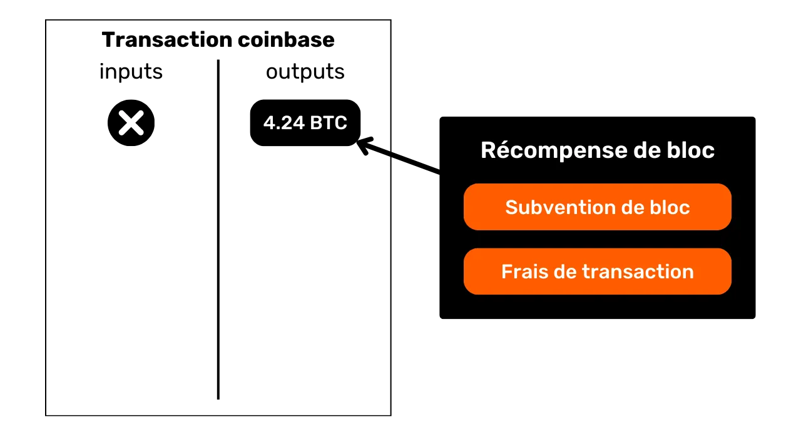


Bitkoini subvencionisani blokom su novi BTC stvoreni od nule, prema unapred utvrđenom rasporedu izdavanja u pravilima konsenzusa. Subvencija bloka se prepolovi na svakih 210.000 blokova, tj. otprilike svake četiri godine, u procesu poznatom kao "Halving". Prvobitno je sa svakom subvencijom stvarano 50 bitkoina, ali se ovaj iznos postepeno smanjivao; trenutno iznosi 3.125 bitkoina po bloku.


Što se tiče naknada za transakcije, iako one takođe predstavljaju novo kreirane BTC, ne smeju premašiti razliku između ukupnih ulaza i izlaza svih transakcija u bloku. Ranije smo videli da ove naknade predstavljaju deo ulaza koji nije iskorišćen u izlazima transakcija. Ovaj deo je tehnički "izgubljen" tokom transakcije, a Miner ima pravo da rekreira ovu vrednost u obliku jednog ili više novih UTXO-a. Ovo je transfer vrednosti između izdavaoca transakcije i Miner koji ga dodaje Blockchain.


**> Bitcoini generisani od strane Coinbase Transaction podležu periodu zrelosti od 100 blokova, tokom kojeg ih Miner ne može potrošiti. Ovo pravilo je osmišljeno kako bi se izbegle komplikacije povezane sa korišćenjem novokreiranih bitcoina na lancu koji bi kasnije mogao postati zastareo.


### Implikacije modela UTXO


Prvo i najvažnije, model UTXO direktno utiče na transakcione naknade Bitcoin. Pošto je kapacitet svakog bloka ograničen, rudari favorizuju transakcije koje nude najbolje naknade u odnosu na prostor koji će zauzeti u bloku. Zaista, što više UTXO-a transakcija uključuje u svojim ulazima i izlazima, to je teža, i stoga zahteva veće naknade. Ovo je jedan od razloga zašto često pokušavamo da smanjimo broj UTXO-a u našem portfoliju, što takođe može uticati na poverljivost, temu kojom ćemo se detaljno baviti u trećem delu ovog kursa.


Drugo, kao što je pomenuto u prethodnim odeljcima, Bitcoin novčići su u suštini lanac UTXO-a. Svaka transakcija tako stvara vezu između prošlog UTXO i budućeg UTXO. UTXO-i stoga omogućavaju eksplicitno praćenje puta Bitcoina od njihovog stvaranja do trenutne potrošnje. Ova transparentnost može biti pozitivno shvaćena, jer omogućava svakom korisniku da utvrdi autentičnost primljenih bitcoina. Međutim, upravo na ovom principu sledljivosti i revizorske sposobnosti se zasniva Blockchain analiza, praksa osmišljena da ugrozi vašu poverljivost. Detaljno ćemo razmotriti ovu praksu u drugom delu kursa.


## Bitcoin-ov model privatnosti


<chapterId>769d8963-3ed5-4094-b21d-9203c7d9e465</chapterId>


### Novac: autentičnost, integritet i dvostruko trošenje


Jedna od funkcija novca je rešavanje problema dvostruke podudarnosti potreba. U sistemu zasnovanom na trampi, završetak Exchange zahteva ne samo pronalaženje osobe koja daje robu koja odgovara mojoj potrebi, već i obezbeđivanje robe jednake vrednosti koja zadovoljava njegovu sopstvenu potrebu. Postizanje ove ravnoteže je složena stvar.


Zato koristimo novac da premestimo vrednost u prostoru i vremenu.


Da bi kovanice rešile ovaj problem, neophodno je da strana koja pruža robu ili uslugu bude uverena u svoju sposobnost da taj iznos potroši kasnije. Stoga će svaka racionalna osoba koja želi da prihvati kovanicu, bilo digitalnu ili fizičku, osigurati da ispunjava dva osnovna kriterijuma:


- Komad mora imati integritet i autentičnost ;**
- i ne sme biti dvostruko potrošeni.**


Ako koristite fizičku valutu, prva karakteristika je najkompleksnija za potvrditi. U različitim periodima istorije, integritet metalnih novčića često je bio pogođen praksama kao što su obrezivanje ili bušenje. U starom Rimu, na primer, bilo je uobičajeno da građani stružu ivice zlatnih novčića kako bi sakupili malo plemenitog metala, dok su ih čuvali za buduće transakcije. Intrinzična vrednost novčića je tako bila smanjena, ali je njegova nominalna vrednost ostala ista. Ovo je jedan od razloga zašto je ivica novčića kasnije bila nazubljena.


Autentičnost je takođe teško proveriti na fizičkom monetarnom medijumu. Današnje tehnike za borbu protiv falsifikovanog novca postaju sve složenije, primoravajući trgovce da ulažu u skupe sisteme za verifikaciju.


S druge strane, zbog svoje prirode, dvostruko trošenje nije problem za fizičke valute. Ako vam dam novčanicu od 10 €, ona neopozivo napušta moje vlasništvo i prelazi u vaše, što prirodno isključuje svaku mogućnost višestrukog trošenja monetarnih jedinica koje ona predstavlja. Ukratko, neću moći ponovo potrošiti ovu novčanicu od 10 €.


Za digitalnu valutu, težina je drugačija. Osiguravanje autentičnosti i integriteta novčića je često jednostavnije. Kao što smo videli u prethodnom odeljku, model Bitcoin's UTXO omogućava praćenje novčića do njegovog porekla, i na taj način verifikaciju da je zaista kreiran od strane Miner u skladu sa pravilima konsenzusa.


S druge strane, osiguravanje da nema Double-spending je složenije, jer su sva digitalna dobra u suštini informacije. Za razliku od fizičkih dobara, informacije se ne dele kada se razmenjuju, već se šire množenjem. Na primer, ako vam pošaljem dokument putem e-pošte, on će biti dupliran. Ne možete biti sigurni da sam obrisao originalni dokument.


### Sprečavanje dvostrukog trošenja na Bitcoin


Jedini način da se izbegne ovo dupliranje digitalnog sredstva je da budemo svesni svih razmena u sistemu. Na ovaj način možemo znati ko šta poseduje i ažurirati imovinu svake osobe u skladu sa izvršenim transakcijama. Ovo se dešava, na primer, sa skripturnim novcem u bankarskom sistemu. Kada platite €10 trgovcu kreditnom karticom, banka beleži Exchange i ažurira knjigu računa.


Na Bitcoin, Double-spending je sprečen na isti način. Nastojimo da potvrdimo odsustvo transakcije koja je već potrošila predmetne novčiće. Ako novčići nikada nisu korišćeni, onda možemo biti sigurni da neće doći do dvostrukog trošenja. Ovaj princip je opisao Satoshi Nakamoto u Belom Papiru sa čuvenom frazom:


**Jedini način da potvrdite odsustvo transakcije je da budete svesni svih transakcija


Ali za razliku od bankarskog modela, ne želimo da moramo verovati centralnom entitetu na Bitcoin. Tako da svi korisnici treba da budu u mogućnosti da potvrde odsustvo dvostrukog trošenja, bez oslanjanja na treću stranu. Dakle, svi treba da budu svesni svih Bitcoin transakcija. Zato se Bitcoin transakcije javno emituju na svim mrežnim čvorovima i beleže u čistom tekstu na Blockchain.


Upravo to javno širenje informacija komplikuje zaštitu privatnosti u Bitcoin. U tradicionalnom bankarskom sistemu, teoretski, samo finansijska institucija je svesna obavljenih transakcija. S druge strane, sa Bitcoin, svi korisnici su informisani o svim transakcijama, putem svojih odgovarajućih čvorova.


### Model poverljivosti: bankarski sistem vs. Bitcoin


U tradicionalnom sistemu, vaš bankovni račun je povezan sa vašim identitetom. Bankar može da zna koji bankovni račun pripada kojem klijentu i koje transakcije su povezane sa njim. Međutim, ovaj tok informacija je prekinut između banke i javne sfere. Drugim rečima, nemoguće je znati stanje i transakcije bankovnog računa koji pripada drugoj osobi. Samo banka ima pristup tim informacijama.


Na primer, vaš bankar zna da svako jutro kupujete baget od lokalnog pekara, ali vaš komšija nema saznanja o ovoj transakciji. Na ovaj način, tok informacija je dostupan zainteresovanim stranama, posebno banci, ali ostaje nedostupan spoljnim licima.


Zbog ograničenja javnog objavljivanja transakcija koje smo videli u prethodnom odeljku, model poverljivosti Bitcoin ne može pratiti model bankarskog sistema. U slučaju Bitcoin, pošto se tok informacija ne može prekinuti između transakcija i javne sfere, **model privatnosti se oslanja na razdvajanje između identiteta korisnika i samih transakcija**.


Na primer, ako kupite baget od pekara, plaćajući u BTC, vaš komšija, koji ima svoj kompletan čvor, može videti vašu transakciju kako prolazi, baš kao što može videti sve druge transakcije u sistemu. Međutim, ako se poštuju principi poverljivosti, on ne bi trebalo da može povezati ovu specifičnu transakciju sa vašim identitetom.


Ali pošto su Bitcoin transakcije javne, i dalje je moguće uspostaviti veze između njih kako bi se zaključile informacije o uključenim stranama. Ova aktivnost čak predstavlja posebnu oblast, poznatu kao "Blockchain analiza". U sledećem delu kursa, pozivam vas da istražite osnove Blockchain analize, kako biste razumeli kako se vaši bitkoini prate i bolje se odbranili od toga.


# Razumevanje i zaštita od analize lanca


<partId>4739371e-9fef-45b0-bcaa-b7a4df6b4470</partId>


## Šta je analiza lanca Bitcoin?


<chapterId>7d198ba6-4af2-4f24-86cb-3c79cb25627e</chapterId>


### Definicija i rad


Analiza Blockchain je praksa praćenja toka bitkoina na Blockchain. Generalno govoreći, analiza lanca zasniva se na posmatranju karakteristika u uzorcima prethodnih transakcija. Zatim se sastoji od identifikacije tih istih karakteristika na transakciji koju želimo analizirati i izvođenja mogućih interpretacija iz njih. Ova metoda rešavanja problema, zasnovana na praktičnom pristupu pronalaženju dovoljno dobrog rešenja, poznata je kao "heuristika".


Laicki rečeno, postoje tri glavne faze u analizi lanca:


1. **Posmatranje Blockchain ;**


2. **Identifikacija poznatih karakteristika ;**


3. **Oduzimanje pretpostavki **


Analiza Blockchain može biti izvedena od strane bilo koga. Sve što vam je potrebno je pristup javnim informacijama Blockchain putem kompletnog čvora kako biste posmatrali kretanje transakcija i pravili hipoteze. Postoje i besplatni alati koji olakšavaju ovu analizu, kao što je [OXT.me](https://oxt.me/), koji ćemo detaljno istražiti u poslednja dva poglavlja ovog odeljka. Međutim, glavni rizik za poverljivost dolazi od kompanija koje se specijalizuju za analizu lanaca. Ove kompanije su podigle analizu Blockchain na industrijski nivo i prodaju svoje usluge finansijskim institucijama i vladama. Među tim kompanijama, Chainalysis je sigurno najpoznatija.


### Ciljevi analize lanca


Jedan od ciljeva analize Blockchain je da se grupišu različite aktivnosti na Bitcoin kako bi se utvrdila jedinstvenost korisnika koji ih je izvršio. Nakon toga, biće moguće pokušati povezati ovaj skup aktivnosti sa stvarnim identitetom.


Setite se prethodnog poglavlja. Objasnio sam zašto je Bitcoin-ov model privatnosti prvobitno bio zasnovan na odvajanju korisničkog identiteta od transakcija. Stoga bi bilo primamljivo misliti da je analiza Blockchain beskorisna, jer čak i ako uspemo da agregiramo aktivnosti na lancu, ne možemo ih povezati sa stvarnim identitetom.


Teoretski, ova izjava je tačna. U prvom delu ovog kursa, videli smo da se kriptografski parovi ključeva koriste za uspostavljanje uslova na UTXO. U suštini, ovi parovi ključeva ne otkrivaju nikakve informacije o identitetu njihovih vlasnika. Dakle, čak i ako uspemo da grupišemo aktivnosti povezane sa različitim parovima ključeva, to nam ništa ne govori o entitetu iza tih aktivnosti.


Međutim, praktična stvarnost je daleko složenija. Postoji mnoštvo ponašanja koja mogu povezati pravi identitet sa aktivnostima na lancu. U analizi, ovo se naziva ulazna tačka, i postoji mnoštvo njih.


Najčešći je KYC (*Know Your Customer*). Ako povučete svoje Bitcoine sa regulisane platforme na jednu od vaših ličnih adresa za primanje, neki ljudi mogu povezati vaš identitet sa tim Address. Šire gledano, ulazna tačka može biti bilo koji oblik interakcije između vašeg stvarnog života i Bitcoin transakcije. Na primer, ako objavite primanje Address na vašim društvenim mrežama, to bi mogla biti ulazna tačka za analizu. Ako izvršite plaćanje u Bitcoinima vašem pekaru, on će moći da poveže vaše lice (deo vašeg identiteta) sa Bitcoin Address.


Ove ulazne tačke su praktično neizbežne kada koristite Bitcoin. Iako možemo pokušati da ograničimo njihov obim, one će uvek biti prisutne. Zato je ključno kombinovati metode usmerene na očuvanje vaše privatnosti. Iako je održavanje razdvajanja između vašeg stvarnog identiteta i vaših transakcija zanimljiv pristup, on danas ostaje nedovoljan. Naime, ako se sve vaše aktivnosti na lancu mogu grupisati zajedno, onda je čak i najmanja ulazna tačka verovatno da ugrozi jedinstveni Layer poverljivosti koji ste uspostavili.


### Odbrana od analize lanca


Dakle, takođe moramo biti sposobni da se nosimo sa analizom Blockchain u našoj upotrebi Bitcoin. Time možemo minimizirati agregaciju naših aktivnosti i ograničiti uticaj ulazne tačke na našu privatnost.


Koji je bolji način da se suprotstavite analizi Blockchain nego da naučite o metodama koje se u njoj koriste? Ako želite da znate kako da poboljšate svoju privatnost na Bitcoin, morate razumeti ove metode. Ovo će vam dati bolji uvid u tehnike kao što su CoinJoin ili PayJoin (tehnike koje ćemo razmotriti u završnim delovima kursa), i smanjiti greške koje biste mogli napraviti.


https://planb.network/tutorials/privacy/on-chain/coinjoin-samourai-wallet-e566803d-ab3f-4d98-9136-5462009262ef

https://planb.network/tutorials/privacy/on-chain/payjoin-848b6a23-deb2-4c5f-a27e-93e2f842140f

U tome možemo povući analogiju sa kriptografijom i kriptoanalizom. Dobar kriptograf je pre svega dobar kriptoanalitičar. Da biste osmislili novi algoritam za šifrovanje, morate znati koje napade će pretrpeti, kao i proučiti zašto su prethodni algoritmi bili probijeni. Isti princip se primenjuje na Bitcoin privatnost. Razumevanje Blockchain metoda analize je ključ za zaštitu od njih. Zato sam uključio čitavu sekciju on chain analize u ovaj kurs obuke.


### Metode analize lanca


Važno je razumeti da analiza stringova nije egzaktna nauka. Ona se oslanja na heuristike izvedene iz prethodnih zapažanja ili logičkih interpretacija. Ova pravila nam omogućavaju da dobijemo prilično pouzdane rezultate, ali nikada sa apsolutnom preciznošću. Drugim rečima, **analiza lanaca uvek uključuje dimenziju verovatnoće u donetim zaključcima**. Na primer, moguće je proceniti sa različitim stepenima sigurnosti da dve adrese pripadaju istoj entitetu, ali potpuna sigurnost će uvek biti nedostižna.


Cela analiza lančane analize leži upravo u agregaciji različitih heuristika kako bi se smanjio rizik od greške. Na neki način, to je akumulacija dokaza koja nas približava stvarnosti.


Ove poznate heuristike mogu se grupisati u različite kategorije, koje ćemo detaljno opisati u nastavku:


- Obrasci transakcija ;**
- Heuristika unutar transakcije ;**
- Heuristike eksterno za transakciju.**


### Satoshi Nakamoto i analiza lanca


Prve dve heuristike analize lanca otkrio je sam Satoshi Nakamoto. On o njima govori u Delu 10 Bitcoin-ovog Belog papira. One su :


- cIOH (*Common Input Ownership Heuristic*);
- i ponovna upotreba Address.


Izvor: S. Nakamoto, "Bitcoin: A Peer-to-Peer Electronic Cash System", https://Bitcoin.org/Bitcoin.pdf, 2009.


Videćemo šta su oni u narednim poglavljima, ali već je zanimljivo primetiti da ove dve heuristike i dalje zadržavaju preimućstvo u analizi lanaca danas.


## Obrasci transakcija


<chapterId>d365a101-2d37-46a5-bfb9-3c51e37bf96b</chapterId>


Obrazac transakcije je jednostavno opšti model ili struktura tipične transakcije, koja se može pronaći na Blockchain, i čije je verovatno tumačenje poznato. Kada proučavamo obrasce, fokusiramo se na jednu transakciju i analiziramo je na visokom nivou.


Drugim rečima, gledaćemo samo broj UTXO u ulazima i broj UTXO u izlazima, bez zadržavanja na specifičnijim detaljima ili okruženju transakcije. Na osnovu uočenog obrasca, možemo interpretirati prirodu transakcije. Zatim ćemo tražiti karakteristike njene strukture i izvesti interpretaciju.


U ovom odeljku ćemo zajedno pogledati glavne modele transakcija koji se sreću u analizi lanca, i za svaki model ću vam dati verovatno tumačenje ove strukture, kao i konkretan primer.


### Jedna pošiljka (ili jedna uplata)


Hajde da počnemo sa veoma uobičajenim obrascem, pošto je to onaj koji se pojavljuje na većini Bitcoin uplata. Jednostavan model plaćanja karakteriše potrošnja jednog ili više UTXO-a kao ulaza i proizvodnja 2 UTXO-a kao izlaza. Ovaj model stoga izgleda ovako:


Kada uočimo ovu strukturu transakcije na Blockchain, već možemo izvući interpretaciju. Kao što ime sugeriše, ovaj model ukazuje da smo u prisustvu transakcije slanja ili plaćanja. Korisnik je potrošio svoj sopstveni UTXO u ulazima kako bi zadovoljio u izlazima plaćanje UTXO i Exchange UTXO (novac vraćen istom korisniku).


Stoga znamo da posmatrani korisnik verovatno više nije u posedu jednog od dva izlazna UTXO-a (plaćanje UTXO), ali je i dalje u posedu drugog UTXO (Exchange UTXO).


Za sada ne možemo precizirati koji izlaz predstavlja koji UTXO, jer to nije svrha proučavanja šablona. Do toga ćemo doći oslanjajući se na heuristike koje ćemo proučavati u narednim odeljcima. U ovoj fazi, naš cilj je ograničen na identifikaciju prirode transakcije o kojoj je reč, koja je u ovom slučaju jednostavno slanje.


Na primer, ovde je Bitcoin transakcija koja usvaja obrazac jednostavnog slanja:


```plaintext
b6cc79f45fd2d7669ff94db5cb14c45f1f879ea0ba4c6e3d16ad53a18c34b769
```


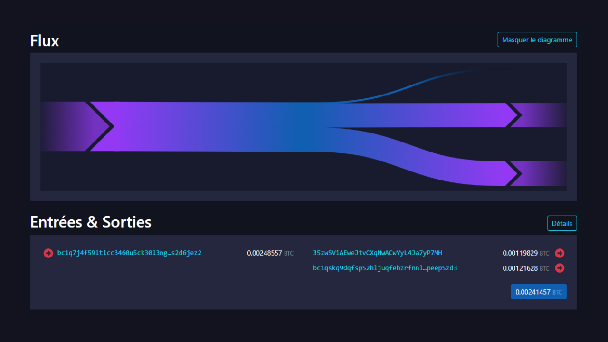


Izvor : [Mempool.space](https://Mempool.space/fr/tx/b6cc79f45fd2d7669ff94db5cb14c45f1f879ea0ba4c6e3d16ad53a18c34b769)


Nakon ovog prvog primera, trebalo bi da imate bolje razumevanje šta znači proučavati "model transakcije". Ispitujemo transakciju fokusirajući se isključivo na njenu strukturu, bez uzimanja u obzir njenog okruženja ili specifičnih detalja transakcije. U ovom prvom koraku, posmatramo samo širu sliku.


Sada kada razumete šta je šablon, pređimo na druge postojeće modele.


### Čišćenje


Ovaj drugi model karakteriše potrošnja jednog UTXO kao ulaza i proizvodnja jednog UTXO kao izlaza.


Interpretacija ovog modela je da smo u prisustvu samotransfera. Korisnik je prebacio svoje bitkoine sebi, na drugi Address koji mu pripada. Pošto nema Exchange u transakciji, vrlo je malo verovatno da smo u prisustvu plaćanja. Naime, kada se vrši plaćanje, gotovo je nemoguće da platiša ima UTXO koji tačno odgovara iznosu koji zahteva prodavac, plus naknada za transakciju. Generalno, platiša je stoga prinuđen da proizvede Exchange izlaz.


Zatim znamo da posmatrani korisnik verovatno još uvek poseduje ovaj UTXO. U kontekstu analize lanca, ako znamo da UTXO korišćen kao ulaz u transakciju pripada Alisi, možemo pretpostaviti da UTXO korišćen kao izlaz takođe pripada njoj. Ono što će kasnije postati zanimljivo jeste pronalaženje heuristika unutar transakcije koje bi mogle ojačati ovu pretpostavku (pogledaćemo ove heuristike u poglavlju 3.3).


Na primer, ovde je Bitcoin transakcija koja usvaja obrazac čišćenja:


```plaintext
35f1072a0fda5ae106efb4fda871ab40e1f8023c6c47f396441ad4b995ea693d
```


Izvor : [Mempool.space](https://Mempool.space/fr/tx/35f1072a0fda5ae106efb4fda871ab40e1f8023c6c47f396441ad4b995ea693d)


Međutim, budite oprezni, jer ovaj tip obrasca može takođe otkriti samoprenos na račun platforme za kriptovalute Exchange. Biće to proučavanje poznatih adresa i konteksta transakcije koje će nam reći da li je to prebacivanje na samostalno čuvanje Wallet ili povlačenje na platformu. Zaista, adrese platformi Exchange često su lako prepoznatljive.


Hajde da ponovo uzmemo primer Alice: ako skeniranje dovede do Address poznatog platformi (kao što je Binance, na primer), to može značiti da su bitkoini prebačeni izvan Alicinog direktnog poseda, verovatno sa namerom da ih proda ili skladišti na ovoj platformi. S druge strane, ako je odredišni Address nepoznat, razumno je pretpostaviti da je to jednostavno još jedan Wallet koji i dalje pripada Alice. Ali ovaj tip studije više spada u kategoriju heuristike nego obrazaca.


### Konsolidacija


Ovaj model karakteriše potrošnja nekoliko UTXO-a na ulazu i proizvodnja jednog UTXO na izlazu.


Tumačenje ovog obrasca je da smo u prisustvu konsolidacije. Ovo je uobičajena praksa među korisnicima Bitcoin, usmerena na spajanje nekoliko UTXO-a u očekivanju mogućeg povećanja transakcijskih naknada. Izvođenjem ove operacije tokom perioda kada su naknade niske, moguće je uštedeti na budućim naknadama. Više ćemo govoriti o ovoj praksi u poglavlju 4.3.


Možemo zaključiti da je korisnik iza ovog modela transakcije verovatno bio u posedu svih UTXO-a na ulazu i da je još uvek u posedu UTXO na izlazu. Dakle, verovatno je reč o automatskom prenosu.


Kao i "sweep", ovaj tip šablona takođe može otkriti samoprenos na račun Exchange platforme. Biće to proučavanje poznatih adresa i konteksta transakcije koje će nam reći da li je to konsolidacija u portfelj samostalnog čuvanja ili povlačenje na platformu.


Na primer, ovde je Bitcoin transakcija koja usvaja obrazac konsolidacije:


```plaintext
77c16914211e237a9bd51a7ce0b1a7368631caed515fe51b081d220590589e94
```


Izvor : [Mempool.space](https://Mempool.space/fr/tx/77c16914211e237a9bd51a7ce0b1a7368631caed515fe51b081d220590589e94)


U analizi lanca, ovaj model može otkriti mnogo informacija. Na primer, ako znamo da jedan od ulaza pripada Alisi, možemo pretpostaviti da svi ostali ulazi i izlaz te transakcije takođe pripadaju njoj. Ova pretpostavka bi zatim omogućila da se vratimo uz lanac prethodnih transakcija kako bismo otkrili i analizirali druge transakcije koje su verovatno povezane sa Alisom.


### Grupisani troškovi


Ovaj model karakteriše potrošnja nekoliko UTXO-a kao ulaza (često samo jednog) i proizvodnja mnogih UTXO-a kao izlaza.


Tumačenje ovog modela je da smo u prisustvu grupisane potrošnje. To je praksa koja verovatno otkriva veoma veliku ekonomsku aktivnost, kao što je Exchange platforma. Grupisana potrošnja omogućava ovim entitetima da uštede troškove kombinovanjem svojih troškova u jednoj transakciji.


Iz ovog modela možemo zaključiti da UTXO na ulazu dolazi iz kompanije sa visokim nivoom ekonomske aktivnosti, i da će se UTXO-i na izlazu raspršiti. Mnogi će pripadati klijentima kompanije koji su povukli bitkoine sa platforme. Drugi mogu otići partnerskim kompanijama. Na kraju, sigurno će biti jedna ili više razmena koje se vraćaju izdavačkoj kompaniji.


Na primer, evo Bitcoin transakcije koja usvaja obrazac grupisane potrošnje (verovatno, to je transakcija izdata od strane Bybit platforme):


```plaintext
8a7288758b6e5d550897beedd13c70bcbaba8709af01a7dbcc1f574b89176b43
```


Izvor : [Mempool.space](https://Mempool.space/fr/tx/8a7288758b6e5d550897beedd13c70bcbaba8709af01a7dbcc1f574b89176b43)


### Transakcije specifične za protokol


Među obrascima transakcija, možemo takođe identifikovati one koji otkrivaju upotrebu specifičnog protokola. Na primer, Whirlpool coinjoins (diskutovano u delu 5) će imati lako prepoznatljivu strukturu koja ih razlikuje od drugih, konvencionalnijih transakcija.


Analiza ovog obrasca sugeriše da verovatno prisustvujemo kolaborativnoj transakciji. Takođe je moguće uočiti CoinJoin. Ako se ova poslednja hipoteza pokaže tačnom, tada bi broj izlaza mogao da nam pruži grubu procenu broja učesnika u CoinJoin.


Na primer, ovde je transakcija Bitcoin koja usvaja obrazac kolaborativne transakcije CoinJoin:


```plaintext
00601af905bede31086d9b1b79ee8399bd60c97e9c5bba197bdebeee028b9bea
```


Izvor : [Mempool.space](https://Mempool.space/fr/tx/00601af905bede31086d9b1b79ee8399bd60c97e9c5bba197bdebeee028b9bea)


Postoje mnogi drugi protokoli sa svojim specifičnim strukturama. Na primer, postoje Wabisabi transakcije, Stamps transakcije i Runes transakcije.


Zahvaljujući ovim obrascima transakcija, već možemo interpretirati određenu količinu informacija o datoj transakciji. Ali struktura transakcije nije jedini izvor informacija za analizu. Takođe možemo proučavati njene detalje. Ove unutrašnje detalje volim nazivati "unutrašnjim heuristikama", i njih ćemo razmatrati u narednom poglavlju.


## Interna heuristika


<chapterId>c54b5abe-872f-40f4-a0d0-c59faff228ba</chapterId>


Interna heuristika je specifična karakteristika koju identifikujemo unutar same transakcije, bez potrebe da ispitujemo njeno okruženje, i koja nam omogućava da donosimo zaključke. Za razliku od obrazaca, koji se fokusiraju na celokupnu strukturu transakcije na visokom nivou, interne heuristike se zasnivaju na skupu izdvojivih podataka. Ovo uključuje:


- Iznosi različitih UTXO-a unutra i van;
- Sve što ima veze sa skriptama: adrese za prijem, verzionisanje, vremena zaključavanja..


Generalno govoreći, ova vrsta heuristike će nam omogućiti da identifikujemo Exchange u specifičnoj transakciji. Na taj način, možemo nastaviti praćenje entiteta kroz nekoliko različitih transakcija. Zaista, ako identifikujemo UTXO koji pripada korisniku kojeg želimo pratiti, ključno je odrediti, kada on izvrši transakciju, koji izlaz je prenet na drugog korisnika i koji izlaz predstavlja Exchange, koji tako ostaje u njegovom posedu.


Još jednom, dozvolite mi da vas podsetim da ove heuristike nisu apsolutno precizne. Posmatrane pojedinačno, one nam samo omogućavaju da identifikujemo verovatne scenarije. To je akumulacija nekoliko heuristika koja pomaže da se smanji neizvesnost, bez mogućnosti da je potpuno eliminišemo.


### Unutrašnje sličnosti


Ova heuristika uključuje proučavanje sličnosti između ulaza i izlaza iste transakcije. Ako se ista karakteristika primeti na ulazima i na samo jednom od izlaza transakcije, onda je verovatno da taj izlaz predstavlja Exchange.


Najočiglednija karakteristika je ponovna upotreba prijemnog Address u istoj transakciji.


Ova heuristika ostavlja malo prostora za sumnju. Osim ako mu privatni ključ nije hakovan, isti primajući Address nužno otkriva aktivnost jednog korisnika. Rezultujuća interpretacija je da je transakcija Exchange izlaz sa istim Address kao ulazom. Zatim možemo nastaviti da pratimo pojedinca od ovog Exchange.


Na primer, ovde je transakcija na koju se ova heuristika verovatno može primeniti:


```plaintext
54364146665bfc453a55eae4bfb8fdf7c721d02cb96aadc480c8b16bdeb8d6d0
```


Izvor : [Mempool.space](https://Mempool.space/tx/54364146665bfc453a55eae4bfb8fdf7c721d02cb96aadc480c8b16bdeb8d6d0)


Ove sličnosti između ulaza i izlaza ne zaustavljaju se na ponovnoj upotrebi Address. Bilo koja sličnost u upotrebi skripti može se koristiti za primenu heuristike. Na primer, ponekad možemo primetiti isto verzionisanje između ulaza i jednog od izlaza transakcije.


Na ovom dijagramu, možemo videti da ulaz br. 0 otključava P2WPKH skriptu (SegWit V0 počinje sa `bc1q`). Izlaz br. 0 koristi isti tip skripte. Izlaz br. 1, s druge strane, koristi P2TR skriptu (SegWit V1 počinje sa `bc1p`). Interpretacija ove karakteristike je da je verovatno da Address sa istim verzionisanjem kao ulaz je Exchange Address. Stoga bi uvek pripadao istom korisniku.


Evo transakcije na koju se ova heuristika verovatno može primeniti:


```plaintext
db07516288771ce5d0a06b275962ec4af1b74500739f168e5800cbcb0e9dd578
```


Izvor : [Mempool.space](https://Mempool.space/tx/db07516288771ce5d0a06b275962ec4af1b74500739f168e5800cbcb0e9dd578)


Na potonjem, možemo videti da ulaz br. 0 i izlaz br. 1 koriste P2WPKH skripte (SegWit V0), dok izlaz br. 0 koristi drugačiju P2PKH skriptu (Legacy).


Početkom 2010-ih, ova heuristika zasnovana na verzionisanju skripti bila je relativno neupotrebljiva zbog ograničenih tipova dostupnih skripti. Međutim, tokom vremena i sa sukcesivnim Bitcoin ažuriranjima, uvedena je sve veća raznolikost tipova skripti. Ova heuristika stoga postaje sve relevantnija, jer sa širim spektrom tipova skripti, korisnici se dele u manje grupe, čime se povećavaju šanse za primenu ove interne heuristike ponovne upotrebe verzionisanja. Iz tog razloga, isključivo iz perspektive poverljivosti, preporučljivo je odlučiti se za najčešći tip skripte. Na primer, dok pišem ove redove, Taproot skripte (`bc1p`) se ređe koriste od SegWit V0 skripti (`bc1q`). Iako prve nude ekonomske i poverljivostne prednosti u određenim specifičnim kontekstima, za tradicionalnije upotrebe sa jednim potpisom, može imati smisla pridržavati se starijeg standarda iz razloga poverljivosti, sve dok novi standard ne bude šire prihvaćen.


### Plaćanja zaokruženih iznosa


Još jedna interna heuristika koja nam može pomoći da identifikujemo Exchange je heuristika okruglog broja. Generalno govoreći, kada se suočimo sa jednostavnim obrascem plaćanja (1 ulaz i 2 izlaza), ako jedan od izlaza troši okrugli iznos, onda to predstavlja plaćanje.


Eliminacijom, ako jedan izlaz predstavlja plaćanje, drugi predstavlja Exchange. Stoga se može tumačiti kao verovatno da je ulazni korisnik uvek u posedu izlaza označenog kao Exchange.


Treba naglasiti da ova heuristika nije uvek primenljiva, jer se većina plaćanja i dalje vrši u fiducijarnim jedinicama obračuna. Naime, kada trgovac u Francuskoj prihvati Bitcoin, on uglavnom neće prikazivati stabilne cene u Sats. Umesto toga, odlučiće se za konverziju između cene u evrima i iznosa u bitkoinima koji treba platiti. Stoga ne bi trebalo da bude zaokruženih brojeva na kraju transakcije.


Ipak, analitičar bi mogao pokušati da izvrši ovu konverziju uzimajući u obzir stopu Exchange koja je bila na snazi kada je transakcija emitovana na mreži. Uzmimo primer transakcije sa ulazom od `97,552 Sats` i dva izlaza, jedan od `31,085 Sats` i drugi od `64,152 Sats`. Na prvi pogled, ova transakcija ne izgleda kao da uključuje zaokružene iznose. Međutim, primenom stope Exchange od €64,339 u vreme transakcije, dobijamo konverziju u evre na sledeći način:


- Ulaz od €62.76;
- Izlaz od €20;
- Izlaz od €41.27.


Jednom kada se konvertuje u fiat valutu, ova transakcija se može koristiti za primenu heuristike plaćanja zaokruženog iznosa. Izlaz od €20 je verovatno otišao trgovcu, ili je barem promenio Ownership. Dedukcijom, izlaz od €41.27 je verovatno ostao u posedu originalnog korisnika.


Ako, jednog dana, Bitcoin postane preferirana jedinica obračuna u našim razmenama, ova heuristika bi mogla postati još korisnija za analizu.


Na primer, ovde je transakcija na koju se ova heuristika verovatno može primeniti:


```plaintext
2bcb42fab7fba17ac1b176060e7d7d7730a7b807d470815f5034d52e96d2828a
```


Izvor : [Mempool.space](https://Mempool.space/tx/2bcb42fab7fba17ac1b176060e7d7d7730a7b807d470815f5034d52e96d2828a)


### Najveći izlaz


Kada identifikujemo dovoljno veliki razmak između 2 izlaza transakcije na jednostavnom modelu plaćanja, možemo proceniti da je najveći izlaz verovatno strani Exchange.


Ova heuristika najvećeg izlaza je sigurno najnepreciznija od svih. Sama po sebi, prilično je slaba. Međutim, ova karakteristika se može kombinovati sa drugim heuristikama kako bi se smanjila neizvesnost naše interpretacije.


Na primer, ako posmatramo transakciju sa zaokruženim plaćanjem i većim plaćanjem, primena heuristike za zaokruženo plaćanje i heuristike za veće plaćanje zajedno smanjuje naš nivo nesigurnosti.


Na primer, ovde je transakcija na koju se ova heuristika verovatno može primeniti:


```plaintext
b79d8f8e4756d34bbb26c659ab88314c220834c7a8b781c047a3916b56d14dcf
```


Izvor : [Mempool.space](https://Mempool.space/tx/b79d8f8e4756d34bbb26c659ab88314c220834c7a8b781c047a3916b56d14dcf)


## Eksterni heuristici


<chapterId>4a170e3b-200d-431a-8285-18a23ff617ba</chapterId>


Proučavanje spoljašnjih heuristika znači analiziranje sličnosti, obrazaca i karakteristika određenih Elements koji nisu specifični za samu transakciju. Drugim rečima, dok smo se ranije ograničavali na iskorišćavanje Elements svojstvenih transakciji sa unutrašnjim heuristikama, sada širimo naše polje analize kako bismo uključili okruženje transakcije, zahvaljujući spoljašnjim heuristikama.


### Address ponovna upotreba


Ovo je jedna od najpoznatijih heuristika bitkoinera. Ponovna upotreba Address omogućava uspostavljanje veze između različitih transakcija i različitih UTXO-a. To se dešava kada se Bitcoin primajući Address koristi više puta.


Dakle, moguće je iskoristiti ponovnu upotrebu Address unutar iste transakcije kao internu heuristiku za identifikaciju Exchange (kao što smo videli u prethodnom poglavlju). Ali ponovna upotreba Address može se koristiti i kao eksterna heuristika za prepoznavanje jedinstvenosti entiteta iza nekoliko transakcija.


Tumačenje ponovne upotrebe Address je da svi UTXO-ovi blokirani na tom Address pripadaju (ili su pripadali) istoj entitetu. Ova heuristika ostavlja malo prostora za nesigurnost. Jednom kada se identifikuje, dobijeno tumačenje verovatno odgovara stvarnosti. Stoga omogućava grupisanje različitih aktivnosti na lancu.


Kao što je objašnjeno u uvodu u Deo 3, ovu heuristiku je otkrio sam Satoshi Nakamoto. U Belom Papiru, on pominje rešenje koje pomaže korisnicima da izbegnu njeno generisanje, a to je jednostavno korišćenje praznog Address za svaku novu transakciju:


"_Kao dodatni firewall, novi par ključeva mogao bi se koristiti za svaku transakciju kako bi ostale nepovezane sa zajedničkim vlasnikom._"


Izvor: S. Nakamoto, "Bitcoin: A Peer-to-Peer Electronic Cash System", https://Bitcoin.org/Bitcoin.pdf, 2009.


Na primer, ovde je Address koji se ponovo koristi u nekoliko transakcija:


```plaintext
bc1qqtmeu0eyvem9a85l3sghuhral8tk0ar7m4a0a0
```


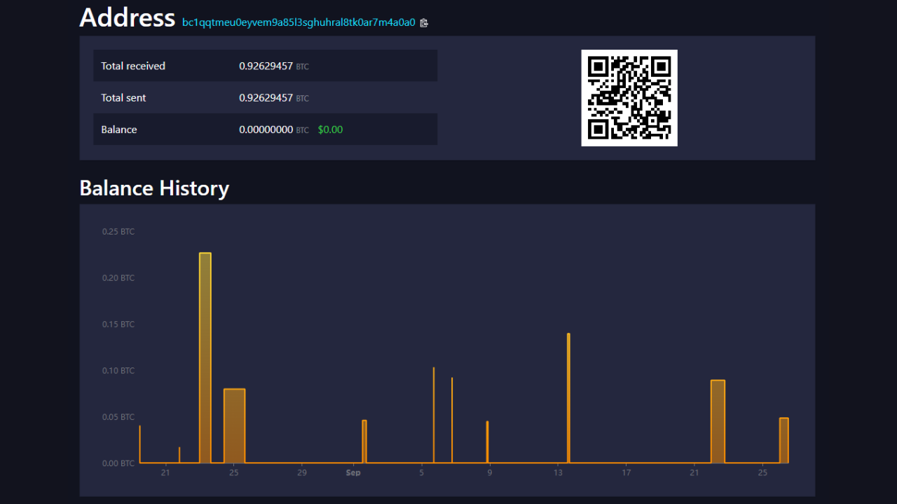


Izvor : [Mempool.space](https://Mempool.space/Address/bc1qqtmeu0eyvem9a85l3sghuhral8tk0ar7m4a0a0)


### Sličnost skripti i otisci Wallet


Pored ponovne upotrebe Address, postoje mnoge druge heuristike koje vam omogućavaju da povežete akcije sa istim portfoliom ili Address klasterom.


Prvo, analitičar može tražiti sličnosti u upotrebi skripti. Na primer, određene manjinske skripte kao što je Multisig mogu biti lakše uočljive nego SegWit V0 skripte. Što je veća grupa u kojoj se krijemo, teže nas je uočiti. Ovo je jedan od razloga zašto, na dobrim CoinJoin protokolima, svi učesnici koriste tačno isti tip skripte.


Više generalno, analitičar se može fokusirati i na karakteristične otiske prstiju portfolija. Ovo su procesi specifični za upotrebu koji se mogu identifikovati sa ciljem njihovog iskorišćavanja kao heuristika za praćenje. Drugim rečima, ako primetimo akumulaciju istih unutrašnjih karakteristika na transakcijama pripisanim praćenoj entitetu, možemo pokušati da identifikujemo iste karakteristike na drugim transakcijama.


Na primer, moći ćemo da identifikujemo da praćeni korisnik sistematski šalje svoj kusur na P2TR adrese (`bc1p...`). Ako se ovaj proces ponavlja, možemo ga koristiti kao heuristiku za ostatak naše analize. Takođe možemo koristiti druge otiske, kao što su redosled UTXO-a, mesto kusura u izlazima, RBF (Replace-by-fee) signalizacija, ili broj verzije, polje `nSequence` i polje `nLockTime`.


Kao što [@LaurentMT](https://twitter.com/LaurentMT) ističe u [Space Kek #19](https://podcasters.spotify.com/pod/show/decouvrebitcoin/episodes/SpaceKek-19---Analyse-de-chane--anonsets-et-entropie-e1vfuji) (podkast na francuskom jeziku), korisnost otisaka portfolija u analizi lanca značajno raste tokom vremena. Naime, sve veći broj tipova skripti i sve progresivnije uvođenje ovih novih funkcija od strane softvera za portfolije naglašavaju razlike. U nekim slučajevima, čak je moguće identifikovati tačan softver koji koristi entitet koji se prati. Stoga je važno razumeti da je proučavanje otisaka portfolija posebno relevantno za nedavne transakcije, a ne za one inicirane početkom 2010-ih.


Da sumiramo, otisak može biti bilo koja specifična praksa, koju automatski izvodi Wallet ili ručno korisnik, a koju možemo pronaći na drugim transakcijama kako bi nam pomogla u našoj analizi.


### Common Input Ownership Heuristički (CIOH)


Zajednički Ulaz Ownership Heuristika (CIOH) je heuristika koja navodi da kada transakcija ima više ulaza, svi oni verovatno potiču od jednog entiteta. Shodno tome, njihov Ownership je zajednički.


Da bismo primenili CIOH, prvo posmatramo transakciju sa nekoliko ulaza. To može biti 2 ulaza, ili 30 ulaza. Kada identifikujemo ovu karakteristiku, proveravamo da li transakcija odgovara poznatom modelu transakcije. Na primer, ako postoji 5 ulaza sa približno istim iznosom i 5 izlaza sa tačno istim iznosom, znaćemo da je ovo struktura CoinJoin. Nećemo moći da primenimo CIOH.


S druge strane, ako transakcija ne odgovara nijednom poznatom modelu kolaborativne transakcije, onda možemo interpretirati da svi ulazi verovatno dolaze od iste entitete. Ovo može biti veoma korisno za proširenje već poznatog klastera ili nastavak praćenja.


CIOH je otkrio Satoshi Nakamoto. On o tome govori u delu 10 Bele knjige:


"_[...] povezivanje je neizbežno kod transakcija sa više unosa, koje nužno otkrivaju da su njihovi unosi bili u vlasništvu istog vlasnika. Rizik je da, ako se otkrije vlasnik ključa, veze mogu otkriti druge transakcije koje su pripadale istom vlasniku._"


Posebno je fascinantno primetiti da je Satoshi Nakamoto, čak i pre zvaničnog lansiranja Bitcoin, već identifikovao dve glavne ranjivosti privatnosti za korisnike, naime CIOH i ponovnu upotrebu Address. Takva predviđanja su prilično izuzetna, jer ove dve heuristike ostaju, čak i danas, najkorisnije u analizi Blockchain.


Da vam dam primer, evo transakcije na koju verovatno možemo primeniti CIOH:


```plaintext
20618e63b6eed056263fa52a2282c8897ab2ee71604c7faccfe748e1a202d712
```


Izvor : [Mempool.space](https://Mempool.space/tx/20618e63b6eed056263fa52a2282c8897ab2ee71604c7faccfe748e1a202d712)


### off-chain podaci


Naravno, analiza lanca nije ograničena isključivo na onchain podatke. Bilo koji podaci iz prethodne analize ili dostupni na Internetu takođe se mogu koristiti za preciziranje analize.


Na primer, ako primetimo da se praćene transakcije sistematski emituju sa istog Bitcoin čvora, i uspemo da identifikujemo njegov IP Address, možda ćemo moći da identifikujemo druge transakcije od iste entitete, kao i da odredimo deo identiteta izdavaoca. Iako ova praksa nije lako ostvariva, jer zahteva rad brojnih čvorova, može biti korišćena od strane nekih kompanija koje se bave analizom Blockchain.


Analitičar takođe ima opciju da se osloni na analize koje su prethodno postale open-source, ili na svoje prethodne analize. Možda ćemo moći da pronađemo rezultat koji ukazuje na klaster adresa koje smo već identifikovali. Ponekad je takođe moguće osloniti se na rezultate koji ukazuju na Exchange platformu, jer su adrese ovih kompanija generalno poznate.


Na isti način, možete izvršiti analizu eliminacijom. Na primer, ako prilikom analize transakcije sa dva izlaza, jedan od njih se odnosi na već poznati klaster Address, ali različit od entiteta koji pratimo, onda možemo interpretirati da drugi izlaz verovatno predstavlja Exchange.


Analiza kanala takođe uključuje nešto opštiju OSINT (*Open Source Intelligence*) komponentu, koja podrazumeva pretrage na internetu. Iz tog razloga savetujemo da se adrese ne objavljuju direktno na društvenim mrežama ili na veb-sajtu, bilo da su pod pseudonimom ili ne.


### Temporalni modeli


Manje o tome razmišljamo manje, ali određena ljudska ponašanja su prepoznatljiva na lancu. Možda je najkorisnije u analizi vaš obrazac spavanja! Da, kada spavate, ne emitujete Bitcoin transakcije. Ali generalno spavate otprilike u isto vreme. Zato je uobičajena praksa koristiti vremensku analizu u Blockchain analizi. Jednostavno rečeno, ovo je popis vremena u kojima se transakcije određenog entiteta emituju na Bitcoin mrežu. Analizom ovih vremenskih obrazaca možemo izvući bogatstvo informacija.


Prvo, vremenska analiza može ponekad identifikovati prirodu praćenog entiteta. Ako primetimo da se transakcije emituju dosledno tokom 24 sata, onda će to odati visok nivo ekonomske aktivnosti. Entitet iza ovih transakcija verovatno je kompanija, potencijalno međunarodna i možda sa automatizovanim internim procedurama.


Na primer, [prepoznao sam ovaj obrazac pre nekoliko meseci](https://twitter.com/Loic_Pandul/status/1701127409712452072) kada sam analizirao [transakciju koja je greškom dodelila 19 bitkoina u naknadama](https://Mempool.space/tx/d5392d474b4c436e1c9d1f4ff4be5f5f9bb0eb2e26b61d2781751474b7e870fd). Jednostavna vremenska analiza omogućila mi je da pretpostavim da imamo posla sa automatizovanom uslugom, i stoga verovatno sa velikim entitetom kao što je Exchange platforma.


Zaista, nekoliko dana kasnije, otkriveno je da sredstva pripadaju PayPalu, putem Paxos Exchange platforme.


Naprotiv, ako možemo videti da je vremenski obrazac prilično raspoređen preko 16 specifičnih sati, onda možemo proceniti da imamo posla sa individualnim korisnikom, ili možda lokalnom kompanijom u zavisnosti od razmenjenih količina.


Pored prirode posmatranog entiteta, vremenski obrazac nam takođe može približno reći gde se korisnik nalazi, zahvaljujući vremenskim zonama. Na ovaj način, možemo uskladiti druge transakcije i koristiti njihove vremenske oznake kao dodatnu heuristiku koja se može dodati našoj analizi.


Na primer, na više korišćenom Address koji sam ranije pomenuo, možemo videti da su transakcije, kako dolazne tako i odlazne, koncentrisane u intervalu od 13 sati.


```plaintext
bc1qqtmeu0eyvem9a85l3sghuhral8tk0ar7m4a0a0
```


Izvor : OXT.me


Ovaj raspon verovatno odgovara Evropi, Africi ili Bliskom Istoku. Stoga možemo pretpostaviti da korisnik iza ovih transakcija živi u ovim oblastima.


U drugačijem smislu, vremenska analiza ovog tipa takođe je dovela do hipoteze da Satoshi Nakamoto nije delovao iz Japana, već iz SAD: [*The Time Zones of Satoshi Nakamoto*](https://medium.com/@insearchofsatoshi/the-time-zones-of-Satoshi-nakamoto-aa40f035178f)


## Stavljanje u praksu sa Block explorer


<chapterId>6493cf2f-225c-405f-9375-c4304f1087ed</chapterId>


U ovom poslednjem poglavlju, primenićemo koncepte koje smo do sada proučavali. Pokazaću vam primere stvarnih Bitcoin transakcija, a vi ćete morati da izdvojite informacije koje tražim od vas.


Idealno bi bilo koristiti profesionalni alat za analizu lanca za izvođenje ovih vežbi. Međutim, od hapšenja tvoraca Samourai Wallet, jedini besplatni alat za analizu OXT.me više nije dostupan. Stoga ćemo se odlučiti za klasični Block explorer za ove vežbe. Preporučujem korišćenje [Mempool.space](https://Mempool.space/) zbog mnogih funkcija i opsega alata za analizu lanca, ali možete se odlučiti i za drugi pretraživač kao što je [Bitcoin Explorer](https://bitcoinexplorer.org/).


Za početak, predstaviću vam vežbe. Koristite svoj Block explorer da ih završite i zapišite svoje odgovore na list papira. Zatim, na kraju ovog poglavlja, daću vam odgovore kako biste mogli da proverite i ispravite svoje rezultate.


*Transakcije odabrane za ove vežbe izabrane su isključivo zbog svojih karakteristika na donekle nasumičan način. Ovo poglavlje je namenjeno isključivo u obrazovne i informativne svrhe. Želeo bih da jasno stavim do znanja da ne podržavam niti ohrabrujem korišćenje ovih alata u zlonamerne svrhe. Cilj je da vas naučim kako da se zaštitite od analize stringova, a ne da sprovodite analizu kako biste otkrili privatne informacije drugih ljudi.*


### Vežba 1


Identifikator transakcije za analizu :


```plaintext
3769d3b124e47ef4ffb5b52d11df64b0a3f0b82bb10fd6b98c0fd5111789bef7
```


Koji je naziv modela ove transakcije i koje se razumne interpretacije mogu izvući ispitivanjem samo njenog modela, tj. strukture transakcije?


### Vežba 2


Identifikator transakcije za analizu :


```plaintext
baa228f6859ca63e6b8eea24ffad7e871713749d693ebd85343859173b8d5c20
```


Koji je naziv modela ove transakcije i koje se razumne interpretacije mogu izvući ispitivanjem samo njenog modela, tj. strukture transakcije?


### Vežba 3


Identifikator transakcije za analizu :


```plaintext
3a9eb9ccc3517cc25d1860924c66109262a4b68f4ed2d847f079b084da0cd32b
```


Koji je model za ovu transakciju?


Identifikovanjem njegovog modela, koristeći interne heuristike transakcije, koji izlaz će Exchange verovatno predstavljati?


### Vežba 4


Identifikator transakcije za analizu :


```plaintext
35f0b31c05503ebfdf7311df47f68a048e992e5cf4c97ec34aa2833cc0122a12
```


Koji je model za ovu transakciju?


Identifikovanjem njegovog modela, koristeći interne heuristike transakcije, koji izlaz će Exchange verovatno predstavljati?


### Vežba 5


Zamislimo da je Loïc objavio jednu od svojih Bitcoin adresa za primanje na društvenoj mreži Twitter:


```plaintext
bc1qja0hycrv7g9ww00jcqanhfpqmzx7luqalum3vu
```


Na osnovu ovih informacija i koristeći **samo Address heuristiku ponovne upotrebe**, koje Bitcoin transakcije se mogu povezati sa Loïc-ovim identitetom?


*Očigledno, nisam pravi vlasnik ovog prijema Address i nisam ga postavio na društvene mreže. To je Address koji sam nasumično uzeo iz Blockchain*


### Vežba 6


Nakon vežbe 5, zahvaljujući heuristici ponovne upotrebe Address, uspeli ste da identifikujete nekoliko Bitcoin transakcija u koje izgleda da je Loïc umešan. Normalno, među identifikovanim transakcijama, trebalo bi da ste uočili ovu:


```plaintext
2d9575553c99578268ffba49a1b2adc3b85a29926728bd0280703a04d051eace
```


Ova transakcija je prva koja šalje sredstva na Loïc-ov Address. Odakle mislite da su bitkoini koje je Loïc primio putem ove transakcije došli?


### Vežba 7


Prateći vežbu 5, zahvaljujući heuristici ponovne upotrebe Address, uspeli ste da identifikujete nekoliko Bitcoin transakcija u kojima izgleda da je Loïc uključen. Sada želite da saznate odakle je Loïc došao. Na osnovu pronađenih transakcija, izvršite vremensku analizu kako biste pronašli vremensku zonu koju Loïc najverovatnije koristi. Iz ove vremenske zone, odredite lokaciju gde izgleda da Loïc živi (zemlja, država/regija, grad...).


### Vežba 8


Evo Bitcoin transakcije za proučavanje:


```plaintext
bb346dae645d09d32ed6eca1391d2ee97c57e11b4c31ae4325bcffdec40afd4f
```


Gledajući samo ovu transakciju, koje informacije možemo protumačiti?


### Rešenja vežbi


***Vežba 1:***


Model za ovu transakciju je jednostavan model plaćanja. Ako proučavamo samo njegovu strukturu, možemo interpretirati da jedan izlaz predstavlja Exchange, a drugi izlaz predstavlja stvarnu uplatu. Stoga znamo da posmatrani korisnik verovatno više nije u posedu jednog od dva UTXO-a u izlazu (onog za uplatu), ali je i dalje u posedu drugog UTXO (onog za Exchange).


***Vežba 2:***


Model za ovu transakciju je model grupisane potrošnje. Ovaj model verovatno otkriva ekonomsku aktivnost velikih razmera, kao što je Exchange platforma. Možemo zaključiti da ulazni UTXO dolazi od kompanije sa visokim nivoom ekonomske aktivnosti, i da će izlazni UTXO-i biti raspršeni. Neki će pripadati klijentima kompanije koji su povukli svoje bitkoine u novčanike za samostalno čuvanje. Drugi mogu otići partnerskim kompanijama. Na kraju, nesumnjivo će biti nekih Exchange koji će se vratiti izdavačkoj kompaniji.


***Vežba 3:***


Model za ovu transakciju je jednostavno plaćanje. Stoga možemo primeniti interne heuristike na transakciju kako bismo pokušali identifikovati Exchange.


Lično sam identifikovao najmanje dve interne heuristike koje podržavaju istu hipotezu:


- Ponovna upotreba iste vrste skripte ;
- Najveći izlaz.


Najočiglednija heuristika je ponovna upotreba iste vrste skripte. Zaista, izlaz `0` je `P2SH`, prepoznatljiv po svom prijemu Address koji počinje sa `3` :


```plaintext
3Lcdauq6eqCWwQ3UzgNb4cu9bs88sz3mKD
```


Dok je izlaz `1` `P2WPKH`, prepoznatljiv po svom Address koji počinje sa `bc1q` :


```plaintext
bc1qya6sw6sta0mfr698n9jpd3j3nrkltdtwvelywa
```


UTXO korišćen kao ulaz za ovu transakciju takođe koristi skriptu `P2WPKH`:


```plaintext
bc1qyfuytw8pcvg5vx37kkgwjspg73rpt56l5mx89k
```


Dakle, možemo pretpostaviti da izlaz `0` odgovara uplati, a izlaz `1` je transakcija Exchange, što bi značilo da ulazni korisnik uvek poseduje izlaz `1`.


Da bismo podržali ili opovrgli ovu hipotezu, možemo potražiti druge heuristike koje ili potvrđuju naše razmišljanje, ili smanjuju verovatnoću da je naša hipoteza tačna.


Identifikovao sam bar još jednu heuristiku. To je heuristika najvećeg izlaza. Izlaz `0` meri `123,689 Sats`, dok izlaz `1` meri `505,839 Sats`. Stoga postoji značajna razlika između ova dva izlaza. Heuristika najvećeg izlaza sugeriše da je najveći izlaz verovatno strani Exchange. Ova heuristika dodatno jača našu početnu hipotezu.


Čini se stoga verovatnim da korisnik koji je dostavio UTXO kao ulaz i dalje drži izlaz `1`, koji izgleda da predstavlja transakciju Exchange.


***Vežba 4:***


Model za ovu transakciju je jednostavno plaćanje. Stoga možemo primeniti interne heuristike na transakciju kako bismo pokušali identifikovati Exchange.


Lično sam identifikovao najmanje dve interne heuristike koje podržavaju istu hipotezu:


- Ponovna upotreba iste vrste skripte ;
- Okrugli izlaz posta.


Najočiglednija heuristika je ponovna upotreba iste vrste skripte. Zaista, izlaz `0` je `P2SH`, prepoznatljiv po svom prijemu Address koji počinje sa `3` :


```plaintext
3FSH5Mnq6S5FyQoKR9Yjakk3X4KCGxeaD4
```


Dok je izlaz `1` `P2WPKH`, prepoznatljiv po svom Address koji počinje sa `bc1q` :


```plaintext
bc1qvdywdcfsyavt4v8uxmmrdt6meu4vgeg439n7sg
```


UTXO korišćen kao ulaz za ovu transakciju takođe koristi skriptu `P2WPKH`:


```plaintext
bc1qku3f2y294h3ks5eusv63dslcua2xnlzxx0k6kp
```


Dakle, možemo pretpostaviti da izlaz `0` odgovara uplati, a izlaz `1` je transakcija Exchange, što bi značilo da ulazni korisnik uvek poseduje izlaz `1`.


Da bismo podržali ili opovrgli ovu hipotezu, možemo potražiti druge heuristike koje ili potvrđuju naše razmišljanje, ili smanjuju verovatnoću da je naša hipoteza tačna.


Identifikovao sam bar još jednu heuristiku. To je izlaz sa okruglim iznosom. Izlaz `0` meri `70,000 Sats`, dok izlaz `1` meri `22,962 Sats`. Stoga imamo savršeno okrugao izlaz u BTC jedinici obračuna. Heuristika okruglog izlaza sugeriše da je UTXO sa okruglim iznosom najverovatnije onaj koji se odnosi na plaćanje, i da eliminacijom, drugi predstavlja Exchange. Ova heuristika dodatno jača našu početnu hipotezu.


Međutim, u ovom primeru, druga heuristika bi mogla osporiti našu početnu hipotezu. Zaista, izlaz `0` je veći od izlaza `1`. Na osnovu heuristike da je najveći izlaz generalno strani Exchange, mogli bismo zaključiti da je izlaz `0` strani Exchange. Međutim, ova kontra-hipoteza deluje neverovatno, jer se druge dve heuristike čine znatno uverljivijim od heuristike najvećeg izlaza. Shodno tome, čini se razumnim zadržati našu početnu hipotezu uprkos ovoj očiglednoj kontradikciji.


Čini se stoga verovatnim da korisnik koji je uneo UTXO kao ulaz i dalje drži izlaz `1`, koji izgleda da predstavlja transakciju Exchange.


***Vežba 5:***


Možemo videti da se 8 transakcija može povezati sa Loïc-ovim identitetom. Od toga, 4 uključuju prijem bitkoina:


```plaintext
2d9575553c99578268ffba49a1b2adc3b85a29926728bd0280703a04d051eace
8b70bd322e6118b8a002dbdb731d16b59c4a729c2379af376ae230cf8cdde0dd
d5864ea93e7a8db9d3fb113651d2131567e284e868021e114a67c3f5fb616ac4
bc4dcf2200c88ac1f976b8c9018ce70f9007e949435841fc5681fd33308dd762
```


Ostala 4 se odnose na pošiljke Bitcoin:


```plaintext
8b52fe3c2cf8bef60828399d1c776c0e9e99e7aaeeff721fff70f4b68145d540
c12499e9a865b9e920012e39b4b9867ea821e44c047d022ebb5c9113f2910ed6
a6dbebebca119af3d05c0196b76f80fdbf78f20368ebef1b7fd3476d0814517d
3aeb7ce02c35eaecccc0a97a771d92c3e65e86bedff42a8185edd12ce89d89cc
```


***Vežba 6:***


Ako pogledamo model ove transakcije, jasno je da se radi o objedinjeni potrošnji. Zaista, transakcija ima jedan ulaz i 51 izlaz, što ukazuje na visok nivo ekonomske aktivnosti. Stoga možemo pretpostaviti da je Loïc povukao bitkoine sa Exchange platforme.


Nekoliko faktora pojačava ovu hipotezu. Prvo, tip skripta korišćenog za obezbeđivanje UTXO unosa je P2SH 2/3 Multisig skripta, što ukazuje na napredni nivo sigurnosti tipičan za Exchange platforme:


```plaintext
OP_PUSHNUM_2
OP_PUSHBYTES_33 03eae02975918af86577e1d8a257773118fd6ceaf43f1a543a4a04a410e9af4a59
OP_PUSHBYTES_33 03ba37b6c04aaf7099edc389e22eeb5eae643ce0ab89ac5afa4fb934f575f24b4e
OP_PUSHBYTES_33 03d95ef2dc0749859929f3ed4aa5668c7a95baa47133d3abec25896411321d2d2d
OP_PUSHNUM_3
OP_CHECKMULTISIG
```


Štaviše, Address proučavan `3PUv9tQMSDCEPSMsYSopA5wDW86pwRFbNF` se ponovo koristi u preko 220.000 različitih transakcija, što je često karakteristično za Exchange platforme, koje generalno ne brinu o svojoj poverljivosti.


Vremenska heuristika primenjena na ovaj Address takođe pokazuje redovno emitovanje transakcija skoro svakodnevno tokom 3-mesečnog perioda, sa produženim radnim vremenom preko 24 sata, što sugeriše kontinuiranu aktivnost platforme Exchange.


Konačno, obimi kojima upravlja ovaj entitet su kolosalni. Address je primio i poslao 44 BTC u 222,262 transakcije između decembra 2022. i marta 2023. Ovi veliki obimi dodatno potvrđuju verovatnu prirodu aktivnosti platforme Exchange.


***Vežba 7:***


Analizom vremena potvrde transakcije, mogu se identifikovati sledeća UTC vremena:


```plaintext
05:43
20:51
18:12
17:16
04:28
23:38
07:45
21:55
```


Analiza ovih rasporeda pokazuje da su UTC-7 i UTC-8 u skladu sa rasponom trenutnih ljudskih aktivnosti (između 08:00 i 23:00) za većinu rasporeda:


```plaintext
05:43 UTC > 22:43 UTC-7
20:51 UTC > 13:51 UTC-7
18:12 UTC > 11:12 UTC-7
17:16 UTC > 10:16 UTC-7
04:28 UTC > 21:28 UTC-7
23:38 UTC > 16:38 UTC-7
07:45 UTC > 00:45 UTC-7
21:55 UTC > 14:55 UTC-7
05:43 UTC > 21:43 UTC-8
20:51 UTC > 12:51 UTC-8
18:12 UTC > 10:12 UTC-8
17:16 UTC > 09:16 UTC-8
04:28 UTC > 20:28 UTC-8
23:38 UTC > 15:38 UTC-8
07:45 UTC > 23:45 UTC-8
21:55 UTC > 13:55 UTC-8
```


Vremenska zona UTC-7 je posebno relevantna leti, jer uključuje države i regione kao što su:


- Kalifornija (sa gradovima kao što su Los Anđeles, San Francisko i San Dijego);
- Nevada (sa Las Vegasom) ;
- Oregon (sa Portlandom) ;
- Vašington (sa Sijetlom) ;
- Kanadska regija Britanska Kolumbija (sa gradovima kao što su Vankuver i Viktorija).


Ove informacije sugerišu da Loïc verovatno živi na zapadnoj obali Sjedinjenih Američkih Država ili Kanade.


***Vežba 8:***


Analiza ove transakcije otkriva 5 ulaza i jedan izlaz, što sugeriše konsolidaciju. Primjenom CIOH heuristike, možemo pretpostaviti da svi ulazni UTXO-ovi pripadaju jednom entitetu, i da izlaz UTXO takođe pripada tom entitetu. Izgleda da je korisnik odlučio da spoji nekoliko UTXO-ova koje je posedovao, kako bi formirao jedan UTXO u izlazu, sa ciljem konsolidacije svojih delova. Ovaj potez je verovatno bio motivisan željom da iskoristi niske troškove transakcija u to vreme, kako bi smanjio buduće troškove.


___


*Da napišem ovu analizu dela 3 on chain, koristio sam sledeće resurse:*


- Serija od četiri članka pod nazivom: [Understanding Bitcoin Privacy with OXT](https://medium.com/oxt-research/understanding-Bitcoin-privacy-with-oxt-part-1-4-8177a40a5923), koju je proizveo Samourai Wallet 2021. godine ;*
- Različiti izveštaji sa [OXT Research](https://medium.com/oxt-research), kao i njihov besplatni alat za analizu Blockchain (trenutno nije dostupan nakon hapšenja osnivača Samourai Wallet) ;*
- Šire gledano, moje znanje dolazi iz raznih tvitova i sadržaja od [@LaurentMT](https://twitter.com/LaurentMT) i [@ErgoBTC](https://twitter.com/ErgoBTC) ;*
- [Space Kek #19](https://podcasters.spotify.com/pod/show/decouvrebitcoin/episodes/SpaceKek-19---Analyse-de-chane--anonsets-et-entropie-e1vfuji) u kojem sam učestvovao u društvu [@louneskmt](https://twitter.com/louneskmt), [@TheoPantamis](https://twitter.com/TheoPantamis), [@Sosthene___](https://twitter.com/Sosthene___) i [@LaurentMT](https://twitter.com/LaurentMT).*


*Želeo bih da zahvalim njihovim autorima, developerima i producentima. Takođe hvala lektorima koji su pažljivo ispravili članak na kojem se zasniva ovaj deo 3 i dali mi svoje stručno mišljenje :*


- [Gilles Cadignan](https://twitter.com/gillesCadignan) ;*
- [Ludovic Lars](https://viresinnumeris.fr/)


# Ovladavanje najboljim praksama za zaštitu vaše privatnosti


<partId>9bd04b63-f1af-4e50-9061-6bc90009df68</partId>


## Address ponovna upotreba


<chapterId>f3e97645-3df3-41bc-a4ed-d2c740113d96</chapterId>


Nakon što smo proučili tehnike koje mogu narušiti vašu poverljivost na Bitcoin, u ovom trećem delu ćemo sada pogledati najbolje prakse koje treba usvojiti kako biste se zaštitili. Cilj ovog dela nije istraživanje metoda za poboljšanje poverljivosti, tema koja će biti obrađena kasnije, već razumevanje kako pravilno komunicirati sa Bitcoin kako biste zadržali poverljivost koju prirodno nudi, bez pribegavanja dodatnim tehnikama.


Očigledno, da bismo započeli ovaj treći deo, razgovaraćemo o ponovnoj upotrebi Address. Ovaj fenomen je glavna pretnja poverljivosti korisnika. Ovo poglavlje je sigurno najvažnije u celom kursu.


### Šta je prijemni Address?


Bitcoin koji prima Address je niz ili identifikator koji se koristi za primanje bitkoina na Wallet.


Tehnički, Bitcoin koji prima Address ne "prima" bitkoine u doslovnom smislu, već služi za definisanje uslova pod kojima se bitkoini mogu potrošiti. Konkretno, kada vam se pošalje uplata, transakcija pošiljaoca kreira novi UTXO za vas kao izlaz iz UTXO-a koje je potrošila kao ulaze. Na ovom izlazu, on prilaže skriptu koja definiše kako se ovaj UTXO može potrošiti kasnije. Ova skripta je poznata kao "*ScriptPubKey*" ili "*Locking Script*". Vaš primajući Address, ili preciznije njegov sadržaj, integriše se u ovu skriptu. U laičkim terminima, ova skripta u osnovi kaže:


> "*Da biste potrošili ovaj novi UTXO, morate obezbediti digitalni potpis koristeći privatni ključ povezan sa ovim prijemnim Address.*"


Bitcoin adrese dolaze u različitim tipovima, u zavisnosti od korišćenog modela skriptovanja. Prvi modeli, poznati kao "Legacy*", uključuju `P2PKH` (*Pay-to-PubKey-Hash*) i `P2SH` (*Pay-to-Script-Hash*) adrese. P2PKH adrese uvek počinju sa `1`, a P2SH sa `3`. Iako su i dalje bezbedni, ovi formati su sada zastareli, jer podrazumevaju veće troškove transakcija i nude manje poverljivosti u poređenju sa novim standardima.


SegWit V0 (`P2WPKH` i `P2WSH`) i Taproot / SegWit V1 (`P2TR`) adrese predstavljaju moderne formate. SegWit adrese počinju sa `bc1q`, a Taproot adrese, uvedene 2021. godine, počinju sa `bc1p`.


Na primer, ovde je prijem Taproot Address:


```text
bc1ps5gd2ys8kllz9alpmcwxqegn7kl3elrpnnlegwkm3xpq2h8da07spxwtf5
```


Kako će ScriptPubKey biti konstruisan zavisiće od standarda koji koristite:


| ScriptPubKey | Script template
| ---------------- | ----------------------------------------------------------- |
| P2PKH | OP_DUP OP_HASH160 `<pubKeyHash>` OP_EQUALVERIFY OP_CHECKSIG |
| P2SH | OP_HASH160 `<scriptHash>` OP_EQUAL |
| P2WPKH | 0 `<pubKeyHash>` |
| P2WSH | 0 `<witnessScriptHash>` |
| P2SH - P2WPKH | OP_HASH160 `<redeemScriptHash>` OP_EQUAL |
| P2SH - P2WSH | OP_HASH160 `<redeemScriptHash>` OP_EQUAL |
| P2TR | 1 `<pubKey>` |

Izgradnja adresa za prijem takođe zavisi od izabranog modela skripte:


- Za `P2PKH` i `P2WPKH` adrese, payload, tj. jezgro Address, predstavlja Hash javnog ključa;
- Za `P2SH` i `P2WSH` adrese, sadržaj predstavlja Hash od ;
- Što se tiče `P2TR` adresa, payload je prilagođeni javni ključ. P2TR izlazi kombinuju aspekte _Pay-to-PubKey_ i _Pay-to-Script_. Prilagođeni javni ključ je rezultat dodavanja klasičnog javnog ključa za trošenje sa "prilagođavanjem", izvedenim iz Merkle Root skupa skripti koje se takođe mogu koristiti za trošenje bitkoina.


Adrese prikazane na vašem portfolijskom softveru takođe uključuju HRP (*Human-Readable Part*), obično `bc` za post-SegWit adrese, separator `1`, i broj verzije `q` za SegWit V0 i `p` za Taproot/SegWit V1. Takođe se dodaje kontrolni zbir kako bi se garantovala integritet i validnost Address tokom prenosa.


Konačno, adrese se stavljaju u standardni format:


- Base58check za stare Legacy adrese ;
- Bech32 za SegWit adrese ;
- Bech32m za Taproot adrese.


Evo matrica sabiranja za formate bech32 i bech32m (SegWit i Taproot) iz baze 10:


| + | 0 | 1 | 2 | 3 | 4 | 5 | 6 | 7 |
| --- | --- | --- | --- | --- | --- | --- | --- | --- |
| 0 | q | p | z | r | y | 9 | x | 8 |
| 8 | g | f | 2 | t | v | d | w | 0 |
| 16 | s | 3 | j | n | 5 | 4 | k | h |
| 24 | c | e | 6 | m | u | a | 7 | l |

### Šta je ponovna upotreba Address?


Ponovna upotreba Address je korišćenje istog prijemnog Address za blokiranje nekoliko različitih UTXO-a.


Kao što smo videli u prethodnom odeljku, svaki UTXO ima svoj ScriptPubKey, koji ga zaključava i mora biti zadovoljen da bi se UTXO mogao koristiti kao ulaz u novoj transakciji. Upravo unutar ovog ScriptPubKey-a su integrisane adrese tereta.


Kada različiti ScriptPubKeys sadrže isti primajući Address, to se naziva ponovna upotreba Address. U praksi, to znači da je korisnik više puta dao isti Address pošiljaocima kako bi primio bitkoine putem više uplata. I upravo je ta praksa katastrofalna za vašu privatnost.


### Zašto je ponovna upotreba Address problem?


Pošto je Blockchain javan, lako je videti koje adrese zaključavaju koji UTXO i koliko bitkoina. Ako se isti Address koristi za nekoliko transakcija, postaje moguće zaključiti da svi bitkoini povezani sa tim Address pripadaju istoj osobi. Ova praksa ugrožava privatnost korisnika omogućavajući uspostavljanje determinističkih veza između različitih transakcija i praćenje bitkoina na Blockchain. Satoshi Nakamoto je sam već istakao ovaj problem u Bitcoin-ovom White Paper-u:


> *Kao dodatni firewall, novi par ključeva mogao bi se koristiti za svaku transakciju kako bi ostali nepovezani sa zajedničkim vlasnikom*


Izvor: S. Nakamoto, "Bitcoin: Sistem elektronskog novca od osobe do osobe", https://Bitcoin.org/Bitcoin.pdf, 2009.


Namera Satoshi u ovoj rečenici bila je da stvori dodatni firewall u slučaju povezivanja identiteta korisnika i para ključeva na Bitcoin, kako bi se sprečilo da cela njegova aktivnost bude javno povezana sa njegovim identitetom. Danas, sa proliferacijom kompanija za analizu Blockchain i KYC regulativama, korišćenje jedinstvenih adresa više nije "dodatni firewall", već neophodna praksa za svakoga ko želi da sačuva minimum privatnosti.


Kada ponovo koristite Address, pravite gotovo neosporivu vezu između svih transakcija povezanih sa tim Address. Iako ovo direktno ne ugrožava vaša sredstva, jer eliptička kriptografija garantuje sigurnost vaših privatnih ključeva, ipak olakšava praćenje vaših aktivnosti. Naime, svako ko ima čvor može posmatrati transakcije i stanja adresa, potpuno kompromitujući vašu anonimnost.


Da bismo ilustrovali ovu tačku, uzmimo primer Boba, korisnika koji redovno kupuje bitkoine u malim količinama putem DCA i uvek ih šalje na isti Address. Nakon dve godine, ovaj Address sadrži značajnu količinu bitkoina. Ako Bob koristi ovaj Address za plaćanje lokalnom trgovcu, trgovac će moći da vidi sva povezana sredstva i zaključi Bobovo bogatstvo. Ovo može dovesti do rizika po ličnu sigurnost, kao što su pokušaji krađe ili iznude. Da je Bob koristio prazan Address za primanje svake periodične kupovine, otkrio bi beskonačno manje informacija svom trgovcu.


U analizi stringova, postoje 2 tipa ponovne upotrebe Address:


- Spoljna ponovna upotreba ;
- Interna ponovna upotreba unutar transakcije.


Prvi je kada se Address ponovo koristi u nekoliko različitih Bitcoin transakcija. Ovo je ono o čemu smo ranije govorili: ova heuristika zaključuje da svi UTXO-i koji su prošli kroz ovaj Address pripadaju jednom entitetu.


Interna ponovna upotreba Address ne dešava se kada se ponovna upotreba dešava kroz nekoliko transakcija, već kada se dešava unutar jedne transakcije. Naime, ako se isti Address koji je korišćen za zaključavanje ulaza koristi kao izlaz transakcije, onda možemo zaključiti da ovaj izlaz i dalje pripada istom korisniku (Exchange), i da drugi izlaz predstavlja stvarno plaćanje. Ova druga heuristika omogućava da se trag sredstava nastavi kroz nekoliko transakcija.


Ponovna upotreba Address je prava pošast na Bitcoin. Prema OXT.me vebsajtu (trenutno nedostupnom), ukupna stopa ponovne upotrebe Address na Bitcoin bila je oko 52% u 2022:


Ova stopa je ogromna, ali dolazi pretežno sa Exchange platformi, a ne od pojedinačnih korisnika.


### Kako izbeći ponovnu upotrebu Address?


Izbegavanje ponovne upotrebe Address je prilično jednostavno: **jednostavno koristite novi, prazni Address za sve nove uplate vašem Wallet**.


Zahvaljujući BIP32, moderni portfelji su sada deterministički i hijerarhijski. To znači da korisnik može generate veliki broj adresa iz jednog početnog podatka: seed. Čuvanjem ovog jednog podatka, moguće je obnoviti sve privatne ključeve u portfelju, omogućavajući pristup sredstvima osiguranim odgovarajućim adresama.


Zato se, kada pritisnete dugme "*receive*" u vašem Wallet softveru, svaki put predlaže neiskorišćeni prijemni Address. Nakon primanja bitkoina na ovom Address, softver automatski predlaže novi.


> *PS: Nedavno su neki Wallet softverski programi najavili svoju nameru da prestanu sa generisanjem praznih adresa, plašeći se da će vlasti to percipirati kao oblik pranja novca. Ako je vaš softver jedan od ovih, toplo vam savetujem da ga odmah zamenite, jer ovo nije prihvatljivo za korisnika.*
Ako vam je potreban statički identifikator za primanje uplata, kao što su donacije, nije preporučljivo koristiti klasični Bitcoin Address zbog rizika od ponovne upotrebe. Umesto toga, koristite Lightning Address, ili se odlučite za statički onchain identifikator plaćanja, kao što su BIP47 ili Silent Payments. Ovi protokoli su detaljno objašnjeni u 6. delu ovog kursa obuke.


## Označavanje i proveravanje delova


<chapterId>fbdb07cd-c025-48f2-97b0-bd1bc21c68a8</chapterId>


Kao što smo otkrili u odeljku o analizi stringova, postoji mnoštvo heuristika i obrazaca koji se mogu koristiti za izvođenje informacija o transakciji. Kao korisnik, važno je biti svestan ovih tehnika kako biste se bolje zaštitili od njih.


Ovo uključuje rigorozno upravljanje vašim Wallet u samostalnom čuvanju, što znači poznavanje porekla vaših UTXO-a, kao i pažljiv odabir kojih UTXO-a da potrošite prilikom plaćanja. Ovo efikasno upravljanje Wallet oslanja se na dve važne karakteristike dobrih Bitcoin novčanika: označavanje i kontrolu novčića.


U ovom poglavlju ćemo pogledati ove funkcije i videti kako ih možete inteligentno koristiti, bez dodavanja previše posla, kako biste značajno optimizovali svoju privatnost na Bitcoin.


### Šta je etiketiranje?


Označavanje je praksa dodeljivanja anotacije ili oznake specifičnom UTXO u Bitcoin Wallet. Ove anotacije se čuvaju lokalno od strane Wallet softvera i nikada se ne prenose preko Bitcoin mreže. Označavanje je stoga alat za lično upravljanje.


Na primer, ako imam UTXO iz kupovine P2P na Bisq sa Charlesom, mogao bih ga označiti kao "`Non-KYC Bisq Charles`".


Označavanje je dobra praksa koja pomaže da se zapamti poreklo ili predviđena destinacija UTXO, što stoga olakšava upravljanje sredstvima i optimizaciju privatnosti. Zaista, vaš Bitcoin Wallet sigurno obezbeđuje nekoliko UTXO-a. Ako su izvori ovih UTXO-a različiti, možda nećete želeti da spojite ove UTXO-e u budućnosti, inače biste mogli otkriti njihov zajednički Ownership. Pravilnim označavanjem svih vaših delova, možete biti sigurni da ćete se setiti odakle su došli kada budete trebali da ih koristite, čak i ako je to godinama kasnije.


### Šta je kontrola ugla?


Aktivna upotreba etiketiranja postaje još zanimljivija kada se kombinuje sa opcijom kontrole novčića na vašem softveru za portfolio.


Kontrola novčića je funkcija koja se nalazi u dobrom Bitcoin Wallet softveru, omogućavajući vam da ručno odaberete specifične UTXO-e koje ćete koristiti kao ulaze za dovršavanje transakcije. Zapravo, da biste zadovoljili izlazno plaćanje, potrebno je da zauzvrat potrošite ulazni UTXO. Iz više razloga, koje ćemo kasnije razmotriti, možda ćete želeti da precizno odaberete koje delove ćete potrošiti kao ulaze da biste zadovoljili određeno plaćanje. Ovo je upravo ono što vam kontrola novčića omogućava da uradite. Da vam dam analogiju, ova funkcija je slična biranju specifičnog novčića iz vašeg Wallet kada plaćate svoj baget.


Korišćenje softvera za portfolio sa kontrolom novčića, u kombinaciji sa UTXO označavanjem, omogućava korisnicima da razlikuju i precizno odaberu UTXO-e za svoje transakcije.


### Kako označavate svoje UTXO-e?


Ne postoji univerzalna metoda za označavanje UTXO-a. Na vama je da definišete sistem označavanja koji je lako razumljiv za vaš portfolio. U svakom slučaju, imajte na umu da je dobro označavanje ono koje možete razumeti kada vam zatreba. Ako je vaš Bitcoin Wallet prvenstveno namenjen za štednju, oznake vam možda neće biti korisne decenijama unapred. Zato se pobrinite da budu jasne, precizne i sveobuhvatne.


Važno je da vaši voljeni mogu lako identifikovati poreklo sredstava ako, jednog dana, budu trebali pristupiti vašem portfoliju. Ovo će im pomoći kako iz razloga poverljivosti, tako i za pravne svrhe, ukoliko budu morali da opravdaju poreklo sredstava pred nekom institucijom.


Najvažnija stvar koju treba primetiti na etiketi je izvor UTXO. Trebalo bi jednostavno naznačiti kako je novčić dospeo u vaš Wallet. Da li je rezultat kupovine na Exchange platformi? Invoice uplata od kupca? Peer-to-peer Exchange? Ili predstavlja Exchange troška? Na primer, možete navesti:


- ukloni Exchange.com` ;
- plaćanje kupca David` ;
- kupi P2P Charles` ;
- `Promeni kupovinu sofe`


Da biste fino podesili upravljanje vašim UTXO i poštovali strategije segregacije fondova unutar vašeg portfolija, možete obogatiti vaše oznake dodatnim indikatorom koji odražava ove separacije. Ako vaš portfolio sadrži dve kategorije UTXO koje ne želite da mešate, možete uključiti marker u vaše oznake kako biste jasno razlikovali ove grupe. Ovi markeri za separaciju će zavisiti od vaših sopstvenih kriterijuma, kao što je razlikovanje između UTXO-a koji proizilaze iz procesa akvizicije koji uključuje KYC, ili između profesionalnih i ličnih fondova. Uzimajući u obzir primere oznaka pomenute gore, ovo bi moglo da se prevede u:


- `KYC - Povlačenje Exchange.com` ;
- `KYC - Plaćanje Kupca David` ;
- `NO KYC - Kupi P2P Charles` ;
- `NO KYC - Promena kupovine sofe`


Takođe je preporučljivo da se obeležavanje dela nastavi tokom transakcija. Na primer, kada konsolidujete UTXO no-KYC, obavezno označite rezultat ne samo kao `consolidation`, već specifično kao `consolidation no-KYC` kako biste zadržali jasan zapis o poreklu novčića.


Konačno, nije obavezno staviti datum na etiketu. Većina Wallet softvera već prikazuje datum transakcije, i uvek je moguće pronaći ovu informaciju na Block explorer zahvaljujući njegovom txid.


### Kako odabrati prave delove?


Kada izvršavate transakciju, kontrola novčića vam omogućava da specifično izaberete koje UTXO-ove ćete koristiti kao ulaze da biste zadovoljili izlaz plaćanja. Postoje dva aspekta ovog izbora:


- Mogućnost da primalac uplate poveže deo vašeg identiteta sa UTXO-ovima korišćenim u ulazima;
- Sposobnost spoljnog posmatrača da uspostavi veze između svih UTXO-a koji se koriste kao ulazi.


Da ilustrujemo prvu tačku, uzmimo konkretan primer. Pretpostavimo da kupujete baget u bitkoinima od svog pekara. Koristite jedan ili više UTXO-a koje posedujete kao ulaze da biste ispunili barem cenu bageta u izlazima, kao i transakcione naknade. Vaš pekar bi tada potencijalno mogao da poveže vaše lice, ili bilo koji drugi deo vašeg identiteta koji zna, sa novčićima korišćenim kao ulazi. Znajući za postojanje ove veze, možda biste radije izabrali određeni UTXO umesto drugog prilikom plaćanja.


Na primer, ako jedan od vaših UTXO-a dolazi sa platforme Exchange i radije biste da pekar ne zna za vaš nalog na toj platformi, izbegavaćete korišćenje tog UTXO za plaćanje. Ako imate UTXO visoke vrednosti koji otkriva značajnu količinu bitkoina, možda ćete takođe odlučiti da ga ne koristite kako biste izbegli da pekar postane svestan vašeg BTC bogatstva.


Odabir koje UTXO-e koristiti za ovu prvu tačku je stoga lična odluka, pod uticajem onoga što ste spremni da otkrijete ili ne. Oznake koje dodelite svojim UTXO-ima kada ih primite pomoći će vam da odaberete one koje, kada se potroše, otkrivaju samo informacije koje ste spremni da otkrijete primaocu.


Osim informacija koje se potencijalno otkrivaju primaocu, izbor ulaza takođe utiče na ono što otkrivate svim posmatračima Blockchain. Naime, korišćenjem nekoliko UTXO-a kao ulaza za vašu transakciju, otkrivate da ih poseduje isti entitet, prema CIOH heuristici (_Common Input Ownership Heuristic_).


Kada birate svoje delove, stoga, morate biti svesni da će transakcija koju ćete emitovati stvoriti vezu između svih korišćenih UTXO-a. Ova veza može biti problematična za vašu ličnu privatnost, posebno ako UTXO-i dolaze iz različitih izvora.


Uzmimo primer mog no-KYC UTXO sa Bisq-a; želim da izbegnem kombinovanje sa UTXO sa, recimo, regulisane Exchange platforme koja zna moj identitet. Zaista, ako ikada koristim ova 2 UTXO-a kao ulaze u istu transakciju, regulisana platforma će moći da poveže moj identitet sa UTXO koji sam kupio na Bisq-u, a koji prethodno nije bio povezan sa mojim identitetom.


Konačno, kada birate koje UTXO-e koristiti kao ulaze za transakciju, najvažnije je izbegavati korišćenje više UTXO-a. Uglavnom, kada možete, izaberite jedan novčić dovoljno veliki da zadovolji vašu uplatu. Na ovaj način potpuno izbegavate rizike povezane sa CIOH. Međutim, ako nijedan pojedinačni UTXO nije dovoljan za uplatu i morate koristiti nekoliko, pobrinite se da dolaze iz sličnih izvora kako biste minimizirali rizik od neželjenih veza. Takođe imajte na umu da primalac može povezati informacije koje ima o vama sa istorijom novčića korišćenih u ulazima.


### Razumevanje automatskog odabira delova


U prethodnim odeljcima, diskutovali smo o ručnom izboru UTXO-a koji će se koristiti za transakciju. Ali šta se dešava kada Wallet softver automatski izvrši ovaj izbor? Postoji nekoliko metoda za određivanje koje kovanice treba potrošiti, a izbor UTXO-a predstavlja pravo polje istraživanja na Bitcoin. Glavni cilj ovog automatskog procesa je često minimiziranje troškova transakcije za korisnika.


Metode selekcije UTXO kao što su FIFO (*First In First Out*) i LIFO (*Last In First Out*) spadaju među najjednostavnije, ali i najmanje efikasne. Kod FIFO, najstariji delovi u portfoliju se koriste prvi. Ovaj pristup je generalno neefikasan kako za minimiziranje troškova transakcija, tako i za očuvanje poverljivosti, osim u slučajevima kada se koriste relativni vremenski zaključavanja koja treba redovno obnavljati. Suprotno tome, LIFO daje prioritet korišćenju najnovijih UTXO-a. Obe metode, iako jednostavne, često se pokazuju kao neefikasne.


Naprednija metoda je *Knapsack Solver*. Ovo je korišćeno na Bitcoin Core Wallet do verzije 0.17. Sastoji se od iterativnog i nasumičnog odabira UTXO-a sa Wallet, njihovog sabiranja u podskupove, i zadržavanja rešenja koje smanjuje težinu transakcije što je više moguće, kako bi se smanjili troškovi za korisnika.


*Branch-and-Bound* (BNB), često nazivan "Murch algoritam" po svom pronalazaču, zamenio je *Knapsack Solver* u Bitcoin Core od verzije 0.17. Ova naprednija metoda ima za cilj da pronađe skup UTXO-a koji tačno odgovara iznosu potrebnom za ispunjavanje izlaza transakcije. Cilj BNB-a je da minimizira iznos Exchange kao i naknade, smanjenjem takozvanog kriterijuma otpada, koji uzima u obzir kako trenutne troškove, tako i očekivane buduće troškove Exchange. Ova metoda je izvedena iz originalnog koncepta *Branch-and-Bound*, koji su 1960. godine osmislile Ailsa Land i Alison Harcourt, i nudi precizniju optimizaciju naknada od *Knapsack Solver*-a.


Sve ove automatske metode selekcije UTXO mogu biti efikasne u smanjenju troškova transakcija, ali su često neefikasne u očuvanju poverljivosti korisnika. Naime, ovi algoritmi mogu spojiti nekoliko UTXO-a u ulaze, čime se otkriva zajednička svojina ovih UTXO-a zbog CIOH-a. Očigledno, ove metode ne mogu uzeti u obzir oznake priložene UTXO-ima, koje su ipak ključne za svesno biranje koje delove otkriti primaocu transakcije. Trenutno, jedini način da se optimizuje poverljivost prilikom selekcije novčića je da se to uradi ručno.


### Uputstvo za označavanje UTXO


Ako želite da saznate kako da označite svoje UTXO-e, napravili smo sveobuhvatan vodič o glavnom Bitcoin Wallet softveru koji postoji:


https://planb.network/tutorials/privacy/on-chain/utxo-labelling-d997f80f-8a96-45b5-8a4e-a3e1b7788c52

## KYC i ključna identifikacija


<chapterId>cec6b9d9-0eed-4f85-bc4e-1e9aa59ca605</chapterId>


KYC označava "Know Your Customer". To je regulatorna procedura koju sprovode određene kompanije koje posluju u sektoru Bitcoin. Cilj ove procedure je verifikacija i registracija identiteta njihovih klijenata, sa navedenim ciljem borbe protiv pranja novca i finansiranja terorizma.


U praktičnom smislu, KYC uključuje prikupljanje različitih ličnih podataka od klijenta, što može varirati u zavisnosti od jurisdikcije, ali generalno uključuje ID, fotografiju i dokaz o Address. Ove informacije se zatim verifikuju i čuvaju za buduću upotrebu.


Ovaj postupak je postao obavezan za sve regulisane Exchange platforme u većini zapadnih zemalja. To znači da svako ko želi da Exchange državne valute za Bitcoin putem ovih platformi mora da se pridržava KYC zahteva.


Ovaj postupak nije bez rizika za privatnost i sigurnost korisnika. U ovom poglavlju ćemo detaljno ispitati ove rizike i analizirati specifične uticaje KYC i procesa identifikacije na privatnost korisnika Bitcoin.


### Olakšavanje praćenja na lancu


Prvi rizik povezan sa KYC je da nudi privilegovanu ulaznu tačku za analizu Blockchain. Kao što smo videli u prethodnom odeljku, analitičari mogu grupisati i pratiti aktivnost na Blockchain koristeći obrasce transakcija i heuristiku. Kada uspeju da grupišu korisnikovu aktivnost na lancu, sve što treba da urade je da pronađu jednu ulaznu tačku među svim njegovim transakcijama i ključevima kako bi u potpunosti ugrozili njegovu poverljivost.


Kada izvršite KYC, obezbeđujete visokokvalitetnu ulaznu tačku za Blockchain analizu, jer povezujete svoje adrese za primanje koje koristite prilikom povlačenja svojih bitkoina sa Exchange platforme sa svojim punim, verifikovanim identitetom. U teoriji, ove informacije su poznate samo kompaniji kojoj ste ih pružili, ali, kao što ćemo videti u nastavku, rizik od curenja podataka je stvaran. Štaviše, sama činjenica da kompanija poseduje ove informacije može biti problematična, čak i ako ih ne deli.


Dakle, ako ne preduzmete druge korake da ograničite agregaciju vaših aktivnosti na Blockchain, bilo ko ko zna za ovu KYC ulaznu tačku može potencijalno povezati sve vaše aktivnosti na Bitcoin sa vašim identitetom. Iz ugla te kompanije, vaša upotreba Bitcoin gubi svu poverljivost.


Da ilustrujemo ovo poređenjem, to je kao da vaš bankar u *Banci X* ne samo da ima pristup svim vašim transakcijama sa *Bankom X*, već može i da posmatra vaše transakcije sa *Bankom Y* i sve vaše gotovinske transakcije.


Setite se iz prvog dela ovog kursa obuke: Bitcoin-ov model poverljivosti, kako ga je osmislio Satoshi Nakamoto, zasniva se na razdvajanju između identiteta korisnika i njegovih parova ključeva. Iako ovaj Layer poverljivosti danas više nije dovoljan, i dalje je razumno ograničiti njegovo pogoršanje koliko god je to moguće.


### Izloženost državnom nadzoru


Drugi veliki problem sa KYC je što otkriva državi da ste u nekom trenutku posedovali Bitcoin. Kada kupujete bitkoine preko regulisanog aktera, postaje moguće da država sazna za ovo vlasništvo. Trenutno, ovo može delovati trivijalno, ali je važno zapamtiti da politička i ekonomska budućnost vaše zemlje nije u vašim rukama.


Prvo, država može brzo usvojiti autoritarni stav. Istorija je puna primera gde su se politike naglo menjale. Danas, u Evropi, Bitkoin entuzijasti mogu pisati članke o Bitcoin, učestvovati na konferencijama i upravljati svojim novčanicima u samostalnom vlasništvu. Ali ko može reći šta donosi sutra? Ako Bitcoin iznenada postane javni neprijatelj broj jedan, povezivanje s njim u vladinim dosijeima moglo bi se pokazati problematičnim.


Zatim, suočena sa ozbiljnim ekonomskim krizama, država bi mogla razmotriti zaplenu bitkoina koje drže građani. Možda će sutra bitkoineri biti percipirani kao profiteri krize i biće prekomerno oporezovani za svoje kapitalne dobitke suočeni sa devalvacijom fiat valute.


Možda mislite da ovo nije problem, jer su vaši bitkoini pomešani i stoga ne mogu biti praćeni. Međutim, praćenje nije ovde problem. Pravi problem je što država zna da ste posedovali Bitcoin. Ova informacija sama po sebi može biti dovoljna da vas inkriminiše ili pozove na odgovornost. Možete pokušati da tvrdite da ste potrošili svoje bitkoine, ali to bi moralo biti prikazano u vašoj poreskoj prijavi, i bili biste uhvaćeni. Takođe možete reći da ste izgubili ključeve u nesreći na čamcu, ali osim šale na Tviteru, da li zaista mislite da bi to bilo dovoljno da vas oslobodi krivice?


Dakle, važno je uzeti u obzir rizik da država sazna da ste posedovali BTC, ma koliko taj rizik danas delovao udaljeno.


Još jedan problem koji KYC postavlja u smislu državnog nadzora je obavezno izveštavanje od strane regulisanih platformi. Iako nisam upoznat sa propisima u drugim jurisdikcijama, u Francuskoj, *Prestataires de Services sur Actifs Numériques* (PSAN) su obavezni da prijave finansijskim nadzornim organima svaki pokret sredstava koji smatraju sumnjivim.


U Francuskoj 2023. godine, PSAN-i su prijavili 1.449 sumnjivih radnji. Za sada je većina tih radnji povezana sa kriminalom. Međutim, vlasti takođe traže od regulisanih platformi da prijave sve sumnjive Bitcoin transakcije isključivo na osnovu njihove strukture. Ako obavite kolaborativnu transakciju, ili čak samo transakciju sa malo atipičnim obrascem, i ta transakcija se dogodi nedaleko od povlačenja vaših Bitcoina sa tih platformi, mogli biste biti prijavljeni vlastima. Čak i u odsustvu zloupotrebe i u legitimnom ostvarivanju vaših prava, takvo prijavljivanje moglo bi dovesti do pojačanih provera i nadzora, neprijatnosti koje biste izbegli bez KYC.


### Rizik od curenja ličnih podataka


Još jedan problem sa KYC je što zahteva da svi vaši lični podaci budu pohranjeni na serverima privatne kompanije.


Nedavni događaji su nas podsetili da niko nije imun na finansijske ili IT neuspehe. U 2022. godini, korisnici Celsiusa su pretrpeli posledice. Nakon bankrota kompanije, imena poverilaca i iznos njihovih sredstava su objavljeni od strane američkih sudova tokom administrativnog postupka.


Pre nešto više od dve godine, bio je to vodeći projekat u sajber bezbednosti kriptovaluta koji je doživeo krađu ličnih podataka svojih korisnika. Iako ovaj incident nije bio direktno povezan sa kupovinom bitkoina, takav rizik takođe ostaje za Exchange platforme. Stoga postoji definitivan rizik povezan sa ličnim podacima.


Istina je da već poveravamo mnoge naše lične podatke privatnim kompanijama. Međutim, rizik ovde je dvostruk, jer ovi podaci ne samo da vas identifikuju, već su i povezani sa aktivnostima na Bitcoin. Zaista, kada haker dobije pristup podacima korisnika platforme Exchange, može razumno pretpostaviti da ti korisnici poseduju Bitcoine. Ovaj rizik je pojačan činjenicom da Bitcoin, kao i svaka druga vredna imovina, privlači pažnju lopova.


U slučaju curenja podataka, u najboljem slučaju mogli biste biti meta ciljanih pokušaja phishinga. U najgorem slučaju, mogli biste se naći u centru fizičkih pretnji vašem domu.


Pored specifičnih rizika povezanih sa Bitcoin, postoje i opasnosti povezane sa prenosom identifikacionih dokumenata. Zaista, u slučaju curenja podataka, moguće je postati žrtva krađe identiteta. Dakle, ulozi nisu ograničeni samo na zaštitu poverljivosti transakcija, već se tiču i lične sigurnosti svake osobe.


### Neke unapred stvorene ideje o KYC


Važno je dekonstruisati neke od unapred stvorenih ideja o KYC koje često srećemo na Twitteru ili u našim razmenama između bitkoinaša.


Prvo, netačno je misliti da je zaštita vaše privatnosti za Bitcoine stečene putem KYC besmislena. Alati i metode privatnosti na Bitcoin su raznovrsni i služe različitim svrhama. Korišćenje CoinJoin transakcija na Bitcoinima stečenim putem KYC, na primer, nije loša ideja. Naravno, morate biti oprezni sa regulisanim Exchange platformama kako biste izbegli zamrzavanje ili zabranu vašeg naloga, ali sa strogo tehničke tačke gledišta, ove prakse nisu nespojive. CoinJoin ima efekat prekidanja istorije novčića, pomažući vam da osujetite određene rizike analize lanca povezane sa KYC. Iako ne eliminiše sve rizike, predstavlja značajnu korist.


Poverljivost na Bitcoin ne treba posmatrati na binaran način, kao razliku između "anonimnih" bitkoina i onih koji to nisu. Posedovanje Bitkoina stečenih putem KYC ne znači da je sve izgubljeno; naprotiv, korišćenje alata za poverljivost može se pokazati još korisnijim.


Suprotno tome, sticanje Bitcoin putem metode bez KYC ne garantuje savršenu poverljivost, niti vas oslobađa potrebe za preduzimanjem drugih zaštitnih mera. Ako posedujete Bitcoin bez KYC, ali više puta koristite iste adrese za primanje, vaše transakcije mogu biti praćene i objedinjene. Najmanja veza sa svetom van Bitcoin mogla bi ugroziti jedini Layer poverljivosti koji imate. Zato je važno razmotriti sve alate i metode za poboljšanje privatnosti na Bitcoin kao komplementarne. Svaka tehnika rešava specifičan rizik i može dodati dodatni Layer zaštite. Dakle, posedovanje Bitcoin bez KYC ne znači da ne treba da preduzimate druge mere predostrožnosti.


### Može li KYC biti otkazan?


Ponekad me pitaju da li je moguće "vratiti se" nakon obavljanja KYC-a, i kao što možete zamisliti iz prethodnih pasusa, odgovor je nijansiran. Najjednostavniji način da se izbegnu rizici povezani sa KYC-om je da ga ne koristite prilikom nabavke bitkoina. O ovoj temi ćemo detaljnije govoriti u sledećem poglavlju. Međutim, ako je KYC već obavljen i bitkoini kupljeni, da li postoje načini za ublažavanje uključenih rizika?


Kada je u pitanju rizik praćenja vaših transakcija, korišćenje CoinJoin je rešenje. Detaljno ćemo razmotriti ovu metodu kasnije u kursu, ali treba da znate da CoinJoin omogućava prekid istorije novčića i sprečava njegovo praćenje prošlost-sadašnjost i sadašnjost-prošlost. Čak i za BTC dobijen putem regulisane platforme, ova tehnika može sprečiti njihovu praćenost.


Međutim, CoinJoin ne uklanja drugi rizik povezan sa KYC: činjenicu da država može biti obaveštena o vašem posedovanju bitkoina. Zaista, čak i ako vaši novčići više nisu uočljivi, država, u zavisnosti od jurisdikcije, može imati pristup vašim deklaracijama o transferu kripto-imovine. Kako ovaj rizik nije tehnički, već administrativni, ne postoje specifična Bitcoin rešenja za njegovo eliminisanje, osim da se u prvom redu ne izlažete KYC. Jedini legalni pristup za ublažavanje ovog rizika je prodaja na regulisanim platformama vaših Bitkoina stečenih putem regulisanih platformi, a zatim njihova ponovna kupovina putem sredstava bez KYC. Prodajom i deklarisanjem transfera, vlasti bi trebalo da vide da ih više ne posedujete.


Što se tiče rizika od curenja vaših ličnih podataka i identifikacionih dokumenata, ovo je opasnost koja je spoljašnja u odnosu na Bitcoin, i ne postoji tehničko rešenje da se to izbegne. Kada su vaši podaci otkriveni, teško je poništiti operaciju. Možete pokušati da zatvorite svoj nalog na platformi, ali to ne garantuje brisanje vaših KYC podataka, naročito kada je verifikacija identiteta eksternalizovana. Verifikacija potpunog brisanja vaših informacija je nemoguća. Stoga ne postoji rešenje da se ovaj rizik potpuno spreči i osigura da više ne postoji.


### Razlika između KYC i identifikacije ključa


Ponekad, neki bitkoineri imaju tendenciju da prošire pojam "KYC" na bilo koji BTC Exchange koji uključuje bankovni transfer ili plaćanje kreditnom karticom, jer ovi načini takođe mogu otkriti poreklo plaćanja, baš kao što bi to učinio KYC. Međutim, KYC ne treba mešati sa identifikacijom ključa. Na ličnom nivou, moram priznati da se moje shvatanje ove teme razvijalo tokom vremena.


KYC se posebno odnosi na regulatorni postupak koji sprovode određene kompanije kako bi verifikovale i registrovale identitet svojih klijenata. To je binarna stvar: prilikom sticanja bitkoina, ili radite KYC, ili ne. Međutim, identifikacija ključa, koja se tiče veze između aspekta identiteta korisnika i aktivnosti na lancu, nije tako binarna, već predstavlja kontinuum. Zaista, u kontekstu sticanja ili prenosa Bitcoin, takva identifikacija je uvek moguća u različitim stepenima.


Na primer, ako kupite bitkoine na regulisanoj platformi u Švajcarskoj, KYC nije potreban. Međutim, vaši ključevi mogu biti identifikovani, jer je kupovina obavljena putem vašeg bankovnog računa. Ovde se prva dva rizika povezana sa KYC - olakšavanje praćenja na lancu i izloženost državnom nadzoru - takođe mogu manifestovati u Exchange bez KYC. Ako švajcarski entitet prijavi sumnjive transakcije vlastima u vašoj zemlji, oni mogu jednostavno proveriti bankovni račun korišćen za kupovinu kako bi otkrili vaš identitet. Dakle, kupovina bez KYC na regulisanim platformama je prilično visoko na skali rizika za identifikaciju ključeva.


Međutim, izbegavanje regulisanih platformi i odlučivanje za metode nabavke P2P ne eliminiše u potpunosti rizik od identifikacije ključa, već ga samo smanjuje. Uzmimo za primer kupovinu na Bisq ili nekoj drugoj P2P platformi. Da biste platili svojoj suprotnoj strani, verovatno ćete koristiti svoj bankovni račun. Ako vlasti ispitaju osobu sa kojom ste trgovali i zatraže vaše ime, vraćamo se na rizike 1 i 2. Iako su ovi rizici mnogo manji nego kada kupujete na platformi bez KYC, i još manji nego kada kupujete sa KYC, oni su i dalje prisutni u manjoj meri.


Konačno, čak i ako nabavite svoje bitkoine putem fizičkog Exchange za gotovinu, niste potpuno anonimni. Osoba s kojom ste razmenili je videla vaše lice, što je deo vašeg identiteta. Iako minimalna u ovom primeru, i dalje postoji mogućnost ključne identifikacije.


U zaključku, kada se bitkoini razmenjuju za druge asete, bilo da je to kupovina u državnoj valuti ili prodaja za stvarnu robu, uvek postoji neki oblik ključne identifikacije. U zavisnosti od izabrane Exchange metode, ova identifikacija može varirati u intenzitetu. Važno je ne mešati ovu identifikaciju sa KYC, koji je jasno definisan regulatorni proces. Međutim, postoji veza između KYC i spektra identifikacije, jer se KYC nalazi na višem kraju spektra, pošto sistematski olakšava identifikaciju korisničkih ključeva od strane vlasti.


## Metode prodaje i akvizicije


<chapterId>756598af-95aa-4c77-ac48-243c7ad89530</chapterId>


Nakon čitanja prethodnog poglavlja, možda se pitate kako možete kupiti ili prodati Bitcoin bez potrebe za postupkom verifikacije identiteta, kako biste izbegli rizike povezane sa KYC. Postoji nekoliko načina za trgovinu Bitcoin.


### P2P razmene gotovine


Kao što smo videli, najbolja metoda u smislu poverljivosti ostaje P2P (osoba-osoba) Exchange sa gotovinskim poravnanjem. Ova metoda vam omogućava da minimizirate tragove koji ostaju, i znatno smanjuje mogućnost identifikacije ključa, bilo da kupujete ili prodajete.


Ipak, postoje rizici po ličnu sigurnost. Glavna opasnost leži u činjenici da će, tokom Exchange, druga strana znati da imate veliku sumu novca, bilo u gotovini ili u bitkoinima. Ova informacija može privući pažnju zlonamernih osoba. Zaista, generalno je preporučljivo biti diskretan u vezi sa vašim Bitcoin sredstvima. Ovaj savet se takođe može primeniti na gotovinu. Međutim, prilikom lične razmene, neizbežno je otkriti da posedujete bitkoine, što može privući neželjenu pažnju.


Da biste ograničili ovaj rizik, savetovao bih vam da favorizujete gotovinske transakcije sa pouzdanim osobama, kao što su članovi porodice ili bliski prijatelji. Alternativno, možete razmotriti trgovinu na [lokalnim Bitcoin okupljanjima](https://btcmap.org/communities/map), nakon što prisustvujete nekoliko puta. Ovo će vam omogućiti da bolje upoznate ostale učesnike i da ne budete sami prilikom fizičke razmene. Međutim, važno je prepoznati da P2P gotovinske razmene inherentno nose rizike po vašu ličnu sigurnost koji ne postoje kada kupujete putem regulisane platforme i vašeg bankovnog računa.


Štaviše, u zavisnosti od toga gde živite, transport i skladištenje velikih suma novca može biti rizično, bilo da je u pitanju Bitcoin ili gotovina.


Razmena gotovine takođe može predstavljati pravne rizike u slučaju policijskih ili drugih provera. Iako u većini zemalja ne postoje ograničenja u pogledu količine gotovine koju možete nositi sa sobom, prekomerne količine mogu izazvati sumnju. Zato budite oprezni, posebno ako morate putovati na velike udaljenosti, i izbegavajte obavljanje previše velikih transakcija odjednom, kako ne biste morali da opravdavate posedovanje velikih suma.


Konačno, još jedan nedostatak kupovine P2P je što je cena često viša nego na regulisanim platformama. Prodavci često naplaćuju maržu koja se kreće od 1% do ponekad više od 10%. Postoji nekoliko razloga za ovu razliku u ceni. Prvo, ovo je uobičajena praksa među prodavcima P2P koja se vremenom ustalila. Drugo, prodavci imaju naknade povezane sa transakcijom za slanje sredstava kupcu. Takođe, postoji povećan rizik od krađe u prodaji P2P u poređenju sa transakcijama na platformama, što opravdava kompenzaciju za preuzeti rizik. Na kraju, dodatni trošak može biti povezan sa potražnjom i kvalitetom Exchange u smislu poverljivosti. Kao kupac, dobitak u poverljivosti ima cenu koja se odražava u marži koju primenjuje prodavac. Neki bitkoineri takođe veruju da cena marže BTC kupljenog na P2P odražava njegovu pravu cenu, i tvrde da su niže cene na regulisanim platformama rezultat kompromisa u vezi sa poverljivošću vaših ličnih podataka.


### P2P razmene putem platforme za povezivanje


Manje rizična alternativa u smislu lične sigurnosti je obavljanje P2P razmena isključivo online, putem elektronskih metoda plaćanja kao što su PayPal, bankovni transferi ili Revolut.


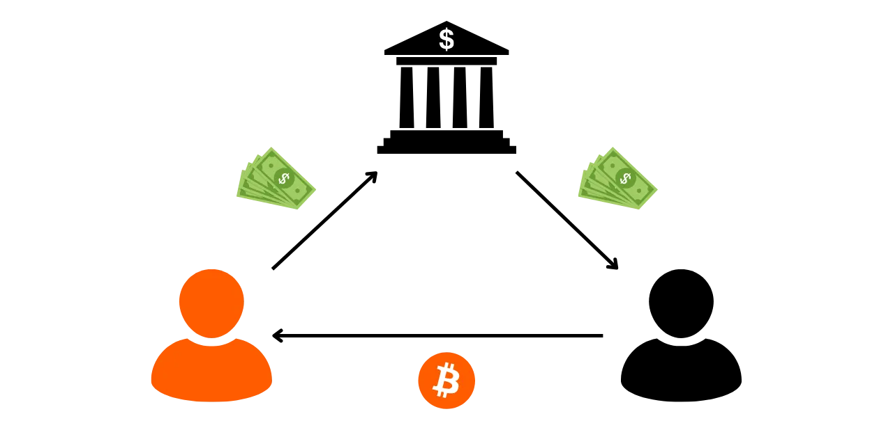


Ovaj pristup izbegava mnoge rizike povezane sa gotovinskim transakcijama. Međutim, rizik da druga strana ne ispuni obaveze u online Exchange je veći. Zaista, u fizičkom Exchange, ako predate novac prodavcu koji vam zauzvrat ne pošalje bitkoine, možete ga odmah pozvati na odgovornost, jer stoji ispred vas. S druge strane, online je često nemoguće pronaći nekoga ko vas je pokrao.


Da bi se ublažio ovaj rizik, moguće je koristiti specijalizovane platforme za razmene P2P. Ove platforme koriste mehanizme za rešavanje sukoba kako bi zaštitile oštećene korisnike. Obično nude sistem eskroua, gde se bitkoini drže sve dok prodavac ne potvrdi uplatu u fiat valuti.


U smislu lične bezbednosti, ovaj metod kupovine je znatno sigurniji od fizičkog keša Exchange. Međutim, kao što je gore pomenuto, online P2P razmene ostavljaju više tragova nego fizički Exchange, što može biti štetno za privatnost na Bitcoin. Korišćenjem online fiat metode plaćanja kao što je banka, izlažete više informacija koje bi mogle olakšati ključnu identifikaciju.


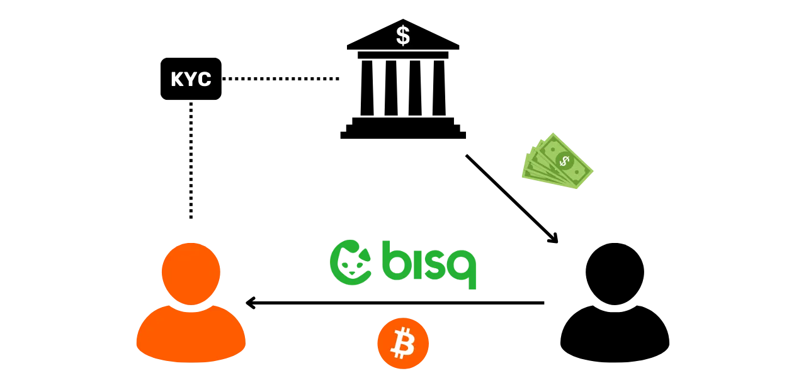


Još jednom, ne bih preporučio pravljenje previše velikih trgovina u jednoj transakciji na ovim platformama. Deljenjem vaših transakcija, širite rizik od krađe od strane druge strane.


Još jednom, još jedan nedostatak kupovine P2P je taj što je cena često viša nego ona koja se primećuje na regulisanim platformama. Prodavci često naplaćuju maržu koja se kreće od 1% do ponekad više od 10%. Postoji nekoliko razloga za ovu razliku u ceni. Prvo, ovo je uobičajena praksa među prodavcima P2P koja se vremenom ustalila. Drugo, prodavci imaju naknade povezane sa transakcijom za slanje sredstava kupcu. Takođe postoji povećan rizik od krađe u prodaji P2P u poređenju sa transakcijama na platformama, što opravdava kompenzaciju za preuzeti rizik. Na kraju, dodatni trošak može biti povezan sa potražnjom i kvalitetom Exchange u smislu poverljivosti. Kao kupac, dobitak u poverljivosti ima cenu koja se odražava u marži koju primenjuje prodavac. Neki bitkoineri takođe veruju da cena marže BTC kupljenog na P2P odražava njegovu pravu cenu, i tvrde da su niže cene na regulisanim platformama rezultat kompromisa na poverljivosti vaših ličnih podataka.


Što se tiče rešenja, lično sam uvek koristio [Bisq](https://bisq.network/) i veoma sam zadovoljan njime. Njihov sistem je proveren i čini se pouzdanim. Međutim, Bisq je dostupan samo na PC-ju i njegov Interface može biti previše složen za početnike. Još jedan nedostatak je što Bisq radi samo sa onchain transakcijama, koje mogu postati skupe tokom perioda visokih Bitcoin naknada za transakcije.


-> Pogledajte naš Bisq vodič.


https://planb.network/tutorials/exchange/peer-to-peer/bisq-fe244bfa-dcc4-4522-8ec7-92223373ed04

Za jednostavniju opciju, možete probati [Peach](https://peachbitcoin.com/), mobilnu aplikaciju koja povezuje kupce i prodavce sa ugrađenim sistemom za rešavanje konflikata. Proces je intuitivniji od Bisq-ovog.


-> Pogledajte naš vodič za Peach.


https://planb.network/tutorials/exchange/peer-to-peer/peach-c6143241-d900-4047-9b73-1caba5e1f874

Još jedna opcija na mreži je [HodlHodl](https://hodlhodl.com/), dobro uspostavljena platforma koja nudi dobru likvidnost, iako je lično nisam testirao.


-> Pogledajte naš HodlHodl vodič.


https://planb.network/tutorials/exchange/peer-to-peer/hodlhodl-d7344cd5-6b18-40f5-8e78-2574a93a3879

Za rešenja zasnovana na Lightning Network, probajte [RoboSats](https://learn.robosats.com/) i [LNP2PBot](https://lnp2pbot.com/). RoboSats je dostupan putem vebsajta i relativno je jednostavan za korišćenje. LNP2PBot je neobičniji, jer radi putem Exchange sistema na aplikaciji za razmenu poruka Telegram.


-> Pogledajte naš RoboSats vodič.


-> Pogledajte naš LNP2PBot vodič.


https://planb.network/tutorials/exchange/peer-to-peer/robosats-b60e4f7c-533a-4295-9f6d-5368152e8c06

https://planb.network/tutorials/exchange/peer-to-peer/lnp2pbot-v2-e6bcb210-610b-487d-970c-7cce85273e3c


### Regulisane platforme bez KYC


U zavisnosti od zemlje u kojoj živite, možda imate pristup regulisanim platformama koje ne zahtevaju KYC procedure za kupovinu ili prodaju bitkoina. U Švajcarskoj, na primer, možete koristiti platforme kao što su [Relai](https://relai.app/) i [MtPelerin](https://www.mtpelerin.com/).


-> Pogledajte naš vodič o Relai.


https://planb.network/tutorials/exchange/centralized/relai-v2-30a9671d-e407-459d-9203-4c3eae15b30e

Kao što smo videli u prethodnom poglavlju, ovaj tip platforme vas štiti od rizika povezanih sa KYC procedurama, ali predstavljaju viši nivo rizika za identifikaciju ključeva. Što se tiče poverljivosti Bitcoin, ove platforme nude bolju zaštitu od metoda kupovine sa KYC, ali su i dalje manje privlačne od P2P berzi.


Međutim, u pogledu lične sigurnosti, korišćenje ovih platformi je daleko manje rizično nego P2P razmene. Takođe su često jednostavnije za korišćenje od P2P platformi.


### Bankomati


Još jedna opcija za kupovinu ili prodaju bitcoina bez KYC su kripto bankomati. Lično, nikada nisam imao priliku da isprobam ovo rešenje, jer ih nema u mojoj zemlji. Ali ovaj metod može biti veoma zanimljiv, u zavisnosti od toga gde živite.


Problem sa bankomatima je što su ili zabranjeni u nekim zemljama, ili strogo regulisani u drugim. Ako bankomat zahteva proceduru verifikacije identiteta, onda je izložen istim rizicima kao i platforme koje su regulisane KYC-om. S druge strane, ako bankomat omogućava transakcije bez verifikacije identiteta za male iznose, onda njegova upotreba može ponuditi nivo poverljivosti uporediv sa onim kod P2P gotovinskog Exchange, dok se izbegava većina rizika povezanih sa ovom vrstom Exchange.


Glavni nedostatak bankomata je često visoka Exchange naknada, koja se kreće od nekoliko procenata do ponekad 15% od iznosa koji se menja.


### Poklon kartice


Konačno, želeo sam da vam predstavim rešenje koje dobro funkcioniše za one koji žele da koriste svoje bitkoine na dnevnoj bazi za kupovinu, umesto da ih prodaju za fiat valute.


Najbolji način da potrošite BTC je, naravno, korišćenje Bitcoin ili direktno Lightning Network za kupovinu dobara ili usluga. Međutim, u mnogim zemljama, broj trgovaca koji prihvataju Bitcoin je još uvek ograničen. Praktična alternativa je korišćenje poklon kartica.


Nekoliko platformi koje ne zahtevaju KYC procedure nude mogućnost razmene bitkoina za poklon kartice koje se mogu koristiti kod velikih trgovaca. To uključuje [CoinsBee](https://www.coinsbee.com/), [The Bitcoin Company](https://thebitcoincompany.com/) i [Bitrefill](https://www.bitrefill.com/). Ove platforme znatno olakšavaju svakodnevno korišćenje bitkoina, omogućavajući vam pristup širokom spektru proizvoda i usluga bez potrebe za njihovom konverzijom u fiat valutu.


https://planb.network/tutorials/exchange/centralized/bitrefill-8c588412-1bfc-465b-9bca-e647a647fbc1


### Ostale metode akvizicije


Drugi načini za sticanje bitkoina uz zaštitu vaše privatnosti uključuju, naravno, Mining. Da biste pokrenuli Mining Sats, ne morate otkriti svoj identitet; jednostavno pronađite važeći Proof of Work i pošaljite ga mreži. Ako se odlučite za pool Mining, neki pool-ovi zahtevaju neki oblik identifikacije, kao što je KYC, dok drugi ne.


Drugi metod je rad u Exchange za bitkoine. Ovaj metod sticanja može biti zanimljiv, ali stepen potrebne identifikacije znatno varira u zavisnosti od okolnosti.


*Da napišem ovo poglavlje, koristio sam BTC205 kurs obuke koji drži [@pivi___](https://x.com/pivi___) na Plan ₿ Network (trenutno dostupan samo na francuskom)


## Konsolidacija, UTXO menadžment i CIOH


<chapterId>d0486c8f-332d-402b-ae2e-949416752b9c</chapterId>


Jedan od najsloženijih aspekata vođenja portfolija sa samostalnim čuvanjem je konsolidacija. Da li treba da konsolidujete? Koja je svrha? Koju veličinu UTXO treba poštovati? Koji su kompromisi u pogledu poverljivosti? To je ono što ćemo razmotriti u ovom delu.


### Šta je konsolidacija?


Bitcoin funkcioniše kao aukcijsko tržište, gde rudari daju prednost transakcijama koje nude najniže naknade. Međutim, svaki blok ima maksimalnu težinu, što ograničava broj transakcija koje mogu biti uključene. Kako se blok proizvodi u proseku svakih 10 minuta, prostor dostupan u svakom bloku je oskudan resurs.


Rudari, čije aktivnosti generate značajne troškove u smislu električne energije, fiksne imovine i održavanja, prirodno nastoje maksimizirati svoju profitabilnost. Stoga teže favorizuju transakcije koje generate najviše naknade u odnosu na njihovu težinu.


Nisu sve Bitcoin transakcije iste težine. One sa više ulaza i izlaza će imati veću težinu. Na primer, zamislimo 2 transakcije:


- Transakcija A se sastoji od 1 ulaza i 1 izlaza. Dodeljuje 1,994 Sats naknada i ima težinu od 141 vB ;
- Transakcija B, složenija transakcija sa 2 ulaza i 2 izlaza, dodeljuje 2,640 Sats u naknadama za težinu od 220 vB.


U ovom primeru, iako transakcija B nudi višu ukupnu naknadu, rudari će preferirati transakciju A, jer nudi bolji odnos između naknade i težine. Evo izračuna za svaku transakciju, izraženog u Sats po virtualnom bajtu (sat/vB):


```text
TXA : 1994 / 141 = 14 sats/vB
TXB : 2640 / 220 = 12 sats / vB
```


To znači da za svaku jedinicu težine, transakcija A nudi više troškova nego transakcija B, iako transakcija B nudi više troškova u apsolutnim iznosima.


Stoga je korisniku uvek zanimljivije da troši što manje ulaza u svojim transakcijama. Međutim, potrebno je potrošiti dovoljne količine kako bi se moglo zadovoljiti izlazno plaćanje. Kada upravljate svojim portfoliom, potrebno je imati dovoljno velike UTXO-e.


Princip konsolidacije je upravo da se iskoriste periodi kada su naknade niske na Bitcoin kako bi se spojili manji UTXO-ovi u jedan veći. Na ovaj način, kada naknade porastu na Bitcoin, moći ćete da obavljate transakcije sa minimalnim brojem ulaza, i stoga trošite manje na naknade u apsolutnim iznosima. Cilj je, dakle, predvideti obavezne transakcije koje će se obavljati tokom perioda visokih naknada.


Pored uštede na troškovima transakcija, konsolidacija UTXO-a pomaže u sprečavanju formiranja "Dust". "Dust" se odnosi na UTXO-e čija je vrednost u Sats toliko niska da nije dovoljna da pokrije troškove transakcije potrebne za njihovo trošenje. To čini ove UTXO-e ekonomski neracionalnim za korišćenje sve dok troškovi transakcije ostaju visoki. Proaktivnim objedinjavanjem svojih UTXO-a, sprečavate ih da postanu Dust, osiguravajući da sva vaša sredstva ostanu upotrebljiva.


### Koja je minimalna veličina za vaše UTXO-e?


Ponekad me pitaju koja je preporučena minimalna vrednost za UTXO. Nažalost, ne postoji univerzalan odgovor, jer to zavisi od vaših preferencija i uslova tržišta naknada. Međutim, evo formule koja vam može pomoći da odredite prag koji odgovara vašim potrebama:


$$
\frac {P \times F}T = M
$$


Gde:


- p$ je težina transakcije;
- $F$ predstavlja maksimalnu stopu naplate u satoshijima po vbyte-u (Sats/vB) protiv koje se osiguravate;
- t$ je procenat naknade za transakciju koji ste spremni da platite u odnosu na ukupnu vrednost UTXO ;
- m$ je minimalni iznos u satoshima za svaki UTXO.


Pretpostavimo da planirate da pokrijete naknade za standardnu SegWit transakciju sa 1 ulazom i 2 izlaza, težine 141 vB. Ako se osiguravate do 800 Sats/vB, i spremni ste da potrošite do 12% vrednosti UTXO na naknade najviše, onda bi proračun bio:


$$
\frac{141 \times 800}{0.12} = 940\ 000
$$


U ovom primeru, stoga bi bilo pametno zadržati minimalnu vrednost od 940,000 Sats za UTXO-e u vašem portfoliju.


### Konsolidacija i CIOH


Jedna od najčešće korišćenih heuristika u analizi Blockchain je CIOH (*Common Input Ownership Heuristic*), koja pretpostavlja da svi ulazi u Bitcoin transakciju pripadaju istom entitetu. Sam princip konsolidacije je da se konzumira nekoliko UTXO-a kao ulazi i kreira jedan UTXO kao izlaz. Konsolidacija tako omogućava primenu ICOH-a.


U praksi, ovo znači da spoljašnji posmatrač može zaključiti da svi konsolidovani UTXO-i verovatno pripadaju istoj osobi, i da jedinstveni izlaz koji je generisan takođe pripada njoj. Ova situacija može ugroziti vašu poverljivost povezivanjem različitih istorija transakcija. Na primer, recimo da konsolidujem 3 UTXO-a stečena putem P2P sa jednim UTXO dobijenim putem platforme koja zahteva KYC :


Čineći to, bilo koji entitet sa pristupom podacima platforme Exchange, potencijalno uključujući vladine agencije, moći će da identifikuje da posedujem druge količine BTC-a. Prethodno, ovi UTXO-i nisu bili direktno povezani sa mojim identitetom; sada jesu. Štaviše, to otkriva svim izvorima da posedujem određenu količinu bitkoina.


Kada je reč o upravljanju UTXO-ima, ekonomski razlozi, koji podstiču konsolidaciju radi smanjenja troškova, dolaze u sukob sa dobrom praksom privatnosti, koja bi preporučila da se UTXO-i nikada ne spajaju. Izbor između ekonomičnosti i poverljivosti stoga zavisi od prioriteta svakog korisnika.


Ako možete izbeći konsolidaciju dok održavate značajne UTXO-e, to je idealno. Da biste to postigli, optimizujte svoje metode akvizicije. Ako kupujete svoje bitkoine putem DCA, pokušajte da razmaknete svoje jednokratne kupovine što je više moguće kako biste konsolidovali vrednost preko manje UTXO-a. Biće lakše upravljati jednokratnom kupovinom od €1,000 svakih 2 meseca, nego kupovinom od €120 svake nedelje. Ovo minimizuje broj generisanih UTXO-a i pojednostavljuje upravljanje vašim portfoliom dok čuva vašu poverljivost.


Ako se nađete u situaciji da morate konsolidovati svoje bitkoine, dajte prednost konsolidaciji UTXO-a iz istog izvora. Na primer, spajanje 10 UTXO-a sa jedne platforme će manje uticati na vašu poverljivost nego mešanje 5 UTXO-a sa platforme A sa 5 UTXO-a sa platforme B. Ako je konsolidacija iz različitih izvora neizbežna, pokušajte da ih razdvojite prema njihovim karakteristikama. Na primer, grupišite zajedno UTXO-e stečene putem KYC-a u jednoj transakciji, a one dobijene putem P2P u drugoj.


U svakom slučaju, ne zaboravite da svaka konsolidacija neizbežno podrazumeva gubitak poverljivosti. Zato pažljivo procenite potrebu za ovom operacijom i potencijalni uticaj na vašu privatnost, uzimajući u obzir CIOH.


## Druge najbolje prakse


<chapterId>b5216965-7d13-4ea1-9b7c-e292966a487b</chapterId>


Hajde da pogledamo nekoliko drugih najboljih praksi za optimizaciju vaše privatnosti na Bitcoin.


### Kompletan čvor


Posedovanje svojih bitkoina u samostalnom staranju je sjajno, ali korišćenje sopstvenog kompletnog čvora je još bolje! Evo zašto je posedovanje sopstvenog čvora ključno za potpuno suverenu upotrebu Bitcoin:


- Otpornost na cenzuru**: Vaše transakcije ne mogu biti blokirane od strane bilo koga;
- Nezavisnost od trećih strana**: Više ne zavisite od bilo koje spoljne usluge za verifikaciju Blockchain podataka;
- Aktivno učešće**: Možete definisati sopstvena pravila validacije i direktno učestvovati u konsenzusu;
- Doprinos mreži**: Pokretanjem čvora, pomažete u jačanju i distribuciji Bitcoin mreže;
- Tehničko obrazovanje**: Upravljanje kompletnim čvorom je odličan način da produbite svoje tehničko znanje o Bitcoin.


Pored ovih prednosti, korišćenje kompletnog čvora takođe poboljšava vašu poverljivost prilikom emitovanja vaših transakcija. Kada izdate transakciju, ona se prvo kreira i potpisuje putem vašeg Wallet. Da bi se emitovala na Bitcoin mreži, mora biti poznata barem jednom čvoru. Korišćenjem sopstvenog čvora, imate direktnu kontrolu nad ovom distribucijom, čime se pojačava vaša poverljivost i ograničava rizik od curenja podataka.


Ako nemate svoj Bitcoin čvor, bićete primorani da koristite čvor treće strane, kao što je onaj koji nudi vaš Wallet softverski provajder. Pored emitovanja transakcija, vašem Wallet je potreban pristup raznim informacijama kao što su transakcije na čekanju, stanja povezana sa vašim adresama i broj potvrda za vaše transakcije. Da biste pristupili svim ovim podacima, potrebno je da izvršite upit čvora.


Glavni rizik kada ne koristite sopstveni Bitcoin čvor je da operater treće strane može posmatrati vaše aktivnosti na Blockchain, ili čak podeliti ove informacije sa drugim entitetima. Da biste ograničili ovaj rizik, posredničko rešenje je korišćenje Wallet softvera koji maskira vaše konekcije putem Tor-a. Ovo može smanjiti izloženost vaših podataka. Međutim, optimalno rešenje je imati sopstveni Bitcoin čvor i koristiti ga za emitovanje vaših transakcija. Naravno, takođe ćete morati biti pažljivi da ne otkrijete bilo kakve informacije putem vašeg čvora, ali to je druga tema kojom ćemo se baviti u narednim odeljcima.


Pored očigledne prednosti za vašu privatnost, posedovanje sopstvenog kompletnog čvora takođe vam garantuje verodostojnost podataka na Blockchain, štiti vas od cenzure i omogućava vam aktivno učešće u upravljanju Bitcoin. Korišćenjem sopstvenog čvora, doprinosite svojom ekonomskom težinom lancu po vašem izboru, što je važno tokom sukoba unutar zajednice, kao što je bio slučaj tokom Rata oko veličine bloka od 2015. do 2017. godine, na primer. U slučaju Fork, korišćenje čvora treće strane moglo bi vas navesti da podržite lanac koji ne želite da favorizujete, jer operater čvora donosi odluku umesto vas.


Kao što možete videti, u interesu poverljivosti i individualnog suvereniteta, neophodno je pokrenuti i koristiti svoj sopstveni kompletan čvor!


### Obmanjujuće heuristike analize


Šire gledano, važno je razumeti heuristike o kojima smo govorili u prethodnom delu, kako bismo ih bolje izbegli ili obmanuli. Usvajanje niza najboljih praksi može biti korisno, čak i ako nisu neophodne. One nude dodatnu Layer zaštitu koja može biti važna za održavanje poverljivosti prilikom korišćenja Bitcoin.


Prvi savet koji bih mogao da dam je da se uklopiš u najgušću gomilu. Na Bitcoin, ovo znači korišćenje najšire prihvaćenih šablona skripti. Na primer, P2WSH skripte, često korišćene za SegWit V0 Multisig konfiguracije, su veoma neuobičajene. One ti ne omogućavaju da se sakriješ u velikom skupu anonimnosti. Isto važi i za starije modele kao što su P2PKH ili P2SH. Iako su široko prisutni u UTXO setu, sve manje se koriste za nove transakcije.


Generalno govoreći, mudrije je odlučiti se za najnoviji standard skriptovanja, pod uslovom da je dovoljno usvojen. Dakle, ako bih 2022. godine savetovao protiv korišćenja P2TR (Taproot) zbog niske usvojenosti, u 2024. bih preporučio da se odlučite za ovu vrstu skripte, ili ako to nije moguće, za SegWit V0 skriptu, jer broj transakcija koje koriste P2TR počinje da predstavlja veoma značajan udeo.


Izvor : [txstats.com](https://txstats.com/d/000000054/UTXO-set-repartition-by-output-type)


Još jedan savet za očuvanje vaše poverljivosti je pokušaj zaobilaženja internih heuristika transakcija. Na primer, prilikom plaćanja, možete pokušati da izbegnete kreiranje izlaza sa okruglim iznosom, jer to može signalizirati da drugi izlaz predstavlja strani Exchange. Ako treba da pošaljete 100 k Sats prijatelju, razmislite o prenosu nešto većeg iznosa kako biste izbegli ovu heuristiku. Slično tome, pokušajte da ne kreirate strane Exchange izlaze koji su nesrazmerno visoki u odnosu na izvršeno plaćanje, jer to takođe može otkriti koji od izlaza predstavlja strani Exchange.


Konačno, ako redovno obavljate Bitcoin transakcije, pobrinite se da ih ne emitujete uvek u isto vreme. Širenjem emitovanja vaših transakcija tokom dana i nedelje, izbegavate davanje prilike spoljnim posmatračima da otkriju vremenski obrazac zasnovan na vremenskoj zoni koji bi mogao ojačati njihovu analizu.


Pored svih ovih dobrih praksi koje treba usvojiti na dnevnoj bazi, postoje još efikasnije metode za potpuno prekidanje praćenja vaših bitkoina. To uključuje, naravno, CoinJoin transakcije, koje ćemo detaljno razmotriti u narednom odeljku.


# Razumevanje CoinJoin transakcija


<partId>6d0bbf16-3714-4db1-9897-2d45019f6bdc</partId>


## Šta je CoinJoin transakcija?


<chapterId>0862bc6b-1c48-4aa4-b76d-4f547b469008</chapterId>


Nakon što smo proučili osnove zaštite privatnosti, sada ćemo pogledati sofisticiranije tehnike usmerene na aktivnu odbranu vaše poverljivosti, posebno razdvajanjem vaše Bitcoin istorije. U sledećem delu, razmotrićemo čitav niz malih tehnika, ali prvo bih želeo da vam kažem nešto o CoinJoin.


CoinJoin se često smatra najefikasnijom metodom zaštite privatnosti korisnika Bitcoin. Ali šta tačno predstavlja transakcija CoinJoin? Hajde da saznamo.


### Osnovni principi CoinJoin


CoinJoin je tehnika za razbijanje praćenja Bitcoin na Blockchain. Zasniva se na kolaborativnoj transakciji sa specifičnom strukturom istog imena: CoinJoin transakcija.


Kao što smo videli u prvim delovima ovog kursa, Bitcoin transakcije su poznate svim korisnicima putem njihovog čvora. Stoga je lako proveriti lanac elektronskih potpisa svakog novčića i posmatrati njegovu istoriju. To znači da svi korisnici mogu pokušati da analiziraju transakcije drugih korisnika. Kao rezultat, anonimnost na nivou transakcija je nemoguća. Međutim, anonimnost se čuva na nivou individualne identifikacije. Za razliku od konvencionalnog bankarskog sistema, gde je svaki račun povezan sa ličnim identitetom, na Bitcoin, sredstva su povezana sa kriptografskim parovima ključeva (ili skriptama), nudeći korisnicima oblik pseudonimnosti iza kriptografskih identifikatora.


Poverljivost Bitcoin je ugrožena kada spoljašnji posmatrači mogu da povežu specifične UTXO-e sa identifikovanim korisnicima. Kada se ova povezanost uspostavi, postaje moguće pratiti njihove transakcije i analizirati njihovu istoriju Bitcoin. CoinJoin je upravo tehnika razvijena da prekine mogućnost praćenja UTXO-a, kako bi korisnicima Bitcoin ponudio određeni Layer nivo poverljivosti na nivou transakcija.


Coinjoins pojačavaju poverljivost korisnika Bitcoin tako što čine analizu lanca složenijom za spoljne posmatrače. Njihova struktura omogućava da se više novčića od različitih korisnika spoji u jednu transakciju, zamagljujući linije i otežavajući određivanje veza između ulaznih i izlaznih adresa.


Važno je razumeti da je cilj CoinJoin transakcije da prekine istoriju novčića. Ova tehnika ne pruža trajnu anonimnost niti definitivno blokira Bitcoin praćenje, suprotno onome što biste mogli misliti. CoinJoin ima za cilj samo da prekine istoriju na tački gde se CoinJoin transakcija obavlja. Međutim, pre i posle ove operacije, novčić ostaje podložan istim rizicima u pogledu poverljivosti.


### Kako funkcionišu coinjoin transakcije?


Princip CoinJoin zasnovan je na kolaborativnom pristupu: nekoliko korisnika koji žele da mešaju svoje bitkoine deponuju identične iznose kao ulaze u istu transakciju. Ti iznosi se zatim preraspodeljuju u izlaze jednake vrednosti svakom korisniku.


Na kraju transakcije, postaje nemoguće povezati određeni izlaz sa korisnikom poznatim kao ulaz. Ne postoji direktna veza između ulaza i izlaza, što prekida povezanost između korisnika i njihovih UTXO-a, kao i istoriju svakog dela.


Hajde da uzmemo Alisin primer. Ona želi da pošalje oko 100,000 Sats svojoj sestri Ivi za njen rođendan. Međutim, Alisa ne želi da Iva može da prati njenu istoriju transakcija, jer ne želi da otkrije koliko bitkoina ima ili kako ih je dobila. U tu svrhu, Alisa odlučuje da prekine svoju UTXO istoriju sa CoinJoin transakcijom. Ona se organizuje sa Bobom, Čarlsom, Dejvidom i Frenkom da sprovedu kolaborativnu transakciju:


- Alisa, Bob, Čarls, Dejvid i Frenk svaki unose UTXO od 105,000 Sats (sa 5,000 Sats za Mining naknade) kao ulaze u transakciju:


- U zamenu za konzumiranje ovih ulaza, svaki generiše prazan Address da bi stvorio pet identičnih izlaza od po 100.000 Sats. Svaki preuzima jedan izlaz:


- Alice se nalazi sa UTXO od 100,000 Sats čija je istorija pomešana. Ona koristi ovaj UTXO u novoj transakciji da pošalje iznos Evi za njen rođendan:


- Ako Eva pokuša da analizira ovu transakciju kako bi izvukla informacije, suočiće se sa transakcijom CoinJoin koja uključuje Alisu, Boba, Čarlsa, Davida i Frenka. Zbog uniformnosti iznosa, Eva neće moći da razlikuje koji ulaz pripada kome, te neće moći da prati Alisinu UTXO istoriju, niti da utvrdi koliko bitkoina njena sestra poseduje ili kako ih je stekla:


U ovom slučaju, Alisa je koristila tehniku CoinJoin kako bi povećala poverljivost u vezi sa retrospektivnom analizom. U suštini, Alisa se štiti od moguće analize od strane Eve, koja bi počela od određene transakcije i radila unazad kroz istoriju UTXO. Ova zaštita od analize od sadašnjosti ka prošlosti poznata je kao retrospektivni anonset. O ovom konceptu ćemo detaljnije govoriti u završnim poglavljima ovog odeljka.


Međutim, CoinJoin takođe nudi mogućnost jačanja poverljivosti u svetlu analize od prošlosti ka sadašnjosti, poznate kao prospektivni anonset. Vratimo se našem primeru gde je Alisa poslala Evi 98,000 Sats za njen rođendan, ali sa obrnutim ulogama. Sada zamislimo da je Eva ta koja je zabrinuta za svoju privatnost. Zaista, Alisa bi mogla biti u iskušenju da prati novčić koji je poslala Evi kako bi iz njega izvukla informacije. Eva bi mogla konsolidovati ovaj UTXO koji je upravo primila sa svim svojim drugim UTXO-ima, što bi Alisi moglo otkriti količinu bitkoina koje ima u svom Wallet. Da bi to izbegla, Eva takođe može prekinuti istoriju novčića koji je upravo primila:


- Eve, Grace, Mallory, Oscar i Victor su svaki uneli UTXO od 98,000 Sats kao ulaz u Bitcoin transakciju:


- U zamenu za korišćenje ovih ulaza, svaki korisnik obezbeđuje prazan Address koji će se koristiti za kreiranje 5 izlaza od 97.500 potpuno jednakih Sats. Svaki korisnik dobija jedan izlaz:


- Eve sada drži UTXO od 97,500 Sats čija je istorija prekinuta. Može ga koristiti bez straha za obavljanje budućih transakcija. Zaista, ako Alisa pokuša da prati bitkoine koje je poslala Evi, suočiće se sa CoinJoin transakcijom. Neće moći da odredi koji odlazni UTXO pripada Evi. Analiza postaje nemoguća:


U prvom primeru, videli smo kako CoinJoin može zaštititi privatnost sobe u odnosu na njenu prošlost, a u drugom primeru, kako može osigurati istoriju sobe u odnosu na njenu budućnost. Zato sam pomenuo da CoinJoin treba posmatrati kao jedinstven događaj koji segmentira deo istorije u oba smera:


### Mikser, CoinJoin, mikser... Koja je razlika?


Coinjoins se ponekad opisuju kao "mikseri", termin koji neki bitkoineri odbacuju, plašeći se da bi mogao biti pomešan sa kustodijalnim mikserima. Verujem, međutim, da je ovaj strah neosnovan, jer, u matematičkom kontekstu, CoinJoin upravo oličava koncept mešanja.


U opštem polju matematike, mešanje se odnosi na osobinu dinamičkog sistema gde, nakon određenog vremenskog perioda, svi delovi početnog prostora mogu teoretski postati pomešani sa bilo kojim drugim delom. Mešanje implicira da se položaj čestice ili stanje sistema razvija na takav način da je njegova buduća distribucija nezavisna od početne distribucije, dostižući tako stanje u kojem su karakteristike početnog stanja ravnomerno raspoređene kroz prostor sistema. Ovo je tačno ono što se dešava u CoinJoin sa bitcoinima. Dakle, po mom mišljenju, CoinJoin je zaista metoda mešanja novčića.


S druge strane, važno je razlikovati CoinJoin od shufflera. Shuffler je usluga gde korisnici šalju svoje bitcoine da budu pomešani. Ove usluge su bile popularne tokom 2010-ih, ali njihova upotreba je opala zbog dva glavna nedostatka u poređenju sa CoinJoin:


- Oni zahtevaju od korisnika da se odreknu starateljstva nad svojim sredstvima tokom procesa mešanja, što ih izlaže riziku od krađe;
- Nema garancije da mikser neće zabeležiti detalje transakcije, ili čak prodati ove informacije kompanijama za analizu lanca.


Današnji korisnici stoga preferiraju CoinJoin, jer im omogućava da zadrže potpunu kontrolu nad svojim sredstvima tokom celog procesa. Učesnici CoinJoin ne rizikuju da im drugi učesnici ukradu bitkoine. Pogledajmo kako je sve to moguće u narednom poglavlju.


## Zerolink i chaumian coinjoins


<chapterId>326c9654-b359-4906-b23d-d6518dd5dc3e</chapterId>


Privatnost koju pruža CoinJoin zaslužena je veličinom grupe u kojoj je naš deo skriven. To znači pronalaženje što većeg broja učesnika. Potpuno je moguće kreirati CoinJoin ručno, sa korisnicima koje smo sami pronašli, ali ovo je složen proces i neće vam doneti velike anonsete.


Zato su koordinatori CoinJoin razvijeni na Bitcoin. Njihova uloga je da povežu različite korisnike međusobno i prenesu informacije potrebne za završetak kolaborativne transakcije.


Ali kako možemo osigurati da koordinator nikada nema pristup korisničkim bitcoinima, i uprkos činjenici da je on osoba koja gradi CoinJoin transakciju, kako možemo osigurati da ne može povezati korisničke ulaze i izlaze, što bi moglo predstavljati curenje poverljivih informacija?


### Chaumovi slepi potpisi


Moderne implementacije CoinJoin koriste slepe potpise Davida Chauma kako bi izbegle curenje informacija. Hajde da brzo pogledamo kako ovi slepi potpisi funkcionišu.


Chaumovi slepi potpisi su oblik digitalnog potpisa u kojem izdavalac potpisa ne zna sadržaj poruke koju potpisuje. Ali potpis se zatim može verifikovati u odnosu na originalnu poruku. Ovu tehniku je razvio kriptograf David Chaum 1983. godine.


Uzmimo primer kompanije koja želi da autentifikuje poverljivi dokument, kao što je Contract, bez otkrivanja njegovog sadržaja. Kompanija primenjuje proces maskiranja koji kriptografski transformiše originalni dokument na reverzibilan način. Ovaj modifikovani dokument se šalje sertifikacionoj vlasti, koja stavlja slepi potpis bez poznavanja osnovnog sadržaja. Nakon što primi potpisani dokument, kompanija demaskira potpis. Rezultat je originalni dokument autentifikovan potpisom vlasti, bez da je vlast ikada videla originalni sadržaj.


Chaumovi slepi potpisi stoga mogu potvrditi autentičnost dokumenta bez poznavanja njegovog sadržaja, čime se garantuje i poverljivost korisničkih podataka i integritet potpisanog dokumenta.


### Chaumian coinjoins


Takozvani "Chaumian" coinjoini kombinuju upotrebu Tor-a i slepih potpisa Davida Chauma kako bi se osiguralo da koordinator ne može znati koji izlaz pripada kojem korisniku.


Proces konstruisanja transakcije CoinJoin uključuje 3 glavne faze: registraciju ulaza, registraciju izlaza i potpisivanje transakcije. Pogledajmo ovaj proces kroz primer Alise, jedne od učesnica CoinJoin. Svi ostali učesnici prate iste korake kao Alisa, svaki za sebe.


**Korak 1: Unos registracije


- Alis prenosi koordinatoru UTXO koji želi da koristi kao ulaz u transakciju, kao i maskirani prijemni Address koji želi da koristi kao izlaz za primanje svojih bitkoina. Koordinator stoga nema način da sazna Alisin Address. On vidi samo njenu maskiranu verziju:


- Koordinator proverava validnost unosa, zatim potpisuje Alisin maskirani Address svojim privatnim ključem. On vraća slepi potpis Alisi:


**Korak 2: Registracija izlaza**


- Alice može da razotkrije svoj Address, sada potpisan privatnim ključem koordinatora. Ona će uspostaviti novu vezu pod drugačijim Tor identitetom. Koordinator ne može da identifikuje da je to Alice koja se povezuje pod ovim novim identitetom:


- Alice šalje nemaskirani Address i potpis koordinatoru (koji još uvek ne zna da je to Alice):


**Korak 3: Potpisivanje transakcije**


- Na isti način, koordinator preuzima nemaskirane izlaze od svih učesnika. Zahvaljujući pridruženim potpisima, može proveriti da je svaki anonimno dostavljen izlaz prethodno potpisan njegovim privatnim ključem, čime se garantuje njihova legitimnost. Zatim je spreman da izgradi CoinJoin transakciju i pošalje je učesnicima na potpisivanje:


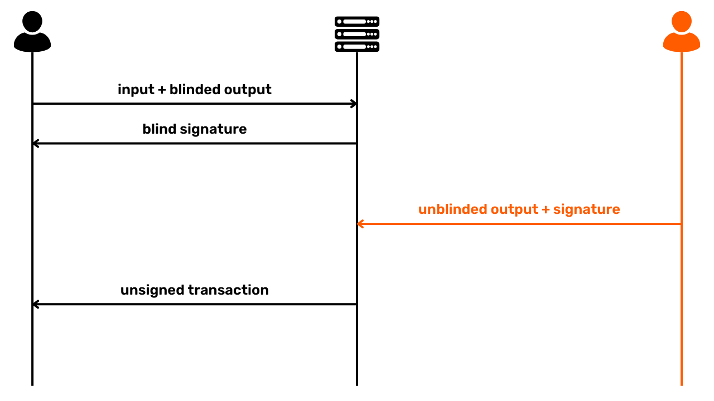


- Alisa, kao i ostali učesnici, proverava da li su njen ulaz i izlaz ispravno uključeni u transakciju koju je konstruisao koordinator. Ako je sve zadovoljavajuće, ona šalje potpis koji otključava njen ulazni skript koordinatoru:


- Nakon prikupljanja potpisa od svih učesnika CoinJoin, koordinator može emitovati transakciju na Bitcoin mreži, kako bi mogla biti dodata u blok.


U ovom sistemu, koordinator nije u mogućnosti da poveže ulaz sa specifičnim izlazom. Štaviše, on ne može prisvojiti sredstva učesnika, jer nikada nema pristup privatnim ključevima potrebnim za otključavanje njihovih UTXO-a. Tokom celog procesa, do kraja koraka 3, on takođe nema pristup potpisima. Kada Alisa i ostali učesnici potpišu globalnu transakciju, nakon provere da je sve ispravno, koordinator više ne može da izmeni transakciju, uključujući izlaze, a da je ne učini nevažećom. Ovo sprečava koordinatora da ukrade bitkoine.


Konačno, kada registruje svoj izlaz u transakciji, korisnik CoinJoin želi da ima garancije slične onima koje ima građanin prilikom glasanja na izborima. Postoji dualnost između javnih i privatnih aspekata ovih radnji. S jedne strane, tu je ono što želite da zadržite privatnim: za glasača, on ne želi da njegov glasački listić bude povezan sa njegovim identitetom; za korisnika CoinJoin, on ne želi da njegov izlaz bude povezan sa njegovim ulazom. Zaista, ako koordinator, ili bilo koja druga strana, uspe da uspostavi vezu između ulaza i izlaza, CoinJoin gubi svaki interes. Kao što je gore objašnjeno, CoinJoin mora funkcionisati kao prekid u istoriji novčića. Ovaj prekid se dešava upravo zbog nemogućnosti povezivanja određenog ulaza sa određenim izlazom u CoinJoin transakciji (prospektivni anonset) i obrnuto (retrospektivni anonset).


S druge strane, tu je javni aspekt: birač želi da bude siguran da je njegov glasački listić ubačen u glasačku kutiju; slično tome, korisnik CoinJoin želi da bude siguran da je njegov izlaz uključen u CoinJoin transakciju. Zaista, učesnici CoinJoin apsolutno moraju biti u mogućnosti da verifikuju prisustvo svog izlaza pre potpisivanja transakcije, inače bi koordinator mogao da ukrade sredstva.


Upravo ova 2 javna i privatna aspekta, omogućena korišćenjem slepih potpisa Davida Chauma, garantuju učesnicima u Chaumian coinjoin-ima da njihovi bitkoini neće biti ukradeni i da njihova sredstva ne mogu biti praćena.


### Ko je izumeo koncept CoinJoin?


Teško je reći ko je prvi predstavio ideju CoinJoin Bitcoin, i ko je došao na ideju korišćenja slepih potpisa Davida Chauma u ovom kontekstu. Često se misli da je to bio Gregory Maxwell koji je prvi pomenuo u [poruci na BitcoinTalk-u 2013](https://bitcointalk.org/index.php?topic=279249.0) :


> *"Korišćenje Chaumovih slepih potpisa: Korisnici se prijavljuju i pružaju unose (i Exchange adrese) kao i kriptografski blinded verziju Address na koju žele da pošalju svoje privatne delove; server potpisuje tokene i šalje ih nazad. Korisnici se anonimno ponovo povezuju, otkrivaju svoje izlazne adrese i šalju ih nazad serveru. Server može videti da su svi izlazi potpisani od strane njega i da, shodno tome, svi izlazi dolaze od validnih učesnika. Kasnije, ljudi se ponovo povezuju i prijavljuju se
Maxwell, G. (2013, August 22). *CoinJoin: Bitcoin privacy for the real world*. BitcoinTalk Forum. https://bitcointalk.org/index.php?topic=279249.0


Međutim, postoje i ranija pominjanja, kako za Chaum potpise kao deo mešanja, tako i za coinjoins. [U junu 2011, Duncan Townsend je predstavio na BitcoinTalk](https://bitcointalk.org/index.php?topic=12751.0) mikser koji koristi Chaum potpise na način vrlo sličan modernim Chaumian coinjoins.


U istoj temi možemo pronaći [poruku od hashcoin kao odgovor na Duncan Townsend](https://bitcointalk.org/index.php?topic=12751.msg315793#msg315793) kako bi poboljšao svoj mixer. Proces opisan u ovoj poruci je upravo ono o čemu se radi u coinjoins. Pominjanje sličnog sistema može se naći i u [poruci od Alex Mizrahi iz 2012](https://gist.github.com/killerstorm/6f843e1d3ffc38191aebca67d483bd88#file-laundry), kada je savetovao tvorce Tenebrix-a, jednog od prvih altcoina koji je poslužio kao osnova za kasnije kreiranje Litecoin-a. Čak se kaže da sam termin "CoinJoin" nije skovao Greg Maxwell, već da je potekao od ideje Petera Todda.


### Zerolink


Zerolink je sveobuhvatan protokol za mešanje koji uključuje Chaumian coinjoin-ove i razne strategije za zaštitu anonimnosti korisnika protiv različitih oblika analize lanca, posebno minimiziranjem grešaka povezanih sa upravljanjem portfoliom. Ovaj protokol [su predstavili nopara73 i TDevD 2017. godine](https://github.com/nopara73/ZeroLink/blob/master/README.md).


Kao što ime sugeriše, princip iza Zerolink-a je da kreira CoinJoin transakcije koje osiguravaju da se veze između ulaza i izlaza ne mogu pratiti. Ovo se postiže osiguravanjem da svi izlazi imaju savršeno identične iznose.


Važna preventivna mera koju preduzima Zerolink je da drži nemiksovane UTXO-ove potpuno odvojene od miksovanih UTXO-ova korišćenjem zasebnih kriptografskih ključeva, ili čak zasebnih portfolija. Ovo razlikuje "*pre-mix*" Wallet, namenjen za delove pre mešanja, od "*post-mix*" Wallet, rezervisanog za delove koji su miksovani.


Ova rigorozna separacija UTXO-a služi pre svega da spreči slučajne asocijacije između mešanog UTXO i nemešanog UTXO. Zaista, ako se takve veze dogode, efikasnost CoinJoin na mešani UTXO se poništava bez da je korisnik toga svestan, čime se ugrožava poverljivost UTXO čiju istoriju je mislio da je prekinuo. Ove veze mogu nastati ili kroz ponovnu upotrebu Address pri osiguravanju mešanog UTXO sa nemešanim, ili kroz primenu CIOH (_Common-Input-Ownership Heuristic_), ako korisnik koristi mešane i nemešane UTXO-e kao ulaze u istu transakciju. Separacijom portfolija pre-mešanja i post-mešanja, izbegavamo takve slučajne asocijacije i štitimo korisnika od nenamernih grešaka.


Ovo razdvajanje takođe nudi mogućnost primene različitih pravila između pre-mix i post-mix portfolija na nivou softvera za portfolije. Na primer, u post-mix portfoliju, softver može zabraniti spajanje UTXO-a u ulaze kako bi se sprečila primena CIOH-a, što bi ugrozilo korisnikov anonset. Takođe je moguće standardizovati upotrebu skripti i opcija transakcija (kao što je RBF izveštavanje, na primer) kako bi se sprečila identifikacija putem Wallet otisaka prstiju.


Trenutno je Whirlpool jedina implementacija CoinJoin koja rigorozno primenjuje Zerolink protokol. U sledećem poglavlju, pogledaćemo razne implementacije CoinJoin koje postoje, kao i prednosti i nedostatke svake od njih.


## CoinJoin implementacije


<chapterId>e37ed073-9498-4e4f-820b-30951e829596</chapterId>


*U 2024. godini, svedočimo velikim promenama u alatima dostupnim korisnicima koji žele da prave coinjoin-ove na Bitcoin. Trenutno smo na prekretnici, a tržište CoinJoin prolazi kroz veliku restrukturaciju. Ovo poglavlje će sigurno biti ažurirano tokom vremena


Za sada postoje uglavnom 3 različite implementacije CoinJoin na Bitcoin:


- Whirlpool;
- Wabisabi;
- JoinMarket.


Svaka od ovih implementacija ima za cilj da prekine istoriju UTXO-a putem CoinJoin transakcija. Međutim, njihovi mehanizmi se znatno razlikuju. Stoga je neophodno razumeti kako svaka funkcioniše, kako biste mogli izabrati opciju koja najbolje odgovara vašim potrebama.


### JoinMarket


JoinMarket, founded in 2015 by Adam Gibson and Chris Belcher, stands out clearly from other CoinJoin implementations thanks to its unique model for connecting users. The system is based on a P2P Exchange market where some users, the "makers", make their bitcoins available for mixing, while others, the "takers", use this cash to make coinjoins in return for a fee.


U ovom modelu, "proizvođači" stavljaju svoje bitkoine na raspolaganje "korisnicima" i primaju naknadu za svoju uslugu. Korisnici, zauzvrat, plaćaju za korišćenje bitkoina proizvođača kako bi sproveli sopstvene CoinJoin transakcije. Naknade za uslugu variraju u zavisnosti od uloge koju zauzimaju: "proizvođači" akumuliraju naknade za pružanje likvidnosti, dok "korisnici" plaćaju naknade. Tržište funkcioniše slobodno, bez uslova korišćenja.


Jedan od glavnih nedostataka JoinMarket-a je njegova složenost upotrebe, koja zahteva određeni stepen udobnosti sa terminalima za efikasno rukovanje. Iako ova složenost nije prepreka za iskusne korisnike, može ograničiti pristup široj javnosti. Međutim, nedavno uvođenje web Interface pod nazivom JAM učinilo je upotrebu malo lakšom.


Izvor : [JAM](https://github.com/joinmarket-webui/jam/blob/devel/docs/assets/screenshot-dark.webp)


Međutim, tehnička barijera ostaje glavna prepreka. U ekosistemu CoinJoin, gde je poverljivost pojačana brojem učesnika, svako ograničenje koje smanjuje pristupačnost direktno utiče na dostupnu likvidnost, što je ključni faktor u efikasnosti mešavine. Bitcoin, koji je već niša u finansijskim transakcijama, vidi svoju upotrebu coinjoins kao pod-nišu, a JoinMarket predstavlja još specijalizovaniji deo toga, što stoga ograničava njegov potencijal da poveća anonset svojih korisnika.


Uprkos svom inovativnom P2P modelu povezivanja za coinjoinere, JoinMarket ima neke značajne nedostatke, posebno u pogledu transakcione strukture. Za razliku od drugih implementacija kao što je Whirlpool, JoinMarket ne garantuje savršenu jednakost između izlaza, i moguće je pratiti determinističke veze između ulaza i izlaza. Štaviše, nema alate za sprečavanje da se delovi koji su već pomešani ponovo mešaju, što bi moglo ugroziti poverljivost koju korisnici traže.


Konačno, iako je koncept JoinMarket-a zanimljiv, posebno za one koji su zainteresovani za dinamično tržište likvidnosti, njegove strukturne slabosti i tehnička složenost ga čine, po mom mišljenju, manje zanimljivim za početnike i stručnjake koji traže CoinJoin implementaciju.


### Wabisabi


Wabisabi je još jedna implementacija CoinJoin, sa pristupom koji centralizuje koordinaciju transakcija. Ovaj model su osmislili Ádám Ficsór (nopara73), Yuval Kogman, Lucas Ontivero i István András Seres 2021. godine, a integrisan je u Wasabi 2.0 softver naredne godine. Wabisabi je tačno evolucija Wasabi softverskog CoinJoin modela lansiranog 2018. godine.


Krajem 2010-ih, Wasabi je usvojio radikalno drugačiju strukturu transakcija CoinJoin u odnosu na Whirlpool. Wasabi je koristio veoma velike CoinJoin transakcije koje su uključivale desetine učesnika kako bi povećao anonset svojih učesnika. Nasuprot tome, Whirlpool se odlučio za više malih transakcija, omogućavajući da anonseti eksponencijalno rastu sa svakim ciklusom.


Metode upravljanja Exchange takođe su razlikovale dve implementacije. Sa Whirlpool, strani Exchange je bio isključen i izolovan od UTXO-a pre CoinJoin ciklusa zahvaljujući TX0, konceptu koji ću dalje objasniti u sledećem poglavlju. Sa Wasabi, s druge strane, strani Exchange je formirao jedan od izlaza CoinJoin transakcije, održavajući determinističke veze između određenih ulaza i izlaza.


Sa Wabisabi, Wasabi verzija 2.0 je prilagodila svoj pristup coinjoin-ovima kako bi odgovarala onom Whirlpool. Iako CoinJoin transakcije ostaju veoma velike, sada je moguće povezati nekoliko uzastopnih ciklusa, prateći model Whirlpool. Posebna pažnja je takođe posvećena upravljanju stopom Exchange: za razliku od Wasabi 1.0, gde je stopa Exchange bila direktno povezana sa korisničkim unosima, Wabisabi nastoji da podeli stopu Exchange na nekoliko malih suma, podeljenih u jednake denominacije za sve učesnike.


Hajde da ovo ilustrujemo pojednostavljenim primerom koji uključuje samo 2 korisnika: Alisa želi da pomeša 115,000 Sats, a Bob 210,000 Sats. Ignorišući naknade, sa Wasabi 1.0, transakcija CoinJoin bi generisala 3 izlaza od 100,000 Sats, plus 1 Exchange od 15,000 Sats za Alisu i 1 Exchange od 10,000 Sats za Boba. Izlazi Exchange bi i dalje bili povezani sa ulazima:


Pod Wabisabi, ista transakcija bi proizvela 3 izlaza od 100,000 Sats i 5 izlaza od 5,000 Sats, čime bi se Exchange disperzovao tako da ne bi mogao biti direktno povezan sa specifičnim ulazom:


Lično smatram da strano upravljanje Exchange kompanije Wabisabi predstavlja nekoliko rizika koji bi mogli ugroziti njegovu efikasnost u pogledu poverljivosti:


- Kada korisnik doprinese UTXO koji je značajno veći od onih drugih učesnika, on neizbežno završi sa Exchange iznosom koji će biti povezan sa njegovim unosom. Ovo je u suprotnosti sa originalnim ciljem protokola, koji je eliminisanje svih prepoznatljivih razmena;
- Množenje denominacija s ciljem fragmentacije Exchange može paradoksalno biti štetno za efikasnost mešanja. Ovaj proces može dovesti do smanjenja anonseta za određene izlaze, jer postaju lakše prepoznatljivi;
- Ovaj metod takođe generiše UTXO-e niske vrednosti koji predstavljaju problem upravljanja za korisnika. Ovi mali UTXO-i, ako postanu preskupi za trošenje u odnosu na njihovu vrednost, mogu postati "Dust". Ovaj fenomen navodi korisnika da spoji nekoliko UTXO-a u ulaze za buduće transakcije, ili da ih konsoliduje. U oba slučaja, zbog CIOH-a, ovo može ili smanjiti dobijene anonsete, ili potpuno poništiti koristi od poverljivosti stečene inicijalnim CoinJoin.


Za razliku od Whirlpool, koji implementira ZeroLink protokol osiguravajući rigoroznu separaciju između pre-mix i post-mix UTXO-a, Wabisabi ne održava ovu strogu segregaciju. Takođe su postojali problemi sa ponovnom upotrebom Address od strane nekih Wasabi korisnika, što je očigledno veoma štetno za korisnika.


U Wasabi verziji 2.0, implementirana je nova CoinJoin politika naknada. Od sada, naknade koordinatora su postavljene na 0,3% za UTXO iznad 0,01 Bitcoin, dok su za manje UTXO ove naknade potpuno besplatne. Pored toga, remiksi za ove manje UTXO su besplatni, iako Mining naknade ostaju obaveza korisnika za sve transakcije, uključujući remikse.


Ovo je u suprotnosti sa politikom Whirlpool, gde naknade ostaju fiksne, bez obzira na veličinu dobijenih anonsetova. Sa Wasabi 2.0, iako su naknade koordinatora ukinute za male UTXO-e, korisnik i dalje mora da plati Mining naknade na sve transakcije, uključujući remikse.


Dok pišem ove redove, upotreba Wabisabi-ja postala je značajno složenija kao rezultat nedavnih događaja. Nakon hapšenja osnivača Samourai Wallet, zkSNACKs, kompanija koja finansira i upravlja razvojem Wasabi-ja, objavila je da će njen CoinJoin koordinator servis biti ukinut 1. juna 2024. Ovaj koordinator, koji je bio podešen kao podrazumevani na Wasabi-ju, bio je odgovoran za veliku većinu likvidnosti.


Sa prekidom rada ovog glavnog koordinatora, korisnici sada moraju da se povežu sa novim, nezavisnim koordinatorima. Ova promena izaziva niz zabrinutosti: s jedne strane, novi koordinatori možda neće imati dovoljno likvidnosti, što smanjuje efikasnost coinjoin-a u smislu poverljivosti. S druge strane, postoji rizik od nailaženja na zlonamernog koordinatora. Ova situacija dodaje značajne nove rizike za one koji žele da koriste Wabisabi.


Pored tehničkih problema, odluka kompanije zkSNACKs, koja stoji iza Wasabi-ja, da koristi usluge kompanije za analizu stringova kako bi filtrirala učesnike CoinJoin, postavlja ozbiljna etička i strateška pitanja. Početna ideja je bila da se spreči korišćenje coinjoin-a na Wasabi-ju od strane kriminalaca, potez koji može delovati legitimno. Međutim, to postavlja paradoks: plaćanje naknada koordinatoru čija je primarna misija jačanje poverljivosti korisnika, samo da bi se finansirala kompanija čiji je cilj kompromitovanje te iste poverljivosti.


Još zabrinjavajući je princip filtriranja, koji je u radikalnom kontrastu sa filozofijom Bitcoin da ponudi otvoren, necenzurisan finansijski sistem. Iako se može činiti opravdanim želja da se isključe kriminalne aktivnosti, ovo filtriranje bi takođe moglo uticati na pojedince čije akcije, iako klasifikovane kao ilegalne u određenim kontekstima, mogu biti moralno opravdane ili društveno korisne. Primer Edvarda Snoudena savršeno ilustruje ovu dihotomiju: smatran kriminalcem od strane nekih vlada zbog svojih otkrića, on je viđen od strane drugih kao uzbunjivač koji je delovao u javnom interesu. Ova složenost naglašava potencijalnu opasnost filtriranja koje, iako dobronamerno, može na kraju potkopati prava i sigurnost legitimnih korisnika. Takođe bih mogao pomenuti aktiviste i novinare koji su progonjeni pod određenim autoritarnim režimima.


Kao što ste do sada već shvatili, moj izbor je definitivno model Whirlpool za coinjoins na Bitcoin. Ovaj sistem se ističe svojom rigoroznošću i nudi superiorne garancije poverljivosti. Takođe je jedini koji nudi miks koji se smatra savršenim u matematičkom kontekstu. Po mom mišljenju, ovaj model predstavlja budućnost coinjoins na Bitcoin. Pozivam vas da istražite ovaj model detaljnije u narednom poglavlju.


## Kako Whirlpool funkcioniše


<chapterId>bdbd7109-e36d-4b4f-a3c6-928df4e9bfda</chapterId>


Ono što izdvaja Whirlpool od drugih metoda CoinJoin je upotreba "_ZeroLink_" transakcija, koje osiguravaju da ne postoji nikakva moguća tehnička veza između svih ulaza i izlaza. Ova savršena mešavina se postiže kroz strukturu u kojoj svaki učesnik doprinosi identičnim iznosom ulaza (sa izuzetkom Mining naknada), generišući izlaze savršeno jednakih iznosa.


Ovaj restriktivni pristup unosima daje Whirlpool CoinJoin transakcijama jedinstvenu karakteristiku: potpuni izostanak determinističkih veza između ulaza i izlaza. Drugim rečima, svaki izlaz ima jednaku verovatnoću da bude pripisan bilo kojem učesniku, u odnosu na sve druge izlaze u transakciji.


### Kako Whirlpool funkcioniše


U početku je broj učesnika u svakom Whirlpool CoinJoin bio ograničen na 5, sa 2 nova učesnika i 3 remiksera (ove pojmove ćemo objasniti kasnije). Međutim, povećanje naknada za transakcije On-Chain primećeno 2023. godine podstaklo je timove Samourai da preispitaju svoj model kako bi poboljšali poverljivost uz smanjenje troškova. Tako, uzimajući u obzir situaciju na tržištu naknada i broj učesnika, koordinator sada može organizovati coinjoin sesije sa 6, 7 ili 8 učesnika. Ove unapređene sesije poznate su kao "Surge Cycles". Važno je napomenuti da, bez obzira na konfiguraciju, uvek postoje samo 2 nova učesnika u Whirlpool coinjoin sesijama.


Dakle, Whirlpool transakcije karakteriše identičan broj ulaza i izlaza, koji mogu biti :


- 5 ulaza i 5 izlaza ;


- 6 ulaza i 6 izlaza ;


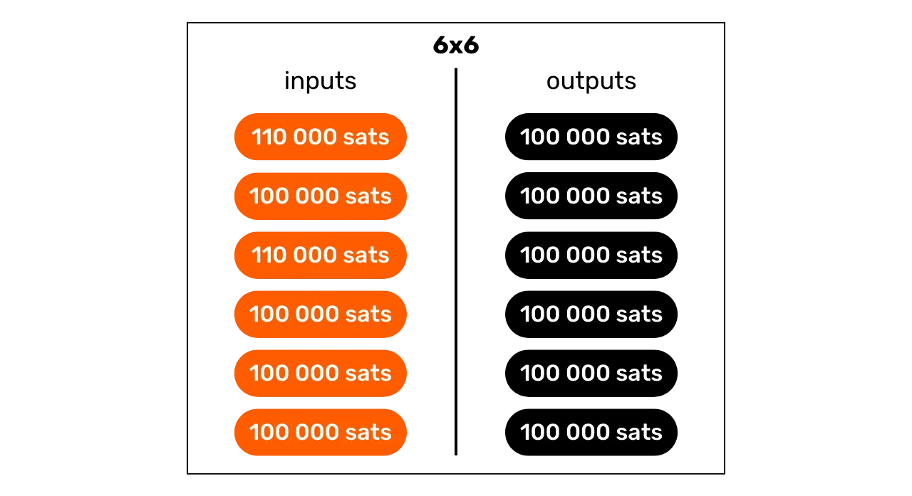


- 7 ulaza i 7 izlaza ;


- 8 ulaza i 8 izlaza.


Model Whirlpool zasnovan je na malim transakcijama CoinJoin. Za razliku od Wabisabi i JoinMarket, gde se robusnost anonseta zasniva na obimu učesnika u jednom ciklusu (ili u nekoliko ciklusa), Whirlpool se oslanja na sekvencu nekoliko malih ciklusa.


U ovom modelu, korisnici plaćaju naknade samo kada se prvi put pridruže bazenu, što im omogućava učešće u mnoštvu remiksa bez dodatnih troškova. Novi učesnici plaćaju Mining naknade za remiksere.


Sa svakim dodatnim CoinJoin u kojem učestvuje neki komad, kao i sa njegovim vršnjacima susretanim u prošlosti, anonseti će eksponencijalno rasti. Cilj je iskoristiti ove besplatne remikse, koji, svaki put kada se dogode, doprinose jačanju gustine anonseta povezanih sa svakim pomešanim komadom.


Whirlpool je dizajniran sa dva važna zahteva na umu:


- Pristupačnost implementacije na mobilnim uređajima, s obzirom na to da je Samourai Wallet pre svega aplikacija za pametne telefone;
- Brzi ciklusi remiksovanja kako bi se podstakao značajan porast anonseta.


Ove imperative su usmeravale izbore koje su doneli programeri Samourai Wallet prilikom dizajniranja Whirlpool, što ih je navelo da ograniče broj učesnika po ciklusu. Premalo učesnika bi ugrozilo efikasnost CoinJoin, drastično smanjujući broj anonsetova generisanih po ciklusu, dok bi previše učesnika izazvalo probleme u upravljanju na mobilnim aplikacijama i ometalo tok ciklusa.


Konačno, nema potrebe imati veliki broj učesnika po CoinJoin na Whirlpool, jer se anonseti prave na akumulaciji nekoliko CoinJoin ciklusa. Najvažniji princip ovde je homogenost UTXO-a svih učesnika, jer to osigurava savršeno mešanje, i stoga punu korist od ciklusa mešanja i ponovnog mešanja.


### CoinJoin bazeni i naknade


Za ove višestruke cikluse kako bi se povećali anonseti mešanih delova, potreban je određeni okvir da ograniči količine korišćenih UTXO-a. Whirlpool definiše različite bazene.


Bazen predstavlja grupu korisnika koji žele da se mešaju zajedno, koji se slažu oko količine UTXO-a koja će se koristiti za optimizaciju CoinJoin procesa uz održavanje savršene homogenosti delova. Svaki bazen specificira fiksnu UTXO količinu, koju korisnik mora poštovati da bi učestvovao. Dakle, da biste napravili coinjoins sa Whirlpool, potrebno je da izaberete bazen. Sledeći bazeni su trenutno dostupni:


- 0.5 bitcoina ;
- 0.05 Bitcoin ;
- 0.01 Bitcoin ;
- 0.001 Bitcoin (= 100,000 Sats).


Kada uđete u bazen sa svojim bitcoinima, oni će biti podeljeni na generate UTXO-e koji su savršeno homogeni sa onima drugih učesnika u bazenu. Svaki bazen ima maksimalni limit, tako da za iznose koji prelaze ovaj limit, moraćete ili da napravite dva odvojena ulaza u isti bazen, ili da pređete u drugi bazen sa većim iznosom:


| Pool (bitcoin) | Maximum amount per entry (bitcoin) |
|----------------|--------------------------------------|
| 0,5 | 35 |
| 0,05 | 3,5 |
| 0,01 | 0,7 |
| 0,001 | 0,025 |

UTXO se smatra da pripada bazenu kada je spreman za integraciju u CoinJoin. Međutim, to ne znači da korisnik gubi vlasništvo nad njim. Kao što smo videli u prvim poglavljima ovog odeljka, kroz različite cikluse mešanja, zadržavate potpunu kontrolu nad svojim ključevima i, shodno tome, nad svojim bitcoinima. Ovo je ono što razlikuje tehniku CoinJoin od drugih centralizovanih tehnika mešanja.


Da biste se pridružili CoinJoin bazenu, potrebno je da platite naknadu za uslugu i Mining naknadu. Naknade za uslugu su fiksne za svaki bazen i namenjene su za nadoknadu timovima odgovornim za razvoj i održavanje Whirlpool.


Naknada za korišćenje Whirlpool plaća se samo jednom kada se pridružite bazenu. Kada se pridružite, možete učestvovati u neograničenom broju remiksa bez dodatnih troškova. Ovde su trenutne fiksne naknade za svaki bazen:


| Pool (bitcoin) | Entry fee (bitcoin) |
|----------------|---------------------------------|
| 0,5 | 0,0175 |
| 0,05 | 0,00175 |
| 0.01 | 0.0005 (50,000 sats) |
| 0.001 | 0.00005 (5,000 sats) |

Ove naknade u suštini funkcionišu kao ulaznica za odabrani bazen, bez obzira na iznos koji uložite u CoinJoin. Dakle, bilo da ulazite u 0.01 bazen sa tačno 0.01 BTC ili 0.5 BTC, naknade će ostati iste u apsolutnim iznosima.


Pre nego što nastavi sa Whirlpool coinjoins, korisnik može da bira između 2 strategije:


- Odluči se za manji bazen kako bi smanjio troškove usluge, znajući da će zauzvrat dobiti nekoliko manjih UTXO-a;
- Ili se odlučite za veći bazen, spremni da platite veće naknade, samo da biste završili sa manjim brojem UTXO-a veće vrednosti.


Generalno nije preporučljivo spajati nekoliko mešanih UTXO-a nakon CoinJoin ciklusa, jer to može ugroziti stečenu poverljivost, posebno zbog zajedničkog ulaza Ownership heuristike (CIOH: *Common-Input-Ownership-Heuristic*). Shodno tome, može imati smisla odabrati veći bazen, čak i ako to znači plaćanje više, kako bi se izbeglo previše UTXO-a male vrednosti u izlazu. Korisnik mora proceniti ove kompromise kako bi odabrao bazen koji mu odgovara.


Pored naknade za uslugu, mora se uzeti u obzir i naknada Mining specifična za bilo koju Bitcoin transakciju. Kao korisnik Whirlpool, bićete obavezni da platite naknadu Mining za pripremnu transakciju (`Tx0`) kao i za prvi CoinJoin. Svi naredni remiksi će biti besplatni, zahvaljujući Whirlpool modelu zasnovanom na plaćanju novih učesnika.


Zapravo, u svakom Whirlpool CoinJoin, 2 korisnika među unosima su novi učesnici. Ostali unosi dolaze od remiksera. Kao rezultat toga, troškove Mining za sve učesnike u transakciji snose ova 2 nova učesnika, koji zatim takođe mogu imati koristi od besplatnih remiksa:


Zahvaljujući ovom sistemu naknada, Whirlpool se zaista izdvaja od drugih implementacija CoinJoin, jer anonseti UTXO-a nisu proporcionalni ceni koju plaća korisnik. Kao rezultat, moguće je postići znatno veće nivoe anonimnosti plaćanjem samo ulazne naknade za pool i naknade Mining za 2 transakcije (`Tx0` i početno mešanje).


Važno je napomenuti da će korisnik takođe morati da plati Mining naknade da bi povukao svoje UTXO-e iz bazena nakon završetka svojih višestrukih coinjoin-a, osim ako nije izabrao opciju `mix to`, koja obezbeđuje eksterni Address koji će primiti sredstva direktno iz CoinJoin, bez dodatnih transakcija.


### HD portfolio računi


Da biste kreirali CoinJoin putem Whirlpool, Wallet mora generate nekoliko odvojenih naloga. Ovo je princip iza ZeroLink protokola. Nalog, u kontekstu HD (*Hierarchical Deterministic*) portfolija, predstavlja deo potpuno izolovan od drugih, pri čemu se ova separacija dešava na nivou treće dubine hijerarhije portfolija, tj. na `xpub` nivou.


HD Wallet može teoretski izvesti do `2^(31)` različitih naloga. Početni nalog, koji se koristi podrazumevano na svim Bitcoin novčanicima, odgovara `0'` indeksu.


Za portfolije prilagođene Whirlpool, koriste se 4 naloga kako bi se zadovoljile potrebe ZeroLink procesa:


- Račun **depozita**, označen indeksom `0'` ;
- Račun **bad bank** (ili "doxxic change"), identifikovan indeksom `2,147,483,644'` ;
- Nalog **premix**, identifikovan indeksom `2 147 483 645'` ;
- Nalog **postmix**, identifikovan indeksom `2 147 483 646'`.


Svaki od ovih naloga ispunjava određenu funkciju u procesu CoinJoin, što ćemo istražiti u narednim odeljcima.


Svi ovi nalozi su povezani sa jednim seed, omogućavajući korisniku da povrati pristup svim svojim bitcoinima koristeći svoju frazu za oporavak i, gde je primenljivo, svoj passphrase. Međutim, tokom operacije oporavka, softver mora biti obavešten o različitim indeksima naloga koji se koriste.


Hajde da pogledamo različite faze Whirlpool CoinJoin unutar ovih naloga.


### TX0


Početna tačka svakog Whirlpool CoinJoin je **depozitni** račun. Ovo je račun koji automatski koristite kada kreirate novi Bitcoin Wallet. Ovaj račun će morati biti kreditiran bitcoinima koje želite da mešate.


Tx0" je prvi korak u procesu mešanja Whirlpool. Njegova svrha je da pripremi i izjednači UTXO-ove za CoinJoin, deleći ih na jedinice koje odgovaraju iznosu odabranog bazena, kako bi se osiguralo homogeno mešanje. Tako izjednačeni UTXO-ovi se zatim šalju na **premix** nalog. Što se tiče razlike koja ne može ući u bazen, ona se odvaja u poseban nalog: **bad bank** (ili "doxxic change").


Ova početna transakcija `Tx0` se takođe koristi za plaćanje naknade za uslugu koja se duguje koordinatoru CoinJoin. Za razliku od sledećih koraka, ova transakcija nije kolaborativna, tako da korisnik mora snositi pun trošak Mining:


U ovom primeru `Tx0` transakcije, ulaz od `372,000 Sats` sa našeg **depozitnog** računa je podeljen na nekoliko izlaznih UTXO-a, koji se razlažu na sledeći način:


- Iznos od `5,000 Sats` za koordinatora za usluge, koji odgovara ulasku u fond od `100,000 Sats`;
- 3 UTXOs pripremljena za mešanje, preusmerena na naš **premix** nalog i registrovana kod koordinatora. Ovi UTXOs su izjednačeni na `108,000 Sats` svaki, kako bi pokrili Mining troškove za njihovo buduće početno mešanje;
- Višak, koji ne može ući u bazen jer je premali, smatra se toksičnim stranim Exchange. On se šalje na svoj specifični račun. Ovde, ovaj Exchange iznosi `40,000 Sats` ;
- Konačno, ostalo je `3,000 Sats`, što ne predstavlja izlaz, već su to troškovi Mining potrebni za potvrdu `Tx0`.


Na primer, evo pravog Whirlpool Tx0 (nije moj): [edef60744f539483d868caff49d4848e5cc6e805d6cdc8d0f9bdbbaedcb5fc46](https://Mempool.space/fr/tx/edef60744f539483d868caff49d4848e5cc6e805d6cdc8d0f9bdbbaedcb5fc46)


### Doksičke promene


Višak koji nije mogao biti integrisan u bazen, ovde ekvivalentan `40,000 Sats`, preusmeren je na račun **loše banke**, takođe poznat kao "doxxic Exchange", kako bi se osigurala stroga odvojenost od ostalih UTXO-a u portfoliju.


Ovaj UTXO je opasan za poverljivost korisnika, jer ne samo da je još uvek vezan za svoju prošlost, a samim tim i moguće za identitet svog vlasnika, već je takođe zabeleženo da pripada korisniku koji je napravio CoinJoin.


Ako se ovaj UTXO spoji sa mešovitim izlazima, potonji će izgubiti svu poverljivost stečenu tokom CoinJoin ciklusa, naročito zbog CIOH (*Common-Input-Ownership-Heuristic*). Ako se spoji sa drugim doxxic promenama, korisnik rizikuje gubitak poverljivosti, jer će povezati različite unose CoinJoin ciklusa. Stoga ga treba tretirati sa oprezom. Detaljnije ćemo razmotriti upravljanje ovim doxxic UTXOs u poslednjem delu ovog poglavlja.


### Početna mešavina


Nakon `Tx0`, izjednačeni UTXO-i se šalju na naš **premix** račun portfolija, spremni da budu uvedeni u njihov prvi CoinJoin ciklus, poznat i kao "početno mešanje". Ako, kao u našem primeru, `Tx0` generiše nekoliko UTXO-a za mešanje, svaki od njih će biti integrisan u zasebno početno mešanje.


Na kraju ovih prvih mešanja, **premix** račun će biti prazan, dok će naši novčići, nakon plaćanja Mining naknada za ovaj prvi CoinJoin, biti prilagođeni tačno na iznos definisan odabranim bazenom. U našem primeru, naši početni UTXO-i od `108,000 Sats` će biti smanjeni tačno na `100,000 Sats`.


### Remiksi


Nakon početnog mešanja, UTXO-i se prenose na **postmix** nalog. Ovaj nalog prikuplja UTXO-e koji su već pomešani i one koji čekaju ponovno mešanje. Kada je Whirlpool korisnik aktivan, UTXO-i koji se nalaze na **postmix** nalogu automatski su dostupni za ponovno mešanje i biće nasumično odabrani da učestvuju u ovim novim ciklusima.


Kao podsetnik, remiksi su tada 100% besplatni: nisu potrebne dodatne usluge ili Mining naknade. Čuvanje UTXO-a na **postmix** računu stoga zadržava njihovu vrednost netaknutom i istovremeno poboljšava njihove anonsete. Zato je važno omogućiti ovim kovanicama da učestvuju u nekoliko CoinJoin ciklusa. To vas apsolutno ništa ne košta, a povećava nivo njihove anonimnosti.


Kada odlučite da potrošite mešane UTXO-e, možete to učiniti direktno sa ovog **postmix** naloga. Savetujemo vam da držite mešane UTXO-e na ovom nalogu kako biste iskoristili besplatne remikse i sprečili ih da napuste Whirlpool krug, što bi moglo smanjiti njihovu poverljivost.


### Kako upravljate svojim postmiksovima?


Nakon pokretanja CoinJoin ciklusa, najbolja strategija je da zadržite svoje UTXO-ove na **postmix** računu, čekajući buduću upotrebu. Čak je preporučljivo da ih pustite da se neograničeno remiksuju dok ih ne budete trebali potrošiti.


Neki korisnici bi mogli razmotriti prebacivanje svojih mešanih bitkoina na Wallet osiguran Hardware Wallet. Ovo je moguće, ali je važno pažljivo pratiti preporuke Samourai Wallet kako se ne bi ugrozila stečena poverljivost.


Spajanje UTXO-a je najčešća greška. Da biste izbegli CIOH (*Common-Input-Ownership-Heuristic*), morate izbegavati kombinovanje mešanih UTXO-a sa nemješanim UTXO-ima u istoj transakciji. Ovo zahteva pažljivo upravljanje vašim UTXO-ima unutar vašeg portfolija, posebno u smislu označavanja.


Takođe, mora se voditi računa prilikom konsolidacije mešanih UTXO-a. Umerena konsolidacija je moguća ako vaši mešani UTXO-i imaju značajne anonsete, ali će to neizbežno smanjiti poverljivost vaših delova. Uverite se da konsolidacije nisu previše opsežne, niti se sprovode nakon nedovoljnog broja remiksa, uz rizik od uspostavljanja deduktivnih veza između vaših UTXO-a pre i posle CoinJoin ciklusa. Kada ste u nedoumici oko ovih manipulacija, najbolja praksa je da ne konsolidujete postmix UTXO-e, već da ih prenosite jedan po jedan na vaš Hardware Wallet, generišući svaki put novi prazan Address. Još jednom, zapamtite da označite svaki UTXO koji primite.


Takođe nije preporučljivo prebacivati svoje postmix UTXO-e na Wallet koristeći skripte koje nisu široko korišćene. Na primer, ako uđete u Whirlpool sa Multisig Wallet koristeći `P2WSH` skripte, mala je verovatnoća da ćete biti pomešani sa drugim korisnicima koji su prvobitno imali isti tip Wallet. Ako ponovo mešate svoje postmixe na ovaj isti Multisig Wallet, nivo poverljivosti vaših pomešanih bitcoina će biti znatno smanjen. Pored skripti, postoje mnogi drugi otisci Wallet koji vam mogu napraviti probleme.


Kao i kod svake Bitcoin transakcije, takođe je važno ne koristiti ponovo prijemni Address. Svaka nova transakcija mora biti primljena na novom, praznom Address.


Najjednostavnije i najsigurnije rešenje je da ostavite svoje mešane UTXO-ove u mirovanju na njihovom **postmix** računu, dopuštajući im da se ponovo mešaju i dodirujući ih samo za trošenje. Samurai i Sparrow novčanici imaju dodatne zaštite protiv svih ovih rizika analize lanca. Ove zaštite vam pomažu da izbegnete pravljenje grešaka.


### Kako upravljate toksičnim razmenama?


Dalje, treba da budete pažljivi u vezi sa upravljanjem doxxic Exchange, Exchange koji nije ušao u CoinJoin pool. Ovi toksični UTXO-i, koji su rezultat korišćenja Whirlpool, predstavljaju rizik za vašu privatnost, jer uspostavljaju vezu između vas i korisnika CoinJoin. Stoga je neophodno upravljati njima pažljivo i ne kombinovati ih sa drugim UTXO-ima, posebno sa mešanim UTXO-ima.


Evo nekoliko strategija za njihovo korišćenje:


- Pomešajte ih u manje bazene:** Ako vaš toksični UTXO može stati u manji bazen sam po sebi, razmislite o mešanju. Ovo je često najbolja opcija. Međutim, nije preporučljivo spajati nekoliko toksičnih UTXO-a da biste pristupili bazenu, jer to može povezati vaše različite unose;
- Označite ih kao "nepotrošive":** Drugi pristup je da ih prestanete koristiti, označite ih kao "nepotrošive" na njihovom posebnom računu, i samo HODL. Ovo osigurava da ih slučajno ne potrošite. Ako vrednost Bitcoin poraste, mogu se pojaviti novi bazeni koji su pogodniji za vaše toksične UTXO-e;
- Donirajte:** Razmislite o donacijama, koliko god skromne bile, programerima koji rade na Bitcoin i srodnom softveru. Takođe možete donirati udruženjima koja prihvataju BTC. Ako vam se čini da je upravljanje vašim toksičnim UTXO-ima previše komplikovano, jednostavno ih se možete rešiti i napraviti donaciju;
- Kupite poklon kartice:** Platforme kao što je [Bitrefill](https://www.bitrefill.com/) omogućavaju vam da Exchange bitkoine za poklon kartice koje se mogu koristiti kod različitih trgovaca. Ovo može biti način da se oslobodite svojih toksičnih UTXO-a bez gubitka povezane vrednosti;
- Konsolidujte ih na Monero:** Samourai Wallet nudi uslugu atomskih zamena između BTC i XMR. Ovo je idealno za upravljanje toksičnim UTXO-ima konsolidovanjem na Monero, bez ugrožavanja vaše poverljivosti putem CIOH, pre nego što ih pošaljete nazad na Bitcoin. Međutim, ova opcija može biti skupa u smislu Mining naknada i premije zbog ograničenja likvidnosti;
- Pošalji ih na Lightning Network:** Prebacivanje ovih UTXO-a na Lightning Network radi smanjenja troškova transakcija može biti privlačna opcija. Međutim, ova metoda može otkriti određene informacije u zavisnosti od toga kako koristite Lightning, te bi stoga trebalo da se koristi s oprezom.


### Kako da koristim Whirlpool?


Nakon hapšenja osnivača Samourai Wallet i zaplene njihovih servera 24. aprila 2024. godine, alat Whirlpool više ne radi, čak ni za one sa sopstvenim Dojo-om. Prethodno je bio dostupan na Samourai Wallet i Sparrow Wallet.


Međutim, ostaje mogućnost da će ovaj alat biti ponovo aktiviran u narednim nedeljama, u zavisnosti od ishoda ispitivanja, ili ponovo pokrenut na drugačiji način. U svakom slučaju, ne mislim da će tržište Bitcoin CoinJoin dugo biti bez Supply, jer potražnja postoji. Štaviše, pošto je model Whirlpool najnapredniji u smislu poverljivosti, sigurno će biti model izbora za druge implementacije u budućnosti.


Pažljivo pratimo ovaj slučaj i razvoj povezanih alata. Budite sigurni da ćemo ažurirati ovaj kurs obuke čim nove informacije budu dostupne.


U sledećem poglavlju saznaćemo šta su "anonsets", kako se ovi indikatori izračunavaju i kako nam mogu pomoći da procenimo efikasnost CoinJoin ciklusa.


https://planb.network/tutorials/privacy/on-chain/coinjoin-sparrow-wallet-84def86d-faf5-4589-807a-83be60720c8b

https://planb.network/tutorials/privacy/on-chain/coinjoin-samourai-wallet-e566803d-ab3f-4d98-9136-5462009262ef

https://planb.network/tutorials/privacy/on-chain/coinjoin-dojo-c4b20263-5b30-4c74-ae59-dc8d0f8715c2

## Skupovi anonimnosti


<chapterId>be1093dc-1a74-40e5-9545-2b97a7d7d431</chapterId>


Proučivši kako coinjoin-ovi funkcionišu i probleme koji su uključeni u efikasno mešanje, sada ćemo saznati kako meriti njihovu efikasnost. Kako možemo odrediti da li je coinjoining proces bio efikasan i koji stepen anonimnosti je deo stekao? To je ono što ćemo saznati u ovom poglavlju sa skupovima anonimnosti ili "anonsetovima".


### Podsetnik o korisnosti CoinJoin


Korisnost CoinJoin leži u njegovoj sposobnosti da proizvede uverljivu poricljivost, tako što će vaš deo ugraditi unutar grupe neodvojivih delova. Cilj ove akcije je da prekine veze sledljivosti, kako iz prošlosti ka sadašnjosti, tako i iz sadašnjosti ka prošlosti.


Drugim rečima, analitičar koji zna vašu početnu transakciju (`Tx0`) na ulazu u CoinJoin cikluse ne bi trebalo da može sa sigurnošću da identifikuje vaš UTXO na izlazu iz remix ciklusa (analiza od ulaza do izlaza iz ciklusa).


Suprotno tome, analitičar koji poznaje vaš UTXO na izlazu iz CoinJoin ciklusa ne sme biti u mogućnosti da odredi originalnu transakciju na ulazu u cikluse (analiza izlaza ciklusa do ulaza u ciklus).


Da bismo procenili koliko je analitičaru teško da poveže prošlost sa sadašnjošću i obrnuto, potrebno je kvantifikovati veličinu grupa homogenih delova unutar kojih je vaš deo skriven. Ova mera nam govori koliko analiza ima istu verovatnoću. Dakle, ako je tačna analiza potopljena među 3 druge analize jednake verovatnoće, vaš nivo prikrivanja je veoma nizak. S druge strane, ako se tačna analiza nalazi unutar skupa od 20.000 jednako verovatnih analiza, vaš deo je veoma dobro skriven. Veličina ovih grupa predstavlja indikatore poznate kao "anonsets".


### Razumevanje anonseta


Anonseti se koriste kao indikatori za procenu stepena poverljivosti određenog UTXO. Tačnije, oni mere broj neodvojivih UTXO-a unutar skupa koji uključuje deo koji se proučava. Zahtev za homogenim skupom UTXO-a znači da se anonseti obično izračunavaju na CoinJoin ciklusima. Upotreba ovih indikatora je posebno relevantna za Whirlpool coinjoint-e, zbog njihove uniformnosti.


Ako je potrebno, anonsetovi se mogu koristiti za procenu kvaliteta coinjoin-ova. Veliki anonset znači visok nivo anonimnosti, jer postaje teško razlikovati određeni UTXO unutar homogenog skupa.


Postoje 2 tipa anonseta:


- Prospective anonset ;**
- Retrospektivna anonset.**


### Perspektivni anonset


Forward-looking anonset označava veličinu grupe među kojom je UTXO proučavan na kraju ciklusa skriven, s obzirom na UTXO na početku, tj. broj neodvojivih delova prisutnih unutar ove grupe. Naziv ovog indikatora je "forward-looking metrics".


Ovaj indikator meri otpornost poverljivosti prostorije na analizu od prošlosti do sadašnjosti (od ulaza do izlaza).


Ova metrika se koristi za procenu u kojoj meri je vaš UTXO zaštićen od pokušaja rekonstrukcije njegove istorije od tačke ulaska do tačke izlaska u procesu CoinJoin.


Na primer, ako je vaša transakcija učestvovala u svom prvom CoinJoin ciklusu i dva dodatna opadajuća ciklusa su završena, očekivani anonset vašeg novčića bi bio `13` :


Na primer, zamislimo da naš novčić na početku CoinJoin ciklusa ima perspektivni anonset od `86,871`. U praktičnom smislu, to znači da je skriven među `86,871` neodvojivih delova. Za spoljnog posmatrača koji zna za ovaj novčić na početku CoinJoin ciklusa i pokušava da prati njegov izlaz, suočiće se sa `86,871` mogućih UTXO-a, od kojih svaki ima identičnu verovatnoću da bude novčić koji traži.


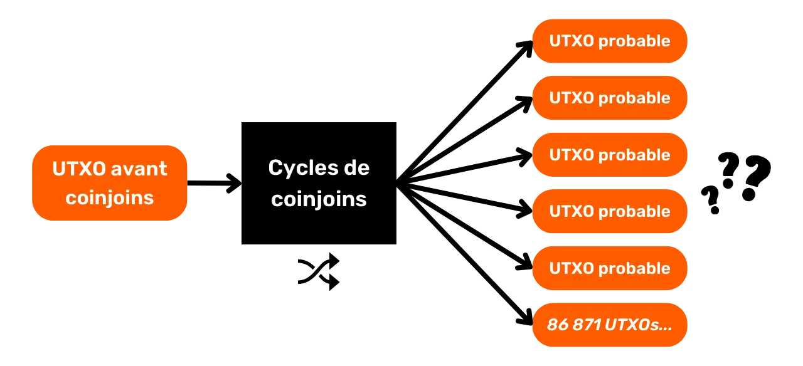


### Retrospektivni anonset


Retrospektivni anonset ukazuje na broj mogućih izvora za dati deo, znajući UTXO na kraju ciklusa. Ovaj indikator meri otpornost poverljivosti dela na analizu od sadašnjosti ka prošlosti (od izlaza ka ulazu), tj. koliko je analitičaru teško da prati vaš deo nazad do njegovog porekla, pre ciklusa CoinJoin. Naziv ovog indikatora je "unazadni anonset", ili "metrike usmerene unazad".


Poznavajući vaš UTXO na izlazu iz ciklusa, retrospektivni anonset određuje broj potencijalnih Tx0 transakcija koje su mogle predstavljati vaš ulazak u CoinJoin cikluse. Na dijagramu ispod, ovo odgovara zbiru svih narandžastih mehurića.


Na primer, zamislimo da naš deo CoinJoin ima retrospektivni anonset od `42,185`. U praktičnim terminima, to znači da postoji `42,185` potencijalnih izvora za ovaj UTXO. Ako eksterni posmatrač identifikuje ovaj novčić na kraju ciklusa i pokuša da prati njegovo poreklo, suočiće se sa `42,185` mogućih izvora, svi sa jednakom verovatnoćom da budu traženo poreklo.


### Kako se izračunavaju anonseti?


Moguće je ručno izračunati anonsete koristeći Block explorer za male ansamble. Međutim, za veće anonsete, upotreba specijalizovanog alata postaje neophodna. Koliko ja znam, jedini softver sposoban za obavljanje ovog zadatka je *Whirlpool Stats Tool*, Python alat razvijen od strane Samourai i OXT timova. Nažalost, ovaj alat je trenutno van funkcije nakon hapšenja osnivača Samourai i prekida OXT-a, koji je korišćen za ekstrakciju podataka iz Blockchain.


Kao što smo videli u ovom poglavlju, anonseti se mogu izračunati samo ako postoji određena homogenost u strukturi CoinJoin. U sledećem poglavlju, saznaćemo kako kvantifikovati ovu homogenost na Bitcoin transakciji, bilo da je to CoinJoin ili tradicionalnija transakcija.


https://planb.network/tutorials/privacy/analysis/wst-anonsets-0354b793-c301-48af-af75-f87569756375

## Entropija


<chapterId>e4fe289d-618b-49a2-84c9-68c562e708b4</chapterId>


Kao što smo videli u ovom odeljku o coinjoins, homogenost UTXO-a u ulazu i izlazu igra važnu ulogu u poboljšanju poverljivosti Bitcoin transakcije. Ovaj parametar stvara verodostojnu poricljivost u suočavanju sa Blockchain analizom. Nekoliko metoda se može koristiti za merenje ove homogenosti, ali jedna od najefikasnijih, po mom mišljenju, je korišćenje indikatora koje pruža alat *Boltzmann*, razvijen od strane OXT i Samourai Wallet timova, a posebno entropija transakcije. Ovo ćemo detaljno razmotriti u ovom poglavlju.


Za razliku od anonsetova, koji se računaju na skupu transakcija, indikatori predstavljeni ovde fokusiraju se na jednu transakciju, bilo da je to CoinJoin ili tradicionalnija transakcija.


### Broj interpretacija


Prvi indikator koji se može uočiti na Bitcoin transakciji je ukupan broj mogućih interpretacija sa kojima se suočava analiza spoljnog posmatrača. Uzimajući u obzir vrednosti UTXO-a uključenih u transakciju, ovaj indikator pokazuje broj načina na koje se ulazi mogu povezati sa izlazima. Drugim rečima, on određuje broj mogućih interpretacija koje transakcija može izazvati u Bitcoin tokovima sa stanovišta spoljnog posmatrača koji je analizira.


Na primer, jednostavna platna transakcija sa 1 ulazom i 2 izlaza imaće samo jedno tumačenje, naime da je ulaz #0 finansirao izlaz #0 i izlaz #1. Ne postoji drugo moguće tumačenje:


S druge strane, Whirlpool 5x5 ugao ima $1\,496$ mogućih kombinacija:


Whirlpool Surge Cycle 8x8 CoinJoin ima $9\,934\,563$ mogućih interpretacija:


### Entropija


Iz broja interpretacija Bitcoin transakcije, možemo izračunati njenu entropiju.


U opštem kontekstu kriptografije i informacija, entropija je kvantitativna mera nesigurnosti ili nepredvidljivosti povezane sa izvorom podataka ili slučajnim procesom. Drugim rečima, entropija je način merenja koliko je teško predvideti ili pogoditi neki deo informacije.


U specifičnom kontekstu analize Blockchain, entropija je takođe naziv indikatora, izvedenog iz Shannonove entropije i [izumljenog od strane LaurentMT](https://gist.github.com/LaurentMT/e758767ca4038ac40aaf), koji se može izračunati na transakciji Bitcoin.


Kada transakcija predstavlja veliki broj mogućih interpretacija, često je relevantnije pozvati se na njenu entropiju. Ovaj indikator meri nedostatak znanja analitičara o tačnoj konfiguraciji transakcije. Drugim rečima, što je veća entropija, to postaje teže za analitičare da identifikuju tok bitkoina između ulaza i izlaza.


U praksi, entropija otkriva da li, sa stanovišta spoljnog posmatrača, transakcija predstavlja više mogućih interpretacija, zasnovanih isključivo na količinama ulaza i izlaza, bez uzimanja u obzir drugih spoljašnjih ili unutrašnjih obrazaca i heuristika. Visoka entropija je stoga sinonim za veću poverljivost transakcije.


Entropija je definisana kao binarni logaritam broja mogućih kombinacija. Evo formule koja se koristi sa $E$ entropijom transakcije i $C$ brojem mogućih interpretacija:


$$
E = \log_2(C)
$$


U matematici, binarni logaritam (logaritam sa bazom 2) je inverzna operacija eksponenciranja broja 2. Drugim rečima, binarni logaritam od $x$ je eksponent na koji se $2$ mora podići da bi se dobilo $x$. Ovaj pokazatelj se stoga izražava u bitovima.


Uzmimo primer izračuna entropije za transakciju CoinJoin strukturisanu prema Whirlpool 5x5 modelu, koji, kao što je pomenuto u prethodnom odeljku, ima broj mogućih interpretacija od $1\,496$ :


$$
\begin{align*}
C &= 1\,496 \\
E &= \log_2(1\,496) \\
E &= 10.5469 \text{ bits}
\end{align*}
$$


Dakle, ova transakcija CoinJoin ima entropiju od $10.5469$ bita, što se smatra veoma zadovoljavajućim. Što je ova vrednost viša, to više različitih interpretacija transakcija dopušta, čime se pojačava njen nivo poverljivosti.


Za CoinJoin 8x8 transakciju sa $9\,934\,563$ interpretacija, entropija bi bila :


$$
\begin{align*}
C &= 9\,934\,563 \\
E &= \log_2(9\,934\,563) \\
E &= 23.244 \text{ bits}
\end{align*}
$$


Hajde da uzmemo još jedan primer sa klasičnom transakcijom plaćanja, sa 1 ulazom i 2 izlaza: [1b1b0c3f0883a99f1161c64da19471841ed12a1f78e77fab128c69a5f578ccce](https://Mempool.space/tx/1b1b0c3f0883a99f1161c64da19471841ed12a1f78e77fab128c69a5f578ccce)


U slučaju ove transakcije, jedina moguća interpretacija je: `(In.0) > (Out.0 ; Out.1)`. Posledično, njena entropija je $0$ :


$$
\begin{align*}
C &= 1 \\
E &= \log_2(1) \\
E &= 0 \text{ bits}
\end{align*}
$$


### Efikasnost


Na osnovu entropije transakcije, možemo takođe izračunati njenu efikasnost u smislu poverljivosti. Ovaj indikator procenjuje efikasnost transakcije poređenjem sa optimalnom transakcijom koja bi se mogla zamisliti u identičnoj konfiguraciji.


Ovo nas dovodi do koncepta maksimalne entropije, koja odgovara najvećoj entropiji koju određena struktura transakcije teoretski može postići. Efikasnost transakcije se zatim izračunava poređenjem ove maksimalne entropije sa stvarnom entropijom transakcije koja se analizira.


Formula koja se koristi je sledeća sa:


- e_R$: stvarna entropija transakcije izražena u bitovima;
- e_M$: maksimalna moguća entropija za strukturu transakcije, takođe izražena u bitovima;
- $Ef$: efikasnost transakcije u bitovima :


$$
Ef = E_R - E_M
$$


Na primer, za strukturu Whirlpool 5x5 CoinJoin, maksimalna entropija je $10.5469$ :


$$
\begin{align*}
E_R &= 10.5469 \\
E_M &= 10.5469 \\
Ef &= E_R - E_M \\
Ef &= 10.5469 - 10.5469 \\
Ef &= 0 \text{ bits}
\end{align*}
$$


Ovaj indikator je takođe izražen kao procenat. Formula koja se koristi je sledeća: :


- c_R$ : broj mogućih realnih interpretacija ;
- c_M$: maksimalan broj mogućih interpretacija iste strukture;
- $Ef$: efikasnost izražena kao procenat:


$$
\begin{align*}
E_f &= \frac{C_R}{C_M} \\
E_f &= \frac{1\,496}{1\,496} \\
E_f &= 100 \%
\end{align*}
$$


Efikasnost od $100 ukazuje na to da transakcija maksimalno koristi svoj potencijal poverljivosti, u zavisnosti od njene strukture.


### Gustina entropije


Entropija je dobar pokazatelj za merenje poverljivosti transakcije, ali delimično zavisi od broja ulaza i izlaza u transakciji. Da bismo uporedili entropiju 2 različite transakcije sa različitim brojem ulaza i izlaza, možemo izračunati gustinu entropije. Ovaj pokazatelj pruža perspektivu o entropiji u odnosu na svaki ulaz ili izlaz transakcije. Gustina je korisna za procenu i poređenje efikasnosti transakcija različitih veličina.


Da bismo to izračunali, jednostavno delimo ukupnu entropiju transakcije sa ukupnim brojem ulaza i izlaza uključenih u transakciju:


- e_D$: gustina entropije izražena u bitovima;
- e$: entropija transakcije izražena u bitovima;
- t$: ukupan broj ulaza i izlaza u transakciji:


$$
E_D = \frac{E}{T}
$$


Uzmimo primer Whirlpool 5x5 CoinJoin:


$$
\begin{align*}
T &= 5 + 5 = 10 \\
E &= 10.5469 \\
E_D &= \frac{E}{T} \\
E_D &= \frac{10.5469}{10} \\
E_D &= 1.054 \text{ bits}
\end{align*}
$$


Hajde da izračunamo gustinu entropije za 8x8 Whirlpool CoinJoin:


$$
\begin{align*}
T &= 8 + 8 = 16 \\
E &= 23.244 \\
E_D &= \frac{E}{T} \\
E_D &= \frac{23.244}{16} \\
E_D &= 1.453 \text{ bits}
\end{align*}
$$


Analizom entropijsku gustinu ove dve vrste CoinJoin, postaje jasno da, čak i kada se entropija normalizuje brojem Elements, "Surge Cycle 8x8" CoinJoin generiše više nesigurnosti za analizu.


### Boltzmannov skor


Još jedan deo informacija analiziranih u transakciji je Boltzmann-ov skor svakog elementa u odnosu na drugi. Ovo je tabela verovatnoća podudaranja između ulaza i izlaza. Ova tabela pokazuje, kroz Boltzmann-ov skor, uslovnu verovatnoću da je određeni ulaz povezan sa datim izlazom. To je, dakle, kvantitativna mera uslovne verovatnoće da će se desiti asocijacija između ulaza i izlaza u transakciji, zasnovana na odnosu broja povoljnih pojava ovog događaja prema ukupnom broju mogućih pojava, u skupu interpretacija.


Koristeći primer Whirlpool CoinJoin, tabela uslovne verovatnoće bi istakla šanse za vezu između svakog ulaza i izlaza, nudeći kvantitativnu meru nejasnoće asocijacija u transakciji:


| % | Output 0 | Output 1 | Output 2 | Output 3 | Output 4 |
| ------- | -------- | -------- | -------- | -------- | -------- |
| Input 0 | 34% | 34% | 34% | 34% | 34% |
| Input 1 | 34% | 34% | 34% | 34% | 34% | 34% | Input 1
| Input 2 | 34% | 34% | 34% | 34% | 34% | 34% | 34% | 34% | 34% | 34% | 34% | 34% | 34% | 34% | 34
| Input 3 | 34% | 34% | 34% | 34% | 34% | 34% | Input 3
| Input 4 | 34% | 34% | 34% | 34% | 34% | 34% | 34% | 34% | 34% | 34% | 34% | 34% | 34% | 34% | 34

Jasno je da svaki ulaz ima jednake šanse da bude povezan sa bilo kojim izlazom, što pojačava poverljivost transakcije.


Boltzmannov skor se izračunava deljenjem broja interpretacija u kojima se određeni događaj dešava sa ukupnim brojem dostupnih interpretacija. Dakle, da bismo odredili skor koji povezuje ulaz #0 sa izlazom #3 (događaj prisutan u $512$ interpretacija), postupamo na sledeći način:


$$
\begin{align*}
\text{Interpretations (IN.0 > OUT.3)} &= 512 \\
\text{Interpretations totales} &= 1496 \\
\text{Score} &= \frac{512}{1496} \\
\text{Score} &= 34 \%
\end{align*}
$$


Ako uzmemo primer Whirlpool 8x8 Surge Cycle CoinJoin, Boltzmannova tabela bi izgledala ovako:


| OUT.0 | OUT.1 | OUT.2 | OUT.3 | OUT.4 | OUT.5 | OUT.6 | OUT.7 |
|-------|-------|-------|-------|-------|-------|-------|-------|-------|
| IN.0 | 23% | 23% | 23% | 23% | 23% | 23% | 23% | 23% |
| IN.1 | 23% | 23% | 23% | 23% | 23% | 23% | 23% | 23% |
| IN.2 | 23% | 23% | 23% | 23% | 23% | 23% | 23% | 23% |
| IN.3 | 23% | 23% | 23% | 23% | 23% | 23% | 23% | 23% |
| IN.4 | 23% | 23% | 23% | 23% | 23% | 23% | 23% | 23% |
| IN.5 | 23% | 23% | 23% | 23% | 23% | 23% | 23% | 23% |
| IN.6 | 23% | 23% | 23% | 23% | 23% | 23% | 23% | 23% |
| IN.7 | 23% | 23% | 23% | 23% | 23% | 23% | 23% | 23% |

Međutim, u slučaju jednostavne transakcije sa jednim ulazom i 2 izlaza, situacija je drugačija:


| Output 0 | Output 1 |
|---------|----------|----------|
| Input 0 | 100% | 100% |

Ovde vidimo da je verovatnoća da svaki izlaz potiče iz ulaza #0 100%. Niža verovatnoća stoga odražava veću poverljivost, razvodnjavajući direktne veze između ulaza i izlaza.


### Determinističke veze


Takođe možemo izračunati broj determinističkih veza u transakciji. Ovaj indikator otkriva koliko je veza između ulaza i izlaza u analiziranoj transakciji neupitno, sa verovatnoćom od 100%. Ovaj indikator se zatim može dopuniti izračunavanjem odnosa determinističkih veza. Odnos pruža perspektivu o težini ovih determinističkih veza unutar ukupnih veza transakcije.


Na primer, transakcija Whirlpool CoinJoin nema determinističke veze između ulaza i izlaza, i stoga prikazuje indikator od 0 veza i odnos od 0%. Suprotno tome, u našoj drugoj jednostavnoj ispitanoj transakciji plaćanja (sa jednim ulazom i 2 izlaza), indikator nam pokazuje da postoje 2 determinističke veze, a odnos dostiže 100%. Drugim rečima, indikator nula ukazuje na odličnu poverljivost, zahvaljujući odsustvu direktnih i neospornih veza između ulaza i izlaza.


### Kako se izračunavaju ovi indikatori?


Izračunavanje ovih indikatora ručno koristeći jednačine koje sam obezbedio je relativno jednostavno. Teškoća leži uglavnom u određivanju broja mogućih interpretacija transakcije. Za klasičnu transakciju, ovaj proračun se može uraditi ručno. Međutim, za CoinJoin, zadatak je mnogo složeniji.


Ranije je postojao Python alat pod nazivom _Boltzmann Calculator_, razvijen od strane OXT i Samourai timova, koji je automatski izračunavao sve ove indikatore za Bitcoin transakciju :


Bilo je moguće koristiti i vebsajt KYCP.org za ove analize:


Nažalost, nakon hapšenja osnivača Samourai-a, ovi alati više nisu operativni.


Sada kada smo detaljno obradili coinjoin-e, pogledaćemo druge tehnike privatnosti dostupne na Bitcoin u poslednjem delu našeg kursa. Pogledaćemo payjoin-e, specifične pseudo-CoinJoin tipove transakcija, statične Address protokole, kao i mere za jačanje poverljivosti ne na nivou samih transakcija, već na nivou mreže čvorova.


https://planb.network/tutorials/privacy/analysis/boltzmann-entropy-738e45af-18a6-4ce6-af1a-1bf58e15f1fe

# Razumevanje izazova drugih naprednih tehnika poverljivosti


<partId>19989ae6-d608-4acf-b698-2cf1e7e5e6ae</partId>


## PayJoin transakcije


<chapterId>c1e90b95-f709-4574-837b-2ec26b11286f</chapterId>


CoinJoin je trenutno najefikasnija metoda za uvođenje nesigurnosti u praćenje delova u analizi lanca. Kao što smo videli u prethodnim poglavljima, da bi se dobila mešavina visokih performansi, ulazi i izlazi moraju biti što homogeniji. Pored toga, važno je da delovi budu integrisani u što veću grupu kako bi se maksimizirala anonimnost. Dakle, da bi coinjoini bili efikasni, moraju uključivati veliki broj uniformnih delova. Ovaj mnoštvo zahteva znači da transakcije CoinJoin imaju veoma rigidnu strukturu: iznosi su unapred fiksirani, i svi učesnici moraju ih se pridržavati kako bi se garantovala uniformnost procesa. Pored toga, coinjoini zahtevaju sinhronizaciju između svih učesnika i koordinatora tokom konstrukcije transakcije.


Ovi zahtevi čine CoinJoin nepogodnim za direktna plaćanja. Na primer, ako imate 1M Sats novčić u CoinJoin bazenu, korišćenje istog direktno kao plaćanje bilo bi složeno. To bi zahtevalo sinhronizaciju sa ostalim učesnicima i koordinatorom kako bi se izgradila kolaborativna transakcija tačno u trenutku kada treba da izvršite plaćanje, a iznos kupovine bi morao tačno da odgovara vrednosti vašeg novčića, što je praktično neizvodljivo. CoinJoin transakcija je stoga po svojoj prirodi kolaborativna transakcija čišćenja, tj. obično su isti vlasnici ulaza koje nalazimo u izlazima.


Međutim, bilo bi zanimljivo imati strukture transakcija koje omogućavaju plaćanja na praktičan način, dok istovremeno uvode sumnju u analizu lanca. Upravo ćemo to razmatrati u ovom poglavlju i sledećem.


### Šta je PayJoin transakcija?


PayJoin je specifična struktura transakcije Bitcoin koja poboljšava privatnost korisnika prilikom trošenja kroz saradnju sa primaocem plaćanja.


Godine 2015. LaurentMT je prvi put pomenuo ovu metodu pod nazivom "*steganographic transactions*", prema dokumentu dostupnom [ovde](https://gist.githubusercontent.com/LaurentMT/e758767ca4038ac40aaf/raw/c8125f6a3c3d0e90246dc96d3b603690ab6f1dcc/gistfile1.txt). Ovu tehniku je kasnije usvojio novčanik Samourai Wallet, koji je 2018. postao prvi klijent koji ju je implementirao pomoću alata Stowaway. Koncept payjoin-a se takođe može naći u [BIP79](https://github.com/bitcoin/bips/blob/master/bip-0079.mediawiki), [BIP78](https://github.com/bitcoin/bips/blob/master/bip-0078.mediawiki) i [BIP77](https://payjoin.org/docs/how-it-works/payjoin-v2-bip-77/). Više izraza se koristi za označavanje payjoin-a:

- PayJoin ;
- Slepi putnik;
- P2EP (*Pay-to-End-Point*) ;
- Steganografska transakcija.


Posebna karakteristika PayJoin leži u njegovoj sposobnosti da generate transakciju koja na prvi pogled izgleda obično, ali je zapravo mini CoinJoin između dve osobe. Da bi se to postiglo, struktura transakcije uključuje primaoca uplate u ulazima zajedno sa stvarnim pošiljaocem. Primalac tako uključuje uplatu sebi usred transakcije, što mu omogućava da bude plaćen.


Hajde da uzmemo primer kako bismo bolje razumeli ovaj proces. Alisa kupuje baget za 4,000 Sats koristeći UTXO od 10,000 Sats i odlučuje se za PayJoin. Njen pekar, Bob, dodaje UTXO od 15,000 Sats koji pripada njemu kao ulaz, koji u potpunosti povrati kao izlaz, pored Alisinih 4,000 Sats.


U ovom primeru, Bob pekar unosi 15,000 Sats kao ulaz i izlazi sa 19,000 Sats, pri čemu je razlika tačno 4,000 Sats, tj. cena bageta. Sa Alisine strane, ona unosi 10,000 Sats i završava sa 6,000 Sats kao izlaz, što predstavlja saldo od -4,000 Sats, tj. cena bageta. Da bih pojednostavio primer, namerno sam izostavio troškove Mining u ovoj transakciji.


### Čemu služi PayJoin?


Transakcija PayJoin ispunjava dva cilja, omogućavajući korisnicima da poboljšaju poverljivost svoje uplate.


Prvo, PayJoin ima za cilj da zavara spoljnog posmatrača stvaranjem mamca u analizi lanca. Ovo je omogućeno CIOH heuristikom (*Common Input Ownership Heuristic*). Kao što smo videli u delu 3, obično, kada transakcija na Blockchain ima nekoliko ulaza, pretpostavlja se da svi ti ulazi pripadaju istom entitetu ili korisniku.


Dakle, kada analitičar ispituje transakciju PayJoin, on ili ona je naveden(a) da veruje da svi ulazi dolaze od iste osobe. Međutim, ova percepcija je pogrešna, jer primalac takođe doprinosi ulazima zajedno sa stvarnim platiocem. Analiza lanca je stoga usmerena ka interpretaciji koja se ispostavlja kao pogrešna.


Hajde da uzmemo naš primer transakcije PayJoin za plaćanje bageta:


Videći ovu transakciju na Blockchain, spoljašnji posmatrač koji prati uobičajene heuristike analize Blockchain bi napravio sledeću interpretaciju: "*Alice je spojila 2 UTXO-a kao ulaze u transakciju kako bi platila 19,000 Sats Bobu*".


Ovo tumačenje je očigledno netačno, jer kao što već znate, dva UTXO-a u ulazima ne pripadaju istoj osobi. Jedan dolazi od Alise, kupca bageta, a drugi od Boba, pekara.


Na ovaj način, analiza spoljnog posmatrača se usmerava ka pogrešnom zaključku, osiguravajući da poverljivost zainteresovanih strana ostane očuvana.


### Steganografska transakcija


Druga svrha PayJoin je da zavara spoljnog posmatrača o stvarnom iznosu izvršene uplate. Analizom strukture transakcije, analitičar bi mogao poverovati da uplata odgovara iznosu jednog od izlaza.


Ako se vratimo na naš primer kupovine bageta, analitičar će misliti da iznos plaćanja odgovara ili UTXO od 6,000 Sats, ili UTXO od 19,000 Sats. U ovom slučaju, analitičar će pre misliti da je iznos plaćanja 19,000 Sats, jer postoje 2 UTXO-a u izlazima, od kojih je bar jedan veći od 6,000 Sats (nema logičnog razloga da se koriste 2 UTXO-a za plaćanje 6,000 Sats kada bi jedan UTXO bio dovoljan da zadovolji ovo plaćanje).


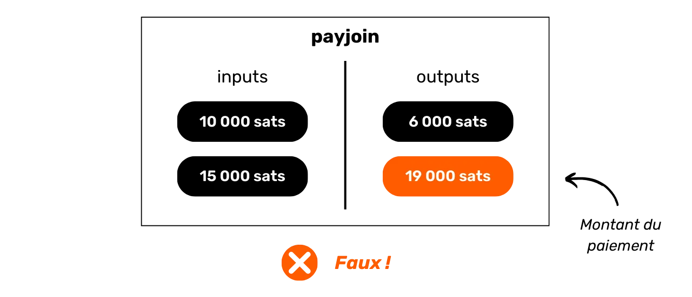


Ali u stvarnosti, ova analiza je manjkava. Iznos plaćanja ne odgovara nijednom od izlaza. To je zapravo razlika između UTXO primaoca u izlazu i UTXO primaoca u ulazu.


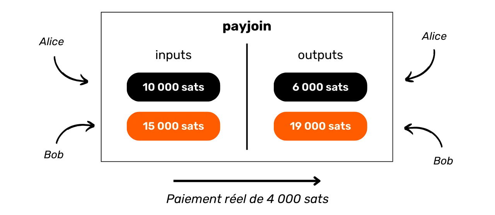


U tom pogledu, transakcija PayJoin spada u oblast steganografije. Omogućava da stvarni iznos transakcije bude skriven unutar lažne transakcije koja služi kao mamac.


Steganografija je tehnika za skrivanje informacija unutar drugih podataka ili objekata, tako da prisustvo skrivenih informacija nije primetno. Na primer, tajna poruka može biti sakrivena unutar tačke u nepovezanom tekstu, čineći je neprimetnom golim okom (ovo je tehnika [mikrotačke](https://fr.wikipedia.org/wiki/Micropoint)).


Za razliku od enkripcije, koja čini informacije nerazumljivim bez ključa za dešifrovanje, steganografija ne modifikuje informacije. One ostaju prikazane u čistom tekstu. Umesto toga, njen cilj je da sakrije samo postojanje tajne poruke, dok enkripcija jasno otkriva prisustvo skrivene informacije, iako je nedostupna bez ključa. Zbog toga je originalni naziv PayJoin bio "steganografske transakcije".


Analogija se može povući između kriptografije i CoinJoin, i između steganografije i PayJoin. CoinJoin ima slične atribute kao enkripcija: metoda je prepoznatljiva, ali informacija je nečitljiva. Nasuprot tome, PayJoin je sličan steganografiji: informacija je teoretski dostupna, ali pošto metoda skrivanja nije prepoznatljiva, postaje nedostupna.


### Kako da koristim PayJoin?


Dobro poznati softverski programi koji podržavaju PayJoin uključuju Sparrow Wallet, Wasabi Wallet, Mutiny, BitMask, BlueWallet i JoinMarket, kao i procesor plaćanja BTCPay.


Najnaprednija implementacija PayJoin bila je samo Stowaway na Samourai Wallet. Međutim, od hapšenja osnivača softvera, ovaj alat je sada samo delimično funkcionalan. Prednost Stowaway-a je što je to sveobuhvatan, jednostavan za korišćenje protokol, koji podržava i primanje i slanje payjoin-a. Delimično potpisane transakcije mogu se razmenjivati ručno skeniranjem nekoliko QR kodova, ili automatski putem Tor-a preko Soroban-a. Ova druga opcija komunikacije trenutno nije u funkciji.


Teškoća u korišćenju PayJoin leži u njegovoj zavisnosti od učešća trgovca. Kao kupac, ne možete koristiti PayJoin ako ga trgovac ne podržava. Ovo dodaje dodatnu teškoću procesu kupovine: ne samo da je teško pronaći trgovce koji prihvataju Bitcoin, već ako takođe tražite one koji podržavaju payjoins, postaje još komplikovanije.


Jedno rešenje bi bilo korišćenje struktura transakcija koje uvode nejasnoće u analizu lanca bez potrebe za saradnjom primaoca. Ovo bi nam omogućilo da poboljšamo poverljivost naših plaćanja bez oslanjanja na aktivno učešće trgovaca. Upravo to ćemo razmotriti u narednom poglavlju.


https://planb.network/tutorials/privacy/on-chain/payjoin-sparrow-wallet-087a0e49-61cd-41f5-8440-ac7b157bdd62

https://planb.network/tutorials/privacy/on-chain/payjoin-samourai-wallet-48a5c711-ee3d-44db-b812-c55913080eab

## Plaćanje mini-CoinJoin


<chapterId>300777ee-30ae-43d7-ab00-479dac3522c1</chapterId>


Kada želite da izvršite platnu transakciju uz održavanje određenog stepena poverljivosti, PayJoin je dobra opcija. Ali kao što smo upravo videli, PayJoin zahteva učešće primaoca. Dakle, šta raditi ako primalac odbije da učestvuje u PayJoin, ili ako jednostavno ne želite da ih uključite? Jedna alternativa je korišćenje Stonewall ili Stonewall x2 transakcije. Hajde da detaljnije pogledamo ove dve vrste transakcija.


### Stonewall transakcija


Stonewall je specifičan oblik Bitcoin transakcije dizajniran da poveća poverljivost korisnika prilikom trošenja, imitirajući pseudo-CoinJoin između dve osobe, bez da to zapravo bude. U stvari, ova transakcija nije kolaborativna. Korisnik je može izgraditi samostalno, koristeći samo UTXO-ove koje poseduje kao ulaze. Tako možete kreirati Stonewall transakciju za bilo koju priliku, bez potrebe za sinhronizacijom sa drugim korisnikom ili primaocem.


Stonewall transakcija funkcioniše na sledeći način: kao ulaz u transakciju, izdavalac koristi 2 UTXO-a koja pripadaju njemu. Na izlazu, transakcija proizvodi 4 UTXO-a, od kojih su 2 potpuno iste vrednosti. Druga 2 UTXO-a će činiti strani Exchange. Od 2 izlaza iste vrednosti, samo jedan će zapravo ići primaocu.


Dakle, postoje samo 2 uloge u Stonewall transakciji:


- Izdavalac, koji vrši plaćanje ;
- Primalac, koji možda nije svestan specifične prirode transakcije i jednostavno očekuje uplatu od pošiljaoca.


Hajde da uzmemo primer da bismo razumeli ovu strukturu transakcije. Alisa odlazi kod Boba pekara da kupi svoj baget, koji košta 4,000 Sats. Ona želi da plati u bitkoinima, dok zadržava neki oblik poverljivosti u vezi sa svojom uplatom. Zato odlučuje da napravi Stonewall transakciju za uplatu.


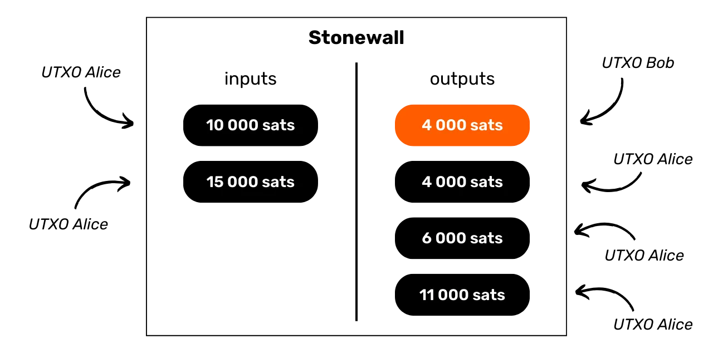


Analizom ove transakcije, možemo videti da je Bob pekar zapravo primio 4,000 Sats kao uplatu za baget. Alisa je koristila 2 UTXO-a kao ulaze: jedan za 10,000 Sats i jedan za 15,000 Sats. U izlazima, ona je povratila 3 UTXO-a: jedan za 4,000 Sats, jedan za 6,000 Sats i jedan za 11,000 Sats. Alisa stoga ima neto saldo od -4,000 Sats na ovoj transakciji, što odgovara ceni bageta.


U ovom primeru, namerno sam zanemario Mining naknade kako bih olakšao razumevanje. U stvarnosti, troškove transakcije u potpunosti snosi izdavalac.


### Koji su ciljevi Stonewall transakcije?


Stonewall struktura dodaje ogromnu količinu entropije transakciji, zamagljujući linije analize lanca. Gledano spolja, takva transakcija može biti interpretirana kao mini-CoinJoin između dve osobe. Ali u stvarnosti, to je plaćanje. Ova metoda stoga stvara nesigurnosti u analizi lanca, ili čak vodi do lažnih tragova.


Hajde da uzmemo primer Alise kod Boba pekara. Transakcija na Blockchain bi izgledala ovako:


Spoljašnji posmatrač koji se oslanja na uobičajene heuristike analize lanca mogao bi pogrešno zaključiti da "*dve osobe su napravile mali CoinJoin, sa po jednim UTXO u ulazu i po dva UTXO-a u izlazu*". Analiziranje ove transakcije spolja ne vodi primeni CIOH-a, jer prisustvo dva izlaza iste vrednosti sugeriše obrazac CoinJoin. Iz spoljašnje perspektive, CIOH stoga nije primenljiv u ovom konkretnom slučaju.


Ovo tumačenje je netačno, jer, kao što znate, jedan UTXO je poslat Bobu pekaru, 2 UTXO ulaza su došla od Alice, a ona je povratila 3 Exchange izlaza.


A što je posebno zanimljivo u vezi sa strukturom Stonewall transakcije je to što, sa stanovišta spoljnog posmatrača, ona u svakom pogledu liči na Stonewall x2 transakciju.


### Stonewall transakcija x2


Stonewall x2 je još jedan specifičan oblik Bitcoin transakcije koji takođe ima za cilj povećanje poverljivosti korisnika prilikom trošenja, ali ovaj put kroz saradnju sa trećom osobom koja nije uključena u to trošenje. Ova metoda funkcioniše kao pseudo-CoinJoin između dva učesnika, dok istovremeno vrši plaćanje trećoj osobi.


Operacija Stonewall x2 transakcije je relativno jednostavna: koristimo UTXO u našem posedu da izvršimo uplatu i angažujemo pomoć treće strane koja takođe doprinosi sa svojim UTXO. Transakcija se završava sa četiri izlaza: dva od njih su u jednakim iznosima, jedan namenjen za Address primaoca, drugi za Address koji pripada saradniku. Treći UTXO se vraća na drugi Address koji pripada saradniku, omogućavajući mu da povrati početni iznos (neutralna akcija za njega, modulo troškovi Mining), a konačni UTXO se vraća na Address koji pripada nama, što čini uplatu Exchange.


Tri različite uloge su tako definisane u Stonewall x2 transakcijama:


- Izdavalac, koji vrši stvarnu uplatu ;
- Primaoc, koji možda nije svestan specifične prirode transakcije i jednostavno očekuje uplatu od pošiljaoca;
- Saradnik, koji stavlja bitkoine na raspolaganje kako bi doveo u sumnju analizu transakcije, dok na kraju u potpunosti povrati svoja sredstva (neutralna akcija za njega, modulo troškovi Mining).


Hajde da se vratimo na naš primer sa Alis, koja je kod Boba pekara da kupi svoj baget, koji košta 4,000 Sats. Ona želi da plati u bitkoinima, dok održava određeni nivo poverljivosti u vezi sa svojom uplatom. Zato se obraća svom prijatelju Čarlsu, koji će joj pomoći u ovom procesu.


Analizirajući ovu transakciju, možemo videti da je Bob pekar zapravo primio 4,000 Sats kao uplatu za baget. Alisa je koristila 10,000 Sats kao ulaz i povratila 6,000 Sats kao izlaz, tj. neto saldo od -4,000 Sats, što odgovara ceni bageta. Što se tiče Čarlsa, on je obezbedio 15,000 Sats kao ulaz i primio dva izlaza: jedan od 4,000 Sats i drugi od 11,000 Sats, što daje saldo od 0.


U ovom primeru, namerno sam izostavio naknade kako bi bilo lakše za razumevanje. U stvarnosti, Mining naknade se obično dele jednako između izdavaoca uplate i davaoca doprinosa.


### Koji su ciljevi Stonewall x2 transakcije?


Kao i struktura Stonewall, struktura Stonewall x2 dodaje veliku količinu entropije transakciji i zbunjuje analizu lanca. Gledano spolja, takva transakcija može biti interpretirana kao mali CoinJoin između dve osobe. Ali u stvarnosti, to je plaćanje. Ova metoda stoga stvara nesigurnosti u analizi lanca, ili čak dovodi do lažnih tragova.


Hajde da uzmemo primer Alise, Boba Pekara i Čarlsa. Transakcija na Blockchain bi izgledala ovako:


Spoljašnji posmatrač koji se oslanja na uobičajene heuristike analize lanca mogao bi pogrešno zaključiti da su "*Alice i Charles izveli mali CoinJoin, sa po jednim UTXO u ulazu i po dva UTXO-a u izlazu*". Ponovo, analiza ove transakcije spolja ne dovodi do primene ICOH-a, jer prisustvo dva izlaza iste vrednosti sugeriše obrazac CoinJoin. Sa spoljašnje tačke gledišta, CIOH stoga nije primenljiv u ovom konkretnom slučaju.


Ovo tumačenje je netačno, jer, kao što znate, jedan UTXO je poslat Bobu pekaru, Alisa ima samo jedan Exchange izlaz, a Čarls ima dva.


I još jednom, ono što je posebno zanimljivo u vezi sa strukturom Stonewall x2 transakcije je to što, iz ugla spoljnog posmatrača, ona u svakom pogledu podseća na Stonewall transakciju.


### Koja je razlika između Stonewall i Stonewall x2?


Transakcija StonewallX2 funkcioniše isto kao i Stonewall transakcija, osim što je prva kolaborativna, dok druga nije. Kao što smo videli, StonewallX2 transakcija uključuje učešće treće strane (Charles), koja je eksterno povezana sa plaćanjem i koja će staviti svoje bitkoine na raspolaganje kako bi poboljšala poverljivost transakcije. U klasičnoj Stonewall transakciji, ulogu saradnika preuzima pošiljalac.


Sa spoljašnje tačke gledišta, obrazac transakcije je potpuno isti.


Činjenica da ove dve strukture transakcija dele potpuno isti obrazac znači da čak i ako spoljni posmatrač uspe da identifikuje obrazac "Stonewall(x2)", neće imati sve informacije. Neće moći da odredi koji od dva UTXO-a istih iznosa odgovara uplati. Štaviše, neće moći da utvrdi da li dva UTXO-a sa ulazima dolaze od dve različite osobe (Stonewall x2) ili pripadaju jednoj osobi koja ih je spojila (Stonewall).


Ova poslednja tačka je zbog činjenice da Stonewall x2 transakcije prate potpuno isti obrazac kao Stonewall transakcije. Gledano spolja, i bez dodatnih kontekstualnih informacija, nemoguće je razlikovati Stonewall transakciju od Stonewall x2 transakcije. Prve nisu kolaborativne transakcije, dok druge jesu. Ovo dodaje još više sumnje u analizu jedne od ovih transakcija.


### Kada treba koristiti Stonewall i Stonewall x2 transakcije?


Logika bi trebala biti sledeća kada želite da koristite alat za poverljivost za trošak:


- Kao prioritet, možemo izabrati da napravimo PayJoin;
- Ako trgovac ne podržava payjoins, kolaborativna transakcija može biti napravljena sa drugom osobom van plaćanja koristeći Stonewall x2 strukturu;
- Ako ne možete pronaći nikoga za obavljanje Stonewall x2 transakcije, možete napraviti samo Stonewall transakciju, koja će oponašati ponašanje Stonewall x2 transakcije.


### Kako da koristim Stonewall i Stonewall x2 transakcije?


Transakcije Stonewall i Stonewall x2 dostupne su na aplikaciji Samourai Wallet i softveru Sparrow Wallet.


Međutim, kao i sa payjoins, nakon hapšenja osnivača Samourai-a, Stonewall x2 transakcije sada funkcionišu samo ručnim razmenjivanjem PSBT-ova između uključenih strana. Nažalost, automatski Exchange putem Soroban-a više nije dostupan.


Takođe je moguće izvršiti ovu vrstu transakcije ručno iz bilo kog Bitcoin Wallet softvera.


U sledećem poglavlju, pogledaćemo još jednu tehniku poverljivosti koja je relativno nepoznata, ali koja je veoma korisna kao dopuna onome što smo već proučili.


https://planb.network/tutorials/privacy/on-chain/stonewall-033daa45-d42c-40e1-9511-cea89751c3d4

https://planb.network/tutorials/privacy/on-chain/stonewall-x2-05120280-f6f9-4e14-9fb8-c9e603f73e5b

## Odbijanja


<chapterId>db9a20ac-a149-443d-884b-ea6c03f28499</chapterId>


Korišćenje struktura transakcija Bitcoin koje dodaju nejasnoću analizi lanca, kao što je CoinJoin, posebno je korisno za zaštitu privatnosti. Međutim, kao što smo diskutovali u poglavlju o payjoin-ovima, CoinJoin transakcije su prirodno prepoznatljive na lancu. Setite se analogije koju smo povukli između enkripcije i coinjoin-ova: kada je fajl enkriptovan, treća strana koja otkrije enkriptovani fajl ne može pristupiti njegovom sadržaju, ali može jasno identifikovati da je fajl modifikovan kako bi sakrio svoj sadržaj. Isto važi i za CoinJoin: kada analitičar ispituje CoinJoin transakciju, iako ne može uspostaviti direktne veze između ulaza i izlaza (i obrnuto), ipak može prepoznati da je posmatrana transakcija CoinJoin.


U zavisnosti od toga kako planirate da koristite svoj deo nakon CoinJoin ciklusa, činjenica da je prošao kroz ovaj proces može biti problematična. Na primer, ako planirate da prodate svoj novčić na regulisanoj Exchange platformi, ali je nedavno prošao kroz CoinJoin, alat za analizu lanca platforme će otkriti ovu činjenicu. Platforma tada može odbiti da prihvati vaš coinjoined UTXO, ili čak zahtevati objašnjenje od vas, uz rizik da vaš nalog bude suspendovan ili vaša sredstva zamrznuta. U nekim slučajevima, platforma može takođe prijaviti vaše ponašanje državnim vlastima (ovo je, na primer, ono što TRACFIN zahteva od PSAN-ova u Francuskoj).


Ono što nam je potrebno da bismo to izbegli jeste alat sposoban da zamagli tragove prošlosti Bitcoin novčića, kako bismo povratili neki oblik fungibilnosti. Upravo je to svrha ricochet-a.


### Šta je rikošet?


Rikošet je tehnika koja se sastoji od izvođenja nekoliko fiktivnih transakcija prema sebi (sweep) kako bi se simulirao transfer Bitcoin Ownership. Ovaj alat se razlikuje od drugih struktura transakcija o kojima smo razgovarali, jer ne dobija perspektivnu anonimnost, već oblik retrospektivne anonimnosti. U stvari, rikošet zamagljuje specifičnosti koje mogu ugroziti fungibilnost Bitcoin novčića zbog njegove prošlosti.


Da bi se izgladilo otisak koji je ostavio prošli događaj na novčiću, kao što su CoinJoin ciklusi, rikoset izvršava četiri uzastopne transakcije u kojima korisnik prenosi sredstva sebi na različite adrese.


Nakon ovog niza transakcija, ricochet alat konačno usmerava bitkoine na njihovu konačnu destinaciju, kao što je Exchange platforma.


Cilj je stvoriti distancu koja utiče na fungibilnost novčića, kao što je transakcija CoinJoin, i konačni čin trošenja, koji bi mogao odbiti ovaj novčić zbog njegove prošlosti. Tako bi alati za analizu lanca mogli zaključiti da je verovatno došlo do promene Ownership nakon događaja, i smatrati ovaj novčić fungibilnim. U slučaju CoinJoin, alati za analizu Blockchain bi tada mogli pretpostaviti da nije ista osoba poslala bitkoine i izvršila CoinJoin, te da stoga nema smisla preduzimati akciju protiv pošiljaoca.


### Zašto to radi?


Suočeni sa ovom metodom rikoseta, moglo bi se zamisliti da bi softver za analizu lanaca produbio svoje ispitivanje izvan četiri odbijanja. Međutim, ove platforme suočavaju se s dilemom u optimizaciji praga detekcije. Moraju postaviti granicu na broj skokova nakon kojih prihvataju da je verovatno došlo do promene svojstva i da bi veza s prethodnim događajem (kao što je CoinJoin) trebalo da bude ignorisana.


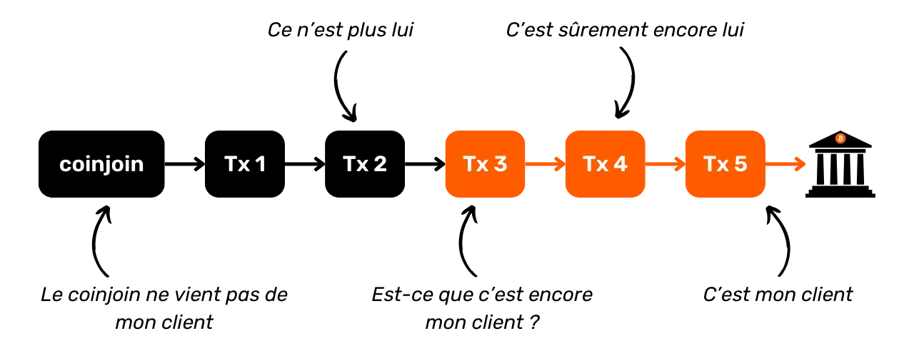


Međutim, postavljanje ovog praga je rizično: svako proširenje broja posmatranih skokova eksponencijalno povećava obim lažno pozitivnih rezultata, tj. pojedinaca koji su pogrešno označeni kao učesnici u događaju, kada je zapravo operaciju izveo neko drugi. Ovaj scenario predstavlja veliki rizik za ove kompanije, jer lažno pozitivni rezultati dovode do nezadovoljstva, što može naterati pogođene klijente da pređu kod konkurencije. Na duži rok, previsok prag detekcije dovodi platformu do gubitka više klijenata nego njeni konkurenti, što bi moglo ugroziti njenu održivost. Stoga je komplikovano za ove platforme da povećaju broj posmatranih skokova, a 4 je često dovoljan broj da se suprotstave njihovim analizama.


Fenomen posmatran ovde donekle je analogan teoriji o šest stepeni razdvojenosti.


Teorija o šest stepeni razdvojenosti sugeriše da je svaka osoba na Zemlji povezana sa bilo kojom drugom osobom lancem odnosa koji se sastoji od najviše šest posrednika. Stoga bi bilo dovoljno proći kroz niz od šest osoba, gde svaka lično poznaje sledeću, da bi se došlo do bilo koje individue na svetu.


U slučaju transakcija Bitcoin, pronalazimo sličan fenomen. Praćenjem dovoljnog broja transakcija Bitcoin, neizbežno nailazimo na CoinJoin. Metoda rikoseta koristi ovu principu tako što koristi veći broj skokova nego što platforme Exchange mogu razumno pratiti. Ako platforme odluče da prate više transakcija, tada je moguće jednostavno dodati dodatni skok kako bi se zaobišla ova mera.


### Kada i kako koristiti ricochet?


Najčešći slučaj upotrebe za ricochet javlja se kada je potrebno prikriti prethodno učešće u CoinJoin na UTXO koji posedujete. Idealno bi bilo izbeći prenos bitkoina koji su prošli kroz CoinJoin ka regulisanim entitetima. Ipak, u slučaju da se nađete bez druge opcije, posebno u hitnoj potrebi za likvidacijom bitkoina u državnu valutu, ricochet nudi efikasno rešenje.


Ova metoda je efikasna ne samo za coinjoin-e, već i za bilo koji drugi znak koji bi mogao ugroziti fungibilnost dela.


Ideja za ovu metodu rikoseta prvobitno je došla od timova Samourai Wallet, koji su je integrisali u svoju aplikaciju kako bi automatizovali proces. Usluga nije besplatna na Samourai, jer rikoset uključuje naknadu za uslugu od 100.000 Sats, plus troškove Mining. Njena upotreba se stoga preporučuje za transfere značajnih iznosa.


Samurai aplikacija nudi dve varijante rikoseta:


- Ojačani rikošet, ili "isporuka u fazama", koja nudi prednost raspodele troškova Samurai usluge preko pet uzastopnih transakcija. Ova opcija takođe osigurava da se svaka transakcija emituje u različito vreme i zabeleži u različitom bloku, imitirajući što je moguće bliže ponašanje promene vlasnika. Iako sporija, ova metoda je poželjna za one koji nisu u žurbi, jer maksimizira efikasnost rikošeta jačanjem njegove otpornosti na analizu lanca;


- Klasični rikoset, koji je dizajniran da izvrši operaciju brzo, emitujući sve transakcije u smanjenom vremenskom intervalu. Ova metoda, dakle, nudi manje poverljivosti i manju otpornost na analizu od pojačane metode. Trebalo bi da se koristi samo za hitne pošiljke.


Rikošetiranje jednostavno znači slanje bitkoina sebi. Potpuno je moguće ručno rikošetirati bitkoine na bilo kojem Wallet softveru, bez korišćenja specijalizovanog alata. Sve što treba da uradite je da sukcesivno prebacujete isti novčić sebi, koristeći svaki put novi, prazan Address.


U sledećem poglavlju, razmatramo različite tehnike za tajne prenose Ownership. Ove metode se radikalno razlikuju od onih koje smo do sada ispitali, kako u pogledu operacije, tako i rezultata.


https://planb.network/tutorials/privacy/on-chain/ricochet-e0bb1afe-becd-44a6-a940-88a463756589

## Tajne prenose Ownership


<chapterId>a2067036-849c-4d6b-87d2-44235cfae7a1</chapterId>


Još jedna od tehnika poverljivosti Bitcoin je tajni prenos Ownership. Ova metoda ima za cilj prenos Ownership Bitcoina sa jedne osobe na drugu, i obrnuto, bez da transakcija bude eksplicitno vidljiva na Blockchain. Pogledajmo različite dostupne tehnike, zajedno sa njihovim prednostima i nedostacima.


### The coinswap


Coinwap se zasniva na relativno jednostavnom konceptu: koristi pametne ugovore za olakšavanje prenosa Bitcoin Ownership između dva korisnika, bez potrebe za poverenjem i bez da ovaj prenos bude eksplicitno vidljiv na Blockchain.


Hajde da zamislimo naivan primer sa Alisom i Bobom. Alisa drži 1 BTC osiguran privatnim ključem $A$, a Bob takođe drži 1 BTC osiguran privatnim ključem $B$. Oni bi teoretski mogli Exchange svoje privatne ključeve putem spoljnog komunikacionog kanala kako bi izvršili tajni transfer.


Međutim, ovaj naivni metod predstavlja visok rizik u smislu poverenja. Ništa ne sprečava Alisu da zadrži kopiju privatnog ključa $A$ nakon Exchange i kasnije ga iskoristi da ukrade bitkoine, kada je ključ u Bobovim rukama.


Štaviše, nema garancije da Alice neće primiti Bobov privatni ključ $B$ i nikada preneti svoj privatni ključ $A$ u Exchange. Ovaj Exchange stoga se oslanja na prekomerno poverenje između strana i neefikasan je u osiguravanju sigurnog tajnog prenosa Ownership.


Da bismo rešili ove probleme i omogućili razmene između strana koje ne veruju jedna drugoj, umesto toga ćemo koristiti Smart contract sisteme. Smart contract je program koji se automatski izvršava kada su ispunjeni unapred definisani uslovi. U našem slučaju, ovo osigurava da se Exchange svojine odvija automatski, bez potrebe za međusobnim poverenjem.


Ovo se može postići korišćenjem HTLC (*Hash Time-Locked Contracts*) ili PTLC (*Point Time-Locked Contracts*). Ova dva protokola funkcionišu na sličan način, koristeći sistem vremenskog zaključavanja koji osigurava da se Exchange ili uspešno završi ili potpuno otkaže, čime se štiti integritet sredstava obe strane. Glavna razlika između HTLC i PTLC je u tome što HTLC koristi hešove i preimage za obezbeđivanje transakcije, dok PTLC koristi Adaptor Signatures.


U scenariju zamene novčića koristeći HTLC ili PTLC između Alise i Boba, Exchange se odvija sigurno: ili uspeva i svaki dobija BTC onog drugog, ili ne uspeva i svaki zadržava svoj BTC. Ovo onemogućava bilo kojoj strani da prevari ili ukrade BTC onog drugog.


> *HTLC je takođe mehanizam koji se koristi za sigurno usmeravanje plaćanja kroz dvosmerne kanale Lightning Network*
Upotreba Adaptor Signatures je posebno zanimljiva u ovom kontekstu, jer omogućava izostavljanje tradicionalnih skripti (mehanizam koji se ponekad naziva "_scriptless scripts_"). Ova karakteristika smanjuje troškove povezane sa Exchange. Još jedna velika prednost Adaptor Signatures je da ne zahtevaju upotrebu zajedničkog Hash za obe strane u transakciji, čime se izbegava potreba za otkrivanjem direktne veze između njih u određenim tipovima Exchange.


### Adaptor Signatures


Adaptor Signatures su kriptografska metoda koja integriše važeći potpis sa dodatnim potpisom, nazvanim "_adaptor signature_", kako bi otkrila tajne podatke. Ovaj mehanizam je dizajniran na takav način da poznavanje 2 od sledeća 3 elementa Elements: važeći potpis, adaptor potpis i tajna, omogućava nam da zaključimo nedostajući treći element. Zanimljiva osobina ove metode je da, ako znamo adaptor potpis našeg partnera i specifičnu tačku na eliptičnoj krivi povezanu sa tajnom korišćenom za izračunavanje tog adaptor potpisa, možemo izvesti sopstveni adaptor potpis koji će biti kompatibilan sa tom istom tajnom, a da nikada nemamo direktan pristup samoj tajni.


U coinswap-u, upotreba Adaptor Signatures omogućava simultano otkrivanje dva dela osetljivih informacija između učesnika, čime se izbegava potreba za međusobnim poverenjem. Uzmimo primer da ilustrujemo ovaj proces sa Alice i Bobom, koji žele da Exchange poseduju po 1 BTC, ali ne veruju jedno drugom. Oni koriste Adaptor Signatures da eliminišu potrebu za međusobnim poverenjem u ovom Exchange. Evo kako to rade:


- Alis pokreće Exchange kreiranjem $m_A$ transakcije koja šalje 1 BTC Bobu. Ona generiše potpis $s_A$, koji validira ovu transakciju, koristeći svoj privatni ključ $p_A$ ($P_A = p_A \cdot G$), Nonce $n_A$ ($N_A = n_A \cdot G$) i tajnu $t$ ($T = t \cdot G$) :


$$s_A = n_A + t + H(N_A + T \parallel P_A \parallel m_A) \cdot p_A$$


- Alisa izračunava potpis adaptera $s_A'$ oduzimajući tajnu $t$ od njenog pravog potpisa $s_A$ :


$$s_A' = s_A - t$$


- Alice šalje Bobu svoj adaptor potpisa $s'_A$, svoju nepotpisanu transakciju $m_A$, tačku koja odgovara tajni ($T$), i tačku koja odgovara Nonce ($N_A$). Ovi Elements čine ono što je poznato kao "adaptor". Važno je napomenuti da, sa samo ovim informacijama, Bob ne može povratiti Alicein BTC.
- Međutim, Bob može proveriti da li Alisa ne pokušava da ga pokrade. Da bi to uradio, proverava da li Alisin adaptor potpis $s_A'$ zaista odgovara predloženoj transakciji $m_A$. Ako je sledeća jednačina tačna, onda može biti siguran da je Alisin adaptor potpisa validan:


$$s_A' \cdot G = N_A + H(N_A + T \parallel P_A \parallel m_A) \cdot P_A$$


- Ova verifikacija pruža Bobu dovoljne garancije da može nastaviti Exchange s potpunim poverenjem. Zatim kreira svoju transakciju $m_B$, namenjenu slanju 1 BTC Alisi, i generiše svoj adaptor potpis $s_B'$, koji će takođe biti povezan sa istom tajnom $t$. U ovoj fazi, samo Alisa zna vrednost $t$; Bob zna samo odgovarajuću tačku $T$ koju mu je Alisa prenela:


$$s_B' = n_B + H(N_B + T \parallel P_B \parallel m_B) \cdot p_B$$


- Bob šalje Alisi svoj adaptor potpis $s_B'$, njegov nepotpisani transakcioni zapis $m_B$, kao i tačku koja odgovara tajni ($T$) i tačku koja odgovara Nonce ($N_B$). Alisa, koja zna tajnu $t$, sada može kombinovati Bobov adaptor potpis $s_B'$ sa ovom tajnom da bi generate validan potpis $s_B$ za transakciju $m_B$ koja će preneti Bobov BTC na nju:


$$s_B = s_B' + t$$


$$(s_B' + t) \cdot G = N_B + T + H(N_B + T \parallel P_B \parallel m_B) \cdot P_B$$


- Alisa emituje ovu potpisanu $m_B$ transakciju na Bitcoin Blockchain da preuzme BTC koji je Bob obećao. Kada Bob vidi ovu transakciju na Blockchain, može da izdvoji potpis $s_B = s_B' + t$. Sa ovim informacijama, Bob je tada u mogućnosti da izoluje čuvenu tajnu $t$ koja mu je bila potrebna:


$$t = (s_B' + t) - s_B' = s_B - s_B'$$


- A ova tajna $t$ je bila jedini element koji je nedostajao Bobu da generate validan potpis $s_A$ iz Alisinog adaptor potpisa $s_A'$. Ovaj potpis potvrđuje $m_A$ transakciju, koja šalje BTC od Alise do Boba. Bob zatim izračunava $s_A$ i emituje $m_A$ transakciju na Blockchain:


$$s_A = s_A' + t$$


$$(s_A' + t) \cdot G = N_A + T + H(N_A + T \parallel P_A \parallel m_A) \cdot P_A$$


Hajde da rezimiramo kako funkcioniše Adaptor Signature u coinswap-u. U početku, Alisa šalje Bobu nepotpisanu transakciju zajedno sa adaptorom, omogućavajući Bobu da proveri da će mu tajna koja će kasnije biti otkrivena omogućiti pristup bitcoinima. Zauzvrat, Bob šalje Alisi svoju nepotpisanu transakciju i adaptor. Alisa tada može finalizovati Bobovu transakciju i preuzeti bitcoine emitovanjem validne transakcije zahvaljujući tajni. Kada se ova transakcija objavi na Blockchain, Bob ima mogućnost da izvuče tajnu i tako otključa Alisinu transakciju. Posledično, ako Alisa inicira transfer Bobovog Bitcoin, Bob može, zauzvrat, pristupiti Alisinom Bitcoin bez potrebe za međusobnim poverenjem.


Imajte na umu da je coinswaps prvi predložio [Gregory Maxwell u oktobru 2013. na BitcoinTalk-u](https://bitcointalk.org/index.php?topic=321228.0).


### Atomska zamena


Na sličan način kao coinswap, i koristeći iste tipove pametnih ugovora, moguće je izvršiti i atomske zamene. Atomska zamena omogućava direktan Exchange različitih kriptovaluta, kao što su BTC i XMR, između dva korisnika bez potrebe za poverenjem ili intervencijom posrednika. Ove razmene se nazivaju "atomske" jer imaju samo dva moguća ishoda: ili je zamena uspešna i obe strane su zadovoljne, ili ne uspe i svaka zadržava svoje originalne kriptovalute, eliminišući potrebu za poverenjem drugoj strani.


Atomski svop i coinswap dele sličan način rada i nude iste prednosti i nedostatke u pogledu poverljivosti. Zaista, iz perspektive Bitcoin, atomski svop je uporediv sa coinswap-om koji se sprovodi u dve faze. Prvo, mi Exchange naš BTC za drugu kriptovalutu, zatim se ta kriptovaluta može zameniti za drugi BTC. Na kraju, dobijamo BTC drugog korisnika. Zbog toga, u analizi pitanja poverljivosti, grupišem ova dva protokola pod kategoriju vlasničkih tajnih razmena.


Međutim, imajte na umu da za razliku od coinswap-a, atomic swap može imati neravnoteže u pogledu dostupne likvidnosti, posebno u BTC/XMR razmenama. Generalno je lakše zameniti bitkoine za altkoine, jer postoji velika potražnja za bitkoinima, što održava niske premije za ovaj pravac konverzije. Međutim, razmena altkoina za BTC može biti složenija zbog manje potražnje, što često rezultira veoma visokim premijama.


Konačno, kada atomska zamena uključuje onchain bitkoine i bitkoine na Lightning Network, govorimo o "podmorskoj zameni".


### Da li je zaista korisno?


Tajne transakcije Ownership, kao što su coinswaps i atomic swaps, imaju prednost u zavaravanju heuristike analize lanca. Ove metode mogu sugerisati da transakcije uključuju istog korisnika, dok je stvarni Ownership promenio vlasnika. Međutim, glavni nedostatak ovih metoda je što su veoma rizične bez korišćenja dodatne tehnike za prekid istorije novčića.


Zaista, kada Alisa izvrši coinswap ili atomic swap sa Bobom, ona razmenjuje posedovanje svojih bitkoina sa Bobovim. U slučaju atomic swap-a, Exchange uključuje Altcoin, ali princip ostaje isti. Tako Alisa završava sa $B$ novčićem, a Bob sa $A$ novčićem. Ovo dodaje sumnju u analizu lanca, ali istorija novčića ostaje uočljiva. Ako analitičar ispituje deo $A$, može pratiti Alisine prethodne aktivnosti, i obrnuto za deo $B$.


Iz Alisinog ugla gledanja, rizik je da bi istorija novčića $B$ mogla biti smatrana sumnjivom od strane određenih entiteta. Ako je, na primer, Bob stekao novčić $B$ putem kriminalnog dela kao što je hakovanje, novčić bi ostao povezan sa njegovim ilegalnim aktivnostima. Alisa bi se tada mogla naći u posedu novčića koji ne bi mogla preneti na regulisane Exchange platforme bez rizika da joj sredstva budu zamrznuta, ili čak da bude optužena za Bobove zločine, iako s njima nema nikakve veze.


Neizbežno, metode poverljivosti kao što su coinswap ili atomic swap su favorizovane od strane kriminalaca čija su sredstva pod nadzorom vlasti. Ovi protokoli im omogućavaju da se oslobode svojih bitkoina pod nadzorom u Exchange za savršeno zamenljive bitkoine. Takođe im omogućavaju da stvore diverziju, usmeravajući vlasti ka drugim korisnicima. Dakle, postoji dvostruka svrha za ove ljude.


Sa CoinJoin, čak i ako je vaš novčić pomešan sa nadgledanim bitcoinima, istorija novčića je prekinuta, pružajući oblik uverljive poricljivosti koja ne postoji u tajnim Ownership protokolima prenosa kao što su coinswap ili atomic swap.


Ako Alisa želi da izbegne bilo kakav rizik, mora nužno koristiti metodu za prekid istorije novčića $B$, kao što je prolazak kroz coinjoins. Ovo postavlja pitanje o korisnosti kombinovanja tajnog transfera Ownership i CoinJoin. CoinJoin, prekidajući istoriju novčića, već nudi dovoljan nivo poverljivosti za Alisu. Stoga, moje mišljenje je da, ako Alisa želi da zaštiti svoju privatnost, bilo bi mudrije da direktno pređe na CoinJoin umesto da se upušta u coinswap praćen CoinJoin.


Da bi tajne metode prenosa Ownership bile zaista efikasne i izbegle rizik povezivanja istorije korisnika $A$ sa korisnikom $B$, paradoksalno bi bilo neophodno da njihova upotreba bude široko poznata. Ako se coinswap masovno koristi i vlasti su svesne ove uobičajene prakse, tada bi se mogla uspostaviti uverljiva forma poricanja. Međutim, sve dok upotreba ovih prenosa ostaje marginalna, mislim da će ove metode ostati previše rizične za korisnike.


Do sada smo uglavnom proučavali metode poverljivosti na nivou samih transakcija. U sledećem poglavlju ćemo razmatrati pitanja na nivou mreže i širenja transakcija.


## Privatnost na P2P mreži


<chapterId>04a2467b-db84-4076-a9ff-919be5135106</chapterId>


U Delu 4, razgovarali smo o važnosti korišćenja kompletnog čvora za zaštitu poverljivosti vaših transakcija. Međutim, važno je razumeti da i vaš čvor može biti podložan napadima koji pokušavaju da izvuku informacije o vašim aktivnostima. Stoga ćemo u ovom poglavlju razmotriti različite mere koje možete preduzeti za zaštitu vaše privatnosti, ne na nivou samih transakcija ili Bitcoin tokova, već na nivou mreže.


### Maslačak


Jedan od načina da se izbegnu razni napadi de-anonimizacije je korišćenje Dandelion predloga. Ovaj protokol emitovanja je formalizovan u BIP156, ali nikada nije implementiran na Bitcoin.


Ideja iza Dandelion-a je poboljšanje poverljivosti usmeravanja transakcija u Bitcoin mreži kako bi se suprotstavilo raznim oblicima napada. Njegov glavni cilj je sakriti izvorni čvor koji je inicijalno emitovao transakciju na mreži. Otkrivanje ovog čvora moglo bi omogućiti povezivanje Bitcoin transakcije sa specifičnim IP Address (ako čvor radi na clearnet-u), što bi moglo pružiti ulaznu tačku za analizu lanca.


Ova povezanost između aktivnosti na Bitcoin i IP Address predstavlja značajan rizik za poverljivost korisnika. Zaista, mnogi subjekti su u mogućnosti da lako povežu IP Address sa ličnim identitetom. Ovo uključuje vlade i provajdere internet usluga. Štaviše, ove informacije mogu postati javno dostupne, na primer, ako vaš IP Address i lični podaci procure kada je baza podataka neke veb stranice hakovana.


U klasičnoj operaciji Bitcoin, transakcije koje korisnik izgradi na svom Wallet softveru prenose se na njegov lični čvor. Ovaj čvor će odmah emitovati novu transakciju svim povezanim vršnjacima.


Ovi čvorovi zatim proveravaju transakciju kako bi osigurali da je u skladu sa konsenzusom i lokalnim pravilima standardizacije. Kada se validira, svaki čvor prosleđuje transakciju svojim čvorovima, i tako dalje.


Ova distribucija transakcija koje čekaju integraciju u blok je prilično uravnotežena i statistički predvidiva. Ovu slabost mogu iskoristiti saučesnički špijunski čvorovi, koji sarađuju kako bi nadgledali i analizirali mrežu, u cilju identifikacije prvog čvora koji je emitovao transakciju. Ako posmatrač uspe da locira izvorni čvor, može pretpostaviti da je transakcija potekla od operatera tog čvora. Ova vrsta posmatranja može se koristiti za povezivanje inače anonimnih transakcija sa specifičnim IP adresama.


Cilj BIP156 je da Address ovaj problem. Da bi to postigao, uvodi dodatnu fazu u širenju nove transakcije kako bi se očuvala anonimnost pre široke javne propagacije. Dandelion prvo koristi fazu "stem" gde se transakcija šalje kroz nasumičan put čvorova.


Transakcija se zatim emituje ka celoj mreži u fazi „Fluff“.


Stabljika i faza „Fluff“ odnose se na ponašanje širenja transakcije kroz mrežu, što podseća na oblik i razvoj maslačka (na engleskom „Dandelion“).

Tako špijunski čvorovi potencijalno mogu da prate transakciju do čvora koji je započeo fazu "Fluff" (masovno emitovanje), ali taj čvor nije prvi koji je emitovao transakciju, jer ju je primio od poslednjeg čvora stabljike. Ako špijunski čvorovi ne mogu da prate stabljiku, ne mogu ni da identifikuju izvorni čvor.


Čak i u prisustvu špijunskih čvorova tokom faze stabla, sumnja uvek ostaje, jer čim naiđu na pošten čvor u grafu difuzije, špijuni ne mogu da utvrde da li je taj čvor originalni izvor ili samo posrednik.


Ova metoda rutiranja zamagljuje trag koji vodi nazad do izvornog čvora, otežavajući praćenje transakcije kroz mrežu do njenog porekla. Dandelion tako poboljšava poverljivost ograničavanjem sposobnosti protivnika da deanonimizuju mrežu. Ova metoda je još efikasnija kada, tokom faze "stemenja", transakcija pređe čvor koji šifrira svoje mrežne komunikacije, kao što su Tor ili P2P Transport V2.


BIP156 nije integrisan u Bitcoin Core i trenutno je klasifikovan kao "odbijen". Jedna od glavnih zabrinutosti u vezi sa ovim protokolom je da, tokom faze stabljike, transakcije moraju biti prosleđene kroz posredničke čvorove pre nego što budu verifikovane. Kao što smo videli, u normalnom Bitcoin modelu, svaki čvor prvo verifikuje transakciju pre nego što je emituje svojim partnerima. Ako transakcija ne ispunjava konsenzusna pravila čvora ili lokalna pravila standardizacije, čvor je ignoriše i ne distribuira. Ovaj proces je važan za suzbijanje DoS napada, jer se samo validne transakcije emituju celokupnoj mreži. Nevalidne transakcije, potencijalno generisane masovno da preopterete mrežu, zaustavljaju se na prvom čvoru na koji naiđu i ne propagiraju se. Glavni rizik sa Dandelion-om je da bi ovaj novi protokol mogao uvesti nove vektore za DoS napade omogućavajući da nevalidne transakcije budu emitovane kroz deo mreže.


### P2P transport V2


P2P transport V2 je još jedan mrežni protokol predstavljen u BIP324. To je nova verzija Bitcoin P2P transportnog protokola koja uključuje oportunističku enkripciju kako bi se poboljšala poverljivost i sigurnost komunikacija između čvorova.


Ovo poboljšanje je dizajnirano da reši nekoliko problema sa osnovnom verzijom P2P protokola. S jedne strane, čini podatke koji se razmenjuju neprepoznatljivim od drugih tipova podataka koji kruže Internetom za pasivnog posmatrača. Glavni cilj je sprečiti vlade, ISP-ove i VPN provajdere da masovno nadgledaju korisnike Bitcoin. Ovo takođe otežava ovim entitetima da utvrde da li je korisnik Interneta takođe korisnik Bitcoin, tj. da li upravlja kompletnim čvorom.


P2P V2 takođe pomaže u smanjenju rizika od cenzure i napada detektovanjem specifičnih obrazaca u paketima podataka. To komplikuje i čini skupljim izvršenje različitih tipova Sybil napada na nivou mreže. Sybil napad se dešava kada akter kreira više lažnih identiteta kako bi stekao nepravednu prednost. U kontekstu Bitcoin mreže, ovo se često manifestuje kao akter koji kontroliše veliki broj kompletnih čvorova i agresivno ih koristi za umnožavanje konekcija. Sybil napadi mogu biti pasivni, za prikupljanje informacija i kompromitovanje korisničke poverljivosti, ili aktivni, u obliku Eclipse napada. Ovi poslednji izoluju specifičan čvor od ostatka mreže, bilo cenzurišući korisnika ili menjajući podatke koje prima. Na kraju, P2P V2 takođe čini *Man-In-The-Middle* (MITM) napade skupljim i lakšim za detekciju.


Šifrovanje implementirano od strane P2P V2 ne uključuje autentifikaciju, kako ne bi dodalo nepotrebnu složenost ili ugrozilo činjenicu da veza sa mrežom ostaje bez dozvole. Ipak, ovaj novi P2P transportni protokol nudi bolju sigurnost protiv pasivnih napada i čini aktivne napade znatno skupljim i lakše uočljivim. Uvođenje pseudo-slučajnog toka podataka u mrežne poruke otežava napadačima cenzurisanje ili manipulaciju komunikacijama.


P2P V2 transport je uključen kao opcija (podrazumevano onemogućena) u Bitcoin Core verziji 26.0, implementiranoj u decembru 2023. Zatim je podrazumevano omogućena u verziji 27.0 iz aprila 2024. Može se modifikovati sa opcijom `v2transport=` u konfiguracionoj datoteci.


### Tor


Još jedno jednostavno rešenje za izbegavanje rizika od gubitka poverljivosti za mrežni čvor je da ga u potpunosti pokrenete pod Tor-om.


Tor je mreža relej servera (čvorova) koja anonimizuje poreklo TCP konekcija na Internetu. Radi tako što enkapsulira podatke u nekoliko slojeva enkripcije. Svaki relej čvor uklanja Layer kako bi otkrio Address sledećeg čvora, sve dok se ne dostigne konačno odredište. Tor mreža obezbeđuje anonimnost sprečavanjem posredničkih čvorova da znaju i poreklo i odredište podataka, što posmatraču čini veoma teškim praćenje aktivnosti korisnika.


Tor ne samo da šifrira podatke, već i maskira poreklo i odredište komunikacija. Korišćenjem Tor-a za komunikacije sa vašeg ličnog čvora, jačate poverljivost vaših transakcija: vaš ISP ne može dešifrovati komunikacije, a drugi čvorovi u Bitcoin mreži ne mogu identifikovati IP izvornog čvora Address. Štaviše, Tor takođe skriva vašu samu upotrebu Bitcoin od vašeg ISP-a.


Glavni rizik kod ove metode je što je Tor protokol nezavisan od Bitcoin. Ako imate Bitcoin čvor koji radi pod Tor-om i Tor prestane da radi, vaš Bitcoin čvor više neće moći da komunicira.


Takođe, važno je napomenuti da su komunikacije na Toru sporije. Ovo kašnjenje je posebno iritantno tokom inicijalnog pokretanja čvora, jer IBD (*Initial Block Download*) zahteva mnogo komunikacije. Kao rezultat toga, vaša početna sinhronizacija sa Bitcoin mrežom mogla bi trajati znatno duže koristeći Tor. Takođe je moguće izvršiti IBD na clearnet-u, a zatim aktivirati Tor kao drugi korak. Iako ova metoda otkriva postojanje vašeg Bitcoin čvora vašem ISP-u, ona štiti vaše lične informacije o transakcijama kada se prebacite na Tor.


Nakon što smo istražili različite metode poverljivosti na mrežnom nivou, u narednih nekoliko poglavlja želeo bih da vas upoznam sa dva elegantna rešenja za izbegavanje ponovne upotrebe Address: BIP47 i Silent Payments.


## BIP47 i višekratno upotrebljivi kodovi za plaćanje


<chapterId>ad88e076-a04b-4aec-b3b2-7b4760175504</chapterId>


Kao što smo videli u delu 3, ponovna upotreba Address predstavlja ozbiljnu prepreku za poverljivost korisnika na protokolu Bitcoin. Da bi se ublažili ovi rizici, snažno se preporučuje da se generate prazan prijemni Address za svaku novu uplatu primljenu u Wallet. Iako je generisanje novog Address sada pojednostavljeno korišćenjem modernog softvera i hijerarhijski determinističkih novčanika, ova praksa može delovati kontraintuitivno.


U tradicionalnom bankarskom sistemu, na primer, navikli smo da delimo naš IBAN, koji uvek ostaje isti. Kada ga jednom damo nekome, oni nam mogu poslati više uplata bez potrebe za daljom interakcijom sa nama. Neo-banke takođe nude modernije mogućnosti, kao što je korišćenje jedinstvenih email adresa na PayPal-u ili RevTags na Revolut-u. Čak i van finansijske sfere, naši svakodnevni identifikatori kao što su poštanski broj Address, telefonski broj i email Address su takođe jedinstveni i trajni. Ne moramo ih obnavljati za svaku novu interakciju.


Međutim, Bitcoin radi drugačije: novi prijemni Address mora biti generisan za svaku dolaznu transakciju. Ovaj kompromis između jednostavnosti korišćenja i poverljivosti vraća se na same početke Bitcoin-ovog Belog papira. Još od objavljivanja prve verzije njegovog dokumenta krajem 2008. godine, Satoshi Nakamoto nas je već upozoravao na ovaj rizik:


**Kao dodatni firewall, novi par ključeva mogao bi se koristiti za svaku transakciju kako bi ostali nepovezani sa zajedničkim vlasnikom


Postoji mnogo načina da se primi više uplata na jedan identifikator bez potrebe za ponovnim korišćenjem Address. Svaki od njih ima svoje kompromise i nedostatke. Među ovim metodama je BIP47, predlog koji je razvio Justus Ranvier i objavio 2015. godine. Ovaj predlog ima za cilj kreiranje ponovo upotrebljivih kodova za plaćanje koji omogućavaju obavljanje više transakcija prema istoj osobi, dok se izbegava ponovna upotreba Address. Ukratko, BIP47 ima za cilj da ponudi sistem plaćanja koji je intuitivan kao jedinstveni identifikator, uz očuvanje poverljivosti transakcija.


BIP47 ne poboljšava direktno poverljivost korisnika, jer BIP47 uplata nudi isti nivo poverljivosti kao klasična Bitcoin transakcija koristeći prazne adrese. Međutim, čini korišćenje Bitcoin pogodnijim i intuitivnijim, lakoću koja bi inače ugrozila poverljivost. Zahvaljujući BIP47, ova lakoća korišćenja postiže isti nivo poverljivosti kao klasična transakcija. Zato je BIP47 tako vredan alat za očuvanje privatnosti.


U početku, BIP47 je bio predložen za integraciju u Bitcoin Core, ali nikada nije zapravo implementiran. Međutim, neke softverske aplikacije su odlučile da ga implementiraju samostalno. Na primer, timovi Samourai Wallet su razvili sopstvenu implementaciju BIP47 pod nazivom "PayNym".


### Opšti princip BIP47 i PayNym


Cilj BIP47 je omogućiti primanje velikog broja uplata bez ponovnog korišćenja adresa. Zasniva se na upotrebi ponovljivog koda za plaćanje, koji omogućava različitim izdavaocima da pošalju nekoliko uplata na jedan kod koji pripada drugom korisniku. Kao rezultat toga, primalac ne mora da obezbedi novi, prazni Address za svaku transakciju, što u velikoj meri olakšava razmene uz očuvanje poverljivosti.


Korisnik stoga može deliti svoj platni kod u potpunoj slobodi, bilo na društvenim mrežama ili na svojoj veb stranici, bez rizika od gubitka poverljivosti, za razliku od konvencionalnog primaoca Address ili javnog ključa.


Da bi se izvršila transakcija, obe strane treba da imaju Bitcoin Wallet sa BIP47 implementacijom, kao što je PayNym na Samurai Wallet ili Sparrow Wallet. Zajednička upotreba njihovih platnih kodova stvara tajni kanal između njih. Da bi se ovaj kanal efikasno uspostavio, izdavalac mora izvršiti specifičnu transakciju na Bitcoin Blockchain, poznatu kao "notifikaciona transakcija" (više o tome kasnije).


Kombinovanjem kodova plaćanja dva korisnika generišu se zajedničke tajne, koje zauzvrat stvaraju veliki broj jedinstvenih Bitcoin adresa za primanje (tačno 2^32, ili oko 4 milijarde). Na ovaj način, uplate izvršene putem BIP47 nisu zapravo adresirane na sam kod plaćanja, već na klasične adrese za prijem izvedene iz kodova plaćanja uključenih korisnika.


Kod plaćanja tako služi kao virtuelni identifikator izveden iz portfolija seed. U hijerarhijskoj strukturi derivacije portfolija, kod plaćanja je pozicioniran na nivou 3, tj. na nivou računa.


Ciljni derivacioni indeks za BIP47 je označen kao `47'` (`0x8000002F`), što se odnosi na BIP47. Primer derivacionog puta za višekratno upotrebljiv kod plaćanja bio bi sledeći:


```plaintext
m/47'/0'/0'/
```


Da bih vam dao ideju kako izgleda kod za plaćanje, evo mog:


```plaintext
PM8TJSBiQmNQDwTogMAbyqJe2PE2kQXjtgh88MRTxsrnHC8zpEtJ8j7Aj628oUFk8X6P5rJ7P5qDudE4Hwq9JXSRzGcZJbdJAjM9oVQ1UKU5j2nr7VR5
```


Ovaj kod se takođe može kodirati kao QR kod, kako bi se olakšala komunikacija, baš kao konvencionalni prijem Address.


Što se tiče PayNym Botova, robota koji se ponekad viđaju na Twitteru, oni su vizuelne reprezentacije koda za plaćanje, kreiranog od strane Samourai Wallet. Generišu se korišćenjem Hash funkcije, što im daje skoro jedinstvenost. Imaju oblik malog niza karaktera koji počinje sa `+` :


```plaintext
+throbbingpond8B1
+twilightresonance487
+billowingfire340
```


Ovi avatari mogu biti predstavljeni i kao slike:


Iako ovi roboti nemaju specifičnu tehničku funkcionalnost unutar BIP47 okvira, oni igraju ulogu u olakšavanju interakcije s korisnicima pružajući lako prepoznatljiv vizuelni identitet.


---
*U sledećim odeljcima ovog poglavlja posvećenog BIP47, detaljno ćemo razmotriti kako funkcioniše, sa posebnim naglaskom na korišćene kriptografske metode. Da biste u potpunosti razumeli ova donekle tehnička objašnjenja, neophodno je prvo razumeti strukturu HD novčanika, procedure izvođenja ključeva i osnove eliptičke kriptografije. Ako želite da se dublje upustite u ove pojmove, dostupan je još jedan besplatan kurs obuke na Plan ₿ Network :*


https://planb.network/courses/46b0ced2-9028-4a61-8fbc-3b005ee8d70f

*I dalje bih vam savetovao da ih pratite, jer će vam razumevanje tehničkog funkcionisanja BIP47 znatno olakšati razumevanje drugih, sličnih predloga, o kojima ćemo diskutovati u narednim poglavljima*


---
### Ponovno upotrebljivi kod za plaćanje


Kao što je ranije pomenuto, višekratni kod za plaćanje se nalazi na dubini 3 HD Wallet, što ga čini uporedivim sa `xpub`, kako u smislu njegove pozicije u strukturi Wallet, tako i u smislu njegove uloge.


Kod plaćanja od 80 bajtova se razlaže na sledeći način:


- Bajt `0`: Verzija**. Za prvu verziju BIP47, ovaj bajt je postavljen na `0x01` ;
- Bajt `1`: Polje bita**. Ovaj prostor je rezervisan za integrisanje dodatnih indikacija za specifične namene. Za klasičnu upotrebu PayNym-a, ovaj bajt je postavljen na `0x00` ;
- Bajt `2`: Paritet `y`**. Ovaj bajt je `0x02` ili `0x03`, što označava da li je ordinata javnog ključa parna ili neparna, jer se koristi kompresovani javni ključ;
- Od bajta `3` do bajta `34`: Vrednost `x`**. Ovi bajtovi predstavljaju apscisu javnog ključa. Konkatenacija `x` i pariteta `y` formira kompletan komprimovani javni ključ;
- Od bajta `35` do bajta `66`: Kod stringa**. Ovaj prostor sadrži kod stringa povezan sa javnim ključem;
- Od bajta `67` do bajta `79`: Popunjavanje**. Ovaj prostor je namenjen za moguće buduće evolucije. Za trenutnu verziju, jednostavno postavljamo nule ovde kako bismo dostigli veličinu od 80 bajtova potrebnu za izlaz `OP_RETURN`.


Evo heksadecimalna reprezentacija mog višekratnog koda za plaćanje već predstavljena u prethodnom odeljku:


```plaintext
0x010002a0716529bae6b36c5c9aa518a52f9c828b46ad8d907747f0d09dcd4d9a39e97c3c5f37c470c390d842f364086362f6122f412e2b0c7e7fc6e32287e364a7a36a00000000000000000000000000
```


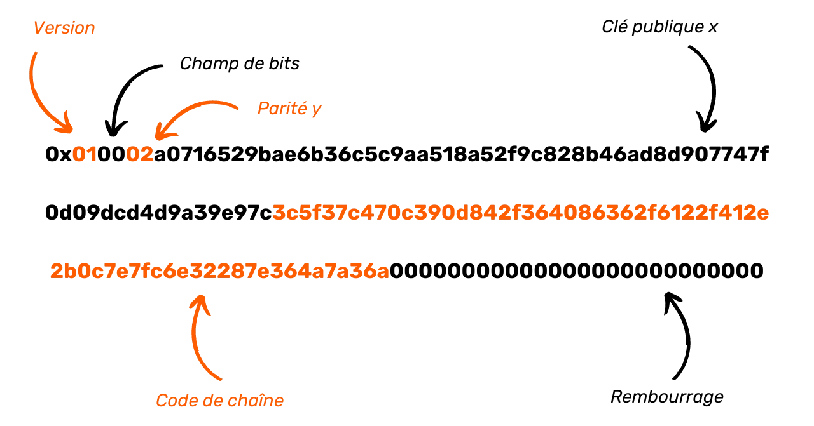


Zatim, `P` prefiks bajt mora biti dodat na početku kako bi jasno označio da je ovo kod za plaćanje. Ovaj bajt je predstavljen sa `0x47` :


```plaintext
0x47010002a0716529bae6b36c5c9aa518a52f9c828b46ad8d907747f0d09dcd4d9a39e97c3c5f37c470c390d842f364086362f6122f412e2b0c7e7fc6e32287e364a7a36a00000000000000000000000000
```


Na kraju, kako bi se osigurala integritet platnog koda, vrši se izračunavanje kontrolne sume koristeći `HASH256`, koji se sastoji od dvostrukog Hash koristeći funkciju `SHA256`. Prva četiri bajta ovog Hash se zatim konkateniraju na kraj platnog koda:


```plaintext
0x47010002a0716529bae6b36c5c9aa518a52f9c828b46ad8d907747f0d09dcd4d9a39e97c3c5f37c470c390d842f364086362f6122f412e2b0c7e7fc6e32287e364a7a36a00000000000000000000000000567080c4
```


Kada su ovi koraci završeni, kod za plaćanje je spreman. Ostaje samo da ga konvertujete u bazu 58 da biste dobili konačnu verziju:


```plaintext
PM8TJSBiQmNQDwTogMAbyqJe2PE2kQXjtgh88MRTxsrnHC8zpEtJ8j7Aj628oUFk8X6P5rJ7P5qDudE4Hwq9JXSRzGcZJbdJAjM9oVQ1UKU5j2nr7VR5
```


U procesu kreiranja koda za plaćanje koristimo kompresovani javni ključ i string kod. Oboje se deterministički i hijerarhijski izvode iz Wallet seed. Putanja derivacije koja se koristi za postizanje ovoga je :


```plaintext
m/47'/0'/0'/
```


U konkretnim terminima, za generate kompresovani javni ključ i string kod povezan sa višekratnim kodom plaćanja, počinjemo izračunavanjem glavnog privatnog ključa iz Wallet seed. Zatim nastavljamo sa izvođenjem para kćerki ključeva koristeći indeks `47 + 2^31` (ojačano izvođenje). Ovo je praćeno sa dva dalja uzastopna izvođenja parova kćerki, svaki koristeći indeks `2^31` (ojačano izvođenje).


### Diffie-Hellman ključ Exchange na eliptičkim krivama (ECDH)


Kriptografski protokol u srcu BIP47 poznat je pod akronimom ECDH, za *Elliptic-Curve Diffie-Hellman*. Ova metoda je varijanta originalnog Diffie-Hellman ključa Exchange.


Uveden 1976. godine, Diffie-Hellman je protokol za dogovor o ključu koji omogućava dvema stranama, od kojih svaka ima par ključeva (javni i privatni), da se dogovore o zajedničkoj tajni, čak i kada komuniciraju samo putem javnog, nesigurnog kanala.


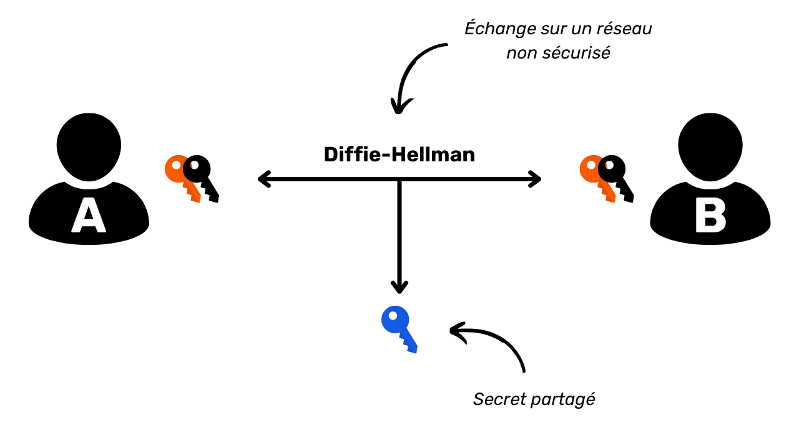


Ova zajednička tajna (u ovom slučaju, plavi ključ) može se koristiti za druge operacije. Tipično, ova zajednička tajna može se koristiti za šifrovanje i dešifrovanje komunikacije na nesigurnoj mreži:


Da bi to postigao, Diffie-Hellman koristi modularnu aritmetiku za izračunavanje zajedničke tajne. Evo kako to funkcioniše u laičkim terminima:


- Alisa i Bob se dogovaraju o zajedničkoj boji, u ovom slučaju žutoj, što je javni podatak (napadači znaju ovu boju);
- Alice odabere tajnu boju, u ovom slučaju crvenu, i pomeša ih da dobije narandžastu;
- Bob takođe bira tajnu boju, u ovom slučaju plavu, i meša je sa žutom da dobije Green;
- Oni zatim Exchange dobijene boje, narandžastu i Green. Ovaj Exchange može se desiti na nesigurnoj mreži i biti posmatran od strane napadača;
- Mešanjem Bobove Green sa svojom tajnom bojom, Alisa dobija braon;
- Bob, radeći isto sa Alisinom narandžastom i tajnom plavom, takođe dobija braon.


U ovoj popularizaciji, braon boja predstavlja tajnu koju dele Alisa i Bob. Zamislite da je, u stvarnosti, napadaču nemoguće da razdvoji boje narandžastu i Green, kako bi pronašao Alisinu ili Bobovu tajnu boju.


Sada hajde da pogledamo kako ovaj protokol zapravo funkcioniše, ne koristeći analogije sa bojama, već koristeći stvarne brojeve i modularnu aritmetiku!


Pre nego što pređemo na mehanizme Diffie-Hellman, dozvolite mi da vas ukratko podsetim na dva osnovna matematička koncepta koja ćemo trebati:


- **Prost broj** je prirodan broj koji ima samo dva delioca: $1$ i samog sebe. Na primer, $7$ je prost broj jer može biti deljen samo sa $1$ i $7$. S druge strane, $8$ nije prost broj, jer je deljiv sa $1$, $2$, $4$ i $8$. Dakle, ima četiri pozitivna cela delioca umesto dva;
- **modulo** (označen kao $mod$ ili $\%$) je matematička operacija koja, između dva cela broja, vraća ostatak Euklidske podele prvog broja drugim. Na primer, $16\bmod 5 = $1$.


**Diffie-Hellman ključ Exchange između Alise i Boba odvija se na sledeći način:**


- Alisa i Bob se slažu oko dva zajednička broja: $p$ i $g$. $p$ je prost broj, i što je veći broj, to će Diffie-Hellman biti sigurniji. $g$ je primitivni koren od $p$. Ova dva broja mogu biti komunicirana otvoreno na nezaštićenoj mreži. Oni predstavljaju ekvivalent **žute boje** u prethodnoj popularizaciji. Stoga je važno da Alisa i Bob koriste tačno iste vrednosti za $p$ i $g$.
- Kada su ovi parametri definisani, Alisa i Bob biraju svaki po jedan tajni nasumični broj. Alisa svoj tajni nasumični broj naziva $a$ (ekvivalentno **boji crvenoj**), a Bob svoj naziva $b$ (ekvivalentno **boji plavoj**). Ovi brojevi moraju ostati tajni.
- Umesto direktne razmene brojeva $a$ i $b$, svaka strana izračunava $A$ i $B$ na sledeći način:


$A$ je jednako $g$ na stepen $a$ modulo $p$ :


$$
A = g^a \bmod p
$$


$B$ je jednako $g$ stepenovano sa $b$ modulo $p$ :


$$
B = g^b \bmod p
$$


- Vrednosti $A$ (ekvivalentne **boji narandžasta**) i $B$ (ekvivalentne **boji Green**) se razmenjuju između dve strane. Ovaj Exchange može se odvijati u čistom tekstu na nesigurnoj mreži;
- Alisa, nakon što je primila $B$, izračunava vrednost $z$ na sledeći način:


$z$ je jednako $B$ na stepen $a$ modulo $p$ :


$$
z = B^a \bmod p
$$


Podsetnik:


$$
B = g^b \bmod p
$$


Rezultat je :


$$
z = B^a \bmod p
$$


$$
z = (g^b)^a \bmod p
$$


Primjenom pravila potencija :


$$
(x^n)^m = x^{nm}
$$


Rezultat je :


$$
z = g^{ba} \bmod p
$$


- Sa svoje strane, Bob, nakon što je primio $A$, takođe izračunava vrednost $z$ na sledeći način:


$z$ je jednako $A$ na stepen $b$ modulo $p$ :


$$
z = A^b \bmod p
$$


Rezultat je :


$$
z = (g^a)^b \bmod p
$$


$$
z = g^{ab} \bmod p
$$


$$
z = g^{ba} \bmod p
$$


Zahvaljujući distributivnosti operatora modulo, Alisa i Bob dobijaju potpuno istu vrednost $z$. Ovaj broj predstavlja njihovu zajedničku tajnu, ekvivalentnu **braon boji** u prethodnom objašnjenju sa kantama za farbu. Sada mogu koristiti ovu zajedničku tajnu za simetrično šifrovanje svojih komunikacija preko nesigurne mreže.


Napadač, čak i ako poseduje $p$, $g$, $A$ i $B$ (javne vrednosti), neće biti u mogućnosti da izračuna $a$, $b$ ili $z$ (privatne vrednosti). Da bi se to postiglo, eksponencijacija bi morala biti obrnuta, operacija koja je nemoguća bez pokušaja svih mogućnosti jednu po jednu, jer to iznosi na računanje diskretnog logaritma, tj. recipročnog od eksponencijala u konačnoj cikličnoj grupi.


Dakle, sve dok su vrednosti $a$, $b$ i $p$ dovoljno velike, Diffie-Hellman protokol je siguran. Tipično, sa parametrima od 2048 bita (600-cifreni decimalni broj), testiranje svih mogućnosti za $a$ i $b$ bilo bi nepraktično. Do danas, sa takvim brojevima, ovaj algoritam se smatra sigurnim.


U tome leži glavna mana Diffie-Hellman protokola. Da bi bio siguran, algoritam mora koristiti velike brojeve. Zato danas preferiramo korišćenje ECDH (*Elliptic Curve Diffie-Hellman*) algoritma, varijante Diffie-Hellman zasnovane na algebarskoj krivoj, tačnije eliptičkoj krivoj. Ovaj pristup omogućava rad sa mnogo manjim brojevima uz održavanje ekvivalentne sigurnosti, čime se smanjuju resursi potrebni za računanje i skladištenje.


Opšti princip algoritma ostaje isti. Međutim, umesto korišćenja slučajnog broja $a$ i broja $A$ izračunatog iz $a$ modularnim eksponenciranjem, koristimo par ključeva uspostavljenih na eliptičnoj krivi. Umesto oslanjanja na distributivnost modulo operatora, koristimo grupni zakon na eliptičnim krivama, i preciznije, asocijativnost ovog zakona.


Da bi se ukratko objasnio princip kriptografije na eliptičnim krivama, privatni ključ je predstavljen slučajnim brojem između $1$ i $n-1$, gde $n$ predstavlja red krive. Javni ključ, s druge strane, je specifična tačka na ovoj krivi, dobijena iz privatnog ključa dodavanjem i udvostručavanjem tačaka od generišuće tačke, prema jednačini :


$$
K = k \cdot G
$$


U ovoj formuli, $K$ označava javni ključ, $k$ privatni ključ, a $G$ generator tačku.


Ključna karakteristika ovih ključeva je lakoća sa kojom se $K$ može izračunati iz $k$ i $G$, dok je praktično nemoguće pronaći $k$ iz $K$ i $G$. Ova asimetrija stvara jednosmernu funkciju. Drugim rečima, lako je izračunati javni ključ ako znate privatni ključ, ali je nemoguće povratiti privatni ključ iz javnog ključa. Ova sigurnost je dodatno podržana računarskom teškoćom diskretnog logaritma.


Koristićemo ovo svojstvo da prilagodimo naš Diffie-Hellman algoritam. **Princip rada ECDH je sledeći:**


- Alice i Bob se slažu oko kriptografski sigurne eliptičke krive i njenih parametara. Ove informacije su javne;
- Alisa generiše nasumičan broj $ka$ koji će biti njen privatni ključ. Ovaj privatni ključ mora ostati tajan. Ona određuje svoj javni ključ $Ka$ dodavanjem i udvostručavanjem tačaka na odabranoj eliptičnoj krivi:


$$
K_a = k_a \cdot G
$$


- Bob takođe generiše nasumičan broj $kb$, koji će biti njegov privatni ključ. On izračunava pripadajući javni ključ $Kb$ :


$$
K_b = k_b \cdot G
$$


- Alice i Bob Exchange svoje javne ključeve $Ka$ i $Kb$ na nesigurnoj javnoj mreži.
- Alisa izračunava tačku $(x,y)$ na krivi primenjujući svoj privatni ključ $ka$ na Bobov javni ključ $Kb$ :


$$
(x,y) = k_a \cdot K_b
$$


- Bob izračunava tačku $(x,y)$ na krivi primenjujući svoj privatni ključ $kb$ na Alisin javni ključ $Ka$ :


$$
(x,y) = k_b \cdot K_a
$$


- Alisa i Bob dobijaju istu tačku na eliptičnoj krivi. Zajednička tajna će biti apscisa $x$ te tačke.


Dobijaju istu zajedničku tajnu zato što :


$$
(x,y) = k_a \cdot K_b = k_a \cdot (k_b \cdot G) = (k_a \cdot k_b) \cdot G = (k_b \cdot k_a) \cdot G = k_b \cdot (k_a \cdot G) = k_b \cdot K_a
$$


Potencijalni napadač koji posmatra nezaštićenu javnu mrežu moći će da dobije samo javne ključeve svakog pojedinca i parametre izabrane eliptičke krive. Kao što je gore objašnjeno, ove informacije same po sebi nisu dovoljne da se odrede privatni ključevi. Shodno tome, napadač ne može pronaći tajnu koju dele Alisa i Bob.


ECDH je stoga ključni Exchange algoritam. Često se koristi u kombinaciji sa drugim kriptografskim metodama za uspostavljanje kompletnog protokola. Na primer, ECDH je u srcu TLS-a (*Transport Layer Security*), protokola za šifrovanje i autentifikaciju koji se koristi za Internet transport Layer. TLS koristi ECDHE za ključ Exchange, varijantu ECDH gde su ključevi efemerni, kako bi obezbedio trajnu poverljivost. Pored toga, TLS koristi algoritme za autentifikaciju kao što je ECDSA, algoritme za šifrovanje kao što je AES, i Hash funkcije kao što je SHA256.


TLS je odgovoran za `s` u `https` i katanćić u Address traci vašeg pregledača - simboli šifrovane komunikacije. Pohađanjem ovog kursa koristićete ECDH, i vrlo je verovatno da ćete ga koristiti svakodnevno, a da toga niste ni svesni.


### Obaveštenje o transakciji


Kao što smo videli u prethodnom odeljku, ECDH je varijanta Diffie-Hellman Exchange koristeći parove ključeva uspostavljene na eliptičnoj krivi. Dobra stvar je što već imamo mnogo parova ključeva koji poštuju ovaj standard u našim Bitcoin novčanicima! Ideja BIP47 je da se koriste parovi ključeva hijerarhijski determinističkih Bitcoin novčanika obe strane kako bi se uspostavile zajedničke, efemerne tajne između njih. BIP47 koristi ECDHE (*Elliptic Curve Diffie-Hellman **Ephemeral***) umesto toga.


ECDHE se prvi put koristi u BIP47 za prenos koda plaćanja od pošiljaoca do primaoca. Ovo je čuvena **notifikaciona transakcija**. Ovaj korak je ključan, jer da bi BIP47 funkcionisao efikasno, obe uključene strane (pošiljalac i primalac) moraju znati kodove plaćanja jedni drugih. Ovo znanje omogućava izvođenje efemernih javnih ključeva i, shodno tome, povezanih praznih adresa za primanje.


Pre nego što Exchange, pošiljalac je logično već upoznat sa kodom plaćanja primaoca, pošto ga je preuzeo off-chain, na primer sa njegove ili njene veb stranice, Invoice ili društvenih mreža. Međutim, primalac nije nužno upoznat sa kodom plaćanja pošiljaoca. Ipak, kod mora biti prenet njemu; u suprotnom, neće moći da izvede efemerne ključeve potrebne za identifikaciju adresa na kojima su njegovi bitkoini uskladišteni, ili da pristupi svojim sredstvima. Iako se ovaj prenos koda pošiljaoca tehnički može izvršiti off-chain drugim sredstvima komunikacije, to predstavlja problem ako se Wallet treba preuzeti samo iz seed.


Ovo je zato što, za razliku od konvencionalnih adresa, BIP47 adrese nisu direktno izvedene iz primaočevog seed - korišćenje `xpub` bi bilo jednostavnije u ovom slučaju - već su rezultat proračuna koji kombinuje dva platna koda: onaj pošiljaoca i onaj primaoca. Dakle, ako primalac izgubi svoj Wallet i pokuša da ga obnovi iz svog seed, on će povratiti svoj sopstveni platni kod, koji je direktno izveden iz njegovog seed. Međutim, da bi povratio efemerne adrese, biće mu potrebni i platni kodovi svih onih koji su mu poslali bitkoine putem BIP47. Otuda važnost transakcije obaveštenja, koja omogućava da se ove informacije sačuvaju na Bitcoin Blockchain, dok ih i dalje može vrlo lako pronaći bez potrebe da pretražuje milijardu transakcija izvršenih od njegovog pokretanja 2009. godine.


Stoga bi bilo moguće implementirati BIP47 bez korišćenja transakcije obaveštenja, pod uslovom da svaki korisnik čuva rezervnu kopiju kodova plaćanja svojih partnera. Međutim, ovaj metod se pokazuje složenim za upravljanje sve dok se ne razvije jednostavno, robusno i efikasno rešenje za pravljenje, čuvanje i ažuriranje ovih rezervnih kopija. U trenutnoj situaciji, transakcija obaveštenja je gotovo neizbežna.


U narednim poglavljima, međutim, razmotrićemo druge protokole sa sličnim ciljevima kao BIP47, ali koji ne zahtevaju transakciju obaveštenja. Ove alternative, ipak, uvode sopstvene kompromise.


Pored svoje uloge čuvanja kodova za plaćanje, transakcija obaveštenja takođe ima funkciju obaveštavanja primaoca, kao što njen naziv sugeriše. Ona upozorava korisnika primaoca na činjenicu da je uspostavljen novi tunel za plaćanje i sugeriše da on ili ona prati nastale efemerne adrese.


### BIP47 model poverljivosti


Pre nego što detaljno objasnimo tehnički rad obaveštenja o transakciji, važno je diskutovati o modelu poverljivosti povezanom sa BIP47, koji opravdava određene mere preduzete prilikom kreiranja ove početne transakcije.


Sam platni kod sam po sebi ne predstavlja direktan rizik za poverljivost. Za razliku od tradicionalnog modela Bitcoin, koji ima za cilj da prekine vezu između identiteta korisnika i njegovih transakcija (koje su javne) očuvanjem anonimnosti ključeva i adresa, platni kod može biti otvoreno povezan sa identitetom bez predstavljanja pretnje.


To je zato što se kod plaćanja ne koristi za direktno izvođenje adresa koje primaju BIP47 uplate. Umesto toga, ove adrese se generišu putem ECDH aplikacije između ključeva izvedenih iz kodova plaćanja dve uključene strane.


Dakle, sam kod plaćanja ne dovodi direktno do gubitka poverljivosti, jer se iz njega izvodi samo obaveštenje Address. Iako ovaj Address može otkriti određene informacije, on obično ne otkriva strane sa kojima obavljate transakcije, osim ako se ne sprovede detaljna analiza lanca. Naime, ako pošiljalac koristi UTXO-e koji se mogu povezati sa njegovim identitetom za obavljanje transakcije obaveštenja, onda postaje moguće zaključiti da je njegov identitet verovatno povezan sa BIP47 plaćanjima na vaš kod plaćanja. Ovo neće otkriti osnovne transakcije, ali će ukazati na njihovo verovatno postojanje.


Stoga je neophodno održavati ovu strogu odvojenost između korisničkih platnih kodova. Imajući to u vidu, početna komunikacija koda je kritičan trenutak za poverljivost plaćanja, ali je neophodna da bi protokol ispravno funkcionisao. Ako se jedan od platnih kodova može javno dobiti (kao na veb-sajtu), drugi kod, onaj pošiljaoca, ni pod kojim okolnostima ne sme biti povezan sa prvim.


Hajde da uzmemo konkretan primer: Želim da doniram političkom pokretu putem BIP47 :


- Organizacija je objavila svoj platni kod na svojoj veb stranici ili putem svojih društvenih mreža;
- Ovaj kod je stoga povezan sa političkim pokretom;
- Dobijam ovaj kod za plaćanje ;
- Pre nego što pošaljem, moram se uveriti da znaju moj sopstveni kod za plaćanje, koji je takođe povezan sa mojim identitetom jer ga koristim za primanje transakcija na svojim društvenim mrežama.


Kako mogu preneti svoj kod bez rizika? Korišćenje konvencionalnih sredstava komunikacije moglo bi dovesti do curenja informacija, i tako me povezati sa ovim političkim pokretom. Transakcija obaveštenja nudi rešenje, zahvaljujući Layer enkripciji koja sprečava upravo takvu povezanost između dva koda. Iako nije jedina metoda tajnog prenosa koda plaćanja pošiljaoca, veoma je efikasna.


Na dijagramu ispod, narandžaste linije označavaju tačke gde protok informacija mora biti prekinut, a crne strelice pokazuju veze koje potencijalno mogu biti posmatrane od strane trećih lica:


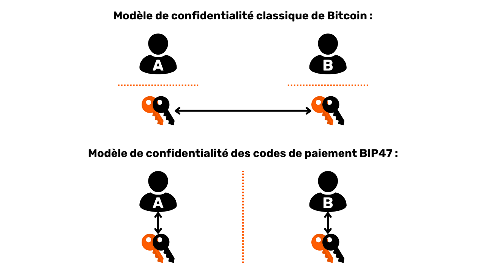


U stvarnosti, u tradicionalnom modelu poverljivosti Bitcoin, često je složeno potpuno razdvojiti tok informacija između para ključeva i korisnika, posebno u udaljenim transakcijama. Na primer, u kontekstu kampanje za donacije, primalac mora neizbežno otkriti Address ili javni ključ putem svoje veb stranice ili društvenih mreža. Ispravna upotreba BIP47, posebno sa transakcijom obaveštenja, omogućava zaobilaženje ovog problema zahvaljujući ECDHE i enkripciji Layer o kojoj ćemo kasnije govoriti.


Naravno, klasični model poverljivosti Bitcoin i dalje se primenjuje na efemerne javne ključeve, koji su izvedeni iz kombinacije dva platna koda. Dva modela su zapravo komplementarna. Ono što želim da naglasim ovde je da, za razliku od uobičajene upotrebe javnog ključa za primanje Bitcoina, platni kod može biti povezan sa specifičnim identitetom, jer je informacija "_Alice trguje sa Bobom_" prekinuta na drugom nivou. Platni kod se koristi za generate platne adrese, ali na osnovu samo posmatranja Blockchain, nemoguće je povezati BIP47 platnu transakciju sa platnim kodovima korišćenim za njeno izvršenje, osim ako UTXO-ovi uključeni nisu već bili povezani sa identitetom ranije i korisnici su povezali svoje platne kodove sa svojim odgovarajućim identitetima.


Da sumiramo, model poverljivosti koji nudi BIP47 plaćanja mogao bi se smatrati superiornijim u odnosu na osnovni model Bitcoin, iako to ne znači da je magičan.


### Izgradnja transakcije obaveštenja


Sada da vidimo kako ova transakcija obaveštenja funkcioniše. Zamislimo da Alisa želi da pošalje sredstva Bobu koristeći BIP47. U mom primeru, Alisa deluje kao pošiljalac, a Bob kao primalac. Bob je objavio svoj platni kod na svom sajtu. Alisa stoga već zna Bobov platni kod.


**1- Alisa izračunava zajedničku tajnu sa ECDH :**


- Ona bira par ključeva sa svog HD Wallet na drugoj grani od njenog koda plaćanja. Imajte na umu da ovaj par ne sme biti lako povezan sa Alisinom notifikacijom Address, niti sa Alisinim identitetom (pogledajte prethodni odeljak);
- Alisa bira privatni ključ za ovaj par. Mi ga zovemo $a$ (malim slovom);


$$
a
$$


- Alice preuzima javni ključ povezan sa Bobovom notifikacijom Address. Ovaj ključ je prvo dete izvedeno iz Bobovog platnog koda (indeks $/0$). Ovaj javni ključ nazivamo $B$ (veliko slovo). Privatni ključ povezan sa ovim javnim ključem naziva se $b$ (malo slovo). $B$ se određuje dodavanjem i udvostručavanjem tačaka na eliptičnoj krivi od $G$ (generišuća tačka) sa $b$ (privatni ključ):


$$ B = b \cdot G $$


- Alisa izračunava tajnu tačku $S$ (velikim slovima) na eliptičnoj krivoj dodavanjem i udvostručavanjem tačaka, primenjujući svoj privatni ključ $a$ na Bobov javni ključ $B$.


$$ S = a \cdot B $$


- Alice izračunava faktor zaslepljenja $f$ koji će biti korišćen za enkripciju njenog koda plaćanja. Da bi to uradila, koristi HMAC-SHA512 funkciju da odredi pseudo-slučajni broj. Drugi ulaz u ovu funkciju je vrednost koju samo Bob može pronaći: $x$, što je apscisa tajne tačke izračunate iznad. Prvi ulaz je $o$, što je UTXO korišćen kao ulaz za ovu transakciju (outpoint).


$$ f = \text{HMAC-SHA512}(o, x) $$


**2 - Alice konvertuje svoj lični platni kod u bazu 2 (binarni) **


**3- Koristi ovaj faktor zaslepljivanja kao ključ za izvođenje simetrične enkripcije na sadržaju svog platnog koda.** Algoritam enkripcije koji se koristi je jednostavno `XOR`. Operacija koja se izvodi je uporediva sa Vernam šifrom, poznatom i kao "One-Time Pad".


- Alisa prvo deli svoj faktor zaslepljivanja na dva dela: prvih 32 bajta se nazivaju $f1$, a poslednjih 32 bajta se nazivaju $f2$. Ovo nam daje:


$$ f = f1 || f2 $$


- Alisa izračunava šifru $x'$ apscise javnog ključa $x$ njenog platnog koda, i šifru $c'$ njenog string koda $c$ zasebno. $f1$ i $f2$ deluju kao ključevi šifre respektivno. Operacija koja se koristi je `XOR` (ili isključivo).


$$ x' = x \oplus f1 $$


$$ c' = c \oplus f2 $$


- Alisa zamenjuje stvarne vrednosti apscise javnog ključa $x$ i kodnog niza $c$ u svom kodu za plaćanje sa šifrovanim vrednostima $x'$ i $c'$.


**4-** Alice trenutno ima svoj platni kod sa šifrovanim sadržajem. Ona će konstruisati i emitovati transakciju koja uključuje njen javni ključ $A$ kao ulaz, izlaz ka Bobovoj notifikaciji Address, i izlaz `OP_RETURN` koji se sastoji od njenog platnog koda sa šifrovanim sadržajem. **Ova transakcija je transakcija notifikacije**.


`OP_RETURN` je operativni kod koji označava izlaz Bitcoin transakcije kao nevažeći. Danas se koristi za emitovanje ili Anchor informacija na Bitcoin Blockchain. Može da skladišti do 80 bajtova podataka, koji se zatim upisuju u lanac i vidljivi su svim ostalim korisnicima.


Kao što smo videli u prethodnim odeljcima, ECDH se koristi za generate deljenje tajne između dva korisnika koji komuniciraju preko nesigurne mreže, i potencijalno su posmatrani od strane napadača. U BIP47, ECDH se koristi za komunikaciju na Bitcoin mreži, koja je po svojoj prirodi transparentna komunikaciona mreža, i posmatrana je od strane mnogih napadača. Zajednička tajna izračunata putem ECDH ključa Exchange se zatim koristi za šifrovanje tajnih informacija koje treba preneti: kod plaćanja pošiljaoca (Alice).


Sažeću korake koje smo upravo zajedno videli za sprovođenje transakcije obaveštenja:


- Alice preuzima Bobov kod za plaćanje i obaveštenje Address;
- Alice bira UTXO iz svog HD portfolija sa odgovarajućim parom ključeva;
- Izračunava tajnu tačku na eliptičnoj krivoj koristeći ECDH ;
- Koristi ovu tajnu tačku za izračunavanje HMAC-a, što je faktor zaslepljivanja;
- Ona koristi ovaj faktor zaslepljivanja da šifruje sadržaj svog ličnog koda za plaćanje;
- Koristi izlaz transakcije `OP_RETURN` za komunikaciju skrivenog koda plaćanja Bobu.


### Obaveštenje o transakciji: praktična studija


Da bismo detaljnije razumeli kako to funkcioniše, a posebno upotrebu `OP_RETURN`, hajde da pogledamo stvarnu transakciju obaveštenja. Izvršio sam takvu transakciju na Testnet, koju možete pronaći [klikom ovde](https://Mempool.space/fr/Testnet/tx/0e2e4695a3c49272ef631426a9fd2dae6ec3a469e3a39a3db51aa476cd09de2e).


Gledajući ovu transakciju, već možemo videti da ima jedan ulaz i 4 izlaza:


- Prvi izlaz je `OP_RETURN` koji sadrži moj skriveni kod za plaćanje;
- Drugi izlaz 546 Sats ukazuje na obaveštenje mog primaoca Address;
- Treći izlaz od 15,000 Sats predstavlja naknadu za uslugu, jer sam koristio Samourai Wallet za izradu ove transakcije;
- Četvrti izlaz od 2 miliona Sats predstavlja stopu Exchange, tj. preostalu razliku u mom unosu koja se vraća na drugi Address koji mi pripada.


Najzanimljivije za proučavanje je očigledno izlaz 0 koristeći `OP_RETURN`. Hajde da detaljnije pogledamo šta sadrži. Evo `scriptPubKey` u heksadecimalnom obliku:


```text
6a4c50010002b13b2911719409d704ecc69f74fa315a6cb20fdd6ee39bc9874667703d67b164927b0e88f89f3f8b963549eab2533b5d7ed481a3bea7e953b546b4e91b6f50d800000000000000000000000000
```


Postoji nekoliko delova ovog skripta. Prvo, :


```text
6a4c
```


Među opkodovima, možemo prepoznati `0x6a` koji označava `OP_RETURN` i `0x4c` koji označava `OP_PUSHDATA1`.


Bajt koji sledi nakon ove poslednje operacije ukazuje na veličinu narednog tereta. Ukazuje na `0x50`, ili 80 bajtova:


```text
6a4c50
```


Dalje, imamo metapodatke mog koda za plaćanje u čistom tekstu:


```text
010002
```


Šifrovana apscisa javnog ključa mog platnog koda :


```text
b13b2911719409d704ecc69f74fa315a6cb20fdd6ee39bc9874667703d67b164
```


Šifrovani niz mog koda za plaćanje:


```text
927b0e88f89f3f8b963549eab2533b5d7ed481a3bea7e953b546b4e91b6f50d8
```


I na kraju, popunjavanje do 80 bajtova, standardne veličine `OP_RETURN` :


```text
00000000000000000000000000
```


Da bismo vam pomogli da razumete, ovde je moj kod za plaćanje u običnom tekstu u bazi 58 :


```text
PM8TJQCyt6ovbozreUCBrfKqmSVmTzJ5vjqse58LnBzKFFZTwny3KfCDdwTqAEYVasn11tTMPc2FJsFygFd3YzsHvwNXLEQNADgxeGnMK8Ugmin62TZU
```


A u bazi 16 :


```text
4701000277507c9c17a89cfca2d3af554745d6c2db0e7f6b2721a3941a504933103cc42add94881210d6e752a9abc8a9fa0070e85184993c4f643f1121dd807dd556d1dc000000000000000000000000008604e4db
```


Ako uporedimo moj običan tekstualni kod plaćanja sa `OP_RETURN`, možemo videti da HRP (`0x47`) i kontrolni zbir (`0x8604e4db`) nisu preneti. Ovo je normalno, jer su ove informacije namenjene ljudima.


Zatim, možemo prepoznati verziju (`0x01`), bit polje (`0x00`) i paritet javnog ključa (`0x02`). I, na kraju koda za plaćanje, prazni bajtovi (`0x000000000000000000000000000000`) koji omogućavaju popunjavanje do ukupno 80 bajtova. Svi ovi metapodaci se prenose nešifrovano.


Konačno, možemo primetiti da su apscisa javnog ključa (`0x77507c9c17a89cfca2d3af554745d6c2db0e7f6b2721a3941a504933103cc42a`) i kod niza (`0xdd94881210d6e752a9abc8a9fa0070e85184993c4f643f1121dd807dd556d1dc`) enkriptovani. Ovo je sadržaj koda za plaćanje.


### Šta je XOR?


U prethodnim odeljcima smo videli da se kod plaćanja prenosi šifrovan korišćenjem XOR operacije. Hajde da detaljnije pogledamo kako ovaj operator funkcioniše, jer se široko koristi u kriptografiji.


XOR je logički operator zasnovan na Booleovoj algebri. Za dva operanda u bitovima, vraća `1` ako su bitovi istog ranga različiti, a vraća `0` ako su bitovi istog ranga jednaki. Evo XOR tabele istinitosti prema vrednostima operanada `D` i `E`:


| D | E | D XOR E |
| --- | --- | ------- |
| 0 | 0 | 0 |
| 0 | 1 | 1 |
| 1 | 0 | 1 |
| 1 | 1 | 0 |

Na primer:


$$
0110 \oplus 1110 = 1000
$$


Ili :


$$
010011 \oplus 110110 = 100101
$$


Sa ECDH, upotreba XOR kao enkripcije Layer je posebno dosledna. Prvo, zahvaljujući ovom operatoru, enkripcija je simetrična. To znači da primalac može dešifrovati kod plaćanja istim ključem koji je korišćen za enkripciju. Ključevi za enkripciju i dešifrovanje se izračunavaju iz deljene tajne koristeći ECDH. Ova simetrija je omogućena komutativnim i asocijativnim svojstvima XOR operatora:


- Ostala svojstva :


$$
D \oplus D = 0
$$


$$
D \oplus 0 = D
$$


- Komutativnost :


$$
D \oplus E = E \oplus D
$$


- Asocijativnost :


$$
D \oplus (E \oplus Z) = (D \oplus E) \oplus Z = D \oplus E \oplus Z
$$


Ako :


$$
D \oplus E = L
$$


Zatim :


$$
D \oplus L = D \oplus (D \oplus E) = D \oplus D \oplus E = 0 \oplus E = E \\
\therefore D \oplus L = E
$$


Drugo, ovaj metod enkripcije je veoma sličan Vernam (One-Time Pad) šifri, jedinom algoritmu za enkripciju poznatom do danas koji ima bezuslovnu (ili apsolutnu) sigurnost. Da bi Vernamova šifra imala ovu karakteristiku, ključ za enkripciju mora biti savršeno nasumičan, iste veličine kao poruka i korišćen samo jednom. U metodu enkripcije korišćenom ovde za BIP47, ključ je zaista iste veličine kao poruka, a faktor zaslepljivanja je tačno iste veličine kao konkatenacija apscise javnog ključa sa string kodom platnog koda. Ovaj ključ za enkripciju se koristi samo jednom. S druge strane, ovaj ključ nije izveden iz savršene nasumičnosti, pošto je HMAC. Umesto toga, on je pseudo-nasumičan. Dakle, nije Vernamova šifra, ali metoda je bliska.


### Prijem obaveštenja o transakciji


Sada kada je Alisa poslala transakciju obaveštenja Bobu, da vidimo kako je Bob tumači. Kao podsetnik, Bob mora imati pristup Alisinom kodu plaćanja. Bez ove informacije, kao što ćemo videti u sledećem odeljku, neće moći da izvede parove ključeva koje je Alisa kreirala, i stoga neće moći da pristupi svojim bitkoinima primljenim putem BIP47. Za sada, Alisin kod plaćanja je šifrovan. Da vidimo kako ga Bob dešifruje.


**1-** Bob prati nadzire transakcije koje stvaraju izlaze sa njegovim obaveštenjem Address.


**2-** Kada transakcija ima izlaz na svojoj notifikaciji Address, Bob je analizira da vidi da li sadrži izlaz OP_RETURN koji je u skladu sa BIP47 standardom.


**3-** Ako je prvi bajt OP_RETURN payload-a `0x01`, Bob započinje svoju potragu za mogućim tajnim deljenjem sa ECDH :


- Bob bira ulazni javni ključ za transakciju. To jest, Alisin javni ključ nazvan $A$ sa :


$$ A = a \cdot G $$


- Bob bira privatni ključ $b$ povezan sa njegovim ličnim obaveštenjem Address :


$$ b $$


- Bob izračunava tajnu tačku $S$ (zajednička tajna ECDH) na eliptičnoj krivoj dodavanjem i udvostručavanjem tačaka, primenjujući svoj privatni ključ $b$ na Alisin javni ključ $A$ :


$$ S = b \cdot A $$


- Bob određuje faktor zaslepljenja $f$ koji će omogućiti da se korisni teret Alisinog koda plaćanja dešifruje. Na isti način kao što je Alisa prethodno izračunala, Bob će pronaći $f$ primenom HMAC-SHA512 na $x$, apscisnu vrednost tajne tačke $S$, i na $o$, UTXO korišćen kao ulaz za ovu transakciju obaveštenja:


$$ f = \text{HMAC-SHA512}(o, x) $$


**4-** Bob tumači podatke OP_RETURN u transakciji obaveštenja kao kod za plaćanje. On će jednostavno dešifrovati sadržaj ovog potencijalnog koda za plaćanje koristeći $f$ faktor zaslepljivanja:


- Bob deli faktor zaslepljivanja $f$ na 2 dela: prvih 32 bajta od $f$ će biti $f1$, a poslednjih 32 bajta će biti $f2$ ;
- Bob dešifruje vrednost šifrovane apscise $x'$ iz javnog ključa Alisinog platnog koda:


$$ x = x' \oplus f1 $$


- Bob dešifruje vrednost šifrovanog string koda $c'$ iz Alisinog koda za plaćanje:


$$ c = c' \oplus f2 $$


**5-** Bob proverava da li je vrednost javnog ključa Alisinog koda za plaćanje deo grupe secp256k1. Ako jeste, tumači to kao važeći kod za plaćanje. Ako nije, ignoriše transakciju.


Sada kada Bob zna Alisin kod za plaćanje, Alisa mu može poslati do `2^32` uplata, a da nikada ne mora ponoviti transakciju obaveštenja ovog tipa.


Zašto to funkcioniše? Kako Bob može odrediti isti faktor zaslepljivanja kao Alice i na taj način dešifrovati njen kod plaćanja? Hajde da detaljnije pogledamo delovanje ECDH u onome što smo upravo opisali.


Prvo i najvažnije, bavimo se simetričnom enkripcijom. To znači da su ključ za enkripciju i ključ za dekripciju ista vrednost. Ovaj ključ u transakciji obaveštenja je faktor zaslepljivanja:


$$ f = f1 || f2 $$


Alice i Bob moraju stoga dobiti istu vrednost za $f$, bez direktnog prenosa, jer bi napadač mogao da je ukrade i dešifruje tajne informacije. Ovaj faktor zaslepljivanja se dobija primenom HMAC-SHA512 na 2 vrednosti:


- apscisa tajne tačke ;
- i UTXO potrošen na ulazu transakcije.


Bob stoga treba obe ove informacije da dešifruje Alisin kod za plaćanje. Za unos UTXO, Bob ga može jednostavno preuzeti posmatranjem transakcije obaveštenja. Za tajnu tačku, Bob će morati da koristi ECDH. Kao što je viđeno u prethodnom odeljku o Diffie-Hellmanu, jednostavno razmenom svojih javnih ključeva i tajnom primenom svojih privatnih ključeva na javni ključ onog drugog, Alisa i Bob mogu pronaći preciznu tajnu tačku na eliptičnoj krivi. Transakcija obaveštenja je zasnovana na ovom mehanizmu:


- Bobov par ključeva :


$$ B = b \cdot G $$


- Alicin par ključeva :


$$ A = a \cdot G $$


- Za tajnu $S (x, y)$ :


$$ S = a \cdot B = a \cdot (b \cdot G) = (b \cdot a) \cdot G = b \cdot A $$


Sada kada Bob zna Alisin kod za plaćanje, moći će da detektuje njene BIP47 uplate, i moći će da izvede privatne ključeve koji blokiraju primljene bitkoine.


Sažeću korake koje smo upravo zajedno videli za primanje i tumačenje transakcije obaveštenja:


- Bob prati transakcioni izlaz na svoju notifikaciju Address;
- Kada ga detektuje, preuzima informacije sadržane u OP_RETURN ;
- Bob bira javni ključ kao ulaz i izračunava tajnu tačku koristeći ECDH ;
- Koristi ovu tajnu tačku za izračunavanje HMAC-a, koji je faktor zaslepljivanja;
- Koristi ovaj faktor zaslepljivanja za dešifrovanje Alisinog koda plaćanja sadržanog u OP_RETURN.


### BIP47 transakcija plaćanja


Hajde da pogledamo proces plaćanja sa BIP47. Da vas podsetimo na trenutnu situaciju :


- Alisa zna Bobov platni kod, koji je jednostavno preuzela sa njegove veb stranice;
- Bob zna Alisin kod plaćanja iz obaveštenja o transakciji;
- Alice će izvršiti svoju prvu uplatu Bobu. Može ih izvršiti još mnogo na isti način.


Pre nego što objasnim ovaj proces, mislim da je važno setiti se na kojim indeksima trenutno radimo. Putanja derivacije za kod plaćanja je opisana na sledeći način: `m/47'/0'/0'`. Sledeća dubina deli indekse na sledeći način:


- Prvi normalni (neojačani) par ćerki je onaj koji se koristi za generate obaveštenje Address diskutovano u prethodnom odeljku: `m/47'/0'/0'/0` ;
- Normalni parovi ključeva ćerki koriste se unutar ECDH za generate BIP47 adrese za primanje uplata, kao što ćemo videti u ovom odeljku: od `m/47'/0'/0'/0` do `m/47'/0'/0'/2,147,483,647` ;
- Ojačani parovi ključeva ćerki su efemerni kodovi za plaćanje: od `m/47'/0'/0'/0'` do `m/47'/0'/0'/2,147,483,647'`.


Svaki put kada Alisa želi da pošalje uplatu Bobu, ona izvodi novi, jedinstveni, prazan Address, ponovo koristeći ECDH protokol:


- Alice odabira prvi privatni ključ izveden iz njenog ličnog višekratnog koda za plaćanje :


$$ a $$


- Alice bira prvi neiskorišćeni javni ključ izveden iz Bobovog koda za plaćanje. Ovaj javni ključ ćemo nazvati $B$. On je povezan sa privatnim ključem $b$ poznatim samo Bobu:


$$ B = b \cdot G $$


- Alisa izračunava tajnu tačku $S$ na eliptičnoj krivi dodavanjem i udvostručavanjem tačaka primenom svog privatnog ključa $a$ na Bobov javni ključ $B$ :


$$ S = a \cdot B $$


- Sa ove tajne tačke, Alisa izračunava zajedničku tajnu $s$ (malim slovom). Da bi to uradila, ona bira apscisu tajne tačke $S$ nazvanu $Sx$, i prosleđuje ovu vrednost SHA256 Hash funkciji:


$$ S = (Sx, Sy) $$


$$ s = \text{SHA256}(Sx) $$


- Alice koristi ovu zajedničku tajnu $s$ da izračuna prijem plaćanja Bitcoin Address. Prvo, ona proverava da li je $s$ sadržano u redosledu krive secp256k1. Ako to nije slučaj, ona povećava indeks javnog ključa Boba da bi izvela drugu zajedničku tajnu ;
- U drugom koraku, ona izračunava javni ključ $K0$ dodavanjem tačaka $B$ i $s-G$ na eliptičnoj krivoj. Drugim rečima, Alisa dodaje javni ključ izveden iz Bobovog koda za plaćanje $B$ drugoj tački izračunatoj na eliptičnoj krivoj dodavanjem i udvostručavanjem tačaka sa deljenom tajnom $s$ od generatora tačke $G$ krive secp256k1. Ova nova tačka predstavlja javni ključ, i nazivamo je $K0$ :


$$ K0 = B + s \cdot G $$


- Sa ovim javnim ključem $K0$, Alisa može izvesti prazan prijem Address na standardni način (npr. SegWit V0 u bech32).


Jednom kada je Alisa dobila Bobov $K0$ primajući Address, može izvršiti Bitcoin transakciju na standardni način. Da bi to uradila, bira UTXO koji poseduje, osiguran parom ključeva iz druge grane njenog HD Wallet, i koristi ga da zadovolji izlaz ka Bobovom $K0$ Address. Važno je napomenuti da ova uplata, kada je Address izveden, prati klasičan proces i više ne zavisi od ključeva povezanih sa BIP47.


Sažeću korake koje smo upravo videli zajedno za slanje BIP47 uplate:


- Alisa bira prvi privatni ključ ćerke izveden iz njenog ličnog koda za plaćanje ;
- Izračunava tajnu tačku na eliptičnoj krivi koristeći ECDH od prvog neiskorišćenog javnog ključa ćerke izvedenog iz Bobovog koda za plaćanje;
- Koristi ovu tajnu tačku za izračunavanje zajedničke tajne sa SHA256 ;
- Ona koristi ovu zajedničku tajnu da izračuna novu tajnu tačku na eliptičnoj krivoj;
- Ona dodaje ovu novu tajnu tačku Bobovom javnom ključu;
- Ona dobija novi efemerni javni ključ za koji samo Bob ima pridruženi privatni ključ;
- Alice može napraviti klasičnu transakciju Bobu sa izvedenim efemernim prijemom Address.


Ako Alice želi da izvrši drugu uplatu, pratiće iste korake kao i ranije, osim što će ovaj put izabrati drugi javni ključ izveden iz Bobovog koda za plaćanje. Konkretno, koristiće sledeći neiskorišćeni ključ. Tako će dobiti novi prijemni Address koji pripada Bobu, označen kao $K1$ :


Može se nastaviti na ovaj način i izvesti do `2^32` praznih adresa koje pripadaju Bobu.


Iz spoljnje perspektive, gledajući Blockchain, teoretski je nemoguće razlikovati BIP47 uplatu od konvencionalne uplate. Evo primera BIP47 transakcije na Testnet:


```text
94b2e59510f2e1fa78411634c98a77bbb638e28fb2da00c9f359cd5fc8f87254
```


Izgleda kao klasična transakcija sa potrošenim ulazom, izlazom plaćanja i Exchange kursom:


### Prijem BIP47 uplate i izvođenje privatnog ključa


Alisa je upravo izvršila svoju prvu uplatu na prazan BIP47 Address koji pripada Bobu. Sada ćemo videti kako Bob prima ovu uplatu. Takođe ćemo videti zašto Alisa nema pristup privatnom ključu Address koji je upravo sama generisala, i kako Bob pronalazi ovaj ključ da potroši bitkoine koje je upravo primio.


Čim Bob primi obaveštenje o transakciji od Alice, on izvodi javni ključ BIP47 $K0$ čak i pre nego što njegov korespondent pošalje uplatu. Stoga posmatra svaku uplatu na povezani Address. Zapravo, on odmah izvodi nekoliko adresa koje posmatra ($K0$, $K1$, $K2$, $K3$...). Evo kako izvodi ovaj javni ključ $K0$:


- Bob bira prvi privatni ključ ćerke izveden iz njegovog platnog koda. Ovaj privatni ključ se zove $b$. On je povezan sa javnim ključem $B$ sa kojim je Alisa izvršila svoje proračune u prethodnom koraku:


$$ b $$


- Bob bira Alisin prvi javni ključ izveden iz njenog platnog koda. Ovaj ključ se zove $A$. Povezan je sa privatnim ključem $a$ pomoću kojeg je Alisa izvršila svoje proračune, a koji je poznat samo Alisi. Bob može sprovesti ovaj proces, jer zna Alisin platni kod, koji mu je poslat sa transakcijom obaveštenja:


$$ A = a \cdot G $$


- Bob izračunava tajnu tačku $S$, dodavanjem i udvostručavanjem tačaka na eliptičnoj krivi, primenjujući svoj privatni ključ $b$ na Alisin javni ključ $A$. Ovde se ponovo koristi ECDH da bi se garantovalo da će ova tačka $S$ biti ista za oba, Boba i Alisu:


$$ S = b \cdot A $$


- Na isti način kao i Alisa, Bob izoluje apscisu ove tačke $S$. Ovu vrednost smo nazvali $Sx$. On prosleđuje ovu vrednost funkciji SHA256 da bi pronašao zajedničku tajnu $s$ (malim slovima):


$$ s = \text{SHA256}(Sx) $$


- Na isti način kao i Alisa, Bob izračunava $s-G$ tačku na eliptičnoj krivi. Zatim dodaje ovu tajnu tačku svom javnom ključu $B$. On tada dobija novu tačku na eliptičnoj krivi, koju tumači kao javni ključ $K0$ :


$$ K0 = B + s \cdot G $$


Jednom kada Bob ima ovaj javni ključ $K0$, može izvesti povezani privatni ključ da potroši svoje bitkoine. Samo on može generate ovaj privatni ključ:


- Bob dodaje privatni ključ svoje ćerke $b$ koji je izveden iz njegovog ličnog koda za plaćanje. Samo on može dobiti vrednost $b$. Zatim dodaje $b$ zajedničkoj tajni $s$ kako bi dobio $k0$, privatni ključ $K0$:


$$ k0 = b + s $$


Zahvaljujući grupnom zakonu eliptičke krive, Bob dobija tačno privatni ključ koji odgovara javnom ključu koji je koristila Alisa. Stoga imamo :


$$ K0 = k0 \cdot G $$


Sažeću korake koje smo upravo videli zajedno kako bismo primili BIP47 uplatu i izračunali odgovarajući privatni ključ:


- Bob bira prvi privatni ključ ćerke izveden iz njegovog ličnog koda plaćanja ;
- Izračunava tajnu tačku na eliptičnoj krivoj koristeći ECDH iz prvog javnog ključa ćerke izvedenog iz Alisinog niza koda;
- Koristi ovu tajnu tačku za izračunavanje zajedničke tajne sa SHA256 ;
- On koristi ovu zajedničku tajnu za izračunavanje nove tajne tačke na eliptičnoj krivi;
- On dodaje ovu novu tajnu tačku svom ličnom javnom ključu;
- On dobija novi efemerni javni ključ, onaj na koji će Alisa poslati svoju prvu uplatu;
- Bob izračunava privatni ključ povezan sa ovim efemernim javnim ključem dodajući privatni ključ svoje ćerke izveden iz njegovog platnog koda i zajedničke tajne.


Pošto Alisa ne može da dobije $b$ (Bobov privatni ključ), nije u mogućnosti da odredi $k0$ (privatni ključ povezan sa Bobovim BIP47 prijemom Address). Šematski, možemo predstaviti izračunavanje deljene tajne $S$ na sledeći način:


Jednom kada se zajednička tajna pronađe pomoću ECDH, Alisa i Bob izračunavaju BIP47 javni ključ za plaćanje $K0$, a Bob takođe izračunava povezani privatni ključ $k0$ :


### Povraćaj BIP47 uplate


Pošto Bob zna Alisin višekratni kod za plaćanje, već ima sve informacije koje su mu potrebne da joj pošalje povraćaj novca. Neće morati ponovo da kontaktira Alisu da bi tražio bilo kakve informacije. Jednostavno treba da je obavesti transakcijom obaveštenja, kako bi ona mogla da preuzme svoje BIP47 adrese sa svojim seed, a zatim može da joj pošalje do `2^32` uplata.


Funkcija povraćaja je specifična za BIP47 i jedna je od njegovih prednosti u odnosu na druge metode, kao što su Tihi Plaćanja, koje ćemo razmotriti u kasnijim poglavljima.


Bob može tada nadoknaditi Alice na isti način na koji mu je ona slala uplate. Uloge su obrnute:


*Mnogo hvala [Fanis Michalakis](https://x.com/FanisMichalakis) za lekturu i stručne savete o članku koji je inspirisao pisanje ovog poglavlja!


https://planb.network/tutorials/privacy/on-chain/paynym-bip47-a492a70b-50eb-4f95-a766-bae2c5535093

## Tihi Plaćanja


<chapterId>2871d594-414e-4598-a830-91c9eb84dfb8</chapterId>


BIP47 je naširoko kritikovan zbog svoje neefikasnosti na lancu. Kao što je objašnjeno u prethodnom poglavlju, zahteva da se transakcija obaveštenja izvrši za svakog novog primaoca. Ovo ograničenje postaje zanemarljivo ako planiramo da uspostavimo održiv kanal plaćanja sa ovim primaocem. Zaista, jedna transakcija obaveštenja otvara put za gotovo beskonačan broj narednih BIP47 plaćanja.


Međutim, u određenim situacijama, transakcija obaveštenja može biti prepreka za korisnika. Uzmimo primer jednokratne donacije primaocu: sa klasičnim Bitcoin Address, jedna transakcija je dovoljna da se donacija završi. Ali sa BIP47, potrebne su dve transakcije: jedna za obaveštenje i druga za stvarno plaćanje. Kada je potražnja za prostorom u bloku niska i naknade za transakcije su niske, ovaj dodatni korak obično nije problem. Međutim, u vremenima zagušenja, naknade za transakcije mogu postati prekomerne za jedno plaćanje, potencijalno udvostručujući trošak za korisnika u poređenju sa standardnom Bitcoin transakcijom, što može biti neprihvatljivo za korisnika.


Za situacije u kojima korisnik planira da izvrši samo nekoliko uplata na statični identifikator, razvijena su druga rešenja. To uključuje Silent Payments, opisane u [BIP352](https://github.com/Bitcoin/bips/blob/master/bip-0352.mediawiki). Ovaj protokol omogućava korišćenje statičnog identifikatora za primanje uplata bez proizvodnje Address ponovnih korišćenja, i bez potrebe za korišćenjem transakcija obaveštenja. Pogledajmo kako ovaj protokol funkcioniše.


---
*Da biste u potpunosti razumeli ovo poglavlje, neophodno je savladati funkcionisanje ECDH (Elliptic Curve Diffie-Hellman) i kriptografsko izvođenje ključeva u HD Wallet. Ovi koncepti su detaljno obrađeni u prethodnom poglavlju o BIP47. Neću ih ponavljati ovde. Ako još niste upoznati sa ovim konceptima, preporučujem da se konsultujete sa prethodnim poglavljem pre nego što nastavite sa ovim. Neću se vraćati na rizike povezane sa ponovnom upotrebom adresa za primanje, niti na važnost posedovanja jedinstvenog identifikatora za primanje uplata.* Samo ću pomenuti nekoliko tačaka koje bih želeo da istaknem ovde.


---
### Zašto ne premestiti obaveštenje?


Kao što je diskutovano u poglavlju BIP47, transakcija obaveštenja ima dve glavne funkcije:


- Obaveštava primaoca ;
- Prenosi pošiljaočev kod za plaćanje.


Čovek bi naivno mogao pomisliti da bi se ovaj proces obaveštavanja mogao sprovesti off-chain. U teoriji, to je savršeno izvodljivo: sve što bi primalac trebalo da uradi jeste da naznači sredstvo komunikacije za primanje BIP47 kodova plaćanja od pošiljalaca. Međutim, postoje dva velika problema sa ovim pristupom:


- Prvo, to bi premestilo proces prenosa koda na drugi komunikacioni protokol. Problemi vezani za troškove i poverljivost Exchange bi ostali, ali bi jednostavno bili preneti na ovaj novi protokol. Što se tiče poverljivosti, ovo bi takođe moglo stvoriti vezu između identiteta korisnika i aktivnosti na lancu, što želimo da izbegnemo obavljanjem obaveštenja direktno na Blockchain. Štaviše, pravljenje obaveštenja van Blockchain bi uvelo rizike cenzure (kao što je blokiranje sredstava) koji ne postoje na Bitcoin;
- Drugo, ovo bi predstavljalo problem oporavka. Sa BIP47, primalac mora znati platne kodove pošiljalaca kako bi pristupio sredstvima. Ovo važi prilikom prijema, ali i u slučaju oporavka sredstava putem seed ako je Wallet izgubljen. Sa onchain obaveštenjima, ovaj rizik se izbegava, jer korisnik može preuzeti i dešifrovati transakcije obaveštenja jednostavno znajući svoj seed. Međutim, ako se obaveštenje vrši van Blockchain, korisnik bi morao održavati dinamičku rezervnu kopiju svih primljenih platnih kodova, što je nepraktično za prosečnog korisnika.


Sva ova ograničenja čine upotrebu onchain obaveštenja neophodnom za BIP47. Međutim, Silent Payments nastoje da izbegnu ovaj korak onchain obaveštenja upravo zbog njegovih troškova. Usvojeno rešenje je stoga ne premestiti obaveštenje, već ga potpuno eliminisati. Da bi se to postiglo, mora se prihvatiti kompromis: skeniranje. Za razliku od BIP47, gde korisnik tačno zna gde da pronađe svoja sredstva zahvaljujući transakcijama obaveštenja, sa Silent Payments korisnik mora da pregleda sve postojeće Bitcoin transakcije kako bi otkrio bilo kakve uplate namenjene njemu. Da bi se smanjilo ovo operativno opterećenje, pretraga Silent Payments je ograničena samo na transakcije koje verovatno sadrže takve uplate, tj. one sa najmanje jednim Taproot P2TR izlazom. Skeniranje se takođe fokusira isključivo na transakcije od datuma kreiranja Wallet (nema potrebe skenirati transakcije koje datiraju iz 2009. ako je Wallet kreiran 2024).


Dakle, možete videti zašto BIP47 i Silent Payments, iako usmereni ka sličnom cilju, uključuju različite kompromise i stoga **zapravo ispunjavaju različite slučajeve upotrebe**. Za jednokratna plaćanja, kao što su jednokratne donacije, Silent Payments su prikladniji zbog nižih troškova. S druge strane, za redovne transakcije istom primaocu, kao u slučaju Exchange platformi ili Mining bazena, BIP47 može biti preferiran.


Hajde da pogledamo tehnički rad Silent Payments kako bismo bolje razumeli šta je u pitanju. Da bismo to uradili, predlažem da primenimo isti pristup kao u BIP352 objašnjavajućem dokumentu. Postepeno ćemo razložiti proračune koje treba izvršiti, element po element, opravdavajući svako novo dodavanje.


### Nekoliko pojmova za razumevanje


Pre nego što počnete, važno je napomenuti da se Silent Payments oslanjaju isključivo na upotrebu P2TR (*Pay to Taproot*) tipova skripti. Za razliku od BIP47, nije potrebno izvoditi adrese za primanje iz javnih ključeva potomaka putem heširanja. U P2TR standardu, prilagođeni javni ključ se koristi direktno i nešifrovano u Address. Dakle, Taproot prima Address je suštinski javni ključ sa nekim metapodacima. Ovaj prilagođeni javni ključ je agregacija dva druga javna ključa: jedan omogućava direktno, tradicionalno trošenje putem jednostavnog potpisa, a drugi predstavlja Merkle Root MAST-a, koji ovlašćuje trošenje pod uslovom da je ispunjen jedan od uslova potencijalno upisanih u Merkle Tree.


Postoje dva glavna razloga za odluku da se Silent Payments ograniče isključivo na Taproot:


- Prvo, to znatno olakšava implementaciju i buduće nadogradnje u softveru za portfelj, jer je potrebno poštovati samo jedan standard;
- Drugo, ovaj pristup pomaže u poboljšanju korisničkog anonseta podsticanjem da se ne dele između različitih tipova skripti, što generate razlikuje portfelj otisaka prstiju u analizi lanca (za više informacija o ovom konceptu, molimo pogledajte poglavlje 4 dela 2).


### Naivna izvedba javnog ključa za Silent Payments


Hajde da počnemo sa jednostavnim primerom kako bismo došli do suštine kako SPs (Silent Payments) funkcionišu. Uzmimo Alicu i Boba, dva korisnika Bitcoin. Alica želi da pošalje Bitcoine Bobu na prazan prijemni Address. Postoje tri cilja ovog procesa:


- Alice mora biti sposobna da generate prazan Address;
- Bob mora biti u stanju da identifikuje uplatu poslatu na ovaj specifični Address;
- Bob treba da bude u mogućnosti da dobije privatni ključ povezan sa ovim Address kako bi mogao da potroši svoja sredstva.


Alice ima UTXO u svom sigurnom Bitcoin Wallet sa sledećim parom ključeva:


- $a$: privatni ključ ;
- $A$: javni ključ ($A = a \cdot G$)


Bob ima SP Address koji je objavio na Internetu sa:


- $b$: privatni ključ ;
- $B$: javni ključ ($B = b \cdot G$)


Preuzimanjem Bobovog Address, Alisa je u mogućnosti da izračuna novi prazan Address koji pripada Bobu koristeći ECDH. Nazovimo ovaj Address $P$ :


$$ P = B + \text{Hash}(a \cdot B) \cdot G $$


U ovoj jednačini, Alisa je jednostavno izračunala skalarni proizvod svog privatnog ključa $a$ i Bobovog javnog ključa $B$. Ona je prosledila ovaj rezultat u Hash funkciju poznatu svima. Dobijena vrednost se zatim skalirano množi sa generišućom tačkom $G$ eliptičke krive `secp256k1`. Na kraju, Alisa dodaje dobijenu tačku Bobovom javnom ključu $B$. Kada Alisa ima ovaj Address $P$, koristi ga kao izlaz u transakciji, tj. šalje bitkoine na njega.


> *U kontekstu Silent Payments, funkcija "Hash" odgovara SHA256 Hash funkciji specifično označenoj sa `BIP0352/SharedSecret`, što osigurava da su heševi generisani jedinstveni za ovaj protokol i ne mogu biti ponovo korišćeni u drugim kontekstima, dok pružaju dodatnu zaštitu protiv ponovne upotrebe nonci u potpisima. Ovaj standard odgovara onom [specifikovanom u BIP340 za Schnorr potpise](https://github.com/Bitcoin/bips/blob/master/bip-0340.mediawiki) na `secp256k1`.*
Zahvaljujući svojstvima eliptičke krive na kojoj se zasniva ECDH, znamo da:


$$ a \cdot B = b \cdot A $$


Bob će stoga moći da izračuna primajući Address na koji je Alisa poslala bitkoine. Da bi to uradio, on prati sve Bitcoin transakcije koje ispunjavaju kriterijume za Silent Payments i primenjuje sledeći proračun na svaku od njih da vidi da li je uplata namenjena njemu (*skeniranje*):


$$ P' = B + \text{Hash}(b \cdot A) \cdot G $$


Kada skenira Alisin transakciju, shvata da je $P'$ jednak $P$. Stoga zna da je uplata namenjena njoj:


$$ P' = B + \text{Hash}(b \cdot A) \cdot G = B + \text{Hash}(a \cdot B) \cdot G = P $$


Odavde, Bob će moći da izračuna privatni ključ $p$ koji omogućava da se Address $P$ potroši:


$$ p = (b + \text{Hash}(b \cdot A)) \bmod n $$


Kao što možete videti, da biste izračunali ovaj privatni ključ $p$, morate imati privatni ključ $b$. Samo Bob ima ovaj privatni ključ $b$. Stoga će on biti jedini koji može potrošiti bitkoine poslate na njegov Silent Payments Address.


*Legenda:*


- $B$ : Javni ključ/staticki Address koji je objavio Bob
- $b$ : Bobov privatni ključ
- $A$ : Alisin UTXO javni ključ korišćen kao ulaz transakcije
- $a$ : Alisin privatni ključ
- $G$ : Generišuća tačka eliptičke krive `secp256k1`
- $\text{SHA256}$ : SHA256 Hash funkcija označena sa `BIP0352/SharedSecret`
- $s$ : ECDH zajednička tajna
- $P$ : Javni ključ/jedinstveni Address za uplatu Bobu


Evo jednog prilično naivnog početnog pristupa korišćenju Bobovog statičkog Address, označenog sa $B$, za izvođenje jedinstvenog Address $P$ za slanje bitkoina. Međutim, ovaj metod je previše jednostavan i ima nekoliko nedostataka koje treba ispraviti. Prvi problem je što, u ovoj šemi, Alisa ne može kreirati više izlaza za Boba unutar iste transakcije.


### Kako da kreiram više izlaza?


U primeru u prethodnom odeljku, Alisa kreira jedan izlaz koji će ići Bobu na njegov jedinstveni Address $P$. Sa istim odabranim ulazom, nemoguće je da Alisa kreira dve odvojene prazne adrese za Boba, jer bi korišćeni metod uvek doveo do istog rezultata za $P$, tj. istog Address. Međutim, može biti mnogo situacija u kojima Alisa želi da podeli svoju uplatu Bobu na nekoliko manjih iznosa, čime bi kreirala nekoliko UTXO-a. Stoga je neophodno pronaći metod za postizanje ovog cilja.


Da bismo to postigli, malo ćemo modifikovati izračunavanje koje Alice izvodi da bi dobila $P$, tako da može generate dve različite adrese za Boba, naime $P_0$ i $P_1$.


Da biste izmenili proračun i dobili 2 različite adrese, jednostavno dodajte ceo broj koji menja rezultat. Tako će Alisa dodati $0$ svom proračunu da dobije Address $P_0$ i $1$ da dobije Address $P_1$. Nazovimo ovaj ceo broj $i$ :


$$ P_i = B + \text{Hash}(a \cdot B \text{ ‖ } i) \cdot G $$


Proces računanja ostaje nepromenjen u odnosu na prethodnu metodu, osim što će ovog puta Alisa konkatenirati $a \cdot B$ sa $i$ pre nego što nastavi sa Hash. Zatim jednostavno modifikujete $i$ da biste dobili novi Address koji pripada Bobu. Na primer:


$$ P_0 = B + \text{Hash}(a \cdot B \text{ ‖ } 0) \cdot G $$


$$ P_1 = B + \text{Hash}(a \cdot B \text{ ‖ } 1) \cdot G $$


Kada Bob skenira Blockchain za Tihe Uplate namenjene njemu, počinje koristeći $i = 0$ za Address $P_0$. Ako ne pronađe nijednu uplatu na $P_0$, zaključuje da ova transakcija ne sadrži Tihe Uplate namenjene njemu i prekida skeniranje. Međutim, ako je $P_0$ validan i sadrži uplatu za njega, nastavlja sa $P_1$ u istoj transakciji kako bi proverio da li je Alisa izvršila drugu uplatu. Ako se ispostavi da je $P_1$ nevalidan, prestaje sa pretragom za ovu transakciju; u suprotnom, nastavlja testiranje uzastopnih $i$ vrednosti:


$$ P_0 = B + \text{Hash}(b \cdot A \text{ ‖ } 0) \cdot G $$


$$ P_1 = B + \text{Hash}(b \cdot A \text{ ‖ } 1) \cdot G $$


Pošto Bob odmah staje na $i = 0$ ako $P_0$ ne radi, korišćenje ovog celog broja dodaje skoro nikakvo dodatno operativno opterećenje za Boba u fazi skeniranja transakcije.


Bob tada može izračunati privatne ključeve na isti način:


$$
p_0 = (b + \text{hash}(b \cdot A \text{ ‖ } 0)) \bmod n
$$


$$
p_1 = (b + \text{hash}(b \cdot A \text{ ‖ } 1)) \bmod n
$$


*Legenda:*


- $B$ : Javni ključ/staticki Address koji je objavio Bob
- $b$ : Bobov privatni ključ
- $A$ : Alisin UTXO javni ključ korišćen kao ulaz transakcije
- $a$ : Alisin privatni ključ
- $G$ : Generišuća tačka eliptičke krive `secp256k1`
- $\text{SHA256}$ : SHA256 Hash funkcija označena sa `BIP0352/SharedSecret`
- $s_0$ : Prva zajednička tajna ECDH
- $s_1$ : Druga ECDH zajednička tajna
- $P_0$ : Prvi javni ključ / jedinstveni Address za plaćanje Bobu
- $P_1$ : Drugi javni ključ / jedinstveni Address za uplatu Bobu


Ovim metodom počinjemo da dobijamo lep protokol, ali još uvek postoje neki izazovi koje treba prevazići, a ne najmanje važan je sprečavanje ponovne upotrebe Address.


### Kako izbeći ponovnu upotrebu Address?


Kao što smo videli u prethodnim odeljcima, Alis koristi par ključeva koji obezbeđuje njen UTXO, koji će ona koristiti za izračunavanje ECDH zajedničke tajne sa Bobom. Ova tajna joj omogućava da izvede jedinstveni Address $P_0$. Međutim, par ključeva ($a$, $A$) koji Alis koristi može obezbediti nekoliko UTXO-a ako je više puta koristila ovaj Address. U slučaju da Alis izvrši dve uplate Bobovom statičkom Address $B$ koristeći dva UTXO-a obezbeđena istim ključem $A$, to bi rezultiralo ponovnom upotrebom Address za Boba.


> *Korišćenje Address je veoma loša praksa u smislu poverljivosti korisnika. Da biste saznali zašto, savetujem vam da pregledate prve delove ovog kursa obuke.*
Zaista, pošto je jedinstveni Address $P_0$ izveden iz $A$ i $B$, ako Alisa izvede drugi Address za drugu uplatu $B$, sa istim ključem $A$, završiće sa potpuno istim Address $P_0$. Da bismo izbegli ovaj rizik i sprečili ponovnu upotrebu Address unutar Silent Payments, moraćemo malo da modifikujemo naše proračune.


Ono što želimo je da svaki UTXO koji Alice koristi kao ulaz za plaćanje daje jedinstveni Address na Bobovoj strani, čak i ako je nekoliko UTXO-a osigurano istim parom ključeva. Dakle, sve što treba da uradimo je da dodamo referencu na UTXO prilikom izračunavanja jedinstvenog Address $P_0$. Ova referenca će jednostavno biti Hash od UTXO koji se koristi kao ulaz:


$$ \text{inputHash} = \text{Hash}(\text{outpoint} \text{ ‖ } A) $$


A Alice će dodati ovu referencu ulazu u njen proračun jedinstvenog Address $P_0$ :


$$ P_0 = B + \text{Hash}(\text{inputHash} \cdot a \cdot B \text{ ‖ } 0) \cdot G $$


Kada skenira, Bob može takođe dodati $\text{inputHash}$, jer sve što treba da uradi je da posmatra transakciju kako bi zaključio $\text{outpoint}$ :


$$ P_0 = B + \text{Hash}(\text{inputHash} \cdot b \cdot A \text{ ‖ } 0) \cdot G $$


Kada pronađe važeći $P_0$, može izračunati odgovarajući privatni ključ $p_0$:


$$
p_0 = (b + \text{hash}(\text{inputHash} \cdot b \cdot A \text{ ‖ } 0)) \bmod n
$$


*Legenda:*


- $B$ : Javni ključ/staticki Address koji je objavio Bob
- $b$ : Bobov privatni ključ
- $A$ : Alisin UTXO javni ključ korišćen kao ulaz transakcije
- $a$ : Alisin privatni ključ
- $H$ : UTXO Hash korišćeni kao ulaz
- $G$ : Generišuća tačka eliptičke krive `secp256k1`
- $\text{SHA256}$ : SHA256 Hash funkcija označena sa `BIP0352/SharedSecret`
- $s_0$ : Prva ECDH zajednička tajna
- $P_0$ : Prvi javni ključ / jedinstveni Address za uplatu Bobu


Za sada, naše kalkulacije pretpostavljaju da Alisa koristi jedan ulaz za svoju transakciju. Međutim, ona bi trebala biti u mogućnosti da koristi više ulaza. Shodno tome, sa Bobove strane, za svaku transakciju koja uključuje više ulaza, on bi teoretski trebao izračunati ECDH za svaki ulaz kako bi utvrdio da li je uplata namenjena njemu. Ovaj metod nije zadovoljavajući, pa moramo pronaći rešenje da smanjimo obim posla!


### Podešavanje javnih ključeva u ulaze


Da bismo rešili ovaj problem, umesto korišćenja para ključeva koji obezbeđuju određeni unos na Alisinoj strani, koristićemo zbir svih parova ključeva korišćenih u unosima transakcije. Ovaj zbir će se zatim smatrati kao novi par ključeva. Ova tehnika je poznata kao "tweaking".


Na primer, zamislimo da Alisina transakcija ima 3 ulaza, svaki obezbeđen različitim parom ključeva:


- $a_0$ se koristi za osiguranje unosa #0 ;
- $a_1$ se koristi za osiguranje unosa #1;
- $a_2$ osigurava unos #2.


Prateći prethodno opisanu metodu, Alisa bi morala da izabere jedan par ključeva među $a_0$, $a_1$ i $a_2$ kako bi izračunala ECDH tajnu i generate pojedinačnu uplatu Address $P$ od Bobove statične Address $B$. Međutim, ovaj pristup zahteva da Bob testira svaku mogućnost sekvencijalno, počevši od $a_0$, zatim $a_1$, i tako dalje, dok ne identifikuje par koji generiše validan $P$ Address. Ovaj proces zahteva da Bob izvrši ECDH proračun na svim ulazima za sve transakcije, što značajno povećava operativno opterećenje skeniranja.


Da bismo to izbegli, zamolićemo Alisu da izračuna $P$ koristeći zbir svih ulaznih ključeva. Koristeći naš primer, prilagođeni privatni ključ $a$ bi bio izračunat na sledeći način:


$$ a = a_0 + a_1 + a_2 $$


Na isti način, Alice i Bob mogu izračunati prilagođeni javni ključ:


$$ A = A_0 + A_1 + A_2 $$


Ovim metodom, Bob treba samo da izračuna zbir javnih ključeva transakcije, a zatim da izračuna ECDH tajnu samo iz $A$, što u velikoj meri smanjuje broj potrebnih proračuna za fazu skeniranja.


Međutim, setite se prethodnog odeljka. Dodali smo $\text{inputHash}$ Hash našoj kalkulaciji, koja se koristi kao Nonce da bi se izbegla ponovna upotreba Address:


$$ \text{inputHash} = \text{Hash}(\text{outpoint} \text{ ‖ } A) $$


Ali ako imate nekoliko ulaza u transakciji, morate biti u mogućnosti da odredite koji je $\text{outpoint}$ izabran u ovom proračunu. Prema BIP352, kriterijum za izbor $\text{outpoint}$ koji treba koristiti je da se izabere najmanji leksikografski, što znači odabir UTXO koji se prvi pojavljuje po abecednom redu. Ova metoda standardizuje UTXO koji će biti izabran u svakoj transakciji. Na primer, ako je ovaj leksikografski najmanji $\text{outpoint}$ $\text{outpoint}_L$, proračun $\text{inputHash}$ će biti :


$$ \text{inputHash} = \text{Hash}(\text{outpoint}_L \text{ ‖ } A) $$


Proračuni tada ostaju identični onima predstavljenim u prethodnom odeljku, osim što privatni ključ $a$ i njegov odgovarajući javni ključ $A$ više nisu par korišćen za obezbeđivanje jednog unosa, već sada predstavljaju prilagođavanje za sve parove ključeva u unosima.


### Odvojite ključeve troškova i skeniranja


Za sada smo Address $B$ statičnu tiho plaćanje označili kao jedinstveni javni ključ. Zapamtite, to je taj javni ključ $B$ koji Alisa koristi za kreiranje zajedničke tajne ECDH, koja zatim izračunava jedinstvenu uplatu Address $P$. Bob koristi ovaj javni ključ $B$ i odgovarajući privatni ključ $b$ za fazu skeniranja. Ali će takođe koristiti privatni ključ $b$ da izračuna privatni ključ $p$ koji omogućava trošenje sa Address $P$.


Nedostatak ove metode je što se privatni ključ $b$, koji se koristi za izračunavanje svih privatnih ključeva adresa koje su primile Silent Payments, takođe koristi od strane Boba za skeniranje transakcija. Ovaj korak zahteva da ključ $b$ bude dostupan na internetu povezanom Wallet softveru, što ga izlaže većem riziku od krađe nego kada bi bio čuvan na Cold Wallet. Idealno bi bilo korisno iskoristiti prednosti Silent Payments dok se privatni ključ $b$, koji kontroliše pristup svim ostalim privatnim ključevima, drži sigurnim na Hardware Wallet. Srećom, protokol je prilagođen da omogući upravo to.


Da bi se to uradilo, BIP352 zahteva da primalac koristi 2 različita para ključeva:


- b_{\text{spend}}$: za izračunavanje privatnih ključeva jedinstvenih adresa za plaćanje;
- b_{\text{scan}}$: da pronađe jedinstvene adrese za plaćanje.


Na ovaj način, Bob može čuvati privatni ključ $b_{\text{spend}}$ na Hardware Wallet i koristiti privatni ključ $b_{\text{scan}}$ na online softveru da pronađe svoje Silent Payments, bez otkrivanja $b_{\text{spend}}$. S druge strane, javni ključevi $B_{\text{scan}}$ i $B_{\text{spend}}$ su oba javno otkrivena, pošto se nalaze u Bobovom statičkom Address $B$ :


$$ B = B_{\text{scan}} \text{ ‖ } B_{\text{spend}} $$


Da bi izračunala jedinstvenu uplatu Address $P_0$ koja pripada Bobu, Alisa će sada izvršiti sledeći proračun:


$$ P_0 = B_{\text{spend}} + \text{Hash}(\text{inputHash} \cdot a \cdot B_{\text{scan}} \text{ ‖ } 0) \cdot G $$


Da bi pronašao uplate koje su mu namenjene, Bob će izvršiti sledeći proračun:


$$ P_0 = B_{\text{spend}} + \text{Hash}(\text{inputHash} \cdot b_{\text{scan}} \cdot A \text{ ‖ } 0) \cdot G $$


Kao što možete videti, do sada Bob nije morao da koristi $b_{\text{spend}}$, koji se nalazi na njegovom Hardware Wallet. Kada želi da potroši $P_0$, može da uradi sledeći proračun da pronađe privatni ključ $p_0$ :


$$ p_0 = (b_{\text{spend}} + \text{Hash}(\text{inputHash} \cdot b_{\text{scan}} \cdot A \text{ ‖ } 0)) \bmod n $$


*Legenda:*


- $B_{\text{scan}}$: Bobov javni ključ za skeniranje (staticki Address)
- $b_{\text{scan}}$ : Bobov privatni ključ skeniranja
- $B_{\text{spend}}$ : Bobov javni ključ za trošenje (staticki Address)
- $b_{\text{spend}}$ : Bobov privatni ključ za trošenje
- $A$ : Zbir ulaza javnog ključa (tweak)
- $a$ : Privatni ključ koji odgovara prilagođenom javnom ključu
- $H$ : Najmanji UTXO (leksikografski) korišćen kao ulaz za Hash
- $G$ : Generišuća tačka eliptičke krive `secp256k1`
- $\text{SHA256}$ : SHA256 Hash funkcija označena sa `BIP0352/SharedSecret`
- $s_0$ : Prva zajednička tajna ECDH
- $P_0$ : Prvi javni ključ / jedinstveni Address za uplatu Bobu


### Korišćenje SP adresa sa oznakom


Bob stoga ima statički Address $B$ za Tiha Plaćanja kao:


$$ B = B_{\text{scan}} \text{ ‖ } B_{\text{spend}} $$


Problem sa ovom metodom je što ne omogućava segregaciju različitih uplata poslatih na ovaj Address. Na primer, ako Bob ima 2 različita klijenta za svoj posao i želi da razlikuje uplate svakog, biće mu potrebne 2 različite statične adrese. Naivno rešenje, sa trenutnim pristupom, bilo bi da Bob kreira dva odvojena novčanika, svaki sa sopstvenim statičkim Address, ili čak da uspostavi dve različite statične adrese unutar istog Wallet. Međutim, ovo rešenje zahteva skeniranje celog Blockchain dva puta (jednom za svaki Address) kako bi se detektovale uplate namenjene za svaki Address posebno. Ovo dvostruko skeniranje nerazumno povećava Bobovo operativno opterećenje.


Da bi rešio ovaj problem, BIP352 koristi sistem oznaka koji omogućava različite statičke adrese, bez nerazumnog povećanja opterećenja pronalaženja Silent Payments na Blockchain. Da bismo to uradili, dodajemo ceo broj $m$ javnom ključu trošenja $B_{\text{spend}}$. Ovaj ceo broj može imati vrednost $1$ za prvu statičku Address, zatim $2$ za drugu, i tako dalje. Ključevi trošenja $B_{\text{spend}}$ će sada biti nazvani $B_m$ i biće konstruisani na sledeći način:


$$ B_m = B_{\text{spend}} + \text{Hash}(b_{\text{scan}} \text{ ‖ } m) \cdot G $$


Na primer, za prvi ključ troška sa oznakom $1$ :


$$ B_1 = B_{\text{spend}} + \text{Hash}(b_{\text{scan}} \text{ ‖ } 1) \cdot G $$


Statični Address koji je objavio Bob sada će se sastojati od $B_{\text{scan}}$ i $B_m$. Na primer, prvi statični Address sa oznakom $1$ biće :


$$ B = B_{\text{scan}} \text{ ‖ } B_1 $$


> *Počinjemo samo od oznake 1 jer je oznaka 0 rezervisana za promenu.*
Alice će, sa svoje strane, izvesti jednokratnu uplatu Address $P$ na isti način kao i ranije, ali koristeći novi $B_1$ umesto $B_{\text{spend}}$ :


$$ P_0 = B_1 + \text{Hash}(\text{inputHash} \cdot a \cdot B_{\text{scan}} \text{ ‖ } 0) \cdot G $$


U stvarnosti, Alice čak i ne mora nužno znati da Bob ima označen Address, jer ona jednostavno koristi drugi deo statičkog Address koji je on obezbedio, i u ovom slučaju, to je vrednost $B_1$ umesto $B_{text{spend}}$.


Da bi skenirao uplate, Bob će uvek koristiti vrednost svog početnog statičkog Address sa $B_{\text{spend}}$ na sledeći način:


$$ P_0 = B_{\text{spend}} + \text{Hash}(\text{inputHash} \cdot b_{\text{scan}} \cdot A \text{ ‖ } 0) \cdot G $$


Zatim, on jednostavno oduzima vrednost koju pronađe za $P_0$ od svakog izlaza jedan po jedan. Zatim proverava da li jedan od rezultata ovih oduzimanja odgovara vrednosti jedne od oznaka koje koristi na svom portfoliju. Ako, na primer, izlaz #4 odgovara oznaci $1$, to znači da je ovaj izlaz Tihá Uplata povezana sa statički označenim Address $B_1$ :


$$ Out_4 - P_0 = \text{Hash}(b_{\text{scan}} \text{ ‖ } 1) \cdot G $$


Radi zato što :


$$ B_1 = B_{\text{spend}} + \text{Hash}(b_{\text{scan}} \text{ ‖ } 1) \cdot G $$


Zahvaljujući ovoj metodi, Bob može koristiti mnoštvo statičkih adresa ($B_1$, $B_2$, $B_3$...), sve izvedene iz njegove osnovne statičke Address ($B = B_{\text{scan}} \text{ ‖ } B_{\text{spend}}$), kako bi održao odvojenu upotrebu.


Međutim, imajte na umu da je ovo razdvajanje statičkih adresa važeće samo sa stanovišta upravljanja ličnim portfoliom, ali ne razdvaja identitete. Pošto sve imaju isti $B_{\text{scan}}$, vrlo je lako povezati sve statičke adrese zajedno i zaključiti da pripadaju jednom entitetu.


*Legenda:*


- $B_{\text{scan}}$: Bobov javni ključ za skeniranje (staticki Address)
- $b_{\text{scan}}$ : Bobov privatni ključ skeniranja
- $B_{\text{spend}}$ : Bobov javni ključ za trošenje (početni Address)
- $B_m$ : Bobov ključ za javnu potrošnju označen (statički Address)
- $b_m$: Bobov privatni ključ za trošenje označen
- $A$ : Zbir ulaza javnog ključa (tweak)
- $a$ : Privatni ključ koji odgovara prilagođenom javnom ključu
- $H$ : Najmanji Hash od UTXO (leksikografski) korišćen kao ulaz
- $G$ : Generišuća tačka eliptičke krive `secp256k1`
- $\text{SHA256}$ : SHA256 Hash funkcija označena sa `BIP0352/SharedSecret`
- $s_0$ : Prva ECDH zajednička tajna
- $P_0$ : Prvi javni ključ / jedinstveni Address za uplatu Bobu
- $p_0$ : Privatni ključ prve jedinstvene uplate Address Bobu
- $X$ : Hash skeniranja privatnog ključa sa oznakom


### Kako da napravim Silent Payments Address?


Da biste napravili Address posvećen Silent Payments, prvo treba da izvedete 2 para ključeva iz vašeg Bitcoin HD Wallet:


- Par $b_{\text{scan}}$, $B_{\text{scan}}$ za pretragu uplata upućenih nama;
- Par $b_{\text{spend}}$, $B_{\text{spend}}$ da razmislimo o bitkoinima koje smo primili.


Ovi parovi su izvedeni korišćenjem sledećih putanja (*Bitcoin Mainnet*):


```text
scan : m / 352' / 0' / 0' / 1' / 0
spend : m / 352' / 0' / 0' / 0' / 0
```


Jednom kada imamo ova 2 para ključeva, jednostavno ih konkateniramo (krajem-na-kraj) da bismo kreirali statički Address payload:


$$ B = B_{\text{scan}} \text{ ‖ } B_{\text{spend}} $$


Ako želimo koristiti oznake, zamenićemo $B_{\text{spend}}$ sa $B_m$ :


$$ B = B_{\text{scan}} \text{ ‖ } B_m $$


Sa oznakom $m$ :


$$ B_m = B_{\text{spend}} + \text{Hash}(b_{\text{scan}} \text{ ‖ } m) \cdot G $$


Jednom kada imamo ovaj payload, dodajemo HRP (*Human-Readable Part*) `sp` i verziju `q` (= verzija 0). Takođe dodajemo kontrolni zbir i formatiramo Address kao bech32m.


Na primer, evo mog Silent Payments statičkog Address:


```text
sp1qqvhjvsq2vz8zwrw372vuzle7472zup2ql3pz64yn5cpkw5ngv2n6jq4nl8cgm6zmu48yk3eq33ryc7aam6jrvrg0d0uuyzecfhx2wgsumcurv77e
```


Važna tačka u vezi sa statičkim adresama, koju ste možda shvatili u prethodnim odeljcima, jeste da te adrese nisu vidljive u Bitcoin transakcijama. Samo $P$ adrese za plaćanje korišćene u izlazima pojavljuju se na Blockchain u standardnom Taproot formatu. Dakle, spolja je nemoguće razlikovati transakciju koja uključuje Silent Payment od obične transakcije koristeći P2TR izlaze.


Kao i kod BIP47, nemoguće je uspostaviti vezu između statičkog Address $B$ i uplate Address $P$ izvedene iz $B$. Zaista, čak i ako Eva, potencijalni napadač, pokuša da skenira Blockchain sa Bobovim statičkim $B$ Address, neće moći da izvrši potrebne proračune da odredi $P$. Da bi to uradila, trebala bi joj ili Bobov privatni ključ $b_{\text{scan}}$, ili pošiljaočevi privatni ključevi $a$, ali oba su naravno privatna. Stoga je moguće eksplicitno povezati nečiji statički Address sa oblikom ličnog identiteta.


### Kako da koristim Silent Payments?


Predlog Silent Payments je relativno nov i trenutno ga je implementirao samo vrlo ograničen broj novčanika. Koliko je meni poznato, postoje samo 3 softverska proizvoda koji ih podržavaju:


- [CakeWallet](https://cakewallet.com/)
- [Silentium](https://app.silentium.dev/)
- [DonationWallet](https://github.com/Sosthene00/donationwallet)


Uskoro ćemo vam dati detaljan vodič o tome kako postaviti svoj vlastiti Silent Payments statički Address.


Pošto je ova funkcija nova, savetujemo vam da budete oprezni i izbegavate korišćenje Silent Payments za velike iznose na Mainnet.


*Da bih kreirao ovo poglavlje o Silent Payments, koristio sam [sajt za objašnjenje Silent Payments](https://silentpayments.xyz/) i [dokument za objašnjenje BIP352](https://github.com/Bitcoin/bips/blob/master/bip-0352.mediawiki).*


# Final Section


<partId>2aee56c0-b285-4799-b4f7-373a552ee2b2</partId>


## Recenzije i Ocene


<chapterId>195d149f-80fa-5816-8b46-995a9226d082</chapterId>


<isCourseReview>true</isCourseReview>

## Završni ispit


<chapterId>e803d394-e3c1-5816-a6b4-a69a2472019c</chapterId>


<isCourseExam>true</isCourseExam>

## Zaključak


<chapterId>cd8e5c67-50e4-4dcd-8e04-88ba5ec95305</chapterId>


<isCourseConclusion>true</isCourseConclusion>