# Linda faragha yako kwenye Bitcoin

Katika ulimwengu ambapo usiri wa miamala ya fedha unazidi kuwa anasa, kuelewa na kusimamia kanuni za ulinzi wa faragha unapotumia Bitcoin ni muhimu. Kozi hii ya mafunzo hukupa funguo zote, za kinadharia na za vitendo, ili kufanikisha hili kwa uhuru.

Leo, kwenye Bitcoin, makampuni yana utaalam katika uchambuzi wa Blockchain. Biashara yao kuu inajumuisha kujipenyeza katika nyanja yako ya faragha, ili kuhatarisha usiri wa miamala yako. Kwa kweli, hakuna kitu kama "haki ya faragha" katika Bitcoin. Kwa hivyo ni juu yako, mtumiaji, kudai haki zako asilia na kulinda usiri wa miamala yako, kwa sababu hakuna mtu mwingine atakufanyia hilo.

Kozi imeundwa kuwa ya kina na kwa ujumla. Kila dhana ya kiufundi imefunikwa kwa undani na kuungwa mkono na michoro ya maelezo. Lengo ni kufanya maarifa kupatikana kwa wote. Kwa hivyo BTC204 ni nafuu kwa wanaoanza na watumiaji wa kati. Kozi hii pia inatoa thamani iliyoongezwa kwa Bitcoiners wenye uzoefu zaidi, tunapoingia ndani zaidi katika dhana fulani za kiufundi ambazo mara nyingi hazieleweki.

Jiunge nasi ili kubadilisha matumizi yako ya Bitcoin na uwe mtumiaji aliyearifiwa, anayeweza kuelewa masuala yanayohusu usiri na kulinda faragha yako.

+++
# Utangulizi

<partId>e17474a8-8899-4bdb-a7f8-bc52ddb01440</partId>

## Utangulizi wa mafunzo

<chapterId>08ba1933-f393-4fb5-8279-777d874caedb</chapterId>

Katika ulimwengu ambapo usiri wa miamala ya kifedha unazidi kuwa anasa, kuelewa na kusimamia kanuni za ulinzi wa faragha unapotumia Bitcoin ni muhimu. Kozi hii ya mafunzo hukupa funguo zote, za kinadharia na za vitendo, ili kufanikisha hili kwa uhuru.

Leo, kwenye Bitcoin, makampuni yana utaalam katika uchambuzi wa Blockchain. Biashara yao kuu inajumuisha kujipenyeza katika nyanja yako ya faragha, ili kuhatarisha usiri wa miamala yako. Kwa kweli, hakuna kitu kama "haki ya faragha" katika Bitcoin. Kwa hivyo ni juu yako, mtumiaji, kudai haki zako asilia na kulinda usiri wa miamala yako, kwa sababu hakuna mtu mwingine atakufanyia hilo.

Bitcoin haihusu tu "Nambari ya kuenda Juu" na kuhifadhi thamani ya akiba. Kwa sifa zake za kipekee na historia, ni ya kwanza kabisa chombo cha kukabiliana na uchumi. Shukrani kwa uvumbuzi huu wa kutisha, unaweza kutupa pesa zako kwa uhuru, kuzitumia na kuzikusanya, bila mtu yeyote kukuzuia.

Bitcoin inatoa kutoroka kwa amani kutoka kwa nira ya serikali, kukuruhusu kufurahia kikamilifu haki zako za asili, ambazo haziwezi kupingwa na sheria zilizowekwa. Shukrani kwa uvumbuzi wa Satoshi Nakamoto, una uwezo wa kutekeleza heshima kwa mali yako ya kibinafsi na kurejesha uhuru wa Contract (Mkataba).

Hata hivyo, Bitcoin haitambuliki kwa chaguomsingi, ambayo inaweza kuwakilisha hatari kwa watu binafsi wanaojishughulisha na hali ya uchumi, hasa katika maeneo yaliyo chini ya utawala dhalimu. Lakini hii sio hatari pekee. Kwa kuwa Bitcoin ni mali ya thamani na yasiyoweza kudaiwa, inaweza kuwa shabaha ya wezi. Kwa hivyo kulinda faragha yako inakuwa suala la usalama pia: inaweza kukusaidia kuzuia udukuzi na kushambuliwa kimwili.

Kama tutakavyoona, ingawa itifaki inatoa ulinzi fulani wa usiri kwa haki yake yenyewe, ni muhimu kutumia zana za ziada ili kuboresha na kutetea usiri huu.

Kozi hii ya mafunzo imeundwa ili kutoa muhtasari wa kina, wa jumla wa masuala yanayohusika katika usiri wa Bitcoin. Kila dhana ya kiufundi imefunikwa kwa undani, unaoungwa mkono na michoro ya maelezo. Lengo ni kufanya maarifa haya kupatikana kwa kila mtu, hata wanaoanza na watumiaji wa kati. Kwa Bitcoiners waliobobea zaidi, tunashughulikia pia dhana za kiufundi na wakati mwingine usiojulikana sana katika kipindi chote, ili kuongeza uelewa wa kila somo.

Lengo la kozi hii ya mafunzo si kukufanya usijulikane kabisa katika matumizi yako ya Bitcoin, bali ni kukupa zana muhimu za kujua jinsi ya kulinda usiri wako kulingana na malengo yako ya kibinafsi. Utakuwa na uhuru wa kuchagua kutoka kwa dhana na zana zinazowasilishwa ili kukuza mikakati yako mwenyewe, iliyoundwa kulingana na malengo na mahitaji yako mahususi.

### Sehemu ya 1: Ufafanuzi na dhana muhimu

Kwa kuanzia, tutakagua kanuni za kimsingi zinazosimamia utendakazi wa Bitcoin, ili tuweze kushughulikia kwa utulivu dhana zinazohusiana na usiri. Ni muhimu kufahamu dhana chache za kimsingi, kama vile UTXO, kupokea Anwani (address) na uandishi, kabla ya kuelewa kikamilifu dhana ambazo tutashughulikia katika sehemu zifuatazo. Pia tutatambulisha modeli ya usiri ya jumla ya Bitcoin, kama inavyofikiriwa na Satoshi Nakamoto, ambayo itatuwezesha kufahamu vigingi na hatari zinazohusiana.


### Sehemu ya 2: Kuelewa na kulinda dhidi ya uchanganuzi wa minyororo

Katika sehemu ya pili, tunaangalia mbinu zinazotumiwa na kampuni za uchanganuzi za Blockchain kufuatilia shughuli yako kwenye Bitcoin. Kuelewa mbinu hizi ni muhimu ili kuimarisha ulinzi wako wa faragha. Lengo la sehemu hii ni kuchunguza mikakati ya washambuliaji ili kuelewa vyema hatari na kuandaa msingi wa mbinu tutakazojifunza katika sehemu zifuatazo. Tutachanganua mifumo ya muamala, utabiri wa ndani na nje, na uwezekano wa kufasiriwa kwa mifumo hii. Mbali na nadharia, tutajifunza jinsi ya kutumia Block explorer kwa uchanganuzi wa minyororo, kupitia mifano ya vitendo na mazoezi.


### Sehemu ya 3: Kusimamia mbinu bora za kulinda faragha yako

Katika sehemu ya tatu ya kozi yetu ya mafunzo, tunapata chini kwa nitty-gritty: mazoezi! Madhumuni ni kujua mbinu bora zote muhimu ambazo zinapaswa kuwa reflexes asili kwa mtumiaji yeyote wa Bitcoin. Tutashughulikia matumizi ya Anwani (address) tupu, kuweka alama, uimarishaji, matumizi ya nodi kamili, pamoja na KYC na mbinu za kupata. Lengo ni kukupa muhtasari wa kina wa mitego ya kuepuka ili kuweka msingi thabiti katika azma yetu ya kulinda faragha. Kwa baadhi ya mazoea haya, utaongozwa kwa mafunzo maalum ya jinsi ya kuyatekeleza.


### Sehemu ya 4: Kuelewa miamala ya sCoinjoin (arafu ya kujiunga)

Je, tunawezaje kuzungumza juu ya faragha kwenye Bitcoin bila kutaja sCoinjoin (arafu ya kujiunga)? Katika sehemu ya 4, utapata yote unayohitaji kujua kuhusu njia hii ya kuchanganya. Utajifunza sahihi ni nini, historia na malengo yao, pamoja na aina tofauti za SCoinjoin (arafu ya kujiunga) zilizopo. Hatimaye, kwa mtumiaji mwenye uzoefu zaidi, tutaangalia anonsets na entropy ni nini, na jinsi ya kuzihesabu.


### Sehemu ya 5: Kuelewa changamoto za mbinu zingine za hali ya juu za usiri

Katika sehemu ya tano, tutaangalia mbinu zingine zote zinazopatikana ili kulinda faragha yako kwenye Bitcoin, kando na SCoinjoin (arafu ya kujiunga). Kwa miaka mingi, wasanidi programu wameonyesha ubunifu wa ajabu katika kubuni zana zinazotolewa kwa faragha. Tutaangalia mbinu hizi zote, kama vile Payjoin (malipo ya kujiunga), miamala shirikishi, Ubadilishanaji wa Sarafu na Ubadilishanaji wa Atomiki, tukieleza kwa kina jinsi zinavyofanya kazi, malengo yao na udhaifu wowote.

Pia tutaangalia faragha katika kiwango cha mtandao wa nodi na usambazaji wa shughuli. Pia tutajadili itifaki mbalimbali ambazo zimependekezwa kwa miaka mingi ili kuimarisha faragha ya mtumiaji kwenye Bitcoin, ikiwa ni pamoja na itifaki tuli za Anwani (address).


# Ufafanuzi na dhana muhimu

<partId>b9bbbde3-34c0-4851-83e8-e2ffb029cf31</partId>

## Mfano wa Bitcoin wa UTXO

<chapterId>8d6b50c5-bf74-44f4-922b-25204991cb75</chapterId>

Bitcoin ni sarafu ya kwanza kabisa, lakini unajua jinsi BTC inawakilishwa kwenye itifaki?

### UTXO kwenye Bitcoin: ni nini?

Itifaki ya Bitcoin inategemea mfano wa UTXO, ambao unasimama kwa "Pato la Muamala Usiotumiwa".

Mtindo huu unatofautiana kwa kiasi kikubwa na mifumo ya jadi ya benki, ambayo inategemea utaratibu wa akaunti na salio kufuatilia mtiririko wa fedha. Hakika, katika mfumo wa benki, mizani ya mtu binafsi hutunzwa katika akaunti zilizounganishwa na utambulisho. Kwa mfano, unaponunua baguette kutoka kwa mwokaji, benki yako hutoa tu kiasi cha ununuzi kutoka kwa akaunti yako, kupunguza salio lako, wakati akaunti ya waokaji inahesabiwa kwa kiasi sawa, na kuongeza salio lake. Katika mfumo huu, hakuna dhana ya kiungo kati ya pesa zinazoingia kwenye akaunti yako na pesa zinazoiacha, kando na rekodi za miamala.


Bitcoin inafanya kazi tofauti. Dhana ya akaunti haipo, na vitengo vya fedha havidhibitiwi kupitia mizani, lakini kupitia UTXOs. UTXO inawakilisha kiasi maalum cha bitcoins ambazo bado hazijatumiwa, na hivyo kutengeneza "kipande cha Bitcoin", ambacho kinaweza kuwa kikubwa au kidogo. Kwa mfano, UTXO moja inaweza kuwa na thamani ya `500 BTC` au kwa urahisi `700 Sats`.

**> Satoshi, ambayo mara nyingi hufupishwa kukaa, ni kitengo kidogo zaidi cha Bitcoin, kinacholinganishwa na sentime katika sarafu ya pesa za serikali.

```plaintext
1 BTC = 100 000 000 SATS
```

Kinadharia, UTXO moja inaweza kuwakilisha thamani yoyote katika bitcoins, kuanzia sat hadi upeo wa kinadharia wa karibu milioni 21 BTC. Hata hivyo, kwa mantiki haiwezekani kumiliki bitcoins zote milioni 21, na kuna kizingiti cha chini cha kiuchumi kinachoitwa "Dust (Vumbi)", chini ambayo UTXO inachukuliwa kuwa haina faida ya kiuchumi kutumia.

**> UTXO kubwa zaidi kuwahi kuundwa kwenye Bitcoin ilikuwa na thamani ya `500,000 BTC`. Iliundwa na jukwaa la MtGox wakati wa operesheni ya ujumuishaji mnamo Novemba 2011: [29a3efd3ef04f9153d47a990bd7b048a4b2d213daaa5fb8ed670fb85f13bdbcf](https://GW-4 8.space/fr/tx/29a3efd3ef04f9153d47a990bd7b048a4b2d213daaa5fb8ed670fb85f13bdbcf)

### UTXOs na hali ya matumizi

UTXOs ni vyombo vya Ubadilishanaji kwenye Bitcoin. Kila shughuli husababisha matumizi ya UTXO kama pembejeo na kuunda UTXO mpya kama matokeo. Muamala unapokamilika, UTXO zinazotumika kama pembejeo huchukuliwa kuwa "zilizotumika", na UTXO mpya hutolewa na kugawiwa wapokeaji walioonyeshwa katika matokeo ya muamala. Kwa hivyo, UTXO inawakilisha tu pato la ununuzi ambalo halijatumika, na kwa hivyo idadi ya bitcoins mali ya mtumiaji kwa wakati fulani.


UTXO zote zinalindwa na hati zinazofafanua hali ambazo zinaweza kutumika. Ili kutumia UTXO, mtumiaji lazima aonyeshe kwa mtandao kwamba anakidhi masharti yaliyoainishwa na hati inayolinda UTXO hiyo. Kwa kawaida, UTXO zinalindwa na ufunguo wa umma (au kupokea Anwani (address) ambayo inawakilisha ufunguo huu wa umma). Ili kutumia UTXO inayohusishwa na ufunguo huu wa umma, mtumiaji lazima athibitishe kuwa ana ufunguo wa faragha unaolingana, kwa kutoa sahihi ya dijiti iliyotengenezwa na ufunguo huu. Hii ndiyo sababu tunasema kwamba Pochi la Bitcoin yako halina bitcoins, lakini huhifadhi funguo zako za kibinafsi, ambazo zinakupa ufikiaji wa UTXOs zako na, kwa ugani, kwa bitcoins wanazowakilisha.


Kwa kuwa hakuna dhana ya akaunti katika Bitcoin, salio la Pochi ni jumla ya thamani za UTXO zote inazoweza kutumia. Kwa mfano, ikiwa Pochi la Bitcoin yako linaweza kutumia UTXO 4 zifuatazo:

```
- 2 BTC
- 8 BTC
- 5 BTC
- 2 BTC
```

Salio la jumla lako kwingineko litakuwa `17 BTC`.

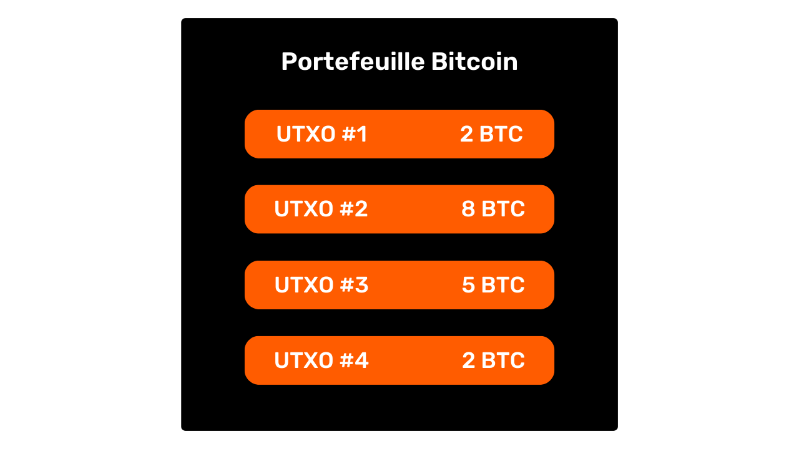

## Muundo wa shughuli za Bitcoin

<chapterId>29d3aaab-de2e-4746-ab40-c9748898850c</chapterId>

### Ingizo la shughuli na matokeo

Muamala wa Bitcoin ni operesheni iliyorekodiwa kwenye Blockchain inayohamisha Umilikishaji wa bitcoins kutoka kwa mtu mmoja hadi mwingine. Kwa usahihi zaidi, kwa kuwa tuko kwenye modeli ya UTXO na hakuna akaunti, shughuli hiyo inakidhi masharti ya matumizi ambayo yalilinda UTXOs moja au zaidi, inazitumia na kwa usawa huunda UTXO mpya na masharti mapya ya matumizi. Kwa kifupi, muamala huhamisha bitcoins kutoka hati iliyoridhika hadi hati mpya iliyoundwa ili kuzilinda.


Kwa hivyo, kila muamala wa Bitcoin huwa na ingizo moja au zaidi na towe moja au zaidi. Ingizo ni UTXO zinazotumiwa na muamala kwa matokeo ya kuzalisha. Matokeo ni UTXO mpya ambazo zinaweza kutumika kama pembejeo kwa miamala ya siku zijazo.


> Kinadharia, muamala wa Bitcoin unaweza kuwa na idadi isiyo na kikomo ya pembejeo na matokeo. Kikomo pekee ni ukubwa wa juu wa kizuizi.

Kila ingizo katika shughuli ya Bitcoin inarejelea UTXO ambayo haijatumika hapo awali. Ili kutumia UTXO kama ingizo, mmiliki wake lazima aonyeshe kuwa yeye ndiye mmiliki halali kwa kuthibitisha hati husika, yaani kwa kukidhi sharti la matumizi lililowekwa. Kwa ujumla, hii inamaanisha kutoa sahihi ya dijiti inayozalishwa na ufunguo wa faragha unaolingana na ufunguo wa umma ambao hapo awali ulilinda UTXO hii. Kwa hivyo hati inajumuisha kuthibitisha kwamba sahihi inalingana na ufunguo wa umma uliotumiwa wakati fedha zilipokelewa.


Kila pato, kwa upande wake, inataja kiasi cha bitcoins kuhamishwa, pamoja na mpokeaji. Mwisho hufafanuliwa na hati mpya, ambayo kwa kawaida huzuia UTXO mpya iliyoundwa na kupokea Anwani (address) au ufunguo mpya wa umma.

Ili muamala kuzingatiwa kuwa halali kulingana na sheria za makubaliano, jumla ya matokeo lazima yawe chini ya au sawa na jumla ya pembejeo. Kwa maneno mengine, jumla ya UTXO mpya zinazozalishwa na muamala lazima zisizidi jumla ya UTXO zinazotumiwa kama pembejeo. Kanuni hii ni ya kimantiki: ikiwa una `500,000 Sats` tu, huwezi kufanya ununuzi wa `700,000 Sats`.

### Kubadilishana na kuunganisha katika shughuli ya Bitcoin

Kitendo cha muamala wa Bitcoin kwenye UTXO kwa hivyo kinaweza kulinganishwa na kuweka tena sarafu ya dhahabu. Hakika, UTXO haiwezi kugawanywa, lakini ni fusible tu. Hii ina maana kwamba mtumiaji hawezi tu kugawanya UTXO inayowakilisha kiasi fulani katika bitcoins katika UTXO kadhaa ndogo. Ni lazima aitumie kabisa katika shughuli ya ununuzi ili kuunda UTXO mpya moja au zaidi ya thamani kiholela katika matokeo, ambayo lazima iwe chini ya au sawa na thamani ya awali.

Utaratibu huu ni sawa na ule wa sarafu ya dhahabu. Tuseme unamiliki sarafu ya wakia 2 na unataka kufanya malipo ya wakia 1, tukichukulia muuzaji hawezi kukupa chenji. Utalazimika kuyeyusha sarafu yako na kutupa 2 mpya za wakia 1 kila moja.

Bitcoin inafanya kazi kwa njia sawa. Hebu tufikirie kuwa Alice ana UTXO ya `10,000 Sats` na anataka kununua baguette ya gharama ya `4,000 Sats`. Alice atafanya muamala na 1 UTXO ya `10,000 Sats` kama ingizo, ambalo atatumia kikamilifu, na UTXO 2 za `4,000 Sats` na `6,000 Sats` kama pato. UTXO ya `4,000 Sats` itatumwa kwa mwokaji kama malipo ya baguette, huku UTXO ya `6,000 Sats` itarudi kwa Alice kwa njia ya mabadiliko. UTXO hii, ambayo inarudi kwa mtoaji asili wa muamala, inajulikana kama "ubadilishanaji" katika jargon ya Bitcoin.


Sasa hebu tufikirie kuwa Alice hana UTXO moja ya `10,000 Sats`, lakini badala yake UTXO mbili za `3,000 Sats` kila moja. Katika hali hii, hakuna UTXO moja moja inatosha kuweka fimbo `4,000 Sats` ya fimbo. Kwa hivyo ni lazima Alice atumie wakati huo huo UTXOs 2 za `3,000 Sats` kama maingizo kwa muamala wake. Kwa njia hii, jumla ya kiasi cha pembejeo kitafikia `6,000 Sats`, na kumwezesha kukidhi malipo ya `4,000 Sats` kwa mwokaji. Njia hii, ambayo UTXO kadhaa huwekwa pamoja kama pembejeo kwa shughuli, mara nyingi hujulikana kama "kuunganisha".


### Ada za muamala

Uangavu, mtu anaweza kufikiri kwamba gharama za muamala pia zinawakilisha matokeo ya muamala. Lakini kwa ukweli, hii sivyo. Gharama za muamala zinawakilisha tofauti kati ya jumla ya pembejeo na jumla ya matokeo. Hii ina maana kwamba, baada ya kutumia sehemu ya thamani ya pembejeo ili kufidia matokeo yanayohitajika katika muamala, jumla fulani ya pembejeo hubakia bila kutumika. Kiasi hiki cha mabaki kinajumuisha gharama za muamala.

```plaintext
Frais = total inputs - total outputs
```

Hebu tuchukue mfano wa Alice, ambaye ana UTXO ya `10,000 Sats` na anataka kununua baguette kwa `4,000 Sats`. Alice hutengeneza muamala na UTXO yake ya `10,000 Sats` kama ingizo. Kisha hutoa pato la `4,000 Sats` kwa mwokaji kulipia baguette. Ili kuwahimiza wachimbaji kujumuisha shughuli zake kwenye eneo, Alice hutenga `200 Sats` katika ada. Kisha atatengeneza toleo la pili, Ubadilishanaji, ambalo litarejeshwa kwake, la jumla ya `5,800 Sats`.


Kwa kutumia fomula ya ada, tunaona kwamba kuna `200 Sats` iliyosalia kwa watoto:

```plaintext
Frais = total inputs - total outputs
Frais = 10 000 - (4 000 + 5 800)
Frais = 10 000 - 9 800
Frais = 200
```

Miner (Mchimbaji) anapofanikiwa kuhalalisha kizuizi, anaidhinishwa kukusanya ada hizi kwa shughuli zote zilizojumuishwa kwenye kizuizi chake, kupitia shughuli inayoitwa "Coinbase (msingi wa sarafu)".

### Kuunda UTXO kwenye Bitcoin

Ikiwa umefuata aya zilizotangulia kwa uangalifu, sasa utajua kuwa UTXO zinaweza tu kuundwa kwa kutumia UTXO zingine zilizopo. Kwa njia hii, sarafu za Bitcoin huunda mlolongo unaoendelea. Walakini, unaweza kuwa unashangaa jinsi UTXO za kwanza kwenye mlolongo huu zilitokea. Hii inazua tatizo sawa na la kuku na yai: hizi UTXO za awali zilitoka wapi?

Jibu liko kwenye **muamala wa sarafu ya msingi**.

Sarafu ya msingi ni aina maalum ya shughuli ya Bitcoin, ambayo ni ya kipekee kwa kila kizuizi na daima ni ya kwanza ya haya. Inaruhusu Miner (Mchimbaji) ambaye amepata Proof of Work halali kupokea Malipo ya kuzuia yake. Zawadi hii inaundwa na Vipengele mbili: **ruzuku ya kuzuia** na **ada ya muamala**, iliyojadiliwa katika sehemu iliyotangulia.

Sarafu ya msingi Shughuli ni ya kipekee kwa kuwa ndiyo pekee inayoweza kuunda bitcoins ex nihilo, bila hitaji la kutumia pembejeo kwa matokeo ya kuzalisha. Bitcoins hizi mpya zilizoundwa ndizo tunaweza kuziita "UTXO za asili".


Bitcoins zilizopewa ruzuku ya kuzuia ni BTC mpya iliyoundwa kutoka mwanzo, kulingana na ratiba ya utoaji iliyowekwa tayari katika sheria za makubaliano. Ruzuku ya vitalu hupunguzwa kwa nusu kila vitalu 210,000, yaani takriban kila baada ya miaka minne, katika mchakato unaojulikana kama "Halving (kupunguza nusu)". Awali, bitcoins 50 ziliundwa kwa kila ruzuku, lakini kiasi hiki kimepungua hatua kwa hatua; kwa sasa, ni bitcoins 3.125 kwa kizuizi.

Kuhusu ada za muamala, ingawa pia zinawakilisha BTC mpya iliyoundwa, lazima zisizidi tofauti kati ya jumla ya pembejeo na matokeo ya miamala yote kwenye kizuizi. Tuliona hapo awali kuwa ada hizi zinawakilisha sehemu ya pembejeo ambayo haitumiki katika matokeo ya muamala. Sehemu hii kitaalam "imepotea" wakati wa shughuli, na Miner (Mchimbaji) ina haki ya kuunda tena thamani hii katika mfumo wa UTXO moja au zaidi mpya. Huu ni uhamisho wa thamani kati ya mtoaji wa shughuli na Miner (Mchimbaji) ambaye anaiongeza kwenye Blockchain.

**> Bitcoins zinazozalishwa na Coinbase (msingi wa sarafu) za shughuli ziko chini ya muda wa ukomavu wa vitalu 100, ambapo haziwezi kutumiwa na Miner (Mchimbaji). Sheria hii imeundwa ili kuepusha matatizo yanayohusiana na matumizi ya bitcoins mpya zilizoundwa kwenye mnyororo ambao unaweza kutumika kuwa wa kizamani baadaye.

### Athari za mfano wa UTXO

Kwanza kabisa, mtindo wa UTXO huathiri moja kwa moja ada za ununuzi za Bitcoin. Kwa kuwa uwezo wa kila kizuizi ni mdogo, wachimbaji wanapendelea shughuli zinazotoa ada bora zaidi kuhusiana na nafasi watakayochukua kwenye kizuizi. Hakika, kadiri UTXO inavyozidi kujumuisha shughuli katika pembejeo na matokeo, ndivyo inavyokuwa nzito, na kwa hivyo inahitaji ada za juu. Hii ni moja ya sababu kwa nini sisi mara nyingi kujaribu kupunguza idadi ya UTXOs katika kwingineko yetu, ambayo inaweza pia kuathiri usiri, somo tutaweza kuwa kukabiliana kwa undani katika sehemu ya tatu ya kozi hii.

Pili, kama ilivyotajwa katika sehemu zilizopita, sarafu za Bitcoin kimsingi ni mlolongo wa UTXO. Kwa hivyo, kila muamala huunda kiunganishi kati ya UTXO iliyopita na UTXO ya baadaye. Kwa hivyo UTXO hufanya iwezekane kufuata kwa uwazi njia ya Bitcoins kutoka kwa uundaji wao hadi matumizi yao ya sasa. Uwazi huu unaweza kutazamwa vyema, kwani humwezesha kila mtumiaji kuhakikisha ukweli wa bitcoins zilizopokelewa. Hata hivyo, ni kwa kanuni hii ya ufuatiliaji na ukaguzi ambapo uchambuzi wa Blockchain (Mnyororo wa kuzuia) umejikita, zoezi lililoundwa kuhatarisha usiri wako. Tutakuwa tukiangalia kwa kina mazoezi haya katika sehemu ya pili ya kozi.

## Mtindo wa faragha wa Bitcoin

<chapterId>769d8963-3ed5-4094-b21d-9203c7d9e465</chapterId>

### Pesa: uhalisi, uadilifu na matumizi maradufu

Moja ya kazi za pesa ni kutatua shida ya bahati mbaya mara mbili ya mahitaji. Katika mfumo unaozingatia ubadilishanaji wa mali, ukamilishaji wa ubadilishanaji hauhitaji tu kupata mtu binafsi ambaye anatoa zawadi nzuri inayolingana na hitaji langu, lakini pia kumpa kitu kizuri cha thamani sawa ambacho kinakidhi hitaji lake mwenyewe. Kuweka usawa huu ni jambo gumu.


Ndio maana tunatumia pesa kuhamisha thamani katika nafasi na wakati.


Ili sarafu kutatua tatizo hili, ni muhimu kwamba mhusika anayetoa bidhaa au huduma awe na uhakika wa uwezo wake wa kutumia kiasi hicho baadaye. Kwa hivyo, mtu yeyote mwenye busara anayetaka kupokea sarafu, iwe ya dijiti au ya kimwili, atahakikisha kwamba inakidhi vigezo viwili vya msingi:


- Kipande lazima kiwe na uadilifu na uhalisi ;**
- na isitumike mara mbili.**

Ikiwa unatumia sarafu halisi, ni sifa ya kwanza ambayo ni ngumu zaidi kudai. Katika vipindi tofauti vya historia, uadilifu wa sarafu za chuma mara nyingi umeathiriwa na mazoea kama vile kukata au kutoboa. Katika Roma ya kale, kwa mfano, ilikuwa ni kawaida kwa wananchi kufuta kando ya sarafu za dhahabu ili kukusanya chuma kidogo cha thamani, huku wakiwaokoa kwa shughuli za baadaye. Thamani ya asili ya sarafu ilipunguzwa, lakini thamani yake ya uso ilibaki sawa. Hii ni moja ya sababu kwa nini makali ya sarafu baadaye yalipungua.

Uhalisi pia ni tabia ngumu kuthibitisha kwenye njia halisi ya fedha. Mbinu za leo za kupambana na sarafu ghushi zinazidi kuwa ngumu, na kuwalazimu wauzaji reja reja kuwekeza katika mifumo ya uthibitishaji ya gharama kubwa.

Kwa upande mwingine, kwa sababu ya asili yao, matumizi ya mara mbili sio tatizo kwa fedha za kimwili. Nikikupa bili ya €10, itaondoka kwenye milki yangu bila kubatilishwa na kuingia yako, ambayo kwa kawaida huondoa uwezekano wowote wa matumizi mengi ya vitengo vya fedha vinavyojumuisha. Kwa kifupi, sitaweza kutumia bili hii ya €10 tena.


Kwa sarafu ya dijiti, ugumu ni tofauti. Kuhakikisha uhalisi na uadilifu wa sarafu mara nyingi ni rahisi. Kama tulivyoona katika sehemu iliyotangulia, kielelezo cha Bitcoin cha UTXO kinawezesha kufuatilia sarafu hadi asili yake, na hivyo kuthibitisha kwamba kweli iliundwa na Miner (Mchimbaji) kwa kufuata sheria za makubaliano.

Kwa upande mwingine, kuhakikisha kuwa hakuna matumizi ya mara mbili ni ngumu zaidi, kwani bidhaa zote za dijiti ziko katika habari ya asili. Tofauti na bidhaa za kimwili, habari haijagawanywa wakati inabadilishwa, lakini huenea kwa kuzidisha. Kwa mfano, nikikutumia hati kwa barua-pepe, itarudiwa. Huwezi kuwa na uhakika kwamba nimefuta hati asili.


### Kuzuia matumizi maradufu kwenye Bitcoin

Njia pekee ya kuepuka marudio haya ya mali ya dijiti ni kufahamu ubadilishanaji wote kwenye mfumo. Kwa njia hii, tunaweza kujua ni nani anamiliki nini na kusasisha hisa za kila mtu kulingana na miamala iliyofanywa. Hiki ndicho kinachotokea, kwa mfano, na pesa za kimaandiko katika mfumo wa benki. Unapolipa €10 kwa mfanyabiashara kwa kadi ya mkopo, benki hurekodi ubadilishanaji na kusasisha kitabu cha akaunti.


Kwenye Bitcoin, Matumizi ya mara mbili yanazuiwa kwa njia sawa. Tunatafuta kuthibitisha kutokuwepo kwa shughuli ambayo tayari imetumia sarafu zinazohusika. Ikiwa sarafu hazijawahi kutumika, basi tunaweza kuwa na uhakika kwamba hakuna matumizi ya mara mbili yatatokea. Kanuni hii ilielezewa na Satoshi Nakamoto kwenye Karatasi Nyeupe na kifungu maarufu:

**Njia pekee ya kuthibitisha kutokuwepo kwa muamala ni kufahamu shughuli zote

Lakini tofauti na mtindo wa benki, hatutaki kuamini huluki kuu kwenye Bitcoin. Kwa hivyo watumiaji wote wanahitaji kuwa na uwezo wa kudhibitisha kutokuwepo kwa matumizi mara mbili, bila kutegemea mtu wa tatu. Kwa hivyo kila mtu anahitaji kufahamu shughuli zote za Bitcoin. Hii ndiyo sababu shughuli za Bitcoin zinatangazwa hadharani kwenye nodi zote za mtandao na kurekodiwa kwa maandishi wazi kwenye Kizuia mkondo.

Ni usambazaji huu wa habari kwa umma ambao unatatiza ulinzi wa faragha katika Bitcoin. Katika mfumo wa jadi wa benki, kwa nadharia, ni taasisi ya kifedha tu inayofahamu shughuli zinazofanywa. Kwa Bitcoin, kwa upande mwingine, watumiaji wote wanafahamishwa kuhusu shughuli zote, kupitia nodi zao husika.

### Mtindo wa usiri: mfumo wa benki dhidi ya Bitcoin

Katika mfumo wa kitamaduni, akaunti yako ya benki imeunganishwa na utambulisho wako. Mwenye benki anaweza kujua ni akaunti gani ya benki ni ya mteja yupi, na ni miamala gani inayohusishwa nayo. Walakini, mtiririko huu wa habari umekatwa kati ya benki na uwanja wa umma. Kwa maneno mengine, haiwezekani kujua salio na miamala ya akaunti ya benki ya mtu mwingine. Ni benki pekee inayoweza kufikia maelezo haya.


Kwa mfano, benki yako inajua kwamba unanunua baguette yako kila asubuhi kutoka kwa waokaji wa ndani, lakini jirani yako hana ujuzi wa shughuli hii. Kwa njia hii, mtiririko wa habari unapatikana kwa wahusika, haswa benki, lakini bado hauwezekani kwa watu wa nje.


Kwa sababu ya kikwazo cha utangazaji wa shughuli za umma ambacho tuliona katika sehemu iliyotangulia, mtindo wa usiri wa Bitcoin hauwezi kufuata mtindo wa mfumo wa benki. Katika hali ya Bitcoin, kwa kuwa mtiririko wa maelezo hauwezi kuvunjika kati ya shughuli na kikoa cha umma, **muundo wa faragha unategemea utengano kati ya utambulisho wa mtumiaji na shughuli** zenyewe.


Kwa mfano, ukinunua baguette kutoka kwa mwokaji, kulipa katika BTC, jirani yako, ambaye ana nodi yake kamili, anaweza kuona shughuli yako ikipitia, kama vile anavyoweza kuona shughuli nyingine zote katika mfumo. Hata hivyo, ikiwa kanuni za usiri zinaheshimiwa, hapaswi kuunganisha muamala huu mahususi na utambulisho wako.


Lakini kwa kuwa miamala ya Bitcoin inafanywa kwa umma, bado inawezekana kuanzisha viungo kati yao ili kupata taarifa kuhusu wahusika wanaohusika. Shughuli hii hata inajumuisha maalum kwa haki yake yenyewe, inayojulikana kama "uchambuzi wa kuzuia mnyororo". Katika sehemu inayofuata ya kozi, ninakualika kuchunguza misingi ya uchambuzi wa Kuzuia mnyororo, ili uweze kuelewa jinsi bitcoins zako zinavyofuatiliwa na kujilinda vizuri dhidi yao.

# Kuelewa na kulinda dhidi ya Chainalysis (uchambuzi wa mnyororo)

<partId>4739371e-9fef-45b0-bcaa-b7a4df6b4470</partId>

## Chainalysis (uchambuzi wa mnyororo) wa Bitcoin ni nini?

<chapterId>7d198ba6-4af2-4f24-86cb-3c79cb25627e</chapterId>

### Ufafanuzi na uendeshaji

Uchunguzi wa Kuzuia minyororo ni mazoezi ya kufuatilia mtiririko wa bitcoins kwenye kuzuia mnyororo. Kwa ujumla, Chainalysis (uchambuzi wa mnyororo) unategemea uchunguzi wa sifa katika sampuli za shughuli za awali. Kisha inajumuisha kutambua sifa hizi hizo kwenye shughuli ambayo tungependa kuchanganua, na kupata tafsiri zinazokubalika kutoka kwao. Njia hii ya kutatua matatizo, kulingana na mbinu ya vitendo ya kupata suluhisho nzuri ya kutosha, inajulikana kama "Legacy (Urithi)".

Kwa maneno ya watu wa kawaida, kuna hatua tatu kuu katika Chainalysis (uchambuzi wa mnyororo):

1. **Kuchunguza Kuzuia mnyororo ;**

2. **Utambuaji wa vipengele vinavyojulikana ;**

3. **Kato la dhana**


Uchambuzi wa Kuzuia mnyororo unaweza kufanywa na mtu yeyote. Unachohitaji ni kufikia maelezo ya umma ya Kuzuia mnyororo kupitia nodi kamili ili kuona mienendo ya muamala na kufanya dhahania. Pia kuna zana zisizolipishwa zinazowezesha uchanganuzi huu, kama vile [OXT.me](https://oxt.me/), ambazo tutachunguza kwa kina katika sura mbili za mwisho za sehemu hii. Hata hivyo, hatari kuu ya usiri hutoka kwa makampuni maalumu katika Chainalysis (uchambuzi wa mnyororo). Kampuni hizi zimechukua uchanganuzi wa Kuzuia mnyororo kwa kiwango cha viwanda na kuuza huduma zao kwa taasisi za kifedha na serikali. Miongoni mwa makampuni haya, Chainalysis (uchambuzi wa mnyororo) ni hakika inayojulikana zaidi.

### Malengo ya Chainalysis (uchambuzi wa mnyororo)

Mojawapo ya malengo ya uchanganuzi wa Kuzuia Mnyororo ni kuweka pamoja shughuli mbalimbali kwenye Bitcoin ili kubaini upekee wa mtumiaji aliyezitekeleza. Baadaye, itawezekana kujaribu kuunganisha kundi hili la shughuli na utambulisho halisi.


Fikiria nyuma kwenye sura iliyotangulia. Nilieleza ni kwa nini muundo wa faragha wa Bitcoin ulikuwa msingi wa mgawanyo wa utambulisho wa mtumiaji kutoka kwa miamala. Kwa hivyo itakuwa ya kushawishi kufikiria kuwa uchanganuzi wa Kuzuia mnyororo hauna maana, kwani hata kama tunaweza kujumlisha shughuli za onchain, hatuwezi kuzihusisha na utambulisho halisi.

Kinadharia, kauli hii ni sahihi. Katika sehemu ya kwanza ya kozi hii, tuliona kwamba jozi za ufunguo wa cryptographic hutumiwa kuanzisha hali kwenye UTXO. Kwa asili, jozi hizi muhimu hazitoi habari yoyote kuhusu utambulisho wa wamiliki wao. Kwa hivyo, hata kama tunaweza kuweka pamoja shughuli zinazohusiana na jozi muhimu tofauti, hii haituambii chochote kuhusu huluki nyuma ya shughuli hizi.


Walakini, ukweli wa vitendo ni ngumu zaidi. Kuna wingi wa tabia ambazo zinaweza kuunganisha utambulisho halisi na shughuli za onchain. Katika uchambuzi, hii inaitwa hatua ya kuingia, na kuna wingi wao.

Maarufu zaidi ni KYC (*Mjue Mteja Wako*). Ukiondoa Bitcoins zako kutoka kwa jukwaa linalodhibitiwa hadi kwenye mojawapo ya Anwani (address) zako za kibinafsi za kupokea, basi baadhi ya watu wanaweza kuunganisha utambulisho wako kwa hiyo Anwani (address). Kwa upana zaidi, mahali pa kuingilia panaweza kuwa aina yoyote ya mwingiliano kati ya maisha yako halisi na muamala wa Bitcoin. Kwa mfano, ukichapisha Anwani (address) inayopokea kwenye mitandao yako ya kijamii, hii inaweza kuwa mahali pa kuingilia kwa uchambuzi. Ikiwa utafanya malipo kwa Bitcoins kwa mwokaji wako, ataweza kuhusisha uso wako (sehemu ya utambulisho wako) kwa Anwani (address) ya Bitcoin.

Maeneo haya ya kuingia kwa hakika hayawezi kuepukika unapotumia Bitcoin. Ingawa tunaweza kutafuta kuzuia upeo wao, watakuwepo kila wakati. Ndiyo maana ni muhimu kuchanganya mbinu zinazolenga kuhifadhi faragha yako. Ingawa kudumisha utengano kati ya utambulisho wako halisi na miamala yako ni mbinu ya kuvutia, bado haitoshi leo. Hakika, ikiwa shughuli zako zote za onchain zinaweza kuunganishwa pamoja, basi hata sehemu ndogo zaidi ya kuingilia inaweza kuathiri usiri mmoja wa safu ambayo umeanzisha.


### Kujilinda dhidi ya Chainalysis (uchambuzi wa mnyororo)

Kwa hivyo tunahitaji pia kuweza kukabiliana na uchanganuzi wa Kuzuia mnyororo katika matumizi yetu ya Bitcoin. Kwa kufanya hivyo, tunaweza kupunguza ujumlisho wa shughuli zetu na kupunguza athari za mahali pa kuingilia kwenye faragha yetu.


Ni njia gani bora ya kukabiliana na uchambuzi wa Kuzuia mnyororo kuliko kujifunza kuhusu mbinu zinazotumiwa ndani yake? Ikiwa ungependa kujua jinsi ya kuboresha faragha yako kwenye Bitcoin, unahitaji kuelewa mbinu hizi. Hii itakupa ufahamu bora wa mbinu kama vile SCoinjoin (arafu ya kujiunga) au Payjoin (malipo ya kujiunga) (mbinu tutakazoangalia katika sehemu za mwisho za kozi), na kupunguza makosa ambayo unaweza kufanya.

https://planb.network/tutorials/privacy/on-chain/coinjoin-samourai-wallet-e566803d-ab3f-4d98-9136-5462009262ef
https://planb.network/tutorials/privacy/on-chain/payjoin-848b6a23-deb2-4c5f-a27e-93e2f842140f
Katika hili, tunaweza kuchora mlinganisho na cryptography na cryptanalysis. Mwandishi mzuri wa kriptografia kwanza kabisa ni cryptanalyst mzuri. Ili kuunda algorithm mpya ya usimbuaji, unahitaji kujua ni mashambulizi gani ambayo itakabili, na pia usome kwa nini algorithmu ya hapo awali imevunjwa. Kanuni hiyo hiyo inatumika kwa faragha ya Bitcoin. Kuelewa mbinu za uchambuzi wa Kuzuia mnyororo ndio ufunguo wa kulinda dhidi yao. Ndiyo maana nimejumuisha uchanganuzi wa sehemu nzima ya on chain katika kozi hii ya mafunzo.

### Mbinu za Chainalysis (uchambuzi wa mnyororo)

Ni muhimu kuelewa kwamba uchambuzi wa kamba sio sayansi halisi. Inategemea Legacy (Urithi) unaotokana na uchunguzi wa awali au tafsiri za kimantiki. Sheria hizi huturuhusu kupata matokeo ya kuaminika, lakini kamwe kwa usahihi kabisa. Kwa maneno mengine, **uchanganuzi wa mnyororo daima unahusisha kipimo cha uwezekano katika hitimisho lililofikiwa**. Kwa mfano, inaweza kuwezekana kukadiria kwa viwango tofauti vya uhakika kwamba Anwani (address) mbili ni za huluki moja, lakini uhakika kamili hautapatikana kila wakati.

Hoja nzima ya uchanganuzi wa minyororo iko haswa katika mjumuisho wa mifumo mbali mbali ili kupunguza hatari ya makosa. Kwa njia fulani, ni mkusanyiko wa ushahidi ambao hutuleta karibu na ukweli.

Legacy (Urithi) hizi maarufu zinaweza kugawanywa katika vikundi tofauti, ambavyo tutaelezea kwa undani hapa chini:


- Mitindo ya muamala ;**
- Muamala wa ndani heuristics ;**
- Legacy (Urithi) nje ya shughuli.**

### Satoshi Nakamoto na Chainalysis (uchambuzi wa mnyororo)

Legacy (Urithi) mbili za kwanza za Chainalysis (uchambuzi wa mnyororo) ziligunduliwa na Satoshi Nakamoto mwenyewe. Anazungumza juu yao katika Sehemu ya 10 ya Karatasi Nyeupe ya Bitcoin. Wao ni:


- cIOH (*Ingizo la Kawaida Ownership Heuristic*);
- na kutumia tena Anwani (address).

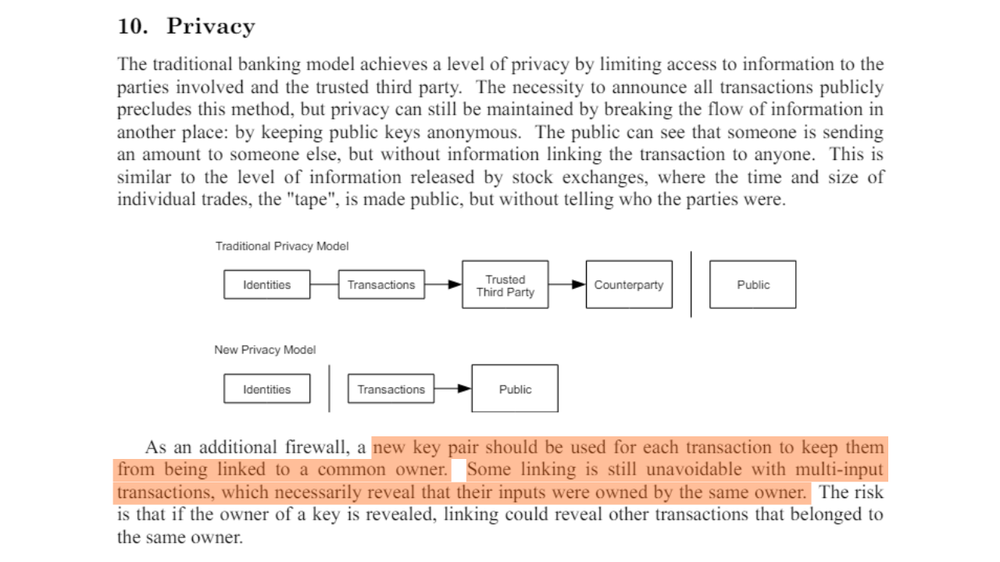

Chanzo: S. Nakamoto, "Bitcoin: Peer-to-Peer Electronic Cash System", https://Bitcoin.org/Bitcoin.pdf, 2009.

Tutaona ni nini katika sura zinazofuata, lakini tayari inafurahisha kutambua kwamba Legacy (Urithi) huu mbili bado unaendelea kuwa na umuhimu katika uchanganuzi wa msururu leo.

## Mitindo ya muamala

<chapterId>d365a101-2d37-46a5-bfb9-3c51e37bf96b</chapterId>

Mchoro wa muamala ni muundo wa jumla au muundo wa shughuli ya kawaida, ambayo inaweza kupatikana kwenye Kuzuia mnyororo, na ambao uwezekano wa tafsiri yake unajulikana. Wakati wa kusoma mifumo, tunazingatia shughuli moja na kuichambua kwa kiwango cha juu.

Kwa maneno mengine, tutaangalia tu idadi ya UTXO katika pembejeo na idadi ya UTXO katika matokeo, bila kuzingatia maelezo mahususi zaidi au mazingira ya muamala. Kulingana na muundo uliozingatiwa, tunaweza kutafsiri asili ya shughuli. Kisha tutatafuta sifa za muundo wake na kupata tafsiri.


Katika sehemu hii, tutaangalia pamoja mifano kuu ya shughuli iliyokutana katika Chainalysis (uchambuzi wa mnyororo), na kwa kila mfano, nitakupa tafsiri inayowezekana ya muundo huu, pamoja na mfano halisi.

### Usafirishaji mmoja (au malipo moja)

Hebu tuanze na muundo wa kawaida sana, kwa kuwa ndio unaojitokeza kwenye malipo mengi ya Bitcoin. Mtindo rahisi wa malipo una sifa ya utumiaji wa UTXO moja au zaidi kama pembejeo na utengenezaji wa UTXO 2 kama matokeo. Kwa hivyo mfano huu unaonekana kama huu:


Tunapoona muundo huu wa shughuli kwenye kuzuia mnyororo, tunaweza tayari kuchora tafsiri. Kama jina lake linavyopendekeza, mtindo huu unaonyesha kuwa tuko mbele ya shughuli ya kutuma au ya malipo. Mtumiaji ametumia UTXO yake mwenyewe katika pembejeo ili kukidhi matokeo ya malipo ya UTXO na Ubadilishanaji UTXO (fedha zilizorejeshwa kwa mtumiaji sawa).

Kwa hivyo tunajua kuwa mtumiaji anayezingatiwa labda hana tena moja ya UTXO mbili za pato (malipo ya UTXO), lakini bado anamiliki UTXO nyingine (Ubadilishanaji wa UTXO).

Kwa sasa, hatuwezi kubainisha ni matokeo gani yanawakilisha UTXO ipi, kwa kuwa hii si dhumuni la utafiti wa muundo. Tutafika kwa kutegemea Legacy (Urithi) tutajifunza katika sehemu zifuatazo. Katika hatua hii, lengo letu ni kubainisha aina ya shughuli inayohusika, ambayo katika kesi hii ni utumaji rahisi.

Kwa mfano, hapa kuna muamala wa Bitcoin ambao unachukua muundo rahisi wa kutuma:

```plaintext
b6cc79f45fd2d7669ff94db5cb14c45f1f879ea0ba4c6e3d16ad53a18c34b769
```


Chanzo : [Mempool.space](https://Mempool.space/fr/tx/b6cc79f45fd2d7669ff94db5cb14c45f1f879ea0ba4c6e3d16ad53a18c34b769)

Baada ya mfano huu wa kwanza, unapaswa kuwa na ufahamu bora wa maana ya kusoma "muundo wa muamala". Tunachunguza shughuli kwa kuzingatia tu muundo wake, bila kuzingatia mazingira yake au maelezo maalum ya shughuli. Katika hatua hii ya kwanza, tunaangalia picha kuu tu.

Sasa kwa kuwa umeelewa muundo ni nini, wacha tuendelee kwenye mifano mingine iliyopo.

### Kufagia

Mtindo huu wa pili una sifa ya matumizi ya UTXO moja kama pembejeo na utengenezaji wa UTXO moja kama pato.


Tafsiri ya mtindo huu ni kwamba tuko mbele ya uhamishaji wa kibinafsi. Mtumiaji amehamisha bitcoins zake kwake, kwa Anwani (address) nyingine ya mali yake. Kwa kuwa hakuna Ubadilishanaji kwenye muamala, kuna uwezekano mkubwa kwamba tuko mbele ya malipo. Hakika, wakati malipo yanafanywa, ni vigumu kwa mlipaji kuwa na UTXO inayolingana hasa na kiasi kinachohitajika na muuzaji, pamoja na ada ya ununuzi. Kwa ujumla, mlipaji analazimika kutoa pato la Kubadilishana.

Kisha tunajua kwamba mtumiaji aliyeangaliwa pengine bado anamiliki UTXO hii. Katika muktadha wa uchanganuzi wa msururu, ikiwa tunajua kuwa UTXO inayotumika kama ingizo la muamala ni ya Alice, tunaweza kudhani kuwa UTXO inayotumika kama pato pia ni yake. Kitakachokuwa cha kufurahisha baadaye ni kupata uvumbuzi wa ndani wa shughuli ambao unaweza kuimarisha dhana hii (tutaangalia Legacy (Urithi) huu katika sura ya 3.3).

Kwa mfano, hapa kuna muamala wa Bitcoin ambao unachukua muundo wa kufagia:

```plaintext
35f1072a0fda5ae106efb4fda871ab40e1f8023c6c47f396441ad4b995ea693d
```


Chanzo : [Mempool.space](https://Mempool.space/fr/tx/35f1072a0fda5ae106efb4fda871ab40e1f8023c6c47f396441ad4b995ea693d)

Jihadharini, hata hivyo, kwamba aina hii ya muundo inaweza pia kufichua uhamishaji wa kibinafsi kwa akaunti ya jukwaa la ubadilishanaji wa cryptocurrency. Itakuwa ni utafiti wa Anwani (address) zinazojulikana na muktadha wa shughuli hiyo ambayo itatuambia kama ni kutelezesha kidole kwenye Pochi ya kujilinda au kujiondoa kwenye jukwaa. Hakika, Anwani (address) za majukwaa ya Ubadilishanaji mara nyingi hutambulika kwa urahisi.

Hebu tuchukue mfano wa Alice tena: ikiwa scan inaongoza kwa Anwani (address) inayojulikana kwa jukwaa (kama vile Binance, kwa mfano), hii inaweza kumaanisha kwamba bitcoins zimehamishwa nje ya milki ya moja kwa moja ya Alice, labda kwa nia ya kuziuza au kuzihifadhi kwenye jukwaa hili. Kwa upande mwingine, ikiwa fikio la Anwani (address) halijulikani, ni jambo la busara kudhani kuwa ni Pochi jingine ambalo bado ni la Alice. Lakini aina hii ya utafiti ni zaidi katika jamii ya Legacy (Urithi) kuliko ruwaza.

### Kuunganisha

Mfano huu una sifa ya matumizi ya UTXO kadhaa kwenye pembejeo na uzalishaji wa UTXO moja kwenye pato.


Tafsiri ya muundo huu ni kwamba tuko mbele ya uimarishaji. Hii ni mazoezi ya kawaida kati ya watumiaji wa Bitcoin, wenye lengo la kuunganisha UTXO kadhaa kwa kutarajia ongezeko linalowezekana la ada za manunuzi. Kwa kufanya operesheni hii wakati ambapo ada ni ndogo, inawezekana kuokoa kwa ada za baadaye. Tutazungumza zaidi kuhusu mazoezi haya katika sura ya 4.3.

Tunaweza kukisia kwamba mtumiaji aliye nyuma ya muundo huu wa muamala pengine alikuwa anamiliki UTXO zote katika ingizo na bado anamiliki UTXO katika pato. Kwa hivyo labda ni uhamishaji otomatiki.

Kama vile kufagia, aina hii ya muundo pia inaweza kuonyesha uhamishaji wa kibinafsi kwa akaunti ya jukwaa la Ubadilishanaji. Itakuwa ni utafiti wa Anwani (address) zinazojulikana na muktadha wa shughuli hiyo ambayo itatuambia ikiwa ni ujumuishaji wa jalada la ulinzi binafsi au kujiondoa kwenye jukwaa.

Kwa mfano, hapa kuna muamala wa Bitcoin ambao unachukua muundo wa ujumuishaji:

```plaintext
77c16914211e237a9bd51a7ce0b1a7368631caed515fe51b081d220590589e94
```


Chanzo : [Mempool.space](https://Mempool.space/fr/tx/77c16914211e237a9bd51a7ce0b1a7368631caed515fe51b081d220590589e94)

Katika Chainalysis (uchambuzi wa mnyororo), mtindo huu unaweza kufunua habari nyingi. Kwa mfano, ikiwa tunajua kuwa moja ya pembejeo ni ya Alice, tunaweza kudhani kuwa ingizo zingine zote na matokeo ya muamala huu pia ni yake. Dhana hii basi ingewezesha kurejea msururu wa miamala ya awali ili kugundua na kuchanganua miamala mingine inayoweza kuhusishwa na Alice.


### Matumizi ya vikundi

Mtindo huu una sifa ya utumiaji wa UTXO chache kama pembejeo (mara nyingi ni moja tu) na utengenezaji wa UTXO nyingi kama matokeo.


Tafsiri ya mtindo huu ni kwamba tuko mbele ya matumizi ya makundi. Ni mazoezi ambayo pengine hufichua shughuli kubwa sana za kiuchumi, kama vile jukwaa la Ubadilishanaji. Matumizi yaliyowekwa katika vikundi huwezesha huluki hizi kuokoa gharama kwa kuchanganya gharama zao katika muamala mmoja.

Tunaweza kuamua kutoka kwa mfano huu kwamba UTXO katika pembejeo inatoka kwa kampuni yenye kiwango cha juu cha shughuli za kiuchumi, na kwamba UTXO katika pato hutawanyika. Wengi watakuwa wa wateja wa kampuni ambao wameondoa bitcoins kwenye jukwaa. Wengine wanaweza kwenda kwa kampuni za washirika. Hatimaye, hakika kutakuwa na ubadilishanaji mmoja au zaidi kurudi kwa kampuni inayotoa.

Kwa mfano, hapa kuna muamala wa Bitcoin ambao unachukua muundo wa matumizi uliounganishwa (huenda, ni shughuli iliyotolewa na mfumo wa Bybit):

```plaintext
8a7288758b6e5d550897beedd13c70bcbaba8709af01a7dbcc1f574b89176b43
```

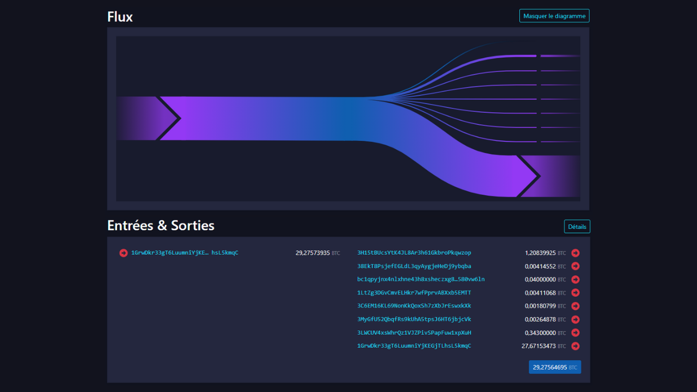

Chanzo : [Mempool.space](https://Mempool.space/fr/tx/8a7288758b6e5d550897beedd13c70bcbaba8709af01a7dbcc1f574b89176b43)

### Shughuli mahususi za itifaki

Miongoni mwa mifumo ya muamala, tunaweza pia kutambua zile zinazofichua matumizi ya itifaki mahususi. Kwa mfano, sahihi za Whirlpool (zilizojadiliwa katika sehemu ya 5) zitakuwa na muundo unaoweza kutambulika kwa urahisi unaozitofautisha na miamala mingine ya kawaida zaidi.


Uchanganuzi wa muundo huu unapendekeza kuwa kuna uwezekano wa kuwa na shughuli ya ushirikiano. Inawezekana pia kutazama SCoinjoin (arafu ya kujiunga). Ikiwa nadharia hii ya mwisho itathibitisha kuwa ni sahihi, basi idadi ya kutoka inaweza kutupa makadirio mabaya ya idadi ya washiriki katika Sarafu ya malipo.

Kwa mfano, hapa kuna muamala wa Bitcoin unaotumia muundo wa shughuli shirikishi wa SCoinjoin (arafu ya kujiunga):

```plaintext
00601af905bede31086d9b1b79ee8399bd60c97e9c5bba197bdebeee028b9bea
```

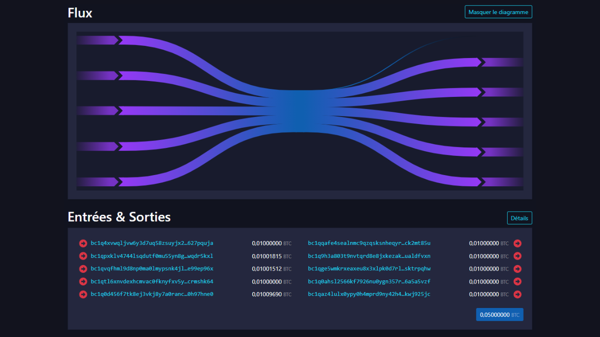

Chanzo : [Mempool.space](https://Mempool.space/fr/tx/00601af905bede31086d9b1b79ee8399bd60c97e9c5bba197bdebeee028b9bea)

Kuna itifaki zingine nyingi zilizo na muundo wao maalum. Kwa mfano, kuna shughuli za Wabisabi, miamala ya Stempu na miamala ya Runes.

Shukrani kwa mifumo hii ya muamala, tayari tunaweza kutafsiri kiasi fulani cha maelezo kuhusu muamala fulani. Lakini muundo wa shughuli sio chanzo pekee cha habari kwa uchambuzi. Tunaweza pia kusoma maelezo yake. Maelezo haya ya ndani ndiyo ninapenda kuyaita "Legacy (Urithi) wa ndani", na tutayaangalia katika sura inayofuata.

## Legacy (Urithi) wa ndani

<chapterId>c54b5abe-872f-40f4-a0d0-c59faff228ba</chapterId>

Legacy (Urithi) wa ndani ni sifa mahususi ambayo tunaitambua ndani ya shughuli yenyewe, bila kuhitaji kuchunguza mazingira yake, na ambayo hutuwezesha kufanya makato. Tofauti na mifumo, ambayo inazingatia miundo ya jumla ya shughuli kwa kiwango cha juu, Legacy (Urithi) wa ndani unategemea seti ya data inayoweza kutolewa. Hii ni pamoja na:


- Kiasi cha UTXO mbalimbali ndani na nje;
- Kila kitu cha kufanya na hati: Anwani (address) za mapokezi, matoleo, muda wa kufunga..

Kwa ujumla, aina hii ya Legacy (Urithi) itatuwezesha kutambua Ubadilishanaji katika shughuli mahususi. Kwa kufanya hivyo, basi tunaweza kuendeleza ufuatiliaji wa huluki juu ya miamala kadhaa tofauti. Hakika, ikiwa tutatambua UTXO mali ya mtumiaji tunayetaka kufuatilia, ni muhimu kubainisha, anapofanya shughuli ya ununuzi, ni matokeo gani yamehamishiwa kwa mtumiaji mwingine na ni matokeo gani yanawakilisha Ubadilishanaji, ambayo kwa hivyo inabaki mikononi mwake.


Kwa mara nyingine tena, wacha nikukumbushe kwamba Legacy (Urithi) huu sio sahihi kabisa. Zikichukuliwa kibinafsi, hutuwezesha tu kutambua hali zinazowezekana. Ni mkusanyiko wa Legacy (Urithi) kadhaa ambao husaidia kupunguza kutokuwa na uhakika, bila kuwa na uwezo wa kuiondoa kabisa.

### Kufanana kwa ndani

Legacy (Urithi) huu unahusisha utafiti wa kufanana kati ya pembejeo na matokeo ya shughuli hiyo hiyo. Ikiwa sifa hiyo hiyo itazingatiwa kwenye pembejeo na kwenye matokeo moja tu ya muamala, basi kuna uwezekano kuwa na matokeo haya yanayojumuisha Ubadilishanaji.

Kipengele dhahiri zaidi ni utumiaji tena wa Anwani (address) inayopokea katika shughuli hiyo hiyo.


Legacy (Urithi) huu unaacha nafasi ndogo ya shaka. Isipokuwa ufunguo wake wa faragha umedukuliwa, kupokea Anwani (address) sawa kunaonyesha shughuli ya mtumiaji mmoja. Tafsiri inayotokana ni kwamba shughuli ya Ubadilishanaji ndiyo pato iliyo na Anwani (address) sawa na ingizo. Kisha tunaweza kuendelea kufuatilia mtu binafsi kutoka kwa Ubadilishanaji huu.

Kwa mfano, hapa kuna shughuli ambayo utabiri huu unaweza kutumika:

```plaintext
54364146665bfc453a55eae4bfb8fdf7c721d02cb96aadc480c8b16bdeb8d6d0
```


Chanzo : [Mempool.space](https://Mempool.space/tx/54364146665bfc453a55eae4bfb8fdf7c721d02cb96aadc480c8b16bdeb8d6d0)

Usawa huu kati ya pembejeo na matokeo hauishii katika utumiaji tena wa Anwani (address). Ulinganifu wowote katika matumizi ya hati unaweza kutumika kutumia Legacy (Urithi). Kwa mfano, wakati mwingine tunaweza kuona toleo sawa kati ya ingizo na moja ya matokeo ya muamala.


Kwenye mchoro huu, tunaweza kuona kwamba ingizo n° 0 inafungua hati ya P2WPKH (SegWit V0 inayoanza na `bc1q`). Pato n° 0 hutumia aina sawa ya hati. Pato n° 1, kwa upande mwingine, hutumia hati ya P2TR (SegWit V1 inayoanza na `bc1p`). Ufafanuzi wa kipengele hiki ni kwamba kuna uwezekano kuwa Anwani (address) yenye toleo sawa na ingizo ni Anwani (address) ya Ubadilishanaji. Kwa hivyo itakuwa ya mtumiaji sawa kila wakati.

Hapa kuna shughuli ambayo Legacy (Urithi) huu labda unaweza kutumika:

```plaintext
db07516288771ce5d0a06b275962ec4af1b74500739f168e5800cbcb0e9dd578
```


Chanzo : [Mempool.space](https://Mempool.space/tx/db07516288771ce5d0a06b275962ec4af1b74500739f168e5800cbcb0e9dd578)

Kwa mwisho, tunaweza kuona kwamba pembejeo hakuna. 0 na pato nambari. 1 tumia hati za P2WPKH (SegWit V0), wakati pato nambari. 0 hutumia hati tofauti ya P2PKH (Legacy (Urithi)).

Mwanzoni mwa miaka ya 2010, utabiri huu unaotokana na uchapishaji wa hati haukuwa na manufaa kwa sababu ya aina chache za hati zinazopatikana. Hata hivyo, baada ya muda na kwa sasisho zinazofuatana za Bitcoin, aina mbalimbali za hati zimeanzishwa. Kwa hivyo, Legacy (Urithi) huu unazidi kuwa muhimu, kwani kwa anuwai ya aina za hati, watumiaji hugawanyika katika vikundi vidogo, na hivyo kuongeza uwezekano wa kutumia toleo hili la ndani tumia tena utabiri. Kwa sababu hii, kwa mtazamo wa usiri pekee, inashauriwa kuchagua aina ya kawaida ya hati. Kwa mfano, ninapoandika mistari hii, hati za mzizi bomba (`bc1p`) hazitumiwi mara kwa mara kuliko hati za SegWit V0 (`bc1q`). Ingawa ya awali hutoa manufaa ya kiuchumi na usiri katika miktadha fulani mahususi, kwa matumizi zaidi ya kitamaduni ya sahihi moja, inaweza kuwa na maana kuambatana na kiwango cha zamani kwa sababu za usiri, hadi kiwango kipya kitakapopitishwa kwa upana zaidi.

### Malipo ya nambari ya pande zote

Utabiri mwingine wa ndani ambao unaweza kutusaidia kutambua Ubadiliahanaji ni nambari ya mzunguko wa Legacy (Urithi). Kwa ujumla, unapokabiliwa na muundo rahisi wa malipo (ingizo 1 na matokeo 2), ikiwa moja ya matokeo yanatumia kiasi cha mzunguko, basi hii inawakilisha malipo.


Kwa kuondoa, ikiwa pato moja linawakilisha malipo, lingine linawakilisha Ubadilishanaji. Kwa hivyo inaweza kufasiriwa kuwa kuna uwezekano kuwa mtumiaji wa ingizo huwa anamiliki pato lililotambuliwa kama Ubadilishanaji.

Inapaswa kusisitizwa kuwa Legacy (Urithi) huu hautumiki kila wakati, kwani malipo mengi bado yanafanywa katika vitengo vya uaminifu vya akaunti. Hakika, wakati muuzaji wa rejareja nchini Ufaransa anakubali Bitcoin, kwa ujumla hataonyesha bei thabiti katika Sats. Badala yake, atachagua ubadilishaji kati ya bei katika euro na kiasi cha bitcoins kulipwa. Kwa hivyo kusiwe na nambari za pande zote mwishoni mwa muamala.

Hata hivyo, mchambuzi anaweza kujaribu kufanya ubadilishaji huu kwa kuzingatia kiwango cha Ubadilishanaji kutumika wakati shughuli hiyo ilipotangazwa kwenye mtandao. Hebu tuchukue mfano wa shughuli na ingizo la `97,552 Sats` na matokeo mawili, moja ya `31,085 Sats` na nyingine ya `64,152 Sats`. Kwa mtazamo wa kwanza, muamala huu hauonekani kuhusisha kiasi cha pande zote. Hata hivyo, kwa kutumia kiwango cha ubadilishanaji cha €64,339 wakati wa muamala, tunapata ubadilishaji kuwa euro kama ifuatavyo:


- Pembejeo ya €62.76;
- Pato la €20;
- Pato la €41.27.

Baada ya kubadilishwa kuwa sarafu ya pesa za serikali, muamala huu unaweza kutumika kutumia malipo ya kiasi cha pande zote. Pato la €20 pengine lilienda kwa mfanyabiashara, au angalau kubadilisha umiliki. Kwa kukatwa, pato la €41.27 huenda likabaki mikononi mwa mtumiaji asilia.


Iwapo, siku moja, Bitcoin itakuwa kitengo kinachopendelewa cha akaunti katika mabadilishano yetu, utabiri huu unaweza kuwa muhimu zaidi kwa uchanganuzi.

Kwa mfano, hapa kuna shughuli ambayo utabiri huu unaweza kutumika:

```plaintext
2bcb42fab7fba17ac1b176060e7d7d7730a7b807d470815f5034d52e96d2828a
```


Chanzo : [Mempool.space](https://Mempool.space/tx/2bcb42fab7fba17ac1b176060e7d7d7730a7b807d470815f5034d52e96d2828a)

### Pato kubwa zaidi

Tunapotambua pengo kubwa la kutosha kati ya matokeo 2 ya malipo kwenye muundo rahisi wa malipo, tunaweza kukadiria kuwa pato kubwa zaidi linaweza kuwa Ubadilishanaji wa kigeni.


Hii kubwa pato Legacy (Urithi) ni hakika isiyo sahihi zaidi ya yote. Kwa peke yake, ni dhaifu sana. Hata hivyo, kipengele hiki kinaweza kuunganishwa na Legacy (Urithi) mwingine ili kupunguza kutokuwa na uhakika wa tafsiri yetu.

Kwa mfano, ikiwa tunaangalia muamala wenye malipo ya pande zote na malipo makubwa zaidi, kutumia utaratibu wa malipo ya pande zote na kiasi kikubwa cha malipo kwa pamoja hupunguza kiwango chetu cha kutokuwa na uhakika.

Kwa mfano, hapa kuna shughuli ambayo utabiri huu unaweza kutumika:

```plaintext
b79d8f8e4756d34bbb26c659ab88314c220834c7a8b781c047a3916b56d14dcf
```


Chanzo : [Mempool.space](https://Mempool.space/tx/b79d8f8e4756d34bbb26c659ab88314c220834c7a8b781c047a3916b56d14dcf)

## Legacy (Urithi) wa nje

<chapterId>4a170e3b-200d-431a-8285-18a23ff617ba</chapterId>

Utafiti wa Legacy (Urithi) wa nje unamaanisha kuchanganua mfanano, ruwaza na sifa za Vipengele fulani ambavyo si mahususi kwa shughuli yenyewe. Kwa maneno mengine, ingawa hapo awali tulijiwekea kikomo kwa kutumia Vipengele asilia kwa shughuli na utabiri wa ndani, sasa tunapanua uwanja wetu wa uchanganuzi ili kujumuisha mazingira ya shughuli hiyo, shukrani kwa utabiri wa nje.

### kutumia tena Anwani (address)

Hii ni moja ya utabiri wa bitcoiners' unaojulikana zaidi. Utumiaji upya wa Anwani (address) huwezesha kuanzisha kiunganishi kati ya shughuli tofauti za malipo na UTXO tofauti. Inatokea wakati Bitcoin inayopokea Anwani (address) inatumiwa mara kadhaa.

Kwa hivyo, inawezekana kutumia tena matumizi ya Anwani (address) ndani ya shughuli sawa na Legacy (Urithi) wa ndani ili kutambua Ubadilishanaji (kama tulivyoona katika sura iliyotangulia). Lakini utumiaji upya wa Anwani (address) pia unaweza kutumika kama mbinu ya nje kutambua upekee wa huluki nyuma ya miamala kadhaa.

Tafsiri ya matumizi tena ya Anwani (address) ni kwamba UTXO zote zilizozuiwa kwenye Anwani (address) hiyo ni za (au zinamilikiwa) na huluki moja. Legacy (Urithi) huu unaacha nafasi ndogo ya kutokuwa na uhakika. Baada ya kutambuliwa, tafsiri inayotokana inaweza kuendana na ukweli. Kwa hivyo inawezesha uwekaji kambi wa shughuli tofauti za onchain.


Kama ilivyoelezwa katika utangulizi wa Sehemu ya 3, utabiri huu uligunduliwa na Satoshi Nakamoto mwenyewe. Katika Karatasi Nyeupe, anataja suluhisho la kuwasaidia watumiaji kuepuka kuizalisha, ambayo ni kutumia tu Anwani (address) tupu kwa kila shughuli mpya:

"_Kama ngome ya ziada, jozi mpya ya funguo inaweza kutumika kwa kila shughuli ili kuwaweka bila kuunganishwa na mmiliki wa kawaida._"


Chanzo: S. Nakamoto, "Bitcoin: Peer-to-Peer Electronic Cash System", https://Bitcoin.org/Bitcoin.pdf, 2009.

Kwa mfano, hapa kuna Anwani (address) ambayo inatumika tena katika shughuli kadhaa:

```plaintext
bc1qqtmeu0eyvem9a85l3sghuhral8tk0ar7m4a0a0
```


Chanzo : [Mempool.space](https://Mempool.space/Address/bc1qqtmeu0eyvem9a85l3sghuhral8tk0ar7m4a0a0)

### Kufanana kwa hati na alama za Pochi

Mbali na kutumia tena Anwani (address), kuna Legacy (Urithi) mwingine mwingi unaokuwezesha kuunganisha vitendo kwingineko sawa au nguzo ya Anwani (address).

Kwanza, mchambuzi anaweza kutafuta kufanana katika matumizi ya hati. Kwa mfano, hati fulani za wachache kama vile Sahihi nyingi zinaweza kuwa rahisi kuona kuliko hati za SegWit V0. Kadiri kikundi tunachojificha kikiwa kikubwa, ndivyo inavyokuwa vigumu kututambua. Hii ni moja ya sababu kwa nini, kwenye itifaki nzuri za SCoinjoin (arafu ya kujiunga), washiriki wote hutumia aina sawa ya hati.

Kwa ujumla zaidi, mchambuzi pia anaweza kuzingatia alama za vidole za kwingineko. Hizi ni michakato mahususi ya utumiaji ambayo inaweza kutambuliwa kwa nia ya kuzitumia kama ufuatiliaji wa uvumbuzi. Kwa maneno mengine, ikiwa tutaona mkusanyiko wa sifa zile zile za ndani kwenye miamala inayohusishwa na huluki iliyofuatiliwa, tunaweza kujaribu kutambua sifa hizi kwenye miamala mingine.

Kwa mfano, tutaweza kutambua kwamba mtumiaji aliyefuatiliwa anatuma mabadiliko yake kwa Anwani (address) za P2TR (`bc1p...`) kwa utaratibu. Mchakato huu ukirudiwa, tunaweza kuutumia kama utabiri kwa uchanganuzi wetu wote. Tunaweza pia kutumia alama za vidole zingine, kama vile mpangilio wa UTXOs, mahali pa mabadiliko katika matokeo, kuashiria RBF (Replace-by-fee), au nambari ya toleo, sehemu ya `nSequence` na sehemu ya `nLockTime`.


Kama [@LaurentMT](https://twitter.com/LaurentMT) anavyoonyesha katika [Space Kek #19](https://podcasters.spotify.com/pod/show/decouvrebitcoin/episodes/SpaceKek-19---Analyse-de-chane--anonsets-et-entropie-ea podcast ya Kifaransa-muhimu) alama za vidole katika uchanganuzi wa minyororo inaongezeka kwa kiasi kikubwa baada ya muda. Kwa hakika, idadi inayoongezeka ya aina za hati na utumaji unaoendelea wa vipengele hivi vipya na programu ya kwingineko unasisitiza tofauti. Katika baadhi ya matukio, inawezekana hata kutambua programu halisi inayotumiwa na chombo kinachofuatiliwa. Kwa hivyo ni muhimu kuelewa kwamba utafiti wa nyayo za kwingineko unafaa haswa kwa shughuli za hivi majuzi, badala ya zile zilizoanzishwa mapema miaka ya 2010.

Kwa muhtasari, alama ya miguu inaweza kuwa mazoezi yoyote mahususi, yanayofanywa kiotomatiki na Pochi au kwa mikono na mtumiaji, ambayo tunaweza kupata kwenye miamala mingine ili kutusaidia katika uchanganuzi wetu.

### Uingizaji wa Kawaida wa umiliki wa Legacy (Urithi)(CIOH)

Umiliki wa Legacy (Urithi) wa Kawaida wa Pembejeo (CIOH) ni mbinu ya kutabirika ambayo inasema kwamba wakati shughuli ina pembejeo nyingi, zote zinaweza kutoka kwa huluki moja. Kwa hivyo,umiliki wao ni wa kawaida.


Ili kutumia CIOH, kwanza tunaona shughuli iliyo na pembejeo kadhaa. Hii inaweza kuwa pembejeo 2, au pembejeo 30. Mara tu sifa hii inapotambuliwa, tunaangalia ikiwa muamala unalingana na muundo wa muamala unaojulikana. Kwa mfano, ikiwa kuna pembejeo 5 zenye takribani kiasi sawa na matokeo 5 yenye kiasi sawa kabisa, tutajua kwamba huu ni muundo wa CoinJoin. Hatutaweza kutumia CIOH.


Kwa upande mwingine, ikiwa muamala haulingani na muundo wowote wa muamala shirikishi unaojulikana, basi tunaweza kutafsiri kuwa data zote huenda zikatoka kwa huluki moja. Hii inaweza kuwa muhimu sana kwa kupanua nguzo inayojulikana tayari au kuendelea na ufuatiliaji.

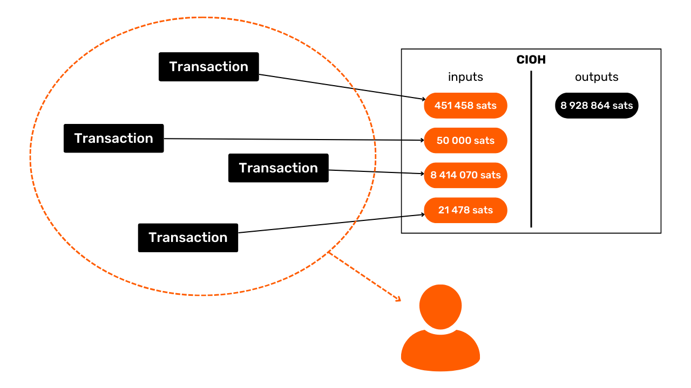

CIOH iligunduliwa na Satoshi Nakamoto. Anazungumza juu yake katika sehemu ya 10 ya Karatasi Nyeupe:

"_[...] kuunganisha hakuwezi kuepukika na shughuli za kuingiza nyingi, ambazo zinaonyesha kwamba lazima maingizo yao yalishikiliwa na mmiliki yuleyule. Hatari ni kwamba ikiwa mmiliki wa ufunguo atafichuliwa, viungo vinaweza kufichua miamala mingine ambayo ilikuwa ya mmiliki mmoja._."


Inafurahisha sana kutambua kwamba Satoshi Nakamoto, hata kabla ya kuzinduliwa rasmi kwa Bitcoin, tayari ilikuwa imetambua udhaifu mkuu wa faragha kwa watumiaji, ambao ni CIOH na Anwani (address) kutumia tena. Mtazamo kama huo ni wa kushangaza sana, kwani Legacy (Urithi) huu mbili unabaki, hata leo, muhimu zaidi katika uchambuzi wa kuzuia mnyororo.

Ili kukupa mfano, hapa kuna shughuli ambayo tunaweza kutumia CIOH:

```plaintext
20618e63b6eed056263fa52a2282c8897ab2ee71604c7faccfe748e1a202d712
```


Chanzo : [Mempool.space](https://Mempool.space/tx/20618e63b6eed056263fa52a2282c8897ab2ee71604c7faccfe748e1a202d712)

### Data ya off-chain

Kwa kweli, uchanganuzi wa minyororo hauzuiliwi kwa data ya onchain pekee. Data yoyote kutoka kwa uchanganuzi wa awali au inayopatikana kwenye Mtandao pia inaweza kutumika kuboresha uchanganuzi.

Kwa mfano, tukiona kwamba miamala iliyofuatiliwa inatangazwa kwa utaratibu kutoka kwa nodi ile ile ya Bitcoin, na tukaweza kutambua Anwani (address) ya IP yake, tunaweza kutambua miamala mingine kutoka kwa huluki hiyo hiyo, na pia kubainisha sehemu ya utambulisho wa mtoaji. Ingawa zoezi hili haliwezekani kwa urahisi, kwani linahitaji utendakazi wa nodi nyingi, linaweza kuajiriwa na baadhi ya makampuni yaliyobobea katika uchanganuzi wa kuzuia mnyororo.

Mchambuzi pia ana chaguo la kutegemea uchambuzi uliofanywa hapo awali-wazi, au kwa uchambuzi wake wa awali. Labda tutaweza kupata matokeo ambayo yanaelekeza kwenye kundi la Anwani (address) ambazo tayari tumetambua. Wakati mwingine, inawezekana pia kutegemea matokeo yanayoelekezwa kwenye jukwaa la Ubadilishanaji, kama vile Anwani (address) za kampuni hizi zinavyojulikana kwa ujumla.

Kwa njia hiyo hiyo, unaweza kufanya uchambuzi kwa kuondoa. Kwa mfano, ikiwa wakati wa kuchanganua muamala ulio na matokeo mawili, moja wapo inahusiana na nguzo ya Anwani (address) ambayo tayari inajulikana, lakini tofauti na huluki tunayofuatilia, basi tunaweza kutafsiri kwamba matokeo mengine huenda yanawakilisha Ubadilishanaji.

Uchanganuzi wa idhaa pia unajumuisha sehemu ya jumla zaidi ya OSINT (*Open Source Intelligence*), inayohusisha utafutaji wa mtandao. Ni kwa sababu hii kwamba tunashauri dhidi ya kuchapisha Anwani (address) moja kwa moja kwenye mitandao ya kijamii au kwenye tovuti, iwe ni jina bandia au la.


### Mifano ya muda

Tunalifikiria kidogo, lakini tabia fulani za wanadamu zinatambulika kwenye mnyororo. Labda muhimu zaidi katika uchanganuzi ni muundo wako wa kulala! Ndiyo, unapolala, hutangazi shughuli za Bitcoin. Lakini kwa ujumla hulala kwa takriban wakati huo huo. Hii ndiyo sababu ni kawaida kutumia uchanganuzi wa muda katika uchanganuzi wa kuzuia mnyororo. Kwa urahisi kabisa, hii ni sensa ya nyakati ambapo shughuli za huluki fulani zinatangazwa kwenye mtandao wa Bitcoin. Kwa kuchambua mifumo hii ya muda, tunaweza kupata habari nyingi.

Kwanza kabisa, uchanganuzi wa muda unaweza wakati mwingine kutambua asili ya huluki iliyofuatiliwa. Tukiona kwamba miamala hiyo inatangazwa mfululizo kwa saa 24, basi hii itasaliti kiwango cha juu cha shughuli za kiuchumi. Huluki nyuma ya miamala hii huenda ikawa kampuni, inayoweza kuwa ya kimataifa na pengine yenye taratibu za kiotomatiki za ndani.

Kwa mfano, [nilitambua muundo huu miezi michache iliyopita](https://twitter.com/Loic_Pandul/status/1701127409712452072) nilipochanganua [muamala ambao ulitenga kimakosa bitcoins 19 katika ada](https://Mempool.space/tx/d5392d474b4c436e1c9d1f4ff4be5f5f9bb0eb2e26b61d2781751474b7e870fd). Uchanganuzi rahisi wa muda uliniruhusu kudhania kuwa tunashughulikia huduma ya kiotomatiki, na kwa hivyo labda na huluki kubwa kama vile jukwaa la Ubadilishanaji.

Hakika, siku chache baadaye, iligunduliwa kuwa fedha hizo zilikuwa za PayPal, kupitia jukwaa Ubadilishalishanaji la Paxos .

Kinyume chake, ikiwa tunaweza kuona kwamba muundo wa muda umeenea zaidi ya saa 16 mahususi, basi tunaweza kukadiria kwamba tunashughulika na mtumiaji binafsi, au labda kampuni ya ndani kulingana na kiasi kilichobadilishwa.

Zaidi ya asili ya huluki inayozingatiwa, muundo wa muda unaweza pia kutuambia takriban mahali mtumiaji yuko, shukrani kwa maeneo ya saa. Kwa njia hii, tunaweza kulinganisha miamala mingine, na kutumia mihuri yao ya muda kama utabiri wa ziada ambao unaweza kuongezwa kwenye uchanganuzi wetu.

Kwa mfano, kwenye Anwani (address) iliyotumiwa nyingi niliyotaja hapo awali, tunaweza kuona kwamba shughuli, zinazoingia na zinazotoka, zinazingatia muda wa saa 13.

```plaintext
bc1qqtmeu0eyvem9a85l3sghuhral8tk0ar7m4a0a0
```


Chanzo : OXT.me

Aina hii labda inalingana na Ulaya, Afrika au Mashariki ya Kati. Kwa hivyo tunaweza kudhani kuwa mtumiaji anayeendesha shughuli hizi anaishi katika maeneo haya.

Kwa njia tofauti, uchanganuzi wa wakati wa aina hii pia ulisababisha dhana kwamba Satoshi Nakamoto haikuwa ikifanya kazi kutoka Japani, bali kutoka Marekani: [*The Time Zones of Satoshi Nakamoto*](https://medium.com/@insearchofsatoshi/the-time-zones-of-Satoshi-nakaf08f0-3a)3a

## Kuiweka katika vitendo na Block Explorer (kuzuia mpelelezi)

<chapterId>6493cf2f-225c-405f-9375-c4304f1087ed</chapterId>

Katika sura hii ya mwisho, tutaweka dhana ambazo tumejifunza hadi sasa katika vitendo. Nitakuonyesha mifano ya miamala halisi ya Bitcoin, na itabidi utoe maelezo ninayokuuliza.

Kwa hakika, kufanya mazoezi haya, matumizi ya chombo cha kitaaluma cha Chainalysis (uchambuzi wa mnyororo) utakuwa vyema. Hata hivyo, tangu kukamatwa kwa waundaji wa Pochi la Samourai, zana pekee ya uchanganuzi isiyolipishwa ya OXT.me haipatikani tena. Kwa hivyo tutachagua Block Explorer (kuzuia mpelelezi) wa kawaida kwa mazoezi haya. Ninapendekeza utumie [Mempool.space](https://Mempool.space/) kwa vipengele vyake vingi na anuwai ya zana za uchanganuzi wa mfululizo, lakini pia unaweza kuchagua mgunduzi mwingine kama vile [Bitcoin Explorer](https://bitcoinexplorer.org/).

Kuanza, nitakujulisha kwa mazoezi. Tumia Block Explorer (kuzuia mpelelezi) wako kuyakamilisha, na uandike majibu yako kwenye karatasi. Kisha, mwishoni mwa sura hii, nitakupa majibu ili uweze kuangalia na kusahihisha matokeo yako.

*Shughuli zilizochaguliwa kwa ajili ya mazoezi haya zimechaguliwa kwa ajili ya sifa zake kwa mtindo wa nasibu. Sura hii imekusudiwa kwa madhumuni ya kuelimisha na kuelimisha pekee. Ningependa kueleza wazi kwamba siungi mkono wala sihimii matumizi ya zana hizi kwa madhumuni mabaya. Lengo ni kukufundisha jinsi ya kujilinda dhidi ya uchanganuzi wa kamba, si kufanya uchanganuzi ili kufichua taarifa za faragha za watu wengine.*

### Zoezi 1

Kitambulisho cha muamala utakaochanganuliwa :

```plaintext
3769d3b124e47ef4ffb5b52d11df64b0a3f0b82bb10fd6b98c0fd5111789bef7
```

Jina la kielelezo cha muamala huu ni nini, na ni tafsiri gani zinazokubalika zinaweza kutolewa kwa kuchunguza tu mfano wake, yaani muundo wa shughuli hiyo?

### Zoezi 2

Kitambulisho cha muamala utakaochanganuliwa :

```plaintext
baa228f6859ca63e6b8eea24ffad7e871713749d693ebd85343859173b8d5c20
```

Jina la kielelezo cha muamala huu ni nini, na ni tafsiri gani zinazokubalika zinaweza kutolewa kwa kuchunguza tu mfano wake, yaani muundo wa shughuli hiyo?

### Zoezi 3

Kitambulisho cha muamala utakaochanganuliwa :

```plaintext
3a9eb9ccc3517cc25d1860924c66109262a4b68f4ed2d847f079b084da0cd32b
```

Ni mfano gani wa muamala huu?

Baada ya kutambua muundo wake, kwa kutumia utabiri wa ndani wa shughuli, Ubadilishanaji unaweza kuwakilisha matokeo gani?

### Zoezi 4

Kitambulisho cha muamala utakaochanganuliwa :

```plaintext
35f0b31c05503ebfdf7311df47f68a048e992e5cf4c97ec34aa2833cc0122a12
```

Ni mfano gani wa muamala huu?

Baada ya kutambua muundo wake, kwa kutumia utabiri wa ndani wa shughuli, Ubadilishanaji unaweza kuwakilisha matokeo gani?

### Zoezi 5

Hebu fikiria kwamba Loïc amechapisha mojawapo ya Anwani (address) zake za kupokea Bitcoin kwenye mtandao wa kijamii wa Twitter :


```plaintext
bc1qja0hycrv7g9ww00jcqanhfpqmzx7luqalum3vu
```

Kulingana na maelezo haya na kwa kutumia **Anwani (address) pekee ikitumia tena Legacy (Urithi)**, ni miamala gani ya Bitcoin inaweza kuunganishwa na utambulisho wa Loïc?

*Ni wazi, mimi si mmiliki halisi wa mapokezi haya ya Anwani (address) na sikuyachapisha kwenye mitandao ya kijamii. Ni Anwani (address) niliyochukua bila mpangilio kutoka kwa kuzuia mnyororo*

### Zoezi 6

Kufuatia zoezi la 5, kutokana na utumiaji tena wa Anwani (address), uliweza kutambua miamala kadhaa ya Bitcoin ambayo Loïc inaonekana kuhusika. Kwa kawaida, kati ya shughuli zilizotambuliwa, unapaswa kuwa umeona hii:

```plaintext
2d9575553c99578268ffba49a1b2adc3b85a29926728bd0280703a04d051eace
```

Muamala huu ni wa kwanza kabisa kutuma pesa kwa Anwani (address) ya Loïc. Je, unafikiri bitcoins zilizopokelewa na Loïc kupitia muamala huu zilitoka wapi?

### Zoezi 7

Kufuatia zoezi la 5, kutokana na utumiaji upya wa Anwani (address), umeweza kutambua miamala kadhaa ya Bitcoin ambayo Loïc inaonekana kuhusika. Sasa unataka kujua Loïc alitoka wapi. Kulingana na miamala iliyopatikana, fanya uchanganuzi wa wakati ili kupata saa za eneo ambazo huenda zikatumiwa na Loïc. Kuanzia saa za eneo hili, bainisha eneo ambalo Loïc anaonekana kuishi (nchi, jimbo/eneo, jiji...).


### Zoezi 8

Hapa kuna muamala wa Bitcoin wa kusoma:

```plaintext
bb346dae645d09d32ed6eca1391d2ee97c57e11b4c31ae4325bcffdec40afd4f
```

Tukiangalia muamala huu pekee, ni taarifa gani tunaweza kutafsiri?

### Suluhisho la mazoezi

***Zoezi la 1:***

Mfano wa shughuli hii ni mfano rahisi wa malipo. Ikiwa tutasoma muundo wake pekee, tunaweza kufasiri kwamba pato moja linawakilisha Ubadilishanaji na matokeo mengine yanawakilisha malipo halisi. Kwa hivyo tunajua kwamba mtumiaji anayezingatiwa labda hana tena moja ya UTXO mbili katika pato (ile ya malipo), lakini bado anamiliki UTXO nyingine (ile ya Ubadilishanaji).

***Zoezi la 2:***

Mfano wa muamala huu ni ule wa matumizi ya makundi. Mtindo huu labda unaonyesha shughuli kubwa za kiuchumi, kama vile jukwaa la Ubadilishanaji. Tunaweza kuamua kwamba pembejeo UTXO inatoka kwa kampuni yenye kiwango cha juu cha shughuli za kiuchumi, na kwamba matokeo ya UTXO yatatawanyika. Baadhi watakuwa wateja wa kampuni ambao wametoa bitcoins zao kwenye pochi za kujilinda. Wengine wanaweza kwenda kwa kampuni za washirika. Hatimaye,kutakuwa na Ubadilishanaji ambao utarudi kwa kampuni inayotoa.

***Zoezi la 3:***

Mfano wa shughuli hii ni malipo rahisi. Kwa hivyo tunaweza kutumia Legacy (Urithi) wa ndani kwa shughuli ili kujaribu kutambua Ubadilishanaji.

Binafsi nimegundua angalau Legacy (Urithi) mbili wa ndani ambao unaunga mkono nadharia moja:


- Matumizi tena ya aina sawa ya hati ;
- Pato kubwa zaidi.

Uaminifu dhahiri zaidi ni ule wa kutumia tena aina ile ile ya hati. Hakika, pato `0` ni `P2SH`, inayotambulika kwa mapokezi yake ya Anwani (address) kuanzia `3` :

```plaintext
3Lcdauq6eqCWwQ3UzgNb4cu9bs88sz3mKD
```

Wakati pato `1` ni `P2WPKH`, inayotambulika kwa Anwani (address) yake inayoanza na `bc1q` :

```plaintext
bc1qya6sw6sta0mfr698n9jpd3j3nrkltdtwvelywa
```

UTXO inayotumika kama ingizo la muamala huu pia hutumia hati ya `P2WPKH`:

```plaintext
bc1qyfuytw8pcvg5vx37kkgwjspg73rpt56l5mx89k
```

Kwa hivyo, tunaweza kudhani kuwa pato `0` linalingana na malipo na pato `1` ni shughuli ya Ubadilishanaji, ambao utamaanisha kuwa mtumiaji wa ingizo huwa anamiliki pato `1` kila wakati.

Ili kuunga mkono au kukanusha dhana hii, tunaweza kutafuta mawazo mengine ambayo yanathibitisha mawazo yetu, au kupunguza uwezekano kwamba nadharia yetu ni sahihi.

Nimegundua angalau mtu mwingine wa kLegacy (Urithi). Ni kubwa pato Legacy (Urithi). Pato `0` hupima `123,689 Sats`, wakati pato `1` hupima `505,839 Sats`. Kwa hivyo kuna tofauti kubwa kati ya matokeo haya mawili. Pato kubwa zaidi la Legacy (Urithi) linapendekeza kuwa pato kubwa zaidi linaweza kuwa badilisho la kigeni. Legacy (Urithi) huu unaimarisha zaidi nadharia yetu ya awali.

Kwa hivyo inaonekana kuwa mtumiaji aliyetoa UTXO kama ingizo bado anashikilia toleo la `1`, ambalo linaonekana kujumuisha Ubadilishanaji wa muamala.

***Zoezi la 4:***

Mfano wa shughuli hii ni malipo rahisi. Kwa hivyo tunaweza kutumia Legacy (Urithi) wa ndani kwa shughuli ili kujaribu kutambua Ubadilishanaji.

Binafsi nimegundua angalau Legacy (Urithi) mbili wa ndani ambao unaunga mkono nadharia moja:


- Matumizi tena ya aina sawa ya hati ;
- Pato la chapisho la pande zote.

Uaminifu dhahiri zaidi ni ule wa kutumia tena aina ile ile ya hati. Hakika, pato `0` ni `P2SH`, inayotambulika kwa mapokezi yake ya Anwani (address) kuanzia `3` :

```plaintext
3FSH5Mnq6S5FyQoKR9Yjakk3X4KCGxeaD4
```

Wakati pato `1` ni `P2WPKH`, inayotambulika kwa Anwani (address) yake inayoanza na `bc1q` :

```plaintext
bc1qvdywdcfsyavt4v8uxmmrdt6meu4vgeg439n7sg
```

UTXO inayotumika kama ingizo kwa muamala huu pia hutumia hati ya `P2WPKH`:

```plaintext
bc1qku3f2y294h3ks5eusv63dslcua2xnlzxx0k6kp
```

Kwa hivyo, tunaweza kudhani kuwa pato `0` linalingana na malipo na pato `1` ni shughuli ya Ubadilishanaji, ambao utamaanisha kuwa mtumiaji wa ingizo huwa anamiliki pato `1` kila wakati.

Ili kuunga mkono au kukanusha dhana hii, tunaweza kutafuta mawazo mengine ambayo yanathibitisha mawazo yetu, au kupunguza uwezekano kwamba nadharia yetu ni sahihi.

Nimetambua angalau mtu mwingine wa kLegacy (Urithi). Ni kiasi cha pato la pande zote. Pato `0` hupima `70,000 Sats`, wakati pato `1` hupima `22,962 Sats`. Kwa hivyo tuna pato la pande zote kikamilifu katika kitengo cha akaunti cha BTC. Uhesabuji wa matokeo ya pande zote unapendekeza kuwa UTXO yenye kiasi cha mzunguko kuna uwezekano mkubwa kuwa ni ya malipo, na kwamba kwa kuondoa, nyingine inawakilisha Ubadilishanaji. Legacy (Urithi) huu unaimarisha zaidi nadharia yetu ya awali.

Walakini, katika mfano huu, mtabiri mwingine anaweza kupinga nadharia yetu ya awali. Hakika, pato `0` ni kubwa kuliko pato `1`. Kulingana na utabiri kwamba pato kubwa zaidi kwa ujumla ni la kigeni la Ubadilishanaji, tunaweza kubaini kuwa pato `0` ni Ubadilishanaji wa kigeni. Hata hivyo, nadharia hii ya kupinga inaonekana kuwa isiyowezekana, kwani nadharia zingine mbili za Legacy (Urithi) zinaonekana kushawishi zaidi kuliko matokeo makubwa zaidi ya Legacy (Urithi). Kwa hivyo, inaonekana kuwa sawa kudumisha nadharia yetu ya awali licha ya ukinzani huu dhahiri.

Kwa hivyo inaonekana kuwa mtumiaji aliyetoa UTXO kama ingizo bado anashikilia toleo la `1`, ambalo linaonekana kujumuisha Ubadilishanaji wa muamala.

***Zoezi la 5:***

Tunaweza kuona kwamba miamala 8 inaweza kuhusishwa na utambulisho wa Loïc. Kati ya hizi, 4 zinahusisha upokeaji wa bitcoins:

```plaintext
2d9575553c99578268ffba49a1b2adc3b85a29926728bd0280703a04d051eace
8b70bd322e6118b8a002dbdb731d16b59c4a729c2379af376ae230cf8cdde0dd
d5864ea93e7a8db9d3fb113651d2131567e284e868021e114a67c3f5fb616ac4
bc4dcf2200c88ac1f976b8c9018ce70f9007e949435841fc5681fd33308dd762
```

Nyingine 4 zinahusu usafirishaji wa Bitcoin:

```plaintext
8b52fe3c2cf8bef60828399d1c776c0e9e99e7aaeeff721fff70f4b68145d540
c12499e9a865b9e920012e39b4b9867ea821e44c047d022ebb5c9113f2910ed6
a6dbebebca119af3d05c0196b76f80fdbf78f20368ebef1b7fd3476d0814517d
3aeb7ce02c35eaecccc0a97a771d92c3e65e86bedff42a8185edd12ce89d89cc
```

***Zoezi la 6:***

Tukiangalia mfano wa muamala huu, ni wazi kuwa ni matumizi yaliyounganishwa. Hakika, shughuli hiyo ina pembejeo moja na matokeo 51, inayoonyesha kiwango cha juu cha shughuli za kiuchumi. Kwa hivyo tunaweza kudhani kuwa Loïc ameondoa bitcoins kutoka kwa jukwaa la Ubadilishanaji.

Sababu kadhaa huimarisha nadharia hii. Kwanza, aina ya hati inayotumika kupata ingizo la UTXO ni hati ya P2SH 2/3 Sahihi nyingi, ambazo zinaonyesha kiwango cha juu cha usalama cha kawaida cha majukwaa ya Ubadilishanaji:

```plaintext
OP_PUSHNUM_2
OP_PUSHBYTES_33 03eae02975918af86577e1d8a257773118fd6ceaf43f1a543a4a04a410e9af4a59
OP_PUSHBYTES_33 03ba37b6c04aaf7099edc389e22eeb5eae643ce0ab89ac5afa4fb934f575f24b4e
OP_PUSHBYTES_33 03d95ef2dc0749859929f3ed4aa5668c7a95baa47133d3abec25896411321d2d2d
OP_PUSHNUM_3
OP_CHECKMULTISIG
```

Zaidi ya hayo, Anwani (address) iliyofanyiwa utafiti `3PUv9tQMSDCEPSMsYSopA5wDW86pwRFbNF` inatumika tena katika zaidi ya miamala 220,000 tofauti, ambayo mara nyingi ni tabia ya majukwaa ya Ubadilishanaji, kwa ujumla kutojali kuhusu usiri wao.

Legacy (Urithi) wa muda unaotumika kwa Anwani (address) hii pia unaonyesha utangazaji wa kawaida wa miamala karibu kila siku katika kipindi cha miezi 3, na saa zilizoongezwa zaidi ya saa 24, ikipendekeza shughuli inayoendelea ya jukwaa la Ubadilishanaji.

Hatimaye, juzuu zinazoshughulikiwa na chombo hiki ni nyingi sana. Anwani (address) ilipokea na kutuma BTC 44 katika miamala 222,262 kati ya Desemba 2022 na Machi 2023. Idadi hizi kubwa zinathibitisha zaidi uwezekano wa shughuli za jukwaa la Ubadilishanaji.

***Zoezi la 7:***

Kwa kuchanganua nyakati za uthibitishaji wa muamala, nyakati zifuatazo za UTC zinaweza kutambuliwa:

```plaintext
05:43
20:51
18:12
17:16
04:28
23:38
07:45
21:55
```

Uchanganuzi wa ratiba hizi unaonyesha kuwa UTC-7 na UTC-8 zinalingana na anuwai ya shughuli za sasa za binadamu (kati ya 08:00 na 23:00) kwa ratiba nyingi:

```plaintext
05:43 UTC > 22:43 UTC-7
20:51 UTC > 13:51 UTC-7
18:12 UTC > 11:12 UTC-7
17:16 UTC > 10:16 UTC-7
04:28 UTC > 21:28 UTC-7
23:38 UTC > 16:38 UTC-7
07:45 UTC > 00:45 UTC-7
21:55 UTC > 14:55 UTC-7
05:43 UTC > 21:43 UTC-8
20:51 UTC > 12:51 UTC-8
18:12 UTC > 10:12 UTC-8
17:16 UTC > 09:16 UTC-8
04:28 UTC > 20:28 UTC-8
23:38 UTC > 15:38 UTC-8
07:45 UTC > 23:45 UTC-8
21:55 UTC > 13:55 UTC-8
```


Saa za eneo la UTC-7 ni muhimu sana wakati wa kiangazi, kwani inajumuisha majimbo na maeneo kama vile:


- California (pamoja na miji kama Los Angeles, San Francisco, na San Diego);
- Nevada (pamoja na Las Vegas);
- Oregon (pamoja na Portland);
- Washington (pamoja na Seattle);
- Eneo la Kanada la British Columbia (pamoja na miji kama Vancouver na Victoria).

Maelezo haya yanapendekeza kwamba Loïc ana uwezekano wa kuishi katika pwani ya magharibi ya Marekani au Canada.

***Zoezi la 8:***

Uchambuzi wa shughuli hii unaonyesha pembejeo 5 na pato moja, na kupendekeza ujumuishaji. Kwa kutumia utabiri wa CIOH, tunaweza kudhani kuwa UTXO zote za pembejeo zinamilikiwa na huluki moja, na kwamba pato la UTXO pia ni la huluki hii. Inaonekana kwamba mtumiaji alichagua kuunganisha pamoja UTXO kadhaa alizomiliki, ili kuunda UTXO moja katika pato, kwa lengo la kuunganisha sehemu zake. Hatua hii pengine ilichochewa na nia ya kuchukua fursa ya gharama za chini za shughuli za wakati huo, ili kupunguza gharama za baadaye.

___

*Ili kuandika sehemu hii ya uchambuzi wa on chain, nilitumia nyenzo zifuatazo:*


- Msururu wa makala manne yenye mada: [Kuelewa Faragha ya Bitcoin na OXT](https://medium.com/oxt-research/understanding-Bitcoin-privacy-with-oxt-part-1-4-8177a40a5923), iliyotolewa na Samourai katika 2-03310;
- Ripoti mbalimbali kutoka kwa [OXT Research](https://medium.com/oxt-research), pamoja na zana yao ya bure ya uchanganuzi wa kuzuia mnyororo (haipatikani tena kwa sasa kufuatia kukamatwa kwa waanzilishi wa Pochi la Samourai) ;*
- Kwa upana zaidi, ujuzi wangu unatokana na tweets na maudhui mbalimbali kutoka kwa [@LaurentMT](https://twitter.com/LaurentMT) na [@ErgoBTC](https://twitter.com/ErgoBTC) ;*
- [Space Kek #19](https://podcasters.spotify.com/pod/show/decouvrebitcoin/episodes/SpaceKek-19---Analyse-de-chane--anonsets-et-entropie-e1vfuji) ambamo nilishiriki katika kampuni ya [@louneskmt://twitter.com] [@TheoPantamis](https://twitter.com/TheoPantamis), [@Sosthene___](https://twitter.com/Sosthene___) na [@LaurentMT](https://twitter.com/LaurentMT).*

*Ningependa kuwashukuru waandishi, watengenezaji na watayarishaji wao. Asante pia kwa wasahihishaji waliosahihisha kwa uangalifu nakala ambayo sehemu hii ya 3 inategemea, na kunipa ushauri wao wa kitaalamu:*


- [Gilles Cadignan](https://twitter.com/gillesCadignan) ;*
- [Ludovic Lars](https://viresinnumeris.fr/)

# Kujua mbinu bora za kulinda faragha yako

<partId>9bd04b63-f1af-4e50-9061-6bc90009df68</partId>

## kutumia tena Anwani (address)

<chapterId>f3e97645-3df3-41bc-a4ed-d2c740113d96</chapterId>

Baada ya kusoma mbinu zinazoweza kuvunja usiri wako kwenye Bitcoin, katika sehemu hii ya tatu sasa tutaangalia mbinu bora za kufuata ili kujilinda. Madhumuni ya sehemu hii si kuchunguza mbinu za kuboresha usiri, somo ambalo litashughulikiwa baadaye, lakini badala yake kuelewa jinsi ya kuingiliana kwa usahihi na Bitcoin ili kuhifadhi usiri ambao unatoa kiasili, bila kutumia mbinu za ziada.

Ni wazi, ili kuanza sehemu hii ya tatu, tutazungumza kuhusu utumiaji tena wa Anwani (address). Jambo hili ni tishio kuu kwa usiri wa mtumiaji. Sura hii kwa hakika ndiyo muhimu zaidi ya kozi nzima.

### Anwani (address) inayopokea ni nini?

Bitcoin inayopokea Anwani (address) ni kamba au kitambulisho kinachotumiwa kupokea bitcoins kwa Pochi.

Kitaalam, Bitcoin inayopokea Anwani (address) haina "kupokea" bitcoins kwa maana halisi, lakini hutumikia kufafanua hali ambazo bitcoins zinaweza kutumika. Kwa maneno madhubuti, malipo yanapotumwa kwako, muamala wa mtumaji hukuundia UTXO mpya kama pato kutoka kwa UTXO ambayo imetumia kama pembejeo. Kwenye pato hili, huweka hati inayofafanua jinsi UTXO hii inaweza kutumika baadaye. Hati hii inajulikana kama "*ScriptPubKey*" au "*Hati ya Kufunga*". Upokeaji wako wa Anwani (address), au kwa usahihi zaidi mzigo wake wa malipo, umeunganishwa kwenye hati hii. Kwa maneno ya layman, hati hii kimsingi inasema:

> "*Ili kutumia UTXO hii mpya, ni lazima utoe sahihi ya dijitali kwa kutumia ufunguo wa faragha unaohusishwa na upokeaji huu wa Anwani (address).*"


Anwani (address) za Bitcoin huja katika aina tofauti, kulingana na muundo wa hati uliotumiwa. Miundo ya kwanza, inayojulikana kama "Legacy (Urithi)*", unajumuisha Anwani (address) za `P2PKH` (*Pay-to-PubKey-Hash*) na `P2SH` (*Pay-to-Script-Hash*) Anwani (address). Anwani (address) za P2PKH kila mara huanza na `1`, na P2SH na `3`. Ingawa bado ni salama, fomati hizi sasa hazitumiki, kwani zinajumuisha gharama kubwa zaidi za ununuzi na hutoa usiri mdogo kuliko viwango vipya.

Anwani (address) za SegWit V0 (`P2WPKH` na `P2WSH`) na Taproot (Mzizi kuu) / SegWit V1 (`P2TR`) zinawakilisha miundo ya kisasa. Anwani (address) za SegWit huanza na `bc1q` na Anwani (address) ya Mizizi kuu, iliyoanzishwa mwaka wa 2021, inaanza na `bc1p`.

Kwa mfano, hapa kuna mapokezi ya Anwani (address) ya Taproot (Mzizi kuu) :

```text
bc1ps5gd2ys8kllz9alpmcwxqegn7kl3elrpnnlegwkm3xpq2h8da07spxwtf5
```
Hati ya kufunga
Jinsi  inavyoundwa itategemea kiwango unachotumia:

| Hati ya kufunga | Kiolezo cha hati

| ---------------- | ------------------------------------------------------- |

| P2PKH | OP_DUP OP_HASH160 `<pubKeyHash>` OP_EQUALVERIFY OP_CHECKSIG |

| P2SH | OP_HASH160 `<scriptHash>` OP_EQUAL |

| P2WPKH | 0 `<pubKeyHash>` |

| P2WSH | 0 `<witnessScriptHash>` |

| P2SH - P2WPKH | OP_HASH160 `<redeemScriptHash>` OP_EQUAL |

| P2SH - P2WSH | OP_HASH160 `<redeemScriptHash>` OP_EQUAL |

| P2TR | 1 `<pubKey>` |

Ujenzi wa Anwani (address) za mapokezi pia inategemea mtindo wa hati uliochaguliwa:


- Kwa Anwani (address) za `P2PKH` na `P2WPKH`, mzigo wa malipo, yaani kiini cha Anwani (address), kinawakilisha Hash ya ufunguo wa umma;
- Kwa Anwani (address) za `P2SH` na `P2WSH`, mzigo wa malipo unawakilisha Hash ya a ;
- Kuhusu Anwani (address) za `P2TR`, upakiaji ni ufunguo wa umma uliobadilishwa. Matokeo ya P2TR yanachanganya vipengele vya _Pay-to-PubKey_ na _Pay-to-Script_. Ufunguo wa umma uliobadilishwa ni matokeo ya kuongeza ufunguo wa matumizi ya kawaida wa umma na "tweak", inayotokana na Merkle Root ya seti ya maandiko ambayo inaweza pia kutumika kutumia bitcoins.

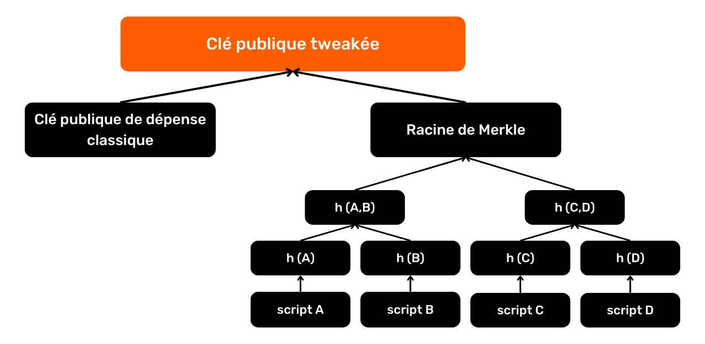

Anwani (address) zinazoonyeshwa kwenye programu yako ya kwingineko pia hujumuisha HRP (*Sehemu Inayosomeka kwa Binadamu*), kwa kawaida `bc` kwa Anwani (address) za baada ya SegWit, kitenganishi cha `1`, na nambari ya toleo `q` kwa SegWit V0 na `p` kwa Taproot/SegWit V1. Cheki pia huongezwa ili kuhakikisha uadilifu na uhalali wa Anwani (address) wakati wa usambazaji.

Hatimaye, Anwani (address) zimewekwa katika muundo wa kawaida:


- Base58check kwa Anwani (address) za zamani za Legacy (Urithi);
- Bech32 kwa Anwani (address) za SegWit;
- Bech32m kwa Anwani (address) za Taproot (Mzizi kuu).

Hapa kuna matrix ya kuongeza kwa bech32 na muundo wa bech32m (SegWit na Taproot (Mzizi kuu)) kutoka msingi wa 10:

| + | 0 | 1 | 2 | 3 | 4 | 5 | 6 | 7 |

| --- | --- | --- | --- | --- | --- | --- | --- | --- |

| 0 | q | p | z | r | y | 9 | x | 8 |

| 8 | g | f | 2 | t | v | d | w | 0 |

| 16 | s | 3 | j | n | 5 | 4 | k | h |

| 24 | c | e | 6 | m | wewe | a | 7 | l |

### Utumiaji tena wa Anwani (address) ni nini?

Utumiaji tena wa Anwani (address) ni matumizi ya Anwani (address) sawa inayopokea ili kuzuia UTXO kadhaa tofauti.

Kama tulivyoona katika sehemu iliyotangulia, kila UTXO ina Scriptpubkey yake, ambayo huifungia na lazima itimizwe ili UTXO itumike kama ingizo katika muamala mpya. Ni ndani ya Scriptpubkey ambapo Anwani (address) za upakiaji huunganishwa.

Wakati ScriptPubKeys tofauti ina Anwani (address) inayopokea sawa, hii inaitwa utumiaji tena wa Anwani (address). Kwa mazoezi, hii ina maana kwamba mtumiaji ametoa mara kwa mara Anwani (address) sawa kwa watumaji ili kupokea bitcoins kupitia malipo mengi. Na ni desturi hii haswa ambayo ni mbaya kwa faragha yako.

### Kwa nini kutumia Anwani (address) ni tatizo?

Kwa kuwa Kuzuia Mnyororo ni wa umma, ni rahisi kuona ni Anwani (address) zipi zimefunga UTXO na bitcoins ngapi. Ikiwa Anwani (address) sawa inatumiwa kwa shughuli kadhaa, inakuwa inawezekana kutambua kwamba bitcoins zote zinazohusiana na Anwani (address) hiyo ni za mtu mmoja. Mazoezi haya yanahatarisha faragha ya mtumiaji kwa kuwezesha viungo vya kuamua kuanzishwa kati ya miamala tofauti na bitcoins kufuatiliwa kwenye Kuzuia mnyororo. Satoshi Nakamoto mwenyewe tayari ameangazia tatizo hili kwenye Karatasi Nyeupe ya Bitcoin:

> *Kama ngome ya ziada, jozi mpya ya funguo inaweza kutumika kwa kila shughuli ili kuwatenganisha na mmiliki wa kawaida*


Chanzo: S. Nakamoto, "Bitcoin: Peer-to-Peer Electronic Cash System", https://Bitcoin.org/Bitcoin.pdf, 2009.

Kusudi la Satoshi katika sentensi hii ilikuwa kuunda ngome ya ziada ikiwa kuna uhusiano kati ya utambulisho wa mtumiaji na jozi muhimu kwenye Bitcoin, ili kuzuia shughuli yake yote isihusishwe hadharani na utambulisho wake. Leo, pamoja na kuongezeka kwa kampuni za uchanganuzi za Kuzuia mnyororo na kanuni za KYC, utumiaji wa Anwani (address) za kipekee sio "ngozo ya ziada", lakini ni mazoezi ya lazima kwa mtu yeyote anayetaka kuhifadhi kiwango cha chini cha faragha.

Unapotumia tena Anwani (address), unatengeneza kiunganishi kisichopingika kati ya miamala yote inayohusishwa na hiyo Anwani (address). Ingawa hii haihatarishi pesa zako moja kwa moja, kwa vile usimbaji fiche wa mchirizo mduara huhakikisha usalama wa funguo zako za faragha, hurahisisha kufuatilia shughuli zako. Hakika, mtu yeyote aliye na nodi anaweza kuchunguza miamala na salio za Anwani (address), hivyo kuhatarisha kabisa kutokujulikana kwako.


Ili kuonyesha jambo hili, hebu tuchukue mfano wa Bob, mtumiaji ambaye mara kwa mara hununua bitcoins kwa kiasi kidogo katika DCA na daima huwatuma kwa Anwani (address) sawa. Baada ya miaka miwili, Anwani (address) hii ina kiasi kikubwa cha bitcoins. Iwapo Bob atatumia Anwani (address) hii kufanya malipo kwa mfanyabiashara wa ndani, mfanyabiashara huyo ataweza kuona pesa zote zinazohusiana na kukisia utajiri wa Bob. Hii inaweza kusababisha hatari za usalama wa kibinafsi, kama vile jaribio la wizi au unyang'anyi. Ikiwa Bob angetumia Anwani (address) tupu kupokea kila ununuzi wa mara kwa mara, angefichua maelezo machache sana kwa mfanyabiashara wake.

Katika uchanganuzi wa kamba, kuna aina 2 za utumiaji wa Anwani (address):


- Utumiaji tena wa nje;
- Utumiaji tena wa ndani ndani ya muamala.

Ya kwanza ni wakati Anwani (address) inatumiwa tena katika shughuli mbalimbali za Bitcoin. Hili ndilo tulilozungumzia hapo awali: utabiri huu unabainisha kuwa UTXO zote zilizopitishwa kupitia Anwani (address) hizi ni za chombo kimoja.

Utumiaji tena wa ndani wa Anwani (address) haufanyiki wakati utumiaji tena unatokea katika shughuli nyingi za malipo, lakini inapotokea ndani ya muamala mmoja. Kwa hakika, ikiwa Anwani (address) ile ile iliyotumiwa kufunga ingizo inatumika kama matokeo ya muamala, basi tunaweza kukisia kwamba pato hili bado ni la mtumiaji yule yule (ubadilishanaji), na kwamba pato la pili linawakilisha malipo halisi. Hii nyingine ya Legacy (Urithi) inafanya uwezekano wa kuendeleza ufuatiliaji wa fedha juu ya shughuli kadhaa.


Kutumia tena Anwani (address) ni janga la kweli kwenye Bitcoin. Kulingana na tovuti ya OXT.me (haipatikani kwa sasa), kiwango cha jumla cha matumizi ya Anwani (address) kwenye Bitcoin kilikuwa karibu 52% mwaka wa 2022:


Kiwango hiki ni kikubwa, lakini kinakuja kwa wingi kutoka kwa majukwaa ya Ubadilishanaji badala ya watumiaji binafsi.

### Jinsi ya kuepuka kutumia tena Anwani (address)?

Kuepuka kutumia tena Anwani (address) ni rahisi sana: **tumia tu Anwani (address) mpya, tupu kwa malipo yote mapya kwa Pochi** yako.

Shukrani kwa BIP32, kwineko za kisasa sasa ni za kuamua na za daraja. Hii ina maana kwamba mtumiaji anaweza kuzalisha idadi kubwa ya Anwani (address) kutoka sehemu moja ya awali ya habari: seed (mbegu). Kwa kuokoa kipande hiki cha habari, inawezekana kurejesha funguo zote za kibinafsi kwenye kwingineko, kuwezesha upatikanaji wa fedha zilizohifadhiwa na Anwani (address) zinazofanana.


Hii ndiyo sababu, unapobonyeza kitufe cha "*pokea*" katika programu yako ya Pochi, upokeaji wa Anwani (address) ambao haujatumiwa unapendekezwa kila wakati. Baada ya kupokea bitcoins kwenye Anwani (address) hii, programu inapendekeza moja kwa moja mpya.

> *PS: Hivi majuzi, baadhi ya programu za Pochi zimetangaza nia yao ya kuacha kutoa Anwani (address) tupu, kwa kuhofia kuwa hii itachukuliwa kuwa njia ya ufujaji wa pesa na mamlaka. Ikiwa programu yako ni mojawapo ya hizi, nakushauri sana uibadilishe mara moja, kwa kuwa hii haikubaliki kwa mtumiaji.*
Iwapo unahitaji kitambulisho tuli ili kupokea malipo, kama vile michango, si vyema kutumia Anwani (address) ya Bitcoin ya kawaida kwa sababu ya hatari ya kutumiwa tena. Badala yake, tumia Anwani (address) ya Umeme, au uchague kitambulisho tuli cha malipo ya mtandaoni, kama vile BIP47 au Malipo ya Kimya. Itifaki hizi zimefafanuliwa kwa kina katika Sehemu ya 6 ya kozi hii ya mafunzo.

## Kuweka alama na kuangalia sehemu

<chapterId>fbdb07cd-c025-48f2-97b0-bd1bc21c68a8</chapterId>

Kama tulivyogundua katika sehemu ya uchanganuzi wa mifuatano, kuna idadi kubwa ya mawazo na mifumo ambayo inaweza kutumika kupata maelezo kuhusu shughuli. Kama mtumiaji, ni muhimu kufahamu mbinu hizi ili kujilinda vyema dhidi yao.

Hii inahusisha usimamizi mkali wa Pochi yako katika kujilinda, ambayo ina maana ya kujua asili ya UTXO zako, pamoja na kuchagua kwa makini ni UTXO gani utumie unapofanya malipo. Usimamizi huu wa ufanisi wa Pochi unategemea vipengele viwili muhimu vya pochi nzuri za Bitcoin: kuweka alama na udhibiti wa sarafu.

Katika sura hii, tutaangalia vipengele hivi na kuona jinsi unavyoweza kuvitumia kwa akili, bila kuongeza mzigo mkubwa wa kazi, ili kuboresha faragha yako kwenye Bitcoin.

### Kuweka alama ni nini?

Kuweka alama ni zoezi la kugawa kidokezo au alama kwa UTXO mahususi katika Pochi la Bitcoin. Vidokezo hivi huhifadhiwa ndani na programu ya Pochi na kamwe hazisambazwi kupitia mtandao wa Bitcoin. Kwa hivyo kuweka alama ni zana ya usimamizi wa kibinafsi.

Kwa mfano, ikiwa nina UTXO kutoka kwa ununuzi wa P2P kwenye Bisq na Charles, naweza kuipatia alama "`Non-KYC Bisq Charles`".

Kuweka alama ni mbinu nzuri ambayo husaidia kukumbuka asili au kulengwa lengwa la UTXO, ambayo kwa hivyo hurahisisha usimamizi wa fedha na uboreshaji wa faragha. Hakika,Pochi la Bitcoin yako hakika linalinda UTXO kadhaa. Ikiwa vyanzo vya UTXO hizi ni tofauti, huenda usitake kuunganisha UTXO hizi katika siku zijazo, vinginevyo unaweza kufichua umiliki wao wa kawaida. Kwa kuweka alama kwa sehemu zako zote, unaweza kuwa na uhakika kwamba utakumbuka zilipotoka unapohitaji kuzitumia, hata ikiwa hiyo ni miaka mingi kuanzia sasa.

### Udhibiti wa kona ni nini?

Matumizi amilifu ya uwekaji alama huwa wa kuvutia zaidi ukiunganishwa na chaguo la kudhibiti sarafu kwenye programu yako ya kwingineko.

Udhibiti wa sarafu ni kipengele kinachopatikana katika programu nzuri ya Pochi la Bitcoin, inayokupa uwezo wa kuchagua mwenyewe UTXO maalum za kutumia kama pembejeo ili kukamilisha muamala. Kwa kweli, ili kukidhi malipo ya pato, unahitaji kutumia pembejeo UTXO kama malipo. Kwa sababu kadhaa, ambazo tutaziangalia baadaye, unaweza kutaka kuchagua kwa usahihi sehemu zipi za kutumia kama pembejeo ili kukidhi malipo fulani. Hivi ndivyo udhibiti wa sarafu unakuwezesha kufanya. Ili kukupa mlinganisho, kipengele hiki ni sawa na kuchagua sarafu mahususi kutoka kwa Pochi lako unapolipia baguette yako.

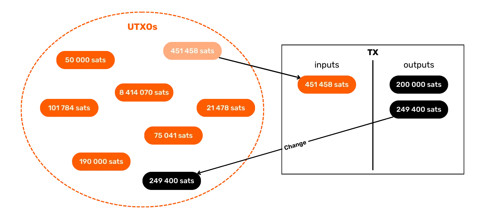

Matumizi ya programu ya kwingineko yenye udhibiti wa sarafu, pamoja na kuweka alama kwa UTXO, huwawezesha watumiaji kutofautisha na kuchagua kwa usahihi UTXO kwa miamala yao.

### Je, unawekaje alama kwenye UTXO zako?

Hakuna njia ya ukubwa mmoja ya kuweka alama kwenye UTXO. Ni juu yako kufafanua mfumo wa kuweka alama ambao ni rahisi kuelewa. Kwa hali yoyote, kumbuka kuwa uwekaji alama mzuri ni kuweka alama unaweza kuelewa unapohitaji. Ikiwa Pochi la Bitcoin yako inakusudiwa kimsingi kuokoa, alama zinaweza zisiwe na manufaa kwako kwa miongo kadhaa ijayo. Kwa hivyo hakikisha ziko wazi, sahihi na za kina.

Ni muhimu kwamba wapendwa wako watambue kwa urahisi asili ya pesa ikiwa, siku moja, wanahitaji ufikiaji wa kwingineko. Hii itawasaidia kwa sababu za usiri na kwa madhumuni ya kisheria, ikiwa watahitaji kuhalalisha asili ya pesa kwa mamlaka.

Jambo muhimu zaidi kuzingatia kwenye alama ni chanzo cha UTXO. Unapaswa kuonyesha tu jinsi sarafu ilikuja kuwa kwenye Pochi lako. Je, ni matokeo ya ununuzi kwenye jukwaa la Ubadilishanaji? Malipo ya Anwani (address) ya ununuzi kutoka kwa mteja? Ubadilishanaji wa rika-kwa-rika? Au inawakilisha Ubadiliahanaji wa gharama? Kwa mfano, unaweza kutaja:


- ondoa Exchange.com` ;
- malipo ya mteja David` ;
- nunua P2P Charles`;
- `Badilisha ununuzi wa sofa`


Ili kurekebisha usimamizi wako wa UTXO na kuheshimu mikakati yako ya kutenganisha hazina ndani ya jalada lako, unaweza kuboresha alama zako kwa kiashirio cha ziada kinachoakisi mitengano hii. Ikiwa yako ina aina mbili za UTXO ambazo hutaki kuzichanganya, unaweza kujumuisha alama kwenye alama zako ili kutofautisha vikundi hivi kwa uwazi. Alama hizi za utengano zitategemea vigezo vyako mwenyewe, kama vile kutofautisha kati ya UTXO zinazotokana na mchakato wa upataji unaohusisha KYC, au kati ya fedha za kitaaluma na za kibinafsi. Kwa kuchukua mifano ya alama iliyotajwa hapo juu, hii inaweza kutafsiri kuwa:


- `KYC - Withdrawal Exchange.com` ;
- `KYC - Malipo ya Wateja David` ;
- `NO KYC - Nunua P2P Charles` ;
- `HAKUNA KYC - Badilisha ununuzi wa sofa`

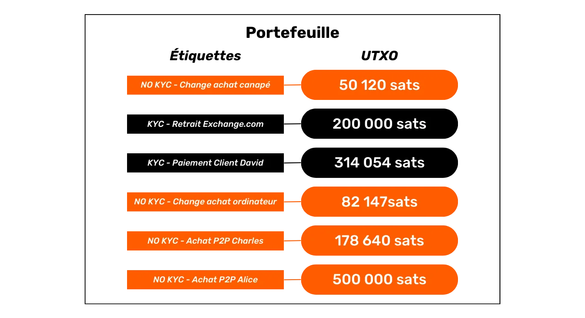

Inashauriwa pia kuendeleza uwekaji alama wa sehemu wakati wa shughuli. Kwa mfano, unapounganisha UTXO no-KYC, hakikisha umeweka alama UTXO inayotokana si tu kama `ujumuishaji`, lakini haswa kama `konsolidation no-KYC` ili kuweka rekodi wazi ya wapi sarafu zilitoka.

Hatimaye, sio lazima kuweka tarehe kwenye alama. Programu nyingi za Pochi tayari zinaonyesha tarehe ya muamala, na inawezekana kila mara kupata taarifa hii kwenye shukrani ya Block Explorer (kuzuia mpelelezi) kwa txid yake.

### Jinsi ya kuchagua sehemu sahihi?

Unapofanya muamala, udhibiti wa sarafu hukuruhusu kuchagua mahususi ni UTXO gani utumie kama pembejeo ili kukidhi matokeo ya malipo. Kuna mambo mawili ya uchaguzi huu:


- Uwezekano wa mpokeaji wa malipo kuunganisha sehemu ya utambulisho wako kwa UTXO zinazotumiwa katika pembejeo;
- Uwezo wa mwangalizi wa nje kuanzisha viungo kati ya UTXO zote zinazotumiwa kama pembejeo.

Ili kufafanua jambo la kwanza, hebu tuchukue mfano halisi. Tuseme unanunua baguette katika bitcoins kutoka kwa waokaji wako. Unatumia UTXO moja au zaidi ulizoshikilia kama pembejeo ili kukidhi angalau bei ya baguette katika matokeo, pamoja na ada za ununuzi. Mwokaji wako anaweza basi kuhusisha uso wako, au sehemu nyingine yoyote ya utambulisho wako anaojua, na sarafu zinazotumiwa kama pembejeo. Kwa kujua kuwepo kwa kiungo hiki, unaweza kupendelea kuchagua UTXO mahususi badala ya nyingine unapolipa.


Kwa mfano, ikiwa moja ya UTXOs zako inatoka kwa jukwaa la Ubadilishanaji na ungependa mwokaji asijue kuhusu akaunti yako kwenye jukwaa hilo, utaepuka kutumia UTXO hiyo kwa malipo. Ikiwa una UTXO ya thamani ya juu ambayo inaonyesha kiasi kikubwa cha bitcoins, unaweza pia kuchagua kutoitumia ili kuepuka mwokaji kufahamu bahati yako ya BTC.

Kuchagua ni UTXO zipi za kutumia kwa hoja hii ya kwanza kwa hiyo ni uamuzi wa kibinafsi, unaoathiriwa na kile ambacho uko tayari kufichua au la. Alama unazozikabidhi kwa UTXO zako unapozipokea zitakusaidia kuchagua zile ambazo, pindi zinapotumika, hufichua tu maelezo ambayo ungependa kufichua kwa mpokeaji.

Zaidi ya maelezo yanayoweza kufichuliwa kwa mpokeaji, chaguo la ingizo pia huathiri kile unachofichua kwa waangalizi wote wa kuzuia mnyororo. Hakika, kwa kutumia UTXO kadhaa kama nyenzo za muamala wako, unafichua kuwa zinamilikiwa na huluki moja, kulingana na Legacy (Urithi) wa CIOH (_Common Input Ownership Heuristic_).


Kwa hivyo, unapochagua sehemu zako, unahitaji kufahamu kwamba shughuli unayotaka kutangaza itaunda kiungo kati ya UTXO zote zinazotumiwa. Kiungo hiki kinaweza kuwa shida kwa faragha yako ya kibinafsi, haswa ikiwa UTXO zinatoka kwa vyanzo tofauti.


Hebu tuchukue mfano wa no-KYC UTXO yangu kutoka Bisq; Ninataka kuepuka kuichanganya na UTXO kutoka, tuseme, jukwaa lililodhibitiwa la Ubadilishanaji ambalo linajua utambulisho wangu. Hakika, ikiwa nitawahi kutumia UTXO hizi 2 kama pembejeo kwa shughuli sawa, jukwaa linalodhibitiwa litaweza kuunganisha utambulisho wangu na UTXO niliyonunua kwenye Bisq, ambayo haikuunganishwa hapo awali na utambulisho wangu.


Hatimaye, wakati wa kuchagua UTXO za kutumia kama pembejeo kwa shughuli, jambo muhimu zaidi ni kuepuka kutumia UTXO nyingi. Mara nyingi, unapoweza, chagua sarafu moja kubwa ya kutosha kukidhi malipo yako. Kwa njia hii, unaepuka kabisa hatari zinazohusiana na CIOH. Hata hivyo, ikiwa hakuna UTXO moja ya kutosha kwa malipo na unahitaji kutumia kadhaa, hakikisha wanatoka kwa vyanzo sawa ili kupunguza hatari ya viungo visivyohitajika. Pia kumbuka kuwa mpokeaji anaweza kuhusisha taarifa anazoshikilia kwako na historia ya sarafu zinazotumiwa katika pembejeo.

### Kuelewa uteuzi wa sehemu otomatiki

Katika sehemu zilizopita, tulijadili uteuzi wa mwongozo wa UTXOs kutumika kwa shughuli. Lakini nini kinatokea wakati programu ya Pochi inapofanya uteuzi huu kiotomatiki? Kuna njia kadhaa za kuamua ni sarafu zipi za kutumia, na uteuzi wa UTXO unajumuisha uwanja wa kweli wa utafiti kwenye Bitcoin. Lengo kuu la mchakato huu wa kiotomatiki mara nyingi ni kupunguza gharama za muamala kwa mtumiaji.

Mbinu za uteuzi za UTXO kama vile FIFO (*First In First Out*) na LIFO (*Last In First Out*) ni miongoni mwa njia rahisi zaidi, lakini pia zisizo na ufanisi zaidi. Na FIFO, sehemu za zamani zaidi kwingineko hutumiwa kwanza. Mbinu hii kwa ujumla haifanyi kazi katika kupunguza gharama za muamala na kuhifadhi usiri, isipokuwa katika hali ambapo vidhibiti vya muda hutumika na vinahitaji kusasishwa mara kwa mara. Kinyume chake, LIFO inatanguliza matumizi ya UTXO za hivi karibuni. Njia zote mbili, ingawa ni rahisi, mara nyingi hazifanyi kazi.

Mbinu mahiri zaidi ni *Knapsack Solver*. Hii ilitumika kwenye Pochi la Bitcoin Core hadi toleo la 0.17. Inajumuisha kuchagua mara kwa mara na kwa nasibu UTXO kutoka kwa Pochi, kuziongeza katika vikundi vidogo, na kuweka suluhisho ambalo linapunguza uzito wa muamala iwezekanavyo, ili kupunguza gharama kwa mtumiaji.

*Tawi-na-Mpaka* (BNB), mara nyingi hupewa jina la utani "Murch algoriti" baada ya mvumbuzi wake, imechukua nafasi ya *Knapsack Solver* katika Bitcoin Core hadi toleo la 0.17. Mbinu hii ya kina zaidi inalenga kupata seti ya UTXO zinazolingana haswa na kiasi kinachohitajika ili kukidhi matokeo ya muamala. Madhumuni ya BNB ni kupunguza kiasi cha kubadilishana pamoja na ada, kwa kupunguza kinachojulikana kama kigezo cha taka, ambacho kinazingatia gharama za haraka na gharama zinazotarajiwa za baadaye za Ubadilishanaji. Mbinu hii imetokana na dhana asilia ya *Tawi-na-Kufungwa*, iliyobuniwa mwaka wa 1960 na Ailsa Land na Alison Harcourt, na inatoa uboreshaji sahihi zaidi wa ada kuliko *Knapsack Solver*.

Mbinu hizi zote za uteuzi otomatiki za UTXO zinaweza kuwa na ufanisi katika kupunguza gharama za muamala, lakini mara nyingi hazifanyi kazi katika kuhifadhi usiri wa mtumiaji. Hakika, algorithms hizi zinaweza kuunganisha UTXO kadhaa katika pembejeo, na hivyo kufichua mali ya kawaida ya UTXO hizi kutokana na CIOH. Ni wazi, mbinu hizi haziwezi kuzingatia alama zilizobandikwa kwenye UTXOs, ambazo hata hivyo ni muhimu kwa kuchagua kwa uangalifu ni sehemu zipi za kufichua kwa mpokeaji wa muamala. Kwa sasa, njia pekee ya kuboresha usiri wakati wa kuchagua sarafu ni kufanya hivyo kwa mikono.

### Mafunzo juu ya kuweka alama kwa UTXO

Ikiwa ungependa kujua jinsi ya kuweka alama kwenye UTXO zako, tumefanya mafunzo ya kina kuhusu programu kuu ya Pochi la Bitcoin huko nje:

https://planb.network/tutorials/privacy/on-chain/utxo-labelling-d997f80f-8a96-45b5-8a4e-a3e1b7788c52
## KYC na kitambulisho muhimu

<chapterId>cec6b9d9-0eed-4f85-bc4e-1e9aa59ca605</chapterId>

KYC inasimamia "Jua Mteja Wako". Ni utaratibu wa udhibiti unaotekelezwa na kampuni fulani zinazofanya kazi katika sekta ya Bitcoin. Lengo la utaratibu huu ni kuhakiki na kusajili utambulisho wa wateja wao, kwa lengo lililowekwa la kupambana na utoroshaji wa pesa na ufadhili wa ugaidi.

Katika hali halisi, KYC inahusisha ukusanyaji wa data mbalimbali za kibinafsi kutoka kwa mteja, ambazo zinaweza kutofautiana kulingana na mamlaka, lakini kwa ujumla hujumuisha kitambulisho, picha na uthibitisho wa Anwani (address). Taarifa hii kisha kuthibitishwa na kuhifadhiwa kwa matumizi ya baadaye.

Utaratibu huu umekuwa wa lazima kwa majukwaa yote ya Ubadilishanaji yanayodhibitiwa katika nchi nyingi za Magharibi. Hii inamaanisha kuwa mtu yeyote anayetaka kutumia sarafu za serikali za Ubadilishanaji kwa Bitcoin kupitia mifumo hii lazima atii mahitaji ya KYC.

Utaratibu huu sio bila hatari kwa faragha na usalama wa watumiaji. Katika sura hii, tutachunguza hatari hizi kwa kina na kuchanganua athari mahususi za KYC na michakato ya utambuzi kwenye faragha ya watumiaji wa Bitcoin.

### Kuwezesha ufuatiliaji wa mnyororo

Hatari ya kwanza inayohusishwa na KYC ni kwamba inatoa mahali pazuri pa kuingilia kwa uchanganuzi wa Kuzuia mnyororo. Kama tulivyoona katika sehemu iliyotangulia, wachanganuzi wanaweza kuunganisha na kufuatilia shughuli kwenye kuzuia mnyororo kwa kutumia mifumo ya muamala na utabiri. Pindi tu wanapofaulu kujumuisha shughuli za onchain za mtumiaji, wanachohitaji kufanya ni kutafuta mahali pa kuingilia kati ya shughuli na funguo zake zote ili kuhatarisha usiri wake kikamilifu.


Unapofanya KYC, unatoa kiingilio cha ubora wa juu cha uchanganuzi wa Kuzuia mnyororo, unapohusisha Anwani (address) zako za kupokea zinazotumiwa wakati wa kutoa bitcoins zako kutoka kwa jukwaa la Ubadilishanaji na utambulisho wako kamili, uliothibitishwa. Kinadharia, maelezo haya yanajulikana tu na kampuni ambayo umeipatia, lakini, kama tutakavyoona hapa chini, hatari ya kuvuja kwa data ni halisi. Zaidi ya hayo, ukweli kwamba kampuni inayoshikilia habari hii inaweza kuwa shida, hata ikiwa haishiriki.

Kwa hivyo, usipochukua hatua nyingine za kupunguza ujumlishaji wa shughuli zako kwenye Kuzuia mnyororo, mtu yeyote aliye na ufahamu wa mahali hapa pa kuingilia KYC anaweza kuunganisha shughuli zako zote kwenye Bitcoin na utambulisho wako. Kwa mtazamo wa kampuni hiyo, matumizi yako ya Bitcoin hupoteza usiri wote.


Ili kufafanua hili kwa kulinganisha, ni kana kwamba benki yako katika *Benki X* si tu kwamba angeweza kufikia miamala yako yote na *Benki X*, lakini pia anaweza kuangalia miamala yako na *Benki Y* na miamala yako yote ya pesa taslimu.

Kumbuka kutoka sehemu ya kwanza ya kozi hii ya mafunzo: Mtindo wa usiri wa Bitcoin, kama ulivyobuniwa na Satoshi Nakamoto, unatokana na utengano kati ya utambulisho wa mtumiaji na jozi zake muhimu. Ingawa Safu hii ya usiri haitoshi tena leo, bado ni busara kupunguza uharibifu wake iwezekanavyo.

### Mfiduo wa ufuatiliaji wa serikali

Tatizo la pili kuu la KYC ni kwamba inafichulia hali kuwa umemiliki Bitcoin wakati fulani. Unaponunua bitcoins kupitia mwigizaji aliyedhibitiwa, inakuwa inawezekana kwa serikali kujua kuhusu milki hii. Kwa sasa, hii inaweza kuonekana kuwa ndogo, lakini ni muhimu kukumbuka kuwa mustakabali wa kisiasa na kiuchumi wa nchi yako hauko mikononi mwako.

Kwanza, serikali inaweza kuchukua msimamo wa kimabavu haraka. Historia imejaa mifano ambapo sera zimebadilika ghafla. Leo, katika Ulaya, Bitcoiners wanaweza kuandika makala kuhusu Bitcoin, kushiriki katika mikutano, na kusimamia pochi zao katika ulinzi binafsi. Lakini ni nani anayeweza kusema kesho itakuwaje? Ikiwa Bitcoin ghafla inakuwa adui ya umma nambari moja, kuhusishwa nayo katika faili za serikali inaweza kuwa shida.

Kisha, mbele ya matatizo makubwa ya kiuchumi, serikali inaweza kuzingatia kukamata bitcoins zilizoshikiliwa na wananchi. Labda kesho, bitcoiners wataonekana kama wanufaika wa shida, na watatozwa ushuru kupita kiasi kwa faida yao ya mtaji mbele ya kushuka kwa thamani ya sarafu ya pesa za serikali.

Unaweza kudhani hili sio tatizo, kwani bitcoins zako zimechanganywa, na kwa hivyo haziwezi kufuatiliwa. Walakini, kufuatilia sio suala hapa. Suala halisi ni kwamba serikali inajua kuwa unamiliki Bitcoin. Maelezo haya pekee yanaweza kutosha kukuweka hatiani au kukufanya uwajibike. Unaweza kujaribu kudai kuwa umetumia bitcoins zako, lakini hiyo itabidi ionekane kwenye mapato yako ya kodi, na utakamatwa. Unaweza pia kusema umepoteza funguo zako katika ajali ya boti, lakini zaidi ya utani wa Twitter, je, unafikiri hiyo ingetosha kukuondolea hatia?

Kwa hivyo ni muhimu kuzingatia hatari ya serikali kujua kwamba unamiliki BTC, hata hivyo hatari hiyo inaweza kuonekana leo.

Tatizo lingine linaloletwa na KYC katika suala la usimamizi wa serikali ni kuripoti kwa lazima kwa majukwaa yaliyodhibitiwa. Ingawa sifahamu kanuni katika maeneo mengine ya mamlaka, nchini Ufaransa, *Prestataires de Services sur Actifs Numériques* (PSAN) wanalazimika kuripoti kwa mamlaka ya usimamizi wa fedha harakati zozote za fedha wanazotilia shaka.

Nchini Ufaransa mnamo 2023, vitendo 1,449 vya kutiliwa shaka viliripotiwa na PSANs. Kwa sasa, nyingi ya vitendo hivi vinahusiana na uhalifu. Hata hivyo, mamlaka pia yanauliza majukwaa yaliyodhibitiwa kuripoti miamala yoyote ya Bitcoin inayotiliwa shaka kwa misingi ya muundo wao. Ikiwa utafanya muamala shirikishi, au hata muamala tu wenye muundo usio wa kawaida, na muamala huu haufanyiki mbali na uondoaji wa Bitcoins zako kutoka kwa majukwaa haya, unaweza kujikuta umeripotiwa kwa mamlaka. Hata kama kutokuwepo kwa uzembe na katika utumiaji halali wa haki zako, kuripoti kama hivyo kunaweza kusababisha kuongezeka kwa ukaguzi na ufuatiliaji, usumbufu ambao ungeepuka bila KYC.

### Hatari ya uvujaji wa data ya kibinafsi

Shida nyingine ya KYC ni kwamba inahitaji data yako yote ya kibinafsi kuhifadhiwa kwenye seva za kampuni ya kibinafsi.

Matukio ya hivi majuzi yametukumbusha kuwa hakuna mtu aliye salama kutokana na kushindwa kwa kifedha au IT. Mnamo 2022, wateja wa Celsius walipata matokeo. Kufuatia kufilisika kwa kampuni hiyo, majina ya wadai na kiasi cha mali zao yaliwekwa wazi na mahakama za Marekani wakati wa taratibu za kiutawala.

Zaidi ya miaka miwili iliyopita, ilikuwa kinara katika usalama wa mtandao wa cryptocurrency ambayo iliona data ya kibinafsi ya wateja wake kuibiwa. Ingawa tukio hili halikuhusishwa moja kwa moja na ununuzi wa bitcoins, hatari kama hiyo pia inabaki kwa majukwaa ya Ubadilishanaji. Kwa hiyo kuna hatari ya uhakika inayohusishwa na data ya kibinafsi.

Ni kweli kwamba tayari tunakabidhi data zetu nyingi za kibinafsi kwa kampuni za kibinafsi. Hata hivyo, hatari hapa ni mbili, kwani data hii haikutambui tu, lakini pia inahusishwa na shughuli kwenye Bitcoin. Hakika, wakati mdukuzi anapata ufikiaji wa data ya mteja wa jukwaa la Ubadilishanaji, anaweza kudhani kuwa wateja hawa wanamiliki Bitcoins. Hatari hii inazidishwa na ukweli kwamba Bitcoin, kama mali nyingine yoyote ya thamani, huvutia usikivu wa wezi.

Katika tukio la uvujaji wa data, bora zaidi unaweza kuwa mlengwa wa majaribio lengwa ya kuhadaa. Katika hali mbaya zaidi, unaweza kujikuta katikati ya vitisho vya kimwili kwa nyumba yako.

Mbali na hatari maalum zinazohusiana na Bitcoin, pia kuna hatari zinazohusiana na uwasilishaji wa hati za utambulisho. Hakika, katika tukio la uvujaji wa data, inawezekana kuwa mwathirika wa wizi wa utambulisho. Kwa hivyo vigingi sio tu kwa kulinda usiri wa miamala, lakini pia vinahusu usalama wa kibinafsi wa kila mtu.

### Baadhi ya mawazo ya awali kuhusu KYC

Ni muhimu kutenganisha baadhi ya mawazo ya awali kuhusu KYC ambayo sisi hukutana nayo mara kwa mara kwenye Twitter au katika mabadilishano kati ya wabadilishaji bitcoins.

Kwanza kabisa, sio sahihi kufikiria kuwa kulinda faragha yako kwa Bitcoins zilizopatikana kupitia KYC hakuna maana. Zana na mbinu za faragha kwenye Bitcoin ni tofauti na hutumikia madhumuni tofauti. Kutumia shughuli za sarafu za kujiunga kwenye Bitcoins zilizopatikana kupitia KYC, kwa mfano, sio wazo baya. Bila shaka, unahitaji kuwa mwangalifu na majukwaa yaliyodhibitiwa ya Ubadilishanaji ili kuzuia akaunti yako kufungiwa au kupigwa marufuku, lakini kwa mtazamo wa kiufundi kabisa, mazoea haya hayaoani. SCoinjoin (arafu ya kujiunga) ina athari ya kuvunja historia ya sarafu, hivyo kukusaidia kuzuia hatari fulani za uchanganuzi wa minyororo zinazohusiana na KYC. Ingawa haiondoi hatari zote, inawakilisha faida kubwa.


Siri kwenye Bitcoin haipaswi kutazamwa kwa njia ya binary, kama tofauti kati ya bitcoins "isiyojulikana" na zingine ambazo sio. Kumiliki Bitcoins zilizopatikana kupitia KYC haimaanishi kuwa zote zimepotea; kinyume chake, utumizi wa zana za usiri unaweza kuthibitisha manufaa zaidi.

Kinyume chake, kupata Bitcoin kupitia njia isiyo ya KYC hakukuhakikishii usiri kamili, wala hakukuepushi kutokana na hitaji la kuchukua hatua nyingine za ulinzi. Ikiwa unashikilia Bitcoin isiyo ya KYC lakini ukitumia tena Anwani (address) za kupokea mara kadhaa, miamala yako inaweza kufuatiliwa na kujumlishwa. Kiungo kidogo zaidi cha ulimwengu nje ya Bitcoin kinaweza kuhatarisha Safu pekee ya usiri uliyo nayo. Kwa hivyo ni muhimu kuzingatia zana na mbinu zote za kuimarisha faragha kwenye Bitcoin kama zinazosaidiana. Kila mbinu hushughulikia hatari mahususi na inaweza kuongeza ulinzi wa ziada wa Safu. Kwa hivyo kumiliki Bitcoin isiyo ya KYC haimaanishi kuwa hauitaji kuchukua tahadhari zingine.

### Je, KYC inaweza kughairiwa?

Wakati mwingine mimi huulizwa ikiwa inawezekana "kurudi nyuma" baada ya kufanya KYC, na kama unavyoweza kufikiria kutoka kwa aya zilizotangulia, jibu limepunguzwa. Njia rahisi zaidi ya kuepuka hatari zinazohusiana na KYC sio kuitumia wakati wa kupata bitcoins. Tutaliangalia somo hili kwa kina zaidi katika sura inayofuata. Hata hivyo, ikiwa KYC tayari imefanywa na bitcoins kununuliwa, kuna njia za kupunguza hatari zinazohusika?

Linapokuja suala la hatari ya kufuatilia shughuli zako, matumizi ya SCoinjoin (arafu ya kujiunga) ni suluhisho. Tutaangalia njia hii kwa undani baadaye katika kozi, lakini unapaswa kujua kwamba SCoinjoin (arafu ya kujiunga) hukuwezesha kuvunja historia ya sarafu na kuizuia kufuatiliwa zamani-sasa na sasa-zamani. Hata kwa BTC iliyopatikana kupitia jukwaa lililodhibitiwa, mbinu hii inaweza kuzuia ufuatiliaji wao.

Hata hivyo, SCoinjoin (arafu ya kujiunga) haifuti hatari ya pili inayohusishwa na KYC: ukweli kwamba serikali inaweza kufahamishwa kuhusu umiliki wako wa bitcoins. Hakika, hata kama sarafu zako hazitafutikani tena, Serikali, kulingana na mamlaka, inaweza kufikia tamko lako la uhamisho wa mali ya crypto. Kwa vile hatari hii si ya kiufundi, bali ni ya kiutawala, hakuna suluhu mahususi za Bitcoin za kuiondoa, kando na kutojiweka wazi kwa KYC mara ya kwanza. Njia pekee ya kisheria ya kupunguza hatari hii ni kuuza kwenye mifumo inayodhibitiwa ya Bitcoins ulizopata kupitia mifumo iliyodhibitiwa, kisha uzinunue tena kupitia njia zisizolipishwa za KYC. Kwa kuuza na kutangaza uhamisho, mamlaka yanapaswa kuona kwamba haumiliki tena.

Kuhusu hatari ya kuvuja data yako ya kibinafsi na hati za utambulisho, hii ni hatari ya nje ya Bitcoin, na hakuna suluhisho la kiufundi la kuizuia. Baada ya data yako kufichuliwa, ni vigumu kutendua utendakazi. Unaweza kujaribu kufunga akaunti yako kwenye jukwaa, lakini hii haina hakikisho la kufutwa kwa data yako ya KYC, hasa wakati uthibitishaji wa utambulisho umetolewa nje. Uthibitishaji wa kufuta kabisa maelezo yako hauwezekani. Kwa hivyo hakuna suluhisho la kuzuia kabisa hatari hii na kuhakikisha kuwa haipo tena.

### Tofauti kati ya KYC na kitambulisho muhimu

Wakati mwingine, baadhi ya bitcoiners huwa na mwelekeo wa kupanua neno "KYC" kwa ubadilishanaji wa BTC yoyote inayohusisha uhamisho wa kielektroniki au malipo ya kadi ya mkopo, kwani njia hizi zinaweza pia kufichua asili ya malipo, kama vile KYC ingefanya. Hata hivyo, KYC haipaswi kuchanganyikiwa na kitambulisho muhimu. Kwa maelezo ya kibinafsi, lazima nikiri kwamba mtazamo wangu wa somo hili umebadilika kwa muda.

KYC inarejelea mahususi utaratibu wa udhibiti unaotekelezwa na kampuni fulani ili kuthibitisha na kusajili utambulisho wa wateja wao. Ni jambo la binary: wakati wa kupata bitcoins zako, ama ufanye KYC, au hufanyi. Hata hivyo, kitambulisho kikuu, ambacho kinahusu kiungo kati ya kipengele cha utambulisho wa mtumiaji na shughuli ya onchain, si kama mfumo wa jozi, lakini inawakilisha mwendelezo. Hakika, katika muktadha wa upatikanaji au uhamisho wa Bitcoin, kitambulisho hicho kinawezekana kila mara kwa viwango tofauti.

Kwa mfano, ukinunua bitcoins kwenye jukwaa lililodhibitiwa nchini Uswizi, KYC haihitajiki. Hata hivyo, funguo zako zinaweza kutambuliwa, kwani ununuzi ulifanywa kupitia akaunti yako ya benki. Hapa ndipo hatari mbili za kwanza zinazohusiana na KYC - kuwezesha ufuatiliaji wa onchain na kukabiliwa na ufuatiliaji wa serikali - pia zinaweza kujidhihirisha katika ubadilishanaji bila KYC. Ikiwa huluki ya Uswizi itaripoti miamala ya kutiliwa shaka kwa mamlaka katika nchi yako, wanaweza kuangalia tu akaunti ya benki iliyotumiwa kufanya ununuzi ili kugundua utambulisho wako. Kwa hivyo, kununua bila KYC kwenye majukwaa yaliyodhibitiwa ni juu sana kwa kiwango cha hatari kwa utambulisho muhimu.


Hata hivyo, kuepuka majukwaa yaliyodhibitiwa na kuchagua mbinu za kupata P2P hakuondoi kabisa hatari ya utambulisho muhimu, lakini kunaipunguza tu. Hebu tuchukue mfano wa ununuzi kwenye Bisq au jukwaa lingine la P2P. Ili kumlipa mshirika wako, labda utatumia akaunti yako ya benki. Ikiwa mamlaka yatatilia shaka mtu uliyefanya naye biashara na kukuuliza jina lako, tumerejea kwenye hatari ya 1 na 2. Ingawa hatari hizi ni ndogo zaidi kuliko unaponunua kwenye jukwaa bila KYC, na hata chini kuliko unaponunua kwa KYC, bado zipo kwa kiasi kidogo.


Hatimaye, hata kama utapata bitcoins zako kupitia Ubadilishanaji halisi kwa pesa taslimu, hutambuliwi kabisa. Mtu uliyebadilishana naye ameona uso wako, ambao ni sehemu ya utambulisho wako. Ingawa ni ndogo katika mfano huu, bado kuna uwezekano wa kitambulisho muhimu.


Kwa kumalizia, wakati bitcoins zinabadilishwa kwa mali nyingine, iwe ununuzi kwa sarafu ya serikali au uuzaji dhidi ya nzuri halisi, daima kuna aina fulani ya kitambulisho muhimu. Kulingana na njia ya Ubadilishanaji uliochaguliwa, kitambulisho hiki kinaweza kutofautiana kwa ukubwa. Ni muhimu kutochanganya kitambulisho hiki na KYC, ambayo ni mchakato wa udhibiti uliofafanuliwa vyema. Hata hivyo, kuna kiungo kati ya KYC na wigo wa utambulisho, kwa kuwa KYC iko kwenye mwisho wa juu zaidi wa wigo, kwani hurahisisha utambuzi wa funguo za watumiaji na mamlaka.

## Njia za uuzaji na ununuzi

<chapterId>756598af-95aa-4c77-ac48-243c7ad89530</chapterId>

Baada ya kusoma sura iliyotangulia, unaweza kuwa unashangaa jinsi unavyoweza kununua au kuuza Bitcoin bila kulazimika kupitia utaratibu wa uthibitishaji wa utambulisho, ili kuepuka hatari zinazohusiana na KYC. Kuna njia kadhaa za kufanya biashara ya Bitcoin.

### P2P kubadilishana fedha

Kama tulivyoona, njia bora zaidi katika suala la usiri inasalia kuwa P2P (mtu-kwa-mtu) Ubadilishanaji na malipo ya pesa taslimu. Njia hii hukuruhusu kupunguza athari zilizoachwa nyuma, na hupunguza kwa kiasi kikubwa uwezekano wa utambulisho muhimu, iwe unanunua au unauza.


Walakini, kuna hatari kwa usalama ya kibinafsi. Hatari kuu iko katika ukweli kwamba, wakati wa Ubadilishanaji, mwenzake atajua kwamba unashikilia kiasi kikubwa cha fedha, ama kwa fedha au kwa bitcoins. Habari hii inaweza kuvutia umakini wa watu hasidi. Hakika, kwa ujumla unashauriwa kuwa mwangalifu kuhusu umiliki wako wa Bitcoin. Ushauri huu pia unaweza kutumika kwa pesa taslimu. Hata hivyo, wakati wa kubadilishana ana kwa ana, ni lazima kufichua kwamba unamiliki bitcoins, na hili linaweza kuvutia tahadhari zisizokubalika.


Ili kupunguza hatari hii, ningekushauri upendekeze miamala ya pesa taslimu na watu unaowaamini, kama vile wanafamilia au marafiki wa karibu. Vinginevyo, unaweza pia kufikiria kufanya biashara katika [mikutano ya Bitcoin ya karibu](https://btcmap.org/communities/map), baada ya kuhudhuria mara chache. Hii itakuruhusu kuwafahamu washiriki wengine vizuri zaidi na usiwe peke yako wakati wa kubadilishana kimwili. Hata hivyo, ni muhimu kutambua kwamba ubadilishanaji wa fedha wa P2P kwa asili hubeba hatari kwa usalama wako wa kibinafsi ambazo hazipo unaponunua kupitia mfumo unaodhibitiwa na akaunti yako ya benki.

Zaidi ya hayo, kulingana na mahali unapoishi, kusafirisha na kuhifadhi pesa nyingi kunaweza kuwa hatari, iwe ni Bitcoin au pesa taslimu.

Kubadilishana pesa kunaweza pia kuleta hatari za kisheria katika tukio la polisi au hundi zingine. Ingawa katika nchi nyingi hakuna vikwazo kuhusu kiasi cha pesa unachoweza kubeba, kiasi kikubwa cha pesa kinaweza kuzua shaka. Kwa hivyo kuwa mwangalifu, haswa ikiwa utalazimika kusafiri umbali mrefu, na epuka kufanya miamala mingi kwa wakati mmoja, ili usilazimike kuhalalisha umiliki wa pesa nyingi.

Hatimaye, hasara nyingine ya ununuzi wa P2P ni kwamba bei mara nyingi ni ya juu kuliko kwenye majukwaa yaliyodhibitiwa. Wauzaji mara nyingi hutoza alama ya juu kuanzia 1% hadi wakati mwingine zaidi ya 10%. Kuna sababu kadhaa za tofauti hii ya bei. Kwanza, hii ni mazoezi ya kawaida kati ya wauzaji wa P2P ambayo imeanzishwa kwa muda. Pili, wauzaji wana ada zinazohusiana na shughuli ya kutuma pesa kwa mnunuzi. Pia kuna ongezeko la hatari ya wizi katika mauzo ya P2P ikilinganishwa na miamala ya jukwaa, ambayo inahalalisha fidia kwa hatari iliyochukuliwa. Hatimaye, gharama ya ziada inaweza kuhusishwa na mahitaji na ubora wa Ubadilishanaji katika suala la usiri. Kama mnunuzi, faida ya usiri ina bei ambayo inaonekana katika alama iliyowekwa na muuzaji. Baadhi ya bitcoiners pia wanaamini kuwa bei ya alama ya BTC iliyonunuliwa kwenye P2P inaonyesha bei yake ya kweli, na wanasema kuwa bei za chini kwenye majukwaa yaliyodhibitiwa ni matokeo ya maelewano juu ya usiri wa data yako ya kibinafsi.


### P2P hubadilishana kupitia jukwaa la ulinganifu

Njia mbadala isiyo na hatari sana katika masuala ya usalama wa kibinafsi ni kufanya ubadilishanaji wa P2P mtandaoni pekee, kupitia mbinu za malipo za kielektroniki kama vile PayPal, uhamisho wa benki au Revolut.


Mbinu hii huepuka hatari nyingi zinazohusiana na miamala ya pesa taslimu. Hata hivyo, hatari ya mshirika kukataa kutumia Ubadilishanaji mtandaoni ni kubwa zaidi. Hakika, katika Ubadilishanaji wa kimwili, ikiwa unatoa pesa kwa muuzaji ambaye hakutumii bitcoins kwa kurudi, unaweza kumwita mara moja kwa akaunti, kwa kuwa amesimama mbele yako. Mtandaoni, kwa upande mwingine, mara nyingi haiwezekani kufuatilia mtu ambaye ameiba kutoka kwako.


Ili kupunguza hatari hii, inawezekana kutumia majukwaa maalumu kwa kubadilishana P2P. Mifumo hii hutumia mbinu za kutatua mizozo ili kuwalinda watumiaji waliodhulumiwa. Kwa kawaida, hutoa mfumo wa escrow, ambapo bitcoins hufanyika mpaka malipo kwa fedha za serikali yamethibitishwa na muuzaji.


Kwa upande wa usalama wa kibinafsi, njia hii ya ununuzi ni salama zaidi kuliko pesa za Ubadilishanaji taslim. Walakini, kama ilivyotajwa hapo juu, ubadilishanaji wa mtandaoni wa P2P huacha athari zaidi kuliko ubadilishanaji halisi, ambao unaweza kudhuru kwa faragha kwenye Bitcoin. Kwa kutumia njia ya malipo ya mtandaoni kama vile benki, unafichua maelezo zaidi ambayo yanaweza kuwezesha utambulisho muhimu.


Kwa mara nyingine tena, nisingependekeza kufanya biashara nyingi kubwa katika muamala mmoja kwenye majukwaa haya. Kwa kugawanya miamala yako, unaeneza hatari ya wizi wa wenzako.

Kwa mara nyingine tena, hasara nyingine ya ununuzi wa P2P ni kwamba bei mara nyingi ni ya juu kuliko ile inayoonekana kwenye majukwaa yaliyodhibitiwa. Wauzaji mara nyingi hutoza alama ya juu kuanzia 1% hadi wakati mwingine zaidi ya 10%. Kuna sababu kadhaa za tofauti hii ya bei. Kwanza, hii ni mazoezi ya kawaida kati ya wauzaji wa P2P ambayo imeanzishwa kwa muda. Pili, wauzaji wana ada zinazohusiana na shughuli za kutuma pesa kwa mnunuzi. Pia kuna ongezeko la hatari ya wizi katika mauzo ya P2P ikilinganishwa na miamala ya jukwaa, ambayo inahalalisha fidia kwa hatari iliyochukuliwa. Hatimaye, gharama ya ziada inaweza kuhusishwa na mahitaji na ubora wa Ubadilishanaji katika suala la usiri. Kama mnunuzi, faida ya usiri ina bei ambayo inaonekana katika alama iliyowekwa na muuzaji. Baadhi ya bitcoiners pia wanaamini kuwa bei ya alama ya BTC iliyonunuliwa kwenye P2P inaonyesha bei yake ya kweli, na wanasema kuwa bei za chini kwenye majukwaa yaliyodhibitiwa ni matokeo ya maelewano juu ya usiri wa data yako ya kibinafsi.


Kwa kadiri suluhisho inavyohusika, mimi binafsi nimekuwa nikitumia [Bisq](https://bisq.network/) na nimefurahishwa nayo sana. Mfumo wao unajaribiwa na unaonekana kuwa wa kuaminika. Hata hivyo, Bisq inapatikana kwenye Kompyuta pekee na kiolesura yake inaweza kuwa ngumu sana kwa wanaoanza. Kikwazo kingine ni kwamba Bisq hufanya kazi tu na miamala ya onchain, ambayo inaweza kuwa ghali wakati wa ada za juu za Bitcoin.

-> Tazama mafunzo yetu ya Bisq.

https://planb.network/tutorials/exchange/peer-to-peer/bisq-fe244bfa-dcc4-4522-8ec7-92223373ed04
Kwa chaguo rahisi, unaweza kujaribu [Peach](https://peachbitcoin.com/), programu ya simu inayounganisha wanunuzi na wauzaji kwa kutumia mfumo uliojengewa ndani wa kutatua migogoro. Mchakato ni angavu zaidi kuliko wa Bisq.

-> Tazama mafunzo yetu ya Peach.

https://planb.network/tutorials/exchange/peer-to-peer/peach-c6143241-d900-4047-9b73-1caba5e1f874
Chaguo jingine la mtandaoni ni [HodlHodl](https://hodlhodl.com/), jukwaa lililoimarishwa ambalo hutoa ukwasi mzuri, ingawa sijaijaribu kibinafsi.

-> Tazama mafunzo yetu ya HodlHodl.

https://planb.network/tutorials/exchange/peer-to-peer/hodlhodl-d7344cd5-6b18-40f5-8e78-2574a93a3879
Kwa suluhu zenye msingi wa Lightning Network, jaribu [RoboSats](https://learn.robosats.com/) na [LNP2PBot](https://lnp2pbot.com/). RoboSats inapatikana kupitia tovuti na ni rahisi kutumia. LNP2PBot si ya kawaida zaidi, kwani inafanya kazi kupitia mfumo wa Ubadilishanaji kwenye programu ya utumaji ujumbe wa Telegraph.

-> Tazama mafunzo yetu ya RoboSats.

-> Tazama mafunzo yetu ya LNP2PBot.

https://planb.network/tutorials/exchange/peer-to-peer/robosats-b60e4f7c-533a-4295-9f6d-5368152e8c06
https://planb.network/tutorials/exchange/peer-to-peer/lnp2pbot-v2-e6bcb210-610b-487d-970c-7cce85273e3c


### Mifumo inayodhibitiwa bila KYC

Kulingana na nchi unayoishi, unaweza kufikia mifumo inayodhibitiwa ambayo haihitaji taratibu za KYC kununua au kuuza bitcoins. Nchini Uswisi, kwa mfano, unaweza kutumia mifumo kama vile [Relai](https://relai.app/) na [MtPelerin](https://www.mtpelerin.com/).

-> Tazama mafunzo yetu kuhusu Relai.

https://planb.network/tutorials/exchange/centralized/relai-v2-30a9671d-e407-459d-9203-4c3eae15b30e
Kama tulivyoona katika sura iliyotangulia, aina hii ya jukwaa hukuepusha na hatari zinazohusiana na taratibu za KYC, lakini zinawasilisha kiwango cha juu cha hatari kwa utambulisho muhimu. Kwa upande wa usiri wa Bitcoin, basi, majukwaa haya hutoa ulinzi bora zaidi kuliko njia za kununua na KYC, lakini hubakia chini ya kuvutia kuliko kubadilishana kwa P2P.

Walakini, kwa upande wa usalama wa kibinafsi, kutumia majukwaa haya ni hatari kidogo kuliko ubadilishanaji wa P2P. Pia mara nyingi ni rahisi kutumia kuliko majukwaa ya P2P.

### ATM

Chaguo jingine la kununua au kuuza bitcoins bila KYC ni ATM za cryptocurrency. Binafsi, sijawahi kupata fursa ya kujaribu suluhisho hili, kwani hakuna katika nchi yangu. Lakini njia hii inaweza kuvutia sana, kulingana na mahali unapoishi.


Tatizo la ATM ni kwamba zimepigwa marufuku katika baadhi ya nchi, au zimedhibitiwa sana katika nyingine. Ikiwa ATM inahitaji utaratibu wa uthibitishaji wa utambulisho, basi itakabiliwa na hatari sawa na zile zinazopatikana katika mifumo inayodhibitiwa na KYC. Kwa upande mwingine, ikiwa ATM inaruhusu shughuli bila uthibitishaji wa utambulisho kwa kiasi kidogo, basi matumizi yake yanaweza kutoa kiwango cha usiri kulinganishwa na ile ya P2P ya fedha za Ubadilishanaji, huku ikiepuka hatari nyingi zinazohusiana na aina hii ya Ubadilishanaji.

Hasara kuu ya ATM ni ada zao za juu za Kubadilishana, kuanzia asilimia chache hadi wakati mwingine 15% ya kiasi kilichobadilishwa.

### Kadi za zawadi

Hatimaye, nilitaka pia kukujulisha kwa suluhisho ambalo linafanya kazi vizuri kwa wale wanaotaka kutumia bitcoins zao kila siku kufanya manunuzi badala ya kuziuza dhidi ya sarafu za serikali.

Njia bora ya kutumia BTC ni, bila shaka, kutumia Bitcoin au Lightning Network moja kwa moja kununua bidhaa au huduma. Hata hivyo, katika nchi nyingi, idadi ya wafanyabiashara wanaokubali Bitcoin bado ni wachache. Njia mbadala ni kutumia kadi za zawadi.

Majukwaa kadhaa ambayo hayahitaji taratibu za KYC hutoa uwezekano wa kubadilishana bitcoins kwa kadi za zawadi ambazo zinaweza kutumika kwa wauzaji wakuu. Hizi ni pamoja na [CoinsBee](https://www.coinsbee.com/), [The Bitcoin Company](https://thebitcoincompany.com/) na [Bitrefill](https://www.bitrefill.com/). Majukwaa haya hurahisisha zaidi kutumia bitcoins zako kila siku, hukupa ufikiaji wa anuwai ya bidhaa na huduma bila kuzibadilisha kuwa sarafu ya serikali.

https://planb.network/tutorials/exchange/centralized/bitrefill-8c588412-1bfc-465b-9bca-e647a647fbc1


### Njia zingine za kupata

Njia zingine za kupata bitcoins wakati wa kulinda faragha yako ni pamoja na, mining (uchimbaji) . Ili kuanzisha mining (uchimbaji) wa Sats, huhitaji kufichua utambulisho wako; pata tu Proof of Work halali na uwasilishe kwa mtandao. Ukichagua bwawa la Kuchimba, mabwawa mengine yanahitaji aina fulani ya kitambulisho, kama vile KYC, huku mengine hayahitaji.

Njia nyingine ni kufanya kazi katika Ubadilishanaji wa bitcoins. Njia hii ya kupata inaweza kuvutia, lakini kiwango cha kitambulisho kinachohitajika hutofautiana sana kulingana na hali.

*Ili kuandika sura hii, nilitumia kozi ya mafunzo ya BTC205 iliyotolewa na [@pivi___](https://x.com/pivi___) kwenye Plan ₿ Network (inapatikana katika Kifaransa pekee kwa sasa)

## Ujumuishaji, usimamizi wa UTXO na CIOH

<chapterId>d0486c8f-332d-402b-ae2e-949416752b9c</chapterId>

Mojawapo ya vipengele vigumu zaidi vya kuendesha jalada la ulinzi wa kibinafsi ni ujumuishaji. Je, unapaswa kuunganisha? Kuna maana gani? Je, ni ukubwa gani wa UTXO unapaswa kuheshimiwa? Je, ni maelewano gani katika suala la usiri? Hiyo ndiyo tutakayoangalia katika sehemu hii.

### Uimarishaji ni nini?

Bitcoin hufanya kazi kama soko la mnada, huku wachimbaji wakitoa upendeleo kwa miamala inayotoa ada za chini zaidi. Hata hivyo, kila kizuizi kina uzito wa juu, ambao hupunguza idadi ya shughuli ambazo zinaweza kuingizwa. Kwa kuwa kizuizi kinatolewa kwa wastani kila baada ya dakika 10, nafasi inayopatikana katika kila block ni rasilimali adimu.

Wachimbaji, ambao shughuli zao za kuzalisha gharama kubwa katika suala la umeme, mali zisizohamishika na matengenezo, kwa kawaida hutafuta kuongeza faida yao. Kwa hivyo wanaelekea kupendelea miamala ambayo kuzalisha ndio ada ya juu zaidi inayohusiana na uzito wao.

Sio shughuli zote za Bitcoin zina uzito sawa. Wale walio na pembejeo na matokeo zaidi watakuwa na uzito zaidi. Kwa mfano, hebu tufikirie shughuli 2:


- Muamala A unajumuisha pembejeo 1 na pato 1. Inatenga 1,994 Sats ya ada na ina uzito wa 141 vB;
- Muamala B, shughuli ngumu zaidi yenye pembejeo 2 na matokeo 2, hutenga 2,640 Sats kwa ada kwa uzito wa 220 vB.


Katika mfano huu, ingawa muamala B unatoa ada ya juu zaidi, wachimbaji watapendelea muamala A, kwani unatoa uwiano bora kati ya ada na uzito. Hapa kuna hesabu ya kila ununuzi, iliyoonyeshwa katika Sats kwa byte pepe (sat/vB):

```text
TXA : 1994 / 141 = 14 sats/vB
TXB : 2640 / 220 = 12 sats / vB
```

Hii ina maana kwamba kwa kila kitengo cha uzani, muamala A hutoa gharama zaidi kuliko muamala B, ingawa muamala B hutoa gharama zaidi kwa masharti kamili.


Kwa hivyo kila wakati inavutia zaidi kwa mtumiaji kutumia pembejeo kidogo iwezekanavyo katika shughuli zake. Hata hivyo, unahitaji kutumia kiasi cha kutosha ili kuweza kukidhi malipo ya pato. Wakati wa kudhibiti kwingineko yako, unahitaji kuwa na UTXO kubwa za kutosha.

Kanuni ya ujumuishaji ni kufaidika kwa muda ambapo ada ni ndogo kwa Bitcoin ili kuunganisha UTXO zake ndogo hadi moja kubwa. Kwa njia hii, ada zinapoongezeka kwenye Bitcoin, utaweza kufanya miamala kwa kutumia kiasi cha chini cha pembejeo, na kwa hivyo kutumia kidogo kwenye ada kwa masharti kabisa. Kwa hivyo lengo ni kutarajia miamala ya lazima kufanywa wakati wa ada za juu.


Mbali na kuokoa gharama za manunuzi, kuunganisha UTXOs husaidia kuzuia malezi ya "Dust". Dust" inarejelea UTXO ambazo thamani yake katika Sats ni ya chini sana hivi kwamba haitoshi kulipia gharama za muamala zinazohitajika kuzitumia. Hii inazifanya UTXO hizi kutokuwa na mantiki kiuchumi kuzitumia mradi gharama za muamala zisalie kuwa kubwa. Kwa kuunganisha UTXO zako kwa makini, unazizuia zisigeuke kwa Dust fedha zako zote.

### Ni ukubwa gani wa chini wa UTXO zako?

Wakati mwingine mimi huulizwa ni thamani gani ya chini inayopendekezwa kwa UTXO ni. Kwa bahati mbaya, hakuna jibu la jumla, kwani inategemea mapendeleo yako na hali ya soko la ada. Walakini, hapa kuna fomula ambayo inaweza kukusaidia kuamua kizingiti kinachofaa mahitaji yako:

$$
\frac {P \times F}T = M
$$

Wapi:


- p $ ni uzito wa shughuli;
- $F$ inawakilisha kiwango cha juu cha malipo katika satoshis kwa kila vbyte (Sats/vB) ambayo unazingira;
- t$ ni asilimia ya ada ya ununuzi ambayo uko tayari kulipa kuhusiana na jumla ya thamani ya UTXO;
- m$ ni kiasi cha chini kabisa katika satoshis kwa kila UTXO.

Hebu tuchukulie kuwa unapanga kulipia ada za muamala wa kawaida wa SegWit na ingizo 1 na matokeo 2, yenye uzito wa 141 vB. Ikiwa unazuia hadi 800 Sats/vB, na uko tayari kutumia hadi 12% ya thamani ya UTXO katika ada zaidi, basi hesabu itakuwa:

$$
\frac{141 \times 800}{0.12} = 940\ 000
$$

Katika mfano huu, kwa hiyo itakuwa busara kuweka thamani ya chini ya 940,000 Sats kwa UTXOs kwenye kwingineko yako.

### Ujumuishaji na CIOH

Mojawapo ya mbinu zinazotumika sana katika uchanganuzi wa Kuzuia mnyororo ni CIOH (*Ingizo la Kawaida la umiliki Legacy (Urithi)*), ambayo inadhania kuwa pembejeo zote za muamala wa Bitcoin ni za huluki moja. Kanuni yenyewe ya ujumuishaji ni kutumia UTXO kadhaa kama pembejeo na kuunda UTXO moja kama pato. Kwa hivyo ujumuishaji huwezesha ICOH kutumika.


Kwa mazoezi, hii ina maana kwamba mwangalizi wa nje anaweza kubaini kwamba UTXO zote zilizounganishwa huenda ni za mtu yule yule, na kwamba pato la kipekee linalotolewa pia ni lake. Hali hii inaweza kuhatarisha usiri wako kwa kuhusisha historia tofauti za miamala. Kwa mfano, tuseme ninaunganisha UTXO 3 zilizopatikana kupitia P2P na UTXO moja iliyopatikana kupitia jukwaa linalohitaji KYC :


Kwa kufanya hivyo, huluki yoyote iliyo na ufikiaji wa data ya jukwaa la ubadilishanaji, ambayo inaweza kujumuisha mashirika ya serikali, itaweza kutambua kuwa ninamiliki viwango vingine vya BTC. Hapo awali, UTXO hizi hazikuhusishwa moja kwa moja na utambulisho wangu; sasa wako. Zaidi ya hayo, inafunua kwa vyanzo vyote kwamba ninamiliki kiasi fulani cha bitcoins.

Linapokuja suala la kusimamia UTXOs, mazingatio ya kiuchumi, ambayo yanasukuma uimarishaji ili kupunguza gharama, huja kwenye mgongano na mazoezi mazuri ya faragha, ambayo yangependekeza kamwe kuunganisha UTXO. Chaguo kati ya uchumi na usiri kwa hivyo inategemea vipaumbele vya kila mtumiaji.

Ikiwa unaweza kuzuia ujumuishaji wakati wa kudumisha UTXO kubwa, hiyo ni bora. Ili kufanya hivyo, boresha mbinu zako za upataji. Ukinunua bitcoins zako katika DCA, jaribu kutenga ununuzi wako wa mara moja iwezekanavyo ili kuunganisha thamani zaidi ya UTXO chache. Itakuwa rahisi kudhibiti ununuzi wa mara moja wa €1,000 kila baada ya miezi 2, badala ya ununuzi wa €120 kila wiki. Hii inapunguza idadi ya UTXO zinazozalishwa na kurahisisha usimamizi wa kwingineko yako huku ukihifadhi usiri wako.

Ikiwa utajikuta lazima uunganishe bitcoins zako, toa upendeleo kwanza kwa kuunganisha UTXO kutoka chanzo kimoja. Kwa mfano, kuunganisha UTXO 10 kutoka kwa jukwaa moja kutaathiri usiri wako chini ya kuchanganya UTXO 5 kutoka jukwaa A na UTXO 5 kutoka jukwaa B. Ikiwa uimarishaji wa vyanzo mbalimbali hauwezi kuepukika, jaribu kuwatenganisha kulingana na sifa zao. Kwa mfano, unganisha UTXO zilizopatikana kupitia KYC katika shughuli moja, na zile zilizopatikana kupitia P2P katika nyingine.

Kwa vyovyote vile, usisahau kwamba ujumuishaji wowote bila shaka unahusisha upotevu wa usiri. Kwa hivyo tathmini kwa uangalifu hitaji la operesheni hii na athari inayowezekana kwenye faragha yako, ukizingatia CIOH.

## Mazoea mengine bora

<chapterId>b5216965-7d13-4ea1-9b7c-e292966a487b</chapterId>

Hebu tuangalie mbinu zingine chache bora za kuboresha faragha yako kwenye Bitcoin.

### Fundo kamili

Kumiliki bitcoins zako kwa kujilinda ni nzuri, lakini kutumia nodi yako kamili ni bora zaidi! Hii ndiyo sababu kuwa na nodi yako mwenyewe ni muhimu kwa matumizi kamili ya Bitcoin:


- Upinzani wa udhibiti**: Miamala yako haiwezi kuzuiwa na mtu yeyote;
- Kujitegemea kutoka kwa wahusika wengine**: Hutegemei tena huduma yoyote ya nje ili kuthibitisha data ya Blockchain;
- Ushiriki hai**: Unaweza kufafanua sheria zako mwenyewe za uthibitishaji na kushiriki moja kwa moja katika makubaliano;
- Mchango wa mtandao**: Kwa kuendesha nodi, unasaidia kuimarisha na kusambaza mtandao wa Bitcoin;
- Elimu ya kiufundi**: Kusimamia nodi kamili ni njia nzuri ya kuongeza ujuzi wako wa kiufundi wa Bitcoin.

Mbali na manufaa haya, kutumia nodi kamili pia huboresha usiri wako wakati wa kutangaza shughuli zako. Unapotoa muamala, hutengenezwa kwanza na kutiwa sahihi kupitia Pochi lako. Ili kulitangaza kwenye mtandao wa Bitcoin, lazima ijulikane kwa angalau nodi moja. Kwa kutumia nodi yako mwenyewe, una udhibiti wa moja kwa moja juu ya usambazaji huu, na hivyo kuimarisha usiri wako na kupunguza hatari ya kuvuja kwa data.


Iwapo huna nodi yako ya Bitcoin, utalazimika kutumia ya mtu mwingine, kama ile inayotolewa na mtoa programu wako wa Pochi. Kando na miamala ya utangazaji, Pochi lako linahitaji ufikiaji wa taarifa mbalimbali kama vile miamala ambayo haijashughulikiwa, masalio yanayohusiana na Anwani (address) zako na idadi ya uthibitishaji wa miamala yako. Ili kufikia data hii yote, unahitaji kuuliza nodi.


Hatari kuu wakati hutumii nodi yako ya Bitcoin ni kwamba mwendeshaji wa nodi ya wahusika wengine anaweza kutazama shughuli zako kwenye Blockchain, au hata kushiriki maelezo haya na huluki nyingine. Ili kupunguza hatari hii, suluhu ya kati ni kutumia programu ya Pochi ambalo hufunika miunganisho yako kupitia Tor. Hii inaweza kupunguza udhihirisho wa data yako. Walakini, suluhisho bora ni kuwa na nodi yako ya Bitcoin na uitumie kutangaza shughuli zako. Bila shaka, utahitaji pia kuwa mwangalifu ili usivujishe habari yoyote kupitia nodi yako, lakini hilo ni somo lingine ambalo tutaangalia katika sehemu za baadaye.

Zaidi ya manufaa dhahiri ya faragha yako, kuwa na nodi yako kamili pia hukuhakikishia ukweli wa data kwenye Blockchain, hukulinda dhidi ya udhibiti na hukuruhusu kushiriki kikamilifu katika utawala wa Bitcoin. Kwa kutumia nodi yako mwenyewe, unachangia uzito wako wa kiuchumi kwa mlolongo wa chaguo lako, ambalo ni muhimu wakati wa migogoro ndani ya jumuiya, kama vile wakati wa Vita vya Blocksize kuanzia 2015 hadi 2017 kwa mfano. Katika tukio la Fork, kutumia nodi ya mtu wa tatu kunaweza kukuongoza kuunga mkono mnyororo ambao hutaki kupendelea, kwani opereta wa nodi anakufanyia chaguo.

Kama unavyoona, kwa maslahi ya usiri na uhuru wa mtu binafsi, ni muhimu kuendesha na kutumia nodi yako kamili!

### Legacy (Urithi) wa uchambuzi wa kudanganya

Kwa upana zaidi, ni muhimu kuelewa Legacy (Urithi) tuliozungumzia katika sehemu iliyotangulia, ili kuziepuka au kuzidanganya vyema. Kupitisha mfululizo wa mbinu bora kunaweza kuwa na manufaa, hata kama si muhimu. Wanatoa Safu ya ziada ya ulinzi ambayo inaweza kuwa muhimu katika kudumisha usiri unapotumia Bitcoin.

Ushauri wa kwanza ningeweza kutoa ni kujumuika na umati mnene zaidi. Kwenye Bitcoin, hii inamaanisha kutumia violezo vya hati vilivyopitishwa zaidi. Kwa mfano, maandishi ya P2WSH, mara nyingi hutumiwa kwa usanidi wa SegWit V0 Sahihi nyingi, sio kawaida sana. Hawakuruhusu kujificha katika seti kubwa ya kutokujulikana. Vile vile huenda kwa mifano ya zamani kama vile P2PKH au P2SH. Ingawa zipo kwa wingi katika seti ya UTXO, zinatumika kidogo na kidogo kwa shughuli mpya.

Kwa ujumla, ni busara kuchagua kiwango cha hivi karibuni cha uandishi, mradi kimekubaliwa vya kutosha. Kwa hivyo, ikiwa mnamo 2022, ningeshauri dhidi ya kutumia P2TR (Taproot) kwa sababu ya kupitishwa kwake chini, mnamo 2024, ningependekeza kuchagua aina hii ya hati badala yake, au ikishindikana, kwa hati ya SegWit V0, kwani idadi ya miamala inayotumia P2TR inaanza kuwakilisha sehemu muhimu sana.


Chanzo : [txstats.com](https://txstats.com/d/000000054/UTXO-set-repartition-by-output-type)

Kidokezo kingine cha kuhifadhi usiri wako ni kujaribu kukwepa utabiri wa muamala wa ndani. Kwa mfano, unapofanya malipo, unaweza kujaribu kuepuka kuunda pato kwa kiasi cha pande zote, kwa kuwa hii inaweza kuashiria kwamba pato lingine linawakilisha Ubadilishanaji wa kigeni. Iwapo unahitaji kutuma 100 k Sats kwa rafiki, fikiria kuhamisha kiasi cha juu kidogo ili kuepuka Legacy (Urithi) huu. Vile vile, jaribu kutounda matokeo ya kigeni ya Ubadilishanaji ambao ni wa juu bila uwiano kuhusiana na malipo yaliyofanywa, kwa kuwa hii inaweza pia kufichua ni matokeo gani kati ya hayo yanawakilisha Ubadilishanaji wa kigeni.


Hatimaye, ikiwa utafanya miamala ya Bitcoin mara kwa mara, hakikisha hutazitangaza kila wakati kwa wakati mmoja. Kwa kueneza utangazaji wa miamala yako siku nzima na wiki, unaepuka kuwapa watazamaji wa nje fursa ya kugundua muundo wa muda unaotegemea saa za eneo ambalo unaweza kuimarisha uchanganuzi wao.

Mbali na mazoea haya yote mazuri ya kupitishwa kila siku, kuna njia bora zaidi za kuvunja kabisa ufuatiliaji wa bitcoins zako. Hizi ni pamoja na, bila shaka, shughuli za kujiunga sarafu, ambazo tutaangalia kwa kina katika sehemu inayofuata.

# Kuelewa shughuli za SCoinjoin (arafu ya kujiunga)

<partId>6d0bbf16-3714-4db1-9897-2d45019f6bdc</partId>

## Muamala wa SCoinjoin (arafu ya kujiunga) ni nini?

<chapterId>0862bc6b-1c48-4aa4-b76d-4f547b469008</chapterId>

Baada ya kujifunza misingi ya ulinzi wa faragha, sasa tutaangalia mbinu za kisasa zaidi zinazolenga kutetea usiri wako kikamilifu, hasa kwa kutenganisha historia yako ya Bitcoin. Katika sehemu inayofuata, tutaangalia mbinu nyingi ndogo, lakini kwanza, ningependa kukuambia kuhusu SCoinjoin (arafu ya kujiunga).

SCoinjoin (arafu ya kujiunga) mara nyingi huchukuliwa kuwa njia bora zaidi ya kulinda faragha ya watumiaji wa Bitcoin. Lakini ni nini hasa shughuli ya sCoinjoin (arafu ya kujiunga)? Hebu tujue.

### Kanuni za msingi za SCoinjoin (arafu ya kujiunga)

SCoinjoin (arafu ya kujiunga) ni mbinu ya kuvunja ufuatiliaji wa Bitcoin kwenye Blockchain. Inategemea shughuli ya ushirikiano na muundo maalum wa jina moja: shughuli ya sCoinjoin (arafu ya kujiunga).

Kama tulivyoona katika sehemu za kwanza za kozi hii, miamala ya Bitcoin inajulikana kwa watumiaji wote kupitia nodi zao. Kwa hiyo ni rahisi kuangalia mlolongo wa sahihi ya elektroniki ya kila sarafu na kuchunguza historia yake. Hii inamaanisha kuwa watumiaji wote wanaweza kujaribu kuchanganua miamala ya watumiaji wengine. Matokeo yake, kutokujulikana katika kiwango cha muamala haiwezekani. Walakini, kutokujulikana kunahifadhiwa katika kiwango cha kitambulisho cha mtu binafsi. Tofauti na mfumo wa kawaida wa benki, ambapo kila akaunti imeunganishwa na utambulisho wa kibinafsi, kwenye Bitcoin, fedha zinahusishwa na jozi za funguo za kriptografia (au hati), zinazowapa watumiaji aina ya jina bandia nyuma ya vitambulishi vya siri.

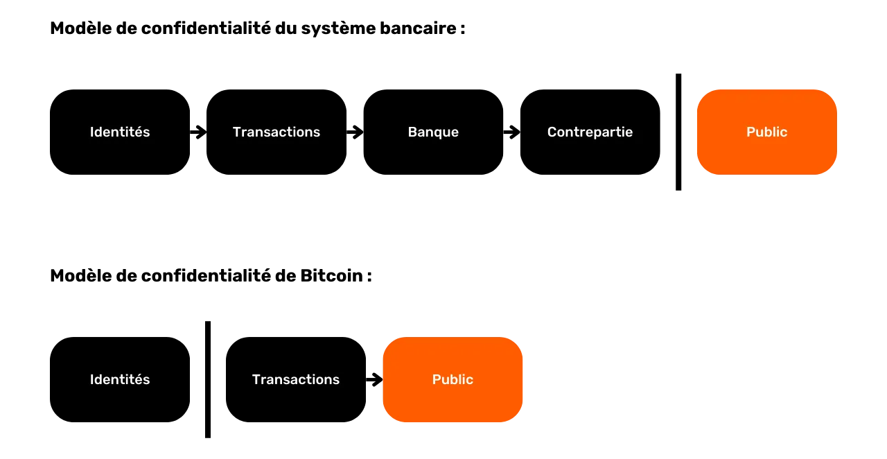

Usiri wa Bitcoin hudhoofishwa wakati waangalizi wa nje wanaweza kuhusisha UTXO maalum na watumiaji waliotambuliwa. Mara tu muungano huu utakapoanzishwa, itawezekana kufuatilia miamala yao na kuchanganua historia yao ya Bitcoin. SCoinjoin (arafu ya kujiunga) ni mbinu haswa iliyobuniwa ili kuvunja ufuatiliaji wa UTXO, ili kuwapa watumiaji wa Bitcoin usiri fulani wa Safu katika kiwango cha muamala.

Sarafu za kujiunga huimarisha usiri wa watumiaji wa Bitcoin kwa kufanya uchanganuzi wa minyororo kuwa mgumu zaidi kwa waangalizi wa nje. Muundo wao huruhusu sarafu nyingi kutoka kwa watumiaji tofauti kuunganishwa katika shughuli moja, ikitia ukungu kwenye mistari na kufanya iwe vigumu kubainisha viungo kati ya Anwani (address) za kuingiza na kutoa.

Ni muhimu kuelewa kwamba lengo la shughuli ya sCoinjoin (arafu ya kujiunga) ni kuvunja historia ya sarafu. Mbinu hii haitoi kutokujulikana kwa kudumu au kuzuia kwa hakika ufuatiliaji wa Bitcoin, kinyume na unavyoweza kufikiria. SCoinjoin (arafu ya kujiunga) inalenga tu kuvunja historia mahali ambapo shughuli ya sCoinjoin (arafu ya kujiunga) inafanywa. Walakini, kabla na baada ya operesheni hii, sarafu inabaki chini ya hatari sawa kwa suala la usiri.


### Je, Sarafu za kujiunga hufanya kazi vipi?

Kanuni ya sCoinjoin (arafu ya kujiunga) inategemea mbinu ya ushirikiano: watumiaji kadhaa wanaotaka kuchanganya amana zao za bitcoins kiasi sawa kama pembejeo kwa shughuli sawa. Kiasi hiki kisha kusambazwa upya katika matokeo ya thamani sawa kwa kila mtumiaji.


Mwishoni mwa muamala, inakuwa vigumu kuhusisha pato mahususi na mtumiaji anayejulikana kama ingizo. Hakuna kiungo cha moja kwa moja kati ya pembejeo na matokeo, ambayo huvunja uhusiano kati ya watumiaji na UTXO zao, pamoja na historia ya kila sehemu.


Hebu tuchukue mfano wa Alice. Anataka kutuma karibu 100,000 Sats kwa dada yake Eve kwa siku yake ya kuzaliwa. Hata hivyo, Alice hataki Eve aweze kufuatilia historia yake ya muamala, kwani hataki kufichua ana bitcoins ngapi au alizipata vipi. Ili kufikia mwisho huu, Alice anaamua kuvunja historia yake ya UTXO na shughuli ya kuunga sarafu. Anapanga na Bob, Charles, David na Frank kutekeleza shughuli ya ushirikiano:


- Alice, Bob, Charles, David na Frank kila mmoja anafanya UTXO ya 105,000 Sats (pamoja na 5,000 Sats kwa ada za mining (uchimbaji)) kama michango ya muamala:


- Kwa malipo ya kutumia pembejeo hizi, kila mmoja hutoa Anwani (address) tupu ili kuunda matokeo matano yanayofanana ya 100,000 Sats kila moja. Kila moja hupata pato moja:

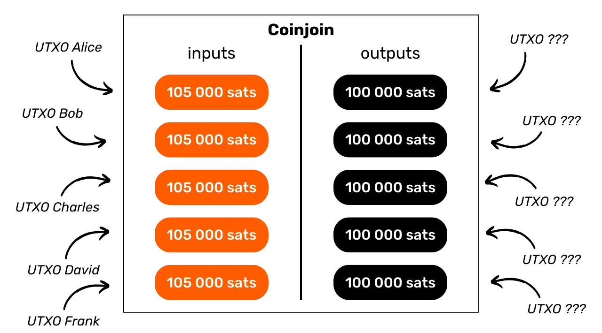


- Alice anajikuta na UTXO ya 100,000 Sats ambayo historia yake imechanganywa. Anatumia UTXO hii katika muamala mpya kutuma kiasi hicho kwa Hawa kwa siku yake ya kuzaliwa:


- Eve akijaribu kuchanganua muamala huu ili kupata maelezo, atakabiliwa na muamala wa Kuunga sarafu unaohusisha Alice, Bob, Charles, David na Frank. Haiwezi kutofautisha ni pembejeo gani ni ya nani kwa sababu ya usawa wa kiasi hicho, Hawa hawezi kufuatilia historia ya Alice ya UTXO, wala kuamua ni bitcoins ngapi ambazo dada yake anamiliki au jinsi alizipata:


Katika kesi hii, Alice ametumia mbinu ya SCoinjoin (arafu ya kujiunga) ili kuongeza usiri kuhusu uchanganuzi wa nyuma. Kwa kweli, Alice anajilinda dhidi ya uchanganuzi unaowezekana na Hawa, ambaye angeanza kutoka kwa shughuli mahususi na kufanya kazi nyuma kupitia historia ya UTXO. Ulinzi huu dhidi ya uchanganuzi kutoka kwa sasa hadi zamani unajulikana kama anonseti ya nyuma. Tutaangalia dhana hii kwa undani zaidi katika sura za mwisho za sehemu hii.

Hata hivyo, Kuunga sarafu pia unatoa uwezekano wa kuimarisha usiri katika uso wa uchanganuzi kutoka zamani hadi sasa, unaojulikana kama anonset tarajiwa. Wacha turudi kwenye mfano wetu ambapo Alice alimtumia Eve 98,000 Sats kwa siku yake ya kuzaliwa, lakini majukumu yakiwa kinyume. Sasa hebu tuwazie kwamba ni Hawa ambaye ana wasiwasi kuhusu faragha yake. Kwa kweli, Alice anaweza kujaribiwa kufuatilia sarafu aliyomtumia Eve ili kupata habari kutoka kwayo. Hawa angeweza kujumuisha UTXO hii ambayo amepokea hivi punde na UTXO zake zingine zote, ambazo zinaweza kumfunulia Alice kiasi cha bitcoins alichonacho kwenye Pochi lake. Ili kuepuka hili, Hawa anaweza pia kuvunja historia ya sarafu ambayo amepokea hivi punde:


- Eve, Grace, Mallory, Oscar na Victor kila mmoja aliweka UTXO ya 98,000 Sats kama ingizo la muamala wa Bitcoin:


- Kwa kurudisha matumizi ya pembejeo hizi, kila mtumiaji hutoa Address tupu ili itumike kuunda matokeo 5 ya 97,500 sawa kabisa ya Sats. Kila mtumiaji anapata pato moja:


- Hawa sasa anashikilia UTXO ya 97,500 Sats ambayo historia yake imevunjwa. Anaweza kuitumia bila woga kufanya shughuli za siku zijazo. Hakika, ikiwa Alice anajaribu kufuatilia bitcoins alizotuma kwa Hawa, atakabiliwa na shughuli ya kuunga sarafu. Hataweza kubainisha ni UTXO ipi inayotoka ni ya Hawa. Uchambuzi hauwezekani:


Katika mfano wa kwanza, tuliona jinsi kuunga sarafu inaweza kulinda faragha ya chumba kuhusiana na siku zake za nyuma, na katika mfano wa pili, jinsi inaweza pia kupata historia ya chumba kuhusiana na siku zijazo. Ndio maana nilisema kwamba kuunga sarafu kunapaswa kuonekana kama tukio la mara moja ambalo linagawanya historia ya sehemu katika pande zote mbili:


### Mchanganyiko, kuunga sarafu, mchanganyiko ... Je! ni tofauti gani?

Sarafu za kujiunga wakati mwingine huelezewa kama "mixers", neno ambalo bitcoiners wengine hukataa, wakiogopa kwamba inaweza kuchanganyikiwa na wachanganyaji wa uhifadhi. Ninaamini, hata hivyo, kwamba hofu hii haina msingi, kwa kuwa, katika muktadha wa hisabati, Kuuunga sarafu kunajumuisha kwa usahihi dhana ya kuchanganya.

Katika uwanja wa jumla wa hisabati, kuchanganya kunarejelea mali ya mfumo wa nguvu ambapo, baada ya muda fulani, sehemu zote za nafasi ya awali zinaweza kuchanganywa kinadharia na sehemu nyingine yoyote. Kuchanganya kunamaanisha kuwa nafasi ya chembe au hali ya mfumo hubadilika kwa njia ambayo usambazaji wake wa siku zijazo hautegemei usambazaji wake wa awali, na hivyo kufikia hali ambapo sifa za hali ya awali zinasambazwa sawasawa katika nafasi ya mfumo. Hii ndio hasa kinachotokea katika Kuunga sarafu na bitcoins. Kwa hiyo, kwa maoni yangu, Kuunga sarafu ni kweli njia ya kuchanganya sarafu.


Kwa upande mwingine, ni muhimu kutofautisha kuunga sarafu kutoka kwa washushaji. Ushushaji ni huduma ambayo watumiaji hutuma bitcoins zao kuchanganywa. Huduma hizi zilikuwa maarufu katika miaka ya 2010, lakini matumizi yao yamepungua kwa sababu ya shida kuu mbili ikilinganishwa na Kuunga sarafu:


- Wanahitaji watumiaji kuachilia uhifadhi wa pesa zao wakati wa mchakato wa kuchanganya, ambao unawaweka kwenye hatari za wizi;
- Hakuna hakikisho kwamba kichanganyaji hakitarekodi maelezo ya muamala, au hata kuuza maelezo haya kwa kampuni za uchanganuzi wa minyororo.

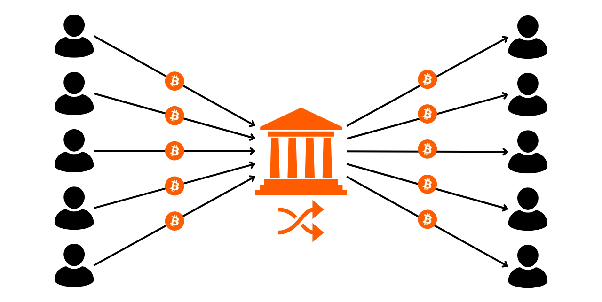

Kwa hivyo, watumiaji wa leo wanapendelea Kuunga sarafu, kwani inawaruhusu kudumisha udhibiti kamili wa pesa zao katika mchakato wote. Washiriki wa Kuunga sarafu hawana hatari ya kuibiwa bitcoins na wahusika wengine. Wacha tuangalie jinsi haya yote yanawezekana katika sura inayofuata.

## Zerolink na chaumian zinaungana

<chapterId>326c9654-b359-4906-b23d-d6518dd5dc3e</chapterId>

Faragha iliyotolewa na kuunga sarafu hupatikana kwa ukubwa wa kikundi ambamo kipande chetu kimefichwa. Hii inamaanisha kupata washiriki wengi iwezekanavyo. Inawezekana kabisa kuunda kuunga sarafu kwa mikono, na watumiaji tumejipata wenyewe, lakini huu ni mchakato mgumu, na hautakushindia makosa yoyote makubwa.

Hii ndiyo sababu waratibu wa kuunga sarafu wameendeleza kwenye Bitcoin. Jukumu lao ni kuwasiliana na watumiaji mbalimbali na kusambaza taarifa zinazohitajika ili kukamilisha shughuli ya ushirikiano.


Lakini tunawezaje kuhakikisha kwamba mratibu hajawahi kuwa na mikono yake kwenye bitcoins za watumiaji, na licha ya ukweli kwamba yeye ndiye mtu anayeunda shughuli ya Kuunga sarafu, tunawezaje kuhakikisha kwamba hawezi kuunganisha pembejeo na matokeo ya watumiaji, ambayo inaweza kuunda uvujaji wa siri?

### Sahihi za upofu za Chaum

Utekelezaji wa kisasa wa kuunga sarafu hutumia saini za upofu za David Chaum ili kuzuia kuvuja kwa habari. Hebu tuangalie kwa haraka jinsi sahihi hizi za vipofu zinavyofanya kazi.

Sahihi za upofu za Chaum ni aina ya sahihi ya kidijitali ambayo mtoaji saini hajui maudhui ya ujumbe anaotia sahihi. Lakini sahihi basi inaweza kuthibitishwa dhidi ya ujumbe asili. Mbinu hii ilitengenezwa na mwandishi wa maandishi David Chaum mnamo 1983.


Hebu tuchukue mfano wa kampuni inayotaka kuthibitisha hati ya siri, kama vile Contract (Mkataba), bila kufichua maudhui yake. Kampuni hutumia mchakato wa kuficha uso ambao hubadilisha hati asili kwa njia inayoweza kutenduliwa. Hati hii iliyorekebishwa inatumwa kwa mamlaka ya uidhinishaji, ambayo huweka sahihi bila kujua maudhui ya msingi. Baada ya kupokea hati iliyosainiwa, kampuni inafungua sahihi. Matokeo yake ni hati asili iliyothibitishwa na sahihi ya mamlaka, bila mamlaka kuwahi kuona maudhui asili.

Kwa hivyo, sahihi za upofu za Chaum zinaweza kuthibitisha uhalisi wa hati bila kujua maudhui yake, hivyo basi kuhakikisha usiri wa data ya mtumiaji na uadilifu wa hati iliyotiwa sahihi.

### Chaumian inajiunga

Kinachojulikana kama "Chaumian" sanjari huchanganya matumizi ya saini za upofu za Tor na David Chaum ili kuhakikisha kuwa mratibu hawezi kujua ni pato gani ni la mtumiaji gani.

Mchakato wa ujenzi wa muamala wa sCoinjoin (arafu ya kujiunga) unahusisha hatua kuu 3: usajili wa pembejeo, usajili wa pato na saini ya muamala. Wacha tuangalie mchakato huu kupitia mfano wa Alice, mmoja wa washiriki wa sCoinjoin (arafu ya kujiunga). Washiriki wengine wote wanafuata hatua sawa na Alice, kila mmoja kivyake.

**Hatua ya 1: Usajili wa ingizo


- Alice anatuma kwa mratibu UTXO anayotaka kutumia kama ingizo kwa muamala, na vile vile kipokezi cha Anwani (address) ambayo angependa kutumia kama pato kupokea bitcoins zake. Kwa hivyo mratibu hana njia ya kujua Anwani (address) ya Alice. Inaona toleo lake lililofichwa tu:


- Mratibu hukagua uhalali wa pembejeo, kisha hutia sahihi kwa Anwani (address) ya Alice iliyofunikwa na ufunguo wake wa kibinafsi. Anarudisha sahihi ya upofu kwa Alice:


**Hatua ya 2: Usajili wa matokeo**


- Alice anaweza kufichua Anwani (address) yake, ambayo sasa imetiwa sahihi na ufunguo wa faragha wa mratibu. Ataanzisha muunganisho mpya chini ya kitambulisho tofauti cha Tor. Mratibu hawezi kutambua kuwa ni Alice ambaye anaunganishwa chini ya utambulisho huu mpya:


- Alice anatuma Anwani (address) ambayo haijafichuliwa na kutia sahihi kwa mratibu (ambaye bado hajui ni Alice):


**Hatua ya 3: Kutia sahihi muamala**


- Kwa njia hiyo hiyo, mratibu hupata matokeo ambayo hayajafichwa kutoka kwa washiriki wote. Shukrani kwa saini zinazohusishwa, anaweza kuangalia kwamba kila pato lililowasilishwa bila kujulikana limetiwa saini na ufunguo wake wa kibinafsi kabla, na hivyo kuhakikisha uhalali wao. Kisha yuko tayari kujenga shughuli ya kuunga sarafu na kuituma kwa washiriki ili kutia sahihi:


- Alice, kama washiriki wengine, hukagua kuwa mchango na matokeo yake yamejumuishwa kwa usahihi katika shughuli iliyofanywa na mratibu. Ikiwa kila kitu ni cha kuridhisha, yeye hutuma saini inayofungua hati yake ya ingizo kwa mratibu:

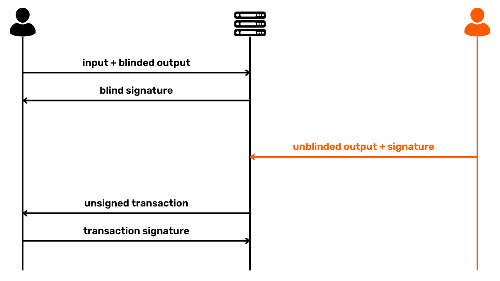


- Baada ya kukusanya sahihi kutoka kwa washiriki wote wa kuunga sarafu, mratibu anaweza kutangaza shughuli kwenye mtandao wa Bitcoin, ili iweze kuongezwa kwenye block.

Katika mfumo huu, mratibu hawezi kuunganisha ingizo kwenye pato mahususi. Zaidi ya hayo, hawezi kufaa fedha za washiriki, kwa kuwa yeye huwa hawezi kufikia funguo za faragha zinazohitajika ili kufungua UTXO zao. Katika mchakato mzima, hadi mwisho wa hatua ya 3, yeye pia hana ufikiaji wa sahihi. Wakati Alice na washiriki wengine wanatia sahihi shughuli ya kimataifa, baada ya kuangalia kwamba kila kitu ni sahihi, mratibu hawezi tena kurekebisha shughuli, ikiwa ni pamoja na matokeo, bila kuibatilisha. Hii inamzuia mratibu kuiba bitcoins.

Hatimaye, wakati wa kusajili pato lake katika shughuli hiyo, mtumiaji wa Kuunga sarafu angependa kuwa na dhamana sawa na zile za raia anayepiga kura katika uchaguzi. Kuna uwili kati ya mambo ya umma na ya kibinafsi ya vitendo hivi. Kwa upande mmoja, kuna kile unachotaka kuweka faragha: kwa mpiga kura, hataki kura yake ihusishwe na utambulisho wake; kwa mtumiaji wa Kuunga sarafu, hataki matokeo yake yahusishwe na mchango wake. Hakika, ikiwa mratibu, au chama kingine chochote, kitaweza kuanzisha kiungo kati ya pembejeo na pato, Kuunga sarafu inapoteza maslahi yote. Kama ilivyoelezwa hapo juu, kuunga sarafu lazima ifanye kazi kama mapumziko katika historia ya sarafu. Kuacha huku hutokea kwa usahihi kwa sababu ya kutowezekana kwa kuhusisha pembejeo maalum na pato maalum katika shughuli ya kuunga sarafu (anonset inayotarajiwa) na kinyume chake (anonset retrospective).

Kwa upande mwingine, kuna kipengele cha umma: mpiga kura anataka kuwa na uhakika kwamba kura yake imejumuishwa kwenye sanduku la kura; vile vile, mtumiaji wa Kuunga sarafu anataka kuwa na uhakika kwamba pato lake limejumuishwa katika shughuli ya kuunga sarafu. Hakika, washiriki wa Kuunga sarafu lazima wawe na uwezo wa kuthibitisha uwepo wa pato lao kabla ya kutia sahihi muamala, vinginevyo mratibu anaweza kuiba fedha hizo.

Ni hasa vipengele hivi 2 vya umma na vya kibinafsi, vinavyowezeshwa na matumizi ya sahihi za vipofu za David Chaum, ambazo zinawahakikishia washiriki katika ushirikiano wa Chaumian kwamba bitcoins zao hazitaibiwa, na kwamba fedha zao haziwezi kufuatiliwa.

### Nani aligundua dhana ya Kuunga sarafu?

Ni vigumu kusema kwa uhakika ni nani aliyeanzisha wazo la kuunga sarafu kwa Bitcoin kwanza, na ni nani alikuja na wazo la kutumia saini za upofu za David Chaum katika muktadha huu. Mara nyingi inafikiriwa kuwa ni Gregory Maxwell ambaye aliitaja kwa mara ya kwanza katika [ujumbe kwenye BitcoinTalk mnamo 2013](https://bitcointalk.org/index.php?topic=279249.0) :

> *"Kwa kutumia sahihi za upofu za Chaum: Watumiaji huingia na kutoa pembejeo (na Anwani (address) za Ubadilishanaji) pamoja na toleo la siri la blinded la Anwani (address) ambalo wangependa kutuma sehemu zao za siri; seva hutia sahihi ishara na kuzirejesha. Watumiaji huunganisha tena bila kujulikana, funua Anwani (address) zao za matokeo ambayo seva inaweza kuzituma tena, na seva inaweza kuzituma tena. kwa hivyo, matokeo yote yanatoka kwa washiriki halali Baadaye, watu huunganisha tena na kuingia
Maxwell, G. (2013, Agosti 22). *CoinJoin: Faragha ya Bitcoin kwa ulimwengu halisi*. BitcoinTalk Forum. https://bitcointalk.org/index.php?topic=279249.0


Walakini, kuna majina mengine yaliyotajwa hapo awali, kwa saini za Chaum kama sehemu ya mchanganyiko, lakini pia kwa sarafu za kujiunga. [Mnamo Juni 2011, Duncan Townsend aliwasilisha kwenye BitcoinTalk](https://bitcointalk.org/index.php?topic=12751.0) kichanganyaji kinachotumia sahihi za Chaum kwa njia inayofanana kabisa na sarafu za kisasa za Chaumian.

Katika mazungumzo sawa, tunaweza kupata [ujumbe kutoka hashcoin kujibu Duncan Townsend](https://bitcointalk.org/index.php?topic=12751.msg315793#msg315793) ili kuboresha kichanganyaji chake. Mchakato ulioelezewa katika ujumbe huu ndio hasa sarafu za kujiunga inahusu. Kutajwa kwa mfumo kama huo kunaweza pia kupatikana katika [ujumbe kutoka kwa Alex Mizrahi mwaka wa 2012](https://gist.github.com/killerstorm/6f843e1d3ffc38191aebca67d483bd88#file-laundry), alipokuwa akiwashauri waundaji wa Tenebrix ya kwanza, ambayo baadaye ilitolewa kama msingi wa Tenebrix. Hata neno "CoinJoin" lenyewe inasemekana halikuundwa na Greg Maxwell, lakini lilitokana na wazo la Peter Todd.


### Zerolink

Zerolink ni itifaki ya kina ya kuchanganya inayojumuisha ushirikiano wa Chaumian na mikakati mbalimbali ya kulinda kutokujulikana kwa watumiaji dhidi ya aina kadhaa za uchanganuzi wa misururu, hasa kwa kupunguza makosa yanayohusiana na usimamizi wa kwingineko. Itifaki hii [ilianzishwa na nopara73 na TDevD mnamo 2017](https://github.com/nopara73/ZeroLink/blob/master/README.md).


Kama jina lake linavyopendekeza, kanuni nyuma ya Zerolink ni kuunda miamala ya SCoinjoin (arafu ya kujiunga) ambayo inahakikisha kwamba viungo kati ya pembejeo na matokeo haviwezi kufuatiliwa. Hii inafanikiwa kwa kuhakikisha kuwa matokeo yote yana viwango sawa kabisa.


Hatua muhimu ya kuzuia iliyochukuliwa na Zerolink ni kuweka UTXO zisizochanganyika tofauti kabisa na UTXO mchanganyiko kwa kutumia seti tofauti za funguo za siri, au hata kwingineko tofauti. Hii inatofautisha "*kabla ya mchanganyiko*" Pochi, lililokusudiwa kwa sehemu kabla ya kuchanganywa, kutoka kwa "*post-mix*" Pochi, lililohifadhiwa kwa sehemu ambazo zimechanganywa.


Mgawanyiko huu mkali wa UTXO hutumikia zaidi ya yote kuzuia ushirikiano wa ajali kati ya UTXO mchanganyiko na UTXO isiyochanganywa. Hakika, ikiwa viungo hivyo vinatokea, ufanisi wa CoinJoin kwenye mchanganyiko wa UTXO umefutwa bila mtumiaji kufahamu, na hivyo kuathiri usiri wa UTXO ambaye historia yake alifikiri kuwa amevunja. Viungo hivi vinaweza kutokea ama kwa kutumia tena Anwani (address) katika kupata mchanganyiko wa UTXO na isiyochanganywa, au kupitia utumiaji wa CIOH (_Common-Input-Ownership Heuristic_), ikiwa mtumiaji anatumia UTXO zilizochanganywa na zisizochanganywa kama nyenzo za muamala sawa. Kwa kutenganisha jalada la kabla ya mchanganyiko na baada ya mchanganyiko, tunaepuka miunganisho kama hiyo ya kiajali na kumlinda mtumiaji dhidi ya hitilafu zisizokusudiwa.


Utenganisho huu pia unatoa uwezekano wa kutumia sheria tofauti kati ya mseto wa awali na wa baada ya mchanganyiko katika kiwango cha programu kwingineko. Kwa mfano, katika kwingineko baada ya kuchanganya, programu inaweza kuzuia kuunganishwa kwa UTXO kwenye pembejeo ili kuzuia utumizi wa CIOH, jambo ambalo litahatarisha mfumo wa kutoweka wa mtumiaji. Pia inawezekana kusawazisha utumiaji wa hati na chaguo za muamala (kama vile kuripoti kwa RBF, kwa mfano) ili kuzuia kutambuliwa kwa alama za vidole za Pochi.

Kwa sasa, Whirlpool ndiyo utekelezaji pekee wa Kuunga sarafu unaotumia kwa ukali itifaki ya Zerolink. Katika sura inayofuata, tutaangalia utekelezaji mbalimbali wa kuunga sarafu uliopo, na faida na hasara za kila moja.

## Utekelezaji wa kuunga sarafu

<chapterId>e37ed073-9498-4e4f-820b-30951e829596</chapterId>

*Mnamo mwaka wa 2024, tunashuhudia mabadiliko makubwa katika zana zinazopatikana kwa watumiaji wanaotaka kufanya mchanganyiko kwenye Bitcoin. Kwa sasa tuko katika hatua ya mabadiliko, na soko la kuunga sarafu linafanyiwa marekebisho makubwa. Sura hii hakika itasasishwa baada ya muda

Kwa sasa kuna utekelezaji 3 tofauti wa kuunga sarafu kwenye Bitcoin:


- Whirlpool;
- Wabisabi;
- JoinMarket.

Kila moja ya utekelezaji huu inalenga kuvunja historia ya UTXO kupitia miamala ya kuunga sarafu. Walakini, mifumo yao inatofautiana sana. Kwa hivyo ni muhimu kuelewa jinsi kila moja inavyofanya kazi, kwa hivyo unaweza kuchagua chaguo linalofaa zaidi mahitaji yako.

### JoinMarket

JoinMarket, iliyoanzishwa mwaka wa 2015 na Adam Gibson na Chris Belcher, inajitokeza wazi kutoka kwa utekelezaji mwingine wa kuunga sarafu shukrani kwa muundo wake wa kipekee wa kuunganisha watumiaji. Mfumo huo unategemea soko la P2P Ubadilishanaji ambapo watumiaji wengine, "watengenezaji", hufanya bitcoins zao zipatikane kwa kuchanganya, wakati wengine, "wachukuaji", hutumia fedha hizi kufanya uungaji wa sarafu kwa malipo.

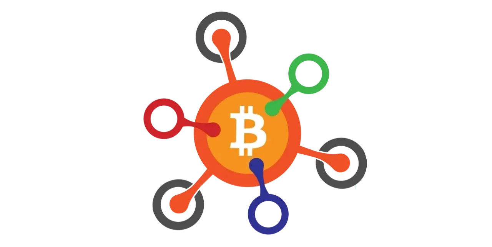

Kwa mfano huu, "watengenezaji" hufanya bitcoins zao kupatikana kwa "wachukuaji" na kupokea ada kwa huduma yao. Wachukuaji, kwa upande wake, hulipa kutumia bitcoins za watengenezaji kufanya miamala yao ya kuunga sarafu. Ada za huduma hutofautiana kulingana na jukumu linalochukuliwa: "watengenezaji" hujilimbikiza ada za kutoa ukwasi, wakati "wachukuaji" hulipa ada. Soko linafanya kazi kwa uhuru, bila masharti ya matumizi.

Moja ya vikwazo kuu vya JoinMarket ni ugumu wake wa matumizi, ambayo inahitaji kiwango fulani cha faraja na vituo ili kuiendesha kwa ufanisi. Ingawa utata huu si kikwazo kwa mtumiaji mwenye uzoefu, unaweza kuzuia ufikiaji wa umma kwa ujumla. Hata hivyo, utangulizi wa hivi majuzi wa mtandao wa kiole sura unaoitwa JAM umerahisisha kidogo kutumia.


Chanzo : [JAM](https://github.com/joinmarket-webui/jam/blob/devel/docs/assets/screenshot-dark.webp)

Hata hivyo, kikwazo cha kiufundi bado ni kikwazo kikubwa. Katika mfumo ikolojia wa kuunga sarafu, ambapo usiri huimarishwa na idadi ya washiriki, kizuizi chochote kinachopunguza ufikivu huathiri moja kwa moja ukwasi unaopatikana, ambayo ni sababu muhimu katika ufanisi wa mchanganyiko. Bitcoin, ikiwa tayari ni chachu katika shughuli za kifedha, inaona matumizi yake ya kuunga sarafu kama sehemu ndogo, na JoinMarket inawakilisha sehemu yake maalum zaidi, ambayo kwa hivyo inazuia uwezo wake wa kuongeza anonsets za watumiaji wake.

Licha ya muundo wake wa kiubunifu wa kuunganisha wa P2P kwa waunganishaji, JoinMarket ina hasara kubwa, haswa katika suala la muundo wa shughuli. Tofauti na utekelezwaji mwingine kama vile Whirlpool, JoinMarket haihakikishii usawa kamili kati ya matokeo, na inawezekana kufuatilia viungo vya kubainisha kati ya pembejeo na matokeo. Zaidi ya hayo, haina zana za kuzuia sehemu ambazo tayari zimechanganywa pamoja zisichanganywe tena, jambo ambalo linaweza kuhatarisha usiri unaotafutwa na watumiaji.

Hatimaye, wakati dhana ya JoinMarket inavutia, hasa kwa wale wanaopenda soko la ukwasi wa nguvu, udhaifu wake wa kimuundo na utata wa kiufundi hufanya hivyo, kwa maoni yangu, chini ya kuvutia kwa wanovisi na wataalam wanaotafuta utekelezaji wa kuunga sarafu.

### Wabisabi

Wabisabi ni utekelezaji mwingine wa Kuunga sarafu, na mkabala unaoweka kati uratibu wa shughuli. Muundo huu ulibuniwa Ádám Ficsór (nopara73), Yuval Kogman, Lucas Ontivero, na István András Seres mnamo 2021, na uliunganishwa katika programu ya Wasabi 2.0 mwaka uliofuata. Wabisabi ni mageuzi haswa ya muundo wa programu ya Wasabi ya kuunga sarafu uliozinduliwa mnamo 2018.


Kuelekea mwisho wa miaka ya 2010, Wasabi ilipitisha muundo tofauti kabisa wa shughuli ya kuunga sarafu hadi Whirlpool. Wasabi ilitumia miamala mikubwa sana ya kuunga sarafu iliyohusisha makumi ya washiriki ili kuongeza arifa za washiriki wake. Kinyume chake, Whirlpool ilichagua miamala mingi midogo, kuwezesha anonsets kukua kwa kasi kwa kila mzunguko.

Mbinu za usimamizi za Ubadilishanaji pia zilitofautisha utekelezaji huo mbili. Kwa Whirlpool, Ubadilishanaji wa kigeni ulitengwa kutoka kwa UTXO kabla ya mizunguko ya kuunga sarafu shukrani kwa TX0, dhana ambayo nitaelezea zaidi katika sura inayofuata. Pamoja na Wasabi, kwa upande mwingine, Ubadilishanaji wa kigeni uliunda moja ya matokeo ya shughuli ya kuunga sarafu, kudumisha viungo vya kuamua kati ya pembejeo na matokeo fulani.


Kwa kutumia Wabisabi, toleo la 2.0 la Wasabi limerekebisha mbinu yake kwa sanjari ili kuendana na ile ya Whirlpool. Ingawa shughuli za kuunga sarafu zinasalia kuwa kubwa sana, sasa inawezekana kufunga mizunguko kadhaa mfululizo, kufuata mfano wa Whirlpool. Uangalifu maalum pia umelipwa kwa usimamizi wa viwango vya Ubadilishaji: tofauti na Wasabi 1.0, ambapo kiwango cha Ubadilishanaji kilihusishwa moja kwa moja na pembejeo za watumiaji, Wabisabi inatafuta kugawanya kiwango cha Ubadilishanaji katika kiasi kidogo kidogo, kilichogawanywa katika madhehebu sawa kwa washiriki wote.

Hebu tuonyeshe hili kwa mfano uliorahisishwa unaohusisha watumiaji 2 pekee: Alice anataka kuchanganya 115,000 Sats na Bob, 210,000 Sats. Kupuuza ada, na Wasabi 1.0, muamala wa kuunga sarafu ungetoa matokeo 3 ya 100,000 Sats, pamoja na 1 Ubadilishanaji wa 15,000 Sats kwa Alice na 1 ubadilishanaji wa 10,000 Sats kwa Bob-706. Matokeo ya Ubadilishanaji bado yangeunganishwa na pembejeo:


Chini ya Wabisabi, shughuli hiyo hiyo ingetoa matokeo 3 ya 100,000 Sats na matokeo 5 ya 5,000 Sats, na hivyo kutawanya Ubadilishanaji ili usiweze kuunganishwa moja kwa moja na pembejeo maalum:


Binafsi, ninaona kwamba usimamizi wa kigeni wa Wabisabi wa Ubadilishanaji unawasilisha hatari kadhaa ambazo zinaweza kuathiri ufanisi wake katika masuala ya usiri:


- Mtumiaji anapochangia UTXO ambayo ni kubwa zaidi kuliko ya washiriki wengine, bila shaka anaishia na kiasi cha Ubadilishanaji ambacho kitaunganishwa na mchango wake. Hii inapingana na lengo la awali la itifaki, ambayo ni kuondoa ubadilishanaji wote unaotambulika;
- Kuzidisha kwa madhehebu kwa lengo la kugawanyika kwa Ubadilishanaji kunaweza kuwa na madhara kwa kuchanganya ufanisi. Utaratibu huu unaweza kusababisha kupunguzwa kwa anonsets kwa matokeo fulani, kwani hutambulika kwa urahisi zaidi;
- Njia hii pia huzalisha UTXO za thamani ya chini ambazo huleta tatizo la usimamizi kwa mtumiaji. UTXO hizi ndogo, ikiwa zitakuwa ghali sana kutumia kuhusiana na thamani yao, zinaweza kuwa "Dust". Jambo hili hupelekea mtumiaji kuunganisha UTXO kadhaa katika pembejeo kwa shughuli za siku zijazo, au kuziunganisha. Katika visa vyote viwili, kwa sababu ya CIOH, hii inaweza kupunguza makosa yaliyopatikana, au kufuta kabisa faida za usiri zilizopatikana na kuunga sarafu ya awali.

Tofauti na Whirlpool, ambayo hutekeleza itifaki ya ZeroLink inayohakikisha utengano mkali kati ya UTXO za mchanganyiko wa awali na wa baada ya mchanganyiko, Wabisabi haidumii utengano huu mkali. Pia kumekuwa na matatizo ya kutumia tena Anwani (address) na baadhi ya wateja wa Wasabi, ambayo ni wazi kuwa ni hatari sana kwa mtumiaji.

Katika toleo la 2.0 la Wasabi, sera mpya ya ada ya Kuunga sarafu imetekelezwa. Kuanzia sasa na kuendelea, ada za mratibu zimewekwa kuwa 0.3% kwa UTXO zaidi ya 0.01 Bitcoin, wakati kwa UTXO ndogo, ada hizi hutolewa kikamilifu. Zaidi ya hayo, michanganyiko ya UTXO hizi ndogo haina malipo, ingawa ada za Mining husalia kulipwa na mtumiaji kwa miamala yote, ikijumuisha michanganyaji.

Hii inatofautiana na sera ya Whirlpool, ambapo ada hubakia bila kubadilika, bila kujali ukubwa wa makosa yaliyopatikana. Kwa Wasabi 2.0, ingawa ada za mratibu zimeondolewa kwa UTXO ndogo, mtumiaji bado anatakiwa kulipa ada za mining (uchimbaji) kwa miamala yote, ikijumuisha michanganyiko.

Ninapoandika mistari hii, matumizi ya Wabisabi yamekuwa magumu zaidi kutokana na matukio ya hivi karibuni. Kufuatia kukamatwa kwa waanzilishi wa Pochi Samourai, zkSNACKs, kampuni inayofadhili na kusimamia maendeleo ya Wasabi, ilitangaza kuwa huduma yake ya mratibu wa kuunga sarafu ingekomeshwa mnamo Juni 1, 2024. Mratibu huyu, ambaye alianzishwa kwa chaguo msingi kwenye Wasabi, alihusika na ukwasi mkubwa.

Kwa kusitishwa kwa mratibu huyu mkuu, watumiaji lazima sasa waunganishe kwa waratibu wapya, wanaojitegemea. Mabadiliko haya yanaibua idadi ya wasiwasi: kwa upande mmoja, waratibu wapya wanaweza kukosa ukwasi wa kutosha, na hivyo kupunguza ufanisi wa kuunga sarafu katika suala la usiri. Kwa upande mwingine, kuna hatari ya kukimbia katika mratibu mbaya. Hali hii inaongeza hatari mpya kwa wale wanaotaka kutumia Wabisabi.

Zaidi ya masuala ya kiufundi, uamuzi wa zkSNACKs, kampuni iliyo nyuma ya Wasabi, kutumia huduma za kampuni ya uchanganuzi wa kamba kuchuja washiriki wa kuunga sarafu unaibua maswali mazito ya kimaadili na ya kimkakati. Wazo la awali lilikuwa kuzuia matumizi ya sarafu kwa Wasabi na wahalifu, hatua ambayo inaweza kuonekana kuwa halali. Hata hivyo, inazua kitendawili: kulipa ada kwa mratibu ambaye dhamira yake kuu ni kuimarisha usiri wa mtumiaji, na kumfanya tu kufadhili kampuni ambayo lengo lake ni kuathiri usiri huo huo.

Jambo linalotia wasiwasi zaidi ni kanuni ya uchujaji, ambayo inatofautiana kwa kiasi kikubwa na falsafa ya Bitcoin ya kutoa mfumo wa kifedha ulio wazi, usiodhibitiwa. Ingawa inaweza kuonekana kuwa sawa kutaka kutenga shughuli za uhalifu, uchujaji huu unaweza pia kuathiri watu ambao vitendo vyao, ingawa vinaainishwa kuwa haramu katika miktadha fulani, vinaweza kuhalalishwa kimaadili au kunufaisha kijamii. Mfano wa Edward Snowden unaonyesha kikamilifu mkanganyiko huu: anachukuliwa kuwa mhalifu na baadhi ya serikali kwa ufunuo wake, anaonekana na wengine kama mtoa taarifa ambaye alitenda kwa maslahi ya umma. Utata huu unasisitiza hatari inayoweza kutokea ya kuchuja ambayo, ingawa ina nia njema, inaweza hatimaye kudhoofisha haki na usalama wa watumiaji halali. Ningeweza pia kutaja wanaharakati na waandishi wa habari wanaoteswa chini ya tawala fulani za kimabavu.

Kama vile utakuwa umekusanya kufikia sasa, upendeleo wangu ni dhahiri kwa mfano wa Whirlpool kwa kuunga sarafu kwenye Bitcoin. Mfumo huu unasimama nje kwa ukali wake na hutoa dhamana ya juu ya usiri. Pia ndiyo pekee inayotoa mchanganyiko unaozingatiwa kuwa mzuri katika muktadha wa hisabati. Kwa maoni yangu, mtindo huu unawakilisha mustakabali wa kuunga sarafu kwenye Bitcoin. Ninakualika uchunguze mtindo huu kwa kina zaidi katika sura inayofuata.

## Jinsi Whirlpool inavyofanya kazi

<chapterId>bdbd7109-e36d-4b4f-a3c6-928df4e9bfda</chapterId>

Kinachotenganisha Whirlpool na mbinu zingine za kuunga sarafu ni matumizi ya miamala ya "_ZeroLink_", ambayo inahakikisha kwamba hakuna kiunga cha kiufundi kinachowezekana kati ya pembejeo na matokeo yote. Mchanganyiko huu kamili hupatikana kupitia muundo ambao kila mshiriki huchangia kiasi sawa cha ingizo (isipokuwa ada za mining (uchimbaji)), na kutoa matokeo ya viwango sawa kabisa.

Mtazamo huu wa vizuizi kwa ingizo huipa miamala ya Whirlpool ya kuunga sarafu kipengele cha kipekee: kutokuwepo kabisa kwa viunganishi vya kuamua kati ya ingizo na matokeo. Kwa maneno mengine, kila pato lina uwezekano sawa wa kuhusishwa na mshiriki yeyote, ikilinganishwa na matokeo mengine yote katika muamala.


### Jinsi Whirlpool inavyofanya kazi

Hapo awali, idadi ya washiriki katika kila Whirlpool kuunga sarafu ilipunguzwa hadi 5, na washiriki 2 wapya na vichanganyaji 3 (tutaelezea dhana hizi baadaye). Hata hivyo, ongezeko la ada za miamala za On-Chain zilizozingatiwa mwaka wa 2023 zilifanya timu za Samourai kufikiria upya muundo wao ili kuboresha usiri huku wakipunguza gharama. Kwa hivyo, kwa kuzingatia hali ya soko la ada na idadi ya washiriki, mratibu sasa anaweza kupanga sanjari pamoja na washiriki 6, 7 au 8. Vipindi hivi vilivyoboreshwa vinajulikana kama "Mizunguko ya Kuongezeka". Ni muhimu kutambua kwamba, chochote usanidi, daima kuna washiriki wapya 2 tu kwa Whirlpool sanjari.

Kwa hivyo, shughuli za Whirlpool zina sifa ya idadi sawa ya pembejeo na matokeo, ambayo yanaweza kuwa:


- pembejeo 5 na matokeo 5;


- pembejeo 6 na matokeo 6;


- pembejeo 7 na matokeo 7;


- pembejeo 8 na matokeo 8.


Mfano wa Whirlpool unatokana na shughuli ndogo za kuunga sarafu. Tofauti na Wabisabi na JoinMarket, ambapo uimara wa anonsets unategemea kiasi cha washiriki katika mzunguko mmoja (au kwenye mizunguko michache), Whirlpool inategemea mlolongo wa mizunguko kadhaa ndogo.

Katika muundo huu, watumiaji hulipa ada tu wanapojiunga kwa mara ya kwanza kwenye kidimbwi, hivyo kuwawezesha kushiriki katika wingi wa mchanganyiko bila gharama ya ziada. Washiriki wapya hulipa ada za mining (uchimbaji) kwa viunganishi.

Kwa kila uungaji wa sarafu ya ziada ambayo kipande kinashiriki, pamoja na wenzao waliokutana nao hapo awali, anonsets itakua kwa kasi. Kusudi ni kuchukua faida ya michanganyiko hii isiyolipishwa, ambayo, kila wakati inapotokea, inachangia kuimarisha msongamano wa anonsets inayohusiana na kila kipande kilichochanganywa.


Whirlpool imeundwa kwa kuzingatia mahitaji mawili muhimu:


- Upatikanaji wa utekelezaji kwenye vifaa vya simu, kutokana na kwamba Pochi la Samourai ni la kwanza kabisa maombi ya smartphone;
- Mizunguko ya uchanganyaji wa haraka ili kukuza ongezeko kubwa la anonsets.

Masharti haya yaliongoza chaguo zilizofanywa na wasanidi wa Pochi Samourai katika kubuni Whirlpool, na kuwafanya kuwawekea washiriki idadi ndogo kwa kila mzunguko. Ni wachache sana ambao wangeathiri ufanisi wa kuunga sarafu, na hivyo kupunguza kwa kiasi kikubwa utatuzi unaozalishwa kwa kila mzunguko, ilhali nyingi sana zingesababisha matatizo ya usimamizi kwenye programu za simu na kutatiza mtiririko wa mzunguko.

Hatimaye, hakuna haja ya kuwa na idadi kubwa ya washiriki kwa kila kuunga sarafu kwenye Whirlpool, kwani anonsets hufanywa kwa mkusanyiko wa mizunguko kadhaa ya kuunga sarafu. Kanuni muhimu zaidi hapa ni homogeneity ya UTXO ya washiriki wote, kwa kuwa hii inahakikisha kuchanganya kamili, na kwa hiyo kufaidika kamili kutoka kwa mzunguko wa kuchanganya na kuchanganya.

### Mabwawa ya kuunga sarafu na ada

Kwa mizunguko hii mingi ili kuongeza anonsets za sehemu mchanganyiko, mfumo fulani unahitajika ili kuzuia kiasi cha UTXO zinazotumiwa. Whirlpool inafafanua mabwawa tofauti.

Bwawa linawakilisha kundi la watumiaji wanaotaka kuchanganyika pamoja, ambao wanakubali kiasi cha UTXO zitakazotumika kuboresha mchakato wa kuunga sarafu huku wakidumisha usawa kamili wa sehemu. Kila bwawa hubainisha kiasi kisichobadilika cha UTXO, ambacho mtumiaji lazima azingatie ili kushiriki. Kwa hivyo, kufanya sanjari na Whirlpool, unahitaji kuchagua bwawa. Mabwawa yafuatayo yanapatikana kwa sasa:


- bitcoins 0.5;
- 0.05 Bitcoin ;
- 0.01 Bitcoin ;
- 0.001 Bitcoin (= 100,000 Sats).

Unapoingia kwenye bwawa na bitcoins zako, zitagawanywa hadi kuzalisha UTXO ambazo zinafanana kabisa na zile za washiriki wengine kwenye bwawa. Kila bwawa lina kikomo cha juu zaidi, kwa hivyo kwa kiasi kinachozidi kikomo hiki, itabidi uweke maingizo mawili tofauti kwenye bwawa moja, au uhamie kwenye dimbwi lingine lenye kiwango cha juu zaidi:

| Dimbwi (Bitcoin) | Kiasi cha juu kwa kila ingizo (Bitcoin) |

|-----------------------------------------------------|

| 0,5 | 35 |

| 0,05 | 3,5 |

| 0,01 | 0,7 |

| 0,001 | 0,025 |

UTXO inachukuliwa kuwa ya bwawa wakati iko tayari kuunganishwa kwenye kuunga sarafu. Walakini, hii haimaanishi kuwa mtumiaji atapoteza umiliki wake. Kama tulivyoona katika sura za kwanza za sehemu hii, kupitia mizunguko mbalimbali ya kuchanganya, unahifadhi udhibiti kamili wa funguo zako na, kwa hiyo, wa bitcoins zako. Hii ndiyo inatofautisha mbinu ya kuunga sarafu kutoka kwa mbinu zingine za kuchanganya kati.

Ili kujiunga na bwawa la kuunga sarafu, unahitaji kulipa ada ya huduma na ada ya Mining. Ada za huduma zimepangwa kwa kila bwawa na zinalenga kulipa timu zinazohusika na ukuzaji na matengenezo ya Whirlpool.

Ada ya huduma kwa matumizi ya Whirlpool inalipwa mara moja tu unapojiunga na bwawa. Mara tu unapojiunga, unaweza kushiriki katika idadi isiyo na kikomo ya mchanganyiko bila malipo ya ziada. Hapa kuna ada za sasa za kudumu kwa kila bwawa:

| Dimbwi (Bitcoin) | Ada ya kuingia (Bitcoin) |

|-------------------------------------------------|

| 0,5 | 0,0175 |

| 0,05 | 0,00175 |

| 0.01 | 0.0005 (50,000 Sats) |

| 0.001 | 0.00005 (5,000 Sats) |

Ada hizi kimsingi hufanya kazi kama tikiti ya kuingia kwenye bwawa ulilochagua, bila kujali kiasi ulichoweka kwenye kuunga sarafu. Kwa hivyo, ikiwa utaingia kwenye dimbwi la 0.01 na 0.01 BTC haswa au 0.5 BTC, ada zitabaki sawa kwa masharti kabisa.

Kabla ya kuendelea na viunganishi vya Whirlpool, mtumiaji anaweza kuchagua kati ya mikakati 2:


- Chagua bwawa ndogo ili kupunguza gharama za huduma, ukijua kwamba atapata UTXO kadhaa ndogo kama malipo;
- Au uchague bwawa kubwa zaidi, tayari kulipa ada ya juu, ili tu kuishia na idadi ndogo ya UTXO za thamani ya juu.

Kwa ujumla haipendekezi kuunganisha UTXO kadhaa zilizochanganywa baada ya mizunguko ya kuunga sarafu, kwa kuwa hii inaweza kuhatarisha usiri uliopatikana, hasa kutokana na ingizo la kawaida la Ownership heuristic (CIOH: *Common-Input-Ownership-Heuristic*). Kwa hivyo, inaweza kuwa na maana kuchagua bwawa kubwa zaidi, hata kama hii inamaanisha kulipa zaidi, ili kuepuka kuwa na UTXO nyingi za thamani ndogo katika pato. Mtumiaji lazima atathmini biashara hizi ili kuchagua dimbwi analopendelea.

Kando na ada ya huduma, ada ya mining (uchimbaji) mahususi kwa shughuli yoyote ya Bitcoin lazima pia izingatiwe. Kama mtumiaji wa Whirlpool, utahitajika kulipa ada ya mining (uchimbaji) kwa shughuli ya utayarishaji (`Tx0`) na pia kwa kuunga sarafu ya kwanza. Remix zote zinazofuata zitakuwa bila malipo, shukrani kwa muundo wa Whirlpool kulingana na kuwalipa washiriki wapya.

Kwa kweli, katika kila Whirlpool kuunga sarafu, watumiaji 2 kati ya pembejeo ni washiriki wapya. Ingizo zingine hutoka kwa viunganishi. Kwa hivyo, gharama za Mining kwa washiriki wote katika muamala hugharamiwa na washiriki hawa 2 wapya, ambao wanaweza pia kufaidika na michanganyiko isiyolipishwa:


Shukrani kwa mfumo huu wa ada, Whirlpool inatofautiana sana na utekelezwaji mwingine wa kuunga sarafu, kwa kuwa utatuzi wa mfumo wa UTXOs hauwi sawia na bei inayolipwa na mtumiaji. Kwa hivyo, inawezekana kufikia viwango vya juu zaidi vya kutokujulikana kwa kulipa tu ada ya kuingia kwenye bwawa na ada ya mining (uchimbaji) kwa miamala 2 (`Tx0` na mchanganyiko wa awali).

Ni muhimu kutambua kwamba mtumiaji pia atalazimika kulipa ada za mining (uchimbaji) ili kuondoa UTXO zake kwenye bwawa baada ya kukamilisha miunganisho yake mingi, isipokuwa awe amechagua chaguo la `changanya kwa`, ambalo linatoa Anwani (address) ya nje ambayo itapokea fedha moja kwa moja kutoka kwa kuunga sarafu, bila muamala wowote wa ziada.

### Akaunti za kwingineko za HD

Ili kuunda kuunga sarafu kupitia Whirlpool, Wallet lazima kuzalisha akaunti kadhaa tofauti. Hii ndiyo kanuni nyuma ya itifaki ya ZeroLink. Akaunti, katika muktadha wa jalada la HD (*Hierarchical Deterministic*), inajumuisha sehemu iliyotengwa kabisa na nyinginezo, utengano huu unatokea katika kiwango cha kina cha tatu cha daraja la kwingineko, yaani katika kiwango cha `xpub`.


Pochi la HD linaweza kinadharia kupata hadi akaunti tofauti za `2^(31)`. Akaunti ya awali, inayotumiwa na chaguo-msingi kwenye pochi zote za Bitcoin, inalingana na faharasa ya `0'`.

Kwa portfolios zilizorekebishwa kwa Whirlpool, akaunti 4 hutumiwa kukidhi mahitaji ya mchakato wa ZeroLink:


- **akaunti ya amana**, iliyotambuliwa kwa faharasa `0'` ;
- **Akaunti mbaya ya benki** (au "doxxic change"), iliyotambuliwa na faharasa `2,147,483,644'` ;
- Akaunti ya **premix**, iliyotambuliwa na fahirisi `2 147 483 645'` ;
- Akaunti ya **mchanganyiko wa posta**, iliyotambuliwa na faharasa `2 147 483 646'`.

Kila moja ya akaunti hizi hutimiza kazi fulani katika mchakato wa kuunga sarafu, ambayo tutachunguza katika sehemu zifuatazo.

Akaunti hizi zote zimeunganishwa na seed (mbegu) moja, kuwezesha mtumiaji kurejesha ufikiaji wa bitcoins zake zote kwa kutumia maneno yake ya kurejesha na, inapohitajika, passphrase yake. Wakati wa urejeshaji, hata hivyo, programu lazima ijulishwe kuhusu faharasa mbalimbali za akaunti zinazotumiwa.

Hebu tuangalie hatua tofauti za Whirlpool kuunga sarafu ndani ya akaunti hizi.

### Sehemu ya TX0

Sehemu ya kuanzia ya Whirlpool kuunga sarafu yoyote ni **amana** akaunti. Hii ndiyo akaunti unayotumia kiotomatiki unapounda Pochi la Bitcoin mpya. Akaunti hii itahitaji kuhusishwa na bitcoins unazotaka kuchanganya.

Tx0" ni hatua ya kwanza katika mchakato wa kuchanganya wa Whirlpool. Madhumuni yake ni kuandaa na kusawazisha UTXO za kuunga sarafu, kuzigawanya katika vitengo vinavyolingana na kiasi cha bwawa lililochaguliwa, ili kuhakikisha mchanganyiko wa homogeneous. UTXO hivyo kusawazishwa hutumwa kwenye akaunti **premix**. Kuhusu tofauti, akaunti ya **ba haiwezi kutengwa kwa tofauti: benki** (au "doxxic change").

Muamala huu wa awali wa `Tx0` pia hutumika kulipa ada ya huduma kutokana na mratibu wa Kuunga sarafu. Tofauti na hatua zifuatazo, muamala huu si shirikishi, kwa hivyo ni lazima mtumiaji kubeba gharama kamili ya mining (uchimbaji):


Katika mfano huu wa shughuli ya `Tx0`, ingizo la `372,000 Sats` kutoka kwa **deposit** akaunti yetu imegawanywa katika UTXO kadhaa zinazotolewa, ambazo hugawanywa kama ifuatavyo:


- Kiasi cha `5,000 Sats` kwa mratibu kwa ada za huduma, zinazolingana na kiingilio cha jumla cha `100,000 Sats`;
- UTXO 3 zilizotayarishwa kwa kuchanganywa, zimeelekezwa kwenye akaunti yetu ya **premix** na kusajiliwa na mratibu. UTXO hizi zinasawazishwa kwa `108,000 Sats` kila moja, ili kulipia gharama za mining (uchimbaji) kwa mchanganyiko wao wa awali wa siku zijazo;
- Ziada, ambayo haiwezi kuingia kwenye bwawa kwa sababu ni ndogo sana, inachukuliwa kuwa Ubadilishanaji wa kigeni wenye sumu. Inatumwa kwa akaunti yake maalum. Hapa, huu Ubadilishanaji ni sawa na `40,000 Sats` ;
- Hatimaye, zimesalia `3,000 Sats`, ambazo hazijumuishi pato, lakini ni gharama za mining (uchimbaji) zinazohitajika ili kuthibitisha `Tx0`.

Kwa mfano, hapa kuna Whirlpool Tx0 halisi (sio yangu): [edef60744f539483d868caff49d4848e5cc6e805d6cdc8d0f9bdbbaedcb5fc46](https://GW-8 16.space/fr/tx/edef60744f539483d868caff49d4848e5cc6e805d6cdc8d0f9bdbbaedcb5fc46)


### Mabadiliko ya doxxic

Ziada ambayo haikuweza kuunganishwa kwenye bwawa, hapa sawa na `40,000 Sats`, inaelekezwa kwenye **akaunti mbaya ya benki**, inayojulikana pia kama "doxxic Exchange", ili kuhakikisha utengano mkali kutoka kwa UTXO zingine kwenye jalada.

UTXO hii ni hatari kwa usiri wa mtumiaji, kwa sababu sio tu kwamba bado imeshikamana na siku zake za nyuma, na kwa hiyo inawezekana kwa utambulisho wa mmiliki wake, lakini pia inajulikana kuwa ya mtumiaji ambaye ametengeneza kuunga sarafu.


Ikiwa UTXO hii itaunganishwa na matokeo mchanganyiko, wa pili utapoteza usiri wote uliopatikana wakati wa mizunguko ya kuunga sarafu, hasa kutokana na CIOH (*Common-Input-Ownership-Heuristic*). Ikiwa itaunganishwa na mabadiliko mengine ya doxxic, mtumiaji ana hatari ya kupoteza usiri, kwani itaunganisha maingizo mbalimbali ya mzunguko wa kuunga sarafu. Kwa hiyo inapaswa kutibiwa kwa tahadhari. Tutaingia kwa undani zaidi juu ya usimamizi wa UTXO hizi doxxic katika sehemu ya mwisho ya sura hii.

### Mchanganyiko wa awali

Baada ya `Tx0`, UTXO zilizosawazishwa hutumwa kwenye akaunti yetu ya **premix** ya kwingineko, tayari kuanzishwa katika mzunguko wao wa kwanza wa kuunga sarafu, unaojulikana pia kama "mchanganyiko wa awali". Ikiwa, kama katika mfano wetu, `Tx0` inazalisha UTXO kadhaa za kuchanganya, kila moja itaunganishwa katika mchanganyiko tofauti wa awali.

Mwishoni mwa michanganyiko hii ya kwanza, akaunti ya **premix** itakuwa tupu, huku sarafu zetu, zikiwa zimelipa ada za mining (uchimbaji) kwa Kuunga sarafu hii ya kwanza, zitarekebishwa haswa kwa kiasi kinachofafanuliwa na bwawa lililochaguliwa. Katika mfano wetu, UTXO zetu za awali za `108,000 Sats` zitakuwa zimepunguzwa hadi `100,000 Sats` haswa.


### Mchanganyiko

Baada ya mchanganyiko wa awali, UTXO huhamishiwa kwenye akaunti ya **mchanganyiko wa posta**. Akaunti hii hukusanya UTXO ambazo tayari zimechanganywa na zinazosubiri kuchanganywa tena. Mteja wa Whirlpool anapokuwa amilifu, UTXO zilizo katika akaunti **postmix** zinapatikana kiotomatiki kwa michanganyiko na zitachaguliwa bila mpangilio kushiriki katika mizunguko hii mipya.

Kama ukumbusho, mchanganyiko hautakuwa 100% bila malipo: hakuna gharama za ziada za huduma au ada za Mining zinazohitajika. Kwa hivyo, kuweka UTXO katika akaunti ya **mchanganyiko wa posta** hudumisha thamani yake, na kuboresha utatuzi wao kwa wakati mmoja. Ndiyo maana ni muhimu kuruhusu sarafu hizi kushiriki katika mizunguko kadhaa ya Kuunga sarafu. Haikugharimu chochote, na huongeza viwango vyao vya kutokujulikana.

Unapoamua kutumia UTXO zilizochanganywa, unaweza kufanya hivyo moja kwa moja kutoka kwenye akaunti hii **mchanganyiko wa posta**. Tunakushauri uweke UTXO zilizochanganywa katika akaunti hii ili kufaidika na michanganyiko isiyolipishwa na kuzizuia zisiondoke kwenye saketi ya Whirlpool, ambayo inaweza kupunguza usiri wao.

### Je, unadhibiti vipi michanganyiko yako ya posta?

Baada ya kuendesha mizunguko ya kuunga sarafu, mkakati bora ni kuweka UTXO zako katika akaunti ya **mchanganyiko wa posta**, ukingoja matumizi ya baadaye. Inashauriwa hata kuziruhusu zichanganywe tena kwa muda usiojulikana hadi utakapohitaji kuzitumia.

Watumiaji wengine wanaweza kufikiria kuhamisha bitcoins zao zilizochanganywa hadi Pochi lililolindwa na Pochi la Hardware. Hili linawezekana, lakini ni muhimu kufuata mapendekezo ya Pochi la Samourai kwa uangalifu ili usihatarishe usiri uliopatikana.

Kuunganisha UTXO ndio kosa la kawaida. Ili kuepuka CIOH (*Common-Input-Ownership-Heuristic*), ni lazima uepuke kuchanganya UTXO zilizochanganywa na UTXO ambazo hazijachanganywa katika shughuli hiyo hiyo. Hii inahitaji usimamizi makini wa UTXO zako ndani ya jalada lako, haswa katika suala la kuweka Alama.


Uangalifu lazima pia uchukuliwe wakati wa kuunganisha UTXO zilizochanganywa. Ujumuishaji wa wastani unawezekana ikiwa UTXO zako zilizochanganywa zina utatuzi muhimu, lakini hii itapunguza usiri wa sehemu zako bila shaka. Hakikisha kwamba uunganisho si mwingi sana, wala haufanyiki baada ya idadi isiyotosha ya michanganyiko, katika hatari ya kuanzisha viungo vinavyoweza kupunguzwa kati ya UTXO zako kabla na baada ya mizunguko ya kuunga sarafu. Unapokuwa na shaka kuhusu upotoshaji huu, mbinu bora zaidi si kuunganisha UTXO za baada ya mchanganyiko, lakini kuzihamisha moja baada ya nyingine hadi kwa Hardware Wallet yako, na kutengeneza Anwani (address) mpya tupu kila wakati. Kwa mara nyingine tena, kumbuka kuweka alama kila UTXO unayopokea.

Pia haipendekezi kuhamisha UTXO zako za posta hadi Pochi kwa kutumia hati ambazo hazitumiwi sana. Kwa mfano, ukiingiza Whirlpool kutoka kwa Pochi la Sahihi nyingi kwa kutumia hati za `P2WSH`, kuna uwezekano mdogo kwamba utachanganywa na watumiaji wengine ambao awali walikuwa na aina sawa ya Pochi. Ikiwa unachanganya tena mchanganyiko wako wa posta kwenye Pochi la sahihi nyingi sawa, kiwango cha usiri wa bitcoins zako zilizochanganywa kitapunguzwa sana. Zaidi ya maandishi, kuna alama zingine nyingi za vidole za Pochi ambazo zinaweza kucheza hila kwako.

Kama ilivyo kwa muamala wowote wa Bitcoin, ni muhimu pia kutotumia tena kupokea Anwani (address). Kila muamala mpya lazima upokewe kwenye Anwani (address) mpya, tupu.

Suluhisho rahisi na salama zaidi ni kuacha UTXO zako zilizochanganyika zikiwa zimepumzika katika akaunti yao ya **mchanganyiko wa posta**, ukiziacha zichanganyike na kuzigusa tu ili zitumie. Pochi za Samurai na Sparrow zina ulinzi wa ziada dhidi ya hatari hizi zote za uchanganuzi wa minyororo. Ulinzi huu hukusaidia kuepuka kufanya makosa.

### Je, unadhibiti vipi ubadilishanaji wa sumu?

Kisha, utahitaji kuwa mwangalifu kuhusu usimamizi wako wa Ubadilishanaji wa doxxic , Ubadilishanaji ambao haukufanikiwa kuingia kwenye bwawa la kuunga sarafu. UTXO hizi zenye sumu, zinazotokana na matumizi ya Whirlpool, zinahatarisha ufaragha wako, kwa kuwa zinaanzisha kiungo kati yako na mtumiaji wa kuunga sarafu. Kwa hivyo ni muhimu kuzisimamia kwa uangalifu na sio kuzichanganya na UTXO zingine, haswa UTXO mchanganyiko.

Hapa kuna baadhi ya mikakati ya kuzitumia:


- Changanya kwenye madimbwi madogo:** Ikiwa UTXO yako yenye sumu ni kubwa ya kutosha kutoshea kwenye bwawa dogo lenyewe, zingatia kulichanganya. Hii mara nyingi ni chaguo bora zaidi. Hata hivyo, haishauriwi kuunganisha UTXO kadhaa zenye sumu ili kufikia bwawa, kwani hii inaweza kuunganisha maingizo yako tofauti;
- Ziweke alama kama "zisizo za spendable":** Mbinu nyingine ni kuacha kuzitumia, ziweke alama kuwa "zisizo za spendable" katika akaunti yao maalum, na HODL pekee. Hii inahakikisha kwamba hutazitumia kimakosa. Iwapo thamani ya Bitcoin itapanda, madimbwi mapya yanayofaa zaidi UTXO zako zenye sumu yanaweza kuibuka;
- Toa michango:** Zingatia kutoa michango, ingawa ni ya kiasi, kwa wasanidi programu wanaotumia Bitcoin na programu zinazohusiana. Unaweza pia kuchangia vyama vinavyokubali BTC. Ikiwa kudhibiti UTXO zako zenye sumu kunaonekana kuwa ngumu sana, unaweza kuziondoa na kutoa mchango;
- Nunua kadi za zawadi:** Mifumo kama vile [Bitrefill](https://www.bitrefill.com/) hukuruhusu kutumia bitcoins za Ubadilishanaji kwa kadi za zawadi ambazo zinaweza kutumika kwa wafanyabiashara mbalimbali. Hii inaweza kuwa njia ya kutengana na UTXO zako zenye sumu bila kupoteza thamani inayohusika;
- Ziunganishe kwenye Monero:**Pochi la Samourai  linatoa huduma ya kubadilishana atomiki kati ya BTC na XMR. Hii ni bora kwa kudhibiti UTXO zenye sumu kwa kuziunganisha kwenye Monero, bila kuhatarisha usiri wako kupitia CIOH, kabla ya kuzirudisha kwa Bitcoin. Hata hivyo, chaguo hili linaweza kuwa la gharama kubwa kwa mujibu wa ada na malipo ya mining (uchimbaji) kutokana na vikwazo vya ukwasi;
- Zitume kwa Lightning Network:** Kuhamisha UTXO hizi kwa Lightning Network ili kufaidika na ada za ununuzi zilizopunguzwa kunaweza kuwa chaguo la kuvutia. Walakini, njia hii inaweza kufichua habari fulani kulingana na jinsi unavyotumia Umeme, na kwa hivyo inapaswa kutumiwa kwa tahadhari.

### Je, ninatumiaje Whirlpool?

Kufuatia kukamatwa kwa waanzilishi wa Pochi la Samourai na kunaswa kwa seva zao mnamo Aprili 24, 2024, zana ya Whirlpool haifanyi kazi tena, hata kwa wale walio na Dojo zao. Hapo awali, ilipatikana kwenye Pochi la Samourai na Pochi la Sparrow.


Hata hivyo, bado inawezekana kwamba zana hii itawashwa tena katika wiki zijazo, kulingana na matokeo ya majaribio, au kuzinduliwa upya kwa njia tofauti. Kwa vyovyote vile, sidhani kama soko la kuunga sarafu ya Bitcoin  litakuwa bila usambazaji kwa muda mrefu, kwani mahitaji yapo. Zaidi ya hayo, kwa vile modeli ya Whirlpool ndiyo ya juu zaidi katika suala la usiri, hakika itakuwa ni kielelezo cha chaguo kwa utekelezaji mwingine katika siku zijazo.

Tunafuatilia kwa karibu kesi hii na maendeleo katika zana zinazohusiana. Kuwa na uhakika kwamba tutakuwa tukisasisha kozi hii ya mafunzo kadri taarifa mpya zinavyopatikana.

Katika sura inayofuata, tutajua "anonsets" ni nini, jinsi viashiria hivi vinavyohesabiwa, na jinsi vinaweza kutusaidia kukadiria ufanisi wa mizunguko ya kuunga sarafu.

https://planb.network/tutorials/privacy/on-chain/coinjoin-sparrow-wallet-84def86d-faf5-4589-807a-83be60720c8b
https://planb.network/tutorials/privacy/on-chain/coinjoin-samourai-wallet-e566803d-ab3f-4d98-9136-5462009262ef
https://planb.network/tutorials/privacy/on-chain/coinjoin-dojo-c4b20263-5b30-4c74-ae59-dc8d0f8715c2
## Seti za kutokujulikana

<chapterId>be1093dc-1a74-40e5-9545-2b97a7d7d431</chapterId>

Baada ya kusoma jinsi kuunga sarafu hufanya kazi na maswala yanayohusika katika uchanganyaji mzuri, sasa tutajua jinsi ya kupima ufanisi wao. Tunawezaje kujua ikiwa mchakato wa kuunganisha umekuwa na matokeo, na ni kiwango gani cha kutokujulikana ambacho sehemu fulani imepata? Hiyo ndiyo tutakayopata katika sura hii yenye seti za kutokujulikana au "anonsets".

### Kikumbusho cha manufaa ya Kuunga sarafu

Umuhimu wa kuunga sarafu upo katika uwezo wake wa kutoa ukataaji unaokubalika, kwa kupachika sehemu yako ndani ya kundi la sehemu zisizoweza kutofautishwa. Kusudi la hatua hii ni kuvunja viungo vya ufuatiliaji, kutoka zamani hadi sasa na kutoka sasa hadi zamani.

Kwa maneno mengine, mchambuzi anayejua muamala wako wa awali (`Tx0`) wakati wa kuingiza mizunguko ya kuunga sarafu hapaswi kuwa na uwezo wa kutambua kwa uhakika UTXO yako wakati wa kuondoka kwa mizunguko ya remix (ingizo la mzunguko kwenye uchanganuzi wa kuondoka kwenye mzunguko).


Kinyume chake, mchambuzi anayejua UTXO yako wakati wa kuondoka kwa mizunguko ya kuunga sarafu lazima asiweze kubainisha shughuli ya awali wakati wa kuingiza mizunguko (kutoka kwa mzunguko hadi uchanganuzi wa kuingia kwenye mzunguko).


Ili kutathmini jinsi ilivyo ngumu kwa mchambuzi kuunganisha yaliyopita na ya sasa na kinyume chake, tunahitaji kuhesabu ukubwa wa vikundi vya sehemu zenye usawa ambamo sehemu yako imefichwa. Hatua hii inatuambia ni uchanganuzi ngapi una uwezekano sawa. Kwa hivyo, ikiwa uchanganuzi sahihi umezama kati ya uchanganuzi mwingine 3 wa uwezekano sawa, kiwango chako cha kufichwa ni cha chini sana. Kwa upande mwingine, ikiwa uchanganuzi sahihi unapatikana ndani ya seti ya uchanganuzi unaowezekana 20,000, sehemu yako imefichwa vizuri. Ukubwa wa vikundi hivi unawakilisha viashirio vinavyojulikana kama "anonsets".

### Kuelewa anonsets

Anonsets hutumiwa kama viashirio vya kutathmini kiwango cha usiri wa UTXO fulani. Hasa zaidi, wanapima idadi ya UTXO zisizoweza kutofautishwa ndani ya seti inayojumuisha sehemu inayochunguzwa. Mahitaji ya seti isiyo na usawa ya UTXO inamaanisha kuwa anonsets kawaida huhesabiwa kwenye mizunguko ya Kuunga sarafu. Utumiaji wa viashiria hivi ni muhimu sana kwa viungo vya Whirlpool, kwa sababu ya usawa wao.

Ikiwa ni lazima, anonsets inaweza kutumika kuhukumu ubora wa kuunga sarafu. Anonset kubwa ina maana kiwango cha juu cha kutokujulikana, kwani inakuwa vigumu kutofautisha UTXO maalum ndani ya seti ya homogeneous.

Kuna aina 2 za anonsets:


- Upungufu unaotarajiwa;**
- Mtazamo usiofaa.**

### Anonset mtarajiwa

Anonset ya kuangalia mbele inaonyesha ukubwa wa kikundi ambacho UTXO ilisoma mwishoni mwa mzunguko imefichwa, kutokana na UTXO mwanzoni, yaani, idadi ya sehemu zisizojulikana zilizopo ndani ya kikundi hiki. Jina la kiashirio hiki ni "vipimo vya kuangalia mbele".

Kiashiria hiki kinapima upinzani wa usiri wa chumba kwa uchanganuzi wa zamani hadi sasa (ingizo-kwa-pato).


Kipimo hiki kinatumika kukadiria kiwango ambacho UTXO yako imelindwa dhidi ya majaribio ya kuunda upya historia yake kutoka mahali pake pa kuingia hadi inapotoka katika mchakato wa Kuunga sarafu.

Kwa mfano, ikiwa muamala wako umeshiriki katika mzunguko wake wa kwanza wa Kuunga sarafu na mizunguko miwili zaidi ya kushuka imekamilika, uondoaji tarajiwa wa sarafu yako utakuwa `13` :


Kwa mfano, hebu tufikirie kuwa sarafu yetu mwanzoni mwa mzunguko wa Kuunga sarafu ina uwezekano wa kutoweka kwa `86,871`. Kwa maneno ya kiutendaji, hii inamaanisha kuwa imefichwa kati ya sehemu `86,871` zisizoweza kutofautishwa. Kwa mtazamaji wa nje ambaye anajua sarafu hii mwanzoni mwa mizunguko ya kuunga sarafu na kujaribu kufuatilia jinsi ilipotoka, atakabiliwa na `86,871` zinazowezekana za UTXO, kila moja ikiwa na uwezekano sawa wa kuwa sarafu anayotafuta.


### Anoset ya nyuma

Anoset ya kurudi nyuma inaonyesha idadi ya vyanzo vinavyowezekana kwa sehemu fulani, kujua UTXO mwishoni mwa mzunguko. Kiashirio hiki kinapima upinzani wa usiri wa sehemu kwa uchanganuzi wa sasa hadi wa zamani (tokeo-kwa-ingizo), yaani, jinsi ilivyo vigumu kwa mchambuzi kufuatilia sehemu yako hadi asili yake, kabla ya mizunguko ya kuunga sarafu. Jina la kiashirio hiki ni "kuacha nyuma", au "vipimo vinavyoonekana nyuma".


Kwa kujua UTXO yako wakati wa kuondoka kwa mizunguko, uwekajifichaji wa nyuma huamua idadi ya miamala ya Tx0 inayoweza kujumuisha kuingia kwako kwenye mizunguko ya kuunga sarafu. Katika mchoro hapa chini, hii inalingana na jumla ya Bubbles zote za machungwa.


Kwa mfano, hebu tufikirie kuwa sehemu yetu ya kuunga sarafu ina urejeshi anonseti wa `42,185`. Kwa vitendo, hii inamaanisha kuwa kuna `42,185` vyanzo vinavyowezekana vya UTXO hii. Ikiwa mwangalizi wa nje atatambua sarafu hii mwishoni mwa mizunguko na kutafuta kufuatilia asili yake, atakabiliwa na `42,185` vyanzo vinavyowezekana, vyote vikiwa na uwezekano sawa wa kuwa asili inayotafutwa.


### Je, unahesabu vipi anonsets?

Inawezekana kuhesabu anonsets kwa mikono kwa kutumia Block explorer kwa ensembles ndogo. Walakini, kwa anonsets kubwa, matumizi ya zana maalum inakuwa muhimu. Nijuavyo, programu pekee inayoweza kufanya kazi hii ni *Whirlpool Stats Tool*, zana ya Python iliyotengenezwa na timu za Samourai na OXT. Kwa bahati mbaya, zana hii haitumiki kwa sasa kufuatia kukamatwa kwa waanzilishi wa Samourai na kukatizwa kwa OXT, ambayo ilitumika kutoa data kutoka kwa Blockchain.


Kama tulivyoona katika sura hii, anonsets zinaweza kuhesabiwa tu ikiwa kuna homogeneity fulani katika muundo wa Kuunga sarafu. Katika sura inayofuata, tutajua jinsi ya kuhesabu usawa huu kwenye muamala wa Bitcoin, iwe ni Kuunga sarafu au shughuli ya kitamaduni zaidi.

https://planb.network/tutorials/privacy/analysis/wst-anonsets-0354b793-c301-48af-af75-f87569756375
## Entropy

<chapterId>e4fe289d-618b-49a2-84c9-68c562e708b4</chapterId>

Kama tulivyoona katika sehemu hii ya kuunga sarafu, homogeneity ya UTXOs katika pembejeo na pato ina jukumu muhimu katika kuboresha usiri wa shughuli ya Bitcoin. Kigezo hiki kinajenga ukataaji unaowezekana katika uso wa uchambuzi wa Blockchain. Mbinu kadhaa zinaweza kutumika kupima homogeneity hii, lakini mojawapo ya ufanisi zaidi, kwa maoni yangu, ni matumizi ya viashiria vinavyotolewa na chombo cha *Boltzmann*, kilichotengenezwa na timu za OXT na Pochi la Samourai, na hasa entropy ya shughuli. Hili ndilo tutakaloangalia kwa undani katika sura hii.

Tofauti na anonsets, ambazo zimehesabiwa kwa seti ya shughuli, viashiria vilivyowasilishwa hapa vinazingatia shughuli moja, iwe ni kuunga sarafu au shughuli ya jadi zaidi.

### Idadi ya tafsiri

Kiashiria cha kwanza kinachoweza kuzingatiwa kwenye shughuli ya Bitcoin ni jumla ya idadi ya tafsiri zinazowezekana zinazokabiliwa na uchambuzi kutoka kwa mwangalizi wa nje. Kwa kuzingatia maadili ya UTXO zinazohusika katika shughuli, kiashiria hiki kinaonyesha idadi ya njia ambazo pembejeo zinaweza kuhusishwa na matokeo. Kwa maneno mengine, huamua idadi ya tafsiri zinazowezekana ambazo shughuli inaweza kuleta katika mtiririko wa Bitcoin kutoka kwa mtazamo wa mtazamaji wa nje anayeichambua.

Kwa mfano, shughuli rahisi ya malipo yenye ingizo 1 na matokeo 2 itakuwa na tafsiri moja tu, yaani, ingizo hilo #0 la pato linalofadhiliwa #0 na pato #1. Hakuna tafsiri nyingine inayowezekana:


Kwa upande mwingine, kona ya Whirlpool 5x5 ina mchanganyiko unaowezekana wa $1\,496$:


Whirlpool Surge Cycle 8x8 CoinJoin ina tafsiri zinazowezekana $9\,934\,563$:


### Entropy

Kutoka kwa idadi ya tafsiri za shughuli ya Bitcoin, tunaweza kuhesabu entropy yake.

Katika muktadha wa jumla wa kriptografia na maelezo, entropy ni kipimo cha kiasi cha kutokuwa na uhakika au kutotabirika kuhusishwa na chanzo cha data au mchakato wa nasibu. Kwa maneno mengine, entropy ni njia ya kupima jinsi sehemu ya habari ilivyo ngumu kutabiri au kukisia.

Katika muktadha mahususi wa uchanganuzi wa Blockchain, entropy pia ni jina la kiashirio, linalotokana na entropy ya Shannon na [iliyovumbuliwa na LaurentMT](https://gist.github.com/LaurentMT/e758767ca4038ac40aaf), ambayo inaweza kuhesabiwa kwa muamala wa Bitcoin.

Wakati shughuli inawasilisha idadi kubwa ya tafsiri zinazowezekana, mara nyingi inafaa zaidi kurejelea entropy yake. Kiashiria hiki kinapima ukosefu wa ujuzi wa wachambuzi kuhusu usanidi halisi wa shughuli. Kwa maneno mengine, juu ya entropy, inakuwa vigumu zaidi kwa wachambuzi kutambua mtiririko wa bitcoins kati ya pembejeo na matokeo.

Katika mazoezi, entropy huonyesha kama, kutoka kwa mtazamo wa mtazamaji wa nje, shughuli inawasilisha tafsiri nyingi zinazowezekana, kulingana na kiasi cha pembejeo na matokeo, bila kuzingatia mifumo mingine ya nje au ya ndani na Legacy (Urithi). Kwa hivyo entropy ya juu ni sawa na usiri mkubwa zaidi wa shughuli.

Entropy inafafanuliwa kama logarithmu ya binary ya idadi ya michanganyiko inayowezekana. Hapa kuna fomula iliyotumiwa na $E$ entropy ya muamala na $C$ idadi ya tafsiri zinazowezekana:

$$
E = \log_2(C)
$$

Katika hisabati, logarithmu binary (base-2 logarithmu) ni uendeshaji kinyume wa upanuzi wa 2. Kwa maneno mengine, logariti ya binary ya $x$ ni kipeo ambacho $2$ lazima iinulishwe ili kupata $x$. Kwa hiyo kiashiria hiki kinaonyeshwa kwa bits.

Wacha tuchukue mfano wa hesabu ya entropy kwa shughuli ya Kuunga sarafu iliyoundwa kulingana na mfano wa Whirlpool 5x5, ambayo, kama ilivyotajwa katika sehemu iliyopita, ina tafsiri kadhaa zinazowezekana $1\,496$ :

$$
\begin{align*}
C &= 1\,496 \\
E &= \log_2(1\,496) \\
E &= 10.5469 \text{ bits}
\end{align*}
$$

Kwa hivyo, shughuli hii ya kuunga sarafu ina entropy ya bits $ 10.5469$, ambayo inachukuliwa kuwa ya kuridhisha sana. Kadiri thamani hii inavyoongezeka, ndivyo tafsiri tofauti zaidi shughuli inavyokubali, na hivyo kuimarisha kiwango chake cha usiri.

Kwa muamala wa kuunga sarafu 8x8 wenye tafsiri $9\,934\,563$, entropy itakuwa :

$$
\begin{align*}
C &= 9\,934\,563 \\
E &= \log_2(9\,934\,563) \\
E &= 23.244 \text{ bits}
\end{align*}
$$

Hebu tuchukue mfano mwingine na shughuli ya awali ya malipo, yenye ingizo 1 na matokeo 2: [1b1b0c3f0883a99f1161c64da19471841ed12a1f78e77fab128c69a5f578ccce](https://GW- 906.space/tx/1b1b0c3f0883a99f1161c64da19471841ed12a1f78e77fab128c69a5f578ccce)


Kwa upande wa muamala huu, tafsiri pekee inayowezekana ni: `(In.0) > (Out.0 ; Out.1)`. Kwa hivyo, entropy yake ni $0$ :

$$
\begin{align*}
C &= 1 \\
E &= \log_2(1) \\
E &= 0 \text{ bits}
\end{align*}
$$

### Ufanisi

Kulingana na entropy ya muamala, tunaweza pia kukokotoa ufanisi wake kulingana na usiri. Kiashirio hiki hutathmini ufanisi wa muamala kwa kuulinganisha na muamala bora zaidi ambao unaweza kuzingatiwa katika usanidi unaofanana.

Hii inatuleta kwenye dhana ya entropy ya juu zaidi, ambayo inalingana na entropy ya juu zaidi ambayo muundo maalum wa shughuli unaweza kufikia kinadharia. Ufanisi wa muamala kisha huhesabiwa kwa kulinganisha entropy hii ya juu zaidi na entropy halisi ya shughuli inayochanganuliwa.

Mbinu inayotumika ni kama ifuatavyo:


- e_R$: entropy halisi ya shughuli iliyoonyeshwa kwa bits;
- e_M$: upeo unaowezekana wa entropy kwa muundo wa shughuli, pia umeonyeshwa kwa bits;
- $Ef$: ufanisi wa ununuzi katika bits :

$$
Ef = E_R - E_M
$$

Kwa mfano, kwa muundo wa Whirlpool 5x5 kuunga sarafu, entropy ya juu ni $10.5469$ :

$$
\begin{align*}
E_R &= 10.5469 \\
E_M &= 10.5469 \\
Ef &= E_R - E_M \\
Ef &= 10.5469 - 10.5469 \\
Ef &= 0 \text{ bits}
\end{align*}
$$

Kiashiria hiki pia kinaonyeshwa kama asilimia. Formula iliyotumika ni kama ifuatavyo:


- c_R$ : idadi ya tafsiri halisi zinazowezekana;
- c_M$: idadi ya juu ya tafsiri zinazowezekana za muundo sawa;
- $Ef$: ufanisi ulioonyeshwa kama asilimia:

$$
\begin{align*}
E_f &= \frac{C_R}{C_M} \\
E_f &= \frac{1\,496}{1\,496} \\
E_f &= 100 \%
\end{align*}
$$

Ufanisi wa $100 unaonyesha kuwa muamala unatumia vyema uwezo wake wa usiri, kulingana na muundo wake.

### Uzani wa Entropy

Entropy ni kiashirio kizuri cha kupima usiri wa muamala, lakini inategemea kwa kiasi fulani idadi ya pembejeo na matokeo katika muamala. Ili kulinganisha entropy ya shughuli 2 tofauti na nambari tofauti za pembejeo na matokeo, tunaweza kuhesabu msongamano wa entropy. Kiashiria hiki hutoa mtazamo juu ya entropy jamaa kwa kila pembejeo au matokeo ya shughuli. Msongamano ni muhimu kwa kutathmini na kulinganisha ufanisi wa shughuli za ukubwa tofauti.

Ili kuihesabu, tunagawanya tu jumla ya entropy ya muamala kwa jumla ya idadi ya ingizo na matokeo yanayohusika katika muamala:


- e_D$: msongamano wa entropy ulioonyeshwa kwa bits;
- e$: entropy ya shughuli iliyoonyeshwa kwa bits;
- t$: jumla ya idadi ya pembejeo na matokeo katika muamala:

$$
E_D = \frac{E}{T}
$$

Wacha tuchukue mfano wa Whirlpool 5x5 kuunga sarafu:

$$
\begin{align*}
T &= 5 + 5 = 10 \\
E &= 10.5469 \\
E_D &= \frac{E}{T} \\
E_D &= \frac{10.5469}{10} \\
E_D &= 1.054 \text{ bits}
\end{align*}
$$

Wacha tuhesabu pia msongamano wa entropy wa 8x8 Whirlpool kuunga sarafu:

$$
\begin{align*}
T &= 8 + 8 = 16 \\
E &= 23.244 \\
E_D &= \frac{E}{T} \\
E_D &= \frac{23.244}{16} \\
E_D &= 1.453 \text{ bits}
\end{align*}
$$

Kwa kuchambua msongamano wa entropy wa aina hizi mbili za Kuunga sarafu, inakuwa wazi kwamba, hata wakati wa kuhalalisha entropy kwa idadi ya Vipengele, "Surge Cycle 8x8" kuunga sarafu hutoa kutokuwa na uhakika zaidi kwa uchambuzi.

### Bao la Boltzmann

Sehemu nyingine ya habari iliyochanganuliwa katika shughuli ni alama ya Boltzmann ya kila kipengele kinachohusiana na kingine. Hili ni jedwali la uwezekano wa kulinganisha kati ya pembejeo na matokeo. Jedwali hili linaonyesha, kupitia alama ya Boltzmann, uwezekano wa masharti kwamba ingizo mahususi limeunganishwa na matokeo fulani. Kwa hiyo ni kipimo cha kiasi cha uwezekano wa masharti kwamba ushirikiano kati ya ingizo na pato katika shughuli itatokea, kulingana na uwiano wa idadi ya matukio mazuri ya tukio hili kwa jumla ya idadi ya matukio iwezekanavyo, katika seti ya tafsiri.

Kwa kutumia mfano wa Whirlpool Kuunga sarafu, jedwali la uwezekano wa masharti lingeangazia uwezekano wa kiungo kati ya kila ingizo na pato, likitoa kipimo cha kiasi cha utata wa vyama katika shughuli ya ununuzi:

| % | Pato 0 | Pato 1 | Pato 2 | Pato 3 | Pato 4 |

| ------- | -------- | -------- | -------- | -------- | -------- |

| Ingizo 0 | 34% | 34% | 34% | 34% | 34% |

| Ingizo 1 | 34% | 34% | 34% | 34% | 34% | 34% | Ingizo 1

| Ingizo 2 | 34% | 34% | 34% | 34% | 34% | 34% | 34% | 34% | 34% | 34% | 34% | 34% | 34% | 34% | 34

| Ingizo 3 | 34% | 34% | 34% | 34% | 34% | 34% | Ingizo 3

| Ingizo 4 | 34% | 34% | 34% | 34% | 34% | 34% | 34% | 34% | 34% | 34% | 34% | 34% | 34% | 34% | 34

Kwa wazi, kila ingizo lina nafasi sawa ya kuhusishwa na matokeo yoyote, ambayo huimarisha usiri wa muamala.

Alama ya Boltzmann inakokotolewa kwa kugawanya idadi ya tafsiri ambazo tukio fulani hutokea kwa jumla ya idadi ya tafsiri zilizopo. Kwa hivyo, ili kubaini alama inayohusisha ingizo #0 na pato #3 (tukio lililopo katika tafsiri za $512$), tunaendelea kama ifuatavyo:

$$
\begin{align*}
\text{Interpretations (IN.0 > OUT.3)} &= 512 \\
\text{Interpretations totales} &= 1496 \\
\text{Score} &= \frac{512}{1496} \\
\text{Score} &= 34 \%
\end{align*}
$$

Ikiwa tutachukua mfano wa Whirlpool 8x8 Surge Cycle kuunga sarafu, jedwali la Boltzmann lingeonekana kama hii:

| NJE.0 | NJE.1 | NJE.2 | NJE.3 | NJE.4 | NJE.5 | NJE.6 | NJE.7 |

|-------|-------|-------|-------|-------|-------|-------|-------|--------|

| IN.0 | 23% | 23% | 23% | 23% | 23% | 23% | 23% | 23% |

| IN.1 | 23% | 23% | 23% | 23% | 23% | 23% | 23% | 23% |

| IN.2 | 23% | 23% | 23% | 23% | 23% | 23% | 23% | 23% |

| IN.3 | 23% | 23% | 23% | 23% | 23% | 23% | 23% | 23% |

| IN.4 | 23% | 23% | 23% | 23% | 23% | 23% | 23% | 23% |

| IN.5 | 23% | 23% | 23% | 23% | 23% | 23% | 23% | 23% |

| KATIKA.6 | 23% | 23% | 23% | 23% | 23% | 23% | 23% | 23% |

| KATIKA.7 | 23% | 23% | 23% | 23% | 23% | 23% | 23% | 23% |

Walakini, katika kesi ya shughuli rahisi na pembejeo moja na matokeo 2, hali ni tofauti:

| Pato 0 | Pato 1 |

|---------|----------|-----------|

| Ingizo 0 | 100% | 100% |

Hapa, tunaona kwamba uwezekano wa kila pato linalotokana na pembejeo #0 ni 100%. Kwa hivyo, uwezekano mdogo huonyesha usiri mkubwa, unaopunguza viungo vya moja kwa moja kati ya pembejeo na matokeo.

### Viungo vya kuamua

Tunaweza pia kuhesabu idadi ya viungo vya kuamua katika shughuli ya ununuzi. Kiashiria hiki kinaonyesha ni miunganisho mingapi kati ya pembejeo na matokeo katika shughuli iliyochanganuliwa isiyo na shaka, na uwezekano wa 100%. Kiashiria hiki kinaweza kukamilika kwa kuhesabu uwiano wa viungo vya kuamua. Uwiano huo unatoa mtazamo wa uzito wa viungo hivi bainifu ndani ya jumla ya viungo vya muamala.

Kwa mfano, shughuli ya Whirlpool kuunga sarafu haina viungo vya kuamua kati ya pembejeo na matokeo, na kwa hiyo inaonyesha kiashiria cha viungo 0 na uwiano wa 0%. Kinyume chake, katika shughuli yetu ya pili rahisi ya malipo iliyochunguzwa (kwa pembejeo moja na matokeo 2), kiashiria kinatuambia kuwa kuna viungo 2 vya kuamua, na uwiano unafikia 100%. Kwa maneno mengine, kiashiria cha sifuri kinaonyesha usiri bora, shukrani kwa kukosekana kwa viungo vya moja kwa moja na visivyoweza kuepukika kati ya pembejeo na matokeo.

### Je, unahesabu vipi viashiria hivi?

Kuhesabu viashirio hivi kwa mikono kwa kutumia milinganyo ambayo nimetoa ni moja kwa moja. Ugumu upo hasa katika kuamua idadi ya tafsiri zinazowezekana za muamala. Kwa shughuli ya classic, hesabu hii inaweza kufanywa kwa mkono. Kwa kuunga sarafu, hata hivyo, kazi ni ngumu zaidi.

Hapo awali, kulikuwa na zana ya Python inayoitwa _Boltzmann Calculator_, iliyotengenezwa na timu za OXT na Samourai, ambayo ilihesabu kiashirio hiki kiotomatiki kwa shughuli ya Bitcoin :


Pia iliwezekana kutumia tovuti ya KYCP.org kwa uchanganuzi huu:

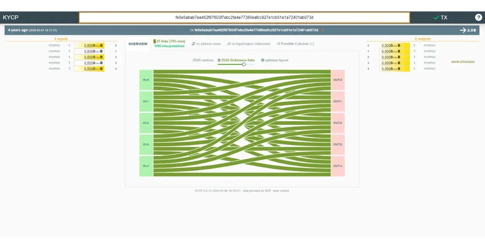

Kwa bahati mbaya, kufuatia kukamatwa kwa waanzilishi wa Samourai, zana hizi hazifanyi kazi tena.

Kwa kuwa sasa tumeangazia sainjoins kwa kina, tutaangalia mbinu zingine za faragha zinazopatikana kwenye Bitcoin katika sehemu ya mwisho ya kozi yetu. Tutaangalia viungo vya malipo, aina maalum za shughuli za pseudo-CoinJoin, itifaki tuli za Anwani (address), pamoja na hatua za kuimarisha usiri sio kwa kiwango cha shughuli yenyewe, lakini kwa kiwango cha mtandao wa nodi.

https://planb.network/tutorials/privacy/analysis/boltzmann-entropy-738e45af-18a6-4ce6-af1a-1bf58e15f1fe
# Kuelewa changamoto za mbinu zingine za hali ya juu za usiri

<partId>19989ae6-d608-4acf-b698-2cf1e7e5e6ae</partId>

## ulipaji kujiunga shughuli

<chapterId>c1e90b95-f709-4574-837b-2ec26b11286f</chapterId>

Kuunga sarafu kwa sasa ndiyo njia mwafaka zaidi ya kutambulisha kutokuwa na uhakika katika ufuatiliaji wa sehemu katika uchanganuzi wa mnyororo. Kama tulivyoona katika sura zilizopita, ili kupata mchanganyiko wa utendaji wa juu, pembejeo na matokeo lazima yawe sawa iwezekanavyo. Kwa kuongeza, ni muhimu kwamba sehemu ziunganishwe katika kundi kubwa iwezekanavyo ili kuongeza anonsets. Kwa hivyo, ili kuunga sarafu ziwe na ufanisi, lazima zihusishe idadi kubwa ya sehemu za sare. Wingi huu wa mahitaji unamaanisha kuwa shughuli za Kuunga sarafu zina muundo mgumu sana: kiasi hupangwa mapema, na washiriki wote lazima wazingatie ili kuhakikisha usawa wa mchakato. Kwa kuongeza, kuunga sarafu zinahitaji maingiliano kati ya washiriki wote na mratibu wakati wa ujenzi wa shughuli.

Mahitaji haya hufanya Kuunga sarafu isifae kwa malipo ya moja kwa moja. Kwa mfano, ikiwa una sarafu ya 1M Sats kwenye bwawa la Kuunga sarafu, kuitumia moja kwa moja kama malipo itakuwa ngumu. Itahitaji kusawazisha na washiriki wengine na mratibu ili kuunda muamala shirikishi kwa usahihi wakati unahitaji kufanya malipo, na kiasi cha ununuzi kitalazimika kuendana haswa na thamani ya sarafu yako, ambayo kwa hakika haiwezekani. Kwa hivyo, muamala wa Kuunga sarafu kwa asili yake ni shughuli ya kufagia shirikishi, yaani, kwa kawaida huwa ni wamiliki wale wale wa pembejeo tunazopata katika matokeo.

Hata hivyo, itakuwa ya kuvutia kuwa na miundo ya shughuli ambayo inaruhusu malipo kufanywa kwa njia ya vitendo, wakati huo huo kuanzisha shaka katika uchanganuzi wa minyororo. Hili ndilo hasa tutakalokuwa tukiangalia katika sura hii na inayofuata.

### Muamala wa ulipaji wa kujiunga ni nini?

Ulipaji wa kujiunga ni muundo mahususi wa muamala wa Bitcoin ambao huongeza faragha ya mtumiaji wakati wa kutumia kwa kushirikiana na mpokeaji malipo.

Mnamo mwaka wa 2015, LaurentMT alitaja kwa mara ya kwanza mbinu hii kwa jina la "*steganographic transactions*", kulingana na hati inayopatikana [hapa](https://gist.githubusercontent.com/LaurentMT/e758767ca4038ac40aaf/raw/c8125f6a3c3d0e90246dc96d3b603690ab6f1dcc/gistfile1.txt). Mbinu hii baadaye ilikubaliwa na pochi ya Samourai Wallet, ambayo mwaka 2018 ilikuwa mteja wa kwanza kuitekeleza kwa kutumia zana ya Stowaway. Wazo la payjoin pia linapatikana katika [BIP79](https://github.com/bitcoin/bips/blob/master/bip-0079.mediawiki), [BIP78](https://github.com/bitcoin/bips/blob/master/bip-0078.mediawiki), na [BIP77](https://payjoin.org/docs/how-it-works/payjoin-v2-bip-77/). Istilahi kadhaa hutumiwa kuelezea payjoin:

- PayJoin (malipo ya kujiunga);
- Stowaway;
- P2EP (*Pay-to-End-Point*) ;
- Shughuli ya Steganographic.

Kipengele maalum cha kulipa kujiunga kiko katika uwezo wake wa generate shughuli ambayo inaonekana ya kawaida kwa mtazamo wa kwanza, lakini kwa kweli ni mini kuunga sarafu kati ya watu wawili. Ili kufanikisha hili, muundo wa muamala unahusisha mpokeaji malipo katika pembejeo pamoja na mtumaji halisi. Kwa hivyo mpokeaji hujumuisha malipo kwake mwenyewe katikati ya shughuli ambayo yenyewe inamwezesha kulipwa.

Hebu tuchukue mfano ili kuelewa vizuri mchakato huu. Alice ananunua baguette kwa 4,000 Sats kwa kutumia UTXO ya 10,000 Sats na kuchagua kulipa kujiunga. Mwokaji wake, Bob, anaongeza UTXO ya 15,000 Sats yake kama pembejeo, ambayo anaipata kikamilifu kama pato, pamoja na 4,000 Sats ya Alice.


Katika mfano huu, Bob mwokaji huingia 15,000 Sats katika pembejeo na kuondoka na 19,000 Sats, tofauti ni hasa 4,000 Sats, yaani bei ya baguette. Kwa upande wa Alice, anaingia 10,000 Sats na kuishia na 6,000 Sats katika pato, ambayo inawakilisha usawa wa -4,000 Sats, yaani bei ya baguette. Ili kurahisisha mfano, nimeacha kwa makusudi gharama za Mining katika muamala huu.

### Ulipaji wa kujiunga ni wa nini?

Muamala wa kulipa kujiunga unatimiza malengo mawili, kuwezesha watumiaji kuimarisha usiri wa malipo yao.

Kwanza, kulipa kujiunga kunalenga kupotosha mwangalizi wa nje kwa kuunda chambo katika uchanganuzi wa mnyororo. Hili linawezekana na Legacy (Urithi) wa CIOH  (*Ingizo la Kawaida Ownership Heuristic*). Kama tulivyoona katika sehemu ya 3, kwa kawaida, wakati shughuli kwenye Blockchain ina pembejeo kadhaa, inachukuliwa kuwa pembejeo hizi zote ni za huluki moja au mtumiaji.

Kwa hiyo, wakati mchambuzi anachunguza shughuli ya kulipa kujiunga, anaongozwa kuamini kwamba pembejeo zote zinatoka kwa mtu mmoja. Hata hivyo, mtazamo huu si sahihi, kwa sababu mlipaji pia huchangia pembejeo pamoja na mlipaji halisi. Uchanganuzi wa mnyororo kwa hivyo unaelekezwa kwa tafsiri ambayo inageuka kuwa sio sawa.

Hebu tuchukue mfano wetu wa shughuli ya kulipa kujiunga ya malipo ya baguette:


Kuona muamala huu kwenye Blockchain, mtazamaji wa nje anayefuata utabiri wa kawaida wa uchanganuzi wa Blockchain atatoa tafsiri ifuatayo: "*Alice aliunganisha UTXO 2 kama pembejeo za muamala ili kulipa 19,000 Sats kwa Bob*".


Ufafanuzi huu ni wazi sio sahihi, kwa sababu kama unavyojua tayari, UTXO mbili kwenye pembejeo sio za mtu yule yule. Mmoja anatoka kwa Alice, mnunuzi wa baguette, na mwingine kutoka kwa Bob, mwokaji.


Kwa njia hii, uchanganuzi wa mwangalizi wa nje unaelekezwa kwenye hitimisho potofu, kuhakikisha kuwa usiri wa washikadau unahifadhiwa.

### Shughuli ya steganographic

Madhumuni ya pili ya Kulipa kujiunga ni kupotosha mwangalizi wa nje kuhusu kiasi halisi cha malipo ambayo yamefanywa. Kwa kuchunguza muundo wa muamala, mchambuzi anaweza kuamini kuwa malipo ni sawa na kiasi cha moja ya matokeo.

Ikiwa tunarudi kwenye mfano wetu wa ununuzi wa baguette, mchambuzi atafikiri kwamba kiasi cha malipo kinalingana na UTXO ya 6,000 Sats, au kwa UTXO ya 19,000 Sats. Katika kesi hii, mchambuzi afadhali kufikiria kuwa kiasi cha malipo ni 19,000 Sats, kwa sababu kuna UTXO 2 katika matokeo, angalau moja ambayo ni kubwa kuliko 6,000 Sats (hakuna sababu ya kimantiki ya kutumia UTXOs 2 kulipa 6,000 Sats ya kutosha kwa Sats ya kutosha kwa malipo haya ya kutosha6).


Lakini kwa ukweli, uchambuzi huu una kasoro. Kiasi cha malipo hakilingani na matokeo yoyote. Kwa kweli ni tofauti kati ya UTXO ya mpokeaji katika pato na UTXO ya mpokeaji katika ingizo.


Katika suala hili, shughuli ya Kulipa kujiunga inaangukia katika uwanja wa steganografia. Huruhusu kiasi halisi cha muamala kufichwa ndani ya muamala ghushi unaofanya kazi kama udanganyifu.

Steganografia ni mbinu ya kuficha habari ndani ya data au vitu vingine, ili uwepo wa habari iliyofichwa usionekane. Kwa mfano, ujumbe wa siri unaweza kufichwa ndani ya kitone katika maandishi yasiyohusiana, na kuifanya isionekane kwa macho (hii ndiyo mbinu ya [microdot](https://fr.wikipedia.org/wiki/Micropoint).

Tofauti na usimbaji fiche, ambao hufanya maelezo kutoeleweka bila ufunguo wa kusimbua, steganography haibadilishi habari. Inabaki kuonyeshwa kwa maandishi wazi. Badala yake, lengo lake ni kuficha uwepo wa ujumbe huo wa siri, ilhali usimbaji fiche unaonyesha wazi uwepo wa habari iliyofichwa, ingawa haiwezi kufikiwa bila ufunguo. Ndio maana jina la asili ya kulipa kujiunga ilikuwa "shughuli za steganografia".

Mfano unaweza kuchorwa kati ya kriptografia na SCoinjoin (arafu ya kujiunga), na kati ya steganografia na Kulipa kujiunga. kuunga sarafu ina sifa sawa na usimbaji fiche: njia hiyo inatambulika, lakini maelezo hayawezi kuelezeka. Kinyume chake, Kulipa kujiunga ni sawa na steganografia: habari inapatikana kwa kinadharia, lakini kwa kuwa njia ya kuficha haijatambui, inakuwa haipatikani.

### Je, ninatumiaje Ulipaji wa kujiunga?

Programu zinazojulikana zinazotumia PayJoin ni pamoja na Pochi la Sparrow, Pochi la Wasabi, Mutiny, BitMask, BlueWallet na JoinMarket, pamoja na kichakataji malipo cha ulipaji wa BTC.


Utekelezaji wa hali ya juu zaidi wa kulipa kujiunga ulikuwa Stowaway pekee kwenye Pochi la Samourai. Hata hivyo, tangu kukamatwa kwa waanzilishi wa programu, chombo hiki sasa kinafanya kazi kwa sehemu tu. Faida ya Stowaway ni kwamba ni itifaki ya kina, na rahisi kutumia, ambayo inasaidia kupokea na kutuma viungo vya malipo. Miamala iliyotiwa sahihi kiasi inaweza kubadilishwa wewe mwenyewe kwa kuchanganua misimbo kadhaa ya QR, au kiotomatiki na Tor kupitia Soroban. Chaguo la mwisho la mawasiliano halitumiki kwa sasa.


Ugumu wa kutumia kulipa kujiunga unatokana na utegemezi wake juu ya ushiriki wa mfanyabiashara. Kama mteja, huwezi kutumia Kulipa kujiunga ikiwa mfanyabiashara haauni. Hii inaongeza ugumu zaidi kwa mchakato wa ununuzi: sio tu ni vigumu kupata wafanyabiashara wanaokubali Bitcoin, lakini ikiwa pia unatafuta wale wanaounga mkono malipo, inakuwa ngumu zaidi.

Suluhisho mojawapo litakuwa kutumia miundo ya muamala inayoleta utata katika uchanganuzi wa msururu bila kuhitaji ushirikiano wa mpokeaji. Hili litatuwezesha kuboresha usiri wa malipo yetu bila kutegemea ushiriki hai wa wafanyabiashara. Hili ndilo hasa tutakalokuwa tukiliangalia katika sura inayofuata.

https://planb.network/tutorials/privacy/on-chain/payjoin-sparrow-wallet-087a0e49-61cd-41f5-8440-ac7b157bdd62
https://planb.network/tutorials/privacy/on-chain/payjoin-samourai-wallet-48a5c711-ee3d-44db-b812-c55913080eab
## Malipo ya mini-CoinJoin

<chapterId>300777ee-30ae-43d7-ab00-479dac3522c1</chapterId>

Unapotaka kutekeleza shughuli ya malipo huku ukidumisha usiri wa kiwango fulani, Kulipa kujiunga ni chaguo nzuri. Lakini kama tulivyoona, Kulipa kujiunga kunahitaji ushiriki wa mpokeaji. Kwa hivyo unafanya nini ikiwa mpokeaji anakataa kushiriki katika Kulipa kujiunga, au ikiwa unapendelea tu kutowahusisha? Njia moja mbadala ni kutumia muamala wa Stonewall au Stonewall x2. Hebu tuangalie kwa karibu aina hizi mbili za shughuli.

### Shughuli ya Stonewall

Stonewall ni aina mahususi ya shughuli ya Bitcoin iliyoundwa ili kuongeza usiri wa mtumiaji wakati wa kutumia kwa kuiga pseudo-CoinJoin kati ya watu wawili, bila kuwa mmoja. Kwa kweli, muamala huu haushirikiani. Mtumiaji anaweza kuijenga peke yake, akitumia tu UTXO anazomiliki kama pembejeo. Kwa hivyo unaweza kuunda muamala wa Stonewall kwa tukio lolote, bila kuhitaji kusawazisha na mtumiaji mwingine au mpokeaji.

Muamala wa Stonewall hufanya kazi kama ifuatavyo: kama ingizo la muamala, mtoaji hutumia UTXO 2 ambazo ni zake. Kwa pato, shughuli hiyo inazalisha UTXO 4, 2 ambazo ni kiasi sawa. UTXO zingine 2 zitaunda Ubadilishanaji wa kigeni. Kati ya matokeo 2 ya kiasi sawa, moja tu ndiyo yataenda kwa anayelipwa.

Kwa hivyo kuna majukumu 2 tu katika shughuli ya Stonewall:


- Mtoaji, ambaye hufanya malipo;
- Mpokeaji, ambaye huenda hajui aina mahususi ya muamala na anatarajia tu malipo kutoka kwa mtumaji.

Hebu tuchukue mfano ili kuelewa muundo huu wa shughuli. Alice anamwendea Bob mwokaji ili kununua baguette yake, ambayo inagharimu 4,000 Sats. Anataka kulipa kwa bitcoins, huku akidumisha aina fulani ya usiri kuhusu malipo yake. Kwa hivyo anaamua kujenga shughuli ya Stonewall kwa malipo.


Kwa kuchanganua shughuli hii, tunaweza kuona kwamba Bob mwokaji alipokea 4,000 Sats kama malipo ya baguette. Alice alitumia UTXO 2 kama pembejeo: moja kwa 10,000 Sats na moja kwa 15,000 Sats. Katika matokeo, amepata UTXO 3: moja kwa 4,000 Sats, moja kwa 6,000 Sats na moja kwa 11,000 Sats. Kwa hiyo Alice ana salio la jumla la -4,000 Sats kwenye shughuli hii, ambayo inalingana na bei ya baguette.

Katika mfano huu, nimepuuza kwa kusudi ada za mining (uchimbaji) ili kurahisisha kueleweka. Kwa kweli, gharama za ununuzi hubebwa kabisa na mtoaji.

### Je, malengo ya muamala wa Stonewall ni yapi?

Muundo wa Stonewall huongeza kiasi kikubwa cha entropy kwenye shughuli, ikitia ukungu kwenye mistari ya uchanganuzi wa minyororo. Ikionekana kutoka nje, shughuli kama hiyo inaweza kufasiriwa kama mini-CoinJoin kati ya watu wawili. Lakini kwa kweli, ni malipo. Kwa hiyo njia hii inajenga kutokuwa na uhakika katika uchanganuzi wa minyororo, au hata kusababisha miongozo ya uwongo.

Hebu tuchukue mfano wa Alice kwa Bob mwokaji. Shughuli kwenye Blockchain ingeonekana kama hii:


Mtazamaji wa nje anayetegemea Legacy (Urithi) wa uchanganuzi wa mnyororo wa kawaida anaweza kuhitimisha kimakosa kwamba "*watu wawili wametengeneza kuunga sarafu ndogo, na UTXO moja kila moja katika pembejeo na UTXO mbili kila moja katika pato*". Kuchanganua muamala huu kutoka nje hakuleti matumizi ya CIOH, kwani kuwepo kwa matokeo mawili ya kiasi sawa kunapendekeza muundo wa kuunga sarafu. Kwa mtazamo wa nje, CIOH haitumiki katika kesi hii maalum.


Ufafanuzi huu sio sahihi, kwa sababu, kama unavyojua, UTXO moja ilitumwa kwa Bob mwokaji, pembejeo 2 za UTXO zilitoka kwa Alice, na akapata matokeo 3 ya Ubadilishanaji.


Na kinachovutia hasa kuhusu muundo wa shughuli ya Stonewall ni kwamba, kwa mtazamo wa mwangalizi wa nje, inafanana na muamala wa Stonewall x2 kwa kila njia.

### Muamala wa Stonewall x2

Stonewall x2 ni aina nyingine mahususi ya muamala wa Bitcoin ambayo pia inalenga kuongeza usiri wa mtumiaji wakati wa kufanya matumizi, lakini wakati huu kwa kushirikiana na mtu wa tatu asiyehusika katika matumizi hayo. Njia hii inafanya kazi kama kuunga sarafu bandia kati ya washiriki wawili, wakati huo huo ikitoa malipo kwa mtu wa tatu.

Uendeshaji wa shughuli ya Stonewall x2 ni rahisi kiasi: tunatumia UTXO tuliyo nayo kufanya malipo, na kuomba usaidizi wa mtu mwingine ambaye pia anachangia kwa UTXO inayomilikiwa naye. Muamala unaishia na matokeo manne: mawili kati ya hayo kwa kiasi sawa, moja kwa ajili ya mpokeaji Anwani (address), nyingine kwa Anwani (address) inayomilikiwa na mshirika. UTXO ya tatu inarejeshwa kwa Anwani (address) nyingine ya mshirika, na kumwezesha kurejesha kiasi cha awali (hatua ya upande wowote kwake, modulo ya mining (uchimbaji) gharama), na UTXO ya mwisho inarudi kwa Anwani (address) mali yetu, ambayo inajumuisha malipo ya Ubadilishanaji.

Kwa hivyo majukumu matatu tofauti yanafafanuliwa katika shughuli za Stonewall x2:


- Mtoaji, ambaye hufanya malipo halisi;
- Mpokeaji, ambaye huenda hajui aina mahususi ya muamala na anatarajia tu malipo kutoka kwa mtumaji;
- Mshirika, ambaye hufanya bitcoins kupatikana ili kutoa shaka juu ya uchambuzi wa shughuli, wakati kurejesha fedha zake kwa ukamilifu mwishoni (hatua ya neutral kwa ajili yake, modulo ya gharama za mining (uchimbaji)).

Hebu turejee kwenye mfano wetu na Alice, ambaye yuko Bob the baker's kununua baguette yake, ambayo inagharimu 4,000 Sats. Anataka kulipa kwa bitcoins, huku akidumisha kiwango fulani cha usiri kuhusu malipo yake. Kwa hivyo anamwita rafiki yake Charles, ambaye atamsaidia katika mchakato huu.


Kuchanganua muamala huu, tunaweza kuona kwamba Bob mwokaji alipokea 4,000 Sats kama malipo ya baguette. Alice alitumia 10,000 Sats katika pembejeo na kurejesha 6,000 Sats katika pato, yaani salio halisi la -4,000 Sats, ambalo linalingana na bei ya baguette. Kuhusu Charles, alitoa 15,000 Sats katika pembejeo na akapokea matokeo mawili: moja ya 4,000 Sats na nyingine ya 11,000 Sats, ikitoa salio la 0.

Katika mfano huu, nimeacha ada kimakusudi ili kurahisisha kuelewa. Kwa kweli, ada za mining (uchimbaji) kwa ujumla hushirikiwa kwa usawa kati ya mtoaji wa malipo na mchangiaji.

### Je, malengo ya muamala wa Stonewall x2 ni yapi?

Kama muundo wa Stonewall, muundo wa Stonewall x2 huongeza entropy nyingi kwenye shughuli na kuchanganya uchanganuzi wa mnyororo. Ikionekana kutoka nje, shughuli kama hiyo inaweza kufasiriwa kama Kuunga sarafu kidogo kati ya watu wawili. Lakini kwa kweli, ni malipo. Kwa hiyo njia hii inajenga kutokuwa na uhakika katika uchanganuzi wa minyororo, au hata kusababisha miongozo ya uwongo.

Hebu tuchukue mfano wa Alice, Bob the Baker na Charles. Shughuli kwenye Blockchain ingeonekana kama hii:


Mtazamaji wa nje anayetegemea Legacy (Urithi) wa uchanganuzi wa kawaida anaweza kuhitimisha kimakosa kwamba "*Alice na Charles wamefanya kuunga sarafu ndogo, na UTXO moja kila moja katika ingizo na UTXO mbili kila moja katika matokeo*". Tena, kuchambua shughuli hii kutoka nje haiongoi matumizi ya ICOH, kwani kuwepo kwa matokeo mawili ya kiasi sawa kunaonyesha muundo wa kuunga sarafu. Kwa mtazamo wa nje, CIOH haitumiki katika kesi hii maalum.


Ufafanuzi huu sio sahihi, kwa sababu, kama unavyojua, UTXO moja imetumwa kwa Bob mwokaji, Alice ana pato moja tu la Ubadilishanaji, na Charles ana mbili.


Na kwa mara nyingine tena, kinachovutia hasa kuhusu muundo wa muamala wa Stonewall x2 ni kwamba, kwa mtazamo wa mwangalizi wa nje, unafanana na ule wa muamala wa Stonewall kwa kila njia.

### Kuna tofauti gani kati ya Stonewall na Stonewall x2?

Muamala wa StonewallX2 hufanya kazi sawasawa na muamala wa Stonewall, isipokuwa ule wa kwanza unaoshirikiana, ilhali ule wa mwisho haufanyi kazi. Kama tulivyoona, muamala wa Stonewall x2 unahusisha ushiriki wa mtu wa tatu (Charles), ambaye yuko nje ya malipo, na ambaye atafanya bitcoins zake zipatikane ili kuimarisha usiri wa shughuli hiyo. Katika shughuli ya kawaida ya Stonewall, jukumu la mshirika linachukuliwa na mtumaji.


Kwa mtazamo wa nje, muundo wa shughuli ni sawa kabisa.


Ukweli kwamba miundo hii miwili ya miamala inashiriki muundo sawa inamaanisha kuwa hata kama mwangalizi wa nje ataweza kutambua muundo wa "Stonewall(x2)", hatakuwa na maelezo yote. Hataweza kubainisha ni ipi kati ya UTXO mbili za kiasi sawa inalingana na malipo. Zaidi ya hayo, hataweza kubainisha ikiwa UTXO mbili zilizo na pembejeo zinatoka kwa watu wawili tofauti (Stonewall x2) au kama ni za mtu mmoja ambaye ameziunganisha (Stonewall).

Hoja hii ya mwisho inatokana na ukweli kwamba miamala ya Stonewall x2 inafuata muundo sawa kabisa na shughuli za Stonewall. Inaonekana kutoka nje, na bila maelezo ya ziada ya muktadha, haiwezekani kutofautisha muamala wa Stonewall kutoka kwa muamala wa Stonewall x2. Ya awali si shughuli shirikishi, ambapo ya mwisho ni. Hii inaongeza shaka zaidi kwa uchanganuzi wa moja ya miamala hii.

### Je, miamala ya Stonewall na Stonewall x2 inapaswa kutumika lini?

Mantiki inapaswa kuwa kama ifuatavyo unapotaka kutumia zana ya usiri kwa gharama:


- Kama kipaumbele, tunaweza kuchagua kutengeneza kulipa kujiunga;
- Ikiwa mfanyabiashara hataauni viungio vya malipo, muamala shirikishi unaweza kufanywa na mtu mwingine nje ya malipo kwa kutumia muundo wa Stonewall x2;
- Ikiwa huwezi kupata mtu yeyote wa kufanya muamala wa Stonewall x2, unaweza kufanya muamala wa Stonewall pekee, ambao utaiga tabia ya muamala wa Stonewall x2.

### Je, ninatumia vipi shughuli za Stonewall na Stonewall x2?

Miamala ya Stonewall na Stonewall x2 inapatikana kwenye programu ya Pochi la Samourai na programu ya Pochi la Sparrow.


Hata hivyo, kama ilivyo kwa viungo vya malipo, kufuatia kukamatwa kwa waanzilishi wa Samourai, miamala ya Stonewall x2 sasa inafanya kazi tu kwa kubadilishana PSBTs kati ya pande zinazohusika. Kwa bahati mbaya, Ubadilishanaji otomatiki kupitia Soroban haupatikani tena.

Inawezekana pia kutekeleza aina hii ya shughuli kwa mikono kutoka kwa programu yoyote ya Pochi la Bitcoin.

Katika sura inayofuata, tutaangalia mbinu nyingine ya usiri ambayo haijulikani kwa kiasi, lakini ambayo ni muhimu sana kama inayosaidia yale ambayo tayari tumejifunza.

https://planb.network/tutorials/privacy/on-chain/stonewall-033daa45-d42c-40e1-9511-cea89751c3d4
https://planb.network/tutorials/privacy/on-chain/stonewall-x2-05120280-f6f9-4e14-9fb8-c9e603f73e5b
## ricochets

<chapterId>db9a20ac-a149-443d-884b-ea6c03f28499</chapterId>

Utumiaji wa miundo ya miamala ya Bitcoin ambayo huongeza utata katika uchanganuzi wa mfululizo, kama vile kuunga sarafu, ni ya manufaa hasa kwa ulinzi wa faragha. Hata hivyo, kama tulivyojadili katika sura ya viungio vya malipo, miamala ya kuunga sarafu inaweza kutambulika kwa kawaida kwenye mnyororo. Kumbuka mlinganisho tuliochora kati ya usimbaji fiche na kuunga sarafu: faili inaposimbwa kwa njia fiche, mtu wa tatu ambaye anagundua faili iliyosimbwa hawezi kufikia yaliyomo, lakini anaweza kutambua kwa uwazi kuwa faili imerekebishwa ili kuficha yaliyomo. Vile vile hutumika kwa kuunga sarafu: wakati mchambuzi anachunguza shughuli ya kuunga sarafu, ingawa hawezi kuanzisha viungo vya moja kwa moja kati ya pembejeo na matokeo (na kinyume chake), hata hivyo anaweza kutambua kwamba shughuli iliyozingatiwa ni Kuunga sarafu.

Kulingana na jinsi unavyokusudia kutumia sehemu yako baada ya mizunguko ya kuunga sarafu, ukweli kwamba umepitia mchakato huu unaweza kuwa shida. Kwa mfano, ikiwa unapanga kuuza sarafu yako kwenye jukwaa lililodhibitiwa la ubadilishanaji, lakini hivi karibuni limepitia kuunga sarafu, zana ya uchambuzi wa msururu wa jukwaa litagundua ukweli huu. Huenda jukwaa likakataa kukubali UTXO yako iliyounganishwa, au hata kudai maelezo kutoka kwako, kukiwa na hatari ya akaunti yako kusimamishwa au pesa zako kufungiwa. Katika baadhi ya matukio, mfumo unaweza pia kuripoti tabia yako kwa mamlaka za serikali (hii ni, kwa mfano, kile ambacho TRACFIN inahitaji kwa PSAN nchini Ufaransa).

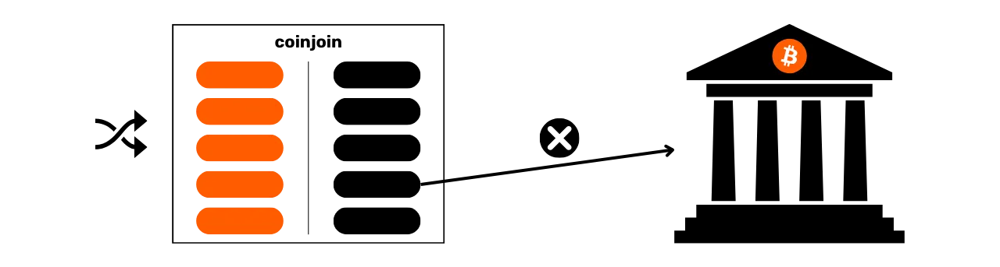

Tunachohitaji kuepuka hili ni zana inayoweza kutia ukungu athari za zamani za sarafu ya Bitcoin, ili kurejesha aina fulani ya uwezekano wa kugundulika. Hii ndio hasa madhumuni ya ricochet.


### Ricochet ni nini?

Ricochet ni mbinu inayojumuisha kufanya miamala kadhaa ya uwongo kuelekea wewe mwenyewe (kufagia) kuiga uhamishaji wa Umiliki wa Bitcoin. Zana hii inatofautiana na miundo mingine ya muamala ambayo tumeijadili, kwa kuwa haipati jina tarajiwa, bali ni aina ya kutokujulikana rejea. Kwa kweli, Ricochet hutia ukungu ubainifu unaoweza kuhatarisha uwezaji wa sarafu ya Bitcoin kutokana na siku zake za nyuma.

Ili kulainisha alama iliyoachwa na tukio la zamani kwenye sarafu, kama vile mizunguko ya kuunga sarafu, ricochet hutekeleza miamala minne mfululizo ambapo mtumiaji huhamisha pesa kwake kwa Anwani (address) tofauti.


Baada ya mlolongo huu wa shughuli, zana ya ricochet hatimaye inaelekeza bitcoins hadi mahali pa mwisho, kama vile jukwaa la Ubadilishanaji.


Lengo ni kuunda umbali unaoathiri uwezekano wa sarafu, kama vile muamala wa kujiunga sarafu, na kitendo cha mwisho cha matumizi, ambacho kinaweza kukataa sarafu hii kwa sababu ya zamani. Kwa hivyo, zana za uchanganuzi wa mnyororo zinaweza kuhitimisha kuwa pengine kulikuwa na mabadiliko ya Umiliki baada ya tukio, na kuzingatia sarafu hii kuwa ya kuvu. Katika kesi ya kuunga sarafu, zana za uchambuzi wa Blockchain zinaweza kisha kudhani kuwa sio mtu yule yule aliyetuma bitcoins na kutekeleza kuunga sarafu, na kwa hiyo hakuna maana katika kuchukua hatua dhidi ya mtumaji.


### Kwa nini inafanya kazi?

Inakabiliwa na njia hii ya ricochet, mtu anaweza kufikiria kuwa programu ya Chainalysis (uchambuzi wa mnyororo) ingeongeza uchunguzi wake zaidi ya midundo minne. Walakini, mifumo hii inakabiliwa na shida katika kuboresha kiwango cha ugunduzi. Wanapaswa kuweka kikomo kwa idadi ya humle ambapo baada ya hapo wanakubali kwamba mabadiliko ya mali pengine yamefanyika, na kwamba kiungo kilicho na tukio la awali (kama vile kuunga sarafu) kinapaswa kupuuzwa.


Hata hivyo, kuweka kizingiti hiki ni hatari: kila kiendelezi katika idadi ya miruko inayozingatiwa huongeza kwa kasi kiwango cha chanya zisizo za kweli, yaani, watu binafsi waliotiwa alama kimakosa kuwa washiriki katika tukio, wakati operesheni ilifanywa na mtu mwingine. Hali hii inaleta hatari kubwa kwa kampuni hizi, kwani chanya za uwongo husababisha kutoridhika, ambayo inaweza kuwapeleka wateja walioathirika kwenye shindano. Kwa muda mrefu, kiwango cha juu cha ugunduzi hupelekea jukwaa kupoteza wateja zaidi kuliko washindani wake, jambo ambalo linaweza kutishia uwezo wake wa kutegemewa. Kwa hiyo ni ngumu kwa majukwaa haya kuongeza idadi ya bounces iliyozingatiwa, na mara nyingi 4 ni idadi ya kutosha kukabiliana na uchambuzi wao.

Jambo linalozingatiwa hapa linalingana kwa kiasi fulani na nadharia ya digrii sita za utengano.

Nadharia ya digrii sita za utengano inapendekeza kwamba kila mtu Duniani ameunganishwa na mwingine yeyote kwa mlolongo wa uhusiano unaojumuisha wapatanishi sita zaidi. Kwa hiyo ingetosha kupita msururu wa watu sita, kila mmoja akijua anayefuata, ili kumfikia mtu yeyote duniani.

Kwa upande wa shughuli za Bitcoin, tunapata jambo kama hilo. Kwa kufuatilia idadi ya kutosha ya miamala ya Bitcoin, bila shaka tutakutana na Kuunga sarafu. Mbinu ya ricochet inachukua faida ya kanuni hii kwa kutumia idadi kubwa ya humle kuliko mifumo ya Ubadilishanaji inavyoweza kufuatilia. Ikiwa mifumo itaamua kufuatilia miamala zaidi, basi inawezekana kuongeza hop ya ziada ili kukwepa hatua hii.

### Wakati na jinsi ya kutumia ricochet?

Kesi ya kawaida ya matumizi ya ricochet hutokea wakati ni muhimu kuficha ushiriki wa awali katika Kuunga sarafu kwenye UTXO unayomiliki. Kwa hakika, ni bora kuepuka kuhamisha bitcoins ambazo zimepitia kuunga sarafu kwa vyombo vinavyodhibitiwa. Walakini, ikiwa utajikuta huna chaguo lingine, haswa katika hitaji la haraka la kufilisi bitcoins kwa sarafu ya serikali, Ricochet hutoa suluhisho bora.

Njia hii ni nzuri sio tu kwa kuunga sarafu, lakini pia kwa alama nyingine yoyote ambayo inaweza kuhatarisha uwezekano wa sehemu.

Wazo la mbinu hii ya ricochet awali lilitoka kwa timu za Pochi la Samourai, ambazo ziliiunganisha katika maombi yao ya kufanyia mchakato kiotomatiki. Huduma sio bure kwenye Samourai, kwani ricochet inahusisha ada ya huduma ya 100,000 Sats, pamoja na gharama za mining (uchimbaji). Kwa hiyo matumizi yake yanapendekezwa kwa uhamisho wa kiasi kikubwa.


Programu ya Samurai inatoa anuwai mbili za ricochet:


- Ricochet iliyoimarishwa, au "uwasilishaji kwa kasi", ambayo inatoa faida ya kueneza malipo ya huduma ya Samurai katika shughuli tano zinazofuatana. Chaguo hili pia huhakikisha kwamba kila shughuli inatangazwa kwa wakati tofauti na kurekodiwa katika kizuizi tofauti, ikiiga kwa karibu iwezekanavyo tabia ya mmiliki kubadilika. Ingawa ni polepole, njia hii ni bora kwa wale ambao hawana haraka, kwani huongeza ufanisi wa ricochet kwa kuimarisha upinzani wake kwa Chainalysis (uchambuzi wa mnyororo);


- Ricochet ya kawaida, ambayo imeundwa kutekeleza operesheni kwa kasi, ikitangaza shughuli zote kwa muda uliopunguzwa. Njia hii, kwa hiyo, inatoa usiri mdogo na upinzani mdogo kwa uchambuzi kuliko njia iliyoimarishwa. Inapaswa kutumika tu kwa usafirishaji wa haraka.


Ricocheting ina maana ya kutuma bitcoins kwako mwenyewe. Inawezekana kabisa kuweka bitcoins kwa mikono kwenye programu yoyote ya Pochi, bila kutumia zana maalum. Unachohitajika kufanya ni kuhamisha sarafu sawa kwako mwenyewe, kwa kutumia mpya, tupu ya Anwani (address) kila wakati.

Katika sura inayofuata, tunaangalia mbinu tofauti za uhamisho wa siri wa Umiliki. Njia hizi hutofautiana kwa kiasi kikubwa na zile ambazo tumechunguza hadi sasa, kwa suala la uendeshaji na matokeo.

https://planb.network/tutorials/privacy/on-chain/ricochet-e0bb1afe-becd-44a6-a940-88a463756589
## Uhamisho wa siri wa Ownership

<chapterId>a2067036-849c-4d6b-87d2-44235cfae7a1</chapterId>

Mbinu nyingine ya usiri ya Bitcoin ni uhamisho wa siri wa Umiliki. Njia hii inalenga kuhamisha Umiliki wa Bitcoins kutoka kwa mtu mmoja hadi mwingine, na kinyume chake, bila shughuli hiyo kuonekana wazi kwenye Blockchain. Hebu tuangalie mbinu mbalimbali zilizopo, pamoja na faida na hasara zao.

### Ubadilishanaji wa sarafu

Coinwap inategemea dhana rahisi: hutumia mikataba mahiri kuwezesha uhamishaji wa Umiliki wa Bitcoin kati ya watumiaji wawili, bila hitaji la uaminifu na bila uhamishaji huu kuonekana wazi kwenye Blockchain.


Wacha tufikirie mfano wa ujinga na Alice na Bob. Alice anashikilia BTC 1 iliyolindwa kwa ufunguo wa faragha $A$, na Bob pia anashikilia BTC 1 iliyolindwa kwa ufunguo wa faragha $B$. Kinadharia wangeweza Kubadilishana funguo zao za kibinafsi kupitia njia ya mawasiliano ya nje ili kutekeleza uhamishaji wa siri.


Walakini, njia hii ya ujinga inatoa hatari kubwa katika suala la uaminifu. Hakuna cha kumzuia Alice kuweka nakala ya ufunguo wa faragha wa $A$ baada ya Ubadilishanaji na kuitumia baadaye kuiba bitcoins, mara ufunguo ukiwa mikononi mwa Bob.


Zaidi ya hayo, hakuna hakikisho kwamba Alice hatapokea ufunguo wa faragha wa Bob $B$ na hatawahi kupitisha ufunguo wake wa faragha $A$ katika Ubadilishanaji. Kwa hivyo ubadilishanaji  huu unategemea kuaminiana kupita kiasi kati ya wahusika, na haina ufanisi katika kuhakikisha uhamishaji wa siri wa Umiliki.


Ili kutatua matatizo haya na kuwezesha ubadilishanaji kati ya wahusika ambao hawaaminiani, tutatumia mifumo ya Smart contract badala yake. Smart contract ni programu ambayo hutekeleza kiotomatiki masharti yaliyoainishwa awali yanapofikiwa. Kwa upande wetu, hii inahakikisha kwamba ubadilishanaji wa mali unafanyika moja kwa moja, bila ya haja ya uaminifu wa pande zote.

Hili linaweza kufikiwa kwa kutumia HTLC (*Mikataba Iliyofungwa kwa Muda wa Hash*) au PTLC (*Mikataba Iliyofungwa kwa Muda wa Pointi*). Itifaki hizi mbili hufanya kazi kwa njia sawa, kwa kutumia mfumo wa kufunga muda ambao huhakikisha kwamba Ubadilishanaji unakamilika kwa mafanikio au kughairiwa kabisa, hivyo basi kulinda uadilifu wa fedha za pande zote mbili. Tofauti kuu kati ya HTLC na PTLC ni kwamba HTLC hutumia heshi na picha za awali ili kulinda muamala, huku PTLC inatumia Sahihi za Adapta.

Katika hali ya kubadilishana sarafu kwa kutumia HTLC au PTLC kati ya Alice na Bob, Ubadilishanaji unafanyika kwa usalama: ama unafaulu na kila mmoja kupokea BTC ya mwingine, au inashindikana na kila mmoja anaweka BTC yake. Hii inafanya kuwa haiwezekani kwa upande wowote kudanganya au kuiba BTC ya mwingine.

> *HTLC pia ni njia inayotumika kuelekeza malipo kwa njia salama kupitia njia mbili za Lightning Network*
Utumiaji wa Sahihi za Adapta ni ya kufurahisha sana katika muktadha huu, kwani hufanya iwezekane kutengana na hati za kitamaduni (utaratibu ambao wakati mwingine hujulikana kama "_scriptless scripts_"). Kipengele hiki hupunguza gharama zinazohusiana na Ubadilishanaji. Faida nyingine kuu ya Sahihi za Adapta ni kwamba hazihitaji matumizi ya Hash ya kawaida kwa pande zote mbili za shughuli, na hivyo kuepuka haja ya kufichua kiungo cha moja kwa moja kati yao katika aina fulani za Ubadilishanaji.

### Sahihi za Adapta

Sahihi za Adapta ni mbinu fiche inayounganisha sahihi sahihi na sahihi ya ziada, inayoitwa "sahihi_ya adapta_", ili kufichua data ya siri. Utaratibu huu umeundwa kwa namna ambayo ujuzi wa 2 kati ya 3 ufuatao vipengele: sahihi halali, sahihi ya adapta na siri, inatuwezesha kutafakari kipengele cha tatu kilichokosekana. Sifa ya kuvutia ya njia hii ni kwamba, ikiwa tunajua saini ya adapta ya rika letu na sehemu maalum kwenye mchirizo wa duaradufu inayohusishwa na siri inayotumika kukokotoa sahihi ya adapta hiyo, tunaweza kupata sahihi ya adapta yetu ambayo itaendana na siri hiyo hiyo, bila kupata ufikiaji wa moja kwa moja kwa siri yenyewe.

Katika ubadilishanaji wa sarafu, matumizi ya Sahihi za Adapta huwezesha ufichuaji kwa wakati mmoja wa vipande viwili vya taarifa nyeti kati ya washiriki, hivyo basi kuepuka hitaji la kuaminiana. Hebu tuchukue mfano ili kuelezea mchakato huu na Alice na Bob, ambao wanataka Ubadilishanaji kumiliki 1 BTC kila mmoja, lakini hawaaminiani. Wanatumia Sahihi za Adapta ili kuondoa hitaji la kuaminiana katika Ubadilishanaji huu. Hivi ndivyo wanavyofanya:


- Alice anaanzisha Ubadilishanaji kwa kuunda muamala wa $m_A$ ambao hutuma 1 BTC kwa Bob. Anatengeneza sahihi $s_A$, ambayo inaidhinisha muamala huu, kwa kutumia ufunguo wake wa faragha $p_A$ ($P_A = p_A \cdot G$), Nonce $n_A$ ($N_A = n_A \cdot G$) na siri $t$ ($T = t \cdot G$) :

$$s_A = n_A + t + H(N_A + T \sambamba P_A \sambamba m_A) \cdot p_A$$


- Alice anakokotoa saini ya adapta $s_A'$ kwa kutoa siri $t$ kutoka sahihi yake ya kweli $s_A$ :

$$s_A' = s_A - t$$


- Alice anamtumia Bob adapta yake sahihi $s'_A$, muamala wake ambao haujatiwa saini $m_A$, nukta inayolingana na siri ($T$), na uhakika unaolingana na Nonce ($N_A$). Vipengele hivi vinaunda kile kinachojulikana kama "adapta". Ni muhimu kutambua kwamba, kwa habari hii tu, Bob hawezi kurejesha BTC ya Alice.
- Hata hivyo, Bob anaweza kuangalia kwamba Alice hajaribu kumwibia. Ili kufanya hivyo, anakagua ikiwa saini ya adapta ya Alice $s_A'$ kweli inalingana na ununuzi uliopendekezwa $m_A$. Ikiwa equation ifuatayo ni sahihi, basi anaweza kuwa na uhakika kwamba adapta ya sahihi ya Alice ni halali:

$$s_A' \cdot G = N_A + H(N_A + T \sambamba P_A \sambamba m_A) \cdot P_A$$


- Uthibitishaji huu unampa Bob dhamana ya kutosha kwamba anaweza kuendelea na Ubadilishanaji kwa ujasiri kamili. Kisha anaunda muamala wake mwenyewe $m_B$, inayokusudiwa kutuma BTC 1 kwa Alice, na kutengeneza sahihi ya adapta yake $s_B'$, ambayo pia itaunganishwa kwa siri sawa $t$. Katika hatua hii, ni Alice pekee anayejua thamani ya $t$; Bob anajua tu pointi inayolingana $T$ ambayo Alice amemwandikia:

$$s_B' = n_B + H(N_B + T \sambamba P_B \sambamba m_B) \cdot p_B$$


- Bob anamtumia Alice sahihi ya adapta yake $s_B'$, muamala wake ambao haujatiwa sahihi $m_B$, pamoja na uhakika unaolingana na siri ($T$) na uhakika unaolingana na Nonce ($N_B$). Alice, ambaye anajua siri ya $t$, sasa anaweza kuchanganya sahihi ya adapta ya Bob $s_B'$ na siri hii kwa kuzalisha sahihi $s_B$ kwa muamala $m_B$ ambao itahamishia BTC ya Bob kwake:

$$s_B = s_B' + t$$

$$(s_B' + t) \cdot G = N_B + T + H(N_B + T \sambamba P_B \sambamba m_B) \cdot P_B$$


- Alice anatangaza muamala huu uliotiwa saini wa $m_B$ kwenye Bitcoin Blockchain ili kupata BTC iliyoahidiwa na Bob. Bob anapoona muamala huu kwenye Blockchain, anaweza kutoa sahihi $s_B = s_B' + t$. Kwa habari hii, Bob basi anaweza kutenga siri maarufu $t$ aliyohitaji:

$$t = (s_B' + t) - s_B' = s_B - s_B'$$


- Na siri hii $t$ ilikuwa kipengele pekee kilichokosekana kwa Bob hadi kuzalisha sahihi $s_A$ kutoka sahihi ya adapta ya Alice $s_A'$. Sahihi hii inathibitisha muamala wa $m_A$, ambao hutuma BTC kutoka Alice hadi Bob. Kisha Bob anakokotoa $s_A$ na kutangaza muamala wa $m_A$ kwenye Blockchain:

$$s_A = s_A' + t$$

$$(s_A' + t) \cdot G = N_A + T + H(N_A + T \sambamba P_A \sambamba m_A) \cdot P_A$$

Wacha tufanye muhtasari wa jinsi Sahihi ya Adapta inavyofanya kazi katika ubadilishaji wa sarafu. Hapo awali, Alice hutuma Bob shughuli isiyosajiliwa ikifuatana na adapta, na kumwezesha Bob kuthibitisha kwamba siri iliyofunuliwa baadaye itampa upatikanaji wa bitcoins. Kwa kujibu, Bob hutuma Alice muamala wake mwenyewe ambao haujatiwa sahihi na adapta. Kisha Alice anaweza kukamilisha shughuli ya Bob na kurejesha bitcoins kwa kutangaza shughuli halali ya shukrani kwa siri. Shughuli hii inapochapishwa kwenye Blockchain, Bob ana uwezo wa kutoa siri na hivyo kufungua shughuli ya Alice. Kwa hivyo, ikiwa Alice ataanzisha uhamisho wa Bitcoin ya Bob, Bob anaweza, kwa upande wake, kufikia Bitcoin ya Alice bila hitaji la kuaminiana.

Kumbuka kuwa ubadilishaji wa sarafu ulipendekezwa kwanza na [Gregory Maxwell mnamo Oktoba 2013 kwenye BitcoinTalk](https://bitcointalk.org/index.php?topic=321228.0).

### Kubadilishana kwa atomiki

Kwa njia sawa ya kubadilishana sarafu, na kutumia aina sawa za mikataba ya busara, inawezekana pia kufanya ubadilishaji wa atomiki. Kubadilishana kwa atomiki huwezesha Ubadilishanaji wa moja kwa moja ya sarafu tofauti za siri, kama vile BTC na XMR, kati ya watumiaji wawili bila hitaji la uaminifu au kuingilia kati kwa mpatanishi. Ubadilishanaji huu unaitwa "atomiki" kwa sababu yana matokeo mawili tu yanayowezekana: ama ubadilishanaji umefaulu na pande zote mbili zimeridhika, au itashindikana na kila moja ibaki na sarafu zao za siri, hivyo basi kuondoa hitaji la kumwamini mhusika mwingine.


Ubadilishanaji wa atomiki na ubadilishanaji wa sarafu hushiriki mbinu sawa ya uendeshaji na hutoa faida na hasara sawa katika suala la usiri. Hakika, kwa mtazamo wa Bitcoin, ubadilishaji wa atomiki unalinganishwa na ubadilishanaji wa sarafu unaofanywa katika hatua mbili. Kwanza, sisi kubadilishana BTC yetu kwa cryptocurrency nyingine, basi cryptocurrency hii inaweza kubadilishwa kwa BTC nyingine. Mwishowe, tunapata BTC ya mtumiaji mwingine. Hii ndiyo sababu, katika uchanganuzi wa masuala ya usiri, ninaweka itifaki hizi mbili chini ya kitengo cha ubadilishanaji wa siri za umiliki.


Jihadharini, hata hivyo, kwamba tofauti na ubadilishanaji wa sarafu, ubadilishaji wa atomiki unaweza kuwa na usawa katika suala la ukwasi linalopatikana, haswa katika ubadilishanaji wa BTC/XMR. Kwa ujumla ni rahisi kubadilisha bitcoins kwa altcoins, kwa kuwa kuna mahitaji makubwa ya bitcoins, ambayo huweka malipo ya chini kwa mwelekeo huu wa ubadilishaji. Hata hivyo, kubadilishana altcoins kwa BTC inaweza kuwa ngumu zaidi kutokana na mahitaji ya chini, mara nyingi husababisha malipo ya juu sana.

Hatimaye, wakati ubadilishaji wa atomiki unahusisha bitcoins za onchain na bitcoins kwenye Lightning Network, tunazungumza juu ya "kubadilishana kwa manowari".

### Je, ni muhimu kweli?

Uhamisho wa siri wa umiliki, kama vile ubadilishaji wa sarafu na ubadilishanaji wa atomiki, una faida ya ujanja wa uchanganuzi wa mnyororo. Mbinu hizi zinaweza kupendekeza kwamba shughuli zihusishe mtumiaji yule yule, ilhali Umiliki halisi umebadilisha mikono. Hata hivyo, kasoro kuu ya njia hizi ni kwamba wao ni hatari sana bila matumizi ya mbinu ya ziada ya kuvunja historia ya sarafu.

Hakika, wakati Alice anabadilishana sarafu au kubadilishana atomiki na Bob, anabadilishana umiliki wa bitcoins zake na zile za Bob. Katika kesi ya ubadilishaji wa atomiki, Ubadilishanaji unajumuisha Altcoin, lakini kanuni inabakia sawa. Kwa hivyo, Alice anaishia na sarafu ya $ B $ na Bob na sarafu ya $ A $. Hii inaongeza shaka kwa Chainalysis (uchambuzi wa mnyororo), lakini historia ya sarafu inabakia kufuatiliwa. Mchambuzi akichunguza sehemu ya $A$, anaweza kufuatilia shughuli za awali za Alice, na kinyume chake kwa sehemu ya $B$.


Kwa mtazamo wa Alice, hatari ni kwamba historia ya sarafu ya $B$ inaweza kuchukuliwa kuwa ya kutiliwa shaka na vyombo fulani. Kama, kwa mfano, Bob angepata sarafu ya $B$ kupitia kitendo cha uhalifu kama vile udukuzi, sarafu hiyo ingesalia ikihusishwa na shughuli zake zisizo halali. Alice basi angeweza kujikuta akimiliki sarafu ambayo hangeweza kuhamisha kwenye majukwaa yanayodhibitiwa ya Ubadilishanaji bila kuhatarisha pesa zake kugandishwa, au hata kushutumiwa kwa uhalifu wa Bob, ingawa hakuwa na uhusiano wowote nao.


Bila shaka, mbinu za usiri kama vile kubadilishana sarafu au kubadilishana atomiki hupendelewa na wahalifu ambao fedha zao ziko chini ya uangalizi wa mamlaka. Itifaki hizi huwawezesha kutupa bitcoins zao chini ya uangalizi katika Ubadilishanaji kwa bitcoins zinazoweza kuvuliwa kikamilifu. Pia huwawezesha kuunda ubadilishaji, kwa kuelekeza mamlaka kwa watumiaji wengine. Kwa hivyo kuna kusudi maradufu kwa watu hawa.

Ukiwa na Kuunga sarafu, hata kama sarafu yako imechanganywa na bitcoins zinazofuatiliwa, historia ya sarafu imevunjwa, ikitoa aina fulani ya ukataaji unaokubalika ambao haupo katika itifaki za siri za Umiliki kama vile ubadilishaji wa sarafu au ubadilishaji wa atomiki.


Iwapo Alice angependa kuepuka hatari yoyote, lazima lazima atumie mbinu kuvunja historia ya sarafu ya $B$, kama vile kuipitisha kwenye saini. Hii inaleta swali kuhusu manufaa ya kuchanganya uhamisho wa siri wa Umiliki na Kuunga sarafu. Kuunga sarafu, kwa kuvunja historia ya sarafu, tayari inatoa kiwango cha kutosha cha usiri kwa Alice. Kwa hivyo, maoni yangu ni kwamba ikiwa Alice anatafuta kulinda faragha yake, itakuwa busara kuendelea moja kwa moja kwenye Kuunga sarafu badala ya kushiriki ubadilishanaji wa sarafu unaofuatwa na Kuunga sarafu.

Ili mbinu za siri za uhamishaji wa Umiliki ziwe na ufanisi wa kweli, na kuepuka hatari ya kuunganisha historia ya mtumiaji $A$ kwa mtumiaji $B$, itakuwa muhimu sana kwa matumizi yao kujulikana kote. Ikiwa ubadilishanaji wa sarafu unatumiwa kwa wingi na wenye mamlaka wanafahamu jambo hili la kawaida, basi aina inayokubalika ya kukataa inaweza kuanzishwa. Hata hivyo, mradi utumizi wa uhamisho huu unabaki kuwa mdogo, nadhani njia hizi zitabaki kuwa hatari sana kwa watumiaji.

Hadi sasa, tumechunguza mbinu za usiri hasa katika kiwango cha miamala yenyewe. Katika sura inayofuata, tutaangalia masuala katika kiwango cha mtandao na usambazaji wa shughuli.

## Faragha kwenye mtandao wa P2P

<chapterId>04a2467b-db84-4076-a9ff-919be5135106</chapterId>

Katika Sehemu ya 4, tulijadili umuhimu wa kutumia nodi kamili ili kulinda usiri wa miamala yako. Hata hivyo, ni muhimu kuelewa kwamba nodi yako yenyewe inaweza kukabiliwa na mashambulizi ya kutaka kutoa maelezo kuhusu shughuli zako. Katika sura hii, kwa hivyo, tutaangalia hatua mbalimbali unazoweza kuchukua ili kulinda faragha yako, si kwa kiwango cha miamala yenyewe au mtiririko wa Bitcoin, lakini katika kiwango cha mtandao.

### Dandelion

Njia moja ya kuepuka mashambulizi mbalimbali ya kufuta utambulisho ni kutumia pendekezo la Dandelion. Itifaki hii ya utangazaji ilirasimishwa katika BIP156, lakini haijawahi kutekelezwa kwenye Bitcoin.

Wazo la Dandelion ni kuboresha usiri wa uelekezaji wa shughuli katika mtandao wa Bitcoin ili kukabiliana na aina mbalimbali za mashambulizi. Kusudi lake kuu ni kuficha nodi ya chanzo ambayo hapo awali ilitangaza shughuli kwenye mtandao. Ufichuaji wa nodi hii unaweza kufanya iwezekane kuunganisha muamala wa Bitcoin kwa Anwani (address) ya IP maalum (ikiwa nodi inafanya kazi kwenye clearnet), ambayo inaweza kutoa mahali pa kuingilia kwa uchanganuzi wa minyororo.

Uhusiano huu kati ya shughuli kwenye Bitcoin na Anwani (address) ya IP inawakilisha hatari kubwa kwa usiri wa mtumiaji. Hakika, huluki nyingi ziko katika nafasi ya kuunganisha Anwani (address) ya IP kwa urahisi na utambulisho wa kibinafsi. Hii inajumuisha serikali na watoa huduma za mtandao. Zaidi ya hayo, maelezo haya yanaweza kupatikana kwa umma, kwa mfano, ikiwa Anwani (address) ya IP yako na data ya kibinafsi itavuja wakati hifadhi data ya tovuti imedukuliwa.

Katika operesheni ya kawaida ya Bitcoin, shughuli zilizojengwa na mtumiaji kwenye programu yake ya Pochi hupitishwa kwenye nodi yake ya kibinafsi. Nodi hii itatangaza mara moja muamala mpya kwa wenzao wote ambao umeunganishwa.


Wenzake hawa kisha wakague muamala ili kuhakikisha kuwa unatii makubaliano na sheria za usanifishaji wa ndani. Baada ya kuthibitishwa, kila rika kwa upande wake hupeleka shughuli hiyo kwa wenzake, na kadhalika.


Usambazaji huu wa miamala unaosubiri kuunganishwa kwenye kizuizi una usawa na unaweza kutabirika kitakwimu. Udhaifu huu unaweza kutumiwa na nodi za kijasusi za pamoja, ambazo hushirikiana kufuatilia na kuchambua mtandao, ili kutambua nodi ya kwanza ya kutangaza shughuli. Mtazamaji akifaulu kupata nodi ya chanzo, anaweza kudhani kuwa shughuli hiyo ilitokana na opereta wa nodi hiyo. Uchunguzi wa aina hii unaweza kutumika kuunganisha miamala isiyojulikana kwa Anwani (address) maalum za IP.


Lengo la BIP156 ni Anwani (address) tatizo hili. Ili kufanya hivyo, inatanguliza awamu ya ziada katika uenezaji wa shughuli mpya ili kuhifadhi kutokujulikana kabla ya uenezaji mpana wa umma. Dandelion kwanza hutumia awamu ya "shina" ambapo shughuli hutumwa kupitia njia ya nasibu ya nodi.


Muamala hutangazwa kwa mtandao mzima katika awamu ya "Fluff".


Shina na awamu ya "Fluff" ni marejeleo ya tabia ya usambazaji wa muamala katika mtandao, ambayo inafanana na umbo na mabadiliko ya mmea wa "Dandelion" kwa Kiingereza.

Hivyo, nodi za upelelezi zinaweza kufuatilia muamala hadi kwa nodi iliyoanzisha awamu ya "Fluff" (usambazaji mkubwa), lakini nodi hiyo si ile iliyotangaza muamala kwanza, kwani ilipokea kutoka kwa nodi ya mwisho ya shina. Ikiwa nodi za upelelezi haziwezi kufuatilia shina, basi haziwezi pia kutambua nodi chanzo.


Hata mbele ya nodi za kijasusi wakati wa awamu ya shina, shaka hubakia kila wakati, kwa sababu mara tu wanapokutana na nodi ya uaminifu kwenye grafu ya uenezi, wapelelezi hawawezi kuamua ikiwa nodi hii ndiyo chanzo asili au mpatanishi tu.


Mbinu hii ya uelekezaji hutia ukungu njia inayorudi kwenye nodi ya chanzo, na hivyo kufanya kuwa vigumu kufuatilia muamala kupitia mtandao hadi asili yake. Dandelion kwa hivyo huboresha usiri kwa kupunguza uwezo wa wapinzani kufuta utambulisho wa mtandao. Njia hii ni nzuri zaidi wakati, wakati wa awamu ya "shina", shughuli inavuka nodi ambayo husimba mawasiliano yake ya mtandao, kama Tor au P2P Transport V2.

BIP156 haijaunganishwa kwenye Bitcoin Core na kwa sasa imeainishwa kama "iliyokataliwa". Mojawapo ya wasiwasi kuu na itifaki hii ni kwamba, wakati wa awamu ya shina, shughuli lazima zipelekwe kupitia nodi za kati kabla ya kuthibitishwa. Kama tulivyoona, katika muundo wa kawaida wa Bitcoin, kila nodi huthibitisha kwanza shughuli hiyo kabla ya kuitangaza kwa wenzao. Ikiwa muamala hauzingatii sheria za makubaliano ya nodi au sheria za usanifishaji wa ndani, nodi huipuuza na haisambazi. Utaratibu huu ni muhimu ili kukabiliana na mashambulizi ya DoS, kwani ni shughuli halali pekee zinazotangazwa kwenye mtandao mzima. Shughuli batili, zinazoweza kuzalishwa kwa wingi ili kupakia mtandao kupita kiasi, zinasimamishwa katika eneo la kwanza lililopatikana na hazienezi. Hatari kuu ya Dandelion ni kwamba itifaki hii mpya inaweza kuanzisha vekta mpya kwa mashambulizi ya DoS kwa kuruhusu miamala isiyo sahihi kutangazwa katika sehemu ya mtandao.

### P2P usafiri V2

P2P usafiri V2 ni itifaki nyingine ya mtandao iliyotolewa katika BIP324. Ni toleo jipya la itifaki ya usafiri ya Bitcoin P2P inayojumuisha usimbaji fiche nyemelezi ili kuboresha usiri na usalama wa mawasiliano kati ya nodi.

Uboreshaji huu umeundwa kutatua matatizo kadhaa na toleo la msingi la itifaki ya P2P. Kwa upande mmoja, hufanya data iliyobadilishwa kutofautishwa na aina nyingine za data zinazozunguka kwenye mtandao kwa mwangalizi wa passiv. Lengo kuu ni kuzuia serikali, ISPs na watoa huduma za VPN kufuatilia kwa kiasi kikubwa watumiaji wa Bitcoin. Hii pia hufanya iwe vigumu zaidi kwa vyombo hivi kubaini kama mtumiaji wa Mtandao pia ni mtumiaji wa Bitcoin, yaani, iwapo anaendesha nodi kamili.

P2P V2 pia husaidia kupunguza hatari ya udhibiti na mashambulizi kwa kugundua ruwaza mahususi katika pakiti za data. Inatatiza na kugharimu zaidi utekelezaji wa aina mbalimbali za mashambulizi ya Sybil katika kiwango cha mtandao. Shambulio la Sybil hutokea wakati mwigizaji anaunda utambulisho mwingi wa uwongo ili kupata faida isiyo ya haki. Katika muktadha wa mtandao wa Bitcoin, hii mara nyingi hujidhihirisha kama mwigizaji anayedhibiti idadi kubwa ya nodi kamili na kuzitumia kwa ukali kuzidisha miunganisho. Mashambulizi ya Sybil yanaweza kuwa ya kawaida, kukusanya taarifa na kuathiri usiri wa mtumiaji, au tendaji, kwa njia ya mashambulizi ya Eclipse. Mwisho hutenga nodi mahususi kutoka kwa mtandao mwingine, ama kumdhibiti mtumiaji au kubadilisha data inayopokea. Hatimaye, P2P V2 pia hufanya mashambulizi ya *Man-In-The-Middle* (MITM) kuwa ghali zaidi na rahisi kugundua.

Usimbaji fiche unaotekelezwa na P2P V2 haujumuishi uthibitishaji, ili usiongeze utata usiohitajika, au kuathiri ukweli kwamba muunganisho kwenye mtandao unabaki bila ruhusa. Hata hivyo, itifaki hii mpya ya usafiri ya P2P inatoa usalama bora dhidi ya mashambulizi ya kawaida, na hufanya mashambulizi yanayoendelea kuwa ya gharama kubwa zaidi na kutambulika. Kuanzishwa kwa mtiririko wa data wa nasibu wa uwongo katika ujumbe wa mtandao hufanya iwe vigumu zaidi kwa wavamizi kuhakiki au kudhibiti mawasiliano.

Usafiri wa P2P V2 ulijumuishwa kama chaguo (lilemazwa kwa chaguomsingi) katika toleo la Bitcoin Core 26.0, lilianza kutumika Desemba 2023. Kisha liliwashwa kwa chaguomsingi katika toleo la 27.0 la Aprili 2024. Inaweza kurekebishwa kwa chaguo la `v2transport=` katika faili ya usanidi.

### Tor

Suluhisho lingine rahisi ili kuzuia hatari ya kupoteza usiri kwa nodi ya mtandao ni kuiendesha kabisa chini ya Tor.

Tor ni mtandao wa seva za upeanaji (nodi) ambazo huficha utambulisho wa asili ya miunganisho ya TCP kwenye Mtandao. Inafanya kazi kwa kuingiza data katika tabaka kadhaa za usimbaji fiche. Kila nodi ya relay huondoa safu ili kufichua Anwani (address) ya nodi inayofuata, hadi mahali pa mwisho kufikiwa. Mtandao wa Tor huhakikisha kutokujulikana kwa kuzuia nodi za kati zisijue asili na lengwa la data, hivyo kufanya iwe vigumu sana kwa mtazamaji kufuatilia shughuli ya mtumiaji.


Tor sio tu husimba data, lakini pia huficha asili na marudio ya mawasiliano. Kwa kutumia Tor kwa mawasiliano kutoka kwa nodi yako ya kibinafsi, unaimarisha usiri wa miamala yako: ISP yako haiwezi kusimbua mawasiliano, na nodi nyingine katika mtandao wa Bitcoin haziwezi kutambua Anwani (address) ya IP ya nodi chanzo. Zaidi ya hayo, Tor pia huficha matumizi yako ya Bitcoin kutoka kwa ISP yako.

Hatari kuu na njia hii ni kwamba Tor ni itifaki inayojitegemea ya Bitcoin. Ikiwa una nodi ya Bitcoin inayoendesha chini ya Tor na Tor itaacha kufanya kazi, basi nodi yako ya Bitcoin haitaweza tena kuwasiliana.

Pia, ni muhimu kutambua kwamba mawasiliano kwenye Tor ni polepole. Hali hii ya kusubiri inakera hasa wakati wa uzinduzi wa awali wa nodi, kwani IBD (*Upakuaji wa Kizuizi cha Awali*) inahitaji mawasiliano mengi. Kwa hivyo, maingiliano yako ya awali na mtandao wa Bitcoin inaweza kuchukua muda mrefu zaidi kwa kutumia Tor. Pia inawezekana kutekeleza IBD kwenye clearnet, kisha uwashe Tor kama hatua ya pili. Ingawa njia hii inafichua kuwepo kwa nodi yako ya Bitcoin kwa Mtoa huduma wako wa Mtandao, inalinda taarifa yako ya muamala wa kibinafsi mara tu unapohamia Tor.

Baada ya kuchunguza mbinu mbalimbali za usiri katika kiwango cha mtandao, katika sura chache zinazofuata ningependa pia kukujulisha suluhisho mbili za kifahari za kuepuka kutumia tena Anwani (address): BIP47 na Malipo ya Kimya.

## BIP47 na misimbo ya malipo inayoweza kutumika tena

<chapterId>ad88e076-a04b-4aec-b3b2-7b4760175504</chapterId>

Kama tulivyoona katika sehemu ya 3, kutumia tena Anwani (address) ni kikwazo kikubwa kwa usiri wa mtumiaji kwenye itifaki ya Bitcoin. Ili kupunguza hatari hizi, inashauriwa kwa kuzalisha kupokea Anwani (address) bila malipo kwa kila malipo mapya yanayopokelewa katika Pochi. Ingawa kutengeneza Anwani (address) mpya sasa kumerahisishwa na matumizi ya programu za kisasa na pochi za kubainisha viwango vya juu, zoezi hili linaweza kuonekana kuwa lisilofaa.


Katika mfumo wa benki wa kitamaduni, kwa mfano, tumezoea kugawana IBAN yetu, ambayo inabaki kuwa sawa. Mara tu tunapompa mtu, anaweza kututumia malipo mengi bila kuwasiliana nasi tena. Neo-benki pia hutoa uwezekano wa kisasa zaidi, kama vile matumizi ya barua pepe za kipekee kwenye PayPal au RevTags on Revolut. Hata nje ya nyanja ya kifedha, vitambulishi vyetu vya kila siku kama vile Anwani (address) ya posta, nambari ya simu na barua pepe Anwani (address) pia ni ya kipekee na ya kudumu. Si lazima tuyasasishe kwa kila mwingiliano mpya.


Hata hivyo, Bitcoin inafanya kazi tofauti: Anwani (address) mpya inayopokea lazima itolewe kwa kila shughuli inayoingia. Maelewano haya kati ya urahisi wa utumiaji na usiri unarejea kwenye chimbuko la Karatasi Nyeupe ya Bitcoin. Mara tu baada ya kuchapishwa kwa toleo la kwanza la hati yake mwishoni mwa 2008, Satoshi Nakamoto alikuwa tayari inatutahadharisha juu ya hatari hii:

**Kama ngome ya ziada, jozi mpya ya funguo inaweza kutumika kwa kila shughuli ili kuwatenganisha na mmiliki wa kawaida.

Kuna njia nyingi za kupokea malipo mengi kwenye kitambulisho kimoja bila kutumia Anwani (address) tena. Kila moja ina faida na hasara zake. Miongoni mwa mbinu hizi ni BIP47, pendekezo lililotayarishwa na Justus Ranvier na kuchapishwa mwaka wa 2015. Pendekezo hili linalenga kuunda misimbo ya malipo inayoweza kutumika tena inayowezesha miamala mingi kutekelezwa dhidi ya mtu yuleyule, huku ikiepuka kutumia tena Address. Kwa kifupi, BIP47 inalenga kutoa mfumo wa malipo kuwa rahisi kama kitambulisho cha kipekee, huku ikihifadhi usiri wa miamala.


BIP47 haiboresha usiri wa mtumiaji moja kwa moja, kwani malipo ya BIP47 hutoa kiwango sawa cha usiri kama muamala wa kawaida wa Bitcoin kwa kutumia Anwani (address) tupu. Hata hivyo, hufanya kutumia Bitcoin kuwa rahisi zaidi na angavu, urahisi ambao kwa kawaida unaweza kuhatarisha usiri. Shukrani kwa BIP47, urahisi huu wa utumiaji unafikia kiwango sawa cha usiri kama muamala wa kawaida. Ndio maana BIP47 ni zana muhimu sana ya kuhifadhi faragha.

Hapo awali, BIP47 ilipendekezwa kuunganishwa kwenye Bitcoin Core, lakini haikuwahi kutekelezwa. Walakini, programu zingine za programu zilichagua kutekeleza peke yao. Kwa mfano, timu za Pochi la Samourai zimeunda utekelezaji wao wa BIP47 unaoitwa "PayNym".

### Kanuni ya jumla ya BIP47 na PayNym

Lengo la BIP47 ni kufanya uwezekano wa kupokea idadi kubwa ya malipo bila kutumia tena Anwani (address). Inatokana na matumizi ya nambari ya malipo inayoweza kutumika tena, ambayo huwawezesha watoa huduma tofauti kutuma malipo kadhaa kwa msimbo mmoja wa mtumiaji mwingine. Kwa hivyo, mpokeaji si lazima atoe Anwani (address) mpya, tupu kwa kila shughuli, ambayo hurahisisha sana ubadilishanaji wakati wa kuhifadhi usiri.


Kwa hivyo mtumiaji anaweza kushiriki msimbo wake wa malipo kwa uhuru kamili, iwe kwenye mitandao ya kijamii au kwenye tovuti yake, bila kuhatarisha upotevu wowote wa usiri, tofauti na mpokeaji wa kawaida wa Anwani (address) au ufunguo wa umma.

Ili kutekeleza muamala, pande zote mbili zinahitaji Pochi la Bitcoin yenye utekelezaji wa BIP47, kama vile PayNym kwenye Pochi la Samurai au Pochi la Sparrow. Matumizi ya pamoja ya misimbo yao ya malipo hutengeneza njia ya siri kati yao. Ili kuanzisha kituo hiki kwa ufanisi, mtoaji lazima atekeleze shughuli mahususi kwenye Bitcoin Blockchain, inayojulikana kama "muamala wa arifa" (zaidi kuhusu hili baadaye).

Kuchanganya misimbo ya malipo ya watumiaji hao wawili hutoa siri zilizoshirikiwa, ambazo hutengeneza idadi kubwa ya Anwani (address) za kipekee za Bitcoin zinazopokea (haswa 2^32, au karibu bilioni 4). Kwa njia hii, malipo yanayofanywa kupitia BIP47 hayaelekezwi kwa msimbo wa malipo yenyewe, bali kwa Anwani (address) za kawaida za risiti zinazotokana na misimbo ya malipo ya watumiaji wanaohusika.

Kwa hivyo nambari ya malipo hutumika kama kitambulisho pepe kinachotokana na kwingineko ya seed (mbegu). Katika muundo wa utoto wa kidaraja cha kwingineko, msimbo wa malipo umewekwa katika kiwango cha 3, yaani katika kiwango cha akaunti.


Lengwa la utoaji la BIP47 linatambuliwa na faharasa `47'` (`0x8000002F`), ikirejelea BIP47. Mfano wa njia ya kupata nambari ya malipo inayoweza kutumika tena itakuwa kama ifuatavyo:

```plaintext
m/47'/0'/0'/
```

Ili kukupa wazo la jinsi nambari ya malipo inavyoonekana, hii ndio yangu:

```plaintext
PM8TJSBiQmNQDwTogMAbyqJe2PE2kQXjtgh88MRTxsrnHC8zpEtJ8j7Aj628oUFk8X6P5rJ7P5qDudE4Hwq9JXSRzGcZJbdJAjM9oVQ1UKU5j2nr7VR5
```

Msimbo huu pia unaweza kusimba kama msimbo wa QR, ili kurahisisha mawasiliano, kama vile mapokezi ya kawaida ya Anwani (address).

Kuhusu PayNym Bots, roboti zinazoonekana wakati mwingine kwenye Twitter, hivi ni viwakilishi vya kuona vya msimbo wa malipo, iliyoundwa na Pochi la Samourai. Wao huzalishwa kwa kutumia kazi ya Hash, kuwapa karibu-pekee. Zinachukua umbo la mfuatano mdogo wa herufi zinazoanza na `+` :

```plaintext
+throbbingpond8B1
+twilightresonance487
+billowingfire340
```

Avatar hizi pia zinaweza kuwakilishwa kama picha:


Ingawa roboti hizi hazina utendakazi mahususi wa kiufundi ndani ya mfumo wa BIP47, zina jukumu katika kuwezesha mwingiliano wa watumiaji kwa kutoa utambulisho unaotambulika kwa urahisi.

---
*Katika sehemu zifuatazo za sura hii zinazotolewa kwa BIP47, tutaangalia kwa kina jinsi inavyofanya kazi, tukitilia mkazo zaidi mbinu za kriptografia zinazotumiwa. Ili kufahamu kikamilifu maelezo haya ya kiufundi, ni muhimu kwanza kuelewa muundo wa pochi za HD, taratibu muhimu za utoeji na misingi ya kriptografia ya mduara. Ikiwa ungependa kutafakari kwa kina zaidi dhana hizi, kozi nyingine ya bila malipo inapatikana kwenye Plan ₿ Network :*

https://planb.network/courses/46b0ced2-9028-4a61-8fbc-3b005ee8d70f
*Bado ningekushauri uzifuate, kwa sababu kuelewa utendakazi wa kiufundi wa BIP47 kutafanya iwe rahisi kwako kuelewa mapendekezo mengine yanayofanana, ambayo tutayajadili katika sura zifuatazo*

---
### Nambari ya malipo inayoweza kutumika tena

Kama ilivyoelezwa hapo awali, nambari ya malipo inayoweza kutumika tena iko katika kina cha 3 cha Pochi la HD, na kulifanya kulinganishwa na `xpub`, kulingana na nafasi yake katika muundo wa Pochi na jukumu lake.

Nambari ya malipo ya baiti 80 imechanganuliwa kama ifuatavyo:


- Byte `0`: Toleo**. Kwa toleo la kwanza la BIP47, baiti hii imewekwa kuwa `0x01` ;
- Byte `1`: Sehemu ndogo**. Nafasi hii imehifadhiwa kwa kuunganisha dalili za ziada kwa matumizi maalum. Kwa matumizi ya awali ya PayNym, baiti hii imewekwa kuwa `0x00` ;
- Baiti ya `2`: Usawa wa `y`**. Baiti hii ni `0x02` au `0x03`, ikionyesha kama kiratibu cha ufunguo wa umma ni sawa au isiyo ya kawaida, kwani ufunguo wa umma uliobanwa hutumiwa;
- Kutoka kwa baiti `3` hadi baiti `34`: Thamani ya `x`**. Baiti hizi zinawakilisha abscissa ya ufunguo wa umma. Muunganisho wa `x` na usawa wa `y` huunda kitufe kamili cha umma kilichobanwa;
- Kutoka kwa baiti `35` hadi baiti `66`: Msimbo wa kamba**. Nafasi hii ina msimbo wa kamba unaohusishwa na ufunguo wa umma;
- Kutoka kwa baiti `67` hadi baiti `79`: Uwekaji pedi**. Nafasi hii imekusudiwa kwa mageuzi yanayowezekana ya siku zijazo. Kwa toleo la sasa, tunaweka sufuri hapa ili kufikia ukubwa wa baiti 80 unaohitajika kwa kutoa `OP_RETURN`.

Huu hapa ni uwakilishi wa heksadesimali wa nambari yangu ya malipo inayoweza kutumika tena iliyowasilishwa katika sehemu iliyotangulia:

```plaintext
0x010002a0716529bae6b36c5c9aa518a52f9c828b46ad8d907747f0d09dcd4d9a39e97c3c5f37c470c390d842f364086362f6122f412e2b0c7e7fc6e32287e364a7a36a00000000000000000000000000
```


Kisha, baiti ya kiambishi awali cha `P` lazima kiongezwe mwanzoni ili kuonyesha wazi kuwa hii ni msimbo wa malipo. Byte hii inawakilishwa na `0x47` :

```plaintext
0x47010002a0716529bae6b36c5c9aa518a52f9c828b46ad8d907747f0d09dcd4d9a39e97c3c5f37c470c390d842f364086362f6122f412e2b0c7e7fc6e32287e364a7a36a00000000000000000000000000
```

Hatimaye, ili kuhakikisha utimilifu wa nambari ya malipo, ukokotoaji wa hundi hufanywa kwa kutumia `HASH256`, ambayo inajumuisha Hash mara mbili kwa kutumia `SHA256`. Baiti nne za kwanza za Hash hii huunganishwa mwishoni mwa msimbo wa malipo:

```plaintext
0x47010002a0716529bae6b36c5c9aa518a52f9c828b46ad8d907747f0d09dcd4d9a39e97c3c5f37c470c390d842f364086362f6122f412e2b0c7e7fc6e32287e364a7a36a00000000000000000000000000567080c4
```

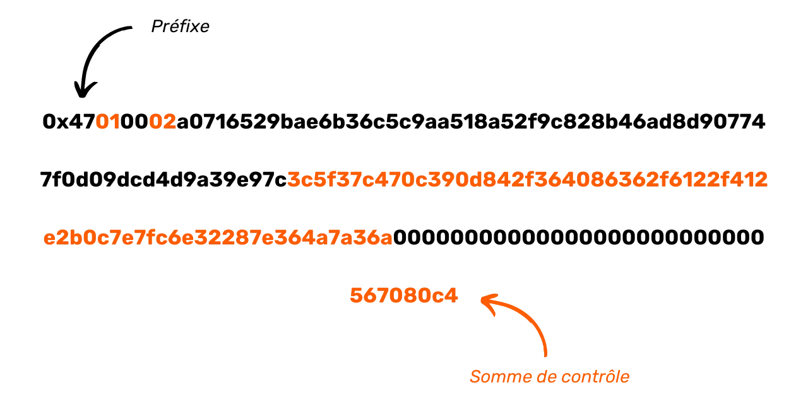

Baada ya hatua hizi kukamilika, nambari ya malipo iko tayari. Kilichobaki ni kuibadilisha kuwa msingi 58 ili kupata toleo la mwisho:

```plaintext
PM8TJSBiQmNQDwTogMAbyqJe2PE2kQXjtgh88MRTxsrnHC8zpEtJ8j7Aj628oUFk8X6P5rJ7P5qDudE4Hwq9JXSRzGcZJbdJAjM9oVQ1UKU5j2nr7VR5
```

Katika mchakato wa kuunda nambari ya malipo, tunatumia ufunguo wa umma uliobanwa na msimbo wa kamba. Zote mbili zinatokana na uamuzi na kihierarkia kutoka kwa Pochi la seed (mbegu). Njia ya uasilia inayotumika kufanikisha hili ni:

```plaintext
m/47'/0'/0'/
```

Kwa maneno madhubuti, kwa kuzalisha ufunguo wa umma uliobanwa na msimbo wa kamba unaohusishwa na msimbo wa malipo unaoweza kutumika tena, tunaanza kwa kukokotoa ufunguo mkuu wa faragha kutoka kwa Pochi la seed (mbegu). Kisha tunaendelea kupata jozi ya funguo za binti kwa kutumia index `47 + 2^31` (iliyoimarishwa derivation). Hii inafuatwa na vitoleo viwili zaidi mfululizo vya jozi za binti, kila moja ikitumia faharasa `2^31` (chini iliyoimarishwa).


### Kitufe cha Ubadilishanaji cha Diffie-Hellman kwenye mikondo ya duaradufu (ECDH)

Itifaki ya kriptografia iliyo katikati ya BIP47 inajulikana kwa kifupi ECDH, cha *Elliptic-Curve Diffie-Hellman*. Njia hii ni lahaja ya kitufe cha asili ya Ubadilishanaji wa Diffie-Hellman.

Ilianzishwa mwaka wa 1976, Diffie-Hellman ni itifaki muhimu ya makubaliano ambayo huwezesha pande mbili, kila moja ikiwa na jozi muhimu (ya umma na ya kibinafsi), kukubaliana juu ya siri ya pamoja, hata wakati wa kuwasiliana tu kupitia njia ya umma, isiyo na ulinzi.


Siri hii iliyoshirikiwa (katika kesi hii, ufunguo wa bluu) inaweza kutumika kwa shughuli zingine. Kwa kawaida, siri hii iliyoshirikiwa inaweza kutumika kusimba na kusimbua mawasiliano kwenye mtandao usiolindwa:


Ili kufanikisha hili, Diffie-Hellman hutumia hesabu ya moduli kukokotoa siri iliyoshirikiwa. Hivi ndivyo inavyofanya kazi kwa maneno ya layman:


- Alice na Bob wanakubaliana juu ya rangi ya kawaida, katika kesi hii ya njano, ambayo ni data ya umma (washambuliaji wanajua rangi hii);
- Alice anachagua rangi ya siri, katika kesi hii nyekundu, na kuchanganya mbili ili kupata machungwa;
- Bob pia huchagua rangi ya siri, katika kesi hii ya bluu, na huchanganya na njano ili kupata Kijani;
- Wao basi kubadilishana rangi kusababisha, machungwa na Kijani. Ubadilishanaji huu unaweza kufanyika kwenye mtandao usio salama na kuzingatiwa na washambuliaji;
- Kwa kuchanganya Kijani ya Bob na rangi yake ya siri, Alice hutoa kahawia;
- Bob, akifanya vivyo hivyo na rangi ya chungwa na bluu ya siri ya Alice, pia anapata kahawia.


Katika umaarufu huu, rangi ya kahawia inawakilisha siri iliyoshirikiwa na Alice na Bob. Hebu fikiria kwamba, kwa kweli, haiwezekani kwa mshambuliaji kutenganisha rangi ya machungwa na Kijani, ili kupata rangi za siri za Alice au Bob.

Sasa hebu tuangalie jinsi itifaki hii inavyofanya kazi kweli, si kwa mlinganisho wa rangi, lakini kwa kutumia nambari halisi na hesabu za msimu!

Kabla hatujaingia katika mifumo ya Diffie-Hellman, wacha nikukumbushe kwa ufupi dhana mbili muhimu za hisabati tutakazohitaji:


- **Nambari kuu** ni nambari asilia ambayo ina vigawanyiko viwili pekee: $1$ na yenyewe. Kwa mfano, $7$ ni nambari kuu kwa sababu inaweza tu kugawanywa kwa $1$ na $7$. Kwa upande mwingine, $8$ sio nambari kuu, kwani inaweza kugawanywa kwa $1$, $2$, $4$ na $8$. Kwa hivyo ina vigawanyiko vinne kamili badala ya viwili;
- **modulo** (iliyojulikana $mod$ au $\%$) ni operesheni ya hisabati ambayo, kati ya nambari mbili kamili, hurejesha salio la mgawanyiko wa Euclidean wa kwanza na wa pili. Kwa mfano, $16\bmod 5 = $1$.

**Ufunguo wa Ubadilishanaji wa Diffie-Hellman kati ya Alice na Bob hufanyika kama ifuatavyo:**


- Alice na Bob wanakubaliana juu ya nambari mbili za kawaida: $p$ na $g$. $p$ ni nambari kuu, na kadiri nambari inavyokuwa kubwa, ndivyo Diffie-Hellman atakavyokuwa salama zaidi. $g$ ni mzizi wa awali wa $p$. Nambari hizi mbili zinaweza kuwasilishwa kwa uwazi kwenye mtandao usio salama. Zinawakilisha sawa na **rangi ya manjano** katika umaarufu uliopita. Kwa hivyo ni muhimu kwamba Alice na Bob watumie thamani zinazofanana kwa $p$ na $g$.
- Mara tu vigezo hivi vimefafanuliwa, Alice na Bob kila mmoja huchagua nambari ya siri ya nasibu. Alice anataja nambari yake ya siri nasibu $a$ (sawa na **rangi nyekundu**) na Bob anataja $b$ yake (sawa na **rangi ya buluu**). Nambari hizi lazima zibaki siri.
- Badala ya kubadilishana nambari $a$ na $b$ moja kwa moja, kila mhusika atakokotoa $A$ na $B$ kama ifuatavyo:

$A$ ni sawa na $g$ iliyoinuliwa kwa nguvu $a$modulo $p$ :

$$
A = g^a \bmod p
$$

$B$ ni sawa na $g$ iliyoinuliwa kwa nguvu $b$ modulo $p$ :

$$
B = g^b \bmod p
$$


- Thamani $A$ (sawa na **rangi ya chungwa**) na $B$ (sawa na **rangi ya Kijani**) zinabadilishwa kati ya pande hizo mbili. Ubadilishanaji huu unaweza kufanyika kwa maandishi wazi kwenye mtandao usio salama;
- Alice, akiwa amepokea $B$, anakokotoa thamani ya $z$ kama ifuatavyo:

$z$ ni sawa na $B$ iliyoinuliwa kwa nguvu $a$modulo $p$ :

$$
z = B^a \bmod p
$$

Kikumbusho:

$$
B = g^b \bmod p
$$

Matokeo yake ni:

$$
z = B^a \bmod p
$$

$$
z = (g^b)^a \bmod p
$$

Kwa kutumia sheria za nguvu:

$$
(x^n)^m = x^{nm}
$$

Matokeo yake ni:

$$
z = g^{ba} \bmod p
$$


- Kwa upande wake, Bob, akiwa amepokea $A$, pia anakokotoa thamani ya $z$ kama ifuatavyo:

$z$ ni sawa na $A$ iliyoinuliwa kwa nguvu ya $b$modulo $p$ :

$$
z = A^b \bmod p
$$

Matokeo yake ni:

$$
z = (g^a)^b \bmod p
$$

$$
z = g^{ab} \bmod p
$$

$$
z = g^{ba} \bmod p
$$

Shukrani kwa usambazaji wa opereta wa modulo, Alice na Bob wanapata thamani sawa kabisa $z$. Nambari hii inawakilisha siri yao ya kawaida, sawa na **rangi ya kahawia** katika umaarufu wa awali wa makopo ya rangi. Sasa wanaweza kutumia siri hii ya kawaida kusimba kwa njia fiche mawasiliano yao kwa ulinganifu kupitia mtandao usiolindwa.


Mshambulizi, hata akiwa na $p$, $g$, $A$ na $B$ (thamani za umma), hataweza kukokotoa $a$, $b$ au $z$ (thamani za faragha). Ili kufanikisha hili, ufafanuzi utalazimika kugeuzwa, operesheni ambayo haiwezekani bila kujaribu uwezekano wote mmoja baada ya mwingine, kwani ni sawa na kukokotoa logarithmu ya kipekee, yaani, upatanisho wa kielelezo katika kikundi cha mzunguko wa mwisho.

Kwa hivyo, mradi tu thamani za $a$, $b$ na $p$ ni kubwa vya kutosha, itifaki ya Diffie-Hellman ni salama. Kwa kawaida, na vigezo vya biti 2048 (nambari ya desimali yenye tarakimu 600), kupima uwezekano wote wa $a$ na $b$ hakutakuwa na maana. Hadi sasa, kwa nambari kama hizo, algorithm hii inachukuliwa kuwa salama.

Hapa kuna shida kuu ya itifaki ya Diffie-Hellman. Ili kuwa salama, algorithmu lazima itumie nambari kubwa. Ndiyo maana, siku hizi, tunapendelea kutumia algoriti ya ECDH (*Elliptic Curve Diffie-Hellman*), lahaja ya Diffie-Hellman kulingana na mkunjo wa aljebra, kwa usahihi zaidi mkunjo wa duaradufu. Mbinu hii inafanya uwezekano wa kufanya kazi na nambari ndogo zaidi wakati wa kudumisha usalama sawa, na hivyo kupunguza rasilimali zinazohitajika kwa kuhesabu na kuhifadhi.

Kanuni ya jumla ya algorithmu inabaki sawa. Hata hivyo, badala ya kutumia nambari nasibu $a$ na nambari $A$ iliyokokotwa kutoka $a$ kwa upanuzi wa kawaida, tunatumia jozi ya vitufe vilivyowekwa kwenye mkunjo wa duaradufu. Badala ya kutegemea usambaaji wa opereta wa modulo, tunatumia sheria ya kikundi kwenye mikunjo ya duaradufu, na kwa usahihi zaidi ushirikiano wa sheria hii.

Ili kueleza kwa ufupi kanuni ya usimbaji fiche kwenye mikunjo ya duaradufu, ufunguo wa faragha unawakilishwa na nambari nasibu kati ya $1$ na $n-1$, ambapo $n$ inawakilisha mpangilio wa mkunjo. Ufunguo wa umma, kwa upande mwingine, ni sehemu maalum kwenye curve hii, iliyopatikana kutoka kwa ufunguo wa kibinafsi kwa kuongeza na pointi mara mbili kutoka kwa sehemu ya kuzalisha, kulingana na equation :

$$
K = k \cdot G
$$

Katika fomula hii, $K$ huteua ufunguo wa umma, $k$ ufunguo wa faragha, na $G$ pointi ya jenereta.

Kipengele muhimu cha funguo hizi ni urahisi wa kukokotoa $K$ kutoka $k$ na $G$, ilhali haiwezekani kupata $k$ kutoka $K$ na $G$. Asymmetry hii inaunda kazi ya njia moja. Kwa maneno mengine, ni rahisi kuhesabu ufunguo wa umma ikiwa unajua ufunguo wa faragha, lakini kurejesha ufunguo wa faragha kutoka kwa ufunguo wa umma hauwezekani. Usalama huu unaimarishwa zaidi na ugumu wa kukokotoa kwa logarithmu tofauti.

Tutatumia mali haya kurekebisha kanuni zetu za Diffie-Hellman. **Kanuni ya uendeshaji wa ECDH ni kama ufuatao:**


- Alice na Bob wanakubaliana kuhusu mkunjo wa kiduara ulio salama kwa njia fiche na vigezo vyake. Habari hii ni ya umma;
- Alice hutoa nambari isiyo ya kawaida $ka$ ambayo itakuwa ufunguo wake wa kibinafsi. Ufunguo huu wa faragha lazima ubaki kuwa siri. Yeye huamua ufunguo wake wa umma $Ka$ kwa kuongeza na kuzidisha alama maradufu kwenye mkunjo uliochaguliwa wa duaradufu:

$$
K_a = k_a \cdot G
$$


- Bob pia hutoa nambari isiyo ya kawaida $kb$, ambayo itakuwa ufunguo wake wa kibinafsi. Anakokotoa ufunguo wa umma unaohusishwa $Kb$ :

$$
K_b = k_b \cdot G
$$


- Alice na Bob kubadilishana funguo zao za umma $Ka$ na $Kb$ kwenye mtandao wa umma usiolindwa.
- Alice anakokotoa pointi $(x,y)$ kwenye mkunjo kwa kutumia ufunguo wake wa faragha $ka$ kwenye ufunguo wa umma wa Bob $Kb$ :

$$
(x,y) = k_a \cdot K_b
$$


- Bob anakokotoa nukta $(x,y)$ kwenye mkunjo kwa kutumia ufunguo wake wa faragha $kb$ kwenye ufunguo wa umma wa Alice $Ka$ :

$$
(x,y) = k_b \cdot K_a
$$


- Alice na Bob wanapata sehemu sawa kwenye mkunjo wa duaradufu. Siri iliyoshirikiwa itakuwa abscissa $x$ ya hatua hii.

Wanapata siri ile ile iliyoshirikiwa kwa sababu:

$$
(x,y) = k_a \cdot K_b = k_a \cdot (k_b \cdot G) = (k_a \cdot k_b) \cdot G = (k_b \cdot k_a) \cdot G = k_b \cdot (k_a \cdot G) = k_b \cdot K_a
$$

Mshambulizi anayeweza kuwa akitazama mtandao wa umma usiolindwa ataweza tu kupata funguo za umma za kila mtu binafsi na vigezo vya mkunjo wa duara uliochaguliwa. Kama ilivyoelezwa hapo juu, habari hii pekee haitoshi kuamua funguo za kibinafsi. Kwa hivyo, mshambuliaji hawezi kupata siri iliyoshirikiwa kati ya Alice na Bob.

Kwa hiyo ECDH ni kanuni muhimu ya Ubadilishanaji. Mara nyingi hutumiwa kwa kushirikiana na mbinu nyingine za kriptografia ili kuanzisha itifaki kamili. Kwa mfano, ECDH ndio kitovu cha TLS (*Transport Layer Security*), itifaki ya usimbaji na uthibitishaji inayotumika kwa usafiri wa mtandao wa Layer. TLS hutumia ECDHE kwa ufunguo wa Ubadilishanaji, kibadala cha ECDH ambapo funguo ni za muda mfupi, ili kutoa usiri unaoendelea. Kwa kuongezea, TLS hutumia algoriti za uthibitishaji kama vile ECDSA, algoriti za usimbaji fiche kama vile AES, na vitendaji vya Hash kama vile SHA256.

TLS inawajibikia `s` katika `https` na kufuli katika upau wa Address ya kivinjari chako - alama za mawasiliano yaliyosimbwa kwa njia fiche. Kwa kuchukua kozi hii, utakuwa unatumia ECDH, na kuna uwezekano mkubwa kuwa utakuwa unaitumia kila siku bila hata kujua.

### Shughuli ya arifa

Kama tulivyoona katika sehemu iliyotangulia, ECDH ni lahaja ya Ubadilishanaji wa Diffie-Hellman kwa kutumia jozi muhimu zilizowekwa kwenye mkunjo wa duaradufu. Ni jambo zuri kwamba tayari tuna jozi nyingi muhimu zinazoheshimu kiwango hiki katika pochi zetu za Bitcoin! Wazo la BIP47 ni kutumia jozi muhimu za pochi za Bitcoin za wahusika wote wawili ili kuanzisha siri za pamoja, za muda mfupi kati yao. BIP47 inatumia ECDHE (*Elliptic Curve Diffie-Hellman **Ephemeral***) badala yake.


ECDHE hutumiwa mara ya kwanza katika BIP47 kutuma msimbo wa malipo kutoka kwa mtumaji hadi kwa mpokeaji. Huu ndio shughuli maarufu ya **arifa**. Hatua hii ni muhimu, kwa sababu ili BIP47 ifanye kazi kwa ufanisi, pande zote mbili zinazohusika (mtumaji na mpokeaji) zinahitaji kujua misimbo ya malipo ya kila mmoja. Maarifa haya huwezesha kupatikana kwa funguo za muda mfupi za umma na, kwa hivyo, Anwani (address) tupu zinazohusiana na kupokea.

Kabla ya Ubadilishanaji huu, mtumaji anafahamu kimantiki msimbo wa malipo wa mpokeaji, baada ya kuupata off-chain, kwa mfano kutoka kwa tovuti yake, Anwani (address) ya ununuzi au mitandao ya kijamii. Hata hivyo, si lazima mpokeaji afahamu nambari ya malipo ya mtumaji. Hata hivyo, kanuni lazima ipelekwe kwake; vinginevyo, hataweza kupata funguo za ephemeral zinazohitajika kutambua Anwani (address) ambapo bitcoins zake zimehifadhiwa, au kufikia fedha zake. Ingawa utumaji huu wa msimbo wa mtumaji unaweza kutekelezwa kiufundi off-chain kwa njia nyinginezo za mawasiliano, hii inaleta tatizo ikiwa Pochi litachukuliwa kutoka seed (mbegu) pekee.

Hii ni kwa sababu, tofauti na Anwani (address) za kawaida, Anwani (address) za BIP47 hazitolewi moja kwa moja kutoka kwa seed (mbegu) ya mpokeaji - kutumia `xpub` itakuwa rahisi katika kesi hii - lakini inatokana na hesabu inayochanganya misimbo miwili ya malipo: ya mtumaji na ya mpokeaji. Kwa hiyo, ikiwa mpokeaji atapoteza Pochi lake na anajaribu kurejesha kutoka kwa seed (mbegu) yake, atapata msimbo wake wa malipo, ambao unatokana moja kwa moja na seed (mbegu) yake. Hata hivyo, ili kurejesha Anwani (address) za ephemeral, atahitaji pia nambari za malipo za wale wote ambao wamemtuma bitcoins kupitia BIP47. Kwa hivyo umuhimu wa shughuli ya arifa, ambayo huwezesha habari hii kuhifadhiwa kwenye Bitcoin Blockchain, wakati bado inaweza kuipata kwa urahisi sana bila kulazimika kutafuta miamala mabilioni iliyotekelezwa tangu kuzinduliwa kwake mnamo 2009.

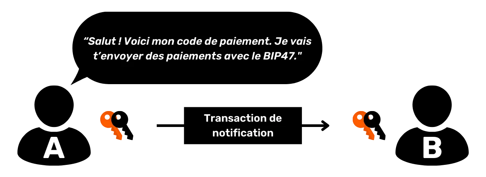

Kwa hivyo itawezekana kutekeleza BIP47 bila kutumia muamala wa arifa, mradi kila mtumiaji anahifadhi nakala rudufu ya misimbo ya malipo ya wenzake. Walakini, njia hii inathibitisha kuwa ngumu kudhibiti hadi suluhisho rahisi, thabiti na la ufanisi la kutengeneza, kuhifadhi na kusasisha nakala rudufu hizi zinatengenezwa. Kwa jinsi mambo yanavyoendelea, shughuli ya arifa inakaribia kuepukika.

Katika sura zifuatazo, hata hivyo, tutaangalia itifaki zingine zilizo na malengo sawa na BIP47, lakini ambazo hazihitaji shughuli ya arifa. Njia hizi mbadala, hata hivyo, huanzisha biashara zao wenyewe.

Kando na jukumu lake la kuhifadhi misimbo ya malipo, shughuli ya arifa pia ina kipengele cha kuarifu mpokeaji, kama jina lake linavyopendekeza. Inatahadharisha mteja wa mpokeaji kwa ukweli kwamba njia mpya ya malipo imeanzishwa, na kupendekeza kwamba afuatilie Anwani (address) zinazotokana na muda mfupi.

### Muundo wa usiri wa BIP47

Kabla ya kueleza kwa kina utendakazi wa kiufundi wa shughuli ya arifa, ni muhimu kujadili mtindo wa usiri unaohusishwa na BIP47, ambao unahalalisha hatua fulani zilizochukuliwa wakati wa kuunda shughuli hii ya awali.

Nambari ya malipo yenyewe haitoi hatari ya moja kwa moja kwa usiri. Tofauti na muundo wa jadi wa Bitcoin, unaolenga kuvunja kiungo kati ya utambulisho wa mtumiaji na miamala yake (ambayo ni ya umma) kwa kuhifadhi kutokujulikana kwa funguo na Anwani (address), msimbo wa malipo unaweza kuhusishwa kwa uwazi na utambulisho bila kuibua tishio.

Hii ni kwa sababu msimbo wa malipo hautumiwi kupata moja kwa moja Anwani (address) zinazopokea malipo ya BIP47. Badala yake, Anwani (address) hizi hutolewa kupitia programu ya ECDH kati ya funguo zinazotokana na misimbo ya malipo ya pande mbili zinazohusika.

Kwa hivyo, msimbo wa malipo wenyewe hauongoi moja kwa moja kupoteza usiri, kwa kuwa ni taarifa tu ya Anwani (address) inayotokana nayo. Ingawa Anwani (address) hii inaweza kufichua taarifa fulani, kwa kawaida haifichui wahusika ambao unafanya nao miamala, isipokuwa uchanganuzi wa kina wa msururu ufanyike. Hakika, ikiwa mtumaji anatumia UTXO zinazoweza kuunganishwa na utambulisho wake kutekeleza shughuli ya arifa, basi itawezekana kubaini kuwa utambulisho wake huenda umehusishwa na malipo ya BIP47 kwenye msimbo wako wa malipo. Hii haitafichua miamala ya msingi, lakini itaonyesha uwezekano wa kuwepo kwao.

Kwa hivyo ni muhimu kudumisha utengano huu mkali kati ya misimbo ya malipo ya watumiaji. Kwa kuzingatia hili, mawasiliano ya awali ya msimbo ni wakati muhimu kwa usiri wa malipo, ilhali ni muhimu kwa itifaki kufanya kazi ipasavyo. Ikiwa moja ya misimbo ya malipo inaweza kupatikana kwa umma (kama kwenye tovuti), msimbo wa pili, wa mtumaji, lazima chini ya hali yoyote uunganishwe na wa kwanza.

Hebu tuchukue mfano halisi: Ninataka kutoa mchango kwa harakati za kisiasa kupitia BIP47 :


- Shirika limeweka msimbo wake wa malipo kwa umma kwenye tovuti yake au kupitia mitandao yake ya kijamii;
- Kwa hiyo kanuni hii inahusishwa na harakati za kisiasa;
- Ninapata nambari hii ya malipo;
- Kabla ya kutuma, ni lazima nihakikishe kuwa wanajua msimbo wangu wa malipo, ambao pia umeunganishwa na utambulisho wangu kwa vile ninautumia kupokea miamala kwenye mitandao yangu ya kijamii.

Ninawezaje kupitisha nambari yangu bila hatari? Kutumia njia za kawaida za mawasiliano kunaweza kusababisha uvujaji wa habari, na hivyo kunihusisha na harakati hizi za kisiasa. Muamala wa arifa hutoa suluhu, shukrani kwa Safu ya usimbaji fiche ambayo inazuia uhusiano kama huo kati ya misimbo miwili. Ingawa si njia pekee ya kutuma kwa siri msimbo wa malipo wa mtumaji, ni njia nzuri sana.

Katika mchoro ulio hapa chini, mistari ya rangi ya chungwa inaonyesha pointi ambapo mtiririko wa habari lazima uingizwe, na mishale nyeusi inaonyesha miunganisho inayoweza kuzingatiwa na watu wengine:


Kwa kweli, katika muundo wa usiri wa jadi wa Bitcoin, mara nyingi ni ngumu kutenganisha kabisa mtiririko wa habari kati ya jozi muhimu na mtumiaji, haswa katika shughuli za mbali. Kwa mfano, katika muktadha wa kampeni ya mchango, ni lazima mpokeaji afichue Anwani (address) au ufunguo wa umma kupitia tovuti yake au mitandao ya kijamii. Matumizi sahihi ya BIP47, haswa na shughuli ya arifa, hurahisisha kulitatua tatizo hili kutokana na ECDHE na usimbaji fiche wa Layer tutauangalia baadaye.

Bila shaka, mtindo wa kawaida wa usiri wa Bitcoin bado unatumika kwa funguo za muda mfupi za umma, ambazo zinatokana na mchanganyiko wa nambari mbili za malipo. Mifano hizi mbili kwa kweli ni za ziada. Ninachotaka kusisitiza hapa ni kwamba, tofauti na matumizi ya kawaida ya ufunguo wa umma kupokea Bitcoins, msimbo wa malipo unaweza kuunganishwa na utambulisho maalum, kwani taarifa "_Alice anafanya miamala na Bob_" imevunjwa katika hatua nyingine. Nambari ya malipo inatumika kwa Anwani (address) za malipo za kuzalisha, lakini kwa kuzingatia uchunguzi wa Blockchain pekee, haiwezekani kuunganisha muamala wa malipo ya BIP47 kwenye nambari za malipo zilizotumiwa kuutekeleza, isipokuwa UTXO zinazohusika tayari zilikuwa zimeunganishwa na utambulisho hapo awali na watumiaji walihusisha nambari zao za malipo na utambulisho wao husika.

Kwa muhtasari, mtindo wa usiri unaotolewa na malipo ya BIP47 unaweza kuchukuliwa kuwa bora kuliko muundo msingi wa Bitcoin, ingawa hii haimaanishi kuwa ni ya kichawi.

### Kuunda shughuli ya arifa

Sasa hebu tuone jinsi shughuli hii ya arifa inavyofanya kazi. Hebu tufikirie kwamba Alice anataka kutuma pesa kwa Bob kwa kutumia BIP47. Katika mfano wangu, Alice anafanya kama mtumaji na Bob kama mpokeaji. Bob amechapisha nambari yake ya malipo kwenye tovuti yake. Kwa hivyo, Alice tayari anajua nambari ya malipo ya Bob.

**1- Alice anakokotoa siri iliyoshirikiwa na ECDH :**


- Yeye huchagua jozi muhimu kutoka kwa Pochi la HD yake kwenye tawi tofauti na msimbo wake wa malipo. Kumbuka kwamba jozi hili lazima lihusishwe kwa urahisi na arifa ya Anwani (address) ya Alice, wala na utambulisho wa Alice (angalia sehemu iliyotangulia);
- Alice anachagua ufunguo wa faragha wa jozi hii. Tunaiita $a$ (herufi ndogo);

$$
a
$$


- Alice anapata ufunguo wa umma unaohusishwa na arifa ya Anwani (address) ya Bob. Ufunguo huu ni mtoto wa kwanza anayetokana na msimbo wa malipo wa Bob (faharasa $/0$). Tunauita ufunguo huu wa umma $B$ (herufi kubwa). Ufunguo wa faragha unaohusishwa na ufunguo huu wa umma unaitwa $b$ (herufi ndogo). $B$ imedhamiriwa kwa kuongeza na kuzidisha alama maradufu kwenye kona ya duaradufu kutoka $G$ (kiini cha kuzalisha) na $b$ (ufunguo wa faragha):

$$ B = b \cdot G $$


- Alice anakokotoa sehemu ya siri ya $S$ (herufi kubwa) kwenye mkunjo wa duaradufu kwa kuongeza na kurudia pointi, akitumia ufunguo wake wa faragha $a$ kutoka kwa ufunguo wa umma wa Bob $B$.

$$ S = a \cdot B $$


- Alice hukokotoa kipengele cha kupofusha $f$ ambacho kitatumika kusimba msimbo wake wa malipo. Ili kufanya hivyo, yeye hutumia chaguo la kukokotoa la HMAC-SHA512 ili kubaini nambari ya ulaghai ya nasibu. Ingizo la pili kwa chaguo hili la kukokotoa ni thamani ambayo Bob pekee ataweza kupata: $x$, ambayo ni abscissa ya sehemu ya siri iliyohesabiwa hapo juu. Ingizo la kwanza ni $o$, ambayo ni UTXO inayotumiwa kama ingizo la muamala huu (mtazamo).

$$ f = \maandishi{HMAC-SHA512}(o, x) $$

**2 - Alice anabadilisha nambari yake ya malipo ya kibinafsi kuwa msingi wa 2 (binary) **

**3- Hutumia kipengele hiki cha kupofusha kama ufunguo wa kutekeleza usimbaji fiche linganifu kwenye shehena ya malipo ya msimbo wake wa malipo.** Kanuni ya usimbaji fiche unaotumika ni `XOR` tu. Operesheni iliyofanywa inalinganishwa na cipher ya Vernam, inayojulikana pia kama "Padi ya Wakati Mmoja".


- Alice kwanza anagawanya kipengele chake cha kupofusha katika sehemu mbili: baiti 32 za kwanza zinaitwa $f1$ na ka 32 za mwisho zimeitwa $f2$. Hii inatupa:

$$ f = f1 || f2 $$


- Alice hukokotoa msimbo wa $x'$ wa abscissa ya ufunguo wa umma $x$ wa msimbo wake wa malipo, na cipher $c'$ ya msimbo wake wa mfuatano $c$ kando. $f1$ na $f2$ hufanya kama funguo za msimbo mtawalia. Uendeshaji uliotumika ni `XOR` (au pekee).

$$ x' = x \plus f1 $$

$$ c' = c \plus f2 $$


- Alice anabadilisha thamani halisi za ufunguo wa umma abscissa $x$ na msimbo wa kamba $c$ katika msimbo wake wa malipo kwa thamani zilizosimbwa kwa njia fiche $x'$ na $c'$.

**4-** Kwa hivyo Alice kwa sasa ana nambari yake ya malipo iliyo na mzigo uliosimbwa kwa njia fiche. Ataunda na kutangaza muamala unaohusisha ufunguo wake wa umma $A$ kama ingizo, matokeo kwa arifa ya Anwani (address) ya Bob, na pato `OP_RETURN` linalojumuisha msimbo wake wa malipo na mzigo uliosimbwa kwa njia fiche. **Muamala huu ni shughuli ya arifa**.

`OP_RETURN` ni opcode inayoashiria matokeo ya muamala wa Bitcoin kuwa batili. Leo, inatumika kutangaza au habari ya Anchor kwenye Bitcoin Blockchain. Inaweza kuhifadhi hadi baiti 80 za data, ambayo huandikwa kwa mnyororo na kuonekana kwa watumiaji wengine wote.

Kama tulivyoona katika sehemu zilizopita, ECDH hutumiwa kwa kuzalisha siri ya pamoja kati ya watumiaji wawili wanaowasiliana kupitia mtandao usio salama, na ambayo inaweza kuzingatiwa na washambuliaji. Katika BIP47, ECDH hutumiwa kuwasiliana kwenye mtandao wa Bitcoin, ambayo kwa asili yake ni mtandao wa mawasiliano ya uwazi, na inazingatiwa na washambuliaji wengi. Siri iliyoshirikiwa inayokokotolewa kupitia ufunguo wa Ubadilishanaji wa ECDH kisha inatumiwa kusimba maelezo ya siri yatakayotumwa: msimbo wa malipo wa mtumaji (Alice).

Nitafanya muhtasari wa hatua ambazo tumeona pamoja ili kutekeleza shughuli ya arifa:


- Alice anapata msimbo wa malipo ya Anwani (address) ya Bob na arifa ;
- Alice anachagua UTXO kwingineko ya HD na jozi muhimu zinazolingana;
- Hukokotoa sehemu ya siri kwenye mkunjo wa duaradufu kwa kutumia ECDH;
- Inatumia hatua hii ya siri kuhesabu HMAC, ambayo ni sababu ya upofu;
- Anatumia kipengele hiki cha upofu kusimba mzigo wa malipo ya msimbo wake wa malipo binafsi;
- Inatumia `OP_RETURN` pato la malipo ili kuwasilisha msimbo wa malipo uliofichwa kwa Bob.


### Arifa ya muamala: utafiti wa vitendo

Ili kuelewa jinsi inavyofanya kazi kwa undani zaidi, na hasa matumizi ya `OP_RETURN`, hebu tuangalie shughuli halisi ya arifa. Nilifanya muamala kama huo kwenye Testnet, ambayo unaweza kuipata [kwa kubofya hapa](https://Mempool.space/fr/Testnet/tx/0e2e4695a3c49272ef631426a9fd2dae6ec3a463d469d7a5a39ad).


Kuangalia muamala huu, tunaweza kuona tayari kuwa ina ingizo moja na matokeo 4:


- Toleo la kwanza ni `OP_RETURN` ambalo lina msimbo wangu wa malipo uliofichwa;
- Matokeo ya pili ya 546 Sats yanaelekeza kwa arifa ya mpokeaji wangu Anwani (address);
- Pato la tatu la 15,000 Sats linawakilisha ada ya huduma, kwani nilitumia Pochi la Samourai kuunda muamala huu;
- Pato la nne la milioni 2 Sats linawakilisha kiwango cha Ubadilishanaji, yaani, tofauti iliyobaki katika mchango wangu ambao unarudi kwa Anwani (address) nyingine yangu.

Kinachovutia zaidi kusoma ni dhahiri matokeo 0 kwa kutumia `OP_RETURN`. Hebu tuchunguze kwa undani zaidi yaliyomo. Hapa kuna `scriptPubKey` katika hexadecimal :

```text
6a4c50010002b13b2911719409d704ecc69f74fa315a6cb20fdd6ee39bc9874667703d67b164927b0e88f89f3f8b963549eab2533b5d7ed481a3bea7e953b546b4e91b6f50d800000000000000000000000000
```

Kuna sehemu kadhaa za hati hii. Kwanza,:

```text
6a4c
```

Miongoni mwa opcodes, tunaweza kutambua `0x6a` ambayo inabainisha `OP_RETURN` na `0x4c` ambayo inabainisha `OP_PUSHDATA1`.

Baiti inayofuata opcode hii ya mwisho inaonyesha ukubwa wa upakiaji unaofuata. Inaonyesha `0x50`, au baiti 80:

```text
6a4c50
```

Kisha, tuna metadata ya msimbo wangu wa malipo katika maandishi wazi:

```text
010002
```

Abscissa iliyosimbwa kwa njia fiche ya ufunguo wa umma wa nambari yangu ya malipo :

```text
b13b2911719409d704ecc69f74fa315a6cb20fdd6ee39bc9874667703d67b164
```

Msimbo wa mfuatano uliosimbwa kwa njia fiche wa nambari yangu ya malipo :

```text
927b0e88f89f3f8b963549eab2533b5d7ed481a3bea7e953b546b4e91b6f50d8
```

Na mwishowe, kuweka kwa ka 80, saizi ya kawaida ya `OP_RETURN` :

```text
00000000000000000000000000
```

Ili kukusaidia kuelewa, hapa kuna msimbo wangu wa malipo kwa maandishi wazi katika msingi wa 58 :

```text
PM8TJQCyt6ovbozreUCBrfKqmSVmTzJ5vjqse58LnBzKFFZTwny3KfCDdwTqAEYVasn11tTMPc2FJsFygFd3YzsHvwNXLEQNADgxeGnMK8Ugmin62TZU
```

Na kwa msingi wa 16:

```text
4701000277507c9c17a89cfca2d3af554745d6c2db0e7f6b2721a3941a504933103cc42add94881210d6e752a9abc8a9fa0070e85184993c4f643f1121dd807dd556d1dc000000000000000000000000008604e4db
```

Tukilinganisha nambari yangu ya malipo ya maandishi ya kawaida na `OP_RETURN`, tunaweza kuona kwamba HRP (`0x47`) na hundi (`0x8604e4db`) hazitumiwi. Hii ni kawaida, kwani habari hii imekusudiwa wanadamu.

Kisha, tunaweza kutambua toleo (`0x01`), sehemu ya biti (`0x00`) na usawa wa ufunguo wa umma (`0x02`). Na, mwisho wa msimbo wa malipo, baiti tupu (`0x00000000000000000000000000000000000000000000000000000000000000000000000000000000000`) ambazo huruhusu pedi kufikia jumla ya baiti 80. Metadata hii yote hupitishwa bila kusimba.

Hatimaye, tunaweza kuona kwamba ufunguo wa umma abscissa (`0x77507c9c17a89cfca2d3af554745d6c2db0e7f6b2721a3941a504933103cc42a`) na msimbo wa kamba. (`0xdd94881210d6e752a9abc8a9fa0070e85184993c4f643f1121dd807dd556d1dc`) zimesimbwa kwa njia fiche. Huu ni mzigo wa msimbo wa malipo.

### XOR ni nini?

Tumeona katika sehemu zilizopita kwamba msimbo wa malipo hutumwa kwa njia fiche kwa kutumia operesheni ya XOR. Wacha tuchunguze kwa undani jinsi mwendeshaji huyu anavyofanya kazi, kwani hutumiwa sana katika cryptography.

XOR ni opereta mwenye busara kidogo kulingana na aljebra ya Boolean. Ikipewa oparesheni mbili katika biti, inarejesha `1` ikiwa biti za cheo sawa ni tofauti, na inarudisha `0` ikiwa biti za cheo sawa ni sawa. Hapa kuna jedwali la ukweli la XOR kulingana na maadili ya operesheni `D` na `E` :

| D | E | D XOR E |

| --- | --- | ------- |

| 0 | 0 | 0 |

| 0 | 1 | 1 |

| 1 | 0 | 1 |

| 1 | 1 | 0 |

Kwa mfano:

$$
0110 \oplus 1110 = 1000
$$

Au:

$$
010011 \oplus 110110 = 100101
$$

Kwa ECDH, matumizi ya XOR kama usimbaji fiche wa safu ni thabiti haswa. Kwanza, shukrani kwa mwendeshaji huyu, usimbaji fiche ni linganifu. Hii ina maana kwamba mpokeaji anaweza kusimbua msimbo wa malipo kwa kutumia ufunguo sawa unaotumika kwa usimbaji fiche. Vifunguo vya usimbuaji na usimbaji hukokotolewa kutoka kwa siri iliyoshirikiwa kwa kutumia ECDH. Ulinganifu huu unawezeshwa na tabia ya mawasiliano na ushirika ya mwendeshaji wa XOR:


- Tabia zingine:

$$
D \oplus D = 0
$$

$$
D \oplus 0 = D
$$


- Mawasiliano :

$$
D \oplus E = E \oplus D
$$


- Ushirikiano:

$$
D \oplus (E \oplus Z) = (D \oplus E) \oplus Z = D \oplus E \oplus Z
$$

Ikiwa:

$$
D \oplus E = L
$$

Kisha:

$$
D \oplus L = D \oplus (D \oplus E) = D \oplus D \oplus E = 0 \oplus E = E \\
\therefore D \oplus L = E
$$

Pili, njia hii ya usimbaji fiche inafanana sana na cipher ya Vernam (Pad ya Wakati Mmoja), algoriti pekee inayojulikana hadi sasa ambayo ina usalama usio na masharti (au kabisa). Ili cipher ya Vernam iwe na kipengele hiki, ufunguo wa usimbaji lazima uwe nasibu kabisa, wa ukubwa sawa na ujumbe na utumike mara moja tu. Katika njia ya usimbaji fiche inayotumiwa hapa kwa BIP47, ufunguo hakika ni sawa na ukubwa wa ujumbe, na kipengele cha kupofusha kinalingana kabisa na uunganishaji wa abscissa ya ufunguo wa umma na msimbo wa kamba ya msimbo wa malipo. Ufunguo huu wa usimbaji hutumika mara moja tu. Kwa upande mwingine, ufunguo huu hautolewi kutoka kwa nasibu kamili, kwani ni HMAC. Badala yake, ni pseudo-random. Kwa hivyo sio cipher ya Vernam, lakini mbinu inakaribia.

### Upokeaji wa shughuli ya arifa

Sasa kwa kuwa Alice ametuma muamala wa arifa kwa Bob, hebu tuone jinsi Bob anavyoitafsiri. Kama ukumbusho, ni lazima Bob afikie nambari ya malipo ya Alice. Bila habari hii, kama tutakavyoona katika sehemu inayofuata, hataweza kupata jozi muhimu iliyoundwa na Alice, na kwa hivyo hataweza kufikia bitcoins zake zilizopokelewa kupitia BIP47. Kwa sasa, upakiaji wa msimbo wa malipo wa Alice umesimbwa kwa njia fiche. Wacha tuone jinsi Bob anavyosimbua.

**1-** Bob hufuatilia shughuli zinazounda matokeo kwa arifa ya Anwani (address) yake.

**2-** Wakati muamala una matokeo kwenye arifa ya Anwani (address) yake , Bob huichanganua ili kuona ikiwa ina matokeo ya OP_RETURN ambayo yanatii kiwango cha BIP47.

**3-** Ikiwa baiti ya kwanza ya upakiaji wa OP_RETURN ni `0x01`, Bob anaanza utafutaji wake wa siri inayoweza kushirikiwa na ECDH :


- Bob huchagua ufunguo wa umma wa kuingiza kwa shughuli hiyo. Hiyo ni, ufunguo wa umma wa Alice unaoitwa $A$ na :

$$ A = a \cdot G $$


- Bob anachagua ufunguo wa faragha $b$ unaohusishwa na arifa yake ya Anwani (address) ya kibinafsi:

$$ b $$


- Bob anakokotoa sehemu ya siri $S$ (ECDH ya siri iliyoshirikiwa) kwenye mkunjo wa duaradufu kwa kuongeza na kurudia pointi, akitumia ufunguo wake wa faragha $b$ kwenye ufunguo wa umma wa Alice $A$ :

$$ S = b \cdot A $$


- Bob huamua kipengele cha kupofusha $f$ kitakachowezesha upakiaji wa msimbo wa malipo wa Alice kufutwa. Kama vile Alice alivyoihesabu hapo awali, Bob atapata $f$ kwa kutumia HMAC-SHA512 hadi $x$, thamani ya abscissa ya sehemu ya siri $S$, na kwa $o$, UTXO iliyotumiwa kama ingizo la shughuli hii ya arifa:

$$ f = \maandishi{HMAC-SHA512}(o, x) $$

**4-** Bob anatafsiri data ya OP_RETURN katika shughuli ya arifa kama msimbo wa malipo. Atasimbua tu upakiaji wa msimbo huu unaowezekana wa malipo kwa kutumia kipengele cha upofu cha $f$:


- Bob anagawanya kipengele cha kupofusha $f$ katika sehemu 2: baiti 32 za kwanza za $f$ zitakuwa $f1$ na byte 32 za mwisho zitakuwa $f2$;
- Bob anaondoa thamani ya abscissa $x'$ iliyosimbwa kwa njia fiche kutoka kwa ufunguo wa umma wa msimbo wa malipo wa Alice:

$$ x = x' \plus f1 $$


- Bob anaondoa thamani ya msimbo wa mfuatano uliosimbwa kwa njia fiche $c'$ kutoka kwa msimbo wa malipo wa Alice:

$$ c = c' \plus f2 $$

**5-** Bob huangalia kama thamani ya ufunguo wa umma wa msimbo wa malipo wa Alice ni sehemu ya kikundi cha secp256k1. Ikiwa ndivyo, anafasiri hii kama msimbo halali wa malipo. Ikiwa sivyo, anapuuza shughuli hiyo.

Kwa kuwa sasa Bob anajua msimbo wa malipo wa Alice, Alice anaweza kumtumia hadi malipo ya `2^32`, bila kulazimika kurudia muamala wa arifa ya aina hii.

Kwa nini inafanya kazi? Je, Bob anawezaje kubaini kigezo sawa na cha Alice, na hivyo kubainisha msimbo wake wa malipo? Hebu tuangalie kwa karibu hatua ya ECDH katika yale ambayo tumeeleza hivi punde.

Kwanza kabisa, tunashughulika na usimbaji fiche linganifu. Hii ina maana kwamba ufunguo wa usimbaji fiche na ufunguo wa kusimbua una thamani sawa. Ufunguo huu katika shughuli ya arifa ndio sababu ya kupofusha:

$$ f = f1 || f2 $$

Kwa hivyo, Alice na Bob lazima wapate thamani sawa ya $f$, bila kuisambaza moja kwa moja, kwa kuwa mshambulizi anaweza kuiba na kusimbua maelezo ya siri. Sababu hii ya upofu hupatikana kwa kutumia maadili ya HMAC-SHA512 hadi 2:


- abscissa ya hatua ya siri;
- na UTXO zinazotumiwa katika pembejeo ya shughuli.

Kwa hivyo Bob anahitaji maelezo haya yote ili kusimbua upakiaji wa msimbo wa malipo wa Alice. Kwa ingizo la UTXO, Bob anaweza kuipata kwa kutazama shughuli ya arifa. Kwa hatua ya siri, Bob atahitaji kutumia ECDH. Kama inavyoonekana katika sehemu iliyotangulia ya Diffie-Hellman, kwa kubadilishana funguo zao za umma na kutumia kwa siri funguo zao za faragha kwenye ufunguo wa kila mmoja wa kila mmoja wao, Alice na Bob wanaweza kupata sehemu ya siri iliyo sahihi kwenye mkunjo wa duaradufu. Muamala wa arifa unatokana na utaratibu huu:


- Jozi ya funguo za Bob:

$$ B = b \cdot G $$


- Jozi kuu za Alice:

$$ A = a \cdot G $$


- Kwa siri $S (x, y)$ :

$$ S = a \cdot B = a \cdot (b \cdot G) = (b \cdot a) \cdot G = b \cdot A $$


Sasa kwa kuwa Bob anajua msimbo wa malipo wa Alice, ataweza kugundua malipo yake ya BIP47, na ataweza kupata funguo za faragha zinazozuia bitcoins kupokewa.

Nitafanya muhtasari wa hatua ambazo tumeziona kwa pamoja ili kupokea na kutafsiri shughuli ya arifa:


- Bob anafuatilia pato la muamala kwa arifa ya Anwani (address) yake;
- Inapogundua moja, hupata maelezo yaliyomo kwenye OP_RETURN;
- Bob huchagua ufunguo wa umma kama ingizo na kukokotoa sehemu ya siri kwa kutumia ECDH ;
- Inatumia hatua hii ya siri kuhesabu HMAC, ambayo ni sababu ya upofu;
- Inatumia kipengele hiki cha upofu ili kusimbua upakiaji wa msimbo wa malipo wa Alice ulio katika OP_RETURN.


### Shughuli ya malipo ya BIP47

Hebu tuangalie mchakato wa malipo na BIP47. Ili kukukumbusha hali ya sasa:


- Alice anajua nambari ya malipo ya Bob, ambayo aliipata kutoka kwa tovuti yake;
- Bob anajua msimbo wa malipo wa Alice kutoka kwa shughuli ya arifa;
- Alice atafanya malipo yake ya kwanza kwa Bob. Anaweza kutengeneza nyingi zaidi kwa njia ile ile.

Kabla ya kuelezea mchakato huu, nadhani ni muhimu kukumbuka ni faharasa gani tunashughulikia kwa sasa. Njia ya kupata msimbo wa malipo imefafanuliwa kama ifuatavyo: `m/47'/0'/0'`. Kina kifuatacho kinagawanya faharisi kama ifuatavyo:


- Jozi ya kwanza ya binti ya kawaida (isiyoimarishwa) ni ile iliyotumiwa kwa kuzalisha Anwani (address) ya arifa iliyojadiliwa katika sehemu iliyotangulia: `m/47'/0'/0'/0` ;
- Jozi za funguo za binti za kawaida hutumiwa ndani ya ECDH hadi kuzalisha BIP47 Anwani (address) za kupokea malipo, kama tutakavyoona katika sehemu hii: kutoka `m/47'/0'/0'/0` hadi `m/47'/0'/0'/2,147,483,647` ;
- Jozi za funguo za binti zilizoimarishwa ni misimbo ya malipo ya muda mfupi: kutoka `m/47'/0'/0'/0'` hadi `m/47'/0'/0'/2,147,483,647'`.

Kila wakati Alice anapotaka kutuma malipo kwa Bob, yeye hupata Anwani (address) mpya, ya kipekee, tupu, kwa mara nyingine tena kwa kutumia itifaki ya ECDH:


- Alice anachagua ufunguo wa kwanza wa faragha unaotokana na msimbo wake wa malipo unaoweza kutumika tena :

$$ na $$


- Alice anachagua ufunguo wa kwanza wa umma ambao haujatumika unaotokana na msimbo wa malipo wa Bob. Tutaita ufunguo huu wa umma $B$. Inahusishwa na ufunguo wa faragha $b$ unaojulikana na Bob pekee:

$$ B = b \cdot G $$


- Alice anakokotoa sehemu ya siri ya $S$ kwenye mkunjo wa duaradufu kwa kuongeza na kurudia pointi kwa kutumia ufunguo wake wa faragha $a$ kutoka kwa ufunguo wa umma wa Bob $B$ :

$$ S = a \cdot B $$


- Kutoka kwa sehemu hii ya siri, Alice anakokotoa siri iliyoshirikiwa $s$ (herufi ndogo). Ili kufanya hivyo, yeye huchagua abscissa ya sehemu ya siri $S$ inayoitwa $Sx$, na kupitisha thamani hii kwa kazi ya SHA256 Hash:

$$ S = (Sx, Sy) $$

$$ s = \text{SHA256}(Sx) $$


- Alice anatumia $s$ hii ya siri iliyoshirikiwa kukokotoa mapokezi ya malipo ya Anwani (address) ya Bitcoin . Kwanza, anakagua kuwa $s$ iko katika mpangilio wa curve ya secp256k1. Ikiwa sivyo hivyo, anaongeza faharasa ya ufunguo wa umma wa Bob ili kupata siri nyingine iliyoshirikiwa;
- Katika hatua ya pili, anakokotoa ufunguo wa umma $K0$ kwa kuongeza pointi $B$ na $s-G$ kwenye kona ya duaradufu. Kwa maneno mengine, Alice anaongeza ufunguo wa umma unaotokana na msimbo wa malipo wa Bob $B$ hadi hatua nyingine iliyokokotwa kwenye mkunjo wa duaradufu kwa kuongeza na kurudia pointi kwa siri iliyoshirikiwa $s$ kutoka sehemu ya jenereta ya secp256k1 ya $G$. Hoja hii mpya inawakilisha ufunguo wa umma, na tunaiita $K0$ :

$$ K0 = B + s \cdot G $$


- Kwa ufunguo huu wa umma $K0$, Alice anaweza kupata pokezi tupu ya Anwani (address) kwa njia ya kawaida (k.m. SegWit V0 katika bech32).

Mara tu Alice atakapopata $K0$ ya Bob akipokea Anwani (address), anaweza kutekeleza muamala wa Bitcoin kwa njia ya kawaida. Ili kufanya hivyo, anachagua UTXO anayomiliki, inayolindwa na jozi muhimu kutoka tawi tofauti la HD Wallet yake, na kuitumia kukidhi matokeo ya $K0$ AAnwani (address) ya Bob. Ni muhimu kutambua kwamba malipo haya, mara tu Anwani (address) inapotolewa, hufuata mchakato wa kawaida na hautegemei tena funguo zinazohusiana na BIP47.

Nitafanya muhtasari wa hatua ambazo tumeona pamoja hivi punde kutuma malipo ya BIP47:


- Alice anachagua ufunguo wa kibinafsi wa binti wa kwanza unaotokana na nambari yake ya malipo ya kibinafsi;
- Hukokotoa sehemu ya siri kwenye kiwiko cha duaradufu kwa kutumia ECDH kutoka kwa ufunguo wa umma wa binti wa kwanza ambao haujatumika unaotokana na msimbo wa malipo wa Bob;
- Inatumia sehemu hii ya siri kukokotoa siri iliyoshirikiwa na SHA256;
- Anatumia siri hii iliyoshirikiwa kukokotoa sehemu mpya ya siri kwenye mkunjo wa duaradufu;
- Anaongeza siri hii mpya kwa ufunguo wa umma wa Bob;
- Anapata ufunguo mpya wa umma wa muda mfupi ambao ni Bob pekee aliye na ufunguo wa faragha unaohusishwa;
- Alice anaweza kufanya muamala wa kawaida kwa Bob kwa kutumia ephemeral kupokea Anwani (address).


Ikiwa Alice anataka kufanya malipo ya pili, atafuata hatua zile zile za awali, isipokuwa wakati huu atachagua ufunguo wa pili wa umma unaotokana na msimbo wa malipo wa Bob. Hasa, atatumia ufunguo unaofuata ambao haujatumiwa. Kwa hivyo atapata Anwani (address) mpya inayopokea mali ya Bob, iliyoteuliwa $K1$ :


Inaweza kuendelea kwa njia hii na kupata hadi `2^32` Anwani (address) tupu za Bob.

Kutoka kwa mtazamo wa nje, ukiangalia Blockchain, haiwezekani kinadharia kutofautisha malipo ya BIP47 kutoka kwa malipo ya kawaida. Huu hapa ni mfano wa malipo ya BIP47 kwenye Testnet:

```text
94b2e59510f2e1fa78411634c98a77bbb638e28fb2da00c9f359cd5fc8f87254
```

Inaonekana kama shughuli ya kawaida iliyo na ingizo linalotumika, pato la malipo na kiwango cha Ubadilishanaji:

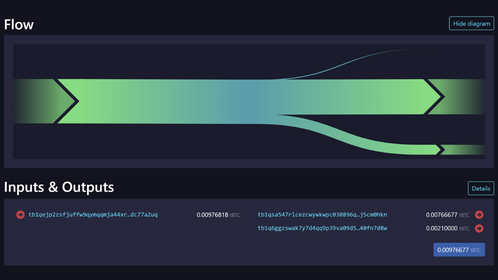

### Kupokea malipo ya BIP47 na kupatikana kwa ufunguo wa kibinafsi

Alice ametoka kufanya malipo yake ya kwanza kwa BIP47 Anwani (address) tupu mali ya Bob. Sasa hebu tuone jinsi Bob anavyopokea malipo haya. Pia tutaona kwa nini Alice hana uwezo wa kufikia ufunguo wa faragha wa Anwani (address) ambayo amejitengenezea mwenyewe, na jinsi Bob anavyopata ufunguo huu wa kutumia bitcoins alizopokea hivi punde.

Mara tu Bob anapopokea shughuli ya arifa kutoka kwa Alice, anapata ufunguo wa umma wa BIP47 $K0$ hata kabla ya mwandishi wake kutuma malipo. Kwa hivyo anaangalia malipo yoyote kwa Address inayohusika. Kwa kweli, mara moja hupata Anwani (address) kadhaa ambazo yeye huona ($K0$, $K1$, $K2$, $K3$...). Hivi ndivyo inavyopata ufunguo huu wa umma $K0$ :


- Bob huchagua ufunguo wa kibinafsi wa binti wa kwanza unaotokana na msimbo wake wa malipo. Ufunguo huu wa faragha unaitwa $b$. Inahusishwa na ufunguo wa umma $B$ ambao Alice alifanya mahesabu yake katika hatua ya awali:

$$ b $$


- Bob anachagua ufunguo wa kwanza wa umma wa Alice unaotokana na msimbo wake wa malipo. Ufunguo huu unaitwa $A$. Inahusishwa na ufunguo wa faragha $a$ ambao Alice aliutumia kuhesabu, na ambao unajulikana na Alice pekee. Bob anaweza kutekeleza mchakato huu, kwa kuwa anajua nambari ya malipo ya Alice, ambayo alitumwa kwake na shughuli ya arifa:

$$ A = a \cdot G $$


- Bob anakokotoa sehemu ya siri ya $S$, kwa kuongeza na kurudia pointi kwenye kona ya duaradufu, kwa kutumia ufunguo wake wa faragha $b$ kwenye ufunguo wa umma wa Alice $A$. Hapa tena, ECDH inatumiwa kuhakikisha kwamba hatua hii $S$ itakuwa sawa kwa Bob na Alice:

$$ S = b \cdot A $$


- Kwa njia sawa na Alice, Bob hutenga abscissa ya hatua hii $S$. Tumeita thamani hii $Sx$. Anapitisha thamani hii kwa chaguo la kukokotoa la SHA256 ili kupata siri iliyoshirikiwa $s$ (herufi ndogo):

$$ s = \text{SHA256}(Sx) $$


- Kwa njia sawa na Alice, Bob anakokotoa pointi ya $s-G$ kwenye mkunjo wa duaradufu. Kisha anaongeza sehemu hii ya siri kwa ufunguo wake wa umma $B $. Kisha anapata nukta mpya kwenye mkunjo wa duaradufu, ambao anaufasiri kama ufunguo wa umma $K0$ :

$$ K0 = B + s \cdot G $$

Mara tu Bob anapokuwa na ufunguo huu wa umma $K0$, anaweza kupata ufunguo wa faragha unaohusishwa ili kutumia bitcoins zake. Ni yeye pekee anayeweza kuzalisha ufunguo huu wa faragha:


- Bob anaongeza ufunguo wa faragha wa bintiye $b$ unaotokana na nambari yake ya malipo ya kibinafsi. Ni yeye pekee anayeweza kupata thamani ya $b$. Kisha anaongeza $b$ kwenye siri iliyoshirikiwa $s$ ili kupata $k0$, ufunguo wa faragha wa $K0$:

$$ k0 = b + s $$

Shukrani kwa sheria ya kikundi ya mkunjo wa mviringo, Bob anapata ufunguo wa faragha unaolingana na ufunguo wa umma unaotumiwa na Alice. Kwa hivyo tunayo:

$$ K0 = k0 \cdot G $$

Nitafanya muhtasari wa hatua ambazo tumeona pamoja ili kupokea malipo ya BIP47 na kukokotoa ufunguo wa faragha unaolingana:


- Bob huchagua ufunguo wa kibinafsi wa binti wa kwanza unaotokana na nambari yake ya malipo ya kibinafsi;
- Hukokotoa sehemu ya siri kwenye mkunjo wa duaradufu kwa kutumia ECDH kutoka kwa ufunguo wa umma wa binti wa kwanza unaotokana na msimbo wa kamba wa Alice;
- Inatumia sehemu hii ya siri kukokotoa siri iliyoshirikiwa na SHA256;
- Anatumia siri hii iliyoshirikiwa kuhesabu hatua mpya ya siri kwenye mkunjo wa mviringo;
- Anaongeza siri hii mpya kwa ufunguo wake wa kibinafsi wa umma;
- Anapata ufunguo mpya wa umma wa muda mfupi, ule ambao Alice atamtumia malipo ya kwanza;
- Bob huhesabu ufunguo wa faragha unaohusishwa na ufunguo huu wa umma wa muda mfupi kwa kuongeza ufunguo wa faragha wa bintiye unaotokana na msimbo wake wa malipo na siri iliyoshirikiwa.


Kwa kuwa Alice hawezi kupata $b$ (ufunguo wa faragha wa Bob), hawezi kubainisha $k0$ (ufunguo wa faragha unaohusishwa na mapokezi ya Bob ya Anwani (address) ya BIP47). Kwa utaratibu, tunaweza kuwakilisha hesabu ya siri iliyoshirikiwa $S$ kama ifuatavyo:


Mara tu siri iliyoshirikiwa inapopatikana kwa ECDH, Alice na Bob wanakokotoa ufunguo wa umma wa malipo wa BIP47 $K0$, na Bob pia anakokotoa ufunguo wa faragha unaohusishwa $k0$ :


### Urejeshaji wa malipo ya BIP47

Kwa kuwa Bob anajua msimbo wa malipo unaoweza kutumika tena wa Alice, tayari ana taarifa zote anazohitaji ili kumrejeshea pesa. Hatakuwa na haja ya kuwasiliana na Alice tena ili kuuliza habari yoyote. Anahitaji tu kumjulisha na muamala wa arifa, ili aweze kupata Anwani (address) zake za BIP47 kwa seed yake, na kisha aweze pia kumtuma hadi malipo ya `2^32`.

Kipengele cha kurejesha pesa ni mahususi kwa BIP47 na ni mojawapo ya faida zake dhidi ya mbinu nyingine, kama vile Malipo ya Kimya, ambayo tutayaangalia katika sura zinazofuata.

Kisha Bob anaweza kumlipa Alice kama vile alivyomtumia malipo. Majukumu yamebadilishwa:


*Shukrani nyingi kwa [Fanis Michalakis](https://x.com/FanisMichalakis) kwa kusahihisha na ushauri wake wa kitaalamu kuhusu makala ambayo yaliongoza kuandikwa kwa sura hii!

https://planb.network/tutorials/privacy/on-chain/paynym-bip47-a492a70b-50eb-4f95-a766-bae2c5535093
## Malipo ya Kimya

<chapterId>2871d594-414e-4598-a830-91c9eb84dfb8</chapterId>

BIP47 imekosolewa sana kwa uzembe wake wa onchain. Kama ilivyoelezwa katika sura iliyotangulia, inahitaji shughuli ya arifa ifanywe kwa kila mpokeaji mpya. Kizuizi hiki kitapungua ikiwa tunapanga kuanzisha njia endelevu ya malipo na mpokeaji huyu. Hakika, shughuli moja ya arifa hufungua njia kwa karibu idadi isiyo na kikomo ya malipo yanayofuata ya BIP47.

Hata hivyo, katika hali fulani, shughuli ya arifa inaweza kuwa kikwazo kwa mtumiaji. Hebu tuchukue mfano wa mchango wa mara moja kwa mpokeaji: kwa Anwani (address) ya Bitcoin ya kawaida, shughuli moja inatosha kukamilisha mchango. Lakini kwa BIP47, shughuli mbili zinahitajika: moja kwa taarifa na nyingine kwa malipo halisi. Wakati mahitaji ya nafasi ya kuzuia ni ya chini na ada za muamala ni ndogo, hatua hii ya ziada kwa kawaida si tatizo. Hata hivyo, wakati wa msongamano, ada za muamala zinaweza kuwa kubwa sana kwa malipo moja, na hivyo kuongeza gharama maradufu kwa mtumiaji ikilinganishwa na muamala wa kawaida wa Bitcoin, ambao huenda usikubalike kwa mtumiaji.

Kwa hali ambapo mtumiaji anapanga kufanya malipo machache tu kwa kitambulisho tuli,suluhisho nyingine imetengenezwa. Hii ni pamoja na Malipo ya Kimya, yaliyofafanuliwa katika [BIP352](https://github.com/Bitcoin/bips/blob/master/bip-0352.mediawiki). Itifaki hii inafanya uwezekano wa kutumia kitambulisho tuli kupokea malipo bila kutoa matumizi tena ya Anwani (address), na bila kuhitaji matumizi ya miamala ya arifa. Hebu tuangalie jinsi itifaki hii inavyofanya kazi.

---
*Ili kuelewa sura hii kikamilifu, ni muhimu kufahamu utendakazi wa ECDH (Elliptic Curve Diffie-Hellman) na chimbuko la ufunguo wa kriptografia katika pochi la HD. Dhana hizi zilifunikwa kwa undani katika sura iliyotangulia juu ya BIP47. Sitazirudia hapa. Ikiwa bado haujafahamu dhana hizi, ninapendekeza uangalie sura iliyotangulia kabla ya kuendelea na hii. Sitarejelea hatari zinazohusishwa na utumizi tena wa Anwani (address), wala umuhimu wa kuwa na kitambulisho cha kipekee cha kupokea malipo.* Nitataja mambo machache ambayo ningependa kueleza hapa.

---
### Kwa nini usihamishe arifa?

Kama ilivyojadiliwa katika sura ya BIP47, shughuli ya arifa ina kazi kuu mbili:


- Inajulisha mpokeaji;
- Hutuma msimbo wa malipo wa mtumaji.

Mtu anaweza kufikiria kwa ujinga kuwa mchakato huu wa arifa unaweza kufanywa off-chain. Kinadharia, inawezekana kabisa: yote ambayo mpokeaji angelazimika kufanya ni kuonyesha njia ya mawasiliano ili kupokea misimbo ya malipo ya BIP47 kutoka kwa watumaji. Walakini, kuna shida mbili kuu na njia hii:


- Kwanza, ingehamisha mchakato wa uwasilishaji wa msimbo hadi itifaki nyingine ya mawasiliano. Matatizo yanayohusiana na gharama na usiri wa Ubadilishanaji ungebaki, lakini yangehamishiwa kwa itifaki hii mpya. Kwa upande wa usiri, hii inaweza pia kuunda kiungo kati ya utambulisho wa mtumiaji na shughuli ya onchain, ambayo ndiyo tunayotafuta kuepuka kwa kutekeleza arifa moja kwa moja kwenye Blockchain. Zaidi ya hayo, kutoa arifa nje ya Blockchain kunaweza kuanzisha hatari za udhibiti (kama vile kuzuia fedha) ambazo hazipo kwenye Bitcoin;
- Pili, hii inaweza kusababisha shida ya uokoaji. Kwa BIP47, mpokeaji lazima ajue misimbo ya malipo ya watumaji ili kupata pesa. Hii ni kweli wakati wa kupokea, lakini pia katika tukio la kurejesha fedha kupitia seed (mbegu) ikiwa Pochi limepotea. Kwa arifa za onchain, hatari hii inaepukwa, kwani mtumiaji anaweza kupata na kusimbua miamala ya arifa kwa kujua tu seed (mbegu) yake. Hata hivyo, ikiwa arifa itatolewa nje ya Blockchain, mtumiaji atalazimika kudumisha hifadhi rudufu ya misimbo yote ya malipo iliyopokelewa, jambo ambalo haliwezekani kwa mtumiaji wa kawaida.

Vikwazo hivi vyote hufanya matumizi ya arifa ya onchain kuwa muhimu kwa BIP47. Walakini, Malipo ya Kimya yanatafuta kuzuia hatua hii ya arifa ya onchain kwa sababu ya gharama yake. Kwa hivyo, suluhisho lililopitishwa sio kuhamisha arifa, lakini kuiondoa kabisa. Ili kufikia hili, maelewano yanapaswa kukubaliwa: skanning. Tofauti na BIP47, ambapo mtumiaji anajua haswa mahali pa kupata pesa zake kutokana na miamala ya arifa, na Malipo ya Kimya, mtumiaji anapaswa kuchunguza miamala yote iliyopo ya Bitcoin ili kugundua malipo yoyote yanayokusudiwa kwake. Ili kupunguza mzigo huu wa kiutendaji, utafutaji wa Malipo ya Kimya unalenga tu shughuli za malipo zinazoweza kuwa na malipo kama hayo, yaani, zile zilizo na angalau pato moja la Taproot P2TR. Uchanganuzi pia unaangazia zaidi shughuli za kuanzia tarehe ya kuundwa kwa Pochi (hakuna haja ya kuchanganua miamala ya mwaka wa 2009 ikiwa Pochi liliundwa mwaka wa 2024).

Kwa hivyo unaweza kuona ni kwa nini BIP47 na Malipo ya Kimya, ingawa yanalenga lengo sawa, linalohusisha ubadilishanaji wa mapato tofauti na kwa hivyo **kukidhi hali mahususi za utumiaji**. Kwa malipo ya mara moja, kama vile michango ya mara moja, Malipo ya Kimya yanafaa zaidi kwa sababu ya gharama yake ya chini. Kwa upande mwingine, kwa shughuli za kawaida kwa mpokeaji sawa, kama ilivyo kwa majukwaa ya Ubadilishanaji au mabwawa ya mining (uchimbaji), BIP47 inaweza kupendekezwa.

Hebu tuangalie utendakazi wa kiufundi wa Malipo ya Kimya ili kuelewa vyema kilicho hatarini. Ili kufanya hivyo, napendekeza tuchukue mbinu sawa na hati ya maelezo ya BIP352. Tutagawanya hatua kwa hatua mahesabu ya kufanywa, kipengele kwa kipengele, kuhalalisha kila nyongeza mpya.

### dhana chache kuelewa

Kabla ya kuanza, ni muhimu kubainisha kuwa Malipo ya Kimya yanategemea matumizi ya aina za hati za P2TR (*Lipa kwa Taproot*) pekee. Tofauti na BIP47, si lazima kupata Anwani (address) za kupokea kutoka kwa funguo za umma za watoto kwa hashing. Katika kiwango cha P2TR, ufunguo wa umma uliowekwa hutumiwa moja kwa moja na usio na ufiche kwenye Anwani (address). Kwa hivyo Taproot kupokea Anwani (address) kimsingi ni ufunguo wa umma na metadata fulani. Ufunguo huu wa umma uliobadilishwa ni muunganisho wa funguo zingine mbili za umma: moja kuwezesha matumizi ya moja kwa moja, ya kitamaduni kupitia sahihi rahisi, na nyingine ikiwakilisha Merkle Root ya MAST, ambayo inaidhinisha matumizi kulingana na kuridhika kwa mojawapo ya masharti yanayoweza kuandikwa katika Merkle Tree.


Kuna sababu kuu mbili za uamuzi wa kuweka kikomo cha Malipo ya Kimya kwa Taproot pekee:


- Kwanza, hurahisisha utekelezaji na uboreshaji wa siku zijazo katika programu za kwingineko, kwani ni kiwango kimoja tu kinachohitaji kuheshimiwa;
- Pili, mbinu hii husaidia kuboresha hali ya kutoweka kwa watumiaji kwa kuwahimiza kutojigawanya kati ya aina tofauti za hati, ambazo alama za vidole za kuzalisha tofauti katika uchanganuzi wa minyororo (kwa maelezo zaidi kuhusu dhana hii, tafadhali rejelea sura ya 4 ya sehemu ya 2).

### Utokezi wa ujinga wa ufunguo wa umma wa Malipo ya Kimya

Wacha tuanze na mfano rahisi ili kupata kiini cha jinsi SP (Malipo ya Kimya) hufanya kazi. Hebu tuchukue Alice na Bob, watumiaji wawili wa Bitcoin. Alice anataka kutuma Bitcoins kwa Bob kwa kupokea Anwani (address) tupu. Kuna malengo matatu ya mchakato huu:


- Alice lazima awe na uwezo wa kuzalisha Anwani (address) tupu;
- Bob lazima aweze kutambua malipo yaliyotumwa kwa Anwani (address) hii maalum;
- Bob anahitaji kupata ufunguo wa faragha unaohusishwa na Anwani (address) hii ili kutumia pesa zake.

Alice ana UTXO katika Pochi la Bitcoin yake salama na jozi zifuatazo muhimu:


- $a$: ufunguo wa faragha;
- $A$: ufunguo wa umma ($A = a \cdot G$)

Bob ana Anwani (address) ya SP ambayo amechapisha kwenye Mtandao na:


- $b$: ufunguo wa faragha;
- $B$: ufunguo wa umma ($B = b \cdot G$)

Kwa kupata tena Anwani (address) ya Bob, Alice anaweza kukokotoa Anwani (address) mpya ambayo ni ya Bob kwa kutumia ECDH. Hebu tuite hii Anwani (address) $P$ :

$$ P = B + \maandishi{Hash}(a \cdot B) \cdot G $$

Katika mlingano huu, Alice amekokotoa tu bidhaa ya scalar ya ufunguo wake wa faragha $a$ na ufunguo wa umma wa Bob $B$. Amepitisha matokeo haya kuwa kazi ya Hash inayojulikana kwa kila mtu. Thamani inayotokana huzidishwa kwa kasi kwa nukta ya kuzalisha $G$ ya mkunjo wa duaradufu `secp256k1`. Hatimaye, Alice anaongeza hatua inayotokana na ufunguo wa umma wa Bob $B$. Mara tu Alice anapokuwa na Anwani (address) $P$ hii, anaitumia kama pato katika shughuli, yaani, yeye hutuma bitcoins kwake.

> *Katika muktadha wa Malipo ya Kimya, chaguo za kukokotoa za "Hash" inalingana na chaguo za kukokotoa za SHA256 Hash zilizowekwa lebo maalum na `BIP0352/SharedSecret`, ambayo huhakikisha kwamba heshi zinazozalishwa ni za kipekee kwa itifaki hii na haziwezi kutumika tena katika miktadha mingine, huku ikitoa ulinzi wa ziada dhidi ya utumiaji sahihi wa nonces. Kiwango hiki kinalingana na kile [kilichobainishwa katika BIP340 kwa sahihi za Schnorr](https://github.com/Bitcoin/bips/blob/master/bip-0340.mediawiki) kwenye `secp256k1`.*
Shukrani kwa sifa za mkunjo wa elliptic ambao ECDH inategemea, tunajua kwamba:

$$ a \cdot B = b \cdot A $$

Kwa hiyo Bob ataweza kuhesabu kupokea Anwani (address) ambayo Alice ametuma bitcoins. Ili kufanya hivyo, yeye hufuatilia miamala yote ya Bitcoin ambayo inakidhi vigezo vya Malipo ya Kimya na kutumia hesabu ifuatayo kwa kila mmoja wao ili kuona kama malipo yameelekezwa kwake (*skanning*):

$$ P' = B + \maandishi{Hash}(b \cdot A) \cdot G $$

Anapokagua muamala wa Alice, anagundua kuwa $P'$ ni sawa na $P$. Kwa hivyo anajua kuwa malipo yanaelekezwa kwake:

$$ P' = B + \text{Hash}(b \cdot A) \cdot G = B + \text{Hash}(a \cdot B) \cdot G = P $$

Kuanzia hapa, Bob ataweza kukokotoa ufunguo wa faragha $p$ ambao unaruhusu Anwani (address) $P$ kutumika:

$$ p = (b + \maandishi{Hash}(b \cdot A)) \bmod n $$

Kama unavyoona, ili kukokotoa ufunguo huu wa faragha $p$, lazima uwe na ufunguo wa faragha $b$. Bob pekee ndiye aliye na ufunguo huu wa faragha $b$. Kwa hiyo atakuwa ndiye pekee anayeweza kutumia bitcoins zilizotumwa kwa Malipo yake ya Anwani (address) ya Kimya.


*Hadithi:*


- $B$ : Ufunguo wa umma/Anwani (address) tuli iliyochapishwa na Bob
- $b$ : Ufunguo wa faragha wa Bob
- $A$ : Kitufe cha umma cha Alice cha UTXO kinatumika kama ingizo la muamala
- $a$ : Ufunguo wa kibinafsi wa Alice
- $G$ : Sehemu ya kuzalisha ya mkunjo ya duaradufu `secp256k1`
- $\text{SHA256}$ : Chaguo za kukokotoa za SHA256 Hash zilizowekwa alama ya `BIP0352/SharedSecret`
- $s$ : Siri ya pamoja ya ECDH
- $P$ : Ufunguo wa umma/Anwani (address) ya kipekee kwa malipo kwa Bob

Hapa kuna mbinu ya awali ya ujinga ya kutumia Anwani (address) tuli ya Bob, iliyobainishwa $B$, kupata Anwani (address) $P$ ya kipekee ya kutuma bitcoins kwa. Hata hivyo, njia hii ni rahisi sana na ina dosari kadhaa zinazohitaji kurekebishwa. Shida ya kwanza ni kwamba, katika mpango huu, Alice hawezi kuunda matokeo mengi kwa Bob ndani ya shughuli sawa.

### Ninawezaje kuunda matokeo mengi?

Katika mfano katika sehemu iliyotangulia, Alice anaunda pato moja ambalo litaenda kwa Bob kwa Anwani (address) $P $ yake ya kipekee. Kwa ingizo lile lile lililochaguliwa, haiwezekani kwa Alice kuunda Anwani (address) mbili tofauti tupu za Bob, kwa kuwa njia inayotumiwa inaweza kusababisha matokeo sawa kila wakati kwa $P$, yaani Anwani (address) sawa. Hata hivyo, kunaweza kuwa na hali nyingi ambapo Alice anataka kugawanya malipo yake kwa Bob katika viwango kadhaa vidogo, hivyo kuunda UTXO kadhaa. Kwa hiyo ni muhimu kutafuta mbinu ya kufikia hili.

Ili kufanikisha hili, tutarekebisha kidogo hesabu anayofanya Alice ili kupata $P$, ili aweze kuzalisha Anwani (address) mbili tofauti za Bob, ambazo ni $P_0$ na $P_1$.

Ili kurekebisha hesabu na kupata Anwani (address) 2 tofauti, ongeza tu nambari kamili inayorekebisha matokeo. Kwa hivyo, Alice ataongeza $0$ kwenye hesabu yake ili kupata Anwani (address) $P_0$ na $1$ ili kupata Anwani (address) $P_1$. Wacha tuite nambari hii kamili $i$ :

$$ P_i = B + \maandishi{Hash}(a \cdot B \maandishi{ ‖} i) \cdot G $$

Mchakato wa kuhesabu haujabadilika kutoka kwa njia ya awali, isipokuwa kwamba wakati huu Alice ataunganisha $a \cdot B$ na $i$ kabla ya kuendelea na Hash. Kisha utarekebisha $i$ ili kupata Address mpya ya Bob. Kwa mfano:

$$ P_0 = B + \maandishi{Hash}(a \cdot B \maandishi{ ‖} 0) \cdot G $$

$$ P_1 = B + \maandishi{Hash}(a \cdot B \maandishi{ ‖} 1) \cdot G $$

Wakati Bob anachanganua Blockchain kwa Malipo ya Kimya yaliyokusudiwa kwake, anaanza kwa kutumia $i = 0$ kwa Address $P_0$. Asipopata malipo yoyote kwenye $P_0$, atahitimisha kuwa muamala huu hauna Malipo ya Kimya yaliyokusudiwa kwake, na ataachana na utafutaji. Hata hivyo, ikiwa $P_0$ ni halali na ina malipo yake, ataendelea na $P_1$ katika shughuli hiyo hiyo ili kuangalia kama Alice amefanya malipo ya pili. Iwapo $P_1$ itakuwa batili, itaacha kutafuta muamala huu; vinginevyo, inaendelea kujaribu maadili ya $i$ mfululizo:

$$ P_0 = B + \maandishi{Hash}(b \cdot A \text{ ‖ } 0) \cdot G $$

$$ P_1 = B + \text{Hash}(b \cdot A \text{ ‖} 1) \cdot G $$

Kwa kuwa Bob husimama mara moja kwa $i = 0$ ikiwa $P_0$ haifanyi kazi, kutumia nambari hii kamili huongeza karibu hakuna mzigo wa ziada wa uendeshaji kwenye Bob kwa hatua ya kuchanganua muamala.

Bob basi anaweza kuhesabu funguo za kibinafsi kwa njia ile ile:

$$
p_0 = (b + \text{hash}(b \cdot A \text{ ‖ } 0)) \bmod n
$$

$$
p_1 = (b + \text{hash}(b \cdot A \text{ ‖ } 1)) \bmod n
$$


*Hadithi:*


- $B$ : Ufunguo wa umma/Anwani (address) tuli iliyochapishwa na Bob
- $b$ : Ufunguo wa faragha wa Bob
- $A$ : Kitufe cha umma cha Alice cha UTXO kinatumika kama ingizo la muamala
- $a$ : Ufunguo wa kibinafsi wa Alice
- $G$ : Sehemu ya kuzalisha ya mkunjo wa duaradufu `secp256k1`
- $\text{SHA256}$ : Chaguo za kukokotoa za SHA256 Hash zilizowekwa alama ya `BIP0352/SharedSecret`
- $s_0$ : Siri ya kwanza ya kawaida ya ECDH
- $s_1$ : Siri ya pili ya kawaida ya ECDH
- $P_0$ : Ufunguo wa kwanza wa umma / wa kipekee wa Anwani (address) kwa malipo kwa Bob
- $P_1$ : Ufunguo wa pili wa umma / Anwani (address) ya kipekee kwa malipo ya Bob

Kwa njia hii, tunaanza kupata itifaki nzuri, lakini bado kuna changamoto chache za kushinda, si haba kuzuia utumiaji tena wa Anwani (address).

### Jinsi ya kuzuia kutumia tena ya Anwani (address)?

Kama tulivyoona katika sehemu zilizopita, Alice anatumia jozi muhimu ambayo inalinda UTXO yake, ambayo atatumia kukokotoa siri iliyoshirikiwa ya ECDH na Bob. Siri hii inamwezesha kupata Anwani (address) $P_0$ ya kipekee. Hata hivyo, jozi muhimu ($a$, $A$) iliyotumiwa na Alice inaweza kupata UTXO kadhaa ikiwa ametumia tena Anwani (address) hii mara kadhaa. Iwapo Alice atafanya malipo mawili kwa Anwani (address) $B$ tuli ya Bob kwa kutumia UTXO mbili zilizolindwa kwa ufunguo sawa wa $A$, hii inaweza kusababisha matumizi ya Anwani (address) tena kwa Bob.

> *Utumiaji tena wa Anwani (address) ni mazoea mabaya sana katika suala la usiri wa mtumiaji. Ili kujua ni kwa nini, nakushauri upitie sehemu za kwanza za kozi hii ya mafunzo.*
Hakika, kwa kuwa Anwani (address) $P_0$ ya kipekee imechukuliwa kutoka $A$ na $B$, vyema ikiwa Alice atapata Anwani (address) ya pili kwa malipo ya pili kwa $B$, na ufunguo sawa $A$, ataishia kwenye Anwani (address) $P_0$ sawa kabisa. Ili kuepuka hatari hii na kuzuia kutumia tena Anwani (address) ndani ya Malipo ya Kimya, tutahitaji kurekebisha hesabu zetu kidogo.

Tunachotaka ni kwa kila UTXO inayotumiwa na Alice kama ingizo la malipo ili kutoa Anwani (address) ya kipekee kwa upande wa Bob, hata kama UTXO kadhaa zimelindwa na jozi sawa za funguo. Kwa hivyo tunachohitaji kufanya ni kuongeza marejeleo kwa UTXO wakati wa kukokotoa Anwani (address) $P_0$ ya kipekee. Rejeleo hili litakuwa tu Hash ya UTXO inayotumiwa kama pembejeo:

$$ \text{inputHash} = \text{Hash}(\text{outpoint} \text{ ‖ } A) $$

Na Alice ataongeza rejeleo hili kwa ingizo kwenye hesabu yake ya kipekee ya Anwani (address) $P_0$ :

$$ P_0 = B + \maandishi{Hash}(\text{inputHash} \cdot a \cdot B \text{ ‖ } 0) \cdot G $$

Wakati wa kuchanganua, Bob pia anaweza kuongeza $\text{inputHash}$, kwa kuwa anachopaswa kufanya ni kuchunguza muamala ili kubaini $\text{outpoint}$ :

$$ P_0 = B + \text{Hash}(\text{inputHash} \cdot b \cdot A \text{ ‖ } 0) \cdot G $$

Inapopata $P_0$ halali, inaweza kukokotoa ufunguo wa faragha wa $p_0$ unaolingana:

$$
p_0 = (b + \text{hash}(\text{inputHash} \cdot b \cdot A \text{ ‖ } 0)) \bmod n
$$


*Hadithi:*


- $B$ : Ufunguo wa umma/Anwani (address) tuli iliyochapishwa na Bob
- $b$ : Ufunguo wa faragha wa Bob
- $A$ : Kitufe cha umma cha Alice cha UTXO kinatumika kama ingizo la muamala
- $a$ : Ufunguo wa kibinafsi wa Alice
- $H$ : UTXO Hash imetumika kama ingizo
- $G$ : Sehemu ya kuzalisha ya mkunjo wa duaradufu `secp256k1`
- $\text{SHA256}$ : Chaguo za kukokotoa za SHA256 Hash zilizowekwa alama ya `BIP0352/SharedSecret`
- $s_0$ : Siri ya kwanza ya ECDH ya pamoja
- $P_0$ : Ufunguo wa kwanza wa umma / wa kipekee wa Anwani (address) kwa malipo ya Bob

Kwa sasa, hesabu zetu zinachukulia kuwa Alice anatumia ingizo moja kwa shughuli yake. Walakini, anapaswa kuwa na uwezo wa kutumia pembejeo kadhaa. Kwa hivyo, kwa upande wa Bob, kwa kila shughuli inayohusisha pembejeo kadhaa, anapaswa kukokotoa ECDH kinadharia kwa kila pembejeo ili kubaini kama malipo yanalenga kwake. Njia hii sio ya kuridhisha, kwa hivyo tunahitaji kutafuta suluhisho la kupunguza mzigo wa kazi!

### Kuweka funguo za umma kwenye pembejeo

Ili kutatua tatizo hili, badala ya kutumia jozi muhimu kupata ingizo maalum kwa upande wa Alice, tutatumia jumla ya jozi zote muhimu zinazotumiwa katika ingizo la muamala. Jumla hii itazingatiwa kama jozi mpya muhimu. Mbinu hii inajulikana kama "tweaking".

Kwa mfano, hebu tufikirie kuwa shughuli ya Alice ina pembejeo 3, kila moja ikiwa na jozi tofauti muhimu:


- $a_0$ inatumika kupata pembejeo #0 ;
- $a_1$ inatumika kupata pembejeo #1;
- $a_2$ hulinda ingizo #2.


Kufuatia njia iliyoelezwa hapo awali, Alice angelazimika kuchagua jozi moja ya funguo kati ya $a_0$, $a_1$, na $a_2$ ili kukokotoa siri ya ECDH na kuzalisha malipo moja ya Anwani (address) $P$ kutoka kwa tuli ya Anwani (address) ya Bob $B$. Hata hivyo, mbinu hii inahitaji Bob ajaribu kila uwezekano kwa mfuatano, akianza na $a_0$, kisha $a_1$, na kadhalika, hadi atambue jozi inayozalisha $P$ Anwani (address) halali. Mchakato huu unamhitaji Bob kuendesha hesabu ya ECDH kwenye ingizo zote za miamala yote, ambayo huongeza kwa kiasi kikubwa mzigo wa uendeshaji wa skanning.

Ili kuepuka hili, tutamwomba Alice akokotoe $P$ kwa kutumia jumla ya vitufe vyote vya kuingiza data. Kwa kutumia mfano wetu, ufunguo wa faragha uliobadilishwa $a$ utahesabiwa kama ifuatavyo:

$$ a = a_0 + a_1 + a_2 $$

Kwa njia hiyo hiyo, Alice na Bob wanaweza kuhesabu ufunguo wa umma uliowekwa:

$$ A = A_0 + A_1 + A_2 $$

Kwa njia hii, Bob anahitaji tu kuhesabu jumla ya funguo za umma za shughuli, kisha kuhesabu siri ya ECDH kutoka $ A $ pekee, ambayo hupunguza kwa kiasi kikubwa idadi ya hesabu zinazohitajika kwa hatua ya skanning.

Walakini, kumbuka sehemu iliyopita. Tulikuwa tumeongeza $\text{inputHash}$ Hash kwenye hesabu yetu, ambayo inatumika kama Nonce ili kuepuka kutumia tena Anwani (address):

$$ \text{inputHash} = \text{Hash}(\text{outpoint} \text{ ‖ } A) $$

Lakini ikiwa una ingizo kadhaa katika muamala, unahitaji kuweza kubainisha ni $\text{outpoint}$ ipi imechaguliwa katika hesabu hii. Kulingana na BIP352, kigezo cha kuchagua $\text{outpoint}$ kitakachotumika ni kuchagua ndogo zaidi kimsamiati, ambayo ina maana ya kuchagua UTXO inayoonekana kwanza kwa mpangilio wa alfabeti. Njia hii inasawazisha UTXO itakayochaguliwa katika kila shughuli. Kwa mfano, ikiwa hii ndogo zaidi kimsamiati $\text{outpoint}$ ni $\text{outpoint}_L$, hesabu ya $\text{inputHash}$ itakuwa :

$$ \text{inputHash} = \text{Hash}(\text{outpoint}_L \text{ ‖ } A) $$

Kisha hesabu zitasalia sawa na zile zilizowasilishwa katika sehemu iliyotangulia, isipokuwa kwamba ufunguo wa faragha $a$ na ufunguo wake wa umma unaolingana $A$ si jozi tena inayotumiwa kulinda ingizo moja, lakini sasa inawakilisha tweak kwa jozi zote muhimu katika ingizo.

### Tenganisha funguo za gharama na uchanganue

Kwa sasa, tumerejelea Malipo ya Kimya Anwani (address) tuli $B$ kama ufunguo wa kipekee wa umma. Kumbuka, ni ufunguo huu wa umma $B$ ambao Alice hutumia kuunda ECDH ya siri iliyoshirikiwa, ambayo nayo hukokotoa malipo ya Anwani (address) ya kipekee $P$. Bob hutumia ufunguo huu wa umma $B$ na ufunguo wa faragha unaolingana $b$ kwa hatua ya kuchanganua. Lakini pia atatumia ufunguo wa faragha $b$ kukokotoa ufunguo wa faragha $p$ unaowezesha matumizi kutoka kwa Anwani (address) $P$.

Ubaya wa njia hii ni kwamba ufunguo wa faragha wa $b$, ambao hutumika kukokotoa funguo zote za faragha za Anwani (address) ambazo zimepokea Malipo ya Kimya, hutumiwa pia na Bob kuchanganua miamala. Hatua hii inahitaji ufunguo wa $b$ kupatikana kwenye programu iliyounganishwa na Pochi la mtandao, ambayo inaiweka kwenye hatari ya wizi kuliko kuiweka kwenye Pochi la Cold. Kwa hakika, itakuwa na manufaa kuweza kufaidika na Malipo ya Kimya huku ukiweka ufunguo wa faragha wa $b$, ambao unadhibiti ufikiaji wa funguo nyingine zote za faragha, salama kwenye Pochi la Hardware. Kwa bahati nzuri, itifaki imebadilishwa ili kuruhusu hivyo tu.

Ili kufanya hivyo, BIP352 inahitaji mpokeaji kutumia jozi 2 tofauti za funguo:


- b_{\text{spend}}$: kukokotoa funguo za faragha za Anwani (address) za kipekee za malipo;
- b_{\text{scan}}$: ili kupata Anwani (address) za kipekee za malipo.

Kwa njia hii, Bob anaweza kuweka ufunguo wa faragha $b_{\text{spend}}}$ kwenye Pochi la Hardware na kutumia ufunguo wa faragha $b_{\text{scan}}$ kwenye programu ya mtandaoni ili kupata Malipo yake ya Kimya, bila kufichua $b_{\text{spend}}$. Kwa upande mwingine, funguo za umma $B_{\text{scan}}$ na $B_{\text{spend}}$ zote zinafichuliwa hadharani, kwa kuwa zinapatikana katika Anwani (address) tuli ya Bob  $B$ :

$$ B = B_{\text{scan}} \text{ ‖ } B_{\text{spend}} $$

Ili kukokotoa malipo ya kipekee ya Anwani (address) $P_0$ ya Bob, Alice sasa atafanya hesabu ifuatayo:

$$ P_0 = B_{\text{spend}} + \text{Hash}(\text{inputHash} \cdot a \cdot B_{\text{scan}} \text{ ‖ } 0) \cdot G $$

Ili kupata malipo yaliyoelekezwa kwake, Bob atafanya hesabu ifuatayo:

$$ P_0 = B_{\text{spend}} + \text{Hash}(\text{inputHash} \cdot b_{\text{scan}} \cdot A \text{ ‖ } 0) \cdot G $$

Kama unavyoona, hadi sasa Bob hajahitaji kutumia $b_{\text{spend}}$, ambayo iko kwenye Pochi la Hardware yake. Anapotaka kutumia $P_0$, anaweza kufanya hesabu ifuatayo ili kupata ufunguo wa faragha $p_0$ :

$$ p_0 = (b_{\text{spend}} + \text{Hash}(\text{inputHash} \cdot b_{\text{scan}} \cdot A \text{ ‖ } 0)) \bmod n $$


*Hadithi:*


- $B_{\text{scan}$: Kitufe cha kuchanganua hadharani cha Bob (Address tuli)
- $b_{\text{scan}$ : Ufunguo wa faragha wa Bob wa kuchanganua
- $B_{\text{spend}}$ : Kitufe cha Bob cha matumizi ya umma (Anwani (address) tuli)
- $b_{\text{spend}}$ : Ufunguo wa faragha wa Bob wa matumizi
- $A$ : Jumla ya pembejeo muhimu za umma (tweak)
- $a$ : Ufunguo wa faragha unaolingana na ufunguo wa umma uliobadilishwa
- $H$ : Hash kati ya UTXO ndogo zaidi (kieleksikografia) imetumika kama ingizo
- $G$ : Sehemu ya kuzalisha ya mkunjo wa duaradufu `secp256k1`
- $\text{SHA256}$ : Chaguo za kukokotoa za SHA256 Hash zilizowekwa alama ya `BIP0352/SharedSecret`
- $s_0$ : ECDH ya siri ya kwanza
- $P_0$ : Ufunguo wa kwanza wa umma / wa kipekee wa Anwani (address) kwa malipo ya Bob

### Kutumia Anwani (address) za SP zilizo na lebo

Kwa hivyo Bob ana Anwani (address) $B$ tuli kwa Malipo ya Kimya kama vile :

$$ B = B_{\text{scan}} \text{ ‖ } B_{\text{spend}} $$

Tatizo la njia hii ni kwamba haikuruhusu kutenga malipo tofauti yanayotumwa kwa Anwani (address) hii. Kwa mfano, ikiwa Bob ana wateja 2 tofauti wa biashara yake, na anataka kutofautisha malipo kwa kila mmoja, atahitaji Anwani (address) 2 tofauti tuli. Suluhisho la kutojua, pamoja na mbinu ya sasa, lingekuwa kwa Bob kuunda pochi mbili tofauti, kila moja ikiwa na tuli yake ya Anwani (address), au hata kuanzisha Anwani (address) mbili tofauti ndani ya Pochi sawa. Hata hivyo, suluhisho hili linahitaji kuchanganua Blockchain nzima mara mbili (mara moja kwa kila Anwani (address)) ili kugundua malipo yanayokusudiwa kwa kila Anwani (address) mtawalia. Uchanganuzi huu mara mbili huongeza mzigo wa uendeshaji wa Bob bila sababu.

Ili kutatua tatizo hili, BIP352 hutumia mfumo wa alama unaoruhusu Anwani (address) tofauti za tuli, bila kuongeza bila sababu mzigo wa kazi wa kutafuta Malipo ya Kimya kwenye Blockchain. Ili kufanya hivyo, tunaongeza nambari kamili $m$ kwenye ufunguo wa matumizi ya umma $B_{\text{spend}}$. Nambari hii kamili inaweza kuchukua thamani ya $1$ kwa Address tuli ya kwanza, kisha $2$ kwa pili, na kadhalika. Vifunguo vya matumizi $B_{\text{spend}}$ sasa vitaitwa $B_m$ na vitaundwa kwa njia hii:

$$ B_m = B_{\text{spend}} + \text{Hash}(b_{\text{scan}} \text{ ‖ } m) \cdot G $$

Kwa mfano, kwa ufunguo wa kwanza wa gharama ulio na alama $1$ :

$$ B_1 = B_{\text{spend}} + \text{Hash}(b_{\text{scan}} \text{ ‖ } 1) \cdot G $$

Anwani (address) tuli iliyochapishwa na Bob sasa itajumuisha $B_{\text{scan}}$ na $B_m$. Kwa mfano, Anwani (address) ya kwanza tuli yenye alama $1$ itakuwa :

$$ B = B_{\text{scan}} \text{ ‖ } B_1 $$

> *Tunaanzia kwenye alama ya 1 pekee kwa sababu alama 0 imetengwa kwa ajili ya mabadiliko.*
Alice, kwa upande wake, atapata malipo moja ya Anwani (address) $P$ kwa njia ile ile kama awali, lakini kwa kutumia $B_1$ mpya badala ya $B_{\text{spend}}$ :

$$ P_0 = B_1 + \text{Hash}(\text{inputHash} \cdot a \cdot B_{\text{scan}} \text{ ‖ } 0) \cdot G $$

Kwa uhalisia, Alice hata hajui kuwa Bob ana alama ya Anwani (address), kwa kuwa anatumia tu sehemu ya pili ya Anwani (address) tuli aliyotoa, na katika hali hii, ni thamani ya $B_1$ badala ya $B_{text{spend}}$.

Ili kuchanganua malipo, Bob atatumia kila wakati thamani ya tuli yake ya awali ya Anwani (address) na $B_{\text{spend}}$ kwa njia hii:

$$ P_0 = B_{\text{spend}} + \text{Hash}(\text{inputHash} \cdot b_{\text{scan}} \cdot A \text{ ‖ } 0) \cdot G $$

Halafu, yeye huondoa tu dhamana anayopata $P_0$ kutoka kwa kila pato moja baada ya nyingine. Kisha huangalia ikiwa moja ya matokeo ya uondoaji huu yanalingana na thamani ya mojawapo ya alama anazotumia kwenye kwingineko yake. Iwapo, kwa mfano, pato #4 linalingana na alama ya $1$, hii inamaanisha kuwa pato hili ni Malipo ya Kimya yanayohusishwa na Anwani (address) $B_1$ yenye alama yake ya kitakwimu:

$$ Out_4 - P_0 = \text{Hash}(b_{\text{scan}} \text{ ‖ } 1) \cdot G $$

Inafanya kazi kwa sababu:

$$ B_1 = B_{\text{spend}} + \text{Hash}(b_{\text{scan}} \text{ ‖ } 1) \cdot G $$

Shukrani kwa mbinu hii, Bob anaweza kutumia wingi wa Anwani (address) tuli ($B_1$, $B_2$, $B_3$...), zote zimetokana na tuli yake ya msingi ya Anwani (address) ($B = B_{\text{scan}} \text{ ‖ } B_{\text{spend}}}$), ili kuweka matumizi tofauti.

Tafadhali kumbuka, hata hivyo, kwamba utengano huu wa Anwani (address) tuli ni halali tu kutoka kwa mtazamo wa usimamizi wa kwingineko ya kibinafsi, lakini hautenganishi vitambulisho. Kwa kuwa zote zina $B_{\text{scan}}}$ sawa, ni rahisi sana kuhusisha Anwani (address) tuli zote pamoja na kubaini kuwa zinamilikiwa na huluki moja.


*Hadithi:*


- $B_{\text{scan}$: Kitufe cha kuchanganua hadharani cha Bob (Anwani (address) tuli)
- $b_{\text{scan}$ : Ufunguo wa faragha wa Bob wa kuchanganua
- $B_{\text{spend}}$ : Kitufe cha Bob cha matumizi ya umma (Anwani (address) ya awali)
- $B_m$ : Kitufe cha Bob cha matumizi ya umma kilichoandikwa (Anwani (address) tuli)
- $b_m$: Ufunguo wa matumizi wa kibinafsi wa Bob umeandikwa
- $A$ : Jumla ya pembejeo muhimu za umma (tweak)
- $a$ : Ufunguo wa faragha unaolingana na ufunguo wa umma uliobadilishwa
- $H$ : Hash ya UTXO ndogo zaidi (kieleksikografia) imetumika kama ingizo
- $G$ : Sehemu ya kuzalisha ya mkunjo wa duaradufu `secp256k1`
- $\text{SHA256}$ : Chaguo za kukokotoa za SHA256 Hash zilizowekwa alama ya `BIP0352/SharedSecret`
- $s_0$ : Siri ya kwanza ya ECDH ya pamoja
- $P_0$ : Ufunguo wa kwanza wa umma / wa kipekee wa Anwani (address) kwa malipo kwa Bob
- $p_0$ : Ufunguo wa faragha wa malipo ya kwanza ya kipekee ya Anwani (address) kwa Bob
- $X$ : Hash ya ufunguo wa kibinafsi wa kuchanganua na alama

### Je, ninawezaje kujenga Malipo ya Kimya ya Anwani (address)?

Ili kuunda Anwani (address) iliyoundwa kwa Malipo ya Kimya, kwanza unahitaji kupata jozi 2 muhimu kutoka kwa Pochi la Bitcoin HD yako:


- Jozi $b_{\text{scan}}$, $B_{\text{scan}}$ ili kutafuta malipo yanayoelekezwa kwetu;
- Jozi $b_{\text{spend}}$, $B_{\text{spend}}$ kufikiria bitcoins ambazo tumepokea.

Jozi hizi zimetolewa kwa kutumia njia zifuatazo (*Bitcoin Mainnet*):

```text
scan : m / 352' / 0' / 0' / 1' / 0
spend : m / 352' / 0' / 0' / 0' / 0
```

Mara tu tukiwa na jozi hizi 2 za funguo, tunaziunganisha kwa urahisi (mwisho-hadi-mwisho) ili kuunda upakiaji tuli wa Anwani (address):

$$ B = B_{\text{scan}} \text{ ‖ } B_{\text{spend}} $$

Ikiwa tunataka kutumia alama, tutabadilisha $B_{\text{spend}}$ na $B_m$ :

$$ B = B_{\text{scan}} \text{ ‖ } B_m $$

Na alama $m$ :

$$ B_m = B_{\text{spend}} + \text{Hash}(b_{\text{scan}} \text{ ‖ } m) \cdot G $$

Mara tu tunapopakia, tunaongeza HRP (*Sehemu Inayoweza Kusomwa na Binadamu*) `sp` na toleo la `q` (= toleo la 0). Pia tunaongeza cheki na umbizo la Anwani (address) kama bech32m.

Kwa mfano, hapa kuna Malipo yangu ya Kimya ya Anwani (address) tuli:

```text
sp1qqvhjvsq2vz8zwrw372vuzle7472zup2ql3pz64yn5cpkw5ngv2n6jq4nl8cgm6zmu48yk3eq33ryc7aam6jrvrg0d0uuyzecfhx2wgsumcurv77e
```

Hoja muhimu kuhusu Anwani (address) tuli, ambayo unaweza kuwa umeelewa katika sehemu zilizopita, ni kwamba Anwani (address) hizi hazionekani katika shughuli za Bitcoin. Ni Anwani (address) za malipo za $P$ zinazotumiwa katika matokeo pekee ndizo zinazoonekana kwenye Blockchain katika umbizo la kawaida la Taproot. Kwa hivyo, kutoka nje, haiwezekani kutofautisha muamala unaohusisha Malipo ya Kimya na muamala wa kawaida kwa kutumia matokeo ya P2TR.

Kama ilivyo kwa BIP47, haiwezekani kuanzisha muunganisho kati ya Anwani (address) $B$ tuli na malipo ya Address $P$ inayotokana na $B$. Hakika, hata kama Eve, mshambuliaji anayetarajiwa, atajaribu kuchanganua Blockchain kwa tuli ya Bob ya $B$ Anwani (address), hataweza kufanya hesabu zinazohitajika ili kubaini $P$. Ili kufanya hivyo, angehitaji ufunguo wa faragha wa Bob $b_{\text{scan}}$, au funguo za faragha za mtumaji $a$, lakini zote mbili bila shaka ni za faragha. Kwa hivyo inawezekana kuunganisha kwa uwazi Anwani (address) tuli ya mtu na aina ya utambulisho wa kibinafsi.

### Je, ninawezaje kutumia Malipo ya Kimya?

Pendekezo la Malipo ya Kimya ni la hivi punde na limetekelezwa na idadi ndogo tu ya pochi kwa sasa. Kwa ufahamu wangu, kuna bidhaa 3 tu za programu zinazowasaidia:


- [CakeWallet](https://cakewallet.com/)
- [Silentium](https://app.silentium.dev/)
- [Mkoba wa Mchango](https://github.com/Sosthene00/donationwallet)

Hivi karibuni tutakupa mafunzo ya kina kuhusu jinsi ya kusanidi Malipo yako ya Anwani (address) ya Kimya.

Kwa kuwa kipengele hiki ni kipya, tunakushauri uwe mwangalifu na uepuke kutumia Malipo ya Kimya kwa kiasi kikubwa kwenye Mainnet.

*Ili kuunda sura hii kuhusu Malipo ya Kimya, nilitumia [tovuti ya maelezo ya Malipo ya Kimya](https://silentpayments.xyz/) na [hati ya maelezo ya BIP352](https://github.com/Bitcoin/bips/blob/master/bip-0352.mediawiki).*

# Hitimisho

<partId>2aee56c0-b285-4799-b4f7-373a552ee2b2</partId>

## Ukaguzi na Ukadiriaji

<chapterId>195d149f-80fa-5816-8b46-995a9226d082</chapterId>

<isCourseReview>true</isCourseReview>
## Uchunguzi wa mwisho

<chapterId>e803d394-e3c1-5816-a6b4-a69a2472019c</chapterId>

<isCourseExam>true</isCourseExam>
## Hitimisho

<chapterId>cd8e5c67-50e4-4dcd-8e04-88ba5ec95305</chapterId>

<isCourseConclusion>true</isCourseConclusion>
