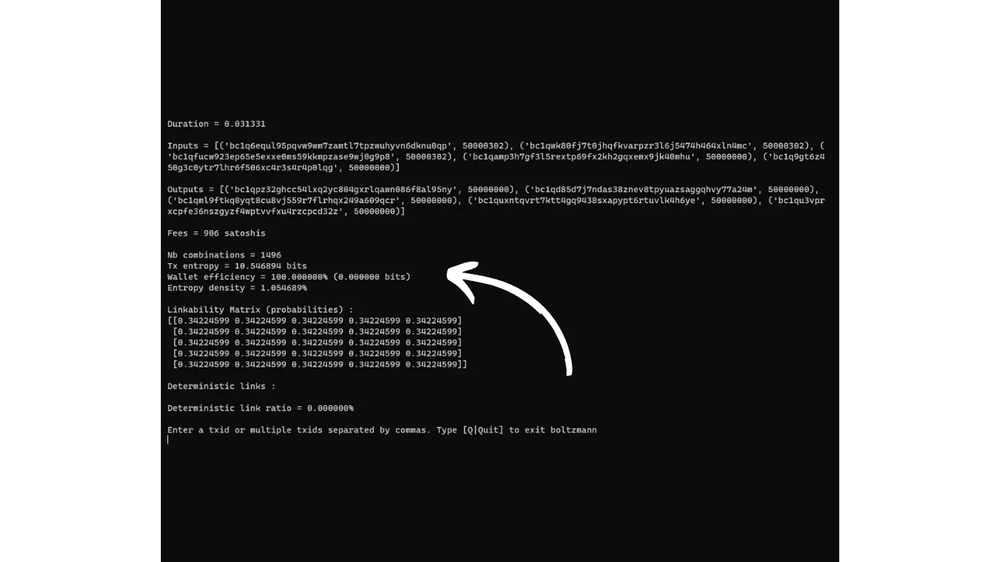
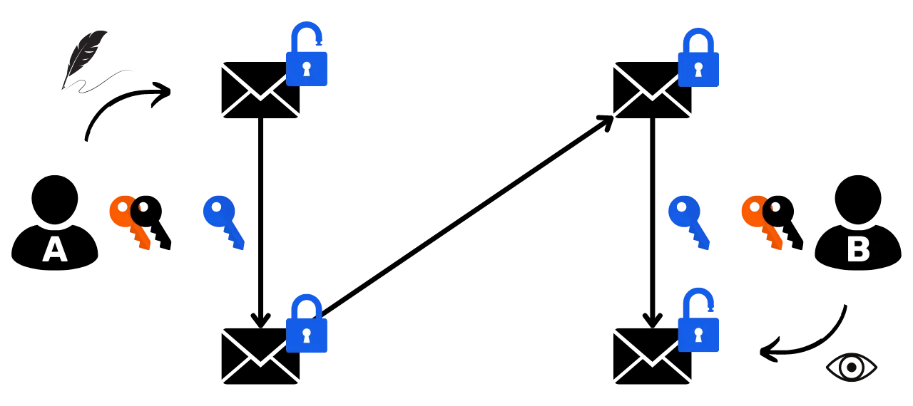

# Bảo vệ quyền riêng tư của bạn trên Bitcoin

Trong một thế giới mà tính bảo mật của các giao dịch tài chính đang dần trở thành một thứ xa xỉ, việc hiểu và nắm vững các nguyên tắc bảo vệ quyền riêng tư khi sử dụng Bitcoin là điều cần thiết. Khóa đào tạo này cung cấp cho bạn tất cả các chìa khóa, cả lý thuyết và thực hành, để đạt được điều này một cách tự chủ.

Ngày nay, trên Bitcoin, các công ty chuyên về phân tích blockchain. Hoạt động kinh doanh cốt lõi của họ chính xác là xâm phạm vào phạm vi riêng tư của bạn, để xâm phạm tính bảo mật của các giao dịch của bạn. Trên thực tế, không có cái gọi là "quyền riêng tư" trong Bitcoin. Vì vậy, bạn, người dùng, phải khẳng định các quyền tự nhiên của mình và bảo vệ tính bảo mật của các giao dịch của bạn, vì không ai khác sẽ làm điều đó thay bạn.

Khóa học được thiết kế toàn diện và tổng quát. Mỗi khái niệm kỹ thuật được trình bày chi tiết và được hỗ trợ bởi sơ đồ giải thích. Mục đích là để mọi người đều có thể tiếp cận kiến thức. Do đó, BTC204 có giá cả phải chăng cho người mới bắt đầu và người dùng trung cấp. Khóa học cũng cung cấp giá trị gia tăng cho những người dùng bitcoin có kinh nghiệm hơn, vì chúng tôi đào sâu hơn vào một số khái niệm kỹ thuật thường bị hiểu lầm.

Hãy tham gia cùng chúng tôi để thay đổi cách sử dụng Bitcoin của bạn và trở thành người dùng hiểu biết, có khả năng hiểu các vấn đề về tính bảo mật và bảo vệ quyền riêng tư của bạn.

+++
# Giới thiệu

<partId>e17474a8-8899-4bdb-a7f8-bc52ddb01440</partId>

## Tổng quan về khóa học

<chapterId>08ba1933-f393-4fb5-8279-777d874caedb</chapterId>

Chào mừng bạn đến với khóa học BTC204!

Trong một thế giới mà tính bảo mật của các giao dịch tài chính đang dần trở thành một thứ xa xỉ, việc hiểu và nắm vững các nguyên tắc bảo vệ quyền riêng tư khi sử dụng Bitcoin là điều cần thiết. Khóa đào tạo này cung cấp cho bạn tất cả các chìa khóa, cả lý thuyết và thực hành, để đạt được điều này một cách tự chủ.

Ngày nay, trên Bitcoin, các công ty chuyên về phân tích blockchain. Hoạt động kinh doanh cốt lõi của họ chính xác là xâm phạm vào phạm vi riêng tư của bạn, để xâm phạm tính bảo mật của các giao dịch của bạn. Trên thực tế, không có cái gọi là "quyền riêng tư" trong Bitcoin. Vì vậy, bạn, người dùng, phải khẳng định các quyền tự nhiên của mình và bảo vệ tính bảo mật của các giao dịch của bạn, vì không ai khác sẽ làm điều đó thay bạn.

Bitcoin không chỉ là "Số tăng lên" và bảo toàn giá trị tiết kiệm. Với những đặc điểm và lịch sử độc đáo, trước hết và quan trọng nhất, nó là công cụ của nền kinh tế đối trọng. Nhờ phát minh đáng gờm này, bạn có thể tự do xử lý tiền của mình, chi tiêu và tích lũy mà không ai có thể ngăn cản bạn.

Bitcoin mang đến một lối thoát thanh bình khỏi ách thống trị của nhà nước, cho phép bạn tận hưởng trọn vẹn các quyền tự nhiên của mình, không thể bị thách thức bởi luật pháp hiện hành. Nhờ phát minh của Satoshi Nakamoto, bạn có quyền thực thi sự tôn trọng đối với tài sản riêng của mình và giành lại quyền tự do ký kết hợp đồng.

Tuy nhiên, Bitcoin không ẩn danh theo mặc định, điều này có thể gây rủi ro cho những cá nhân tham gia vào nền kinh tế đối lập, đặc biệt là ở những khu vực chịu sự cai trị chuyên chế. Nhưng đây không phải là mối nguy hiểm duy nhất. Vì bitcoin là một tài sản có giá trị và không thể bị phát hiện, nên nó có thể là mục tiêu của những tên trộm. Vì vậy, bảo vệ quyền riêng tư của bạn cũng trở thành vấn đề an ninh: nó có thể giúp bạn ngăn chặn việc hack và tấn công vật lý.

Như chúng ta sẽ thấy, mặc dù giao thức cung cấp một số biện pháp bảo vệ tính bảo mật nhất định, nhưng việc sử dụng các công cụ bổ sung để tối ưu hóa và bảo vệ tính bảo mật này là rất quan trọng.

Khóa đào tạo này được thiết kế để cung cấp tổng quan toàn diện, chung về các vấn đề liên quan đến tính bảo mật của Bitcoin. Mỗi khái niệm kỹ thuật được trình bày chi tiết, được hỗ trợ bởi sơ đồ giải thích. Mục đích là để mọi người, ngay cả người mới bắt đầu và người dùng trung cấp, đều có thể tiếp cận kiến thức này. Đối với những người dùng Bitcoin dày dạn kinh nghiệm hơn, chúng tôi cũng đề cập đến các khái niệm mang tính kỹ thuật cao và đôi khi ít được biết đến trong suốt khóa học, để hiểu sâu hơn về từng chủ đề.

Mục đích của khóa đào tạo này không phải là để bạn hoàn toàn ẩn danh khi sử dụng Bitcoin, mà là cung cấp cho bạn các công cụ thiết yếu để biết cách bảo vệ tính bảo mật của mình theo mục tiêu cá nhân của bạn. Bạn sẽ có quyền tự do lựa chọn các khái niệm và công cụ được trình bày để phát triển các chiến lược của riêng bạn, phù hợp với các mục tiêu và nhu cầu cụ thể của bạn.

**Phần 1: Định nghĩa và các khái niệm chính**

Để bắt đầu, chúng ta sẽ xem xét các nguyên tắc cơ bản chi phối hoạt động của Bitcoin, để sau đó chúng ta có thể bình tĩnh giải quyết các khái niệm liên quan đến tính bảo mật. Điều cần thiết là phải nắm vững một số khái niệm cơ bản, chẳng hạn như UTXO, nhận địa chỉ và tập lệnh, trước khi bạn có thể hiểu đầy đủ các khái niệm mà chúng tôi sẽ đề cập trong các phần sau. Chúng tôi cũng sẽ giới thiệu mô hình bảo mật chung của Bitcoin, như được Satoshi Nakamoto tưởng tượng, cho phép chúng ta nắm bắt được các rủi ro và rủi ro liên quan.


**Phần 2: Hiểu và bảo vệ chống lại phân tích chuỗi**

Trong phần thứ hai, chúng ta sẽ xem xét các kỹ thuật được các công ty phân tích blockchain sử dụng để theo dõi hoạt động của bạn trên Bitcoin. Hiểu các phương pháp này rất quan trọng để tăng cường bảo vệ quyền riêng tư của bạn. Mục đích của phần này là xem xét các chiến lược của kẻ tấn công để hiểu rõ hơn về các rủi ro và chuẩn bị nền tảng cho các kỹ thuật mà chúng ta sẽ nghiên cứu trong các phần sau. Chúng ta sẽ phân tích các mô hình giao dịch, phương pháp tìm kiếm bên trong và bên ngoài, và các diễn giải có thể có của các mô hình này. Ngoài lý thuyết, chúng ta sẽ tìm hiểu cách sử dụng trình khám phá khối để phân tích chuỗi, thông qua các ví dụ và bài tập thực tế.


**Phần 3: Nắm vững các biện pháp tốt nhất để bảo vệ quyền riêng tư của bạn**

Trong phần thứ ba của khóa đào tạo, chúng ta sẽ đi sâu vào vấn đề cốt lõi: thực hành! Mục đích là nắm vững tất cả các phương pháp thực hành tốt nhất cần thiết mà bất kỳ người dùng Bitcoin nào cũng có thể áp dụng. Chúng tôi sẽ đề cập đến việc sử dụng địa chỉ trống, gắn thẻ, hợp nhất, sử dụng các nút hoàn chỉnh cũng như các phương pháp KYC và thu thập. Mục đích là cung cấp cho bạn cái nhìn tổng quan toàn diện về những cạm bẫy cần tránh để thiết lập nền tảng vững chắc trong hành trình bảo vệ quyền riêng tư của chúng ta. Đối với một số phương pháp này, bạn sẽ được hướng dẫn cụ thể về cách triển khai chúng.


**Phần 4: Hiểu về giao dịch coinjoin**

Làm sao chúng ta có thể nói về quyền riêng tư trên Bitcoin mà không nhắc đến coinjoin? Trong phần 4, bạn sẽ tìm hiểu tất cả những gì bạn cần biết về phương pháp trộn này. Bạn sẽ tìm hiểu coinjoin là gì, lịch sử và mục tiêu của chúng, cũng như các loại coinjoin khác nhau hiện có. Cuối cùng, đối với người dùng có nhiều kinh nghiệm hơn, chúng ta sẽ xem xét anonset và entropy là gì và cách tính chúng.


**Phần 5: Hiểu những thách thức của các kỹ thuật bảo mật tiên tiến khác**

Trong phần thứ năm, chúng ta sẽ xem xét tất cả các kỹ thuật khác có sẵn để bảo vệ quyền riêng tư của bạn trên Bitcoin, ngoài coinjoin. Trong nhiều năm qua, các nhà phát triển đã thể hiện sự sáng tạo đáng kể trong việc thiết kế các công cụ dành riêng cho quyền riêng tư. Chúng ta sẽ xem xét tất cả các phương pháp này, chẳng hạn như payjoin, giao dịch hợp tác, Coin Swap và Atomic Swap, trình bày chi tiết cách chúng hoạt động, mục tiêu của chúng và bất kỳ điểm yếu nào.

Chúng ta cũng sẽ xem xét quyền riêng tư ở cấp độ mạng lưới các nút và việc phân phối giao dịch. Chúng ta cũng sẽ thảo luận về các giao thức khác nhau đã được đề xuất trong nhiều năm để tăng cường quyền riêng tư của người dùng trên Bitcoin, bao gồm các giao thức địa chỉ tĩnh.


Sẵn sàng khám phá những ngóc ngách về quyền riêng tư trên Bitcoin chưa? Đi thôi!

# Định nghĩa và khái niệm chính

<partId>b9bbbde3-34c0-4851-83e8-e2ffb029cf31</partId>

## Mô hình UTXO của Bitcoin

<chapterId>8d6b50c5-bf74-44f4-922b-25204991cb75</chapterId>


Bitcoin trước hết là một loại tiền tệ, nhưng bạn có thực sự biết BTC được biểu diễn như thế nào trên giao thức không?

### UTXO trên Bitcoin: chúng là gì?

Giao thức Bitcoin dựa trên mô hình UTXO, viết tắt của "Đầu ra giao dịch chưa chi".

Mô hình này khác biệt sâu sắc so với các hệ thống ngân hàng truyền thống, vốn dựa vào cơ chế tài khoản và số dư để theo dõi dòng tiền. Thật vậy, trong hệ thống ngân hàng, số dư cá nhân được duy trì trong các tài khoản gắn liền với một danh tính. Ví dụ, khi bạn mua một ổ bánh mì dài từ một người thợ làm bánh, ngân hàng của bạn chỉ cần ghi nợ số tiền mua hàng từ tài khoản của bạn, làm giảm số dư của bạn, trong khi tài khoản của người thợ làm bánh được ghi có cùng số tiền đó, làm tăng số dư của nó. Trong hệ thống này, không có khái niệm về mối liên hệ giữa số tiền vào tài khoản của bạn và số tiền ra khỏi tài khoản, ngoài các hồ sơ giao dịch.


Bitcoin hoạt động theo cách khác. Khái niệm về tài khoản không tồn tại và các đơn vị tiền tệ không được quản lý thông qua số dư mà thông qua UTXO. UTXO biểu thị một lượng bitcoin cụ thể chưa được chi tiêu, do đó tạo thành một "mảnh bitcoin", có thể lớn hoặc nhỏ. Ví dụ, một UTXO có thể có giá trị là `500 BTC` hoặc đơn giản là `700 SATS`.

**> Satoshi, thường được viết tắt là sat, là đơn vị nhỏ nhất của Bitcoin, tương đương với centime trong các loại tiền pháp định.

```plaintext
1 BTC = 100 000 000 SATS
```

Về mặt lý thuyết, một UTXO có thể đại diện cho bất kỳ giá trị nào trong bitcoin, từ sat đến mức tối đa lý thuyết là khoảng 21 triệu BTC. Tuy nhiên, về mặt logic, không thể sở hữu tất cả 21 triệu bitcoin và có một ngưỡng kinh tế thấp hơn được gọi là "bụi", dưới ngưỡng này, một UTXO được coi là không có lợi về mặt kinh tế để chi tiêu.

**> UTXO lớn nhất từng được tạo trên Bitcoin có giá trị là `500.000 BTC`. Nó được tạo ra bởi nền tảng MtGox trong một hoạt động hợp nhất vào tháng 11 năm 2011: [29a3efd3ef04f9153d47a990bd7b048a4b2d213daaa5fb8ed670fb85f13bdbcf](https://mempool.space/fr/tx/29a3efd3ef04f9153d47a990bd7b048a4b2d213daaa5fb8ed670fb85f13bdbcf)

### UTXO và điều kiện chi tiêu

UTXO là công cụ trao đổi trên Bitcoin. Mỗi giao dịch dẫn đến việc tiêu thụ UTXO làm đầu vào và tạo ra UTXO mới làm đầu ra. Khi một giao dịch hoàn tất, các UTXO được sử dụng làm đầu vào được coi là "đã chi", và các UTXO mới được tạo ra và phân bổ cho những người nhận được chỉ định trong đầu ra giao dịch. Do đó, UTXO chỉ đơn giản là đại diện cho đầu ra giao dịch chưa chi và do đó là số lượng bitcoin thuộc về người dùng tại một thời điểm nhất định.


Tất cả UTXO đều được bảo mật bằng các tập lệnh xác định các điều kiện mà chúng có thể được chi tiêu. Để sử dụng UTXO, người dùng phải chứng minh với mạng rằng anh ta hoặc cô ta đáp ứng các điều kiện do tập lệnh quy định để bảo mật UTXO đó. Thông thường, UTXO được bảo vệ bằng khóa công khai (hoặc địa chỉ nhận đại diện cho khóa công khai này). Để chi tiêu UTXO được liên kết với khóa công khai này, người dùng phải chứng minh rằng anh ta nắm giữ khóa riêng tương ứng, bằng cách cung cấp chữ ký số được tạo bằng khóa này. Đây là lý do tại sao chúng tôi nói rằng ví Bitcoin của bạn không thực sự chứa bitcoin, mà lưu trữ khóa riêng của bạn, từ đó cung cấp cho bạn quyền truy cập vào UTXO của mình và theo nghĩa mở rộng, vào bitcoin mà chúng đại diện.


Vì không có khái niệm về tài khoản trong Bitcoin, nên số dư của ví chỉ đơn giản là tổng giá trị của tất cả các UTXO mà nó có thể chi tiêu. Ví dụ: nếu ví Bitcoin của bạn có thể chi tiêu 4 UTXO sau:

```plaintext
- 2 BTC
- 8 BTC
- 5 BTC
- 2 BTC
```

Tổng số dư danh mục đầu tư của bạn sẽ là `17 BTC`.


## Cấu trúc của giao dịch Bitcoin

<chapterId>29d3aaab-de2e-4746-ab40-c9748898850c</chapterId>


### Đầu vào và đầu ra giao dịch

Giao dịch Bitcoin là một hoạt động được ghi lại trên blockchain chuyển quyền sở hữu bitcoin từ người này sang người khác. Chính xác hơn, vì chúng ta đang ở trên mô hình UTXO và không có tài khoản, giao dịch đáp ứng các điều kiện chi tiêu bảo đảm một hoặc nhiều UTXO, tiêu thụ chúng và tương đương tạo ra các UTXO mới với các điều kiện chi tiêu mới. Tóm lại, một giao dịch di chuyển bitcoin từ một tập lệnh đã thỏa mãn sang một tập lệnh mới được thiết kế để bảo đảm chúng.


Do đó, mỗi giao dịch Bitcoin bao gồm một hoặc nhiều đầu vào và một hoặc nhiều đầu ra. Đầu vào là UTXO được giao dịch sử dụng để tạo ra đầu ra. Đầu ra là UTXO mới có thể được sử dụng làm đầu vào cho các giao dịch trong tương lai.


**> Về mặt lý thuyết, một giao dịch bitcoin có thể có vô số đầu vào và đầu ra. Giới hạn duy nhất là kích thước khối tối đa.

Mỗi đầu vào trong giao dịch Bitcoin đều tham chiếu đến một UTXO chưa chi trước đó. Để sử dụng UTXO làm đầu vào, người nắm giữ UTXO phải chứng minh rằng mình là chủ sở hữu hợp pháp bằng cách xác thực tập lệnh liên quan, tức là bằng cách đáp ứng điều kiện chi tiêu được áp đặt. Nói chung, điều này có nghĩa là cung cấp chữ ký số được tạo bằng khóa riêng tương ứng với khóa công khai ban đầu bảo mật UTXO này. Do đó, tập lệnh bao gồm việc xác minh rằng chữ ký tương ứng với khóa công khai được sử dụng khi nhận tiền.


Mỗi đầu ra, lần lượt, chỉ định số lượng bitcoin cần chuyển, cũng như người nhận. Người nhận được xác định bằng một tập lệnh mới, thường chặn UTXO mới được tạo bằng địa chỉ nhận hoặc khóa công khai mới.

Để một giao dịch được coi là hợp lệ theo các quy tắc đồng thuận, tổng đầu ra phải nhỏ hơn hoặc bằng tổng đầu vào. Nói cách khác, tổng số UTXO mới được tạo ra bởi giao dịch không được vượt quá tổng số UTXO được sử dụng làm đầu vào. Nguyên tắc này là hợp lý: nếu bạn chỉ có `500.000 SATS`, bạn không thể mua `700.000 SATS`.

### Trao đổi và hợp nhất trong giao dịch Bitcoin

Do đó, hành động của giao dịch Bitcoin trên UTXO có thể được so sánh với việc đúc lại một đồng tiền vàng. Thật vậy, UTXO không thể chia nhỏ được mà chỉ có thể hợp nhất. Điều này có nghĩa là người dùng không thể chỉ đơn giản chia một UTXO biểu diễn một số lượng nhất định bằng bitcoin thành nhiều UTXO nhỏ hơn. Người dùng phải sử dụng toàn bộ số UTXO đó trong một giao dịch để tạo ra một hoặc nhiều UTXO mới có giá trị tùy ý trong đầu ra, giá trị này phải nhỏ hơn hoặc bằng giá trị ban đầu.

Cơ chế này tương tự như cơ chế của đồng tiền vàng. Giả sử bạn sở hữu một đồng tiền 2 ounce và muốn thanh toán 1 ounce, giả sử người bán không thể trả lại tiền thừa cho bạn. Bạn sẽ phải nấu chảy đồng tiền của mình và đúc 2 đồng tiền mới, mỗi đồng 1 ounce.

Bitcoin hoạt động theo cách tương tự. Hãy tưởng tượng rằng Alice có UTXO là `10.000 SATS` và muốn mua một chiếc bánh mì dài giá `4.000 SATS`. Alice sẽ thực hiện một giao dịch với 1 UTXO là `10.000 SATS` làm đầu vào, mà cô ấy sẽ tiêu thụ hết, và 2 UTXO là `4.000 SATS` và `6.000 SATS` làm đầu ra. UTXO là `4.000 SATS` sẽ được gửi đến thợ làm bánh để thanh toán cho chiếc bánh mì dài, trong khi UTXO là `6.000 SATS` sẽ trả lại cho Alice dưới dạng tiền thừa. UTXO này, trả lại cho bên phát hành ban đầu của giao dịch, được gọi là "trao đổi" trong thuật ngữ Bitcoin.


Bây giờ hãy tưởng tượng rằng Alice không có một UTXO duy nhất là `10.000 SATS`, mà là hai UTXO, mỗi UTXO có `3.000 SATS`. Trong tình huống này, không có UTXO nào riêng lẻ đủ để đặt `4.000 SATS` của cây đũa phép. Do đó, Alice phải đồng thời sử dụng 2 UTXO có `3.000 SATS` làm đầu vào cho giao dịch của mình. Theo cách này, tổng số đầu vào sẽ đạt `6.000 SATS`, cho phép cô ấy đáp ứng khoản thanh toán `4.000 SATS` cho thợ làm bánh. Phương pháp này, trong đó một số UTXO được nhóm lại với nhau làm đầu vào cho một giao dịch, thường được gọi là "hợp nhất".


### Phí giao dịch

Theo trực giác, người ta có thể nghĩ rằng chi phí giao dịch cũng đại diện cho đầu ra của một giao dịch. Nhưng trên thực tế, điều này không đúng. Chi phí giao dịch đại diện cho sự khác biệt giữa tổng đầu vào và tổng đầu ra. Điều này có nghĩa là, sau khi sử dụng một phần giá trị của các đầu vào để trang trải các đầu ra mong muốn trong một giao dịch, một số lượng đầu vào nhất định vẫn chưa được sử dụng. Tổng số còn lại này cấu thành nên chi phí giao dịch.

```plaintext
Frais = total inputs - total outputs
```

Hãy lấy ví dụ về Alice, người có UTXO là `10.000 SATS` và muốn mua một ổ bánh mì dài với giá `4.000 SATS`. Alice tạo một giao dịch với UTXO của cô ấy là `10.000 SATS` làm đầu vào. Sau đó, cô ấy tạo ra đầu ra là `4.000 SATS` để thợ làm bánh trả tiền cho ổ bánh mì dài. Để khuyến khích thợ đào tích hợp giao dịch của cô ấy vào một khối, Alice phân bổ `200 SATS` phí. Sau đó, cô ấy tạo ra đầu ra thứ hai, là giao dịch, sẽ được trả lại cho cô ấy, với số tiền là `5.800 SATS`.


Áp dụng công thức tính lệ phí, chúng ta thấy rằng thực sự còn lại `200 SATS` cho trẻ vị thành niên:

```plaintext
Frais = total inputs - total outputs
Frais = 10 000 - (4 000 + 5 800)
Frais = 10 000 - 9 800
Frais = 200
```

Khi thợ đào thành công trong việc xác thực một khối, anh ta được phép thu các khoản phí này cho tất cả các giao dịch có trong khối của mình, thông qua cái gọi là giao dịch "coinbase".

### Tạo UTXO trên Bitcoin

Nếu bạn đã theo dõi cẩn thận các đoạn trước, giờ bạn sẽ biết rằng UTXO chỉ có thể được tạo ra bằng cách sử dụng các UTXO hiện có khác. Theo cách này, đồng Bitcoin tạo thành một chuỗi liên tục. Tuy nhiên, bạn có thể tự hỏi các UTXO đầu tiên trong chuỗi này xuất hiện như thế nào. Điều này đặt ra một vấn đề tương tự như câu chuyện con gà và quả trứng: các UTXO ban đầu này đến từ đâu?

Câu trả lời nằm ở **giao dịch coinbase**.

Coinbase là một loại giao dịch Bitcoin cụ thể, là duy nhất cho mỗi khối và luôn là khối đầu tiên trong số các khối này. Nó cho phép thợ đào tìm thấy bằng chứng công việc hợp lệ để nhận phần thưởng khối của mình. Phần thưởng này bao gồm hai yếu tố: **tiền thưởng khối** và **phí giao dịch**, đã thảo luận ở phần trước.

Giao dịch coinbase là duy nhất có khả năng tạo ra bitcoin ex nihilo, mà không cần phải sử dụng đầu vào để tạo ra đầu ra. Những bitcoin mới được tạo ra này là những gì chúng ta có thể gọi là "UTXO gốc".


Bitcoin được trợ cấp theo khối là BTC mới được tạo ra từ đầu, theo lịch phát hành được thiết lập trước trong các quy tắc đồng thuận. Khoản trợ cấp khối được chia đôi sau mỗi 210.000 khối, tức là khoảng bốn năm một lần, trong một quy trình được gọi là "chia đôi". Ban đầu, 50 bitcoin được tạo ra với mỗi khoản trợ cấp, nhưng số lượng này đã giảm dần; hiện tại, là 3.125 bitcoin cho mỗi khối.

Đối với phí giao dịch, mặc dù chúng cũng đại diện cho BTC mới tạo, nhưng chúng không được vượt quá chênh lệch giữa tổng đầu vào và đầu ra của tất cả các giao dịch trong một khối. Chúng ta đã thấy trước đó rằng các khoản phí này đại diện cho phần đầu vào không được sử dụng trong đầu ra giao dịch. Về mặt kỹ thuật, phần này "bị mất" trong quá trình giao dịch và thợ đào có quyền tạo lại giá trị này dưới dạng một hoặc nhiều UTXO mới. Đây là sự chuyển giao giá trị giữa bên phát hành giao dịch và thợ đào thêm nó vào blockchain.

**> Bitcoin được tạo ra bởi giao dịch coinbase phải tuân theo thời hạn đáo hạn là 100 khối, trong thời gian đó, thợ đào không thể chi tiêu chúng. Quy tắc này được thiết kế để tránh những phức tạp liên quan đến việc sử dụng bitcoin mới tạo trên chuỗi có thể trở nên lỗi thời sau này.

### Ý nghĩa của mô hình UTXO

Trước hết, mô hình UTXO ảnh hưởng trực tiếp đến phí giao dịch của Bitcoin. Vì dung lượng của mỗi khối bị giới hạn nên thợ đào thích các giao dịch cung cấp mức phí tốt nhất liên quan đến không gian mà chúng sẽ chiếm trong khối. Thật vậy, giao dịch càng bao gồm nhiều UTXO trong đầu vào và đầu ra thì giao dịch đó càng nặng và do đó đòi hỏi mức phí cao hơn. Đây là một trong những lý do tại sao chúng tôi thường cố gắng giảm số lượng UTXO trong danh mục đầu tư của mình, điều này cũng có thể ảnh hưởng đến tính bảo mật, một chủ đề mà chúng tôi sẽ giải quyết chi tiết trong phần thứ ba của khóa học này.

Thứ hai, như đã đề cập trong các phần trước, đồng Bitcoin về cơ bản là một chuỗi UTXO. Do đó, mỗi giao dịch tạo ra một liên kết giữa UTXO trong quá khứ và UTXO trong tương lai. Do đó, UTXO giúp theo dõi rõ ràng đường đi của Bitcoin từ khi chúng được tạo ra cho đến khi chúng được chi tiêu. Tính minh bạch này có thể được xem là tích cực vì nó cho phép mỗi người dùng xác định tính xác thực của bitcoin đã nhận. Tuy nhiên, phân tích blockchain cũng dựa trên nguyên tắc truy xuất nguồn gốc và khả năng kiểm toán này, một hoạt động được thiết kế để xâm phạm tính bảo mật của bạn. Chúng ta sẽ xem xét sâu hơn về hoạt động này trong phần thứ hai của khóa học.

## Mô hình riêng tư của Bitcoin

<chapterId>769d8963-3ed5-4094-b21d-9203c7d9e465</chapterId>


### Tiền: tính xác thực, liêm chính và chi tiêu gấp đôi

Một trong những chức năng của tiền là giải quyết vấn đề trùng hợp nhu cầu kép. Trong một hệ thống dựa trên trao đổi hàng hóa, việc hoàn tất một cuộc trao đổi không chỉ đòi hỏi phải tìm một cá nhân đang cho đi một món hàng tương ứng với nhu cầu của tôi, mà còn phải cung cấp cho anh ta một món hàng có giá trị tương đương đáp ứng được nhu cầu của chính anh ta. Đạt được sự cân bằng này là một vấn đề phức tạp.


Đó là lý do tại sao chúng ta sử dụng tiền để chuyển giá trị theo cả không gian và thời gian.


Để tiền xu giải quyết được vấn đề này, điều quan trọng là bên cung cấp hàng hóa hoặc dịch vụ phải tin tưởng vào khả năng chi tiêu số tiền đó sau này. Do đó, bất kỳ cá nhân lý trí nào muốn chấp nhận một đồng xu, dù là kỹ thuật số hay vật lý, sẽ đảm bảo rằng nó đáp ứng hai tiêu chí cơ bản:


- Bài viết phải có tính toàn vẹn và chân thực ;**
- và không được chi tiêu gấp đôi.**

Nếu bạn sử dụng tiền vật lý, thì đây là đặc điểm đầu tiên phức tạp nhất để khẳng định. Vào các giai đoạn khác nhau trong lịch sử, tính toàn vẹn của đồng tiền kim loại thường bị ảnh hưởng bởi các hoạt động như cắt tỉa hoặc đục lỗ. Ví dụ, ở Rome cổ đại, người dân thường cạo các cạnh của đồng tiền vàng để thu thập một ít kim loại quý, đồng thời giữ lại để giao dịch trong tương lai. Do đó, giá trị nội tại của đồng tiền đã giảm, nhưng mệnh giá của nó vẫn giữ nguyên. Đây là một trong những lý do tại sao sau này, cạnh của đồng tiền được khía rãnh.

Tính xác thực cũng là một đặc điểm khó xác minh trên phương tiện tiền tệ vật lý. Các kỹ thuật chống tiền giả ngày nay ngày càng phức tạp, buộc các nhà bán lẻ phải đầu tư vào các hệ thống xác minh tốn kém.

Mặt khác, vì bản chất của chúng, việc chi tiêu gấp đôi không phải là vấn đề đối với tiền tệ vật lý. Nếu tôi đưa cho bạn một tờ 10 euro, nó sẽ không thể thu hồi được và chuyển sang bạn, điều này tự nhiên loại trừ mọi khả năng chi tiêu nhiều lần các đơn vị tiền tệ mà nó thể hiện. Tóm lại, tôi sẽ không thể chi tiêu tờ 10 euro này nữa.


Đối với tiền kỹ thuật số, độ khó thì khác. Đảm bảo tính xác thực và toàn vẹn của một đồng tiền thường đơn giản hơn. Như chúng ta đã thấy ở phần trước, mô hình UTXO của Bitcoin giúp có thể truy xuất nguồn gốc của một đồng tiền và do đó xác minh rằng nó thực sự được tạo ra bởi một thợ đào tuân thủ các quy tắc đồng thuận.

Mặt khác, việc đảm bảo không có tình trạng chi tiêu gấp đôi phức tạp hơn, vì về bản chất, tất cả hàng hóa kỹ thuật số đều là thông tin. Không giống như hàng hóa vật lý, thông tin không bị chia nhỏ khi trao đổi mà lan truyền bằng cách nhân lên. Ví dụ, nếu tôi gửi cho bạn một tài liệu qua e-mail, tài liệu đó sẽ bị trùng lặp. Bạn không thể chắc chắn rằng tôi đã xóa tài liệu gốc.


### Ngăn chặn chi tiêu gấp đôi trên Bitcoin

Cách duy nhất để tránh sự trùng lặp này của một tài sản kỹ thuật số là phải biết tất cả các giao dịch trên hệ thống. Theo cách này, chúng ta có thể biết ai sở hữu cái gì và cập nhật tài sản của mỗi người theo các giao dịch được thực hiện. Đây là những gì xảy ra, ví dụ, với tiền thánh trong hệ thống ngân hàng. Khi bạn trả 10 € cho một thương gia bằng thẻ tín dụng, ngân hàng sẽ ghi lại giao dịch và cập nhật sổ kế toán.


Trên Bitcoin, việc chi tiêu gấp đôi cũng được ngăn chặn theo cách tương tự. Chúng tôi tìm cách xác nhận không có giao dịch nào đã chi tiêu số tiền đang được đề cập. Nếu số tiền chưa bao giờ được sử dụng, thì chúng tôi có thể chắc chắn rằng sẽ không xảy ra tình trạng chi tiêu gấp đôi. Nguyên tắc này đã được Satoshi Nakamoto mô tả trong Sách trắng với câu nói nổi tiếng:

**Cách duy nhất để xác nhận sự vắng mặt của giao dịch là nhận thức được tất cả các giao dịch

Nhưng không giống như mô hình ngân hàng, chúng ta không muốn phải tin tưởng một thực thể trung tâm trên Bitcoin. Vì vậy, tất cả người dùng cần có khả năng xác nhận sự vắng mặt của chi tiêu gấp đôi này, mà không cần dựa vào bên thứ ba. Vì vậy, mọi người cần phải biết về tất cả các giao dịch Bitcoin. Đây là lý do tại sao các giao dịch Bitcoin được phát sóng công khai trên tất cả các nút mạng và được ghi lại dưới dạng văn bản rõ trên blockchain.

Chính sự phổ biến thông tin công khai này làm phức tạp thêm việc bảo vệ quyền riêng tư trong Bitcoin. Trong hệ thống ngân hàng truyền thống, về mặt lý thuyết, chỉ có tổ chức tài chính mới biết được các giao dịch được thực hiện. Ngược lại, với Bitcoin, tất cả người dùng đều được thông báo về tất cả các giao dịch thông qua các nút tương ứng của họ.

### Mô hình bảo mật: hệ thống ngân hàng so với Bitcoin

Trong hệ thống truyền thống, tài khoản ngân hàng của bạn được liên kết với danh tính của bạn. Nhân viên ngân hàng có thể biết tài khoản ngân hàng nào thuộc về khách hàng nào và giao dịch nào được liên kết với tài khoản đó. Tuy nhiên, luồng thông tin này bị cắt đứt giữa ngân hàng và phạm vi công cộng. Nói cách khác, không thể biết số dư và giao dịch của tài khoản ngân hàng thuộc về một cá nhân khác. Chỉ có ngân hàng mới có quyền truy cập vào thông tin này.


Ví dụ, nhân viên ngân hàng của bạn biết rằng bạn mua bánh mì baguette mỗi sáng từ thợ làm bánh địa phương, nhưng hàng xóm của bạn không biết về giao dịch này. Theo cách này, luồng thông tin có thể được các bên liên quan, đặc biệt là ngân hàng, tiếp cận, nhưng vẫn không thể tiếp cận được với người ngoài.


Do hạn chế về việc phổ biến công khai các giao dịch mà chúng ta đã thấy ở phần trước, mô hình bảo mật của Bitcoin không thể tuân theo mô hình của hệ thống ngân hàng. Trong trường hợp của Bitcoin, vì luồng thông tin không thể bị phá vỡ giữa các giao dịch và phạm vi công cộng, **mô hình bảo mật dựa trên sự tách biệt giữa danh tính của người dùng và chính các giao dịch**.


Ví dụ, nếu bạn mua một ổ bánh mì baguette từ người thợ làm bánh, thanh toán bằng BTC, người hàng xóm của bạn, người có nút hoàn chỉnh của riêng mình, có thể thấy giao dịch của bạn diễn ra, cũng như anh ta có thể thấy tất cả các giao dịch khác trong hệ thống. Tuy nhiên, nếu các nguyên tắc bảo mật được tôn trọng, anh ta sẽ không thể liên kết giao dịch cụ thể này với danh tính của bạn.


Nhưng vì các giao dịch Bitcoin được công khai nên vẫn có thể thiết lập các liên kết giữa chúng để suy ra thông tin về các bên liên quan. Hoạt động này thậm chí còn tạo nên một chuyên ngành riêng, được gọi là "phân tích blockchain". Trong phần tiếp theo của khóa học, tôi mời bạn khám phá những điều cơ bản về phân tích blockchain, để bạn có thể hiểu cách bitcoin của mình được theo dõi và bảo vệ bản thân tốt hơn trước chúng.

# Hiểu và bảo vệ chống lại phân tích chuỗi

<partId>4739371e-9fef-45b0-bcaa-b7a4df6b4470</partId>

## Phân tích chuỗi Bitcoin là gì?

<chapterId>7d198ba6-4af2-4f24-86cb-3c79cb25627e</chapterId>


### Định nghĩa và hoạt động

Phân tích chuỗi khối là hoạt động theo dõi luồng bitcoin trên chuỗi khối. Nói chung, phân tích chuỗi dựa trên việc quan sát các đặc điểm trong các mẫu giao dịch trước đó. Sau đó, nó bao gồm việc xác định các đặc điểm tương tự này trên một giao dịch mà chúng ta muốn phân tích và suy ra các diễn giải hợp lý từ chúng. Phương pháp giải quyết vấn đề này, dựa trên cách tiếp cận thực tế để tìm ra giải pháp đủ tốt, được gọi là "phương pháp tìm kiếm".

Nói một cách dễ hiểu, có ba giai đoạn chính trong phân tích chuỗi:

1. **Quan sát blockchain ;**

2. **Xác định các đặc điểm đã biết ;**

3. **Trích xuất các giả định **


Bất kỳ ai cũng có thể thực hiện phân tích chuỗi khối. Tất cả những gì bạn cần là quyền truy cập vào thông tin công khai của chuỗi khối thông qua một nút hoàn chỉnh để quan sát các chuyển động giao dịch và đưa ra giả thuyết. Ngoài ra còn có các công cụ miễn phí hỗ trợ phân tích này, chẳng hạn như [OXT.me](https://oxt.me/), chúng ta sẽ khám phá chi tiết trong hai chương cuối của phần này. Tuy nhiên, rủi ro chính đối với tính bảo mật đến từ các công ty chuyên về phân tích chuỗi. Các công ty này đã đưa phân tích chuỗi khối lên quy mô công nghiệp và bán dịch vụ của họ cho các tổ chức tài chính và chính phủ. Trong số các công ty này, Chainalysis chắc chắn là công ty nổi tiếng nhất.

### Mục tiêu phân tích chuỗi

Một trong những mục đích của phân tích blockchain là nhóm các hoạt động khác nhau trên Bitcoin lại với nhau để xác định tính duy nhất của người dùng đã thực hiện chúng. Sau đó, có thể cố gắng liên kết nhóm hoạt động này với một danh tính thực.


Hãy nghĩ lại chương trước. Tôi đã giải thích lý do tại sao mô hình quyền riêng tư của Bitcoin ban đầu dựa trên sự tách biệt danh tính người dùng khỏi các giao dịch. Do đó, sẽ rất hấp dẫn khi nghĩ rằng phân tích blockchain là vô ích, vì ngay cả khi chúng ta có thể tổng hợp các hoạt động trên chuỗi, chúng ta cũng không thể liên kết chúng với một danh tính thực sự.

Về mặt lý thuyết, tuyên bố này là đúng. Trong phần đầu của khóa học này, chúng ta đã thấy rằng các cặp khóa mật mã được sử dụng để thiết lập các điều kiện trên UTXO. Về bản chất, các cặp khóa này không tiết lộ thông tin nào về danh tính của người nắm giữ chúng. Vì vậy, ngay cả khi chúng ta có thể nhóm các hoạt động liên quan đến các cặp khóa khác nhau lại với nhau, điều này cũng không cho chúng ta biết gì về thực thể đằng sau các hoạt động này.


Tuy nhiên, thực tế phức tạp hơn nhiều. Có rất nhiều hành vi có thể liên kết danh tính thực với hoạt động trên chuỗi. Trong phân tích, đây được gọi là điểm vào và có rất nhiều điểm vào.

Phổ biến nhất là KYC (*Biết khách hàng của bạn*). Nếu bạn rút Bitcoin của mình từ một nền tảng được quản lý đến một trong những địa chỉ nhận cá nhân của bạn, thì một số người có thể liên kết danh tính của bạn với địa chỉ đó. Nói rộng hơn, điểm vào có thể là bất kỳ hình thức tương tác nào giữa cuộc sống thực của bạn và giao dịch Bitcoin. Ví dụ: nếu bạn công bố địa chỉ nhận trên mạng xã hội của mình, thì đây có thể là điểm vào để phân tích. Nếu bạn thực hiện thanh toán bằng Bitcoin cho thợ làm bánh của mình, anh ta sẽ có thể liên kết khuôn mặt của bạn (một phần danh tính của bạn) với một địa chỉ Bitcoin.

Những điểm vào này hầu như không thể tránh khỏi khi sử dụng Bitcoin. Mặc dù chúng ta có thể tìm cách hạn chế phạm vi của chúng, nhưng chúng sẽ luôn hiện hữu. Đó là lý do tại sao việc kết hợp các phương pháp nhằm bảo vệ quyền riêng tư của bạn là rất quan trọng. Mặc dù duy trì sự tách biệt giữa danh tính thực và các giao dịch của bạn là một cách tiếp cận thú vị, nhưng hiện nay vẫn chưa đủ. Thật vậy, nếu tất cả các hoạt động trên chuỗi của bạn có thể được nhóm lại với nhau, thì ngay cả điểm vào nhỏ nhất cũng có khả năng làm tổn hại đến lớp bảo mật duy nhất mà bạn đã thiết lập.


### Bảo vệ bản thân khỏi phân tích chuỗi

Vì vậy, chúng ta cũng cần có khả năng đối phó với phân tích blockchain trong quá trình sử dụng Bitcoin. Bằng cách đó, chúng ta có thể giảm thiểu việc tổng hợp các hoạt động của mình và hạn chế tác động của điểm vào đối với quyền riêng tư của mình.


Còn cách nào tốt hơn để chống lại phân tích blockchain hơn là tìm hiểu về các phương pháp được sử dụng trong đó? Nếu bạn muốn biết cách cải thiện quyền riêng tư của mình trên Bitcoin, bạn cần hiểu các phương pháp này. Điều này sẽ giúp bạn nắm bắt tốt hơn các kỹ thuật như coinjoin hoặc payjoin (các kỹ thuật chúng ta sẽ xem xét trong các phần cuối của khóa học) và giảm thiểu các lỗi bạn có thể mắc phải.

https://planb.network/tutorials/privacy/on-chain/coinjoin-samourai-wallet-e566803d-ab3f-4d98-9136-5462009262ef

https://planb.network/tutorials/privacy/on-chain/payjoin-848b6a23-deb2-4c5f-a27e-93e2f842140f

Trong phần này, chúng ta có thể rút ra sự tương đồng với mật mã học và phân tích mật mã. Một nhà mật mã học giỏi trước hết và quan trọng nhất là một nhà phân tích mật mã giỏi. Để thiết kế một thuật toán mã hóa mới, bạn cần biết thuật toán đó sẽ phải đối mặt với những cuộc tấn công nào và cũng cần nghiên cứu lý do tại sao các thuật toán trước đó đã bị phá vỡ. Nguyên tắc tương tự cũng áp dụng cho quyền riêng tư của Bitcoin. Hiểu các phương pháp phân tích chuỗi khối là chìa khóa để bảo vệ chống lại chúng. Đó là lý do tại sao tôi đã đưa toàn bộ một phần về phân tích chuỗi vào khóa đào tạo này.

### Phương pháp phân tích chuỗi

Điều quan trọng là phải hiểu rằng phân tích chuỗi không phải là một khoa học chính xác. Nó dựa trên các phương pháp tìm kiếm có được từ các quan sát trước đó hoặc các diễn giải logic. Các quy tắc này cho phép chúng ta có được các kết quả khá đáng tin cậy, nhưng không bao giờ có độ chính xác tuyệt đối. Nói cách khác, **phân tích chuỗi luôn liên quan đến một chiều xác suất trong các kết luận đạt được**. Ví dụ, có thể ước tính với các mức độ chắc chắn khác nhau rằng hai địa chỉ thuộc về cùng một thực thể, nhưng sự chắc chắn hoàn toàn sẽ luôn nằm ngoài tầm với.

Toàn bộ mục đích của phân tích chuỗi nằm chính xác trong việc tổng hợp các phương pháp tìm kiếm khác nhau để giảm thiểu rủi ro sai sót. Theo một cách nào đó, đó là sự tích lũy bằng chứng đưa chúng ta đến gần hơn với thực tế.

Những phương pháp tìm kiếm thông tin nổi tiếng này có thể được nhóm thành nhiều loại khác nhau, chúng tôi sẽ mô tả chi tiết bên dưới:


- Mẫu giao dịch ;**
- Thuật toán tìm kiếm nội bộ giao dịch ;**
- Phương pháp tìm kiếm bên ngoài giao dịch.**

### Satoshi Nakamoto và phân tích chuỗi

Hai phương pháp phân tích chuỗi đầu tiên được chính Satoshi Nakamoto phát hiện. Ông nói về chúng trong Phần 10 của Sách trắng Bitcoin. Chúng là:


- cIOH (*Thuật toán sở hữu đầu vào chung*);
- và tái sử dụng địa chỉ.


Nguồn: S. Nakamoto, "Bitcoin: Hệ thống tiền mặt điện tử ngang hàng", https://bitcoin.org/bitcoin.pdf, 2009.

Chúng ta sẽ xem chúng là gì trong các chương sau, nhưng điều thú vị cần lưu ý là hai phương pháp này vẫn giữ vai trò chủ đạo trong phân tích chuỗi ngày nay.

## Mẫu giao dịch

<chapterId>d365a101-2d37-46a5-bfb9-3c51e37bf96b</chapterId>


Mẫu giao dịch chỉ đơn giản là mô hình hoặc cấu trúc tổng thể của một giao dịch điển hình, có thể tìm thấy trên blockchain và cách diễn giải có thể có của giao dịch đó đã được biết đến. Khi nghiên cứu các mẫu, chúng tôi tập trung vào một giao dịch duy nhất và phân tích nó ở cấp độ cao.

Nói cách khác, chúng ta chỉ xem xét số lượng UTXO trong đầu vào và số lượng UTXO trong đầu ra, mà không đi sâu vào các chi tiết cụ thể hơn hoặc môi trường của giao dịch. Dựa trên mô hình quan sát được, chúng ta có thể diễn giải bản chất của giao dịch. Sau đó, chúng ta sẽ tìm kiếm các đặc điểm của cấu trúc của nó và suy ra một cách diễn giải.


Trong phần này, chúng ta sẽ cùng nhau xem xét các mô hình giao dịch chính gặp phải trong phân tích chuỗi và đối với mỗi mô hình, tôi sẽ cung cấp cho bạn cách giải thích hợp lý về cấu trúc này cũng như một ví dụ cụ thể.

### Giao hàng một lần (hoặc thanh toán một lần)

Hãy bắt đầu với một mô hình rất phổ biến, vì đây là mô hình xuất hiện trong hầu hết các khoản thanh toán bitcoin. Mô hình thanh toán đơn giản được đặc trưng bởi việc sử dụng một hoặc nhiều UTXO làm đầu vào và sản xuất 2 UTXO làm đầu ra. Do đó, mô hình này trông như thế này:


Khi chúng ta phát hiện ra cấu trúc giao dịch này trên blockchain, chúng ta đã có thể đưa ra một cách giải thích. Như tên gọi của nó, mô hình này chỉ ra rằng chúng ta đang ở trong sự hiện diện của một giao dịch gửi hoặc thanh toán. Người dùng đã sử dụng UTXO của riêng mình trong các đầu vào để đáp ứng trong đầu ra một UTXO thanh toán và một UTXO trao đổi (tiền được trả lại cho cùng một người dùng).

Do đó, chúng tôi biết rằng người dùng được quan sát có thể không còn sở hữu một trong hai UTXO đầu ra (UTXO thanh toán) nữa, nhưng vẫn sở hữu UTXO còn lại (UTXO giao dịch).

Hiện tại, chúng ta không thể chỉ định đầu ra nào biểu diễn UTXO nào, vì đây không phải là mục đích của nghiên cứu mẫu. Chúng ta sẽ thực hiện bằng cách dựa vào các phương pháp tìm kiếm mà chúng ta sẽ nghiên cứu trong các phần sau. Ở giai đoạn này, mục tiêu của chúng ta chỉ giới hạn ở việc xác định bản chất của giao dịch đang được đề cập, trong trường hợp này là một lệnh gửi đơn giản.

Ví dụ, đây là một giao dịch Bitcoin áp dụng mô hình gửi đơn giản:

```plaintext
b6cc79f45fd2d7669ff94db5cb14c45f1f879ea0ba4c6e3d16ad53a18c34b769
```


Nguồn: [Mempool.space](https://mempool.space/fr/tx/b6cc79f45fd2d7669ff94db5cb14c45f1f879ea0ba4c6e3d16ad53a18c34b769)

Sau ví dụ đầu tiên này, bạn sẽ hiểu rõ hơn về ý nghĩa của việc nghiên cứu "mô hình giao dịch". Chúng ta xem xét một giao dịch bằng cách chỉ tập trung vào cấu trúc của nó, mà không tính đến môi trường của nó hoặc các chi tiết cụ thể của giao dịch. Trong bước đầu tiên này, chúng ta chỉ xem xét bức tranh toàn cảnh.

Bây giờ bạn đã hiểu mô hình là gì, chúng ta hãy chuyển sang các mô hình hiện có khác.

### Quét dọn

Mô hình thứ hai này được đặc trưng bởi việc tiêu thụ một UTXO duy nhất làm đầu vào và sản xuất một UTXO duy nhất làm đầu ra.


Diễn giải của mô hình này là chúng ta đang ở trong sự tự chuyển giao. Người dùng đã chuyển bitcoin của mình cho chính mình, đến một địa chỉ khác thuộc về anh ta. Vì không có sự trao đổi nào trong giao dịch, nên rất khó có khả năng chúng ta đang ở trong sự hiện diện của một khoản thanh toán. Thật vậy, khi một khoản thanh toán được thực hiện, người trả tiền gần như không thể có UTXO tương ứng chính xác với số tiền mà người bán yêu cầu, cộng với phí giao dịch. Nói chung, do đó, người trả tiền có nghĩa vụ phải tạo ra một đầu ra trao đổi.

Sau đó, chúng ta biết rằng người dùng được quan sát có thể vẫn sở hữu UTXO này. Trong bối cảnh phân tích chuỗi, nếu chúng ta biết rằng UTXO được sử dụng làm đầu vào cho giao dịch thuộc về Alice, chúng ta có thể cho rằng UTXO được sử dụng làm đầu ra cũng thuộc về cô ấy. Điều sẽ trở nên thú vị sau này là tìm ra các phương pháp tìm kiếm nội bộ giao dịch có thể củng cố cho giả định này (chúng ta sẽ xem xét các phương pháp tìm kiếm này trong chương 3.3).

Ví dụ, đây là giao dịch Bitcoin áp dụng mô hình quét:

```plaintext
35f1072a0fda5ae106efb4fda871ab40e1f8023c6c47f396441ad4b995ea693d
```


Nguồn: [Mempool.space](https://mempool.space/fr/tx/35f1072a0fda5ae106efb4fda871ab40e1f8023c6c47f396441ad4b995ea693d)

Tuy nhiên, hãy cẩn thận vì kiểu mẫu này cũng có thể tiết lộ một giao dịch tự chuyển tiền vào tài khoản của một nền tảng trao đổi tiền điện tử. Nghiên cứu về các địa chỉ đã biết và bối cảnh của giao dịch sẽ cho chúng ta biết liệu đó là giao dịch quẹt thẻ vào ví tự lưu ký hay giao dịch rút tiền vào một nền tảng. Thật vậy, địa chỉ của các nền tảng trao đổi thường dễ nhận dạng.

Hãy lấy lại ví dụ của Alice: nếu quá trình quét dẫn đến một địa chỉ mà một nền tảng biết đến (chẳng hạn như Binance), điều này có thể có nghĩa là bitcoin đã được chuyển ra khỏi quyền sở hữu trực tiếp của Alice, có thể với mục đích bán chúng hoặc lưu trữ chúng trên nền tảng này. Mặt khác, nếu địa chỉ đích không được biết đến, thì có thể cho rằng đó chỉ là một ví khác vẫn thuộc về Alice. Nhưng loại nghiên cứu này thuộc về phạm trù kinh nghiệm hơn là mô hình.

### Sự hợp nhất

Mô hình này được đặc trưng bởi việc tiêu thụ một số UTXO ở đầu vào và tạo ra một UTXO duy nhất ở đầu ra.


Diễn giải của mô hình này là chúng ta đang ở trong sự hợp nhất. Đây là một hoạt động phổ biến trong số những người dùng Bitcoin, nhằm mục đích hợp nhất một số UTXO để dự đoán khả năng tăng phí giao dịch. Bằng cách thực hiện hoạt động này trong thời gian phí thấp, có thể tiết kiệm được phí trong tương lai. Chúng ta sẽ nói thêm về hoạt động này trong chương 4.3.

Chúng ta có thể suy ra rằng người dùng đằng sau mô hình giao dịch này có thể sở hữu tất cả các UTXO trong đầu vào và vẫn sở hữu UTXO trong đầu ra. Vì vậy, có thể đây là một chuyển giao tự động.

Giống như quét, loại mẫu này cũng có thể tiết lộ một giao dịch tự chuyển đến tài khoản của một nền tảng giao dịch. Nghiên cứu các địa chỉ đã biết và bối cảnh của giao dịch sẽ cho chúng ta biết liệu đó là giao dịch hợp nhất vào danh mục đầu tư tự lưu ký hay giao dịch rút tiền vào một nền tảng.

Ví dụ, đây là giao dịch Bitcoin áp dụng mô hình hợp nhất:

```plaintext
77c16914211e237a9bd51a7ce0b1a7368631caed515fe51b081d220590589e94
```


Nguồn: [Mempool.space](https://mempool.space/fr/tx/77c16914211e237a9bd51a7ce0b1a7368631caed515fe51b081d220590589e94)

Trong phân tích chuỗi, mô hình này có thể tiết lộ rất nhiều thông tin. Ví dụ, nếu chúng ta biết rằng một trong những đầu vào thuộc về Alice, chúng ta có thể giả định rằng tất cả các đầu vào khác và đầu ra của giao dịch này cũng thuộc về cô ấy. Giả định này sau đó sẽ giúp có thể quay lại chuỗi các giao dịch trước đó để khám phá và phân tích các giao dịch khác có khả năng liên quan đến Alice.


### Chi tiêu nhóm

Mô hình này được đặc trưng bởi việc sử dụng một số UTXO làm đầu vào (thường chỉ là một) và tạo ra nhiều UTXO làm đầu ra.


Diễn giải của mô hình này là chúng ta đang ở trong sự hiện diện của chi tiêu theo nhóm. Đây là một hoạt động có thể tiết lộ một hoạt động kinh tế rất lớn, chẳng hạn như một nền tảng trao đổi. Chi tiêu theo nhóm cho phép các thực thể này tiết kiệm chi phí bằng cách kết hợp chi phí của họ trong một giao dịch duy nhất.

Chúng ta có thể suy ra từ mô hình này rằng UTXO trong đầu vào đến từ một công ty có mức độ hoạt động kinh tế cao và UTXO trong đầu ra sẽ phân tán. Nhiều UTXO sẽ thuộc về khách hàng của công ty đã rút bitcoin khỏi nền tảng. Những UTXO khác có thể chuyển đến các công ty đối tác. Cuối cùng, chắc chắn sẽ có một hoặc nhiều sàn giao dịch quay trở lại công ty phát hành.

Ví dụ, đây là giao dịch Bitcoin áp dụng mô hình chi tiêu theo gói (có lẽ đây là giao dịch do nền tảng Bybit phát hành):

```plaintext
8a7288758b6e5d550897beedd13c70bcbaba8709af01a7dbcc1f574b89176b43
```


Nguồn: [Mempool.space](https://mempool.space/fr/tx/8a7288758b6e5d550897beedd13c70bcbaba8709af01a7dbcc1f574b89176b43)

### Giao dịch cụ thể theo giao thức

Trong số các mẫu giao dịch, chúng ta cũng có thể xác định những mẫu tiết lộ việc sử dụng một giao thức cụ thể. Ví dụ, Whirlpool coinjoins (được thảo luận trong phần 5) sẽ có cấu trúc dễ nhận dạng giúp phân biệt chúng với các giao dịch thông thường khác.


Phân tích mẫu này cho thấy chúng ta có khả năng đang ở trong sự hiện diện của một giao dịch hợp tác. Cũng có thể quan sát một coinjoin. Nếu giả thuyết sau này chứng minh là đúng, thì số lượng lối thoát có thể cung cấp cho chúng ta ước tính sơ bộ về số lượng người tham gia trong coinjoin.

Ví dụ, đây là một giao dịch Bitcoin áp dụng mô hình giao dịch cộng tác coinjoin:

```plaintext
00601af905bede31086d9b1b79ee8399bd60c97e9c5bba197bdebeee028b9bea
```


Nguồn: [Mempool.space](https://mempool.space/fr/tx/00601af905bede31086d9b1b79ee8399bd60c97e9c5bba197bdebeee028b9bea)

Có nhiều giao thức khác có cấu trúc riêng. Ví dụ, có các giao dịch Wabisabi, giao dịch Stamps và giao dịch Runes.

Nhờ các mẫu giao dịch này, chúng ta có thể diễn giải một lượng thông tin nhất định về một giao dịch nhất định. Nhưng cấu trúc giao dịch không phải là nguồn thông tin duy nhất để phân tích. Chúng ta cũng có thể nghiên cứu các chi tiết của nó. Những chi tiết nội bộ này là những gì tôi muốn gọi là "phương pháp tìm kiếm nội bộ" và chúng ta sẽ xem xét chúng trong chương tiếp theo.

## Thuật toán tìm kiếm nội bộ

<chapterId>c54b5abe-872f-40f4-a0d0-c59faff228ba</chapterId>


Một phương pháp tìm kiếm nội bộ là một đặc điểm cụ thể mà chúng ta xác định trong chính giao dịch, mà không cần phải kiểm tra môi trường của nó, và cho phép chúng ta đưa ra các suy luận. Không giống như các mẫu tập trung vào cấu trúc tổng thể của giao dịch ở cấp độ cao, phương pháp tìm kiếm nội bộ dựa trên tập hợp dữ liệu có thể trích xuất. Điều này bao gồm:


- Số lượng các UTXO khác nhau vào và ra;
- Mọi thứ liên quan đến tập lệnh: địa chỉ tiếp nhận, quản lý phiên bản, thời gian khóa..

Nói chung, loại phương pháp tìm kiếm này sẽ cho phép chúng ta xác định được sự trao đổi trong một giao dịch cụ thể. Bằng cách đó, chúng ta có thể duy trì việc theo dõi một thực thể qua nhiều giao dịch khác nhau. Thật vậy, nếu chúng ta xác định được một UTXO thuộc về người dùng mà chúng ta muốn theo dõi, điều quan trọng là phải xác định, khi người đó thực hiện giao dịch, đầu ra nào đã được chuyển cho người dùng khác và đầu ra nào đại diện cho sự trao đổi, do đó vẫn nằm trong quyền sở hữu của người đó.


Một lần nữa, tôi xin nhắc lại rằng các phương pháp tìm kiếm này không hoàn toàn chính xác. Xét riêng lẻ, chúng chỉ giúp chúng ta xác định được các kịch bản có khả năng xảy ra. Việc tích lũy một số phương pháp tìm kiếm giúp giảm sự không chắc chắn, nhưng không bao giờ có thể loại bỏ hoàn toàn.

### Điểm tương đồng bên trong

Phương pháp này liên quan đến việc nghiên cứu sự tương đồng giữa các đầu vào và đầu ra của cùng một giao dịch. Nếu cùng một đặc điểm được quan sát thấy trên các đầu vào và chỉ trên một trong các đầu ra của giao dịch, thì có khả năng đầu ra này cấu thành nên sự trao đổi.

Tính năng rõ ràng nhất là việc sử dụng lại địa chỉ nhận trong cùng một giao dịch.


Phương pháp này không để lại nhiều chỗ cho sự nghi ngờ. Trừ khi khóa riêng của anh ta bị hack, cùng một địa chỉ nhận sẽ tiết lộ hoạt động của một người dùng duy nhất. Giải thích kết quả là trao đổi giao dịch là đầu ra có cùng địa chỉ với đầu vào. Sau đó, chúng ta có thể tiếp tục theo dõi cá nhân từ trao đổi này.

Ví dụ, đây là một giao dịch mà phương pháp này có thể được áp dụng:

```plaintext
54364146665bfc453a55eae4bfb8fdf7c721d02cb96aadc480c8b16bdeb8d6d0
```


Nguồn: [Mempool.space](https://mempool.space/tx/54364146665bfc453a55eae4bfb8fdf7c721d02cb96aadc480c8b16bdeb8d6d0)

Những điểm tương đồng giữa đầu vào và đầu ra này không dừng lại ở việc tái sử dụng địa chỉ. Bất kỳ điểm tương đồng nào trong việc sử dụng tập lệnh đều có thể được sử dụng để áp dụng phương pháp tìm kiếm. Ví dụ, đôi khi chúng ta có thể quan sát thấy cùng một phiên bản giữa đầu vào và một trong các đầu ra giao dịch.


Trên sơ đồ này, chúng ta có thể thấy rằng đầu vào n° 0 mở khóa một tập lệnh P2WPKH (SegWit V0 bắt đầu bằng `bc1q`). Đầu ra n° 0 sử dụng cùng loại tập lệnh. Mặt khác, đầu ra n° 1 sử dụng một tập lệnh P2TR (SegWit V1 bắt đầu bằng `bc1p`). Giải thích về tính năng này là có khả năng địa chỉ có cùng phiên bản với đầu vào là địa chỉ trao đổi. Do đó, nó sẽ luôn thuộc về cùng một người dùng.

Sau đây là một giao dịch mà phương pháp này có thể được áp dụng:

```plaintext
db07516288771ce5d0a06b275962ec4af1b74500739f168e5800cbcb0e9dd578
```


Nguồn: [Mempool.space](https://mempool.space/tx/db07516288771ce5d0a06b275962ec4af1b74500739f168e5800cbcb0e9dd578)

Ở phần sau, chúng ta có thể thấy rằng đầu vào số 0 và đầu ra số 1 sử dụng tập lệnh P2WPKH (SegWit V0), trong khi đầu ra số 0 sử dụng tập lệnh P2PKH khác (Legacy).

Vào đầu những năm 2010, phương pháp tìm kiếm dựa trên phiên bản tập lệnh này tương đối không hữu ích do các loại tập lệnh có sẵn bị hạn chế. Tuy nhiên, theo thời gian và với các bản cập nhật Bitcoin liên tiếp, sự đa dạng ngày càng tăng của các loại tập lệnh đã được giới thiệu. Do đó, phương pháp tìm kiếm này ngày càng trở nên phù hợp, vì với nhiều loại tập lệnh hơn, người dùng chia thành các nhóm nhỏ hơn, do đó tăng khả năng áp dụng phương pháp tìm kiếm tái sử dụng phiên bản nội bộ này. Vì lý do này, chỉ xét về góc độ bảo mật, nên chọn loại tập lệnh phổ biến nhất. Ví dụ, khi tôi viết những dòng này, tập lệnh Taproot (`bc1p`) ít được sử dụng hơn tập lệnh SegWit V0 (`bc1q`). Mặc dù các tập lệnh trước mang lại lợi ích về mặt kinh tế và bảo mật trong một số bối cảnh cụ thể, nhưng đối với các mục đích sử dụng chữ ký đơn truyền thống hơn, việc sử dụng tiêu chuẩn cũ hơn vì lý do bảo mật có thể hợp lý, cho đến khi tiêu chuẩn mới được áp dụng rộng rãi hơn.

### Thanh toán số tròn

Một phương pháp tìm kiếm nội bộ khác có thể giúp chúng ta xác định được sự trao đổi là phương pháp tìm kiếm số tròn. Nói chung, khi đối mặt với một mẫu thanh toán đơn giản (1 đầu vào và 2 đầu ra), nếu một trong các đầu ra chi một số tiền tròn, thì điều này thể hiện khoản thanh toán.


Bằng cách loại trừ, nếu một đầu ra biểu thị thanh toán, đầu ra kia biểu thị trao đổi. Do đó, có thể hiểu rằng người dùng đầu vào luôn sở hữu đầu ra được xác định là trao đổi.

Cần nhấn mạnh rằng phương pháp này không phải lúc nào cũng áp dụng được, vì phần lớn các khoản thanh toán vẫn được thực hiện bằng đơn vị tài khoản ủy thác. Thật vậy, khi một nhà bán lẻ ở Pháp chấp nhận bitcoin, anh ta thường sẽ không hiển thị giá ổn định bằng sats. Thay vào đó, anh ta sẽ chọn chuyển đổi giữa giá bằng euro và số tiền bằng bitcoin cần thanh toán. Do đó, không nên có số tròn nào ở cuối giao dịch.

Tuy nhiên, một nhà phân tích có thể thử thực hiện phép chuyển đổi này bằng cách tính đến tỷ giá hối đoái có hiệu lực khi giao dịch được phát trên mạng. Hãy lấy ví dụ về một giao dịch có đầu vào là `97.552 sats` và hai đầu ra, một là `31.085 sats` và đầu ra còn lại là `64.152 sats`. Thoạt nhìn, giao dịch này dường như không liên quan đến số tiền làm tròn. Tuy nhiên, bằng cách áp dụng tỷ giá hối đoái là €64.339 tại thời điểm giao dịch, chúng ta có được phép chuyển đổi sang euro như sau:


- Đầu vào là 62,76 €;
- Đầu ra là 20€;
- Đầu ra là 41,27 €.

Sau khi chuyển đổi thành tiền pháp định, giao dịch này có thể được sử dụng để áp dụng phương pháp heuristic thanh toán số tiền tròn. Khoản đầu ra 20 euro có thể đã được chuyển cho một thương gia hoặc ít nhất là đã thay đổi quyền sở hữu. Theo phép khấu trừ, khoản đầu ra 41,27 euro có khả năng vẫn nằm trong quyền sở hữu của người dùng ban đầu.


Nếu một ngày nào đó, bitcoin trở thành đơn vị thanh toán được ưa chuộng trong các sàn giao dịch của chúng ta, phương pháp này có thể trở nên hữu ích hơn nữa cho việc phân tích.

Ví dụ, đây là một giao dịch mà phương pháp này có thể được áp dụng:

```plaintext
2bcb42fab7fba17ac1b176060e7d7d7730a7b807d470815f5034d52e96d2828a
```


Nguồn: [Mempool.space](https://mempool.space/tx/2bcb42fab7fba17ac1b176060e7d7d7730a7b807d470815f5034d52e96d2828a)

### Sản lượng lớn nhất

Khi chúng ta xác định được khoảng cách đủ lớn giữa 2 đầu ra giao dịch trên một mô hình thanh toán đơn giản, chúng ta có thể ước tính rằng đầu ra lớn nhất có thể là ngoại hối.


Phương pháp tìm kiếm đầu ra lớn nhất này chắc chắn là phương pháp không chính xác nhất. Riêng nó thì khá yếu. Tuy nhiên, tính năng này có thể kết hợp với các phương pháp tìm kiếm khác để giảm sự không chắc chắn trong cách diễn giải của chúng ta.

Ví dụ, nếu chúng ta đang xem xét một giao dịch với khoản thanh toán tròn và khoản thanh toán lớn hơn, việc áp dụng phương pháp thanh toán tròn và phương pháp thanh toán lớn hơn cùng nhau sẽ làm giảm mức độ không chắc chắn của chúng ta.

Ví dụ, đây là một giao dịch mà phương pháp này có thể được áp dụng:

```plaintext
b79d8f8e4756d34bbb26c659ab88314c220834c7a8b781c047a3916b56d14dcf
```


Nguồn: [Mempool.space](https://mempool.space/tx/b79d8f8e4756d34bbb26c659ab88314c220834c7a8b781c047a3916b56d14dcf)

## Phương pháp tìm kiếm bên ngoài

<chapterId>4a170e3b-200d-431a-8285-18a23ff617ba</chapterId>


Nghiên cứu về phương pháp tìm kiếm bên ngoài có nghĩa là phân tích những điểm tương đồng, mô hình và đặc điểm của một số yếu tố không dành riêng cho giao dịch. Nói cách khác, trong khi trước đây chúng ta chỉ giới hạn bản thân trong việc khai thác các yếu tố vốn có của giao dịch bằng phương pháp tìm kiếm bên trong, thì giờ đây chúng ta đang mở rộng lĩnh vực phân tích của mình để bao gồm cả môi trường của giao dịch, nhờ vào phương pháp tìm kiếm bên ngoài.

### Tái sử dụng địa chỉ

Đây là một trong những phương pháp tìm kiếm nổi tiếng nhất của những người dùng bitcoin. Việc tái sử dụng địa chỉ giúp thiết lập được liên kết giữa các giao dịch khác nhau và các UTXO khác nhau. Điều này xảy ra khi một địa chỉ nhận Bitcoin được sử dụng nhiều lần.

Do đó, có thể khai thác việc tái sử dụng địa chỉ trong cùng một giao dịch như một phương pháp tìm kiếm nội bộ để xác định trao đổi (như chúng ta đã thấy trong chương trước). Nhưng việc tái sử dụng địa chỉ cũng có thể được sử dụng như một phương pháp tìm kiếm bên ngoài để nhận ra tính duy nhất của một thực thể đằng sau một số giao dịch.

Diễn giải về việc tái sử dụng một địa chỉ là tất cả các UTXO bị chặn trên địa chỉ đó đều thuộc về (hoặc đã thuộc về) cùng một thực thể. Phương pháp này không để lại nhiều chỗ cho sự không chắc chắn. Khi đã xác định được, diễn giải kết quả có khả năng tương ứng với thực tế. Do đó, nó cho phép nhóm các hoạt động khác nhau trên chuỗi.


Như đã giải thích trong phần giới thiệu của Phần 3, phương pháp này được chính Satoshi Nakamoto phát hiện. Trong Sách trắng, ông đề cập đến một giải pháp giúp người dùng tránh tạo ra nó, đó là chỉ cần sử dụng một địa chỉ trống cho mỗi giao dịch mới:

"_Như một tường lửa bổ sung, một cặp khóa mới có thể được sử dụng cho mỗi giao dịch để giữ chúng không được liên kết với chủ sở hữu chung._"


Nguồn: S. Nakamoto, "Bitcoin: Hệ thống tiền mặt điện tử ngang hàng", https://bitcoin.org/bitcoin.pdf, 2009.

Ví dụ, đây là một địa chỉ được sử dụng lại trong một số giao dịch:

```plaintext
bc1qqtmeu0eyvem9a85l3sghuhral8tk0ar7m4a0a0
```


Nguồn: [Mempool.space](https://mempool.space/address/bc1qqtmeu0eyvem9a85l3sghuhral8tk0ar7m4a0a0)

### Sự tương đồng của chữ viết và dấu ấn ví

Ngoài việc tái sử dụng địa chỉ, còn có nhiều phương pháp tiếp cận khác cho phép bạn liên kết các hành động với cùng một danh mục đầu tư hoặc cụm địa chỉ.

Đầu tiên, một nhà phân tích có thể tìm kiếm điểm tương đồng trong cách sử dụng tập lệnh. Ví dụ, một số tập lệnh thiểu số như multisig có thể dễ phát hiện hơn các tập lệnh SegWit V0. Nhóm chúng ta ẩn náu càng lớn thì càng khó phát hiện ra chúng ta. Đây là một trong những lý do tại sao, trên các giao thức Coinjoin tốt, tất cả những người tham gia đều sử dụng cùng một loại tập lệnh.

Nói chung hơn, một nhà phân tích cũng có thể tập trung vào các dấu vân tay đặc trưng của một danh mục đầu tư. Đây là các quy trình sử dụng cụ thể có thể được xác định với mục đích khai thác chúng như các phương pháp tìm kiếm theo dõi. Nói cách khác, nếu chúng ta quan sát thấy sự tích tụ của cùng các đặc điểm nội bộ trên các giao dịch được quy cho thực thể được theo dõi, chúng ta có thể cố gắng xác định các đặc điểm tương tự này trên các giao dịch khác.

Ví dụ, chúng ta có thể xác định rằng người dùng được theo dõi sẽ gửi thay đổi của mình một cách có hệ thống đến các địa chỉ P2TR (`bc1p...`). Nếu quá trình này được lặp lại, chúng ta có thể sử dụng nó như một phương pháp tìm kiếm cho phần còn lại của quá trình phân tích. Chúng ta cũng có thể sử dụng các dấu vân tay khác, chẳng hạn như thứ tự của UTXO, vị trí thay đổi trong các đầu ra, tín hiệu RBF (Thay thế bằng Phí) hoặc số phiên bản, trường `nSequence` và trường `nLockTime`.


Như [@LaurentMT](https://twitter.com/LaurentMT) chỉ ra trong [Space Kek #19](https://podcasters.spotify.com/pod/show/decouvrebitcoin/episodes/SpaceKek-19---Analyse-de-chane--anonsets-et-entropie-e1vfuji) (một podcast tiếng Pháp), tính hữu ích của dấu vân tay danh mục đầu tư trong phân tích chuỗi đang tăng lên đáng kể theo thời gian. Thật vậy, số lượng các loại tập lệnh ngày càng tăng và việc triển khai ngày càng tiến bộ các tính năng mới này của phần mềm danh mục đầu tư làm nổi bật sự khác biệt. Trong một số trường hợp, thậm chí có thể xác định chính xác phần mềm được thực thể đang được theo dõi sử dụng. Do đó, điều quan trọng là phải hiểu rằng nghiên cứu về dấu vân tay danh mục đầu tư đặc biệt có liên quan đến các giao dịch gần đây, thay vì các giao dịch được khởi tạo vào đầu những năm 2010.

Tóm lại, dấu chân có thể là bất kỳ hoạt động cụ thể nào, được ví thực hiện tự động hoặc do người dùng thực hiện thủ công, mà chúng ta có thể tìm thấy trên các giao dịch khác để hỗ trợ cho quá trình phân tích của mình.

### Phương pháp Heuristic sở hữu đầu vào chung (CIOH)

Common Input Ownership Heuristic (CIOH) là một heuristic nêu rằng khi một giao dịch có nhiều đầu vào, tất cả chúng đều có khả năng xuất phát từ một thực thể duy nhất. Do đó, quyền sở hữu của chúng là chung.


Để áp dụng CIOH, trước tiên chúng ta quan sát một giao dịch có nhiều đầu vào. Có thể là 2 đầu vào hoặc 30 đầu vào. Sau khi xác định được đặc điểm này, chúng ta kiểm tra xem giao dịch có phù hợp với mô hình giao dịch đã biết hay không. Ví dụ, nếu có 5 đầu vào có số lượng gần bằng nhau và 5 đầu ra có số lượng chính xác bằng nhau, chúng ta sẽ biết rằng đây là cấu trúc của coinjoin. Chúng ta sẽ không thể áp dụng CIOH.


Mặt khác, nếu giao dịch không phù hợp với bất kỳ mô hình giao dịch hợp tác nào đã biết, thì chúng ta có thể diễn giải rằng tất cả các đầu vào có khả năng đến từ cùng một thực thể. Điều này có thể rất hữu ích để mở rộng một cụm đã biết hoặc tiếp tục theo dõi.


CIOH được Satoshi Nakamoto phát hiện. Ông nói về nó trong phần 10 của Sách trắng:

"_[...] việc liên kết là không thể tránh khỏi với các giao dịch nhiều mục nhập, điều này nhất thiết phải tiết lộ rằng các mục nhập của chúng được giữ bởi cùng một chủ sở hữu. Rủi ro là nếu chủ sở hữu của khóa bị tiết lộ, các liên kết có thể tiết lộ các giao dịch khác thuộc về cùng một chủ sở hữu._"


Thật thú vị khi lưu ý rằng Satoshi Nakamoto, thậm chí trước khi Bitcoin chính thức ra mắt, đã xác định được hai lỗ hổng bảo mật chính đối với người dùng, cụ thể là CIOH và tái sử dụng địa chỉ. Tầm nhìn xa như vậy khá đáng chú ý, vì hai phương pháp này vẫn hữu ích nhất trong phân tích blockchain cho đến ngày nay.

Để cho bạn một ví dụ, đây là một giao dịch mà chúng ta có thể áp dụng CIOH:

```plaintext
20618e63b6eed056263fa52a2282c8897ab2ee71604c7faccfe748e1a202d712
```


Nguồn: [Mempool.space](https://mempool.space/tx/20618e63b6eed056263fa52a2282c8897ab2ee71604c7faccfe748e1a202d712)

### Dữ liệu ngoài chuỗi

Tất nhiên, phân tích chuỗi không chỉ giới hạn ở dữ liệu onchain. Bất kỳ dữ liệu nào từ phân tích trước đó hoặc có sẵn trên Internet cũng có thể được sử dụng để tinh chỉnh phân tích.

Ví dụ, nếu chúng ta quan sát thấy các giao dịch được theo dõi được phát sóng có hệ thống từ cùng một nút Bitcoin và chúng ta có thể xác định được địa chỉ IP của nút đó, chúng ta có thể xác định được các giao dịch khác từ cùng một thực thể, cũng như xác định một phần danh tính của bên phát hành. Mặc dù thực hành này không dễ thực hiện vì nó đòi hỏi phải vận hành nhiều nút, nhưng một số công ty chuyên phân tích blockchain có thể sử dụng.

Nhà phân tích cũng có tùy chọn dựa vào các phân tích trước đây được công khai nguồn mở hoặc dựa vào các phân tích trước đây của chính mình. Có lẽ chúng ta sẽ có thể tìm thấy đầu ra chỉ đến một nhóm địa chỉ mà chúng ta đã xác định. Đôi khi, cũng có thể dựa vào các đầu ra chỉ đến một nền tảng trao đổi, vì địa chỉ của các công ty này thường được biết đến.

Tương tự như vậy, bạn có thể thực hiện phân tích bằng cách loại trừ. Ví dụ, nếu khi phân tích một giao dịch có hai đầu ra, một trong số chúng liên quan đến một cụm địa chỉ đã biết, nhưng khác với thực thể chúng ta đang theo dõi, thì chúng ta có thể diễn giải rằng đầu ra kia có thể biểu diễn cho trao đổi.

Phân tích kênh cũng bao gồm một thành phần OSINT (*Trí tuệ nguồn mở*) tổng quát hơn một chút, liên quan đến tìm kiếm trên internet. Vì lý do này, chúng tôi khuyên bạn không nên công bố địa chỉ trực tiếp trên mạng xã hội hoặc trên trang web, cho dù có ẩn danh hay không.


### Mô hình thời gian

Chúng ta ít nghĩ về điều này, nhưng một số hành vi của con người có thể nhận ra trên chuỗi. Có lẽ điều hữu ích nhất trong một phân tích là mô hình giấc ngủ của bạn! Đúng vậy, khi bạn ngủ, bạn không phát các giao dịch Bitcoin. Nhưng nhìn chung, bạn ngủ vào cùng một thời điểm. Đây là lý do tại sao việc sử dụng phân tích thời gian trong phân tích chuỗi khối lại là thông lệ phổ biến. Nói một cách đơn giản, đây là cuộc điều tra dân số về thời điểm các giao dịch của một thực thể nhất định được phát đến mạng Bitcoin. Bằng cách phân tích các mô hình thời gian này, chúng ta có thể suy ra rất nhiều thông tin.

Trước hết, đôi khi phân tích theo thời gian có thể xác định bản chất của thực thể được theo dõi. Nếu chúng ta quan sát thấy các giao dịch được phát sóng liên tục trong 24 giờ, thì điều này sẽ phản ánh mức độ hoạt động kinh tế cao. Thực thể đằng sau các giao dịch này có thể là một công ty, có khả năng là công ty quốc tế và có thể có các quy trình nội bộ tự động.

Ví dụ, [Tôi đã nhận ra mô hình này cách đây vài tháng](https://twitter.com/Loic_Pandul/status/1701127409712452072) khi phân tích [giao dịch đã phân bổ nhầm 19 bitcoin thành phí](https://mempool.space/tx/d5392d474b4c436e1c9d1f4ff4be5f5f9bb0eb2e26b61d2781751474b7e870fd). Một phân tích thời gian đơn giản cho phép tôi đưa ra giả thuyết rằng chúng ta đang xử lý một dịch vụ tự động và do đó có thể là một thực thể lớn như một nền tảng giao dịch.

Thực tế, vài ngày sau, người ta phát hiện số tiền này thuộc về PayPal, thông qua nền tảng trao đổi Paxos.

Ngược lại, nếu chúng ta có thể thấy rằng mẫu thời gian này trải dài trong 16 giờ cụ thể, thì chúng ta có thể ước tính rằng chúng ta đang giao dịch với một người dùng cá nhân hoặc có thể là một công ty địa phương tùy thuộc vào khối lượng giao dịch.

Ngoài bản chất của thực thể được quan sát, mô hình thời gian cũng có thể cho chúng ta biết gần đúng vị trí của người dùng, nhờ vào múi giờ. Theo cách này, chúng ta có thể khớp các giao dịch khác và sử dụng dấu thời gian của chúng như một phương pháp tìm kiếm bổ sung có thể được thêm vào phân tích của chúng ta.

Ví dụ, trên địa chỉ được sử dụng nhiều lần mà tôi đã đề cập trước đó, chúng ta có thể thấy rằng các giao dịch, cả đến và đi, đều tập trung vào khoảng thời gian 13 giờ.

```plaintext
bc1qqtmeu0eyvem9a85l3sghuhral8tk0ar7m4a0a0
```


Nguồn: OXT.me

Phạm vi này có thể tương ứng với Châu Âu, Châu Phi hoặc Trung Đông. Do đó, chúng ta có thể cho rằng người dùng đằng sau các giao dịch này sống ở những khu vực này.

Theo một hướng khác, một phân tích thời gian theo kiểu này cũng dẫn đến giả thuyết rằng Satoshi Nakamoto không hoạt động từ Nhật Bản mà từ Hoa Kỳ: [*Múi giờ của Satoshi Nakamoto*](https://medium.com/@insearchofsatoshi/the-time-zones-of-satoshi-nakamoto-aa40f035178f)

## Đưa nó vào thực tế với một trình khám phá khối

<chapterId>6493cf2f-225c-405f-9375-c4304f1087ed</chapterId>

Trong chương cuối cùng này, chúng ta sẽ đưa các khái niệm đã học vào thực tế. Tôi sẽ chỉ cho bạn các ví dụ về giao dịch Bitcoin thực tế và bạn sẽ phải trích xuất thông tin mà tôi yêu cầu.

Lý tưởng nhất là để thực hiện các bài tập này, tốt nhất là nên sử dụng một công cụ phân tích chuỗi chuyên nghiệp. Tuy nhiên, kể từ khi những người sáng tạo ra Samourai Wallet bị bắt, công cụ phân tích miễn phí duy nhất là OXT.me không còn khả dụng nữa. Do đó, chúng tôi sẽ chọn một trình khám phá khối cổ điển cho các bài tập này. Tôi khuyên bạn nên sử dụng [Mempool.space](https://mempool.space/) vì nhiều tính năng và phạm vi công cụ phân tích chuỗi của nó, nhưng bạn cũng có thể chọn một trình khám phá khác như [Bitcoin Explorer](https://bitcoinexplorer.org/).

Để bắt đầu, tôi sẽ giới thiệu cho bạn các bài tập. Sử dụng trình khám phá khối của bạn để hoàn thành chúng và viết câu trả lời của bạn trên một tờ giấy. Sau đó, vào cuối chương này, tôi sẽ cung cấp cho bạn câu trả lời để bạn có thể kiểm tra và sửa kết quả của mình.

*Các giao dịch được chọn cho các bài tập này được chọn hoàn toàn vì đặc điểm của chúng theo cách khá ngẫu nhiên. Chương này chỉ nhằm mục đích giáo dục và cung cấp thông tin. Tôi muốn làm rõ rằng tôi không ủng hộ hay khuyến khích sử dụng các công cụ này cho mục đích xấu. Mục đích là để hướng dẫn bạn cách tự bảo vệ mình khỏi phân tích chuỗi, chứ không phải tiến hành phân tích để tiết lộ thông tin riêng tư của người khác.*

### Bài tập 1

Mã định danh của giao dịch cần phân tích:

```plaintext
3769d3b124e47ef4ffb5b52d11df64b0a3f0b82bb10fd6b98c0fd5111789bef7
```

Tên của mô hình giao dịch này là gì và có thể rút ra những diễn giải hợp lý nào khi chỉ xem xét mô hình của nó, tức là cấu trúc của giao dịch?

### Bài tập 2

Mã định danh của giao dịch cần phân tích:

```plaintext
baa228f6859ca63e6b8eea24ffad7e871713749d693ebd85343859173b8d5c20
```

Tên của mô hình giao dịch này là gì và có thể rút ra những diễn giải hợp lý nào khi chỉ xem xét mô hình của nó, tức là cấu trúc của giao dịch?

### Bài tập 3

Mã định danh của giao dịch cần phân tích:

```plaintext
3a9eb9ccc3517cc25d1860924c66109262a4b68f4ed2d847f079b084da0cd32b
```

Mô hình cho giao dịch này là gì?

Sau khi xác định được mô hình của mình, sử dụng các phương pháp tìm kiếm nội bộ của giao dịch, thì kết quả đầu ra mà giao dịch có thể mang lại là gì?

### Bài tập 4

Mã định danh của giao dịch cần phân tích:

```plaintext
35f0b31c05503ebfdf7311df47f68a048e992e5cf4c97ec34aa2833cc0122a12
```

Mô hình cho giao dịch này là gì?

Sau khi xác định được mô hình của mình, sử dụng các phương pháp tìm kiếm nội bộ của giao dịch, thì kết quả đầu ra mà giao dịch có thể mang lại là gì?

### Bài tập 5

Hãy tưởng tượng rằng Loïc đã đăng một trong những địa chỉ nhận Bitcoin của mình lên mạng xã hội Twitter:


```plaintext
bc1qja0hycrv7g9ww00jcqanhfpqmzx7luqalum3vu
```

Dựa trên thông tin này và chỉ sử dụng **phương pháp thử nghiệm tái sử dụng địa chỉ**, giao dịch Bitcoin nào có thể được liên kết với danh tính của Loïc?

*Rõ ràng là tôi không phải là chủ sở hữu thực sự của địa chỉ lễ tân này và tôi không đăng nó lên mạng xã hội. Đó là địa chỉ tôi lấy ngẫu nhiên từ blockchain*

### Bài tập 6

Sau bài tập 5, nhờ phương pháp heuristic tái sử dụng địa chỉ, bạn đã có thể xác định được một số giao dịch Bitcoin mà Loïc có vẻ như có liên quan. Thông thường, trong số các giao dịch đã xác định, bạn sẽ phát hiện ra giao dịch này:

```plaintext
2d9575553c99578268ffba49a1b2adc3b85a29926728bd0280703a04d051eace
```

Giao dịch này là giao dịch đầu tiên gửi tiền đến địa chỉ của Loïc. Bạn nghĩ số bitcoin mà Loïc nhận được thông qua giao dịch này đến từ đâu?

### Bài tập 7

Tiếp theo bài tập 5, nhờ phương pháp heuristic tái sử dụng địa chỉ, bạn đã có thể xác định một số giao dịch Bitcoin mà Loïc có vẻ như có liên quan. Bây giờ bạn muốn tìm hiểu xem Loïc đến từ đâu. Dựa trên các giao dịch được tìm thấy, hãy thực hiện phân tích thời gian để tìm múi giờ mà Loïc có khả năng sử dụng nhiều nhất. Từ múi giờ này, xác định vị trí mà Loïc có vẻ như đang sống (quốc gia, tiểu bang/khu vực, thành phố...).


### Bài tập 8

Sau đây là giao dịch Bitcoin cần nghiên cứu:

```plaintext
bb346dae645d09d32ed6eca1391d2ee97c57e11b4c31ae4325bcffdec40afd4f
```

Chỉ xét riêng giao dịch này, chúng ta có thể hiểu được thông tin gì?

### Giải pháp bài tập

***Bài tập 1:***

Mô hình cho giao dịch này là mô hình thanh toán đơn giản. Nếu chúng ta chỉ nghiên cứu cấu trúc của nó, chúng ta có thể hiểu rằng một đầu ra biểu thị cho giao dịch và đầu ra kia biểu thị cho khoản thanh toán thực tế. Do đó, chúng ta biết rằng người dùng được quan sát có thể không còn sở hữu một trong hai UTXO trong đầu ra (là thanh toán), nhưng vẫn sở hữu UTXO còn lại (là trao đổi).

***Bài tập 2:***

Mô hình cho giao dịch này là mô hình chi tiêu theo nhóm. Mô hình này có thể tiết lộ một hoạt động kinh tế quy mô lớn, chẳng hạn như một nền tảng trao đổi. Chúng ta có thể suy ra rằng UTXO đầu vào đến từ một công ty có mức độ hoạt động kinh tế cao và các UTXO đầu ra sẽ bị phân tán. Một số sẽ thuộc về khách hàng của công ty đã rút bitcoin của họ vào ví tự lưu ký. Những người khác có thể đến các công ty đối tác. Cuối cùng, chắc chắn sẽ có một số trao đổi sẽ quay trở lại công ty phát hành.

***Bài tập 3:***

Mô hình cho giao dịch này là thanh toán đơn giản. Do đó, chúng ta có thể áp dụng phương pháp tìm kiếm nội bộ vào giao dịch để cố gắng xác định trao đổi.

Cá nhân tôi đã xác định được ít nhất hai phương pháp tìm kiếm nội bộ hỗ trợ cho cùng một giả thuyết:


- Việc tái sử dụng cùng một loại tập lệnh;
- Sản lượng lớn nhất.

Phương pháp tìm kiếm rõ ràng nhất là sử dụng lại cùng một loại tập lệnh. Thật vậy, đầu ra `0` là `P2SH`, có thể nhận dạng được bằng địa chỉ tiếp nhận bắt đầu bằng `3`:

```plaintext
3Lcdauq6eqCWwQ3UzgNb4cu9bs88sz3mKD
```

Trong khi đầu ra `1` là `P2WPKH`, có thể nhận dạng bằng địa chỉ bắt đầu bằng `bc1q`:

```plaintext
bc1qya6sw6sta0mfr698n9jpd3j3nrkltdtwvelywa
```

UTXO được sử dụng làm đầu vào cho giao dịch này cũng sử dụng tập lệnh `P2WPKH`:

```plaintext
bc1qyfuytw8pcvg5vx37kkgwjspg73rpt56l5mx89k
```

Vì vậy, chúng ta có thể cho rằng đầu ra `0` tương ứng với một khoản thanh toán và đầu ra `1` là giao dịch trao đổi, điều này có nghĩa là người dùng đầu vào luôn sở hữu đầu ra `1`.

Để ủng hộ hoặc bác bỏ giả thuyết này, chúng ta có thể tìm kiếm các phương pháp tìm kiếm khác để xác nhận suy nghĩ của mình hoặc làm giảm khả năng giả thuyết của chúng ta là đúng.

Tôi đã xác định được ít nhất một phương pháp heuristic khác. Đó là phương pháp heuristic đầu ra lớn nhất. Đầu ra `0` đo `123.689 sat`, trong khi đầu ra `1` đo `505.839 sat`. Do đó, có sự khác biệt đáng kể giữa hai đầu ra này. Phương pháp heuristic đầu ra lớn nhất cho thấy đầu ra lớn nhất có khả năng là ngoại hối. Phương pháp heuristic này củng cố thêm giả thuyết ban đầu của chúng tôi.

Do đó, có vẻ như người dùng cung cấp UTXO làm đầu vào vẫn giữ đầu ra `1`, có vẻ như thể hiện việc trao đổi giao dịch.

***Bài tập 4:***

Mô hình cho giao dịch này là thanh toán đơn giản. Do đó, chúng ta có thể áp dụng phương pháp tìm kiếm nội bộ vào giao dịch để cố gắng xác định trao đổi.

Cá nhân tôi đã xác định được ít nhất hai phương pháp tìm kiếm nội bộ hỗ trợ cho cùng một giả thuyết:


- Việc tái sử dụng cùng một loại tập lệnh;
- Đầu ra bài đăng tròn.

Phương pháp tìm kiếm rõ ràng nhất là sử dụng lại cùng một loại tập lệnh. Thật vậy, đầu ra `0` là `P2SH`, có thể nhận dạng được bằng địa chỉ tiếp nhận bắt đầu bằng `3`:

```plaintext
3FSH5Mnq6S5FyQoKR9Yjakk3X4KCGxeaD4
```

Trong khi đầu ra `1` là `P2WPKH`, có thể nhận dạng bằng địa chỉ bắt đầu bằng `bc1q`:

```plaintext
bc1qvdywdcfsyavt4v8uxmmrdt6meu4vgeg439n7sg
```

UTXO được sử dụng làm đầu vào cho giao dịch này cũng sử dụng tập lệnh `P2WPKH`:

```plaintext
bc1qku3f2y294h3ks5eusv63dslcua2xnlzxx0k6kp
```

Vì vậy, chúng ta có thể cho rằng đầu ra `0` tương ứng với một khoản thanh toán và đầu ra `1` là giao dịch trao đổi, điều này có nghĩa là người dùng đầu vào luôn sở hữu đầu ra `1`.

Để ủng hộ hoặc bác bỏ giả thuyết này, chúng ta có thể tìm kiếm các phương pháp tìm kiếm khác để xác nhận suy nghĩ của mình hoặc làm giảm khả năng giả thuyết của chúng ta là đúng.

Tôi đã xác định được ít nhất một phương pháp tìm kiếm khác. Đó là đầu ra số lượng tròn. Đầu ra `0` đo được `70.000 sat`, trong khi đầu ra `1` đo được `22.962 sat`. Do đó, chúng ta có đầu ra tròn hoàn hảo trong đơn vị tính toán BTC. Phương pháp tìm kiếm đầu ra tròn cho thấy UTXO với số lượng tròn rất có thể là thanh toán và bằng cách loại trừ, phương pháp còn lại biểu thị trao đổi. Phương pháp tìm kiếm này củng cố thêm giả thuyết ban đầu của chúng tôi.

Tuy nhiên, trong ví dụ này, một phương pháp tìm kiếm khác có thể thách thức giả thuyết ban đầu của chúng ta. Thật vậy, đầu ra `0` lớn hơn đầu ra `1`. Dựa trên phương pháp tìm kiếm rằng đầu ra lớn nhất thường là ngoại hối, chúng ta có thể suy ra rằng đầu ra `0` là ngoại hối. Tuy nhiên, phản giả thuyết này có vẻ không hợp lý, vì hai phương pháp tìm kiếm khác có vẻ thuyết phục hơn nhiều so với phương pháp tìm kiếm đầu ra lớn nhất. Do đó, có vẻ hợp lý khi duy trì giả thuyết ban đầu của chúng ta bất chấp sự mâu thuẫn rõ ràng này.

Do đó, có vẻ như người dùng cung cấp UTXO làm đầu vào vẫn giữ đầu ra `1`, có vẻ như thể hiện việc trao đổi giao dịch.

***Bài tập 5:***

Chúng ta có thể thấy rằng 8 giao dịch có thể được liên kết với danh tính của Loïc. Trong số đó, 4 giao dịch liên quan đến việc nhận bitcoin:

```plaintext
2d9575553c99578268ffba49a1b2adc3b85a29926728bd0280703a04d051eace
8b70bd322e6118b8a002dbdb731d16b59c4a729c2379af376ae230cf8cdde0dd
d5864ea93e7a8db9d3fb113651d2131567e284e868021e114a67c3f5fb616ac4
bc4dcf2200c88ac1f976b8c9018ce70f9007e949435841fc5681fd33308dd762
```

4 vấn đề còn lại liên quan đến việc vận chuyển bitcoin:

```plaintext
8b52fe3c2cf8bef60828399d1c776c0e9e99e7aaeeff721fff70f4b68145d540
c12499e9a865b9e920012e39b4b9867ea821e44c047d022ebb5c9113f2910ed6
a6dbebebca119af3d05c0196b76f80fdbf78f20368ebef1b7fd3476d0814517d
3aeb7ce02c35eaecccc0a97a771d92c3e65e86bedff42a8185edd12ce89d89cc
```

***Bài tập 6:***

Nếu chúng ta xem xét mô hình của giao dịch này, rõ ràng đây là một khoản chi tiêu được đóng gói. Thật vậy, giao dịch có một đầu vào duy nhất và 51 đầu ra, cho thấy mức độ hoạt động kinh tế cao. Do đó, chúng ta có thể đưa ra giả thuyết rằng Loïc đã rút bitcoin khỏi một nền tảng trao đổi.

Một số yếu tố củng cố giả thuyết này. Đầu tiên, loại tập lệnh được sử dụng để bảo mật đầu vào UTXO là tập lệnh đa chữ ký P2SH 2/3, cho biết mức độ bảo mật nâng cao đặc trưng của các nền tảng trao đổi:

```plaintext
OP_PUSHNUM_2
OP_PUSHBYTES_33 03eae02975918af86577e1d8a257773118fd6ceaf43f1a543a4a04a410e9af4a59
OP_PUSHBYTES_33 03ba37b6c04aaf7099edc389e22eeb5eae643ce0ab89ac5afa4fb934f575f24b4e
OP_PUSHBYTES_33 03d95ef2dc0749859929f3ed4aa5668c7a95baa47133d3abec25896411321d2d2d
OP_PUSHNUM_3
OP_CHECKMULTISIG
```

Hơn nữa, địa chỉ được nghiên cứu `3PUv9tQMSDCEPSMsYSopA5wDW86pwRFbNF` được sử dụng lại trong hơn 220.000 giao dịch khác nhau, thường là đặc điểm của các nền tảng giao dịch, thường không quan tâm đến tính bảo mật của chúng.

Thuật toán ước lượng thời gian áp dụng cho địa chỉ này cũng cho thấy việc phát sóng giao dịch thường xuyên gần như hàng ngày trong khoảng thời gian 3 tháng, với thời gian kéo dài hơn 24 giờ, cho thấy hoạt động liên tục của một nền tảng giao dịch.

Cuối cùng, khối lượng mà thực thể này xử lý là rất lớn. Địa chỉ này đã nhận và gửi 44 BTC trong 222.262 giao dịch từ tháng 12 năm 2022 đến tháng 3 năm 2023. Những khối lượng lớn này càng khẳng định thêm bản chất có thể có của hoạt động của một nền tảng giao dịch.

***Bài tập 7:***

Bằng cách phân tích thời gian xác nhận giao dịch, có thể xác định được các thời gian UTC sau:

```plaintext
05:43
20:51
18:12
17:16
04:28
23:38
07:45
21:55
```

Phân tích các lịch trình này cho thấy UTC-7 và UTC-8 phù hợp với phạm vi hoạt động hiện tại của con người (từ 08:00 đến 23:00) đối với phần lớn các lịch trình:

```plaintext
05:43 UTC > 22:43 UTC-7
20:51 UTC > 13:51 UTC-7
18:12 UTC > 11:12 UTC-7
17:16 UTC > 10:16 UTC-7
04:28 UTC > 21:28 UTC-7
23:38 UTC > 16:38 UTC-7
07:45 UTC > 00:45 UTC-7
21:55 UTC > 14:55 UTC-7
05:43 UTC > 21:43 UTC-8
20:51 UTC > 12:51 UTC-8
18:12 UTC > 10:12 UTC-8
17:16 UTC > 09:16 UTC-8
04:28 UTC > 20:28 UTC-8
23:38 UTC > 15:38 UTC-8
07:45 UTC > 23:45 UTC-8
21:55 UTC > 13:55 UTC-8
```


Múi giờ UTC-7 đặc biệt quan trọng vào mùa hè vì nó bao gồm các tiểu bang và khu vực như:


- California (với các thành phố như Los Angeles, San Francisco và San Diego);
- Nevada (với Las Vegas);
- Oregon (với Portland);
- Washington (với Seattle);
- Vùng British Columbia của Canada (với các thành phố như Vancouver và Victoria).

Thông tin này cho thấy Loïc có thể đang cư trú ở bờ biển phía tây Hoa Kỳ hoặc Canada.

***Bài tập 8:***

Phân tích giao dịch này cho thấy 5 đầu vào và một đầu ra duy nhất, cho thấy sự hợp nhất. Áp dụng phương pháp tìm kiếm CIOH, chúng ta có thể giả định rằng tất cả các UTXO đầu vào đều thuộc sở hữu của một thực thể duy nhất và UTXO đầu ra cũng thuộc về thực thể này. Có vẻ như người dùng đã chọn nhóm nhiều UTXO mà anh ta sở hữu lại với nhau để tạo thành một UTXO duy nhất trong đầu ra, với mục đích hợp nhất các bộ phận của anh ta. Động thái này có thể xuất phát từ mong muốn tận dụng chi phí giao dịch thấp vào thời điểm đó, để giảm chi phí trong tương lai.

___

*Để viết phần 3 về phân tích chuỗi, tôi đã dựa vào các nguồn sau:*


- Loạt bài viết gồm bốn bài viết có tiêu đề: [Hiểu về quyền riêng tư của Bitcoin với OXT](https://medium.com/oxt-research/understanding-bitcoin-privacy-with-oxt-part-1-4-8177a40a5923), do Samourai Wallet thực hiện vào năm 2021;*
- Nhiều báo cáo khác nhau từ [OXT Research](https://medium.com/oxt-research), cũng như công cụ phân tích blockchain miễn phí của họ (hiện không còn khả dụng sau khi những người sáng lập Samourai Wallet bị bắt) ;*
- Nói rộng hơn, kiến thức của tôi đến từ nhiều dòng tweet và nội dung khác nhau của [@LaurentMT](https://twitter.com/LaurentMT) và [@ErgoBTC](https://twitter.com/ErgoBTC) ;*
- [Space Kek #19](https://podcasters.spotify.com/pod/show/decouvrebitcoin/episodes/SpaceKek-19---Analyse-de-chane--anonsets-et-entropie-e1vfuji) mà tôi tham gia cùng với [@louneskmt](https://twitter.com/louneskmt), [@TheoPantamis](https://twitter.com/TheoPantamis), [@Sosthene___](https://twitter.com/Sosthene___) và [@LaurentMT](https://twitter.com/LaurentMT).*

*Tôi muốn cảm ơn các tác giả, nhà phát triển và nhà sản xuất của họ. Cũng xin cảm ơn những người hiệu đính đã tỉ mỉ chỉnh sửa bài viết mà phần 3 này dựa trên, và cho tôi lời khuyên chuyên môn của họ :*


- [Gilles Cadignan](https://twitter.com/gillesCadignan) ;*
- [Ludovic Lars](https://viresinnumeris.fr/)

# Nắm vững các biện pháp tốt nhất để bảo vệ quyền riêng tư của bạn

<partId>9bd04b63-f1af-4e50-9061-6bc90009df68</partId>

## Tái sử dụng địa chỉ

<chapterId>f3e97645-3df3-41bc-a4ed-d2c740113d96</chapterId>


Sau khi nghiên cứu các kỹ thuật có thể phá vỡ tính bảo mật của bạn trên Bitcoin, trong phần thứ ba này, chúng ta sẽ xem xét các biện pháp thực hành tốt nhất để áp dụng nhằm bảo vệ bản thân. Mục đích của phần này không phải là khám phá các phương pháp cải thiện tính bảo mật, một chủ đề sẽ được đề cập sau, mà là hiểu cách tương tác đúng với Bitcoin để duy trì tính bảo mật mà nó tự nhiên cung cấp, mà không cần dùng đến các kỹ thuật bổ sung.

Rõ ràng, để bắt đầu phần thứ ba này, chúng ta sẽ nói về việc tái sử dụng địa chỉ. Hiện tượng này là mối đe dọa chính đối với tính bảo mật của người dùng. Chương này chắc chắn là chương quan trọng nhất trong toàn bộ khóa học.

### Địa chỉ nhận là gì?

Địa chỉ nhận Bitcoin là một chuỗi hoặc mã định danh được sử dụng để nhận bitcoin trên ví.

Về mặt kỹ thuật, một địa chỉ nhận Bitcoin không "nhận" bitcoin theo nghĩa đen, mà thay vào đó đóng vai trò xác định các điều kiện mà bitcoin có thể được chi tiêu. Cụ thể, khi một khoản thanh toán được gửi cho bạn, giao dịch của người gửi sẽ tạo một UTXO mới cho bạn dưới dạng đầu ra từ các UTXO mà nó đã sử dụng làm đầu vào. Trên đầu ra này, nó sẽ gắn một tập lệnh xác định cách UTXO này có thể được chi tiêu vào một ngày sau đó. Tập lệnh này được gọi là "*ScriptPubKey*" hoặc "*Locking Script*". Địa chỉ nhận của bạn, hay chính xác hơn là tải trọng của nó, được tích hợp vào tập lệnh này. Nói một cách dễ hiểu, tập lệnh này về cơ bản nêu:

> "*Để sử dụng UTXO mới này, bạn phải cung cấp chữ ký số bằng khóa riêng được liên kết với địa chỉ nhận này.*"


Địa chỉ Bitcoin có nhiều loại khác nhau, tùy thuộc vào mô hình tập lệnh được sử dụng. Các mô hình đầu tiên, được gọi là "Legacy*", bao gồm các địa chỉ `P2PKH` (*Pay-to-PubKey-Hash*) và `P2SH` (*Pay-to-Script-Hash*). Địa chỉ P2PKH luôn bắt đầu bằng `1` và P2SH bằng `3`. Mặc dù vẫn an toàn, nhưng các định dạng này hiện đã lỗi thời vì chúng đòi hỏi chi phí giao dịch cao hơn và ít bảo mật hơn so với các tiêu chuẩn mới.

Địa chỉ SegWit V0 (`P2WPKH` và `P2WSH`) và Taproot / SegWit V1 (`P2TR`) đại diện cho các định dạng hiện đại. Địa chỉ SegWit bắt đầu bằng `bc1q` và địa chỉ Taproot, được giới thiệu vào năm 2021, bắt đầu bằng `bc1p`.

Ví dụ, đây là địa chỉ tiếp nhận của Taproot:

```text
bc1ps5gd2ys8kllz9alpmcwxqegn7kl3elrpnnlegwkm3xpq2h8da07spxwtf5
```

Cách ScriptPubKey được xây dựng sẽ phụ thuộc vào tiêu chuẩn bạn đang sử dụng:

| ScriptPubKey | Mẫu tập lệnh

| ---------------- | ---------------------------------------------------------------------- |

| P2PKH | OP_DUP OP_HASH160 `<pubKeyHash>` OP_EQUALVERIFY OP_CHECKSIG |

| P2SH | OP_HASH160 `<scriptHash>` OP_EQUAL |

| P2WPKH | 0 `<băm khóa pub>` |

| P2WSH | 0 `<witnessScriptHash>` |

| P2SH - P2WPKH | OP_HASH160 `<redeemScriptHash>` OP_EQUAL |

| P2SH - P2WSH | OP_HASH160 `<redeemScriptHash>` OP_EQUAL |

| P2TR | 1 `<pubKey>` |

Việc xây dựng địa chỉ tiếp nhận cũng phụ thuộc vào mô hình tập lệnh được chọn:


- Đối với địa chỉ `P2PKH` và `P2WPKH`, phần dữ liệu, tức là lõi của địa chỉ, biểu diễn hàm băm của khóa công khai;
- Đối với địa chỉ `P2SH` và `P2WSH`, dữ liệu biểu diễn hàm băm của ;
- Đối với địa chỉ `P2TR`, tải trọng là khóa công khai được điều chỉnh. Đầu ra P2TR kết hợp các khía cạnh của _Pay-to-PubKey_ và _Pay-to-Script_. Khóa công khai được điều chỉnh là kết quả của việc thêm khóa công khai chi tiêu cổ điển với "điều chỉnh", bắt nguồn từ gốc Merkle của một tập hợp các tập lệnh cũng có thể được sử dụng để chi tiêu bitcoin.


Địa chỉ hiển thị trên phần mềm danh mục đầu tư của bạn cũng bao gồm HRP (*Phần có thể đọc được của con người*), thường là `bc` cho các địa chỉ sau SegWit, dấu phân cách `1` và số phiên bản `q` cho SegWit V0 và `p` cho Taproot/SegWit V1. Một tổng kiểm tra cũng được thêm vào để đảm bảo tính toàn vẹn và tính hợp lệ của địa chỉ trong quá trình truyền.

Cuối cùng, các địa chỉ được đưa vào định dạng chuẩn:


- Kiểm tra Base58 cho các địa chỉ Legacy cũ;
- Bech32 cho địa chỉ SegWit;
- Bech32m dành cho địa chỉ Taproot.

Sau đây là ma trận bổ sung cho định dạng bech32 và bech32m (SegWit và Taproot) từ cơ số 10:

| + | 0 | 1 | 2 | 3 | 4 | 5 | 6 | 7 |

| --- | --- | --- | --- | --- | --- | --- | --- | --- |

| 0 | q | p | z | r | y | 9 | x | 8 |

| 8 | g | f | 2 | t | v | d | w | 0 |

| 16 | giây | 3 | j | n | 5 | 4 | k | h |

| 24 | c | đ | 6 | m | u | a | 7 | l |

### Tái sử dụng địa chỉ là gì?

Tái sử dụng địa chỉ là việc sử dụng cùng một địa chỉ nhận để chặn nhiều UTXO khác nhau.

Như chúng ta đã thấy ở phần trước, mỗi UTXO có ScriptPubKey riêng, khóa UTXO đó và phải được thỏa mãn để UTXO được sử dụng làm đầu vào trong một giao dịch mới. Trong ScriptPubKey này, các địa chỉ tải trọng được tích hợp.

Khi các ScriptPubKey khác nhau chứa cùng một địa chỉ nhận, điều này được gọi là tái sử dụng địa chỉ. Trên thực tế, điều này có nghĩa là người dùng đã nhiều lần cung cấp cùng một địa chỉ cho người gửi để nhận bitcoin thông qua nhiều khoản thanh toán. Và chính xác là hành động này gây hại cho quyền riêng tư của bạn.

### Tại sao việc tái sử dụng địa chỉ lại là một vấn đề?

Vì blockchain là công khai, nên rất dễ để xem địa chỉ nào khóa UTXO nào và bao nhiêu bitcoin. Nếu cùng một địa chỉ được sử dụng cho nhiều giao dịch, có thể suy ra rằng tất cả bitcoin liên quan đến địa chỉ đó đều thuộc về cùng một người. Thực hành này làm tổn hại đến quyền riêng tư của người dùng bằng cách cho phép thiết lập các liên kết xác định giữa các giao dịch khác nhau và theo dõi bitcoin trên blockchain. Bản thân Satoshi Nakamoto đã nêu bật vấn đề này trong Sách trắng của Bitcoin:

> *Như một tường lửa bổ sung, một cặp khóa mới có thể được sử dụng cho mỗi giao dịch để giữ chúng không liên kết với một chủ sở hữu chung*


Nguồn: S. Nakamoto, "Bitcoin: Hệ thống tiền mặt điện tử ngang hàng", https://bitcoin.org/bitcoin.pdf, 2009.

Ý định của Satoshi trong câu này là tạo ra một tường lửa bổ sung trong trường hợp có sự liên kết giữa danh tính của người dùng và một cặp khóa trên Bitcoin, để ngăn chặn toàn bộ hoạt động của anh ta bị liên kết công khai với danh tính của anh ta. Ngày nay, với sự gia tăng của các công ty phân tích blockchain và các quy định về KYC, việc sử dụng các địa chỉ duy nhất không còn là "tường lửa bổ sung" nữa mà là một hoạt động không thể thiếu đối với bất kỳ ai muốn bảo vệ tối thiểu quyền riêng tư.

Khi bạn sử dụng lại một địa chỉ, bạn tạo ra một liên kết gần như không thể phủ nhận giữa tất cả các giao dịch liên quan đến địa chỉ đó. Mặc dù điều này không gây nguy hiểm trực tiếp cho tiền của bạn, vì mật mã đường cong elip đảm bảo tính bảo mật cho khóa riêng của bạn, nhưng nó giúp bạn dễ dàng theo dõi các hoạt động của mình hơn. Thật vậy, bất kỳ ai có một nút đều có thể theo dõi các giao dịch và số dư của các địa chỉ, làm mất hoàn toàn tính ẩn danh của bạn.


Để minh họa cho điểm này, chúng ta hãy lấy ví dụ về Bob, một người dùng thường xuyên mua bitcoin với số lượng nhỏ trong DCA và luôn gửi chúng đến cùng một địa chỉ. Sau hai năm, địa chỉ này chứa một lượng bitcoin đáng kể. Nếu Bob sử dụng địa chỉ này để thanh toán cho một thương gia địa phương, thì thương gia này sẽ có thể thấy tất cả các khoản tiền liên quan và suy ra được sự giàu có của Bob. Điều này có thể dẫn đến rủi ro về an ninh cá nhân, chẳng hạn như cố gắng trộm cắp hoặc tống tiền. Nếu Bob sử dụng một địa chỉ trống để nhận mỗi lần mua định kỳ, anh ta sẽ tiết lộ ít thông tin hơn vô cùng cho thương gia của mình.

Trong phân tích chuỗi, có 2 loại tái sử dụng địa chỉ:


- Tái sử dụng bên ngoài;
- Tái sử dụng nội bộ trong một giao dịch.

Đầu tiên là khi một địa chỉ được sử dụng lại trong một số giao dịch Bitcoin khác nhau. Đây là điều chúng ta đã nói trước đó: phương pháp này suy ra rằng tất cả các UTXO được truyền qua địa chỉ này đều thuộc về một thực thể duy nhất.

Tái sử dụng địa chỉ nội bộ không xảy ra khi tái sử dụng xảy ra trên nhiều giao dịch, mà xảy ra trong một giao dịch duy nhất. Thật vậy, nếu cùng một địa chỉ được sử dụng để khóa đầu vào được sử dụng làm đầu ra của một giao dịch, thì chúng ta có thể suy ra rằng đầu ra này vẫn thuộc về cùng một người dùng (sàn giao dịch) và đầu ra thứ hai biểu thị khoản thanh toán thực tế. Phương pháp tìm kiếm khác này giúp duy trì dấu vết tiền qua nhiều giao dịch.


Việc tái sử dụng địa chỉ là một tai họa thực sự đối với Bitcoin. Theo trang web OXT.me (hiện không thể truy cập được), tỷ lệ tái sử dụng địa chỉ chung trên Bitcoin là khoảng 52% vào năm 2022:


Tỷ lệ này rất lớn, nhưng chủ yếu đến từ các nền tảng giao dịch hơn là từ người dùng cá nhân.

### Làm thế nào để tránh việc sử dụng lại địa chỉ?

Tránh sử dụng lại địa chỉ khá đơn giản: **chỉ cần sử dụng một địa chỉ mới, trống cho tất cả các khoản thanh toán mới vào ví của bạn**.

Nhờ BIP32, danh mục đầu tư hiện đại giờ đây mang tính xác định và phân cấp. Điều này có nghĩa là người dùng có thể tạo ra một số lượng lớn địa chỉ từ một thông tin ban đầu duy nhất: hạt giống. Bằng cách lưu thông tin duy nhất này, có thể khôi phục tất cả các khóa riêng trong danh mục đầu tư, cho phép truy cập vào các quỹ được bảo mật bởi các địa chỉ tương ứng.


Đây là lý do tại sao khi bạn nhấn nút "*receive*" trong phần mềm ví của mình, một địa chỉ nhận chưa sử dụng sẽ được đề xuất mỗi lần. Sau khi nhận bitcoin tại địa chỉ này, phần mềm sẽ tự động đề xuất một địa chỉ mới.

> *PS: Gần đây, một số chương trình phần mềm ví đã thông báo ý định ngừng tạo địa chỉ trống, vì lo ngại rằng điều này sẽ bị chính quyền coi là một hình thức rửa tiền. Nếu phần mềm của bạn là một trong số này, tôi khuyên bạn nên thay thế ngay lập tức, vì điều này không được người dùng chấp nhận.*
Nếu bạn cần một mã định danh tĩnh để nhận thanh toán, chẳng hạn như quyên góp, thì không nên sử dụng địa chỉ Bitcoin cổ điển vì nguy cơ tái sử dụng. Thay vào đó, hãy sử dụng địa chỉ Lightning hoặc chọn mã định danh thanh toán tĩnh trên chuỗi, chẳng hạn như BIP47 hoặc Silent Payments. Các giao thức này được giải thích chi tiết trong Phần 6 của khóa đào tạo này.

## Dán nhãn và kiểm tra các bộ phận

<chapterId>fbdb07cd-c025-48f2-97b0-bd1bc21c68a8</chapterId>


Như chúng ta đã khám phá trong phần phân tích chuỗi, có rất nhiều phương pháp tìm kiếm và mẫu có thể được sử dụng để suy ra thông tin về một giao dịch. Là người dùng, điều quan trọng là phải nhận thức được các kỹ thuật này để bảo vệ bản thân tốt hơn trước chúng.

Điều này liên quan đến việc quản lý chặt chẽ ví của bạn trong chế độ tự lưu ký, nghĩa là biết nguồn gốc của UTXO của bạn, cũng như lựa chọn cẩn thận UTXO nào để sử dụng khi thực hiện thanh toán. Việc quản lý ví hiệu quả này dựa trên hai tính năng quan trọng của ví Bitcoin tốt: gắn thẻ và kiểm soát tiền xu.

Trong chương này, chúng ta sẽ xem xét các tính năng này và cách bạn có thể sử dụng chúng một cách thông minh, mà không cần tạo quá nhiều khối lượng công việc, để tối ưu hóa đáng kể quyền riêng tư của bạn trên Bitcoin.

### Nhãn là gì?

Gắn nhãn là hoạt động gán chú thích hoặc nhãn cho một UTXO cụ thể trong ví Bitcoin. Các chú thích này được lưu trữ cục bộ bởi phần mềm ví và không bao giờ được truyền qua mạng Bitcoin. Do đó, gắn nhãn là một công cụ quản lý cá nhân.

Ví dụ, nếu tôi có UTXO từ giao dịch mua P2P trên Bisq với Charles, tôi có thể dán nhãn là "`Bisq Charles không KYC`".

Gắn thẻ là một hoạt động tốt giúp ghi nhớ nguồn gốc hoặc đích đến dự định của UTXO, do đó tạo điều kiện thuận lợi cho việc quản lý tiền và tối ưu hóa quyền riêng tư. Thật vậy, ví Bitcoin của bạn chắc chắn bảo mật một số UTXO. Nếu nguồn của các UTXO này khác nhau, bạn có thể không muốn hợp nhất các UTXO này trong tương lai, nếu không, bạn có thể tiết lộ quyền sở hữu chung của chúng. Bằng cách gắn nhãn đúng cách cho tất cả các bộ phận của mình, bạn có thể chắc chắn rằng mình sẽ nhớ chúng đến từ đâu khi cần sử dụng chúng, ngay cả khi đó là nhiều năm sau.

### Kiểm soát góc là gì?

Việc sử dụng nhãn hiệu một cách chủ động trở nên thú vị hơn khi kết hợp với tùy chọn kiểm soát tiền xu trên phần mềm danh mục đầu tư của bạn.

Coin control là một tính năng có trong phần mềm ví Bitcoin tốt, cho phép bạn chọn thủ công các UTXO cụ thể để sử dụng làm đầu vào để hoàn tất giao dịch. Trên thực tế, để đáp ứng khoản thanh toán đầu ra, bạn cần phải sử dụng một UTXO đầu vào để đổi lại. Vì một số lý do, mà chúng ta sẽ xem xét sau, bạn có thể muốn chọn chính xác những phần nào để sử dụng làm đầu vào để đáp ứng khoản thanh toán nhất định. Đây chính xác là những gì coin control cho phép bạn thực hiện. Để bạn có thể so sánh, tính năng này tương tự như việc chọn một đồng tiền cụ thể từ ví của bạn khi bạn trả tiền cho chiếc bánh mì dài của mình.


Việc sử dụng phần mềm danh mục đầu tư có chức năng kiểm soát tiền xu, kết hợp với nhãn UTXO, cho phép người dùng phân biệt và lựa chọn chính xác UTXO cho các giao dịch của mình.

### Bạn dán nhãn UTXO của mình như thế nào?

Không có phương pháp dán nhãn UTXO nào phù hợp với tất cả mọi người. Bạn phải tự xác định hệ thống dán nhãn dễ hiểu cho danh mục đầu tư của mình. Trong mọi trường hợp, hãy nhớ rằng dán nhãn tốt là dán nhãn mà bạn có thể hiểu khi cần. Nếu ví Bitcoin của bạn chủ yếu dùng để tiết kiệm, thì nhãn có thể không hữu ích với bạn trong nhiều thập kỷ tới. Vì vậy, hãy đảm bảo rằng chúng rõ ràng, chính xác và toàn diện.

Điều quan trọng là những người thân yêu của bạn có thể dễ dàng xác định nguồn gốc của các khoản tiền nếu một ngày nào đó họ cần truy cập vào danh mục đầu tư của bạn. Điều này sẽ giúp họ vì lý do bảo mật và vì mục đích pháp lý, trong trường hợp họ cần chứng minh nguồn gốc của các khoản tiền với cơ quan có thẩm quyền.

Điều quan trọng nhất cần lưu ý trên nhãn là nguồn gốc của UTXO. Bạn chỉ cần chỉ ra cách đồng tiền này xuất hiện trong ví của bạn. Đó có phải là kết quả của một giao dịch mua trên nền tảng trao đổi không? Một hóa đơn thanh toán từ khách hàng? Một giao dịch ngang hàng? Hay nó đại diện cho việc trao đổi một khoản chi phí? Ví dụ, bạn có thể chỉ định:


- xóa Exchange.com`;
- khách hàng thanh toán David`;
- mua P2P Charles`;
- `Thay đổi mua ghế sofa`


Để tinh chỉnh quản lý UTXO và tôn trọng các chiến lược phân tách quỹ trong danh mục đầu tư của bạn, bạn có thể làm phong phú nhãn của mình bằng một chỉ báo bổ sung phản ánh các phân tách này. Nếu danh mục đầu tư của bạn chứa hai loại UTXO mà bạn không muốn trộn lẫn, bạn có thể kết hợp một dấu hiệu vào nhãn của mình để phân biệt rõ ràng các nhóm này. Các dấu hiệu phân tách này sẽ phụ thuộc vào tiêu chí của riêng bạn, chẳng hạn như phân biệt giữa các UTXO phát sinh từ quy trình mua lại liên quan đến KYC hoặc giữa các quỹ chuyên nghiệp và cá nhân. Lấy các ví dụ về nhãn được đề cập ở trên, điều này có thể chuyển thành:


- `KYC - Rút tiền Exchange.com`;
- `KYC - Thanh toán của khách hàng David`;
- `KHÔNG CẦN KYC - Mua P2P Charles`;
- `KHÔNG KYC - Thay đổi giao dịch mua ghế sofa`


Cũng nên duy trì việc dán nhãn một phần trong suốt quá trình giao dịch. Ví dụ, khi hợp nhất UTXO không cần KYC, hãy đảm bảo đánh dấu UTXO kết quả không chỉ là `hợp nhất`, mà cụ thể là `hợp nhất không cần KYC` để giữ hồ sơ rõ ràng về nguồn gốc của đồng tiền.

Cuối cùng, không bắt buộc phải ghi ngày trên nhãn. Hầu hết các phần mềm ví đều hiển thị ngày giao dịch và bạn luôn có thể tìm thấy thông tin này trên trình khám phá khối nhờ TXID của nó.

### Làm thế nào để chọn đúng linh kiện?

Khi bạn thực hiện giao dịch, điều khiển tiền xu cho phép bạn chọn cụ thể UTXO nào để sử dụng làm đầu vào để đáp ứng đầu ra thanh toán. Có hai khía cạnh cho lựa chọn này:


- Người nhận thanh toán có thể liên kết một phần danh tính của bạn với UTXO được sử dụng trong dữ liệu đầu vào;
- Khả năng của người quan sát bên ngoài trong việc thiết lập liên kết giữa tất cả các UTXO được sử dụng làm đầu vào.

Để minh họa cho điểm đầu tiên, chúng ta hãy lấy một ví dụ cụ thể. Giả sử bạn mua một ổ bánh mì baguette bằng bitcoin từ thợ làm bánh của mình. Bạn sử dụng một hoặc nhiều UTXO mà bạn giữ làm đầu vào để đáp ứng ít nhất giá của ổ bánh mì baguette ở đầu ra, cũng như phí giao dịch. Sau đó, thợ làm bánh của bạn có thể liên kết khuôn mặt của bạn hoặc bất kỳ phần nào khác trong danh tính của bạn mà anh ta biết với các đồng tiền được sử dụng làm đầu vào. Biết được sự tồn tại của liên kết này, bạn có thể thích chọn một UTXO cụ thể hơn là một UTXO khác khi thanh toán.


Ví dụ, nếu một trong những UTXO của bạn đến từ một nền tảng giao dịch và bạn muốn baker không biết về tài khoản của bạn trên nền tảng đó, bạn sẽ tránh sử dụng UTXO đó để thanh toán. Nếu bạn có UTXO có giá trị cao tiết lộ một lượng bitcoin đáng kể, bạn cũng có thể chọn không sử dụng nó để tránh baker biết về tài sản BTC của bạn.

Do đó, việc lựa chọn UTXO nào để sử dụng cho điểm đầu tiên này là quyết định cá nhân, chịu ảnh hưởng bởi những gì bạn sẵn sàng tiết lộ hay không. Các nhãn bạn gán cho UTXO khi nhận được sẽ giúp bạn chọn những nhãn mà sau khi sử dụng, chỉ tiết lộ thông tin mà bạn cảm thấy thoải mái khi tiết lộ cho người nhận.

Ngoài thông tin có khả năng được tiết lộ cho người nhận, lựa chọn đầu vào cũng ảnh hưởng đến những gì bạn tiết lộ cho tất cả người quan sát blockchain. Thật vậy, bằng cách sử dụng một số UTXO làm đầu vào cho giao dịch của bạn, bạn tiết lộ rằng chúng thuộc sở hữu của cùng một thực thể, theo phương pháp tìm kiếm CIOH (_Phương pháp tìm kiếm quyền sở hữu đầu vào chung_).


Do đó, khi chọn các phần của bạn, bạn cần lưu ý rằng giao dịch bạn sắp phát sẽ tạo ra một liên kết giữa tất cả các UTXO được sử dụng. Liên kết này có thể gây ra vấn đề cho quyền riêng tư cá nhân của bạn, đặc biệt là nếu các UTXO đến từ các nguồn khác nhau.


Hãy lấy ví dụ về UTXO không KYC của tôi từ Bisq; Tôi muốn tránh kết hợp nó với UTXO từ, chẳng hạn, một nền tảng trao đổi được quản lý biết danh tính của tôi. Thật vậy, nếu tôi sử dụng 2 UTXO này làm đầu vào cho cùng một giao dịch, nền tảng được quản lý sẽ có thể liên kết danh tính của tôi với UTXO tôi đã mua trên Bisq, trước đó không được liên kết với danh tính của tôi.


Cuối cùng, khi chọn UTXO nào để sử dụng làm đầu vào cho một giao dịch, điều quan trọng nhất là tránh sử dụng nhiều UTXO. Nhiều nhất, khi có thể, hãy chọn một đồng tiền đủ lớn để thanh toán. Theo cách này, bạn hoàn toàn tránh được các rủi ro liên quan đến CIOH. Tuy nhiên, nếu không có UTXO nào đủ để thanh toán và bạn cần sử dụng nhiều UTXO, hãy đảm bảo chúng đến từ các nguồn tương tự để giảm thiểu rủi ro liên kết không mong muốn. Ngoài ra, hãy lưu ý rằng người nhận có thể liên kết thông tin họ nắm giữ về bạn với lịch sử các đồng tiền được sử dụng trong đầu vào.

### Hiểu về lựa chọn bộ phận tự động

Trong các phần trước, chúng ta đã thảo luận về việc lựa chọn thủ công các UTXO để sử dụng cho một giao dịch. Nhưng điều gì xảy ra khi phần mềm ví thực hiện lựa chọn này một cách tự động? Có một số phương pháp để xác định loại tiền nào sẽ được sử dụng và việc lựa chọn UTXO tạo nên một lĩnh vực nghiên cứu thực sự về Bitcoin. Mục đích chính của quá trình tự động này thường là giảm thiểu chi phí giao dịch cho người dùng.

Các phương pháp lựa chọn UTXO như FIFO (*First In First Out*) và LIFO (*Last In First Out*) là một trong những phương pháp đơn giản nhất, nhưng cũng kém hiệu quả nhất. Với FIFO, các phần cũ nhất trong danh mục đầu tư được sử dụng trước. Cách tiếp cận này thường không hiệu quả trong việc giảm thiểu chi phí giao dịch và bảo vệ tính bảo mật, ngoại trừ trong trường hợp sử dụng khóa thời gian tương đối và cần được gia hạn thường xuyên. Ngược lại, LIFO ưu tiên sử dụng các UTXO mới nhất. Cả hai phương pháp, mặc dù đơn giản, thường tỏ ra không hiệu quả.

Một phương pháp tiên tiến hơn là *Knapsack Solver*. Phương pháp này được sử dụng trên ví Bitcoin Core cho đến phiên bản 0.17. Phương pháp này bao gồm việc chọn ngẫu nhiên và lặp lại các UTXO từ ví, thêm chúng vào các tập hợp con và giữ nguyên giải pháp giúp giảm trọng lượng giao dịch càng nhiều càng tốt, nhằm giảm chi phí cho người dùng.

*Branch-and-Bound* (BNB), thường được gọi là "Thuật toán Murch" theo tên người phát minh ra nó, đã thay thế *Knapsack Solver* trong Bitcoin Core kể từ phiên bản 0.17. Phương pháp tiên tiến hơn này nhằm mục đích tìm một tập hợp UTXO tương ứng chính xác với số tiền cần thiết để đáp ứng các đầu ra của một giao dịch. Mục tiêu của BNB là giảm thiểu số tiền trao đổi cũng như phí, bằng cách giảm cái gọi là tiêu chí lãng phí, tính đến cả chi phí tức thời và chi phí tương lai dự kiến của giao dịch. Phương pháp này bắt nguồn từ khái niệm ban đầu của *Branch-and-Bound*, được Ailsa Land và Alison Harcourt hình thành vào năm 1960, và cung cấp khả năng tối ưu hóa phí chính xác hơn *Knapsack Solver*.

Tất cả các phương pháp lựa chọn UTXO tự động này có thể có hiệu quả trong việc giảm chi phí giao dịch, nhưng chúng thường không hiệu quả trong việc bảo vệ tính bảo mật của người dùng. Thật vậy, các thuật toán này có thể hợp nhất một số UTXO thành các đầu vào, do đó tiết lộ một thuộc tính chung của các UTXO này do CIOH. Rõ ràng, các phương pháp này không thể tính đến các nhãn được gắn vào UTXO, tuy nhiên chúng rất quan trọng để có ý thức lựa chọn các phần nào để tiết lộ cho người nhận giao dịch. Hiện tại, cách duy nhất để tối ưu hóa tính bảo mật khi lựa chọn tiền xu là thực hiện thủ công.

### Hướng dẫn về nhãn UTXO

Nếu bạn muốn tìm hiểu cách gắn thẻ UTXO của mình, chúng tôi đã thực hiện một hướng dẫn toàn diện về phần mềm ví Bitcoin chính hiện có:

https://planb.network/tutorials/privacy/on-chain/utxo-labelling-d997f80f-8a96-45b5-8a4e-a3e1b7788c52

## KYC và nhận dạng khóa

<chapterId>cec6b9d9-0eed-4f85-bc4e-1e9aa59ca605</chapterId>


KYC là viết tắt của "Know Your Customer". Đây là một thủ tục quản lý được một số công ty hoạt động trong lĩnh vực Bitcoin thực hiện. Mục đích của thủ tục này là xác minh và đăng ký danh tính của khách hàng, với mục đích nêu rõ là chống rửa tiền và tài trợ khủng bố.

Trên thực tế, KYC liên quan đến việc thu thập nhiều dữ liệu cá nhân khác nhau từ khách hàng, có thể khác nhau tùy theo khu vực pháp lý, nhưng nhìn chung bao gồm ID, ảnh và bằng chứng về địa chỉ. Thông tin này sau đó được xác minh và lưu trữ để sử dụng trong tương lai.

Quy trình này đã trở thành bắt buộc đối với tất cả các nền tảng trao đổi được quản lý ở hầu hết các nước phương Tây. Điều này có nghĩa là bất kỳ ai muốn đổi tiền tệ nhà nước lấy bitcoin thông qua các nền tảng này phải tuân thủ các yêu cầu KYC.

Quy trình này không phải là không có rủi ro đối với quyền riêng tư và bảo mật của người dùng. Trong chương này, chúng tôi sẽ xem xét chi tiết những rủi ro này và phân tích tác động cụ thể của quy trình KYC và nhận dạng đối với quyền riêng tư của người dùng Bitcoin.

### Tạo điều kiện thuận lợi cho việc theo dõi trên chuỗi

Rủi ro đầu tiên liên quan đến KYC là nó cung cấp một điểm vào đặc quyền để phân tích blockchain. Như chúng ta đã thấy ở phần trước, các nhà phân tích có thể nhóm lại và theo dõi hoạt động trên blockchain bằng cách sử dụng các mẫu giao dịch và phương pháp tìm kiếm. Khi họ đã thành công trong việc nhóm lại hoạt động trên chuỗi của người dùng, tất cả những gì họ cần làm là tìm một điểm vào duy nhất trong số tất cả các giao dịch và khóa của người dùng đó để xâm phạm hoàn toàn tính bảo mật của người dùng đó.


Khi bạn thực hiện KYC, bạn cung cấp một điểm vào chất lượng cao cho phân tích blockchain, vì bạn liên kết các địa chỉ nhận được sử dụng khi rút bitcoin của mình khỏi nền tảng trao đổi với danh tính đầy đủ đã được xác minh của bạn. Về lý thuyết, thông tin này chỉ được công ty mà bạn cung cấp biết, nhưng, như chúng ta sẽ thấy bên dưới, rủi ro rò rỉ dữ liệu là có thật. Hơn nữa, chỉ riêng việc một công ty nắm giữ thông tin này cũng có thể gây ra vấn đề, ngay cả khi họ không chia sẻ thông tin đó.

Vì vậy, nếu bạn không thực hiện các bước khác để hạn chế việc tổng hợp các hoạt động của mình trên blockchain, bất kỳ ai biết về điểm vào KYC này đều có khả năng liên kết mọi hoạt động của bạn trên Bitcoin với danh tính của bạn. Theo quan điểm của công ty đó, việc bạn sử dụng Bitcoin sẽ mất hết tính bảo mật.


Để minh họa điều này bằng cách so sánh, điều này giống như nhân viên ngân hàng tại *Ngân hàng X* không chỉ có quyền truy cập vào tất cả các giao dịch của bạn với *Ngân hàng X* mà còn có thể theo dõi các giao dịch của bạn với *Ngân hàng Y* và tất cả các giao dịch tiền mặt của bạn.

Hãy nhớ lại phần đầu của khóa đào tạo này: Mô hình bảo mật của Bitcoin, theo Satoshi Nakamoto, dựa trên sự tách biệt giữa danh tính người dùng và cặp khóa của người dùng. Mặc dù lớp bảo mật này hiện không còn đủ nữa, nhưng vẫn nên thận trọng để hạn chế sự suy giảm của nó càng nhiều càng tốt.

### Tiếp xúc với sự giám sát của nhà nước

Vấn đề lớn thứ hai với KYC là nó tiết lộ cho nhà nước biết rằng bạn đã sở hữu bitcoin tại một thời điểm nào đó. Khi bạn mua bitcoin thông qua một tác nhân được quản lý, nhà nước có thể biết về việc sở hữu này. Hiện tại, điều này có vẻ tầm thường, nhưng điều quan trọng cần nhớ là tương lai chính trị và kinh tế của đất nước bạn không nằm trong tay bạn.

Đầu tiên, nhà nước có thể nhanh chóng áp dụng lập trường độc đoán. Lịch sử đầy rẫy những ví dụ về chính sách thay đổi đột ngột. Ngày nay, tại Châu Âu, những người ủng hộ Bitcoin có thể viết bài về Bitcoin, tham gia các hội nghị và tự quản lý ví của mình. Nhưng ai có thể nói trước được tương lai sẽ ra sao? Nếu Bitcoin đột nhiên trở thành kẻ thù số một của công chúng, việc liên quan đến nó trong các hồ sơ của chính phủ có thể gây ra vấn đề.

Sau đó, trước những cuộc khủng hoảng kinh tế nghiêm trọng, nhà nước có thể cân nhắc tịch thu bitcoin do công dân nắm giữ. Có lẽ ngày mai, những người chơi bitcoin sẽ bị coi là những kẻ kiếm lời từ khủng hoảng và sẽ bị đánh thuế quá mức đối với khoản lãi vốn của họ khi tiền pháp định mất giá.

Bạn có thể nghĩ rằng đây không phải là vấn đề, vì bitcoin của bạn được trộn lẫn và do đó không thể theo dõi được. Tuy nhiên, theo dõi không phải là vấn đề ở đây. Vấn đề thực sự là nhà nước biết bạn sở hữu bitcoin. Chỉ riêng thông tin này thôi cũng đủ để buộc tội bạn hoặc buộc bạn phải chịu trách nhiệm. Bạn có thể cố gắng tuyên bố rằng bạn đã chi tiêu bitcoin của mình, nhưng điều đó sẽ phải được phản ánh trong tờ khai thuế của bạn và bạn sẽ bị bắt. Bạn cũng có thể nói rằng bạn đã làm mất chìa khóa trong một vụ tai nạn chèo thuyền, nhưng ngoài trò đùa trên Twitter, bạn có thực sự nghĩ rằng điều đó sẽ đủ để minh oan cho bạn không?

Vì vậy, điều quan trọng là phải tính đến rủi ro khi nhà nước biết rằng bạn sở hữu BTC, cho dù rủi ro đó có vẻ xa vời đến đâu vào thời điểm hiện tại.

Một vấn đề khác do KYC đặt ra về mặt giám sát của nhà nước là việc báo cáo bắt buộc của các nền tảng được quản lý. Mặc dù tôi không quen thuộc với các quy định ở các khu vực pháp lý khác, tại Pháp, *Prestataires de Services sur Actifs Numériques* (PSAN) có nghĩa vụ báo cáo cho các cơ quan giám sát tài chính bất kỳ chuyển động nào của quỹ mà họ cho là đáng ngờ.

Tại Pháp vào năm 2023, PSAN đã báo cáo 1.449 hành vi đáng ngờ. Hiện tại, phần lớn các hành vi này liên quan đến tội phạm. Tuy nhiên, các cơ quan chức năng cũng yêu cầu các nền tảng được quản lý báo cáo bất kỳ giao dịch Bitcoin đáng ngờ nào chỉ dựa trên cấu trúc của chúng. Nếu bạn thực hiện một giao dịch hợp tác, hoặc thậm chí chỉ là một giao dịch có mô hình hơi khác thường và giao dịch này xảy ra không xa thời điểm bạn rút Bitcoin khỏi các nền tảng này, bạn có thể thấy mình bị báo cáo với các cơ quan chức năng. Ngay cả khi không có hành vi sai trái và trong quá trình thực hiện hợp pháp các quyền của mình, việc báo cáo như vậy có thể dẫn đến việc tăng cường kiểm tra và giám sát, những bất tiện mà bạn có thể tránh được nếu không có KYC.

### Nguy cơ rò rỉ dữ liệu cá nhân

Một vấn đề khác với KYC là nó yêu cầu tất cả dữ liệu cá nhân của bạn phải được lưu trữ trên máy chủ của một công ty tư nhân.

Các sự kiện gần đây đã nhắc nhở chúng ta rằng không ai miễn nhiễm với các thất bại về tài chính hoặc CNTT. Vào năm 2022, khách hàng của Celsius đã phải gánh chịu hậu quả. Sau khi công ty phá sản, tên của các chủ nợ và số lượng tài sản của họ đã được tòa án Hoa Kỳ công khai trong quá trình tố tụng hành chính.

Chỉ hơn hai năm trước, đây là một công ty hàng đầu về an ninh mạng tiền điện tử đã chứng kiến dữ liệu cá nhân của khách hàng bị đánh cắp. Mặc dù sự cố này không liên quan trực tiếp đến việc mua bitcoin, nhưng rủi ro như vậy vẫn tồn tại đối với các nền tảng trao đổi. Do đó, có một rủi ro chắc chắn liên quan đến dữ liệu cá nhân.

Đúng là chúng ta đã giao phó nhiều dữ liệu cá nhân của mình cho các công ty tư nhân. Tuy nhiên, rủi ro ở đây là gấp đôi, vì dữ liệu này không chỉ xác định bạn mà còn liên quan đến hoạt động trên Bitcoin. Thật vậy, khi tin tặc có quyền truy cập vào dữ liệu khách hàng của một nền tảng giao dịch, anh ta có thể hợp lý cho rằng những khách hàng này sở hữu Bitcoin. Rủi ro này tăng cao do Bitcoin, giống như bất kỳ tài sản có giá trị nào khác, thu hút sự chú ý của kẻ trộm.

Trong trường hợp rò rỉ dữ liệu, tốt nhất bạn có thể là mục tiêu của các nỗ lực lừa đảo có chủ đích. Trong trường hợp xấu nhất, bạn có thể thấy mình là trung tâm của các mối đe dọa vật lý đối với ngôi nhà của bạn.

Ngoài những rủi ro cụ thể liên quan đến Bitcoin, còn có những nguy hiểm liên quan đến việc truyền tải các tài liệu nhận dạng. Thật vậy, trong trường hợp rò rỉ dữ liệu, có thể trở thành nạn nhân của hành vi trộm cắp danh tính. Vì vậy, rủi ro không chỉ giới hạn ở việc bảo vệ tính bảo mật của các giao dịch mà còn liên quan đến an ninh cá nhân của mỗi cá nhân.

### Một số ý tưởng định kiến về KYC

Điều quan trọng là phải giải mã một số ý tưởng cố hữu về KYC mà chúng ta thường thấy trên Twitter hoặc trong các cuộc trao đổi giữa những người dùng bitcoin.

Trước hết, thật không chính xác khi nghĩ rằng việc bảo vệ quyền riêng tư của bạn đối với Bitcoin được mua thông qua KYC là vô nghĩa. Các công cụ và phương pháp bảo mật trên Bitcoin rất đa dạng và phục vụ cho các mục đích khác nhau. Ví dụ, sử dụng giao dịch coinjoin trên Bitcoin được mua thông qua KYC không phải là một ý tưởng tồi. Tất nhiên, bạn cần phải cẩn thận với các nền tảng trao đổi được quản lý để tránh tài khoản của bạn bị đóng băng hoặc bị cấm, nhưng xét về mặt kỹ thuật nghiêm ngặt, những hoạt động này không phải là không tương thích. Coinjoin có tác dụng phá vỡ lịch sử của một đồng tiền, do đó giúp bạn ngăn chặn một số rủi ro phân tích chuỗi liên quan đến KYC. Mặc dù nó không loại bỏ được mọi rủi ro, nhưng nó thực sự mang lại lợi ích đáng kể.


Tính bảo mật của Bitcoin không nên được xem theo cách nhị phân, như một sự phân biệt giữa bitcoin "ẩn danh" và những loại khác không phải. Việc sở hữu Bitcoin có được thông qua KYC không có nghĩa là mất tất cả; ngược lại, việc sử dụng các công cụ bảo mật có thể chứng minh là có lợi hơn nữa.

Ngược lại, việc mua bitcoin thông qua phương pháp không phải KYC không đảm bảo tính bảo mật hoàn hảo, cũng không miễn trừ bạn khỏi nhu cầu thực hiện các biện pháp bảo vệ khác. Nếu bạn giữ bitcoin không phải KYC nhưng sử dụng lại địa chỉ nhận nhiều lần, các giao dịch của bạn có thể bị theo dõi và tổng hợp. Mối liên hệ nhỏ nhất với thế giới bên ngoài Bitcoin có thể làm tổn hại đến lớp bảo mật duy nhất mà bạn có. Vì vậy, điều quan trọng là phải xem xét tất cả các công cụ và phương pháp tăng cường quyền riêng tư trên Bitcoin như là bổ sung cho nhau. Mỗi kỹ thuật giải quyết một rủi ro cụ thể và có thể thêm một lớp bảo vệ bổ sung. Vì vậy, việc sở hữu Bitcoin không phải KYC không có nghĩa là bạn không cần thực hiện các biện pháp phòng ngừa khác.

### KYC có thể bị hủy không?

Đôi khi tôi được hỏi liệu có thể "quay lại" sau khi thực hiện KYC không và như bạn có thể hình dung từ các đoạn trước, câu trả lời khá tế nhị. Cách đơn giản nhất để tránh những rủi ro liên quan đến KYC là không sử dụng nó khi mua bitcoin. Chúng ta sẽ xem xét chủ đề này sâu hơn trong chương tiếp theo. Tuy nhiên, nếu KYC đã được thực hiện và bitcoin đã được mua, có cách nào để giảm thiểu những rủi ro liên quan không?

Khi nói đến rủi ro khi theo dõi các giao dịch của bạn, việc sử dụng coinjoin là một giải pháp. Chúng ta sẽ xem xét phương pháp này chi tiết hơn sau trong khóa học, nhưng bạn nên biết rằng coinjoin cho phép bạn phá vỡ lịch sử của một đồng tiền và ngăn chặn việc theo dõi quá khứ-hiện tại và hiện tại-quá khứ. Ngay cả đối với BTC thu được thông qua một nền tảng được quản lý, kỹ thuật này có thể ngăn chặn khả năng theo dõi của chúng.

Tuy nhiên, coinjoin không xóa bỏ rủi ro thứ hai liên quan đến KYC: thực tế là nhà nước có thể được thông báo về việc bạn sở hữu bitcoin. Thật vậy, ngay cả khi tiền của bạn không còn có thể theo dõi được nữa, Nhà nước, tùy thuộc vào khu vực pháp lý, có thể có quyền truy cập vào các tuyên bố chuyển nhượng tài sản tiền điện tử của bạn. Vì rủi ro này không phải là kỹ thuật mà là hành chính, nên không có giải pháp cụ thể nào dành cho Bitcoin để loại bỏ nó, ngoài việc không để bản thân tiếp xúc với KYC ngay từ đầu. Cách tiếp cận hợp pháp duy nhất để giảm thiểu rủi ro này là bán trên các nền tảng được quản lý số Bitcoin mà bạn có được thông qua các nền tảng được quản lý, sau đó mua lại chúng thông qua các phương tiện không cần KYC. Bằng cách bán và tuyên bố chuyển nhượng, các cơ quan chức năng sẽ thấy rằng bạn không còn sở hữu chúng nữa.

Đối với rủi ro rò rỉ dữ liệu cá nhân và giấy tờ tùy thân của bạn, đây là mối nguy hiểm bên ngoài Bitcoin và không có giải pháp kỹ thuật nào để tránh nó. Khi dữ liệu của bạn đã bị tiết lộ, rất khó để hoàn tác thao tác. Bạn có thể thử đóng tài khoản của mình trên nền tảng, nhưng điều này không đảm bảo dữ liệu KYC của bạn sẽ bị xóa, đặc biệt là khi xác minh danh tính được thuê ngoài. Việc xác minh xóa hoàn toàn thông tin của bạn là không thể. Do đó, không có giải pháp nào để ngăn chặn hoàn toàn rủi ro này và đảm bảo rằng nó không còn tồn tại nữa.

### Sự khác biệt giữa KYC và nhận dạng khóa

Đôi khi, một số người dùng bitcoin có xu hướng mở rộng thuật ngữ "KYC" cho bất kỳ sàn giao dịch BTC nào liên quan đến chuyển khoản hoặc thanh toán bằng thẻ tín dụng, vì những phương tiện này cũng có thể tiết lộ nguồn gốc của khoản thanh toán, giống như KYC. Tuy nhiên, KYC không nên bị nhầm lẫn với nhận dạng khóa. Về mặt cá nhân, tôi phải thừa nhận rằng nhận thức của tôi về chủ đề này đã thay đổi theo thời gian.

KYC đề cập cụ thể đến một quy trình quản lý được một số công ty triển khai để xác minh và đăng ký danh tính của khách hàng. Đây là một vấn đề nhị phân: khi mua bitcoin, bạn có thể thực hiện KYC hoặc không. Tuy nhiên, nhận dạng khóa, liên quan đến mối liên hệ giữa một khía cạnh của danh tính người dùng và hoạt động trên chuỗi, không phải là nhị phân, mà là đại diện cho một chuỗi liên tục. Thật vậy, trong bối cảnh mua hoặc chuyển bitcoin, việc nhận dạng như vậy luôn có thể thực hiện ở các mức độ khác nhau.

Ví dụ, nếu bạn mua bitcoin trên một nền tảng được quản lý tại Thụy Sĩ, KYC không bắt buộc. Tuy nhiên, khóa của bạn có thể bị xác định, vì giao dịch mua được thực hiện thông qua tài khoản ngân hàng của bạn. Đây là nơi mà hai rủi ro đầu tiên liên quan đến KYC - tạo điều kiện cho việc theo dõi trên chuỗi và tiếp xúc với sự giám sát của nhà nước - cũng có thể biểu hiện trong một sàn giao dịch không có KYC. Nếu thực thể Thụy Sĩ báo cáo các giao dịch đáng ngờ cho chính quyền tại quốc gia của bạn, họ có thể chỉ cần kiểm tra tài khoản ngân hàng được sử dụng để mua để phát hiện danh tính của bạn. Vì vậy, mua mà không có KYC trên các nền tảng được quản lý có thang rủi ro khá cao đối với việc xác định khóa.


Tuy nhiên, việc tránh các nền tảng được quản lý và lựa chọn các phương pháp mua P2P không loại bỏ hoàn toàn rủi ro nhận dạng khóa, mà chỉ giảm thiểu rủi ro. Hãy lấy ví dụ về giao dịch mua trên Bisq hoặc một nền tảng P2P khác. Để thanh toán cho đối tác, có thể bạn sẽ sử dụng tài khoản ngân hàng của mình. Nếu chính quyền thẩm vấn người mà bạn đã giao dịch và yêu cầu cung cấp tên của bạn, chúng ta sẽ quay lại với rủi ro 1 và 2. Mặc dù những rủi ro này thấp hơn nhiều so với khi mua trên nền tảng không có KYC và thậm chí thấp hơn khi mua có KYC, nhưng chúng vẫn tồn tại ở mức độ thấp hơn.


Cuối cùng, ngay cả khi bạn mua bitcoin thông qua trao đổi vật lý lấy tiền mặt, bạn cũng không hoàn toàn ẩn danh. Người mà bạn trao đổi đã nhìn thấy khuôn mặt của bạn, đó là một phần danh tính của bạn. Mặc dù rất nhỏ trong ví dụ này, vẫn có khả năng nhận dạng khóa.


Tóm lại, khi bitcoin được trao đổi lấy các tài sản khác, dù là mua bằng tiền tệ của nhà nước hay bán bằng hàng hóa thực, thì luôn có một số hình thức nhận dạng khóa. Tùy thuộc vào phương thức trao đổi được chọn, mức độ nhận dạng này có thể khác nhau. Điều quan trọng là không được nhầm lẫn nhận dạng này với KYC, đây là một quy trình quản lý được xác định rõ ràng. Tuy nhiên, có một mối liên hệ giữa KYC và phổ nhận dạng, vì KYC nằm ở đầu cao hơn của phổ, vì nó tạo điều kiện thuận lợi cho việc nhận dạng khóa người dùng của các cơ quan chức năng một cách có hệ thống.

## Phương pháp bán hàng và mua lại

<chapterId>756598af-95aa-4c77-ac48-243c7ad89530</chapterId>


Sau khi đọc chương trước, bạn có thể tự hỏi làm thế nào bạn có thể mua hoặc bán bitcoin mà không cần phải trải qua quy trình xác minh danh tính, để tránh những rủi ro liên quan đến KYC. Có một số cách để giao dịch bitcoin.

### Trao đổi tiền mặt P2P

Như chúng ta đã thấy, phương pháp tốt nhất về mặt bảo mật vẫn là trao đổi P2P (người với người) với thanh toán bằng tiền mặt. Phương pháp này cho phép bạn giảm thiểu tối đa dấu vết để lại và giảm đáng kể khả năng nhận dạng khóa, cho dù bạn đang mua hay bán.


Tuy nhiên, vẫn có những rủi ro đối với an ninh cá nhân. Mối nguy hiểm chính nằm ở chỗ, trong quá trình trao đổi, đối tác sẽ biết rằng bạn đang nắm giữ một số tiền lớn, bằng tiền mặt hoặc bitcoin. Thông tin này có thể thu hút sự chú ý của những người có ý đồ xấu. Thật vậy, nói chung, bạn nên kín đáo về số bitcoin mình nắm giữ. Lời khuyên này cũng có thể áp dụng cho tiền mặt. Tuy nhiên, khi trao đổi trực tiếp, việc tiết lộ rằng bạn sở hữu bitcoin là điều không thể tránh khỏi và điều này có thể thu hút sự chú ý không mong muốn.


Để hạn chế rủi ro này, tôi khuyên bạn nên ưu tiên giao dịch tiền mặt với những cá nhân đáng tin cậy, chẳng hạn như thành viên gia đình hoặc bạn bè thân thiết. Ngoài ra, bạn cũng có thể cân nhắc giao dịch tại [các buổi gặp gỡ Bitcoin tại địa phương](https://btcmap.org/communities/map), sau khi tham dự một vài lần. Điều này sẽ cho phép bạn hiểu rõ hơn về những người tham gia khác và không đơn độc khi giao dịch trực tiếp. Tuy nhiên, điều quan trọng là phải nhận ra rằng các sàn giao dịch tiền mặt P2P vốn có rủi ro đối với an ninh cá nhân của bạn mà không tồn tại khi mua thông qua một nền tảng được quản lý và tài khoản ngân hàng của bạn.

Hơn nữa, tùy thuộc vào nơi bạn sống, việc vận chuyển và lưu trữ số tiền lớn có thể rủi ro, cho dù đó là bitcoin hay tiền mặt.

Việc đổi tiền mặt cũng có thể gây ra rủi ro pháp lý trong trường hợp cảnh sát hoặc các cuộc kiểm tra khác. Mặc dù ở hầu hết các quốc gia không có hạn chế về số tiền mặt bạn có thể mang theo, nhưng số tiền quá nhiều có thể gây ra sự nghi ngờ. Vì vậy, hãy cẩn thận, đặc biệt là nếu bạn phải đi xa và tránh thực hiện quá nhiều giao dịch lớn cùng một lúc, để không phải biện minh cho việc sở hữu số tiền lớn.

Cuối cùng, một bất lợi khác của giao dịch mua P2P là giá thường cao hơn so với trên các nền tảng được quản lý. Người bán thường tính thêm một khoản chênh lệch từ 1% đến đôi khi hơn 10%. Có một số lý do cho sự chênh lệch giá này. Thứ nhất, đây là một thông lệ phổ biến giữa những người bán P2P đã trở nên phổ biến theo thời gian. Thứ hai, người bán phải trả phí liên quan đến giao dịch để gửi tiền cho người mua. Ngoài ra, rủi ro bị trộm cắp trong giao dịch P2P cũng cao hơn so với giao dịch trên nền tảng, điều này biện minh cho việc bồi thường cho rủi ro đã chấp nhận. Cuối cùng, chi phí phát sinh có thể liên quan đến nhu cầu và chất lượng của sàn giao dịch về mặt bảo mật. Là người mua, lợi ích về tính bảo mật có một mức giá được phản ánh trong mức chênh lệch do người bán áp dụng. Một số người dùng bitcoin cũng tin rằng mức giá chênh lệch của BTC mua trên P2P phản ánh giá thực của nó và cho rằng mức giá thấp hơn trên các nền tảng được quản lý là kết quả của việc thỏa hiệp về tính bảo mật của dữ liệu cá nhân của bạn.


### Trao đổi P2P thông qua nền tảng mai mối

Một giải pháp thay thế ít rủi ro hơn về mặt bảo mật cá nhân là thực hiện trao đổi P2P trực tuyến thông qua các phương thức thanh toán điện tử như PayPal, chuyển khoản ngân hàng hoặc Revolut.


Cách tiếp cận này tránh được nhiều rủi ro liên quan đến giao dịch tiền mặt. Tuy nhiên, rủi ro bên đối tác vỡ nợ trên sàn giao dịch trực tuyến lớn hơn. Thật vậy, trong một sàn giao dịch thực tế, nếu bạn giao tiền cho người bán mà không gửi bitcoin cho bạn, bạn có thể ngay lập tức gọi anh ta đến giải trình, vì anh ta đang đứng trước mặt bạn. Mặt khác, trực tuyến, thường không thể theo dõi được người đã đánh cắp của bạn.


Để giảm thiểu rủi ro này, có thể sử dụng các nền tảng chuyên biệt cho các sàn giao dịch P2P. Các nền tảng này sử dụng cơ chế giải quyết xung đột để bảo vệ người dùng bị thiệt hại. Thông thường, họ cung cấp hệ thống ký quỹ, trong đó bitcoin được giữ cho đến khi người bán xác nhận thanh toán bằng tiền pháp định.


Về mặt bảo mật cá nhân, phương pháp mua này an toàn hơn đáng kể so với trao đổi tiền mặt thực tế. Tuy nhiên, như đã đề cập ở trên, các giao dịch P2P trực tuyến để lại nhiều dấu vết hơn so với giao dịch thực tế, điều này có thể gây bất lợi cho quyền riêng tư trên Bitcoin. Bằng cách sử dụng phương thức thanh toán fiat trực tuyến như ngân hàng, bạn sẽ tiết lộ nhiều thông tin hơn có thể tạo điều kiện cho việc nhận dạng khóa.


Một lần nữa, tôi không khuyên bạn nên thực hiện quá nhiều giao dịch lớn trong một giao dịch duy nhất trên các nền tảng này. Bằng cách chia nhỏ các giao dịch của mình, bạn sẽ phân tán rủi ro bị đối tác đánh cắp.

Một lần nữa, một bất lợi khác của giao dịch mua P2P là giá thường cao hơn so với giá trên các nền tảng được quản lý. Người bán thường tính thêm một khoản chênh lệch từ 1% đến đôi khi hơn 10%. Có một số lý do cho sự chênh lệch giá này. Thứ nhất, đây là một thông lệ phổ biến giữa những người bán P2P đã trở nên phổ biến theo thời gian. Thứ hai, người bán phải trả phí liên quan đến giao dịch để gửi tiền cho người mua. Ngoài ra, rủi ro bị trộm cắp trong giao dịch P2P cũng cao hơn so với giao dịch trên nền tảng, điều này biện minh cho việc bồi thường cho rủi ro đã chấp nhận. Cuối cùng, chi phí phát sinh có thể liên quan đến nhu cầu và chất lượng của sàn giao dịch về mặt bảo mật. Là người mua, lợi ích về tính bảo mật có một mức giá được phản ánh trong mức chênh lệch do người bán áp dụng. Một số người dùng bitcoin cũng tin rằng mức giá chênh lệch của BTC mua trên P2P phản ánh giá thực của nó và cho rằng giá thấp hơn trên các nền tảng được quản lý là kết quả của việc thỏa hiệp về tính bảo mật của dữ liệu cá nhân của bạn.


Về giải pháp, cá nhân tôi luôn sử dụng [Bisq](https://bisq.network/) và tôi rất hài lòng với nó. Hệ thống của họ đã được thử nghiệm và có vẻ đáng tin cậy. Tuy nhiên, Bisq chỉ khả dụng trên PC và giao diện của nó có thể quá phức tạp đối với người mới bắt đầu. Một nhược điểm khác là Bisq chỉ hoạt động với các giao dịch trên chuỗi, điều này có thể trở nên tốn kém trong thời kỳ phí giao dịch Bitcoin cao.

-> Xem hướng dẫn về Bisq của chúng tôi.

https://planb.network/tutorials/exchange/peer-to-peer/bisq-fe244bfa-dcc4-4522-8ec7-92223373ed04

Để có lựa chọn đơn giản hơn, bạn có thể thử [Peach](https://peachbitcoin.com/), một ứng dụng di động kết nối người mua và người bán với hệ thống giải quyết xung đột tích hợp. Quy trình này trực quan hơn Bisq.

-> Xem hướng dẫn về Peach của chúng tôi.

https://planb.network/tutorials/exchange/peer-to-peer/peach-c6143241-d900-4047-9b73-1caba5e1f874

Một lựa chọn trực tuyến khác là [HodlHodl](https://hodlhodl.com/), một nền tảng uy tín cung cấp tính thanh khoản tốt, mặc dù tôi chưa đích thân kiểm tra.

-> Xem hướng dẫn HodlHodl của chúng tôi.

https://planb.network/tutorials/exchange/peer-to-peer/hodlhodl-d7344cd5-6b18-40f5-8e78-2574a93a3879

Đối với các giải pháp dựa trên Lightning Network, hãy thử [RoboSats](https://learn.robosats.com/) và [LNP2PBot](https://lnp2pbot.com/). RoboSats có thể truy cập thông qua trang web và tương đối dễ sử dụng. LNP2PBot ít điển hình hơn vì nó hoạt động thông qua hệ thống trao đổi trên ứng dụng nhắn tin Telegram.

-> Xem hướng dẫn về RoboSats của chúng tôi.

-> Xem hướng dẫn LNP2PBot của chúng tôi.

https://planb.network/tutorials/exchange/peer-to-peer/robosats-b60e4f7c-533a-4295-9f6d-5368152e8c06

https://planb.network/tutorials/exchange/peer-to-peer/lnp2pbot-v2-e6bcb210-610b-487d-970c-7cce85273e3c


### Nền tảng được quản lý không có KYC

Tùy thuộc vào quốc gia bạn sinh sống, bạn có thể có quyền truy cập vào các nền tảng được quản lý không yêu cầu thủ tục KYC để mua hoặc bán bitcoin. Ví dụ, tại Thụy Sĩ, bạn có thể sử dụng các nền tảng như [Relai](https://relai.app/) và [MtPelerin](https://www.mtpelerin.com/).

-> Xem hướng dẫn của chúng tôi về Relai.

https://planb.network/tutorials/exchange/centralized/relai-v2-30a9671d-e407-459d-9203-4c3eae15b30e

Như chúng ta đã thấy trong chương trước, loại nền tảng này giúp bạn tránh khỏi những rủi ro liên quan đến các thủ tục KYC, nhưng chúng lại có mức độ rủi ro cao hơn đối với việc nhận dạng khóa. Về mặt bảo mật Bitcoin, các nền tảng này cung cấp khả năng bảo vệ tốt hơn so với các phương thức mua bằng KYC, nhưng chúng vẫn kém hấp dẫn hơn so với các sàn giao dịch P2P.

Tuy nhiên, xét về mặt bảo mật cá nhân, sử dụng các nền tảng này ít rủi ro hơn nhiều so với các sàn giao dịch P2P. Chúng cũng thường dễ sử dụng hơn các nền tảng P2P.

### Máy ATM

Một lựa chọn khác để mua hoặc bán bitcoin mà không cần KYC là máy ATM tiền điện tử. Cá nhân tôi chưa bao giờ có cơ hội thử nghiệm giải pháp này vì không có máy ATM nào ở quốc gia của tôi. Nhưng phương pháp này có thể rất thú vị, tùy thuộc vào nơi bạn sống.


Vấn đề với máy ATM là chúng bị cấm ở một số quốc gia hoặc được quản lý chặt chẽ ở những quốc gia khác. Nếu máy ATM yêu cầu quy trình xác minh danh tính, thì nó sẽ phải chịu những rủi ro tương tự như những rủi ro vốn có trong các nền tảng được quản lý theo KYC. Mặt khác, nếu máy ATM cho phép giao dịch mà không cần xác minh danh tính với số tiền nhỏ, thì việc sử dụng nó có thể cung cấp mức độ bảo mật tương đương với trao đổi tiền mặt P2P, đồng thời tránh được hầu hết các rủi ro liên quan đến loại hình trao đổi này.

Nhược điểm chính của máy ATM là phí đổi tiền thường cao, dao động từ vài phần trăm cho đến đôi khi là 15% số tiền đổi.

### Thẻ quà tặng

Cuối cùng, tôi cũng muốn giới thiệu cho bạn một giải pháp hiệu quả dành cho những người muốn sử dụng bitcoin hàng ngày để mua hàng thay vì bán chúng để lấy tiền pháp định.

Cách tốt nhất để chi tiêu BTC tất nhiên là sử dụng Bitcoin hoặc Lightning Network trực tiếp để mua hàng hóa hoặc dịch vụ. Tuy nhiên, ở nhiều quốc gia, số lượng thương gia chấp nhận Bitcoin vẫn còn hạn chế. Một giải pháp thay thế thực tế là sử dụng thẻ quà tặng.

Một số nền tảng không yêu cầu thủ tục KYC cung cấp khả năng đổi bitcoin lấy thẻ quà tặng có thể sử dụng tại các nhà bán lẻ lớn. Bao gồm [CoinsBee](https://www.coinsbee.com/), [The Bitcoin Company](https://thebitcoincompany.com/) và [Bitrefill](https://www.bitrefill.com/). Các nền tảng này giúp bạn sử dụng bitcoin hàng ngày dễ dàng hơn nhiều, cho phép bạn tiếp cận nhiều loại sản phẩm và dịch vụ mà không cần phải chuyển đổi chúng thành tiền pháp định.

https://planb.network/tutorials/exchange/centralized/bitrefill-8c588412-1bfc-465b-9bca-e647a647fbc1


### Các phương pháp thu thập khác

Những cách khác để có được bitcoin trong khi vẫn bảo vệ quyền riêng tư của bạn bao gồm, tất nhiên, khai thác. Để bắt đầu khai thác sats, bạn không cần phải tiết lộ danh tính của mình; chỉ cần tìm một bằng chứng công việc hợp lệ và gửi nó đến mạng. Nếu bạn chọn khai thác nhóm, một số nhóm yêu cầu một số hình thức nhận dạng, chẳng hạn như KYC, trong khi những nhóm khác thì không.

Một phương pháp khác là làm việc để đổi lấy bitcoin. Phương pháp mua này có thể thú vị, nhưng mức độ nhận dạng cần thiết thay đổi đáng kể tùy thuộc vào hoàn cảnh.

*Để viết chương này, tôi đã sử dụng khóa đào tạo BTC205 do [@pivi___](https://x.com/pivi___) cung cấp trên Plan ₿ Network (hiện chỉ có bằng tiếng Pháp)

## Hợp nhất, quản lý UTXO và CIOH

<chapterId>d0486c8f-332d-402b-ae2e-949416752b9c</chapterId>


Một trong những khía cạnh phức tạp nhất của việc quản lý danh mục đầu tư tự lưu ký là hợp nhất. Bạn có nên hợp nhất không? Mục đích là gì? Nên tôn trọng quy mô UTXO nào? Những thỏa hiệp nào về mặt bảo mật? Đó là những gì chúng ta sẽ xem xét trong phần này.

### Hợp nhất là gì?

Bitcoin hoạt động như một thị trường đấu giá, với thợ đào ưu tiên các giao dịch cung cấp mức phí thấp nhất. Tuy nhiên, mỗi khối có trọng số tối đa, điều này giới hạn số lượng giao dịch có thể được đưa vào. Vì một khối được tạo ra trung bình cứ sau 10 phút, nên không gian có sẵn trong mỗi khối là một nguồn tài nguyên khan hiếm.

Những người khai thác, những người có hoạt động tạo ra chi phí đáng kể về điện, tài sản cố định và bảo trì, tự nhiên tìm cách tối đa hóa lợi nhuận của họ. Do đó, họ có xu hướng ưu tiên các giao dịch tạo ra mức phí cao nhất so với trọng lượng của họ.

Không phải tất cả các giao dịch Bitcoin đều có cùng trọng lượng. Những giao dịch có nhiều đầu vào và đầu ra hơn sẽ có trọng lượng lớn hơn. Ví dụ, hãy tưởng tượng 2 giao dịch:


- Giao dịch A bao gồm 1 đầu vào và 1 đầu ra. Giao dịch này phân bổ 1.994 sat phí và có trọng số là 141 vB;
- Giao dịch B, một giao dịch phức tạp hơn với 2 đầu vào và 2 đầu ra, phân bổ 2.640 sat phí cho trọng số 220 vB.


Trong ví dụ này, mặc dù giao dịch B cung cấp tổng phí cao hơn, thợ đào sẽ thích giao dịch A hơn vì nó cung cấp tỷ lệ tốt hơn giữa phí và trọng số. Sau đây là phép tính cho mỗi giao dịch, được thể hiện bằng sats trên mỗi byte ảo (sat/vB):

```text
TXA : 1994 / 141 = 14 sats/vB
TXB : 2640 / 220 = 12 sats / vB
```

Điều này có nghĩa là đối với mỗi đơn vị trọng lượng, giao dịch A tốn nhiều chi phí hơn giao dịch B, mặc dù xét về mặt tuyệt đối thì giao dịch B tốn nhiều chi phí hơn.


Do đó, người dùng luôn thấy thú vị hơn khi sử dụng càng ít đầu vào càng tốt trong các giao dịch của mình. Tuy nhiên, bạn cần sử dụng đủ số lượng để có thể đáp ứng được khoản thanh toán đầu ra. Khi quản lý danh mục đầu tư của mình, bạn cần có UTXO đủ lớn.

Nguyên tắc hợp nhất chính xác là tận dụng các giai đoạn phí Bitcoin thấp để hợp nhất các UTXO nhỏ hơn thành một UTXO lớn hơn. Theo cách này, khi phí Bitcoin tăng, bạn sẽ có thể thực hiện giao dịch với số lượng đầu vào tối thiểu và do đó chi ít hơn cho phí theo nghĩa tuyệt đối. Do đó, mục đích là dự đoán các giao dịch bắt buộc sẽ được thực hiện trong các giai đoạn phí cao.


Ngoài việc tiết kiệm chi phí giao dịch, việc hợp nhất UTXO còn giúp ngăn ngừa sự hình thành "bụi". "Bụi" ám chỉ các UTXO có giá trị tính theo sats quá thấp đến mức không đủ để trang trải chi phí giao dịch cần thiết để chi tiêu chúng. Điều này khiến các UTXO này trở nên không hợp lý về mặt kinh tế khi chi phí giao dịch vẫn ở mức cao. Bằng cách chủ động hợp nhất các UTXO của bạn, bạn ngăn không cho chúng biến thành bụi, đảm bảo rằng tất cả tiền của bạn vẫn có thể sử dụng được.

### Kích thước tối thiểu cho UTXO của bạn là bao nhiêu?

Đôi khi tôi được hỏi giá trị tối thiểu được khuyến nghị cho UTXO là bao nhiêu. Thật không may, không có câu trả lời chung nào, vì nó phụ thuộc vào sở thích của bạn và các điều kiện của thị trường phí. Tuy nhiên, đây là công thức có thể giúp bạn xác định ngưỡng phù hợp với nhu cầu của mình:

$$
\frac {P \times F}T = M
$$

Ở đâu:


- p$ là trọng số giao dịch;
- $F$ biểu thị mức phí tối đa tính bằng satoshi trên vbyte (sats/vB) mà bạn phòng ngừa;
- t$ là tỷ lệ phần trăm phí giao dịch mà bạn sẵn sàng trả so với tổng giá trị của UTXO;
- m$ là số tiền tối thiểu tính bằng satoshi cho mỗi UTXO.

Giả sử bạn dự định chi trả phí cho một giao dịch SegWit chuẩn với 1 đầu vào và 2 đầu ra, có trọng số là 141 vB. Nếu bạn đang phòng ngừa rủi ro lên đến 800 sats/vB và bạn sẵn sàng chi tối đa 12% giá trị UTXO cho phí, thì phép tính sẽ là:

$$
\frac{141 \times 800}{0.12} = 940\ 000
$$

Do đó, trong ví dụ này, bạn nên giữ giá trị tối thiểu là 940.000 sats cho UTXO trong danh mục đầu tư của mình.

### Hợp nhất và CIOH

Một trong những phương pháp heuristic được sử dụng rộng rãi nhất trong phân tích blockchain là CIOH (*Phương pháp Heuristic về Quyền sở hữu Đầu vào Chung*), giả định rằng tất cả các đầu vào cho một giao dịch Bitcoin đều thuộc về cùng một thực thể. Nguyên tắc của hợp nhất là sử dụng một số UTXO làm đầu vào và tạo ra một UTXO duy nhất làm đầu ra. Do đó, hợp nhất cho phép áp dụng ICOH.


Trên thực tế, điều này có nghĩa là người quan sát bên ngoài có thể suy ra rằng tất cả các UTXO hợp nhất có thể thuộc về cùng một người và đầu ra duy nhất được tạo ra cũng thuộc về người đó. Tình huống này có thể gây nguy hiểm cho tính bảo mật của bạn bằng cách liên kết các lịch sử giao dịch khác nhau. Ví dụ, giả sử tôi hợp nhất 3 UTXO có được thông qua P2P với một UTXO có được thông qua một nền tảng yêu cầu KYC:


Bằng cách làm như vậy, bất kỳ thực thể nào có quyền truy cập vào dữ liệu của nền tảng trao đổi, có khả năng bao gồm các cơ quan chính phủ, sẽ có thể xác định rằng tôi sở hữu các lượng BTC khác. Trước đây, các UTXO này không được liên kết trực tiếp với danh tính của tôi; bây giờ thì có. Hơn nữa, nó tiết lộ cho tất cả các nguồn rằng tôi đang sở hữu một lượng bitcoin nhất định.

Khi nói đến việc quản lý UTXO, các cân nhắc về kinh tế, thúc đẩy việc hợp nhất để giảm chi phí, lại xung đột với thực hành bảo mật tốt, khuyến nghị không bao giờ hợp nhất UTXO. Do đó, lựa chọn giữa tính kinh tế và tính bảo mật phụ thuộc vào ưu tiên của mỗi người dùng.

Nếu bạn có thể tránh được việc hợp nhất trong khi vẫn duy trì UTXO đáng kể, thì đó là điều lý tưởng. Để làm được điều này, hãy tối ưu hóa các phương pháp mua lại của bạn. Nếu bạn mua bitcoin của mình bằng DCA, hãy cố gắng giãn cách các lần mua một lần của bạn càng nhiều càng tốt để hợp nhất giá trị trên ít UTXO hơn. Sẽ dễ dàng hơn để quản lý một lần mua 1.000 € sau mỗi 2 tháng, thay vì mua 120 € mỗi tuần. Điều này giảm thiểu số lượng UTXO được tạo ra và đơn giản hóa việc quản lý danh mục đầu tư của bạn trong khi vẫn bảo vệ được tính bảo mật của bạn.

Nếu bạn thấy mình phải hợp nhất bitcoin của mình, trước tiên hãy ưu tiên hợp nhất UTXO từ cùng một nguồn. Ví dụ, việc hợp nhất 10 UTXO từ một nền tảng duy nhất sẽ ảnh hưởng đến tính bảo mật của bạn ít hơn so với việc trộn 5 UTXO từ nền tảng A với 5 UTXO từ nền tảng B. Nếu việc hợp nhất nhiều nguồn khác nhau là không thể tránh khỏi, hãy thử phân tách chúng theo đặc điểm của chúng. Ví dụ, nhóm các UTXO thu được thông qua KYC trong một giao dịch và các UTXO thu được thông qua P2P trong một giao dịch khác.

Trong mọi trường hợp, đừng quên rằng bất kỳ sự hợp nhất nào cũng không tránh khỏi việc mất đi tính bảo mật. Vì vậy, hãy đánh giá cẩn thận nhu cầu thực hiện hoạt động này và tác động tiềm ẩn đến quyền riêng tư của bạn, có tính đến CIOH.

## Các biện pháp thực hành tốt nhất khác

<chapterId>b5216965-7d13-4ea1-9b7c-e292966a487b</chapterId>


Hãy cùng xem xét một số biện pháp tốt nhất khác để tối ưu hóa quyền riêng tư của bạn trên Bitcoin.

### Nút thắt hoàn chỉnh

Sở hữu bitcoin của bạn trong sự tự quản là điều tuyệt vời, nhưng sử dụng nút hoàn chỉnh của riêng bạn thậm chí còn tuyệt vời hơn! Sau đây là lý do tại sao việc có nút riêng của bạn lại rất quan trọng để sử dụng Bitcoin một cách hoàn toàn có chủ quyền:


- Chống kiểm duyệt**: Giao dịch của bạn không thể bị bất kỳ ai chặn;
- Độc lập với bên thứ ba**: Bạn không còn phụ thuộc vào bất kỳ dịch vụ bên ngoài nào để xác minh dữ liệu blockchain;
- Tham gia tích cực**: Bạn có thể xác định các quy tắc xác thực của riêng mình và tham gia trực tiếp vào quá trình đồng thuận;
- Đóng góp cho mạng lưới**: Bằng cách vận hành một nút, bạn giúp củng cố và phân phối mạng lưới Bitcoin;
- Giáo dục kỹ thuật**: Quản lý một nút hoàn chỉnh là cách tuyệt vời để đào sâu kiến thức kỹ thuật về Bitcoin của bạn.

Ngoài những lợi ích này, việc sử dụng một nút hoàn chỉnh cũng cải thiện tính bảo mật của bạn khi phát sóng các giao dịch của mình. Khi bạn phát hành một giao dịch, trước tiên nó được tạo và ký thông qua ví của bạn. Để phát sóng nó trên mạng Bitcoin, nó phải được ít nhất một nút biết đến. Bằng cách sử dụng nút của riêng bạn, bạn có quyền kiểm soát trực tiếp đối với việc phân phối này, do đó tăng cường tính bảo mật của bạn và hạn chế rủi ro rò rỉ dữ liệu.


Nếu bạn không có nút Bitcoin của riêng mình, bạn sẽ buộc phải sử dụng nút của bên thứ ba, chẳng hạn như nút do nhà cung cấp phần mềm ví của bạn cung cấp. Ngoài việc phát sóng các giao dịch, ví của bạn cần truy cập vào nhiều thông tin khác nhau như các giao dịch đang chờ xử lý, số dư liên quan đến địa chỉ của bạn và số lượng xác nhận cho các giao dịch của bạn. Để truy cập tất cả dữ liệu này, bạn cần truy vấn một nút.


Rủi ro chính khi bạn không sử dụng nút Bitcoin của riêng mình là người điều hành nút của bên thứ ba có thể theo dõi hoạt động của bạn trên blockchain hoặc thậm chí chia sẻ thông tin này với các thực thể khác. Để hạn chế rủi ro này, một giải pháp trung gian là sử dụng phần mềm ví ẩn kết nối của bạn qua Tor. Điều này có thể làm giảm khả năng dữ liệu của bạn bị lộ. Tuy nhiên, giải pháp tối ưu là có nút Bitcoin của riêng bạn và sử dụng nó để phát các giao dịch của bạn. Tất nhiên, bạn cũng cần phải cẩn thận để không rò rỉ bất kỳ thông tin nào qua nút của mình, nhưng đó là một chủ đề khác mà chúng ta sẽ xem xét trong các phần sau.

Ngoài lợi thế rõ ràng cho quyền riêng tư của bạn, việc có nút hoàn chỉnh của riêng bạn cũng đảm bảo tính xác thực của dữ liệu trên blockchain, bảo vệ bạn khỏi kiểm duyệt và cho phép bạn tích cực tham gia vào quá trình quản trị Bitcoin. Bằng cách sử dụng nút của riêng bạn, bạn đóng góp sức mạnh kinh tế của mình vào chuỗi mà bạn lựa chọn, điều này rất quan trọng trong các cuộc xung đột trong cộng đồng, chẳng hạn như trong Chiến tranh kích thước khối từ năm 2015 đến năm 2017. Trong trường hợp phân nhánh, việc sử dụng nút của bên thứ ba có thể khiến bạn ủng hộ một chuỗi mà bạn không muốn ủng hộ, vì người vận hành nút sẽ đưa ra lựa chọn thay cho bạn.

Như bạn thấy, vì lợi ích của tính bảo mật và chủ quyền cá nhân, việc chạy và sử dụng toàn bộ nút của riêng bạn là điều cần thiết!

### Phân tích đánh lừa heuristics

Nói rộng hơn, điều quan trọng là phải hiểu các phương pháp tìm kiếm mà chúng ta đã nói đến ở phần trước, để có thể tránh hoặc đánh lừa chúng tốt hơn. Việc áp dụng một loạt các biện pháp thực hành tốt nhất có thể có lợi, ngay cả khi chúng không phải là điều cần thiết. Chúng cung cấp một lớp bảo vệ bổ sung có thể quan trọng trong việc duy trì tính bảo mật khi sử dụng Bitcoin.

Lời khuyên đầu tiên tôi có thể đưa ra là hãy hòa nhập vào đám đông đông đúc nhất. Trên Bitcoin, điều này có nghĩa là sử dụng các mẫu tập lệnh được áp dụng rộng rãi nhất. Ví dụ, các tập lệnh P2WSH, thường được sử dụng cho các cấu hình đa chữ ký SegWit V0, rất hiếm. Chúng không cho phép bạn ẩn trong một tập hợp ẩn danh lớn. Tương tự như vậy đối với các mô hình cũ hơn như P2PKH hoặc P2SH. Mặc dù chúng hiện diện rộng rãi trong tập hợp UTXO, nhưng chúng ngày càng ít được sử dụng cho các giao dịch mới.

Nói chung, sẽ khôn ngoan hơn nếu chọn chuẩn tập lệnh mới nhất, miễn là chuẩn đó đã được chấp nhận đầy đủ. Vì vậy, nếu vào năm 2022, tôi khuyên không nên sử dụng P2TR (Taproot) do mức độ chấp nhận thấp, thì vào năm 2024, tôi khuyên bạn nên chọn loại tập lệnh này thay thế, hoặc nếu không, hãy chọn tập lệnh SegWit V0, vì số lượng giao dịch sử dụng P2TR đang bắt đầu chiếm tỷ lệ rất đáng kể.


Nguồn: [txstats.com](https://txstats.com/d/000000054/utxo-set-repartition-by-output-type)

Một mẹo khác để bảo vệ tính bảo mật của bạn là cố gắng bỏ qua các phương pháp tìm kiếm giao dịch nội bộ. Ví dụ, khi thực hiện thanh toán, bạn có thể cố gắng tránh tạo ra một đầu ra với số tiền tròn, vì điều này có thể báo hiệu rằng đầu ra kia biểu thị ngoại hối. Nếu bạn cần gửi 100 nghìn sats cho bạn bè, hãy cân nhắc chuyển một số tiền cao hơn một chút để thoát khỏi phương pháp tìm kiếm này. Tương tự như vậy, cố gắng không tạo ra các đầu ra ngoại hối cao một cách không cân xứng so với khoản thanh toán đã thực hiện, vì điều này cũng có thể tiết lộ đầu ra nào biểu thị ngoại hối.


Cuối cùng, nếu bạn thực hiện giao dịch Bitcoin thường xuyên, hãy đảm bảo rằng bạn không luôn phát sóng chúng vào cùng một thời điểm. Bằng cách phát sóng giao dịch của bạn trong suốt cả ngày và tuần, bạn tránh cho những người quan sát bên ngoài cơ hội phát hiện ra một mô hình thời gian dựa trên múi giờ có thể củng cố phân tích của họ.

Ngoài tất cả các biện pháp thực hành tốt này cần được áp dụng hàng ngày, còn có những phương pháp hiệu quả hơn nữa để phá vỡ hoàn toàn khả năng truy xuất nguồn gốc bitcoin của bạn. Tất nhiên, bao gồm các giao dịch coinjoin, mà chúng ta sẽ xem xét sâu hơn trong phần tiếp theo.

# Hiểu về giao dịch coinjoin

<partId>6d0bbf16-3714-4db1-9897-2d45019f6bdc</partId>

## Giao dịch coinjoin là gì?

<chapterId>0862bc6b-1c48-4aa4-b76d-4f547b469008</chapterId>


Sau khi nghiên cứu các nguyên tắc cơ bản về bảo vệ quyền riêng tư, giờ chúng ta sẽ xem xét các kỹ thuật tinh vi hơn nhằm chủ động bảo vệ tính bảo mật của bạn, đặc biệt là bằng cách tách lịch sử bitcoin của bạn. Trong phần tiếp theo, chúng ta sẽ xem xét một loạt các kỹ thuật nhỏ, nhưng trước tiên, tôi muốn giới thiệu cho bạn về coinjoin.

Coinjoin thường được coi là phương pháp hiệu quả nhất để bảo vệ quyền riêng tư của người dùng Bitcoin. Nhưng giao dịch coinjoin thực chất là gì? Hãy cùng tìm hiểu.

### Các nguyên tắc cơ bản của coinjoin

Coinjoin là một kỹ thuật phá vỡ việc theo dõi bitcoin trên blockchain. Nó dựa trên một giao dịch hợp tác với một cấu trúc cụ thể cùng tên: giao dịch coinjoin.

Như chúng ta đã thấy trong các phần đầu của khóa học này, tất cả người dùng đều biết đến các giao dịch Bitcoin thông qua nút của họ. Do đó, có thể dễ dàng kiểm tra chuỗi chữ ký điện tử của từng đồng tiền và quan sát lịch sử của nó. Điều này có nghĩa là tất cả người dùng đều có thể cố gắng phân tích các giao dịch của những người dùng khác. Do đó, tính ẩn danh ở cấp độ giao dịch là không thể. Tuy nhiên, tính ẩn danh được bảo toàn ở cấp độ nhận dạng cá nhân. Không giống như hệ thống ngân hàng thông thường, trong đó mỗi tài khoản được liên kết với một danh tính cá nhân, trên Bitcoin, tiền được liên kết với các cặp khóa mật mã (hoặc tập lệnh), cung cấp cho người dùng một hình thức ẩn danh đằng sau các mã định danh mật mã.


Tính bảo mật của Bitcoin bị suy yếu khi những người quan sát bên ngoài có thể liên kết các UTXO cụ thể với những người dùng đã xác định. Khi mối liên kết này được thiết lập, có thể theo dõi các giao dịch của họ và phân tích lịch sử Bitcoin của họ. Coinjoin chính xác là một kỹ thuật được phát triển để phá vỡ khả năng truy xuất nguồn gốc của UTXO, nhằm cung cấp cho người dùng Bitcoin một lớp bảo mật nhất định ở cấp độ giao dịch.

Coinjoins củng cố tính bảo mật của người dùng Bitcoin bằng cách làm cho việc phân tích chuỗi trở nên phức tạp hơn đối với những người quan sát bên ngoài. Cấu trúc của chúng cho phép nhiều đồng tiền từ những người dùng khác nhau được hợp nhất thành một giao dịch duy nhất, làm mờ ranh giới và khiến việc xác định các liên kết giữa địa chỉ đầu vào và đầu ra trở nên khó khăn.

Điều quan trọng là phải hiểu rằng mục đích của giao dịch coinjoin là phá vỡ lịch sử của một đồng tiền. Kỹ thuật này không mang lại sự ẩn danh vĩnh viễn hoặc chặn hoàn toàn việc theo dõi bitcoin, trái ngược với những gì bạn có thể nghĩ. Coinjoin chỉ nhằm mục đích phá vỡ lịch sử tại thời điểm giao dịch coinjoin được thực hiện. Tuy nhiên, trước và sau hoạt động này, đồng tiền vẫn phải chịu cùng một rủi ro về mặt bảo mật.


### Coinjoin hoạt động như thế nào?

Nguyên tắc coinjoin dựa trên phương pháp tiếp cận hợp tác: nhiều người dùng muốn trộn bitcoin của họ gửi số tiền giống hệt nhau làm đầu vào cho cùng một giao dịch. Sau đó, những số tiền này được phân phối lại thành đầu ra có giá trị bằng nhau cho mỗi người dùng.


Khi kết thúc giao dịch, không thể liên kết một đầu ra cụ thể với người dùng được gọi là đầu vào. Không có liên kết trực tiếp giữa đầu vào và đầu ra, điều này phá vỡ mối liên kết giữa người dùng và UTXO của họ, cũng như lịch sử của từng phần.


Hãy lấy ví dụ của Alice. Cô ấy muốn gửi khoảng 100.000 sats cho chị gái Eve vào ngày sinh nhật của cô ấy. Tuy nhiên, Alice không muốn Eve có thể theo dõi lịch sử giao dịch của cô ấy, vì cô ấy không muốn tiết lộ số lượng bitcoin cô ấy có hoặc cách cô ấy có được chúng. Để đạt được mục đích này, Alice quyết định phá vỡ lịch sử UTXO của mình bằng một giao dịch coinjoin. Cô ấy sắp xếp với Bob, Charles, David và Frank để thực hiện một giao dịch hợp tác:


- Alice, Bob, Charles, David và Frank mỗi người cam kết UTXO là 105.000 sats (với 5.000 sats phí khai thác) làm dữ liệu đầu vào cho giao dịch:


- Đổi lại việc tiêu thụ các đầu vào này, mỗi đầu vào tạo ra một địa chỉ trống để tạo ra năm đầu ra giống hệt nhau, mỗi đầu ra có 100.000 sats. Mỗi đầu ra thu được một đầu ra:


- Alice thấy mình có UTXO là 100.000 sats có lịch sử bị lẫn lộn. Cô ấy sử dụng UTXO này trong một giao dịch mới để gửi số tiền đó cho Eve vào ngày sinh nhật của cô ấy:


- Nếu Eve cố gắng phân tích giao dịch này để trích xuất thông tin, cô ấy sẽ phải đối mặt với giao dịch coinjoin liên quan đến Alice, Bob, Charles, David và Frank. Không thể phân biệt được đầu vào nào thuộc về ai do tính đồng nhất của số tiền, Eve không thể theo dõi lịch sử UTXO của Alice, cũng như không xác định được chị gái cô ấy sở hữu bao nhiêu bitcoin hoặc cô ấy có được chúng như thế nào:


Trong trường hợp này, Alice đã sử dụng kỹ thuật coinjoin để tăng tính bảo mật liên quan đến phân tích hồi cứu. Trên thực tế, Alice đang tự bảo vệ mình trước một phân tích có thể xảy ra của Eve, người sẽ bắt đầu từ một giao dịch cụ thể và làm việc ngược lại qua lịch sử của UTXO. Sự bảo vệ này chống lại phân tích từ hiện tại đến quá khứ được gọi là anonset hồi cứu. Chúng ta sẽ xem xét khái niệm này chi tiết hơn trong các chương cuối của phần này.

Tuy nhiên, coinjoin cũng cung cấp khả năng tăng cường tính bảo mật khi đối mặt với phân tích từ quá khứ đến hiện tại, được gọi là anonset tiềm năng. Hãy quay lại ví dụ của chúng ta, nơi Alice đã gửi cho Eve 98.000 sats vào ngày sinh nhật của cô ấy, nhưng với các vai trò đảo ngược. Bây giờ hãy tưởng tượng rằng Eve là người lo lắng về quyền riêng tư của mình. Thật vậy, Alice có thể bị cám dỗ theo dõi đồng tiền mà cô ấy đã gửi cho Eve để trích xuất thông tin từ nó. Eve có thể hợp nhất UTXO này mà cô ấy vừa nhận được với tất cả các UTXO khác của mình, điều này có thể tiết lộ cho Alice số lượng bitcoin mà cô ấy có trong ví của mình. Để tránh điều này, Eve cũng có thể phá vỡ lịch sử của đồng tiền mà cô ấy vừa nhận được:


- Eve, Grace, Mallory, Oscar và Victor mỗi người đưa vào UTXO là 98.000 sats làm dữ liệu đầu vào cho giao dịch Bitcoin:


- Để đổi lại việc tiêu thụ các đầu vào này, mỗi người dùng cung cấp một địa chỉ trống để sử dụng tạo ra 5 đầu ra gồm 97.500 sat hoàn toàn bằng nhau. Mỗi người dùng nhận được một đầu ra:


- Eve hiện nắm giữ UTXO là 97.500 sats có lịch sử đã bị phá vỡ. Cô ấy có thể sử dụng nó mà không sợ hãi để thực hiện các giao dịch trong tương lai. Thật vậy, nếu Alice cố gắng theo dõi số bitcoin mà cô ấy đã gửi cho Eve, cô ấy sẽ phải đối mặt với một giao dịch coinjoin. Cô ấy sẽ không thể xác định được UTXO gửi đi nào thuộc về Eve. Phân tích trở nên không thể:


Trong ví dụ đầu tiên, chúng ta đã thấy cách coinjoin có thể bảo vệ quyền riêng tư của một phòng liên quan đến quá khứ của nó, và trong ví dụ thứ hai, cách nó cũng có thể bảo vệ lịch sử của một phòng liên quan đến tương lai của nó. Đó là lý do tại sao tôi đề cập rằng coinjoin nên được coi là một sự kiện một lần phân đoạn một phần lịch sử theo cả hai hướng:


### Mixer, coinjoin, mixer... Sự khác biệt là gì?

Coinjoin đôi khi được mô tả là "mixer", một thuật ngữ mà một số người dùng bitcoin từ chối, vì lo ngại rằng nó có thể bị nhầm lẫn với mixer lưu ký. Tuy nhiên, tôi tin rằng sự lo ngại này là không có cơ sở, vì trong bối cảnh toán học, coinjoin thể hiện chính xác khái niệm trộn.

Trong lĩnh vực toán học nói chung, trộn lẫn đề cập đến tính chất của một hệ thống động lực học, sau một khoảng thời gian nhất định, về mặt lý thuyết, tất cả các phần của không gian ban đầu có thể được trộn lẫn với bất kỳ phần nào khác. Trộn lẫn ngụ ý rằng vị trí của một hạt hoặc trạng thái của một hệ thống tiến triển theo cách mà phân phối tương lai của nó độc lập với phân phối ban đầu của nó, do đó đạt đến trạng thái mà các đặc điểm của trạng thái ban đầu được phân phối đồng đều trên toàn bộ không gian của hệ thống. Đây chính xác là những gì xảy ra trong một coinjoin với bitcoin. Vì vậy, theo tôi, coinjoin thực sự là một phương pháp trộn coin.


Mặt khác, điều quan trọng là phải phân biệt coinjoin với shuffler. Shuffler là dịch vụ mà người dùng gửi bitcoin của họ để được xáo trộn. Các dịch vụ này rất phổ biến trong những năm 2010, nhưng việc sử dụng chúng đã giảm do hai nhược điểm lớn so với coinjoin:


- Họ yêu cầu người dùng từ bỏ quyền giám hộ tiền của mình trong quá trình pha trộn, điều này khiến họ có nguy cơ bị trộm cắp;
- Không có gì đảm bảo rằng máy trộn sẽ không ghi lại thông tin chi tiết về giao dịch hoặc thậm chí bán thông tin này cho các công ty phân tích chuỗi.


Do đó, người dùng ngày nay thích coinjoin hơn vì nó cho phép họ giữ toàn quyền kiểm soát tiền của mình trong suốt quá trình. Những người tham gia Coinjoin không có nguy cơ bị các bên khác liên quan đánh cắp bitcoin của họ. Chúng ta hãy cùng xem tất cả những điều này có thể thực hiện được như thế nào trong chương tiếp theo.

## Zerolink và chaumian coinjoins

<chapterId>326c9654-b359-4906-b23d-d6518dd5dc3e</chapterId>


Quyền riêng tư do coinjoin cung cấp được tính theo quy mô của nhóm mà phần của chúng ta được ẩn. Điều này có nghĩa là tìm càng nhiều người tham gia càng tốt. Hoàn toàn có thể tạo coinjoin theo cách thủ công, với những người dùng mà chúng tôi tự tìm thấy, nhưng đây là một quá trình phức tạp và sẽ không giúp bạn giành được bất kỳ anonset lớn nào.

Đây là lý do tại sao các điều phối viên coinjoin được phát triển trên Bitcoin. Vai trò của họ là kết nối những người dùng khác nhau với nhau và truyền tải thông tin cần thiết để hoàn tất giao dịch hợp tác.


Nhưng làm sao chúng ta có thể đảm bảo rằng người điều phối không bao giờ chạm tay vào bitcoin của người dùng và mặc dù anh ta là người xây dựng giao dịch coinjoin, làm sao chúng ta có thể đảm bảo rằng anh ta không thể liên kết dữ liệu đầu vào và đầu ra của người dùng, điều này có thể dẫn đến rò rỉ thông tin bảo mật?

### Chữ ký mù của Chaum

Các triển khai coinjoin hiện đại sử dụng chữ ký ẩn của David Chaum để tránh rò rỉ thông tin. Chúng ta hãy xem nhanh cách thức hoạt động của các chữ ký ẩn này.

Chữ ký mù Chaum là một dạng chữ ký số trong đó người phát hành chữ ký không biết nội dung của tin nhắn mà mình đang ký. Nhưng sau đó chữ ký có thể được xác minh với tin nhắn gốc. Kỹ thuật này được phát triển bởi nhà mật mã học David Chaum vào năm 1983.


Hãy lấy ví dụ về một công ty muốn xác thực một tài liệu mật, chẳng hạn như hợp đồng, mà không tiết lộ nội dung của nó. Công ty áp dụng một quy trình che giấu để chuyển đổi tài liệu gốc theo cách có thể đảo ngược được. Tài liệu đã sửa đổi này được gửi đến một cơ quan chứng nhận, cơ quan này sẽ ký một chữ ký ẩn mà không biết nội dung bên dưới. Sau khi nhận được tài liệu đã ký, công ty sẽ bỏ dấu chữ ký. Kết quả là một tài liệu gốc được xác thực bằng chữ ký của cơ quan, mà cơ quan đó không bao giờ nhìn thấy nội dung gốc.

Do đó, chữ ký ẩn của Chaum có thể chứng thực tính xác thực của một tài liệu mà không cần biết nội dung của nó, do đó đảm bảo tính bảo mật của dữ liệu người dùng và tính toàn vẹn của tài liệu đã ký.

### Chaumian coinjoins

Cái gọi là coinjoin "Chaumian" kết hợp việc sử dụng Tor và chữ ký ẩn của David Chaum để đảm bảo rằng người điều phối không thể biết đầu ra nào thuộc về người dùng nào.

Quá trình xây dựng giao dịch coinjoin bao gồm 3 giai đoạn chính: đăng ký đầu vào, đăng ký đầu ra và chữ ký giao dịch. Chúng ta hãy xem xét quá trình này thông qua ví dụ về Alice, một trong những người tham gia coinjoin. Tất cả những người tham gia khác đều làm theo các bước giống như Alice, mỗi người tự làm.

**Bước 1: Nhập đăng ký


- Alice truyền cho điều phối viên UTXO mà cô ấy muốn sử dụng làm đầu vào cho giao dịch, cũng như địa chỉ nhận được che giấu mà cô ấy muốn sử dụng làm đầu ra để nhận bitcoin của mình. Do đó, điều phối viên không có cách nào biết được địa chỉ của Alice. Nó chỉ thấy phiên bản được che giấu của cô ấy:


- Người điều phối kiểm tra tính hợp lệ của các đầu vào, sau đó ký địa chỉ được che giấu của Alice bằng khóa riêng của mình. Anh ta trả lại chữ ký ẩn cho Alice:


**Bước 2: Xuất đăng ký**


- Alice có thể bỏ ẩn địa chỉ của mình, hiện đã được ký bằng khóa riêng của người điều phối. Cô ấy sẽ thiết lập một kết nối mới dưới một danh tính Tor khác. Người điều phối không thể xác định được Alice là người đang kết nối dưới danh tính mới này:


- Alice gửi địa chỉ và chữ ký chưa được tiết lộ cho người điều phối (người vẫn chưa biết đó là Alice):


**Bước 3: Ký giao dịch**


- Tương tự như vậy, người điều phối sẽ lấy các đầu ra không che giấu từ tất cả những người tham gia. Nhờ các chữ ký liên quan, anh ta có thể kiểm tra xem mỗi đầu ra được gửi ẩn danh đã được khóa riêng của anh ta ký trước hay chưa, do đó đảm bảo tính hợp pháp của chúng. Sau đó, anh ta đã sẵn sàng xây dựng giao dịch coinjoin và gửi cho những người tham gia để ký:


- Alice, giống như những người tham gia khác, kiểm tra xem đầu vào và đầu ra của cô ấy có được đưa vào giao dịch do người điều phối xây dựng đúng không. Nếu mọi thứ đều thỏa đáng, cô ấy sẽ gửi chữ ký mở khóa tập lệnh đầu vào của mình cho người điều phối:


- Sau khi thu thập chữ ký từ tất cả những người tham gia coinjoin, người điều phối có thể phát sóng giao dịch trên mạng Bitcoin để có thể thêm giao dịch đó vào một khối.

Trong hệ thống này, người điều phối không thể liên kết đầu vào với đầu ra cụ thể. Hơn nữa, anh ta không thể chiếm đoạt tiền của người tham gia vì anh ta không bao giờ có quyền truy cập vào khóa riêng cần thiết để mở khóa UTXO của họ. Trong suốt quá trình, cho đến khi kết thúc bước 3, anh ta cũng không có quyền truy cập vào chữ ký. Khi Alice và những người tham gia khác ký giao dịch toàn cầu, sau khi kiểm tra mọi thứ đều chính xác, người điều phối không thể sửa đổi giao dịch nữa, bao gồm cả đầu ra, mà không làm mất hiệu lực giao dịch. Điều này ngăn cản người điều phối đánh cắp bitcoin.

Cuối cùng, khi đăng ký đầu ra của mình trong giao dịch, người dùng coinjoin muốn có các đảm bảo tương tự như những đảm bảo của một công dân bỏ phiếu trong một cuộc bầu cử. Có một tính hai mặt giữa các khía cạnh công khai và riêng tư của những hành động này. Một mặt, có những gì bạn muốn giữ riêng tư: đối với cử tri, anh ta không muốn lá phiếu của mình được liên kết với danh tính của mình; đối với người dùng coinjoin, anh ta không muốn đầu ra của mình được liên kết với đầu vào của mình. Thật vậy, nếu người điều phối hoặc bất kỳ bên nào khác, quản lý để thiết lập một liên kết giữa đầu vào và đầu ra, coinjoin sẽ mất hết mọi lợi ích. Như đã giải thích ở trên, coinjoin phải hoạt động như một sự gián đoạn trong lịch sử của một đồng tiền. Sự dừng này xảy ra chính xác là do không thể liên kết một đầu vào cụ thể với một đầu ra cụ thể trong giao dịch coinjoin (anonset dự kiến) và ngược lại (anonset hồi tố).

Mặt khác, có khía cạnh công khai: cử tri muốn chắc chắn rằng lá phiếu của mình được đưa vào thùng phiếu; tương tự, người dùng coinjoin muốn chắc chắn rằng đầu ra của mình được đưa vào giao dịch coinjoin. Thật vậy, những người tham gia coinjoin hoàn toàn phải có khả năng xác minh sự hiện diện của đầu ra của họ trước khi ký giao dịch, nếu không, người điều phối có thể đánh cắp tiền.

Chính xác là 2 khía cạnh công khai và riêng tư này, được hỗ trợ bởi chữ ký ẩn danh của David Chaum, đảm bảo cho những người tham gia vào coinjoin Chaumian rằng bitcoin của họ sẽ không bị đánh cắp và tiền của họ không thể bị theo dõi.

### Ai là người phát minh ra khái niệm coinjoin?

Thật khó để nói chắc chắn ai là người đầu tiên giới thiệu ý tưởng coinjoin cho Bitcoin và ai là người đưa ra ý tưởng sử dụng chữ ký ẩn danh của David Chaum trong bối cảnh này. Người ta thường nghĩ rằng Gregory Maxwell là người đầu tiên đề cập đến nó trong [một tin nhắn trên BitcoinTalk năm 2013](https://bitcointalk.org/index.php?topic=279249.0) :

> *"Sử dụng chữ ký mù của Chaum: Người dùng đăng nhập và cung cấp dữ liệu đầu vào (và trao đổi địa chỉ) cũng như phiên bản ẩn mật mã của địa chỉ mà họ muốn gửi các phần riêng tư của mình; máy chủ ký các mã thông báo và gửi lại. Người dùng kết nối lại ẩn danh, bỏ ẩn địa chỉ đầu ra của họ và gửi lại cho máy chủ. Máy chủ có thể thấy rằng tất cả các đầu ra đã được nó ký và do đó, tất cả các đầu ra đều đến từ những người tham gia hợp lệ. Sau đó, mọi người kết nối lại và đăng nhập
Maxwell, G. (2013, ngày 22 tháng 8). *CoinJoin: Quyền riêng tư của Bitcoin cho thế giới thực*. Diễn đàn BitcoinTalk. https://bitcointalk.org/index.php?topic=279249.0


Tuy nhiên, có những đề cập trước đó khác, cả về chữ ký Chaum như một phần của quá trình trộn, nhưng cũng có về coinjoin. [Vào tháng 6 năm 2011, Duncan Townsend đã trình bày trên BitcoinTalk](https://bitcointalk.org/index.php?topic=12751.0) một trình trộn sử dụng chữ ký Chaum theo cách khá giống với coinjoin Chaumian hiện đại.

Trong cùng một chủ đề, chúng ta có thể tìm thấy [một tin nhắn từ hashcoin trả lời Duncan Townsend](https://bitcointalk.org/index.php?topic=12751.msg315793#msg315793) để cải thiện bộ trộn của anh ấy. Quy trình được mô tả trong tin nhắn này chính xác là những gì coinjoin hướng đến. Có thể tìm thấy thông tin đề cập đến một hệ thống tương tự trong [tin nhắn từ Alex Mizrahi năm 2012](https://gist.github.com/killerstorm/6f843e1d3ffc38191aebca67d483bd88#file-laundry), khi anh ấy đang tư vấn cho những người sáng tạo ra Tenebrix, một trong những altcoin đầu tiên đóng vai trò là cơ sở để tạo ra Litecoin sau này. Ngay cả thuật ngữ "coinjoin" cũng được cho là không phải do Greg Maxwell đặt ra, mà xuất phát từ một ý tưởng của Peter Todd.


### Liên kết số không

Zerolink là một giao thức trộn toàn diện kết hợp Chaumian coinjoin và nhiều chiến lược khác nhau để bảo vệ tính ẩn danh của người dùng trước nhiều hình thức phân tích chuỗi, đặc biệt là bằng cách giảm thiểu lỗi liên quan đến quản lý danh mục đầu tư. Giao thức này [được nopara73 và TDevD giới thiệu vào năm 2017](https://github.com/nopara73/ZeroLink/blob/master/README.md).


Như tên gọi của nó, nguyên tắc đằng sau Zerolink là tạo ra các giao dịch coinjoin đảm bảo rằng các liên kết giữa đầu vào và đầu ra không thể bị theo dõi. Điều này đạt được bằng cách đảm bảo rằng tất cả các đầu ra có số lượng hoàn toàn giống hệt nhau.


Một biện pháp phòng ngừa quan trọng được Zerolink thực hiện là giữ các UTXO chưa trộn hoàn toàn tách biệt với các UTXO đã trộn bằng cách sử dụng các bộ khóa mật mã riêng biệt hoặc thậm chí là các danh mục đầu tư riêng biệt. Điều này phân biệt ví "*pre-mix*", dành cho các phần trước khi trộn, với ví "*post-mix*", dành cho các phần đã được trộn.


Sự tách biệt chặt chẽ này của các UTXO trước hết nhằm ngăn ngừa các liên kết ngẫu nhiên giữa một UTXO hỗn hợp và một UTXO không hỗn hợp. Thật vậy, nếu các liên kết như vậy xảy ra, hiệu quả của coinjoin trên UTXO hỗn hợp sẽ bị hủy mà người dùng không hề hay biết, do đó làm ảnh hưởng đến tính bảo mật của một UTXO mà người dùng nghĩ rằng mình đã phá vỡ lịch sử. Các liên kết này có thể xảy ra thông qua việc sử dụng lại địa chỉ khi bảo mật một UTXO hỗn hợp với một UTXO không hỗn hợp hoặc thông qua việc áp dụng CIOH (_Common-Input-Ownership Heuristic_), nếu người dùng sử dụng các UTXO hỗn hợp và không hỗn hợp làm đầu vào cho cùng một giao dịch. Bằng cách tách các danh mục đầu tư trước khi trộn và sau khi trộn, chúng tôi tránh được các liên kết ngẫu nhiên như vậy và bảo vệ người dùng khỏi các lỗi không chủ ý.


Sự tách biệt này cũng cung cấp khả năng áp dụng các quy tắc riêng biệt giữa danh mục đầu tư trước khi trộn và sau khi trộn ở cấp phần mềm danh mục đầu tư. Ví dụ, trong danh mục đầu tư sau khi trộn, phần mềm có thể cấm việc hợp nhất UTXO vào các đầu vào để ngăn chặn việc áp dụng CIOH, điều này sẽ làm ảnh hưởng đến anonset của người dùng. Cũng có thể chuẩn hóa việc sử dụng các tập lệnh và tùy chọn giao dịch (chẳng hạn như báo cáo RBF) để ngăn chặn việc nhận dạng bằng dấu vân tay ví.

Hiện tại, Whirlpool là triển khai coinjoin duy nhất áp dụng nghiêm ngặt giao thức Zerolink. Trong chương tiếp theo, chúng ta sẽ xem xét các triển khai coinjoin khác nhau hiện có và ưu điểm cũng như nhược điểm của từng triển khai.

## Triển khai Coinjoin

<chapterId>e37ed073-9498-4e4f-820b-30951e829596</chapterId>


*Vào năm 2024, chúng ta đang chứng kiến những thay đổi lớn trong các công cụ dành cho người dùng muốn thực hiện coinjoin trên Bitcoin. Hiện tại chúng ta đang ở một bước ngoặt và thị trường coinjoin đang trải qua quá trình tái cấu trúc lớn. Chương này chắc chắn sẽ được cập nhật theo thời gian

Hiện tại có chủ yếu 3 cách triển khai coinjoin khác nhau trên Bitcoin:


- Xoáy nước;
- Wabisabi;
- Tham gia thị trường.

Mỗi triển khai này đều nhằm mục đích phá vỡ lịch sử của UTXO thông qua các giao dịch coinjoin. Tuy nhiên, cơ chế của chúng khác nhau đáng kể. Do đó, điều cần thiết là phải hiểu cách thức hoạt động của từng triển khai để bạn có thể chọn tùy chọn phù hợp nhất với nhu cầu của mình.

### Tham gia thị trường

JoinMarket, được thành lập vào năm 2015 bởi Adam Gibson và Chris Belcher, nổi bật rõ ràng so với các triển khai coinjoin khác nhờ mô hình độc đáo của nó để kết nối người dùng. Hệ thống này dựa trên thị trường trao đổi P2P, trong đó một số người dùng, "người tạo", cung cấp bitcoin của họ để trộn, trong khi những người khác, "người nhận", sử dụng tiền mặt này để tạo coinjoin để đổi lấy một khoản phí.


Trong mô hình này, "maker" cung cấp bitcoin của họ cho "takers" và nhận phí cho dịch vụ của họ. Đến lượt mình, takers trả tiền để sử dụng bitcoin của maker để thực hiện các giao dịch coinjoin của riêng họ. Phí dịch vụ thay đổi tùy theo vai trò được đảm nhiệm: "maker" tích lũy phí để cung cấp thanh khoản, trong khi "takers" trả phí. Thị trường hoạt động tự do, không có điều kiện sử dụng.

Một trong những nhược điểm chính của JoinMarket là tính phức tạp khi sử dụng, đòi hỏi phải có một mức độ thoải mái nhất định với các thiết bị đầu cuối để vận hành hiệu quả. Mặc dù tính phức tạp này không phải là trở ngại đối với người dùng có kinh nghiệm, nhưng nó có thể hạn chế quyền truy cập của công chúng nói chung. Tuy nhiên, việc giới thiệu giao diện web có tên là JAM gần đây đã giúp việc sử dụng dễ dàng hơn một chút.


Nguồn: [JAM](https://github.com/joinmarket-webui/jam/blob/devel/docs/assets/screenshot-dark.webp)

Tuy nhiên, rào cản kỹ thuật vẫn là một trở ngại lớn. Trong hệ sinh thái coinjoin, nơi tính bảo mật được củng cố bởi số lượng người tham gia, bất kỳ hạn chế nào làm giảm khả năng tiếp cận đều ảnh hưởng trực tiếp đến tính thanh khoản khả dụng, đây là yếu tố quan trọng trong hiệu quả của hỗn hợp. Bitcoin, vốn đã là một thị trường ngách trong các giao dịch tài chính, coi việc sử dụng coinjoins là một thị trường ngách phụ, và JoinMarket đại diện cho một phân khúc thậm chí còn chuyên biệt hơn, do đó hạn chế khả năng tăng số lượng người dùng ẩn danh.

Mặc dù có mô hình liên kết P2P sáng tạo dành cho coinjoiners, JoinMarket vẫn có một số nhược điểm đáng kể, đặc biệt là về mặt cấu trúc giao dịch. Không giống như các triển khai khác như Whirlpool, JoinMarket không đảm bảo sự bình đẳng hoàn toàn giữa các đầu ra và có thể theo dõi các liên kết xác định giữa đầu vào và đầu ra. Hơn nữa, nó không có công cụ nào để ngăn các bộ phận đã được trộn lẫn với nhau khỏi bị trộn lẫn lại, điều này có thể làm tổn hại đến tính bảo mật mà người dùng mong muốn.

Cuối cùng, mặc dù khái niệm JoinMarket rất thú vị, đặc biệt là đối với những người quan tâm đến thị trường thanh khoản năng động, nhưng điểm yếu về mặt cấu trúc và tính phức tạp về mặt kỹ thuật khiến nó, theo tôi, kém hấp dẫn hơn đối với cả người mới bắt đầu và chuyên gia đang tìm kiếm triển khai coinjoin.

### Wabisabi

Wabisabi là một triển khai coinjoin khác, với cách tiếp cận tập trung hóa việc phối hợp giao dịch. Mô hình này được hình thành bởi Ádám Ficsór (nopara73), Yuval Kogman, Lucas Ontivero và István András Seres vào năm 2021 và được tích hợp vào phần mềm Wasabi 2.0 vào năm sau. Wabisabi chính xác là sự phát triển của mô hình coinjoin phần mềm Wasabi ra mắt vào năm 2018.


Vào cuối những năm 2010, Wasabi đã áp dụng một cấu trúc giao dịch coinjoin hoàn toàn khác với Whirlpool. Wasabi đã sử dụng các giao dịch coinjoin rất lớn liên quan đến hàng chục người tham gia để tăng anonset của những người tham gia. Ngược lại, Whirlpool đã lựa chọn nhiều giao dịch nhỏ, cho phép anonset tăng theo cấp số nhân với mỗi chu kỳ.

Các phương pháp quản lý trao đổi cũng phân biệt hai triển khai. Với Whirlpool, ngoại hối đã bị loại trừ và cô lập khỏi UTXO trước các chu kỳ coinjoin nhờ TX0, một khái niệm mà tôi sẽ giải thích thêm trong chương tiếp theo. Mặt khác, với Wasabi, ngoại hối hình thành một trong những đầu ra của giao dịch coinjoin, duy trì các liên kết xác định giữa một số đầu vào và đầu ra nhất định.


Với Wabisabi, Wasabi phiên bản 2.0 đã điều chỉnh cách tiếp cận của mình đối với coinjoin để phù hợp với Whirlpool. Mặc dù các giao dịch coinjoin vẫn rất lớn, nhưng giờ đây có thể nối nhiều chu kỳ liên tiếp, theo mô hình Whirlpool. Sự chú ý đặc biệt cũng được dành cho việc quản lý tỷ giá hối đoái: không giống như Wasabi 1.0, nơi tỷ giá hối đoái được liên kết trực tiếp với dữ liệu đầu vào của người dùng, Wabisabi tìm cách chia nhỏ tỷ giá hối đoái thành nhiều khoản tiền nhỏ, chia thành các mệnh giá bằng nhau cho tất cả những người tham gia.

Hãy minh họa điều này bằng một ví dụ đơn giản chỉ liên quan đến 2 người dùng: Alice muốn trộn 115.000 sats và Bob, 210.000 sats. Bỏ qua phí, với Wasabi 1.0, một giao dịch coinjoin sẽ tạo ra 3 đầu ra là 100.000 sats, cộng với 1 lần trao đổi 15.000 sats cho Alice và 1 lần trao đổi 10.000 sats cho Bob. Các đầu ra trao đổi vẫn sẽ được liên kết với các đầu vào:


Theo Wabisabi, cùng một giao dịch sẽ tạo ra 3 đầu ra là 100.000 sat và 5 đầu ra là 5.000 sat, do đó phân tán quá trình trao đổi để không thể liên kết trực tiếp với một đầu vào cụ thể:


Cá nhân tôi thấy rằng việc quản lý ngoại hối của Wabisabi có một số rủi ro có thể làm giảm hiệu quả về mặt bảo mật:


- Khi người dùng đóng góp UTXO lớn hơn đáng kể so với những người tham gia khác, người đó chắc chắn sẽ nhận được một số tiền trao đổi được liên kết với thông tin đầu vào của mình. Điều này trái ngược với mục đích ban đầu của giao thức, đó là loại bỏ mọi trao đổi có thể nhận dạng được;
- Việc nhân các mệnh giá với mục đích phân mảnh quá trình trao đổi có thể gây bất lợi cho hiệu quả trộn. Quá trình này có thể dẫn đến việc giảm anonset cho một số đầu ra nhất định, vì chúng trở nên dễ nhận dạng hơn;
- Phương pháp này cũng tạo ra các UTXO có giá trị thấp gây ra vấn đề quản lý cho người dùng. Các UTXO nhỏ này, nếu trở nên quá tốn kém để chi tiêu so với giá trị của chúng, có thể trở thành "bụi". Hiện tượng này khiến người dùng phải hợp nhất một số UTXO thành các đầu vào cho các giao dịch trong tương lai hoặc hợp nhất chúng. Trong cả hai trường hợp, do CIOH, điều này có thể làm giảm các anonset thu được hoặc hủy bỏ hoàn toàn các lợi ích bảo mật thu được từ coinjoin ban đầu.

Không giống như Whirlpool, triển khai giao thức ZeroLink đảm bảo sự tách biệt chặt chẽ giữa UTXO trước và sau khi trộn, Wabisabi không duy trì sự tách biệt chặt chẽ này. Cũng có những vấn đề về việc tái sử dụng địa chỉ của một số khách hàng Wasabi, điều này rõ ràng là rất bất lợi cho người dùng.

Trong Wasabi phiên bản 2.0, một chính sách phí coinjoin mới đã được triển khai. Từ bây giờ, phí điều phối được đặt ở mức 0,3% cho UTXO trên 0,01 bitcoin, trong khi đối với UTXO nhỏ hơn, các khoản phí này được cung cấp đầy đủ. Ngoài ra, các bản phối lại cho các UTXO nhỏ hơn này là miễn phí, mặc dù phí khai thác vẫn do người dùng thanh toán cho tất cả các giao dịch, bao gồm cả bản phối lại.

Điều này trái ngược với chính sách của Whirlpool, nơi phí vẫn cố định, bất kể quy mô của anonset thu được. Với Wasabi 2.0, mặc dù phí điều phối được miễn cho các UTXO nhỏ, người dùng vẫn phải trả phí khai thác cho tất cả các giao dịch, bao gồm cả bản phối lại.

Khi tôi viết những dòng này, việc sử dụng Wabisabi đã trở nên phức tạp hơn đáng kể do những sự kiện gần đây. Sau vụ bắt giữ những người sáng lập Samourai Wallet, zkSNACKs, công ty tài trợ và quản lý quá trình phát triển Wasabi, đã thông báo rằng dịch vụ điều phối coinjoin của họ sẽ ngừng hoạt động vào ngày 1 tháng 6 năm 2024. Điều phối viên này, được thiết lập theo mặc định trên Wasabi, chịu trách nhiệm cho phần lớn thanh khoản.

Với việc ngừng hoạt động của bộ điều phối chính này, người dùng hiện phải kết nối với các bộ điều phối mới, độc lập. Sự thay đổi này làm nảy sinh một số lo ngại: một mặt, các bộ điều phối mới có thể không có đủ thanh khoản, làm giảm hiệu quả của coinjoin về mặt bảo mật. Mặt khác, có nguy cơ gặp phải một bộ điều phối độc hại. Tình huống này làm tăng thêm những rủi ro mới đáng kể cho những người muốn sử dụng Wabisabi.

Ngoài các vấn đề kỹ thuật, quyết định của zkSNACKs, công ty đứng sau Wasabi, sử dụng dịch vụ của một công ty phân tích chuỗi để lọc những người tham gia coinjoin đặt ra những câu hỏi nghiêm trọng về đạo đức và chiến lược. Ý tưởng ban đầu là ngăn chặn tội phạm sử dụng coinjoin trên Wasabi, một động thái có vẻ hợp pháp. Tuy nhiên, nó lại nảy sinh một nghịch lý: trả phí cho một điều phối viên có nhiệm vụ chính là củng cố tính bảo mật của người dùng, chỉ để anh ta tài trợ cho một công ty có mục đích là làm tổn hại đến tính bảo mật đó.

Thậm chí còn đáng lo ngại hơn là nguyên tắc lọc, trái ngược hoàn toàn với triết lý của Bitcoin về việc cung cấp một hệ thống tài chính mở, không bị kiểm duyệt. Mặc dù có vẻ hợp lý khi muốn loại trừ các hoạt động tội phạm, nhưng việc lọc này cũng có thể ảnh hưởng đến những cá nhân có hành động, mặc dù được phân loại là bất hợp pháp trong một số bối cảnh nhất định, nhưng có thể biện minh về mặt đạo đức hoặc có lợi cho xã hội. Ví dụ về Edward Snowden minh họa hoàn hảo cho sự phân đôi này: một số chính phủ coi anh ta là tội phạm vì những tiết lộ của mình, những người khác lại coi anh ta là người tố giác đã hành động vì lợi ích công cộng. Sự phức tạp này nhấn mạnh mối nguy hiểm tiềm tàng của việc lọc, mặc dù có ý định tốt, nhưng cuối cùng có thể làm suy yếu quyền và sự an toàn của những người dùng hợp pháp. Tôi cũng có thể đề cập đến các nhà hoạt động và nhà báo bị đàn áp dưới một số chế độ độc tài.

Như bạn đã biết, sở thích của tôi chắc chắn là mô hình Whirlpool cho coinjoin trên Bitcoin. Hệ thống này nổi bật vì tính nghiêm ngặt và cung cấp các đảm bảo bảo mật tuyệt vời. Đây cũng là hệ thống duy nhất cung cấp hỗn hợp được coi là hoàn hảo trong bối cảnh toán học. Theo tôi, mô hình này đại diện cho tương lai của coinjoin trên Bitcoin. Tôi mời bạn khám phá mô hình này sâu hơn trong chương tiếp theo.

## Whirlpool hoạt động như thế nào

<chapterId>bdbd7109-e36d-4b4f-a3c6-928df4e9bfda</chapterId>


Điều khiến Whirlpool khác biệt so với các phương pháp coinjoin khác là việc sử dụng các giao dịch "_ZeroLink_", đảm bảo rằng không có liên kết kỹ thuật nào có thể xảy ra giữa tất cả các đầu vào và đầu ra. Sự kết hợp hoàn hảo này đạt được thông qua một cấu trúc trong đó mỗi người tham gia đóng góp một lượng đầu vào giống hệt nhau (ngoại trừ phí khai thác), tạo ra các đầu ra có số lượng hoàn toàn bằng nhau.

Cách tiếp cận hạn chế này đối với các đầu vào mang lại cho các giao dịch coinjoin của Whirlpool một tính năng độc đáo: hoàn toàn không có liên kết xác định giữa các đầu vào và đầu ra. Nói cách khác, mỗi đầu ra có xác suất được quy cho bất kỳ người tham gia nào ngang bằng với tất cả các đầu ra khác trong giao dịch.


### Whirlpool hoạt động như thế nào

Ban đầu, số lượng người tham gia vào mỗi coinjoin Whirlpool bị giới hạn ở mức 5, với 2 người mới tham gia và 3 người phối lại (chúng tôi sẽ giải thích các khái niệm này sau). Tuy nhiên, việc tăng phí giao dịch trên chuỗi được quan sát thấy vào năm 2023 đã thúc đẩy các nhóm của Samourai xem xét lại mô hình của họ để cải thiện tính bảo mật trong khi giảm chi phí. Do đó, khi tính đến tình hình thị trường phí và số lượng người tham gia, người điều phối hiện có thể tổ chức các coinjoin bao gồm 6, 7 hoặc 8 người tham gia. Các phiên nâng cao này được gọi là "Chu kỳ tăng đột biến". Điều quan trọng cần lưu ý là, bất kể cấu hình nào, luôn chỉ có 2 người mới tham gia vào coinjoin Whirlpool.

Do đó, các giao dịch Whirlpool được đặc trưng bởi số lượng đầu vào và đầu ra giống hệt nhau, có thể là:


- 5 đầu vào và 5 đầu ra;


- 6 đầu vào và 6 đầu ra;


- 7 đầu vào và 7 đầu ra;


- 8 đầu vào và 8 đầu ra.


Mô hình của Whirlpool dựa trên các giao dịch coinjoin nhỏ. Không giống như Wabisabi và JoinMarket, nơi tính mạnh mẽ của anonset dựa trên khối lượng người tham gia trong một chu kỳ duy nhất (hoặc một vài chu kỳ), Whirlpool dựa trên trình tự của một số chu kỳ nhỏ.

Trong mô hình này, người dùng chỉ trả phí khi họ lần đầu tham gia một nhóm, cho phép họ tham gia vào nhiều bản phối lại mà không mất thêm chi phí. Người mới tham gia trả phí khai thác cho người phối lại.

Với mỗi coinjoin bổ sung mà một bản nhạc tham gia, cũng như các bản nhạc tương tự đã gặp trong quá khứ, các anonset sẽ tăng theo cấp số nhân. Mục đích là tận dụng các bản phối lại miễn phí này, mỗi lần chúng xảy ra, góp phần củng cố mật độ của các anonset liên quan đến từng bản nhạc được phối.


Whirlpool được thiết kế với hai yêu cầu quan trọng sau:


- Khả năng triển khai trên các thiết bị di động vì Samourai Wallet trước hết là một ứng dụng dành cho điện thoại thông minh;
- Chu kỳ trộn lại nhanh để thúc đẩy sự gia tăng đáng kể các anonset.

Những mệnh lệnh này đã hướng dẫn các lựa chọn mà các nhà phát triển Samourai Wallet đưa ra khi thiết kế Whirlpool, khiến họ phải hạn chế số lượng người tham gia ở mức giới hạn cho mỗi chu kỳ. Quá ít sẽ làm giảm hiệu quả của coinjoin, làm giảm đáng kể số lượng anonset được tạo ra cho mỗi chu kỳ, trong khi quá nhiều sẽ gây ra các vấn đề về quản lý trên các ứng dụng di động và cản trở luồng chu kỳ.

Cuối cùng, không cần phải có số lượng người tham gia cao cho mỗi coinjoin trên Whirlpool, vì anonset được tạo ra dựa trên sự tích lũy của một số chu kỳ coinjoin. Nguyên tắc quan trọng nhất ở đây là tính đồng nhất của UTXO của tất cả người tham gia, vì điều này đảm bảo sự pha trộn hoàn hảo và do đó hưởng lợi đầy đủ từ các chu kỳ pha trộn và phối lại.

### Các nhóm Coinjoin và phí

Đối với các chu kỳ nhiều lần này để tăng các phần anonset của các phần hỗn hợp, cần có một khuôn khổ nhất định để hạn chế số lượng UTXO được sử dụng. Whirlpool định nghĩa các nhóm khác nhau.

Một nhóm đại diện cho một nhóm người dùng muốn kết hợp với nhau, những người đồng ý về số lượng UTXO sẽ được sử dụng để tối ưu hóa quy trình coinjoin trong khi vẫn duy trì tính đồng nhất của phần hoàn hảo. Mỗi nhóm chỉ định một số lượng UTXO cố định mà người dùng phải tuân thủ để tham gia. Vì vậy, để thực hiện coinjoin với Whirlpool, bạn cần chọn một nhóm. Các nhóm sau hiện có sẵn:


- 0,5 bitcoin;
- 0,05 bitcoin;
- 0,01 bitcoin;
- 0,001 bitcoin (= 100.000 sats).

Khi bạn tham gia một nhóm với số bitcoin của mình, chúng sẽ được chia nhỏ để tạo ra UTXO hoàn toàn đồng nhất với những người tham gia khác trong nhóm. Mỗi nhóm có giới hạn tối đa, vì vậy đối với số lượng vượt quá giới hạn này, bạn sẽ phải thực hiện hai mục nhập riêng biệt vào cùng một nhóm hoặc chuyển sang nhóm khác có số lượng cao hơn:

| Pool (bitcoin) | Số tiền tối đa cho mỗi mục nhập (bitcoin) |

|----------------|---------------------------------------------------|

| 0,5 | 35 |

| 0,05 | 3,5 |

| 0,01 | 0,7 |

| 0,001 | 0,025 |

UTXO được coi là thuộc về một nhóm khi nó đã sẵn sàng để được tích hợp vào coinjoin. Tuy nhiên, điều này không có nghĩa là người dùng mất quyền sở hữu nó. Như chúng ta đã thấy trong các chương đầu tiên của phần này, thông qua các chu kỳ trộn khác nhau, bạn vẫn giữ được quyền kiểm soát hoàn toàn đối với các khóa của mình và do đó, đối với bitcoin của mình. Đây là điều tạo nên sự khác biệt giữa kỹ thuật coinjoin với các kỹ thuật trộn tập trung khác.

Để tham gia một nhóm coinjoin, bạn cần phải trả phí dịch vụ và phí khai thác. Phí dịch vụ được cố định cho mỗi nhóm và nhằm mục đích trả thù lao cho các nhóm chịu trách nhiệm phát triển và bảo trì Whirlpool.

Phí dịch vụ sử dụng Whirlpool chỉ phải trả một lần khi bạn tham gia nhóm. Sau khi tham gia, bạn có thể tham gia số lượng bản phối lại không giới hạn mà không phải trả thêm phí. Sau đây là mức phí cố định hiện tại cho mỗi nhóm:

| Pool (bitcoin) | Phí tham gia (bitcoin) |

|----------------|------------------------------------------------|

| 0,5 | 0,0175 |

| 0,05 | 0,00175 |

| 0,01 | 0,0005 (50.000 sat) |

| 0,001 | 0,00005 (5.000 sat) |

Các khoản phí này về cơ bản hoạt động như một vé vào nhóm đã chọn, bất kể số tiền bạn bỏ vào coinjoin là bao nhiêu. Vì vậy, cho dù bạn vào nhóm 0,01 với đúng 0,01 BTC hay 0,5 BTC, thì các khoản phí sẽ vẫn giữ nguyên theo giá trị tuyệt đối.

Trước khi tiến hành Whirlpool coinjoins, người dùng có thể lựa chọn giữa 2 chiến lược:


- Chọn một nhóm nhỏ hơn để giảm thiểu chi phí dịch vụ, biết rằng anh ta sẽ nhận được nhiều UTXO nhỏ hơn để đổi lại;
- Hoặc lựa chọn một nhóm lớn hơn, sẵn sàng trả phí cao hơn, chỉ để kết thúc với số lượng UTXO có giá trị cao hơn ít hơn.

Nhìn chung, không nên hợp nhất nhiều UTXO hỗn hợp sau các chu kỳ coinjoin vì điều này có thể làm giảm tính bảo mật đã đạt được, đặc biệt là do phương pháp tìm kiếm quyền sở hữu đầu vào chung (CIOH: *Common-Input-Ownership-Heuristic*). Do đó, có thể hợp lý khi chọn một nhóm lớn hơn, ngay cả khi điều này có nghĩa là phải trả nhiều tiền hơn, để tránh có quá nhiều UTXO giá trị nhỏ trong đầu ra. Người dùng phải đánh giá các sự đánh đổi này để chọn nhóm mà họ thích.

Ngoài phí dịch vụ, phí khai thác cụ thể cho bất kỳ giao dịch Bitcoin nào cũng phải được tính đến. Là người dùng Whirlpool, bạn sẽ phải trả phí khai thác cho giao dịch chuẩn bị (`Tx0`) cũng như cho lần coinjoin đầu tiên. Tất cả các bản phối lại sau đó sẽ miễn phí, nhờ vào mô hình của Whirlpool dựa trên việc trả tiền cho những người mới tham gia.

Trên thực tế, trong mỗi Whirlpool coinjoin, 2 người dùng trong số các đầu vào là người mới tham gia. Các đầu vào khác đến từ những người phối lại. Do đó, chi phí khai thác cho tất cả những người tham gia giao dịch do 2 người mới tham gia này chịu, những người sau đó cũng có thể hưởng lợi từ các bản phối lại miễn phí:


Nhờ hệ thống phí này, Whirlpool thực sự nổi bật so với các triển khai coinjoin khác, vì các anonset của UTXO không tỷ lệ thuận với giá mà người dùng phải trả. Do đó, có thể đạt được mức độ ẩn danh cao hơn đáng kể bằng cách chỉ trả phí gia nhập nhóm và phí khai thác cho 2 giao dịch (`Tx0` và hỗn hợp ban đầu).

Điều quan trọng cần lưu ý là người dùng cũng sẽ phải trả phí khai thác để rút UTXO của mình khỏi nhóm sau khi hoàn thành nhiều lần coinjoin, trừ khi người dùng đã chọn tùy chọn `mix to`, tùy chọn này cung cấp một địa chỉ bên ngoài để nhận tiền trực tiếp từ coinjoin, mà không cần bất kỳ giao dịch bổ sung nào.

### Tài khoản danh mục đầu tư HD

Để tạo coinjoin qua Whirlpool, ví phải tạo ra một số tài khoản riêng biệt. Đây là nguyên tắc đằng sau giao thức ZeroLink. Một tài khoản, trong bối cảnh của danh mục đầu tư HD (*Hierarchical Deterministic*), tạo thành một phần hoàn toàn tách biệt với các phần khác, sự tách biệt này xảy ra ở cấp độ sâu thứ ba của phân cấp danh mục đầu tư, tức là ở cấp độ `xpub`.


Về mặt lý thuyết, ví HD có thể tạo ra tối đa `2^(31)` tài khoản khác nhau. Tài khoản ban đầu, được sử dụng theo mặc định trên tất cả các ví Bitcoin, tương ứng với chỉ số `0'`.

Đối với danh mục đầu tư được điều chỉnh cho Whirlpool, 4 tài khoản được sử dụng để đáp ứng nhu cầu của quy trình ZeroLink:


- Tài khoản **tiền gửi**, được xác định bằng chỉ mục `0'`;
- Tài khoản **ngân hàng xấu** (hoặc "tiền lẻ doxxic"), được xác định bằng chỉ mục `2.147.483.644'`;
- Tài khoản **premix** được xác định bằng chỉ mục `2 147 483 645'`;
- Tài khoản **postmix**, được xác định bằng chỉ mục `2 147 483 646'`.

Mỗi tài khoản này thực hiện một chức năng cụ thể trong quá trình coinjoin, chúng ta sẽ khám phá trong các phần sau.

Tất cả các tài khoản này được liên kết với một hạt giống duy nhất, cho phép người dùng khôi phục quyền truy cập vào tất cả bitcoin của mình bằng cụm từ khôi phục và, nếu có, cụm mật khẩu của mình. Tuy nhiên, trong quá trình khôi phục, phần mềm phải được thông báo về các chỉ mục tài khoản khác nhau được sử dụng.

Chúng ta hãy cùng xem xét các giai đoạn khác nhau của Whirlpool coinjoin trong các tài khoản này.

### TX0

Điểm khởi đầu của bất kỳ Whirlpool coinjoin nào là tài khoản **gửi tiền**. Đây là tài khoản bạn tự động sử dụng khi tạo ví Bitcoin mới. Tài khoản này sẽ cần được ghi có số bitcoin bạn muốn trộn.

Tx0" là bước đầu tiên trong quy trình trộn của Whirlpool. Mục đích của nó là chuẩn bị và cân bằng các UTXO cho coinjoin, chia chúng thành các đơn vị tương ứng với số lượng của nhóm đã chọn, để đảm bảo trộn đồng nhất. Các UTXO được cân bằng như vậy sau đó được gửi đến tài khoản **premix**. Đối với phần chênh lệch không thể nhập vào nhóm, nó được tách thành một tài khoản cụ thể: **bad bank** (hoặc "doxxic change").

Giao dịch `Tx0` ban đầu này cũng được sử dụng để thanh toán phí dịch vụ cho điều phối viên coinjoin. Không giống như các bước sau, giao dịch này không mang tính cộng tác, do đó người dùng phải chịu toàn bộ chi phí khai thác:


Trong ví dụ về giao dịch `Tx0` này, khoản đầu vào `372.000 sats` từ tài khoản **tiền gửi** của chúng tôi được chia thành nhiều UTXO đầu ra, được chia nhỏ như sau:


- Số tiền `5.000 sats` dành cho điều phối viên để trả phí dịch vụ, tương ứng với số tiền vào quỹ là `100.000 sats`;
- 3 UTXO đã chuẩn bị để trộn, được chuyển hướng đến tài khoản **premix** của chúng tôi và được đăng ký với người điều phối. Các UTXO này được cân bằng ở mức `108.000 sats` mỗi cái, để trang trải chi phí khai thác cho lần trộn ban đầu trong tương lai của chúng;
- Thặng dư, không thể vào nhóm vì quá nhỏ, được coi là ngoại hối độc hại. Nó được gửi đến tài khoản cụ thể của nó. Ở đây, số tiền trao đổi này lên tới `40.000 sats`;
- Cuối cùng, còn lại `3.000 sats`, không phải là sản phẩm đầu ra, nhưng là chi phí khai thác cần thiết để xác nhận `Tx0`.

Ví dụ, đây là một chiếc Whirlpool Tx0 thật (không phải của tôi): [edef60744f539483d868caff49d4848e5cc6e805d6cdc8d0f9bdbbaedcb5fc46](https://mempool.space/fr/tx/edef60744f539483d868caff49d4848e5cc6e805d6cdc8d0f9bdbbaedcb5fc46)


### Những thay đổi doxxic

Phần thặng dư không thể tích hợp vào nhóm, ở đây tương đương với `40.000 sats`, sẽ được chuyển hướng đến tài khoản **ngân hàng xấu**, còn được gọi là "sàn giao dịch doxxic", để đảm bảo tách biệt chặt chẽ với các UTXO khác trong danh mục đầu tư.

UTXO này nguy hiểm cho tính bảo mật của người dùng vì nó không chỉ gắn liền với quá khứ của người dùng và do đó có thể liên quan đến danh tính của chủ sở hữu mà còn được ghi chú là thuộc về người dùng đã thực hiện coinjoin.


Nếu UTXO này được hợp nhất với các đầu ra hỗn hợp, thì đầu ra hỗn hợp sẽ mất toàn bộ tính bảo mật đạt được trong các chu kỳ coinjoin, đặc biệt là do CIOH (*Common-Input-Ownership-Heuristic*). Nếu nó được hợp nhất với các thay đổi doxxic khác, người dùng có nguy cơ mất tính bảo mật, vì nó sẽ liên kết các mục chu kỳ coinjoin khác nhau. Do đó, cần phải thận trọng khi xử lý. Chúng ta sẽ đi sâu hơn vào việc quản lý các UTXO doxxic này trong phần cuối của chương này.

### Hỗn hợp ban đầu

Sau `Tx0`, các UTXO cân bằng được gửi đến tài khoản **premix** của danh mục đầu tư của chúng tôi, sẵn sàng để được đưa vào chu kỳ coinjoin đầu tiên của chúng, còn được gọi là "mix ban đầu". Nếu, như trong ví dụ của chúng tôi, `Tx0` tạo ra một số UTXO để trộn, thì mỗi UTXO sẽ được tích hợp vào một mix ban đầu riêng biệt.

Vào cuối những lần trộn đầu tiên này, tài khoản **premix** sẽ trống, trong khi tiền của chúng ta, sau khi đã trả phí khai thác cho lần coinjoin đầu tiên này, sẽ được điều chỉnh chính xác theo số tiền do nhóm đã chọn xác định. Trong ví dụ của chúng ta, UTXO ban đầu của chúng ta là `108.000 sats` sẽ được giảm xuống còn chính xác `100.000 sats`.


### Bản phối lại

Sau lần trộn ban đầu, các UTXO được chuyển đến tài khoản **postmix**. Tài khoản này thu thập các UTXO đã trộn và những UTXO đang chờ trộn lại. Khi khách hàng Whirlpool hoạt động, các UTXO nằm trong tài khoản **postmix** sẽ tự động có sẵn để trộn lại và sẽ được chọn ngẫu nhiên để tham gia vào các chu kỳ mới này.

Xin nhắc lại, các bản phối lại sau đó hoàn toàn miễn phí: không cần thêm bất kỳ khoản phí dịch vụ hoặc phí khai thác nào. Do đó, việc giữ UTXO trong tài khoản **postmix** sẽ giữ nguyên giá trị của chúng và đồng thời cải thiện tính ẩn danh của chúng. Đó là lý do tại sao việc cho phép các đồng tiền này tham gia vào một số chu kỳ coinjoin là rất quan trọng. Bạn hoàn toàn không mất gì cả và tăng mức độ ẩn danh của chúng.

Khi bạn quyết định chi tiêu UTXO hỗn hợp, bạn có thể thực hiện trực tiếp từ tài khoản **postmix** này. Chúng tôi khuyên bạn nên giữ UTXO hỗn hợp trong tài khoản này để được hưởng lợi từ các bản phối lại miễn phí và ngăn chúng rời khỏi mạch Whirlpool, điều này có thể làm giảm tính bảo mật của chúng.

### Bạn quản lý postmix của mình như thế nào?

Sau khi chạy chu kỳ coinjoin, chiến lược tốt nhất là giữ UTXO của bạn trong tài khoản **postmix**, chờ sử dụng trong tương lai. Thậm chí nên để chúng được phối lại vô thời hạn cho đến khi bạn cần chi tiêu chúng.

Một số người dùng có thể cân nhắc chuyển bitcoin hỗn hợp của họ sang ví được bảo mật bằng ví phần cứng. Điều này có thể thực hiện được, nhưng điều quan trọng là phải tuân thủ nghiêm ngặt các khuyến nghị của Samourai Wallet để không làm ảnh hưởng đến tính bảo mật đã có được.

Việc hợp nhất UTXO là lỗi phổ biến nhất. Để tránh CIOH (*Common-Input-Ownership-Heuristic*), bạn phải tránh kết hợp các UTXO hỗn hợp với các UTXO chưa hỗn hợp trong cùng một giao dịch. Điều này đòi hỏi phải quản lý cẩn thận các UTXO trong danh mục đầu tư của bạn, đặc biệt là về mặt gắn nhãn.


Cũng cần phải cẩn thận khi hợp nhất các UTXO hỗn hợp. Có thể hợp nhất vừa phải nếu các UTXO hỗn hợp của bạn có các anonset đáng kể, nhưng điều này chắc chắn sẽ làm giảm tính bảo mật của các phần của bạn. Đảm bảo rằng các hợp nhất không quá rộng rãi hoặc không được thực hiện sau một số lượng bản phối lại không đủ, với nguy cơ thiết lập các liên kết có thể suy ra giữa các UTXO của bạn trước và sau các chu kỳ coinjoin. Khi nghi ngờ về các thao tác này, cách thực hành tốt nhất là không hợp nhất các UTXO sau khi trộn, mà chuyển từng cái một vào ví phần cứng của bạn, tạo một địa chỉ trống mới mỗi lần. Một lần nữa, hãy nhớ dán nhãn cho từng UTXO bạn nhận được.

Bạn cũng không nên chuyển UTXO postmix của mình sang ví bằng các tập lệnh không được sử dụng rộng rãi. Ví dụ, nếu bạn nhập Whirlpool từ ví đa chữ ký bằng tập lệnh `P2WSH`, khả năng bạn bị trộn lẫn với những người dùng khác ban đầu có cùng loại ví là rất thấp. Nếu bạn trộn lại postmix của mình vào cùng một ví đa chữ ký này, mức độ bảo mật của bitcoin đã trộn của bạn sẽ giảm đi rất nhiều. Ngoài các tập lệnh, còn có nhiều dấu vân tay ví khác có thể đánh lừa bạn.

Như với bất kỳ giao dịch Bitcoin nào, điều quan trọng là không sử dụng lại địa chỉ nhận. Mỗi giao dịch mới phải được nhận trên một địa chỉ mới, trống.

Giải pháp đơn giản và an toàn nhất là để UTXO hỗn hợp của bạn ở trạng thái nghỉ trong tài khoản **postmix** của họ, để chúng trộn lại và chỉ chạm vào chúng để chi tiêu. Ví Samurai và Sparrow có các biện pháp bảo vệ bổ sung chống lại tất cả các rủi ro phân tích chuỗi này. Các biện pháp bảo vệ này giúp bạn tránh mắc lỗi.

### Bạn quản lý những cuộc trao đổi độc hại như thế nào?

Tiếp theo, bạn sẽ cần phải cẩn thận về việc quản lý sàn giao dịch doxxic, sàn giao dịch không được đưa vào nhóm coinjoin. Các UTXO độc hại này, xuất phát từ việc sử dụng Whirlpool, gây ra rủi ro cho quyền riêng tư của bạn, vì chúng thiết lập mối liên kết giữa bạn và người dùng coinjoin. Do đó, điều bắt buộc là phải quản lý chúng một cách cẩn thận và không kết hợp chúng với các UTXO khác, đặc biệt là các UTXO hỗn hợp.

Sau đây là một số chiến lược sử dụng chúng:


- Trộn chúng thành các nhóm nhỏ hơn:** Nếu UTXO độc hại của bạn đủ lớn để có thể tự mình ghép vào một nhóm nhỏ hơn, hãy cân nhắc việc trộn nó. Đây thường là lựa chọn tốt nhất. Tuy nhiên, không nên hợp nhất nhiều UTXO độc hại để truy cập vào một nhóm vì điều này có thể liên kết các mục nhập khác nhau của bạn;
- Đánh dấu chúng là "không thể chi tiêu":** Một cách tiếp cận khác là ngừng sử dụng chúng, đánh dấu chúng là "không thể chi tiêu" trong tài khoản chuyên dụng của chúng và chỉ giữ chúng. Điều này đảm bảo rằng bạn không vô tình chi tiêu chúng. Nếu giá trị của bitcoin tăng, các nhóm mới phù hợp hơn với UTXO độc hại của bạn có thể xuất hiện;
- Quyên góp:** Hãy cân nhắc quyên góp, dù ít, cho các nhà phát triển làm việc trên Bitcoin và phần mềm liên quan. Bạn cũng có thể quyên góp cho các hiệp hội chấp nhận BTC. Nếu việc quản lý UTXO độc hại của bạn có vẻ quá phức tạp, bạn chỉ cần loại bỏ chúng và quyên góp;
- Mua thẻ quà tặng:** Các nền tảng như [Bitrefill](https://www.bitrefill.com/) cho phép bạn đổi bitcoin lấy thẻ quà tặng có thể sử dụng tại nhiều nhà bán lẻ khác nhau. Đây có thể là cách để bạn chia tay với UTXO độc hại mà không mất đi giá trị liên quan;
- Hợp nhất chúng trên Monero:** Samourai Wallet cung cấp dịch vụ hoán đổi nguyên tử giữa BTC và XMR. Điều này lý tưởng để quản lý UTXO độc hại bằng cách hợp nhất chúng trên Monero, mà không làm ảnh hưởng đến tính bảo mật của bạn thông qua CIOH, trước khi gửi chúng trở lại Bitcoin. Tuy nhiên, tùy chọn này có thể tốn kém về mặt phí khai thác và phí bảo hiểm do hạn chế về thanh khoản;
- Gửi chúng đến Lightning Network:** Việc chuyển các UTXO này đến Lightning Network để hưởng lợi từ phí giao dịch giảm có thể là một lựa chọn hấp dẫn. Tuy nhiên, phương pháp này có thể tiết lộ một số thông tin tùy thuộc vào cách bạn sử dụng Lightning và do đó nên thận trọng khi sử dụng.

### Tôi sử dụng Whirlpool như thế nào?

Sau khi những người sáng lập Samourai Wallet bị bắt và máy chủ của họ bị tịch thu vào ngày 24 tháng 4 năm 2024, công cụ Whirlpool không còn hoạt động nữa, ngay cả đối với những người có Dojo riêng. Trước đây, công cụ này có sẵn trên Samourai Wallet và Sparrow Wallet.


Tuy nhiên, vẫn có khả năng công cụ này sẽ được kích hoạt lại trong những tuần tới, tùy thuộc vào kết quả của các thử nghiệm hoặc được khởi chạy lại theo một cách khác. Trong mọi trường hợp, tôi không nghĩ thị trường Bitcoin coinjoin sẽ không thiếu nguồn cung trong thời gian dài, vì nhu cầu vẫn còn đó. Hơn nữa, vì mô hình của Whirlpool là mô hình tiên tiến nhất về mặt bảo mật, nên chắc chắn đây sẽ là mô hình được lựa chọn cho các triển khai khác trong tương lai.

Chúng tôi đang theo dõi chặt chẽ trường hợp này và các diễn biến trong các công cụ liên quan. Hãy yên tâm rằng chúng tôi sẽ cập nhật khóa đào tạo này khi có thông tin mới.

Trong chương tiếp theo, chúng ta sẽ tìm hiểu "anonset" là gì, cách tính các chỉ số này và cách chúng có thể giúp chúng ta ước tính hiệu quả của các chu kỳ coinjoin.

https://planb.network/tutorials/privacy/on-chain/coinjoin-sparrow-wallet-84def86d-faf5-4589-807a-83be60720c8b

https://planb.network/tutorials/privacy/on-chain/coinjoin-samourai-wallet-e566803d-ab3f-4d98-9136-5462009262ef

https://planb.network/tutorials/privacy/on-chain/coinjoin-dojo-c4b20263-5b30-4c74-ae59-dc8d0f8715c2

## Bộ ẩn danh

<chapterId>be1093dc-1a74-40e5-9545-2b97a7d7d431</chapterId>


Sau khi nghiên cứu cách thức hoạt động của coinjoin và các vấn đề liên quan đến việc trộn hiệu quả, giờ chúng ta sẽ tìm hiểu cách đo lường hiệu quả của chúng. Làm thế nào chúng ta có thể xác định liệu một quá trình coinjoining có hiệu quả hay không và mức độ ẩn danh mà một bộ phận đạt được là bao nhiêu? Đó là những gì chúng ta sẽ tìm hiểu trong chương này với các tập ẩn danh hoặc "anonsets".

### Một lời nhắc nhở về tính hữu ích của coinjoin

Tính hữu ích của coinjoin nằm ở khả năng tạo ra khả năng phủ nhận hợp lý, bằng cách nhúng phần của bạn vào một nhóm các phần không thể phân biệt được. Mục đích của hành động này là phá vỡ các liên kết truy xuất nguồn gốc, từ quá khứ đến hiện tại và từ hiện tại đến quá khứ.

Nói cách khác, một nhà phân tích biết giao dịch ban đầu của bạn (`Tx0`) khi vào chu kỳ coinjoin sẽ không thể xác định chắc chắn UTXO của bạn khi thoát khỏi chu kỳ phối lại (phân tích từ chu kỳ vào đến chu kỳ thoát).


Ngược lại, một nhà phân tích biết UTXO của bạn khi thoát khỏi chu kỳ coinjoin sẽ không thể xác định được giao dịch gốc khi vào chu kỳ (phân tích từ thoát chu kỳ đến vào chu kỳ).


Để đánh giá mức độ khó khăn của một nhà phân tích khi liên kết quá khứ với hiện tại và ngược lại, chúng ta cần định lượng quy mô của các nhóm các phần đồng nhất mà phần của bạn ẩn trong đó. Biện pháp này cho chúng ta biết có bao nhiêu phân tích có cùng xác suất. Vì vậy, nếu phân tích chính xác bị chìm trong 3 phân tích khác có xác suất bằng nhau, thì mức độ che giấu của bạn rất thấp. Mặt khác, nếu phân tích chính xác được tìm thấy trong một tập hợp gồm 20.000 phân tích có xác suất bằng nhau, thì phần của bạn được ẩn rất tốt. Quy mô của các nhóm này biểu thị các chỉ số được gọi là "anonsets".

### Hiểu anonsets

Anonsets được sử dụng như các chỉ số để đánh giá mức độ bảo mật của một UTXO cụ thể. Cụ thể hơn, chúng đo số lượng UTXO không thể phân biệt được trong tập hợp bao gồm phần đang nghiên cứu. Yêu cầu về một tập hợp UTXO đồng nhất có nghĩa là anonsets thường được tính toán trên các chu kỳ coinjoin. Việc sử dụng các chỉ số này đặc biệt có liên quan đến các coinjoint Whirlpool, do tính đồng nhất của chúng.

Nếu cần, anonset có thể được sử dụng để đánh giá chất lượng của coinjoin. Một anonset lớn có nghĩa là mức độ ẩn danh cao, vì khó có thể phân biệt một UTXO cụ thể trong tập đồng nhất.

Có 2 loại anonset:


- Sự khởi phát tiềm năng ;**
- Khởi phát hồi cứu.**

### Sự khởi phát tiềm năng

Anonset hướng tới tương lai cho biết quy mô của nhóm mà UTXO được nghiên cứu vào cuối chu kỳ bị ẩn, cho UTXO ở đầu, tức là số lượng các phần không thể phân biệt được có trong nhóm này. Tên của chỉ báo này là "số liệu hướng tới tương lai".

Chỉ số này đo lường mức độ chống lại tính bảo mật của phòng khi phân tích từ quá khứ đến hiện tại (từ đầu vào đến đầu ra).


Chỉ số này được sử dụng để ước tính mức độ bảo vệ UTXO của bạn trước các nỗ lực tái tạo lịch sử của nó từ điểm vào đến điểm thoát trong quá trình coinjoin.

Ví dụ, nếu giao dịch của bạn đã tham gia vào chu kỳ coinjoin đầu tiên và hai chu kỳ giảm dần tiếp theo đã hoàn tất, thì thời điểm chốt phiên giao dịch của đồng tiền của bạn sẽ là `13`:


Ví dụ, hãy tưởng tượng rằng đồng tiền của chúng ta khi bắt đầu chu kỳ coinjoin có một anonset dự kiến là `86,871`. Về mặt thực tế, điều này có nghĩa là nó được ẩn trong `86,871` phần không thể phân biệt được. Đối với một người quan sát bên ngoài biết đồng tiền này khi bắt đầu chu kỳ coinjoin và cố gắng theo dõi lối ra của nó, anh ta sẽ phải đối mặt với `86,871` UTXO khả thi, mỗi UTXO có xác suất giống hệt nhau là đồng tiền mà anh ta đang tìm kiếm.


### Sự khởi phát hồi cứu

Anonset hồi tố cho biết số lượng các nguồn có thể có cho một bộ phận nhất định, biết UTXO vào cuối chu kỳ. Chỉ báo này đo lường mức độ chống lại tính bảo mật của bộ phận đối với phân tích từ hiện tại đến quá khứ (đầu ra đến đầu vào), tức là mức độ khó khăn đối với một nhà phân tích khi truy tìm bộ phận của bạn trở về nguồn gốc của nó, trước các chu kỳ coinjoin. Tên của chỉ báo này là "backward anonset" hoặc "số liệu hướng về quá khứ".


Bằng cách biết UTXO của bạn khi thoát khỏi các chu kỳ, anonset hồi tố xác định số lượng giao dịch Tx0 tiềm năng có thể cấu thành mục nhập của bạn vào các chu kỳ coinjoin. Trong sơ đồ bên dưới, điều này tương ứng với tổng của tất cả các bong bóng màu cam.


Ví dụ, hãy tưởng tượng rằng phần coinjoin của chúng ta có một anonset hồi tố là `42,185`. Về mặt thực tế, điều này có nghĩa là có `42,185` nguồn tiềm năng cho UTXO này. Nếu một người quan sát bên ngoài xác định được đồng tiền này vào cuối các chu kỳ và tìm cách truy tìm nguồn gốc của nó, người đó sẽ phải đối mặt với `42,185` nguồn có thể, tất cả đều có xác suất bằng nhau là nguồn gốc được tìm kiếm.


### Làm thế nào để tính toán anonset?

Có thể tính toán anonset thủ công bằng trình khám phá khối cho các nhóm nhỏ. Tuy nhiên, đối với anonset lớn hơn, việc sử dụng một công cụ chuyên dụng trở nên bắt buộc. Theo tôi biết, phần mềm duy nhất có khả năng thực hiện nhiệm vụ này là *Whirlpool Stats Tool*, một công cụ Python do nhóm Samourai và OXT phát triển. Thật không may, công cụ này hiện đã ngừng hoạt động sau khi những người sáng lập Samourai bị bắt và OXT bị gián đoạn, công cụ này được sử dụng để trích xuất dữ liệu từ chuỗi khối.


Như chúng ta đã thấy trong chương này, anonset chỉ có thể được tính toán nếu có một sự đồng nhất nhất định trong cấu trúc coinjoin. Trong chương tiếp theo, chúng ta sẽ tìm hiểu cách định lượng sự đồng nhất này trên một giao dịch Bitcoin, cho dù đó là coinjoin hay một giao dịch truyền thống hơn.

https://planb.network/tutorials/privacy/analysis/wst-anonsets-0354b793-c301-48af-af75-f87569756375

## Sự hỗn loạn

<chapterId>e4fe289d-618b-49a2-84c9-68c562e708b4</chapterId>


Như chúng ta đã thấy trong phần này về coinjoin, tính đồng nhất của UTXO trong đầu vào và đầu ra đóng vai trò quan trọng trong việc cải thiện tính bảo mật của giao dịch Bitcoin. Tham số này tạo ra khả năng phủ nhận hợp lý khi đối mặt với phân tích blockchain. Có một số phương pháp có thể được sử dụng để đo tính đồng nhất này, nhưng một trong những phương pháp hiệu quả nhất, theo tôi, là sử dụng các chỉ số do công cụ *Boltzmann* cung cấp, do nhóm OXT và Samourai Wallet phát triển, và đặc biệt là entropy của giao dịch. Đây là những gì chúng ta sẽ xem xét chi tiết trong chương này.

Không giống như anonsets được tính toán trên một tập hợp các giao dịch, các chỉ số được trình bày ở đây tập trung vào một giao dịch duy nhất, có thể là coinjoin hoặc giao dịch truyền thống hơn.

### Số lượng các cách giải thích

Chỉ số đầu tiên có thể quan sát được trên một giao dịch Bitcoin là tổng số cách diễn giải có thể xảy ra khi phân tích từ một người quan sát bên ngoài. Có tính đến các giá trị của UTXO liên quan đến giao dịch, chỉ số này cho thấy số cách mà đầu vào có thể được liên kết với đầu ra. Nói cách khác, nó xác định số cách diễn giải có thể mà một giao dịch có thể tạo ra trong luồng bitcoin theo quan điểm của một người quan sát bên ngoài đang phân tích giao dịch đó.

Ví dụ, một giao dịch thanh toán đơn giản với 1 đầu vào và 2 đầu ra sẽ chỉ có một cách giải thích, cụ thể là đầu vào #0 tài trợ cho đầu ra #0 và đầu ra #1. Không có cách giải thích nào khác có thể xảy ra:


Mặt khác, một góc Whirlpool 5x5 có $1\,496$ tổ hợp có thể xảy ra:


Một Whirlpool Surge Cycle 8x8 coinjoin có $9\,934\,563$ cách diễn giải có thể xảy ra:


### Sự hỗn loạn

Từ số lượng cách diễn giải giao dịch Bitcoin, chúng ta có thể tính toán được entropy của nó.

Trong bối cảnh chung của mật mã học và thông tin, entropy là thước đo định lượng về sự không chắc chắn hoặc không thể dự đoán liên quan đến nguồn dữ liệu hoặc quá trình ngẫu nhiên. Nói cách khác, entropy là cách đo lường mức độ khó dự đoán hoặc đoán của một thông tin.

Trong bối cảnh cụ thể của phân tích chuỗi khối, entropy cũng là tên của một chỉ số, bắt nguồn từ entropy của Shannon và [do LaurentMT phát minh](https://gist.github.com/LaurentMT/e758767ca4038ac40aaf), có thể được tính toán trên giao dịch Bitcoin.

Khi một giao dịch có nhiều cách diễn giải có thể xảy ra, thường thì việc tham chiếu đến entropy của giao dịch đó sẽ phù hợp hơn. Chỉ số này đo lường mức độ thiếu hiểu biết của các nhà phân tích về cấu hình chính xác của giao dịch. Nói cách khác, entropy càng cao, các nhà phân tích càng khó xác định được luồng bitcoin giữa đầu vào và đầu ra.

Trên thực tế, entropy cho thấy liệu, theo quan điểm của người quan sát bên ngoài, một giao dịch có đưa ra nhiều cách diễn giải có thể, chỉ dựa trên số lượng đầu vào và đầu ra, mà không tính đến các mô hình và phương pháp tìm kiếm bên ngoài hoặc bên trong khác hay không. Do đó, entropy cao đồng nghĩa với tính bảo mật cao hơn cho giao dịch.

Entropy được định nghĩa là logarit nhị phân của số tổ hợp có thể có. Sau đây là công thức được sử dụng với $E$ là entropy của giao dịch và $C$ là số cách diễn giải có thể có:

$$
E = \log_2(C)
$$

Trong toán học, logarit nhị phân (logarit cơ số 2) là phép toán nghịch đảo của phép lũy thừa của 2. Nói cách khác, logarit nhị phân của $x$ là số mũ mà $2$ phải được nâng lên để thu được $x$. Do đó, chỉ số này được biểu thị bằng bit.

Hãy lấy ví dụ về phép tính entropy cho giao dịch coinjoin được cấu trúc theo mô hình Whirlpool 5x5, như đã đề cập ở phần trước, có một số cách diễn giải có thể có của $1\,496$:

$$
\begin{align*}
C &= 1\,496 \\
E &= \log_2(1\,496) \\
E &= 10.5469 \text{ bits}
\end{align*}
$$

Do đó, giao dịch coinjoin này có entropy là $10.5469$ bit, được coi là rất thỏa đáng. Giá trị này càng cao thì giao dịch càng có nhiều cách diễn giải khác nhau, do đó củng cố mức độ bảo mật của nó.

Đối với giao dịch coinjoin 8x8 với $9\,934\,563$ cách diễn giải, entropy sẽ là:

$$
\begin{align*}
C &= 9\,934\,563 \\
E &= \log_2(9\,934\,563) \\
E &= 23.244 \text{ bits}
\end{align*}
$$

Hãy lấy một ví dụ khác với giao dịch thanh toán cổ điển, có 1 đầu vào và 2 đầu ra: [1b1b0c3f0883a99f1161c64da19471841ed12a1f78e77fab128c69a5f578ccce](https://mempool.space/tx/1b1b0c3f0883a99f1161c64da19471841ed12a1f78e77fab128c69a5f578ccce)


Trong trường hợp giao dịch này, cách giải thích duy nhất có thể là: `(In.0) > (Out.0 ; Out.1)`. Do đó, entropy của nó là $0$ :

$$
\begin{align*}
C &= 1 \\
E &= \log_2(1) \\
E &= 0 \text{ bits}
\end{align*}
$$

### Hiệu quả

Dựa trên entropy của giao dịch, chúng ta cũng có thể tính toán hiệu quả của nó về mặt bảo mật. Chỉ số này đánh giá hiệu quả của giao dịch bằng cách so sánh với giao dịch tối ưu có thể được hình dung trong một cấu hình giống hệt nhau.

Điều này đưa chúng ta đến khái niệm entropy tối đa, tương ứng với entropy cao nhất mà một cấu trúc giao dịch cụ thể có thể đạt được về mặt lý thuyết. Hiệu quả giao dịch sau đó được tính bằng cách so sánh entropy tối đa này với entropy thực tế của giao dịch đang phân tích.

Công thức được sử dụng như sau:


- e_R$: entropy thực tế của giao dịch được thể hiện bằng bit;
- e_M$: entropy tối đa có thể có cho một cấu trúc giao dịch, cũng được thể hiện bằng bit;
- $Ef$: hiệu quả giao dịch tính bằng bit:

$$
Ef = E_R - E_M
$$

Ví dụ, đối với cấu trúc coinjoin Whirlpool 5x5, entropy tối đa là $10,5469$:

$$
\begin{align*}
E_R &= 10.5469 \\
E_M &= 10.5469 \\
Ef &= E_R - E_M \\
Ef &= 10.5469 - 10.5469 \\
Ef &= 0 \text{ bits}
\end{align*}
$$

Chỉ số này cũng được thể hiện dưới dạng phần trăm. Công thức được sử dụng như sau: :


- c_R$ : số lượng các cách giải thích thực tế có thể có;
- c_M$: số lượng tối đa các cách giải thích có thể có của cùng một cấu trúc;
- $Ef$: hiệu suất được thể hiện dưới dạng phần trăm:

$$
\begin{align*}
E_f &= \frac{C_R}{C_M} \\
E_f &= \frac{1\,496}{1\,496} \\
E_f &= 100 \%
\end{align*}
$$

Hiệu quả 100 đô la cho thấy giao dịch đang tận dụng tối đa tiềm năng bảo mật của nó, tùy thuộc vào cấu trúc của giao dịch.

### Mật độ entropy

Entropy là một chỉ số tốt để đo lường tính bảo mật của một giao dịch, nhưng nó phụ thuộc một phần vào số lượng đầu vào và đầu ra trong giao dịch. Để so sánh entropy của 2 giao dịch khác nhau với số lượng đầu vào và đầu ra khác nhau, chúng ta có thể tính mật độ entropy. Chỉ số này cung cấp góc nhìn về entropy tương đối với mỗi đầu vào hoặc đầu ra của giao dịch. Mật độ hữu ích để đánh giá và so sánh hiệu quả của các giao dịch có quy mô khác nhau.

Để tính toán, chúng ta chỉ cần chia tổng entropy của giao dịch cho tổng số đầu vào và đầu ra liên quan đến giao dịch:


- e_D$: mật độ entropy được thể hiện bằng bit;
- e$: entropy của giao dịch được thể hiện bằng bit;
- t$: tổng số đầu vào và đầu ra trong giao dịch:

$$
E_D = \frac{E}{T}
$$

Hãy lấy ví dụ về Whirlpool 5x5 coinjoin:

$$
\begin{align*}
T &= 5 + 5 = 10 \\
E &= 10.5469 \\
E_D &= \frac{E}{T} \\
E_D &= \frac{10.5469}{10} \\
E_D &= 1.054 \text{ bits}
\end{align*}
$$

Chúng ta cũng hãy tính mật độ entropy của một coinjoin Whirlpool 8x8:

$$
\begin{align*}
T &= 8 + 8 = 16 \\
E &= 23.244 \\
E_D &= \frac{E}{T} \\
E_D &= \frac{23.244}{16} \\
E_D &= 1.453 \text{ bits}
\end{align*}
$$

Bằng cách phân tích mật độ entropy của hai loại coinjoin này, có thể thấy rõ rằng, ngay cả khi chuẩn hóa entropy theo số lượng phần tử, coinjoin "Surge Cycle 8x8" vẫn tạo ra nhiều sự không chắc chắn hơn cho quá trình phân tích.

### Điểm số Boltzmann

Một thông tin khác được phân tích trong giao dịch là điểm Boltzmann của từng phần tử so với phần tử khác. Đây là bảng xác suất khớp giữa đầu vào và đầu ra. Bảng này chỉ ra, thông qua điểm Boltzmann, xác suất có điều kiện rằng một đầu vào cụ thể được liên kết với một đầu ra nhất định. Do đó, đây là thước đo định lượng về xác suất có điều kiện rằng một mối liên kết giữa đầu vào và đầu ra trong giao dịch sẽ xảy ra, dựa trên tỷ lệ số lần xảy ra thuận lợi của sự kiện này so với tổng số lần xảy ra có thể xảy ra, trong một tập hợp các cách giải thích.

Sử dụng ví dụ về Whirlpool coinjoin, bảng xác suất có điều kiện sẽ làm nổi bật khả năng liên kết giữa mỗi đầu vào và đầu ra, cung cấp thước đo định lượng về sự mơ hồ của các mối liên kết trong giao dịch:

| % | Đầu ra 0 | Đầu ra 1 | Đầu ra 2 | Đầu ra 3 | Đầu ra 4 |

| ------- | -------- | -------- | -------- | -------- | -------- |

| Đầu vào 0 | 34% | 34% | 34% | 34% | 34% |

| Đầu vào 1 | 34% | 34% | 34% | 34% | 34% | 34% | Đầu vào 1

| Đầu vào 2 | 34% | 34% | 34% | 34% | 34% | 34% | 34% | 34% | 34% | 34% | 34% | 34% | 34% | 34% | 34% | 34

| Đầu vào 3 | 34% | 34% | 34% | 34% | 34% | 34% | Đầu vào 3

| Đầu vào 4 | 34% | 34% | 34% | 34% | 34% | 34% | 34% | 34% | 34% | 34% | 34% | 34% | 34% | 34% | 34% | 34

Rõ ràng, mỗi đầu vào đều có cơ hội như nhau để liên kết với bất kỳ đầu ra nào, điều này củng cố tính bảo mật của giao dịch.

Điểm Boltzmann được tính bằng cách chia số lượng các diễn giải trong đó một sự kiện nhất định xảy ra cho tổng số các diễn giải có sẵn. Do đó, để xác định điểm liên kết đầu vào #0 với đầu ra #3 (sự kiện có trong $512$ diễn giải), chúng tôi tiến hành như sau:

$$
\begin{align*}
\text{Interpretations (IN.0 > OUT.3)} &= 512 \\
\text{Interpretations totales} &= 1496 \\
\text{Score} &= \frac{512}{1496} \\
\text{Score} &= 34 \%
\end{align*}
$$

Nếu chúng ta lấy ví dụ về Whirlpool 8x8 Surge Cycle coinjoin, bảng Boltzmann sẽ trông như thế này:

| RA.0 | RA.1 | RA.2 | RA.3 | RA.4 | RA.5 | RA.6 | RA.7 |

|-------|-------|-------|-------|-------|-------|-------|-------|-------|

| TRONG.0 | 23% | 23% | 23% | 23% | 23% | 23% | 23% | 23% |

| TRONG.1 | 23% | 23% | 23% | 23% | 23% | 23% | 23% | 23% |

| TRONG.2 | 23% | 23% | 23% | 23% | 23% | 23% | 23% | 23% |

| TRONG.3 | 23% | 23% | 23% | 23% | 23% | 23% | 23% | 23% |

| TRONG.4 | 23% | 23% | 23% | 23% | 23% | 23% | 23% | 23% |

| TRONG.5 | 23% | 23% | 23% | 23% | 23% | 23% | 23% | 23% |

| TRONG.6 | 23% | 23% | 23% | 23% | 23% | 23% | 23% | 23% |

| TRONG.7 | 23% | 23% | 23% | 23% | 23% | 23% | 23% | 23% |

Tuy nhiên, trong trường hợp giao dịch đơn giản với một đầu vào và 2 đầu ra, tình hình lại khác:

| Đầu ra 0 | Đầu ra 1 |

|----------|----------|----------|

| Đầu vào 0 | 100% | 100% |

Ở đây, chúng ta thấy rằng xác suất của mỗi đầu ra bắt nguồn từ đầu vào #0 là 100%. Do đó, xác suất thấp hơn phản ánh tính bảo mật cao hơn, làm loãng các liên kết trực tiếp giữa đầu vào và đầu ra.

### Liên kết xác định

Chúng ta cũng có thể tính toán số lượng liên kết xác định trong một giao dịch. Chỉ số này cho biết có bao nhiêu kết nối giữa đầu vào và đầu ra trong giao dịch được phân tích là không thể nghi ngờ, với xác suất là 100%. Sau đó, chỉ số này có thể được hoàn thành bằng cách tính tỷ lệ liên kết xác định. Tỷ lệ này cung cấp góc nhìn về trọng số của các liên kết xác định này trong tổng số liên kết của giao dịch.

Ví dụ, giao dịch Whirlpool coinjoin không có liên kết xác định giữa đầu vào và đầu ra, do đó hiển thị chỉ báo 0 liên kết và tỷ lệ 0%. Ngược lại, trong giao dịch thanh toán đơn giản thứ hai của chúng tôi được kiểm tra (với một đầu vào và 2 đầu ra), chỉ báo cho chúng tôi biết rằng có 2 liên kết xác định và tỷ lệ đạt 100%. Nói cách khác, chỉ báo bằng không cho thấy tính bảo mật tuyệt vời, nhờ không có liên kết trực tiếp và không thể chối cãi giữa đầu vào và đầu ra.

### Bạn tính toán những chỉ số này như thế nào?

Tính toán các chỉ số này theo cách thủ công bằng các phương trình tôi đã cung cấp tương đối đơn giản. Khó khăn chủ yếu nằm ở việc xác định số lượng các cách giải thích có thể có của một giao dịch. Đối với một giao dịch cổ điển, phép tính này có thể được thực hiện thủ công. Tuy nhiên, đối với một coinjoin, nhiệm vụ phức tạp hơn nhiều.

Trước đây, có một công cụ Python có tên là _Boltzmann Calculator_, do nhóm OXT và Samourai phát triển, công cụ này tự động tính toán tất cả các chỉ số này cho một giao dịch Bitcoin:



Bạn cũng có thể sử dụng trang web KYCP.org để thực hiện các phân tích này:


Thật không may, sau khi những người sáng lập Samourai bị bắt, các công cụ này không còn hoạt động nữa.

Bây giờ chúng ta đã tìm hiểu chi tiết về coinjoin, chúng ta sẽ xem xét các kỹ thuật bảo mật khác có sẵn trên Bitcoin trong phần cuối của khóa học. Chúng ta sẽ xem xét payjoin, các loại giao dịch giả coinjoin cụ thể, giao thức địa chỉ tĩnh cũng như các biện pháp tăng cường tính bảo mật không phải ở cấp độ giao dịch mà ở cấp độ mạng lưới các nút.

https://planb.network/tutorials/privacy/analysis/boltzmann-entropy-738e45af-18a6-4ce6-af1a-1bf58e15f1fe

# Hiểu được những thách thức của các kỹ thuật bảo mật tiên tiến khác

<partId>19989ae6-d608-4acf-b698-2cf1e7e5e6ae</partId>

## Giao dịch Payjoin

<chapterId>c1e90b95-f709-4574-837b-2ec26b11286f</chapterId>


Coinjoin hiện là phương pháp hiệu quả nhất để đưa sự không chắc chắn vào việc theo dõi các bộ phận trong phân tích chuỗi. Như chúng ta đã thấy trong các chương trước, để có được sự kết hợp hiệu suất cao, đầu vào và đầu ra phải đồng nhất nhất có thể. Ngoài ra, điều quan trọng là các bộ phận được tích hợp thành một nhóm lớn nhất có thể để tối đa hóa các anonset. Vì vậy, để coinjoin có hiệu quả, chúng phải bao gồm một số lượng lớn các bộ phận đồng nhất. Nhiều yêu cầu này có nghĩa là các giao dịch coinjoin có cấu trúc rất cứng nhắc: số tiền được cố định trước và tất cả những người tham gia phải tuân thủ chúng để đảm bảo tính đồng nhất của quy trình. Ngoài ra, coinjoin yêu cầu sự đồng bộ giữa tất cả những người tham gia và người điều phối trong quá trình xây dựng giao dịch.

Những yêu cầu này khiến coinjoin không phù hợp để thanh toán trực tiếp. Ví dụ, nếu bạn có một đồng tiền 1M sats trong một nhóm coinjoin, việc sử dụng trực tiếp đồng tiền đó làm phương thức thanh toán sẽ rất phức tạp. Sẽ cần phải đồng bộ hóa với những người tham gia khác và người điều phối để xây dựng giao dịch hợp tác chính xác tại thời điểm bạn cần thực hiện thanh toán và số tiền mua phải tương ứng chính xác với giá trị đồng tiền của bạn, điều này hầu như không khả thi. Do đó, giao dịch coinjoin về bản chất là một giao dịch quét hợp tác, tức là thường là cùng một chủ sở hữu của các đầu vào mà chúng ta tìm thấy trong các đầu ra.

Tuy nhiên, sẽ rất thú vị khi có các cấu trúc giao dịch cho phép thanh toán được thực hiện theo cách thực tế, đồng thời đưa ra nghi ngờ vào phân tích chuỗi. Đây chính xác là những gì chúng ta sẽ xem xét trong chương này và chương tiếp theo.

### Giao dịch payjoin là gì?

Payjoin là một cấu trúc giao dịch Bitcoin cụ thể giúp tăng cường quyền riêng tư của người dùng khi chi tiêu bằng cách hợp tác với người nhận thanh toán.

Vào năm 2015, LaurentMT lần đầu tiên đề cập đến phương pháp này dưới tên gọi "*steganographic transactions*", theo một tài liệu có thể truy cập [tại đây](https://gist.githubusercontent.com/LaurentMT/e758767ca4038ac40aaf/raw/c8125f6a3c3d0e90246dc96d3b603690ab6f1dcc/gistfile1.txt). Kỹ thuật này sau đó được ví Samourai Wallet áp dụng, và vào năm 2018 trở thành ví đầu tiên triển khai nó bằng công cụ Stowaway. Khái niệm payjoin cũng xuất hiện trong [BIP79](https://github.com/bitcoin/bips/blob/master/bip-0079.mediawiki), [BIP78](https://github.com/bitcoin/bips/blob/master/bip-0078.mediawiki) và [BIP77](https://payjoin.org/docs/how-it-works/payjoin-v2-bip-77/). Nhiều thuật ngữ khác nhau được sử dụng để chỉ payjoin:

- Tham gia trả tiền;
- Người trốn theo tàu;
- P2EP (*Trả tiền đến điểm cuối*) ;
- Giao dịch ẩn chữ.

Tính năng đặc biệt của payjoin nằm ở khả năng tạo ra một giao dịch thoạt nhìn có vẻ bình thường, nhưng thực chất là một Coinjoin thu nhỏ giữa hai người. Để đạt được điều này, cấu trúc giao dịch bao gồm người nhận thanh toán trong các đầu vào cùng với người gửi thực tế. Do đó, người nhận bao gồm một khoản thanh toán cho chính mình ở giữa giao dịch, bản thân giao dịch này cho phép anh ta được thanh toán.

Hãy lấy một ví dụ để hiểu rõ hơn về quy trình này. Alice mua một ổ bánh mì dài với giá 4.000 sats bằng cách sử dụng UTXO là 10.000 sats và chọn payjoin. Người thợ làm bánh của cô, Bob, thêm UTXO là 15.000 sats thuộc về anh ta làm đầu vào, anh ta thu hồi toàn bộ dưới dạng đầu ra, ngoài 4.000 sats của Alice.


Trong ví dụ này, Bob the baker nhập 15.000 sats vào đầu vào và thoát ra với 19.000 sats, chênh lệch chính xác là 4.000 sats, tức là giá của ổ bánh mì baguette. Về phía Alice, cô ấy nhập 10.000 sats và kết thúc với 6.000 sats ở đầu ra, biểu thị số dư là -4.000 sats, tức là giá của ổ bánh mì baguette. Để đơn giản hóa ví dụ, tôi đã cố tình bỏ qua chi phí khai thác trong giao dịch này.

### Payjoin dùng để làm gì?

Giao dịch payjoin đáp ứng hai mục tiêu, cho phép người dùng tăng cường tính bảo mật của khoản thanh toán.

Đầu tiên, payjoin nhằm mục đích đánh lừa người quan sát bên ngoài bằng cách tạo ra một sự hấp dẫn trong phân tích chuỗi. Điều này có thể thực hiện được nhờ phương pháp heuristic CIOH (*Phương pháp heuristic về quyền sở hữu đầu vào chung*). Như chúng ta đã thấy trong phần 3, thông thường, khi một giao dịch trên blockchain có nhiều đầu vào, người ta cho rằng tất cả các đầu vào này đều thuộc về cùng một thực thể hoặc người dùng.

Vì vậy, khi một nhà phân tích kiểm tra một giao dịch payjoin, anh ta hoặc cô ta được dẫn dắt để tin rằng tất cả các đầu vào đều đến từ cùng một người. Tuy nhiên, nhận thức này là sai, vì người nhận tiền cũng đóng góp vào các đầu vào cùng với người trả tiền thực tế. Do đó, phân tích chuỗi bị chuyển hướng sang một cách giải thích hóa ra là sai.

Hãy lấy ví dụ về giao dịch payjoin để thanh toán một ổ bánh mì dài:


Khi nhìn thấy giao dịch này trên blockchain, một người quan sát bên ngoài tuân theo quy tắc kinh nghiệm thông thường của phân tích blockchain sẽ đưa ra cách giải thích sau: "*Alice đã hợp nhất 2 UTXO làm đầu vào cho giao dịch để trả 19.000 sats cho Bob*".


Rõ ràng là cách giải thích này không đúng, vì như bạn đã biết, hai UTXO trong dữ liệu đầu vào không thuộc về cùng một người. Một đến từ Alice, người mua bánh mì baguette, và một đến từ Bob, người làm bánh.


Theo cách này, phân tích của người quan sát bên ngoài sẽ hướng đến kết luận sai lầm, đảm bảo tính bảo mật của các bên liên quan được bảo vệ.

### Giao dịch ẩn chữ

Mục đích thứ hai của payjoin là đánh lừa người quan sát bên ngoài về số tiền thực tế của khoản thanh toán đã được thực hiện. Bằng cách kiểm tra cấu trúc của giao dịch, nhà phân tích có thể tin rằng khoản thanh toán tương đương với số tiền của một trong các đầu ra.

Nếu chúng ta quay lại ví dụ về việc mua một chiếc bánh mì dài, nhà phân tích sẽ nghĩ rằng số tiền thanh toán tương ứng với UTXO là 6.000 sats hoặc UTXO là 19.000 sats. Trong trường hợp này, nhà phân tích sẽ nghĩ rằng số tiền thanh toán là 19.000 sats, vì có 2 UTXO trong đầu ra, ít nhất một trong số đó lớn hơn 6.000 sats (không có lý do hợp lý nào để sử dụng 2 UTXO để thanh toán 6.000 sats khi một UTXO duy nhất sẽ đủ để thanh toán khoản thanh toán này).


Nhưng trên thực tế, phân tích này có sai sót. Số tiền thanh toán không tương ứng với bất kỳ đầu ra nào. Trên thực tế, đó là sự khác biệt giữa UTXO của người nhận ở đầu ra và UTXO của người nhận ở đầu vào.


Về mặt này, giao dịch payjoin rơi vào phạm vi của thuật ẩn mã. Nó cho phép số tiền thực của một giao dịch được ẩn trong một giao dịch giả đóng vai trò như một mồi nhử.

Steganography là một kỹ thuật che giấu thông tin trong dữ liệu hoặc đối tượng khác, do đó sự hiện diện của thông tin ẩn không thể nhận thấy. Ví dụ, một thông điệp bí mật có thể được che giấu trong một dấu chấm trong văn bản không liên quan, khiến nó không thể phát hiện được bằng mắt thường (đây là kỹ thuật [microdot](https://fr.wikipedia.org/wiki/Micropoint)).

Không giống như mã hóa, khiến thông tin trở nên không thể hiểu được nếu không có khóa giải mã, steganography không sửa đổi thông tin. Nó vẫn được hiển thị dưới dạng văn bản rõ ràng. Thay vào đó, mục đích của nó là che giấu sự tồn tại của thông điệp bí mật, trong khi mã hóa tiết lộ rõ ràng sự hiện diện của thông tin ẩn, mặc dù không thể truy cập được nếu không có khóa. Đây là lý do tại sao tên gốc của payjoin là "steganographic interfaces".

Có thể rút ra một phép loại suy giữa mật mã và coinjoin, và giữa steganography và payjoin. Coinjoin có các thuộc tính tương tự như mã hóa: phương pháp có thể nhận dạng được, nhưng thông tin thì không thể giải mã được. Ngược lại, payjoin tương tự như steganography: thông tin về mặt lý thuyết có thể truy cập được, nhưng vì phương pháp che giấu không thể nhận dạng được nên thông tin trở nên không thể truy cập được.

### Tôi sử dụng payjoin như thế nào?

Các chương trình phần mềm nổi tiếng hỗ trợ payjoin bao gồm Sparrow Wallet, Wasabi Wallet, Mutiny, BitMask, BlueWallet và JoinMarket, cũng như bộ xử lý thanh toán BTCPay.


Việc triển khai payjoin tiên tiến nhất chỉ là Stowaway trên Samourai Wallet. Tuy nhiên, kể từ khi những người sáng lập phần mềm bị bắt, công cụ này hiện chỉ hoạt động một phần. Ưu điểm của Stowaway là giao thức toàn diện, dễ sử dụng, hỗ trợ cả việc nhận và gửi payjoin. Các giao dịch đã ký một phần có thể được trao đổi thủ công bằng cách quét một số mã QR hoặc tự động bằng Tor qua Soroban. Tùy chọn giao tiếp sau hiện không còn hoạt động.


Khó khăn khi sử dụng payjoin nằm ở sự phụ thuộc vào sự tham gia của người bán. Là khách hàng, bạn không thể sử dụng payjoin nếu người bán không hỗ trợ. Điều này làm tăng thêm khó khăn cho quá trình mua hàng: không chỉ khó tìm được người bán chấp nhận bitcoin mà nếu bạn cũng tìm kiếm những người hỗ trợ payjoin, thì nó sẽ trở nên phức tạp hơn nữa.

Một giải pháp là sử dụng các cấu trúc giao dịch đưa sự mơ hồ vào phân tích chuỗi mà không yêu cầu sự hợp tác của người nhận. Điều này sẽ cho phép chúng tôi cải thiện tính bảo mật của các khoản thanh toán mà không cần dựa vào sự tham gia tích cực của các thương gia. Đây chính xác là những gì chúng ta sẽ xem xét trong chương tiếp theo.

https://planb.network/tutorials/privacy/on-chain/payjoin-sparrow-wallet-087a0e49-61cd-41f5-8440-ac7b157bdd62

https://planb.network/tutorials/privacy/on-chain/payjoin-samourai-wallet-48a5c711-ee3d-44db-b812-c55913080eab

## Thanh toán mini-coinjoin

<chapterId>300777ee-30ae-43d7-ab00-479dac3522c1</chapterId>


Khi bạn muốn thực hiện giao dịch thanh toán trong khi vẫn duy trì một mức độ bảo mật nhất định, payjoin là một lựa chọn tốt. Nhưng như chúng ta vừa thấy, payjoin đòi hỏi sự tham gia của người nhận. Vậy bạn sẽ làm gì nếu người nhận từ chối tham gia payjoin hoặc nếu bạn chỉ đơn giản là không muốn họ tham gia? Một giải pháp thay thế là sử dụng giao dịch Stonewall hoặc Stonewall x2. Chúng ta hãy xem xét kỹ hơn hai loại giao dịch này.

### Giao dịch Stonewall

Stonewall là một hình thức giao dịch Bitcoin cụ thể được thiết kế để tăng tính bảo mật của người dùng khi chi tiêu bằng cách bắt chước một giao dịch giả coinjoin giữa hai người, mà không thực sự là một. Trên thực tế, giao dịch này không mang tính cộng tác. Người dùng có thể tự xây dựng nó, chỉ sử dụng UTXO mà họ sở hữu làm đầu vào. Vì vậy, bạn có thể tạo giao dịch Stonewall cho bất kỳ dịp nào, mà không cần phải đồng bộ hóa với người dùng khác hoặc người nhận.

Giao dịch Stonewall hoạt động như sau: khi nhập vào giao dịch, bên phát hành sử dụng 2 UTXO thuộc về mình. Khi xuất ra, giao dịch tạo ra 4 UTXO, trong đó 2 UTXO có cùng số tiền. 2 UTXO còn lại sẽ cấu thành ngoại hối. Trong 2 đầu ra có cùng số tiền, chỉ có một đầu ra thực sự được chuyển đến người nhận.

Vì vậy, chỉ có 2 vai trò trong giao dịch Stonewall:


- Người phát hành, người thực hiện thanh toán;
- Người nhận có thể không biết bản chất cụ thể của giao dịch và chỉ mong đợi người gửi thanh toán.

Hãy lấy một ví dụ để hiểu cấu trúc giao dịch này. Alice đến tiệm bánh Bob để mua bánh mì baguette của cô ấy, giá là 4.000 sats. Cô ấy muốn trả bằng bitcoin, trong khi vẫn giữ một số hình thức bảo mật liên quan đến khoản thanh toán của mình. Vì vậy, cô ấy quyết định xây dựng một giao dịch Stonewall cho khoản thanh toán.


Bằng cách phân tích giao dịch này, chúng ta có thể thấy rằng Bob the baker thực sự đã nhận được 4.000 sats để thanh toán cho chiếc bánh mì dài. Alice đã sử dụng 2 UTXO làm đầu vào: một cho 10.000 sats và một cho 15.000 sats. Trong đầu ra, cô ấy đã thu hồi được 3 UTXO: một cho 4.000 sats, một cho 6.000 sats và một cho 11.000 sats. Do đó, Alice có số dư ròng là -4.000 sats trong giao dịch này, tương ứng với giá của chiếc bánh mì dài.

Trong ví dụ này, tôi cố tình bỏ qua phí khai thác để dễ hiểu hơn. Trên thực tế, chi phí giao dịch hoàn toàn do bên phát hành chịu.

### Mục tiêu của giao dịch Stonewall là gì?

Cấu trúc Stonewall thêm một lượng entropy khổng lồ vào giao dịch, làm mờ ranh giới của phân tích chuỗi. Nhìn từ bên ngoài, một giao dịch như vậy có thể được hiểu là một mini-coinjoin giữa hai người. Nhưng trên thực tế, đó là một khoản thanh toán. Do đó, phương pháp này tạo ra sự không chắc chắn trong phân tích chuỗi hoặc thậm chí dẫn đến những đầu mối sai.

Hãy lấy ví dụ về Alice tại tiệm bánh Bob. Giao dịch trên blockchain sẽ như thế này:


Một người quan sát bên ngoài dựa vào các phương pháp phân tích chuỗi chung có thể kết luận sai rằng "*hai người đã thực hiện một coinjoin nhỏ, với một UTXO mỗi người ở đầu vào và hai UTXO mỗi người ở đầu ra*". Phân tích giao dịch này từ bên ngoài không dẫn đến việc áp dụng CIOH, vì sự hiện diện của hai đầu ra có cùng số lượng cho thấy một mô hình coinjoin. Do đó, theo quan điểm bên ngoài, CIOH không áp dụng được trong trường hợp cụ thể này.


Giải thích này không chính xác, vì như bạn đã biết, một UTXO được gửi đến Bob the baker, 2 đầu vào UTXO đến từ Alice và cô ấy thu hồi được 3 đầu ra trao đổi.


Và điều đặc biệt thú vị về cấu trúc của giao dịch Stonewall là, theo quan điểm của người quan sát bên ngoài, nó giống với giao dịch Stonewall x2 ở mọi khía cạnh.

### Giao dịch Stonewall x2

Stonewall x2 là một hình thức giao dịch Bitcoin cụ thể khác cũng nhằm mục đích tăng tính bảo mật của người dùng khi thực hiện chi tiêu, nhưng lần này bằng cách hợp tác với một bên thứ ba không liên quan đến khoản chi tiêu đó. Phương pháp này hoạt động giống như một đồng xu giả giữa hai người tham gia, đồng thời thực hiện thanh toán cho bên thứ ba.

Hoạt động của giao dịch Stonewall x2 tương đối đơn giản: chúng tôi sử dụng UTXO mà chúng tôi sở hữu để thực hiện thanh toán và nhờ sự trợ giúp của bên thứ ba, bên này cũng đóng góp bằng UTXO thuộc về bên kia. Giao dịch kết thúc với bốn đầu ra: hai đầu ra có số tiền bằng nhau, một đầu ra dành cho địa chỉ của người nhận tiền, đầu ra còn lại dành cho địa chỉ thuộc về người cộng tác. Một UTXO thứ ba được trả về một địa chỉ khác thuộc về người cộng tác, cho phép người này thu hồi số tiền ban đầu (một hành động trung lập đối với người này, modulo chi phí khai thác), và một UTXO cuối cùng được trả về một địa chỉ thuộc về chúng tôi, tạo nên sự trao đổi thanh toán.

Do đó, ba vai trò khác nhau được xác định trong các giao dịch Stonewall x2:


- Người phát hành, người thực hiện thanh toán thực tế;
- Người nhận có thể không biết bản chất cụ thể của giao dịch và chỉ mong đợi người gửi thanh toán;
- Người cộng tác, người cung cấp bitcoin để gây nghi ngờ về việc phân tích giao dịch, đồng thời thu hồi toàn bộ tiền của mình vào cuối giao dịch (một hành động trung lập đối với anh ta, trừ đi chi phí khai thác).

Quay lại ví dụ của chúng ta với Alice, người đang ở tiệm bánh Bob để mua bánh mì baguette, giá 4.000 sats. Cô ấy muốn trả bằng bitcoin, trong khi vẫn giữ được mức độ bảo mật nhất định về khoản thanh toán của mình. Vì vậy, cô ấy nhờ đến người bạn Charles, người sẽ giúp cô ấy trong quá trình này.


Phân tích giao dịch này, chúng ta có thể thấy rằng Bob, người làm bánh, thực sự đã nhận được 4.000 sats để thanh toán cho ổ bánh mì dài. Alice đã sử dụng 10.000 sats đầu vào và thu hồi 6.000 sats đầu ra, tức là số dư ròng là -4.000 sats, tương ứng với giá của ổ bánh mì dài. Đối với Charles, anh ta đã cung cấp 15.000 sats đầu vào và nhận được hai đầu ra: một là 4.000 sats và một là 11.000 sats, cho số dư là 0.

Trong ví dụ này, tôi cố tình bỏ qua phí để dễ hiểu hơn. Trên thực tế, phí khai thác thường được chia đều giữa bên phát hành thanh toán và bên đóng góp.

### Mục tiêu của giao dịch Stonewall x2 là gì?

Giống như cấu trúc Stonewall, cấu trúc Stonewall x2 thêm rất nhiều entropy vào giao dịch và gây nhầm lẫn cho phân tích chuỗi. Nhìn từ bên ngoài, một giao dịch như vậy có thể được hiểu là một sự kết hợp nhỏ giữa hai người. Nhưng trên thực tế, đó là một khoản thanh toán. Do đó, phương pháp này tạo ra sự không chắc chắn trong phân tích chuỗi hoặc thậm chí dẫn đến những đầu mối sai.

Hãy lấy ví dụ về Alice, Bob the Baker và Charles. Giao dịch trên blockchain sẽ trông như thế này:


Một người quan sát bên ngoài dựa vào các phương pháp phân tích chuỗi chung có thể kết luận sai rằng "*Alice và Charles đã thực hiện một coinjoin nhỏ, với một UTXO mỗi người ở đầu vào và hai UTXO mỗi người ở đầu ra*". Một lần nữa, việc phân tích giao dịch này từ bên ngoài không dẫn đến việc áp dụng ICOH, vì sự hiện diện của hai đầu ra có cùng số lượng cho thấy một mô hình coinjoin. Do đó, theo quan điểm bên ngoài, CIOH không áp dụng được trong trường hợp cụ thể này.


Diễn giải này không chính xác, vì như bạn đã biết, một UTXO đã được gửi đến Bob the baker, Alice chỉ có một đầu ra trao đổi và Charles có hai đầu ra.


Và một lần nữa, điều đặc biệt thú vị về cấu trúc của giao dịch Stonewall x2 là, theo quan điểm của người quan sát bên ngoài, nó giống với giao dịch Stonewall theo mọi cách.

### Sự khác biệt giữa Stonewall và Stonewall x2 là gì?

Giao dịch StonewallX2 hoạt động chính xác như giao dịch Stonewall, ngoại trừ giao dịch trước là giao dịch cộng tác, trong khi giao dịch sau thì không. Như chúng ta đã thấy, giao dịch Stonewall x2 liên quan đến sự tham gia của bên thứ ba (Charles), bên ngoài giao dịch và sẽ cung cấp bitcoin của mình để tăng cường tính bảo mật của giao dịch. Trong giao dịch Stonewall cổ điển, vai trò của bên cộng tác được đảm nhận bởi người gửi.


Xét về góc độ bên ngoài, mô hình giao dịch hoàn toàn giống nhau.


Thực tế là hai cấu trúc giao dịch này chia sẻ cùng một mẫu chính xác có nghĩa là ngay cả khi một người quan sát bên ngoài có thể xác định được mẫu "Stonewall(x2)", anh ta cũng không có đủ thông tin. Anh ta sẽ không thể xác định được UTXO nào trong hai UTXO có cùng số tiền tương ứng với khoản thanh toán. Hơn nữa, anh ta sẽ không thể xác định liệu hai UTXO có đầu vào đến từ hai người khác nhau (Stonewall x2) hay chúng thuộc về một người duy nhất đã hợp nhất chúng (Stonewall).

Điểm cuối cùng này là do thực tế là các giao dịch Stonewall x2 tuân theo cùng một mô hình chính xác như các giao dịch Stonewall. Nhìn từ bên ngoài và không có thông tin ngữ cảnh bổ sung, không thể phân biệt được giao dịch Stonewall với giao dịch Stonewall x2. Các giao dịch trước không phải là giao dịch hợp tác, trong khi các giao dịch sau là hợp tác. Điều này càng làm tăng thêm sự nghi ngờ cho việc phân tích một trong những giao dịch này.

### Khi nào nên sử dụng giao dịch Stonewall và Stonewall x2?

Logic phải như sau khi bạn muốn sử dụng công cụ bảo mật cho một khoản chi phí:


- Theo ưu tiên, chúng ta có thể chọn thực hiện thanh toán;
- Nếu người bán không hỗ trợ payjoin, giao dịch hợp tác có thể được thực hiện với một người khác bên ngoài khoản thanh toán bằng cách sử dụng cấu trúc Stonewall x2;
- Nếu bạn không tìm được ai thực hiện giao dịch Stonewall x2, bạn có thể thực hiện giao dịch chỉ có Stonewall, giao dịch này sẽ mô phỏng hành vi của giao dịch Stonewall x2.

### Tôi có thể sử dụng giao dịch Stonewall và Stonewall x2 như thế nào?

Các giao dịch Stonewall và Stonewall x2 đều có sẵn trên cả ứng dụng Samourai Wallet và phần mềm Sparrow Wallet.


Tuy nhiên, giống như payjoin, sau vụ bắt giữ những người sáng lập Samourai, các giao dịch Stonewall x2 hiện chỉ hoạt động bằng cách trao đổi PSBT thủ công giữa các bên liên quan. Thật không may, trao đổi tự động qua Soroban không còn khả dụng nữa.

Bạn cũng có thể thực hiện loại giao dịch này theo cách thủ công từ bất kỳ phần mềm ví Bitcoin nào.

Trong chương tiếp theo, chúng ta sẽ xem xét một kỹ thuật bảo mật khác ít được biết đến nhưng lại rất hữu ích để bổ sung cho những gì chúng ta đã nghiên cứu.

https://planb.network/tutorials/privacy/on-chain/stonewall-033daa45-d42c-40e1-9511-cea89751c3d4

https://planb.network/tutorials/privacy/on-chain/stonewall-x2-05120280-f6f9-4e14-9fb8-c9e603f73e5b

## Những quả bóng nảy lại

<chapterId>db9a20ac-a149-443d-884b-ea6c03f28499</chapterId>


Việc sử dụng các cấu trúc giao dịch Bitcoin làm tăng thêm sự mơ hồ cho phân tích chuỗi, chẳng hạn như coinjoin, đặc biệt có lợi cho việc bảo vệ quyền riêng tư. Tuy nhiên, như chúng ta đã thảo luận trong chương về payjoin, các giao dịch coinjoin có thể được nhận dạng tự nhiên trên chuỗi. Hãy nhớ phép loại suy mà chúng ta đã rút ra giữa mã hóa và coinjoin: khi một tệp được mã hóa, bên thứ ba phát hiện ra tệp được mã hóa không thể truy cập vào nội dung của tệp đó, nhưng có thể xác định rõ ràng rằng tệp đó đã được sửa đổi để ẩn nội dung của tệp. Điều tương tự cũng áp dụng cho coinjoin: khi một nhà phân tích kiểm tra một giao dịch coinjoin, mặc dù anh ta hoặc cô ta không thể thiết lập các liên kết trực tiếp giữa các đầu vào và đầu ra (và ngược lại), nhưng anh ta hoặc cô ta vẫn có thể nhận ra rằng giao dịch được quan sát là một coinjoin.

Tùy thuộc vào cách bạn định sử dụng phần của mình sau các chu kỳ coinjoin, thực tế là nó đã trải qua quá trình này có thể gây ra vấn đề. Ví dụ, nếu bạn có kế hoạch bán đồng tiền của mình trên một nền tảng giao dịch được quản lý, nhưng gần đây nó đã trải qua một coinjoin, công cụ phân tích chuỗi của nền tảng sẽ phát hiện ra thực tế này. Sau đó, nền tảng có thể từ chối chấp nhận UTXO coinjoined của bạn hoặc thậm chí yêu cầu bạn giải thích, với nguy cơ tài khoản của bạn bị đình chỉ hoặc tiền của bạn bị đóng băng. Trong một số trường hợp, nền tảng cũng có thể báo cáo hành vi của bạn cho các cơ quan nhà nước (ví dụ, đây là những gì TRACFIN yêu cầu đối với PSAN ở Pháp).


Điều chúng ta cần tránh là một công cụ có khả năng làm mờ dấu vết quá khứ của đồng Bitcoin, để khôi phục lại một số dạng khả năng thay thế. Đây chính xác là mục đích của ricochet.


### Đạn nảy là gì?

Ricochet là một kỹ thuật bao gồm việc thực hiện một số giao dịch giả định đối với chính mình (sweep) để mô phỏng việc chuyển giao quyền sở hữu bitcoin. Công cụ này khác với các cấu trúc giao dịch khác mà chúng ta đã thảo luận ở chỗ nó không đạt được tính ẩn danh tiềm năng mà là một dạng ẩn danh hồi tố. Trên thực tế, ricochet làm mờ đi các đặc điểm cụ thể có thể làm giảm khả năng thay thế của một đồng Bitcoin do quá khứ của nó.

Để làm phẳng dấu ấn do sự kiện trong quá khứ để lại trên một đồng tiền, chẳng hạn như chu kỳ coinjoin, ricochet thực hiện bốn giao dịch liên tiếp trong đó người dùng chuyển tiền cho chính mình tại các địa chỉ khác nhau.


Sau chuỗi giao dịch này, công cụ ricochet cuối cùng sẽ định tuyến bitcoin đến đích cuối cùng, chẳng hạn như một nền tảng giao dịch.


Mục đích là tạo khoảng cách ảnh hưởng đến khả năng thay thế của đồng tiền, chẳng hạn như giao dịch coinjoin và hành động chi tiêu cuối cùng, có thể từ chối đồng tiền này vì quá khứ của nó. Do đó, các công cụ phân tích chuỗi có thể kết luận rằng có thể đã có sự thay đổi quyền sở hữu sau sự kiện và coi đồng tiền này là có thể thay thế. Trong trường hợp coinjoin, các công cụ phân tích blockchain sau đó có thể cho rằng không phải cùng một người đã gửi bitcoin và thực hiện coinjoin, và do đó không có lý do gì để thực hiện hành động chống lại người gửi.


### Tại sao nó lại hiệu quả?

Đối mặt với phương pháp ricochet này, người ta có thể tưởng tượng rằng phần mềm phân tích chuỗi sẽ đào sâu kiểm tra hơn bốn lần nảy. Tuy nhiên, các nền tảng này phải đối mặt với một tình thế tiến thoái lưỡng nan trong việc tối ưu hóa ngưỡng phát hiện. Họ phải đặt giới hạn về số lần nhảy sau đó chấp nhận rằng có thể đã xảy ra thay đổi thuộc tính và liên kết với sự kiện trước đó (chẳng hạn như coinjoin) nên bị bỏ qua.


Tuy nhiên, việc đặt ngưỡng này là rủi ro: mỗi lần mở rộng số lần nhảy quan sát được sẽ làm tăng theo cấp số nhân khối lượng dương tính giả, tức là các cá nhân bị đánh dấu nhầm là người tham gia một sự kiện, trong khi thực tế hoạt động đó do người khác thực hiện. Kịch bản này đặt ra rủi ro lớn cho các công ty này, vì dương tính giả dẫn đến sự không hài lòng, có thể khiến khách hàng bị ảnh hưởng chuyển sang đối thủ cạnh tranh. Về lâu dài, ngưỡng phát hiện quá cao khiến nền tảng mất nhiều khách hàng hơn so với đối thủ cạnh tranh, điều này có thể đe dọa đến khả năng tồn tại của nền tảng. Do đó, các nền tảng này rất phức tạp để tăng số lần nhảy quan sát được và 4 thường là con số đủ để phản bác lại các phân tích của họ.

Hiện tượng quan sát được ở đây có phần tương tự với lý thuyết về sáu cấp độ phân tách.

Thuyết sáu cấp độ phân cách cho rằng mọi người trên Trái Đất đều được kết nối với bất kỳ người nào khác thông qua một chuỗi các mối quan hệ bao gồm nhiều nhất là sáu trung gian. Do đó, chỉ cần đi qua một loạt sáu người, mỗi người đều biết người tiếp theo, là đủ để tiếp cận bất kỳ cá nhân nào trên thế giới.

Trong trường hợp giao dịch Bitcoin, chúng ta thấy một hiện tượng tương tự. Bằng cách theo dõi một số lượng đủ lớn các giao dịch Bitcoin, chúng ta chắc chắn sẽ gặp phải một coinjoin. Phương pháp ricochet tận dụng nguyên tắc này bằng cách sử dụng nhiều bước nhảy hơn so với các nền tảng giao dịch có thể theo dõi hợp lý. Nếu các nền tảng quyết định theo dõi nhiều giao dịch hơn, thì khi đó có thể chỉ cần thêm một bước nhảy nữa để tránh biện pháp này.

### Khi nào và làm thế nào để sử dụng ricochet?

Trường hợp sử dụng phổ biến nhất cho ricochet xảy ra khi cần che giấu sự tham gia trước đó vào coinjoin trên UTXO mà bạn sở hữu. Lý tưởng nhất là tránh chuyển bitcoin đã trải qua coinjoin sang các thực thể được quản lý. Tuy nhiên, trong trường hợp bạn thấy mình không có lựa chọn nào khác, đặc biệt là khi cần thanh lý gấp bitcoin bằng tiền tệ của nhà nước, ricochet cung cấp một giải pháp hiệu quả.

Phương pháp này không chỉ hiệu quả đối với mối ghép đồng thời mà còn hiệu quả với bất kỳ vết nào khác có thể làm giảm khả năng thay thế của một bộ phận.

Ý tưởng cho phương pháp ricochet này ban đầu xuất phát từ nhóm Samourai Wallet, những người đã tích hợp nó vào ứng dụng của họ để tự động hóa quy trình. Dịch vụ này không miễn phí trên Samourai, vì một ricochet liên quan đến phí dịch vụ là 100.000 sats, cộng với chi phí khai thác. Do đó, nên sử dụng phương pháp này để chuyển số tiền lớn.


Ứng dụng Samurai cung cấp hai biến thể ricochet:


- Giao dịch ricochet được gia cố, hay "giao hàng theo đợt", cung cấp lợi thế là phân bổ phí dịch vụ Samurai cho năm giao dịch liên tiếp. Tùy chọn này cũng đảm bảo rằng mỗi giao dịch được phát sóng vào một thời điểm riêng biệt và được ghi lại trong một khối khác nhau, mô phỏng càng sát càng tốt hành vi của một thay đổi chủ sở hữu. Mặc dù chậm hơn, phương pháp này được ưa chuộng hơn đối với những người không vội, vì nó tối đa hóa hiệu quả của giao dịch ricochet bằng cách củng cố khả năng chống lại phân tích chuỗi;


- Phương pháp ricochet cổ điển, được thiết kế để thực hiện thao tác với tốc độ cao, phát sóng tất cả các giao dịch trong khoảng thời gian ngắn hơn. Do đó, phương pháp này cung cấp ít tính bảo mật hơn và ít khả năng chống lại phân tích hơn so với phương pháp được gia cố. Phương pháp này chỉ nên được sử dụng cho các lô hàng khẩn cấp.


Ricocheting đơn giản có nghĩa là gửi bitcoin cho chính bạn. Hoàn toàn có thể ricochet bitcoin theo cách thủ công trên bất kỳ phần mềm ví nào mà không cần sử dụng công cụ chuyên dụng. Tất cả những gì bạn phải làm là liên tục chuyển cùng một đồng tiền cho chính mình, sử dụng một địa chỉ mới, trống mỗi lần.

Trong chương tiếp theo, chúng ta sẽ xem xét các kỹ thuật khác nhau để chuyển giao quyền sở hữu bí mật. Các phương pháp này khác biệt hoàn toàn so với các phương pháp chúng ta đã xem xét cho đến nay, cả về mặt hoạt động và kết quả.

https://planb.network/tutorials/privacy/on-chain/ricochet-e0bb1afe-becd-44a6-a940-88a463756589

## Chuyển nhượng quyền sở hữu bí mật

<chapterId>a2067036-849c-4d6b-87d2-44235cfae7a1</chapterId>


Một trong những kỹ thuật bảo mật khác của Bitcoin là chuyển giao quyền sở hữu bí mật. Phương pháp này nhằm mục đích chuyển giao quyền sở hữu Bitcoin từ người này sang người khác và ngược lại mà không cần giao dịch phải được hiển thị rõ ràng trên blockchain. Hãy cùng xem xét các kỹ thuật khác nhau có sẵn, cùng với ưu điểm và nhược điểm của chúng.

### Sự trao đổi tiền xu

Coinwap hoạt động dựa trên một khái niệm tương đối đơn giản: sử dụng hợp đồng thông minh để tạo điều kiện chuyển giao quyền sở hữu bitcoin giữa hai người dùng mà không cần sự tin tưởng và không hiển thị rõ ràng quá trình chuyển giao này trên blockchain.


Hãy tưởng tượng một ví dụ ngây thơ với Alice và Bob. Alice giữ 1 BTC được bảo mật bằng khóa riêng $A$, và Bob cũng giữ 1 BTC được bảo mật bằng khóa riêng $B$. Về mặt lý thuyết, họ có thể trao đổi khóa riêng của mình thông qua một kênh truyền thông bên ngoài để thực hiện chuyển khoản bí mật.


Tuy nhiên, phương pháp ngây thơ này có rủi ro cao về mặt lòng tin. Không có gì ngăn cản Alice giữ một bản sao của khóa riêng $A$ sau khi trao đổi và sử dụng nó sau này để đánh cắp bitcoin, khi khóa đã nằm trong tay Bob.


Hơn nữa, không có gì đảm bảo rằng Alice sẽ không nhận được khóa riêng $B$ của Bob và không bao giờ chuyển khóa riêng $A$ của cô ấy để đổi lại. Do đó, việc trao đổi này dựa trên sự tin tưởng quá mức giữa các bên và không hiệu quả trong việc đảm bảo chuyển giao quyền sở hữu bí mật an toàn.


Để giải quyết những vấn đề này và cho phép trao đổi giữa các bên không tin tưởng lẫn nhau, chúng ta sẽ sử dụng hệ thống hợp đồng thông minh thay thế. Hợp đồng thông minh là một chương trình tự động thực hiện khi các điều kiện được xác định trước được đáp ứng. Trong trường hợp của chúng tôi, điều này đảm bảo rằng việc trao đổi tài sản diễn ra tự động, không cần sự tin tưởng lẫn nhau.

Điều này có thể đạt được bằng cách sử dụng HTLC (*Hash Time-Locked Contracts*) hoặc PTLC (*Point Time-Locked Contracts*). Hai giao thức này hoạt động theo cách tương tự nhau, sử dụng hệ thống khóa thời gian đảm bảo rằng việc trao đổi được hoàn tất thành công hoặc bị hủy hoàn toàn, do đó bảo vệ tính toàn vẹn của tiền của cả hai bên. Sự khác biệt chính giữa HTLC và PTLC là HTLC sử dụng băm và tiền ảnh để bảo mật giao dịch, trong khi PTLC sử dụng chữ ký bộ điều hợp.

Trong kịch bản trao đổi tiền xu sử dụng HTLC hoặc PTLC giữa Alice và Bob, việc trao đổi diễn ra an toàn: hoặc là thành công và mỗi bên nhận được BTC của bên kia, hoặc là thất bại và mỗi bên giữ BTC của riêng mình. Điều này khiến cho không bên nào có thể gian lận hoặc đánh cắp BTC của bên kia.

> *HTLC cũng là cơ chế được sử dụng để định tuyến thanh toán một cách an toàn thông qua các kênh hai chiều của Lightning Network*
Việc sử dụng Adaptor Signatures đặc biệt thú vị trong bối cảnh này, vì nó giúp loại bỏ các tập lệnh truyền thống (một cơ chế đôi khi được gọi là "_scriptless scripts_"). Tính năng này làm giảm chi phí liên quan đến trao đổi. Một lợi thế lớn khác của Adaptor Signatures là chúng không yêu cầu sử dụng hàm băm chung cho cả hai bên tham gia giao dịch, do đó tránh được nhu cầu tiết lộ liên kết trực tiếp giữa chúng trong một số loại trao đổi nhất định.

### Chữ ký bộ điều hợp

Chữ ký bộ điều hợp là một phương pháp mật mã tích hợp một chữ ký hợp lệ với một chữ ký bổ sung, được gọi là "_chữ ký bộ điều hợp_", để tiết lộ dữ liệu bí mật. Cơ chế này được thiết kế theo cách mà kiến thức về 2 trong 3 yếu tố sau: chữ ký hợp lệ, chữ ký bộ điều hợp và bí mật, cho phép chúng ta suy ra yếu tố thứ ba còn thiếu. Một đặc tính thú vị của phương pháp này là nếu chúng ta biết chữ ký bộ điều hợp của đối tác và điểm cụ thể trên đường cong elliptic liên quan đến bí mật được sử dụng để tính toán chữ ký bộ điều hợp đó, chúng ta có thể suy ra chữ ký bộ điều hợp của riêng mình tương thích với cùng một bí mật đó, mà không bao giờ có quyền truy cập trực tiếp vào chính bí mật đó.

Trong một giao dịch trao đổi tiền xu, việc sử dụng Chữ ký bộ điều hợp cho phép tiết lộ đồng thời hai thông tin nhạy cảm giữa những người tham gia, do đó tránh được nhu cầu tin tưởng lẫn nhau. Hãy lấy một ví dụ để minh họa cho quá trình này với Alice và Bob, những người muốn trao đổi quyền sở hữu 1 BTC của mỗi người, nhưng không tin tưởng lẫn nhau. Họ sử dụng Chữ ký bộ điều hợp để loại bỏ nhu cầu tin tưởng lẫn nhau trong giao dịch này. Đây là cách họ thực hiện:


- Alice khởi tạo trao đổi bằng cách tạo giao dịch $m_A$ gửi 1 BTC cho Bob. Cô ấy tạo chữ ký $s_A$, xác thực giao dịch này, bằng khóa riêng $p_A$ ($P_A = p_A \cdot G$), nonce $n_A$ ($N_A = n_A \cdot G$) và bí mật $t$ ($T = t \cdot G$):

$$s_A = n_A + t + H(N_A + T \song song với P_A \song song với m_A) \cdot p_A$$


- Alice tính toán chữ ký bộ điều hợp $s_A'$ bằng cách trừ bí mật $t$ khỏi chữ ký thực $s_A$ của nó:

$$s_A' = s_A - t$$


- Alice gửi cho Bob bộ điều hợp chữ ký của cô ấy $s'_A$, giao dịch chưa ký của cô ấy $m_A$, điểm tương ứng với bí mật ($T$) và điểm tương ứng với nonce ($N_A$). Các yếu tố này tạo nên cái được gọi là "bộ điều hợp". Điều quan trọng cần lưu ý là, chỉ với thông tin này, Bob không thể khôi phục BTC của Alice.
- Tuy nhiên, Bob có thể kiểm tra xem Alice có đang cố ăn cắp của anh ta không. Để làm điều này, anh ta kiểm tra xem chữ ký bộ điều hợp $s_A'$ của Alice có thực sự tương ứng với giao dịch được đề xuất $m_A$ hay không. Nếu phương trình sau là đúng, thì anh ta có thể chắc chắn rằng bộ điều hợp chữ ký của Alice là hợp lệ:

$$s_A' \cdot G = N_A + H(N_A + T \song song với P_A \song song với m_A) \cdot P_A$$


- Xác minh này cung cấp cho Bob đủ sự đảm bảo rằng anh ta có thể tiếp tục trao đổi trong sự tự tin hoàn toàn. Sau đó, anh ta tạo giao dịch $m_B$ của riêng mình, dự định gửi 1 BTC cho Alice và tạo chữ ký bộ điều hợp $s_B'$ của mình, cũng sẽ được liên kết với cùng một bí mật $t$. Ở giai đoạn này, chỉ Alice biết giá trị của $t$; Bob chỉ biết điểm tương ứng $T$ mà Alice đã truyền cho anh ta:

$$s_B' = n_B + H(N_B + T \song song với P_B \song song với m_B) \cdot p_B$$


- Bob gửi cho Alice chữ ký bộ điều hợp $s_B'$, giao dịch chưa ký $m_B$ của anh ấy, cũng như điểm tương ứng với bí mật ($T$) và điểm tương ứng với nonce ($N_B$). Alice, người biết bí mật $t$, giờ có thể kết hợp chữ ký bộ điều hợp $s_B'$ của Bob với bí mật này để tạo chữ ký hợp lệ $s_B$ cho giao dịch $m_B$ sẽ chuyển BTC của Bob cho cô ấy:

$$s_B = s_B' + t$$

$$(s_B' + t) \cdot G = N_B + T + H(N_B + T \song song với P_B \song song với m_B) \cdot P_B$$


- Alice phát sóng giao dịch $m_B$ đã ký này trên blockchain Bitcoin để lấy BTC mà Bob đã hứa. Khi Bob nhìn thấy giao dịch này trên blockchain, anh ta có thể trích xuất chữ ký $s_B = s_B' + t$. Với thông tin này, sau đó Bob có thể cô lập được bí mật nổi tiếng $t$ mà anh ta cần:

$$t = (s_B' + t) - s_B' = s_B - s_B'$$


- Và bí mật $t$ này là phần tử duy nhất còn thiếu để Bob tạo chữ ký hợp lệ $s_A$ từ chữ ký bộ điều hợp $s_A'$ của Alice. Chữ ký này xác thực giao dịch $m_A$, giao dịch này gửi BTC từ Alice đến Bob. Sau đó, Bob tính toán $s_A$ và phát giao dịch $m_A$ trên blockchain:

$$s_A = s_A' + t$$

$$(s_A' + t) \cdot G = N_A + T + H(N_A + T \song song với P_A \song song với m_A) \cdot P_A$$

Chúng ta hãy tóm tắt cách thức hoạt động của Chữ ký Bộ điều hợp trong một giao dịch trao đổi tiền xu. Ban đầu, Alice gửi cho Bob một giao dịch chưa ký kèm theo một bộ điều hợp, cho phép Bob xác minh rằng bí mật được tiết lộ sau đó sẽ cho phép anh ta truy cập vào bitcoin. Đổi lại, Bob gửi cho Alice giao dịch chưa ký và bộ điều hợp của riêng anh ta. Sau đó, Alice có thể hoàn tất giao dịch của Bob và lấy bitcoin bằng cách phát một giao dịch hợp lệ nhờ vào bí mật. Khi giao dịch này được công bố trên blockchain, Bob có khả năng trích xuất bí mật và do đó mở khóa giao dịch của Alice. Do đó, nếu Alice khởi tạo giao dịch chuyển bitcoin của Bob, thì Bob có thể truy cập vào bitcoin của Alice mà không cần phải tin tưởng lẫn nhau.

Lưu ý rằng việc hoán đổi tiền xu lần đầu tiên được đề xuất bởi [Gregory Maxwell vào tháng 10 năm 2013 trên BitcoinTalk](https://bitcointalk.org/index.php?topic=321228.0).

### Hoán đổi nguyên tử

Tương tự như coinswap và sử dụng cùng loại hợp đồng thông minh, cũng có thể thực hiện atomic swap. atomic swap cho phép trao đổi trực tiếp các loại tiền điện tử khác nhau, chẳng hạn như BTC và XMR, giữa hai người dùng mà không cần sự tin tưởng hoặc sự can thiệp của bên trung gian. Những trao đổi này được gọi là "atomic" vì chúng chỉ có hai kết quả có thể xảy ra: hoặc là trao đổi thành công và cả hai bên đều hài lòng, hoặc là thất bại và mỗi bên giữ lại tiền điện tử ban đầu của mình, loại bỏ nhu cầu tin tưởng bên kia.


Atomic swap và coinswap có chung một phương thức hoạt động và cung cấp những ưu điểm và nhược điểm giống nhau về mặt bảo mật. Thật vậy, theo quan điểm của Bitcoin, atomic swap có thể so sánh với coinswap được thực hiện theo hai giai đoạn. Đầu tiên, chúng ta đổi BTC của mình lấy một loại tiền điện tử khác, sau đó loại tiền điện tử này có thể được đổi lấy BTC khác. Cuối cùng, chúng ta khôi phục BTC của người dùng khác. Đây là lý do tại sao, khi phân tích các vấn đề về bảo mật, tôi nhóm hai giao thức này vào danh mục trao đổi bí mật độc quyền.


Tuy nhiên, hãy cẩn thận, không giống như coinswap, atomic swap có thể mất cân bằng về mặt thanh khoản khả dụng, đặc biệt là trong các sàn giao dịch BTC/XMR. Nhìn chung, việc hoán đổi bitcoin lấy altcoin dễ dàng hơn vì nhu cầu về bitcoin rất lớn, giúp giữ mức phí bảo hiểm thấp cho hướng chuyển đổi này. Tuy nhiên, việc trao đổi altcoin lấy BTC có thể phức tạp hơn do nhu cầu thấp hơn, thường dẫn đến mức phí bảo hiểm rất cao.

Cuối cùng, khi hoán đổi nguyên tử liên quan đến bitcoin trên chuỗi và bitcoin trên mạng Lightning, chúng ta gọi đó là "hoán đổi ngầm".

### Nó có thực sự hữu ích không?

Chuyển nhượng quyền sở hữu bí mật, chẳng hạn như trao đổi tiền xu và trao đổi nguyên tử, có lợi thế là đánh lừa các phương pháp phân tích chuỗi. Các phương pháp này có thể gợi ý rằng các giao dịch liên quan đến cùng một người dùng, trong khi quyền sở hữu thực tế đã thay đổi. Tuy nhiên, nhược điểm chính của các phương pháp này là chúng rất rủi ro nếu không sử dụng kỹ thuật bổ sung để phá vỡ lịch sử của đồng tiền.

Thật vậy, khi Alice thực hiện một giao dịch hoán đổi tiền xu hoặc hoán đổi nguyên tử với Bob, cô ấy trao đổi quyền sở hữu bitcoin của mình với quyền sở hữu của Bob. Trong trường hợp hoán đổi nguyên tử, giao dịch bao gồm một altcoin, nhưng nguyên tắc vẫn giữ nguyên. Do đó, Alice kết thúc với đồng tiền $B$ và Bob với đồng tiền $A$. Điều này làm tăng thêm sự nghi ngờ cho phân tích chuỗi, nhưng lịch sử của các đồng tiền vẫn có thể truy tìm được. Nếu một nhà phân tích kiểm tra phần $A$, anh ta hoặc cô ta có thể truy tìm các hoạt động trước đây của Alice và ngược lại đối với phần $B$.


Theo quan điểm của Alice, rủi ro là lịch sử của đồng $B$ có thể bị một số thực thể coi là đáng ngờ. Ví dụ, nếu Bob đã có được đồng $B$ thông qua một hành vi phạm tội như hack, đồng tiền đó sẽ vẫn liên quan đến các hoạt động bất hợp pháp của anh ta. Sau đó, Alice có thể thấy mình sở hữu một đồng tiền mà cô không thể chuyển đến các nền tảng trao đổi được quản lý mà không có nguy cơ bị đóng băng tiền của mình, hoặc thậm chí bị buộc tội về tội ác của Bob, mặc dù cô không liên quan gì đến chúng.


Không thể tránh khỏi, các phương pháp bảo mật như coinswap hoặc atomic swap được bọn tội phạm ưa chuộng vì chúng có tiền đang bị chính quyền giám sát. Các giao thức này cho phép chúng xử lý bitcoin của mình khi bị giám sát để đổi lấy bitcoin có thể thay thế hoàn hảo. Nó cũng cho phép chúng tạo ra sự chuyển hướng, bằng cách hướng chính quyền đến những người dùng khác. Vì vậy, những người này có mục đích kép.

Với coinjoin, ngay cả khi đồng tiền của bạn được trộn lẫn với bitcoin được theo dõi, lịch sử của đồng tiền đó vẫn bị phá vỡ, cung cấp một hình thức phủ nhận hợp lý vốn không tồn tại trong các giao thức chuyển giao quyền sở hữu bí mật như coinswap hoặc atomic swap.


Nếu Alice muốn tránh bất kỳ rủi ro nào, cô ấy nhất thiết phải sử dụng một phương pháp để phá vỡ lịch sử của đồng tiền $B$, chẳng hạn như chuyển nó qua coinjoin. Điều này đặt ra câu hỏi về tính hữu ích của việc kết hợp chuyển nhượng quyền sở hữu bí mật và coinjoin. Coinjoin, bằng cách phá vỡ lịch sử của đồng tiền, đã cung cấp mức độ bảo mật đủ cho Alice. Do đó, theo tôi, nếu Alice muốn bảo vệ quyền riêng tư của mình, sẽ khôn ngoan hơn nếu tiến hành trực tiếp đến coinjoin thay vì tham gia vào một coinswap sau đó là một coinjoin.

Để các phương pháp chuyển nhượng quyền sở hữu bí mật thực sự hiệu quả và tránh rủi ro liên kết lịch sử của người dùng $A$ với người dùng $B$, thì việc sử dụng chúng phải được biết đến rộng rãi. Nếu coinswap được sử dụng rộng rãi và các cơ quan chức năng nhận thức được thông lệ phổ biến này, thì có thể thiết lập một hình thức phủ nhận hợp lý. Tuy nhiên, miễn là việc sử dụng các giao dịch chuyển nhượng này vẫn còn ở mức tối thiểu, tôi nghĩ rằng các phương pháp này sẽ vẫn quá rủi ro đối với người dùng.

Cho đến nay, chúng ta chủ yếu nghiên cứu các phương pháp bảo mật ở cấp độ giao dịch. Trong chương tiếp theo, chúng ta sẽ xem xét các vấn đề ở cấp độ mạng và ở cấp độ phân phối giao dịch.

## Quyền riêng tư trên mạng P2P

<chapterId>04a2467b-db84-4076-a9ff-919be5135106</chapterId>


Trong Phần 4, chúng ta đã thảo luận về tầm quan trọng của việc sử dụng một nút hoàn chỉnh để bảo vệ tính bảo mật của các giao dịch của bạn. Tuy nhiên, điều quan trọng là phải hiểu rằng chính nút của bạn có thể bị tấn công nhằm mục đích trích xuất thông tin về các hoạt động của bạn. Do đó, trong chương này, chúng ta sẽ xem xét các biện pháp khác nhau mà bạn có thể thực hiện để bảo vệ quyền riêng tư của mình, không phải ở cấp độ của các giao dịch hoặc luồng bitcoin, mà ở cấp độ của mạng lưới.

### Bồ công anh

Một cách để tránh các cuộc tấn công hủy ẩn danh khác nhau là sử dụng đề xuất Dandelion. Giao thức phát sóng này đã được chính thức hóa trong BIP156, nhưng chưa bao giờ được triển khai trên Bitcoin.

Ý tưởng đằng sau Dandelion là cải thiện tính bảo mật của định tuyến giao dịch trong mạng Bitcoin để chống lại nhiều hình thức tấn công khác nhau. Mục tiêu chính của nó là ẩn nút nguồn ban đầu phát sóng giao dịch trên mạng. Việc tiết lộ nút này có thể giúp liên kết giao dịch Bitcoin với một địa chỉ IP cụ thể (nếu nút hoạt động trên clearnet), có thể cung cấp điểm vào để phân tích chuỗi.

Mối liên hệ giữa hoạt động trên Bitcoin và địa chỉ IP này thể hiện một rủi ro đáng kể đối với tính bảo mật của người dùng. Thật vậy, nhiều thực thể có thể dễ dàng liên kết địa chỉ IP với danh tính cá nhân. Điều này bao gồm các chính phủ và nhà cung cấp dịch vụ Internet. Hơn nữa, thông tin này có thể được công khai, ví dụ, nếu địa chỉ IP và dữ liệu cá nhân của bạn bị rò rỉ khi cơ sở dữ liệu của trang web bị hack.

Trong hoạt động Bitcoin cổ điển, các giao dịch được người dùng xây dựng trên phần mềm ví của mình được truyền đến nút cá nhân của người đó. Nút này sẽ ngay lập tức phát giao dịch mới đến tất cả các đối tác mà nó được kết nối.


Những người ngang hàng này sau đó kiểm tra giao dịch để đảm bảo rằng giao dịch tuân thủ các quy tắc đồng thuận và chuẩn hóa cục bộ. Sau khi xác thực, mỗi người ngang hàng sẽ chuyển tiếp giao dịch cho những người ngang hàng của mình, v.v.


Sự phân phối các giao dịch đang chờ tích hợp vào một khối này khá cân bằng và có thể dự đoán được về mặt thống kê. Điểm yếu này có thể bị các nút gián điệp đồng lõa khai thác, những nút này hợp tác để giám sát và phân tích mạng, nhằm xác định nút đầu tiên phát sóng giao dịch. Nếu người quan sát thành công trong việc xác định vị trí nút nguồn, người đó có thể cho rằng giao dịch bắt nguồn từ người vận hành nút đó. Kiểu quan sát này có thể được sử dụng để liên kết các giao dịch ẩn danh thông thường với các địa chỉ IP cụ thể.


Mục đích của BIP156 là giải quyết vấn đề này. Để làm được điều này, nó giới thiệu một giai đoạn bổ sung trong việc phổ biến một giao dịch mới để bảo vệ tính ẩn danh trước khi phổ biến rộng rãi công khai. Dandelion đầu tiên sử dụng giai đoạn "gốc" trong đó giao dịch được gửi qua một đường dẫn ngẫu nhiên của các nút.


Giao dịch sau đó được phát tới toàn bộ mạng trong giai đoạn "Fluff".


Phần thân và giai đoạn "Fluff" là cách mô tả hành vi lan truyền của giao dịch qua mạng, giống với hình dạng và sự phát triển của bồ công anh ("Dandelion" trong tiếng Anh).

Do đó, các nút gián điệp có thể theo dõi giao dịch đến nút đã khởi động giai đoạn "Fluff" (phát tán diện rộng), nhưng nút này không phải là nút đã phát giao dịch đầu tiên, vì nó nhận giao dịch từ nút cuối cùng của phần thân. Nếu các nút gián điệp không thể lần theo phần thân, họ cũng không thể xác định được nút nguồn.


Ngay cả khi có sự hiện diện của các nút gián điệp trong giai đoạn gốc, thì vẫn luôn có sự nghi ngờ, bởi vì ngay khi gặp một nút trung thực trên đồ thị khuếch tán, các điệp viên không thể xác định được liệu nút này có phải là nguồn gốc hay chỉ là nút trung gian.


Phương pháp định tuyến này làm mờ dấu vết dẫn trở lại nút nguồn, khiến việc theo dõi giao dịch ngược lại qua mạng đến nguồn gốc của nó trở nên khó khăn. Do đó, Dandelion cải thiện tính bảo mật bằng cách hạn chế khả năng của đối thủ trong việc giải mã ẩn danh mạng. Phương pháp này càng hiệu quả hơn khi, trong giai đoạn "gốc", giao dịch đi qua một nút mã hóa thông tin liên lạc mạng của nó, như với Tor hoặc P2P Transport V2.

BIP156 chưa được tích hợp vào Bitcoin Core và hiện được phân loại là "bị từ chối". Một trong những mối quan tâm chính với giao thức này là, trong giai đoạn gốc, các giao dịch phải được chuyển tiếp qua các nút trung gian trước khi được xác minh. Như chúng ta đã thấy, trong mô hình Bitcoin thông thường, mỗi nút trước tiên sẽ xác minh giao dịch trước khi phát sóng đến các nút ngang hàng của mình. Nếu một giao dịch không tuân thủ các quy tắc đồng thuận hoặc quy tắc chuẩn hóa cục bộ của nút, nút sẽ bỏ qua giao dịch đó và không phân phối giao dịch đó. Quá trình này rất quan trọng để chống lại các cuộc tấn công DoS, vì chỉ các giao dịch hợp lệ mới được phát sóng đến toàn bộ mạng. Các giao dịch không hợp lệ, có khả năng được tạo ra hàng loạt để làm quá tải mạng, sẽ bị dừng tại nút đầu tiên gặp phải và không được lan truyền. Rủi ro chính với Dandelion là giao thức mới này có thể đưa ra các vectơ mới cho các cuộc tấn công DoS bằng cách cho phép các giao dịch không hợp lệ được phát sóng trên một phần của mạng.

### Vận chuyển P2P V2

Giao thức truyền tải P2P V2 là một giao thức mạng khác được trình bày trong BIP324. Đây là phiên bản mới của giao thức truyền tải P2P Bitcoin kết hợp mã hóa cơ hội để cải thiện tính bảo mật và an toàn của thông tin liên lạc giữa các nút.

Cải tiến này được thiết kế để giải quyết một số vấn đề với phiên bản cơ bản của giao thức P2P. Một mặt, nó làm cho dữ liệu được trao đổi không thể phân biệt được với các loại dữ liệu khác đang lưu hành trên Internet đối với người quan sát thụ động. Mục đích chính là ngăn chặn các chính phủ, ISP và nhà cung cấp VPN giám sát người dùng Bitcoin hàng loạt. Điều này cũng khiến các thực thể này khó xác định hơn liệu người dùng Internet có phải là người dùng Bitcoin hay không, tức là liệu người đó có đang vận hành một nút hoàn chỉnh hay không.

P2P V2 cũng giúp giảm nguy cơ kiểm duyệt và tấn công bằng cách phát hiện các mẫu cụ thể trong các gói dữ liệu. Nó làm phức tạp và tốn kém hơn khi thực hiện các loại tấn công Sybil khác nhau ở cấp độ mạng. Tấn công Sybil xảy ra khi một tác nhân tạo ra nhiều danh tính giả để đạt được lợi thế không công bằng. Trong bối cảnh của mạng Bitcoin, điều này thường biểu hiện dưới dạng một tác nhân kiểm soát một số lượng lớn các nút hoàn chỉnh và sử dụng chúng một cách hung hăng để nhân lên các kết nối. Các cuộc tấn công Sybil có thể thụ động, để thu thập thông tin và xâm phạm tính bảo mật của người dùng hoặc chủ động, dưới dạng các cuộc tấn công Eclipse. Sau này cô lập một nút cụ thể khỏi phần còn lại của mạng, kiểm duyệt người dùng hoặc thay đổi dữ liệu mà nó nhận được. Cuối cùng, P2P V2 cũng làm cho các cuộc tấn công *Man-In-The-Middle* (MITM) tốn kém hơn và dễ phát hiện hơn.

Mã hóa được triển khai bởi P2P V2 không bao gồm xác thực, để không làm tăng thêm sự phức tạp không cần thiết hoặc làm ảnh hưởng đến thực tế là kết nối với mạng vẫn không được cấp phép. Tuy nhiên, giao thức truyền tải P2P mới này cung cấp khả năng bảo mật tốt hơn chống lại các cuộc tấn công thụ động và khiến các cuộc tấn công chủ động tốn kém và dễ phát hiện hơn đáng kể. Việc đưa luồng dữ liệu giả ngẫu nhiên vào các thông điệp mạng khiến kẻ tấn công khó kiểm duyệt hoặc thao túng thông tin liên lạc hơn.

Vận chuyển P2P V2 được đưa vào như một tùy chọn (mặc định bị vô hiệu hóa) trong Bitcoin Core phiên bản 26.0, triển khai vào tháng 12 năm 2023. Sau đó, nó được bật theo mặc định trong phiên bản 27.0 vào tháng 4 năm 2024. Nó có thể được sửa đổi bằng tùy chọn `v2transport=` trong tệp cấu hình.

### Tor

Một giải pháp đơn giản khác để tránh nguy cơ mất tính bảo mật cho một nút mạng là chạy hoàn toàn nút đó dưới Tor.

Tor là một mạng lưới các máy chủ chuyển tiếp (nút) ẩn danh nguồn gốc của các kết nối TCP trên Internet. Nó hoạt động bằng cách đóng gói dữ liệu trong nhiều lớp mã hóa. Mỗi nút chuyển tiếp xóa một lớp để tiết lộ địa chỉ của nút tiếp theo, cho đến khi đạt đến đích cuối cùng. Mạng Tor đảm bảo tính ẩn danh bằng cách ngăn các nút trung gian biết cả nguồn gốc và đích đến của dữ liệu, khiến người quan sát rất khó theo dõi hoạt động của người dùng.


Tor không chỉ mã hóa dữ liệu mà còn che giấu nguồn gốc và đích đến của các giao tiếp. Bằng cách sử dụng Tor để giao tiếp từ nút cá nhân của bạn, bạn tăng cường tính bảo mật của các giao dịch của mình: ISP của bạn không thể giải mã các giao tiếp và các nút khác trong mạng Bitcoin không thể xác định địa chỉ IP của nút nguồn. Hơn nữa, Tor cũng ẩn việc bạn sử dụng Bitcoin khỏi ISP của bạn.

Rủi ro chính với phương pháp này là Tor là một giao thức độc lập với Bitcoin. Nếu bạn có một nút Bitcoin chạy dưới Tor và Tor ngừng hoạt động, thì nút Bitcoin của bạn sẽ không thể giao tiếp được nữa.

Ngoài ra, điều quan trọng cần lưu ý là giao tiếp trên Tor chậm hơn. Độ trễ này đặc biệt gây khó chịu trong quá trình khởi chạy ban đầu của một nút, vì IBD (*Tải xuống khối ban đầu*) yêu cầu rất nhiều giao tiếp. Do đó, quá trình đồng bộ hóa ban đầu của bạn với mạng Bitcoin có thể mất nhiều thời gian hơn đáng kể khi sử dụng Tor. Bạn cũng có thể thực hiện IBD trên clearnet, sau đó kích hoạt Tor như một bước thứ hai. Mặc dù phương pháp này tiết lộ sự tồn tại của nút Bitcoin của bạn cho ISP, nhưng nó bảo vệ thông tin giao dịch cá nhân của bạn sau khi bạn chuyển sang Tor.

Sau khi khám phá nhiều phương pháp bảo mật khác nhau ở cấp độ mạng, trong vài chương tiếp theo, tôi cũng muốn giới thiệu cho bạn hai giải pháp tinh tế để tránh việc sử dụng lại địa chỉ: BIP47 và Thanh toán im lặng.

## BIP47 và mã thanh toán có thể tái sử dụng

<chapterId>ad88e076-a04b-4aec-b3b2-7b4760175504</chapterId>


Như chúng ta đã thấy trong phần 3, việc tái sử dụng địa chỉ là một trở ngại nghiêm trọng đối với tính bảo mật của người dùng trên giao thức Bitcoin. Để giảm thiểu những rủi ro này, chúng tôi khuyến nghị mạnh mẽ nên tạo một địa chỉ nhận tiền trống cho mỗi khoản thanh toán mới nhận được trong ví. Mặc dù việc tạo địa chỉ mới hiện đã được đơn giản hóa bằng cách sử dụng phần mềm hiện đại và ví xác định phân cấp, nhưng cách làm này có vẻ trái ngược với trực giác.


Ví dụ, trong hệ thống ngân hàng truyền thống, chúng ta thường chia sẻ IBAN của mình, luôn giữ nguyên. Sau khi chúng ta cung cấp cho ai đó, họ có thể gửi cho chúng ta nhiều khoản thanh toán mà không cần phải tương tác lại với chúng ta. Các ngân hàng mới cũng cung cấp nhiều khả năng hiện đại hơn, chẳng hạn như sử dụng địa chỉ email duy nhất trên PayPal hoặc RevTags trên Revolut. Ngay cả bên ngoài lĩnh vực tài chính, các mã định danh hàng ngày của chúng ta như địa chỉ bưu chính, số điện thoại và địa chỉ email cũng là duy nhất và vĩnh viễn. Chúng ta không phải gia hạn chúng cho mỗi lần tương tác mới.


Tuy nhiên, Bitcoin hoạt động theo cách khác: một địa chỉ nhận mới phải được tạo cho mỗi giao dịch đến. Sự thỏa hiệp giữa tính dễ sử dụng và tính bảo mật này bắt nguồn từ chính nguồn gốc của Sách trắng Bitcoin. Ngay từ khi xuất bản phiên bản đầu tiên của tài liệu vào cuối năm 2008, Satoshi Nakamoto đã cảnh báo chúng ta về rủi ro này:

**Là một tường lửa bổ sung, một cặp khóa mới có thể được sử dụng cho mỗi giao dịch để giữ chúng không được liên kết với một chủ sở hữu chung

Có nhiều cách để nhận nhiều khoản thanh toán trên một mã định danh duy nhất mà không cần phải sử dụng lại địa chỉ. Mỗi cách đều có những đánh đổi và nhược điểm riêng. Trong số các phương pháp này có BIP47, một đề xuất do Justus Ranvier phát triển và công bố vào năm 2015. Đề xuất này nhằm mục đích tạo ra các mã thanh toán có thể tái sử dụng cho phép thực hiện nhiều giao dịch với cùng một người, đồng thời tránh việc sử dụng lại địa chỉ. Tóm lại, BIP47 hướng đến mục tiêu cung cấp một hệ thống thanh toán trực quan như một mã định danh duy nhất, đồng thời bảo vệ tính bảo mật của các giao dịch.


BIP47 không trực tiếp cải thiện tính bảo mật của người dùng, vì thanh toán BIP47 cung cấp cùng mức độ bảo mật như giao dịch Bitcoin cổ điển sử dụng địa chỉ trống. Tuy nhiên, nó giúp sử dụng Bitcoin thuận tiện và trực quan hơn, một sự dễ dàng mà thông thường sẽ làm giảm tính bảo mật. Nhờ BIP47, tính dễ sử dụng này đạt được cùng mức độ bảo mật như giao dịch cổ điển. Đó là lý do tại sao BIP47 lại là một công cụ có giá trị như vậy để bảo vệ quyền riêng tư.

Ban đầu, BIP47 được đề xuất tích hợp vào Bitcoin Core, nhưng chưa bao giờ thực sự được triển khai. Tuy nhiên, một số ứng dụng phần mềm đã chọn tự triển khai. Ví dụ, nhóm Samourai Wallet đã phát triển triển khai BIP47 của riêng họ có tên là "PayNym".

### Nguyên tắc chung của BIP47 và PayNym

Mục đích của BIP47 là giúp có thể nhận được một số lượng lớn các khoản thanh toán mà không cần sử dụng lại địa chỉ. Nó dựa trên việc sử dụng mã thanh toán có thể tái sử dụng, cho phép các đơn vị phát hành khác nhau gửi nhiều khoản thanh toán đến một mã duy nhất thuộc về một người dùng khác. Do đó, người nhận không phải cung cấp một địa chỉ mới, trống cho mỗi giao dịch, điều này tạo điều kiện thuận lợi cho việc trao đổi trong khi vẫn bảo mật.


Do đó, người dùng có thể chia sẻ mã thanh toán của mình một cách hoàn toàn tự do, cho dù trên mạng xã hội hay trên trang web của mình, mà không có nguy cơ mất tính bảo mật, không giống như địa chỉ người nhận hoặc khóa công khai thông thường.

Để thực hiện giao dịch, cả hai bên đều cần một ví Bitcoin có triển khai BIP47, chẳng hạn như PayNym trên Samurai Wallet hoặc Sparrow Wallet. Việc sử dụng chung mã thanh toán của họ tạo ra một kênh bí mật giữa họ. Để thiết lập kênh này hiệu quả, bên phát hành phải thực hiện một giao dịch cụ thể trên chuỗi khối Bitcoin, được gọi là "giao dịch thông báo" (sẽ nói thêm về điều này sau).

Việc kết hợp các mã thanh toán của hai người dùng sẽ tạo ra các bí mật chung, từ đó tạo ra một số lượng lớn các địa chỉ nhận Bitcoin duy nhất (chính xác là 2^32, hoặc khoảng 4 tỷ). Theo cách này, các khoản thanh toán được thực hiện thông qua BIP47 không thực sự được gửi đến chính mã thanh toán mà là đến các địa chỉ biên lai cổ điển có nguồn gốc từ các mã thanh toán của những người dùng liên quan.

Mã thanh toán do đó đóng vai trò là mã định danh ảo có nguồn gốc từ hạt giống danh mục đầu tư. Trong cấu trúc dẫn xuất phân cấp của danh mục đầu tư, mã thanh toán được định vị ở cấp độ 3, tức là ở cấp độ tài khoản.


Mục tiêu phái sinh cho BIP47 được xác định bằng chỉ mục `47'` (`0x8000002F`), tham chiếu đến BIP47. Một ví dụ về đường dẫn phái sinh cho mã thanh toán có thể tái sử dụng sẽ như sau:

```plaintext
m/47'/0'/0'/
```

Để bạn hình dung được mã thanh toán trông như thế nào, đây là mã của tôi:

```plaintext
PM8TJSBiQmNQDwTogMAbyqJe2PE2kQXjtgh88MRTxsrnHC8zpEtJ8j7Aj628oUFk8X6P5rJ7P5qDudE4Hwq9JXSRzGcZJbdJAjM9oVQ1UKU5j2nr7VR5
```

Mã này cũng có thể được mã hóa dưới dạng mã QR để dễ dàng giao tiếp hơn, giống như địa chỉ lễ tân thông thường.

Đối với PayNym Bots, các robot đôi khi được nhìn thấy trên Twitter, đây là các biểu diễn trực quan của mã thanh toán, được tạo bởi Samourai Wallet. Chúng được tạo ra bằng cách sử dụng hàm băm, mang lại cho chúng tính gần như duy nhất. Chúng có dạng một chuỗi ký tự nhỏ bắt đầu bằng `+`:

```plaintext
+throbbingpond8B1
+twilightresonance487
+billowingfire340
```

Những hình đại diện này cũng có thể được biểu diễn dưới dạng hình ảnh:


Mặc dù những robot này không có chức năng kỹ thuật cụ thể nào trong khuôn khổ BIP47, nhưng chúng có vai trò tạo điều kiện thuận lợi cho tương tác của người dùng bằng cách cung cấp nhận dạng trực quan dễ nhận biết.

---
*Trong các phần sau của chương này dành riêng cho BIP47, chúng ta sẽ xem xét chi tiết cách thức hoạt động của nó, đặc biệt nhấn mạnh vào các phương pháp mã hóa được sử dụng. Để nắm bắt đầy đủ các giải thích có phần kỹ thuật này, trước tiên điều cần thiết là phải hiểu cấu trúc của ví HD, các quy trình suy ra khóa và các nguyên tắc cơ bản của mật mã đường cong elliptic. Nếu bạn muốn tìm hiểu sâu hơn về các khái niệm này, một khóa đào tạo miễn phí khác có sẵn trên Plan ₿ Network :*

https://planb.network/courses/46b0ced2-9028-4a61-8fbc-3b005ee8d70f

*Tôi vẫn khuyên bạn nên làm theo chúng, vì hiểu được hoạt động kỹ thuật của BIP47 sẽ giúp bạn dễ dàng hiểu được các đề xuất tương tự khác mà chúng ta sẽ thảo luận trong các chương sau*

---
### Mã thanh toán có thể tái sử dụng

Như đã đề cập trước đó, mã thanh toán có thể tái sử dụng nằm ở độ sâu 3 của ví HD, khiến nó tương đương với `xpub`, xét về cả vị trí trong cấu trúc ví và vai trò của nó.

Mã thanh toán dài 80 byte được chia nhỏ như sau:


- Byte `0`: Phiên bản**. Đối với phiên bản đầu tiên của BIP47, byte này được đặt thành `0x01`;
- Byte `1`: Trường bit**. Không gian này được dành riêng để tích hợp các chỉ dẫn bổ sung cho mục đích sử dụng cụ thể. Đối với mục đích sử dụng PayNym cổ điển, byte này được đặt thành `0x00`;
- Byte `2`: Tính chẵn lẻ của `y`**. Byte này là `0x02` hoặc `0x03`, cho biết số thứ tự của khóa công khai là chẵn hay lẻ, vì khóa công khai được nén được sử dụng;
- Từ byte `3` đến byte `34`: Giá trị của `x`**. Các byte này biểu diễn hoành độ của khóa công khai. Sự nối tiếp của `x` và tính chẵn lẻ của `y` tạo thành khóa công khai được nén hoàn chỉnh;
- Từ byte `35` đến byte `66`: Mã chuỗi**. Không gian này chứa mã chuỗi liên kết với khóa công khai;
- Từ byte `67` đến byte `79`: Phần đệm**. Khoảng trống này dành cho những tiến hóa có thể xảy ra trong tương lai. Đối với phiên bản hiện tại, chúng tôi chỉ cần đặt số không ở đây để đạt được kích thước 80 byte cần thiết cho đầu ra `OP_RETURN`.

Sau đây là biểu diễn thập lục phân của mã thanh toán có thể tái sử dụng của tôi đã được trình bày ở phần trước:

```plaintext
0x010002a0716529bae6b36c5c9aa518a52f9c828b46ad8d907747f0d09dcd4d9a39e97c3c5f37c470c390d842f364086362f6122f412e2b0c7e7fc6e32287e364a7a36a00000000000000000000000000
```


Tiếp theo, byte tiền tố `P` phải được thêm vào đầu để chỉ rõ đây là mã thanh toán. Byte này được biểu diễn bằng `0x47`:

```plaintext
0x47010002a0716529bae6b36c5c9aa518a52f9c828b46ad8d907747f0d09dcd4d9a39e97c3c5f37c470c390d842f364086362f6122f412e2b0c7e7fc6e32287e364a7a36a00000000000000000000000000
```

Cuối cùng, để đảm bảo tính toàn vẹn của mã thanh toán, một phép tính tổng kiểm tra được thực hiện bằng cách sử dụng `HASH256`, bao gồm một hàm băm kép sử dụng hàm `SHA256`. Bốn byte đầu tiên của hàm băm này sau đó được nối vào cuối mã thanh toán:

```plaintext
0x47010002a0716529bae6b36c5c9aa518a52f9c828b46ad8d907747f0d09dcd4d9a39e97c3c5f37c470c390d842f364086362f6122f412e2b0c7e7fc6e32287e364a7a36a00000000000000000000000000567080c4
```


Sau khi hoàn tất các bước này, mã thanh toán đã sẵn sàng. Tất cả những gì còn lại là chuyển đổi nó sang cơ số 58 để có được phiên bản cuối cùng:

```plaintext
PM8TJSBiQmNQDwTogMAbyqJe2PE2kQXjtgh88MRTxsrnHC8zpEtJ8j7Aj628oUFk8X6P5rJ7P5qDudE4Hwq9JXSRzGcZJbdJAjM9oVQ1UKU5j2nr7VR5
```

Trong quá trình tạo mã thanh toán, chúng tôi sử dụng khóa công khai được nén và mã chuỗi. Cả hai đều được suy ra một cách xác định và phân cấp từ hạt giống ví. Đường dẫn suy ra được sử dụng để đạt được điều này là:

```plaintext
m/47'/0'/0'/
```

Cụ thể hơn, để tạo khóa công khai nén và mã chuỗi liên kết với mã thanh toán có thể tái sử dụng, chúng tôi bắt đầu bằng cách tính khóa riêng chính từ hạt giống ví. Sau đó, chúng tôi tiến hành suy ra một cặp khóa con bằng cách sử dụng chỉ mục `47 + 2^31` (suy diễn tăng cường). Tiếp theo là hai lần suy diễn liên tiếp nữa của các cặp con, mỗi lần sử dụng chỉ mục `2^31` (suy diễn tăng cường).


### Trao đổi khóa Diffie-Hellman trên đường cong elliptic (ECDH)

Giao thức mật mã cốt lõi của BIP47 được biết đến với tên viết tắt là ECDH, viết tắt của *Elliptic-Curve Diffie-Hellman*. Phương pháp này là một biến thể của trao đổi khóa Diffie-Hellman ban đầu.

Được giới thiệu vào năm 1976, Diffie-Hellman là một giao thức thỏa thuận khóa cho phép hai bên, mỗi bên được trang bị một cặp khóa (công khai và riêng tư), đồng ý về một bí mật chung, ngay cả khi chỉ liên lạc qua kênh công khai, không an toàn.


Bí mật được chia sẻ này (trong trường hợp này là khóa màu xanh) sau đó có thể được sử dụng cho các hoạt động khác. Thông thường, bí mật được chia sẻ này có thể được sử dụng để mã hóa và giải mã thông tin liên lạc trên mạng không an toàn:



Để đạt được điều này, Diffie-Hellman sử dụng phép tính số học mô-đun để tính toán bí mật được chia sẻ. Sau đây là cách thức hoạt động theo thuật ngữ của người bình thường:


- Alice và Bob đồng ý về một màu chung, trong trường hợp này là màu vàng, đó là dữ liệu công khai (kẻ tấn công biết màu này);
- Alice chọn một màu bí mật, trong trường hợp này là màu đỏ, và trộn hai màu đó để thu được màu cam;
- Bob cũng chọn một màu bí mật, trong trường hợp này là màu xanh lam, và trộn nó với màu vàng để thu được màu xanh lá cây;
- Sau đó, họ trao đổi các màu kết quả, cam và xanh lá cây. Việc trao đổi này có thể diễn ra trên một mạng không an toàn và bị kẻ tấn công quan sát;
- Bằng cách trộn màu xanh lá cây của Bob với màu bí mật của riêng mình, Alice tạo ra màu nâu;
- Bob, làm tương tự với màu cam và màu xanh bí mật của Alice, cũng thu được màu nâu.


Trong sự phổ biến này, màu nâu tượng trưng cho bí mật được chia sẻ bởi Alice và Bob. Hãy tưởng tượng rằng, trong thực tế, kẻ tấn công không thể tách màu cam và xanh lá cây để tìm ra màu bí mật của Alice hoặc Bob.

Bây giờ chúng ta hãy xem giao thức này thực sự hoạt động như thế nào, không phải bằng phép loại suy màu sắc, mà bằng cách sử dụng số thực và phép tính số học mô-đun!

Trước khi đi sâu vào cơ chế Diffie-Hellman, tôi xin nhắc lại với bạn hai khái niệm toán học thiết yếu mà chúng ta cần biết:


- **Số nguyên tố** là số tự nhiên chỉ có hai ước số: $1$ và chính nó. Ví dụ, $7$ là số nguyên tố vì nó chỉ có thể chia hết cho $1$ và $7$. Mặt khác, $8$ không phải là số nguyên tố vì nó chia hết cho $1$, $2$, $4$ và $8$. Do đó, nó có bốn ước số nguyên dương thay vì hai;
- **Modulo** (ghi chú là $mod$ hoặc $\%$) là một phép toán, giữa hai số nguyên, trả về phần dư của phép chia Euclidean của số thứ nhất cho số thứ hai. Ví dụ, $16\bmod 5 = $1$.

**Việc trao đổi khóa Diffie-Hellman giữa Alice và Bob diễn ra như sau:**


- Alice và Bob đồng ý về hai số chung: $p$ và $g$. $p$ là số nguyên tố, và số càng lớn thì Diffie-Hellman càng an toàn. $g$ là một căn nguyên thủy của $p$. Hai số này có thể được truyền đạt rõ ràng trên một mạng không an toàn. Chúng biểu diễn tương đương với **màu vàng** trong quá trình phổ biến trước đó. Do đó, điều quan trọng là Alice và Bob sử dụng chính xác cùng một giá trị cho $p$ và $g$.
- Sau khi các thông số này được xác định, Alice và Bob mỗi người chọn một số ngẫu nhiên bí mật. Alice đặt tên cho số ngẫu nhiên bí mật của mình là $a$ (tương đương với **màu đỏ**) và Bob đặt tên cho số $b$ của mình (tương đương với **màu xanh lam**). Những số này phải được giữ bí mật.
- Thay vì trao đổi trực tiếp các số $a$ và $b$, mỗi bên tính $A$ và $B$ như sau:

$A$ bằng $g$ lũy thừa $a$ modulo $p$ :

$$
A = g^a \bmod p
$$

$B$ bằng $g$ lũy thừa $b$ modulo $p$ :

$$
B = g^b \bmod p
$$


- Các giá trị $A$ (tương đương với **màu cam**) và $B$ (tương đương với **màu xanh lá cây**) được trao đổi giữa hai bên. Việc trao đổi này có thể diễn ra ở dạng văn bản rõ trên một mạng không an toàn;
- Alice, sau khi nhận được $B$, tính toán giá trị của $z$ như sau:

$z$ bằng $B$ lũy thừa $a$ modulo $p$ :

$$
z = B^a \bmod p
$$

Xin nhắc lại:

$$
B = g^b \bmod p
$$

Kết quả là:

$$
z = B^a \bmod p
$$

$$
z = (g^b)^a \bmod p
$$

Bằng cách áp dụng các quy tắc lũy thừa:

$$
(x^n)^m = x^{nm}
$$

Kết quả là:

$$
z = g^{ba} \bmod p
$$


- Về phần mình, Bob, sau khi nhận được $A$, cũng tính toán giá trị của $z$ như sau:

$z$ bằng $A$ lũy thừa $b$ modulo $p$ :

$$
z = A^b \bmod p
$$

Kết quả là:

$$
z = (g^a)^b \bmod p
$$

$$
z = g^{ab} \bmod p
$$

$$
z = g^{ba} \bmod p
$$

Nhờ tính phân phối của toán tử modulo, Alice và Bob thu được chính xác cùng một giá trị $z$. Con số này biểu thị bí mật chung của họ, tương đương với **màu nâu** trong quá trình phổ biến trước đó với các hộp sơn. Bây giờ họ có thể sử dụng bí mật chung này để mã hóa đối xứng các thông tin liên lạc của họ qua mạng không an toàn.


Kẻ tấn công, ngay cả khi sở hữu $p$, $g$, $A$ và $B$ (các giá trị công khai), sẽ không thể tính toán $a$, $b$ hoặc $z$ (các giá trị riêng tư). Để đạt được điều này, phép lũy thừa sẽ phải được đảo ngược, một phép toán không thể thực hiện được nếu không thử từng khả năng một, vì nó tương đương với việc tính logarit rời rạc, tức là nghịch đảo của mũ trong một nhóm tuần hoàn hữu hạn.

Vì vậy, miễn là các giá trị $a$, $b$ và $p$ đủ lớn, thì giao thức Diffie-Hellman là an toàn. Thông thường, với các tham số là 2048 bit (một số thập phân gồm 600 chữ số), việc kiểm tra tất cả các khả năng cho $a$ và $b$ sẽ là không thực tế. Cho đến nay, với những con số như vậy, thuật toán này được coi là an toàn.

Đây chính là nhược điểm chính của giao thức Diffie-Hellman. Để an toàn, thuật toán phải sử dụng số lớn. Đó là lý do tại sao, ngày nay, chúng ta thích sử dụng thuật toán ECDH (*Elliptic Curve Diffie-Hellman*), một biến thể của Diffie-Hellman dựa trên đường cong đại số, chính xác hơn là đường cong elliptic. Cách tiếp cận này giúp có thể làm việc với số nhỏ hơn nhiều trong khi vẫn duy trì được tính bảo mật tương đương, do đó giảm tài nguyên cần thiết cho tính toán và lưu trữ.

Nguyên lý chung của thuật toán vẫn giữ nguyên. Tuy nhiên, thay vì sử dụng số ngẫu nhiên $a$ và số $A$ được tính từ $a$ theo phép lũy thừa môđun, chúng ta sử dụng một cặp khóa được thiết lập trên đường cong elliptic. Thay vì dựa vào tính phân phối của toán tử modulo, chúng ta sử dụng định luật nhóm trên đường cong elliptic, và chính xác hơn là tính kết hợp của định luật này.

Để giải thích ngắn gọn về nguyên lý mật mã trên đường cong elliptic, khóa riêng được biểu diễn bằng một số ngẫu nhiên giữa $1$ và $n-1$, trong đó $n$ biểu diễn thứ tự của đường cong. Mặt khác, khóa công khai là một điểm cụ thể trên đường cong này, thu được từ khóa riêng bằng cách cộng và nhân đôi các điểm từ điểm tạo, theo phương trình:

$$
K = k \cdot G
$$

Trong công thức này, $K$ chỉ định khóa công khai, $k$ là khóa riêng tư và $G$ là điểm tạo.

Một tính năng thiết yếu của các khóa này là tính dễ dàng mà $K$ có thể được tính từ $k$ và $G$, trong khi hầu như không thể tìm thấy $k$ từ $K$ và $G$. Sự bất đối xứng này tạo ra một hàm một chiều. Nói cách khác, rất dễ tính toán khóa công khai nếu bạn biết khóa riêng, nhưng không thể lấy được khóa riêng từ khóa công khai. Tính bảo mật này được củng cố thêm bởi độ khó tính toán của logarit rời rạc.

Chúng tôi sẽ sử dụng thuộc tính này để điều chỉnh thuật toán Diffie-Hellman của chúng tôi. **Nguyên lý hoạt động của ECDH như sau:**


- Alice và Bob đồng ý về một đường cong elliptic an toàn về mặt mật mã và các tham số của nó. Thông tin này là công khai;
- Alice tạo ra một số ngẫu nhiên $ka$ sẽ là khóa riêng của cô ấy. Khóa riêng này phải được giữ bí mật. Cô ấy xác định khóa công khai $Ka$ của mình bằng cách thêm và nhân đôi các điểm trên đường cong elliptic đã chọn:

$$
K_a = k_a \cdot G
$$


- Bob cũng tạo ra một số ngẫu nhiên $kb$, đây sẽ là khóa riêng của anh ấy. Anh ấy tính toán khóa công khai liên quan $Kb$:

$$
K_b = k_b \cdot G
$$


- Alice và Bob trao đổi khóa công khai $Ka$ và $Kb$ của họ trên một mạng công cộng không an toàn.
- Alice tính toán một điểm $(x,y)$ trên đường cong bằng cách áp dụng khóa riêng $ka$ của cô ấy vào khóa công khai $Kb$ của Bob:

$$
(x,y) = k_a \cdot K_b
$$


- Bob tính toán một điểm $(x,y)$ trên đường cong bằng cách áp dụng khóa riêng $kb$ của mình vào khóa công khai $Ka$ của Alice:

$$
(x,y) = k_b \cdot K_a
$$


- Alice và Bob có cùng một điểm trên đường cong elliptic. Bí mật chung sẽ là hoành độ $x$ của điểm này.

Họ có cùng một bí mật chung vì:

$$
(x,y) = k_a \cdot K_b = k_a \cdot (k_b \cdot G) = (k_a \cdot k_b) \cdot G = (k_b \cdot k_a) \cdot G = k_b \cdot (k_a \cdot G) = k_b \cdot K_a
$$

Kẻ tấn công tiềm năng quan sát mạng công cộng không an toàn sẽ chỉ có thể lấy được khóa công khai của từng cá nhân và các tham số của đường cong elliptic đã chọn. Như đã giải thích ở trên, chỉ thông tin này là không đủ để xác định khóa riêng. Do đó, kẻ tấn công không thể tìm thấy bí mật được chia sẻ giữa Alice và Bob.

Do đó, ECDH là một thuật toán trao đổi khóa. Nó thường được sử dụng kết hợp với các phương pháp mã hóa khác để thiết lập một giao thức hoàn chỉnh. Ví dụ, ECDH là cốt lõi của TLS (*Transport Layer Security*), một giao thức mã hóa và xác thực được sử dụng cho lớp truyền tải Internet. TLS sử dụng ECDHE để trao đổi khóa, một biến thể của ECDH trong đó khóa là tạm thời, để cung cấp tính bảo mật liên tục. Ngoài ra, TLS sử dụng các thuật toán xác thực như ECDSA, các thuật toán mã hóa như AES và các hàm băm như SHA256.

TLS chịu trách nhiệm cho `s` trong `https` và ổ khóa trên thanh địa chỉ của trình duyệt - biểu tượng của giao tiếp được mã hóa. Khi tham gia khóa học này, bạn sẽ sử dụng ECDH và rất có thể bạn sẽ sử dụng nó hàng ngày mà thậm chí không biết.

### Giao dịch thông báo

Như chúng ta đã thấy trong phần trước, ECDH là một biến thể của trao đổi Diffie-Hellman sử dụng các cặp khóa được thiết lập trên đường cong elliptic. Thật may là chúng ta đã có nhiều cặp khóa tuân thủ tiêu chuẩn này trong ví Bitcoin của mình! Ý tưởng của BIP47 là sử dụng các cặp khóa của ví Bitcoin xác định theo thứ bậc của cả hai bên để thiết lập các bí mật được chia sẻ, tạm thời giữa chúng. Thay vào đó, BIP47 sử dụng ECDHE (*Elliptic Curve Diffie-Hellman **Ephemeral***).


ECDHE được sử dụng lần đầu tiên trong BIP47 để truyền mã thanh toán từ người gửi đến người nhận. Đây là **giao dịch thông báo** nổi tiếng. Bước này rất cần thiết, vì để BIP47 hoạt động hiệu quả, cả hai bên liên quan (người gửi và người nhận) cần biết mã thanh toán của nhau. Kiến thức này cho phép tạo ra khóa công khai tạm thời và do đó, các địa chỉ nhận trống liên quan.

Trước khi trao đổi này, người gửi về mặt logic đã biết mã thanh toán của người nhận, đã lấy mã đó ngoài chuỗi, ví dụ như từ trang web, hóa đơn hoặc mạng xã hội của người đó. Tuy nhiên, người nhận không nhất thiết phải biết mã thanh toán của người gửi. Tuy nhiên, mã phải được truyền cho người nhận; nếu không, người nhận sẽ không thể lấy được các khóa tạm thời cần thiết để xác định địa chỉ nơi lưu trữ bitcoin của mình hoặc truy cập vào tiền của mình. Mặc dù về mặt kỹ thuật, việc truyền mã của người gửi này có thể được thực hiện ngoài chuỗi bằng các phương tiện truyền thông khác, nhưng điều này gây ra vấn đề nếu ví chỉ được lấy từ hạt giống.

Điều này là do, không giống như các địa chỉ thông thường, các địa chỉ BIP47 không được lấy trực tiếp từ hạt giống của người nhận - sử dụng `xpub` sẽ đơn giản hơn trong trường hợp này - mà là kết quả của phép tính kết hợp hai mã thanh toán: mã của người gửi và mã của người nhận. Vì vậy, nếu người nhận làm mất ví và cố gắng khôi phục ví từ hạt giống của mình, anh ta sẽ khôi phục được mã thanh toán của riêng mình, được lấy trực tiếp từ hạt giống của mình. Tuy nhiên, để khôi phục các địa chỉ tạm thời, anh ta cũng sẽ cần mã thanh toán của tất cả những người đã gửi bitcoin cho anh ta qua BIP47. Do đó, giao dịch thông báo rất quan trọng, cho phép lưu thông tin này trên chuỗi khối Bitcoin, đồng thời vẫn có thể tìm thấy thông tin đó rất dễ dàng mà không cần phải tìm kiếm trong hàng tỷ giao dịch đã thực hiện kể từ khi ra mắt vào năm 2009.


Do đó, có thể triển khai BIP47 mà không cần sử dụng giao dịch thông báo, với điều kiện là mỗi người dùng phải lưu bản sao lưu mã thanh toán của các đồng nghiệp. Tuy nhiên, phương pháp này tỏ ra phức tạp để quản lý cho đến khi một giải pháp đơn giản, mạnh mẽ và hiệu quả để tạo, lưu trữ và cập nhật các bản sao lưu này được phát triển. Theo tình hình hiện tại, giao dịch thông báo gần như là không thể tránh khỏi.

Tuy nhiên, trong các chương sau, chúng ta sẽ xem xét các giao thức khác có mục tiêu tương tự như BIP47, nhưng không yêu cầu giao dịch thông báo. Tuy nhiên, các giải pháp thay thế này cũng đưa ra những đánh đổi riêng của chúng.

Ngoài chức năng lưu mã thanh toán, giao dịch thông báo còn có chức năng thông báo cho người nhận, đúng như tên gọi của nó. Giao dịch này cảnh báo khách hàng của người nhận về việc một đường hầm thanh toán mới đã được thiết lập và gợi ý rằng người đó nên theo dõi các địa chỉ tạm thời được tạo ra.

### Mô hình bảo mật BIP47

Trước khi đi sâu vào hoạt động kỹ thuật của giao dịch thông báo, điều quan trọng là phải thảo luận về mô hình bảo mật liên quan đến BIP47, mô hình này lý giải một số biện pháp được thực hiện khi tạo giao dịch ban đầu này.

Bản thân mã thanh toán không gây ra rủi ro trực tiếp cho tính bảo mật. Không giống như mô hình Bitcoin truyền thống, nhằm mục đích phá vỡ mối liên kết giữa danh tính của người dùng và các giao dịch của người đó (là công khai) bằng cách bảo vệ tính ẩn danh của khóa và địa chỉ, mã thanh toán có thể được liên kết công khai với danh tính mà không gây ra mối đe dọa.

Điều này là do mã thanh toán không được sử dụng để trực tiếp lấy ra các địa chỉ nhận thanh toán BIP47. Thay vào đó, các địa chỉ này được tạo thông qua ứng dụng ECDH giữa các khóa lấy từ mã thanh toán của hai bên liên quan.

Do đó, bản thân mã thanh toán không trực tiếp dẫn đến mất tính bảo mật, vì chỉ có địa chỉ thông báo được lấy từ mã đó. Mặc dù địa chỉ này có thể tiết lộ một số thông tin nhất định, nhưng thông thường nó không tiết lộ các bên mà bạn đang giao dịch, trừ khi tiến hành phân tích chuỗi kỹ lưỡng. Thật vậy, nếu người gửi sử dụng UTXO có thể được liên kết với danh tính của mình để thực hiện giao dịch thông báo, thì có thể suy ra rằng danh tính của người đó có thể được liên kết với các khoản thanh toán BIP47 vào mã thanh toán của bạn. Điều này sẽ không tiết lộ các giao dịch cơ bản, nhưng sẽ chỉ ra khả năng tồn tại của chúng.

Do đó, điều cần thiết là phải duy trì sự tách biệt nghiêm ngặt này giữa các mã thanh toán của người dùng. Với điều này, việc truyền đạt ban đầu về mã là thời điểm quan trọng đối với tính bảo mật của thanh toán, nhưng lại là thời điểm cần thiết để giao thức hoạt động chính xác. Nếu một trong các mã thanh toán có thể được công khai (như trên trang web), thì mã thứ hai, mã của người gửi, trong mọi trường hợp không được liên kết với mã đầu tiên.

Hãy lấy một ví dụ cụ thể: Tôi muốn quyên góp cho một phong trào chính trị thông qua BIP47:


- Tổ chức đã công khai mã thanh toán của mình trên trang web hoặc thông qua mạng xã hội;
- Do đó, bộ luật này có liên quan đến phong trào chính trị;
- Tôi nhận được mã thanh toán này;
- Trước khi gửi, tôi phải đảm bảo họ biết mã thanh toán của tôi, mã này cũng được liên kết với danh tính của tôi vì tôi sử dụng nó để nhận giao dịch trên mạng xã hội.

Làm sao tôi có thể truyền mã của mình mà không có rủi ro? Sử dụng các phương tiện truyền thông thông thường có thể dẫn đến rò rỉ thông tin và do đó liên kết tôi với phong trào chính trị này. Giao dịch thông báo cung cấp một giải pháp, nhờ vào một lớp mã hóa ngăn chặn sự liên kết như vậy giữa hai mã. Mặc dù đây không phải là phương pháp duy nhất để bí mật truyền mã thanh toán của người gửi, nhưng đây là phương pháp rất hiệu quả.

Trong sơ đồ bên dưới, các đường màu cam chỉ ra những điểm mà luồng thông tin phải bị gián đoạn và các mũi tên màu đen chỉ ra các kết nối có thể được bên thứ ba quan sát:


Trên thực tế, trong mô hình bảo mật truyền thống của Bitcoin, thường rất phức tạp để tách biệt hoàn toàn luồng thông tin giữa cặp khóa và người dùng, đặc biệt là trong các giao dịch từ xa. Ví dụ, trong bối cảnh của một chiến dịch quyên góp, người nhận chắc chắn phải tiết lộ địa chỉ hoặc khóa công khai thông qua trang web hoặc mạng xã hội của mình. Việc sử dụng đúng BIP47, đặc biệt là với giao dịch thông báo, giúp giải quyết được vấn đề này nhờ ECDHE và lớp mã hóa mà chúng ta sẽ xem xét sau.

Tất nhiên, mô hình bảo mật cổ điển của Bitcoin vẫn áp dụng cho khóa công khai tạm thời, được bắt nguồn từ sự kết hợp của hai mã thanh toán. Trên thực tế, hai mô hình này bổ sung cho nhau. Điều tôi muốn nhấn mạnh ở đây là, không giống như việc sử dụng khóa công khai thông thường để nhận Bitcoin, mã thanh toán có thể được liên kết với một danh tính cụ thể, vì thông tin "_Alice đang giao dịch với Bob_" bị phá vỡ ở một giai đoạn khác. Mã thanh toán được sử dụng để tạo địa chỉ thanh toán, nhưng chỉ dựa trên quan sát chuỗi khối, không thể liên kết giao dịch thanh toán BIP47 với mã thanh toán được sử dụng để thực hiện giao dịch đó, trừ khi các UTXO liên quan đã được liên kết với một danh tính trước đó và người dùng đã liên kết mã thanh toán của họ với danh tính tương ứng của họ.

Tóm lại, mô hình bảo mật do phương thức thanh toán BIP47 cung cấp có thể được coi là vượt trội hơn mô hình cơ bản của Bitcoin, mặc dù điều này không có nghĩa là nó là phép thuật.

### Xây dựng giao dịch thông báo

Bây giờ chúng ta hãy xem giao dịch thông báo này hoạt động như thế nào. Hãy tưởng tượng rằng Alice muốn gửi tiền cho Bob bằng BIP47. Trong ví dụ của tôi, Alice đóng vai trò là người gửi và Bob là người nhận. Bob đã công bố mã thanh toán của mình trên trang web của mình. Do đó, Alice đã biết mã thanh toán của Bob.

**1- Alice tính toán một bí mật được chia sẻ với ECDH :**


- Cô ấy chọn một cặp khóa từ ví HD của mình trên một nhánh khác với mã thanh toán của cô ấy. Lưu ý rằng cặp khóa này không được dễ dàng liên kết với địa chỉ thông báo của Alice, cũng như với danh tính của Alice (xem phần trước);
- Alice chọn khóa riêng cho cặp này. Chúng tôi gọi nó là $a$ (chữ thường);

$$
a
$$


- Alice lấy khóa công khai liên kết với địa chỉ thông báo của Bob. Khóa này là khóa con đầu tiên được lấy từ mã thanh toán của Bob (chỉ mục $/0$). Chúng tôi gọi khóa công khai này là $B$ (viết hoa). Khóa riêng liên kết với khóa công khai này được đặt tên là $b$ (viết thường). $B$ được xác định bằng cách thêm và nhân đôi các điểm trên đường cong elliptic từ $G$ (điểm tạo) với $b$ (khóa riêng):

$$ B = b \cdot G $$


- Alice tính toán điểm bí mật $S$ (viết hoa) trên đường cong elip bằng cách cộng và nhân đôi các điểm, áp dụng khóa riêng $a$ của cô ấy từ khóa công khai $B$ của Bob.

$$ S = a \cdot B $$


- Alice tính toán hệ số làm mù $f$ sẽ được sử dụng để mã hóa mã thanh toán của cô ấy. Để làm điều này, cô ấy sử dụng hàm HMAC-SHA512 để xác định một số giả ngẫu nhiên. Đầu vào thứ hai cho hàm này là một giá trị mà chỉ Bob mới có thể tìm thấy: $x$, là hoành độ của điểm bí mật được tính toán ở trên. Đầu vào đầu tiên là $o$, là UTXO được sử dụng làm đầu vào cho giao dịch này (outpoint).

$$ f = \text{HMAC-SHA512}(o, x) $$

**2 - Alice chuyển đổi mã thanh toán cá nhân của cô ấy sang hệ cơ số 2 (nhị phân) **

**3- Nó sử dụng yếu tố làm mù này làm chìa khóa để thực hiện mã hóa đối xứng trên tải trọng của mã thanh toán.** Thuật toán mã hóa được sử dụng chỉ đơn giản là `XOR`. Hoạt động được thực hiện tương đương với mã hóa Vernam, còn được gọi là "One-Time Pad".


- Đầu tiên, Alice chia yếu tố làm mù của cô thành hai: 32 byte đầu tiên được đặt tên là $f1$ và 32 byte cuối cùng được đặt tên là $f2$. Điều này cung cấp cho chúng ta:

$$f = f1 || f2 $$


- Alice tính toán mã hóa $x'$ của trục hoành của khóa công khai $x$ của mã thanh toán của cô ấy và mã hóa $c'$ của mã chuỗi $c$ của cô ấy một cách riêng biệt. $f1$ và $f2$ hoạt động như các khóa mã hóa tương ứng. Hoạt động được sử dụng là `XOR` (hoặc loại trừ).

$$ x' = x \oplus f1 $$

$$ c' = c \oplus f2 $$


- Alice thay thế các giá trị thực của trục hoành khóa công khai $x$ và mã chuỗi $c$ trong mã thanh toán của cô ấy bằng các giá trị được mã hóa $x'$ và $c'$.

**4-** Do đó, hiện tại Alice có mã thanh toán của mình với một tải trọng được mã hóa. Cô ấy sẽ xây dựng và phát một giao dịch liên quan đến khóa công khai $A$ của mình làm đầu vào, một đầu ra cho địa chỉ thông báo của Bob và một đầu ra `OP_RETURN` bao gồm mã thanh toán của cô ấy với tải trọng được mã hóa. **Giao dịch này là giao dịch thông báo**.

`OP_RETURN` là một opcode đánh dấu đầu ra của giao dịch Bitcoin là không hợp lệ. Ngày nay, nó được sử dụng để phát hoặc neo thông tin trên blockchain Bitcoin. Nó có thể lưu trữ tới 80 byte dữ liệu, sau đó được ghi vào chuỗi và hiển thị cho tất cả người dùng khác.

Như chúng ta đã thấy trong các phần trước, ECDH được sử dụng để tạo ra một bí mật chung giữa hai người dùng giao tiếp qua một mạng không an toàn và có khả năng bị kẻ tấn công theo dõi. Trong BIP47, ECDH được sử dụng để giao tiếp trên mạng Bitcoin, về bản chất là một mạng giao tiếp minh bạch và bị nhiều kẻ tấn công theo dõi. Bí mật chung được tính toán thông qua trao đổi khóa ECDH sau đó được sử dụng để mã hóa thông tin bí mật cần truyền: mã thanh toán của người gửi (Alice).

Tôi sẽ tóm tắt các bước chúng ta vừa xem qua để thực hiện giao dịch thông báo:


- Alice lấy mã thanh toán và địa chỉ thông báo của Bob;
- Alice chọn một UTXO từ danh mục HD của mình với cặp khóa tương ứng;
- Nó tính toán một điểm bí mật trên đường cong elip bằng cách sử dụng ECDH;
- Nó sử dụng điểm bí mật này để tính toán HMAC, đây là hệ số làm mù;
- Cô ấy sử dụng yếu tố làm mù này để mã hóa nội dung mã thanh toán cá nhân của mình;
- Nó sử dụng đầu ra giao dịch `OP_RETURN` để truyền đạt mã thanh toán ẩn cho Bob.


### Thông báo giao dịch: một nghiên cứu thực tế

Để hiểu cách thức hoạt động chi tiết hơn, và đặc biệt là cách sử dụng `OP_RETURN`, chúng ta hãy xem một giao dịch thông báo thực tế. Tôi đã thực hiện một giao dịch như vậy trên testnet, bạn có thể tìm thấy [bằng cách nhấp vào đây](https://mempool.space/fr/testnet/tx/0e2e4695a3c49272ef631426a9fd2dae6ec3a469e3a39a3db51aa476cd09de2e).


Khi xem giao dịch này, chúng ta có thể thấy rằng nó có một đầu vào duy nhất và 4 đầu ra:


- Đầu ra đầu tiên là `OP_RETURN` chứa mã thanh toán ẩn của tôi;
- Đầu ra thứ hai của 546 sats trỏ đến địa chỉ thông báo của người nhận;
- Đầu ra thứ ba là 15.000 sats thể hiện phí dịch vụ vì tôi đã sử dụng Ví Samourai để thực hiện giao dịch này;
- Đầu ra thứ tư là 2 triệu sats thể hiện tỷ giá hối đoái, tức là số tiền chênh lệch còn lại trong số tiền đầu vào của tôi được chuyển về một địa chỉ khác thuộc về tôi.

Điều thú vị nhất để nghiên cứu rõ ràng là đầu ra 0 sử dụng `OP_RETURN`. Chúng ta hãy xem xét kỹ hơn những gì nó chứa. Đây là `scriptPubKey` ở dạng thập lục phân:

```text
6a4c50010002b13b2911719409d704ecc69f74fa315a6cb20fdd6ee39bc9874667703d67b164927b0e88f89f3f8b963549eab2533b5d7ed481a3bea7e953b546b4e91b6f50d800000000000000000000000000
```

Có một số phần trong kịch bản này. Đầu tiên, là:

```text
6a4c
```

Trong số các mã lệnh, chúng ta có thể nhận ra `0x6a` chỉ định `OP_RETURN` và `0x4c` chỉ định `OP_PUSHDATA1`.

Byte theo sau opcode cuối cùng này chỉ ra kích thước của payload tiếp theo. Nó chỉ ra `0x50` hoặc 80 byte:

```text
6a4c50
```

Tiếp theo, chúng ta có siêu dữ liệu về mã thanh toán của tôi ở dạng văn bản thuần túy:

```text
010002
```

Trục hoành được mã hóa của khóa công khai mã thanh toán của tôi:

```text
b13b2911719409d704ecc69f74fa315a6cb20fdd6ee39bc9874667703d67b164
```

Mã chuỗi được mã hóa của mã thanh toán của tôi:

```text
927b0e88f89f3f8b963549eab2533b5d7ed481a3bea7e953b546b4e91b6f50d8
```

Và cuối cùng, thêm vào 80 byte, kích thước chuẩn của `OP_RETURN`:

```text
00000000000000000000000000
```

Để giúp bạn hiểu rõ hơn, đây là mã thanh toán của tôi ở dạng văn bản thuần túy theo hệ cơ số 58:

```text
PM8TJQCyt6ovbozreUCBrfKqmSVmTzJ5vjqse58LnBzKFFZTwny3KfCDdwTqAEYVasn11tTMPc2FJsFygFd3YzsHvwNXLEQNADgxeGnMK8Ugmin62TZU
```

Và ở cơ số 16:

```text
4701000277507c9c17a89cfca2d3af554745d6c2db0e7f6b2721a3941a504933103cc42add94881210d6e752a9abc8a9fa0070e85184993c4f643f1121dd807dd556d1dc000000000000000000000000008604e4db
```

Nếu chúng ta so sánh mã thanh toán dạng văn bản thuần túy của tôi với `OP_RETURN`, chúng ta có thể thấy rằng HRP (`0x47`) và tổng kiểm tra (`0x8604e4db`) không được truyền đi. Điều này là bình thường, vì thông tin này dành cho con người.

Tiếp theo, chúng ta có thể nhận dạng phiên bản (`0x01`), trường bit (`0x00`) và tính chẵn lẻ của khóa công khai (`0x02`). Và, ở cuối mã thanh toán, các byte trống (`0x00000000000000000000000000000000`) cho phép đệm đạt tổng cộng 80 byte. Tất cả siêu dữ liệu này được truyền đi mà không được mã hóa.

Cuối cùng, chúng ta có thể quan sát thấy khóa công khai abscissa (`0x77507c9c17a89cfca2d3af554745d6c2db0e7f6b2721a3941a504933103cc42a`) và mã chuỗi (`0xdd94881210d6e752a9abc8a9fa0070e85184993c4f643f1121dd807dd556d1dc`) đã được mã hóa. Đây là nội dung của mã thanh toán.

### XOR là gì?

Chúng ta đã thấy trong các phần trước rằng mã thanh toán được truyền đi được mã hóa bằng phép toán XOR. Hãy cùng xem xét kỹ hơn cách thức hoạt động của toán tử này, vì nó được sử dụng rộng rãi trong mật mã.

XOR là toán tử logic bitwise dựa trên đại số Boolean. Cho hai toán hạng trong bit, nó trả về `1` nếu các bit cùng hạng khác nhau và trả về `0` nếu các bit cùng hạng bằng nhau. Sau đây là bảng chân lý XOR theo giá trị của toán hạng `D` và `E`:

| D | E | D XOR E |

| --- | --- | ------- |

| 0 | 0 | 0 |

| 0 | 1 | 1 |

| 1 | 0 | 1 |

| 1 | 1 | 0 |

Ví dụ:

$$
0110 \oplus 1110 = 1000
$$

Hoặc :

$$
010011 \oplus 110110 = 100101
$$

Với ECDH, việc sử dụng XOR làm lớp mã hóa đặc biệt nhất quán. Đầu tiên, nhờ toán tử này, mã hóa là đối xứng. Điều này có nghĩa là người nhận có thể giải mã mã thanh toán bằng cùng một khóa được sử dụng để mã hóa. Khóa mã hóa và giải mã được tính toán từ bí mật được chia sẻ bằng ECDH. Tính đối xứng này có thể thực hiện được nhờ các thuộc tính giao hoán và kết hợp của toán tử XOR:


- Các tính chất khác:

$$
D \oplus D = 0
$$

$$
D \oplus 0 = D
$$


- Tính giao hoán:

$$
D \oplus E = E \oplus D
$$


- Tính liên kết:

$$
D \oplus (E \oplus Z) = (D \oplus E) \oplus Z = D \oplus E \oplus Z
$$

Nếu như :

$$
D \oplus E = L
$$

Sau đó :

$$
D \oplus L = D \oplus (D \oplus E) = D \oplus D \oplus E = 0 \oplus E = E \\
\therefore D \oplus L = E
$$

Thứ hai, phương pháp mã hóa này rất giống với mật mã Vernam (One-Time Pad), thuật toán mã hóa duy nhất được biết đến cho đến nay có tính bảo mật vô điều kiện (hoặc tuyệt đối). Để mật mã Vernam có tính năng này, khóa mã hóa phải hoàn toàn ngẫu nhiên, có cùng kích thước với thông điệp và chỉ được sử dụng một lần. Trong phương pháp mã hóa được sử dụng ở đây cho BIP47, khóa thực sự có cùng kích thước với thông điệp và hệ số làm mù có cùng kích thước chính xác với phép nối trục hoành của khóa công khai với mã chuỗi của mã thanh toán. Khóa mã hóa này chỉ được sử dụng một lần. Mặt khác, khóa này không bắt nguồn từ tính ngẫu nhiên hoàn hảo, vì nó là HMAC. Thay vào đó, nó là giả ngẫu nhiên. Vì vậy, nó không phải là mật mã Vernam, nhưng phương pháp này gần giống như vậy.

### Nhận thông báo giao dịch

Bây giờ Alice đã gửi giao dịch thông báo cho Bob, chúng ta hãy xem Bob diễn giải nó như thế nào. Để nhắc lại, Bob phải có quyền truy cập vào mã thanh toán của Alice. Nếu không có thông tin này, như chúng ta sẽ thấy trong phần tiếp theo, anh ta sẽ không thể lấy được cặp khóa do Alice tạo ra và do đó sẽ không thể truy cập vào số bitcoin của mình nhận được qua BIP47. Hiện tại, tải trọng mã thanh toán của Alice đã được mã hóa. Chúng ta hãy xem Bob giải mã nó như thế nào.

**1-** Bob theo dõi các giao dịch tạo ra đầu ra bằng địa chỉ thông báo của mình.

**2-** Khi một giao dịch có đầu ra trên địa chỉ thông báo, Bob sẽ phân tích giao dịch đó để xem liệu nó có chứa đầu ra OP_RETURN tuân thủ tiêu chuẩn BIP47 hay không.

**3-** Nếu byte đầu tiên của dữ liệu OP_RETURN là `0x01`, Bob sẽ bắt đầu tìm kiếm một bí mật có thể được chia sẻ với ECDH:


- Bob chọn khóa công khai đầu vào cho giao dịch. Nghĩa là khóa công khai của Alice có tên là $A$ với:

$$ A = a \cdot G $$


- Bob chọn khóa riêng $b$ được liên kết với địa chỉ thông báo cá nhân của mình:

$$ b $$


- Bob tính toán điểm bí mật $S$ (ECDH bí mật chung) trên đường cong elip bằng cách thêm và nhân đôi các điểm, áp dụng khóa riêng $b$ của mình vào khóa công khai $A$ của Alice:

$$ S = b \cdot A $$


- Bob xác định hệ số làm mù $f$ cho phép giải mã tải trọng mã thanh toán của Alice. Theo cách tương tự như Alice đã tính toán trước đó, Bob sẽ tìm $f$ bằng cách áp dụng HMAC-SHA512 cho $x$, giá trị hoành độ của điểm bí mật $S$, và cho $o$, UTXO được sử dụng làm đầu vào cho giao dịch thông báo này:

$$ f = \text{HMAC-SHA512}(o, x) $$

**4-** Bob diễn giải dữ liệu OP_RETURN trong giao dịch thông báo là mã thanh toán. Anh ta sẽ chỉ giải mã dữ liệu của mã thanh toán tiềm năng này bằng cách sử dụng hệ số làm mù $f$:


- Bob chia hệ số làm mù $f$ thành 2 phần: 32 byte đầu tiên của $f$ sẽ là $f1$ và 32 byte cuối cùng sẽ là $f2$;
- Bob giải mã giá trị của trục hoành được mã hóa $x'$ từ khóa công khai của mã thanh toán của Alice:

$$ x = x' \oplus f1 $$


- Bob giải mã giá trị của mã chuỗi được mã hóa $c'$ từ mã thanh toán của Alice:

$$ c = c' \oplus f2 $$

**5-** Bob kiểm tra xem giá trị khóa công khai của mã thanh toán của Alice có thuộc nhóm secp256k1 không. Nếu có, anh ấy sẽ hiểu đây là mã thanh toán hợp lệ. Nếu không, anh ấy sẽ bỏ qua giao dịch.

Bây giờ Bob đã biết mã thanh toán của Alice, Alice có thể gửi cho anh ta tới `2^32` khoản thanh toán mà không cần phải lặp lại giao dịch thông báo kiểu này.

Tại sao nó lại hiệu quả? Làm sao Bob có thể xác định được cùng một yếu tố làm mù như Alice, và do đó giải mã được mã thanh toán của cô ấy? Chúng ta hãy xem xét kỹ hơn hành động của ECDH trong những gì chúng ta vừa mô tả.

Trước hết, chúng ta đang xử lý mã hóa đối xứng. Điều này có nghĩa là khóa mã hóa và khóa giải mã có cùng giá trị. Khóa này trong giao dịch thông báo là yếu tố làm mù:

$$f = f1 || f2 $$

Do đó, Alice và Bob phải có cùng giá trị cho $f$, mà không cần truyền trực tiếp, vì kẻ tấn công có thể đánh cắp nó và giải mã thông tin bí mật. Hệ số làm mù này thu được bằng cách áp dụng HMAC-SHA512 cho 2 giá trị:


- trục hoành của một điểm bí mật;
- và UTXO được sử dụng tại đầu vào giao dịch.

Do đó, Bob cần cả hai thông tin này để giải mã tải trọng mã thanh toán của Alice. Đối với UTXO đầu vào, Bob có thể dễ dàng lấy lại nó bằng cách quan sát giao dịch thông báo. Đối với điểm bí mật, Bob sẽ cần sử dụng ECDH. Như đã thấy trong phần trước về Diffie-Hellman, chỉ cần trao đổi khóa công khai tương ứng của họ và bí mật áp dụng khóa riêng của họ vào khóa công khai của nhau, Alice và Bob có thể tìm thấy một điểm bí mật chính xác trên đường cong elliptic. Giao dịch thông báo dựa trên cơ chế này:


- Cặp chìa khóa của Bob:

$$ B = b \cdot G $$


- Cặp khóa của Alice:

$$ A = a \cdot G $$


- Đối với $S(x, y)$ bí mật:

$$ S = a \cdot B = a \cdot (b \cdot G) = (b \cdot a) \cdot G = b \cdot A $$


Bây giờ Bob đã biết mã thanh toán của Alice, anh ấy sẽ có thể phát hiện các khoản thanh toán BIP47 của cô ấy và có thể tìm ra khóa riêng chặn số bitcoin đã nhận.

Tôi sẽ tóm tắt các bước chúng ta vừa xem xét để tiếp nhận và diễn giải giao dịch thông báo:


- Bob theo dõi đầu ra giao dịch gửi đến địa chỉ thông báo của mình;
- Khi phát hiện ra một, nó sẽ truy xuất thông tin có trong OP_RETURN;
- Bob chọn khóa công khai làm đầu vào và tính toán điểm bí mật bằng ECDH;
- Nó sử dụng điểm bí mật này để tính toán HMAC, đây là hệ số làm mù;
- Nó sử dụng yếu tố làm mù này để giải mã dữ liệu mã thanh toán của Alice có trong OP_RETURN.


### Giao dịch thanh toán BIP47

Chúng ta hãy cùng xem xét quy trình thanh toán với BIP47. Để nhắc nhở bạn về tình hình hiện tại:


- Alice biết mã thanh toán của Bob, cô ấy chỉ cần lấy mã đó từ trang web của anh ấy;
- Bob biết mã thanh toán của Alice từ giao dịch thông báo;
- Alice sẽ thực hiện khoản thanh toán đầu tiên cho Bob. Cô ấy có thể thực hiện nhiều khoản thanh toán khác theo cách tương tự.

Trước khi giải thích quá trình này, tôi nghĩ điều quan trọng là phải nhớ chúng ta đang làm việc trên các chỉ mục nào. Đường dẫn xuất cho mã thanh toán được mô tả như sau: `m/47'/0'/0'`. Độ sâu sau đây chia các chỉ mục như sau:


- Cặp con bình thường đầu tiên (không được gia cố) là cặp được sử dụng để tạo địa chỉ thông báo được thảo luận ở phần trước: `m/47'/0'/0'/0` ;
- Cặp khóa con thông thường được sử dụng trong ECDH để tạo địa chỉ biên lai thanh toán BIP47, như chúng ta sẽ thấy trong phần này: từ `m/47'/0'/0'/0` đến `m/47'/0'/0'/2,147,483,647`;
- Cặp khóa con được gia cố là mã thanh toán tạm thời: từ `m/47'/0'/0'/0'` đến `m/47'/0'/0'/2.147.483.647'`.

Mỗi lần Alice muốn gửi tiền cho Bob, cô ấy sẽ tạo ra một địa chỉ mới, duy nhất và trống, một lần nữa sử dụng giao thức ECDH:


- Alice chọn khóa riêng đầu tiên có nguồn gốc từ mã thanh toán cá nhân có thể tái sử dụng của cô ấy:

$$ và $$


- Alice chọn khóa công khai chưa sử dụng đầu tiên có nguồn gốc từ mã thanh toán của Bob. Chúng ta sẽ gọi khóa công khai này là $B$. Nó được liên kết với khóa riêng $b$ mà chỉ Bob biết:

$$ B = b \cdot G $$


- Alice tính toán điểm bí mật $S$ trên đường cong elip bằng cách thêm và nhân đôi các điểm bằng cách áp dụng khóa riêng $a$ của cô ấy từ khóa công khai $B$ của Bob:

$$ S = a \cdot B $$


- Từ điểm bí mật này, Alice tính toán bí mật chung $s$ (chữ thường). Để làm điều này, cô ấy chọn hoành độ của điểm bí mật $S$ có tên là $Sx$ và chuyển giá trị này cho hàm băm SHA256:

$$ S = (Sx, Sy) $$

$$ s = \text{SHA256}(Sx) $$


- Alice sử dụng bí mật chung $s$ này để tính toán địa chỉ tiếp nhận thanh toán Bitcoin. Đầu tiên, cô ấy kiểm tra xem $s$ có nằm trong thứ tự của đường cong secp256k1 không. Nếu không phải vậy, cô ấy tăng chỉ số khóa công khai của Bob để có được một bí mật chung khác;
- Trong bước thứ hai, cô ấy tính toán khóa công khai $K0$ bằng cách thêm các điểm $B$ và $s-G$ trên đường cong elliptic. Nói cách khác, Alice thêm khóa công khai có nguồn gốc từ mã thanh toán $B$ của Bob vào một điểm khác được tính toán trên đường cong elliptic bằng cách thêm và nhân đôi các điểm với bí mật chung $s$ từ điểm tạo đường cong secp256k1 $G$. Điểm mới này biểu diễn một khóa công khai và chúng ta gọi nó là $K0$:

$$ K0 = B + s \cdot G $$


- Với khóa công khai $K0$ này, Alice có thể lấy được địa chỉ nhận trống theo cách chuẩn (ví dụ: SegWit V0 trong bech32).

Sau khi Alice có được địa chỉ nhận $K0$ của Bob, cô ấy có thể thực hiện giao dịch Bitcoin theo cách thông thường. Để thực hiện điều này, cô ấy chọn một UTXO mà cô ấy sở hữu, được bảo mật bằng một cặp khóa từ một nhánh khác của ví HD của cô ấy và sử dụng nó để đáp ứng đầu ra cho địa chỉ $K0$ của Bob. Điều quan trọng cần lưu ý là khoản thanh toán này, sau khi địa chỉ được lấy ra, tuân theo một quy trình cổ điển và không còn phụ thuộc vào các khóa được liên kết với BIP47 nữa.

Tôi sẽ tóm tắt các bước chúng ta vừa xem để gửi thanh toán BIP47:


- Alice chọn khóa riêng tư đầu tiên của con gái có nguồn gốc từ mã thanh toán cá nhân của cô ấy;
- Nó tính toán một điểm bí mật trên đường cong elip bằng cách sử dụng ECDH từ khóa công khai con chưa sử dụng đầu tiên có nguồn gốc từ mã thanh toán của Bob;
- Nó sử dụng điểm bí mật này để tính toán bí mật được chia sẻ với SHA256;
- Cô ấy sử dụng bí mật chung này để tính toán một điểm bí mật mới trên đường cong elip;
- Cô ấy thêm điểm bí mật mới này vào khóa công khai của Bob;
- Cô ấy có được một khóa công khai tạm thời mới mà chỉ Bob mới có khóa riêng được liên kết;
- Alice có thể thực hiện giao dịch cổ điển với Bob bằng địa chỉ nhận tạm thời đã lấy được.


Nếu Alice muốn thực hiện khoản thanh toán thứ hai, cô ấy sẽ làm theo các bước tương tự như trước, ngoại trừ lần này cô ấy sẽ chọn khóa công khai thứ hai có nguồn gốc từ mã thanh toán của Bob. Cụ thể, cô ấy sẽ sử dụng khóa chưa sử dụng tiếp theo. Do đó, cô ấy sẽ có được một địa chỉ nhận mới thuộc về Bob, được chỉ định là $K1$:


Có thể tiếp tục theo cách này và rút ra tới `2^32` địa chỉ trống thuộc về Bob.

Theo góc nhìn bên ngoài, khi nhìn vào blockchain, về mặt lý thuyết không thể phân biệt được thanh toán BIP47 với thanh toán thông thường. Sau đây là ví dụ về giao dịch thanh toán BIP47 trên Testnet:

```text
94b2e59510f2e1fa78411634c98a77bbb638e28fb2da00c9f359cd5fc8f87254
```

Nó trông giống như một giao dịch cổ điển với dữ liệu đầu vào đã sử dụng, dữ liệu đầu ra thanh toán và tỷ giá hối đoái:


### Nhận thanh toán BIP47 và lấy khóa riêng

Alice vừa thực hiện khoản thanh toán đầu tiên của mình vào một địa chỉ BIP47 trống thuộc về Bob. Bây giờ chúng ta hãy xem Bob nhận được khoản thanh toán này như thế nào. Chúng ta cũng sẽ xem tại sao Alice không có quyền truy cập vào khóa riêng của địa chỉ mà cô ấy vừa tạo ra và Bob tìm thấy khóa này như thế nào để chi tiêu số bitcoin mà anh ấy vừa nhận được.

Ngay khi Bob nhận được giao dịch thông báo từ Alice, anh ta sẽ lấy được khóa công khai BIP47 $K0$ ngay cả trước khi người liên lạc của anh ta gửi thanh toán. Do đó, anh ta quan sát bất kỳ khoản thanh toán nào đến địa chỉ liên quan. Trên thực tế, anh ta ngay lập tức lấy được một số địa chỉ mà anh ta quan sát ($K0$, $K1$, $K2$, $K3$...). Sau đây là cách lấy được khóa công khai $K0$ này:


- Bob chọn khóa riêng tư đầu tiên của con gái bắt nguồn từ mã thanh toán của mình. Khóa riêng tư này được đặt tên là $b$. Nó được liên kết với khóa công khai $B$ mà Alice đã sử dụng để tính toán ở bước trước:

$$ b $$


- Bob chọn khóa công khai đầu tiên của Alice có nguồn gốc từ mã thanh toán của cô ấy. Khóa này có tên là $A$. Nó được liên kết với khóa riêng $a$ mà Alice đã sử dụng để tính toán và chỉ Alice biết khóa này. Bob có thể thực hiện quy trình này vì anh ấy biết mã thanh toán của Alice, mã này đã được gửi cho anh ấy cùng với giao dịch thông báo:

$$ A = a \cdot G $$


- Bob tính toán điểm bí mật $S$, bằng cách thêm và nhân đôi các điểm trên đường cong elliptic, bằng cách áp dụng khóa riêng $b$ của mình vào khóa công khai $A$ của Alice. Ở đây một lần nữa, ECDH được sử dụng để đảm bảo rằng điểm $S$ này sẽ giống nhau đối với cả Bob và Alice:

$$ S = b \cdot A $$


- Tương tự như Alice, Bob cô lập trục hoành của điểm $S$ này. Chúng tôi đặt tên giá trị này là $Sx$. Anh ấy truyền giá trị này cho hàm SHA256 để tìm bí mật chung $s$ (chữ thường):

$$ s = \text{SHA256}(Sx) $$


- Tương tự như Alice, Bob tính toán điểm $s-G$ trên đường cong elliptic. Sau đó, anh ta thêm điểm bí mật này vào khóa công khai $B$ của mình. Sau đó, anh ta thu được một điểm mới trên đường cong elliptic, mà anh ta diễn giải là khóa công khai $K0$:

$$ K0 = B + s \cdot G $$

Khi Bob có khóa công khai $K0$ này, anh ta có thể lấy được khóa riêng liên quan để chi tiêu bitcoin của mình. Chỉ anh ta mới có thể tạo khóa riêng này:


- Bob cộng khóa riêng $b$ của con gái mình lấy từ mã thanh toán cá nhân của anh ta. Chỉ anh ta mới có thể lấy được giá trị của $b$. Sau đó, anh ta cộng $b$ vào bí mật chung $s$ để lấy $k0$, khóa riêng của $K0$:

$$ k0 = b + s $$

Nhờ luật nhóm của đường cong elliptic, Bob thu được chính xác khóa riêng tương ứng với khóa công khai mà Alice sử dụng. Do đó, chúng ta có:

$$ K0 = k0 \cdot G $$

Tôi sẽ tóm tắt các bước chúng ta vừa xem qua để nhận thanh toán BIP47 và tính toán khóa riêng tương ứng:


- Bob chọn khóa riêng tư đầu tiên của con gái có nguồn gốc từ mã thanh toán cá nhân của anh ấy;
- Nó tính toán một điểm bí mật trên đường cong elip bằng cách sử dụng ECDH từ khóa công khai con đầu tiên có nguồn gốc từ mã chuỗi của Alice;
- Nó sử dụng điểm bí mật này để tính toán bí mật được chia sẻ với SHA256;
- Ông sử dụng bí mật chung này để tính toán một điểm bí mật mới trên đường cong elip;
- Anh ta thêm điểm bí mật mới này vào khóa công khai cá nhân của mình;
- Anh ta có được một khóa công khai tạm thời mới, khóa mà Alice sẽ gửi khoản thanh toán đầu tiên của mình;
- Bob tính toán khóa riêng liên quan đến khóa công khai tạm thời này bằng cách cộng khóa riêng của con gái mình có được từ mã thanh toán của anh ấy và bí mật được chia sẻ.


Vì Alice không thể lấy được $b$ (khóa riêng của Bob), cô ấy không thể xác định $k0$ (khóa riêng liên kết với địa chỉ tiếp nhận BIP47 của Bob). Về mặt sơ đồ, chúng ta có thể biểu diễn phép tính của bí mật được chia sẻ $S$ như sau:


Sau khi tìm thấy bí mật chung với ECDH, Alice và Bob tính toán khóa công khai thanh toán BIP47 $K0$ và Bob cũng tính toán khóa riêng tư liên quan $k0$:


### Hoàn trả khoản thanh toán BIP47

Vì Bob biết mã thanh toán có thể tái sử dụng của Alice, anh ấy đã có tất cả thông tin cần thiết để gửi tiền hoàn lại cho cô ấy. Anh ấy sẽ không cần phải liên hệ lại với Alice để yêu cầu bất kỳ thông tin nào. Anh ấy chỉ cần thông báo cho cô ấy bằng một giao dịch thông báo, để cô ấy có thể lấy lại địa chỉ BIP47 của mình bằng hạt giống của cô ấy, và sau đó anh ấy cũng có thể gửi cho cô ấy tới `2^32` khoản thanh toán.

Tính năng hoàn tiền dành riêng cho BIP47 và là một trong những lợi thế của phương thức này so với các phương thức khác, chẳng hạn như Thanh toán thầm lặng, mà chúng ta sẽ xem xét ở các chương sau.

Sau đó, Bob có thể hoàn trả cho Alice theo cùng cách mà cô ấy đã gửi tiền cho anh ấy. Các vai trò được đảo ngược:


*Cảm ơn [Fanis Michalakis](https://x.com/FanisMichalakis) rất nhiều vì đã hiệu đính và đưa ra lời khuyên chuyên môn cho bài viết đã truyền cảm hứng cho việc viết chương này!

https://planb.network/tutorials/privacy/on-chain/paynym-bip47-a492a70b-50eb-4f95-a766-bae2c5535093

## Thanh toán thầm lặng

<chapterId>2871d594-414e-4598-a830-91c9eb84dfb8</chapterId>


BIP47 đã bị chỉ trích rộng rãi vì tính kém hiệu quả trên chuỗi. Như đã giải thích trong chương trước, nó yêu cầu phải thực hiện một giao dịch thông báo cho mỗi người nhận mới. Ràng buộc này trở nên không đáng kể nếu chúng ta có kế hoạch thiết lập một kênh thanh toán bền vững với người nhận này. Thật vậy, một giao dịch thông báo duy nhất mở đường cho một số lượng gần như vô hạn các khoản thanh toán BIP47 tiếp theo.

Tuy nhiên, trong một số trường hợp, giao dịch thông báo có thể là trở ngại đối với người dùng. Hãy lấy ví dụ về khoản quyên góp một lần cho người nhận: với địa chỉ Bitcoin cổ điển, một giao dịch duy nhất là đủ để hoàn tất khoản quyên góp. Nhưng với BIP47, cần có hai giao dịch: một giao dịch để thông báo và một giao dịch để thanh toán thực tế. Khi nhu cầu về không gian khối thấp và phí giao dịch thấp, bước bổ sung này thường không phải là vấn đề. Tuy nhiên, trong thời điểm tắc nghẽn, phí giao dịch có thể trở nên quá cao đối với một khoản thanh toán duy nhất, có khả năng làm tăng gấp đôi chi phí cho người dùng so với giao dịch Bitcoin tiêu chuẩn, điều này có thể chứng minh là không thể chấp nhận được đối với người dùng.

Đối với những tình huống mà người dùng chỉ định thực hiện một vài khoản thanh toán cho một mã định danh tĩnh, các giải pháp khác đã được phát triển. Các giải pháp này bao gồm Thanh toán im lặng, được mô tả trong [BIP352](https://github.com/bitcoin/bips/blob/master/bip-0352.mediawiki). Giao thức này giúp có thể sử dụng mã định danh tĩnh để nhận thanh toán mà không tạo ra việc sử dụng lại địa chỉ và không yêu cầu sử dụng giao dịch thông báo. Hãy cùng xem giao thức này hoạt động như thế nào.

---
*Để hiểu đầy đủ chương này, điều cần thiết là phải nắm vững cách thức hoạt động của ECDH (Elliptic Curve Diffie-Hellman) và cách suy ra khóa mật mã trong ví HD. Các khái niệm này đã được đề cập chi tiết trong chương trước về BIP47. Tôi sẽ không nhắc lại ở đây. Nếu bạn chưa quen với các khái niệm này, tôi khuyên bạn nên tham khảo chương trước trước khi tiếp tục với chương này. Tôi sẽ không nhắc lại các rủi ro liên quan đến việc tái sử dụng địa chỉ nhận, cũng như tầm quan trọng của việc có một mã định danh duy nhất để nhận thanh toán.* Tôi sẽ chỉ đề cập đến một vài điểm mà tôi muốn nêu ở đây

---
### Tại sao không di chuyển thông báo?

Như đã thảo luận trong chương BIP47, giao dịch thông báo có hai chức năng chính:


- Nó thông báo cho người nhận;
- Nó truyền mã thanh toán của người gửi.

Người ta có thể ngây thơ nghĩ rằng quá trình thông báo này có thể được thực hiện ngoài chuỗi. Về lý thuyết, điều này hoàn toàn khả thi: tất cả những gì người nhận phải làm là chỉ ra phương tiện liên lạc để nhận mã thanh toán BIP47 từ người gửi. Tuy nhiên, có hai vấn đề chính với cách tiếp cận này:


- Đầu tiên, nó sẽ chuyển quá trình truyền mã sang một giao thức truyền thông khác. Các vấn đề liên quan đến chi phí và tính bảo mật của giao dịch sẽ vẫn còn, nhưng sẽ chỉ được chuyển sang giao thức mới này. Về tính bảo mật, điều này cũng có thể tạo ra mối liên kết giữa danh tính của người dùng và hoạt động trên chuỗi, đó là điều chúng tôi muốn tránh bằng cách thực hiện thông báo trực tiếp trên chuỗi khối. Hơn nữa, việc thực hiện thông báo bên ngoài chuỗi khối sẽ gây ra rủi ro kiểm duyệt (chẳng hạn như chặn tiền) không tồn tại trên Bitcoin;
- Thứ hai, điều này sẽ gây ra vấn đề khôi phục. Với BIP47, người nhận phải biết mã thanh toán của người gửi để có thể truy cập vào tiền. Điều này đúng khi nhận, nhưng cũng đúng trong trường hợp tiền được khôi phục thông qua hạt giống nếu ví bị mất. Với thông báo trên chuỗi, rủi ro này được tránh, vì người dùng có thể truy xuất và giải mã các giao dịch thông báo chỉ bằng cách biết hạt giống của mình. Tuy nhiên, nếu thông báo được thực hiện bên ngoài chuỗi khối, người dùng sẽ phải duy trì bản sao lưu động của tất cả các mã thanh toán đã nhận, điều này không thực tế đối với người dùng trung bình.

Tất cả những hạn chế này khiến việc sử dụng thông báo trên chuỗi trở nên cần thiết đối với BIP47. Tuy nhiên, Silent Payments tìm cách tránh bước thông báo trên chuỗi này chính xác là do chi phí của nó. Do đó, giải pháp được áp dụng không phải là di chuyển thông báo mà là loại bỏ hoàn toàn. Để đạt được điều này, phải chấp nhận một sự thỏa hiệp: quét. Không giống như BIP47, nơi người dùng biết chính xác nơi tìm tiền của mình nhờ các giao dịch thông báo, với Silent Payments, người dùng phải kiểm tra tất cả các giao dịch Bitcoin hiện có để phát hiện bất kỳ khoản thanh toán nào dành cho mình. Để giảm gánh nặng vận hành này, tìm kiếm Silent Payments chỉ giới hạn ở các giao dịch có khả năng chứa các khoản thanh toán như vậy, tức là những giao dịch có ít nhất một đầu ra Taproot P2TR. Quá trình quét cũng chỉ tập trung vào các giao dịch từ ngày tạo ví (không cần quét các giao dịch có từ năm 2009 nếu ví được tạo vào năm 2024).

Vì vậy, bạn có thể thấy lý do tại sao BIP47 và Silent Payments, mặc dù hướng đến mục tiêu tương tự, lại liên quan đến các sự đánh đổi khác nhau và do đó **thực sự đáp ứng các trường hợp sử dụng riêng biệt**. Đối với các khoản thanh toán một lần, chẳng hạn như các khoản quyên góp một lần, Silent Payments phù hợp hơn vì chi phí thấp hơn. Mặt khác, đối với các giao dịch thường xuyên cho cùng một người nhận, như trong trường hợp của các nền tảng trao đổi hoặc nhóm khai thác, BIP47 có thể được ưu tiên.

Chúng ta hãy xem xét hoạt động kỹ thuật của Silent Payments để hiểu rõ hơn về những gì đang bị đe dọa. Để làm được điều này, tôi đề xuất chúng ta áp dụng cùng cách tiếp cận như tài liệu giải thích BIP352. Chúng ta sẽ dần dần phân tích các phép tính cần thực hiện, từng phần tử một, giải thích cho từng phần bổ sung mới.

### Một số khái niệm cần hiểu

Trước khi bắt đầu, điều quan trọng cần lưu ý là Thanh toán im lặng dựa vào việc sử dụng độc quyền các loại tập lệnh P2TR (*Trả tiền cho Taproot*). Không giống như BIP47, không cần phải lấy địa chỉ nhận từ khóa công khai con bằng cách băm. Trong tiêu chuẩn P2TR, khóa công khai đã điều chỉnh được sử dụng trực tiếp và không được mã hóa trong địa chỉ. Vì vậy, địa chỉ nhận Taproot về cơ bản là khóa công khai có một số siêu dữ liệu. Khóa công khai đã điều chỉnh này là tổng hợp của hai khóa công khai khác: một khóa cho phép chi tiêu trực tiếp, theo truyền thống thông qua một chữ ký đơn giản và khóa còn lại biểu thị gốc Merkle của MAST, cho phép chi tiêu tùy thuộc vào việc đáp ứng một trong các điều kiện có khả năng được ghi trong cây Merkle.


Có hai lý do chính cho quyết định giới hạn tính năng Thanh toán im lặng chỉ dành cho Taproot:


- Đầu tiên, nó tạo điều kiện thuận lợi đáng kể cho việc triển khai và nâng cấp trong tương lai của phần mềm danh mục đầu tư, vì chỉ cần tuân thủ một tiêu chuẩn;
- Thứ hai, cách tiếp cận này giúp cải thiện tính ẩn danh của người dùng bằng cách khuyến khích họ không phân chia bản thân giữa các loại tập lệnh khác nhau, tạo ra dấu vân tay danh mục đầu tư riêng biệt trong phân tích chuỗi (để biết thêm thông tin về khái niệm này, vui lòng tham khảo chương 4 của phần 2).

### Nguồn gốc ngây thơ của khóa công khai Thanh toán im lặng

Hãy bắt đầu bằng một ví dụ đơn giản để hiểu cốt lõi về cách thức hoạt động của SP (Thanh toán im lặng). Hãy lấy Alice và Bob, hai người dùng Bitcoin. Alice muốn gửi Bitcoin cho Bob theo một địa chỉ nhận trống. Có ba mục tiêu cho quy trình này:


- Alice phải có khả năng tạo ra một địa chỉ trống;
- Bob phải có khả năng xác định khoản thanh toán được gửi đến địa chỉ cụ thể này;
- Bob cần có khả năng lấy được khóa riêng liên quan đến địa chỉ này để có thể chi tiêu tiền của mình.

Alice có UTXO trong ví Bitcoin an toàn của mình với cặp khóa sau:


- $a$: khóa riêng tư;
- $A$: khóa công khai ($A = a \cdot G$)

Bob có một địa chỉ SP mà anh ấy đã công bố trên Internet với:


- $b$: khóa riêng tư;
- $B$: khóa công khai ($B = b \cdot G$)

Bằng cách lấy địa chỉ của Bob, Alice có thể tính toán một địa chỉ trống mới thuộc về Bob bằng ECDH. Hãy gọi địa chỉ này là $P$:

$$ P = B + \text{băm}(a \cdot B) \cdot G $$

Trong phương trình này, Alice chỉ tính toán tích vô hướng của khóa riêng $a$ của cô ấy và khóa công khai $B$ của Bob. Cô ấy đã chuyển kết quả này vào một hàm băm mà mọi người đều biết. Giá trị kết quả sau đó được nhân vô hướng với điểm sinh $G$ của đường cong elliptic `secp256k1`. Cuối cùng, Alice thêm điểm kết quả vào khóa công khai $B$ của Bob. Khi Alice có địa chỉ $P$ này, cô ấy sử dụng nó làm đầu ra trong một giao dịch, tức là cô ấy gửi bitcoin đến đó.

> *Trong bối cảnh của Silent Payments, hàm "băm" tương ứng với hàm băm SHA256 được gắn thẻ cụ thể là `BIP0352/SharedSecret`, đảm bảo rằng các hàm băm được tạo ra là duy nhất đối với giao thức này và không thể được sử dụng lại trong các bối cảnh khác, đồng thời cung cấp thêm khả năng bảo vệ chống lại việc sử dụng lại nonce trong chữ ký. Tiêu chuẩn này tương ứng với tiêu chuẩn [được chỉ định trong BIP340 cho chữ ký Schnorr](https://github.com/bitcoin/bips/blob/master/bip-0340.mediawiki) trên `secp256k1`.*
Nhờ vào các đặc tính của đường cong elip mà ECDH dựa vào, chúng ta biết rằng:

$$ a \cdot B = b \cdot A $$

Do đó, Bob sẽ có thể tính toán địa chỉ nhận mà Alice đã gửi bitcoin. Để thực hiện việc này, anh ấy theo dõi tất cả các giao dịch Bitcoin đáp ứng tiêu chí Thanh toán im lặng và áp dụng phép tính sau cho từng giao dịch để xem khoản thanh toán có được gửi đến anh ấy không (*quét*):

$$ P' = B + \text{băm}(b \cdot A) \cdot G $$

Khi anh ta quét giao dịch của Alice, anh ta nhận ra rằng $P'$ bằng $P$. Do đó, anh ta biết rằng khoản thanh toán được gửi đến cô ấy:

$$ P' = B + \text{băm}(b \cdot A) \cdot G = B + \text{băm}(a \cdot B) \cdot G = P $$

Từ đây, Bob sẽ có thể tính toán khóa riêng $p$ cho phép chi tiêu địa chỉ $P$:

$$ p = (b + \text{hash}(b \cdot A)) \bmod n $$

Như bạn có thể thấy, để tính khóa riêng $p$ này, bạn phải có khóa riêng $b$. Chỉ có Bob mới có khóa riêng $b$ này. Do đó, anh ấy sẽ là người duy nhất có thể chi tiêu số bitcoin được gửi đến địa chỉ Thanh toán im lặng của mình.


*Huyền thoại:*


- $B$: Khóa công khai/địa chỉ tĩnh được Bob công bố
- $b$ : Khóa riêng của Bob
- $A$: Khóa công khai UTXO của Alice được sử dụng làm đầu vào giao dịch
- $a$ : Khóa riêng của Alice
- $G$ : Điểm tạo nên đường cong elip `secp256k1`
- $\text{SHA256}$ : Hàm băm SHA256 được gắn thẻ `BIP0352/SharedSecret`
- $s$: Bí mật chung của ECDH
- $P$: Khóa công khai/địa chỉ duy nhất để thanh toán cho Bob

Đây là một cách tiếp cận ban đầu khá ngây thơ khi sử dụng địa chỉ tĩnh của Bob, được ghi chú là $B$, để suy ra một địa chỉ duy nhất là $P$ để gửi bitcoin đến. Tuy nhiên, phương pháp này quá đơn giản và có một số lỗi cần được sửa. Vấn đề đầu tiên là, trong lược đồ này, Alice không thể tạo nhiều đầu ra cho Bob trong cùng một giao dịch.

### Làm thế nào để tạo nhiều đầu ra?

Trong ví dụ ở phần trước, Alice tạo một đầu ra duy nhất sẽ được chuyển đến Bob tại địa chỉ duy nhất của anh ta là $P$. Với cùng một đầu vào được chọn, Alice không thể tạo hai địa chỉ trống riêng biệt cho Bob, vì phương pháp được sử dụng sẽ luôn dẫn đến cùng một kết quả cho $P$, tức là cùng một địa chỉ. Tuy nhiên, có thể có nhiều trường hợp Alice muốn chia khoản thanh toán của mình cho Bob thành nhiều khoản nhỏ hơn, do đó tạo ra nhiều UTXO. Do đó, cần phải tìm một phương pháp để đạt được điều này.

Để đạt được điều này, chúng ta sẽ sửa đổi một chút phép tính mà Alice thực hiện để suy ra $P$, để cô ấy có thể tạo ra hai địa chỉ riêng biệt cho Bob, cụ thể là $P_0$ và $P_1$.

Để sửa đổi phép tính và lấy 2 địa chỉ khác nhau, chỉ cần thêm một số nguyên để sửa đổi kết quả. Do đó, Alice sẽ thêm $0$ vào phép tính của mình để lấy địa chỉ $P_0$ và $1$ để lấy địa chỉ $P_1$. Hãy gọi số nguyên này là $i$:

$$ P_i = B + \text{băm}(a \cdot B \text{ ‖ } i) \cdot G $$

Quá trình tính toán vẫn không thay đổi so với phương pháp trước, ngoại trừ lần này Alice sẽ nối $a \cdot B$ với $i$ trước khi tiến hành băm. Sau đó, bạn chỉ cần sửa đổi $i$ để có được địa chỉ mới thuộc về Bob. Ví dụ:

$$ P_0 = B + \text{băm}(a \cdot B \text{ ‖ } 0) \cdot G $$

$$ P_1 = B + \text{băm}(a \cdot B \text{ ‖ } 1) \cdot G $$

Khi Bob quét blockchain để tìm Thanh toán im lặng dành cho anh ta, anh ta bắt đầu bằng cách sử dụng $i = 0$ cho địa chỉ $P_0$. Nếu anh ta không tìm thấy bất kỳ khoản thanh toán nào trên $P_0$, anh ta kết luận rằng giao dịch này không chứa Thanh toán im lặng dành cho anh ta và từ bỏ việc quét. Tuy nhiên, nếu $P_0$ hợp lệ và chứa khoản thanh toán cho anh ta, anh ta tiếp tục với $P_1$ trong cùng giao dịch để kiểm tra xem Alice đã thực hiện khoản thanh toán thứ hai hay chưa. Nếu $P_1$ hóa ra không hợp lệ, nó sẽ dừng tìm kiếm giao dịch này; nếu không, nó sẽ tiếp tục kiểm tra các giá trị $i$ liên tiếp:

$$ P_0 = B + \text{băm}(b \cdot A \text{ ‖ } 0) \cdot G $$

$$ P_1 = B + \text{băm}(b \cdot A \text{ ‖ } 1) \cdot G $$

Vì Bob dừng ngay tại $i = 0$ nếu $P_0$ không hoạt động, việc sử dụng số nguyên này hầu như không làm tăng thêm tải hoạt động cho Bob trong giai đoạn quét giao dịch.

Sau đó, Bob có thể tính toán khóa riêng theo cách tương tự:

$$
p_0 = (b + \text{hash}(b \cdot A \text{ ‖ } 0)) \bmod n
$$

$$
p_1 = (b + \text{hash}(b \cdot A \text{ ‖ } 1)) \bmod n
$$


*Huyền thoại:*


- $B$: Khóa công khai/địa chỉ tĩnh được Bob công bố
- $b$ : Khóa riêng của Bob
- $A$: Khóa công khai UTXO của Alice được sử dụng làm đầu vào giao dịch
- $a$ : Khóa riêng của Alice
- $G$ : Điểm tạo nên đường cong elip `secp256k1`
- $\text{SHA256}$ : Hàm băm SHA256 được gắn thẻ `BIP0352/SharedSecret`
- $s_0$: ECDH bí mật chung đầu tiên
- $s_1$: Bí mật chung thứ hai của ECDH
- $P_0$: Khóa công khai đầu tiên / địa chỉ duy nhất để thanh toán cho Bob
- $P_1$: Khóa công khai thứ hai / địa chỉ duy nhất để thanh toán cho Bob

Với phương pháp này, chúng ta bắt đầu có được một giao thức tốt, nhưng vẫn còn một số thách thức cần vượt qua, trong đó có việc ngăn chặn việc sử dụng lại địa chỉ.

### Làm thế nào để tránh việc sử dụng lại địa chỉ?

Như chúng ta đã thấy trong các phần trước, Alice sử dụng cặp khóa bảo mật UTXO của cô ấy, mà cô ấy sẽ sử dụng để tính toán bí mật chia sẻ ECDH với Bob. Bí mật này cho phép cô ấy suy ra địa chỉ duy nhất $P_0$. Tuy nhiên, cặp khóa ($a$, $A$) mà Alice sử dụng có thể bảo mật nhiều UTXO nếu cô ấy đã sử dụng lại địa chỉ này nhiều lần. Trong trường hợp Alice thực hiện hai khoản thanh toán cho địa chỉ tĩnh $B$ của Bob bằng hai UTXO được bảo mật bằng cùng một khóa $A$, điều này sẽ dẫn đến việc tái sử dụng địa chỉ cho Bob.

> *Sử dụng lại địa chỉ là một hành vi rất tệ về mặt bảo mật người dùng. Để tìm hiểu lý do, tôi khuyên bạn nên xem lại các phần đầu tiên của khóa đào tạo này.*
Thật vậy, vì địa chỉ duy nhất $P_0$ được lấy từ $A$ và $B$, nên nếu Alice lấy địa chỉ thứ hai cho khoản thanh toán thứ hai cho $B$, với cùng khóa $A$, cô ấy sẽ kết thúc ở cùng địa chỉ $P_0$. Để tránh rủi ro này và ngăn chặn việc tái sử dụng địa chỉ trong Silent Payments, chúng ta sẽ cần sửa đổi một chút các phép tính của mình.

Điều chúng ta muốn là mỗi UTXO được Alice sử dụng làm đầu vào cho một khoản thanh toán sẽ cung cấp một địa chỉ duy nhất cho Bob, ngay cả khi một số UTXO được bảo mật bằng cùng một cặp khóa. Vì vậy, tất cả những gì chúng ta cần làm là thêm một tham chiếu đến UTXO khi tính toán địa chỉ duy nhất $P_0$. Tham chiếu này sẽ chỉ đơn giản là hàm băm của UTXO được sử dụng làm đầu vào:

$$ \text{inputHash} = \text{băm}(\text{outpoint} \text{ ‖ } A) $$

Và Alice sẽ thêm tham chiếu này vào đầu vào để tính toán địa chỉ duy nhất $P_0$ của cô ấy:

$$ P_0 = B + \text{băm}(\text{inputHash} \cdot a \cdot B \text{ ‖ } 0) \cdot G $$

Khi quét, Bob cũng có thể thêm $\text{inputHash}$, vì tất cả những gì anh ấy phải làm là quan sát giao dịch để suy ra $\text{outpoint}$:

$$ P_0 = B + \text{băm}(\text{inputHash} \cdot b \cdot A \text{ ‖ } 0) \cdot G $$

Khi tìm thấy $P_0$ hợp lệ, nó có thể tính toán khóa riêng $p_0$ tương ứng:

$$
p_0 = (b + \text{hash}(\text{inputHash} \cdot b \cdot A \text{ ‖ } 0)) \bmod n
$$


*Huyền thoại:*


- $B$: Khóa công khai/địa chỉ tĩnh được Bob công bố
- $b$ : Khóa riêng của Bob
- $A$: Khóa công khai UTXO của Alice được sử dụng làm đầu vào giao dịch
- $a$ : Khóa riêng của Alice
- $H$ : Băm UTXO được sử dụng làm đầu vào
- $G$ : Điểm tạo nên đường cong elip `secp256k1`
- $\text{SHA256}$ : Hàm băm SHA256 được gắn thẻ `BIP0352/SharedSecret`
- $s_0$: Bí mật chung đầu tiên của ECDH
- $P_0$: Khóa công khai đầu tiên / địa chỉ duy nhất để thanh toán cho Bob

Hiện tại, các phép tính của chúng tôi giả định rằng Alice sử dụng một đầu vào duy nhất cho giao dịch của cô ấy. Tuy nhiên, cô ấy phải có thể sử dụng nhiều đầu vào. Do đó, về phía Bob, đối với mỗi giao dịch liên quan đến nhiều đầu vào, về mặt lý thuyết, anh ấy phải tính toán ECDH cho từng đầu vào để xác định xem khoản thanh toán có dành cho anh ấy hay không. Phương pháp này không thỏa đáng, vì vậy chúng ta cần tìm giải pháp để giảm khối lượng công việc!

### Điều chỉnh khóa công khai thành đầu vào

Để giải quyết vấn đề này, thay vì sử dụng cặp khóa bảo mật một đầu vào cụ thể ở phía Alice, chúng ta sẽ sử dụng tổng của tất cả các cặp khóa được sử dụng trong các đầu vào của giao dịch. Tổng này sau đó sẽ được coi là một cặp khóa mới. Kỹ thuật này được gọi là "điều chỉnh".

Ví dụ, hãy tưởng tượng rằng giao dịch của Alice có 3 đầu vào, mỗi đầu vào được bảo mật bằng một cặp khóa khác nhau:


- $a_0$ được sử dụng để bảo mật đầu vào #0;
- $a_1$ được sử dụng để bảo mật đầu vào số 1;
- $a_2$ bảo mật đầu vào số 2.


Theo phương pháp đã mô tả trước đó, Alice sẽ phải chọn một cặp khóa duy nhất từ $a_0$, $a_1$ và $a_2$ để tính toán bí mật ECDH và tạo địa chỉ thanh toán duy nhất $P$ từ địa chỉ tĩnh $B$ của Bob. Tuy nhiên, cách tiếp cận này yêu cầu Bob phải kiểm tra từng khả năng theo trình tự, bắt đầu với $a_0$, sau đó là $a_1$, v.v., cho đến khi anh ta xác định được một cặp tạo ra địa chỉ $P$ hợp lệ. Quá trình này yêu cầu Bob phải chạy phép tính ECDH trên tất cả các đầu vào cho tất cả các giao dịch, điều này làm tăng đáng kể khối lượng hoạt động của quá trình quét.

Để tránh điều này, chúng ta sẽ yêu cầu Alice tính $P$ bằng cách sử dụng tổng của tất cả các khóa đầu vào. Sử dụng ví dụ của chúng ta, khóa riêng $a$ đã điều chỉnh sẽ được tính như sau:

$$a = a_0 + a_1 + a_2 $$

Tương tự như vậy, Alice và Bob có thể tính toán khóa công khai đã điều chỉnh:

$$ A = A_0 + A_1 + A_2 $$

Với phương pháp này, Bob chỉ cần tính tổng các khóa công khai của giao dịch, sau đó tính toán bí mật ECDH chỉ từ $A$, giúp giảm đáng kể số lượng phép tính cần thiết cho giai đoạn quét.

Tuy nhiên, hãy nhớ phần trước. Chúng tôi đã thêm $\text{inputHash}$ băm vào phép tính của mình, được sử dụng như một nonce để tránh tái sử dụng địa chỉ:

$$ \text{inputHash} = \text{băm}(\text{outpoint} \text{ ‖ } A) $$

Nhưng nếu bạn có nhiều đầu vào trong một giao dịch, bạn cần có khả năng xác định $\text{outpoint}$ nào được chọn trong phép tính này. Theo BIP352, tiêu chí lựa chọn $\text{outpoint}$ được sử dụng là chọn nhỏ nhất theo thứ tự từ điển, nghĩa là chọn UTXO xuất hiện đầu tiên theo thứ tự bảng chữ cái. Phương pháp này chuẩn hóa UTXO được chọn trong mỗi giao dịch. Ví dụ, nếu $\text{outpoint}$ nhỏ nhất theo thứ tự từ điển này là $\text{outpoint}_L$, phép tính $\text{inputHash}$ sẽ là:

$$ \text{inputHash} = \text{băm}(\text{outpoint}_L \text{ ‖ } A) $$

Các phép tính sau đó vẫn giống hệt như những phép tính được trình bày trong phần trước, ngoại trừ khóa riêng $a$ và khóa công khai tương ứng $A$ không còn là một cặp được sử dụng để bảo mật một đầu vào duy nhất nữa mà giờ đây biểu diễn sự điều chỉnh cho tất cả các cặp khóa trong các đầu vào.

### Chi phí riêng biệt và các phím quét

Hiện tại, chúng tôi đã gọi địa chỉ tĩnh Thanh toán im lặng $B$ là khóa công khai duy nhất. Hãy nhớ rằng, chính khóa công khai $B$ này mà Alice sử dụng để tạo bí mật chung ECDH, sau đó tính toán địa chỉ thanh toán duy nhất $P$. Bob sử dụng khóa công khai $B$ này và khóa riêng tương ứng $b$ cho giai đoạn quét. Nhưng anh ấy cũng sẽ sử dụng khóa riêng $b$ để tính khóa riêng $p$ cho phép chi tiêu từ địa chỉ $P$.

Nhược điểm của phương pháp này là khóa riêng $b$, được sử dụng để tính toán tất cả các khóa riêng của các địa chỉ đã nhận Thanh toán im lặng, cũng được Bob sử dụng để quét các giao dịch. Bước này yêu cầu khóa $b$ phải có sẵn trên phần mềm ví được kết nối internet, điều này khiến khóa dễ bị đánh cắp hơn so với việc giữ khóa trong ví lạnh. Lý tưởng nhất là có thể tận dụng Thanh toán im lặng trong khi vẫn giữ khóa riêng $b$, khóa kiểm soát quyền truy cập vào tất cả các khóa riêng khác, an toàn trên ví phần cứng. May mắn thay, giao thức đã được điều chỉnh để cho phép điều đó.

Để thực hiện điều này, BIP352 yêu cầu người nhận sử dụng 2 cặp khóa khác nhau:


- b_{\text{spend}}$: để tính toán khóa riêng của các địa chỉ thanh toán duy nhất;
- b_{\text{scan}}$: để tìm địa chỉ thanh toán duy nhất.

Theo cách này, Bob có thể giữ khóa riêng $b_{\text{spend}}$ trên ví phần cứng và sử dụng khóa riêng $b_{\text{scan}}$ trên phần mềm trực tuyến để tìm Thanh toán thầm lặng của mình mà không tiết lộ $b_{\text{spend}}$. Mặt khác, khóa công khai $B_{\text{scan}}$ và $B_{\text{spend}}$ đều được tiết lộ công khai vì chúng nằm trong địa chỉ tĩnh $B$ của Bob:

$$ B = B_{\text{quét}} \text{ ‖ } B_{\text{chi tiêu}} $$

Để tính toán địa chỉ thanh toán duy nhất $P_0$ thuộc về Bob, Alice sẽ thực hiện phép tính sau:

$$ P_0 = B_{\text{spend}} + \text{băm}(\text{inputHash} \cdot a \cdot B_{\text{scan}} \text{ ‖ } 0) \cdot G $$

Để tìm các khoản thanh toán được gửi đến mình, Bob sẽ thực hiện phép tính sau:

$$ P_0 = B_{\text{spend}} + \text{hash}(\text{inputHash} \cdot b_{\text{scan}} \cdot A \text{ ‖ } 0) \cdot G $$

Như bạn có thể thấy, cho đến nay Bob vẫn chưa cần sử dụng $b_{\text{spend}}$, nằm trong ví phần cứng của anh ấy. Khi anh ấy muốn chi $P_0$, anh ấy có thể thực hiện phép tính sau để tìm khóa riêng $p_0$:

$$ p_0 = (b_{\text{spend}} + \text{hash}(\text{inputHash} \cdot b_{\text{scan}} \cdot A \text{ ‖ } 0)) \bmod n $$


*Huyền thoại:*


- $B_{\text{scan}}$: Khóa quét công khai của Bob (địa chỉ tĩnh)
- $b_{\text{scan}}$ : Khóa quét riêng tư của Bob
- $B_{\text{spend}}$ : Khóa chi tiêu công khai của Bob (địa chỉ tĩnh)
- $b_{\text{spend}}$ : Khóa chi tiêu riêng tư của Bob
- $A$: Tổng các đầu vào khóa công khai (điều chỉnh)
- $a$: Khóa riêng tương ứng với khóa công khai đã điều chỉnh
- $H$: Băm của UTXO nhỏ nhất (theo thứ tự từ điển) được sử dụng làm đầu vào
- $G$ : Điểm tạo nên đường cong elip `secp256k1`
- $\text{SHA256}$ : Hàm băm SHA256 được gắn thẻ `BIP0352/SharedSecret`
- $s_0$: ECDH bí mật chung đầu tiên
- $P_0$: Khóa công khai đầu tiên / địa chỉ duy nhất để thanh toán cho Bob

### Sử dụng địa chỉ SP có nhãn

Do đó, Bob có một địa chỉ tĩnh $B$ cho các khoản Thanh toán thầm lặng như sau:

$$ B = B_{\text{quét}} \text{ ‖ } B_{\text{chi tiêu}} $$

Vấn đề với phương pháp này là nó không cho phép bạn phân tách các khoản thanh toán khác nhau được gửi đến địa chỉ này. Ví dụ, nếu Bob có 2 khách hàng khác nhau cho doanh nghiệp của mình và anh ấy muốn phân biệt các khoản thanh toán cho từng khách hàng, anh ấy sẽ cần 2 địa chỉ tĩnh khác nhau. Một giải pháp ngây thơ, với cách tiếp cận hiện tại, là Bob tạo hai ví riêng biệt, mỗi ví có địa chỉ tĩnh riêng hoặc thậm chí thiết lập hai địa chỉ tĩnh khác nhau trong cùng một ví. Tuy nhiên, giải pháp này yêu cầu quét toàn bộ chuỗi khối hai lần (một lần cho mỗi địa chỉ) để phát hiện các khoản thanh toán được chuyển đến từng địa chỉ tương ứng. Việc quét hai lần này làm tăng tải hoạt động của Bob một cách vô lý.

Để giải quyết vấn đề này, BIP352 sử dụng hệ thống nhãn cho phép các địa chỉ tĩnh khác nhau mà không làm tăng khối lượng công việc tìm kiếm Thanh toán im lặng trên blockchain một cách vô lý. Để thực hiện điều này, chúng tôi thêm một số nguyên $m$ vào khóa chi tiêu công $B_{\text{spend}}$. Số nguyên này có thể lấy giá trị $1$ cho địa chỉ tĩnh đầu tiên, sau đó là $2$ cho địa chỉ tĩnh thứ hai, v.v. Các khóa chi tiêu $B_{\text{spend}}$ hiện sẽ được gọi là $B_m$ và sẽ được xây dựng theo cách này:

$$ B_m = B_{\text{chi tiêu}} + \text{băm}(b_{\text{quét}} \text{ ‖ } m) \cdot G $$

Ví dụ, đối với khóa chi phí đầu tiên có nhãn $1$:

$$ B_1 = B_{\text{chi tiêu}} + \text{băm}(b_{\text{quét}} \text{ ‖ } 1) \cdot G $$

Địa chỉ tĩnh do Bob công bố hiện sẽ bao gồm $B_{\text{scan}}$ và $B_m$. Ví dụ, địa chỉ tĩnh đầu tiên có nhãn $1$ sẽ là:

$$ B = B_{\text{quét}} \text{ ‖ } B_1 $$

> *Chúng ta chỉ bắt đầu từ nhãn 1 vì nhãn 0 được dành riêng cho việc thay đổi.*
Về phần mình, Alice sẽ lấy địa chỉ thanh toán duy nhất $P$ theo cùng cách như trước, nhưng sử dụng $B_1$ mới thay vì $B_{\text{spend}}$:

$$ P_0 = B_1 + \text{băm}(\text{inputHash} \cdot a \cdot B_{\text{scan}} \text{ ‖ } 0) \cdot G $$

Trên thực tế, Alice thậm chí không nhất thiết phải biết rằng Bob có một địa chỉ được gắn nhãn, vì cô ấy chỉ sử dụng phần thứ hai của địa chỉ tĩnh mà anh ấy cung cấp và trong trường hợp này, đó là giá trị $B_1$ chứ không phải $B_{text{spend}}$.

Để quét thanh toán, Bob sẽ luôn sử dụng giá trị địa chỉ tĩnh ban đầu của mình với $B_{\text{spend}}$ theo cách này:

$$ P_0 = B_{\text{spend}} + \text{hash}(\text{inputHash} \cdot b_{\text{scan}} \cdot A \text{ ‖ } 0) \cdot G $$

Sau đó, anh ta chỉ cần trừ giá trị mà anh ta tìm thấy cho $P_0$ từ mỗi đầu ra từng cái một. Sau đó, anh ta kiểm tra xem một trong những kết quả của các phép trừ này có khớp với giá trị của một trong những nhãn mà anh ta đang sử dụng trên danh mục đầu tư của mình hay không. Ví dụ, nếu đầu ra #4 khớp với nhãn $1$, điều này có nghĩa là đầu ra này là Thanh toán im lặng được liên kết với địa chỉ được gắn nhãn tĩnh $B_1$ của nó:

$$ Out_4 - P_0 = \text{băm}(b_{\text{scan}} \text{ ‖ } 1) \cdot G $$

Nó có hiệu quả vì:

$$ B_1 = B_{\text{chi tiêu}} + \text{băm}(b_{\text{quét}} \text{ ‖ } 1) \cdot G $$

Nhờ phương pháp này, Bob có thể sử dụng nhiều địa chỉ tĩnh ($B_1$, $B_2$, $B_3$...), tất cả đều bắt nguồn từ địa chỉ tĩnh cơ bản của anh ấy ($B = B_{\text{scan}} \text{ ‖ } B_{\text{spend}}$), để giữ cho việc sử dụng được tách biệt.

Tuy nhiên, xin lưu ý rằng việc tách biệt các địa chỉ tĩnh này chỉ có giá trị theo quan điểm quản lý danh mục đầu tư cá nhân, nhưng không tách biệt các danh tính. Vì tất cả chúng đều có cùng $B_{\text{scan}}$, nên rất dễ liên kết tất cả các địa chỉ tĩnh với nhau và suy ra rằng chúng thuộc về một thực thể duy nhất.


*Huyền thoại:*


- $B_{\text{scan}}$: Khóa quét công khai của Bob (địa chỉ tĩnh)
- $b_{\text{scan}}$ : Khóa quét riêng tư của Bob
- $B_{\text{spend}}$ : Khóa chi tiêu công của Bob (địa chỉ ban đầu)
- $B_m$: Khóa chi tiêu công của Bob được gắn nhãn (địa chỉ tĩnh)
- $b_m$: Khóa chi tiêu riêng tư của Bob được gắn nhãn
- $A$: Tổng các đầu vào khóa công khai (điều chỉnh)
- $a$: Khóa riêng tương ứng với khóa công khai đã điều chỉnh
- $H$: Băm của UTXO nhỏ nhất (theo thứ tự từ điển) được sử dụng làm đầu vào
- $G$ : Điểm tạo nên đường cong elip `secp256k1`
- $\text{SHA256}$ : Hàm băm SHA256 được gắn thẻ `BIP0352/SharedSecret`
- $s_0$: Bí mật chung đầu tiên của ECDH
- $P_0$: Khóa công khai đầu tiên / địa chỉ duy nhất để thanh toán cho Bob
- $p_0$: Khóa riêng của địa chỉ thanh toán duy nhất đầu tiên cho Bob
- $X$ : Băm của khóa riêng quét có nhãn

### Làm thế nào để xây dựng địa chỉ Thanh toán im lặng?

Để xây dựng một địa chỉ dành riêng cho Silent Payments, trước tiên bạn cần lấy 2 cặp khóa từ ví Bitcoin HD của mình:


- Cặp $b_{\text{scan}}$, $B_{\text{scan}}$ để tìm kiếm các khoản thanh toán được gửi đến chúng tôi;
- Cặp $b_{\text{spend}}$, $B_{\text{spend}}$ để nghĩ đến số bitcoin chúng ta đã nhận được.

Các cặp này được bắt nguồn bằng cách sử dụng các đường dẫn sau (*Bitcoin Mainnet*):

```text
scan : m / 352' / 0' / 0' / 1' / 0
spend : m / 352' / 0' / 0' / 0' / 0
```

Khi đã có 2 cặp khóa này, chúng ta chỉ cần nối chúng lại (từ đầu đến cuối) để tạo ra khối dữ liệu địa chỉ tĩnh:

$$ B = B_{\text{quét}} \text{ ‖ } B_{\text{chi tiêu}} $$

Nếu chúng ta muốn sử dụng nhãn, chúng ta sẽ thay thế $B_{\text{spend}}$ bằng $B_m$:

$$ B = B_{\text{quét}} \text{ ‖ } B_m $$

Với nhãn $m$:

$$ B_m = B_{\text{chi tiêu}} + \text{băm}(b_{\text{quét}} \text{ ‖ } m) \cdot G $$

Khi chúng ta có tải trọng này, chúng ta thêm HRP (*Phần có thể đọc được của con người*) `sp` và phiên bản `q` (= phiên bản 0). Chúng ta cũng thêm một tổng kiểm tra và định dạng địa chỉ là bech32m.

Ví dụ, đây là địa chỉ tĩnh Thanh toán im lặng của tôi:

```text
sp1qqvhjvsq2vz8zwrw372vuzle7472zup2ql3pz64yn5cpkw5ngv2n6jq4nl8cgm6zmu48yk3eq33ryc7aam6jrvrg0d0uuyzecfhx2wgsumcurv77e
```

Một điểm quan trọng liên quan đến địa chỉ tĩnh, mà bạn có thể đã nắm được trong các phần trước, là các địa chỉ này không hiển thị trong các giao dịch Bitcoin. Chỉ có các địa chỉ thanh toán $P$ được sử dụng trong đầu ra mới xuất hiện trên blockchain theo định dạng Taproot chuẩn. Vì vậy, từ bên ngoài, không thể phân biệt được giao dịch liên quan đến Thanh toán im lặng với giao dịch thông thường sử dụng đầu ra P2TR.

Giống như BIP47, không thể thiết lập kết nối giữa địa chỉ tĩnh $B$ và địa chỉ thanh toán $P$ có nguồn gốc từ $B$. Thật vậy, ngay cả khi Eve, một kẻ tấn công tiềm năng, cố gắng quét chuỗi khối bằng địa chỉ tĩnh $B$ của Bob, cô ấy sẽ không thể thực hiện các phép tính cần thiết để xác định $P$. Để làm như vậy, cô ấy sẽ cần khóa riêng $b_{\text{scan}}$ của Bob hoặc khóa riêng $a$ của người gửi, nhưng tất nhiên cả hai đều là riêng tư. Do đó, có thể liên kết rõ ràng địa chỉ tĩnh của một người với một hình thức nhận dạng cá nhân.

### Tôi có thể sử dụng Thanh toán im lặng như thế nào?

Đề xuất Thanh toán im lặng tương đối mới và hiện chỉ được triển khai bởi một số lượng rất hạn chế các ví tại thời điểm này. Theo tôi biết, chỉ có 3 sản phẩm phần mềm hỗ trợ chúng:


- [Ví Cake](https://cakewallet.com/)
- [Silentium](https://app.silentium.dev/)
- [Ví quyên góp](https://github.com/Sosthene00/donationwallet)

Chúng tôi sẽ sớm cung cấp cho bạn hướng dẫn chi tiết về cách thiết lập địa chỉ tĩnh Thanh toán im lặng của riêng bạn.

Vì tính năng này mới nên chúng tôi khuyên bạn nên thận trọng và tránh sử dụng Thanh toán thầm lặng cho số tiền lớn trên mạng chính.

*Để tạo chương này về Thanh toán thầm lặng, tôi đã sử dụng [trang web giải thích về Thanh toán thầm lặng](https://silentpayments.xyz/) và [tài liệu giải thích BIP352](https://github.com/bitcoin/bips/blob/master/bip-0352.mediawiki).*

# Phần cuối

<partId>2aee56c0-b285-4799-b4f7-373a552ee2b2</partId>

## Đánh giá & Xếp hạng

<chapterId>195d149f-80fa-5816-8b46-995a9226d082</chapterId>

<isCourseReview>true</isCourseReview>
## Kỳ thi cuối kỳ

<chapterId>e803d394-e3c1-5816-a6b4-a69a2472019c</chapterId>

<isCourseExam>true</isCourseExam>
## Phần kết luận

<chapterId>cd8e5c67-50e4-4dcd-8e04-88ba5ec95305</chapterId>

<isCourseConclusion>true</isCourseConclusion>
